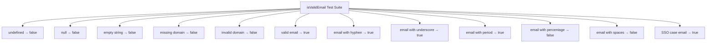
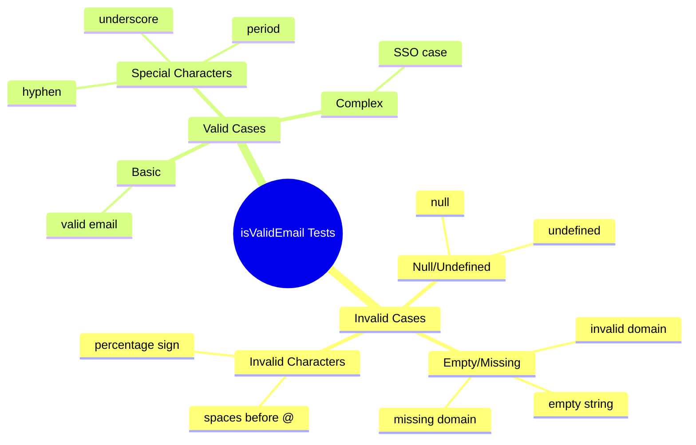

# Diagram: web/portal/src/utils/tests/validation-utils.test.js

> Auto-generated by Obscura crawlers

## Diagram 1

### SVG

<svg id="container" width="3237.21875" xmlns="http://www.w3.org/2000/svg" class="flowchart" height="198" viewBox="0 0 3237.21875 198" role="graphics-document document" aria-roledescription="flowchart-v2"><g><marker id="container_flowchart-v2-pointEnd" class="marker flowchart-v2" viewBox="0 0 10 10" refX="5" refY="5" markerUnits="userSpaceOnUse" markerWidth="8" markerHeight="8" orient="auto"><path d="M 0 0 L 10 5 L 0 10 z" class="arrowMarkerPath" style="stroke-width: 1; stroke-dasharray: 1, 0;"></path></marker><marker id="container_flowchart-v2-pointStart" class="marker flowchart-v2" viewBox="0 0 10 10" refX="4.5" refY="5" markerUnits="userSpaceOnUse" markerWidth="8" markerHeight="8" orient="auto"><path d="M 0 5 L 10 10 L 10 0 z" class="arrowMarkerPath" style="stroke-width: 1; stroke-dasharray: 1, 0;"></path></marker><marker id="container_flowchart-v2-circleEnd" class="marker flowchart-v2" viewBox="0 0 10 10" refX="11" refY="5" markerUnits="userSpaceOnUse" markerWidth="11" markerHeight="11" orient="auto"><circle cx="5" cy="5" r="5" class="arrowMarkerPath" style="stroke-width: 1; stroke-dasharray: 1, 0;"></circle></marker><marker id="container_flowchart-v2-circleStart" class="marker flowchart-v2" viewBox="0 0 10 10" refX="-1" refY="5" markerUnits="userSpaceOnUse" markerWidth="11" markerHeight="11" orient="auto"><circle cx="5" cy="5" r="5" class="arrowMarkerPath" style="stroke-width: 1; stroke-dasharray: 1, 0;"></circle></marker><marker id="container_flowchart-v2-crossEnd" class="marker cross flowchart-v2" viewBox="0 0 11 11" refX="12" refY="5.2" markerUnits="userSpaceOnUse" markerWidth="11" markerHeight="11" orient="auto"><path d="M 1,1 l 9,9 M 10,1 l -9,9" class="arrowMarkerPath" style="stroke-width: 2; stroke-dasharray: 1, 0;"></path></marker><marker id="container_flowchart-v2-crossStart" class="marker cross flowchart-v2" viewBox="0 0 11 11" refX="-1" refY="5.2" markerUnits="userSpaceOnUse" markerWidth="11" markerHeight="11" orient="auto"><path d="M 1,1 l 9,9 M 10,1 l -9,9" class="arrowMarkerPath" style="stroke-width: 2; stroke-dasharray: 1, 0;"></path></marker><g class="root"><g class="clusters"></g><g class="edgePaths"><path d="M1380.625,39.162L1167.784,47.135C954.943,55.108,529.26,71.054,316.419,84.527C103.578,98,103.578,109,103.578,114.5L103.578,120" id="L_Start_Test1_0" class="edge-thickness-normal edge-pattern-solid edge-thickness-normal edge-pattern-solid flowchart-link" style=";" data-edge="true" data-et="edge" data-id="L_Start_Test1_0" data-points="W3sieCI6MTM4MC42MjUsInkiOjM5LjE2MjEzMDUyMzg1MTMzfSx7IngiOjEwMy41NzgxMjUsInkiOjg3fSx7IngiOjEwMy41NzgxMjUsInkiOjEyNH1d" marker-end="url(#container_flowchart-v2-pointEnd)"></path><path d="M1380.625,39.939L1204.163,47.782C1027.701,55.626,674.776,71.313,498.314,84.656C321.852,98,321.852,109,321.852,114.5L321.852,120" id="L_Start_Test2_0" class="edge-thickness-normal edge-pattern-solid edge-thickness-normal edge-pattern-solid flowchart-link" style=";" data-edge="true" data-et="edge" data-id="L_Start_Test2_0" data-points="W3sieCI6MTM4MC42MjUsInkiOjM5LjkzODY4OTEwNDgxMTUxNn0seyJ4IjozMjEuODUxNTYyNSwieSI6ODd9LHsieCI6MzIxLjg1MTU2MjUsInkiOjEyNH1d" marker-end="url(#container_flowchart-v2-pointEnd)"></path><path d="M1380.625,41.128L1242.004,48.773C1103.383,56.419,826.141,71.709,687.52,84.855C548.898,98,548.898,109,548.898,114.5L548.898,120" id="L_Start_Test3_0" class="edge-thickness-normal edge-pattern-solid edge-thickness-normal edge-pattern-solid flowchart-link" style=";" data-edge="true" data-et="edge" data-id="L_Start_Test3_0" data-points="W3sieCI6MTM4MC42MjUsInkiOjQxLjEyNzk4ODIwMDQ5MjJ9LHsieCI6NTQ4Ljg5ODQzNzUsInkiOjg3fSx7IngiOjU0OC44OTg0Mzc1LCJ5IjoxMjR9XQ==" marker-end="url(#container_flowchart-v2-pointEnd)"></path><path d="M1380.625,43.591L1287.061,50.826C1193.497,58.061,1006.37,72.53,912.806,85.265C819.242,98,819.242,109,819.242,114.5L819.242,120" id="L_Start_Test4_0" class="edge-thickness-normal edge-pattern-solid edge-thickness-normal edge-pattern-solid flowchart-link" style=";" data-edge="true" data-et="edge" data-id="L_Start_Test4_0" data-points="W3sieCI6MTM4MC42MjUsInkiOjQzLjU5MTQ1NjY4NTEzODA3fSx7IngiOjgxOS4yNDIxODc1LCJ5Ijo4N30seyJ4Ijo4MTkuMjQyMTg3NSwieSI6MTI0fV0=" marker-end="url(#container_flowchart-v2-pointEnd)"></path><path d="M1380.625,49.673L1333.517,55.894C1286.409,62.115,1192.193,74.558,1145.085,86.279C1097.977,98,1097.977,109,1097.977,114.5L1097.977,120" id="L_Start_Test5_0" class="edge-thickness-normal edge-pattern-solid edge-thickness-normal edge-pattern-solid flowchart-link" style=";" data-edge="true" data-et="edge" data-id="L_Start_Test5_0" data-points="W3sieCI6MTM4MC42MjUsInkiOjQ5LjY3MzIwMDkyODU1M30seyJ4IjoxMDk3Ljk3NjU2MjUsInkiOjg3fSx7IngiOjEwOTcuOTc2NTYyNSwieSI6MTI0fV0=" marker-end="url(#container_flowchart-v2-pointEnd)"></path><path d="M1421.727,62L1410.924,66.167C1400.12,70.333,1378.513,78.667,1367.71,88.333C1356.906,98,1356.906,109,1356.906,114.5L1356.906,120" id="L_Start_Test6_0" class="edge-thickness-normal edge-pattern-solid edge-thickness-normal edge-pattern-solid flowchart-link" style=";" data-edge="true" data-et="edge" data-id="L_Start_Test6_0" data-points="W3sieCI6MTQyMS43Mjc0NjM5NDIzMDc2LCJ5Ijo2Mn0seyJ4IjoxMzU2LjkwNjI1LCJ5Ijo4N30seyJ4IjoxMzU2LjkwNjI1LCJ5IjoxMjR9XQ==" marker-end="url(#container_flowchart-v2-pointEnd)"></path><path d="M1561.741,62L1572.545,66.167C1583.348,70.333,1604.955,78.667,1615.759,88.333C1626.563,98,1626.563,109,1626.563,114.5L1626.563,120" id="L_Start_Test7_0" class="edge-thickness-normal edge-pattern-solid edge-thickness-normal edge-pattern-solid flowchart-link" style=";" data-edge="true" data-et="edge" data-id="L_Start_Test7_0" data-points="W3sieCI6MTU2MS43NDEyODYwNTc2OTI0LCJ5Ijo2Mn0seyJ4IjoxNjI2LjU2MjUsInkiOjg3fSx7IngiOjE2MjYuNTYyNSwieSI6MTI0fV0=" marker-end="url(#container_flowchart-v2-pointEnd)"></path><path d="M1602.844,48.182L1657.375,54.652C1711.906,61.121,1820.969,74.061,1875.5,84.03C1930.031,94,1930.031,101,1930.031,104.5L1930.031,108" id="L_Start_Test8_0" class="edge-thickness-normal edge-pattern-solid edge-thickness-normal edge-pattern-solid flowchart-link" style=";" data-edge="true" data-et="edge" data-id="L_Start_Test8_0" data-points="W3sieCI6MTYwMi44NDM3NSwieSI6NDguMTgyMTMyNTQ0Mjk0MzJ9LHsieCI6MTkzMC4wMzEyNSwieSI6ODd9LHsieCI6MTkzMC4wMzEyNSwieSI6MTEyfV0=" marker-end="url(#container_flowchart-v2-pointEnd)"></path><path d="M1602.844,42.822L1707.428,50.185C1812.013,57.548,2021.182,72.274,2125.767,85.137C2230.352,98,2230.352,109,2230.352,114.5L2230.352,120" id="L_Start_Test9_0" class="edge-thickness-normal edge-pattern-solid edge-thickness-normal edge-pattern-solid flowchart-link" style=";" data-edge="true" data-et="edge" data-id="L_Start_Test9_0" data-points="W3sieCI6MTYwMi44NDM3NSwieSI6NDIuODIyMzAzMDc5MDIyMjR9LHsieCI6MjIzMC4zNTE1NjI1LCJ5Ijo4N30seyJ4IjoyMjMwLjM1MTU2MjUsInkiOjEyNH1d" marker-end="url(#container_flowchart-v2-pointEnd)"></path><path d="M1602.844,40.561L1757.482,48.301C1912.12,56.041,2221.396,71.52,2376.034,82.76C2530.672,94,2530.672,101,2530.672,104.5L2530.672,108" id="L_Start_Test10_0" class="edge-thickness-normal edge-pattern-solid edge-thickness-normal edge-pattern-solid flowchart-link" style=";" data-edge="true" data-et="edge" data-id="L_Start_Test10_0" data-points="W3sieCI6MTYwMi44NDM3NSwieSI6NDAuNTYxMTUwMjEzNTU5NTN9LHsieCI6MjUzMC42NzE4NzUsInkiOjg3fSx7IngiOjI1MzAuNjcxODc1LCJ5IjoxMTJ9XQ==" marker-end="url(#container_flowchart-v2-pointEnd)"></path><path d="M1602.844,39.305L1808.008,47.254C2013.172,55.203,2423.5,71.102,2628.664,84.551C2833.828,98,2833.828,109,2833.828,114.5L2833.828,120" id="L_Start_Test11_0" class="edge-thickness-normal edge-pattern-solid edge-thickness-normal edge-pattern-solid flowchart-link" style=";" data-edge="true" data-et="edge" data-id="L_Start_Test11_0" data-points="W3sieCI6MTYwMi44NDM3NSwieSI6MzkuMzA0OTgwNTU3NDMxMjV9LHsieCI6MjgzMy44MjgxMjUsInkiOjg3fSx7IngiOjI4MzMuODI4MTI1LCJ5IjoxMjR9XQ==" marker-end="url(#container_flowchart-v2-pointEnd)"></path><path d="M1602.844,38.553L1855.387,46.627C2107.93,54.702,2613.016,70.851,2865.559,84.425C3118.102,98,3118.102,109,3118.102,114.5L3118.102,120" id="L_Start_Test12_0" class="edge-thickness-normal edge-pattern-solid edge-thickness-normal edge-pattern-solid flowchart-link" style=";" data-edge="true" data-et="edge" data-id="L_Start_Test12_0" data-points="W3sieCI6MTYwMi44NDM3NSwieSI6MzguNTUyNTExMTA4NDQyNDJ9LHsieCI6MzExOC4xMDE1NjI1LCJ5Ijo4N30seyJ4IjozMTE4LjEwMTU2MjUsInkiOjEyNH1d" marker-end="url(#container_flowchart-v2-pointEnd)"></path></g><g class="edgeLabels"><g class="edgeLabel"><g class="label" data-id="L_Start_Test1_0" transform="translate(0, 0)"><foreignObject width="0" height="0">

</foreignObject></g></g><g class="edgeLabel"><g class="label" data-id="L_Start_Test2_0" transform="translate(0, 0)"><foreignObject width="0" height="0">

</foreignObject></g></g><g class="edgeLabel"><g class="label" data-id="L_Start_Test3_0" transform="translate(0, 0)"><foreignObject width="0" height="0">

</foreignObject></g></g><g class="edgeLabel"><g class="label" data-id="L_Start_Test4_0" transform="translate(0, 0)"><foreignObject width="0" height="0">

</foreignObject></g></g><g class="edgeLabel"><g class="label" data-id="L_Start_Test5_0" transform="translate(0, 0)"><foreignObject width="0" height="0">

</foreignObject></g></g><g class="edgeLabel"><g class="label" data-id="L_Start_Test6_0" transform="translate(0, 0)"><foreignObject width="0" height="0">

</foreignObject></g></g><g class="edgeLabel"><g class="label" data-id="L_Start_Test7_0" transform="translate(0, 0)"><foreignObject width="0" height="0">

</foreignObject></g></g><g class="edgeLabel"><g class="label" data-id="L_Start_Test8_0" transform="translate(0, 0)"><foreignObject width="0" height="0">

</foreignObject></g></g><g class="edgeLabel"><g class="label" data-id="L_Start_Test9_0" transform="translate(0, 0)"><foreignObject width="0" height="0">

</foreignObject></g></g><g class="edgeLabel"><g class="label" data-id="L_Start_Test10_0" transform="translate(0, 0)"><foreignObject width="0" height="0">

</foreignObject></g></g><g class="edgeLabel"><g class="label" data-id="L_Start_Test11_0" transform="translate(0, 0)"><foreignObject width="0" height="0">

</foreignObject></g></g><g class="edgeLabel"><g class="label" data-id="L_Start_Test12_0" transform="translate(0, 0)"><foreignObject width="0" height="0">

</foreignObject></g></g></g><g class="nodes"><g class="node default" id="flowchart-Start-0" transform="translate(1491.734375, 35)"><rect class="basic label-container" style="" x="-111.109375" y="-27" width="222.21875" height="54"></rect><g class="label" style="" transform="translate(-81.109375, -12)"><rect></rect><foreignObject width="162.21875" height="24">

isValidEmail Test Suite

</foreignObject></g></g><g class="node default" id="flowchart-Test1-1" transform="translate(103.578125, 151)"><rect class="basic label-container" style="" x="-95.578125" y="-27" width="191.15625" height="54"></rect><g class="label" style="" transform="translate(-65.578125, -12)"><rect></rect><foreignObject width="131.15625" height="24">

undefined → false

</foreignObject></g></g><g class="node default" id="flowchart-Test2-3" transform="translate(321.8515625, 151)"><rect class="basic label-container" style="" x="-72.6953125" y="-27" width="145.390625" height="54"></rect><g class="label" style="" transform="translate(-42.6953125, -12)"><rect></rect><foreignObject width="85.390625" height="24">

null → false

</foreignObject></g></g><g class="node default" id="flowchart-Test3-5" transform="translate(548.8984375, 151)"><rect class="basic label-container" style="" x="-104.3515625" y="-27" width="208.703125" height="54"></rect><g class="label" style="" transform="translate(-74.3515625, -12)"><rect></rect><foreignObject width="148.703125" height="24">

empty string → false

</foreignObject></g></g><g class="node default" id="flowchart-Test4-7" transform="translate(819.2421875, 151)"><rect class="basic label-container" style="" x="-115.9921875" y="-27" width="231.984375" height="54"></rect><g class="label" style="" transform="translate(-85.9921875, -12)"><rect></rect><foreignObject width="171.984375" height="24">

missing domain → false

</foreignObject></g></g><g class="node default" id="flowchart-Test5-9" transform="translate(1097.9765625, 151)"><rect class="basic label-container" style="" x="-112.7421875" y="-27" width="225.484375" height="54"></rect><g class="label" style="" transform="translate(-82.7421875, -12)"><rect></rect><foreignObject width="165.484375" height="24">

invalid domain → false

</foreignObject></g></g><g class="node default" id="flowchart-Test6-11" transform="translate(1356.90625, 151)"><rect class="basic label-container" style="" x="-96.1875" y="-27" width="192.375" height="54"></rect><g class="label" style="" transform="translate(-66.1875, -12)"><rect></rect><foreignObject width="132.375" height="24">

valid email → true

</foreignObject></g></g><g class="node default" id="flowchart-Test7-13" transform="translate(1626.5625, 151)"><rect class="basic label-container" style="" x="-123.46875" y="-27" width="246.9375" height="54"></rect><g class="label" style="" transform="translate(-93.46875, -12)"><rect></rect><foreignObject width="186.9375" height="24">

email with hyphen → true

</foreignObject></g></g><g class="node default" id="flowchart-Test8-15" transform="translate(1930.03125, 151)"><rect class="basic label-container" style="" x="-130" y="-39" width="260" height="78"></rect><g class="label" style="" transform="translate(-100, -24)"><rect></rect><foreignObject width="200" height="48">

email with underscore → true

</foreignObject></g></g><g class="node default" id="flowchart-Test9-17" transform="translate(2230.3515625, 151)"><rect class="basic label-container" style="" x="-120.3203125" y="-27" width="240.640625" height="54"></rect><g class="label" style="" transform="translate(-90.3203125, -12)"><rect></rect><foreignObject width="180.640625" height="24">

email with period → true

</foreignObject></g></g><g class="node default" id="flowchart-Test10-19" transform="translate(2530.671875, 151)"><rect class="basic label-container" style="" x="-130" y="-39" width="260" height="78"></rect><g class="label" style="" transform="translate(-100, -24)"><rect></rect><foreignObject width="200" height="48">

email with percentage → false

</foreignObject></g></g><g class="node default" id="flowchart-Test11-21" transform="translate(2833.828125, 151)"><rect class="basic label-container" style="" x="-123.15625" y="-27" width="246.3125" height="54"></rect><g class="label" style="" transform="translate(-93.15625, -12)"><rect></rect><foreignObject width="186.3125" height="24">

email with spaces → false

</foreignObject></g></g><g class="node default" id="flowchart-Test12-23" transform="translate(3118.1015625, 151)"><rect class="basic label-container" style="" x="-111.1171875" y="-27" width="222.234375" height="54"></rect><g class="label" style="" transform="translate(-81.1171875, -12)"><rect></rect><foreignObject width="162.234375" height="24">

SSO case email → true

</foreignObject></g></g></g></g></g></svg>

## Diagram 2

### SVG

<svg id="container" width="100%" xmlns="http://www.w3.org/2000/svg" class="mindmapDiagram" style="max-width: 953.933837890625px;" viewBox="5 5 953.933837890625 614.9744873046875" role="graphics-document document" aria-roledescription="mindmap"><g><marker id="container_mindmap-pointEnd" class="marker mindmap" viewBox="0 0 10 10" refX="5" refY="5" markerUnits="userSpaceOnUse" markerWidth="8" markerHeight="8" orient="auto"><path d="M 0 0 L 10 5 L 0 10 z" class="arrowMarkerPath" style="stroke-width: 1; stroke-dasharray: 1, 0;"></path></marker><marker id="container_mindmap-pointStart" class="marker mindmap" viewBox="0 0 10 10" refX="4.5" refY="5" markerUnits="userSpaceOnUse" markerWidth="8" markerHeight="8" orient="auto"><path d="M 0 5 L 10 10 L 10 0 z" class="arrowMarkerPath" style="stroke-width: 1; stroke-dasharray: 1, 0;"></path></marker><g class="subgraphs"></g><g class="edgePaths"><path d="M465.53,321.42L475.099,330.321C484.668,339.221,503.807,357.022,522.945,374.823C542.083,392.624,561.222,410.425,570.791,419.325L580.36,428.226" id="edge_0_1" class="edge-thickness-normal edge-pattern-solid edge section-edge-0 edge-depth-1" style="undefined;;;undefined" data-edge="true" data-et="edge" data-id="edge_0_1" data-points="W3sieCI6NDY1LjUzMDE5MDE4Mzk0MDY1LCJ5IjozMjEuNDIwMDU2MTYyNjI5N30seyJ4Ijo1MjIuOTQ1MDA1Nzg2MzI5NywieSI6Mzc0LjgyMjk4NDQwOTk4NjN9LHsieCI6NTgwLjM1OTgyMTM4ODcxODcsInkiOjQyOC4yMjU5MTI2NTczNDI5fV0="></path><path d="M604.914,432.052L612.868,428.307C620.822,424.562,636.729,417.073,652.637,409.583C668.544,402.093,684.452,394.603,692.405,390.858L700.359,387.114" id="edge_1_2" class="edge-thickness-normal edge-pattern-solid edge section-edge-0 edge-depth-3" style="undefined;;;undefined" data-edge="true" data-et="edge" data-id="edge_1_2" data-points="W3sieCI6NjA0LjkxNDIxMzg4NTk4NTQsInkiOjQzMi4wNTIxNTkxMTQxMTQ1fSx7IngiOjY1Mi42MzY2MzQ2MTMwNjM0LCJ5Ijo0MDkuNTgyODYxMzg1OTc3NzZ9LHsieCI6NzAwLjM1OTA1NTM0MDE0MTQsInkiOjM4Ny4xMTM1NjM2NTc4NDEwNH1d"></path><path d="M709.47,366.402L708.02,361.744C706.569,357.086,703.668,347.769,700.767,338.453C697.866,329.136,694.965,319.82,693.514,315.162L692.064,310.503" id="edge_2_3" class="edge-thickness-normal edge-pattern-solid edge section-edge-0 edge-depth-5" style="undefined;;;undefined" data-edge="true" data-et="edge" data-id="edge_2_3" data-points="W3sieCI6NzA5LjQ3MDM2MTE3MTc4NzgsInkiOjM2Ni40MDIxODU3MTYwMTY5Nn0seyJ4Ijo3MDAuNzY3MDgzMzQ0Nzc5MiwieSI6MzM4LjQ1Mjc5MDcyMzY4MjI2fSx7IngiOjY5Mi4wNjM4MDU1MTc3NzAzLCJ5IjozMTAuNTAzMzk1NzMxMzQ3NTV9XQ=="></path><path d="M728.538,377.316L739.511,374.756C750.485,372.196,772.431,367.077,794.378,361.957C816.325,356.837,838.272,351.717,849.245,349.157L860.218,346.597" id="edge_2_4" class="edge-thickness-normal edge-pattern-solid edge section-edge-0 edge-depth-5" style="undefined;;;undefined" data-edge="true" data-et="edge" data-id="edge_2_4" data-points="W3sieCI6NzI4LjUzNzgzOTIyNzQ0NDQsInkiOjM3Ny4zMTYxNTQ0NTQyNjI4fSx7IngiOjc5NC4zNzgxMzI4ODExODMxLCJ5IjozNjEuOTU2ODAxMTYyODUyNX0seyJ4Ijo4NjAuMjE4NDI2NTM0OTIxOCwieSI6MzQ2LjU5NzQ0Nzg3MTQ0MjJ9XQ=="></path><path d="M603.871,446.692L610.347,450.957C616.823,455.222,629.776,463.752,642.729,472.282C655.681,480.812,668.634,489.342,675.111,493.607L681.587,497.872" id="edge_1_5" class="edge-thickness-normal edge-pattern-solid edge section-edge-0 edge-depth-3" style="undefined;;;undefined" data-edge="true" data-et="edge" data-id="edge_1_5" data-points="W3sieCI6NjAzLjg3MDcwMDU1MDQ3ODIsInkiOjQ0Ni42OTE4MTA1MTU5MTQxNH0seyJ4Ijo2NDIuNzI4Nzc5MTg1NDU3NywieSI6NDcyLjI4MTc5NDEwODAxNTMzfSx7IngiOjY4MS41ODY4NTc4MjA0MzcyLCJ5Ijo0OTcuODcxNzc3NzAwMTE2NX1d"></path><path d="M708.694,502.594L722.024,499.368C735.355,496.142,762.015,489.691,788.676,483.239C815.337,476.788,841.998,470.336,855.329,467.111L868.659,463.885" id="edge_5_6" class="edge-thickness-normal edge-pattern-solid edge section-edge-0 edge-depth-5" style="undefined;;;undefined" data-edge="true" data-et="edge" data-id="edge_5_6" data-points="W3sieCI6NzA4LjY5MzU2NTcyNTc2ODgsInkiOjUwMi41OTM4MjExNTE1MTl9LHsieCI6Nzg4LjY3NjM5OTMwMTI2NzMsInkiOjQ4My4yMzkyOTMyOTAwNjR9LHsieCI6ODY4LjY1OTIzMjg3Njc2NTgsInkiOjQ2My44ODQ3NjU0Mjg2MDg5NH1d"></path><path d="M689.55,520.411L687.999,525.267C686.448,530.123,683.345,539.836,680.243,549.548C677.141,559.261,674.038,568.973,672.487,573.829L670.936,578.686" id="edge_5_7" class="edge-thickness-normal edge-pattern-solid edge section-edge-0 edge-depth-5" style="undefined;;;undefined" data-edge="true" data-et="edge" data-id="edge_5_7" data-points="W3sieCI6Njg5LjU1MDIyNjQxNTk2NTMsInkiOjUyMC40MTA1MTgzNjQ3Mjk3fSx7IngiOjY4MC4yNDMxMDczMDE4MzYxLCJ5Ijo1NDkuNTQ4MDc2MDc5MTI0NH0seyJ4Ijo2NzAuOTM1OTg4MTg3NzA2OCwieSI6NTc4LjY4NTYzMzc5MzUxOTF9XQ=="></path><path d="M708.461,510.502L720.001,514.025C731.542,517.549,754.623,524.596,777.704,531.643C800.784,538.69,823.865,545.737,835.406,549.261L846.946,552.784" id="edge_5_8" class="edge-thickness-normal edge-pattern-solid edge section-edge-0 edge-depth-5" style="undefined;;;undefined" data-edge="true" data-et="edge" data-id="edge_5_8" data-points="W3sieCI6NzA4LjQ2MDU3MzAwNzAyNjUsInkiOjUxMC41MDE5MDMxMjk5NzMxfSx7IngiOjc3Ny43MDM1MDg3OTAxMTU2LCJ5Ijo1MzEuNjQyOTYzMjgxNzExNH0seyJ4Ijo4NDYuOTQ2NDQ0NTczMjA0OCwieSI6NTUyLjc4NDAyMzQzMzQ0OTh9XQ=="></path><path d="M577.443,444.079L568.377,447.755C559.312,451.431,541.182,458.784,523.051,466.136C504.921,473.489,486.79,480.841,477.725,484.517L468.659,488.193" id="edge_1_9" class="edge-thickness-normal edge-pattern-solid edge section-edge-0 edge-depth-3" style="undefined;;;undefined" data-edge="true" data-et="edge" data-id="edge_1_9" data-points="W3sieCI6NTc3LjQ0MjcxNDUyOTc4MSwieSI6NDQ0LjA3ODg2NTkxMzUxNjY3fSx7IngiOjUyMy4wNTEwODczODc2NTg5LCJ5Ijo0NjYuMTM2MTQ4Mzc4ODc5ODV9LHsieCI6NDY4LjY1OTQ2MDI0NTUzNjcsInkiOjQ4OC4xOTM0MzA4NDQyNDMwNH1d"></path><path d="M455.134,508.826L455.254,513.631C455.375,518.435,455.615,528.045,455.855,537.654C456.096,547.264,456.336,556.873,456.456,561.678L456.577,566.483" id="edge_9_10" class="edge-thickness-normal edge-pattern-solid edge section-edge-0 edge-depth-5" style="undefined;;;undefined" data-edge="true" data-et="edge" data-id="edge_9_10" data-points="W3sieCI6NDU1LjEzNDExMTkxNDgzODM0LCJ5Ijo1MDguODI1NzY5MDY0Mzk1OX0seyJ4Ijo0NTUuODU1MzM4NTY5OTc1NzQsInkiOjUzNy42NTQxNzk2MTQxNzQ0fSx7IngiOjQ1Ni41NzY1NjUyMjUxMTMxNCwieSI6NTY2LjQ4MjU5MDE2Mzk1Mjl9XQ=="></path><path d="M440.033,496.685L424.198,499.755C408.362,502.825,376.691,508.964,345.02,515.104C313.349,521.243,281.678,527.383,265.842,530.453L250.007,533.522" id="edge_9_11" class="edge-thickness-normal edge-pattern-solid edge section-edge-0 edge-depth-5" style="undefined;;;undefined" data-edge="true" data-et="edge" data-id="edge_9_11" data-points="W3sieCI6NDQwLjAzMzEwMTAzMDY4NTI2LCJ5Ijo0OTYuNjg1MTE2ODYzODI4MTd9LHsieCI6MzQ1LjAxOTg0NTc5NTM3ODQsInkiOjUxNS4xMDM3NDU0NjU3OTQ4fSx7IngiOjI1MC4wMDY1OTA1NjAwNzE1MiwieSI6NTMzLjUyMjM3NDA2Nzc2MTN9XQ=="></path><path d="M444.729,299.863L436.542,290.407C428.356,280.95,411.982,262.037,395.609,243.124C379.236,224.211,362.862,205.298,354.676,195.841L346.489,186.384" id="edge_0_12" class="edge-thickness-normal edge-pattern-solid edge section-edge-1 edge-depth-1" style="undefined;;;undefined" data-edge="true" data-et="edge" data-id="edge_0_12" data-points="W3sieCI6NDQ0LjcyOTAzNzIwMjM2MDc2LCJ5IjoyOTkuODYzNDI4Mzc5Njc4MzR9LHsieCI6Mzk1LjYwOTA0NTAyMzQ5MDYsInkiOjI0My4xMjM4NzQ5OTMwMzg5NX0seyJ4IjozNDYuNDg5MDUyODQ0NjIwNCwieSI6MTg2LjM4NDMyMTYwNjM5OTU3fV0="></path><path d="M322.241,179.138L312.019,182.039C301.797,184.939,281.353,190.74,260.91,196.541C240.466,202.342,220.022,208.143,209.8,211.044L199.578,213.944" id="edge_12_13" class="edge-thickness-normal edge-pattern-solid edge section-edge-1 edge-depth-3" style="undefined;;;undefined" data-edge="true" data-et="edge" data-id="edge_12_13" data-points="W3sieCI6MzIyLjI0MDk3OTQ1MTkwNTksInkiOjE3OS4xMzgyNTQ5NjA0NTE5NX0seyJ4IjoyNjAuOTA5NTg0ODI3MTkxOCwieSI6MTk2LjU0MTE5NDM4NDgzNzA3fSx7IngiOjE5OS41NzgxOTAyMDI0Nzc2NiwieSI6MjEzLjk0NDEzMzgwOTIyMjJ9XQ=="></path><path d="M186.727,232.955L187.23,237.703C187.733,242.45,188.738,251.944,189.744,261.439C190.749,270.933,191.755,280.428,192.257,285.175L192.76,289.922" id="edge_13_14" class="edge-thickness-normal edge-pattern-solid edge section-edge-1 edge-depth-5" style="undefined;;;undefined" data-edge="true" data-et="edge" data-id="edge_13_14" data-points="W3sieCI6MTg2LjcyNzQ3MjMwNTM3MzksInkiOjIzMi45NTUzNjkzNTE3MzgwM30seyJ4IjoxODkuNzQzNzE3Njc0NTI4MzQsInkiOjI2MS40Mzg2ODkyMTYyMzk1NH0seyJ4IjoxOTIuNzU5OTYzMDQzNjgyNzcsInkiOjI4OS45MjIwMDkwODA3NDExfV0="></path><path d="M325.257,165.312L320.099,160.914C314.941,156.517,304.624,147.721,294.308,138.926C283.992,130.131,273.676,121.335,268.518,116.938L263.36,112.54" id="edge_12_15" class="edge-thickness-normal edge-pattern-solid edge section-edge-1 edge-depth-3" style="undefined;;;undefined" data-edge="true" data-et="edge" data-id="edge_12_15" data-points="W3sieCI6MzI1LjI1NjczMzUzMjI4NDA0LCJ5IjoxNjUuMzExODIxNTA5NjE1OH0seyJ4IjoyOTQuMzA4MzQwMjU2NTUxNiwieSI6MTM4LjkyNTkyMDI3NDY0MzF9LHsieCI6MjYzLjM1OTk0Njk4MDgxOTIsInkiOjExMi41NDAwMTkwMzk2NzAzN31d"></path><path d="M236.946,102.663L223.622,102.535C210.299,102.406,183.651,102.149,157.004,101.891C130.357,101.634,103.709,101.376,90.385,101.248L77.062,101.119" id="edge_15_16" class="edge-thickness-normal edge-pattern-solid edge section-edge-1 edge-depth-5" style="undefined;;;undefined" data-edge="true" data-et="edge" data-id="edge_15_16" data-points="W3sieCI6MjM2Ljk0NjA4NzU5MDg3NzY4LCJ5IjoxMDIuNjYzMzQwOTM2Mzg5Njd9LHsieCI6MTU3LjAwMzk0MzkzNjk5MTY3LCJ5IjoxMDEuODkxMTU1NjMxNDU2OTd9LHsieCI6NzcuMDYxODAwMjgzMTA1NjcsInkiOjEwMS4xMTg5NzAzMjY1MjQyNn1d"></path><path d="M240.528,93.08L235.589,88.873C230.65,84.665,220.773,76.249,210.895,67.834C201.018,59.419,191.14,51.003,186.202,46.795L181.263,42.588" id="edge_15_17" class="edge-thickness-normal edge-pattern-solid edge section-edge-1 edge-depth-5" style="undefined;;;undefined" data-edge="true" data-et="edge" data-id="edge_15_17" data-points="W3sieCI6MjQwLjUyNzUxNTU0MjE4NjYsInkiOjkzLjA4MDMxNTg0MjgwMDQyfSx7IngiOjIxMC44OTUyODExODQ3MDExNiwieSI6NjcuODMzOTYxOTQ1NjgyOH0seyJ4IjoxODEuMjYzMDQ2ODI3MjE1NzMsInkiOjQyLjU4NzYwODA0ODU2NTE5fV0="></path><path d="M263.121,92.803L267.85,88.57C272.579,84.337,282.037,75.871,291.495,67.404C300.952,58.938,310.41,50.471,315.139,46.238L319.868,42.005" id="edge_15_18" class="edge-thickness-normal edge-pattern-solid edge section-edge-1 edge-depth-5" style="undefined;;;undefined" data-edge="true" data-et="edge" data-id="edge_15_18" data-points="W3sieCI6MjYzLjEyMTQ4NDgwOTcyNDczLCJ5Ijo5Mi44MDM0ODE5NjcwODE1NX0seyJ4IjoyOTEuNDk0NjEzMjU5Njg2NywieSI6NjcuNDA0MTExODUzNTExMTV9LHsieCI6MzE5Ljg2Nzc0MTcwOTY0ODYsInkiOjQyLjAwNDc0MTczOTk0MDc1fV0="></path><path d="M350.68,169.682L360.039,166.1C369.397,162.518,388.114,155.355,406.831,148.191C425.548,141.027,444.264,133.864,453.623,130.282L462.981,126.7" id="edge_12_19" class="edge-thickness-normal edge-pattern-solid edge section-edge-1 edge-depth-3" style="undefined;;;undefined" data-edge="true" data-et="edge" data-id="edge_12_19" data-points="W3sieCI6MzUwLjY4MDI3NjUzMDI3MDQsInkiOjE2OS42ODE4NjYxNjM4NDg3NX0seyJ4Ijo0MDYuODMwNzI3NzIwMzQ2NTQsInkiOjE0OC4xOTEwMzQxMzA1NjQxNn0seyJ4Ijo0NjIuOTgxMTc4OTEwNDIyNjcsInkiOjEyNi43MDAyMDIwOTcyNzk1N31d"></path><path d="M487.344,110.485L491.4,106.232C495.457,101.979,503.571,93.474,511.684,84.968C519.797,76.463,527.911,67.958,531.967,63.705L536.024,59.452" id="edge_19_20" class="edge-thickness-normal edge-pattern-solid edge section-edge-1 edge-depth-5" style="undefined;;;undefined" data-edge="true" data-et="edge" data-id="edge_19_20" data-points="W3sieCI6NDg3LjM0MzY4NjYwMTA2NTksInkiOjExMC40ODQ2NzEyMDQ4ODY1fSx7IngiOjUxMS42ODM5MTQ1ODE4OTg0LCJ5Ijo4NC45NjgzODQxOTIwNTE0Nn0seyJ4Ijo1MzYuMDI0MTQyNTYyNzMxLCJ5Ijo1OS40NTIwOTcxNzkyMTY0NDV9XQ=="></path></g><g class="edgeLabels"><g class="edgeLabel"><g class="label" data-id="edge_0_1" transform="translate(0, 0)"><foreignObject width="0" height="0">

</foreignObject></g></g><g class="edgeLabel"><g class="label" data-id="edge_1_2" transform="translate(0, 0)"><foreignObject width="0" height="0">

</foreignObject></g></g><g class="edgeLabel"><g class="label" data-id="edge_2_3" transform="translate(0, 0)"><foreignObject width="0" height="0">

</foreignObject></g></g><g class="edgeLabel"><g class="label" data-id="edge_2_4" transform="translate(0, 0)"><foreignObject width="0" height="0">

</foreignObject></g></g><g class="edgeLabel"><g class="label" data-id="edge_1_5" transform="translate(0, 0)"><foreignObject width="0" height="0">

</foreignObject></g></g><g class="edgeLabel"><g class="label" data-id="edge_5_6" transform="translate(0, 0)"><foreignObject width="0" height="0">

</foreignObject></g></g><g class="edgeLabel"><g class="label" data-id="edge_5_7" transform="translate(0, 0)"><foreignObject width="0" height="0">

</foreignObject></g></g><g class="edgeLabel"><g class="label" data-id="edge_5_8" transform="translate(0, 0)"><foreignObject width="0" height="0">

</foreignObject></g></g><g class="edgeLabel"><g class="label" data-id="edge_1_9" transform="translate(0, 0)"><foreignObject width="0" height="0">

</foreignObject></g></g><g class="edgeLabel"><g class="label" data-id="edge_9_10" transform="translate(0, 0)"><foreignObject width="0" height="0">

</foreignObject></g></g><g class="edgeLabel"><g class="label" data-id="edge_9_11" transform="translate(0, 0)"><foreignObject width="0" height="0">

</foreignObject></g></g><g class="edgeLabel"><g class="label" data-id="edge_0_12" transform="translate(0, 0)"><foreignObject width="0" height="0">

</foreignObject></g></g><g class="edgeLabel"><g class="label" data-id="edge_12_13" transform="translate(0, 0)"><foreignObject width="0" height="0">

</foreignObject></g></g><g class="edgeLabel"><g class="label" data-id="edge_13_14" transform="translate(0, 0)"><foreignObject width="0" height="0">

</foreignObject></g></g><g class="edgeLabel"><g class="label" data-id="edge_12_15" transform="translate(0, 0)"><foreignObject width="0" height="0">

</foreignObject></g></g><g class="edgeLabel"><g class="label" data-id="edge_15_16" transform="translate(0, 0)"><foreignObject width="0" height="0">

</foreignObject></g></g><g class="edgeLabel"><g class="label" data-id="edge_15_17" transform="translate(0, 0)"><foreignObject width="0" height="0">

</foreignObject></g></g><g class="edgeLabel"><g class="label" data-id="edge_15_18" transform="translate(0, 0)"><foreignObject width="0" height="0">

</foreignObject></g></g><g class="edgeLabel"><g class="label" data-id="edge_12_19" transform="translate(0, 0)"><foreignObject width="0" height="0">

</foreignObject></g></g><g class="edgeLabel"><g class="label" data-id="edge_19_20" transform="translate(0, 0)"><foreignObject width="0" height="0">

</foreignObject></g></g></g><g class="nodes"><g class="node mindmap-node section-root section--1" id="node_0" transform="translate(454.5467974078613, 311.20413314381403)"><circle class="basic label-container" style="" r="74.3203125" cx="0" cy="0"></circle><g class="label" style="" transform="translate(-64.3203125, -12)"><rect></rect><foreignObject width="128.640625" height="24">

isValidEmail Tests

</foreignObject></g></g><g class="node mindmap-node section-0" id="node_1" transform="translate(591.3432141647982, 438.4418356761586)"><path id="node-1" class="node-bkg node-0" style="" d="M-67.0859375 12
    v-24
    q0,-5 5,-5
    h124.171875
    q5,0 5,5
    v24
    q0,5 -5,5
    h-124.171875
    q-5,0 -5,-5
    Z"></path><line class="node-line-" x1="-67.0859375" y1="17" x2="67.0859375" y2="17"></line><g class="label" style="" transform="translate(-47.0859375, -12)"><rect></rect><foreignObject width="94.171875" height="24">

Invalid Cases

</foreignObject></g></g><g class="node mindmap-node section-0" id="node_2" transform="translate(713.9300550613286, 380.72388709579695)"><path id="node-2" class="node-bkg node-0" style="" d="M-76.53125 12
    v-24
    q0,-5 5,-5
    h143.0625
    q5,0 5,5
    v24
    q0,5 -5,5
    h-143.0625
    q-5,0 -5,-5
    Z"></path><line class="node-line-" x1="-76.53125" y1="17" x2="76.53125" y2="17"></line><g class="label" style="" transform="translate(-56.53125, -12)"><rect></rect><foreignObject width="113.0625" height="24">

Null/Undefined

</foreignObject></g></g><g class="node mindmap-node section-0" id="node_3" transform="translate(687.6041116282295, 296.18169435156756)"><path id="node-3" class="node-bkg node-0" style="" d="M-56.921875 12
    v-24
    q0,-5 5,-5
    h103.84375
    q5,0 5,5
    v24
    q0,5 -5,5
    h-103.84375
    q-5,0 -5,-5
    Z"></path><line class="node-line-" x1="-56.921875" y1="17" x2="56.921875" y2="17"></line><g class="label" style="" transform="translate(-36.921875, -12)"><rect></rect><foreignObject width="73.84375" height="24">

undefined

</foreignObject></g></g><g class="node mindmap-node section-0" id="node_4" transform="translate(874.8262107010376, 343.1897152299081)"><path id="node-4" class="node-bkg node-0" style="" d="M-34.0390625 12
    v-24
    q0,-5 5,-5
    h58.078125
    q5,0 5,5
    v24
    q0,5 -5,5
    h-58.078125
    q-5,0 -5,-5
    Z"></path><line class="node-line-" x1="-34.0390625" y1="17" x2="34.0390625" y2="17"></line><g class="label" style="" transform="translate(-14.0390625, -12)"><rect></rect><foreignObject width="28.078125" height="24">

null

</foreignObject></g></g><g class="node mindmap-node section-0" id="node_5" transform="translate(694.1143442061173, 506.1217525398721)"><path id="node-5" class="node-bkg node-0" style="" d="M-73.734375 12
    v-24
    q0,-5 5,-5
    h137.46875
    q5,0 5,5
    v24
    q0,5 -5,5
    h-137.46875
    q-5,0 -5,-5
    Z"></path><line class="node-line-" x1="-73.734375" y1="17" x2="73.734375" y2="17"></line><g class="label" style="" transform="translate(-53.734375, -12)"><rect></rect><foreignObject width="107.46875" height="24">

Empty/Missing

</foreignObject></g></g><g class="node mindmap-node section-0" id="node_6" transform="translate(883.2384543964174, 460.3568340402559)"><path id="node-6" class="node-bkg node-0" style="" d="M-65.6953125 12
    v-24
    q0,-5 5,-5
    h121.390625
    q5,0 5,5
    v24
    q0,5 -5,5
    h-121.390625
    q-5,0 -5,-5
    Z"></path><line class="node-line-" x1="-65.6953125" y1="17" x2="65.6953125" y2="17"></line><g class="label" style="" transform="translate(-45.6953125, -12)"><rect></rect><foreignObject width="91.390625" height="24">

empty string

</foreignObject></g></g><g class="node mindmap-node section-0" id="node_7" transform="translate(666.3718703975549, 592.9743996183767)"><path id="node-7" class="node-bkg node-0" style="" d="M-77.34375 12
    v-24
    q0,-5 5,-5
    h144.6875
    q5,0 5,5
    v24
    q0,5 -5,5
    h-144.6875
    q-5,0 -5,-5
    Z"></path><line class="node-line-" x1="-77.34375" y1="17" x2="77.34375" y2="17"></line><g class="label" style="" transform="translate(-57.34375, -12)"><rect></rect><foreignObject width="114.6875" height="24">

missing domain

</foreignObject></g></g><g class="node mindmap-node section-0" id="node_8" transform="translate(861.292673374114, 557.1641740235508)"><path id="node-8" class="node-bkg node-0" style="" d="M-74.0859375 12
    v-24
    q0,-5 5,-5
    h138.171875
    q5,0 5,5
    v24
    q0,5 -5,5
    h-138.171875
    q-5,0 -5,-5
    Z"></path><line class="node-line-" x1="-74.0859375" y1="17" x2="74.0859375" y2="17"></line><g class="label" style="" transform="translate(-54.0859375, -12)"><rect></rect><foreignObject width="108.171875" height="24">

invalid domain

</foreignObject></g></g><g class="node mindmap-node section-0" id="node_9" transform="translate(454.7589606105196, 493.83046108160113)"><path id="node-9" class="node-bkg node-0" style="" d="M-84.8359375 12
    v-24
    q0,-5 5,-5
    h159.671875
    q5,0 5,5
    v24
    q0,5 -5,5
    h-159.671875
    q-5,0 -5,-5
    Z"></path><line class="node-line-" x1="-84.8359375" y1="17" x2="84.8359375" y2="17"></line><g class="label" style="" transform="translate(-64.8359375, -12)"><rect></rect><foreignObject width="129.671875" height="24">

Invalid Characters

</foreignObject></g></g><g class="node mindmap-node section-0" id="node_10" transform="translate(456.9517165294319, 581.4778981467476)"><path id="node-10" class="node-bkg node-0" style="" d="M-77.1328125 12
    v-24
    q0,-5 5,-5
    h144.265625
    q5,0 5,5
    v24
    q0,5 -5,5
    h-144.265625
    q-5,0 -5,-5
    Z"></path><line class="node-line-" x1="-77.1328125" y1="17" x2="77.1328125" y2="17"></line><g class="label" style="" transform="translate(-57.1328125, -12)"><rect></rect><foreignObject width="114.265625" height="24">

percentage sign

</foreignObject></g></g><g class="node mindmap-node section-0" id="node_11" transform="translate(235.2807309802372, 536.3770298499884)"><path id="node-11" class="node-bkg node-0" style="" d="M-80.515625 12
    v-24
    q0,-5 5,-5
    h151.03125
    q5,0 5,5
    v24
    q0,5 -5,5
    h-151.03125
    q-5,0 -5,-5
    Z"></path><line class="node-line-" x1="-80.515625" y1="17" x2="80.515625" y2="17"></line><g class="label" style="" transform="translate(-60.515625, -12)"><rect></rect><foreignObject width="121.03125" height="24">

spaces before @

</foreignObject></g></g><g class="node mindmap-node section-1" id="node_12" transform="translate(336.6712926391199, 175.04361684226387)"><path id="node-12" class="node-bkg node-0" style="" d="M-60.4140625 12
    v-24
    q0,-5 5,-5
    h110.828125
    q5,0 5,5
    v24
    q0,5 -5,5
    h-110.828125
    q-5,0 -5,-5
    Z"></path><line class="node-line-" x1="-60.4140625" y1="17" x2="60.4140625" y2="17"></line><g class="label" style="" transform="translate(-40.4140625, -12)"><rect></rect><foreignObject width="80.828125" height="24">

Valid Cases

</foreignObject></g></g><g class="node mindmap-node section-1" id="node_13" transform="translate(185.1478770152637, 218.03877192741027)"><path id="node-13" class="node-bkg node-0" style="" d="M-38.953125 12
    v-24
    q0,-5 5,-5
    h67.90625
    q5,0 5,5
    v24
    q0,5 -5,5
    h-67.90625
    q-5,0 -5,-5
    Z"></path><line class="node-line-" x1="-38.953125" y1="17" x2="38.953125" y2="17"></line><g class="label" style="" transform="translate(-18.953125, -12)"><rect></rect><foreignObject width="37.90625" height="24">

Basic

</foreignObject></g></g><g class="node mindmap-node section-1" id="node_14" transform="translate(194.33955833379298, 304.8386065050688)"><path id="node-14" class="node-bkg node-0" style="" d="M-59.7578125 12
    v-24
    q0,-5 5,-5
    h109.515625
    q5,0 5,5
    v24
    q0,5 -5,5
    h-109.515625
    q-5,0 -5,-5
    Z"></path><line class="node-line-" x1="-59.7578125" y1="17" x2="59.7578125" y2="17"></line><g class="label" style="" transform="translate(-39.7578125, -12)"><rect></rect><foreignObject width="79.515625" height="24">

valid email

</foreignObject></g></g><g class="node mindmap-node section-1" id="node_15" transform="translate(251.94538787398335, 102.80822370702231)"><path id="node-15" class="node-bkg node-0" style="" d="M-86.546875 12
    v-24
    q0,-5 5,-5
    h163.09375
    q5,0 5,5
    v24
    q0,5 -5,5
    h-163.09375
    q-5,0 -5,-5
    Z"></path><line class="node-line-" x1="-86.546875" y1="17" x2="86.546875" y2="17"></line><g class="label" style="" transform="translate(-66.546875, -12)"><rect></rect><foreignObject width="133.09375" height="24">

Special Characters

</foreignObject></g></g><g class="node mindmap-node section-1" id="node_16" transform="translate(62.0625, 100.97408755589163)"><path id="node-16" class="node-bkg node-0" style="" d="M-47.0625 12
    v-24
    q0,-5 5,-5
    h84.125
    q5,0 5,5
    v24
    q0,5 -5,5
    h-84.125
    q-5,0 -5,-5
    Z"></path><line class="node-line-" x1="-47.0625" y1="17" x2="47.0625" y2="17"></line><g class="label" style="" transform="translate(-27.0625, -12)"><rect></rect><foreignObject width="54.125" height="24">

hyphen

</foreignObject></g></g><g class="node mindmap-node section-1" id="node_17" transform="translate(169.84517449541897, 32.859700184343296)"><path id="node-17" class="node-bkg node-0" style="" d="M-60.7421875 12
    v-24
    q0,-5 5,-5
    h111.484375
    q5,0 5,5
    v24
    q0,5 -5,5
    h-111.484375
    q-5,0 -5,-5
    Z"></path><line class="node-line-" x1="-60.7421875" y1="17" x2="60.7421875" y2="17"></line><g class="label" style="" transform="translate(-40.7421875, -12)"><rect></rect><foreignObject width="81.484375" height="24">

underscore

</foreignObject></g></g><g class="node mindmap-node section-1" id="node_18" transform="translate(331.04383864539, 32)"><path id="node-18" class="node-bkg node-0" style="" d="M-43.9140625 12
    v-24
    q0,-5 5,-5
    h77.828125
    q5,0 5,5
    v24
    q0,5 -5,5
    h-77.828125
    q-5,0 -5,-5
    Z"></path><line class="node-line-" x1="-43.9140625" y1="17" x2="43.9140625" y2="17"></line><g class="label" style="" transform="translate(-23.9140625, -12)"><rect></rect><foreignObject width="47.828125" height="24">

period

</foreignObject></g></g><g class="node mindmap-node section-1" id="node_19" transform="translate(476.9901628015732, 121.33845141886445)"><path id="node-19" class="node-bkg node-0" style="" d="M-51.078125 12
    v-24
    q0,-5 5,-5
    h92.15625
    q5,0 5,5
    v24
    q0,5 -5,5
    h-92.15625
    q-5,0 -5,-5
    Z"></path><line class="node-line-" x1="-51.078125" y1="17" x2="51.078125" y2="17"></line><g class="label" style="" transform="translate(-31.078125, -12)"><rect></rect><foreignObject width="62.15625" height="24">

Complex

</foreignObject></g></g><g class="node mindmap-node section-1" id="node_20" transform="translate(546.3776663622236, 48.598316965238496)"><path id="node-20" class="node-bkg node-0" style="" d="M-52.3984375 12
    v-24
    q0,-5 5,-5
    h94.796875
    q5,0 5,5
    v24
    q0,5 -5,5
    h-94.796875
    q-5,0 -5,-5
    Z"></path><line class="node-line-" x1="-52.3984375" y1="17" x2="52.3984375" y2="17"></line><g class="label" style="" transform="translate(-32.3984375, -12)"><rect></rect><foreignObject width="64.796875" height="24">

SSO case

</foreignObject></g></g></g></g></svg>
