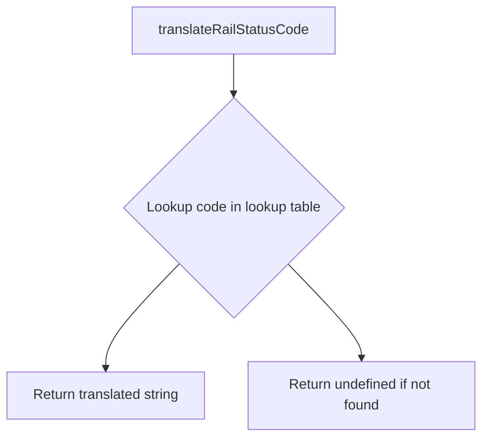
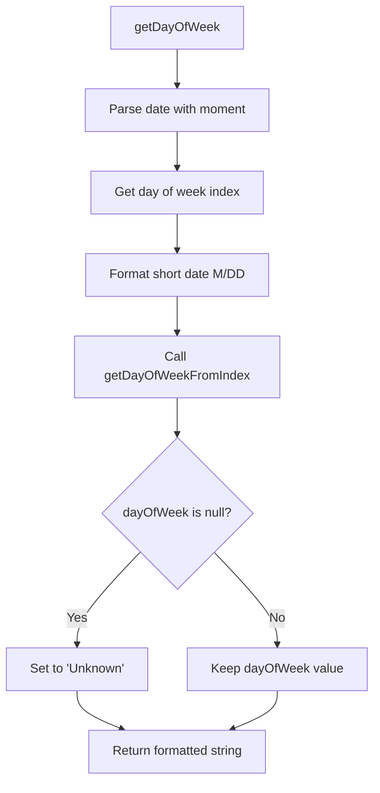
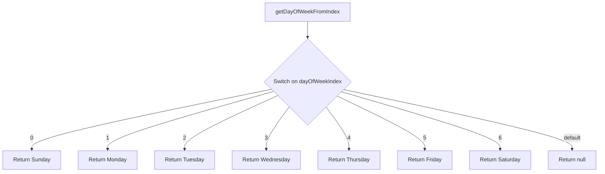

# Diagram: web/portal/src/utils/translation-utils.js


> Auto-generated by Obscura crawlers

## Diagram 1

```mermaid
flowchart TD
      A[translateRailStatusCode] --> B{Lookup code in lookup table}
      B --> C[Return translated string]
      B --> D[Return undefined if not found]...
  └ 51 lines...
```

> SVG rendering failed for this diagram.

## Diagram 2



### SVG

<svg id="container" width="559" xmlns="http://www.w3.org/2000/svg" class="flowchart" height="526" viewBox="0 0 559 526" role="graphics-document document" aria-roledescription="flowchart-v2"><style>#container{font-family:"trebuchet ms",verdana,arial,sans-serif;font-size:16px;fill:#333;}@keyframes edge-animation-frame{from{stroke-dashoffset:0;}}@keyframes dash{to{stroke-dashoffset:0;}}#container .edge-animation-slow{stroke-dasharray:9,5!important;stroke-dashoffset:900;animation:dash 50s linear infinite;stroke-linecap:round;}#container .edge-animation-fast{stroke-dasharray:9,5!important;stroke-dashoffset:900;animation:dash 20s linear infinite;stroke-linecap:round;}#container .error-icon{fill:#552222;}#container .error-text{fill:#552222;stroke:#552222;}#container .edge-thickness-normal{stroke-width:1px;}#container .edge-thickness-thick{stroke-width:3.5px;}#container .edge-pattern-solid{stroke-dasharray:0;}#container .edge-thickness-invisible{stroke-width:0;fill:none;}#container .edge-pattern-dashed{stroke-dasharray:3;}#container .edge-pattern-dotted{stroke-dasharray:2;}#container .marker{fill:#333333;stroke:#333333;}#container .marker.cross{stroke:#333333;}#container svg{font-family:"trebuchet ms",verdana,arial,sans-serif;font-size:16px;}#container p{margin:0;}#container .label{font-family:"trebuchet ms",verdana,arial,sans-serif;color:#333;}#container .cluster-label text{fill:#333;}#container .cluster-label span{color:#333;}#container .cluster-label span p{background-color:transparent;}#container .label text,#container span{fill:#333;color:#333;}#container .node rect,#container .node circle,#container .node ellipse,#container .node polygon,#container .node path{fill:#ECECFF;stroke:#9370DB;stroke-width:1px;}#container .rough-node .label text,#container .node .label text,#container .image-shape .label,#container .icon-shape .label{text-anchor:middle;}#container .node .katex path{fill:#000;stroke:#000;stroke-width:1px;}#container .rough-node .label,#container .node .label,#container .image-shape .label,#container .icon-shape .label{text-align:center;}#container .node.clickable{cursor:pointer;}#container .root .anchor path{fill:#333333!important;stroke-width:0;stroke:#333333;}#container .arrowheadPath{fill:#333333;}#container .edgePath .path{stroke:#333333;stroke-width:2.0px;}#container .flowchart-link{stroke:#333333;fill:none;}#container .edgeLabel{background-color:rgba(232,232,232, 0.8);text-align:center;}#container .edgeLabel p{background-color:rgba(232,232,232, 0.8);}#container .edgeLabel rect{opacity:0.5;background-color:rgba(232,232,232, 0.8);fill:rgba(232,232,232, 0.8);}#container .labelBkg{background-color:rgba(232, 232, 232, 0.5);}#container .cluster rect{fill:#ffffde;stroke:#aaaa33;stroke-width:1px;}#container .cluster text{fill:#333;}#container .cluster span{color:#333;}#container div.mermaidTooltip{position:absolute;text-align:center;max-width:200px;padding:2px;font-family:"trebuchet ms",verdana,arial,sans-serif;font-size:12px;background:hsl(80, 100%, 96.2745098039%);border:1px solid #aaaa33;border-radius:2px;pointer-events:none;z-index:100;}#container .flowchartTitleText{text-anchor:middle;font-size:18px;fill:#333;}#container rect.text{fill:none;stroke-width:0;}#container .icon-shape,#container .image-shape{background-color:rgba(232,232,232, 0.8);text-align:center;}#container .icon-shape p,#container .image-shape p{background-color:rgba(232,232,232, 0.8);padding:2px;}#container .icon-shape rect,#container .image-shape rect{opacity:0.5;background-color:rgba(232,232,232, 0.8);fill:rgba(232,232,232, 0.8);}#container .label-icon{display:inline-block;height:1em;overflow:visible;vertical-align:-0.125em;}#container .node .label-icon path{fill:currentColor;stroke:revert;stroke-width:revert;}#container :root{--mermaid-font-family:"trebuchet ms",verdana,arial,sans-serif;}</style><g><marker id="container_flowchart-v2-pointEnd" class="marker flowchart-v2" viewBox="0 0 10 10" refX="5" refY="5" markerUnits="userSpaceOnUse" markerWidth="8" markerHeight="8" orient="auto"><path d="M 0 0 L 10 5 L 0 10 z" class="arrowMarkerPath" style="stroke-width: 1; stroke-dasharray: 1, 0;"></path></marker><marker id="container_flowchart-v2-pointStart" class="marker flowchart-v2" viewBox="0 0 10 10" refX="4.5" refY="5" markerUnits="userSpaceOnUse" markerWidth="8" markerHeight="8" orient="auto"><path d="M 0 5 L 10 10 L 10 0 z" class="arrowMarkerPath" style="stroke-width: 1; stroke-dasharray: 1, 0;"></path></marker><marker id="container_flowchart-v2-circleEnd" class="marker flowchart-v2" viewBox="0 0 10 10" refX="11" refY="5" markerUnits="userSpaceOnUse" markerWidth="11" markerHeight="11" orient="auto"><circle cx="5" cy="5" r="5" class="arrowMarkerPath" style="stroke-width: 1; stroke-dasharray: 1, 0;"></circle></marker><marker id="container_flowchart-v2-circleStart" class="marker flowchart-v2" viewBox="0 0 10 10" refX="-1" refY="5" markerUnits="userSpaceOnUse" markerWidth="11" markerHeight="11" orient="auto"><circle cx="5" cy="5" r="5" class="arrowMarkerPath" style="stroke-width: 1; stroke-dasharray: 1, 0;"></circle></marker><marker id="container_flowchart-v2-crossEnd" class="marker cross flowchart-v2" viewBox="0 0 11 11" refX="12" refY="5.2" markerUnits="userSpaceOnUse" markerWidth="11" markerHeight="11" orient="auto"><path d="M 1,1 l 9,9 M 10,1 l -9,9" class="arrowMarkerPath" style="stroke-width: 2; stroke-dasharray: 1, 0;"></path></marker><marker id="container_flowchart-v2-crossStart" class="marker cross flowchart-v2" viewBox="0 0 11 11" refX="-1" refY="5.2" markerUnits="userSpaceOnUse" markerWidth="11" markerHeight="11" orient="auto"><path d="M 1,1 l 9,9 M 10,1 l -9,9" class="arrowMarkerPath" style="stroke-width: 2; stroke-dasharray: 1, 0;"></path></marker><g class="root"><g class="clusters"></g><g class="edgePaths"><path d="M272.75,62L272.75,66.167C272.75,70.333,272.75,78.667,272.75,86.333C272.75,94,272.75,101,272.75,104.5L272.75,108" id="L_A_B_0" class="edge-thickness-normal edge-pattern-solid edge-thickness-normal edge-pattern-solid flowchart-link" style=";" data-edge="true" data-et="edge" data-id="L_A_B_0" data-points="W3sieCI6MjcyLjc1LCJ5Ijo2Mn0seyJ4IjoyNzIuNzUsInkiOjg3fSx7IngiOjI3Mi43NSwieSI6MTEyfV0=" marker-end="url(#container_flowchart-v2-pointEnd)"></path><path d="M206.756,324.006L193.046,339.171C179.337,354.337,151.919,384.669,138.209,405.334C124.5,426,124.5,437,124.5,442.5L124.5,448" id="L_B_C_0" class="edge-thickness-normal edge-pattern-solid edge-thickness-normal edge-pattern-solid flowchart-link" style=";" data-edge="true" data-et="edge" data-id="L_B_C_0" data-points="W3sieCI6MjA2Ljc1NTYwNDQ4MzU4Njg2LCJ5IjozMjQuMDA1NjA0NDgzNTg2ODZ9LHsieCI6MTI0LjUsInkiOjQxNX0seyJ4IjoxMjQuNSwieSI6NDUyfV0=" marker-end="url(#container_flowchart-v2-pointEnd)"></path><path d="M338.744,324.006L352.454,339.171C366.163,354.337,393.581,384.669,407.291,403.334C421,422,421,429,421,432.5L421,436" id="L_B_D_0" class="edge-thickness-normal edge-pattern-solid edge-thickness-normal edge-pattern-solid flowchart-link" style=";" data-edge="true" data-et="edge" data-id="L_B_D_0" data-points="W3sieCI6MzM4Ljc0NDM5NTUxNjQxMzE0LCJ5IjozMjQuMDA1NjA0NDgzNTg2ODZ9LHsieCI6NDIxLCJ5Ijo0MTV9LHsieCI6NDIxLCJ5Ijo0NDB9XQ==" marker-end="url(#container_flowchart-v2-pointEnd)"></path></g><g class="edgeLabels"><g class="edgeLabel"><g class="label" data-id="L_A_B_0" transform="translate(0, 0)"><foreignObject width="0" height="0"><div xmlns="http://www.w3.org/1999/xhtml" class="labelBkg" style="display: table-cell; white-space: nowrap; line-height: 1.5; max-width: 200px; text-align: center;"><span class="edgeLabel"></span></div></foreignObject></g></g><g class="edgeLabel"><g class="label" data-id="L_B_C_0" transform="translate(0, 0)"><foreignObject width="0" height="0"><div xmlns="http://www.w3.org/1999/xhtml" class="labelBkg" style="display: table-cell; white-space: nowrap; line-height: 1.5; max-width: 200px; text-align: center;"><span class="edgeLabel"></span></div></foreignObject></g></g><g class="edgeLabel"><g class="label" data-id="L_B_D_0" transform="translate(0, 0)"><foreignObject width="0" height="0"><div xmlns="http://www.w3.org/1999/xhtml" class="labelBkg" style="display: table-cell; white-space: nowrap; line-height: 1.5; max-width: 200px; text-align: center;"><span class="edgeLabel"></span></div></foreignObject></g></g></g><g class="nodes"><g class="node default" id="flowchart-A-0" transform="translate(272.75, 35)"><rect class="basic label-container" style="" x="-116.9296875" y="-27" width="233.859375" height="54"></rect><g class="label" style="" transform="translate(-86.9296875, -12)"><rect></rect><foreignObject width="173.859375" height="24"><div xmlns="http://www.w3.org/1999/xhtml" style="display: table-cell; white-space: nowrap; line-height: 1.5; max-width: 200px; text-align: center;"><span class="nodeLabel"><p>translateRailStatusCode</p></span></div></foreignObject></g></g><g class="node default" id="flowchart-B-1" transform="translate(272.75, 251)"><polygon points="139,0 278,-139 139,-278 0,-139" class="label-container" transform="translate(-138.5, 139)"></polygon><g class="label" style="" transform="translate(-100, -24)"><rect></rect><foreignObject width="200" height="48"><div xmlns="http://www.w3.org/1999/xhtml" style="display: table; white-space: break-spaces; line-height: 1.5; max-width: 200px; text-align: center; width: 200px;"><span class="nodeLabel"><p>Lookup code in lookup table</p></span></div></foreignObject></g></g><g class="node default" id="flowchart-C-3" transform="translate(124.5, 479)"><rect class="basic label-container" style="" x="-116.5" y="-27" width="233" height="54"></rect><g class="label" style="" transform="translate(-86.5, -12)"><rect></rect><foreignObject width="173" height="24"><div xmlns="http://www.w3.org/1999/xhtml" style="display: table-cell; white-space: nowrap; line-height: 1.5; max-width: 200px; text-align: center;"><span class="nodeLabel"><p>Return translated string</p></span></div></foreignObject></g></g><g class="node default" id="flowchart-D-5" transform="translate(421, 479)"><rect class="basic label-container" style="" x="-130" y="-39" width="260" height="78"></rect><g class="label" style="" transform="translate(-100, -24)"><rect></rect><foreignObject width="200" height="48"><div xmlns="http://www.w3.org/1999/xhtml" style="display: table; white-space: break-spaces; line-height: 1.5; max-width: 200px; text-align: center; width: 200px;"><span class="nodeLabel"><p>Return undefined if not found</p></span></div></foreignObject></g></g></g></g></g></svg>

## Diagram 3



### SVG

<svg id="container" width="471.6875" xmlns="http://www.w3.org/2000/svg" class="flowchart" height="982.65625" viewBox="0 0 471.6875 982.65625" role="graphics-document document" aria-roledescription="flowchart-v2"><style>#container{font-family:"trebuchet ms",verdana,arial,sans-serif;font-size:16px;fill:#333;}@keyframes edge-animation-frame{from{stroke-dashoffset:0;}}@keyframes dash{to{stroke-dashoffset:0;}}#container .edge-animation-slow{stroke-dasharray:9,5!important;stroke-dashoffset:900;animation:dash 50s linear infinite;stroke-linecap:round;}#container .edge-animation-fast{stroke-dasharray:9,5!important;stroke-dashoffset:900;animation:dash 20s linear infinite;stroke-linecap:round;}#container .error-icon{fill:#552222;}#container .error-text{fill:#552222;stroke:#552222;}#container .edge-thickness-normal{stroke-width:1px;}#container .edge-thickness-thick{stroke-width:3.5px;}#container .edge-pattern-solid{stroke-dasharray:0;}#container .edge-thickness-invisible{stroke-width:0;fill:none;}#container .edge-pattern-dashed{stroke-dasharray:3;}#container .edge-pattern-dotted{stroke-dasharray:2;}#container .marker{fill:#333333;stroke:#333333;}#container .marker.cross{stroke:#333333;}#container svg{font-family:"trebuchet ms",verdana,arial,sans-serif;font-size:16px;}#container p{margin:0;}#container .label{font-family:"trebuchet ms",verdana,arial,sans-serif;color:#333;}#container .cluster-label text{fill:#333;}#container .cluster-label span{color:#333;}#container .cluster-label span p{background-color:transparent;}#container .label text,#container span{fill:#333;color:#333;}#container .node rect,#container .node circle,#container .node ellipse,#container .node polygon,#container .node path{fill:#ECECFF;stroke:#9370DB;stroke-width:1px;}#container .rough-node .label text,#container .node .label text,#container .image-shape .label,#container .icon-shape .label{text-anchor:middle;}#container .node .katex path{fill:#000;stroke:#000;stroke-width:1px;}#container .rough-node .label,#container .node .label,#container .image-shape .label,#container .icon-shape .label{text-align:center;}#container .node.clickable{cursor:pointer;}#container .root .anchor path{fill:#333333!important;stroke-width:0;stroke:#333333;}#container .arrowheadPath{fill:#333333;}#container .edgePath .path{stroke:#333333;stroke-width:2.0px;}#container .flowchart-link{stroke:#333333;fill:none;}#container .edgeLabel{background-color:rgba(232,232,232, 0.8);text-align:center;}#container .edgeLabel p{background-color:rgba(232,232,232, 0.8);}#container .edgeLabel rect{opacity:0.5;background-color:rgba(232,232,232, 0.8);fill:rgba(232,232,232, 0.8);}#container .labelBkg{background-color:rgba(232, 232, 232, 0.5);}#container .cluster rect{fill:#ffffde;stroke:#aaaa33;stroke-width:1px;}#container .cluster text{fill:#333;}#container .cluster span{color:#333;}#container div.mermaidTooltip{position:absolute;text-align:center;max-width:200px;padding:2px;font-family:"trebuchet ms",verdana,arial,sans-serif;font-size:12px;background:hsl(80, 100%, 96.2745098039%);border:1px solid #aaaa33;border-radius:2px;pointer-events:none;z-index:100;}#container .flowchartTitleText{text-anchor:middle;font-size:18px;fill:#333;}#container rect.text{fill:none;stroke-width:0;}#container .icon-shape,#container .image-shape{background-color:rgba(232,232,232, 0.8);text-align:center;}#container .icon-shape p,#container .image-shape p{background-color:rgba(232,232,232, 0.8);padding:2px;}#container .icon-shape rect,#container .image-shape rect{opacity:0.5;background-color:rgba(232,232,232, 0.8);fill:rgba(232,232,232, 0.8);}#container .label-icon{display:inline-block;height:1em;overflow:visible;vertical-align:-0.125em;}#container .node .label-icon path{fill:currentColor;stroke:revert;stroke-width:revert;}#container :root{--mermaid-font-family:"trebuchet ms",verdana,arial,sans-serif;}</style><g><marker id="container_flowchart-v2-pointEnd" class="marker flowchart-v2" viewBox="0 0 10 10" refX="5" refY="5" markerUnits="userSpaceOnUse" markerWidth="8" markerHeight="8" orient="auto"><path d="M 0 0 L 10 5 L 0 10 z" class="arrowMarkerPath" style="stroke-width: 1; stroke-dasharray: 1, 0;"></path></marker><marker id="container_flowchart-v2-pointStart" class="marker flowchart-v2" viewBox="0 0 10 10" refX="4.5" refY="5" markerUnits="userSpaceOnUse" markerWidth="8" markerHeight="8" orient="auto"><path d="M 0 5 L 10 10 L 10 0 z" class="arrowMarkerPath" style="stroke-width: 1; stroke-dasharray: 1, 0;"></path></marker><marker id="container_flowchart-v2-circleEnd" class="marker flowchart-v2" viewBox="0 0 10 10" refX="11" refY="5" markerUnits="userSpaceOnUse" markerWidth="11" markerHeight="11" orient="auto"><circle cx="5" cy="5" r="5" class="arrowMarkerPath" style="stroke-width: 1; stroke-dasharray: 1, 0;"></circle></marker><marker id="container_flowchart-v2-circleStart" class="marker flowchart-v2" viewBox="0 0 10 10" refX="-1" refY="5" markerUnits="userSpaceOnUse" markerWidth="11" markerHeight="11" orient="auto"><circle cx="5" cy="5" r="5" class="arrowMarkerPath" style="stroke-width: 1; stroke-dasharray: 1, 0;"></circle></marker><marker id="container_flowchart-v2-crossEnd" class="marker cross flowchart-v2" viewBox="0 0 11 11" refX="12" refY="5.2" markerUnits="userSpaceOnUse" markerWidth="11" markerHeight="11" orient="auto"><path d="M 1,1 l 9,9 M 10,1 l -9,9" class="arrowMarkerPath" style="stroke-width: 2; stroke-dasharray: 1, 0;"></path></marker><marker id="container_flowchart-v2-crossStart" class="marker cross flowchart-v2" viewBox="0 0 11 11" refX="-1" refY="5.2" markerUnits="userSpaceOnUse" markerWidth="11" markerHeight="11" orient="auto"><path d="M 1,1 l 9,9 M 10,1 l -9,9" class="arrowMarkerPath" style="stroke-width: 2; stroke-dasharray: 1, 0;"></path></marker><g class="root"><g class="clusters"></g><g class="edgePaths"><path d="M225,62L225,66.167C225,70.333,225,78.667,225,86.333C225,94,225,101,225,104.5L225,108" id="L_E_F_0" class="edge-thickness-normal edge-pattern-solid edge-thickness-normal edge-pattern-solid flowchart-link" style=";" data-edge="true" data-et="edge" data-id="L_E_F_0" data-points="W3sieCI6MjI1LCJ5Ijo2Mn0seyJ4IjoyMjUsInkiOjg3fSx7IngiOjIyNSwieSI6MTEyfV0=" marker-end="url(#container_flowchart-v2-pointEnd)"></path><path d="M225,166L225,170.167C225,174.333,225,182.667,225,190.333C225,198,225,205,225,208.5L225,212" id="L_F_G_0" class="edge-thickness-normal edge-pattern-solid edge-thickness-normal edge-pattern-solid flowchart-link" style=";" data-edge="true" data-et="edge" data-id="L_F_G_0" data-points="W3sieCI6MjI1LCJ5IjoxNjZ9LHsieCI6MjI1LCJ5IjoxOTF9LHsieCI6MjI1LCJ5IjoyMTZ9XQ==" marker-end="url(#container_flowchart-v2-pointEnd)"></path><path d="M225,270L225,274.167C225,278.333,225,286.667,225,294.333C225,302,225,309,225,312.5L225,316" id="L_G_H_0" class="edge-thickness-normal edge-pattern-solid edge-thickness-normal edge-pattern-solid flowchart-link" style=";" data-edge="true" data-et="edge" data-id="L_G_H_0" data-points="W3sieCI6MjI1LCJ5IjoyNzB9LHsieCI6MjI1LCJ5IjoyOTV9LHsieCI6MjI1LCJ5IjozMjB9XQ==" marker-end="url(#container_flowchart-v2-pointEnd)"></path><path d="M225,374L225,378.167C225,382.333,225,390.667,225,398.333C225,406,225,413,225,416.5L225,420" id="L_H_I_0" class="edge-thickness-normal edge-pattern-solid edge-thickness-normal edge-pattern-solid flowchart-link" style=";" data-edge="true" data-et="edge" data-id="L_H_I_0" data-points="W3sieCI6MjI1LCJ5IjozNzR9LHsieCI6MjI1LCJ5IjozOTl9LHsieCI6MjI1LCJ5Ijo0MjR9XQ==" marker-end="url(#container_flowchart-v2-pointEnd)"></path><path d="M225,502L225,506.167C225,510.333,225,518.667,225,526.333C225,534,225,541,225,544.5L225,548" id="L_I_J_0" class="edge-thickness-normal edge-pattern-solid edge-thickness-normal edge-pattern-solid flowchart-link" style=";" data-edge="true" data-et="edge" data-id="L_I_J_0" data-points="W3sieCI6MjI1LCJ5Ijo1MDJ9LHsieCI6MjI1LCJ5Ijo1Mjd9LHsieCI6MjI1LCJ5Ijo1NTJ9XQ==" marker-end="url(#container_flowchart-v2-pointEnd)"></path><path d="M178.424,696.08L165.116,710.01C151.809,723.939,125.193,751.798,111.886,771.227C98.578,790.656,98.578,801.656,98.578,807.156L98.578,812.656" id="L_J_K_0" class="edge-thickness-normal edge-pattern-solid edge-thickness-normal edge-pattern-solid flowchart-link" style=";" data-edge="true" data-et="edge" data-id="L_J_K_0" data-points="W3sieCI6MTc4LjQyMzkyMTUzNTMyNjEsInkiOjY5Ni4wODAxNzE1MzUzMjZ9LHsieCI6OTguNTc4MTI1LCJ5Ijo3NzkuNjU2MjV9LHsieCI6OTguNTc4MTI1LCJ5Ijo4MTYuNjU2MjV9XQ==" marker-end="url(#container_flowchart-v2-pointEnd)"></path><path d="M271.576,696.08L284.884,710.01C298.191,723.939,324.807,751.798,338.114,771.227C351.422,790.656,351.422,801.656,351.422,807.156L351.422,812.656" id="L_J_L_0" class="edge-thickness-normal edge-pattern-solid edge-thickness-normal edge-pattern-solid flowchart-link" style=";" data-edge="true" data-et="edge" data-id="L_J_L_0" data-points="W3sieCI6MjcxLjU3NjA3ODQ2NDY3MzksInkiOjY5Ni4wODAxNzE1MzUzMjZ9LHsieCI6MzUxLjQyMTg3NSwieSI6Nzc5LjY1NjI1fSx7IngiOjM1MS40MjE4NzUsInkiOjgxNi42NTYyNX1d" marker-end="url(#container_flowchart-v2-pointEnd)"></path><path d="M98.578,870.656L98.578,874.823C98.578,878.99,98.578,887.323,108.092,895.403C117.605,903.482,136.632,911.309,146.145,915.222L155.659,919.135" id="L_K_M_0" class="edge-thickness-normal edge-pattern-solid edge-thickness-normal edge-pattern-solid flowchart-link" style=";" data-edge="true" data-et="edge" data-id="L_K_M_0" data-points="W3sieCI6OTguNTc4MTI1LCJ5Ijo4NzAuNjU2MjV9LHsieCI6OTguNTc4MTI1LCJ5Ijo4OTUuNjU2MjV9LHsieCI6MTU5LjM1Nzg3MjU5NjE1Mzg0LCJ5Ijo5MjAuNjU2MjV9XQ==" marker-end="url(#container_flowchart-v2-pointEnd)"></path><path d="M351.422,870.656L351.422,874.823C351.422,878.99,351.422,887.323,341.908,895.403C332.395,903.482,313.368,911.309,303.855,915.222L294.341,919.135" id="L_L_M_0" class="edge-thickness-normal edge-pattern-solid edge-thickness-normal edge-pattern-solid flowchart-link" style=";" data-edge="true" data-et="edge" data-id="L_L_M_0" data-points="W3sieCI6MzUxLjQyMTg3NSwieSI6ODcwLjY1NjI1fSx7IngiOjM1MS40MjE4NzUsInkiOjg5NS42NTYyNX0seyJ4IjoyOTAuNjQyMTI3NDAzODQ2MiwieSI6OTIwLjY1NjI1fV0=" marker-end="url(#container_flowchart-v2-pointEnd)"></path></g><g class="edgeLabels"><g class="edgeLabel"><g class="label" data-id="L_E_F_0" transform="translate(0, 0)"><foreignObject width="0" height="0"><div xmlns="http://www.w3.org/1999/xhtml" class="labelBkg" style="display: table-cell; white-space: nowrap; line-height: 1.5; max-width: 200px; text-align: center;"><span class="edgeLabel"></span></div></foreignObject></g></g><g class="edgeLabel"><g class="label" data-id="L_F_G_0" transform="translate(0, 0)"><foreignObject width="0" height="0"><div xmlns="http://www.w3.org/1999/xhtml" class="labelBkg" style="display: table-cell; white-space: nowrap; line-height: 1.5; max-width: 200px; text-align: center;"><span class="edgeLabel"></span></div></foreignObject></g></g><g class="edgeLabel"><g class="label" data-id="L_G_H_0" transform="translate(0, 0)"><foreignObject width="0" height="0"><div xmlns="http://www.w3.org/1999/xhtml" class="labelBkg" style="display: table-cell; white-space: nowrap; line-height: 1.5; max-width: 200px; text-align: center;"><span class="edgeLabel"></span></div></foreignObject></g></g><g class="edgeLabel"><g class="label" data-id="L_H_I_0" transform="translate(0, 0)"><foreignObject width="0" height="0"><div xmlns="http://www.w3.org/1999/xhtml" class="labelBkg" style="display: table-cell; white-space: nowrap; line-height: 1.5; max-width: 200px; text-align: center;"><span class="edgeLabel"></span></div></foreignObject></g></g><g class="edgeLabel"><g class="label" data-id="L_I_J_0" transform="translate(0, 0)"><foreignObject width="0" height="0"><div xmlns="http://www.w3.org/1999/xhtml" class="labelBkg" style="display: table-cell; white-space: nowrap; line-height: 1.5; max-width: 200px; text-align: center;"><span class="edgeLabel"></span></div></foreignObject></g></g><g class="edgeLabel" transform="translate(98.578125, 779.65625)"><g class="label" data-id="L_J_K_0" transform="translate(-12.03125, -12)"><foreignObject width="24.0625" height="24"><div xmlns="http://www.w3.org/1999/xhtml" class="labelBkg" style="display: table-cell; white-space: nowrap; line-height: 1.5; max-width: 200px; text-align: center;"><span class="edgeLabel"><p>Yes</p></span></div></foreignObject></g></g><g class="edgeLabel" transform="translate(351.421875, 779.65625)"><g class="label" data-id="L_J_L_0" transform="translate(-10.140625, -12)"><foreignObject width="20.28125" height="24"><div xmlns="http://www.w3.org/1999/xhtml" class="labelBkg" style="display: table-cell; white-space: nowrap; line-height: 1.5; max-width: 200px; text-align: center;"><span class="edgeLabel"><p>No</p></span></div></foreignObject></g></g><g class="edgeLabel"><g class="label" data-id="L_K_M_0" transform="translate(0, 0)"><foreignObject width="0" height="0"><div xmlns="http://www.w3.org/1999/xhtml" class="labelBkg" style="display: table-cell; white-space: nowrap; line-height: 1.5; max-width: 200px; text-align: center;"><span class="edgeLabel"></span></div></foreignObject></g></g><g class="edgeLabel"><g class="label" data-id="L_L_M_0" transform="translate(0, 0)"><foreignObject width="0" height="0"><div xmlns="http://www.w3.org/1999/xhtml" class="labelBkg" style="display: table-cell; white-space: nowrap; line-height: 1.5; max-width: 200px; text-align: center;"><span class="edgeLabel"></span></div></foreignObject></g></g></g><g class="nodes"><g class="node default" id="flowchart-E-0" transform="translate(225, 35)"><rect class="basic label-container" style="" x="-82.0859375" y="-27" width="164.171875" height="54"></rect><g class="label" style="" transform="translate(-52.0859375, -12)"><rect></rect><foreignObject width="104.171875" height="24"><div xmlns="http://www.w3.org/1999/xhtml" style="display: table-cell; white-space: nowrap; line-height: 1.5; max-width: 200px; text-align: center;"><span class="nodeLabel"><p>getDayOfWeek</p></span></div></foreignObject></g></g><g class="node default" id="flowchart-F-1" transform="translate(225, 139)"><rect class="basic label-container" style="" x="-118.140625" y="-27" width="236.28125" height="54"></rect><g class="label" style="" transform="translate(-88.140625, -12)"><rect></rect><foreignObject width="176.28125" height="24"><div xmlns="http://www.w3.org/1999/xhtml" style="display: table-cell; white-space: nowrap; line-height: 1.5; max-width: 200px; text-align: center;"><span class="nodeLabel"><p>Parse date with moment</p></span></div></foreignObject></g></g><g class="node default" id="flowchart-G-3" transform="translate(225, 243)"><rect class="basic label-container" style="" x="-109.53125" y="-27" width="219.0625" height="54"></rect><g class="label" style="" transform="translate(-79.53125, -12)"><rect></rect><foreignObject width="159.0625" height="24"><div xmlns="http://www.w3.org/1999/xhtml" style="display: table-cell; white-space: nowrap; line-height: 1.5; max-width: 200px; text-align: center;"><span class="nodeLabel"><p>Get day of week index</p></span></div></foreignObject></g></g><g class="node default" id="flowchart-H-5" transform="translate(225, 347)"><rect class="basic label-container" style="" x="-117.890625" y="-27" width="235.78125" height="54"></rect><g class="label" style="" transform="translate(-87.890625, -12)"><rect></rect><foreignObject width="175.78125" height="24"><div xmlns="http://www.w3.org/1999/xhtml" style="display: table-cell; white-space: nowrap; line-height: 1.5; max-width: 200px; text-align: center;"><span class="nodeLabel"><p>Format short date M/DD</p></span></div></foreignObject></g></g><g class="node default" id="flowchart-I-7" transform="translate(225, 463)"><rect class="basic label-container" style="" x="-130" y="-39" width="260" height="78"></rect><g class="label" style="" transform="translate(-100, -24)"><rect></rect><foreignObject width="200" height="48"><div xmlns="http://www.w3.org/1999/xhtml" style="display: table; white-space: break-spaces; line-height: 1.5; max-width: 200px; text-align: center; width: 200px;"><span class="nodeLabel"><p>Call getDayOfWeekFromIndex</p></span></div></foreignObject></g></g><g class="node default" id="flowchart-J-9" transform="translate(225, 647.328125)"><polygon points="95.328125,0 190.65625,-95.328125 95.328125,-190.65625 0,-95.328125" class="label-container" transform="translate(-94.828125, 95.328125)"></polygon><g class="label" style="" transform="translate(-68.328125, -12)"><rect></rect><foreignObject width="136.65625" height="24"><div xmlns="http://www.w3.org/1999/xhtml" style="display: table-cell; white-space: nowrap; line-height: 1.5; max-width: 200px; text-align: center;"><span class="nodeLabel"><p>dayOfWeek is null?</p></span></div></foreignObject></g></g><g class="node default" id="flowchart-K-11" transform="translate(98.578125, 843.65625)"><rect class="basic label-container" style="" x="-90.578125" y="-27" width="181.15625" height="54"></rect><g class="label" style="" transform="translate(-60.578125, -12)"><rect></rect><foreignObject width="121.15625" height="24"><div xmlns="http://www.w3.org/1999/xhtml" style="display: table-cell; white-space: nowrap; line-height: 1.5; max-width: 200px; text-align: center;"><span class="nodeLabel"><p>Set to 'Unknown'</p></span></div></foreignObject></g></g><g class="node default" id="flowchart-L-13" transform="translate(351.421875, 843.65625)"><rect class="basic label-container" style="" x="-112.265625" y="-27" width="224.53125" height="54"></rect><g class="label" style="" transform="translate(-82.265625, -12)"><rect></rect><foreignObject width="164.53125" height="24"><div xmlns="http://www.w3.org/1999/xhtml" style="display: table-cell; white-space: nowrap; line-height: 1.5; max-width: 200px; text-align: center;"><span class="nodeLabel"><p>Keep dayOfWeek value</p></span></div></foreignObject></g></g><g class="node default" id="flowchart-M-15" transform="translate(225, 947.65625)"><rect class="basic label-container" style="" x="-115.828125" y="-27" width="231.65625" height="54"></rect><g class="label" style="" transform="translate(-85.828125, -12)"><rect></rect><foreignObject width="171.65625" height="24"><div xmlns="http://www.w3.org/1999/xhtml" style="display: table-cell; white-space: nowrap; line-height: 1.5; max-width: 200px; text-align: center;"><span class="nodeLabel"><p>Return formatted string</p></span></div></foreignObject></g></g></g></g></g></svg>

## Diagram 4



### SVG

<svg id="container" width="1724.953125" xmlns="http://www.w3.org/2000/svg" class="flowchart" height="497.5" viewBox="0 0 1724.953125 497.5" role="graphics-document document" aria-roledescription="flowchart-v2"><style>#container{font-family:"trebuchet ms",verdana,arial,sans-serif;font-size:16px;fill:#333;}@keyframes edge-animation-frame{from{stroke-dashoffset:0;}}@keyframes dash{to{stroke-dashoffset:0;}}#container .edge-animation-slow{stroke-dasharray:9,5!important;stroke-dashoffset:900;animation:dash 50s linear infinite;stroke-linecap:round;}#container .edge-animation-fast{stroke-dasharray:9,5!important;stroke-dashoffset:900;animation:dash 20s linear infinite;stroke-linecap:round;}#container .error-icon{fill:#552222;}#container .error-text{fill:#552222;stroke:#552222;}#container .edge-thickness-normal{stroke-width:1px;}#container .edge-thickness-thick{stroke-width:3.5px;}#container .edge-pattern-solid{stroke-dasharray:0;}#container .edge-thickness-invisible{stroke-width:0;fill:none;}#container .edge-pattern-dashed{stroke-dasharray:3;}#container .edge-pattern-dotted{stroke-dasharray:2;}#container .marker{fill:#333333;stroke:#333333;}#container .marker.cross{stroke:#333333;}#container svg{font-family:"trebuchet ms",verdana,arial,sans-serif;font-size:16px;}#container p{margin:0;}#container .label{font-family:"trebuchet ms",verdana,arial,sans-serif;color:#333;}#container .cluster-label text{fill:#333;}#container .cluster-label span{color:#333;}#container .cluster-label span p{background-color:transparent;}#container .label text,#container span{fill:#333;color:#333;}#container .node rect,#container .node circle,#container .node ellipse,#container .node polygon,#container .node path{fill:#ECECFF;stroke:#9370DB;stroke-width:1px;}#container .rough-node .label text,#container .node .label text,#container .image-shape .label,#container .icon-shape .label{text-anchor:middle;}#container .node .katex path{fill:#000;stroke:#000;stroke-width:1px;}#container .rough-node .label,#container .node .label,#container .image-shape .label,#container .icon-shape .label{text-align:center;}#container .node.clickable{cursor:pointer;}#container .root .anchor path{fill:#333333!important;stroke-width:0;stroke:#333333;}#container .arrowheadPath{fill:#333333;}#container .edgePath .path{stroke:#333333;stroke-width:2.0px;}#container .flowchart-link{stroke:#333333;fill:none;}#container .edgeLabel{background-color:rgba(232,232,232, 0.8);text-align:center;}#container .edgeLabel p{background-color:rgba(232,232,232, 0.8);}#container .edgeLabel rect{opacity:0.5;background-color:rgba(232,232,232, 0.8);fill:rgba(232,232,232, 0.8);}#container .labelBkg{background-color:rgba(232, 232, 232, 0.5);}#container .cluster rect{fill:#ffffde;stroke:#aaaa33;stroke-width:1px;}#container .cluster text{fill:#333;}#container .cluster span{color:#333;}#container div.mermaidTooltip{position:absolute;text-align:center;max-width:200px;padding:2px;font-family:"trebuchet ms",verdana,arial,sans-serif;font-size:12px;background:hsl(80, 100%, 96.2745098039%);border:1px solid #aaaa33;border-radius:2px;pointer-events:none;z-index:100;}#container .flowchartTitleText{text-anchor:middle;font-size:18px;fill:#333;}#container rect.text{fill:none;stroke-width:0;}#container .icon-shape,#container .image-shape{background-color:rgba(232,232,232, 0.8);text-align:center;}#container .icon-shape p,#container .image-shape p{background-color:rgba(232,232,232, 0.8);padding:2px;}#container .icon-shape rect,#container .image-shape rect{opacity:0.5;background-color:rgba(232,232,232, 0.8);fill:rgba(232,232,232, 0.8);}#container .label-icon{display:inline-block;height:1em;overflow:visible;vertical-align:-0.125em;}#container .node .label-icon path{fill:currentColor;stroke:revert;stroke-width:revert;}#container :root{--mermaid-font-family:"trebuchet ms",verdana,arial,sans-serif;}</style><g><marker id="container_flowchart-v2-pointEnd" class="marker flowchart-v2" viewBox="0 0 10 10" refX="5" refY="5" markerUnits="userSpaceOnUse" markerWidth="8" markerHeight="8" orient="auto"><path d="M 0 0 L 10 5 L 0 10 z" class="arrowMarkerPath" style="stroke-width: 1; stroke-dasharray: 1, 0;"></path></marker><marker id="container_flowchart-v2-pointStart" class="marker flowchart-v2" viewBox="0 0 10 10" refX="4.5" refY="5" markerUnits="userSpaceOnUse" markerWidth="8" markerHeight="8" orient="auto"><path d="M 0 5 L 10 10 L 10 0 z" class="arrowMarkerPath" style="stroke-width: 1; stroke-dasharray: 1, 0;"></path></marker><marker id="container_flowchart-v2-circleEnd" class="marker flowchart-v2" viewBox="0 0 10 10" refX="11" refY="5" markerUnits="userSpaceOnUse" markerWidth="11" markerHeight="11" orient="auto"><circle cx="5" cy="5" r="5" class="arrowMarkerPath" style="stroke-width: 1; stroke-dasharray: 1, 0;"></circle></marker><marker id="container_flowchart-v2-circleStart" class="marker flowchart-v2" viewBox="0 0 10 10" refX="-1" refY="5" markerUnits="userSpaceOnUse" markerWidth="11" markerHeight="11" orient="auto"><circle cx="5" cy="5" r="5" class="arrowMarkerPath" style="stroke-width: 1; stroke-dasharray: 1, 0;"></circle></marker><marker id="container_flowchart-v2-crossEnd" class="marker cross flowchart-v2" viewBox="0 0 11 11" refX="12" refY="5.2" markerUnits="userSpaceOnUse" markerWidth="11" markerHeight="11" orient="auto"><path d="M 1,1 l 9,9 M 10,1 l -9,9" class="arrowMarkerPath" style="stroke-width: 2; stroke-dasharray: 1, 0;"></path></marker><marker id="container_flowchart-v2-crossStart" class="marker cross flowchart-v2" viewBox="0 0 11 11" refX="-1" refY="5.2" markerUnits="userSpaceOnUse" markerWidth="11" markerHeight="11" orient="auto"><path d="M 1,1 l 9,9 M 10,1 l -9,9" class="arrowMarkerPath" style="stroke-width: 2; stroke-dasharray: 1, 0;"></path></marker><g class="root"><g class="clusters"></g><g class="edgePaths"><path d="M883.301,62L883.301,66.167C883.301,70.333,883.301,78.667,883.301,86.333C883.301,94,883.301,101,883.301,104.5L883.301,108" id="L_N_O_0" class="edge-thickness-normal edge-pattern-solid edge-thickness-normal edge-pattern-solid flowchart-link" style=";" data-edge="true" data-et="edge" data-id="L_N_O_0" data-points="W3sieCI6ODgzLjMwMDc4MTI1LCJ5Ijo2Mn0seyJ4Ijo4ODMuMzAwNzgxMjUsInkiOjg3fSx7IngiOjg4My4zMDA3ODEyNSwieSI6MTEyfV0=" marker-end="url(#container_flowchart-v2-pointEnd)"></path><path d="M779.705,257.904L664.951,281.337C550.197,304.769,320.688,351.635,205.934,380.567C91.18,409.5,91.18,420.5,91.18,426L91.18,431.5" id="L_O_P_0" class="edge-thickness-normal edge-pattern-solid edge-thickness-normal edge-pattern-solid flowchart-link" style=";" data-edge="true" data-et="edge" data-id="L_O_P_0" data-points="W3sieCI6Nzc5LjcwNDkxMDU5OTU2NjYsInkiOjI1Ny45MDQxMjkzNDk1NjY1fSx7IngiOjkxLjE3OTY4NzUsInkiOjM5OC41fSx7IngiOjkxLjE3OTY4NzUsInkiOjQzNS41fV0=" marker-end="url(#container_flowchart-v2-pointEnd)"></path><path d="M785.981,264.18L706.554,286.567C627.128,308.953,468.275,353.727,388.848,381.613C309.422,409.5,309.422,420.5,309.422,426L309.422,431.5" id="L_O_Q_0" class="edge-thickness-normal edge-pattern-solid edge-thickness-normal edge-pattern-solid flowchart-link" style=";" data-edge="true" data-et="edge" data-id="L_O_Q_0" data-points="W3sieCI6Nzg1Ljk4MDc5NzAyMDk0NDIsInkiOjI2NC4xODAwMTU3NzA5NDQzfSx7IngiOjMwOS40MjE4NzUsInkiOjM5OC41fSx7IngiOjMwOS40MjE4NzUsInkiOjQzNS41fV0=" marker-end="url(#container_flowchart-v2-pointEnd)"></path><path d="M797.769,275.968L753.229,296.39C708.689,316.812,619.61,357.656,575.071,383.578C530.531,409.5,530.531,420.5,530.531,426L530.531,431.5" id="L_O_R_0" class="edge-thickness-normal edge-pattern-solid edge-thickness-normal edge-pattern-solid flowchart-link" style=";" data-edge="true" data-et="edge" data-id="L_O_R_0" data-points="W3sieCI6Nzk3Ljc2ODU1ODc1NzgzODgsInkiOjI3NS45Njc3Nzc1MDc4Mzg4fSx7IngiOjUzMC41MzEyNSwieSI6Mzk4LjV9LHsieCI6NTMwLjUzMTI1LCJ5Ijo0MzUuNX1d" marker-end="url(#container_flowchart-v2-pointEnd)"></path><path d="M830.477,308.676L819.482,323.647C808.487,338.617,786.497,368.559,775.503,389.029C764.508,409.5,764.508,420.5,764.508,426L764.508,431.5" id="L_O_S_0" class="edge-thickness-normal edge-pattern-solid edge-thickness-normal edge-pattern-solid flowchart-link" style=";" data-edge="true" data-et="edge" data-id="L_O_S_0" data-points="W3sieCI6ODMwLjQ3NjcwNjE0NDUyNjUsInkiOjMwOC42NzU5MjQ4OTQ1MjY1M30seyJ4Ijo3NjQuNTA3ODEyNSwieSI6Mzk4LjV9LHsieCI6NzY0LjUwNzgxMjUsInkiOjQzNS41fV0=" marker-end="url(#container_flowchart-v2-pointEnd)"></path><path d="M936.125,308.676L947.12,323.647C958.114,338.617,980.104,368.559,991.099,389.029C1002.094,409.5,1002.094,420.5,1002.094,426L1002.094,431.5" id="L_O_T_0" class="edge-thickness-normal edge-pattern-solid edge-thickness-normal edge-pattern-solid flowchart-link" style=";" data-edge="true" data-et="edge" data-id="L_O_T_0" data-points="W3sieCI6OTM2LjEyNDg1NjM1NTQ3MzUsInkiOjMwOC42NzU5MjQ4OTQ1MjY1M30seyJ4IjoxMDAyLjA5Mzc1LCJ5IjozOTguNX0seyJ4IjoxMDAyLjA5Mzc1LCJ5Ijo0MzUuNX1d" marker-end="url(#container_flowchart-v2-pointEnd)"></path><path d="M967.586,277.214L1009.692,297.429C1051.797,317.643,1136.008,358.071,1178.113,383.786C1220.219,409.5,1220.219,420.5,1220.219,426L1220.219,431.5" id="L_O_U_0" class="edge-thickness-normal edge-pattern-solid edge-thickness-normal edge-pattern-solid flowchart-link" style=";" data-edge="true" data-et="edge" data-id="L_O_U_0" data-points="W3sieCI6OTY3LjU4NjM1NjQ5MzQyMTksInkiOjI3Ny4yMTQ0MjQ3NTY1NzgwN30seyJ4IjoxMjIwLjIxODc1LCJ5IjozOTguNX0seyJ4IjoxMjIwLjIxODc1LCJ5Ijo0MzUuNX1d" marker-end="url(#container_flowchart-v2-pointEnd)"></path><path d="M979.858,264.943L1056.092,287.203C1132.327,309.462,1284.796,353.981,1361.031,381.741C1437.266,409.5,1437.266,420.5,1437.266,426L1437.266,431.5" id="L_O_V_0" class="edge-thickness-normal edge-pattern-solid edge-thickness-normal edge-pattern-solid flowchart-link" style=";" data-edge="true" data-et="edge" data-id="L_O_V_0" data-points="W3sieCI6OTc5Ljg1NzU1MjIzMzk5MjIsInkiOjI2NC45NDMyMjkwMTYwMDc4fSx7IngiOjE0MzcuMjY1NjI1LCJ5IjozOTguNX0seyJ4IjoxNDM3LjI2NTYyNSwieSI6NDM1LjV9XQ==" marker-end="url(#container_flowchart-v2-pointEnd)"></path><path d="M986.233,258.568L1096.26,281.89C1206.288,305.212,1426.343,351.856,1536.371,380.678C1646.398,409.5,1646.398,420.5,1646.398,426L1646.398,431.5" id="L_O_W_0" class="edge-thickness-normal edge-pattern-solid edge-thickness-normal edge-pattern-solid flowchart-link" style=";" data-edge="true" data-et="edge" data-id="L_O_W_0" data-points="W3sieCI6OTg2LjIzMjc5NjAyNDM5MjgsInkiOjI1OC41Njc5ODUyMjU2MDcyM30seyJ4IjoxNjQ2LjM5ODQzNzUsInkiOjM5OC41fSx7IngiOjE2NDYuMzk4NDM3NSwieSI6NDM1LjV9XQ==" marker-end="url(#container_flowchart-v2-pointEnd)"></path></g><g class="edgeLabels"><g class="edgeLabel"><g class="label" data-id="L_N_O_0" transform="translate(0, 0)"><foreignObject width="0" height="0"><div xmlns="http://www.w3.org/1999/xhtml" class="labelBkg" style="display: table-cell; white-space: nowrap; line-height: 1.5; max-width: 200px; text-align: center;"><span class="edgeLabel"></span></div></foreignObject></g></g><g class="edgeLabel" transform="translate(91.1796875, 398.5)"><g class="label" data-id="L_O_P_0" transform="translate(-4.46875, -12)"><foreignObject width="8.9375" height="24"><div xmlns="http://www.w3.org/1999/xhtml" class="labelBkg" style="display: table-cell; white-space: nowrap; line-height: 1.5; max-width: 200px; text-align: center;"><span class="edgeLabel"><p>0</p></span></div></foreignObject></g></g><g class="edgeLabel" transform="translate(309.421875, 398.5)"><g class="label" data-id="L_O_Q_0" transform="translate(-3.46875, -12)"><foreignObject width="6.9375" height="24"><div xmlns="http://www.w3.org/1999/xhtml" class="labelBkg" style="display: table-cell; white-space: nowrap; line-height: 1.5; max-width: 200px; text-align: center;"><span class="edgeLabel"><p>1</p></span></div></foreignObject></g></g><g class="edgeLabel" transform="translate(530.53125, 398.5)"><g class="label" data-id="L_O_R_0" transform="translate(-3.9609375, -12)"><foreignObject width="7.921875" height="24"><div xmlns="http://www.w3.org/1999/xhtml" class="labelBkg" style="display: table-cell; white-space: nowrap; line-height: 1.5; max-width: 200px; text-align: center;"><span class="edgeLabel"><p>2</p></span></div></foreignObject></g></g><g class="edgeLabel" transform="translate(764.5078125, 398.5)"><g class="label" data-id="L_O_S_0" transform="translate(-3.9921875, -12)"><foreignObject width="7.984375" height="24"><div xmlns="http://www.w3.org/1999/xhtml" class="labelBkg" style="display: table-cell; white-space: nowrap; line-height: 1.5; max-width: 200px; text-align: center;"><span class="edgeLabel"><p>3</p></span></div></foreignObject></g></g><g class="edgeLabel" transform="translate(1002.09375, 398.5)"><g class="label" data-id="L_O_T_0" transform="translate(-4.2578125, -12)"><foreignObject width="8.515625" height="24"><div xmlns="http://www.w3.org/1999/xhtml" class="labelBkg" style="display: table-cell; white-space: nowrap; line-height: 1.5; max-width: 200px; text-align: center;"><span class="edgeLabel"><p>4</p></span></div></foreignObject></g></g><g class="edgeLabel" transform="translate(1220.21875, 398.5)"><g class="label" data-id="L_O_U_0" transform="translate(-4.015625, -12)"><foreignObject width="8.03125" height="24"><div xmlns="http://www.w3.org/1999/xhtml" class="labelBkg" style="display: table-cell; white-space: nowrap; line-height: 1.5; max-width: 200px; text-align: center;"><span class="edgeLabel"><p>5</p></span></div></foreignObject></g></g><g class="edgeLabel" transform="translate(1437.265625, 398.5)"><g class="label" data-id="L_O_V_0" transform="translate(-4.265625, -12)"><foreignObject width="8.53125" height="24"><div xmlns="http://www.w3.org/1999/xhtml" class="labelBkg" style="display: table-cell; white-space: nowrap; line-height: 1.5; max-width: 200px; text-align: center;"><span class="edgeLabel"><p>6</p></span></div></foreignObject></g></g><g class="edgeLabel" transform="translate(1646.3984375, 398.5)"><g class="label" data-id="L_O_W_0" transform="translate(-25.890625, -12)"><foreignObject width="51.78125" height="24"><div xmlns="http://www.w3.org/1999/xhtml" class="labelBkg" style="display: table-cell; white-space: nowrap; line-height: 1.5; max-width: 200px; text-align: center;"><span class="edgeLabel"><p>default</p></span></div></foreignObject></g></g></g><g class="nodes"><g class="node default" id="flowchart-N-0" transform="translate(883.30078125, 35)"><rect class="basic label-container" style="" x="-120.109375" y="-27" width="240.21875" height="54"></rect><g class="label" style="" transform="translate(-90.109375, -12)"><rect></rect><foreignObject width="180.21875" height="24"><div xmlns="http://www.w3.org/1999/xhtml" style="display: table-cell; white-space: nowrap; line-height: 1.5; max-width: 200px; text-align: center;"><span class="nodeLabel"><p>getDayOfWeekFromIndex</p></span></div></foreignObject></g></g><g class="node default" id="flowchart-O-1" transform="translate(883.30078125, 236.75)"><polygon points="124.75,0 249.5,-124.75 124.75,-249.5 0,-124.75" class="label-container" transform="translate(-124.25, 124.75)"></polygon><g class="label" style="" transform="translate(-97.75, -12)"><rect></rect><foreignObject width="195.5" height="24"><div xmlns="http://www.w3.org/1999/xhtml" style="display: table-cell; white-space: nowrap; line-height: 1.5; max-width: 200px; text-align: center;"><span class="nodeLabel"><p>Switch on dayOfWeekIndex</p></span></div></foreignObject></g></g><g class="node default" id="flowchart-P-3" transform="translate(91.1796875, 462.5)"><rect class="basic label-container" style="" x="-83.1796875" y="-27" width="166.359375" height="54"></rect><g class="label" style="" transform="translate(-53.1796875, -12)"><rect></rect><foreignObject width="106.359375" height="24"><div xmlns="http://www.w3.org/1999/xhtml" style="display: table-cell; white-space: nowrap; line-height: 1.5; max-width: 200px; text-align: center;"><span class="nodeLabel"><p>Return Sunday</p></span></div></foreignObject></g></g><g class="node default" id="flowchart-Q-5" transform="translate(309.421875, 462.5)"><rect class="basic label-container" style="" x="-85.0625" y="-27" width="170.125" height="54"></rect><g class="label" style="" transform="translate(-55.0625, -12)"><rect></rect><foreignObject width="110.125" height="24"><div xmlns="http://www.w3.org/1999/xhtml" style="display: table-cell; white-space: nowrap; line-height: 1.5; max-width: 200px; text-align: center;"><span class="nodeLabel"><p>Return Monday</p></span></div></foreignObject></g></g><g class="node default" id="flowchart-R-7" transform="translate(530.53125, 462.5)"><rect class="basic label-container" style="" x="-86.046875" y="-27" width="172.09375" height="54"></rect><g class="label" style="" transform="translate(-56.046875, -12)"><rect></rect><foreignObject width="112.09375" height="24"><div xmlns="http://www.w3.org/1999/xhtml" style="display: table-cell; white-space: nowrap; line-height: 1.5; max-width: 200px; text-align: center;"><span class="nodeLabel"><p>Return Tuesday</p></span></div></foreignObject></g></g><g class="node default" id="flowchart-S-9" transform="translate(764.5078125, 462.5)"><rect class="basic label-container" style="" x="-97.9296875" y="-27" width="195.859375" height="54"></rect><g class="label" style="" transform="translate(-67.9296875, -12)"><rect></rect><foreignObject width="135.859375" height="24"><div xmlns="http://www.w3.org/1999/xhtml" style="display: table-cell; white-space: nowrap; line-height: 1.5; max-width: 200px; text-align: center;"><span class="nodeLabel"><p>Return Wednesday</p></span></div></foreignObject></g></g><g class="node default" id="flowchart-T-11" transform="translate(1002.09375, 462.5)"><rect class="basic label-container" style="" x="-89.65625" y="-27" width="179.3125" height="54"></rect><g class="label" style="" transform="translate(-59.65625, -12)"><rect></rect><foreignObject width="119.3125" height="24"><div xmlns="http://www.w3.org/1999/xhtml" style="display: table-cell; white-space: nowrap; line-height: 1.5; max-width: 200px; text-align: center;"><span class="nodeLabel"><p>Return Thursday</p></span></div></foreignObject></g></g><g class="node default" id="flowchart-U-13" transform="translate(1220.21875, 462.5)"><rect class="basic label-container" style="" x="-78.46875" y="-27" width="156.9375" height="54"></rect><g class="label" style="" transform="translate(-48.46875, -12)"><rect></rect><foreignObject width="96.9375" height="24"><div xmlns="http://www.w3.org/1999/xhtml" style="display: table-cell; white-space: nowrap; line-height: 1.5; max-width: 200px; text-align: center;"><span class="nodeLabel"><p>Return Friday</p></span></div></foreignObject></g></g><g class="node default" id="flowchart-V-15" transform="translate(1437.265625, 462.5)"><rect class="basic label-container" style="" x="-88.578125" y="-27" width="177.15625" height="54"></rect><g class="label" style="" transform="translate(-58.578125, -12)"><rect></rect><foreignObject width="117.15625" height="24"><div xmlns="http://www.w3.org/1999/xhtml" style="display: table-cell; white-space: nowrap; line-height: 1.5; max-width: 200px; text-align: center;"><span class="nodeLabel"><p>Return Saturday</p></span></div></foreignObject></g></g><g class="node default" id="flowchart-W-17" transform="translate(1646.3984375, 462.5)"><rect class="basic label-container" style="" x="-70.5546875" y="-27" width="141.109375" height="54"></rect><g class="label" style="" transform="translate(-40.5546875, -12)"><rect></rect><foreignObject width="81.109375" height="24"><div xmlns="http://www.w3.org/1999/xhtml" style="display: table-cell; white-space: nowrap; line-height: 1.5; max-width: 200px; text-align: center;"><span class="nodeLabel"><p>Return null</p></span></div></foreignObject></g></g></g></g></g></svg>
