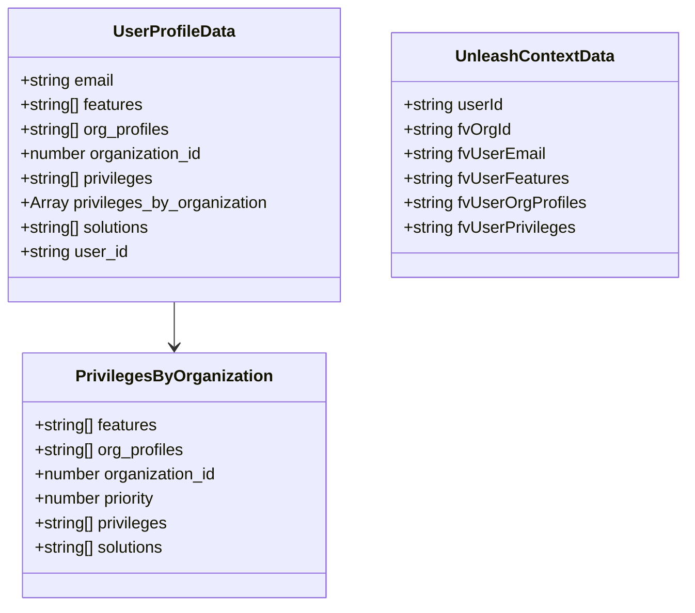
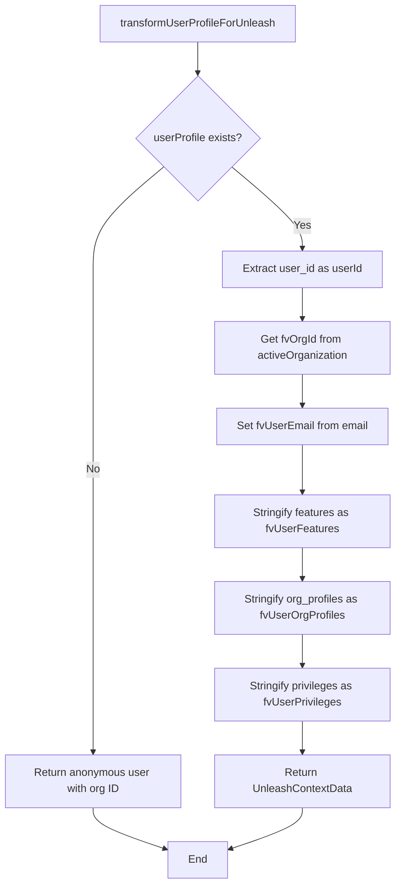

# Diagram: web/portal/src/utils/unleashUtils.ts

> Auto-generated by Obscura crawlers

## Diagram 1

### SVG

<svg id="container" width="667.75" xmlns="http://www.w3.org/2000/svg" class="classDiagram" height="594" viewBox="0 0 667.75 594" role="graphics-document document" aria-roledescription="class"><g><defs><marker id="container_class-aggregationStart" class="marker aggregation class" refX="18" refY="7" markerWidth="190" markerHeight="240" orient="auto"><path d="M 18,7 L9,13 L1,7 L9,1 Z"></path></marker></defs><defs><marker id="container_class-aggregationEnd" class="marker aggregation class" refX="1" refY="7" markerWidth="20" markerHeight="28" orient="auto"><path d="M 18,7 L9,13 L1,7 L9,1 Z"></path></marker></defs><defs><marker id="container_class-extensionStart" class="marker extension class" refX="18" refY="7" markerWidth="190" markerHeight="240" orient="auto"><path d="M 1,7 L18,13 V 1 Z"></path></marker></defs><defs><marker id="container_class-extensionEnd" class="marker extension class" refX="1" refY="7" markerWidth="20" markerHeight="28" orient="auto"><path d="M 1,1 V 13 L18,7 Z"></path></marker></defs><defs><marker id="container_class-compositionStart" class="marker composition class" refX="18" refY="7" markerWidth="190" markerHeight="240" orient="auto"><path d="M 18,7 L9,13 L1,7 L9,1 Z"></path></marker></defs><defs><marker id="container_class-compositionEnd" class="marker composition class" refX="1" refY="7" markerWidth="20" markerHeight="28" orient="auto"><path d="M 18,7 L9,13 L1,7 L9,1 Z"></path></marker></defs><defs><marker id="container_class-dependencyStart" class="marker dependency class" refX="6" refY="7" markerWidth="190" markerHeight="240" orient="auto"><path d="M 5,7 L9,13 L1,7 L9,1 Z"></path></marker></defs><defs><marker id="container_class-dependencyEnd" class="marker dependency class" refX="13" refY="7" markerWidth="20" markerHeight="28" orient="auto"><path d="M 18,7 L9,13 L14,7 L9,1 Z"></path></marker></defs><defs><marker id="container_class-lollipopStart" class="marker lollipop class" refX="13" refY="7" markerWidth="190" markerHeight="240" orient="auto"><circle stroke="black" fill="transparent" cx="7" cy="7" r="6"></circle></marker></defs><defs><marker id="container_class-lollipopEnd" class="marker lollipop class" refX="1" refY="7" markerWidth="190" markerHeight="240" orient="auto"><circle stroke="black" fill="transparent" cx="7" cy="7" r="6"></circle></marker></defs><g class="root"><g class="clusters"></g><g class="edgePaths"><path d="M170.047,296L170.047,300.167C170.047,304.333,170.047,312.667,170.047,320C170.047,327.333,170.047,333.667,170.047,336.833L170.047,340" id="id_UserProfileData_PrivilegesByOrganization_1" class="edge-thickness-normal edge-pattern-solid relation" style=";;;" data-edge="true" data-et="edge" data-id="id_UserProfileData_PrivilegesByOrganization_1" data-points="W3sieCI6MTcwLjA0Njg3NSwieSI6Mjk2fSx7IngiOjE3MC4wNDY4NzUsInkiOjMyMX0seyJ4IjoxNzAuMDQ2ODc1LCJ5IjozNDZ9XQ==" marker-end="url(#container_class-dependencyEnd)"></path></g><g class="edgeLabels"><g class="edgeLabel"><g class="label" data-id="id_UserProfileData_PrivilegesByOrganization_1" transform="translate(0, 0)"><foreignObject width="0" height="0">

</foreignObject></g></g></g><g class="nodes"><g class="node default" id="classId-UserProfileData-0" transform="translate(170.046875, 152)"><g class="basic label-container"><path d="M-162.046875 -144 L162.046875 -144 L162.046875 144 L-162.046875 144" stroke="none" stroke-width="0" fill="#ECECFF" style=""></path><path d="M-162.046875 -144 C-96.17032619947825 -144, -30.293777398956507 -144, 162.046875 -144 M-162.046875 -144 C-86.66796660794891 -144, -11.289058215897825 -144, 162.046875 -144 M162.046875 -144 C162.046875 -30.202931355202367, 162.046875 83.59413728959527, 162.046875 144 M162.046875 -144 C162.046875 -80.02670025176812, 162.046875 -16.053400503536224, 162.046875 144 M162.046875 144 C68.74359491817498 144, -24.559685163650045 144, -162.046875 144 M162.046875 144 C60.2552213441199 144, -41.536432311760194 144, -162.046875 144 M-162.046875 144 C-162.046875 49.51172490964457, -162.046875 -44.97655018071086, -162.046875 -144 M-162.046875 144 C-162.046875 52.67365294139324, -162.046875 -38.652694117213514, -162.046875 -144" stroke="#9370DB" stroke-width="1.3" fill="none" stroke-dasharray="0 0" style=""></path></g><g class="annotation-group text" transform="translate(0, -120)"></g><g class="label-group text" transform="translate(-57.375, -120)"><g class="label" style="font-weight: bolder" transform="translate(0,-12)"><foreignObject width="114.75" height="24">

UserProfileData

</foreignObject></g></g><g class="members-group text" transform="translate(-150.046875, -72)"><g class="label" style="" transform="translate(0,-12)"><foreignObject width="94.203125" height="24">

+string email

</foreignObject></g><g class="label" style="" transform="translate(0,12)"><foreignObject width="123.609375" height="24">

+string[] features

</foreignObject></g><g class="label" style="" transform="translate(0,36)"><foreignObject width="150.703125" height="24">

+string[] org_profiles

</foreignObject></g><g class="label" style="" transform="translate(0,60)"><foreignObject width="181.78125" height="24">

+number organization_id

</foreignObject></g><g class="label" style="" transform="translate(0,84)"><foreignObject width="134.328125" height="24">

+string[] privileges

</foreignObject></g><g class="label" style="" transform="translate(0,108)"><foreignObject width="242.71875" height="24">

+Array privileges_by_organization

</foreignObject></g><g class="label" style="" transform="translate(0,132)"><foreignObject width="131.46875" height="24">

+string[] solutions

</foreignObject></g><g class="label" style="" transform="translate(0,156)"><foreignObject width="106.65625" height="24">

+string user_id

</foreignObject></g></g><g class="methods-group text" transform="translate(-150.046875, 144)"></g><g class="divider" style=""><path d="M-162.046875 -96 C-35.98561648692804 -96, 90.07564202614392 -96, 162.046875 -96 M-162.046875 -96 C-48.152999973882146 -96, 65.74087505223571 -96, 162.046875 -96" stroke="#9370DB" stroke-width="1.3" fill="none" stroke-dasharray="0 0" style=""></path></g><g class="divider" style=""><path d="M-162.046875 120 C-76.03435612895086 120, 9.978162742098277 120, 162.046875 120 M-162.046875 120 C-34.210979631904365 120, 93.62491573619127 120, 162.046875 120" stroke="#9370DB" stroke-width="1.3" fill="none" stroke-dasharray="0 0" style=""></path></g></g><g class="node default" id="classId-UnleashContextData-1" transform="translate(520.921875, 152)"><g class="basic label-container"><path d="M-138.828125 -120 L138.828125 -120 L138.828125 120 L-138.828125 120" stroke="none" stroke-width="0" fill="#ECECFF" style=""></path><path d="M-138.828125 -120 C-66.53028060237466 -120, 5.76756379525068 -120, 138.828125 -120 M-138.828125 -120 C-66.86484474970138 -120, 5.0984355005972475 -120, 138.828125 -120 M138.828125 -120 C138.828125 -30.795960900057054, 138.828125 58.40807819988589, 138.828125 120 M138.828125 -120 C138.828125 -65.04961493959297, 138.828125 -10.099229879185955, 138.828125 120 M138.828125 120 C62.493074069393415 120, -13.841976861213169 120, -138.828125 120 M138.828125 120 C76.90137257497108 120, 14.974620149942155 120, -138.828125 120 M-138.828125 120 C-138.828125 55.54364767282701, -138.828125 -8.912704654345987, -138.828125 -120 M-138.828125 120 C-138.828125 35.464981592731746, -138.828125 -49.07003681453651, -138.828125 -120" stroke="#9370DB" stroke-width="1.3" fill="none" stroke-dasharray="0 0" style=""></path></g><g class="annotation-group text" transform="translate(0, -96)"></g><g class="label-group text" transform="translate(-74.34375, -96)"><g class="label" style="font-weight: bolder" transform="translate(0,-12)"><foreignObject width="148.6875" height="24">

UnleashContextData

</foreignObject></g></g><g class="members-group text" transform="translate(-126.828125, -48)"><g class="label" style="" transform="translate(0,-12)"><foreignObject width="99.828125" height="24">

+string userId

</foreignObject></g><g class="label" style="" transform="translate(0,12)"><foreignObject width="106.71875" height="24">

+string fvOrgId

</foreignObject></g><g class="label" style="" transform="translate(0,36)"><foreignObject width="139.984375" height="24">

+string fvUserEmail

</foreignObject></g><g class="label" style="" transform="translate(0,60)"><foreignObject width="161.515625" height="24">

+string fvUserFeatures

</foreignObject></g><g class="label" style="" transform="translate(0,84)"><foreignObject width="179.3125" height="24">

+string fvUserOrgProfiles

</foreignObject></g><g class="label" style="" transform="translate(0,108)"><foreignObject width="169.609375" height="24">

+string fvUserPrivileges

</foreignObject></g></g><g class="methods-group text" transform="translate(-126.828125, 120)"></g><g class="divider" style=""><path d="M-138.828125 -72 C-35.36705932319832 -72, 68.09400635360336 -72, 138.828125 -72 M-138.828125 -72 C-70.39419870150365 -72, -1.960272403007309 -72, 138.828125 -72" stroke="#9370DB" stroke-width="1.3" fill="none" stroke-dasharray="0 0" style=""></path></g><g class="divider" style=""><path d="M-138.828125 96 C-46.865279158247745 96, 45.09756668350451 96, 138.828125 96 M-138.828125 96 C-53.012034188608126 96, 32.80405662278375 96, 138.828125 96" stroke="#9370DB" stroke-width="1.3" fill="none" stroke-dasharray="0 0" style=""></path></g></g><g class="node default" id="classId-PrivilegesByOrganization-2" transform="translate(170.046875, 466)"><g class="basic label-container"><path d="M-148.640625 -120 L148.640625 -120 L148.640625 120 L-148.640625 120" stroke="none" stroke-width="0" fill="#ECECFF" style=""></path><path d="M-148.640625 -120 C-61.408636613713924 -120, 25.823351772572153 -120, 148.640625 -120 M-148.640625 -120 C-34.61196181614686 -120, 79.41670136770628 -120, 148.640625 -120 M148.640625 -120 C148.640625 -69.22975094075707, 148.640625 -18.459501881514143, 148.640625 120 M148.640625 -120 C148.640625 -38.43385741415982, 148.640625 43.132285171680365, 148.640625 120 M148.640625 120 C48.63673110328082 120, -51.367162793438354 120, -148.640625 120 M148.640625 120 C81.05463036721797 120, 13.468635734435935 120, -148.640625 120 M-148.640625 120 C-148.640625 46.31098505300085, -148.640625 -27.378029893998303, -148.640625 -120 M-148.640625 120 C-148.640625 26.123101287745598, -148.640625 -67.7537974245088, -148.640625 -120" stroke="#9370DB" stroke-width="1.3" fill="none" stroke-dasharray="0 0" style=""></path></g><g class="annotation-group text" transform="translate(0, -96)"></g><g class="label-group text" transform="translate(-91.5, -96)"><g class="label" style="font-weight: bolder" transform="translate(0,-12)"><foreignObject width="183" height="24">

PrivilegesByOrganization

</foreignObject></g></g><g class="members-group text" transform="translate(-136.640625, -48)"><g class="label" style="" transform="translate(0,-12)"><foreignObject width="123.609375" height="24">

+string[] features

</foreignObject></g><g class="label" style="" transform="translate(0,12)"><foreignObject width="150.703125" height="24">

+string[] org_profiles

</foreignObject></g><g class="label" style="" transform="translate(0,36)"><foreignObject width="181.78125" height="24">

+number organization_id

</foreignObject></g><g class="label" style="" transform="translate(0,60)"><foreignObject width="122.828125" height="24">

+number priority

</foreignObject></g><g class="label" style="" transform="translate(0,84)"><foreignObject width="134.328125" height="24">

+string[] privileges

</foreignObject></g><g class="label" style="" transform="translate(0,108)"><foreignObject width="131.46875" height="24">

+string[] solutions

</foreignObject></g></g><g class="methods-group text" transform="translate(-136.640625, 120)"></g><g class="divider" style=""><path d="M-148.640625 -72 C-55.92849769754841 -72, 36.78362960490318 -72, 148.640625 -72 M-148.640625 -72 C-72.79753666176138 -72, 3.0455516764772312 -72, 148.640625 -72" stroke="#9370DB" stroke-width="1.3" fill="none" stroke-dasharray="0 0" style=""></path></g><g class="divider" style=""><path d="M-148.640625 96 C-59.26987599818898 96, 30.10087300362204 96, 148.640625 96 M-148.640625 96 C-63.69728546341173 96, 21.246054073176538 96, 148.640625 96" stroke="#9370DB" stroke-width="1.3" fill="none" stroke-dasharray="0 0" style=""></path></g></g></g></g></g></svg>

## Diagram 2

### SVG

<svg id="container" width="585.8984375" xmlns="http://www.w3.org/2000/svg" class="flowchart" height="1304.90625" viewBox="0 0 585.8984375 1304.90625" role="graphics-document document" aria-roledescription="flowchart-v2"><g><marker id="container_flowchart-v2-pointEnd" class="marker flowchart-v2" viewBox="0 0 10 10" refX="5" refY="5" markerUnits="userSpaceOnUse" markerWidth="8" markerHeight="8" orient="auto"><path d="M 0 0 L 10 5 L 0 10 z" class="arrowMarkerPath" style="stroke-width: 1; stroke-dasharray: 1, 0;"></path></marker><marker id="container_flowchart-v2-pointStart" class="marker flowchart-v2" viewBox="0 0 10 10" refX="4.5" refY="5" markerUnits="userSpaceOnUse" markerWidth="8" markerHeight="8" orient="auto"><path d="M 0 5 L 10 10 L 10 0 z" class="arrowMarkerPath" style="stroke-width: 1; stroke-dasharray: 1, 0;"></path></marker><marker id="container_flowchart-v2-circleEnd" class="marker flowchart-v2" viewBox="0 0 10 10" refX="11" refY="5" markerUnits="userSpaceOnUse" markerWidth="11" markerHeight="11" orient="auto"><circle cx="5" cy="5" r="5" class="arrowMarkerPath" style="stroke-width: 1; stroke-dasharray: 1, 0;"></circle></marker><marker id="container_flowchart-v2-circleStart" class="marker flowchart-v2" viewBox="0 0 10 10" refX="-1" refY="5" markerUnits="userSpaceOnUse" markerWidth="11" markerHeight="11" orient="auto"><circle cx="5" cy="5" r="5" class="arrowMarkerPath" style="stroke-width: 1; stroke-dasharray: 1, 0;"></circle></marker><marker id="container_flowchart-v2-crossEnd" class="marker cross flowchart-v2" viewBox="0 0 11 11" refX="12" refY="5.2" markerUnits="userSpaceOnUse" markerWidth="11" markerHeight="11" orient="auto"><path d="M 1,1 l 9,9 M 10,1 l -9,9" class="arrowMarkerPath" style="stroke-width: 2; stroke-dasharray: 1, 0;"></path></marker><marker id="container_flowchart-v2-crossStart" class="marker cross flowchart-v2" viewBox="0 0 11 11" refX="-1" refY="5.2" markerUnits="userSpaceOnUse" markerWidth="11" markerHeight="11" orient="auto"><path d="M 1,1 l 9,9 M 10,1 l -9,9" class="arrowMarkerPath" style="stroke-width: 2; stroke-dasharray: 1, 0;"></path></marker><g class="root"><g class="clusters"></g><g class="edgePaths"><path d="M292.949,62L292.949,66.167C292.949,70.333,292.949,78.667,292.949,86.333C292.949,94,292.949,101,292.949,104.5L292.949,108" id="L_A_B_0" class="edge-thickness-normal edge-pattern-solid edge-thickness-normal edge-pattern-solid flowchart-link" style=";" data-edge="true" data-et="edge" data-id="L_A_B_0" data-points="W3sieCI6MjkyLjk0OTIxODc1LCJ5Ijo2Mn0seyJ4IjoyOTIuOTQ5MjE4NzUsInkiOjg3fSx7IngiOjI5Mi45NDkyMTg3NSwieSI6MTEyfV0=" marker-end="url(#container_flowchart-v2-pointEnd)"></path><path d="M242.579,246.536L225.149,261.097C207.719,275.659,172.86,304.783,155.43,330.011C138,355.24,138,376.573,138,395.906C138,415.24,138,432.573,138,451.906C138,471.24,138,492.573,138,513.906C138,535.24,138,556.573,138,575.906C138,595.24,138,612.573,138,631.906C138,651.24,138,672.573,138,695.906C138,719.24,138,744.573,138,767.906C138,791.24,138,812.573,138,833.906C138,855.24,138,876.573,138,897.906C138,919.24,138,940.573,138,961.906C138,983.24,138,1004.573,138,1025.906C138,1047.24,138,1068.573,138,1082.74C138,1096.906,138,1103.906,138,1107.406L138,1110.906" id="L_B_C_0" class="edge-thickness-normal edge-pattern-solid edge-thickness-normal edge-pattern-solid flowchart-link" style=";" data-edge="true" data-et="edge" data-id="L_B_C_0" data-points="W3sieCI6MjQyLjU3ODUzODYwNDIwMzU3LCJ5IjoyNDYuNTM1NTY5ODU0MjAzNTd9LHsieCI6MTM4LCJ5IjozMzMuOTA2MjV9LHsieCI6MTM4LCJ5IjozOTcuOTA2MjV9LHsieCI6MTM4LCJ5Ijo0NDkuOTA2MjV9LHsieCI6MTM4LCJ5Ijo1MTMuOTA2MjV9LHsieCI6MTM4LCJ5Ijo1NzcuOTA2MjV9LHsieCI6MTM4LCJ5Ijo2MjkuOTA2MjV9LHsieCI6MTM4LCJ5Ijo2OTMuOTA2MjV9LHsieCI6MTM4LCJ5Ijo3NjkuOTA2MjV9LHsieCI6MTM4LCJ5Ijo4MzMuOTA2MjV9LHsieCI6MTM4LCJ5Ijo4OTcuOTA2MjV9LHsieCI6MTM4LCJ5Ijo5NjEuOTA2MjV9LHsieCI6MTM4LCJ5IjoxMDI1LjkwNjI1fSx7IngiOjEzOCwieSI6MTA4OS45MDYyNX0seyJ4IjoxMzgsInkiOjExMTQuOTA2MjV9XQ==" marker-end="url(#container_flowchart-v2-pointEnd)"></path><path d="M343.32,246.536L360.75,261.097C378.179,275.659,413.039,304.783,430.469,324.844C447.898,344.906,447.898,355.906,447.898,361.406L447.898,366.906" id="L_B_D_0" class="edge-thickness-normal edge-pattern-solid edge-thickness-normal edge-pattern-solid flowchart-link" style=";" data-edge="true" data-et="edge" data-id="L_B_D_0" data-points="W3sieCI6MzQzLjMxOTg5ODg5NTc5NjQsInkiOjI0Ni41MzU1Njk4NTQyMDM1N30seyJ4Ijo0NDcuODk4NDM3NSwieSI6MzMzLjkwNjI1fSx7IngiOjQ0Ny44OTg0Mzc1LCJ5IjozNzAuOTA2MjV9XQ==" marker-end="url(#container_flowchart-v2-pointEnd)"></path><path d="M447.898,424.906L447.898,429.073C447.898,433.24,447.898,441.573,447.898,449.24C447.898,456.906,447.898,463.906,447.898,467.406L447.898,470.906" id="L_D_E_0" class="edge-thickness-normal edge-pattern-solid edge-thickness-normal edge-pattern-solid flowchart-link" style=";" data-edge="true" data-et="edge" data-id="L_D_E_0" data-points="W3sieCI6NDQ3Ljg5ODQzNzUsInkiOjQyNC45MDYyNX0seyJ4Ijo0NDcuODk4NDM3NSwieSI6NDQ5LjkwNjI1fSx7IngiOjQ0Ny44OTg0Mzc1LCJ5Ijo0NzQuOTA2MjV9XQ==" marker-end="url(#container_flowchart-v2-pointEnd)"></path><path d="M447.898,552.906L447.898,557.073C447.898,561.24,447.898,569.573,447.898,577.24C447.898,584.906,447.898,591.906,447.898,595.406L447.898,598.906" id="L_E_F_0" class="edge-thickness-normal edge-pattern-solid edge-thickness-normal edge-pattern-solid flowchart-link" style=";" data-edge="true" data-et="edge" data-id="L_E_F_0" data-points="W3sieCI6NDQ3Ljg5ODQzNzUsInkiOjU1Mi45MDYyNX0seyJ4Ijo0NDcuODk4NDM3NSwieSI6NTc3LjkwNjI1fSx7IngiOjQ0Ny44OTg0Mzc1LCJ5Ijo2MDIuOTA2MjV9XQ==" marker-end="url(#container_flowchart-v2-pointEnd)"></path><path d="M447.898,656.906L447.898,663.073C447.898,669.24,447.898,681.573,447.898,693.24C447.898,704.906,447.898,715.906,447.898,721.406L447.898,726.906" id="L_F_G_0" class="edge-thickness-normal edge-pattern-solid edge-thickness-normal edge-pattern-solid flowchart-link" style=";" data-edge="true" data-et="edge" data-id="L_F_G_0" data-points="W3sieCI6NDQ3Ljg5ODQzNzUsInkiOjY1Ni45MDYyNX0seyJ4Ijo0NDcuODk4NDM3NSwieSI6NjkzLjkwNjI1fSx7IngiOjQ0Ny44OTg0Mzc1LCJ5Ijo3MzAuOTA2MjV9XQ==" marker-end="url(#container_flowchart-v2-pointEnd)"></path><path d="M447.898,808.906L447.898,813.073C447.898,817.24,447.898,825.573,447.898,833.24C447.898,840.906,447.898,847.906,447.898,851.406L447.898,854.906" id="L_G_H_0" class="edge-thickness-normal edge-pattern-solid edge-thickness-normal edge-pattern-solid flowchart-link" style=";" data-edge="true" data-et="edge" data-id="L_G_H_0" data-points="W3sieCI6NDQ3Ljg5ODQzNzUsInkiOjgwOC45MDYyNX0seyJ4Ijo0NDcuODk4NDM3NSwieSI6ODMzLjkwNjI1fSx7IngiOjQ0Ny44OTg0Mzc1LCJ5Ijo4NTguOTA2MjV9XQ==" marker-end="url(#container_flowchart-v2-pointEnd)"></path><path d="M447.898,936.906L447.898,941.073C447.898,945.24,447.898,953.573,447.898,961.24C447.898,968.906,447.898,975.906,447.898,979.406L447.898,982.906" id="L_H_I_0" class="edge-thickness-normal edge-pattern-solid edge-thickness-normal edge-pattern-solid flowchart-link" style=";" data-edge="true" data-et="edge" data-id="L_H_I_0" data-points="W3sieCI6NDQ3Ljg5ODQzNzUsInkiOjkzNi45MDYyNX0seyJ4Ijo0NDcuODk4NDM3NSwieSI6OTYxLjkwNjI1fSx7IngiOjQ0Ny44OTg0Mzc1LCJ5Ijo5ODYuOTA2MjV9XQ==" marker-end="url(#container_flowchart-v2-pointEnd)"></path><path d="M447.898,1064.906L447.898,1069.073C447.898,1073.24,447.898,1081.573,447.898,1091.24C447.898,1100.906,447.898,1111.906,447.898,1117.406L447.898,1122.906" id="L_I_J_0" class="edge-thickness-normal edge-pattern-solid edge-thickness-normal edge-pattern-solid flowchart-link" style=";" data-edge="true" data-et="edge" data-id="L_I_J_0" data-points="W3sieCI6NDQ3Ljg5ODQzNzUsInkiOjEwNjQuOTA2MjV9LHsieCI6NDQ3Ljg5ODQzNzUsInkiOjEwODkuOTA2MjV9LHsieCI6NDQ3Ljg5ODQzNzUsInkiOjExMjYuOTA2MjV9XQ==" marker-end="url(#container_flowchart-v2-pointEnd)"></path><path d="M138,1192.906L138,1197.073C138,1201.24,138,1209.573,155.913,1219.751C173.826,1229.929,209.652,1241.952,227.564,1247.964L245.477,1253.975" id="L_C_K_0" class="edge-thickness-normal edge-pattern-solid edge-thickness-normal edge-pattern-solid flowchart-link" style=";" data-edge="true" data-et="edge" data-id="L_C_K_0" data-points="W3sieCI6MTM4LCJ5IjoxMTkyLjkwNjI1fSx7IngiOjEzOCwieSI6MTIxNy45MDYyNX0seyJ4IjoyNDkuMjY5NTMxMjUsInkiOjEyNTUuMjQ3NjE2ODc5Mjd9XQ==" marker-end="url(#container_flowchart-v2-pointEnd)"></path><path d="M447.898,1180.906L447.898,1187.073C447.898,1193.24,447.898,1205.573,429.986,1217.751C412.073,1229.929,376.247,1241.952,358.334,1247.964L340.421,1253.975" id="L_J_K_0" class="edge-thickness-normal edge-pattern-solid edge-thickness-normal edge-pattern-solid flowchart-link" style=";" data-edge="true" data-et="edge" data-id="L_J_K_0" data-points="W3sieCI6NDQ3Ljg5ODQzNzUsInkiOjExODAuOTA2MjV9LHsieCI6NDQ3Ljg5ODQzNzUsInkiOjEyMTcuOTA2MjV9LHsieCI6MzM2LjYyODkwNjI1LCJ5IjoxMjU1LjI0NzYxNjg3OTI3fV0=" marker-end="url(#container_flowchart-v2-pointEnd)"></path></g><g class="edgeLabels"><g class="edgeLabel"><g class="label" data-id="L_A_B_0" transform="translate(0, 0)"><foreignObject width="0" height="0">

</foreignObject></g></g><g class="edgeLabel" transform="translate(138, 693.90625)"><g class="label" data-id="L_B_C_0" transform="translate(-10.140625, -12)"><foreignObject width="20.28125" height="24">

No

</foreignObject></g></g><g class="edgeLabel" transform="translate(447.8984375, 333.90625)"><g class="label" data-id="L_B_D_0" transform="translate(-12.03125, -12)"><foreignObject width="24.0625" height="24">

Yes

</foreignObject></g></g><g class="edgeLabel"><g class="label" data-id="L_D_E_0" transform="translate(0, 0)"><foreignObject width="0" height="0">

</foreignObject></g></g><g class="edgeLabel"><g class="label" data-id="L_E_F_0" transform="translate(0, 0)"><foreignObject width="0" height="0">

</foreignObject></g></g><g class="edgeLabel"><g class="label" data-id="L_F_G_0" transform="translate(0, 0)"><foreignObject width="0" height="0">

</foreignObject></g></g><g class="edgeLabel"><g class="label" data-id="L_G_H_0" transform="translate(0, 0)"><foreignObject width="0" height="0">

</foreignObject></g></g><g class="edgeLabel"><g class="label" data-id="L_H_I_0" transform="translate(0, 0)"><foreignObject width="0" height="0">

</foreignObject></g></g><g class="edgeLabel"><g class="label" data-id="L_I_J_0" transform="translate(0, 0)"><foreignObject width="0" height="0">

</foreignObject></g></g><g class="edgeLabel"><g class="label" data-id="L_C_K_0" transform="translate(0, 0)"><foreignObject width="0" height="0">

</foreignObject></g></g><g class="edgeLabel"><g class="label" data-id="L_J_K_0" transform="translate(0, 0)"><foreignObject width="0" height="0">

</foreignObject></g></g></g><g class="nodes"><g class="node default" id="flowchart-A-0" transform="translate(292.94921875, 35)"><rect class="basic label-container" style="" x="-146.078125" y="-27" width="292.15625" height="54"></rect><g class="label" style="" transform="translate(-116.078125, -12)"><rect></rect><foreignObject width="232.15625" height="24">

transformUserProfileForUnleash

</foreignObject></g></g><g class="node default" id="flowchart-B-1" transform="translate(292.94921875, 204.453125)"><polygon points="92.453125,0 184.90625,-92.453125 92.453125,-184.90625 0,-92.453125" class="label-container" transform="translate(-91.953125, 92.453125)"></polygon><g class="label" style="" transform="translate(-65.453125, -12)"><rect></rect><foreignObject width="130.90625" height="24">

userProfile exists?

</foreignObject></g></g><g class="node default" id="flowchart-C-3" transform="translate(138, 1153.90625)"><rect class="basic label-container" style="" x="-130" y="-39" width="260" height="78"></rect><g class="label" style="" transform="translate(-100, -24)"><rect></rect><foreignObject width="200" height="48">

Return anonymous user with org ID

</foreignObject></g></g><g class="node default" id="flowchart-D-5" transform="translate(447.8984375, 397.90625)"><rect class="basic label-container" style="" x="-118.6796875" y="-27" width="237.359375" height="54"></rect><g class="label" style="" transform="translate(-88.6796875, -12)"><rect></rect><foreignObject width="177.359375" height="24">

Extract user_id as userId

</foreignObject></g></g><g class="node default" id="flowchart-E-7" transform="translate(447.8984375, 513.90625)"><rect class="basic label-container" style="" x="-130" y="-39" width="260" height="78"></rect><g class="label" style="" transform="translate(-100, -24)"><rect></rect><foreignObject width="200" height="48">

Get fvOrgId from activeOrganization

</foreignObject></g></g><g class="node default" id="flowchart-F-9" transform="translate(447.8984375, 629.90625)"><rect class="basic label-container" style="" x="-128.2578125" y="-27" width="256.515625" height="54"></rect><g class="label" style="" transform="translate(-98.2578125, -12)"><rect></rect><foreignObject width="196.515625" height="24">

Set fvUserEmail from email

</foreignObject></g></g><g class="node default" id="flowchart-G-11" transform="translate(447.8984375, 769.90625)"><rect class="basic label-container" style="" x="-130" y="-39" width="260" height="78"></rect><g class="label" style="" transform="translate(-100, -24)"><rect></rect><foreignObject width="200" height="48">

Stringify features as fvUserFeatures

</foreignObject></g></g><g class="node default" id="flowchart-H-13" transform="translate(447.8984375, 897.90625)"><rect class="basic label-container" style="" x="-130" y="-39" width="260" height="78"></rect><g class="label" style="" transform="translate(-100, -24)"><rect></rect><foreignObject width="200" height="48">

Stringify org_profiles as fvUserOrgProfiles

</foreignObject></g></g><g class="node default" id="flowchart-I-15" transform="translate(447.8984375, 1025.90625)"><rect class="basic label-container" style="" x="-130" y="-39" width="260" height="78"></rect><g class="label" style="" transform="translate(-100, -24)"><rect></rect><foreignObject width="200" height="48">

Stringify privileges as fvUserPrivileges

</foreignObject></g></g><g class="node default" id="flowchart-J-17" transform="translate(447.8984375, 1153.90625)"><rect class="basic label-container" style="" x="-129.8984375" y="-27" width="259.796875" height="54"></rect><g class="label" style="" transform="translate(-99.8984375, -12)"><rect></rect><foreignObject width="199.796875" height="24">

Return UnleashContextData

</foreignObject></g></g><g class="node default" id="flowchart-K-19" transform="translate(292.94921875, 1269.90625)"><rect class="basic label-container" style="" x="-43.6796875" y="-27" width="87.359375" height="54"></rect><g class="label" style="" transform="translate(-13.6796875, -12)"><rect></rect><foreignObject width="27.359375" height="24">

End

</foreignObject></g></g></g></g></g></svg>
