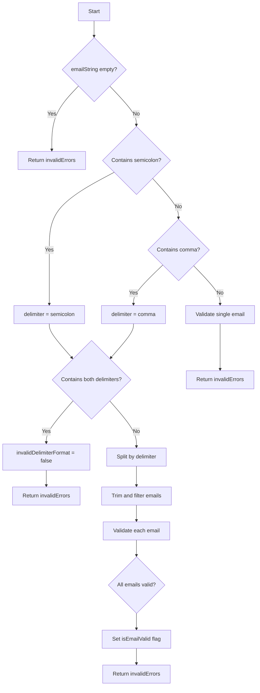
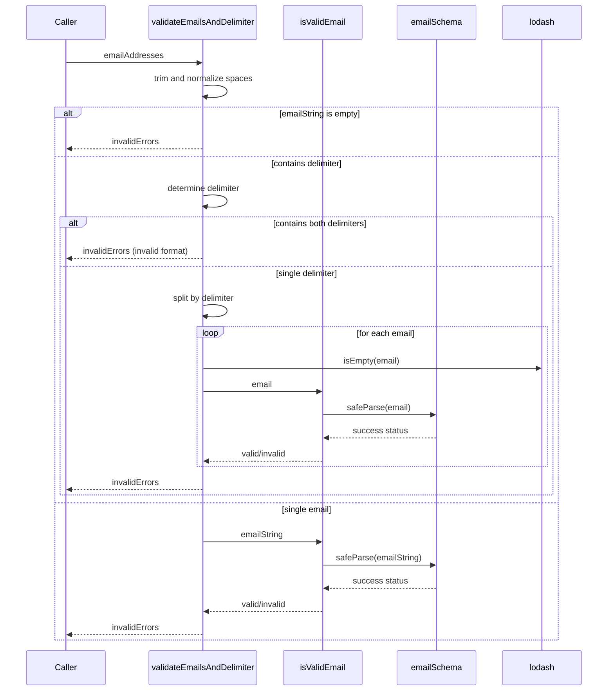

# Diagram: web/portal/src/utils/validation-utils.js

> Auto-generated by Obscura crawlers

## Diagram 1

### SVG

<svg id="container" width="778.18359375" xmlns="http://www.w3.org/2000/svg" class="flowchart" height="2052.359375" viewBox="0 0 778.18359375 2052.359375" role="graphics-document document" aria-roledescription="flowchart-v2"><g><marker id="container_flowchart-v2-pointEnd" class="marker flowchart-v2" viewBox="0 0 10 10" refX="5" refY="5" markerUnits="userSpaceOnUse" markerWidth="8" markerHeight="8" orient="auto"><path d="M 0 0 L 10 5 L 0 10 z" class="arrowMarkerPath" style="stroke-width: 1; stroke-dasharray: 1, 0;"></path></marker><marker id="container_flowchart-v2-pointStart" class="marker flowchart-v2" viewBox="0 0 10 10" refX="4.5" refY="5" markerUnits="userSpaceOnUse" markerWidth="8" markerHeight="8" orient="auto"><path d="M 0 5 L 10 10 L 10 0 z" class="arrowMarkerPath" style="stroke-width: 1; stroke-dasharray: 1, 0;"></path></marker><marker id="container_flowchart-v2-circleEnd" class="marker flowchart-v2" viewBox="0 0 10 10" refX="11" refY="5" markerUnits="userSpaceOnUse" markerWidth="11" markerHeight="11" orient="auto"><circle cx="5" cy="5" r="5" class="arrowMarkerPath" style="stroke-width: 1; stroke-dasharray: 1, 0;"></circle></marker><marker id="container_flowchart-v2-circleStart" class="marker flowchart-v2" viewBox="0 0 10 10" refX="-1" refY="5" markerUnits="userSpaceOnUse" markerWidth="11" markerHeight="11" orient="auto"><circle cx="5" cy="5" r="5" class="arrowMarkerPath" style="stroke-width: 1; stroke-dasharray: 1, 0;"></circle></marker><marker id="container_flowchart-v2-crossEnd" class="marker cross flowchart-v2" viewBox="0 0 11 11" refX="12" refY="5.2" markerUnits="userSpaceOnUse" markerWidth="11" markerHeight="11" orient="auto"><path d="M 1,1 l 9,9 M 10,1 l -9,9" class="arrowMarkerPath" style="stroke-width: 2; stroke-dasharray: 1, 0;"></path></marker><marker id="container_flowchart-v2-crossStart" class="marker cross flowchart-v2" viewBox="0 0 11 11" refX="-1" refY="5.2" markerUnits="userSpaceOnUse" markerWidth="11" markerHeight="11" orient="auto"><path d="M 1,1 l 9,9 M 10,1 l -9,9" class="arrowMarkerPath" style="stroke-width: 2; stroke-dasharray: 1, 0;"></path></marker><g class="root"><g class="clusters"></g><g class="edgePaths"><path d="M283.586,62L283.586,66.167C283.586,70.333,283.586,78.667,283.586,86.333C283.586,94,283.586,101,283.586,104.5L283.586,108" id="L_Start_CheckEmpty_0" class="edge-thickness-normal edge-pattern-solid edge-thickness-normal edge-pattern-solid flowchart-link" style=";" data-edge="true" data-et="edge" data-id="L_Start_CheckEmpty_0" data-points="W3sieCI6MjgzLjU4NTkzNzUsInkiOjYyfSx7IngiOjI4My41ODU5Mzc1LCJ5Ijo4N30seyJ4IjoyODMuNTg1OTM3NSwieSI6MTEyfV0=" marker-end="url(#container_flowchart-v2-pointEnd)"></path><path d="M236.442,258.684L223.158,272.708C209.874,286.732,183.306,314.78,170.022,346.688C156.738,378.596,156.738,414.365,156.738,432.249L156.738,450.133" id="L_CheckEmpty_ReturnInvalid1_0" class="edge-thickness-normal edge-pattern-solid edge-thickness-normal edge-pattern-solid flowchart-link" style=";" data-edge="true" data-et="edge" data-id="L_CheckEmpty_ReturnInvalid1_0" data-points="W3sieCI6MjM2LjQ0MjA0Nzg4MDMwODYsInkiOjI1OC42ODQyMzUzODAzMDg1Nn0seyJ4IjoxNTYuNzM4MjgxMjUsInkiOjM0Mi44MjgxMjV9LHsieCI6MTU2LjczODI4MTI1LCJ5Ijo0NTQuMTMyODEyNX1d" marker-end="url(#container_flowchart-v2-pointEnd)"></path><path d="M330.73,258.684L344.014,272.708C357.298,286.732,383.866,314.78,397.15,334.304C410.434,353.828,410.434,364.828,410.434,370.328L410.434,375.828" id="L_CheckEmpty_CheckSemicolon_0" class="edge-thickness-normal edge-pattern-solid edge-thickness-normal edge-pattern-solid flowchart-link" style=";" data-edge="true" data-et="edge" data-id="L_CheckEmpty_CheckSemicolon_0" data-points="W3sieCI6MzMwLjcyOTgyNzExOTY5MTQ0LCJ5IjoyNTguNjg0MjM1MzgwMzA4NTZ9LHsieCI6NDEwLjQzMzU5Mzc1LCJ5IjozNDIuODI4MTI1fSx7IngiOjQxMC40MzM1OTM3NSwieSI6Mzc5LjgyODEyNX1d" marker-end="url(#container_flowchart-v2-pointEnd)"></path><path d="M343.932,515.936L310.971,533.186C278.009,550.437,212.087,584.937,179.125,623.437C146.164,661.938,146.164,704.438,146.164,746.938C146.164,789.438,146.164,831.938,146.164,858.688C146.164,885.438,146.164,896.438,146.164,901.938L146.164,907.438" id="L_CheckSemicolon_SetDelimiterSemi_0" class="edge-thickness-normal edge-pattern-solid edge-thickness-normal edge-pattern-solid flowchart-link" style=";" data-edge="true" data-et="edge" data-id="L_CheckSemicolon_SetDelimiterSemi_0" data-points="W3sieCI6MzQzLjkzMjIxMDgxOTQ2OTksInkiOjUxNS45MzYxMTcwNjk0Njk5fSx7IngiOjE0Ni4xNjQwNjI1LCJ5Ijo2MTkuNDM3NX0seyJ4IjoxNDYuMTY0MDYyNSwieSI6NzQ2LjkzNzV9LHsieCI6MTQ2LjE2NDA2MjUsInkiOjg3NC40Mzc1fSx7IngiOjE0Ni4xNjQwNjI1LCJ5Ijo5MTEuNDM3NX1d" marker-end="url(#container_flowchart-v2-pointEnd)"></path><path d="M459.15,533.721L472.384,548.007C485.618,562.293,512.086,590.865,525.321,610.651C538.555,630.438,538.555,641.438,538.555,646.938L538.555,652.438" id="L_CheckSemicolon_CheckComma_0" class="edge-thickness-normal edge-pattern-solid edge-thickness-normal edge-pattern-solid flowchart-link" style=";" data-edge="true" data-et="edge" data-id="L_CheckSemicolon_CheckComma_0" data-points="W3sieCI6NDU5LjE0OTg1Mjc1MzE4ODksInkiOjUzMy43MjEyNDA5OTY4MTF9LHsieCI6NTM4LjU1NDY4NzUsInkiOjYxOS40Mzc1fSx7IngiOjUzOC41NTQ2ODc1LCJ5Ijo2NTYuNDM3NX1d" marker-end="url(#container_flowchart-v2-pointEnd)"></path><path d="M491.82,790.703L476.918,804.659C462.016,818.615,432.211,846.526,417.309,865.982C402.406,885.438,402.406,896.438,402.406,901.938L402.406,907.438" id="L_CheckComma_SetDelimiterComma_0" class="edge-thickness-normal edge-pattern-solid edge-thickness-normal edge-pattern-solid flowchart-link" style=";" data-edge="true" data-et="edge" data-id="L_CheckComma_SetDelimiterComma_0" data-points="W3sieCI6NDkxLjgyMDM1NTU1OTM4MzEsInkiOjc5MC43MDMxNjgwNTkzODMxfSx7IngiOjQwMi40MDYyNSwieSI6ODc0LjQzNzV9LHsieCI6NDAyLjQwNjI1LCJ5Ijo5MTEuNDM3NX1d" marker-end="url(#container_flowchart-v2-pointEnd)"></path><path d="M583.617,792.375L597.182,806.052C610.746,819.729,637.875,847.083,651.439,866.26C665.004,885.438,665.004,896.438,665.004,901.938L665.004,907.438" id="L_CheckComma_ValidateSingle_0" class="edge-thickness-normal edge-pattern-solid edge-thickness-normal edge-pattern-solid flowchart-link" style=";" data-edge="true" data-et="edge" data-id="L_CheckComma_ValidateSingle_0" data-points="W3sieCI6NTgzLjYxNzQ1MzgwMTA4NzUsInkiOjc5Mi4zNzQ3MzM2OTg5MTI1fSx7IngiOjY2NS4wMDM5MDYyNSwieSI6ODc0LjQzNzV9LHsieCI6NjY1LjAwMzkwNjI1LCJ5Ijo5MTEuNDM3NX1d" marker-end="url(#container_flowchart-v2-pointEnd)"></path><path d="M665.004,965.438L665.004,969.604C665.004,973.771,665.004,982.104,665.004,1005.255C665.004,1028.406,665.004,1066.375,665.004,1085.359L665.004,1104.344" id="L_ValidateSingle_ReturnInvalid2_0" class="edge-thickness-normal edge-pattern-solid edge-thickness-normal edge-pattern-solid flowchart-link" style=";" data-edge="true" data-et="edge" data-id="L_ValidateSingle_ReturnInvalid2_0" data-points="W3sieCI6NjY1LjAwMzkwNjI1LCJ5Ijo5NjUuNDM3NX0seyJ4Ijo2NjUuMDAzOTA2MjUsInkiOjk5MC40Mzc1fSx7IngiOjY2NS4wMDM5MDYyNSwieSI6MTEwOC4zNDM3NX1d" marker-end="url(#container_flowchart-v2-pointEnd)"></path><path d="M146.164,965.438L146.164,969.604C146.164,973.771,146.164,982.104,157.698,999.316C169.232,1016.528,192.3,1042.618,203.834,1055.663L215.368,1068.708" id="L_SetDelimiterSemi_CheckBoth_0" class="edge-thickness-normal edge-pattern-solid edge-thickness-normal edge-pattern-solid flowchart-link" style=";" data-edge="true" data-et="edge" data-id="L_SetDelimiterSemi_CheckBoth_0" data-points="W3sieCI6MTQ2LjE2NDA2MjUsInkiOjk2NS40Mzc1fSx7IngiOjE0Ni4xNjQwNjI1LCJ5Ijo5OTAuNDM3NX0seyJ4IjoyMTguMDE3ODI1MzQyOTI1MSwieSI6MTA3MS43MDQ4MzA5MDcwNzV9XQ==" marker-end="url(#container_flowchart-v2-pointEnd)"></path><path d="M402.406,965.438L402.406,969.604C402.406,973.771,402.406,982.104,390.872,999.316C379.338,1016.528,356.27,1042.618,344.736,1055.663L333.202,1068.708" id="L_SetDelimiterComma_CheckBoth_0" class="edge-thickness-normal edge-pattern-solid edge-thickness-normal edge-pattern-solid flowchart-link" style=";" data-edge="true" data-et="edge" data-id="L_SetDelimiterComma_CheckBoth_0" data-points="W3sieCI6NDAyLjQwNjI1LCJ5Ijo5NjUuNDM3NX0seyJ4Ijo0MDIuNDA2MjUsInkiOjk5MC40Mzc1fSx7IngiOjMzMC41NTI0ODcxNTcwNzQ5LCJ5IjoxMDcxLjcwNDgzMDkwNzA3NX1d" marker-end="url(#container_flowchart-v2-pointEnd)"></path><path d="M218.549,1199.514L205.124,1214.97C191.699,1230.426,164.85,1261.338,151.425,1282.294C138,1303.25,138,1314.25,138,1319.75L138,1325.25" id="L_CheckBoth_SetInvalidFormat_0" class="edge-thickness-normal edge-pattern-solid edge-thickness-normal edge-pattern-solid flowchart-link" style=";" data-edge="true" data-et="edge" data-id="L_CheckBoth_SetInvalidFormat_0" data-points="W3sieCI6MjE4LjU0ODcyNzE4NjA4ODU3LCJ5IjoxMTk5LjUxMzU3MDkzNjA4ODZ9LHsieCI6MTM4LCJ5IjoxMjkyLjI1fSx7IngiOjEzOCwieSI6MTMyOS4yNX1d" marker-end="url(#container_flowchart-v2-pointEnd)"></path><path d="M138,1407.25L138,1411.417C138,1415.583,138,1423.917,138,1431.583C138,1439.25,138,1446.25,138,1449.75L138,1453.25" id="L_SetInvalidFormat_ReturnInvalid3_0" class="edge-thickness-normal edge-pattern-solid edge-thickness-normal edge-pattern-solid flowchart-link" style=";" data-edge="true" data-et="edge" data-id="L_SetInvalidFormat_ReturnInvalid3_0" data-points="W3sieCI6MTM4LCJ5IjoxNDA3LjI1fSx7IngiOjEzOCwieSI6MTQzMi4yNX0seyJ4IjoxMzgsInkiOjE0NTcuMjV9XQ==" marker-end="url(#container_flowchart-v2-pointEnd)"></path><path d="M330.022,1199.514L343.446,1214.97C356.871,1230.426,383.721,1261.338,397.146,1284.294C410.57,1307.25,410.57,1322.25,410.57,1329.75L410.57,1337.25" id="L_CheckBoth_SplitEmails_0" class="edge-thickness-normal edge-pattern-solid edge-thickness-normal edge-pattern-solid flowchart-link" style=";" data-edge="true" data-et="edge" data-id="L_CheckBoth_SplitEmails_0" data-points="W3sieCI6MzMwLjAyMTU4NTMxMzkxMTQzLCJ5IjoxMTk5LjUxMzU3MDkzNjA4ODZ9LHsieCI6NDEwLjU3MDMxMjUsInkiOjEyOTIuMjV9LHsieCI6NDEwLjU3MDMxMjUsInkiOjEzNDEuMjV9XQ==" marker-end="url(#container_flowchart-v2-pointEnd)"></path><path d="M410.57,1395.25L410.57,1401.417C410.57,1407.583,410.57,1419.917,410.57,1429.583C410.57,1439.25,410.57,1446.25,410.57,1449.75L410.57,1453.25" id="L_SplitEmails_TrimFilter_0" class="edge-thickness-normal edge-pattern-solid edge-thickness-normal edge-pattern-solid flowchart-link" style=";" data-edge="true" data-et="edge" data-id="L_SplitEmails_TrimFilter_0" data-points="W3sieCI6NDEwLjU3MDMxMjUsInkiOjEzOTUuMjV9LHsieCI6NDEwLjU3MDMxMjUsInkiOjE0MzIuMjV9LHsieCI6NDEwLjU3MDMxMjUsInkiOjE0NTcuMjV9XQ==" marker-end="url(#container_flowchart-v2-pointEnd)"></path><path d="M410.57,1511.25L410.57,1515.417C410.57,1519.583,410.57,1527.917,410.57,1535.583C410.57,1543.25,410.57,1550.25,410.57,1553.75L410.57,1557.25" id="L_TrimFilter_ValidateEach_0" class="edge-thickness-normal edge-pattern-solid edge-thickness-normal edge-pattern-solid flowchart-link" style=";" data-edge="true" data-et="edge" data-id="L_TrimFilter_ValidateEach_0" data-points="W3sieCI6NDEwLjU3MDMxMjUsInkiOjE1MTEuMjV9LHsieCI6NDEwLjU3MDMxMjUsInkiOjE1MzYuMjV9LHsieCI6NDEwLjU3MDMxMjUsInkiOjE1NjEuMjV9XQ==" marker-end="url(#container_flowchart-v2-pointEnd)"></path><path d="M410.57,1615.25L410.57,1619.417C410.57,1623.583,410.57,1631.917,410.57,1639.583C410.57,1647.25,410.57,1654.25,410.57,1657.75L410.57,1661.25" id="L_ValidateEach_CheckAllValid_0" class="edge-thickness-normal edge-pattern-solid edge-thickness-normal edge-pattern-solid flowchart-link" style=";" data-edge="true" data-et="edge" data-id="L_ValidateEach_CheckAllValid_0" data-points="W3sieCI6NDEwLjU3MDMxMjUsInkiOjE2MTUuMjV9LHsieCI6NDEwLjU3MDMxMjUsInkiOjE2NDAuMjV9LHsieCI6NDEwLjU3MDMxMjUsInkiOjE2NjUuMjV9XQ==" marker-end="url(#container_flowchart-v2-pointEnd)"></path><path d="M410.57,1836.359L410.57,1840.526C410.57,1844.693,410.57,1853.026,410.57,1860.693C410.57,1868.359,410.57,1875.359,410.57,1878.859L410.57,1882.359" id="L_CheckAllValid_SetValidFlag_0" class="edge-thickness-normal edge-pattern-solid edge-thickness-normal edge-pattern-solid flowchart-link" style=";" data-edge="true" data-et="edge" data-id="L_CheckAllValid_SetValidFlag_0" data-points="W3sieCI6NDEwLjU3MDMxMjUsInkiOjE4MzYuMzU5Mzc1fSx7IngiOjQxMC41NzAzMTI1LCJ5IjoxODYxLjM1OTM3NX0seyJ4Ijo0MTAuNTcwMzEyNSwieSI6MTg4Ni4zNTkzNzV9XQ==" marker-end="url(#container_flowchart-v2-pointEnd)"></path><path d="M410.57,1940.359L410.57,1944.526C410.57,1948.693,410.57,1957.026,410.57,1964.693C410.57,1972.359,410.57,1979.359,410.57,1982.859L410.57,1986.359" id="L_SetValidFlag_ReturnInvalid4_0" class="edge-thickness-normal edge-pattern-solid edge-thickness-normal edge-pattern-solid flowchart-link" style=";" data-edge="true" data-et="edge" data-id="L_SetValidFlag_ReturnInvalid4_0" data-points="W3sieCI6NDEwLjU3MDMxMjUsInkiOjE5NDAuMzU5Mzc1fSx7IngiOjQxMC41NzAzMTI1LCJ5IjoxOTY1LjM1OTM3NX0seyJ4Ijo0MTAuNTcwMzEyNSwieSI6MTk5MC4zNTkzNzV9XQ==" marker-end="url(#container_flowchart-v2-pointEnd)"></path></g><g class="edgeLabels"><g class="edgeLabel"><g class="label" data-id="L_Start_CheckEmpty_0" transform="translate(0, 0)"><foreignObject width="0" height="0">

</foreignObject></g></g><g class="edgeLabel" transform="translate(156.73828125, 342.828125)"><g class="label" data-id="L_CheckEmpty_ReturnInvalid1_0" transform="translate(-12.03125, -12)"><foreignObject width="24.0625" height="24">

Yes

</foreignObject></g></g><g class="edgeLabel" transform="translate(410.43359375, 342.828125)"><g class="label" data-id="L_CheckEmpty_CheckSemicolon_0" transform="translate(-10.140625, -12)"><foreignObject width="20.28125" height="24">

No

</foreignObject></g></g><g class="edgeLabel" transform="translate(146.1640625, 746.9375)"><g class="label" data-id="L_CheckSemicolon_SetDelimiterSemi_0" transform="translate(-12.03125, -12)"><foreignObject width="24.0625" height="24">

Yes

</foreignObject></g></g><g class="edgeLabel" transform="translate(538.5546875, 619.4375)"><g class="label" data-id="L_CheckSemicolon_CheckComma_0" transform="translate(-10.140625, -12)"><foreignObject width="20.28125" height="24">

No

</foreignObject></g></g><g class="edgeLabel" transform="translate(402.40625, 874.4375)"><g class="label" data-id="L_CheckComma_SetDelimiterComma_0" transform="translate(-12.03125, -12)"><foreignObject width="24.0625" height="24">

Yes

</foreignObject></g></g><g class="edgeLabel" transform="translate(665.00390625, 874.4375)"><g class="label" data-id="L_CheckComma_ValidateSingle_0" transform="translate(-10.140625, -12)"><foreignObject width="20.28125" height="24">

No

</foreignObject></g></g><g class="edgeLabel"><g class="label" data-id="L_ValidateSingle_ReturnInvalid2_0" transform="translate(0, 0)"><foreignObject width="0" height="0">

</foreignObject></g></g><g class="edgeLabel"><g class="label" data-id="L_SetDelimiterSemi_CheckBoth_0" transform="translate(0, 0)"><foreignObject width="0" height="0">

</foreignObject></g></g><g class="edgeLabel"><g class="label" data-id="L_SetDelimiterComma_CheckBoth_0" transform="translate(0, 0)"><foreignObject width="0" height="0">

</foreignObject></g></g><g class="edgeLabel" transform="translate(138, 1292.25)"><g class="label" data-id="L_CheckBoth_SetInvalidFormat_0" transform="translate(-12.03125, -12)"><foreignObject width="24.0625" height="24">

Yes

</foreignObject></g></g><g class="edgeLabel"><g class="label" data-id="L_SetInvalidFormat_ReturnInvalid3_0" transform="translate(0, 0)"><foreignObject width="0" height="0">

</foreignObject></g></g><g class="edgeLabel" transform="translate(410.5703125, 1292.25)"><g class="label" data-id="L_CheckBoth_SplitEmails_0" transform="translate(-10.140625, -12)"><foreignObject width="20.28125" height="24">

No

</foreignObject></g></g><g class="edgeLabel"><g class="label" data-id="L_SplitEmails_TrimFilter_0" transform="translate(0, 0)"><foreignObject width="0" height="0">

</foreignObject></g></g><g class="edgeLabel"><g class="label" data-id="L_TrimFilter_ValidateEach_0" transform="translate(0, 0)"><foreignObject width="0" height="0">

</foreignObject></g></g><g class="edgeLabel"><g class="label" data-id="L_ValidateEach_CheckAllValid_0" transform="translate(0, 0)"><foreignObject width="0" height="0">

</foreignObject></g></g><g class="edgeLabel"><g class="label" data-id="L_CheckAllValid_SetValidFlag_0" transform="translate(0, 0)"><foreignObject width="0" height="0">

</foreignObject></g></g><g class="edgeLabel"><g class="label" data-id="L_SetValidFlag_ReturnInvalid4_0" transform="translate(0, 0)"><foreignObject width="0" height="0">

</foreignObject></g></g></g><g class="nodes"><g class="node default" id="flowchart-Start-0" transform="translate(283.5859375, 35)"><rect class="basic label-container" style="" x="-47.5234375" y="-27" width="95.046875" height="54"></rect><g class="label" style="" transform="translate(-17.5234375, -12)"><rect></rect><foreignObject width="35.046875" height="24">

Start

</foreignObject></g></g><g class="node default" id="flowchart-CheckEmpty-1" transform="translate(283.5859375, 208.9140625)"><polygon points="96.9140625,0 193.828125,-96.9140625 96.9140625,-193.828125 0,-96.9140625" class="label-container" transform="translate(-96.4140625, 96.9140625)"></polygon><g class="label" style="" transform="translate(-69.9140625, -12)"><rect></rect><foreignObject width="139.828125" height="24">

emailString empty?

</foreignObject></g></g><g class="node default" id="flowchart-ReturnInvalid1-3" transform="translate(156.73828125, 481.1328125)"><rect class="basic label-container" style="" x="-102.390625" y="-27" width="204.78125" height="54"></rect><g class="label" style="" transform="translate(-72.390625, -12)"><rect></rect><foreignObject width="144.78125" height="24">

Return invalidErrors

</foreignObject></g></g><g class="node default" id="flowchart-CheckSemicolon-5" transform="translate(410.43359375, 481.1328125)"><polygon points="101.3046875,0 202.609375,-101.3046875 101.3046875,-202.609375 0,-101.3046875" class="label-container" transform="translate(-100.8046875, 101.3046875)"></polygon><g class="label" style="" transform="translate(-74.3046875, -12)"><rect></rect><foreignObject width="148.609375" height="24">

Contains semicolon?

</foreignObject></g></g><g class="node default" id="flowchart-SetDelimiterSemi-7" transform="translate(146.1640625, 938.4375)"><rect class="basic label-container" style="" x="-108.5234375" y="-27" width="217.046875" height="54"></rect><g class="label" style="" transform="translate(-78.5234375, -12)"><rect></rect><foreignObject width="157.046875" height="24">

delimiter = semicolon

</foreignObject></g></g><g class="node default" id="flowchart-CheckComma-9" transform="translate(538.5546875, 746.9375)"><polygon points="90.5,0 181,-90.5 90.5,-181 0,-90.5" class="label-container" transform="translate(-90, 90.5)"></polygon><g class="label" style="" transform="translate(-63.5, -12)"><rect></rect><foreignObject width="127" height="24">

Contains comma?

</foreignObject></g></g><g class="node default" id="flowchart-SetDelimiterComma-11" transform="translate(402.40625, 938.4375)"><rect class="basic label-container" style="" x="-97.71875" y="-27" width="195.4375" height="54"></rect><g class="label" style="" transform="translate(-67.71875, -12)"><rect></rect><foreignObject width="135.4375" height="24">

delimiter = comma

</foreignObject></g></g><g class="node default" id="flowchart-ValidateSingle-13" transform="translate(665.00390625, 938.4375)"><rect class="basic label-container" style="" x="-105.1796875" y="-27" width="210.359375" height="54"></rect><g class="label" style="" transform="translate(-75.1796875, -12)"><rect></rect><foreignObject width="150.359375" height="24">

Validate single email

</foreignObject></g></g><g class="node default" id="flowchart-ReturnInvalid2-15" transform="translate(665.00390625, 1135.34375)"><rect class="basic label-container" style="" x="-102.390625" y="-27" width="204.78125" height="54"></rect><g class="label" style="" transform="translate(-72.390625, -12)"><rect></rect><foreignObject width="144.78125" height="24">

Return invalidErrors

</foreignObject></g></g><g class="node default" id="flowchart-CheckBoth-17" transform="translate(274.28515625, 1135.34375)"><polygon points="119.90625,0 239.8125,-119.90625 119.90625,-239.8125 0,-119.90625" class="label-container" transform="translate(-119.40625, 119.90625)"></polygon><g class="label" style="" transform="translate(-92.90625, -12)"><rect></rect><foreignObject width="185.8125" height="24">

Contains both delimiters?

</foreignObject></g></g><g class="node default" id="flowchart-SetInvalidFormat-21" transform="translate(138, 1368.25)"><rect class="basic label-container" style="" x="-130" y="-39" width="260" height="78"></rect><g class="label" style="" transform="translate(-100, -24)"><rect></rect><foreignObject width="200" height="48">

invalidDelimiterFormat = false

</foreignObject></g></g><g class="node default" id="flowchart-ReturnInvalid3-23" transform="translate(138, 1484.25)"><rect class="basic label-container" style="" x="-102.390625" y="-27" width="204.78125" height="54"></rect><g class="label" style="" transform="translate(-72.390625, -12)"><rect></rect><foreignObject width="144.78125" height="24">

Return invalidErrors

</foreignObject></g></g><g class="node default" id="flowchart-SplitEmails-25" transform="translate(410.5703125, 1368.25)"><rect class="basic label-container" style="" x="-92.5703125" y="-27" width="185.140625" height="54"></rect><g class="label" style="" transform="translate(-62.5703125, -12)"><rect></rect><foreignObject width="125.140625" height="24">

Split by delimiter

</foreignObject></g></g><g class="node default" id="flowchart-TrimFilter-27" transform="translate(410.5703125, 1484.25)"><rect class="basic label-container" style="" x="-107.3515625" y="-27" width="214.703125" height="54"></rect><g class="label" style="" transform="translate(-77.3515625, -12)"><rect></rect><foreignObject width="154.703125" height="24">

Trim and filter emails

</foreignObject></g></g><g class="node default" id="flowchart-ValidateEach-29" transform="translate(410.5703125, 1588.25)"><rect class="basic label-container" style="" x="-100.8203125" y="-27" width="201.640625" height="54"></rect><g class="label" style="" transform="translate(-70.8203125, -12)"><rect></rect><foreignObject width="141.640625" height="24">

Validate each email

</foreignObject></g></g><g class="node default" id="flowchart-CheckAllValid-31" transform="translate(410.5703125, 1750.8046875)"><polygon points="85.5546875,0 171.109375,-85.5546875 85.5546875,-171.109375 0,-85.5546875" class="label-container" transform="translate(-85.0546875, 85.5546875)"></polygon><g class="label" style="" transform="translate(-58.5546875, -12)"><rect></rect><foreignObject width="117.109375" height="24">

All emails valid?

</foreignObject></g></g><g class="node default" id="flowchart-SetValidFlag-33" transform="translate(410.5703125, 1913.359375)"><rect class="basic label-container" style="" x="-102.765625" y="-27" width="205.53125" height="54"></rect><g class="label" style="" transform="translate(-72.765625, -12)"><rect></rect><foreignObject width="145.53125" height="24">

Set isEmailValid flag

</foreignObject></g></g><g class="node default" id="flowchart-ReturnInvalid4-35" transform="translate(410.5703125, 2017.359375)"><rect class="basic label-container" style="" x="-102.390625" y="-27" width="204.78125" height="54"></rect><g class="label" style="" transform="translate(-72.390625, -12)"><rect></rect><foreignObject width="144.78125" height="24">

Return invalidErrors

</foreignObject></g></g></g></g></g></svg>

## Diagram 2

### SVG

<svg id="container" width="1196.5" xmlns="http://www.w3.org/2000/svg" height="1377" viewBox="-50 -10 1196.5 1377" role="graphics-document document" aria-roledescription="sequence"><g><rect x="946.5" y="1291" fill="#eaeaea" stroke="#666" width="150" height="65" name="lodash" rx="3" ry="3" class="actor actor-bottom"></rect><text x="1021.5" y="1323.5" dominant-baseline="central" alignment-baseline="central" class="actor actor-box" style="text-anchor: middle; font-size: 16px; font-weight: 400;"><tspan x="1021.5" dy="0">lodash</tspan></text></g><g><rect x="746.5" y="1291" fill="#eaeaea" stroke="#666" width="150" height="65" name="emailSchema" rx="3" ry="3" class="actor actor-bottom"></rect><text x="821.5" y="1323.5" dominant-baseline="central" alignment-baseline="central" class="actor actor-box" style="text-anchor: middle; font-size: 16px; font-weight: 400;"><tspan x="821.5" dy="0">emailSchema</tspan></text></g><g><rect x="513.5" y="1291" fill="#eaeaea" stroke="#666" width="150" height="65" name="isValidEmail" rx="3" ry="3" class="actor actor-bottom"></rect><text x="588.5" y="1323.5" dominant-baseline="central" alignment-baseline="central" class="actor actor-box" style="text-anchor: middle; font-size: 16px; font-weight: 400;"><tspan x="588.5" dy="0">isValidEmail</tspan></text></g><g><rect x="242.5" y="1291" fill="#eaeaea" stroke="#666" width="221" height="65" name="validateEmailsAndDelimiter" rx="3" ry="3" class="actor actor-bottom"></rect><text x="353" y="1323.5" dominant-baseline="central" alignment-baseline="central" class="actor actor-box" style="text-anchor: middle; font-size: 16px; font-weight: 400;"><tspan x="353" dy="0">validateEmailsAndDelimiter</tspan></text></g><g><rect x="0" y="1291" fill="#eaeaea" stroke="#666" width="150" height="65" name="Caller" rx="3" ry="3" class="actor actor-bottom"></rect><text x="75" y="1323.5" dominant-baseline="central" alignment-baseline="central" class="actor actor-box" style="text-anchor: middle; font-size: 16px; font-weight: 400;"><tspan x="75" dy="0">Caller</tspan></text></g><g><line id="actor4" x1="1021.5" y1="65" x2="1021.5" y2="1291" class="actor-line 200" stroke-width="0.5px" stroke="#999" name="lodash"></line><g id="root-4"><rect x="946.5" y="0" fill="#eaeaea" stroke="#666" width="150" height="65" name="lodash" rx="3" ry="3" class="actor actor-top"></rect><text x="1021.5" y="32.5" dominant-baseline="central" alignment-baseline="central" class="actor actor-box" style="text-anchor: middle; font-size: 16px; font-weight: 400;"><tspan x="1021.5" dy="0">lodash</tspan></text></g></g><g><line id="actor3" x1="821.5" y1="65" x2="821.5" y2="1291" class="actor-line 200" stroke-width="0.5px" stroke="#999" name="emailSchema"></line><g id="root-3"><rect x="746.5" y="0" fill="#eaeaea" stroke="#666" width="150" height="65" name="emailSchema" rx="3" ry="3" class="actor actor-top"></rect><text x="821.5" y="32.5" dominant-baseline="central" alignment-baseline="central" class="actor actor-box" style="text-anchor: middle; font-size: 16px; font-weight: 400;"><tspan x="821.5" dy="0">emailSchema</tspan></text></g></g><g><line id="actor2" x1="588.5" y1="65" x2="588.5" y2="1291" class="actor-line 200" stroke-width="0.5px" stroke="#999" name="isValidEmail"></line><g id="root-2"><rect x="513.5" y="0" fill="#eaeaea" stroke="#666" width="150" height="65" name="isValidEmail" rx="3" ry="3" class="actor actor-top"></rect><text x="588.5" y="32.5" dominant-baseline="central" alignment-baseline="central" class="actor actor-box" style="text-anchor: middle; font-size: 16px; font-weight: 400;"><tspan x="588.5" dy="0">isValidEmail</tspan></text></g></g><g><line id="actor1" x1="353" y1="65" x2="353" y2="1291" class="actor-line 200" stroke-width="0.5px" stroke="#999" name="validateEmailsAndDelimiter"></line><g id="root-1"><rect x="242.5" y="0" fill="#eaeaea" stroke="#666" width="221" height="65" name="validateEmailsAndDelimiter" rx="3" ry="3" class="actor actor-top"></rect><text x="353" y="32.5" dominant-baseline="central" alignment-baseline="central" class="actor actor-box" style="text-anchor: middle; font-size: 16px; font-weight: 400;"><tspan x="353" dy="0">validateEmailsAndDelimiter</tspan></text></g></g><g><line id="actor0" x1="75" y1="65" x2="75" y2="1291" class="actor-line 200" stroke-width="0.5px" stroke="#999" name="Caller"></line><g id="root-0"><rect x="0" y="0" fill="#eaeaea" stroke="#666" width="150" height="65" name="Caller" rx="3" ry="3" class="actor actor-top"></rect><text x="75" y="32.5" dominant-baseline="central" alignment-baseline="central" class="actor actor-box" style="text-anchor: middle; font-size: 16px; font-weight: 400;"><tspan x="75" dy="0">Caller</tspan></text></g></g><g></g><defs><symbol id="computer" width="24" height="24"><path transform="scale(.5)" d="M2 2v13h20v-13h-20zm18 11h-16v-9h16v9zm-10.228 6l.466-1h3.524l.467 1h-4.457zm14.228 3h-24l2-6h2.104l-1.33 4h18.45l-1.297-4h2.073l2 6zm-5-10h-14v-7h14v7z"></path></symbol></defs><defs><symbol id="database" fill-rule="evenodd" clip-rule="evenodd"><path transform="scale(.5)" d="M12.258.001l.256.004.255.005.253.008.251.01.249.012.247.015.246.016.242.019.241.02.239.023.236.024.233.027.231.028.229.031.225.032.223.034.22.036.217.038.214.04.211.041.208.043.205.045.201.046.198.048.194.05.191.051.187.053.183.054.18.056.175.057.172.059.168.06.163.061.16.063.155.064.15.066.074.033.073.033.071.034.07.034.069.035.068.035.067.035.066.035.064.036.064.036.062.036.06.036.06.037.058.037.058.037.055.038.055.038.053.038.052.038.051.039.05.039.048.039.047.039.045.04.044.04.043.04.041.04.04.041.039.041.037.041.036.041.034.041.033.042.032.042.03.042.029.042.027.042.026.043.024.043.023.043.021.043.02.043.018.044.017.043.015.044.013.044.012.044.011.045.009.044.007.045.006.045.004.045.002.045.001.045v17l-.001.045-.002.045-.004.045-.006.045-.007.045-.009.044-.011.045-.012.044-.013.044-.015.044-.017.043-.018.044-.02.043-.021.043-.023.043-.024.043-.026.043-.027.042-.029.042-.03.042-.032.042-.033.042-.034.041-.036.041-.037.041-.039.041-.04.041-.041.04-.043.04-.044.04-.045.04-.047.039-.048.039-.05.039-.051.039-.052.038-.053.038-.055.038-.055.038-.058.037-.058.037-.06.037-.06.036-.062.036-.064.036-.064.036-.066.035-.067.035-.068.035-.069.035-.07.034-.071.034-.073.033-.074.033-.15.066-.155.064-.16.063-.163.061-.168.06-.172.059-.175.057-.18.056-.183.054-.187.053-.191.051-.194.05-.198.048-.201.046-.205.045-.208.043-.211.041-.214.04-.217.038-.22.036-.223.034-.225.032-.229.031-.231.028-.233.027-.236.024-.239.023-.241.02-.242.019-.246.016-.247.015-.249.012-.251.01-.253.008-.255.005-.256.004-.258.001-.258-.001-.256-.004-.255-.005-.253-.008-.251-.01-.249-.012-.247-.015-.245-.016-.243-.019-.241-.02-.238-.023-.236-.024-.234-.027-.231-.028-.228-.031-.226-.032-.223-.034-.22-.036-.217-.038-.214-.04-.211-.041-.208-.043-.204-.045-.201-.046-.198-.048-.195-.05-.19-.051-.187-.053-.184-.054-.179-.056-.176-.057-.172-.059-.167-.06-.164-.061-.159-.063-.155-.064-.151-.066-.074-.033-.072-.033-.072-.034-.07-.034-.069-.035-.068-.035-.067-.035-.066-.035-.064-.036-.063-.036-.062-.036-.061-.036-.06-.037-.058-.037-.057-.037-.056-.038-.055-.038-.053-.038-.052-.038-.051-.039-.049-.039-.049-.039-.046-.039-.046-.04-.044-.04-.043-.04-.041-.04-.04-.041-.039-.041-.037-.041-.036-.041-.034-.041-.033-.042-.032-.042-.03-.042-.029-.042-.027-.042-.026-.043-.024-.043-.023-.043-.021-.043-.02-.043-.018-.044-.017-.043-.015-.044-.013-.044-.012-.044-.011-.045-.009-.044-.007-.045-.006-.045-.004-.045-.002-.045-.001-.045v-17l.001-.045.002-.045.004-.045.006-.045.007-.045.009-.044.011-.045.012-.044.013-.044.015-.044.017-.043.018-.044.02-.043.021-.043.023-.043.024-.043.026-.043.027-.042.029-.042.03-.042.032-.042.033-.042.034-.041.036-.041.037-.041.039-.041.04-.041.041-.04.043-.04.044-.04.046-.04.046-.039.049-.039.049-.039.051-.039.052-.038.053-.038.055-.038.056-.038.057-.037.058-.037.06-.037.061-.036.062-.036.063-.036.064-.036.066-.035.067-.035.068-.035.069-.035.07-.034.072-.034.072-.033.074-.033.151-.066.155-.064.159-.063.164-.061.167-.06.172-.059.176-.057.179-.056.184-.054.187-.053.19-.051.195-.05.198-.048.201-.046.204-.045.208-.043.211-.041.214-.04.217-.038.22-.036.223-.034.226-.032.228-.031.231-.028.234-.027.236-.024.238-.023.241-.02.243-.019.245-.016.247-.015.249-.012.251-.01.253-.008.255-.005.256-.004.258-.001.258.001zm-9.258 20.499v.01l.001.021.003.021.004.022.005.021.006.022.007.022.009.023.01.022.011.023.012.023.013.023.015.023.016.024.017.023.018.024.019.024.021.024.022.025.023.024.024.025.052.049.056.05.061.051.066.051.07.051.075.051.079.052.084.052.088.052.092.052.097.052.102.051.105.052.11.052.114.051.119.051.123.051.127.05.131.05.135.05.139.048.144.049.147.047.152.047.155.047.16.045.163.045.167.043.171.043.176.041.178.041.183.039.187.039.19.037.194.035.197.035.202.033.204.031.209.03.212.029.216.027.219.025.222.024.226.021.23.02.233.018.236.016.24.015.243.012.246.01.249.008.253.005.256.004.259.001.26-.001.257-.004.254-.005.25-.008.247-.011.244-.012.241-.014.237-.016.233-.018.231-.021.226-.021.224-.024.22-.026.216-.027.212-.028.21-.031.205-.031.202-.034.198-.034.194-.036.191-.037.187-.039.183-.04.179-.04.175-.042.172-.043.168-.044.163-.045.16-.046.155-.046.152-.047.148-.048.143-.049.139-.049.136-.05.131-.05.126-.05.123-.051.118-.052.114-.051.11-.052.106-.052.101-.052.096-.052.092-.052.088-.053.083-.051.079-.052.074-.052.07-.051.065-.051.06-.051.056-.05.051-.05.023-.024.023-.025.021-.024.02-.024.019-.024.018-.024.017-.024.015-.023.014-.024.013-.023.012-.023.01-.023.01-.022.008-.022.006-.022.006-.022.004-.022.004-.021.001-.021.001-.021v-4.127l-.077.055-.08.053-.083.054-.085.053-.087.052-.09.052-.093.051-.095.05-.097.05-.1.049-.102.049-.105.048-.106.047-.109.047-.111.046-.114.045-.115.045-.118.044-.12.043-.122.042-.124.042-.126.041-.128.04-.13.04-.132.038-.134.038-.135.037-.138.037-.139.035-.142.035-.143.034-.144.033-.147.032-.148.031-.15.03-.151.03-.153.029-.154.027-.156.027-.158.026-.159.025-.161.024-.162.023-.163.022-.165.021-.166.02-.167.019-.169.018-.169.017-.171.016-.173.015-.173.014-.175.013-.175.012-.177.011-.178.01-.179.008-.179.008-.181.006-.182.005-.182.004-.184.003-.184.002h-.37l-.184-.002-.184-.003-.182-.004-.182-.005-.181-.006-.179-.008-.179-.008-.178-.01-.176-.011-.176-.012-.175-.013-.173-.014-.172-.015-.171-.016-.17-.017-.169-.018-.167-.019-.166-.02-.165-.021-.163-.022-.162-.023-.161-.024-.159-.025-.157-.026-.156-.027-.155-.027-.153-.029-.151-.03-.15-.03-.148-.031-.146-.032-.145-.033-.143-.034-.141-.035-.14-.035-.137-.037-.136-.037-.134-.038-.132-.038-.13-.04-.128-.04-.126-.041-.124-.042-.122-.042-.12-.044-.117-.043-.116-.045-.113-.045-.112-.046-.109-.047-.106-.047-.105-.048-.102-.049-.1-.049-.097-.05-.095-.05-.093-.052-.09-.051-.087-.052-.085-.053-.083-.054-.08-.054-.077-.054v4.127zm0-5.654v.011l.001.021.003.021.004.021.005.022.006.022.007.022.009.022.01.022.011.023.012.023.013.023.015.024.016.023.017.024.018.024.019.024.021.024.022.024.023.025.024.024.052.05.056.05.061.05.066.051.07.051.075.052.079.051.084.052.088.052.092.052.097.052.102.052.105.052.11.051.114.051.119.052.123.05.127.051.131.05.135.049.139.049.144.048.147.048.152.047.155.046.16.045.163.045.167.044.171.042.176.042.178.04.183.04.187.038.19.037.194.036.197.034.202.033.204.032.209.03.212.028.216.027.219.025.222.024.226.022.23.02.233.018.236.016.24.014.243.012.246.01.249.008.253.006.256.003.259.001.26-.001.257-.003.254-.006.25-.008.247-.01.244-.012.241-.015.237-.016.233-.018.231-.02.226-.022.224-.024.22-.025.216-.027.212-.029.21-.03.205-.032.202-.033.198-.035.194-.036.191-.037.187-.039.183-.039.179-.041.175-.042.172-.043.168-.044.163-.045.16-.045.155-.047.152-.047.148-.048.143-.048.139-.05.136-.049.131-.05.126-.051.123-.051.118-.051.114-.052.11-.052.106-.052.101-.052.096-.052.092-.052.088-.052.083-.052.079-.052.074-.051.07-.052.065-.051.06-.05.056-.051.051-.049.023-.025.023-.024.021-.025.02-.024.019-.024.018-.024.017-.024.015-.023.014-.023.013-.024.012-.022.01-.023.01-.023.008-.022.006-.022.006-.022.004-.021.004-.022.001-.021.001-.021v-4.139l-.077.054-.08.054-.083.054-.085.052-.087.053-.09.051-.093.051-.095.051-.097.05-.1.049-.102.049-.105.048-.106.047-.109.047-.111.046-.114.045-.115.044-.118.044-.12.044-.122.042-.124.042-.126.041-.128.04-.13.039-.132.039-.134.038-.135.037-.138.036-.139.036-.142.035-.143.033-.144.033-.147.033-.148.031-.15.03-.151.03-.153.028-.154.028-.156.027-.158.026-.159.025-.161.024-.162.023-.163.022-.165.021-.166.02-.167.019-.169.018-.169.017-.171.016-.173.015-.173.014-.175.013-.175.012-.177.011-.178.009-.179.009-.179.007-.181.007-.182.005-.182.004-.184.003-.184.002h-.37l-.184-.002-.184-.003-.182-.004-.182-.005-.181-.007-.179-.007-.179-.009-.178-.009-.176-.011-.176-.012-.175-.013-.173-.014-.172-.015-.171-.016-.17-.017-.169-.018-.167-.019-.166-.02-.165-.021-.163-.022-.162-.023-.161-.024-.159-.025-.157-.026-.156-.027-.155-.028-.153-.028-.151-.03-.15-.03-.148-.031-.146-.033-.145-.033-.143-.033-.141-.035-.14-.036-.137-.036-.136-.037-.134-.038-.132-.039-.13-.039-.128-.04-.126-.041-.124-.042-.122-.043-.12-.043-.117-.044-.116-.044-.113-.046-.112-.046-.109-.046-.106-.047-.105-.048-.102-.049-.1-.049-.097-.05-.095-.051-.093-.051-.09-.051-.087-.053-.085-.052-.083-.054-.08-.054-.077-.054v4.139zm0-5.666v.011l.001.02.003.022.004.021.005.022.006.021.007.022.009.023.01.022.011.023.012.023.013.023.015.023.016.024.017.024.018.023.019.024.021.025.022.024.023.024.024.025.052.05.056.05.061.05.066.051.07.051.075.052.079.051.084.052.088.052.092.052.097.052.102.052.105.051.11.052.114.051.119.051.123.051.127.05.131.05.135.05.139.049.144.048.147.048.152.047.155.046.16.045.163.045.167.043.171.043.176.042.178.04.183.04.187.038.19.037.194.036.197.034.202.033.204.032.209.03.212.028.216.027.219.025.222.024.226.021.23.02.233.018.236.017.24.014.243.012.246.01.249.008.253.006.256.003.259.001.26-.001.257-.003.254-.006.25-.008.247-.01.244-.013.241-.014.237-.016.233-.018.231-.02.226-.022.224-.024.22-.025.216-.027.212-.029.21-.03.205-.032.202-.033.198-.035.194-.036.191-.037.187-.039.183-.039.179-.041.175-.042.172-.043.168-.044.163-.045.16-.045.155-.047.152-.047.148-.048.143-.049.139-.049.136-.049.131-.051.126-.05.123-.051.118-.052.114-.051.11-.052.106-.052.101-.052.096-.052.092-.052.088-.052.083-.052.079-.052.074-.052.07-.051.065-.051.06-.051.056-.05.051-.049.023-.025.023-.025.021-.024.02-.024.019-.024.018-.024.017-.024.015-.023.014-.024.013-.023.012-.023.01-.022.01-.023.008-.022.006-.022.006-.022.004-.022.004-.021.001-.021.001-.021v-4.153l-.077.054-.08.054-.083.053-.085.053-.087.053-.09.051-.093.051-.095.051-.097.05-.1.049-.102.048-.105.048-.106.048-.109.046-.111.046-.114.046-.115.044-.118.044-.12.043-.122.043-.124.042-.126.041-.128.04-.13.039-.132.039-.134.038-.135.037-.138.036-.139.036-.142.034-.143.034-.144.033-.147.032-.148.032-.15.03-.151.03-.153.028-.154.028-.156.027-.158.026-.159.024-.161.024-.162.023-.163.023-.165.021-.166.02-.167.019-.169.018-.169.017-.171.016-.173.015-.173.014-.175.013-.175.012-.177.01-.178.01-.179.009-.179.007-.181.006-.182.006-.182.004-.184.003-.184.001-.185.001-.185-.001-.184-.001-.184-.003-.182-.004-.182-.006-.181-.006-.179-.007-.179-.009-.178-.01-.176-.01-.176-.012-.175-.013-.173-.014-.172-.015-.171-.016-.17-.017-.169-.018-.167-.019-.166-.02-.165-.021-.163-.023-.162-.023-.161-.024-.159-.024-.157-.026-.156-.027-.155-.028-.153-.028-.151-.03-.15-.03-.148-.032-.146-.032-.145-.033-.143-.034-.141-.034-.14-.036-.137-.036-.136-.037-.134-.038-.132-.039-.13-.039-.128-.041-.126-.041-.124-.041-.122-.043-.12-.043-.117-.044-.116-.044-.113-.046-.112-.046-.109-.046-.106-.048-.105-.048-.102-.048-.1-.05-.097-.049-.095-.051-.093-.051-.09-.052-.087-.052-.085-.053-.083-.053-.08-.054-.077-.054v4.153zm8.74-8.179l-.257.004-.254.005-.25.008-.247.011-.244.012-.241.014-.237.016-.233.018-.231.021-.226.022-.224.023-.22.026-.216.027-.212.028-.21.031-.205.032-.202.033-.198.034-.194.036-.191.038-.187.038-.183.04-.179.041-.175.042-.172.043-.168.043-.163.045-.16.046-.155.046-.152.048-.148.048-.143.048-.139.049-.136.05-.131.05-.126.051-.123.051-.118.051-.114.052-.11.052-.106.052-.101.052-.096.052-.092.052-.088.052-.083.052-.079.052-.074.051-.07.052-.065.051-.06.05-.056.05-.051.05-.023.025-.023.024-.021.024-.02.025-.019.024-.018.024-.017.023-.015.024-.014.023-.013.023-.012.023-.01.023-.01.022-.008.022-.006.023-.006.021-.004.022-.004.021-.001.021-.001.021.001.021.001.021.004.021.004.022.006.021.006.023.008.022.01.022.01.023.012.023.013.023.014.023.015.024.017.023.018.024.019.024.02.025.021.024.023.024.023.025.051.05.056.05.06.05.065.051.07.052.074.051.079.052.083.052.088.052.092.052.096.052.101.052.106.052.11.052.114.052.118.051.123.051.126.051.131.05.136.05.139.049.143.048.148.048.152.048.155.046.16.046.163.045.168.043.172.043.175.042.179.041.183.04.187.038.191.038.194.036.198.034.202.033.205.032.21.031.212.028.216.027.22.026.224.023.226.022.231.021.233.018.237.016.241.014.244.012.247.011.25.008.254.005.257.004.26.001.26-.001.257-.004.254-.005.25-.008.247-.011.244-.012.241-.014.237-.016.233-.018.231-.021.226-.022.224-.023.22-.026.216-.027.212-.028.21-.031.205-.032.202-.033.198-.034.194-.036.191-.038.187-.038.183-.04.179-.041.175-.042.172-.043.168-.043.163-.045.16-.046.155-.046.152-.048.148-.048.143-.048.139-.049.136-.05.131-.05.126-.051.123-.051.118-.051.114-.052.11-.052.106-.052.101-.052.096-.052.092-.052.088-.052.083-.052.079-.052.074-.051.07-.052.065-.051.06-.05.056-.05.051-.05.023-.025.023-.024.021-.024.02-.025.019-.024.018-.024.017-.023.015-.024.014-.023.013-.023.012-.023.01-.023.01-.022.008-.022.006-.023.006-.021.004-.022.004-.021.001-.021.001-.021-.001-.021-.001-.021-.004-.021-.004-.022-.006-.021-.006-.023-.008-.022-.01-.022-.01-.023-.012-.023-.013-.023-.014-.023-.015-.024-.017-.023-.018-.024-.019-.024-.02-.025-.021-.024-.023-.024-.023-.025-.051-.05-.056-.05-.06-.05-.065-.051-.07-.052-.074-.051-.079-.052-.083-.052-.088-.052-.092-.052-.096-.052-.101-.052-.106-.052-.11-.052-.114-.052-.118-.051-.123-.051-.126-.051-.131-.05-.136-.05-.139-.049-.143-.048-.148-.048-.152-.048-.155-.046-.16-.046-.163-.045-.168-.043-.172-.043-.175-.042-.179-.041-.183-.04-.187-.038-.191-.038-.194-.036-.198-.034-.202-.033-.205-.032-.21-.031-.212-.028-.216-.027-.22-.026-.224-.023-.226-.022-.231-.021-.233-.018-.237-.016-.241-.014-.244-.012-.247-.011-.25-.008-.254-.005-.257-.004-.26-.001-.26.001z"></path></symbol></defs><defs><symbol id="clock" width="24" height="24"><path transform="scale(.5)" d="M12 2c5.514 0 10 4.486 10 10s-4.486 10-10 10-10-4.486-10-10 4.486-10 10-10zm0-2c-6.627 0-12 5.373-12 12s5.373 12 12 12 12-5.373 12-12-5.373-12-12-12zm5.848 12.459c.202.038.202.333.001.372-1.907.361-6.045 1.111-6.547 1.111-.719 0-1.301-.582-1.301-1.301 0-.512.77-5.447 1.125-7.445.034-.192.312-.181.343.014l.985 6.238 5.394 1.011z"></path></symbol></defs><defs><marker id="arrowhead" refX="7.9" refY="5" markerUnits="userSpaceOnUse" markerWidth="12" markerHeight="12" orient="auto-start-reverse"><path d="M -1 0 L 10 5 L 0 10 z"></path></marker></defs><defs><marker id="crosshead" markerWidth="15" markerHeight="8" orient="auto" refX="4" refY="4.5"><path fill="none" stroke="#000000" stroke-width="1pt" d="M 1,2 L 6,7 M 6,2 L 1,7" style="stroke-dasharray: 0, 0;"></path></marker></defs><defs><marker id="filled-head" refX="15.5" refY="7" markerWidth="20" markerHeight="28" orient="auto"><path d="M 18,7 L9,13 L14,7 L9,1 Z"></path></marker></defs><defs><marker id="sequencenumber" refX="15" refY="15" markerWidth="60" markerHeight="40" orient="auto"><circle cx="15" cy="15" r="6"></circle></marker></defs><g><line x1="342" y1="633" x2="1032.5" y2="633" class="loopLine"></line><line x1="1032.5" y1="633" x2="1032.5" y2="918" class="loopLine"></line><line x1="342" y1="918" x2="1032.5" y2="918" class="loopLine"></line><line x1="342" y1="633" x2="342" y2="918" class="loopLine"></line><polygon points="342,633 392,633 392,646 383.6,653 342,653" class="labelBox"></polygon><text x="367" y="646" text-anchor="middle" dominant-baseline="middle" alignment-baseline="middle" class="labelText" style="font-size: 16px; font-weight: 400;">loop</text><text x="712.25" y="651" text-anchor="middle" class="loopText" style="font-size: 16px; font-weight: 400;"><tspan x="712.25">[for each email]</tspan></text></g><g><line x1="64" y1="417" x2="1042.5" y2="417" class="loopLine"></line><line x1="1042.5" y1="417" x2="1042.5" y2="976" class="loopLine"></line><line x1="64" y1="976" x2="1042.5" y2="976" class="loopLine"></line><line x1="64" y1="417" x2="64" y2="976" class="loopLine"></line><line x1="64" y1="515" x2="1042.5" y2="515" class="loopLine" style="stroke-dasharray: 3, 3;"></line><polygon points="64,417 114,417 114,430 105.6,437 64,437" class="labelBox"></polygon><text x="89" y="430" text-anchor="middle" dominant-baseline="middle" alignment-baseline="middle" class="labelText" style="font-size: 16px; font-weight: 400;">alt</text><text x="578.25" y="435" text-anchor="middle" class="loopText" style="font-size: 16px; font-weight: 400;"><tspan x="578.25">[contains both delimiters]</tspan></text><text x="553.25" y="533" text-anchor="middle" class="loopText" style="font-size: 16px; font-weight: 400;">[single delimiter]</text></g><g><line x1="54" y1="201" x2="1052.5" y2="201" class="loopLine"></line><line x1="1052.5" y1="201" x2="1052.5" y2="1271" class="loopLine"></line><line x1="54" y1="1271" x2="1052.5" y2="1271" class="loopLine"></line><line x1="54" y1="201" x2="54" y2="1271" class="loopLine"></line><line x1="54" y1="299" x2="1052.5" y2="299" class="loopLine" style="stroke-dasharray: 3, 3;"></line><line x1="54" y1="991" x2="1052.5" y2="991" class="loopLine" style="stroke-dasharray: 3, 3;"></line><polygon points="54,201 104,201 104,214 95.6,221 54,221" class="labelBox"></polygon><text x="79" y="214" text-anchor="middle" dominant-baseline="middle" alignment-baseline="middle" class="labelText" style="font-size: 16px; font-weight: 400;">alt</text><text x="578.25" y="219" text-anchor="middle" class="loopText" style="font-size: 16px; font-weight: 400;"><tspan x="578.25">[emailString is empty]</tspan></text><text x="553.25" y="317" text-anchor="middle" class="loopText" style="font-size: 16px; font-weight: 400;">[contains delimiter]</text><text x="553.25" y="1009" text-anchor="middle" class="loopText" style="font-size: 16px; font-weight: 400;">[single email]</text></g><text x="213" y="80" text-anchor="middle" dominant-baseline="middle" alignment-baseline="middle" class="messageText" dy="1em" style="font-size: 16px; font-weight: 400;">emailAddresses</text><line x1="76" y1="113" x2="349" y2="113" class="messageLine0" stroke-width="2" stroke="none" marker-end="url(#arrowhead)" style="fill: none;"></line><text x="354" y="128" text-anchor="middle" dominant-baseline="middle" alignment-baseline="middle" class="messageText" dy="1em" style="font-size: 16px; font-weight: 400;">trim and normalize spaces</text><path d="M 354,161 C 414,151 414,191 354,181" class="messageLine0" stroke-width="2" stroke="none" marker-end="url(#arrowhead)" style="fill: none;"></path><text x="216" y="251" text-anchor="middle" dominant-baseline="middle" alignment-baseline="middle" class="messageText" dy="1em" style="font-size: 16px; font-weight: 400;">invalidErrors</text><line x1="352" y1="284" x2="79" y2="284" class="messageLine1" stroke-width="2" stroke="none" marker-end="url(#arrowhead)" style="stroke-dasharray: 3, 3; fill: none;"></line><text x="354" y="344" text-anchor="middle" dominant-baseline="middle" alignment-baseline="middle" class="messageText" dy="1em" style="font-size: 16px; font-weight: 400;">determine delimiter</text><path d="M 354,377 C 414,367 414,407 354,397" class="messageLine0" stroke-width="2" stroke="none" marker-end="url(#arrowhead)" style="fill: none;"></path><text x="216" y="467" text-anchor="middle" dominant-baseline="middle" alignment-baseline="middle" class="messageText" dy="1em" style="font-size: 16px; font-weight: 400;">invalidErrors (invalid format)</text><line x1="352" y1="500" x2="79" y2="500" class="messageLine1" stroke-width="2" stroke="none" marker-end="url(#arrowhead)" style="stroke-dasharray: 3, 3; fill: none;"></line><text x="354" y="560" text-anchor="middle" dominant-baseline="middle" alignment-baseline="middle" class="messageText" dy="1em" style="font-size: 16px; font-weight: 400;">split by delimiter</text><path d="M 354,593 C 414,583 414,623 354,613" class="messageLine0" stroke-width="2" stroke="none" marker-end="url(#arrowhead)" style="fill: none;"></path><text x="686" y="683" text-anchor="middle" dominant-baseline="middle" alignment-baseline="middle" class="messageText" dy="1em" style="font-size: 16px; font-weight: 400;">isEmpty(email)</text><line x1="354" y1="716" x2="1017.5" y2="716" class="messageLine0" stroke-width="2" stroke="none" marker-end="url(#arrowhead)" style="fill: none;"></line><text x="469" y="731" text-anchor="middle" dominant-baseline="middle" alignment-baseline="middle" class="messageText" dy="1em" style="font-size: 16px; font-weight: 400;">email</text><line x1="354" y1="764" x2="584.5" y2="764" class="messageLine0" stroke-width="2" stroke="none" marker-end="url(#arrowhead)" style="fill: none;"></line><text x="704" y="779" text-anchor="middle" dominant-baseline="middle" alignment-baseline="middle" class="messageText" dy="1em" style="font-size: 16px; font-weight: 400;">safeParse(email)</text><line x1="589.5" y1="812" x2="817.5" y2="812" class="messageLine0" stroke-width="2" stroke="none" marker-end="url(#arrowhead)" style="fill: none;"></line><text x="707" y="827" text-anchor="middle" dominant-baseline="middle" alignment-baseline="middle" class="messageText" dy="1em" style="font-size: 16px; font-weight: 400;">success status</text><line x1="820.5" y1="860" x2="592.5" y2="860" class="messageLine1" stroke-width="2" stroke="none" marker-end="url(#arrowhead)" style="stroke-dasharray: 3, 3; fill: none;"></line><text x="472" y="875" text-anchor="middle" dominant-baseline="middle" alignment-baseline="middle" class="messageText" dy="1em" style="font-size: 16px; font-weight: 400;">valid/invalid</text><line x1="587.5" y1="908" x2="357" y2="908" class="messageLine1" stroke-width="2" stroke="none" marker-end="url(#arrowhead)" style="stroke-dasharray: 3, 3; fill: none;"></line><text x="216" y="933" text-anchor="middle" dominant-baseline="middle" alignment-baseline="middle" class="messageText" dy="1em" style="font-size: 16px; font-weight: 400;">invalidErrors</text><line x1="352" y1="966" x2="79" y2="966" class="messageLine1" stroke-width="2" stroke="none" marker-end="url(#arrowhead)" style="stroke-dasharray: 3, 3; fill: none;"></line><text x="469" y="1036" text-anchor="middle" dominant-baseline="middle" alignment-baseline="middle" class="messageText" dy="1em" style="font-size: 16px; font-weight: 400;">emailString</text><line x1="354" y1="1069" x2="584.5" y2="1069" class="messageLine0" stroke-width="2" stroke="none" marker-end="url(#arrowhead)" style="fill: none;"></line><text x="704" y="1084" text-anchor="middle" dominant-baseline="middle" alignment-baseline="middle" class="messageText" dy="1em" style="font-size: 16px; font-weight: 400;">safeParse(emailString)</text><line x1="589.5" y1="1117" x2="817.5" y2="1117" class="messageLine0" stroke-width="2" stroke="none" marker-end="url(#arrowhead)" style="fill: none;"></line><text x="707" y="1132" text-anchor="middle" dominant-baseline="middle" alignment-baseline="middle" class="messageText" dy="1em" style="font-size: 16px; font-weight: 400;">success status</text><line x1="820.5" y1="1165" x2="592.5" y2="1165" class="messageLine1" stroke-width="2" stroke="none" marker-end="url(#arrowhead)" style="stroke-dasharray: 3, 3; fill: none;"></line><text x="472" y="1180" text-anchor="middle" dominant-baseline="middle" alignment-baseline="middle" class="messageText" dy="1em" style="font-size: 16px; font-weight: 400;">valid/invalid</text><line x1="587.5" y1="1213" x2="357" y2="1213" class="messageLine1" stroke-width="2" stroke="none" marker-end="url(#arrowhead)" style="stroke-dasharray: 3, 3; fill: none;"></line><text x="216" y="1228" text-anchor="middle" dominant-baseline="middle" alignment-baseline="middle" class="messageText" dy="1em" style="font-size: 16px; font-weight: 400;">invalidErrors</text><line x1="352" y1="1261" x2="79" y2="1261" class="messageLine1" stroke-width="2" stroke="none" marker-end="url(#arrowhead)" style="stroke-dasharray: 3, 3; fill: none;"></line></svg>
