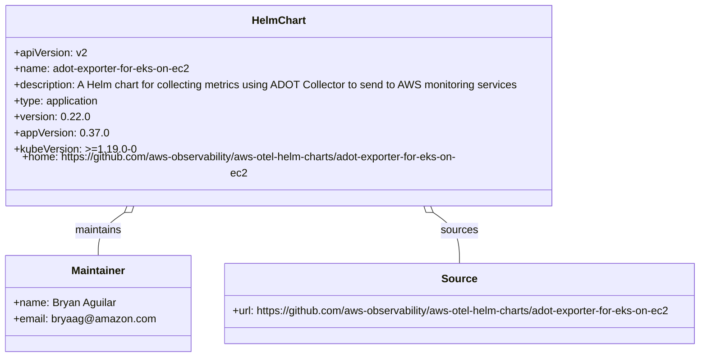
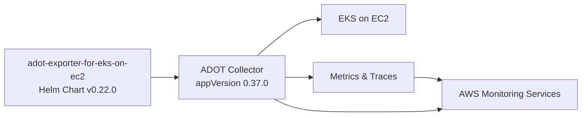

# Diagram: devops/k8s/adot-exporter-for-eks-on-ec2/helm/Chart.yaml

> Auto-generated by Obscura crawlers

## Diagram 1

### SVG

<svg id="container" width="1084.4765625" xmlns="http://www.w3.org/2000/svg" class="classDiagram" height="522" viewBox="0 0 1084.4765625 522" role="graphics-document document" aria-roledescription="class"><g><defs><marker id="container_class-aggregationStart" class="marker aggregation class" refX="18" refY="7" markerWidth="190" markerHeight="240" orient="auto"><path d="M 18,7 L9,13 L1,7 L9,1 Z"></path></marker></defs><defs><marker id="container_class-aggregationEnd" class="marker aggregation class" refX="1" refY="7" markerWidth="20" markerHeight="28" orient="auto"><path d="M 18,7 L9,13 L1,7 L9,1 Z"></path></marker></defs><defs><marker id="container_class-extensionStart" class="marker extension class" refX="18" refY="7" markerWidth="190" markerHeight="240" orient="auto"><path d="M 1,7 L18,13 V 1 Z"></path></marker></defs><defs><marker id="container_class-extensionEnd" class="marker extension class" refX="1" refY="7" markerWidth="20" markerHeight="28" orient="auto"><path d="M 1,1 V 13 L18,7 Z"></path></marker></defs><defs><marker id="container_class-compositionStart" class="marker composition class" refX="18" refY="7" markerWidth="190" markerHeight="240" orient="auto"><path d="M 18,7 L9,13 L1,7 L9,1 Z"></path></marker></defs><defs><marker id="container_class-compositionEnd" class="marker composition class" refX="1" refY="7" markerWidth="20" markerHeight="28" orient="auto"><path d="M 18,7 L9,13 L1,7 L9,1 Z"></path></marker></defs><defs><marker id="container_class-dependencyStart" class="marker dependency class" refX="6" refY="7" markerWidth="190" markerHeight="240" orient="auto"><path d="M 5,7 L9,13 L1,7 L9,1 Z"></path></marker></defs><defs><marker id="container_class-dependencyEnd" class="marker dependency class" refX="13" refY="7" markerWidth="20" markerHeight="28" orient="auto"><path d="M 18,7 L9,13 L14,7 L9,1 Z"></path></marker></defs><defs><marker id="container_class-lollipopStart" class="marker lollipop class" refX="13" refY="7" markerWidth="190" markerHeight="240" orient="auto"><circle stroke="black" fill="transparent" cx="7" cy="7" r="6"></circle></marker></defs><defs><marker id="container_class-lollipopEnd" class="marker lollipop class" refX="1" refY="7" markerWidth="190" markerHeight="240" orient="auto"><circle stroke="black" fill="transparent" cx="7" cy="7" r="6"></circle></marker></defs><g class="root"><g class="clusters"></g><g class="edgePaths"><path d="M188.616,305.374L181.503,309.978C174.39,314.582,160.164,323.791,153.051,334.562C145.938,345.333,145.938,357.667,145.938,363.833L145.938,370" id="id_HelmChart_Maintainer_1" class="edge-thickness-normal edge-pattern-solid relation" style=";;;" data-edge="true" data-et="edge" data-id="id_HelmChart_Maintainer_1" data-points="W3sieCI6MjAzLjA5NzIxMzgyOTQxOTksInkiOjI5Nn0seyJ4IjoxNDUuOTM3NSwieSI6MzMzfSx7IngiOjE0NS45Mzc1LCJ5IjozNzB9XQ==" marker-start="url(#container_class-aggregationStart)"></path><path d="M662.497,305.374L669.61,309.978C676.723,314.582,690.95,323.791,698.063,336.562C705.176,349.333,705.176,365.667,705.176,373.833L705.176,382" id="id_HelmChart_Source_2" class="edge-thickness-normal edge-pattern-solid relation" style=";;;" data-edge="true" data-et="edge" data-id="id_HelmChart_Source_2" data-points="W3sieCI6NjQ4LjAxNjA2NzQyMDU4MDIsInkiOjI5Nn0seyJ4Ijo3MDUuMTc1NzgxMjUsInkiOjMzM30seyJ4Ijo3MDUuMTc1NzgxMjUsInkiOjM4Mn1d" marker-start="url(#container_class-aggregationStart)"></path></g><g class="edgeLabels"><g class="edgeLabel" transform="translate(145.9375, 333)"><g class="label" data-id="id_HelmChart_Maintainer_1" transform="translate(-36.0234375, -12)"><foreignObject width="72.046875" height="24">

maintains

</foreignObject></g></g><g class="edgeLabel" transform="translate(705.17578125, 333)"><g class="label" data-id="id_HelmChart_Source_2" transform="translate(-27.6796875, -12)"><foreignObject width="55.359375" height="24">

sources

</foreignObject></g></g></g><g class="nodes"><g class="node default" id="classId-HelmChart-0" transform="translate(425.556640625, 152)"><g class="basic label-container"><path d="M-413.4609375 -144 L413.4609375 -144 L413.4609375 144 L-413.4609375 144" stroke="none" stroke-width="0" fill="#ECECFF" style=""></path><path d="M-413.4609375 -144 C-158.1431692818465 -144, 97.174598936307 -144, 413.4609375 -144 M-413.4609375 -144 C-172.24671589315403 -144, 68.96750571369193 -144, 413.4609375 -144 M413.4609375 -144 C413.4609375 -71.71204670561687, 413.4609375 0.5759065887662587, 413.4609375 144 M413.4609375 -144 C413.4609375 -73.74414771052624, 413.4609375 -3.48829542105247, 413.4609375 144 M413.4609375 144 C84.47966255270819 144, -244.50161239458362 144, -413.4609375 144 M413.4609375 144 C170.51366794347635 144, -72.4336016130473 144, -413.4609375 144 M-413.4609375 144 C-413.4609375 30.722370622876525, -413.4609375 -82.55525875424695, -413.4609375 -144 M-413.4609375 144 C-413.4609375 60.46452715755446, -413.4609375 -23.070945684891086, -413.4609375 -144" stroke="#9370DB" stroke-width="1.3" fill="none" stroke-dasharray="0 0" style=""></path></g><g class="annotation-group text" transform="translate(0, -120)"></g><g class="label-group text" transform="translate(-38.703125, -120)"><g class="label" style="font-weight: bolder" transform="translate(0,-12)"><foreignObject width="77.40625" height="24">

HelmChart

</foreignObject></g></g><g class="members-group text" transform="translate(-401.4609375, -72)"><g class="label" style="" transform="translate(0,-12)"><foreignObject width="108.046875" height="24">

+apiVersion: v2

</foreignObject></g><g class="label" style="" transform="translate(0,12)"><foreignObject width="269.9375" height="24">

+name: adot-exporter-for-eks-on-ec2

</foreignObject></g><g class="label" style="" transform="translate(0,36)"><foreignObject width="764.21875" height="24">

+description: A Helm chart for collecting metrics using ADOT Collector to send to AWS monitoring services

</foreignObject></g><g class="label" style="" transform="translate(0,60)"><foreignObject width="129.890625" height="24">

+type: application

</foreignObject></g><g class="label" style="" transform="translate(0,84)"><foreignObject width="110.078125" height="24">

+version: 0.22.0

</foreignObject></g><g class="label" style="" transform="translate(0,108)"><foreignObject width="136.265625" height="24">

+appVersion: 0.37.0

</foreignObject></g><g class="label" style="" transform="translate(0,132)"><foreignObject width="172.796875" height="24">

+kubeVersion: &gt;=1.19.0-0

</foreignObject></g><g class="label" style="" transform="translate(0,156)"><foreignObject width="714.53125" height="24">

+home: https://github.com/aws-observability/aws-otel-helm-charts/adot-exporter-for-eks-on-ec2

</foreignObject></g></g><g class="methods-group text" transform="translate(-401.4609375, 144)"></g><g class="divider" style=""><path d="M-413.4609375 -96 C-158.9526896452531 -96, 95.55555820949382 -96, 413.4609375 -96 M-413.4609375 -96 C-110.8950139556689 -96, 191.6709095886622 -96, 413.4609375 -96" stroke="#9370DB" stroke-width="1.3" fill="none" stroke-dasharray="0 0" style=""></path></g><g class="divider" style=""><path d="M-413.4609375 120 C-193.66358827525767 120, 26.133760949484667 120, 413.4609375 120 M-413.4609375 120 C-110.6337152551053 120, 192.1935069897894 120, 413.4609375 120" stroke="#9370DB" stroke-width="1.3" fill="none" stroke-dasharray="0 0" style=""></path></g></g><g class="node default" id="classId-Maintainer-1" transform="translate(145.9375, 442)"><g class="basic label-container"><path d="M-137.9375 -72 L137.9375 -72 L137.9375 72 L-137.9375 72" stroke="none" stroke-width="0" fill="#ECECFF" style=""></path><path d="M-137.9375 -72 C-44.47633398610823 -72, 48.98483202778354 -72, 137.9375 -72 M-137.9375 -72 C-30.615981431069073 -72, 76.70553713786185 -72, 137.9375 -72 M137.9375 -72 C137.9375 -36.07610828302588, 137.9375 -0.15221656605176292, 137.9375 72 M137.9375 -72 C137.9375 -30.673708267672367, 137.9375 10.652583464655265, 137.9375 72 M137.9375 72 C59.83573693015508 72, -18.266026139689842 72, -137.9375 72 M137.9375 72 C57.49193298780601 72, -22.95363402438798 72, -137.9375 72 M-137.9375 72 C-137.9375 17.462179424565484, -137.9375 -37.07564115086903, -137.9375 -72 M-137.9375 72 C-137.9375 29.654741182404457, -137.9375 -12.690517635191085, -137.9375 -72" stroke="#9370DB" stroke-width="1.3" fill="none" stroke-dasharray="0 0" style=""></path></g><g class="annotation-group text" transform="translate(0, -48)"></g><g class="label-group text" transform="translate(-39.421875, -48)"><g class="label" style="font-weight: bolder" transform="translate(0,-12)"><foreignObject width="78.84375" height="24">

Maintainer

</foreignObject></g></g><g class="members-group text" transform="translate(-125.9375, 0)"><g class="label" style="" transform="translate(0,-12)"><foreignObject width="153.0625" height="24">

+name: Bryan Aguilar

</foreignObject></g><g class="label" style="" transform="translate(0,12)"><foreignObject width="212.453125" height="24">

+email: bryaag@amazon.com

</foreignObject></g></g><g class="methods-group text" transform="translate(-125.9375, 72)"></g><g class="divider" style=""><path d="M-137.9375 -24 C-70.47441791499615 -24, -3.011335829992305 -24, 137.9375 -24 M-137.9375 -24 C-36.09472973132576 -24, 65.74804053734849 -24, 137.9375 -24" stroke="#9370DB" stroke-width="1.3" fill="none" stroke-dasharray="0 0" style=""></path></g><g class="divider" style=""><path d="M-137.9375 48 C-29.451226455394178 48, 79.03504708921164 48, 137.9375 48 M-137.9375 48 C-48.711151526482 48, 40.515196947036 48, 137.9375 48" stroke="#9370DB" stroke-width="1.3" fill="none" stroke-dasharray="0 0" style=""></path></g></g><g class="node default" id="classId-Source-2" transform="translate(705.17578125, 442)"><g class="basic label-container"><path d="M-371.30078125 -60 L371.30078125 -60 L371.30078125 60 L-371.30078125 60" stroke="none" stroke-width="0" fill="#ECECFF" style=""></path><path d="M-371.30078125 -60 C-188.97782042133096 -60, -6.654859592661921 -60, 371.30078125 -60 M-371.30078125 -60 C-162.55977739725398 -60, 46.18122645549204 -60, 371.30078125 -60 M371.30078125 -60 C371.30078125 -35.74985273157287, 371.30078125 -11.499705463145752, 371.30078125 60 M371.30078125 -60 C371.30078125 -30.54818373149255, 371.30078125 -1.0963674629851, 371.30078125 60 M371.30078125 60 C119.04940528756248 60, -133.20197067487504 60, -371.30078125 60 M371.30078125 60 C210.72300019741596 60, 50.14521914483191 60, -371.30078125 60 M-371.30078125 60 C-371.30078125 26.481823296324308, -371.30078125 -7.036353407351385, -371.30078125 -60 M-371.30078125 60 C-371.30078125 32.01319437628677, -371.30078125 4.0263887525735385, -371.30078125 -60" stroke="#9370DB" stroke-width="1.3" fill="none" stroke-dasharray="0 0" style=""></path></g><g class="annotation-group text" transform="translate(0, -36)"></g><g class="label-group text" transform="translate(-24.8828125, -36)"><g class="label" style="font-weight: bolder" transform="translate(0,-12)"><foreignObject width="49.765625" height="24">

Source

</foreignObject></g></g><g class="members-group text" transform="translate(-359.30078125, 12)"><g class="label" style="" transform="translate(0,-12)"><foreignObject width="693.71875" height="24">

+url: https://github.com/aws-observability/aws-otel-helm-charts/adot-exporter-for-eks-on-ec2

</foreignObject></g></g><g class="methods-group text" transform="translate(-359.30078125, 60)"></g><g class="divider" style=""><path d="M-371.30078125 -12 C-123.70686391938523 -12, 123.88705341122954 -12, 371.30078125 -12 M-371.30078125 -12 C-106.42524901464918 -12, 158.45028322070164 -12, 371.30078125 -12" stroke="#9370DB" stroke-width="1.3" fill="none" stroke-dasharray="0 0" style=""></path></g><g class="divider" style=""><path d="M-371.30078125 36 C-178.373269515015 36, 14.554242219969979 36, 371.30078125 36 M-371.30078125 36 C-214.79110089743224 36, -58.28142054486449 36, 371.30078125 36" stroke="#9370DB" stroke-width="1.3" fill="none" stroke-dasharray="0 0" style=""></path></g></g></g></g></g></svg>

## Diagram 2

### SVG

<svg id="container" width="1027.109375" xmlns="http://www.w3.org/2000/svg" class="flowchart" height="209" viewBox="0 0 1027.109375 209" role="graphics-document document" aria-roledescription="flowchart-v2"><g><marker id="container_flowchart-v2-pointEnd" class="marker flowchart-v2" viewBox="0 0 10 10" refX="5" refY="5" markerUnits="userSpaceOnUse" markerWidth="8" markerHeight="8" orient="auto"><path d="M 0 0 L 10 5 L 0 10 z" class="arrowMarkerPath" style="stroke-width: 1; stroke-dasharray: 1, 0;"></path></marker><marker id="container_flowchart-v2-pointStart" class="marker flowchart-v2" viewBox="0 0 10 10" refX="4.5" refY="5" markerUnits="userSpaceOnUse" markerWidth="8" markerHeight="8" orient="auto"><path d="M 0 5 L 10 10 L 10 0 z" class="arrowMarkerPath" style="stroke-width: 1; stroke-dasharray: 1, 0;"></path></marker><marker id="container_flowchart-v2-circleEnd" class="marker flowchart-v2" viewBox="0 0 10 10" refX="11" refY="5" markerUnits="userSpaceOnUse" markerWidth="11" markerHeight="11" orient="auto"><circle cx="5" cy="5" r="5" class="arrowMarkerPath" style="stroke-width: 1; stroke-dasharray: 1, 0;"></circle></marker><marker id="container_flowchart-v2-circleStart" class="marker flowchart-v2" viewBox="0 0 10 10" refX="-1" refY="5" markerUnits="userSpaceOnUse" markerWidth="11" markerHeight="11" orient="auto"><circle cx="5" cy="5" r="5" class="arrowMarkerPath" style="stroke-width: 1; stroke-dasharray: 1, 0;"></circle></marker><marker id="container_flowchart-v2-crossEnd" class="marker cross flowchart-v2" viewBox="0 0 11 11" refX="12" refY="5.2" markerUnits="userSpaceOnUse" markerWidth="11" markerHeight="11" orient="auto"><path d="M 1,1 l 9,9 M 10,1 l -9,9" class="arrowMarkerPath" style="stroke-width: 2; stroke-dasharray: 1, 0;"></path></marker><marker id="container_flowchart-v2-crossStart" class="marker cross flowchart-v2" viewBox="0 0 11 11" refX="-1" refY="5.2" markerUnits="userSpaceOnUse" markerWidth="11" markerHeight="11" orient="auto"><path d="M 1,1 l 9,9 M 10,1 l -9,9" class="arrowMarkerPath" style="stroke-width: 2; stroke-dasharray: 1, 0;"></path></marker><g class="root"><g class="clusters"></g><g class="edgePaths"><path d="M268,139L272.167,139C276.333,139,284.667,139,292.333,139C300,139,307,139,310.5,139L314,139" id="L_CH_COL_0" class="edge-thickness-normal edge-pattern-solid edge-thickness-normal edge-pattern-solid flowchart-link" style=";" data-edge="true" data-et="edge" data-id="L_CH_COL_0" data-points="W3sieCI6MjY4LCJ5IjoxMzl9LHsieCI6MjkzLCJ5IjoxMzl9LHsieCI6MzE4LCJ5IjoxMzl9XQ==" marker-end="url(#container_flowchart-v2-pointEnd)"></path><path d="M454.348,100L466.571,89.167C478.794,78.333,503.241,56.667,522.258,45.833C541.276,35,554.865,35,561.659,35L568.453,35" id="L_COL_EKS_0" class="edge-thickness-normal edge-pattern-solid edge-thickness-normal edge-pattern-solid flowchart-link" style=";" data-edge="true" data-et="edge" data-id="L_COL_EKS_0" data-points="W3sieCI6NDU0LjM0NzY1NjI1LCJ5IjoxMDB9LHsieCI6NTI3LjY4NzUsInkiOjM1fSx7IngiOjU3Mi40NTMxMjUsInkiOjM1fV0=" marker-end="url(#container_flowchart-v2-pointEnd)"></path><path d="M502.688,139L506.854,139C511.021,139,519.354,139,527.021,139C534.688,139,541.688,139,545.188,139L548.688,139" id="L_COL_MET_0" class="edge-thickness-normal edge-pattern-solid edge-thickness-normal edge-pattern-solid flowchart-link" style=";" data-edge="true" data-et="edge" data-id="L_COL_MET_0" data-points="W3sieCI6NTAyLjY4NzUsInkiOjEzOX0seyJ4Ijo1MjcuNjg3NSwieSI6MTM5fSx7IngiOjU1Mi42ODc1LCJ5IjoxMzl9XQ==" marker-end="url(#container_flowchart-v2-pointEnd)"></path><path d="M731.219,139L735.385,139C739.552,139,747.885,139,755.567,139.757C763.249,140.514,770.279,142.028,773.793,142.785L777.308,143.542" id="L_MET_AWS_0" class="edge-thickness-normal edge-pattern-solid edge-thickness-normal edge-pattern-solid flowchart-link" style=";" data-edge="true" data-et="edge" data-id="L_MET_AWS_0" data-points="W3sieCI6NzMxLjIxODc1LCJ5IjoxMzl9LHsieCI6NzU2LjIxODc1LCJ5IjoxMzl9LHsieCI6NzgxLjIxODc1LCJ5IjoxNDQuMzgzOTg5MTQ1MTgzMTZ9XQ==" marker-end="url(#container_flowchart-v2-pointEnd)"></path><path d="M484.157,178L491.412,181.833C498.667,185.667,513.177,193.333,539.477,197.167C565.776,201,603.865,201,641.953,201C680.042,201,718.13,201,740.689,200.243C763.249,199.486,770.279,197.972,773.793,197.215L777.308,196.458" id="L_COL_AWS_0" class="edge-thickness-normal edge-pattern-solid edge-thickness-normal edge-pattern-solid flowchart-link" style=";" data-edge="true" data-et="edge" data-id="L_COL_AWS_0" data-points="W3sieCI6NDg0LjE1Njc1NDAzMjI1ODA1LCJ5IjoxNzh9LHsieCI6NTI3LjY4NzUsInkiOjIwMX0seyJ4Ijo2NDEuOTUzMTI1LCJ5IjoyMDF9LHsieCI6NzU2LjIxODc1LCJ5IjoyMDF9LHsieCI6NzgxLjIxODc1LCJ5IjoxOTUuNjE2MDEwODU0ODE2ODR9XQ==" marker-end="url(#container_flowchart-v2-pointEnd)"></path></g><g class="edgeLabels"><g class="edgeLabel"><g class="label" data-id="L_CH_COL_0" transform="translate(0, 0)"><foreignObject width="0" height="0">

</foreignObject></g></g><g class="edgeLabel"><g class="label" data-id="L_COL_EKS_0" transform="translate(0, 0)"><foreignObject width="0" height="0">

</foreignObject></g></g><g class="edgeLabel"><g class="label" data-id="L_COL_MET_0" transform="translate(0, 0)"><foreignObject width="0" height="0">

</foreignObject></g></g><g class="edgeLabel"><g class="label" data-id="L_MET_AWS_0" transform="translate(0, 0)"><foreignObject width="0" height="0">

</foreignObject></g></g><g class="edgeLabel"><g class="label" data-id="L_COL_AWS_0" transform="translate(0, 0)"><foreignObject width="0" height="0">

</foreignObject></g></g></g><g class="nodes"><g class="node default" id="flowchart-CH-0" transform="translate(138, 139)"><rect class="basic label-container" style="" x="-130" y="-51" width="260" height="102"></rect><g class="label" style="" transform="translate(-100, -36)"><rect></rect><foreignObject width="200" height="72">

adot-exporter-for-eks-on-ec2 Helm Chart v0.22.0

</foreignObject></g></g><g class="node default" id="flowchart-COL-1" transform="translate(410.34375, 139)"><rect class="basic label-container" style="" x="-92.34375" y="-39" width="184.6875" height="78"></rect><g class="label" style="" transform="translate(-62.34375, -24)"><rect></rect><foreignObject width="124.6875" height="48">

ADOT Collector appVersion 0.37.0

</foreignObject></g></g><g class="node default" id="flowchart-EKS-2" transform="translate(641.953125, 35)"><rect class="basic label-container" style="" x="-69.5" y="-27" width="139" height="54"></rect><g class="label" style="" transform="translate(-39.5, -12)"><rect></rect><foreignObject width="79" height="24">

EKS on EC2

</foreignObject></g></g><g class="node default" id="flowchart-MET-3" transform="translate(641.953125, 139)"><rect class="basic label-container" style="" x="-89.265625" y="-27" width="178.53125" height="54"></rect><g class="label" style="" transform="translate(-59.265625, -12)"><rect></rect><foreignObject width="118.53125" height="24">

Metrics &amp; Traces

</foreignObject></g></g><g class="node default" id="flowchart-AWS-4" transform="translate(900.1640625, 170)"><rect class="basic label-container" style="" x="-118.9453125" y="-27" width="237.890625" height="54"></rect><g class="label" style="" transform="translate(-88.9453125, -12)"><rect></rect><foreignObject width="177.890625" height="24">

AWS Monitoring Services

</foreignObject></g></g></g></g></g></svg>
