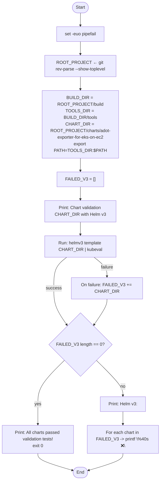
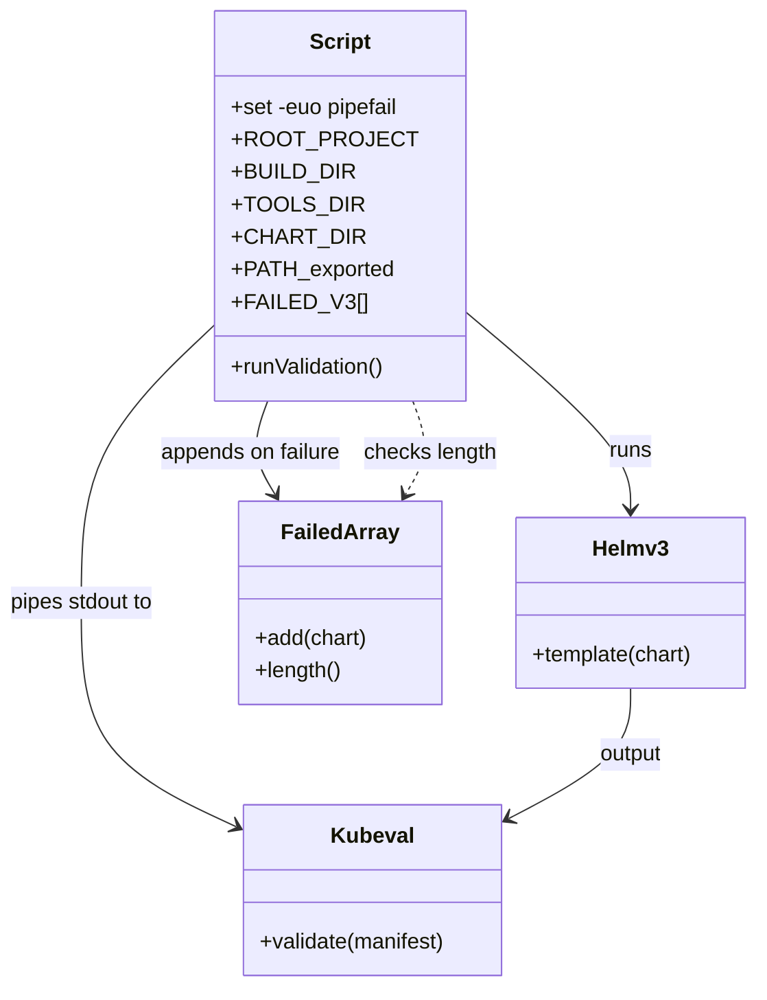

# Diagram: devops/k8s/adot-exporter-for-eks-on-ec2/helm/scripts/validate-charts.sh

> Auto-generated by Obscura crawlers

## Diagram 1

### SVG

<svg id="container" width="586" xmlns="http://www.w3.org/2000/svg" class="flowchart" height="1658.390625" viewBox="0 0 586 1658.390625" role="graphics-document document" aria-roledescription="flowchart-v2"><g><marker id="container_flowchart-v2-pointEnd" class="marker flowchart-v2" viewBox="0 0 10 10" refX="5" refY="5" markerUnits="userSpaceOnUse" markerWidth="8" markerHeight="8" orient="auto"><path d="M 0 0 L 10 5 L 0 10 z" class="arrowMarkerPath" style="stroke-width: 1; stroke-dasharray: 1, 0;"></path></marker><marker id="container_flowchart-v2-pointStart" class="marker flowchart-v2" viewBox="0 0 10 10" refX="4.5" refY="5" markerUnits="userSpaceOnUse" markerWidth="8" markerHeight="8" orient="auto"><path d="M 0 5 L 10 10 L 10 0 z" class="arrowMarkerPath" style="stroke-width: 1; stroke-dasharray: 1, 0;"></path></marker><marker id="container_flowchart-v2-circleEnd" class="marker flowchart-v2" viewBox="0 0 10 10" refX="11" refY="5" markerUnits="userSpaceOnUse" markerWidth="11" markerHeight="11" orient="auto"><circle cx="5" cy="5" r="5" class="arrowMarkerPath" style="stroke-width: 1; stroke-dasharray: 1, 0;"></circle></marker><marker id="container_flowchart-v2-circleStart" class="marker flowchart-v2" viewBox="0 0 10 10" refX="-1" refY="5" markerUnits="userSpaceOnUse" markerWidth="11" markerHeight="11" orient="auto"><circle cx="5" cy="5" r="5" class="arrowMarkerPath" style="stroke-width: 1; stroke-dasharray: 1, 0;"></circle></marker><marker id="container_flowchart-v2-crossEnd" class="marker cross flowchart-v2" viewBox="0 0 11 11" refX="12" refY="5.2" markerUnits="userSpaceOnUse" markerWidth="11" markerHeight="11" orient="auto"><path d="M 1,1 l 9,9 M 10,1 l -9,9" class="arrowMarkerPath" style="stroke-width: 2; stroke-dasharray: 1, 0;"></path></marker><marker id="container_flowchart-v2-crossStart" class="marker cross flowchart-v2" viewBox="0 0 11 11" refX="-1" refY="5.2" markerUnits="userSpaceOnUse" markerWidth="11" markerHeight="11" orient="auto"><path d="M 1,1 l 9,9 M 10,1 l -9,9" class="arrowMarkerPath" style="stroke-width: 2; stroke-dasharray: 1, 0;"></path></marker><g class="root"><g class="clusters"></g><g class="edgePaths"><path d="M293.5,47.5L293.417,51.583C293.333,55.667,293.167,63.833,293.083,71.417C293,79,293,86,293,89.5L293,93" id="L_Start_SetOpts_0" class="edge-thickness-normal edge-pattern-solid edge-thickness-normal edge-pattern-solid flowchart-link" style=";" data-edge="true" data-et="edge" data-id="L_Start_SetOpts_0" data-points="W3sieCI6MjkzLjUsInkiOjQ3LjV9LHsieCI6MjkzLCJ5Ijo3Mn0seyJ4IjoyOTMsInkiOjk3fV0=" marker-end="url(#container_flowchart-v2-pointEnd)"></path><path d="M293,151L293,155.167C293,159.333,293,167.667,293,175.333C293,183,293,190,293,193.5L293,197" id="L_SetOpts_ResolveRoot_0" class="edge-thickness-normal edge-pattern-solid edge-thickness-normal edge-pattern-solid flowchart-link" style=";" data-edge="true" data-et="edge" data-id="L_SetOpts_ResolveRoot_0" data-points="W3sieCI6MjkzLCJ5IjoxNTF9LHsieCI6MjkzLCJ5IjoxNzZ9LHsieCI6MjkzLCJ5IjoyMDF9XQ==" marker-end="url(#container_flowchart-v2-pointEnd)"></path><path d="M293,279L293,283.167C293,287.333,293,295.667,293,303.333C293,311,293,318,293,321.5L293,325" id="L_ResolveRoot_SetPaths_0" class="edge-thickness-normal edge-pattern-solid edge-thickness-normal edge-pattern-solid flowchart-link" style=";" data-edge="true" data-et="edge" data-id="L_ResolveRoot_SetPaths_0" data-points="W3sieCI6MjkzLCJ5IjoyNzl9LHsieCI6MjkzLCJ5IjozMDR9LHsieCI6MjkzLCJ5IjozMjl9XQ==" marker-end="url(#container_flowchart-v2-pointEnd)"></path><path d="M293,503L293,507.167C293,511.333,293,519.667,293,527.333C293,535,293,542,293,545.5L293,549" id="L_SetPaths_InitArray_0" class="edge-thickness-normal edge-pattern-solid edge-thickness-normal edge-pattern-solid flowchart-link" style=";" data-edge="true" data-et="edge" data-id="L_SetPaths_InitArray_0" data-points="W3sieCI6MjkzLCJ5Ijo1MDN9LHsieCI6MjkzLCJ5Ijo1Mjh9LHsieCI6MjkzLCJ5Ijo1NTN9XQ==" marker-end="url(#container_flowchart-v2-pointEnd)"></path><path d="M293,607L293,611.167C293,615.333,293,623.667,293,631.333C293,639,293,646,293,649.5L293,653" id="L_InitArray_Echo_0" class="edge-thickness-normal edge-pattern-solid edge-thickness-normal edge-pattern-solid flowchart-link" style=";" data-edge="true" data-et="edge" data-id="L_InitArray_Echo_0" data-points="W3sieCI6MjkzLCJ5Ijo2MDd9LHsieCI6MjkzLCJ5Ijo2MzJ9LHsieCI6MjkzLCJ5Ijo2NTd9XQ==" marker-end="url(#container_flowchart-v2-pointEnd)"></path><path d="M293,735L293,739.167C293,743.333,293,751.667,293,759.333C293,767,293,774,293,777.5L293,781" id="L_Echo_Template_0" class="edge-thickness-normal edge-pattern-solid edge-thickness-normal edge-pattern-solid flowchart-link" style=";" data-edge="true" data-et="edge" data-id="L_Echo_Template_0" data-points="W3sieCI6MjkzLCJ5Ijo3MzV9LHsieCI6MjkzLCJ5Ijo3NjB9LHsieCI6MjkzLCJ5Ijo3ODV9XQ==" marker-end="url(#container_flowchart-v2-pointEnd)"></path><path d="M243.615,863L235.806,869.167C227.997,875.333,212.379,887.667,204.571,906.5C196.762,925.333,196.762,950.667,196.762,974C196.762,997.333,196.762,1018.667,204.847,1040.524C212.932,1062.38,229.103,1084.761,237.188,1095.951L245.274,1107.141" id="L_Template_Check_0" class="edge-thickness-normal edge-pattern-solid edge-thickness-normal edge-pattern-solid flowchart-link" style=";" data-edge="true" data-et="edge" data-id="L_Template_Check_0" data-points="W3sieCI6MjQzLjYxNDU2NjIwMDY1NzksInkiOjg2M30seyJ4IjoxOTYuNzYxNzE4NzUsInkiOjkwMH0seyJ4IjoxOTYuNzYxNzE4NzUsInkiOjk3Nn0seyJ4IjoxOTYuNzYxNzE4NzUsInkiOjEwNDB9LHsieCI6MjQ3LjYxNjM2MzA4NzM4NCwieSI6MTExMC4zODM2MzY5MTI2MTU5fV0=" marker-end="url(#container_flowchart-v2-pointEnd)"></path><path d="M342.385,863L350.194,869.167C358.003,875.333,373.621,887.667,381.429,899.333C389.238,911,389.238,922,389.238,927.5L389.238,933" id="L_Template_AppendFail_0" class="edge-thickness-normal edge-pattern-solid edge-thickness-normal edge-pattern-solid flowchart-link" style=";" data-edge="true" data-et="edge" data-id="L_Template_AppendFail_0" data-points="W3sieCI6MzQyLjM4NTQzMzc5OTM0MjEsInkiOjg2M30seyJ4IjozODkuMjM4MjgxMjUsInkiOjkwMH0seyJ4IjozODkuMjM4MjgxMjUsInkiOjkzN31d" marker-end="url(#container_flowchart-v2-pointEnd)"></path><path d="M389.238,1015L389.238,1019.167C389.238,1023.333,389.238,1031.667,381.153,1047.024C373.068,1062.38,356.897,1084.761,348.812,1095.951L340.726,1107.141" id="L_AppendFail_Check_0" class="edge-thickness-normal edge-pattern-solid edge-thickness-normal edge-pattern-solid flowchart-link" style=";" data-edge="true" data-et="edge" data-id="L_AppendFail_Check_0" data-points="W3sieCI6Mzg5LjIzODI4MTI1LCJ5IjoxMDE1fSx7IngiOjM4OS4yMzgyODEyNSwieSI6MTA0MH0seyJ4IjozMzguMzgzNjM2OTEyNjE2LCJ5IjoxMTEwLjM4MzYzNjkxMjYxNTl9XQ==" marker-end="url(#container_flowchart-v2-pointEnd)"></path><path d="M237.135,1225.526L220.613,1241.004C204.09,1256.481,171.045,1287.436,154.523,1313.58C138,1339.724,138,1361.057,138,1380.391C138,1399.724,138,1417.057,138,1431.224C138,1445.391,138,1456.391,138,1461.891L138,1467.391" id="L_Check_Success_0" class="edge-thickness-normal edge-pattern-solid edge-thickness-normal edge-pattern-solid flowchart-link" style=";" data-edge="true" data-et="edge" data-id="L_Check_Success_0" data-points="W3sieCI6MjM3LjEzNTQ1ODY4NTc1MTQ3LCJ5IjoxMjI1LjUyNjA4MzY4NTc1MTV9LHsieCI6MTM4LCJ5IjoxMzE4LjM5MDYyNX0seyJ4IjoxMzgsInkiOjEzODIuMzkwNjI1fSx7IngiOjEzOCwieSI6MTQzNC4zOTA2MjV9LHsieCI6MTM4LCJ5IjoxNDcxLjM5MDYyNX1d" marker-end="url(#container_flowchart-v2-pointEnd)"></path><path d="M348.865,1225.526L365.387,1241.004C381.91,1256.481,414.955,1287.436,431.477,1308.413C448,1329.391,448,1340.391,448,1345.891L448,1351.391" id="L_Check_PrintHeader_0" class="edge-thickness-normal edge-pattern-solid edge-thickness-normal edge-pattern-solid flowchart-link" style=";" data-edge="true" data-et="edge" data-id="L_Check_PrintHeader_0" data-points="W3sieCI6MzQ4Ljg2NDU0MTMxNDI0ODUsInkiOjEyMjUuNTI2MDgzNjg1NzUxNX0seyJ4Ijo0NDgsInkiOjEzMTguMzkwNjI1fSx7IngiOjQ0OCwieSI6MTM1NS4zOTA2MjV9XQ==" marker-end="url(#container_flowchart-v2-pointEnd)"></path><path d="M448,1409.391L448,1413.557C448,1417.724,448,1426.057,448,1433.724C448,1441.391,448,1448.391,448,1451.891L448,1455.391" id="L_PrintHeader_PrintLoop_0" class="edge-thickness-normal edge-pattern-solid edge-thickness-normal edge-pattern-solid flowchart-link" style=";" data-edge="true" data-et="edge" data-id="L_PrintHeader_PrintLoop_0" data-points="W3sieCI6NDQ4LCJ5IjoxNDA5LjM5MDYyNX0seyJ4Ijo0NDgsInkiOjE0MzQuMzkwNjI1fSx7IngiOjQ0OCwieSI6MTQ1OS4zOTA2MjV9XQ==" marker-end="url(#container_flowchart-v2-pointEnd)"></path><path d="M138,1549.391L138,1555.557C138,1561.724,138,1574.057,159.158,1586.356C180.316,1598.655,222.633,1610.919,243.791,1617.051L264.949,1623.183" id="L_Success_End_0" class="edge-thickness-normal edge-pattern-solid edge-thickness-normal edge-pattern-solid flowchart-link" style=";" data-edge="true" data-et="edge" data-id="L_Success_End_0" data-points="W3sieCI6MTM4LCJ5IjoxNTQ5LjM5MDYyNX0seyJ4IjoxMzgsInkiOjE1ODYuMzkwNjI1fSx7IngiOjI2OC43OTA2NjQyOTQyMzYyNSwieSI6MTYyNC4yOTY2NTQ0MjY0MDk1fV0=" marker-end="url(#container_flowchart-v2-pointEnd)"></path><path d="M448,1561.391L448,1565.557C448,1569.724,448,1578.057,427.008,1588.355C406.016,1598.652,364.033,1610.914,343.041,1617.045L322.049,1623.175" id="L_PrintLoop_End_0" class="edge-thickness-normal edge-pattern-solid edge-thickness-normal edge-pattern-solid flowchart-link" style=";" data-edge="true" data-et="edge" data-id="L_PrintLoop_End_0" data-points="W3sieCI6NDQ4LCJ5IjoxNTYxLjM5MDYyNX0seyJ4Ijo0NDgsInkiOjE1ODYuMzkwNjI1fSx7IngiOjMxOC4yMDkzMzY2MzQzOTUzLCJ5IjoxNjI0LjI5NjY1NDE1OTgwMjV9XQ==" marker-end="url(#container_flowchart-v2-pointEnd)"></path></g><g class="edgeLabels"><g class="edgeLabel"><g class="label" data-id="L_Start_SetOpts_0" transform="translate(0, 0)"><foreignObject width="0" height="0">

</foreignObject></g></g><g class="edgeLabel"><g class="label" data-id="L_SetOpts_ResolveRoot_0" transform="translate(0, 0)"><foreignObject width="0" height="0">

</foreignObject></g></g><g class="edgeLabel"><g class="label" data-id="L_ResolveRoot_SetPaths_0" transform="translate(0, 0)"><foreignObject width="0" height="0">

</foreignObject></g></g><g class="edgeLabel"><g class="label" data-id="L_SetPaths_InitArray_0" transform="translate(0, 0)"><foreignObject width="0" height="0">

</foreignObject></g></g><g class="edgeLabel"><g class="label" data-id="L_InitArray_Echo_0" transform="translate(0, 0)"><foreignObject width="0" height="0">

</foreignObject></g></g><g class="edgeLabel"><g class="label" data-id="L_Echo_Template_0" transform="translate(0, 0)"><foreignObject width="0" height="0">

</foreignObject></g></g><g class="edgeLabel" transform="translate(196.76171875, 976)"><g class="label" data-id="L_Template_Check_0" transform="translate(-27.4765625, -12)"><foreignObject width="54.953125" height="24">

success

</foreignObject></g></g><g class="edgeLabel" transform="translate(389.23828125, 900)"><g class="label" data-id="L_Template_AppendFail_0" transform="translate(-23.3203125, -12)"><foreignObject width="46.640625" height="24">

failure

</foreignObject></g></g><g class="edgeLabel"><g class="label" data-id="L_AppendFail_Check_0" transform="translate(0, 0)"><foreignObject width="0" height="0">

</foreignObject></g></g><g class="edgeLabel" transform="translate(138, 1382.390625)"><g class="label" data-id="L_Check_Success_0" transform="translate(-12.0078125, -12)"><foreignObject width="24.015625" height="24">

yes

</foreignObject></g></g><g class="edgeLabel" transform="translate(448, 1318.390625)"><g class="label" data-id="L_Check_PrintHeader_0" transform="translate(-9.3671875, -12)"><foreignObject width="18.734375" height="24">

no

</foreignObject></g></g><g class="edgeLabel"><g class="label" data-id="L_PrintHeader_PrintLoop_0" transform="translate(0, 0)"><foreignObject width="0" height="0">

</foreignObject></g></g><g class="edgeLabel"><g class="label" data-id="L_Success_End_0" transform="translate(0, 0)"><foreignObject width="0" height="0">

</foreignObject></g></g><g class="edgeLabel"><g class="label" data-id="L_PrintLoop_End_0" transform="translate(0, 0)"><foreignObject width="0" height="0">

</foreignObject></g></g></g><g class="nodes"><g class="node default" id="flowchart-Start-0" transform="translate(293, 27.5)"><g class="basic label-container outer-path"><path d="M-10.3984375 -19.5 C-4.305784679731904 -19.5, 1.7868681405361926 -19.5, 10.3984375 -19.5 C10.3984375 -19.5, 10.3984375 -19.5, 10.398437499999998 -19.5 C10.857441380681895 -19.485280638943387, 11.316445261363791 -19.470561277886773, 11.6478067896239 -19.45993515863156 C12.120508387150734 -19.414334204024993, 12.593209984677568 -19.368733249418423, 12.892042152847864 -19.3399052695533 C13.200821018054542 -19.289984297242547, 13.50959988326122 -19.240063324931796, 14.126030759676757 -19.140403561325776 C14.56224111016312 -19.040841395365824, 14.998451460649482 -18.941279229405872, 15.34470188623539 -18.862249829261074 C15.732099584273186 -18.74727222597547, 16.11949728231098 -18.632294622689866, 16.543047751460602 -18.50658706670804 C16.94630454825256 -18.358184837823632, 17.349561345044517 -18.209782608939225, 17.716144095147794 -18.074876768247425 C18.021125229705508 -17.939870666922644, 18.326106364263218 -17.804864565597864, 18.85917041279238 -17.568892924097174 C19.283743656366028 -17.347393334876944, 19.708316899939675 -17.125893745656718, 19.967429764076783 -16.990714730406097 C20.341075270690162 -16.76420862851234, 20.71472077730354 -16.537702526618585, 21.036368073605697 -16.342718045390892 C21.396969459359298 -16.09117812887158, 21.757570845112895 -15.839638212352266, 22.061592844578712 -15.627565626425154 C22.317164037764083 -15.423754400894895, 22.572735230949455 -15.219943175364637, 23.03889120850187 -14.848196188198123 C23.381188944747866 -14.53733044084132, 23.72348668099386 -14.226464693484516, 23.964247236767985 -14.007812326905688 C24.301982061528033 -13.659073391796143, 24.63971688628808 -13.310334456686599, 24.833858442968648 -13.10986736009568 C25.110405548649048 -12.785019393787392, 25.386952654329445 -12.460171427479104, 25.644151408126582 -12.158051136245305 C25.858019404978872 -11.871487504238567, 26.071887401831162 -11.584923872231832, 26.391796464640635 -11.156274872382312 C26.657702892723606 -10.747771192973165, 26.923609320806577 -10.339267513564016, 27.073721378604247 -10.108655082055241 C27.318767183915714 -9.673551441146255, 27.563812989227177 -9.238447800237267, 27.6871239742735 -9.019496659696287 C27.817888176209127 -8.74796199647125, 27.948652378144757 -8.476427333246212, 28.22948364880834 -7.893275190886684 C28.396087722626238 -7.48175990748584, 28.562691796444135 -7.070244624084996, 28.698571729970325 -6.734618561215508 C28.793121729948258 -6.4498490257786685, 28.887671729926193 -6.165079490341829, 29.09246063421488 -5.548287939305138 C29.210362888880848 -5.098675543103392, 29.32826514354682 -4.649063146901645, 29.40953178754556 -4.339158212148133 C29.477099959587814 -3.9922099292493756, 29.54466813163007 -3.6452616463506176, 29.648482276581777 -3.1121979531509023 C29.69184373936069 -2.7758950105269893, 29.735205202139603 -2.4395920679030763, 29.808330202509367 -1.872449005199798 C29.830879096177284 -1.5212317851826103, 29.8534279898452 -1.1700145651654228, 29.888418715913414 -0.6250057626472757 C29.888418715913414 -0.32310754248127715, 29.888418715913414 -0.02120932231527861, 29.888418715913414 0.625005762647271 C29.85752538181733 1.1061943778442607, 29.826632047721244 1.5873829930412504, 29.808330202509367 1.8724490051997846 C29.774861037630092 2.1320292387692663, 29.74139187275082 2.3916094723387484, 29.648482276581777 3.1121979531508885 C29.569886719831807 3.5157695258851853, 29.491291163081836 3.919341098619482, 29.40953178754556 4.339158212148129 C29.33416105599935 4.6265794774155236, 29.258790324453138 4.9140007426829175, 29.092460634214884 5.548287939305125 C28.966481205177953 5.927717907468191, 28.84050177614102 6.307147875631256, 28.69857172997033 6.734618561215495 C28.55492795674708 7.08942145824035, 28.41128418352383 7.444224355265207, 28.229483648808344 7.893275190886679 C28.110364004934457 8.140629680142885, 27.991244361060566 8.387984169399092, 27.687123974273504 9.019496659696284 C27.51080695511937 9.332565381238659, 27.33448993596524 9.645634102781033, 27.07372137860425 10.108655082055236 C26.908040697072977 10.363185100379658, 26.742360015541706 10.617715118704082, 26.39179646464064 11.156274872382301 C26.184764959298693 11.43367822858237, 25.977733453956745 11.711081584782438, 25.644151408126582 12.158051136245302 C25.412080873864852 12.430654390976617, 25.180010339603122 12.703257645707932, 24.83385844296866 13.10986736009567 C24.563257908365614 13.389284628790378, 24.292657373762573 13.668701897485088, 23.96424723676799 14.007812326905684 C23.687829312729313 14.258847771900115, 23.411411388690635 14.509883216894545, 23.038891208501887 14.848196188198111 C22.800611279273788 15.038218090862301, 22.562331350045692 15.228239993526493, 22.061592844578715 15.627565626425152 C21.709573442698357 15.873119122502587, 21.357554040818002 16.11867261858002, 21.036368073605708 16.34271804539089 C20.68739147636704 16.55426970945109, 20.338414879128372 16.765821373511294, 19.967429764076787 16.990714730406093 C19.58133067668752 17.192142376988805, 19.195231589298256 17.393570023571517, 18.859170412792388 17.56889292409717 C18.58553692423964 17.690022352430432, 18.311903435686897 17.811151780763694, 17.716144095147804 18.07487676824742 C17.303547566400475 18.22671610482694, 16.890951037653146 18.37855544140646, 16.543047751460616 18.506587066708033 C16.2653236085649 18.589014134515708, 15.987599465669177 18.671441202323386, 15.344701886235413 18.86224982926107 C15.07631445487929 18.92350750907644, 14.807927023523165 18.98476518889181, 14.126030759676766 19.140403561325773 C13.696405535073787 19.209862035846207, 13.266780310470809 19.279320510366638, 12.892042152847878 19.3399052695533 C12.640998850973446 19.36412311496138, 12.389955549099014 19.388340960369465, 11.6478067896239 19.45993515863156 C11.311993616803049 19.470704033463235, 10.976180443982198 19.48147290829491, 10.398437500000004 19.5 C10.398437500000004 19.5, 10.398437500000002 19.5, 10.3984375 19.5 C4.664976292715511 19.5, -1.0684849145689785 19.5, -10.398437499999996 19.5 C-10.795040512804276 19.4872817133203, -11.191643525608557 19.4745634266406, -11.647806789623893 19.45993515863156 C-12.083303619967737 19.417923303169857, -12.518800450311579 19.37591144770815, -12.892042152847871 19.3399052695533 C-13.2975275810722 19.27434953010445, -13.70301300929653 19.208793790655598, -14.126030759676759 19.140403561325773 C-14.42480063226795 19.072211287562457, -14.72357050485914 19.00401901379914, -15.344701886235388 18.862249829261074 C-15.669065486010696 18.76598041546704, -15.993429085786005 18.66971100167301, -16.54304775146059 18.506587066708043 C-16.958610679798685 18.353656067658026, -17.374173608136783 18.20072506860801, -17.716144095147797 18.074876768247425 C-18.00440467523682 17.947272360388308, -18.29266525532584 17.81966795252919, -18.85917041279238 17.568892924097174 C-19.302201386937018 17.3377639486608, -19.745232361081655 17.106634973224423, -19.96742976407678 16.990714730406097 C-20.193306139520125 16.85378714421542, -20.419182514963467 16.716859558024744, -21.036368073605686 16.3427180453909 C-21.3285909162887 16.138876040458204, -21.620813758971714 15.935034035525511, -22.061592844578712 15.627565626425156 C-22.393962298339265 15.362509831773735, -22.726331752099817 15.097454037122313, -23.03889120850187 14.848196188198125 C-23.368186841618158 14.549138606886924, -23.697482474734446 14.25008102557572, -23.964247236767974 14.007812326905697 C-24.276191547589363 13.685704214878395, -24.588135858410748 13.363596102851094, -24.833858442968655 13.109867360095677 C-25.021285128975546 12.889705309831424, -25.20871181498244 12.66954325956717, -25.64415140812658 12.158051136245307 C-25.931753276976085 11.772690833056226, -26.219355145825595 11.387330529867144, -26.391796464640635 11.156274872382316 C-26.59088554252429 10.850420585850097, -26.789974620407946 10.54456629931788, -27.073721378604244 10.108655082055249 C-27.29960208435219 9.707581016098063, -27.525482790100135 9.306506950140875, -27.6871239742735 9.019496659696289 C-27.844474424721717 8.692755082580273, -28.001824875169934 8.366013505464258, -28.22948364880834 7.893275190886686 C-28.35014941529979 7.595228414738916, -28.47081518179124 7.297181638591145, -28.698571729970325 6.73461856121551 C-28.819473170174817 6.370482686348103, -28.94037461037931 6.006346811480696, -29.09246063421488 5.5482879393051325 C-29.190447931796665 5.17461990566237, -29.288435229378454 4.800951872019607, -29.409531787545557 4.339158212148136 C-29.47033612075279 4.026940812129369, -29.531140453960024 3.714723412110602, -29.648482276581777 3.112197953150904 C-29.685268530169267 2.826891034593758, -29.722054783756754 2.5415841160366117, -29.808330202509364 1.872449005199809 C-29.834931347579015 1.4581146986821358, -29.86153249264867 1.0437803921644624, -29.888418715913414 0.6250057626472781 C-29.888418715913414 0.3731473105432478, -29.888418715913414 0.12128885843921744, -29.888418715913414 -0.6250057626472687 C-29.85941729515131 -1.0767263005425567, -29.830415874389203 -1.5284468384378447, -29.808330202509367 -1.8724490051997822 C-29.767952479782352 -2.1856106491872924, -29.72757475705534 -2.4987722931748024, -29.648482276581777 -3.112197953150895 C-29.59668089007518 -3.378187124635355, -29.544879503568584 -3.6441762961198148, -29.40953178754556 -4.339158212148126 C-29.343078488218204 -4.59257344352545, -29.276625188890847 -4.845988674902774, -29.092460634214884 -5.548287939305123 C-28.96046230127399 -5.945845887044825, -28.828463968333093 -6.343403834784528, -28.698571729970332 -6.734618561215485 C-28.524629972536474 -7.1642580650122225, -28.35068821510261 -7.593897568808961, -28.229483648808344 -7.893275190886676 C-28.088920138079036 -8.18515832849341, -27.948356627349728 -8.477041466100145, -27.687123974273504 -9.019496659696282 C-27.562629769903147 -9.240548725961034, -27.43813556553279 -9.461600792225788, -27.073721378604247 -10.108655082055243 C-26.82141436376656 -10.496266410765859, -26.569107348928874 -10.883877739476477, -26.39179646464064 -11.156274872382308 C-26.15053927629477 -11.479537525783767, -25.9092820879489 -11.802800179185226, -25.644151408126586 -12.158051136245302 C-25.466071463445516 -12.367233972303596, -25.287991518764443 -12.576416808361891, -24.833858442968662 -13.10986736009567 C-24.523985740158214 -13.429836366769495, -24.21411303734777 -13.74980537344332, -23.964247236767996 -14.007812326905677 C-23.7734783951896 -14.18106354136022, -23.582709553611203 -14.354314755814764, -23.038891208501887 -14.848196188198107 C-22.700520712752017 -15.118037654141578, -22.362150217002142 -15.387879120085048, -22.06159284457872 -15.627565626425149 C-21.770279521961854 -15.830773189532188, -21.47896619934499 -16.033980752639227, -21.03636807360571 -16.342718045390885 C-20.81771455466313 -16.475267093524582, -20.599061035720545 -16.607816141658283, -19.96742976407679 -16.99071473040609 C-19.722701798897585 -17.11838915308434, -19.477973833718377 -17.246063575762587, -18.859170412792388 -17.56889292409717 C-18.452953453708737 -17.748713121885547, -18.046736494625087 -17.928533319673924, -17.716144095147804 -18.07487676824742 C-17.363824130005817 -18.20453377222973, -17.01150416486383 -18.334190776212036, -16.54304775146062 -18.506587066708033 C-16.0996261823217 -18.63819226086115, -15.656204613182783 -18.769797455014267, -15.344701886235413 -18.862249829261067 C-15.00550038822509 -18.939670357685287, -14.66629889021477 -19.017090886109507, -14.126030759676768 -19.140403561325773 C-13.833528388740241 -19.187693076269024, -13.541026017803716 -19.23498259121228, -12.89204215284788 -19.3399052695533 C-12.619074550257666 -19.366238125883605, -12.346106947667453 -19.392570982213908, -11.647806789623903 -19.45993515863156 C-11.33704091458797 -19.46990081537488, -11.026275039552036 -19.479866472118204, -10.398437500000005 -19.5 C-10.398437500000004 -19.5, -10.398437500000002 -19.5, -10.3984375 -19.5" stroke="none" stroke-width="0" fill="#ECECFF" style=""></path><path d="M-10.3984375 -19.5 C-5.20843272799124 -19.5, -0.018427955982479816 -19.5, 10.3984375 -19.5 M-10.3984375 -19.5 C-5.596700509829651 -19.5, -0.7949635196593015 -19.5, 10.3984375 -19.5 M10.3984375 -19.5 C10.3984375 -19.5, 10.398437499999998 -19.5, 10.398437499999998 -19.5 M10.3984375 -19.5 C10.3984375 -19.5, 10.3984375 -19.5, 10.398437499999998 -19.5 M10.398437499999998 -19.5 C10.66976397065059 -19.491299088191173, 10.941090441301183 -19.482598176382346, 11.6478067896239 -19.45993515863156 M10.398437499999998 -19.5 C10.66181945705765 -19.49155385327904, 10.9252014141153 -19.48310770655808, 11.6478067896239 -19.45993515863156 M11.6478067896239 -19.45993515863156 C12.076557801106397 -19.418574064202375, 12.505308812588893 -19.377212969773193, 12.892042152847864 -19.3399052695533 M11.6478067896239 -19.45993515863156 C12.109574937605956 -19.41538894075318, 12.571343085588012 -19.370842722874798, 12.892042152847864 -19.3399052695533 M12.892042152847864 -19.3399052695533 C13.353790726471905 -19.265253341083433, 13.815539300095947 -19.19060141261357, 14.126030759676757 -19.140403561325776 M12.892042152847864 -19.3399052695533 C13.189084030263597 -19.291881842406887, 13.486125907679332 -19.243858415260476, 14.126030759676757 -19.140403561325776 M14.126030759676757 -19.140403561325776 C14.380190116959396 -19.082393346570818, 14.634349474242034 -19.024383131815863, 15.34470188623539 -18.862249829261074 M14.126030759676757 -19.140403561325776 C14.474312604485918 -19.060910502999523, 14.82259444929508 -18.981417444673266, 15.34470188623539 -18.862249829261074 M15.34470188623539 -18.862249829261074 C15.586757025377182 -18.790409134537143, 15.828812164518972 -18.718568439813215, 16.543047751460602 -18.50658706670804 M15.34470188623539 -18.862249829261074 C15.659354293648388 -18.768862646385088, 15.974006701061384 -18.675475463509102, 16.543047751460602 -18.50658706670804 M16.543047751460602 -18.50658706670804 C16.95066029769525 -18.356581881764615, 17.358272843929896 -18.20657669682119, 17.716144095147794 -18.074876768247425 M16.543047751460602 -18.50658706670804 C16.854932535329954 -18.39181058321278, 17.166817319199307 -18.27703409971752, 17.716144095147794 -18.074876768247425 M17.716144095147794 -18.074876768247425 C18.065696752684147 -17.920140175867253, 18.4152494102205 -17.76540358348708, 18.85917041279238 -17.568892924097174 M17.716144095147794 -18.074876768247425 C18.121557247418863 -17.895412391890893, 18.526970399689933 -17.715948015534366, 18.85917041279238 -17.568892924097174 M18.85917041279238 -17.568892924097174 C19.27733491946497 -17.350736768813235, 19.695499426137555 -17.132580613529296, 19.967429764076783 -16.990714730406097 M18.85917041279238 -17.568892924097174 C19.205787771627797 -17.38806287001175, 19.55240513046321 -17.207232815926332, 19.967429764076783 -16.990714730406097 M19.967429764076783 -16.990714730406097 C20.279304647312383 -16.801654343408426, 20.591179530547983 -16.612593956410755, 21.036368073605697 -16.342718045390892 M19.967429764076783 -16.990714730406097 C20.340940926660544 -16.76429006865259, 20.7144520892443 -16.53786540689908, 21.036368073605697 -16.342718045390892 M21.036368073605697 -16.342718045390892 C21.361392928107133 -16.115994776989872, 21.68641778260857 -15.889271508588854, 22.061592844578712 -15.627565626425154 M21.036368073605697 -16.342718045390892 C21.277501247021327 -16.174513982102987, 21.518634420436957 -16.00630991881508, 22.061592844578712 -15.627565626425154 M22.061592844578712 -15.627565626425154 C22.410231675536764 -15.349535436405038, 22.758870506494812 -15.07150524638492, 23.03889120850187 -14.848196188198123 M22.061592844578712 -15.627565626425154 C22.39187740030164 -15.36417248247727, 22.72216195602457 -15.100779338529387, 23.03889120850187 -14.848196188198123 M23.03889120850187 -14.848196188198123 C23.259029612121374 -14.648272314573875, 23.47916801574088 -14.448348440949626, 23.964247236767985 -14.007812326905688 M23.03889120850187 -14.848196188198123 C23.377541137650304 -14.540643282731638, 23.71619106679874 -14.233090377265153, 23.964247236767985 -14.007812326905688 M23.964247236767985 -14.007812326905688 C24.25195374349947 -13.710731737561932, 24.539660250230956 -13.413651148218177, 24.833858442968648 -13.10986736009568 M23.964247236767985 -14.007812326905688 C24.286124573219528 -13.675447550398678, 24.60800190967107 -13.34308277389167, 24.833858442968648 -13.10986736009568 M24.833858442968648 -13.10986736009568 C25.005603561065474 -12.908125771805087, 25.177348679162296 -12.706384183514492, 25.644151408126582 -12.158051136245305 M24.833858442968648 -13.10986736009568 C25.06311373453425 -12.840571049627085, 25.292369026099855 -12.571274739158492, 25.644151408126582 -12.158051136245305 M25.644151408126582 -12.158051136245305 C25.924222187975154 -11.782781806221154, 26.204292967823726 -11.407512476197004, 26.391796464640635 -11.156274872382312 M25.644151408126582 -12.158051136245305 C25.87638199430535 -11.846883307407388, 26.10861258048412 -11.53571547856947, 26.391796464640635 -11.156274872382312 M26.391796464640635 -11.156274872382312 C26.605975844491464 -10.827237829715058, 26.820155224342297 -10.498200787047802, 27.073721378604247 -10.108655082055241 M26.391796464640635 -11.156274872382312 C26.65788720062445 -10.747488046543863, 26.92397793660827 -10.338701220705413, 27.073721378604247 -10.108655082055241 M27.073721378604247 -10.108655082055241 C27.316829928376198 -9.676991234525062, 27.559938478148144 -9.245327386994882, 27.6871239742735 -9.019496659696287 M27.073721378604247 -10.108655082055241 C27.24390681311747 -9.806473609933073, 27.41409224763069 -9.504292137810904, 27.6871239742735 -9.019496659696287 M27.6871239742735 -9.019496659696287 C27.846992511058318 -8.687526222423903, 28.006861047843135 -8.35555578515152, 28.22948364880834 -7.893275190886684 M27.6871239742735 -9.019496659696287 C27.838129789759584 -8.70592985283258, 27.989135605245668 -8.392363045968875, 28.22948364880834 -7.893275190886684 M28.22948364880834 -7.893275190886684 C28.401739750819427 -7.4677992885741284, 28.573995852830517 -7.042323386261572, 28.698571729970325 -6.734618561215508 M28.22948364880834 -7.893275190886684 C28.41245274759705 -7.441337979411694, 28.595421846385765 -6.989400767936704, 28.698571729970325 -6.734618561215508 M28.698571729970325 -6.734618561215508 C28.78229182502447 -6.482466973898108, 28.86601192007861 -6.23031538658071, 29.09246063421488 -5.548287939305138 M28.698571729970325 -6.734618561215508 C28.80818274415457 -6.404487650635993, 28.917793758338817 -6.074356740056476, 29.09246063421488 -5.548287939305138 M29.09246063421488 -5.548287939305138 C29.17079440055862 -5.249567338167365, 29.249128166902363 -4.950846737029592, 29.40953178754556 -4.339158212148133 M29.09246063421488 -5.548287939305138 C29.17905446883588 -5.2180681178899455, 29.265648303456878 -4.887848296474752, 29.40953178754556 -4.339158212148133 M29.40953178754556 -4.339158212148133 C29.485362992432663 -3.949781001983697, 29.561194197319764 -3.5604037918192613, 29.648482276581777 -3.1121979531509023 M29.40953178754556 -4.339158212148133 C29.493650188043247 -3.9072280040227585, 29.57776858854093 -3.475297795897384, 29.648482276581777 -3.1121979531509023 M29.648482276581777 -3.1121979531509023 C29.682650269802828 -2.847197744961864, 29.716818263023878 -2.5821975367728265, 29.808330202509367 -1.872449005199798 M29.648482276581777 -3.1121979531509023 C29.692430830467263 -2.7713416478386543, 29.73637938435275 -2.4304853425264064, 29.808330202509367 -1.872449005199798 M29.808330202509367 -1.872449005199798 C29.828922970976695 -1.5517000141376105, 29.849515739444026 -1.230951023075423, 29.888418715913414 -0.6250057626472757 M29.808330202509367 -1.872449005199798 C29.832097864633287 -1.5022484827081988, 29.855865526757203 -1.1320479602165996, 29.888418715913414 -0.6250057626472757 M29.888418715913414 -0.6250057626472757 C29.888418715913414 -0.32660488329484694, 29.888418715913414 -0.028204003942418177, 29.888418715913414 0.625005762647271 M29.888418715913414 -0.6250057626472757 C29.888418715913414 -0.16768666413833955, 29.888418715913414 0.2896324343705966, 29.888418715913414 0.625005762647271 M29.888418715913414 0.625005762647271 C29.86868500313628 0.932374267917337, 29.848951290359153 1.239742773187403, 29.808330202509367 1.8724490051997846 M29.888418715913414 0.625005762647271 C29.862427074702346 1.0298465545848359, 29.83643543349128 1.4346873465224008, 29.808330202509367 1.8724490051997846 M29.808330202509367 1.8724490051997846 C29.75743714051074 2.267165544089337, 29.706544078512106 2.661882082978889, 29.648482276581777 3.1121979531508885 M29.808330202509367 1.8724490051997846 C29.772748171132303 2.148416214093459, 29.737166139755235 2.4243834229871335, 29.648482276581777 3.1121979531508885 M29.648482276581777 3.1121979531508885 C29.555938130929583 3.587392581862808, 29.463393985277385 4.062587210574727, 29.40953178754556 4.339158212148129 M29.648482276581777 3.1121979531508885 C29.57287405004504 3.500430216612689, 29.497265823508307 3.8886624800744896, 29.40953178754556 4.339158212148129 M29.40953178754556 4.339158212148129 C29.304001928210923 4.741589302721456, 29.198472068876285 5.144020393294784, 29.092460634214884 5.548287939305125 M29.40953178754556 4.339158212148129 C29.322107216584257 4.672545991272314, 29.234682645622954 5.005933770396499, 29.092460634214884 5.548287939305125 M29.092460634214884 5.548287939305125 C28.979796139449807 5.8876154468880415, 28.86713164468473 6.2269429544709585, 28.69857172997033 6.734618561215495 M29.092460634214884 5.548287939305125 C28.99482961493161 5.842337013995885, 28.897198595648337 6.1363860886866455, 28.69857172997033 6.734618561215495 M28.69857172997033 6.734618561215495 C28.538060002334472 7.131085631759204, 28.377548274698615 7.527552702302913, 28.229483648808344 7.893275190886679 M28.69857172997033 6.734618561215495 C28.561168815504093 7.074006416451733, 28.423765901037854 7.413394271687972, 28.229483648808344 7.893275190886679 M28.229483648808344 7.893275190886679 C28.0896888415262 8.18356209933776, 27.949894034244053 8.473849007788841, 27.687123974273504 9.019496659696284 M28.229483648808344 7.893275190886679 C28.05702802919785 8.251382974967013, 27.884572409587353 8.609490759047349, 27.687123974273504 9.019496659696284 M27.687123974273504 9.019496659696284 C27.514388341675396 9.326206266753726, 27.341652709077287 9.632915873811168, 27.07372137860425 10.108655082055236 M27.687123974273504 9.019496659696284 C27.552065401734602 9.259306831402567, 27.4170068291957 9.49911700310885, 27.07372137860425 10.108655082055236 M27.07372137860425 10.108655082055236 C26.932291588968436 10.325929218151957, 26.79086179933262 10.543203354248678, 26.39179646464064 11.156274872382301 M27.07372137860425 10.108655082055236 C26.851161825703453 10.450566320918789, 26.628602272802656 10.792477559782343, 26.39179646464064 11.156274872382301 M26.39179646464064 11.156274872382301 C26.14711879881282 11.48412065399767, 25.902441132984993 11.811966435613035, 25.644151408126582 12.158051136245302 M26.39179646464064 11.156274872382301 C26.168697181438148 11.455207587110825, 25.945597898235654 11.75414030183935, 25.644151408126582 12.158051136245302 M25.644151408126582 12.158051136245302 C25.424714170783247 12.41581460156131, 25.20527693343991 12.673578066877319, 24.83385844296866 13.10986736009567 M25.644151408126582 12.158051136245302 C25.360493265335393 12.491252131373402, 25.076835122544203 12.824453126501503, 24.83385844296866 13.10986736009567 M24.83385844296866 13.10986736009567 C24.577562113741944 13.374514362342218, 24.321265784515226 13.639161364588766, 23.96424723676799 14.007812326905684 M24.83385844296866 13.10986736009567 C24.59889297585946 13.352488495909531, 24.363927508750262 13.595109631723393, 23.96424723676799 14.007812326905684 M23.96424723676799 14.007812326905684 C23.751245022071117 14.201255302563611, 23.538242807374242 14.39469827822154, 23.038891208501887 14.848196188198111 M23.96424723676799 14.007812326905684 C23.76844560078665 14.185634192076538, 23.572643964805312 14.363456057247392, 23.038891208501887 14.848196188198111 M23.038891208501887 14.848196188198111 C22.76096274378538 15.069836742822467, 22.483034279068875 15.291477297446823, 22.061592844578715 15.627565626425152 M23.038891208501887 14.848196188198111 C22.690616145253426 15.125936283150095, 22.342341082004964 15.403676378102078, 22.061592844578715 15.627565626425152 M22.061592844578715 15.627565626425152 C21.756938964458996 15.840078984942757, 21.452285084339273 16.05259234346036, 21.036368073605708 16.34271804539089 M22.061592844578715 15.627565626425152 C21.683685645435713 15.891177329208327, 21.30577844629271 16.154789031991502, 21.036368073605708 16.34271804539089 M21.036368073605708 16.34271804539089 C20.688262914041484 16.553741438811706, 20.34015775447726 16.764764832232526, 19.967429764076787 16.990714730406093 M21.036368073605708 16.34271804539089 C20.6640035075758 16.568447633575303, 20.29163894154589 16.794177221759714, 19.967429764076787 16.990714730406093 M19.967429764076787 16.990714730406093 C19.73776719597692 17.110529545077895, 19.50810462787706 17.2303443597497, 18.859170412792388 17.56889292409717 M19.967429764076787 16.990714730406093 C19.54367679551955 17.211786382675676, 19.119923826962307 17.432858034945255, 18.859170412792388 17.56889292409717 M18.859170412792388 17.56889292409717 C18.503371341627997 17.7263946184972, 18.147572270463602 17.883896312897228, 17.716144095147804 18.07487676824742 M18.859170412792388 17.56889292409717 C18.590220845306654 17.68794891951765, 18.321271277820916 17.807004914938126, 17.716144095147804 18.07487676824742 M17.716144095147804 18.07487676824742 C17.247238133058083 18.247438496815636, 16.778332170968365 18.42000022538385, 16.543047751460616 18.506587066708033 M17.716144095147804 18.07487676824742 C17.31378955124693 18.222946959727576, 16.911435007346054 18.371017151207727, 16.543047751460616 18.506587066708033 M16.543047751460616 18.506587066708033 C16.09547412222675 18.639424570502726, 15.647900492992884 18.772262074297416, 15.344701886235413 18.86224982926107 M16.543047751460616 18.506587066708033 C16.156193419679557 18.621403401740828, 15.7693390878985 18.73621973677362, 15.344701886235413 18.86224982926107 M15.344701886235413 18.86224982926107 C14.910072451840838 18.961451161439513, 14.475443017446263 19.060652493617958, 14.126030759676766 19.140403561325773 M15.344701886235413 18.86224982926107 C15.0090422556328 18.938861949562323, 14.673382625030188 19.01547406986358, 14.126030759676766 19.140403561325773 M14.126030759676766 19.140403561325773 C13.748759923854674 19.20139778428246, 13.37148908803258 19.26239200723915, 12.892042152847878 19.3399052695533 M14.126030759676766 19.140403561325773 C13.68414819702415 19.211843707204995, 13.242265634371536 19.283283853084217, 12.892042152847878 19.3399052695533 M12.892042152847878 19.3399052695533 C12.456776769869357 19.381894797566027, 12.021511386890834 19.42388432557875, 11.6478067896239 19.45993515863156 M12.892042152847878 19.3399052695533 C12.580899869339994 19.36992079143996, 12.269757585832108 19.399936313326624, 11.6478067896239 19.45993515863156 M11.6478067896239 19.45993515863156 C11.176013571073984 19.475064648860663, 10.70422035252407 19.49019413908977, 10.398437500000004 19.5 M11.6478067896239 19.45993515863156 C11.35031034911506 19.469475290436986, 11.052813908606222 19.47901542224241, 10.398437500000004 19.5 M10.398437500000004 19.5 C10.398437500000004 19.5, 10.398437500000002 19.5, 10.3984375 19.5 M10.398437500000004 19.5 C10.398437500000002 19.5, 10.398437500000002 19.5, 10.3984375 19.5 M10.3984375 19.5 C3.5004918533061895 19.5, -3.397453793387621 19.5, -10.398437499999996 19.5 M10.3984375 19.5 C5.7710486524147795 19.5, 1.143659804829559 19.5, -10.398437499999996 19.5 M-10.398437499999996 19.5 C-10.84111561678739 19.48580417441531, -11.283793733574782 19.471608348830625, -11.647806789623893 19.45993515863156 M-10.398437499999996 19.5 C-10.789531023867138 19.487458391906944, -11.18062454773428 19.47491678381389, -11.647806789623893 19.45993515863156 M-11.647806789623893 19.45993515863156 C-12.003780135027776 19.42559483812103, -12.35975348043166 19.391254517610502, -12.892042152847871 19.3399052695533 M-11.647806789623893 19.45993515863156 C-11.94840781323124 19.43093653940978, -12.249008836838586 19.401937920188004, -12.892042152847871 19.3399052695533 M-12.892042152847871 19.3399052695533 C-13.359492729601934 19.264331485437065, -13.826943306355997 19.18875770132083, -14.126030759676759 19.140403561325773 M-12.892042152847871 19.3399052695533 C-13.284828766049396 19.276402576036556, -13.67761537925092 19.21289988251981, -14.126030759676759 19.140403561325773 M-14.126030759676759 19.140403561325773 C-14.481518834047407 19.05926572812715, -14.837006908418054 18.978127894928534, -15.344701886235388 18.862249829261074 M-14.126030759676759 19.140403561325773 C-14.585501777026275 19.035532299944343, -15.044972794375793 18.930661038562913, -15.344701886235388 18.862249829261074 M-15.344701886235388 18.862249829261074 C-15.77784707424304 18.73369461108589, -16.21099226225069 18.60513939291071, -16.54304775146059 18.506587066708043 M-15.344701886235388 18.862249829261074 C-15.773930014814194 18.73485717376331, -16.203158143393 18.607464518265544, -16.54304775146059 18.506587066708043 M-16.54304775146059 18.506587066708043 C-16.888880196547593 18.379317530075948, -17.234712641634594 18.252047993443853, -17.716144095147797 18.074876768247425 M-16.54304775146059 18.506587066708043 C-16.873378477729986 18.385022305897145, -17.20370920399938 18.263457545086247, -17.716144095147797 18.074876768247425 M-17.716144095147797 18.074876768247425 C-18.113363970681615 17.899039312457557, -18.510583846215432 17.72320185666769, -18.85917041279238 17.568892924097174 M-17.716144095147797 18.074876768247425 C-18.01189966656168 17.94395455005981, -18.30765523797556 17.813032331872197, -18.85917041279238 17.568892924097174 M-18.85917041279238 17.568892924097174 C-19.270039168463917 17.35454295743733, -19.680907924135454 17.14019299077749, -19.96742976407678 16.990714730406097 M-18.85917041279238 17.568892924097174 C-19.16837373643976 17.407581748204517, -19.47757706008714 17.24627057231186, -19.96742976407678 16.990714730406097 M-19.96742976407678 16.990714730406097 C-20.19069102100085 16.85537244442995, -20.413952277924917 16.7200301584538, -21.036368073605686 16.3427180453909 M-19.96742976407678 16.990714730406097 C-20.340806645047564 16.764371470955503, -20.714183526018346 16.53802821150491, -21.036368073605686 16.3427180453909 M-21.036368073605686 16.3427180453909 C-21.399581178785148 16.089356306459617, -21.76279428396461 15.835994567528335, -22.061592844578712 15.627565626425156 M-21.036368073605686 16.3427180453909 C-21.43004673859366 16.06810485077003, -21.82372540358163 15.79349165614916, -22.061592844578712 15.627565626425156 M-22.061592844578712 15.627565626425156 C-22.403852406018462 15.354622734086393, -22.746111967458212 15.08167984174763, -23.03889120850187 14.848196188198125 M-22.061592844578712 15.627565626425156 C-22.4066067394981 15.352426226432273, -22.751620634417485 15.077286826439392, -23.03889120850187 14.848196188198125 M-23.03889120850187 14.848196188198125 C-23.34454902413456 14.570605847303147, -23.650206839767254 14.29301550640817, -23.964247236767974 14.007812326905697 M-23.03889120850187 14.848196188198125 C-23.2328270718377 14.672068768378283, -23.42676293517353 14.495941348558441, -23.964247236767974 14.007812326905697 M-23.964247236767974 14.007812326905697 C-24.205501242173938 13.758697759001832, -24.4467552475799 13.509583191097965, -24.833858442968655 13.109867360095677 M-23.964247236767974 14.007812326905697 C-24.292101752435368 13.669275622122782, -24.61995626810276 13.330738917339868, -24.833858442968655 13.109867360095677 M-24.833858442968655 13.109867360095677 C-25.027681267991376 12.882192040992813, -25.221504093014094 12.65451672188995, -25.64415140812658 12.158051136245307 M-24.833858442968655 13.109867360095677 C-25.05227399917199 12.853304019582014, -25.270689555375327 12.596740679068352, -25.64415140812658 12.158051136245307 M-25.64415140812658 12.158051136245307 C-25.908810333895946 11.803432286638502, -26.173469259665314 11.448813437031696, -26.391796464640635 11.156274872382316 M-25.64415140812658 12.158051136245307 C-25.834583274463206 11.902889784054148, -26.02501514079983 11.647728431862989, -26.391796464640635 11.156274872382316 M-26.391796464640635 11.156274872382316 C-26.539734517594653 10.929002296115431, -26.68767257054867 10.701729719848547, -27.073721378604244 10.108655082055249 M-26.391796464640635 11.156274872382316 C-26.5850886258965 10.859326206480457, -26.77838078715236 10.562377540578597, -27.073721378604244 10.108655082055249 M-27.073721378604244 10.108655082055249 C-27.299367799290014 9.707997012949889, -27.525014219975787 9.307338943844528, -27.6871239742735 9.019496659696289 M-27.073721378604244 10.108655082055249 C-27.31557467391077 9.679220065936722, -27.557427969217297 9.249785049818197, -27.6871239742735 9.019496659696289 M-27.6871239742735 9.019496659696289 C-27.809029687043438 8.766356838765114, -27.930935399813375 8.51321701783394, -28.22948364880834 7.893275190886686 M-27.6871239742735 9.019496659696289 C-27.815835961817506 8.752223463565807, -27.944547949361514 8.484950267435327, -28.22948364880834 7.893275190886686 M-28.22948364880834 7.893275190886686 C-28.33987990579069 7.620594301773858, -28.450276162773037 7.347913412661029, -28.698571729970325 6.73461856121551 M-28.22948364880834 7.893275190886686 C-28.37845194422146 7.525320621110225, -28.527420239634576 7.157366051333765, -28.698571729970325 6.73461856121551 M-28.698571729970325 6.73461856121551 C-28.852116612785775 6.272165838230163, -29.005661495601228 5.809713115244816, -29.09246063421488 5.5482879393051325 M-28.698571729970325 6.73461856121551 C-28.84585217451892 6.291033328187239, -28.993132619067516 5.847448095158967, -29.09246063421488 5.5482879393051325 M-29.09246063421488 5.5482879393051325 C-29.169085242161476 5.25608509988961, -29.24570985010807 4.963882260474087, -29.409531787545557 4.339158212148136 M-29.09246063421488 5.5482879393051325 C-29.209137662426244 5.103347862591295, -29.32581469063761 4.658407785877457, -29.409531787545557 4.339158212148136 M-29.409531787545557 4.339158212148136 C-29.468577255952873 4.035972211140737, -29.52762272436019 3.732786210133338, -29.648482276581777 3.112197953150904 M-29.409531787545557 4.339158212148136 C-29.502519184090257 3.8616875837843216, -29.59550658063496 3.384216955420507, -29.648482276581777 3.112197953150904 M-29.648482276581777 3.112197953150904 C-29.702640294564087 2.6921590603904173, -29.756798312546394 2.27212016762993, -29.808330202509364 1.872449005199809 M-29.648482276581777 3.112197953150904 C-29.688639097726103 2.800749578216777, -29.72879591887043 2.489301203282649, -29.808330202509364 1.872449005199809 M-29.808330202509364 1.872449005199809 C-29.839381921755304 1.3887934134476572, -29.87043364100124 0.905137821695505, -29.888418715913414 0.6250057626472781 M-29.808330202509364 1.872449005199809 C-29.840362397653134 1.3735217099130328, -29.872394592796905 0.8745944146262565, -29.888418715913414 0.6250057626472781 M-29.888418715913414 0.6250057626472781 C-29.888418715913414 0.1854666706661639, -29.888418715913414 -0.25407242131495034, -29.888418715913414 -0.6250057626472687 M-29.888418715913414 0.6250057626472781 C-29.888418715913414 0.36469007226235517, -29.888418715913414 0.1043743818774322, -29.888418715913414 -0.6250057626472687 M-29.888418715913414 -0.6250057626472687 C-29.86818830995382 -0.9401106651577293, -29.847957903994224 -1.25521556766819, -29.808330202509367 -1.8724490051997822 M-29.888418715913414 -0.6250057626472687 C-29.869337154401343 -0.9222164855569777, -29.850255592889276 -1.2194272084666866, -29.808330202509367 -1.8724490051997822 M-29.808330202509367 -1.8724490051997822 C-29.76671917039468 -2.1951759532535955, -29.725108138279992 -2.5179029013074086, -29.648482276581777 -3.112197953150895 M-29.808330202509367 -1.8724490051997822 C-29.745436943123583 -2.360236705317097, -29.6825436837378 -2.848024405434412, -29.648482276581777 -3.112197953150895 M-29.648482276581777 -3.112197953150895 C-29.574268839016607 -3.493268270032466, -29.500055401451434 -3.874338586914037, -29.40953178754556 -4.339158212148126 M-29.648482276581777 -3.112197953150895 C-29.588693165512122 -3.4192024020604768, -29.528904054442467 -3.726206850970058, -29.40953178754556 -4.339158212148126 M-29.40953178754556 -4.339158212148126 C-29.341169879320788 -4.599851796447632, -29.272807971096015 -4.860545380747139, -29.092460634214884 -5.548287939305123 M-29.40953178754556 -4.339158212148126 C-29.302817880167265 -4.746104591081589, -29.19610397278897 -5.153050970015052, -29.092460634214884 -5.548287939305123 M-29.092460634214884 -5.548287939305123 C-28.94545703005583 -5.991039373188618, -28.798453425896778 -6.433790807072112, -28.698571729970332 -6.734618561215485 M-29.092460634214884 -5.548287939305123 C-28.95889167097891 -5.9505763752476435, -28.825322707742938 -6.352864811190163, -28.698571729970332 -6.734618561215485 M-28.698571729970332 -6.734618561215485 C-28.525053069439128 -7.163213007482638, -28.351534408907924 -7.591807453749792, -28.229483648808344 -7.893275190886676 M-28.698571729970332 -6.734618561215485 C-28.543098925727033 -7.118639393558621, -28.38762612148373 -7.502660225901757, -28.229483648808344 -7.893275190886676 M-28.229483648808344 -7.893275190886676 C-28.104308342888114 -8.15320439195252, -27.979133036967887 -8.413133593018363, -27.687123974273504 -9.019496659696282 M-28.229483648808344 -7.893275190886676 C-28.08022106117867 -8.203222147807452, -27.93095847354899 -8.51316910472823, -27.687123974273504 -9.019496659696282 M-27.687123974273504 -9.019496659696282 C-27.503676533389168 -9.345226167054133, -27.320229092504828 -9.670955674411982, -27.073721378604247 -10.108655082055243 M-27.687123974273504 -9.019496659696282 C-27.505276449056524 -9.342385354777708, -27.323428923839547 -9.665274049859134, -27.073721378604247 -10.108655082055243 M-27.073721378604247 -10.108655082055243 C-26.867893160015974 -10.424862498422419, -26.6620649414277 -10.741069914789595, -26.39179646464064 -11.156274872382308 M-27.073721378604247 -10.108655082055243 C-26.859788616812217 -10.437313253157962, -26.645855855020187 -10.76597142426068, -26.39179646464064 -11.156274872382308 M-26.39179646464064 -11.156274872382308 C-26.16586772762897 -11.458998797446583, -25.9399389906173 -11.761722722510857, -25.644151408126586 -12.158051136245302 M-26.39179646464064 -11.156274872382308 C-26.234831314362637 -11.366593873935468, -26.077866164084636 -11.576912875488626, -25.644151408126586 -12.158051136245302 M-25.644151408126586 -12.158051136245302 C-25.481179109713832 -12.349487671347404, -25.31820681130108 -12.540924206449507, -24.833858442968662 -13.10986736009567 M-25.644151408126586 -12.158051136245302 C-25.44185040485617 -12.39568540593992, -25.23954940158575 -12.633319675634539, -24.833858442968662 -13.10986736009567 M-24.833858442968662 -13.10986736009567 C-24.561540660850035 -13.391057827838862, -24.289222878731405 -13.672248295582055, -23.964247236767996 -14.007812326905677 M-24.833858442968662 -13.10986736009567 C-24.593562490703512 -13.35799265947402, -24.353266538438366 -13.60611795885237, -23.964247236767996 -14.007812326905677 M-23.964247236767996 -14.007812326905677 C-23.77706292625587 -14.17780816508733, -23.589878615743743 -14.347804003268982, -23.038891208501887 -14.848196188198107 M-23.964247236767996 -14.007812326905677 C-23.746213382042136 -14.205824904908031, -23.528179527316276 -14.403837482910383, -23.038891208501887 -14.848196188198107 M-23.038891208501887 -14.848196188198107 C-22.720463536862972 -15.102133782613926, -22.40203586522406 -15.356071377029744, -22.06159284457872 -15.627565626425149 M-23.038891208501887 -14.848196188198107 C-22.725637931597515 -15.098007340509556, -22.412384654693145 -15.347818492821004, -22.06159284457872 -15.627565626425149 M-22.06159284457872 -15.627565626425149 C-21.699794295824073 -15.879940632029642, -21.337995747069424 -16.132315637634136, -21.03636807360571 -16.342718045390885 M-22.06159284457872 -15.627565626425149 C-21.831904801159503 -15.787786062479247, -21.602216757740287 -15.948006498533347, -21.03636807360571 -16.342718045390885 M-21.03636807360571 -16.342718045390885 C-20.654548738530355 -16.57417917013304, -20.272729403455003 -16.80564029487519, -19.96742976407679 -16.99071473040609 M-21.03636807360571 -16.342718045390885 C-20.64208752487073 -16.581733231083724, -20.247806976135745 -16.820748416776564, -19.96742976407679 -16.99071473040609 M-19.96742976407679 -16.99071473040609 C-19.702712992354446 -17.128817300654454, -19.437996220632098 -17.266919870902818, -18.859170412792388 -17.56889292409717 M-19.96742976407679 -16.99071473040609 C-19.688453217142577 -17.136256616248662, -19.409476670208367 -17.281798502091235, -18.859170412792388 -17.56889292409717 M-18.859170412792388 -17.56889292409717 C-18.454533648914857 -17.748013616342625, -18.049896885037324 -17.92713430858808, -17.716144095147804 -18.07487676824742 M-18.859170412792388 -17.56889292409717 C-18.455512883807543 -17.747580138103604, -18.0518553548227 -17.926267352110035, -17.716144095147804 -18.07487676824742 M-17.716144095147804 -18.07487676824742 C-17.349203156552935 -18.209914425615185, -16.982262217958066 -18.34495208298295, -16.54304775146062 -18.506587066708033 M-17.716144095147804 -18.07487676824742 C-17.449150276139243 -18.17313296170638, -17.182156457130677 -18.271389155165338, -16.54304775146062 -18.506587066708033 M-16.54304775146062 -18.506587066708033 C-16.253500157198506 -18.592523272818692, -15.96395256293639 -18.67845947892935, -15.344701886235413 -18.862249829261067 M-16.54304775146062 -18.506587066708033 C-16.287953727421097 -18.582297634027107, -16.032859703381572 -18.65800820134618, -15.344701886235413 -18.862249829261067 M-15.344701886235413 -18.862249829261067 C-15.027579199390983 -18.93463101311438, -14.710456512546553 -19.007012196967693, -14.126030759676768 -19.140403561325773 M-15.344701886235413 -18.862249829261067 C-14.892759877652981 -18.965402643522786, -14.44081786907055 -19.068555457784502, -14.126030759676768 -19.140403561325773 M-14.126030759676768 -19.140403561325773 C-13.728315477646213 -19.204703083796396, -13.330600195615656 -19.26900260626702, -12.89204215284788 -19.3399052695533 M-14.126030759676768 -19.140403561325773 C-13.654030160910127 -19.216712957715053, -13.182029562143484 -19.29302235410433, -12.89204215284788 -19.3399052695533 M-12.89204215284788 -19.3399052695533 C-12.489648246123696 -19.378723725785505, -12.08725433939951 -19.41754218201771, -11.647806789623903 -19.45993515863156 M-12.89204215284788 -19.3399052695533 C-12.566420302340806 -19.371317617854146, -12.240798451833731 -19.402729966154993, -11.647806789623903 -19.45993515863156 M-11.647806789623903 -19.45993515863156 C-11.232238408794771 -19.473261627749967, -10.816670027965639 -19.486588096868374, -10.398437500000005 -19.5 M-11.647806789623903 -19.45993515863156 C-11.295059929805037 -19.47124706384584, -10.942313069986172 -19.48255896906012, -10.398437500000005 -19.5 M-10.398437500000005 -19.5 C-10.398437500000004 -19.5, -10.398437500000002 -19.5, -10.3984375 -19.5 M-10.398437500000005 -19.5 C-10.398437500000004 -19.5, -10.398437500000002 -19.5, -10.3984375 -19.5" stroke="#9370DB" stroke-width="1.3" fill="none" stroke-dasharray="0 0" style=""></path></g><g class="label" style="" transform="translate(-17.5234375, -12)"><rect></rect><foreignObject width="35.046875" height="24">

Start

</foreignObject></g></g><g class="node default" id="flowchart-SetOpts-1" transform="translate(293, 124)"><rect class="basic label-container" style="" x="-89.71875" y="-27" width="179.4375" height="54"></rect><g class="label" style="" transform="translate(-59.71875, -12)"><rect></rect><foreignObject width="119.4375" height="24">

set -euo pipefail

</foreignObject></g></g><g class="node default" id="flowchart-ResolveRoot-2" transform="translate(293, 240)"><rect class="basic label-container" style="" x="-130" y="-39" width="260" height="78"></rect><g class="label" style="" transform="translate(-100, -24)"><rect></rect><foreignObject width="200" height="48">

ROOT_PROJECT ← git rev-parse --show-toplevel

</foreignObject></g></g><g class="node default" id="flowchart-SetPaths-3" transform="translate(293, 416)"><rect class="basic label-container" style="" x="-156.3984375" y="-87" width="312.796875" height="174"></rect><g class="label" style="" transform="translate(-126.3984375, -72)"><rect></rect><foreignObject width="252.796875" height="144">

BUILD_DIR = ROOT_PROJECT/build\nTOOLS_DIR = BUILD_DIR/tools\nCHART_DIR = ROOT_PROJECT/charts/adot-exporter-for-eks-on-ec2\nexport PATH=TOOLS_DIR:$PATH

</foreignObject></g></g><g class="node default" id="flowchart-InitArray-4" transform="translate(293, 580)"><rect class="basic label-container" style="" x="-79.1640625" y="-27" width="158.328125" height="54"></rect><g class="label" style="" transform="translate(-49.1640625, -12)"><rect></rect><foreignObject width="98.328125" height="24">

FAILED_V3 = []

</foreignObject></g></g><g class="node default" id="flowchart-Echo-5" transform="translate(293, 696)"><rect class="basic label-container" style="" x="-130" y="-39" width="260" height="78"></rect><g class="label" style="" transform="translate(-100, -24)"><rect></rect><foreignObject width="200" height="48">

Print: Chart validation CHART_DIR with Helm v3

</foreignObject></g></g><g class="node default" id="flowchart-Template-6" transform="translate(293, 824)"><rect class="basic label-container" style="" x="-130" y="-39" width="260" height="78"></rect><g class="label" style="" transform="translate(-100, -24)"><rect></rect><foreignObject width="200" height="48">

Run: helmv3 template CHART_DIR | kubeval

</foreignObject></g></g><g class="node default" id="flowchart-AppendFail-7" transform="translate(389.23828125, 976)"><rect class="basic label-container" style="" x="-130" y="-39" width="260" height="78"></rect><g class="label" style="" transform="translate(-100, -24)"><rect></rect><foreignObject width="200" height="48">

On failure: FAILED_V3 += CHART_DIR

</foreignObject></g></g><g class="node default" id="flowchart-Check-8" transform="translate(293, 1173.1953125)"><polygon points="108.1953125,0 216.390625,-108.1953125 108.1953125,-216.390625 0,-108.1953125" class="label-container" transform="translate(-107.6953125, 108.1953125)"></polygon><g class="label" style="" transform="translate(-81.1953125, -12)"><rect></rect><foreignObject width="162.390625" height="24">

FAILED_V3 length == 0?

</foreignObject></g></g><g class="node default" id="flowchart-Success-9" transform="translate(138, 1510.390625)"><rect class="basic label-container" style="" x="-130" y="-39" width="260" height="78"></rect><g class="label" style="" transform="translate(-100, -24)"><rect></rect><foreignObject width="200" height="48">

Print: All charts passed validation tests!\nexit 0

</foreignObject></g></g><g class="node default" id="flowchart-PrintHeader-10" transform="translate(448, 1382.390625)"><rect class="basic label-container" style="" x="-82.34375" y="-27" width="164.6875" height="54"></rect><g class="label" style="" transform="translate(-52.34375, -12)"><rect></rect><foreignObject width="104.6875" height="24">

Print: Helm v3:

</foreignObject></g></g><g class="node default" id="flowchart-PrintLoop-11" transform="translate(448, 1510.390625)"><rect class="basic label-container" style="" x="-130" y="-51" width="260" height="102"></rect><g class="label" style="" transform="translate(-100, -36)"><rect></rect><foreignObject width="200" height="72">

For each chart in FAILED_V3 -&gt; printf %40s ❌\

</foreignObject></g></g><g class="node default" id="flowchart-End-12" transform="translate(293, 1630.890625)"><g class="basic label-container outer-path"><path d="M-6.5546875 -19.5 C-3.2391289071289133 -19.5, 0.07642968574217335 -19.5, 6.5546875 -19.5 C6.5546875 -19.5, 6.5546875 -19.5, 6.554687499999999 -19.5 C6.98827750938763 -19.486095612330693, 7.421867518775262 -19.472191224661387, 7.8040567896239 -19.45993515863156 C8.100104883163898 -19.43137575509768, 8.396152976703895 -19.4028163515638, 9.048292152847864 -19.3399052695533 C9.484006486519778 -19.269462355100348, 9.919720820191692 -19.199019440647398, 10.282280759676757 -19.140403561325776 C10.731173606395686 -19.03794669836176, 11.180066453114614 -18.93548983539775, 11.50095188623539 -18.862249829261074 C11.932142869051221 -18.73427460892899, 12.363333851867052 -18.60629938859691, 12.699297751460602 -18.50658706670804 C12.936135366663091 -18.419428635010608, 13.172972981865579 -18.332270203313175, 13.872394095147794 -18.074876768247425 C14.3067306952918 -17.88260883950114, 14.741067295435805 -17.690340910754863, 15.015420412792382 -17.568892924097174 C15.457373491609276 -17.338326285962857, 15.89932657042617 -17.107759647828544, 16.123679764076783 -16.990714730406097 C16.48949106346853 -16.768957770969006, 16.855302362860275 -16.547200811531916, 17.192618073605697 -16.342718045390892 C17.526263514387434 -16.1099814291799, 17.859908955169175 -15.877244812968906, 18.217842844578712 -15.627565626425154 C18.544482017782645 -15.367079578028466, 18.871121190986578 -15.106593529631779, 19.19514120850187 -14.848196188198123 C19.404645837828724 -14.657929627032209, 19.61415046715558 -14.467663065866294, 20.120497236767985 -14.007812326905688 C20.45171098664801 -13.665806936999974, 20.78292473652803 -13.323801547094261, 20.990108442968648 -13.10986736009568 C21.274881887386027 -12.775356268215, 21.559655331803405 -12.440845176334319, 21.800401408126582 -12.158051136245305 C22.08316407252367 -11.77917492616187, 22.365926736920756 -11.400298716078435, 22.548046464640635 -11.156274872382312 C22.82014671506197 -10.738255818587259, 23.092246965483305 -10.320236764792204, 23.229971378604247 -10.108655082055241 C23.433650079385465 -9.747002924113268, 23.637328780166683 -9.385350766171296, 23.8433739742735 -9.019496659696287 C23.990315072192953 -8.714370325830712, 24.137256170112405 -8.409243991965138, 24.38573364880834 -7.893275190886684 C24.4926059346072 -7.629298578728415, 24.599478220406063 -7.3653219665701455, 24.854821729970325 -6.734618561215508 C24.98757027544334 -6.334801092859198, 25.120318820916356 -5.9349836245028875, 25.24871063421488 -5.548287939305138 C25.343349801695027 -5.187387776828691, 25.437988969175176 -4.826487614352244, 25.56578178754556 -4.339158212148133 C25.621913427986236 -4.050934101911674, 25.67804506842691 -3.762709991675214, 25.804732276581777 -3.1121979531509023 C25.864997775824857 -2.644790641790479, 25.925263275067934 -2.1773833304300556, 25.964580202509367 -1.872449005199798 C25.992417673102786 -1.438857930705444, 26.020255143696208 -1.0052668562110902, 26.044668715913414 -0.6250057626472757 C26.044668715913414 -0.12938146645767729, 26.044668715913414 0.3662428297319211, 26.044668715913414 0.625005762647271 C26.026439832686943 0.908935332989272, 26.00821094946047 1.192864903331273, 25.964580202509367 1.8724490051997846 C25.90582353742678 2.3281540967644485, 25.84706687234419 2.7838591883291124, 25.804732276581777 3.1121979531508885 C25.736527447427083 3.4624153357644984, 25.668322618272388 3.812632718378108, 25.56578178754556 4.339158212148129 C25.485986501198603 4.643452222484943, 25.406191214851646 4.947746232821758, 25.248710634214884 5.548287939305125 C25.09830366078482 6.00128977917966, 24.94789668735475 6.454291619054195, 24.85482172997033 6.734618561215495 C24.736466923159924 7.026957222271721, 24.61811211634952 7.319295883327948, 24.385733648808344 7.893275190886679 C24.196922606612357 8.28534535991577, 24.00811156441637 8.67741552894486, 23.843373974273504 9.019496659696284 C23.664644053975547 9.336849731552256, 23.48591413367759 9.65420280340823, 23.22997137860425 10.108655082055236 C23.03067491502368 10.414827968708774, 22.831378451443108 10.721000855362313, 22.54804646464064 11.156274872382301 C22.30569125496461 11.481008774334377, 22.063336045288576 11.805742676286451, 21.800401408126582 12.158051136245302 C21.602301758753395 12.390750256588424, 21.404202109380208 12.623449376931545, 20.99010844296866 13.10986736009567 C20.646830890064628 13.46432961708032, 20.303553337160597 13.818791874064969, 20.12049723676799 14.007812326905684 C19.818699705647497 14.281896859544213, 19.516902174527008 14.55598139218274, 19.195141208501887 14.848196188198111 C18.959358120400655 15.03622692650736, 18.72357503229942 15.22425766481661, 18.217842844578715 15.627565626425152 C17.856686457920365 15.879492687550018, 17.495530071262017 16.131419748674883, 17.192618073605708 16.34271804539089 C16.766014116149837 16.601327871403765, 16.339410158693962 16.85993769741664, 16.123679764076787 16.990714730406093 C15.715722560770134 17.203545742062115, 15.30776535746348 17.416376753718133, 15.015420412792386 17.56889292409717 C14.591137819760315 17.756710242136524, 14.166855226728243 17.944527560175878, 13.872394095147804 18.07487676824742 C13.411822226085896 18.24437147354189, 12.951250357023989 18.413866178836358, 12.699297751460616 18.506587066708033 C12.317844361586602 18.61980043053294, 11.936390971712587 18.733013794357845, 11.500951886235413 18.86224982926107 C11.248344814298996 18.91990574501536, 10.995737742362579 18.977561660769652, 10.282280759676766 19.140403561325773 C10.033076573947891 19.180692961467095, 9.783872388219017 19.220982361608414, 9.048292152847878 19.3399052695533 C8.706391037606798 19.372888058944355, 8.364489922365717 19.40587084833541, 7.804056789623901 19.45993515863156 C7.515272614995254 19.469195905027604, 7.226488440366607 19.47845665142365, 6.5546875000000036 19.5 C6.554687500000003 19.5, 6.554687500000002 19.5, 6.5546875 19.5 C2.7288278594541238 19.5, -1.0970317810917525 19.5, -6.5546874999999964 19.5 C-7.039577332939904 19.484450526838422, -7.524467165879811 19.46890105367684, -7.8040567896238935 19.45993515863156 C-8.10793707999553 19.430620192488927, -8.411817370367165 19.401305226346295, -9.048292152847871 19.3399052695533 C-9.404578200531459 19.282303704403382, -9.760864248215047 19.224702139253466, -10.282280759676759 19.140403561325773 C-10.725416307348944 19.039260764299293, -11.16855185502113 18.93811796727281, -11.500951886235388 18.862249829261074 C-11.764149908594579 18.784134037779477, -12.02734793095377 18.706018246297884, -12.699297751460593 18.506587066708043 C-13.117030338197592 18.352857613311127, -13.534762924934594 18.199128159914206, -13.872394095147797 18.074876768247425 C-14.17949581482085 17.938931946797005, -14.486597534493903 17.802987125346586, -15.01542041279238 17.568892924097174 C-15.323374974507438 17.40823322650474, -15.631329536222495 17.247573528912305, -16.12367976407678 16.990714730406097 C-16.42318324068671 16.80915396280736, -16.722686717296643 16.627593195208625, -17.192618073605686 16.3427180453909 C-17.545875800670007 16.096300747271368, -17.899133527734328 15.849883449151834, -18.217842844578712 15.627565626425156 C-18.554069435657983 15.359433867404793, -18.89029602673725 15.09130210838443, -19.19514120850187 14.848196188198125 C-19.42474730921004 14.639674002579484, -19.654353409918215 14.431151816960845, -20.120497236767974 14.007812326905697 C-20.43318187624583 13.68493976475848, -20.745866515723684 13.362067202611264, -20.990108442968655 13.109867360095677 C-21.262720869404426 12.789641291917718, -21.535333295840196 12.46941522373976, -21.80040140812658 12.158051136245307 C-22.09440729188584 11.764110036494916, -22.388413175645102 11.370168936744525, -22.548046464640635 11.156274872382316 C-22.782047225354304 10.79678686592372, -23.01604798606797 10.437298859465121, -23.229971378604244 10.108655082055249 C-23.37938452088717 9.843356918210645, -23.528797663170096 9.578058754366042, -23.8433739742735 9.019496659696289 C-23.986594505037328 8.722096163136754, -24.12981503580116 8.424695666577218, -24.38573364880834 7.893275190886686 C-24.522818962997125 7.554671814476144, -24.65990427718591 7.216068438065603, -24.854821729970325 6.73461856121551 C-24.98772179533497 6.334344739087029, -25.12062186069961 5.934070916958548, -25.24871063421488 5.5482879393051325 C-25.360834557881912 5.120710823546828, -25.472958481548943 4.693133707788524, -25.565781787545557 4.339158212148136 C-25.631750053528766 4.000425108722309, -25.697718319511978 3.6616920052964823, -25.804732276581777 3.112197953150904 C-25.838387826617183 2.85117215311636, -25.87204337665259 2.590146353081816, -25.964580202509364 1.872449005199809 C-25.983710449803073 1.5744799619426268, -26.00284069709678 1.2765109186854446, -26.044668715913414 0.6250057626472781 C-26.044668715913414 0.16931592465868373, -26.044668715913414 -0.2863739133299107, -26.044668715913414 -0.6250057626472687 C-26.023984037191745 -0.9471863301093884, -26.00329935847008 -1.269366897571508, -25.964580202509367 -1.8724490051997822 C-25.916758347330042 -2.2433458704771927, -25.868936492150716 -2.614242735754603, -25.804732276581777 -3.112197953150895 C-25.720280079482116 -3.545842136279482, -25.635827882382454 -3.979486319408068, -25.56578178754556 -4.339158212148126 C-25.446374857970863 -4.794508585907096, -25.32696792839616 -5.249858959666065, -25.248710634214884 -5.548287939305123 C-25.13531909604409 -5.889805185787424, -25.021927557873298 -6.231322432269725, -24.854821729970332 -6.734618561215485 C-24.73348320413575 -7.0343270659477035, -24.612144678301174 -7.334035570679921, -24.385733648808344 -7.893275190886676 C-24.211717479538475 -8.254623489725118, -24.037701310268602 -8.61597178856356, -23.843373974273504 -9.019496659696282 C-23.69549084640375 -9.282078128019537, -23.547607718533996 -9.544659596342791, -23.229971378604247 -10.108655082055243 C-23.034931325612618 -10.408288979037891, -22.839891272620985 -10.707922876020538, -22.54804646464064 -11.156274872382308 C-22.274942532286897 -11.522209261456252, -22.00183859993315 -11.888143650530198, -21.800401408126586 -12.158051136245302 C-21.621587825394663 -12.368095745303314, -21.442774242662743 -12.578140354361325, -20.990108442968662 -13.10986736009567 C-20.776555481168216 -13.330378326178865, -20.563002519367767 -13.55088929226206, -20.120497236767996 -14.007812326905677 C-19.84998836987555 -14.253481322544983, -19.579479502983105 -14.49915031818429, -19.195141208501887 -14.848196188198107 C-18.956100391811468 -15.038824878365434, -18.71705957512105 -15.229453568532762, -18.21784284457872 -15.627565626425149 C-17.923800480717873 -15.832676850565697, -17.629758116857026 -16.037788074706246, -17.19261807360571 -16.342718045390885 C-16.782923625477757 -16.59107722747787, -16.373229177349803 -16.839436409564858, -16.12367976407679 -16.99071473040609 C-15.694377706969348 -17.21468133861795, -15.265075649861908 -17.438647946829814, -15.01542041279239 -17.56889292409717 C-14.713519950964038 -17.702535302989574, -14.411619489135685 -17.836177681881978, -13.872394095147806 -18.07487676824742 C-13.546839402635126 -18.194683904486673, -13.221284710122445 -18.31449104072593, -12.699297751460618 -18.506587066708033 C-12.24561029168105 -18.641239123316534, -11.791922831901482 -18.77589117992504, -11.500951886235413 -18.862249829261067 C-11.105357244573458 -18.952541724724117, -10.709762602911505 -19.04283362018717, -10.282280759676768 -19.140403561325773 C-9.989673530971587 -19.18771002885988, -9.697066302266405 -19.235016496393982, -9.04829215284788 -19.3399052695533 C-8.644535635869152 -19.37885517515798, -8.240779118890423 -19.417805080762662, -7.804056789623903 -19.45993515863156 C-7.492570417737935 -19.4699239203065, -7.181084045851966 -19.47991268198144, -6.554687500000006 -19.5 C-6.554687500000004 -19.5, -6.554687500000003 -19.5, -6.5546875 -19.5" stroke="none" stroke-width="0" fill="#ECECFF" style=""></path><path d="M-6.5546875 -19.5 C-3.143198046442333 -19.5, 0.26829140711533395 -19.5, 6.5546875 -19.5 M-6.5546875 -19.5 C-1.4373913658055342 -19.5, 3.6799047683889317 -19.5, 6.5546875 -19.5 M6.5546875 -19.5 C6.5546875 -19.5, 6.554687499999999 -19.5, 6.554687499999999 -19.5 M6.5546875 -19.5 C6.5546875 -19.5, 6.554687499999999 -19.5, 6.554687499999999 -19.5 M6.554687499999999 -19.5 C6.829593288430902 -19.49118430643668, 7.104499076861806 -19.482368612873355, 7.8040567896239 -19.45993515863156 M6.554687499999999 -19.5 C6.87133298737836 -19.489845795532826, 7.18797847475672 -19.479691591065656, 7.8040567896239 -19.45993515863156 M7.8040567896239 -19.45993515863156 C8.296104041391894 -19.4124679520269, 8.78815129315989 -19.36500074542224, 9.048292152847864 -19.3399052695533 M7.8040567896239 -19.45993515863156 C8.204238239353122 -19.42133013546479, 8.604419689082345 -19.38272511229802, 9.048292152847864 -19.3399052695533 M9.048292152847864 -19.3399052695533 C9.45240724688488 -19.274571075108756, 9.856522340921893 -19.20923688066421, 10.282280759676757 -19.140403561325776 M9.048292152847864 -19.3399052695533 C9.469619772369558 -19.27178828747352, 9.890947391891254 -19.203671305393744, 10.282280759676757 -19.140403561325776 M10.282280759676757 -19.140403561325776 C10.574575116271179 -19.07368928183203, 10.8668694728656 -19.006975002338287, 11.50095188623539 -18.862249829261074 M10.282280759676757 -19.140403561325776 C10.734856830931667 -19.03710602639671, 11.187432902186577 -18.933808491467644, 11.50095188623539 -18.862249829261074 M11.50095188623539 -18.862249829261074 C11.97882843391784 -18.72041857833411, 12.45670498160029 -18.578587327407146, 12.699297751460602 -18.50658706670804 M11.50095188623539 -18.862249829261074 C11.838689224000627 -18.762011160231815, 12.176426561765865 -18.661772491202555, 12.699297751460602 -18.50658706670804 M12.699297751460602 -18.50658706670804 C13.091561560995437 -18.362230358752313, 13.483825370530273 -18.217873650796587, 13.872394095147794 -18.074876768247425 M12.699297751460602 -18.50658706670804 C13.07597659211911 -18.367965771364673, 13.45265543277762 -18.22934447602131, 13.872394095147794 -18.074876768247425 M13.872394095147794 -18.074876768247425 C14.102499056769012 -17.973016127558875, 14.332604018390231 -17.87115548687033, 15.015420412792382 -17.568892924097174 M13.872394095147794 -18.074876768247425 C14.10204764996067 -17.97321595196242, 14.33170120477355 -17.87155513567742, 15.015420412792382 -17.568892924097174 M15.015420412792382 -17.568892924097174 C15.258521647401857 -17.442067165715184, 15.50162288201133 -17.315241407333193, 16.123679764076783 -16.990714730406097 M15.015420412792382 -17.568892924097174 C15.30188509275055 -17.419444484052384, 15.58834977270872 -17.26999604400759, 16.123679764076783 -16.990714730406097 M16.123679764076783 -16.990714730406097 C16.453278500038643 -16.790910039728846, 16.782877236000502 -16.591105349051595, 17.192618073605697 -16.342718045390892 M16.123679764076783 -16.990714730406097 C16.341073802100638 -16.85892918700686, 16.558467840124493 -16.72714364360763, 17.192618073605697 -16.342718045390892 M17.192618073605697 -16.342718045390892 C17.45365790318418 -16.16062796050904, 17.71469773276266 -15.978537875627186, 18.217842844578712 -15.627565626425154 M17.192618073605697 -16.342718045390892 C17.451327683622956 -16.162253420801367, 17.71003729364022 -15.981788796211843, 18.217842844578712 -15.627565626425154 M18.217842844578712 -15.627565626425154 C18.49556024630093 -15.406093388922121, 18.773277648023143 -15.18462115141909, 19.19514120850187 -14.848196188198123 M18.217842844578712 -15.627565626425154 C18.463336463636487 -15.431790998086145, 18.708830082694263 -15.236016369747134, 19.19514120850187 -14.848196188198123 M19.19514120850187 -14.848196188198123 C19.555274466001602 -14.521132692340707, 19.91540772350134 -14.19406919648329, 20.120497236767985 -14.007812326905688 M19.19514120850187 -14.848196188198123 C19.47084370374912 -14.597810476702858, 19.746546198996374 -14.347424765207592, 20.120497236767985 -14.007812326905688 M20.120497236767985 -14.007812326905688 C20.39382206782802 -13.725581998450236, 20.667146898888056 -13.443351669994787, 20.990108442968648 -13.10986736009568 M20.120497236767985 -14.007812326905688 C20.345239146625854 -13.775747853323486, 20.56998105648372 -13.543683379741285, 20.990108442968648 -13.10986736009568 M20.990108442968648 -13.10986736009568 C21.208330674586154 -12.853531109641017, 21.42655290620366 -12.597194859186352, 21.800401408126582 -12.158051136245305 M20.990108442968648 -13.10986736009568 C21.297916806478412 -12.748298141525058, 21.605725169988172 -12.386728922954438, 21.800401408126582 -12.158051136245305 M21.800401408126582 -12.158051136245305 C22.039221847326388 -11.838053504707158, 22.278042286526194 -11.518055873169011, 22.548046464640635 -11.156274872382312 M21.800401408126582 -12.158051136245305 C21.971655085303365 -11.92858681035936, 22.142908762480147 -11.699122484473415, 22.548046464640635 -11.156274872382312 M22.548046464640635 -11.156274872382312 C22.70091572928172 -10.921426630748343, 22.85378499392281 -10.686578389114375, 23.229971378604247 -10.108655082055241 M22.548046464640635 -11.156274872382312 C22.792446890857754 -10.780810187009214, 23.036847317074873 -10.405345501636114, 23.229971378604247 -10.108655082055241 M23.229971378604247 -10.108655082055241 C23.434825375516056 -9.744916066821766, 23.639679372427864 -9.381177051588292, 23.8433739742735 -9.019496659696287 M23.229971378604247 -10.108655082055241 C23.43492101056576 -9.74474625710692, 23.63987064252727 -9.380837432158598, 23.8433739742735 -9.019496659696287 M23.8433739742735 -9.019496659696287 C24.004437425859653 -8.685044956271849, 24.165500877445805 -8.350593252847412, 24.38573364880834 -7.893275190886684 M23.8433739742735 -9.019496659696287 C24.02222040958953 -8.648118210061863, 24.201066844905558 -8.276739760427438, 24.38573364880834 -7.893275190886684 M24.38573364880834 -7.893275190886684 C24.49341887825047 -7.627290592212346, 24.6011041076926 -7.361305993538008, 24.854821729970325 -6.734618561215508 M24.38573364880834 -7.893275190886684 C24.528944043868247 -7.539542746304089, 24.672154438928153 -7.185810301721493, 24.854821729970325 -6.734618561215508 M24.854821729970325 -6.734618561215508 C24.970771190136222 -6.385397261233477, 25.086720650302123 -6.036175961251445, 25.24871063421488 -5.548287939305138 M24.854821729970325 -6.734618561215508 C25.011620586296626 -6.262365388465759, 25.168419442622923 -5.79011221571601, 25.24871063421488 -5.548287939305138 M25.24871063421488 -5.548287939305138 C25.331363222255984 -5.233097799246156, 25.414015810297087 -4.9179076591871755, 25.56578178754556 -4.339158212148133 M25.24871063421488 -5.548287939305138 C25.336825267942864 -5.212268651776515, 25.424939901670843 -4.876249364247893, 25.56578178754556 -4.339158212148133 M25.56578178754556 -4.339158212148133 C25.651562371450602 -3.8986930435285836, 25.73734295535564 -3.458227874909034, 25.804732276581777 -3.1121979531509023 M25.56578178754556 -4.339158212148133 C25.653253198244503 -3.890011005298263, 25.740724608943445 -3.440863798448393, 25.804732276581777 -3.1121979531509023 M25.804732276581777 -3.1121979531509023 C25.851830108654593 -2.7469164681130627, 25.898927940727404 -2.381634983075223, 25.964580202509367 -1.872449005199798 M25.804732276581777 -3.1121979531509023 C25.83806978443198 -2.853638825500261, 25.871407292282186 -2.59507969784962, 25.964580202509367 -1.872449005199798 M25.964580202509367 -1.872449005199798 C25.98413837298094 -1.567814713034004, 26.00369654345251 -1.26318042086821, 26.044668715913414 -0.6250057626472757 M25.964580202509367 -1.872449005199798 C25.989391527927307 -1.485992584473955, 26.01420285334525 -1.099536163748112, 26.044668715913414 -0.6250057626472757 M26.044668715913414 -0.6250057626472757 C26.044668715913414 -0.3687130317143281, 26.044668715913414 -0.11242030078138054, 26.044668715913414 0.625005762647271 M26.044668715913414 -0.6250057626472757 C26.044668715913414 -0.3099276381166963, 26.044668715913414 0.005150486413883049, 26.044668715913414 0.625005762647271 M26.044668715913414 0.625005762647271 C26.02030322528945 1.0045179465855771, 25.995937734665482 1.3840301305238831, 25.964580202509367 1.8724490051997846 M26.044668715913414 0.625005762647271 C26.024922020767114 0.9325764787963045, 26.00517532562082 1.240147194945338, 25.964580202509367 1.8724490051997846 M25.964580202509367 1.8724490051997846 C25.908025108272433 2.3110791480348833, 25.851470014035502 2.749709290869982, 25.804732276581777 3.1121979531508885 M25.964580202509367 1.8724490051997846 C25.927207603181603 2.162303505531449, 25.88983500385384 2.4521580058631134, 25.804732276581777 3.1121979531508885 M25.804732276581777 3.1121979531508885 C25.723285715520184 3.530408830465392, 25.641839154458594 3.9486197077798955, 25.56578178754556 4.339158212148129 M25.804732276581777 3.1121979531508885 C25.753384191500494 3.3758595176216537, 25.70203610641921 3.6395210820924184, 25.56578178754556 4.339158212148129 M25.56578178754556 4.339158212148129 C25.47273051447183 4.6940030450551165, 25.3796792413981 5.048847877962103, 25.248710634214884 5.548287939305125 M25.56578178754556 4.339158212148129 C25.487170396877534 4.638937515157544, 25.40855900620951 4.9387168181669585, 25.248710634214884 5.548287939305125 M25.248710634214884 5.548287939305125 C25.157985262145015 5.821538304854576, 25.067259890075146 6.094788670404025, 24.85482172997033 6.734618561215495 M25.248710634214884 5.548287939305125 C25.110905688544992 5.963334479426465, 24.973100742875097 6.378381019547806, 24.85482172997033 6.734618561215495 M24.85482172997033 6.734618561215495 C24.689426505498176 7.143147963360837, 24.524031281026026 7.551677365506181, 24.385733648808344 7.893275190886679 M24.85482172997033 6.734618561215495 C24.70759850698284 7.098262768361973, 24.560375283995352 7.461906975508452, 24.385733648808344 7.893275190886679 M24.385733648808344 7.893275190886679 C24.233269002175998 8.209871291839583, 24.080804355543656 8.526467392792489, 23.843373974273504 9.019496659696284 M24.385733648808344 7.893275190886679 C24.175917658684853 8.32896258372112, 23.96610166856136 8.76464997655556, 23.843373974273504 9.019496659696284 M23.843373974273504 9.019496659696284 C23.717975425625667 9.242154480800489, 23.59257687697783 9.464812301904693, 23.22997137860425 10.108655082055236 M23.843373974273504 9.019496659696284 C23.71155596900535 9.253552876070335, 23.579737963737195 9.487609092444387, 23.22997137860425 10.108655082055236 M23.22997137860425 10.108655082055236 C23.054067518981874 10.378890647235291, 22.878163659359497 10.649126212415345, 22.54804646464064 11.156274872382301 M23.22997137860425 10.108655082055236 C23.00063202324347 10.460981918129196, 22.77129266788269 10.813308754203156, 22.54804646464064 11.156274872382301 M22.54804646464064 11.156274872382301 C22.335033233103474 11.441693196737498, 22.1220200015663 11.727111521092697, 21.800401408126582 12.158051136245302 M22.54804646464064 11.156274872382301 C22.323750150301894 11.456811499781626, 22.099453835963146 11.75734812718095, 21.800401408126582 12.158051136245302 M21.800401408126582 12.158051136245302 C21.562326734634883 12.437707194561337, 21.324252061143184 12.717363252877373, 20.99010844296866 13.10986736009567 M21.800401408126582 12.158051136245302 C21.48908435984593 12.523741855597633, 21.177767311565276 12.889432574949963, 20.99010844296866 13.10986736009567 M20.99010844296866 13.10986736009567 C20.775459316475768 13.331510206220607, 20.56081018998288 13.553153052345545, 20.12049723676799 14.007812326905684 M20.99010844296866 13.10986736009567 C20.77393379870353 13.333085428567781, 20.557759154438408 13.55630349703989, 20.12049723676799 14.007812326905684 M20.12049723676799 14.007812326905684 C19.825688671453193 14.275549665717381, 19.530880106138397 14.54328700452908, 19.195141208501887 14.848196188198111 M20.12049723676799 14.007812326905684 C19.841812598475347 14.260906341811593, 19.563127960182705 14.514000356717503, 19.195141208501887 14.848196188198111 M19.195141208501887 14.848196188198111 C18.814318286570444 15.151892334314878, 18.433495364639004 15.455588480431643, 18.217842844578715 15.627565626425152 M19.195141208501887 14.848196188198111 C18.83386233728005 15.136306473963, 18.472583466058214 15.424416759727887, 18.217842844578715 15.627565626425152 M18.217842844578715 15.627565626425152 C17.951103720888128 15.813631292161148, 17.684364597197536 15.999696957897143, 17.192618073605708 16.34271804539089 M18.217842844578715 15.627565626425152 C17.837094919668363 15.893158896530593, 17.456346994758015 16.158752166636035, 17.192618073605708 16.34271804539089 M17.192618073605708 16.34271804539089 C16.792681343787727 16.58516204129565, 16.392744613969743 16.827606037200415, 16.123679764076787 16.990714730406093 M17.192618073605708 16.34271804539089 C16.944920751691612 16.49287361756625, 16.697223429777516 16.64302918974161, 16.123679764076787 16.990714730406093 M16.123679764076787 16.990714730406093 C15.697063078639017 17.21328038193795, 15.270446393201246 17.435846033469804, 15.015420412792386 17.56889292409717 M16.123679764076787 16.990714730406093 C15.736855715325829 17.192520588866838, 15.350031666574871 17.394326447327586, 15.015420412792386 17.56889292409717 M15.015420412792386 17.56889292409717 C14.577459618560967 17.762765176058053, 14.13949882432955 17.956637428018936, 13.872394095147804 18.07487676824742 M15.015420412792386 17.56889292409717 C14.559994408265933 17.77049650656861, 14.104568403739478 17.972100089040048, 13.872394095147804 18.07487676824742 M13.872394095147804 18.07487676824742 C13.451307153157519 18.229840655384866, 13.030220211167235 18.384804542522314, 12.699297751460616 18.506587066708033 M13.872394095147804 18.07487676824742 C13.49137328075646 18.215095950061233, 13.110352466365116 18.355315131875045, 12.699297751460616 18.506587066708033 M12.699297751460616 18.506587066708033 C12.346578532321969 18.611272279487423, 11.99385931318332 18.71595749226681, 11.500951886235413 18.86224982926107 M12.699297751460616 18.506587066708033 C12.361722246229776 18.60677770469056, 12.024146740998937 18.70696834267309, 11.500951886235413 18.86224982926107 M11.500951886235413 18.86224982926107 C11.078902572569621 18.958579830976127, 10.656853258903828 19.054909832691187, 10.282280759676766 19.140403561325773 M11.500951886235413 18.86224982926107 C11.027484092560774 18.97031576350121, 10.554016298886136 19.078381697741346, 10.282280759676766 19.140403561325773 M10.282280759676766 19.140403561325773 C9.85338535465243 19.209744044276565, 9.424489949628095 19.279084527227358, 9.048292152847878 19.3399052695533 M10.282280759676766 19.140403561325773 C9.876473422340236 19.20601134454344, 9.470666085003707 19.27161912776111, 9.048292152847878 19.3399052695533 M9.048292152847878 19.3399052695533 C8.727119798100578 19.370888380349502, 8.405947443353275 19.401871491145705, 7.804056789623901 19.45993515863156 M9.048292152847878 19.3399052695533 C8.617335885675871 19.381479102346642, 8.186379618503864 19.42305293513998, 7.804056789623901 19.45993515863156 M7.804056789623901 19.45993515863156 C7.552315403486367 19.468008014900107, 7.300574017348834 19.476080871168655, 6.5546875000000036 19.5 M7.804056789623901 19.45993515863156 C7.504775032544565 19.469532542064492, 7.20549327546523 19.479129925497425, 6.5546875000000036 19.5 M6.5546875000000036 19.5 C6.554687500000003 19.5, 6.554687500000002 19.5, 6.5546875 19.5 M6.5546875000000036 19.5 C6.554687500000003 19.5, 6.554687500000001 19.5, 6.5546875 19.5 M6.5546875 19.5 C3.153451093437649 19.5, -0.24778531312470164 19.5, -6.5546874999999964 19.5 M6.5546875 19.5 C2.529663127333034 19.5, -1.4953612453339318 19.5, -6.5546874999999964 19.5 M-6.5546874999999964 19.5 C-7.014692114414702 19.485248547360385, -7.474696728829407 19.47049709472077, -7.8040567896238935 19.45993515863156 M-6.5546874999999964 19.5 C-6.9682806762568585 19.48673687184772, -7.3818738525137215 19.473473743695447, -7.8040567896238935 19.45993515863156 M-7.8040567896238935 19.45993515863156 C-8.113898919757283 19.43004506097727, -8.42374104989067 19.400154963322983, -9.048292152847871 19.3399052695533 M-7.8040567896238935 19.45993515863156 C-8.225818042598034 19.419248357799262, -8.647579295572175 19.378561556966964, -9.048292152847871 19.3399052695533 M-9.048292152847871 19.3399052695533 C-9.298050185516804 19.299526327733858, -9.547808218185738 19.259147385914414, -10.282280759676759 19.140403561325773 M-9.048292152847871 19.3399052695533 C-9.45495454957147 19.274159246965013, -9.86161694629507 19.20841322437673, -10.282280759676759 19.140403561325773 M-10.282280759676759 19.140403561325773 C-10.662337944402514 19.053657989017026, -11.04239512912827 18.966912416708283, -11.500951886235388 18.862249829261074 M-10.282280759676759 19.140403561325773 C-10.564897971615217 19.075898026950483, -10.847515183553675 19.01139249257519, -11.500951886235388 18.862249829261074 M-11.500951886235388 18.862249829261074 C-11.929202478509662 18.735147301407302, -12.357453070783937 18.60804477355353, -12.699297751460593 18.506587066708043 M-11.500951886235388 18.862249829261074 C-11.77960563451943 18.779546859453742, -12.058259382803476 18.696843889646413, -12.699297751460593 18.506587066708043 M-12.699297751460593 18.506587066708043 C-13.069863336594642 18.370215505907996, -13.44042892172869 18.233843945107946, -13.872394095147797 18.074876768247425 M-12.699297751460593 18.506587066708043 C-13.078297620804829 18.36711161135298, -13.457297490149067 18.22763615599791, -13.872394095147797 18.074876768247425 M-13.872394095147797 18.074876768247425 C-14.172713315138962 17.94193435821047, -14.473032535130127 17.808991948173517, -15.01542041279238 17.568892924097174 M-13.872394095147797 18.074876768247425 C-14.136621294164678 17.957911225264024, -14.400848493181558 17.840945682280626, -15.01542041279238 17.568892924097174 M-15.01542041279238 17.568892924097174 C-15.245448096107674 17.44888762905135, -15.475475779422968 17.328882334005524, -16.12367976407678 16.990714730406097 M-15.01542041279238 17.568892924097174 C-15.28617243083801 17.427641769707712, -15.556924448883638 17.286390615318254, -16.12367976407678 16.990714730406097 M-16.12367976407678 16.990714730406097 C-16.500660096814546 16.762187037318125, -16.877640429552315 16.533659344230152, -17.192618073605686 16.3427180453909 M-16.12367976407678 16.990714730406097 C-16.357113760171956 16.84920567016277, -16.590547756267128 16.70769660991945, -17.192618073605686 16.3427180453909 M-17.192618073605686 16.3427180453909 C-17.42862615255785 16.178089026138945, -17.664634231510014 16.01346000688699, -18.217842844578712 15.627565626425156 M-17.192618073605686 16.3427180453909 C-17.557361365496064 16.0882889144508, -17.92210465738644 15.833859783510697, -18.217842844578712 15.627565626425156 M-18.217842844578712 15.627565626425156 C-18.422027984959385 15.464733410566351, -18.626213125340055 15.301901194707549, -19.19514120850187 14.848196188198125 M-18.217842844578712 15.627565626425156 C-18.545513037064286 15.366257367587936, -18.87318322954986 15.104949108750716, -19.19514120850187 14.848196188198125 M-19.19514120850187 14.848196188198125 C-19.403378024825177 14.659081021257537, -19.611614841148487 14.469965854316948, -20.120497236767974 14.007812326905697 M-19.19514120850187 14.848196188198125 C-19.380958248786257 14.679442068661317, -19.566775289070645 14.510687949124508, -20.120497236767974 14.007812326905697 M-20.120497236767974 14.007812326905697 C-20.450174419075964 13.667393569172654, -20.779851601383953 13.326974811439614, -20.990108442968655 13.109867360095677 M-20.120497236767974 14.007812326905697 C-20.34031489229646 13.780832550207386, -20.56013254782494 13.553852773509075, -20.990108442968655 13.109867360095677 M-20.990108442968655 13.109867360095677 C-21.242536132098774 12.813351432901024, -21.494963821228897 12.516835505706371, -21.80040140812658 12.158051136245307 M-20.990108442968655 13.109867360095677 C-21.277622142381713 12.772137408772142, -21.56513584179477 12.434407457448609, -21.80040140812658 12.158051136245307 M-21.80040140812658 12.158051136245307 C-21.963355836680808 11.93970704743648, -22.126310265235038 11.721362958627653, -22.548046464640635 11.156274872382316 M-21.80040140812658 12.158051136245307 C-22.034743978256124 11.844053441319044, -22.269086548385673 11.530055746392783, -22.548046464640635 11.156274872382316 M-22.548046464640635 11.156274872382316 C-22.7933133252424 10.779479111124191, -23.038580185844165 10.402683349866066, -23.229971378604244 10.108655082055249 M-22.548046464640635 11.156274872382316 C-22.749589077157644 10.846651297786966, -22.951131689674654 10.537027723191615, -23.229971378604244 10.108655082055249 M-23.229971378604244 10.108655082055249 C-23.39751908788716 9.811157158178132, -23.565066797170076 9.513659234301013, -23.8433739742735 9.019496659696289 M-23.229971378604244 10.108655082055249 C-23.357692914378593 9.88187256207997, -23.485414450152938 9.65509004210469, -23.8433739742735 9.019496659696289 M-23.8433739742735 9.019496659696289 C-24.012177450636013 8.668972629213739, -24.180980926998526 8.318448598731191, -24.38573364880834 7.893275190886686 M-23.8433739742735 9.019496659696289 C-23.973040912961935 8.750240487081724, -24.10270785165037 8.480984314467158, -24.38573364880834 7.893275190886686 M-24.38573364880834 7.893275190886686 C-24.56073946189707 7.461007449050306, -24.7357452749858 7.0287397072139255, -24.854821729970325 6.73461856121551 M-24.38573364880834 7.893275190886686 C-24.488020370626284 7.64062501041713, -24.59030709244423 7.387974829947575, -24.854821729970325 6.73461856121551 M-24.854821729970325 6.73461856121551 C-24.995094753352724 6.312138564258878, -25.135367776735123 5.889658567302246, -25.24871063421488 5.5482879393051325 M-24.854821729970325 6.73461856121551 C-24.962708589074772 6.40968053102954, -25.07059544817922 6.0847425008435705, -25.24871063421488 5.5482879393051325 M-25.24871063421488 5.5482879393051325 C-25.349402219321956 5.164307285282819, -25.45009380442903 4.780326631260504, -25.565781787545557 4.339158212148136 M-25.24871063421488 5.5482879393051325 C-25.33106864048804 5.234221167199864, -25.413426646761202 4.920154395094595, -25.565781787545557 4.339158212148136 M-25.565781787545557 4.339158212148136 C-25.61794670686916 4.071302376481043, -25.670111626192764 3.8034465408139493, -25.804732276581777 3.112197953150904 M-25.565781787545557 4.339158212148136 C-25.620027499305365 4.060617947096767, -25.674273211065174 3.7820776820453976, -25.804732276581777 3.112197953150904 M-25.804732276581777 3.112197953150904 C-25.846344145288462 2.7894645166547467, -25.88795601399515 2.4667310801585898, -25.964580202509364 1.872449005199809 M-25.804732276581777 3.112197953150904 C-25.848279450452413 2.7744546719723977, -25.891826624323045 2.436711390793891, -25.964580202509364 1.872449005199809 M-25.964580202509364 1.872449005199809 C-25.980747252721283 1.6206341483411353, -25.9969143029332 1.3688192914824615, -26.044668715913414 0.6250057626472781 M-25.964580202509364 1.872449005199809 C-25.992504966225667 1.437498269854816, -26.02042972994197 1.002547534509823, -26.044668715913414 0.6250057626472781 M-26.044668715913414 0.6250057626472781 C-26.044668715913414 0.15750583706426574, -26.044668715913414 -0.30999408851874666, -26.044668715913414 -0.6250057626472687 M-26.044668715913414 0.6250057626472781 C-26.044668715913414 0.1765883340058702, -26.044668715913414 -0.2718290946355377, -26.044668715913414 -0.6250057626472687 M-26.044668715913414 -0.6250057626472687 C-26.021898874617158 -0.9796644203215397, -25.9991290333209 -1.3343230779958106, -25.964580202509367 -1.8724490051997822 M-26.044668715913414 -0.6250057626472687 C-26.01633396624666 -1.0663423601052442, -25.987999216579905 -1.5076789575632197, -25.964580202509367 -1.8724490051997822 M-25.964580202509367 -1.8724490051997822 C-25.91757991445498 -2.2369739580929506, -25.870579626400595 -2.601498910986119, -25.804732276581777 -3.112197953150895 M-25.964580202509367 -1.8724490051997822 C-25.902370727150256 -2.3549334114346507, -25.840161251791145 -2.837417817669519, -25.804732276581777 -3.112197953150895 M-25.804732276581777 -3.112197953150895 C-25.75593848306003 -3.3627437703131418, -25.70714468953829 -3.6132895874753883, -25.56578178754556 -4.339158212148126 M-25.804732276581777 -3.112197953150895 C-25.74080312464495 -3.440460636915474, -25.676873972708115 -3.7687233206800523, -25.56578178754556 -4.339158212148126 M-25.56578178754556 -4.339158212148126 C-25.491136575384044 -4.623812757559589, -25.416491363222526 -4.908467302971053, -25.248710634214884 -5.548287939305123 M-25.56578178754556 -4.339158212148126 C-25.44229412126732 -4.81007020356017, -25.31880645498908 -5.280982194972214, -25.248710634214884 -5.548287939305123 M-25.248710634214884 -5.548287939305123 C-25.159230513764456 -5.817787805380723, -25.069750393314028 -6.087287671456324, -24.854821729970332 -6.734618561215485 M-25.248710634214884 -5.548287939305123 C-25.125208910762534 -5.920255453016204, -25.001707187310185 -6.292222966727285, -24.854821729970332 -6.734618561215485 M-24.854821729970332 -6.734618561215485 C-24.724281026788454 -7.057056621907527, -24.593740323606575 -7.379494682599569, -24.385733648808344 -7.893275190886676 M-24.854821729970332 -6.734618561215485 C-24.73831002275679 -7.022404730633557, -24.62179831554324 -7.31019090005163, -24.385733648808344 -7.893275190886676 M-24.385733648808344 -7.893275190886676 C-24.260750677412425 -8.152805005197488, -24.13576770601651 -8.4123348195083, -23.843373974273504 -9.019496659696282 M-24.385733648808344 -7.893275190886676 C-24.199481799906284 -8.280031140282961, -24.013229951004224 -8.666787089679248, -23.843373974273504 -9.019496659696282 M-23.843373974273504 -9.019496659696282 C-23.620053308814352 -9.416025114888527, -23.3967326433552 -9.81255357008077, -23.229971378604247 -10.108655082055243 M-23.843373974273504 -9.019496659696282 C-23.609760919472937 -9.434300294381641, -23.376147864672372 -9.849103929067002, -23.229971378604247 -10.108655082055243 M-23.229971378604247 -10.108655082055243 C-22.980204735170656 -10.492363718103935, -22.73043809173706 -10.876072354152624, -22.54804646464064 -11.156274872382308 M-23.229971378604247 -10.108655082055243 C-23.06394669905086 -10.363713573718035, -22.897922019497475 -10.618772065380828, -22.54804646464064 -11.156274872382308 M-22.54804646464064 -11.156274872382308 C-22.32446705846554 -11.455850908154025, -22.100887652290435 -11.755426943925741, -21.800401408126586 -12.158051136245302 M-22.54804646464064 -11.156274872382308 C-22.281367631530657 -11.5136002138082, -22.014688798420668 -11.870925555234091, -21.800401408126586 -12.158051136245302 M-21.800401408126586 -12.158051136245302 C-21.556370910070424 -12.444703244990775, -21.31234041201426 -12.731355353736246, -20.990108442968662 -13.10986736009567 M-21.800401408126586 -12.158051136245302 C-21.528852134797887 -12.477028364288566, -21.25730286146919 -12.796005592331833, -20.990108442968662 -13.10986736009567 M-20.990108442968662 -13.10986736009567 C-20.779287409739617 -13.327557385633385, -20.56846637651057 -13.545247411171102, -20.120497236767996 -14.007812326905677 M-20.990108442968662 -13.10986736009567 C-20.781198461947284 -13.325584067328665, -20.57228848092591 -13.541300774561657, -20.120497236767996 -14.007812326905677 M-20.120497236767996 -14.007812326905677 C-19.875129020820467 -14.230649248541987, -19.629760804872934 -14.453486170178294, -19.195141208501887 -14.848196188198107 M-20.120497236767996 -14.007812326905677 C-19.845071639286825 -14.2579465671761, -19.569646041805658 -14.508080807446525, -19.195141208501887 -14.848196188198107 M-19.195141208501887 -14.848196188198107 C-18.884325842222463 -15.096063171661688, -18.573510475943035 -15.343930155125268, -18.21784284457872 -15.627565626425149 M-19.195141208501887 -14.848196188198107 C-18.97684492549342 -15.022281664789302, -18.758548642484953 -15.196367141380497, -18.21784284457872 -15.627565626425149 M-18.21784284457872 -15.627565626425149 C-17.845638804930516 -15.887199052030548, -17.473434765282313 -16.146832477635947, -17.19261807360571 -16.342718045390885 M-18.21784284457872 -15.627565626425149 C-17.829683853416928 -15.898328535527707, -17.441524862255132 -16.16909144463027, -17.19261807360571 -16.342718045390885 M-17.19261807360571 -16.342718045390885 C-16.84240953448578 -16.555016519859205, -16.492200995365845 -16.767314994327524, -16.12367976407679 -16.99071473040609 M-17.19261807360571 -16.342718045390885 C-16.852835830506734 -16.548696037939585, -16.513053587407757 -16.754674030488285, -16.12367976407679 -16.99071473040609 M-16.12367976407679 -16.99071473040609 C-15.830613291080322 -17.143607321650315, -15.537546818083854 -17.296499912894536, -15.01542041279239 -17.56889292409717 M-16.12367976407679 -16.99071473040609 C-15.743076134681614 -17.189275400073296, -15.362472505286439 -17.387836069740498, -15.01542041279239 -17.56889292409717 M-15.01542041279239 -17.56889292409717 C-14.75182241341157 -17.68557993906623, -14.488224414030752 -17.80226695403529, -13.872394095147806 -18.07487676824742 M-15.01542041279239 -17.56889292409717 C-14.748036252867804 -17.687255960026494, -14.48065209294322 -17.805618995955815, -13.872394095147806 -18.07487676824742 M-13.872394095147806 -18.07487676824742 C-13.54739363144464 -18.19447994316154, -13.222393167741474 -18.314083118075658, -12.699297751460618 -18.506587066708033 M-13.872394095147806 -18.07487676824742 C-13.569106720064992 -18.18648932583566, -13.265819344982177 -18.298101883423897, -12.699297751460618 -18.506587066708033 M-12.699297751460618 -18.506587066708033 C-12.440347112252404 -18.583442257165387, -12.181396473044192 -18.660297447622742, -11.500951886235413 -18.862249829261067 M-12.699297751460618 -18.506587066708033 C-12.282584969214156 -18.63026523310875, -11.865872186967694 -18.753943399509474, -11.500951886235413 -18.862249829261067 M-11.500951886235413 -18.862249829261067 C-11.121751707009116 -18.948799795657045, -10.742551527782819 -19.035349762053023, -10.282280759676768 -19.140403561325773 M-11.500951886235413 -18.862249829261067 C-11.09472402423101 -18.954968687879035, -10.688496162226608 -19.047687546497002, -10.282280759676768 -19.140403561325773 M-10.282280759676768 -19.140403561325773 C-9.90871584694133 -19.200798639377673, -9.535150934205893 -19.261193717429574, -9.04829215284788 -19.3399052695533 M-10.282280759676768 -19.140403561325773 C-9.900523912189298 -19.20212304785898, -9.518767064701827 -19.263842534392186, -9.04829215284788 -19.3399052695533 M-9.04829215284788 -19.3399052695533 C-8.639826409989737 -19.379309468514894, -8.231360667131597 -19.418713667476492, -7.804056789623903 -19.45993515863156 M-9.04829215284788 -19.3399052695533 C-8.749586963413638 -19.36872099993247, -8.450881773979395 -19.397536730311643, -7.804056789623903 -19.45993515863156 M-7.804056789623903 -19.45993515863156 C-7.321476181921593 -19.475410579434403, -6.838895574219284 -19.490886000237246, -6.554687500000006 -19.5 M-7.804056789623903 -19.45993515863156 C-7.477442932019204 -19.470409029329634, -7.150829074414504 -19.48088290002771, -6.554687500000006 -19.5 M-6.554687500000006 -19.5 C-6.554687500000005 -19.5, -6.5546875000000036 -19.5, -6.5546875 -19.5 M-6.554687500000006 -19.5 C-6.554687500000004 -19.5, -6.554687500000003 -19.5, -6.5546875 -19.5" stroke="#9370DB" stroke-width="1.3" fill="none" stroke-dasharray="0 0" style=""></path></g><g class="label" style="" transform="translate(-13.6796875, -12)"><rect></rect><foreignObject width="27.359375" height="24">

End

</foreignObject></g></g></g></g></g></svg>

## Diagram 2

### SVG

<svg id="container" width="569.4609375" xmlns="http://www.w3.org/2000/svg" class="classDiagram" height="728" viewBox="0 0 569.4609375 728" role="graphics-document document" aria-roledescription="class"><g><defs><marker id="container_class-aggregationStart" class="marker aggregation class" refX="18" refY="7" markerWidth="190" markerHeight="240" orient="auto"><path d="M 18,7 L9,13 L1,7 L9,1 Z"></path></marker></defs><defs><marker id="container_class-aggregationEnd" class="marker aggregation class" refX="1" refY="7" markerWidth="20" markerHeight="28" orient="auto"><path d="M 18,7 L9,13 L1,7 L9,1 Z"></path></marker></defs><defs><marker id="container_class-extensionStart" class="marker extension class" refX="18" refY="7" markerWidth="190" markerHeight="240" orient="auto"><path d="M 1,7 L18,13 V 1 Z"></path></marker></defs><defs><marker id="container_class-extensionEnd" class="marker extension class" refX="1" refY="7" markerWidth="20" markerHeight="28" orient="auto"><path d="M 1,1 V 13 L18,7 Z"></path></marker></defs><defs><marker id="container_class-compositionStart" class="marker composition class" refX="18" refY="7" markerWidth="190" markerHeight="240" orient="auto"><path d="M 18,7 L9,13 L1,7 L9,1 Z"></path></marker></defs><defs><marker id="container_class-compositionEnd" class="marker composition class" refX="1" refY="7" markerWidth="20" markerHeight="28" orient="auto"><path d="M 18,7 L9,13 L1,7 L9,1 Z"></path></marker></defs><defs><marker id="container_class-dependencyStart" class="marker dependency class" refX="6" refY="7" markerWidth="190" markerHeight="240" orient="auto"><path d="M 5,7 L9,13 L1,7 L9,1 Z"></path></marker></defs><defs><marker id="container_class-dependencyEnd" class="marker dependency class" refX="13" refY="7" markerWidth="20" markerHeight="28" orient="auto"><path d="M 18,7 L9,13 L14,7 L9,1 Z"></path></marker></defs><defs><marker id="container_class-lollipopStart" class="marker lollipop class" refX="13" refY="7" markerWidth="190" markerHeight="240" orient="auto"><circle stroke="black" fill="transparent" cx="7" cy="7" r="6"></circle></marker></defs><defs><marker id="container_class-lollipopEnd" class="marker lollipop class" refX="1" refY="7" markerWidth="190" markerHeight="240" orient="auto"><circle stroke="black" fill="transparent" cx="7" cy="7" r="6"></circle></marker></defs><g class="root"><g class="clusters"></g><g class="edgePaths"><path d="M344.984,224.191L366.734,242.326C388.484,260.461,431.984,296.73,453.734,322.032C475.484,347.333,475.484,361.667,475.484,368.833L475.484,376" id="id_Script_Helmv3_1" class="edge-thickness-normal edge-pattern-solid relation" style=";;;" data-edge="true" data-et="edge" data-id="id_Script_Helmv3_1" data-points="W3sieCI6MzQ0Ljk4NDM3NSwieSI6MjI0LjE5MDkwMjA1Njc1NDE3fSx7IngiOjQ3NS40ODQzNzUsInkiOjMzM30seyJ4Ijo0NzUuNDg0Mzc1LCJ5IjozODJ9XQ==" marker-end="url(#container_class-dependencyEnd)"></path><path d="M171.82,232.22L153.691,249.016C135.563,265.813,99.305,299.407,81.176,334.87C63.047,370.333,63.047,407.667,63.047,445C63.047,482.333,63.047,519.667,82.455,547.223C101.863,574.779,140.678,592.559,160.086,601.448L179.494,610.338" id="id_Script_Kubeval_2" class="edge-thickness-normal edge-pattern-solid relation" style=";;;" data-edge="true" data-et="edge" data-id="id_Script_Kubeval_2" data-points="W3sieCI6MTcxLjgyMDMxMjUsInkiOjIzMi4yMTk2NTE2NzY2MzExNH0seyJ4Ijo2My4wNDY4NzUsInkiOjMzM30seyJ4Ijo2My4wNDY4NzUsInkiOjQ0NX0seyJ4Ijo2My4wNDY4NzUsInkiOjU1N30seyJ4IjoxODQuOTQ5MjE4NzUsInkiOjYxMi44MzY0NjQ0ODM4MDc1fV0=" marker-end="url(#container_class-dependencyEnd)"></path><path d="M475.484,508L475.484,516.167C475.484,524.333,475.484,540.667,460.09,556.764C444.696,572.861,413.907,588.722,398.513,596.652L383.119,604.582" id="id_Helmv3_Kubeval_3" class="edge-thickness-normal edge-pattern-solid relation" style=";;;" data-edge="true" data-et="edge" data-id="id_Helmv3_Kubeval_3" data-points="W3sieCI6NDc1LjQ4NDM3NSwieSI6NTA4fSx7IngiOjQ3NS40ODQzNzUsInkiOjU1N30seyJ4IjozNzcuNzg1MTU2MjUsInkiOjYwNy4zMzAwMTk3MjA2OTA2fV0=" marker-end="url(#container_class-dependencyEnd)"></path><path d="M203.486,296L201.134,302.167C198.782,308.333,194.079,320.667,195.003,332.149C195.927,343.631,202.479,354.261,205.755,359.577L209.031,364.892" id="id_Script_FailedArray_4" class="edge-thickness-normal edge-pattern-solid relation" style=";;;" data-edge="true" data-et="edge" data-id="id_Script_FailedArray_4" data-points="W3sieCI6MjAzLjQ4NTU2MTk4MjA0NDIsInkiOjI5Nn0seyJ4IjoxODkuMzc1LCJ5IjozMzN9LHsieCI6MjEyLjE3ODY3NjA2MDI2Nzg2LCJ5IjozNzB9XQ==" marker-end="url(#container_class-dependencyEnd)"></path><path d="M313.319,296L315.671,302.167C318.023,308.333,322.726,320.667,321.802,332.149C320.878,343.631,314.326,354.261,311.05,359.577L307.774,364.892" id="id_Script_FailedArray_5" class="edge-thickness-normal edge-pattern-dashed relation" style=";;;" data-edge="true" data-et="edge" data-id="id_Script_FailedArray_5" data-points="W3sieCI6MzEzLjMxOTEyNTUxNzk1NTgsInkiOjI5Nn0seyJ4IjozMjcuNDI5Njg3NSwieSI6MzMzfSx7IngiOjMwNC42MjYwMTE0Mzk3MzIxNywieSI6MzcwfV0=" marker-end="url(#container_class-dependencyEnd)"></path></g><g class="edgeLabels"><g class="edgeLabel" transform="translate(475.484375, 333)"><g class="label" data-id="id_Script_Helmv3_1" transform="translate(-16.171875, -12)"><foreignObject width="32.34375" height="24">

runs

</foreignObject></g></g><g class="edgeLabel" transform="translate(63.046875, 445)"><g class="label" data-id="id_Script_Kubeval_2" transform="translate(-55.046875, -12)"><foreignObject width="110.09375" height="24">

pipes stdout to

</foreignObject></g></g><g class="edgeLabel" transform="translate(475.484375, 557)"><g class="label" data-id="id_Helmv3_Kubeval_3" transform="translate(-24.515625, -12)"><foreignObject width="49.03125" height="24">

output

</foreignObject></g></g><g class="edgeLabel" transform="translate(190.3885, 334.64445)"><g class="label" data-id="id_Script_FailedArray_4" transform="translate(-68.3515625, -12)"><foreignObject width="136.703125" height="24">

appends on failure

</foreignObject></g></g><g class="edgeLabel" transform="translate(326.41619, 334.64445)"><g class="label" data-id="id_Script_FailedArray_5" transform="translate(-49.703125, -12)"><foreignObject width="99.40625" height="24">

checks length

</foreignObject></g></g></g><g class="nodes"><g class="node default" id="classId-Script-0" transform="translate(258.40234375, 152)"><g class="basic label-container"><path d="M-86.58203125 -144 L86.58203125 -144 L86.58203125 144 L-86.58203125 144" stroke="none" stroke-width="0" fill="#ECECFF" style=""></path><path d="M-86.58203125 -144 C-24.658722910552022 -144, 37.264585428895955 -144, 86.58203125 -144 M-86.58203125 -144 C-22.673721403664025 -144, 41.23458844267195 -144, 86.58203125 -144 M86.58203125 -144 C86.58203125 -46.39953026971877, 86.58203125 51.200939460562466, 86.58203125 144 M86.58203125 -144 C86.58203125 -78.88245970210845, 86.58203125 -13.764919404216897, 86.58203125 144 M86.58203125 144 C41.59498081519387 144, -3.3920696196122577 144, -86.58203125 144 M86.58203125 144 C31.96303081249586 144, -22.655969625008282 144, -86.58203125 144 M-86.58203125 144 C-86.58203125 76.45899634881576, -86.58203125 8.917992697631519, -86.58203125 -144 M-86.58203125 144 C-86.58203125 31.97300914388181, -86.58203125 -80.05398171223638, -86.58203125 -144" stroke="#9370DB" stroke-width="1.3" fill="none" stroke-dasharray="0 0" style=""></path></g><g class="annotation-group text" transform="translate(0, -120)"></g><g class="label-group text" transform="translate(-21.7421875, -120)"><g class="label" style="font-weight: bolder" transform="translate(0,-12)"><foreignObject width="43.484375" height="24">

Script

</foreignObject></g></g><g class="members-group text" transform="translate(-74.58203125, -72)"><g class="label" style="" transform="translate(0,-12)"><foreignObject width="127.421875" height="24">

+set -euo pipefail

</foreignObject></g><g class="label" style="" transform="translate(0,12)"><foreignObject width="114.984375" height="24">

+ROOT_PROJECT

</foreignObject></g><g class="label" style="" transform="translate(0,36)"><foreignObject width="83.6875" height="24">

+BUILD_DIR

</foreignObject></g><g class="label" style="" transform="translate(0,60)"><foreignObject width="86.046875" height="24">

+TOOLS_DIR

</foreignObject></g><g class="label" style="" transform="translate(0,84)"><foreignObject width="86.859375" height="24">

+CHART_DIR

</foreignObject></g><g class="label" style="" transform="translate(0,108)"><foreignObject width="117.03125" height="24">

+PATH_exported

</foreignObject></g><g class="label" style="" transform="translate(0,132)"><foreignObject width="89.828125" height="24">

+FAILED_V3[]

</foreignObject></g></g><g class="methods-group text" transform="translate(-74.58203125, 120)"><g class="label" style="" transform="translate(0,-12)"><foreignObject width="116.5" height="24">

+runValidation()

</foreignObject></g></g><g class="divider" style=""><path d="M-86.58203125 -96 C-28.39549359523876 -96, 29.791044059522477 -96, 86.58203125 -96 M-86.58203125 -96 C-19.73304070603764 -96, 47.11594983792472 -96, 86.58203125 -96" stroke="#9370DB" stroke-width="1.3" fill="none" stroke-dasharray="0 0" style=""></path></g><g class="divider" style=""><path d="M-86.58203125 96 C-50.39441082469497 96, -14.206790399389945 96, 86.58203125 96 M-86.58203125 96 C-35.97786478082847 96, 14.626301688343062 96, 86.58203125 96" stroke="#9370DB" stroke-width="1.3" fill="none" stroke-dasharray="0 0" style=""></path></g></g><g class="node default" id="classId-Helmv3-1" transform="translate(475.484375, 445)"><g class="basic label-container"><path d="M-85.9765625 -63 L85.9765625 -63 L85.9765625 63 L-85.9765625 63" stroke="none" stroke-width="0" fill="#ECECFF" style=""></path><path d="M-85.9765625 -63 C-38.771308999270424 -63, 8.433944501459152 -63, 85.9765625 -63 M-85.9765625 -63 C-43.2394465989071 -63, -0.5023306978142017 -63, 85.9765625 -63 M85.9765625 -63 C85.9765625 -14.324120405207026, 85.9765625 34.35175918958595, 85.9765625 63 M85.9765625 -63 C85.9765625 -14.389483870727332, 85.9765625 34.221032258545335, 85.9765625 63 M85.9765625 63 C47.61371230953894 63, 9.25086211907788 63, -85.9765625 63 M85.9765625 63 C22.615356423916438 63, -40.745849652167124 63, -85.9765625 63 M-85.9765625 63 C-85.9765625 17.99169676905389, -85.9765625 -27.016606461892223, -85.9765625 -63 M-85.9765625 63 C-85.9765625 29.475164706968982, -85.9765625 -4.049670586062035, -85.9765625 -63" stroke="#9370DB" stroke-width="1.3" fill="none" stroke-dasharray="0 0" style=""></path></g><g class="annotation-group text" transform="translate(0, -39)"></g><g class="label-group text" transform="translate(-26.953125, -39)"><g class="label" style="font-weight: bolder" transform="translate(0,-12)"><foreignObject width="53.90625" height="24">

Helmv3

</foreignObject></g></g><g class="members-group text" transform="translate(-73.9765625, 9)"></g><g class="methods-group text" transform="translate(-73.9765625, 39)"><g class="label" style="" transform="translate(0,-12)"><foreignObject width="121" height="24">

+template(chart)

</foreignObject></g></g><g class="divider" style=""><path d="M-85.9765625 -15 C-37.29835637835676 -15, 11.379849743286485 -15, 85.9765625 -15 M-85.9765625 -15 C-39.73824828907234 -15, 6.500065921855324 -15, 85.9765625 -15" stroke="#9370DB" stroke-width="1.3" fill="none" stroke-dasharray="0 0" style=""></path></g><g class="divider" style=""><path d="M-85.9765625 9 C-28.177462168530056 9, 29.621638162939888 9, 85.9765625 9 M-85.9765625 9 C-25.20842745585888 9, 35.55970758828224 9, 85.9765625 9" stroke="#9370DB" stroke-width="1.3" fill="none" stroke-dasharray="0 0" style=""></path></g></g><g class="node default" id="classId-Kubeval-2" transform="translate(281.3671875, 657)"><g class="basic label-container"><path d="M-96.41796875 -63 L96.41796875 -63 L96.41796875 63 L-96.41796875 63" stroke="none" stroke-width="0" fill="#ECECFF" style=""></path><path d="M-96.41796875 -63 C-35.54934140737022 -63, 25.319285935259558 -63, 96.41796875 -63 M-96.41796875 -63 C-26.059471696193327 -63, 44.299025357613345 -63, 96.41796875 -63 M96.41796875 -63 C96.41796875 -24.75227821540463, 96.41796875 13.49544356919074, 96.41796875 63 M96.41796875 -63 C96.41796875 -19.055050234160525, 96.41796875 24.88989953167895, 96.41796875 63 M96.41796875 63 C55.654351504690354 63, 14.890734259380707 63, -96.41796875 63 M96.41796875 63 C31.27477068961349 63, -33.86842737077302 63, -96.41796875 63 M-96.41796875 63 C-96.41796875 32.83857458506355, -96.41796875 2.6771491701270946, -96.41796875 -63 M-96.41796875 63 C-96.41796875 31.680471235411165, -96.41796875 0.3609424708223301, -96.41796875 -63" stroke="#9370DB" stroke-width="1.3" fill="none" stroke-dasharray="0 0" style=""></path></g><g class="annotation-group text" transform="translate(0, -39)"></g><g class="label-group text" transform="translate(-29.2734375, -39)"><g class="label" style="font-weight: bolder" transform="translate(0,-12)"><foreignObject width="58.546875" height="24">

Kubeval

</foreignObject></g></g><g class="members-group text" transform="translate(-84.41796875, 9)"></g><g class="methods-group text" transform="translate(-84.41796875, 39)"><g class="label" style="" transform="translate(0,-12)"><foreignObject width="139.5625" height="24">

+validate(manifest)

</foreignObject></g></g><g class="divider" style=""><path d="M-96.41796875 -15 C-34.60277006864061 -15, 27.21242861271878 -15, 96.41796875 -15 M-96.41796875 -15 C-26.024977313704966 -15, 44.36801412259007 -15, 96.41796875 -15" stroke="#9370DB" stroke-width="1.3" fill="none" stroke-dasharray="0 0" style=""></path></g><g class="divider" style=""><path d="M-96.41796875 9 C-56.53148435717712 9, -16.64499996435424 9, 96.41796875 9 M-96.41796875 9 C-53.21764795130397 9, -10.017327152607933 9, 96.41796875 9" stroke="#9370DB" stroke-width="1.3" fill="none" stroke-dasharray="0 0" style=""></path></g></g><g class="node default" id="classId-FailedArray-3" transform="translate(258.40234375, 445)"><g class="basic label-container"><path d="M-74.2578125 -75 L74.2578125 -75 L74.2578125 75 L-74.2578125 75" stroke="none" stroke-width="0" fill="#ECECFF" style=""></path><path d="M-74.2578125 -75 C-29.97603236811441 -75, 14.30574776377118 -75, 74.2578125 -75 M-74.2578125 -75 C-23.12022911327962 -75, 28.01735427344076 -75, 74.2578125 -75 M74.2578125 -75 C74.2578125 -21.80471951232738, 74.2578125 31.390560975345238, 74.2578125 75 M74.2578125 -75 C74.2578125 -38.86049916280492, 74.2578125 -2.720998325609841, 74.2578125 75 M74.2578125 75 C42.64552512199462 75, 11.03323774398924 75, -74.2578125 75 M74.2578125 75 C37.30480337730526 75, 0.3517942546105246 75, -74.2578125 75 M-74.2578125 75 C-74.2578125 15.17505148106116, -74.2578125 -44.64989703787768, -74.2578125 -75 M-74.2578125 75 C-74.2578125 26.812014978934734, -74.2578125 -21.375970042130533, -74.2578125 -75" stroke="#9370DB" stroke-width="1.3" fill="none" stroke-dasharray="0 0" style=""></path></g><g class="annotation-group text" transform="translate(0, -51)"></g><g class="label-group text" transform="translate(-40.875, -51)"><g class="label" style="font-weight: bolder" transform="translate(0,-12)"><foreignObject width="81.75" height="24">

FailedArray

</foreignObject></g></g><g class="members-group text" transform="translate(-62.2578125, -3)"></g><g class="methods-group text" transform="translate(-62.2578125, 27)"><g class="label" style="" transform="translate(0,-12)"><foreignObject width="83.640625" height="24">

+add(chart)

</foreignObject></g><g class="label" style="" transform="translate(0,12)"><foreignObject width="64.53125" height="24">

+length()

</foreignObject></g></g><g class="divider" style=""><path d="M-74.2578125 -27 C-32.036994132763255 -27, 10.18382423447349 -27, 74.2578125 -27 M-74.2578125 -27 C-15.749699049229768 -27, 42.75841440154046 -27, 74.2578125 -27" stroke="#9370DB" stroke-width="1.3" fill="none" stroke-dasharray="0 0" style=""></path></g><g class="divider" style=""><path d="M-74.2578125 -3 C-44.47307396614286 -3, -14.688335432285733 -3, 74.2578125 -3 M-74.2578125 -3 C-25.95826935714819 -3, 22.34127378570362 -3, 74.2578125 -3" stroke="#9370DB" stroke-width="1.3" fill="none" stroke-dasharray="0 0" style=""></path></g></g></g></g></g></svg>
