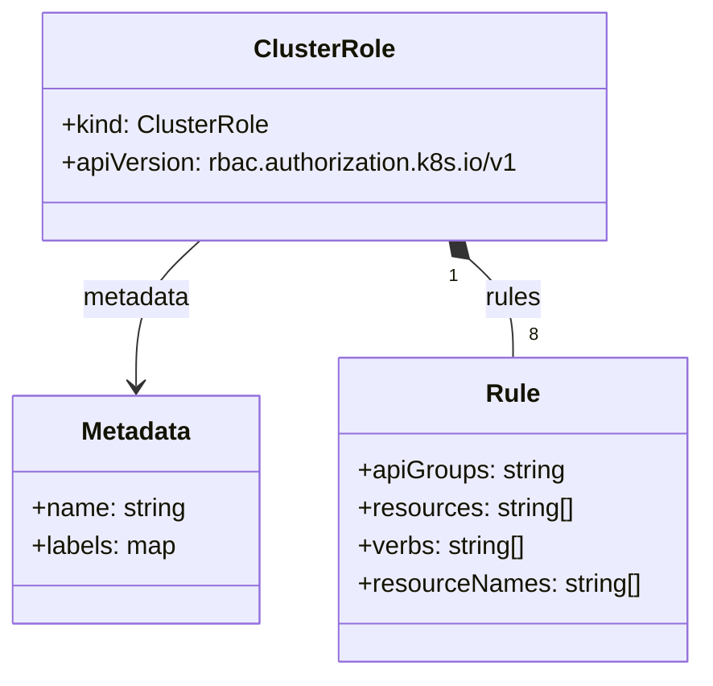

# Diagram: devops/k8s/adot-exporter-for-eks-on-ec2/helm/templates/adot-collector/clusterrole.yaml


> Auto-generated by Obscura crawlers

## Diagram 1

```mermaid
flowchart TD
  TPL[Helm template] --> COND{Values.adotCollector.daemonSet.enabled?}
  COND -- Yes --> CR[ClusterRole: .Values.adotCollector.daemonSet.clusterRoleName]
  COND -- No --> SKIP[No ClusterRole created]
  CR --> META[metadata: name, labels]
  CR --> RULES[Rules (8)]
  RULES --> R1[apiGroups: (core); resources: pods, nodes, endpoints; verbs: list, watch]
  RULES --> R2[apiGroups: apps; resources: replicasets; verbs: list, watch]
  RULES --> R3[apiGroups: batch; resources: jobs; verbs: list, watch]
  RULES --> R4[apiGroups: (core); resources: nodes/proxy; verbs: get]
  RULES --> R5[apiGroups: (core); resources: nodes/stats, configmaps, events; verbs: create, get]
  RULES --> R6[apiGroups: (core); resources: configmaps; resourceNames: adot-container-insight-clusterleader, otel-container-insight-clusterleader; verbs: get, update]
  RULES --> R7[apiGroups: coordination.k8s.io; resources: leases; resourceNames: otel-container-insight-clusterleader; verbs: get, update, create]
  RULES --> R8[apiGroups: coordination.k8s.io; resources: leases; verbs: get, create]
```

> SVG rendering failed for this diagram.

## Diagram 2



### SVG

<svg id="container" width="442.953125" xmlns="http://www.w3.org/2000/svg" class="classDiagram" height="426" viewBox="0 0 442.953125 426" role="graphics-document document" aria-roledescription="class"><style>#container{font-family:"trebuchet ms",verdana,arial,sans-serif;font-size:16px;fill:#333;}@keyframes edge-animation-frame{from{stroke-dashoffset:0;}}@keyframes dash{to{stroke-dashoffset:0;}}#container .edge-animation-slow{stroke-dasharray:9,5!important;stroke-dashoffset:900;animation:dash 50s linear infinite;stroke-linecap:round;}#container .edge-animation-fast{stroke-dasharray:9,5!important;stroke-dashoffset:900;animation:dash 20s linear infinite;stroke-linecap:round;}#container .error-icon{fill:#552222;}#container .error-text{fill:#552222;stroke:#552222;}#container .edge-thickness-normal{stroke-width:1px;}#container .edge-thickness-thick{stroke-width:3.5px;}#container .edge-pattern-solid{stroke-dasharray:0;}#container .edge-thickness-invisible{stroke-width:0;fill:none;}#container .edge-pattern-dashed{stroke-dasharray:3;}#container .edge-pattern-dotted{stroke-dasharray:2;}#container .marker{fill:#333333;stroke:#333333;}#container .marker.cross{stroke:#333333;}#container svg{font-family:"trebuchet ms",verdana,arial,sans-serif;font-size:16px;}#container p{margin:0;}#container g.classGroup text{fill:#9370DB;stroke:none;font-family:"trebuchet ms",verdana,arial,sans-serif;font-size:10px;}#container g.classGroup text .title{font-weight:bolder;}#container .nodeLabel,#container .edgeLabel{color:#131300;}#container .edgeLabel .label rect{fill:#ECECFF;}#container .label text{fill:#131300;}#container .labelBkg{background:#ECECFF;}#container .edgeLabel .label span{background:#ECECFF;}#container .classTitle{font-weight:bolder;}#container .node rect,#container .node circle,#container .node ellipse,#container .node polygon,#container .node path{fill:#ECECFF;stroke:#9370DB;stroke-width:1px;}#container .divider{stroke:#9370DB;stroke-width:1;}#container g.clickable{cursor:pointer;}#container g.classGroup rect{fill:#ECECFF;stroke:#9370DB;}#container g.classGroup line{stroke:#9370DB;stroke-width:1;}#container .classLabel .box{stroke:none;stroke-width:0;fill:#ECECFF;opacity:0.5;}#container .classLabel .label{fill:#9370DB;font-size:10px;}#container .relation{stroke:#333333;stroke-width:1;fill:none;}#container .dashed-line{stroke-dasharray:3;}#container .dotted-line{stroke-dasharray:1 2;}#container #compositionStart,#container .composition{fill:#333333!important;stroke:#333333!important;stroke-width:1;}#container #compositionEnd,#container .composition{fill:#333333!important;stroke:#333333!important;stroke-width:1;}#container #dependencyStart,#container .dependency{fill:#333333!important;stroke:#333333!important;stroke-width:1;}#container #dependencyStart,#container .dependency{fill:#333333!important;stroke:#333333!important;stroke-width:1;}#container #extensionStart,#container .extension{fill:transparent!important;stroke:#333333!important;stroke-width:1;}#container #extensionEnd,#container .extension{fill:transparent!important;stroke:#333333!important;stroke-width:1;}#container #aggregationStart,#container .aggregation{fill:transparent!important;stroke:#333333!important;stroke-width:1;}#container #aggregationEnd,#container .aggregation{fill:transparent!important;stroke:#333333!important;stroke-width:1;}#container #lollipopStart,#container .lollipop{fill:#ECECFF!important;stroke:#333333!important;stroke-width:1;}#container #lollipopEnd,#container .lollipop{fill:#ECECFF!important;stroke:#333333!important;stroke-width:1;}#container .edgeTerminals{font-size:11px;line-height:initial;}#container .classTitleText{text-anchor:middle;font-size:18px;fill:#333;}#container .label-icon{display:inline-block;height:1em;overflow:visible;vertical-align:-0.125em;}#container .node .label-icon path{fill:currentColor;stroke:revert;stroke-width:revert;}#container :root{--mermaid-font-family:"trebuchet ms",verdana,arial,sans-serif;}</style><g><defs><marker id="container_class-aggregationStart" class="marker aggregation class" refX="18" refY="7" markerWidth="190" markerHeight="240" orient="auto"><path d="M 18,7 L9,13 L1,7 L9,1 Z"></path></marker></defs><defs><marker id="container_class-aggregationEnd" class="marker aggregation class" refX="1" refY="7" markerWidth="20" markerHeight="28" orient="auto"><path d="M 18,7 L9,13 L1,7 L9,1 Z"></path></marker></defs><defs><marker id="container_class-extensionStart" class="marker extension class" refX="18" refY="7" markerWidth="190" markerHeight="240" orient="auto"><path d="M 1,7 L18,13 V 1 Z"></path></marker></defs><defs><marker id="container_class-extensionEnd" class="marker extension class" refX="1" refY="7" markerWidth="20" markerHeight="28" orient="auto"><path d="M 1,1 V 13 L18,7 Z"></path></marker></defs><defs><marker id="container_class-compositionStart" class="marker composition class" refX="18" refY="7" markerWidth="190" markerHeight="240" orient="auto"><path d="M 18,7 L9,13 L1,7 L9,1 Z"></path></marker></defs><defs><marker id="container_class-compositionEnd" class="marker composition class" refX="1" refY="7" markerWidth="20" markerHeight="28" orient="auto"><path d="M 18,7 L9,13 L1,7 L9,1 Z"></path></marker></defs><defs><marker id="container_class-dependencyStart" class="marker dependency class" refX="6" refY="7" markerWidth="190" markerHeight="240" orient="auto"><path d="M 5,7 L9,13 L1,7 L9,1 Z"></path></marker></defs><defs><marker id="container_class-dependencyEnd" class="marker dependency class" refX="13" refY="7" markerWidth="20" markerHeight="28" orient="auto"><path d="M 18,7 L9,13 L14,7 L9,1 Z"></path></marker></defs><defs><marker id="container_class-lollipopStart" class="marker lollipop class" refX="13" refY="7" markerWidth="190" markerHeight="240" orient="auto"><circle stroke="black" fill="transparent" cx="7" cy="7" r="6"></circle></marker></defs><defs><marker id="container_class-lollipopEnd" class="marker lollipop class" refX="1" refY="7" markerWidth="190" markerHeight="240" orient="auto"><circle stroke="black" fill="transparent" cx="7" cy="7" r="6"></circle></marker></defs><g class="root"><g class="clusters"></g><g class="edgePaths"><path d="M126.905,152L120.159,158.167C113.413,164.333,99.921,176.667,93.176,192C86.43,207.333,86.43,225.667,86.43,234.833L86.43,244" id="id_ClusterRole_Metadata_1" class="edge-thickness-normal edge-pattern-solid relation" style=";;;" data-edge="true" data-et="edge" data-id="id_ClusterRole_Metadata_1" data-points="W3sieCI6MTI2LjkwNTA2NzM3Mzg1MzIxLCJ5IjoxNTJ9LHsieCI6ODYuNDI5Njg3NSwieSI6MTg5fSx7IngiOjg2LjQyOTY4NzUsInkiOjI1MH1d" marker-end="url(#container_class-dependencyEnd)"></path><path d="M297.163,163.639L301.787,167.866C306.411,172.092,315.658,180.546,320.282,190.94C324.906,201.333,324.906,213.667,324.906,219.833L324.906,226" id="id_ClusterRole_Rule_2" class="edge-thickness-normal edge-pattern-solid relation" style=";;;" data-edge="true" data-et="edge" data-id="id_ClusterRole_Rule_2" data-points="W3sieCI6Mjg0LjQzMDg3MDEyNjE0NjgsInkiOjE1Mn0seyJ4IjozMjQuOTA2MjUsInkiOjE4OX0seyJ4IjozMjQuOTA2MjUsInkiOjIyNn1d" marker-start="url(#container_class-compositionStart)"></path></g><g class="edgeLabels"><g class="edgeLabel" transform="translate(86.4296875, 189)"><g class="label" data-id="id_ClusterRole_Metadata_1" transform="translate(-34.7265625, -12)"><foreignObject width="69.453125" height="24"><div xmlns="http://www.w3.org/1999/xhtml" class="labelBkg" style="display: table-cell; white-space: nowrap; line-height: 1.5; max-width: 200px; text-align: center;"><span class="edgeLabel"><p>metadata</p></span></div></foreignObject></g></g><g class="edgeLabel" transform="translate(324.90625, 189)"><g class="label" data-id="id_ClusterRole_Rule_2" transform="translate(-18.1484375, -12)"><foreignObject width="36.296875" height="24"><div xmlns="http://www.w3.org/1999/xhtml" class="labelBkg" style="display: table-cell; white-space: nowrap; line-height: 1.5; max-width: 200px; text-align: center;"><span class="edgeLabel"><p>rules</p></span></div></foreignObject></g></g><g class="edgeTerminals" transform="translate(287.22670734581095, 174.87866479291776)"><g class="inner" transform="translate(0, 0)"><foreignObject style="width: 9px; height: 12px;"><div xmlns="http://www.w3.org/1999/xhtml" style="display: inline-block; padding-right: 1px; white-space: nowrap;"><span class="edgeLabel">1</span></div></foreignObject></g></g><g class="edgeTerminals" transform="translate(334.90625, 203.5)"><g class="inner" transform="translate(0, 0)"></g><foreignObject style="width: 9px; height: 12px;"><div xmlns="http://www.w3.org/1999/xhtml" style="display: inline-block; padding-right: 1px; white-space: nowrap;"><span class="edgeLabel">8</span></div></foreignObject></g></g><g class="nodes"><g class="node default" id="classId-ClusterRole-0" transform="translate(205.66796875, 80)"><g class="basic label-container"><path d="M-180.45703125 -72 L180.45703125 -72 L180.45703125 72 L-180.45703125 72" stroke="none" stroke-width="0" fill="#ECECFF" style=""></path><path d="M-180.45703125 -72 C-57.10887398784399 -72, 66.23928327431202 -72, 180.45703125 -72 M-180.45703125 -72 C-86.25681849196309 -72, 7.943394266073824 -72, 180.45703125 -72 M180.45703125 -72 C180.45703125 -35.996263924998864, 180.45703125 0.00747215000227186, 180.45703125 72 M180.45703125 -72 C180.45703125 -24.859182478309563, 180.45703125 22.281635043380874, 180.45703125 72 M180.45703125 72 C57.50466868696458 72, -65.44769387607084 72, -180.45703125 72 M180.45703125 72 C43.47528115573485 72, -93.5064689385303 72, -180.45703125 72 M-180.45703125 72 C-180.45703125 34.062647360292615, -180.45703125 -3.874705279414769, -180.45703125 -72 M-180.45703125 72 C-180.45703125 29.479022809953264, -180.45703125 -13.041954380093472, -180.45703125 -72" stroke="#9370DB" stroke-width="1.3" fill="none" stroke-dasharray="0 0" style=""></path></g><g class="annotation-group text" transform="translate(0, -48)"></g><g class="label-group text" transform="translate(-42.1484375, -48)"><g class="label" style="font-weight: bolder" transform="translate(0,-12)"><foreignObject width="84.296875" height="24"><div xmlns="http://www.w3.org/1999/xhtml" style="display: table-cell; white-space: nowrap; line-height: 1.5; max-width: 133px; text-align: center;"><span class="nodeLabel markdown-node-label" style=""><p>ClusterRole</p></span></div></foreignObject></g></g><g class="members-group text" transform="translate(-168.45703125, 0)"><g class="label" style="" transform="translate(0,-12)"><foreignObject width="130.53125" height="24"><div xmlns="http://www.w3.org/1999/xhtml" style="display: table-cell; white-space: nowrap; line-height: 1.5; max-width: 188px; text-align: center;"><span class="nodeLabel markdown-node-label" style=""><p>+kind: ClusterRole</p></span></div></foreignObject></g><g class="label" style="" transform="translate(0,12)"><foreignObject width="294.765625" height="24"><div xmlns="http://www.w3.org/1999/xhtml" style="display: table-cell; white-space: nowrap; line-height: 1.5; max-width: 352px; text-align: center;"><span class="nodeLabel markdown-node-label" style=""><p>+apiVersion: rbac.authorization.k8s.io/v1</p></span></div></foreignObject></g></g><g class="methods-group text" transform="translate(-168.45703125, 72)"></g><g class="divider" style=""><path d="M-180.45703125 -24 C-76.83403670083723 -24, 26.788957848325538 -24, 180.45703125 -24 M-180.45703125 -24 C-100.36484434780026 -24, -20.272657445600515 -24, 180.45703125 -24" stroke="#9370DB" stroke-width="1.3" fill="none" stroke-dasharray="0 0" style=""></path></g><g class="divider" style=""><path d="M-180.45703125 48 C-78.62358823786829 48, 23.20985477426342 48, 180.45703125 48 M-180.45703125 48 C-90.15376893623096 48, 0.14949337753807868 48, 180.45703125 48" stroke="#9370DB" stroke-width="1.3" fill="none" stroke-dasharray="0 0" style=""></path></g></g><g class="node default" id="classId-Metadata-1" transform="translate(86.4296875, 322)"><g class="basic label-container"><path d="M-78.4296875 -72 L78.4296875 -72 L78.4296875 72 L-78.4296875 72" stroke="none" stroke-width="0" fill="#ECECFF" style=""></path><path d="M-78.4296875 -72 C-28.328951073845445 -72, 21.77178535230911 -72, 78.4296875 -72 M-78.4296875 -72 C-26.924599124978876 -72, 24.58048925004225 -72, 78.4296875 -72 M78.4296875 -72 C78.4296875 -20.11958169301895, 78.4296875 31.7608366139621, 78.4296875 72 M78.4296875 -72 C78.4296875 -38.868875569050836, 78.4296875 -5.737751138101672, 78.4296875 72 M78.4296875 72 C40.12885850559817 72, 1.828029511196334 72, -78.4296875 72 M78.4296875 72 C21.502534175092073 72, -35.424619149815854 72, -78.4296875 72 M-78.4296875 72 C-78.4296875 23.057136043536552, -78.4296875 -25.885727912926896, -78.4296875 -72 M-78.4296875 72 C-78.4296875 43.08887149497111, -78.4296875 14.177742989942217, -78.4296875 -72" stroke="#9370DB" stroke-width="1.3" fill="none" stroke-dasharray="0 0" style=""></path></g><g class="annotation-group text" transform="translate(0, -48)"></g><g class="label-group text" transform="translate(-34.640625, -48)"><g class="label" style="font-weight: bolder" transform="translate(0,-12)"><foreignObject width="69.28125" height="24"><div xmlns="http://www.w3.org/1999/xhtml" style="display: table-cell; white-space: nowrap; line-height: 1.5; max-width: 118px; text-align: center;"><span class="nodeLabel markdown-node-label" style=""><p>Metadata</p></span></div></foreignObject></g></g><g class="members-group text" transform="translate(-66.4296875, 0)"><g class="label" style="" transform="translate(0,-12)"><foreignObject width="98.21875" height="24"><div xmlns="http://www.w3.org/1999/xhtml" style="display: table-cell; white-space: nowrap; line-height: 1.5; max-width: 156px; text-align: center;"><span class="nodeLabel markdown-node-label" style=""><p>+name: string</p></span></div></foreignObject></g><g class="label" style="" transform="translate(0,12)"><foreignObject width="91.6875" height="24"><div xmlns="http://www.w3.org/1999/xhtml" style="display: table-cell; white-space: nowrap; line-height: 1.5; max-width: 149px; text-align: center;"><span class="nodeLabel markdown-node-label" style=""><p>+labels: map</p></span></div></foreignObject></g></g><g class="methods-group text" transform="translate(-66.4296875, 72)"></g><g class="divider" style=""><path d="M-78.4296875 -24 C-17.80809646143669 -24, 42.81349457712662 -24, 78.4296875 -24 M-78.4296875 -24 C-25.29125998229395 -24, 27.847167535412098 -24, 78.4296875 -24" stroke="#9370DB" stroke-width="1.3" fill="none" stroke-dasharray="0 0" style=""></path></g><g class="divider" style=""><path d="M-78.4296875 48 C-40.24090657915911 48, -2.052125658318218 48, 78.4296875 48 M-78.4296875 48 C-33.988410251719735 48, 10.45286699656053 48, 78.4296875 48" stroke="#9370DB" stroke-width="1.3" fill="none" stroke-dasharray="0 0" style=""></path></g></g><g class="node default" id="classId-Rule-2" transform="translate(324.90625, 322)"><g class="basic label-container"><path d="M-110.046875 -96 L110.046875 -96 L110.046875 96 L-110.046875 96" stroke="none" stroke-width="0" fill="#ECECFF" style=""></path><path d="M-110.046875 -96 C-47.97596156950448 -96, 14.094951860991046 -96, 110.046875 -96 M-110.046875 -96 C-59.77417843746652 -96, -9.501481874933035 -96, 110.046875 -96 M110.046875 -96 C110.046875 -29.131125230152236, 110.046875 37.73774953969553, 110.046875 96 M110.046875 -96 C110.046875 -35.79094239302742, 110.046875 24.418115213945157, 110.046875 96 M110.046875 96 C45.83160257752354 96, -18.38366984495292 96, -110.046875 96 M110.046875 96 C31.739370873113515 96, -46.56813325377297 96, -110.046875 96 M-110.046875 96 C-110.046875 23.468699824286617, -110.046875 -49.06260035142677, -110.046875 -96 M-110.046875 96 C-110.046875 40.862740385186136, -110.046875 -14.274519229627728, -110.046875 -96" stroke="#9370DB" stroke-width="1.3" fill="none" stroke-dasharray="0 0" style=""></path></g><g class="annotation-group text" transform="translate(0, -72)"></g><g class="label-group text" transform="translate(-16.265625, -72)"><g class="label" style="font-weight: bolder" transform="translate(0,-12)"><foreignObject width="32.53125" height="24"><div xmlns="http://www.w3.org/1999/xhtml" style="display: table-cell; white-space: nowrap; line-height: 1.5; max-width: 82px; text-align: center;"><span class="nodeLabel markdown-node-label" style=""><p>Rule</p></span></div></foreignObject></g></g><g class="members-group text" transform="translate(-98.046875, -24)"><g class="label" style="" transform="translate(0,-12)"><foreignObject width="131.609375" height="24"><div xmlns="http://www.w3.org/1999/xhtml" style="display: table-cell; white-space: nowrap; line-height: 1.5; max-width: 190px; text-align: center;"><span class="nodeLabel markdown-node-label" style=""><p>+apiGroups: string</p></span></div></foreignObject></g><g class="label" style="" transform="translate(0,12)"><foreignObject width="137.765625" height="24"><div xmlns="http://www.w3.org/1999/xhtml" style="display: table-cell; white-space: nowrap; line-height: 1.5; max-width: 195px; text-align: center;"><span class="nodeLabel markdown-node-label" style=""><p>+resources: string[]</p></span></div></foreignObject></g><g class="label" style="" transform="translate(0,36)"><foreignObject width="107.53125" height="24"><div xmlns="http://www.w3.org/1999/xhtml" style="display: table-cell; white-space: nowrap; line-height: 1.5; max-width: 165px; text-align: center;"><span class="nodeLabel markdown-node-label" style=""><p>+verbs: string[]</p></span></div></foreignObject></g><g class="label" style="" transform="translate(0,60)"><foreignObject width="179.828125" height="24"><div xmlns="http://www.w3.org/1999/xhtml" style="display: table-cell; white-space: nowrap; line-height: 1.5; max-width: 237px; text-align: center;"><span class="nodeLabel markdown-node-label" style=""><p>+resourceNames: string[]</p></span></div></foreignObject></g></g><g class="methods-group text" transform="translate(-98.046875, 96)"></g><g class="divider" style=""><path d="M-110.046875 -48 C-54.867499451694385 -48, 0.31187609661122906 -48, 110.046875 -48 M-110.046875 -48 C-47.40232863600278 -48, 15.242217727994444 -48, 110.046875 -48" stroke="#9370DB" stroke-width="1.3" fill="none" stroke-dasharray="0 0" style=""></path></g><g class="divider" style=""><path d="M-110.046875 72 C-35.49637797217737 72, 39.05411905564526 72, 110.046875 72 M-110.046875 72 C-53.670405190358956 72, 2.7060646192820883 72, 110.046875 72" stroke="#9370DB" stroke-width="1.3" fill="none" stroke-dasharray="0 0" style=""></path></g></g></g></g></g></svg>
