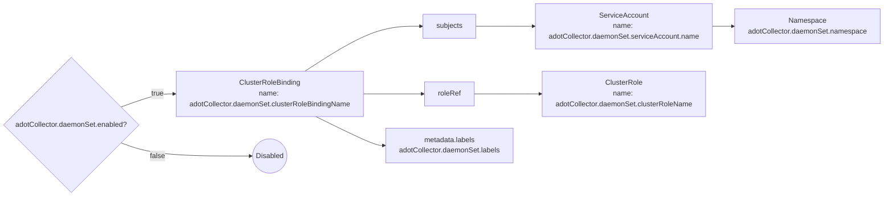

# Diagram: devops/k8s/adot-exporter-for-eks-on-ec2/helm/templates/adot-collector/clusterrolebinding.yaml

> Auto-generated by Obscura crawlers

## Mermaid

### SVG

<svg id="container" width="2003.203125" xmlns="http://www.w3.org/2000/svg" class="flowchart" height="442.77734375" viewBox="0.5 0 2003.203125 442.77734375" role="graphics-document document" aria-roledescription="flowchart-v2"><g><marker id="container_flowchart-v2-pointEnd" class="marker flowchart-v2" viewBox="0 0 10 10" refX="5" refY="5" markerUnits="userSpaceOnUse" markerWidth="8" markerHeight="8" orient="auto"><path d="M 0 0 L 10 5 L 0 10 z" class="arrowMarkerPath" style="stroke-width: 1; stroke-dasharray: 1, 0;"></path></marker><marker id="container_flowchart-v2-pointStart" class="marker flowchart-v2" viewBox="0 0 10 10" refX="4.5" refY="5" markerUnits="userSpaceOnUse" markerWidth="8" markerHeight="8" orient="auto"><path d="M 0 5 L 10 10 L 10 0 z" class="arrowMarkerPath" style="stroke-width: 1; stroke-dasharray: 1, 0;"></path></marker><marker id="container_flowchart-v2-circleEnd" class="marker flowchart-v2" viewBox="0 0 10 10" refX="11" refY="5" markerUnits="userSpaceOnUse" markerWidth="11" markerHeight="11" orient="auto"><circle cx="5" cy="5" r="5" class="arrowMarkerPath" style="stroke-width: 1; stroke-dasharray: 1, 0;"></circle></marker><marker id="container_flowchart-v2-circleStart" class="marker flowchart-v2" viewBox="0 0 10 10" refX="-1" refY="5" markerUnits="userSpaceOnUse" markerWidth="11" markerHeight="11" orient="auto"><circle cx="5" cy="5" r="5" class="arrowMarkerPath" style="stroke-width: 1; stroke-dasharray: 1, 0;"></circle></marker><marker id="container_flowchart-v2-crossEnd" class="marker cross flowchart-v2" viewBox="0 0 11 11" refX="12" refY="5.2" markerUnits="userSpaceOnUse" markerWidth="11" markerHeight="11" orient="auto"><path d="M 1,1 l 9,9 M 10,1 l -9,9" class="arrowMarkerPath" style="stroke-width: 2; stroke-dasharray: 1, 0;"></path></marker><marker id="container_flowchart-v2-crossStart" class="marker cross flowchart-v2" viewBox="0 0 11 11" refX="-1" refY="5.2" markerUnits="userSpaceOnUse" markerWidth="11" markerHeight="11" orient="auto"><path d="M 1,1 l 9,9 M 10,1 l -9,9" class="arrowMarkerPath" style="stroke-width: 2; stroke-dasharray: 1, 0;"></path></marker><g class="root"><g class="clusters"></g><g class="edgePaths"><path d="M274.951,240.572L288.735,235.643C302.519,230.715,330.088,220.857,350.242,215.929C370.396,211,383.135,211,389.505,211L395.875,211" id="L_E_CRB_0" class="edge-thickness-normal edge-pattern-solid edge-thickness-normal edge-pattern-solid flowchart-link" style=";" data-edge="true" data-et="edge" data-id="L_E_CRB_0" data-points="W3sieCI6Mjc0Ljk1MDc0MjA2OTkwMjMzLCJ5IjoyNDAuNTcxODM1ODE5OTAyMzN9LHsieCI6MzU3LjY1NjI1LCJ5IjoyMTF9LHsieCI6Mzk5Ljg3NSwieSI6MjExfV0=" marker-end="url(#container_flowchart-v2-pointEnd)"></path><path d="M274.951,321.545L288.735,326.474C302.519,331.403,330.088,341.26,379.222,346.189C428.357,351.117,499.057,351.117,534.408,351.117L569.758,351.117" id="L_E_Disabled_0" class="edge-thickness-normal edge-pattern-solid edge-thickness-normal edge-pattern-solid flowchart-link" style=";" data-edge="true" data-et="edge" data-id="L_E_Disabled_0" data-points="W3sieCI6Mjc0Ljk1MDc0MjA2OTkwMjMzLCJ5IjozMjEuNTQ1MzUxNjgwMDk3Njd9LHsieCI6MzU3LjY1NjI1LCJ5IjozNTEuMTE3MTg3NX0seyJ4Ijo1NzMuNzU3ODEyNSwieSI6MzUxLjExNzE4NzV9XQ==" marker-end="url(#container_flowchart-v2-pointEnd)"></path><path d="M692.73,160L719.088,143.167C745.445,126.333,798.16,92.667,842.214,75.833C886.268,59,921.661,59,939.358,59L957.055,59" id="L_CRB_Subjects_0" class="edge-thickness-normal edge-pattern-solid edge-thickness-normal edge-pattern-solid flowchart-link" style=";" data-edge="true" data-et="edge" data-id="L_CRB_Subjects_0" data-points="W3sieCI6NjkyLjczMDI2MzE1Nzg5NDgsInkiOjE2MH0seyJ4Ijo4NTAuODc1LCJ5Ijo1OX0seyJ4Ijo5NjEuMDU0Njg3NSwieSI6NTl9XQ==" marker-end="url(#container_flowchart-v2-pointEnd)"></path><path d="M1081.445,59L1099.809,59C1118.172,59,1154.898,59,1176.762,59C1198.625,59,1205.625,59,1209.125,59L1212.625,59" id="L_Subjects_SA_0" class="edge-thickness-normal edge-pattern-solid edge-thickness-normal edge-pattern-solid flowchart-link" style=";" data-edge="true" data-et="edge" data-id="L_Subjects_SA_0" data-points="W3sieCI6MTA4MS40NDUzMTI1LCJ5Ijo1OX0seyJ4IjoxMTkxLjYyNSwieSI6NTl9LHsieCI6MTIxNi42MjUsInkiOjU5fV0=" marker-end="url(#container_flowchart-v2-pointEnd)"></path><path d="M1616.578,59L1620.745,59C1624.911,59,1633.245,59,1640.911,59C1648.578,59,1655.578,59,1659.078,59L1662.578,59" id="L_SA_NS_0" class="edge-thickness-normal edge-pattern-solid edge-thickness-normal edge-pattern-solid flowchart-link" style=";" data-edge="true" data-et="edge" data-id="L_SA_NS_0" data-points="W3sieCI6MTYxNi41NzgxMjUsInkiOjU5fSx7IngiOjE2NDEuNTc4MTI1LCJ5Ijo1OX0seyJ4IjoxNjY2LjU3ODEyNSwieSI6NTl9XQ==" marker-end="url(#container_flowchart-v2-pointEnd)"></path><path d="M825.875,211L830.042,211C834.208,211,842.542,211,865.113,211C887.685,211,924.495,211,942.9,211L961.305,211" id="L_CRB_RoleRef_0" class="edge-thickness-normal edge-pattern-solid edge-thickness-normal edge-pattern-solid flowchart-link" style=";" data-edge="true" data-et="edge" data-id="L_CRB_RoleRef_0" data-points="W3sieCI6ODI1Ljg3NSwieSI6MjExfSx7IngiOjg1MC44NzUsInkiOjIxMX0seyJ4Ijo5NjUuMzA0Njg3NSwieSI6MjExfV0=" marker-end="url(#container_flowchart-v2-pointEnd)"></path><path d="M1077.195,211L1096.267,211C1115.339,211,1153.482,211,1178.499,211C1203.516,211,1215.406,211,1221.352,211L1227.297,211" id="L_RoleRef_CR_0" class="edge-thickness-normal edge-pattern-solid edge-thickness-normal edge-pattern-solid flowchart-link" style=";" data-edge="true" data-et="edge" data-id="L_RoleRef_CR_0" data-points="W3sieCI6MTA3Ny4xOTUzMTI1LCJ5IjoyMTF9LHsieCI6MTE5MS42MjUsInkiOjIxMX0seyJ4IjoxMjMxLjI5Njg3NSwieSI6MjExfV0=" marker-end="url(#container_flowchart-v2-pointEnd)"></path><path d="M717.513,262L739.74,272.833C761.967,283.667,806.421,305.333,832.148,316.167C857.875,327,864.875,327,868.375,327L871.875,327" id="L_CRB_Labels_0" class="edge-thickness-normal edge-pattern-solid edge-thickness-normal edge-pattern-solid flowchart-link" style=";" data-edge="true" data-et="edge" data-id="L_CRB_Labels_0" data-points="W3sieCI6NzE3LjUxMjkzMTAzNDQ4MjgsInkiOjI2Mn0seyJ4Ijo4NTAuODc1LCJ5IjozMjd9LHsieCI6ODc1Ljg3NSwieSI6MzI3fV0=" marker-end="url(#container_flowchart-v2-pointEnd)"></path></g><g class="edgeLabels"><g class="edgeLabel" transform="translate(357.65625, 211)"><g class="label" data-id="L_E_CRB_0" transform="translate(-14.9921875, -12)"><foreignObject width="29.984375" height="24">

true

</foreignObject></g></g><g class="edgeLabel" transform="translate(357.65625, 351.1171875)"><g class="label" data-id="L_E_Disabled_0" transform="translate(-17.21875, -12)"><foreignObject width="34.4375" height="24">

false

</foreignObject></g></g><g class="edgeLabel"><g class="label" data-id="L_CRB_Subjects_0" transform="translate(0, 0)"><foreignObject width="0" height="0">

</foreignObject></g></g><g class="edgeLabel"><g class="label" data-id="L_Subjects_SA_0" transform="translate(0, 0)"><foreignObject width="0" height="0">

</foreignObject></g></g><g class="edgeLabel"><g class="label" data-id="L_SA_NS_0" transform="translate(0, 0)"><foreignObject width="0" height="0">

</foreignObject></g></g><g class="edgeLabel"><g class="label" data-id="L_CRB_RoleRef_0" transform="translate(0, 0)"><foreignObject width="0" height="0">

</foreignObject></g></g><g class="edgeLabel"><g class="label" data-id="L_RoleRef_CR_0" transform="translate(0, 0)"><foreignObject width="0" height="0">

</foreignObject></g></g><g class="edgeLabel"><g class="label" data-id="L_CRB_Labels_0" transform="translate(0, 0)"><foreignObject width="0" height="0">

</foreignObject></g></g></g><g class="nodes"><g class="node default" id="flowchart-E-0" transform="translate(161.71875, 281.05859375)"><polygon points="153.71875,0 307.4375,-153.71875 153.71875,-307.4375 0,-153.71875" class="label-container" transform="translate(-153.21875, 153.71875)"></polygon><g class="label" style="" transform="translate(-126.71875, -12)"><rect></rect><foreignObject width="253.4375" height="24">

adotCollector.daemonSet.enabled?

</foreignObject></g></g><g class="node default" id="flowchart-CRB-2" transform="translate(612.875, 211)"><rect class="basic label-container" style="" x="-213" y="-51" width="426" height="102"></rect><g class="label" style="" transform="translate(-183, -36)"><rect></rect><foreignObject width="366" height="72">

ClusterRoleBinding name: adotCollector.daemonSet.clusterRoleBindingName

</foreignObject></g></g><g class="node default" id="flowchart-Disabled-4" transform="translate(612.875, 351.1171875)"><circle class="basic label-container" style="" r="39.1171875" cx="0" cy="0"></circle><g class="label" style="" transform="translate(-31.6171875, -12)"><rect></rect><foreignObject width="63.234375" height="24">

Disabled

</foreignObject></g></g><g class="node default" id="flowchart-Subjects-6" transform="translate(1021.25, 59)"><rect class="basic label-container" style="" x="-60.1953125" y="-27" width="120.390625" height="54"></rect><g class="label" style="" transform="translate(-30.1953125, -12)"><rect></rect><foreignObject width="60.390625" height="24">

subjects

</foreignObject></g></g><g class="node default" id="flowchart-SA-8" transform="translate(1416.6015625, 59)"><rect class="basic label-container" style="" x="-199.9765625" y="-51" width="399.953125" height="102"></rect><g class="label" style="" transform="translate(-169.9765625, -36)"><rect></rect><foreignObject width="339.953125" height="72">

ServiceAccount name: adotCollector.daemonSet.serviceAccount.name

</foreignObject></g></g><g class="node default" id="flowchart-NS-10" transform="translate(1831.140625, 59)"><rect class="basic label-container" style="" x="-164.5625" y="-39" width="329.125" height="78"></rect><g class="label" style="" transform="translate(-134.5625, -24)"><rect></rect><foreignObject width="269.125" height="48">

Namespace adotCollector.daemonSet.namespace

</foreignObject></g></g><g class="node default" id="flowchart-RoleRef-12" transform="translate(1021.25, 211)"><rect class="basic label-container" style="" x="-55.9453125" y="-27" width="111.890625" height="54"></rect><g class="label" style="" transform="translate(-25.9453125, -12)"><rect></rect><foreignObject width="51.890625" height="24">

roleRef

</foreignObject></g></g><g class="node default" id="flowchart-CR-14" transform="translate(1416.6015625, 211)"><rect class="basic label-container" style="" x="-185.3046875" y="-51" width="370.609375" height="102"></rect><g class="label" style="" transform="translate(-155.3046875, -36)"><rect></rect><foreignObject width="310.609375" height="72">

ClusterRole name: adotCollector.daemonSet.clusterRoleName

</foreignObject></g></g><g class="node default" id="flowchart-Labels-16" transform="translate(1021.25, 327)"><rect class="basic label-container" style="" x="-145.375" y="-39" width="290.75" height="78"></rect><g class="label" style="" transform="translate(-115.375, -24)"><rect></rect><foreignObject width="230.75" height="48">

metadata.labels adotCollector.daemonSet.labels

</foreignObject></g></g></g></g></g></svg>
