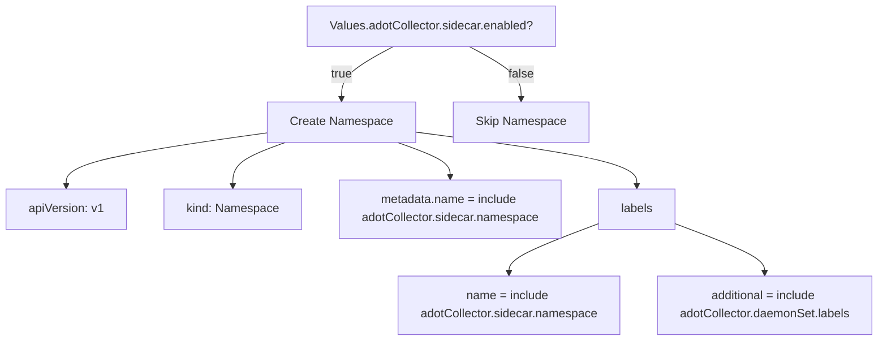
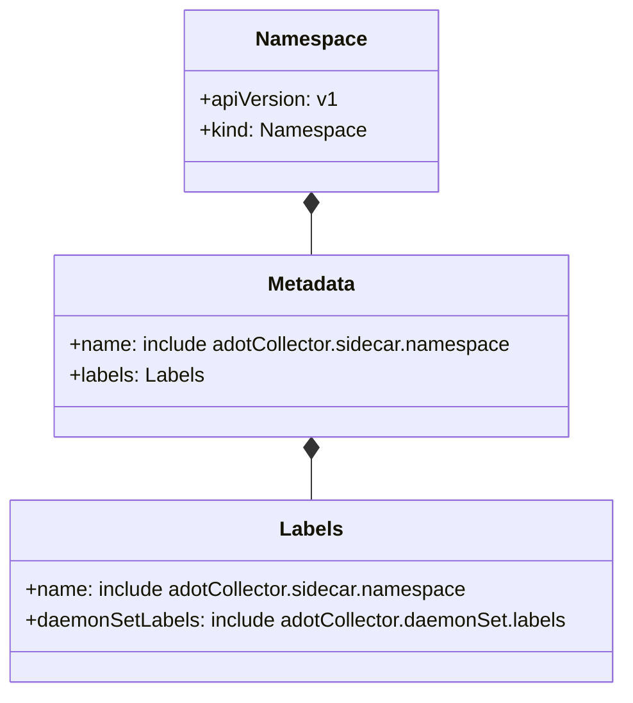

# Diagram: devops/k8s/adot-exporter-for-eks-on-ec2/helm/templates/adot-collector/sidecarnamespace.yaml

> Auto-generated by Obscura crawlers

## Diagram 1

### SVG

<svg id="container" width="1176.24609375" xmlns="http://www.w3.org/2000/svg" class="flowchart" height="454" viewBox="0 0 1176.24609375 454" role="graphics-document document" aria-roledescription="flowchart-v2"><g><marker id="container_flowchart-v2-pointEnd" class="marker flowchart-v2" viewBox="0 0 10 10" refX="5" refY="5" markerUnits="userSpaceOnUse" markerWidth="8" markerHeight="8" orient="auto"><path d="M 0 0 L 10 5 L 0 10 z" class="arrowMarkerPath" style="stroke-width: 1; stroke-dasharray: 1, 0;"></path></marker><marker id="container_flowchart-v2-pointStart" class="marker flowchart-v2" viewBox="0 0 10 10" refX="4.5" refY="5" markerUnits="userSpaceOnUse" markerWidth="8" markerHeight="8" orient="auto"><path d="M 0 5 L 10 10 L 10 0 z" class="arrowMarkerPath" style="stroke-width: 1; stroke-dasharray: 1, 0;"></path></marker><marker id="container_flowchart-v2-circleEnd" class="marker flowchart-v2" viewBox="0 0 10 10" refX="11" refY="5" markerUnits="userSpaceOnUse" markerWidth="11" markerHeight="11" orient="auto"><circle cx="5" cy="5" r="5" class="arrowMarkerPath" style="stroke-width: 1; stroke-dasharray: 1, 0;"></circle></marker><marker id="container_flowchart-v2-circleStart" class="marker flowchart-v2" viewBox="0 0 10 10" refX="-1" refY="5" markerUnits="userSpaceOnUse" markerWidth="11" markerHeight="11" orient="auto"><circle cx="5" cy="5" r="5" class="arrowMarkerPath" style="stroke-width: 1; stroke-dasharray: 1, 0;"></circle></marker><marker id="container_flowchart-v2-crossEnd" class="marker cross flowchart-v2" viewBox="0 0 11 11" refX="12" refY="5.2" markerUnits="userSpaceOnUse" markerWidth="11" markerHeight="11" orient="auto"><path d="M 1,1 l 9,9 M 10,1 l -9,9" class="arrowMarkerPath" style="stroke-width: 2; stroke-dasharray: 1, 0;"></path></marker><marker id="container_flowchart-v2-crossStart" class="marker cross flowchart-v2" viewBox="0 0 11 11" refX="-1" refY="5.2" markerUnits="userSpaceOnUse" markerWidth="11" markerHeight="11" orient="auto"><path d="M 1,1 l 9,9 M 10,1 l -9,9" class="arrowMarkerPath" style="stroke-width: 2; stroke-dasharray: 1, 0;"></path></marker><g class="root"><g class="clusters"></g><g class="edgePaths"><path d="M522.809,62L511.424,68.167C500.039,74.333,477.27,86.667,465.885,98.333C454.5,110,454.5,121,454.5,126.5L454.5,132" id="L_A_B_0" class="edge-thickness-normal edge-pattern-solid edge-thickness-normal edge-pattern-solid flowchart-link" style=";" data-edge="true" data-et="edge" data-id="L_A_B_0" data-points="W3sieCI6NTIyLjgwOTA4MjAzMTI1LCJ5Ijo2Mn0seyJ4Ijo0NTQuNSwieSI6OTl9LHsieCI6NDU0LjUsInkiOjEzNn1d" marker-end="url(#container_flowchart-v2-pointEnd)"></path><path d="M622.503,62L633.888,68.167C645.273,74.333,668.043,86.667,679.428,98.333C690.813,110,690.813,121,690.813,126.5L690.813,132" id="L_A_C_0" class="edge-thickness-normal edge-pattern-solid edge-thickness-normal edge-pattern-solid flowchart-link" style=";" data-edge="true" data-et="edge" data-id="L_A_C_0" data-points="W3sieCI6NjIyLjUwMzQxNzk2ODc1LCJ5Ijo2Mn0seyJ4Ijo2OTAuODEyNSwieSI6OTl9LHsieCI6NjkwLjgxMjUsInkiOjEzNn1d" marker-end="url(#container_flowchart-v2-pointEnd)"></path><path d="M357.594,176.739L312.617,183.116C267.641,189.493,177.688,202.246,132.711,214.123C87.734,226,87.734,237,87.734,242.5L87.734,248" id="L_B_D_0" class="edge-thickness-normal edge-pattern-solid edge-thickness-normal edge-pattern-solid flowchart-link" style=";" data-edge="true" data-et="edge" data-id="L_B_D_0" data-points="W3sieCI6MzU3LjU5Mzc1LCJ5IjoxNzYuNzM5MzYwMTE1ODc3ODJ9LHsieCI6ODcuNzM0Mzc1LCJ5IjoyMTV9LHsieCI6ODcuNzM0Mzc1LCJ5IjoyNTJ9XQ==" marker-end="url(#container_flowchart-v2-pointEnd)"></path><path d="M379.033,190L367.387,194.167C355.741,198.333,332.449,206.667,320.802,216.333C309.156,226,309.156,237,309.156,242.5L309.156,248" id="L_B_E_0" class="edge-thickness-normal edge-pattern-solid edge-thickness-normal edge-pattern-solid flowchart-link" style=";" data-edge="true" data-et="edge" data-id="L_B_E_0" data-points="W3sieCI6Mzc5LjAzMzA1Mjg4NDYxNTM2LCJ5IjoxOTB9LHsieCI6MzA5LjE1NjI1LCJ5IjoyMTV9LHsieCI6MzA5LjE1NjI1LCJ5IjoyNTJ9XQ==" marker-end="url(#container_flowchart-v2-pointEnd)"></path><path d="M529.967,190L541.613,194.167C553.259,198.333,576.551,206.667,588.198,214.333C599.844,222,599.844,229,599.844,232.5L599.844,236" id="L_B_F_0" class="edge-thickness-normal edge-pattern-solid edge-thickness-normal edge-pattern-solid flowchart-link" style=";" data-edge="true" data-et="edge" data-id="L_B_F_0" data-points="W3sieCI6NTI5Ljk2Njk0NzExNTM4NDYsInkiOjE5MH0seyJ4Ijo1OTkuODQzNzUsInkiOjIxNX0seyJ4Ijo1OTkuODQzNzUsInkiOjI0MH1d" marker-end="url(#container_flowchart-v2-pointEnd)"></path><path d="M551.406,175.719L601.288,182.266C651.169,188.813,750.932,201.906,800.814,213.953C850.695,226,850.695,237,850.695,242.5L850.695,248" id="L_B_G_0" class="edge-thickness-normal edge-pattern-solid edge-thickness-normal edge-pattern-solid flowchart-link" style=";" data-edge="true" data-et="edge" data-id="L_B_G_0" data-points="W3sieCI6NTUxLjQwNjI1LCJ5IjoxNzUuNzE4NzkwMDUzODMyMzV9LHsieCI6ODUwLjY5NTMxMjUsInkiOjIxNX0seyJ4Ijo4NTAuNjk1MzEyNSwieSI6MjUyfV0=" marker-end="url(#container_flowchart-v2-pointEnd)"></path><path d="M798.844,298.273L778.788,305.728C758.733,313.182,718.622,328.091,698.567,339.046C678.512,350,678.512,357,678.512,360.5L678.512,364" id="L_G_H_0" class="edge-thickness-normal edge-pattern-solid edge-thickness-normal edge-pattern-solid flowchart-link" style=";" data-edge="true" data-et="edge" data-id="L_G_H_0" data-points="W3sieCI6Nzk4Ljg0Mzc1LCJ5IjoyOTguMjczMDMyNTA5ODExOX0seyJ4Ijo2NzguNTExNzE4NzUsInkiOjM0M30seyJ4Ijo2NzguNTExNzE4NzUsInkiOjM2OH1d" marker-end="url(#container_flowchart-v2-pointEnd)"></path><path d="M902.547,298.273L922.602,305.728C942.658,313.182,982.768,328.091,1002.824,339.046C1022.879,350,1022.879,357,1022.879,360.5L1022.879,364" id="L_G_I_0" class="edge-thickness-normal edge-pattern-solid edge-thickness-normal edge-pattern-solid flowchart-link" style=";" data-edge="true" data-et="edge" data-id="L_G_I_0" data-points="W3sieCI6OTAyLjU0Njg3NSwieSI6Mjk4LjI3MzAzMjUwOTgxMTl9LHsieCI6MTAyMi44Nzg5MDYyNSwieSI6MzQzfSx7IngiOjEwMjIuODc4OTA2MjUsInkiOjM2OH1d" marker-end="url(#container_flowchart-v2-pointEnd)"></path></g><g class="edgeLabels"><g class="edgeLabel" transform="translate(454.5, 99)"><g class="label" data-id="L_A_B_0" transform="translate(-14.9921875, -12)"><foreignObject width="29.984375" height="24">

true

</foreignObject></g></g><g class="edgeLabel" transform="translate(690.8125, 99)"><g class="label" data-id="L_A_C_0" transform="translate(-17.21875, -12)"><foreignObject width="34.4375" height="24">

false

</foreignObject></g></g><g class="edgeLabel"><g class="label" data-id="L_B_D_0" transform="translate(0, 0)"><foreignObject width="0" height="0">

</foreignObject></g></g><g class="edgeLabel"><g class="label" data-id="L_B_E_0" transform="translate(0, 0)"><foreignObject width="0" height="0">

</foreignObject></g></g><g class="edgeLabel"><g class="label" data-id="L_B_F_0" transform="translate(0, 0)"><foreignObject width="0" height="0">

</foreignObject></g></g><g class="edgeLabel"><g class="label" data-id="L_B_G_0" transform="translate(0, 0)"><foreignObject width="0" height="0">

</foreignObject></g></g><g class="edgeLabel"><g class="label" data-id="L_G_H_0" transform="translate(0, 0)"><foreignObject width="0" height="0">

</foreignObject></g></g><g class="edgeLabel"><g class="label" data-id="L_G_I_0" transform="translate(0, 0)"><foreignObject width="0" height="0">

</foreignObject></g></g></g><g class="nodes"><g class="node default" id="flowchart-A-0" transform="translate(572.65625, 35)"><rect class="basic label-container" style="" x="-166.5703125" y="-27" width="333.140625" height="54"></rect><g class="label" style="" transform="translate(-136.5703125, -12)"><rect></rect><foreignObject width="273.140625" height="24">

Values.adotCollector.sidecar.enabled?

</foreignObject></g></g><g class="node default" id="flowchart-B-1" transform="translate(454.5, 163)"><rect class="basic label-container" style="" x="-96.90625" y="-27" width="193.8125" height="54"></rect><g class="label" style="" transform="translate(-66.90625, -12)"><rect></rect><foreignObject width="133.8125" height="24">

Create Namespace

</foreignObject></g></g><g class="node default" id="flowchart-C-3" transform="translate(690.8125, 163)"><rect class="basic label-container" style="" x="-89.40625" y="-27" width="178.8125" height="54"></rect><g class="label" style="" transform="translate(-59.40625, -12)"><rect></rect><foreignObject width="118.8125" height="24">

Skip Namespace

</foreignObject></g></g><g class="node default" id="flowchart-D-5" transform="translate(87.734375, 279)"><rect class="basic label-container" style="" x="-79.734375" y="-27" width="159.46875" height="54"></rect><g class="label" style="" transform="translate(-49.734375, -12)"><rect></rect><foreignObject width="99.46875" height="24">

apiVersion: v1

</foreignObject></g></g><g class="node default" id="flowchart-E-7" transform="translate(309.15625, 279)"><rect class="basic label-container" style="" x="-91.6875" y="-27" width="183.375" height="54"></rect><g class="label" style="" transform="translate(-61.6875, -12)"><rect></rect><foreignObject width="123.375" height="24">

kind: Namespace

</foreignObject></g></g><g class="node default" id="flowchart-F-9" transform="translate(599.84375, 279)"><rect class="basic label-container" style="" x="-149" y="-39" width="298" height="78"></rect><g class="label" style="" transform="translate(-119, -24)"><rect></rect><foreignObject width="238" height="48">

metadata.name = include adotCollector.sidecar.namespace

</foreignObject></g></g><g class="node default" id="flowchart-G-11" transform="translate(850.6953125, 279)"><rect class="basic label-container" style="" x="-51.8515625" y="-27" width="103.703125" height="54"></rect><g class="label" style="" transform="translate(-21.8515625, -12)"><rect></rect><foreignObject width="43.703125" height="24">

labels

</foreignObject></g></g><g class="node default" id="flowchart-H-13" transform="translate(678.51171875, 407)"><rect class="basic label-container" style="" x="-149" y="-39" width="298" height="78"></rect><g class="label" style="" transform="translate(-119, -24)"><rect></rect><foreignObject width="238" height="48">

name = include adotCollector.sidecar.namespace

</foreignObject></g></g><g class="node default" id="flowchart-I-15" transform="translate(1022.87890625, 407)"><rect class="basic label-container" style="" x="-145.3671875" y="-39" width="290.734375" height="78"></rect><g class="label" style="" transform="translate(-115.3671875, -24)"><rect></rect><foreignObject width="230.734375" height="48">

additional = include adotCollector.daemonSet.labels

</foreignObject></g></g></g></g></g></svg>

## Diagram 2

### SVG

<svg id="container" width="498.25" xmlns="http://www.w3.org/2000/svg" class="classDiagram" height="548" viewBox="0 0 498.25 548" role="graphics-document document" aria-roledescription="class"><g><defs><marker id="container_class-aggregationStart" class="marker aggregation class" refX="18" refY="7" markerWidth="190" markerHeight="240" orient="auto"><path d="M 18,7 L9,13 L1,7 L9,1 Z"></path></marker></defs><defs><marker id="container_class-aggregationEnd" class="marker aggregation class" refX="1" refY="7" markerWidth="20" markerHeight="28" orient="auto"><path d="M 18,7 L9,13 L1,7 L9,1 Z"></path></marker></defs><defs><marker id="container_class-extensionStart" class="marker extension class" refX="18" refY="7" markerWidth="190" markerHeight="240" orient="auto"><path d="M 1,7 L18,13 V 1 Z"></path></marker></defs><defs><marker id="container_class-extensionEnd" class="marker extension class" refX="1" refY="7" markerWidth="20" markerHeight="28" orient="auto"><path d="M 1,1 V 13 L18,7 Z"></path></marker></defs><defs><marker id="container_class-compositionStart" class="marker composition class" refX="18" refY="7" markerWidth="190" markerHeight="240" orient="auto"><path d="M 18,7 L9,13 L1,7 L9,1 Z"></path></marker></defs><defs><marker id="container_class-compositionEnd" class="marker composition class" refX="1" refY="7" markerWidth="20" markerHeight="28" orient="auto"><path d="M 18,7 L9,13 L1,7 L9,1 Z"></path></marker></defs><defs><marker id="container_class-dependencyStart" class="marker dependency class" refX="6" refY="7" markerWidth="190" markerHeight="240" orient="auto"><path d="M 5,7 L9,13 L1,7 L9,1 Z"></path></marker></defs><defs><marker id="container_class-dependencyEnd" class="marker dependency class" refX="13" refY="7" markerWidth="20" markerHeight="28" orient="auto"><path d="M 18,7 L9,13 L14,7 L9,1 Z"></path></marker></defs><defs><marker id="container_class-lollipopStart" class="marker lollipop class" refX="13" refY="7" markerWidth="190" markerHeight="240" orient="auto"><circle stroke="black" fill="transparent" cx="7" cy="7" r="6"></circle></marker></defs><defs><marker id="container_class-lollipopEnd" class="marker lollipop class" refX="1" refY="7" markerWidth="190" markerHeight="240" orient="auto"><circle stroke="black" fill="transparent" cx="7" cy="7" r="6"></circle></marker></defs><g class="root"><g class="clusters"></g><g class="edgePaths"><path d="M249.125,169.25L249.125,170.542C249.125,171.833,249.125,174.417,249.125,179.875C249.125,185.333,249.125,193.667,249.125,197.833L249.125,202" id="id_Namespace_Metadata_1" class="edge-thickness-normal edge-pattern-solid relation" style=";;;" data-edge="true" data-et="edge" data-id="id_Namespace_Metadata_1" data-points="W3sieCI6MjQ5LjEyNSwieSI6MTUyfSx7IngiOjI0OS4xMjUsInkiOjE3N30seyJ4IjoyNDkuMTI1LCJ5IjoyMDJ9XQ==" marker-start="url(#container_class-compositionStart)"></path><path d="M249.125,363.25L249.125,364.542C249.125,365.833,249.125,368.417,249.125,373.875C249.125,379.333,249.125,387.667,249.125,391.833L249.125,396" id="id_Metadata_Labels_2" class="edge-thickness-normal edge-pattern-solid relation" style=";;;" data-edge="true" data-et="edge" data-id="id_Metadata_Labels_2" data-points="W3sieCI6MjQ5LjEyNSwieSI6MzQ2fSx7IngiOjI0OS4xMjUsInkiOjM3MX0seyJ4IjoyNDkuMTI1LCJ5IjozOTZ9XQ==" marker-start="url(#container_class-compositionStart)"></path></g><g class="edgeLabels"><g class="edgeLabel"><g class="label" data-id="id_Namespace_Metadata_1" transform="translate(0, 0)"><foreignObject width="0" height="0">

</foreignObject></g></g><g class="edgeLabel"><g class="label" data-id="id_Metadata_Labels_2" transform="translate(0, 0)"><foreignObject width="0" height="0">

</foreignObject></g></g></g><g class="nodes"><g class="node default" id="classId-Namespace-0" transform="translate(249.125, 80)"><g class="basic label-container"><path d="M-98.62890625 -72 L98.62890625 -72 L98.62890625 72 L-98.62890625 72" stroke="none" stroke-width="0" fill="#ECECFF" style=""></path><path d="M-98.62890625 -72 C-20.422110432252126 -72, 57.78468538549575 -72, 98.62890625 -72 M-98.62890625 -72 C-38.512760284571364 -72, 21.603385680857272 -72, 98.62890625 -72 M98.62890625 -72 C98.62890625 -31.97984095582268, 98.62890625 8.040318088354638, 98.62890625 72 M98.62890625 -72 C98.62890625 -23.626660468842047, 98.62890625 24.746679062315906, 98.62890625 72 M98.62890625 72 C50.42596515664297 72, 2.2230240632859335 72, -98.62890625 72 M98.62890625 72 C46.40086375243263 72, -5.827178745134745 72, -98.62890625 72 M-98.62890625 72 C-98.62890625 35.065746501226464, -98.62890625 -1.8685069975470725, -98.62890625 -72 M-98.62890625 72 C-98.62890625 35.86665527082414, -98.62890625 -0.26668945835172053, -98.62890625 -72" stroke="#9370DB" stroke-width="1.3" fill="none" stroke-dasharray="0 0" style=""></path></g><g class="annotation-group text" transform="translate(0, -48)"></g><g class="label-group text" transform="translate(-41.8984375, -48)"><g class="label" style="font-weight: bolder" transform="translate(0,-12)"><foreignObject width="83.796875" height="24">

Namespace

</foreignObject></g></g><g class="members-group text" transform="translate(-86.62890625, 0)"><g class="label" style="" transform="translate(0,-12)"><foreignObject width="107.203125" height="24">

+apiVersion: v1

</foreignObject></g><g class="label" style="" transform="translate(0,12)"><foreignObject width="131.359375" height="24">

+kind: Namespace

</foreignObject></g></g><g class="methods-group text" transform="translate(-86.62890625, 72)"></g><g class="divider" style=""><path d="M-98.62890625 -24 C-44.38370712766093 -24, 9.861491994678147 -24, 98.62890625 -24 M-98.62890625 -24 C-39.486473126807375 -24, 19.65595999638525 -24, 98.62890625 -24" stroke="#9370DB" stroke-width="1.3" fill="none" stroke-dasharray="0 0" style=""></path></g><g class="divider" style=""><path d="M-98.62890625 48 C-50.186716259475176 48, -1.7445262689503522 48, 98.62890625 48 M-98.62890625 48 C-22.943313068996574 48, 52.74228011200685 48, 98.62890625 48" stroke="#9370DB" stroke-width="1.3" fill="none" stroke-dasharray="0 0" style=""></path></g></g><g class="node default" id="classId-Metadata-1" transform="translate(249.125, 274)"><g class="basic label-container"><path d="M-205.6484375 -72 L205.6484375 -72 L205.6484375 72 L-205.6484375 72" stroke="none" stroke-width="0" fill="#ECECFF" style=""></path><path d="M-205.6484375 -72 C-56.32955315362392 -72, 92.98933119275216 -72, 205.6484375 -72 M-205.6484375 -72 C-45.80672823598752 -72, 114.03498102802496 -72, 205.6484375 -72 M205.6484375 -72 C205.6484375 -41.51446242545295, 205.6484375 -11.028924850905902, 205.6484375 72 M205.6484375 -72 C205.6484375 -14.975219504002212, 205.6484375 42.04956099199558, 205.6484375 72 M205.6484375 72 C61.46976865242445 72, -82.7089001951511 72, -205.6484375 72 M205.6484375 72 C67.6715973652397 72, -70.30524276952059 72, -205.6484375 72 M-205.6484375 72 C-205.6484375 17.29631409791736, -205.6484375 -37.40737180416528, -205.6484375 -72 M-205.6484375 72 C-205.6484375 19.785372415598665, -205.6484375 -32.42925516880267, -205.6484375 -72" stroke="#9370DB" stroke-width="1.3" fill="none" stroke-dasharray="0 0" style=""></path></g><g class="annotation-group text" transform="translate(0, -48)"></g><g class="label-group text" transform="translate(-34.640625, -48)"><g class="label" style="font-weight: bolder" transform="translate(0,-12)"><foreignObject width="69.28125" height="24">

Metadata

</foreignObject></g></g><g class="members-group text" transform="translate(-193.6484375, 0)"><g class="label" style="" transform="translate(0,-12)"><foreignObject width="352.65625" height="24">

+name: include adotCollector.sidecar.namespace

</foreignObject></g><g class="label" style="" transform="translate(0,12)"><foreignObject width="106.65625" height="24">

+labels: Labels

</foreignObject></g></g><g class="methods-group text" transform="translate(-193.6484375, 72)"></g><g class="divider" style=""><path d="M-205.6484375 -24 C-118.46089016011258 -24, -31.273342820225167 -24, 205.6484375 -24 M-205.6484375 -24 C-63.0589093012255 -24, 79.530618897549 -24, 205.6484375 -24" stroke="#9370DB" stroke-width="1.3" fill="none" stroke-dasharray="0 0" style=""></path></g><g class="divider" style=""><path d="M-205.6484375 48 C-65.12646215266204 48, 75.39551319467591 48, 205.6484375 48 M-205.6484375 48 C-57.96898513420669 48, 89.71046723158662 48, 205.6484375 48" stroke="#9370DB" stroke-width="1.3" fill="none" stroke-dasharray="0 0" style=""></path></g></g><g class="node default" id="classId-Labels-2" transform="translate(249.125, 468)"><g class="basic label-container"><path d="M-241.125 -72 L241.125 -72 L241.125 72 L-241.125 72" stroke="none" stroke-width="0" fill="#ECECFF" style=""></path><path d="M-241.125 -72 C-120.20256105844642 -72, 0.7198778831071593 -72, 241.125 -72 M-241.125 -72 C-95.33555245682206 -72, 50.453895086355885 -72, 241.125 -72 M241.125 -72 C241.125 -29.64969111641863, 241.125 12.70061776716274, 241.125 72 M241.125 -72 C241.125 -35.73954121497704, 241.125 0.5209175700459241, 241.125 72 M241.125 72 C120.62364921687407 72, 0.12229843374814209 72, -241.125 72 M241.125 72 C101.7892899857764 72, -37.54642002844719 72, -241.125 72 M-241.125 72 C-241.125 40.18229163335612, -241.125 8.364583266712245, -241.125 -72 M-241.125 72 C-241.125 41.556024569797906, -241.125 11.112049139595811, -241.125 -72" stroke="#9370DB" stroke-width="1.3" fill="none" stroke-dasharray="0 0" style=""></path></g><g class="annotation-group text" transform="translate(0, -48)"></g><g class="label-group text" transform="translate(-23.84375, -48)"><g class="label" style="font-weight: bolder" transform="translate(0,-12)"><foreignObject width="47.6875" height="24">

Labels

</foreignObject></g></g><g class="members-group text" transform="translate(-229.125, 0)"><g class="label" style="" transform="translate(0,-12)"><foreignObject width="352.65625" height="24">

+name: include adotCollector.sidecar.namespace

</foreignObject></g><g class="label" style="" transform="translate(0,12)"><foreignObject width="434.40625" height="24">

+daemonSetLabels: include adotCollector.daemonSet.labels

</foreignObject></g></g><g class="methods-group text" transform="translate(-229.125, 72)"></g><g class="divider" style=""><path d="M-241.125 -24 C-58.8879619389682 -24, 123.3490761220636 -24, 241.125 -24 M-241.125 -24 C-129.49014177285454 -24, -17.855283545709113 -24, 241.125 -24" stroke="#9370DB" stroke-width="1.3" fill="none" stroke-dasharray="0 0" style=""></path></g><g class="divider" style=""><path d="M-241.125 48 C-64.18074524230485 48, 112.7635095153903 48, 241.125 48 M-241.125 48 C-87.1643175014276 48, 66.79636499714479 48, 241.125 48" stroke="#9370DB" stroke-width="1.3" fill="none" stroke-dasharray="0 0" style=""></path></g></g></g></g></g></svg>
