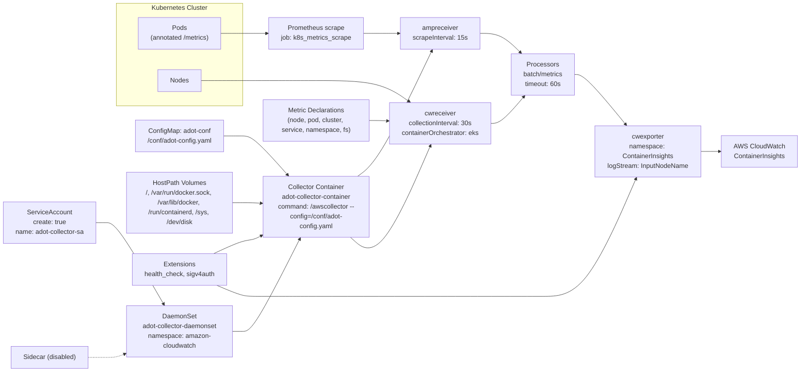
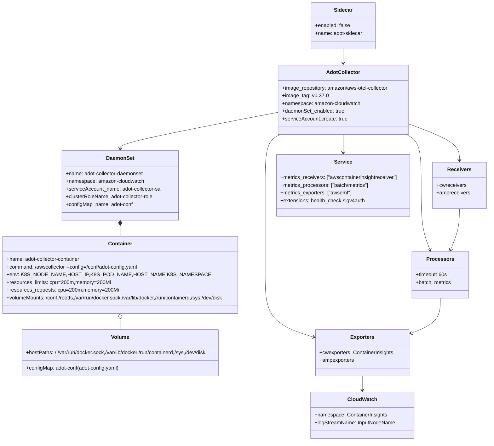

# Diagram: devops/k8s/adot-exporter-for-eks-on-ec2/helm/values.yaml

> Auto-generated by Obscura crawlers

## Diagram 1

### SVG

<svg id="container" width="1982.03125" xmlns="http://www.w3.org/2000/svg" class="flowchart" height="913" viewBox="0 0 1982.03125 913" role="graphics-document document" aria-roledescription="flowchart-v2"><g><marker id="container_flowchart-v2-pointEnd" class="marker flowchart-v2" viewBox="0 0 10 10" refX="5" refY="5" markerUnits="userSpaceOnUse" markerWidth="8" markerHeight="8" orient="auto"><path d="M 0 0 L 10 5 L 0 10 z" class="arrowMarkerPath" style="stroke-width: 1; stroke-dasharray: 1, 0;"></path></marker><marker id="container_flowchart-v2-pointStart" class="marker flowchart-v2" viewBox="0 0 10 10" refX="4.5" refY="5" markerUnits="userSpaceOnUse" markerWidth="8" markerHeight="8" orient="auto"><path d="M 0 5 L 10 10 L 10 0 z" class="arrowMarkerPath" style="stroke-width: 1; stroke-dasharray: 1, 0;"></path></marker><marker id="container_flowchart-v2-circleEnd" class="marker flowchart-v2" viewBox="0 0 10 10" refX="11" refY="5" markerUnits="userSpaceOnUse" markerWidth="11" markerHeight="11" orient="auto"><circle cx="5" cy="5" r="5" class="arrowMarkerPath" style="stroke-width: 1; stroke-dasharray: 1, 0;"></circle></marker><marker id="container_flowchart-v2-circleStart" class="marker flowchart-v2" viewBox="0 0 10 10" refX="-1" refY="5" markerUnits="userSpaceOnUse" markerWidth="11" markerHeight="11" orient="auto"><circle cx="5" cy="5" r="5" class="arrowMarkerPath" style="stroke-width: 1; stroke-dasharray: 1, 0;"></circle></marker><marker id="container_flowchart-v2-crossEnd" class="marker cross flowchart-v2" viewBox="0 0 11 11" refX="12" refY="5.2" markerUnits="userSpaceOnUse" markerWidth="11" markerHeight="11" orient="auto"><path d="M 1,1 l 9,9 M 10,1 l -9,9" class="arrowMarkerPath" style="stroke-width: 2; stroke-dasharray: 1, 0;"></path></marker><marker id="container_flowchart-v2-crossStart" class="marker cross flowchart-v2" viewBox="0 0 11 11" refX="-1" refY="5.2" markerUnits="userSpaceOnUse" markerWidth="11" markerHeight="11" orient="auto"><path d="M 1,1 l 9,9 M 10,1 l -9,9" class="arrowMarkerPath" style="stroke-width: 2; stroke-dasharray: 1, 0;"></path></marker><g class="root"><g class="clusters"><g class="cluster" id="K8S" data-look="classic"><rect style="" x="291.125" y="8" width="310" height="252"></rect><g class="cluster-label" transform="translate(377.2421875, 8)"><foreignObject width="137.765625" height="24">

Kubernetes Cluster

</foreignObject></g></g></g><g class="edgePaths"><path d="M551.859,82L560.07,82C568.281,82,584.703,82,597.081,82C609.458,82,617.792,82,627.66,82C637.529,82,648.932,82,654.634,82L660.336,82" id="L_Pods_PromScrape_0" class="edge-thickness-normal edge-pattern-solid edge-thickness-normal edge-pattern-solid flowchart-link" style=";" data-edge="true" data-et="edge" data-id="L_Pods_PromScrape_0" data-points="W3sieCI6NTUxLjg1OTM3NSwieSI6ODJ9LHsieCI6NjAxLjEyNSwieSI6ODJ9LHsieCI6NjI2LjEyNSwieSI6ODJ9LHsieCI6NjY0LjMzNTkzNzUsInkiOjgyfV0=" marker-end="url(#container_flowchart-v2-pointEnd)"></path><path d="M897.914,82L904.283,82C910.651,82,923.388,82,938.202,82C953.016,82,969.906,82,978.352,82L986.797,82" id="L_PromScrape_AMPR_0" class="edge-thickness-normal edge-pattern-solid edge-thickness-normal edge-pattern-solid flowchart-link" style=";" data-edge="true" data-et="edge" data-id="L_PromScrape_AMPR_0" data-points="W3sieCI6ODk3LjkxNDA2MjUsInkiOjgyfSx7IngiOjkzNi4xMjUsInkiOjgyfSx7IngiOjk5MC43OTY4NzUsInkiOjgyfV0=" marker-end="url(#container_flowchart-v2-pointEnd)"></path><path d="M499.148,198L516.145,198C533.141,198,567.133,198,588.296,198C609.458,198,617.792,198,647.792,198C677.792,198,729.458,198,781.125,198C832.792,198,884.458,198,922.725,206.62C960.991,215.24,985.858,232.481,998.291,241.101L1010.724,249.721" id="L_Nodes_CWREC_0" class="edge-thickness-normal edge-pattern-solid edge-thickness-normal edge-pattern-solid flowchart-link" style=";" data-edge="true" data-et="edge" data-id="L_Nodes_CWREC_0" data-points="W3sieCI6NDk5LjE0ODQzNzUsInkiOjE5OH0seyJ4Ijo2MDEuMTI1LCJ5IjoxOTh9LHsieCI6NjI2LjEyNSwieSI6MTk4fSx7IngiOjc4MS4xMjUsInkiOjE5OH0seyJ4Ijo5MzYuMTI1LCJ5IjoxOTh9LHsieCI6MTAxNC4wMTExNjA3MTQyODU3LCJ5IjoyNTJ9XQ==" marker-end="url(#container_flowchart-v2-pointEnd)"></path><path d="M241.125,547L245.292,547C249.458,547,257.792,547,266.125,547C274.458,547,282.792,547,306.361,580.423C329.931,613.847,368.737,680.694,388.141,714.117L407.544,747.541" id="L_SA_DS_0" class="edge-thickness-normal edge-pattern-solid edge-thickness-normal edge-pattern-solid flowchart-link" style=";" data-edge="true" data-et="edge" data-id="L_SA_DS_0" data-points="W3sieCI6MjQxLjEyNSwieSI6NTQ3fSx7IngiOjI2Ni4xMjUsInkiOjU0N30seyJ4IjoyOTEuMTI1LCJ5Ijo1NDd9LHsieCI6NDA5LjU1MTk2NjI5MjEzNDgsInkiOjc1MX1d" marker-end="url(#container_flowchart-v2-pointEnd)"></path><path d="M576.125,814L580.292,814C584.458,814,592.792,814,601.125,814C609.458,814,617.792,814,641.159,776.095C664.526,738.189,702.927,662.379,722.127,624.474L741.327,586.568" id="L_DS_Container_0" class="edge-thickness-normal edge-pattern-solid edge-thickness-normal edge-pattern-solid flowchart-link" style=";" data-edge="true" data-et="edge" data-id="L_DS_Container_0" data-points="W3sieCI6NTc2LjEyNSwieSI6ODE0fSx7IngiOjYwMS4xMjUsInkiOjgxNH0seyJ4Ijo2MjYuMTI1LCJ5Ijo4MTR9LHsieCI6NzQzLjEzNDgwMzkyMTU2ODYsInkiOjU4M31d" marker-end="url(#container_flowchart-v2-pointEnd)"></path><path d="M559.508,334L566.444,334C573.38,334,587.253,334,598.355,334C609.458,334,617.792,334,636.213,350.002C654.635,366.004,683.144,398.009,697.399,414.011L711.654,430.013" id="L_ConfigMap_Container_0" class="edge-thickness-normal edge-pattern-solid edge-thickness-normal edge-pattern-solid flowchart-link" style=";" data-edge="true" data-et="edge" data-id="L_ConfigMap_Container_0" data-points="W3sieCI6NTU5LjUwNzgxMjUsInkiOjMzNH0seyJ4Ijo2MDEuMTI1LCJ5IjozMzR9LHsieCI6NjI2LjEyNSwieSI6MzM0fSx7IngiOjcxNC4zMTQ2NTUxNzI0MTM4LCJ5Ijo0MzN9XQ==" marker-end="url(#container_flowchart-v2-pointEnd)"></path><path d="M576.125,498L580.292,498C584.458,498,592.792,498,601.125,498C609.458,498,617.792,498,625.46,498.226C633.128,498.452,640.131,498.904,643.632,499.129L647.133,499.355" id="L_HostPaths_Container_0" class="edge-thickness-normal edge-pattern-solid edge-thickness-normal edge-pattern-solid flowchart-link" style=";" data-edge="true" data-et="edge" data-id="L_HostPaths_Container_0" data-points="W3sieCI6NTc2LjEyNSwieSI6NDk4fSx7IngiOjYwMS4xMjUsInkiOjQ5OH0seyJ4Ijo2MjYuMTI1LCJ5Ijo0OTh9LHsieCI6NjUxLjEyNSwieSI6NDk5LjYxMjkwMzIyNTgwNjQ2fV0=" marker-end="url(#container_flowchart-v2-pointEnd)"></path><path d="M883.099,433L891.936,426.5C900.774,420,918.45,407,949.082,355.6C979.714,304.199,1023.304,214.399,1045.098,169.499L1066.893,124.598" id="L_Container_AMPR_0" class="edge-thickness-normal edge-pattern-solid edge-thickness-normal edge-pattern-solid flowchart-link" style=";" data-edge="true" data-et="edge" data-id="L_Container_AMPR_0" data-points="W3sieCI6ODgzLjA5ODY4NDIxMDUyNjQsInkiOjQzM30seyJ4Ijo5MzYuMTI1LCJ5IjozOTR9LHsieCI6MTA2OC42Mzk2NDg0Mzc1LCJ5IjoxMjF9XQ==" marker-end="url(#container_flowchart-v2-pointEnd)"></path><path d="M865.364,583L877.158,593.5C888.951,604,912.538,625,945.55,587.443C978.562,549.886,1020.999,453.773,1042.218,405.716L1063.437,357.659" id="L_Container_CWREC_0" class="edge-thickness-normal edge-pattern-solid edge-thickness-normal edge-pattern-solid flowchart-link" style=";" data-edge="true" data-et="edge" data-id="L_Container_CWREC_0" data-points="W3sieCI6ODY1LjM2NDEzMDQzNDc4MjYsInkiOjU4M30seyJ4Ijo5MzYuMTI1LCJ5Ijo2NDZ9LHsieCI6MTA2NS4wNTIyMDQ4MTA0OTU2LCJ5IjozNTR9XQ==" marker-end="url(#container_flowchart-v2-pointEnd)"></path><path d="M911.125,296L915.292,296C919.458,296,927.792,296,935.459,296.162C943.126,296.324,950.128,296.647,953.629,296.809L957.129,296.971" id="L_MetricDecl_CWREC_0" class="edge-thickness-normal edge-pattern-solid edge-thickness-normal edge-pattern-solid flowchart-link" style=";" data-edge="true" data-et="edge" data-id="L_MetricDecl_CWREC_0" data-points="W3sieCI6OTExLjEyNSwieSI6Mjk2fSx7IngiOjkzNi4xMjUsInkiOjI5Nn0seyJ4Ijo5NjEuMTI1LCJ5IjoyOTcuMTU1NTMyNjI4MzIwOX1d" marker-end="url(#container_flowchart-v2-pointEnd)"></path><path d="M1184.344,82L1193.456,82C1202.568,82,1220.792,82,1238.186,89.874C1255.58,97.748,1272.144,113.496,1280.426,121.37L1288.708,129.244" id="L_AMPR_PROCESS_0" class="edge-thickness-normal edge-pattern-solid edge-thickness-normal edge-pattern-solid flowchart-link" style=";" data-edge="true" data-et="edge" data-id="L_AMPR_PROCESS_0" data-points="W3sieCI6MTE4NC4zNDM3NSwieSI6ODJ9LHsieCI6MTIzOS4wMTU2MjUsInkiOjgyfSx7IngiOjEyOTEuNjA2ODk5NzUyNDc1MywieSI6MTMyfV0=" marker-end="url(#container_flowchart-v2-pointEnd)"></path><path d="M1214.016,303L1218.182,303C1222.349,303,1230.682,303,1244.588,291.999C1258.493,280.998,1277.971,258.997,1287.71,247.996L1297.449,236.995" id="L_CWREC_PROCESS_0" class="edge-thickness-normal edge-pattern-solid edge-thickness-normal edge-pattern-solid flowchart-link" style=";" data-edge="true" data-et="edge" data-id="L_CWREC_PROCESS_0" data-points="W3sieCI6MTIxNC4wMTU2MjUsInkiOjMwM30seyJ4IjoxMjM5LjAxNTYyNSwieSI6MzAzfSx7IngiOjEzMDAuMTAwMzkwNjI1LCJ5IjoyMzR9XQ==" marker-end="url(#container_flowchart-v2-pointEnd)"></path><path d="M1426.484,183L1430.651,183C1434.818,183,1443.151,183,1462.477,201.485C1481.803,219.969,1512.121,256.938,1527.281,275.423L1542.44,293.907" id="L_PROCESS_CEXPORT_0" class="edge-thickness-normal edge-pattern-solid edge-thickness-normal edge-pattern-solid flowchart-link" style=";" data-edge="true" data-et="edge" data-id="L_PROCESS_CEXPORT_0" data-points="W3sieCI6MTQyNi40ODQzNzUsInkiOjE4M30seyJ4IjoxNDUxLjQ4NDM3NSwieSI6MTgzfSx7IngiOjE1NDQuOTc2NDM4NDkyMDYzNiwieSI6Mjk3fV0=" marker-end="url(#container_flowchart-v2-pointEnd)"></path><path d="M1736.484,372L1740.651,372C1744.818,372,1753.151,372,1760.818,372C1768.484,372,1775.484,372,1778.984,372L1782.484,372" id="L_CEXPORT_CloudWatch_0" class="edge-thickness-normal edge-pattern-solid edge-thickness-normal edge-pattern-solid flowchart-link" style=";" data-edge="true" data-et="edge" data-id="L_CEXPORT_CloudWatch_0" data-points="W3sieCI6MTczNi40ODQzNzUsInkiOjM3Mn0seyJ4IjoxNzYxLjQ4NDM3NSwieSI6MzcyfSx7IngiOjE3ODYuNDg0Mzc1LCJ5IjozNzJ9XQ==" marker-end="url(#container_flowchart-v2-pointEnd)"></path><path d="M530.083,623L541.924,617.5C553.764,612,577.444,601,593.451,595.5C609.458,590,617.792,590,625.536,588.107C633.28,586.215,640.435,582.43,644.012,580.537L647.589,578.645" id="L_Extensions_Container_0" class="edge-thickness-normal edge-pattern-solid edge-thickness-normal edge-pattern-solid flowchart-link" style=";" data-edge="true" data-et="edge" data-id="L_Extensions_Container_0" data-points="W3sieCI6NTMwLjA4MzMzMzMzMzMzMzQsInkiOjYyM30seyJ4Ijo2MDEuMTI1LCJ5Ijo1OTB9LHsieCI6NjI2LjEyNSwieSI6NTkwfSx7IngiOjY1MS4xMjUsInkiOjU3Ni43NzQxOTM1NDgzODcxfV0=" marker-end="url(#container_flowchart-v2-pointEnd)"></path><path d="M537.716,701L548.284,705.5C558.852,710,579.989,719,594.723,723.5C609.458,728,617.792,728,647.792,728C677.792,728,729.458,728,781.125,728C832.792,728,884.458,728,935.533,728C986.607,728,1037.089,728,1087.57,728C1138.052,728,1188.534,728,1231.48,728C1274.427,728,1309.839,728,1345.25,728C1380.661,728,1416.073,728,1453.903,681.778C1491.734,635.556,1531.984,543.112,1552.108,496.89L1572.233,450.667" id="L_Extensions_CEXPORT_0" class="edge-thickness-normal edge-pattern-solid edge-thickness-normal edge-pattern-solid flowchart-link" style=";" data-edge="true" data-et="edge" data-id="L_Extensions_CEXPORT_0" data-points="W3sieCI6NTM3LjcxNTkwOTA5MDkwOTEsInkiOjcwMX0seyJ4Ijo2MDEuMTI1LCJ5Ijo3Mjh9LHsieCI6NjI2LjEyNSwieSI6NzI4fSx7IngiOjc4MS4xMjUsInkiOjcyOH0seyJ4Ijo5MzYuMTI1LCJ5Ijo3Mjh9LHsieCI6MTA4Ny41NzAzMTI1LCJ5Ijo3Mjh9LHsieCI6MTIzOS4wMTU2MjUsInkiOjcyOH0seyJ4IjoxMzQ1LjI1LCJ5Ijo3Mjh9LHsieCI6MTQ1MS40ODQzNzUsInkiOjcyOH0seyJ4IjoxNTczLjgyOTg4MDYxNzk3NzYsInkiOjQ0N31d" marker-end="url(#container_flowchart-v2-pointEnd)"></path><path d="M220.063,878L227.74,878C235.417,878,250.771,878,262.615,878C274.458,878,282.792,878,290.509,876.534C298.226,875.068,305.327,872.136,308.877,870.67L312.428,869.204" id="L_Sidecar_DS_0" class="edge-thickness-normal edge-pattern-dotted edge-thickness-normal edge-pattern-solid flowchart-link" style=";" data-edge="true" data-et="edge" data-id="L_Sidecar_DS_0" data-points="W3sieCI6MjIwLjA2MjUsInkiOjg3OH0seyJ4IjoyNjYuMTI1LCJ5Ijo4Nzh9LHsieCI6MjkxLjEyNSwieSI6ODc4fSx7IngiOjMxNi4xMjUsInkiOjg2Ny42Nzc0MTkzNTQ4Mzg3fV0=" marker-end="url(#container_flowchart-v2-pointEnd)"></path></g><g class="edgeLabels"><g class="edgeLabel"><g class="label" data-id="L_Pods_PromScrape_0" transform="translate(0, 0)"><foreignObject width="0" height="0">

</foreignObject></g></g><g class="edgeLabel"><g class="label" data-id="L_PromScrape_AMPR_0" transform="translate(0, 0)"><foreignObject width="0" height="0">

</foreignObject></g></g><g class="edgeLabel"><g class="label" data-id="L_Nodes_CWREC_0" transform="translate(0, 0)"><foreignObject width="0" height="0">

</foreignObject></g></g><g class="edgeLabel"><g class="label" data-id="L_SA_DS_0" transform="translate(0, 0)"><foreignObject width="0" height="0">

</foreignObject></g></g><g class="edgeLabel"><g class="label" data-id="L_DS_Container_0" transform="translate(0, 0)"><foreignObject width="0" height="0">

</foreignObject></g></g><g class="edgeLabel"><g class="label" data-id="L_ConfigMap_Container_0" transform="translate(0, 0)"><foreignObject width="0" height="0">

</foreignObject></g></g><g class="edgeLabel"><g class="label" data-id="L_HostPaths_Container_0" transform="translate(0, 0)"><foreignObject width="0" height="0">

</foreignObject></g></g><g class="edgeLabel"><g class="label" data-id="L_Container_AMPR_0" transform="translate(0, 0)"><foreignObject width="0" height="0">

</foreignObject></g></g><g class="edgeLabel"><g class="label" data-id="L_Container_CWREC_0" transform="translate(0, 0)"><foreignObject width="0" height="0">

</foreignObject></g></g><g class="edgeLabel"><g class="label" data-id="L_MetricDecl_CWREC_0" transform="translate(0, 0)"><foreignObject width="0" height="0">

</foreignObject></g></g><g class="edgeLabel"><g class="label" data-id="L_AMPR_PROCESS_0" transform="translate(0, 0)"><foreignObject width="0" height="0">

</foreignObject></g></g><g class="edgeLabel"><g class="label" data-id="L_CWREC_PROCESS_0" transform="translate(0, 0)"><foreignObject width="0" height="0">

</foreignObject></g></g><g class="edgeLabel"><g class="label" data-id="L_PROCESS_CEXPORT_0" transform="translate(0, 0)"><foreignObject width="0" height="0">

</foreignObject></g></g><g class="edgeLabel"><g class="label" data-id="L_CEXPORT_CloudWatch_0" transform="translate(0, 0)"><foreignObject width="0" height="0">

</foreignObject></g></g><g class="edgeLabel"><g class="label" data-id="L_Extensions_Container_0" transform="translate(0, 0)"><foreignObject width="0" height="0">

</foreignObject></g></g><g class="edgeLabel"><g class="label" data-id="L_Extensions_CEXPORT_0" transform="translate(0, 0)"><foreignObject width="0" height="0">

</foreignObject></g></g><g class="edgeLabel"><g class="label" data-id="L_Sidecar_DS_0" transform="translate(0, 0)"><foreignObject width="0" height="0">

</foreignObject></g></g></g><g class="nodes"><g class="node default" id="flowchart-Pods-0" transform="translate(446.125, 82)"><rect class="basic label-container" style="" x="-105.734375" y="-39" width="211.46875" height="78"></rect><g class="label" style="" transform="translate(-75.734375, -24)"><rect></rect><foreignObject width="151.46875" height="48">

Pods (annotated /metrics)

</foreignObject></g></g><g class="node default" id="flowchart-Nodes-1" transform="translate(446.125, 198)"><rect class="basic label-container" style="" x="-53.0234375" y="-27" width="106.046875" height="54"></rect><g class="label" style="" transform="translate(-23.0234375, -12)"><rect></rect><foreignObject width="46.046875" height="24">

Nodes

</foreignObject></g></g><g class="node default" id="flowchart-SA-2" transform="translate(124.5625, 547)"><rect class="basic label-container" style="" x="-116.5625" y="-51" width="233.125" height="102"></rect><g class="label" style="" transform="translate(-86.5625, -36)"><rect></rect><foreignObject width="173.125" height="72">

ServiceAccount create: true name: adot-collector-sa

</foreignObject></g></g><g class="node default" id="flowchart-DS-3" transform="translate(446.125, 814)"><rect class="basic label-container" style="" x="-130" y="-63" width="260" height="126"></rect><g class="label" style="" transform="translate(-100, -48)"><rect></rect><foreignObject width="200" height="96">

DaemonSet adot-collector-daemonset namespace: amazon-cloudwatch

</foreignObject></g></g><g class="node default" id="flowchart-Container-4" transform="translate(781.125, 508)"><rect class="basic label-container" style="" x="-130" y="-75" width="260" height="150"></rect><g class="label" style="" transform="translate(-100, -60)"><rect></rect><foreignObject width="200" height="120">

Collector Container adot-collector-container command: /awscollector --config=/conf/adot-config.yaml

</foreignObject></g></g><g class="node default" id="flowchart-ConfigMap-5" transform="translate(446.125, 334)"><rect class="basic label-container" style="" x="-113.3828125" y="-39" width="226.765625" height="78"></rect><g class="label" style="" transform="translate(-83.3828125, -24)"><rect></rect><foreignObject width="166.765625" height="48">

ConfigMap: adot-conf /conf/adot-config.yaml

</foreignObject></g></g><g class="node default" id="flowchart-HostPaths-6" transform="translate(446.125, 498)"><rect class="basic label-container" style="" x="-130" y="-75" width="260" height="150"></rect><g class="label" style="" transform="translate(-100, -60)"><rect></rect><foreignObject width="200" height="120">

HostPath Volumes /, /var/run/docker.sock, /var/lib/docker, /run/containerd, /sys, /dev/disk

</foreignObject></g></g><g class="node default" id="flowchart-PromScrape-7" transform="translate(781.125, 82)"><rect class="basic label-container" style="" x="-116.7890625" y="-39" width="233.578125" height="78"></rect><g class="label" style="" transform="translate(-86.7890625, -24)"><rect></rect><foreignObject width="173.578125" height="48">

Prometheus scrape job: k8s_metrics_scrape

</foreignObject></g></g><g class="node default" id="flowchart-AMPR-8" transform="translate(1087.5703125, 82)"><rect class="basic label-container" style="" x="-96.7734375" y="-39" width="193.546875" height="78"></rect><g class="label" style="" transform="translate(-66.7734375, -24)"><rect></rect><foreignObject width="133.546875" height="48">

ampreceiver scrapeInterval: 15s

</foreignObject></g></g><g class="node default" id="flowchart-CWREC-9" transform="translate(1087.5703125, 303)"><rect class="basic label-container" style="" x="-126.4453125" y="-51" width="252.890625" height="102"></rect><g class="label" style="" transform="translate(-96.4453125, -36)"><rect></rect><foreignObject width="192.890625" height="72">

cwreceiver collectionInterval: 30s containerOrchestrator: eks

</foreignObject></g></g><g class="node default" id="flowchart-MetricDecl-10" transform="translate(781.125, 296)"><rect class="basic label-container" style="" x="-130" y="-51" width="260" height="102"></rect><g class="label" style="" transform="translate(-100, -36)"><rect></rect><foreignObject width="200" height="72">

Metric Declarations (node, pod, cluster, service, namespace, fs)

</foreignObject></g></g><g class="node default" id="flowchart-PROCESS-11" transform="translate(1345.25, 183)"><rect class="basic label-container" style="" x="-81.234375" y="-51" width="162.46875" height="102"></rect><g class="label" style="" transform="translate(-51.234375, -36)"><rect></rect><foreignObject width="102.46875" height="72">

Processors batch/metrics timeout: 60s

</foreignObject></g></g><g class="node default" id="flowchart-CEXPORT-12" transform="translate(1606.484375, 372)"><rect class="basic label-container" style="" x="-130" y="-75" width="260" height="150"></rect><g class="label" style="" transform="translate(-100, -60)"><rect></rect><foreignObject width="200" height="120">

cwexporter namespace: ContainerInsights logStream: InputNodeName

</foreignObject></g></g><g class="node default" id="flowchart-CloudWatch-13" transform="translate(1880.2578125, 372)"><rect class="basic label-container" style="" x="-93.7734375" y="-39" width="187.546875" height="78"></rect><g class="label" style="" transform="translate(-63.7734375, -24)"><rect></rect><foreignObject width="127.546875" height="48">

AWS CloudWatch ContainerInsights

</foreignObject></g></g><g class="node default" id="flowchart-Extensions-14" transform="translate(446.125, 662)"><rect class="basic label-container" style="" x="-116.875" y="-39" width="233.75" height="78"></rect><g class="label" style="" transform="translate(-86.875, -24)"><rect></rect><foreignObject width="173.75" height="48">

Extensions health_check, sigv4auth

</foreignObject></g></g><g class="node default" id="flowchart-Sidecar-15" transform="translate(124.5625, 878)"><rect class="basic label-container" style="" x="-95.5" y="-27" width="191" height="54"></rect><g class="label" style="" transform="translate(-65.5, -12)"><rect></rect><foreignObject width="131" height="24">

Sidecar (disabled)

</foreignObject></g></g></g></g></g></svg>

## Diagram 2

### SVG

<svg id="container" width="1569.2109375" xmlns="http://www.w3.org/2000/svg" class="classDiagram" height="1370" viewBox="0 0 1569.2109375 1370" role="graphics-document document" aria-roledescription="class"><g><defs><marker id="container_class-aggregationStart" class="marker aggregation class" refX="18" refY="7" markerWidth="190" markerHeight="240" orient="auto"><path d="M 18,7 L9,13 L1,7 L9,1 Z"></path></marker></defs><defs><marker id="container_class-aggregationEnd" class="marker aggregation class" refX="1" refY="7" markerWidth="20" markerHeight="28" orient="auto"><path d="M 18,7 L9,13 L1,7 L9,1 Z"></path></marker></defs><defs><marker id="container_class-extensionStart" class="marker extension class" refX="18" refY="7" markerWidth="190" markerHeight="240" orient="auto"><path d="M 1,7 L18,13 V 1 Z"></path></marker></defs><defs><marker id="container_class-extensionEnd" class="marker extension class" refX="1" refY="7" markerWidth="20" markerHeight="28" orient="auto"><path d="M 1,1 V 13 L18,7 Z"></path></marker></defs><defs><marker id="container_class-compositionStart" class="marker composition class" refX="18" refY="7" markerWidth="190" markerHeight="240" orient="auto"><path d="M 18,7 L9,13 L1,7 L9,1 Z"></path></marker></defs><defs><marker id="container_class-compositionEnd" class="marker composition class" refX="1" refY="7" markerWidth="20" markerHeight="28" orient="auto"><path d="M 18,7 L9,13 L1,7 L9,1 Z"></path></marker></defs><defs><marker id="container_class-dependencyStart" class="marker dependency class" refX="6" refY="7" markerWidth="190" markerHeight="240" orient="auto"><path d="M 5,7 L9,13 L1,7 L9,1 Z"></path></marker></defs><defs><marker id="container_class-dependencyEnd" class="marker dependency class" refX="13" refY="7" markerWidth="20" markerHeight="28" orient="auto"><path d="M 18,7 L9,13 L14,7 L9,1 Z"></path></marker></defs><defs><marker id="container_class-lollipopStart" class="marker lollipop class" refX="13" refY="7" markerWidth="190" markerHeight="240" orient="auto"><circle stroke="black" fill="transparent" cx="7" cy="7" r="6"></circle></marker></defs><defs><marker id="container_class-lollipopEnd" class="marker lollipop class" refX="1" refY="7" markerWidth="190" markerHeight="240" orient="auto"><circle stroke="black" fill="transparent" cx="7" cy="7" r="6"></circle></marker></defs><g class="root"><g class="clusters"></g><g class="edgePaths"><path d="M911.234,348.135L825.805,363.946C740.376,379.757,569.518,411.378,484.089,430.356C398.66,449.333,398.66,455.667,398.66,458.833L398.66,462" id="id_AdotCollector_DaemonSet_1" class="edge-thickness-normal edge-pattern-solid relation" style=";;;" data-edge="true" data-et="edge" data-id="id_AdotCollector_DaemonSet_1" data-points="W3sieCI6OTExLjIzNDM3NSwieSI6MzQ4LjEzNDk4NTQzMjI0OTF9LHsieCI6Mzk4LjY2MDE1NjI1LCJ5Ijo0NDN9LHsieCI6Mzk4LjY2MDE1NjI1LCJ5Ijo0Njh9XQ==" marker-end="url(#container_class-dependencyEnd)"></path><path d="M398.66,701.25L398.66,702.542C398.66,703.833,398.66,706.417,398.66,711.875C398.66,717.333,398.66,725.667,398.66,729.833L398.66,734" id="id_DaemonSet_Container_2" class="edge-thickness-normal edge-pattern-solid relation" style=";;;" data-edge="true" data-et="edge" data-id="id_DaemonSet_Container_2" data-points="W3sieCI6Mzk4LjY2MDE1NjI1LCJ5Ijo2ODR9LHsieCI6Mzk4LjY2MDE1NjI1LCJ5Ijo3MDl9LHsieCI6Mzk4LjY2MDE1NjI1LCJ5Ijo3MzR9XQ==" marker-start="url(#container_class-compositionStart)"></path><path d="M398.66,991.25L398.66,992.542C398.66,993.833,398.66,996.417,398.66,1001.875C398.66,1007.333,398.66,1015.667,398.66,1019.833L398.66,1024" id="id_Container_Volume_3" class="edge-thickness-normal edge-pattern-solid relation" style=";;;" data-edge="true" data-et="edge" data-id="id_Container_Volume_3" data-points="W3sieCI6Mzk4LjY2MDE1NjI1LCJ5Ijo5NzR9LHsieCI6Mzk4LjY2MDE1NjI1LCJ5Ijo5OTl9LHsieCI6Mzk4LjY2MDE1NjI1LCJ5IjoxMDI0fV0=" marker-start="url(#container_class-aggregationStart)"></path><path d="M1323.336,385.677L1349.349,395.231C1375.362,404.785,1427.388,423.892,1453.401,442.613C1479.414,461.333,1479.414,479.667,1479.414,488.833L1479.414,498" id="id_AdotCollector_Receivers_4" class="edge-thickness-normal edge-pattern-solid relation" style=";;;" data-edge="true" data-et="edge" data-id="id_AdotCollector_Receivers_4" data-points="W3sieCI6MTMyMy4zMzU5Mzc1LCJ5IjozODUuNjc2NzkxOTc0NTQyOX0seyJ4IjoxNDc5LjQxNDA2MjUsInkiOjQ0M30seyJ4IjoxNDc5LjQxNDA2MjUsInkiOjUwNH1d" marker-end="url(#container_class-dependencyEnd)"></path><path d="M1316.502,418L1324.188,422.167C1331.874,426.333,1347.246,434.667,1354.931,461C1362.617,487.333,1362.617,531.667,1362.617,576C1362.617,620.333,1362.617,664.667,1367.144,698.072C1371.67,731.478,1380.723,753.956,1385.25,765.195L1389.776,776.434" id="id_AdotCollector_Processors_5" class="edge-thickness-normal edge-pattern-solid relation" style=";;;" data-edge="true" data-et="edge" data-id="id_AdotCollector_Processors_5" data-points="W3sieCI6MTMxNi41MDIxNDQwMzE5NTUsInkiOjQxOH0seyJ4IjoxMzYyLjYxNzE4NzUsInkiOjQ0M30seyJ4IjoxMzYyLjYxNzE4NzUsInkiOjU3Nn0seyJ4IjoxMzYyLjYxNzE4NzUsInkiOjcwOX0seyJ4IjoxMzkyLjAxNzc4MDE3MjQxMzcsInkiOjc4Mn1d" marker-end="url(#container_class-dependencyEnd)"></path><path d="M918.068,418L910.382,422.167C902.696,426.333,887.325,434.667,879.639,461C871.953,487.333,871.953,531.667,871.953,576C871.953,620.333,871.953,664.667,871.953,711C871.953,757.333,871.953,805.667,871.953,854C871.953,902.333,871.953,950.667,897.368,982.95C922.784,1015.233,973.614,1031.467,999.029,1039.583L1024.445,1047.7" id="id_AdotCollector_Exporters_6" class="edge-thickness-normal edge-pattern-solid relation" style=";;;" data-edge="true" data-et="edge" data-id="id_AdotCollector_Exporters_6" data-points="W3sieCI6OTE4LjA2ODE2ODQ2ODA0NTEsInkiOjQxOH0seyJ4Ijo4NzEuOTUzMTI1LCJ5Ijo0NDN9LHsieCI6ODcxLjk1MzEyNSwieSI6NTc2fSx7IngiOjg3MS45NTMxMjUsInkiOjcwOX0seyJ4Ijo4NzEuOTUzMTI1LCJ5Ijo4NTR9LHsieCI6ODcxLjk1MzEyNSwieSI6OTk5fSx7IngiOjEwMzAuMTYwMTU2MjUsInkiOjEwNDkuNTI1MzI5NTYwOH1d" marker-end="url(#container_class-dependencyEnd)"></path><path d="M1117.285,418L1117.285,422.167C1117.285,426.333,1117.285,434.667,1117.285,444C1117.285,453.333,1117.285,463.667,1117.285,468.833L1117.285,474" id="id_AdotCollector_Service_7" class="edge-thickness-normal edge-pattern-solid relation" style=";;;" data-edge="true" data-et="edge" data-id="id_AdotCollector_Service_7" data-points="W3sieCI6MTExNy4yODUxNTYyNSwieSI6NDE4fSx7IngiOjExMTcuMjg1MTU2MjUsInkiOjQ0M30seyJ4IjoxMTE3LjI4NTE1NjI1LCJ5Ijo0ODB9XQ==" marker-end="url(#container_class-dependencyEnd)"></path><path d="M1479.414,648L1479.414,658.167C1479.414,668.333,1479.414,688.667,1474.888,710.072C1470.361,731.478,1461.308,753.956,1456.782,765.195L1452.255,776.434" id="id_Receivers_Processors_8" class="edge-thickness-normal edge-pattern-solid relation" style=";;;" data-edge="true" data-et="edge" data-id="id_Receivers_Processors_8" data-points="W3sieCI6MTQ3OS40MTQwNjI1LCJ5Ijo2NDh9LHsieCI6MTQ3OS40MTQwNjI1LCJ5Ijo3MDl9LHsieCI6MTQ1MC4wMTM0Njk4Mjc1ODYzLCJ5Ijo3ODJ9XQ==" marker-end="url(#container_class-dependencyEnd)"></path><path d="M1421.016,926L1421.016,938.167C1421.016,950.333,1421.016,974.667,1405.311,993.043C1389.606,1011.419,1358.196,1023.838,1342.492,1030.047L1326.787,1036.256" id="id_Processors_Exporters_9" class="edge-thickness-normal edge-pattern-solid relation" style=";;;" data-edge="true" data-et="edge" data-id="id_Processors_Exporters_9" data-points="W3sieCI6MTQyMS4wMTU2MjUsInkiOjkyNn0seyJ4IjoxNDIxLjAxNTYyNSwieSI6OTk5fSx7IngiOjEzMjEuMjA3MDMxMjUsInkiOjEwMzguNDYyNTc0NjM1Nzc3NH1d" marker-end="url(#container_class-dependencyEnd)"></path><path d="M1175.684,1168L1175.684,1172.167C1175.684,1176.333,1175.684,1184.667,1175.684,1192C1175.684,1199.333,1175.684,1205.667,1175.684,1208.833L1175.684,1212" id="id_Exporters_CloudWatch_10" class="edge-thickness-normal edge-pattern-solid relation" style=";;;" data-edge="true" data-et="edge" data-id="id_Exporters_CloudWatch_10" data-points="W3sieCI6MTE3NS42ODM1OTM3NSwieSI6MTE2OH0seyJ4IjoxMTc1LjY4MzU5Mzc1LCJ5IjoxMTkzfSx7IngiOjExNzUuNjgzNTkzNzUsInkiOjEyMTh9XQ==" marker-end="url(#container_class-dependencyEnd)"></path><path d="M1117.285,152L1117.285,156.167C1117.285,160.333,1117.285,168.667,1117.285,176C1117.285,183.333,1117.285,189.667,1117.285,192.833L1117.285,196" id="id_Sidecar_AdotCollector_11" class="edge-thickness-normal edge-pattern-dashed relation" style=";;;" data-edge="true" data-et="edge" data-id="id_Sidecar_AdotCollector_11" data-points="W3sieCI6MTExNy4yODUxNTYyNSwieSI6MTUyfSx7IngiOjExMTcuMjg1MTU2MjUsInkiOjE3N30seyJ4IjoxMTE3LjI4NTE1NjI1LCJ5IjoyMDJ9XQ==" marker-end="url(#container_class-dependencyEnd)"></path></g><g class="edgeLabels"><g class="edgeLabel"><g class="label" data-id="id_AdotCollector_DaemonSet_1" transform="translate(0, 0)"><foreignObject width="0" height="0">

</foreignObject></g></g><g class="edgeLabel"><g class="label" data-id="id_DaemonSet_Container_2" transform="translate(0, 0)"><foreignObject width="0" height="0">

</foreignObject></g></g><g class="edgeLabel"><g class="label" data-id="id_Container_Volume_3" transform="translate(0, 0)"><foreignObject width="0" height="0">

</foreignObject></g></g><g class="edgeLabel"><g class="label" data-id="id_AdotCollector_Receivers_4" transform="translate(0, 0)"><foreignObject width="0" height="0">

</foreignObject></g></g><g class="edgeLabel"><g class="label" data-id="id_AdotCollector_Processors_5" transform="translate(0, 0)"><foreignObject width="0" height="0">

</foreignObject></g></g><g class="edgeLabel"><g class="label" data-id="id_AdotCollector_Exporters_6" transform="translate(0, 0)"><foreignObject width="0" height="0">

</foreignObject></g></g><g class="edgeLabel"><g class="label" data-id="id_AdotCollector_Service_7" transform="translate(0, 0)"><foreignObject width="0" height="0">

</foreignObject></g></g><g class="edgeLabel"><g class="label" data-id="id_Receivers_Processors_8" transform="translate(0, 0)"><foreignObject width="0" height="0">

</foreignObject></g></g><g class="edgeLabel"><g class="label" data-id="id_Processors_Exporters_9" transform="translate(0, 0)"><foreignObject width="0" height="0">

</foreignObject></g></g><g class="edgeLabel"><g class="label" data-id="id_Exporters_CloudWatch_10" transform="translate(0, 0)"><foreignObject width="0" height="0">

</foreignObject></g></g><g class="edgeLabel"><g class="label" data-id="id_Sidecar_AdotCollector_11" transform="translate(0, 0)"><foreignObject width="0" height="0">

</foreignObject></g></g></g><g class="nodes"><g class="node default" id="classId-AdotCollector-0" transform="translate(1117.28515625, 310)"><g class="basic label-container"><path d="M-206.05078125 -108 L206.05078125 -108 L206.05078125 108 L-206.05078125 108" stroke="none" stroke-width="0" fill="#ECECFF" style=""></path><path d="M-206.05078125 -108 C-108.88829391486077 -108, -11.725806579721535 -108, 206.05078125 -108 M-206.05078125 -108 C-81.02813988667407 -108, 43.99450147665186 -108, 206.05078125 -108 M206.05078125 -108 C206.05078125 -61.074374680292216, 206.05078125 -14.148749360584432, 206.05078125 108 M206.05078125 -108 C206.05078125 -45.60720855691975, 206.05078125 16.785582886160498, 206.05078125 108 M206.05078125 108 C63.47459379605888 108, -79.10159365788223 108, -206.05078125 108 M206.05078125 108 C108.64961441034222 108, 11.248447570684448 108, -206.05078125 108 M-206.05078125 108 C-206.05078125 34.08419587809189, -206.05078125 -39.83160824381622, -206.05078125 -108 M-206.05078125 108 C-206.05078125 43.16945865039159, -206.05078125 -21.66108269921682, -206.05078125 -108" stroke="#9370DB" stroke-width="1.3" fill="none" stroke-dasharray="0 0" style=""></path></g><g class="annotation-group text" transform="translate(0, -84)"></g><g class="label-group text" transform="translate(-50.1796875, -84)"><g class="label" style="font-weight: bolder" transform="translate(0,-12)"><foreignObject width="100.359375" height="24">

AdotCollector

</foreignObject></g></g><g class="members-group text" transform="translate(-194.05078125, -36)"><g class="label" style="" transform="translate(0,-12)"><foreignObject width="337.921875" height="24">

+image_repository: amazon/aws-otel-collector

</foreignObject></g><g class="label" style="" transform="translate(0,12)"><foreignObject width="136.5625" height="24">

+image_tag: v0.37.0

</foreignObject></g><g class="label" style="" transform="translate(0,36)"><foreignObject width="244.34375" height="24">

+namespace: amazon-cloudwatch

</foreignObject></g><g class="label" style="" transform="translate(0,60)"><foreignObject width="195.890625" height="24">

+daemonSet_enabled: true

</foreignObject></g><g class="label" style="" transform="translate(0,84)"><foreignObject width="203.09375" height="24">

+serviceAccount.create: true

</foreignObject></g></g><g class="methods-group text" transform="translate(-194.05078125, 108)"></g><g class="divider" style=""><path d="M-206.05078125 -60 C-103.30473607082286 -60, -0.5586908916457105 -60, 206.05078125 -60 M-206.05078125 -60 C-44.85002541046725 -60, 116.3507304290655 -60, 206.05078125 -60" stroke="#9370DB" stroke-width="1.3" fill="none" stroke-dasharray="0 0" style=""></path></g><g class="divider" style=""><path d="M-206.05078125 84 C-59.654527737839686 84, 86.74172577432063 84, 206.05078125 84 M-206.05078125 84 C-95.02526044970575 84, 16.00026035058849 84, 206.05078125 84" stroke="#9370DB" stroke-width="1.3" fill="none" stroke-dasharray="0 0" style=""></path></g></g><g class="node default" id="classId-DaemonSet-1" transform="translate(398.66015625, 576)"><g class="basic label-container"><path d="M-181.9609375 -108 L181.9609375 -108 L181.9609375 108 L-181.9609375 108" stroke="none" stroke-width="0" fill="#ECECFF" style=""></path><path d="M-181.9609375 -108 C-87.829861883982 -108, 6.30121373203599 -108, 181.9609375 -108 M-181.9609375 -108 C-85.92198966917002 -108, 10.116958161659966 -108, 181.9609375 -108 M181.9609375 -108 C181.9609375 -50.921658226581904, 181.9609375 6.156683546836192, 181.9609375 108 M181.9609375 -108 C181.9609375 -22.67376667091324, 181.9609375 62.65246665817352, 181.9609375 108 M181.9609375 108 C71.0580822183641 108, -39.84477306327179 108, -181.9609375 108 M181.9609375 108 C82.92317247436957 108, -16.11459255126087 108, -181.9609375 108 M-181.9609375 108 C-181.9609375 49.58261935886087, -181.9609375 -8.834761282278265, -181.9609375 -108 M-181.9609375 108 C-181.9609375 46.09490702590463, -181.9609375 -15.810185948190735, -181.9609375 -108" stroke="#9370DB" stroke-width="1.3" fill="none" stroke-dasharray="0 0" style=""></path></g><g class="annotation-group text" transform="translate(0, -84)"></g><g class="label-group text" transform="translate(-42.0625, -84)"><g class="label" style="font-weight: bolder" transform="translate(0,-12)"><foreignObject width="84.125" height="24">

DaemonSet

</foreignObject></g></g><g class="members-group text" transform="translate(-169.9609375, -36)"><g class="label" style="" transform="translate(0,-12)"><foreignObject width="246.484375" height="24">

+name: adot-collector-daemonset

</foreignObject></g><g class="label" style="" transform="translate(0,12)"><foreignObject width="244.34375" height="24">

+namespace: amazon-cloudwatch

</foreignObject></g><g class="label" style="" transform="translate(0,36)"><foreignObject width="297.859375" height="24">

+serviceAccount_name: adot-collector-sa

</foreignObject></g><g class="label" style="" transform="translate(0,60)"><foreignObject width="276.6875" height="24">

+clusterRoleName: adot-collector-role

</foreignObject></g><g class="label" style="" transform="translate(0,84)"><foreignObject width="209.421875" height="24">

+configMap_name: adot-conf

</foreignObject></g></g><g class="methods-group text" transform="translate(-169.9609375, 108)"></g><g class="divider" style=""><path d="M-181.9609375 -60 C-37.791028503259184 -60, 106.37888049348163 -60, 181.9609375 -60 M-181.9609375 -60 C-50.60845651812653 -60, 80.74402446374694 -60, 181.9609375 -60" stroke="#9370DB" stroke-width="1.3" fill="none" stroke-dasharray="0 0" style=""></path></g><g class="divider" style=""><path d="M-181.9609375 84 C-41.22815344254917 84, 99.50463061490166 84, 181.9609375 84 M-181.9609375 84 C-38.52129868512495 84, 104.9183401297501 84, 181.9609375 84" stroke="#9370DB" stroke-width="1.3" fill="none" stroke-dasharray="0 0" style=""></path></g></g><g class="node default" id="classId-Container-2" transform="translate(398.66015625, 854)"><g class="basic label-container"><path d="M-390.66015625 -120 L390.66015625 -120 L390.66015625 120 L-390.66015625 120" stroke="none" stroke-width="0" fill="#ECECFF" style=""></path><path d="M-390.66015625 -120 C-170.16858607733482 -120, 50.322984095330355 -120, 390.66015625 -120 M-390.66015625 -120 C-218.1507155556559 -120, -45.641274861311786 -120, 390.66015625 -120 M390.66015625 -120 C390.66015625 -24.050259619323782, 390.66015625 71.89948076135244, 390.66015625 120 M390.66015625 -120 C390.66015625 -67.72488775140864, 390.66015625 -15.449775502817289, 390.66015625 120 M390.66015625 120 C203.39617328140793 120, 16.13219031281585 120, -390.66015625 120 M390.66015625 120 C233.26265004826578 120, 75.86514384653157 120, -390.66015625 120 M-390.66015625 120 C-390.66015625 39.27300017491089, -390.66015625 -41.45399965017822, -390.66015625 -120 M-390.66015625 120 C-390.66015625 63.64036334668479, -390.66015625 7.280726693369573, -390.66015625 -120" stroke="#9370DB" stroke-width="1.3" fill="none" stroke-dasharray="0 0" style=""></path></g><g class="annotation-group text" transform="translate(0, -96)"></g><g class="label-group text" transform="translate(-35.6015625, -96)"><g class="label" style="font-weight: bolder" transform="translate(0,-12)"><foreignObject width="71.203125" height="24">

Container

</foreignObject></g></g><g class="members-group text" transform="translate(-378.66015625, -48)"><g class="label" style="" transform="translate(0,-12)"><foreignObject width="234.296875" height="24">

+name: adot-collector-container

</foreignObject></g><g class="label" style="" transform="translate(0,12)"><foreignObject width="421.75" height="24">

+command: /awscollector --config=/conf/adot-config.yaml

</foreignObject></g><g class="label" style="" transform="translate(0,36)"><foreignObject width="560.53125" height="24">

+env: K8S_NODE_NAME,HOST_IP,K8S_POD_NAME,HOST_NAME,K8S_NAMESPACE

</foreignObject></g><g class="label" style="" transform="translate(0,60)"><foreignObject width="322.40625" height="24">

+resources_limits: cpu=200m,memory=200Mi

</foreignObject></g><g class="label" style="" transform="translate(0,84)"><foreignObject width="344.625" height="24">

+resources_requests: cpu=200m,memory=200Mi

</foreignObject></g><g class="label" style="" transform="translate(0,108)"><foreignObject width="721.71875" height="24">

+volumeMounts: /conf,/rootfs,/var/run/docker.sock,/var/lib/docker,/run/containerd,/sys,/dev/disk

</foreignObject></g></g><g class="methods-group text" transform="translate(-378.66015625, 120)"></g><g class="divider" style=""><path d="M-390.66015625 -72 C-92.2937564794845 -72, 206.072643291031 -72, 390.66015625 -72 M-390.66015625 -72 C-188.9510462265765 -72, 12.758063796847011 -72, 390.66015625 -72" stroke="#9370DB" stroke-width="1.3" fill="none" stroke-dasharray="0 0" style=""></path></g><g class="divider" style=""><path d="M-390.66015625 96 C-101.65661481428418 96, 187.34692662143163 96, 390.66015625 96 M-390.66015625 96 C-162.58876633095517 96, 65.48262358808967 96, 390.66015625 96" stroke="#9370DB" stroke-width="1.3" fill="none" stroke-dasharray="0 0" style=""></path></g></g><g class="node default" id="classId-Volume-3" transform="translate(398.66015625, 1096)"><g class="basic label-container"><path d="M-325.40234375 -72 L325.40234375 -72 L325.40234375 72 L-325.40234375 72" stroke="none" stroke-width="0" fill="#ECECFF" style=""></path><path d="M-325.40234375 -72 C-68.76785263154699 -72, 187.86663848690603 -72, 325.40234375 -72 M-325.40234375 -72 C-130.02019632556502 -72, 65.36195109886995 -72, 325.40234375 -72 M325.40234375 -72 C325.40234375 -26.99513738507654, 325.40234375 18.00972522984692, 325.40234375 72 M325.40234375 -72 C325.40234375 -23.399572614500784, 325.40234375 25.200854770998433, 325.40234375 72 M325.40234375 72 C91.94804635308759 72, -141.50625104382482 72, -325.40234375 72 M325.40234375 72 C83.86764162223358 72, -157.66706050553285 72, -325.40234375 72 M-325.40234375 72 C-325.40234375 25.284528875276344, -325.40234375 -21.430942249447313, -325.40234375 -72 M-325.40234375 72 C-325.40234375 43.03913774374238, -325.40234375 14.07827548748476, -325.40234375 -72" stroke="#9370DB" stroke-width="1.3" fill="none" stroke-dasharray="0 0" style=""></path></g><g class="annotation-group text" transform="translate(0, -48)"></g><g class="label-group text" transform="translate(-27.1640625, -48)"><g class="label" style="font-weight: bolder" transform="translate(0,-12)"><foreignObject width="54.328125" height="24">

Volume

</foreignObject></g></g><g class="members-group text" transform="translate(-313.40234375, 0)"><g class="label" style="" transform="translate(0,-12)"><foreignObject width="599.640625" height="24">

+hostPaths: /,/var/run/docker.sock,/var/lib/docker,/run/containerd,/sys,/dev/disk

</foreignObject></g></g><g class="methods-group text" transform="translate(-313.40234375, 48)"><g class="label" style="" transform="translate(0,-12)"><foreignObject width="291.953125" height="24">

+configMap: adot-conf(adot-config.yaml)

</foreignObject></g></g><g class="divider" style=""><path d="M-325.40234375 -24 C-194.754422937463 -24, -64.10650212492601 -24, 325.40234375 -24 M-325.40234375 -24 C-193.19620708419816 -24, -60.99007041839633 -24, 325.40234375 -24" stroke="#9370DB" stroke-width="1.3" fill="none" stroke-dasharray="0 0" style=""></path></g><g class="divider" style=""><path d="M-325.40234375 24 C-134.42662791716268 24, 56.54908791567465 24, 325.40234375 24 M-325.40234375 24 C-99.81750080119053 24, 125.76734214761893 24, 325.40234375 24" stroke="#9370DB" stroke-width="1.3" fill="none" stroke-dasharray="0 0" style=""></path></g></g><g class="node default" id="classId-Receivers-4" transform="translate(1479.4140625, 576)"><g class="basic label-container"><path d="M-81.796875 -72 L81.796875 -72 L81.796875 72 L-81.796875 72" stroke="none" stroke-width="0" fill="#ECECFF" style=""></path><path d="M-81.796875 -72 C-30.186360345372115 -72, 21.42415430925577 -72, 81.796875 -72 M-81.796875 -72 C-43.18774887742364 -72, -4.578622754847274 -72, 81.796875 -72 M81.796875 -72 C81.796875 -36.58528324874243, 81.796875 -1.170566497484856, 81.796875 72 M81.796875 -72 C81.796875 -26.537378814194298, 81.796875 18.925242371611404, 81.796875 72 M81.796875 72 C28.537220161026305 72, -24.72243467794739 72, -81.796875 72 M81.796875 72 C18.2908213679205 72, -45.215232264159 72, -81.796875 72 M-81.796875 72 C-81.796875 35.72578371882126, -81.796875 -0.5484325623574762, -81.796875 -72 M-81.796875 72 C-81.796875 28.535714319034966, -81.796875 -14.928571361930068, -81.796875 -72" stroke="#9370DB" stroke-width="1.3" fill="none" stroke-dasharray="0 0" style=""></path></g><g class="annotation-group text" transform="translate(0, -48)"></g><g class="label-group text" transform="translate(-35.015625, -48)"><g class="label" style="font-weight: bolder" transform="translate(0,-12)"><foreignObject width="70.03125" height="24">

Receivers

</foreignObject></g></g><g class="members-group text" transform="translate(-69.796875, 0)"><g class="label" style="" transform="translate(0,-12)"><foreignObject width="92.03125" height="24">

+cwreceivers

</foreignObject></g><g class="label" style="" transform="translate(0,12)"><foreignObject width="104.578125" height="24">

+ampreceivers

</foreignObject></g></g><g class="methods-group text" transform="translate(-69.796875, 72)"></g><g class="divider" style=""><path d="M-81.796875 -24 C-41.348522767881455 -24, -0.9001705357629106 -24, 81.796875 -24 M-81.796875 -24 C-33.90937463396552 -24, 13.97812573206896 -24, 81.796875 -24" stroke="#9370DB" stroke-width="1.3" fill="none" stroke-dasharray="0 0" style=""></path></g><g class="divider" style=""><path d="M-81.796875 48 C-38.45231146131772 48, 4.89225207736456 48, 81.796875 48 M-81.796875 48 C-18.123004336497146 48, 45.55086632700571 48, 81.796875 48" stroke="#9370DB" stroke-width="1.3" fill="none" stroke-dasharray="0 0" style=""></path></g></g><g class="node default" id="classId-Processors-5" transform="translate(1421.015625, 854)"><g class="basic label-container"><path d="M-87.31640625 -72 L87.31640625 -72 L87.31640625 72 L-87.31640625 72" stroke="none" stroke-width="0" fill="#ECECFF" style=""></path><path d="M-87.31640625 -72 C-30.623133788129586 -72, 26.07013867374083 -72, 87.31640625 -72 M-87.31640625 -72 C-31.365788321262485 -72, 24.58482960747503 -72, 87.31640625 -72 M87.31640625 -72 C87.31640625 -35.05673654172843, 87.31640625 1.886526916543147, 87.31640625 72 M87.31640625 -72 C87.31640625 -29.463915530848084, 87.31640625 13.072168938303832, 87.31640625 72 M87.31640625 72 C46.53825967363894 72, 5.7601130972778805 72, -87.31640625 72 M87.31640625 72 C31.957265221448793 72, -23.401875807102414 72, -87.31640625 72 M-87.31640625 72 C-87.31640625 24.773155227927894, -87.31640625 -22.45368954414421, -87.31640625 -72 M-87.31640625 72 C-87.31640625 41.94894210740821, -87.31640625 11.897884214816415, -87.31640625 -72" stroke="#9370DB" stroke-width="1.3" fill="none" stroke-dasharray="0 0" style=""></path></g><g class="annotation-group text" transform="translate(0, -48)"></g><g class="label-group text" transform="translate(-39.6953125, -48)"><g class="label" style="font-weight: bolder" transform="translate(0,-12)"><foreignObject width="79.390625" height="24">

Processors

</foreignObject></g></g><g class="members-group text" transform="translate(-75.31640625, 0)"><g class="label" style="" transform="translate(0,-12)"><foreignObject width="98.140625" height="24">

+timeout: 60s

</foreignObject></g><g class="label" style="" transform="translate(0,12)"><foreignObject width="110.9375" height="24">

+batch_metrics

</foreignObject></g></g><g class="methods-group text" transform="translate(-75.31640625, 72)"></g><g class="divider" style=""><path d="M-87.31640625 -24 C-37.7617320259495 -24, 11.792942198101002 -24, 87.31640625 -24 M-87.31640625 -24 C-24.58126790325383 -24, 38.15387044349234 -24, 87.31640625 -24" stroke="#9370DB" stroke-width="1.3" fill="none" stroke-dasharray="0 0" style=""></path></g><g class="divider" style=""><path d="M-87.31640625 48 C-19.40293906142486 48, 48.51052812715028 48, 87.31640625 48 M-87.31640625 48 C-34.3582612896546 48, 18.5998836706908 48, 87.31640625 48" stroke="#9370DB" stroke-width="1.3" fill="none" stroke-dasharray="0 0" style=""></path></g></g><g class="node default" id="classId-Exporters-6" transform="translate(1175.68359375, 1096)"><g class="basic label-container"><path d="M-145.5234375 -72 L145.5234375 -72 L145.5234375 72 L-145.5234375 72" stroke="none" stroke-width="0" fill="#ECECFF" style=""></path><path d="M-145.5234375 -72 C-33.524746854403276 -72, 78.47394379119345 -72, 145.5234375 -72 M-145.5234375 -72 C-48.31578957001389 -72, 48.89185835997222 -72, 145.5234375 -72 M145.5234375 -72 C145.5234375 -22.28969595684716, 145.5234375 27.420608086305677, 145.5234375 72 M145.5234375 -72 C145.5234375 -21.259127037407566, 145.5234375 29.481745925184867, 145.5234375 72 M145.5234375 72 C36.86645795581089 72, -71.79052158837823 72, -145.5234375 72 M145.5234375 72 C69.29395666923855 72, -6.935524161522892 72, -145.5234375 72 M-145.5234375 72 C-145.5234375 41.327661604427995, -145.5234375 10.65532320885599, -145.5234375 -72 M-145.5234375 72 C-145.5234375 24.402112674254298, -145.5234375 -23.195774651491405, -145.5234375 -72" stroke="#9370DB" stroke-width="1.3" fill="none" stroke-dasharray="0 0" style=""></path></g><g class="annotation-group text" transform="translate(0, -48)"></g><g class="label-group text" transform="translate(-35.296875, -48)"><g class="label" style="font-weight: bolder" transform="translate(0,-12)"><foreignObject width="70.59375" height="24">

Exporters

</foreignObject></g></g><g class="members-group text" transform="translate(-133.5234375, 0)"><g class="label" style="" transform="translate(0,-12)"><foreignObject width="231.75" height="24">

+cwexporters: ContainerInsights

</foreignObject></g><g class="label" style="" transform="translate(0,12)"><foreignObject width="108.703125" height="24">

+ampexporters

</foreignObject></g></g><g class="methods-group text" transform="translate(-133.5234375, 72)"></g><g class="divider" style=""><path d="M-145.5234375 -24 C-71.98409506609688 -24, 1.5552473678062313 -24, 145.5234375 -24 M-145.5234375 -24 C-42.32864593416129 -24, 60.866145631677426 -24, 145.5234375 -24" stroke="#9370DB" stroke-width="1.3" fill="none" stroke-dasharray="0 0" style=""></path></g><g class="divider" style=""><path d="M-145.5234375 48 C-65.91498354236366 48, 13.693470415272685 48, 145.5234375 48 M-145.5234375 48 C-58.13803079737279 48, 29.247375905254415 48, 145.5234375 48" stroke="#9370DB" stroke-width="1.3" fill="none" stroke-dasharray="0 0" style=""></path></g></g><g class="node default" id="classId-Service-7" transform="translate(1117.28515625, 576)"><g class="basic label-container"><path d="M-210.33203125 -96 L210.33203125 -96 L210.33203125 96 L-210.33203125 96" stroke="none" stroke-width="0" fill="#ECECFF" style=""></path><path d="M-210.33203125 -96 C-77.6362724768604 -96, 55.0594862962792 -96, 210.33203125 -96 M-210.33203125 -96 C-77.52610884863728 -96, 55.27981355272544 -96, 210.33203125 -96 M210.33203125 -96 C210.33203125 -28.704069982735035, 210.33203125 38.59186003452993, 210.33203125 96 M210.33203125 -96 C210.33203125 -42.52299537419288, 210.33203125 10.954009251614238, 210.33203125 96 M210.33203125 96 C65.80207961951027 96, -78.72787201097947 96, -210.33203125 96 M210.33203125 96 C75.1584892464094 96, -60.015052757181195 96, -210.33203125 96 M-210.33203125 96 C-210.33203125 21.99717766026187, -210.33203125 -52.00564467947626, -210.33203125 -96 M-210.33203125 96 C-210.33203125 23.78303231867622, -210.33203125 -48.43393536264756, -210.33203125 -96" stroke="#9370DB" stroke-width="1.3" fill="none" stroke-dasharray="0 0" style=""></path></g><g class="annotation-group text" transform="translate(0, -72)"></g><g class="label-group text" transform="translate(-26.6484375, -72)"><g class="label" style="font-weight: bolder" transform="translate(0,-12)"><foreignObject width="53.296875" height="24">

Service

</foreignObject></g></g><g class="members-group text" transform="translate(-198.33203125, -24)"><g class="label" style="" transform="translate(0,-12)"><foreignObject width="370.015625" height="24">

+metrics_receivers: ["awscontainerinsightreceiver"]

</foreignObject></g><g class="label" style="" transform="translate(0,12)"><foreignObject width="281.828125" height="24">

+metrics_processors: ["batch/metrics"]

</foreignObject></g><g class="label" style="" transform="translate(0,36)"><foreignObject width="226.421875" height="24">

+metrics_exporters: ["awsemf"]

</foreignObject></g><g class="label" style="" transform="translate(0,60)"><foreignObject width="263.78125" height="24">

+extensions: health_check,sigv4auth

</foreignObject></g></g><g class="methods-group text" transform="translate(-198.33203125, 96)"></g><g class="divider" style=""><path d="M-210.33203125 -48 C-42.24669371542302 -48, 125.83864381915396 -48, 210.33203125 -48 M-210.33203125 -48 C-49.23380472817371 -48, 111.86442179365258 -48, 210.33203125 -48" stroke="#9370DB" stroke-width="1.3" fill="none" stroke-dasharray="0 0" style=""></path></g><g class="divider" style=""><path d="M-210.33203125 72 C-76.88641670537015 72, 56.559197839259696 72, 210.33203125 72 M-210.33203125 72 C-45.960301889894794 72, 118.41142747021041 72, 210.33203125 72" stroke="#9370DB" stroke-width="1.3" fill="none" stroke-dasharray="0 0" style=""></path></g></g><g class="node default" id="classId-CloudWatch-8" transform="translate(1175.68359375, 1290)"><g class="basic label-container"><path d="M-159.0546875 -72 L159.0546875 -72 L159.0546875 72 L-159.0546875 72" stroke="none" stroke-width="0" fill="#ECECFF" style=""></path><path d="M-159.0546875 -72 C-69.80673287220677 -72, 19.44122175558647 -72, 159.0546875 -72 M-159.0546875 -72 C-75.72938949852279 -72, 7.5959085029544156 -72, 159.0546875 -72 M159.0546875 -72 C159.0546875 -20.1038152886469, 159.0546875 31.7923694227062, 159.0546875 72 M159.0546875 -72 C159.0546875 -41.385363387229404, 159.0546875 -10.770726774458808, 159.0546875 72 M159.0546875 72 C64.16720448351924 72, -30.720278532961515 72, -159.0546875 72 M159.0546875 72 C47.54374438127263 72, -63.96719873745474 72, -159.0546875 72 M-159.0546875 72 C-159.0546875 24.94139341596729, -159.0546875 -22.11721316806542, -159.0546875 -72 M-159.0546875 72 C-159.0546875 39.579982307235156, -159.0546875 7.1599646144703115, -159.0546875 -72" stroke="#9370DB" stroke-width="1.3" fill="none" stroke-dasharray="0 0" style=""></path></g><g class="annotation-group text" transform="translate(0, -48)"></g><g class="label-group text" transform="translate(-43.21875, -48)"><g class="label" style="font-weight: bolder" transform="translate(0,-12)"><foreignObject width="86.4375" height="24">

CloudWatch

</foreignObject></g></g><g class="members-group text" transform="translate(-147.0546875, 0)"><g class="label" style="" transform="translate(0,-12)"><foreignObject width="225.6875" height="24">

+namespace: ContainerInsights

</foreignObject></g><g class="label" style="" transform="translate(0,12)"><foreignObject width="250.890625" height="24">

+logStreamName: InputNodeName

</foreignObject></g></g><g class="methods-group text" transform="translate(-147.0546875, 72)"></g><g class="divider" style=""><path d="M-159.0546875 -24 C-35.08502551493578 -24, 88.88463647012844 -24, 159.0546875 -24 M-159.0546875 -24 C-85.56302621174478 -24, -12.071364923489568 -24, 159.0546875 -24" stroke="#9370DB" stroke-width="1.3" fill="none" stroke-dasharray="0 0" style=""></path></g><g class="divider" style=""><path d="M-159.0546875 48 C-33.54304261850538 48, 91.96860226298924 48, 159.0546875 48 M-159.0546875 48 C-78.77160859832628 48, 1.511470303347437 48, 159.0546875 48" stroke="#9370DB" stroke-width="1.3" fill="none" stroke-dasharray="0 0" style=""></path></g></g><g class="node default" id="classId-Sidecar-9" transform="translate(1117.28515625, 80)"><g class="basic label-container"><path d="M-99.91015625 -72 L99.91015625 -72 L99.91015625 72 L-99.91015625 72" stroke="none" stroke-width="0" fill="#ECECFF" style=""></path><path d="M-99.91015625 -72 C-50.47067020718299 -72, -1.0311841643659818 -72, 99.91015625 -72 M-99.91015625 -72 C-50.136825124805426 -72, -0.3634939996108528 -72, 99.91015625 -72 M99.91015625 -72 C99.91015625 -33.511175798837044, 99.91015625 4.9776484023259115, 99.91015625 72 M99.91015625 -72 C99.91015625 -28.90198687035921, 99.91015625 14.196026259281581, 99.91015625 72 M99.91015625 72 C57.971831191919904 72, 16.033506133839808 72, -99.91015625 72 M99.91015625 72 C36.759697495440854 72, -26.390761259118293 72, -99.91015625 72 M-99.91015625 72 C-99.91015625 19.839419842647104, -99.91015625 -32.32116031470579, -99.91015625 -72 M-99.91015625 72 C-99.91015625 32.24565513861023, -99.91015625 -7.508689722779536, -99.91015625 -72" stroke="#9370DB" stroke-width="1.3" fill="none" stroke-dasharray="0 0" style=""></path></g><g class="annotation-group text" transform="translate(0, -48)"></g><g class="label-group text" transform="translate(-27.3984375, -48)"><g class="label" style="font-weight: bolder" transform="translate(0,-12)"><foreignObject width="54.796875" height="24">

Sidecar

</foreignObject></g></g><g class="members-group text" transform="translate(-87.91015625, 0)"><g class="label" style="" transform="translate(0,-12)"><foreignObject width="109.703125" height="24">

+enabled: false

</foreignObject></g><g class="label" style="" transform="translate(0,12)"><foreignObject width="148.421875" height="24">

+name: adot-sidecar

</foreignObject></g></g><g class="methods-group text" transform="translate(-87.91015625, 72)"></g><g class="divider" style=""><path d="M-99.91015625 -24 C-23.97507235337892 -24, 51.96001154324216 -24, 99.91015625 -24 M-99.91015625 -24 C-22.720288340022833 -24, 54.469579569954334 -24, 99.91015625 -24" stroke="#9370DB" stroke-width="1.3" fill="none" stroke-dasharray="0 0" style=""></path></g><g class="divider" style=""><path d="M-99.91015625 48 C-28.936116307263205 48, 42.03792363547359 48, 99.91015625 48 M-99.91015625 48 C-21.654623221923075 48, 56.60090980615385 48, 99.91015625 48" stroke="#9370DB" stroke-width="1.3" fill="none" stroke-dasharray="0 0" style=""></path></g></g></g></g></g></svg>
