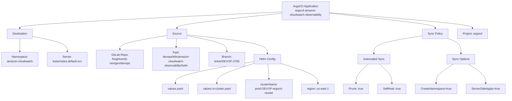
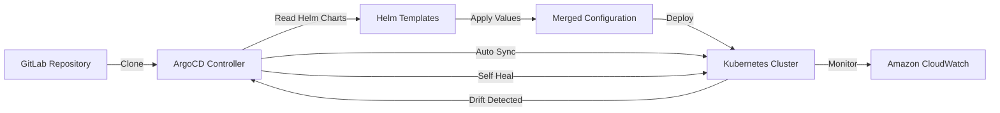
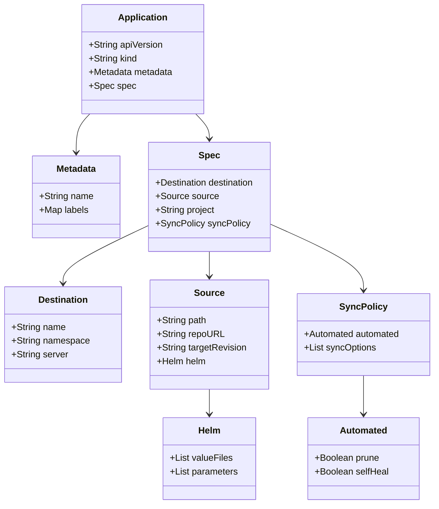
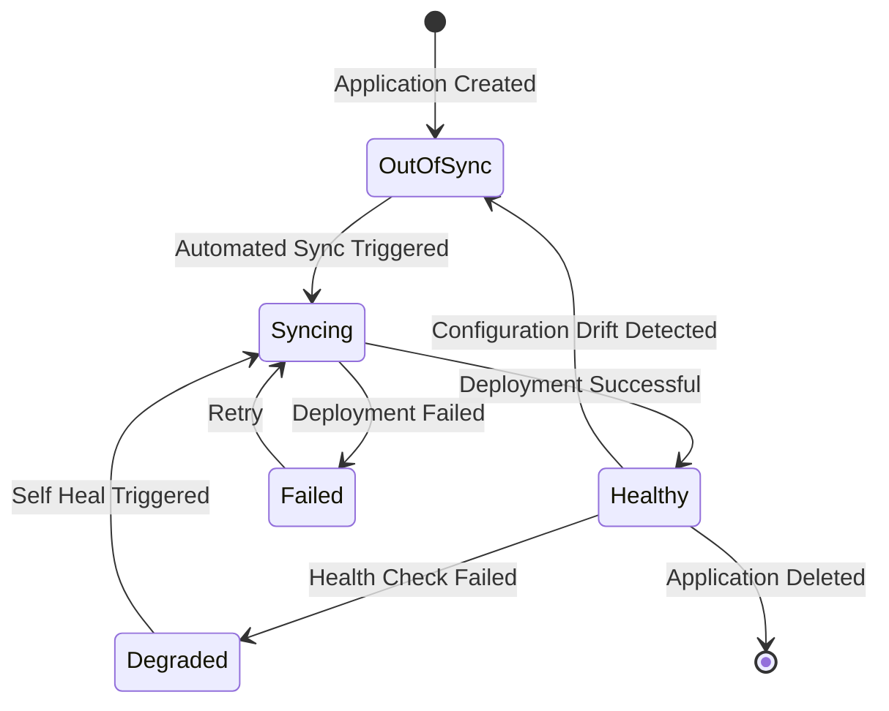

# Diagram: devops/k8s/amazon-cloudwatch-observability/argocd/Application.in-cluster.yaml


> Auto-generated by Obscura crawlers

## Diagram 1

```mermaid
graph TB
      App[ArgoCD Application<br/>argocd-amazon-cloudwatch-observability]
      App --> Dest[Destination]
      App --> Source[Source]...
  └ 195 lines...
```

> SVG rendering failed for this diagram.

## Diagram 2



### SVG

<svg id="container" width="2794.16015625" xmlns="http://www.w3.org/2000/svg" class="flowchart" height="526" viewBox="0 0 2794.16015625 526" role="graphics-document document" aria-roledescription="flowchart-v2"><style>#container{font-family:"trebuchet ms",verdana,arial,sans-serif;font-size:16px;fill:#333;}@keyframes edge-animation-frame{from{stroke-dashoffset:0;}}@keyframes dash{to{stroke-dashoffset:0;}}#container .edge-animation-slow{stroke-dasharray:9,5!important;stroke-dashoffset:900;animation:dash 50s linear infinite;stroke-linecap:round;}#container .edge-animation-fast{stroke-dasharray:9,5!important;stroke-dashoffset:900;animation:dash 20s linear infinite;stroke-linecap:round;}#container .error-icon{fill:#552222;}#container .error-text{fill:#552222;stroke:#552222;}#container .edge-thickness-normal{stroke-width:1px;}#container .edge-thickness-thick{stroke-width:3.5px;}#container .edge-pattern-solid{stroke-dasharray:0;}#container .edge-thickness-invisible{stroke-width:0;fill:none;}#container .edge-pattern-dashed{stroke-dasharray:3;}#container .edge-pattern-dotted{stroke-dasharray:2;}#container .marker{fill:#333333;stroke:#333333;}#container .marker.cross{stroke:#333333;}#container svg{font-family:"trebuchet ms",verdana,arial,sans-serif;font-size:16px;}#container p{margin:0;}#container .label{font-family:"trebuchet ms",verdana,arial,sans-serif;color:#333;}#container .cluster-label text{fill:#333;}#container .cluster-label span{color:#333;}#container .cluster-label span p{background-color:transparent;}#container .label text,#container span{fill:#333;color:#333;}#container .node rect,#container .node circle,#container .node ellipse,#container .node polygon,#container .node path{fill:#ECECFF;stroke:#9370DB;stroke-width:1px;}#container .rough-node .label text,#container .node .label text,#container .image-shape .label,#container .icon-shape .label{text-anchor:middle;}#container .node .katex path{fill:#000;stroke:#000;stroke-width:1px;}#container .rough-node .label,#container .node .label,#container .image-shape .label,#container .icon-shape .label{text-align:center;}#container .node.clickable{cursor:pointer;}#container .root .anchor path{fill:#333333!important;stroke-width:0;stroke:#333333;}#container .arrowheadPath{fill:#333333;}#container .edgePath .path{stroke:#333333;stroke-width:2.0px;}#container .flowchart-link{stroke:#333333;fill:none;}#container .edgeLabel{background-color:rgba(232,232,232, 0.8);text-align:center;}#container .edgeLabel p{background-color:rgba(232,232,232, 0.8);}#container .edgeLabel rect{opacity:0.5;background-color:rgba(232,232,232, 0.8);fill:rgba(232,232,232, 0.8);}#container .labelBkg{background-color:rgba(232, 232, 232, 0.5);}#container .cluster rect{fill:#ffffde;stroke:#aaaa33;stroke-width:1px;}#container .cluster text{fill:#333;}#container .cluster span{color:#333;}#container div.mermaidTooltip{position:absolute;text-align:center;max-width:200px;padding:2px;font-family:"trebuchet ms",verdana,arial,sans-serif;font-size:12px;background:hsl(80, 100%, 96.2745098039%);border:1px solid #aaaa33;border-radius:2px;pointer-events:none;z-index:100;}#container .flowchartTitleText{text-anchor:middle;font-size:18px;fill:#333;}#container rect.text{fill:none;stroke-width:0;}#container .icon-shape,#container .image-shape{background-color:rgba(232,232,232, 0.8);text-align:center;}#container .icon-shape p,#container .image-shape p{background-color:rgba(232,232,232, 0.8);padding:2px;}#container .icon-shape rect,#container .image-shape rect{opacity:0.5;background-color:rgba(232,232,232, 0.8);fill:rgba(232,232,232, 0.8);}#container .label-icon{display:inline-block;height:1em;overflow:visible;vertical-align:-0.125em;}#container .node .label-icon path{fill:currentColor;stroke:revert;stroke-width:revert;}#container :root{--mermaid-font-family:"trebuchet ms",verdana,arial,sans-serif;}</style><g><marker id="container_flowchart-v2-pointEnd" class="marker flowchart-v2" viewBox="0 0 10 10" refX="5" refY="5" markerUnits="userSpaceOnUse" markerWidth="8" markerHeight="8" orient="auto"><path d="M 0 0 L 10 5 L 0 10 z" class="arrowMarkerPath" style="stroke-width: 1; stroke-dasharray: 1, 0;"></path></marker><marker id="container_flowchart-v2-pointStart" class="marker flowchart-v2" viewBox="0 0 10 10" refX="4.5" refY="5" markerUnits="userSpaceOnUse" markerWidth="8" markerHeight="8" orient="auto"><path d="M 0 5 L 10 10 L 10 0 z" class="arrowMarkerPath" style="stroke-width: 1; stroke-dasharray: 1, 0;"></path></marker><marker id="container_flowchart-v2-circleEnd" class="marker flowchart-v2" viewBox="0 0 10 10" refX="11" refY="5" markerUnits="userSpaceOnUse" markerWidth="11" markerHeight="11" orient="auto"><circle cx="5" cy="5" r="5" class="arrowMarkerPath" style="stroke-width: 1; stroke-dasharray: 1, 0;"></circle></marker><marker id="container_flowchart-v2-circleStart" class="marker flowchart-v2" viewBox="0 0 10 10" refX="-1" refY="5" markerUnits="userSpaceOnUse" markerWidth="11" markerHeight="11" orient="auto"><circle cx="5" cy="5" r="5" class="arrowMarkerPath" style="stroke-width: 1; stroke-dasharray: 1, 0;"></circle></marker><marker id="container_flowchart-v2-crossEnd" class="marker cross flowchart-v2" viewBox="0 0 11 11" refX="12" refY="5.2" markerUnits="userSpaceOnUse" markerWidth="11" markerHeight="11" orient="auto"><path d="M 1,1 l 9,9 M 10,1 l -9,9" class="arrowMarkerPath" style="stroke-width: 2; stroke-dasharray: 1, 0;"></path></marker><marker id="container_flowchart-v2-crossStart" class="marker cross flowchart-v2" viewBox="0 0 11 11" refX="-1" refY="5.2" markerUnits="userSpaceOnUse" markerWidth="11" markerHeight="11" orient="auto"><path d="M 1,1 l 9,9 M 10,1 l -9,9" class="arrowMarkerPath" style="stroke-width: 2; stroke-dasharray: 1, 0;"></path></marker><g class="root"><g class="clusters"></g><g class="edgePaths"><path d="M1558.57,65.263L1317.326,76.886C1076.081,88.509,593.591,111.754,352.346,126.877C111.102,142,111.102,149,111.102,152.5L111.102,156" id="L_App_Dest_0" class="edge-thickness-normal edge-pattern-solid edge-thickness-normal edge-pattern-solid flowchart-link" style=";" data-edge="true" data-et="edge" data-id="L_App_Dest_0" data-points="W3sieCI6MTU1OC41NzAzMTI1LCJ5Ijo2NS4yNjMxOTg1NTc4MTYxMn0seyJ4IjoxMTEuMTAxNTYyNSwieSI6MTM1fSx7IngiOjExMS4xMDE1NjI1LCJ5IjoxNjB9XQ==" marker-end="url(#container_flowchart-v2-pointEnd)"></path><path d="M1558.57,72.975L1462.41,83.313C1366.25,93.65,1173.93,114.325,1077.77,128.163C981.609,142,981.609,149,981.609,152.5L981.609,156" id="L_App_Source_0" class="edge-thickness-normal edge-pattern-solid edge-thickness-normal edge-pattern-solid flowchart-link" style=";" data-edge="true" data-et="edge" data-id="L_App_Source_0" data-points="W3sieCI6MTU1OC41NzAzMTI1LCJ5Ijo3Mi45NzUzMTI0NjIwMTI4fSx7IngiOjk4MS42MDkzNzUsInkiOjEzNX0seyJ4Ijo5ODEuNjA5Mzc1LCJ5IjoxNjB9XQ==" marker-end="url(#container_flowchart-v2-pointEnd)"></path><path d="M1818.57,72.902L1915.348,83.252C2012.125,93.602,2205.68,114.301,2302.457,128.15C2399.234,142,2399.234,149,2399.234,152.5L2399.234,156" id="L_App_Sync_0" class="edge-thickness-normal edge-pattern-solid edge-thickness-normal edge-pattern-solid flowchart-link" style=";" data-edge="true" data-et="edge" data-id="L_App_Sync_0" data-points="W3sieCI6MTgxOC41NzAzMTI1LCJ5Ijo3Mi45MDI0ODk5Njg2NjkyN30seyJ4IjoyMzk5LjIzNDM3NSwieSI6MTM1fSx7IngiOjIzOTkuMjM0Mzc1LCJ5IjoxNjB9XQ==" marker-end="url(#container_flowchart-v2-pointEnd)"></path><path d="M1818.57,69.8L1949.374,80.667C2080.177,91.533,2341.784,113.267,2472.587,127.633C2603.391,142,2603.391,149,2603.391,152.5L2603.391,156" id="L_App_Project_0" class="edge-thickness-normal edge-pattern-solid edge-thickness-normal edge-pattern-solid flowchart-link" style=";" data-edge="true" data-et="edge" data-id="L_App_Project_0" data-points="W3sieCI6MTgxOC41NzAzMTI1LCJ5Ijo2OS43OTk5MzUwOTY1NDM4OX0seyJ4IjoyNjAzLjM5MDYyNSwieSI6MTM1fSx7IngiOjI2MDMuMzkwNjI1LCJ5IjoxNjB9XQ==" marker-end="url(#container_flowchart-v2-pointEnd)"></path><path d="M111.102,214L111.102,218.167C111.102,222.333,111.102,230.667,111.102,242.333C111.102,254,111.102,269,111.102,276.5L111.102,284" id="L_Dest_NS_0" class="edge-thickness-normal edge-pattern-solid edge-thickness-normal edge-pattern-solid flowchart-link" style=";" data-edge="true" data-et="edge" data-id="L_Dest_NS_0" data-points="W3sieCI6MTExLjEwMTU2MjUsInkiOjIxNH0seyJ4IjoxMTEuMTAxNTYyNSwieSI6MjM5fSx7IngiOjExMS4xMDE1NjI1LCJ5IjoyODh9XQ==" marker-end="url(#container_flowchart-v2-pointEnd)"></path><path d="M183.039,201.119L215.208,207.432C247.378,213.746,311.716,226.373,343.885,240.186C376.055,254,376.055,269,376.055,276.5L376.055,284" id="L_Dest_Server_0" class="edge-thickness-normal edge-pattern-solid edge-thickness-normal edge-pattern-solid flowchart-link" style=";" data-edge="true" data-et="edge" data-id="L_Dest_Server_0" data-points="W3sieCI6MTgzLjAzOTA2MjUsInkiOjIwMS4xMTg1MzUxMTgyNDAyNn0seyJ4IjozNzYuMDU0Njg3NSwieSI6MjM5fSx7IngiOjM3Ni4wNTQ2ODc1LCJ5IjoyODh9XQ==" marker-end="url(#container_flowchart-v2-pointEnd)"></path><path d="M927.047,196.044L883.857,203.204C840.667,210.363,754.286,224.681,711.096,237.341C667.906,250,667.906,261,667.906,266.5L667.906,272" id="L_Source_Repo_0" class="edge-thickness-normal edge-pattern-solid edge-thickness-normal edge-pattern-solid flowchart-link" style=";" data-edge="true" data-et="edge" data-id="L_Source_Repo_0" data-points="W3sieCI6OTI3LjA0Njg3NSwieSI6MTk2LjA0NDM3OTE0MDMwOTgxfSx7IngiOjY2Ny45MDYyNSwieSI6MjM5fSx7IngiOjY2Ny45MDYyNSwieSI6Mjc2fV0=" marker-end="url(#container_flowchart-v2-pointEnd)"></path><path d="M979.687,214L979.39,218.167C979.093,222.333,978.5,230.667,978.203,238.333C977.906,246,977.906,253,977.906,256.5L977.906,260" id="L_Source_Path_0" class="edge-thickness-normal edge-pattern-solid edge-thickness-normal edge-pattern-solid flowchart-link" style=";" data-edge="true" data-et="edge" data-id="L_Source_Path_0" data-points="W3sieCI6OTc5LjY4NjU5ODU1NzY5MjMsInkiOjIxNH0seyJ4Ijo5NzcuOTA2MjUsInkiOjIzOX0seyJ4Ijo5NzcuOTA2MjUsInkiOjI2NH1d" marker-end="url(#container_flowchart-v2-pointEnd)"></path><path d="M1036.172,197.392L1072.581,204.327C1108.99,211.262,1181.807,225.131,1218.216,239.565C1254.625,254,1254.625,269,1254.625,276.5L1254.625,284" id="L_Source_Branch_0" class="edge-thickness-normal edge-pattern-solid edge-thickness-normal edge-pattern-solid flowchart-link" style=";" data-edge="true" data-et="edge" data-id="L_Source_Branch_0" data-points="W3sieCI6MTAzNi4xNzE4NzUsInkiOjE5Ny4zOTIyNjIzNDc2MjIwNX0seyJ4IjoxMjU0LjYyNSwieSI6MjM5fSx7IngiOjEyNTQuNjI1LCJ5IjoyODh9XQ==" marker-end="url(#container_flowchart-v2-pointEnd)"></path><path d="M1036.172,192.752L1109.294,200.46C1182.417,208.168,1328.661,223.584,1401.784,240.792C1474.906,258,1474.906,277,1474.906,286.5L1474.906,296" id="L_Source_Helm_0" class="edge-thickness-normal edge-pattern-solid edge-thickness-normal edge-pattern-solid flowchart-link" style=";" data-edge="true" data-et="edge" data-id="L_Source_Helm_0" data-points="W3sieCI6MTAzNi4xNzE4NzUsInkiOjE5Mi43NTE2MDc0ODc4ODQ0Nn0seyJ4IjoxNDc0LjkwNjI1LCJ5IjoyMzl9LHsieCI6MTQ3NC45MDYyNSwieSI6MzAwfV0=" marker-end="url(#container_flowchart-v2-pointEnd)"></path><path d="M1401.344,339.712L1328.732,352.26C1256.121,364.808,1110.898,389.904,1038.287,407.952C965.676,426,965.676,437,965.676,442.5L965.676,448" id="L_Helm_Values1_0" class="edge-thickness-normal edge-pattern-solid edge-thickness-normal edge-pattern-solid flowchart-link" style=";" data-edge="true" data-et="edge" data-id="L_Helm_Values1_0" data-points="W3sieCI6MTQwMS4zNDM3NSwieSI6MzM5LjcxMjMxODY3OTM3OTl9LHsieCI6OTY1LjY3NTc4MTI1LCJ5Ijo0MTV9LHsieCI6OTY1LjY3NTc4MTI1LCJ5Ijo0NTJ9XQ==" marker-end="url(#container_flowchart-v2-pointEnd)"></path><path d="M1401.344,350.226L1367.15,361.021C1332.957,371.817,1264.57,393.409,1230.377,409.704C1196.184,426,1196.184,437,1196.184,442.5L1196.184,448" id="L_Helm_Values2_0" class="edge-thickness-normal edge-pattern-solid edge-thickness-normal edge-pattern-solid flowchart-link" style=";" data-edge="true" data-et="edge" data-id="L_Helm_Values2_0" data-points="W3sieCI6MTQwMS4zNDM3NSwieSI6MzUwLjIyNTU5NjY4MTI4ODh9LHsieCI6MTE5Ni4xODM1OTM3NSwieSI6NDE1fSx7IngiOjExOTYuMTgzNTkzNzUsInkiOjQ1Mn1d" marker-end="url(#container_flowchart-v2-pointEnd)"></path><path d="M1477.793,354L1478.881,364.167C1479.968,374.333,1482.142,394.667,1483.229,408.333C1484.316,422,1484.316,429,1484.316,432.5L1484.316,436" id="L_Helm_Param1_0" class="edge-thickness-normal edge-pattern-solid edge-thickness-normal edge-pattern-solid flowchart-link" style=";" data-edge="true" data-et="edge" data-id="L_Helm_Param1_0" data-points="W3sieCI6MTQ3Ny43OTM0NTcwMzEyNSwieSI6MzU0fSx7IngiOjE0ODQuMzE2NDA2MjUsInkiOjQxNX0seyJ4IjoxNDg0LjMxNjQwNjI1LCJ5Ijo0NDB9XQ==" marker-end="url(#container_flowchart-v2-pointEnd)"></path><path d="M1548.469,350.226L1582.662,361.021C1616.855,371.817,1685.242,393.409,1719.436,409.704C1753.629,426,1753.629,437,1753.629,442.5L1753.629,448" id="L_Helm_Param2_0" class="edge-thickness-normal edge-pattern-solid edge-thickness-normal edge-pattern-solid flowchart-link" style=";" data-edge="true" data-et="edge" data-id="L_Helm_Param2_0" data-points="W3sieCI6MTU0OC40Njg3NSwieSI6MzUwLjIyNTU5NjY4MTI4ODh9LHsieCI6MTc1My42Mjg5MDYyNSwieSI6NDE1fSx7IngiOjE3NTMuNjI4OTA2MjUsInkiOjQ1Mn1d" marker-end="url(#container_flowchart-v2-pointEnd)"></path><path d="M2328.945,197.878L2284.661,204.732C2240.378,211.586,2151.81,225.293,2107.526,241.646C2063.242,258,2063.242,277,2063.242,286.5L2063.242,296" id="L_Sync_Auto_0" class="edge-thickness-normal edge-pattern-solid edge-thickness-normal edge-pattern-solid flowchart-link" style=";" data-edge="true" data-et="edge" data-id="L_Sync_Auto_0" data-points="W3sieCI6MjMyOC45NDUzMTI1LCJ5IjoxOTcuODc4MzIyMTMzNjA2MTZ9LHsieCI6MjA2My4yNDIxODc1LCJ5IjoyMzl9LHsieCI6MjA2My4yNDIxODc1LCJ5IjozMDB9XQ==" marker-end="url(#container_flowchart-v2-pointEnd)"></path><path d="M2469.523,212.608L2481.597,217.007C2493.671,221.405,2517.818,230.203,2529.891,244.101C2541.965,258,2541.965,277,2541.965,286.5L2541.965,296" id="L_Sync_Options_0" class="edge-thickness-normal edge-pattern-solid edge-thickness-normal edge-pattern-solid flowchart-link" style=";" data-edge="true" data-et="edge" data-id="L_Sync_Options_0" data-points="W3sieCI6MjQ2OS41MjM0Mzc1LCJ5IjoyMTIuNjA3OTI1Nzc3OTM1OTJ9LHsieCI6MjU0MS45NjQ4NDM3NSwieSI6MjM5fSx7IngiOjI1NDEuOTY0ODQzNzUsInkiOjMwMH1d" marker-end="url(#container_flowchart-v2-pointEnd)"></path><path d="M2032.636,354L2021.111,364.167C2009.587,374.333,1986.537,394.667,1975.013,410.333C1963.488,426,1963.488,437,1963.488,442.5L1963.488,448" id="L_Auto_Prune_0" class="edge-thickness-normal edge-pattern-solid edge-thickness-normal edge-pattern-solid flowchart-link" style=";" data-edge="true" data-et="edge" data-id="L_Auto_Prune_0" data-points="W3sieCI6MjAzMi42MzU4NzUzNTUxMTM3LCJ5IjozNTR9LHsieCI6MTk2My40ODgyODEyNSwieSI6NDE1fSx7IngiOjE5NjMuNDg4MjgxMjUsInkiOjQ1Mn1d" marker-end="url(#container_flowchart-v2-pointEnd)"></path><path d="M2093.848,354L2105.373,364.167C2116.898,374.333,2139.947,394.667,2151.471,410.333C2162.996,426,2162.996,437,2162.996,442.5L2162.996,448" id="L_Auto_SelfHeal_0" class="edge-thickness-normal edge-pattern-solid edge-thickness-normal edge-pattern-solid flowchart-link" style=";" data-edge="true" data-et="edge" data-id="L_Auto_SelfHeal_0" data-points="W3sieCI6MjA5My44NDg0OTk2NDQ4ODY1LCJ5IjozNTR9LHsieCI6MjE2Mi45OTYwOTM3NSwieSI6NDE1fSx7IngiOjIxNjIuOTk2MDkzNzUsInkiOjQ1Mn1d" marker-end="url(#container_flowchart-v2-pointEnd)"></path><path d="M2500.24,354L2484.529,364.167C2468.818,374.333,2437.395,394.667,2421.684,410.333C2405.973,426,2405.973,437,2405.973,442.5L2405.973,448" id="L_Options_CreateNS_0" class="edge-thickness-normal edge-pattern-solid edge-thickness-normal edge-pattern-solid flowchart-link" style=";" data-edge="true" data-et="edge" data-id="L_Options_CreateNS_0" data-points="W3sieCI6MjUwMC4yMzk5NjgwMzk3NzI1LCJ5IjozNTR9LHsieCI6MjQwNS45NzI2NTYyNSwieSI6NDE1fSx7IngiOjI0MDUuOTcyNjU2MjUsInkiOjQ1Mn1d" marker-end="url(#container_flowchart-v2-pointEnd)"></path><path d="M2583.69,354L2599.401,364.167C2615.112,374.333,2646.535,394.667,2662.246,410.333C2677.957,426,2677.957,437,2677.957,442.5L2677.957,448" id="L_Options_SSA_0" class="edge-thickness-normal edge-pattern-solid edge-thickness-normal edge-pattern-solid flowchart-link" style=";" data-edge="true" data-et="edge" data-id="L_Options_SSA_0" data-points="W3sieCI6MjU4My42ODk3MTk0NjAyMjc1LCJ5IjozNTR9LHsieCI6MjY3Ny45NTcwMzEyNSwieSI6NDE1fSx7IngiOjI2NzcuOTU3MDMxMjUsInkiOjQ1Mn1d" marker-end="url(#container_flowchart-v2-pointEnd)"></path></g><g class="edgeLabels"><g class="edgeLabel"><g class="label" data-id="L_App_Dest_0" transform="translate(0, 0)"><foreignObject width="0" height="0"><div xmlns="http://www.w3.org/1999/xhtml" class="labelBkg" style="display: table-cell; white-space: nowrap; line-height: 1.5; max-width: 200px; text-align: center;"><span class="edgeLabel"></span></div></foreignObject></g></g><g class="edgeLabel"><g class="label" data-id="L_App_Source_0" transform="translate(0, 0)"><foreignObject width="0" height="0"><div xmlns="http://www.w3.org/1999/xhtml" class="labelBkg" style="display: table-cell; white-space: nowrap; line-height: 1.5; max-width: 200px; text-align: center;"><span class="edgeLabel"></span></div></foreignObject></g></g><g class="edgeLabel"><g class="label" data-id="L_App_Sync_0" transform="translate(0, 0)"><foreignObject width="0" height="0"><div xmlns="http://www.w3.org/1999/xhtml" class="labelBkg" style="display: table-cell; white-space: nowrap; line-height: 1.5; max-width: 200px; text-align: center;"><span class="edgeLabel"></span></div></foreignObject></g></g><g class="edgeLabel"><g class="label" data-id="L_App_Project_0" transform="translate(0, 0)"><foreignObject width="0" height="0"><div xmlns="http://www.w3.org/1999/xhtml" class="labelBkg" style="display: table-cell; white-space: nowrap; line-height: 1.5; max-width: 200px; text-align: center;"><span class="edgeLabel"></span></div></foreignObject></g></g><g class="edgeLabel"><g class="label" data-id="L_Dest_NS_0" transform="translate(0, 0)"><foreignObject width="0" height="0"><div xmlns="http://www.w3.org/1999/xhtml" class="labelBkg" style="display: table-cell; white-space: nowrap; line-height: 1.5; max-width: 200px; text-align: center;"><span class="edgeLabel"></span></div></foreignObject></g></g><g class="edgeLabel"><g class="label" data-id="L_Dest_Server_0" transform="translate(0, 0)"><foreignObject width="0" height="0"><div xmlns="http://www.w3.org/1999/xhtml" class="labelBkg" style="display: table-cell; white-space: nowrap; line-height: 1.5; max-width: 200px; text-align: center;"><span class="edgeLabel"></span></div></foreignObject></g></g><g class="edgeLabel"><g class="label" data-id="L_Source_Repo_0" transform="translate(0, 0)"><foreignObject width="0" height="0"><div xmlns="http://www.w3.org/1999/xhtml" class="labelBkg" style="display: table-cell; white-space: nowrap; line-height: 1.5; max-width: 200px; text-align: center;"><span class="edgeLabel"></span></div></foreignObject></g></g><g class="edgeLabel"><g class="label" data-id="L_Source_Path_0" transform="translate(0, 0)"><foreignObject width="0" height="0"><div xmlns="http://www.w3.org/1999/xhtml" class="labelBkg" style="display: table-cell; white-space: nowrap; line-height: 1.5; max-width: 200px; text-align: center;"><span class="edgeLabel"></span></div></foreignObject></g></g><g class="edgeLabel"><g class="label" data-id="L_Source_Branch_0" transform="translate(0, 0)"><foreignObject width="0" height="0"><div xmlns="http://www.w3.org/1999/xhtml" class="labelBkg" style="display: table-cell; white-space: nowrap; line-height: 1.5; max-width: 200px; text-align: center;"><span class="edgeLabel"></span></div></foreignObject></g></g><g class="edgeLabel"><g class="label" data-id="L_Source_Helm_0" transform="translate(0, 0)"><foreignObject width="0" height="0"><div xmlns="http://www.w3.org/1999/xhtml" class="labelBkg" style="display: table-cell; white-space: nowrap; line-height: 1.5; max-width: 200px; text-align: center;"><span class="edgeLabel"></span></div></foreignObject></g></g><g class="edgeLabel"><g class="label" data-id="L_Helm_Values1_0" transform="translate(0, 0)"><foreignObject width="0" height="0"><div xmlns="http://www.w3.org/1999/xhtml" class="labelBkg" style="display: table-cell; white-space: nowrap; line-height: 1.5; max-width: 200px; text-align: center;"><span class="edgeLabel"></span></div></foreignObject></g></g><g class="edgeLabel"><g class="label" data-id="L_Helm_Values2_0" transform="translate(0, 0)"><foreignObject width="0" height="0"><div xmlns="http://www.w3.org/1999/xhtml" class="labelBkg" style="display: table-cell; white-space: nowrap; line-height: 1.5; max-width: 200px; text-align: center;"><span class="edgeLabel"></span></div></foreignObject></g></g><g class="edgeLabel"><g class="label" data-id="L_Helm_Param1_0" transform="translate(0, 0)"><foreignObject width="0" height="0"><div xmlns="http://www.w3.org/1999/xhtml" class="labelBkg" style="display: table-cell; white-space: nowrap; line-height: 1.5; max-width: 200px; text-align: center;"><span class="edgeLabel"></span></div></foreignObject></g></g><g class="edgeLabel"><g class="label" data-id="L_Helm_Param2_0" transform="translate(0, 0)"><foreignObject width="0" height="0"><div xmlns="http://www.w3.org/1999/xhtml" class="labelBkg" style="display: table-cell; white-space: nowrap; line-height: 1.5; max-width: 200px; text-align: center;"><span class="edgeLabel"></span></div></foreignObject></g></g><g class="edgeLabel"><g class="label" data-id="L_Sync_Auto_0" transform="translate(0, 0)"><foreignObject width="0" height="0"><div xmlns="http://www.w3.org/1999/xhtml" class="labelBkg" style="display: table-cell; white-space: nowrap; line-height: 1.5; max-width: 200px; text-align: center;"><span class="edgeLabel"></span></div></foreignObject></g></g><g class="edgeLabel"><g class="label" data-id="L_Sync_Options_0" transform="translate(0, 0)"><foreignObject width="0" height="0"><div xmlns="http://www.w3.org/1999/xhtml" class="labelBkg" style="display: table-cell; white-space: nowrap; line-height: 1.5; max-width: 200px; text-align: center;"><span class="edgeLabel"></span></div></foreignObject></g></g><g class="edgeLabel"><g class="label" data-id="L_Auto_Prune_0" transform="translate(0, 0)"><foreignObject width="0" height="0"><div xmlns="http://www.w3.org/1999/xhtml" class="labelBkg" style="display: table-cell; white-space: nowrap; line-height: 1.5; max-width: 200px; text-align: center;"><span class="edgeLabel"></span></div></foreignObject></g></g><g class="edgeLabel"><g class="label" data-id="L_Auto_SelfHeal_0" transform="translate(0, 0)"><foreignObject width="0" height="0"><div xmlns="http://www.w3.org/1999/xhtml" class="labelBkg" style="display: table-cell; white-space: nowrap; line-height: 1.5; max-width: 200px; text-align: center;"><span class="edgeLabel"></span></div></foreignObject></g></g><g class="edgeLabel"><g class="label" data-id="L_Options_CreateNS_0" transform="translate(0, 0)"><foreignObject width="0" height="0"><div xmlns="http://www.w3.org/1999/xhtml" class="labelBkg" style="display: table-cell; white-space: nowrap; line-height: 1.5; max-width: 200px; text-align: center;"><span class="edgeLabel"></span></div></foreignObject></g></g><g class="edgeLabel"><g class="label" data-id="L_Options_SSA_0" transform="translate(0, 0)"><foreignObject width="0" height="0"><div xmlns="http://www.w3.org/1999/xhtml" class="labelBkg" style="display: table-cell; white-space: nowrap; line-height: 1.5; max-width: 200px; text-align: center;"><span class="edgeLabel"></span></div></foreignObject></g></g></g><g class="nodes"><g class="node default" id="flowchart-App-0" transform="translate(1688.5703125, 59)"><rect class="basic label-container" style="" x="-130" y="-51" width="260" height="102"></rect><g class="label" style="" transform="translate(-100, -36)"><rect></rect><foreignObject width="200" height="72"><div xmlns="http://www.w3.org/1999/xhtml" style="display: table; white-space: break-spaces; line-height: 1.5; max-width: 200px; text-align: center; width: 200px;"><span class="nodeLabel"><p>ArgoCD Application<br/>argocd-amazon-cloudwatch-observability</p></span></div></foreignObject></g></g><g class="node default" id="flowchart-Dest-2" transform="translate(111.1015625, 187)"><rect class="basic label-container" style="" x="-71.9375" y="-27" width="143.875" height="54"></rect><g class="label" style="" transform="translate(-41.9375, -12)"><rect></rect><foreignObject width="83.875" height="24"><div xmlns="http://www.w3.org/1999/xhtml" style="display: table-cell; white-space: nowrap; line-height: 1.5; max-width: 200px; text-align: center;"><span class="nodeLabel"><p>Destination</p></span></div></foreignObject></g></g><g class="node default" id="flowchart-Source-4" transform="translate(981.609375, 187)"><rect class="basic label-container" style="" x="-54.5625" y="-27" width="109.125" height="54"></rect><g class="label" style="" transform="translate(-24.5625, -12)"><rect></rect><foreignObject width="49.125" height="24"><div xmlns="http://www.w3.org/1999/xhtml" style="display: table-cell; white-space: nowrap; line-height: 1.5; max-width: 200px; text-align: center;"><span class="nodeLabel"><p>Source</p></span></div></foreignObject></g></g><g class="node default" id="flowchart-Sync-6" transform="translate(2399.234375, 187)"><rect class="basic label-container" style="" x="-70.2890625" y="-27" width="140.578125" height="54"></rect><g class="label" style="" transform="translate(-40.2890625, -12)"><rect></rect><foreignObject width="80.578125" height="24"><div xmlns="http://www.w3.org/1999/xhtml" style="display: table-cell; white-space: nowrap; line-height: 1.5; max-width: 200px; text-align: center;"><span class="nodeLabel"><p>Sync Policy</p></span></div></foreignObject></g></g><g class="node default" id="flowchart-Project-8" transform="translate(2603.390625, 187)"><rect class="basic label-container" style="" x="-83.8671875" y="-27" width="167.734375" height="54"></rect><g class="label" style="" transform="translate(-53.8671875, -12)"><rect></rect><foreignObject width="107.734375" height="24"><div xmlns="http://www.w3.org/1999/xhtml" style="display: table-cell; white-space: nowrap; line-height: 1.5; max-width: 200px; text-align: center;"><span class="nodeLabel"><p>Project: argocd</p></span></div></foreignObject></g></g><g class="node default" id="flowchart-NS-10" transform="translate(111.1015625, 327)"><rect class="basic label-container" style="" x="-103.1015625" y="-39" width="206.203125" height="78"></rect><g class="label" style="" transform="translate(-73.1015625, -24)"><rect></rect><foreignObject width="146.203125" height="48"><div xmlns="http://www.w3.org/1999/xhtml" style="display: table-cell; white-space: nowrap; line-height: 1.5; max-width: 200px; text-align: center;"><span class="nodeLabel"><p>Namespace:<br/>amazon-cloudwatch</p></span></div></foreignObject></g></g><g class="node default" id="flowchart-Server-12" transform="translate(376.0546875, 327)"><rect class="basic label-container" style="" x="-111.8515625" y="-39" width="223.703125" height="78"></rect><g class="label" style="" transform="translate(-81.8515625, -24)"><rect></rect><foreignObject width="163.703125" height="48"><div xmlns="http://www.w3.org/1999/xhtml" style="display: table-cell; white-space: nowrap; line-height: 1.5; max-width: 200px; text-align: center;"><span class="nodeLabel"><p>Server:<br/>kubernetes.default.svc</p></span></div></foreignObject></g></g><g class="node default" id="flowchart-Repo-14" transform="translate(667.90625, 327)"><rect class="basic label-container" style="" x="-130" y="-51" width="260" height="102"></rect><g class="label" style="" transform="translate(-100, -36)"><rect></rect><foreignObject width="200" height="72"><div xmlns="http://www.w3.org/1999/xhtml" style="display: table; white-space: break-spaces; line-height: 1.5; max-width: 200px; text-align: center; width: 200px;"><span class="nodeLabel"><p>GitLab Repo:<br/>freightverify-nextgen/devops</p></span></div></foreignObject></g></g><g class="node default" id="flowchart-Path-16" transform="translate(977.90625, 327)"><rect class="basic label-container" style="" x="-130" y="-63" width="260" height="126"></rect><g class="label" style="" transform="translate(-100, -48)"><rect></rect><foreignObject width="200" height="96"><div xmlns="http://www.w3.org/1999/xhtml" style="display: table; white-space: break-spaces; line-height: 1.5; max-width: 200px; text-align: center; width: 200px;"><span class="nodeLabel"><p>Path:<br/>devops/k8s/amazon-cloudwatch-observability/helm</p></span></div></foreignObject></g></g><g class="node default" id="flowchart-Branch-18" transform="translate(1254.625, 327)"><rect class="basic label-container" style="" x="-96.71875" y="-39" width="193.4375" height="78"></rect><g class="label" style="" transform="translate(-66.71875, -24)"><rect></rect><foreignObject width="133.4375" height="48"><div xmlns="http://www.w3.org/1999/xhtml" style="display: table-cell; white-space: nowrap; line-height: 1.5; max-width: 200px; text-align: center;"><span class="nodeLabel"><p>Branch:<br/>ticket/DEVOP-2783</p></span></div></foreignObject></g></g><g class="node default" id="flowchart-Helm-20" transform="translate(1474.90625, 327)"><rect class="basic label-container" style="" x="-73.5625" y="-27" width="147.125" height="54"></rect><g class="label" style="" transform="translate(-43.5625, -12)"><rect></rect><foreignObject width="87.125" height="24"><div xmlns="http://www.w3.org/1999/xhtml" style="display: table-cell; white-space: nowrap; line-height: 1.5; max-width: 200px; text-align: center;"><span class="nodeLabel"><p>Helm Config</p></span></div></foreignObject></g></g><g class="node default" id="flowchart-Values1-22" transform="translate(965.67578125, 479)"><rect class="basic label-container" style="" x="-72.140625" y="-27" width="144.28125" height="54"></rect><g class="label" style="" transform="translate(-42.140625, -12)"><rect></rect><foreignObject width="84.28125" height="24"><div xmlns="http://www.w3.org/1999/xhtml" style="display: table-cell; white-space: nowrap; line-height: 1.5; max-width: 200px; text-align: center;"><span class="nodeLabel"><p>values.yaml</p></span></div></foreignObject></g></g><g class="node default" id="flowchart-Values2-24" transform="translate(1196.18359375, 479)"><rect class="basic label-container" style="" x="-108.3671875" y="-27" width="216.734375" height="54"></rect><g class="label" style="" transform="translate(-78.3671875, -12)"><rect></rect><foreignObject width="156.734375" height="24"><div xmlns="http://www.w3.org/1999/xhtml" style="display: table-cell; white-space: nowrap; line-height: 1.5; max-width: 200px; text-align: center;"><span class="nodeLabel"><p>values.in-cluster.yaml</p></span></div></foreignObject></g></g><g class="node default" id="flowchart-Param1-26" transform="translate(1484.31640625, 479)"><rect class="basic label-container" style="" x="-129.765625" y="-39" width="259.53125" height="78"></rect><g class="label" style="" transform="translate(-99.765625, -24)"><rect></rect><foreignObject width="199.53125" height="48"><div xmlns="http://www.w3.org/1999/xhtml" style="display: table-cell; white-space: nowrap; line-height: 1.5; max-width: 200px; text-align: center;"><span class="nodeLabel"><p>clusterName:<br/>prod-DEVOP-argocd-cluster</p></span></div></foreignObject></g></g><g class="node default" id="flowchart-Param2-28" transform="translate(1753.62890625, 479)"><rect class="basic label-container" style="" x="-89.546875" y="-27" width="179.09375" height="54"></rect><g class="label" style="" transform="translate(-59.546875, -12)"><rect></rect><foreignObject width="119.09375" height="24"><div xmlns="http://www.w3.org/1999/xhtml" style="display: table-cell; white-space: nowrap; line-height: 1.5; max-width: 200px; text-align: center;"><span class="nodeLabel"><p>region: us-east-1</p></span></div></foreignObject></g></g><g class="node default" id="flowchart-Auto-30" transform="translate(2063.2421875, 327)"><rect class="basic label-container" style="" x="-88.6484375" y="-27" width="177.296875" height="54"></rect><g class="label" style="" transform="translate(-58.6484375, -12)"><rect></rect><foreignObject width="117.296875" height="24"><div xmlns="http://www.w3.org/1999/xhtml" style="display: table-cell; white-space: nowrap; line-height: 1.5; max-width: 200px; text-align: center;"><span class="nodeLabel"><p>Automated Sync</p></span></div></foreignObject></g></g><g class="node default" id="flowchart-Options-32" transform="translate(2541.96484375, 327)"><rect class="basic label-container" style="" x="-77.3828125" y="-27" width="154.765625" height="54"></rect><g class="label" style="" transform="translate(-47.3828125, -12)"><rect></rect><foreignObject width="94.765625" height="24"><div xmlns="http://www.w3.org/1999/xhtml" style="display: table-cell; white-space: nowrap; line-height: 1.5; max-width: 200px; text-align: center;"><span class="nodeLabel"><p>Sync Options</p></span></div></foreignObject></g></g><g class="node default" id="flowchart-Prune-34" transform="translate(1963.48828125, 479)"><rect class="basic label-container" style="" x="-70.3125" y="-27" width="140.625" height="54"></rect><g class="label" style="" transform="translate(-40.3125, -12)"><rect></rect><foreignObject width="80.625" height="24"><div xmlns="http://www.w3.org/1999/xhtml" style="display: table-cell; white-space: nowrap; line-height: 1.5; max-width: 200px; text-align: center;"><span class="nodeLabel"><p>Prune: true</p></span></div></foreignObject></g></g><g class="node default" id="flowchart-SelfHeal-36" transform="translate(2162.99609375, 479)"><rect class="basic label-container" style="" x="-79.1953125" y="-27" width="158.390625" height="54"></rect><g class="label" style="" transform="translate(-49.1953125, -12)"><rect></rect><foreignObject width="98.390625" height="24"><div xmlns="http://www.w3.org/1999/xhtml" style="display: table-cell; white-space: nowrap; line-height: 1.5; max-width: 200px; text-align: center;"><span class="nodeLabel"><p>SelfHeal: true</p></span></div></foreignObject></g></g><g class="node default" id="flowchart-CreateNS-38" transform="translate(2405.97265625, 479)"><rect class="basic label-container" style="" x="-113.78125" y="-27" width="227.5625" height="54"></rect><g class="label" style="" transform="translate(-83.78125, -12)"><rect></rect><foreignObject width="167.5625" height="24"><div xmlns="http://www.w3.org/1999/xhtml" style="display: table-cell; white-space: nowrap; line-height: 1.5; max-width: 200px; text-align: center;"><span class="nodeLabel"><p>CreateNamespace=true</p></span></div></foreignObject></g></g><g class="node default" id="flowchart-SSA-40" transform="translate(2677.95703125, 479)"><rect class="basic label-container" style="" x="-108.203125" y="-27" width="216.40625" height="54"></rect><g class="label" style="" transform="translate(-78.203125, -12)"><rect></rect><foreignObject width="156.40625" height="24"><div xmlns="http://www.w3.org/1999/xhtml" style="display: table-cell; white-space: nowrap; line-height: 1.5; max-width: 200px; text-align: center;"><span class="nodeLabel"><p>ServerSideApply=true</p></span></div></foreignObject></g></g></g></g></g></svg>

## Diagram 3



### SVG

<svg id="container" width="1817.546875" xmlns="http://www.w3.org/2000/svg" class="flowchart" height="205" viewBox="0 0 1817.546875 205" role="graphics-document document" aria-roledescription="flowchart-v2"><style>#container{font-family:"trebuchet ms",verdana,arial,sans-serif;font-size:16px;fill:#333;}@keyframes edge-animation-frame{from{stroke-dashoffset:0;}}@keyframes dash{to{stroke-dashoffset:0;}}#container .edge-animation-slow{stroke-dasharray:9,5!important;stroke-dashoffset:900;animation:dash 50s linear infinite;stroke-linecap:round;}#container .edge-animation-fast{stroke-dasharray:9,5!important;stroke-dashoffset:900;animation:dash 20s linear infinite;stroke-linecap:round;}#container .error-icon{fill:#552222;}#container .error-text{fill:#552222;stroke:#552222;}#container .edge-thickness-normal{stroke-width:1px;}#container .edge-thickness-thick{stroke-width:3.5px;}#container .edge-pattern-solid{stroke-dasharray:0;}#container .edge-thickness-invisible{stroke-width:0;fill:none;}#container .edge-pattern-dashed{stroke-dasharray:3;}#container .edge-pattern-dotted{stroke-dasharray:2;}#container .marker{fill:#333333;stroke:#333333;}#container .marker.cross{stroke:#333333;}#container svg{font-family:"trebuchet ms",verdana,arial,sans-serif;font-size:16px;}#container p{margin:0;}#container .label{font-family:"trebuchet ms",verdana,arial,sans-serif;color:#333;}#container .cluster-label text{fill:#333;}#container .cluster-label span{color:#333;}#container .cluster-label span p{background-color:transparent;}#container .label text,#container span{fill:#333;color:#333;}#container .node rect,#container .node circle,#container .node ellipse,#container .node polygon,#container .node path{fill:#ECECFF;stroke:#9370DB;stroke-width:1px;}#container .rough-node .label text,#container .node .label text,#container .image-shape .label,#container .icon-shape .label{text-anchor:middle;}#container .node .katex path{fill:#000;stroke:#000;stroke-width:1px;}#container .rough-node .label,#container .node .label,#container .image-shape .label,#container .icon-shape .label{text-align:center;}#container .node.clickable{cursor:pointer;}#container .root .anchor path{fill:#333333!important;stroke-width:0;stroke:#333333;}#container .arrowheadPath{fill:#333333;}#container .edgePath .path{stroke:#333333;stroke-width:2.0px;}#container .flowchart-link{stroke:#333333;fill:none;}#container .edgeLabel{background-color:rgba(232,232,232, 0.8);text-align:center;}#container .edgeLabel p{background-color:rgba(232,232,232, 0.8);}#container .edgeLabel rect{opacity:0.5;background-color:rgba(232,232,232, 0.8);fill:rgba(232,232,232, 0.8);}#container .labelBkg{background-color:rgba(232, 232, 232, 0.5);}#container .cluster rect{fill:#ffffde;stroke:#aaaa33;stroke-width:1px;}#container .cluster text{fill:#333;}#container .cluster span{color:#333;}#container div.mermaidTooltip{position:absolute;text-align:center;max-width:200px;padding:2px;font-family:"trebuchet ms",verdana,arial,sans-serif;font-size:12px;background:hsl(80, 100%, 96.2745098039%);border:1px solid #aaaa33;border-radius:2px;pointer-events:none;z-index:100;}#container .flowchartTitleText{text-anchor:middle;font-size:18px;fill:#333;}#container rect.text{fill:none;stroke-width:0;}#container .icon-shape,#container .image-shape{background-color:rgba(232,232,232, 0.8);text-align:center;}#container .icon-shape p,#container .image-shape p{background-color:rgba(232,232,232, 0.8);padding:2px;}#container .icon-shape rect,#container .image-shape rect{opacity:0.5;background-color:rgba(232,232,232, 0.8);fill:rgba(232,232,232, 0.8);}#container .label-icon{display:inline-block;height:1em;overflow:visible;vertical-align:-0.125em;}#container .node .label-icon path{fill:currentColor;stroke:revert;stroke-width:revert;}#container :root{--mermaid-font-family:"trebuchet ms",verdana,arial,sans-serif;}</style><g><marker id="container_flowchart-v2-pointEnd" class="marker flowchart-v2" viewBox="0 0 10 10" refX="5" refY="5" markerUnits="userSpaceOnUse" markerWidth="8" markerHeight="8" orient="auto"><path d="M 0 0 L 10 5 L 0 10 z" class="arrowMarkerPath" style="stroke-width: 1; stroke-dasharray: 1, 0;"></path></marker><marker id="container_flowchart-v2-pointStart" class="marker flowchart-v2" viewBox="0 0 10 10" refX="4.5" refY="5" markerUnits="userSpaceOnUse" markerWidth="8" markerHeight="8" orient="auto"><path d="M 0 5 L 10 10 L 10 0 z" class="arrowMarkerPath" style="stroke-width: 1; stroke-dasharray: 1, 0;"></path></marker><marker id="container_flowchart-v2-circleEnd" class="marker flowchart-v2" viewBox="0 0 10 10" refX="11" refY="5" markerUnits="userSpaceOnUse" markerWidth="11" markerHeight="11" orient="auto"><circle cx="5" cy="5" r="5" class="arrowMarkerPath" style="stroke-width: 1; stroke-dasharray: 1, 0;"></circle></marker><marker id="container_flowchart-v2-circleStart" class="marker flowchart-v2" viewBox="0 0 10 10" refX="-1" refY="5" markerUnits="userSpaceOnUse" markerWidth="11" markerHeight="11" orient="auto"><circle cx="5" cy="5" r="5" class="arrowMarkerPath" style="stroke-width: 1; stroke-dasharray: 1, 0;"></circle></marker><marker id="container_flowchart-v2-crossEnd" class="marker cross flowchart-v2" viewBox="0 0 11 11" refX="12" refY="5.2" markerUnits="userSpaceOnUse" markerWidth="11" markerHeight="11" orient="auto"><path d="M 1,1 l 9,9 M 10,1 l -9,9" class="arrowMarkerPath" style="stroke-width: 2; stroke-dasharray: 1, 0;"></path></marker><marker id="container_flowchart-v2-crossStart" class="marker cross flowchart-v2" viewBox="0 0 11 11" refX="-1" refY="5.2" markerUnits="userSpaceOnUse" markerWidth="11" markerHeight="11" orient="auto"><path d="M 1,1 l 9,9 M 10,1 l -9,9" class="arrowMarkerPath" style="stroke-width: 2; stroke-dasharray: 1, 0;"></path></marker><g class="root"><g class="clusters"></g><g class="edgePaths"><path d="M196.563,119L204.134,119C211.706,119,226.849,119,241.326,119C255.802,119,269.612,119,276.517,119L283.422,119" id="L_Git_ArgoCD_0" class="edge-thickness-normal edge-pattern-solid edge-thickness-normal edge-pattern-solid flowchart-link" style=";" data-edge="true" data-et="edge" data-id="L_Git_ArgoCD_0" data-points="W3sieCI6MTk2LjU2MjUsInkiOjExOX0seyJ4IjoyNDEuOTkyMTg3NSwieSI6MTE5fSx7IngiOjI4Ny40MjE4NzUsInkiOjExOX1d" marker-end="url(#container_flowchart-v2-pointEnd)"></path><path d="M440.672,92L461.451,82.5C482.229,73,523.787,54,558.82,44.5C593.854,35,622.365,35,636.62,35L650.875,35" id="L_ArgoCD_Helm_0" class="edge-thickness-normal edge-pattern-solid edge-thickness-normal edge-pattern-solid flowchart-link" style=";" data-edge="true" data-et="edge" data-id="L_ArgoCD_Helm_0" data-points="W3sieCI6NDQwLjY3MjE1NDAxNzg1NzE3LCJ5Ijo5Mn0seyJ4Ijo1NjUuMzQzNzUsInkiOjM1fSx7IngiOjY1NC44NzUsInkiOjM1fV0=" marker-end="url(#container_flowchart-v2-pointEnd)"></path><path d="M831.484,35L844.078,35C856.672,35,881.859,35,906.38,35C930.901,35,954.755,35,966.682,35L978.609,35" id="L_Helm_Config_0" class="edge-thickness-normal edge-pattern-solid edge-thickness-normal edge-pattern-solid flowchart-link" style=";" data-edge="true" data-et="edge" data-id="L_Helm_Config_0" data-points="W3sieCI6ODMxLjQ4NDM3NSwieSI6MzV9LHsieCI6OTA3LjA0Njg3NSwieSI6MzV9LHsieCI6OTgyLjYwOTM3NSwieSI6MzV9XQ==" marker-end="url(#container_flowchart-v2-pointEnd)"></path><path d="M1197.672,35L1206.03,35C1214.388,35,1231.104,35,1255.736,44.173C1280.368,53.345,1312.916,71.691,1329.19,80.863L1345.464,90.036" id="L_Config_K8s_0" class="edge-thickness-normal edge-pattern-solid edge-thickness-normal edge-pattern-solid flowchart-link" style=";" data-edge="true" data-et="edge" data-id="L_Config_K8s_0" data-points="W3sieCI6MTE5Ny42NzE4NzUsInkiOjM1fSx7IngiOjEyNDcuODIwMzEyNSwieSI6MzV9LHsieCI6MTM0OC45NDg2NjA3MTQyODU4LCJ5Ijo5Mn1d" marker-end="url(#container_flowchart-v2-pointEnd)"></path><path d="M1495.734,119L1504.63,119C1513.526,119,1531.318,119,1548.443,119C1565.568,119,1582.026,119,1590.255,119L1598.484,119" id="L_K8s_CW_0" class="edge-thickness-normal edge-pattern-solid edge-thickness-normal edge-pattern-solid flowchart-link" style=";" data-edge="true" data-et="edge" data-id="L_K8s_CW_0" data-points="W3sieCI6MTQ5NS43MzQzNzUsInkiOjExOX0seyJ4IjoxNTQ5LjEwOTM3NSwieSI6MTE5fSx7IngiOjE2MDIuNDg0Mzc1LCJ5IjoxMTl9XQ==" marker-end="url(#container_flowchart-v2-pointEnd)"></path><path d="M475.813,107.721L490.734,105.934C505.656,104.147,535.5,100.574,580.061,98.787C624.622,97,683.901,97,740.852,97C797.802,97,852.424,97,910.251,97C968.078,97,1029.109,97,1085.905,97C1142.701,97,1195.26,97,1229.239,98.136C1263.217,99.273,1278.615,101.546,1286.313,102.682L1294.012,103.819" id="L_ArgoCD_K8s_0" class="edge-thickness-normal edge-pattern-solid edge-thickness-normal edge-pattern-solid flowchart-link" style=";" data-edge="true" data-et="edge" data-id="L_ArgoCD_K8s_0" data-points="W3sieCI6NDc1LjgxMjUsInkiOjEwNy43MjA3NTUxOTgzNjcxNH0seyJ4Ijo1NjUuMzQzNzUsInkiOjk3fSx7IngiOjc0My4xNzk2ODc1LCJ5Ijo5N30seyJ4Ijo5MDcuMDQ2ODc1LCJ5Ijo5N30seyJ4IjoxMDkwLjE0MDYyNSwieSI6OTd9LHsieCI6MTI0Ny44MjAzMTI1LCJ5Ijo5N30seyJ4IjoxMjk3Ljk2ODc1LCJ5IjoxMDQuNDAyOTE0NjU3MTYwODR9XQ==" marker-end="url(#container_flowchart-v2-pointEnd)"></path><path d="M1335.884,146L1321.207,152.5C1306.53,159,1277.175,172,1236.218,178.5C1195.26,185,1142.701,185,1085.905,185C1029.109,185,968.078,185,910.251,185C852.424,185,797.802,185,740.852,185C683.901,185,624.622,185,577.516,178.725C530.41,172.451,495.476,159.902,478.009,153.627L460.543,147.352" id="L_K8s_ArgoCD_0" class="edge-thickness-normal edge-pattern-solid edge-thickness-normal edge-pattern-solid flowchart-link" style=";" data-edge="true" data-et="edge" data-id="L_K8s_ArgoCD_0" data-points="W3sieCI6MTMzNS44ODQyMzI5NTQ1NDU1LCJ5IjoxNDZ9LHsieCI6MTI0Ny44MjAzMTI1LCJ5IjoxODV9LHsieCI6MTA5MC4xNDA2MjUsInkiOjE4NX0seyJ4Ijo5MDcuMDQ2ODc1LCJ5IjoxODV9LHsieCI6NzQzLjE3OTY4NzUsInkiOjE4NX0seyJ4Ijo1NjUuMzQzNzUsInkiOjE4NX0seyJ4Ijo0NTYuNzc4MDUzOTc3MjcyNzUsInkiOjE0Nn1d" marker-end="url(#container_flowchart-v2-pointEnd)"></path><path d="M475.813,130.279L490.734,132.066C505.656,133.853,535.5,137.426,580.061,139.213C624.622,141,683.901,141,740.852,141C797.802,141,852.424,141,910.251,141C968.078,141,1029.109,141,1085.905,141C1142.701,141,1195.26,141,1229.239,139.864C1263.217,138.727,1278.615,136.454,1286.313,135.318L1294.012,134.181" id="L_ArgoCD_K8s_2" class="edge-thickness-normal edge-pattern-solid edge-thickness-normal edge-pattern-solid flowchart-link" style=";" data-edge="true" data-et="edge" data-id="L_ArgoCD_K8s_2" data-points="W3sieCI6NDc1LjgxMjUsInkiOjEzMC4yNzkyNDQ4MDE2MzI4N30seyJ4Ijo1NjUuMzQzNzUsInkiOjE0MX0seyJ4Ijo3NDMuMTc5Njg3NSwieSI6MTQxfSx7IngiOjkwNy4wNDY4NzUsInkiOjE0MX0seyJ4IjoxMDkwLjE0MDYyNSwieSI6MTQxfSx7IngiOjEyNDcuODIwMzEyNSwieSI6MTQxfSx7IngiOjEyOTcuOTY4NzUsInkiOjEzMy41OTcwODUzNDI4MzkxNn1d" marker-end="url(#container_flowchart-v2-pointEnd)"></path></g><g class="edgeLabels"><g class="edgeLabel" transform="translate(241.9921875, 119)"><g class="label" data-id="L_Git_ArgoCD_0" transform="translate(-20.4296875, -12)"><foreignObject width="40.859375" height="24"><div xmlns="http://www.w3.org/1999/xhtml" class="labelBkg" style="display: table-cell; white-space: nowrap; line-height: 1.5; max-width: 200px; text-align: center;"><span class="edgeLabel"><p>Clone</p></span></div></foreignObject></g></g><g class="edgeLabel" transform="translate(565.34375, 35)"><g class="label" data-id="L_ArgoCD_Helm_0" transform="translate(-64.53125, -12)"><foreignObject width="129.0625" height="24"><div xmlns="http://www.w3.org/1999/xhtml" class="labelBkg" style="display: table-cell; white-space: nowrap; line-height: 1.5; max-width: 200px; text-align: center;"><span class="edgeLabel"><p>Read Helm Charts</p></span></div></foreignObject></g></g><g class="edgeLabel" transform="translate(907.046875, 35)"><g class="label" data-id="L_Helm_Config_0" transform="translate(-45.90625, -12)"><foreignObject width="91.8125" height="24"><div xmlns="http://www.w3.org/1999/xhtml" class="labelBkg" style="display: table-cell; white-space: nowrap; line-height: 1.5; max-width: 200px; text-align: center;"><span class="edgeLabel"><p>Apply Values</p></span></div></foreignObject></g></g><g class="edgeLabel" transform="translate(1247.8203125, 35)"><g class="label" data-id="L_Config_K8s_0" transform="translate(-25.1484375, -12)"><foreignObject width="50.296875" height="24"><div xmlns="http://www.w3.org/1999/xhtml" class="labelBkg" style="display: table-cell; white-space: nowrap; line-height: 1.5; max-width: 200px; text-align: center;"><span class="edgeLabel"><p>Deploy</p></span></div></foreignObject></g></g><g class="edgeLabel" transform="translate(1549.109375, 119)"><g class="label" data-id="L_K8s_CW_0" transform="translate(-28.375, -12)"><foreignObject width="56.75" height="24"><div xmlns="http://www.w3.org/1999/xhtml" class="labelBkg" style="display: table-cell; white-space: nowrap; line-height: 1.5; max-width: 200px; text-align: center;"><span class="edgeLabel"><p>Monitor</p></span></div></foreignObject></g></g><g class="edgeLabel" transform="translate(907.046875, 97)"><g class="label" data-id="L_ArgoCD_K8s_0" transform="translate(-35.53125, -12)"><foreignObject width="71.0625" height="24"><div xmlns="http://www.w3.org/1999/xhtml" class="labelBkg" style="display: table-cell; white-space: nowrap; line-height: 1.5; max-width: 200px; text-align: center;"><span class="edgeLabel"><p>Auto Sync</p></span></div></foreignObject></g></g><g class="edgeLabel" transform="translate(907.046875, 185)"><g class="label" data-id="L_K8s_ArgoCD_0" transform="translate(-50.5625, -12)"><foreignObject width="101.125" height="24"><div xmlns="http://www.w3.org/1999/xhtml" class="labelBkg" style="display: table-cell; white-space: nowrap; line-height: 1.5; max-width: 200px; text-align: center;"><span class="edgeLabel"><p>Drift Detected</p></span></div></foreignObject></g></g><g class="edgeLabel" transform="translate(907.046875, 141)"><g class="label" data-id="L_ArgoCD_K8s_2" transform="translate(-32.203125, -12)"><foreignObject width="64.40625" height="24"><div xmlns="http://www.w3.org/1999/xhtml" class="labelBkg" style="display: table-cell; white-space: nowrap; line-height: 1.5; max-width: 200px; text-align: center;"><span class="edgeLabel"><p>Self Heal</p></span></div></foreignObject></g></g></g><g class="nodes"><g class="node default" id="flowchart-Git-0" transform="translate(102.28125, 119)"><rect class="basic label-container" style="" x="-94.28125" y="-27" width="188.5625" height="54"></rect><g class="label" style="" transform="translate(-64.28125, -12)"><rect></rect><foreignObject width="128.5625" height="24"><div xmlns="http://www.w3.org/1999/xhtml" style="display: table-cell; white-space: nowrap; line-height: 1.5; max-width: 200px; text-align: center;"><span class="nodeLabel"><p>GitLab Repository</p></span></div></foreignObject></g></g><g class="node default" id="flowchart-ArgoCD-1" transform="translate(381.6171875, 119)"><rect class="basic label-container" style="" x="-94.1953125" y="-27" width="188.390625" height="54"></rect><g class="label" style="" transform="translate(-64.1953125, -12)"><rect></rect><foreignObject width="128.390625" height="24"><div xmlns="http://www.w3.org/1999/xhtml" style="display: table-cell; white-space: nowrap; line-height: 1.5; max-width: 200px; text-align: center;"><span class="nodeLabel"><p>ArgoCD Controller</p></span></div></foreignObject></g></g><g class="node default" id="flowchart-Helm-3" transform="translate(743.1796875, 35)"><rect class="basic label-container" style="" x="-88.3046875" y="-27" width="176.609375" height="54"></rect><g class="label" style="" transform="translate(-58.3046875, -12)"><rect></rect><foreignObject width="116.609375" height="24"><div xmlns="http://www.w3.org/1999/xhtml" style="display: table-cell; white-space: nowrap; line-height: 1.5; max-width: 200px; text-align: center;"><span class="nodeLabel"><p>Helm Templates</p></span></div></foreignObject></g></g><g class="node default" id="flowchart-Config-5" transform="translate(1090.140625, 35)"><rect class="basic label-container" style="" x="-107.53125" y="-27" width="215.0625" height="54"></rect><g class="label" style="" transform="translate(-77.53125, -12)"><rect></rect><foreignObject width="155.0625" height="24"><div xmlns="http://www.w3.org/1999/xhtml" style="display: table-cell; white-space: nowrap; line-height: 1.5; max-width: 200px; text-align: center;"><span class="nodeLabel"><p>Merged Configuration</p></span></div></foreignObject></g></g><g class="node default" id="flowchart-K8s-7" transform="translate(1396.8515625, 119)"><rect class="basic label-container" style="" x="-98.8828125" y="-27" width="197.765625" height="54"></rect><g class="label" style="" transform="translate(-68.8828125, -12)"><rect></rect><foreignObject width="137.765625" height="24"><div xmlns="http://www.w3.org/1999/xhtml" style="display: table-cell; white-space: nowrap; line-height: 1.5; max-width: 200px; text-align: center;"><span class="nodeLabel"><p>Kubernetes Cluster</p></span></div></foreignObject></g></g><g class="node default" id="flowchart-CW-9" transform="translate(1706.015625, 119)"><rect class="basic label-container" style="" x="-103.53125" y="-27" width="207.0625" height="54"></rect><g class="label" style="" transform="translate(-73.53125, -12)"><rect></rect><foreignObject width="147.0625" height="24"><div xmlns="http://www.w3.org/1999/xhtml" style="display: table-cell; white-space: nowrap; line-height: 1.5; max-width: 200px; text-align: center;"><span class="nodeLabel"><p>Amazon CloudWatch</p></span></div></foreignObject></g></g></g></g></g></svg>

## Diagram 4



### SVG

<svg id="container" width="760.15625" xmlns="http://www.w3.org/2000/svg" class="classDiagram" height="886" viewBox="0 0 760.15625 886" role="graphics-document document" aria-roledescription="class"><style>#container{font-family:"trebuchet ms",verdana,arial,sans-serif;font-size:16px;fill:#333;}@keyframes edge-animation-frame{from{stroke-dashoffset:0;}}@keyframes dash{to{stroke-dashoffset:0;}}#container .edge-animation-slow{stroke-dasharray:9,5!important;stroke-dashoffset:900;animation:dash 50s linear infinite;stroke-linecap:round;}#container .edge-animation-fast{stroke-dasharray:9,5!important;stroke-dashoffset:900;animation:dash 20s linear infinite;stroke-linecap:round;}#container .error-icon{fill:#552222;}#container .error-text{fill:#552222;stroke:#552222;}#container .edge-thickness-normal{stroke-width:1px;}#container .edge-thickness-thick{stroke-width:3.5px;}#container .edge-pattern-solid{stroke-dasharray:0;}#container .edge-thickness-invisible{stroke-width:0;fill:none;}#container .edge-pattern-dashed{stroke-dasharray:3;}#container .edge-pattern-dotted{stroke-dasharray:2;}#container .marker{fill:#333333;stroke:#333333;}#container .marker.cross{stroke:#333333;}#container svg{font-family:"trebuchet ms",verdana,arial,sans-serif;font-size:16px;}#container p{margin:0;}#container g.classGroup text{fill:#9370DB;stroke:none;font-family:"trebuchet ms",verdana,arial,sans-serif;font-size:10px;}#container g.classGroup text .title{font-weight:bolder;}#container .nodeLabel,#container .edgeLabel{color:#131300;}#container .edgeLabel .label rect{fill:#ECECFF;}#container .label text{fill:#131300;}#container .labelBkg{background:#ECECFF;}#container .edgeLabel .label span{background:#ECECFF;}#container .classTitle{font-weight:bolder;}#container .node rect,#container .node circle,#container .node ellipse,#container .node polygon,#container .node path{fill:#ECECFF;stroke:#9370DB;stroke-width:1px;}#container .divider{stroke:#9370DB;stroke-width:1;}#container g.clickable{cursor:pointer;}#container g.classGroup rect{fill:#ECECFF;stroke:#9370DB;}#container g.classGroup line{stroke:#9370DB;stroke-width:1;}#container .classLabel .box{stroke:none;stroke-width:0;fill:#ECECFF;opacity:0.5;}#container .classLabel .label{fill:#9370DB;font-size:10px;}#container .relation{stroke:#333333;stroke-width:1;fill:none;}#container .dashed-line{stroke-dasharray:3;}#container .dotted-line{stroke-dasharray:1 2;}#container #compositionStart,#container .composition{fill:#333333!important;stroke:#333333!important;stroke-width:1;}#container #compositionEnd,#container .composition{fill:#333333!important;stroke:#333333!important;stroke-width:1;}#container #dependencyStart,#container .dependency{fill:#333333!important;stroke:#333333!important;stroke-width:1;}#container #dependencyStart,#container .dependency{fill:#333333!important;stroke:#333333!important;stroke-width:1;}#container #extensionStart,#container .extension{fill:transparent!important;stroke:#333333!important;stroke-width:1;}#container #extensionEnd,#container .extension{fill:transparent!important;stroke:#333333!important;stroke-width:1;}#container #aggregationStart,#container .aggregation{fill:transparent!important;stroke:#333333!important;stroke-width:1;}#container #aggregationEnd,#container .aggregation{fill:transparent!important;stroke:#333333!important;stroke-width:1;}#container #lollipopStart,#container .lollipop{fill:#ECECFF!important;stroke:#333333!important;stroke-width:1;}#container #lollipopEnd,#container .lollipop{fill:#ECECFF!important;stroke:#333333!important;stroke-width:1;}#container .edgeTerminals{font-size:11px;line-height:initial;}#container .classTitleText{text-anchor:middle;font-size:18px;fill:#333;}#container .label-icon{display:inline-block;height:1em;overflow:visible;vertical-align:-0.125em;}#container .node .label-icon path{fill:currentColor;stroke:revert;stroke-width:revert;}#container :root{--mermaid-font-family:"trebuchet ms",verdana,arial,sans-serif;}</style><g><defs><marker id="container_class-aggregationStart" class="marker aggregation class" refX="18" refY="7" markerWidth="190" markerHeight="240" orient="auto"><path d="M 18,7 L9,13 L1,7 L9,1 Z"></path></marker></defs><defs><marker id="container_class-aggregationEnd" class="marker aggregation class" refX="1" refY="7" markerWidth="20" markerHeight="28" orient="auto"><path d="M 18,7 L9,13 L1,7 L9,1 Z"></path></marker></defs><defs><marker id="container_class-extensionStart" class="marker extension class" refX="18" refY="7" markerWidth="190" markerHeight="240" orient="auto"><path d="M 1,7 L18,13 V 1 Z"></path></marker></defs><defs><marker id="container_class-extensionEnd" class="marker extension class" refX="1" refY="7" markerWidth="20" markerHeight="28" orient="auto"><path d="M 1,1 V 13 L18,7 Z"></path></marker></defs><defs><marker id="container_class-compositionStart" class="marker composition class" refX="18" refY="7" markerWidth="190" markerHeight="240" orient="auto"><path d="M 18,7 L9,13 L1,7 L9,1 Z"></path></marker></defs><defs><marker id="container_class-compositionEnd" class="marker composition class" refX="1" refY="7" markerWidth="20" markerHeight="28" orient="auto"><path d="M 18,7 L9,13 L1,7 L9,1 Z"></path></marker></defs><defs><marker id="container_class-dependencyStart" class="marker dependency class" refX="6" refY="7" markerWidth="190" markerHeight="240" orient="auto"><path d="M 5,7 L9,13 L1,7 L9,1 Z"></path></marker></defs><defs><marker id="container_class-dependencyEnd" class="marker dependency class" refX="13" refY="7" markerWidth="20" markerHeight="28" orient="auto"><path d="M 18,7 L9,13 L14,7 L9,1 Z"></path></marker></defs><defs><marker id="container_class-lollipopStart" class="marker lollipop class" refX="13" refY="7" markerWidth="190" markerHeight="240" orient="auto"><circle stroke="black" fill="transparent" cx="7" cy="7" r="6"></circle></marker></defs><defs><marker id="container_class-lollipopEnd" class="marker lollipop class" refX="1" refY="7" markerWidth="190" markerHeight="240" orient="auto"><circle stroke="black" fill="transparent" cx="7" cy="7" r="6"></circle></marker></defs><g class="root"><g class="clusters"></g><g class="edgePaths"><path d="M151.992,200L147.907,204.167C143.823,208.333,135.653,216.667,131.569,228C127.484,239.333,127.484,253.667,127.484,260.833L127.484,268" id="id_Application_Metadata_1" class="edge-thickness-normal edge-pattern-solid relation" style=";;;" data-edge="true" data-et="edge" data-id="id_Application_Metadata_1" data-points="W3sieCI6MTUxLjk5MTY1NDgyOTU0NTQ0LCJ5IjoyMDB9LHsieCI6MTI3LjQ4NDM3NSwieSI6MjI1fSx7IngiOjEyNy40ODQzNzUsInkiOjI3NH1d" marker-end="url(#container_class-dependencyEnd)"></path><path d="M340.208,200L344.292,204.167C348.377,208.333,356.546,216.667,360.63,224C364.715,231.333,364.715,237.667,364.715,240.833L364.715,244" id="id_Application_Spec_2" class="edge-thickness-normal edge-pattern-solid relation" style=";;;" data-edge="true" data-et="edge" data-id="id_Application_Spec_2" data-points="W3sieCI6MzQwLjIwNzU2MzkyMDQ1NDU2LCJ5IjoyMDB9LHsieCI6MzY0LjcxNDg0Mzc1LCJ5IjoyMjV9LHsieCI6MzY0LjcxNDg0Mzc1LCJ5IjoyNTB9XQ==" marker-end="url(#container_class-dependencyEnd)"></path><path d="M254.297,398.352L230.165,409.793C206.034,421.235,157.771,444.117,133.639,460.725C109.508,477.333,109.508,487.667,109.508,492.833L109.508,498" id="id_Spec_Destination_3" class="edge-thickness-normal edge-pattern-solid relation" style=";;;" data-edge="true" data-et="edge" data-id="id_Spec_Destination_3" data-points="W3sieCI6MjU0LjI5Njg3NSwieSI6Mzk4LjM1MTkwNDg1NjY1NzR9LHsieCI6MTA5LjUwNzgxMjUsInkiOjQ2N30seyJ4IjoxMDkuNTA3ODEyNSwieSI6NTA0fV0=" marker-end="url(#container_class-dependencyEnd)"></path><path d="M364.715,442L364.715,446.167C364.715,450.333,364.715,458.667,364.715,466C364.715,473.333,364.715,479.667,364.715,482.833L364.715,486" id="id_Spec_Source_4" class="edge-thickness-normal edge-pattern-solid relation" style=";;;" data-edge="true" data-et="edge" data-id="id_Spec_Source_4" data-points="W3sieCI6MzY0LjcxNDg0Mzc1LCJ5Ijo0NDJ9LHsieCI6MzY0LjcxNDg0Mzc1LCJ5Ijo0Njd9LHsieCI6MzY0LjcxNDg0Mzc1LCJ5Ijo0OTJ9XQ==" marker-end="url(#container_class-dependencyEnd)"></path><path d="M475.133,395.379L501.825,407.316C528.517,419.253,581.901,443.126,608.593,462.23C635.285,481.333,635.285,495.667,635.285,502.833L635.285,510" id="id_Spec_SyncPolicy_5" class="edge-thickness-normal edge-pattern-solid relation" style=";;;" data-edge="true" data-et="edge" data-id="id_Spec_SyncPolicy_5" data-points="W3sieCI6NDc1LjEzMjgxMjUsInkiOjM5NS4zNzkzMDU4NjQzNDl9LHsieCI6NjM1LjI4NTE1NjI1LCJ5Ijo0Njd9LHsieCI6NjM1LjI4NTE1NjI1LCJ5Ijo1MTZ9XQ==" marker-end="url(#container_class-dependencyEnd)"></path><path d="M364.715,684L364.715,688.167C364.715,692.333,364.715,700.667,364.715,708C364.715,715.333,364.715,721.667,364.715,724.833L364.715,728" id="id_Source_Helm_6" class="edge-thickness-normal edge-pattern-solid relation" style=";;;" data-edge="true" data-et="edge" data-id="id_Source_Helm_6" data-points="W3sieCI6MzY0LjcxNDg0Mzc1LCJ5Ijo2ODR9LHsieCI6MzY0LjcxNDg0Mzc1LCJ5Ijo3MDl9LHsieCI6MzY0LjcxNDg0Mzc1LCJ5Ijo3MzR9XQ==" marker-end="url(#container_class-dependencyEnd)"></path><path d="M635.285,660L635.285,668.167C635.285,676.333,635.285,692.667,635.285,704C635.285,715.333,635.285,721.667,635.285,724.833L635.285,728" id="id_SyncPolicy_Automated_7" class="edge-thickness-normal edge-pattern-solid relation" style=";;;" data-edge="true" data-et="edge" data-id="id_SyncPolicy_Automated_7" data-points="W3sieCI6NjM1LjI4NTE1NjI1LCJ5Ijo2NjB9LHsieCI6NjM1LjI4NTE1NjI1LCJ5Ijo3MDl9LHsieCI6NjM1LjI4NTE1NjI1LCJ5Ijo3MzR9XQ==" marker-end="url(#container_class-dependencyEnd)"></path></g><g class="edgeLabels"><g class="edgeLabel"><g class="label" data-id="id_Application_Metadata_1" transform="translate(0, 0)"><foreignObject width="0" height="0"><div xmlns="http://www.w3.org/1999/xhtml" class="labelBkg" style="display: table-cell; white-space: nowrap; line-height: 1.5; max-width: 200px; text-align: center;"><span class="edgeLabel"></span></div></foreignObject></g></g><g class="edgeLabel"><g class="label" data-id="id_Application_Spec_2" transform="translate(0, 0)"><foreignObject width="0" height="0"><div xmlns="http://www.w3.org/1999/xhtml" class="labelBkg" style="display: table-cell; white-space: nowrap; line-height: 1.5; max-width: 200px; text-align: center;"><span class="edgeLabel"></span></div></foreignObject></g></g><g class="edgeLabel"><g class="label" data-id="id_Spec_Destination_3" transform="translate(0, 0)"><foreignObject width="0" height="0"><div xmlns="http://www.w3.org/1999/xhtml" class="labelBkg" style="display: table-cell; white-space: nowrap; line-height: 1.5; max-width: 200px; text-align: center;"><span class="edgeLabel"></span></div></foreignObject></g></g><g class="edgeLabel"><g class="label" data-id="id_Spec_Source_4" transform="translate(0, 0)"><foreignObject width="0" height="0"><div xmlns="http://www.w3.org/1999/xhtml" class="labelBkg" style="display: table-cell; white-space: nowrap; line-height: 1.5; max-width: 200px; text-align: center;"><span class="edgeLabel"></span></div></foreignObject></g></g><g class="edgeLabel"><g class="label" data-id="id_Spec_SyncPolicy_5" transform="translate(0, 0)"><foreignObject width="0" height="0"><div xmlns="http://www.w3.org/1999/xhtml" class="labelBkg" style="display: table-cell; white-space: nowrap; line-height: 1.5; max-width: 200px; text-align: center;"><span class="edgeLabel"></span></div></foreignObject></g></g><g class="edgeLabel"><g class="label" data-id="id_Source_Helm_6" transform="translate(0, 0)"><foreignObject width="0" height="0"><div xmlns="http://www.w3.org/1999/xhtml" class="labelBkg" style="display: table-cell; white-space: nowrap; line-height: 1.5; max-width: 200px; text-align: center;"><span class="edgeLabel"></span></div></foreignObject></g></g><g class="edgeLabel"><g class="label" data-id="id_SyncPolicy_Automated_7" transform="translate(0, 0)"><foreignObject width="0" height="0"><div xmlns="http://www.w3.org/1999/xhtml" class="labelBkg" style="display: table-cell; white-space: nowrap; line-height: 1.5; max-width: 200px; text-align: center;"><span class="edgeLabel"></span></div></foreignObject></g></g></g><g class="nodes"><g class="node default" id="classId-Application-0" transform="translate(246.099609375, 104)"><g class="basic label-container"><path d="M-107.76171875 -96 L107.76171875 -96 L107.76171875 96 L-107.76171875 96" stroke="none" stroke-width="0" fill="#ECECFF" style=""></path><path d="M-107.76171875 -96 C-28.705168194643377 -96, 50.351382360713245 -96, 107.76171875 -96 M-107.76171875 -96 C-29.128123583148906 -96, 49.50547158370219 -96, 107.76171875 -96 M107.76171875 -96 C107.76171875 -49.27297127008846, 107.76171875 -2.545942540176924, 107.76171875 96 M107.76171875 -96 C107.76171875 -47.026846328378646, 107.76171875 1.946307343242708, 107.76171875 96 M107.76171875 96 C64.05548901968399 96, 20.349259289367964 96, -107.76171875 96 M107.76171875 96 C34.712068558219485 96, -38.33758163356103 96, -107.76171875 96 M-107.76171875 96 C-107.76171875 43.40424049110525, -107.76171875 -9.191519017789503, -107.76171875 -96 M-107.76171875 96 C-107.76171875 48.428342140604656, -107.76171875 0.8566842812093114, -107.76171875 -96" stroke="#9370DB" stroke-width="1.3" fill="none" stroke-dasharray="0 0" style=""></path></g><g class="annotation-group text" transform="translate(0, -72)"></g><g class="label-group text" transform="translate(-41.6796875, -72)"><g class="label" style="font-weight: bolder" transform="translate(0,-12)"><foreignObject width="83.359375" height="24"><div xmlns="http://www.w3.org/1999/xhtml" style="display: table-cell; white-space: nowrap; line-height: 1.5; max-width: 133px; text-align: center;"><span class="nodeLabel markdown-node-label" style=""><p>Application</p></span></div></foreignObject></g></g><g class="members-group text" transform="translate(-95.76171875, -24)"><g class="label" style="" transform="translate(0,-12)"><foreignObject width="131.046875" height="24"><div xmlns="http://www.w3.org/1999/xhtml" style="display: table-cell; white-space: nowrap; line-height: 1.5; max-width: 188px; text-align: center;"><span class="nodeLabel markdown-node-label" style=""><p>+String apiVersion</p></span></div></foreignObject></g><g class="label" style="" transform="translate(0,12)"><foreignObject width="86.125" height="24"><div xmlns="http://www.w3.org/1999/xhtml" style="display: table-cell; white-space: nowrap; line-height: 1.5; max-width: 143px; text-align: center;"><span class="nodeLabel markdown-node-label" style=""><p>+String kind</p></span></div></foreignObject></g><g class="label" style="" transform="translate(0,36)"><foreignObject width="149.84375" height="24"><div xmlns="http://www.w3.org/1999/xhtml" style="display: table-cell; white-space: nowrap; line-height: 1.5; max-width: 207px; text-align: center;"><span class="nodeLabel markdown-node-label" style=""><p>+Metadata metadata</p></span></div></foreignObject></g><g class="label" style="" transform="translate(0,60)"><foreignObject width="79.53125" height="24"><div xmlns="http://www.w3.org/1999/xhtml" style="display: table-cell; white-space: nowrap; line-height: 1.5; max-width: 137px; text-align: center;"><span class="nodeLabel markdown-node-label" style=""><p>+Spec spec</p></span></div></foreignObject></g></g><g class="methods-group text" transform="translate(-95.76171875, 96)"></g><g class="divider" style=""><path d="M-107.76171875 -48 C-61.65382985234504 -48, -15.545940954690082 -48, 107.76171875 -48 M-107.76171875 -48 C-31.699675041072055 -48, 44.36236866785589 -48, 107.76171875 -48" stroke="#9370DB" stroke-width="1.3" fill="none" stroke-dasharray="0 0" style=""></path></g><g class="divider" style=""><path d="M-107.76171875 72 C-60.88780057343321 72, -14.013882396866421 72, 107.76171875 72 M-107.76171875 72 C-29.293591205171097 72, 49.174536339657806 72, 107.76171875 72" stroke="#9370DB" stroke-width="1.3" fill="none" stroke-dasharray="0 0" style=""></path></g></g><g class="node default" id="classId-Metadata-1" transform="translate(127.484375, 346)"><g class="basic label-container"><path d="M-76.8125 -72 L76.8125 -72 L76.8125 72 L-76.8125 72" stroke="none" stroke-width="0" fill="#ECECFF" style=""></path><path d="M-76.8125 -72 C-22.556439234783625 -72, 31.69962153043275 -72, 76.8125 -72 M-76.8125 -72 C-41.74758024903057 -72, -6.682660498061139 -72, 76.8125 -72 M76.8125 -72 C76.8125 -43.078464076992205, 76.8125 -14.15692815398441, 76.8125 72 M76.8125 -72 C76.8125 -34.03312091087712, 76.8125 3.9337581782457534, 76.8125 72 M76.8125 72 C45.708957623027416 72, 14.605415246054825 72, -76.8125 72 M76.8125 72 C23.95154885186944 72, -28.90940229626112 72, -76.8125 72 M-76.8125 72 C-76.8125 18.587988096961354, -76.8125 -34.82402380607729, -76.8125 -72 M-76.8125 72 C-76.8125 40.92686686297694, -76.8125 9.853733725953873, -76.8125 -72" stroke="#9370DB" stroke-width="1.3" fill="none" stroke-dasharray="0 0" style=""></path></g><g class="annotation-group text" transform="translate(0, -48)"></g><g class="label-group text" transform="translate(-34.640625, -48)"><g class="label" style="font-weight: bolder" transform="translate(0,-12)"><foreignObject width="69.28125" height="24"><div xmlns="http://www.w3.org/1999/xhtml" style="display: table-cell; white-space: nowrap; line-height: 1.5; max-width: 118px; text-align: center;"><span class="nodeLabel markdown-node-label" style=""><p>Metadata</p></span></div></foreignObject></g></g><g class="members-group text" transform="translate(-64.8125, 0)"><g class="label" style="" transform="translate(0,-12)"><foreignObject width="94.984375" height="24"><div xmlns="http://www.w3.org/1999/xhtml" style="display: table-cell; white-space: nowrap; line-height: 1.5; max-width: 152px; text-align: center;"><span class="nodeLabel markdown-node-label" style=""><p>+String name</p></span></div></foreignObject></g><g class="label" style="" transform="translate(0,12)"><foreignObject width="86.578125" height="24"><div xmlns="http://www.w3.org/1999/xhtml" style="display: table-cell; white-space: nowrap; line-height: 1.5; max-width: 144px; text-align: center;"><span class="nodeLabel markdown-node-label" style=""><p>+Map labels</p></span></div></foreignObject></g></g><g class="methods-group text" transform="translate(-64.8125, 72)"></g><g class="divider" style=""><path d="M-76.8125 -24 C-23.823580058643522 -24, 29.165339882712956 -24, 76.8125 -24 M-76.8125 -24 C-37.54913426116951 -24, 1.7142314776609737 -24, 76.8125 -24" stroke="#9370DB" stroke-width="1.3" fill="none" stroke-dasharray="0 0" style=""></path></g><g class="divider" style=""><path d="M-76.8125 48 C-41.19613033492982 48, -5.579760669859638 48, 76.8125 48 M-76.8125 48 C-20.329082456393976 48, 36.15433508721205 48, 76.8125 48" stroke="#9370DB" stroke-width="1.3" fill="none" stroke-dasharray="0 0" style=""></path></g></g><g class="node default" id="classId-Spec-2" transform="translate(364.71484375, 346)"><g class="basic label-container"><path d="M-110.41796875 -96 L110.41796875 -96 L110.41796875 96 L-110.41796875 96" stroke="none" stroke-width="0" fill="#ECECFF" style=""></path><path d="M-110.41796875 -96 C-34.286567651591724 -96, 41.84483344681655 -96, 110.41796875 -96 M-110.41796875 -96 C-45.84810026465642 -96, 18.721768220687153 -96, 110.41796875 -96 M110.41796875 -96 C110.41796875 -43.46569157470433, 110.41796875 9.06861685059134, 110.41796875 96 M110.41796875 -96 C110.41796875 -45.67979311268485, 110.41796875 4.640413774630304, 110.41796875 96 M110.41796875 96 C42.12842457162566 96, -26.161119606748684 96, -110.41796875 96 M110.41796875 96 C65.00159778679247 96, 19.58522682358496 96, -110.41796875 96 M-110.41796875 96 C-110.41796875 36.89467482317731, -110.41796875 -22.210650353645377, -110.41796875 -96 M-110.41796875 96 C-110.41796875 30.65291526910724, -110.41796875 -34.69416946178552, -110.41796875 -96" stroke="#9370DB" stroke-width="1.3" fill="none" stroke-dasharray="0 0" style=""></path></g><g class="annotation-group text" transform="translate(0, -72)"></g><g class="label-group text" transform="translate(-17.6015625, -72)"><g class="label" style="font-weight: bolder" transform="translate(0,-12)"><foreignObject width="35.203125" height="24"><div xmlns="http://www.w3.org/1999/xhtml" style="display: table-cell; white-space: nowrap; line-height: 1.5; max-width: 85px; text-align: center;"><span class="nodeLabel markdown-node-label" style=""><p>Spec</p></span></div></foreignObject></g></g><g class="members-group text" transform="translate(-98.41796875, -24)"><g class="label" style="" transform="translate(0,-12)"><foreignObject width="179.234375" height="24"><div xmlns="http://www.w3.org/1999/xhtml" style="display: table-cell; white-space: nowrap; line-height: 1.5; max-width: 237px; text-align: center;"><span class="nodeLabel markdown-node-label" style=""><p>+Destination destination</p></span></div></foreignObject></g><g class="label" style="" transform="translate(0,12)"><foreignObject width="108.578125" height="24"><div xmlns="http://www.w3.org/1999/xhtml" style="display: table-cell; white-space: nowrap; line-height: 1.5; max-width: 166px; text-align: center;"><span class="nodeLabel markdown-node-label" style=""><p>+Source source</p></span></div></foreignObject></g><g class="label" style="" transform="translate(0,36)"><foreignObject width="105.640625" height="24"><div xmlns="http://www.w3.org/1999/xhtml" style="display: table-cell; white-space: nowrap; line-height: 1.5; max-width: 163px; text-align: center;"><span class="nodeLabel markdown-node-label" style=""><p>+String project</p></span></div></foreignObject></g><g class="label" style="" transform="translate(0,60)"><foreignObject width="162.90625" height="24"><div xmlns="http://www.w3.org/1999/xhtml" style="display: table-cell; white-space: nowrap; line-height: 1.5; max-width: 220px; text-align: center;"><span class="nodeLabel markdown-node-label" style=""><p>+SyncPolicy syncPolicy</p></span></div></foreignObject></g></g><g class="methods-group text" transform="translate(-98.41796875, 96)"></g><g class="divider" style=""><path d="M-110.41796875 -48 C-41.58993553477693 -48, 27.238097680446145 -48, 110.41796875 -48 M-110.41796875 -48 C-65.48647291797451 -48, -20.55497708594902 -48, 110.41796875 -48" stroke="#9370DB" stroke-width="1.3" fill="none" stroke-dasharray="0 0" style=""></path></g><g class="divider" style=""><path d="M-110.41796875 72 C-26.12331102685532 72, 58.17134669628936 72, 110.41796875 72 M-110.41796875 72 C-48.75056972618465 72, 12.916829297630699 72, 110.41796875 72" stroke="#9370DB" stroke-width="1.3" fill="none" stroke-dasharray="0 0" style=""></path></g></g><g class="node default" id="classId-Destination-3" transform="translate(109.5078125, 588)"><g class="basic label-container"><path d="M-101.5078125 -84 L101.5078125 -84 L101.5078125 84 L-101.5078125 84" stroke="none" stroke-width="0" fill="#ECECFF" style=""></path><path d="M-101.5078125 -84 C-41.81307099532648 -84, 17.881670509347046 -84, 101.5078125 -84 M-101.5078125 -84 C-33.843600774063646 -84, 33.82061095187271 -84, 101.5078125 -84 M101.5078125 -84 C101.5078125 -41.72474044189623, 101.5078125 0.5505191162075391, 101.5078125 84 M101.5078125 -84 C101.5078125 -26.323494988601958, 101.5078125 31.353010022796084, 101.5078125 84 M101.5078125 84 C55.93730515060211 84, 10.366797801204214 84, -101.5078125 84 M101.5078125 84 C40.98148486377091 84, -19.544842772458182 84, -101.5078125 84 M-101.5078125 84 C-101.5078125 34.95221570747405, -101.5078125 -14.095568585051893, -101.5078125 -84 M-101.5078125 84 C-101.5078125 24.868193543276774, -101.5078125 -34.26361291344645, -101.5078125 -84" stroke="#9370DB" stroke-width="1.3" fill="none" stroke-dasharray="0 0" style=""></path></g><g class="annotation-group text" transform="translate(0, -60)"></g><g class="label-group text" transform="translate(-42.46875, -60)"><g class="label" style="font-weight: bolder" transform="translate(0,-12)"><foreignObject width="84.9375" height="24"><div xmlns="http://www.w3.org/1999/xhtml" style="display: table-cell; white-space: nowrap; line-height: 1.5; max-width: 134px; text-align: center;"><span class="nodeLabel markdown-node-label" style=""><p>Destination</p></span></div></foreignObject></g></g><g class="members-group text" transform="translate(-89.5078125, -12)"><g class="label" style="" transform="translate(0,-12)"><foreignObject width="94.984375" height="24"><div xmlns="http://www.w3.org/1999/xhtml" style="display: table-cell; white-space: nowrap; line-height: 1.5; max-width: 152px; text-align: center;"><span class="nodeLabel markdown-node-label" style=""><p>+String name</p></span></div></foreignObject></g><g class="label" style="" transform="translate(0,12)"><foreignObject width="136.546875" height="24"><div xmlns="http://www.w3.org/1999/xhtml" style="display: table-cell; white-space: nowrap; line-height: 1.5; max-width: 194px; text-align: center;"><span class="nodeLabel markdown-node-label" style=""><p>+String namespace</p></span></div></foreignObject></g><g class="label" style="" transform="translate(0,36)"><foreignObject width="99.546875" height="24"><div xmlns="http://www.w3.org/1999/xhtml" style="display: table-cell; white-space: nowrap; line-height: 1.5; max-width: 158px; text-align: center;"><span class="nodeLabel markdown-node-label" style=""><p>+String server</p></span></div></foreignObject></g></g><g class="methods-group text" transform="translate(-89.5078125, 84)"></g><g class="divider" style=""><path d="M-101.5078125 -36 C-23.401613169900656 -36, 54.70458616019869 -36, 101.5078125 -36 M-101.5078125 -36 C-56.33626526960598 -36, -11.164718039211962 -36, 101.5078125 -36" stroke="#9370DB" stroke-width="1.3" fill="none" stroke-dasharray="0 0" style=""></path></g><g class="divider" style=""><path d="M-101.5078125 60 C-55.94193694269993 60, -10.376061385399865 60, 101.5078125 60 M-101.5078125 60 C-36.01590930825911 60, 29.475993883481777 60, 101.5078125 60" stroke="#9370DB" stroke-width="1.3" fill="none" stroke-dasharray="0 0" style=""></path></g></g><g class="node default" id="classId-Source-4" transform="translate(364.71484375, 588)"><g class="basic label-container"><path d="M-103.69921875 -96 L103.69921875 -96 L103.69921875 96 L-103.69921875 96" stroke="none" stroke-width="0" fill="#ECECFF" style=""></path><path d="M-103.69921875 -96 C-26.644820872460556 -96, 50.40957700507889 -96, 103.69921875 -96 M-103.69921875 -96 C-38.424564997614524 -96, 26.85008875477095 -96, 103.69921875 -96 M103.69921875 -96 C103.69921875 -37.412039816996206, 103.69921875 21.17592036600759, 103.69921875 96 M103.69921875 -96 C103.69921875 -19.67865797283872, 103.69921875 56.64268405432256, 103.69921875 96 M103.69921875 96 C35.23470526265895 96, -33.2298082246821 96, -103.69921875 96 M103.69921875 96 C51.08683858506987 96, -1.5255415798602598 96, -103.69921875 96 M-103.69921875 96 C-103.69921875 24.248016293696907, -103.69921875 -47.50396741260619, -103.69921875 -96 M-103.69921875 96 C-103.69921875 32.86134468733552, -103.69921875 -30.277310625328965, -103.69921875 -96" stroke="#9370DB" stroke-width="1.3" fill="none" stroke-dasharray="0 0" style=""></path></g><g class="annotation-group text" transform="translate(0, -72)"></g><g class="label-group text" transform="translate(-24.8828125, -72)"><g class="label" style="font-weight: bolder" transform="translate(0,-12)"><foreignObject width="49.765625" height="24"><div xmlns="http://www.w3.org/1999/xhtml" style="display: table-cell; white-space: nowrap; line-height: 1.5; max-width: 99px; text-align: center;"><span class="nodeLabel markdown-node-label" style=""><p>Source</p></span></div></foreignObject></g></g><g class="members-group text" transform="translate(-91.69921875, -24)"><g class="label" style="" transform="translate(0,-12)"><foreignObject width="87.671875" height="24"><div xmlns="http://www.w3.org/1999/xhtml" style="display: table-cell; white-space: nowrap; line-height: 1.5; max-width: 145px; text-align: center;"><span class="nodeLabel markdown-node-label" style=""><p>+String path</p></span></div></foreignObject></g><g class="label" style="" transform="translate(0,12)"><foreignObject width="115.96875" height="24"><div xmlns="http://www.w3.org/1999/xhtml" style="display: table-cell; white-space: nowrap; line-height: 1.5; max-width: 173px; text-align: center;"><span class="nodeLabel markdown-node-label" style=""><p>+String repoURL</p></span></div></foreignObject></g><g class="label" style="" transform="translate(0,36)"><foreignObject width="158.515625" height="24"><div xmlns="http://www.w3.org/1999/xhtml" style="display: table-cell; white-space: nowrap; line-height: 1.5; max-width: 216px; text-align: center;"><span class="nodeLabel markdown-node-label" style=""><p>+String targetRevision</p></span></div></foreignObject></g><g class="label" style="" transform="translate(0,60)"><foreignObject width="86.734375" height="24"><div xmlns="http://www.w3.org/1999/xhtml" style="display: table-cell; white-space: nowrap; line-height: 1.5; max-width: 144px; text-align: center;"><span class="nodeLabel markdown-node-label" style=""><p>+Helm helm</p></span></div></foreignObject></g></g><g class="methods-group text" transform="translate(-91.69921875, 96)"></g><g class="divider" style=""><path d="M-103.69921875 -48 C-37.499091440957514 -48, 28.701035868084972 -48, 103.69921875 -48 M-103.69921875 -48 C-38.827350594753014 -48, 26.044517560493972 -48, 103.69921875 -48" stroke="#9370DB" stroke-width="1.3" fill="none" stroke-dasharray="0 0" style=""></path></g><g class="divider" style=""><path d="M-103.69921875 72 C-38.65673837731241 72, 26.385741995375184 72, 103.69921875 72 M-103.69921875 72 C-37.26800517833037 72, 29.16320839333926 72, 103.69921875 72" stroke="#9370DB" stroke-width="1.3" fill="none" stroke-dasharray="0 0" style=""></path></g></g><g class="node default" id="classId-Helm-5" transform="translate(364.71484375, 806)"><g class="basic label-container"><path d="M-81.65234375 -72 L81.65234375 -72 L81.65234375 72 L-81.65234375 72" stroke="none" stroke-width="0" fill="#ECECFF" style=""></path><path d="M-81.65234375 -72 C-18.347052673934847 -72, 44.958238402130306 -72, 81.65234375 -72 M-81.65234375 -72 C-37.76081370705175 -72, 6.130716335896494 -72, 81.65234375 -72 M81.65234375 -72 C81.65234375 -27.432403635928765, 81.65234375 17.13519272814247, 81.65234375 72 M81.65234375 -72 C81.65234375 -38.88420884432831, 81.65234375 -5.768417688656626, 81.65234375 72 M81.65234375 72 C30.136901617512123 72, -21.378540514975754 72, -81.65234375 72 M81.65234375 72 C24.870656765299834 72, -31.91103021940033 72, -81.65234375 72 M-81.65234375 72 C-81.65234375 23.29085734563519, -81.65234375 -25.418285308729622, -81.65234375 -72 M-81.65234375 72 C-81.65234375 39.67959745854719, -81.65234375 7.359194917094385, -81.65234375 -72" stroke="#9370DB" stroke-width="1.3" fill="none" stroke-dasharray="0 0" style=""></path></g><g class="annotation-group text" transform="translate(0, -48)"></g><g class="label-group text" transform="translate(-18.8828125, -48)"><g class="label" style="font-weight: bolder" transform="translate(0,-12)"><foreignObject width="37.765625" height="24"><div xmlns="http://www.w3.org/1999/xhtml" style="display: table-cell; white-space: nowrap; line-height: 1.5; max-width: 88px; text-align: center;"><span class="nodeLabel markdown-node-label" style=""><p>Helm</p></span></div></foreignObject></g></g><g class="members-group text" transform="translate(-69.65234375, 0)"><g class="label" style="" transform="translate(0,-12)"><foreignObject width="109.453125" height="24"><div xmlns="http://www.w3.org/1999/xhtml" style="display: table-cell; white-space: nowrap; line-height: 1.5; max-width: 167px; text-align: center;"><span class="nodeLabel markdown-node-label" style=""><p>+List valueFiles</p></span></div></foreignObject></g><g class="label" style="" transform="translate(0,12)"><foreignObject width="120.421875" height="24"><div xmlns="http://www.w3.org/1999/xhtml" style="display: table-cell; white-space: nowrap; line-height: 1.5; max-width: 178px; text-align: center;"><span class="nodeLabel markdown-node-label" style=""><p>+List parameters</p></span></div></foreignObject></g></g><g class="methods-group text" transform="translate(-69.65234375, 72)"></g><g class="divider" style=""><path d="M-81.65234375 -24 C-25.109307710534708 -24, 31.433728328930584 -24, 81.65234375 -24 M-81.65234375 -24 C-35.66540348765074 -24, 10.321536774698515 -24, 81.65234375 -24" stroke="#9370DB" stroke-width="1.3" fill="none" stroke-dasharray="0 0" style=""></path></g><g class="divider" style=""><path d="M-81.65234375 48 C-45.58862376913058 48, -9.524903788261156 48, 81.65234375 48 M-81.65234375 48 C-22.041747836521388 48, 37.568848076957224 48, 81.65234375 48" stroke="#9370DB" stroke-width="1.3" fill="none" stroke-dasharray="0 0" style=""></path></g></g><g class="node default" id="classId-SyncPolicy-6" transform="translate(635.28515625, 588)"><g class="basic label-container"><path d="M-116.87109375 -72 L116.87109375 -72 L116.87109375 72 L-116.87109375 72" stroke="none" stroke-width="0" fill="#ECECFF" style=""></path><path d="M-116.87109375 -72 C-59.62640405276476 -72, -2.3817143555295246 -72, 116.87109375 -72 M-116.87109375 -72 C-55.107029245790535 -72, 6.657035258418929 -72, 116.87109375 -72 M116.87109375 -72 C116.87109375 -27.685301761221865, 116.87109375 16.62939647755627, 116.87109375 72 M116.87109375 -72 C116.87109375 -21.591118596584053, 116.87109375 28.817762806831894, 116.87109375 72 M116.87109375 72 C52.25030284271931 72, -12.370488064561385 72, -116.87109375 72 M116.87109375 72 C54.89554733409247 72, -7.07999908181506 72, -116.87109375 72 M-116.87109375 72 C-116.87109375 39.61446731546137, -116.87109375 7.228934630922737, -116.87109375 -72 M-116.87109375 72 C-116.87109375 29.268506980021982, -116.87109375 -13.462986039956036, -116.87109375 -72" stroke="#9370DB" stroke-width="1.3" fill="none" stroke-dasharray="0 0" style=""></path></g><g class="annotation-group text" transform="translate(0, -48)"></g><g class="label-group text" transform="translate(-38.9296875, -48)"><g class="label" style="font-weight: bolder" transform="translate(0,-12)"><foreignObject width="77.859375" height="24"><div xmlns="http://www.w3.org/1999/xhtml" style="display: table-cell; white-space: nowrap; line-height: 1.5; max-width: 126px; text-align: center;"><span class="nodeLabel markdown-node-label" style=""><p>SyncPolicy</p></span></div></foreignObject></g></g><g class="members-group text" transform="translate(-104.87109375, 0)"><g class="label" style="" transform="translate(0,-12)"><foreignObject width="170.8125" height="24"><div xmlns="http://www.w3.org/1999/xhtml" style="display: table-cell; white-space: nowrap; line-height: 1.5; max-width: 228px; text-align: center;"><span class="nodeLabel markdown-node-label" style=""><p>+Automated automated</p></span></div></foreignObject></g><g class="label" style="" transform="translate(0,12)"><foreignObject width="127.109375" height="24"><div xmlns="http://www.w3.org/1999/xhtml" style="display: table-cell; white-space: nowrap; line-height: 1.5; max-width: 184px; text-align: center;"><span class="nodeLabel markdown-node-label" style=""><p>+List syncOptions</p></span></div></foreignObject></g></g><g class="methods-group text" transform="translate(-104.87109375, 72)"></g><g class="divider" style=""><path d="M-116.87109375 -24 C-62.506914615300616 -24, -8.142735480601232 -24, 116.87109375 -24 M-116.87109375 -24 C-41.27875571654987 -24, 34.313582316900266 -24, 116.87109375 -24" stroke="#9370DB" stroke-width="1.3" fill="none" stroke-dasharray="0 0" style=""></path></g><g class="divider" style=""><path d="M-116.87109375 48 C-65.42631953100104 48, -13.981545312002098 48, 116.87109375 48 M-116.87109375 48 C-65.39172943855343 48, -13.912365127106867 48, 116.87109375 48" stroke="#9370DB" stroke-width="1.3" fill="none" stroke-dasharray="0 0" style=""></path></g></g><g class="node default" id="classId-Automated-7" transform="translate(635.28515625, 806)"><g class="basic label-container"><path d="M-97.515625 -72 L97.515625 -72 L97.515625 72 L-97.515625 72" stroke="none" stroke-width="0" fill="#ECECFF" style=""></path><path d="M-97.515625 -72 C-40.42521182823884 -72, 16.665201343522327 -72, 97.515625 -72 M-97.515625 -72 C-37.25846129963773 -72, 22.99870240072454 -72, 97.515625 -72 M97.515625 -72 C97.515625 -37.91653022289067, 97.515625 -3.833060445781342, 97.515625 72 M97.515625 -72 C97.515625 -38.37938623642071, 97.515625 -4.7587724728414145, 97.515625 72 M97.515625 72 C37.20765670647923 72, -23.100311587041546 72, -97.515625 72 M97.515625 72 C39.75254088708604 72, -18.010543225827917 72, -97.515625 72 M-97.515625 72 C-97.515625 24.377856553444587, -97.515625 -23.244286893110825, -97.515625 -72 M-97.515625 72 C-97.515625 15.455144211949516, -97.515625 -41.08971157610097, -97.515625 -72" stroke="#9370DB" stroke-width="1.3" fill="none" stroke-dasharray="0 0" style=""></path></g><g class="annotation-group text" transform="translate(0, -48)"></g><g class="label-group text" transform="translate(-40.21875, -48)"><g class="label" style="font-weight: bolder" transform="translate(0,-12)"><foreignObject width="80.4375" height="24"><div xmlns="http://www.w3.org/1999/xhtml" style="display: table-cell; white-space: nowrap; line-height: 1.5; max-width: 130px; text-align: center;"><span class="nodeLabel markdown-node-label" style=""><p>Automated</p></span></div></foreignObject></g></g><g class="members-group text" transform="translate(-85.515625, 0)"><g class="label" style="" transform="translate(0,-12)"><foreignObject width="114.984375" height="24"><div xmlns="http://www.w3.org/1999/xhtml" style="display: table-cell; white-space: nowrap; line-height: 1.5; max-width: 172px; text-align: center;"><span class="nodeLabel markdown-node-label" style=""><p>+Boolean prune</p></span></div></foreignObject></g><g class="label" style="" transform="translate(0,12)"><foreignObject width="130.8125" height="24"><div xmlns="http://www.w3.org/1999/xhtml" style="display: table-cell; white-space: nowrap; line-height: 1.5; max-width: 188px; text-align: center;"><span class="nodeLabel markdown-node-label" style=""><p>+Boolean selfHeal</p></span></div></foreignObject></g></g><g class="methods-group text" transform="translate(-85.515625, 72)"></g><g class="divider" style=""><path d="M-97.515625 -24 C-33.641839409690895 -24, 30.23194618061821 -24, 97.515625 -24 M-97.515625 -24 C-28.495651339580576 -24, 40.52432232083885 -24, 97.515625 -24" stroke="#9370DB" stroke-width="1.3" fill="none" stroke-dasharray="0 0" style=""></path></g><g class="divider" style=""><path d="M-97.515625 48 C-44.03143105499127 48, 9.452762890017453 48, 97.515625 48 M-97.515625 48 C-23.66908220412246 48, 50.17746059175508 48, 97.515625 48" stroke="#9370DB" stroke-width="1.3" fill="none" stroke-dasharray="0 0" style=""></path></g></g></g></g></g></svg>

## Diagram 5



### SVG

<svg id="container" width="610.3515625" xmlns="http://www.w3.org/2000/svg" class="statediagram" height="494" viewBox="0 0 610.3515625 494" role="graphics-document document" aria-roledescription="stateDiagram"><style>#container{font-family:"trebuchet ms",verdana,arial,sans-serif;font-size:16px;fill:#333;}@keyframes edge-animation-frame{from{stroke-dashoffset:0;}}@keyframes dash{to{stroke-dashoffset:0;}}#container .edge-animation-slow{stroke-dasharray:9,5!important;stroke-dashoffset:900;animation:dash 50s linear infinite;stroke-linecap:round;}#container .edge-animation-fast{stroke-dasharray:9,5!important;stroke-dashoffset:900;animation:dash 20s linear infinite;stroke-linecap:round;}#container .error-icon{fill:#552222;}#container .error-text{fill:#552222;stroke:#552222;}#container .edge-thickness-normal{stroke-width:1px;}#container .edge-thickness-thick{stroke-width:3.5px;}#container .edge-pattern-solid{stroke-dasharray:0;}#container .edge-thickness-invisible{stroke-width:0;fill:none;}#container .edge-pattern-dashed{stroke-dasharray:3;}#container .edge-pattern-dotted{stroke-dasharray:2;}#container .marker{fill:#333333;stroke:#333333;}#container .marker.cross{stroke:#333333;}#container svg{font-family:"trebuchet ms",verdana,arial,sans-serif;font-size:16px;}#container p{margin:0;}#container defs #statediagram-barbEnd{fill:#333333;stroke:#333333;}#container g.stateGroup text{fill:#9370DB;stroke:none;font-size:10px;}#container g.stateGroup text{fill:#333;stroke:none;font-size:10px;}#container g.stateGroup .state-title{font-weight:bolder;fill:#131300;}#container g.stateGroup rect{fill:#ECECFF;stroke:#9370DB;}#container g.stateGroup line{stroke:#333333;stroke-width:1;}#container .transition{stroke:#333333;stroke-width:1;fill:none;}#container .stateGroup .composit{fill:white;border-bottom:1px;}#container .stateGroup .alt-composit{fill:#e0e0e0;border-bottom:1px;}#container .state-note{stroke:#aaaa33;fill:#fff5ad;}#container .state-note text{fill:black;stroke:none;font-size:10px;}#container .stateLabel .box{stroke:none;stroke-width:0;fill:#ECECFF;opacity:0.5;}#container .edgeLabel .label rect{fill:#ECECFF;opacity:0.5;}#container .edgeLabel{background-color:rgba(232,232,232, 0.8);text-align:center;}#container .edgeLabel p{background-color:rgba(232,232,232, 0.8);}#container .edgeLabel rect{opacity:0.5;background-color:rgba(232,232,232, 0.8);fill:rgba(232,232,232, 0.8);}#container .edgeLabel .label text{fill:#333;}#container .label div .edgeLabel{color:#333;}#container .stateLabel text{fill:#131300;font-size:10px;font-weight:bold;}#container .node circle.state-start{fill:#333333;stroke:#333333;}#container .node .fork-join{fill:#333333;stroke:#333333;}#container .node circle.state-end{fill:#9370DB;stroke:white;stroke-width:1.5;}#container .end-state-inner{fill:white;stroke-width:1.5;}#container .node rect{fill:#ECECFF;stroke:#9370DB;stroke-width:1px;}#container .node polygon{fill:#ECECFF;stroke:#9370DB;stroke-width:1px;}#container #statediagram-barbEnd{fill:#333333;}#container .statediagram-cluster rect{fill:#ECECFF;stroke:#9370DB;stroke-width:1px;}#container .cluster-label,#container .nodeLabel{color:#131300;}#container .statediagram-cluster rect.outer{rx:5px;ry:5px;}#container .statediagram-state .divider{stroke:#9370DB;}#container .statediagram-state .title-state{rx:5px;ry:5px;}#container .statediagram-cluster.statediagram-cluster .inner{fill:white;}#container .statediagram-cluster.statediagram-cluster-alt .inner{fill:#f0f0f0;}#container .statediagram-cluster .inner{rx:0;ry:0;}#container .statediagram-state rect.basic{rx:5px;ry:5px;}#container .statediagram-state rect.divider{stroke-dasharray:10,10;fill:#f0f0f0;}#container .note-edge{stroke-dasharray:5;}#container .statediagram-note rect{fill:#fff5ad;stroke:#aaaa33;stroke-width:1px;rx:0;ry:0;}#container .statediagram-note rect{fill:#fff5ad;stroke:#aaaa33;stroke-width:1px;rx:0;ry:0;}#container .statediagram-note text{fill:black;}#container .statediagram-note .nodeLabel{color:black;}#container .statediagram .edgeLabel{color:red;}#container #dependencyStart,#container #dependencyEnd{fill:#333333;stroke:#333333;stroke-width:1;}#container .statediagramTitleText{text-anchor:middle;font-size:18px;fill:#333;}#container :root{--mermaid-font-family:"trebuchet ms",verdana,arial,sans-serif;}</style><g><defs><marker id="container_stateDiagram-barbEnd" refX="19" refY="7" markerWidth="20" markerHeight="14" markerUnits="userSpaceOnUse" orient="auto"><path d="M 19,7 L9,13 L14,7 L9,1 Z"></path></marker></defs><g class="root"><g class="clusters"></g><g class="edgePaths"><path d="M300.609,22L300.609,28.167C300.609,34.333,300.609,46.667,300.693,59.083C300.776,71.5,300.943,84,301.026,90.25L301.109,96.5" id="edge0" class="edge-thickness-normal edge-pattern-solid transition" style="fill:none;;;fill:none" data-edge="true" data-et="edge" data-id="edge0" data-points="W3sieCI6MzAwLjYwOTM3NSwieSI6MjJ9LHsieCI6MzAwLjYwOTM3NSwieSI6NTl9LHsieCI6MzAxLjEwOTM3NSwieSI6OTYuNX1d" marker-end="url(#container_stateDiagram-barbEnd)"></path><path d="M271.138,136.5L261.814,142.583C252.489,148.667,233.84,160.833,224.599,173.833C215.358,186.833,215.525,200.667,215.608,207.583L215.691,214.5" id="edge1" class="edge-thickness-normal edge-pattern-solid transition" style="fill:none;;;fill:none" data-edge="true" data-et="edge" data-id="edge1" data-points="W3sieCI6MjcxLjEzODE1Nzg5NDczNjgsInkiOjEzNi41fSx7IngiOjIxNS4xOTE0MDYyNSwieSI6MTczfSx7IngiOjIxNS42OTE0MDYyNSwieSI6MjE0LjV9XQ==" marker-end="url(#container_stateDiagram-barbEnd)"></path><path d="M251.527,242.135L293.19,250.946C334.853,259.757,418.178,277.378,454.308,292.439C490.437,307.5,479.37,320,473.836,326.25L468.303,332.5" id="edge2" class="edge-thickness-normal edge-pattern-solid transition" style="fill:none;;;fill:none" data-edge="true" data-et="edge" data-id="edge2" data-points="W3sieCI6MjUxLjUyNzM0Mzc1LCJ5IjoyNDIuMTM0OTg2OTAyNDIzMDd9LHsieCI6NTAxLjUwMzkwNjI1LCJ5IjoyOTV9LHsieCI6NDY4LjMwMjc2ODY0MDM1MDksInkiOjMzMi41fV0=" marker-end="url(#container_stateDiagram-barbEnd)"></path><path d="M431.869,332.5L426.169,326.25C420.469,320,409.068,307.5,403.368,291.083C397.668,274.667,397.668,254.333,397.668,234C397.668,213.667,397.668,193.333,387.251,177.083C376.834,160.833,355.999,148.667,345.582,142.583L335.165,136.5" id="edge3" class="edge-thickness-normal edge-pattern-solid transition" style="fill:none;;;fill:none" data-edge="true" data-et="edge" data-id="edge3" data-points="W3sieCI6NDMxLjg2OTEwNjM1OTY0OTEsInkiOjMzMi41fSx7IngiOjM5Ny42Njc5Njg3NSwieSI6Mjk1fSx7IngiOjM5Ny42Njc5Njg3NSwieSI6MjM0fSx7IngiOjM5Ny42Njc5Njg3NSwieSI6MTczfSx7IngiOjMzNS4xNjUwMjE5Mjk4MjQ1NSwieSI6MTM2LjV9XQ==" marker-end="url(#container_stateDiagram-barbEnd)"></path><path d="M414.289,364.897L392.74,372.247C371.19,379.598,328.091,394.299,286.525,408.746C244.958,423.193,204.924,437.386,184.908,444.482L164.891,451.579" id="edge4" class="edge-thickness-normal edge-pattern-solid transition" style="fill:none;;;fill:none" data-edge="true" data-et="edge" data-id="edge4" data-points="W3sieCI6NDE0LjI4OTA2MjUsInkiOjM2NC44OTY3MTUzOTc3NTk2NH0seyJ4IjoyODQuOTkyMTg3NSwieSI6NDA5fSx7IngiOjE2NC44OTA2MjUsInkiOjQ1MS41Nzg3NjIzNzM4NzAyM31d" marker-end="url(#container_stateDiagram-barbEnd)"></path><path d="M106.155,446.5L101.147,440.25C96.14,434,86.124,421.5,81.117,405.75C76.109,390,76.109,371,76.109,352C76.109,333,76.109,314,93.409,297.032C110.709,280.065,145.308,265.13,162.608,257.662L179.908,250.194" id="edge5" class="edge-thickness-normal edge-pattern-solid transition" style="fill:none;;;fill:none" data-edge="true" data-et="edge" data-id="edge5" data-points="W3sieCI6MTA2LjE1NDYwNTI2MzE1Nzg5LCJ5Ijo0NDYuNX0seyJ4Ijo3Ni4xMDkzNzUsInkiOjQwOX0seyJ4Ijo3Ni4xMDkzNzUsInkiOjM1Mn0seyJ4Ijo3Ni4xMDkzNzUsInkiOjI5NX0seyJ4IjoxNzkuOTA3NjM2NDYxMTExODIsInkiOjI1MC4xOTQ0MDY2NTcwMjIyM31d" marker-end="url(#container_stateDiagram-barbEnd)"></path><path d="M233.159,254.5L239.044,261.25C244.929,268,256.699,281.5,256.903,294.5C257.108,307.5,245.746,320,240.066,326.25L234.385,332.5" id="edge6" class="edge-thickness-normal edge-pattern-solid transition" style="fill:none;;;fill:none" data-edge="true" data-et="edge" data-id="edge6" data-points="W3sieCI6MjMzLjE1OTM4NzgwNzM3NzA0LCJ5IjoyNTQuNX0seyJ4IjoyNjguNDY4NzUsInkiOjI5NX0seyJ4IjoyMzQuMzg1MjExMDc0NTYxNCwieSI6MzMyLjV9XQ==" marker-end="url(#container_stateDiagram-barbEnd)"></path><path d="M196.998,332.5L191.15,326.25C185.303,320,173.609,307.5,173.813,294.5C174.017,281.5,186.12,268,192.172,261.25L198.223,254.5" id="edge7" class="edge-thickness-normal edge-pattern-solid transition" style="fill:none;;;fill:none" data-edge="true" data-et="edge" data-id="edge7" data-points="W3sieCI6MTk2Ljk5NzYwMTQyNTQzODYsInkiOjMzMi41fSx7IngiOjE2MS45MTQwNjI1LCJ5IjoyOTV9LHsieCI6MTk4LjIyMzQyNDY5MjYyMjk2LCJ5IjoyNTQuNX1d" marker-end="url(#container_stateDiagram-barbEnd)"></path><path d="M478.6,372.5L487.309,378.583C496.017,384.667,513.434,396.833,522.143,411.25C530.852,425.667,530.852,442.333,530.852,450.667L530.852,459" id="edge8" class="edge-thickness-normal edge-pattern-solid transition" style="fill:none;;;fill:none" data-edge="true" data-et="edge" data-id="edge8" data-points="W3sieCI6NDc4LjYwMDE5MTg4NTk2NDkzLCJ5IjozNzIuNX0seyJ4Ijo1MzAuODUxNTYyNSwieSI6NDA5fSx7IngiOjUzMC44NTE1NjI1LCJ5Ijo0NTl9XQ==" marker-end="url(#container_stateDiagram-barbEnd)"></path></g><g class="edgeLabels"><g class="edgeLabel" transform="translate(300.609375, 59)"><g class="label" data-id="edge0" transform="translate(-71.1640625, -12)"><foreignObject width="142.328125" height="24"><div xmlns="http://www.w3.org/1999/xhtml" class="labelBkg" style="display: table-cell; white-space: nowrap; line-height: 1.5; max-width: 200px; text-align: center;"><span class="edgeLabel"><p>Application Created</p></span></div></foreignObject></g></g><g class="edgeLabel" transform="translate(215.19140625, 173)"><g class="label" data-id="edge1" transform="translate(-94.5546875, -12)"><foreignObject width="189.109375" height="24"><div xmlns="http://www.w3.org/1999/xhtml" class="labelBkg" style="display: table-cell; white-space: nowrap; line-height: 1.5; max-width: 200px; text-align: center;"><span class="edgeLabel"><p>Automated Sync Triggered</p></span></div></foreignObject></g></g><g class="edgeLabel" transform="translate(401.01652, 273.74894)"><g class="label" data-id="edge2" transform="translate(-83.8359375, -12)"><foreignObject width="167.671875" height="24"><div xmlns="http://www.w3.org/1999/xhtml" class="labelBkg" style="display: table-cell; white-space: nowrap; line-height: 1.5; max-width: 200px; text-align: center;"><span class="edgeLabel"><p>Deployment Successful</p></span></div></foreignObject></g></g><g class="edgeLabel" transform="translate(397.66796875, 234)"><g class="label" data-id="edge3" transform="translate(-100, -24)"><foreignObject width="200" height="48"><div xmlns="http://www.w3.org/1999/xhtml" class="labelBkg" style="display: table; white-space: break-spaces; line-height: 1.5; max-width: 200px; text-align: center; width: 200px;"><span class="edgeLabel"><p>Configuration Drift Detected</p></span></div></foreignObject></g></g><g class="edgeLabel" transform="translate(284.9921875, 409)"><g class="label" data-id="edge4" transform="translate(-71.03125, -12)"><foreignObject width="142.0625" height="24"><div xmlns="http://www.w3.org/1999/xhtml" class="labelBkg" style="display: table-cell; white-space: nowrap; line-height: 1.5; max-width: 200px; text-align: center;"><span class="edgeLabel"><p>Health Check Failed</p></span></div></foreignObject></g></g><g class="edgeLabel" transform="translate(76.109375, 352)"><g class="label" data-id="edge5" transform="translate(-68.109375, -12)"><foreignObject width="136.21875" height="24"><div xmlns="http://www.w3.org/1999/xhtml" class="labelBkg" style="display: table-cell; white-space: nowrap; line-height: 1.5; max-width: 200px; text-align: center;"><span class="edgeLabel"><p>Self Heal Triggered</p></span></div></foreignObject></g></g><g class="edgeLabel" transform="translate(268.46875, 295)"><g class="label" data-id="edge6" transform="translate(-67.5625, -12)"><foreignObject width="135.125" height="24"><div xmlns="http://www.w3.org/1999/xhtml" class="labelBkg" style="display: table-cell; white-space: nowrap; line-height: 1.5; max-width: 200px; text-align: center;"><span class="edgeLabel"><p>Deployment Failed</p></span></div></foreignObject></g></g><g class="edgeLabel" transform="translate(161.9140625, 295)"><g class="label" data-id="edge7" transform="translate(-18.9921875, -12)"><foreignObject width="37.984375" height="24"><div xmlns="http://www.w3.org/1999/xhtml" class="labelBkg" style="display: table-cell; white-space: nowrap; line-height: 1.5; max-width: 200px; text-align: center;"><span class="edgeLabel"><p>Retry</p></span></div></foreignObject></g></g><g class="edgeLabel" transform="translate(530.8515625, 409)"><g class="label" data-id="edge8" transform="translate(-71.5, -12)"><foreignObject width="143" height="24"><div xmlns="http://www.w3.org/1999/xhtml" class="labelBkg" style="display: table-cell; white-space: nowrap; line-height: 1.5; max-width: 200px; text-align: center;"><span class="edgeLabel"><p>Application Deleted</p></span></div></foreignObject></g></g></g><g class="nodes"><g class="node default" id="state-root_start-0" transform="translate(300.609375, 15)"><circle class="state-start" r="7" width="14" height="14"></circle></g><g class="node  statediagram-state" id="state-OutOfSync-3" transform="translate(300.609375, 116)"><g class="basic label-container outer-path"><path d="M-41.03125 -20 C-20.08060506806077 -20, 0.8700398638784606 -20, 41.03125 -20 C41.03125 -20, 41.03125 -20, 41.03125 -20 C41.16716317340923 -19.994378589566075, 41.30307634681846 -19.988757179132147, 41.44414672736166 -19.982922465033347 C41.6026168603926 -19.963169183551074, 41.76108699342353 -19.9434159020688, 41.85422295140367 -19.931806517013612 C41.966901615346956 -19.908180285698943, 42.079580279290234 -19.884554054384274, 42.258677435703994 -19.847001329696653 C42.38390082069167 -19.809720712733927, 42.50912420567935 -19.7724400957712, 42.65474734602342 -19.729086208503173 C42.79895278546879 -19.672817071422113, 42.94315822491416 -19.61654793434105, 43.039727123264846 -19.578866633275286 C43.14738872157187 -19.52623408499801, 43.2550503198789 -19.47360153672073, 43.410986965185366 -19.397368756032446 C43.50286136302915 -19.342623497703663, 43.59473576087293 -19.28787823937488, 43.765990790612136 -19.185832391312644 C43.89965508644436 -19.09039791841005, 44.033319382276595 -18.994963445507455, 44.10231356344834 -18.94570254698197 C44.20573528719792 -18.858108815146757, 44.309157010947494 -18.770515083311547, 44.417657858128706 -18.678619553365657 C44.52123089438703 -18.57504651710733, 44.624803930645356 -18.47147348084901, 44.70986955336566 -18.386407858128706 C44.781580260857844 -18.30173918578471, 44.853290968350024 -18.217070513440717, 44.97695254698197 -18.07106356344834 C45.054883465466496 -17.961914520906607, 45.13281438395102 -17.852765478364876, 45.217082391312644 -17.734740790612136 C45.27479176873203 -17.637891959093192, 45.33250114615141 -17.541043127574248, 45.42861875603245 -17.37973696518537 C45.496559371705395 -17.240762214527695, 45.56449998737834 -17.101787463870025, 45.61011663327529 -17.008477123264846 C45.66474149091129 -16.868485610889383, 45.71936634854729 -16.72849409851392, 45.760336208503176 -16.623497346023417 C45.79463716324445 -16.5082824700114, 45.82893811798573 -16.39306759399939, 45.87825132969665 -16.227427435703994 C45.90586759150572 -16.095719443756014, 45.93348385331479 -15.964011451808037, 45.96305651701361 -15.82297295140367 C45.982288377617564 -15.668685902384745, 46.00152023822151 -15.514398853365819, 46.01417246503335 -15.412896727361662 C46.019082335516124 -15.294187003852617, 46.023992205998894 -15.175477280343571, 46.03125 -15 C46.03125 -15, 46.03125 -15, 46.03125 -15 C46.03125 -6.747422494144885, 46.03125 1.5051550117102295, 46.03125 15 C46.03125 15, 46.03125 15, 46.03125 15 C46.025465739084495 15.139850535037999, 46.019681478169 15.279701070075998, 46.01417246503335 15.412896727361662 C45.99844229658585 15.539091551685468, 45.982712128138346 15.665286376009274, 45.96305651701361 15.822972951403669 C45.939686943792395 15.934427556770917, 45.91631737057117 16.045882162138167, 45.87825132969665 16.227427435703994 C45.8440320978884 16.342367809222804, 45.80981286608015 16.45730818274161, 45.760336208503176 16.623497346023417 C45.70468761355784 16.766112472270144, 45.6490390186125 16.908727598516872, 45.61011663327529 17.008477123264846 C45.54432877873242 17.143048330647044, 45.47854092418955 17.277619538029246, 45.42861875603245 17.379736965185366 C45.36523960221067 17.486100909223286, 45.301860448388894 17.592464853261202, 45.217082391312644 17.734740790612133 C45.12423230339759 17.864785430055928, 45.03138221548253 17.994830069499724, 44.97695254698197 18.07106356344834 C44.92300472351905 18.134759638249328, 44.86905690005613 18.19845571305031, 44.70986955336566 18.386407858128706 C44.64801094200157 18.448266469492797, 44.586152330637475 18.510125080856888, 44.417657858128706 18.678619553365657 C44.32529688450344 18.756845307708723, 44.23293591087817 18.83507106205179, 44.10231356344834 18.94570254698197 C44.022727763937816 19.002525715648883, 43.94314196442729 19.059348884315792, 43.765990790612136 19.185832391312644 C43.65308780878123 19.25310796591758, 43.54018482695032 19.320383540522513, 43.410986965185366 19.397368756032446 C43.27580829686681 19.463453580131425, 43.140629628548254 19.5295384042304, 43.039727123264846 19.578866633275286 C42.9126033915201 19.628470467328377, 42.785479659775355 19.678074301381468, 42.65474734602342 19.729086208503173 C42.55678984056708 19.75824942142783, 42.45883233511074 19.78741263435249, 42.258677435703994 19.847001329696653 C42.113110415757234 19.877523524091686, 41.96754339581047 19.908045718486715, 41.85422295140367 19.931806517013612 C41.74710117390086 19.94515923265424, 41.63997939639805 19.95851194829487, 41.44414672736166 19.982922465033347 C41.28571311137222 19.98947532786237, 41.12727949538278 19.99602819069139, 41.03125 20 C41.03125 20, 41.03125 20, 41.03125 20 C12.408900836750682 20, -16.213448326498636 20, -41.03125 20 C-41.03125 20, -41.03125 20, -41.03125 20 C-41.14023539346728 19.995492330782845, -41.24922078693456 19.99098466156569, -41.44414672736166 19.982922465033347 C-41.55740319030309 19.96880506165026, -41.67065965324451 19.95468765826718, -41.85422295140367 19.931806517013612 C-41.990372179233276 19.903259025967436, -42.126521407062874 19.87471153492126, -42.258677435703994 19.847001329696653 C-42.41101764005583 19.80164768583035, -42.56335784440767 19.756294041964043, -42.65474734602342 19.729086208503173 C-42.78551093141166 19.678062099151116, -42.916274516799895 19.62703798979906, -43.039727123264846 19.578866633275286 C-43.176180594936106 19.512158595792332, -43.312634066607366 19.44545055830938, -43.410986965185366 19.397368756032446 C-43.53450015465889 19.32377086996807, -43.658013344132414 19.250172983903692, -43.765990790612136 19.185832391312644 C-43.86925910417957 19.112100232612477, -43.972527417747 19.03836807391231, -44.10231356344834 18.94570254698197 C-44.224095745453916 18.84255830024003, -44.34587792745949 18.739414053498088, -44.417657858128706 18.67861955336566 C-44.501042894824096 18.59523451667027, -44.584427931519485 18.51184947997488, -44.70986955336566 18.386407858128706 C-44.79300621662849 18.288248585298483, -44.87614287989132 18.19008931246826, -44.97695254698197 18.07106356344834 C-45.06649287453502 17.945654531816952, -45.15603320208808 17.820245500185564, -45.217082391312644 17.734740790612133 C-45.27890308432269 17.630992281280555, -45.340723777332734 17.527243771948974, -45.42861875603244 17.37973696518537 C-45.47760669526228 17.279530533844312, -45.52659463449212 17.17932410250325, -45.61011663327528 17.00847712326485 C-45.66753367914301 16.86132984572471, -45.72495072501074 16.714182568184576, -45.760336208503176 16.623497346023417 C-45.78871510775352 16.52817430375978, -45.81709400700387 16.432851261496143, -45.87825132969665 16.227427435703994 C-45.910855250616564 16.071932206708798, -45.943459171536475 15.9164369777136, -45.96305651701361 15.82297295140367 C-45.97452757204735 15.730946742045328, -45.985998627081095 15.638920532686985, -46.01417246503335 15.412896727361664 C-46.018893616817564 15.298749801304284, -46.02361476860178 15.184602875246902, -46.03125 15 C-46.03125 15, -46.03125 15, -46.03125 15 C-46.03125 5.765301582717985, -46.03125 -3.46939683456403, -46.03125 -15 C-46.03125 -15, -46.03125 -15, -46.03125 -15 C-46.027214748600656 -15.097563383715668, -46.02317949720132 -15.195126767431338, -46.01417246503335 -15.41289672736166 C-45.99404509842236 -15.574367947587387, -45.97391773181138 -15.735839167813113, -45.96305651701361 -15.822972951403669 C-45.942255588678265 -15.922177127575063, -45.921454660342924 -16.02138130374646, -45.87825132969665 -16.227427435703994 C-45.835677531744544 -16.370430302225085, -45.793103733792435 -16.513433168746175, -45.760336208503176 -16.623497346023417 C-45.70338960285342 -16.76943898861188, -45.646442997203664 -16.915380631200343, -45.61011663327529 -17.008477123264846 C-45.55402121803392 -17.12322212916435, -45.49792580279255 -17.23796713506385, -45.42861875603245 -17.379736965185366 C-45.37987374596631 -17.46154164716933, -45.33112873590016 -17.543346329153298, -45.217082391312644 -17.734740790612133 C-45.14928513562766 -17.829696755316217, -45.08148787994267 -17.9246527200203, -44.97695254698197 -18.07106356344834 C-44.92163066154913 -18.13638199015157, -44.8663087761163 -18.2017004168548, -44.70986955336566 -18.386407858128706 C-44.64791684643514 -18.44836056505923, -44.58596413950461 -18.51031327198975, -44.417657858128706 -18.678619553365657 C-44.35006443699772 -18.735868260791076, -44.28247101586673 -18.7931169682165, -44.10231356344834 -18.945702546981966 C-44.02858601157864 -18.9983430072281, -43.95485845970893 -19.050983467474236, -43.765990790612136 -19.185832391312644 C-43.68373108562525 -19.234848536237084, -43.60147138063836 -19.283864681161525, -43.410986965185366 -19.397368756032446 C-43.32785647806604 -19.438008774808168, -43.24472599094671 -19.47864879358389, -43.039727123264846 -19.578866633275286 C-42.94198372975853 -19.6170062237729, -42.84424033625222 -19.65514581427051, -42.65474734602342 -19.729086208503173 C-42.53907773915421 -19.763522542486196, -42.423408132285 -19.797958876469217, -42.258677435703994 -19.847001329696653 C-42.13406870645303 -19.87312903265373, -42.00945997720206 -19.899256735610805, -41.85422295140367 -19.931806517013612 C-41.76255028402755 -19.943233503085228, -41.670877616651424 -19.95466048915684, -41.44414672736166 -19.982922465033347 C-41.340207795121074 -19.987221411070234, -41.23626886288048 -19.991520357107124, -41.03125 -20 C-41.03125 -20, -41.03125 -20, -41.03125 -20" stroke="none" stroke-width="0" fill="#ECECFF" style=""></path><path d="M-41.03125 -20 C-15.979804512709531 -20, 9.071640974580937 -20, 41.03125 -20 M-41.03125 -20 C-14.892033442350339 -20, 11.247183115299322 -20, 41.03125 -20 M41.03125 -20 C41.03125 -20, 41.03125 -20, 41.03125 -20 M41.03125 -20 C41.03125 -20, 41.03125 -20, 41.03125 -20 M41.03125 -20 C41.16932100237286 -19.994289341099964, 41.307392004745715 -19.98857868219993, 41.44414672736166 -19.982922465033347 M41.03125 -20 C41.188360911331834 -19.99350184464029, 41.34547182266367 -19.98700368928058, 41.44414672736166 -19.982922465033347 M41.44414672736166 -19.982922465033347 C41.53510335905653 -19.971584732716323, 41.62605999075139 -19.960247000399296, 41.85422295140367 -19.931806517013612 M41.44414672736166 -19.982922465033347 C41.59290374627804 -19.964379921962813, 41.74166076519442 -19.945837378892282, 41.85422295140367 -19.931806517013612 M41.85422295140367 -19.931806517013612 C41.95759048150518 -19.910132625159218, 42.06095801160669 -19.888458733304827, 42.258677435703994 -19.847001329696653 M41.85422295140367 -19.931806517013612 C42.00062243482921 -19.90110977338253, 42.14702191825475 -19.870413029751447, 42.258677435703994 -19.847001329696653 M42.258677435703994 -19.847001329696653 C42.351728507497505 -19.81929882536133, 42.44477957929101 -19.791596321026006, 42.65474734602342 -19.729086208503173 M42.258677435703994 -19.847001329696653 C42.34778029694126 -19.82047425857175, 42.436883158178524 -19.793947187446843, 42.65474734602342 -19.729086208503173 M42.65474734602342 -19.729086208503173 C42.801147221336166 -19.671960799889554, 42.94754709664891 -19.614835391275935, 43.039727123264846 -19.578866633275286 M42.65474734602342 -19.729086208503173 C42.77117288404636 -19.683656822594116, 42.88759842206929 -19.63822743668506, 43.039727123264846 -19.578866633275286 M43.039727123264846 -19.578866633275286 C43.1613005975253 -19.519432983265727, 43.28287407178575 -19.459999333256164, 43.410986965185366 -19.397368756032446 M43.039727123264846 -19.578866633275286 C43.14656244147397 -19.526638028723788, 43.25339775968309 -19.474409424172286, 43.410986965185366 -19.397368756032446 M43.410986965185366 -19.397368756032446 C43.48273598700819 -19.354615618850453, 43.55448500883102 -19.31186248166846, 43.765990790612136 -19.185832391312644 M43.410986965185366 -19.397368756032446 C43.484006183070136 -19.353858746281258, 43.55702540095491 -19.31034873653007, 43.765990790612136 -19.185832391312644 M43.765990790612136 -19.185832391312644 C43.87926961760326 -19.104952863405714, 43.9925484445944 -19.024073335498787, 44.10231356344834 -18.94570254698197 M43.765990790612136 -19.185832391312644 C43.89093678355009 -19.09662266703226, 44.01588277648804 -19.007412942751873, 44.10231356344834 -18.94570254698197 M44.10231356344834 -18.94570254698197 C44.192965277651744 -18.86892446152323, 44.28361699185515 -18.792146376064487, 44.417657858128706 -18.678619553365657 M44.10231356344834 -18.94570254698197 C44.21527599103251 -18.850028251190675, 44.328238418616685 -18.754353955399377, 44.417657858128706 -18.678619553365657 M44.417657858128706 -18.678619553365657 C44.51056832608174 -18.58570908541262, 44.60347879403478 -18.492798617459588, 44.70986955336566 -18.386407858128706 M44.417657858128706 -18.678619553365657 C44.51163431528641 -18.584643096207955, 44.60561077244411 -18.490666639050254, 44.70986955336566 -18.386407858128706 M44.70986955336566 -18.386407858128706 C44.78422792119791 -18.298613099128325, 44.85858628903016 -18.210818340127943, 44.97695254698197 -18.07106356344834 M44.70986955336566 -18.386407858128706 C44.809073638490744 -18.269277816153355, 44.908277723615825 -18.152147774178005, 44.97695254698197 -18.07106356344834 M44.97695254698197 -18.07106356344834 C45.036433380390555 -17.987755472867825, 45.09591421379915 -17.904447382287312, 45.217082391312644 -17.734740790612136 M44.97695254698197 -18.07106356344834 C45.05663580612567 -17.959460215107633, 45.136319065269376 -17.84785686676693, 45.217082391312644 -17.734740790612136 M45.217082391312644 -17.734740790612136 C45.27599963938241 -17.63586489059329, 45.33491688745218 -17.536988990574446, 45.42861875603245 -17.37973696518537 M45.217082391312644 -17.734740790612136 C45.27158811681375 -17.64326838072089, 45.326093842314854 -17.551795970829644, 45.42861875603245 -17.37973696518537 M45.42861875603245 -17.37973696518537 C45.47073982884888 -17.29357693360315, 45.5128609016653 -17.207416902020928, 45.61011663327529 -17.008477123264846 M45.42861875603245 -17.37973696518537 C45.489830205285834 -17.254526944447043, 45.55104165453922 -17.129316923708718, 45.61011663327529 -17.008477123264846 M45.61011663327529 -17.008477123264846 C45.64960140927028 -16.90728631478386, 45.689086185265275 -16.806095506302878, 45.760336208503176 -16.623497346023417 M45.61011663327529 -17.008477123264846 C45.66349100735769 -16.871690325582367, 45.7168653814401 -16.734903527899885, 45.760336208503176 -16.623497346023417 M45.760336208503176 -16.623497346023417 C45.80572811452484 -16.47102862135724, 45.851120020546496 -16.318559896691067, 45.87825132969665 -16.227427435703994 M45.760336208503176 -16.623497346023417 C45.790825565776686 -16.521085400220453, 45.821314923050195 -16.41867345441749, 45.87825132969665 -16.227427435703994 M45.87825132969665 -16.227427435703994 C45.89970339650378 -16.12511783776366, 45.92115546331091 -16.022808239823327, 45.96305651701361 -15.82297295140367 M45.87825132969665 -16.227427435703994 C45.89677875597139 -16.139066088050182, 45.91530618224613 -16.05070474039637, 45.96305651701361 -15.82297295140367 M45.96305651701361 -15.82297295140367 C45.9794322443275 -15.69159914962607, 45.995807971641376 -15.56022534784847, 46.01417246503335 -15.412896727361662 M45.96305651701361 -15.82297295140367 C45.976988563164774 -15.711203511528645, 45.990920609315936 -15.599434071653619, 46.01417246503335 -15.412896727361662 M46.01417246503335 -15.412896727361662 C46.01998656707263 -15.272324700470506, 46.025800669111916 -15.131752673579348, 46.03125 -15 M46.01417246503335 -15.412896727361662 C46.01977079334791 -15.277541628145528, 46.02536912166247 -15.142186528929392, 46.03125 -15 M46.03125 -15 C46.03125 -15, 46.03125 -15, 46.03125 -15 M46.03125 -15 C46.03125 -15, 46.03125 -15, 46.03125 -15 M46.03125 -15 C46.03125 -7.713282105386288, 46.03125 -0.42656421077257534, 46.03125 15 M46.03125 -15 C46.03125 -4.123056475982521, 46.03125 6.753887048034958, 46.03125 15 M46.03125 15 C46.03125 15, 46.03125 15, 46.03125 15 M46.03125 15 C46.03125 15, 46.03125 15, 46.03125 15 M46.03125 15 C46.027206396952685 15.097765307946712, 46.02316279390537 15.195530615893425, 46.01417246503335 15.412896727361662 M46.03125 15 C46.02603156693319 15.126170078963323, 46.02081313386638 15.252340157926648, 46.01417246503335 15.412896727361662 M46.01417246503335 15.412896727361662 C45.9989552590712 15.53497632488796, 45.983738053109064 15.65705592241426, 45.96305651701361 15.822972951403669 M46.01417246503335 15.412896727361662 C45.997759753076345 15.544567237375826, 45.98134704111935 15.676237747389989, 45.96305651701361 15.822972951403669 M45.96305651701361 15.822972951403669 C45.94270783043776 15.920020287723624, 45.922359143861904 16.017067624043577, 45.87825132969665 16.227427435703994 M45.96305651701361 15.822972951403669 C45.93099300128039 15.975890869882717, 45.89892948554717 16.128808788361763, 45.87825132969665 16.227427435703994 M45.87825132969665 16.227427435703994 C45.85392328304926 16.309143903925808, 45.82959523640188 16.39086037214762, 45.760336208503176 16.623497346023417 M45.87825132969665 16.227427435703994 C45.83411316596678 16.375684914246296, 45.78997500223691 16.5239423927886, 45.760336208503176 16.623497346023417 M45.760336208503176 16.623497346023417 C45.701566987293184 16.774109951975422, 45.64279776608319 16.924722557927428, 45.61011663327529 17.008477123264846 M45.760336208503176 16.623497346023417 C45.724400372186565 16.71559300159405, 45.68846453586995 16.807688657164686, 45.61011663327529 17.008477123264846 M45.61011663327529 17.008477123264846 C45.55212432261282 17.127102290766658, 45.49413201195034 17.245727458268473, 45.42861875603245 17.379736965185366 M45.61011663327529 17.008477123264846 C45.558720706038294 17.11360917280301, 45.5073247788013 17.218741222341173, 45.42861875603245 17.379736965185366 M45.42861875603245 17.379736965185366 C45.37069326091603 17.476948488997394, 45.312767765799606 17.574160012809426, 45.217082391312644 17.734740790612133 M45.42861875603245 17.379736965185366 C45.3681530298684 17.48121154674904, 45.30768730370436 17.582686128312716, 45.217082391312644 17.734740790612133 M45.217082391312644 17.734740790612133 C45.16583381147152 17.80651889268073, 45.1145852316304 17.878296994749334, 44.97695254698197 18.07106356344834 M45.217082391312644 17.734740790612133 C45.12285748868117 17.866710977872984, 45.0286325860497 17.998681165133835, 44.97695254698197 18.07106356344834 M44.97695254698197 18.07106356344834 C44.90329479739908 18.158031104044834, 44.829637047816185 18.244998644641328, 44.70986955336566 18.386407858128706 M44.97695254698197 18.07106356344834 C44.90340302314379 18.157903322149515, 44.82985349930561 18.24474308085069, 44.70986955336566 18.386407858128706 M44.70986955336566 18.386407858128706 C44.62563818974573 18.470639221748637, 44.541406826125794 18.554870585368565, 44.417657858128706 18.678619553365657 M44.70986955336566 18.386407858128706 C44.64927486741709 18.447002544077268, 44.58868018146853 18.507597230025834, 44.417657858128706 18.678619553365657 M44.417657858128706 18.678619553365657 C44.311852224594034 18.768232353795593, 44.20604659105937 18.857845154225526, 44.10231356344834 18.94570254698197 M44.417657858128706 18.678619553365657 C44.3296119853481 18.75319060372076, 44.241566112567504 18.827761654075864, 44.10231356344834 18.94570254698197 M44.10231356344834 18.94570254698197 C44.004397255669076 19.01561344699682, 43.90648094788981 19.08552434701167, 43.765990790612136 19.185832391312644 M44.10231356344834 18.94570254698197 C44.01663740843576 19.006874145897278, 43.93096125342319 19.068045744812583, 43.765990790612136 19.185832391312644 M43.765990790612136 19.185832391312644 C43.66170722645487 19.247971907796256, 43.55742366229761 19.310111424279867, 43.410986965185366 19.397368756032446 M43.765990790612136 19.185832391312644 C43.6555483362726 19.251641809770693, 43.54510588193306 19.31745122822874, 43.410986965185366 19.397368756032446 M43.410986965185366 19.397368756032446 C43.28049236490416 19.461163678801825, 43.14999776462296 19.524958601571203, 43.039727123264846 19.578866633275286 M43.410986965185366 19.397368756032446 C43.273280699243905 19.46468924731457, 43.135574433302445 19.532009738596695, 43.039727123264846 19.578866633275286 M43.039727123264846 19.578866633275286 C42.95260328852394 19.61286245908407, 42.86547945378303 19.646858284892854, 42.65474734602342 19.729086208503173 M43.039727123264846 19.578866633275286 C42.927840705936966 19.62252484879299, 42.815954288609085 19.666183064310697, 42.65474734602342 19.729086208503173 M42.65474734602342 19.729086208503173 C42.507612856384654 19.772890043951072, 42.36047836674588 19.816693879398972, 42.258677435703994 19.847001329696653 M42.65474734602342 19.729086208503173 C42.556934627517705 19.758206316485026, 42.45912190901199 19.78732642446688, 42.258677435703994 19.847001329696653 M42.258677435703994 19.847001329696653 C42.12827428700861 19.87434399464686, 41.99787113831322 19.901686659597072, 41.85422295140367 19.931806517013612 M42.258677435703994 19.847001329696653 C42.17017196020672 19.86555897640221, 42.081666484709444 19.884116623107765, 41.85422295140367 19.931806517013612 M41.85422295140367 19.931806517013612 C41.76757592855069 19.942607057148717, 41.68092890569772 19.95340759728382, 41.44414672736166 19.982922465033347 M41.85422295140367 19.931806517013612 C41.72428206932934 19.94800363107275, 41.594341187255004 19.964200745131894, 41.44414672736166 19.982922465033347 M41.44414672736166 19.982922465033347 C41.314352879576596 19.988290778287293, 41.18455903179153 19.993659091541236, 41.03125 20 M41.44414672736166 19.982922465033347 C41.31832535192634 19.988126475615555, 41.19250397649101 19.993330486197763, 41.03125 20 M41.03125 20 C41.03125 20, 41.03125 20, 41.03125 20 M41.03125 20 C41.03125 20, 41.03125 20, 41.03125 20 M41.03125 20 C9.865377722269692 20, -21.300494555460617 20, -41.03125 20 M41.03125 20 C11.65752506394032 20, -17.71619987211936 20, -41.03125 20 M-41.03125 20 C-41.03125 20, -41.03125 20, -41.03125 20 M-41.03125 20 C-41.03125 20, -41.03125 20, -41.03125 20 M-41.03125 20 C-41.181186616256895 19.993798575679516, -41.33112323251379 19.987597151359033, -41.44414672736166 19.982922465033347 M-41.03125 20 C-41.159225611914906 19.994706889537923, -41.28720122382981 19.989413779075846, -41.44414672736166 19.982922465033347 M-41.44414672736166 19.982922465033347 C-41.56659759407965 19.967658980414726, -41.68904846079764 19.9523954957961, -41.85422295140367 19.931806517013612 M-41.44414672736166 19.982922465033347 C-41.57774751464833 19.96626914426525, -41.711348301935 19.949615823497158, -41.85422295140367 19.931806517013612 M-41.85422295140367 19.931806517013612 C-41.97993116064962 19.90544827734463, -42.10563936989558 19.87909003767565, -42.258677435703994 19.847001329696653 M-41.85422295140367 19.931806517013612 C-42.005755265123476 19.90003353204644, -42.15728757884328 19.868260547079263, -42.258677435703994 19.847001329696653 M-42.258677435703994 19.847001329696653 C-42.36262495714752 19.816054811747613, -42.46657247859103 19.785108293798576, -42.65474734602342 19.729086208503173 M-42.258677435703994 19.847001329696653 C-42.38385817641811 19.80973340848423, -42.50903891713223 19.772465487271813, -42.65474734602342 19.729086208503173 M-42.65474734602342 19.729086208503173 C-42.734143654694016 19.69810567272381, -42.81353996336461 19.667125136944446, -43.039727123264846 19.578866633275286 M-42.65474734602342 19.729086208503173 C-42.73623006476484 19.69729155298787, -42.81771278350626 19.66549689747257, -43.039727123264846 19.578866633275286 M-43.039727123264846 19.578866633275286 C-43.129746144820075 19.53485901521664, -43.219765166375296 19.490851397157996, -43.410986965185366 19.397368756032446 M-43.039727123264846 19.578866633275286 C-43.18585438769911 19.50742936668344, -43.33198165213338 19.435992100091596, -43.410986965185366 19.397368756032446 M-43.410986965185366 19.397368756032446 C-43.532926739230575 19.32470842206205, -43.654866513275785 19.25204808809165, -43.765990790612136 19.185832391312644 M-43.410986965185366 19.397368756032446 C-43.520422136627936 19.332159547901743, -43.629857308070505 19.266950339771043, -43.765990790612136 19.185832391312644 M-43.765990790612136 19.185832391312644 C-43.84537031982171 19.129156496809895, -43.92474984903128 19.072480602307145, -44.10231356344834 18.94570254698197 M-43.765990790612136 19.185832391312644 C-43.86942671186195 19.111980563027398, -43.97286263311176 19.038128734742152, -44.10231356344834 18.94570254698197 M-44.10231356344834 18.94570254698197 C-44.19364713533021 18.86834695752821, -44.28498070721208 18.790991368074447, -44.417657858128706 18.67861955336566 M-44.10231356344834 18.94570254698197 C-44.21499782228292 18.85026384810372, -44.3276820811175 18.754825149225464, -44.417657858128706 18.67861955336566 M-44.417657858128706 18.67861955336566 C-44.48577705485127 18.610500356643097, -44.553896251573825 18.542381159920538, -44.70986955336566 18.386407858128706 M-44.417657858128706 18.67861955336566 C-44.500569914426485 18.595707497067878, -44.583481970724264 18.5127954407701, -44.70986955336566 18.386407858128706 M-44.70986955336566 18.386407858128706 C-44.77405429462705 18.310625077322406, -44.83823903588844 18.234842296516103, -44.97695254698197 18.07106356344834 M-44.70986955336566 18.386407858128706 C-44.769760915941426 18.31569425995767, -44.82965227851719 18.244980661786634, -44.97695254698197 18.07106356344834 M-44.97695254698197 18.07106356344834 C-45.04991570182856 17.96887230679183, -45.12287885667516 17.866681050135323, -45.217082391312644 17.734740790612133 M-44.97695254698197 18.07106356344834 C-45.04609092303483 17.97422924279859, -45.115229299087694 17.877394922148838, -45.217082391312644 17.734740790612133 M-45.217082391312644 17.734740790612133 C-45.26003505462677 17.66265692073482, -45.302987717940894 17.590573050857504, -45.42861875603244 17.37973696518537 M-45.217082391312644 17.734740790612133 C-45.28771383669479 17.61620593094724, -45.35834528207693 17.497671071282344, -45.42861875603244 17.37973696518537 M-45.42861875603244 17.37973696518537 C-45.478454596926646 17.27779612326796, -45.52829043782085 17.17585528135055, -45.61011663327528 17.00847712326485 M-45.42861875603244 17.37973696518537 C-45.49463667998545 17.244695143302682, -45.56065460393845 17.109653321419994, -45.61011663327528 17.00847712326485 M-45.61011663327528 17.00847712326485 C-45.64975093836317 16.90690310456118, -45.68938524345106 16.805329085857515, -45.760336208503176 16.623497346023417 M-45.61011663327528 17.00847712326485 C-45.64776096188742 16.912002977192216, -45.68540529049956 16.815528831119583, -45.760336208503176 16.623497346023417 M-45.760336208503176 16.623497346023417 C-45.80305048638495 16.48002261573643, -45.84576476426671 16.336547885449445, -45.87825132969665 16.227427435703994 M-45.760336208503176 16.623497346023417 C-45.78741135397551 16.53255353550469, -45.814486499447845 16.44160972498596, -45.87825132969665 16.227427435703994 M-45.87825132969665 16.227427435703994 C-45.90597774970487 16.09519407521385, -45.93370416971309 15.962960714723708, -45.96305651701361 15.82297295140367 M-45.87825132969665 16.227427435703994 C-45.89643210409789 16.14071934664394, -45.91461287849913 16.054011257583888, -45.96305651701361 15.82297295140367 M-45.96305651701361 15.82297295140367 C-45.981410271959014 15.67573047979587, -45.99976402690441 15.528488008188068, -46.01417246503335 15.412896727361664 M-45.96305651701361 15.82297295140367 C-45.980702826194495 15.68140594311144, -45.998349135375385 15.539838934819208, -46.01417246503335 15.412896727361664 M-46.01417246503335 15.412896727361664 C-46.018375737014544 15.311270980517321, -46.022579008995734 15.20964523367298, -46.03125 15 M-46.01417246503335 15.412896727361664 C-46.01956648640651 15.282481314560819, -46.02496050777967 15.152065901759972, -46.03125 15 M-46.03125 15 C-46.03125 15, -46.03125 15, -46.03125 15 M-46.03125 15 C-46.03125 15, -46.03125 15, -46.03125 15 M-46.03125 15 C-46.03125 6.263057830420928, -46.03125 -2.4738843391581433, -46.03125 -15 M-46.03125 15 C-46.03125 4.689338237520062, -46.03125 -5.621323524959877, -46.03125 -15 M-46.03125 -15 C-46.03125 -15, -46.03125 -15, -46.03125 -15 M-46.03125 -15 C-46.03125 -15, -46.03125 -15, -46.03125 -15 M-46.03125 -15 C-46.025497471885565 -15.139083306644945, -46.01974494377113 -15.27816661328989, -46.01417246503335 -15.41289672736166 M-46.03125 -15 C-46.027218722239 -15.09746730999838, -46.023187444478 -15.194934619996761, -46.01417246503335 -15.41289672736166 M-46.01417246503335 -15.41289672736166 C-45.99630516690118 -15.556236613164858, -45.97843786876902 -15.699576498968057, -45.96305651701361 -15.822972951403669 M-46.01417246503335 -15.41289672736166 C-45.995322769176866 -15.564117870676517, -45.97647307332038 -15.715339013991374, -45.96305651701361 -15.822972951403669 M-45.96305651701361 -15.822972951403669 C-45.94468818535221 -15.9105755420542, -45.92631985369081 -15.998178132704734, -45.87825132969665 -16.227427435703994 M-45.96305651701361 -15.822972951403669 C-45.9392174076949 -15.936666877102393, -45.915378298376176 -16.05036080280112, -45.87825132969665 -16.227427435703994 M-45.87825132969665 -16.227427435703994 C-45.848055221765556 -16.328854374329133, -45.81785911383445 -16.430281312954268, -45.760336208503176 -16.623497346023417 M-45.87825132969665 -16.227427435703994 C-45.8406525183169 -16.353719616898132, -45.80305370693715 -16.480011798092274, -45.760336208503176 -16.623497346023417 M-45.760336208503176 -16.623497346023417 C-45.72754328410598 -16.70753840865043, -45.69475035970877 -16.79157947127744, -45.61011663327529 -17.008477123264846 M-45.760336208503176 -16.623497346023417 C-45.708838707620195 -16.75547412993021, -45.657341206737215 -16.887450913837, -45.61011663327529 -17.008477123264846 M-45.61011663327529 -17.008477123264846 C-45.54115889689563 -17.14953242758256, -45.47220116051598 -17.290587731900278, -45.42861875603245 -17.379736965185366 M-45.61011663327529 -17.008477123264846 C-45.55020767598521 -17.13102285410762, -45.49029871869514 -17.253568584950393, -45.42861875603245 -17.379736965185366 M-45.42861875603245 -17.379736965185366 C-45.350588980618724 -17.510687824654635, -45.272559205205006 -17.641638684123905, -45.217082391312644 -17.734740790612133 M-45.42861875603245 -17.379736965185366 C-45.37527598500138 -17.469257685653346, -45.321933213970304 -17.558778406121327, -45.217082391312644 -17.734740790612133 M-45.217082391312644 -17.734740790612133 C-45.16612400496741 -17.806112451401155, -45.115165618622164 -17.877484112190178, -44.97695254698197 -18.07106356344834 M-45.217082391312644 -17.734740790612133 C-45.16451806814865 -17.808361705863415, -45.11195374498466 -17.881982621114695, -44.97695254698197 -18.07106356344834 M-44.97695254698197 -18.07106356344834 C-44.90959172557835 -18.15059633499249, -44.84223090417474 -18.230129106536637, -44.70986955336566 -18.386407858128706 M-44.97695254698197 -18.07106356344834 C-44.917972605854125 -18.140701048349264, -44.85899266472628 -18.210338533250187, -44.70986955336566 -18.386407858128706 M-44.70986955336566 -18.386407858128706 C-44.64657244219264 -18.449704969301724, -44.58327533101962 -18.51300208047474, -44.417657858128706 -18.678619553365657 M-44.70986955336566 -18.386407858128706 C-44.64076780473079 -18.455509606763574, -44.57166605609592 -18.524611355398438, -44.417657858128706 -18.678619553365657 M-44.417657858128706 -18.678619553365657 C-44.322496318663184 -18.759217265981164, -44.22733477919766 -18.83981497859667, -44.10231356344834 -18.945702546981966 M-44.417657858128706 -18.678619553365657 C-44.32479563784744 -18.757269841970746, -44.23193341756617 -18.835920130575836, -44.10231356344834 -18.945702546981966 M-44.10231356344834 -18.945702546981966 C-43.97358098084455 -19.03761584431907, -43.844848398240764 -19.129529141656178, -43.765990790612136 -19.185832391312644 M-44.10231356344834 -18.945702546981966 C-44.00695068933339 -19.01379033040216, -43.911587815218425 -19.081878113822356, -43.765990790612136 -19.185832391312644 M-43.765990790612136 -19.185832391312644 C-43.68380886536685 -19.234802189570914, -43.60162694012156 -19.28377198782918, -43.410986965185366 -19.397368756032446 M-43.765990790612136 -19.185832391312644 C-43.67515151917602 -19.239960848182907, -43.5843122477399 -19.294089305053173, -43.410986965185366 -19.397368756032446 M-43.410986965185366 -19.397368756032446 C-43.30610621326015 -19.448641831352386, -43.201225461334936 -19.499914906672323, -43.039727123264846 -19.578866633275286 M-43.410986965185366 -19.397368756032446 C-43.2949465692023 -19.454097448897247, -43.17890617321925 -19.51082614176205, -43.039727123264846 -19.578866633275286 M-43.039727123264846 -19.578866633275286 C-42.90177437471565 -19.632695962797662, -42.76382162616645 -19.68652529232004, -42.65474734602342 -19.729086208503173 M-43.039727123264846 -19.578866633275286 C-42.92898501949378 -19.622078336257545, -42.818242915722706 -19.665290039239803, -42.65474734602342 -19.729086208503173 M-42.65474734602342 -19.729086208503173 C-42.516964084387105 -19.77010606275359, -42.3791808227508 -19.81112591700401, -42.258677435703994 -19.847001329696653 M-42.65474734602342 -19.729086208503173 C-42.57201245010065 -19.7537174542138, -42.48927755417789 -19.778348699924422, -42.258677435703994 -19.847001329696653 M-42.258677435703994 -19.847001329696653 C-42.12030018813398 -19.87601598735555, -41.98192294056397 -19.90503064501445, -41.85422295140367 -19.931806517013612 M-42.258677435703994 -19.847001329696653 C-42.1762165064424 -19.86429156833613, -42.093755577180815 -19.88158180697561, -41.85422295140367 -19.931806517013612 M-41.85422295140367 -19.931806517013612 C-41.738618672052546 -19.946216575406964, -41.623014392701414 -19.96062663380032, -41.44414672736166 -19.982922465033347 M-41.85422295140367 -19.931806517013612 C-41.73644373412854 -19.946487681136464, -41.61866451685342 -19.96116884525932, -41.44414672736166 -19.982922465033347 M-41.44414672736166 -19.982922465033347 C-41.353159373081574 -19.98668572984334, -41.262172018801486 -19.990448994653335, -41.03125 -20 M-41.44414672736166 -19.982922465033347 C-41.30203410855828 -19.988800286425455, -41.15992148975491 -19.99467810781756, -41.03125 -20 M-41.03125 -20 C-41.03125 -20, -41.03125 -20, -41.03125 -20 M-41.03125 -20 C-41.03125 -20, -41.03125 -20, -41.03125 -20" stroke="#9370DB" stroke-width="1.3" fill="none" stroke-dasharray="0 0" style=""></path></g><g class="label" style="" transform="translate(-38.03125, -12)"><rect></rect><foreignObject width="76.0625" height="24"><div xmlns="http://www.w3.org/1999/xhtml" style="display: table-cell; white-space: nowrap; line-height: 1.5; max-width: 200px; text-align: center;"><span class="nodeLabel"><p>OutOfSync</p></span></div></foreignObject></g></g><g class="node  statediagram-state" id="state-Syncing-7" transform="translate(215.19140625, 234)"><g class="basic label-container outer-path"><path d="M-30.8359375 -20 C-16.98613817983935 -20, -3.1363388596786983 -20, 30.8359375 -20 C30.8359375 -20, 30.8359375 -20, 30.8359375 -20 C30.934276346624138 -19.995932675217517, 31.032615193248272 -19.991865350435035, 31.248834227361662 -19.982922465033347 C31.365625896607103 -19.96836439864402, 31.48241756585254 -19.953806332254693, 31.65891045140367 -19.931806517013612 C31.748954139215776 -19.91292634110253, 31.838997827027885 -19.89404616519145, 32.063364935703994 -19.847001329696653 C32.15544953435485 -19.8195865568824, 32.2475341330057 -19.79217178406815, 32.45943484602342 -19.729086208503173 C32.594914217042856 -19.67622199388777, 32.73039358806229 -19.623357779272368, 32.844414623264846 -19.578866633275286 C32.9217153156222 -19.54107662749474, 32.999016007979556 -19.50328662171419, 33.215674465185366 -19.397368756032446 C33.32398105031815 -19.332832039374075, 33.43228763545093 -19.268295322715705, 33.570678290612136 -19.185832391312644 C33.70272893998772 -19.091550039835457, 33.834779589363315 -18.997267688358274, 33.90700106344834 -18.94570254698197 C34.02426907969009 -18.846381603614212, 34.141537095931845 -18.747060660246458, 34.222345358128706 -18.678619553365657 C34.317625715116066 -18.5833391963783, 34.41290607210342 -18.488058839390945, 34.51455705336566 -18.386407858128706 C34.57933585026952 -18.309923677150724, 34.64411464717338 -18.233439496172743, 34.78164004698197 -18.07106356344834 C34.86758248769768 -17.95069368586654, 34.953524928413394 -17.830323808284742, 35.021769891312644 -17.734740790612136 C35.08932229376478 -17.621373231710184, 35.15687469621692 -17.50800567280823, 35.23330625603245 -17.37973696518537 C35.298021323702095 -17.2473601784268, 35.36273639137174 -17.114983391668233, 35.41480413327529 -17.008477123264846 C35.4738568432437 -16.857137997890185, 35.53290955321211 -16.705798872515526, 35.565023708503176 -16.623497346023417 C35.599239732031776 -16.508567748925998, 35.63345575556038 -16.39363815182858, 35.68293882969665 -16.227427435703994 C35.70108582889015 -16.140880427995945, 35.71923282808364 -16.054333420287897, 35.76774401701361 -15.82297295140367 C35.786441055767476 -15.672976495307598, 35.80513809452134 -15.522980039211525, 35.81885996503335 -15.412896727361662 C35.82241072764158 -15.327047202623932, 35.82596149024982 -15.241197677886204, 35.8359375 -15 C35.8359375 -15, 35.8359375 -15, 35.8359375 -15 C35.8359375 -4.460076238254274, 35.8359375 6.079847523491452, 35.8359375 15 C35.8359375 15, 35.8359375 15, 35.8359375 15 C35.83035854331416 15.134886736415512, 35.82477958662833 15.269773472831025, 35.81885996503335 15.412896727361662 C35.80073602291462 15.558295532171716, 35.7826120807959 15.70369433698177, 35.76774401701361 15.822972951403669 C35.74069777975023 15.951962371635041, 35.713651542486836 16.08095179186641, 35.68293882969665 16.227427435703994 C35.657455864002806 16.31302320861996, 35.63197289830896 16.39861898153593, 35.565023708503176 16.623497346023417 C35.52239535364174 16.73274445668677, 35.47976699878031 16.841991567350124, 35.41480413327529 17.008477123264846 C35.370212030546526 17.09969172732236, 35.32561992781776 17.190906331379875, 35.23330625603245 17.379736965185366 C35.16235871968398 17.4988022939371, 35.09141118333552 17.617867622688834, 35.021769891312644 17.734740790612133 C34.966541449373565 17.81209303636962, 34.91131300743449 17.889445282127113, 34.78164004698197 18.07106356344834 C34.7052972397938 18.161201345568816, 34.62895443260564 18.251339127689292, 34.51455705336566 18.386407858128706 C34.398043769076054 18.50292114241831, 34.28153048478645 18.61943442670791, 34.222345358128706 18.678619553365657 C34.125832726638 18.760361582554587, 34.029320095147305 18.842103611743514, 33.90700106344834 18.94570254698197 C33.82173854678191 19.006578813794636, 33.73647603011547 19.067455080607303, 33.570678290612136 19.185832391312644 C33.47075810835334 19.24537189653278, 33.370837926094545 19.304911401752918, 33.215674465185366 19.397368756032446 C33.13390676152831 19.43734255056947, 33.052139057871244 19.477316345106487, 32.844414623264846 19.578866633275286 C32.69979904794224 19.635295805872254, 32.55518347261964 19.691724978469217, 32.45943484602342 19.729086208503173 C32.319061041831574 19.770877300687687, 32.17868723763973 19.8126683928722, 32.063364935703994 19.847001329696653 C31.92539739920284 19.875930079978357, 31.787429862701686 19.904858830260064, 31.65891045140367 19.931806517013612 C31.4958546282998 19.95213140416737, 31.332798805195925 19.972456291321127, 31.248834227361662 19.982922465033347 C31.16181581685329 19.986521573114672, 31.07479740634492 19.990120681195993, 30.8359375 20 C30.8359375 20, 30.8359375 20, 30.8359375 20 C17.97830506144343 20, 5.120672622886861 20, -30.8359375 20 C-30.8359375 20, -30.8359375 20, -30.8359375 20 C-30.936097240735414 19.995857362479985, -31.036256981470828 19.99171472495997, -31.248834227361662 19.982922465033347 C-31.391633362232522 19.965122571434605, -31.53443249710338 19.94732267783586, -31.65891045140367 19.931806517013612 C-31.794122700914134 19.903455489661006, -31.929334950424597 19.875104462308403, -32.063364935703994 19.847001329696653 C-32.153155937045156 19.820269390386525, -32.24294693838632 19.793537451076396, -32.45943484602342 19.729086208503173 C-32.53822343725057 19.69834280480609, -32.61701202847773 19.667599401109005, -32.844414623264846 19.578866633275286 C-32.985779876956386 19.50975737187986, -33.127145130647925 19.440648110484435, -33.215674465185366 19.397368756032446 C-33.29835136909315 19.34810401451053, -33.381028273000936 19.298839272988616, -33.570678290612136 19.185832391312644 C-33.69225194444733 19.09903047087185, -33.81382559828251 19.012228550431058, -33.90700106344834 18.94570254698197 C-34.00801083865499 18.860151631357994, -34.10902061386163 18.77460071573402, -34.222345358128706 18.67861955336566 C-34.285841534132985 18.615123377361382, -34.34933771013726 18.551627201357103, -34.51455705336566 18.386407858128706 C-34.61215388311725 18.27117549898693, -34.70975071286884 18.155943139845153, -34.78164004698197 18.07106356344834 C-34.85251748308437 17.971793537650733, -34.92339491918678 17.872523511853124, -35.021769891312644 17.734740790612133 C-35.065580012523 17.66121792071368, -35.10939013373335 17.587695050815228, -35.23330625603244 17.37973696518537 C-35.274024312605526 17.296446849200112, -35.31474236917861 17.213156733214856, -35.41480413327528 17.00847712326485 C-35.47037651195493 16.86605732256703, -35.52594889063458 16.723637521869215, -35.565023708503176 16.623497346023417 C-35.59718956964183 16.515454123003455, -35.62935543078048 16.407410899983496, -35.68293882969665 16.227427435703994 C-35.701170772632054 16.140475312714525, -35.71940271556745 16.05352318972506, -35.76774401701361 15.82297295140367 C-35.785177948892766 15.683109733911385, -35.80261188077192 15.543246516419101, -35.81885996503335 15.412896727361664 C-35.824440371285256 15.277974943669685, -35.83002077753717 15.143053159977706, -35.8359375 15 C-35.8359375 15, -35.8359375 15, -35.8359375 15 C-35.8359375 5.1252039834672996, -35.8359375 -4.749592033065401, -35.8359375 -15 C-35.8359375 -15, -35.8359375 -15, -35.8359375 -15 C-35.8303202707311 -15.135812082159283, -35.8247030414622 -15.271624164318567, -35.81885996503335 -15.41289672736166 C-35.80552960822127 -15.51983913180493, -35.7921992514092 -15.626781536248199, -35.76774401701361 -15.822972951403669 C-35.74757958261812 -15.919141548781496, -35.72741514822263 -16.015310146159326, -35.68293882969665 -16.227427435703994 C-35.63871469126759 -16.37597369817032, -35.594490552838515 -16.524519960636646, -35.565023708503176 -16.623497346023417 C-35.52003298318243 -16.738798693305448, -35.47504225786169 -16.85410004058748, -35.41480413327529 -17.008477123264846 C-35.37656544912757 -17.08669560189166, -35.338326764979854 -17.16491408051847, -35.23330625603245 -17.379736965185366 C-35.1710500989432 -17.484216277535886, -35.108793941853946 -17.588695589886402, -35.021769891312644 -17.734740790612133 C-34.927120125545144 -17.867306035719224, -34.83247035977764 -17.999871280826316, -34.78164004698197 -18.07106356344834 C-34.721030351594095 -18.142625295567974, -34.66042065620622 -18.21418702768761, -34.51455705336566 -18.386407858128706 C-34.4004541140324 -18.50051079746196, -34.28635117469915 -18.614613736795217, -34.222345358128706 -18.678619553365657 C-34.121229672343304 -18.76426017067413, -34.020113986557895 -18.849900787982605, -33.90700106344834 -18.945702546981966 C-33.77306513163676 -19.04133096424606, -33.639129199825184 -19.136959381510156, -33.570678290612136 -19.185832391312644 C-33.44568818268209 -19.26031032975647, -33.32069807475204 -19.3347882682003, -33.215674465185366 -19.397368756032446 C-33.09608767292459 -19.455831176393705, -32.976500880663814 -19.51429359675496, -32.844414623264846 -19.578866633275286 C-32.69867257797803 -19.635735355816262, -32.552930532691214 -19.692604078357235, -32.45943484602342 -19.729086208503173 C-32.37811376113724 -19.753296544431507, -32.296792676251066 -19.777506880359844, -32.063364935703994 -19.847001329696653 C-31.968461619919406 -19.866900462440935, -31.87355830413482 -19.886799595185217, -31.658910451403674 -19.931806517013612 C-31.51796268563441 -19.949375637694505, -31.37701491986514 -19.9669447583754, -31.248834227361662 -19.982922465033347 C-31.1177302075318 -19.988344967403904, -30.98662618770194 -19.993767469774458, -30.8359375 -20 C-30.8359375 -20, -30.8359375 -20, -30.8359375 -20" stroke="none" stroke-width="0" fill="#ECECFF" style=""></path><path d="M-30.8359375 -20 C-8.423141827018181 -20, 13.989653845963637 -20, 30.8359375 -20 M-30.8359375 -20 C-15.353508505309856 -20, 0.12892048938028822 -20, 30.8359375 -20 M30.8359375 -20 C30.8359375 -20, 30.8359375 -20, 30.8359375 -20 M30.8359375 -20 C30.8359375 -20, 30.8359375 -20, 30.8359375 -20 M30.8359375 -20 C30.928275441780073 -19.996180874477805, 31.020613383560146 -19.99236174895561, 31.248834227361662 -19.982922465033347 M30.8359375 -20 C30.964937136851482 -19.99466453555325, 31.093936773702968 -19.989329071106503, 31.248834227361662 -19.982922465033347 M31.248834227361662 -19.982922465033347 C31.35101298527041 -19.97018589614256, 31.453191743179154 -19.957449327251776, 31.65891045140367 -19.931806517013612 M31.248834227361662 -19.982922465033347 C31.3848774066546 -19.965964700419164, 31.520920585947536 -19.94900693580498, 31.65891045140367 -19.931806517013612 M31.65891045140367 -19.931806517013612 C31.76229674510229 -19.910128690846634, 31.865683038800906 -19.888450864679655, 32.063364935703994 -19.847001329696653 M31.65891045140367 -19.931806517013612 C31.78519117663479 -19.905328233366262, 31.91147190186591 -19.878849949718912, 32.063364935703994 -19.847001329696653 M32.063364935703994 -19.847001329696653 C32.19110493888419 -19.80897148303625, 32.31884494206438 -19.770941636375845, 32.45943484602342 -19.729086208503173 M32.063364935703994 -19.847001329696653 C32.19853097113975 -19.806760657445647, 32.333697006575505 -19.76651998519464, 32.45943484602342 -19.729086208503173 M32.45943484602342 -19.729086208503173 C32.543367868434544 -19.69633544152903, 32.62730089084567 -19.663584674554887, 32.844414623264846 -19.578866633275286 M32.45943484602342 -19.729086208503173 C32.550508001355205 -19.69354935301784, 32.641581156686996 -19.658012497532507, 32.844414623264846 -19.578866633275286 M32.844414623264846 -19.578866633275286 C32.95510749333124 -19.524752186533508, 33.06580036339764 -19.47063773979173, 33.215674465185366 -19.397368756032446 M32.844414623264846 -19.578866633275286 C32.991177271215086 -19.507118746609944, 33.13793991916532 -19.4353708599446, 33.215674465185366 -19.397368756032446 M33.215674465185366 -19.397368756032446 C33.29222324242789 -19.3517555854077, 33.3687720196704 -19.306142414782958, 33.570678290612136 -19.185832391312644 M33.215674465185366 -19.397368756032446 C33.345917089341505 -19.319760997264112, 33.47615971349764 -19.242153238495778, 33.570678290612136 -19.185832391312644 M33.570678290612136 -19.185832391312644 C33.70245719642264 -19.091744061011696, 33.83423610223315 -18.99765573071075, 33.90700106344834 -18.94570254698197 M33.570678290612136 -19.185832391312644 C33.684806845089064 -19.10434616964196, 33.79893539956599 -19.022859947971277, 33.90700106344834 -18.94570254698197 M33.90700106344834 -18.94570254698197 C33.98207473084242 -18.88211839414455, 34.05714839823649 -18.818534241307127, 34.222345358128706 -18.678619553365657 M33.90700106344834 -18.94570254698197 C33.98171353050587 -18.882424315224483, 34.0564259975634 -18.819146083466997, 34.222345358128706 -18.678619553365657 M34.222345358128706 -18.678619553365657 C34.30890458306934 -18.59206032842502, 34.39546380800998 -18.505501103484384, 34.51455705336566 -18.386407858128706 M34.222345358128706 -18.678619553365657 C34.283792717803195 -18.61717219369117, 34.345240077477676 -18.555724834016686, 34.51455705336566 -18.386407858128706 M34.51455705336566 -18.386407858128706 C34.61628928907848 -18.266292834394914, 34.7180215247913 -18.14617781066112, 34.78164004698197 -18.07106356344834 M34.51455705336566 -18.386407858128706 C34.60062467888773 -18.284788004698193, 34.6866923044098 -18.183168151267683, 34.78164004698197 -18.07106356344834 M34.78164004698197 -18.07106356344834 C34.834371907152786 -17.997207998019178, 34.887103767323595 -17.92335243259001, 35.021769891312644 -17.734740790612136 M34.78164004698197 -18.07106356344834 C34.85335098193843 -17.97062614987128, 34.925061916894904 -17.870188736294214, 35.021769891312644 -17.734740790612136 M35.021769891312644 -17.734740790612136 C35.093271161633524 -17.61474617635086, 35.164772431954404 -17.494751562089586, 35.23330625603245 -17.37973696518537 M35.021769891312644 -17.734740790612136 C35.07306854930276 -17.64865053445276, 35.12436720729288 -17.562560278293383, 35.23330625603245 -17.37973696518537 M35.23330625603245 -17.37973696518537 C35.29252922372335 -17.258594448495938, 35.35175219141425 -17.137451931806506, 35.41480413327529 -17.008477123264846 M35.23330625603245 -17.37973696518537 C35.28972425933948 -17.264332094850634, 35.34614226264651 -17.148927224515898, 35.41480413327529 -17.008477123264846 M35.41480413327529 -17.008477123264846 C35.474551628382734 -16.85535741618072, 35.53429912349017 -16.70223770909659, 35.565023708503176 -16.623497346023417 M35.41480413327529 -17.008477123264846 C35.46546814017269 -16.87863640137538, 35.51613214707008 -16.748795679485916, 35.565023708503176 -16.623497346023417 M35.565023708503176 -16.623497346023417 C35.601586887555236 -16.50068379249808, 35.638150066607295 -16.377870238972744, 35.68293882969665 -16.227427435703994 M35.565023708503176 -16.623497346023417 C35.60275629498761 -16.49675582217349, 35.640488881472045 -16.370014298323568, 35.68293882969665 -16.227427435703994 M35.68293882969665 -16.227427435703994 C35.71322333998713 -16.082993983230814, 35.74350785027761 -15.938560530757634, 35.76774401701361 -15.82297295140367 M35.68293882969665 -16.227427435703994 C35.70232717330442 -16.13496018501556, 35.721715516912184 -16.042492934327125, 35.76774401701361 -15.82297295140367 M35.76774401701361 -15.82297295140367 C35.77813060958758 -15.739646810964121, 35.788517202161536 -15.656320670524572, 35.81885996503335 -15.412896727361662 M35.76774401701361 -15.82297295140367 C35.784560483098375 -15.688063335502427, 35.80137694918314 -15.553153719601184, 35.81885996503335 -15.412896727361662 M35.81885996503335 -15.412896727361662 C35.82269796577667 -15.320102424810234, 35.826535966519984 -15.227308122258805, 35.8359375 -15 M35.81885996503335 -15.412896727361662 C35.82242840712549 -15.326619752113041, 35.82599684921763 -15.24034277686442, 35.8359375 -15 M35.8359375 -15 C35.8359375 -15, 35.8359375 -15, 35.8359375 -15 M35.8359375 -15 C35.8359375 -15, 35.8359375 -15, 35.8359375 -15 M35.8359375 -15 C35.8359375 -8.456439358551224, 35.8359375 -1.9128787171024477, 35.8359375 15 M35.8359375 -15 C35.8359375 -5.230344670040893, 35.8359375 4.539310659918215, 35.8359375 15 M35.8359375 15 C35.8359375 15, 35.8359375 15, 35.8359375 15 M35.8359375 15 C35.8359375 15, 35.8359375 15, 35.8359375 15 M35.8359375 15 C35.831229314325036 15.113833434438817, 35.82652112865007 15.227666868877632, 35.81885996503335 15.412896727361662 M35.8359375 15 C35.82977431273353 15.149012129526445, 35.82361112546705 15.29802425905289, 35.81885996503335 15.412896727361662 M35.81885996503335 15.412896727361662 C35.800943707020004 15.556629392404655, 35.78302744900665 15.700362057447647, 35.76774401701361 15.822972951403669 M35.81885996503335 15.412896727361662 C35.80117993029666 15.554734297956097, 35.78349989555998 15.696571868550532, 35.76774401701361 15.822972951403669 M35.76774401701361 15.822972951403669 C35.748106123981536 15.916630357870432, 35.72846823094945 16.010287764337196, 35.68293882969665 16.227427435703994 M35.76774401701361 15.822972951403669 C35.74328305934729 15.939632607863695, 35.71882210168096 16.05629226432372, 35.68293882969665 16.227427435703994 M35.68293882969665 16.227427435703994 C35.656717253780414 16.315504156623756, 35.63049567786418 16.403580877543515, 35.565023708503176 16.623497346023417 M35.68293882969665 16.227427435703994 C35.64691204344905 16.348439277559052, 35.610885257201446 16.46945111941411, 35.565023708503176 16.623497346023417 M35.565023708503176 16.623497346023417 C35.529832342293645 16.71368508822422, 35.49464097608411 16.803872830425025, 35.41480413327529 17.008477123264846 M35.565023708503176 16.623497346023417 C35.53490723111943 16.700679262806908, 35.50479075373569 16.7778611795904, 35.41480413327529 17.008477123264846 M35.41480413327529 17.008477123264846 C35.369698786118526 17.100741585580206, 35.32459343896176 17.193006047895565, 35.23330625603245 17.379736965185366 M35.41480413327529 17.008477123264846 C35.34317047591886 17.155006111429014, 35.271536818562424 17.301535099593178, 35.23330625603245 17.379736965185366 M35.23330625603245 17.379736965185366 C35.190497506096584 17.451579317251404, 35.14768875616072 17.523421669317443, 35.021769891312644 17.734740790612133 M35.23330625603245 17.379736965185366 C35.17982233161822 17.469494571595206, 35.12633840720398 17.559252178005046, 35.021769891312644 17.734740790612133 M35.021769891312644 17.734740790612133 C34.931546145320034 17.86110700932386, 34.84132239932743 17.98747322803559, 34.78164004698197 18.07106356344834 M35.021769891312644 17.734740790612133 C34.97056524229682 17.8064573637316, 34.91936059328099 17.878173936851066, 34.78164004698197 18.07106356344834 M34.78164004698197 18.07106356344834 C34.69272018656564 18.176051044254947, 34.60380032614931 18.281038525061554, 34.51455705336566 18.386407858128706 M34.78164004698197 18.07106356344834 C34.69081272255499 18.17830318275663, 34.599985398128005 18.285542802064917, 34.51455705336566 18.386407858128706 M34.51455705336566 18.386407858128706 C34.41979825731316 18.481166654181198, 34.32503946126067 18.57592545023369, 34.222345358128706 18.678619553365657 M34.51455705336566 18.386407858128706 C34.433770619364644 18.46719429212972, 34.35298418536363 18.547980726130728, 34.222345358128706 18.678619553365657 M34.222345358128706 18.678619553365657 C34.15713598766058 18.73384907287897, 34.09192661719246 18.789078592392283, 33.90700106344834 18.94570254698197 M34.222345358128706 18.678619553365657 C34.1497101141893 18.74013846688541, 34.07707487024989 18.80165738040516, 33.90700106344834 18.94570254698197 M33.90700106344834 18.94570254698197 C33.80948486206633 19.01532777651998, 33.71196866068432 19.08495300605799, 33.570678290612136 19.185832391312644 M33.90700106344834 18.94570254698197 C33.79528936454987 19.025463166936984, 33.683577665651406 19.105223786891994, 33.570678290612136 19.185832391312644 M33.570678290612136 19.185832391312644 C33.49686607989036 19.22981492223114, 33.42305386916858 19.273797453149637, 33.215674465185366 19.397368756032446 M33.570678290612136 19.185832391312644 C33.45991640813047 19.25183214762943, 33.3491545256488 19.317831903946217, 33.215674465185366 19.397368756032446 M33.215674465185366 19.397368756032446 C33.07203573214359 19.46758945375745, 32.92839699910181 19.537810151482454, 32.844414623264846 19.578866633275286 M33.215674465185366 19.397368756032446 C33.11769031515186 19.445270288130637, 33.01970616511835 19.49317182022883, 32.844414623264846 19.578866633275286 M32.844414623264846 19.578866633275286 C32.69391601059541 19.637591374168395, 32.54341739792597 19.6963161150615, 32.45943484602342 19.729086208503173 M32.844414623264846 19.578866633275286 C32.76291912307776 19.610666276126164, 32.68142362289067 19.642465918977045, 32.45943484602342 19.729086208503173 M32.45943484602342 19.729086208503173 C32.33455593274435 19.76626427179492, 32.209677019465275 19.803442335086665, 32.063364935703994 19.847001329696653 M32.45943484602342 19.729086208503173 C32.37423336421872 19.754451788647252, 32.289031882414015 19.77981736879133, 32.063364935703994 19.847001329696653 M32.063364935703994 19.847001329696653 C31.929198423555047 19.87513308898259, 31.7950319114061 19.903264848268527, 31.65891045140367 19.931806517013612 M32.063364935703994 19.847001329696653 C31.97694386567519 19.865121922535682, 31.89052279564638 19.883242515374707, 31.65891045140367 19.931806517013612 M31.65891045140367 19.931806517013612 C31.539584766309208 19.946680448149117, 31.420259081214745 19.961554379284618, 31.248834227361662 19.982922465033347 M31.65891045140367 19.931806517013612 C31.523684435700748 19.948662422292525, 31.38845841999782 19.965518327571438, 31.248834227361662 19.982922465033347 M31.248834227361662 19.982922465033347 C31.13353552523225 19.98769125462828, 31.018236823102836 19.992460044223215, 30.8359375 20 M31.248834227361662 19.982922465033347 C31.098812116394804 19.989127425441193, 30.94879000542794 19.995332385849036, 30.8359375 20 M30.8359375 20 C30.8359375 20, 30.8359375 20, 30.8359375 20 M30.8359375 20 C30.8359375 20, 30.8359375 20, 30.8359375 20 M30.8359375 20 C6.889305060889868 20, -17.057327378220265 20, -30.8359375 20 M30.8359375 20 C11.425024078399957 20, -7.9858893432000855 20, -30.8359375 20 M-30.8359375 20 C-30.8359375 20, -30.8359375 20, -30.8359375 20 M-30.8359375 20 C-30.8359375 20, -30.8359375 20, -30.8359375 20 M-30.8359375 20 C-30.928867748060455 19.996156376508836, -31.021797996120906 19.99231275301767, -31.248834227361662 19.982922465033347 M-30.8359375 20 C-30.962688018796506 19.994757559764107, -31.08943853759301 19.989515119528217, -31.248834227361662 19.982922465033347 M-31.248834227361662 19.982922465033347 C-31.398164316938026 19.964308488779544, -31.547494406514385 19.945694512525737, -31.65891045140367 19.931806517013612 M-31.248834227361662 19.982922465033347 C-31.376307997635802 19.967032876139392, -31.503781767909945 19.95114328724544, -31.65891045140367 19.931806517013612 M-31.65891045140367 19.931806517013612 C-31.8171207017202 19.898633315987627, -31.975330952036728 19.86546011496164, -32.063364935703994 19.847001329696653 M-31.65891045140367 19.931806517013612 C-31.745140121457045 19.91372605652915, -31.831369791510415 19.895645596044687, -32.063364935703994 19.847001329696653 M-32.063364935703994 19.847001329696653 C-32.19965391121999 19.806426343698995, -32.335942886735985 19.76585135770134, -32.45943484602342 19.729086208503173 M-32.063364935703994 19.847001329696653 C-32.205546374494446 19.80467208137552, -32.3477278132849 19.762342833054387, -32.45943484602342 19.729086208503173 M-32.45943484602342 19.729086208503173 C-32.593859336703495 19.676633609473477, -32.72828382738357 19.624181010443785, -32.844414623264846 19.578866633275286 M-32.45943484602342 19.729086208503173 C-32.57167599189162 19.685289577479516, -32.68391713775982 19.64149294645586, -32.844414623264846 19.578866633275286 M-32.844414623264846 19.578866633275286 C-32.9527246288787 19.52591709798113, -33.06103463449255 19.472967562686968, -33.215674465185366 19.397368756032446 M-32.844414623264846 19.578866633275286 C-32.92902965531457 19.537500864706253, -33.0136446873643 19.49613509613722, -33.215674465185366 19.397368756032446 M-33.215674465185366 19.397368756032446 C-33.34393881335301 19.320939793888385, -33.47220316152067 19.24451083174432, -33.570678290612136 19.185832391312644 M-33.215674465185366 19.397368756032446 C-33.29693496323936 19.34894800920529, -33.378195461293345 19.300527262378132, -33.570678290612136 19.185832391312644 M-33.570678290612136 19.185832391312644 C-33.68175828428045 19.106522800222855, -33.79283827794875 19.027213209133066, -33.90700106344834 18.94570254698197 M-33.570678290612136 19.185832391312644 C-33.70144227672975 19.092468699744323, -33.832206262847365 18.999105008176006, -33.90700106344834 18.94570254698197 M-33.90700106344834 18.94570254698197 C-34.016982550135964 18.852552979342963, -34.126964036823594 18.759403411703957, -34.222345358128706 18.67861955336566 M-33.90700106344834 18.94570254698197 C-34.02333187554139 18.847175375037665, -34.13966268763444 18.74864820309336, -34.222345358128706 18.67861955336566 M-34.222345358128706 18.67861955336566 C-34.28631267707781 18.614652234416557, -34.35027999602691 18.550684915467453, -34.51455705336566 18.386407858128706 M-34.222345358128706 18.67861955336566 C-34.32653227077762 18.574432640716747, -34.430719183426525 18.470245728067834, -34.51455705336566 18.386407858128706 M-34.51455705336566 18.386407858128706 C-34.574748673910314 18.315339746043698, -34.63494029445498 18.244271633958686, -34.78164004698197 18.07106356344834 M-34.51455705336566 18.386407858128706 C-34.59066527722465 18.29654704802161, -34.666773501083654 18.20668623791451, -34.78164004698197 18.07106356344834 M-34.78164004698197 18.07106356344834 C-34.829992485323274 18.003341759931303, -34.87834492366458 17.93561995641426, -35.021769891312644 17.734740790612133 M-34.78164004698197 18.07106356344834 C-34.87529214417236 17.939895640124217, -34.96894424136276 17.80872771680009, -35.021769891312644 17.734740790612133 M-35.021769891312644 17.734740790612133 C-35.069756909695 17.65420818280672, -35.11774392807737 17.57367557500131, -35.23330625603244 17.37973696518537 M-35.021769891312644 17.734740790612133 C-35.092925876851986 17.615325638981172, -35.16408186239132 17.49591048735021, -35.23330625603244 17.37973696518537 M-35.23330625603244 17.37973696518537 C-35.29540924868576 17.252703263273744, -35.357512241339066 17.12566956136212, -35.41480413327528 17.00847712326485 M-35.23330625603244 17.37973696518537 C-35.302428919771884 17.238344296560964, -35.37155158351133 17.096951627936555, -35.41480413327528 17.00847712326485 M-35.41480413327528 17.00847712326485 C-35.458171462329894 16.897336184051895, -35.501538791384505 16.786195244838936, -35.565023708503176 16.623497346023417 M-35.41480413327528 17.00847712326485 C-35.447846558283665 16.92379664537143, -35.480888983292054 16.839116167478007, -35.565023708503176 16.623497346023417 M-35.565023708503176 16.623497346023417 C-35.604202822816895 16.491897020844032, -35.64338193713061 16.360296695664648, -35.68293882969665 16.227427435703994 M-35.565023708503176 16.623497346023417 C-35.61179651496447 16.466390258543825, -35.65856932142575 16.309283171064234, -35.68293882969665 16.227427435703994 M-35.68293882969665 16.227427435703994 C-35.70258195335853 16.133745083219846, -35.722225077020404 16.040062730735695, -35.76774401701361 15.82297295140367 M-35.68293882969665 16.227427435703994 C-35.70153195947522 16.13875273367177, -35.720125089253784 16.050078031639543, -35.76774401701361 15.82297295140367 M-35.76774401701361 15.82297295140367 C-35.78139920416735 15.713424604879233, -35.79505439132109 15.603876258354797, -35.81885996503335 15.412896727361664 M-35.76774401701361 15.82297295140367 C-35.78001593355817 15.724521853589598, -35.792287850102724 15.626070755775528, -35.81885996503335 15.412896727361664 M-35.81885996503335 15.412896727361664 C-35.823467746898636 15.30149083322702, -35.82807552876393 15.190084939092376, -35.8359375 15 M-35.81885996503335 15.412896727361664 C-35.8231639249111 15.308836571625546, -35.827467884788845 15.204776415889427, -35.8359375 15 M-35.8359375 15 C-35.8359375 15, -35.8359375 15, -35.8359375 15 M-35.8359375 15 C-35.8359375 15, -35.8359375 15, -35.8359375 15 M-35.8359375 15 C-35.8359375 3.345896867257835, -35.8359375 -8.30820626548433, -35.8359375 -15 M-35.8359375 15 C-35.8359375 6.928027230062147, -35.8359375 -1.1439455398757055, -35.8359375 -15 M-35.8359375 -15 C-35.8359375 -15, -35.8359375 -15, -35.8359375 -15 M-35.8359375 -15 C-35.8359375 -15, -35.8359375 -15, -35.8359375 -15 M-35.8359375 -15 C-35.83004916911819 -15.142366714837245, -35.82416083823639 -15.284733429674489, -35.81885996503335 -15.41289672736166 M-35.8359375 -15 C-35.83186368146864 -15.098495850996562, -35.82778986293728 -15.196991701993124, -35.81885996503335 -15.41289672736166 M-35.81885996503335 -15.41289672736166 C-35.80849307419424 -15.496064811199536, -35.79812618335513 -15.579232895037412, -35.76774401701361 -15.822972951403669 M-35.81885996503335 -15.41289672736166 C-35.80189758454628 -15.548976937362161, -35.78493520405922 -15.68505714736266, -35.76774401701361 -15.822972951403669 M-35.76774401701361 -15.822972951403669 C-35.74512225505136 -15.93086108133859, -35.72250049308911 -16.038749211273508, -35.68293882969665 -16.227427435703994 M-35.76774401701361 -15.822972951403669 C-35.74012111393358 -15.954712617025244, -35.71249821085355 -16.086452282646817, -35.68293882969665 -16.227427435703994 M-35.68293882969665 -16.227427435703994 C-35.65468023313786 -16.32234638834985, -35.62642163657907 -16.417265340995705, -35.565023708503176 -16.623497346023417 M-35.68293882969665 -16.227427435703994 C-35.65608806433756 -16.317617566707916, -35.629237298978474 -16.40780769771184, -35.565023708503176 -16.623497346023417 M-35.565023708503176 -16.623497346023417 C-35.52189588713965 -16.73402447962934, -35.47876806577612 -16.844551613235268, -35.41480413327529 -17.008477123264846 M-35.565023708503176 -16.623497346023417 C-35.51423723012004 -16.75365193543134, -35.46345075173689 -16.883806524839265, -35.41480413327529 -17.008477123264846 M-35.41480413327529 -17.008477123264846 C-35.36199371338482 -17.116502563772116, -35.30918329349435 -17.22452800427939, -35.23330625603245 -17.379736965185366 M-35.41480413327529 -17.008477123264846 C-35.34916720366863 -17.142739608755587, -35.28353027406197 -17.277002094246324, -35.23330625603245 -17.379736965185366 M-35.23330625603245 -17.379736965185366 C-35.153783583298846 -17.51319322962474, -35.07426091056524 -17.646649494064114, -35.021769891312644 -17.734740790612133 M-35.23330625603245 -17.379736965185366 C-35.16735004591587 -17.490425767713727, -35.101393835799286 -17.601114570242085, -35.021769891312644 -17.734740790612133 M-35.021769891312644 -17.734740790612133 C-34.927038674831365 -17.867420114541797, -34.832307458350094 -18.000099438471466, -34.78164004698197 -18.07106356344834 M-35.021769891312644 -17.734740790612133 C-34.93118493080462 -17.861612921730348, -34.840599970296594 -17.988485052848564, -34.78164004698197 -18.07106356344834 M-34.78164004698197 -18.07106356344834 C-34.72436550602048 -18.138687486177727, -34.66709096505899 -18.206311408907116, -34.51455705336566 -18.386407858128706 M-34.78164004698197 -18.07106356344834 C-34.69117727184342 -18.177872760225114, -34.60071449670487 -18.284681957001887, -34.51455705336566 -18.386407858128706 M-34.51455705336566 -18.386407858128706 C-34.4362223306819 -18.464742580812462, -34.357887607998144 -18.543077303496215, -34.222345358128706 -18.678619553365657 M-34.51455705336566 -18.386407858128706 C-34.402633673040796 -18.49833123845357, -34.29071029271593 -18.610254618778434, -34.222345358128706 -18.678619553365657 M-34.222345358128706 -18.678619553365657 C-34.14773630279233 -18.74181019986307, -34.07312724745596 -18.805000846360485, -33.90700106344834 -18.945702546981966 M-34.222345358128706 -18.678619553365657 C-34.119940453152836 -18.765352083629672, -34.017535548176966 -18.852084613893688, -33.90700106344834 -18.945702546981966 M-33.90700106344834 -18.945702546981966 C-33.782550088563845 -19.034558835165488, -33.65809911367935 -19.12341512334901, -33.570678290612136 -19.185832391312644 M-33.90700106344834 -18.945702546981966 C-33.821625947730325 -19.006659207972223, -33.73625083201231 -19.067615868962484, -33.570678290612136 -19.185832391312644 M-33.570678290612136 -19.185832391312644 C-33.478490587070596 -19.240764339315177, -33.38630288352906 -19.29569628731771, -33.215674465185366 -19.397368756032446 M-33.570678290612136 -19.185832391312644 C-33.438202870100184 -19.2647706079252, -33.30572744958824 -19.343708824537757, -33.215674465185366 -19.397368756032446 M-33.215674465185366 -19.397368756032446 C-33.091931068153485 -19.457863216645055, -32.9681876711216 -19.518357677257665, -32.844414623264846 -19.578866633275286 M-33.215674465185366 -19.397368756032446 C-33.10726951933157 -19.450364704781737, -32.99886457347777 -19.50336065353103, -32.844414623264846 -19.578866633275286 M-32.844414623264846 -19.578866633275286 C-32.72108986813305 -19.626988102054057, -32.59776511300125 -19.67510957083283, -32.45943484602342 -19.729086208503173 M-32.844414623264846 -19.578866633275286 C-32.748165401962304 -19.616423195969787, -32.65191618065977 -19.65397975866429, -32.45943484602342 -19.729086208503173 M-32.45943484602342 -19.729086208503173 C-32.31293671230716 -19.772700592584606, -32.16643857859091 -19.816314976666042, -32.063364935703994 -19.847001329696653 M-32.45943484602342 -19.729086208503173 C-32.37692421616613 -19.753650687313304, -32.29441358630884 -19.778215166123438, -32.063364935703994 -19.847001329696653 M-32.063364935703994 -19.847001329696653 C-31.934507276844123 -19.874019939505715, -31.805649617984248 -19.90103854931478, -31.658910451403674 -19.931806517013612 M-32.063364935703994 -19.847001329696653 C-31.95825316364538 -19.869040950629696, -31.853141391586767 -19.89108057156274, -31.658910451403674 -19.931806517013612 M-31.658910451403674 -19.931806517013612 C-31.50146767425356 -19.95143173871889, -31.34402489710345 -19.971056960424168, -31.248834227361662 -19.982922465033347 M-31.658910451403674 -19.931806517013612 C-31.54220740261357 -19.9463535368747, -31.42550435382347 -19.96090055673579, -31.248834227361662 -19.982922465033347 M-31.248834227361662 -19.982922465033347 C-31.12636278368726 -19.987987921413033, -31.003891340012856 -19.993053377792723, -30.8359375 -20 M-31.248834227361662 -19.982922465033347 C-31.097694439040783 -19.9891736529185, -30.946554650719904 -19.99542484080365, -30.8359375 -20 M-30.8359375 -20 C-30.8359375 -20, -30.8359375 -20, -30.8359375 -20 M-30.8359375 -20 C-30.8359375 -20, -30.8359375 -20, -30.8359375 -20" stroke="#9370DB" stroke-width="1.3" fill="none" stroke-dasharray="0 0" style=""></path></g><g class="label" style="" transform="translate(-27.8359375, -12)"><rect></rect><foreignObject width="55.671875" height="24"><div xmlns="http://www.w3.org/1999/xhtml" style="display: table-cell; white-space: nowrap; line-height: 1.5; max-width: 200px; text-align: center;"><span class="nodeLabel"><p>Syncing</p></span></div></foreignObject></g></g><g class="node  statediagram-state" id="state-Healthy-8" transform="translate(449.5859375, 352)"><g class="basic label-container outer-path"><path d="M-30.796875 -20 C-14.981888559472319 -20, 0.8330978810553624 -20, 30.796875 -20 C30.796875 -20, 30.796875 -20, 30.796875 -20 C30.927120271805684 -19.994613015710453, 31.05736554361137 -19.989226031420905, 31.209771727361662 -19.982922465033347 C31.35870019894683 -19.964358550409937, 31.507628670531997 -19.945794635786527, 31.61984795140367 -19.931806517013612 C31.706170386337725 -19.913706605779094, 31.792492821271775 -19.89560669454458, 32.024302435703994 -19.847001329696653 C32.14099455913921 -19.812260579342528, 32.25768668257442 -19.777519828988403, 32.42037234602342 -19.729086208503173 C32.55083295367738 -19.678180321429892, 32.68129356133133 -19.62727443435661, 32.805352123264846 -19.578866633275286 C32.89058525185093 -19.537198695722125, 32.97581838043701 -19.495530758168968, 33.176611965185366 -19.397368756032446 C33.31426942849703 -19.31534271214266, 33.45192689180869 -19.233316668252876, 33.531615790612136 -19.185832391312644 C33.617116696424446 -19.12478591792132, 33.70261760223676 -19.063739444529997, 33.86793856344834 -18.94570254698197 C33.98965715276943 -18.84261216049636, 34.11137574209052 -18.739521774010743, 34.183282858128706 -18.678619553365657 C34.24239078747919 -18.619511624015175, 34.30149871682967 -18.56040369466469, 34.47549455336566 -18.386407858128706 C34.54352084325876 -18.30608936942373, 34.611547133151866 -18.225770880718752, 34.74257754698197 -18.07106356344834 C34.79369319027167 -17.999471650604615, 34.84480883356137 -17.927879737760893, 34.982707391312644 -17.734740790612136 C35.042264798671134 -17.63479056468871, 35.101822206029624 -17.534840338765285, 35.19424375603245 -17.37973696518537 C35.23462477594982 -17.29713626869869, 35.27500579586719 -17.21453557221201, 35.37574163327529 -17.008477123264846 C35.43556721451082 -16.855157298585183, 35.49539279574635 -16.70183747390552, 35.525961208503176 -16.623497346023417 C35.562650209433286 -16.50026116425964, 35.59933921036339 -16.37702498249587, 35.64387632969665 -16.227427435703994 C35.66542796624719 -16.12464296788252, 35.68697960279772 -16.021858500061043, 35.72868151701361 -15.82297295140367 C35.73975420452666 -15.734142634031983, 35.750826892039704 -15.645312316660297, 35.77979746503335 -15.412896727361662 C35.78595955731298 -15.263911072176096, 35.792121649592616 -15.11492541699053, 35.796875 -15 C35.796875 -15, 35.796875 -15, 35.796875 -15 C35.796875 -5.031154775283062, 35.796875 4.937690449433877, 35.796875 15 C35.796875 15, 35.796875 15, 35.796875 15 C35.792652519076704 15.102090176244939, 35.788430038153415 15.204180352489878, 35.77979746503335 15.412896727361662 C35.76084491986596 15.564942976317635, 35.741892374698566 15.716989225273606, 35.72868151701361 15.822972951403669 C35.70944911091417 15.914696502013031, 35.69021670481473 16.006420052622392, 35.64387632969665 16.227427435703994 C35.60322707784939 16.36396586581153, 35.562577826002126 16.500504295919065, 35.525961208503176 16.623497346023417 C35.48532145942264 16.727648096845577, 35.44468171034212 16.83179884766774, 35.37574163327529 17.008477123264846 C35.33717268277941 17.08737117250479, 35.298603732283524 17.166265221744727, 35.19424375603245 17.379736965185366 C35.132657442367865 17.483092135223487, 35.071071128703274 17.586447305261608, 34.982707391312644 17.734740790612133 C34.909596807315154 17.837138534642026, 34.836486223317664 17.939536278671916, 34.74257754698197 18.07106356344834 C34.6403193723701 18.191799562066834, 34.538061197758225 18.31253556068533, 34.47549455336566 18.386407858128706 C34.3967179022649 18.46518450922946, 34.31794125116415 18.543961160330213, 34.183282858128706 18.678619553365657 C34.115859511360405 18.73572421515369, 34.048436164592104 18.792828876941726, 33.86793856344834 18.94570254698197 C33.79521022212215 18.997629584612547, 33.72248188079596 19.049556622243127, 33.531615790612136 19.185832391312644 C33.43343076890269 19.244337965266343, 33.335245747193234 19.302843539220042, 33.176611965185366 19.397368756032446 C33.05234063853405 19.458121305709483, 32.92806931188274 19.51887385538652, 32.805352123264846 19.578866633275286 C32.70279862637824 19.618883131936148, 32.600245129491626 19.658899630597013, 32.42037234602342 19.729086208503173 C32.32959893900106 19.75611062265661, 32.23882553197869 19.783135036810048, 32.024302435703994 19.847001329696653 C31.932745205055774 19.866198862167522, 31.84118797440755 19.88539639463839, 31.61984795140367 19.931806517013612 C31.459099515135684 19.95184378869822, 31.2983510788677 19.971881060382827, 31.209771727361662 19.982922465033347 C31.077955373560876 19.988374429754874, 30.94613901976009 19.9938263944764, 30.796875 20 C30.796875 20, 30.796875 20, 30.796875 20 C12.702364674678169 20, -5.392145650643663 20, -30.796875 20 C-30.796875 20, -30.796875 20, -30.796875 20 C-30.9158480012092 19.995079240271, -31.034821002418393 19.990158480541997, -31.209771727361662 19.982922465033347 C-31.29617286401041 19.97215257458164, -31.382574000659158 19.961382684129926, -31.61984795140367 19.931806517013612 C-31.77751238848177 19.898747760988787, -31.935176825559875 19.865689004963958, -32.024302435703994 19.847001329696653 C-32.14021579643267 19.812492427045495, -32.25612915716135 19.77798352439434, -32.42037234602342 19.729086208503173 C-32.56120928140907 19.674131465784928, -32.70204621679473 19.61917672306668, -32.805352123264846 19.578866633275286 C-32.915272822614064 19.525129677794915, -33.02519352196329 19.471392722314548, -33.176611965185366 19.397368756032446 C-33.31232251812022 19.316502818919115, -33.44803307105507 19.23563688180578, -33.531615790612136 19.185832391312644 C-33.61453959845187 19.126625930507327, -33.697463406291604 19.06741946970201, -33.86793856344834 18.94570254698197 C-33.93309924935982 18.89051426118479, -33.9982599352713 18.835325975387608, -34.183282858128706 18.67861955336566 C-34.27134183759749 18.590560573896873, -34.35940081706627 18.50250159442809, -34.47549455336566 18.386407858128706 C-34.58002832230787 18.262985070361403, -34.68456209125008 18.139562282594103, -34.74257754698197 18.07106356344834 C-34.81764144456862 17.965930033517463, -34.892705342155274 17.860796503586585, -34.982707391312644 17.734740790612133 C-35.05206714687442 17.61834010183358, -35.12142690243619 17.50193941305503, -35.19424375603244 17.37973696518537 C-35.264302979908805 17.23642853218033, -35.33436220378517 17.09312009917529, -35.37574163327528 17.00847712326485 C-35.4331762718128 16.8612847595761, -35.490610910350306 16.71409239588735, -35.525961208503176 16.623497346023417 C-35.551885443078355 16.536419377062646, -35.57780967765353 16.44934140810188, -35.64387632969665 16.227427435703994 C-35.67353420421129 16.08598254628432, -35.703192078725934 15.944537656864643, -35.72868151701361 15.82297295140367 C-35.74038100221121 15.729114167620324, -35.752080487408804 15.635255383836975, -35.77979746503335 15.412896727361664 C-35.783912445084894 15.313405682561566, -35.78802742513644 15.213914637761468, -35.796875 15 C-35.796875 15, -35.796875 15, -35.796875 15 C-35.796875 6.552388562824481, -35.796875 -1.8952228743510382, -35.796875 -15 C-35.796875 -15, -35.796875 -15, -35.796875 -15 C-35.79270782636712 -15.100752969250236, -35.788540652734234 -15.20150593850047, -35.77979746503335 -15.41289672736166 C-35.76622340243288 -15.52179425448885, -35.7526493398324 -15.630691781616038, -35.72868151701361 -15.822972951403669 C-35.70686143593258 -15.927037689897027, -35.68504135485155 -16.031102428390387, -35.64387632969665 -16.227427435703994 C-35.61982672698161 -16.308208627243772, -35.59577712426656 -16.38898981878355, -35.525961208503176 -16.623497346023417 C-35.48551675844825 -16.72714758833822, -35.44507230839333 -16.830797830653026, -35.37574163327529 -17.008477123264846 C-35.32719097161638 -17.1077890890379, -35.278640309957474 -17.207101054810956, -35.19424375603245 -17.379736965185366 C-35.151081372415504 -17.45217279114299, -35.107918988798566 -17.524608617100615, -34.982707391312644 -17.734740790612133 C-34.92739159379213 -17.812215385473927, -34.872075796271616 -17.889689980335724, -34.74257754698197 -18.07106356344834 C-34.64913690726444 -18.181388718289668, -34.55569626754692 -18.291713873130995, -34.47549455336566 -18.386407858128706 C-34.40911079139702 -18.452791620097344, -34.34272702942838 -18.51917538206598, -34.183282858128706 -18.678619553365657 C-34.09275574769009 -18.75529210481894, -34.00222863725148 -18.83196465627222, -33.86793856344834 -18.945702546981966 C-33.770808554109756 -19.015052040700823, -33.673678544771164 -19.084401534419676, -33.531615790612136 -19.185832391312644 C-33.44563969357803 -19.23706302522913, -33.359663596543925 -19.28829365914562, -33.176611965185366 -19.397368756032446 C-33.095800723248246 -19.43687496492666, -33.014989481311126 -19.476381173820872, -32.805352123264846 -19.578866633275286 C-32.72001780570217 -19.612164187314306, -32.634683488139494 -19.64546174135333, -32.42037234602342 -19.729086208503173 C-32.3363357627246 -19.754104983336067, -32.25229917942578 -19.77912375816896, -32.024302435703994 -19.847001329696653 C-31.90035625518789 -19.872990110792934, -31.776410074671784 -19.898978891889215, -31.619847951403674 -19.931806517013612 C-31.489293982086238 -19.94808005231791, -31.358740012768802 -19.964353587622206, -31.209771727361662 -19.982922465033347 C-31.0899099593044 -19.987879984431096, -30.970048191247137 -19.992837503828845, -30.796875 -20 C-30.796875 -20, -30.796875 -20, -30.796875 -20" stroke="none" stroke-width="0" fill="#ECECFF" style=""></path><path d="M-30.796875 -20 C-6.9265960977264776 -20, 16.943682804547045 -20, 30.796875 -20 M-30.796875 -20 C-14.86217995353586 -20, 1.0725150929282812 -20, 30.796875 -20 M30.796875 -20 C30.796875 -20, 30.796875 -20, 30.796875 -20 M30.796875 -20 C30.796875 -20, 30.796875 -20, 30.796875 -20 M30.796875 -20 C30.946214576913395 -19.993823269409425, 31.095554153826793 -19.987646538818847, 31.209771727361662 -19.982922465033347 M30.796875 -20 C30.888177059462887 -19.996223718887364, 30.979479118925774 -19.99244743777473, 31.209771727361662 -19.982922465033347 M31.209771727361662 -19.982922465033347 C31.313494160346778 -19.96999347724496, 31.417216593331897 -19.95706448945657, 31.61984795140367 -19.931806517013612 M31.209771727361662 -19.982922465033347 C31.318066939835674 -19.9694234808761, 31.42636215230969 -19.955924496718847, 31.61984795140367 -19.931806517013612 M31.61984795140367 -19.931806517013612 C31.75389524777471 -19.903699754647647, 31.88794254414575 -19.875592992281682, 32.024302435703994 -19.847001329696653 M31.61984795140367 -19.931806517013612 C31.738761786446933 -19.906872907802015, 31.8576756214902 -19.88193929859042, 32.024302435703994 -19.847001329696653 M32.024302435703994 -19.847001329696653 C32.1542131708899 -19.808325228117955, 32.284123906075806 -19.769649126539253, 32.42037234602342 -19.729086208503173 M32.024302435703994 -19.847001329696653 C32.13046290292201 -19.815395989245836, 32.23662337014004 -19.783790648795023, 32.42037234602342 -19.729086208503173 M32.42037234602342 -19.729086208503173 C32.50819206536055 -19.694818847682342, 32.59601178469767 -19.66055148686151, 32.805352123264846 -19.578866633275286 M32.42037234602342 -19.729086208503173 C32.504904941674525 -19.696101487324803, 32.58943753732563 -19.66311676614643, 32.805352123264846 -19.578866633275286 M32.805352123264846 -19.578866633275286 C32.95181306582921 -19.507266241385587, 33.098274008393574 -19.435665849495884, 33.176611965185366 -19.397368756032446 M32.805352123264846 -19.578866633275286 C32.89619768319432 -19.53445494522725, 32.98704324312379 -19.490043257179217, 33.176611965185366 -19.397368756032446 M33.176611965185366 -19.397368756032446 C33.29027859336599 -19.329638146971035, 33.403945221546614 -19.26190753790962, 33.531615790612136 -19.185832391312644 M33.176611965185366 -19.397368756032446 C33.297294317566575 -19.32545768274228, 33.41797666994778 -19.25354660945211, 33.531615790612136 -19.185832391312644 M33.531615790612136 -19.185832391312644 C33.61401446704227 -19.127000867127226, 33.69641314347239 -19.068169342941808, 33.86793856344834 -18.94570254698197 M33.531615790612136 -19.185832391312644 C33.625565844764864 -19.11875334195686, 33.7195158989176 -19.051674292601078, 33.86793856344834 -18.94570254698197 M33.86793856344834 -18.94570254698197 C33.97536401996562 -18.85471782646779, 34.0827894764829 -18.76373310595361, 34.183282858128706 -18.678619553365657 M33.86793856344834 -18.94570254698197 C33.97026538329548 -18.85903615144844, 34.07259220314262 -18.772369755914905, 34.183282858128706 -18.678619553365657 M34.183282858128706 -18.678619553365657 C34.27869869713095 -18.583203714363414, 34.37411453613319 -18.48778787536117, 34.47549455336566 -18.386407858128706 M34.183282858128706 -18.678619553365657 C34.25778638786056 -18.604116023633804, 34.33228991759241 -18.529612493901947, 34.47549455336566 -18.386407858128706 M34.47549455336566 -18.386407858128706 C34.55952722115956 -18.28719067474769, 34.643559888953476 -18.18797349136668, 34.74257754698197 -18.07106356344834 M34.47549455336566 -18.386407858128706 C34.55952330159759 -18.287195302565774, 34.64355204982952 -18.18798274700284, 34.74257754698197 -18.07106356344834 M34.74257754698197 -18.07106356344834 C34.81472367563757 -17.970016623171162, 34.88686980429318 -17.868969682893983, 34.982707391312644 -17.734740790612136 M34.74257754698197 -18.07106356344834 C34.81413942626099 -17.970834915336837, 34.88570130554 -17.870606267225337, 34.982707391312644 -17.734740790612136 M34.982707391312644 -17.734740790612136 C35.02540980745162 -17.66307688968247, 35.068112223590596 -17.5914129887528, 35.19424375603245 -17.37973696518537 M34.982707391312644 -17.734740790612136 C35.02631391976089 -17.66155959345385, 35.06992044820913 -17.58837839629556, 35.19424375603245 -17.37973696518537 M35.19424375603245 -17.37973696518537 C35.23128669394422 -17.303964424578762, 35.26832963185599 -17.228191883972155, 35.37574163327529 -17.008477123264846 M35.19424375603245 -17.37973696518537 C35.2524385766052 -17.26069755704108, 35.31063339717795 -17.141658148896788, 35.37574163327529 -17.008477123264846 M35.37574163327529 -17.008477123264846 C35.408164244635515 -16.925385091616445, 35.44058685599574 -16.842293059968046, 35.525961208503176 -16.623497346023417 M35.37574163327529 -17.008477123264846 C35.43154322468865 -16.86546990067455, 35.487344816102016 -16.722462678084252, 35.525961208503176 -16.623497346023417 M35.525961208503176 -16.623497346023417 C35.55529464952547 -16.524968054466328, 35.584628090547774 -16.426438762909243, 35.64387632969665 -16.227427435703994 M35.525961208503176 -16.623497346023417 C35.566784237105054 -16.486375210086464, 35.60760726570694 -16.349253074149512, 35.64387632969665 -16.227427435703994 M35.64387632969665 -16.227427435703994 C35.66867286440542 -16.10916733894142, 35.6934693991142 -15.990907242178844, 35.72868151701361 -15.82297295140367 M35.64387632969665 -16.227427435703994 C35.67079316474394 -16.09905516294006, 35.697709999791236 -15.970682890176127, 35.72868151701361 -15.82297295140367 M35.72868151701361 -15.82297295140367 C35.743462504288715 -15.704392905758272, 35.758243491563825 -15.585812860112876, 35.77979746503335 -15.412896727361662 M35.72868151701361 -15.82297295140367 C35.74774129274408 -15.670066448336932, 35.76680106847455 -15.517159945270196, 35.77979746503335 -15.412896727361662 M35.77979746503335 -15.412896727361662 C35.784563190594575 -15.297672106737146, 35.7893289161558 -15.182447486112629, 35.796875 -15 M35.77979746503335 -15.412896727361662 C35.785463699929686 -15.275899798371034, 35.79112993482603 -15.138902869380408, 35.796875 -15 M35.796875 -15 C35.796875 -15, 35.796875 -15, 35.796875 -15 M35.796875 -15 C35.796875 -15, 35.796875 -15, 35.796875 -15 M35.796875 -15 C35.796875 -3.3906629946054885, 35.796875 8.218674010789023, 35.796875 15 M35.796875 -15 C35.796875 -6.293423253811262, 35.796875 2.413153492377475, 35.796875 15 M35.796875 15 C35.796875 15, 35.796875 15, 35.796875 15 M35.796875 15 C35.796875 15, 35.796875 15, 35.796875 15 M35.796875 15 C35.79222597610369 15.112403034510594, 35.78757695220738 15.224806069021188, 35.77979746503335 15.412896727361662 M35.796875 15 C35.790278770361645 15.15948212876859, 35.7836825407233 15.31896425753718, 35.77979746503335 15.412896727361662 M35.77979746503335 15.412896727361662 C35.760090637714065 15.570994183204995, 35.740383810394775 15.729091639048328, 35.72868151701361 15.822972951403669 M35.77979746503335 15.412896727361662 C35.76610061921406 15.522779279333317, 35.752403773394775 15.632661831304974, 35.72868151701361 15.822972951403669 M35.72868151701361 15.822972951403669 C35.71119369003536 15.906376222663331, 35.693705863057104 15.989779493922994, 35.64387632969665 16.227427435703994 M35.72868151701361 15.822972951403669 C35.709324865526476 15.915289055438071, 35.68996821403935 16.007605159472476, 35.64387632969665 16.227427435703994 M35.64387632969665 16.227427435703994 C35.60795037396073 16.348100593840503, 35.57202441822481 16.46877375197701, 35.525961208503176 16.623497346023417 M35.64387632969665 16.227427435703994 C35.61937716982095 16.309718663128084, 35.59487800994524 16.392009890552174, 35.525961208503176 16.623497346023417 M35.525961208503176 16.623497346023417 C35.4888035618765 16.71872423306163, 35.45164591524982 16.813951120099837, 35.37574163327529 17.008477123264846 M35.525961208503176 16.623497346023417 C35.49104594435653 16.71297749927981, 35.45613068020988 16.802457652536205, 35.37574163327529 17.008477123264846 M35.37574163327529 17.008477123264846 C35.308746891994325 17.145517056928632, 35.24175215071336 17.282556990592415, 35.19424375603245 17.379736965185366 M35.37574163327529 17.008477123264846 C35.303388784237406 17.156477241527192, 35.231035935199515 17.304477359789534, 35.19424375603245 17.379736965185366 M35.19424375603245 17.379736965185366 C35.119142903858176 17.505772457238898, 35.04404205168391 17.63180794929243, 34.982707391312644 17.734740790612133 M35.19424375603245 17.379736965185366 C35.11451922974355 17.513531983599265, 35.03479470345465 17.647327002013164, 34.982707391312644 17.734740790612133 M34.982707391312644 17.734740790612133 C34.932755087925145 17.804703344544848, 34.882802784537645 17.874665898477563, 34.74257754698197 18.07106356344834 M34.982707391312644 17.734740790612133 C34.89121001322699 17.862890842059443, 34.79971263514133 17.991040893506753, 34.74257754698197 18.07106356344834 M34.74257754698197 18.07106356344834 C34.67147343262152 18.155016032635057, 34.60036931826106 18.238968501821773, 34.47549455336566 18.386407858128706 M34.74257754698197 18.07106356344834 C34.64970670466126 18.180715959774506, 34.556835862340556 18.290368356100668, 34.47549455336566 18.386407858128706 M34.47549455336566 18.386407858128706 C34.37501368413618 18.48688872735818, 34.274532814906706 18.58736959658766, 34.183282858128706 18.678619553365657 M34.47549455336566 18.386407858128706 C34.38968680753336 18.472215603961004, 34.30387906170106 18.558023349793302, 34.183282858128706 18.678619553365657 M34.183282858128706 18.678619553365657 C34.11122007483838 18.73965361744794, 34.03915729154806 18.80068768153022, 33.86793856344834 18.94570254698197 M34.183282858128706 18.678619553365657 C34.083849561709904 18.762835259565733, 33.9844162652911 18.847050965765806, 33.86793856344834 18.94570254698197 M33.86793856344834 18.94570254698197 C33.79252935943235 18.999543683782658, 33.71712015541635 19.053384820583343, 33.531615790612136 19.185832391312644 M33.86793856344834 18.94570254698197 C33.796682491627315 18.996578404390327, 33.72542641980629 19.047454261798684, 33.531615790612136 19.185832391312644 M33.531615790612136 19.185832391312644 C33.42266243817012 19.25075449763618, 33.31370908572811 19.315676603959716, 33.176611965185366 19.397368756032446 M33.531615790612136 19.185832391312644 C33.43540124335574 19.243163817348158, 33.33918669609935 19.300495243383672, 33.176611965185366 19.397368756032446 M33.176611965185366 19.397368756032446 C33.06290756417146 19.45295545054386, 32.94920316315756 19.508542145055277, 32.805352123264846 19.578866633275286 M33.176611965185366 19.397368756032446 C33.04206192173675 19.463146264158635, 32.90751187828815 19.528923772284823, 32.805352123264846 19.578866633275286 M32.805352123264846 19.578866633275286 C32.65348027814146 19.638127211134687, 32.50160843301807 19.69738778899409, 32.42037234602342 19.729086208503173 M32.805352123264846 19.578866633275286 C32.700228431654736 19.61988602502935, 32.595104740044626 19.660905416783415, 32.42037234602342 19.729086208503173 M32.42037234602342 19.729086208503173 C32.275709841545 19.772154102082787, 32.13104733706658 19.815221995662405, 32.024302435703994 19.847001329696653 M32.42037234602342 19.729086208503173 C32.26197571048114 19.776242930056558, 32.10357907493885 19.823399651609947, 32.024302435703994 19.847001329696653 M32.024302435703994 19.847001329696653 C31.86575975757098 19.88024423350587, 31.707217079437964 19.91348713731509, 31.61984795140367 19.931806517013612 M32.024302435703994 19.847001329696653 C31.90215251138956 19.87261347547409, 31.780002587075124 19.898225621251527, 31.61984795140367 19.931806517013612 M31.61984795140367 19.931806517013612 C31.517968105949677 19.94450582650577, 31.41608826049568 19.957205135997928, 31.209771727361662 19.982922465033347 M31.61984795140367 19.931806517013612 C31.46043806061749 19.951676939177915, 31.30102816983131 19.971547361342218, 31.209771727361662 19.982922465033347 M31.209771727361662 19.982922465033347 C31.09107821512635 19.98783166501288, 30.972384702891034 19.992740864992413, 30.796875 20 M31.209771727361662 19.982922465033347 C31.089662881220537 19.98789020365624, 30.969554035079415 19.992857942279127, 30.796875 20 M30.796875 20 C30.796875 20, 30.796875 20, 30.796875 20 M30.796875 20 C30.796875 20, 30.796875 20, 30.796875 20 M30.796875 20 C9.46333015422072 20, -11.870214691558559 20, -30.796875 20 M30.796875 20 C7.0995735209991295 20, -16.59772795800174 20, -30.796875 20 M-30.796875 20 C-30.796875 20, -30.796875 20, -30.796875 20 M-30.796875 20 C-30.796875 20, -30.796875 20, -30.796875 20 M-30.796875 20 C-30.91465796275804 19.995128460625423, -31.032440925516074 19.990256921250847, -31.209771727361662 19.982922465033347 M-30.796875 20 C-30.925825725098907 19.994666558558304, -31.054776450197817 19.989333117116605, -31.209771727361662 19.982922465033347 M-31.209771727361662 19.982922465033347 C-31.315866110267727 19.969697813995648, -31.421960493173795 19.956473162957952, -31.61984795140367 19.931806517013612 M-31.209771727361662 19.982922465033347 C-31.336265680068134 19.967155010271835, -31.462759632774606 19.95138755551032, -31.61984795140367 19.931806517013612 M-31.61984795140367 19.931806517013612 C-31.765437031162843 19.901279697162327, -31.911026110922013 19.87075287731104, -32.024302435703994 19.847001329696653 M-31.61984795140367 19.931806517013612 C-31.723577189612463 19.910056782944622, -31.827306427821252 19.888307048875635, -32.024302435703994 19.847001329696653 M-32.024302435703994 19.847001329696653 C-32.17491169440166 19.802163010679003, -32.32552095309932 19.75732469166135, -32.42037234602342 19.729086208503173 M-32.024302435703994 19.847001329696653 C-32.151082154097615 19.80925737220389, -32.27786187249123 19.771513414711126, -32.42037234602342 19.729086208503173 M-32.42037234602342 19.729086208503173 C-32.53235543449541 19.685390271787984, -32.64433852296739 19.6416943350728, -32.805352123264846 19.578866633275286 M-32.42037234602342 19.729086208503173 C-32.565090260264334 19.672617103136364, -32.709808174505255 19.61614799776956, -32.805352123264846 19.578866633275286 M-32.805352123264846 19.578866633275286 C-32.90645845549906 19.52943875930596, -33.00756478773327 19.480010885336636, -33.176611965185366 19.397368756032446 M-32.805352123264846 19.578866633275286 C-32.918586060242205 19.523509934616666, -33.03181999721957 19.46815323595805, -33.176611965185366 19.397368756032446 M-33.176611965185366 19.397368756032446 C-33.289311753099746 19.33021425872121, -33.402011541014126 19.263059761409973, -33.531615790612136 19.185832391312644 M-33.176611965185366 19.397368756032446 C-33.256713020556674 19.349638887084986, -33.33681407592799 19.301909018137525, -33.531615790612136 19.185832391312644 M-33.531615790612136 19.185832391312644 C-33.60233592031934 19.135339189218634, -33.67305605002655 19.084845987124623, -33.86793856344834 18.94570254698197 M-33.531615790612136 19.185832391312644 C-33.6639180351191 19.091370404364383, -33.79622027962607 18.99690841741612, -33.86793856344834 18.94570254698197 M-33.86793856344834 18.94570254698197 C-33.94987202429318 18.876308445458857, -34.031805485138015 18.806914343935745, -34.183282858128706 18.67861955336566 M-33.86793856344834 18.94570254698197 C-33.95469836382212 18.872220744392617, -34.04145816419589 18.798738941803265, -34.183282858128706 18.67861955336566 M-34.183282858128706 18.67861955336566 C-34.27319703633425 18.588705375160114, -34.3631112145398 18.498791196954567, -34.47549455336566 18.386407858128706 M-34.183282858128706 18.67861955336566 C-34.29500829597596 18.5668941155184, -34.40673373382322 18.455168677671143, -34.47549455336566 18.386407858128706 M-34.47549455336566 18.386407858128706 C-34.572381524401386 18.272013627588997, -34.66926849543712 18.157619397049288, -34.74257754698197 18.07106356344834 M-34.47549455336566 18.386407858128706 C-34.57748522557931 18.265987698994973, -34.67947589779296 18.14556753986124, -34.74257754698197 18.07106356344834 M-34.74257754698197 18.07106356344834 C-34.83673383264947 17.93918948022508, -34.93089011831697 17.807315397001826, -34.982707391312644 17.734740790612133 M-34.74257754698197 18.07106356344834 C-34.79334534188534 17.999958842582533, -34.844113136788714 17.92885412171673, -34.982707391312644 17.734740790612133 M-34.982707391312644 17.734740790612133 C-35.04774621459891 17.625591561833136, -35.11278503788517 17.516442333054137, -35.19424375603244 17.37973696518537 M-34.982707391312644 17.734740790612133 C-35.04018541147721 17.638280226664147, -35.09766343164178 17.541819662716165, -35.19424375603244 17.37973696518537 M-35.19424375603244 17.37973696518537 C-35.24710248746439 17.271612701840485, -35.29996121889633 17.1634884384956, -35.37574163327528 17.00847712326485 M-35.19424375603244 17.37973696518537 C-35.241256590755555 17.283570674688285, -35.288269425478674 17.187404384191204, -35.37574163327528 17.00847712326485 M-35.37574163327528 17.00847712326485 C-35.43339300637024 16.860729316508717, -35.491044379465194 16.712981509752588, -35.525961208503176 16.623497346023417 M-35.37574163327528 17.00847712326485 C-35.42645247596222 16.87851637153376, -35.477163318649154 16.74855561980267, -35.525961208503176 16.623497346023417 M-35.525961208503176 16.623497346023417 C-35.55231200549738 16.534986579153976, -35.57866280249157 16.446475812284532, -35.64387632969665 16.227427435703994 M-35.525961208503176 16.623497346023417 C-35.5586467159856 16.513708661703046, -35.59133222346802 16.403919977382678, -35.64387632969665 16.227427435703994 M-35.64387632969665 16.227427435703994 C-35.67087359990037 16.098671550088763, -35.69787087010408 15.969915664473534, -35.72868151701361 15.82297295140367 M-35.64387632969665 16.227427435703994 C-35.66432169130542 16.129919035010282, -35.68476705291418 16.032410634316573, -35.72868151701361 15.82297295140367 M-35.72868151701361 15.82297295140367 C-35.741623900406026 15.719143052570239, -35.75456628379843 15.615313153736807, -35.77979746503335 15.412896727361664 M-35.72868151701361 15.82297295140367 C-35.745315574975606 15.68952669942537, -35.76194963293761 15.55608044744707, -35.77979746503335 15.412896727361664 M-35.77979746503335 15.412896727361664 C-35.78416488479241 15.307302253156053, -35.788532304551474 15.201707778950443, -35.796875 15 M-35.77979746503335 15.412896727361664 C-35.783287990351276 15.328503606026464, -35.78677851566921 15.244110484691266, -35.796875 15 M-35.796875 15 C-35.796875 15, -35.796875 15, -35.796875 15 M-35.796875 15 C-35.796875 15, -35.796875 15, -35.796875 15 M-35.796875 15 C-35.796875 4.300597954960132, -35.796875 -6.398804090079736, -35.796875 -15 M-35.796875 15 C-35.796875 3.4678093227940128, -35.796875 -8.064381354411974, -35.796875 -15 M-35.796875 -15 C-35.796875 -15, -35.796875 -15, -35.796875 -15 M-35.796875 -15 C-35.796875 -15, -35.796875 -15, -35.796875 -15 M-35.796875 -15 C-35.79047492642568 -15.154739512398699, -35.784074852851354 -15.309479024797396, -35.77979746503335 -15.41289672736166 M-35.796875 -15 C-35.79156683562235 -15.128339582036299, -35.786258671244696 -15.256679164072596, -35.77979746503335 -15.41289672736166 M-35.77979746503335 -15.41289672736166 C-35.763956036453905 -15.53998413289665, -35.748114607874456 -15.667071538431642, -35.72868151701361 -15.822972951403669 M-35.77979746503335 -15.41289672736166 C-35.75940758755054 -15.576473933512645, -35.73901771006774 -15.740051139663628, -35.72868151701361 -15.822972951403669 M-35.72868151701361 -15.822972951403669 C-35.70651519675364 -15.928688980260171, -35.68434887649368 -16.034405009116675, -35.64387632969665 -16.227427435703994 M-35.72868151701361 -15.822972951403669 C-35.70389449628706 -15.94118767390441, -35.679107475560514 -16.05940239640515, -35.64387632969665 -16.227427435703994 M-35.64387632969665 -16.227427435703994 C-35.60843576802394 -16.346470183922435, -35.57299520635122 -16.46551293214087, -35.525961208503176 -16.623497346023417 M-35.64387632969665 -16.227427435703994 C-35.59727312137838 -16.38396485306312, -35.55066991306011 -16.540502270422245, -35.525961208503176 -16.623497346023417 M-35.525961208503176 -16.623497346023417 C-35.46674963416278 -16.775243605890676, -35.407538059822386 -16.926989865757935, -35.37574163327529 -17.008477123264846 M-35.525961208503176 -16.623497346023417 C-35.493732073147804 -16.706093541166247, -35.46150293779243 -16.78868973630908, -35.37574163327529 -17.008477123264846 M-35.37574163327529 -17.008477123264846 C-35.333902712631144 -17.09406000335378, -35.292063791987005 -17.179642883442714, -35.19424375603245 -17.379736965185366 M-35.37574163327529 -17.008477123264846 C-35.3225973098368 -17.117185574396466, -35.26945298639831 -17.225894025528085, -35.19424375603245 -17.379736965185366 M-35.19424375603245 -17.379736965185366 C-35.11268776325117 -17.516605580953545, -35.031131770469884 -17.653474196721724, -34.982707391312644 -17.734740790612133 M-35.19424375603245 -17.379736965185366 C-35.109791487706495 -17.521466158468012, -35.02533921938054 -17.663195351750655, -34.982707391312644 -17.734740790612133 M-34.982707391312644 -17.734740790612133 C-34.92336069328316 -17.817861012905134, -34.86401399525367 -17.900981235198138, -34.74257754698197 -18.07106356344834 M-34.982707391312644 -17.734740790612133 C-34.9169650143165 -17.826818718642347, -34.851222637320355 -17.91889664667256, -34.74257754698197 -18.07106356344834 M-34.74257754698197 -18.07106356344834 C-34.66488473633169 -18.16279529164457, -34.58719192568142 -18.2545270198408, -34.47549455336566 -18.386407858128706 M-34.74257754698197 -18.07106356344834 C-34.667062600783396 -18.16022389194542, -34.59154765458483 -18.2493842204425, -34.47549455336566 -18.386407858128706 M-34.47549455336566 -18.386407858128706 C-34.39219366926936 -18.469708742225006, -34.30889278517306 -18.553009626321302, -34.183282858128706 -18.678619553365657 M-34.47549455336566 -18.386407858128706 C-34.38178792843419 -18.48011448306017, -34.28808130350273 -18.573821107991634, -34.183282858128706 -18.678619553365657 M-34.183282858128706 -18.678619553365657 C-34.062710316593666 -18.78073928688976, -33.942137775058626 -18.882859020413864, -33.86793856344834 -18.945702546981966 M-34.183282858128706 -18.678619553365657 C-34.108906322631654 -18.741613265604837, -34.0345297871346 -18.804606977844017, -33.86793856344834 -18.945702546981966 M-33.86793856344834 -18.945702546981966 C-33.738259831064646 -19.03829138227758, -33.60858109868095 -19.1308802175732, -33.531615790612136 -19.185832391312644 M-33.86793856344834 -18.945702546981966 C-33.73984522710766 -19.037159431259816, -33.61175189076697 -19.128616315537666, -33.531615790612136 -19.185832391312644 M-33.531615790612136 -19.185832391312644 C-33.43055621451047 -19.246050827897015, -33.3294966384088 -19.306269264481386, -33.176611965185366 -19.397368756032446 M-33.531615790612136 -19.185832391312644 C-33.403858316599454 -19.261959322018075, -33.27610084258678 -19.338086252723507, -33.176611965185366 -19.397368756032446 M-33.176611965185366 -19.397368756032446 C-33.0725226567152 -19.448254918223547, -32.96843334824504 -19.499141080414645, -32.805352123264846 -19.578866633275286 M-33.176611965185366 -19.397368756032446 C-33.049056293952056 -19.459726923938167, -32.921500622718746 -19.52208509184389, -32.805352123264846 -19.578866633275286 M-32.805352123264846 -19.578866633275286 C-32.71905033299642 -19.612541696335548, -32.63274854272798 -19.646216759395806, -32.42037234602342 -19.729086208503173 M-32.805352123264846 -19.578866633275286 C-32.6784933804398 -19.628367068331052, -32.55163463761475 -19.677867503386818, -32.42037234602342 -19.729086208503173 M-32.42037234602342 -19.729086208503173 C-32.2837668047926 -19.769755440197503, -32.147161263561784 -19.81042467189183, -32.024302435703994 -19.847001329696653 M-32.42037234602342 -19.729086208503173 C-32.318402257290366 -19.759444019227473, -32.21643216855731 -19.789801829951774, -32.024302435703994 -19.847001329696653 M-32.024302435703994 -19.847001329696653 C-31.939766308130135 -19.864726691665016, -31.855230180556276 -19.882452053633383, -31.619847951403674 -19.931806517013612 M-32.024302435703994 -19.847001329696653 C-31.911706203763114 -19.870610276838008, -31.799109971822233 -19.894219223979363, -31.619847951403674 -19.931806517013612 M-31.619847951403674 -19.931806517013612 C-31.496551809436415 -19.947175365082177, -31.37325566746916 -19.96254421315074, -31.209771727361662 -19.982922465033347 M-31.619847951403674 -19.931806517013612 C-31.503014919235785 -19.946369739285846, -31.38618188706789 -19.96093296155808, -31.209771727361662 -19.982922465033347 M-31.209771727361662 -19.982922465033347 C-31.107000757762098 -19.987173103778073, -31.004229788162533 -19.991423742522795, -30.796875 -20 M-31.209771727361662 -19.982922465033347 C-31.072118806756976 -19.98861583194354, -30.934465886152285 -19.994309198853735, -30.796875 -20 M-30.796875 -20 C-30.796875 -20, -30.796875 -20, -30.796875 -20 M-30.796875 -20 C-30.796875 -20, -30.796875 -20, -30.796875 -20" stroke="#9370DB" stroke-width="1.3" fill="none" stroke-dasharray="0 0" style=""></path></g><g class="label" style="" transform="translate(-27.796875, -12)"><rect></rect><foreignObject width="55.59375" height="24"><div xmlns="http://www.w3.org/1999/xhtml" style="display: table-cell; white-space: nowrap; line-height: 1.5; max-width: 200px; text-align: center;"><span class="nodeLabel"><p>Healthy</p></span></div></foreignObject></g></g><g class="node  statediagram-state" id="state-Degraded-5" transform="translate(121.625, 466)"><g class="basic label-container outer-path"><path d="M-37.765625 -20 C-22.2742007558628 -20, -6.782776511725601 -20, 37.765625 -20 C37.765625 -20, 37.765625 -20, 37.765625 -20 C37.90198070994271 -19.994360286119658, 38.03833641988543 -19.988720572239316, 38.17852172736166 -19.982922465033347 C38.34194395374753 -19.96255190575812, 38.50536618013339 -19.942181346482894, 38.58859795140367 -19.931806517013612 C38.718134572658684 -19.904645543761106, 38.847671193913705 -19.8774845705086, 38.993052435703994 -19.847001329696653 C39.08617890823011 -19.81927637759064, 39.179305380756226 -19.79155142548463, 39.38912234602342 -19.729086208503173 C39.50666183635902 -19.6832221570529, 39.62420132669462 -19.637358105602623, 39.774102123264846 -19.578866633275286 C39.88600037619668 -19.524162910757788, 39.99789862912851 -19.469459188240293, 40.145361965185366 -19.397368756032446 C40.26795428828365 -19.32431958722535, 40.39054661138192 -19.25127041841825, 40.500365790612136 -19.185832391312644 C40.57971936146138 -19.129175030722937, 40.659072932310615 -19.07251767013323, 40.83668856344834 -18.94570254698197 C40.90760372049607 -18.885640472745692, 40.9785188775438 -18.825578398509414, 41.152032858128706 -18.678619553365657 C41.218962238025796 -18.611690173468563, 41.28589161792289 -18.54476079357147, 41.44424455336566 -18.386407858128706 C41.51858202253566 -18.298637774132214, 41.592919491705665 -18.21086769013572, 41.71132754698197 -18.07106356344834 C41.7714607713521 -17.98684174247429, 41.83159399572224 -17.902619921500236, 41.951457391312644 -17.734740790612136 C42.03260856378862 -17.59855155097479, 42.11375973626459 -17.462362311337447, 42.16299375603245 -17.37973696518537 C42.2282202626575 -17.246314013322163, 42.29344676928256 -17.112891061458956, 42.34449163327529 -17.008477123264846 C42.39749144861408 -16.87265023737456, 42.45049126395288 -16.736823351484272, 42.494711208503176 -16.623497346023417 C42.53177075689297 -16.49901651728272, 42.56883030528276 -16.374535688542025, 42.61262632969665 -16.227427435703994 C42.63642074808105 -16.113946650844472, 42.66021516646545 -16.000465865984953, 42.69743151701361 -15.82297295140367 C42.71528186938972 -15.679769012441442, 42.733132221765835 -15.536565073479212, 42.74854746503335 -15.412896727361662 C42.754910250041924 -15.259058769361397, 42.76127303505051 -15.105220811361132, 42.765625 -15 C42.765625 -15, 42.765625 -15, 42.765625 -15 C42.765625 -6.212734954551912, 42.765625 2.5745300908961752, 42.765625 15 C42.765625 15, 42.765625 15, 42.765625 15 C42.75907440505804 15.158378783535747, 42.75252381011608 15.316757567071495, 42.74854746503335 15.412896727361662 C42.73439416888706 15.526441138964453, 42.72024087274077 15.639985550567241, 42.69743151701361 15.822972951403669 C42.67063407692407 15.950775803503719, 42.64383663683452 16.078578655603767, 42.61262632969665 16.227427435703994 C42.58184178853749 16.330830886701005, 42.55105724737832 16.434234337698012, 42.494711208503176 16.623497346023417 C42.45317638493595 16.72994197616176, 42.41164156136873 16.836386606300103, 42.34449163327529 17.008477123264846 C42.300380590443545 17.09870770357489, 42.2562695476118 17.188938283884934, 42.16299375603245 17.379736965185366 C42.10274586707643 17.480845968744184, 42.04249797812041 17.581954972303002, 41.951457391312644 17.734740790612133 C41.902598632049006 17.803171740703682, 41.85373987278537 17.871602690795232, 41.71132754698197 18.07106356344834 C41.61932396887346 18.179691982854102, 41.52732039076494 18.288320402259863, 41.44424455336566 18.386407858128706 C41.371496824876225 18.459155586618138, 41.29874909638679 18.531903315107566, 41.152032858128706 18.678619553365657 C41.02904977823277 18.78278090873774, 40.90606669833683 18.88694226410983, 40.83668856344834 18.94570254698197 C40.74610892778068 19.010375163792833, 40.65552929211303 19.0750477806037, 40.500365790612136 19.185832391312644 C40.384077051731005 19.255125439214854, 40.267788312849866 19.324418487117065, 40.145361965185366 19.397368756032446 C40.032764106169935 19.452414495123623, 39.92016624715451 19.5074602342148, 39.774102123264846 19.578866633275286 C39.641255569327754 19.630703519477244, 39.50840901539066 19.682540405679198, 39.38912234602342 19.729086208503173 C39.27937442027971 19.761759581631583, 39.169626494536 19.794432954759994, 38.993052435703994 19.847001329696653 C38.88433089640721 19.869797839225786, 38.77560935711042 19.892594348754916, 38.58859795140367 19.931806517013612 C38.480197373569816 19.94531863494927, 38.37179679573596 19.958830752884925, 38.17852172736166 19.982922465033347 C38.04241210705826 19.98855200057092, 37.90630248675485 19.99418153610849, 37.765625 20 C37.765625 20, 37.765625 20, 37.765625 20 C22.160862807559532 20, 6.556100615119064 20, -37.765625 20 C-37.765625 20, -37.765625 20, -37.765625 20 C-37.92716304729693 19.99331873694232, -38.08870109459386 19.98663747388464, -38.17852172736166 19.982922465033347 C-38.326540336448645 19.96447196465206, -38.474558945535634 19.946021464270775, -38.58859795140367 19.931806517013612 C-38.74314528462256 19.899401348937314, -38.89769261784145 19.866996180861015, -38.993052435703994 19.847001329696653 C-39.09041348445572 19.81801568962663, -39.18777453320745 19.789030049556608, -39.38912234602342 19.729086208503173 C-39.484129545402716 19.69201428426701, -39.57913674478201 19.654942360030848, -39.774102123264846 19.578866633275286 C-39.893112425930376 19.520686041504078, -40.012122728595905 19.462505449732866, -40.145361965185366 19.397368756032446 C-40.252063616402815 19.333788372409803, -40.358765267620264 19.270207988787163, -40.500365790612136 19.185832391312644 C-40.622352047126114 19.098735878221486, -40.744338303640085 19.01163936513033, -40.83668856344834 18.94570254698197 C-40.90500734575407 18.887839489979683, -40.9733261280598 18.829976432977396, -41.152032858128706 18.67861955336566 C-41.213499861476386 18.617152550017977, -41.27496686482407 18.555685546670293, -41.44424455336566 18.386407858128706 C-41.504811389652986 18.314896729653462, -41.565378225940314 18.243385601178215, -41.71132754698197 18.07106356344834 C-41.806847835958706 17.937279074725925, -41.90236812493544 17.80349458600351, -41.951457391312644 17.734740790612133 C-42.020806315372745 17.618358279438805, -42.09015523943285 17.501975768265478, -42.16299375603244 17.37973696518537 C-42.20765392326774 17.288383132954387, -42.25231409050305 17.1970293007234, -42.34449163327528 17.00847712326485 C-42.40168806662591 16.861895227150963, -42.45888449997653 16.715313331037077, -42.494711208503176 16.623497346023417 C-42.53789307819476 16.478452002533427, -42.58107494788635 16.33340665904344, -42.61262632969665 16.227427435703994 C-42.633610651890436 16.127348614115444, -42.65459497408421 16.027269792526898, -42.69743151701361 15.82297295140367 C-42.71446103808055 15.686354108030619, -42.73149055914749 15.549735264657565, -42.74854746503335 15.412896727361664 C-42.75500444959366 15.256781234183986, -42.76146143415397 15.100665741006306, -42.765625 15 C-42.765625 15, -42.765625 15, -42.765625 15 C-42.765625 5.0380256973913475, -42.765625 -4.923948605217305, -42.765625 -15 C-42.765625 -15, -42.765625 -15, -42.765625 -15 C-42.75946858578445 -15.148848372253196, -42.7533121715689 -15.297696744506393, -42.74854746503335 -15.41289672736166 C-42.734986296415876 -15.521690812880768, -42.721425127798405 -15.630484898399878, -42.69743151701361 -15.822972951403669 C-42.67352018395889 -15.93701132789395, -42.64960885090417 -16.05104970438423, -42.61262632969665 -16.227427435703994 C-42.57968383900656 -16.338079311402907, -42.546741348316466 -16.44873118710182, -42.494711208503176 -16.623497346023417 C-42.43564298832399 -16.774876220661653, -42.3765747681448 -16.926255095299894, -42.34449163327529 -17.008477123264846 C-42.29265117192354 -17.114518481868657, -42.240810710571786 -17.220559840472465, -42.16299375603245 -17.379736965185366 C-42.11997290436973 -17.451935269876913, -42.076952052707014 -17.52413357456846, -41.951457391312644 -17.734740790612133 C-41.86087997649376 -17.86160235333514, -41.77030256167488 -17.988463916058144, -41.71132754698197 -18.07106356344834 C-41.64205933839033 -18.152848382789863, -41.57279112979869 -18.234633202131384, -41.44424455336566 -18.386407858128706 C-41.36969004382075 -18.46096236767361, -41.29513553427585 -18.535516877218512, -41.152032858128706 -18.678619553365657 C-41.08521453405211 -18.73521178707291, -41.01839620997553 -18.791804020780166, -40.83668856344834 -18.945702546981966 C-40.71506598227154 -19.032539400873226, -40.59344340109474 -19.119376254764486, -40.500365790612136 -19.185832391312644 C-40.3751734074347 -19.260430859642177, -40.24998102425727 -19.335029327971714, -40.145361965185366 -19.397368756032446 C-40.06383737368919 -19.43722370027609, -39.98231278219301 -19.47707864451973, -39.774102123264846 -19.578866633275286 C-39.65780871043556 -19.6242444637738, -39.541515297606274 -19.669622294272312, -39.38912234602342 -19.729086208503173 C-39.295909695925175 -19.75683681678401, -39.20269704582692 -19.784587425064846, -38.993052435703994 -19.847001329696653 C-38.90229561197219 -19.866031034485765, -38.81153878824039 -19.885060739274877, -38.58859795140367 -19.931806517013612 C-38.494056071767716 -19.94359115002044, -38.399514192131754 -19.95537578302726, -38.17852172736166 -19.982922465033347 C-38.030846707224896 -19.98903034904638, -37.88317168708814 -19.995138233059418, -37.765625 -20 C-37.765625 -20, -37.765625 -20, -37.765625 -20" stroke="none" stroke-width="0" fill="#ECECFF" style=""></path><path d="M-37.765625 -20 C-18.748739389385698 -20, 0.268146221228605 -20, 37.765625 -20 M-37.765625 -20 C-21.499133982815867 -20, -5.232642965631733 -20, 37.765625 -20 M37.765625 -20 C37.765625 -20, 37.765625 -20, 37.765625 -20 M37.765625 -20 C37.765625 -20, 37.765625 -20, 37.765625 -20 M37.765625 -20 C37.85174564687234 -19.996438023697326, 37.937866293744676 -19.992876047394656, 38.17852172736166 -19.982922465033347 M37.765625 -20 C37.87501828681241 -19.995475460189297, 37.984411573624826 -19.990950920378598, 38.17852172736166 -19.982922465033347 M38.17852172736166 -19.982922465033347 C38.27788965333233 -19.970536265978254, 38.377257579303006 -19.95815006692316, 38.58859795140367 -19.931806517013612 M38.17852172736166 -19.982922465033347 C38.26254675412802 -19.972448756369598, 38.34657178089438 -19.96197504770585, 38.58859795140367 -19.931806517013612 M38.58859795140367 -19.931806517013612 C38.707035864652 -19.90697269810855, 38.82547377790033 -19.882138879203488, 38.993052435703994 -19.847001329696653 M38.58859795140367 -19.931806517013612 C38.68366281342694 -19.9118735115851, 38.778727675450206 -19.89194050615659, 38.993052435703994 -19.847001329696653 M38.993052435703994 -19.847001329696653 C39.100289960845735 -19.815075335209013, 39.207527485987484 -19.783149340721376, 39.38912234602342 -19.729086208503173 M38.993052435703994 -19.847001329696653 C39.13097537794467 -19.80593989072858, 39.26889832018536 -19.764878451760506, 39.38912234602342 -19.729086208503173 M39.38912234602342 -19.729086208503173 C39.52985428669193 -19.67417243485069, 39.67058622736044 -19.619258661198202, 39.774102123264846 -19.578866633275286 M39.38912234602342 -19.729086208503173 C39.49994210649933 -19.685844203780654, 39.61076186697525 -19.642602199058135, 39.774102123264846 -19.578866633275286 M39.774102123264846 -19.578866633275286 C39.86714986702056 -19.53337836315553, 39.96019761077627 -19.48789009303578, 40.145361965185366 -19.397368756032446 M39.774102123264846 -19.578866633275286 C39.91447676487594 -19.51024165261661, 40.05485140648704 -19.441616671957934, 40.145361965185366 -19.397368756032446 M40.145361965185366 -19.397368756032446 C40.276423275904435 -19.31927316595931, 40.407484586623504 -19.241177575886173, 40.500365790612136 -19.185832391312644 M40.145361965185366 -19.397368756032446 C40.243651091171586 -19.33880114939436, 40.3419402171578 -19.280233542756275, 40.500365790612136 -19.185832391312644 M40.500365790612136 -19.185832391312644 C40.61292271340918 -19.10546829309335, 40.725479636206224 -19.025104194874057, 40.83668856344834 -18.94570254698197 M40.500365790612136 -19.185832391312644 C40.57819629168252 -19.130262481643427, 40.65602679275289 -19.07469257197421, 40.83668856344834 -18.94570254698197 M40.83668856344834 -18.94570254698197 C40.93120258213862 -18.86565325648793, 41.025716600828886 -18.785603965993893, 41.152032858128706 -18.678619553365657 M40.83668856344834 -18.94570254698197 C40.93418567713247 -18.86312670390829, 41.03168279081659 -18.78055086083461, 41.152032858128706 -18.678619553365657 M41.152032858128706 -18.678619553365657 C41.22953000450894 -18.601122406985425, 41.30702715088917 -18.523625260605193, 41.44424455336566 -18.386407858128706 M41.152032858128706 -18.678619553365657 C41.26449950414489 -18.566152907349476, 41.37696615016107 -18.453686261333292, 41.44424455336566 -18.386407858128706 M41.44424455336566 -18.386407858128706 C41.53661704728634 -18.277343860646592, 41.62898954120703 -18.168279863164475, 41.71132754698197 -18.07106356344834 M41.44424455336566 -18.386407858128706 C41.536253080581865 -18.27777359532253, 41.62826160779807 -18.169139332516355, 41.71132754698197 -18.07106356344834 M41.71132754698197 -18.07106356344834 C41.78194139475603 -17.97216271607469, 41.852555242530094 -17.87326186870104, 41.951457391312644 -17.734740790612136 M41.71132754698197 -18.07106356344834 C41.78647965301143 -17.965806489906477, 41.861631759040904 -17.860549416364613, 41.951457391312644 -17.734740790612136 M41.951457391312644 -17.734740790612136 C42.01510179406165 -17.627931701438147, 42.078746196810656 -17.521122612264158, 42.16299375603245 -17.37973696518537 M41.951457391312644 -17.734740790612136 C41.998020866859804 -17.656597195933735, 42.044584342406964 -17.578453601255333, 42.16299375603245 -17.37973696518537 M42.16299375603245 -17.37973696518537 C42.2271215989878 -17.24856136577903, 42.29124944194315 -17.11738576637269, 42.34449163327529 -17.008477123264846 M42.16299375603245 -17.37973696518537 C42.20493192285148 -17.293951073800883, 42.24687008967051 -17.208165182416398, 42.34449163327529 -17.008477123264846 M42.34449163327529 -17.008477123264846 C42.382742450179265 -16.910448680908672, 42.42099326708325 -16.812420238552498, 42.494711208503176 -16.623497346023417 M42.34449163327529 -17.008477123264846 C42.389787324513215 -16.892394215319463, 42.43508301575114 -16.776311307374076, 42.494711208503176 -16.623497346023417 M42.494711208503176 -16.623497346023417 C42.53020612359868 -16.504272027876087, 42.56570103869419 -16.385046709728755, 42.61262632969665 -16.227427435703994 M42.494711208503176 -16.623497346023417 C42.52777348816858 -16.51244310624917, 42.56083576783397 -16.40138886647492, 42.61262632969665 -16.227427435703994 M42.61262632969665 -16.227427435703994 C42.64160027281846 -16.0892443646652, 42.67057421594027 -15.9510612936264, 42.69743151701361 -15.82297295140367 M42.61262632969665 -16.227427435703994 C42.630897828546225 -16.140286661909393, 42.64916932739579 -16.053145888114788, 42.69743151701361 -15.82297295140367 M42.69743151701361 -15.82297295140367 C42.71673003047491 -15.668151181752076, 42.736028543936214 -15.51332941210048, 42.74854746503335 -15.412896727361662 M42.69743151701361 -15.82297295140367 C42.717357059542884 -15.663120859073553, 42.737282602072156 -15.503268766743437, 42.74854746503335 -15.412896727361662 M42.74854746503335 -15.412896727361662 C42.75491773887837 -15.258877705989848, 42.76128801272339 -15.104858684618033, 42.765625 -15 M42.74854746503335 -15.412896727361662 C42.75487597258453 -15.259887521872237, 42.7612044801357 -15.106878316382813, 42.765625 -15 M42.765625 -15 C42.765625 -15, 42.765625 -15, 42.765625 -15 M42.765625 -15 C42.765625 -15, 42.765625 -15, 42.765625 -15 M42.765625 -15 C42.765625 -7.570106274578211, 42.765625 -0.14021254915642167, 42.765625 15 M42.765625 -15 C42.765625 -4.271614001239644, 42.765625 6.456771997520711, 42.765625 15 M42.765625 15 C42.765625 15, 42.765625 15, 42.765625 15 M42.765625 15 C42.765625 15, 42.765625 15, 42.765625 15 M42.765625 15 C42.76073273880926 15.118283970081213, 42.75584047761851 15.236567940162427, 42.74854746503335 15.412896727361662 M42.765625 15 C42.76086438854655 15.115100972898453, 42.7561037770931 15.230201945796907, 42.74854746503335 15.412896727361662 M42.74854746503335 15.412896727361662 C42.73404343565114 15.529254886270415, 42.71953940626892 15.645613045179168, 42.69743151701361 15.822972951403669 M42.74854746503335 15.412896727361662 C42.7302724125151 15.559507811009341, 42.71199735999686 15.70611889465702, 42.69743151701361 15.822972951403669 M42.69743151701361 15.822972951403669 C42.67259420063759 15.941427544855854, 42.647756884261575 16.05988213830804, 42.61262632969665 16.227427435703994 M42.69743151701361 15.822972951403669 C42.67876941958069 15.911976575262004, 42.66010732214777 16.00098019912034, 42.61262632969665 16.227427435703994 M42.61262632969665 16.227427435703994 C42.56627543417166 16.383117349329968, 42.51992453864667 16.53880726295594, 42.494711208503176 16.623497346023417 M42.61262632969665 16.227427435703994 C42.58721498134279 16.312782650215418, 42.561803632988926 16.39813786472684, 42.494711208503176 16.623497346023417 M42.494711208503176 16.623497346023417 C42.4473624405857 16.74484183856292, 42.400013672668216 16.866186331102423, 42.34449163327529 17.008477123264846 M42.494711208503176 16.623497346023417 C42.44222992719276 16.75799534308923, 42.38974864588235 16.892493340155042, 42.34449163327529 17.008477123264846 M42.34449163327529 17.008477123264846 C42.29434412032415 17.11105550056475, 42.24419660737301 17.213633877864652, 42.16299375603245 17.379736965185366 M42.34449163327529 17.008477123264846 C42.29388596494299 17.111992672376168, 42.24328029661069 17.215508221487486, 42.16299375603245 17.379736965185366 M42.16299375603245 17.379736965185366 C42.11699353714552 17.45693529322206, 42.07099331825859 17.534133621258757, 41.951457391312644 17.734740790612133 M42.16299375603245 17.379736965185366 C42.099362396351886 17.486524165266204, 42.03573103667132 17.593311365347038, 41.951457391312644 17.734740790612133 M41.951457391312644 17.734740790612133 C41.89145461826227 17.81877990314482, 41.83145184521191 17.902819015677505, 41.71132754698197 18.07106356344834 M41.951457391312644 17.734740790612133 C41.86950674655609 17.84951981009246, 41.787556101799545 17.964298829572787, 41.71132754698197 18.07106356344834 M41.71132754698197 18.07106356344834 C41.63023615994741 18.16680798319901, 41.549144772912854 18.26255240294968, 41.44424455336566 18.386407858128706 M41.71132754698197 18.07106356344834 C41.64683433698601 18.14721055260133, 41.58234112699005 18.223357541754314, 41.44424455336566 18.386407858128706 M41.44424455336566 18.386407858128706 C41.34915667830939 18.481495733184968, 41.25406880325313 18.57658360824123, 41.152032858128706 18.678619553365657 M41.44424455336566 18.386407858128706 C41.379233638413126 18.451418773081233, 41.3142227234606 18.516429688033764, 41.152032858128706 18.678619553365657 M41.152032858128706 18.678619553365657 C41.03893957431058 18.77440467873366, 40.92584629049246 18.870189804101663, 40.83668856344834 18.94570254698197 M41.152032858128706 18.678619553365657 C41.03295083058193 18.779476885937125, 40.91386880303516 18.88033421850859, 40.83668856344834 18.94570254698197 M40.83668856344834 18.94570254698197 C40.74813307608894 19.008929949678834, 40.65957758872953 19.072157352375697, 40.500365790612136 19.185832391312644 M40.83668856344834 18.94570254698197 C40.72602789242184 19.024712747460015, 40.615367221395346 19.103722947938063, 40.500365790612136 19.185832391312644 M40.500365790612136 19.185832391312644 C40.39145041176968 19.250731870282245, 40.28253503292723 19.315631349251845, 40.145361965185366 19.397368756032446 M40.500365790612136 19.185832391312644 C40.40271617431594 19.24401893288793, 40.305066558019746 19.302205474463214, 40.145361965185366 19.397368756032446 M40.145361965185366 19.397368756032446 C40.006895661724535 19.465060807017007, 39.868429358263704 19.53275285800157, 39.774102123264846 19.578866633275286 M40.145361965185366 19.397368756032446 C40.046823796556424 19.44554113131827, 39.94828562792748 19.493713506604088, 39.774102123264846 19.578866633275286 M39.774102123264846 19.578866633275286 C39.640837988571064 19.630866459994127, 39.50757385387728 19.682866286712965, 39.38912234602342 19.729086208503173 M39.774102123264846 19.578866633275286 C39.64591563998302 19.628885154264964, 39.51772915670121 19.67890367525464, 39.38912234602342 19.729086208503173 M39.38912234602342 19.729086208503173 C39.284159588814966 19.760334975234922, 39.17919683160651 19.791583741966672, 38.993052435703994 19.847001329696653 M39.38912234602342 19.729086208503173 C39.245617696382546 19.771809393762524, 39.10211304674167 19.814532579021876, 38.993052435703994 19.847001329696653 M38.993052435703994 19.847001329696653 C38.8926822379657 19.86804674704432, 38.79231204022741 19.88909216439199, 38.58859795140367 19.931806517013612 M38.993052435703994 19.847001329696653 C38.84798155765558 19.87741949407531, 38.702910679607164 19.907837658453964, 38.58859795140367 19.931806517013612 M38.58859795140367 19.931806517013612 C38.480939175583295 19.945226169424718, 38.373280399762926 19.958645821835823, 38.17852172736166 19.982922465033347 M38.58859795140367 19.931806517013612 C38.44382642682253 19.949852268733345, 38.299054902241394 19.967898020453077, 38.17852172736166 19.982922465033347 M38.17852172736166 19.982922465033347 C38.03211392185539 19.98897793666157, 37.88570611634912 19.995033408289792, 37.765625 20 M38.17852172736166 19.982922465033347 C38.03526241883406 19.98884771386327, 37.89200311030645 19.994772962693194, 37.765625 20 M37.765625 20 C37.765625 20, 37.765625 20, 37.765625 20 M37.765625 20 C37.765625 20, 37.765625 20, 37.765625 20 M37.765625 20 C11.813267761863866 20, -14.139089476272268 20, -37.765625 20 M37.765625 20 C15.339952306401798 20, -7.085720387196403 20, -37.765625 20 M-37.765625 20 C-37.765625 20, -37.765625 20, -37.765625 20 M-37.765625 20 C-37.765625 20, -37.765625 20, -37.765625 20 M-37.765625 20 C-37.88984910816497 19.994862052880766, -38.014073216329926 19.989724105761535, -38.17852172736166 19.982922465033347 M-37.765625 20 C-37.92600263758306 19.993366731843107, -38.08638027516613 19.98673346368621, -38.17852172736166 19.982922465033347 M-38.17852172736166 19.982922465033347 C-38.31120703445351 19.96638325875253, -38.44389234154536 19.94984405247171, -38.58859795140367 19.931806517013612 M-38.17852172736166 19.982922465033347 C-38.32485182234129 19.964682437716046, -38.47118191732092 19.946442410398745, -38.58859795140367 19.931806517013612 M-38.58859795140367 19.931806517013612 C-38.694387256438716 19.909624832354712, -38.80017656147376 19.887443147695812, -38.993052435703994 19.847001329696653 M-38.58859795140367 19.931806517013612 C-38.71123698511168 19.906091815780986, -38.83387601881969 19.88037711454836, -38.993052435703994 19.847001329696653 M-38.993052435703994 19.847001329696653 C-39.13169800178218 19.805724756291056, -39.27034356786037 19.764448182885456, -39.38912234602342 19.729086208503173 M-38.993052435703994 19.847001329696653 C-39.073209180862136 19.82313763272413, -39.15336592602028 19.799273935751607, -39.38912234602342 19.729086208503173 M-39.38912234602342 19.729086208503173 C-39.53155061202569 19.67351052665148, -39.67397887802796 19.617934844799784, -39.774102123264846 19.578866633275286 M-39.38912234602342 19.729086208503173 C-39.48110831602409 19.69319317162877, -39.573094286024755 19.65730013475437, -39.774102123264846 19.578866633275286 M-39.774102123264846 19.578866633275286 C-39.85489961885372 19.539367144561236, -39.935697114442604 19.49986765584719, -40.145361965185366 19.397368756032446 M-39.774102123264846 19.578866633275286 C-39.89501343298878 19.519756695782384, -40.01592474271273 19.46064675828948, -40.145361965185366 19.397368756032446 M-40.145361965185366 19.397368756032446 C-40.253078032527974 19.333183911601047, -40.360794099870574 19.268999067169652, -40.500365790612136 19.185832391312644 M-40.145361965185366 19.397368756032446 C-40.25107850161773 19.33437537340963, -40.356795038050095 19.27138199078682, -40.500365790612136 19.185832391312644 M-40.500365790612136 19.185832391312644 C-40.621530442860745 19.0993224923918, -40.74269509510935 19.012812593470954, -40.83668856344834 18.94570254698197 M-40.500365790612136 19.185832391312644 C-40.619951134317624 19.10045009701819, -40.739536478023105 19.01506780272373, -40.83668856344834 18.94570254698197 M-40.83668856344834 18.94570254698197 C-40.90383789120971 18.88882996745422, -40.97098721897109 18.831957387926476, -41.152032858128706 18.67861955336566 M-40.83668856344834 18.94570254698197 C-40.94879060075047 18.850756964587696, -41.06089263805259 18.755811382193418, -41.152032858128706 18.67861955336566 M-41.152032858128706 18.67861955336566 C-41.26797426880957 18.5626781426848, -41.38391567949043 18.446736732003934, -41.44424455336566 18.386407858128706 M-41.152032858128706 18.67861955336566 C-41.26127260663672 18.569379804857643, -41.37051235514474 18.460140056349623, -41.44424455336566 18.386407858128706 M-41.44424455336566 18.386407858128706 C-41.54724224024223 18.264798719029187, -41.650239927118804 18.143189579929672, -41.71132754698197 18.07106356344834 M-41.44424455336566 18.386407858128706 C-41.526151161286556 18.289700908896354, -41.608057769207456 18.192993959664, -41.71132754698197 18.07106356344834 M-41.71132754698197 18.07106356344834 C-41.789854805049785 17.96107929535286, -41.86838206311759 17.851095027257376, -41.951457391312644 17.734740790612133 M-41.71132754698197 18.07106356344834 C-41.80674731455794 17.93741986370753, -41.90216708213391 17.803776163966713, -41.951457391312644 17.734740790612133 M-41.951457391312644 17.734740790612133 C-41.99455745961769 17.66240954324144, -42.037657527922725 17.59007829587075, -42.16299375603244 17.37973696518537 M-41.951457391312644 17.734740790612133 C-42.018986424329825 17.62141245068238, -42.086515457347005 17.508084110752627, -42.16299375603244 17.37973696518537 M-42.16299375603244 17.37973696518537 C-42.223184796530646 17.256614223917733, -42.283375837028856 17.133491482650097, -42.34449163327528 17.00847712326485 M-42.16299375603244 17.37973696518537 C-42.216856655443834 17.269558643407542, -42.270719554855226 17.15938032162972, -42.34449163327528 17.00847712326485 M-42.34449163327528 17.00847712326485 C-42.37966691172443 16.918330610460426, -42.414842190173566 16.828184097656003, -42.494711208503176 16.623497346023417 M-42.34449163327528 17.00847712326485 C-42.376389872322406 16.92672894268235, -42.40828811136954 16.844980762099844, -42.494711208503176 16.623497346023417 M-42.494711208503176 16.623497346023417 C-42.53164769984525 16.49942985861977, -42.568584191187334 16.37536237121612, -42.61262632969665 16.227427435703994 M-42.494711208503176 16.623497346023417 C-42.52760932249013 16.51299452904279, -42.56050743647709 16.402491712062158, -42.61262632969665 16.227427435703994 M-42.61262632969665 16.227427435703994 C-42.635305087614746 16.119267479591265, -42.65798384553284 16.011107523478532, -42.69743151701361 15.82297295140367 M-42.61262632969665 16.227427435703994 C-42.6419857436556 16.087405969944545, -42.671345157614546 15.947384504185091, -42.69743151701361 15.82297295140367 M-42.69743151701361 15.82297295140367 C-42.71394175771198 15.690520019864646, -42.730451998410345 15.55806708832562, -42.74854746503335 15.412896727361664 M-42.69743151701361 15.82297295140367 C-42.70775391000103 15.740161850302233, -42.71807630298845 15.657350749200797, -42.74854746503335 15.412896727361664 M-42.74854746503335 15.412896727361664 C-42.755089041003586 15.254736002457681, -42.761630616973825 15.0965752775537, -42.765625 15 M-42.74854746503335 15.412896727361664 C-42.75269426604011 15.312636322797607, -42.75684106704688 15.212375918233548, -42.765625 15 M-42.765625 15 C-42.765625 15, -42.765625 15, -42.765625 15 M-42.765625 15 C-42.765625 15, -42.765625 15, -42.765625 15 M-42.765625 15 C-42.765625 8.39120764281554, -42.765625 1.7824152856310835, -42.765625 -15 M-42.765625 15 C-42.765625 8.905598930459625, -42.765625 2.8111978609192487, -42.765625 -15 M-42.765625 -15 C-42.765625 -15, -42.765625 -15, -42.765625 -15 M-42.765625 -15 C-42.765625 -15, -42.765625 -15, -42.765625 -15 M-42.765625 -15 C-42.76038877836129 -15.126600166978752, -42.75515255672258 -15.253200333957505, -42.74854746503335 -15.41289672736166 M-42.765625 -15 C-42.761749100636784 -15.093710606699442, -42.75787320127356 -15.187421213398885, -42.74854746503335 -15.41289672736166 M-42.74854746503335 -15.41289672736166 C-42.72814543062776 -15.576571462076302, -42.70774339622218 -15.740246196790944, -42.69743151701361 -15.822972951403669 M-42.74854746503335 -15.41289672736166 C-42.730463586461056 -15.557974123521765, -42.71237970788877 -15.703051519681871, -42.69743151701361 -15.822972951403669 M-42.69743151701361 -15.822972951403669 C-42.67107972589416 -15.948650406106685, -42.64472793477471 -16.0743278608097, -42.61262632969665 -16.227427435703994 M-42.69743151701361 -15.822972951403669 C-42.66473249149049 -15.97892175504994, -42.63203346596737 -16.134870558696214, -42.61262632969665 -16.227427435703994 M-42.61262632969665 -16.227427435703994 C-42.56827945263706 -16.37638596996289, -42.52393257557746 -16.525344504221785, -42.494711208503176 -16.623497346023417 M-42.61262632969665 -16.227427435703994 C-42.579801658662575 -16.337683562154464, -42.546976987628504 -16.447939688604936, -42.494711208503176 -16.623497346023417 M-42.494711208503176 -16.623497346023417 C-42.454213533172016 -16.72728399303086, -42.41371585784086 -16.831070640038302, -42.34449163327529 -17.008477123264846 M-42.494711208503176 -16.623497346023417 C-42.43589434472992 -16.774232049400922, -42.37707748095665 -16.924966752778424, -42.34449163327529 -17.008477123264846 M-42.34449163327529 -17.008477123264846 C-42.30003967826632 -17.099405050579417, -42.255587723257364 -17.190332977893988, -42.16299375603245 -17.379736965185366 M-42.34449163327529 -17.008477123264846 C-42.29033501885479 -17.119256248696733, -42.23617840443429 -17.230035374128615, -42.16299375603245 -17.379736965185366 M-42.16299375603245 -17.379736965185366 C-42.08741685525048 -17.506571369884703, -42.01183995446851 -17.63340577458404, -41.951457391312644 -17.734740790612133 M-42.16299375603245 -17.379736965185366 C-42.10075989633294 -17.48417885768769, -42.03852603663343 -17.58862075019002, -41.951457391312644 -17.734740790612133 M-41.951457391312644 -17.734740790612133 C-41.878731363229825 -17.836599930571825, -41.806005335147006 -17.93845907053152, -41.71132754698197 -18.07106356344834 M-41.951457391312644 -17.734740790612133 C-41.88424368322855 -17.82887944604856, -41.81702997514444 -17.923018101484985, -41.71132754698197 -18.07106356344834 M-41.71132754698197 -18.07106356344834 C-41.612144501242234 -18.18816876426835, -41.5129614555025 -18.305273965088357, -41.44424455336566 -18.386407858128706 M-41.71132754698197 -18.07106356344834 C-41.635599683353945 -18.16047528307934, -41.55987181972592 -18.24988700271034, -41.44424455336566 -18.386407858128706 M-41.44424455336566 -18.386407858128706 C-41.38300964785361 -18.44764276364075, -41.32177474234157 -18.5088776691528, -41.152032858128706 -18.678619553365657 M-41.44424455336566 -18.386407858128706 C-41.36677276866824 -18.463879642826118, -41.28930098397083 -18.541351427523534, -41.152032858128706 -18.678619553365657 M-41.152032858128706 -18.678619553365657 C-41.0830070524609 -18.737081428609734, -41.013981246793094 -18.795543303853812, -40.83668856344834 -18.945702546981966 M-41.152032858128706 -18.678619553365657 C-41.03031307398245 -18.781710951816564, -40.90859328983619 -18.88480235026747, -40.83668856344834 -18.945702546981966 M-40.83668856344834 -18.945702546981966 C-40.73186197015785 -19.020547296019583, -40.627035376867354 -19.0953920450572, -40.500365790612136 -19.185832391312644 M-40.83668856344834 -18.945702546981966 C-40.74577281405619 -19.010615144379518, -40.654857064664036 -19.075527741777066, -40.500365790612136 -19.185832391312644 M-40.500365790612136 -19.185832391312644 C-40.41962286780991 -19.233944730231528, -40.3388799450077 -19.28205706915041, -40.145361965185366 -19.397368756032446 M-40.500365790612136 -19.185832391312644 C-40.42850953993446 -19.228649423023437, -40.356653289256776 -19.27146645473423, -40.145361965185366 -19.397368756032446 M-40.145361965185366 -19.397368756032446 C-40.01996048820895 -19.458673802537337, -39.89455901123254 -19.51997884904223, -39.774102123264846 -19.578866633275286 M-40.145361965185366 -19.397368756032446 C-40.03761175299155 -19.45004462499925, -39.929861540797745 -19.502720493966056, -39.774102123264846 -19.578866633275286 M-39.774102123264846 -19.578866633275286 C-39.66164426992932 -19.62274782381509, -39.5491864165938 -19.666629014354896, -39.38912234602342 -19.729086208503173 M-39.774102123264846 -19.578866633275286 C-39.660895572239625 -19.62303996656016, -39.5476890212144 -19.667213299845038, -39.38912234602342 -19.729086208503173 M-39.38912234602342 -19.729086208503173 C-39.257505137141194 -19.768270349313006, -39.12588792825897 -19.807454490122844, -38.993052435703994 -19.847001329696653 M-39.38912234602342 -19.729086208503173 C-39.307491975898834 -19.75338862263644, -39.225861605774256 -19.777691036769706, -38.993052435703994 -19.847001329696653 M-38.993052435703994 -19.847001329696653 C-38.86252188169072 -19.874370708732794, -38.73199132767744 -19.901740087768932, -38.58859795140367 -19.931806517013612 M-38.993052435703994 -19.847001329696653 C-38.848847712731455 -19.87723788045423, -38.704642989758916 -19.907474431211806, -38.58859795140367 -19.931806517013612 M-38.58859795140367 -19.931806517013612 C-38.49920394436504 -19.94294946837037, -38.40980993732642 -19.954092419727125, -38.17852172736166 -19.982922465033347 M-38.58859795140367 -19.931806517013612 C-38.4280599688049 -19.95181755567571, -38.267521986206134 -19.971828594337808, -38.17852172736166 -19.982922465033347 M-38.17852172736166 -19.982922465033347 C-38.018928761560936 -19.989523278925258, -37.85933579576021 -19.99612409281717, -37.765625 -20 M-38.17852172736166 -19.982922465033347 C-38.09516573626967 -19.986370094327118, -38.01180974517768 -19.989817723620884, -37.765625 -20 M-37.765625 -20 C-37.765625 -20, -37.765625 -20, -37.765625 -20 M-37.765625 -20 C-37.765625 -20, -37.765625 -20, -37.765625 -20" stroke="#9370DB" stroke-width="1.3" fill="none" stroke-dasharray="0 0" style=""></path></g><g class="label" style="" transform="translate(-34.765625, -12)"><rect></rect><foreignObject width="69.53125" height="24"><div xmlns="http://www.w3.org/1999/xhtml" style="display: table-cell; white-space: nowrap; line-height: 1.5; max-width: 200px; text-align: center;"><span class="nodeLabel"><p>Degraded</p></span></div></foreignObject></g></g><g class="node  statediagram-state" id="state-Failed-7" transform="translate(215.19140625, 352)"><g class="basic label-container outer-path"><path d="M-24.5078125 -20 C-13.176496168104975 -20, -1.845179836209951 -20, 24.5078125 -20 C24.5078125 -20, 24.5078125 -20, 24.5078125 -20 C24.633950521952855 -19.99478289282095, 24.76008854390571 -19.9895657856419, 24.920709227361662 -19.982922465033347 C25.071066212259 -19.964180486411273, 25.221423197156337 -19.9454385077892, 25.33078545140367 -19.931806517013612 C25.421319577237206 -19.91282350706338, 25.51185370307074 -19.893840497113143, 25.735239935703998 -19.847001329696653 C25.840302724507136 -19.81572278226886, 25.94536551331028 -19.784444234841068, 26.131309846023417 -19.729086208503173 C26.211991909986832 -19.69760396945171, 26.29267397395025 -19.666121730400246, 26.516289623264846 -19.578866633275286 C26.639969246575436 -19.51840334973526, 26.763648869886026 -19.45794006619523, 26.88754946518537 -19.397368756032446 C26.964191484060134 -19.3517000254545, 27.040833502934895 -19.30603129487656, 27.242553290612136 -19.185832391312644 C27.356507013891964 -19.10447099671742, 27.470460737171795 -19.023109602122197, 27.57887606344834 -18.94570254698197 C27.701455991423114 -18.841882643869535, 27.824035919397886 -18.7380627407571, 27.894220358128706 -18.678619553365657 C27.997026827907998 -18.575813083586365, 28.099833297687294 -18.47300661380707, 28.186432053365657 -18.386407858128706 C28.288154939869603 -18.26630387298497, 28.38987782637355 -18.146199887841238, 28.45351504698197 -18.07106356344834 C28.52287048370886 -17.9739252304091, 28.59222592043575 -17.876786897369858, 28.693644891312644 -17.734740790612136 C28.770516541064048 -17.605733516781168, 28.84738819081545 -17.4767262429502, 28.905181256032446 -17.37973696518537 C28.976574672934017 -17.233699396726212, 29.04796808983559 -17.087661828267052, 29.086679133275286 -17.008477123264846 C29.129458040997978 -16.898844178685355, 29.17223694872067 -16.789211234105867, 29.236898708503173 -16.623497346023417 C29.26523423901544 -16.52831997678311, 29.29356976952771 -16.433142607542802, 29.354813829696653 -16.227427435703994 C29.378221656803362 -16.11579038919114, 29.401629483910067 -16.00415334267829, 29.439619017013612 -15.82297295140367 C29.452026156594048 -15.723437030670219, 29.464433296174484 -15.623901109936767, 29.490734965033347 -15.412896727361662 C29.496551039203062 -15.272277018752847, 29.502367113372774 -15.131657310144034, 29.5078125 -15 C29.5078125 -15, 29.5078125 -15, 29.5078125 -15 C29.5078125 -6.188046739355743, 29.5078125 2.6239065212885144, 29.5078125 15 C29.5078125 15, 29.5078125 15, 29.5078125 15 C29.502799858200447 15.12119450485763, 29.49778721640089 15.242389009715259, 29.490734965033347 15.412896727361662 C29.474936670296113 15.53963809288707, 29.459138375558883 15.666379458412479, 29.439619017013612 15.822972951403669 C29.417196338238828 15.929911610080199, 29.394773659464043 16.036850268756726, 29.354813829696653 16.227427435703994 C29.3306548968865 16.30857586055978, 29.306495964076348 16.389724285415564, 29.236898708503173 16.623497346023417 C29.190690702796225 16.74191831557312, 29.14448269708928 16.860339285122826, 29.086679133275286 17.008477123264846 C29.028195387143818 17.128107538085825, 28.969711641012353 17.247737952906807, 28.905181256032446 17.379736965185366 C28.85011525267778 17.47214964263571, 28.795049249323114 17.564562320086054, 28.693644891312644 17.734740790612133 C28.622533177072384 17.834338943357718, 28.551421462832124 17.933937096103303, 28.45351504698197 18.07106356344834 C28.388636056297866 18.147666042999113, 28.323757065613762 18.224268522549885, 28.186432053365657 18.386407858128706 C28.083618993743254 18.48922091775111, 27.980805934120855 18.592033977373507, 27.894220358128706 18.678619553365657 C27.791716362322877 18.765436009281576, 27.68921236651705 18.852252465197495, 27.57887606344834 18.94570254698197 C27.457300574360264 19.03250577776814, 27.335725085272188 19.11930900855431, 27.242553290612136 19.185832391312644 C27.127176796119908 19.254581859546292, 27.011800301627677 19.323331327779936, 26.88754946518537 19.397368756032446 C26.749817047901796 19.464702031926706, 26.612084630618227 19.532035307820962, 26.516289623264846 19.578866633275286 C26.38301065775532 19.630872246996386, 26.2497316922458 19.682877860717486, 26.131309846023417 19.729086208503173 C26.0433244298297 19.75528060182473, 25.95533901363598 19.78147499514629, 25.735239935703998 19.847001329696653 C25.594362157449112 19.876540293504583, 25.453484379194226 19.906079257312513, 25.33078545140367 19.931806517013612 C25.245417187280154 19.942447660039317, 25.160048923156637 19.953088803065025, 24.920709227361662 19.982922465033347 C24.81358330891129 19.98735322579491, 24.70645739046092 19.99178398655647, 24.5078125 20 C24.5078125 20, 24.5078125 20, 24.5078125 20 C10.23163638408172 20, -4.0445397318365615 20, -24.5078125 20 C-24.5078125 20, -24.5078125 20, -24.5078125 20 C-24.665705059748397 19.99346951542264, -24.823597619496795 19.98693903084528, -24.920709227361662 19.982922465033347 C-25.020584706771988 19.97047299950798, -25.120460186182314 19.958023533982608, -25.33078545140367 19.931806517013612 C-25.465390988189053 19.903582703941712, -25.599996524974436 19.875358890869812, -25.735239935703994 19.847001329696653 C-25.84649183363644 19.813880204647973, -25.957743731568886 19.780759079599292, -26.131309846023417 19.729086208503173 C-26.275769137990405 19.672718017860802, -26.420228429957394 19.616349827218432, -26.516289623264846 19.578866633275286 C-26.646219556329783 19.51534775948705, -26.776149489394722 19.451828885698813, -26.88754946518537 19.397368756032446 C-26.966343432745575 19.350417742365202, -27.045137400305784 19.303466728697956, -27.242553290612133 19.185832391312644 C-27.366398811754884 19.09740838879188, -27.490244332897632 19.008984386271113, -27.57887606344834 18.94570254698197 C-27.664020351181627 18.873589013803308, -27.74916463891491 18.80147548062465, -27.894220358128706 18.67861955336566 C-27.981521168373906 18.59131874312046, -28.068821978619106 18.504017932875257, -28.186432053365657 18.386407858128706 C-28.2818755579056 18.27371792526009, -28.377319062445544 18.161027992391478, -28.453515046981966 18.07106356344834 C-28.532461903882705 17.96049161062187, -28.611408760783448 17.849919657795393, -28.693644891312644 17.734740790612133 C-28.7709276810811 17.60504353480557, -28.84821047084956 17.475346278999005, -28.905181256032446 17.37973696518537 C-28.974117368733886 17.23872589280843, -29.043053481435322 17.097714820431488, -29.086679133275286 17.00847712326485 C-29.138070412760907 16.876772561469142, -29.189461692246528 16.74506799967343, -29.236898708503173 16.623497346023417 C-29.27847555662967 16.483843174937032, -29.32005240475617 16.344189003850648, -29.354813829696653 16.227427435703994 C-29.3804695515011 16.10506968778713, -29.406125273305552 15.982711939870264, -29.439619017013612 15.82297295140367 C-29.45179631642813 15.725280916796258, -29.463973615842647 15.627588882188848, -29.490734965033347 15.412896727361664 C-29.496825722170414 15.26563579690771, -29.50291647930748 15.118374866453754, -29.5078125 15 C-29.5078125 15, -29.5078125 15, -29.5078125 15 C-29.5078125 8.308999519989277, -29.5078125 1.617999039978553, -29.5078125 -15 C-29.5078125 -15, -29.5078125 -15, -29.5078125 -15 C-29.50302790594488 -15.115680818746423, -29.49824331188976 -15.231361637492848, -29.490734965033347 -15.41289672736166 C-29.475114288886402 -15.538213152850815, -29.459493612739454 -15.66352957833997, -29.439619017013612 -15.822972951403669 C-29.410796945618305 -15.960431712966056, -29.381974874223 -16.09789047452844, -29.354813829696653 -16.227427435703994 C-29.322885902358763 -16.33467145317529, -29.29095797502087 -16.441915470646585, -29.236898708503173 -16.623497346023417 C-29.18571232399165 -16.754676807003435, -29.134525939480124 -16.88585626798345, -29.08667913327529 -17.008477123264846 C-29.033273883277705 -17.117719308204016, -28.97986863328012 -17.226961493143186, -28.905181256032446 -17.379736965185366 C-28.84666338436257 -17.477942625125465, -28.788145512692697 -17.576148285065567, -28.693644891312644 -17.734740790612133 C-28.62140459058113 -17.83591962708815, -28.549164289849614 -17.937098463564165, -28.45351504698197 -18.07106356344834 C-28.377302752070108 -18.16104725001537, -28.301090457158246 -18.251030936582392, -28.18643205336566 -18.386407858128706 C-28.088295581317777 -18.48454433017659, -27.990159109269893 -18.582680802224473, -27.894220358128706 -18.678619553365657 C-27.7975520996978 -18.76049339184931, -27.700883841266894 -18.84236723033296, -27.57887606344834 -18.945702546981966 C-27.47493154877466 -19.01991750399225, -27.37098703410098 -19.094132461002538, -27.242553290612136 -19.185832391312644 C-27.119125313144124 -19.259379502042826, -26.995697335676116 -19.332926612773004, -26.887549465185366 -19.397368756032446 C-26.755463190201173 -19.461941801149663, -26.623376915216983 -19.52651484626688, -26.51628962326485 -19.578866633275286 C-26.37648876997124 -19.63341709550669, -26.236687916677624 -19.68796755773809, -26.13130984602342 -19.729086208503173 C-25.973904984804083 -19.775947666047756, -25.816500123584746 -19.82280912359234, -25.735239935703994 -19.847001329696653 C-25.622539865667253 -19.870632049397127, -25.509839795630512 -19.894262769097597, -25.330785451403674 -19.931806517013612 C-25.207920399194265 -19.9471216297999, -25.085055346984856 -19.962436742586185, -24.920709227361662 -19.982922465033347 C-24.836498592523117 -19.986405442653947, -24.752287957684576 -19.989888420274546, -24.5078125 -20 C-24.5078125 -20, -24.5078125 -20, -24.5078125 -20" stroke="none" stroke-width="0" fill="#ECECFF" style=""></path><path d="M-24.5078125 -20 C-9.461267190770492 -20, 5.585278118459016 -20, 24.5078125 -20 M-24.5078125 -20 C-7.11021767622038 -20, 10.28737714755924 -20, 24.5078125 -20 M24.5078125 -20 C24.5078125 -20, 24.5078125 -20, 24.5078125 -20 M24.5078125 -20 C24.5078125 -20, 24.5078125 -20, 24.5078125 -20 M24.5078125 -20 C24.619929034878453 -19.995362825816127, 24.732045569756902 -19.990725651632257, 24.920709227361662 -19.982922465033347 M24.5078125 -20 C24.663244833297963 -19.99357127114132, 24.818677166595922 -19.98714254228264, 24.920709227361662 -19.982922465033347 M24.920709227361662 -19.982922465033347 C25.043918969820005 -19.967564386652338, 25.167128712278352 -19.95220630827133, 25.33078545140367 -19.931806517013612 M24.920709227361662 -19.982922465033347 C25.022175835842447 -19.970274665476182, 25.12364244432323 -19.957626865919018, 25.33078545140367 -19.931806517013612 M25.33078545140367 -19.931806517013612 C25.487134336575057 -19.899023603216293, 25.643483221746447 -19.866240689418973, 25.735239935703998 -19.847001329696653 M25.33078545140367 -19.931806517013612 C25.42055900975224 -19.9129829812948, 25.51033256810081 -19.89415944557599, 25.735239935703998 -19.847001329696653 M25.735239935703998 -19.847001329696653 C25.841553299608055 -19.815350469930195, 25.947866663512112 -19.783699610163737, 26.131309846023417 -19.729086208503173 M25.735239935703998 -19.847001329696653 C25.83721792119259 -19.816641168006367, 25.939195906681178 -19.786281006316084, 26.131309846023417 -19.729086208503173 M26.131309846023417 -19.729086208503173 C26.208476519133416 -19.698975679219284, 26.285643192243413 -19.668865149935396, 26.516289623264846 -19.578866633275286 M26.131309846023417 -19.729086208503173 C26.2752110464063 -19.672935785872678, 26.419112246789187 -19.616785363242183, 26.516289623264846 -19.578866633275286 M26.516289623264846 -19.578866633275286 C26.64495780845676 -19.51596459043592, 26.77362599364867 -19.453062547596556, 26.88754946518537 -19.397368756032446 M26.516289623264846 -19.578866633275286 C26.591162418016257 -19.54226355430956, 26.666035212767667 -19.505660475343834, 26.88754946518537 -19.397368756032446 M26.88754946518537 -19.397368756032446 C26.978927693496864 -19.34291915057168, 27.07030592180836 -19.288469545110917, 27.242553290612136 -19.185832391312644 M26.88754946518537 -19.397368756032446 C26.972322011098527 -19.346855282919996, 27.057094557011684 -19.296341809807547, 27.242553290612136 -19.185832391312644 M27.242553290612136 -19.185832391312644 C27.36495869666314 -19.098436611204182, 27.48736410271415 -19.01104083109572, 27.57887606344834 -18.94570254698197 M27.242553290612136 -19.185832391312644 C27.37137965026132 -19.09385213845206, 27.50020600991051 -19.001871885591477, 27.57887606344834 -18.94570254698197 M27.57887606344834 -18.94570254698197 C27.68992693345349 -18.851647257874124, 27.80097780345864 -18.757591968766278, 27.894220358128706 -18.678619553365657 M27.57887606344834 -18.94570254698197 C27.687501883873153 -18.853701170098034, 27.79612770429797 -18.761699793214095, 27.894220358128706 -18.678619553365657 M27.894220358128706 -18.678619553365657 C28.00559820158952 -18.56724170990484, 28.116976045050336 -18.455863866444027, 28.186432053365657 -18.386407858128706 M27.894220358128706 -18.678619553365657 C27.98815164264505 -18.584688268849312, 28.082082927161395 -18.490756984332968, 28.186432053365657 -18.386407858128706 M28.186432053365657 -18.386407858128706 C28.256688816684978 -18.30345585442575, 28.326945580004303 -18.220503850722793, 28.45351504698197 -18.07106356344834 M28.186432053365657 -18.386407858128706 C28.24015423789507 -18.322978194713098, 28.29387642242448 -18.25954853129749, 28.45351504698197 -18.07106356344834 M28.45351504698197 -18.07106356344834 C28.53632221619385 -17.955084906827445, 28.61912938540573 -17.83910625020655, 28.693644891312644 -17.734740790612136 M28.45351504698197 -18.07106356344834 C28.530513119656295 -17.963221052755618, 28.60751119233062 -17.855378542062894, 28.693644891312644 -17.734740790612136 M28.693644891312644 -17.734740790612136 C28.760349619047563 -17.622795813438525, 28.827054346782482 -17.51085083626491, 28.905181256032446 -17.37973696518537 M28.693644891312644 -17.734740790612136 C28.76250915835607 -17.619171638858916, 28.831373425399498 -17.503602487105695, 28.905181256032446 -17.37973696518537 M28.905181256032446 -17.37973696518537 C28.970222927532134 -17.246692099614233, 29.03526459903182 -17.113647234043093, 29.086679133275286 -17.008477123264846 M28.905181256032446 -17.37973696518537 C28.955672263565216 -17.276455958488285, 29.006163271097986 -17.173174951791204, 29.086679133275286 -17.008477123264846 M29.086679133275286 -17.008477123264846 C29.124778073896977 -16.910837906462227, 29.162877014518667 -16.81319868965961, 29.236898708503173 -16.623497346023417 M29.086679133275286 -17.008477123264846 C29.143637214318503 -16.86250607176339, 29.20059529536172 -16.716535020261936, 29.236898708503173 -16.623497346023417 M29.236898708503173 -16.623497346023417 C29.270145896116126 -16.511822011401755, 29.30339308372908 -16.40014667678009, 29.354813829696653 -16.227427435703994 M29.236898708503173 -16.623497346023417 C29.268119216772938 -16.518629507315577, 29.299339725042707 -16.413761668607737, 29.354813829696653 -16.227427435703994 M29.354813829696653 -16.227427435703994 C29.37421840040848 -16.1348827944076, 29.39362297112031 -16.042338153111203, 29.439619017013612 -15.82297295140367 M29.354813829696653 -16.227427435703994 C29.382488307048536 -16.095441801101202, 29.410162784400423 -15.96345616649841, 29.439619017013612 -15.82297295140367 M29.439619017013612 -15.82297295140367 C29.45319181732714 -15.714085550937202, 29.46676461764067 -15.605198150470732, 29.490734965033347 -15.412896727361662 M29.439619017013612 -15.82297295140367 C29.452212389210235 -15.72194298485872, 29.46480576140686 -15.620913018313766, 29.490734965033347 -15.412896727361662 M29.490734965033347 -15.412896727361662 C29.49741800920022 -15.251315616814761, 29.504101053367094 -15.08973450626786, 29.5078125 -15 M29.490734965033347 -15.412896727361662 C29.4956185184916 -15.294823290841384, 29.50050207194985 -15.176749854321105, 29.5078125 -15 M29.5078125 -15 C29.5078125 -15, 29.5078125 -15, 29.5078125 -15 M29.5078125 -15 C29.5078125 -15, 29.5078125 -15, 29.5078125 -15 M29.5078125 -15 C29.5078125 -6.5444034075591535, 29.5078125 1.911193184881693, 29.5078125 15 M29.5078125 -15 C29.5078125 -5.276477362794626, 29.5078125 4.447045274410748, 29.5078125 15 M29.5078125 15 C29.5078125 15, 29.5078125 15, 29.5078125 15 M29.5078125 15 C29.5078125 15, 29.5078125 15, 29.5078125 15 M29.5078125 15 C29.503295654619617 15.109207252639262, 29.498778809239234 15.218414505278522, 29.490734965033347 15.412896727361662 M29.5078125 15 C29.502620874682083 15.125521927353228, 29.497429249364163 15.251043854706458, 29.490734965033347 15.412896727361662 M29.490734965033347 15.412896727361662 C29.47708947843212 15.522367251482352, 29.463443991830896 15.631837775603044, 29.439619017013612 15.822972951403669 M29.490734965033347 15.412896727361662 C29.47147548207674 15.567405375910969, 29.45221599912014 15.721914024460277, 29.439619017013612 15.822972951403669 M29.439619017013612 15.822972951403669 C29.42003855389916 15.916356462033958, 29.40045809078471 16.00973997266425, 29.354813829696653 16.227427435703994 M29.439619017013612 15.822972951403669 C29.408558824463174 15.971105802207997, 29.377498631912736 16.119238653012328, 29.354813829696653 16.227427435703994 M29.354813829696653 16.227427435703994 C29.328671416046333 16.315238255259747, 29.302529002396014 16.403049074815502, 29.236898708503173 16.623497346023417 M29.354813829696653 16.227427435703994 C29.31233693392812 16.370104813528044, 29.269860038159585 16.512782191352095, 29.236898708503173 16.623497346023417 M29.236898708503173 16.623497346023417 C29.19142459638634 16.740037507493263, 29.14595048426951 16.856577668963112, 29.086679133275286 17.008477123264846 M29.236898708503173 16.623497346023417 C29.193720629843636 16.73415327804056, 29.1505425511841 16.8448092100577, 29.086679133275286 17.008477123264846 M29.086679133275286 17.008477123264846 C29.032909488188658 17.118464690272443, 28.979139843102033 17.228452257280043, 28.905181256032446 17.379736965185366 M29.086679133275286 17.008477123264846 C29.027062903948565 17.13042406948793, 28.96744667462184 17.252371015711013, 28.905181256032446 17.379736965185366 M28.905181256032446 17.379736965185366 C28.83964166629127 17.489726588510116, 28.774102076550097 17.599716211834863, 28.693644891312644 17.734740790612133 M28.905181256032446 17.379736965185366 C28.82242380262635 17.518621892042535, 28.739666349220254 17.657506818899705, 28.693644891312644 17.734740790612133 M28.693644891312644 17.734740790612133 C28.61112836150117 17.850312381425308, 28.528611831689698 17.965883972238487, 28.45351504698197 18.07106356344834 M28.693644891312644 17.734740790612133 C28.6309708082195 17.8225213056481, 28.56829672512636 17.910301820684065, 28.45351504698197 18.07106356344834 M28.45351504698197 18.07106356344834 C28.37803270839465 18.160185392211567, 28.302550369807328 18.249307220974796, 28.186432053365657 18.386407858128706 M28.45351504698197 18.07106356344834 C28.37053083339137 18.169042839290686, 28.287546619800775 18.267022115133027, 28.186432053365657 18.386407858128706 M28.186432053365657 18.386407858128706 C28.099781068698242 18.47305884279612, 28.01313008403083 18.559709827463532, 27.894220358128706 18.678619553365657 M28.186432053365657 18.386407858128706 C28.073873385641217 18.498966525853145, 27.96131471791678 18.611525193577585, 27.894220358128706 18.678619553365657 M27.894220358128706 18.678619553365657 C27.824301004458196 18.73783822516362, 27.754381650787685 18.79705689696159, 27.57887606344834 18.94570254698197 M27.894220358128706 18.678619553365657 C27.805619540239785 18.753660618251935, 27.71701872235086 18.828701683138213, 27.57887606344834 18.94570254698197 M27.57887606344834 18.94570254698197 C27.467152977959465 19.02547129680627, 27.355429892470593 19.10524004663057, 27.242553290612136 19.185832391312644 M27.57887606344834 18.94570254698197 C27.471168360324512 19.022604368902115, 27.363460657200687 19.09950619082226, 27.242553290612136 19.185832391312644 M27.242553290612136 19.185832391312644 C27.130716553038788 19.25247262224522, 27.01887981546544 19.319112853177803, 26.88754946518537 19.397368756032446 M27.242553290612136 19.185832391312644 C27.147423796626068 19.2425172659369, 27.052294302639996 19.299202140561157, 26.88754946518537 19.397368756032446 M26.88754946518537 19.397368756032446 C26.808988629239995 19.435774808474715, 26.73042779329462 19.474180860916984, 26.516289623264846 19.578866633275286 M26.88754946518537 19.397368756032446 C26.76370126289998 19.457914452811448, 26.639853060614588 19.51846014959045, 26.516289623264846 19.578866633275286 M26.516289623264846 19.578866633275286 C26.377498716660636 19.6330230130856, 26.238707810056425 19.687179392895917, 26.131309846023417 19.729086208503173 M26.516289623264846 19.578866633275286 C26.394044512969554 19.62656682333158, 26.27179940267426 19.67426701338787, 26.131309846023417 19.729086208503173 M26.131309846023417 19.729086208503173 C26.049386991222697 19.753475699097276, 25.967464136421977 19.77786518969138, 25.735239935703998 19.847001329696653 M26.131309846023417 19.729086208503173 C25.989640846140937 19.771262897151473, 25.847971846258456 19.81343958579977, 25.735239935703998 19.847001329696653 M25.735239935703998 19.847001329696653 C25.590833425085403 19.87728019087428, 25.446426914466812 19.907559052051905, 25.33078545140367 19.931806517013612 M25.735239935703998 19.847001329696653 C25.582693577515098 19.87898693742977, 25.430147219326198 19.91097254516288, 25.33078545140367 19.931806517013612 M25.33078545140367 19.931806517013612 C25.203493218214916 19.94767347733347, 25.076200985026162 19.963540437653332, 24.920709227361662 19.982922465033347 M25.33078545140367 19.931806517013612 C25.17332995512654 19.95143332415642, 25.01587445884941 19.97106013129923, 24.920709227361662 19.982922465033347 M24.920709227361662 19.982922465033347 C24.772083906679317 19.989069653767686, 24.623458585996968 19.995216842502025, 24.5078125 20 M24.920709227361662 19.982922465033347 C24.76312962095611 19.9894400057647, 24.605550014550563 19.995957546496054, 24.5078125 20 M24.5078125 20 C24.5078125 20, 24.5078125 20, 24.5078125 20 M24.5078125 20 C24.5078125 20, 24.5078125 20, 24.5078125 20 M24.5078125 20 C9.157517313590976 20, -6.1927778728180485 20, -24.5078125 20 M24.5078125 20 C8.9718080647214 20, -6.564196370557202 20, -24.5078125 20 M-24.5078125 20 C-24.5078125 20, -24.5078125 20, -24.5078125 20 M-24.5078125 20 C-24.5078125 20, -24.5078125 20, -24.5078125 20 M-24.5078125 20 C-24.611781361587287 19.995699816076176, -24.71575022317457 19.99139963215235, -24.920709227361662 19.982922465033347 M-24.5078125 20 C-24.66037162237664 19.993690108024065, -24.81293074475328 19.98738021604813, -24.920709227361662 19.982922465033347 M-24.920709227361662 19.982922465033347 C-25.04915975108644 19.96691112394874, -25.177610274811215 19.950899782864138, -25.33078545140367 19.931806517013612 M-24.920709227361662 19.982922465033347 C-25.015204748298892 19.971143610632293, -25.109700269236125 19.95936475623124, -25.33078545140367 19.931806517013612 M-25.33078545140367 19.931806517013612 C-25.45867911474039 19.904990035810084, -25.58657277807711 19.878173554606555, -25.735239935703994 19.847001329696653 M-25.33078545140367 19.931806517013612 C-25.454244546671195 19.905919866953948, -25.577703641938722 19.880033216894283, -25.735239935703994 19.847001329696653 M-25.735239935703994 19.847001329696653 C-25.8222658859646 19.821092581759498, -25.90929183622521 19.795183833822342, -26.131309846023417 19.729086208503173 M-25.735239935703994 19.847001329696653 C-25.82437862287829 19.820463592728178, -25.913517310052583 19.7939258557597, -26.131309846023417 19.729086208503173 M-26.131309846023417 19.729086208503173 C-26.221411721131958 19.693928347737014, -26.3115135962405 19.658770486970855, -26.516289623264846 19.578866633275286 M-26.131309846023417 19.729086208503173 C-26.280890080609446 19.67071981985022, -26.43047031519548 19.612353431197263, -26.516289623264846 19.578866633275286 M-26.516289623264846 19.578866633275286 C-26.660675797821696 19.508280533659125, -26.805061972378542 19.437694434042964, -26.88754946518537 19.397368756032446 M-26.516289623264846 19.578866633275286 C-26.625350984855192 19.52554978242639, -26.73441234644554 19.47223293157749, -26.88754946518537 19.397368756032446 M-26.88754946518537 19.397368756032446 C-26.989464930645624 19.33664032008877, -27.09138039610588 19.275911884145096, -27.242553290612133 19.185832391312644 M-26.88754946518537 19.397368756032446 C-26.959302056106218 19.35461349212965, -27.031054647027062 19.311858228226857, -27.242553290612133 19.185832391312644 M-27.242553290612133 19.185832391312644 C-27.31228478054014 19.136045064453537, -27.382016270468146 19.086257737594426, -27.57887606344834 18.94570254698197 M-27.242553290612133 19.185832391312644 C-27.34913846086399 19.10973204245818, -27.455723631115845 19.033631693603713, -27.57887606344834 18.94570254698197 M-27.57887606344834 18.94570254698197 C-27.672377182811537 18.86651113845717, -27.76587830217473 18.787319729932367, -27.894220358128706 18.67861955336566 M-27.57887606344834 18.94570254698197 C-27.648825770388182 18.88645816727625, -27.718775477328023 18.827213787570525, -27.894220358128706 18.67861955336566 M-27.894220358128706 18.67861955336566 C-27.97467295863548 18.598166952858886, -28.05512555914225 18.51771435235211, -28.186432053365657 18.386407858128706 M-27.894220358128706 18.67861955336566 C-27.966854867426335 18.60598504406803, -28.039489376723964 18.5333505347704, -28.186432053365657 18.386407858128706 M-28.186432053365657 18.386407858128706 C-28.291439275957792 18.262426064693248, -28.39644649854993 18.138444271257786, -28.453515046981966 18.07106356344834 M-28.186432053365657 18.386407858128706 C-28.28967271941058 18.26451183406722, -28.3929133854555 18.142615810005736, -28.453515046981966 18.07106356344834 M-28.453515046981966 18.07106356344834 C-28.530290919242326 17.963532263798786, -28.60706679150269 17.85600096414923, -28.693644891312644 17.734740790612133 M-28.453515046981966 18.07106356344834 C-28.54237788788718 17.946603410906086, -28.631240728792395 17.822143258363827, -28.693644891312644 17.734740790612133 M-28.693644891312644 17.734740790612133 C-28.74275935274081 17.652316089242845, -28.791873814168977 17.56989138787356, -28.905181256032446 17.37973696518537 M-28.693644891312644 17.734740790612133 C-28.770817682228383 17.605228136699235, -28.847990473144126 17.47571548278634, -28.905181256032446 17.37973696518537 M-28.905181256032446 17.37973696518537 C-28.955875826990578 17.27603956284626, -29.006570397948714 17.17234216050715, -29.086679133275286 17.00847712326485 M-28.905181256032446 17.37973696518537 C-28.975437992242547 17.236024514244054, -29.045694728452652 17.09231206330274, -29.086679133275286 17.00847712326485 M-29.086679133275286 17.00847712326485 C-29.1345158639682 16.88588208930753, -29.18235259466112 16.763287055350208, -29.236898708503173 16.623497346023417 M-29.086679133275286 17.00847712326485 C-29.143682948933012 16.8623888639915, -29.200686764590742 16.716300604718157, -29.236898708503173 16.623497346023417 M-29.236898708503173 16.623497346023417 C-29.266487683045632 16.524109732502275, -29.296076657588095 16.424722118981133, -29.354813829696653 16.227427435703994 M-29.236898708503173 16.623497346023417 C-29.2811603874053 16.47482498733087, -29.325422066307425 16.32615262863832, -29.354813829696653 16.227427435703994 M-29.354813829696653 16.227427435703994 C-29.384998585699698 16.083469733242783, -29.41518334170274 15.93951203078157, -29.439619017013612 15.82297295140367 M-29.354813829696653 16.227427435703994 C-29.380043637125926 16.10710096658525, -29.405273444555203 15.986774497466502, -29.439619017013612 15.82297295140367 M-29.439619017013612 15.82297295140367 C-29.452583238053933 15.718967860667457, -29.46554745909425 15.614962769931244, -29.490734965033347 15.412896727361664 M-29.439619017013612 15.82297295140367 C-29.45433768749186 15.704892840470231, -29.469056357970107 15.58681272953679, -29.490734965033347 15.412896727361664 M-29.490734965033347 15.412896727361664 C-29.496909652992805 15.263606536715391, -29.503084340952263 15.114316346069119, -29.5078125 15 M-29.490734965033347 15.412896727361664 C-29.494352010134758 15.325444639691609, -29.49796905523617 15.237992552021556, -29.5078125 15 M-29.5078125 15 C-29.5078125 15, -29.5078125 15, -29.5078125 15 M-29.5078125 15 C-29.5078125 15, -29.5078125 15, -29.5078125 15 M-29.5078125 15 C-29.5078125 4.621351211585502, -29.5078125 -5.7572975768289965, -29.5078125 -15 M-29.5078125 15 C-29.5078125 5.100995412743563, -29.5078125 -4.798009174512874, -29.5078125 -15 M-29.5078125 -15 C-29.5078125 -15, -29.5078125 -15, -29.5078125 -15 M-29.5078125 -15 C-29.5078125 -15, -29.5078125 -15, -29.5078125 -15 M-29.5078125 -15 C-29.50293881624833 -15.11783480901601, -29.498065132496663 -15.235669618032018, -29.490734965033347 -15.41289672736166 M-29.5078125 -15 C-29.501344794038108 -15.1563747127684, -29.494877088076215 -15.312749425536802, -29.490734965033347 -15.41289672736166 M-29.490734965033347 -15.41289672736166 C-29.479143959910832 -15.505885232860138, -29.467552954788314 -15.598873738358613, -29.439619017013612 -15.822972951403669 M-29.490734965033347 -15.41289672736166 C-29.47364525630036 -15.549998424555953, -29.456555547567373 -15.687100121750245, -29.439619017013612 -15.822972951403669 M-29.439619017013612 -15.822972951403669 C-29.412047991093782 -15.954465203503267, -29.384476965173956 -16.085957455602866, -29.354813829696653 -16.227427435703994 M-29.439619017013612 -15.822972951403669 C-29.42104757307065 -15.911544228943452, -29.402476129127685 -16.000115506483233, -29.354813829696653 -16.227427435703994 M-29.354813829696653 -16.227427435703994 C-29.328636408073795 -16.31535584496667, -29.30245898645094 -16.40328425422935, -29.236898708503173 -16.623497346023417 M-29.354813829696653 -16.227427435703994 C-29.324644965436725 -16.328762864450763, -29.294476101176798 -16.43009829319753, -29.236898708503173 -16.623497346023417 M-29.236898708503173 -16.623497346023417 C-29.18468422747191 -16.757311592573505, -29.13246974644064 -16.891125839123593, -29.08667913327529 -17.008477123264846 M-29.236898708503173 -16.623497346023417 C-29.196067641761395 -16.728138401990545, -29.15523657501962 -16.83277945795767, -29.08667913327529 -17.008477123264846 M-29.08667913327529 -17.008477123264846 C-29.02747074673879 -17.129589813726227, -28.96826236020229 -17.250702504187608, -28.905181256032446 -17.379736965185366 M-29.08667913327529 -17.008477123264846 C-29.039779354793374 -17.104412153524216, -28.99287957631146 -17.20034718378358, -28.905181256032446 -17.379736965185366 M-28.905181256032446 -17.379736965185366 C-28.862413335788954 -17.451510796186465, -28.819645415545466 -17.523284627187564, -28.693644891312644 -17.734740790612133 M-28.905181256032446 -17.379736965185366 C-28.846697189202263 -17.47788589328447, -28.78821312237208 -17.576034821383573, -28.693644891312644 -17.734740790612133 M-28.693644891312644 -17.734740790612133 C-28.63092293917279 -17.82258835041951, -28.568200987032938 -17.91043591022689, -28.45351504698197 -18.07106356344834 M-28.693644891312644 -17.734740790612133 C-28.627518305102097 -17.827356837128608, -28.56139171889155 -17.919972883645087, -28.45351504698197 -18.07106356344834 M-28.45351504698197 -18.07106356344834 C-28.377061636890218 -18.161331934170317, -28.300608226798467 -18.251600304892293, -28.18643205336566 -18.386407858128706 M-28.45351504698197 -18.07106356344834 C-28.381926018146185 -18.155588570074197, -28.3103369893104 -18.240113576700058, -28.18643205336566 -18.386407858128706 M-28.18643205336566 -18.386407858128706 C-28.07464181221078 -18.498198099283588, -27.962851571055896 -18.609988340438466, -27.894220358128706 -18.678619553365657 M-28.18643205336566 -18.386407858128706 C-28.090557608739118 -18.482282302755248, -27.994683164112576 -18.57815674738179, -27.894220358128706 -18.678619553365657 M-27.894220358128706 -18.678619553365657 C-27.784766612004947 -18.77132214754731, -27.67531286588119 -18.864024741728958, -27.57887606344834 -18.945702546981966 M-27.894220358128706 -18.678619553365657 C-27.822565244184617 -18.73930833912442, -27.750910130240527 -18.799997124883184, -27.57887606344834 -18.945702546981966 M-27.57887606344834 -18.945702546981966 C-27.472048662181155 -19.02197584545716, -27.36522126091397 -19.09824914393235, -27.242553290612136 -19.185832391312644 M-27.57887606344834 -18.945702546981966 C-27.49746186340553 -19.003831168537154, -27.416047663362722 -19.061959790092338, -27.242553290612136 -19.185832391312644 M-27.242553290612136 -19.185832391312644 C-27.11191437956985 -19.26367628581045, -26.98127546852756 -19.341520180308255, -26.887549465185366 -19.397368756032446 M-27.242553290612136 -19.185832391312644 C-27.110988364384305 -19.264228071092734, -26.979423438156473 -19.342623750872825, -26.887549465185366 -19.397368756032446 M-26.887549465185366 -19.397368756032446 C-26.810086834825093 -19.435237928478646, -26.73262420446482 -19.473107100924842, -26.51628962326485 -19.578866633275286 M-26.887549465185366 -19.397368756032446 C-26.796527919970917 -19.441866478043874, -26.70550637475647 -19.4863642000553, -26.51628962326485 -19.578866633275286 M-26.51628962326485 -19.578866633275286 C-26.40877490151549 -19.620819007884837, -26.301260179766125 -19.662771382494387, -26.13130984602342 -19.729086208503173 M-26.51628962326485 -19.578866633275286 C-26.37433828616861 -19.634256216890364, -26.23238694907237 -19.68964580050544, -26.13130984602342 -19.729086208503173 M-26.13130984602342 -19.729086208503173 C-26.042118009385298 -19.7556397687526, -25.95292617274718 -19.78219332900203, -25.735239935703994 -19.847001329696653 M-26.13130984602342 -19.729086208503173 C-25.99816086635712 -19.768726377233683, -25.865011886690823 -19.80836654596419, -25.735239935703994 -19.847001329696653 M-25.735239935703994 -19.847001329696653 C-25.57456074822461 -19.88069221240673, -25.413881560745224 -19.914383095116804, -25.330785451403674 -19.931806517013612 M-25.735239935703994 -19.847001329696653 C-25.617886001150893 -19.87160786217057, -25.500532066597795 -19.89621439464449, -25.330785451403674 -19.931806517013612 M-25.330785451403674 -19.931806517013612 C-25.2478014517019 -19.942150461789087, -25.164817452000122 -19.95249440656456, -24.920709227361662 -19.982922465033347 M-25.330785451403674 -19.931806517013612 C-25.21820250566321 -19.94583996656515, -25.105619559922747 -19.959873416116686, -24.920709227361662 -19.982922465033347 M-24.920709227361662 -19.982922465033347 C-24.763077334669575 -19.989442168341508, -24.60544544197749 -19.99596187164967, -24.5078125 -20 M-24.920709227361662 -19.982922465033347 C-24.832415615274947 -19.98657431584209, -24.744122003188235 -19.99022616665083, -24.5078125 -20 M-24.5078125 -20 C-24.5078125 -20, -24.5078125 -20, -24.5078125 -20 M-24.5078125 -20 C-24.5078125 -20, -24.5078125 -20, -24.5078125 -20" stroke="#9370DB" stroke-width="1.3" fill="none" stroke-dasharray="0 0" style=""></path></g><g class="label" style="" transform="translate(-21.5078125, -12)"><rect></rect><foreignObject width="43.015625" height="24"><div xmlns="http://www.w3.org/1999/xhtml" style="display: table-cell; white-space: nowrap; line-height: 1.5; max-width: 200px; text-align: center;"><span class="nodeLabel"><p>Failed</p></span></div></foreignObject></g></g><g class="node default" id="state-root_end-8" transform="translate(530.8515625, 466)"><g><path d="M7 0 C7 0.40517908122283747, 6.964012880168563 0.816513743121899, 6.893654271085456 1.2155372436685123 C6.823295662002349 1.6145607442151257, 6.716427752933756 2.013397210557766, 6.5778483455013586 2.394141003279681 C6.439268938068961 2.7748847960015954, 6.26476736710249 3.149104622578984, 6.062177826491071 3.4999999999999996 C5.859588285879653 3.8508953774210153, 5.622755194947063 4.189128084166967, 5.362311101832846 4.499513267805774 C5.10186700871863 4.809898451444582, 4.809898451444583 5.10186700871863, 4.499513267805775 5.362311101832846 C4.189128084166968 5.622755194947063, 3.8508953774210166 5.859588285879652, 3.500000000000001 6.06217782649107 C3.149104622578985 6.264767367102489, 2.7748847960015963 6.439268938068961, 2.3941410032796817 6.5778483455013586 C2.013397210557767 6.716427752933756, 1.6145607442151264 6.823295662002349, 1.2155372436685128 6.893654271085456 C0.8165137431218992 6.964012880168563, 0.4051790812228379 7, 4.286263797015736e-16 7 C-0.405179081222837 7, -0.8165137431218985 6.964012880168563, -1.2155372436685121 6.893654271085456 C-1.6145607442151257 6.823295662002349, -2.0133972105577667 6.716427752933756, -2.394141003279681 6.5778483455013586 C-2.774884796001595 6.439268938068961, -3.149104622578983 6.26476736710249, -3.4999999999999982 6.062177826491071 C-3.8508953774210135 5.859588285879653, -4.189128084166966 5.6227551949470636, -4.499513267805773 5.362311101832848 C-4.809898451444581 5.101867008718632, -5.101867008718628 4.809898451444586, -5.3623111018328435 4.499513267805779 C-5.622755194947059 4.189128084166971, -5.859588285879649 3.8508953774210206, -6.062177826491068 3.5000000000000053 C-6.264767367102486 3.14910462257899, -6.439268938068958 2.774884796001602, -6.577848345501356 2.394141003279688 C-6.716427752933754 2.0133972105577738, -6.823295662002347 1.614560744215134, -6.893654271085454 1.215537243668521 C-6.9640128801685615 0.816513743121908, -6.999999999999999 0.4051790812228472, -7 1.0183126166254463e-14 C-7.000000000000001 -0.40517908122282686, -6.964012880168565 -0.8165137431218878, -6.893654271085459 -1.215537243668501 C-6.823295662002352 -1.6145607442151142, -6.716427752933759 -2.0133972105577542, -6.577848345501363 -2.394141003279669 C-6.439268938068967 -2.7748847960015834, -6.264767367102496 -3.149104622578972, -6.062177826491078 -3.4999999999999876 C-5.859588285879661 -3.8508953774210033, -5.6227551949470715 -4.1891280841669545, -5.362311101832856 -4.499513267805763 C-5.10186700871864 -4.809898451444571, -4.809898451444594 -5.10186700871862, -4.499513267805787 -5.362311101832836 C-4.189128084166979 -5.622755194947053, -3.850895377421028 -5.859588285879643, -3.5000000000000133 -6.062177826491062 C-3.1491046225789985 -6.264767367102482, -2.774884796001611 -6.439268938068954, -2.3941410032796973 -6.577848345501353 C-2.0133972105577835 -6.716427752933752, -1.6145607442151435 -6.823295662002345, -1.2155372436685306 -6.893654271085453 C-0.8165137431219176 -6.9640128801685615, -0.40517908122285695 -6.999999999999999, -1.9937625952807352e-14 -7 C0.4051790812228171 -7.000000000000001, 0.8165137431218781 -6.964012880168565, 1.2155372436684913 -6.89365427108546 C1.6145607442151044 -6.823295662002354, 2.013397210557745 -6.716427752933763, 2.3941410032796595 -6.5778483455013665 C2.774884796001574 -6.43926893806897, 3.149104622578963 -6.2647673671025, 3.499999999999979 -6.062177826491083 C3.8508953774209953 -5.859588285879665, 4.189128084166947 -5.622755194947077, 4.499513267805756 -5.362311101832862 C4.809898451444564 -5.1018670087186475, 5.101867008718613 -4.809898451444602, 5.362311101832829 -4.499513267805796 C5.622755194947046 -4.189128084166989, 5.859588285879637 -3.8508953774210393, 6.062177826491056 -3.500000000000025 C6.2647673671024755 -3.1491046225790105, 6.439268938068949 -2.774884796001623, 6.577848345501348 -2.3941410032797092 C6.716427752933747 -2.0133972105577955, 6.823295662002342 -1.6145607442151562, 6.893654271085451 -1.2155372436685434 C6.96401288016856 -0.8165137431219307, 6.982275711847575 -0.2025895406114567, 7 -3.2800750208310675e-14 C7.017724288152425 0.2025895406113911, 7.017724288152424 -0.2025895406114242, 7 0" stroke="none" stroke-width="0" fill="#ECECFF" style=""></path><path d="M7 0 C7 0.40517908122283747, 6.964012880168563 0.816513743121899, 6.893654271085456 1.2155372436685123 C6.823295662002349 1.6145607442151257, 6.716427752933756 2.013397210557766, 6.5778483455013586 2.394141003279681 C6.439268938068961 2.7748847960015954, 6.26476736710249 3.149104622578984, 6.062177826491071 3.4999999999999996 C5.859588285879653 3.8508953774210153, 5.622755194947063 4.189128084166967, 5.362311101832846 4.499513267805774 C5.10186700871863 4.809898451444582, 4.809898451444583 5.10186700871863, 4.499513267805775 5.362311101832846 C4.189128084166968 5.622755194947063, 3.8508953774210166 5.859588285879652, 3.500000000000001 6.06217782649107 C3.149104622578985 6.264767367102489, 2.7748847960015963 6.439268938068961, 2.3941410032796817 6.5778483455013586 C2.013397210557767 6.716427752933756, 1.6145607442151264 6.823295662002349, 1.2155372436685128 6.893654271085456 C0.8165137431218992 6.964012880168563, 0.4051790812228379 7, 4.286263797015736e-16 7 C-0.405179081222837 7, -0.8165137431218985 6.964012880168563, -1.2155372436685121 6.893654271085456 C-1.6145607442151257 6.823295662002349, -2.0133972105577667 6.716427752933756, -2.394141003279681 6.5778483455013586 C-2.774884796001595 6.439268938068961, -3.149104622578983 6.26476736710249, -3.4999999999999982 6.062177826491071 C-3.8508953774210135 5.859588285879653, -4.189128084166966 5.6227551949470636, -4.499513267805773 5.362311101832848 C-4.809898451444581 5.101867008718632, -5.101867008718628 4.809898451444586, -5.3623111018328435 4.499513267805779 C-5.622755194947059 4.189128084166971, -5.859588285879649 3.8508953774210206, -6.062177826491068 3.5000000000000053 C-6.264767367102486 3.14910462257899, -6.439268938068958 2.774884796001602, -6.577848345501356 2.394141003279688 C-6.716427752933754 2.0133972105577738, -6.823295662002347 1.614560744215134, -6.893654271085454 1.215537243668521 C-6.9640128801685615 0.816513743121908, -6.999999999999999 0.4051790812228472, -7 1.0183126166254463e-14 C-7.000000000000001 -0.40517908122282686, -6.964012880168565 -0.8165137431218878, -6.893654271085459 -1.215537243668501 C-6.823295662002352 -1.6145607442151142, -6.716427752933759 -2.0133972105577542, -6.577848345501363 -2.394141003279669 C-6.439268938068967 -2.7748847960015834, -6.264767367102496 -3.149104622578972, -6.062177826491078 -3.4999999999999876 C-5.859588285879661 -3.8508953774210033, -5.6227551949470715 -4.1891280841669545, -5.362311101832856 -4.499513267805763 C-5.10186700871864 -4.809898451444571, -4.809898451444594 -5.10186700871862, -4.499513267805787 -5.362311101832836 C-4.189128084166979 -5.622755194947053, -3.850895377421028 -5.859588285879643, -3.5000000000000133 -6.062177826491062 C-3.1491046225789985 -6.264767367102482, -2.774884796001611 -6.439268938068954, -2.3941410032796973 -6.577848345501353 C-2.0133972105577835 -6.716427752933752, -1.6145607442151435 -6.823295662002345, -1.2155372436685306 -6.893654271085453 C-0.8165137431219176 -6.9640128801685615, -0.40517908122285695 -6.999999999999999, -1.9937625952807352e-14 -7 C0.4051790812228171 -7.000000000000001, 0.8165137431218781 -6.964012880168565, 1.2155372436684913 -6.89365427108546 C1.6145607442151044 -6.823295662002354, 2.013397210557745 -6.716427752933763, 2.3941410032796595 -6.5778483455013665 C2.774884796001574 -6.43926893806897, 3.149104622578963 -6.2647673671025, 3.499999999999979 -6.062177826491083 C3.8508953774209953 -5.859588285879665, 4.189128084166947 -5.622755194947077, 4.499513267805756 -5.362311101832862 C4.809898451444564 -5.1018670087186475, 5.101867008718613 -4.809898451444602, 5.362311101832829 -4.499513267805796 C5.622755194947046 -4.189128084166989, 5.859588285879637 -3.8508953774210393, 6.062177826491056 -3.500000000000025 C6.2647673671024755 -3.1491046225790105, 6.439268938068949 -2.774884796001623, 6.577848345501348 -2.3941410032797092 C6.716427752933747 -2.0133972105577955, 6.823295662002342 -1.6145607442151562, 6.893654271085451 -1.2155372436685434 C6.96401288016856 -0.8165137431219307, 6.982275711847575 -0.2025895406114567, 7 -3.2800750208310675e-14 C7.017724288152425 0.2025895406113911, 7.017724288152424 -0.2025895406114242, 7 0" stroke="#333333" stroke-width="2" fill="none" stroke-dasharray="0 0" style=""></path><g><path d="M2.5 0 C2.5 0.14470681472244193, 2.487147457203058 0.29161205111496386, 2.46201938253052 0.4341204441673258 C2.436891307857982 0.5766288372196877, 2.3987241974763416 0.7190704323420595, 2.3492315519647713 0.8550503583141718 C2.299738906453201 0.991030284286284, 2.2374169168223177 1.124680222349637, 2.165063509461097 1.2499999999999998 C2.092710102099876 1.3753197776503625, 2.0081268553382365 1.496117172916774, 1.915111107797445 1.6069690242163481 C1.8220953602566536 1.7178208755159223, 1.7178208755159226 1.8220953602566536, 1.6069690242163484 1.915111107797445 C1.4961171729167742 2.0081268553382365, 1.375319777650363 2.0927101020998755, 1.2500000000000002 2.1650635094610964 C1.1246802223496375 2.2374169168223172, 0.9910302842862845 2.2997389064532, 0.8550503583141721 2.349231551964771 C0.7190704323420597 2.3987241974763416, 0.576628837219688 2.436891307857982, 0.43412044416732604 2.46201938253052 C0.291612051114964 2.487147457203058, 0.14470681472244212 2.5, 1.5308084989341916e-16 2.5 C-0.1447068147224418 2.5, -0.2916120511149638 2.487147457203058, -0.43412044416732576 2.46201938253052 C-0.5766288372196877 2.436891307857982, -0.7190704323420595 2.3987241974763416, -0.8550503583141718 2.3492315519647713 C-0.991030284286284 2.299738906453201, -1.124680222349637 2.2374169168223177, -1.2499999999999996 2.165063509461097 C-1.375319777650362 2.092710102099876, -1.4961171729167733 2.008126855338237, -1.6069690242163475 1.9151111077974459 C-1.7178208755159217 1.8220953602566548, -1.822095360256653 1.7178208755159234, -1.9151111077974443 1.6069690242163495 C-2.0081268553382357 1.4961171729167755, -2.0927101020998746 1.3753197776503645, -2.1650635094610955 1.250000000000002 C-2.2374169168223164 1.1246802223496395, -2.2997389064531992 0.9910302842862865, -2.34923155196477 0.8550503583141743 C-2.3987241974763407 0.7190704323420621, -2.436891307857981 0.5766288372196907, -2.4620193825305194 0.434120444167329 C-2.487147457203058 0.29161205111496724, -2.5 0.14470681472244545, -2.5 3.636830773662308e-15 C-2.5 -0.14470681472243818, -2.4871474572030587 -0.2916120511149599, -2.4620193825305208 -0.4341204441673218 C-2.436891307857983 -0.5766288372196837, -2.398724197476343 -0.7190704323420553, -2.3492315519647726 -0.8550503583141675 C-2.2997389064532023 -0.9910302842862798, -2.23741691682232 -1.1246802223496328, -2.165063509461099 -1.2499999999999956 C-2.092710102099878 -1.3753197776503583, -2.00812685533824 -1.4961171729167695, -1.9151111077974488 -1.606969024216344 C-1.8220953602566576 -1.7178208755159183, -1.7178208755159263 -1.82209536025665, -1.6069690242163523 -1.9151111077974416 C-1.4961171729167784 -2.0081268553382334, -1.3753197776503672 -2.0927101020998724, -1.2500000000000047 -2.1650635094610937 C-1.1246802223496422 -2.237416916822315, -0.9910302842862897 -2.299738906453198, -0.8550503583141776 -2.3492315519647686 C-0.7190704323420656 -2.3987241974763394, -0.5766288372196942 -2.4368913078579806, -0.43412044416733236 -2.462019382530519 C-0.29161205111497057 -2.4871474572030574, -0.1447068147224489 -2.4999999999999996, -7.120580697431198e-15 -2.5 C0.14470681472243463 -2.5000000000000004, 0.29161205111495647 -2.487147457203059, 0.4341204441673183 -2.4620193825305217 C0.5766288372196802 -2.436891307857984, 0.7190704323420518 -2.3987241974763442, 0.8550503583141642 -2.349231551964774 C0.9910302842862766 -2.2997389064532037, 1.1246802223496295 -2.2374169168223212, 1.2499999999999925 -2.165063509461101 C1.3753197776503554 -2.0927101020998804, 1.4961171729167668 -2.008126855338242, 1.6069690242163412 -1.915111107797451 C1.7178208755159157 -1.82209536025666, 1.8220953602566472 -1.7178208755159294, 1.915111107797439 -1.6069690242163557 C2.0081268553382308 -1.496117172916782, 2.09271010209987 -1.3753197776503712, 2.1650635094610915 -1.2500000000000089 C2.237416916822313 -1.1246802223496466, 2.299738906453196 -0.9910302842862939, 2.3492315519647673 -0.855050358314182 C2.3987241974763385 -0.71907043234207, 2.4368913078579792 -0.5766288372196986, 2.462019382530518 -0.4341204441673369 C2.487147457203057 -0.29161205111497523, 2.4936698970884197 -0.07235340736123454, 2.5 -1.1714553645825241e-14 C2.5063301029115803 0.07235340736121111, 2.50633010291158 -0.07235340736122292, 2.5 0" stroke="none" stroke-width="0" fill="#9370DB" style=""></path><path d="M2.5 0 C2.5 0.14470681472244193, 2.487147457203058 0.29161205111496386, 2.46201938253052 0.4341204441673258 C2.436891307857982 0.5766288372196877, 2.3987241974763416 0.7190704323420595, 2.3492315519647713 0.8550503583141718 C2.299738906453201 0.991030284286284, 2.2374169168223177 1.124680222349637, 2.165063509461097 1.2499999999999998 C2.092710102099876 1.3753197776503625, 2.0081268553382365 1.496117172916774, 1.915111107797445 1.6069690242163481 C1.8220953602566536 1.7178208755159223, 1.7178208755159226 1.8220953602566536, 1.6069690242163484 1.915111107797445 C1.4961171729167742 2.0081268553382365, 1.375319777650363 2.0927101020998755, 1.2500000000000002 2.1650635094610964 C1.1246802223496375 2.2374169168223172, 0.9910302842862845 2.2997389064532, 0.8550503583141721 2.349231551964771 C0.7190704323420597 2.3987241974763416, 0.576628837219688 2.436891307857982, 0.43412044416732604 2.46201938253052 C0.291612051114964 2.487147457203058, 0.14470681472244212 2.5, 1.5308084989341916e-16 2.5 C-0.1447068147224418 2.5, -0.2916120511149638 2.487147457203058, -0.43412044416732576 2.46201938253052 C-0.5766288372196877 2.436891307857982, -0.7190704323420595 2.3987241974763416, -0.8550503583141718 2.3492315519647713 C-0.991030284286284 2.299738906453201, -1.124680222349637 2.2374169168223177, -1.2499999999999996 2.165063509461097 C-1.375319777650362 2.092710102099876, -1.4961171729167733 2.008126855338237, -1.6069690242163475 1.9151111077974459 C-1.7178208755159217 1.8220953602566548, -1.822095360256653 1.7178208755159234, -1.9151111077974443 1.6069690242163495 C-2.0081268553382357 1.4961171729167755, -2.0927101020998746 1.3753197776503645, -2.1650635094610955 1.250000000000002 C-2.2374169168223164 1.1246802223496395, -2.2997389064531992 0.9910302842862865, -2.34923155196477 0.8550503583141743 C-2.3987241974763407 0.7190704323420621, -2.436891307857981 0.5766288372196907, -2.4620193825305194 0.434120444167329 C-2.487147457203058 0.29161205111496724, -2.5 0.14470681472244545, -2.5 3.636830773662308e-15 C-2.5 -0.14470681472243818, -2.4871474572030587 -0.2916120511149599, -2.4620193825305208 -0.4341204441673218 C-2.436891307857983 -0.5766288372196837, -2.398724197476343 -0.7190704323420553, -2.3492315519647726 -0.8550503583141675 C-2.2997389064532023 -0.9910302842862798, -2.23741691682232 -1.1246802223496328, -2.165063509461099 -1.2499999999999956 C-2.092710102099878 -1.3753197776503583, -2.00812685533824 -1.4961171729167695, -1.9151111077974488 -1.606969024216344 C-1.8220953602566576 -1.7178208755159183, -1.7178208755159263 -1.82209536025665, -1.6069690242163523 -1.9151111077974416 C-1.4961171729167784 -2.0081268553382334, -1.3753197776503672 -2.0927101020998724, -1.2500000000000047 -2.1650635094610937 C-1.1246802223496422 -2.237416916822315, -0.9910302842862897 -2.299738906453198, -0.8550503583141776 -2.3492315519647686 C-0.7190704323420656 -2.3987241974763394, -0.5766288372196942 -2.4368913078579806, -0.43412044416733236 -2.462019382530519 C-0.29161205111497057 -2.4871474572030574, -0.1447068147224489 -2.4999999999999996, -7.120580697431198e-15 -2.5 C0.14470681472243463 -2.5000000000000004, 0.29161205111495647 -2.487147457203059, 0.4341204441673183 -2.4620193825305217 C0.5766288372196802 -2.436891307857984, 0.7190704323420518 -2.3987241974763442, 0.8550503583141642 -2.349231551964774 C0.9910302842862766 -2.2997389064532037, 1.1246802223496295 -2.2374169168223212, 1.2499999999999925 -2.165063509461101 C1.3753197776503554 -2.0927101020998804, 1.4961171729167668 -2.008126855338242, 1.6069690242163412 -1.915111107797451 C1.7178208755159157 -1.82209536025666, 1.8220953602566472 -1.7178208755159294, 1.915111107797439 -1.6069690242163557 C2.0081268553382308 -1.496117172916782, 2.09271010209987 -1.3753197776503712, 2.1650635094610915 -1.2500000000000089 C2.237416916822313 -1.1246802223496466, 2.299738906453196 -0.9910302842862939, 2.3492315519647673 -0.855050358314182 C2.3987241974763385 -0.71907043234207, 2.4368913078579792 -0.5766288372196986, 2.462019382530518 -0.4341204441673369 C2.487147457203057 -0.29161205111497523, 2.4936698970884197 -0.07235340736123454, 2.5 -1.1714553645825241e-14 C2.5063301029115803 0.07235340736121111, 2.50633010291158 -0.07235340736122292, 2.5 0" stroke="#9370DB" stroke-width="2" fill="none" stroke-dasharray="0 0" style=""></path></g></g></g></g></g></g></svg>
