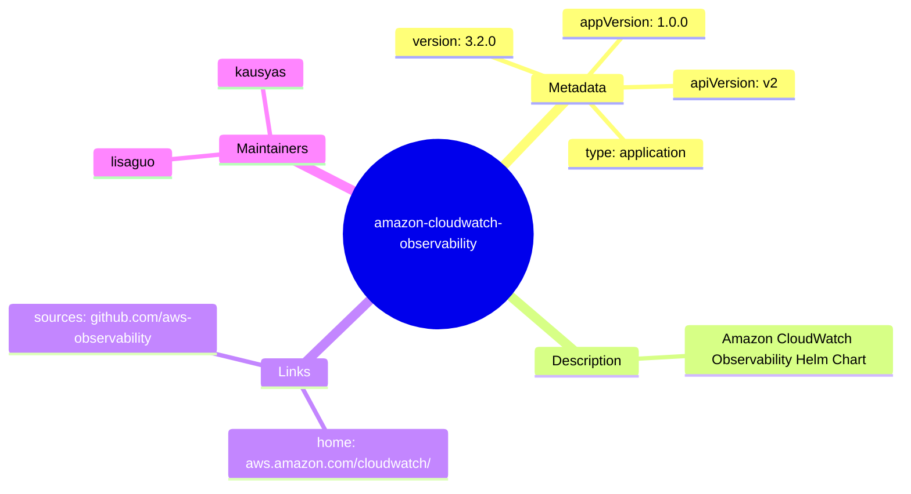
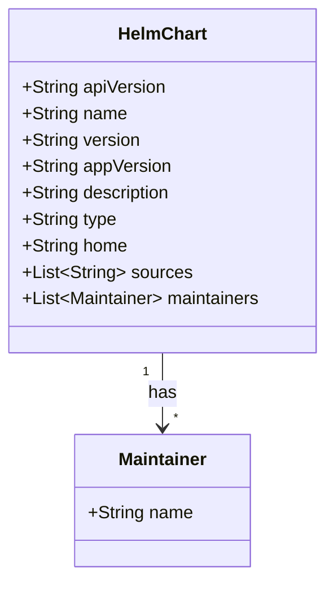
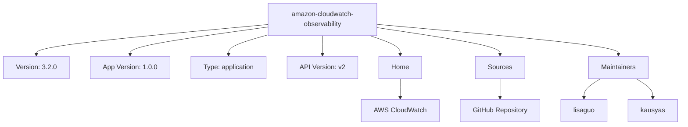

# Diagram: devops/k8s/amazon-cloudwatch-observability/helm/Chart.yaml

> Auto-generated by Obscura crawlers

## Diagram 1

### SVG

<svg id="container" width="100%" xmlns="http://www.w3.org/2000/svg" class="mindmapDiagram" style="max-width: 875.095703125px;" viewBox="5 5 875.095703125 593.4512939453125" role="graphics-document document" aria-roledescription="mindmap"><g><marker id="container_mindmap-pointEnd" class="marker mindmap" viewBox="0 0 10 10" refX="5" refY="5" markerUnits="userSpaceOnUse" markerWidth="8" markerHeight="8" orient="auto"><path d="M 0 0 L 10 5 L 0 10 z" class="arrowMarkerPath" style="stroke-width: 1; stroke-dasharray: 1, 0;"></path></marker><marker id="container_mindmap-pointStart" class="marker mindmap" viewBox="0 0 10 10" refX="4.5" refY="5" markerUnits="userSpaceOnUse" markerWidth="8" markerHeight="8" orient="auto"><path d="M 0 5 L 10 10 L 10 0 z" class="arrowMarkerPath" style="stroke-width: 1; stroke-dasharray: 1, 0;"></path></marker><g class="subgraphs"></g><g class="edgePaths"><path d="M516.32,281.776L524.312,269.392C532.304,257.009,548.288,232.242,564.272,207.475C580.255,182.708,596.239,157.941,604.231,145.558L612.223,133.174" id="edge_0_1" class="edge-thickness-normal edge-pattern-solid edge section-edge-0 edge-depth-1" style="undefined;;;undefined" data-edge="true" data-et="edge" data-id="edge_0_1" data-points="W3sieCI6NTE2LjMyMDMwMTcxODIyOTIsInkiOjI4MS43NzU2ODkyNzg0OTE1fSx7IngiOjU2NC4yNzE1NDI2NzQxNTg3LCJ5IjoyMDcuNDc1MDkyNzIwMTE2OTV9LHsieCI6NjEyLjIyMjc4MzYzMDA4ODIsInkiOjEzMy4xNzQ0OTYxNjE3NDI0fV0="></path><path d="M621.338,105.603L621.658,100.717C621.978,95.831,622.619,86.058,623.259,76.286C623.9,66.513,624.54,56.74,624.861,51.854L625.181,46.968" id="edge_1_2" class="edge-thickness-normal edge-pattern-solid edge section-edge-0 edge-depth-3" style="undefined;;;undefined" data-edge="true" data-et="edge" data-id="edge_1_2" data-points="W3sieCI6NjIxLjMzNzYwODY2MDk2NDUsInkiOjEwNS42MDMzNTI3OTc3MTQwNX0seyJ4Ijo2MjMuMjU5MjYxMzk0Njc5LCJ5Ijo3Ni4yODU2MTcyMDk5MDE5NH0seyJ4Ijo2MjUuMTgwOTE0MTI4MzkzNSwieSI6NDYuOTY3ODgxNjIyMDg5ODM0fV0="></path><path d="M605.701,117.376L592.581,114.515C579.462,111.654,553.222,105.932,526.983,100.211C500.744,94.489,474.504,88.768,461.385,85.907L448.265,83.046" id="edge_1_3" class="edge-thickness-normal edge-pattern-solid edge section-edge-0 edge-depth-3" style="undefined;;;undefined" data-edge="true" data-et="edge" data-id="edge_1_3" data-points="W3sieCI6NjA1LjcwMDg5NjcyMjYxNzUsInkiOjExNy4zNzU1Mzc0NTUzOTQwMX0seyJ4Ijo1MjYuOTgyOTYyNDg2MDU1NiwieSI6MTAwLjIxMDg5NTIxMjc0MjkxfSx7IngiOjQ0OC4yNjUwMjgyNDk0OTM4NywieSI6ODMuMDQ2MjUyOTcwMDkxODF9XQ=="></path><path d="M635.084,117.723L647.595,115.303C660.106,112.883,685.129,108.043,710.152,103.203C735.175,98.363,760.197,93.523,772.709,91.103L785.22,88.683" id="edge_1_4" class="edge-thickness-normal edge-pattern-solid edge section-edge-0 edge-depth-3" style="undefined;;;undefined" data-edge="true" data-et="edge" data-id="edge_1_4" data-points="W3sieCI6NjM1LjA4MzU2Njg3OTMzMzYsInkiOjExNy43MjI2NzAxMTc0ODM4Nn0seyJ4Ijo3MTAuMTUxODYwNDY2NzE5OCwieSI6MTAzLjIwMjY1MjkyMTgyMzgxfSx7IngiOjc4NS4yMjAxNTQwNTQxMDU5LCJ5Ijo4OC42ODI2MzU3MjYxNjM3N31d"></path><path d="M633.074,128.525L639.313,132.426C645.552,136.328,658.03,144.131,670.508,151.934C682.986,159.738,695.465,167.541,701.704,171.443L707.943,175.344" id="edge_1_5" class="edge-thickness-normal edge-pattern-solid edge section-edge-0 edge-depth-3" style="undefined;;;undefined" data-edge="true" data-et="edge" data-id="edge_1_5" data-points="W3sieCI6NjMzLjA3NDQyNDIwMTY1MjgsInkiOjEyOC41MjQ1NDI1MzIzMTc4N30seyJ4Ijo2NzAuNTA4NDc5NTQ4MzY1MiwieSI6MTUxLjkzNDQzNDA0MTE1OTY1fSx7IngiOjcwNy45NDI1MzQ4OTUwNzc2LCJ5IjoxNzUuMzQ0MzI1NTUwMDAxNDN9XQ=="></path><path d="M519.229,304.531L531.389,315.709C543.55,326.888,567.87,349.245,592.19,371.602C616.51,393.959,640.83,416.316,652.99,427.495L665.15,438.674" id="edge_0_6" class="edge-thickness-normal edge-pattern-solid edge section-edge-1 edge-depth-1" style="undefined;;;undefined" data-edge="true" data-et="edge" data-id="edge_0_6" data-points="W3sieCI6NTE5LjIyOTQzNDQ0MDM0ODUsInkiOjMwNC41MzA1NDU1MjQ1MzIxfSx7IngiOjU5Mi4xODk2NTk3MzE4OTExLCJ5IjozNzEuNjAyMDczMzkyODYxNTR9LHsieCI6NjY1LjE0OTg4NTAyMzQzMzYsInkiOjQzOC42NzM2MDEyNjExOTF9XQ=="></path><path d="M679.173,463.526L680.34,469.285C681.507,475.043,683.841,486.56,686.176,498.076C688.51,509.593,690.844,521.11,692.012,526.868L693.179,532.627" id="edge_6_7" class="edge-thickness-normal edge-pattern-solid edge section-edge-1 edge-depth-3" style="undefined;;;undefined" data-edge="true" data-et="edge" data-id="edge_6_7" data-points="W3sieCI6Njc5LjE3MjU2MTkzMDgzMjYsInkiOjQ2My41MjYyNDMwNjEwMTEzN30seyJ4Ijo2ODYuMTc1NjM2MDY1OTY5MywieSI6NDk4LjA3NjM4ODAxNTg3OTk2fSx7IngiOjY5My4xNzg3MTAyMDExMDYxLCJ5Ijo1MzIuNjI2NTMyOTcwNzQ4NX1d"></path><path d="M497.701,305.106L485.975,317.102C474.248,329.099,450.795,353.092,427.341,377.085C403.888,401.078,380.435,425.071,368.708,437.068L356.981,449.065" id="edge_0_8" class="edge-thickness-normal edge-pattern-solid edge section-edge-2 edge-depth-1" style="undefined;;;undefined" data-edge="true" data-et="edge" data-id="edge_0_8" data-points="W3sieCI6NDk3LjcwMTMxNjE1NzQ2ODIsInkiOjMwNS4xMDU1NDAwNDAyMTA1NH0seyJ4Ijo0MjcuMzQxMzM0MTA2MTIyNzYsInkiOjM3Ny4wODUwNTY3MTY5ODk4N30seyJ4IjozNTYuOTgxMzUyMDU0Nzc3NCwieSI6NDQ5LjA2NDU3MzM5Mzc2OTJ9XQ=="></path><path d="M346.134,474.787L345.994,480.593C345.854,486.398,345.574,498.01,345.294,509.621C345.014,521.233,344.734,532.844,344.594,538.65L344.454,544.456" id="edge_8_9" class="edge-thickness-normal edge-pattern-solid edge section-edge-2 edge-depth-3" style="undefined;;;undefined" data-edge="true" data-et="edge" data-id="edge_8_9" data-points="W3sieCI6MzQ2LjEzNDQ2OTYwOTEyNzMsInkiOjQ3NC43ODY4MDIzMDU5MDM3fSx7IngiOjM0NS4yOTQzODgyODIxNDEyNiwieSI6NTA5LjYyMTIyODYzNjU0OTV9LHsieCI6MzQ0LjQ1NDMwNjk1NTE1NTIzLCJ5Ijo1NDQuNDU1NjU0OTY3MTk1NH1d"></path><path d="M331.781,456.884L316.608,453.886C301.436,450.889,271.092,444.894,240.748,438.899C210.404,432.904,180.06,426.908,164.888,423.911L149.716,420.913" id="edge_8_10" class="edge-thickness-normal edge-pattern-solid edge section-edge-2 edge-depth-3" style="undefined;;;undefined" data-edge="true" data-et="edge" data-id="edge_8_10" data-points="W3sieCI6MzMxLjc4MDU2MTA5MjM3OTU3LCJ5Ijo0NTYuODgzODI2NDg5MTA3Nn0seyJ4IjoyNDAuNzQ4MDU1MzA4Njg1MDMsInkiOjQzOC44OTg2MjgzMjExNzg5fSx7IngiOjE0OS43MTU1NDk1MjQ5OTA1LCJ5Ijo0MjAuOTEzNDMwMTUzMjUwMTV9XQ=="></path><path d="M493.534,291.168L477.195,287.588C460.855,284.008,428.176,276.847,395.498,269.687C362.819,262.526,330.14,255.366,313.8,251.785L297.461,248.205" id="edge_0_11" class="edge-thickness-normal edge-pattern-solid edge section-edge-3 edge-depth-1" style="undefined;;;undefined" data-edge="true" data-et="edge" data-id="edge_0_11" data-points="W3sieCI6NDkzLjUzNDE4MzU1NjUzNjgsInkiOjI5MS4xNjgzNTM3MTc2NTA0fSx7IngiOjM5NS40OTc1NzIxOTQ0MTA3NCwieSI6MjY5LjY4Njc3ODE1OTM2MDl9LHsieCI6Mjk3LjQ2MDk2MDgzMjI4NDcsInkiOjI0OC4yMDUyMDI2MDEwNzE0NX1d"></path><path d="M267.948,247.038L256.916,248.555C245.884,250.072,223.819,253.106,201.755,256.14C179.69,259.174,157.626,262.208,146.593,263.725L135.561,265.242" id="edge_11_12" class="edge-thickness-normal edge-pattern-solid edge section-edge-3 edge-depth-3" style="undefined;;;undefined" data-edge="true" data-et="edge" data-id="edge_11_12" data-points="W3sieCI6MjY3Ljk0ODQyMDkyNjMyNjYsInkiOjI0Ny4wMzgwMDIwNzQ5NDY0fSx7IngiOjIwMS43NTQ3Njc3MDI0OTk0NiwieSI6MjU2LjE0MDE4MTYwODk3Nzk3fSx7IngiOjEzNS41NjExMTQ0Nzg2NzIzMiwieSI6MjY1LjI0MjM2MTE0MzAwOTUzfV0="></path><path d="M277.186,231.088L275.302,226.427C273.417,221.767,269.648,212.445,265.879,203.123C262.111,193.801,258.342,184.48,256.457,179.819L254.573,175.158" id="edge_11_13" class="edge-thickness-normal edge-pattern-solid edge section-edge-3 edge-depth-3" style="undefined;;;undefined" data-edge="true" data-et="edge" data-id="edge_11_13" data-points="W3sieCI6Mjc3LjE4NjA4OTk2ODc2ODEsInkiOjIzMS4wODgyMjA4MTMwNjgzfSx7IngiOjI2NS44Nzk0OTA0Nzk3Njc4NywieSI6MjAzLjEyMzA3OTIzOTI0NDgyfSx7IngiOjI1NC41NzI4OTA5OTA3Njc2LCJ5IjoxNzUuMTU3OTM3NjY1NDIxMzR9XQ=="></path></g><g class="edgeLabels"><g class="edgeLabel"><g class="label" data-id="edge_0_1" transform="translate(0, 0)"><foreignObject width="0" height="0">

</foreignObject></g></g><g class="edgeLabel"><g class="label" data-id="edge_1_2" transform="translate(0, 0)"><foreignObject width="0" height="0">

</foreignObject></g></g><g class="edgeLabel"><g class="label" data-id="edge_1_3" transform="translate(0, 0)"><foreignObject width="0" height="0">

</foreignObject></g></g><g class="edgeLabel"><g class="label" data-id="edge_1_4" transform="translate(0, 0)"><foreignObject width="0" height="0">

</foreignObject></g></g><g class="edgeLabel"><g class="label" data-id="edge_1_5" transform="translate(0, 0)"><foreignObject width="0" height="0">

</foreignObject></g></g><g class="edgeLabel"><g class="label" data-id="edge_0_6" transform="translate(0, 0)"><foreignObject width="0" height="0">

</foreignObject></g></g><g class="edgeLabel"><g class="label" data-id="edge_6_7" transform="translate(0, 0)"><foreignObject width="0" height="0">

</foreignObject></g></g><g class="edgeLabel"><g class="label" data-id="edge_0_8" transform="translate(0, 0)"><foreignObject width="0" height="0">

</foreignObject></g></g><g class="edgeLabel"><g class="label" data-id="edge_8_9" transform="translate(0, 0)"><foreignObject width="0" height="0">

</foreignObject></g></g><g class="edgeLabel"><g class="label" data-id="edge_8_10" transform="translate(0, 0)"><foreignObject width="0" height="0">

</foreignObject></g></g><g class="edgeLabel"><g class="label" data-id="edge_0_11" transform="translate(0, 0)"><foreignObject width="0" height="0">

</foreignObject></g></g><g class="edgeLabel"><g class="label" data-id="edge_11_12" transform="translate(0, 0)"><foreignObject width="0" height="0">

</foreignObject></g></g><g class="edgeLabel"><g class="label" data-id="edge_11_13" transform="translate(0, 0)"><foreignObject width="0" height="0">

</foreignObject></g></g></g><g class="nodes"><g class="node mindmap-node section-root section--1" id="node_0" transform="translate(508.1865575948756, 294.37895102043)"><circle class="basic label-container" style="" r="110" cx="0" cy="0"></circle><g class="label" style="" transform="translate(-100, -24)"><rect></rect><foreignObject width="200" height="48">

amazon-cloudwatch-observability

</foreignObject></g></g><g class="node mindmap-node section-0" id="node_1" transform="translate(620.3565277534418, 120.57123441980389)"><path id="node-1" class="node-bkg node-0" style="" d="M-54.09375 12
    v-24
    q0,-5 5,-5
    h98.1875
    q5,0 5,5
    v24
    q0,5 -5,5
    h-98.1875
    q-5,0 -5,-5
    Z"></path><line class="node-line-" x1="-54.09375" y1="17" x2="54.09375" y2="17"></line><g class="label" style="" transform="translate(-34.09375, -12)"><rect></rect><foreignObject width="68.1875" height="24">

Metadata

</foreignObject></g></g><g class="node mindmap-node section-0" id="node_2" transform="translate(626.1619950359162, 32)"><path id="node-2" class="node-bkg node-0" style="" d="M-66.7890625 12
    v-24
    q0,-5 5,-5
    h123.578125
    q5,0 5,5
    v24
    q0,5 -5,5
    h-123.578125
    q-5,0 -5,-5
    Z"></path><line class="node-line-" x1="-66.7890625" y1="17" x2="66.7890625" y2="17"></line><g class="label" style="" transform="translate(-46.7890625, -12)"><rect></rect><foreignObject width="93.578125" height="24">

version: 3.2.0

</foreignObject></g></g><g class="node mindmap-node section-0" id="node_3" transform="translate(433.6093972186695, 79.85055600568194)"><path id="node-3" class="node-bkg node-0" style="" d="M-80.7734375 12
    v-24
    q0,-5 5,-5
    h151.546875
    q5,0 5,5
    v24
    q0,5 -5,5
    h-151.546875
    q-5,0 -5,-5
    Z"></path><line class="node-line-" x1="-80.7734375" y1="17" x2="80.7734375" y2="17"></line><g class="label" style="" transform="translate(-60.7734375, -12)"><rect></rect><foreignObject width="121.546875" height="24">

appVersion: 1.0.0

</foreignObject></g></g><g class="node mindmap-node section-0" id="node_4" transform="translate(799.9471931799977, 85.83407142384374)"><path id="node-4" class="node-bkg node-0" style="" d="M-70.1484375 12
    v-24
    q0,-5 5,-5
    h130.296875
    q5,0 5,5
    v24
    q0,5 -5,5
    h-130.296875
    q-5,0 -5,-5
    Z"></path><line class="node-line-" x1="-70.1484375" y1="17" x2="70.1484375" y2="17"></line><g class="label" style="" transform="translate(-50.1484375, -12)"><rect></rect><foreignObject width="100.296875" height="24">

apiVersion: v2

</foreignObject></g></g><g class="node mindmap-node section-0" id="node_5" transform="translate(720.6604313432887, 183.2976336625154)"><path id="node-5" class="node-bkg node-0" style="" d="M-80.9921875 12
    v-24
    q0,-5 5,-5
    h151.984375
    q5,0 5,5
    v24
    q0,5 -5,5
    h-151.984375
    q-5,0 -5,-5
    Z"></path><line class="node-line-" x1="-80.9921875" y1="17" x2="80.9921875" y2="17"></line><g class="label" style="" transform="translate(-60.9921875, -12)"><rect></rect><foreignObject width="121.984375" height="24">

type: application

</foreignObject></g></g><g class="node mindmap-node section-1" id="node_6" transform="translate(676.1927618689066, 448.8251957652931)"><path id="node-6" class="node-bkg node-0" style="" d="M-61.6796875 12
    v-24
    q0,-5 5,-5
    h113.359375
    q5,0 5,5
    v24
    q0,5 -5,5
    h-113.359375
    q-5,0 -5,-5
    Z"></path><line class="node-line-" x1="-61.6796875" y1="17" x2="61.6796875" y2="17"></line><g class="label" style="" transform="translate(-41.6796875, -12)"><rect></rect><foreignObject width="83.359375" height="24">

Description

</foreignObject></g></g><g class="node mindmap-node section-1" id="node_7" transform="translate(696.1585102630321, 547.3275802664668)"><path id="node-7" class="node-bkg node-0" style="" d="M-120 24
    v-48
    q0,-5 5,-5
    h230
    q5,0 5,5
    v48
    q0,5 -5,5
    h-230
    q-5,0 -5,-5
    Z"></path><line class="node-line-" x1="-120" y1="29" x2="120" y2="29"></line><g class="label" style="" transform="translate(-100, -24)"><rect></rect><foreignObject width="200" height="48">

Amazon CloudWatch Observability Helm Chart

</foreignObject></g></g><g class="node mindmap-node section-2" id="node_8" transform="translate(346.49611061737005, 459.7911624135497)"><path id="node-8" class="node-bkg node-0" style="" d="M-38.7265625 12
    v-24
    q0,-5 5,-5
    h67.453125
    q5,0 5,5
    v24
    q0,5 -5,5
    h-67.453125
    q-5,0 -5,-5
    Z"></path><line class="node-line-" x1="-38.7265625" y1="17" x2="38.7265625" y2="17"></line><g class="label" style="" transform="translate(-18.7265625, -12)"><rect></rect><foreignObject width="37.453125" height="24">

Links

</foreignObject></g></g><g class="node mindmap-node section-2" id="node_9" transform="translate(344.09266594691246, 559.4512948595493)"><path id="node-9" class="node-bkg node-0" style="" d="M-130.53125 24
    v-48
    q0,-5 5,-5
    h251.0625
    q5,0 5,5
    v48
    q0,5 -5,5
    h-251.0625
    q-5,0 -5,-5
    Z"></path><line class="node-line-" x1="-130.53125" y1="29" x2="130.53125" y2="29"></line><g class="label" style="" transform="translate(-110.53125, -24)"><rect></rect><foreignObject width="221.0625" height="48">

home: aws.amazon.com/cloudwatch/

</foreignObject></g></g><g class="node mindmap-node section-2" id="node_10" transform="translate(135, 418.006094228808)"><path id="node-10" class="node-bkg node-0" style="" d="M-120 24
    v-48
    q0,-5 5,-5
    h230
    q5,0 5,5
    v48
    q0,5 -5,5
    h-230
    q-5,0 -5,-5
    Z"></path><line class="node-line-" x1="-120" y1="29" x2="120" y2="29"></line><g class="label" style="" transform="translate(-100, -24)"><rect></rect><foreignObject width="200" height="48">

sources: github.com/aws-observability

</foreignObject></g></g><g class="node mindmap-node section-3" id="node_11" transform="translate(282.8085867939459, 244.99460529829184)"><path id="node-11" class="node-bkg node-0" style="" d="M-62.71875 12
    v-24
    q0,-5 5,-5
    h115.4375
    q5,0 5,5
    v24
    q0,5 -5,5
    h-115.4375
    q-5,0 -5,-5
    Z"></path><line class="node-line-" x1="-62.71875" y1="17" x2="62.71875" y2="17"></line><g class="label" style="" transform="translate(-42.71875, -12)"><rect></rect><foreignObject width="85.4375" height="24">

Maintainers

</foreignObject></g></g><g class="node mindmap-node section-3" id="node_12" transform="translate(120.70094861105304, 267.2857579196641)"><path id="node-12" class="node-bkg node-0" style="" d="M-45.9375 12
    v-24
    q0,-5 5,-5
    h81.875
    q5,0 5,5
    v24
    q0,5 -5,5
    h-81.875
    q-5,0 -5,-5
    Z"></path><line class="node-line-" x1="-45.9375" y1="17" x2="45.9375" y2="17"></line><g class="label" style="" transform="translate(-25.9375, -12)"><rect></rect><foreignObject width="51.875" height="24">

lisaguo

</foreignObject></g></g><g class="node mindmap-node section-3" id="node_13" transform="translate(248.95039416558984, 161.2515531801978)"><path id="node-13" class="node-bkg node-0" style="" d="M-48.40625 12
    v-24
    q0,-5 5,-5
    h86.8125
    q5,0 5,5
    v24
    q0,5 -5,5
    h-86.8125
    q-5,0 -5,-5
    Z"></path><line class="node-line-" x1="-48.40625" y1="17" x2="48.40625" y2="17"></line><g class="label" style="" transform="translate(-28.40625, -12)"><rect></rect><foreignObject width="56.8125" height="24">

kausyas

</foreignObject></g></g></g></g></svg>

## Diagram 2

### SVG

<svg id="container" width="297.546875" xmlns="http://www.w3.org/2000/svg" class="classDiagram" height="522" viewBox="0 0 297.546875 522" role="graphics-document document" aria-roledescription="class"><g><defs><marker id="container_class-aggregationStart" class="marker aggregation class" refX="18" refY="7" markerWidth="190" markerHeight="240" orient="auto"><path d="M 18,7 L9,13 L1,7 L9,1 Z"></path></marker></defs><defs><marker id="container_class-aggregationEnd" class="marker aggregation class" refX="1" refY="7" markerWidth="20" markerHeight="28" orient="auto"><path d="M 18,7 L9,13 L1,7 L9,1 Z"></path></marker></defs><defs><marker id="container_class-extensionStart" class="marker extension class" refX="18" refY="7" markerWidth="190" markerHeight="240" orient="auto"><path d="M 1,7 L18,13 V 1 Z"></path></marker></defs><defs><marker id="container_class-extensionEnd" class="marker extension class" refX="1" refY="7" markerWidth="20" markerHeight="28" orient="auto"><path d="M 1,1 V 13 L18,7 Z"></path></marker></defs><defs><marker id="container_class-compositionStart" class="marker composition class" refX="18" refY="7" markerWidth="190" markerHeight="240" orient="auto"><path d="M 18,7 L9,13 L1,7 L9,1 Z"></path></marker></defs><defs><marker id="container_class-compositionEnd" class="marker composition class" refX="1" refY="7" markerWidth="20" markerHeight="28" orient="auto"><path d="M 18,7 L9,13 L1,7 L9,1 Z"></path></marker></defs><defs><marker id="container_class-dependencyStart" class="marker dependency class" refX="6" refY="7" markerWidth="190" markerHeight="240" orient="auto"><path d="M 5,7 L9,13 L1,7 L9,1 Z"></path></marker></defs><defs><marker id="container_class-dependencyEnd" class="marker dependency class" refX="13" refY="7" markerWidth="20" markerHeight="28" orient="auto"><path d="M 18,7 L9,13 L14,7 L9,1 Z"></path></marker></defs><defs><marker id="container_class-lollipopStart" class="marker lollipop class" refX="13" refY="7" markerWidth="190" markerHeight="240" orient="auto"><circle stroke="black" fill="transparent" cx="7" cy="7" r="6"></circle></marker></defs><defs><marker id="container_class-lollipopEnd" class="marker lollipop class" refX="1" refY="7" markerWidth="190" markerHeight="240" orient="auto"><circle stroke="black" fill="transparent" cx="7" cy="7" r="6"></circle></marker></defs><g class="root"><g class="clusters"></g><g class="edgePaths"><path d="M148.773,320L148.773,326.167C148.773,332.333,148.773,344.667,148.773,356C148.773,367.333,148.773,377.667,148.773,382.833L148.773,388" id="id_HelmChart_Maintainer_1" class="edge-thickness-normal edge-pattern-solid relation" style=";;;" data-edge="true" data-et="edge" data-id="id_HelmChart_Maintainer_1" data-points="W3sieCI6MTQ4Ljc3MzQzNzUsInkiOjMyMH0seyJ4IjoxNDguNzczNDM3NSwieSI6MzU3fSx7IngiOjE0OC43NzM0Mzc1LCJ5IjozOTR9XQ==" marker-end="url(#container_class-dependencyEnd)"></path></g><g class="edgeLabels"><g class="edgeLabel" transform="translate(148.7734375, 357)"><g class="label" data-id="id_HelmChart_Maintainer_1" transform="translate(-12.703125, -12)"><foreignObject width="25.40625" height="24">

has

</foreignObject></g></g><g class="edgeTerminals" transform="translate(133.77343875000003, 337.5000010714286)"><g class="inner" transform="translate(0, 0)"><foreignObject style="width: 9px; height: 12px;">
1
</foreignObject></g></g><g class="edgeTerminals" transform="translate(158.77343874999997, 371.5000010714286)"><g class="inner" transform="translate(0, 0)"></g><foreignObject style="width: 9px; height: 12px;">
*
</foreignObject></g></g><g class="nodes"><g class="node default" id="classId-HelmChart-0" transform="translate(148.7734375, 164)"><g class="basic label-container"><path d="M-140.7734375 -156 L140.7734375 -156 L140.7734375 156 L-140.7734375 156" stroke="none" stroke-width="0" fill="#ECECFF" style=""></path><path d="M-140.7734375 -156 C-45.89244608153558 -156, 48.98854533692884 -156, 140.7734375 -156 M-140.7734375 -156 C-74.06617822306376 -156, -7.358918946127517 -156, 140.7734375 -156 M140.7734375 -156 C140.7734375 -62.480750383529525, 140.7734375 31.03849923294095, 140.7734375 156 M140.7734375 -156 C140.7734375 -38.317019866422186, 140.7734375 79.36596026715563, 140.7734375 156 M140.7734375 156 C56.61932182357057 156, -27.534793852858854 156, -140.7734375 156 M140.7734375 156 C47.418856063578744 156, -45.93572537284251 156, -140.7734375 156 M-140.7734375 156 C-140.7734375 89.91591008854225, -140.7734375 23.831820177084495, -140.7734375 -156 M-140.7734375 156 C-140.7734375 40.69312864085009, -140.7734375 -74.61374271829982, -140.7734375 -156" stroke="#9370DB" stroke-width="1.3" fill="none" stroke-dasharray="0 0" style=""></path></g><g class="annotation-group text" transform="translate(0, -132)"></g><g class="label-group text" transform="translate(-38.703125, -132)"><g class="label" style="font-weight: bolder" transform="translate(0,-12)"><foreignObject width="77.40625" height="24">

HelmChart

</foreignObject></g></g><g class="members-group text" transform="translate(-128.7734375, -84)"><g class="label" style="" transform="translate(0,-12)"><foreignObject width="131.046875" height="24">

+String apiVersion

</foreignObject></g><g class="label" style="" transform="translate(0,12)"><foreignObject width="94.984375" height="24">

+String name

</foreignObject></g><g class="label" style="" transform="translate(0,36)"><foreignObject width="107.640625" height="24">

+String version

</foreignObject></g><g class="label" style="" transform="translate(0,60)"><foreignObject width="136.046875" height="24">

+String appVersion

</foreignObject></g><g class="label" style="" transform="translate(0,84)"><foreignObject width="137.078125" height="24">

+String description

</foreignObject></g><g class="label" style="" transform="translate(0,108)"><foreignObject width="86.265625" height="24">

+String type

</foreignObject></g><g class="label" style="" transform="translate(0,132)"><foreignObject width="95.625" height="24">

+String home

</foreignObject></g><g class="label" style="" transform="translate(0,156)"><foreignObject width="152.1875" height="24">

+List&lt;String&gt; sources

</foreignObject></g><g class="label" style="" transform="translate(0,180)"><foreignObject width="218.84375" height="24">

+List&lt;Maintainer&gt; maintainers

</foreignObject></g></g><g class="methods-group text" transform="translate(-128.7734375, 156)"></g><g class="divider" style=""><path d="M-140.7734375 -108 C-76.1158038312079 -108, -11.458170162415797 -108, 140.7734375 -108 M-140.7734375 -108 C-30.30522247662583 -108, 80.16299254674834 -108, 140.7734375 -108" stroke="#9370DB" stroke-width="1.3" fill="none" stroke-dasharray="0 0" style=""></path></g><g class="divider" style=""><path d="M-140.7734375 132 C-28.280067005514383 132, 84.21330348897123 132, 140.7734375 132 M-140.7734375 132 C-70.7523335636441 132, -0.7312296272882008 132, 140.7734375 132" stroke="#9370DB" stroke-width="1.3" fill="none" stroke-dasharray="0 0" style=""></path></g></g><g class="node default" id="classId-Maintainer-1" transform="translate(148.7734375, 454)"><g class="basic label-container"><path d="M-79.203125 -60 L79.203125 -60 L79.203125 60 L-79.203125 60" stroke="none" stroke-width="0" fill="#ECECFF" style=""></path><path d="M-79.203125 -60 C-33.633498652263725 -60, 11.93612769547255 -60, 79.203125 -60 M-79.203125 -60 C-39.90834027231387 -60, -0.6135555446277436 -60, 79.203125 -60 M79.203125 -60 C79.203125 -18.200547883449346, 79.203125 23.598904233101308, 79.203125 60 M79.203125 -60 C79.203125 -29.19743023017453, 79.203125 1.605139539650942, 79.203125 60 M79.203125 60 C41.89249630675032 60, 4.581867613500634 60, -79.203125 60 M79.203125 60 C37.76071850810413 60, -3.681687983791747 60, -79.203125 60 M-79.203125 60 C-79.203125 27.408669651631264, -79.203125 -5.1826606967374715, -79.203125 -60 M-79.203125 60 C-79.203125 25.634330842652474, -79.203125 -8.731338314695051, -79.203125 -60" stroke="#9370DB" stroke-width="1.3" fill="none" stroke-dasharray="0 0" style=""></path></g><g class="annotation-group text" transform="translate(0, -36)"></g><g class="label-group text" transform="translate(-39.421875, -36)"><g class="label" style="font-weight: bolder" transform="translate(0,-12)"><foreignObject width="78.84375" height="24">

Maintainer

</foreignObject></g></g><g class="members-group text" transform="translate(-67.203125, 12)"><g class="label" style="" transform="translate(0,-12)"><foreignObject width="94.984375" height="24">

+String name

</foreignObject></g></g><g class="methods-group text" transform="translate(-67.203125, 60)"></g><g class="divider" style=""><path d="M-79.203125 -12 C-35.6269409486326 -12, 7.949243102734798 -12, 79.203125 -12 M-79.203125 -12 C-25.01401337010129 -12, 29.175098259797423 -12, 79.203125 -12" stroke="#9370DB" stroke-width="1.3" fill="none" stroke-dasharray="0 0" style=""></path></g><g class="divider" style=""><path d="M-79.203125 36 C-21.860297727411414 36, 35.48252954517717 36, 79.203125 36 M-79.203125 36 C-38.454293607736176 36, 2.2945377845276482 36, 79.203125 36" stroke="#9370DB" stroke-width="1.3" fill="none" stroke-dasharray="0 0" style=""></path></g></g></g></g></g></svg>

## Diagram 3

### SVG

<svg id="container" width="1618.1171875" xmlns="http://www.w3.org/2000/svg" class="flowchart" height="302" viewBox="0 0 1618.1171875 302" role="graphics-document document" aria-roledescription="flowchart-v2"><g><marker id="container_flowchart-v2-pointEnd" class="marker flowchart-v2" viewBox="0 0 10 10" refX="5" refY="5" markerUnits="userSpaceOnUse" markerWidth="8" markerHeight="8" orient="auto"><path d="M 0 0 L 10 5 L 0 10 z" class="arrowMarkerPath" style="stroke-width: 1; stroke-dasharray: 1, 0;"></path></marker><marker id="container_flowchart-v2-pointStart" class="marker flowchart-v2" viewBox="0 0 10 10" refX="4.5" refY="5" markerUnits="userSpaceOnUse" markerWidth="8" markerHeight="8" orient="auto"><path d="M 0 5 L 10 10 L 10 0 z" class="arrowMarkerPath" style="stroke-width: 1; stroke-dasharray: 1, 0;"></path></marker><marker id="container_flowchart-v2-circleEnd" class="marker flowchart-v2" viewBox="0 0 10 10" refX="11" refY="5" markerUnits="userSpaceOnUse" markerWidth="11" markerHeight="11" orient="auto"><circle cx="5" cy="5" r="5" class="arrowMarkerPath" style="stroke-width: 1; stroke-dasharray: 1, 0;"></circle></marker><marker id="container_flowchart-v2-circleStart" class="marker flowchart-v2" viewBox="0 0 10 10" refX="-1" refY="5" markerUnits="userSpaceOnUse" markerWidth="11" markerHeight="11" orient="auto"><circle cx="5" cy="5" r="5" class="arrowMarkerPath" style="stroke-width: 1; stroke-dasharray: 1, 0;"></circle></marker><marker id="container_flowchart-v2-crossEnd" class="marker cross flowchart-v2" viewBox="0 0 11 11" refX="12" refY="5.2" markerUnits="userSpaceOnUse" markerWidth="11" markerHeight="11" orient="auto"><path d="M 1,1 l 9,9 M 10,1 l -9,9" class="arrowMarkerPath" style="stroke-width: 2; stroke-dasharray: 1, 0;"></path></marker><marker id="container_flowchart-v2-crossStart" class="marker cross flowchart-v2" viewBox="0 0 11 11" refX="-1" refY="5.2" markerUnits="userSpaceOnUse" markerWidth="11" markerHeight="11" orient="auto"><path d="M 1,1 l 9,9 M 10,1 l -9,9" class="arrowMarkerPath" style="stroke-width: 2; stroke-dasharray: 1, 0;"></path></marker><g class="root"><g class="clusters"></g><g class="edgePaths"><path d="M634.938,59.239L543.303,67.866C451.669,76.493,268.401,93.746,176.767,105.873C85.133,118,85.133,125,85.133,128.5L85.133,132" id="L_A_B_0" class="edge-thickness-normal edge-pattern-solid edge-thickness-normal edge-pattern-solid flowchart-link" style=";" data-edge="true" data-et="edge" data-id="L_A_B_0" data-points="W3sieCI6NjM0LjkzNzUsInkiOjU5LjIzODgwOTQwMDY3ODA0fSx7IngiOjg1LjEzMjgxMjUsInkiOjExMX0seyJ4Ijo4NS4xMzI4MTI1LCJ5IjoxMzZ9XQ==" marker-end="url(#container_flowchart-v2-pointEnd)"></path><path d="M634.938,65.105L580.013,72.754C525.089,80.403,415.24,95.702,360.315,106.851C305.391,118,305.391,125,305.391,128.5L305.391,132" id="L_A_C_0" class="edge-thickness-normal edge-pattern-solid edge-thickness-normal edge-pattern-solid flowchart-link" style=";" data-edge="true" data-et="edge" data-id="L_A_C_0" data-points="W3sieCI6NjM0LjkzNzUsInkiOjY1LjEwNDc5MDcyNDU1ODg0fSx7IngiOjMwNS4zOTA2MjUsInkiOjExMX0seyJ4IjozMDUuMzkwNjI1LCJ5IjoxMzZ9XQ==" marker-end="url(#container_flowchart-v2-pointEnd)"></path><path d="M634.938,84.067L619.194,88.555C603.451,93.044,571.964,102.022,556.22,110.011C540.477,118,540.477,125,540.477,128.5L540.477,132" id="L_A_D_0" class="edge-thickness-normal edge-pattern-solid edge-thickness-normal edge-pattern-solid flowchart-link" style=";" data-edge="true" data-et="edge" data-id="L_A_D_0" data-points="W3sieCI6NjM0LjkzNzUsInkiOjg0LjA2NjU4MzEzMzIwMTA4fSx7IngiOjU0MC40NzY1NjI1LCJ5IjoxMTF9LHsieCI6NTQwLjQ3NjU2MjUsInkiOjEzNn1d" marker-end="url(#container_flowchart-v2-pointEnd)"></path><path d="M764.938,86L764.938,90.167C764.938,94.333,764.938,102.667,764.938,110.333C764.938,118,764.938,125,764.938,128.5L764.938,132" id="L_A_E_0" class="edge-thickness-normal edge-pattern-solid edge-thickness-normal edge-pattern-solid flowchart-link" style=";" data-edge="true" data-et="edge" data-id="L_A_E_0" data-points="W3sieCI6NzY0LjkzNzUsInkiOjg2fSx7IngiOjc2NC45Mzc1LCJ5IjoxMTF9LHsieCI6NzY0LjkzNzUsInkiOjEzNn1d" marker-end="url(#container_flowchart-v2-pointEnd)"></path><path d="M876.958,86L888.926,90.167C900.894,94.333,924.83,102.667,936.798,110.333C948.766,118,948.766,125,948.766,128.5L948.766,132" id="L_A_F_0" class="edge-thickness-normal edge-pattern-solid edge-thickness-normal edge-pattern-solid flowchart-link" style=";" data-edge="true" data-et="edge" data-id="L_A_F_0" data-points="W3sieCI6ODc2Ljk1Nzc2MzY3MTg3NSwieSI6ODZ9LHsieCI6OTQ4Ljc2NTYyNSwieSI6MTExfSx7IngiOjk0OC43NjU2MjUsInkiOjEzNn1d" marker-end="url(#container_flowchart-v2-pointEnd)"></path><path d="M894.938,66.792L943.332,74.16C991.727,81.528,1088.516,96.264,1136.91,107.132C1185.305,118,1185.305,125,1185.305,128.5L1185.305,132" id="L_A_G_0" class="edge-thickness-normal edge-pattern-solid edge-thickness-normal edge-pattern-solid flowchart-link" style=";" data-edge="true" data-et="edge" data-id="L_A_G_0" data-points="W3sieCI6ODk0LjkzNzUsInkiOjY2Ljc5MjIyMDM0MzA3ODA0fSx7IngiOjExODUuMzA0Njg3NSwieSI6MTExfSx7IngiOjExODUuMzA0Njg3NSwieSI6MTM2fV0=" marker-end="url(#container_flowchart-v2-pointEnd)"></path><path d="M894.938,58.808L990.704,67.507C1086.471,76.205,1278.005,93.603,1373.772,105.801C1469.539,118,1469.539,125,1469.539,128.5L1469.539,132" id="L_A_H_0" class="edge-thickness-normal edge-pattern-solid edge-thickness-normal edge-pattern-solid flowchart-link" style=";" data-edge="true" data-et="edge" data-id="L_A_H_0" data-points="W3sieCI6ODk0LjkzNzUsInkiOjU4LjgwODA5MTg5NTkwNzQ4fSx7IngiOjE0NjkuNTM5MDYyNSwieSI6MTExfSx7IngiOjE0NjkuNTM5MDYyNSwieSI6MTM2fV0=" marker-end="url(#container_flowchart-v2-pointEnd)"></path><path d="M948.766,190L948.766,194.167C948.766,198.333,948.766,206.667,948.766,214.333C948.766,222,948.766,229,948.766,232.5L948.766,236" id="L_F_F1_0" class="edge-thickness-normal edge-pattern-solid edge-thickness-normal edge-pattern-solid flowchart-link" style=";" data-edge="true" data-et="edge" data-id="L_F_F1_0" data-points="W3sieCI6OTQ4Ljc2NTYyNSwieSI6MTkwfSx7IngiOjk0OC43NjU2MjUsInkiOjIxNX0seyJ4Ijo5NDguNzY1NjI1LCJ5IjoyNDB9XQ==" marker-end="url(#container_flowchart-v2-pointEnd)"></path><path d="M1185.305,190L1185.305,194.167C1185.305,198.333,1185.305,206.667,1185.305,214.333C1185.305,222,1185.305,229,1185.305,232.5L1185.305,236" id="L_G_G1_0" class="edge-thickness-normal edge-pattern-solid edge-thickness-normal edge-pattern-solid flowchart-link" style=";" data-edge="true" data-et="edge" data-id="L_G_G1_0" data-points="W3sieCI6MTE4NS4zMDQ2ODc1LCJ5IjoxOTB9LHsieCI6MTE4NS4zMDQ2ODc1LCJ5IjoyMTV9LHsieCI6MTE4NS4zMDQ2ODc1LCJ5IjoyNDB9XQ==" marker-end="url(#container_flowchart-v2-pointEnd)"></path><path d="M1426.873,190L1420.289,194.167C1413.704,198.333,1400.536,206.667,1393.951,214.333C1387.367,222,1387.367,229,1387.367,232.5L1387.367,236" id="L_H_H1_0" class="edge-thickness-normal edge-pattern-solid edge-thickness-normal edge-pattern-solid flowchart-link" style=";" data-edge="true" data-et="edge" data-id="L_H_H1_0" data-points="W3sieCI6MTQyNi44NzI4OTY2MzQ2MTU1LCJ5IjoxOTB9LHsieCI6MTM4Ny4zNjcxODc1LCJ5IjoyMTV9LHsieCI6MTM4Ny4zNjcxODc1LCJ5IjoyNDB9XQ==" marker-end="url(#container_flowchart-v2-pointEnd)"></path><path d="M1512.205,190L1518.79,194.167C1525.374,198.333,1538.542,206.667,1545.127,214.333C1551.711,222,1551.711,229,1551.711,232.5L1551.711,236" id="L_H_H2_0" class="edge-thickness-normal edge-pattern-solid edge-thickness-normal edge-pattern-solid flowchart-link" style=";" data-edge="true" data-et="edge" data-id="L_H_H2_0" data-points="W3sieCI6MTUxMi4yMDUyMjgzNjUzODQ1LCJ5IjoxOTB9LHsieCI6MTU1MS43MTA5Mzc1LCJ5IjoyMTV9LHsieCI6MTU1MS43MTA5Mzc1LCJ5IjoyNDB9XQ==" marker-end="url(#container_flowchart-v2-pointEnd)"></path></g><g class="edgeLabels"><g class="edgeLabel"><g class="label" data-id="L_A_B_0" transform="translate(0, 0)"><foreignObject width="0" height="0">

</foreignObject></g></g><g class="edgeLabel"><g class="label" data-id="L_A_C_0" transform="translate(0, 0)"><foreignObject width="0" height="0">

</foreignObject></g></g><g class="edgeLabel"><g class="label" data-id="L_A_D_0" transform="translate(0, 0)"><foreignObject width="0" height="0">

</foreignObject></g></g><g class="edgeLabel"><g class="label" data-id="L_A_E_0" transform="translate(0, 0)"><foreignObject width="0" height="0">

</foreignObject></g></g><g class="edgeLabel"><g class="label" data-id="L_A_F_0" transform="translate(0, 0)"><foreignObject width="0" height="0">

</foreignObject></g></g><g class="edgeLabel"><g class="label" data-id="L_A_G_0" transform="translate(0, 0)"><foreignObject width="0" height="0">

</foreignObject></g></g><g class="edgeLabel"><g class="label" data-id="L_A_H_0" transform="translate(0, 0)"><foreignObject width="0" height="0">

</foreignObject></g></g><g class="edgeLabel"><g class="label" data-id="L_F_F1_0" transform="translate(0, 0)"><foreignObject width="0" height="0">

</foreignObject></g></g><g class="edgeLabel"><g class="label" data-id="L_G_G1_0" transform="translate(0, 0)"><foreignObject width="0" height="0">

</foreignObject></g></g><g class="edgeLabel"><g class="label" data-id="L_H_H1_0" transform="translate(0, 0)"><foreignObject width="0" height="0">

</foreignObject></g></g><g class="edgeLabel"><g class="label" data-id="L_H_H2_0" transform="translate(0, 0)"><foreignObject width="0" height="0">

</foreignObject></g></g></g><g class="nodes"><g class="node default" id="flowchart-A-0" transform="translate(764.9375, 47)"><rect class="basic label-container" style="" x="-130" y="-39" width="260" height="78"></rect><g class="label" style="" transform="translate(-100, -24)"><rect></rect><foreignObject width="200" height="48">

amazon-cloudwatch-observability

</foreignObject></g></g><g class="node default" id="flowchart-B-1" transform="translate(85.1328125, 163)"><rect class="basic label-container" style="" x="-77.1328125" y="-27" width="154.265625" height="54"></rect><g class="label" style="" transform="translate(-47.1328125, -12)"><rect></rect><foreignObject width="94.265625" height="24">

Version: 3.2.0

</foreignObject></g></g><g class="node default" id="flowchart-C-3" transform="translate(305.390625, 163)"><rect class="basic label-container" style="" x="-93.125" y="-27" width="186.25" height="54"></rect><g class="label" style="" transform="translate(-63.125, -12)"><rect></rect><foreignObject width="126.25" height="24">

App Version: 1.0.0

</foreignObject></g></g><g class="node default" id="flowchart-D-5" transform="translate(540.4765625, 163)"><rect class="basic label-container" style="" x="-91.9609375" y="-27" width="183.921875" height="54"></rect><g class="label" style="" transform="translate(-61.9609375, -12)"><rect></rect><foreignObject width="123.921875" height="24">

Type: application

</foreignObject></g></g><g class="node default" id="flowchart-E-7" transform="translate(764.9375, 163)"><rect class="basic label-container" style="" x="-82.5" y="-27" width="165" height="54"></rect><g class="label" style="" transform="translate(-52.5, -12)"><rect></rect><foreignObject width="105" height="24">

API Version: v2

</foreignObject></g></g><g class="node default" id="flowchart-F-9" transform="translate(948.765625, 163)"><rect class="basic label-container" style="" x="-51.328125" y="-27" width="102.65625" height="54"></rect><g class="label" style="" transform="translate(-21.328125, -12)"><rect></rect><foreignObject width="42.65625" height="24">

Home

</foreignObject></g></g><g class="node default" id="flowchart-G-11" transform="translate(1185.3046875, 163)"><rect class="basic label-container" style="" x="-58.296875" y="-27" width="116.59375" height="54"></rect><g class="label" style="" transform="translate(-28.296875, -12)"><rect></rect><foreignObject width="56.59375" height="24">

Sources

</foreignObject></g></g><g class="node default" id="flowchart-H-13" transform="translate(1469.5390625, 163)"><rect class="basic label-container" style="" x="-72.71875" y="-27" width="145.4375" height="54"></rect><g class="label" style="" transform="translate(-42.71875, -12)"><rect></rect><foreignObject width="85.4375" height="24">

Maintainers

</foreignObject></g></g><g class="node default" id="flowchart-F1-15" transform="translate(948.765625, 267)"><rect class="basic label-container" style="" x="-90.4140625" y="-27" width="180.828125" height="54"></rect><g class="label" style="" transform="translate(-60.4140625, -12)"><rect></rect><foreignObject width="120.828125" height="24">

AWS CloudWatch

</foreignObject></g></g><g class="node default" id="flowchart-G1-17" transform="translate(1185.3046875, 267)"><rect class="basic label-container" style="" x="-96.125" y="-27" width="192.25" height="54"></rect><g class="label" style="" transform="translate(-66.125, -12)"><rect></rect><foreignObject width="132.25" height="24">

GitHub Repository

</foreignObject></g></g><g class="node default" id="flowchart-H1-19" transform="translate(1387.3671875, 267)"><rect class="basic label-container" style="" x="-55.9375" y="-27" width="111.875" height="54"></rect><g class="label" style="" transform="translate(-25.9375, -12)"><rect></rect><foreignObject width="51.875" height="24">

lisaguo

</foreignObject></g></g><g class="node default" id="flowchart-H2-21" transform="translate(1551.7109375, 267)"><rect class="basic label-container" style="" x="-58.40625" y="-27" width="116.8125" height="54"></rect><g class="label" style="" transform="translate(-28.40625, -12)"><rect></rect><foreignObject width="56.8125" height="24">

kausyas

</foreignObject></g></g></g></g></g></svg>
