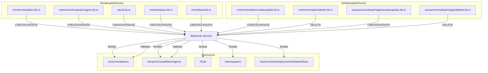
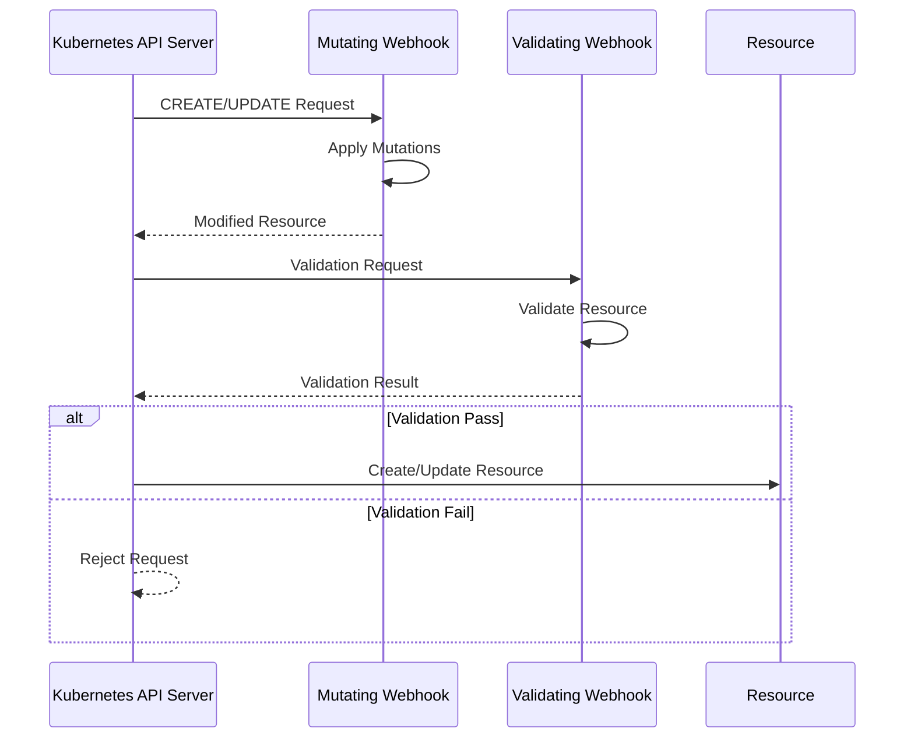

# Diagram: devops/k8s/amazon-cloudwatch-observability/helm/templates/admission-webhooks/operator-webhook-with-cert-manager.yaml


> Auto-generated by Obscura crawlers

## Diagram 1



### SVG

<svg id="container" width="2872.046875" xmlns="http://www.w3.org/2000/svg" class="flowchart" height="426" viewBox="0 0 2872.046875 426" role="graphics-document document" aria-roledescription="flowchart-v2"><style>#container{font-family:"trebuchet ms",verdana,arial,sans-serif;font-size:16px;fill:#333;}@keyframes edge-animation-frame{from{stroke-dashoffset:0;}}@keyframes dash{to{stroke-dashoffset:0;}}#container .edge-animation-slow{stroke-dasharray:9,5!important;stroke-dashoffset:900;animation:dash 50s linear infinite;stroke-linecap:round;}#container .edge-animation-fast{stroke-dasharray:9,5!important;stroke-dashoffset:900;animation:dash 20s linear infinite;stroke-linecap:round;}#container .error-icon{fill:#552222;}#container .error-text{fill:#552222;stroke:#552222;}#container .edge-thickness-normal{stroke-width:1px;}#container .edge-thickness-thick{stroke-width:3.5px;}#container .edge-pattern-solid{stroke-dasharray:0;}#container .edge-thickness-invisible{stroke-width:0;fill:none;}#container .edge-pattern-dashed{stroke-dasharray:3;}#container .edge-pattern-dotted{stroke-dasharray:2;}#container .marker{fill:#333333;stroke:#333333;}#container .marker.cross{stroke:#333333;}#container svg{font-family:"trebuchet ms",verdana,arial,sans-serif;font-size:16px;}#container p{margin:0;}#container .label{font-family:"trebuchet ms",verdana,arial,sans-serif;color:#333;}#container .cluster-label text{fill:#333;}#container .cluster-label span{color:#333;}#container .cluster-label span p{background-color:transparent;}#container .label text,#container span{fill:#333;color:#333;}#container .node rect,#container .node circle,#container .node ellipse,#container .node polygon,#container .node path{fill:#ECECFF;stroke:#9370DB;stroke-width:1px;}#container .rough-node .label text,#container .node .label text,#container .image-shape .label,#container .icon-shape .label{text-anchor:middle;}#container .node .katex path{fill:#000;stroke:#000;stroke-width:1px;}#container .rough-node .label,#container .node .label,#container .image-shape .label,#container .icon-shape .label{text-align:center;}#container .node.clickable{cursor:pointer;}#container .root .anchor path{fill:#333333!important;stroke-width:0;stroke:#333333;}#container .arrowheadPath{fill:#333333;}#container .edgePath .path{stroke:#333333;stroke-width:2.0px;}#container .flowchart-link{stroke:#333333;fill:none;}#container .edgeLabel{background-color:rgba(232,232,232, 0.8);text-align:center;}#container .edgeLabel p{background-color:rgba(232,232,232, 0.8);}#container .edgeLabel rect{opacity:0.5;background-color:rgba(232,232,232, 0.8);fill:rgba(232,232,232, 0.8);}#container .labelBkg{background-color:rgba(232, 232, 232, 0.5);}#container .cluster rect{fill:#ffffde;stroke:#aaaa33;stroke-width:1px;}#container .cluster text{fill:#333;}#container .cluster span{color:#333;}#container div.mermaidTooltip{position:absolute;text-align:center;max-width:200px;padding:2px;font-family:"trebuchet ms",verdana,arial,sans-serif;font-size:12px;background:hsl(80, 100%, 96.2745098039%);border:1px solid #aaaa33;border-radius:2px;pointer-events:none;z-index:100;}#container .flowchartTitleText{text-anchor:middle;font-size:18px;fill:#333;}#container rect.text{fill:none;stroke-width:0;}#container .icon-shape,#container .image-shape{background-color:rgba(232,232,232, 0.8);text-align:center;}#container .icon-shape p,#container .image-shape p{background-color:rgba(232,232,232, 0.8);padding:2px;}#container .icon-shape rect,#container .image-shape rect{opacity:0.5;background-color:rgba(232,232,232, 0.8);fill:rgba(232,232,232, 0.8);}#container .label-icon{display:inline-block;height:1em;overflow:visible;vertical-align:-0.125em;}#container .node .label-icon path{fill:currentColor;stroke:revert;stroke-width:revert;}#container :root{--mermaid-font-family:"trebuchet ms",verdana,arial,sans-serif;}</style><g><marker id="container_flowchart-v2-pointEnd" class="marker flowchart-v2" viewBox="0 0 10 10" refX="5" refY="5" markerUnits="userSpaceOnUse" markerWidth="8" markerHeight="8" orient="auto"><path d="M 0 0 L 10 5 L 0 10 z" class="arrowMarkerPath" style="stroke-width: 1; stroke-dasharray: 1, 0;"></path></marker><marker id="container_flowchart-v2-pointStart" class="marker flowchart-v2" viewBox="0 0 10 10" refX="4.5" refY="5" markerUnits="userSpaceOnUse" markerWidth="8" markerHeight="8" orient="auto"><path d="M 0 5 L 10 10 L 10 0 z" class="arrowMarkerPath" style="stroke-width: 1; stroke-dasharray: 1, 0;"></path></marker><marker id="container_flowchart-v2-circleEnd" class="marker flowchart-v2" viewBox="0 0 10 10" refX="11" refY="5" markerUnits="userSpaceOnUse" markerWidth="11" markerHeight="11" orient="auto"><circle cx="5" cy="5" r="5" class="arrowMarkerPath" style="stroke-width: 1; stroke-dasharray: 1, 0;"></circle></marker><marker id="container_flowchart-v2-circleStart" class="marker flowchart-v2" viewBox="0 0 10 10" refX="-1" refY="5" markerUnits="userSpaceOnUse" markerWidth="11" markerHeight="11" orient="auto"><circle cx="5" cy="5" r="5" class="arrowMarkerPath" style="stroke-width: 1; stroke-dasharray: 1, 0;"></circle></marker><marker id="container_flowchart-v2-crossEnd" class="marker cross flowchart-v2" viewBox="0 0 11 11" refX="12" refY="5.2" markerUnits="userSpaceOnUse" markerWidth="11" markerHeight="11" orient="auto"><path d="M 1,1 l 9,9 M 10,1 l -9,9" class="arrowMarkerPath" style="stroke-width: 2; stroke-dasharray: 1, 0;"></path></marker><marker id="container_flowchart-v2-crossStart" class="marker cross flowchart-v2" viewBox="0 0 11 11" refX="-1" refY="5.2" markerUnits="userSpaceOnUse" markerWidth="11" markerHeight="11" orient="auto"><path d="M 1,1 l 9,9 M 10,1 l -9,9" class="arrowMarkerPath" style="stroke-width: 2; stroke-dasharray: 1, 0;"></path></marker><g class="root"><g class="clusters"><g class="cluster" id="Resources" data-look="classic"><rect style="" x="582.11328125" y="314" width="1303.296875" height="104"></rect><g class="cluster-label" transform="translate(1197.00390625, 314)"><foreignObject width="73.515625" height="24"><div xmlns="http://www.w3.org/1999/xhtml" style="display: table-cell; white-space: nowrap; line-height: 1.5; max-width: 200px; text-align: center;"><span class="nodeLabel"><p>Resources</p></span></div></foreignObject></g></g><g class="cluster" id="ValidatingWebhooks" data-look="classic"><rect style="" x="1337.640625" y="8" width="1526.40625" height="104"></rect><g class="cluster-label" transform="translate(2027.25, 8)"><foreignObject width="147.1875" height="24"><div xmlns="http://www.w3.org/1999/xhtml" style="display: table-cell; white-space: nowrap; line-height: 1.5; max-width: 200px; text-align: center;"><span class="nodeLabel"><p>ValidatingWebhooks</p></span></div></foreignObject></g></g><g class="cluster" id="MutatingWebhooks" data-look="classic"><rect style="" x="8" y="8" width="1309.640625" height="104"></rect><g class="cluster-label" transform="translate(593.296875, 8)"><foreignObject width="139.046875" height="24"><div xmlns="http://www.w3.org/1999/xhtml" style="display: table-cell; white-space: nowrap; line-height: 1.5; max-width: 200px; text-align: center;"><span class="nodeLabel"><p>MutatingWebhooks</p></span></div></foreignObject></g></g></g><g class="edgePaths"><path d="M158.297,87L158.297,91.167C158.297,95.333,158.297,103.667,158.297,114C158.297,124.333,158.297,136.667,314.699,152.511C471.102,168.355,783.906,187.71,940.308,197.388L1096.711,207.066" id="L_MW1_WebhookService_0" class="edge-thickness-normal edge-pattern-solid edge-thickness-normal edge-pattern-solid flowchart-link" style=";" data-edge="true" data-et="edge" data-id="L_MW1_WebhookService_0" data-points="W3sieCI6MTU4LjI5Njg3NSwieSI6ODd9LHsieCI6MTU4LjI5Njg3NSwieSI6MTEyfSx7IngiOjE1OC4yOTY4NzUsInkiOjE0OX0seyJ4IjoxMTAwLjcwMzEyNSwieSI6MjA3LjMxMjY5MDI0Nzk3Mzg1fV0=" marker-end="url(#container_flowchart-v2-pointEnd)"></path><path d="M470.133,87L470.133,91.167C470.133,95.333,470.133,103.667,470.133,114C470.133,124.333,470.133,136.667,574.564,152.084C678.995,167.502,887.857,186.003,992.288,195.254L1096.719,204.505" id="L_MW2_WebhookService_0" class="edge-thickness-normal edge-pattern-solid edge-thickness-normal edge-pattern-solid flowchart-link" style=";" data-edge="true" data-et="edge" data-id="L_MW2_WebhookService_0" data-points="W3sieCI6NDcwLjEzMjgxMjUsInkiOjg3fSx7IngiOjQ3MC4xMzI4MTI1LCJ5IjoxMTJ9LHsieCI6NDcwLjEzMjgxMjUsInkiOjE0OX0seyJ4IjoxMTAwLjcwMzEyNSwieSI6MjA0Ljg1Nzk1NTQwNTYwOTk3fV0=" marker-end="url(#container_flowchart-v2-pointEnd)"></path><path d="M737.273,87L737.273,91.167C737.273,95.333,737.273,103.667,737.273,114C737.273,124.333,737.273,136.667,797.185,151.254C857.096,165.841,976.919,182.683,1036.831,191.104L1096.742,199.524" id="L_MW3_WebhookService_0" class="edge-thickness-normal edge-pattern-solid edge-thickness-normal edge-pattern-solid flowchart-link" style=";" data-edge="true" data-et="edge" data-id="L_MW3_WebhookService_0" data-points="W3sieCI6NzM3LjI3MzQzNzUsInkiOjg3fSx7IngiOjczNy4yNzM0Mzc1LCJ5IjoxMTJ9LHsieCI6NzM3LjI3MzQzNzUsInkiOjE0OX0seyJ4IjoxMTAwLjcwMzEyNSwieSI6MjAwLjA4MTE4ODY2MjQxMTY1fV0=" marker-end="url(#container_flowchart-v2-pointEnd)"></path><path d="M955.234,87L955.234,91.167C955.234,95.333,955.234,103.667,955.234,114C955.234,124.333,955.234,136.667,978.835,149.196C1002.437,161.726,1049.639,174.452,1073.24,180.815L1096.841,187.178" id="L_MW4_WebhookService_0" class="edge-thickness-normal edge-pattern-solid edge-thickness-normal edge-pattern-solid flowchart-link" style=";" data-edge="true" data-et="edge" data-id="L_MW4_WebhookService_0" data-points="W3sieCI6OTU1LjIzNDM3NSwieSI6ODd9LHsieCI6OTU1LjIzNDM3NSwieSI6MTEyfSx7IngiOjk1NS4yMzQzNzUsInkiOjE0OX0seyJ4IjoxMTAwLjcwMzEyNSwieSI6MTg4LjIxOTM1MTY1Mzc3NjUzfV0=" marker-end="url(#container_flowchart-v2-pointEnd)"></path><path d="M1192.617,87L1192.617,91.167C1192.617,95.333,1192.617,103.667,1192.617,114C1192.617,124.333,1192.617,136.667,1192.617,148.333C1192.617,160,1192.617,171,1192.617,176.5L1192.617,182" id="L_MW5_WebhookService_0" class="edge-thickness-normal edge-pattern-solid edge-thickness-normal edge-pattern-solid flowchart-link" style=";" data-edge="true" data-et="edge" data-id="L_MW5_WebhookService_0" data-points="W3sieCI6MTE5Mi42MTcxODc1LCJ5Ijo4N30seyJ4IjoxMTkyLjYxNzE4NzUsInkiOjExMn0seyJ4IjoxMTkyLjYxNzE4NzUsInkiOjE0OX0seyJ4IjoxMTkyLjYxNzE4NzUsInkiOjE4Nn1d" marker-end="url(#container_flowchart-v2-pointEnd)"></path><path d="M1533.047,87L1533.047,91.167C1533.047,95.333,1533.047,103.667,1533.047,114C1533.047,124.333,1533.047,136.667,1492.283,150.497C1451.519,164.327,1369.991,179.654,1329.226,187.318L1288.462,194.981" id="L_VW1_WebhookService_0" class="edge-thickness-normal edge-pattern-solid edge-thickness-normal edge-pattern-solid flowchart-link" style=";" data-edge="true" data-et="edge" data-id="L_VW1_WebhookService_0" data-points="W3sieCI6MTUzMy4wNDY4NzUsInkiOjg3fSx7IngiOjE1MzMuMDQ2ODc1LCJ5IjoxMTJ9LHsieCI6MTUzMy4wNDY4NzUsInkiOjE0OX0seyJ4IjoxMjg0LjUzMTI1LCJ5IjoxOTUuNzIwMzY3MTgzMDE3OH1d" marker-end="url(#container_flowchart-v2-pointEnd)"></path><path d="M1878.688,87L1878.688,91.167C1878.688,95.333,1878.688,103.667,1878.688,114C1878.688,124.333,1878.688,136.667,1780.325,152.009C1681.963,167.351,1485.238,185.703,1386.876,194.879L1288.514,204.054" id="L_VW2_WebhookService_0" class="edge-thickness-normal edge-pattern-solid edge-thickness-normal edge-pattern-solid flowchart-link" style=";" data-edge="true" data-et="edge" data-id="L_VW2_WebhookService_0" data-points="W3sieCI6MTg3OC42ODc1LCJ5Ijo4N30seyJ4IjoxODc4LjY4NzUsInkiOjExMn0seyJ4IjoxODc4LjY4NzUsInkiOjE0OX0seyJ4IjoxMjg0LjUzMTI1LCJ5IjoyMDQuNDI1ODA1OTM3MzQ2OTh9XQ==" marker-end="url(#container_flowchart-v2-pointEnd)"></path><path d="M2255.289,87L2255.289,91.167C2255.289,95.333,2255.289,103.667,2255.289,114C2255.289,124.333,2255.289,136.667,2094.162,152.537C1933.034,168.408,1610.779,187.816,1449.652,197.52L1288.524,207.224" id="L_VW3_WebhookService_0" class="edge-thickness-normal edge-pattern-solid edge-thickness-normal edge-pattern-solid flowchart-link" style=";" data-edge="true" data-et="edge" data-id="L_VW3_WebhookService_0" data-points="W3sieCI6MjI1NS4yODkwNjI1LCJ5Ijo4N30seyJ4IjoyMjU1LjI4OTA2MjUsInkiOjExMn0seyJ4IjoyMjU1LjI4OTA2MjUsInkiOjE0OX0seyJ4IjoxMjg0LjUzMTI1LCJ5IjoyMDcuNDY0NDI0ODcyNDQ3MX1d" marker-end="url(#container_flowchart-v2-pointEnd)"></path><path d="M2662.852,87L2662.852,91.167C2662.852,95.333,2662.852,103.667,2662.852,114C2662.852,124.333,2662.852,136.667,2433.798,152.804C2204.744,168.942,1746.635,188.883,1517.581,198.854L1288.527,208.825" id="L_VW4_WebhookService_0" class="edge-thickness-normal edge-pattern-solid edge-thickness-normal edge-pattern-solid flowchart-link" style=";" data-edge="true" data-et="edge" data-id="L_VW4_WebhookService_0" data-points="W3sieCI6MjY2Mi44NTE1NjI1LCJ5Ijo4N30seyJ4IjoyNjYyLjg1MTU2MjUsInkiOjExMn0seyJ4IjoyNjYyLjg1MTU2MjUsInkiOjE0OX0seyJ4IjoxMjg0LjUzMTI1LCJ5IjoyMDguOTk4OTM3MjQ0Mjc0NH1d" marker-end="url(#container_flowchart-v2-pointEnd)"></path><path d="M1100.703,224.17L1028.251,232.975C955.798,241.78,810.893,259.39,738.441,274.362C665.988,289.333,665.988,301.667,669.074,311.49C672.16,321.314,678.331,328.629,681.417,332.286L684.503,335.943" id="L_WebhookService_R1_0" class="edge-thickness-normal edge-pattern-solid edge-thickness-normal edge-pattern-solid flowchart-link" style=";" data-edge="true" data-et="edge" data-id="L_WebhookService_R1_0" data-points="W3sieCI6MTEwMC43MDMxMjUsInkiOjIyNC4xNzAxMDQ2NjAzOTE1fSx7IngiOjY2NS45ODgyODEyNSwieSI6Mjc3fSx7IngiOjY2NS45ODgyODEyNSwieSI6MzE0fSx7IngiOjY4Ny4wODIwMzEyNSwieSI6MzM5fV0=" marker-end="url(#container_flowchart-v2-pointEnd)"></path><path d="M1100.703,235.627L1072.692,242.522C1044.681,249.418,988.659,263.209,960.648,276.271C932.637,289.333,932.637,301.667,935.857,311.499C939.077,321.332,945.518,328.663,948.738,332.329L951.958,335.995" id="L_WebhookService_R2_0" class="edge-thickness-normal edge-pattern-solid edge-thickness-normal edge-pattern-solid flowchart-link" style=";" data-edge="true" data-et="edge" data-id="L_WebhookService_R2_0" data-points="W3sieCI6MTEwMC43MDMxMjUsInkiOjIzNS42MjY2OTk3MjIwMzQ0fSx7IngiOjkzMi42MzY3MTg3NSwieSI6Mjc3fSx7IngiOjkzMi42MzY3MTg3NSwieSI6MzE0fSx7IngiOjk1NC41OTgxMDY5NzExNTM4LCJ5IjozMzl9XQ==" marker-end="url(#container_flowchart-v2-pointEnd)"></path><path d="M1196.416,240L1197.283,246.167C1198.151,252.333,1199.886,264.667,1200.754,277C1201.621,289.333,1201.621,301.667,1201.621,311.333C1201.621,321,1201.621,328,1201.621,331.5L1201.621,335" id="L_WebhookService_R3_0" class="edge-thickness-normal edge-pattern-solid edge-thickness-normal edge-pattern-solid flowchart-link" style=";" data-edge="true" data-et="edge" data-id="L_WebhookService_R3_0" data-points="W3sieCI6MTE5Ni40MTU3MTA0NDkyMTg4LCJ5IjoyNDB9LHsieCI6MTIwMS42MjEwOTM3NSwieSI6Mjc3fSx7IngiOjEyMDEuNjIxMDkzNzUsInkiOjMxNH0seyJ4IjoxMjAxLjYyMTA5Mzc1LCJ5IjozMzl9XQ==" marker-end="url(#container_flowchart-v2-pointEnd)"></path><path d="M1269.466,240L1287.018,246.167C1304.57,252.333,1339.674,264.667,1357.225,277C1374.777,289.333,1374.777,301.667,1374.777,311.333C1374.777,321,1374.777,328,1374.777,331.5L1374.777,335" id="L_WebhookService_R4_0" class="edge-thickness-normal edge-pattern-solid edge-thickness-normal edge-pattern-solid flowchart-link" style=";" data-edge="true" data-et="edge" data-id="L_WebhookService_R4_0" data-points="W3sieCI6MTI2OS40NjYwMDM0MTc5Njg4LCJ5IjoyNDB9LHsieCI6MTM3NC43NzczNDM3NSwieSI6Mjc3fSx7IngiOjEzNzQuNzc3MzQzNzUsInkiOjMxNH0seyJ4IjoxMzc0Ljc3NzM0Mzc1LCJ5IjozMzl9XQ==" marker-end="url(#container_flowchart-v2-pointEnd)"></path><path d="M1284.531,225.185L1349.671,233.821C1414.811,242.457,1545.091,259.728,1610.231,274.531C1675.371,289.333,1675.371,301.667,1675.371,311.333C1675.371,321,1675.371,328,1675.371,331.5L1675.371,335" id="L_WebhookService_R5_0" class="edge-thickness-normal edge-pattern-solid edge-thickness-normal edge-pattern-solid flowchart-link" style=";" data-edge="true" data-et="edge" data-id="L_WebhookService_R5_0" data-points="W3sieCI6MTI4NC41MzEyNSwieSI6MjI1LjE4NTI5NzU2ODQ3NTE0fSx7IngiOjE2NzUuMzcxMDkzNzUsInkiOjI3N30seyJ4IjoxNjc1LjM3MTA5Mzc1LCJ5IjozMTR9LHsieCI6MTY3NS4zNzEwOTM3NSwieSI6MzM5fV0=" marker-end="url(#container_flowchart-v2-pointEnd)"></path><path d="M1100.703,230.589L1060.282,238.324C1019.861,246.059,939.018,261.53,898.597,275.432C858.176,289.333,858.176,301.667,846.921,311.779C835.666,321.892,813.156,329.784,801.901,333.73L790.646,337.677" id="L_WebhookService_R1_2" class="edge-thickness-normal edge-pattern-solid edge-thickness-normal edge-pattern-solid flowchart-link" style=";" data-edge="true" data-et="edge" data-id="L_WebhookService_R1_2" data-points="W3sieCI6MTEwMC43MDMxMjUsInkiOjIzMC41ODkwMzAyMTU5NjE3N30seyJ4Ijo4NTguMTc1NzgxMjUsInkiOjI3N30seyJ4Ijo4NTguMTc1NzgxMjUsInkiOjMxNH0seyJ4Ijo3ODYuODcxNjk0NzExNTM4NSwieSI6MzM5fV0=" marker-end="url(#container_flowchart-v2-pointEnd)"></path><path d="M1133.606,240L1120.128,246.167C1106.65,252.333,1079.694,264.667,1066.216,277C1052.738,289.333,1052.738,301.667,1047.321,311.618C1041.905,321.57,1031.071,329.139,1025.654,332.924L1020.237,336.709" id="L_WebhookService_R2_2" class="edge-thickness-normal edge-pattern-solid edge-thickness-normal edge-pattern-solid flowchart-link" style=";" data-edge="true" data-et="edge" data-id="L_WebhookService_R2_2" data-points="W3sieCI6MTEzMy42MDU3NzM5MjU3ODEyLCJ5IjoyNDB9LHsieCI6MTA1Mi43MzgyODEyNSwieSI6Mjc3fSx7IngiOjEwNTIuNzM4MjgxMjUsInkiOjMxNH0seyJ4IjoxMDE2Ljk1ODUzMzY1Mzg0NjIsInkiOjMzOX1d" marker-end="url(#container_flowchart-v2-pointEnd)"></path></g><g class="edgeLabels"><g class="edgeLabel" transform="translate(158.296875, 149)"><g class="label" data-id="L_MW1_WebhookService_0" transform="translate(-57.9765625, -12)"><foreignObject width="115.953125" height="24"><div xmlns="http://www.w3.org/1999/xhtml" class="labelBkg" style="display: table-cell; white-space: nowrap; line-height: 1.5; max-width: 200px; text-align: center;"><span class="edgeLabel"><p>CREATE/UPDATE</p></span></div></foreignObject></g></g><g class="edgeLabel" transform="translate(470.1328125, 149)"><g class="label" data-id="L_MW2_WebhookService_0" transform="translate(-57.9765625, -12)"><foreignObject width="115.953125" height="24"><div xmlns="http://www.w3.org/1999/xhtml" class="labelBkg" style="display: table-cell; white-space: nowrap; line-height: 1.5; max-width: 200px; text-align: center;"><span class="edgeLabel"><p>CREATE/UPDATE</p></span></div></foreignObject></g></g><g class="edgeLabel" transform="translate(737.2734375, 149)"><g class="label" data-id="L_MW3_WebhookService_0" transform="translate(-57.9765625, -12)"><foreignObject width="115.953125" height="24"><div xmlns="http://www.w3.org/1999/xhtml" class="labelBkg" style="display: table-cell; white-space: nowrap; line-height: 1.5; max-width: 200px; text-align: center;"><span class="edgeLabel"><p>CREATE/UPDATE</p></span></div></foreignObject></g></g><g class="edgeLabel" transform="translate(955.234375, 149)"><g class="label" data-id="L_MW4_WebhookService_0" transform="translate(-57.9765625, -12)"><foreignObject width="115.953125" height="24"><div xmlns="http://www.w3.org/1999/xhtml" class="labelBkg" style="display: table-cell; white-space: nowrap; line-height: 1.5; max-width: 200px; text-align: center;"><span class="edgeLabel"><p>CREATE/UPDATE</p></span></div></foreignObject></g></g><g class="edgeLabel" transform="translate(1192.6171875, 149)"><g class="label" data-id="L_MW5_WebhookService_0" transform="translate(-57.9765625, -12)"><foreignObject width="115.953125" height="24"><div xmlns="http://www.w3.org/1999/xhtml" class="labelBkg" style="display: table-cell; white-space: nowrap; line-height: 1.5; max-width: 200px; text-align: center;"><span class="edgeLabel"><p>CREATE/UPDATE</p></span></div></foreignObject></g></g><g class="edgeLabel" transform="translate(1533.046875, 149)"><g class="label" data-id="L_VW1_WebhookService_0" transform="translate(-57.9765625, -12)"><foreignObject width="115.953125" height="24"><div xmlns="http://www.w3.org/1999/xhtml" class="labelBkg" style="display: table-cell; white-space: nowrap; line-height: 1.5; max-width: 200px; text-align: center;"><span class="edgeLabel"><p>CREATE/UPDATE</p></span></div></foreignObject></g></g><g class="edgeLabel" transform="translate(1878.6875, 149)"><g class="label" data-id="L_VW2_WebhookService_0" transform="translate(-26.1171875, -12)"><foreignObject width="52.234375" height="24"><div xmlns="http://www.w3.org/1999/xhtml" class="labelBkg" style="display: table-cell; white-space: nowrap; line-height: 1.5; max-width: 200px; text-align: center;"><span class="edgeLabel"><p>DELETE</p></span></div></foreignObject></g></g><g class="edgeLabel" transform="translate(2255.2890625, 149)"><g class="label" data-id="L_VW3_WebhookService_0" transform="translate(-57.9765625, -12)"><foreignObject width="115.953125" height="24"><div xmlns="http://www.w3.org/1999/xhtml" class="labelBkg" style="display: table-cell; white-space: nowrap; line-height: 1.5; max-width: 200px; text-align: center;"><span class="edgeLabel"><p>CREATE/UPDATE</p></span></div></foreignObject></g></g><g class="edgeLabel" transform="translate(2662.8515625, 149)"><g class="label" data-id="L_VW4_WebhookService_0" transform="translate(-26.1171875, -12)"><foreignObject width="52.234375" height="24"><div xmlns="http://www.w3.org/1999/xhtml" class="labelBkg" style="display: table-cell; white-space: nowrap; line-height: 1.5; max-width: 200px; text-align: center;"><span class="edgeLabel"><p>DELETE</p></span></div></foreignObject></g></g><g class="edgeLabel" transform="translate(665.98828125, 277)"><g class="label" data-id="L_WebhookService_R1_0" transform="translate(-25.1953125, -12)"><foreignObject width="50.390625" height="24"><div xmlns="http://www.w3.org/1999/xhtml" class="labelBkg" style="display: table-cell; white-space: nowrap; line-height: 1.5; max-width: 200px; text-align: center;"><span class="edgeLabel"><p>Mutate</p></span></div></foreignObject></g></g><g class="edgeLabel" transform="translate(932.63671875, 277)"><g class="label" data-id="L_WebhookService_R2_0" transform="translate(-25.1953125, -12)"><foreignObject width="50.390625" height="24"><div xmlns="http://www.w3.org/1999/xhtml" class="labelBkg" style="display: table-cell; white-space: nowrap; line-height: 1.5; max-width: 200px; text-align: center;"><span class="edgeLabel"><p>Mutate</p></span></div></foreignObject></g></g><g class="edgeLabel" transform="translate(1201.62109375, 277)"><g class="label" data-id="L_WebhookService_R3_0" transform="translate(-25.1953125, -12)"><foreignObject width="50.390625" height="24"><div xmlns="http://www.w3.org/1999/xhtml" class="labelBkg" style="display: table-cell; white-space: nowrap; line-height: 1.5; max-width: 200px; text-align: center;"><span class="edgeLabel"><p>Mutate</p></span></div></foreignObject></g></g><g class="edgeLabel" transform="translate(1374.77734375, 277)"><g class="label" data-id="L_WebhookService_R4_0" transform="translate(-25.1953125, -12)"><foreignObject width="50.390625" height="24"><div xmlns="http://www.w3.org/1999/xhtml" class="labelBkg" style="display: table-cell; white-space: nowrap; line-height: 1.5; max-width: 200px; text-align: center;"><span class="edgeLabel"><p>Mutate</p></span></div></foreignObject></g></g><g class="edgeLabel" transform="translate(1675.37109375, 277)"><g class="label" data-id="L_WebhookService_R5_0" transform="translate(-25.1953125, -12)"><foreignObject width="50.390625" height="24"><div xmlns="http://www.w3.org/1999/xhtml" class="labelBkg" style="display: table-cell; white-space: nowrap; line-height: 1.5; max-width: 200px; text-align: center;"><span class="edgeLabel"><p>Mutate</p></span></div></foreignObject></g></g><g class="edgeLabel" transform="translate(858.17578125, 277)"><g class="label" data-id="L_WebhookService_R1_2" transform="translate(-29.265625, -12)"><foreignObject width="58.53125" height="24"><div xmlns="http://www.w3.org/1999/xhtml" class="labelBkg" style="display: table-cell; white-space: nowrap; line-height: 1.5; max-width: 200px; text-align: center;"><span class="edgeLabel"><p>Validate</p></span></div></foreignObject></g></g><g class="edgeLabel" transform="translate(1052.73828125, 277)"><g class="label" data-id="L_WebhookService_R2_2" transform="translate(-29.265625, -12)"><foreignObject width="58.53125" height="24"><div xmlns="http://www.w3.org/1999/xhtml" class="labelBkg" style="display: table-cell; white-space: nowrap; line-height: 1.5; max-width: 200px; text-align: center;"><span class="edgeLabel"><p>Validate</p></span></div></foreignObject></g></g></g><g class="nodes"><g class="node default" id="flowchart-MW1-0" transform="translate(158.296875, 60)"><rect class="basic label-container" style="" x="-115.296875" y="-27" width="230.59375" height="54"></rect><g class="label" style="" transform="translate(-85.296875, -12)"><rect></rect><foreignObject width="170.59375" height="24"><div xmlns="http://www.w3.org/1999/xhtml" style="display: table-cell; white-space: nowrap; line-height: 1.5; max-width: 200px; text-align: center;"><span class="nodeLabel"><p>minstrumentation.kb.io</p></span></div></foreignObject></g></g><g class="node default" id="flowchart-MW2-1" transform="translate(470.1328125, 60)"><rect class="basic label-container" style="" x="-146.5390625" y="-27" width="293.078125" height="54"></rect><g class="label" style="" transform="translate(-116.5390625, -12)"><rect></rect><foreignObject width="233.078125" height="24"><div xmlns="http://www.w3.org/1999/xhtml" style="display: table; white-space: break-spaces; line-height: 1.5; max-width: 200px; text-align: center; width: 200px;"><span class="nodeLabel"><p>mamazoncloudwatchagent.kb.io</p></span></div></foreignObject></g></g><g class="node default" id="flowchart-MW3-2" transform="translate(737.2734375, 60)"><rect class="basic label-container" style="" x="-70.6015625" y="-27" width="141.203125" height="54"></rect><g class="label" style="" transform="translate(-40.6015625, -12)"><rect></rect><foreignObject width="81.203125" height="24"><div xmlns="http://www.w3.org/1999/xhtml" style="display: table-cell; white-space: nowrap; line-height: 1.5; max-width: 200px; text-align: center;"><span class="nodeLabel"><p>mpod.kb.io</p></span></div></foreignObject></g></g><g class="node default" id="flowchart-MW4-3" transform="translate(955.234375, 60)"><rect class="basic label-container" style="" x="-97.359375" y="-27" width="194.71875" height="54"></rect><g class="label" style="" transform="translate(-67.359375, -12)"><rect></rect><foreignObject width="134.71875" height="24"><div xmlns="http://www.w3.org/1999/xhtml" style="display: table-cell; white-space: nowrap; line-height: 1.5; max-width: 200px; text-align: center;"><span class="nodeLabel"><p>mnamespace.kb.io</p></span></div></foreignObject></g></g><g class="node default" id="flowchart-MW5-4" transform="translate(1192.6171875, 60)"><rect class="basic label-container" style="" x="-90.0234375" y="-27" width="180.046875" height="54"></rect><g class="label" style="" transform="translate(-60.0234375, -12)"><rect></rect><foreignObject width="120.046875" height="24"><div xmlns="http://www.w3.org/1999/xhtml" style="display: table-cell; white-space: nowrap; line-height: 1.5; max-width: 200px; text-align: center;"><span class="nodeLabel"><p>mworkload.kb.io</p></span></div></foreignObject></g></g><g class="node default" id="flowchart-VW1-5" transform="translate(1533.046875, 60)"><rect class="basic label-container" style="" x="-160.40625" y="-27" width="320.8125" height="54"></rect><g class="label" style="" transform="translate(-130.40625, -12)"><rect></rect><foreignObject width="260.8125" height="24"><div xmlns="http://www.w3.org/1999/xhtml" style="display: table; white-space: break-spaces; line-height: 1.5; max-width: 200px; text-align: center; width: 200px;"><span class="nodeLabel"><p>vinstrumentationcreateupdate.kb.io</p></span></div></foreignObject></g></g><g class="node default" id="flowchart-VW2-6" transform="translate(1878.6875, 60)"><rect class="basic label-container" style="" x="-135.234375" y="-27" width="270.46875" height="54"></rect><g class="label" style="" transform="translate(-105.234375, -12)"><rect></rect><foreignObject width="210.46875" height="24"><div xmlns="http://www.w3.org/1999/xhtml" style="display: table; white-space: break-spaces; line-height: 1.5; max-width: 200px; text-align: center; width: 200px;"><span class="nodeLabel"><p>vinstrumentationdelete.kb.io</p></span></div></foreignObject></g></g><g class="node default" id="flowchart-VW3-7" transform="translate(2255.2890625, 60)"><rect class="basic label-container" style="" x="-191.3671875" y="-27" width="382.734375" height="54"></rect><g class="label" style="" transform="translate(-161.3671875, -12)"><rect></rect><foreignObject width="322.734375" height="24"><div xmlns="http://www.w3.org/1999/xhtml" style="display: table; white-space: break-spaces; line-height: 1.5; max-width: 200px; text-align: center; width: 200px;"><span class="nodeLabel"><p>vamazoncloudwatchagentcreateupdate.kb.io</p></span></div></foreignObject></g></g><g class="node default" id="flowchart-VW4-8" transform="translate(2662.8515625, 60)"><rect class="basic label-container" style="" x="-166.1953125" y="-27" width="332.390625" height="54"></rect><g class="label" style="" transform="translate(-136.1953125, -12)"><rect></rect><foreignObject width="272.390625" height="24"><div xmlns="http://www.w3.org/1999/xhtml" style="display: table; white-space: break-spaces; line-height: 1.5; max-width: 200px; text-align: center; width: 200px;"><span class="nodeLabel"><p>vamazoncloudwatchagentdelete.kb.io</p></span></div></foreignObject></g></g><g class="node default" id="flowchart-R1-9" transform="translate(709.86328125, 366)"><rect class="basic label-container" style="" x="-92.75" y="-27" width="185.5" height="54"></rect><g class="label" style="" transform="translate(-62.75, -12)"><rect></rect><foreignObject width="125.5" height="24"><div xmlns="http://www.w3.org/1999/xhtml" style="display: table-cell; white-space: nowrap; line-height: 1.5; max-width: 200px; text-align: center;"><span class="nodeLabel"><p>Instrumentations</p></span></div></foreignObject></g></g><g class="node default" id="flowchart-R2-10" transform="translate(978.31640625, 366)"><rect class="basic label-container" style="" x="-125.703125" y="-27" width="251.40625" height="54"></rect><g class="label" style="" transform="translate(-95.703125, -12)"><rect></rect><foreignObject width="191.40625" height="24"><div xmlns="http://www.w3.org/1999/xhtml" style="display: table-cell; white-space: nowrap; line-height: 1.5; max-width: 200px; text-align: center;"><span class="nodeLabel"><p>AmazonCloudWatchAgents</p></span></div></foreignObject></g></g><g class="node default" id="flowchart-R3-11" transform="translate(1201.62109375, 366)"><rect class="basic label-container" style="" x="-47.6015625" y="-27" width="95.203125" height="54"></rect><g class="label" style="" transform="translate(-17.6015625, -12)"><rect></rect><foreignObject width="35.203125" height="24"><div xmlns="http://www.w3.org/1999/xhtml" style="display: table-cell; white-space: nowrap; line-height: 1.5; max-width: 200px; text-align: center;"><span class="nodeLabel"><p>Pods</p></span></div></foreignObject></g></g><g class="node default" id="flowchart-R4-12" transform="translate(1374.77734375, 366)"><rect class="basic label-container" style="" x="-75.5546875" y="-27" width="151.109375" height="54"></rect><g class="label" style="" transform="translate(-45.5546875, -12)"><rect></rect><foreignObject width="91.109375" height="24"><div xmlns="http://www.w3.org/1999/xhtml" style="display: table-cell; white-space: nowrap; line-height: 1.5; max-width: 200px; text-align: center;"><span class="nodeLabel"><p>Namespaces</p></span></div></foreignObject></g></g><g class="node default" id="flowchart-R5-13" transform="translate(1675.37109375, 366)"><rect class="basic label-container" style="" x="-175.0390625" y="-27" width="350.078125" height="54"></rect><g class="label" style="" transform="translate(-145.0390625, -12)"><rect></rect><foreignObject width="290.078125" height="24"><div xmlns="http://www.w3.org/1999/xhtml" style="display: table; white-space: break-spaces; line-height: 1.5; max-width: 200px; text-align: center; width: 200px;"><span class="nodeLabel"><p>DaemonSets/Deployments/StatefulSets</p></span></div></foreignObject></g></g><g class="node default" id="flowchart-WebhookService-14" transform="translate(1192.6171875, 213)"><rect class="basic label-container" style="" x="-91.9140625" y="-27" width="183.828125" height="54"></rect><g class="label" style="" transform="translate(-61.9140625, -12)"><rect></rect><foreignObject width="123.828125" height="24"><div xmlns="http://www.w3.org/1999/xhtml" style="display: table-cell; white-space: nowrap; line-height: 1.5; max-width: 200px; text-align: center;"><span class="nodeLabel"><p>Webhook Service</p></span></div></foreignObject></g></g></g></g></g></svg>

## Diagram 2

```mermaid
graph TD
    CertManager[cert-manager CA Injection]
    
    MWC[MutatingWebhookConfiguration]
    VWC[ValidatingWebhookConfiguration]
    
    CertManager -->|Injects CA| MWC
    CertManager -->|Injects CA| VWC
    
    MWC --> M1[/mutate-cloudwatch-aws-amazon-com-v1alpha1-instrumentation]
    MWC --> M2[/mutate-cloudwatch-aws-amazon-com-v1alpha1-amazoncloudwatchagent]
    MWC --> M3[/mutate-v1-pod]
    MWC --> M4[/mutate-v1-namespace]
    MWC --> M5[/mutate-v1-workload]
    
    VWC --> V1[/validate-cloudwatch-aws-amazon-com-v1alpha1-instrumentation]
    VWC --> V2[/validate-cloudwatch-aws-amazon-com-v1alpha1-amazoncloudwatchagent]
    
    M1 -.->|cloudwatch.aws.amazon.com/v1alpha1| I1[instrumentations]
    M2 -.->|cloudwatch.aws.amazon.com/v1alpha1| A1[amazoncloudwatchagents]
    M3 -.->|core/v1| P1[pods]
    M4 -.->|core/v1| N1[namespaces]
    M5 -.->|apps/v1| W1[daemonsets/deployments/statefulsets]
    
    V1 -.->|cloudwatch.aws.amazon.com/v1alpha1| I2[instrumentations]
    V2 -.->|cloudwatch.aws.amazon.com/v1alpha1| A2[amazoncloudwatchagents]
```

> SVG rendering failed for this diagram.

## Diagram 3



### SVG

<svg id="container" width="933.5" xmlns="http://www.w3.org/2000/svg" height="775" viewBox="-50 -10 933.5 775" role="graphics-document document" aria-roledescription="sequence"><g><rect x="683.5" y="689" fill="#eaeaea" stroke="#666" width="150" height="65" name="R" rx="3" ry="3" class="actor actor-bottom"></rect><text x="758.5" y="721.5" dominant-baseline="central" alignment-baseline="central" class="actor actor-box" style="text-anchor: middle; font-size: 16px; font-weight: 400;"><tspan x="758.5" dy="0">Resource</tspan></text></g><g><rect x="468.5" y="689" fill="#eaeaea" stroke="#666" width="165" height="65" name="VW" rx="3" ry="3" class="actor actor-bottom"></rect><text x="551" y="721.5" dominant-baseline="central" alignment-baseline="central" class="actor actor-box" style="text-anchor: middle; font-size: 16px; font-weight: 400;"><tspan x="551" dy="0">Validating Webhook</tspan></text></g><g><rect x="261.5" y="689" fill="#eaeaea" stroke="#666" width="157" height="65" name="MW" rx="3" ry="3" class="actor actor-bottom"></rect><text x="340" y="721.5" dominant-baseline="central" alignment-baseline="central" class="actor actor-box" style="text-anchor: middle; font-size: 16px; font-weight: 400;"><tspan x="340" dy="0">Mutating Webhook</tspan></text></g><g><rect x="0" y="689" fill="#eaeaea" stroke="#666" width="182" height="65" name="K8s" rx="3" ry="3" class="actor actor-bottom"></rect><text x="91" y="721.5" dominant-baseline="central" alignment-baseline="central" class="actor actor-box" style="text-anchor: middle; font-size: 16px; font-weight: 400;"><tspan x="91" dy="0">Kubernetes API Server</tspan></text></g><g><line id="actor3" x1="758.5" y1="65" x2="758.5" y2="689" class="actor-line 200" stroke-width="0.5px" stroke="#999" name="R"></line><g id="root-3"><rect x="683.5" y="0" fill="#eaeaea" stroke="#666" width="150" height="65" name="R" rx="3" ry="3" class="actor actor-top"></rect><text x="758.5" y="32.5" dominant-baseline="central" alignment-baseline="central" class="actor actor-box" style="text-anchor: middle; font-size: 16px; font-weight: 400;"><tspan x="758.5" dy="0">Resource</tspan></text></g></g><g><line id="actor2" x1="551" y1="65" x2="551" y2="689" class="actor-line 200" stroke-width="0.5px" stroke="#999" name="VW"></line><g id="root-2"><rect x="468.5" y="0" fill="#eaeaea" stroke="#666" width="165" height="65" name="VW" rx="3" ry="3" class="actor actor-top"></rect><text x="551" y="32.5" dominant-baseline="central" alignment-baseline="central" class="actor actor-box" style="text-anchor: middle; font-size: 16px; font-weight: 400;"><tspan x="551" dy="0">Validating Webhook</tspan></text></g></g><g><line id="actor1" x1="340" y1="65" x2="340" y2="689" class="actor-line 200" stroke-width="0.5px" stroke="#999" name="MW"></line><g id="root-1"><rect x="261.5" y="0" fill="#eaeaea" stroke="#666" width="157" height="65" name="MW" rx="3" ry="3" class="actor actor-top"></rect><text x="340" y="32.5" dominant-baseline="central" alignment-baseline="central" class="actor actor-box" style="text-anchor: middle; font-size: 16px; font-weight: 400;"><tspan x="340" dy="0">Mutating Webhook</tspan></text></g></g><g><line id="actor0" x1="91" y1="65" x2="91" y2="689" class="actor-line 200" stroke-width="0.5px" stroke="#999" name="K8s"></line><g id="root-0"><rect x="0" y="0" fill="#eaeaea" stroke="#666" width="182" height="65" name="K8s" rx="3" ry="3" class="actor actor-top"></rect><text x="91" y="32.5" dominant-baseline="central" alignment-baseline="central" class="actor actor-box" style="text-anchor: middle; font-size: 16px; font-weight: 400;"><tspan x="91" dy="0">Kubernetes API Server</tspan></text></g></g><style>#container{font-family:"trebuchet ms",verdana,arial,sans-serif;font-size:16px;fill:#333;}@keyframes edge-animation-frame{from{stroke-dashoffset:0;}}@keyframes dash{to{stroke-dashoffset:0;}}#container .edge-animation-slow{stroke-dasharray:9,5!important;stroke-dashoffset:900;animation:dash 50s linear infinite;stroke-linecap:round;}#container .edge-animation-fast{stroke-dasharray:9,5!important;stroke-dashoffset:900;animation:dash 20s linear infinite;stroke-linecap:round;}#container .error-icon{fill:#552222;}#container .error-text{fill:#552222;stroke:#552222;}#container .edge-thickness-normal{stroke-width:1px;}#container .edge-thickness-thick{stroke-width:3.5px;}#container .edge-pattern-solid{stroke-dasharray:0;}#container .edge-thickness-invisible{stroke-width:0;fill:none;}#container .edge-pattern-dashed{stroke-dasharray:3;}#container .edge-pattern-dotted{stroke-dasharray:2;}#container .marker{fill:#333333;stroke:#333333;}#container .marker.cross{stroke:#333333;}#container svg{font-family:"trebuchet ms",verdana,arial,sans-serif;font-size:16px;}#container p{margin:0;}#container .actor{stroke:hsl(259.6261682243, 59.7765363128%, 87.9019607843%);fill:#ECECFF;}#container text.actor&gt;tspan{fill:black;stroke:none;}#container .actor-line{stroke:hsl(259.6261682243, 59.7765363128%, 87.9019607843%);}#container .innerArc{stroke-width:1.5;stroke-dasharray:none;}#container .messageLine0{stroke-width:1.5;stroke-dasharray:none;stroke:#333;}#container .messageLine1{stroke-width:1.5;stroke-dasharray:2,2;stroke:#333;}#container #arrowhead path{fill:#333;stroke:#333;}#container .sequenceNumber{fill:white;}#container #sequencenumber{fill:#333;}#container #crosshead path{fill:#333;stroke:#333;}#container .messageText{fill:#333;stroke:none;}#container .labelBox{stroke:hsl(259.6261682243, 59.7765363128%, 87.9019607843%);fill:#ECECFF;}#container .labelText,#container .labelText&gt;tspan{fill:black;stroke:none;}#container .loopText,#container .loopText&gt;tspan{fill:black;stroke:none;}#container .loopLine{stroke-width:2px;stroke-dasharray:2,2;stroke:hsl(259.6261682243, 59.7765363128%, 87.9019607843%);fill:hsl(259.6261682243, 59.7765363128%, 87.9019607843%);}#container .note{stroke:#aaaa33;fill:#fff5ad;}#container .noteText,#container .noteText&gt;tspan{fill:black;stroke:none;}#container .activation0{fill:#f4f4f4;stroke:#666;}#container .activation1{fill:#f4f4f4;stroke:#666;}#container .activation2{fill:#f4f4f4;stroke:#666;}#container .actorPopupMenu{position:absolute;}#container .actorPopupMenuPanel{position:absolute;fill:#ECECFF;box-shadow:0px 8px 16px 0px rgba(0,0,0,0.2);filter:drop-shadow(3px 5px 2px rgb(0 0 0 / 0.4));}#container .actor-man line{stroke:hsl(259.6261682243, 59.7765363128%, 87.9019607843%);fill:#ECECFF;}#container .actor-man circle,#container line{stroke:hsl(259.6261682243, 59.7765363128%, 87.9019607843%);fill:#ECECFF;stroke-width:2px;}#container :root{--mermaid-font-family:"trebuchet ms",verdana,arial,sans-serif;}</style><g></g><defs><symbol id="computer" width="24" height="24"><path transform="scale(.5)" d="M2 2v13h20v-13h-20zm18 11h-16v-9h16v9zm-10.228 6l.466-1h3.524l.467 1h-4.457zm14.228 3h-24l2-6h2.104l-1.33 4h18.45l-1.297-4h2.073l2 6zm-5-10h-14v-7h14v7z"></path></symbol></defs><defs><symbol id="database" fill-rule="evenodd" clip-rule="evenodd"><path transform="scale(.5)" d="M12.258.001l.256.004.255.005.253.008.251.01.249.012.247.015.246.016.242.019.241.02.239.023.236.024.233.027.231.028.229.031.225.032.223.034.22.036.217.038.214.04.211.041.208.043.205.045.201.046.198.048.194.05.191.051.187.053.183.054.18.056.175.057.172.059.168.06.163.061.16.063.155.064.15.066.074.033.073.033.071.034.07.034.069.035.068.035.067.035.066.035.064.036.064.036.062.036.06.036.06.037.058.037.058.037.055.038.055.038.053.038.052.038.051.039.05.039.048.039.047.039.045.04.044.04.043.04.041.04.04.041.039.041.037.041.036.041.034.041.033.042.032.042.03.042.029.042.027.042.026.043.024.043.023.043.021.043.02.043.018.044.017.043.015.044.013.044.012.044.011.045.009.044.007.045.006.045.004.045.002.045.001.045v17l-.001.045-.002.045-.004.045-.006.045-.007.045-.009.044-.011.045-.012.044-.013.044-.015.044-.017.043-.018.044-.02.043-.021.043-.023.043-.024.043-.026.043-.027.042-.029.042-.03.042-.032.042-.033.042-.034.041-.036.041-.037.041-.039.041-.04.041-.041.04-.043.04-.044.04-.045.04-.047.039-.048.039-.05.039-.051.039-.052.038-.053.038-.055.038-.055.038-.058.037-.058.037-.06.037-.06.036-.062.036-.064.036-.064.036-.066.035-.067.035-.068.035-.069.035-.07.034-.071.034-.073.033-.074.033-.15.066-.155.064-.16.063-.163.061-.168.06-.172.059-.175.057-.18.056-.183.054-.187.053-.191.051-.194.05-.198.048-.201.046-.205.045-.208.043-.211.041-.214.04-.217.038-.22.036-.223.034-.225.032-.229.031-.231.028-.233.027-.236.024-.239.023-.241.02-.242.019-.246.016-.247.015-.249.012-.251.01-.253.008-.255.005-.256.004-.258.001-.258-.001-.256-.004-.255-.005-.253-.008-.251-.01-.249-.012-.247-.015-.245-.016-.243-.019-.241-.02-.238-.023-.236-.024-.234-.027-.231-.028-.228-.031-.226-.032-.223-.034-.22-.036-.217-.038-.214-.04-.211-.041-.208-.043-.204-.045-.201-.046-.198-.048-.195-.05-.19-.051-.187-.053-.184-.054-.179-.056-.176-.057-.172-.059-.167-.06-.164-.061-.159-.063-.155-.064-.151-.066-.074-.033-.072-.033-.072-.034-.07-.034-.069-.035-.068-.035-.067-.035-.066-.035-.064-.036-.063-.036-.062-.036-.061-.036-.06-.037-.058-.037-.057-.037-.056-.038-.055-.038-.053-.038-.052-.038-.051-.039-.049-.039-.049-.039-.046-.039-.046-.04-.044-.04-.043-.04-.041-.04-.04-.041-.039-.041-.037-.041-.036-.041-.034-.041-.033-.042-.032-.042-.03-.042-.029-.042-.027-.042-.026-.043-.024-.043-.023-.043-.021-.043-.02-.043-.018-.044-.017-.043-.015-.044-.013-.044-.012-.044-.011-.045-.009-.044-.007-.045-.006-.045-.004-.045-.002-.045-.001-.045v-17l.001-.045.002-.045.004-.045.006-.045.007-.045.009-.044.011-.045.012-.044.013-.044.015-.044.017-.043.018-.044.02-.043.021-.043.023-.043.024-.043.026-.043.027-.042.029-.042.03-.042.032-.042.033-.042.034-.041.036-.041.037-.041.039-.041.04-.041.041-.04.043-.04.044-.04.046-.04.046-.039.049-.039.049-.039.051-.039.052-.038.053-.038.055-.038.056-.038.057-.037.058-.037.06-.037.061-.036.062-.036.063-.036.064-.036.066-.035.067-.035.068-.035.069-.035.07-.034.072-.034.072-.033.074-.033.151-.066.155-.064.159-.063.164-.061.167-.06.172-.059.176-.057.179-.056.184-.054.187-.053.19-.051.195-.05.198-.048.201-.046.204-.045.208-.043.211-.041.214-.04.217-.038.22-.036.223-.034.226-.032.228-.031.231-.028.234-.027.236-.024.238-.023.241-.02.243-.019.245-.016.247-.015.249-.012.251-.01.253-.008.255-.005.256-.004.258-.001.258.001zm-9.258 20.499v.01l.001.021.003.021.004.022.005.021.006.022.007.022.009.023.01.022.011.023.012.023.013.023.015.023.016.024.017.023.018.024.019.024.021.024.022.025.023.024.024.025.052.049.056.05.061.051.066.051.07.051.075.051.079.052.084.052.088.052.092.052.097.052.102.051.105.052.11.052.114.051.119.051.123.051.127.05.131.05.135.05.139.048.144.049.147.047.152.047.155.047.16.045.163.045.167.043.171.043.176.041.178.041.183.039.187.039.19.037.194.035.197.035.202.033.204.031.209.03.212.029.216.027.219.025.222.024.226.021.23.02.233.018.236.016.24.015.243.012.246.01.249.008.253.005.256.004.259.001.26-.001.257-.004.254-.005.25-.008.247-.011.244-.012.241-.014.237-.016.233-.018.231-.021.226-.021.224-.024.22-.026.216-.027.212-.028.21-.031.205-.031.202-.034.198-.034.194-.036.191-.037.187-.039.183-.04.179-.04.175-.042.172-.043.168-.044.163-.045.16-.046.155-.046.152-.047.148-.048.143-.049.139-.049.136-.05.131-.05.126-.05.123-.051.118-.052.114-.051.11-.052.106-.052.101-.052.096-.052.092-.052.088-.053.083-.051.079-.052.074-.052.07-.051.065-.051.06-.051.056-.05.051-.05.023-.024.023-.025.021-.024.02-.024.019-.024.018-.024.017-.024.015-.023.014-.024.013-.023.012-.023.01-.023.01-.022.008-.022.006-.022.006-.022.004-.022.004-.021.001-.021.001-.021v-4.127l-.077.055-.08.053-.083.054-.085.053-.087.052-.09.052-.093.051-.095.05-.097.05-.1.049-.102.049-.105.048-.106.047-.109.047-.111.046-.114.045-.115.045-.118.044-.12.043-.122.042-.124.042-.126.041-.128.04-.13.04-.132.038-.134.038-.135.037-.138.037-.139.035-.142.035-.143.034-.144.033-.147.032-.148.031-.15.03-.151.03-.153.029-.154.027-.156.027-.158.026-.159.025-.161.024-.162.023-.163.022-.165.021-.166.02-.167.019-.169.018-.169.017-.171.016-.173.015-.173.014-.175.013-.175.012-.177.011-.178.01-.179.008-.179.008-.181.006-.182.005-.182.004-.184.003-.184.002h-.37l-.184-.002-.184-.003-.182-.004-.182-.005-.181-.006-.179-.008-.179-.008-.178-.01-.176-.011-.176-.012-.175-.013-.173-.014-.172-.015-.171-.016-.17-.017-.169-.018-.167-.019-.166-.02-.165-.021-.163-.022-.162-.023-.161-.024-.159-.025-.157-.026-.156-.027-.155-.027-.153-.029-.151-.03-.15-.03-.148-.031-.146-.032-.145-.033-.143-.034-.141-.035-.14-.035-.137-.037-.136-.037-.134-.038-.132-.038-.13-.04-.128-.04-.126-.041-.124-.042-.122-.042-.12-.044-.117-.043-.116-.045-.113-.045-.112-.046-.109-.047-.106-.047-.105-.048-.102-.049-.1-.049-.097-.05-.095-.05-.093-.052-.09-.051-.087-.052-.085-.053-.083-.054-.08-.054-.077-.054v4.127zm0-5.654v.011l.001.021.003.021.004.021.005.022.006.022.007.022.009.022.01.022.011.023.012.023.013.023.015.024.016.023.017.024.018.024.019.024.021.024.022.024.023.025.024.024.052.05.056.05.061.05.066.051.07.051.075.052.079.051.084.052.088.052.092.052.097.052.102.052.105.052.11.051.114.051.119.052.123.05.127.051.131.05.135.049.139.049.144.048.147.048.152.047.155.046.16.045.163.045.167.044.171.042.176.042.178.04.183.04.187.038.19.037.194.036.197.034.202.033.204.032.209.03.212.028.216.027.219.025.222.024.226.022.23.02.233.018.236.016.24.014.243.012.246.01.249.008.253.006.256.003.259.001.26-.001.257-.003.254-.006.25-.008.247-.01.244-.012.241-.015.237-.016.233-.018.231-.02.226-.022.224-.024.22-.025.216-.027.212-.029.21-.03.205-.032.202-.033.198-.035.194-.036.191-.037.187-.039.183-.039.179-.041.175-.042.172-.043.168-.044.163-.045.16-.045.155-.047.152-.047.148-.048.143-.048.139-.05.136-.049.131-.05.126-.051.123-.051.118-.051.114-.052.11-.052.106-.052.101-.052.096-.052.092-.052.088-.052.083-.052.079-.052.074-.051.07-.052.065-.051.06-.05.056-.051.051-.049.023-.025.023-.024.021-.025.02-.024.019-.024.018-.024.017-.024.015-.023.014-.023.013-.024.012-.022.01-.023.01-.023.008-.022.006-.022.006-.022.004-.021.004-.022.001-.021.001-.021v-4.139l-.077.054-.08.054-.083.054-.085.052-.087.053-.09.051-.093.051-.095.051-.097.05-.1.049-.102.049-.105.048-.106.047-.109.047-.111.046-.114.045-.115.044-.118.044-.12.044-.122.042-.124.042-.126.041-.128.04-.13.039-.132.039-.134.038-.135.037-.138.036-.139.036-.142.035-.143.033-.144.033-.147.033-.148.031-.15.03-.151.03-.153.028-.154.028-.156.027-.158.026-.159.025-.161.024-.162.023-.163.022-.165.021-.166.02-.167.019-.169.018-.169.017-.171.016-.173.015-.173.014-.175.013-.175.012-.177.011-.178.009-.179.009-.179.007-.181.007-.182.005-.182.004-.184.003-.184.002h-.37l-.184-.002-.184-.003-.182-.004-.182-.005-.181-.007-.179-.007-.179-.009-.178-.009-.176-.011-.176-.012-.175-.013-.173-.014-.172-.015-.171-.016-.17-.017-.169-.018-.167-.019-.166-.02-.165-.021-.163-.022-.162-.023-.161-.024-.159-.025-.157-.026-.156-.027-.155-.028-.153-.028-.151-.03-.15-.03-.148-.031-.146-.033-.145-.033-.143-.033-.141-.035-.14-.036-.137-.036-.136-.037-.134-.038-.132-.039-.13-.039-.128-.04-.126-.041-.124-.042-.122-.043-.12-.043-.117-.044-.116-.044-.113-.046-.112-.046-.109-.046-.106-.047-.105-.048-.102-.049-.1-.049-.097-.05-.095-.051-.093-.051-.09-.051-.087-.053-.085-.052-.083-.054-.08-.054-.077-.054v4.139zm0-5.666v.011l.001.02.003.022.004.021.005.022.006.021.007.022.009.023.01.022.011.023.012.023.013.023.015.023.016.024.017.024.018.023.019.024.021.025.022.024.023.024.024.025.052.05.056.05.061.05.066.051.07.051.075.052.079.051.084.052.088.052.092.052.097.052.102.052.105.051.11.052.114.051.119.051.123.051.127.05.131.05.135.05.139.049.144.048.147.048.152.047.155.046.16.045.163.045.167.043.171.043.176.042.178.04.183.04.187.038.19.037.194.036.197.034.202.033.204.032.209.03.212.028.216.027.219.025.222.024.226.021.23.02.233.018.236.017.24.014.243.012.246.01.249.008.253.006.256.003.259.001.26-.001.257-.003.254-.006.25-.008.247-.01.244-.013.241-.014.237-.016.233-.018.231-.02.226-.022.224-.024.22-.025.216-.027.212-.029.21-.03.205-.032.202-.033.198-.035.194-.036.191-.037.187-.039.183-.039.179-.041.175-.042.172-.043.168-.044.163-.045.16-.045.155-.047.152-.047.148-.048.143-.049.139-.049.136-.049.131-.051.126-.05.123-.051.118-.052.114-.051.11-.052.106-.052.101-.052.096-.052.092-.052.088-.052.083-.052.079-.052.074-.052.07-.051.065-.051.06-.051.056-.05.051-.049.023-.025.023-.025.021-.024.02-.024.019-.024.018-.024.017-.024.015-.023.014-.024.013-.023.012-.023.01-.022.01-.023.008-.022.006-.022.006-.022.004-.022.004-.021.001-.021.001-.021v-4.153l-.077.054-.08.054-.083.053-.085.053-.087.053-.09.051-.093.051-.095.051-.097.05-.1.049-.102.048-.105.048-.106.048-.109.046-.111.046-.114.046-.115.044-.118.044-.12.043-.122.043-.124.042-.126.041-.128.04-.13.039-.132.039-.134.038-.135.037-.138.036-.139.036-.142.034-.143.034-.144.033-.147.032-.148.032-.15.03-.151.03-.153.028-.154.028-.156.027-.158.026-.159.024-.161.024-.162.023-.163.023-.165.021-.166.02-.167.019-.169.018-.169.017-.171.016-.173.015-.173.014-.175.013-.175.012-.177.01-.178.01-.179.009-.179.007-.181.006-.182.006-.182.004-.184.003-.184.001-.185.001-.185-.001-.184-.001-.184-.003-.182-.004-.182-.006-.181-.006-.179-.007-.179-.009-.178-.01-.176-.01-.176-.012-.175-.013-.173-.014-.172-.015-.171-.016-.17-.017-.169-.018-.167-.019-.166-.02-.165-.021-.163-.023-.162-.023-.161-.024-.159-.024-.157-.026-.156-.027-.155-.028-.153-.028-.151-.03-.15-.03-.148-.032-.146-.032-.145-.033-.143-.034-.141-.034-.14-.036-.137-.036-.136-.037-.134-.038-.132-.039-.13-.039-.128-.041-.126-.041-.124-.041-.122-.043-.12-.043-.117-.044-.116-.044-.113-.046-.112-.046-.109-.046-.106-.048-.105-.048-.102-.048-.1-.05-.097-.049-.095-.051-.093-.051-.09-.052-.087-.052-.085-.053-.083-.053-.08-.054-.077-.054v4.153zm8.74-8.179l-.257.004-.254.005-.25.008-.247.011-.244.012-.241.014-.237.016-.233.018-.231.021-.226.022-.224.023-.22.026-.216.027-.212.028-.21.031-.205.032-.202.033-.198.034-.194.036-.191.038-.187.038-.183.04-.179.041-.175.042-.172.043-.168.043-.163.045-.16.046-.155.046-.152.048-.148.048-.143.048-.139.049-.136.05-.131.05-.126.051-.123.051-.118.051-.114.052-.11.052-.106.052-.101.052-.096.052-.092.052-.088.052-.083.052-.079.052-.074.051-.07.052-.065.051-.06.05-.056.05-.051.05-.023.025-.023.024-.021.024-.02.025-.019.024-.018.024-.017.023-.015.024-.014.023-.013.023-.012.023-.01.023-.01.022-.008.022-.006.023-.006.021-.004.022-.004.021-.001.021-.001.021.001.021.001.021.004.021.004.022.006.021.006.023.008.022.01.022.01.023.012.023.013.023.014.023.015.024.017.023.018.024.019.024.02.025.021.024.023.024.023.025.051.05.056.05.06.05.065.051.07.052.074.051.079.052.083.052.088.052.092.052.096.052.101.052.106.052.11.052.114.052.118.051.123.051.126.051.131.05.136.05.139.049.143.048.148.048.152.048.155.046.16.046.163.045.168.043.172.043.175.042.179.041.183.04.187.038.191.038.194.036.198.034.202.033.205.032.21.031.212.028.216.027.22.026.224.023.226.022.231.021.233.018.237.016.241.014.244.012.247.011.25.008.254.005.257.004.26.001.26-.001.257-.004.254-.005.25-.008.247-.011.244-.012.241-.014.237-.016.233-.018.231-.021.226-.022.224-.023.22-.026.216-.027.212-.028.21-.031.205-.032.202-.033.198-.034.194-.036.191-.038.187-.038.183-.04.179-.041.175-.042.172-.043.168-.043.163-.045.16-.046.155-.046.152-.048.148-.048.143-.048.139-.049.136-.05.131-.05.126-.051.123-.051.118-.051.114-.052.11-.052.106-.052.101-.052.096-.052.092-.052.088-.052.083-.052.079-.052.074-.051.07-.052.065-.051.06-.05.056-.05.051-.05.023-.025.023-.024.021-.024.02-.025.019-.024.018-.024.017-.023.015-.024.014-.023.013-.023.012-.023.01-.023.01-.022.008-.022.006-.023.006-.021.004-.022.004-.021.001-.021.001-.021-.001-.021-.001-.021-.004-.021-.004-.022-.006-.021-.006-.023-.008-.022-.01-.022-.01-.023-.012-.023-.013-.023-.014-.023-.015-.024-.017-.023-.018-.024-.019-.024-.02-.025-.021-.024-.023-.024-.023-.025-.051-.05-.056-.05-.06-.05-.065-.051-.07-.052-.074-.051-.079-.052-.083-.052-.088-.052-.092-.052-.096-.052-.101-.052-.106-.052-.11-.052-.114-.052-.118-.051-.123-.051-.126-.051-.131-.05-.136-.05-.139-.049-.143-.048-.148-.048-.152-.048-.155-.046-.16-.046-.163-.045-.168-.043-.172-.043-.175-.042-.179-.041-.183-.04-.187-.038-.191-.038-.194-.036-.198-.034-.202-.033-.205-.032-.21-.031-.212-.028-.216-.027-.22-.026-.224-.023-.226-.022-.231-.021-.233-.018-.237-.016-.241-.014-.244-.012-.247-.011-.25-.008-.254-.005-.257-.004-.26-.001-.26.001z"></path></symbol></defs><defs><symbol id="clock" width="24" height="24"><path transform="scale(.5)" d="M12 2c5.514 0 10 4.486 10 10s-4.486 10-10 10-10-4.486-10-10 4.486-10 10-10zm0-2c-6.627 0-12 5.373-12 12s5.373 12 12 12 12-5.373 12-12-5.373-12-12-12zm5.848 12.459c.202.038.202.333.001.372-1.907.361-6.045 1.111-6.547 1.111-.719 0-1.301-.582-1.301-1.301 0-.512.77-5.447 1.125-7.445.034-.192.312-.181.343.014l.985 6.238 5.394 1.011z"></path></symbol></defs><defs><marker id="arrowhead" refX="7.9" refY="5" markerUnits="userSpaceOnUse" markerWidth="12" markerHeight="12" orient="auto-start-reverse"><path d="M -1 0 L 10 5 L 0 10 z"></path></marker></defs><defs><marker id="crosshead" markerWidth="15" markerHeight="8" orient="auto" refX="4" refY="4.5"><path fill="none" stroke="#000000" stroke-width="1pt" d="M 1,2 L 6,7 M 6,2 L 1,7" style="stroke-dasharray: 0, 0;"></path></marker></defs><defs><marker id="filled-head" refX="15.5" refY="7" markerWidth="20" markerHeight="28" orient="auto"><path d="M 18,7 L9,13 L14,7 L9,1 Z"></path></marker></defs><defs><marker id="sequencenumber" refX="15" refY="15" markerWidth="60" markerHeight="40" orient="auto"><circle cx="15" cy="15" r="6"></circle></marker></defs><g><line x1="7" y1="423" x2="769.5" y2="423" class="loopLine"></line><line x1="769.5" y1="423" x2="769.5" y2="669" class="loopLine"></line><line x1="7" y1="669" x2="769.5" y2="669" class="loopLine"></line><line x1="7" y1="423" x2="7" y2="669" class="loopLine"></line><line x1="7" y1="521" x2="769.5" y2="521" class="loopLine" style="stroke-dasharray: 3, 3;"></line><polygon points="7,423 57,423 57,436 48.6,443 7,443" class="labelBox"></polygon><text x="32" y="436" text-anchor="middle" dominant-baseline="middle" alignment-baseline="middle" class="labelText" style="font-size: 16px; font-weight: 400;">alt</text><text x="413.25" y="441" text-anchor="middle" class="loopText" style="font-size: 16px; font-weight: 400;"><tspan x="413.25">[Validation Pass]</tspan></text><text x="388.25" y="539" text-anchor="middle" class="loopText" style="font-size: 16px; font-weight: 400;">[Validation Fail]</text></g><text x="214" y="80" text-anchor="middle" dominant-baseline="middle" alignment-baseline="middle" class="messageText" dy="1em" style="font-size: 16px; font-weight: 400;">CREATE/UPDATE Request</text><line x1="92" y1="113" x2="336" y2="113" class="messageLine0" stroke-width="2" stroke="none" marker-end="url(#arrowhead)" style="fill: none;"></line><text x="341" y="128" text-anchor="middle" dominant-baseline="middle" alignment-baseline="middle" class="messageText" dy="1em" style="font-size: 16px; font-weight: 400;">Apply Mutations</text><path d="M 341,161 C 401,151 401,191 341,181" class="messageLine0" stroke-width="2" stroke="none" marker-end="url(#arrowhead)" style="fill: none;"></path><text x="217" y="206" text-anchor="middle" dominant-baseline="middle" alignment-baseline="middle" class="messageText" dy="1em" style="font-size: 16px; font-weight: 400;">Modified Resource</text><line x1="339" y1="239" x2="95" y2="239" class="messageLine1" stroke-width="2" stroke="none" marker-end="url(#arrowhead)" style="stroke-dasharray: 3, 3; fill: none;"></line><text x="320" y="254" text-anchor="middle" dominant-baseline="middle" alignment-baseline="middle" class="messageText" dy="1em" style="font-size: 16px; font-weight: 400;">Validation Request</text><line x1="92" y1="287" x2="547" y2="287" class="messageLine0" stroke-width="2" stroke="none" marker-end="url(#arrowhead)" style="fill: none;"></line><text x="552" y="302" text-anchor="middle" dominant-baseline="middle" alignment-baseline="middle" class="messageText" dy="1em" style="font-size: 16px; font-weight: 400;">Validate Resource</text><path d="M 552,335 C 612,325 612,365 552,355" class="messageLine0" stroke-width="2" stroke="none" marker-end="url(#arrowhead)" style="fill: none;"></path><text x="323" y="380" text-anchor="middle" dominant-baseline="middle" alignment-baseline="middle" class="messageText" dy="1em" style="font-size: 16px; font-weight: 400;">Validation Result</text><line x1="550" y1="413" x2="95" y2="413" class="messageLine1" stroke-width="2" stroke="none" marker-end="url(#arrowhead)" style="stroke-dasharray: 3, 3; fill: none;"></line><text x="423" y="473" text-anchor="middle" dominant-baseline="middle" alignment-baseline="middle" class="messageText" dy="1em" style="font-size: 16px; font-weight: 400;">Create/Update Resource</text><line x1="92" y1="506" x2="754.5" y2="506" class="messageLine0" stroke-width="2" stroke="none" marker-end="url(#arrowhead)" style="fill: none;"></line><text x="92" y="566" text-anchor="middle" dominant-baseline="middle" alignment-baseline="middle" class="messageText" dy="1em" style="font-size: 16px; font-weight: 400;">Reject Request</text><path d="M 92,599 C 152,589 152,629 92,619" class="messageLine1" stroke-width="2" stroke="none" marker-end="url(#arrowhead)" style="stroke-dasharray: 3, 3; fill: none;"></path></svg>
