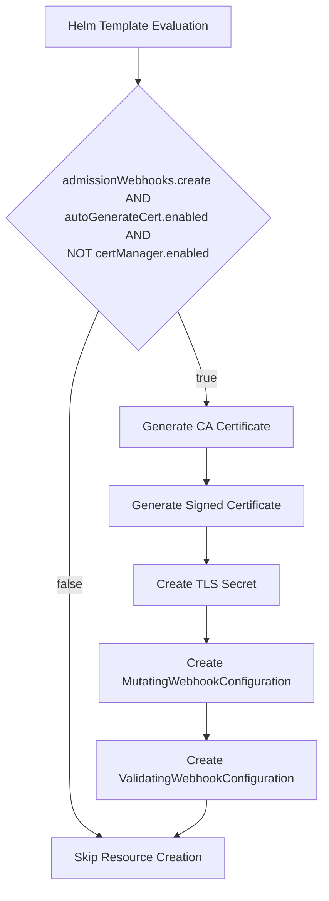
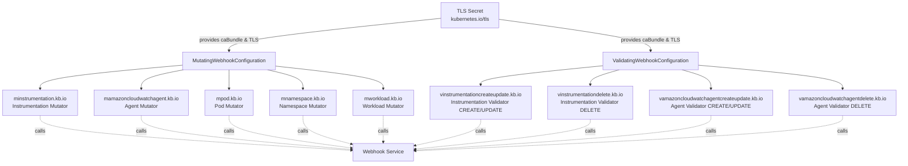
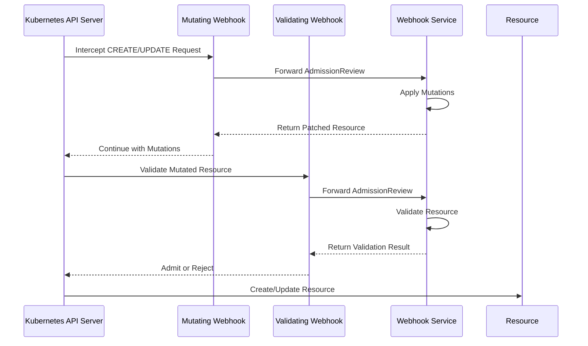
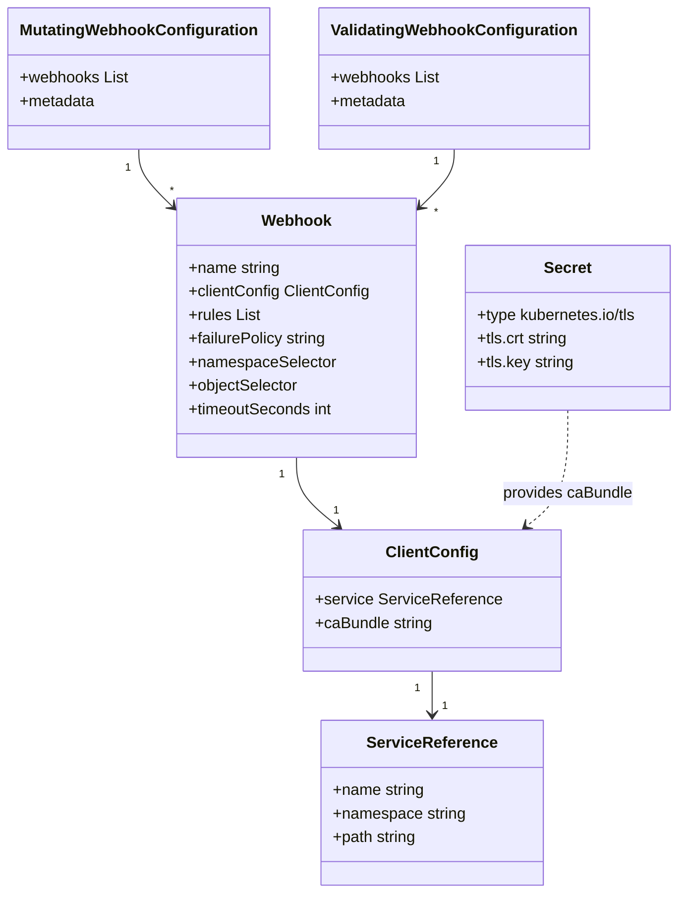
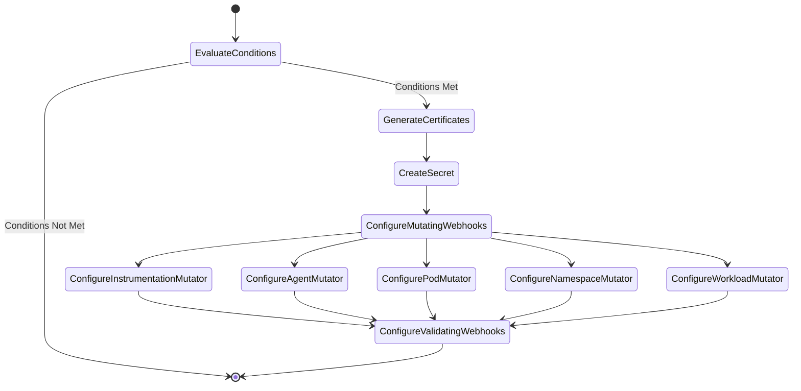

# Diagram: devops/k8s/amazon-cloudwatch-observability/helm/templates/admission-webhooks/operator-webhook.yaml

> Auto-generated by Obscura crawlers

## Diagram 1

### SVG

<svg id="container" width="431.984375" xmlns="http://www.w3.org/2000/svg" class="flowchart" height="1168.234375" viewBox="0.5 0 431.984375 1168.234375" role="graphics-document document" aria-roledescription="flowchart-v2"><g><marker id="container_flowchart-v2-pointEnd" class="marker flowchart-v2" viewBox="0 0 10 10" refX="5" refY="5" markerUnits="userSpaceOnUse" markerWidth="8" markerHeight="8" orient="auto"><path d="M 0 0 L 10 5 L 0 10 z" class="arrowMarkerPath" style="stroke-width: 1; stroke-dasharray: 1, 0;"></path></marker><marker id="container_flowchart-v2-pointStart" class="marker flowchart-v2" viewBox="0 0 10 10" refX="4.5" refY="5" markerUnits="userSpaceOnUse" markerWidth="8" markerHeight="8" orient="auto"><path d="M 0 5 L 10 10 L 10 0 z" class="arrowMarkerPath" style="stroke-width: 1; stroke-dasharray: 1, 0;"></path></marker><marker id="container_flowchart-v2-circleEnd" class="marker flowchart-v2" viewBox="0 0 10 10" refX="11" refY="5" markerUnits="userSpaceOnUse" markerWidth="11" markerHeight="11" orient="auto"><circle cx="5" cy="5" r="5" class="arrowMarkerPath" style="stroke-width: 1; stroke-dasharray: 1, 0;"></circle></marker><marker id="container_flowchart-v2-circleStart" class="marker flowchart-v2" viewBox="0 0 10 10" refX="-1" refY="5" markerUnits="userSpaceOnUse" markerWidth="11" markerHeight="11" orient="auto"><circle cx="5" cy="5" r="5" class="arrowMarkerPath" style="stroke-width: 1; stroke-dasharray: 1, 0;"></circle></marker><marker id="container_flowchart-v2-crossEnd" class="marker cross flowchart-v2" viewBox="0 0 11 11" refX="12" refY="5.2" markerUnits="userSpaceOnUse" markerWidth="11" markerHeight="11" orient="auto"><path d="M 1,1 l 9,9 M 10,1 l -9,9" class="arrowMarkerPath" style="stroke-width: 2; stroke-dasharray: 1, 0;"></path></marker><marker id="container_flowchart-v2-crossStart" class="marker cross flowchart-v2" viewBox="0 0 11 11" refX="-1" refY="5.2" markerUnits="userSpaceOnUse" markerWidth="11" markerHeight="11" orient="auto"><path d="M 1,1 l 9,9 M 10,1 l -9,9" class="arrowMarkerPath" style="stroke-width: 2; stroke-dasharray: 1, 0;"></path></marker><g class="root"><g class="clusters"></g><g class="edgePaths"><path d="M184.117,62L184.117,66.167C184.117,70.333,184.117,78.667,184.117,86.333C184.117,94,184.117,101,184.117,104.5L184.117,108" id="L_Start_Cond_0" class="edge-thickness-normal edge-pattern-solid edge-thickness-normal edge-pattern-solid flowchart-link" style=";" data-edge="true" data-et="edge" data-id="L_Start_Cond_0" data-points="W3sieCI6MTg0LjExNzE4NzUsInkiOjYyfSx7IngiOjE4NC4xMTcxODc1LCJ5Ijo4N30seyJ4IjoxODQuMTE3MTg3NSwieSI6MTEyfV0=" marker-end="url(#container_flowchart-v2-pointEnd)"></path><path d="M131.099,411.216L124.637,426.219C118.175,441.222,105.252,471.228,98.79,496.898C92.328,522.568,92.328,543.901,92.328,563.234C92.328,582.568,92.328,599.901,92.328,617.234C92.328,634.568,92.328,651.901,92.328,669.234C92.328,686.568,92.328,703.901,92.328,721.234C92.328,738.568,92.328,755.901,92.328,773.234C92.328,790.568,92.328,807.901,92.328,827.234C92.328,846.568,92.328,867.901,92.328,889.234C92.328,910.568,92.328,931.901,92.328,953.234C92.328,974.568,92.328,995.901,92.328,1017.234C92.328,1038.568,92.328,1059.901,99.103,1074.406C105.878,1088.91,119.427,1096.587,126.202,1100.425L132.977,1104.263" id="L_Cond_End_0" class="edge-thickness-normal edge-pattern-solid edge-thickness-normal edge-pattern-solid flowchart-link" style=";" data-edge="true" data-et="edge" data-id="L_Cond_End_0" data-points="W3sieCI6MTMxLjA5ODgyMDI3ODA2OTU4LCJ5Ijo0MTEuMjE2MDA3Nzc4MDY5Nn0seyJ4Ijo5Mi4zMjgxMjUsInkiOjUwMS4yMzQzNzV9LHsieCI6OTIuMzI4MTI1LCJ5Ijo1NjUuMjM0Mzc1fSx7IngiOjkyLjMyODEyNSwieSI6NjE3LjIzNDM3NX0seyJ4Ijo5Mi4zMjgxMjUsInkiOjY2OS4yMzQzNzV9LHsieCI6OTIuMzI4MTI1LCJ5Ijo3MjEuMjM0Mzc1fSx7IngiOjkyLjMyODEyNSwieSI6NzczLjIzNDM3NX0seyJ4Ijo5Mi4zMjgxMjUsInkiOjgyNS4yMzQzNzV9LHsieCI6OTIuMzI4MTI1LCJ5Ijo4ODkuMjM0Mzc1fSx7IngiOjkyLjMyODEyNSwieSI6OTUzLjIzNDM3NX0seyJ4Ijo5Mi4zMjgxMjUsInkiOjEwMTcuMjM0Mzc1fSx7IngiOjkyLjMyODEyNSwieSI6MTA4MS4yMzQzNzV9LHsieCI6MTM2LjQ1NzQ4MTk3MTE1Mzg0LCJ5IjoxMTA2LjIzNDM3NX1d" marker-end="url(#container_flowchart-v2-pointEnd)"></path><path d="M237.136,411.216L243.597,426.219C250.059,441.222,262.983,471.228,269.444,491.731C275.906,512.234,275.906,523.234,275.906,528.734L275.906,534.234" id="L_Cond_GenCA_0" class="edge-thickness-normal edge-pattern-solid edge-thickness-normal edge-pattern-solid flowchart-link" style=";" data-edge="true" data-et="edge" data-id="L_Cond_GenCA_0" data-points="W3sieCI6MjM3LjEzNTU1NDcyMTkzMDQyLCJ5Ijo0MTEuMjE2MDA3Nzc4MDY5Nn0seyJ4IjoyNzUuOTA2MjUsInkiOjUwMS4yMzQzNzV9LHsieCI6Mjc1LjkwNjI1LCJ5Ijo1MzguMjM0Mzc1fV0=" marker-end="url(#container_flowchart-v2-pointEnd)"></path><path d="M275.906,592.234L275.906,596.401C275.906,600.568,275.906,608.901,275.906,616.568C275.906,624.234,275.906,631.234,275.906,634.734L275.906,638.234" id="L_GenCA_GenCert_0" class="edge-thickness-normal edge-pattern-solid edge-thickness-normal edge-pattern-solid flowchart-link" style=";" data-edge="true" data-et="edge" data-id="L_GenCA_GenCert_0" data-points="W3sieCI6Mjc1LjkwNjI1LCJ5Ijo1OTIuMjM0Mzc1fSx7IngiOjI3NS45MDYyNSwieSI6NjE3LjIzNDM3NX0seyJ4IjoyNzUuOTA2MjUsInkiOjY0Mi4yMzQzNzV9XQ==" marker-end="url(#container_flowchart-v2-pointEnd)"></path><path d="M275.906,696.234L275.906,700.401C275.906,704.568,275.906,712.901,275.906,720.568C275.906,728.234,275.906,735.234,275.906,738.734L275.906,742.234" id="L_GenCert_CreateSecret_0" class="edge-thickness-normal edge-pattern-solid edge-thickness-normal edge-pattern-solid flowchart-link" style=";" data-edge="true" data-et="edge" data-id="L_GenCert_CreateSecret_0" data-points="W3sieCI6Mjc1LjkwNjI1LCJ5Ijo2OTYuMjM0Mzc1fSx7IngiOjI3NS45MDYyNSwieSI6NzIxLjIzNDM3NX0seyJ4IjoyNzUuOTA2MjUsInkiOjc0Ni4yMzQzNzV9XQ==" marker-end="url(#container_flowchart-v2-pointEnd)"></path><path d="M275.906,800.234L275.906,804.401C275.906,808.568,275.906,816.901,275.906,824.568C275.906,832.234,275.906,839.234,275.906,842.734L275.906,846.234" id="L_CreateSecret_CreateMutating_0" class="edge-thickness-normal edge-pattern-solid edge-thickness-normal edge-pattern-solid flowchart-link" style=";" data-edge="true" data-et="edge" data-id="L_CreateSecret_CreateMutating_0" data-points="W3sieCI6Mjc1LjkwNjI1LCJ5Ijo4MDAuMjM0Mzc1fSx7IngiOjI3NS45MDYyNSwieSI6ODI1LjIzNDM3NX0seyJ4IjoyNzUuOTA2MjUsInkiOjg1MC4yMzQzNzV9XQ==" marker-end="url(#container_flowchart-v2-pointEnd)"></path><path d="M275.906,928.234L275.906,932.401C275.906,936.568,275.906,944.901,275.906,952.568C275.906,960.234,275.906,967.234,275.906,970.734L275.906,974.234" id="L_CreateMutating_CreateValidating_0" class="edge-thickness-normal edge-pattern-solid edge-thickness-normal edge-pattern-solid flowchart-link" style=";" data-edge="true" data-et="edge" data-id="L_CreateMutating_CreateValidating_0" data-points="W3sieCI6Mjc1LjkwNjI1LCJ5Ijo5MjguMjM0Mzc1fSx7IngiOjI3NS45MDYyNSwieSI6OTUzLjIzNDM3NX0seyJ4IjoyNzUuOTA2MjUsInkiOjk3OC4yMzQzNzV9XQ==" marker-end="url(#container_flowchart-v2-pointEnd)"></path><path d="M275.906,1056.234L275.906,1060.401C275.906,1064.568,275.906,1072.901,269.131,1080.906C262.357,1088.91,248.807,1096.587,242.032,1100.425L235.257,1104.263" id="L_CreateValidating_End_0" class="edge-thickness-normal edge-pattern-solid edge-thickness-normal edge-pattern-solid flowchart-link" style=";" data-edge="true" data-et="edge" data-id="L_CreateValidating_End_0" data-points="W3sieCI6Mjc1LjkwNjI1LCJ5IjoxMDU2LjIzNDM3NX0seyJ4IjoyNzUuOTA2MjUsInkiOjEwODEuMjM0Mzc1fSx7IngiOjIzMS43NzY4OTMwMjg4NDYxNiwieSI6MTEwNi4yMzQzNzV9XQ==" marker-end="url(#container_flowchart-v2-pointEnd)"></path></g><g class="edgeLabels"><g class="edgeLabel"><g class="label" data-id="L_Start_Cond_0" transform="translate(0, 0)"><foreignObject width="0" height="0">

</foreignObject></g></g><g class="edgeLabel" transform="translate(92.328125, 773.234375)"><g class="label" data-id="L_Cond_End_0" transform="translate(-17.21875, -12)"><foreignObject width="34.4375" height="24">

false

</foreignObject></g></g><g class="edgeLabel" transform="translate(275.90625, 501.234375)"><g class="label" data-id="L_Cond_GenCA_0" transform="translate(-14.9921875, -12)"><foreignObject width="29.984375" height="24">

true

</foreignObject></g></g><g class="edgeLabel"><g class="label" data-id="L_GenCA_GenCert_0" transform="translate(0, 0)"><foreignObject width="0" height="0">

</foreignObject></g></g><g class="edgeLabel"><g class="label" data-id="L_GenCert_CreateSecret_0" transform="translate(0, 0)"><foreignObject width="0" height="0">

</foreignObject></g></g><g class="edgeLabel"><g class="label" data-id="L_CreateSecret_CreateMutating_0" transform="translate(0, 0)"><foreignObject width="0" height="0">

</foreignObject></g></g><g class="edgeLabel"><g class="label" data-id="L_CreateMutating_CreateValidating_0" transform="translate(0, 0)"><foreignObject width="0" height="0">

</foreignObject></g></g><g class="edgeLabel"><g class="label" data-id="L_CreateValidating_End_0" transform="translate(0, 0)"><foreignObject width="0" height="0">

</foreignObject></g></g></g><g class="nodes"><g class="node default" id="flowchart-Start-0" transform="translate(184.1171875, 35)"><rect class="basic label-container" style="" x="-124.75" y="-27" width="249.5" height="54"></rect><g class="label" style="" transform="translate(-94.75, -12)"><rect></rect><foreignObject width="189.5" height="24">

Helm Template Evaluation

</foreignObject></g></g><g class="node default" id="flowchart-Cond-1" transform="translate(184.1171875, 288.1171875)"><polygon points="176.1171875,0 352.234375,-176.1171875 176.1171875,-352.234375 0,-176.1171875" class="label-container" transform="translate(-175.6171875, 176.1171875)"></polygon><g class="label" style="" transform="translate(-101.1171875, -60)"><rect></rect><foreignObject width="202.234375" height="120">

admissionWebhooks.create AND autoGenerateCert.enabled AND NOT certManager.enabled

</foreignObject></g></g><g class="node default" id="flowchart-End-3" transform="translate(184.1171875, 1133.234375)"><rect class="basic label-container" style="" x="-113.0703125" y="-27" width="226.140625" height="54"></rect><g class="label" style="" transform="translate(-83.0703125, -12)"><rect></rect><foreignObject width="166.140625" height="24">

Skip Resource Creation

</foreignObject></g></g><g class="node default" id="flowchart-GenCA-5" transform="translate(275.90625, 565.234375)"><rect class="basic label-container" style="" x="-112.7890625" y="-27" width="225.578125" height="54"></rect><g class="label" style="" transform="translate(-82.7890625, -12)"><rect></rect><foreignObject width="165.578125" height="24">

Generate CA Certificate

</foreignObject></g></g><g class="node default" id="flowchart-GenCert-7" transform="translate(275.90625, 669.234375)"><rect class="basic label-container" style="" x="-128.3359375" y="-27" width="256.671875" height="54"></rect><g class="label" style="" transform="translate(-98.3359375, -12)"><rect></rect><foreignObject width="196.671875" height="24">

Generate Signed Certificate

</foreignObject></g></g><g class="node default" id="flowchart-CreateSecret-9" transform="translate(275.90625, 773.234375)"><rect class="basic label-container" style="" x="-92.2109375" y="-27" width="184.421875" height="54"></rect><g class="label" style="" transform="translate(-62.2109375, -12)"><rect></rect><foreignObject width="124.421875" height="24">

Create TLS Secret

</foreignObject></g></g><g class="node default" id="flowchart-CreateMutating-11" transform="translate(275.90625, 889.234375)"><rect class="basic label-container" style="" x="-144.5" y="-39" width="289" height="78"></rect><g class="label" style="" transform="translate(-114.5, -24)"><rect></rect><foreignObject width="229" height="48">

Create MutatingWebhookConfiguration

</foreignObject></g></g><g class="node default" id="flowchart-CreateValidating-13" transform="translate(275.90625, 1017.234375)"><rect class="basic label-container" style="" x="-148.578125" y="-39" width="297.15625" height="78"></rect><g class="label" style="" transform="translate(-118.578125, -24)"><rect></rect><foreignObject width="237.15625" height="48">

Create ValidatingWebhookConfiguration

</foreignObject></g></g></g></g></g></svg>

## Diagram 2

### SVG

<svg id="container" width="2799.421875" xmlns="http://www.w3.org/2000/svg" class="flowchart" height="502" viewBox="0 0 2799.421875 502" role="graphics-document document" aria-roledescription="flowchart-v2"><g><marker id="container_flowchart-v2-pointEnd" class="marker flowchart-v2" viewBox="0 0 10 10" refX="5" refY="5" markerUnits="userSpaceOnUse" markerWidth="8" markerHeight="8" orient="auto"><path d="M 0 0 L 10 5 L 0 10 z" class="arrowMarkerPath" style="stroke-width: 1; stroke-dasharray: 1, 0;"></path></marker><marker id="container_flowchart-v2-pointStart" class="marker flowchart-v2" viewBox="0 0 10 10" refX="4.5" refY="5" markerUnits="userSpaceOnUse" markerWidth="8" markerHeight="8" orient="auto"><path d="M 0 5 L 10 10 L 10 0 z" class="arrowMarkerPath" style="stroke-width: 1; stroke-dasharray: 1, 0;"></path></marker><marker id="container_flowchart-v2-circleEnd" class="marker flowchart-v2" viewBox="0 0 10 10" refX="11" refY="5" markerUnits="userSpaceOnUse" markerWidth="11" markerHeight="11" orient="auto"><circle cx="5" cy="5" r="5" class="arrowMarkerPath" style="stroke-width: 1; stroke-dasharray: 1, 0;"></circle></marker><marker id="container_flowchart-v2-circleStart" class="marker flowchart-v2" viewBox="0 0 10 10" refX="-1" refY="5" markerUnits="userSpaceOnUse" markerWidth="11" markerHeight="11" orient="auto"><circle cx="5" cy="5" r="5" class="arrowMarkerPath" style="stroke-width: 1; stroke-dasharray: 1, 0;"></circle></marker><marker id="container_flowchart-v2-crossEnd" class="marker cross flowchart-v2" viewBox="0 0 11 11" refX="12" refY="5.2" markerUnits="userSpaceOnUse" markerWidth="11" markerHeight="11" orient="auto"><path d="M 1,1 l 9,9 M 10,1 l -9,9" class="arrowMarkerPath" style="stroke-width: 2; stroke-dasharray: 1, 0;"></path></marker><marker id="container_flowchart-v2-crossStart" class="marker cross flowchart-v2" viewBox="0 0 11 11" refX="-1" refY="5.2" markerUnits="userSpaceOnUse" markerWidth="11" markerHeight="11" orient="auto"><path d="M 1,1 l 9,9 M 10,1 l -9,9" class="arrowMarkerPath" style="stroke-width: 2; stroke-dasharray: 1, 0;"></path></marker><g class="root"><g class="clusters"></g><g class="edgePaths"><path d="M1373.918,56.354L1264.117,67.462C1154.315,78.569,934.712,100.785,824.911,117.392C715.109,134,715.109,145,715.109,150.5L715.109,156" id="L_Secret_MWC_0" class="edge-thickness-normal edge-pattern-solid edge-thickness-normal edge-pattern-solid flowchart-link" style=";" data-edge="true" data-et="edge" data-id="L_Secret_MWC_0" data-points="W3sieCI6MTM3My45MTc5Njg3NSwieSI6NTYuMzU0MjM1MjM0NzgyNDN9LHsieCI6NzE1LjEwOTM3NSwieSI6MTIzfSx7IngiOjcxNS4xMDkzNzUsInkiOjE2MH1d" marker-end="url(#container_flowchart-v2-pointEnd)"></path><path d="M1558.855,59.483L1637.273,70.069C1715.691,80.655,1872.527,101.828,1950.945,117.914C2029.363,134,2029.363,145,2029.363,150.5L2029.363,156" id="L_Secret_VWC_0" class="edge-thickness-normal edge-pattern-solid edge-thickness-normal edge-pattern-solid flowchart-link" style=";" data-edge="true" data-et="edge" data-id="L_Secret_VWC_0" data-points="W3sieCI6MTU1OC44NTU0Njg3NSwieSI6NTkuNDgyOTc5Njk3NzU2MDY1fSx7IngiOjIwMjkuMzYzMjgxMjUsInkiOjEyM30seyJ4IjoyMDI5LjM2MzI4MTI1LCJ5IjoxNjB9XQ==" marker-end="url(#container_flowchart-v2-pointEnd)"></path><path d="M570.602,199.793L496.789,206.328C422.977,212.862,275.352,225.931,201.539,237.966C127.727,250,127.727,261,127.727,266.5L127.727,272" id="L_MWC_MW1_0" class="edge-thickness-normal edge-pattern-solid edge-thickness-normal edge-pattern-solid flowchart-link" style=";" data-edge="true" data-et="edge" data-id="L_MWC_MW1_0" data-points="W3sieCI6NTcwLjYwMTU2MjUsInkiOjE5OS43OTMwMzA1MjQ3MDU3M30seyJ4IjoxMjcuNzI2NTYyNSwieSI6MjM5fSx7IngiOjEyNy43MjY1NjI1LCJ5IjoyNzZ9XQ==" marker-end="url(#container_flowchart-v2-pointEnd)"></path><path d="M574.337,214L552.613,218.167C530.889,222.333,487.44,230.667,465.716,240.333C443.992,250,443.992,261,443.992,266.5L443.992,272" id="L_MWC_MW2_0" class="edge-thickness-normal edge-pattern-solid edge-thickness-normal edge-pattern-solid flowchart-link" style=";" data-edge="true" data-et="edge" data-id="L_MWC_MW2_0" data-points="W3sieCI6NTc0LjMzNjk4OTE4MjY5MjQsInkiOjIxNH0seyJ4Ijo0NDMuOTkyMTg3NSwieSI6MjM5fSx7IngiOjQ0My45OTIxODc1LCJ5IjoyNzZ9XQ==" marker-end="url(#container_flowchart-v2-pointEnd)"></path><path d="M715.109,214L715.109,218.167C715.109,222.333,715.109,230.667,715.109,240.333C715.109,250,715.109,261,715.109,266.5L715.109,272" id="L_MWC_MW3_0" class="edge-thickness-normal edge-pattern-solid edge-thickness-normal edge-pattern-solid flowchart-link" style=";" data-edge="true" data-et="edge" data-id="L_MWC_MW3_0" data-points="W3sieCI6NzE1LjEwOTM3NSwieSI6MjE0fSx7IngiOjcxNS4xMDkzNzUsInkiOjIzOX0seyJ4Ijo3MTUuMTA5Mzc1LCJ5IjoyNzZ9XQ==" marker-end="url(#container_flowchart-v2-pointEnd)"></path><path d="M833.032,214L851.229,218.167C869.427,222.333,905.823,230.667,924.021,240.333C942.219,250,942.219,261,942.219,266.5L942.219,272" id="L_MWC_MW4_0" class="edge-thickness-normal edge-pattern-solid edge-thickness-normal edge-pattern-solid flowchart-link" style=";" data-edge="true" data-et="edge" data-id="L_MWC_MW4_0" data-points="W3sieCI6ODMzLjAzMTU1MDQ4MDc2OTMsInkiOjIxNH0seyJ4Ijo5NDIuMjE4NzUsInkiOjIzOX0seyJ4Ijo5NDIuMjE4NzUsInkiOjI3Nn1d" marker-end="url(#container_flowchart-v2-pointEnd)"></path><path d="M859.617,202.827L914.661,208.856C969.706,214.885,1079.794,226.942,1134.839,238.471C1189.883,250,1189.883,261,1189.883,266.5L1189.883,272" id="L_MWC_MW5_0" class="edge-thickness-normal edge-pattern-solid edge-thickness-normal edge-pattern-solid flowchart-link" style=";" data-edge="true" data-et="edge" data-id="L_MWC_MW5_0" data-points="W3sieCI6ODU5LjYxNzE4NzUsInkiOjIwMi44MjczNTE4NjE5MDc4M30seyJ4IjoxMTg5Ljg4MjgxMjUsInkiOjIzOX0seyJ4IjoxMTg5Ljg4MjgxMjUsInkiOjI3Nn1d" marker-end="url(#container_flowchart-v2-pointEnd)"></path><path d="M1880.785,201.47L1816.558,207.725C1752.331,213.98,1623.876,226.49,1559.649,236.245C1495.422,246,1495.422,253,1495.422,256.5L1495.422,260" id="L_VWC_VW1_0" class="edge-thickness-normal edge-pattern-solid edge-thickness-normal edge-pattern-solid flowchart-link" style=";" data-edge="true" data-et="edge" data-id="L_VWC_VW1_0" data-points="W3sieCI6MTg4MC43ODUxNTYyNSwieSI6MjAxLjQ2OTg2OTU1NzkwMTUyfSx7IngiOjE0OTUuNDIxODc1LCJ5IjoyMzl9LHsieCI6MTQ5NS40MjE4NzUsInkiOjI2NH1d" marker-end="url(#container_flowchart-v2-pointEnd)"></path><path d="M1931.592,214L1916.504,218.167C1901.415,222.333,1871.239,230.667,1856.151,238.333C1841.063,246,1841.063,253,1841.063,256.5L1841.063,260" id="L_VWC_VW2_0" class="edge-thickness-normal edge-pattern-solid edge-thickness-normal edge-pattern-solid flowchart-link" style=";" data-edge="true" data-et="edge" data-id="L_VWC_VW2_0" data-points="W3sieCI6MTkzMS41OTE3MjE3NTQ4MDc2LCJ5IjoyMTR9LHsieCI6MTg0MS4wNjI1LCJ5IjoyMzl9LHsieCI6MTg0MS4wNjI1LCJ5IjoyNjR9XQ==" marker-end="url(#container_flowchart-v2-pointEnd)"></path><path d="M2127.135,214L2142.223,218.167C2157.311,222.333,2187.488,230.667,2202.576,240.333C2217.664,250,2217.664,261,2217.664,266.5L2217.664,272" id="L_VWC_VW3_0" class="edge-thickness-normal edge-pattern-solid edge-thickness-normal edge-pattern-solid flowchart-link" style=";" data-edge="true" data-et="edge" data-id="L_VWC_VW3_0" data-points="W3sieCI6MjEyNy4xMzQ4NDA3NDUxOTI0LCJ5IjoyMTR9LHsieCI6MjIxNy42NjQwNjI1LCJ5IjoyMzl9LHsieCI6MjIxNy42NjQwNjI1LCJ5IjoyNzZ9XQ==" marker-end="url(#container_flowchart-v2-pointEnd)"></path><path d="M2177.941,199.966L2252.489,206.472C2327.036,212.977,2476.132,225.989,2550.679,237.994C2625.227,250,2625.227,261,2625.227,266.5L2625.227,272" id="L_VWC_VW4_0" class="edge-thickness-normal edge-pattern-solid edge-thickness-normal edge-pattern-solid flowchart-link" style=";" data-edge="true" data-et="edge" data-id="L_VWC_VW4_0" data-points="W3sieCI6MjE3Ny45NDE0MDYyNSwieSI6MTk5Ljk2NjE2NjQ3MzI3NjA1fSx7IngiOjI2MjUuMjI2NTYyNSwieSI6MjM5fSx7IngiOjI2MjUuMjI2NTYyNSwieSI6Mjc2fV0=" marker-end="url(#container_flowchart-v2-pointEnd)"></path><path d="M127.727,354L127.727,362.167C127.727,370.333,127.727,386.667,288.768,404.537C449.81,422.407,771.893,441.814,932.934,451.518L1093.976,461.221" id="L_MW1_WS_0" class="edge-thickness-normal edge-pattern-dotted edge-thickness-normal edge-pattern-solid flowchart-link" style=";" data-edge="true" data-et="edge" data-id="L_MW1_WS_0" data-points="W3sieCI6MTI3LjcyNjU2MjUsInkiOjM1NH0seyJ4IjoxMjcuNzI2NTYyNSwieSI6NDAzfSx7IngiOjEwOTcuOTY4NzUsInkiOjQ2MS40NjE3Mzc2MjA5OTUwNX1d" marker-end="url(#container_flowchart-v2-pointEnd)"></path><path d="M443.992,354L443.992,362.167C443.992,370.333,443.992,386.667,552.324,404.129C660.656,421.59,877.32,440.181,985.652,449.476L1093.983,458.771" id="L_MW2_WS_0" class="edge-thickness-normal edge-pattern-dotted edge-thickness-normal edge-pattern-solid flowchart-link" style=";" data-edge="true" data-et="edge" data-id="L_MW2_WS_0" data-points="W3sieCI6NDQzLjk5MjE4NzUsInkiOjM1NH0seyJ4Ijo0NDMuOTkyMTg3NSwieSI6NDAzfSx7IngiOjEwOTcuOTY4NzUsInkiOjQ1OS4xMTM0NTQ5NzIwMzQzfV0=" marker-end="url(#container_flowchart-v2-pointEnd)"></path><path d="M715.109,354L715.109,362.167C715.109,370.333,715.109,386.667,778.259,403.346C841.408,420.025,967.706,437.05,1030.855,445.563L1094.005,454.076" id="L_MW3_WS_0" class="edge-thickness-normal edge-pattern-dotted edge-thickness-normal edge-pattern-solid flowchart-link" style=";" data-edge="true" data-et="edge" data-id="L_MW3_WS_0" data-points="W3sieCI6NzE1LjEwOTM3NSwieSI6MzU0fSx7IngiOjcxNS4xMDkzNzUsInkiOjQwM30seyJ4IjoxMDk3Ljk2ODc1LCJ5Ijo0NTQuNjA5ODc5NzEyMzYyOH1d" marker-end="url(#container_flowchart-v2-pointEnd)"></path><path d="M942.219,354L942.219,362.167C942.219,370.333,942.219,386.667,967.532,401.375C992.844,416.082,1043.47,429.165,1068.783,435.706L1094.096,442.247" id="L_MW4_WS_0" class="edge-thickness-normal edge-pattern-dotted edge-thickness-normal edge-pattern-solid flowchart-link" style=";" data-edge="true" data-et="edge" data-id="L_MW4_WS_0" data-points="W3sieCI6OTQyLjIxODc1LCJ5IjozNTR9LHsieCI6OTQyLjIxODc1LCJ5Ijo0MDN9LHsieCI6MTA5Ny45Njg3NSwieSI6NDQzLjI0ODA2Nzg4NDI5Mzg1fV0=" marker-end="url(#container_flowchart-v2-pointEnd)"></path><path d="M1189.883,354L1189.883,362.167C1189.883,370.333,1189.883,386.667,1189.883,400.333C1189.883,414,1189.883,425,1189.883,430.5L1189.883,436" id="L_MW5_WS_0" class="edge-thickness-normal edge-pattern-dotted edge-thickness-normal edge-pattern-solid flowchart-link" style=";" data-edge="true" data-et="edge" data-id="L_MW5_WS_0" data-points="W3sieCI6MTE4OS44ODI4MTI1LCJ5IjozNTR9LHsieCI6MTE4OS44ODI4MTI1LCJ5Ijo0MDN9LHsieCI6MTE4OS44ODI4MTI1LCJ5Ijo0NDB9XQ==" marker-end="url(#container_flowchart-v2-pointEnd)"></path><path d="M1495.422,366L1495.422,372.167C1495.422,378.333,1495.422,390.667,1460.47,404.155C1425.519,417.642,1355.615,432.285,1320.664,439.606L1285.712,446.927" id="L_VW1_WS_0" class="edge-thickness-normal edge-pattern-dotted edge-thickness-normal edge-pattern-solid flowchart-link" style=";" data-edge="true" data-et="edge" data-id="L_VW1_WS_0" data-points="W3sieCI6MTQ5NS40MjE4NzUsInkiOjM2Nn0seyJ4IjoxNDk1LjQyMTg3NSwieSI6NDAzfSx7IngiOjEyODEuNzk2ODc1LCJ5Ijo0NDcuNzQ3MTQyNjAxNDQ3MjV9XQ==" marker-end="url(#container_flowchart-v2-pointEnd)"></path><path d="M1841.063,366L1841.063,372.167C1841.063,378.333,1841.063,390.667,1748.515,405.929C1655.968,421.192,1470.873,439.383,1378.325,448.479L1285.778,457.575" id="L_VW2_WS_0" class="edge-thickness-normal edge-pattern-dotted edge-thickness-normal edge-pattern-solid flowchart-link" style=";" data-edge="true" data-et="edge" data-id="L_VW2_WS_0" data-points="W3sieCI6MTg0MS4wNjI1LCJ5IjozNjZ9LHsieCI6MTg0MS4wNjI1LCJ5Ijo0MDN9LHsieCI6MTI4MS43OTY4NzUsInkiOjQ1Ny45NjYzOTUxMjQyMzM2Nn1d" marker-end="url(#container_flowchart-v2-pointEnd)"></path><path d="M2217.664,354L2217.664,362.167C2217.664,370.333,2217.664,386.667,2062.352,404.505C1907.039,422.343,1596.414,441.685,1441.102,451.357L1285.789,461.028" id="L_VW3_WS_0" class="edge-thickness-normal edge-pattern-dotted edge-thickness-normal edge-pattern-solid flowchart-link" style=";" data-edge="true" data-et="edge" data-id="L_VW3_WS_0" data-points="W3sieCI6MjIxNy42NjQwNjI1LCJ5IjozNTR9LHsieCI6MjIxNy42NjQwNjI1LCJ5Ijo0MDN9LHsieCI6MTI4MS43OTY4NzUsInkiOjQ2MS4yNzY1MDU4MjI2MTU1fV0=" marker-end="url(#container_flowchart-v2-pointEnd)"></path><path d="M2625.227,354L2625.227,362.167C2625.227,370.333,2625.227,386.667,2401.988,404.787C2178.749,422.908,1732.271,442.816,1509.032,452.77L1285.793,462.724" id="L_VW4_WS_0" class="edge-thickness-normal edge-pattern-dotted edge-thickness-normal edge-pattern-solid flowchart-link" style=";" data-edge="true" data-et="edge" data-id="L_VW4_WS_0" data-points="W3sieCI6MjYyNS4yMjY1NjI1LCJ5IjozNTR9LHsieCI6MjYyNS4yMjY1NjI1LCJ5Ijo0MDN9LHsieCI6MTI4MS43OTY4NzUsInkiOjQ2Mi45MDE2Nzg2MDQ4NjM4M31d" marker-end="url(#container_flowchart-v2-pointEnd)"></path></g><g class="edgeLabels"><g class="edgeLabel" transform="translate(715.109375, 123)"><g class="label" data-id="L_Secret_MWC_0" transform="translate(-89.6171875, -12)"><foreignObject width="179.234375" height="24">

provides caBundle &amp; TLS

</foreignObject></g></g><g class="edgeLabel" transform="translate(2029.36328125, 123)"><g class="label" data-id="L_Secret_VWC_0" transform="translate(-89.6171875, -12)"><foreignObject width="179.234375" height="24">

provides caBundle &amp; TLS

</foreignObject></g></g><g class="edgeLabel"><g class="label" data-id="L_MWC_MW1_0" transform="translate(0, 0)"><foreignObject width="0" height="0">

</foreignObject></g></g><g class="edgeLabel"><g class="label" data-id="L_MWC_MW2_0" transform="translate(0, 0)"><foreignObject width="0" height="0">

</foreignObject></g></g><g class="edgeLabel"><g class="label" data-id="L_MWC_MW3_0" transform="translate(0, 0)"><foreignObject width="0" height="0">

</foreignObject></g></g><g class="edgeLabel"><g class="label" data-id="L_MWC_MW4_0" transform="translate(0, 0)"><foreignObject width="0" height="0">

</foreignObject></g></g><g class="edgeLabel"><g class="label" data-id="L_MWC_MW5_0" transform="translate(0, 0)"><foreignObject width="0" height="0">

</foreignObject></g></g><g class="edgeLabel"><g class="label" data-id="L_VWC_VW1_0" transform="translate(0, 0)"><foreignObject width="0" height="0">

</foreignObject></g></g><g class="edgeLabel"><g class="label" data-id="L_VWC_VW2_0" transform="translate(0, 0)"><foreignObject width="0" height="0">

</foreignObject></g></g><g class="edgeLabel"><g class="label" data-id="L_VWC_VW3_0" transform="translate(0, 0)"><foreignObject width="0" height="0">

</foreignObject></g></g><g class="edgeLabel"><g class="label" data-id="L_VWC_VW4_0" transform="translate(0, 0)"><foreignObject width="0" height="0">

</foreignObject></g></g><g class="edgeLabel" transform="translate(127.7265625, 403)"><g class="label" data-id="L_MW1_WS_0" transform="translate(-16.4453125, -12)"><foreignObject width="32.890625" height="24">

calls

</foreignObject></g></g><g class="edgeLabel" transform="translate(443.9921875, 403)"><g class="label" data-id="L_MW2_WS_0" transform="translate(-16.4453125, -12)"><foreignObject width="32.890625" height="24">

calls

</foreignObject></g></g><g class="edgeLabel" transform="translate(715.109375, 403)"><g class="label" data-id="L_MW3_WS_0" transform="translate(-16.4453125, -12)"><foreignObject width="32.890625" height="24">

calls

</foreignObject></g></g><g class="edgeLabel" transform="translate(942.21875, 403)"><g class="label" data-id="L_MW4_WS_0" transform="translate(-16.4453125, -12)"><foreignObject width="32.890625" height="24">

calls

</foreignObject></g></g><g class="edgeLabel" transform="translate(1189.8828125, 403)"><g class="label" data-id="L_MW5_WS_0" transform="translate(-16.4453125, -12)"><foreignObject width="32.890625" height="24">

calls

</foreignObject></g></g><g class="edgeLabel" transform="translate(1495.421875, 403)"><g class="label" data-id="L_VW1_WS_0" transform="translate(-16.4453125, -12)"><foreignObject width="32.890625" height="24">

calls

</foreignObject></g></g><g class="edgeLabel" transform="translate(1841.0625, 403)"><g class="label" data-id="L_VW2_WS_0" transform="translate(-16.4453125, -12)"><foreignObject width="32.890625" height="24">

calls

</foreignObject></g></g><g class="edgeLabel" transform="translate(2217.6640625, 403)"><g class="label" data-id="L_VW3_WS_0" transform="translate(-16.4453125, -12)"><foreignObject width="32.890625" height="24">

calls

</foreignObject></g></g><g class="edgeLabel" transform="translate(2625.2265625, 403)"><g class="label" data-id="L_VW4_WS_0" transform="translate(-16.4453125, -12)"><foreignObject width="32.890625" height="24">

calls

</foreignObject></g></g></g><g class="nodes"><g class="node default" id="flowchart-Secret-0" transform="translate(1466.38671875, 47)"><rect class="basic label-container" style="" x="-92.46875" y="-39" width="184.9375" height="78"></rect><g class="label" style="" transform="translate(-62.46875, -24)"><rect></rect><foreignObject width="124.9375" height="48">

TLS Secret kubernetes.io/tls

</foreignObject></g></g><g class="node default" id="flowchart-MWC-1" transform="translate(715.109375, 187)"><rect class="basic label-container" style="" x="-144.5078125" y="-27" width="289.015625" height="54"></rect><g class="label" style="" transform="translate(-114.5078125, -12)"><rect></rect><foreignObject width="229.015625" height="24">

MutatingWebhookConfiguration

</foreignObject></g></g><g class="node default" id="flowchart-VWC-2" transform="translate(2029.36328125, 187)"><rect class="basic label-container" style="" x="-148.578125" y="-27" width="297.15625" height="54"></rect><g class="label" style="" transform="translate(-118.578125, -12)"><rect></rect><foreignObject width="237.15625" height="24">

ValidatingWebhookConfiguration

</foreignObject></g></g><g class="node default" id="flowchart-WS-3" transform="translate(1189.8828125, 467)"><rect class="basic label-container" style="" x="-91.9140625" y="-27" width="183.828125" height="54"></rect><g class="label" style="" transform="translate(-61.9140625, -12)"><rect></rect><foreignObject width="123.828125" height="24">

Webhook Service

</foreignObject></g></g><g class="node default" id="flowchart-MW1-9" transform="translate(127.7265625, 315)"><rect class="basic label-container" style="" x="-119.7265625" y="-39" width="239.453125" height="78"></rect><g class="label" style="" transform="translate(-89.7265625, -24)"><rect></rect><foreignObject width="179.453125" height="48">

minstrumentation.kb.io Instrumentation Mutator

</foreignObject></g></g><g class="node default" id="flowchart-MW2-11" transform="translate(443.9921875, 315)"><rect class="basic label-container" style="" x="-146.5390625" y="-39" width="293.078125" height="78"></rect><g class="label" style="" transform="translate(-116.5390625, -24)"><rect></rect><foreignObject width="233.078125" height="48">

mamazoncloudwatchagent.kb.io Agent Mutator

</foreignObject></g></g><g class="node default" id="flowchart-MW3-13" transform="translate(715.109375, 315)"><rect class="basic label-container" style="" x="-74.578125" y="-39" width="149.15625" height="78"></rect><g class="label" style="" transform="translate(-44.578125, -24)"><rect></rect><foreignObject width="89.15625" height="48">

mpod.kb.io Pod Mutator

</foreignObject></g></g><g class="node default" id="flowchart-MW4-15" transform="translate(942.21875, 315)"><rect class="basic label-container" style="" x="-102.53125" y="-39" width="205.0625" height="78"></rect><g class="label" style="" transform="translate(-72.53125, -24)"><rect></rect><foreignObject width="145.0625" height="48">

mnamespace.kb.io Namespace Mutator

</foreignObject></g></g><g class="node default" id="flowchart-MW5-17" transform="translate(1189.8828125, 315)"><rect class="basic label-container" style="" x="-95.1328125" y="-39" width="190.265625" height="78"></rect><g class="label" style="" transform="translate(-65.1328125, -24)"><rect></rect><foreignObject width="130.265625" height="48">

mworkload.kb.io Workload Mutator

</foreignObject></g></g><g class="node default" id="flowchart-VW1-19" transform="translate(1495.421875, 315)"><rect class="basic label-container" style="" x="-160.40625" y="-51" width="320.8125" height="102"></rect><g class="label" style="" transform="translate(-130.40625, -36)"><rect></rect><foreignObject width="260.8125" height="72">

vinstrumentationcreateupdate.kb.io Instrumentation Validator CREATE/UPDATE

</foreignObject></g></g><g class="node default" id="flowchart-VW2-21" transform="translate(1841.0625, 315)"><rect class="basic label-container" style="" x="-135.234375" y="-51" width="270.46875" height="102"></rect><g class="label" style="" transform="translate(-105.234375, -36)"><rect></rect><foreignObject width="210.46875" height="72">

vinstrumentationdelete.kb.io Instrumentation Validator DELETE

</foreignObject></g></g><g class="node default" id="flowchart-VW3-23" transform="translate(2217.6640625, 315)"><rect class="basic label-container" style="" x="-191.3671875" y="-39" width="382.734375" height="78"></rect><g class="label" style="" transform="translate(-161.3671875, -24)"><rect></rect><foreignObject width="322.734375" height="48">

vamazoncloudwatchagentcreateupdate.kb.io Agent Validator CREATE/UPDATE

</foreignObject></g></g><g class="node default" id="flowchart-VW4-25" transform="translate(2625.2265625, 315)"><rect class="basic label-container" style="" x="-166.1953125" y="-39" width="332.390625" height="78"></rect><g class="label" style="" transform="translate(-136.1953125, -24)"><rect></rect><foreignObject width="272.390625" height="48">

vamazoncloudwatchagentdelete.kb.io Agent Validator DELETE

</foreignObject></g></g></g></g></g></svg>

## Diagram 3

### SVG

<svg id="container" width="1254" xmlns="http://www.w3.org/2000/svg" height="759" viewBox="-50 -10 1254 759" role="graphics-document document" aria-roledescription="sequence"><g><rect x="1004" y="673" fill="#eaeaea" stroke="#666" width="150" height="65" name="Res" rx="3" ry="3" class="actor actor-bottom"></rect><text x="1079" y="705.5" dominant-baseline="central" alignment-baseline="central" class="actor actor-box" style="text-anchor: middle; font-size: 16px; font-weight: 400;"><tspan x="1079" dy="0">Resource</tspan></text></g><g><rect x="804" y="673" fill="#eaeaea" stroke="#666" width="150" height="65" name="WS" rx="3" ry="3" class="actor actor-bottom"></rect><text x="879" y="705.5" dominant-baseline="central" alignment-baseline="central" class="actor actor-box" style="text-anchor: middle; font-size: 16px; font-weight: 400;"><tspan x="879" dy="0">Webhook Service</tspan></text></g><g><rect x="538.5" y="673" fill="#eaeaea" stroke="#666" width="165" height="65" name="VWH" rx="3" ry="3" class="actor actor-bottom"></rect><text x="621" y="705.5" dominant-baseline="central" alignment-baseline="central" class="actor actor-box" style="text-anchor: middle; font-size: 16px; font-weight: 400;"><tspan x="621" dy="0">Validating Webhook</tspan></text></g><g><rect x="331.5" y="673" fill="#eaeaea" stroke="#666" width="157" height="65" name="MWH" rx="3" ry="3" class="actor actor-bottom"></rect><text x="410" y="705.5" dominant-baseline="central" alignment-baseline="central" class="actor actor-box" style="text-anchor: middle; font-size: 16px; font-weight: 400;"><tspan x="410" dy="0">Mutating Webhook</tspan></text></g><g><rect x="0" y="673" fill="#eaeaea" stroke="#666" width="182" height="65" name="K8S" rx="3" ry="3" class="actor actor-bottom"></rect><text x="91" y="705.5" dominant-baseline="central" alignment-baseline="central" class="actor actor-box" style="text-anchor: middle; font-size: 16px; font-weight: 400;"><tspan x="91" dy="0">Kubernetes API Server</tspan></text></g><g><line id="actor4" x1="1079" y1="65" x2="1079" y2="673" class="actor-line 200" stroke-width="0.5px" stroke="#999" name="Res"></line><g id="root-4"><rect x="1004" y="0" fill="#eaeaea" stroke="#666" width="150" height="65" name="Res" rx="3" ry="3" class="actor actor-top"></rect><text x="1079" y="32.5" dominant-baseline="central" alignment-baseline="central" class="actor actor-box" style="text-anchor: middle; font-size: 16px; font-weight: 400;"><tspan x="1079" dy="0">Resource</tspan></text></g></g><g><line id="actor3" x1="879" y1="65" x2="879" y2="673" class="actor-line 200" stroke-width="0.5px" stroke="#999" name="WS"></line><g id="root-3"><rect x="804" y="0" fill="#eaeaea" stroke="#666" width="150" height="65" name="WS" rx="3" ry="3" class="actor actor-top"></rect><text x="879" y="32.5" dominant-baseline="central" alignment-baseline="central" class="actor actor-box" style="text-anchor: middle; font-size: 16px; font-weight: 400;"><tspan x="879" dy="0">Webhook Service</tspan></text></g></g><g><line id="actor2" x1="621" y1="65" x2="621" y2="673" class="actor-line 200" stroke-width="0.5px" stroke="#999" name="VWH"></line><g id="root-2"><rect x="538.5" y="0" fill="#eaeaea" stroke="#666" width="165" height="65" name="VWH" rx="3" ry="3" class="actor actor-top"></rect><text x="621" y="32.5" dominant-baseline="central" alignment-baseline="central" class="actor actor-box" style="text-anchor: middle; font-size: 16px; font-weight: 400;"><tspan x="621" dy="0">Validating Webhook</tspan></text></g></g><g><line id="actor1" x1="410" y1="65" x2="410" y2="673" class="actor-line 200" stroke-width="0.5px" stroke="#999" name="MWH"></line><g id="root-1"><rect x="331.5" y="0" fill="#eaeaea" stroke="#666" width="157" height="65" name="MWH" rx="3" ry="3" class="actor actor-top"></rect><text x="410" y="32.5" dominant-baseline="central" alignment-baseline="central" class="actor actor-box" style="text-anchor: middle; font-size: 16px; font-weight: 400;"><tspan x="410" dy="0">Mutating Webhook</tspan></text></g></g><g><line id="actor0" x1="91" y1="65" x2="91" y2="673" class="actor-line 200" stroke-width="0.5px" stroke="#999" name="K8S"></line><g id="root-0"><rect x="0" y="0" fill="#eaeaea" stroke="#666" width="182" height="65" name="K8S" rx="3" ry="3" class="actor actor-top"></rect><text x="91" y="32.5" dominant-baseline="central" alignment-baseline="central" class="actor actor-box" style="text-anchor: middle; font-size: 16px; font-weight: 400;"><tspan x="91" dy="0">Kubernetes API Server</tspan></text></g></g><g></g><defs><symbol id="computer" width="24" height="24"><path transform="scale(.5)" d="M2 2v13h20v-13h-20zm18 11h-16v-9h16v9zm-10.228 6l.466-1h3.524l.467 1h-4.457zm14.228 3h-24l2-6h2.104l-1.33 4h18.45l-1.297-4h2.073l2 6zm-5-10h-14v-7h14v7z"></path></symbol></defs><defs><symbol id="database" fill-rule="evenodd" clip-rule="evenodd"><path transform="scale(.5)" d="M12.258.001l.256.004.255.005.253.008.251.01.249.012.247.015.246.016.242.019.241.02.239.023.236.024.233.027.231.028.229.031.225.032.223.034.22.036.217.038.214.04.211.041.208.043.205.045.201.046.198.048.194.05.191.051.187.053.183.054.18.056.175.057.172.059.168.06.163.061.16.063.155.064.15.066.074.033.073.033.071.034.07.034.069.035.068.035.067.035.066.035.064.036.064.036.062.036.06.036.06.037.058.037.058.037.055.038.055.038.053.038.052.038.051.039.05.039.048.039.047.039.045.04.044.04.043.04.041.04.04.041.039.041.037.041.036.041.034.041.033.042.032.042.03.042.029.042.027.042.026.043.024.043.023.043.021.043.02.043.018.044.017.043.015.044.013.044.012.044.011.045.009.044.007.045.006.045.004.045.002.045.001.045v17l-.001.045-.002.045-.004.045-.006.045-.007.045-.009.044-.011.045-.012.044-.013.044-.015.044-.017.043-.018.044-.02.043-.021.043-.023.043-.024.043-.026.043-.027.042-.029.042-.03.042-.032.042-.033.042-.034.041-.036.041-.037.041-.039.041-.04.041-.041.04-.043.04-.044.04-.045.04-.047.039-.048.039-.05.039-.051.039-.052.038-.053.038-.055.038-.055.038-.058.037-.058.037-.06.037-.06.036-.062.036-.064.036-.064.036-.066.035-.067.035-.068.035-.069.035-.07.034-.071.034-.073.033-.074.033-.15.066-.155.064-.16.063-.163.061-.168.06-.172.059-.175.057-.18.056-.183.054-.187.053-.191.051-.194.05-.198.048-.201.046-.205.045-.208.043-.211.041-.214.04-.217.038-.22.036-.223.034-.225.032-.229.031-.231.028-.233.027-.236.024-.239.023-.241.02-.242.019-.246.016-.247.015-.249.012-.251.01-.253.008-.255.005-.256.004-.258.001-.258-.001-.256-.004-.255-.005-.253-.008-.251-.01-.249-.012-.247-.015-.245-.016-.243-.019-.241-.02-.238-.023-.236-.024-.234-.027-.231-.028-.228-.031-.226-.032-.223-.034-.22-.036-.217-.038-.214-.04-.211-.041-.208-.043-.204-.045-.201-.046-.198-.048-.195-.05-.19-.051-.187-.053-.184-.054-.179-.056-.176-.057-.172-.059-.167-.06-.164-.061-.159-.063-.155-.064-.151-.066-.074-.033-.072-.033-.072-.034-.07-.034-.069-.035-.068-.035-.067-.035-.066-.035-.064-.036-.063-.036-.062-.036-.061-.036-.06-.037-.058-.037-.057-.037-.056-.038-.055-.038-.053-.038-.052-.038-.051-.039-.049-.039-.049-.039-.046-.039-.046-.04-.044-.04-.043-.04-.041-.04-.04-.041-.039-.041-.037-.041-.036-.041-.034-.041-.033-.042-.032-.042-.03-.042-.029-.042-.027-.042-.026-.043-.024-.043-.023-.043-.021-.043-.02-.043-.018-.044-.017-.043-.015-.044-.013-.044-.012-.044-.011-.045-.009-.044-.007-.045-.006-.045-.004-.045-.002-.045-.001-.045v-17l.001-.045.002-.045.004-.045.006-.045.007-.045.009-.044.011-.045.012-.044.013-.044.015-.044.017-.043.018-.044.02-.043.021-.043.023-.043.024-.043.026-.043.027-.042.029-.042.03-.042.032-.042.033-.042.034-.041.036-.041.037-.041.039-.041.04-.041.041-.04.043-.04.044-.04.046-.04.046-.039.049-.039.049-.039.051-.039.052-.038.053-.038.055-.038.056-.038.057-.037.058-.037.06-.037.061-.036.062-.036.063-.036.064-.036.066-.035.067-.035.068-.035.069-.035.07-.034.072-.034.072-.033.074-.033.151-.066.155-.064.159-.063.164-.061.167-.06.172-.059.176-.057.179-.056.184-.054.187-.053.19-.051.195-.05.198-.048.201-.046.204-.045.208-.043.211-.041.214-.04.217-.038.22-.036.223-.034.226-.032.228-.031.231-.028.234-.027.236-.024.238-.023.241-.02.243-.019.245-.016.247-.015.249-.012.251-.01.253-.008.255-.005.256-.004.258-.001.258.001zm-9.258 20.499v.01l.001.021.003.021.004.022.005.021.006.022.007.022.009.023.01.022.011.023.012.023.013.023.015.023.016.024.017.023.018.024.019.024.021.024.022.025.023.024.024.025.052.049.056.05.061.051.066.051.07.051.075.051.079.052.084.052.088.052.092.052.097.052.102.051.105.052.11.052.114.051.119.051.123.051.127.05.131.05.135.05.139.048.144.049.147.047.152.047.155.047.16.045.163.045.167.043.171.043.176.041.178.041.183.039.187.039.19.037.194.035.197.035.202.033.204.031.209.03.212.029.216.027.219.025.222.024.226.021.23.02.233.018.236.016.24.015.243.012.246.01.249.008.253.005.256.004.259.001.26-.001.257-.004.254-.005.25-.008.247-.011.244-.012.241-.014.237-.016.233-.018.231-.021.226-.021.224-.024.22-.026.216-.027.212-.028.21-.031.205-.031.202-.034.198-.034.194-.036.191-.037.187-.039.183-.04.179-.04.175-.042.172-.043.168-.044.163-.045.16-.046.155-.046.152-.047.148-.048.143-.049.139-.049.136-.05.131-.05.126-.05.123-.051.118-.052.114-.051.11-.052.106-.052.101-.052.096-.052.092-.052.088-.053.083-.051.079-.052.074-.052.07-.051.065-.051.06-.051.056-.05.051-.05.023-.024.023-.025.021-.024.02-.024.019-.024.018-.024.017-.024.015-.023.014-.024.013-.023.012-.023.01-.023.01-.022.008-.022.006-.022.006-.022.004-.022.004-.021.001-.021.001-.021v-4.127l-.077.055-.08.053-.083.054-.085.053-.087.052-.09.052-.093.051-.095.05-.097.05-.1.049-.102.049-.105.048-.106.047-.109.047-.111.046-.114.045-.115.045-.118.044-.12.043-.122.042-.124.042-.126.041-.128.04-.13.04-.132.038-.134.038-.135.037-.138.037-.139.035-.142.035-.143.034-.144.033-.147.032-.148.031-.15.03-.151.03-.153.029-.154.027-.156.027-.158.026-.159.025-.161.024-.162.023-.163.022-.165.021-.166.02-.167.019-.169.018-.169.017-.171.016-.173.015-.173.014-.175.013-.175.012-.177.011-.178.01-.179.008-.179.008-.181.006-.182.005-.182.004-.184.003-.184.002h-.37l-.184-.002-.184-.003-.182-.004-.182-.005-.181-.006-.179-.008-.179-.008-.178-.01-.176-.011-.176-.012-.175-.013-.173-.014-.172-.015-.171-.016-.17-.017-.169-.018-.167-.019-.166-.02-.165-.021-.163-.022-.162-.023-.161-.024-.159-.025-.157-.026-.156-.027-.155-.027-.153-.029-.151-.03-.15-.03-.148-.031-.146-.032-.145-.033-.143-.034-.141-.035-.14-.035-.137-.037-.136-.037-.134-.038-.132-.038-.13-.04-.128-.04-.126-.041-.124-.042-.122-.042-.12-.044-.117-.043-.116-.045-.113-.045-.112-.046-.109-.047-.106-.047-.105-.048-.102-.049-.1-.049-.097-.05-.095-.05-.093-.052-.09-.051-.087-.052-.085-.053-.083-.054-.08-.054-.077-.054v4.127zm0-5.654v.011l.001.021.003.021.004.021.005.022.006.022.007.022.009.022.01.022.011.023.012.023.013.023.015.024.016.023.017.024.018.024.019.024.021.024.022.024.023.025.024.024.052.05.056.05.061.05.066.051.07.051.075.052.079.051.084.052.088.052.092.052.097.052.102.052.105.052.11.051.114.051.119.052.123.05.127.051.131.05.135.049.139.049.144.048.147.048.152.047.155.046.16.045.163.045.167.044.171.042.176.042.178.04.183.04.187.038.19.037.194.036.197.034.202.033.204.032.209.03.212.028.216.027.219.025.222.024.226.022.23.02.233.018.236.016.24.014.243.012.246.01.249.008.253.006.256.003.259.001.26-.001.257-.003.254-.006.25-.008.247-.01.244-.012.241-.015.237-.016.233-.018.231-.02.226-.022.224-.024.22-.025.216-.027.212-.029.21-.03.205-.032.202-.033.198-.035.194-.036.191-.037.187-.039.183-.039.179-.041.175-.042.172-.043.168-.044.163-.045.16-.045.155-.047.152-.047.148-.048.143-.048.139-.05.136-.049.131-.05.126-.051.123-.051.118-.051.114-.052.11-.052.106-.052.101-.052.096-.052.092-.052.088-.052.083-.052.079-.052.074-.051.07-.052.065-.051.06-.05.056-.051.051-.049.023-.025.023-.024.021-.025.02-.024.019-.024.018-.024.017-.024.015-.023.014-.023.013-.024.012-.022.01-.023.01-.023.008-.022.006-.022.006-.022.004-.021.004-.022.001-.021.001-.021v-4.139l-.077.054-.08.054-.083.054-.085.052-.087.053-.09.051-.093.051-.095.051-.097.05-.1.049-.102.049-.105.048-.106.047-.109.047-.111.046-.114.045-.115.044-.118.044-.12.044-.122.042-.124.042-.126.041-.128.04-.13.039-.132.039-.134.038-.135.037-.138.036-.139.036-.142.035-.143.033-.144.033-.147.033-.148.031-.15.03-.151.03-.153.028-.154.028-.156.027-.158.026-.159.025-.161.024-.162.023-.163.022-.165.021-.166.02-.167.019-.169.018-.169.017-.171.016-.173.015-.173.014-.175.013-.175.012-.177.011-.178.009-.179.009-.179.007-.181.007-.182.005-.182.004-.184.003-.184.002h-.37l-.184-.002-.184-.003-.182-.004-.182-.005-.181-.007-.179-.007-.179-.009-.178-.009-.176-.011-.176-.012-.175-.013-.173-.014-.172-.015-.171-.016-.17-.017-.169-.018-.167-.019-.166-.02-.165-.021-.163-.022-.162-.023-.161-.024-.159-.025-.157-.026-.156-.027-.155-.028-.153-.028-.151-.03-.15-.03-.148-.031-.146-.033-.145-.033-.143-.033-.141-.035-.14-.036-.137-.036-.136-.037-.134-.038-.132-.039-.13-.039-.128-.04-.126-.041-.124-.042-.122-.043-.12-.043-.117-.044-.116-.044-.113-.046-.112-.046-.109-.046-.106-.047-.105-.048-.102-.049-.1-.049-.097-.05-.095-.051-.093-.051-.09-.051-.087-.053-.085-.052-.083-.054-.08-.054-.077-.054v4.139zm0-5.666v.011l.001.02.003.022.004.021.005.022.006.021.007.022.009.023.01.022.011.023.012.023.013.023.015.023.016.024.017.024.018.023.019.024.021.025.022.024.023.024.024.025.052.05.056.05.061.05.066.051.07.051.075.052.079.051.084.052.088.052.092.052.097.052.102.052.105.051.11.052.114.051.119.051.123.051.127.05.131.05.135.05.139.049.144.048.147.048.152.047.155.046.16.045.163.045.167.043.171.043.176.042.178.04.183.04.187.038.19.037.194.036.197.034.202.033.204.032.209.03.212.028.216.027.219.025.222.024.226.021.23.02.233.018.236.017.24.014.243.012.246.01.249.008.253.006.256.003.259.001.26-.001.257-.003.254-.006.25-.008.247-.01.244-.013.241-.014.237-.016.233-.018.231-.02.226-.022.224-.024.22-.025.216-.027.212-.029.21-.03.205-.032.202-.033.198-.035.194-.036.191-.037.187-.039.183-.039.179-.041.175-.042.172-.043.168-.044.163-.045.16-.045.155-.047.152-.047.148-.048.143-.049.139-.049.136-.049.131-.051.126-.05.123-.051.118-.052.114-.051.11-.052.106-.052.101-.052.096-.052.092-.052.088-.052.083-.052.079-.052.074-.052.07-.051.065-.051.06-.051.056-.05.051-.049.023-.025.023-.025.021-.024.02-.024.019-.024.018-.024.017-.024.015-.023.014-.024.013-.023.012-.023.01-.022.01-.023.008-.022.006-.022.006-.022.004-.022.004-.021.001-.021.001-.021v-4.153l-.077.054-.08.054-.083.053-.085.053-.087.053-.09.051-.093.051-.095.051-.097.05-.1.049-.102.048-.105.048-.106.048-.109.046-.111.046-.114.046-.115.044-.118.044-.12.043-.122.043-.124.042-.126.041-.128.04-.13.039-.132.039-.134.038-.135.037-.138.036-.139.036-.142.034-.143.034-.144.033-.147.032-.148.032-.15.03-.151.03-.153.028-.154.028-.156.027-.158.026-.159.024-.161.024-.162.023-.163.023-.165.021-.166.02-.167.019-.169.018-.169.017-.171.016-.173.015-.173.014-.175.013-.175.012-.177.01-.178.01-.179.009-.179.007-.181.006-.182.006-.182.004-.184.003-.184.001-.185.001-.185-.001-.184-.001-.184-.003-.182-.004-.182-.006-.181-.006-.179-.007-.179-.009-.178-.01-.176-.01-.176-.012-.175-.013-.173-.014-.172-.015-.171-.016-.17-.017-.169-.018-.167-.019-.166-.02-.165-.021-.163-.023-.162-.023-.161-.024-.159-.024-.157-.026-.156-.027-.155-.028-.153-.028-.151-.03-.15-.03-.148-.032-.146-.032-.145-.033-.143-.034-.141-.034-.14-.036-.137-.036-.136-.037-.134-.038-.132-.039-.13-.039-.128-.041-.126-.041-.124-.041-.122-.043-.12-.043-.117-.044-.116-.044-.113-.046-.112-.046-.109-.046-.106-.048-.105-.048-.102-.048-.1-.05-.097-.049-.095-.051-.093-.051-.09-.052-.087-.052-.085-.053-.083-.053-.08-.054-.077-.054v4.153zm8.74-8.179l-.257.004-.254.005-.25.008-.247.011-.244.012-.241.014-.237.016-.233.018-.231.021-.226.022-.224.023-.22.026-.216.027-.212.028-.21.031-.205.032-.202.033-.198.034-.194.036-.191.038-.187.038-.183.04-.179.041-.175.042-.172.043-.168.043-.163.045-.16.046-.155.046-.152.048-.148.048-.143.048-.139.049-.136.05-.131.05-.126.051-.123.051-.118.051-.114.052-.11.052-.106.052-.101.052-.096.052-.092.052-.088.052-.083.052-.079.052-.074.051-.07.052-.065.051-.06.05-.056.05-.051.05-.023.025-.023.024-.021.024-.02.025-.019.024-.018.024-.017.023-.015.024-.014.023-.013.023-.012.023-.01.023-.01.022-.008.022-.006.023-.006.021-.004.022-.004.021-.001.021-.001.021.001.021.001.021.004.021.004.022.006.021.006.023.008.022.01.022.01.023.012.023.013.023.014.023.015.024.017.023.018.024.019.024.02.025.021.024.023.024.023.025.051.05.056.05.06.05.065.051.07.052.074.051.079.052.083.052.088.052.092.052.096.052.101.052.106.052.11.052.114.052.118.051.123.051.126.051.131.05.136.05.139.049.143.048.148.048.152.048.155.046.16.046.163.045.168.043.172.043.175.042.179.041.183.04.187.038.191.038.194.036.198.034.202.033.205.032.21.031.212.028.216.027.22.026.224.023.226.022.231.021.233.018.237.016.241.014.244.012.247.011.25.008.254.005.257.004.26.001.26-.001.257-.004.254-.005.25-.008.247-.011.244-.012.241-.014.237-.016.233-.018.231-.021.226-.022.224-.023.22-.026.216-.027.212-.028.21-.031.205-.032.202-.033.198-.034.194-.036.191-.038.187-.038.183-.04.179-.041.175-.042.172-.043.168-.043.163-.045.16-.046.155-.046.152-.048.148-.048.143-.048.139-.049.136-.05.131-.05.126-.051.123-.051.118-.051.114-.052.11-.052.106-.052.101-.052.096-.052.092-.052.088-.052.083-.052.079-.052.074-.051.07-.052.065-.051.06-.05.056-.05.051-.05.023-.025.023-.024.021-.024.02-.025.019-.024.018-.024.017-.023.015-.024.014-.023.013-.023.012-.023.01-.023.01-.022.008-.022.006-.023.006-.021.004-.022.004-.021.001-.021.001-.021-.001-.021-.001-.021-.004-.021-.004-.022-.006-.021-.006-.023-.008-.022-.01-.022-.01-.023-.012-.023-.013-.023-.014-.023-.015-.024-.017-.023-.018-.024-.019-.024-.02-.025-.021-.024-.023-.024-.023-.025-.051-.05-.056-.05-.06-.05-.065-.051-.07-.052-.074-.051-.079-.052-.083-.052-.088-.052-.092-.052-.096-.052-.101-.052-.106-.052-.11-.052-.114-.052-.118-.051-.123-.051-.126-.051-.131-.05-.136-.05-.139-.049-.143-.048-.148-.048-.152-.048-.155-.046-.16-.046-.163-.045-.168-.043-.172-.043-.175-.042-.179-.041-.183-.04-.187-.038-.191-.038-.194-.036-.198-.034-.202-.033-.205-.032-.21-.031-.212-.028-.216-.027-.22-.026-.224-.023-.226-.022-.231-.021-.233-.018-.237-.016-.241-.014-.244-.012-.247-.011-.25-.008-.254-.005-.257-.004-.26-.001-.26.001z"></path></symbol></defs><defs><symbol id="clock" width="24" height="24"><path transform="scale(.5)" d="M12 2c5.514 0 10 4.486 10 10s-4.486 10-10 10-10-4.486-10-10 4.486-10 10-10zm0-2c-6.627 0-12 5.373-12 12s5.373 12 12 12 12-5.373 12-12-5.373-12-12-12zm5.848 12.459c.202.038.202.333.001.372-1.907.361-6.045 1.111-6.547 1.111-.719 0-1.301-.582-1.301-1.301 0-.512.77-5.447 1.125-7.445.034-.192.312-.181.343.014l.985 6.238 5.394 1.011z"></path></symbol></defs><defs><marker id="arrowhead" refX="7.9" refY="5" markerUnits="userSpaceOnUse" markerWidth="12" markerHeight="12" orient="auto-start-reverse"><path d="M -1 0 L 10 5 L 0 10 z"></path></marker></defs><defs><marker id="crosshead" markerWidth="15" markerHeight="8" orient="auto" refX="4" refY="4.5"><path fill="none" stroke="#000000" stroke-width="1pt" d="M 1,2 L 6,7 M 6,2 L 1,7" style="stroke-dasharray: 0, 0;"></path></marker></defs><defs><marker id="filled-head" refX="15.5" refY="7" markerWidth="20" markerHeight="28" orient="auto"><path d="M 18,7 L9,13 L14,7 L9,1 Z"></path></marker></defs><defs><marker id="sequencenumber" refX="15" refY="15" markerWidth="60" markerHeight="40" orient="auto"><circle cx="15" cy="15" r="6"></circle></marker></defs><text x="249" y="80" text-anchor="middle" dominant-baseline="middle" alignment-baseline="middle" class="messageText" dy="1em" style="font-size: 16px; font-weight: 400;">Intercept CREATE/UPDATE Request</text><line x1="92" y1="113" x2="406" y2="113" class="messageLine0" stroke-width="2" stroke="none" marker-end="url(#arrowhead)" style="fill: none;"></line><text x="643" y="128" text-anchor="middle" dominant-baseline="middle" alignment-baseline="middle" class="messageText" dy="1em" style="font-size: 16px; font-weight: 400;">Forward AdmissionReview</text><line x1="411" y1="161" x2="875" y2="161" class="messageLine0" stroke-width="2" stroke="none" marker-end="url(#arrowhead)" style="fill: none;"></line><text x="880" y="176" text-anchor="middle" dominant-baseline="middle" alignment-baseline="middle" class="messageText" dy="1em" style="font-size: 16px; font-weight: 400;">Apply Mutations</text><path d="M 880,209 C 940,199 940,239 880,229" class="messageLine0" stroke-width="2" stroke="none" marker-end="url(#arrowhead)" style="fill: none;"></path><text x="646" y="254" text-anchor="middle" dominant-baseline="middle" alignment-baseline="middle" class="messageText" dy="1em" style="font-size: 16px; font-weight: 400;">Return Patched Resource</text><line x1="878" y1="287" x2="414" y2="287" class="messageLine1" stroke-width="2" stroke="none" marker-end="url(#arrowhead)" style="stroke-dasharray: 3, 3; fill: none;"></line><text x="252" y="302" text-anchor="middle" dominant-baseline="middle" alignment-baseline="middle" class="messageText" dy="1em" style="font-size: 16px; font-weight: 400;">Continue with Mutations</text><line x1="409" y1="335" x2="95" y2="335" class="messageLine1" stroke-width="2" stroke="none" marker-end="url(#arrowhead)" style="stroke-dasharray: 3, 3; fill: none;"></line><text x="355" y="350" text-anchor="middle" dominant-baseline="middle" alignment-baseline="middle" class="messageText" dy="1em" style="font-size: 16px; font-weight: 400;">Validate Mutated Resource</text><line x1="92" y1="383" x2="617" y2="383" class="messageLine0" stroke-width="2" stroke="none" marker-end="url(#arrowhead)" style="fill: none;"></line><text x="749" y="398" text-anchor="middle" dominant-baseline="middle" alignment-baseline="middle" class="messageText" dy="1em" style="font-size: 16px; font-weight: 400;">Forward AdmissionReview</text><line x1="622" y1="431" x2="875" y2="431" class="messageLine0" stroke-width="2" stroke="none" marker-end="url(#arrowhead)" style="fill: none;"></line><text x="880" y="446" text-anchor="middle" dominant-baseline="middle" alignment-baseline="middle" class="messageText" dy="1em" style="font-size: 16px; font-weight: 400;">Validate Resource</text><path d="M 880,479 C 940,469 940,509 880,499" class="messageLine0" stroke-width="2" stroke="none" marker-end="url(#arrowhead)" style="fill: none;"></path><text x="752" y="524" text-anchor="middle" dominant-baseline="middle" alignment-baseline="middle" class="messageText" dy="1em" style="font-size: 16px; font-weight: 400;">Return Validation Result</text><line x1="878" y1="557" x2="625" y2="557" class="messageLine1" stroke-width="2" stroke="none" marker-end="url(#arrowhead)" style="stroke-dasharray: 3, 3; fill: none;"></line><text x="358" y="572" text-anchor="middle" dominant-baseline="middle" alignment-baseline="middle" class="messageText" dy="1em" style="font-size: 16px; font-weight: 400;">Admit or Reject</text><line x1="620" y1="605" x2="95" y2="605" class="messageLine1" stroke-width="2" stroke="none" marker-end="url(#arrowhead)" style="stroke-dasharray: 3, 3; fill: none;"></line><text x="584" y="620" text-anchor="middle" dominant-baseline="middle" alignment-baseline="middle" class="messageText" dy="1em" style="font-size: 16px; font-weight: 400;">Create/Update Resource</text><line x1="92" y1="653" x2="1075" y2="653" class="messageLine0" stroke-width="2" stroke="none" marker-end="url(#arrowhead)" style="fill: none;"></line></svg>

## Diagram 4

### SVG

<svg id="container" width="687.140625" xmlns="http://www.w3.org/2000/svg" class="classDiagram" height="910" viewBox="0 0 687.140625 910" role="graphics-document document" aria-roledescription="class"><g><defs><marker id="container_class-aggregationStart" class="marker aggregation class" refX="18" refY="7" markerWidth="190" markerHeight="240" orient="auto"><path d="M 18,7 L9,13 L1,7 L9,1 Z"></path></marker></defs><defs><marker id="container_class-aggregationEnd" class="marker aggregation class" refX="1" refY="7" markerWidth="20" markerHeight="28" orient="auto"><path d="M 18,7 L9,13 L1,7 L9,1 Z"></path></marker></defs><defs><marker id="container_class-extensionStart" class="marker extension class" refX="18" refY="7" markerWidth="190" markerHeight="240" orient="auto"><path d="M 1,7 L18,13 V 1 Z"></path></marker></defs><defs><marker id="container_class-extensionEnd" class="marker extension class" refX="1" refY="7" markerWidth="20" markerHeight="28" orient="auto"><path d="M 1,1 V 13 L18,7 Z"></path></marker></defs><defs><marker id="container_class-compositionStart" class="marker composition class" refX="18" refY="7" markerWidth="190" markerHeight="240" orient="auto"><path d="M 18,7 L9,13 L1,7 L9,1 Z"></path></marker></defs><defs><marker id="container_class-compositionEnd" class="marker composition class" refX="1" refY="7" markerWidth="20" markerHeight="28" orient="auto"><path d="M 18,7 L9,13 L1,7 L9,1 Z"></path></marker></defs><defs><marker id="container_class-dependencyStart" class="marker dependency class" refX="6" refY="7" markerWidth="190" markerHeight="240" orient="auto"><path d="M 5,7 L9,13 L1,7 L9,1 Z"></path></marker></defs><defs><marker id="container_class-dependencyEnd" class="marker dependency class" refX="13" refY="7" markerWidth="20" markerHeight="28" orient="auto"><path d="M 18,7 L9,13 L14,7 L9,1 Z"></path></marker></defs><defs><marker id="container_class-lollipopStart" class="marker lollipop class" refX="13" refY="7" markerWidth="190" markerHeight="240" orient="auto"><circle stroke="black" fill="transparent" cx="7" cy="7" r="6"></circle></marker></defs><defs><marker id="container_class-lollipopEnd" class="marker lollipop class" refX="1" refY="7" markerWidth="190" markerHeight="240" orient="auto"><circle stroke="black" fill="transparent" cx="7" cy="7" r="6"></circle></marker></defs><g class="root"><g class="clusters"></g><g class="edgePaths"><path d="M136.242,152L136.242,156.167C136.242,160.333,136.242,168.667,141.186,177.831C146.13,186.996,156.018,196.991,160.962,201.989L165.905,206.987" id="id_MutatingWebhookConfiguration_Webhook_1" class="edge-thickness-normal edge-pattern-solid relation" style=";;;" data-edge="true" data-et="edge" data-id="id_MutatingWebhookConfiguration_Webhook_1" data-points="W3sieCI6MTM2LjI0MjE4NzUsInkiOjE1Mn0seyJ4IjoxMzYuMjQyMTg3NSwieSI6MTc3fSx7IngiOjE3MC4xMjUsInkiOjIxMS4yNTI2Nzg3MDYxNzIzM31d" marker-end="url(#container_class-dependencyEnd)"></path><path d="M446.852,152L446.852,156.167C446.852,160.333,446.852,168.667,441.908,177.831C436.964,186.996,427.076,196.991,422.132,201.989L417.188,206.987" id="id_ValidatingWebhookConfiguration_Webhook_2" class="edge-thickness-normal edge-pattern-solid relation" style=";;;" data-edge="true" data-et="edge" data-id="id_ValidatingWebhookConfiguration_Webhook_2" data-points="W3sieCI6NDQ2Ljg1MTU2MjUsInkiOjE1Mn0seyJ4Ijo0NDYuODUxNTYyNSwieSI6MTc3fSx7IngiOjQxMi45Njg3NSwieSI6MjExLjI1MjY3ODcwNjE3MjMzfV0=" marker-end="url(#container_class-dependencyEnd)"></path><path d="M291.547,466L291.547,472.167C291.547,478.333,291.547,490.667,298.665,502.385C305.783,514.103,320.019,525.207,327.137,530.758L334.255,536.31" id="id_Webhook_ClientConfig_3" class="edge-thickness-normal edge-pattern-solid relation" style=";;;" data-edge="true" data-et="edge" data-id="id_Webhook_ClientConfig_3" data-points="W3sieCI6MjkxLjU0Njg3NSwieSI6NDY2fSx7IngiOjI5MS41NDY4NzUsInkiOjUwM30seyJ4IjozMzguOTg2Mjc0MzY5MjY2MSwieSI6NTQwfV0=" marker-end="url(#container_class-dependencyEnd)"></path><path d="M431.301,684L431.301,688.167C431.301,692.333,431.301,700.667,431.301,708C431.301,715.333,431.301,721.667,431.301,724.833L431.301,728" id="id_ClientConfig_ServiceReference_4" class="edge-thickness-normal edge-pattern-solid relation" style=";;;" data-edge="true" data-et="edge" data-id="id_ClientConfig_ServiceReference_4" data-points="W3sieCI6NDMxLjMwMDc4MTI1LCJ5Ijo2ODR9LHsieCI6NDMxLjMwMDc4MTI1LCJ5Ijo3MDl9LHsieCI6NDMxLjMwMDc4MTI1LCJ5Ijo3MzR9XQ==" marker-end="url(#container_class-dependencyEnd)"></path><path d="M571.055,418L571.055,432.167C571.055,446.333,571.055,474.667,563.937,494.385C556.819,514.103,542.583,525.207,535.464,530.758L528.346,536.31" id="id_Secret_ClientConfig_5" class="edge-thickness-normal edge-pattern-dashed relation" style=";;;" data-edge="true" data-et="edge" data-id="id_Secret_ClientConfig_5" data-points="W3sieCI6NTcxLjA1NDY4NzUsInkiOjQxOH0seyJ4Ijo1NzEuMDU0Njg3NSwieSI6NTAzfSx7IngiOjUyMy42MTUyODgxMzA3MzM5LCJ5Ijo1NDB9XQ==" marker-end="url(#container_class-dependencyEnd)"></path></g><g class="edgeLabels"><g class="edgeLabel"><g class="label" data-id="id_MutatingWebhookConfiguration_Webhook_1" transform="translate(0, 0)"><foreignObject width="0" height="0">

</foreignObject></g></g><g class="edgeLabel"><g class="label" data-id="id_ValidatingWebhookConfiguration_Webhook_2" transform="translate(0, 0)"><foreignObject width="0" height="0">

</foreignObject></g></g><g class="edgeLabel"><g class="label" data-id="id_Webhook_ClientConfig_3" transform="translate(0, 0)"><foreignObject width="0" height="0">

</foreignObject></g></g><g class="edgeLabel"><g class="label" data-id="id_ClientConfig_ServiceReference_4" transform="translate(0, 0)"><foreignObject width="0" height="0">

</foreignObject></g></g><g class="edgeLabel" transform="translate(571.0546875, 503)"><g class="label" data-id="id_Secret_ClientConfig_5" transform="translate(-67.1875, -12)"><foreignObject width="134.375" height="24">

provides caBundle

</foreignObject></g></g><g class="edgeTerminals" transform="translate(125.10580417851986, 171.26390043650326)"><g class="inner" transform="translate(0, 0)"><foreignObject style="width: 9px; height: 12px;">
1
</foreignObject></g></g><g class="edgeTerminals" transform="translate(428.6825966785199, 164.84544956349674)"><g class="inner" transform="translate(0, 0)"><foreignObject style="width: 9px; height: 12px;">
1
</foreignObject></g></g><g class="edgeTerminals" transform="translate(276.54687750000016, 483.5000021428571)"><g class="inner" transform="translate(0, 0)"><foreignObject style="width: 9px; height: 12px;">
1
</foreignObject></g></g><g class="edgeTerminals" transform="translate(416.300780625, 701.4999994642857)"><g class="inner" transform="translate(0, 0)"><foreignObject style="width: 9px; height: 12px;">
1
</foreignObject></g></g><g class="edgeTerminals" transform="translate(163.4820065929377, 183.26245005513016)"><g class="inner" transform="translate(0, 0)"></g><foreignObject style="width: 9px; height: 12px;">
*
</foreignObject></g><g class="edgeTerminals" transform="translate(430.9397865929377, 204.36018865104217)"><g class="inner" transform="translate(0, 0)"></g><foreignObject style="width: 9px; height: 12px;">
*
</foreignObject></g><g class="edgeTerminals" transform="translate(329.4121487829982, 512.4095736240428)"><g class="inner" transform="translate(0, 0)"></g><foreignObject style="width: 9px; height: 12px;">
1
</foreignObject></g><g class="edgeTerminals" transform="translate(441.300780625, 711.4999994642857)"><g class="inner" transform="translate(0, 0)"></g><foreignObject style="width: 9px; height: 12px;">
1
</foreignObject></g></g><g class="nodes"><g class="node default" id="classId-MutatingWebhookConfiguration-0" transform="translate(136.2421875, 80)"><g class="basic label-container"><path d="M-128.2421875 -72 L128.2421875 -72 L128.2421875 72 L-128.2421875 72" stroke="none" stroke-width="0" fill="#ECECFF" style=""></path><path d="M-128.2421875 -72 C-74.47902494519187 -72, -20.715862390383748 -72, 128.2421875 -72 M-128.2421875 -72 C-72.22217629813746 -72, -16.20216509627491 -72, 128.2421875 -72 M128.2421875 -72 C128.2421875 -31.95420219468425, 128.2421875 8.0915956106315, 128.2421875 72 M128.2421875 -72 C128.2421875 -29.329780866301306, 128.2421875 13.340438267397388, 128.2421875 72 M128.2421875 72 C52.49984671551259 72, -23.24249406897482 72, -128.2421875 72 M128.2421875 72 C40.350537749948074 72, -47.54111200010385 72, -128.2421875 72 M-128.2421875 72 C-128.2421875 22.28674765002151, -128.2421875 -27.42650469995698, -128.2421875 -72 M-128.2421875 72 C-128.2421875 14.776244637500078, -128.2421875 -42.447510724999844, -128.2421875 -72" stroke="#9370DB" stroke-width="1.3" fill="none" stroke-dasharray="0 0" style=""></path></g><g class="annotation-group text" transform="translate(0, -48)"></g><g class="label-group text" transform="translate(-116.2421875, -48)"><g class="label" style="font-weight: bolder" transform="translate(0,-12)"><foreignObject width="232.484375" height="24">

MutatingWebhookConfiguration

</foreignObject></g></g><g class="members-group text" transform="translate(-116.2421875, 0)"><g class="label" style="" transform="translate(0,-12)"><foreignObject width="111.296875" height="24">

+webhooks List

</foreignObject></g><g class="label" style="" transform="translate(0,12)"><foreignObject width="77.4375" height="24">

+metadata

</foreignObject></g></g><g class="methods-group text" transform="translate(-116.2421875, 72)"></g><g class="divider" style=""><path d="M-128.2421875 -24 C-36.035421387458626 -24, 56.17134472508275 -24, 128.2421875 -24 M-128.2421875 -24 C-67.41353567205468 -24, -6.584883844109356 -24, 128.2421875 -24" stroke="#9370DB" stroke-width="1.3" fill="none" stroke-dasharray="0 0" style=""></path></g><g class="divider" style=""><path d="M-128.2421875 48 C-42.66908748259995 48, 42.9040125348001 48, 128.2421875 48 M-128.2421875 48 C-34.561850459746495 48, 59.11848658050701 48, 128.2421875 48" stroke="#9370DB" stroke-width="1.3" fill="none" stroke-dasharray="0 0" style=""></path></g></g><g class="node default" id="classId-ValidatingWebhookConfiguration-1" transform="translate(446.8515625, 80)"><g class="basic label-container"><path d="M-132.3671875 -72 L132.3671875 -72 L132.3671875 72 L-132.3671875 72" stroke="none" stroke-width="0" fill="#ECECFF" style=""></path><path d="M-132.3671875 -72 C-56.53888191006456 -72, 19.28942367987088 -72, 132.3671875 -72 M-132.3671875 -72 C-58.435258415325094 -72, 15.496670669349811 -72, 132.3671875 -72 M132.3671875 -72 C132.3671875 -38.7542027830717, 132.3671875 -5.508405566143395, 132.3671875 72 M132.3671875 -72 C132.3671875 -31.366199966493284, 132.3671875 9.267600067013433, 132.3671875 72 M132.3671875 72 C65.28002273201433 72, -1.8071420359713386 72, -132.3671875 72 M132.3671875 72 C34.121158018676326 72, -64.12487146264735 72, -132.3671875 72 M-132.3671875 72 C-132.3671875 21.188173673348764, -132.3671875 -29.62365265330247, -132.3671875 -72 M-132.3671875 72 C-132.3671875 37.44465866113204, -132.3671875 2.889317322264077, -132.3671875 -72" stroke="#9370DB" stroke-width="1.3" fill="none" stroke-dasharray="0 0" style=""></path></g><g class="annotation-group text" transform="translate(0, -48)"></g><g class="label-group text" transform="translate(-120.3671875, -48)"><g class="label" style="font-weight: bolder" transform="translate(0,-12)"><foreignObject width="240.734375" height="24">

ValidatingWebhookConfiguration

</foreignObject></g></g><g class="members-group text" transform="translate(-120.3671875, 0)"><g class="label" style="" transform="translate(0,-12)"><foreignObject width="111.296875" height="24">

+webhooks List

</foreignObject></g><g class="label" style="" transform="translate(0,12)"><foreignObject width="77.4375" height="24">

+metadata

</foreignObject></g></g><g class="methods-group text" transform="translate(-120.3671875, 72)"></g><g class="divider" style=""><path d="M-132.3671875 -24 C-77.2131058978187 -24, -22.05902429563743 -24, 132.3671875 -24 M-132.3671875 -24 C-61.401245294145 -24, 9.564696911710001 -24, 132.3671875 -24" stroke="#9370DB" stroke-width="1.3" fill="none" stroke-dasharray="0 0" style=""></path></g><g class="divider" style=""><path d="M-132.3671875 48 C-45.695232341024735 48, 40.97672281795053 48, 132.3671875 48 M-132.3671875 48 C-70.31912209225031 48, -8.271056684500621 48, 132.3671875 48" stroke="#9370DB" stroke-width="1.3" fill="none" stroke-dasharray="0 0" style=""></path></g></g><g class="node default" id="classId-Webhook-2" transform="translate(291.546875, 334)"><g class="basic label-container"><path d="M-121.421875 -132 L121.421875 -132 L121.421875 132 L-121.421875 132" stroke="none" stroke-width="0" fill="#ECECFF" style=""></path><path d="M-121.421875 -132 C-56.30643815734186 -132, 8.808998685316283 -132, 121.421875 -132 M-121.421875 -132 C-25.23657499268458 -132, 70.94872501463084 -132, 121.421875 -132 M121.421875 -132 C121.421875 -44.898020514042116, 121.421875 42.20395897191577, 121.421875 132 M121.421875 -132 C121.421875 -42.42126789465, 121.421875 47.1574642107, 121.421875 132 M121.421875 132 C61.47047384525221 132, 1.5190726905044158 132, -121.421875 132 M121.421875 132 C65.86175508729994 132, 10.30163517459988 132, -121.421875 132 M-121.421875 132 C-121.421875 61.687813024575505, -121.421875 -8.624373950848991, -121.421875 -132 M-121.421875 132 C-121.421875 29.70082376193868, -121.421875 -72.59835247612264, -121.421875 -132" stroke="#9370DB" stroke-width="1.3" fill="none" stroke-dasharray="0 0" style=""></path></g><g class="annotation-group text" transform="translate(0, -108)"></g><g class="label-group text" transform="translate(-34.265625, -108)"><g class="label" style="font-weight: bolder" transform="translate(0,-12)"><foreignObject width="68.53125" height="24">

Webhook

</foreignObject></g></g><g class="members-group text" transform="translate(-109.421875, -60)"><g class="label" style="" transform="translate(0,-12)"><foreignObject width="94.375" height="24">

+name string

</foreignObject></g><g class="label" style="" transform="translate(0,12)"><foreignObject width="184.578125" height="24">

+clientConfig ClientConfig

</foreignObject></g><g class="label" style="" transform="translate(0,36)"><foreignObject width="74.25" height="24">

+rules List

</foreignObject></g><g class="label" style="" transform="translate(0,60)"><foreignObject width="143.140625" height="24">

+failurePolicy string

</foreignObject></g><g class="label" style="" transform="translate(0,84)"><foreignObject width="149.546875" height="24">

+namespaceSelector

</foreignObject></g><g class="label" style="" transform="translate(0,108)"><foreignObject width="112.9375" height="24">

+objectSelector

</foreignObject></g><g class="label" style="" transform="translate(0,132)"><foreignObject width="149.5" height="24">

+timeoutSeconds int

</foreignObject></g></g><g class="methods-group text" transform="translate(-109.421875, 132)"></g><g class="divider" style=""><path d="M-121.421875 -84 C-51.812835590168135 -84, 17.79620381966373 -84, 121.421875 -84 M-121.421875 -84 C-64.34155985936646 -84, -7.261244718732911 -84, 121.421875 -84" stroke="#9370DB" stroke-width="1.3" fill="none" stroke-dasharray="0 0" style=""></path></g><g class="divider" style=""><path d="M-121.421875 108 C-55.998132211126816 108, 9.425610577746369 108, 121.421875 108 M-121.421875 108 C-66.18500778975502 108, -10.948140579510024 108, 121.421875 108" stroke="#9370DB" stroke-width="1.3" fill="none" stroke-dasharray="0 0" style=""></path></g></g><g class="node default" id="classId-ClientConfig-3" transform="translate(431.30078125, 612)"><g class="basic label-container"><path d="M-127.6015625 -72 L127.6015625 -72 L127.6015625 72 L-127.6015625 72" stroke="none" stroke-width="0" fill="#ECECFF" style=""></path><path d="M-127.6015625 -72 C-50.20815401291756 -72, 27.18525447416488 -72, 127.6015625 -72 M-127.6015625 -72 C-50.32517129949578 -72, 26.951219901008443 -72, 127.6015625 -72 M127.6015625 -72 C127.6015625 -35.520583834553555, 127.6015625 0.9588323308928892, 127.6015625 72 M127.6015625 -72 C127.6015625 -39.84599812344669, 127.6015625 -7.691996246893382, 127.6015625 72 M127.6015625 72 C71.32436453830044 72, 15.047166576600901 72, -127.6015625 72 M127.6015625 72 C56.70123183228996 72, -14.199098835420074 72, -127.6015625 72 M-127.6015625 72 C-127.6015625 22.394335259996815, -127.6015625 -27.21132948000637, -127.6015625 -72 M-127.6015625 72 C-127.6015625 27.292332356704506, -127.6015625 -17.415335286590988, -127.6015625 -72" stroke="#9370DB" stroke-width="1.3" fill="none" stroke-dasharray="0 0" style=""></path></g><g class="annotation-group text" transform="translate(0, -48)"></g><g class="label-group text" transform="translate(-44.203125, -48)"><g class="label" style="font-weight: bolder" transform="translate(0,-12)"><foreignObject width="88.40625" height="24">

ClientConfig

</foreignObject></g></g><g class="members-group text" transform="translate(-115.6015625, 0)"><g class="label" style="" transform="translate(0,-12)"><foreignObject width="187" height="24">

+service ServiceReference

</foreignObject></g><g class="label" style="" transform="translate(0,12)"><foreignObject width="121.375" height="24">

+caBundle string

</foreignObject></g></g><g class="methods-group text" transform="translate(-115.6015625, 72)"></g><g class="divider" style=""><path d="M-127.6015625 -24 C-59.1868120455906 -24, 9.227938408818801 -24, 127.6015625 -24 M-127.6015625 -24 C-55.0807100390727 -24, 17.440142421854603 -24, 127.6015625 -24" stroke="#9370DB" stroke-width="1.3" fill="none" stroke-dasharray="0 0" style=""></path></g><g class="divider" style=""><path d="M-127.6015625 48 C-66.87630538380213 48, -6.151048267604281 48, 127.6015625 48 M-127.6015625 48 C-47.05677891133267 48, 33.48800467733466 48, 127.6015625 48" stroke="#9370DB" stroke-width="1.3" fill="none" stroke-dasharray="0 0" style=""></path></g></g><g class="node default" id="classId-ServiceReference-4" transform="translate(431.30078125, 818)"><g class="basic label-container"><path d="M-111.546875 -84 L111.546875 -84 L111.546875 84 L-111.546875 84" stroke="none" stroke-width="0" fill="#ECECFF" style=""></path><path d="M-111.546875 -84 C-48.72314877095998 -84, 14.10057745808004 -84, 111.546875 -84 M-111.546875 -84 C-24.761028417352392 -84, 62.024818165295216 -84, 111.546875 -84 M111.546875 -84 C111.546875 -32.21542484106831, 111.546875 19.569150317863375, 111.546875 84 M111.546875 -84 C111.546875 -47.14081762496953, 111.546875 -10.281635249939058, 111.546875 84 M111.546875 84 C33.458279714862456 84, -44.63031557027509 84, -111.546875 84 M111.546875 84 C59.893660862479216 84, 8.240446724958431 84, -111.546875 84 M-111.546875 84 C-111.546875 31.228824258273, -111.546875 -21.542351483454, -111.546875 -84 M-111.546875 84 C-111.546875 42.518566154797405, -111.546875 1.03713230959481, -111.546875 -84" stroke="#9370DB" stroke-width="1.3" fill="none" stroke-dasharray="0 0" style=""></path></g><g class="annotation-group text" transform="translate(0, -60)"></g><g class="label-group text" transform="translate(-63.15625, -60)"><g class="label" style="font-weight: bolder" transform="translate(0,-12)"><foreignObject width="126.3125" height="24">

ServiceReference

</foreignObject></g></g><g class="members-group text" transform="translate(-99.546875, -12)"><g class="label" style="" transform="translate(0,-12)"><foreignObject width="94.375" height="24">

+name string

</foreignObject></g><g class="label" style="" transform="translate(0,12)"><foreignObject width="135.9375" height="24">

+namespace string

</foreignObject></g><g class="label" style="" transform="translate(0,36)"><foreignObject width="87.0625" height="24">

+path string

</foreignObject></g></g><g class="methods-group text" transform="translate(-99.546875, 84)"></g><g class="divider" style=""><path d="M-111.546875 -36 C-32.60674723824279 -36, 46.33338052351442 -36, 111.546875 -36 M-111.546875 -36 C-54.14893715176741 -36, 3.249000696465174 -36, 111.546875 -36" stroke="#9370DB" stroke-width="1.3" fill="none" stroke-dasharray="0 0" style=""></path></g><g class="divider" style=""><path d="M-111.546875 60 C-51.31253392898189 60, 8.921807142036215 60, 111.546875 60 M-111.546875 60 C-32.53544598222919 60, 46.47598303554162 60, 111.546875 60" stroke="#9370DB" stroke-width="1.3" fill="none" stroke-dasharray="0 0" style=""></path></g></g><g class="node default" id="classId-Secret-5" transform="translate(571.0546875, 334)"><g class="basic label-container"><path d="M-108.0859375 -84 L108.0859375 -84 L108.0859375 84 L-108.0859375 84" stroke="none" stroke-width="0" fill="#ECECFF" style=""></path><path d="M-108.0859375 -84 C-31.039740965261032 -84, 46.006455569477936 -84, 108.0859375 -84 M-108.0859375 -84 C-23.326631938908832 -84, 61.432673622182335 -84, 108.0859375 -84 M108.0859375 -84 C108.0859375 -26.527798660846052, 108.0859375 30.944402678307895, 108.0859375 84 M108.0859375 -84 C108.0859375 -47.939656478082306, 108.0859375 -11.879312956164611, 108.0859375 84 M108.0859375 84 C26.556856378745678 84, -54.972224742508644 84, -108.0859375 84 M108.0859375 84 C25.24933992177135 84, -57.5872576564573 84, -108.0859375 84 M-108.0859375 84 C-108.0859375 19.086158934375817, -108.0859375 -45.827682131248366, -108.0859375 -84 M-108.0859375 84 C-108.0859375 33.807638675608096, -108.0859375 -16.384722648783807, -108.0859375 -84" stroke="#9370DB" stroke-width="1.3" fill="none" stroke-dasharray="0 0" style=""></path></g><g class="annotation-group text" transform="translate(0, -60)"></g><g class="label-group text" transform="translate(-23.296875, -60)"><g class="label" style="font-weight: bolder" transform="translate(0,-12)"><foreignObject width="46.59375" height="24">

Secret

</foreignObject></g></g><g class="members-group text" transform="translate(-96.0859375, -12)"><g class="label" style="" transform="translate(0,-12)"><foreignObject width="168.875" height="24">

+type kubernetes.io/tls

</foreignObject></g><g class="label" style="" transform="translate(0,12)"><foreignObject width="94.84375" height="24">

+tls.crt string

</foreignObject></g><g class="label" style="" transform="translate(0,36)"><foreignObject width="99.96875" height="24">

+tls.key string

</foreignObject></g></g><g class="methods-group text" transform="translate(-96.0859375, 84)"></g><g class="divider" style=""><path d="M-108.0859375 -36 C-31.3289505546863 -36, 45.4280363906274 -36, 108.0859375 -36 M-108.0859375 -36 C-30.44102192309282 -36, 47.20389365381436 -36, 108.0859375 -36" stroke="#9370DB" stroke-width="1.3" fill="none" stroke-dasharray="0 0" style=""></path></g><g class="divider" style=""><path d="M-108.0859375 60 C-35.218790963499856 60, 37.64835557300029 60, 108.0859375 60 M-108.0859375 60 C-52.88458858309658 60, 2.3167603338068403 60, 108.0859375 60" stroke="#9370DB" stroke-width="1.3" fill="none" stroke-dasharray="0 0" style=""></path></g></g></g></g></g></svg>

## Diagram 5

### SVG

<svg id="container" width="1368.21875" xmlns="http://www.w3.org/2000/svg" class="statediagram" height="658" viewBox="0 0 1368.21875 658" role="graphics-document document" aria-roledescription="stateDiagram"><g><defs><marker id="container_stateDiagram-barbEnd" refX="19" refY="7" markerWidth="20" markerHeight="14" markerUnits="userSpaceOnUse" orient="auto"><path d="M 19,7 L9,13 L14,7 L9,1 Z"></path></marker></defs><g class="root"><g class="clusters"></g><g class="edgePaths"><path d="M408.75,22L408.75,26.167C408.75,30.333,408.75,38.667,408.833,47.083C408.917,55.5,409.083,64,409.167,68.25L409.25,72.5" id="edge0" class="edge-thickness-normal edge-pattern-solid transition" style="fill:none;;;fill:none" data-edge="true" data-et="edge" data-id="edge0" data-points="W3sieCI6NDA4Ljc1LCJ5IjoyMn0seyJ4Ijo0MDguNzUsInkiOjQ3fSx7IngiOjQwOS4yNSwieSI6NzIuNX1d" marker-end="url(#container_stateDiagram-barbEnd)"></path><path d="M486.891,105.868L529.042,113.057C571.193,120.245,655.495,134.623,697.729,148.061C739.964,161.5,740.13,174,740.214,180.25L740.297,186.5" id="edge1" class="edge-thickness-normal edge-pattern-solid transition" style="fill:none;;;fill:none" data-edge="true" data-et="edge" data-id="edge1" data-points="W3sieCI6NDg2Ljg5MDYyNSwieSI6MTA1Ljg2ODI0NDY3ODM0MDQ5fSx7IngiOjczOS43OTY4NzUsInkiOjE0OX0seyJ4Ijo3NDAuMjk2ODc1LCJ5IjoxODYuNX1d" marker-end="url(#container_stateDiagram-barbEnd)"></path><path d="M331.609,105.868L289.292,113.057C246.974,120.245,162.339,134.623,120.021,151.311C77.703,168,77.703,187,77.703,204C77.703,221,77.703,236,77.703,251C77.703,266,77.703,281,77.703,296C77.703,311,77.703,326,77.703,341C77.703,356,77.703,371,77.703,386C77.703,401,77.703,416,77.703,431C77.703,446,77.703,461,77.703,476C77.703,491,77.703,506,77.703,521C77.703,536,77.703,551,77.703,566C77.703,581,77.703,596,131.716,608.721C185.73,621.442,293.756,631.884,347.769,637.105L401.782,642.326" id="edge2" class="edge-thickness-normal edge-pattern-solid transition" style="fill:none;;;fill:none" data-edge="true" data-et="edge" data-id="edge2" data-points="W3sieCI6MzMxLjYwOTM3NSwieSI6MTA1Ljg2ODI0NDY3ODM0MDQ5fSx7IngiOjc3LjcwMzEyNSwieSI6MTQ5fSx7IngiOjc3LjcwMzEyNSwieSI6MjA2fSx7IngiOjc3LjcwMzEyNSwieSI6MjUxfSx7IngiOjc3LjcwMzEyNSwieSI6Mjk2fSx7IngiOjc3LjcwMzEyNSwieSI6MzQxfSx7IngiOjc3LjcwMzEyNSwieSI6Mzg2fSx7IngiOjc3LjcwMzEyNSwieSI6NDMxfSx7IngiOjc3LjcwMzEyNSwieSI6NDc2fSx7IngiOjc3LjcwMzEyNSwieSI6NTIxfSx7IngiOjc3LjcwMzEyNSwieSI6NTY2fSx7IngiOjc3LjcwMzEyNSwieSI6NjExfSx7IngiOjQwMS43ODI0NzU2OTk5Mjc4LCJ5Ijo2NDIuMzI2NDk3ODYzNDc1M31d" marker-end="url(#container_stateDiagram-barbEnd)"></path><path d="M740.297,226.5L740.214,230.583C740.13,234.667,739.964,242.833,739.964,251.167C739.964,259.5,740.13,268,740.214,272.25L740.297,276.5" id="edge3" class="edge-thickness-normal edge-pattern-solid transition" style="fill:none;;;fill:none" data-edge="true" data-et="edge" data-id="edge3" data-points="W3sieCI6NzQwLjI5Njg3NSwieSI6MjI2LjV9LHsieCI6NzM5Ljc5Njg3NSwieSI6MjUxfSx7IngiOjc0MC4yOTY4NzUsInkiOjI3Ni41fV0=" marker-end="url(#container_stateDiagram-barbEnd)"></path><path d="M740.297,316.5L740.214,320.583C740.13,324.667,739.964,332.833,739.964,341.167C739.964,349.5,740.13,358,740.214,362.25L740.297,366.5" id="edge4" class="edge-thickness-normal edge-pattern-solid transition" style="fill:none;;;fill:none" data-edge="true" data-et="edge" data-id="edge4" data-points="W3sieCI6NzQwLjI5Njg3NSwieSI6MzE2LjV9LHsieCI6NzM5Ljc5Njg3NSwieSI6MzQxfSx7IngiOjc0MC4yOTY4NzUsInkiOjM2Ni41fV0=" marker-end="url(#container_stateDiagram-barbEnd)"></path><path d="M628.547,396.613L564.211,402.344C499.875,408.075,371.203,419.538,306.951,429.519C242.698,439.5,242.865,448,242.948,452.25L243.031,456.5" id="edge5" class="edge-thickness-normal edge-pattern-solid transition" style="fill:none;;;fill:none" data-edge="true" data-et="edge" data-id="edge5" data-points="W3sieCI6NjI4LjU0Njg3NSwieSI6Mzk2LjYxMjgwNDM5OTA1NzN9LHsieCI6MjQyLjUzMTI1LCJ5Ijo0MzF9LHsieCI6MjQzLjAzMTI1LCJ5Ijo0NTYuNX1d" marker-end="url(#container_stateDiagram-barbEnd)"></path><path d="M639.825,406.5L618.81,410.583C597.795,414.667,555.764,422.833,534.833,431.167C513.901,439.5,514.068,448,514.151,452.25L514.234,456.5" id="edge6" class="edge-thickness-normal edge-pattern-solid transition" style="fill:none;;;fill:none" data-edge="true" data-et="edge" data-id="edge6" data-points="W3sieCI6NjM5LjgyNDY1Mjc3Nzc3NzgsInkiOjQwNi41fSx7IngiOjUxMy43MzQzNzUsInkiOjQzMX0seyJ4Ijo1MTQuMjM0Mzc1LCJ5Ijo0NTYuNX1d" marker-end="url(#container_stateDiagram-barbEnd)"></path><path d="M740.297,406.5L740.214,410.583C740.13,414.667,739.964,422.833,739.964,431.167C739.964,439.5,740.13,448,740.214,452.25L740.297,456.5" id="edge7" class="edge-thickness-normal edge-pattern-solid transition" style="fill:none;;;fill:none" data-edge="true" data-et="edge" data-id="edge7" data-points="W3sieCI6NzQwLjI5Njg3NSwieSI6NDA2LjV9LHsieCI6NzM5Ljc5Njg3NSwieSI6NDMxfSx7IngiOjc0MC4yOTY4NzUsInkiOjQ1Ni41fV0=" marker-end="url(#container_stateDiagram-barbEnd)"></path><path d="M848.689,406.222L871.76,410.352C894.832,414.481,940.974,422.741,964.129,431.12C987.284,439.5,987.451,448,987.534,452.25L987.617,456.5" id="edge8" class="edge-thickness-normal edge-pattern-solid transition" style="fill:none;;;fill:none" data-edge="true" data-et="edge" data-id="edge8" data-points="W3sieCI6ODQ4LjY4ODcyMDc1NTIxMjQsInkiOjQwNi4yMjE5MjY2MzcwNzk0M30seyJ4Ijo5ODcuMTE3MTg3NSwieSI6NDMxfSx7IngiOjk4Ny42MTcxODc1LCJ5Ijo0NTYuNX1d" marker-end="url(#container_stateDiagram-barbEnd)"></path><path d="M852.047,396.261L919.203,402.051C986.359,407.841,1120.672,419.42,1187.911,429.46C1255.151,439.5,1255.318,448,1255.401,452.25L1255.484,456.5" id="edge9" class="edge-thickness-normal edge-pattern-solid transition" style="fill:none;;;fill:none" data-edge="true" data-et="edge" data-id="edge9" data-points="W3sieCI6ODUyLjA0Njg3NSwieSI6Mzk2LjI2MTAwOTM0MTI1OTI0fSx7IngiOjEyNTQuOTg0Mzc1LCJ5Ijo0MzF9LHsieCI6MTI1NS40ODQzNzUsInkiOjQ1Ni41fV0=" marker-end="url(#container_stateDiagram-barbEnd)"></path><path d="M243.031,496.5L242.948,500.583C242.865,504.667,242.698,512.833,310.574,522.839C378.451,532.845,514.37,544.691,582.329,550.613L650.289,556.536" id="edge10" class="edge-thickness-normal edge-pattern-solid transition" style="fill:none;;;fill:none" data-edge="true" data-et="edge" data-id="edge10" data-points="W3sieCI6MjQzLjAzMTI1LCJ5Ijo0OTYuNX0seyJ4IjoyNDIuNTMxMjUsInkiOjUyMX0seyJ4Ijo2NTAuMjg5MDYyNSwieSI6NTU2LjUzNjA2OTU0MDI4MTN9XQ==" marker-end="url(#container_stateDiagram-barbEnd)"></path><path d="M514.234,496.5L514.151,500.583C514.068,504.667,513.901,512.833,537.281,521.177C560.661,529.521,607.587,538.042,631.05,542.302L654.514,546.562" id="edge11" class="edge-thickness-normal edge-pattern-solid transition" style="fill:none;;;fill:none" data-edge="true" data-et="edge" data-id="edge11" data-points="W3sieCI6NTE0LjIzNDM3NSwieSI6NDk2LjV9LHsieCI6NTEzLjczNDM3NSwieSI6NTIxfSx7IngiOjY1NC41MTM1Mjc1MDM2ODE5LCJ5Ijo1NDYuNTYyMjgwMzQ4MDUyNH1d" marker-end="url(#container_stateDiagram-barbEnd)"></path><path d="M740.297,496.5L740.214,500.583C740.13,504.667,739.964,512.833,742.354,521.167C744.744,529.5,749.69,538,752.164,542.25L754.637,546.5" id="edge12" class="edge-thickness-normal edge-pattern-solid transition" style="fill:none;;;fill:none" data-edge="true" data-et="edge" data-id="edge12" data-points="W3sieCI6NzQwLjI5Njg3NSwieSI6NDk2LjV9LHsieCI6NzM5Ljc5Njg3NSwieSI6NTIxfSx7IngiOjc1NC42MzcxNTI3Nzc3Nzc4LCJ5Ijo1NDYuNX1d" marker-end="url(#container_stateDiagram-barbEnd)"></path><path d="M987.617,496.5L987.534,500.583C987.451,504.667,987.284,512.833,966.774,521.167C946.264,529.5,905.411,538,884.984,542.25L864.557,546.5" id="edge13" class="edge-thickness-normal edge-pattern-solid transition" style="fill:none;;;fill:none" data-edge="true" data-et="edge" data-id="edge13" data-points="W3sieCI6OTg3LjYxNzE4NzUsInkiOjQ5Ni41fSx7IngiOjk4Ny4xMTcxODc1LCJ5Ijo1MjF9LHsieCI6ODY0LjU1NzI5MTY2NjY2NjYsInkiOjU0Ni41fV0=" marker-end="url(#container_stateDiagram-barbEnd)"></path><path d="M1255.484,496.5L1255.401,500.583C1255.318,504.667,1255.151,512.833,1192.892,522.725C1130.633,532.617,1006.281,544.233,944.105,550.042L881.93,555.85" id="edge14" class="edge-thickness-normal edge-pattern-solid transition" style="fill:none;;;fill:none" data-edge="true" data-et="edge" data-id="edge14" data-points="W3sieCI6MTI1NS40ODQzNzUsInkiOjQ5Ni41fSx7IngiOjEyNTQuOTg0Mzc1LCJ5Ijo1MjF9LHsieCI6ODgxLjkyOTY4NzUsInkiOjU1NS44NDk4NTYzMjE4MzkxfV0=" marker-end="url(#container_stateDiagram-barbEnd)"></path><path d="M766.109,586.5L766.026,590.583C765.943,594.667,765.776,602.833,707.378,612.146C648.98,621.458,532.351,631.917,474.037,637.146L415.722,642.375" id="edge15" class="edge-thickness-normal edge-pattern-solid transition" style="fill:none;;;fill:none" data-edge="true" data-et="edge" data-id="edge15" data-points="W3sieCI6NzY2LjEwOTM3NSwieSI6NTg2LjV9LHsieCI6NzY1LjYwOTM3NSwieSI6NjExfSx7IngiOjQxNS43MjIwMjUzNzQwNzA5LCJ5Ijo2NDIuMzc0ODEwMjgyMTQ0N31d" marker-end="url(#container_stateDiagram-barbEnd)"></path></g><g class="edgeLabels"><g class="edgeLabel"><g class="label" data-id="edge0" transform="translate(0, 0)"><foreignObject width="0" height="0">

</foreignObject></g></g><g class="edgeLabel" transform="translate(739.796875, 149)"><g class="label" data-id="edge1" transform="translate(-54.5546875, -12)"><foreignObject width="109.109375" height="24">

Conditions Met

</foreignObject></g></g><g class="edgeLabel" transform="translate(77.703125, 386)"><g class="label" data-id="edge2" transform="translate(-69.703125, -12)"><foreignObject width="139.40625" height="24">

Conditions Not Met

</foreignObject></g></g><g class="edgeLabel"><g class="label" data-id="edge3" transform="translate(0, 0)"><foreignObject width="0" height="0">

</foreignObject></g></g><g class="edgeLabel"><g class="label" data-id="edge4" transform="translate(0, 0)"><foreignObject width="0" height="0">

</foreignObject></g></g><g class="edgeLabel"><g class="label" data-id="edge5" transform="translate(0, 0)"><foreignObject width="0" height="0">

</foreignObject></g></g><g class="edgeLabel"><g class="label" data-id="edge6" transform="translate(0, 0)"><foreignObject width="0" height="0">

</foreignObject></g></g><g class="edgeLabel"><g class="label" data-id="edge7" transform="translate(0, 0)"><foreignObject width="0" height="0">

</foreignObject></g></g><g class="edgeLabel"><g class="label" data-id="edge8" transform="translate(0, 0)"><foreignObject width="0" height="0">

</foreignObject></g></g><g class="edgeLabel"><g class="label" data-id="edge9" transform="translate(0, 0)"><foreignObject width="0" height="0">

</foreignObject></g></g><g class="edgeLabel"><g class="label" data-id="edge10" transform="translate(0, 0)"><foreignObject width="0" height="0">

</foreignObject></g></g><g class="edgeLabel"><g class="label" data-id="edge11" transform="translate(0, 0)"><foreignObject width="0" height="0">

</foreignObject></g></g><g class="edgeLabel"><g class="label" data-id="edge12" transform="translate(0, 0)"><foreignObject width="0" height="0">

</foreignObject></g></g><g class="edgeLabel"><g class="label" data-id="edge13" transform="translate(0, 0)"><foreignObject width="0" height="0">

</foreignObject></g></g><g class="edgeLabel"><g class="label" data-id="edge14" transform="translate(0, 0)"><foreignObject width="0" height="0">

</foreignObject></g></g><g class="edgeLabel"><g class="label" data-id="edge15" transform="translate(0, 0)"><foreignObject width="0" height="0">

</foreignObject></g></g></g><g class="nodes"><g class="node default" id="state-root_start-0" transform="translate(408.75, 15)"><circle class="state-start" r="7" width="14" height="14"></circle></g><g class="node  statediagram-state" id="state-EvaluateConditions-2" transform="translate(408.75, 92)"><g class="basic label-container outer-path"><path d="M-72.640625 -20 C-42.12317622670394 -20, -11.60572745340788 -20, 72.640625 -20 C72.640625 -20, 72.640625 -20, 72.640625 -20 C72.75311027939443 -19.99534757443013, 72.86559555878885 -19.990695148860265, 73.05352172736166 -19.982922465033347 C73.13565231770467 -19.972684897623505, 73.21778290804768 -19.962447330213664, 73.46359795140367 -19.931806517013612 C73.6183321951568 -19.89936215791958, 73.77306643890992 -19.866917798825547, 73.868052435704 -19.847001329696653 C74.01725827515534 -19.802580826691283, 74.16646411460668 -19.758160323685914, 74.26412234602341 -19.729086208503173 C74.41311494146942 -19.670949117354198, 74.5621075369154 -19.61281202620522, 74.64910212326485 -19.578866633275286 C74.76526366813908 -19.522078714326497, 74.88142521301332 -19.46529079537771, 75.02036196518537 -19.397368756032446 C75.1307004987 -19.331621260945212, 75.2410390322146 -19.265873765857975, 75.37536579061214 -19.185832391312644 C75.44482182237535 -19.136241737802987, 75.51427785413856 -19.086651084293333, 75.71168856344833 -18.94570254698197 C75.82036751720824 -18.853656168458766, 75.92904647096813 -18.76160978993556, 76.0270328581287 -18.678619553365657 C76.11609464159152 -18.589557769902843, 76.20515642505434 -18.50049598644003, 76.31924455336566 -18.386407858128706 C76.37347340100303 -18.32237997871195, 76.42770224864037 -18.25835209929519, 76.58632754698196 -18.07106356344834 C76.66830557735923 -17.956246188019705, 76.75028360773652 -17.84142881259107, 76.82645739131264 -17.734740790612136 C76.889826327375 -17.628393994187032, 76.95319526343738 -17.522047197761925, 77.03799375603245 -17.37973696518537 C77.08109872858567 -17.29156433452321, 77.1242037011389 -17.203391703861048, 77.21949163327528 -17.008477123264846 C77.25345529555834 -16.921435716576035, 77.28741895784138 -16.83439430988722, 77.36971120850318 -16.623497346023417 C77.40899733162279 -16.491537584601065, 77.44828345474238 -16.359577823178714, 77.48762632969665 -16.227427435703994 C77.50932220178336 -16.123955077067727, 77.53101807387007 -16.02048271843146, 77.57243151701361 -15.82297295140367 C77.58821180301145 -15.696376060472517, 77.6039920890093 -15.569779169541363, 77.62354746503335 -15.412896727361662 C77.62907123772305 -15.279344216959938, 77.63459501041277 -15.145791706558214, 77.640625 -15 C77.640625 -15, 77.640625 -15, 77.640625 -15 C77.640625 -5.002506846627687, 77.640625 4.994986306744625, 77.640625 15 C77.640625 15, 77.640625 15, 77.640625 15 C77.63464388045485 15.144610137878495, 77.6286627609097 15.289220275756989, 77.62354746503335 15.412896727361662 C77.60671909883568 15.547901811576683, 77.58989073263801 15.682906895791703, 77.57243151701361 15.822972951403669 C77.55023823793157 15.928817552778291, 77.5280449588495 16.034662154152915, 77.48762632969665 16.227427435703994 C77.44575385828311 16.36807458790767, 77.40388138686957 16.508721740111344, 77.36971120850318 16.623497346023417 C77.32621054948271 16.734979980654398, 77.28270989046226 16.846462615285375, 77.21949163327528 17.008477123264846 C77.17483679447673 17.099820056004237, 77.1301819556782 17.191162988743628, 77.03799375603245 17.379736965185366 C76.95459225444034 17.51970274435886, 76.87119075284822 17.659668523532353, 76.82645739131264 17.734740790612133 C76.7416678321034 17.853495957177525, 76.65687827289416 17.972251123742918, 76.58632754698196 18.07106356344834 C76.48317308888159 18.192857801982043, 76.38001863078121 18.314652040515746, 76.31924455336566 18.386407858128706 C76.23149067470293 18.474161736791437, 76.1437367960402 18.56191561545417, 76.0270328581287 18.678619553365657 C75.92237927603732 18.767256615995787, 75.81772569394593 18.855893678625918, 75.71168856344833 18.94570254698197 C75.64342224953947 18.99444375827053, 75.5751559356306 19.043184969559093, 75.37536579061214 19.185832391312644 C75.28433273690942 19.240076317350532, 75.19329968320669 19.294320243388416, 75.02036196518537 19.397368756032446 C74.91830251243859 19.447262582227825, 74.81624305969181 19.497156408423205, 74.64910212326485 19.578866633275286 C74.56547266137966 19.61149895056465, 74.48184319949446 19.64413126785401, 74.26412234602341 19.729086208503173 C74.14405916413267 19.76483056644267, 74.02399598224194 19.800574924382165, 73.868052435704 19.847001329696653 C73.71210846381295 19.87969934210724, 73.55616449192192 19.91239735451783, 73.46359795140367 19.931806517013612 C73.35504073995573 19.945338159308903, 73.24648352850778 19.958869801604198, 73.05352172736166 19.982922465033347 C72.95755379060286 19.986891728258435, 72.86158585384406 19.990860991483522, 72.640625 20 C72.640625 20, 72.640625 20, 72.640625 20 C35.26068837035638 20, -2.1192482592872466 20, -72.640625 20 C-72.640625 20, -72.640625 20, -72.640625 20 C-72.73999461971596 19.99589004212708, -72.83936423943193 19.991780084254163, -73.05352172736166 19.982922465033347 C-73.14794872760626 19.97115215172772, -73.24237572785088 19.959381838422093, -73.46359795140367 19.931806517013612 C-73.62376561444702 19.89822288969889, -73.78393327749038 19.864639262384163, -73.868052435704 19.847001329696653 C-73.9882883355797 19.811205551385154, -74.10852423545539 19.77540977307365, -74.26412234602341 19.729086208503173 C-74.41077738285155 19.67186123555729, -74.55743241967969 19.614636262611413, -74.64910212326485 19.578866633275286 C-74.78785811585473 19.511032961905094, -74.92661410844461 19.4431992905349, -75.02036196518537 19.397368756032446 C-75.1374231602415 19.32761542415733, -75.25448435529762 19.257862092282217, -75.37536579061214 19.185832391312644 C-75.48292752978286 19.109034785651897, -75.59048926895359 19.032237179991153, -75.71168856344833 18.94570254698197 C-75.77803773239835 18.88950766739779, -75.84438690134834 18.83331278781361, -76.0270328581287 18.67861955336566 C-76.12661068466493 18.57904172682944, -76.22618851120114 18.479463900293222, -76.31924455336566 18.386407858128706 C-76.37679779603921 18.318454872909697, -76.43435103871276 18.250501887690685, -76.58632754698196 18.07106356344834 C-76.67581910029027 17.945722844397107, -76.76531065359858 17.820382125345873, -76.82645739131264 17.734740790612133 C-76.87176988372946 17.658696616510458, -76.91708237614627 17.58265244240878, -77.03799375603245 17.37973696518537 C-77.07587776356625 17.302243989168367, -77.11376177110006 17.224751013151362, -77.21949163327528 17.00847712326485 C-77.2589053402604 16.90746844904665, -77.29831904724553 16.806459774828447, -77.36971120850318 16.623497346023417 C-77.39665470375031 16.532995740816098, -77.42359819899745 16.442494135608783, -77.48762632969665 16.227427435703994 C-77.5152262157144 16.09579754348602, -77.54282610173215 15.964167651268049, -77.57243151701361 15.82297295140367 C-77.59239022350077 15.66285480217442, -77.61234892998795 15.50273665294517, -77.62354746503335 15.412896727361664 C-77.6292921482059 15.274003093923852, -77.63503683137847 15.13510946048604, -77.640625 15 C-77.640625 15, -77.640625 15, -77.640625 15 C-77.640625 4.330100978741797, -77.640625 -6.339798042516406, -77.640625 -15 C-77.640625 -15, -77.640625 -15, -77.640625 -15 C-77.63461456959936 -15.145318809026184, -77.62860413919874 -15.290637618052369, -77.62354746503335 -15.41289672736166 C-77.60621980032644 -15.551907419518491, -77.58889213561953 -15.690918111675323, -77.57243151701361 -15.822972951403669 C-77.54695423500439 -15.944479680914183, -77.52147695299519 -16.0659864104247, -77.48762632969665 -16.227427435703994 C-77.46137261972291 -16.315612093020253, -77.43511890974916 -16.403796750336515, -77.36971120850318 -16.623497346023417 C-77.31479657722318 -16.764231484602888, -77.25988194594316 -16.90496562318236, -77.21949163327528 -17.008477123264846 C-77.15989522399879 -17.13038352692718, -77.1002988147223 -17.252289930589516, -77.03799375603245 -17.379736965185366 C-76.9600502424687 -17.510543058591512, -76.88210672890494 -17.641349151997655, -76.82645739131264 -17.734740790612133 C-76.73586685312617 -17.86162073375507, -76.6452763149397 -17.988500676898006, -76.58632754698196 -18.07106356344834 C-76.50845075814982 -18.16301251427344, -76.43057396931766 -18.25496146509854, -76.31924455336566 -18.386407858128706 C-76.22314716459115 -18.48250524690321, -76.12704977581666 -18.578602635677715, -76.0270328581287 -18.678619553365657 C-75.94240825742379 -18.75029293408358, -75.8577836567189 -18.821966314801504, -75.71168856344833 -18.945702546981966 C-75.62054862589864 -19.01077521164739, -75.52940868834895 -19.075847876312814, -75.37536579061214 -19.185832391312644 C-75.2621246865296 -19.253309443047733, -75.14888358244707 -19.320786494782823, -75.02036196518537 -19.397368756032446 C-74.94196544205228 -19.435694480835515, -74.86356891891917 -19.474020205638585, -74.64910212326485 -19.578866633275286 C-74.55024792360622 -19.61743966167854, -74.45139372394759 -19.656012690081795, -74.26412234602341 -19.729086208503173 C-74.16767245249216 -19.757800585911102, -74.0712225589609 -19.786514963319032, -73.868052435704 -19.847001329696653 C-73.71832572718994 -19.878395719064972, -73.56859901867587 -19.909790108433292, -73.46359795140367 -19.931806517013612 C-73.37050038326903 -19.943411116779547, -73.27740281513441 -19.955015716545486, -73.05352172736167 -19.982922465033347 C-72.9147997851675 -19.988660047003542, -72.77607784297334 -19.994397628973736, -72.640625 -20 C-72.640625 -20, -72.640625 -20, -72.640625 -20" stroke="none" stroke-width="0" fill="#ECECFF" style=""></path><path d="M-72.640625 -20 C-21.725192946757907 -20, 29.190239106484185 -20, 72.640625 -20 M-72.640625 -20 C-19.61637982822767 -20, 33.40786534354466 -20, 72.640625 -20 M72.640625 -20 C72.640625 -20, 72.640625 -20, 72.640625 -20 M72.640625 -20 C72.640625 -20, 72.640625 -20, 72.640625 -20 M72.640625 -20 C72.74579805771752 -19.995650010155813, 72.85097111543504 -19.991300020311627, 73.05352172736166 -19.982922465033347 M72.640625 -20 C72.762034164569 -19.99497847980911, 72.88344332913799 -19.98995695961822, 73.05352172736166 -19.982922465033347 M73.05352172736166 -19.982922465033347 C73.14805707487973 -19.97113864625417, 73.24259242239782 -19.959354827474986, 73.46359795140367 -19.931806517013612 M73.05352172736166 -19.982922465033347 C73.2135343346689 -19.96297691433304, 73.37354694197617 -19.943031363632734, 73.46359795140367 -19.931806517013612 M73.46359795140367 -19.931806517013612 C73.59639810313755 -19.90396125337908, 73.72919825487142 -19.876115989744545, 73.868052435704 -19.847001329696653 M73.46359795140367 -19.931806517013612 C73.57815971284268 -19.907785441675546, 73.6927214742817 -19.883764366337484, 73.868052435704 -19.847001329696653 M73.868052435704 -19.847001329696653 C73.97010823714957 -19.81661800119223, 74.07216403859516 -19.7862346726878, 74.26412234602341 -19.729086208503173 M73.868052435704 -19.847001329696653 C73.98039313236562 -19.81355605522192, 74.09273382902724 -19.78011078074719, 74.26412234602341 -19.729086208503173 M74.26412234602341 -19.729086208503173 C74.36493376683246 -19.689749470037146, 74.46574518764153 -19.650412731571116, 74.64910212326485 -19.578866633275286 M74.26412234602341 -19.729086208503173 C74.39857708121808 -19.676621808027267, 74.53303181641274 -19.62415740755136, 74.64910212326485 -19.578866633275286 M74.64910212326485 -19.578866633275286 C74.75318086900789 -19.527985634886825, 74.85725961475092 -19.477104636498368, 75.02036196518537 -19.397368756032446 M74.64910212326485 -19.578866633275286 C74.75861933770237 -19.52532692954882, 74.8681365521399 -19.471787225822354, 75.02036196518537 -19.397368756032446 M75.02036196518537 -19.397368756032446 C75.138782264041 -19.326805574075642, 75.25720256289661 -19.25624239211884, 75.37536579061214 -19.185832391312644 M75.02036196518537 -19.397368756032446 C75.09691713186413 -19.351751778130097, 75.17347229854289 -19.306134800227746, 75.37536579061214 -19.185832391312644 M75.37536579061214 -19.185832391312644 C75.45044405850439 -19.132227538362756, 75.52552232639664 -19.078622685412867, 75.71168856344833 -18.94570254698197 M75.37536579061214 -19.185832391312644 C75.44452307174994 -19.136455041649672, 75.51368035288775 -19.0870776919867, 75.71168856344833 -18.94570254698197 M75.71168856344833 -18.94570254698197 C75.83361102867688 -18.842439486410893, 75.95553349390543 -18.739176425839815, 76.0270328581287 -18.678619553365657 M75.71168856344833 -18.94570254698197 C75.77660067223346 -18.890724795271407, 75.8415127810186 -18.835747043560843, 76.0270328581287 -18.678619553365657 M76.0270328581287 -18.678619553365657 C76.09658118436411 -18.60907122713025, 76.16612951059952 -18.539522900894845, 76.31924455336566 -18.386407858128706 M76.0270328581287 -18.678619553365657 C76.1358334898814 -18.56981892161296, 76.2446341216341 -18.461018289860267, 76.31924455336566 -18.386407858128706 M76.31924455336566 -18.386407858128706 C76.41617796450673 -18.27195879586024, 76.51311137564778 -18.157509733591773, 76.58632754698196 -18.07106356344834 M76.31924455336566 -18.386407858128706 C76.40915668407129 -18.280248806005357, 76.4990688147769 -18.174089753882008, 76.58632754698196 -18.07106356344834 M76.58632754698196 -18.07106356344834 C76.67503334765222 -17.946823359440238, 76.76373914832249 -17.822583155432135, 76.82645739131264 -17.734740790612136 M76.58632754698196 -18.07106356344834 C76.63495869719722 -18.00295139966379, 76.68358984741248 -17.934839235879238, 76.82645739131264 -17.734740790612136 M76.82645739131264 -17.734740790612136 C76.90654979591642 -17.60032839272664, 76.9866422005202 -17.46591599484115, 77.03799375603245 -17.37973696518537 M76.82645739131264 -17.734740790612136 C76.89468813828474 -17.620234822719095, 76.96291888525681 -17.505728854826057, 77.03799375603245 -17.37973696518537 M77.03799375603245 -17.37973696518537 C77.08849296051585 -17.276439191357785, 77.13899216499924 -17.1731414175302, 77.21949163327528 -17.008477123264846 M77.03799375603245 -17.37973696518537 C77.07723844749592 -17.299460665703077, 77.11648313895938 -17.21918436622078, 77.21949163327528 -17.008477123264846 M77.21949163327528 -17.008477123264846 C77.27915238128043 -16.85557972995087, 77.33881312928557 -16.702682336636894, 77.36971120850318 -16.623497346023417 M77.21949163327528 -17.008477123264846 C77.2577295496243 -16.910481742197565, 77.29596746597332 -16.812486361130283, 77.36971120850318 -16.623497346023417 M77.36971120850318 -16.623497346023417 C77.41667242121916 -16.46575741308986, 77.46363363393515 -16.308017480156305, 77.48762632969665 -16.227427435703994 M77.36971120850318 -16.623497346023417 C77.40688040883845 -16.49864820289038, 77.44404960917372 -16.37379905975734, 77.48762632969665 -16.227427435703994 M77.48762632969665 -16.227427435703994 C77.5150223630344 -16.096769761497345, 77.54241839637214 -15.966112087290693, 77.57243151701361 -15.82297295140367 M77.48762632969665 -16.227427435703994 C77.51052566535122 -16.118215496128034, 77.53342500100578 -16.009003556552074, 77.57243151701361 -15.82297295140367 M77.57243151701361 -15.82297295140367 C77.58670318268692 -15.708478923672107, 77.60097484836021 -15.593984895940544, 77.62354746503335 -15.412896727361662 M77.57243151701361 -15.82297295140367 C77.58629609162382 -15.711744800026985, 77.60016066623403 -15.600516648650299, 77.62354746503335 -15.412896727361662 M77.62354746503335 -15.412896727361662 C77.6282030780544 -15.300334382502927, 77.63285869107546 -15.18777203764419, 77.640625 -15 M77.62354746503335 -15.412896727361662 C77.6280385492489 -15.304312322263195, 77.63252963346443 -15.195727917164728, 77.640625 -15 M77.640625 -15 C77.640625 -15, 77.640625 -15, 77.640625 -15 M77.640625 -15 C77.640625 -15, 77.640625 -15, 77.640625 -15 M77.640625 -15 C77.640625 -3.3708858336060956, 77.640625 8.258228332787809, 77.640625 15 M77.640625 -15 C77.640625 -7.742668942218689, 77.640625 -0.4853378844373779, 77.640625 15 M77.640625 15 C77.640625 15, 77.640625 15, 77.640625 15 M77.640625 15 C77.640625 15, 77.640625 15, 77.640625 15 M77.640625 15 C77.63570794831597 15.118883348947556, 77.63079089663194 15.237766697895113, 77.62354746503335 15.412896727361662 M77.640625 15 C77.63695725145026 15.088677984025976, 77.63328950290051 15.17735596805195, 77.62354746503335 15.412896727361662 M77.62354746503335 15.412896727361662 C77.60419779932074 15.568128864479409, 77.58484813360812 15.723361001597155, 77.57243151701361 15.822972951403669 M77.62354746503335 15.412896727361662 C77.60321664027946 15.57600018469197, 77.58288581552557 15.739103642022279, 77.57243151701361 15.822972951403669 M77.57243151701361 15.822972951403669 C77.55527733976051 15.904784974158474, 77.5381231625074 15.98659699691328, 77.48762632969665 16.227427435703994 M77.57243151701361 15.822972951403669 C77.54915769229156 15.933970911239236, 77.5258838675695 16.0449688710748, 77.48762632969665 16.227427435703994 M77.48762632969665 16.227427435703994 C77.46310149499944 16.309804903333337, 77.43857666030222 16.39218237096268, 77.36971120850318 16.623497346023417 M77.48762632969665 16.227427435703994 C77.44136634781908 16.382811975771283, 77.39510636594152 16.538196515838575, 77.36971120850318 16.623497346023417 M77.36971120850318 16.623497346023417 C77.30990601774815 16.77676491438008, 77.25010082699313 16.930032482736742, 77.21949163327528 17.008477123264846 M77.36971120850318 16.623497346023417 C77.32168307595745 16.74658290089016, 77.27365494341174 16.86966845575691, 77.21949163327528 17.008477123264846 M77.21949163327528 17.008477123264846 C77.15801991544964 17.13421953187714, 77.09654819762399 17.259961940489433, 77.03799375603245 17.379736965185366 M77.21949163327528 17.008477123264846 C77.16298870194672 17.124055716644335, 77.10648577061815 17.239634310023824, 77.03799375603245 17.379736965185366 M77.03799375603245 17.379736965185366 C76.98145653048762 17.474618672044677, 76.9249193049428 17.56950037890399, 76.82645739131264 17.734740790612133 M77.03799375603245 17.379736965185366 C76.98156912717785 17.47442971041713, 76.92514449832326 17.5691224556489, 76.82645739131264 17.734740790612133 M76.82645739131264 17.734740790612133 C76.764804863455 17.821090528518486, 76.70315233559734 17.907440266424835, 76.58632754698196 18.07106356344834 M76.82645739131264 17.734740790612133 C76.74827035071696 17.84424855449, 76.6700833101213 17.953756318367873, 76.58632754698196 18.07106356344834 M76.58632754698196 18.07106356344834 C76.48910957280894 18.185848608653764, 76.39189159863591 18.300633653859187, 76.31924455336566 18.386407858128706 M76.58632754698196 18.07106356344834 C76.49513480562678 18.178734629708494, 76.40394206427159 18.286405695968647, 76.31924455336566 18.386407858128706 M76.31924455336566 18.386407858128706 C76.25214965385388 18.453502757640496, 76.18505475434208 18.520597657152287, 76.0270328581287 18.678619553365657 M76.31924455336566 18.386407858128706 C76.20523244851148 18.500419962982885, 76.0912203436573 18.61443206783707, 76.0270328581287 18.678619553365657 M76.0270328581287 18.678619553365657 C75.93372347662316 18.75764856820878, 75.84041409511761 18.836677583051898, 75.71168856344833 18.94570254698197 M76.0270328581287 18.678619553365657 C75.91826752211085 18.77073909392933, 75.80950218609301 18.862858634493, 75.71168856344833 18.94570254698197 M75.71168856344833 18.94570254698197 C75.6245333894217 19.007930145176225, 75.53737821539507 19.070157743370483, 75.37536579061214 19.185832391312644 M75.71168856344833 18.94570254698197 C75.63031537585687 19.00380188620972, 75.54894218826541 19.061901225437474, 75.37536579061214 19.185832391312644 M75.37536579061214 19.185832391312644 C75.23731076142685 19.268095333043018, 75.09925573224157 19.350358274773388, 75.02036196518537 19.397368756032446 M75.37536579061214 19.185832391312644 C75.29066665076142 19.236302123906015, 75.20596751091072 19.28677185649939, 75.02036196518537 19.397368756032446 M75.02036196518537 19.397368756032446 C74.89081551716879 19.460700155404194, 74.7612690691522 19.524031554775938, 74.64910212326485 19.578866633275286 M75.02036196518537 19.397368756032446 C74.91675370592829 19.44801974759326, 74.81314544667121 19.49867073915408, 74.64910212326485 19.578866633275286 M74.64910212326485 19.578866633275286 C74.51421893573908 19.631498216369575, 74.37933574821331 19.684129799463868, 74.26412234602341 19.729086208503173 M74.64910212326485 19.578866633275286 C74.53790348704338 19.622256475772478, 74.4267048508219 19.665646318269665, 74.26412234602341 19.729086208503173 M74.26412234602341 19.729086208503173 C74.10952009822532 19.775113291881446, 73.95491785042722 19.82114037525972, 73.868052435704 19.847001329696653 M74.26412234602341 19.729086208503173 C74.12926459590106 19.76923510023982, 73.99440684577871 19.809383991976464, 73.868052435704 19.847001329696653 M73.868052435704 19.847001329696653 C73.76745660129791 19.86809405807837, 73.66686076689182 19.88918678646009, 73.46359795140367 19.931806517013612 M73.868052435704 19.847001329696653 C73.74332059336362 19.87315484675399, 73.61858875102322 19.899308363811333, 73.46359795140367 19.931806517013612 M73.46359795140367 19.931806517013612 C73.32354361297472 19.949264272092677, 73.18348927454575 19.96672202717174, 73.05352172736166 19.982922465033347 M73.46359795140367 19.931806517013612 C73.31171315222623 19.950738937487095, 73.15982835304881 19.96967135796058, 73.05352172736166 19.982922465033347 M73.05352172736166 19.982922465033347 C72.94565975061711 19.987383669391146, 72.83779777387257 19.99184487374895, 72.640625 20 M73.05352172736166 19.982922465033347 C72.94925354665102 19.98723502888769, 72.84498536594037 19.991547592742027, 72.640625 20 M72.640625 20 C72.640625 20, 72.640625 20, 72.640625 20 M72.640625 20 C72.640625 20, 72.640625 20, 72.640625 20 M72.640625 20 C23.837279367864298 20, -24.966066264271404 20, -72.640625 20 M72.640625 20 C22.06899083107406 20, -28.50264333785188 20, -72.640625 20 M-72.640625 20 C-72.640625 20, -72.640625 20, -72.640625 20 M-72.640625 20 C-72.640625 20, -72.640625 20, -72.640625 20 M-72.640625 20 C-72.78105591175108 19.994191734526083, -72.92148682350216 19.988383469052167, -73.05352172736166 19.982922465033347 M-72.640625 20 C-72.7326434898678 19.99619408710663, -72.8246619797356 19.99238817421326, -73.05352172736166 19.982922465033347 M-73.05352172736166 19.982922465033347 C-73.19140500442201 19.965735332471656, -73.32928828148238 19.948548199909965, -73.46359795140367 19.931806517013612 M-73.05352172736166 19.982922465033347 C-73.15183028736587 19.97066831580826, -73.25013884737008 19.958414166583175, -73.46359795140367 19.931806517013612 M-73.46359795140367 19.931806517013612 C-73.56856692523186 19.909796837720855, -73.67353589906004 19.887787158428093, -73.868052435704 19.847001329696653 M-73.46359795140367 19.931806517013612 C-73.58127556078398 19.907132117065313, -73.69895317016429 19.882457717117017, -73.868052435704 19.847001329696653 M-73.868052435704 19.847001329696653 C-74.00484269783486 19.80627710420767, -74.14163295996573 19.76555287871869, -74.26412234602341 19.729086208503173 M-73.868052435704 19.847001329696653 C-73.964786842052 19.818202249153256, -74.06152124840001 19.789403168609862, -74.26412234602341 19.729086208503173 M-74.26412234602341 19.729086208503173 C-74.36126997515163 19.69117908598727, -74.45841760427984 19.653271963471365, -74.64910212326485 19.578866633275286 M-74.26412234602341 19.729086208503173 C-74.38771868422938 19.680858767680018, -74.51131502243535 19.632631326856863, -74.64910212326485 19.578866633275286 M-74.64910212326485 19.578866633275286 C-74.78546960256622 19.512200634900342, -74.9218370818676 19.445534636525398, -75.02036196518537 19.397368756032446 M-74.64910212326485 19.578866633275286 C-74.78725597000458 19.51132733307389, -74.9254098167443 19.443788032872494, -75.02036196518537 19.397368756032446 M-75.02036196518537 19.397368756032446 C-75.12468172406483 19.33520767217573, -75.2290014829443 19.273046588319016, -75.37536579061214 19.185832391312644 M-75.02036196518537 19.397368756032446 C-75.09846702757969 19.350828240742945, -75.17657208997399 19.304287725453445, -75.37536579061214 19.185832391312644 M-75.37536579061214 19.185832391312644 C-75.49815401468497 19.098163284390136, -75.62094223875782 19.010494177467628, -75.71168856344833 18.94570254698197 M-75.37536579061214 19.185832391312644 C-75.48779090980159 19.105562399060386, -75.60021602899103 19.025292406808127, -75.71168856344833 18.94570254698197 M-75.71168856344833 18.94570254698197 C-75.7767678147184 18.890583232807813, -75.84184706598845 18.835463918633657, -76.0270328581287 18.67861955336566 M-75.71168856344833 18.94570254698197 C-75.80221799904935 18.869028026216593, -75.89274743465036 18.792353505451214, -76.0270328581287 18.67861955336566 M-76.0270328581287 18.67861955336566 C-76.08828562324443 18.61736678824993, -76.14953838836016 18.556114023134207, -76.31924455336566 18.386407858128706 M-76.0270328581287 18.67861955336566 C-76.12845395519733 18.577198456297037, -76.22987505226595 18.475777359228417, -76.31924455336566 18.386407858128706 M-76.31924455336566 18.386407858128706 C-76.42484666966376 18.26172367502186, -76.53044878596187 18.13703949191501, -76.58632754698196 18.07106356344834 M-76.31924455336566 18.386407858128706 C-76.40295110480548 18.28757571959937, -76.4866576562453 18.188743581070035, -76.58632754698196 18.07106356344834 M-76.58632754698196 18.07106356344834 C-76.64087122348252 17.994670391360625, -76.69541489998309 17.91827721927291, -76.82645739131264 17.734740790612133 M-76.58632754698196 18.07106356344834 C-76.66112910395083 17.96629746441405, -76.7359306609197 17.861531365379765, -76.82645739131264 17.734740790612133 M-76.82645739131264 17.734740790612133 C-76.90499291094882 17.602941182825308, -76.983528430585 17.47114157503848, -77.03799375603245 17.37973696518537 M-76.82645739131264 17.734740790612133 C-76.87287640070085 17.656839641430718, -76.91929541008903 17.578938492249307, -77.03799375603245 17.37973696518537 M-77.03799375603245 17.37973696518537 C-77.1043132004414 17.244078373351915, -77.17063264485036 17.10841978151846, -77.21949163327528 17.00847712326485 M-77.03799375603245 17.37973696518537 C-77.08709312976576 17.279302590924136, -77.13619250349907 17.178868216662902, -77.21949163327528 17.00847712326485 M-77.21949163327528 17.00847712326485 C-77.27477134399675 16.86680736626259, -77.3300510547182 16.725137609260333, -77.36971120850318 16.623497346023417 M-77.21949163327528 17.00847712326485 C-77.25240739898469 16.924121245335392, -77.2853231646941 16.83976536740593, -77.36971120850318 16.623497346023417 M-77.36971120850318 16.623497346023417 C-77.40724687807179 16.49741725443426, -77.4447825476404 16.3713371628451, -77.48762632969665 16.227427435703994 M-77.36971120850318 16.623497346023417 C-77.40165131702955 16.516212412661268, -77.43359142555592 16.408927479299116, -77.48762632969665 16.227427435703994 M-77.48762632969665 16.227427435703994 C-77.51854287250379 16.079979681940127, -77.54945941531092 15.93253192817626, -77.57243151701361 15.82297295140367 M-77.48762632969665 16.227427435703994 C-77.50509292209323 16.14412543680812, -77.52255951448981 16.06082343791225, -77.57243151701361 15.82297295140367 M-77.57243151701361 15.82297295140367 C-77.5827261237877 15.740384764400245, -77.59302073056178 15.65779657739682, -77.62354746503335 15.412896727361664 M-77.57243151701361 15.82297295140367 C-77.58421954960009 15.728403798737636, -77.59600758218657 15.6338346460716, -77.62354746503335 15.412896727361664 M-77.62354746503335 15.412896727361664 C-77.62738225357111 15.320180088780255, -77.63121704210887 15.227463450198847, -77.640625 15 M-77.62354746503335 15.412896727361664 C-77.62736784655635 15.320528418281794, -77.63118822807937 15.228160109201927, -77.640625 15 M-77.640625 15 C-77.640625 15, -77.640625 15, -77.640625 15 M-77.640625 15 C-77.640625 15, -77.640625 15, -77.640625 15 M-77.640625 15 C-77.640625 3.15441660807406, -77.640625 -8.69116678385188, -77.640625 -15 M-77.640625 15 C-77.640625 7.534822297296312, -77.640625 0.06964459459262429, -77.640625 -15 M-77.640625 -15 C-77.640625 -15, -77.640625 -15, -77.640625 -15 M-77.640625 -15 C-77.640625 -15, -77.640625 -15, -77.640625 -15 M-77.640625 -15 C-77.63589804511177 -15.114287232176466, -77.63117109022355 -15.228574464352931, -77.62354746503335 -15.41289672736166 M-77.640625 -15 C-77.63546233285119 -15.124821783376015, -77.63029966570237 -15.24964356675203, -77.62354746503335 -15.41289672736166 M-77.62354746503335 -15.41289672736166 C-77.61070052837579 -15.515960907507722, -77.59785359171822 -15.619025087653785, -77.57243151701361 -15.822972951403669 M-77.62354746503335 -15.41289672736166 C-77.61159869834496 -15.508755364741154, -77.59964993165657 -15.604614002120647, -77.57243151701361 -15.822972951403669 M-77.57243151701361 -15.822972951403669 C-77.54695560306217 -15.944473156347462, -77.52147968911075 -16.065973361291256, -77.48762632969665 -16.227427435703994 M-77.57243151701361 -15.822972951403669 C-77.55193469830556 -15.920726762257, -77.5314378795975 -16.018480573110335, -77.48762632969665 -16.227427435703994 M-77.48762632969665 -16.227427435703994 C-77.46224751360259 -16.312673376280987, -77.43686869750853 -16.397919316857983, -77.36971120850318 -16.623497346023417 M-77.48762632969665 -16.227427435703994 C-77.44677936365014 -16.364629976100115, -77.40593239760364 -16.501832516496236, -77.36971120850318 -16.623497346023417 M-77.36971120850318 -16.623497346023417 C-77.31223324434045 -16.770800743773595, -77.25475528017772 -16.918104141523774, -77.21949163327528 -17.008477123264846 M-77.36971120850318 -16.623497346023417 C-77.32691272963807 -16.733180447142317, -77.28411425077297 -16.842863548261217, -77.21949163327528 -17.008477123264846 M-77.21949163327528 -17.008477123264846 C-77.16055905573168 -17.129025637413758, -77.10162647818808 -17.24957415156267, -77.03799375603245 -17.379736965185366 M-77.21949163327528 -17.008477123264846 C-77.1752432527588 -17.098988632299243, -77.13099487224231 -17.18950014133364, -77.03799375603245 -17.379736965185366 M-77.03799375603245 -17.379736965185366 C-76.95634635865693 -17.516758977655147, -76.87469896128141 -17.653780990124933, -76.82645739131264 -17.734740790612133 M-77.03799375603245 -17.379736965185366 C-76.95885254721802 -17.51255305056735, -76.8797113384036 -17.64536913594934, -76.82645739131264 -17.734740790612133 M-76.82645739131264 -17.734740790612133 C-76.75359329839138 -17.836793302409575, -76.68072920547012 -17.938845814207017, -76.58632754698196 -18.07106356344834 M-76.82645739131264 -17.734740790612133 C-76.75008688720149 -17.841704336843357, -76.67371638309034 -17.948667883074584, -76.58632754698196 -18.07106356344834 M-76.58632754698196 -18.07106356344834 C-76.52238596416271 -18.146559247624513, -76.45844438134347 -18.22205493180068, -76.31924455336566 -18.386407858128706 M-76.58632754698196 -18.07106356344834 C-76.5046301695772 -18.1675234746771, -76.42293279217245 -18.263983385905856, -76.31924455336566 -18.386407858128706 M-76.31924455336566 -18.386407858128706 C-76.20339262232791 -18.50225978916646, -76.08754069129014 -18.618111720204215, -76.0270328581287 -18.678619553365657 M-76.31924455336566 -18.386407858128706 C-76.2586013127875 -18.447051098706858, -76.19795807220936 -18.507694339285013, -76.0270328581287 -18.678619553365657 M-76.0270328581287 -18.678619553365657 C-75.95646630036177 -18.738386379071816, -75.88589974259482 -18.79815320477798, -75.71168856344833 -18.945702546981966 M-76.0270328581287 -18.678619553365657 C-75.91280007458496 -18.775369785770874, -75.79856729104124 -18.87212001817609, -75.71168856344833 -18.945702546981966 M-75.71168856344833 -18.945702546981966 C-75.6155453839238 -19.014347457756198, -75.51940220439927 -19.08299236853043, -75.37536579061214 -19.185832391312644 M-75.71168856344833 -18.945702546981966 C-75.58506487125199 -19.036110125509197, -75.45844117905564 -19.126517704036424, -75.37536579061214 -19.185832391312644 M-75.37536579061214 -19.185832391312644 C-75.30077496270313 -19.230278877370488, -75.22618413479412 -19.274725363428335, -75.02036196518537 -19.397368756032446 M-75.37536579061214 -19.185832391312644 C-75.27111027977129 -19.247955191648007, -75.16685476893045 -19.310077991983373, -75.02036196518537 -19.397368756032446 M-75.02036196518537 -19.397368756032446 C-74.93666608628143 -19.43828517800919, -74.8529702073775 -19.47920159998593, -74.64910212326485 -19.578866633275286 M-75.02036196518537 -19.397368756032446 C-74.92196744334488 -19.44547090668249, -74.8235729215044 -19.493573057332537, -74.64910212326485 -19.578866633275286 M-74.64910212326485 -19.578866633275286 C-74.50819025355901 -19.633850615456, -74.36727838385316 -19.688834597636717, -74.26412234602341 -19.729086208503173 M-74.64910212326485 -19.578866633275286 C-74.55697743232943 -19.614813799226397, -74.464852741394 -19.65076096517751, -74.26412234602341 -19.729086208503173 M-74.26412234602341 -19.729086208503173 C-74.13901533850813 -19.766332178391217, -74.01390833099285 -19.803578148279264, -73.868052435704 -19.847001329696653 M-74.26412234602341 -19.729086208503173 C-74.12419326205362 -19.770744901741153, -73.98426417808382 -19.812403594979134, -73.868052435704 -19.847001329696653 M-73.868052435704 -19.847001329696653 C-73.73320558602914 -19.875275740760635, -73.59835873635429 -19.903550151824614, -73.46359795140367 -19.931806517013612 M-73.868052435704 -19.847001329696653 C-73.75950508267545 -19.869761316206066, -73.65095772964689 -19.89252130271548, -73.46359795140367 -19.931806517013612 M-73.46359795140367 -19.931806517013612 C-73.30111545378668 -19.95205993921996, -73.13863295616967 -19.972313361426306, -73.05352172736167 -19.982922465033347 M-73.46359795140367 -19.931806517013612 C-73.31958645017079 -19.949757531921783, -73.17557494893792 -19.96770854682995, -73.05352172736167 -19.982922465033347 M-73.05352172736167 -19.982922465033347 C-72.95952900573124 -19.986810032756424, -72.86553628410081 -19.990697600479496, -72.640625 -20 M-73.05352172736167 -19.982922465033347 C-72.90750092374081 -19.988961930145187, -72.76148012011996 -19.995001395257027, -72.640625 -20 M-72.640625 -20 C-72.640625 -20, -72.640625 -20, -72.640625 -20 M-72.640625 -20 C-72.640625 -20, -72.640625 -20, -72.640625 -20" stroke="#9370DB" stroke-width="1.3" fill="none" stroke-dasharray="0 0" style=""></path></g><g class="label" style="" transform="translate(-69.640625, -12)"><rect></rect><foreignObject width="139.28125" height="24">

EvaluateConditions

</foreignObject></g></g><g class="node  statediagram-state" id="state-GenerateCertificates-3" transform="translate(739.796875, 206)"><g class="basic label-container outer-path"><path d="M-76.21875 -20 C-16.56209049726261 -20, 43.09456900547478 -20, 76.21875 -20 C76.21875 -20, 76.21875 -20, 76.21875 -20 C76.34945439534327 -19.994594026220472, 76.48015879068654 -19.989188052440944, 76.63164672736166 -19.982922465033347 C76.74702231829168 -19.968540912621954, 76.86239790922173 -19.954159360210564, 77.04172295140367 -19.931806517013612 C77.13825849247549 -19.911565142616436, 77.23479403354732 -19.89132376821926, 77.446177435704 -19.847001329696653 C77.54654648340049 -19.817120169540708, 77.64691553109697 -19.787239009384763, 77.84224734602341 -19.729086208503173 C77.9247259037475 -19.696902975411035, 78.00720446147157 -19.664719742318898, 78.22722712326485 -19.578866633275286 C78.37184310620795 -19.50816818718486, 78.51645908915103 -19.437469741094436, 78.59848696518537 -19.397368756032446 C78.73474091685355 -19.31617902355577, 78.87099486852175 -19.234989291079096, 78.95349079061214 -19.185832391312644 C79.04039173798013 -19.123786307463813, 79.12729268534814 -19.061740223614983, 79.28981356344833 -18.94570254698197 C79.38554998737843 -18.864617932062, 79.4812864113085 -18.78353331714203, 79.6051578581287 -18.678619553365657 C79.67405309991854 -18.60972431157582, 79.74294834170838 -18.540829069785985, 79.89736955336566 -18.386407858128706 C79.959530425599 -18.313014654968427, 80.02169129783232 -18.23962145180815, 80.16445254698196 -18.07106356344834 C80.25395363693006 -17.945709487502018, 80.34345472687816 -17.820355411555695, 80.40458239131264 -17.734740790612136 C80.46452299950055 -17.634147470719856, 80.52446360768843 -17.533554150827577, 80.61611875603245 -17.37973696518537 C80.668582379551 -17.272420907995272, 80.72104600306955 -17.165104850805175, 80.79761663327528 -17.008477123264846 C80.84665815530953 -16.88279447371878, 80.89569967734379 -16.757111824172707, 80.94783620850318 -16.623497346023417 C80.98281066474921 -16.50602021833502, 81.01778512099526 -16.38854309064663, 81.06575132969665 -16.227427435703994 C81.083585086976 -16.142374347187175, 81.10141884425535 -16.057321258670353, 81.15055651701361 -15.82297295140367 C81.16682024044538 -15.692497697551676, 81.18308396387714 -15.562022443699684, 81.20167246503335 -15.412896727361662 C81.20557877035107 -15.318450972461472, 81.20948507566878 -15.224005217561283, 81.21875 -15 C81.21875 -15, 81.21875 -15, 81.21875 -15 C81.21875 -8.269252745950315, 81.21875 -1.5385054919006276, 81.21875 15 C81.21875 15, 81.21875 15, 81.21875 15 C81.21462428146117 15.099750677485234, 81.21049856292233 15.199501354970469, 81.20167246503335 15.412896727361662 C81.18934457665338 15.511796857616835, 81.17701668827341 15.610696987872007, 81.15055651701361 15.822972951403669 C81.13109591909867 15.915784798684237, 81.11163532118374 16.008596645964808, 81.06575132969665 16.227427435703994 C81.03113121288317 16.34371435821893, 80.99651109606968 16.460001280733863, 80.94783620850318 16.623497346023417 C80.89262391635138 16.76499432403936, 80.83741162419959 16.906491302055304, 80.79761663327528 17.008477123264846 C80.73821339292023 17.129988393582764, 80.67881015256519 17.25149966390068, 80.61611875603245 17.379736965185366 C80.55318414730958 17.485354866286915, 80.4902495385867 17.590972767388468, 80.40458239131264 17.734740790612133 C80.33508083963777 17.832083770369046, 80.2655792879629 17.92942675012596, 80.16445254698196 18.07106356344834 C80.08395404764907 18.16610796201244, 80.00345554831617 18.26115236057654, 79.89736955336566 18.386407858128706 C79.8219867608666 18.46179065062777, 79.74660396836754 18.537173443126836, 79.6051578581287 18.678619553365657 C79.49548231076498 18.771510003614967, 79.38580676340126 18.864400453864274, 79.28981356344833 18.94570254698197 C79.17431218825425 19.028168943805007, 79.05881081306016 19.110635340628043, 78.95349079061214 19.185832391312644 C78.81979946235076 19.265495131681647, 78.68610813408937 19.34515787205065, 78.59848696518537 19.397368756032446 C78.49770908814864 19.446636058040088, 78.39693121111189 19.49590336004773, 78.22722712326485 19.578866633275286 C78.1017389344651 19.62783227649086, 77.97625074566534 19.676797919706434, 77.84224734602341 19.729086208503173 C77.74450459465787 19.758185486364898, 77.64676184329232 19.78728476422662, 77.446177435704 19.847001329696653 C77.3164360052474 19.87420524692278, 77.1866945747908 19.901409164148905, 77.04172295140367 19.931806517013612 C76.91405041269256 19.947720882367395, 76.78637787398145 19.96363524772118, 76.63164672736166 19.982922465033347 C76.53283051995456 19.987009533603857, 76.43401431254746 19.99109660217437, 76.21875 20 C76.21875 20, 76.21875 20, 76.21875 20 C21.826608937325027 20, -32.56553212534995 20, -76.21875 20 C-76.21875 20, -76.21875 20, -76.21875 20 C-76.34578203318958 19.99474591624268, -76.47281406637916 19.989491832485367, -76.63164672736166 19.982922465033347 C-76.77374275225701 19.96521021400165, -76.91583877715236 19.94749796296996, -77.04172295140367 19.931806517013612 C-77.18078696053706 19.90264786059766, -77.31985096967045 19.87348920418171, -77.446177435704 19.847001329696653 C-77.53492712775116 19.820579401595158, -77.62367681979832 19.794157473493666, -77.84224734602341 19.729086208503173 C-77.92336790607845 19.697432867745814, -78.00448846613348 19.66577952698845, -78.22722712326485 19.578866633275286 C-78.30374972976033 19.541457010494184, -78.38027233625581 19.50404738771308, -78.59848696518537 19.397368756032446 C-78.68113354969864 19.34812208094823, -78.76378013421191 19.298875405864013, -78.95349079061214 19.185832391312644 C-79.06040668814917 19.109495907715246, -79.16732258568621 19.033159424117848, -79.28981356344833 18.94570254698197 C-79.37139677405632 18.876605092277426, -79.45297998466432 18.807507637572886, -79.6051578581287 18.67861955336566 C-79.69270783982498 18.591069571669394, -79.78025782152125 18.503519589973124, -79.89736955336566 18.386407858128706 C-79.9703206330647 18.30027468108744, -80.04327171276374 18.21414150404618, -80.16445254698196 18.07106356344834 C-80.22334974739074 17.988572901744114, -80.28224694779952 17.906082240039883, -80.40458239131264 17.734740790612133 C-80.47137368491387 17.622650537170163, -80.53816497851508 17.510560283728196, -80.61611875603245 17.37973696518537 C-80.66451221591534 17.28074656078482, -80.71290567579824 17.181756156384267, -80.79761663327528 17.00847712326485 C-80.83658048509518 16.90862132902941, -80.87554433691507 16.80876553479397, -80.94783620850318 16.623497346023417 C-80.97233908069514 16.54119364914883, -80.9968419528871 16.458889952274244, -81.06575132969665 16.227427435703994 C-81.08842180193074 16.11930699583028, -81.11109227416483 16.011186555956566, -81.15055651701361 15.82297295140367 C-81.16691185065456 15.691762757281221, -81.18326718429549 15.560552563158772, -81.20167246503335 15.412896727361664 C-81.20847897165096 15.248330569970344, -81.21528547826857 15.083764412579024, -81.21875 15 C-81.21875 15, -81.21875 15, -81.21875 15 C-81.21875 8.487129393961537, -81.21875 1.9742587879230733, -81.21875 -15 C-81.21875 -15, -81.21875 -15, -81.21875 -15 C-81.21213320650074 -15.159979317085842, -81.20551641300148 -15.319958634171684, -81.20167246503335 -15.41289672736166 C-81.18769601809163 -15.525022371303029, -81.1737195711499 -15.637148015244396, -81.15055651701361 -15.822972951403669 C-81.11904233910519 -15.973270957661914, -81.08752816119679 -16.12356896392016, -81.06575132969665 -16.227427435703994 C-81.02435071442218 -16.366489651075202, -80.9829500991477 -16.505551866446414, -80.94783620850318 -16.623497346023417 C-80.90623757356595 -16.730105510687608, -80.86463893862873 -16.8367136753518, -80.79761663327528 -17.008477123264846 C-80.72517562948116 -17.156657564963293, -80.65273462568702 -17.30483800666174, -80.61611875603245 -17.379736965185366 C-80.56827078018883 -17.46003622950294, -80.5204228043452 -17.540335493820518, -80.40458239131264 -17.734740790612133 C-80.3488331810573 -17.81282241777832, -80.29308397080197 -17.89090404494451, -80.16445254698196 -18.07106356344834 C-80.06069045177374 -18.1935752377596, -79.9569283565655 -18.31608691207086, -79.89736955336566 -18.386407858128706 C-79.78597648561878 -18.497800925875595, -79.67458341787189 -18.609193993622483, -79.6051578581287 -18.678619553365657 C-79.49311340098787 -18.773516367850984, -79.38106894384703 -18.868413182336315, -79.28981356344833 -18.945702546981966 C-79.18368081427259 -19.02147987339682, -79.07754806509685 -19.097257199811672, -78.95349079061214 -19.185832391312644 C-78.83592431871635 -19.255886802833054, -78.71835784682057 -19.325941214353463, -78.59848696518537 -19.397368756032446 C-78.48507577751123 -19.452812107276593, -78.3716645898371 -19.50825545852074, -78.22722712326485 -19.578866633275286 C-78.11226826052166 -19.623723720714278, -77.99730939777847 -19.668580808153273, -77.84224734602341 -19.729086208503173 C-77.69977242635291 -19.7715028298679, -77.55729750668239 -19.813919451232625, -77.446177435704 -19.847001329696653 C-77.28522565061185 -19.88074937011547, -77.1242738655197 -19.914497410534285, -77.04172295140367 -19.931806517013612 C-76.89927186478853 -19.949563026442526, -76.75682077817339 -19.967319535871436, -76.63164672736167 -19.982922465033347 C-76.525914851899 -19.98729556775044, -76.42018297643634 -19.99166867046753, -76.21875 -20 C-76.21875 -20, -76.21875 -20, -76.21875 -20" stroke="none" stroke-width="0" fill="#ECECFF" style=""></path><path d="M-76.21875 -20 C-40.515524938483175 -20, -4.81229987696635 -20, 76.21875 -20 M-76.21875 -20 C-24.974167179498927 -20, 26.270415641002145 -20, 76.21875 -20 M76.21875 -20 C76.21875 -20, 76.21875 -20, 76.21875 -20 M76.21875 -20 C76.21875 -20, 76.21875 -20, 76.21875 -20 M76.21875 -20 C76.33040941772208 -19.99538173232157, 76.44206883544416 -19.990763464643134, 76.63164672736166 -19.982922465033347 M76.21875 -20 C76.3808546011392 -19.99329530410207, 76.54295920227841 -19.986590608204143, 76.63164672736166 -19.982922465033347 M76.63164672736166 -19.982922465033347 C76.74035080239726 -19.969372516210946, 76.84905487743288 -19.95582256738854, 77.04172295140367 -19.931806517013612 M76.63164672736166 -19.982922465033347 C76.78669570037681 -19.96359563070231, 76.94174467339198 -19.94426879637128, 77.04172295140367 -19.931806517013612 M77.04172295140367 -19.931806517013612 C77.13412565183528 -19.9124317081714, 77.22652835226688 -19.893056899329185, 77.446177435704 -19.847001329696653 M77.04172295140367 -19.931806517013612 C77.16483735493875 -19.905992141209943, 77.28795175847384 -19.88017776540627, 77.446177435704 -19.847001329696653 M77.446177435704 -19.847001329696653 C77.53210784294671 -19.821418739047296, 77.61803825018943 -19.79583614839794, 77.84224734602341 -19.729086208503173 M77.446177435704 -19.847001329696653 C77.54010378294417 -19.81903824457071, 77.63403013018436 -19.791075159444766, 77.84224734602341 -19.729086208503173 M77.84224734602341 -19.729086208503173 C77.94375585580192 -19.689477465077204, 78.04526436558044 -19.64986872165123, 78.22722712326485 -19.578866633275286 M77.84224734602341 -19.729086208503173 C77.97001983222229 -19.679229229676547, 78.09779231842116 -19.629372250849922, 78.22722712326485 -19.578866633275286 M78.22722712326485 -19.578866633275286 C78.3581495752018 -19.5148625465767, 78.48907202713875 -19.45085845987812, 78.59848696518537 -19.397368756032446 M78.22722712326485 -19.578866633275286 C78.32565742032443 -19.530746993186334, 78.42408771738401 -19.482627353097385, 78.59848696518537 -19.397368756032446 M78.59848696518537 -19.397368756032446 C78.730682109271 -19.31859754791978, 78.86287725335663 -19.23982633980711, 78.95349079061214 -19.185832391312644 M78.59848696518537 -19.397368756032446 C78.73648521466892 -19.315139647660576, 78.87448346415248 -19.232910539288703, 78.95349079061214 -19.185832391312644 M78.95349079061214 -19.185832391312644 C79.07037173651061 -19.102380999938998, 79.1872526824091 -19.01892960856535, 79.28981356344833 -18.94570254698197 M78.95349079061214 -19.185832391312644 C79.05212909755795 -19.115405993801122, 79.15076740450377 -19.0449795962896, 79.28981356344833 -18.94570254698197 M79.28981356344833 -18.94570254698197 C79.37868166871615 -18.87043510123351, 79.46754977398399 -18.795167655485052, 79.6051578581287 -18.678619553365657 M79.28981356344833 -18.94570254698197 C79.40916106180484 -18.844620372103932, 79.52850856016134 -18.743538197225895, 79.6051578581287 -18.678619553365657 M79.6051578581287 -18.678619553365657 C79.687651320377 -18.59612609111736, 79.77014478262531 -18.513632628869058, 79.89736955336566 -18.386407858128706 M79.6051578581287 -18.678619553365657 C79.71610949542952 -18.56766791606485, 79.82706113273032 -18.45671627876404, 79.89736955336566 -18.386407858128706 M79.89736955336566 -18.386407858128706 C80.00126380849183 -18.263740142897195, 80.105158063618 -18.141072427665687, 80.16445254698196 -18.07106356344834 M79.89736955336566 -18.386407858128706 C79.95852707997727 -18.314199302905454, 80.01968460658888 -18.241990747682205, 80.16445254698196 -18.07106356344834 M80.16445254698196 -18.07106356344834 C80.21999591677671 -17.993270233784948, 80.27553928657146 -17.915476904121558, 80.40458239131264 -17.734740790612136 M80.16445254698196 -18.07106356344834 C80.25991580636521 -17.937358949641396, 80.35537906574845 -17.80365433583445, 80.40458239131264 -17.734740790612136 M80.40458239131264 -17.734740790612136 C80.47619550283368 -17.61455848259925, 80.54780861435472 -17.494376174586368, 80.61611875603245 -17.37973696518537 M80.40458239131264 -17.734740790612136 C80.4735157923961 -17.619055616969685, 80.54244919347956 -17.503370443327235, 80.61611875603245 -17.37973696518537 M80.61611875603245 -17.37973696518537 C80.6626810552352 -17.28449225982532, 80.70924335443794 -17.189247554465272, 80.79761663327528 -17.008477123264846 M80.61611875603245 -17.37973696518537 C80.6802184788057 -17.248618886530892, 80.74431820157895 -17.117500807876414, 80.79761663327528 -17.008477123264846 M80.79761663327528 -17.008477123264846 C80.85741818064241 -16.85521889211112, 80.91721972800954 -16.701960660957397, 80.94783620850318 -16.623497346023417 M80.79761663327528 -17.008477123264846 C80.84943794288968 -16.875670488700457, 80.90125925250408 -16.74286385413607, 80.94783620850318 -16.623497346023417 M80.94783620850318 -16.623497346023417 C80.99343247145477 -16.47034219852962, 81.03902873440634 -16.31718705103583, 81.06575132969665 -16.227427435703994 M80.94783620850318 -16.623497346023417 C80.98223246110116 -16.507962370153326, 81.01662871369913 -16.39242739428324, 81.06575132969665 -16.227427435703994 M81.06575132969665 -16.227427435703994 C81.0945031393894 -16.09030376756655, 81.12325494908217 -15.953180099429106, 81.15055651701361 -15.82297295140367 M81.06575132969665 -16.227427435703994 C81.08357841454668 -16.14240616946177, 81.10140549939672 -16.05738490321954, 81.15055651701361 -15.82297295140367 M81.15055651701361 -15.82297295140367 C81.1682290468197 -15.6811955888992, 81.18590157662581 -15.539418226394732, 81.20167246503335 -15.412896727361662 M81.15055651701361 -15.82297295140367 C81.16551250205222 -15.702988991229525, 81.18046848709085 -15.583005031055379, 81.20167246503335 -15.412896727361662 M81.20167246503335 -15.412896727361662 C81.20707037884898 -15.28238720397873, 81.21246829266461 -15.151877680595799, 81.21875 -15 M81.20167246503335 -15.412896727361662 C81.20651034124582 -15.295927664823758, 81.21134821745828 -15.178958602285853, 81.21875 -15 M81.21875 -15 C81.21875 -15, 81.21875 -15, 81.21875 -15 M81.21875 -15 C81.21875 -15, 81.21875 -15, 81.21875 -15 M81.21875 -15 C81.21875 -8.306943248547556, 81.21875 -1.6138864970951126, 81.21875 15 M81.21875 -15 C81.21875 -7.920972254002459, 81.21875 -0.8419445080049179, 81.21875 15 M81.21875 15 C81.21875 15, 81.21875 15, 81.21875 15 M81.21875 15 C81.21875 15, 81.21875 15, 81.21875 15 M81.21875 15 C81.21467497201103 15.09852509298554, 81.21059994402206 15.19705018597108, 81.20167246503335 15.412896727361662 M81.21875 15 C81.21256154626023 15.149623016528263, 81.20637309252048 15.299246033056525, 81.20167246503335 15.412896727361662 M81.20167246503335 15.412896727361662 C81.18258840489487 15.565998051393748, 81.1635043447564 15.719099375425834, 81.15055651701361 15.822972951403669 M81.20167246503335 15.412896727361662 C81.18383734248077 15.555978485502253, 81.1660022199282 15.699060243642842, 81.15055651701361 15.822972951403669 M81.15055651701361 15.822972951403669 C81.12519222123929 15.943940824851147, 81.09982792546495 16.064908698298623, 81.06575132969665 16.227427435703994 M81.15055651701361 15.822972951403669 C81.12543662576789 15.942775206205583, 81.10031673452217 16.062577461007496, 81.06575132969665 16.227427435703994 M81.06575132969665 16.227427435703994 C81.0285832507625 16.352272812117103, 80.99141517182834 16.477118188530213, 80.94783620850318 16.623497346023417 M81.06575132969665 16.227427435703994 C81.02997669935581 16.3475923007984, 80.99420206901499 16.467757165892802, 80.94783620850318 16.623497346023417 M80.94783620850318 16.623497346023417 C80.89161885102047 16.76757008573102, 80.83540149353776 16.91164282543862, 80.79761663327528 17.008477123264846 M80.94783620850318 16.623497346023417 C80.90109040543074 16.74329657209962, 80.85434460235831 16.86309579817582, 80.79761663327528 17.008477123264846 M80.79761663327528 17.008477123264846 C80.72924247437176 17.14833870077524, 80.66086831546824 17.288200278285636, 80.61611875603245 17.379736965185366 M80.79761663327528 17.008477123264846 C80.75796094748348 17.08959412508308, 80.71830526169168 17.170711126901317, 80.61611875603245 17.379736965185366 M80.61611875603245 17.379736965185366 C80.53866509318014 17.509720983026952, 80.46121143032784 17.639705000868535, 80.40458239131264 17.734740790612133 M80.61611875603245 17.379736965185366 C80.56150337016838 17.47139340891118, 80.50688798430431 17.563049852636993, 80.40458239131264 17.734740790612133 M80.40458239131264 17.734740790612133 C80.31867638392042 17.855059640149438, 80.23277037652821 17.975378489686744, 80.16445254698196 18.07106356344834 M80.40458239131264 17.734740790612133 C80.34661360379562 17.815931129155945, 80.28864481627858 17.897121467699762, 80.16445254698196 18.07106356344834 M80.16445254698196 18.07106356344834 C80.06075964057472 18.19349354669665, 79.95706673416746 18.315923529944957, 79.89736955336566 18.386407858128706 M80.16445254698196 18.07106356344834 C80.06532049692989 18.188108553773706, 79.96618844687782 18.305153544099067, 79.89736955336566 18.386407858128706 M79.89736955336566 18.386407858128706 C79.81581484169162 18.467962569802754, 79.73426013001756 18.549517281476803, 79.6051578581287 18.678619553365657 M79.89736955336566 18.386407858128706 C79.7932701797875 18.490507231706868, 79.68917080620933 18.594606605285026, 79.6051578581287 18.678619553365657 M79.6051578581287 18.678619553365657 C79.5108152435204 18.75852367200753, 79.41647262891208 18.83842779064941, 79.28981356344833 18.94570254698197 M79.6051578581287 18.678619553365657 C79.50079177627275 18.767013115717393, 79.39642569441679 18.85540667806913, 79.28981356344833 18.94570254698197 M79.28981356344833 18.94570254698197 C79.16895570065431 19.03199340244242, 79.04809783786028 19.11828425790287, 78.95349079061214 19.185832391312644 M79.28981356344833 18.94570254698197 C79.18609956024552 19.01975292196544, 79.08238555704271 19.093803296948913, 78.95349079061214 19.185832391312644 M78.95349079061214 19.185832391312644 C78.86147335822649 19.240662879728674, 78.76945592584086 19.295493368144705, 78.59848696518537 19.397368756032446 M78.95349079061214 19.185832391312644 C78.82815324129966 19.26051735988327, 78.70281569198718 19.335202328453896, 78.59848696518537 19.397368756032446 M78.59848696518537 19.397368756032446 C78.45599629338241 19.46702820081743, 78.31350562157944 19.536687645602417, 78.22722712326485 19.578866633275286 M78.59848696518537 19.397368756032446 C78.52401801612763 19.433774406868714, 78.44954906706987 19.470180057704983, 78.22722712326485 19.578866633275286 M78.22722712326485 19.578866633275286 C78.08997932083518 19.63242089196825, 77.9527315184055 19.68597515066121, 77.84224734602341 19.729086208503173 M78.22722712326485 19.578866633275286 C78.12156564087748 19.620095871641812, 78.01590415849012 19.66132511000834, 77.84224734602341 19.729086208503173 M77.84224734602341 19.729086208503173 C77.75525752107339 19.754984201469387, 77.66826769612337 19.780882194435602, 77.446177435704 19.847001329696653 M77.84224734602341 19.729086208503173 C77.73202557118783 19.761900652618397, 77.62180379635225 19.79471509673362, 77.446177435704 19.847001329696653 M77.446177435704 19.847001329696653 C77.31635021409015 19.874223235436798, 77.1865229924763 19.901445141176946, 77.04172295140367 19.931806517013612 M77.446177435704 19.847001329696653 C77.32624384418273 19.872148759356513, 77.20631025266144 19.897296189016373, 77.04172295140367 19.931806517013612 M77.04172295140367 19.931806517013612 C76.92111335274797 19.946840487807624, 76.80050375409228 19.961874458601635, 76.63164672736166 19.982922465033347 M77.04172295140367 19.931806517013612 C76.9009006441462 19.94935999930732, 76.76007833688872 19.96691348160103, 76.63164672736166 19.982922465033347 M76.63164672736166 19.982922465033347 C76.49661995037194 19.988507213840176, 76.3615931733822 19.994091962647005, 76.21875 20 M76.63164672736166 19.982922465033347 C76.49182344601411 19.988705598727872, 76.35200016466658 19.9944887324224, 76.21875 20 M76.21875 20 C76.21875 20, 76.21875 20, 76.21875 20 M76.21875 20 C76.21875 20, 76.21875 20, 76.21875 20 M76.21875 20 C22.139133792833896 20, -31.94048241433221 20, -76.21875 20 M76.21875 20 C20.616653411242453 20, -34.985443177515094 20, -76.21875 20 M-76.21875 20 C-76.21875 20, -76.21875 20, -76.21875 20 M-76.21875 20 C-76.21875 20, -76.21875 20, -76.21875 20 M-76.21875 20 C-76.30694823183964 19.996352094147458, -76.39514646367928 19.992704188294915, -76.63164672736166 19.982922465033347 M-76.21875 20 C-76.33911861323185 19.995021517330763, -76.4594872264637 19.99004303466153, -76.63164672736166 19.982922465033347 M-76.63164672736166 19.982922465033347 C-76.72206341266364 19.971652036964006, -76.81248009796562 19.960381608894664, -77.04172295140367 19.931806517013612 M-76.63164672736166 19.982922465033347 C-76.75118794806896 19.968021667411723, -76.87072916877625 19.953120869790098, -77.04172295140367 19.931806517013612 M-77.04172295140367 19.931806517013612 C-77.16855205464468 19.90521325058908, -77.29538115788567 19.878619984164548, -77.446177435704 19.847001329696653 M-77.04172295140367 19.931806517013612 C-77.15410733193411 19.908241990441798, -77.26649171246454 19.884677463869984, -77.446177435704 19.847001329696653 M-77.446177435704 19.847001329696653 C-77.54296804074215 19.818185518078295, -77.6397586457803 19.789369706459937, -77.84224734602341 19.729086208503173 M-77.446177435704 19.847001329696653 C-77.52619439754626 19.823179248020327, -77.60621135938851 19.799357166344002, -77.84224734602341 19.729086208503173 M-77.84224734602341 19.729086208503173 C-77.93609368693706 19.692467252645923, -78.0299400278507 19.65584829678867, -78.22722712326485 19.578866633275286 M-77.84224734602341 19.729086208503173 C-77.94814868803492 19.687763376620875, -78.05405003004644 19.646440544738578, -78.22722712326485 19.578866633275286 M-78.22722712326485 19.578866633275286 C-78.3391643905814 19.5241438377873, -78.45110165789795 19.469421042299317, -78.59848696518537 19.397368756032446 M-78.22722712326485 19.578866633275286 C-78.36484891359126 19.511587439604916, -78.50247070391765 19.44430824593455, -78.59848696518537 19.397368756032446 M-78.59848696518537 19.397368756032446 C-78.68440707245462 19.34617148477425, -78.77032717972386 19.294974213516053, -78.95349079061214 19.185832391312644 M-78.59848696518537 19.397368756032446 C-78.71026891526793 19.33076117135831, -78.82205086535049 19.264153586684174, -78.95349079061214 19.185832391312644 M-78.95349079061214 19.185832391312644 C-79.0789692415247 19.09624249934549, -79.20444769243727 19.00665260737833, -79.28981356344833 18.94570254698197 M-78.95349079061214 19.185832391312644 C-79.06269919669012 19.107859088077902, -79.17190760276809 19.02988578484316, -79.28981356344833 18.94570254698197 M-79.28981356344833 18.94570254698197 C-79.38961550778717 18.861174611920507, -79.489417452126 18.776646676859045, -79.6051578581287 18.67861955336566 M-79.28981356344833 18.94570254698197 C-79.40567589953899 18.847572153971893, -79.52153823562965 18.749441760961812, -79.6051578581287 18.67861955336566 M-79.6051578581287 18.67861955336566 C-79.68296785915237 18.60080955234199, -79.76077786017605 18.52299955131832, -79.89736955336566 18.386407858128706 M-79.6051578581287 18.67861955336566 C-79.69427078273293 18.58950662876144, -79.78338370733715 18.500393704157222, -79.89736955336566 18.386407858128706 M-79.89736955336566 18.386407858128706 C-79.97728612093299 18.29205054510189, -80.0572026885003 18.19769323207508, -80.16445254698196 18.07106356344834 M-79.89736955336566 18.386407858128706 C-79.97546031886561 18.294206265529333, -80.05355108436557 18.202004672929963, -80.16445254698196 18.07106356344834 M-80.16445254698196 18.07106356344834 C-80.25341471626639 17.946464292855133, -80.34237688555082 17.821865022261925, -80.40458239131264 17.734740790612133 M-80.16445254698196 18.07106356344834 C-80.22834975569604 17.98156995439232, -80.29224696441013 17.8920763453363, -80.40458239131264 17.734740790612133 M-80.40458239131264 17.734740790612133 C-80.4721745298924 17.621306545883698, -80.53976666847215 17.50787230115526, -80.61611875603245 17.37973696518537 M-80.40458239131264 17.734740790612133 C-80.44943095688923 17.659475186205622, -80.49427952246582 17.584209581799115, -80.61611875603245 17.37973696518537 M-80.61611875603245 17.37973696518537 C-80.6654747145251 17.278777738409936, -80.71483067301776 17.177818511634502, -80.79761663327528 17.00847712326485 M-80.61611875603245 17.37973696518537 C-80.65540032293765 17.299385235781358, -80.69468188984287 17.21903350637735, -80.79761663327528 17.00847712326485 M-80.79761663327528 17.00847712326485 C-80.83790542565052 16.905225797394607, -80.87819421802575 16.80197447152436, -80.94783620850318 16.623497346023417 M-80.79761663327528 17.00847712326485 C-80.83675165235549 16.90818266493623, -80.8758866714357 16.807888206607608, -80.94783620850318 16.623497346023417 M-80.94783620850318 16.623497346023417 C-80.97910054317714 16.518482297018828, -81.01036487785112 16.41346724801424, -81.06575132969665 16.227427435703994 M-80.94783620850318 16.623497346023417 C-80.99330387758012 16.470774137740474, -81.03877154665707 16.318050929457527, -81.06575132969665 16.227427435703994 M-81.06575132969665 16.227427435703994 C-81.08531852451141 16.13410720449661, -81.10488571932616 16.04078697328922, -81.15055651701361 15.82297295140367 M-81.06575132969665 16.227427435703994 C-81.0888540994492 16.117245274425915, -81.11195686920175 16.007063113147833, -81.15055651701361 15.82297295140367 M-81.15055651701361 15.82297295140367 C-81.17062852729858 15.661945825712676, -81.19070053758354 15.500918700021684, -81.20167246503335 15.412896727361664 M-81.15055651701361 15.82297295140367 C-81.16996091000375 15.667301766274706, -81.18936530299389 15.511630581145742, -81.20167246503335 15.412896727361664 M-81.20167246503335 15.412896727361664 C-81.20787454955622 15.262944148882836, -81.21407663407908 15.11299157040401, -81.21875 15 M-81.20167246503335 15.412896727361664 C-81.20656630439215 15.294574600694904, -81.21146014375094 15.176252474028145, -81.21875 15 M-81.21875 15 C-81.21875 15, -81.21875 15, -81.21875 15 M-81.21875 15 C-81.21875 15, -81.21875 15, -81.21875 15 M-81.21875 15 C-81.21875 3.1130568896541675, -81.21875 -8.773886220691665, -81.21875 -15 M-81.21875 15 C-81.21875 7.34072848455842, -81.21875 -0.31854303088315916, -81.21875 -15 M-81.21875 -15 C-81.21875 -15, -81.21875 -15, -81.21875 -15 M-81.21875 -15 C-81.21875 -15, -81.21875 -15, -81.21875 -15 M-81.21875 -15 C-81.21413996256278 -15.111460428835747, -81.20952992512558 -15.222920857671493, -81.20167246503335 -15.41289672736166 M-81.21875 -15 C-81.21366949601924 -15.122835261125472, -81.20858899203846 -15.245670522250943, -81.20167246503335 -15.41289672736166 M-81.20167246503335 -15.41289672736166 C-81.18573220885774 -15.54077697444679, -81.16979195268215 -15.66865722153192, -81.15055651701361 -15.822972951403669 M-81.20167246503335 -15.41289672736166 C-81.18626692987483 -15.536487190453798, -81.17086139471631 -15.660077653545933, -81.15055651701361 -15.822972951403669 M-81.15055651701361 -15.822972951403669 C-81.12334279267837 -15.952761154108327, -81.09612906834313 -16.082549356812986, -81.06575132969665 -16.227427435703994 M-81.15055651701361 -15.822972951403669 C-81.1235056675801 -15.951984368082988, -81.0964548181466 -16.080995784762308, -81.06575132969665 -16.227427435703994 M-81.06575132969665 -16.227427435703994 C-81.03272550857945 -16.33835921337359, -80.99969968746224 -16.449290991043185, -80.94783620850318 -16.623497346023417 M-81.06575132969665 -16.227427435703994 C-81.02718011776352 -16.35698585278096, -80.9886089058304 -16.486544269857927, -80.94783620850318 -16.623497346023417 M-80.94783620850318 -16.623497346023417 C-80.9112452291946 -16.717271989187523, -80.87465424988604 -16.81104663235163, -80.79761663327528 -17.008477123264846 M-80.94783620850318 -16.623497346023417 C-80.89685361580628 -16.75415453334316, -80.84587102310937 -16.88481172066291, -80.79761663327528 -17.008477123264846 M-80.79761663327528 -17.008477123264846 C-80.75429582008118 -17.097091263014764, -80.71097500688708 -17.185705402764686, -80.61611875603245 -17.379736965185366 M-80.79761663327528 -17.008477123264846 C-80.75194713291886 -17.10189557939495, -80.70627763256243 -17.19531403552505, -80.61611875603245 -17.379736965185366 M-80.61611875603245 -17.379736965185366 C-80.56876199799567 -17.459211859656275, -80.5214052399589 -17.538686754127188, -80.40458239131264 -17.734740790612133 M-80.61611875603245 -17.379736965185366 C-80.57058963361739 -17.45614469133249, -80.52506051120233 -17.532552417479618, -80.40458239131264 -17.734740790612133 M-80.40458239131264 -17.734740790612133 C-80.32459671377767 -17.84676770226373, -80.2446110362427 -17.958794613915327, -80.16445254698196 -18.07106356344834 M-80.40458239131264 -17.734740790612133 C-80.32864324437139 -17.84110018353677, -80.25270409743014 -17.94745957646141, -80.16445254698196 -18.07106356344834 M-80.16445254698196 -18.07106356344834 C-80.08858041055566 -18.16064562565039, -80.01270827412935 -18.25022768785244, -79.89736955336566 -18.386407858128706 M-80.16445254698196 -18.07106356344834 C-80.07073801092115 -18.181712107091105, -79.97702347486035 -18.292360650733873, -79.89736955336566 -18.386407858128706 M-79.89736955336566 -18.386407858128706 C-79.82746458395786 -18.456312827536504, -79.75755961455006 -18.526217796944305, -79.6051578581287 -18.678619553365657 M-79.89736955336566 -18.386407858128706 C-79.82784061115449 -18.455936800339877, -79.75831166894332 -18.525465742551045, -79.6051578581287 -18.678619553365657 M-79.6051578581287 -18.678619553365657 C-79.53803495574297 -18.7354697517419, -79.47091205335725 -18.79231995011814, -79.28981356344833 -18.945702546981966 M-79.6051578581287 -18.678619553365657 C-79.51519549763975 -18.75481378601075, -79.4252331371508 -18.831008018655844, -79.28981356344833 -18.945702546981966 M-79.28981356344833 -18.945702546981966 C-79.22183001362825 -18.994241868591605, -79.15384646380818 -19.042781190201246, -78.95349079061214 -19.185832391312644 M-79.28981356344833 -18.945702546981966 C-79.2120132193893 -19.00125092495894, -79.13421287533028 -19.056799302935907, -78.95349079061214 -19.185832391312644 M-78.95349079061214 -19.185832391312644 C-78.84512746184194 -19.250402919839843, -78.73676413307174 -19.314973448367045, -78.59848696518537 -19.397368756032446 M-78.95349079061214 -19.185832391312644 C-78.87086215658857 -19.235068370226664, -78.78823352256501 -19.284304349140683, -78.59848696518537 -19.397368756032446 M-78.59848696518537 -19.397368756032446 C-78.50655425179583 -19.442311921021858, -78.41462153840628 -19.48725508601127, -78.22722712326485 -19.578866633275286 M-78.59848696518537 -19.397368756032446 C-78.48203782041473 -19.454297274003263, -78.36558867564409 -19.51122579197408, -78.22722712326485 -19.578866633275286 M-78.22722712326485 -19.578866633275286 C-78.08912782928454 -19.63275314500233, -77.95102853530422 -19.68663965672937, -77.84224734602341 -19.729086208503173 M-78.22722712326485 -19.578866633275286 C-78.12769391497878 -19.617704611667136, -78.02816070669272 -19.656542590058987, -77.84224734602341 -19.729086208503173 M-77.84224734602341 -19.729086208503173 C-77.74938786385067 -19.756731674137086, -77.65652838167793 -19.784377139771, -77.446177435704 -19.847001329696653 M-77.84224734602341 -19.729086208503173 C-77.7033672585837 -19.77043260194318, -77.56448717114398 -19.81177899538319, -77.446177435704 -19.847001329696653 M-77.446177435704 -19.847001329696653 C-77.32715303981306 -19.87195812108019, -77.2081286439221 -19.896914912463732, -77.04172295140367 -19.931806517013612 M-77.446177435704 -19.847001329696653 C-77.35546333113548 -19.866022077219164, -77.26474922656696 -19.885042824741674, -77.04172295140367 -19.931806517013612 M-77.04172295140367 -19.931806517013612 C-76.93778842482105 -19.94476194224136, -76.83385389823843 -19.957717367469108, -76.63164672736167 -19.982922465033347 M-77.04172295140367 -19.931806517013612 C-76.91699333740188 -19.94735404718494, -76.79226372340007 -19.96290157735627, -76.63164672736167 -19.982922465033347 M-76.63164672736167 -19.982922465033347 C-76.52900920160904 -19.987167584499737, -76.4263716758564 -19.991412703966127, -76.21875 -20 M-76.63164672736167 -19.982922465033347 C-76.50082998880511 -19.988333085362548, -76.37001325024853 -19.99374370569175, -76.21875 -20 M-76.21875 -20 C-76.21875 -20, -76.21875 -20, -76.21875 -20 M-76.21875 -20 C-76.21875 -20, -76.21875 -20, -76.21875 -20" stroke="#9370DB" stroke-width="1.3" fill="none" stroke-dasharray="0 0" style=""></path></g><g class="label" style="" transform="translate(-73.21875, -12)"><rect></rect><foreignObject width="146.4375" height="24">

GenerateCertificates

</foreignObject></g></g><g class="node default" id="state-root_end-15" transform="translate(408.75, 643)"><g><path d="M7 0 C7 0.40517908122283747, 6.964012880168563 0.816513743121899, 6.893654271085456 1.2155372436685123 C6.823295662002349 1.6145607442151257, 6.716427752933756 2.013397210557766, 6.5778483455013586 2.394141003279681 C6.439268938068961 2.7748847960015954, 6.26476736710249 3.149104622578984, 6.062177826491071 3.4999999999999996 C5.859588285879653 3.8508953774210153, 5.622755194947063 4.189128084166967, 5.362311101832846 4.499513267805774 C5.10186700871863 4.809898451444582, 4.809898451444583 5.10186700871863, 4.499513267805775 5.362311101832846 C4.189128084166968 5.622755194947063, 3.8508953774210166 5.859588285879652, 3.500000000000001 6.06217782649107 C3.149104622578985 6.264767367102489, 2.7748847960015963 6.439268938068961, 2.3941410032796817 6.5778483455013586 C2.013397210557767 6.716427752933756, 1.6145607442151264 6.823295662002349, 1.2155372436685128 6.893654271085456 C0.8165137431218992 6.964012880168563, 0.4051790812228379 7, 4.286263797015736e-16 7 C-0.405179081222837 7, -0.8165137431218985 6.964012880168563, -1.2155372436685121 6.893654271085456 C-1.6145607442151257 6.823295662002349, -2.0133972105577667 6.716427752933756, -2.394141003279681 6.5778483455013586 C-2.774884796001595 6.439268938068961, -3.149104622578983 6.26476736710249, -3.4999999999999982 6.062177826491071 C-3.8508953774210135 5.859588285879653, -4.189128084166966 5.6227551949470636, -4.499513267805773 5.362311101832848 C-4.809898451444581 5.101867008718632, -5.101867008718628 4.809898451444586, -5.3623111018328435 4.499513267805779 C-5.622755194947059 4.189128084166971, -5.859588285879649 3.8508953774210206, -6.062177826491068 3.5000000000000053 C-6.264767367102486 3.14910462257899, -6.439268938068958 2.774884796001602, -6.577848345501356 2.394141003279688 C-6.716427752933754 2.0133972105577738, -6.823295662002347 1.614560744215134, -6.893654271085454 1.215537243668521 C-6.9640128801685615 0.816513743121908, -6.999999999999999 0.4051790812228472, -7 1.0183126166254463e-14 C-7.000000000000001 -0.40517908122282686, -6.964012880168565 -0.8165137431218878, -6.893654271085459 -1.215537243668501 C-6.823295662002352 -1.6145607442151142, -6.716427752933759 -2.0133972105577542, -6.577848345501363 -2.394141003279669 C-6.439268938068967 -2.7748847960015834, -6.264767367102496 -3.149104622578972, -6.062177826491078 -3.4999999999999876 C-5.859588285879661 -3.8508953774210033, -5.6227551949470715 -4.1891280841669545, -5.362311101832856 -4.499513267805763 C-5.10186700871864 -4.809898451444571, -4.809898451444594 -5.10186700871862, -4.499513267805787 -5.362311101832836 C-4.189128084166979 -5.622755194947053, -3.850895377421028 -5.859588285879643, -3.5000000000000133 -6.062177826491062 C-3.1491046225789985 -6.264767367102482, -2.774884796001611 -6.439268938068954, -2.3941410032796973 -6.577848345501353 C-2.0133972105577835 -6.716427752933752, -1.6145607442151435 -6.823295662002345, -1.2155372436685306 -6.893654271085453 C-0.8165137431219176 -6.9640128801685615, -0.40517908122285695 -6.999999999999999, -1.9937625952807352e-14 -7 C0.4051790812228171 -7.000000000000001, 0.8165137431218781 -6.964012880168565, 1.2155372436684913 -6.89365427108546 C1.6145607442151044 -6.823295662002354, 2.013397210557745 -6.716427752933763, 2.3941410032796595 -6.5778483455013665 C2.774884796001574 -6.43926893806897, 3.149104622578963 -6.2647673671025, 3.499999999999979 -6.062177826491083 C3.8508953774209953 -5.859588285879665, 4.189128084166947 -5.622755194947077, 4.499513267805756 -5.362311101832862 C4.809898451444564 -5.1018670087186475, 5.101867008718613 -4.809898451444602, 5.362311101832829 -4.499513267805796 C5.622755194947046 -4.189128084166989, 5.859588285879637 -3.8508953774210393, 6.062177826491056 -3.500000000000025 C6.2647673671024755 -3.1491046225790105, 6.439268938068949 -2.774884796001623, 6.577848345501348 -2.3941410032797092 C6.716427752933747 -2.0133972105577955, 6.823295662002342 -1.6145607442151562, 6.893654271085451 -1.2155372436685434 C6.96401288016856 -0.8165137431219307, 6.982275711847575 -0.2025895406114567, 7 -3.2800750208310675e-14 C7.017724288152425 0.2025895406113911, 7.017724288152424 -0.2025895406114242, 7 0" stroke="none" stroke-width="0" fill="#ECECFF" style=""></path><path d="M7 0 C7 0.40517908122283747, 6.964012880168563 0.816513743121899, 6.893654271085456 1.2155372436685123 C6.823295662002349 1.6145607442151257, 6.716427752933756 2.013397210557766, 6.5778483455013586 2.394141003279681 C6.439268938068961 2.7748847960015954, 6.26476736710249 3.149104622578984, 6.062177826491071 3.4999999999999996 C5.859588285879653 3.8508953774210153, 5.622755194947063 4.189128084166967, 5.362311101832846 4.499513267805774 C5.10186700871863 4.809898451444582, 4.809898451444583 5.10186700871863, 4.499513267805775 5.362311101832846 C4.189128084166968 5.622755194947063, 3.8508953774210166 5.859588285879652, 3.500000000000001 6.06217782649107 C3.149104622578985 6.264767367102489, 2.7748847960015963 6.439268938068961, 2.3941410032796817 6.5778483455013586 C2.013397210557767 6.716427752933756, 1.6145607442151264 6.823295662002349, 1.2155372436685128 6.893654271085456 C0.8165137431218992 6.964012880168563, 0.4051790812228379 7, 4.286263797015736e-16 7 C-0.405179081222837 7, -0.8165137431218985 6.964012880168563, -1.2155372436685121 6.893654271085456 C-1.6145607442151257 6.823295662002349, -2.0133972105577667 6.716427752933756, -2.394141003279681 6.5778483455013586 C-2.774884796001595 6.439268938068961, -3.149104622578983 6.26476736710249, -3.4999999999999982 6.062177826491071 C-3.8508953774210135 5.859588285879653, -4.189128084166966 5.6227551949470636, -4.499513267805773 5.362311101832848 C-4.809898451444581 5.101867008718632, -5.101867008718628 4.809898451444586, -5.3623111018328435 4.499513267805779 C-5.622755194947059 4.189128084166971, -5.859588285879649 3.8508953774210206, -6.062177826491068 3.5000000000000053 C-6.264767367102486 3.14910462257899, -6.439268938068958 2.774884796001602, -6.577848345501356 2.394141003279688 C-6.716427752933754 2.0133972105577738, -6.823295662002347 1.614560744215134, -6.893654271085454 1.215537243668521 C-6.9640128801685615 0.816513743121908, -6.999999999999999 0.4051790812228472, -7 1.0183126166254463e-14 C-7.000000000000001 -0.40517908122282686, -6.964012880168565 -0.8165137431218878, -6.893654271085459 -1.215537243668501 C-6.823295662002352 -1.6145607442151142, -6.716427752933759 -2.0133972105577542, -6.577848345501363 -2.394141003279669 C-6.439268938068967 -2.7748847960015834, -6.264767367102496 -3.149104622578972, -6.062177826491078 -3.4999999999999876 C-5.859588285879661 -3.8508953774210033, -5.6227551949470715 -4.1891280841669545, -5.362311101832856 -4.499513267805763 C-5.10186700871864 -4.809898451444571, -4.809898451444594 -5.10186700871862, -4.499513267805787 -5.362311101832836 C-4.189128084166979 -5.622755194947053, -3.850895377421028 -5.859588285879643, -3.5000000000000133 -6.062177826491062 C-3.1491046225789985 -6.264767367102482, -2.774884796001611 -6.439268938068954, -2.3941410032796973 -6.577848345501353 C-2.0133972105577835 -6.716427752933752, -1.6145607442151435 -6.823295662002345, -1.2155372436685306 -6.893654271085453 C-0.8165137431219176 -6.9640128801685615, -0.40517908122285695 -6.999999999999999, -1.9937625952807352e-14 -7 C0.4051790812228171 -7.000000000000001, 0.8165137431218781 -6.964012880168565, 1.2155372436684913 -6.89365427108546 C1.6145607442151044 -6.823295662002354, 2.013397210557745 -6.716427752933763, 2.3941410032796595 -6.5778483455013665 C2.774884796001574 -6.43926893806897, 3.149104622578963 -6.2647673671025, 3.499999999999979 -6.062177826491083 C3.8508953774209953 -5.859588285879665, 4.189128084166947 -5.622755194947077, 4.499513267805756 -5.362311101832862 C4.809898451444564 -5.1018670087186475, 5.101867008718613 -4.809898451444602, 5.362311101832829 -4.499513267805796 C5.622755194947046 -4.189128084166989, 5.859588285879637 -3.8508953774210393, 6.062177826491056 -3.500000000000025 C6.2647673671024755 -3.1491046225790105, 6.439268938068949 -2.774884796001623, 6.577848345501348 -2.3941410032797092 C6.716427752933747 -2.0133972105577955, 6.823295662002342 -1.6145607442151562, 6.893654271085451 -1.2155372436685434 C6.96401288016856 -0.8165137431219307, 6.982275711847575 -0.2025895406114567, 7 -3.2800750208310675e-14 C7.017724288152425 0.2025895406113911, 7.017724288152424 -0.2025895406114242, 7 0" stroke="#333333" stroke-width="2" fill="none" stroke-dasharray="0 0" style=""></path><g><path d="M2.5 0 C2.5 0.14470681472244193, 2.487147457203058 0.29161205111496386, 2.46201938253052 0.4341204441673258 C2.436891307857982 0.5766288372196877, 2.3987241974763416 0.7190704323420595, 2.3492315519647713 0.8550503583141718 C2.299738906453201 0.991030284286284, 2.2374169168223177 1.124680222349637, 2.165063509461097 1.2499999999999998 C2.092710102099876 1.3753197776503625, 2.0081268553382365 1.496117172916774, 1.915111107797445 1.6069690242163481 C1.8220953602566536 1.7178208755159223, 1.7178208755159226 1.8220953602566536, 1.6069690242163484 1.915111107797445 C1.4961171729167742 2.0081268553382365, 1.375319777650363 2.0927101020998755, 1.2500000000000002 2.1650635094610964 C1.1246802223496375 2.2374169168223172, 0.9910302842862845 2.2997389064532, 0.8550503583141721 2.349231551964771 C0.7190704323420597 2.3987241974763416, 0.576628837219688 2.436891307857982, 0.43412044416732604 2.46201938253052 C0.291612051114964 2.487147457203058, 0.14470681472244212 2.5, 1.5308084989341916e-16 2.5 C-0.1447068147224418 2.5, -0.2916120511149638 2.487147457203058, -0.43412044416732576 2.46201938253052 C-0.5766288372196877 2.436891307857982, -0.7190704323420595 2.3987241974763416, -0.8550503583141718 2.3492315519647713 C-0.991030284286284 2.299738906453201, -1.124680222349637 2.2374169168223177, -1.2499999999999996 2.165063509461097 C-1.375319777650362 2.092710102099876, -1.4961171729167733 2.008126855338237, -1.6069690242163475 1.9151111077974459 C-1.7178208755159217 1.8220953602566548, -1.822095360256653 1.7178208755159234, -1.9151111077974443 1.6069690242163495 C-2.0081268553382357 1.4961171729167755, -2.0927101020998746 1.3753197776503645, -2.1650635094610955 1.250000000000002 C-2.2374169168223164 1.1246802223496395, -2.2997389064531992 0.9910302842862865, -2.34923155196477 0.8550503583141743 C-2.3987241974763407 0.7190704323420621, -2.436891307857981 0.5766288372196907, -2.4620193825305194 0.434120444167329 C-2.487147457203058 0.29161205111496724, -2.5 0.14470681472244545, -2.5 3.636830773662308e-15 C-2.5 -0.14470681472243818, -2.4871474572030587 -0.2916120511149599, -2.4620193825305208 -0.4341204441673218 C-2.436891307857983 -0.5766288372196837, -2.398724197476343 -0.7190704323420553, -2.3492315519647726 -0.8550503583141675 C-2.2997389064532023 -0.9910302842862798, -2.23741691682232 -1.1246802223496328, -2.165063509461099 -1.2499999999999956 C-2.092710102099878 -1.3753197776503583, -2.00812685533824 -1.4961171729167695, -1.9151111077974488 -1.606969024216344 C-1.8220953602566576 -1.7178208755159183, -1.7178208755159263 -1.82209536025665, -1.6069690242163523 -1.9151111077974416 C-1.4961171729167784 -2.0081268553382334, -1.3753197776503672 -2.0927101020998724, -1.2500000000000047 -2.1650635094610937 C-1.1246802223496422 -2.237416916822315, -0.9910302842862897 -2.299738906453198, -0.8550503583141776 -2.3492315519647686 C-0.7190704323420656 -2.3987241974763394, -0.5766288372196942 -2.4368913078579806, -0.43412044416733236 -2.462019382530519 C-0.29161205111497057 -2.4871474572030574, -0.1447068147224489 -2.4999999999999996, -7.120580697431198e-15 -2.5 C0.14470681472243463 -2.5000000000000004, 0.29161205111495647 -2.487147457203059, 0.4341204441673183 -2.4620193825305217 C0.5766288372196802 -2.436891307857984, 0.7190704323420518 -2.3987241974763442, 0.8550503583141642 -2.349231551964774 C0.9910302842862766 -2.2997389064532037, 1.1246802223496295 -2.2374169168223212, 1.2499999999999925 -2.165063509461101 C1.3753197776503554 -2.0927101020998804, 1.4961171729167668 -2.008126855338242, 1.6069690242163412 -1.915111107797451 C1.7178208755159157 -1.82209536025666, 1.8220953602566472 -1.7178208755159294, 1.915111107797439 -1.6069690242163557 C2.0081268553382308 -1.496117172916782, 2.09271010209987 -1.3753197776503712, 2.1650635094610915 -1.2500000000000089 C2.237416916822313 -1.1246802223496466, 2.299738906453196 -0.9910302842862939, 2.3492315519647673 -0.855050358314182 C2.3987241974763385 -0.71907043234207, 2.4368913078579792 -0.5766288372196986, 2.462019382530518 -0.4341204441673369 C2.487147457203057 -0.29161205111497523, 2.4936698970884197 -0.07235340736123454, 2.5 -1.1714553645825241e-14 C2.5063301029115803 0.07235340736121111, 2.50633010291158 -0.07235340736122292, 2.5 0" stroke="none" stroke-width="0" fill="#9370DB" style=""></path><path d="M2.5 0 C2.5 0.14470681472244193, 2.487147457203058 0.29161205111496386, 2.46201938253052 0.4341204441673258 C2.436891307857982 0.5766288372196877, 2.3987241974763416 0.7190704323420595, 2.3492315519647713 0.8550503583141718 C2.299738906453201 0.991030284286284, 2.2374169168223177 1.124680222349637, 2.165063509461097 1.2499999999999998 C2.092710102099876 1.3753197776503625, 2.0081268553382365 1.496117172916774, 1.915111107797445 1.6069690242163481 C1.8220953602566536 1.7178208755159223, 1.7178208755159226 1.8220953602566536, 1.6069690242163484 1.915111107797445 C1.4961171729167742 2.0081268553382365, 1.375319777650363 2.0927101020998755, 1.2500000000000002 2.1650635094610964 C1.1246802223496375 2.2374169168223172, 0.9910302842862845 2.2997389064532, 0.8550503583141721 2.349231551964771 C0.7190704323420597 2.3987241974763416, 0.576628837219688 2.436891307857982, 0.43412044416732604 2.46201938253052 C0.291612051114964 2.487147457203058, 0.14470681472244212 2.5, 1.5308084989341916e-16 2.5 C-0.1447068147224418 2.5, -0.2916120511149638 2.487147457203058, -0.43412044416732576 2.46201938253052 C-0.5766288372196877 2.436891307857982, -0.7190704323420595 2.3987241974763416, -0.8550503583141718 2.3492315519647713 C-0.991030284286284 2.299738906453201, -1.124680222349637 2.2374169168223177, -1.2499999999999996 2.165063509461097 C-1.375319777650362 2.092710102099876, -1.4961171729167733 2.008126855338237, -1.6069690242163475 1.9151111077974459 C-1.7178208755159217 1.8220953602566548, -1.822095360256653 1.7178208755159234, -1.9151111077974443 1.6069690242163495 C-2.0081268553382357 1.4961171729167755, -2.0927101020998746 1.3753197776503645, -2.1650635094610955 1.250000000000002 C-2.2374169168223164 1.1246802223496395, -2.2997389064531992 0.9910302842862865, -2.34923155196477 0.8550503583141743 C-2.3987241974763407 0.7190704323420621, -2.436891307857981 0.5766288372196907, -2.4620193825305194 0.434120444167329 C-2.487147457203058 0.29161205111496724, -2.5 0.14470681472244545, -2.5 3.636830773662308e-15 C-2.5 -0.14470681472243818, -2.4871474572030587 -0.2916120511149599, -2.4620193825305208 -0.4341204441673218 C-2.436891307857983 -0.5766288372196837, -2.398724197476343 -0.7190704323420553, -2.3492315519647726 -0.8550503583141675 C-2.2997389064532023 -0.9910302842862798, -2.23741691682232 -1.1246802223496328, -2.165063509461099 -1.2499999999999956 C-2.092710102099878 -1.3753197776503583, -2.00812685533824 -1.4961171729167695, -1.9151111077974488 -1.606969024216344 C-1.8220953602566576 -1.7178208755159183, -1.7178208755159263 -1.82209536025665, -1.6069690242163523 -1.9151111077974416 C-1.4961171729167784 -2.0081268553382334, -1.3753197776503672 -2.0927101020998724, -1.2500000000000047 -2.1650635094610937 C-1.1246802223496422 -2.237416916822315, -0.9910302842862897 -2.299738906453198, -0.8550503583141776 -2.3492315519647686 C-0.7190704323420656 -2.3987241974763394, -0.5766288372196942 -2.4368913078579806, -0.43412044416733236 -2.462019382530519 C-0.29161205111497057 -2.4871474572030574, -0.1447068147224489 -2.4999999999999996, -7.120580697431198e-15 -2.5 C0.14470681472243463 -2.5000000000000004, 0.29161205111495647 -2.487147457203059, 0.4341204441673183 -2.4620193825305217 C0.5766288372196802 -2.436891307857984, 0.7190704323420518 -2.3987241974763442, 0.8550503583141642 -2.349231551964774 C0.9910302842862766 -2.2997389064532037, 1.1246802223496295 -2.2374169168223212, 1.2499999999999925 -2.165063509461101 C1.3753197776503554 -2.0927101020998804, 1.4961171729167668 -2.008126855338242, 1.6069690242163412 -1.915111107797451 C1.7178208755159157 -1.82209536025666, 1.8220953602566472 -1.7178208755159294, 1.915111107797439 -1.6069690242163557 C2.0081268553382308 -1.496117172916782, 2.09271010209987 -1.3753197776503712, 2.1650635094610915 -1.2500000000000089 C2.237416916822313 -1.1246802223496466, 2.299738906453196 -0.9910302842862939, 2.3492315519647673 -0.855050358314182 C2.3987241974763385 -0.71907043234207, 2.4368913078579792 -0.5766288372196986, 2.462019382530518 -0.4341204441673369 C2.487147457203057 -0.29161205111497523, 2.4936698970884197 -0.07235340736123454, 2.5 -1.1714553645825241e-14 C2.5063301029115803 0.07235340736121111, 2.50633010291158 -0.07235340736122292, 2.5 0" stroke="#9370DB" stroke-width="2" fill="none" stroke-dasharray="0 0" style=""></path></g></g></g><g class="node  statediagram-state" id="state-CreateSecret-4" transform="translate(739.796875, 296)"><g class="basic label-container outer-path"><path d="M-48.609375 -20 C-17.609276594100315 -20, 13.39082181179937 -20, 48.609375 -20 C48.609375 -20, 48.609375 -20, 48.609375 -20 C48.75410823113885 -19.99401378927994, 48.898841462277694 -19.98802757855988, 49.02227172736166 -19.982922465033347 C49.159960920706276 -19.965759524981593, 49.29765011405089 -19.94859658492984, 49.43234795140367 -19.931806517013612 C49.5800667382211 -19.9008331445513, 49.72778552503853 -19.86985977208899, 49.836802435703994 -19.847001329696653 C49.969313242332426 -19.807551153311287, 50.10182404896086 -19.768100976925922, 50.23287234602342 -19.729086208503173 C50.38003977364871 -19.671661300047816, 50.52720720127401 -19.61423639159246, 50.617852123264846 -19.578866633275286 C50.70651292952185 -19.53552300621602, 50.79517373577886 -19.492179379156752, 50.989111965185366 -19.397368756032446 C51.10942701435835 -19.325676547948373, 51.22974206353134 -19.2539843398643, 51.344115790612136 -19.185832391312644 C51.425809356921334 -19.1275043060771, 51.50750292323053 -19.069176220841552, 51.68043856344834 -18.94570254698197 C51.75260896939751 -18.884577331157324, 51.82477937534667 -18.823452115332678, 51.995782858128706 -18.678619553365657 C52.064575079321635 -18.60982733217273, 52.13336730051456 -18.541035110979802, 52.28799455336566 -18.386407858128706 C52.37001231721402 -18.289569667340793, 52.45203008106239 -18.19273147655288, 52.55507754698197 -18.07106356344834 C52.62210413635201 -17.977186984077218, 52.68913072572204 -17.883310404706094, 52.795207391312644 -17.734740790612136 C52.850754438715825 -17.641520817084608, 52.906301486119 -17.548300843557076, 53.00674375603245 -17.37973696518537 C53.05168778243756 -17.287802489741843, 53.09663180884267 -17.19586801429832, 53.18824163327529 -17.008477123264846 C53.23194600501239 -16.89647241768436, 53.27565037674949 -16.78446771210388, 53.338461208503176 -16.623497346023417 C53.38201924460021 -16.477188481850394, 53.42557728069724 -16.33087961767737, 53.45637632969665 -16.227427435703994 C53.482132273081525 -16.1045917091527, 53.5078882164664 -15.981755982601408, 53.54118151701361 -15.82297295140367 C53.55789687014873 -15.688874511235236, 53.57461222328384 -15.5547760710668, 53.59229746503335 -15.412896727361662 C53.59735826699955 -15.290537817029954, 53.60241906896576 -15.168178906698245, 53.609375 -15 C53.609375 -15, 53.609375 -15, 53.609375 -15 C53.609375 -7.268127098632501, 53.609375 0.4637458027349979, 53.609375 15 C53.609375 15, 53.609375 15, 53.609375 15 C53.60492749374316 15.10753078719816, 53.600479987486324 15.21506157439632, 53.59229746503335 15.412896727361662 C53.57999644589274 15.51158129991621, 53.56769542675214 15.61026587247076, 53.54118151701361 15.822972951403669 C53.51981114921441 15.924892908908514, 53.498440781415205 16.026812866413362, 53.45637632969665 16.227427435703994 C53.414654489102226 16.367568627905126, 53.372932648507806 16.507709820106253, 53.338461208503176 16.623497346023417 C53.29490027527864 16.735134450200874, 53.25133934205411 16.846771554378332, 53.18824163327529 17.008477123264846 C53.13948639375576 17.10820755974041, 53.09073115423623 17.20793799621598, 53.00674375603245 17.379736965185366 C52.94248502577529 17.4875770289426, 52.87822629551814 17.59541709269983, 52.795207391312644 17.734740790612133 C52.70664363830814 17.858782044485764, 52.61807988530363 17.982823298359396, 52.55507754698197 18.07106356344834 C52.46204121220806 18.18091135634478, 52.36900487743415 18.290759149241214, 52.28799455336566 18.386407858128706 C52.17670479013751 18.49769762135686, 52.06541502690935 18.608987384585014, 51.995782858128706 18.678619553365657 C51.930930774591 18.73354646628496, 51.86607869105328 18.788473379204262, 51.68043856344834 18.94570254698197 C51.55496828322963 19.035286605185842, 51.42949800301091 19.12487066338971, 51.344115790612136 19.185832391312644 C51.25245062951569 19.240452971602128, 51.16078546841924 19.295073551891612, 50.989111965185366 19.397368756032446 C50.88377601175279 19.448864365809317, 50.77844005832022 19.500359975586193, 50.617852123264846 19.578866633275286 C50.47922252146136 19.632960071757047, 50.34059291965787 19.687053510238805, 50.23287234602342 19.729086208503173 C50.076908416494675 19.775518682096944, 49.92094448696592 19.821951155690712, 49.836802435703994 19.847001329696653 C49.692619775850766 19.877233254304592, 49.54843711599754 19.90746517891253, 49.43234795140367 19.931806517013612 C49.29641336137139 19.94875074599057, 49.160478771339115 19.965694974967526, 49.02227172736166 19.982922465033347 C48.886768423506645 19.988526923137115, 48.75126511965163 19.99413138124088, 48.609375 20 C48.609375 20, 48.609375 20, 48.609375 20 C22.95657474342616 20, -2.696225513147681 20, -48.609375 20 C-48.609375 20, -48.609375 20, -48.609375 20 C-48.77110748922875 19.99331069476453, -48.93283997845749 19.986621389529066, -49.02227172736166 19.982922465033347 C-49.168719363587705 19.96466778621496, -49.31516699981374 19.946413107396577, -49.43234795140367 19.931806517013612 C-49.520648124549965 19.91329191768423, -49.608948297696266 19.89477731835485, -49.836802435703994 19.847001329696653 C-49.95150426226585 19.812853116394493, -50.066206088827705 19.778704903092333, -50.23287234602342 19.729086208503173 C-50.382110645362204 19.670853243397723, -50.53134894470099 19.612620278292273, -50.617852123264846 19.578866633275286 C-50.70837439103718 19.534612993132313, -50.79889665880952 19.490359352989344, -50.989111965185366 19.397368756032446 C-51.09600990241536 19.333671411333427, -51.202907839645356 19.26997406663441, -51.344115790612136 19.185832391312644 C-51.44579027021154 19.113238208192914, -51.54746474981094 19.040644025073185, -51.68043856344834 18.94570254698197 C-51.77904262827271 18.862189164116668, -51.877646693097084 18.778675781251366, -51.995782858128706 18.67861955336566 C-52.06287868382916 18.611523727665205, -52.12997450952962 18.54442790196475, -52.28799455336566 18.386407858128706 C-52.34271588393443 18.321798505213593, -52.397437214503206 18.257189152298476, -52.55507754698197 18.07106356344834 C-52.64340743452877 17.947349858528177, -52.73173732207557 17.82363615360801, -52.795207391312644 17.734740790612133 C-52.84902692338047 17.644419961888122, -52.9028464554483 17.55409913316411, -53.00674375603244 17.37973696518537 C-53.048796924866984 17.2937158334182, -53.09085009370152 17.207694701651032, -53.18824163327528 17.00847712326485 C-53.22950869933378 16.902718696811398, -53.27077576539228 16.796960270357946, -53.338461208503176 16.623497346023417 C-53.3798327989946 16.48453262317992, -53.42120438948602 16.34556790033642, -53.45637632969665 16.227427435703994 C-53.477384917088436 16.12723288807963, -53.49839350448022 16.02703834045526, -53.54118151701361 15.82297295140367 C-53.55763146817024 15.691003690980626, -53.57408141932687 15.559034430557583, -53.59229746503335 15.412896727361664 C-53.59873773452667 15.257185367243668, -53.60517800401999 15.101474007125672, -53.609375 15 C-53.609375 15, -53.609375 15, -53.609375 15 C-53.609375 5.600805166832751, -53.609375 -3.798389666334497, -53.609375 -15 C-53.609375 -15, -53.609375 -15, -53.609375 -15 C-53.60479457874725 -15.110744375513839, -53.600214157494506 -15.221488751027676, -53.59229746503335 -15.41289672736166 C-53.573734845894286 -15.56181480596085, -53.55517222675523 -15.710732884560038, -53.54118151701361 -15.822972951403669 C-53.52134339645971 -15.917585286709619, -53.50150527590581 -16.012197622015567, -53.45637632969665 -16.227427435703994 C-53.42598427383917 -16.329512551811746, -53.39559221798169 -16.431597667919497, -53.338461208503176 -16.623497346023417 C-53.2855315510846 -16.759144432573596, -53.23260189366602 -16.894791519123775, -53.18824163327529 -17.008477123264846 C-53.13662695101327 -17.114056643358822, -53.08501226875126 -17.219636163452797, -53.00674375603245 -17.379736965185366 C-52.928547464467236 -17.51096727481372, -52.85035117290203 -17.642197584442073, -52.795207391312644 -17.734740790612133 C-52.70463049206738 -17.861601631229362, -52.61405359282212 -17.98846247184659, -52.55507754698197 -18.07106356344834 C-52.46501386274328 -18.177401554490054, -52.37495017850459 -18.283739545531763, -52.28799455336566 -18.386407858128706 C-52.21972903285339 -18.45467337864098, -52.15146351234111 -18.52293889915325, -51.995782858128706 -18.678619553365657 C-51.91722435878303 -18.74515520830914, -51.83866585943735 -18.811690863252622, -51.68043856344834 -18.945702546981966 C-51.56274454628019 -19.029734460084097, -51.445050529112045 -19.113766373186227, -51.344115790612136 -19.185832391312644 C-51.2307276730202 -19.253397044085006, -51.117339555428266 -19.320961696857367, -50.989111965185366 -19.397368756032446 C-50.86712279217145 -19.457005628779314, -50.74513361915753 -19.516642501526178, -50.617852123264846 -19.578866633275286 C-50.51823550007354 -19.617737160264163, -50.418618876882235 -19.65660768725304, -50.23287234602342 -19.729086208503173 C-50.13034450681797 -19.75961006873751, -50.02781666761251 -19.790133928971848, -49.836802435703994 -19.847001329696653 C-49.73720151339319 -19.86788544694936, -49.637600591082375 -19.88876956420206, -49.43234795140367 -19.931806517013612 C-49.34030930358274 -19.943279122500098, -49.248270655761814 -19.954751727986583, -49.02227172736166 -19.982922465033347 C-48.89806542913244 -19.988059675528188, -48.773859130903205 -19.993196886023032, -48.609375 -20 C-48.609375 -20, -48.609375 -20, -48.609375 -20" stroke="none" stroke-width="0" fill="#ECECFF" style=""></path><path d="M-48.609375 -20 C-22.260139166603487 -20, 4.089096666793026 -20, 48.609375 -20 M-48.609375 -20 C-17.288488629035673 -20, 14.032397741928655 -20, 48.609375 -20 M48.609375 -20 C48.609375 -20, 48.609375 -20, 48.609375 -20 M48.609375 -20 C48.609375 -20, 48.609375 -20, 48.609375 -20 M48.609375 -20 C48.74819766897352 -19.994258251939396, 48.887020337947035 -19.988516503878788, 49.02227172736166 -19.982922465033347 M48.609375 -20 C48.76317858220046 -19.99363863678502, 48.91698216440092 -19.987277273570037, 49.02227172736166 -19.982922465033347 M49.02227172736166 -19.982922465033347 C49.161434199018665 -19.96557588103147, 49.30059667067567 -19.948229297029595, 49.43234795140367 -19.931806517013612 M49.02227172736166 -19.982922465033347 C49.18301634399818 -19.962885669465305, 49.3437609606347 -19.942848873897262, 49.43234795140367 -19.931806517013612 M49.43234795140367 -19.931806517013612 C49.57669961513263 -19.90153915601939, 49.7210512788616 -19.87127179502517, 49.836802435703994 -19.847001329696653 M49.43234795140367 -19.931806517013612 C49.53806490754696 -19.909640002322053, 49.64378186369025 -19.88747348763049, 49.836802435703994 -19.847001329696653 M49.836802435703994 -19.847001329696653 C49.93274618207593 -19.818437638826826, 50.028689928447875 -19.789873947957002, 50.23287234602342 -19.729086208503173 M49.836802435703994 -19.847001329696653 C49.99065003356447 -19.80119891533901, 50.14449763142495 -19.755396500981373, 50.23287234602342 -19.729086208503173 M50.23287234602342 -19.729086208503173 C50.34964215713942 -19.683522486816344, 50.46641196825542 -19.63795876512951, 50.617852123264846 -19.578866633275286 M50.23287234602342 -19.729086208503173 C50.35494561312793 -19.681453071867995, 50.47701888023245 -19.63381993523282, 50.617852123264846 -19.578866633275286 M50.617852123264846 -19.578866633275286 C50.72057153338339 -19.528650173580345, 50.82329094350193 -19.4784337138854, 50.989111965185366 -19.397368756032446 M50.617852123264846 -19.578866633275286 C50.73661886703548 -19.520805110192406, 50.855385610806124 -19.46274358710952, 50.989111965185366 -19.397368756032446 M50.989111965185366 -19.397368756032446 C51.09729232339127 -19.332907254296646, 51.20547268159718 -19.268445752560844, 51.344115790612136 -19.185832391312644 M50.989111965185366 -19.397368756032446 C51.10564438628363 -19.327930505046027, 51.22217680738189 -19.258492254059604, 51.344115790612136 -19.185832391312644 M51.344115790612136 -19.185832391312644 C51.416752057458034 -19.133971093597424, 51.48938832430393 -19.082109795882204, 51.68043856344834 -18.94570254698197 M51.344115790612136 -19.185832391312644 C51.45356771498242 -19.107685219359087, 51.563019639352696 -19.029538047405527, 51.68043856344834 -18.94570254698197 M51.68043856344834 -18.94570254698197 C51.747082405131 -18.88925809232412, 51.813726246813665 -18.83281363766627, 51.995782858128706 -18.678619553365657 M51.68043856344834 -18.94570254698197 C51.78708063747318 -18.855381317594016, 51.89372271149803 -18.765060088206063, 51.995782858128706 -18.678619553365657 M51.995782858128706 -18.678619553365657 C52.10661686839262 -18.567785543101742, 52.217450878656535 -18.456951532837827, 52.28799455336566 -18.386407858128706 M51.995782858128706 -18.678619553365657 C52.103594484540565 -18.570807926953798, 52.211406110952424 -18.462996300541942, 52.28799455336566 -18.386407858128706 M52.28799455336566 -18.386407858128706 C52.38451896092765 -18.27244170547354, 52.48104336848964 -18.15847555281837, 52.55507754698197 -18.07106356344834 M52.28799455336566 -18.386407858128706 C52.36805159905281 -18.291884682899223, 52.44810864473997 -18.197361507669736, 52.55507754698197 -18.07106356344834 M52.55507754698197 -18.07106356344834 C52.638312220198166 -17.954486150215036, 52.72154689341436 -17.837908736981728, 52.795207391312644 -17.734740790612136 M52.55507754698197 -18.07106356344834 C52.6148438374216 -17.987355665420008, 52.67461012786124 -17.90364776739167, 52.795207391312644 -17.734740790612136 M52.795207391312644 -17.734740790612136 C52.84212728258991 -17.65599905316146, 52.889047173867176 -17.577257315710785, 53.00674375603245 -17.37973696518537 M52.795207391312644 -17.734740790612136 C52.847515936828316 -17.64695572450697, 52.899824482343995 -17.559170658401808, 53.00674375603245 -17.37973696518537 M53.00674375603245 -17.37973696518537 C53.04642566475461 -17.298566323505725, 53.086107573476774 -17.217395681826083, 53.18824163327529 -17.008477123264846 M53.00674375603245 -17.37973696518537 C53.072284087244746 -17.245672074868548, 53.13782441845705 -17.111607184551726, 53.18824163327529 -17.008477123264846 M53.18824163327529 -17.008477123264846 C53.22513633437162 -16.91392410786784, 53.26203103546795 -16.81937109247083, 53.338461208503176 -16.623497346023417 M53.18824163327529 -17.008477123264846 C53.226976813429005 -16.909207364284622, 53.26571199358272 -16.809937605304395, 53.338461208503176 -16.623497346023417 M53.338461208503176 -16.623497346023417 C53.380846571328235 -16.48112742193683, 53.423231934153286 -16.338757497850242, 53.45637632969665 -16.227427435703994 M53.338461208503176 -16.623497346023417 C53.373141654330574 -16.50700778192283, 53.40782210015798 -16.39051821782224, 53.45637632969665 -16.227427435703994 M53.45637632969665 -16.227427435703994 C53.475713143586134 -16.135205941511078, 53.49504995747561 -16.04298444731816, 53.54118151701361 -15.82297295140367 M53.45637632969665 -16.227427435703994 C53.484407858728 -16.09373894355849, 53.512439387759336 -15.960050451412984, 53.54118151701361 -15.82297295140367 M53.54118151701361 -15.82297295140367 C53.55390370394725 -15.720909572332847, 53.566625890880886 -15.618846193262023, 53.59229746503335 -15.412896727361662 M53.54118151701361 -15.82297295140367 C53.5606178938688 -15.667045176636435, 53.580054270724 -15.511117401869198, 53.59229746503335 -15.412896727361662 M53.59229746503335 -15.412896727361662 C53.59654883638719 -15.310108044906702, 53.60080020774103 -15.207319362451742, 53.609375 -15 M53.59229746503335 -15.412896727361662 C53.598973526609235 -15.251484440299558, 53.60564958818513 -15.090072153237452, 53.609375 -15 M53.609375 -15 C53.609375 -15, 53.609375 -15, 53.609375 -15 M53.609375 -15 C53.609375 -15, 53.609375 -15, 53.609375 -15 M53.609375 -15 C53.609375 -6.203050096345187, 53.609375 2.5938998073096258, 53.609375 15 M53.609375 -15 C53.609375 -8.159232219199126, 53.609375 -1.3184644383982516, 53.609375 15 M53.609375 15 C53.609375 15, 53.609375 15, 53.609375 15 M53.609375 15 C53.609375 15, 53.609375 15, 53.609375 15 M53.609375 15 C53.603533764061595 15.141228064086866, 53.59769252812318 15.282456128173731, 53.59229746503335 15.412896727361662 M53.609375 15 C53.60340184697399 15.144417525204158, 53.597428693947975 15.288835050408318, 53.59229746503335 15.412896727361662 M53.59229746503335 15.412896727361662 C53.578825457398146 15.520975521462791, 53.565353449762945 15.62905431556392, 53.54118151701361 15.822972951403669 M53.59229746503335 15.412896727361662 C53.57469216849574 15.554134712901806, 53.557086871958134 15.695372698441949, 53.54118151701361 15.822972951403669 M53.54118151701361 15.822972951403669 C53.52025433312837 15.922779267903243, 53.499327149243136 16.022585584402815, 53.45637632969665 16.227427435703994 M53.54118151701361 15.822972951403669 C53.52022656511619 15.922911699625926, 53.49927161321877 16.02285044784818, 53.45637632969665 16.227427435703994 M53.45637632969665 16.227427435703994 C53.43076220698728 16.31346375726927, 53.40514808427792 16.399500078834546, 53.338461208503176 16.623497346023417 M53.45637632969665 16.227427435703994 C53.429139020692844 16.31891594392322, 53.401901711689035 16.410404452142448, 53.338461208503176 16.623497346023417 M53.338461208503176 16.623497346023417 C53.28298539039621 16.76566968318192, 53.22750957228924 16.90784202034042, 53.18824163327529 17.008477123264846 M53.338461208503176 16.623497346023417 C53.29700678686358 16.729735923680654, 53.25555236522398 16.83597450133789, 53.18824163327529 17.008477123264846 M53.18824163327529 17.008477123264846 C53.129864425742475 17.127889609899036, 53.07148721820966 17.24730209653322, 53.00674375603245 17.379736965185366 M53.18824163327529 17.008477123264846 C53.134370890239076 17.11867148943369, 53.08050014720286 17.22886585560254, 53.00674375603245 17.379736965185366 M53.00674375603245 17.379736965185366 C52.96282114123742 17.453448623677914, 52.91889852644239 17.527160282170463, 52.795207391312644 17.734740790612133 M53.00674375603245 17.379736965185366 C52.95084892964569 17.473540587154332, 52.894954103258925 17.567344209123295, 52.795207391312644 17.734740790612133 M52.795207391312644 17.734740790612133 C52.72699634439836 17.830276305992225, 52.65878529748408 17.925811821372317, 52.55507754698197 18.07106356344834 M52.795207391312644 17.734740790612133 C52.71852184112936 17.842145586321728, 52.641836290946074 17.94955038203132, 52.55507754698197 18.07106356344834 M52.55507754698197 18.07106356344834 C52.47400031089149 18.166791275210905, 52.39292307480102 18.26251898697347, 52.28799455336566 18.386407858128706 M52.55507754698197 18.07106356344834 C52.46163295727768 18.18139338203023, 52.36818836757339 18.291723200612115, 52.28799455336566 18.386407858128706 M52.28799455336566 18.386407858128706 C52.20229934099045 18.472103070503913, 52.11660412861524 18.557798282879116, 51.995782858128706 18.678619553365657 M52.28799455336566 18.386407858128706 C52.2023466893124 18.472055722181967, 52.116698825259135 18.557703586235228, 51.995782858128706 18.678619553365657 M51.995782858128706 18.678619553365657 C51.921017345226815 18.741942712661547, 51.84625183232493 18.80526587195744, 51.68043856344834 18.94570254698197 M51.995782858128706 18.678619553365657 C51.88801478605679 18.76989445445242, 51.78024671398487 18.861169355539186, 51.68043856344834 18.94570254698197 M51.68043856344834 18.94570254698197 C51.59443077487904 19.007110927705657, 51.50842298630973 19.068519308429348, 51.344115790612136 19.185832391312644 M51.68043856344834 18.94570254698197 C51.59448282105245 19.007073767452088, 51.50852707865657 19.068444987922206, 51.344115790612136 19.185832391312644 M51.344115790612136 19.185832391312644 C51.20410062363875 19.269263321645802, 51.06408545666537 19.35269425197896, 50.989111965185366 19.397368756032446 M51.344115790612136 19.185832391312644 C51.20633241922787 19.267933460129093, 51.06854904784361 19.35003452894554, 50.989111965185366 19.397368756032446 M50.989111965185366 19.397368756032446 C50.86549922341035 19.457799343182064, 50.74188648163535 19.51822993033168, 50.617852123264846 19.578866633275286 M50.989111965185366 19.397368756032446 C50.85504359841492 19.462910786779364, 50.72097523164448 19.52845281752628, 50.617852123264846 19.578866633275286 M50.617852123264846 19.578866633275286 C50.476387221014065 19.63406640942467, 50.33492231876329 19.689266185574056, 50.23287234602342 19.729086208503173 M50.617852123264846 19.578866633275286 C50.53031902633785 19.613022153684632, 50.442785929410846 19.647177674093978, 50.23287234602342 19.729086208503173 M50.23287234602342 19.729086208503173 C50.1320180716541 19.75911182689854, 50.03116379728478 19.789137445293907, 49.836802435703994 19.847001329696653 M50.23287234602342 19.729086208503173 C50.08808791098838 19.77219040238227, 49.943303475953336 19.815294596261374, 49.836802435703994 19.847001329696653 M49.836802435703994 19.847001329696653 C49.7089321959683 19.873812899487525, 49.58106195623261 19.900624469278398, 49.43234795140367 19.931806517013612 M49.836802435703994 19.847001329696653 C49.713349551282 19.872886677478956, 49.58989666686001 19.89877202526126, 49.43234795140367 19.931806517013612 M49.43234795140367 19.931806517013612 C49.34349095400806 19.942882530188175, 49.25463395661245 19.953958543362734, 49.02227172736166 19.982922465033347 M49.43234795140367 19.931806517013612 C49.34943586474011 19.94214149783822, 49.26652377807655 19.95247647866283, 49.02227172736166 19.982922465033347 M49.02227172736166 19.982922465033347 C48.85948932352577 19.98965519505818, 48.69670691968987 19.996387925083013, 48.609375 20 M49.02227172736166 19.982922465033347 C48.893994593420004 19.9882280465387, 48.76571745947834 19.99353362804405, 48.609375 20 M48.609375 20 C48.609375 20, 48.609375 20, 48.609375 20 M48.609375 20 C48.609375 20, 48.609375 20, 48.609375 20 M48.609375 20 C25.804910645373543 20, 3.0004462907470852 20, -48.609375 20 M48.609375 20 C25.58656326325957 20, 2.563751526519141 20, -48.609375 20 M-48.609375 20 C-48.609375 20, -48.609375 20, -48.609375 20 M-48.609375 20 C-48.609375 20, -48.609375 20, -48.609375 20 M-48.609375 20 C-48.703822037675344 19.996093641626313, -48.798269075350696 19.992187283252626, -49.02227172736166 19.982922465033347 M-48.609375 20 C-48.772044388129665 19.99327194433935, -48.934713776259336 19.986543888678707, -49.02227172736166 19.982922465033347 M-49.02227172736166 19.982922465033347 C-49.13052847706135 19.96942827525592, -49.23878522676103 19.95593408547849, -49.43234795140367 19.931806517013612 M-49.02227172736166 19.982922465033347 C-49.13295987950834 19.969125201256965, -49.24364803165501 19.955327937480586, -49.43234795140367 19.931806517013612 M-49.43234795140367 19.931806517013612 C-49.513834383914094 19.914720608855635, -49.59532081642452 19.897634700697658, -49.836802435703994 19.847001329696653 M-49.43234795140367 19.931806517013612 C-49.51582138404661 19.91430397874031, -49.59929481668956 19.896801440467012, -49.836802435703994 19.847001329696653 M-49.836802435703994 19.847001329696653 C-49.97983122178854 19.80441981515617, -50.12286000787307 19.761838300615686, -50.23287234602342 19.729086208503173 M-49.836802435703994 19.847001329696653 C-49.93183771059037 19.81870810250642, -50.02687298547674 19.790414875316188, -50.23287234602342 19.729086208503173 M-50.23287234602342 19.729086208503173 C-50.361746463483385 19.67879937182457, -50.49062058094334 19.62851253514597, -50.617852123264846 19.578866633275286 M-50.23287234602342 19.729086208503173 C-50.322302868234736 19.69419031045041, -50.41173339044606 19.659294412397646, -50.617852123264846 19.578866633275286 M-50.617852123264846 19.578866633275286 C-50.72996988919685 19.524055597391087, -50.84208765512885 19.469244561506883, -50.989111965185366 19.397368756032446 M-50.617852123264846 19.578866633275286 C-50.74246284459948 19.517948163647812, -50.86707356593411 19.457029694020342, -50.989111965185366 19.397368756032446 M-50.989111965185366 19.397368756032446 C-51.09946832377623 19.331610639505215, -51.2098246823671 19.26585252297798, -51.344115790612136 19.185832391312644 M-50.989111965185366 19.397368756032446 C-51.12908263034235 19.313964343026115, -51.26905329549935 19.23055993001978, -51.344115790612136 19.185832391312644 M-51.344115790612136 19.185832391312644 C-51.43871823042312 19.118287547549784, -51.5333206702341 19.050742703786927, -51.68043856344834 18.94570254698197 M-51.344115790612136 19.185832391312644 C-51.435526712355085 19.120566247652047, -51.52693763409803 19.055300103991453, -51.68043856344834 18.94570254698197 M-51.68043856344834 18.94570254698197 C-51.77119170943344 18.868838553186343, -51.86194485541854 18.791974559390713, -51.995782858128706 18.67861955336566 M-51.68043856344834 18.94570254698197 C-51.782357576520496 18.859381546168166, -51.88427658959266 18.773060545354365, -51.995782858128706 18.67861955336566 M-51.995782858128706 18.67861955336566 C-52.0741966229203 18.60020578857407, -52.15261038771188 18.52179202378248, -52.28799455336566 18.386407858128706 M-51.995782858128706 18.67861955336566 C-52.103141432811874 18.57126097868249, -52.21050000749505 18.463902403999313, -52.28799455336566 18.386407858128706 M-52.28799455336566 18.386407858128706 C-52.37701902392228 18.281296864362847, -52.4660434944789 18.176185870596992, -52.55507754698197 18.07106356344834 M-52.28799455336566 18.386407858128706 C-52.3555954964962 18.306591575397302, -52.42319643962675 18.226775292665895, -52.55507754698197 18.07106356344834 M-52.55507754698197 18.07106356344834 C-52.63447776597752 17.959856637500337, -52.71387798497308 17.848649711552333, -52.795207391312644 17.734740790612133 M-52.55507754698197 18.07106356344834 C-52.61836624135914 17.982422231749467, -52.68165493573632 17.893780900050594, -52.795207391312644 17.734740790612133 M-52.795207391312644 17.734740790612133 C-52.85758432509653 17.6300587888154, -52.91996125888042 17.52537678701867, -53.00674375603244 17.37973696518537 M-52.795207391312644 17.734740790612133 C-52.86795569565696 17.612653383230658, -52.940704000001276 17.490565975849186, -53.00674375603244 17.37973696518537 M-53.00674375603244 17.37973696518537 C-53.04547240586462 17.300516245731707, -53.0842010556968 17.221295526278045, -53.18824163327528 17.00847712326485 M-53.00674375603244 17.37973696518537 C-53.07154180598991 17.247190435443972, -53.136339855947384 17.11464390570258, -53.18824163327528 17.00847712326485 M-53.18824163327528 17.00847712326485 C-53.240924083310624 16.873463574941535, -53.293606533345965 16.73845002661822, -53.338461208503176 16.623497346023417 M-53.18824163327528 17.00847712326485 C-53.219870708687495 16.927418749959816, -53.25149978409971 16.846360376654783, -53.338461208503176 16.623497346023417 M-53.338461208503176 16.623497346023417 C-53.37815414636661 16.490171117964092, -53.41784708423004 16.356844889904764, -53.45637632969665 16.227427435703994 M-53.338461208503176 16.623497346023417 C-53.36790225285965 16.52460662123803, -53.39734329721613 16.42571589645264, -53.45637632969665 16.227427435703994 M-53.45637632969665 16.227427435703994 C-53.47793289127858 16.124619479330775, -53.499489452860495 16.021811522957556, -53.54118151701361 15.82297295140367 M-53.45637632969665 16.227427435703994 C-53.48159412833236 16.107158239147942, -53.506811926968076 15.98688904259189, -53.54118151701361 15.82297295140367 M-53.54118151701361 15.82297295140367 C-53.55305682859291 15.72770360552595, -53.5649321401722 15.632434259648228, -53.59229746503335 15.412896727361664 M-53.54118151701361 15.82297295140367 C-53.56054450873818 15.667633906737972, -53.579907500462745 15.512294862072272, -53.59229746503335 15.412896727361664 M-53.59229746503335 15.412896727361664 C-53.59749902696347 15.287134554875385, -53.60270058889359 15.161372382389105, -53.609375 15 M-53.59229746503335 15.412896727361664 C-53.59753557773451 15.286250838708161, -53.602773690435676 15.159604950054659, -53.609375 15 M-53.609375 15 C-53.609375 15, -53.609375 15, -53.609375 15 M-53.609375 15 C-53.609375 15, -53.609375 15, -53.609375 15 M-53.609375 15 C-53.609375 6.113953018186166, -53.609375 -2.7720939636276682, -53.609375 -15 M-53.609375 15 C-53.609375 7.786945630339968, -53.609375 0.573891260679936, -53.609375 -15 M-53.609375 -15 C-53.609375 -15, -53.609375 -15, -53.609375 -15 M-53.609375 -15 C-53.609375 -15, -53.609375 -15, -53.609375 -15 M-53.609375 -15 C-53.6042995162271 -15.122713883689787, -53.59922403245421 -15.245427767379573, -53.59229746503335 -15.41289672736166 M-53.609375 -15 C-53.6051958803762 -15.101041796681416, -53.6010167607524 -15.20208359336283, -53.59229746503335 -15.41289672736166 M-53.59229746503335 -15.41289672736166 C-53.57233336028471 -15.573058183988481, -53.552369255536064 -15.733219640615301, -53.54118151701361 -15.822972951403669 M-53.59229746503335 -15.41289672736166 C-53.57827269215544 -15.52541006473733, -53.56424791927752 -15.637923402112996, -53.54118151701361 -15.822972951403669 M-53.54118151701361 -15.822972951403669 C-53.51587364703865 -15.943671717874247, -53.490565777063686 -16.064370484344824, -53.45637632969665 -16.227427435703994 M-53.54118151701361 -15.822972951403669 C-53.51381570413163 -15.953486497647884, -53.48644989124965 -16.084000043892097, -53.45637632969665 -16.227427435703994 M-53.45637632969665 -16.227427435703994 C-53.42947467027845 -16.317788516839027, -53.40257301086025 -16.40814959797406, -53.338461208503176 -16.623497346023417 M-53.45637632969665 -16.227427435703994 C-53.416616336797986 -16.360978897656334, -53.37685634389932 -16.49453035960867, -53.338461208503176 -16.623497346023417 M-53.338461208503176 -16.623497346023417 C-53.29922718417927 -16.724045533046226, -53.25999315985538 -16.824593720069032, -53.18824163327529 -17.008477123264846 M-53.338461208503176 -16.623497346023417 C-53.29943278587147 -16.723518621067278, -53.26040436323975 -16.823539896111143, -53.18824163327529 -17.008477123264846 M-53.18824163327529 -17.008477123264846 C-53.14930054667078 -17.08813238908187, -53.11035946006627 -17.167787654898895, -53.00674375603245 -17.379736965185366 M-53.18824163327529 -17.008477123264846 C-53.15055872583231 -17.08555874247115, -53.112875818389334 -17.16264036167745, -53.00674375603245 -17.379736965185366 M-53.00674375603245 -17.379736965185366 C-52.952317075388855 -17.471076720689574, -52.89789039474527 -17.562416476193782, -52.795207391312644 -17.734740790612133 M-53.00674375603245 -17.379736965185366 C-52.932806461730934 -17.503819755175204, -52.858869167429425 -17.627902545165046, -52.795207391312644 -17.734740790612133 M-52.795207391312644 -17.734740790612133 C-52.74038967994835 -17.811517772406976, -52.68557196858406 -17.88829475420182, -52.55507754698197 -18.07106356344834 M-52.795207391312644 -17.734740790612133 C-52.71829164237525 -17.842467999737273, -52.64137589343785 -17.950195208862418, -52.55507754698197 -18.07106356344834 M-52.55507754698197 -18.07106356344834 C-52.49305411433312 -18.144294491997854, -52.43103068168427 -18.217525420547368, -52.28799455336566 -18.386407858128706 M-52.55507754698197 -18.07106356344834 C-52.494664481034356 -18.142393135626552, -52.43425141508675 -18.213722707804767, -52.28799455336566 -18.386407858128706 M-52.28799455336566 -18.386407858128706 C-52.20540247341019 -18.468999938084174, -52.12281039345472 -18.551592018039646, -51.995782858128706 -18.678619553365657 M-52.28799455336566 -18.386407858128706 C-52.18533539761702 -18.48906701387735, -52.08267624186837 -18.59172616962599, -51.995782858128706 -18.678619553365657 M-51.995782858128706 -18.678619553365657 C-51.91580361949595 -18.746358513104386, -51.83582438086318 -18.814097472843116, -51.68043856344834 -18.945702546981966 M-51.995782858128706 -18.678619553365657 C-51.87854849378921 -18.777911995026077, -51.76131412944972 -18.8772044366865, -51.68043856344834 -18.945702546981966 M-51.68043856344834 -18.945702546981966 C-51.5593261616242 -19.032175139816793, -51.43821375980006 -19.118647732651624, -51.344115790612136 -19.185832391312644 M-51.68043856344834 -18.945702546981966 C-51.5817169601471 -19.01618841694816, -51.482995356845855 -19.086674286914356, -51.344115790612136 -19.185832391312644 M-51.344115790612136 -19.185832391312644 C-51.20661295909914 -19.267766294650087, -51.06911012758614 -19.349700197987527, -50.989111965185366 -19.397368756032446 M-51.344115790612136 -19.185832391312644 C-51.242677128399016 -19.246276714189467, -51.141238466185904 -19.30672103706629, -50.989111965185366 -19.397368756032446 M-50.989111965185366 -19.397368756032446 C-50.912286507608755 -19.434926433685472, -50.835461050032144 -19.4724841113385, -50.617852123264846 -19.578866633275286 M-50.989111965185366 -19.397368756032446 C-50.902778820325366 -19.4395744587735, -50.81644567546537 -19.481780161514553, -50.617852123264846 -19.578866633275286 M-50.617852123264846 -19.578866633275286 C-50.53212218437118 -19.61231855923669, -50.446392245477526 -19.645770485198096, -50.23287234602342 -19.729086208503173 M-50.617852123264846 -19.578866633275286 C-50.5319255277789 -19.612395294877118, -50.44599893229296 -19.645923956478953, -50.23287234602342 -19.729086208503173 M-50.23287234602342 -19.729086208503173 C-50.13784595148085 -19.75737679190051, -50.04281955693827 -19.785667375297844, -49.836802435703994 -19.847001329696653 M-50.23287234602342 -19.729086208503173 C-50.081491774861824 -19.774154157190466, -49.930111203700235 -19.819222105877763, -49.836802435703994 -19.847001329696653 M-49.836802435703994 -19.847001329696653 C-49.68513088594555 -19.878803509391037, -49.53345933618709 -19.910605689085425, -49.43234795140367 -19.931806517013612 M-49.836802435703994 -19.847001329696653 C-49.680223573232425 -19.879832464662925, -49.523644710760856 -19.912663599629198, -49.43234795140367 -19.931806517013612 M-49.43234795140367 -19.931806517013612 C-49.34320140280582 -19.942918622707893, -49.25405485420797 -19.954030728402174, -49.02227172736166 -19.982922465033347 M-49.43234795140367 -19.931806517013612 C-49.31179502277884 -19.946833423895644, -49.191242094154 -19.96186033077767, -49.02227172736166 -19.982922465033347 M-49.02227172736166 -19.982922465033347 C-48.8875765733154 -19.988493497813778, -48.75288141926914 -19.994064530594205, -48.609375 -20 M-49.02227172736166 -19.982922465033347 C-48.89648892890907 -19.988124880059747, -48.770706130456475 -19.993327295086146, -48.609375 -20 M-48.609375 -20 C-48.609375 -20, -48.609375 -20, -48.609375 -20 M-48.609375 -20 C-48.609375 -20, -48.609375 -20, -48.609375 -20" stroke="#9370DB" stroke-width="1.3" fill="none" stroke-dasharray="0 0" style=""></path></g><g class="label" style="" transform="translate(-45.609375, -12)"><rect></rect><foreignObject width="91.21875" height="24">

CreateSecret

</foreignObject></g></g><g class="node  statediagram-state" id="state-ConfigureMutatingWebhooks-9" transform="translate(739.796875, 386)"><g class="basic label-container outer-path"><path d="M-106.75 -20 C-37.7855777444565 -20, 31.178844511086993 -20, 106.75 -20 C106.75 -20, 106.75 -20, 106.75 -20 C106.90164879496753 -19.993727759444216, 107.05329758993506 -19.98745551888843, 107.16289672736166 -19.982922465033347 C107.28788191499072 -19.967343077642603, 107.41286710261978 -19.95176369025186, 107.57297295140367 -19.931806517013612 C107.66553627736273 -19.91239802854001, 107.7580996033218 -19.89298954006641, 107.977427435704 -19.847001329696653 C108.10429645507857 -19.80923078614997, 108.23116547445312 -19.77146024260329, 108.37349734602341 -19.729086208503173 C108.46355347496637 -19.69394619794621, 108.55360960390935 -19.658806187389253, 108.75847712326485 -19.578866633275286 C108.90047763563975 -19.50944681283331, 109.04247814801464 -19.44002699239134, 109.12973696518537 -19.397368756032446 C109.26577821753635 -19.316305764838873, 109.40181946988733 -19.235242773645297, 109.48474079061214 -19.185832391312644 C109.57661896170677 -19.12023263802717, 109.6684971328014 -19.05463288474169, 109.82106356344833 -18.94570254698197 C109.90092571133937 -18.878062758042752, 109.9807878592304 -18.810422969103538, 110.1364078581287 -18.678619553365657 C110.21776012863795 -18.59726728285642, 110.29911239914718 -18.515915012347186, 110.42861955336566 -18.386407858128706 C110.4874816982504 -18.316909454989194, 110.54634384313516 -18.247411051849678, 110.69570254698196 -18.07106356344834 C110.7760176980541 -17.958575195396328, 110.85633284912625 -17.846086827344315, 110.93583239131264 -17.734740790612136 C111.02039887110634 -17.59281992575563, 111.10496535090003 -17.450899060899122, 111.14736875603245 -17.37973696518537 C111.20291845282243 -17.266108244220277, 111.25846814961241 -17.152479523255185, 111.32886663327528 -17.008477123264846 C111.37115207593789 -16.90010882125021, 111.4134375186005 -16.791740519235578, 111.47908620850318 -16.623497346023417 C111.50789282161206 -16.52673763823392, 111.53669943472096 -16.429977930444423, 111.59700132969665 -16.227427435703994 C111.6224759009346 -16.105933634454438, 111.64795047217255 -15.984439833204878, 111.68180651701361 -15.82297295140367 C111.70190719168585 -15.661715866489502, 111.72200786635808 -15.500458781575333, 111.73292246503335 -15.412896727361662 C111.7364119582168 -15.328528560737235, 111.73990145140027 -15.244160394112805, 111.75 -15 C111.75 -15, 111.75 -15, 111.75 -15 C111.75 -3.999300374142429, 111.75 7.001399251715142, 111.75 15 C111.75 15, 111.75 15, 111.75 15 C111.74318787226605 15.164702063454213, 111.7363757445321 15.329404126908427, 111.73292246503335 15.412896727361662 C111.71940520874584 15.521338527475658, 111.70588795245831 15.629780327589655, 111.68180651701361 15.822972951403669 C111.65988013119986 15.927544680415094, 111.6379537453861 16.03211640942652, 111.59700132969665 16.227427435703994 C111.56606427386335 16.33134317446101, 111.53512721803004 16.43525891321803, 111.47908620850318 16.623497346023417 C111.42699950200554 16.75698413450807, 111.3749127955079 16.890470922992726, 111.32886663327528 17.008477123264846 C111.26277894881704 17.14366164254178, 111.19669126435882 17.278846161818716, 111.14736875603245 17.379736965185366 C111.07417209730765 17.502576808302557, 111.00097543858286 17.625416651419748, 110.93583239131264 17.734740790612133 C110.88042090864694 17.81234940085815, 110.82500942598122 17.889958011104163, 110.69570254698196 18.07106356344834 C110.61418751680503 18.16730817771204, 110.53267248662809 18.26355279197574, 110.42861955336566 18.386407858128706 C110.32611303918294 18.48891437231142, 110.22360652500024 18.591420886494134, 110.1364078581287 18.678619553365657 C110.05496863442986 18.74759505737889, 109.97352941073102 18.816570561392123, 109.82106356344833 18.94570254698197 C109.74929221899187 18.996946301980767, 109.6775208745354 19.048190056979564, 109.48474079061214 19.185832391312644 C109.39509656383132 19.239248756132195, 109.3054523370505 19.292665120951742, 109.12973696518537 19.397368756032446 C109.0336690831126 19.444333481808407, 108.93760120103983 19.49129820758437, 108.75847712326485 19.578866633275286 C108.65427676982752 19.619525737356316, 108.55007641639018 19.66018484143735, 108.37349734602341 19.729086208503173 C108.2869709601091 19.754846229690575, 108.20044457419479 19.780606250877973, 107.977427435704 19.847001329696653 C107.82019995411548 19.879968465789986, 107.66297247252697 19.91293560188332, 107.57297295140367 19.931806517013612 C107.43735736839875 19.948710981806077, 107.30174178539384 19.96561544659854, 107.16289672736166 19.982922465033347 C107.07773039217444 19.986444970712757, 106.99256405698723 19.989967476392167, 106.75 20 C106.75 20, 106.75 20, 106.75 20 C59.67259280828553 20, 12.595185616571058 20, -106.75 20 C-106.75 20, -106.75 20, -106.75 20 C-106.88621650389695 19.9943660437243, -107.02243300779388 19.9887320874486, -107.16289672736166 19.982922465033347 C-107.24622852840021 19.972535166866457, -107.32956032943876 19.962147868699564, -107.57297295140367 19.931806517013612 C-107.70539500328948 19.904040532580286, -107.83781705517528 19.87627454814696, -107.977427435704 19.847001329696653 C-108.06834586023122 19.819933741961446, -108.15926428475842 19.79286615422624, -108.37349734602341 19.729086208503173 C-108.52701046208603 19.669185204735975, -108.68052357814862 19.60928420096878, -108.75847712326485 19.578866633275286 C-108.86060167800504 19.528940980654653, -108.96272623274523 19.479015328034023, -109.12973696518537 19.397368756032446 C-109.25981511714446 19.319859001421168, -109.38989326910352 19.24234924680989, -109.48474079061214 19.185832391312644 C-109.56598050883517 19.12782834738231, -109.64722022705818 19.06982430345197, -109.82106356344833 18.94570254698197 C-109.8987104202843 18.87993901385807, -109.97635727712026 18.814175480734168, -110.1364078581287 18.67861955336566 C-110.22593281355397 18.5890945979404, -110.31545776897923 18.499569642515137, -110.42861955336566 18.386407858128706 C-110.48547628747738 18.31927723901469, -110.54233302158909 18.25214661990067, -110.69570254698196 18.07106356344834 C-110.78488933319365 17.946149697274514, -110.87407611940534 17.821235831100683, -110.93583239131264 17.734740790612133 C-111.01309884480276 17.605070950618043, -111.09036529829287 17.47540111062395, -111.14736875603245 17.37973696518537 C-111.21310704077175 17.24526715445704, -111.27884532551104 17.110797343728706, -111.32886663327528 17.00847712326485 C-111.37928100817413 16.879276153358767, -111.42969538307297 16.750075183452687, -111.47908620850318 16.623497346023417 C-111.51732887905855 16.495042479981326, -111.55557154961394 16.36658761393923, -111.59700132969665 16.227427435703994 C-111.62743689826944 16.08227355324769, -111.6578724668422 15.93711967079138, -111.68180651701361 15.82297295140367 C-111.70010037085483 15.676211034682767, -111.71839422469606 15.529449117961866, -111.73292246503335 15.412896727361664 C-111.73831433711952 15.282533279529225, -111.74370620920568 15.152169831696787, -111.75 15 C-111.75 15, -111.75 15, -111.75 15 C-111.75 8.12122874208071, -111.75 1.2424574841614184, -111.75 -15 C-111.75 -15, -111.75 -15, -111.75 -15 C-111.74387646824499 -15.148053347656814, -111.73775293648998 -15.296106695313629, -111.73292246503335 -15.41289672736166 C-111.71506816478026 -15.556132338053533, -111.69721386452716 -15.699367948745408, -111.68180651701361 -15.822972951403669 C-111.65988482335814 -15.927522302486107, -111.63796312970267 -16.032071653568543, -111.59700132969665 -16.227427435703994 C-111.56848040336989 -16.323227538507876, -111.53995947704313 -16.41902764131176, -111.47908620850318 -16.623497346023417 C-111.43028822507554 -16.74855585961129, -111.38149024164791 -16.873614373199164, -111.32886663327528 -17.008477123264846 C-111.28185840988746 -17.10463398112483, -111.23485018649963 -17.20079083898482, -111.14736875603245 -17.379736965185366 C-111.09812477996554 -17.46237902016314, -111.04888080389865 -17.545021075140916, -110.93583239131264 -17.734740790612133 C-110.87057246073424 -17.82614301039205, -110.80531253015582 -17.917545230171967, -110.69570254698196 -18.07106356344834 C-110.61479978168364 -18.166585277935862, -110.53389701638532 -18.262106992423384, -110.42861955336566 -18.386407858128706 C-110.33269727443648 -18.482330137057883, -110.2367749955073 -18.578252415987055, -110.1364078581287 -18.678619553365657 C-110.05125258900652 -18.750742387306282, -109.96609731988433 -18.822865221246907, -109.82106356344833 -18.945702546981966 C-109.6958595020441 -19.035096528605717, -109.57065544063985 -19.12449051022947, -109.48474079061214 -19.185832391312644 C-109.40413602797716 -19.233862404641112, -109.32353126534218 -19.281892417969583, -109.12973696518537 -19.397368756032446 C-109.03929862708905 -19.441581365456997, -108.94886028899273 -19.485793974881545, -108.75847712326485 -19.578866633275286 C-108.65420990369184 -19.619551828603424, -108.54994268411883 -19.66023702393156, -108.37349734602341 -19.729086208503173 C-108.22362493940689 -19.773705157151642, -108.07375253279037 -19.818324105800112, -107.977427435704 -19.847001329696653 C-107.88763088100309 -19.86582968724349, -107.79783432630217 -19.88465804479033, -107.57297295140367 -19.931806517013612 C-107.43536321211957 -19.94895955312705, -107.29775347283548 -19.96611258924049, -107.16289672736167 -19.982922465033347 C-107.04283302859282 -19.98788833634711, -106.92276932982399 -19.992854207660866, -106.75 -20 C-106.75 -20, -106.75 -20, -106.75 -20" stroke="none" stroke-width="0" fill="#ECECFF" style=""></path><path d="M-106.75 -20 C-47.830245150960245 -20, 11.08950969807951 -20, 106.75 -20 M-106.75 -20 C-53.221694692603435 -20, 0.30661061479312934 -20, 106.75 -20 M106.75 -20 C106.75 -20, 106.75 -20, 106.75 -20 M106.75 -20 C106.75 -20, 106.75 -20, 106.75 -20 M106.75 -20 C106.84012406375425 -19.996272441150275, 106.93024812750849 -19.992544882300546, 107.16289672736166 -19.982922465033347 M106.75 -20 C106.90091996120805 -19.99375790423149, 107.0518399224161 -19.987515808462977, 107.16289672736166 -19.982922465033347 M107.16289672736166 -19.982922465033347 C107.27859070586388 -19.96850122565247, 107.39428468436611 -19.954079986271594, 107.57297295140367 -19.931806517013612 M107.16289672736166 -19.982922465033347 C107.27072073768595 -19.969482216162806, 107.37854474801024 -19.95604196729227, 107.57297295140367 -19.931806517013612 M107.57297295140367 -19.931806517013612 C107.70940820053596 -19.903199053606908, 107.84584344966824 -19.8745915902002, 107.977427435704 -19.847001329696653 M107.57297295140367 -19.931806517013612 C107.72281206238335 -19.90038855932668, 107.87265117336304 -19.868970601639745, 107.977427435704 -19.847001329696653 M107.977427435704 -19.847001329696653 C108.1112385988742 -19.80716402039555, 108.2450497620444 -19.767326711094448, 108.37349734602341 -19.729086208503173 M107.977427435704 -19.847001329696653 C108.0579184279273 -19.82303812306139, 108.1384094201506 -19.79907491642613, 108.37349734602341 -19.729086208503173 M108.37349734602341 -19.729086208503173 C108.48285715208225 -19.686413879761968, 108.59221695814108 -19.643741551020767, 108.75847712326485 -19.578866633275286 M108.37349734602341 -19.729086208503173 C108.48519989898263 -19.685499737084754, 108.59690245194183 -19.641913265666336, 108.75847712326485 -19.578866633275286 M108.75847712326485 -19.578866633275286 C108.89692151269008 -19.511185295409927, 109.03536590211533 -19.44350395754457, 109.12973696518537 -19.397368756032446 M108.75847712326485 -19.578866633275286 C108.88466271309672 -19.517178257353333, 109.01084830292857 -19.45548988143138, 109.12973696518537 -19.397368756032446 M109.12973696518537 -19.397368756032446 C109.22085474861964 -19.343074342033265, 109.31197253205393 -19.288779928034085, 109.48474079061214 -19.185832391312644 M109.12973696518537 -19.397368756032446 C109.23568470134673 -19.3342376082739, 109.3416324375081 -19.271106460515348, 109.48474079061214 -19.185832391312644 M109.48474079061214 -19.185832391312644 C109.60766907800311 -19.09806328110312, 109.7305973653941 -19.010294170893594, 109.82106356344833 -18.94570254698197 M109.48474079061214 -19.185832391312644 C109.5567089098307 -19.134448141834117, 109.62867702904927 -19.08306389235559, 109.82106356344833 -18.94570254698197 M109.82106356344833 -18.94570254698197 C109.92551246661635 -18.857238838557087, 110.02996136978437 -18.768775130132205, 110.1364078581287 -18.678619553365657 M109.82106356344833 -18.94570254698197 C109.92732182316531 -18.85570639173066, 110.03358008288228 -18.76571023647935, 110.1364078581287 -18.678619553365657 M110.1364078581287 -18.678619553365657 C110.24736094094567 -18.5676664705487, 110.35831402376263 -18.456713387731742, 110.42861955336566 -18.386407858128706 M110.1364078581287 -18.678619553365657 C110.19722931605476 -18.6177980954396, 110.25805077398083 -18.556976637513543, 110.42861955336566 -18.386407858128706 M110.42861955336566 -18.386407858128706 C110.49037481710705 -18.31349355600992, 110.55213008084844 -18.240579253891134, 110.69570254698196 -18.07106356344834 M110.42861955336566 -18.386407858128706 C110.51577177455623 -18.283507425012214, 110.60292399574679 -18.180606991895722, 110.69570254698196 -18.07106356344834 M110.69570254698196 -18.07106356344834 C110.78949569114509 -17.939698091547527, 110.88328883530822 -17.808332619646713, 110.93583239131264 -17.734740790612136 M110.69570254698196 -18.07106356344834 C110.78509603893023 -17.94586018787728, 110.87448953087852 -17.820656812306215, 110.93583239131264 -17.734740790612136 M110.93583239131264 -17.734740790612136 C111.00220178180025 -17.623358581952395, 111.06857117228786 -17.511976373292654, 111.14736875603245 -17.37973696518537 M110.93583239131264 -17.734740790612136 C110.99876304030398 -17.62912953479753, 111.06169368929532 -17.523518278982923, 111.14736875603245 -17.37973696518537 M111.14736875603245 -17.37973696518537 C111.20275124611358 -17.26645027101001, 111.25813373619471 -17.15316357683465, 111.32886663327528 -17.008477123264846 M111.14736875603245 -17.37973696518537 C111.19135963709684 -17.289752179699097, 111.23535051816123 -17.199767394212827, 111.32886663327528 -17.008477123264846 M111.32886663327528 -17.008477123264846 C111.38191436863275 -16.872527428891793, 111.43496210399023 -16.736577734518736, 111.47908620850318 -16.623497346023417 M111.32886663327528 -17.008477123264846 C111.36385297220156 -16.918814820959046, 111.39883931112784 -16.829152518653245, 111.47908620850318 -16.623497346023417 M111.47908620850318 -16.623497346023417 C111.51239912923286 -16.511601217754734, 111.54571204996253 -16.399705089486055, 111.59700132969665 -16.227427435703994 M111.47908620850318 -16.623497346023417 C111.50696879900018 -16.529841375475744, 111.53485138949718 -16.43618540492807, 111.59700132969665 -16.227427435703994 M111.59700132969665 -16.227427435703994 C111.62899289340898 -16.07485267214775, 111.6609844571213 -15.922277908591507, 111.68180651701361 -15.82297295140367 M111.59700132969665 -16.227427435703994 C111.62555411697362 -16.091252948991546, 111.65410690425057 -15.955078462279097, 111.68180651701361 -15.82297295140367 M111.68180651701361 -15.82297295140367 C111.69510835415484 -15.716259345200235, 111.70841019129605 -15.6095457389968, 111.73292246503335 -15.412896727361662 M111.68180651701361 -15.82297295140367 C111.69584094964823 -15.710382118907445, 111.70987538228285 -15.59779128641122, 111.73292246503335 -15.412896727361662 M111.73292246503335 -15.412896727361662 C111.7393054407632 -15.258570602728712, 111.74568841649307 -15.104244478095762, 111.75 -15 M111.73292246503335 -15.412896727361662 C111.73825067577684 -15.284072468885647, 111.74357888652031 -15.155248210409631, 111.75 -15 M111.75 -15 C111.75 -15, 111.75 -15, 111.75 -15 M111.75 -15 C111.75 -15, 111.75 -15, 111.75 -15 M111.75 -15 C111.75 -5.387136095850163, 111.75 4.225727808299673, 111.75 15 M111.75 -15 C111.75 -4.643559413574046, 111.75 5.712881172851908, 111.75 15 M111.75 15 C111.75 15, 111.75 15, 111.75 15 M111.75 15 C111.75 15, 111.75 15, 111.75 15 M111.75 15 C111.74546861656307 15.109558750439243, 111.74093723312615 15.219117500878486, 111.73292246503335 15.412896727361662 M111.75 15 C111.74409419446127 15.142789213088207, 111.73818838892255 15.285578426176412, 111.73292246503335 15.412896727361662 M111.73292246503335 15.412896727361662 C111.71653492608041 15.544365287674117, 111.70014738712749 15.675833847986572, 111.68180651701361 15.822972951403669 M111.73292246503335 15.412896727361662 C111.71710663960349 15.5397787323649, 111.70129081417363 15.666660737368137, 111.68180651701361 15.822972951403669 M111.68180651701361 15.822972951403669 C111.65516040347262 15.950054094100143, 111.62851428993164 16.077135236796618, 111.59700132969665 16.227427435703994 M111.68180651701361 15.822972951403669 C111.65186481409953 15.965771480530513, 111.62192311118545 16.108570009657356, 111.59700132969665 16.227427435703994 M111.59700132969665 16.227427435703994 C111.55137098600515 16.380697058385238, 111.50574064231365 16.533966681066484, 111.47908620850318 16.623497346023417 M111.59700132969665 16.227427435703994 C111.56839950962888 16.323499255794236, 111.53979768956108 16.419571075884477, 111.47908620850318 16.623497346023417 M111.47908620850318 16.623497346023417 C111.43084831015724 16.747120484563354, 111.38261041181133 16.870743623103294, 111.32886663327528 17.008477123264846 M111.47908620850318 16.623497346023417 C111.4234622345214 16.766049374148274, 111.3678382605396 16.90860140227313, 111.32886663327528 17.008477123264846 M111.32886663327528 17.008477123264846 C111.28504591719977 17.098113830702875, 111.24122520112425 17.187750538140904, 111.14736875603245 17.379736965185366 M111.32886663327528 17.008477123264846 C111.26981872085767 17.129261558669377, 111.21077080844007 17.250045994073908, 111.14736875603245 17.379736965185366 M111.14736875603245 17.379736965185366 C111.0658945669776 17.516468296587067, 110.98442037792275 17.65319962798877, 110.93583239131264 17.734740790612133 M111.14736875603245 17.379736965185366 C111.0946079533193 17.468281016798258, 111.04184715060616 17.55682506841115, 110.93583239131264 17.734740790612133 M110.93583239131264 17.734740790612133 C110.84074751014249 17.867915452758286, 110.74566262897234 18.001090114904436, 110.69570254698196 18.07106356344834 M110.93583239131264 17.734740790612133 C110.85624827330199 17.846205283156454, 110.77666415529134 17.957669775700776, 110.69570254698196 18.07106356344834 M110.69570254698196 18.07106356344834 C110.6246096600672 18.155002776414992, 110.55351677315242 18.238941989381644, 110.42861955336566 18.386407858128706 M110.69570254698196 18.07106356344834 C110.60791625383236 18.1747126439122, 110.52012996068277 18.27836172437606, 110.42861955336566 18.386407858128706 M110.42861955336566 18.386407858128706 C110.33442282461232 18.48060458688205, 110.24022609585897 18.574801315635394, 110.1364078581287 18.678619553365657 M110.42861955336566 18.386407858128706 C110.3355145911562 18.47951282033817, 110.24240962894673 18.572617782547635, 110.1364078581287 18.678619553365657 M110.1364078581287 18.678619553365657 C110.02749132085032 18.770867154864582, 109.91857478357193 18.86311475636351, 109.82106356344833 18.94570254698197 M110.1364078581287 18.678619553365657 C110.03923440311303 18.760921271530346, 109.94206094809736 18.843222989695033, 109.82106356344833 18.94570254698197 M109.82106356344833 18.94570254698197 C109.72586062941451 19.013676135379146, 109.63065769538069 19.081649723776323, 109.48474079061214 19.185832391312644 M109.82106356344833 18.94570254698197 C109.7429062468909 19.00150579842395, 109.66474893033345 19.057309049865925, 109.48474079061214 19.185832391312644 M109.48474079061214 19.185832391312644 C109.37893456721895 19.248879215764244, 109.27312834382575 19.31192604021584, 109.12973696518537 19.397368756032446 M109.48474079061214 19.185832391312644 C109.36022405276425 19.26002826241191, 109.23570731491637 19.334224133511178, 109.12973696518537 19.397368756032446 M109.12973696518537 19.397368756032446 C109.00866190570278 19.456558745904406, 108.88758684622019 19.515748735776366, 108.75847712326485 19.578866633275286 M109.12973696518537 19.397368756032446 C108.9822770652336 19.46945750843087, 108.83481716528183 19.5415462608293, 108.75847712326485 19.578866633275286 M108.75847712326485 19.578866633275286 C108.66287859694972 19.61616929399781, 108.5672800706346 19.653471954720334, 108.37349734602341 19.729086208503173 M108.75847712326485 19.578866633275286 C108.65588568304108 19.61889793747225, 108.5532942428173 19.65892924166922, 108.37349734602341 19.729086208503173 M108.37349734602341 19.729086208503173 C108.2211740043999 19.77443483211775, 108.06885066277637 19.81978345573232, 107.977427435704 19.847001329696653 M108.37349734602341 19.729086208503173 C108.27864585454584 19.75732472100199, 108.18379436306829 19.785563233500806, 107.977427435704 19.847001329696653 M107.977427435704 19.847001329696653 C107.85336008749968 19.873015516985458, 107.72929273929537 19.899029704274263, 107.57297295140367 19.931806517013612 M107.977427435704 19.847001329696653 C107.88308572046022 19.86678270719057, 107.78874400521642 19.88656408468449, 107.57297295140367 19.931806517013612 M107.57297295140367 19.931806517013612 C107.41784600417583 19.95114307082012, 107.262719056948 19.97047962462663, 107.16289672736166 19.982922465033347 M107.57297295140367 19.931806517013612 C107.48271649143437 19.943056973016063, 107.39246003146506 19.954307429018517, 107.16289672736166 19.982922465033347 M107.16289672736166 19.982922465033347 C107.07130435457847 19.98671075359373, 106.97971198179528 19.990499042154113, 106.75 20 M107.16289672736166 19.982922465033347 C107.0199778950479 19.9888336316629, 106.87705906273415 19.99474479829245, 106.75 20 M106.75 20 C106.75 20, 106.75 20, 106.75 20 M106.75 20 C106.75 20, 106.75 20, 106.75 20 M106.75 20 C27.850882912224364 20, -51.04823417555127 20, -106.75 20 M106.75 20 C49.77533001080432 20, -7.1993399783913645 20, -106.75 20 M-106.75 20 C-106.75 20, -106.75 20, -106.75 20 M-106.75 20 C-106.75 20, -106.75 20, -106.75 20 M-106.75 20 C-106.8459043470006 19.996033366866765, -106.9418086940012 19.99206673373353, -107.16289672736166 19.982922465033347 M-106.75 20 C-106.85870072189775 19.995504104886056, -106.9674014437955 19.991008209772108, -107.16289672736166 19.982922465033347 M-107.16289672736166 19.982922465033347 C-107.31711817027599 19.963698782221808, -107.47133961319034 19.944475099410266, -107.57297295140367 19.931806517013612 M-107.16289672736166 19.982922465033347 C-107.26350488528787 19.970381671226217, -107.36411304321409 19.957840877419084, -107.57297295140367 19.931806517013612 M-107.57297295140367 19.931806517013612 C-107.73361999728027 19.89812237368893, -107.89426704315687 19.864438230364254, -107.977427435704 19.847001329696653 M-107.57297295140367 19.931806517013612 C-107.71906625541301 19.901173972454988, -107.86515955942235 19.870541427896363, -107.977427435704 19.847001329696653 M-107.977427435704 19.847001329696653 C-108.07045520147757 19.81930576386409, -108.16348296725113 19.791610198031528, -108.37349734602341 19.729086208503173 M-107.977427435704 19.847001329696653 C-108.11043609666466 19.80740293565478, -108.24344475762531 19.7678045416129, -108.37349734602341 19.729086208503173 M-108.37349734602341 19.729086208503173 C-108.50639329818111 19.677230047055726, -108.63928925033879 19.625373885608283, -108.75847712326485 19.578866633275286 M-108.37349734602341 19.729086208503173 C-108.51620289963964 19.673402328688766, -108.65890845325585 19.617718448874363, -108.75847712326485 19.578866633275286 M-108.75847712326485 19.578866633275286 C-108.85163844269535 19.53332283939144, -108.94479976212584 19.487779045507597, -109.12973696518537 19.397368756032446 M-108.75847712326485 19.578866633275286 C-108.83457152633737 19.5416663463919, -108.9106659294099 19.504466059508516, -109.12973696518537 19.397368756032446 M-109.12973696518537 19.397368756032446 C-109.26747304831727 19.315295864898275, -109.40520913144915 19.233222973764104, -109.48474079061214 19.185832391312644 M-109.12973696518537 19.397368756032446 C-109.25767538840746 19.32113400300169, -109.38561381162955 19.244899249970928, -109.48474079061214 19.185832391312644 M-109.48474079061214 19.185832391312644 C-109.59958945673132 19.103832019811726, -109.71443812285051 19.021831648310812, -109.82106356344833 18.94570254698197 M-109.48474079061214 19.185832391312644 C-109.56759493123585 19.126675671943502, -109.65044907185955 19.06751895257436, -109.82106356344833 18.94570254698197 M-109.82106356344833 18.94570254698197 C-109.91023460354012 18.870178528525464, -109.9994056436319 18.794654510068963, -110.1364078581287 18.67861955336566 M-109.82106356344833 18.94570254698197 C-109.94087047641234 18.8442312677797, -110.06067738937634 18.742759988577433, -110.1364078581287 18.67861955336566 M-110.1364078581287 18.67861955336566 C-110.22690038762464 18.588127023869724, -110.31739291712057 18.49763449437379, -110.42861955336566 18.386407858128706 M-110.1364078581287 18.67861955336566 C-110.24418525410422 18.570842157390143, -110.35196265007974 18.463064761414625, -110.42861955336566 18.386407858128706 M-110.42861955336566 18.386407858128706 C-110.53513721733673 18.260642689927057, -110.64165488130779 18.13487752172541, -110.69570254698196 18.07106356344834 M-110.42861955336566 18.386407858128706 C-110.48221561911978 18.3231271028697, -110.5358116848739 18.259846347610697, -110.69570254698196 18.07106356344834 M-110.69570254698196 18.07106356344834 C-110.78045412849391 17.952361587957526, -110.86520571000587 17.83365961246671, -110.93583239131264 17.734740790612133 M-110.69570254698196 18.07106356344834 C-110.75892780013864 17.98251108670729, -110.82215305329532 17.89395860996624, -110.93583239131264 17.734740790612133 M-110.93583239131264 17.734740790612133 C-111.0005679962888 17.626100427815462, -111.06530360126494 17.517460065018795, -111.14736875603245 17.37973696518537 M-110.93583239131264 17.734740790612133 C-110.99804714790442 17.630330957261123, -111.06026190449619 17.525921123910116, -111.14736875603245 17.37973696518537 M-111.14736875603245 17.37973696518537 C-111.20483740808228 17.262182958496556, -111.26230606013213 17.144628951807743, -111.32886663327528 17.00847712326485 M-111.14736875603245 17.37973696518537 C-111.20646277109142 17.25885822532059, -111.26555678615041 17.137979485455816, -111.32886663327528 17.00847712326485 M-111.32886663327528 17.00847712326485 C-111.35980168377196 16.929197383383446, -111.39073673426863 16.84991764350204, -111.47908620850318 16.623497346023417 M-111.32886663327528 17.00847712326485 C-111.38497078978322 16.864694492792246, -111.44107494629115 16.720911862319642, -111.47908620850318 16.623497346023417 M-111.47908620850318 16.623497346023417 C-111.50434798586754 16.5386445316096, -111.5296097632319 16.453791717195777, -111.59700132969665 16.227427435703994 M-111.47908620850318 16.623497346023417 C-111.51734791934356 16.494978524791364, -111.55560963018395 16.36645970355931, -111.59700132969665 16.227427435703994 M-111.59700132969665 16.227427435703994 C-111.62658827847353 16.086320806638355, -111.65617522725043 15.945214177572712, -111.68180651701361 15.82297295140367 M-111.59700132969665 16.227427435703994 C-111.62857146901462 16.076862537245432, -111.66014160833258 15.92629763878687, -111.68180651701361 15.82297295140367 M-111.68180651701361 15.82297295140367 C-111.70151354292891 15.664873902329568, -111.7212205688442 15.506774853255466, -111.73292246503335 15.412896727361664 M-111.68180651701361 15.82297295140367 C-111.69759912705128 15.696277191217245, -111.71339173708893 15.569581431030821, -111.73292246503335 15.412896727361664 M-111.73292246503335 15.412896727361664 C-111.73804908795123 15.288946413142448, -111.7431757108691 15.16499609892323, -111.75 15 M-111.73292246503335 15.412896727361664 C-111.73701621013399 15.313919096339061, -111.74110995523462 15.214941465316459, -111.75 15 M-111.75 15 C-111.75 15, -111.75 15, -111.75 15 M-111.75 15 C-111.75 15, -111.75 15, -111.75 15 M-111.75 15 C-111.75 5.012488364552935, -111.75 -4.97502327089413, -111.75 -15 M-111.75 15 C-111.75 5.257152378368534, -111.75 -4.485695243262931, -111.75 -15 M-111.75 -15 C-111.75 -15, -111.75 -15, -111.75 -15 M-111.75 -15 C-111.75 -15, -111.75 -15, -111.75 -15 M-111.75 -15 C-111.7432307568892 -15.163665208861877, -111.73646151377841 -15.327330417723754, -111.73292246503335 -15.41289672736166 M-111.75 -15 C-111.74570825035522 -15.10376493952107, -111.74141650071046 -15.20752987904214, -111.73292246503335 -15.41289672736166 M-111.73292246503335 -15.41289672736166 C-111.72132357445373 -15.505948493713118, -111.70972468387411 -15.599000260064576, -111.68180651701361 -15.822972951403669 M-111.73292246503335 -15.41289672736166 C-111.71628522427132 -15.546368513261822, -111.69964798350928 -15.679840299161983, -111.68180651701361 -15.822972951403669 M-111.68180651701361 -15.822972951403669 C-111.65992147492675 -15.927347503140115, -111.63803643283988 -16.031722054876564, -111.59700132969665 -16.227427435703994 M-111.68180651701361 -15.822972951403669 C-111.65767331925807 -15.938069449171646, -111.6335401215025 -16.053165946939625, -111.59700132969665 -16.227427435703994 M-111.59700132969665 -16.227427435703994 C-111.56605527560522 -16.331373399077286, -111.53510922151378 -16.43531936245058, -111.47908620850318 -16.623497346023417 M-111.59700132969665 -16.227427435703994 C-111.55913524933365 -16.354617357587827, -111.52126916897066 -16.48180727947166, -111.47908620850318 -16.623497346023417 M-111.47908620850318 -16.623497346023417 C-111.43258957421789 -16.74265800722533, -111.3860929399326 -16.861818668427247, -111.32886663327528 -17.008477123264846 M-111.47908620850318 -16.623497346023417 C-111.43240422785908 -16.743133009233667, -111.385722247215 -16.862768672443913, -111.32886663327528 -17.008477123264846 M-111.32886663327528 -17.008477123264846 C-111.2643023166509 -17.140545543831582, -111.19973800002651 -17.27261396439832, -111.14736875603245 -17.379736965185366 M-111.32886663327528 -17.008477123264846 C-111.27371793396574 -17.121285590773184, -111.21856923465621 -17.234094058281517, -111.14736875603245 -17.379736965185366 M-111.14736875603245 -17.379736965185366 C-111.08991260118378 -17.476160834398616, -111.03245644633512 -17.572584703611863, -110.93583239131264 -17.734740790612133 M-111.14736875603245 -17.379736965185366 C-111.08789463230708 -17.47954742313843, -111.02842050858172 -17.5793578810915, -110.93583239131264 -17.734740790612133 M-110.93583239131264 -17.734740790612133 C-110.88718445186626 -17.802876469177946, -110.83853651241989 -17.87101214774376, -110.69570254698196 -18.07106356344834 M-110.93583239131264 -17.734740790612133 C-110.85829365803241 -17.84334054359871, -110.78075492475216 -17.951940296585292, -110.69570254698196 -18.07106356344834 M-110.69570254698196 -18.07106356344834 C-110.63422461737191 -18.14365041777701, -110.57274668776186 -18.21623727210568, -110.42861955336566 -18.386407858128706 M-110.69570254698196 -18.07106356344834 C-110.60165854899151 -18.182101102056375, -110.50761455100107 -18.293138640664413, -110.42861955336566 -18.386407858128706 M-110.42861955336566 -18.386407858128706 C-110.3233841928769 -18.49164321861747, -110.21814883238814 -18.596878579106228, -110.1364078581287 -18.678619553365657 M-110.42861955336566 -18.386407858128706 C-110.34832551594096 -18.46670189555341, -110.26803147851625 -18.546995932978113, -110.1364078581287 -18.678619553365657 M-110.1364078581287 -18.678619553365657 C-110.01859634558924 -18.778400814616628, -109.90078483304978 -18.878182075867596, -109.82106356344833 -18.945702546981966 M-110.1364078581287 -18.678619553365657 C-110.02113876738049 -18.776247493200962, -109.90586967663228 -18.87387543303627, -109.82106356344833 -18.945702546981966 M-109.82106356344833 -18.945702546981966 C-109.74117497102186 -19.002741905635528, -109.6612863785954 -19.05978126428909, -109.48474079061214 -19.185832391312644 M-109.82106356344833 -18.945702546981966 C-109.74773378866915 -18.9980589998443, -109.67440401388997 -19.050415452706634, -109.48474079061214 -19.185832391312644 M-109.48474079061214 -19.185832391312644 C-109.35693720530324 -19.261986798386715, -109.22913361999433 -19.338141205460786, -109.12973696518537 -19.397368756032446 M-109.48474079061214 -19.185832391312644 C-109.38799549012226 -19.243480077629123, -109.2912501896324 -19.301127763945605, -109.12973696518537 -19.397368756032446 M-109.12973696518537 -19.397368756032446 C-108.99398679188936 -19.463732971890323, -108.85823661859334 -19.5300971877482, -108.75847712326485 -19.578866633275286 M-109.12973696518537 -19.397368756032446 C-108.99114643333112 -19.465121538577904, -108.85255590147688 -19.532874321123366, -108.75847712326485 -19.578866633275286 M-108.75847712326485 -19.578866633275286 C-108.64347213403074 -19.623741719326883, -108.52846714479665 -19.668616805378484, -108.37349734602341 -19.729086208503173 M-108.75847712326485 -19.578866633275286 C-108.66951702463551 -19.613578971476752, -108.58055692600618 -19.648291309678218, -108.37349734602341 -19.729086208503173 M-108.37349734602341 -19.729086208503173 C-108.2511837056483 -19.765500556962046, -108.1288700652732 -19.801914905420922, -107.977427435704 -19.847001329696653 M-108.37349734602341 -19.729086208503173 C-108.24242096806793 -19.768109336969957, -108.11134459011247 -19.80713246543674, -107.977427435704 -19.847001329696653 M-107.977427435704 -19.847001329696653 C-107.89523037927613 -19.864236240021178, -107.81303332284827 -19.881471150345703, -107.57297295140367 -19.931806517013612 M-107.977427435704 -19.847001329696653 C-107.83970355586877 -19.875878990548035, -107.70197967603352 -19.904756651399417, -107.57297295140367 -19.931806517013612 M-107.57297295140367 -19.931806517013612 C-107.44442962298102 -19.947829426191742, -107.31588629455837 -19.963852335369875, -107.16289672736167 -19.982922465033347 M-107.57297295140367 -19.931806517013612 C-107.4218043662645 -19.95064966150033, -107.27063578112532 -19.96949280598705, -107.16289672736167 -19.982922465033347 M-107.16289672736167 -19.982922465033347 C-107.02693858954997 -19.988545735208717, -106.89098045173829 -19.994169005384084, -106.75 -20 M-107.16289672736167 -19.982922465033347 C-107.08022758088592 -19.986341686223653, -106.99755843441017 -19.98976090741396, -106.75 -20 M-106.75 -20 C-106.75 -20, -106.75 -20, -106.75 -20 M-106.75 -20 C-106.75 -20, -106.75 -20, -106.75 -20" stroke="#9370DB" stroke-width="1.3" fill="none" stroke-dasharray="0 0" style=""></path></g><g class="label" style="" transform="translate(-103.75, -12)"><rect></rect><foreignObject width="207.5" height="24">

ConfigureMutatingWebhooks

</foreignObject></g></g><g class="node  statediagram-state" id="state-ConfigureInstrumentationMutator-10" transform="translate(242.53125, 476)"><g class="basic label-container outer-path"><path d="M-124.828125 -20 C-49.35317781735634 -20, 26.12176936528732 -20, 124.828125 -20 C124.828125 -20, 124.828125 -20, 124.828125 -20 C124.97710284101923 -19.993838230916676, 125.12608068203848 -19.987676461833352, 125.24102172736166 -19.982922465033347 C125.38824915668074 -19.964570585107282, 125.53547658599983 -19.946218705181213, 125.65109795140367 -19.931806517013612 C125.78050162666753 -19.904673419604052, 125.90990530193139 -19.87754032219449, 126.055552435704 -19.847001329696653 C126.1965101975573 -19.805036385783875, 126.33746795941059 -19.763071441871098, 126.45162234602341 -19.729086208503173 C126.55530195439107 -19.68863029977887, 126.65898156275873 -19.648174391054564, 126.83660212326485 -19.578866633275286 C126.96395556982871 -19.51660732698638, 127.09130901639257 -19.454348020697477, 127.20786196518537 -19.397368756032446 C127.28364796315418 -19.35221010319902, 127.35943396112299 -19.3070514503656, 127.56286579061214 -19.185832391312644 C127.68214675349684 -19.100667420747104, 127.80142771638154 -19.01550245018156, 127.89918856344833 -18.94570254698197 C127.99312784449036 -18.866140034445316, 128.0870671255324 -18.78657752190866, 128.2145328581287 -18.678619553365657 C128.31065773198273 -18.58249467951164, 128.40678260583672 -18.486369805657624, 128.50674455336565 -18.386407858128706 C128.5798305980586 -18.30011532822023, 128.6529166427516 -18.213822798311753, 128.77382754698198 -18.07106356344834 C128.85429019468947 -17.958368613505076, 128.93475284239696 -17.845673663561808, 129.01395739131263 -17.734740790612136 C129.07510860928517 -17.632115805359533, 129.13625982725773 -17.529490820106933, 129.22549375603245 -17.37973696518537 C129.26419032640635 -17.300581865312417, 129.30288689678028 -17.221426765439467, 129.40699163327528 -17.008477123264846 C129.44954895956477 -16.89941204323075, 129.49210628585425 -16.790346963196654, 129.55721120850316 -16.623497346023417 C129.58989183720533 -16.513725049237078, 129.6225724659075 -16.40395275245074, 129.67512632969664 -16.227427435703994 C129.70440065434286 -16.08781177948499, 129.73367497898911 -15.948196123265983, 129.7599315170136 -15.82297295140367 C129.77724191766436 -15.684100759641188, 129.7945523183151 -15.545228567878706, 129.81104746503334 -15.412896727361662 C129.81638924453284 -15.283744406611985, 129.82173102403232 -15.154592085862308, 129.828125 -15 C129.828125 -15, 129.828125 -15, 129.828125 -15 C129.828125 -3.7600081027251484, 129.828125 7.479983794549703, 129.828125 15 C129.828125 15, 129.828125 15, 129.828125 15 C129.82280786722788 15.128556417822674, 129.81749073445576 15.25711283564535, 129.81104746503334 15.412896727361662 C129.79883873232444 15.51084093466984, 129.78662999961557 15.608785141978018, 129.7599315170136 15.822972951403669 C129.74020459179246 15.917054971850417, 129.72047766657133 16.011136992297164, 129.67512632969664 16.227427435703994 C129.62836125775766 16.384508543381067, 129.5815961858187 16.54158965105814, 129.55721120850316 16.623497346023417 C129.50725939799074 16.751512865004283, 129.45730758747828 16.87952838398515, 129.40699163327528 17.008477123264846 C129.36358395756184 17.097268943138012, 129.3201762818484 17.18606076301118, 129.22549375603245 17.379736965185366 C129.14637450950997 17.512516193085787, 129.06725526298752 17.645295420986205, 129.01395739131263 17.734740790612133 C128.94917229359925 17.825477965585797, 128.88438719588586 17.916215140559462, 128.77382754698198 18.07106356344834 C128.6796628782175 18.182243577770034, 128.58549820945302 18.293423592091727, 128.50674455336565 18.386407858128706 C128.43019840913928 18.462954002355087, 128.35365226491288 18.539500146581464, 128.2145328581287 18.678619553365657 C128.1268509761863 18.752882319206503, 128.03916909424385 18.82714508504735, 127.89918856344833 18.94570254698197 C127.80863490228052 19.01035661835641, 127.71808124111269 19.075010689730853, 127.56286579061214 19.185832391312644 C127.44628065646886 19.25530205245613, 127.3296955223256 19.324771713599617, 127.20786196518537 19.397368756032446 C127.06276564980458 19.46830202234303, 126.91766933442378 19.53923528865361, 126.83660212326485 19.578866633275286 C126.73960567253087 19.61671476579871, 126.64260922179687 19.654562898322133, 126.45162234602341 19.729086208503173 C126.33511403241184 19.763772236301843, 126.21860571880026 19.798458264100518, 126.055552435704 19.847001329696653 C125.9541728357848 19.86825839642479, 125.8527932358656 19.889515463152925, 125.65109795140367 19.931806517013612 C125.55186826568612 19.944175484439125, 125.45263857996858 19.956544451864637, 125.24102172736166 19.982922465033347 C125.10433228414756 19.988575982223896, 124.96764284093346 19.99422949941445, 124.828125 20 C124.828125 20, 124.828125 20, 124.828125 20 C40.79365806009385 20, -43.240808879812306 20, -124.828125 20 C-124.828125 20, -124.828125 20, -124.828125 20 C-124.91596832882438 19.99636677304475, -125.00381165764877 19.992733546089497, -125.24102172736166 19.982922465033347 C-125.39334892572468 19.96393489955889, -125.54567612408769 19.944947334084432, -125.65109795140367 19.931806517013612 C-125.76673377930072 19.907560233621982, -125.88236960719777 19.883313950230352, -126.055552435704 19.847001329696653 C-126.20415627353077 19.802760050340115, -126.35276011135754 19.758518770983578, -126.45162234602341 19.729086208503173 C-126.56627983514016 19.684346717418133, -126.68093732425692 19.639607226333094, -126.83660212326485 19.578866633275286 C-126.96400056178818 19.516585331757664, -127.09139900031151 19.45430403024004, -127.20786196518537 19.397368756032446 C-127.30880580797827 19.337219281531468, -127.40974965077118 19.277069807030486, -127.56286579061214 19.185832391312644 C-127.66052164114747 19.11610745419561, -127.75817749168282 19.046382517078577, -127.89918856344833 18.94570254698197 C-128.0030665261577 18.857722400458933, -128.10694448886707 18.769742253935895, -128.2145328581287 18.67861955336566 C-128.2768811308536 18.61627128064076, -128.3392294035785 18.55392300791586, -128.50674455336565 18.386407858128706 C-128.57264576617868 18.308598443190952, -128.63854697899174 18.230789028253202, -128.77382754698198 18.07106356344834 C-128.8679144510244 17.939286655237172, -128.96200135506683 17.807509747026003, -129.01395739131263 17.734740790612133 C-129.06962205675498 17.641323428546244, -129.12528672219733 17.547906066480355, -129.22549375603245 17.37973696518537 C-129.279560834278 17.269140988926733, -129.33362791252353 17.1585450126681, -129.40699163327528 17.00847712326485 C-129.44151065613198 16.920012449404588, -129.47602967898868 16.831547775544326, -129.55721120850316 16.623497346023417 C-129.60354881698717 16.467852062781358, -129.64988642547118 16.3122067795393, -129.67512632969664 16.227427435703994 C-129.70207832618388 16.098887470343463, -129.72903032267115 15.970347504982936, -129.7599315170136 15.82297295140367 C-129.77638107108672 15.691006876571796, -129.7928306251598 15.559040801739922, -129.81104746503334 15.412896727361664 C-129.81638380149892 15.283876007038534, -129.82172013796452 15.154855286715406, -129.828125 15 C-129.828125 15, -129.828125 15, -129.828125 15 C-129.828125 7.635583188891294, -129.828125 0.27116637778258834, -129.828125 -15 C-129.828125 -15, -129.828125 -15, -129.828125 -15 C-129.82466904175402 -15.083557366590158, -129.82121308350804 -15.167114733180316, -129.81104746503334 -15.41289672736166 C-129.791984650943 -15.565827605583154, -129.77292183685267 -15.718758483804645, -129.75993151701363 -15.822972951403669 C-129.7307281467986 -15.962250210423125, -129.70152477658362 -16.101527469442583, -129.67512632969664 -16.227427435703994 C-129.63726335193115 -16.354606936146524, -129.59940037416564 -16.481786436589054, -129.55721120850316 -16.623497346023417 C-129.5005288733947 -16.768761721258663, -129.44384653828624 -16.914026096493906, -129.40699163327528 -17.008477123264846 C-129.3647761309577 -17.094830313479065, -129.32256062864008 -17.181183503693283, -129.22549375603245 -17.379736965185366 C-129.16370426857029 -17.48343310485045, -129.10191478110812 -17.587129244515538, -129.01395739131266 -17.734740790612133 C-128.94309821873497 -17.8339852367518, -128.87223904615732 -17.933229682891472, -128.77382754698198 -18.07106356344834 C-128.67006856212157 -18.193571565378853, -128.56630957726117 -18.316079567309366, -128.50674455336565 -18.386407858128706 C-128.39010408502773 -18.50304832646664, -128.27346361668978 -18.619688794804574, -128.2145328581287 -18.678619553365657 C-128.10999162404414 -18.76716146208784, -128.00545038995955 -18.855703370810026, -127.89918856344833 -18.945702546981966 C-127.77355405197218 -19.035403864049847, -127.64791954049603 -19.12510518111773, -127.56286579061214 -19.185832391312644 C-127.42344910714117 -19.2689067028846, -127.2840324236702 -19.35198101445656, -127.20786196518537 -19.397368756032446 C-127.12774409909744 -19.436535994128988, -127.04762623300951 -19.47570323222553, -126.83660212326485 -19.578866633275286 C-126.70123071343608 -19.631688721303373, -126.56585930360728 -19.684510809331456, -126.45162234602341 -19.729086208503173 C-126.36897188281374 -19.75369231750602, -126.28632141960405 -19.778298426508865, -126.055552435704 -19.847001329696653 C-125.90666372474612 -19.87822000945491, -125.75777501378825 -19.909438689213168, -125.65109795140367 -19.931806517013612 C-125.51369147271608 -19.94893421672012, -125.3762849940285 -19.966061916426625, -125.24102172736167 -19.982922465033347 C-125.08416289223365 -19.989410194444147, -124.92730405710564 -19.995897923854947, -124.828125 -20 C-124.828125 -20, -124.828125 -20, -124.828125 -20" stroke="none" stroke-width="0" fill="#ECECFF" style=""></path><path d="M-124.828125 -20 C-37.55998078747167 -20, 49.708163425056654 -20, 124.828125 -20 M-124.828125 -20 C-37.094630902890245 -20, 50.63886319421951 -20, 124.828125 -20 M124.828125 -20 C124.828125 -20, 124.828125 -20, 124.828125 -20 M124.828125 -20 C124.828125 -20, 124.828125 -20, 124.828125 -20 M124.828125 -20 C124.93726937130673 -19.99548575541077, 125.04641374261345 -19.990971510821534, 125.24102172736166 -19.982922465033347 M124.828125 -20 C124.97653186833746 -19.99386184652148, 125.1249387366749 -19.987723693042962, 125.24102172736166 -19.982922465033347 M125.24102172736166 -19.982922465033347 C125.36663043314394 -19.96726535618586, 125.49223913892622 -19.951608247338367, 125.65109795140367 -19.931806517013612 M125.24102172736166 -19.982922465033347 C125.33459801940027 -19.971258192395013, 125.4281743114389 -19.959593919756674, 125.65109795140367 -19.931806517013612 M125.65109795140367 -19.931806517013612 C125.79239217875713 -19.902180233012228, 125.93368640611058 -19.872553949010843, 126.055552435704 -19.847001329696653 M125.65109795140367 -19.931806517013612 C125.74805179040806 -19.91147743476326, 125.84500562941244 -19.891148352512907, 126.055552435704 -19.847001329696653 M126.055552435704 -19.847001329696653 C126.1735745326321 -19.811864629078414, 126.2915966295602 -19.776727928460176, 126.45162234602341 -19.729086208503173 M126.055552435704 -19.847001329696653 C126.17607460661011 -19.811120324806797, 126.29659677751623 -19.775239319916942, 126.45162234602341 -19.729086208503173 M126.45162234602341 -19.729086208503173 C126.57384821967774 -19.68139352460748, 126.69607409333207 -19.633700840711786, 126.83660212326485 -19.578866633275286 M126.45162234602341 -19.729086208503173 C126.54071516974972 -19.694322080808163, 126.629807993476 -19.659557953113154, 126.83660212326485 -19.578866633275286 M126.83660212326485 -19.578866633275286 C126.97356549040559 -19.5119093230866, 127.11052885754633 -19.444952012897907, 127.20786196518537 -19.397368756032446 M126.83660212326485 -19.578866633275286 C126.93539518432546 -19.530569648672625, 127.03418824538606 -19.482272664069963, 127.20786196518537 -19.397368756032446 M127.20786196518537 -19.397368756032446 C127.31280266052364 -19.334837674356525, 127.41774335586192 -19.272306592680604, 127.56286579061214 -19.185832391312644 M127.20786196518537 -19.397368756032446 C127.34533625072687 -19.315451862401954, 127.48281053626839 -19.233534968771462, 127.56286579061214 -19.185832391312644 M127.56286579061214 -19.185832391312644 C127.65033358444433 -19.123381586867414, 127.73780137827652 -19.060930782422187, 127.89918856344833 -18.94570254698197 M127.56286579061214 -19.185832391312644 C127.6575329364239 -19.1182413483532, 127.75220008223567 -19.05065030539376, 127.89918856344833 -18.94570254698197 M127.89918856344833 -18.94570254698197 C127.96847876041798 -18.88701674372786, 128.03776895738764 -18.828330940473748, 128.2145328581287 -18.678619553365657 M127.89918856344833 -18.94570254698197 C128.0071626956761 -18.854253121845716, 128.11513682790388 -18.762803696709465, 128.2145328581287 -18.678619553365657 M128.2145328581287 -18.678619553365657 C128.32215470776018 -18.57099770373417, 128.42977655739168 -18.463375854102686, 128.50674455336565 -18.386407858128706 M128.2145328581287 -18.678619553365657 C128.29627965549835 -18.596872755995996, 128.37802645286803 -18.515125958626335, 128.50674455336565 -18.386407858128706 M128.50674455336565 -18.386407858128706 C128.5933266345444 -18.284180588052134, 128.67990871572317 -18.18195331797556, 128.77382754698198 -18.07106356344834 M128.50674455336565 -18.386407858128706 C128.57076382719404 -18.310820444351396, 128.6347831010224 -18.235233030574086, 128.77382754698198 -18.07106356344834 M128.77382754698198 -18.07106356344834 C128.85340469409775 -17.959608834249757, 128.93298184121352 -17.848154105051176, 129.01395739131263 -17.734740790612136 M128.77382754698198 -18.07106356344834 C128.85205433838573 -17.961500125099704, 128.93028112978948 -17.851936686751067, 129.01395739131263 -17.734740790612136 M129.01395739131263 -17.734740790612136 C129.05663118809406 -17.66312491916157, 129.09930498487552 -17.591509047711003, 129.22549375603245 -17.37973696518537 M129.01395739131263 -17.734740790612136 C129.06415379179316 -17.650500361233284, 129.11435019227366 -17.566259931854436, 129.22549375603245 -17.37973696518537 M129.22549375603245 -17.37973696518537 C129.29593467264203 -17.235647767215177, 129.36637558925162 -17.091558569244985, 129.40699163327528 -17.008477123264846 M129.22549375603245 -17.37973696518537 C129.273647840346 -17.28123621133822, 129.32180192465955 -17.18273545749107, 129.40699163327528 -17.008477123264846 M129.40699163327528 -17.008477123264846 C129.44746510637188 -16.904752501268838, 129.48793857946848 -16.801027879272834, 129.55721120850316 -16.623497346023417 M129.40699163327528 -17.008477123264846 C129.45120958976648 -16.895156212762853, 129.49542754625764 -16.781835302260856, 129.55721120850316 -16.623497346023417 M129.55721120850316 -16.623497346023417 C129.59234988507808 -16.505468611973818, 129.627488561653 -16.387439877924216, 129.67512632969664 -16.227427435703994 M129.55721120850316 -16.623497346023417 C129.58942196658407 -16.51530331683273, 129.621632724665 -16.407109287642044, 129.67512632969664 -16.227427435703994 M129.67512632969664 -16.227427435703994 C129.70030228352465 -16.10735780618688, 129.72547823735266 -15.987288176669766, 129.7599315170136 -15.82297295140367 M129.67512632969664 -16.227427435703994 C129.69584962105304 -16.12859352726351, 129.71657291240945 -16.02975961882303, 129.7599315170136 -15.82297295140367 M129.7599315170136 -15.82297295140367 C129.77904362171697 -15.669646640655715, 129.79815572642033 -15.51632032990776, 129.81104746503334 -15.412896727361662 M129.7599315170136 -15.82297295140367 C129.77806862097748 -15.677468556069059, 129.79620572494136 -15.531964160734447, 129.81104746503334 -15.412896727361662 M129.81104746503334 -15.412896727361662 C129.81777189752896 -15.250314939285959, 129.82449633002457 -15.087733151210255, 129.828125 -15 M129.81104746503334 -15.412896727361662 C129.81518158816996 -15.312942845436682, 129.81931571130661 -15.2129889635117, 129.828125 -15 M129.828125 -15 C129.828125 -15, 129.828125 -15, 129.828125 -15 M129.828125 -15 C129.828125 -15, 129.828125 -15, 129.828125 -15 M129.828125 -15 C129.828125 -6.027483582425569, 129.828125 2.9450328351488615, 129.828125 15 M129.828125 -15 C129.828125 -6.169865970023629, 129.828125 2.6602680599527417, 129.828125 15 M129.828125 15 C129.828125 15, 129.828125 15, 129.828125 15 M129.828125 15 C129.828125 15, 129.828125 15, 129.828125 15 M129.828125 15 C129.82223393301473 15.142432867719545, 129.8163428660295 15.28486573543909, 129.81104746503334 15.412896727361662 M129.828125 15 C129.8231243425296 15.120904750493018, 129.81812368505922 15.241809500986035, 129.81104746503334 15.412896727361662 M129.81104746503334 15.412896727361662 C129.7911067403889 15.57287061777438, 129.77116601574446 15.732844508187096, 129.7599315170136 15.822972951403669 M129.81104746503334 15.412896727361662 C129.79568115921293 15.536172474216013, 129.78031485339255 15.659448221070365, 129.7599315170136 15.822972951403669 M129.7599315170136 15.822972951403669 C129.72701061011594 15.979979955848183, 129.69408970321828 16.136986960292695, 129.67512632969664 16.227427435703994 M129.7599315170136 15.822972951403669 C129.7358395145496 15.937872979817163, 129.71174751208565 16.05277300823066, 129.67512632969664 16.227427435703994 M129.67512632969664 16.227427435703994 C129.63107695278651 16.375386684575798, 129.58702757587642 16.523345933447597, 129.55721120850316 16.623497346023417 M129.67512632969664 16.227427435703994 C129.6421162738871 16.338306258638564, 129.60910621807759 16.449185081573134, 129.55721120850316 16.623497346023417 M129.55721120850316 16.623497346023417 C129.51379708042512 16.73475822085455, 129.47038295234708 16.846019095685676, 129.40699163327528 17.008477123264846 M129.55721120850316 16.623497346023417 C129.5236588588249 16.709484648846487, 129.49010650914659 16.795471951669555, 129.40699163327528 17.008477123264846 M129.40699163327528 17.008477123264846 C129.3639742491728 17.096470588887357, 129.3209568650703 17.184464054509867, 129.22549375603245 17.379736965185366 M129.40699163327528 17.008477123264846 C129.33992888545592 17.14565616652641, 129.27286613763653 17.282835209787976, 129.22549375603245 17.379736965185366 M129.22549375603245 17.379736965185366 C129.17697094031615 17.46116875693699, 129.12844812459988 17.542600548688615, 129.01395739131263 17.734740790612133 M129.22549375603245 17.379736965185366 C129.17148448073513 17.47037622413486, 129.1174752054378 17.561015483084354, 129.01395739131263 17.734740790612133 M129.01395739131263 17.734740790612133 C128.92054334407732 17.865575304229584, 128.827129296842 17.996409817847034, 128.77382754698198 18.07106356344834 M129.01395739131263 17.734740790612133 C128.94039864634468 17.837766223135677, 128.8668399013767 17.940791655659222, 128.77382754698198 18.07106356344834 M128.77382754698198 18.07106356344834 C128.68239994338867 18.179011931029038, 128.59097233979537 18.28696029860973, 128.50674455336565 18.386407858128706 M128.77382754698198 18.07106356344834 C128.69243950231245 18.167158246206732, 128.61105145764296 18.263252928965123, 128.50674455336565 18.386407858128706 M128.50674455336565 18.386407858128706 C128.44588785397704 18.44726455751733, 128.3850311545884 18.50812125690595, 128.2145328581287 18.678619553365657 M128.50674455336565 18.386407858128706 C128.39370291894068 18.499449492553687, 128.2806612845157 18.612491126978668, 128.2145328581287 18.678619553365657 M128.2145328581287 18.678619553365657 C128.1319225861568 18.74858688467279, 128.04931231418487 18.818554215979926, 127.89918856344833 18.94570254698197 M128.2145328581287 18.678619553365657 C128.14129325024598 18.74065033703476, 128.06805364236325 18.802681120703863, 127.89918856344833 18.94570254698197 M127.89918856344833 18.94570254698197 C127.78926119684456 19.024189178165578, 127.67933383024081 19.102675809349186, 127.56286579061214 19.185832391312644 M127.89918856344833 18.94570254698197 C127.7934735449749 19.02118161940804, 127.68775852650147 19.096660691834114, 127.56286579061214 19.185832391312644 M127.56286579061214 19.185832391312644 C127.47425009795012 19.23863588282521, 127.3856344052881 19.291439374337777, 127.20786196518537 19.397368756032446 M127.56286579061214 19.185832391312644 C127.49095402248595 19.228682504242272, 127.41904225435975 19.271532617171903, 127.20786196518537 19.397368756032446 M127.20786196518537 19.397368756032446 C127.10613865632772 19.447098251493834, 127.00441534747006 19.496827746955226, 126.83660212326485 19.578866633275286 M127.20786196518537 19.397368756032446 C127.08486223384958 19.45749966063932, 126.96186250251378 19.517630565246197, 126.83660212326485 19.578866633275286 M126.83660212326485 19.578866633275286 C126.69143948176944 19.635509271755293, 126.54627684027402 19.692151910235296, 126.45162234602341 19.729086208503173 M126.83660212326485 19.578866633275286 C126.68910438419648 19.63642042965568, 126.54160664512813 19.693974226036072, 126.45162234602341 19.729086208503173 M126.45162234602341 19.729086208503173 C126.32783970033509 19.765937898792437, 126.20405705464678 19.8027895890817, 126.055552435704 19.847001329696653 M126.45162234602341 19.729086208503173 C126.3603869072958 19.756248175454992, 126.2691514685682 19.783410142406815, 126.055552435704 19.847001329696653 M126.055552435704 19.847001329696653 C125.94842310739072 19.869463987690082, 125.84129377907746 19.89192664568351, 125.65109795140367 19.931806517013612 M126.055552435704 19.847001329696653 C125.91170327809716 19.8771633262371, 125.76785412049033 19.907325322777545, 125.65109795140367 19.931806517013612 M125.65109795140367 19.931806517013612 C125.53824358777393 19.945873798769764, 125.4253892241442 19.959941080525915, 125.24102172736166 19.982922465033347 M125.65109795140367 19.931806517013612 C125.52988021578112 19.94691629200149, 125.40866248015855 19.962026066989363, 125.24102172736166 19.982922465033347 M125.24102172736166 19.982922465033347 C125.09086068383395 19.989133171734412, 124.94069964030625 19.99534387843548, 124.828125 20 M125.24102172736166 19.982922465033347 C125.14947478593183 19.986708874539055, 125.057927844502 19.990495284044762, 124.828125 20 M124.828125 20 C124.828125 20, 124.828125 20, 124.828125 20 M124.828125 20 C124.828125 20, 124.828125 20, 124.828125 20 M124.828125 20 C60.77810478757203 20, -3.2719154248559335 20, -124.828125 20 M124.828125 20 C72.67330458655641 20, 20.51848417311281 20, -124.828125 20 M-124.828125 20 C-124.828125 20, -124.828125 20, -124.828125 20 M-124.828125 20 C-124.828125 20, -124.828125 20, -124.828125 20 M-124.828125 20 C-124.92820264986587 19.995860757783465, -125.02828029973173 19.99172151556693, -125.24102172736166 19.982922465033347 M-124.828125 20 C-124.955980224308 19.994711868806178, -125.08383544861599 19.989423737612352, -125.24102172736166 19.982922465033347 M-125.24102172736166 19.982922465033347 C-125.38367651098666 19.965140564798634, -125.52633129461167 19.947358664563925, -125.65109795140367 19.931806517013612 M-125.24102172736166 19.982922465033347 C-125.38247604102563 19.965290203223226, -125.52393035468961 19.9476579414131, -125.65109795140367 19.931806517013612 M-125.65109795140367 19.931806517013612 C-125.78119471923682 19.90452809337465, -125.91129148706999 19.87724966973569, -126.055552435704 19.847001329696653 M-125.65109795140367 19.931806517013612 C-125.7544701942088 19.91013163700918, -125.85784243701394 19.88845675700475, -126.055552435704 19.847001329696653 M-126.055552435704 19.847001329696653 C-126.16799765133187 19.81352493857748, -126.28044286695975 19.78004854745831, -126.45162234602341 19.729086208503173 M-126.055552435704 19.847001329696653 C-126.19589375243467 19.805219909448383, -126.33623506916534 19.763438489200112, -126.45162234602341 19.729086208503173 M-126.45162234602341 19.729086208503173 C-126.58872247347799 19.675589572764306, -126.72582260093256 19.62209293702544, -126.83660212326485 19.578866633275286 M-126.45162234602341 19.729086208503173 C-126.59264566664037 19.674058738041996, -126.7336689872573 19.61903126758082, -126.83660212326485 19.578866633275286 M-126.83660212326485 19.578866633275286 C-126.93529012107389 19.530621010966584, -127.03397811888291 19.482375388657886, -127.20786196518537 19.397368756032446 M-126.83660212326485 19.578866633275286 C-126.9804414632375 19.508547864797666, -127.12428080321015 19.438229096320043, -127.20786196518537 19.397368756032446 M-127.20786196518537 19.397368756032446 C-127.3394414882005 19.318964378455032, -127.47102101121564 19.24056000087762, -127.56286579061214 19.185832391312644 M-127.20786196518537 19.397368756032446 C-127.32796908720353 19.325800445639917, -127.44807620922168 19.254232135247385, -127.56286579061214 19.185832391312644 M-127.56286579061214 19.185832391312644 C-127.63824342306287 19.132013796176285, -127.7136210555136 19.07819520103992, -127.89918856344833 18.94570254698197 M-127.56286579061214 19.185832391312644 C-127.64881411085453 19.12446647015826, -127.73476243109694 19.063100549003874, -127.89918856344833 18.94570254698197 M-127.89918856344833 18.94570254698197 C-128.01730717414037 18.845661186863488, -128.1354257848324 18.745619826745006, -128.2145328581287 18.67861955336566 M-127.89918856344833 18.94570254698197 C-128.0198988966086 18.843466109904384, -128.14060922976887 18.741229672826798, -128.2145328581287 18.67861955336566 M-128.2145328581287 18.67861955336566 C-128.2972608878371 18.59589152365727, -128.3799889175455 18.513163493948877, -128.50674455336565 18.386407858128706 M-128.2145328581287 18.67861955336566 C-128.29869776390487 18.594454647589483, -128.38286266968106 18.51028974181331, -128.50674455336565 18.386407858128706 M-128.50674455336565 18.386407858128706 C-128.60569862445203 18.269573007171072, -128.70465269553839 18.152738156213434, -128.77382754698198 18.07106356344834 M-128.50674455336565 18.386407858128706 C-128.59513005056746 18.28205129877727, -128.6835155477693 18.17769473942583, -128.77382754698198 18.07106356344834 M-128.77382754698198 18.07106356344834 C-128.845145148774 17.971177047244634, -128.91646275056604 17.87129053104093, -129.01395739131263 17.734740790612133 M-128.77382754698198 18.07106356344834 C-128.8370075916727 17.982574405103502, -128.9001876363634 17.894085246758664, -129.01395739131263 17.734740790612133 M-129.01395739131263 17.734740790612133 C-129.0950926150114 17.598578316476452, -129.17622783871016 17.462415842340768, -129.22549375603245 17.37973696518537 M-129.01395739131263 17.734740790612133 C-129.09031493907483 17.606596291241118, -129.16667248683703 17.478451791870103, -129.22549375603245 17.37973696518537 M-129.22549375603245 17.37973696518537 C-129.2677020791026 17.293398460356546, -129.30991040217273 17.207059955527725, -129.40699163327528 17.00847712326485 M-129.22549375603245 17.37973696518537 C-129.28047402502443 17.267273027398343, -129.33545429401644 17.15480908961132, -129.40699163327528 17.00847712326485 M-129.40699163327528 17.00847712326485 C-129.46274046751745 16.865605105716806, -129.51848930175962 16.722733088168766, -129.55721120850316 16.623497346023417 M-129.40699163327528 17.00847712326485 C-129.45211600925322 16.89283325870329, -129.49724038523118 16.77718939414173, -129.55721120850316 16.623497346023417 M-129.55721120850316 16.623497346023417 C-129.581417425812 16.542190095336263, -129.60562364312085 16.460882844649113, -129.67512632969664 16.227427435703994 M-129.55721120850316 16.623497346023417 C-129.5867473095894 16.524287331311072, -129.61628341067563 16.425077316598728, -129.67512632969664 16.227427435703994 M-129.67512632969664 16.227427435703994 C-129.69588642697389 16.128417991778022, -129.7166465242511 16.02940854785205, -129.7599315170136 15.82297295140367 M-129.67512632969664 16.227427435703994 C-129.69738867758423 16.12125343009108, -129.71965102547185 16.015079424478166, -129.7599315170136 15.82297295140367 M-129.7599315170136 15.82297295140367 C-129.77081563401376 15.735655435552637, -129.78169975101392 15.648337919701603, -129.81104746503334 15.412896727361664 M-129.7599315170136 15.82297295140367 C-129.77490196683564 15.702872947920195, -129.7898724166577 15.582772944436721, -129.81104746503334 15.412896727361664 M-129.81104746503334 15.412896727361664 C-129.81625851870334 15.286905065763413, -129.82146957237336 15.160913404165163, -129.828125 15 M-129.81104746503334 15.412896727361664 C-129.8175657778174 15.255298454442695, -129.82408409060147 15.097700181523727, -129.828125 15 M-129.828125 15 C-129.828125 15, -129.828125 15, -129.828125 15 M-129.828125 15 C-129.828125 15, -129.828125 15, -129.828125 15 M-129.828125 15 C-129.828125 4.500345590186463, -129.828125 -5.999308819627075, -129.828125 -15 M-129.828125 15 C-129.828125 6.328702375311794, -129.828125 -2.342595249376412, -129.828125 -15 M-129.828125 -15 C-129.828125 -15, -129.828125 -15, -129.828125 -15 M-129.828125 -15 C-129.828125 -15, -129.828125 -15, -129.828125 -15 M-129.828125 -15 C-129.82330657412106 -15.116498796830465, -129.81848814824212 -15.232997593660928, -129.81104746503334 -15.41289672736166 M-129.828125 -15 C-129.82247684365876 -15.136559829827439, -129.81682868731755 -15.273119659654878, -129.81104746503334 -15.41289672736166 M-129.81104746503334 -15.41289672736166 C-129.79190078416508 -15.56650042439902, -129.7727541032968 -15.72010412143638, -129.75993151701363 -15.822972951403669 M-129.81104746503334 -15.41289672736166 C-129.8006615595253 -15.49621735583458, -129.79027565401728 -15.5795379843075, -129.75993151701363 -15.822972951403669 M-129.75993151701363 -15.822972951403669 C-129.73883927606474 -15.923566461135955, -129.71774703511585 -16.02415997086824, -129.67512632969664 -16.227427435703994 M-129.75993151701363 -15.822972951403669 C-129.73092479436912 -15.961312355154677, -129.70191807172463 -16.099651758905683, -129.67512632969664 -16.227427435703994 M-129.67512632969664 -16.227427435703994 C-129.63053456093738 -16.377208546682, -129.58594279217812 -16.526989657660007, -129.55721120850316 -16.623497346023417 M-129.67512632969664 -16.227427435703994 C-129.63554843536937 -16.360367239337045, -129.59597054104213 -16.493307042970095, -129.55721120850316 -16.623497346023417 M-129.55721120850316 -16.623497346023417 C-129.5253920436646 -16.70504287677713, -129.49357287882606 -16.786588407530846, -129.40699163327528 -17.008477123264846 M-129.55721120850316 -16.623497346023417 C-129.50727497691676 -16.75147293963858, -129.4573387453304 -16.87944853325375, -129.40699163327528 -17.008477123264846 M-129.40699163327528 -17.008477123264846 C-129.3366888133026 -17.152283840049208, -129.26638599332992 -17.296090556833573, -129.22549375603245 -17.379736965185366 M-129.40699163327528 -17.008477123264846 C-129.34148310620967 -17.14247695715979, -129.27597457914405 -17.276476791054733, -129.22549375603245 -17.379736965185366 M-129.22549375603245 -17.379736965185366 C-129.16781700070837 -17.47653104976451, -129.1101402453843 -17.573325134343655, -129.01395739131266 -17.734740790612133 M-129.22549375603245 -17.379736965185366 C-129.18092013750885 -17.45454114890078, -129.13634651898525 -17.529345332616195, -129.01395739131266 -17.734740790612133 M-129.01395739131266 -17.734740790612133 C-128.9327664975783 -17.848455712578172, -128.851575603844 -17.96217063454421, -128.77382754698198 -18.07106356344834 M-129.01395739131266 -17.734740790612133 C-128.9319919726133 -17.849540502286814, -128.85002655391395 -17.964340213961496, -128.77382754698198 -18.07106356344834 M-128.77382754698198 -18.07106356344834 C-128.7202274794199 -18.13434904363309, -128.66662741185777 -18.19763452381784, -128.50674455336565 -18.386407858128706 M-128.77382754698198 -18.07106356344834 C-128.712049703542 -18.144004525366867, -128.650271860102 -18.216945487285397, -128.50674455336565 -18.386407858128706 M-128.50674455336565 -18.386407858128706 C-128.41423297574764 -18.478919435746732, -128.3217213981296 -18.57143101336476, -128.2145328581287 -18.678619553365657 M-128.50674455336565 -18.386407858128706 C-128.42565078788985 -18.46750162360451, -128.34455702241405 -18.54859538908031, -128.2145328581287 -18.678619553365657 M-128.2145328581287 -18.678619553365657 C-128.1219922849443 -18.756997420775974, -128.02945171175992 -18.835375288186288, -127.89918856344833 -18.945702546981966 M-128.2145328581287 -18.678619553365657 C-128.1157698694081 -18.762267537905004, -128.0170068806875 -18.84591552244435, -127.89918856344833 -18.945702546981966 M-127.89918856344833 -18.945702546981966 C-127.80526519429358 -19.012762543615406, -127.71134182513882 -19.079822540248845, -127.56286579061214 -19.185832391312644 M-127.89918856344833 -18.945702546981966 C-127.81766576898693 -19.003908703461754, -127.7361429745255 -19.062114859941545, -127.56286579061214 -19.185832391312644 M-127.56286579061214 -19.185832391312644 C-127.44667178156952 -19.2550689924832, -127.3304777725269 -19.324305593653758, -127.20786196518537 -19.397368756032446 M-127.56286579061214 -19.185832391312644 C-127.43045092580486 -19.26473452455733, -127.29803606099759 -19.343636657802016, -127.20786196518537 -19.397368756032446 M-127.20786196518537 -19.397368756032446 C-127.0930197835164 -19.453511677612738, -126.97817760184742 -19.50965459919303, -126.83660212326485 -19.578866633275286 M-127.20786196518537 -19.397368756032446 C-127.08156517078488 -19.459111496555327, -126.95526837638438 -19.52085423707821, -126.83660212326485 -19.578866633275286 M-126.83660212326485 -19.578866633275286 C-126.69092411965603 -19.635710366675962, -126.5452461160472 -19.69255410007664, -126.45162234602341 -19.729086208503173 M-126.83660212326485 -19.578866633275286 C-126.68464855838721 -19.638159098281747, -126.53269499350955 -19.69745156328821, -126.45162234602341 -19.729086208503173 M-126.45162234602341 -19.729086208503173 C-126.36016706803579 -19.7563136244384, -126.26871179004817 -19.783541040373624, -126.055552435704 -19.847001329696653 M-126.45162234602341 -19.729086208503173 C-126.33012778225371 -19.765256707291382, -126.208633218484 -19.801427206079588, -126.055552435704 -19.847001329696653 M-126.055552435704 -19.847001329696653 C-125.96141406361009 -19.866740070615666, -125.86727569151618 -19.88647881153468, -125.65109795140367 -19.931806517013612 M-126.055552435704 -19.847001329696653 C-125.9190647441365 -19.87561978912569, -125.78257705256901 -19.904238248554726, -125.65109795140367 -19.931806517013612 M-125.65109795140367 -19.931806517013612 C-125.48707118149373 -19.95225243256053, -125.3230444115838 -19.972698348107446, -125.24102172736167 -19.982922465033347 M-125.65109795140367 -19.931806517013612 C-125.54357983916805 -19.945208635727163, -125.43606172693244 -19.958610754440716, -125.24102172736167 -19.982922465033347 M-125.24102172736167 -19.982922465033347 C-125.0913101331338 -19.989114582373865, -124.94159853890594 -19.995306699714384, -124.828125 -20 M-125.24102172736167 -19.982922465033347 C-125.0821219295725 -19.98949460928423, -124.92322213178333 -19.996066753535114, -124.828125 -20 M-124.828125 -20 C-124.828125 -20, -124.828125 -20, -124.828125 -20 M-124.828125 -20 C-124.828125 -20, -124.828125 -20, -124.828125 -20" stroke="#9370DB" stroke-width="1.3" fill="none" stroke-dasharray="0 0" style=""></path></g><g class="label" style="" transform="translate(-121.828125, -12)"><rect></rect><foreignObject width="243.65625" height="24">

ConfigureInstrumentationMutator

</foreignObject></g></g><g class="node  statediagram-state" id="state-ConfigureAgentMutator-11" transform="translate(513.734375, 476)"><g class="basic label-container outer-path"><path d="M-86.375 -20 C-23.940329350497407 -20, 38.494341299005185 -20, 86.375 -20 C86.375 -20, 86.375 -20, 86.375 -20 C86.48588904000155 -19.99541359537978, 86.5967780800031 -19.99082719075956, 86.78789672736166 -19.982922465033347 C86.8989003345351 -19.96908587982889, 87.00990394170853 -19.955249294624426, 87.19797295140367 -19.931806517013612 C87.28688268268802 -19.913164106783167, 87.37579241397236 -19.894521696552722, 87.602427435704 -19.847001329696653 C87.68749808113549 -19.821674701228535, 87.77256872656697 -19.796348072760416, 87.99849734602341 -19.729086208503173 C88.14069407073974 -19.673600874341616, 88.28289079545605 -19.61811554018006, 88.38347712326485 -19.578866633275286 C88.50517753059539 -19.519370929468973, 88.62687793792593 -19.45987522566266, 88.75473696518537 -19.397368756032446 C88.8822145449652 -19.321408606089033, 89.00969212474502 -19.24544845614562, 89.10974079061214 -19.185832391312644 C89.22753321564514 -19.101730216345494, 89.34532564067814 -19.01762804137834, 89.44606356344833 -18.94570254698197 C89.54739840732418 -18.859876312239287, 89.64873325120003 -18.774050077496607, 89.7614078581287 -18.678619553365657 C89.8575237626196 -18.58250364887476, 89.95363966711051 -18.486387744383862, 90.05361955336566 -18.386407858128706 C90.12628122248354 -18.30061638751491, 90.19894289160143 -18.214824916901115, 90.32070254698196 -18.07106356344834 C90.40281117546641 -17.956063273989788, 90.48491980395085 -17.841062984531238, 90.56083239131264 -17.734740790612136 C90.60488694160502 -17.66080771578615, 90.64894149189739 -17.586874640960158, 90.77236875603245 -17.37973696518537 C90.83927364508924 -17.242880827183836, 90.90617853414601 -17.106024689182306, 90.95386663327528 -17.008477123264846 C91.01037668979258 -16.863654260219697, 91.06688674630988 -16.718831397174547, 91.10408620850318 -16.623497346023417 C91.13729723222063 -16.511943483785462, 91.17050825593809 -16.40038962154751, 91.22200132969665 -16.227427435703994 C91.2412766278447 -16.13549932353478, 91.26055192599276 -16.043571211365567, 91.30680651701361 -15.82297295140367 C91.32014024951688 -15.716003465574843, 91.33347398202014 -15.609033979746014, 91.35792246503335 -15.412896727361662 C91.36165668469951 -15.322611619913916, 91.36539090436567 -15.23232651246617, 91.375 -15 C91.375 -15, 91.375 -15, 91.375 -15 C91.375 -3.7704210750318374, 91.375 7.459157849936325, 91.375 15 C91.375 15, 91.375 15, 91.375 15 C91.36964019386922 15.129588164510531, 91.36428038773845 15.259176329021063, 91.35792246503335 15.412896727361662 C91.34241927608325 15.537270615190446, 91.32691608713314 15.661644503019227, 91.30680651701361 15.822972951403669 C91.27406672800346 15.979116165034137, 91.2413269389933 16.135259378664607, 91.22200132969665 16.227427435703994 C91.19395298480825 16.32164016543804, 91.16590463991984 16.415852895172087, 91.10408620850318 16.623497346023417 C91.07311341372169 16.702873816216705, 91.04214061894018 16.782250286409994, 90.95386663327528 17.008477123264846 C90.8908885249918 17.137300902809645, 90.8279104167083 17.266124682354448, 90.77236875603245 17.379736965185366 C90.69774275971773 17.504975546282775, 90.62311676340299 17.630214127380185, 90.56083239131264 17.734740790612133 C90.49492226306597 17.82705366888721, 90.4290121348193 17.919366547162287, 90.32070254698196 18.07106356344834 C90.24283706578854 18.162999163369633, 90.16497158459511 18.254934763290922, 90.05361955336566 18.386407858128706 C89.99053553806843 18.449491873425938, 89.9274515227712 18.51257588872317, 89.7614078581287 18.678619553365657 C89.64953982290864 18.773366946106137, 89.53767178768857 18.868114338846613, 89.44606356344833 18.94570254698197 C89.35693550681945 19.00933875627967, 89.26780745019057 19.072974965577373, 89.10974079061214 19.185832391312644 C89.01505197426197 19.242254679061958, 88.9203631579118 19.298676966811275, 88.75473696518537 19.397368756032446 C88.64400383180586 19.451502886308603, 88.53327069842634 19.50563701658476, 88.38347712326485 19.578866633275286 C88.24402484628997 19.633281080605048, 88.10457256931511 19.687695527934807, 87.99849734602341 19.729086208503173 C87.90634049860206 19.75652249070834, 87.8141836511807 19.783958772913504, 87.602427435704 19.847001329696653 C87.45198484781375 19.878545823185338, 87.30154225992351 19.91009031667402, 87.19797295140367 19.931806517013612 C87.07697511894274 19.94688888110098, 86.95597728648181 19.96197124518834, 86.78789672736166 19.982922465033347 C86.70280631396463 19.98644183056429, 86.6177159005676 19.989961196095226, 86.375 20 C86.375 20, 86.375 20, 86.375 20 C39.28671969954951 20, -7.801560600900984 20, -86.375 20 C-86.375 20, -86.375 20, -86.375 20 C-86.4580718409061 19.996564123244852, -86.54114368181219 19.993128246489707, -86.78789672736166 19.982922465033347 C-86.9380051640814 19.9642114679093, -87.08811360080115 19.94550047078525, -87.19797295140367 19.931806517013612 C-87.30107575951487 19.910188131523583, -87.40417856762609 19.888569746033554, -87.602427435704 19.847001329696653 C-87.71621119684005 19.813126436313848, -87.8299949579761 19.779251542931046, -87.99849734602341 19.729086208503173 C-88.0859856922883 19.694948149856366, -88.1734740385532 19.660810091209562, -88.38347712326485 19.578866633275286 C-88.50475402385936 19.519577969296364, -88.62603092445386 19.460289305317442, -88.75473696518537 19.397368756032446 C-88.88732656437722 19.31836250369423, -89.01991616356906 19.239356251356014, -89.10974079061214 19.185832391312644 C-89.17876267951264 19.136551709849062, -89.24778456841317 19.087271028385484, -89.44606356344833 18.94570254698197 C-89.52843077873858 18.875941074183306, -89.61079799402883 18.806179601384642, -89.7614078581287 18.67861955336566 C-89.84133060680044 18.59869680469393, -89.92125335547217 18.5187740560222, -90.05361955336566 18.386407858128706 C-90.11851808430862 18.309782307437896, -90.18341661525157 18.23315675674709, -90.32070254698196 18.07106356344834 C-90.40975197646426 17.946342077343814, -90.49880140594657 17.82162059123929, -90.56083239131264 17.734740790612133 C-90.60446194709412 17.661520948602416, -90.6480915028756 17.5883011065927, -90.77236875603245 17.37973696518537 C-90.8287056670715 17.264497971736066, -90.88504257811056 17.149258978286763, -90.95386663327528 17.00847712326485 C-90.98900918163939 16.918414490479577, -91.0241517300035 16.828351857694305, -91.10408620850318 16.623497346023417 C-91.13667933694408 16.51401895743372, -91.16927246538499 16.404540568844023, -91.22200132969665 16.227427435703994 C-91.25546444821128 16.0678345054823, -91.2889275667259 15.908241575260602, -91.30680651701361 15.82297295140367 C-91.32523590663384 15.675123702790662, -91.34366529625406 15.527274454177652, -91.35792246503335 15.412896727361664 C-91.36472114323111 15.248519843711975, -91.37151982142885 15.084142960062286, -91.375 15 C-91.375 15, -91.375 15, -91.375 15 C-91.375 7.340605915260471, -91.375 -0.31878816947905797, -91.375 -15 C-91.375 -15, -91.375 -15, -91.375 -15 C-91.36822149978295 -15.163889025055987, -91.36144299956588 -15.327778050111974, -91.35792246503335 -15.41289672736166 C-91.34178819223479 -15.542333467228978, -91.3256539194362 -15.671770207096298, -91.30680651701361 -15.822972951403669 C-91.27607462894389 -15.969540046342802, -91.24534274087416 -16.116107141281937, -91.22200132969665 -16.227427435703994 C-91.17628024692357 -16.38100184558759, -91.1305591641505 -16.53457625547119, -91.10408620850318 -16.623497346023417 C-91.04807756186612 -16.767035205674638, -90.99206891522907 -16.91057306532586, -90.95386663327528 -17.008477123264846 C-90.88439936286056 -17.150574696110354, -90.81493209244584 -17.292672268955865, -90.77236875603245 -17.379736965185366 C-90.70366450235022 -17.495037579869702, -90.63496024866798 -17.610338194554036, -90.56083239131264 -17.734740790612133 C-90.49882629720769 -17.821585728858974, -90.43682020310273 -17.90843066710582, -90.32070254698196 -18.07106356344834 C-90.23772420691286 -18.169035904436974, -90.15474586684374 -18.267008245425608, -90.05361955336566 -18.386407858128706 C-89.94356523548014 -18.496462176014237, -89.8335109175946 -18.60651649389977, -89.7614078581287 -18.678619553365657 C-89.64650073060264 -18.775940925989882, -89.53159360307659 -18.873262298614108, -89.44606356344833 -18.945702546981966 C-89.35151115396509 -19.01321166977741, -89.25695874448184 -19.08072079257285, -89.10974079061214 -19.185832391312644 C-89.01744797049548 -19.240826975198452, -88.92515515037883 -19.29582155908426, -88.75473696518537 -19.397368756032446 C-88.66799809865991 -19.439772804009692, -88.58125923213443 -19.48217685198694, -88.38347712326485 -19.578866633275286 C-88.24407665054866 -19.63326086652058, -88.10467617783247 -19.687655099765873, -87.99849734602341 -19.729086208503173 C-87.91576020802948 -19.7537181217073, -87.83302307003557 -19.778350034911433, -87.602427435704 -19.847001329696653 C-87.5211541279431 -19.86404255029396, -87.43988082018221 -19.881083770891266, -87.19797295140367 -19.931806517013612 C-87.06930651602069 -19.947844771458346, -86.9406400806377 -19.96388302590308, -86.78789672736167 -19.982922465033347 C-86.66903229367676 -19.98783873437633, -86.55016785999187 -19.99275500371931, -86.375 -20 C-86.375 -20, -86.375 -20, -86.375 -20" stroke="none" stroke-width="0" fill="#ECECFF" style=""></path><path d="M-86.375 -20 C-28.343066414285694 -20, 29.688867171428612 -20, 86.375 -20 M-86.375 -20 C-50.43258003960439 -20, -14.490160079208778 -20, 86.375 -20 M86.375 -20 C86.375 -20, 86.375 -20, 86.375 -20 M86.375 -20 C86.375 -20, 86.375 -20, 86.375 -20 M86.375 -20 C86.4826615021293 -19.99554708733362, 86.5903230042586 -19.99109417466724, 86.78789672736166 -19.982922465033347 M86.375 -20 C86.47772257766412 -19.99575136276053, 86.58044515532825 -19.991502725521062, 86.78789672736166 -19.982922465033347 M86.78789672736166 -19.982922465033347 C86.87596454765755 -19.971944822681678, 86.96403236795345 -19.96096718033001, 87.19797295140367 -19.931806517013612 M86.78789672736166 -19.982922465033347 C86.94705080900063 -19.96308392944599, 87.1062048906396 -19.943245393858632, 87.19797295140367 -19.931806517013612 M87.19797295140367 -19.931806517013612 C87.31877886717615 -19.906476180192637, 87.43958478294861 -19.881145843371662, 87.602427435704 -19.847001329696653 M87.19797295140367 -19.931806517013612 C87.28651399231471 -19.91324141302499, 87.37505503322575 -19.894676309036374, 87.602427435704 -19.847001329696653 M87.602427435704 -19.847001329696653 C87.69911950142084 -19.818214854505307, 87.79581156713766 -19.78942837931396, 87.99849734602341 -19.729086208503173 M87.602427435704 -19.847001329696653 C87.70161861034988 -19.81747083754121, 87.80080978499578 -19.78794034538577, 87.99849734602341 -19.729086208503173 M87.99849734602341 -19.729086208503173 C88.12644826644767 -19.67915960442575, 88.25439918687192 -19.629233000348325, 88.38347712326485 -19.578866633275286 M87.99849734602341 -19.729086208503173 C88.09392212401599 -19.691851344586492, 88.18934690200855 -19.65461648066981, 88.38347712326485 -19.578866633275286 M88.38347712326485 -19.578866633275286 C88.46607090765586 -19.538488992475582, 88.54866469204688 -19.498111351675878, 88.75473696518537 -19.397368756032446 M88.38347712326485 -19.578866633275286 C88.5196880223514 -19.51227718230299, 88.65589892143795 -19.445687731330697, 88.75473696518537 -19.397368756032446 M88.75473696518537 -19.397368756032446 C88.88851360123981 -19.31765518325226, 89.02229023729426 -19.237941610472078, 89.10974079061214 -19.185832391312644 M88.75473696518537 -19.397368756032446 C88.88909077132956 -19.317311264528385, 89.02344457747377 -19.237253773024324, 89.10974079061214 -19.185832391312644 M89.10974079061214 -19.185832391312644 C89.20079590155893 -19.120820291677582, 89.29185101250575 -19.055808192042516, 89.44606356344833 -18.94570254698197 M89.10974079061214 -19.185832391312644 C89.18094906713503 -19.134990659091237, 89.25215734365793 -19.08414892686983, 89.44606356344833 -18.94570254698197 M89.44606356344833 -18.94570254698197 C89.53765206350907 -18.868131044374493, 89.62924056356982 -18.790559541767017, 89.7614078581287 -18.678619553365657 M89.44606356344833 -18.94570254698197 C89.53701353048712 -18.86867185425723, 89.62796349752591 -18.79164116153249, 89.7614078581287 -18.678619553365657 M89.7614078581287 -18.678619553365657 C89.84170161374188 -18.598325797752487, 89.92199536935505 -18.518032042139318, 90.05361955336566 -18.386407858128706 M89.7614078581287 -18.678619553365657 C89.83904791163319 -18.60097949986117, 89.91668796513768 -18.523339446356687, 90.05361955336566 -18.386407858128706 M90.05361955336566 -18.386407858128706 C90.1258754296977 -18.30109550615181, 90.19813130602972 -18.215783154174915, 90.32070254698196 -18.07106356344834 M90.05361955336566 -18.386407858128706 C90.15338740220055 -18.268612181598986, 90.25315525103544 -18.150816505069265, 90.32070254698196 -18.07106356344834 M90.32070254698196 -18.07106356344834 C90.40309817948899 -17.955661299845506, 90.48549381199602 -17.84025903624267, 90.56083239131264 -17.734740790612136 M90.32070254698196 -18.07106356344834 C90.39327237131687 -17.969423200449807, 90.46584219565177 -17.867782837451276, 90.56083239131264 -17.734740790612136 M90.56083239131264 -17.734740790612136 C90.62802196501673 -17.621982136915214, 90.69521153872083 -17.509223483218296, 90.77236875603245 -17.37973696518537 M90.56083239131264 -17.734740790612136 C90.62647992177064 -17.624570019391413, 90.69212745222865 -17.514399248170687, 90.77236875603245 -17.37973696518537 M90.77236875603245 -17.37973696518537 C90.81321941361243 -17.296175609505152, 90.85407007119241 -17.212614253824935, 90.95386663327528 -17.008477123264846 M90.77236875603245 -17.37973696518537 C90.82126437923782 -17.279719369290596, 90.8701600024432 -17.179701773395827, 90.95386663327528 -17.008477123264846 M90.95386663327528 -17.008477123264846 C91.00841769508376 -16.86867473338689, 91.06296875689223 -16.728872343508932, 91.10408620850318 -16.623497346023417 M90.95386663327528 -17.008477123264846 C90.99934082960755 -16.891936745969353, 91.04481502593981 -16.77539636867386, 91.10408620850318 -16.623497346023417 M91.10408620850318 -16.623497346023417 C91.13665365844358 -16.514105209996515, 91.16922110838397 -16.404713073969614, 91.22200132969665 -16.227427435703994 M91.10408620850318 -16.623497346023417 C91.14338071323593 -16.491509431258756, 91.1826752179687 -16.359521516494095, 91.22200132969665 -16.227427435703994 M91.22200132969665 -16.227427435703994 C91.25204359541206 -16.08414930058563, 91.28208586112746 -15.940871165467266, 91.30680651701361 -15.82297295140367 M91.22200132969665 -16.227427435703994 C91.23927564387441 -16.145042453682898, 91.25654995805215 -16.0626574716618, 91.30680651701361 -15.82297295140367 M91.30680651701361 -15.82297295140367 C91.31910355958651 -15.724320280749264, 91.33140060215942 -15.625667610094856, 91.35792246503335 -15.412896727361662 M91.30680651701361 -15.82297295140367 C91.32266709394203 -15.695731928789344, 91.33852767087045 -15.568490906175017, 91.35792246503335 -15.412896727361662 M91.35792246503335 -15.412896727361662 C91.36361062376885 -15.27536972881158, 91.36929878250433 -15.137842730261497, 91.375 -15 M91.35792246503335 -15.412896727361662 C91.36160011730863 -15.323979293329163, 91.3652777695839 -15.235061859296662, 91.375 -15 M91.375 -15 C91.375 -15, 91.375 -15, 91.375 -15 M91.375 -15 C91.375 -15, 91.375 -15, 91.375 -15 M91.375 -15 C91.375 -5.634928125316208, 91.375 3.730143749367585, 91.375 15 M91.375 -15 C91.375 -7.390625766380304, 91.375 0.2187484672393918, 91.375 15 M91.375 15 C91.375 15, 91.375 15, 91.375 15 M91.375 15 C91.375 15, 91.375 15, 91.375 15 M91.375 15 C91.37137606121524 15.087618761566267, 91.3677521224305 15.175237523132534, 91.35792246503335 15.412896727361662 M91.375 15 C91.36817786791566 15.16494394634544, 91.36135573583132 15.32988789269088, 91.35792246503335 15.412896727361662 M91.35792246503335 15.412896727361662 C91.34716970710747 15.49916041881437, 91.33641694918157 15.585424110267077, 91.30680651701361 15.822972951403669 M91.35792246503335 15.412896727361662 C91.34287146503574 15.533642942313849, 91.32782046503813 15.654389157266033, 91.30680651701361 15.822972951403669 M91.30680651701361 15.822972951403669 C91.28522463509452 15.925901666002117, 91.26364275317543 16.028830380600567, 91.22200132969665 16.227427435703994 M91.30680651701361 15.822972951403669 C91.27384516326511 15.980172855725144, 91.2408838095166 16.13737276004662, 91.22200132969665 16.227427435703994 M91.22200132969665 16.227427435703994 C91.18659821988102 16.34634438535201, 91.1511951100654 16.465261335000026, 91.10408620850318 16.623497346023417 M91.22200132969665 16.227427435703994 C91.17713323088142 16.378136722978475, 91.13226513206618 16.528846010252952, 91.10408620850318 16.623497346023417 M91.10408620850318 16.623497346023417 C91.04663519486839 16.770731675489895, 90.98918418123358 16.917966004956373, 90.95386663327528 17.008477123264846 M91.10408620850318 16.623497346023417 C91.05874855296477 16.73968779925393, 91.01341089742637 16.85587825248444, 90.95386663327528 17.008477123264846 M90.95386663327528 17.008477123264846 C90.8968326570458 17.125141986351498, 90.83979868081633 17.24180684943815, 90.77236875603245 17.379736965185366 M90.95386663327528 17.008477123264846 C90.91152406951728 17.09509022180964, 90.86918150575929 17.181703320354437, 90.77236875603245 17.379736965185366 M90.77236875603245 17.379736965185366 C90.69890961391187 17.503017312278025, 90.62545047179128 17.626297659370685, 90.56083239131264 17.734740790612133 M90.77236875603245 17.379736965185366 C90.7167387828484 17.473096106129688, 90.66110880966436 17.566455247074007, 90.56083239131264 17.734740790612133 M90.56083239131264 17.734740790612133 C90.48588437688743 17.839712016076916, 90.4109363624622 17.9446832415417, 90.32070254698196 18.07106356344834 M90.56083239131264 17.734740790612133 C90.48708096177823 17.838036094662254, 90.41332953224384 17.941331398712375, 90.32070254698196 18.07106356344834 M90.32070254698196 18.07106356344834 C90.26349138997818 18.138612648880272, 90.20628023297441 18.2061617343122, 90.05361955336566 18.386407858128706 M90.32070254698196 18.07106356344834 C90.22901084043907 18.179323756792378, 90.1373191338962 18.28758395013642, 90.05361955336566 18.386407858128706 M90.05361955336566 18.386407858128706 C89.99116256640666 18.448864845087712, 89.92870557944765 18.51132183204672, 89.7614078581287 18.678619553365657 M90.05361955336566 18.386407858128706 C89.95501248141177 18.485014930082595, 89.85640540945788 18.58362200203649, 89.7614078581287 18.678619553365657 M89.7614078581287 18.678619553365657 C89.64111639464387 18.780501225924787, 89.52082493115905 18.882382898483918, 89.44606356344833 18.94570254698197 M89.7614078581287 18.678619553365657 C89.66869453872698 18.757143729358805, 89.57598121932527 18.83566790535195, 89.44606356344833 18.94570254698197 M89.44606356344833 18.94570254698197 C89.33744492612779 19.023254763417505, 89.22882628880726 19.100806979853036, 89.10974079061214 19.185832391312644 M89.44606356344833 18.94570254698197 C89.32424187565698 19.03268156026361, 89.20242018786563 19.119660573545254, 89.10974079061214 19.185832391312644 M89.10974079061214 19.185832391312644 C89.01543334211271 19.242027433147996, 88.9211258936133 19.29822247498335, 88.75473696518537 19.397368756032446 M89.10974079061214 19.185832391312644 C89.02834223051882 19.23433540525867, 88.9469436704255 19.282838419204694, 88.75473696518537 19.397368756032446 M88.75473696518537 19.397368756032446 C88.64396045328468 19.4515240927754, 88.533183941384 19.505679429518352, 88.38347712326485 19.578866633275286 M88.75473696518537 19.397368756032446 C88.60791870393741 19.46914383038238, 88.46110044268944 19.540918904732315, 88.38347712326485 19.578866633275286 M88.38347712326485 19.578866633275286 C88.28162295604334 19.618610252654054, 88.1797687888218 19.658353872032823, 87.99849734602341 19.729086208503173 M88.38347712326485 19.578866633275286 C88.23664872945355 19.636159250325903, 88.08982033564226 19.69345186737652, 87.99849734602341 19.729086208503173 M87.99849734602341 19.729086208503173 C87.84777063516823 19.77395949454313, 87.69704392431305 19.818832780583087, 87.602427435704 19.847001329696653 M87.99849734602341 19.729086208503173 C87.89615910051451 19.759553624248486, 87.7938208550056 19.7900210399938, 87.602427435704 19.847001329696653 M87.602427435704 19.847001329696653 C87.4755036952096 19.87361443946651, 87.3485799547152 19.900227549236373, 87.19797295140367 19.931806517013612 M87.602427435704 19.847001329696653 C87.48253720372519 19.872139667816516, 87.36264697174637 19.897278005936382, 87.19797295140367 19.931806517013612 M87.19797295140367 19.931806517013612 C87.04754295873647 19.95055759604471, 86.89711296606927 19.969308675075805, 86.78789672736166 19.982922465033347 M87.19797295140367 19.931806517013612 C87.05722294824143 19.94935098661125, 86.91647294507919 19.966895456208885, 86.78789672736166 19.982922465033347 M86.78789672736166 19.982922465033347 C86.66554832590192 19.98798283234939, 86.54319992444219 19.993043199665436, 86.375 20 M86.78789672736166 19.982922465033347 C86.64759421610634 19.988725419823474, 86.50729170485104 19.994528374613605, 86.375 20 M86.375 20 C86.375 20, 86.375 20, 86.375 20 M86.375 20 C86.375 20, 86.375 20, 86.375 20 M86.375 20 C25.92027377585061 20, -34.53445244829878 20, -86.375 20 M86.375 20 C28.668221357121496 20, -29.03855728575701 20, -86.375 20 M-86.375 20 C-86.375 20, -86.375 20, -86.375 20 M-86.375 20 C-86.375 20, -86.375 20, -86.375 20 M-86.375 20 C-86.51356492214445 19.9942689124271, -86.65212984428891 19.988537824854202, -86.78789672736166 19.982922465033347 M-86.375 20 C-86.4737235665036 19.9959167630856, -86.57244713300719 19.991833526171202, -86.78789672736166 19.982922465033347 M-86.78789672736166 19.982922465033347 C-86.94076152390451 19.963867888015656, -87.09362632044737 19.94481331099797, -87.19797295140367 19.931806517013612 M-86.78789672736166 19.982922465033347 C-86.89291567304119 19.969831867106137, -86.9979346187207 19.95674126917893, -87.19797295140367 19.931806517013612 M-87.19797295140367 19.931806517013612 C-87.35618358927474 19.898633234725985, -87.5143942271458 19.86545995243836, -87.602427435704 19.847001329696653 M-87.19797295140367 19.931806517013612 C-87.28619924588675 19.91330740841092, -87.37442554036983 19.894808299808222, -87.602427435704 19.847001329696653 M-87.602427435704 19.847001329696653 C-87.7400217876053 19.80603771631109, -87.87761613950659 19.765074102925524, -87.99849734602341 19.729086208503173 M-87.602427435704 19.847001329696653 C-87.74918746413421 19.803308976180702, -87.89594749256442 19.75961662266475, -87.99849734602341 19.729086208503173 M-87.99849734602341 19.729086208503173 C-88.1247516466687 19.679821627517832, -88.251005947314 19.63055704653249, -88.38347712326485 19.578866633275286 M-87.99849734602341 19.729086208503173 C-88.10467446564971 19.687655767861667, -88.21085158527599 19.646225327220158, -88.38347712326485 19.578866633275286 M-88.38347712326485 19.578866633275286 C-88.5004118816827 19.521700713258312, -88.61734664010054 19.464534793241338, -88.75473696518537 19.397368756032446 M-88.38347712326485 19.578866633275286 C-88.46799193257387 19.537549860618647, -88.55250674188288 19.496233087962008, -88.75473696518537 19.397368756032446 M-88.75473696518537 19.397368756032446 C-88.84657001342495 19.342648136719717, -88.93840306166454 19.28792751740699, -89.10974079061214 19.185832391312644 M-88.75473696518537 19.397368756032446 C-88.87371616512159 19.32647254131836, -88.99269536505781 19.25557632660427, -89.10974079061214 19.185832391312644 M-89.10974079061214 19.185832391312644 C-89.21230785362535 19.112600915884688, -89.31487491663854 19.03936944045673, -89.44606356344833 18.94570254698197 M-89.10974079061214 19.185832391312644 C-89.1936839314358 19.12589814074546, -89.27762707225948 19.065963890178274, -89.44606356344833 18.94570254698197 M-89.44606356344833 18.94570254698197 C-89.51908076385523 18.883860132836112, -89.59209796426214 18.822017718690255, -89.7614078581287 18.67861955336566 M-89.44606356344833 18.94570254698197 C-89.54327322428666 18.863370164049705, -89.64048288512501 18.781037781117444, -89.7614078581287 18.67861955336566 M-89.7614078581287 18.67861955336566 C-89.86535138227926 18.574676029215116, -89.9692949064298 18.470732505064568, -90.05361955336566 18.386407858128706 M-89.7614078581287 18.67861955336566 C-89.85684408325989 18.583183328234483, -89.95228030839105 18.48774710310331, -90.05361955336566 18.386407858128706 M-90.05361955336566 18.386407858128706 C-90.13875815130429 18.285884905493237, -90.22389674924291 18.185361952857768, -90.32070254698196 18.07106356344834 M-90.05361955336566 18.386407858128706 C-90.11514162906695 18.31376888060861, -90.17666370476825 18.24112990308851, -90.32070254698196 18.07106356344834 M-90.32070254698196 18.07106356344834 C-90.37292900742929 17.99791585437442, -90.42515546787662 17.9247681453005, -90.56083239131264 17.734740790612133 M-90.32070254698196 18.07106356344834 C-90.39883159595614 17.961637021890002, -90.4769606449303 17.852210480331664, -90.56083239131264 17.734740790612133 M-90.56083239131264 17.734740790612133 C-90.60826906185166 17.65513178565847, -90.65570573239067 17.5755227807048, -90.77236875603245 17.37973696518537 M-90.56083239131264 17.734740790612133 C-90.63806815484011 17.605122455020858, -90.7153039183676 17.47550411942958, -90.77236875603245 17.37973696518537 M-90.77236875603245 17.37973696518537 C-90.82342199885657 17.275305887817687, -90.87447524168071 17.170874810450005, -90.95386663327528 17.00847712326485 M-90.77236875603245 17.37973696518537 C-90.8239678317028 17.27418936888488, -90.87556690737317 17.168641772584394, -90.95386663327528 17.00847712326485 M-90.95386663327528 17.00847712326485 C-90.98426571010896 16.930570966161046, -91.01466478694262 16.852664809057238, -91.10408620850318 16.623497346023417 M-90.95386663327528 17.00847712326485 C-90.98903623671622 16.918345154259995, -91.02420584015717 16.828213185255144, -91.10408620850318 16.623497346023417 M-91.10408620850318 16.623497346023417 C-91.13976085839649 16.50366830933238, -91.17543550828981 16.38383927264134, -91.22200132969665 16.227427435703994 M-91.10408620850318 16.623497346023417 C-91.14288794724376 16.493164603049717, -91.18168968598435 16.362831860076017, -91.22200132969665 16.227427435703994 M-91.22200132969665 16.227427435703994 C-91.24761613462694 16.10526482930812, -91.27323093955721 15.983102222912246, -91.30680651701361 15.82297295140367 M-91.22200132969665 16.227427435703994 C-91.23967020283774 16.14316071570089, -91.25733907597883 16.058893995697787, -91.30680651701361 15.82297295140367 M-91.30680651701361 15.82297295140367 C-91.31932927479247 15.722509486996051, -91.3318520325713 15.62204602258843, -91.35792246503335 15.412896727361664 M-91.30680651701361 15.82297295140367 C-91.31930396999515 15.722712494005316, -91.33180142297668 15.622452036606962, -91.35792246503335 15.412896727361664 M-91.35792246503335 15.412896727361664 C-91.36376994162717 15.271517778138127, -91.369617418221 15.130138828914589, -91.375 15 M-91.35792246503335 15.412896727361664 C-91.36271612527156 15.296996708517936, -91.36750978550977 15.181096689674208, -91.375 15 M-91.375 15 C-91.375 15, -91.375 15, -91.375 15 M-91.375 15 C-91.375 15, -91.375 15, -91.375 15 M-91.375 15 C-91.375 8.17382253989125, -91.375 1.3476450797824988, -91.375 -15 M-91.375 15 C-91.375 7.597983513698537, -91.375 0.1959670273970744, -91.375 -15 M-91.375 -15 C-91.375 -15, -91.375 -15, -91.375 -15 M-91.375 -15 C-91.375 -15, -91.375 -15, -91.375 -15 M-91.375 -15 C-91.3688548428822 -15.148576200723083, -91.36270968576441 -15.297152401446164, -91.35792246503335 -15.41289672736166 M-91.375 -15 C-91.37043307393276 -15.110418092011072, -91.3658661478655 -15.220836184022144, -91.35792246503335 -15.41289672736166 M-91.35792246503335 -15.41289672736166 C-91.3393327777449 -15.562031959411476, -91.32074309045645 -15.711167191461291, -91.30680651701361 -15.822972951403669 M-91.35792246503335 -15.41289672736166 C-91.34586907972877 -15.509594664583094, -91.33381569442419 -15.606292601804528, -91.30680651701361 -15.822972951403669 M-91.30680651701361 -15.822972951403669 C-91.27387247905634 -15.980042580743083, -91.24093844109908 -16.1371122100825, -91.22200132969665 -16.227427435703994 M-91.30680651701361 -15.822972951403669 C-91.2739175819976 -15.979827474952746, -91.24102864698158 -16.136681998501825, -91.22200132969665 -16.227427435703994 M-91.22200132969665 -16.227427435703994 C-91.17764828281904 -16.37640669401631, -91.13329523594142 -16.525385952328627, -91.10408620850318 -16.623497346023417 M-91.22200132969665 -16.227427435703994 C-91.17710767862 -16.378222551511588, -91.13221402754337 -16.529017667319184, -91.10408620850318 -16.623497346023417 M-91.10408620850318 -16.623497346023417 C-91.04739525925487 -16.768783797407053, -90.99070431000656 -16.914070248790686, -90.95386663327528 -17.008477123264846 M-91.10408620850318 -16.623497346023417 C-91.05145778139067 -16.758372445461063, -90.99882935427814 -16.893247544898706, -90.95386663327528 -17.008477123264846 M-90.95386663327528 -17.008477123264846 C-90.90310084557103 -17.11232020178655, -90.85233505786678 -17.216163280308255, -90.77236875603245 -17.379736965185366 M-90.95386663327528 -17.008477123264846 C-90.88337100753624 -17.152678230548034, -90.8128753817972 -17.296879337831225, -90.77236875603245 -17.379736965185366 M-90.77236875603245 -17.379736965185366 C-90.71874031890549 -17.469737095219486, -90.66511188177854 -17.559737225253606, -90.56083239131264 -17.734740790612133 M-90.77236875603245 -17.379736965185366 C-90.70476358535272 -17.49319308059947, -90.63715841467301 -17.606649196013574, -90.56083239131264 -17.734740790612133 M-90.56083239131264 -17.734740790612133 C-90.51203302222648 -17.803088559584648, -90.46323365314029 -17.871436328557166, -90.32070254698196 -18.07106356344834 M-90.56083239131264 -17.734740790612133 C-90.47906180970789 -17.849267615956958, -90.39729122810314 -17.963794441301786, -90.32070254698196 -18.07106356344834 M-90.32070254698196 -18.07106356344834 C-90.24375037382704 -18.16192082260623, -90.16679820067212 -18.252778081764117, -90.05361955336566 -18.386407858128706 M-90.32070254698196 -18.07106356344834 C-90.25953423939367 -18.14328484774671, -90.19836593180537 -18.215506132045082, -90.05361955336566 -18.386407858128706 M-90.05361955336566 -18.386407858128706 C-89.9435487920438 -18.496478619450574, -89.83347803072192 -18.606549380772442, -89.7614078581287 -18.678619553365657 M-90.05361955336566 -18.386407858128706 C-89.94789676622365 -18.49213064527071, -89.84217397908165 -18.597853432412716, -89.7614078581287 -18.678619553365657 M-89.7614078581287 -18.678619553365657 C-89.63573068532882 -18.78506268903313, -89.51005351252896 -18.891505824700598, -89.44606356344833 -18.945702546981966 M-89.7614078581287 -18.678619553365657 C-89.65223424513835 -18.771084886886044, -89.543060632148 -18.863550220406434, -89.44606356344833 -18.945702546981966 M-89.44606356344833 -18.945702546981966 C-89.31798815729901 -19.03714662934924, -89.1899127511497 -19.128590711716516, -89.10974079061214 -19.185832391312644 M-89.44606356344833 -18.945702546981966 C-89.32834844945349 -19.02974952292884, -89.21063333545865 -19.11379649887571, -89.10974079061214 -19.185832391312644 M-89.10974079061214 -19.185832391312644 C-89.02888310892385 -19.23401311168502, -88.94802542723556 -19.282193832057395, -88.75473696518537 -19.397368756032446 M-89.10974079061214 -19.185832391312644 C-89.03548043018168 -19.230081961495046, -88.9612200697512 -19.274331531677447, -88.75473696518537 -19.397368756032446 M-88.75473696518537 -19.397368756032446 C-88.67183083616794 -19.43789909281556, -88.58892470715053 -19.47842942959867, -88.38347712326485 -19.578866633275286 M-88.75473696518537 -19.397368756032446 C-88.6785411421923 -19.434618624093787, -88.60234531919923 -19.471868492155128, -88.38347712326485 -19.578866633275286 M-88.38347712326485 -19.578866633275286 C-88.28832258984914 -19.61599604743085, -88.19316805643344 -19.65312546158642, -87.99849734602341 -19.729086208503173 M-88.38347712326485 -19.578866633275286 C-88.28503748263759 -19.617277900242538, -88.18659784201033 -19.655689167209786, -87.99849734602341 -19.729086208503173 M-87.99849734602341 -19.729086208503173 C-87.85327389130103 -19.772321104206096, -87.70805043657865 -19.81555599990902, -87.602427435704 -19.847001329696653 M-87.99849734602341 -19.729086208503173 C-87.85199435735882 -19.772702037965352, -87.70549136869423 -19.816317867427536, -87.602427435704 -19.847001329696653 M-87.602427435704 -19.847001329696653 C-87.49173019957308 -19.87021209928867, -87.38103296344215 -19.893422868880684, -87.19797295140367 -19.931806517013612 M-87.602427435704 -19.847001329696653 C-87.47282084424496 -19.87417697415813, -87.34321425278594 -19.901352618619608, -87.19797295140367 -19.931806517013612 M-87.19797295140367 -19.931806517013612 C-87.0677850890576 -19.94803441713152, -86.93759722671153 -19.96426231724943, -86.78789672736167 -19.982922465033347 M-87.19797295140367 -19.931806517013612 C-87.10523021601743 -19.943366886923585, -87.01248748063121 -19.95492725683356, -86.78789672736167 -19.982922465033347 M-86.78789672736167 -19.982922465033347 C-86.70411943387082 -19.986387519523227, -86.62034214037996 -19.98985257401311, -86.375 -20 M-86.78789672736167 -19.982922465033347 C-86.64063708369436 -19.989013168948524, -86.49337744002705 -19.9951038728637, -86.375 -20 M-86.375 -20 C-86.375 -20, -86.375 -20, -86.375 -20 M-86.375 -20 C-86.375 -20, -86.375 -20, -86.375 -20" stroke="#9370DB" stroke-width="1.3" fill="none" stroke-dasharray="0 0" style=""></path></g><g class="label" style="" transform="translate(-83.375, -12)"><rect></rect><foreignObject width="166.75" height="24">

ConfigureAgentMutator

</foreignObject></g></g><g class="node  statediagram-state" id="state-ConfigurePodMutator-12" transform="translate(739.796875, 476)"><g class="basic label-container outer-path"><path d="M-79.6875 -20 C-37.2990387172834 -20, 5.089422565433196 -20, 79.6875 -20 C79.6875 -20, 79.6875 -20, 79.6875 -20 C79.82571932332338 -19.99428320650007, 79.96393864664677 -19.988566413000147, 80.10039672736166 -19.982922465033347 C80.19744018854722 -19.970826010211553, 80.2944836497328 -19.958729555389755, 80.51047295140367 -19.931806517013612 C80.63921439743072 -19.90481227447315, 80.76795584345778 -19.877818031932687, 80.914927435704 -19.847001329696653 C81.04215127704863 -19.809125151072646, 81.16937511839326 -19.77124897244864, 81.31099734602341 -19.729086208503173 C81.45229395243851 -19.673952101592654, 81.59359055885359 -19.618817994682136, 81.69597712326485 -19.578866633275286 C81.81298116349798 -19.521666843442656, 81.92998520373112 -19.464467053610022, 82.06723696518537 -19.397368756032446 C82.14474882515962 -19.3511817126621, 82.22226068513389 -19.304994669291755, 82.42224079061214 -19.185832391312644 C82.54346799269133 -19.09927783267115, 82.66469519477053 -19.012723274029653, 82.75856356344833 -18.94570254698197 C82.86039974742629 -18.85945169883245, 82.96223593140424 -18.773200850682933, 83.0739078581287 -18.678619553365657 C83.14227431283106 -18.6102530986633, 83.21064076753342 -18.541886643960943, 83.36611955336566 -18.386407858128706 C83.466880654186 -18.267439451195788, 83.56764175500633 -18.148471044262866, 83.63320254698196 -18.07106356344834 C83.6951389041462 -17.984316297864122, 83.75707526131043 -17.897569032279907, 83.87333239131264 -17.734740790612136 C83.9208559920035 -17.654985898040092, 83.96837959269436 -17.57523100546805, 84.08486875603245 -17.37973696518537 C84.13955224623501 -17.267880098115224, 84.19423573643758 -17.15602323104508, 84.26636663327528 -17.008477123264846 C84.31638037316921 -16.88030289288133, 84.36639411306314 -16.752128662497807, 84.41658620850318 -16.623497346023417 C84.44617372857385 -16.524114617986896, 84.47576124864452 -16.424731889950372, 84.53450132969665 -16.227427435703994 C84.56474514196509 -16.083188080998124, 84.59498895423354 -15.93894872629225, 84.61930651701361 -15.82297295140367 C84.63229967910152 -15.71873568194487, 84.64529284118943 -15.614498412486068, 84.67042246503335 -15.412896727361662 C84.67492907766638 -15.303936879743443, 84.6794356902994 -15.194977032125221, 84.6875 -15 C84.6875 -15, 84.6875 -15, 84.6875 -15 C84.6875 -3.11213970552239, 84.6875 8.77572058895522, 84.6875 15 C84.6875 15, 84.6875 15, 84.6875 15 C84.68387468375924 15.08765206538189, 84.6802493675185 15.175304130763783, 84.67042246503335 15.412896727361662 C84.65032130318566 15.574157720626939, 84.63022014133797 15.735418713892214, 84.61930651701361 15.822972951403669 C84.58700875214011 15.977008055260534, 84.55471098726659 16.1310431591174, 84.53450132969665 16.227427435703994 C84.49304477384352 16.36667755216669, 84.45158821799038 16.505927668629383, 84.41658620850318 16.623497346023417 C84.35790232865679 16.773891240804776, 84.29921844881041 16.92428513558614, 84.26636663327528 17.008477123264846 C84.20229455142069 17.13953866151649, 84.1382224695661 17.270600199768133, 84.08486875603245 17.379736965185366 C84.00686581167103 17.510642796338942, 83.92886286730963 17.64154862749252, 83.87333239131264 17.734740790612133 C83.80526034986877 17.830081616717422, 83.73718830842492 17.925422442822708, 83.63320254698196 18.07106356344834 C83.53136610049818 18.191301628606922, 83.42952965401439 18.311539693765504, 83.36611955336566 18.386407858128706 C83.28005645314698 18.47247095834739, 83.19399335292829 18.558534058566075, 83.0739078581287 18.678619553365657 C83.00607992054165 18.736066886097436, 82.93825198295458 18.79351421882922, 82.75856356344833 18.94570254698197 C82.63796515710456 19.031808154097558, 82.51736675076079 19.117913761213146, 82.42224079061214 19.185832391312644 C82.33605239685095 19.237189526620593, 82.24986400308974 19.288546661928542, 82.06723696518537 19.397368756032446 C81.97909801697757 19.440457262237103, 81.89095906876977 19.48354576844176, 81.69597712326485 19.578866633275286 C81.60209006501464 19.61550147708657, 81.50820300676442 19.652136320897853, 81.31099734602341 19.729086208503173 C81.1549210914217 19.775552122720043, 80.99884483682 19.82201803693691, 80.914927435704 19.847001329696653 C80.80504481717091 19.870041291940357, 80.69516219863783 19.89308125418406, 80.51047295140367 19.931806517013612 C80.3948219011708 19.946222405391296, 80.27917085093793 19.960638293768977, 80.10039672736166 19.982922465033347 C79.95766676695587 19.988825819863003, 79.81493680655008 19.994729174692655, 79.6875 20 C79.6875 20, 79.6875 20, 79.6875 20 C47.57383269186873 20, 15.460165383737461 20, -79.6875 20 C-79.6875 20, -79.6875 20, -79.6875 20 C-79.79150704272809 19.995698236892512, -79.89551408545616 19.991396473785024, -80.10039672736166 19.982922465033347 C-80.25361530039777 19.963823789821763, -80.40683387343388 19.944725114610176, -80.51047295140367 19.931806517013612 C-80.63268157197768 19.906182063924767, -80.7548901925517 19.880557610835922, -80.914927435704 19.847001329696653 C-80.99492596126602 19.82318473673876, -81.07492448682805 19.79936814378087, -81.31099734602341 19.729086208503173 C-81.41305909329142 19.68926159113892, -81.51512084055943 19.649436973774666, -81.69597712326485 19.578866633275286 C-81.7724208202622 19.54149558699718, -81.84886451725956 19.504124540719076, -82.06723696518537 19.397368756032446 C-82.13916504371731 19.35450892421053, -82.21109312224925 19.311649092388617, -82.42224079061214 19.185832391312644 C-82.5230487758624 19.113856873266986, -82.62385676111269 19.041881355221324, -82.75856356344833 18.94570254698197 C-82.82455461091357 18.889810980823285, -82.89054565837881 18.8339194146646, -83.0739078581287 18.67861955336566 C-83.15831717386764 18.59421023762672, -83.24272648960658 18.50980092188778, -83.36611955336566 18.386407858128706 C-83.42973647993533 18.311295494862087, -83.493353406505 18.236183131595467, -83.63320254698196 18.07106356344834 C-83.6905381452018 17.990760061693827, -83.74787374342165 17.910456559939313, -83.87333239131264 17.734740790612133 C-83.94860644093146 17.608414635743028, -84.02388049055027 17.482088480873927, -84.08486875603245 17.37973696518537 C-84.14941658270328 17.247702275357753, -84.21396440937413 17.115667585530137, -84.26636663327528 17.00847712326485 C-84.30660785113392 16.905347720431443, -84.34684906899255 16.80221831759804, -84.41658620850318 16.623497346023417 C-84.44918297610654 16.514006733702523, -84.4817797437099 16.40451612138163, -84.53450132969665 16.227427435703994 C-84.56273895354781 16.09275603229208, -84.59097657739896 15.958084628880162, -84.61930651701361 15.82297295140367 C-84.63069908682961 15.73157638744922, -84.6420916566456 15.640179823494769, -84.67042246503335 15.412896727361664 C-84.67497283265644 15.302878981619406, -84.67952320027953 15.192861235877146, -84.6875 15 C-84.6875 15, -84.6875 15, -84.6875 15 C-84.6875 3.65873192523828, -84.6875 -7.68253614952344, -84.6875 -15 C-84.6875 -15, -84.6875 -15, -84.6875 -15 C-84.68318564797292 -15.104311414741488, -84.67887129594584 -15.208622829482978, -84.67042246503335 -15.41289672736166 C-84.65960923533996 -15.499645551831389, -84.64879600564656 -15.586394376301119, -84.61930651701361 -15.822972951403669 C-84.59002276183767 -15.96263358388119, -84.56073900666173 -16.10229421635871, -84.53450132969665 -16.227427435703994 C-84.49139648218504 -16.37221406625197, -84.44829163467341 -16.517000696799947, -84.41658620850318 -16.623497346023417 C-84.36743530577789 -16.749460314256357, -84.3182844030526 -16.8754232824893, -84.26636663327528 -17.008477123264846 C-84.22000057304415 -17.103320415392492, -84.17363451281301 -17.198163707520134, -84.08486875603245 -17.379736965185366 C-84.02569948668462 -17.479035811480713, -83.96653021733678 -17.578334657776058, -83.87333239131264 -17.734740790612133 C-83.8157817262347 -17.815345512243177, -83.75823106115676 -17.89595023387422, -83.63320254698196 -18.07106356344834 C-83.53893706193573 -18.182362611328994, -83.44467157688948 -18.29366165920965, -83.36611955336566 -18.386407858128706 C-83.30260850547018 -18.44991890602419, -83.23909745757469 -18.51342995391968, -83.0739078581287 -18.678619553365657 C-82.97101557895475 -18.765764868519174, -82.86812329978079 -18.85291018367269, -82.75856356344833 -18.945702546981966 C-82.63113484751375 -19.036684901410673, -82.50370613157918 -19.12766725583938, -82.42224079061214 -19.185832391312644 C-82.3176122860003 -19.248177447693518, -82.21298378138846 -19.31052250407439, -82.06723696518537 -19.397368756032446 C-81.9457866970626 -19.456742174231486, -81.82433642893983 -19.51611559243053, -81.69597712326485 -19.578866633275286 C-81.54578059648856 -19.637473499887115, -81.39558406971226 -19.69608036649894, -81.31099734602341 -19.729086208503173 C-81.18749422469877 -19.765854680783796, -81.06399110337414 -19.802623153064417, -80.914927435704 -19.847001329696653 C-80.75471670458903 -19.880593987436363, -80.59450597347407 -19.914186645176073, -80.51047295140367 -19.931806517013612 C-80.35923547791565 -19.95065824842406, -80.20799800442761 -19.969509979834505, -80.10039672736167 -19.982922465033347 C-79.97698483382794 -19.988026818706942, -79.85357294029421 -19.993131172380533, -79.6875 -20 C-79.6875 -20, -79.6875 -20, -79.6875 -20" stroke="none" stroke-width="0" fill="#ECECFF" style=""></path><path d="M-79.6875 -20 C-47.5572685763237 -20, -15.4270371526474 -20, 79.6875 -20 M-79.6875 -20 C-33.47625585155593 -20, 12.734988296888133 -20, 79.6875 -20 M79.6875 -20 C79.6875 -20, 79.6875 -20, 79.6875 -20 M79.6875 -20 C79.6875 -20, 79.6875 -20, 79.6875 -20 M79.6875 -20 C79.8299288503404 -19.99410909917477, 79.97235770068079 -19.988218198349546, 80.10039672736166 -19.982922465033347 M79.6875 -20 C79.78578748903914 -19.995934799382947, 79.88407497807826 -19.99186959876589, 80.10039672736166 -19.982922465033347 M80.10039672736166 -19.982922465033347 C80.23813933897017 -19.965752866401942, 80.3758819505787 -19.948583267770537, 80.51047295140367 -19.931806517013612 M80.10039672736166 -19.982922465033347 C80.23461512678338 -19.9661921589929, 80.36883352620512 -19.949461852952457, 80.51047295140367 -19.931806517013612 M80.51047295140367 -19.931806517013612 C80.60150713687787 -19.91271865558282, 80.69254132235207 -19.89363079415203, 80.914927435704 -19.847001329696653 M80.51047295140367 -19.931806517013612 C80.59959366205024 -19.91311986906291, 80.68871437269681 -19.89443322111221, 80.914927435704 -19.847001329696653 M80.914927435704 -19.847001329696653 C81.05767243652924 -19.804504301688393, 81.2004174373545 -19.762007273680133, 81.31099734602341 -19.729086208503173 M80.914927435704 -19.847001329696653 C81.00793210123344 -19.819312641104737, 81.10093676676286 -19.791623952512822, 81.31099734602341 -19.729086208503173 M81.31099734602341 -19.729086208503173 C81.45984209201283 -19.671006808391176, 81.60868683800226 -19.612927408279177, 81.69597712326485 -19.578866633275286 M81.31099734602341 -19.729086208503173 C81.40609490837372 -19.69197902452631, 81.501192470724 -19.65487184054945, 81.69597712326485 -19.578866633275286 M81.69597712326485 -19.578866633275286 C81.83562398769014 -19.510597441202975, 81.97527085211541 -19.442328249130664, 82.06723696518537 -19.397368756032446 M81.69597712326485 -19.578866633275286 C81.83707031424935 -19.50989037523285, 81.97816350523384 -19.44091411719041, 82.06723696518537 -19.397368756032446 M82.06723696518537 -19.397368756032446 C82.16611677389773 -19.338449178886883, 82.2649965826101 -19.27952960174132, 82.42224079061214 -19.185832391312644 M82.06723696518537 -19.397368756032446 C82.19565952797697 -19.320845518435558, 82.32408209076858 -19.24432228083867, 82.42224079061214 -19.185832391312644 M82.42224079061214 -19.185832391312644 C82.5176598063765 -19.117704523525227, 82.61307882214086 -19.04957665573781, 82.75856356344833 -18.94570254698197 M82.42224079061214 -19.185832391312644 C82.55297389080776 -19.09249075186877, 82.68370699100338 -18.99914911242489, 82.75856356344833 -18.94570254698197 M82.75856356344833 -18.94570254698197 C82.83810169028739 -18.87833718987494, 82.91763981712643 -18.810971832767912, 83.0739078581287 -18.678619553365657 M82.75856356344833 -18.94570254698197 C82.83052737348201 -18.88475230897208, 82.90249118351569 -18.823802070962188, 83.0739078581287 -18.678619553365657 M83.0739078581287 -18.678619553365657 C83.18007925320701 -18.572448158287354, 83.28625064828532 -18.46627676320905, 83.36611955336566 -18.386407858128706 M83.0739078581287 -18.678619553365657 C83.14504843584153 -18.60747897565283, 83.21618901355437 -18.536338397939996, 83.36611955336566 -18.386407858128706 M83.36611955336566 -18.386407858128706 C83.4575882985017 -18.278410914820284, 83.54905704363775 -18.17041397151186, 83.63320254698196 -18.07106356344834 M83.36611955336566 -18.386407858128706 C83.45988737014117 -18.275696406064974, 83.55365518691667 -18.164984954001238, 83.63320254698196 -18.07106356344834 M83.63320254698196 -18.07106356344834 C83.72420404298703 -17.943608038068003, 83.81520553899209 -17.816152512687662, 83.87333239131264 -17.734740790612136 M83.63320254698196 -18.07106356344834 C83.70071173376701 -17.976511064342084, 83.76822092055205 -17.881958565235823, 83.87333239131264 -17.734740790612136 M83.87333239131264 -17.734740790612136 C83.95483246223212 -17.597966023837216, 84.0363325331516 -17.461191257062296, 84.08486875603245 -17.37973696518537 M83.87333239131264 -17.734740790612136 C83.95201809128879 -17.602689147695262, 84.03070379126493 -17.470637504778388, 84.08486875603245 -17.37973696518537 M84.08486875603245 -17.37973696518537 C84.12779776932314 -17.29192426494765, 84.17072678261384 -17.20411156470993, 84.26636663327528 -17.008477123264846 M84.08486875603245 -17.37973696518537 C84.14166405919389 -17.26356031566273, 84.19845936235532 -17.14738366614009, 84.26636663327528 -17.008477123264846 M84.26636663327528 -17.008477123264846 C84.31454786791701 -16.88499920135318, 84.36272910255876 -16.761521279441514, 84.41658620850318 -16.623497346023417 M84.26636663327528 -17.008477123264846 C84.32170161209709 -16.866665726260432, 84.37703659091889 -16.72485432925602, 84.41658620850318 -16.623497346023417 M84.41658620850318 -16.623497346023417 C84.4550403043919 -16.49433231480513, 84.49349440028064 -16.365167283586846, 84.53450132969665 -16.227427435703994 M84.41658620850318 -16.623497346023417 C84.44292734567404 -16.5350190259286, 84.4692684828449 -16.446540705833787, 84.53450132969665 -16.227427435703994 M84.53450132969665 -16.227427435703994 C84.5636243094867 -16.08853357620165, 84.59274728927674 -15.94963971669931, 84.61930651701361 -15.82297295140367 M84.53450132969665 -16.227427435703994 C84.5665047744293 -16.07479600896353, 84.59850821916196 -15.92216458222307, 84.61930651701361 -15.82297295140367 M84.61930651701361 -15.82297295140367 C84.63295745331581 -15.713458707213565, 84.64660838961801 -15.603944463023458, 84.67042246503335 -15.412896727361662 M84.61930651701361 -15.82297295140367 C84.63297778115212 -15.71329562773093, 84.64664904529063 -15.603618304058191, 84.67042246503335 -15.412896727361662 M84.67042246503335 -15.412896727361662 C84.67709785919737 -15.251500576830688, 84.68377325336141 -15.090104426299712, 84.6875 -15 M84.67042246503335 -15.412896727361662 C84.67595122150568 -15.27922372020559, 84.68147997797801 -15.145550713049516, 84.6875 -15 M84.6875 -15 C84.6875 -15, 84.6875 -15, 84.6875 -15 M84.6875 -15 C84.6875 -15, 84.6875 -15, 84.6875 -15 M84.6875 -15 C84.6875 -7.77344737316053, 84.6875 -0.54689474632106, 84.6875 15 M84.6875 -15 C84.6875 -3.7762528574769796, 84.6875 7.447494285046041, 84.6875 15 M84.6875 15 C84.6875 15, 84.6875 15, 84.6875 15 M84.6875 15 C84.6875 15, 84.6875 15, 84.6875 15 M84.6875 15 C84.6827869968876 15.11394990933741, 84.6780739937752 15.22789981867482, 84.67042246503335 15.412896727361662 M84.6875 15 C84.68172928931412 15.139522920690974, 84.67595857862825 15.279045841381945, 84.67042246503335 15.412896727361662 M84.67042246503335 15.412896727361662 C84.65245920013878 15.55700650375839, 84.63449593524422 15.701116280155118, 84.61930651701361 15.822972951403669 M84.67042246503335 15.412896727361662 C84.65557983532723 15.531971297638439, 84.64073720562111 15.651045867915217, 84.61930651701361 15.822972951403669 M84.61930651701361 15.822972951403669 C84.58880245019336 15.968453516982011, 84.5582983833731 16.113934082560355, 84.53450132969665 16.227427435703994 M84.61930651701361 15.822972951403669 C84.58739369981329 15.975172155623152, 84.55548088261297 16.127371359842634, 84.53450132969665 16.227427435703994 M84.53450132969665 16.227427435703994 C84.49107824718384 16.373282998778233, 84.44765516467103 16.519138561852476, 84.41658620850318 16.623497346023417 M84.53450132969665 16.227427435703994 C84.5076139005447 16.317740718217276, 84.48072647139274 16.408054000730555, 84.41658620850318 16.623497346023417 M84.41658620850318 16.623497346023417 C84.36317219207461 16.76038573833208, 84.30975817564605 16.897274130640746, 84.26636663327528 17.008477123264846 M84.41658620850318 16.623497346023417 C84.37399659989634 16.7326451585464, 84.33140699128953 16.84179297106938, 84.26636663327528 17.008477123264846 M84.26636663327528 17.008477123264846 C84.2268746909382 17.08925918249291, 84.18738274860112 17.17004124172097, 84.08486875603245 17.379736965185366 M84.26636663327528 17.008477123264846 C84.21321434710731 17.11720186241998, 84.16006206093932 17.22592660157511, 84.08486875603245 17.379736965185366 M84.08486875603245 17.379736965185366 C84.0142182169735 17.49830386817442, 83.94356767791454 17.616870771163477, 83.87333239131264 17.734740790612133 M84.08486875603245 17.379736965185366 C84.03244852309717 17.467709466965076, 83.98002829016188 17.55568196874479, 83.87333239131264 17.734740790612133 M83.87333239131264 17.734740790612133 C83.82094686618102 17.808111283637935, 83.76856134104938 17.881481776663733, 83.63320254698196 18.07106356344834 M83.87333239131264 17.734740790612133 C83.81393666607163 17.817929679787298, 83.75454094083062 17.901118568962463, 83.63320254698196 18.07106356344834 M83.63320254698196 18.07106356344834 C83.55263238943665 18.166192568703966, 83.47206223189133 18.261321573959595, 83.36611955336566 18.386407858128706 M83.63320254698196 18.07106356344834 C83.55184423535812 18.167123140466064, 83.47048592373426 18.263182717483787, 83.36611955336566 18.386407858128706 M83.36611955336566 18.386407858128706 C83.25290480598876 18.499622605505607, 83.13969005861186 18.612837352882508, 83.0739078581287 18.678619553365657 M83.36611955336566 18.386407858128706 C83.28290068868023 18.46962672281414, 83.1996818239948 18.552845587499576, 83.0739078581287 18.678619553365657 M83.0739078581287 18.678619553365657 C83.00280908907132 18.738837139041433, 82.93171032001392 18.799054724717212, 82.75856356344833 18.94570254698197 M83.0739078581287 18.678619553365657 C82.95782600353972 18.77693586905985, 82.84174414895074 18.87525218475405, 82.75856356344833 18.94570254698197 M82.75856356344833 18.94570254698197 C82.62889011080141 19.03828761261799, 82.49921665815448 19.130872678254008, 82.42224079061214 19.185832391312644 M82.75856356344833 18.94570254698197 C82.6589838046768 19.01680112817719, 82.55940404590525 19.08789970937241, 82.42224079061214 19.185832391312644 M82.42224079061214 19.185832391312644 C82.29360491907147 19.262482733335197, 82.1649690475308 19.33913307535775, 82.06723696518537 19.397368756032446 M82.42224079061214 19.185832391312644 C82.33791183761511 19.236081540420184, 82.2535828846181 19.286330689527727, 82.06723696518537 19.397368756032446 M82.06723696518537 19.397368756032446 C81.93213783855094 19.463414694571526, 81.7970387119165 19.52946063311061, 81.69597712326485 19.578866633275286 M82.06723696518537 19.397368756032446 C81.98838380088033 19.435917719101578, 81.9095306365753 19.474466682170707, 81.69597712326485 19.578866633275286 M81.69597712326485 19.578866633275286 C81.54449250022824 19.63797611660756, 81.39300787719164 19.697085599939836, 81.31099734602341 19.729086208503173 M81.69597712326485 19.578866633275286 C81.59885876310794 19.61676233500315, 81.50174040295103 19.654658036731007, 81.31099734602341 19.729086208503173 M81.31099734602341 19.729086208503173 C81.15436322588033 19.775718206487596, 80.99772910573725 19.82235020447202, 80.914927435704 19.847001329696653 M81.31099734602341 19.729086208503173 C81.16326913053511 19.773066803794926, 81.01554091504681 19.81704739908668, 80.914927435704 19.847001329696653 M80.914927435704 19.847001329696653 C80.79869460748046 19.871372790893158, 80.68246177925691 19.89574425208966, 80.51047295140367 19.931806517013612 M80.914927435704 19.847001329696653 C80.78077938205087 19.875129218643018, 80.64663132839773 19.903257107589383, 80.51047295140367 19.931806517013612 M80.51047295140367 19.931806517013612 C80.35327418233844 19.95140132314283, 80.19607541327322 19.970996129272045, 80.10039672736166 19.982922465033347 M80.51047295140367 19.931806517013612 C80.35217417208138 19.95153843927838, 80.19387539275907 19.971270361543144, 80.10039672736166 19.982922465033347 M80.10039672736166 19.982922465033347 C79.9440336244222 19.989389690809162, 79.78767052148277 19.995856916584977, 79.6875 20 M80.10039672736166 19.982922465033347 C79.94247856833545 19.989454008404667, 79.78456040930925 19.99598555177599, 79.6875 20 M79.6875 20 C79.6875 20, 79.6875 20, 79.6875 20 M79.6875 20 C79.6875 20, 79.6875 20, 79.6875 20 M79.6875 20 C15.962987039440073 20, -47.761525921119855 20, -79.6875 20 M79.6875 20 C31.425652207114965 20, -16.83619558577007 20, -79.6875 20 M-79.6875 20 C-79.6875 20, -79.6875 20, -79.6875 20 M-79.6875 20 C-79.6875 20, -79.6875 20, -79.6875 20 M-79.6875 20 C-79.82085599926292 19.994484355071116, -79.95421199852584 19.98896871014223, -80.10039672736166 19.982922465033347 M-79.6875 20 C-79.78463449017673 19.995982487768647, -79.88176898035346 19.991964975537293, -80.10039672736166 19.982922465033347 M-80.10039672736166 19.982922465033347 C-80.21425749580104 19.9687297350485, -80.32811826424043 19.95453700506365, -80.51047295140367 19.931806517013612 M-80.10039672736166 19.982922465033347 C-80.20543685494671 19.969829226784366, -80.31047698253177 19.95673598853539, -80.51047295140367 19.931806517013612 M-80.51047295140367 19.931806517013612 C-80.66976021592572 19.89840748985641, -80.82904748044777 19.86500846269921, -80.914927435704 19.847001329696653 M-80.51047295140367 19.931806517013612 C-80.66202300898026 19.900029811550915, -80.81357306655684 19.86825310608822, -80.914927435704 19.847001329696653 M-80.914927435704 19.847001329696653 C-81.05993455761494 19.803830839062165, -81.20494167952587 19.76066034842768, -81.31099734602341 19.729086208503173 M-80.914927435704 19.847001329696653 C-81.04140414464942 19.809347582025126, -81.16788085359485 19.771693834353595, -81.31099734602341 19.729086208503173 M-81.31099734602341 19.729086208503173 C-81.46258671456407 19.669935853348388, -81.61417608310474 19.6107854981936, -81.69597712326485 19.578866633275286 M-81.31099734602341 19.729086208503173 C-81.39082402617863 19.6979377412494, -81.47065070633386 19.66678927399563, -81.69597712326485 19.578866633275286 M-81.69597712326485 19.578866633275286 C-81.79997051540023 19.528027361723005, -81.90396390753561 19.477188090170724, -82.06723696518537 19.397368756032446 M-81.69597712326485 19.578866633275286 C-81.81436088480739 19.520992338795057, -81.93274464634992 19.463118044314825, -82.06723696518537 19.397368756032446 M-82.06723696518537 19.397368756032446 C-82.16758748823541 19.33757282335984, -82.26793801128545 19.27777689068723, -82.42224079061214 19.185832391312644 M-82.06723696518537 19.397368756032446 C-82.17023623433695 19.335994513264975, -82.27323550348855 19.274620270497504, -82.42224079061214 19.185832391312644 M-82.42224079061214 19.185832391312644 C-82.50719062371645 19.12517937627226, -82.59214045682077 19.064526361231877, -82.75856356344833 18.94570254698197 M-82.42224079061214 19.185832391312644 C-82.53330780726675 19.106532065632543, -82.64437482392137 19.027231739952445, -82.75856356344833 18.94570254698197 M-82.75856356344833 18.94570254698197 C-82.86878933694392 18.85234607897067, -82.9790151104395 18.758989610959368, -83.0739078581287 18.67861955336566 M-82.75856356344833 18.94570254698197 C-82.85624822537798 18.862967858647078, -82.95393288730763 18.780233170312187, -83.0739078581287 18.67861955336566 M-83.0739078581287 18.67861955336566 C-83.1689542376306 18.583573173863773, -83.26400061713248 18.48852679436188, -83.36611955336566 18.386407858128706 M-83.0739078581287 18.67861955336566 C-83.17187012687427 18.580657284620095, -83.26983239561984 18.48269501587453, -83.36611955336566 18.386407858128706 M-83.36611955336566 18.386407858128706 C-83.42922931501 18.3118943033579, -83.49233907665433 18.237380748587093, -83.63320254698196 18.07106356344834 M-83.36611955336566 18.386407858128706 C-83.45166708365458 18.285402079979594, -83.53721461394352 18.184396301830482, -83.63320254698196 18.07106356344834 M-83.63320254698196 18.07106356344834 C-83.70437238437381 17.971384004163884, -83.77554222176565 17.871704444879427, -83.87333239131264 17.734740790612133 M-83.63320254698196 18.07106356344834 C-83.71200026394277 17.960700494104387, -83.79079798090358 17.85033742476043, -83.87333239131264 17.734740790612133 M-83.87333239131264 17.734740790612133 C-83.94360762936023 17.616803723986656, -84.01388286740782 17.49886665736118, -84.08486875603245 17.37973696518537 M-83.87333239131264 17.734740790612133 C-83.95075652957806 17.604806321420504, -84.02818066784349 17.474871852228876, -84.08486875603245 17.37973696518537 M-84.08486875603245 17.37973696518537 C-84.1323433925258 17.2826260440688, -84.17981802901915 17.185515122952225, -84.26636663327528 17.00847712326485 M-84.08486875603245 17.37973696518537 C-84.14003852851194 17.26688539181891, -84.19520830099142 17.15403381845245, -84.26636663327528 17.00847712326485 M-84.26636663327528 17.00847712326485 C-84.304702218421 16.910231438523493, -84.34303780356673 16.811985753782135, -84.41658620850318 16.623497346023417 M-84.26636663327528 17.00847712326485 C-84.32361715778966 16.86175660337879, -84.38086768230403 16.71503608349273, -84.41658620850318 16.623497346023417 M-84.41658620850318 16.623497346023417 C-84.44788648276531 16.51836157807017, -84.47918675702743 16.413225810116923, -84.53450132969665 16.227427435703994 M-84.41658620850318 16.623497346023417 C-84.4437159948266 16.53237000012117, -84.47084578115002 16.44124265421892, -84.53450132969665 16.227427435703994 M-84.53450132969665 16.227427435703994 C-84.56284785494677 16.09223665770486, -84.59119438019688 15.957045879705728, -84.61930651701361 15.82297295140367 M-84.53450132969665 16.227427435703994 C-84.56733406360553 16.070840947525483, -84.6001667975144 15.914254459346967, -84.61930651701361 15.82297295140367 M-84.61930651701361 15.82297295140367 C-84.63795364204421 15.673376926718108, -84.6566007670748 15.523780902032543, -84.67042246503335 15.412896727361664 M-84.61930651701361 15.82297295140367 C-84.63169790918438 15.72356336381174, -84.64408930135515 15.624153776219812, -84.67042246503335 15.412896727361664 M-84.67042246503335 15.412896727361664 C-84.6762089428134 15.272992593480643, -84.68199542059344 15.133088459599621, -84.6875 15 M-84.67042246503335 15.412896727361664 C-84.67508463096374 15.300175947762364, -84.67974679689414 15.187455168163066, -84.6875 15 M-84.6875 15 C-84.6875 15, -84.6875 15, -84.6875 15 M-84.6875 15 C-84.6875 15, -84.6875 15, -84.6875 15 M-84.6875 15 C-84.6875 5.8346292550778145, -84.6875 -3.330741489844371, -84.6875 -15 M-84.6875 15 C-84.6875 3.637730986516429, -84.6875 -7.724538026967142, -84.6875 -15 M-84.6875 -15 C-84.6875 -15, -84.6875 -15, -84.6875 -15 M-84.6875 -15 C-84.6875 -15, -84.6875 -15, -84.6875 -15 M-84.6875 -15 C-84.68215330181398 -15.129271243625407, -84.67680660362798 -15.258542487250814, -84.67042246503335 -15.41289672736166 M-84.6875 -15 C-84.68126307050963 -15.150795052119033, -84.67502614101926 -15.301590104238066, -84.67042246503335 -15.41289672736166 M-84.67042246503335 -15.41289672736166 C-84.65501882587373 -15.536471979857112, -84.63961518671411 -15.660047232352563, -84.61930651701361 -15.822972951403669 M-84.67042246503335 -15.41289672736166 C-84.6598536934472 -15.49768439369105, -84.64928492186107 -15.582472060020441, -84.61930651701361 -15.822972951403669 M-84.61930651701361 -15.822972951403669 C-84.58552870432206 -15.98406672697539, -84.5517508916305 -16.14516050254711, -84.53450132969665 -16.227427435703994 M-84.61930651701361 -15.822972951403669 C-84.59905243701812 -15.91956908825247, -84.57879835702262 -16.016165225101272, -84.53450132969665 -16.227427435703994 M-84.53450132969665 -16.227427435703994 C-84.49694228636932 -16.35358603836471, -84.459383243042 -16.47974464102543, -84.41658620850318 -16.623497346023417 M-84.53450132969665 -16.227427435703994 C-84.51076237585764 -16.307165176062753, -84.48702342201862 -16.38690291642151, -84.41658620850318 -16.623497346023417 M-84.41658620850318 -16.623497346023417 C-84.3847414164228 -16.705108553769165, -84.35289662434243 -16.786719761514913, -84.26636663327528 -17.008477123264846 M-84.41658620850318 -16.623497346023417 C-84.38111547941111 -16.7144010339332, -84.34564475031904 -16.805304721842983, -84.26636663327528 -17.008477123264846 M-84.26636663327528 -17.008477123264846 C-84.22402722576396 -17.09508376560387, -84.18168781825264 -17.18169040794289, -84.08486875603245 -17.379736965185366 M-84.26636663327528 -17.008477123264846 C-84.22827225027561 -17.08640042917546, -84.19017786727592 -17.16432373508607, -84.08486875603245 -17.379736965185366 M-84.08486875603245 -17.379736965185366 C-84.0137487882757 -17.499091671177943, -83.94262882051896 -17.61844637717052, -83.87333239131264 -17.734740790612133 M-84.08486875603245 -17.379736965185366 C-84.01216406499444 -17.50175117999496, -83.93945937395644 -17.62376539480456, -83.87333239131264 -17.734740790612133 M-83.87333239131264 -17.734740790612133 C-83.7820386404189 -17.862605644432286, -83.69074488952518 -17.990470498252442, -83.63320254698196 -18.07106356344834 M-83.87333239131264 -17.734740790612133 C-83.78251595305392 -17.861937126492084, -83.69169951479518 -17.98913346237203, -83.63320254698196 -18.07106356344834 M-83.63320254698196 -18.07106356344834 C-83.53021016703883 -18.192666436663387, -83.42721778709571 -18.31426930987843, -83.36611955336566 -18.386407858128706 M-83.63320254698196 -18.07106356344834 C-83.5781305451131 -18.136086953185103, -83.52305854324423 -18.201110342921865, -83.36611955336566 -18.386407858128706 M-83.36611955336566 -18.386407858128706 C-83.2915624538992 -18.46096495759517, -83.21700535443273 -18.535522057061634, -83.0739078581287 -18.678619553365657 M-83.36611955336566 -18.386407858128706 C-83.27881484067645 -18.473712570817924, -83.19151012798723 -18.561017283507137, -83.0739078581287 -18.678619553365657 M-83.0739078581287 -18.678619553365657 C-82.98177624403719 -18.75665105009277, -82.88964462994566 -18.83468254681988, -82.75856356344833 -18.945702546981966 M-83.0739078581287 -18.678619553365657 C-82.95279114880667 -18.78120017349539, -82.83167443948464 -18.883780793625117, -82.75856356344833 -18.945702546981966 M-82.75856356344833 -18.945702546981966 C-82.64243110350766 -19.028619529653472, -82.52629864356699 -19.11153651232498, -82.42224079061214 -19.185832391312644 M-82.75856356344833 -18.945702546981966 C-82.68712691612421 -18.996707332821433, -82.61569026880011 -19.047712118660897, -82.42224079061214 -19.185832391312644 M-82.42224079061214 -19.185832391312644 C-82.31041638700192 -19.25246527279844, -82.19859198339171 -19.31909815428423, -82.06723696518537 -19.397368756032446 M-82.42224079061214 -19.185832391312644 C-82.32276270770522 -19.245108462498997, -82.2232846247983 -19.304384533685347, -82.06723696518537 -19.397368756032446 M-82.06723696518537 -19.397368756032446 C-81.96217148367992 -19.448732140141246, -81.85710600217448 -19.500095524250042, -81.69597712326485 -19.578866633275286 M-82.06723696518537 -19.397368756032446 C-81.93136588418706 -19.463792080064252, -81.79549480318875 -19.530215404096058, -81.69597712326485 -19.578866633275286 M-81.69597712326485 -19.578866633275286 C-81.55169320279651 -19.635166393746537, -81.40740928232817 -19.69146615421779, -81.31099734602341 -19.729086208503173 M-81.69597712326485 -19.578866633275286 C-81.58150906362319 -19.623532208749783, -81.4670410039815 -19.668197784224276, -81.31099734602341 -19.729086208503173 M-81.31099734602341 -19.729086208503173 C-81.18021290332675 -19.768022424077746, -81.0494284606301 -19.80695863965232, -80.914927435704 -19.847001329696653 M-81.31099734602341 -19.729086208503173 C-81.18411732098626 -19.766860028577568, -81.05723729594912 -19.80463384865196, -80.914927435704 -19.847001329696653 M-80.914927435704 -19.847001329696653 C-80.82550699964473 -19.86575082345759, -80.73608656358545 -19.884500317218524, -80.51047295140367 -19.931806517013612 M-80.914927435704 -19.847001329696653 C-80.82808052175064 -19.86521121261699, -80.74123360779726 -19.883421095537333, -80.51047295140367 -19.931806517013612 M-80.51047295140367 -19.931806517013612 C-80.41093705915986 -19.94421365304282, -80.31140116691607 -19.956620789072023, -80.10039672736167 -19.982922465033347 M-80.51047295140367 -19.931806517013612 C-80.37561333937666 -19.948616750121953, -80.24075372734964 -19.965426983230294, -80.10039672736167 -19.982922465033347 M-80.10039672736167 -19.982922465033347 C-79.95613509329142 -19.98888917035437, -79.81187345922118 -19.99485587567539, -79.6875 -20 M-80.10039672736167 -19.982922465033347 C-79.99695095896476 -19.98720101366278, -79.89350519056784 -19.991479562292213, -79.6875 -20 M-79.6875 -20 C-79.6875 -20, -79.6875 -20, -79.6875 -20 M-79.6875 -20 C-79.6875 -20, -79.6875 -20, -79.6875 -20" stroke="#9370DB" stroke-width="1.3" fill="none" stroke-dasharray="0 0" style=""></path></g><g class="label" style="" transform="translate(-76.6875, -12)"><rect></rect><foreignObject width="153.375" height="24">

ConfigurePodMutator

</foreignObject></g></g><g class="node  statediagram-state" id="state-ConfigureNamespaceMutator-13" transform="translate(987.1171875, 476)"><g class="basic label-container outer-path"><path d="M-107.6328125 -20 C-45.22285634133844 -20, 17.187099817323116 -20, 107.6328125 -20 C107.6328125 -20, 107.6328125 -20, 107.6328125 -20 C107.79598419314969 -19.993251168850048, 107.95915588629938 -19.986502337700095, 108.04570922736166 -19.982922465033347 C108.17059489286936 -19.967355483062093, 108.29548055837708 -19.95178850109084, 108.45578545140367 -19.931806517013612 C108.53738686300524 -19.91469650027546, 108.6189882746068 -19.89758648353731, 108.860239935704 -19.847001329696653 C109.00656937494512 -19.80343716813645, 109.15289881418623 -19.759873006576246, 109.25630984602341 -19.729086208503173 C109.40926525463674 -19.669402822857982, 109.56222066325006 -19.60971943721279, 109.64128962326485 -19.578866633275286 C109.7890617804383 -19.50662522762302, 109.93683393761177 -19.434383821970748, 110.01254946518537 -19.397368756032446 C110.13481017609742 -19.32451718519852, 110.25707088700946 -19.251665614364597, 110.36755329061214 -19.185832391312644 C110.45179484110186 -19.125685080339075, 110.53603639159158 -19.065537769365502, 110.70387606344833 -18.94570254698197 C110.79914940626425 -18.865010141758976, 110.89442274908016 -18.784317736535986, 111.0192203581287 -18.678619553365657 C111.11609055185386 -18.581749359640504, 111.21296074557903 -18.48487916591535, 111.31143205336566 -18.386407858128706 C111.4138805358834 -18.26544716339035, 111.51632901840112 -18.14448646865199, 111.57851504698196 -18.07106356344834 C111.65535687959714 -17.963439880573837, 111.7321987122123 -17.855816197699337, 111.81864489131264 -17.734740790612136 C111.90309819543737 -17.593009859034876, 111.98755149956207 -17.45127892745762, 112.03018125603245 -17.37973696518537 C112.07061690148907 -17.29702453037218, 112.1110525469457 -17.214312095558988, 112.21167913327528 -17.008477123264846 C112.26802185027523 -16.864083114648373, 112.3243645672752 -16.7196891060319, 112.36189870850318 -16.623497346023417 C112.39892769982953 -16.499119156649556, 112.43595669115587 -16.37474096727569, 112.47981382969665 -16.227427435703994 C112.50775023090324 -16.094192628958186, 112.53568663210983 -15.96095782221238, 112.56461901701361 -15.82297295140367 C112.58016819187762 -15.698230142902174, 112.59571736674162 -15.573487334400678, 112.61573496503335 -15.412896727361662 C112.61990186322848 -15.31215041758256, 112.62406876142359 -15.211404107803457, 112.6328125 -15 C112.6328125 -15, 112.6328125 -15, 112.6328125 -15 C112.6328125 -7.292378329544026, 112.6328125 0.4152433409119478, 112.6328125 15 C112.6328125 15, 112.6328125 15, 112.6328125 15 C112.62625630937036 15.158514074790306, 112.61970011874072 15.317028149580612, 112.61573496503335 15.412896727361662 C112.6018045215416 15.524653309947688, 112.58787407804984 15.636409892533715, 112.56461901701361 15.822972951403669 C112.54159231745871 15.932792317273464, 112.5185656179038 16.042611683143257, 112.47981382969665 16.227427435703994 C112.43488670396685 16.378334990889527, 112.38995957823704 16.529242546075057, 112.36189870850318 16.623497346023417 C112.3063257629652 16.765918599454608, 112.25075281742724 16.9083398528858, 112.21167913327528 17.008477123264846 C112.16541510003444 17.10311171584812, 112.11915106679358 17.197746308431388, 112.03018125603245 17.379736965185366 C111.96618790952476 17.487131657545614, 111.90219456301708 17.594526349905863, 111.81864489131264 17.734740790612133 C111.76042915502825 17.816277002424716, 111.70221341874385 17.8978132142373, 111.57851504698196 18.07106356344834 C111.51602457303362 18.144845926618164, 111.45353409908529 18.218628289787986, 111.31143205336566 18.386407858128706 C111.21429969937847 18.483540212115894, 111.11716734539128 18.580672566103082, 111.0192203581287 18.678619553365657 C110.9295551398598 18.754562119387952, 110.83988992159091 18.830504685410247, 110.70387606344833 18.94570254698197 C110.61885246158654 19.00640823190283, 110.53382885972475 19.067113916823697, 110.36755329061214 19.185832391312644 C110.23900308655661 19.262431686594052, 110.11045288250108 19.339030981875464, 110.01254946518537 19.397368756032446 C109.91067199234989 19.447173617670195, 109.80879451951442 19.496978479307945, 109.64128962326485 19.578866633275286 C109.53861587303479 19.618930054936374, 109.4359421228047 19.658993476597463, 109.25630984602341 19.729086208503173 C109.14650870409089 19.761775424777426, 109.03670756215837 19.79446464105168, 108.860239935704 19.847001329696653 C108.73918256371644 19.872384391341434, 108.61812519172888 19.89776745298622, 108.45578545140367 19.931806517013612 C108.30973869426765 19.950011226305538, 108.16369193713163 19.968215935597463, 108.04570922736166 19.982922465033347 C107.92444762038497 19.987937882197077, 107.80318601340828 19.992953299360803, 107.6328125 20 C107.6328125 20, 107.6328125 20, 107.6328125 20 C57.93511422095335 20, 8.237415941906704 20, -107.6328125 20 C-107.6328125 20, -107.6328125 20, -107.6328125 20 C-107.73130018492746 19.995926519219754, -107.82978786985493 19.991853038439512, -108.04570922736166 19.982922465033347 C-108.13000970927857 19.972414420920888, -108.2143101911955 19.961906376808432, -108.45578545140367 19.931806517013612 C-108.58403867803122 19.904914643316207, -108.71229190465877 19.878022769618802, -108.860239935704 19.847001329696653 C-108.9519153529879 19.819708375453356, -109.0435907702718 19.792415421210062, -109.25630984602341 19.729086208503173 C-109.41029997429348 19.668999073995042, -109.56429010256355 19.60891193948691, -109.64128962326485 19.578866633275286 C-109.7520884575131 19.524700383801573, -109.86288729176135 19.47053413432786, -110.01254946518537 19.397368756032446 C-110.12164764143753 19.33236035344918, -110.2307458176897 19.267351950865915, -110.36755329061214 19.185832391312644 C-110.46252705580338 19.11802242632411, -110.5575008209946 19.050212461335576, -110.70387606344833 18.94570254698197 C-110.82340572341295 18.844466089091885, -110.94293538337756 18.743229631201803, -111.0192203581287 18.67861955336566 C-111.12134548391343 18.57649442758094, -111.22347060969815 18.474369301796223, -111.31143205336566 18.386407858128706 C-111.40672157844105 18.273899728470354, -111.50201110351642 18.161391598812003, -111.57851504698196 18.07106356344834 C-111.64297488929216 17.980781937010864, -111.70743473160236 17.890500310573387, -111.81864489131264 17.734740790612133 C-111.86355845123134 17.659366111625896, -111.90847201115004 17.58399143263966, -112.03018125603245 17.37973696518537 C-112.07027599825157 17.29772185909022, -112.11037074047069 17.215706752995075, -112.21167913327528 17.00847712326485 C-112.26343913900732 16.875827597086243, -112.31519914473934 16.743178070907632, -112.36189870850318 16.623497346023417 C-112.40273040415813 16.48634609796837, -112.44356209981308 16.349194849913317, -112.47981382969665 16.227427435703994 C-112.49843811797976 16.1386041319496, -112.51706240626285 16.049780828195203, -112.56461901701361 15.82297295140367 C-112.5763073553714 15.729203592822374, -112.58799569372918 15.635434234241078, -112.61573496503335 15.412896727361664 C-112.61929824930648 15.326744456679158, -112.62286153357962 15.240592185996652, -112.6328125 15 C-112.6328125 15, -112.6328125 15, -112.6328125 15 C-112.6328125 8.921509174235524, -112.6328125 2.8430183484710483, -112.6328125 -15 C-112.6328125 -15, -112.6328125 -15, -112.6328125 -15 C-112.62787081788717 -15.119478857811266, -112.62292913577436 -15.238957715622533, -112.61573496503335 -15.41289672736166 C-112.60236272202486 -15.520175162611924, -112.58899047901639 -15.62745359786219, -112.56461901701361 -15.822972951403669 C-112.53853303073717 -15.947382724681688, -112.51244704446073 -16.07179249795971, -112.47981382969665 -16.227427435703994 C-112.45126026022024 -16.323337184914763, -112.42270669074382 -16.419246934125535, -112.36189870850318 -16.623497346023417 C-112.31186051270504 -16.751734251517945, -112.26182231690692 -16.87997115701247, -112.21167913327528 -17.008477123264846 C-112.14252010523394 -17.149944176257716, -112.0733610771926 -17.291411229250585, -112.03018125603245 -17.379736965185366 C-111.98360747142175 -17.457897860704687, -111.93703368681105 -17.536058756224012, -111.81864489131264 -17.734740790612133 C-111.73812613713082 -17.847514322562027, -111.657607382949 -17.96028785451192, -111.57851504698196 -18.07106356344834 C-111.48526020549104 -18.181169346738052, -111.39200536400013 -18.29127513002776, -111.31143205336566 -18.386407858128706 C-111.21408847873904 -18.483751432755323, -111.11674490411242 -18.58109500738194, -111.0192203581287 -18.678619553365657 C-110.90171506879474 -18.778141456791477, -110.7842097794608 -18.877663360217298, -110.70387606344833 -18.945702546981966 C-110.59853526367759 -19.020914432389848, -110.49319446390686 -19.096126317797726, -110.36755329061214 -19.185832391312644 C-110.2888331563442 -19.232739409887095, -110.21011302207626 -19.279646428461543, -110.01254946518537 -19.397368756032446 C-109.88797564856984 -19.458269184042106, -109.76340183195431 -19.519169612051765, -109.64128962326485 -19.578866633275286 C-109.55978971332077 -19.610667996818684, -109.47828980337668 -19.64246936036208, -109.25630984602341 -19.729086208503173 C-109.1130687042798 -19.771730944062536, -108.96982756253617 -19.814375679621897, -108.860239935704 -19.847001329696653 C-108.77216941843271 -19.865467775252853, -108.68409890116143 -19.883934220809053, -108.45578545140367 -19.931806517013612 C-108.29253180395504 -19.952156062946226, -108.12927815650643 -19.97250560887884, -108.04570922736167 -19.982922465033347 C-107.95264986656149 -19.986771428666927, -107.8595905057613 -19.99062039230051, -107.6328125 -20 C-107.6328125 -20, -107.6328125 -20, -107.6328125 -20" stroke="none" stroke-width="0" fill="#ECECFF" style=""></path><path d="M-107.6328125 -20 C-60.82715056108671 -20, -14.021488622173422 -20, 107.6328125 -20 M-107.6328125 -20 C-46.325527003394036 -20, 14.981758493211927 -20, 107.6328125 -20 M107.6328125 -20 C107.6328125 -20, 107.6328125 -20, 107.6328125 -20 M107.6328125 -20 C107.6328125 -20, 107.6328125 -20, 107.6328125 -20 M107.6328125 -20 C107.74336978733164 -19.995427316771707, 107.85392707466329 -19.99085463354341, 108.04570922736166 -19.982922465033347 M107.6328125 -20 C107.74330507627717 -19.995429993240716, 107.85379765255432 -19.990859986481432, 108.04570922736166 -19.982922465033347 M108.04570922736166 -19.982922465033347 C108.1950880737295 -19.964302411251825, 108.34446692009732 -19.9456823574703, 108.45578545140367 -19.931806517013612 M108.04570922736166 -19.982922465033347 C108.15648739313099 -19.969113981070603, 108.26726555890033 -19.955305497107858, 108.45578545140367 -19.931806517013612 M108.45578545140367 -19.931806517013612 C108.54789081412082 -19.91249405333396, 108.63999617683797 -19.8931815896543, 108.860239935704 -19.847001329696653 M108.45578545140367 -19.931806517013612 C108.58743787626885 -19.90420190639658, 108.71909030113405 -19.876597295779543, 108.860239935704 -19.847001329696653 M108.860239935704 -19.847001329696653 C108.9575545092154 -19.818029525905157, 109.05486908272681 -19.78905772211366, 109.25630984602341 -19.729086208503173 M108.860239935704 -19.847001329696653 C108.94301899520339 -19.8223569359196, 109.02579805470279 -19.79771254214255, 109.25630984602341 -19.729086208503173 M109.25630984602341 -19.729086208503173 C109.35695804497468 -19.68981315940369, 109.45760624392594 -19.650540110304206, 109.64128962326485 -19.578866633275286 M109.25630984602341 -19.729086208503173 C109.34404143526686 -19.694853236151605, 109.43177302451032 -19.660620263800038, 109.64128962326485 -19.578866633275286 M109.64128962326485 -19.578866633275286 C109.77227054818758 -19.51483396087581, 109.9032514731103 -19.450801288476335, 110.01254946518537 -19.397368756032446 M109.64128962326485 -19.578866633275286 C109.77870388638938 -19.511688893471877, 109.91611814951392 -19.44451115366847, 110.01254946518537 -19.397368756032446 M110.01254946518537 -19.397368756032446 C110.11690249131557 -19.33518784919699, 110.22125551744575 -19.273006942361537, 110.36755329061214 -19.185832391312644 M110.01254946518537 -19.397368756032446 C110.11653018244363 -19.33540969713124, 110.22051089970189 -19.273450638230038, 110.36755329061214 -19.185832391312644 M110.36755329061214 -19.185832391312644 C110.4681655815538 -19.113996596317754, 110.56877787249546 -19.04216080132286, 110.70387606344833 -18.94570254698197 M110.36755329061214 -19.185832391312644 C110.46402519534549 -19.116952775250535, 110.56049710007882 -19.048073159188423, 110.70387606344833 -18.94570254698197 M110.70387606344833 -18.94570254698197 C110.81424401990736 -18.852225656143432, 110.92461197636639 -18.75874876530489, 111.0192203581287 -18.678619553365657 M110.70387606344833 -18.94570254698197 C110.82809435343857 -18.840495022025422, 110.9523126434288 -18.73528749706887, 111.0192203581287 -18.678619553365657 M111.0192203581287 -18.678619553365657 C111.08871278067629 -18.609127130818077, 111.15820520322387 -18.539634708270498, 111.31143205336566 -18.386407858128706 M111.0192203581287 -18.678619553365657 C111.10354546832696 -18.594294443167403, 111.18787057852522 -18.509969332969153, 111.31143205336566 -18.386407858128706 M111.31143205336566 -18.386407858128706 C111.40655681623193 -18.274094262843064, 111.50168157909819 -18.161780667557423, 111.57851504698196 -18.07106356344834 M111.31143205336566 -18.386407858128706 C111.41346649298633 -18.265936022915156, 111.51550093260698 -18.145464187701606, 111.57851504698196 -18.07106356344834 M111.57851504698196 -18.07106356344834 C111.65292296625896 -17.96684878830466, 111.72733088553593 -17.86263401316098, 111.81864489131264 -17.734740790612136 M111.57851504698196 -18.07106356344834 C111.64347125432538 -17.980086734526672, 111.70842746166878 -17.889109905605007, 111.81864489131264 -17.734740790612136 M111.81864489131264 -17.734740790612136 C111.86456430703319 -17.65767806778551, 111.91048372275372 -17.580615344958886, 112.03018125603245 -17.37973696518537 M111.81864489131264 -17.734740790612136 C111.89709690539357 -17.603081323229052, 111.97554891947449 -17.47142185584597, 112.03018125603245 -17.37973696518537 M112.03018125603245 -17.37973696518537 C112.09747567329097 -17.242084034511663, 112.1647700905495 -17.104431103837957, 112.21167913327528 -17.008477123264846 M112.03018125603245 -17.37973696518537 C112.0982878694908 -17.240422660630383, 112.16639448294916 -17.101108356075397, 112.21167913327528 -17.008477123264846 M112.21167913327528 -17.008477123264846 C112.26669142233499 -16.86749270924545, 112.32170371139469 -16.726508295226054, 112.36189870850318 -16.623497346023417 M112.21167913327528 -17.008477123264846 C112.25055495561895 -16.908846929242277, 112.28943077796262 -16.809216735219707, 112.36189870850318 -16.623497346023417 M112.36189870850318 -16.623497346023417 C112.38874567150266 -16.533319986920265, 112.41559263450215 -16.44314262781711, 112.47981382969665 -16.227427435703994 M112.36189870850318 -16.623497346023417 C112.40429559201242 -16.48108872464077, 112.44669247552167 -16.33868010325812, 112.47981382969665 -16.227427435703994 M112.47981382969665 -16.227427435703994 C112.51175593270453 -16.075088561063758, 112.54369803571241 -15.922749686423519, 112.56461901701361 -15.82297295140367 M112.47981382969665 -16.227427435703994 C112.50392867232053 -16.11241847757307, 112.5280435149444 -15.997409519442146, 112.56461901701361 -15.82297295140367 M112.56461901701361 -15.82297295140367 C112.57546499823827 -15.735961378715578, 112.58631097946294 -15.648949806027483, 112.61573496503335 -15.412896727361662 M112.56461901701361 -15.82297295140367 C112.58372192800243 -15.669720396966447, 112.60282483899125 -15.516467842529226, 112.61573496503335 -15.412896727361662 M112.61573496503335 -15.412896727361662 C112.62214839798769 -15.257834214934224, 112.628561830942 -15.102771702506788, 112.6328125 -15 M112.61573496503335 -15.412896727361662 C112.62239904353851 -15.251774164238222, 112.62906312204365 -15.090651601114782, 112.6328125 -15 M112.6328125 -15 C112.6328125 -15, 112.6328125 -15, 112.6328125 -15 M112.6328125 -15 C112.6328125 -15, 112.6328125 -15, 112.6328125 -15 M112.6328125 -15 C112.6328125 -3.4830486222270896, 112.6328125 8.033902755545821, 112.6328125 15 M112.6328125 -15 C112.6328125 -3.386273727567339, 112.6328125 8.227452544865322, 112.6328125 15 M112.6328125 15 C112.6328125 15, 112.6328125 15, 112.6328125 15 M112.6328125 15 C112.6328125 15, 112.6328125 15, 112.6328125 15 M112.6328125 15 C112.6293020323204 15.084875283186397, 112.62579156464078 15.169750566372795, 112.61573496503335 15.412896727361662 M112.6328125 15 C112.62887340116364 15.095238629079741, 112.62493430232729 15.190477258159481, 112.61573496503335 15.412896727361662 M112.61573496503335 15.412896727361662 C112.59661347248348 15.56629835183842, 112.57749197993361 15.719699976315177, 112.56461901701361 15.822972951403669 M112.61573496503335 15.412896727361662 C112.59724752913951 15.561211650536734, 112.57876009324565 15.709526573711804, 112.56461901701361 15.822972951403669 M112.56461901701361 15.822972951403669 C112.54088151175604 15.936182305115093, 112.51714400649846 16.04939165882652, 112.47981382969665 16.227427435703994 M112.56461901701361 15.822972951403669 C112.5451566540088 15.91579321678383, 112.525694291004 16.00861348216399, 112.47981382969665 16.227427435703994 M112.47981382969665 16.227427435703994 C112.43362497979065 16.382573047690517, 112.38743612988465 16.537718659677036, 112.36189870850318 16.623497346023417 M112.47981382969665 16.227427435703994 C112.4378949309104 16.368230534703642, 112.39597603212414 16.509033633703293, 112.36189870850318 16.623497346023417 M112.36189870850318 16.623497346023417 C112.30918039854306 16.75860279545767, 112.25646208858296 16.893708244891922, 112.21167913327528 17.008477123264846 M112.36189870850318 16.623497346023417 C112.32439682698649 16.719606431477334, 112.2868949454698 16.815715516931252, 112.21167913327528 17.008477123264846 M112.21167913327528 17.008477123264846 C112.16036384935765 17.113444214256653, 112.10904856544 17.21841130524846, 112.03018125603245 17.379736965185366 M112.21167913327528 17.008477123264846 C112.1606241102248 17.112911842143728, 112.10956908717432 17.217346561022612, 112.03018125603245 17.379736965185366 M112.03018125603245 17.379736965185366 C111.96381145196592 17.491119867920077, 111.89744164789941 17.602502770654784, 111.81864489131264 17.734740790612133 M112.03018125603245 17.379736965185366 C111.95971274121388 17.497998392084106, 111.8892442263953 17.616259818982844, 111.81864489131264 17.734740790612133 M111.81864489131264 17.734740790612133 C111.76858161715789 17.8048587687748, 111.71851834300315 17.87497674693747, 111.57851504698196 18.07106356344834 M111.81864489131264 17.734740790612133 C111.73425842143904 17.852931395436194, 111.64987195156543 17.971122000260255, 111.57851504698196 18.07106356344834 M111.57851504698196 18.07106356344834 C111.50487009816237 18.15801599021217, 111.43122514934278 18.244968416976, 111.31143205336566 18.386407858128706 M111.57851504698196 18.07106356344834 C111.51357353891423 18.147739857134486, 111.4486320308465 18.22441615082063, 111.31143205336566 18.386407858128706 M111.31143205336566 18.386407858128706 C111.24665113637371 18.451188775120652, 111.18187021938176 18.515969692112602, 111.0192203581287 18.678619553365657 M111.31143205336566 18.386407858128706 C111.20933916060473 18.48850075088964, 111.10724626784379 18.590593643650575, 111.0192203581287 18.678619553365657 M111.0192203581287 18.678619553365657 C110.90128206426202 18.77850819292339, 110.78334377039533 18.878396832481126, 110.70387606344833 18.94570254698197 M111.0192203581287 18.678619553365657 C110.92389004088362 18.759360213468664, 110.82855972363853 18.840100873571668, 110.70387606344833 18.94570254698197 M110.70387606344833 18.94570254698197 C110.63445668828622 18.995267028181498, 110.5650373131241 19.044831509381023, 110.36755329061214 19.185832391312644 M110.70387606344833 18.94570254698197 C110.58935572730712 19.02746849538439, 110.47483539116593 19.109234443786814, 110.36755329061214 19.185832391312644 M110.36755329061214 19.185832391312644 C110.23782153470898 19.26313573867652, 110.10808977880582 19.3404390860404, 110.01254946518537 19.397368756032446 M110.36755329061214 19.185832391312644 C110.2529924727745 19.254095821757566, 110.13843165493687 19.32235925220249, 110.01254946518537 19.397368756032446 M110.01254946518537 19.397368756032446 C109.86698643830125 19.468530183694117, 109.72142341141713 19.539691611355785, 109.64128962326485 19.578866633275286 M110.01254946518537 19.397368756032446 C109.86741389832163 19.46832121122377, 109.7222783314579 19.5392736664151, 109.64128962326485 19.578866633275286 M109.64128962326485 19.578866633275286 C109.54004834509546 19.618371102603806, 109.43880706692606 19.657875571932326, 109.25630984602341 19.729086208503173 M109.64128962326485 19.578866633275286 C109.51136188526463 19.62956459396446, 109.38143414726441 19.68026255465363, 109.25630984602341 19.729086208503173 M109.25630984602341 19.729086208503173 C109.17077941015043 19.754549722516543, 109.08524897427746 19.780013236529914, 108.860239935704 19.847001329696653 M109.25630984602341 19.729086208503173 C109.16223957377075 19.757092141961817, 109.06816930151808 19.78509807542046, 108.860239935704 19.847001329696653 M108.860239935704 19.847001329696653 C108.72265564393075 19.875849722009292, 108.58507135215748 19.90469811432193, 108.45578545140367 19.931806517013612 M108.860239935704 19.847001329696653 C108.7772055681313 19.864411805705913, 108.69417120055859 19.881822281715174, 108.45578545140367 19.931806517013612 M108.45578545140367 19.931806517013612 C108.33661659236 19.946660899802268, 108.21744773331635 19.961515282590927, 108.04570922736166 19.982922465033347 M108.45578545140367 19.931806517013612 C108.34435188741539 19.94569669627915, 108.2329183234271 19.95958687554469, 108.04570922736166 19.982922465033347 M108.04570922736166 19.982922465033347 C107.94539952204313 19.9870713051344, 107.84508981672461 19.991220145235452, 107.6328125 20 M108.04570922736166 19.982922465033347 C107.9274638618797 19.987813129526053, 107.80921849639773 19.992703794018762, 107.6328125 20 M107.6328125 20 C107.6328125 20, 107.6328125 20, 107.6328125 20 M107.6328125 20 C107.6328125 20, 107.6328125 20, 107.6328125 20 M107.6328125 20 C25.79671716732412 20, -56.03937816535176 20, -107.6328125 20 M107.6328125 20 C40.365307685282914 20, -26.90219712943417 20, -107.6328125 20 M-107.6328125 20 C-107.6328125 20, -107.6328125 20, -107.6328125 20 M-107.6328125 20 C-107.6328125 20, -107.6328125 20, -107.6328125 20 M-107.6328125 20 C-107.73712784351261 19.99568548547774, -107.84144318702522 19.991370970955483, -108.04570922736166 19.982922465033347 M-107.6328125 20 C-107.77624403022759 19.994067628027874, -107.91967556045519 19.988135256055752, -108.04570922736166 19.982922465033347 M-108.04570922736166 19.982922465033347 C-108.14543473415837 19.970491693574772, -108.24516024095507 19.958060922116193, -108.45578545140367 19.931806517013612 M-108.04570922736166 19.982922465033347 C-108.12898066679912 19.972542690932183, -108.21225210623659 19.96216291683102, -108.45578545140367 19.931806517013612 M-108.45578545140367 19.931806517013612 C-108.60350264810626 19.900833477963324, -108.75121984480883 19.869860438913033, -108.860239935704 19.847001329696653 M-108.45578545140367 19.931806517013612 C-108.54367561304313 19.913377888056644, -108.63156577468261 19.894949259099675, -108.860239935704 19.847001329696653 M-108.860239935704 19.847001329696653 C-108.94271103528554 19.82244861955951, -109.02518213486708 19.797895909422365, -109.25630984602341 19.729086208503173 M-108.860239935704 19.847001329696653 C-108.97488350281026 19.812870460985913, -109.0895270699165 19.778739592275173, -109.25630984602341 19.729086208503173 M-109.25630984602341 19.729086208503173 C-109.35437677033802 19.690820375892418, -109.45244369465264 19.652554543281664, -109.64128962326485 19.578866633275286 M-109.25630984602341 19.729086208503173 C-109.3811487273731 19.68037392584082, -109.5059876087228 19.63166164317846, -109.64128962326485 19.578866633275286 M-109.64128962326485 19.578866633275286 C-109.77228409365027 19.514827338902606, -109.90327856403569 19.450788044529922, -110.01254946518537 19.397368756032446 M-109.64128962326485 19.578866633275286 C-109.76040288792893 19.520635706450125, -109.87951615259301 19.462404779624965, -110.01254946518537 19.397368756032446 M-110.01254946518537 19.397368756032446 C-110.11885884663074 19.334022114458847, -110.22516822807613 19.270675472885248, -110.36755329061214 19.185832391312644 M-110.01254946518537 19.397368756032446 C-110.10250954001049 19.343764186629425, -110.1924696148356 19.290159617226408, -110.36755329061214 19.185832391312644 M-110.36755329061214 19.185832391312644 C-110.4475195187487 19.128737601827492, -110.52748574688528 19.07164281234234, -110.70387606344833 18.94570254698197 M-110.36755329061214 19.185832391312644 C-110.46465164063206 19.11650550191285, -110.56174999065196 19.047178612513054, -110.70387606344833 18.94570254698197 M-110.70387606344833 18.94570254698197 C-110.80043017393021 18.863925386879554, -110.8969842844121 18.78214822677714, -111.0192203581287 18.67861955336566 M-110.70387606344833 18.94570254698197 C-110.81033400115359 18.855537273101373, -110.91679193885885 18.765371999220772, -111.0192203581287 18.67861955336566 M-111.0192203581287 18.67861955336566 C-111.13590202899317 18.561937882501194, -111.25258369985764 18.44525621163673, -111.31143205336566 18.386407858128706 M-111.0192203581287 18.67861955336566 C-111.09721173025503 18.600628181239333, -111.17520310238136 18.52263680911301, -111.31143205336566 18.386407858128706 M-111.31143205336566 18.386407858128706 C-111.36725277497682 18.320500456662675, -111.42307349658797 18.254593055196644, -111.57851504698196 18.07106356344834 M-111.31143205336566 18.386407858128706 C-111.391357684314 18.292039843988146, -111.47128331526234 18.197671829847582, -111.57851504698196 18.07106356344834 M-111.57851504698196 18.07106356344834 C-111.6458576921639 17.976744320370308, -111.71320033734585 17.882425077292275, -111.81864489131264 17.734740790612133 M-111.57851504698196 18.07106356344834 C-111.63387617088647 17.99352548503586, -111.68923729479096 17.915987406623376, -111.81864489131264 17.734740790612133 M-111.81864489131264 17.734740790612133 C-111.88686716697877 17.620249039404847, -111.95508944264489 17.505757288197557, -112.03018125603245 17.37973696518537 M-111.81864489131264 17.734740790612133 C-111.89023225272561 17.614601696856443, -111.96181961413858 17.494462603100754, -112.03018125603245 17.37973696518537 M-112.03018125603245 17.37973696518537 C-112.08047048524682 17.276868702635642, -112.1307597144612 17.17400044008592, -112.21167913327528 17.00847712326485 M-112.03018125603245 17.37973696518537 C-112.07908977561465 17.279692989330155, -112.12799829519685 17.17964901347494, -112.21167913327528 17.00847712326485 M-112.21167913327528 17.00847712326485 C-112.24629611528735 16.91976140160502, -112.28091309729942 16.831045679945188, -112.36189870850318 16.623497346023417 M-112.21167913327528 17.00847712326485 C-112.26661906965725 16.867678133267024, -112.32155900603922 16.726879143269198, -112.36189870850318 16.623497346023417 M-112.36189870850318 16.623497346023417 C-112.38661985893059 16.540460465480255, -112.41134100935798 16.45742358493709, -112.47981382969665 16.227427435703994 M-112.36189870850318 16.623497346023417 C-112.39196137923071 16.522518615064254, -112.42202404995822 16.421539884105094, -112.47981382969665 16.227427435703994 M-112.47981382969665 16.227427435703994 C-112.50390711517691 16.112521288305228, -112.52800040065719 15.99761514090646, -112.56461901701361 15.82297295140367 M-112.47981382969665 16.227427435703994 C-112.51210613108978 16.073418388379853, -112.54439843248292 15.919409341055712, -112.56461901701361 15.82297295140367 M-112.56461901701361 15.82297295140367 C-112.57656438074196 15.727141614173313, -112.58850974447031 15.631310276942957, -112.61573496503335 15.412896727361664 M-112.56461901701361 15.82297295140367 C-112.57885977843516 15.70872685214366, -112.59310053985672 15.59448075288365, -112.61573496503335 15.412896727361664 M-112.61573496503335 15.412896727361664 C-112.61931834011868 15.326258705625637, -112.622901715204 15.23962068388961, -112.6328125 15 M-112.61573496503335 15.412896727361664 C-112.62027460125881 15.303138442892383, -112.62481423748427 15.1933801584231, -112.6328125 15 M-112.6328125 15 C-112.6328125 15, -112.6328125 15, -112.6328125 15 M-112.6328125 15 C-112.6328125 15, -112.6328125 15, -112.6328125 15 M-112.6328125 15 C-112.6328125 5.445438019222447, -112.6328125 -4.109123961555106, -112.6328125 -15 M-112.6328125 15 C-112.6328125 7.04029752463851, -112.6328125 -0.9194049507229796, -112.6328125 -15 M-112.6328125 -15 C-112.6328125 -15, -112.6328125 -15, -112.6328125 -15 M-112.6328125 -15 C-112.6328125 -15, -112.6328125 -15, -112.6328125 -15 M-112.6328125 -15 C-112.62866532879183 -15.100269355208928, -112.62451815758365 -15.200538710417854, -112.61573496503335 -15.41289672736166 M-112.6328125 -15 C-112.62838094479936 -15.107145126216498, -112.62394938959872 -15.214290252432995, -112.61573496503335 -15.41289672736166 M-112.61573496503335 -15.41289672736166 C-112.59542858957259 -15.575804040940492, -112.57512221411181 -15.738711354519324, -112.56461901701361 -15.822972951403669 M-112.61573496503335 -15.41289672736166 C-112.59815584704809 -15.553924696217901, -112.58057672906283 -15.694952665074142, -112.56461901701361 -15.822972951403669 M-112.56461901701361 -15.822972951403669 C-112.53726791822687 -15.953416322909877, -112.50991681944012 -16.083859694416084, -112.47981382969665 -16.227427435703994 M-112.56461901701361 -15.822972951403669 C-112.54188428612889 -15.931399854834968, -112.51914955524416 -16.039826758266265, -112.47981382969665 -16.227427435703994 M-112.47981382969665 -16.227427435703994 C-112.4394166227212 -16.363119262010752, -112.39901941574573 -16.498811088317513, -112.36189870850318 -16.623497346023417 M-112.47981382969665 -16.227427435703994 C-112.43431572912903 -16.380252861562262, -112.38881762856141 -16.533078287420526, -112.36189870850318 -16.623497346023417 M-112.36189870850318 -16.623497346023417 C-112.31537776117894 -16.742720316204082, -112.2688568138547 -16.861943286384744, -112.21167913327528 -17.008477123264846 M-112.36189870850318 -16.623497346023417 C-112.31435627401233 -16.74533816345373, -112.26681383952149 -16.867178980884045, -112.21167913327528 -17.008477123264846 M-112.21167913327528 -17.008477123264846 C-112.15360053517297 -17.127278794545983, -112.09552193707067 -17.24608046582712, -112.03018125603245 -17.379736965185366 M-112.21167913327528 -17.008477123264846 C-112.14555101661325 -17.14374434793656, -112.07942289995123 -17.27901157260828, -112.03018125603245 -17.379736965185366 M-112.03018125603245 -17.379736965185366 C-111.94608232186178 -17.520873187245563, -111.86198338769111 -17.662009409305757, -111.81864489131264 -17.734740790612133 M-112.03018125603245 -17.379736965185366 C-111.97774500469993 -17.467736349304214, -111.92530875336742 -17.55573573342306, -111.81864489131264 -17.734740790612133 M-111.81864489131264 -17.734740790612133 C-111.74591947001197 -17.83659908072056, -111.67319404871128 -17.93845737082899, -111.57851504698196 -18.07106356344834 M-111.81864489131264 -17.734740790612133 C-111.73487021684112 -17.85207452266134, -111.65109554236959 -17.96940825471055, -111.57851504698196 -18.07106356344834 M-111.57851504698196 -18.07106356344834 C-111.5181322005605 -18.142357455499447, -111.45774935413905 -18.213651347550552, -111.31143205336566 -18.386407858128706 M-111.57851504698196 -18.07106356344834 C-111.51075691000722 -18.151065444600892, -111.44299877303246 -18.231067325753447, -111.31143205336566 -18.386407858128706 M-111.31143205336566 -18.386407858128706 C-111.20960268973425 -18.48823722176011, -111.10777332610286 -18.59006658539151, -111.0192203581287 -18.678619553365657 M-111.31143205336566 -18.386407858128706 C-111.20241624871272 -18.495423662781647, -111.09340044405978 -18.604439467434585, -111.0192203581287 -18.678619553365657 M-111.0192203581287 -18.678619553365657 C-110.89630058955183 -18.782727286785764, -110.77338082097495 -18.886835020205872, -110.70387606344833 -18.945702546981966 M-111.0192203581287 -18.678619553365657 C-110.90221099265695 -18.77772143070585, -110.78520162718517 -18.876823308046042, -110.70387606344833 -18.945702546981966 M-110.70387606344833 -18.945702546981966 C-110.63091088353872 -18.997798684110897, -110.55794570362909 -19.049894821239832, -110.36755329061214 -19.185832391312644 M-110.70387606344833 -18.945702546981966 C-110.6064986485031 -19.015228684908728, -110.50912123355789 -19.08475482283549, -110.36755329061214 -19.185832391312644 M-110.36755329061214 -19.185832391312644 C-110.24389622854075 -19.25951600683726, -110.12023916646935 -19.333199622361875, -110.01254946518537 -19.397368756032446 M-110.36755329061214 -19.185832391312644 C-110.26307825291437 -19.248086001261722, -110.15860321521662 -19.3103396112108, -110.01254946518537 -19.397368756032446 M-110.01254946518537 -19.397368756032446 C-109.92005194374536 -19.442588038852644, -109.82755442230534 -19.487807321672847, -109.64128962326485 -19.578866633275286 M-110.01254946518537 -19.397368756032446 C-109.890579221943 -19.456996374577905, -109.76860897870061 -19.516623993123368, -109.64128962326485 -19.578866633275286 M-109.64128962326485 -19.578866633275286 C-109.4892309691727 -19.638200104220495, -109.33717231508055 -19.6975335751657, -109.25630984602341 -19.729086208503173 M-109.64128962326485 -19.578866633275286 C-109.52825427653681 -19.6229731624361, -109.41521892980877 -19.667079691596914, -109.25630984602341 -19.729086208503173 M-109.25630984602341 -19.729086208503173 C-109.10992541346546 -19.772666742283153, -108.96354098090752 -19.816247276063134, -108.860239935704 -19.847001329696653 M-109.25630984602341 -19.729086208503173 C-109.10195261139322 -19.775040348300948, -108.947595376763 -19.820994488098727, -108.860239935704 -19.847001329696653 M-108.860239935704 -19.847001329696653 C-108.7515640957774 -19.869788257075506, -108.6428882558508 -19.89257518445436, -108.45578545140367 -19.931806517013612 M-108.860239935704 -19.847001329696653 C-108.71426669200024 -19.877608700256474, -108.56829344829649 -19.908216070816295, -108.45578545140367 -19.931806517013612 M-108.45578545140367 -19.931806517013612 C-108.3413793131422 -19.94606722727589, -108.22697317488074 -19.960327937538167, -108.04570922736167 -19.982922465033347 M-108.45578545140367 -19.931806517013612 C-108.31919929313726 -19.948831963886256, -108.18261313487085 -19.965857410758897, -108.04570922736167 -19.982922465033347 M-108.04570922736167 -19.982922465033347 C-107.9053003173538 -19.988729820508432, -107.76489140734594 -19.99453717598352, -107.6328125 -20 M-108.04570922736167 -19.982922465033347 C-107.94268525392232 -19.98718356809429, -107.83966128048297 -19.991444671155232, -107.6328125 -20 M-107.6328125 -20 C-107.6328125 -20, -107.6328125 -20, -107.6328125 -20 M-107.6328125 -20 C-107.6328125 -20, -107.6328125 -20, -107.6328125 -20" stroke="#9370DB" stroke-width="1.3" fill="none" stroke-dasharray="0 0" style=""></path></g><g class="label" style="" transform="translate(-104.6328125, -12)"><rect></rect><foreignObject width="209.265625" height="24">

ConfigureNamespaceMutator

</foreignObject></g></g><g class="node  statediagram-state" id="state-ConfigureWorkloadMutator-14" transform="translate(1254.984375, 476)"><g class="basic label-container outer-path"><path d="M-100.234375 -20 C-50.31084703465052 -20, -0.3873190693010429 -20, 100.234375 -20 C100.234375 -20, 100.234375 -20, 100.234375 -20 C100.3464076662516 -19.995366294648193, 100.45844033250317 -19.99073258929639, 100.64727172736166 -19.982922465033347 C100.78749641363595 -19.965443476117507, 100.92772109991024 -19.947964487201666, 101.05734795140367 -19.931806517013612 C101.15046445743701 -19.91228203887581, 101.24358096347036 -19.892757560738005, 101.461802435704 -19.847001329696653 C101.55310782722 -19.819818536897408, 101.644413218736 -19.792635744098167, 101.85787234602341 -19.729086208503173 C101.99150689142904 -19.676941847076066, 102.12514143683467 -19.62479748564896, 102.24285212326485 -19.578866633275286 C102.35287805621611 -19.525078232221688, 102.46290398916736 -19.471289831168093, 102.61411196518537 -19.397368756032446 C102.69291765943092 -19.35041075477744, 102.77172335367645 -19.303452753522436, 102.96911579061214 -19.185832391312644 C103.0475359080725 -19.129841503632484, 103.12595602553287 -19.07385061595232, 103.30543856344833 -18.94570254698197 C103.38124107316183 -18.88150109618854, 103.45704358287533 -18.81729964539511, 103.6207828581287 -18.678619553365657 C103.68363425833635 -18.615768153158015, 103.74648565854399 -18.55291675295037, 103.91299455336566 -18.386407858128706 C103.98213560423706 -18.304773173623783, 104.05127665510844 -18.223138489118856, 104.18007754698196 -18.07106356344834 C104.24629550743978 -17.97831953933585, 104.31251346789762 -17.88557551522336, 104.42020739131264 -17.734740790612136 C104.47676171358637 -17.639830391739665, 104.53331603586008 -17.544919992867193, 104.63174375603245 -17.37973696518537 C104.6939622546546 -17.25246699203806, 104.75618075327674 -17.12519701889075, 104.81324163327528 -17.008477123264846 C104.85630948710741 -16.89810367327071, 104.89937734093952 -16.787730223276576, 104.96346120850318 -16.623497346023417 C104.98746274167715 -16.542877617225916, 105.01146427485111 -16.462257888428418, 105.08137632969665 -16.227427435703994 C105.11305703299197 -16.076335233458273, 105.1447377362873 -15.925243031212556, 105.16618151701361 -15.82297295140367 C105.17836343567576 -15.72524385901489, 105.19054535433791 -15.62751476662611, 105.21729746503335 -15.412896727361662 C105.22174161974768 -15.305446972990602, 105.22618577446198 -15.197997218619543, 105.234375 -15 C105.234375 -15, 105.234375 -15, 105.234375 -15 C105.234375 -7.26001249288468, 105.234375 0.4799750142306394, 105.234375 15 C105.234375 15, 105.234375 15, 105.234375 15 C105.22888803713676 15.132662530851873, 105.22340107427353 15.265325061703743, 105.21729746503335 15.412896727361662 C105.20523234438373 15.509688811051468, 105.1931672237341 15.606480894741276, 105.16618151701361 15.822972951403669 C105.14185651666261 15.938984197694515, 105.11753151631162 16.05499544398536, 105.08137632969665 16.227427435703994 C105.04528948999909 16.348640993541697, 105.00920265030153 16.4698545513794, 104.96346120850318 16.623497346023417 C104.92148548864654 16.731071896513516, 104.87950976878992 16.838646447003615, 104.81324163327528 17.008477123264846 C104.76513374862961 17.10688337418088, 104.71702586398392 17.205289625096917, 104.63174375603245 17.379736965185366 C104.57154038629947 17.480771255847863, 104.5113370165665 17.58180554651036, 104.42020739131264 17.734740790612133 C104.35318649875913 17.82860939109527, 104.28616560620561 17.92247799157841, 104.18007754698196 18.07106356344834 C104.12056143367123 18.141334105649374, 104.06104532036048 18.211604647850407, 103.91299455336566 18.386407858128706 C103.82309887616411 18.476303535330256, 103.73320319896256 18.566199212531806, 103.6207828581287 18.678619553365657 C103.54735342543472 18.7408111104488, 103.47392399274074 18.80300266753194, 103.30543856344833 18.94570254698197 C103.18038387221182 19.034989880355827, 103.0553291809753 19.124277213729684, 102.96911579061214 19.185832391312644 C102.83788404584867 19.26402953803277, 102.70665230108519 19.34222668475289, 102.61411196518537 19.397368756032446 C102.53282020624734 19.43710987537427, 102.4515284473093 19.476850994716095, 102.24285212326485 19.578866633275286 C102.1425041141369 19.618022547942232, 102.04215610500894 19.657178462609178, 101.85787234602341 19.729086208503173 C101.763242596948 19.75725870542862, 101.66861284787261 19.78543120235406, 101.461802435704 19.847001329696653 C101.30295801368203 19.880307502546067, 101.14411359166007 19.913613675395478, 101.05734795140367 19.931806517013612 C100.94928423417196 19.945276645319, 100.84122051694024 19.95874677362439, 100.64727172736166 19.982922465033347 C100.55255900936999 19.9868398120262, 100.45784629137832 19.990757159019054, 100.234375 20 C100.234375 20, 100.234375 20, 100.234375 20 C52.20093313847998 20, 4.167491276959964 20, -100.234375 20 C-100.234375 20, -100.234375 20, -100.234375 20 C-100.3983391390067 19.99321839304696, -100.56230327801339 19.98643678609392, -100.64727172736166 19.982922465033347 C-100.80974856789716 19.962669747981476, -100.97222540843265 19.9424170309296, -101.05734795140367 19.931806517013612 C-101.15598310054405 19.911124901099882, -101.25461824968441 19.89044328518615, -101.461802435704 19.847001329696653 C-101.59420220796176 19.807584209675664, -101.72660198021951 19.76816708965468, -101.85787234602341 19.729086208503173 C-101.97308781035133 19.68412899481512, -102.08830327467923 19.639171781127065, -102.24285212326485 19.578866633275286 C-102.3549720081345 19.524054561505594, -102.46709189300414 19.469242489735905, -102.61411196518537 19.397368756032446 C-102.69326264654453 19.350205187077428, -102.77241332790368 19.30304161812241, -102.96911579061214 19.185832391312644 C-103.07111542618713 19.113006051288572, -103.17311506176212 19.040179711264496, -103.30543856344833 18.94570254698197 C-103.40954112948116 18.85753217114762, -103.51364369551398 18.769361795313277, -103.6207828581287 18.67861955336566 C-103.68627047024705 18.61313194124732, -103.75175808236538 18.547644329128982, -103.91299455336566 18.386407858128706 C-103.99497554579067 18.28961308327831, -104.07695653821567 18.192818308427917, -104.18007754698196 18.07106356344834 C-104.2408924033006 17.98588705753034, -104.30170725961923 17.90071055161234, -104.42020739131264 17.734740790612133 C-104.48213180642345 17.630818213135807, -104.54405622153428 17.52689563565948, -104.63174375603245 17.37973696518537 C-104.68228245726955 17.276358399456754, -104.73282115850664 17.17297983372814, -104.81324163327528 17.00847712326485 C-104.84678580849302 16.922510769788744, -104.88032998371075 16.836544416312638, -104.96346120850318 16.623497346023417 C-104.99194874634658 16.52780939315821, -105.02043628418997 16.43212144029301, -105.08137632969665 16.227427435703994 C-105.10080003576023 16.13479153373043, -105.1202237418238 16.04215563175686, -105.16618151701361 15.82297295140367 C-105.18229781706846 15.693680397356438, -105.19841411712329 15.564387843309206, -105.21729746503335 15.412896727361664 C-105.22171251407865 15.306150683187049, -105.22612756312394 15.199404639012434, -105.234375 15 C-105.234375 15, -105.234375 15, -105.234375 15 C-105.234375 5.156989264012116, -105.234375 -4.686021471975767, -105.234375 -15 C-105.234375 -15, -105.234375 -15, -105.234375 -15 C-105.22913763865921 -15.126627722434423, -105.22390027731844 -15.253255444868847, -105.21729746503335 -15.41289672736166 C-105.2036537323909 -15.522353180398445, -105.19000999974845 -15.631809633435232, -105.16618151701361 -15.822972951403669 C-105.14283785554487 -15.934303977956752, -105.11949419407611 -16.045635004509837, -105.08137632969665 -16.227427435703994 C-105.05122028676814 -16.328719798357692, -105.02106424383963 -16.43001216101139, -104.96346120850318 -16.623497346023417 C-104.91704418318596 -16.742453986925366, -104.87062715786877 -16.861410627827315, -104.81324163327528 -17.008477123264846 C-104.76198531457061 -17.113323598985698, -104.71072899586592 -17.218170074706546, -104.63174375603245 -17.379736965185366 C-104.55519688536322 -17.508199189389796, -104.47865001469398 -17.636661413594226, -104.42020739131264 -17.734740790612133 C-104.32791269700665 -17.864007552907264, -104.23561800270066 -17.9932743152024, -104.18007754698196 -18.07106356344834 C-104.0856690491418 -18.18253146621571, -103.99126055130164 -18.29399936898308, -103.91299455336566 -18.386407858128706 C-103.84971540357358 -18.44968700792079, -103.78643625378149 -18.512966157712874, -103.6207828581287 -18.678619553365657 C-103.52628621115187 -18.758654130768935, -103.43178956417502 -18.838688708172214, -103.30543856344833 -18.945702546981966 C-103.19953323614857 -19.021317497298362, -103.0936279088488 -19.09693244761476, -102.96911579061214 -19.185832391312644 C-102.88353442562014 -19.236827815985613, -102.79795306062813 -19.28782324065858, -102.61411196518537 -19.397368756032446 C-102.53557649327088 -19.435762408755586, -102.4570410213564 -19.474156061478723, -102.24285212326485 -19.578866633275286 C-102.14493270787518 -19.617074907724916, -102.04701329248552 -19.65528318217455, -101.85787234602341 -19.729086208503173 C-101.76946946477436 -19.75540488655657, -101.68106658352532 -19.781723564609965, -101.461802435704 -19.847001329696653 C-101.32384485201307 -19.87592799309351, -101.18588726832213 -19.904854656490368, -101.05734795140367 -19.931806517013612 C-100.96380073822118 -19.943467164976312, -100.87025352503869 -19.95512781293901, -100.64727172736167 -19.982922465033347 C-100.54961716686056 -19.98696148753243, -100.45196260635946 -19.99100051003151, -100.234375 -20 C-100.234375 -20, -100.234375 -20, -100.234375 -20" stroke="none" stroke-width="0" fill="#ECECFF" style=""></path><path d="M-100.234375 -20 C-59.701659846335204 -20, -19.168944692670408 -20, 100.234375 -20 M-100.234375 -20 C-20.05816190569034 -20, 60.11805118861932 -20, 100.234375 -20 M100.234375 -20 C100.234375 -20, 100.234375 -20, 100.234375 -20 M100.234375 -20 C100.234375 -20, 100.234375 -20, 100.234375 -20 M100.234375 -20 C100.32784909593816 -19.996133882794226, 100.42132319187631 -19.992267765588455, 100.64727172736166 -19.982922465033347 M100.234375 -20 C100.32509408094101 -19.99624783105739, 100.41581316188203 -19.992495662114774, 100.64727172736166 -19.982922465033347 M100.64727172736166 -19.982922465033347 C100.79783985386914 -19.964154167637016, 100.94840798037662 -19.945385870240685, 101.05734795140367 -19.931806517013612 M100.64727172736166 -19.982922465033347 C100.76627742268636 -19.968088420581047, 100.88528311801107 -19.95325437612875, 101.05734795140367 -19.931806517013612 M101.05734795140367 -19.931806517013612 C101.1631111214573 -19.90963031228405, 101.26887429151094 -19.887454107554486, 101.461802435704 -19.847001329696653 M101.05734795140367 -19.931806517013612 C101.18214146450609 -19.905640068957286, 101.30693497760852 -19.87947362090096, 101.461802435704 -19.847001329696653 M101.461802435704 -19.847001329696653 C101.59510672586335 -19.807314923029015, 101.7284110160227 -19.76762851636138, 101.85787234602341 -19.729086208503173 M101.461802435704 -19.847001329696653 C101.590142335158 -19.808792886177493, 101.718482234612 -19.770584442658336, 101.85787234602341 -19.729086208503173 M101.85787234602341 -19.729086208503173 C101.94057331264061 -19.69681619119164, 102.02327427925782 -19.664546173880105, 102.24285212326485 -19.578866633275286 M101.85787234602341 -19.729086208503173 C101.99859202859403 -19.67417721797533, 102.13931171116465 -19.61926822744749, 102.24285212326485 -19.578866633275286 M102.24285212326485 -19.578866633275286 C102.3602207683229 -19.521488599004975, 102.47758941338097 -19.464110564734664, 102.61411196518537 -19.397368756032446 M102.24285212326485 -19.578866633275286 C102.3280183795456 -19.537231387600144, 102.41318463582634 -19.495596141925002, 102.61411196518537 -19.397368756032446 M102.61411196518537 -19.397368756032446 C102.6978285824237 -19.347484479839235, 102.78154519966202 -19.297600203646027, 102.96911579061214 -19.185832391312644 M102.61411196518537 -19.397368756032446 C102.73989492771757 -19.322418378791404, 102.86567789024977 -19.247468001550367, 102.96911579061214 -19.185832391312644 M102.96911579061214 -19.185832391312644 C103.05202164391955 -19.126638749797014, 103.13492749722695 -19.06744510828138, 103.30543856344833 -18.94570254698197 M102.96911579061214 -19.185832391312644 C103.0560271262255 -19.123778890399187, 103.14293846183885 -19.06172538948573, 103.30543856344833 -18.94570254698197 M103.30543856344833 -18.94570254698197 C103.39886415568276 -18.866575106672204, 103.49228974791718 -18.787447666362436, 103.6207828581287 -18.678619553365657 M103.30543856344833 -18.94570254698197 C103.41169159299984 -18.85571082145485, 103.51794462255135 -18.765719095927725, 103.6207828581287 -18.678619553365657 M103.6207828581287 -18.678619553365657 C103.6956712725591 -18.603731138935263, 103.7705596869895 -18.52884272450487, 103.91299455336566 -18.386407858128706 M103.6207828581287 -18.678619553365657 C103.682784893235 -18.616617518259364, 103.7447869283413 -18.554615483153075, 103.91299455336566 -18.386407858128706 M103.91299455336566 -18.386407858128706 C103.98711674530436 -18.298891951478918, 104.06123893724305 -18.211376044829127, 104.18007754698196 -18.07106356344834 M103.91299455336566 -18.386407858128706 C104.00403201335304 -18.27892013223309, 104.0950694733404 -18.17143240633747, 104.18007754698196 -18.07106356344834 M104.18007754698196 -18.07106356344834 C104.25093002952742 -17.971828487281794, 104.32178251207287 -17.872593411115243, 104.42020739131264 -17.734740790612136 M104.18007754698196 -18.07106356344834 C104.26512890184304 -17.951941729258664, 104.3501802567041 -17.832819895068987, 104.42020739131264 -17.734740790612136 M104.42020739131264 -17.734740790612136 C104.46846426452932 -17.65375530796121, 104.516721137746 -17.572769825310285, 104.63174375603245 -17.37973696518537 M104.42020739131264 -17.734740790612136 C104.48024127563362 -17.633990933170836, 104.54027515995458 -17.533241075729535, 104.63174375603245 -17.37973696518537 M104.63174375603245 -17.37973696518537 C104.68758876387275 -17.265504175811724, 104.74343377171307 -17.15127138643808, 104.81324163327528 -17.008477123264846 M104.63174375603245 -17.37973696518537 C104.68635453635359 -17.26802882855491, 104.74096531667472 -17.15632069192445, 104.81324163327528 -17.008477123264846 M104.81324163327528 -17.008477123264846 C104.84541638396797 -16.926020304067475, 104.87759113466068 -16.843563484870106, 104.96346120850318 -16.623497346023417 M104.81324163327528 -17.008477123264846 C104.873060048049 -16.85517566465278, 104.93287846282271 -16.701874206040713, 104.96346120850318 -16.623497346023417 M104.96346120850318 -16.623497346023417 C105.00299970709816 -16.49068987032246, 105.04253820569313 -16.357882394621498, 105.08137632969665 -16.227427435703994 M104.96346120850318 -16.623497346023417 C105.00899779395924 -16.470542651703557, 105.05453437941532 -16.317587957383694, 105.08137632969665 -16.227427435703994 M105.08137632969665 -16.227427435703994 C105.1002316670494 -16.137502208408478, 105.11908700440216 -16.047576981112964, 105.16618151701361 -15.82297295140367 M105.08137632969665 -16.227427435703994 C105.1129644163942 -16.076776942267305, 105.14455250309175 -15.926126448830614, 105.16618151701361 -15.82297295140367 M105.16618151701361 -15.82297295140367 C105.18162522699254 -15.699076231911919, 105.19706893697146 -15.575179512420169, 105.21729746503335 -15.412896727361662 M105.16618151701361 -15.82297295140367 C105.18307135799873 -15.68747468747297, 105.19996119898384 -15.55197642354227, 105.21729746503335 -15.412896727361662 M105.21729746503335 -15.412896727361662 C105.22317900026187 -15.270694316272706, 105.22906053549036 -15.12849190518375, 105.234375 -15 M105.21729746503335 -15.412896727361662 C105.2213505891716 -15.31490122065985, 105.22540371330986 -15.216905713958038, 105.234375 -15 M105.234375 -15 C105.234375 -15, 105.234375 -15, 105.234375 -15 M105.234375 -15 C105.234375 -15, 105.234375 -15, 105.234375 -15 M105.234375 -15 C105.234375 -6.020839580804193, 105.234375 2.9583208383916144, 105.234375 15 M105.234375 -15 C105.234375 -4.3532962762227125, 105.234375 6.293407447554575, 105.234375 15 M105.234375 15 C105.234375 15, 105.234375 15, 105.234375 15 M105.234375 15 C105.234375 15, 105.234375 15, 105.234375 15 M105.234375 15 C105.2297809856137 15.111073027182112, 105.22518697122742 15.222146054364222, 105.21729746503335 15.412896727361662 M105.234375 15 C105.22836557805503 15.1452944268162, 105.22235615611007 15.2905888536324, 105.21729746503335 15.412896727361662 M105.21729746503335 15.412896727361662 C105.20566692117949 15.506202431196124, 105.19403637732563 15.599508135030588, 105.16618151701361 15.822972951403669 M105.21729746503335 15.412896727361662 C105.19976558970797 15.553545693336755, 105.18223371438256 15.694194659311847, 105.16618151701361 15.822972951403669 M105.16618151701361 15.822972951403669 C105.14771633234959 15.911037455204417, 105.12925114768557 15.999101959005165, 105.08137632969665 16.227427435703994 M105.16618151701361 15.822972951403669 C105.14866531072538 15.906511569798864, 105.13114910443716 15.990050188194058, 105.08137632969665 16.227427435703994 M105.08137632969665 16.227427435703994 C105.0470114459394 16.342857045495414, 105.01264656218216 16.458286655286834, 104.96346120850318 16.623497346023417 M105.08137632969665 16.227427435703994 C105.03878835614195 16.37047791723487, 104.99620038258725 16.513528398765743, 104.96346120850318 16.623497346023417 M104.96346120850318 16.623497346023417 C104.90439469662412 16.774871842663597, 104.84532818474509 16.926246339303777, 104.81324163327528 17.008477123264846 M104.96346120850318 16.623497346023417 C104.9072398440973 16.767580354594994, 104.85101847969145 16.91166336316657, 104.81324163327528 17.008477123264846 M104.81324163327528 17.008477123264846 C104.74570278372552 17.14663004818192, 104.67816393417576 17.284782973098995, 104.63174375603245 17.379736965185366 M104.81324163327528 17.008477123264846 C104.74112157984304 17.156001050504678, 104.66900152641078 17.303524977744512, 104.63174375603245 17.379736965185366 M104.63174375603245 17.379736965185366 C104.55574213739779 17.5072841384086, 104.47974051876312 17.63483131163184, 104.42020739131264 17.734740790612133 M104.63174375603245 17.379736965185366 C104.58709800625743 17.454662200759728, 104.54245225648242 17.529587436334086, 104.42020739131264 17.734740790612133 M104.42020739131264 17.734740790612133 C104.35545353769386 17.82543420550857, 104.29069968407508 17.916127620405007, 104.18007754698196 18.07106356344834 M104.42020739131264 17.734740790612133 C104.32502068767046 17.868058064003584, 104.22983398402826 18.001375337395032, 104.18007754698196 18.07106356344834 M104.18007754698196 18.07106356344834 C104.07674981694522 18.19306238377072, 103.97342208690849 18.3150612040931, 103.91299455336566 18.386407858128706 M104.18007754698196 18.07106356344834 C104.0829084598595 18.185790887822243, 103.98573937273703 18.300518212196145, 103.91299455336566 18.386407858128706 M103.91299455336566 18.386407858128706 C103.80133625946476 18.498066152029605, 103.68967796556386 18.609724445930503, 103.6207828581287 18.678619553365657 M103.91299455336566 18.386407858128706 C103.8241150963971 18.475287315097276, 103.73523563942852 18.564166772065846, 103.6207828581287 18.678619553365657 M103.6207828581287 18.678619553365657 C103.49761802792099 18.78293484339956, 103.3744531977133 18.887250133433465, 103.30543856344833 18.94570254698197 M103.6207828581287 18.678619553365657 C103.5188983798804 18.764911304675685, 103.41701390163207 18.851203055985717, 103.30543856344833 18.94570254698197 M103.30543856344833 18.94570254698197 C103.23758161700364 18.99415147551901, 103.16972467055894 19.042600404056053, 102.96911579061214 19.185832391312644 M103.30543856344833 18.94570254698197 C103.20205507131008 19.01951694160106, 103.09867157917184 19.093331336220157, 102.96911579061214 19.185832391312644 M102.96911579061214 19.185832391312644 C102.83625401582188 19.26500082510506, 102.70339224103161 19.344169258897477, 102.61411196518537 19.397368756032446 M102.96911579061214 19.185832391312644 C102.83795434054487 19.26398765148556, 102.70679289047759 19.342142911658474, 102.61411196518537 19.397368756032446 M102.61411196518537 19.397368756032446 C102.53465591250226 19.436212453270155, 102.45519985981915 19.475056150507864, 102.24285212326485 19.578866633275286 M102.61411196518537 19.397368756032446 C102.4722835237407 19.466704456122464, 102.33045508229603 19.536040156212483, 102.24285212326485 19.578866633275286 M102.24285212326485 19.578866633275286 C102.13746730332518 19.619987917619724, 102.03208248338552 19.661109201964166, 101.85787234602341 19.729086208503173 M102.24285212326485 19.578866633275286 C102.12846938869505 19.623498914803424, 102.01408665412524 19.668131196331565, 101.85787234602341 19.729086208503173 M101.85787234602341 19.729086208503173 C101.74459639084967 19.76280992150083, 101.63132043567593 19.796533634498484, 101.461802435704 19.847001329696653 M101.85787234602341 19.729086208503173 C101.7635590819831 19.757164483751342, 101.6692458179428 19.785242758999512, 101.461802435704 19.847001329696653 M101.461802435704 19.847001329696653 C101.31962345378291 19.876813127222427, 101.17744447186182 19.9066249247482, 101.05734795140367 19.931806517013612 M101.461802435704 19.847001329696653 C101.3134191753402 19.878114027610295, 101.16503591497639 19.909226725523936, 101.05734795140367 19.931806517013612 M101.05734795140367 19.931806517013612 C100.94356499544936 19.945989547682313, 100.82978203949506 19.96017257835101, 100.64727172736166 19.982922465033347 M101.05734795140367 19.931806517013612 C100.89753477140059 19.95172720912638, 100.7377215913975 19.97164790123914, 100.64727172736166 19.982922465033347 M100.64727172736166 19.982922465033347 C100.49480732232674 19.98922843947105, 100.34234291729182 19.995534413908754, 100.234375 20 M100.64727172736166 19.982922465033347 C100.52138241771033 19.988129285395512, 100.395493108059 19.993336105757678, 100.234375 20 M100.234375 20 C100.234375 20, 100.234375 20, 100.234375 20 M100.234375 20 C100.234375 20, 100.234375 20, 100.234375 20 M100.234375 20 C38.257842709760766 20, -23.71868958047847 20, -100.234375 20 M100.234375 20 C57.05905122930984 20, 13.883727458619674 20, -100.234375 20 M-100.234375 20 C-100.234375 20, -100.234375 20, -100.234375 20 M-100.234375 20 C-100.234375 20, -100.234375 20, -100.234375 20 M-100.234375 20 C-100.37956774661883 19.9939947835791, -100.52476049323765 19.987989567158202, -100.64727172736166 19.982922465033347 M-100.234375 20 C-100.39138980715543 19.993505819538427, -100.54840461431085 19.987011639076854, -100.64727172736166 19.982922465033347 M-100.64727172736166 19.982922465033347 C-100.73285129112465 19.97225498353505, -100.81843085488762 19.96158750203675, -101.05734795140367 19.931806517013612 M-100.64727172736166 19.982922465033347 C-100.73192276680193 19.972370723971174, -100.8165738062422 19.961818982908998, -101.05734795140367 19.931806517013612 M-101.05734795140367 19.931806517013612 C-101.1592699213625 19.910435727247183, -101.26119189132133 19.889064937480754, -101.461802435704 19.847001329696653 M-101.05734795140367 19.931806517013612 C-101.21450185100076 19.89885480944143, -101.37165575059785 19.86590310186925, -101.461802435704 19.847001329696653 M-101.461802435704 19.847001329696653 C-101.59538457118357 19.807232204893268, -101.72896670666316 19.767463080089883, -101.85787234602341 19.729086208503173 M-101.461802435704 19.847001329696653 C-101.57929795141557 19.812021399098928, -101.69679346712715 19.777041468501203, -101.85787234602341 19.729086208503173 M-101.85787234602341 19.729086208503173 C-101.94012459106906 19.69699128289219, -102.02237683611472 19.6648963572812, -102.24285212326485 19.578866633275286 M-101.85787234602341 19.729086208503173 C-101.97932562233886 19.6816949930246, -102.10077889865431 19.634303777546027, -102.24285212326485 19.578866633275286 M-102.24285212326485 19.578866633275286 C-102.34372893761622 19.52955096376177, -102.44460575196757 19.480235294248256, -102.61411196518537 19.397368756032446 M-102.24285212326485 19.578866633275286 C-102.38936303664538 19.507241812142144, -102.53587395002592 19.435616991009002, -102.61411196518537 19.397368756032446 M-102.61411196518537 19.397368756032446 C-102.74296713387267 19.320587741273805, -102.87182230255995 19.243806726515164, -102.96911579061214 19.185832391312644 M-102.61411196518537 19.397368756032446 C-102.74388239507441 19.320042363974974, -102.87365282496344 19.2427159719175, -102.96911579061214 19.185832391312644 M-102.96911579061214 19.185832391312644 C-103.08934507305662 19.099990333595542, -103.20957435550109 19.014148275878437, -103.30543856344833 18.94570254698197 M-102.96911579061214 19.185832391312644 C-103.0697743152843 19.113963586068657, -103.17043283995646 19.042094780824673, -103.30543856344833 18.94570254698197 M-103.30543856344833 18.94570254698197 C-103.37873511044157 18.883623538346242, -103.4520316574348 18.82154452971051, -103.6207828581287 18.67861955336566 M-103.30543856344833 18.94570254698197 C-103.39341599143673 18.87118946640882, -103.4813934194251 18.79667638583567, -103.6207828581287 18.67861955336566 M-103.6207828581287 18.67861955336566 C-103.72916499189677 18.570237419597607, -103.83754712566481 18.461855285829557, -103.91299455336566 18.386407858128706 M-103.6207828581287 18.67861955336566 C-103.68410723962567 18.61529517186869, -103.74743162112264 18.551970790371723, -103.91299455336566 18.386407858128706 M-103.91299455336566 18.386407858128706 C-103.96655705079964 18.3231667369104, -104.02011954823361 18.2599256156921, -104.18007754698196 18.07106356344834 M-103.91299455336566 18.386407858128706 C-103.99668716796724 18.28759217479319, -104.08037978256881 18.188776491457674, -104.18007754698196 18.07106356344834 M-104.18007754698196 18.07106356344834 C-104.24249074498873 17.983648440710404, -104.30490394299548 17.896233317972463, -104.42020739131264 17.734740790612133 M-104.18007754698196 18.07106356344834 C-104.24303851432823 17.98288124201566, -104.3059994816745 17.89469892058298, -104.42020739131264 17.734740790612133 M-104.42020739131264 17.734740790612133 C-104.4707076577132 17.64999040842127, -104.52120792411377 17.56524002623041, -104.63174375603245 17.37973696518537 M-104.42020739131264 17.734740790612133 C-104.50451203612958 17.59325934154354, -104.58881668094654 17.45177789247495, -104.63174375603245 17.37973696518537 M-104.63174375603245 17.37973696518537 C-104.680366401625 17.280277753922572, -104.72898904721752 17.18081854265978, -104.81324163327528 17.00847712326485 M-104.63174375603245 17.37973696518537 C-104.67500749246443 17.291239577818466, -104.71827122889641 17.202742190451566, -104.81324163327528 17.00847712326485 M-104.81324163327528 17.00847712326485 C-104.84542247695947 16.926004689068552, -104.87760332064364 16.843532254872255, -104.96346120850318 16.623497346023417 M-104.81324163327528 17.00847712326485 C-104.84366307043135 16.930513661565925, -104.87408450758743 16.852550199867, -104.96346120850318 16.623497346023417 M-104.96346120850318 16.623497346023417 C-104.99068454691795 16.532055764185575, -105.01790788533272 16.44061418234773, -105.08137632969665 16.227427435703994 M-104.96346120850318 16.623497346023417 C-104.99200457550111 16.52762186633378, -105.02054794249905 16.43174638664415, -105.08137632969665 16.227427435703994 M-105.08137632969665 16.227427435703994 C-105.11012049970182 16.0903402029074, -105.13886466970698 15.953252970110807, -105.16618151701361 15.82297295140367 M-105.08137632969665 16.227427435703994 C-105.10841421413478 16.09847785192294, -105.13545209857291 15.969528268141888, -105.16618151701361 15.82297295140367 M-105.16618151701361 15.82297295140367 C-105.18540344840507 15.668765559206662, -105.20462537979652 15.514558167009653, -105.21729746503335 15.412896727361664 M-105.16618151701361 15.82297295140367 C-105.18462265776151 15.675029429706631, -105.2030637985094 15.527085908009592, -105.21729746503335 15.412896727361664 M-105.21729746503335 15.412896727361664 C-105.2234351577433 15.264500999381262, -105.22957285045324 15.11610527140086, -105.234375 15 M-105.21729746503335 15.412896727361664 C-105.22189167842349 15.301818888710416, -105.22648589181361 15.190741050059168, -105.234375 15 M-105.234375 15 C-105.234375 15, -105.234375 15, -105.234375 15 M-105.234375 15 C-105.234375 15, -105.234375 15, -105.234375 15 M-105.234375 15 C-105.234375 4.678758200069389, -105.234375 -5.642483599861222, -105.234375 -15 M-105.234375 15 C-105.234375 4.467174639657584, -105.234375 -6.0656507206848325, -105.234375 -15 M-105.234375 -15 C-105.234375 -15, -105.234375 -15, -105.234375 -15 M-105.234375 -15 C-105.234375 -15, -105.234375 -15, -105.234375 -15 M-105.234375 -15 C-105.22905113436391 -15.128719203465188, -105.22372726872781 -15.257438406930374, -105.21729746503335 -15.41289672736166 M-105.234375 -15 C-105.23087820278283 -15.084544761877918, -105.22738140556567 -15.169089523755837, -105.21729746503335 -15.41289672736166 M-105.21729746503335 -15.41289672736166 C-105.20560240574896 -15.506720004383508, -105.19390734646457 -15.600543281405358, -105.16618151701361 -15.822972951403669 M-105.21729746503335 -15.41289672736166 C-105.20003090592405 -15.551417201617683, -105.18276434681475 -15.689937675873706, -105.16618151701361 -15.822972951403669 M-105.16618151701361 -15.822972951403669 C-105.1471419446473 -15.913776835769065, -105.12810237228099 -16.00458072013446, -105.08137632969665 -16.227427435703994 M-105.16618151701361 -15.822972951403669 C-105.13326854899078 -15.97994209361795, -105.10035558096796 -16.13691123583223, -105.08137632969665 -16.227427435703994 M-105.08137632969665 -16.227427435703994 C-105.04716149305158 -16.342353046129936, -105.0129466564065 -16.45727865655588, -104.96346120850318 -16.623497346023417 M-105.08137632969665 -16.227427435703994 C-105.05643318926899 -16.31120996751397, -105.03149004884132 -16.394992499323948, -104.96346120850318 -16.623497346023417 M-104.96346120850318 -16.623497346023417 C-104.92751970292127 -16.7156075306758, -104.89157819733936 -16.807717715328184, -104.81324163327528 -17.008477123264846 M-104.96346120850318 -16.623497346023417 C-104.9278964404115 -16.714642035234547, -104.89233167231984 -16.805786724445678, -104.81324163327528 -17.008477123264846 M-104.81324163327528 -17.008477123264846 C-104.7627044656114 -17.111852552019293, -104.71216729794753 -17.215227980773744, -104.63174375603245 -17.379736965185366 M-104.81324163327528 -17.008477123264846 C-104.76014505023835 -17.117087919844217, -104.70704846720143 -17.22569871642359, -104.63174375603245 -17.379736965185366 M-104.63174375603245 -17.379736965185366 C-104.5686152414102 -17.485680282373853, -104.50548672678794 -17.59162359956234, -104.42020739131264 -17.734740790612133 M-104.63174375603245 -17.379736965185366 C-104.58753541611848 -17.45392813229752, -104.54332707620452 -17.52811929940967, -104.42020739131264 -17.734740790612133 M-104.42020739131264 -17.734740790612133 C-104.33070310867436 -17.86009933819928, -104.24119882603608 -17.98545788578643, -104.18007754698196 -18.07106356344834 M-104.42020739131264 -17.734740790612133 C-104.34863744588988 -17.834980736060864, -104.27706750046713 -17.93522068150959, -104.18007754698196 -18.07106356344834 M-104.18007754698196 -18.07106356344834 C-104.12511167024292 -18.135961651481104, -104.07014579350385 -18.20085973951387, -103.91299455336566 -18.386407858128706 M-104.18007754698196 -18.07106356344834 C-104.1045122320213 -18.160283362230448, -104.02894691706065 -18.24950316101255, -103.91299455336566 -18.386407858128706 M-103.91299455336566 -18.386407858128706 C-103.82266802093928 -18.476734390555087, -103.7323414885129 -18.567060922981472, -103.6207828581287 -18.678619553365657 M-103.91299455336566 -18.386407858128706 C-103.80347294127446 -18.495929470219902, -103.69395132918326 -18.6054510823111, -103.6207828581287 -18.678619553365657 M-103.6207828581287 -18.678619553365657 C-103.53949016436448 -18.74747095285488, -103.45819747060024 -18.8163223523441, -103.30543856344833 -18.945702546981966 M-103.6207828581287 -18.678619553365657 C-103.51864680169692 -18.765124380528025, -103.41651074526514 -18.851629207690394, -103.30543856344833 -18.945702546981966 M-103.30543856344833 -18.945702546981966 C-103.23437995402695 -18.99643741894683, -103.16332134460556 -19.047172290911693, -102.96911579061214 -19.185832391312644 M-103.30543856344833 -18.945702546981966 C-103.19327194392064 -19.02578797402322, -103.08110532439292 -19.105873401064475, -102.96911579061214 -19.185832391312644 M-102.96911579061214 -19.185832391312644 C-102.85558048505538 -19.253484749075145, -102.74204517949862 -19.321137106837647, -102.61411196518537 -19.397368756032446 M-102.96911579061214 -19.185832391312644 C-102.839891087577 -19.262833600748028, -102.71066638454187 -19.33983481018341, -102.61411196518537 -19.397368756032446 M-102.61411196518537 -19.397368756032446 C-102.48444296684433 -19.46076006660717, -102.35477396850328 -19.524151377181887, -102.24285212326485 -19.578866633275286 M-102.61411196518537 -19.397368756032446 C-102.49798816582015 -19.454138222326282, -102.38186436645492 -19.51090768862012, -102.24285212326485 -19.578866633275286 M-102.24285212326485 -19.578866633275286 C-102.11813845427352 -19.627530057923796, -101.99342478528219 -19.67619348257231, -101.85787234602341 -19.729086208503173 M-102.24285212326485 -19.578866633275286 C-102.1022100620819 -19.633745335843678, -101.96156800089892 -19.688624038412073, -101.85787234602341 -19.729086208503173 M-101.85787234602341 -19.729086208503173 C-101.75761150652677 -19.758935153682252, -101.65735066703012 -19.78878409886133, -101.461802435704 -19.847001329696653 M-101.85787234602341 -19.729086208503173 C-101.70150769786127 -19.775637981202962, -101.54514304969912 -19.82218975390275, -101.461802435704 -19.847001329696653 M-101.461802435704 -19.847001329696653 C-101.3480735514952 -19.87084776904411, -101.23434466728642 -19.89469420839157, -101.05734795140367 -19.931806517013612 M-101.461802435704 -19.847001329696653 C-101.31359911206958 -19.878076298845667, -101.16539578843515 -19.909151267994684, -101.05734795140367 -19.931806517013612 M-101.05734795140367 -19.931806517013612 C-100.91337088670433 -19.949753239412352, -100.76939382200499 -19.967699961811093, -100.64727172736167 -19.982922465033347 M-101.05734795140367 -19.931806517013612 C-100.96046850519919 -19.943882527389338, -100.86358905899469 -19.955958537765063, -100.64727172736167 -19.982922465033347 M-100.64727172736167 -19.982922465033347 C-100.54504593864807 -19.987150554929833, -100.44282014993448 -19.99137864482632, -100.234375 -20 M-100.64727172736167 -19.982922465033347 C-100.542875889558 -19.98724030882411, -100.43848005175433 -19.991558152614875, -100.234375 -20 M-100.234375 -20 C-100.234375 -20, -100.234375 -20, -100.234375 -20 M-100.234375 -20 C-100.234375 -20, -100.234375 -20, -100.234375 -20" stroke="#9370DB" stroke-width="1.3" fill="none" stroke-dasharray="0 0" style=""></path></g><g class="label" style="" transform="translate(-97.234375, -12)"><rect></rect><foreignObject width="194.46875" height="24">

ConfigureWorkloadMutator

</foreignObject></g></g><g class="node  statediagram-state" id="state-ConfigureValidatingWebhooks-15" transform="translate(765.609375, 566)"><g class="basic label-container outer-path"><path d="M-110.8203125 -20 C-50.00548794854104 -20, 10.809336602917924 -20, 110.8203125 -20 C110.8203125 -20, 110.8203125 -20, 110.8203125 -20 C110.9777684202564 -19.993487574965616, 111.13522434051279 -19.986975149931233, 111.23320922736166 -19.982922465033347 C111.35882876873687 -19.967264005530605, 111.4844483101121 -19.951605546027867, 111.64328545140367 -19.931806517013612 C111.79873389721554 -19.899212405495696, 111.95418234302741 -19.86661829397778, 112.047739935704 -19.847001329696653 C112.18335823027296 -19.806626014068016, 112.31897652484193 -19.76625069843938, 112.44380984602341 -19.729086208503173 C112.55374440233108 -19.686189611518948, 112.66367895863873 -19.643293014534724, 112.82878962326485 -19.578866633275286 C112.94187592254211 -19.523582110290263, 113.05496222181937 -19.46829758730524, 113.20004946518537 -19.397368756032446 C113.31043985577723 -19.331590360834227, 113.42083024636909 -19.265811965636008, 113.55505329061214 -19.185832391312644 C113.65770094951493 -19.11254337152557, 113.76034860841771 -19.039254351738496, 113.89137606344833 -18.94570254698197 C114.00545704706371 -18.849080882557782, 114.1195380306791 -18.7524592181336, 114.2067203581287 -18.678619553365657 C114.30450933192503 -18.580830579569334, 114.40229830572136 -18.483041605773007, 114.49893205336566 -18.386407858128706 C114.59489701432513 -18.273102242828962, 114.6908619752846 -18.159796627529218, 114.76601504698196 -18.07106356344834 C114.84423280835227 -17.961512772448472, 114.92245056972257 -17.851961981448603, 115.00614489131264 -17.734740790612136 C115.05034081958783 -17.66057045291742, 115.09453674786303 -17.586400115222702, 115.21768125603245 -17.37973696518537 C115.2570502558535 -17.299206388893417, 115.29641925567455 -17.218675812601468, 115.39917913327528 -17.008477123264846 C115.43670219855646 -16.91231374847531, 115.47422526383765 -16.81615037368577, 115.54939870850318 -16.623497346023417 C115.59034771402256 -16.485952061079686, 115.63129671954194 -16.348406776135956, 115.66731382969665 -16.227427435703994 C115.69540325144989 -16.09346284050723, 115.72349267320314 -15.959498245310465, 115.75211901701361 -15.82297295140367 C115.76542116417868 -15.71625685804291, 115.77872331134373 -15.609540764682148, 115.80323496503335 -15.412896727361662 C115.80871394919986 -15.28042710361126, 115.81419293336636 -15.147957479860858, 115.8203125 -15 C115.8203125 -15, 115.8203125 -15, 115.8203125 -15 C115.8203125 -4.224623744419262, 115.8203125 6.550752511161477, 115.8203125 15 C115.8203125 15, 115.8203125 15, 115.8203125 15 C115.81650752087835 15.091995913349388, 115.81270254175668 15.183991826698778, 115.80323496503335 15.412896727361662 C115.79226379780849 15.500912601138813, 115.78129263058364 15.588928474915964, 115.75211901701361 15.822972951403669 C115.7327345937803 15.915421504969013, 115.71335017054697 16.00787005853436, 115.66731382969665 16.227427435703994 C115.63849482089341 16.324228779896842, 115.60967581209019 16.421030124089693, 115.54939870850318 16.623497346023417 C115.50468543740784 16.738087639065483, 115.4599721663125 16.85267793210755, 115.39917913327528 17.008477123264846 C115.34472393713129 17.119867007374175, 115.2902687409873 17.231256891483508, 115.21768125603245 17.379736965185366 C115.1492995181431 17.494496328532694, 115.08091778025373 17.60925569188002, 115.00614489131264 17.734740790612133 C114.95451751672357 17.807049427734885, 114.9028901421345 17.87935806485764, 114.76601504698196 18.07106356344834 C114.66650017265746 18.188560553538046, 114.56698529833298 18.306057543627748, 114.49893205336566 18.386407858128706 C114.39967920872931 18.485660702765056, 114.30042636409296 18.584913547401403, 114.2067203581287 18.678619553365657 C114.13459973197433 18.73970260785477, 114.06247910581996 18.800785662343888, 113.89137606344833 18.94570254698197 C113.77433756622115 19.02926642784218, 113.65729906899396 19.112830308702396, 113.55505329061214 19.185832391312644 C113.4429986914914 19.252602439549847, 113.33094409237064 19.31937248778705, 113.20004946518537 19.397368756032446 C113.07528763760949 19.458361096999955, 112.95052581003361 19.519353437967464, 112.82878962326485 19.578866633275286 C112.70181268791576 19.628413187197047, 112.57483575256666 19.677959741118805, 112.44380984602341 19.729086208503173 C112.28646754910933 19.77592903984707, 112.12912525219525 19.822771871190966, 112.047739935704 19.847001329696653 C111.9589576162079 19.865617024484475, 111.87017529671178 19.8842327192723, 111.64328545140367 19.931806517013612 C111.55341035375969 19.94300943625179, 111.4635352561157 19.95421235548996, 111.23320922736166 19.982922465033347 C111.13567040794308 19.986956700445845, 111.03813158852451 19.990990935858342, 110.8203125 20 C110.8203125 20, 110.8203125 20, 110.8203125 20 C36.581223061464286 20, -37.65786637707143 20, -110.8203125 20 C-110.8203125 20, -110.8203125 20, -110.8203125 20 C-110.9574376729669 19.994328460893566, -111.09456284593381 19.98865692178713, -111.23320922736166 19.982922465033347 C-111.3409489512856 19.969492722451655, -111.44868867520952 19.956062979869962, -111.64328545140367 19.931806517013612 C-111.78290694572776 19.90253096824547, -111.92252844005185 19.873255419477328, -112.047739935704 19.847001329696653 C-112.12908120270873 19.822784985291296, -112.21042246971345 19.79856864088594, -112.44380984602341 19.729086208503173 C-112.52816531754901 19.696170601373044, -112.61252078907461 19.663254994242916, -112.82878962326485 19.578866633275286 C-112.97429983632355 19.507731024719593, -113.11981004938224 19.4365954161639, -113.20004946518537 19.397368756032446 C-113.30217929377564 19.336512587388434, -113.40430912236589 19.275656418744425, -113.55505329061214 19.185832391312644 C-113.66916490595916 19.104358263948242, -113.7832765213062 19.022884136583844, -113.89137606344833 18.94570254698197 C-113.99515216259033 18.857808674499644, -114.09892826173231 18.76991480201732, -114.2067203581287 18.67861955336566 C-114.30393700276451 18.58140290872986, -114.4011536474003 18.48418626409406, -114.49893205336566 18.386407858128706 C-114.55461587299249 18.320662096530146, -114.6102996926193 18.25491633493159, -114.76601504698196 18.07106356344834 C-114.84966184238826 17.95390893717386, -114.93330863779457 17.83675431089938, -115.00614489131264 17.734740790612133 C-115.05486520933076 17.652977547231508, -115.10358552734887 17.571214303850883, -115.21768125603245 17.37973696518537 C-115.2637203782365 17.285562435481268, -115.30975950044056 17.191387905777166, -115.39917913327528 17.00847712326485 C-115.45591537315887 16.863074601930546, -115.51265161304248 16.717672080596245, -115.54939870850318 16.623497346023417 C-115.58753374852492 16.495404004570993, -115.62566878854666 16.36731066311857, -115.66731382969665 16.227427435703994 C-115.690197323644 16.11829104869419, -115.71308081759135 16.009154661684384, -115.75211901701361 15.82297295140367 C-115.76422960636242 15.725816096381402, -115.77634019571121 15.628659241359136, -115.80323496503335 15.412896727361664 C-115.80807616855277 15.295847217958412, -115.8129173720722 15.178797708555159, -115.8203125 15 C-115.8203125 15, -115.8203125 15, -115.8203125 15 C-115.8203125 8.14431644364803, -115.8203125 1.2886328872960586, -115.8203125 -15 C-115.8203125 -15, -115.8203125 -15, -115.8203125 -15 C-115.81593627300265 -15.105807413595102, -115.81156004600528 -15.211614827190205, -115.80323496503335 -15.41289672736166 C-115.7896152416425 -15.522160566867575, -115.77599551825163 -15.631424406373489, -115.75211901701361 -15.822972951403669 C-115.72679691885399 -15.943739575198446, -115.70147482069436 -16.06450619899322, -115.66731382969665 -16.227427435703994 C-115.6422318753369 -16.311676235292648, -115.61714992097716 -16.395925034881305, -115.54939870850318 -16.623497346023417 C-115.50250729255123 -16.74366974592755, -115.45561587659928 -16.863842145831686, -115.39917913327528 -17.008477123264846 C-115.35247078311556 -17.10402058063247, -115.30576243295585 -17.19956403800009, -115.21768125603245 -17.379736965185366 C-115.15483583896113 -17.48520518338232, -115.09199042188982 -17.590673401579274, -115.00614489131264 -17.734740790612133 C-114.94142178375554 -17.825391142969853, -114.87669867619844 -17.916041495327576, -114.76601504698196 -18.07106356344834 C-114.68121744880446 -18.171183898426644, -114.59641985062697 -18.271304233404944, -114.49893205336566 -18.386407858128706 C-114.39164176842557 -18.49369814306879, -114.2843514834855 -18.600988428008876, -114.2067203581287 -18.678619553365657 C-114.08529176171189 -18.781464328390058, -113.96386316529507 -18.884309103414463, -113.89137606344833 -18.945702546981966 C-113.75836118800218 -19.040673342641128, -113.62534631255603 -19.13564413830029, -113.55505329061214 -19.185832391312644 C-113.43337264859044 -19.258338316112468, -113.31169200656872 -19.330844240912292, -113.20004946518537 -19.397368756032446 C-113.0991656383759 -19.446687853727838, -112.99828181156641 -19.496006951423233, -112.82878962326485 -19.578866633275286 C-112.74224103729588 -19.612637996316725, -112.65569245132691 -19.646409359358163, -112.44380984602341 -19.729086208503173 C-112.3262925630979 -19.764072619481265, -112.20877528017238 -19.799059030459357, -112.047739935704 -19.847001329696653 C-111.92774136118692 -19.872162384857887, -111.80774278666985 -19.89732344001912, -111.64328545140367 -19.931806517013612 C-111.49367310637813 -19.950455676372467, -111.34406076135257 -19.969104835731322, -111.23320922736167 -19.982922465033347 C-111.14012211357206 -19.98677257653906, -111.04703499978245 -19.990622688044773, -110.8203125 -20 C-110.8203125 -20, -110.8203125 -20, -110.8203125 -20" stroke="none" stroke-width="0" fill="#ECECFF" style=""></path><path d="M-110.8203125 -20 C-37.24418134954149 -20, 36.331949800917016 -20, 110.8203125 -20 M-110.8203125 -20 C-48.37308609190795 -20, 14.0741403161841 -20, 110.8203125 -20 M110.8203125 -20 C110.8203125 -20, 110.8203125 -20, 110.8203125 -20 M110.8203125 -20 C110.8203125 -20, 110.8203125 -20, 110.8203125 -20 M110.8203125 -20 C110.93525924709171 -19.995245767373103, 111.05020599418341 -19.990491534746205, 111.23320922736166 -19.982922465033347 M110.8203125 -20 C110.97777743792507 -19.99348720199208, 111.13524237585014 -19.986974403984163, 111.23320922736166 -19.982922465033347 M111.23320922736166 -19.982922465033347 C111.39516110440192 -19.962735184612914, 111.55711298144217 -19.94254790419248, 111.64328545140367 -19.931806517013612 M111.23320922736166 -19.982922465033347 C111.37190008136403 -19.965634668110813, 111.51059093536641 -19.948346871188278, 111.64328545140367 -19.931806517013612 M111.64328545140367 -19.931806517013612 C111.73050511912814 -19.91351847584653, 111.8177247868526 -19.895230434679444, 112.047739935704 -19.847001329696653 M111.64328545140367 -19.931806517013612 C111.78064365808204 -19.903005529760296, 111.91800186476041 -19.874204542506977, 112.047739935704 -19.847001329696653 M112.047739935704 -19.847001329696653 C112.14127262418572 -19.819155441860897, 112.23480531266742 -19.791309554025137, 112.44380984602341 -19.729086208503173 M112.047739935704 -19.847001329696653 C112.19648817622776 -19.802717059794574, 112.34523641675153 -19.758432789892495, 112.44380984602341 -19.729086208503173 M112.44380984602341 -19.729086208503173 C112.56902136134599 -19.6802285236134, 112.69423287666855 -19.63137083872363, 112.82878962326485 -19.578866633275286 M112.44380984602341 -19.729086208503173 C112.5749950932081 -19.67789756620758, 112.70618034039279 -19.626708923911988, 112.82878962326485 -19.578866633275286 M112.82878962326485 -19.578866633275286 C112.95014878069276 -19.519537756380867, 113.07150793812066 -19.460208879486448, 113.20004946518537 -19.397368756032446 M112.82878962326485 -19.578866633275286 C112.9494369231932 -19.51988576230685, 113.07008422312155 -19.460904891338416, 113.20004946518537 -19.397368756032446 M113.20004946518537 -19.397368756032446 C113.33889951610341 -19.314632084175308, 113.47774956702146 -19.231895412318174, 113.55505329061214 -19.185832391312644 M113.20004946518537 -19.397368756032446 C113.30593806432374 -19.33427284629098, 113.41182666346211 -19.271176936549512, 113.55505329061214 -19.185832391312644 M113.55505329061214 -19.185832391312644 C113.65437745892136 -19.11491629819996, 113.75370162723058 -19.044000205087283, 113.89137606344833 -18.94570254698197 M113.55505329061214 -19.185832391312644 C113.67322981636566 -19.101455973702183, 113.7914063421192 -19.01707955609172, 113.89137606344833 -18.94570254698197 M113.89137606344833 -18.94570254698197 C113.96911919674612 -18.879857471854386, 114.04686233004391 -18.814012396726802, 114.2067203581287 -18.678619553365657 M113.89137606344833 -18.94570254698197 C113.99101865103593 -18.861309580204036, 114.09066123862354 -18.7769166134261, 114.2067203581287 -18.678619553365657 M114.2067203581287 -18.678619553365657 C114.27697994031286 -18.608359971181514, 114.34723952249699 -18.538100388997368, 114.49893205336566 -18.386407858128706 M114.2067203581287 -18.678619553365657 C114.32204454138098 -18.563295370113394, 114.43736872463325 -18.447971186861132, 114.49893205336566 -18.386407858128706 M114.49893205336566 -18.386407858128706 C114.55540391883022 -18.31973165256771, 114.61187578429478 -18.253055447006716, 114.76601504698196 -18.07106356344834 M114.49893205336566 -18.386407858128706 C114.59944073234185 -18.267737485104014, 114.69994941131802 -18.149067112079322, 114.76601504698196 -18.07106356344834 M114.76601504698196 -18.07106356344834 C114.84924834959189 -17.95448806986855, 114.93248165220183 -17.83791257628876, 115.00614489131264 -17.734740790612136 M114.76601504698196 -18.07106356344834 C114.81548677679143 -18.001774094690724, 114.86495850660089 -17.932484625933107, 115.00614489131264 -17.734740790612136 M115.00614489131264 -17.734740790612136 C115.06507398098168 -17.63584501782557, 115.12400307065072 -17.536949245039004, 115.21768125603245 -17.37973696518537 M115.00614489131264 -17.734740790612136 C115.0528059829938 -17.656433374923395, 115.09946707467495 -17.578125959234654, 115.21768125603245 -17.37973696518537 M115.21768125603245 -17.37973696518537 C115.26780092906169 -17.277215535355914, 115.31792060209094 -17.174694105526456, 115.39917913327528 -17.008477123264846 M115.21768125603245 -17.37973696518537 C115.25951501044567 -17.29416465279069, 115.30134876485889 -17.208592340396013, 115.39917913327528 -17.008477123264846 M115.39917913327528 -17.008477123264846 C115.45043362848685 -16.877123109520387, 115.50168812369841 -16.745769095775927, 115.54939870850318 -16.623497346023417 M115.39917913327528 -17.008477123264846 C115.43558437737443 -16.915178478647803, 115.47198962147358 -16.82187983403076, 115.54939870850318 -16.623497346023417 M115.54939870850318 -16.623497346023417 C115.58592739016173 -16.500799667200283, 115.62245607182027 -16.378101988377153, 115.66731382969665 -16.227427435703994 M115.54939870850318 -16.623497346023417 C115.57728523219922 -16.529828164093086, 115.60517175589524 -16.436158982162752, 115.66731382969665 -16.227427435703994 M115.66731382969665 -16.227427435703994 C115.69588281247894 -16.09117570908483, 115.72445179526125 -15.954923982465667, 115.75211901701361 -15.82297295140367 M115.66731382969665 -16.227427435703994 C115.69223228343495 -16.10858588042727, 115.71715073717323 -15.989744325150546, 115.75211901701361 -15.82297295140367 M115.75211901701361 -15.82297295140367 C115.76389518673587 -15.728498968225, 115.77567135645812 -15.634024985046333, 115.80323496503335 -15.412896727361662 M115.75211901701361 -15.82297295140367 C115.76438556089212 -15.724564955648534, 115.77665210477063 -15.626156959893397, 115.80323496503335 -15.412896727361662 M115.80323496503335 -15.412896727361662 C115.80948791772225 -15.26171427002034, 115.81574087041113 -15.110531812679017, 115.8203125 -15 M115.80323496503335 -15.412896727361662 C115.80836683598126 -15.288819527474768, 115.81349870692917 -15.164742327587874, 115.8203125 -15 M115.8203125 -15 C115.8203125 -15, 115.8203125 -15, 115.8203125 -15 M115.8203125 -15 C115.8203125 -15, 115.8203125 -15, 115.8203125 -15 M115.8203125 -15 C115.8203125 -3.241561332031452, 115.8203125 8.516877335937096, 115.8203125 15 M115.8203125 -15 C115.8203125 -3.3645038893321697, 115.8203125 8.27099222133566, 115.8203125 15 M115.8203125 15 C115.8203125 15, 115.8203125 15, 115.8203125 15 M115.8203125 15 C115.8203125 15, 115.8203125 15, 115.8203125 15 M115.8203125 15 C115.81653802938892 15.091258285571099, 115.81276355877785 15.182516571142198, 115.80323496503335 15.412896727361662 M115.8203125 15 C115.81374753030205 15.158726333092359, 115.8071825606041 15.317452666184717, 115.80323496503335 15.412896727361662 M115.80323496503335 15.412896727361662 C115.78468385915866 15.561722441128305, 115.76613275328397 15.710548154894948, 115.75211901701361 15.822972951403669 M115.80323496503335 15.412896727361662 C115.78716173011114 15.54184379262, 115.77108849518892 15.67079085787834, 115.75211901701361 15.822972951403669 M115.75211901701361 15.822972951403669 C115.7319923826113 15.918961272347609, 115.71186574820898 16.014949593291547, 115.66731382969665 16.227427435703994 M115.75211901701361 15.822972951403669 C115.73415961219874 15.908625280495176, 115.71620020738388 15.994277609586684, 115.66731382969665 16.227427435703994 M115.66731382969665 16.227427435703994 C115.62143468518974 16.38153276559267, 115.57555554068283 16.53563809548135, 115.54939870850318 16.623497346023417 M115.66731382969665 16.227427435703994 C115.63645344843127 16.331085629127294, 115.60559306716588 16.434743822550594, 115.54939870850318 16.623497346023417 M115.54939870850318 16.623497346023417 C115.49734574111548 16.756897668579718, 115.44529277372779 16.89029799113602, 115.39917913327528 17.008477123264846 M115.54939870850318 16.623497346023417 C115.51055027247521 16.723057354933943, 115.47170183644724 16.822617363844472, 115.39917913327528 17.008477123264846 M115.39917913327528 17.008477123264846 C115.35933950561645 17.08997038418604, 115.31949987795761 17.17146364510723, 115.21768125603245 17.379736965185366 M115.39917913327528 17.008477123264846 C115.34493967740225 17.119425703596352, 115.29070022152924 17.230374283927862, 115.21768125603245 17.379736965185366 M115.21768125603245 17.379736965185366 C115.1751876998613 17.451050353863145, 115.13269414369013 17.522363742540925, 115.00614489131264 17.734740790612133 M115.21768125603245 17.379736965185366 C115.1536162916984 17.487251847766156, 115.08955132736435 17.59476673034695, 115.00614489131264 17.734740790612133 M115.00614489131264 17.734740790612133 C114.93483084583154 17.834622325892457, 114.86351680035042 17.934503861172782, 114.76601504698196 18.07106356344834 M115.00614489131264 17.734740790612133 C114.9268152800758 17.84584882424102, 114.84748566883896 17.956956857869905, 114.76601504698196 18.07106356344834 M114.76601504698196 18.07106356344834 C114.67512628085598 18.178375726833572, 114.58423751472999 18.2856878902188, 114.49893205336566 18.386407858128706 M114.76601504698196 18.07106356344834 C114.70971701159529 18.137534528224208, 114.65341897620861 18.20400549300007, 114.49893205336566 18.386407858128706 M114.49893205336566 18.386407858128706 C114.4349235748582 18.45041633663616, 114.37091509635076 18.514424815143617, 114.2067203581287 18.678619553365657 M114.49893205336566 18.386407858128706 C114.4318341926422 18.453505718852163, 114.36473633191875 18.520603579575624, 114.2067203581287 18.678619553365657 M114.2067203581287 18.678619553365657 C114.1420328087103 18.733407112994364, 114.07734525929187 18.788194672623067, 113.89137606344833 18.94570254698197 M114.2067203581287 18.678619553365657 C114.10955802423693 18.760911852418875, 114.01239569034514 18.843204151472094, 113.89137606344833 18.94570254698197 M113.89137606344833 18.94570254698197 C113.76382378661951 19.03677312219349, 113.6362715097907 19.127843697405016, 113.55505329061214 19.185832391312644 M113.89137606344833 18.94570254698197 C113.7641265538467 19.036556950548267, 113.63687704424505 19.127411354114564, 113.55505329061214 19.185832391312644 M113.55505329061214 19.185832391312644 C113.48081851550424 19.230066715951935, 113.40658374039634 19.274301040591222, 113.20004946518537 19.397368756032446 M113.55505329061214 19.185832391312644 C113.44767616713561 19.249815269037942, 113.34029904365907 19.313798146763244, 113.20004946518537 19.397368756032446 M113.20004946518537 19.397368756032446 C113.07474546394769 19.458626149552376, 112.94944146271001 19.51988354307231, 112.82878962326485 19.578866633275286 M113.20004946518537 19.397368756032446 C113.10097143663086 19.445805052753972, 113.00189340807634 19.494241349475498, 112.82878962326485 19.578866633275286 M112.82878962326485 19.578866633275286 C112.70598288285677 19.626785972081628, 112.5831761424487 19.67470531088797, 112.44380984602341 19.729086208503173 M112.82878962326485 19.578866633275286 C112.72100567724294 19.620924059521972, 112.61322173122103 19.662981485768654, 112.44380984602341 19.729086208503173 M112.44380984602341 19.729086208503173 C112.31662623732237 19.766950409350223, 112.18944262862134 19.804814610197273, 112.047739935704 19.847001329696653 M112.44380984602341 19.729086208503173 C112.33115398718235 19.762625310823992, 112.21849812834127 19.796164413144812, 112.047739935704 19.847001329696653 M112.047739935704 19.847001329696653 C111.93690045744661 19.870241924326216, 111.82606097918921 19.893482518955775, 111.64328545140367 19.931806517013612 M112.047739935704 19.847001329696653 C111.95821319400301 19.865773113406664, 111.86868645230201 19.884544897116673, 111.64328545140367 19.931806517013612 M111.64328545140367 19.931806517013612 C111.50270556031731 19.949329782163105, 111.36212566923093 19.966853047312597, 111.23320922736166 19.982922465033347 M111.64328545140367 19.931806517013612 C111.53234365539335 19.945635397464624, 111.42140185938302 19.959464277915636, 111.23320922736166 19.982922465033347 M111.23320922736166 19.982922465033347 C111.09181517878984 19.988770566140836, 110.95042113021805 19.99461866724832, 110.8203125 20 M111.23320922736166 19.982922465033347 C111.13180373698036 19.987116627139844, 111.03039824659906 19.99131078924634, 110.8203125 20 M110.8203125 20 C110.8203125 20, 110.8203125 20, 110.8203125 20 M110.8203125 20 C110.8203125 20, 110.8203125 20, 110.8203125 20 M110.8203125 20 C42.672639842249396 20, -25.47503281550121 20, -110.8203125 20 M110.8203125 20 C54.85973885837048 20, -1.100834783259046 20, -110.8203125 20 M-110.8203125 20 C-110.8203125 20, -110.8203125 20, -110.8203125 20 M-110.8203125 20 C-110.8203125 20, -110.8203125 20, -110.8203125 20 M-110.8203125 20 C-110.97573426016093 19.9935717084495, -111.13115602032187 19.987143416899006, -111.23320922736166 19.982922465033347 M-110.8203125 20 C-110.97533236582447 19.993588330922215, -111.13035223164894 19.98717666184443, -111.23320922736166 19.982922465033347 M-111.23320922736166 19.982922465033347 C-111.3209632730383 19.971983934647177, -111.40871731871495 19.96104540426101, -111.64328545140367 19.931806517013612 M-111.23320922736166 19.982922465033347 C-111.39113509939561 19.963237025613598, -111.54906097142958 19.943551586193845, -111.64328545140367 19.931806517013612 M-111.64328545140367 19.931806517013612 C-111.80424017779518 19.898057859869176, -111.96519490418667 19.86430920272474, -112.047739935704 19.847001329696653 M-111.64328545140367 19.931806517013612 C-111.76690974703725 19.905885228079782, -111.89053404267082 19.879963939145952, -112.047739935704 19.847001329696653 M-112.047739935704 19.847001329696653 C-112.1733135598294 19.809616442024907, -112.29888718395478 19.77223155435316, -112.44380984602341 19.729086208503173 M-112.047739935704 19.847001329696653 C-112.17904079868954 19.807911369140797, -112.31034166167507 19.768821408584937, -112.44380984602341 19.729086208503173 M-112.44380984602341 19.729086208503173 C-112.53877695345697 19.692029928192785, -112.63374406089052 19.654973647882397, -112.82878962326485 19.578866633275286 M-112.44380984602341 19.729086208503173 C-112.56025263060934 19.683650092964353, -112.67669541519528 19.638213977425533, -112.82878962326485 19.578866633275286 M-112.82878962326485 19.578866633275286 C-112.94325489027655 19.52290797404301, -113.05772015728826 19.466949314810734, -113.20004946518537 19.397368756032446 M-112.82878962326485 19.578866633275286 C-112.91318601439576 19.537607751738364, -112.99758240552667 19.496348870201437, -113.20004946518537 19.397368756032446 M-113.20004946518537 19.397368756032446 C-113.33572987889194 19.316520778001045, -113.4714102925985 19.23567279996964, -113.55505329061214 19.185832391312644 M-113.20004946518537 19.397368756032446 C-113.31293516677705 19.33010347821511, -113.42582086836873 19.262838200397777, -113.55505329061214 19.185832391312644 M-113.55505329061214 19.185832391312644 C-113.65538927822246 19.114193873104526, -113.75572526583278 19.042555354896407, -113.89137606344833 18.94570254698197 M-113.55505329061214 19.185832391312644 C-113.6296866814727 19.132545174458173, -113.70432007233329 19.079257957603698, -113.89137606344833 18.94570254698197 M-113.89137606344833 18.94570254698197 C-113.9575830959211 18.88962805085322, -114.02379012839386 18.833553554724467, -114.2067203581287 18.67861955336566 M-113.89137606344833 18.94570254698197 C-114.00029593248593 18.853452123626948, -114.1092158015235 18.761201700271926, -114.2067203581287 18.67861955336566 M-114.2067203581287 18.67861955336566 C-114.2669216972347 18.61841821425967, -114.3271230363407 18.558216875153676, -114.49893205336566 18.386407858128706 M-114.2067203581287 18.67861955336566 C-114.31297119561123 18.572368715883144, -114.41922203309375 18.466117878400627, -114.49893205336566 18.386407858128706 M-114.49893205336566 18.386407858128706 C-114.55253517865623 18.32311876769078, -114.60613830394678 18.259829677252853, -114.76601504698196 18.07106356344834 M-114.49893205336566 18.386407858128706 C-114.58450841729913 18.285368036159806, -114.67008478123262 18.184328214190902, -114.76601504698196 18.07106356344834 M-114.76601504698196 18.07106356344834 C-114.81540000311091 18.00189562879208, -114.86478495923986 17.93272769413582, -115.00614489131264 17.734740790612133 M-114.76601504698196 18.07106356344834 C-114.84672186586133 17.958026630500864, -114.92742868474068 17.844989697553387, -115.00614489131264 17.734740790612133 M-115.00614489131264 17.734740790612133 C-115.05380452489716 17.654757605388397, -115.10146415848166 17.574774420164665, -115.21768125603245 17.37973696518537 M-115.00614489131264 17.734740790612133 C-115.07944366894863 17.611729569849462, -115.15274244658461 17.48871834908679, -115.21768125603245 17.37973696518537 M-115.21768125603245 17.37973696518537 C-115.28718697813515 17.237560738154926, -115.35669270023786 17.09538451112448, -115.39917913327528 17.00847712326485 M-115.21768125603245 17.37973696518537 C-115.2615619483439 17.289977574395824, -115.30544264065536 17.20021818360628, -115.39917913327528 17.00847712326485 M-115.39917913327528 17.00847712326485 C-115.43396101015409 16.91933881227889, -115.4687428870329 16.830200501292932, -115.54939870850318 16.623497346023417 M-115.39917913327528 17.00847712326485 C-115.44325285238769 16.895525861484508, -115.4873265715001 16.782574599704166, -115.54939870850318 16.623497346023417 M-115.54939870850318 16.623497346023417 C-115.5773575601158 16.529585218903822, -115.60531641172841 16.435673091784224, -115.66731382969665 16.227427435703994 M-115.54939870850318 16.623497346023417 C-115.57413118889728 16.54042240879297, -115.59886366929138 16.457347471562525, -115.66731382969665 16.227427435703994 M-115.66731382969665 16.227427435703994 C-115.69833271955288 16.07949156648084, -115.7293516094091 15.931555697257687, -115.75211901701361 15.82297295140367 M-115.66731382969665 16.227427435703994 C-115.68686334431428 16.13419152522315, -115.70641285893191 16.040955614742312, -115.75211901701361 15.82297295140367 M-115.75211901701361 15.82297295140367 C-115.76328060250276 15.733429452573414, -115.77444218799191 15.643885953743158, -115.80323496503335 15.412896727361664 M-115.75211901701361 15.82297295140367 C-115.76687757476836 15.704572845940795, -115.7816361325231 15.58617274047792, -115.80323496503335 15.412896727361664 M-115.80323496503335 15.412896727361664 C-115.80952471282632 15.260824646425142, -115.81581446061928 15.108752565488619, -115.8203125 15 M-115.80323496503335 15.412896727361664 C-115.80766567812097 15.305771961560907, -115.81209639120858 15.198647195760152, -115.8203125 15 M-115.8203125 15 C-115.8203125 15, -115.8203125 15, -115.8203125 15 M-115.8203125 15 C-115.8203125 15, -115.8203125 15, -115.8203125 15 M-115.8203125 15 C-115.8203125 6.6345378889306375, -115.8203125 -1.730924222138725, -115.8203125 -15 M-115.8203125 15 C-115.8203125 6.930306543789342, -115.8203125 -1.1393869124213154, -115.8203125 -15 M-115.8203125 -15 C-115.8203125 -15, -115.8203125 -15, -115.8203125 -15 M-115.8203125 -15 C-115.8203125 -15, -115.8203125 -15, -115.8203125 -15 M-115.8203125 -15 C-115.81558237602259 -15.114363853688571, -115.81085225204518 -15.228727707377145, -115.80323496503335 -15.41289672736166 M-115.8203125 -15 C-115.8154121770183 -15.118478886215728, -115.8105118540366 -15.236957772431458, -115.80323496503335 -15.41289672736166 M-115.80323496503335 -15.41289672736166 C-115.78589838610125 -15.551978933633869, -115.76856180716916 -15.691061139906077, -115.75211901701361 -15.822972951403669 M-115.80323496503335 -15.41289672736166 C-115.78858674832027 -15.530411624988709, -115.77393853160719 -15.647926522615757, -115.75211901701361 -15.822972951403669 M-115.75211901701361 -15.822972951403669 C-115.73511519140838 -15.904067914269481, -115.71811136580315 -15.985162877135291, -115.66731382969665 -16.227427435703994 M-115.75211901701361 -15.822972951403669 C-115.72558915941075 -15.949499644107329, -115.69905930180788 -16.07602633681099, -115.66731382969665 -16.227427435703994 M-115.66731382969665 -16.227427435703994 C-115.64074062076426 -16.316685271104763, -115.61416741183189 -16.40594310650553, -115.54939870850318 -16.623497346023417 M-115.66731382969665 -16.227427435703994 C-115.64212554817749 -16.3120333819255, -115.61693726665831 -16.396639328147, -115.54939870850318 -16.623497346023417 M-115.54939870850318 -16.623497346023417 C-115.49531433920713 -16.76210370549588, -115.44122996991106 -16.90071006496834, -115.39917913327528 -17.008477123264846 M-115.54939870850318 -16.623497346023417 C-115.49811763270922 -16.754919479962403, -115.44683655691526 -16.88634161390139, -115.39917913327528 -17.008477123264846 M-115.39917913327528 -17.008477123264846 C-115.33159568029122 -17.146721285965096, -115.26401222730715 -17.28496544866535, -115.21768125603245 -17.379736965185366 M-115.39917913327528 -17.008477123264846 C-115.36206422166183 -17.08439688843141, -115.32494931004837 -17.160316653597974, -115.21768125603245 -17.379736965185366 M-115.21768125603245 -17.379736965185366 C-115.16657869658029 -17.465498125535476, -115.11547613712814 -17.551259285885585, -115.00614489131264 -17.734740790612133 M-115.21768125603245 -17.379736965185366 C-115.16018823161399 -17.476222709520354, -115.10269520719552 -17.57270845385534, -115.00614489131264 -17.734740790612133 M-115.00614489131264 -17.734740790612133 C-114.9325932685867 -17.837756247815058, -114.85904164586076 -17.940771705017983, -114.76601504698196 -18.07106356344834 M-115.00614489131264 -17.734740790612133 C-114.93937443769119 -17.8282586295467, -114.87260398406973 -17.92177646848127, -114.76601504698196 -18.07106356344834 M-114.76601504698196 -18.07106356344834 C-114.7054642423746 -18.142555763354817, -114.64491343776724 -18.21404796326129, -114.49893205336566 -18.386407858128706 M-114.76601504698196 -18.07106356344834 C-114.70791561638669 -18.139661431527948, -114.64981618579141 -18.208259299607555, -114.49893205336566 -18.386407858128706 M-114.49893205336566 -18.386407858128706 C-114.41014269709606 -18.4751972143983, -114.32135334082648 -18.563986570667897, -114.2067203581287 -18.678619553365657 M-114.49893205336566 -18.386407858128706 C-114.4328465168039 -18.452493394690457, -114.36676098024216 -18.518578931252208, -114.2067203581287 -18.678619553365657 M-114.2067203581287 -18.678619553365657 C-114.0941232283665 -18.773984457683888, -113.98152609860429 -18.869349362002122, -113.89137606344833 -18.945702546981966 M-114.2067203581287 -18.678619553365657 C-114.12535991494916 -18.74752833368264, -114.04399947176961 -18.816437113999623, -113.89137606344833 -18.945702546981966 M-113.89137606344833 -18.945702546981966 C-113.78230896139584 -19.023574961081682, -113.67324185934334 -19.101447375181394, -113.55505329061214 -19.185832391312644 M-113.89137606344833 -18.945702546981966 C-113.76293958838684 -19.037404427597455, -113.63450311332537 -19.129106308212947, -113.55505329061214 -19.185832391312644 M-113.55505329061214 -19.185832391312644 C-113.44459670348999 -19.251650231081236, -113.33414011636783 -19.317468070849824, -113.20004946518537 -19.397368756032446 M-113.55505329061214 -19.185832391312644 C-113.46747308663541 -19.23801886549608, -113.3798928826587 -19.290205339679517, -113.20004946518537 -19.397368756032446 M-113.20004946518537 -19.397368756032446 C-113.1171489998852 -19.43789632399291, -113.03424853458503 -19.47842389195337, -112.82878962326485 -19.578866633275286 M-113.20004946518537 -19.397368756032446 C-113.08851150214143 -19.451896343556445, -112.97697353909749 -19.50642393108044, -112.82878962326485 -19.578866633275286 M-112.82878962326485 -19.578866633275286 C-112.69641907746589 -19.630517780525373, -112.56404853166693 -19.682168927775464, -112.44380984602341 -19.729086208503173 M-112.82878962326485 -19.578866633275286 C-112.6780872282251 -19.63767089029604, -112.52738483318534 -19.69647514731679, -112.44380984602341 -19.729086208503173 M-112.44380984602341 -19.729086208503173 C-112.34103708346257 -19.75968298557967, -112.23826432090172 -19.790279762656166, -112.047739935704 -19.847001329696653 M-112.44380984602341 -19.729086208503173 C-112.30572935955797 -19.770194550419117, -112.16764887309253 -19.811302892335057, -112.047739935704 -19.847001329696653 M-112.047739935704 -19.847001329696653 C-111.90501386069819 -19.876927840579135, -111.76228778569237 -19.906854351461618, -111.64328545140367 -19.931806517013612 M-112.047739935704 -19.847001329696653 C-111.89907220249287 -19.878173675293876, -111.75040446928176 -19.9093460208911, -111.64328545140367 -19.931806517013612 M-111.64328545140367 -19.931806517013612 C-111.5073725319918 -19.948748044750552, -111.37145961257994 -19.96568957248749, -111.23320922736167 -19.982922465033347 M-111.64328545140367 -19.931806517013612 C-111.54289322033577 -19.944320395565924, -111.44250098926786 -19.956834274118236, -111.23320922736167 -19.982922465033347 M-111.23320922736167 -19.982922465033347 C-111.14694453752483 -19.9864903989971, -111.06067984768801 -19.990058332960853, -110.8203125 -20 M-111.23320922736167 -19.982922465033347 C-111.09244305894347 -19.988744596825587, -110.95167689052528 -19.994566728617823, -110.8203125 -20 M-110.8203125 -20 C-110.8203125 -20, -110.8203125 -20, -110.8203125 -20 M-110.8203125 -20 C-110.8203125 -20, -110.8203125 -20, -110.8203125 -20" stroke="#9370DB" stroke-width="1.3" fill="none" stroke-dasharray="0 0" style=""></path></g><g class="label" style="" transform="translate(-107.8203125, -12)"><rect></rect><foreignObject width="215.640625" height="24">

ConfigureValidatingWebhooks

</foreignObject></g></g></g></g></g></svg>
