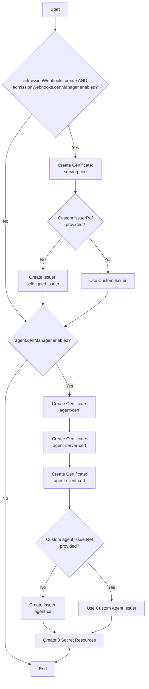
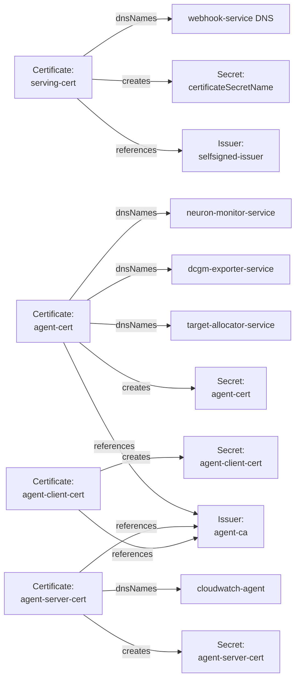
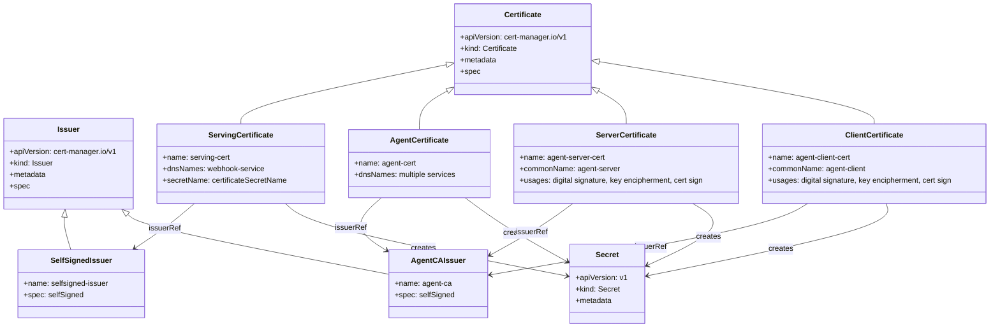

# Diagram: devops/k8s/amazon-cloudwatch-observability/helm/templates/certmanager.yaml

> Auto-generated by Obscura crawlers

## Diagram 1

### SVG

<svg id="container" width="533.27734375" xmlns="http://www.w3.org/2000/svg" class="flowchart" height="2464.71875" viewBox="0.5 0 533.27734375 2464.71875" role="graphics-document document" aria-roledescription="flowchart-v2"><g><marker id="container_flowchart-v2-pointEnd" class="marker flowchart-v2" viewBox="0 0 10 10" refX="5" refY="5" markerUnits="userSpaceOnUse" markerWidth="8" markerHeight="8" orient="auto"><path d="M 0 0 L 10 5 L 0 10 z" class="arrowMarkerPath" style="stroke-width: 1; stroke-dasharray: 1, 0;"></path></marker><marker id="container_flowchart-v2-pointStart" class="marker flowchart-v2" viewBox="0 0 10 10" refX="4.5" refY="5" markerUnits="userSpaceOnUse" markerWidth="8" markerHeight="8" orient="auto"><path d="M 0 5 L 10 10 L 10 0 z" class="arrowMarkerPath" style="stroke-width: 1; stroke-dasharray: 1, 0;"></path></marker><marker id="container_flowchart-v2-circleEnd" class="marker flowchart-v2" viewBox="0 0 10 10" refX="11" refY="5" markerUnits="userSpaceOnUse" markerWidth="11" markerHeight="11" orient="auto"><circle cx="5" cy="5" r="5" class="arrowMarkerPath" style="stroke-width: 1; stroke-dasharray: 1, 0;"></circle></marker><marker id="container_flowchart-v2-circleStart" class="marker flowchart-v2" viewBox="0 0 10 10" refX="-1" refY="5" markerUnits="userSpaceOnUse" markerWidth="11" markerHeight="11" orient="auto"><circle cx="5" cy="5" r="5" class="arrowMarkerPath" style="stroke-width: 1; stroke-dasharray: 1, 0;"></circle></marker><marker id="container_flowchart-v2-crossEnd" class="marker cross flowchart-v2" viewBox="0 0 11 11" refX="12" refY="5.2" markerUnits="userSpaceOnUse" markerWidth="11" markerHeight="11" orient="auto"><path d="M 1,1 l 9,9 M 10,1 l -9,9" class="arrowMarkerPath" style="stroke-width: 2; stroke-dasharray: 1, 0;"></path></marker><marker id="container_flowchart-v2-crossStart" class="marker cross flowchart-v2" viewBox="0 0 11 11" refX="-1" refY="5.2" markerUnits="userSpaceOnUse" markerWidth="11" markerHeight="11" orient="auto"><path d="M 1,1 l 9,9 M 10,1 l -9,9" class="arrowMarkerPath" style="stroke-width: 2; stroke-dasharray: 1, 0;"></path></marker><g class="root"><g class="clusters"></g><g class="edgePaths"><path d="M203.055,62L203.055,66.167C203.055,70.333,203.055,78.667,203.055,86.333C203.055,94,203.055,101,203.055,104.5L203.055,108" id="L_Start_CheckAdmissionWebhooks_0" class="edge-thickness-normal edge-pattern-solid edge-thickness-normal edge-pattern-solid flowchart-link" style=";" data-edge="true" data-et="edge" data-id="L_Start_CheckAdmissionWebhooks_0" data-points="W3sieCI6MjAzLjA1NDY4NzUsInkiOjYyfSx7IngiOjIwMy4wNTQ2ODc1LCJ5Ijo4N30seyJ4IjoyMDMuMDU0Njg3NSwieSI6MTEyfV0=" marker-end="url(#container_flowchart-v2-pointEnd)"></path><path d="M249.929,455.235L254.351,469.214C258.773,483.193,267.617,511.151,272.039,530.63C276.461,550.109,276.461,561.109,276.461,566.609L276.461,572.109" id="L_CheckAdmissionWebhooks_CreateServingCert_0" class="edge-thickness-normal edge-pattern-solid edge-thickness-normal edge-pattern-solid flowchart-link" style=";" data-edge="true" data-et="edge" data-id="L_CheckAdmissionWebhooks_CreateServingCert_0" data-points="W3sieCI6MjQ5LjkyODg3NDY1OTUxODE2LCJ5Ijo0NTUuMjM1MTg3ODQwNDgxODR9LHsieCI6Mjc2LjQ2MDkzNzUsInkiOjUzOS4xMDkzNzV9LHsieCI6Mjc2LjQ2MDkzNzUsInkiOjU3Ni4xMDkzNzV9XQ==" marker-end="url(#container_flowchart-v2-pointEnd)"></path><path d="M276.461,654.109L276.461,658.276C276.461,662.443,276.461,670.776,276.461,678.443C276.461,686.109,276.461,693.109,276.461,696.609L276.461,700.109" id="L_CreateServingCert_CheckCustomIssuer_0" class="edge-thickness-normal edge-pattern-solid edge-thickness-normal edge-pattern-solid flowchart-link" style=";" data-edge="true" data-et="edge" data-id="L_CreateServingCert_CheckCustomIssuer_0" data-points="W3sieCI6Mjc2LjQ2MDkzNzUsInkiOjY1NC4xMDkzNzV9LHsieCI6Mjc2LjQ2MDkzNzUsInkiOjY3OS4xMDkzNzV9LHsieCI6Mjc2LjQ2MDkzNzUsInkiOjcwNC4xMDkzNzV9XQ==" marker-end="url(#container_flowchart-v2-pointEnd)"></path><path d="M229.45,860.442L217.407,874.444C205.365,888.446,181.28,916.449,169.238,935.951C157.195,955.453,157.195,966.453,157.195,971.953L157.195,977.453" id="L_CheckCustomIssuer_CreateSelfSignedIssuer_0" class="edge-thickness-normal edge-pattern-solid edge-thickness-normal edge-pattern-solid flowchart-link" style=";" data-edge="true" data-et="edge" data-id="L_CheckCustomIssuer_CreateSelfSignedIssuer_0" data-points="W3sieCI6MjI5LjQ0OTcwNTI1NjU0MjI3LCJ5Ijo4NjAuNDQxODkyNzU2NTQyM30seyJ4IjoxNTcuMTk1MzEyNSwieSI6OTQ0LjQ1MzEyNX0seyJ4IjoxNTcuMTk1MzEyNSwieSI6OTgxLjQ1MzEyNX1d" marker-end="url(#container_flowchart-v2-pointEnd)"></path><path d="M323.472,860.442L335.515,874.444C347.557,888.446,371.642,916.449,383.684,937.951C395.727,959.453,395.727,974.453,395.727,981.953L395.727,989.453" id="L_CheckCustomIssuer_UseCustomIssuer_0" class="edge-thickness-normal edge-pattern-solid edge-thickness-normal edge-pattern-solid flowchart-link" style=";" data-edge="true" data-et="edge" data-id="L_CheckCustomIssuer_UseCustomIssuer_0" data-points="W3sieCI6MzIzLjQ3MjE2OTc0MzQ1NzcsInkiOjg2MC40NDE4OTI3NTY1NDIzfSx7IngiOjM5NS43MjY1NjI1LCJ5Ijo5NDQuNDUzMTI1fSx7IngiOjM5NS43MjY1NjI1LCJ5Ijo5OTMuNDUzMTI1fV0=" marker-end="url(#container_flowchart-v2-pointEnd)"></path><path d="M117.109,416.164L100.969,436.655C84.828,457.146,52.547,498.128,36.406,531.285C20.266,564.443,20.266,589.776,20.266,613.109C20.266,636.443,20.266,657.776,20.266,689.555C20.266,721.333,20.266,763.557,20.266,807.781C20.266,852.005,20.266,898.229,20.266,934.008C20.266,969.786,20.266,995.12,20.266,1018.453C20.266,1041.786,20.266,1063.12,32.542,1087.557C44.818,1111.995,69.37,1139.537,81.646,1153.307L93.923,1167.078" id="L_CheckAdmissionWebhooks_CheckAgentCert_0" class="edge-thickness-normal edge-pattern-solid edge-thickness-normal edge-pattern-solid flowchart-link" style=";" data-edge="true" data-et="edge" data-id="L_CheckAdmissionWebhooks_CheckAgentCert_0" data-points="W3sieCI6MTE3LjEwOTQwNDU3Mjc0MDEyLCJ5Ijo0MTYuMTY0MDkyMDcyNzQwMX0seyJ4IjoyMC4yNjU2MjUsInkiOjUzOS4xMDkzNzV9LHsieCI6MjAuMjY1NjI1LCJ5Ijo2MTUuMTA5Mzc1fSx7IngiOjIwLjI2NTYyNSwieSI6Njc5LjEwOTM3NX0seyJ4IjoyMC4yNjU2MjUsInkiOjgwNS43ODEyNX0seyJ4IjoyMC4yNjU2MjUsInkiOjk0NC40NTMxMjV9LHsieCI6MjAuMjY1NjI1LCJ5IjoxMDIwLjQ1MzEyNX0seyJ4IjoyMC4yNjU2MjUsInkiOjEwODQuNDUzMTI1fSx7IngiOjk2LjU4NDM3Mzg2NTU2MTQ3LCJ5IjoxMTcwLjA2NDA2MzYzNDQzODV9XQ==" marker-end="url(#container_flowchart-v2-pointEnd)"></path><path d="M157.195,1059.453L157.195,1063.62C157.195,1067.786,157.195,1076.12,157.195,1083.786C157.195,1091.453,157.195,1098.453,157.195,1101.953L157.195,1105.453" id="L_CreateSelfSignedIssuer_CheckAgentCert_0" class="edge-thickness-normal edge-pattern-solid edge-thickness-normal edge-pattern-solid flowchart-link" style=";" data-edge="true" data-et="edge" data-id="L_CreateSelfSignedIssuer_CheckAgentCert_0" data-points="W3sieCI6MTU3LjE5NTMxMjUsInkiOjEwNTkuNDUzMTI1fSx7IngiOjE1Ny4xOTUzMTI1LCJ5IjoxMDg0LjQ1MzEyNX0seyJ4IjoxNTcuMTk1MzEyNSwieSI6MTEwOS40NTMxMjV9XQ==" marker-end="url(#container_flowchart-v2-pointEnd)"></path><path d="M395.727,1047.453L395.727,1053.62C395.727,1059.786,395.727,1072.12,369.57,1095.13C343.413,1118.14,291.099,1151.828,264.942,1168.671L238.786,1185.515" id="L_UseCustomIssuer_CheckAgentCert_0" class="edge-thickness-normal edge-pattern-solid edge-thickness-normal edge-pattern-solid flowchart-link" style=";" data-edge="true" data-et="edge" data-id="L_UseCustomIssuer_CheckAgentCert_0" data-points="W3sieCI6Mzk1LjcyNjU2MjUsInkiOjEwNDcuNDUzMTI1fSx7IngiOjM5NS43MjY1NjI1LCJ5IjoxMDg0LjQ1MzEyNX0seyJ4IjoyMzUuNDIyNjEzMjQ0MTI3NjYsInkiOjExODcuNjgwNDI1NzQ0MTI3N31d" marker-end="url(#container_flowchart-v2-pointEnd)"></path><path d="M204.235,1319.617L212.313,1333.623C220.391,1347.63,236.547,1375.643,244.625,1395.15C252.703,1414.656,252.703,1425.656,252.703,1431.156L252.703,1436.656" id="L_CheckAgentCert_CreateAgentCert_0" class="edge-thickness-normal edge-pattern-solid edge-thickness-normal edge-pattern-solid flowchart-link" style=";" data-edge="true" data-et="edge" data-id="L_CheckAgentCert_CreateAgentCert_0" data-points="W3sieCI6MjA0LjIzNDgxMDQ4MjI0MjI0LCJ5IjoxMzE5LjYxNjc1MjAxNzc1Nzh9LHsieCI6MjUyLjcwMzEyNSwieSI6MTQwMy42NTYyNX0seyJ4IjoyNTIuNzAzMTI1LCJ5IjoxNDQwLjY1NjI1fV0=" marker-end="url(#container_flowchart-v2-pointEnd)"></path><path d="M252.703,1518.656L252.703,1522.823C252.703,1526.99,252.703,1535.323,252.703,1542.99C252.703,1550.656,252.703,1557.656,252.703,1561.156L252.703,1564.656" id="L_CreateAgentCert_CreateServerCert_0" class="edge-thickness-normal edge-pattern-solid edge-thickness-normal edge-pattern-solid flowchart-link" style=";" data-edge="true" data-et="edge" data-id="L_CreateAgentCert_CreateServerCert_0" data-points="W3sieCI6MjUyLjcwMzEyNSwieSI6MTUxOC42NTYyNX0seyJ4IjoyNTIuNzAzMTI1LCJ5IjoxNTQzLjY1NjI1fSx7IngiOjI1Mi43MDMxMjUsInkiOjE1NjguNjU2MjV9XQ==" marker-end="url(#container_flowchart-v2-pointEnd)"></path><path d="M252.703,1646.656L252.703,1650.823C252.703,1654.99,252.703,1663.323,252.703,1670.99C252.703,1678.656,252.703,1685.656,252.703,1689.156L252.703,1692.656" id="L_CreateServerCert_CreateClientCert_0" class="edge-thickness-normal edge-pattern-solid edge-thickness-normal edge-pattern-solid flowchart-link" style=";" data-edge="true" data-et="edge" data-id="L_CreateServerCert_CreateClientCert_0" data-points="W3sieCI6MjUyLjcwMzEyNSwieSI6MTY0Ni42NTYyNX0seyJ4IjoyNTIuNzAzMTI1LCJ5IjoxNjcxLjY1NjI1fSx7IngiOjI1Mi43MDMxMjUsInkiOjE2OTYuNjU2MjV9XQ==" marker-end="url(#container_flowchart-v2-pointEnd)"></path><path d="M252.703,1774.656L252.703,1780.823C252.703,1786.99,252.703,1799.323,252.703,1810.99C252.703,1822.656,252.703,1833.656,252.703,1839.156L252.703,1844.656" id="L_CreateClientCert_CheckAgentIssuer_0" class="edge-thickness-normal edge-pattern-solid edge-thickness-normal edge-pattern-solid flowchart-link" style=";" data-edge="true" data-et="edge" data-id="L_CreateClientCert_CheckAgentIssuer_0" data-points="W3sieCI6MjUyLjcwMzEyNSwieSI6MTc3NC42NTYyNX0seyJ4IjoyNTIuNzAzMTI1LCJ5IjoxODExLjY1NjI1fSx7IngiOjI1Mi43MDMxMjUsInkiOjE4NDguNjU2MjV9XQ==" marker-end="url(#container_flowchart-v2-pointEnd)"></path><path d="M206.931,2050.947L198.862,2064.742C190.794,2078.537,174.657,2106.128,166.588,2125.423C158.52,2144.719,158.52,2155.719,158.52,2161.219L158.52,2166.719" id="L_CheckAgentIssuer_CreateAgentCA_0" class="edge-thickness-normal edge-pattern-solid edge-thickness-normal edge-pattern-solid flowchart-link" style=";" data-edge="true" data-et="edge" data-id="L_CheckAgentIssuer_CreateAgentCA_0" data-points="W3sieCI6MjA2LjkzMTA2NjA5MjA2NCwieSI6MjA1MC45NDY2OTEwOTIwNjR9LHsieCI6MTU4LjUxOTUzMTI1LCJ5IjoyMTMzLjcxODc1fSx7IngiOjE1OC41MTk1MzEyNSwieSI6MjE3MC43MTg3NX1d" marker-end="url(#container_flowchart-v2-pointEnd)"></path><path d="M313.318,2036.104L328.869,2052.373C344.419,2068.642,375.52,2101.18,391.071,2124.95C406.621,2148.719,406.621,2163.719,406.621,2171.219L406.621,2178.719" id="L_CheckAgentIssuer_UseAgentIssuer_0" class="edge-thickness-normal edge-pattern-solid edge-thickness-normal edge-pattern-solid flowchart-link" style=";" data-edge="true" data-et="edge" data-id="L_CheckAgentIssuer_UseAgentIssuer_0" data-points="W3sieCI6MzEzLjMxODA5Njk1NDE4NDA2LCJ5IjoyMDM2LjEwMzc3ODA0NTgxNn0seyJ4Ijo0MDYuNjIxMDkzNzUsInkiOjIxMzMuNzE4NzV9LHsieCI6NDA2LjYyMTA5Mzc1LCJ5IjoyMTgyLjcxODc1fV0=" marker-end="url(#container_flowchart-v2-pointEnd)"></path><path d="M158.52,2248.719L158.52,2252.885C158.52,2257.052,158.52,2265.385,165.483,2273.397C172.446,2281.408,186.372,2289.097,193.335,2292.941L200.298,2296.785" id="L_CreateAgentCA_CreateSecrets_0" class="edge-thickness-normal edge-pattern-solid edge-thickness-normal edge-pattern-solid flowchart-link" style=";" data-edge="true" data-et="edge" data-id="L_CreateAgentCA_CreateSecrets_0" data-points="W3sieCI6MTU4LjUxOTUzMTI1LCJ5IjoyMjQ4LjcxODc1fSx7IngiOjE1OC41MTk1MzEyNSwieSI6MjI3My43MTg3NX0seyJ4IjoyMDMuODAwMTA1MTY4MjY5MjMsInkiOjIyOTguNzE4NzV9XQ==" marker-end="url(#container_flowchart-v2-pointEnd)"></path><path d="M406.621,2236.719L406.621,2242.885C406.621,2249.052,406.621,2261.385,394.92,2271.505C383.218,2281.625,359.815,2289.532,348.113,2293.485L336.412,2297.438" id="L_UseAgentIssuer_CreateSecrets_0" class="edge-thickness-normal edge-pattern-solid edge-thickness-normal edge-pattern-solid flowchart-link" style=";" data-edge="true" data-et="edge" data-id="L_UseAgentIssuer_CreateSecrets_0" data-points="W3sieCI6NDA2LjYyMTA5Mzc1LCJ5IjoyMjM2LjcxODc1fSx7IngiOjQwNi42MjEwOTM3NSwieSI6MjI3My43MTg3NX0seyJ4IjozMzIuNjIyMDcwMzEyNSwieSI6MjI5OC43MTg3NX1d" marker-end="url(#container_flowchart-v2-pointEnd)"></path><path d="M99.402,1308.863L86.507,1324.662C73.612,1340.461,47.821,1372.058,34.926,1400.524C22.031,1428.99,22.031,1454.323,22.031,1477.656C22.031,1500.99,22.031,1522.323,22.031,1543.656C22.031,1564.99,22.031,1586.323,22.031,1607.656C22.031,1628.99,22.031,1650.323,22.031,1671.656C22.031,1692.99,22.031,1714.323,22.031,1737.656C22.031,1760.99,22.031,1786.323,22.031,1825.828C22.031,1865.333,22.031,1919.01,22.031,1972.688C22.031,2026.365,22.031,2080.042,22.031,2119.547C22.031,2159.052,22.031,2184.385,22.031,2207.719C22.031,2231.052,22.031,2252.385,22.031,2271.719C22.031,2291.052,22.031,2308.385,22.031,2325.719C22.031,2343.052,22.031,2360.385,36.656,2374.679C51.282,2388.972,80.532,2400.225,95.157,2405.852L109.782,2411.478" id="L_CheckAgentCert_End_0" class="edge-thickness-normal edge-pattern-solid edge-thickness-normal edge-pattern-solid flowchart-link" style=";" data-edge="true" data-et="edge" data-id="L_CheckAgentCert_End_0" data-points="W3sieCI6OTkuNDAxNzc0MzIxMDY4NjMsInkiOjEzMDguODYyNzExODIxMDY4Nn0seyJ4IjoyMi4wMzEyNSwieSI6MTQwMy42NTYyNX0seyJ4IjoyMi4wMzEyNSwieSI6MTQ3OS42NTYyNX0seyJ4IjoyMi4wMzEyNSwieSI6MTU0My42NTYyNX0seyJ4IjoyMi4wMzEyNSwieSI6MTYwNy42NTYyNX0seyJ4IjoyMi4wMzEyNSwieSI6MTY3MS42NTYyNX0seyJ4IjoyMi4wMzEyNSwieSI6MTczNS42NTYyNX0seyJ4IjoyMi4wMzEyNSwieSI6MTgxMS42NTYyNX0seyJ4IjoyMi4wMzEyNSwieSI6MTk3Mi42ODc1fSx7IngiOjIyLjAzMTI1LCJ5IjoyMTMzLjcxODc1fSx7IngiOjIyLjAzMTI1LCJ5IjoyMjA5LjcxODc1fSx7IngiOjIyLjAzMTI1LCJ5IjoyMjczLjcxODc1fSx7IngiOjIyLjAzMTI1LCJ5IjoyMzI1LjcxODc1fSx7IngiOjIyLjAzMTI1LCJ5IjoyMzc3LjcxODc1fSx7IngiOjExMy41MTU2MjUsInkiOjI0MTIuOTE0NDAzNDMwNDM3N31d" marker-end="url(#container_flowchart-v2-pointEnd)"></path><path d="M252.703,2352.719L252.703,2356.885C252.703,2361.052,252.703,2369.385,244.651,2377.936C236.598,2386.487,220.493,2395.256,212.441,2399.64L204.388,2404.024" id="L_CreateSecrets_End_0" class="edge-thickness-normal edge-pattern-solid edge-thickness-normal edge-pattern-solid flowchart-link" style=";" data-edge="true" data-et="edge" data-id="L_CreateSecrets_End_0" data-points="W3sieCI6MjUyLjcwMzEyNSwieSI6MjM1Mi43MTg3NX0seyJ4IjoyNTIuNzAzMTI1LCJ5IjoyMzc3LjcxODc1fSx7IngiOjIwMC44NzUsInkiOjI0MDUuOTM2OTkxMzA4NzkzNX1d" marker-end="url(#container_flowchart-v2-pointEnd)"></path></g><g class="edgeLabels"><g class="edgeLabel"><g class="label" data-id="L_Start_CheckAdmissionWebhooks_0" transform="translate(0, 0)"><foreignObject width="0" height="0">

</foreignObject></g></g><g class="edgeLabel" transform="translate(276.4609375, 539.109375)"><g class="label" data-id="L_CheckAdmissionWebhooks_CreateServingCert_0" transform="translate(-12.03125, -12)"><foreignObject width="24.0625" height="24">

Yes

</foreignObject></g></g><g class="edgeLabel"><g class="label" data-id="L_CreateServingCert_CheckCustomIssuer_0" transform="translate(0, 0)"><foreignObject width="0" height="0">

</foreignObject></g></g><g class="edgeLabel" transform="translate(157.1953125, 944.453125)"><g class="label" data-id="L_CheckCustomIssuer_CreateSelfSignedIssuer_0" transform="translate(-10.140625, -12)"><foreignObject width="20.28125" height="24">

No

</foreignObject></g></g><g class="edgeLabel" transform="translate(395.7265625, 944.453125)"><g class="label" data-id="L_CheckCustomIssuer_UseCustomIssuer_0" transform="translate(-12.03125, -12)"><foreignObject width="24.0625" height="24">

Yes

</foreignObject></g></g><g class="edgeLabel" transform="translate(20.265625, 805.78125)"><g class="label" data-id="L_CheckAdmissionWebhooks_CheckAgentCert_0" transform="translate(-10.140625, -12)"><foreignObject width="20.28125" height="24">

No

</foreignObject></g></g><g class="edgeLabel"><g class="label" data-id="L_CreateSelfSignedIssuer_CheckAgentCert_0" transform="translate(0, 0)"><foreignObject width="0" height="0">

</foreignObject></g></g><g class="edgeLabel"><g class="label" data-id="L_UseCustomIssuer_CheckAgentCert_0" transform="translate(0, 0)"><foreignObject width="0" height="0">

</foreignObject></g></g><g class="edgeLabel" transform="translate(252.703125, 1403.65625)"><g class="label" data-id="L_CheckAgentCert_CreateAgentCert_0" transform="translate(-12.03125, -12)"><foreignObject width="24.0625" height="24">

Yes

</foreignObject></g></g><g class="edgeLabel"><g class="label" data-id="L_CreateAgentCert_CreateServerCert_0" transform="translate(0, 0)"><foreignObject width="0" height="0">

</foreignObject></g></g><g class="edgeLabel"><g class="label" data-id="L_CreateServerCert_CreateClientCert_0" transform="translate(0, 0)"><foreignObject width="0" height="0">

</foreignObject></g></g><g class="edgeLabel"><g class="label" data-id="L_CreateClientCert_CheckAgentIssuer_0" transform="translate(0, 0)"><foreignObject width="0" height="0">

</foreignObject></g></g><g class="edgeLabel" transform="translate(158.51953125, 2133.71875)"><g class="label" data-id="L_CheckAgentIssuer_CreateAgentCA_0" transform="translate(-10.140625, -12)"><foreignObject width="20.28125" height="24">

No

</foreignObject></g></g><g class="edgeLabel" transform="translate(406.62109375, 2133.71875)"><g class="label" data-id="L_CheckAgentIssuer_UseAgentIssuer_0" transform="translate(-12.03125, -12)"><foreignObject width="24.0625" height="24">

Yes

</foreignObject></g></g><g class="edgeLabel"><g class="label" data-id="L_CreateAgentCA_CreateSecrets_0" transform="translate(0, 0)"><foreignObject width="0" height="0">

</foreignObject></g></g><g class="edgeLabel"><g class="label" data-id="L_UseAgentIssuer_CreateSecrets_0" transform="translate(0, 0)"><foreignObject width="0" height="0">

</foreignObject></g></g><g class="edgeLabel" transform="translate(22.03125, 1811.65625)"><g class="label" data-id="L_CheckAgentCert_End_0" transform="translate(-10.140625, -12)"><foreignObject width="20.28125" height="24">

No

</foreignObject></g></g><g class="edgeLabel"><g class="label" data-id="L_CreateSecrets_End_0" transform="translate(0, 0)"><foreignObject width="0" height="0">

</foreignObject></g></g></g><g class="nodes"><g class="node default" id="flowchart-Start-0" transform="translate(203.0546875, 35)"><rect class="basic label-container" style="" x="-47.5234375" y="-27" width="95.046875" height="54"></rect><g class="label" style="" transform="translate(-17.5234375, -12)"><rect></rect><foreignObject width="35.046875" height="24">

Start

</foreignObject></g></g><g class="node default" id="flowchart-CheckAdmissionWebhooks-1" transform="translate(203.0546875, 307.0546875)"><polygon points="195.0546875,0 390.109375,-195.0546875 195.0546875,-390.109375 0,-195.0546875" class="label-container" transform="translate(-194.5546875, 195.0546875)"></polygon><g class="label" style="" transform="translate(-156.0546875, -24)"><rect></rect><foreignObject width="312.109375" height="48">

admissionWebhooks.create AND admissionWebhooks.certManager.enabled?

</foreignObject></g></g><g class="node default" id="flowchart-CreateServingCert-3" transform="translate(276.4609375, 615.109375)"><rect class="basic label-container" style="" x="-93.75" y="-39" width="187.5" height="78"></rect><g class="label" style="" transform="translate(-63.75, -24)"><rect></rect><foreignObject width="127.5" height="48">

Create Certificate: serving-cert

</foreignObject></g></g><g class="node default" id="flowchart-CheckCustomIssuer-5" transform="translate(276.4609375, 805.78125)"><polygon points="101.671875,0 203.34375,-101.671875 101.671875,-203.34375 0,-101.671875" class="label-container" transform="translate(-101.171875, 101.671875)"></polygon><g class="label" style="" transform="translate(-62.671875, -24)"><rect></rect><foreignObject width="125.34375" height="48">

Custom issuerRef provided?

</foreignObject></g></g><g class="node default" id="flowchart-CreateSelfSignedIssuer-7" transform="translate(157.1953125, 1020.453125)"><rect class="basic label-container" style="" x="-92.046875" y="-39" width="184.09375" height="78"></rect><g class="label" style="" transform="translate(-62.046875, -24)"><rect></rect><foreignObject width="124.09375" height="48">

Create Issuer: selfsigned-issuer

</foreignObject></g></g><g class="node default" id="flowchart-UseCustomIssuer-9" transform="translate(395.7265625, 1020.453125)"><rect class="basic label-container" style="" x="-96.484375" y="-27" width="192.96875" height="54"></rect><g class="label" style="" transform="translate(-66.484375, -12)"><rect></rect><foreignObject width="132.96875" height="24">

Use Custom Issuer

</foreignObject></g></g><g class="node default" id="flowchart-CheckAgentCert-11" transform="translate(157.1953125, 1238.0546875)"><polygon points="128.6015625,0 257.203125,-128.6015625 128.6015625,-257.203125 0,-128.6015625" class="label-container" transform="translate(-128.1015625, 128.6015625)"></polygon><g class="label" style="" transform="translate(-101.6015625, -12)"><rect></rect><foreignObject width="203.203125" height="24">

agent.certManager.enabled?

</foreignObject></g></g><g class="node default" id="flowchart-CreateAgentCert-17" transform="translate(252.703125, 1479.65625)"><rect class="basic label-container" style="" x="-93.75" y="-39" width="187.5" height="78"></rect><g class="label" style="" transform="translate(-63.75, -24)"><rect></rect><foreignObject width="127.5" height="48">

Create Certificate: agent-cert

</foreignObject></g></g><g class="node default" id="flowchart-CreateServerCert-19" transform="translate(252.703125, 1607.65625)"><rect class="basic label-container" style="" x="-93.75" y="-39" width="187.5" height="78"></rect><g class="label" style="" transform="translate(-63.75, -24)"><rect></rect><foreignObject width="127.5" height="48">

Create Certificate: agent-server-cert

</foreignObject></g></g><g class="node default" id="flowchart-CreateClientCert-21" transform="translate(252.703125, 1735.65625)"><rect class="basic label-container" style="" x="-93.75" y="-39" width="187.5" height="78"></rect><g class="label" style="" transform="translate(-63.75, -24)"><rect></rect><foreignObject width="127.5" height="48">

Create Certificate: agent-client-cert

</foreignObject></g></g><g class="node default" id="flowchart-CheckAgentIssuer-23" transform="translate(252.703125, 1972.6875)"><polygon points="124.03125,0 248.0625,-124.03125 124.03125,-248.0625 0,-124.03125" class="label-container" transform="translate(-123.53125, 124.03125)"></polygon><g class="label" style="" transform="translate(-85.03125, -24)"><rect></rect><foreignObject width="170.0625" height="48">

Custom agent issuerRef provided?

</foreignObject></g></g><g class="node default" id="flowchart-CreateAgentCA-25" transform="translate(158.51953125, 2209.71875)"><rect class="basic label-container" style="" x="-78.9453125" y="-39" width="157.890625" height="78"></rect><g class="label" style="" transform="translate(-48.9453125, -24)"><rect></rect><foreignObject width="97.890625" height="48">

Create Issuer: agent-ca

</foreignObject></g></g><g class="node default" id="flowchart-UseAgentIssuer-27" transform="translate(406.62109375, 2209.71875)"><rect class="basic label-container" style="" x="-119.15625" y="-27" width="238.3125" height="54"></rect><g class="label" style="" transform="translate(-89.15625, -12)"><rect></rect><foreignObject width="178.3125" height="24">

Use Custom Agent Issuer

</foreignObject></g></g><g class="node default" id="flowchart-CreateSecrets-29" transform="translate(252.703125, 2325.71875)"><rect class="basic label-container" style="" x="-122.71875" y="-27" width="245.4375" height="54"></rect><g class="label" style="" transform="translate(-92.71875, -12)"><rect></rect><foreignObject width="185.4375" height="24">

Create 3 Secret Resources

</foreignObject></g></g><g class="node default" id="flowchart-End-33" transform="translate(157.1953125, 2429.71875)"><rect class="basic label-container" style="" x="-43.6796875" y="-27" width="87.359375" height="54"></rect><g class="label" style="" transform="translate(-13.6796875, -12)"><rect></rect><foreignObject width="27.359375" height="24">

End

</foreignObject></g></g></g></g></g></svg>

## Diagram 2

### SVG

<svg id="container" width="560.234375" xmlns="http://www.w3.org/2000/svg" class="flowchart" height="1254" viewBox="0 0 560.234375 1254" role="graphics-document document" aria-roledescription="flowchart-v2"><g><marker id="container_flowchart-v2-pointEnd" class="marker flowchart-v2" viewBox="0 0 10 10" refX="5" refY="5" markerUnits="userSpaceOnUse" markerWidth="8" markerHeight="8" orient="auto"><path d="M 0 0 L 10 5 L 0 10 z" class="arrowMarkerPath" style="stroke-width: 1; stroke-dasharray: 1, 0;"></path></marker><marker id="container_flowchart-v2-pointStart" class="marker flowchart-v2" viewBox="0 0 10 10" refX="4.5" refY="5" markerUnits="userSpaceOnUse" markerWidth="8" markerHeight="8" orient="auto"><path d="M 0 5 L 10 10 L 10 0 z" class="arrowMarkerPath" style="stroke-width: 1; stroke-dasharray: 1, 0;"></path></marker><marker id="container_flowchart-v2-circleEnd" class="marker flowchart-v2" viewBox="0 0 10 10" refX="11" refY="5" markerUnits="userSpaceOnUse" markerWidth="11" markerHeight="11" orient="auto"><circle cx="5" cy="5" r="5" class="arrowMarkerPath" style="stroke-width: 1; stroke-dasharray: 1, 0;"></circle></marker><marker id="container_flowchart-v2-circleStart" class="marker flowchart-v2" viewBox="0 0 10 10" refX="-1" refY="5" markerUnits="userSpaceOnUse" markerWidth="11" markerHeight="11" orient="auto"><circle cx="5" cy="5" r="5" class="arrowMarkerPath" style="stroke-width: 1; stroke-dasharray: 1, 0;"></circle></marker><marker id="container_flowchart-v2-crossEnd" class="marker cross flowchart-v2" viewBox="0 0 11 11" refX="12" refY="5.2" markerUnits="userSpaceOnUse" markerWidth="11" markerHeight="11" orient="auto"><path d="M 1,1 l 9,9 M 10,1 l -9,9" class="arrowMarkerPath" style="stroke-width: 2; stroke-dasharray: 1, 0;"></path></marker><marker id="container_flowchart-v2-crossStart" class="marker cross flowchart-v2" viewBox="0 0 11 11" refX="-1" refY="5.2" markerUnits="userSpaceOnUse" markerWidth="11" markerHeight="11" orient="auto"><path d="M 1,1 l 9,9 M 10,1 l -9,9" class="arrowMarkerPath" style="stroke-width: 2; stroke-dasharray: 1, 0;"></path></marker><g class="root"><g class="clusters"></g><g class="edgePaths"><path d="M145.266,182L163.765,198.167C182.263,214.333,219.261,246.667,251.664,262.833C284.068,279,311.878,279,325.783,279L339.688,279" id="L_ServingCert_SelfSignedIssuer_0" class="edge-thickness-normal edge-pattern-solid edge-thickness-normal edge-pattern-solid flowchart-link" style=";" data-edge="true" data-et="edge" data-id="L_ServingCert_SelfSignedIssuer_0" data-points="W3sieCI6MTQ1LjI2NjE0MjAwMzY3NjQ2LCJ5IjoxODJ9LHsieCI6MjU2LjI1NzgxMjUsInkiOjI3OX0seyJ4IjozNDMuNjg3NSwieSI6Mjc5fV0=" marker-end="url(#container_flowchart-v2-pointEnd)"></path><path d="M174.016,146.772L187.723,147.477C201.43,148.181,228.844,149.591,253.504,150.295C278.164,151,300.07,151,311.023,151L321.977,151" id="L_ServingCert_ServingSecret_0" class="edge-thickness-normal edge-pattern-solid edge-thickness-normal edge-pattern-solid flowchart-link" style=";" data-edge="true" data-et="edge" data-id="L_ServingCert_ServingSecret_0" data-points="W3sieCI6MTc0LjAxNTYyNSwieSI6MTQ2Ljc3MjA3NjkxMTQ5MTU1fSx7IngiOjI1Ni4yNTc4MTI1LCJ5IjoxNTF9LHsieCI6MzI1Ljk3NjU2MjUsInkiOjE1MX1d" marker-end="url(#container_flowchart-v2-pointEnd)"></path><path d="M156.836,104L173.406,92.5C189.976,81,223.117,58,250.863,46.5C278.609,35,300.961,35,312.137,35L323.313,35" id="L_ServingCert_WebhookService_0" class="edge-thickness-normal edge-pattern-solid edge-thickness-normal edge-pattern-solid flowchart-link" style=";" data-edge="true" data-et="edge" data-id="L_ServingCert_WebhookService_0" data-points="W3sieCI6MTU2LjgzNTcyMDQ4NjExMTExLCJ5IjoxMDR9LHsieCI6MjU2LjI1NzgxMjUsInkiOjM1fSx7IngiOjMyNy4zMTI1LCJ5IjozNX1d" marker-end="url(#container_flowchart-v2-pointEnd)"></path><path d="M119.847,634L142.582,680.167C165.317,726.333,210.787,818.667,252.6,871.636C294.413,924.606,332.569,938.212,351.647,945.015L370.725,951.818" id="L_AgentCert_AgentCA_0" class="edge-thickness-normal edge-pattern-solid edge-thickness-normal edge-pattern-solid flowchart-link" style=";" data-edge="true" data-et="edge" data-id="L_AgentCert_AgentCA_0" data-points="W3sieCI6MTE5Ljg0NjU0MzcxMDQ0MzAzLCJ5Ijo2MzR9LHsieCI6MjU2LjI1NzgxMjUsInkiOjkxMX0seyJ4IjozNzQuNDkyMTg3NSwieSI6OTUzLjE2MTQ5MzkyNzY1NDJ9XQ==" marker-end="url(#container_flowchart-v2-pointEnd)"></path><path d="M149.585,634L167.364,648.167C185.142,662.333,220.7,690.667,256.534,704.833C292.367,719,328.477,719,346.531,719L364.586,719" id="L_AgentCert_AgentSecret_0" class="edge-thickness-normal edge-pattern-solid edge-thickness-normal edge-pattern-solid flowchart-link" style=";" data-edge="true" data-et="edge" data-id="L_AgentCert_AgentSecret_0" data-points="W3sieCI6MTQ5LjU4NDc0MDQyMzM4NzEsInkiOjYzNH0seyJ4IjoyNTYuMjU3ODEyNSwieSI6NzE5fSx7IngiOjM2OC41ODU5Mzc1LCJ5Ijo3MTl9XQ==" marker-end="url(#container_flowchart-v2-pointEnd)"></path><path d="M169.297,598.529L183.79,599.275C198.284,600.02,227.271,601.51,251.878,602.255C276.484,603,296.711,603,306.824,603L316.938,603" id="L_AgentCert_TargetAllocator_0" class="edge-thickness-normal edge-pattern-solid edge-thickness-normal edge-pattern-solid flowchart-link" style=";" data-edge="true" data-et="edge" data-id="L_AgentCert_TargetAllocator_0" data-points="W3sieCI6MTY5LjI5Njg3NSwieSI6NTk4LjUyOTQ5NDQ1MjUzMjd9LHsieCI6MjU2LjI1NzgxMjUsInkiOjYwM30seyJ4IjozMjAuOTM3NSwieSI6NjAzfV0=" marker-end="url(#container_flowchart-v2-pointEnd)"></path><path d="M163.86,556L179.26,546.5C194.659,537,225.459,518,251.432,508.5C277.406,499,298.555,499,309.129,499L319.703,499" id="L_AgentCert_DCGMExporter_0" class="edge-thickness-normal edge-pattern-solid edge-thickness-normal edge-pattern-solid flowchart-link" style=";" data-edge="true" data-et="edge" data-id="L_AgentCert_DCGMExporter_0" data-points="W3sieCI6MTYzLjg2MDEwNzQyMTg3NSwieSI6NTU2fSx7IngiOjI1Ni4yNTc4MTI1LCJ5Ijo0OTl9LHsieCI6MzIzLjcwMzEyNSwieSI6NDk5fV0=" marker-end="url(#container_flowchart-v2-pointEnd)"></path><path d="M130.986,556L151.865,529.167C172.743,502.333,214.501,448.667,245.209,421.833C275.917,395,295.576,395,305.405,395L315.234,395" id="L_AgentCert_NeuronMonitor_0" class="edge-thickness-normal edge-pattern-solid edge-thickness-normal edge-pattern-solid flowchart-link" style=";" data-edge="true" data-et="edge" data-id="L_AgentCert_NeuronMonitor_0" data-points="W3sieCI6MTMwLjk4NTk3NjU2MjUsInkiOjU1Nn0seyJ4IjoyNTYuMjU3ODEyNSwieSI6Mzk1fSx7IngiOjMxOS4yMzQzNzUsInkiOjM5NX1d" marker-end="url(#container_flowchart-v2-pointEnd)"></path><path d="M149.585,1060L167.364,1045.833C185.142,1031.667,220.7,1003.333,257.518,989.167C294.336,975,332.414,975,351.453,975L370.492,975" id="L_ServerCert_AgentCA_0" class="edge-thickness-normal edge-pattern-solid edge-thickness-normal edge-pattern-solid flowchart-link" style=";" data-edge="true" data-et="edge" data-id="L_ServerCert_AgentCA_0" data-points="W3sieCI6MTQ5LjU4NDc0MDQyMzM4NzEsInkiOjEwNjB9LHsieCI6MjU2LjI1NzgxMjUsInkiOjk3NX0seyJ4IjozNzQuNDkyMTg3NSwieSI6OTc1fV0=" marker-end="url(#container_flowchart-v2-pointEnd)"></path><path d="M156.836,1138L173.406,1149.5C189.976,1161,223.117,1184,253.493,1195.5C283.87,1207,311.482,1207,325.288,1207L339.094,1207" id="L_ServerCert_ServerSecret_0" class="edge-thickness-normal edge-pattern-solid edge-thickness-normal edge-pattern-solid flowchart-link" style=";" data-edge="true" data-et="edge" data-id="L_ServerCert_ServerSecret_0" data-points="W3sieCI6MTU2LjgzNTcyMDQ4NjExMTExLCJ5IjoxMTM4fSx7IngiOjI1Ni4yNTc4MTI1LCJ5IjoxMjA3fSx7IngiOjM0My4wOTM3NSwieSI6MTIwN31d" marker-end="url(#container_flowchart-v2-pointEnd)"></path><path d="M193.281,1094.238L203.777,1093.698C214.273,1093.158,235.266,1092.079,259.198,1091.54C283.13,1091,310.003,1091,323.439,1091L336.875,1091" id="L_ServerCert_CloudwatchAgent_0" class="edge-thickness-normal edge-pattern-solid edge-thickness-normal edge-pattern-solid flowchart-link" style=";" data-edge="true" data-et="edge" data-id="L_ServerCert_CloudwatchAgent_0" data-points="W3sieCI6MTkzLjI4MTI1LCJ5IjoxMDk0LjIzNzUxMTkyMzI4OTN9LHsieCI6MjU2LjI1NzgxMjUsInkiOjEwOTF9LHsieCI6MzQwLjg3NSwieSI6MTA5MX1d" marker-end="url(#container_flowchart-v2-pointEnd)"></path><path d="M148.055,944L166.089,958.833C184.123,973.667,220.19,1003.333,257.295,1012.004C294.401,1020.674,332.543,1008.347,351.615,1002.184L370.686,996.021" id="L_ClientCert_AgentCA_0" class="edge-thickness-normal edge-pattern-solid edge-thickness-normal edge-pattern-solid flowchart-link" style=";" data-edge="true" data-et="edge" data-id="L_ClientCert_AgentCA_0" data-points="W3sieCI6MTQ4LjA1NTIzNjgxNjQwNjI1LCJ5Ijo5NDR9LHsieCI6MjU2LjI1NzgxMjUsInkiOjEwMzN9LHsieCI6Mzc0LjQ5MjE4NzUsInkiOjk5NC43OTExNDYxMjgwNjM0fV0=" marker-end="url(#container_flowchart-v2-pointEnd)"></path><path d="M191.055,871.302L201.922,867.252C212.789,863.201,234.523,855.101,259.568,851.05C284.612,847,312.966,847,327.143,847L341.32,847" id="L_ClientCert_ClientSecret_0" class="edge-thickness-normal edge-pattern-solid edge-thickness-normal edge-pattern-solid flowchart-link" style=";" data-edge="true" data-et="edge" data-id="L_ClientCert_ClientSecret_0" data-points="W3sieCI6MTkxLjA1NDY4NzUsInkiOjg3MS4zMDE4MjIzODA2NDE2fSx7IngiOjI1Ni4yNTc4MTI1LCJ5Ijo4NDd9LHsieCI6MzQ1LjMyMDMxMjUsInkiOjg0N31d" marker-end="url(#container_flowchart-v2-pointEnd)"></path></g><g class="edgeLabels"><g class="edgeLabel" transform="translate(256.2578125, 279)"><g class="label" data-id="L_ServingCert_SelfSignedIssuer_0" transform="translate(-37.828125, -12)"><foreignObject width="75.65625" height="24">

references

</foreignObject></g></g><g class="edgeLabel" transform="translate(256.2578125, 151)"><g class="label" data-id="L_ServingCert_ServingSecret_0" transform="translate(-26.171875, -12)"><foreignObject width="52.34375" height="24">

creates

</foreignObject></g></g><g class="edgeLabel" transform="translate(256.2578125, 35)"><g class="label" data-id="L_ServingCert_WebhookService_0" transform="translate(-37.9765625, -12)"><foreignObject width="75.953125" height="24">

dnsNames

</foreignObject></g></g><g class="edgeLabel" transform="translate(215.78063, 828.80606)"><g class="label" data-id="L_AgentCert_AgentCA_0" transform="translate(-37.828125, -12)"><foreignObject width="75.65625" height="24">

references

</foreignObject></g></g><g class="edgeLabel" transform="translate(256.2578125, 719)"><g class="label" data-id="L_AgentCert_AgentSecret_0" transform="translate(-26.171875, -12)"><foreignObject width="52.34375" height="24">

creates

</foreignObject></g></g><g class="edgeLabel" transform="translate(256.2578125, 603)"><g class="label" data-id="L_AgentCert_TargetAllocator_0" transform="translate(-37.9765625, -12)"><foreignObject width="75.953125" height="24">

dnsNames

</foreignObject></g></g><g class="edgeLabel" transform="translate(256.2578125, 499)"><g class="label" data-id="L_AgentCert_DCGMExporter_0" transform="translate(-37.9765625, -12)"><foreignObject width="75.953125" height="24">

dnsNames

</foreignObject></g></g><g class="edgeLabel" transform="translate(256.2578125, 395)"><g class="label" data-id="L_AgentCert_NeuronMonitor_0" transform="translate(-37.9765625, -12)"><foreignObject width="75.953125" height="24">

dnsNames

</foreignObject></g></g><g class="edgeLabel" transform="translate(256.2578125, 975)"><g class="label" data-id="L_ServerCert_AgentCA_0" transform="translate(-37.828125, -12)"><foreignObject width="75.65625" height="24">

references

</foreignObject></g></g><g class="edgeLabel" transform="translate(256.2578125, 1207)"><g class="label" data-id="L_ServerCert_ServerSecret_0" transform="translate(-26.171875, -12)"><foreignObject width="52.34375" height="24">

creates

</foreignObject></g></g><g class="edgeLabel" transform="translate(256.2578125, 1091)"><g class="label" data-id="L_ServerCert_CloudwatchAgent_0" transform="translate(-37.9765625, -12)"><foreignObject width="75.953125" height="24">

dnsNames

</foreignObject></g></g><g class="edgeLabel" transform="translate(250.13808, 1027.96633)"><g class="label" data-id="L_ClientCert_AgentCA_0" transform="translate(-37.828125, -12)"><foreignObject width="75.65625" height="24">

references

</foreignObject></g></g><g class="edgeLabel" transform="translate(256.2578125, 847)"><g class="label" data-id="L_ClientCert_ClientSecret_0" transform="translate(-26.171875, -12)"><foreignObject width="52.34375" height="24">

creates

</foreignObject></g></g></g><g class="nodes"><g class="node default" id="flowchart-ServingCert-0" transform="translate(100.640625, 143)"><rect class="basic label-container" style="" x="-73.375" y="-39" width="146.75" height="78"></rect><g class="label" style="" transform="translate(-43.375, -24)"><rect></rect><foreignObject width="86.75" height="48">

Certificate: serving-cert

</foreignObject></g></g><g class="node default" id="flowchart-SelfSignedIssuer-1" transform="translate(435.734375, 279)"><rect class="basic label-container" style="" x="-92.046875" y="-39" width="184.09375" height="78"></rect><g class="label" style="" transform="translate(-62.046875, -24)"><rect></rect><foreignObject width="124.09375" height="48">

Issuer: selfsigned-issuer

</foreignObject></g></g><g class="node default" id="flowchart-ServingSecret-3" transform="translate(435.734375, 151)"><rect class="basic label-container" style="" x="-109.7578125" y="-39" width="219.515625" height="78"></rect><g class="label" style="" transform="translate(-79.7578125, -24)"><rect></rect><foreignObject width="159.515625" height="48">

Secret: certificateSecretName

</foreignObject></g></g><g class="node default" id="flowchart-WebhookService-5" transform="translate(435.734375, 35)"><rect class="basic label-container" style="" x="-108.421875" y="-27" width="216.84375" height="54"></rect><g class="label" style="" transform="translate(-78.421875, -12)"><rect></rect><foreignObject width="156.84375" height="24">

webhook-service DNS

</foreignObject></g></g><g class="node default" id="flowchart-AgentCert-6" transform="translate(100.640625, 595)"><rect class="basic label-container" style="" x="-68.65625" y="-39" width="137.3125" height="78"></rect><g class="label" style="" transform="translate(-38.65625, -24)"><rect></rect><foreignObject width="77.3125" height="48">

Certificate: agent-cert

</foreignObject></g></g><g class="node default" id="flowchart-AgentCA-7" transform="translate(435.734375, 975)"><rect class="basic label-container" style="" x="-61.2421875" y="-39" width="122.484375" height="78"></rect><g class="label" style="" transform="translate(-31.2421875, -24)"><rect></rect><foreignObject width="62.484375" height="48">

Issuer: agent-ca

</foreignObject></g></g><g class="node default" id="flowchart-AgentSecret-9" transform="translate(435.734375, 719)"><rect class="basic label-container" style="" x="-67.1484375" y="-39" width="134.296875" height="78"></rect><g class="label" style="" transform="translate(-37.1484375, -24)"><rect></rect><foreignObject width="74.296875" height="48">

Secret: agent-cert

</foreignObject></g></g><g class="node default" id="flowchart-TargetAllocator-11" transform="translate(435.734375, 603)"><rect class="basic label-container" style="" x="-114.796875" y="-27" width="229.59375" height="54"></rect><g class="label" style="" transform="translate(-84.796875, -12)"><rect></rect><foreignObject width="169.59375" height="24">

target-allocator-service

</foreignObject></g></g><g class="node default" id="flowchart-DCGMExporter-13" transform="translate(435.734375, 499)"><rect class="basic label-container" style="" x="-112.03125" y="-27" width="224.0625" height="54"></rect><g class="label" style="" transform="translate(-82.03125, -12)"><rect></rect><foreignObject width="164.0625" height="24">

dcgm-exporter-service

</foreignObject></g></g><g class="node default" id="flowchart-NeuronMonitor-15" transform="translate(435.734375, 395)"><rect class="basic label-container" style="" x="-116.5" y="-27" width="233" height="54"></rect><g class="label" style="" transform="translate(-86.5, -12)"><rect></rect><foreignObject width="173" height="24">

neuron-monitor-service

</foreignObject></g></g><g class="node default" id="flowchart-ServerCert-16" transform="translate(100.640625, 1099)"><rect class="basic label-container" style="" x="-92.640625" y="-39" width="185.28125" height="78"></rect><g class="label" style="" transform="translate(-62.640625, -24)"><rect></rect><foreignObject width="125.28125" height="48">

Certificate: agent-server-cert

</foreignObject></g></g><g class="node default" id="flowchart-ServerSecret-19" transform="translate(435.734375, 1207)"><rect class="basic label-container" style="" x="-92.640625" y="-39" width="185.28125" height="78"></rect><g class="label" style="" transform="translate(-62.640625, -24)"><rect></rect><foreignObject width="125.28125" height="48">

Secret: agent-server-cert

</foreignObject></g></g><g class="node default" id="flowchart-CloudwatchAgent-21" transform="translate(435.734375, 1091)"><rect class="basic label-container" style="" x="-94.859375" y="-27" width="189.71875" height="54"></rect><g class="label" style="" transform="translate(-64.859375, -12)"><rect></rect><foreignObject width="129.71875" height="24">

cloudwatch-agent

</foreignObject></g></g><g class="node default" id="flowchart-ClientCert-22" transform="translate(100.640625, 905)"><rect class="basic label-container" style="" x="-90.4140625" y="-39" width="180.828125" height="78"></rect><g class="label" style="" transform="translate(-60.4140625, -24)"><rect></rect><foreignObject width="120.828125" height="48">

Certificate: agent-client-cert

</foreignObject></g></g><g class="node default" id="flowchart-ClientSecret-25" transform="translate(435.734375, 847)"><rect class="basic label-container" style="" x="-90.4140625" y="-39" width="180.828125" height="78"></rect><g class="label" style="" transform="translate(-60.4140625, -24)"><rect></rect><foreignObject width="120.828125" height="48">

Secret: agent-client-cert

</foreignObject></g></g></g></g></g></svg>

## Diagram 3

### SVG

<svg id="container" width="2092.2734375" xmlns="http://www.w3.org/2000/svg" class="classDiagram" height="692" viewBox="0 0 2092.2734375 692" role="graphics-document document" aria-roledescription="class"><g><defs><marker id="container_class-aggregationStart" class="marker aggregation class" refX="18" refY="7" markerWidth="190" markerHeight="240" orient="auto"><path d="M 18,7 L9,13 L1,7 L9,1 Z"></path></marker></defs><defs><marker id="container_class-aggregationEnd" class="marker aggregation class" refX="1" refY="7" markerWidth="20" markerHeight="28" orient="auto"><path d="M 18,7 L9,13 L1,7 L9,1 Z"></path></marker></defs><defs><marker id="container_class-extensionStart" class="marker extension class" refX="18" refY="7" markerWidth="190" markerHeight="240" orient="auto"><path d="M 1,7 L18,13 V 1 Z"></path></marker></defs><defs><marker id="container_class-extensionEnd" class="marker extension class" refX="1" refY="7" markerWidth="20" markerHeight="28" orient="auto"><path d="M 1,1 V 13 L18,7 Z"></path></marker></defs><defs><marker id="container_class-compositionStart" class="marker composition class" refX="18" refY="7" markerWidth="190" markerHeight="240" orient="auto"><path d="M 18,7 L9,13 L1,7 L9,1 Z"></path></marker></defs><defs><marker id="container_class-compositionEnd" class="marker composition class" refX="1" refY="7" markerWidth="20" markerHeight="28" orient="auto"><path d="M 18,7 L9,13 L1,7 L9,1 Z"></path></marker></defs><defs><marker id="container_class-dependencyStart" class="marker dependency class" refX="6" refY="7" markerWidth="190" markerHeight="240" orient="auto"><path d="M 5,7 L9,13 L1,7 L9,1 Z"></path></marker></defs><defs><marker id="container_class-dependencyEnd" class="marker dependency class" refX="13" refY="7" markerWidth="20" markerHeight="28" orient="auto"><path d="M 18,7 L9,13 L14,7 L9,1 Z"></path></marker></defs><defs><marker id="container_class-lollipopStart" class="marker lollipop class" refX="13" refY="7" markerWidth="190" markerHeight="240" orient="auto"><circle stroke="black" fill="transparent" cx="7" cy="7" r="6"></circle></marker></defs><defs><marker id="container_class-lollipopEnd" class="marker lollipop class" refX="1" refY="7" markerWidth="190" markerHeight="240" orient="auto"><circle stroke="black" fill="transparent" cx="7" cy="7" r="6"></circle></marker></defs><g class="root"><g class="clusters"></g><g class="edgePaths"><path d="M939.748,137.056L867.862,151.713C795.975,166.371,652.203,195.685,580.316,216.509C508.43,237.333,508.43,249.667,508.43,255.833L508.43,262" id="id_Certificate_ServingCertificate_1" class="edge-thickness-normal edge-pattern-solid relation" style=";;;" data-edge="true" data-et="edge" data-id="id_Certificate_ServingCertificate_1" data-points="W3sieCI6OTU2LjY1MDM5MDYyNSwieSI6MTMzLjYwOTUzOTE5OTc3ODgyfSx7IngiOjUwOC40Mjk2ODc1LCJ5IjoyMjV9LHsieCI6NTA4LjQyOTY4NzUsInkiOjI2Mn1d" marker-start="url(#container_class-extensionStart)"></path><path d="M941.554,192.621L931.791,198.018C922.029,203.414,902.505,214.207,892.743,227.77C882.98,241.333,882.98,257.667,882.98,265.833L882.98,274" id="id_Certificate_AgentCertificate_2" class="edge-thickness-normal edge-pattern-solid relation" style=";;;" data-edge="true" data-et="edge" data-id="id_Certificate_AgentCertificate_2" data-points="W3sieCI6OTU2LjY1MDM5MDYyNSwieSI6MTg0LjI3NTgyNTE0NjU1ODg3fSx7IngiOjg4Mi45ODA0Njg3NSwieSI6MjI1fSx7IngiOjg4Mi45ODA0Njg3NSwieSI6Mjc0fV0=" marker-start="url(#container_class-extensionStart)"></path><path d="M1262.185,192.621L1271.947,198.018C1281.709,203.414,1301.233,214.207,1310.996,225.77C1320.758,237.333,1320.758,249.667,1320.758,255.833L1320.758,262" id="id_Certificate_ServerCertificate_3" class="edge-thickness-normal edge-pattern-solid relation" style=";;;" data-edge="true" data-et="edge" data-id="id_Certificate_ServerCertificate_3" data-points="W3sieCI6MTI0Ny4wODc4OTA2MjUsInkiOjE4NC4yNzU4MjUxNDY1NTg4N30seyJ4IjoxMzIwLjc1NzgxMjUsInkiOjIyNX0seyJ4IjoxMzIwLjc1NzgxMjUsInkiOjI2Mn1d" marker-start="url(#container_class-extensionStart)"></path><path d="M1264.115,130.351L1361.24,146.126C1458.366,161.901,1652.616,193.45,1749.742,215.392C1846.867,237.333,1846.867,249.667,1846.867,255.833L1846.867,262" id="id_Certificate_ClientCertificate_4" class="edge-thickness-normal edge-pattern-solid relation" style=";;;" data-edge="true" data-et="edge" data-id="id_Certificate_ClientCertificate_4" data-points="W3sieCI6MTI0Ny4wODc4OTA2MjUsInkiOjEyNy41ODU5MjU5Mjc4Njc4OX0seyJ4IjoxODQ2Ljg2NzE4NzUsInkiOjIyNX0seyJ4IjoxODQ2Ljg2NzE4NzUsInkiOjI2Mn1d" marker-start="url(#container_class-extensionStart)"></path><path d="M136.965,459.201L136.717,462.501C136.469,465.801,135.973,472.4,138.206,483.867C140.438,495.333,145.4,511.667,147.881,519.833L150.362,528" id="id_Issuer_SelfSignedIssuer_5" class="edge-thickness-normal edge-pattern-solid relation" style=";;;" data-edge="true" data-et="edge" data-id="id_Issuer_SelfSignedIssuer_5" data-points="W3sieCI6MTM4LjI1ODUxNzM4NzIxODAzLCJ5Ijo0NDJ9LHsieCI6MTM1LjQ3NjU2MjUsInkiOjQ3OX0seyJ4IjoxNTAuMzYxOTU3NjQ0NjI4MSwieSI6NTI4fV0=" marker-start="url(#container_class-extensionStart)"></path><path d="M270.234,453.245L275.228,457.537C280.221,461.83,290.208,470.415,382.178,491.61C474.147,512.805,648.099,546.611,735.075,563.513L822.051,580.416" id="id_Issuer_AgentCAIssuer_6" class="edge-thickness-normal edge-pattern-solid relation" style=";;;" data-edge="true" data-et="edge" data-id="id_Issuer_AgentCAIssuer_6" data-points="W3sieCI6MjU3LjE1MzI1NDIyOTMyMzMsInkiOjQ0Mn0seyJ4IjozMDAuMTk1MzEyNSwieSI6NDc5fSx7IngiOjgyMi4wNTA3ODEyNSwieSI6NTgwLjQxNTk2NTU2OTM3ODh9XQ==" marker-start="url(#container_class-extensionStart)"></path><path d="M410.713,430L401.212,438.167C391.712,446.333,372.711,462.667,351.795,478.445C330.878,494.224,308.045,509.448,296.629,517.06L285.213,524.672" id="id_ServingCertificate_SelfSignedIssuer_7" class="edge-thickness-normal edge-pattern-solid relation" style=";;;" data-edge="true" data-et="edge" data-id="id_ServingCertificate_SelfSignedIssuer_7" data-points="W3sieCI6NDEwLjcxMjU4MjIzNjg0MjEsInkiOjQzMH0seyJ4IjozNTMuNzEwOTM3NSwieSI6NDc5fSx7IngiOjI4MC4yMjA0Mjg3MTkwMDgzLCJ5Ijo1Mjh9XQ==" marker-end="url(#container_class-dependencyEnd)"></path><path d="M601.544,430L610.597,438.167C619.65,446.333,637.756,462.667,737.127,488.318C836.499,513.968,1017.136,548.937,1107.455,566.421L1197.773,583.905" id="id_ServingCertificate_Secret_8" class="edge-thickness-normal edge-pattern-solid relation" style=";;;" data-edge="true" data-et="edge" data-id="id_ServingCertificate_Secret_8" data-points="W3sieCI6NjAxLjU0NDQwNzg5NDczNjksInkiOjQzMH0seyJ4Ijo2NTUuODYxMzI4MTI1LCJ5Ijo0Nzl9LHsieCI6MTIwMy42NjQwNjI1LCJ5Ijo1ODUuMDQ1NjYxNzcyMjg4fV0=" marker-end="url(#container_class-dependencyEnd)"></path><path d="M803.168,418L791.898,428.167C780.628,438.333,758.089,458.667,760.396,477.606C762.703,496.544,789.857,514.089,803.434,522.861L817.011,531.633" id="id_AgentCertificate_AgentCAIssuer_9" class="edge-thickness-normal edge-pattern-solid relation" style=";;;" data-edge="true" data-et="edge" data-id="id_AgentCertificate_AgentCAIssuer_9" data-points="W3sieCI6ODAzLjE2Nzg1MTI2ODc5NywieSI6NDE4fSx7IngiOjczNS41NDg4MjgxMjUsInkiOjQ3OX0seyJ4Ijo4MjIuMDUwNzgxMjUsInkiOjUzNC44ODk1NDQ3NjcxNjl9XQ==" marker-end="url(#container_class-dependencyEnd)"></path><path d="M979.907,418L993.593,428.167C1007.28,438.333,1034.653,458.667,1071.07,481.399C1107.488,504.131,1152.95,529.263,1175.682,541.828L1198.413,554.394" id="id_AgentCertificate_Secret_10" class="edge-thickness-normal edge-pattern-solid relation" style=";;;" data-edge="true" data-et="edge" data-id="id_AgentCertificate_Secret_10" data-points="W3sieCI6OTc5LjkwNzA0Mjk5ODEyMDMsInkiOjQxOH0seyJ4IjoxMDYyLjAyNTM5MDYyNSwieSI6NDc5fSx7IngiOjEyMDMuNjY0MDYyNSwieSI6NTU3LjI5Njc4NTA3Mzc0Nzl9XQ==" marker-end="url(#container_class-dependencyEnd)"></path><path d="M1207.677,430L1196.683,438.167C1185.689,446.333,1163.701,462.667,1133.896,481.232C1104.092,499.797,1066.47,520.594,1047.659,530.992L1028.849,541.39" id="id_ServerCertificate_AgentCAIssuer_11" class="edge-thickness-normal edge-pattern-solid relation" style=";;;" data-edge="true" data-et="edge" data-id="id_ServerCertificate_AgentCAIssuer_11" data-points="W3sieCI6MTIwNy42NzY4MDkyMTA1MjYyLCJ5Ijo0MzB9LHsieCI6MTE0MS43MTI4OTA2MjUsInkiOjQ3OX0seyJ4IjoxMDIzLjU5NzY1NjI1LCJ5Ijo1NDQuMjkzMjA2OTg0ODU3OH1d" marker-end="url(#container_class-dependencyEnd)"></path><path d="M1461.733,430L1475.439,438.167C1489.145,446.333,1516.557,462.667,1500.204,484.66C1483.851,506.653,1423.733,534.306,1393.674,548.133L1363.615,561.959" id="id_ServerCertificate_Secret_12" class="edge-thickness-normal edge-pattern-solid relation" style=";;;" data-edge="true" data-et="edge" data-id="id_ServerCertificate_Secret_12" data-points="W3sieCI6MTQ2MS43MzMxNDE0NDczNjgzLCJ5Ijo0MzB9LHsieCI6MTU0My45Njg3NSwieSI6NDc5fSx7IngiOjEzNTguMTY0MDYyNSwieSI6NTY0LjQ2NjUxNDIxMTA0MjJ9XQ==" marker-end="url(#container_class-dependencyEnd)"></path><path d="M1705.892,430L1692.186,438.167C1678.48,446.333,1651.068,462.667,1538.338,487.93C1425.608,513.193,1227.559,547.387,1128.535,564.484L1029.51,581.58" id="id_ClientCertificate_AgentCAIssuer_13" class="edge-thickness-normal edge-pattern-solid relation" style=";;;" data-edge="true" data-et="edge" data-id="id_ClientCertificate_AgentCAIssuer_13" data-points="W3sieCI6MTcwNS44OTE4NTg1NTI2MzE3LCJ5Ijo0MzB9LHsieCI6MTYyMy42NTYyNSwieSI6NDc5fSx7IngiOjEwMjMuNTk3NjU2MjUsInkiOjU4Mi42MDEyNzE5MjU2Njg3fV0=" marker-end="url(#container_class-dependencyEnd)"></path><path d="M1872.032,430L1874.478,438.167C1876.925,446.333,1881.818,462.667,1797.154,488.233C1712.49,513.798,1538.269,548.597,1451.158,565.996L1364.048,583.395" id="id_ClientCertificate_Secret_14" class="edge-thickness-normal edge-pattern-solid relation" style=";;;" data-edge="true" data-et="edge" data-id="id_ClientCertificate_Secret_14" data-points="W3sieCI6MTg3Mi4wMzE2NjExODQyMTA2LCJ5Ijo0MzB9LHsieCI6MTg4Ni43MTA5Mzc1LCJ5Ijo0Nzl9LHsieCI6MTM1OC4xNjQwNjI1LCJ5Ijo1ODQuNTcwMzIzMTc5Njk2Mn1d" marker-end="url(#container_class-dependencyEnd)"></path></g><g class="edgeLabels"><g class="edgeLabel"><g class="label" data-id="id_Certificate_ServingCertificate_1" transform="translate(0, 0)"><foreignObject width="0" height="0">

</foreignObject></g></g><g class="edgeLabel"><g class="label" data-id="id_Certificate_AgentCertificate_2" transform="translate(0, 0)"><foreignObject width="0" height="0">

</foreignObject></g></g><g class="edgeLabel"><g class="label" data-id="id_Certificate_ServerCertificate_3" transform="translate(0, 0)"><foreignObject width="0" height="0">

</foreignObject></g></g><g class="edgeLabel"><g class="label" data-id="id_Certificate_ClientCertificate_4" transform="translate(0, 0)"><foreignObject width="0" height="0">

</foreignObject></g></g><g class="edgeLabel"><g class="label" data-id="id_Issuer_SelfSignedIssuer_5" transform="translate(0, 0)"><foreignObject width="0" height="0">

</foreignObject></g></g><g class="edgeLabel"><g class="label" data-id="id_Issuer_AgentCAIssuer_6" transform="translate(0, 0)"><foreignObject width="0" height="0">

</foreignObject></g></g><g class="edgeLabel" transform="translate(348.23611, 482.65036)"><g class="label" data-id="id_ServingCertificate_SelfSignedIssuer_7" transform="translate(-33.515625, -12)"><foreignObject width="67.03125" height="24">

issuerRef

</foreignObject></g></g><g class="edgeLabel" transform="translate(893.85297, 525.0713)"><g class="label" data-id="id_ServingCertificate_Secret_8" transform="translate(-26.171875, -12)"><foreignObject width="52.34375" height="24">

creates

</foreignObject></g></g><g class="edgeLabel" transform="translate(740.55434, 482.2341)"><g class="label" data-id="id_AgentCertificate_AgentCAIssuer_9" transform="translate(-33.515625, -12)"><foreignObject width="67.03125" height="24">

issuerRef

</foreignObject></g></g><g class="edgeLabel" transform="translate(1088.08102, 493.40336)"><g class="label" data-id="id_AgentCertificate_Secret_10" transform="translate(-26.171875, -12)"><foreignObject width="52.34375" height="24">

creates

</foreignObject></g></g><g class="edgeLabel" transform="translate(1118.613, 491.76944)"><g class="label" data-id="id_ServerCertificate_AgentCAIssuer_11" transform="translate(-33.515625, -12)"><foreignObject width="67.03125" height="24">

issuerRef

</foreignObject></g></g><g class="edgeLabel" transform="translate(1494.55035, 501.7315)"><g class="label" data-id="id_ServerCertificate_Secret_12" transform="translate(-26.171875, -12)"><foreignObject width="52.34375" height="24">

creates

</foreignObject></g></g><g class="edgeLabel" transform="translate(1370.79274, 522.65737)"><g class="label" data-id="id_ClientCertificate_AgentCAIssuer_13" transform="translate(-33.515625, -12)"><foreignObject width="67.03125" height="24">

issuerRef

</foreignObject></g></g><g class="edgeLabel" transform="translate(1647.51788, 526.77568)"><g class="label" data-id="id_ClientCertificate_Secret_14" transform="translate(-26.171875, -12)"><foreignObject width="52.34375" height="24">

creates

</foreignObject></g></g></g><g class="nodes"><g class="node default" id="classId-Certificate-0" transform="translate(1101.869140625, 104)"><g class="basic label-container"><path d="M-145.21875 -96 L145.21875 -96 L145.21875 96 L-145.21875 96" stroke="none" stroke-width="0" fill="#ECECFF" style=""></path><path d="M-145.21875 -96 C-52.212565085866615 -96, 40.79361982826677 -96, 145.21875 -96 M-145.21875 -96 C-79.53978031205219 -96, -13.860810624104374 -96, 145.21875 -96 M145.21875 -96 C145.21875 -29.384631884591172, 145.21875 37.230736230817655, 145.21875 96 M145.21875 -96 C145.21875 -32.581900691624, 145.21875 30.836198616752, 145.21875 96 M145.21875 96 C86.04617232679863 96, 26.873594653597237 96, -145.21875 96 M145.21875 96 C84.57632619058325 96, 23.933902381166476 96, -145.21875 96 M-145.21875 96 C-145.21875 20.69820280955713, -145.21875 -54.60359438088574, -145.21875 -96 M-145.21875 96 C-145.21875 49.03204134463037, -145.21875 2.0640826892607436, -145.21875 -96" stroke="#9370DB" stroke-width="1.3" fill="none" stroke-dasharray="0 0" style=""></path></g><g class="annotation-group text" transform="translate(0, -72)"></g><g class="label-group text" transform="translate(-37.703125, -72)"><g class="label" style="font-weight: bolder" transform="translate(0,-12)"><foreignObject width="75.40625" height="24">

Certificate

</foreignObject></g></g><g class="members-group text" transform="translate(-133.21875, -24)"><g class="label" style="" transform="translate(0,-12)"><foreignObject width="228.734375" height="24">

+apiVersion: cert-manager.io/v1

</foreignObject></g><g class="label" style="" transform="translate(0,12)"><foreignObject width="121.1875" height="24">

+kind: Certificate

</foreignObject></g><g class="label" style="" transform="translate(0,36)"><foreignObject width="77.4375" height="24">

+metadata

</foreignObject></g><g class="label" style="" transform="translate(0,60)"><foreignObject width="41.328125" height="24">

+spec

</foreignObject></g></g><g class="methods-group text" transform="translate(-133.21875, 96)"></g><g class="divider" style=""><path d="M-145.21875 -48 C-57.9991377675164 -48, 29.220474464967197 -48, 145.21875 -48 M-145.21875 -48 C-57.28367250156171 -48, 30.65140499687658 -48, 145.21875 -48" stroke="#9370DB" stroke-width="1.3" fill="none" stroke-dasharray="0 0" style=""></path></g><g class="divider" style=""><path d="M-145.21875 72 C-48.632483277739226 72, 47.95378344452155 72, 145.21875 72 M-145.21875 72 C-41.83697347128644 72, 61.54480305742712 72, 145.21875 72" stroke="#9370DB" stroke-width="1.3" fill="none" stroke-dasharray="0 0" style=""></path></g></g><g class="node default" id="classId-Issuer-1" transform="translate(145.4765625, 346)"><g class="basic label-container"><path d="M-137.4765625 -96 L137.4765625 -96 L137.4765625 96 L-137.4765625 96" stroke="none" stroke-width="0" fill="#ECECFF" style=""></path><path d="M-137.4765625 -96 C-44.89642932128609 -96, 47.683703857427815 -96, 137.4765625 -96 M-137.4765625 -96 C-41.20738303180195 -96, 55.061796436396094 -96, 137.4765625 -96 M137.4765625 -96 C137.4765625 -54.97763304668626, 137.4765625 -13.955266093372515, 137.4765625 96 M137.4765625 -96 C137.4765625 -26.690007568554265, 137.4765625 42.61998486289147, 137.4765625 96 M137.4765625 96 C30.914165300810993 96, -75.64823189837801 96, -137.4765625 96 M137.4765625 96 C41.600832782613594 96, -54.27489693477281 96, -137.4765625 96 M-137.4765625 96 C-137.4765625 46.11876597688824, -137.4765625 -3.7624680462235176, -137.4765625 -96 M-137.4765625 96 C-137.4765625 57.4213087935263, -137.4765625 18.8426175870526, -137.4765625 -96" stroke="#9370DB" stroke-width="1.3" fill="none" stroke-dasharray="0 0" style=""></path></g><g class="annotation-group text" transform="translate(0, -72)"></g><g class="label-group text" transform="translate(-22.21875, -72)"><g class="label" style="font-weight: bolder" transform="translate(0,-12)"><foreignObject width="44.4375" height="24">

Issuer

</foreignObject></g></g><g class="members-group text" transform="translate(-125.4765625, -24)"><g class="label" style="" transform="translate(0,-12)"><foreignObject width="228.734375" height="24">

+apiVersion: cert-manager.io/v1

</foreignObject></g><g class="label" style="" transform="translate(0,12)"><foreignObject width="91.4375" height="24">

+kind: Issuer

</foreignObject></g><g class="label" style="" transform="translate(0,36)"><foreignObject width="77.4375" height="24">

+metadata

</foreignObject></g><g class="label" style="" transform="translate(0,60)"><foreignObject width="41.328125" height="24">

+spec

</foreignObject></g></g><g class="methods-group text" transform="translate(-125.4765625, 96)"></g><g class="divider" style=""><path d="M-137.4765625 -48 C-77.1370100280338 -48, -16.7974575560676 -48, 137.4765625 -48 M-137.4765625 -48 C-51.632013572458774 -48, 34.21253535508245 -48, 137.4765625 -48" stroke="#9370DB" stroke-width="1.3" fill="none" stroke-dasharray="0 0" style=""></path></g><g class="divider" style=""><path d="M-137.4765625 72 C-74.19653709208796 72, -10.91651168417593 72, 137.4765625 72 M-137.4765625 72 C-74.42593071308465 72, -11.375298926169293 72, 137.4765625 72" stroke="#9370DB" stroke-width="1.3" fill="none" stroke-dasharray="0 0" style=""></path></g></g><g class="node default" id="classId-Secret-2" transform="translate(1280.9140625, 600)"><g class="basic label-container"><path d="M-77.25 -84 L77.25 -84 L77.25 84 L-77.25 84" stroke="none" stroke-width="0" fill="#ECECFF" style=""></path><path d="M-77.25 -84 C-21.1706584036298 -84, 34.9086831927404 -84, 77.25 -84 M-77.25 -84 C-23.99574123157403 -84, 29.25851753685194 -84, 77.25 -84 M77.25 -84 C77.25 -40.744805326639344, 77.25 2.510389346721311, 77.25 84 M77.25 -84 C77.25 -47.346673996572896, 77.25 -10.693347993145792, 77.25 84 M77.25 84 C43.778736030014954 84, 10.307472060029909 84, -77.25 84 M77.25 84 C42.64626267368926 84, 8.042525347378515 84, -77.25 84 M-77.25 84 C-77.25 33.0458619561535, -77.25 -17.908276087692997, -77.25 -84 M-77.25 84 C-77.25 43.692766317227104, -77.25 3.385532634454208, -77.25 -84" stroke="#9370DB" stroke-width="1.3" fill="none" stroke-dasharray="0 0" style=""></path></g><g class="annotation-group text" transform="translate(0, -60)"></g><g class="label-group text" transform="translate(-23.296875, -60)"><g class="label" style="font-weight: bolder" transform="translate(0,-12)"><foreignObject width="46.59375" height="24">

Secret

</foreignObject></g></g><g class="members-group text" transform="translate(-65.25, -12)"><g class="label" style="" transform="translate(0,-12)"><foreignObject width="107.203125" height="24">

+apiVersion: v1

</foreignObject></g><g class="label" style="" transform="translate(0,12)"><foreignObject width="93" height="24">

+kind: Secret

</foreignObject></g><g class="label" style="" transform="translate(0,36)"><foreignObject width="77.4375" height="24">

+metadata

</foreignObject></g></g><g class="methods-group text" transform="translate(-65.25, 84)"></g><g class="divider" style=""><path d="M-77.25 -36 C-46.21363157632242 -36, -15.17726315264484 -36, 77.25 -36 M-77.25 -36 C-45.81875631177654 -36, -14.387512623553086 -36, 77.25 -36" stroke="#9370DB" stroke-width="1.3" fill="none" stroke-dasharray="0 0" style=""></path></g><g class="divider" style=""><path d="M-77.25 60 C-21.899628706434342 60, 33.450742587131316 60, 77.25 60 M-77.25 60 C-45.95076992335706 60, -14.651539846714122 60, 77.25 60" stroke="#9370DB" stroke-width="1.3" fill="none" stroke-dasharray="0 0" style=""></path></g></g><g class="node default" id="classId-ServingCertificate-3" transform="translate(508.4296875, 346)"><g class="basic label-container"><path d="M-175.4765625 -84 L175.4765625 -84 L175.4765625 84 L-175.4765625 84" stroke="none" stroke-width="0" fill="#ECECFF" style=""></path><path d="M-175.4765625 -84 C-96.59435902528645 -84, -17.712155550572902 -84, 175.4765625 -84 M-175.4765625 -84 C-45.12657109944735 -84, 85.2234203011053 -84, 175.4765625 -84 M175.4765625 -84 C175.4765625 -25.82164162011545, 175.4765625 32.3567167597691, 175.4765625 84 M175.4765625 -84 C175.4765625 -38.59927186111182, 175.4765625 6.801456277776353, 175.4765625 84 M175.4765625 84 C36.04885919141654 84, -103.37884411716692 84, -175.4765625 84 M175.4765625 84 C55.72582348298624 84, -64.02491553402751 84, -175.4765625 84 M-175.4765625 84 C-175.4765625 29.435574724937986, -175.4765625 -25.128850550124028, -175.4765625 -84 M-175.4765625 84 C-175.4765625 37.14854504488632, -175.4765625 -9.702909910227362, -175.4765625 -84" stroke="#9370DB" stroke-width="1.3" fill="none" stroke-dasharray="0 0" style=""></path></g><g class="annotation-group text" transform="translate(0, -60)"></g><g class="label-group text" transform="translate(-65.28125, -60)"><g class="label" style="font-weight: bolder" transform="translate(0,-12)"><foreignObject width="130.5625" height="24">

ServingCertificate

</foreignObject></g></g><g class="members-group text" transform="translate(-163.4765625, -12)"><g class="label" style="" transform="translate(0,-12)"><foreignObject width="143.3125" height="24">

+name: serving-cert

</foreignObject></g><g class="label" style="" transform="translate(0,12)"><foreignObject width="214.671875" height="24">

+dnsNames: webhook-service

</foreignObject></g><g class="label" style="" transform="translate(0,36)"><foreignObject width="261.671875" height="24">

+secretName: certificateSecretName

</foreignObject></g></g><g class="methods-group text" transform="translate(-163.4765625, 84)"></g><g class="divider" style=""><path d="M-175.4765625 -36 C-70.92095586153327 -36, 33.634650776933455 -36, 175.4765625 -36 M-175.4765625 -36 C-52.596956048489375 -36, 70.28265040302125 -36, 175.4765625 -36" stroke="#9370DB" stroke-width="1.3" fill="none" stroke-dasharray="0 0" style=""></path></g><g class="divider" style=""><path d="M-175.4765625 60 C-101.05714965587214 60, -26.637736811744276 60, 175.4765625 60 M-175.4765625 60 C-39.46890227691219 60, 96.53875794617562 60, 175.4765625 60" stroke="#9370DB" stroke-width="1.3" fill="none" stroke-dasharray="0 0" style=""></path></g></g><g class="node default" id="classId-SelfSignedIssuer-4" transform="translate(172.234375, 600)"><g class="basic label-container"><path d="M-133.08984375 -72 L133.08984375 -72 L133.08984375 72 L-133.08984375 72" stroke="none" stroke-width="0" fill="#ECECFF" style=""></path><path d="M-133.08984375 -72 C-44.24864554978792 -72, 44.59255265042415 -72, 133.08984375 -72 M-133.08984375 -72 C-60.86184771676578 -72, 11.36614831646844 -72, 133.08984375 -72 M133.08984375 -72 C133.08984375 -16.417092596810235, 133.08984375 39.16581480637953, 133.08984375 72 M133.08984375 -72 C133.08984375 -28.123487796602568, 133.08984375 15.753024406794864, 133.08984375 72 M133.08984375 72 C28.27361297351605 72, -76.5426178029679 72, -133.08984375 72 M133.08984375 72 C29.774472306537632 72, -73.54089913692474 72, -133.08984375 72 M-133.08984375 72 C-133.08984375 25.046234717970748, -133.08984375 -21.907530564058504, -133.08984375 -72 M-133.08984375 72 C-133.08984375 14.831825791151992, -133.08984375 -42.336348417696016, -133.08984375 -72" stroke="#9370DB" stroke-width="1.3" fill="none" stroke-dasharray="0 0" style=""></path></g><g class="annotation-group text" transform="translate(0, -48)"></g><g class="label-group text" transform="translate(-61.5078125, -48)"><g class="label" style="font-weight: bolder" transform="translate(0,-12)"><foreignObject width="123.015625" height="24">

SelfSignedIssuer

</foreignObject></g></g><g class="members-group text" transform="translate(-121.08984375, 0)"><g class="label" style="" transform="translate(0,-12)"><foreignObject width="180.671875" height="24">

+name: selfsigned-issuer

</foreignObject></g><g class="label" style="" transform="translate(0,12)"><foreignObject width="124.9375" height="24">

+spec: selfSigned

</foreignObject></g></g><g class="methods-group text" transform="translate(-121.08984375, 72)"></g><g class="divider" style=""><path d="M-133.08984375 -24 C-37.62692031214206 -24, 57.83600312571588 -24, 133.08984375 -24 M-133.08984375 -24 C-56.543581785493416 -24, 20.00268017901317 -24, 133.08984375 -24" stroke="#9370DB" stroke-width="1.3" fill="none" stroke-dasharray="0 0" style=""></path></g><g class="divider" style=""><path d="M-133.08984375 48 C-30.194979597340065 48, 72.69988455531987 48, 133.08984375 48 M-133.08984375 48 C-56.3721581238931 48, 20.3455275022138 48, 133.08984375 48" stroke="#9370DB" stroke-width="1.3" fill="none" stroke-dasharray="0 0" style=""></path></g></g><g class="node default" id="classId-AgentCertificate-5" transform="translate(882.98046875, 346)"><g class="basic label-container"><path d="M-149.07421875 -72 L149.07421875 -72 L149.07421875 72 L-149.07421875 72" stroke="none" stroke-width="0" fill="#ECECFF" style=""></path><path d="M-149.07421875 -72 C-42.87343823644652 -72, 63.327342277106965 -72, 149.07421875 -72 M-149.07421875 -72 C-86.0735081399819 -72, -23.07279752996378 -72, 149.07421875 -72 M149.07421875 -72 C149.07421875 -16.56933994370793, 149.07421875 38.86132011258414, 149.07421875 72 M149.07421875 -72 C149.07421875 -39.88964059250537, 149.07421875 -7.7792811850107455, 149.07421875 72 M149.07421875 72 C45.38538644484217 72, -58.30344586031566 72, -149.07421875 72 M149.07421875 72 C39.00127906378049 72, -71.07166062243903 72, -149.07421875 72 M-149.07421875 72 C-149.07421875 14.84109617041802, -149.07421875 -42.31780765916396, -149.07421875 -72 M-149.07421875 72 C-149.07421875 37.86074569251429, -149.07421875 3.7214913850285853, -149.07421875 -72" stroke="#9370DB" stroke-width="1.3" fill="none" stroke-dasharray="0 0" style=""></path></g><g class="annotation-group text" transform="translate(0, -48)"></g><g class="label-group text" transform="translate(-58.7734375, -48)"><g class="label" style="font-weight: bolder" transform="translate(0,-12)"><foreignObject width="117.546875" height="24">

AgentCertificate

</foreignObject></g></g><g class="members-group text" transform="translate(-137.07421875, 0)"><g class="label" style="" transform="translate(0,-12)"><foreignObject width="130.875" height="24">

+name: agent-cert

</foreignObject></g><g class="label" style="" transform="translate(0,12)"><foreignObject width="215.375" height="24">

+dnsNames: multiple services

</foreignObject></g></g><g class="methods-group text" transform="translate(-137.07421875, 72)"></g><g class="divider" style=""><path d="M-149.07421875 -24 C-29.920147417110627 -24, 89.23392391577875 -24, 149.07421875 -24 M-149.07421875 -24 C-70.35092495365082 -24, 8.372368842698364 -24, 149.07421875 -24" stroke="#9370DB" stroke-width="1.3" fill="none" stroke-dasharray="0 0" style=""></path></g><g class="divider" style=""><path d="M-149.07421875 48 C-74.08047981417417 48, 0.913259121651663 48, 149.07421875 48 M-149.07421875 48 C-56.084021210023565 48, 36.90617632995287 48, 149.07421875 48" stroke="#9370DB" stroke-width="1.3" fill="none" stroke-dasharray="0 0" style=""></path></g></g><g class="node default" id="classId-ServerCertificate-6" transform="translate(1320.7578125, 346)"><g class="basic label-container"><path d="M-238.703125 -84 L238.703125 -84 L238.703125 84 L-238.703125 84" stroke="none" stroke-width="0" fill="#ECECFF" style=""></path><path d="M-238.703125 -84 C-124.31792011827682 -84, -9.932715236553634 -84, 238.703125 -84 M-238.703125 -84 C-50.97899408639768 -84, 136.74513682720465 -84, 238.703125 -84 M238.703125 -84 C238.703125 -19.493741840958705, 238.703125 45.01251631808259, 238.703125 84 M238.703125 -84 C238.703125 -21.89041026242903, 238.703125 40.21917947514194, 238.703125 84 M238.703125 84 C112.16651962469496 84, -14.370085750610087 84, -238.703125 84 M238.703125 84 C94.36556513183737 84, -49.97199473632526 84, -238.703125 84 M-238.703125 84 C-238.703125 37.95738553163027, -238.703125 -8.085228936739455, -238.703125 -84 M-238.703125 84 C-238.703125 29.98255840245517, -238.703125 -24.034883195089662, -238.703125 -84" stroke="#9370DB" stroke-width="1.3" fill="none" stroke-dasharray="0 0" style=""></path></g><g class="annotation-group text" transform="translate(0, -60)"></g><g class="label-group text" transform="translate(-61.5625, -60)"><g class="label" style="font-weight: bolder" transform="translate(0,-12)"><foreignObject width="123.125" height="24">

ServerCertificate

</foreignObject></g></g><g class="members-group text" transform="translate(-226.703125, -12)"><g class="label" style="" transform="translate(0,-12)"><foreignObject width="181.859375" height="24">

+name: agent-server-cert

</foreignObject></g><g class="label" style="" transform="translate(0,12)"><foreignObject width="212.3125" height="24">

+commonName: agent-server

</foreignObject></g><g class="label" style="" transform="translate(0,36)"><foreignObject width="391.84375" height="24">

+usages: digital signature, key encipherment, cert sign

</foreignObject></g></g><g class="methods-group text" transform="translate(-226.703125, 84)"></g><g class="divider" style=""><path d="M-238.703125 -36 C-141.88930363058327 -36, -45.07548226116654 -36, 238.703125 -36 M-238.703125 -36 C-50.738469821816324 -36, 137.22618535636735 -36, 238.703125 -36" stroke="#9370DB" stroke-width="1.3" fill="none" stroke-dasharray="0 0" style=""></path></g><g class="divider" style=""><path d="M-238.703125 60 C-52.10311617883909 60, 134.49689264232182 60, 238.703125 60 M-238.703125 60 C-130.54041349236383 60, -22.37770198472765 60, 238.703125 60" stroke="#9370DB" stroke-width="1.3" fill="none" stroke-dasharray="0 0" style=""></path></g></g><g class="node default" id="classId-ClientCertificate-7" transform="translate(1846.8671875, 346)"><g class="basic label-container"><path d="M-237.40625 -84 L237.40625 -84 L237.40625 84 L-237.40625 84" stroke="none" stroke-width="0" fill="#ECECFF" style=""></path><path d="M-237.40625 -84 C-84.22482828374902 -84, 68.95659343250196 -84, 237.40625 -84 M-237.40625 -84 C-77.64007922381919 -84, 82.12609155236163 -84, 237.40625 -84 M237.40625 -84 C237.40625 -27.281809433986986, 237.40625 29.43638113202603, 237.40625 84 M237.40625 -84 C237.40625 -36.497795719455574, 237.40625 11.004408561088852, 237.40625 84 M237.40625 84 C116.23002875003048 84, -4.9461924999390305 84, -237.40625 84 M237.40625 84 C95.03571698558096 84, -47.33481602883808 84, -237.40625 84 M-237.40625 84 C-237.40625 35.700256513852764, -237.40625 -12.599486972294471, -237.40625 -84 M-237.40625 84 C-237.40625 24.30096264493092, -237.40625 -35.39807471013816, -237.40625 -84" stroke="#9370DB" stroke-width="1.3" fill="none" stroke-dasharray="0 0" style=""></path></g><g class="annotation-group text" transform="translate(0, -60)"></g><g class="label-group text" transform="translate(-58.96875, -60)"><g class="label" style="font-weight: bolder" transform="translate(0,-12)"><foreignObject width="117.9375" height="24">

ClientCertificate

</foreignObject></g></g><g class="members-group text" transform="translate(-225.40625, -12)"><g class="label" style="" transform="translate(0,-12)"><foreignObject width="177.40625" height="24">

+name: agent-client-cert

</foreignObject></g><g class="label" style="" transform="translate(0,12)"><foreignObject width="207.953125" height="24">

+commonName: agent-client

</foreignObject></g><g class="label" style="" transform="translate(0,36)"><foreignObject width="391.84375" height="24">

+usages: digital signature, key encipherment, cert sign

</foreignObject></g></g><g class="methods-group text" transform="translate(-225.40625, 84)"></g><g class="divider" style=""><path d="M-237.40625 -36 C-121.98574697023012 -36, -6.565243940460249 -36, 237.40625 -36 M-237.40625 -36 C-120.07093907630066 -36, -2.735628152601322 -36, 237.40625 -36" stroke="#9370DB" stroke-width="1.3" fill="none" stroke-dasharray="0 0" style=""></path></g><g class="divider" style=""><path d="M-237.40625 60 C-84.64444080834812 60, 68.11736838330376 60, 237.40625 60 M-237.40625 60 C-52.527812321075515 60, 132.35062535784897 60, 237.40625 60" stroke="#9370DB" stroke-width="1.3" fill="none" stroke-dasharray="0 0" style=""></path></g></g><g class="node default" id="classId-AgentCAIssuer-8" transform="translate(922.82421875, 600)"><g class="basic label-container"><path d="M-100.7734375 -72 L100.7734375 -72 L100.7734375 72 L-100.7734375 72" stroke="none" stroke-width="0" fill="#ECECFF" style=""></path><path d="M-100.7734375 -72 C-47.32145209355573 -72, 6.130533312888545 -72, 100.7734375 -72 M-100.7734375 -72 C-46.97660042733379 -72, 6.820236645332415 -72, 100.7734375 -72 M100.7734375 -72 C100.7734375 -26.695398123288435, 100.7734375 18.60920375342313, 100.7734375 72 M100.7734375 -72 C100.7734375 -30.71468368689783, 100.7734375 10.570632626204343, 100.7734375 72 M100.7734375 72 C50.825109954894565 72, 0.8767824097891292 72, -100.7734375 72 M100.7734375 72 C20.335237064443135 72, -60.10296337111373 72, -100.7734375 72 M-100.7734375 72 C-100.7734375 17.5458417854976, -100.7734375 -36.9083164290048, -100.7734375 -72 M-100.7734375 72 C-100.7734375 36.98084225019556, -100.7734375 1.9616845003911152, -100.7734375 -72" stroke="#9370DB" stroke-width="1.3" fill="none" stroke-dasharray="0 0" style=""></path></g><g class="annotation-group text" transform="translate(0, -48)"></g><g class="label-group text" transform="translate(-52.609375, -48)"><g class="label" style="font-weight: bolder" transform="translate(0,-12)"><foreignObject width="105.21875" height="24">

AgentCAIssuer

</foreignObject></g></g><g class="members-group text" transform="translate(-88.7734375, 0)"><g class="label" style="" transform="translate(0,-12)"><foreignObject width="119.0625" height="24">

+name: agent-ca

</foreignObject></g><g class="label" style="" transform="translate(0,12)"><foreignObject width="124.9375" height="24">

+spec: selfSigned

</foreignObject></g></g><g class="methods-group text" transform="translate(-88.7734375, 72)"></g><g class="divider" style=""><path d="M-100.7734375 -24 C-59.445829395594906 -24, -18.118221291189812 -24, 100.7734375 -24 M-100.7734375 -24 C-53.60989378118369 -24, -6.446350062367387 -24, 100.7734375 -24" stroke="#9370DB" stroke-width="1.3" fill="none" stroke-dasharray="0 0" style=""></path></g><g class="divider" style=""><path d="M-100.7734375 48 C-22.913834082071688 48, 54.945769335856625 48, 100.7734375 48 M-100.7734375 48 C-27.100293224325057 48, 46.572851051349886 48, 100.7734375 48" stroke="#9370DB" stroke-width="1.3" fill="none" stroke-dasharray="0 0" style=""></path></g></g></g></g></g></svg>
