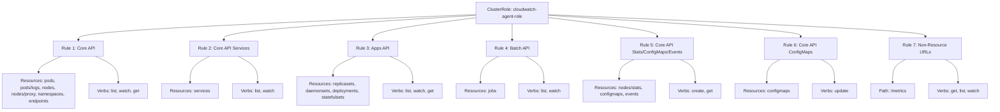
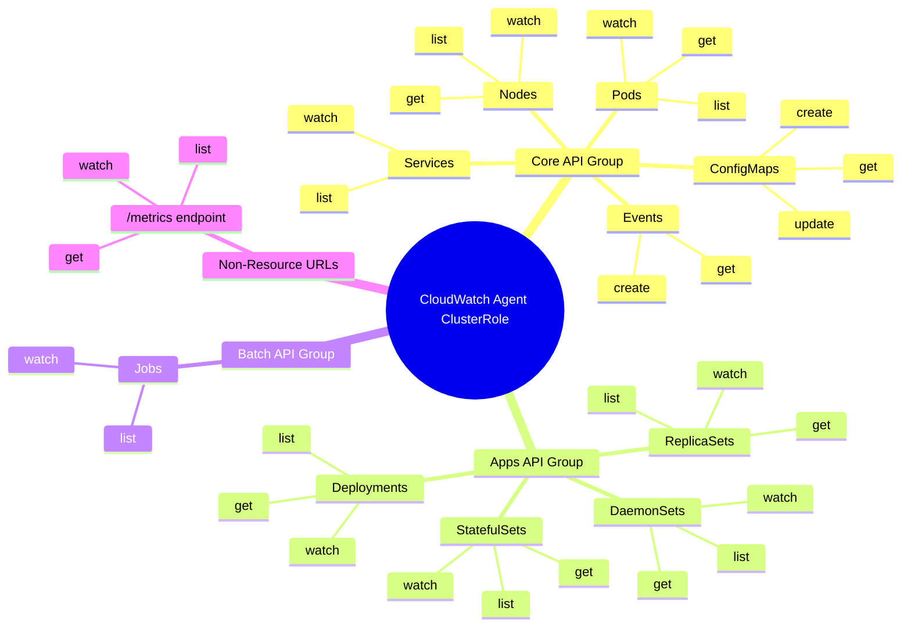

# Diagram: devops/k8s/amazon-cloudwatch-observability/helm/templates/cloudwatch-agent-clusterrole.yaml


> Auto-generated by Obscura crawlers

## Diagram 1

```mermaid
graph TD
      CR[ClusterRole: cloudwatch-agent-role]
      CR --> R1[Rule 1: Core API]
      CR --> R2[Rule 2: Core API Services]...
  └ 207 lines...
```

> SVG rendering failed for this diagram.

## Diagram 2



### SVG

<svg id="container" width="3548.5625" xmlns="http://www.w3.org/2000/svg" class="flowchart" height="398" viewBox="0 0 3548.5625 398" role="graphics-document document" aria-roledescription="flowchart-v2"><style>#container{font-family:"trebuchet ms",verdana,arial,sans-serif;font-size:16px;fill:#333;}@keyframes edge-animation-frame{from{stroke-dashoffset:0;}}@keyframes dash{to{stroke-dashoffset:0;}}#container .edge-animation-slow{stroke-dasharray:9,5!important;stroke-dashoffset:900;animation:dash 50s linear infinite;stroke-linecap:round;}#container .edge-animation-fast{stroke-dasharray:9,5!important;stroke-dashoffset:900;animation:dash 20s linear infinite;stroke-linecap:round;}#container .error-icon{fill:#552222;}#container .error-text{fill:#552222;stroke:#552222;}#container .edge-thickness-normal{stroke-width:1px;}#container .edge-thickness-thick{stroke-width:3.5px;}#container .edge-pattern-solid{stroke-dasharray:0;}#container .edge-thickness-invisible{stroke-width:0;fill:none;}#container .edge-pattern-dashed{stroke-dasharray:3;}#container .edge-pattern-dotted{stroke-dasharray:2;}#container .marker{fill:#333333;stroke:#333333;}#container .marker.cross{stroke:#333333;}#container svg{font-family:"trebuchet ms",verdana,arial,sans-serif;font-size:16px;}#container p{margin:0;}#container .label{font-family:"trebuchet ms",verdana,arial,sans-serif;color:#333;}#container .cluster-label text{fill:#333;}#container .cluster-label span{color:#333;}#container .cluster-label span p{background-color:transparent;}#container .label text,#container span{fill:#333;color:#333;}#container .node rect,#container .node circle,#container .node ellipse,#container .node polygon,#container .node path{fill:#ECECFF;stroke:#9370DB;stroke-width:1px;}#container .rough-node .label text,#container .node .label text,#container .image-shape .label,#container .icon-shape .label{text-anchor:middle;}#container .node .katex path{fill:#000;stroke:#000;stroke-width:1px;}#container .rough-node .label,#container .node .label,#container .image-shape .label,#container .icon-shape .label{text-align:center;}#container .node.clickable{cursor:pointer;}#container .root .anchor path{fill:#333333!important;stroke-width:0;stroke:#333333;}#container .arrowheadPath{fill:#333333;}#container .edgePath .path{stroke:#333333;stroke-width:2.0px;}#container .flowchart-link{stroke:#333333;fill:none;}#container .edgeLabel{background-color:rgba(232,232,232, 0.8);text-align:center;}#container .edgeLabel p{background-color:rgba(232,232,232, 0.8);}#container .edgeLabel rect{opacity:0.5;background-color:rgba(232,232,232, 0.8);fill:rgba(232,232,232, 0.8);}#container .labelBkg{background-color:rgba(232, 232, 232, 0.5);}#container .cluster rect{fill:#ffffde;stroke:#aaaa33;stroke-width:1px;}#container .cluster text{fill:#333;}#container .cluster span{color:#333;}#container div.mermaidTooltip{position:absolute;text-align:center;max-width:200px;padding:2px;font-family:"trebuchet ms",verdana,arial,sans-serif;font-size:12px;background:hsl(80, 100%, 96.2745098039%);border:1px solid #aaaa33;border-radius:2px;pointer-events:none;z-index:100;}#container .flowchartTitleText{text-anchor:middle;font-size:18px;fill:#333;}#container rect.text{fill:none;stroke-width:0;}#container .icon-shape,#container .image-shape{background-color:rgba(232,232,232, 0.8);text-align:center;}#container .icon-shape p,#container .image-shape p{background-color:rgba(232,232,232, 0.8);padding:2px;}#container .icon-shape rect,#container .image-shape rect{opacity:0.5;background-color:rgba(232,232,232, 0.8);fill:rgba(232,232,232, 0.8);}#container .label-icon{display:inline-block;height:1em;overflow:visible;vertical-align:-0.125em;}#container .node .label-icon path{fill:currentColor;stroke:revert;stroke-width:revert;}#container :root{--mermaid-font-family:"trebuchet ms",verdana,arial,sans-serif;}</style><g><marker id="container_flowchart-v2-pointEnd" class="marker flowchart-v2" viewBox="0 0 10 10" refX="5" refY="5" markerUnits="userSpaceOnUse" markerWidth="8" markerHeight="8" orient="auto"><path d="M 0 0 L 10 5 L 0 10 z" class="arrowMarkerPath" style="stroke-width: 1; stroke-dasharray: 1, 0;"></path></marker><marker id="container_flowchart-v2-pointStart" class="marker flowchart-v2" viewBox="0 0 10 10" refX="4.5" refY="5" markerUnits="userSpaceOnUse" markerWidth="8" markerHeight="8" orient="auto"><path d="M 0 5 L 10 10 L 10 0 z" class="arrowMarkerPath" style="stroke-width: 1; stroke-dasharray: 1, 0;"></path></marker><marker id="container_flowchart-v2-circleEnd" class="marker flowchart-v2" viewBox="0 0 10 10" refX="11" refY="5" markerUnits="userSpaceOnUse" markerWidth="11" markerHeight="11" orient="auto"><circle cx="5" cy="5" r="5" class="arrowMarkerPath" style="stroke-width: 1; stroke-dasharray: 1, 0;"></circle></marker><marker id="container_flowchart-v2-circleStart" class="marker flowchart-v2" viewBox="0 0 10 10" refX="-1" refY="5" markerUnits="userSpaceOnUse" markerWidth="11" markerHeight="11" orient="auto"><circle cx="5" cy="5" r="5" class="arrowMarkerPath" style="stroke-width: 1; stroke-dasharray: 1, 0;"></circle></marker><marker id="container_flowchart-v2-crossEnd" class="marker cross flowchart-v2" viewBox="0 0 11 11" refX="12" refY="5.2" markerUnits="userSpaceOnUse" markerWidth="11" markerHeight="11" orient="auto"><path d="M 1,1 l 9,9 M 10,1 l -9,9" class="arrowMarkerPath" style="stroke-width: 2; stroke-dasharray: 1, 0;"></path></marker><marker id="container_flowchart-v2-crossStart" class="marker cross flowchart-v2" viewBox="0 0 11 11" refX="-1" refY="5.2" markerUnits="userSpaceOnUse" markerWidth="11" markerHeight="11" orient="auto"><path d="M 1,1 l 9,9 M 10,1 l -9,9" class="arrowMarkerPath" style="stroke-width: 2; stroke-dasharray: 1, 0;"></path></marker><g class="root"><g class="clusters"></g><g class="edgePaths"><path d="M1703.613,52.359L1466.521,62.132C1229.428,71.906,755.243,91.453,518.151,106.726C281.059,122,281.059,133,281.059,138.5L281.059,144" id="L_CR_R1_0" class="edge-thickness-normal edge-pattern-solid edge-thickness-normal edge-pattern-solid flowchart-link" style=";" data-edge="true" data-et="edge" data-id="L_CR_R1_0" data-points="W3sieCI6MTcwMy42MTMyODEyNSwieSI6NTIuMzU4OTA5NDU4NzA0NjZ9LHsieCI6MjgxLjA1ODU5Mzc1LCJ5IjoxMTF9LHsieCI6MjgxLjA1ODU5Mzc1LCJ5IjoxNDh9XQ==" marker-end="url(#container_flowchart-v2-pointEnd)"></path><path d="M1703.613,55.054L1553.099,64.378C1402.585,73.702,1101.556,92.351,951.042,107.176C800.527,122,800.527,133,800.527,138.5L800.527,144" id="L_CR_R2_0" class="edge-thickness-normal edge-pattern-solid edge-thickness-normal edge-pattern-solid flowchart-link" style=";" data-edge="true" data-et="edge" data-id="L_CR_R2_0" data-points="W3sieCI6MTcwMy42MTMyODEyNSwieSI6NTUuMDUzNTQxMDQ0MzUyODU1fSx7IngiOjgwMC41MjczNDM3NSwieSI6MTExfSx7IngiOjgwMC41MjczNDM3NSwieSI6MTQ4fV0=" marker-end="url(#container_flowchart-v2-pointEnd)"></path><path d="M1703.613,63.678L1642.135,71.565C1580.658,79.452,1457.702,95.226,1396.224,108.613C1334.746,122,1334.746,133,1334.746,138.5L1334.746,144" id="L_CR_R3_0" class="edge-thickness-normal edge-pattern-solid edge-thickness-normal edge-pattern-solid flowchart-link" style=";" data-edge="true" data-et="edge" data-id="L_CR_R3_0" data-points="W3sieCI6MTcwMy42MTMyODEyNSwieSI6NjMuNjc3Nzg1NjA4MDE4MTd9LHsieCI6MTMzNC43NDYwOTM3NSwieSI6MTExfSx7IngiOjEzMzQuNzQ2MDkzNzUsInkiOjE0OH1d" marker-end="url(#container_flowchart-v2-pointEnd)"></path><path d="M1833.613,86L1833.613,90.167C1833.613,94.333,1833.613,102.667,1833.613,112.333C1833.613,122,1833.613,133,1833.613,138.5L1833.613,144" id="L_CR_R4_0" class="edge-thickness-normal edge-pattern-solid edge-thickness-normal edge-pattern-solid flowchart-link" style=";" data-edge="true" data-et="edge" data-id="L_CR_R4_0" data-points="W3sieCI6MTgzMy42MTMyODEyNSwieSI6ODZ9LHsieCI6MTgzMy42MTMyODEyNSwieSI6MTExfSx7IngiOjE4MzMuNjEzMjgxMjUsInkiOjE0OH1d" marker-end="url(#container_flowchart-v2-pointEnd)"></path><path d="M1963.613,62.993L2028.654,70.994C2093.694,78.995,2223.775,94.998,2288.815,106.499C2353.855,118,2353.855,125,2353.855,128.5L2353.855,132" id="L_CR_R5_0" class="edge-thickness-normal edge-pattern-solid edge-thickness-normal edge-pattern-solid flowchart-link" style=";" data-edge="true" data-et="edge" data-id="L_CR_R5_0" data-points="W3sieCI6MTk2My42MTMyODEyNSwieSI6NjIuOTkyNTUxNTQ2MDA0NzJ9LHsieCI6MjM1My44NTU0Njg3NSwieSI6MTExfSx7IngiOjIzNTMuODU1NDY4NzUsInkiOjEzNn1d" marker-end="url(#container_flowchart-v2-pointEnd)"></path><path d="M1963.613,55.066L2113.855,64.389C2264.096,73.711,2564.579,92.355,2714.821,105.178C2865.063,118,2865.063,125,2865.063,128.5L2865.063,132" id="L_CR_R6_0" class="edge-thickness-normal edge-pattern-solid edge-thickness-normal edge-pattern-solid flowchart-link" style=";" data-edge="true" data-et="edge" data-id="L_CR_R6_0" data-points="W3sieCI6MTk2My42MTMyODEyNSwieSI6NTUuMDY2MzIwNTIxNDE0NDI2fSx7IngiOjI4NjUuMDYyNSwieSI6MTExfSx7IngiOjI4NjUuMDYyNSwieSI6MTM2fV0=" marker-end="url(#container_flowchart-v2-pointEnd)"></path><path d="M1963.613,52.613L2188.975,62.344C2414.337,72.076,2865.061,91.538,3090.423,106.769C3315.785,122,3315.785,133,3315.785,138.5L3315.785,144" id="L_CR_R7_0" class="edge-thickness-normal edge-pattern-solid edge-thickness-normal edge-pattern-solid flowchart-link" style=";" data-edge="true" data-et="edge" data-id="L_CR_R7_0" data-points="W3sieCI6MTk2My42MTMyODEyNSwieSI6NTIuNjEzMzg0MDc1MzExNzh9LHsieCI6MzMxNS43ODUxNTYyNSwieSI6MTExfSx7IngiOjMzMTUuNzg1MTU2MjUsInkiOjE0OH1d" marker-end="url(#container_flowchart-v2-pointEnd)"></path><path d="M220.706,202L206.921,208.167C193.137,214.333,165.569,226.667,151.784,236.333C138,246,138,253,138,256.5L138,260" id="L_R1_R1A_0" class="edge-thickness-normal edge-pattern-solid edge-thickness-normal edge-pattern-solid flowchart-link" style=";" data-edge="true" data-et="edge" data-id="L_R1_R1A_0" data-points="W3sieCI6MjIwLjcwNTc0OTUxMTcxODc1LCJ5IjoyMDJ9LHsieCI6MTM4LCJ5IjoyMzl9LHsieCI6MTM4LCJ5IjoyNjR9XQ==" marker-end="url(#container_flowchart-v2-pointEnd)"></path><path d="M341.411,202L355.196,208.167C368.98,214.333,396.549,226.667,410.333,242.333C424.117,258,424.117,277,424.117,286.5L424.117,296" id="L_R1_R1B_0" class="edge-thickness-normal edge-pattern-solid edge-thickness-normal edge-pattern-solid flowchart-link" style=";" data-edge="true" data-et="edge" data-id="L_R1_R1B_0" data-points="W3sieCI6MzQxLjQxMTQzNzk4ODI4MTI1LCJ5IjoyMDJ9LHsieCI6NDI0LjExNzE4NzUsInkiOjIzOX0seyJ4Ijo0MjQuMTE3MTg3NSwieSI6MzAwfV0=" marker-end="url(#container_flowchart-v2-pointEnd)"></path><path d="M749.749,202L738.152,208.167C726.554,214.333,703.359,226.667,691.762,242.333C680.164,258,680.164,277,680.164,286.5L680.164,296" id="L_R2_R2A_0" class="edge-thickness-normal edge-pattern-solid edge-thickness-normal edge-pattern-solid flowchart-link" style=";" data-edge="true" data-et="edge" data-id="L_R2_R2A_0" data-points="W3sieCI6NzQ5Ljc0OTA4NDQ3MjY1NjIsInkiOjIwMn0seyJ4Ijo2ODAuMTY0MDYyNSwieSI6MjM5fSx7IngiOjY4MC4xNjQwNjI1LCJ5IjozMDB9XQ==" marker-end="url(#container_flowchart-v2-pointEnd)"></path><path d="M851.306,202L862.903,208.167C874.501,214.333,897.696,226.667,909.293,242.333C920.891,258,920.891,277,920.891,286.5L920.891,296" id="L_R2_R2B_0" class="edge-thickness-normal edge-pattern-solid edge-thickness-normal edge-pattern-solid flowchart-link" style=";" data-edge="true" data-et="edge" data-id="L_R2_R2B_0" data-points="W3sieCI6ODUxLjMwNTYwMzAyNzM0MzgsInkiOjIwMn0seyJ4Ijo5MjAuODkwNjI1LCJ5IjoyMzl9LHsieCI6OTIwLjg5MDYyNSwieSI6MzAwfV0=" marker-end="url(#container_flowchart-v2-pointEnd)"></path><path d="M1274.393,202L1260.609,208.167C1246.825,214.333,1219.256,226.667,1205.472,238.333C1191.688,250,1191.688,261,1191.688,266.5L1191.688,272" id="L_R3_R3A_0" class="edge-thickness-normal edge-pattern-solid edge-thickness-normal edge-pattern-solid flowchart-link" style=";" data-edge="true" data-et="edge" data-id="L_R3_R3A_0" data-points="W3sieCI6MTI3NC4zOTMyNDk1MTE3MTg4LCJ5IjoyMDJ9LHsieCI6MTE5MS42ODc1LCJ5IjoyMzl9LHsieCI6MTE5MS42ODc1LCJ5IjoyNzZ9XQ==" marker-end="url(#container_flowchart-v2-pointEnd)"></path><path d="M1395.099,202L1408.883,208.167C1422.668,214.333,1450.236,226.667,1464.02,242.333C1477.805,258,1477.805,277,1477.805,286.5L1477.805,296" id="L_R3_R3B_0" class="edge-thickness-normal edge-pattern-solid edge-thickness-normal edge-pattern-solid flowchart-link" style=";" data-edge="true" data-et="edge" data-id="L_R3_R3B_0" data-points="W3sieCI6MTM5NS4wOTg5Mzc5ODgyODEyLCJ5IjoyMDJ9LHsieCI6MTQ3Ny44MDQ2ODc1LCJ5IjoyMzl9LHsieCI6MTQ3Ny44MDQ2ODc1LCJ5IjozMDB9XQ==" marker-end="url(#container_flowchart-v2-pointEnd)"></path><path d="M1785.732,202L1774.796,208.167C1763.86,214.333,1741.989,226.667,1731.053,242.333C1720.117,258,1720.117,277,1720.117,286.5L1720.117,296" id="L_R4_R4A_0" class="edge-thickness-normal edge-pattern-solid edge-thickness-normal edge-pattern-solid flowchart-link" style=";" data-edge="true" data-et="edge" data-id="L_R4_R4A_0" data-points="W3sieCI6MTc4NS43MzIxMTY2OTkyMTg4LCJ5IjoyMDJ9LHsieCI6MTcyMC4xMTcxODc1LCJ5IjoyMzl9LHsieCI6MTcyMC4xMTcxODc1LCJ5IjozMDB9XQ==" marker-end="url(#container_flowchart-v2-pointEnd)"></path><path d="M1881.494,202L1892.43,208.167C1903.366,214.333,1925.238,226.667,1936.174,242.333C1947.109,258,1947.109,277,1947.109,286.5L1947.109,296" id="L_R4_R4B_0" class="edge-thickness-normal edge-pattern-solid edge-thickness-normal edge-pattern-solid flowchart-link" style=";" data-edge="true" data-et="edge" data-id="L_R4_R4B_0" data-points="W3sieCI6MTg4MS40OTQ0NDU4MDA3ODEyLCJ5IjoyMDJ9LHsieCI6MTk0Ny4xMDkzNzUsInkiOjIzOX0seyJ4IjoxOTQ3LjEwOTM3NSwieSI6MzAwfV0=" marker-end="url(#container_flowchart-v2-pointEnd)"></path><path d="M2271.011,214L2262.161,218.167C2253.31,222.333,2235.608,230.667,2226.757,242.333C2217.906,254,2217.906,269,2217.906,276.5L2217.906,284" id="L_R5_R5A_0" class="edge-thickness-normal edge-pattern-solid edge-thickness-normal edge-pattern-solid flowchart-link" style=";" data-edge="true" data-et="edge" data-id="L_R5_R5A_0" data-points="W3sieCI6MjI3MS4wMTE0MTM1NzQyMTg4LCJ5IjoyMTR9LHsieCI6MjIxNy45MDYyNSwieSI6MjM5fSx7IngiOjIyMTcuOTA2MjUsInkiOjI4OH1d" marker-end="url(#container_flowchart-v2-pointEnd)"></path><path d="M2436.7,214L2445.55,218.167C2454.401,222.333,2472.103,230.667,2480.954,244.333C2489.805,258,2489.805,277,2489.805,286.5L2489.805,296" id="L_R5_R5B_0" class="edge-thickness-normal edge-pattern-solid edge-thickness-normal edge-pattern-solid flowchart-link" style=";" data-edge="true" data-et="edge" data-id="L_R5_R5B_0" data-points="W3sieCI6MjQzNi42OTk1MjM5MjU3ODEyLCJ5IjoyMTR9LHsieCI6MjQ4OS44MDQ2ODc1LCJ5IjoyMzl9LHsieCI6MjQ4OS44MDQ2ODc1LCJ5IjozMDB9XQ==" marker-end="url(#container_flowchart-v2-pointEnd)"></path><path d="M2791.276,214L2783.393,218.167C2775.509,222.333,2759.743,230.667,2751.86,244.333C2743.977,258,2743.977,277,2743.977,286.5L2743.977,296" id="L_R6_R6A_0" class="edge-thickness-normal edge-pattern-solid edge-thickness-normal edge-pattern-solid flowchart-link" style=";" data-edge="true" data-et="edge" data-id="L_R6_R6A_0" data-points="W3sieCI6Mjc5MS4yNzU3NTY4MzU5Mzc1LCJ5IjoyMTR9LHsieCI6Mjc0My45NzY1NjI1LCJ5IjoyMzl9LHsieCI6Mjc0My45NzY1NjI1LCJ5IjozMDB9XQ==" marker-end="url(#container_flowchart-v2-pointEnd)"></path><path d="M2938.849,214L2946.732,218.167C2954.616,222.333,2970.382,230.667,2978.265,244.333C2986.148,258,2986.148,277,2986.148,286.5L2986.148,296" id="L_R6_R6B_0" class="edge-thickness-normal edge-pattern-solid edge-thickness-normal edge-pattern-solid flowchart-link" style=";" data-edge="true" data-et="edge" data-id="L_R6_R6B_0" data-points="W3sieCI6MjkzOC44NDkyNDMxNjQwNjI1LCJ5IjoyMTR9LHsieCI6Mjk4Ni4xNDg0Mzc1LCJ5IjoyMzl9LHsieCI6Mjk4Ni4xNDg0Mzc1LCJ5IjozMDB9XQ==" marker-end="url(#container_flowchart-v2-pointEnd)"></path><path d="M3265.739,202L3254.308,208.167C3242.878,214.333,3220.017,226.667,3208.587,242.333C3197.156,258,3197.156,277,3197.156,286.5L3197.156,296" id="L_R7_R7A_0" class="edge-thickness-normal edge-pattern-solid edge-thickness-normal edge-pattern-solid flowchart-link" style=";" data-edge="true" data-et="edge" data-id="L_R7_R7A_0" data-points="W3sieCI6MzI2NS43Mzg1ODY0MjU3ODEyLCJ5IjoyMDJ9LHsieCI6MzE5Ny4xNTYyNSwieSI6MjM5fSx7IngiOjMxOTcuMTU2MjUsInkiOjMwMH1d" marker-end="url(#container_flowchart-v2-pointEnd)"></path><path d="M3365.832,202L3377.262,208.167C3388.693,214.333,3411.553,226.667,3422.984,242.333C3434.414,258,3434.414,277,3434.414,286.5L3434.414,296" id="L_R7_R7B_0" class="edge-thickness-normal edge-pattern-solid edge-thickness-normal edge-pattern-solid flowchart-link" style=";" data-edge="true" data-et="edge" data-id="L_R7_R7B_0" data-points="W3sieCI6MzM2NS44MzE3MjYwNzQyMTg4LCJ5IjoyMDJ9LHsieCI6MzQzNC40MTQwNjI1LCJ5IjoyMzl9LHsieCI6MzQzNC40MTQwNjI1LCJ5IjozMDB9XQ==" marker-end="url(#container_flowchart-v2-pointEnd)"></path></g><g class="edgeLabels"><g class="edgeLabel"><g class="label" data-id="L_CR_R1_0" transform="translate(0, 0)"><foreignObject width="0" height="0"><div xmlns="http://www.w3.org/1999/xhtml" class="labelBkg" style="display: table-cell; white-space: nowrap; line-height: 1.5; max-width: 200px; text-align: center;"><span class="edgeLabel"></span></div></foreignObject></g></g><g class="edgeLabel"><g class="label" data-id="L_CR_R2_0" transform="translate(0, 0)"><foreignObject width="0" height="0"><div xmlns="http://www.w3.org/1999/xhtml" class="labelBkg" style="display: table-cell; white-space: nowrap; line-height: 1.5; max-width: 200px; text-align: center;"><span class="edgeLabel"></span></div></foreignObject></g></g><g class="edgeLabel"><g class="label" data-id="L_CR_R3_0" transform="translate(0, 0)"><foreignObject width="0" height="0"><div xmlns="http://www.w3.org/1999/xhtml" class="labelBkg" style="display: table-cell; white-space: nowrap; line-height: 1.5; max-width: 200px; text-align: center;"><span class="edgeLabel"></span></div></foreignObject></g></g><g class="edgeLabel"><g class="label" data-id="L_CR_R4_0" transform="translate(0, 0)"><foreignObject width="0" height="0"><div xmlns="http://www.w3.org/1999/xhtml" class="labelBkg" style="display: table-cell; white-space: nowrap; line-height: 1.5; max-width: 200px; text-align: center;"><span class="edgeLabel"></span></div></foreignObject></g></g><g class="edgeLabel"><g class="label" data-id="L_CR_R5_0" transform="translate(0, 0)"><foreignObject width="0" height="0"><div xmlns="http://www.w3.org/1999/xhtml" class="labelBkg" style="display: table-cell; white-space: nowrap; line-height: 1.5; max-width: 200px; text-align: center;"><span class="edgeLabel"></span></div></foreignObject></g></g><g class="edgeLabel"><g class="label" data-id="L_CR_R6_0" transform="translate(0, 0)"><foreignObject width="0" height="0"><div xmlns="http://www.w3.org/1999/xhtml" class="labelBkg" style="display: table-cell; white-space: nowrap; line-height: 1.5; max-width: 200px; text-align: center;"><span class="edgeLabel"></span></div></foreignObject></g></g><g class="edgeLabel"><g class="label" data-id="L_CR_R7_0" transform="translate(0, 0)"><foreignObject width="0" height="0"><div xmlns="http://www.w3.org/1999/xhtml" class="labelBkg" style="display: table-cell; white-space: nowrap; line-height: 1.5; max-width: 200px; text-align: center;"><span class="edgeLabel"></span></div></foreignObject></g></g><g class="edgeLabel"><g class="label" data-id="L_R1_R1A_0" transform="translate(0, 0)"><foreignObject width="0" height="0"><div xmlns="http://www.w3.org/1999/xhtml" class="labelBkg" style="display: table-cell; white-space: nowrap; line-height: 1.5; max-width: 200px; text-align: center;"><span class="edgeLabel"></span></div></foreignObject></g></g><g class="edgeLabel"><g class="label" data-id="L_R1_R1B_0" transform="translate(0, 0)"><foreignObject width="0" height="0"><div xmlns="http://www.w3.org/1999/xhtml" class="labelBkg" style="display: table-cell; white-space: nowrap; line-height: 1.5; max-width: 200px; text-align: center;"><span class="edgeLabel"></span></div></foreignObject></g></g><g class="edgeLabel"><g class="label" data-id="L_R2_R2A_0" transform="translate(0, 0)"><foreignObject width="0" height="0"><div xmlns="http://www.w3.org/1999/xhtml" class="labelBkg" style="display: table-cell; white-space: nowrap; line-height: 1.5; max-width: 200px; text-align: center;"><span class="edgeLabel"></span></div></foreignObject></g></g><g class="edgeLabel"><g class="label" data-id="L_R2_R2B_0" transform="translate(0, 0)"><foreignObject width="0" height="0"><div xmlns="http://www.w3.org/1999/xhtml" class="labelBkg" style="display: table-cell; white-space: nowrap; line-height: 1.5; max-width: 200px; text-align: center;"><span class="edgeLabel"></span></div></foreignObject></g></g><g class="edgeLabel"><g class="label" data-id="L_R3_R3A_0" transform="translate(0, 0)"><foreignObject width="0" height="0"><div xmlns="http://www.w3.org/1999/xhtml" class="labelBkg" style="display: table-cell; white-space: nowrap; line-height: 1.5; max-width: 200px; text-align: center;"><span class="edgeLabel"></span></div></foreignObject></g></g><g class="edgeLabel"><g class="label" data-id="L_R3_R3B_0" transform="translate(0, 0)"><foreignObject width="0" height="0"><div xmlns="http://www.w3.org/1999/xhtml" class="labelBkg" style="display: table-cell; white-space: nowrap; line-height: 1.5; max-width: 200px; text-align: center;"><span class="edgeLabel"></span></div></foreignObject></g></g><g class="edgeLabel"><g class="label" data-id="L_R4_R4A_0" transform="translate(0, 0)"><foreignObject width="0" height="0"><div xmlns="http://www.w3.org/1999/xhtml" class="labelBkg" style="display: table-cell; white-space: nowrap; line-height: 1.5; max-width: 200px; text-align: center;"><span class="edgeLabel"></span></div></foreignObject></g></g><g class="edgeLabel"><g class="label" data-id="L_R4_R4B_0" transform="translate(0, 0)"><foreignObject width="0" height="0"><div xmlns="http://www.w3.org/1999/xhtml" class="labelBkg" style="display: table-cell; white-space: nowrap; line-height: 1.5; max-width: 200px; text-align: center;"><span class="edgeLabel"></span></div></foreignObject></g></g><g class="edgeLabel"><g class="label" data-id="L_R5_R5A_0" transform="translate(0, 0)"><foreignObject width="0" height="0"><div xmlns="http://www.w3.org/1999/xhtml" class="labelBkg" style="display: table-cell; white-space: nowrap; line-height: 1.5; max-width: 200px; text-align: center;"><span class="edgeLabel"></span></div></foreignObject></g></g><g class="edgeLabel"><g class="label" data-id="L_R5_R5B_0" transform="translate(0, 0)"><foreignObject width="0" height="0"><div xmlns="http://www.w3.org/1999/xhtml" class="labelBkg" style="display: table-cell; white-space: nowrap; line-height: 1.5; max-width: 200px; text-align: center;"><span class="edgeLabel"></span></div></foreignObject></g></g><g class="edgeLabel"><g class="label" data-id="L_R6_R6A_0" transform="translate(0, 0)"><foreignObject width="0" height="0"><div xmlns="http://www.w3.org/1999/xhtml" class="labelBkg" style="display: table-cell; white-space: nowrap; line-height: 1.5; max-width: 200px; text-align: center;"><span class="edgeLabel"></span></div></foreignObject></g></g><g class="edgeLabel"><g class="label" data-id="L_R6_R6B_0" transform="translate(0, 0)"><foreignObject width="0" height="0"><div xmlns="http://www.w3.org/1999/xhtml" class="labelBkg" style="display: table-cell; white-space: nowrap; line-height: 1.5; max-width: 200px; text-align: center;"><span class="edgeLabel"></span></div></foreignObject></g></g><g class="edgeLabel"><g class="label" data-id="L_R7_R7A_0" transform="translate(0, 0)"><foreignObject width="0" height="0"><div xmlns="http://www.w3.org/1999/xhtml" class="labelBkg" style="display: table-cell; white-space: nowrap; line-height: 1.5; max-width: 200px; text-align: center;"><span class="edgeLabel"></span></div></foreignObject></g></g><g class="edgeLabel"><g class="label" data-id="L_R7_R7B_0" transform="translate(0, 0)"><foreignObject width="0" height="0"><div xmlns="http://www.w3.org/1999/xhtml" class="labelBkg" style="display: table-cell; white-space: nowrap; line-height: 1.5; max-width: 200px; text-align: center;"><span class="edgeLabel"></span></div></foreignObject></g></g></g><g class="nodes"><g class="node default" id="flowchart-CR-0" transform="translate(1833.61328125, 47)"><rect class="basic label-container" style="" x="-130" y="-39" width="260" height="78"></rect><g class="label" style="" transform="translate(-100, -24)"><rect></rect><foreignObject width="200" height="48"><div xmlns="http://www.w3.org/1999/xhtml" style="display: table; white-space: break-spaces; line-height: 1.5; max-width: 200px; text-align: center; width: 200px;"><span class="nodeLabel"><p>ClusterRole: cloudwatch-agent-role</p></span></div></foreignObject></g></g><g class="node default" id="flowchart-R1-2" transform="translate(281.05859375, 175)"><rect class="basic label-container" style="" x="-85.703125" y="-27" width="171.40625" height="54"></rect><g class="label" style="" transform="translate(-55.703125, -12)"><rect></rect><foreignObject width="111.40625" height="24"><div xmlns="http://www.w3.org/1999/xhtml" style="display: table-cell; white-space: nowrap; line-height: 1.5; max-width: 200px; text-align: center;"><span class="nodeLabel"><p>Rule 1: Core API</p></span></div></foreignObject></g></g><g class="node default" id="flowchart-R2-4" transform="translate(800.52734375, 175)"><rect class="basic label-container" style="" x="-118.078125" y="-27" width="236.15625" height="54"></rect><g class="label" style="" transform="translate(-88.078125, -12)"><rect></rect><foreignObject width="176.15625" height="24"><div xmlns="http://www.w3.org/1999/xhtml" style="display: table-cell; white-space: nowrap; line-height: 1.5; max-width: 200px; text-align: center;"><span class="nodeLabel"><p>Rule 2: Core API Services</p></span></div></foreignObject></g></g><g class="node default" id="flowchart-R3-6" transform="translate(1334.74609375, 175)"><rect class="basic label-container" style="" x="-87.8515625" y="-27" width="175.703125" height="54"></rect><g class="label" style="" transform="translate(-57.8515625, -12)"><rect></rect><foreignObject width="115.703125" height="24"><div xmlns="http://www.w3.org/1999/xhtml" style="display: table-cell; white-space: nowrap; line-height: 1.5; max-width: 200px; text-align: center;"><span class="nodeLabel"><p>Rule 3: Apps API</p></span></div></foreignObject></g></g><g class="node default" id="flowchart-R4-8" transform="translate(1833.61328125, 175)"><rect class="basic label-container" style="" x="-90.7890625" y="-27" width="181.578125" height="54"></rect><g class="label" style="" transform="translate(-60.7890625, -12)"><rect></rect><foreignObject width="121.578125" height="24"><div xmlns="http://www.w3.org/1999/xhtml" style="display: table-cell; white-space: nowrap; line-height: 1.5; max-width: 200px; text-align: center;"><span class="nodeLabel"><p>Rule 4: Batch API</p></span></div></foreignObject></g></g><g class="node default" id="flowchart-R5-10" transform="translate(2353.85546875, 175)"><rect class="basic label-container" style="" x="-130" y="-39" width="260" height="78"></rect><g class="label" style="" transform="translate(-100, -24)"><rect></rect><foreignObject width="200" height="48"><div xmlns="http://www.w3.org/1999/xhtml" style="display: table; white-space: break-spaces; line-height: 1.5; max-width: 200px; text-align: center; width: 200px;"><span class="nodeLabel"><p>Rule 5: Core API Stats/ConfigMaps/Events</p></span></div></foreignObject></g></g><g class="node default" id="flowchart-R6-12" transform="translate(2865.0625, 175)"><rect class="basic label-container" style="" x="-130" y="-39" width="260" height="78"></rect><g class="label" style="" transform="translate(-100, -24)"><rect></rect><foreignObject width="200" height="48"><div xmlns="http://www.w3.org/1999/xhtml" style="display: table; white-space: break-spaces; line-height: 1.5; max-width: 200px; text-align: center; width: 200px;"><span class="nodeLabel"><p>Rule 6: Core API ConfigMaps</p></span></div></foreignObject></g></g><g class="node default" id="flowchart-R7-14" transform="translate(3315.78515625, 175)"><rect class="basic label-container" style="" x="-126.59375" y="-27" width="253.1875" height="54"></rect><g class="label" style="" transform="translate(-96.59375, -12)"><rect></rect><foreignObject width="193.1875" height="24"><div xmlns="http://www.w3.org/1999/xhtml" style="display: table-cell; white-space: nowrap; line-height: 1.5; max-width: 200px; text-align: center;"><span class="nodeLabel"><p>Rule 7: Non-Resource URLs</p></span></div></foreignObject></g></g><g class="node default" id="flowchart-R1A-16" transform="translate(138, 327)"><rect class="basic label-container" style="" x="-130" y="-63" width="260" height="126"></rect><g class="label" style="" transform="translate(-100, -48)"><rect></rect><foreignObject width="200" height="96"><div xmlns="http://www.w3.org/1999/xhtml" style="display: table; white-space: break-spaces; line-height: 1.5; max-width: 200px; text-align: center; width: 200px;"><span class="nodeLabel"><p>Resources: pods, pods/logs, nodes, nodes/proxy, namespaces, endpoints</p></span></div></foreignObject></g></g><g class="node default" id="flowchart-R1B-18" transform="translate(424.1171875, 327)"><rect class="basic label-container" style="" x="-106.1171875" y="-27" width="212.234375" height="54"></rect><g class="label" style="" transform="translate(-76.1171875, -12)"><rect></rect><foreignObject width="152.234375" height="24"><div xmlns="http://www.w3.org/1999/xhtml" style="display: table-cell; white-space: nowrap; line-height: 1.5; max-width: 200px; text-align: center;"><span class="nodeLabel"><p>Verbs: list, watch, get</p></span></div></foreignObject></g></g><g class="node default" id="flowchart-R2A-20" transform="translate(680.1640625, 327)"><rect class="basic label-container" style="" x="-99.9296875" y="-27" width="199.859375" height="54"></rect><g class="label" style="" transform="translate(-69.9296875, -12)"><rect></rect><foreignObject width="139.859375" height="24"><div xmlns="http://www.w3.org/1999/xhtml" style="display: table-cell; white-space: nowrap; line-height: 1.5; max-width: 200px; text-align: center;"><span class="nodeLabel"><p>Resources: services</p></span></div></foreignObject></g></g><g class="node default" id="flowchart-R2B-22" transform="translate(920.890625, 327)"><rect class="basic label-container" style="" x="-90.796875" y="-27" width="181.59375" height="54"></rect><g class="label" style="" transform="translate(-60.796875, -12)"><rect></rect><foreignObject width="121.59375" height="24"><div xmlns="http://www.w3.org/1999/xhtml" style="display: table-cell; white-space: nowrap; line-height: 1.5; max-width: 200px; text-align: center;"><span class="nodeLabel"><p>Verbs: list, watch</p></span></div></foreignObject></g></g><g class="node default" id="flowchart-R3A-24" transform="translate(1191.6875, 327)"><rect class="basic label-container" style="" x="-130" y="-51" width="260" height="102"></rect><g class="label" style="" transform="translate(-100, -36)"><rect></rect><foreignObject width="200" height="72"><div xmlns="http://www.w3.org/1999/xhtml" style="display: table; white-space: break-spaces; line-height: 1.5; max-width: 200px; text-align: center; width: 200px;"><span class="nodeLabel"><p>Resources: replicasets, daemonsets, deployments, statefulsets</p></span></div></foreignObject></g></g><g class="node default" id="flowchart-R3B-26" transform="translate(1477.8046875, 327)"><rect class="basic label-container" style="" x="-106.1171875" y="-27" width="212.234375" height="54"></rect><g class="label" style="" transform="translate(-76.1171875, -12)"><rect></rect><foreignObject width="152.234375" height="24"><div xmlns="http://www.w3.org/1999/xhtml" style="display: table-cell; white-space: nowrap; line-height: 1.5; max-width: 200px; text-align: center;"><span class="nodeLabel"><p>Verbs: list, watch, get</p></span></div></foreignObject></g></g><g class="node default" id="flowchart-R4A-28" transform="translate(1720.1171875, 327)"><rect class="basic label-container" style="" x="-86.1953125" y="-27" width="172.390625" height="54"></rect><g class="label" style="" transform="translate(-56.1953125, -12)"><rect></rect><foreignObject width="112.390625" height="24"><div xmlns="http://www.w3.org/1999/xhtml" style="display: table-cell; white-space: nowrap; line-height: 1.5; max-width: 200px; text-align: center;"><span class="nodeLabel"><p>Resources: jobs</p></span></div></foreignObject></g></g><g class="node default" id="flowchart-R4B-30" transform="translate(1947.109375, 327)"><rect class="basic label-container" style="" x="-90.796875" y="-27" width="181.59375" height="54"></rect><g class="label" style="" transform="translate(-60.796875, -12)"><rect></rect><foreignObject width="121.59375" height="24"><div xmlns="http://www.w3.org/1999/xhtml" style="display: table-cell; white-space: nowrap; line-height: 1.5; max-width: 200px; text-align: center;"><span class="nodeLabel"><p>Verbs: list, watch</p></span></div></foreignObject></g></g><g class="node default" id="flowchart-R5A-32" transform="translate(2217.90625, 327)"><rect class="basic label-container" style="" x="-130" y="-39" width="260" height="78"></rect><g class="label" style="" transform="translate(-100, -24)"><rect></rect><foreignObject width="200" height="48"><div xmlns="http://www.w3.org/1999/xhtml" style="display: table; white-space: break-spaces; line-height: 1.5; max-width: 200px; text-align: center; width: 200px;"><span class="nodeLabel"><p>Resources: nodes/stats, configmaps, events</p></span></div></foreignObject></g></g><g class="node default" id="flowchart-R5B-34" transform="translate(2489.8046875, 327)"><rect class="basic label-container" style="" x="-91.8984375" y="-27" width="183.796875" height="54"></rect><g class="label" style="" transform="translate(-61.8984375, -12)"><rect></rect><foreignObject width="123.796875" height="24"><div xmlns="http://www.w3.org/1999/xhtml" style="display: table-cell; white-space: nowrap; line-height: 1.5; max-width: 200px; text-align: center;"><span class="nodeLabel"><p>Verbs: create, get</p></span></div></foreignObject></g></g><g class="node default" id="flowchart-R6A-36" transform="translate(2743.9765625, 327)"><rect class="basic label-container" style="" x="-112.2734375" y="-27" width="224.546875" height="54"></rect><g class="label" style="" transform="translate(-82.2734375, -12)"><rect></rect><foreignObject width="164.546875" height="24"><div xmlns="http://www.w3.org/1999/xhtml" style="display: table-cell; white-space: nowrap; line-height: 1.5; max-width: 200px; text-align: center;"><span class="nodeLabel"><p>Resources: configmaps</p></span></div></foreignObject></g></g><g class="node default" id="flowchart-R6B-38" transform="translate(2986.1484375, 327)"><rect class="basic label-container" style="" x="-79.8984375" y="-27" width="159.796875" height="54"></rect><g class="label" style="" transform="translate(-49.8984375, -12)"><rect></rect><foreignObject width="99.796875" height="24"><div xmlns="http://www.w3.org/1999/xhtml" style="display: table-cell; white-space: nowrap; line-height: 1.5; max-width: 200px; text-align: center;"><span class="nodeLabel"><p>Verbs: update</p></span></div></foreignObject></g></g><g class="node default" id="flowchart-R7A-40" transform="translate(3197.15625, 327)"><rect class="basic label-container" style="" x="-81.109375" y="-27" width="162.21875" height="54"></rect><g class="label" style="" transform="translate(-51.109375, -12)"><rect></rect><foreignObject width="102.21875" height="24"><div xmlns="http://www.w3.org/1999/xhtml" style="display: table-cell; white-space: nowrap; line-height: 1.5; max-width: 200px; text-align: center;"><span class="nodeLabel"><p>Path: /metrics</p></span></div></foreignObject></g></g><g class="node default" id="flowchart-R7B-42" transform="translate(3434.4140625, 327)"><rect class="basic label-container" style="" x="-106.1484375" y="-27" width="212.296875" height="54"></rect><g class="label" style="" transform="translate(-76.1484375, -12)"><rect></rect><foreignObject width="152.296875" height="24"><div xmlns="http://www.w3.org/1999/xhtml" style="display: table-cell; white-space: nowrap; line-height: 1.5; max-width: 200px; text-align: center;"><span class="nodeLabel"><p>Verbs: get, list, watch</p></span></div></foreignObject></g></g></g></g></g></svg>

## Diagram 3



### SVG

<svg id="container" width="100%" xmlns="http://www.w3.org/2000/svg" class="mindmapDiagram" style="max-width: 1112.4324951171875px;" viewBox="5 5 1112.4324951171875 780.3930053710938" role="graphics-document document" aria-roledescription="mindmap"><style>#container{font-family:"trebuchet ms",verdana,arial,sans-serif;font-size:16px;fill:#333;}@keyframes edge-animation-frame{from{stroke-dashoffset:0;}}@keyframes dash{to{stroke-dashoffset:0;}}#container .edge-animation-slow{stroke-dasharray:9,5!important;stroke-dashoffset:900;animation:dash 50s linear infinite;stroke-linecap:round;}#container .edge-animation-fast{stroke-dasharray:9,5!important;stroke-dashoffset:900;animation:dash 20s linear infinite;stroke-linecap:round;}#container .error-icon{fill:#552222;}#container .error-text{fill:#552222;stroke:#552222;}#container .edge-thickness-normal{stroke-width:1px;}#container .edge-thickness-thick{stroke-width:3.5px;}#container .edge-pattern-solid{stroke-dasharray:0;}#container .edge-thickness-invisible{stroke-width:0;fill:none;}#container .edge-pattern-dashed{stroke-dasharray:3;}#container .edge-pattern-dotted{stroke-dasharray:2;}#container .marker{fill:#333333;stroke:#333333;}#container .marker.cross{stroke:#333333;}#container svg{font-family:"trebuchet ms",verdana,arial,sans-serif;font-size:16px;}#container p{margin:0;}#container .edge{stroke-width:3;}#container .section--1 rect,#container .section--1 path,#container .section--1 circle,#container .section--1 polygon,#container .section--1 path{fill:hsl(240, 100%, 76.2745098039%);}#container .section--1 text{fill:#ffffff;}#container .node-icon--1{font-size:40px;color:#ffffff;}#container .section-edge--1{stroke:hsl(240, 100%, 76.2745098039%);}#container .edge-depth--1{stroke-width:17;}#container .section--1 line{stroke:hsl(60, 100%, 86.2745098039%);stroke-width:3;}#container .disabled,#container .disabled circle,#container .disabled text{fill:lightgray;}#container .disabled text{fill:#efefef;}#container .section-0 rect,#container .section-0 path,#container .section-0 circle,#container .section-0 polygon,#container .section-0 path{fill:hsl(60, 100%, 73.5294117647%);}#container .section-0 text{fill:black;}#container .node-icon-0{font-size:40px;color:black;}#container .section-edge-0{stroke:hsl(60, 100%, 73.5294117647%);}#container .edge-depth-0{stroke-width:14;}#container .section-0 line{stroke:hsl(240, 100%, 83.5294117647%);stroke-width:3;}#container .disabled,#container .disabled circle,#container .disabled text{fill:lightgray;}#container .disabled text{fill:#efefef;}#container .section-1 rect,#container .section-1 path,#container .section-1 circle,#container .section-1 polygon,#container .section-1 path{fill:hsl(80, 100%, 76.2745098039%);}#container .section-1 text{fill:black;}#container .node-icon-1{font-size:40px;color:black;}#container .section-edge-1{stroke:hsl(80, 100%, 76.2745098039%);}#container .edge-depth-1{stroke-width:11;}#container .section-1 line{stroke:hsl(260, 100%, 86.2745098039%);stroke-width:3;}#container .disabled,#container .disabled circle,#container .disabled text{fill:lightgray;}#container .disabled text{fill:#efefef;}#container .section-2 rect,#container .section-2 path,#container .section-2 circle,#container .section-2 polygon,#container .section-2 path{fill:hsl(270, 100%, 76.2745098039%);}#container .section-2 text{fill:#ffffff;}#container .node-icon-2{font-size:40px;color:#ffffff;}#container .section-edge-2{stroke:hsl(270, 100%, 76.2745098039%);}#container .edge-depth-2{stroke-width:8;}#container .section-2 line{stroke:hsl(90, 100%, 86.2745098039%);stroke-width:3;}#container .disabled,#container .disabled circle,#container .disabled text{fill:lightgray;}#container .disabled text{fill:#efefef;}#container .section-3 rect,#container .section-3 path,#container .section-3 circle,#container .section-3 polygon,#container .section-3 path{fill:hsl(300, 100%, 76.2745098039%);}#container .section-3 text{fill:black;}#container .node-icon-3{font-size:40px;color:black;}#container .section-edge-3{stroke:hsl(300, 100%, 76.2745098039%);}#container .edge-depth-3{stroke-width:5;}#container .section-3 line{stroke:hsl(120, 100%, 86.2745098039%);stroke-width:3;}#container .disabled,#container .disabled circle,#container .disabled text{fill:lightgray;}#container .disabled text{fill:#efefef;}#container .section-4 rect,#container .section-4 path,#container .section-4 circle,#container .section-4 polygon,#container .section-4 path{fill:hsl(330, 100%, 76.2745098039%);}#container .section-4 text{fill:black;}#container .node-icon-4{font-size:40px;color:black;}#container .section-edge-4{stroke:hsl(330, 100%, 76.2745098039%);}#container .edge-depth-4{stroke-width:2;}#container .section-4 line{stroke:hsl(150, 100%, 86.2745098039%);stroke-width:3;}#container .disabled,#container .disabled circle,#container .disabled text{fill:lightgray;}#container .disabled text{fill:#efefef;}#container .section-5 rect,#container .section-5 path,#container .section-5 circle,#container .section-5 polygon,#container .section-5 path{fill:hsl(0, 100%, 76.2745098039%);}#container .section-5 text{fill:black;}#container .node-icon-5{font-size:40px;color:black;}#container .section-edge-5{stroke:hsl(0, 100%, 76.2745098039%);}#container .edge-depth-5{stroke-width:-1;}#container .section-5 line{stroke:hsl(180, 100%, 86.2745098039%);stroke-width:3;}#container .disabled,#container .disabled circle,#container .disabled text{fill:lightgray;}#container .disabled text{fill:#efefef;}#container .section-6 rect,#container .section-6 path,#container .section-6 circle,#container .section-6 polygon,#container .section-6 path{fill:hsl(30, 100%, 76.2745098039%);}#container .section-6 text{fill:black;}#container .node-icon-6{font-size:40px;color:black;}#container .section-edge-6{stroke:hsl(30, 100%, 76.2745098039%);}#container .edge-depth-6{stroke-width:-4;}#container .section-6 line{stroke:hsl(210, 100%, 86.2745098039%);stroke-width:3;}#container .disabled,#container .disabled circle,#container .disabled text{fill:lightgray;}#container .disabled text{fill:#efefef;}#container .section-7 rect,#container .section-7 path,#container .section-7 circle,#container .section-7 polygon,#container .section-7 path{fill:hsl(90, 100%, 76.2745098039%);}#container .section-7 text{fill:black;}#container .node-icon-7{font-size:40px;color:black;}#container .section-edge-7{stroke:hsl(90, 100%, 76.2745098039%);}#container .edge-depth-7{stroke-width:-7;}#container .section-7 line{stroke:hsl(270, 100%, 86.2745098039%);stroke-width:3;}#container .disabled,#container .disabled circle,#container .disabled text{fill:lightgray;}#container .disabled text{fill:#efefef;}#container .section-8 rect,#container .section-8 path,#container .section-8 circle,#container .section-8 polygon,#container .section-8 path{fill:hsl(150, 100%, 76.2745098039%);}#container .section-8 text{fill:black;}#container .node-icon-8{font-size:40px;color:black;}#container .section-edge-8{stroke:hsl(150, 100%, 76.2745098039%);}#container .edge-depth-8{stroke-width:-10;}#container .section-8 line{stroke:hsl(330, 100%, 86.2745098039%);stroke-width:3;}#container .disabled,#container .disabled circle,#container .disabled text{fill:lightgray;}#container .disabled text{fill:#efefef;}#container .section-9 rect,#container .section-9 path,#container .section-9 circle,#container .section-9 polygon,#container .section-9 path{fill:hsl(180, 100%, 76.2745098039%);}#container .section-9 text{fill:black;}#container .node-icon-9{font-size:40px;color:black;}#container .section-edge-9{stroke:hsl(180, 100%, 76.2745098039%);}#container .edge-depth-9{stroke-width:-13;}#container .section-9 line{stroke:hsl(0, 100%, 86.2745098039%);stroke-width:3;}#container .disabled,#container .disabled circle,#container .disabled text{fill:lightgray;}#container .disabled text{fill:#efefef;}#container .section-10 rect,#container .section-10 path,#container .section-10 circle,#container .section-10 polygon,#container .section-10 path{fill:hsl(210, 100%, 76.2745098039%);}#container .section-10 text{fill:black;}#container .node-icon-10{font-size:40px;color:black;}#container .section-edge-10{stroke:hsl(210, 100%, 76.2745098039%);}#container .edge-depth-10{stroke-width:-16;}#container .section-10 line{stroke:hsl(30, 100%, 86.2745098039%);stroke-width:3;}#container .disabled,#container .disabled circle,#container .disabled text{fill:lightgray;}#container .disabled text{fill:#efefef;}#container .section-root rect,#container .section-root path,#container .section-root circle,#container .section-root polygon{fill:hsl(240, 100%, 46.2745098039%);}#container .section-root text{fill:#ffffff;}#container .section-root span{color:#ffffff;}#container .section-2 span{color:#ffffff;}#container .icon-container{height:100%;display:flex;justify-content:center;align-items:center;}#container .edge{fill:none;}#container .mindmap-node-label{dy:1em;alignment-baseline:middle;text-anchor:middle;dominant-baseline:middle;text-align:center;}#container :root{--mermaid-font-family:"trebuchet ms",verdana,arial,sans-serif;}</style><g><marker id="container_mindmap-pointEnd" class="marker mindmap" viewBox="0 0 10 10" refX="5" refY="5" markerUnits="userSpaceOnUse" markerWidth="8" markerHeight="8" orient="auto"><path d="M 0 0 L 10 5 L 0 10 z" class="arrowMarkerPath" style="stroke-width: 1; stroke-dasharray: 1, 0;"></path></marker><marker id="container_mindmap-pointStart" class="marker mindmap" viewBox="0 0 10 10" refX="4.5" refY="5" markerUnits="userSpaceOnUse" markerWidth="8" markerHeight="8" orient="auto"><path d="M 0 5 L 10 10 L 10 0 z" class="arrowMarkerPath" style="stroke-width: 1; stroke-dasharray: 1, 0;"></path></marker><g class="subgraphs"></g><g class="edgePaths"><path d="M651.539,382.066L658.29,368.314C665.04,354.563,678.542,327.061,692.044,299.558C705.546,272.056,719.048,244.553,725.798,230.802L732.549,217.051" id="edge_0_1" class="edge-thickness-normal edge-pattern-solid edge section-edge-0 edge-depth-1" style="undefined;;;undefined" data-edge="true" data-et="edge" data-id="edge_0_1" data-points="W3sieCI6NjUxLjUzODcxODQ3MjEzOTMsInkiOjM4Mi4wNjU3Mjc1MjU3NDY0N30seyJ4Ijo2OTIuMDQ0MDM3NTMxMjQ4NCwieSI6Mjk5LjU1ODE1NTUyMDU4MjJ9LHsieCI6NzMyLjU0OTM1NjU5MDM1NzQsInkiOjIxNy4wNTA1ODM1MTU0MTc5NH1d"></path><path d="M753.796,200.301L765.818,197.603C777.84,194.905,801.885,189.508,825.929,184.112C849.974,178.715,874.018,173.319,886.04,170.621L898.063,167.923" id="edge_1_2" class="edge-thickness-normal edge-pattern-solid edge section-edge-0 edge-depth-3" style="undefined;;;undefined" data-edge="true" data-et="edge" data-id="edge_1_2" data-points="W3sieCI6NzUzLjc5NTU4NzkxOTc4NTgsInkiOjIwMC4zMDA4OTUyNDk1NTU0NX0seyJ4Ijo4MjUuOTI5MTI3Mjk0MDI0MywieSI6MTg0LjExMTc4MDg1MzkzMjMyfSx7IngiOjg5OC4wNjI2NjY2NjgyNjI4LCJ5IjoxNjcuOTIyNjY2NDU4MzA5MTh9XQ=="></path><path d="M926.935,159.913L935.089,157.207C943.243,154.501,959.55,149.089,975.858,143.676C992.166,138.264,1008.473,132.852,1016.627,130.146L1024.781,127.44" id="edge_2_3" class="edge-thickness-normal edge-pattern-solid edge section-edge-0 edge-depth-5" style="undefined;;;undefined" data-edge="true" data-et="edge" data-id="edge_2_3" data-points="W3sieCI6OTI2LjkzNTAyNjYxODU0NzUsInkiOjE1OS45MTMwNzU5NTgxODUzNX0seyJ4Ijo5NzUuODU4MDE5NDUzNzk0LCJ5IjoxNDMuNjc2NDI5ODYwMjYyNDN9LHsieCI6MTAyNC43ODEwMTIyODkwNDAzLCJ5IjoxMjcuNDM5NzgzNzYyMzM5NX1d"></path><path d="M927.188,168.519L935.974,170.873C944.761,173.226,962.334,177.933,979.907,182.641C997.48,187.348,1015.053,192.055,1023.84,194.409L1032.626,196.762" id="edge_2_4" class="edge-thickness-normal edge-pattern-solid edge section-edge-0 edge-depth-5" style="undefined;;;undefined" data-edge="true" data-et="edge" data-id="edge_2_4" data-points="W3sieCI6OTI3LjE4Nzc4MTQ5ODg1MjIsInkiOjE2OC41MTkwMzc1NzAxNDk4Nn0seyJ4Ijo5NzkuOTA3MDczMzkwMTgwNywieSI6MTgyLjY0MDY5NTExMTg1MTA3fSx7IngiOjEwMzIuNjI2MzY1MjgxNTA5MiwieSI6MTk2Ljc2MjM1MjY1MzU1MjI4fV0="></path><path d="M917.727,150.506L919.412,145.771C921.097,141.036,924.466,131.567,927.835,122.097C931.205,112.628,934.574,103.158,936.259,98.423L937.944,93.689" id="edge_2_5" class="edge-thickness-normal edge-pattern-solid edge section-edge-0 edge-depth-5" style="undefined;;;undefined" data-edge="true" data-et="edge" data-id="edge_2_5" data-points="W3sieCI6OTE3LjcyNzA2MTc0NTQxNzgsInkiOjE1MC41MDU4NTIwNDQ2NjQzMn0seyJ4Ijo5MjcuODM1NDQ2ODYxNjA3NCwieSI6MTIyLjA5NzIwOTQzNjcxNjI0fSx7IngiOjkzNy45NDM4MzE5Nzc3OTY5LCJ5Ijo5My42ODg1NjY4Mjg3NjgxN31d"></path><path d="M729.485,192.122L725.054,186.872C720.623,181.622,711.761,171.121,702.899,160.62C694.037,150.119,685.175,139.618,680.744,134.368L676.313,129.117" id="edge_1_6" class="edge-thickness-normal edge-pattern-solid edge section-edge-0 edge-depth-3" style="undefined;;;undefined" data-edge="true" data-et="edge" data-id="edge_1_6" data-points="W3sieCI6NzI5LjQ4NTMxOTYyOTMxMDMsInkiOjE5Mi4xMjIzODE4MTI3MDk0OH0seyJ4Ijo3MDIuODk4OTg4NDE5ODM0MiwieSI6MTYwLjYxOTgwMDk5ODI0NjY2fSx7IngiOjY3Ni4zMTI2NTcyMTAzNTgsInkiOjEyOS4xMTcyMjAxODM3ODM4NH1d"></path><path d="M657.652,105.644L654.153,100.968C650.654,96.293,643.657,86.941,636.66,77.59C629.662,68.239,622.665,58.887,619.166,54.212L615.668,49.536" id="edge_6_7" class="edge-thickness-normal edge-pattern-solid edge section-edge-0 edge-depth-5" style="undefined;;;undefined" data-edge="true" data-et="edge" data-id="edge_6_7" data-points="W3sieCI6NjU3LjY1MTU5MjI3MTI5MTIsInkiOjEwNS42NDM5ODAyOTUxNTIwNn0seyJ4Ijo2MzYuNjU5NTgzNjU5ODE3NSwieSI6NzcuNTkwMDMzMzEzNTA5MzF9LHsieCI6NjE1LjY2NzU3NTA0ODM0MzgsInkiOjQ5LjUzNjA4NjMzMTg2NjU2fV0="></path><path d="M651.838,115.215L642.521,113.68C633.204,112.145,614.57,109.074,595.936,106.004C577.302,102.934,558.668,99.863,549.351,98.328L540.034,96.793" id="edge_6_8" class="edge-thickness-normal edge-pattern-solid edge section-edge-0 edge-depth-5" style="undefined;;;undefined" data-edge="true" data-et="edge" data-id="edge_6_8" data-points="W3sieCI6NjUxLjgzNzg4MjExMzkwNzksInkiOjExNS4yMTUyMjQwMjUwNDk4fSx7IngiOjU5NS45MzU4MTk2NzU1OTEzLCJ5IjoxMDYuMDA0MDk2MTE1ODA1Njh9LHsieCI6NTQwLjAzMzc1NzIzNzI3NDgsInkiOjk2Ljc5Mjk2ODIwNjU2MTU1fV0="></path><path d="M653.022,123.946L646.278,127.063C639.535,130.179,626.048,136.412,612.56,142.645C599.073,148.878,585.586,155.111,578.842,158.227L572.099,161.344" id="edge_6_9" class="edge-thickness-normal edge-pattern-solid edge section-edge-0 edge-depth-5" style="undefined;;;undefined" data-edge="true" data-et="edge" data-id="edge_6_9" data-points="W3sieCI6NjUzLjAyMjAwNTUzOTM2NTUsInkiOjEyMy45NDY0ODA4MjIxNTU2NH0seyJ4Ijo2MTIuNTYwMzIxMDk2OTc1MSwieSI6MTQyLjY0NTE4MTczNDQzODZ9LHsieCI6NTcyLjA5ODYzNjY1NDU4NDgsInkiOjE2MS4zNDM4ODI2NDY3MjE1N31d"></path><path d="M724.358,206.014L711.282,208.16C698.207,210.305,672.056,214.595,645.906,218.886C619.755,223.176,593.605,227.467,580.529,229.612L567.454,231.758" id="edge_1_10" class="edge-thickness-normal edge-pattern-solid edge section-edge-0 edge-depth-3" style="undefined;;;undefined" data-edge="true" data-et="edge" data-id="edge_1_10" data-points="W3sieCI6NzI0LjM1NzU3MzQyMDgwNzMsInkiOjIwNi4wMTQyNjk0MzY5MTY0fSx7IngiOjY0NS45MDU4MjIwNjc5NTcyLCJ5IjoyMTguODg1OTQwOTM5NjUyMDd9LHsieCI6NTY3LjQ1NDA3MDcxNTEwNywieSI6MjMxLjc1NzYxMjQ0MjM4Nzc0fV0="></path><path d="M538.678,239.64L530.881,242.683C523.084,245.726,507.489,251.812,491.895,257.898C476.3,263.985,460.705,270.071,452.908,273.114L445.111,276.157" id="edge_10_11" class="edge-thickness-normal edge-pattern-solid edge section-edge-0 edge-depth-5" style="undefined;;;undefined" data-edge="true" data-et="edge" data-id="edge_10_11" data-points="W3sieCI6NTM4LjY3ODQ2ODAzNTM3NzEsInkiOjIzOS42Mzk3MzkxOTk4OTY3OH0seyJ4Ijo0OTEuODk0NTc1MTUwNzAzOSwieSI6MjU3Ljg5ODM4MzU1Njk2MDV9LHsieCI6NDQ1LjExMDY4MjI2NjAzMDU1LCJ5IjoyNzYuMTU3MDI3OTE0MDI0Mn1d"></path><path d="M539.037,227.891L530.762,224.065C522.487,220.238,505.938,212.586,489.388,204.933C472.839,197.281,456.289,189.629,448.014,185.802L439.739,181.976" id="edge_10_12" class="edge-thickness-normal edge-pattern-solid edge section-edge-0 edge-depth-5" style="undefined;;;undefined" data-edge="true" data-et="edge" data-id="edge_10_12" data-points="W3sieCI6NTM5LjAzNzAyMDcwMjQwOCwieSI6MjI3Ljg5MDc0MTcxMjUyOTE1fSx7IngiOjQ4OS4zODgyMjczMDMxMzUzLCJ5IjoyMDQuOTMzNDY1NDIwMDE2MTV9LHsieCI6NDM5LjczOTQzMzkwMzg2MjU2LCJ5IjoxODEuOTc2MTg5MTI3NTAzMTV9XQ=="></path><path d="M753.522,207.913L764.75,211.296C775.978,214.679,798.434,221.445,820.891,228.211C843.347,234.977,865.803,241.742,877.031,245.125L888.259,248.508" id="edge_1_13" class="edge-thickness-normal edge-pattern-solid edge section-edge-0 edge-depth-3" style="undefined;;;undefined" data-edge="true" data-et="edge" data-id="edge_1_13" data-points="W3sieCI6NzUzLjUyMTkzNzE3OTAyMzMsInkiOjIwNy45MTI5MjgzNTQ4MjgxM30seyJ4Ijo4MjAuODkwNjA3NTc2NjIyMiwieSI6MjI4LjIxMDY1Mzc4NTEzMDl9LHsieCI6ODg4LjI1OTI3Nzk3NDIyMSwieSI6MjQ4LjUwODM3OTIxNTQzMzY1fV0="></path><path d="M917.28,256.017L928.368,258.423C939.456,260.83,961.632,265.642,983.808,270.455C1005.984,275.267,1028.16,280.08,1039.248,282.486L1050.336,284.893" id="edge_13_14" class="edge-thickness-normal edge-pattern-solid edge section-edge-0 edge-depth-5" style="undefined;;;undefined" data-edge="true" data-et="edge" data-id="edge_13_14" data-points="W3sieCI6OTE3LjI4MDMyNTM2MzE3NzEsInkiOjI1Ni4wMTY4Nzc2Nzc3MDQ1NH0seyJ4Ijo5ODMuODA4MjkxNjA5MDAxLCJ5IjoyNzAuNDU0NzU2MzA4ODAyOX0seyJ4IjoxMDUwLjMzNjI1Nzg1NDgyNSwieSI6Mjg0Ljg5MjYzNDkzOTkwMTN9XQ=="></path><path d="M909.916,265.943L912.538,270.654C915.16,275.365,920.404,284.788,925.648,294.21C930.892,303.633,936.136,313.056,938.758,317.767L941.38,322.478" id="edge_13_15" class="edge-thickness-normal edge-pattern-solid edge section-edge-0 edge-depth-5" style="undefined;;;undefined" data-edge="true" data-et="edge" data-id="edge_13_15" data-points="W3sieCI6OTA5LjkxNjA1MzU3OTY5NzEsInkiOjI2NS45NDI1MTE1NTE4MDg2NX0seyJ4Ijo5MjUuNjQ4MjIwNzc1OTUzMSwieSI6Mjk0LjIxMDMxMjg2MzI0NzN9LHsieCI6OTQxLjM4MDM4Nzk3MjIwOTEsInkiOjMyMi40NzgxMTQxNzQ2ODU5fV0="></path><path d="M890.843,262.124L886.047,265.906C881.251,269.689,871.659,277.253,862.067,284.818C852.474,292.382,842.882,299.947,838.086,303.729L833.29,307.512" id="edge_13_16" class="edge-thickness-normal edge-pattern-solid edge section-edge-0 edge-depth-5" style="undefined;;;undefined" data-edge="true" data-et="edge" data-id="edge_13_16" data-points="W3sieCI6ODkwLjg0MzM5MjY0OTIzMywieSI6MjYyLjEyNDA2ODkxMjY5NTI0fSx7IngiOjg2Mi4wNjY2NzgxNTQ5MDQ2LCJ5IjoyODQuODE3ODIzNzYzNjc2Mn0seyJ4Ijo4MzMuMjg5OTYzNjYwNTc2NCwieSI6MzA3LjUxMTU3ODYxNDY1NzE0fV0="></path><path d="M746.3,190.394L749.182,185.069C752.064,179.744,757.829,169.094,763.594,158.444C769.358,147.794,775.123,137.143,778.005,131.818L780.887,126.493" id="edge_1_17" class="edge-thickness-normal edge-pattern-solid edge section-edge-0 edge-depth-3" style="undefined;;;undefined" data-edge="true" data-et="edge" data-id="edge_1_17" data-points="W3sieCI6NzQ2LjI5OTgzOTQ1NzAwMTYsInkiOjE5MC4zOTQwODc5NDU0NDI4M30seyJ4Ijo3NjMuNTkzNTI0MDM4Njk5MiwieSI6MTU4LjQ0MzczMjY5MDQ1MjI0fSx7IngiOjc4MC44ODcyMDg2MjAzOTY5LCJ5IjoxMjYuNDkzMzc3NDM1NDYxNjV9XQ=="></path><path d="M779.447,100.998L776.272,96.446C773.097,91.894,766.748,82.789,760.398,73.684C754.049,64.58,747.699,55.475,744.525,50.923L741.35,46.37" id="edge_17_18" class="edge-thickness-normal edge-pattern-solid edge section-edge-0 edge-depth-5" style="undefined;;;undefined" data-edge="true" data-et="edge" data-id="edge_17_18" data-points="W3sieCI6Nzc5LjQ0NzAwMjAzNTQ3MjYsInkiOjEwMC45OTgyNTM5NzI1NzcyfSx7IngiOjc2MC4zOTg0OTI0OTMwMTQ4LCJ5Ijo3My42ODQzMDY2MjQ3MzczfSx7IngiOjc0MS4zNDk5ODI5NTA1NTcxLCJ5Ijo0Ni4zNzAzNTkyNzY4OTc0fV0="></path><path d="M796.466,100.9L799.67,96.192C802.873,91.484,809.281,82.067,815.688,72.651C822.096,63.234,828.503,53.818,831.707,49.11L834.911,44.401" id="edge_17_19" class="edge-thickness-normal edge-pattern-solid edge section-edge-0 edge-depth-5" style="undefined;;;undefined" data-edge="true" data-et="edge" data-id="edge_17_19" data-points="W3sieCI6Nzk2LjQ2NTgzMzk3MjA3ODUsInkiOjEwMC45MDA0ODAzOTE1NDgzN30seyJ4Ijo4MTUuNjg4MjEzNTgwMzY2NCwieSI6NzIuNjUwODk2MzA0NjA4MDF9LHsieCI6ODM0LjkxMDU5MzE4ODY1NDQsInkiOjQ0LjQwMTMxMjIxNzY2NzY1fV0="></path><path d="M651.436,409.045L657.825,422.312C664.214,435.578,676.991,462.11,689.768,488.643C702.545,515.176,715.322,541.708,721.71,554.975L728.099,568.241" id="edge_0_20" class="edge-thickness-normal edge-pattern-solid edge section-edge-1 edge-depth-1" style="undefined;;;undefined" data-edge="true" data-et="edge" data-id="edge_0_20" data-points="W3sieCI6NjUxLjQzNjQ5ODc1OTkxNDgsInkiOjQwOS4wNDUyNTE4NDY0NjI1fSx7IngiOjY4OS43Njc1Njk3NTYxMjE0LCJ5Ijo0ODguNjQzMDYxMzExNzE1NTR9LHsieCI6NzI4LjA5ODY0MDc1MjMyNzksInkiOjU2OC4yNDA4NzA3NzY5Njg2fV0="></path><path d="M748.158,588.186L757.11,592.434C766.062,596.682,783.966,605.177,801.869,613.673C819.773,622.169,837.676,630.664,846.628,634.912L855.58,639.16" id="edge_20_21" class="edge-thickness-normal edge-pattern-solid edge section-edge-1 edge-depth-3" style="undefined;;;undefined" data-edge="true" data-et="edge" data-id="edge_20_21" data-points="W3sieCI6NzQ4LjE1ODM5OTM2MTEzNjQsInkiOjU4OC4xODYwNTU1MTU4NDE1fSx7IngiOjgwMS44NjkyNDczMjM3Nzg0LCJ5Ijo2MTMuNjczMDU3MTEyODc3Nn0seyJ4Ijo4NTUuNTgwMDk1Mjg2NDIwNCwieSI6NjM5LjE2MDA1ODcwOTkxMzZ9XQ=="></path><path d="M873.509,659.938L875.027,664.912C876.545,669.887,879.581,679.836,882.617,689.785C885.653,699.734,888.689,709.684,890.206,714.658L891.724,719.633" id="edge_21_22" class="edge-thickness-normal edge-pattern-solid edge section-edge-1 edge-depth-5" style="undefined;;;undefined" data-edge="true" data-et="edge" data-id="edge_21_22" data-points="W3sieCI6ODczLjUwOTQ3NDIxNDUwNjksInkiOjY1OS45Mzc2MDM4Njc4Mjk1fSx7IngiOjg4Mi42MTY5MDcxMjI0MjUsInkiOjY4OS43ODUyMDIxMTEwMzUyfSx7IngiOjg5MS43MjQzNDAwMzAzNDMxLCJ5Ijo3MTkuNjMyODAwMzU0MjQxfV0="></path><path d="M883.925,643.108L895.039,641.242C906.154,639.376,928.383,635.645,950.612,631.914C972.841,628.182,995.07,624.451,1006.184,622.585L1017.299,620.72" id="edge_21_23" class="edge-thickness-normal edge-pattern-solid edge section-edge-1 edge-depth-5" style="undefined;;;undefined" data-edge="true" data-et="edge" data-id="edge_21_23" data-points="W3sieCI6ODgzLjkyNDgwNjQyODI3NSwieSI6NjQzLjEwNzUwMTE5MjcyMjJ9LHsieCI6OTUwLjYxMTczNjUzNjQ3NTEsInkiOjYzMS45MTM1NzM5MzI0NDkzfSx7IngiOjEwMTcuMjk4NjY2NjQ0Njc1LCJ5Ijo2MjAuNzE5NjQ2NjcyMTc2M31d"></path><path d="M882.991,651.328L891.237,654.743C899.484,658.157,915.976,664.985,932.469,671.813C948.962,678.641,965.455,685.469,973.701,688.883L981.947,692.297" id="edge_21_24" class="edge-thickness-normal edge-pattern-solid edge section-edge-1 edge-depth-5" style="undefined;;;undefined" data-edge="true" data-et="edge" data-id="edge_21_24" data-points="W3sieCI6ODgyLjk5MDk1MzQ3ODIwOTMsInkiOjY1MS4zMjg0Nzc2NjQxNjA5fSx7IngiOjkzMi40NjkxMTc0Mjk3MjYyLCJ5Ijo2NzEuODEyOTUwOTE3Mzg0N30seyJ4Ijo5ODEuOTQ3MjgxMzgxMjQzMSwieSI6NjkyLjI5NzQyNDE3MDYwODV9XQ=="></path><path d="M746.937,573.214L753.148,568.912C759.359,564.609,771.781,556.005,784.203,547.4C796.624,538.795,809.046,530.191,815.257,525.888L821.468,521.586" id="edge_20_25" class="edge-thickness-normal edge-pattern-solid edge section-edge-1 edge-depth-3" style="undefined;;;undefined" data-edge="true" data-et="edge" data-id="edge_20_25" data-points="W3sieCI6NzQ2LjkzNzMwMDM1MDc1MjUsInkiOjU3My4yMTM5OTU5Njc2NTMyfSx7IngiOjc4NC4yMDI2OTc1NjA4NzAyLCJ5Ijo1NDcuMzk5OTQ3MDY3ODgxNH0seyJ4Ijo4MjEuNDY4MDk0NzcwOTg3OSwieSI6NTIxLjU4NTg5ODE2ODEwOTV9XQ=="></path><path d="M845.582,522.326L850.424,526.14C855.265,529.954,864.949,537.582,874.633,545.21C884.316,552.838,894,560.466,898.841,564.28L903.683,568.094" id="edge_25_26" class="edge-thickness-normal edge-pattern-solid edge section-edge-1 edge-depth-5" style="undefined;;;undefined" data-edge="true" data-et="edge" data-id="edge_25_26" data-points="W3sieCI6ODQ1LjU4MTk0MTQ2MjcwMzMsInkiOjUyMi4zMjYzNDk3Mjc2MDE4fSx7IngiOjg3NC42MzI1MDI3Mjg3NzM1LCJ5Ijo1NDUuMjEwMTAxODcyNzQ1OH0seyJ4Ijo5MDMuNjgzMDYzOTk0ODQzNywieSI6NTY4LjA5Mzg1NDAxNzg4OTZ9XQ=="></path><path d="M845.425,503.566L850.515,499.416C855.605,495.267,865.785,486.967,875.966,478.667C886.146,470.368,896.327,462.068,901.417,457.918L906.507,453.769" id="edge_25_27" class="edge-thickness-normal edge-pattern-solid edge section-edge-1 edge-depth-5" style="undefined;;;undefined" data-edge="true" data-et="edge" data-id="edge_25_27" data-points="W3sieCI6ODQ1LjQyNDY4NTk2ODQwMzcsInkiOjUwMy41NjYyNDI3ODUwODAxNH0seyJ4Ijo4NzUuOTY1ODczMDY5Mzc3NywieSI6NDc4LjY2NzM5ODUwMTQ4NTE0fSx7IngiOjkwNi41MDcwNjAxNzAzNTE4LCJ5Ijo0NTMuNzY4NTU0MjE3ODkwMTR9XQ=="></path><path d="M848.797,512.844L859.313,512.704C869.828,512.563,890.858,512.283,911.889,512.002C932.919,511.721,953.95,511.44,964.465,511.3L974.981,511.159" id="edge_25_28" class="edge-thickness-normal edge-pattern-solid edge section-edge-1 edge-depth-5" style="undefined;;;undefined" data-edge="true" data-et="edge" data-id="edge_25_28" data-points="W3sieCI6ODQ4Ljc5NzMyODY4MDkxNTYsInkiOjUxMi44NDQxNDc5OTE3MjN9LHsieCI6OTExLjg4ODk0ODI4NjkxNDksInkiOjUxMi4wMDE3NTAyMDAzMDg4fSx7IngiOjk3NC45ODA1Njc4OTI5MTQ1LCJ5Ijo1MTEuMTU5MzUyNDA4ODk0NzN9XQ=="></path><path d="M719.777,584.01L704.978,586.259C690.178,588.508,660.579,593.007,630.98,597.506C601.381,602.005,571.782,606.504,556.982,608.753L542.183,611.003" id="edge_20_29" class="edge-thickness-normal edge-pattern-solid edge section-edge-1 edge-depth-3" style="undefined;;;undefined" data-edge="true" data-et="edge" data-id="edge_20_29" data-points="W3sieCI6NzE5Ljc3NzA1MTY1NzQ2NTcsInkiOjU4NC4wMDk1MTQ4NDQ1NDMyfSx7IngiOjYzMC45Nzk5OTI1MTU0NDMxLCJ5Ijo1OTcuNTA2MTg1NTE4MTk1Nn0seyJ4Ijo1NDIuMTgyOTMzMzczNDIwNSwieSI6NjExLjAwMjg1NjE5MTg0OH1d"></path><path d="M512.795,616.871L502.131,619.519C491.467,622.166,470.139,627.461,448.81,632.756C427.482,638.052,406.154,643.347,395.49,645.994L384.826,648.642" id="edge_29_30" class="edge-thickness-normal edge-pattern-solid edge section-edge-1 edge-depth-5" style="undefined;;;undefined" data-edge="true" data-et="edge" data-id="edge_29_30" data-points="W3sieCI6NTEyLjc5NTE5OTA0ODU4MjgsInkiOjYxNi44NzExNjI5NjcxNTQ2fSx7IngiOjQ0OC44MTAzNzg3NjYyNzMzLCJ5Ijo2MzIuNzU2NDQ0MDYxMTQ0NH0seyJ4IjozODQuODI1NTU4NDgzOTYzNzMsInkiOjY0OC42NDE3MjUxNTUxMzQyfV0="></path><path d="M519.616,626.107L516.856,630.691C514.097,635.274,508.577,644.441,503.058,653.608C497.539,662.775,492.019,671.942,489.26,676.525L486.5,681.109" id="edge_29_31" class="edge-thickness-normal edge-pattern-solid edge section-edge-1 edge-depth-5" style="undefined;;;undefined" data-edge="true" data-et="edge" data-id="edge_29_31" data-points="W3sieCI6NTE5LjYxNjAzMDgzODg5NjMsInkiOjYyNi4xMDczODY4NjQwNzMzfSx7IngiOjUwMy4wNTc5OTEzMTk1ODM5NSwieSI6NjUzLjYwODA4NjM4MzExMX0seyJ4Ijo0ODYuNDk5OTUxODAwMjcxNTYsInkiOjY4MS4xMDg3ODU5MDIxNDg2fV0="></path><path d="M513.274,608.082L504.917,605.01C496.559,601.938,479.844,595.794,463.13,589.65C446.415,583.506,429.7,577.362,421.342,574.291L412.985,571.219" id="edge_29_32" class="edge-thickness-normal edge-pattern-solid edge section-edge-1 edge-depth-5" style="undefined;;;undefined" data-edge="true" data-et="edge" data-id="edge_29_32" data-points="W3sieCI6NTEzLjI3NDIyMzY2Nzk5MDgsInkiOjYwOC4wODE4NjM2NTMwMTgzfSx7IngiOjQ2My4xMjk2MjU5NTYxMDkyLCJ5Ijo1ODkuNjUwMjM3NzA3MjUyNX0seyJ4Ijo0MTIuOTg1MDI4MjQ0MjI3NiwieSI6NTcxLjIxODYxMTc2MTQ4NjZ9XQ=="></path><path d="M727.007,594.688L724.09,599.652C721.172,604.617,715.337,614.546,709.502,624.475C703.668,634.404,697.833,644.334,694.915,649.298L691.998,654.263" id="edge_20_33" class="edge-thickness-normal edge-pattern-solid edge section-edge-1 edge-depth-3" style="undefined;;;undefined" data-edge="true" data-et="edge" data-id="edge_20_33" data-points="W3sieCI6NzI3LjAwNzA0OTA1NTk2NDgsInkiOjU5NC42ODc4MDI2NDIzMDE5fSx7IngiOjcwOS41MDI0MTYzMzc0ODc2LCJ5Ijo2MjQuNDc1MzAyNTA2NTEzMX0seyJ4Ijo2OTEuOTk3NzgzNjE5MDEwNCwieSI6NjU0LjI2MjgwMjM3MDcyNDN9XQ=="></path><path d="M687.083,681.953L688.019,687.093C688.954,692.233,690.825,702.514,692.695,712.794C694.566,723.075,696.437,733.355,697.372,738.495L698.307,743.635" id="edge_33_34" class="edge-thickness-normal edge-pattern-solid edge section-edge-1 edge-depth-5" style="undefined;;;undefined" data-edge="true" data-et="edge" data-id="edge_33_34" data-points="W3sieCI6Njg3LjA4MzQ0MjgyNDgxMDcsInkiOjY4MS45NTI3OTQ5NTY1MDR9LHsieCI6NjkyLjY5NTM5MTk4MTUyMSwieSI6NzEyLjc5NDA3NjQ4MDkwNjh9LHsieCI6Njk4LjMwNzM0MTEzODIzMTIsInkiOjc0My42MzUzNTgwMDUzMDk2fV0="></path><path d="M672.493,676.32L667.114,680.443C661.736,684.566,650.978,692.812,640.22,701.058C629.463,709.304,618.705,717.55,613.327,721.672L607.948,725.795" id="edge_33_35" class="edge-thickness-normal edge-pattern-solid edge section-edge-1 edge-depth-5" style="undefined;;;undefined" data-edge="true" data-et="edge" data-id="edge_33_35" data-points="W3sieCI6NjcyLjQ5MzEzMTQyMDk4MTQsInkiOjY3Ni4zMjA0NTA3MjY5OTAzfSx7IngiOjY0MC4yMjA0MzQ2Mjk3Njc5LCJ5Ijo3MDEuMDU3OTMxNjU5MzQ2OH0seyJ4Ijo2MDcuOTQ3NzM3ODM4NTU0MywieSI6NzI1Ljc5NTQxMjU5MTcwMzJ9XQ=="></path><path d="M697.937,673.653L705.089,677.064C712.242,680.476,726.547,687.299,740.852,694.122C755.156,700.944,769.461,707.767,776.614,711.179L783.766,714.59" id="edge_33_36" class="edge-thickness-normal edge-pattern-solid edge section-edge-1 edge-depth-5" style="undefined;;;undefined" data-edge="true" data-et="edge" data-id="edge_33_36" data-points="W3sieCI6Njk3LjkzNjkzMzQ0NDQxMzksInkiOjY3My42NTI2ODAwNjIwODMzfSx7IngiOjc0MC44NTE1OTAzODgyNDEyLCJ5Ijo2OTQuMTIxNTA0OTAzODAwNX0seyJ4Ijo3ODMuNzY2MjQ3MzMyMDY4NiwieSI6NzE0LjU5MDMyOTc0NTUxNzh9XQ=="></path><path d="M630.68,400.219L615.086,405.351C599.491,410.483,568.302,420.747,537.113,431.01C505.924,441.274,474.735,451.537,459.141,456.669L443.546,461.801" id="edge_0_37" class="edge-thickness-normal edge-pattern-solid edge section-edge-2 edge-depth-1" style="undefined;;;undefined" data-edge="true" data-et="edge" data-id="edge_0_37" data-points="W3sieCI6NjMwLjY4MDA2ODgyOTEyLCJ5Ijo0MDAuMjE5NDMwNzY4NTU0NH0seyJ4Ijo1MzcuMTEzMTM5NjEyNTk4NywieSI6NDMxLjAxMDA5Njk4OTI5MDU2fSx7IngiOjQ0My41NDYyMTAzOTYwNzc0LCJ5Ijo0NjEuODAwNzYzMjEwMDI2NzN9XQ=="></path><path d="M414.366,467.915L402.724,469.026C391.082,470.137,367.799,472.359,344.515,474.581C321.231,476.804,297.948,479.026,286.306,480.137L274.664,481.248" id="edge_37_38" class="edge-thickness-normal edge-pattern-solid edge section-edge-2 edge-depth-3" style="undefined;;;undefined" data-edge="true" data-et="edge" data-id="edge_37_38" data-points="W3sieCI6NDE0LjM2NTcyNDEzMDM4MDU2LCJ5Ijo0NjcuOTE0NzAxODcyNjY4NzN9LHsieCI6MzQ0LjUxNTAzMDA0MDMxMzYsInkiOjQ3NC41ODEzNTYxMTMzNjI2M30seyJ4IjoyNzQuNjY0MzM1OTUwMjQ2NjUsInkiOjQ4MS4yNDgwMTAzNTQwNTY0fV0="></path><path d="M245.302,478.578L237.773,476.441C230.243,474.304,215.184,470.031,200.125,465.757C185.066,461.483,170.007,457.209,162.477,455.073L154.948,452.936" id="edge_38_39" class="edge-thickness-normal edge-pattern-solid edge section-edge-2 edge-depth-5" style="undefined;;;undefined" data-edge="true" data-et="edge" data-id="edge_38_39" data-points="W3sieCI6MjQ1LjMwMjA0MzI5Mzg0Mzc4LCJ5Ijo0NzguNTc3OTM0NTk1OTU5OTZ9LHsieCI6MjAwLjEyNDkyNTY3NDg1OSwieSI6NDY1Ljc1NjgzNzUwMTEwOTJ9LHsieCI6MTU0Ljk0NzgwODA1NTg3NDI1LCJ5Ijo0NTIuOTM1NzQwNDA2MjU4MzN9XQ=="></path><path d="M250.794,494.719L247.48,499.184C244.166,503.65,237.539,512.581,230.912,521.511C224.285,530.442,217.658,539.373,214.344,543.838L211.031,548.304" id="edge_38_40" class="edge-thickness-normal edge-pattern-solid edge section-edge-2 edge-depth-5" style="undefined;;;undefined" data-edge="true" data-et="edge" data-id="edge_38_40" data-points="W3sieCI6MjUwLjc5MzU2NTQ3NDg0NzM4LCJ5Ijo0OTQuNzE4OTQzMjExMzg2NjZ9LHsieCI6MjMwLjkxMjEyNjY3NzU4MDMyLCJ5Ijo1MjEuNTExMzgxODU0NzQ2M30seyJ4IjoyMTEuMDMwNjg3ODgwMzEzMjUsInkiOjU0OC4zMDM4MjA0OTgxMDU5fV0="></path><path d="M630.02,393.878L610.828,391.751C591.636,389.625,553.253,385.371,514.87,381.117C476.487,376.863,438.104,372.609,418.912,370.482L399.721,368.356" id="edge_0_41" class="edge-thickness-normal edge-pattern-solid edge section-edge-3 edge-depth-1" style="undefined;;;undefined" data-edge="true" data-et="edge" data-id="edge_0_41" data-points="W3sieCI6NjMwLjAxOTY4NTc5OTA2MTEsInkiOjM5My44NzgzODQwNTgzNjEwNn0seyJ4Ijo1MTQuODcwMTE4MjQxODIzMywieSI6MzgxLjExNjk3Mjk2MTkzNzF9LHsieCI6Mzk5LjcyMDU1MDY4NDU4NTUzLCJ5IjozNjguMzU1NTYxODY1NTEzMTV9XQ=="></path><path d="M370.713,361.583L360.847,358.001C350.982,354.419,331.252,347.254,311.521,340.089C291.79,332.924,272.06,325.76,262.195,322.177L252.329,318.595" id="edge_41_42" class="edge-thickness-normal edge-pattern-solid edge section-edge-3 edge-depth-3" style="undefined;;;undefined" data-edge="true" data-et="edge" data-id="edge_41_42" data-points="W3sieCI6MzcwLjcxMjYzODU1NzM1MywieSI6MzYxLjU4MzQ1NDI3NjU1MzN9LHsieCI6MzExLjUyMDk0MDI0MjI4MTksInkiOjM0MC4wODkxMDg4NDE3NzA5fSx7IngiOjI1Mi4zMjkyNDE5MjcyMTA4LCJ5IjozMTguNTk0NzYzNDA2OTg4MzZ9XQ=="></path><path d="M226.77,303.796L221.839,299.632C216.908,295.467,207.047,287.138,197.185,278.809C187.323,270.48,177.461,262.15,172.53,257.986L167.599,253.821" id="edge_42_43" class="edge-thickness-normal edge-pattern-solid edge section-edge-3 edge-depth-5" style="undefined;;;undefined" data-edge="true" data-et="edge" data-id="edge_42_43" data-points="W3sieCI6MjI2Ljc3MDM2OTQ0OTg2MTMzLCJ5IjozMDMuNzk2MjkyODI1NjEyM30seyJ4IjoxOTcuMTg0NjY4MzUyMDUxMTIsInkiOjI3OC44MDg4MDk0OTQ5MDk0NH0seyJ4IjoxNjcuNTk4OTY3MjU0MjQwOSwieSI6MjUzLjgyMTMyNjE2NDIwNjZ9XQ=="></path><path d="M244.678,299.931L246.883,295.298C249.089,290.666,253.5,281.4,257.911,272.134C262.322,262.869,266.733,253.603,268.938,248.97L271.144,244.337" id="edge_42_44" class="edge-thickness-normal edge-pattern-solid edge section-edge-3 edge-depth-5" style="undefined;;;undefined" data-edge="true" data-et="edge" data-id="edge_42_44" data-points="W3sieCI6MjQ0LjY3NzYzNzg5MzE2NDQsInkiOjI5OS45MzEzMjYyNTY3NTA3fSx7IngiOjI1Ny45MTA3MTQ0MDEwNjc5MywieSI6MjcyLjEzNDM1ODg4ODAwNDQ0fSx7IngiOjI3MS4xNDM3OTA5MDg5NzE1LCJ5IjoyNDQuMzM3MzkxNTE5MjU4MTh9XQ=="></path><path d="M223.262,314.447L210.593,315.271C197.925,316.094,172.588,317.74,147.252,319.386C121.915,321.032,96.578,322.678,83.91,323.501L71.242,324.325" id="edge_42_45" class="edge-thickness-normal edge-pattern-solid edge section-edge-3 edge-depth-5" style="undefined;;;undefined" data-edge="true" data-et="edge" data-id="edge_42_45" data-points="W3sieCI6MjIzLjI2MTYxNDgzMzQ4MjY0LCJ5IjozMTQuNDQ3NDQ4MDM1NDY0NzN9LHsieCI6MTQ3LjI1MTc0NTcyOTAzMTM3LCJ5IjozMTkuMzg2MDA0ODE3Nzk0Nn0seyJ4Ijo3MS4yNDE4NzY2MjQ1ODAxLCJ5IjozMjQuMzI0NTYxNjAwMTI0NX1d"></path></g><g class="edgeLabels"><g class="edgeLabel"><g class="label" data-id="edge_0_1" transform="translate(0, 0)"><foreignObject width="0" height="0"><div xmlns="http://www.w3.org/1999/xhtml" class="labelBkg" style="display: table-cell; white-space: nowrap; line-height: 1.5; max-width: 200px; text-align: center;"><span class="edgeLabel"></span></div></foreignObject></g></g><g class="edgeLabel"><g class="label" data-id="edge_1_2" transform="translate(0, 0)"><foreignObject width="0" height="0"><div xmlns="http://www.w3.org/1999/xhtml" class="labelBkg" style="display: table-cell; white-space: nowrap; line-height: 1.5; max-width: 200px; text-align: center;"><span class="edgeLabel"></span></div></foreignObject></g></g><g class="edgeLabel"><g class="label" data-id="edge_2_3" transform="translate(0, 0)"><foreignObject width="0" height="0"><div xmlns="http://www.w3.org/1999/xhtml" class="labelBkg" style="display: table-cell; white-space: nowrap; line-height: 1.5; max-width: 200px; text-align: center;"><span class="edgeLabel"></span></div></foreignObject></g></g><g class="edgeLabel"><g class="label" data-id="edge_2_4" transform="translate(0, 0)"><foreignObject width="0" height="0"><div xmlns="http://www.w3.org/1999/xhtml" class="labelBkg" style="display: table-cell; white-space: nowrap; line-height: 1.5; max-width: 200px; text-align: center;"><span class="edgeLabel"></span></div></foreignObject></g></g><g class="edgeLabel"><g class="label" data-id="edge_2_5" transform="translate(0, 0)"><foreignObject width="0" height="0"><div xmlns="http://www.w3.org/1999/xhtml" class="labelBkg" style="display: table-cell; white-space: nowrap; line-height: 1.5; max-width: 200px; text-align: center;"><span class="edgeLabel"></span></div></foreignObject></g></g><g class="edgeLabel"><g class="label" data-id="edge_1_6" transform="translate(0, 0)"><foreignObject width="0" height="0"><div xmlns="http://www.w3.org/1999/xhtml" class="labelBkg" style="display: table-cell; white-space: nowrap; line-height: 1.5; max-width: 200px; text-align: center;"><span class="edgeLabel"></span></div></foreignObject></g></g><g class="edgeLabel"><g class="label" data-id="edge_6_7" transform="translate(0, 0)"><foreignObject width="0" height="0"><div xmlns="http://www.w3.org/1999/xhtml" class="labelBkg" style="display: table-cell; white-space: nowrap; line-height: 1.5; max-width: 200px; text-align: center;"><span class="edgeLabel"></span></div></foreignObject></g></g><g class="edgeLabel"><g class="label" data-id="edge_6_8" transform="translate(0, 0)"><foreignObject width="0" height="0"><div xmlns="http://www.w3.org/1999/xhtml" class="labelBkg" style="display: table-cell; white-space: nowrap; line-height: 1.5; max-width: 200px; text-align: center;"><span class="edgeLabel"></span></div></foreignObject></g></g><g class="edgeLabel"><g class="label" data-id="edge_6_9" transform="translate(0, 0)"><foreignObject width="0" height="0"><div xmlns="http://www.w3.org/1999/xhtml" class="labelBkg" style="display: table-cell; white-space: nowrap; line-height: 1.5; max-width: 200px; text-align: center;"><span class="edgeLabel"></span></div></foreignObject></g></g><g class="edgeLabel"><g class="label" data-id="edge_1_10" transform="translate(0, 0)"><foreignObject width="0" height="0"><div xmlns="http://www.w3.org/1999/xhtml" class="labelBkg" style="display: table-cell; white-space: nowrap; line-height: 1.5; max-width: 200px; text-align: center;"><span class="edgeLabel"></span></div></foreignObject></g></g><g class="edgeLabel"><g class="label" data-id="edge_10_11" transform="translate(0, 0)"><foreignObject width="0" height="0"><div xmlns="http://www.w3.org/1999/xhtml" class="labelBkg" style="display: table-cell; white-space: nowrap; line-height: 1.5; max-width: 200px; text-align: center;"><span class="edgeLabel"></span></div></foreignObject></g></g><g class="edgeLabel"><g class="label" data-id="edge_10_12" transform="translate(0, 0)"><foreignObject width="0" height="0"><div xmlns="http://www.w3.org/1999/xhtml" class="labelBkg" style="display: table-cell; white-space: nowrap; line-height: 1.5; max-width: 200px; text-align: center;"><span class="edgeLabel"></span></div></foreignObject></g></g><g class="edgeLabel"><g class="label" data-id="edge_1_13" transform="translate(0, 0)"><foreignObject width="0" height="0"><div xmlns="http://www.w3.org/1999/xhtml" class="labelBkg" style="display: table-cell; white-space: nowrap; line-height: 1.5; max-width: 200px; text-align: center;"><span class="edgeLabel"></span></div></foreignObject></g></g><g class="edgeLabel"><g class="label" data-id="edge_13_14" transform="translate(0, 0)"><foreignObject width="0" height="0"><div xmlns="http://www.w3.org/1999/xhtml" class="labelBkg" style="display: table-cell; white-space: nowrap; line-height: 1.5; max-width: 200px; text-align: center;"><span class="edgeLabel"></span></div></foreignObject></g></g><g class="edgeLabel"><g class="label" data-id="edge_13_15" transform="translate(0, 0)"><foreignObject width="0" height="0"><div xmlns="http://www.w3.org/1999/xhtml" class="labelBkg" style="display: table-cell; white-space: nowrap; line-height: 1.5; max-width: 200px; text-align: center;"><span class="edgeLabel"></span></div></foreignObject></g></g><g class="edgeLabel"><g class="label" data-id="edge_13_16" transform="translate(0, 0)"><foreignObject width="0" height="0"><div xmlns="http://www.w3.org/1999/xhtml" class="labelBkg" style="display: table-cell; white-space: nowrap; line-height: 1.5; max-width: 200px; text-align: center;"><span class="edgeLabel"></span></div></foreignObject></g></g><g class="edgeLabel"><g class="label" data-id="edge_1_17" transform="translate(0, 0)"><foreignObject width="0" height="0"><div xmlns="http://www.w3.org/1999/xhtml" class="labelBkg" style="display: table-cell; white-space: nowrap; line-height: 1.5; max-width: 200px; text-align: center;"><span class="edgeLabel"></span></div></foreignObject></g></g><g class="edgeLabel"><g class="label" data-id="edge_17_18" transform="translate(0, 0)"><foreignObject width="0" height="0"><div xmlns="http://www.w3.org/1999/xhtml" class="labelBkg" style="display: table-cell; white-space: nowrap; line-height: 1.5; max-width: 200px; text-align: center;"><span class="edgeLabel"></span></div></foreignObject></g></g><g class="edgeLabel"><g class="label" data-id="edge_17_19" transform="translate(0, 0)"><foreignObject width="0" height="0"><div xmlns="http://www.w3.org/1999/xhtml" class="labelBkg" style="display: table-cell; white-space: nowrap; line-height: 1.5; max-width: 200px; text-align: center;"><span class="edgeLabel"></span></div></foreignObject></g></g><g class="edgeLabel"><g class="label" data-id="edge_0_20" transform="translate(0, 0)"><foreignObject width="0" height="0"><div xmlns="http://www.w3.org/1999/xhtml" class="labelBkg" style="display: table-cell; white-space: nowrap; line-height: 1.5; max-width: 200px; text-align: center;"><span class="edgeLabel"></span></div></foreignObject></g></g><g class="edgeLabel"><g class="label" data-id="edge_20_21" transform="translate(0, 0)"><foreignObject width="0" height="0"><div xmlns="http://www.w3.org/1999/xhtml" class="labelBkg" style="display: table-cell; white-space: nowrap; line-height: 1.5; max-width: 200px; text-align: center;"><span class="edgeLabel"></span></div></foreignObject></g></g><g class="edgeLabel"><g class="label" data-id="edge_21_22" transform="translate(0, 0)"><foreignObject width="0" height="0"><div xmlns="http://www.w3.org/1999/xhtml" class="labelBkg" style="display: table-cell; white-space: nowrap; line-height: 1.5; max-width: 200px; text-align: center;"><span class="edgeLabel"></span></div></foreignObject></g></g><g class="edgeLabel"><g class="label" data-id="edge_21_23" transform="translate(0, 0)"><foreignObject width="0" height="0"><div xmlns="http://www.w3.org/1999/xhtml" class="labelBkg" style="display: table-cell; white-space: nowrap; line-height: 1.5; max-width: 200px; text-align: center;"><span class="edgeLabel"></span></div></foreignObject></g></g><g class="edgeLabel"><g class="label" data-id="edge_21_24" transform="translate(0, 0)"><foreignObject width="0" height="0"><div xmlns="http://www.w3.org/1999/xhtml" class="labelBkg" style="display: table-cell; white-space: nowrap; line-height: 1.5; max-width: 200px; text-align: center;"><span class="edgeLabel"></span></div></foreignObject></g></g><g class="edgeLabel"><g class="label" data-id="edge_20_25" transform="translate(0, 0)"><foreignObject width="0" height="0"><div xmlns="http://www.w3.org/1999/xhtml" class="labelBkg" style="display: table-cell; white-space: nowrap; line-height: 1.5; max-width: 200px; text-align: center;"><span class="edgeLabel"></span></div></foreignObject></g></g><g class="edgeLabel"><g class="label" data-id="edge_25_26" transform="translate(0, 0)"><foreignObject width="0" height="0"><div xmlns="http://www.w3.org/1999/xhtml" class="labelBkg" style="display: table-cell; white-space: nowrap; line-height: 1.5; max-width: 200px; text-align: center;"><span class="edgeLabel"></span></div></foreignObject></g></g><g class="edgeLabel"><g class="label" data-id="edge_25_27" transform="translate(0, 0)"><foreignObject width="0" height="0"><div xmlns="http://www.w3.org/1999/xhtml" class="labelBkg" style="display: table-cell; white-space: nowrap; line-height: 1.5; max-width: 200px; text-align: center;"><span class="edgeLabel"></span></div></foreignObject></g></g><g class="edgeLabel"><g class="label" data-id="edge_25_28" transform="translate(0, 0)"><foreignObject width="0" height="0"><div xmlns="http://www.w3.org/1999/xhtml" class="labelBkg" style="display: table-cell; white-space: nowrap; line-height: 1.5; max-width: 200px; text-align: center;"><span class="edgeLabel"></span></div></foreignObject></g></g><g class="edgeLabel"><g class="label" data-id="edge_20_29" transform="translate(0, 0)"><foreignObject width="0" height="0"><div xmlns="http://www.w3.org/1999/xhtml" class="labelBkg" style="display: table-cell; white-space: nowrap; line-height: 1.5; max-width: 200px; text-align: center;"><span class="edgeLabel"></span></div></foreignObject></g></g><g class="edgeLabel"><g class="label" data-id="edge_29_30" transform="translate(0, 0)"><foreignObject width="0" height="0"><div xmlns="http://www.w3.org/1999/xhtml" class="labelBkg" style="display: table-cell; white-space: nowrap; line-height: 1.5; max-width: 200px; text-align: center;"><span class="edgeLabel"></span></div></foreignObject></g></g><g class="edgeLabel"><g class="label" data-id="edge_29_31" transform="translate(0, 0)"><foreignObject width="0" height="0"><div xmlns="http://www.w3.org/1999/xhtml" class="labelBkg" style="display: table-cell; white-space: nowrap; line-height: 1.5; max-width: 200px; text-align: center;"><span class="edgeLabel"></span></div></foreignObject></g></g><g class="edgeLabel"><g class="label" data-id="edge_29_32" transform="translate(0, 0)"><foreignObject width="0" height="0"><div xmlns="http://www.w3.org/1999/xhtml" class="labelBkg" style="display: table-cell; white-space: nowrap; line-height: 1.5; max-width: 200px; text-align: center;"><span class="edgeLabel"></span></div></foreignObject></g></g><g class="edgeLabel"><g class="label" data-id="edge_20_33" transform="translate(0, 0)"><foreignObject width="0" height="0"><div xmlns="http://www.w3.org/1999/xhtml" class="labelBkg" style="display: table-cell; white-space: nowrap; line-height: 1.5; max-width: 200px; text-align: center;"><span class="edgeLabel"></span></div></foreignObject></g></g><g class="edgeLabel"><g class="label" data-id="edge_33_34" transform="translate(0, 0)"><foreignObject width="0" height="0"><div xmlns="http://www.w3.org/1999/xhtml" class="labelBkg" style="display: table-cell; white-space: nowrap; line-height: 1.5; max-width: 200px; text-align: center;"><span class="edgeLabel"></span></div></foreignObject></g></g><g class="edgeLabel"><g class="label" data-id="edge_33_35" transform="translate(0, 0)"><foreignObject width="0" height="0"><div xmlns="http://www.w3.org/1999/xhtml" class="labelBkg" style="display: table-cell; white-space: nowrap; line-height: 1.5; max-width: 200px; text-align: center;"><span class="edgeLabel"></span></div></foreignObject></g></g><g class="edgeLabel"><g class="label" data-id="edge_33_36" transform="translate(0, 0)"><foreignObject width="0" height="0"><div xmlns="http://www.w3.org/1999/xhtml" class="labelBkg" style="display: table-cell; white-space: nowrap; line-height: 1.5; max-width: 200px; text-align: center;"><span class="edgeLabel"></span></div></foreignObject></g></g><g class="edgeLabel"><g class="label" data-id="edge_0_37" transform="translate(0, 0)"><foreignObject width="0" height="0"><div xmlns="http://www.w3.org/1999/xhtml" class="labelBkg" style="display: table-cell; white-space: nowrap; line-height: 1.5; max-width: 200px; text-align: center;"><span class="edgeLabel"></span></div></foreignObject></g></g><g class="edgeLabel"><g class="label" data-id="edge_37_38" transform="translate(0, 0)"><foreignObject width="0" height="0"><div xmlns="http://www.w3.org/1999/xhtml" class="labelBkg" style="display: table-cell; white-space: nowrap; line-height: 1.5; max-width: 200px; text-align: center;"><span class="edgeLabel"></span></div></foreignObject></g></g><g class="edgeLabel"><g class="label" data-id="edge_38_39" transform="translate(0, 0)"><foreignObject width="0" height="0"><div xmlns="http://www.w3.org/1999/xhtml" class="labelBkg" style="display: table-cell; white-space: nowrap; line-height: 1.5; max-width: 200px; text-align: center;"><span class="edgeLabel"></span></div></foreignObject></g></g><g class="edgeLabel"><g class="label" data-id="edge_38_40" transform="translate(0, 0)"><foreignObject width="0" height="0"><div xmlns="http://www.w3.org/1999/xhtml" class="labelBkg" style="display: table-cell; white-space: nowrap; line-height: 1.5; max-width: 200px; text-align: center;"><span class="edgeLabel"></span></div></foreignObject></g></g><g class="edgeLabel"><g class="label" data-id="edge_0_41" transform="translate(0, 0)"><foreignObject width="0" height="0"><div xmlns="http://www.w3.org/1999/xhtml" class="labelBkg" style="display: table-cell; white-space: nowrap; line-height: 1.5; max-width: 200px; text-align: center;"><span class="edgeLabel"></span></div></foreignObject></g></g><g class="edgeLabel"><g class="label" data-id="edge_41_42" transform="translate(0, 0)"><foreignObject width="0" height="0"><div xmlns="http://www.w3.org/1999/xhtml" class="labelBkg" style="display: table-cell; white-space: nowrap; line-height: 1.5; max-width: 200px; text-align: center;"><span class="edgeLabel"></span></div></foreignObject></g></g><g class="edgeLabel"><g class="label" data-id="edge_42_43" transform="translate(0, 0)"><foreignObject width="0" height="0"><div xmlns="http://www.w3.org/1999/xhtml" class="labelBkg" style="display: table-cell; white-space: nowrap; line-height: 1.5; max-width: 200px; text-align: center;"><span class="edgeLabel"></span></div></foreignObject></g></g><g class="edgeLabel"><g class="label" data-id="edge_42_44" transform="translate(0, 0)"><foreignObject width="0" height="0"><div xmlns="http://www.w3.org/1999/xhtml" class="labelBkg" style="display: table-cell; white-space: nowrap; line-height: 1.5; max-width: 200px; text-align: center;"><span class="edgeLabel"></span></div></foreignObject></g></g><g class="edgeLabel"><g class="label" data-id="edge_42_45" transform="translate(0, 0)"><foreignObject width="0" height="0"><div xmlns="http://www.w3.org/1999/xhtml" class="labelBkg" style="display: table-cell; white-space: nowrap; line-height: 1.5; max-width: 200px; text-align: center;"><span class="edgeLabel"></span></div></foreignObject></g></g></g><g class="nodes"><g class="node mindmap-node section-root section--1" id="node_0" transform="translate(644.9284099571456, 395.53063826947596)"><circle class="basic label-container" style="" r="110" cx="0" cy="0"></circle><g class="label" style="" transform="translate(-100, -24)"><rect></rect><foreignObject width="200" height="48"><div xmlns="http://www.w3.org/1999/xhtml" style="display: table; white-space: break-spaces; line-height: 1.5; max-width: 200px; text-align: center; width: 200px;"><span class="nodeLabel"><p>CloudWatch Agent ClusterRole</p></span></div></foreignObject></g></g><g class="node mindmap-node section-0" id="node_1" transform="translate(739.1596651053511, 203.58567277168845)"><path id="node-1" class="node-bkg node-0" style="" d="M-74.015625 12
    v-24
    q0,-5 5,-5
    h138.03125
    q5,0 5,5
    v24
    q0,5 -5,5
    h-138.03125
    q-5,0 -5,-5
    Z"></path><line class="node-line-" x1="-74.015625" y1="17" x2="74.015625" y2="17"></line><g class="label" style="" transform="translate(-54.015625, -12)"><rect></rect><foreignObject width="108.03125" height="24"><div xmlns="http://www.w3.org/1999/xhtml" style="display: table-cell; white-space: nowrap; line-height: 1.5; max-width: 200px; text-align: center;"><span class="nodeLabel"><p>Core API Group</p></span></div></foreignObject></g></g><g class="node mindmap-node section-0" id="node_2" transform="translate(912.6985894826975, 164.63788893617618)"><path id="node-2" class="node-bkg node-0" style="" d="M-37.6015625 12
    v-24
    q0,-5 5,-5
    h65.203125
    q5,0 5,5
    v24
    q0,5 -5,5
    h-65.203125
    q-5,0 -5,-5
    Z"></path><line class="node-line-" x1="-37.6015625" y1="17" x2="37.6015625" y2="17"></line><g class="label" style="" transform="translate(-17.6015625, -12)"><rect></rect><foreignObject width="35.203125" height="24"><div xmlns="http://www.w3.org/1999/xhtml" style="display: table-cell; white-space: nowrap; line-height: 1.5; max-width: 200px; text-align: center;"><span class="nodeLabel"><p>Pods</p></span></div></foreignObject></g></g><g class="node mindmap-node section-0" id="node_3" transform="translate(1039.0174494248904, 122.71497078434868)"><path id="node-3" class="node-bkg node-0" style="" d="M-31.2265625 12
    v-24
    q0,-5 5,-5
    h52.453125
    q5,0 5,5
    v24
    q0,5 -5,5
    h-52.453125
    q-5,0 -5,-5
    Z"></path><line class="node-line-" x1="-31.2265625" y1="17" x2="31.2265625" y2="17"></line><g class="label" style="" transform="translate(-11.2265625, -12)"><rect></rect><foreignObject width="22.453125" height="24"><div xmlns="http://www.w3.org/1999/xhtml" style="display: table-cell; white-space: nowrap; line-height: 1.5; max-width: 200px; text-align: center;"><span class="nodeLabel"><p>list</p></span></div></foreignObject></g></g><g class="node mindmap-node section-0" id="node_4" transform="translate(1047.115557297664, 200.64350128752596)"><path id="node-4" class="node-bkg node-0" style="" d="M-41.2734375 12
    v-24
    q0,-5 5,-5
    h72.546875
    q5,0 5,5
    v24
    q0,5 -5,5
    h-72.546875
    q-5,0 -5,-5
    Z"></path><line class="node-line-" x1="-41.2734375" y1="17" x2="41.2734375" y2="17"></line><g class="label" style="" transform="translate(-21.2734375, -12)"><rect></rect><foreignObject width="42.546875" height="24"><div xmlns="http://www.w3.org/1999/xhtml" style="display: table-cell; white-space: nowrap; line-height: 1.5; max-width: 200px; text-align: center;"><span class="nodeLabel"><p>watch</p></span></div></foreignObject></g></g><g class="node mindmap-node section-0" id="node_5" transform="translate(942.9723042405172, 79.5565299372563)"><path id="node-5" class="node-bkg node-0" style="" d="M-31.28125 12
    v-24
    q0,-5 5,-5
    h52.5625
    q5,0 5,5
    v24
    q0,5 -5,5
    h-52.5625
    q-5,0 -5,-5
    Z"></path><line class="node-line-" x1="-31.28125" y1="17" x2="31.28125" y2="17"></line><g class="label" style="" transform="translate(-11.28125, -12)"><rect></rect><foreignObject width="22.5625" height="24"><div xmlns="http://www.w3.org/1999/xhtml" style="display: table-cell; white-space: nowrap; line-height: 1.5; max-width: 200px; text-align: center;"><span class="nodeLabel"><p>get</p></span></div></foreignObject></g></g><g class="node mindmap-node section-0" id="node_6" transform="translate(666.6383117343172, 117.65392922480487)"><path id="node-6" class="node-bkg node-0" style="" d="M-43.0234375 12
    v-24
    q0,-5 5,-5
    h76.046875
    q5,0 5,5
    v24
    q0,5 -5,5
    h-76.046875
    q-5,0 -5,-5
    Z"></path><line class="node-line-" x1="-43.0234375" y1="17" x2="43.0234375" y2="17"></line><g class="label" style="" transform="translate(-23.0234375, -12)"><rect></rect><foreignObject width="46.046875" height="24"><div xmlns="http://www.w3.org/1999/xhtml" style="display: table-cell; white-space: nowrap; line-height: 1.5; max-width: 200px; text-align: center;"><span class="nodeLabel"><p>Nodes</p></span></div></foreignObject></g></g><g class="node mindmap-node section-0" id="node_7" transform="translate(606.6808555853178, 37.52613740221375)"><path id="node-7" class="node-bkg node-0" style="" d="M-31.2265625 12
    v-24
    q0,-5 5,-5
    h52.453125
    q5,0 5,5
    v24
    q0,5 -5,5
    h-52.453125
    q-5,0 -5,-5
    Z"></path><line class="node-line-" x1="-31.2265625" y1="17" x2="31.2265625" y2="17"></line><g class="label" style="" transform="translate(-11.2265625, -12)"><rect></rect><foreignObject width="22.453125" height="24"><div xmlns="http://www.w3.org/1999/xhtml" style="display: table-cell; white-space: nowrap; line-height: 1.5; max-width: 200px; text-align: center;"><span class="nodeLabel"><p>list</p></span></div></foreignObject></g></g><g class="node mindmap-node section-0" id="node_8" transform="translate(525.2333276168655, 94.35426300680649)"><path id="node-8" class="node-bkg node-0" style="" d="M-41.2734375 12
    v-24
    q0,-5 5,-5
    h72.546875
    q5,0 5,5
    v24
    q0,5 -5,5
    h-72.546875
    q-5,0 -5,-5
    Z"></path><line class="node-line-" x1="-41.2734375" y1="17" x2="41.2734375" y2="17"></line><g class="label" style="" transform="translate(-21.2734375, -12)"><rect></rect><foreignObject width="42.546875" height="24"><div xmlns="http://www.w3.org/1999/xhtml" style="display: table-cell; white-space: nowrap; line-height: 1.5; max-width: 200px; text-align: center;"><span class="nodeLabel"><p>watch</p></span></div></foreignObject></g></g><g class="node mindmap-node section-0" id="node_9" transform="translate(558.4823304596331, 167.63643424407235)"><path id="node-9" class="node-bkg node-0" style="" d="M-31.28125 12
    v-24
    q0,-5 5,-5
    h52.5625
    q5,0 5,5
    v24
    q0,5 -5,5
    h-52.5625
    q-5,0 -5,-5
    Z"></path><line class="node-line-" x1="-31.28125" y1="17" x2="31.28125" y2="17"></line><g class="label" style="" transform="translate(-11.28125, -12)"><rect></rect><foreignObject width="22.5625" height="24"><div xmlns="http://www.w3.org/1999/xhtml" style="display: table-cell; white-space: nowrap; line-height: 1.5; max-width: 200px; text-align: center;"><span class="nodeLabel"><p>get</p></span></div></foreignObject></g></g><g class="node mindmap-node section-0" id="node_10" transform="translate(552.6519790305632, 234.1862091076157)"><path id="node-10" class="node-bkg node-0" style="" d="M-49.765625 12
    v-24
    q0,-5 5,-5
    h89.53125
    q5,0 5,5
    v24
    q0,5 -5,5
    h-89.53125
    q-5,0 -5,-5
    Z"></path><line class="node-line-" x1="-49.765625" y1="17" x2="49.765625" y2="17"></line><g class="label" style="" transform="translate(-29.765625, -12)"><rect></rect><foreignObject width="59.53125" height="24"><div xmlns="http://www.w3.org/1999/xhtml" style="display: table-cell; white-space: nowrap; line-height: 1.5; max-width: 200px; text-align: center;"><span class="nodeLabel"><p>Services</p></span></div></foreignObject></g></g><g class="node mindmap-node section-0" id="node_11" transform="translate(431.13717127084453, 281.61055800630527)"><path id="node-11" class="node-bkg node-0" style="" d="M-31.2265625 12
    v-24
    q0,-5 5,-5
    h52.453125
    q5,0 5,5
    v24
    q0,5 -5,5
    h-52.453125
    q-5,0 -5,-5
    Z"></path><line class="node-line-" x1="-31.2265625" y1="17" x2="31.2265625" y2="17"></line><g class="label" style="" transform="translate(-11.2265625, -12)"><rect></rect><foreignObject width="22.453125" height="24"><div xmlns="http://www.w3.org/1999/xhtml" style="display: table-cell; white-space: nowrap; line-height: 1.5; max-width: 200px; text-align: center;"><span class="nodeLabel"><p>list</p></span></div></foreignObject></g></g><g class="node mindmap-node section-0" id="node_12" transform="translate(426.1244755757074, 175.6807217324166)"><path id="node-12" class="node-bkg node-0" style="" d="M-41.2734375 12
    v-24
    q0,-5 5,-5
    h72.546875
    q5,0 5,5
    v24
    q0,5 -5,5
    h-72.546875
    q-5,0 -5,-5
    Z"></path><line class="node-line-" x1="-41.2734375" y1="17" x2="41.2734375" y2="17"></line><g class="label" style="" transform="translate(-21.2734375, -12)"><rect></rect><foreignObject width="42.546875" height="24"><div xmlns="http://www.w3.org/1999/xhtml" style="display: table-cell; white-space: nowrap; line-height: 1.5; max-width: 200px; text-align: center;"><span class="nodeLabel"><p>watch</p></span></div></foreignObject></g></g><g class="node mindmap-node section-0" id="node_13" transform="translate(902.6215500478933, 252.83563479857332)"><path id="node-13" class="node-bkg node-0" style="" d="M-61.5078125 12
    v-24
    q0,-5 5,-5
    h113.015625
    q5,0 5,5
    v24
    q0,5 -5,5
    h-113.015625
    q-5,0 -5,-5
    Z"></path><line class="node-line-" x1="-61.5078125" y1="17" x2="61.5078125" y2="17"></line><g class="label" style="" transform="translate(-41.5078125, -12)"><rect></rect><foreignObject width="83.015625" height="24"><div xmlns="http://www.w3.org/1999/xhtml" style="display: table-cell; white-space: nowrap; line-height: 1.5; max-width: 200px; text-align: center;"><span class="nodeLabel"><p>ConfigMaps</p></span></div></foreignObject></g></g><g class="node mindmap-node section-0" id="node_14" transform="translate(1064.9950331701089, 288.07387781903253)"><path id="node-14" class="node-bkg node-0" style="" d="M-42.4375 12
    v-24
    q0,-5 5,-5
    h74.875
    q5,0 5,5
    v24
    q0,5 -5,5
    h-74.875
    q-5,0 -5,-5
    Z"></path><line class="node-line-" x1="-42.4375" y1="17" x2="42.4375" y2="17"></line><g class="label" style="" transform="translate(-22.4375, -12)"><rect></rect><foreignObject width="44.875" height="24"><div xmlns="http://www.w3.org/1999/xhtml" style="display: table-cell; white-space: nowrap; line-height: 1.5; max-width: 200px; text-align: center;"><span class="nodeLabel"><p>create</p></span></div></foreignObject></g></g><g class="node mindmap-node section-0" id="node_15" transform="translate(948.6748915040129, 335.58499092792124)"><path id="node-15" class="node-bkg node-0" style="" d="M-31.28125 12
    v-24
    q0,-5 5,-5
    h52.5625
    q5,0 5,5
    v24
    q0,5 -5,5
    h-52.5625
    q-5,0 -5,-5
    Z"></path><line class="node-line-" x1="-31.28125" y1="17" x2="31.28125" y2="17"></line><g class="label" style="" transform="translate(-11.28125, -12)"><rect></rect><foreignObject width="22.5625" height="24"><div xmlns="http://www.w3.org/1999/xhtml" style="display: table-cell; white-space: nowrap; line-height: 1.5; max-width: 200px; text-align: center;"><span class="nodeLabel"><p>get</p></span></div></foreignObject></g></g><g class="node mindmap-node section-0" id="node_16" transform="translate(821.5118062619161, 316.80001272877905)"><path id="node-16" class="node-bkg node-0" style="" d="M-45.6796875 12
    v-24
    q0,-5 5,-5
    h81.359375
    q5,0 5,5
    v24
    q0,5 -5,5
    h-81.359375
    q-5,0 -5,-5
    Z"></path><line class="node-line-" x1="-45.6796875" y1="17" x2="45.6796875" y2="17"></line><g class="label" style="" transform="translate(-25.6796875, -12)"><rect></rect><foreignObject width="51.359375" height="24"><div xmlns="http://www.w3.org/1999/xhtml" style="display: table-cell; white-space: nowrap; line-height: 1.5; max-width: 200px; text-align: center;"><span class="nodeLabel"><p>update</p></span></div></foreignObject></g></g><g class="node mindmap-node section-0" id="node_17" transform="translate(788.0273829720473, 113.30179260921602)"><path id="node-17" class="node-bkg node-0" style="" d="M-43.703125 12
    v-24
    q0,-5 5,-5
    h77.40625
    q5,0 5,5
    v24
    q0,5 -5,5
    h-77.40625
    q-5,0 -5,-5
    Z"></path><line class="node-line-" x1="-43.703125" y1="17" x2="43.703125" y2="17"></line><g class="label" style="" transform="translate(-23.703125, -12)"><rect></rect><foreignObject width="47.40625" height="24"><div xmlns="http://www.w3.org/1999/xhtml" style="display: table-cell; white-space: nowrap; line-height: 1.5; max-width: 200px; text-align: center;"><span class="nodeLabel"><p>Events</p></span></div></foreignObject></g></g><g class="node mindmap-node section-0" id="node_18" transform="translate(732.7696020139823, 34.066820640258584)"><path id="node-18" class="node-bkg node-0" style="" d="M-42.4375 12
    v-24
    q0,-5 5,-5
    h74.875
    q5,0 5,5
    v24
    q0,5 -5,5
    h-74.875
    q-5,0 -5,-5
    Z"></path><line class="node-line-" x1="-42.4375" y1="17" x2="42.4375" y2="17"></line><g class="label" style="" transform="translate(-22.4375, -12)"><rect></rect><foreignObject width="44.875" height="24"><div xmlns="http://www.w3.org/1999/xhtml" style="display: table-cell; white-space: nowrap; line-height: 1.5; max-width: 200px; text-align: center;"><span class="nodeLabel"><p>create</p></span></div></foreignObject></g></g><g class="node mindmap-node section-0" id="node_19" transform="translate(843.3490441886855, 32)"><path id="node-19" class="node-bkg node-0" style="" d="M-31.28125 12
    v-24
    q0,-5 5,-5
    h52.5625
    q5,0 5,5
    v24
    q0,5 -5,5
    h-52.5625
    q-5,0 -5,-5
    Z"></path><line class="node-line-" x1="-31.28125" y1="17" x2="31.28125" y2="17"></line><g class="label" style="" transform="translate(-11.28125, -12)"><rect></rect><foreignObject width="22.5625" height="24"><div xmlns="http://www.w3.org/1999/xhtml" style="display: table-cell; white-space: nowrap; line-height: 1.5; max-width: 200px; text-align: center;"><span class="nodeLabel"><p>get</p></span></div></foreignObject></g></g><g class="node mindmap-node section-1" id="node_20" transform="translate(734.6067295550971, 581.7554843539551)"><path id="node-20" class="node-bkg node-0" style="" d="M-75.6328125 12
    v-24
    q0,-5 5,-5
    h141.265625
    q5,0 5,5
    v24
    q0,5 -5,5
    h-141.265625
    q-5,0 -5,-5
    Z"></path><line class="node-line-" x1="-75.6328125" y1="17" x2="75.6328125" y2="17"></line><g class="label" style="" transform="translate(-55.6328125, -12)"><rect></rect><foreignObject width="111.265625" height="24"><div xmlns="http://www.w3.org/1999/xhtml" style="display: table-cell; white-space: nowrap; line-height: 1.5; max-width: 200px; text-align: center;"><span class="nodeLabel"><p>Apps API Group</p></span></div></foreignObject></g></g><g class="node mindmap-node section-1" id="node_21" transform="translate(869.1317650924597, 645.5906298718)"><path id="node-21" class="node-bkg node-0" style="" d="M-61.875 12
    v-24
    q0,-5 5,-5
    h113.75
    q5,0 5,5
    v24
    q0,5 -5,5
    h-113.75
    q-5,0 -5,-5
    Z"></path><line class="node-line-" x1="-61.875" y1="17" x2="61.875" y2="17"></line><g class="label" style="" transform="translate(-41.875, -12)"><rect></rect><foreignObject width="83.75" height="24"><div xmlns="http://www.w3.org/1999/xhtml" style="display: table-cell; white-space: nowrap; line-height: 1.5; max-width: 200px; text-align: center;"><span class="nodeLabel"><p>ReplicaSets</p></span></div></foreignObject></g></g><g class="node mindmap-node section-1" id="node_22" transform="translate(896.1020491523904, 733.9797743502704)"><path id="node-22" class="node-bkg node-0" style="" d="M-31.2265625 12
    v-24
    q0,-5 5,-5
    h52.453125
    q5,0 5,5
    v24
    q0,5 -5,5
    h-52.453125
    q-5,0 -5,-5
    Z"></path><line class="node-line-" x1="-31.2265625" y1="17" x2="31.2265625" y2="17"></line><g class="label" style="" transform="translate(-11.2265625, -12)"><rect></rect><foreignObject width="22.453125" height="24"><div xmlns="http://www.w3.org/1999/xhtml" style="display: table-cell; white-space: nowrap; line-height: 1.5; max-width: 200px; text-align: center;"><span class="nodeLabel"><p>list</p></span></div></foreignObject></g></g><g class="node mindmap-node section-1" id="node_23" transform="translate(1032.0917079804904, 618.2365179930985)"><path id="node-23" class="node-bkg node-0" style="" d="M-41.2734375 12
    v-24
    q0,-5 5,-5
    h72.546875
    q5,0 5,5
    v24
    q0,5 -5,5
    h-72.546875
    q-5,0 -5,-5
    Z"></path><line class="node-line-" x1="-41.2734375" y1="17" x2="41.2734375" y2="17"></line><g class="label" style="" transform="translate(-21.2734375, -12)"><rect></rect><foreignObject width="42.546875" height="24"><div xmlns="http://www.w3.org/1999/xhtml" style="display: table-cell; white-space: nowrap; line-height: 1.5; max-width: 200px; text-align: center;"><span class="nodeLabel"><p>watch</p></span></div></foreignObject></g></g><g class="node mindmap-node section-1" id="node_24" transform="translate(995.8064697669928, 698.0352719629693)"><path id="node-24" class="node-bkg node-0" style="" d="M-31.28125 12
    v-24
    q0,-5 5,-5
    h52.5625
    q5,0 5,5
    v24
    q0,5 -5,5
    h-52.5625
    q-5,0 -5,-5
    Z"></path><line class="node-line-" x1="-31.28125" y1="17" x2="31.28125" y2="17"></line><g class="label" style="" transform="translate(-11.28125, -12)"><rect></rect><foreignObject width="22.5625" height="24"><div xmlns="http://www.w3.org/1999/xhtml" style="display: table-cell; white-space: nowrap; line-height: 1.5; max-width: 200px; text-align: center;"><span class="nodeLabel"><p>get</p></span></div></foreignObject></g></g><g class="node mindmap-node section-1" id="node_25" transform="translate(833.7986655666433, 513.0444097818075)"><path id="node-25" class="node-bkg node-0" style="" d="M-65.3515625 12
    v-24
    q0,-5 5,-5
    h120.703125
    q5,0 5,5
    v24
    q0,5 -5,5
    h-120.703125
    q-5,0 -5,-5
    Z"></path><line class="node-line-" x1="-65.3515625" y1="17" x2="65.3515625" y2="17"></line><g class="label" style="" transform="translate(-45.3515625, -12)"><rect></rect><foreignObject width="90.703125" height="24"><div xmlns="http://www.w3.org/1999/xhtml" style="display: table-cell; white-space: nowrap; line-height: 1.5; max-width: 200px; text-align: center;"><span class="nodeLabel"><p>DaemonSets</p></span></div></foreignObject></g></g><g class="node mindmap-node section-1" id="node_26" transform="translate(915.4663398909037, 577.3757939636839)"><path id="node-26" class="node-bkg node-0" style="" d="M-31.2265625 12
    v-24
    q0,-5 5,-5
    h52.453125
    q5,0 5,5
    v24
    q0,5 -5,5
    h-52.453125
    q-5,0 -5,-5
    Z"></path><line class="node-line-" x1="-31.2265625" y1="17" x2="31.2265625" y2="17"></line><g class="label" style="" transform="translate(-11.2265625, -12)"><rect></rect><foreignObject width="22.453125" height="24"><div xmlns="http://www.w3.org/1999/xhtml" style="display: table-cell; white-space: nowrap; line-height: 1.5; max-width: 200px; text-align: center;"><span class="nodeLabel"><p>list</p></span></div></foreignObject></g></g><g class="node mindmap-node section-1" id="node_27" transform="translate(918.1330805721121, 444.29038722116275)"><path id="node-27" class="node-bkg node-0" style="" d="M-41.2734375 12
    v-24
    q0,-5 5,-5
    h72.546875
    q5,0 5,5
    v24
    q0,5 -5,5
    h-72.546875
    q-5,0 -5,-5
    Z"></path><line class="node-line-" x1="-41.2734375" y1="17" x2="41.2734375" y2="17"></line><g class="label" style="" transform="translate(-21.2734375, -12)"><rect></rect><foreignObject width="42.546875" height="24"><div xmlns="http://www.w3.org/1999/xhtml" style="display: table-cell; white-space: nowrap; line-height: 1.5; max-width: 200px; text-align: center;"><span class="nodeLabel"><p>watch</p></span></div></foreignObject></g></g><g class="node mindmap-node section-1" id="node_28" transform="translate(989.9792310071867, 510.95909061881025)"><path id="node-28" class="node-bkg node-0" style="" d="M-31.28125 12
    v-24
    q0,-5 5,-5
    h52.5625
    q5,0 5,5
    v24
    q0,5 -5,5
    h-52.5625
    q-5,0 -5,-5
    Z"></path><line class="node-line-" x1="-31.28125" y1="17" x2="31.28125" y2="17"></line><g class="label" style="" transform="translate(-11.28125, -12)"><rect></rect><foreignObject width="22.5625" height="24"><div xmlns="http://www.w3.org/1999/xhtml" style="display: table-cell; white-space: nowrap; line-height: 1.5; max-width: 200px; text-align: center;"><span class="nodeLabel"><p>get</p></span></div></foreignObject></g></g><g class="node mindmap-node section-1" id="node_29" transform="translate(527.3532554757891, 613.2568866824361)"><path id="node-29" class="node-bkg node-0" style="" d="M-67.6796875 12
    v-24
    q0,-5 5,-5
    h125.359375
    q5,0 5,5
    v24
    q0,5 -5,5
    h-125.359375
    q-5,0 -5,-5
    Z"></path><line class="node-line-" x1="-67.6796875" y1="17" x2="67.6796875" y2="17"></line><g class="label" style="" transform="translate(-47.6796875, -12)"><rect></rect><foreignObject width="95.359375" height="24"><div xmlns="http://www.w3.org/1999/xhtml" style="display: table-cell; white-space: nowrap; line-height: 1.5; max-width: 200px; text-align: center;"><span class="nodeLabel"><p>Deployments</p></span></div></foreignObject></g></g><g class="node mindmap-node section-1" id="node_30" transform="translate(370.2675020567575, 652.2560014398528)"><path id="node-30" class="node-bkg node-0" style="" d="M-31.2265625 12
    v-24
    q0,-5 5,-5
    h52.453125
    q5,0 5,5
    v24
    q0,5 -5,5
    h-52.453125
    q-5,0 -5,-5
    Z"></path><line class="node-line-" x1="-31.2265625" y1="17" x2="31.2265625" y2="17"></line><g class="label" style="" transform="translate(-11.2265625, -12)"><rect></rect><foreignObject width="22.453125" height="24"><div xmlns="http://www.w3.org/1999/xhtml" style="display: table-cell; white-space: nowrap; line-height: 1.5; max-width: 200px; text-align: center;"><span class="nodeLabel"><p>list</p></span></div></foreignObject></g></g><g class="node mindmap-node section-1" id="node_31" transform="translate(478.7627271633788, 693.9592860837859)"><path id="node-31" class="node-bkg node-0" style="" d="M-41.2734375 12
    v-24
    q0,-5 5,-5
    h72.546875
    q5,0 5,5
    v24
    q0,5 -5,5
    h-72.546875
    q-5,0 -5,-5
    Z"></path><line class="node-line-" x1="-41.2734375" y1="17" x2="41.2734375" y2="17"></line><g class="label" style="" transform="translate(-21.2734375, -12)"><rect></rect><foreignObject width="42.546875" height="24"><div xmlns="http://www.w3.org/1999/xhtml" style="display: table-cell; white-space: nowrap; line-height: 1.5; max-width: 200px; text-align: center;"><span class="nodeLabel"><p>watch</p></span></div></foreignObject></g></g><g class="node mindmap-node section-1" id="node_32" transform="translate(398.9059964364293, 566.0435887320689)"><path id="node-32" class="node-bkg node-0" style="" d="M-31.28125 12
    v-24
    q0,-5 5,-5
    h52.5625
    q5,0 5,5
    v24
    q0,5 -5,5
    h-52.5625
    q-5,0 -5,-5
    Z"></path><line class="node-line-" x1="-31.28125" y1="17" x2="31.28125" y2="17"></line><g class="label" style="" transform="translate(-11.28125, -12)"><rect></rect><foreignObject width="22.5625" height="24"><div xmlns="http://www.w3.org/1999/xhtml" style="display: table-cell; white-space: nowrap; line-height: 1.5; max-width: 200px; text-align: center;"><span class="nodeLabel"><p>get</p></span></div></foreignObject></g></g><g class="node mindmap-node section-1" id="node_33" transform="translate(684.3981031198781, 667.1951206590711)"><path id="node-33" class="node-bkg node-0" style="" d="M-63.703125 12
    v-24
    q0,-5 5,-5
    h117.40625
    q5,0 5,5
    v24
    q0,5 -5,5
    h-117.40625
    q-5,0 -5,-5
    Z"></path><line class="node-line-" x1="-63.703125" y1="17" x2="63.703125" y2="17"></line><g class="label" style="" transform="translate(-43.703125, -12)"><rect></rect><foreignObject width="87.40625" height="24"><div xmlns="http://www.w3.org/1999/xhtml" style="display: table-cell; white-space: nowrap; line-height: 1.5; max-width: 200px; text-align: center;"><span class="nodeLabel"><p>StatefulSets</p></span></div></foreignObject></g></g><g class="node mindmap-node section-1" id="node_34" transform="translate(700.9926808431638, 758.3930323027425)"><path id="node-34" class="node-bkg node-0" style="" d="M-31.2265625 12
    v-24
    q0,-5 5,-5
    h52.453125
    q5,0 5,5
    v24
    q0,5 -5,5
    h-52.453125
    q-5,0 -5,-5
    Z"></path><line class="node-line-" x1="-31.2265625" y1="17" x2="31.2265625" y2="17"></line><g class="label" style="" transform="translate(-11.2265625, -12)"><rect></rect><foreignObject width="22.453125" height="24"><div xmlns="http://www.w3.org/1999/xhtml" style="display: table-cell; white-space: nowrap; line-height: 1.5; max-width: 200px; text-align: center;"><span class="nodeLabel"><p>list</p></span></div></foreignObject></g></g><g class="node mindmap-node section-1" id="node_35" transform="translate(596.0427661396576, 734.9207426596224)"><path id="node-35" class="node-bkg node-0" style="" d="M-41.2734375 12
    v-24
    q0,-5 5,-5
    h72.546875
    q5,0 5,5
    v24
    q0,5 -5,5
    h-72.546875
    q-5,0 -5,-5
    Z"></path><line class="node-line-" x1="-41.2734375" y1="17" x2="41.2734375" y2="17"></line><g class="label" style="" transform="translate(-21.2734375, -12)"><rect></rect><foreignObject width="42.546875" height="24"><div xmlns="http://www.w3.org/1999/xhtml" style="display: table-cell; white-space: nowrap; line-height: 1.5; max-width: 200px; text-align: center;"><span class="nodeLabel"><p>watch</p></span></div></foreignObject></g></g><g class="node mindmap-node section-1" id="node_36" transform="translate(797.3050776566043, 721.04788914853)"><path id="node-36" class="node-bkg node-0" style="" d="M-31.28125 12
    v-24
    q0,-5 5,-5
    h52.5625
    q5,0 5,5
    v24
    q0,5 -5,5
    h-52.5625
    q-5,0 -5,-5
    Z"></path><line class="node-line-" x1="-31.28125" y1="17" x2="31.28125" y2="17"></line><g class="label" style="" transform="translate(-11.28125, -12)"><rect></rect><foreignObject width="22.5625" height="24"><div xmlns="http://www.w3.org/1999/xhtml" style="display: table-cell; white-space: nowrap; line-height: 1.5; max-width: 200px; text-align: center;"><span class="nodeLabel"><p>get</p></span></div></foreignObject></g></g><g class="node mindmap-node section-2" id="node_37" transform="translate(429.29786926805184, 466.48955570910516)"><path id="node-37" class="node-bkg node-0" style="" d="M-78.3046875 12
    v-24
    q0,-5 5,-5
    h146.609375
    q5,0 5,5
    v24
    q0,5 -5,5
    h-146.609375
    q-5,0 -5,-5
    Z"></path><line class="node-line-" x1="-78.3046875" y1="17" x2="78.3046875" y2="17"></line><g class="label" style="" transform="translate(-58.3046875, -12)"><rect></rect><foreignObject width="116.609375" height="24"><div xmlns="http://www.w3.org/1999/xhtml" style="display: table-cell; white-space: nowrap; line-height: 1.5; max-width: 200px; text-align: center;"><span class="nodeLabel"><p>Batch API Group</p></span></div></foreignObject></g></g><g class="node mindmap-node section-2" id="node_38" transform="translate(259.73219081257537, 482.67315651762)"><path id="node-38" class="node-bkg node-0" style="" d="M-35.6015625 12
    v-24
    q0,-5 5,-5
    h61.203125
    q5,0 5,5
    v24
    q0,5 -5,5
    h-61.203125
    q-5,0 -5,-5
    Z"></path><line class="node-line-" x1="-35.6015625" y1="17" x2="35.6015625" y2="17"></line><g class="label" style="" transform="translate(-15.6015625, -12)"><rect></rect><foreignObject width="31.203125" height="24"><div xmlns="http://www.w3.org/1999/xhtml" style="display: table-cell; white-space: nowrap; line-height: 1.5; max-width: 200px; text-align: center;"><span class="nodeLabel"><p>Jobs</p></span></div></foreignObject></g></g><g class="node mindmap-node section-2" id="node_39" transform="translate(140.51766053714266, 448.8405184845983)"><path id="node-39" class="node-bkg node-0" style="" d="M-31.2265625 12
    v-24
    q0,-5 5,-5
    h52.453125
    q5,0 5,5
    v24
    q0,5 -5,5
    h-52.453125
    q-5,0 -5,-5
    Z"></path><line class="node-line-" x1="-31.2265625" y1="17" x2="31.2265625" y2="17"></line><g class="label" style="" transform="translate(-11.2265625, -12)"><rect></rect><foreignObject width="22.453125" height="24"><div xmlns="http://www.w3.org/1999/xhtml" style="display: table-cell; white-space: nowrap; line-height: 1.5; max-width: 200px; text-align: center;"><span class="nodeLabel"><p>list</p></span></div></foreignObject></g></g><g class="node mindmap-node section-2" id="node_40" transform="translate(202.09206254258527, 560.3496071918726)"><path id="node-40" class="node-bkg node-0" style="" d="M-41.2734375 12
    v-24
    q0,-5 5,-5
    h72.546875
    q5,0 5,5
    v24
    q0,5 -5,5
    h-72.546875
    q-5,0 -5,-5
    Z"></path><line class="node-line-" x1="-41.2734375" y1="17" x2="41.2734375" y2="17"></line><g class="label" style="" transform="translate(-21.2734375, -12)"><rect></rect><foreignObject width="42.546875" height="24"><div xmlns="http://www.w3.org/1999/xhtml" style="display: table-cell; white-space: nowrap; line-height: 1.5; max-width: 200px; text-align: center;"><span class="nodeLabel"><p>watch</p></span></div></foreignObject></g></g><g class="node mindmap-node section-3" id="node_41" transform="translate(384.811826526501, 366.70330765439826)"><path id="node-41" class="node-bkg node-0" style="" d="M-90.921875 12
    v-24
    q0,-5 5,-5
    h171.84375
    q5,0 5,5
    v24
    q0,5 -5,5
    h-171.84375
    q-5,0 -5,-5
    Z"></path><line class="node-line-" x1="-90.921875" y1="17" x2="90.921875" y2="17"></line><g class="label" style="" transform="translate(-70.921875, -12)"><rect></rect><foreignObject width="141.84375" height="24"><div xmlns="http://www.w3.org/1999/xhtml" style="display: table-cell; white-space: nowrap; line-height: 1.5; max-width: 200px; text-align: center;"><span class="nodeLabel"><p>Non-Resource URLs</p></span></div></foreignObject></g></g><g class="node mindmap-node section-3" id="node_42" transform="translate(238.23005395806274, 313.4749100291434)"><path id="node-42" class="node-bkg node-0" style="" d="M-86.140625 12
    v-24
    q0,-5 5,-5
    h162.28125
    q5,0 5,5
    v24
    q0,5 -5,5
    h-162.28125
    q-5,0 -5,-5
    Z"></path><line class="node-line-" x1="-86.140625" y1="17" x2="86.140625" y2="17"></line><g class="label" style="" transform="translate(-66.140625, -12)"><rect></rect><foreignObject width="132.28125" height="24"><div xmlns="http://www.w3.org/1999/xhtml" style="display: table-cell; white-space: nowrap; line-height: 1.5; max-width: 200px; text-align: center;"><span class="nodeLabel"><p>/metrics endpoint</p></span></div></foreignObject></g></g><g class="node mindmap-node section-3" id="node_43" transform="translate(156.1392827460395, 244.14270896067546)"><path id="node-43" class="node-bkg node-0" style="" d="M-31.28125 12
    v-24
    q0,-5 5,-5
    h52.5625
    q5,0 5,5
    v24
    q0,5 -5,5
    h-52.5625
    q-5,0 -5,-5
    Z"></path><line class="node-line-" x1="-31.28125" y1="17" x2="31.28125" y2="17"></line><g class="label" style="" transform="translate(-11.28125, -12)"><rect></rect><foreignObject width="22.5625" height="24"><div xmlns="http://www.w3.org/1999/xhtml" style="display: table-cell; white-space: nowrap; line-height: 1.5; max-width: 200px; text-align: center;"><span class="nodeLabel"><p>get</p></span></div></foreignObject></g></g><g class="node mindmap-node section-3" id="node_44" transform="translate(277.59137484407313, 230.79380774686547)"><path id="node-44" class="node-bkg node-0" style="" d="M-31.2265625 12
    v-24
    q0,-5 5,-5
    h52.453125
    q5,0 5,5
    v24
    q0,5 -5,5
    h-52.453125
    q-5,0 -5,-5
    Z"></path><line class="node-line-" x1="-31.2265625" y1="17" x2="31.2265625" y2="17"></line><g class="label" style="" transform="translate(-11.2265625, -12)"><rect></rect><foreignObject width="22.453125" height="24"><div xmlns="http://www.w3.org/1999/xhtml" style="display: table-cell; white-space: nowrap; line-height: 1.5; max-width: 200px; text-align: center;"><span class="nodeLabel"><p>list</p></span></div></foreignObject></g></g><g class="node mindmap-node section-3" id="node_45" transform="translate(56.2734375, 325.29709960644584)"><path id="node-45" class="node-bkg node-0" style="" d="M-41.2734375 12
    v-24
    q0,-5 5,-5
    h72.546875
    q5,0 5,5
    v24
    q0,5 -5,5
    h-72.546875
    q-5,0 -5,-5
    Z"></path><line class="node-line-" x1="-41.2734375" y1="17" x2="41.2734375" y2="17"></line><g class="label" style="" transform="translate(-21.2734375, -12)"><rect></rect><foreignObject width="42.546875" height="24"><div xmlns="http://www.w3.org/1999/xhtml" style="display: table-cell; white-space: nowrap; line-height: 1.5; max-width: 200px; text-align: center;"><span class="nodeLabel"><p>watch</p></span></div></foreignObject></g></g></g></g></svg>

## Diagram 4

```mermaid
flowchart LR
    A[CloudWatch Agent] --> B{API Groups}
    B --> C[Core API: '']
    B --> D[Apps API]
    B --> E[Batch API]
    B --> F[Non-Resource]
    
    C --> C1[Pods/Nodes/Namespaces/Endpoints]
    C --> C2[Services]
    C --> C3[ConfigMaps/Events]
    
    D --> D1[ReplicaSets/Deployments]
    D --> D2[DaemonSets/StatefulSets]
    
    E --> E1[Jobs]
    
    F --> F1[/metrics]
    
    C1 --> V1[list/watch/get]
    C2 --> V2[list/watch]
    C3 --> V3[create/get/update]
    D1 --> V4[list/watch/get]
    D2 --> V4
    E1 --> V2
    F1 --> V1
```

> SVG rendering failed for this diagram.
