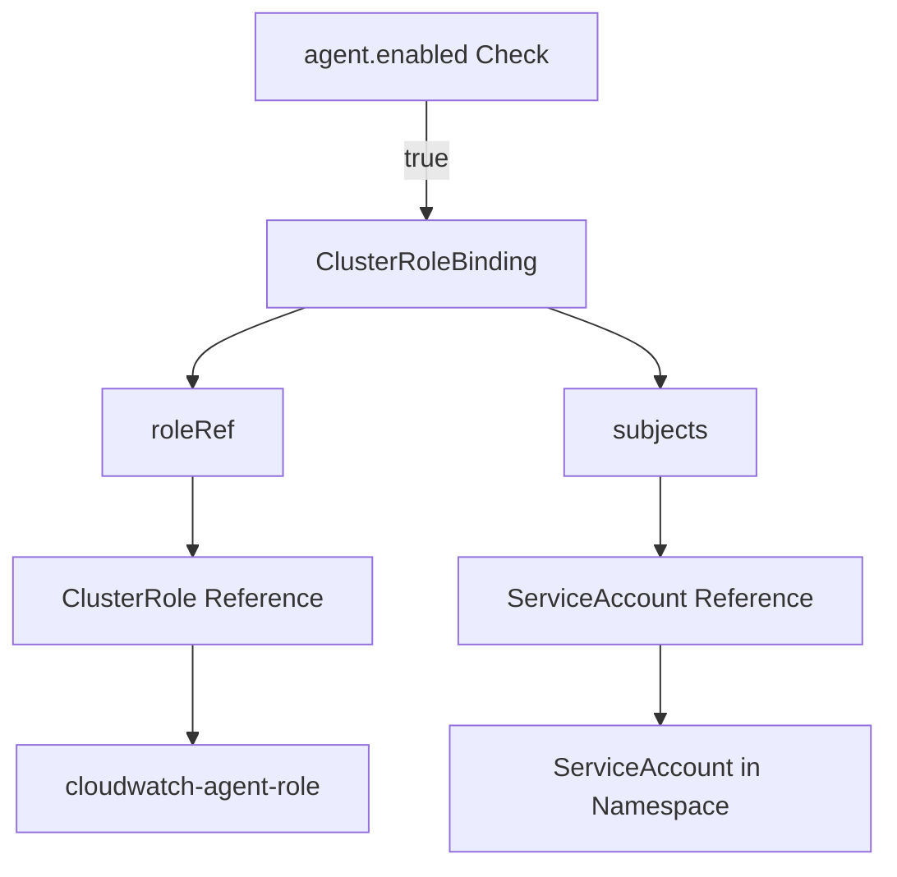
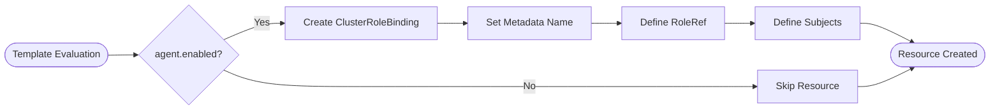
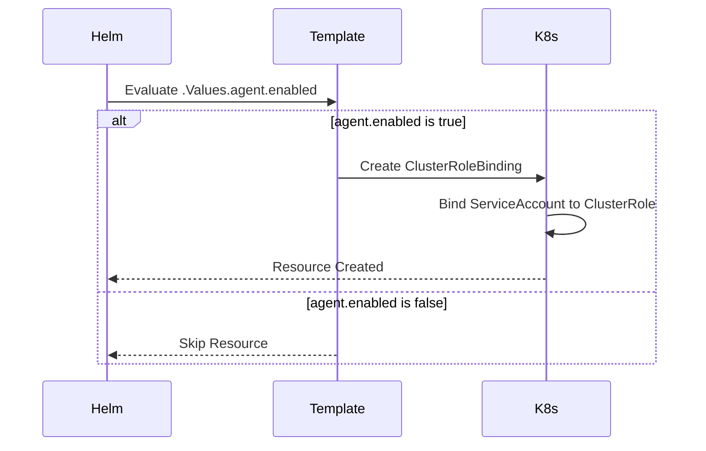

# Diagram: devops/k8s/amazon-cloudwatch-observability/helm/templates/cloudwatch-agent-clusterrolebinding.yaml

> Auto-generated by Obscura crawlers

## Diagram 1

### SVG

<svg id="container" width="549.890625" xmlns="http://www.w3.org/2000/svg" class="flowchart" height="534" viewBox="0 0 549.890625 534" role="graphics-document document" aria-roledescription="flowchart-v2"><g><marker id="container_flowchart-v2-pointEnd" class="marker flowchart-v2" viewBox="0 0 10 10" refX="5" refY="5" markerUnits="userSpaceOnUse" markerWidth="8" markerHeight="8" orient="auto"><path d="M 0 0 L 10 5 L 0 10 z" class="arrowMarkerPath" style="stroke-width: 1; stroke-dasharray: 1, 0;"></path></marker><marker id="container_flowchart-v2-pointStart" class="marker flowchart-v2" viewBox="0 0 10 10" refX="4.5" refY="5" markerUnits="userSpaceOnUse" markerWidth="8" markerHeight="8" orient="auto"><path d="M 0 5 L 10 10 L 10 0 z" class="arrowMarkerPath" style="stroke-width: 1; stroke-dasharray: 1, 0;"></path></marker><marker id="container_flowchart-v2-circleEnd" class="marker flowchart-v2" viewBox="0 0 10 10" refX="11" refY="5" markerUnits="userSpaceOnUse" markerWidth="11" markerHeight="11" orient="auto"><circle cx="5" cy="5" r="5" class="arrowMarkerPath" style="stroke-width: 1; stroke-dasharray: 1, 0;"></circle></marker><marker id="container_flowchart-v2-circleStart" class="marker flowchart-v2" viewBox="0 0 10 10" refX="-1" refY="5" markerUnits="userSpaceOnUse" markerWidth="11" markerHeight="11" orient="auto"><circle cx="5" cy="5" r="5" class="arrowMarkerPath" style="stroke-width: 1; stroke-dasharray: 1, 0;"></circle></marker><marker id="container_flowchart-v2-crossEnd" class="marker cross flowchart-v2" viewBox="0 0 11 11" refX="12" refY="5.2" markerUnits="userSpaceOnUse" markerWidth="11" markerHeight="11" orient="auto"><path d="M 1,1 l 9,9 M 10,1 l -9,9" class="arrowMarkerPath" style="stroke-width: 2; stroke-dasharray: 1, 0;"></path></marker><marker id="container_flowchart-v2-crossStart" class="marker cross flowchart-v2" viewBox="0 0 11 11" refX="-1" refY="5.2" markerUnits="userSpaceOnUse" markerWidth="11" markerHeight="11" orient="auto"><path d="M 1,1 l 9,9 M 10,1 l -9,9" class="arrowMarkerPath" style="stroke-width: 2; stroke-dasharray: 1, 0;"></path></marker><g class="root"><g class="clusters"></g><g class="edgePaths"><path d="M265.918,62L265.918,68.167C265.918,74.333,265.918,86.667,265.918,98.333C265.918,110,265.918,121,265.918,126.5L265.918,132" id="L_A_B_0" class="edge-thickness-normal edge-pattern-solid edge-thickness-normal edge-pattern-solid flowchart-link" style=";" data-edge="true" data-et="edge" data-id="L_A_B_0" data-points="W3sieCI6MjY1LjkxNzk2ODc1LCJ5Ijo2Mn0seyJ4IjoyNjUuOTE3OTY4NzUsInkiOjk5fSx7IngiOjI2NS45MTc5Njg3NSwieSI6MTM2fV0=" marker-end="url(#container_flowchart-v2-pointEnd)"></path><path d="M190.124,190L178.428,194.167C166.731,198.333,143.338,206.667,131.642,214.333C119.945,222,119.945,229,119.945,232.5L119.945,236" id="L_B_C_0" class="edge-thickness-normal edge-pattern-solid edge-thickness-normal edge-pattern-solid flowchart-link" style=";" data-edge="true" data-et="edge" data-id="L_B_C_0" data-points="W3sieCI6MTkwLjEyNDQ3NDE1ODY1Mzg0LCJ5IjoxOTB9LHsieCI6MTE5Ljk0NTMxMjUsInkiOjIxNX0seyJ4IjoxMTkuOTQ1MzEyNSwieSI6MjQwfV0=" marker-end="url(#container_flowchart-v2-pointEnd)"></path><path d="M341.711,190L353.408,194.167C365.105,198.333,388.498,206.667,400.194,214.333C411.891,222,411.891,229,411.891,232.5L411.891,236" id="L_B_D_0" class="edge-thickness-normal edge-pattern-solid edge-thickness-normal edge-pattern-solid flowchart-link" style=";" data-edge="true" data-et="edge" data-id="L_B_D_0" data-points="W3sieCI6MzQxLjcxMTQ2MzM0MTM0NjIsInkiOjE5MH0seyJ4Ijo0MTEuODkwNjI1LCJ5IjoyMTV9LHsieCI6NDExLjg5MDYyNSwieSI6MjQwfV0=" marker-end="url(#container_flowchart-v2-pointEnd)"></path><path d="M119.945,294L119.945,298.167C119.945,302.333,119.945,310.667,119.945,318.333C119.945,326,119.945,333,119.945,336.5L119.945,340" id="L_C_E_0" class="edge-thickness-normal edge-pattern-solid edge-thickness-normal edge-pattern-solid flowchart-link" style=";" data-edge="true" data-et="edge" data-id="L_C_E_0" data-points="W3sieCI6MTE5Ljk0NTMxMjUsInkiOjI5NH0seyJ4IjoxMTkuOTQ1MzEyNSwieSI6MzE5fSx7IngiOjExOS45NDUzMTI1LCJ5IjozNDR9XQ==" marker-end="url(#container_flowchart-v2-pointEnd)"></path><path d="M411.891,294L411.891,298.167C411.891,302.333,411.891,310.667,411.891,318.333C411.891,326,411.891,333,411.891,336.5L411.891,340" id="L_D_F_0" class="edge-thickness-normal edge-pattern-solid edge-thickness-normal edge-pattern-solid flowchart-link" style=";" data-edge="true" data-et="edge" data-id="L_D_F_0" data-points="W3sieCI6NDExLjg5MDYyNSwieSI6Mjk0fSx7IngiOjQxMS44OTA2MjUsInkiOjMxOX0seyJ4Ijo0MTEuODkwNjI1LCJ5IjozNDR9XQ==" marker-end="url(#container_flowchart-v2-pointEnd)"></path><path d="M119.945,398L119.945,402.167C119.945,406.333,119.945,414.667,119.945,424.333C119.945,434,119.945,445,119.945,450.5L119.945,456" id="L_E_G_0" class="edge-thickness-normal edge-pattern-solid edge-thickness-normal edge-pattern-solid flowchart-link" style=";" data-edge="true" data-et="edge" data-id="L_E_G_0" data-points="W3sieCI6MTE5Ljk0NTMxMjUsInkiOjM5OH0seyJ4IjoxMTkuOTQ1MzEyNSwieSI6NDIzfSx7IngiOjExOS45NDUzMTI1LCJ5Ijo0NjB9XQ==" marker-end="url(#container_flowchart-v2-pointEnd)"></path><path d="M411.891,398L411.891,402.167C411.891,406.333,411.891,414.667,411.891,422.333C411.891,430,411.891,437,411.891,440.5L411.891,444" id="L_F_H_0" class="edge-thickness-normal edge-pattern-solid edge-thickness-normal edge-pattern-solid flowchart-link" style=";" data-edge="true" data-et="edge" data-id="L_F_H_0" data-points="W3sieCI6NDExLjg5MDYyNSwieSI6Mzk4fSx7IngiOjQxMS44OTA2MjUsInkiOjQyM30seyJ4Ijo0MTEuODkwNjI1LCJ5Ijo0NDh9XQ==" marker-end="url(#container_flowchart-v2-pointEnd)"></path></g><g class="edgeLabels"><g class="edgeLabel" transform="translate(265.91796875, 99)"><g class="label" data-id="L_A_B_0" transform="translate(-14.9921875, -12)"><foreignObject width="29.984375" height="24">

true

</foreignObject></g></g><g class="edgeLabel"><g class="label" data-id="L_B_C_0" transform="translate(0, 0)"><foreignObject width="0" height="0">

</foreignObject></g></g><g class="edgeLabel"><g class="label" data-id="L_B_D_0" transform="translate(0, 0)"><foreignObject width="0" height="0">

</foreignObject></g></g><g class="edgeLabel"><g class="label" data-id="L_C_E_0" transform="translate(0, 0)"><foreignObject width="0" height="0">

</foreignObject></g></g><g class="edgeLabel"><g class="label" data-id="L_D_F_0" transform="translate(0, 0)"><foreignObject width="0" height="0">

</foreignObject></g></g><g class="edgeLabel"><g class="label" data-id="L_E_G_0" transform="translate(0, 0)"><foreignObject width="0" height="0">

</foreignObject></g></g><g class="edgeLabel"><g class="label" data-id="L_F_H_0" transform="translate(0, 0)"><foreignObject width="0" height="0">

</foreignObject></g></g></g><g class="nodes"><g class="node default" id="flowchart-A-0" transform="translate(265.91796875, 35)"><rect class="basic label-container" style="" x="-105.203125" y="-27" width="210.40625" height="54"></rect><g class="label" style="" transform="translate(-75.203125, -12)"><rect></rect><foreignObject width="150.40625" height="24">

agent.enabled Check

</foreignObject></g></g><g class="node default" id="flowchart-B-1" transform="translate(265.91796875, 163)"><rect class="basic label-container" style="" x="-99.109375" y="-27" width="198.21875" height="54"></rect><g class="label" style="" transform="translate(-69.109375, -12)"><rect></rect><foreignObject width="138.21875" height="24">

ClusterRoleBinding

</foreignObject></g></g><g class="node default" id="flowchart-C-3" transform="translate(119.9453125, 267)"><rect class="basic label-container" style="" x="-55.9453125" y="-27" width="111.890625" height="54"></rect><g class="label" style="" transform="translate(-25.9453125, -12)"><rect></rect><foreignObject width="51.890625" height="24">

roleRef

</foreignObject></g></g><g class="node default" id="flowchart-D-5" transform="translate(411.890625, 267)"><rect class="basic label-container" style="" x="-60.1953125" y="-27" width="120.390625" height="54"></rect><g class="label" style="" transform="translate(-30.1953125, -12)"><rect></rect><foreignObject width="60.390625" height="24">

subjects

</foreignObject></g></g><g class="node default" id="flowchart-E-7" transform="translate(119.9453125, 371)"><rect class="basic label-container" style="" x="-109.4921875" y="-27" width="218.984375" height="54"></rect><g class="label" style="" transform="translate(-79.4921875, -12)"><rect></rect><foreignObject width="158.984375" height="24">

ClusterRole Reference

</foreignObject></g></g><g class="node default" id="flowchart-F-9" transform="translate(411.890625, 371)"><rect class="basic label-container" style="" x="-122.921875" y="-27" width="245.84375" height="54"></rect><g class="label" style="" transform="translate(-92.921875, -12)"><rect></rect><foreignObject width="185.84375" height="24">

ServiceAccount Reference

</foreignObject></g></g><g class="node default" id="flowchart-G-11" transform="translate(119.9453125, 487)"><rect class="basic label-container" style="" x="-111.9453125" y="-27" width="223.890625" height="54"></rect><g class="label" style="" transform="translate(-81.9453125, -12)"><rect></rect><foreignObject width="163.890625" height="24">

cloudwatch-agent-role

</foreignObject></g></g><g class="node default" id="flowchart-H-13" transform="translate(411.890625, 487)"><rect class="basic label-container" style="" x="-130" y="-39" width="260" height="78"></rect><g class="label" style="" transform="translate(-100, -24)"><rect></rect><foreignObject width="200" height="48">

ServiceAccount in Namespace

</foreignObject></g></g></g></g></g></svg>

## Diagram 2

### SVG

<svg id="container" width="1616.0693359375" xmlns="http://www.w3.org/2000/svg" class="flowchart" height="180.78125" viewBox="0 0 1616.0693359375 180.78125" role="graphics-document document" aria-roledescription="flowchart-v2"><g><marker id="container_flowchart-v2-pointEnd" class="marker flowchart-v2" viewBox="0 0 10 10" refX="5" refY="5" markerUnits="userSpaceOnUse" markerWidth="8" markerHeight="8" orient="auto"><path d="M 0 0 L 10 5 L 0 10 z" class="arrowMarkerPath" style="stroke-width: 1; stroke-dasharray: 1, 0;"></path></marker><marker id="container_flowchart-v2-pointStart" class="marker flowchart-v2" viewBox="0 0 10 10" refX="4.5" refY="5" markerUnits="userSpaceOnUse" markerWidth="8" markerHeight="8" orient="auto"><path d="M 0 5 L 10 10 L 10 0 z" class="arrowMarkerPath" style="stroke-width: 1; stroke-dasharray: 1, 0;"></path></marker><marker id="container_flowchart-v2-circleEnd" class="marker flowchart-v2" viewBox="0 0 10 10" refX="11" refY="5" markerUnits="userSpaceOnUse" markerWidth="11" markerHeight="11" orient="auto"><circle cx="5" cy="5" r="5" class="arrowMarkerPath" style="stroke-width: 1; stroke-dasharray: 1, 0;"></circle></marker><marker id="container_flowchart-v2-circleStart" class="marker flowchart-v2" viewBox="0 0 10 10" refX="-1" refY="5" markerUnits="userSpaceOnUse" markerWidth="11" markerHeight="11" orient="auto"><circle cx="5" cy="5" r="5" class="arrowMarkerPath" style="stroke-width: 1; stroke-dasharray: 1, 0;"></circle></marker><marker id="container_flowchart-v2-crossEnd" class="marker cross flowchart-v2" viewBox="0 0 11 11" refX="12" refY="5.2" markerUnits="userSpaceOnUse" markerWidth="11" markerHeight="11" orient="auto"><path d="M 1,1 l 9,9 M 10,1 l -9,9" class="arrowMarkerPath" style="stroke-width: 2; stroke-dasharray: 1, 0;"></path></marker><marker id="container_flowchart-v2-crossStart" class="marker cross flowchart-v2" viewBox="0 0 11 11" refX="-1" refY="5.2" markerUnits="userSpaceOnUse" markerWidth="11" markerHeight="11" orient="auto"><path d="M 1,1 l 9,9 M 10,1 l -9,9" class="arrowMarkerPath" style="stroke-width: 2; stroke-dasharray: 1, 0;"></path></marker><g class="root"><g class="clusters"></g><g class="edgePaths"><path d="M180.48,90.891L184.563,90.807C188.647,90.724,196.813,90.557,204.397,90.474C211.98,90.391,218.98,90.391,222.48,90.391L225.98,90.391" id="L_Start_Condition_0" class="edge-thickness-normal edge-pattern-solid edge-thickness-normal edge-pattern-solid flowchart-link" style=";" data-edge="true" data-et="edge" data-id="L_Start_Condition_0" data-points="W3sieCI6MTgwLjQ3OTk2MjQzMTgyNzUsInkiOjkwLjg5MDYyNDk5OTk5OTk5fSx7IngiOjIwNC45Nzk5NjUyMDk5NjA5NCwieSI6OTAuMzkwNjI1fSx7IngiOjIyOS45Nzk5NjUyMDk5NjA5NCwieSI6OTAuMzkwNjI1fV0=" marker-end="url(#container_flowchart-v2-pointEnd)"></path><path d="M369.768,65.398L380.106,60.897C390.443,56.395,411.118,47.393,426.96,42.892C442.803,38.391,453.813,38.391,459.319,38.391L464.824,38.391" id="L_Condition_Create_0" class="edge-thickness-normal edge-pattern-solid edge-thickness-normal edge-pattern-solid flowchart-link" style=";" data-edge="true" data-et="edge" data-id="L_Condition_Create_0" data-points="W3sieCI6MzY5Ljc2ODQxNjAxMjA3NTYsInkiOjY1LjM5NzgyNTgwMjExNDY3fSx7IngiOjQzMS43OTI0NjUyMDk5NjA5NCwieSI6MzguMzkwNjI1fSx7IngiOjQ2OC44MjM3MTUyMDk5NjA5NCwieSI6MzguMzkwNjI1fV0=" marker-end="url(#container_flowchart-v2-pointEnd)"></path><path d="M369.768,115.383L380.106,119.885C390.443,124.386,411.118,133.388,448.326,137.889C485.535,142.391,539.277,142.391,591.014,142.391C642.751,142.391,692.483,142.391,738.343,142.391C784.204,142.391,826.194,142.391,868.183,142.391C910.173,142.391,952.162,142.391,991.174,142.391C1030.186,142.391,1066.22,142.391,1102.253,142.391C1138.287,142.391,1174.321,142.391,1196.755,142.391C1219.188,142.391,1228.022,142.391,1232.438,142.391L1236.855,142.391" id="L_Condition_Skip_0" class="edge-thickness-normal edge-pattern-solid edge-thickness-normal edge-pattern-solid flowchart-link" style=";" data-edge="true" data-et="edge" data-id="L_Condition_Skip_0" data-points="W3sieCI6MzY5Ljc2ODQxNjAxMjA3NTYsInkiOjExNS4zODM0MjQxOTc4ODUzM30seyJ4Ijo0MzEuNzkyNDY1MjA5OTYwOTQsInkiOjE0Mi4zOTA2MjV9LHsieCI6NTkzLjAxOTAyNzcwOTk2MDksInkiOjE0Mi4zOTA2MjV9LHsieCI6NzQyLjIxNDM0MDIwOTk2MDksInkiOjE0Mi4zOTA2MjV9LHsieCI6ODY4LjE4MzA5MDIwOTk2MDksInkiOjE0Mi4zOTA2MjV9LHsieCI6OTk0LjE1MTg0MDIwOTk2MDksInkiOjE0Mi4zOTA2MjV9LHsieCI6MTEwMi4yNTM0MDI3MDk5NjEsInkiOjE0Mi4zOTA2MjV9LHsieCI6MTIxMC4zNTQ5NjUyMDk5NjEsInkiOjE0Mi4zOTA2MjV9LHsieCI6MTI0MC44NTQ5NjUyMDk5NjEsInkiOjE0Mi4zOTA2MjV9XQ==" marker-end="url(#container_flowchart-v2-pointEnd)"></path><path d="M717.214,38.391L721.381,38.391C725.548,38.391,733.881,38.391,741.548,38.391C749.214,38.391,756.214,38.391,759.714,38.391L763.214,38.391" id="L_Create_SetMeta_0" class="edge-thickness-normal edge-pattern-solid edge-thickness-normal edge-pattern-solid flowchart-link" style=";" data-edge="true" data-et="edge" data-id="L_Create_SetMeta_0" data-points="W3sieCI6NzE3LjIxNDM0MDIwOTk2MDksInkiOjM4LjM5MDYyNX0seyJ4Ijo3NDIuMjE0MzQwMjA5OTYwOSwieSI6MzguMzkwNjI1fSx7IngiOjc2Ny4yMTQzNDAyMDk5NjA5LCJ5IjozOC4zOTA2MjV9XQ==" marker-end="url(#container_flowchart-v2-pointEnd)"></path><path d="M969.152,38.391L973.319,38.391C977.485,38.391,985.819,38.391,993.485,38.391C1001.152,38.391,1008.152,38.391,1011.652,38.391L1015.152,38.391" id="L_SetMeta_SetRole_0" class="edge-thickness-normal edge-pattern-solid edge-thickness-normal edge-pattern-solid flowchart-link" style=";" data-edge="true" data-et="edge" data-id="L_SetMeta_SetRole_0" data-points="W3sieCI6OTY5LjE1MTg0MDIwOTk2MDksInkiOjM4LjM5MDYyNX0seyJ4Ijo5OTQuMTUxODQwMjA5OTYwOSwieSI6MzguMzkwNjI1fSx7IngiOjEwMTkuMTUxODQwMjA5OTYwOSwieSI6MzguMzkwNjI1fV0=" marker-end="url(#container_flowchart-v2-pointEnd)"></path><path d="M1185.355,38.391L1189.522,38.391C1193.688,38.391,1202.022,38.391,1209.688,38.391C1217.355,38.391,1224.355,38.391,1227.855,38.391L1231.355,38.391" id="L_SetRole_SetSubjects_0" class="edge-thickness-normal edge-pattern-solid edge-thickness-normal edge-pattern-solid flowchart-link" style=";" data-edge="true" data-et="edge" data-id="L_SetRole_SetSubjects_0" data-points="W3sieCI6MTE4NS4zNTQ5NjUyMDk5NjEsInkiOjM4LjM5MDYyNX0seyJ4IjoxMjEwLjM1NDk2NTIwOTk2MSwieSI6MzguMzkwNjI1fSx7IngiOjEyMzUuMzU0OTY1MjA5OTYxLCJ5IjozOC4zOTA2MjV9XQ==" marker-end="url(#container_flowchart-v2-pointEnd)"></path><path d="M1407.558,38.391L1411.725,38.391C1415.891,38.391,1424.225,38.391,1438.327,43.582C1452.43,48.773,1472.301,59.156,1482.237,64.347L1492.173,69.538" id="L_SetSubjects_End_0" class="edge-thickness-normal edge-pattern-solid edge-thickness-normal edge-pattern-solid flowchart-link" style=";" data-edge="true" data-et="edge" data-id="L_SetSubjects_End_0" data-points="W3sieCI6MTQwNy41NTgwOTAyMDk5NjEsInkiOjM4LjM5MDYyNX0seyJ4IjoxNDMyLjU1ODA5MDIwOTk2MSwieSI6MzguMzkwNjI1fSx7IngiOjE0OTUuNzE3ODQ0OTYzMDczNywieSI6NzEuMzkwNjI1fV0=" marker-end="url(#container_flowchart-v2-pointEnd)"></path><path d="M1402.058,142.391L1407.141,142.391C1412.225,142.391,1422.391,142.391,1437.407,137.359C1452.422,132.327,1472.286,122.263,1482.218,117.23L1492.15,112.198" id="L_Skip_End_0" class="edge-thickness-normal edge-pattern-solid edge-thickness-normal edge-pattern-solid flowchart-link" style=";" data-edge="true" data-et="edge" data-id="L_Skip_End_0" data-points="W3sieCI6MTQwMi4wNTgwOTAyMDk5NjEsInkiOjE0Mi4zOTA2MjV9LHsieCI6MTQzMi41NTgwOTAyMDk5NjEsInkiOjE0Mi4zOTA2MjV9LHsieCI6MTQ5NS43MTc4NDQ5NjMwNzM3LCJ5IjoxMTAuMzkwNjI1fV0=" marker-end="url(#container_flowchart-v2-pointEnd)"></path></g><g class="edgeLabels"><g class="edgeLabel"><g class="label" data-id="L_Start_Condition_0" transform="translate(0, 0)"><foreignObject width="0" height="0">

</foreignObject></g></g><g class="edgeLabel" transform="translate(431.79246520996094, 38.390625)"><g class="label" data-id="L_Condition_Create_0" transform="translate(-12.03125, -12)"><foreignObject width="24.0625" height="24">

Yes

</foreignObject></g></g><g class="edgeLabel" transform="translate(868.1830902099609, 142.390625)"><g class="label" data-id="L_Condition_Skip_0" transform="translate(-10.140625, -12)"><foreignObject width="20.28125" height="24">

No

</foreignObject></g></g><g class="edgeLabel"><g class="label" data-id="L_Create_SetMeta_0" transform="translate(0, 0)"><foreignObject width="0" height="0">

</foreignObject></g></g><g class="edgeLabel"><g class="label" data-id="L_SetMeta_SetRole_0" transform="translate(0, 0)"><foreignObject width="0" height="0">

</foreignObject></g></g><g class="edgeLabel"><g class="label" data-id="L_SetRole_SetSubjects_0" transform="translate(0, 0)"><foreignObject width="0" height="0">

</foreignObject></g></g><g class="edgeLabel"><g class="label" data-id="L_SetSubjects_End_0" transform="translate(0, 0)"><foreignObject width="0" height="0">

</foreignObject></g></g><g class="edgeLabel"><g class="label" data-id="L_Skip_End_0" transform="translate(0, 0)"><foreignObject width="0" height="0">

</foreignObject></g></g></g><g class="nodes"><g class="node default" id="flowchart-Start-0" transform="translate(93.98998260498047, 90.390625)"><g class="basic label-container outer-path"><path d="M-66.5 -19.5 C-17.930957314005873 -19.5, 30.638085371988254 -19.5, 66.5 -19.5 C66.5 -19.5, 66.5 -19.5, 66.5 -19.5 C66.89023338944209 -19.487485974743805, 67.28046677888419 -19.474971949487614, 67.7493692896239 -19.45993515863156 C68.24070434274387 -19.41253665697393, 68.73203939586384 -19.365138155316302, 68.99360465284786 -19.3399052695533 C69.26268251879752 -19.296402846916575, 69.53176038474716 -19.252900424279854, 70.22759325967675 -19.140403561325776 C70.6199937955666 -19.05084069966172, 71.01239433145645 -18.961277837997663, 71.44626438623538 -18.862249829261074 C71.75604879752372 -18.770307442082256, 72.06583320881205 -18.678365054903434, 72.6446102514606 -18.50658706670804 C72.99843258382259 -18.376377177701045, 73.35225491618456 -18.246167288694046, 73.8177065951478 -18.074876768247425 C74.10260818773621 -17.948759284514, 74.38750978032462 -17.82264180078058, 74.96073291279238 -17.568892924097174 C75.22326685425232 -17.43192913499854, 75.48580079571227 -17.294965345899904, 76.06899226407678 -16.990714730406097 C76.43569161702928 -16.768419427681703, 76.80239096998176 -16.546124124957306, 77.1379305736057 -16.342718045390892 C77.36502389550252 -16.184307574747134, 77.59211721739933 -16.02589710410337, 78.16315534457871 -15.627565626425154 C78.48744255132442 -15.368955208690448, 78.81172975807011 -15.11034479095574, 79.14045370850187 -14.848196188198123 C79.50523686584431 -14.516909776333174, 79.87002002318674 -14.185623364468222, 80.06580973676799 -14.007812326905688 C80.4083437799685 -13.654117804733204, 80.750877823169 -13.30042328256072, 80.93542094296865 -13.10986736009568 C81.238142947962 -12.754272867660431, 81.54086495295535 -12.398678375225181, 81.74571390812658 -12.158051136245305 C82.03494218386808 -11.770511595989664, 82.32417045960959 -11.38297205573402, 82.49335896464063 -11.156274872382312 C82.67363971700894 -10.879315224584255, 82.85392046937723 -10.602355576786199, 83.17528387860425 -10.108655082055241 C83.41832955719231 -9.67710286867845, 83.66137523578037 -9.245550655301656, 83.7886864742735 -9.019496659696287 C83.9958596775562 -8.589297070283342, 84.20303288083889 -8.159097480870397, 84.33104614880834 -7.893275190886684 C84.48935690764762 -7.502244555823352, 84.64766766648691 -7.11121392076002, 84.80013422997033 -6.734618561215508 C84.95107874213915 -6.279997740305038, 85.10202325430795 -5.82537691939457, 85.19402313421489 -5.548287939305138 C85.29116025840045 -5.177861985289619, 85.38829738258603 -4.807436031274101, 85.51109428754556 -4.339158212148133 C85.57879918618475 -3.991507867071245, 85.64650408482396 -3.6438575219943563, 85.75004477658177 -3.1121979531509023 C85.79485108703369 -2.7646890572925944, 85.83965739748561 -2.4171801614342865, 85.90989270250937 -1.872449005199798 C85.9326249536306 -1.518375844843961, 85.9553572047518 -1.1643026844881241, 85.98998121591342 -0.6250057626472757 C85.98998121591342 -0.15308770315164155, 85.98998121591342 0.3188303563439926, 85.98998121591342 0.625005762647271 C85.96184304710891 1.0632804544983707, 85.93370487830443 1.5015551463494705, 85.90989270250937 1.8724490051997846 C85.84844519610927 2.3490237306563184, 85.78699768970917 2.8255984561128518, 85.75004477658177 3.1121979531508885 C85.66342540506571 3.556970118875274, 85.57680603354963 4.0017422845996595, 85.51109428754556 4.339158212148129 C85.42922300223296 4.651368906284578, 85.34735171692037 4.963579600421027, 85.19402313421489 5.548287939305125 C85.04587425541922 5.994488757919364, 84.89772537662355 6.440689576533604, 84.80013422997033 6.734618561215495 C84.63871193572992 7.133334748877065, 84.47728964148949 7.532050936538636, 84.33104614880834 7.893275190886679 C84.20063062211555 8.164085822509511, 84.07021509542275 8.434896454132344, 83.7886864742735 9.019496659696284 C83.60685384941021 9.342358897690902, 83.42502122454692 9.66522113568552, 83.17528387860425 10.108655082055236 C82.92487409926193 10.493351747565905, 82.67446431991961 10.878048413076575, 82.49335896464065 11.156274872382301 C82.27288689412538 11.451687361453947, 82.0524148236101 11.747099850525593, 81.74571390812659 12.158051136245302 C81.43712240702044 12.52054027279844, 81.12853090591427 12.883029409351577, 80.93542094296866 13.10986736009567 C80.67107983431497 13.382821257589248, 80.40673872566127 13.655775155082827, 80.06580973676799 14.007812326905684 C79.83412040332009 14.218226449379232, 79.60243106987218 14.428640571852778, 79.1404537085019 14.848196188198111 C78.80057113219615 15.119243498146725, 78.46068855589043 15.390290808095338, 78.16315534457871 15.627565626425152 C77.91252812281463 15.8023923268502, 77.66190090105057 15.977219027275249, 77.1379305736057 16.34271804539089 C76.85116341800243 16.516557980348455, 76.56439626239916 16.690397915306022, 76.06899226407678 16.990714730406093 C75.6804618909017 17.193410777225953, 75.29193151772661 17.396106824045813, 74.96073291279238 17.56889292409717 C74.55884594866069 17.746796361565053, 74.156958984529 17.924699799032936, 73.8177065951478 18.07487676824742 C73.51749101496095 18.18535887691858, 73.21727543477412 18.295840985589738, 72.64461025146062 18.506587066708033 C72.28003721917878 18.614790429006387, 71.91546418689693 18.72299379130474, 71.44626438623541 18.86224982926107 C71.11301888402721 18.93831094050996, 70.77977338181901 19.01437205175885, 70.22759325967677 19.140403561325773 C69.76907015334629 19.214534021257485, 69.31054704701582 19.2886644811892, 68.99360465284788 19.3399052695533 C68.72230045922718 19.366077658820856, 68.45099626560648 19.392250048088414, 67.7493692896239 19.45993515863156 C67.25634546239235 19.475745473158213, 66.7633216351608 19.491555787684863, 66.5 19.5 C66.5 19.5, 66.5 19.5, 66.5 19.5 C26.18697592161928 19.5, -14.126048156761442 19.5, -66.5 19.5 C-66.89935548430032 19.487193446916784, -67.29871096860062 19.474386893833568, -67.7493692896239 19.45993515863156 C-68.0529898758345 19.430645245837002, -68.3566104620451 19.401355333042442, -68.99360465284786 19.3399052695533 C-69.3363360227635 19.284495119586808, -69.67906739267913 19.229084969620317, -70.22759325967675 19.140403561325773 C-70.56512447600834 19.06336426379512, -70.9026556923399 18.98632496626447, -71.44626438623538 18.862249829261074 C-71.84778937958916 18.743079318881378, -72.24931437294292 18.623908808501678, -72.64461025146059 18.506587066708043 C-73.00230903644912 18.374950607300942, -73.36000782143766 18.243314147893837, -73.8177065951478 18.074876768247425 C-74.24566427129162 17.88543259993197, -74.67362194743542 17.695988431616513, -74.96073291279238 17.568892924097174 C-75.1915840762905 17.448458019967433, -75.42243523978861 17.32802311583769, -76.06899226407678 16.990714730406097 C-76.48353305637723 16.739417666001465, -76.89807384867768 16.488120601596833, -77.13793057360569 16.3427180453909 C-77.41027850859939 16.15273991569138, -77.6826264435931 15.962761785991864, -78.16315534457871 15.627565626425156 C-78.51494458626324 15.347023067686626, -78.86673382794775 15.066480508948098, -79.14045370850187 14.848196188198125 C-79.33469594918193 14.671790524580544, -79.52893818986202 14.495384860962963, -80.06580973676797 14.007812326905697 C-80.36837617980373 13.695387633304318, -80.67094262283949 13.38296293970294, -80.93542094296865 13.109867360095677 C-81.19066226790368 12.810046376184175, -81.44590359283869 12.510225392272675, -81.74571390812658 12.158051136245307 C-81.94566069739217 11.89014065415665, -82.14560748665775 11.622230172067992, -82.49335896464063 11.156274872382316 C-82.74511713622206 10.769506714298366, -82.99687530780349 10.382738556214417, -83.17528387860425 10.108655082055249 C-83.3715641867863 9.760139519341593, -83.56784449496834 9.411623956627935, -83.7886864742735 9.019496659696289 C-83.90482142606065 8.778339947420394, -84.02095637784778 8.537183235144498, -84.33104614880834 7.893275190886686 C-84.50212148320851 7.470715807401685, -84.67319681760868 7.048156423916684, -84.80013422997033 6.73461856121551 C-84.91739651862395 6.381443230999263, -85.03465880727758 6.028267900783016, -85.19402313421489 5.5482879393051325 C-85.3091606432056 5.109218716611462, -85.42429815219633 4.6701494939177906, -85.51109428754556 4.339158212148136 C-85.59107354890288 3.9284816087011136, -85.67105281026022 3.5178050052540915, -85.75004477658177 3.112197953150904 C-85.8061788087008 2.676833484954184, -85.86231284081983 2.2414690167574642, -85.90989270250937 1.872449005199809 C-85.92626986520497 1.6173614768080589, -85.94264702790056 1.3622739484163087, -85.98998121591342 0.6250057626472781 C-85.98998121591342 0.18680228958644668, -85.98998121591342 -0.2514011834743848, -85.98998121591342 -0.6250057626472687 C-85.96750618807008 -0.975072462823289, -85.94503116022673 -1.3251391629993092, -85.90989270250937 -1.8724490051997822 C-85.85784604841592 -2.2761125765742163, -85.80579939432246 -2.6797761479486506, -85.75004477658177 -3.112197953150895 C-85.67852283969576 -3.479447982893868, -85.60700090280974 -3.8466980126368413, -85.51109428754556 -4.339158212148126 C-85.44620537246601 -4.586607768380126, -85.38131645738648 -4.834057324612124, -85.19402313421489 -5.548287939305123 C-85.08350002771657 -5.8811659266124385, -84.97297692121825 -6.214043913919754, -84.80013422997033 -6.734618561215485 C-84.6627002474688 -7.074083155099527, -84.52526626496729 -7.41354774898357, -84.33104614880834 -7.893275190886676 C-84.15400814084823 -8.260898402422372, -83.97697013288814 -8.62852161395807, -83.7886864742735 -9.019496659696282 C-83.62484221524996 -9.310418732622892, -83.46099795622641 -9.601340805549503, -83.17528387860425 -10.108655082055243 C-82.94757615348213 -10.458475295928544, -82.71986842836002 -10.808295509801843, -82.49335896464063 -11.156274872382308 C-82.19779392304748 -11.552305101587907, -81.90222888145435 -11.948335330793505, -81.74571390812659 -12.158051136245302 C-81.4310343234299 -12.527691682205656, -81.1163547387332 -12.897332228166011, -80.93542094296866 -13.10986736009567 C-80.63929729066815 -13.415639343299947, -80.34317363836763 -13.721411326504224, -80.06580973676799 -14.007812326905677 C-79.73889441858061 -14.304708169178122, -79.41197910039325 -14.601604011450565, -79.1404537085019 -14.848196188198107 C-78.80857158891769 -15.112863346812398, -78.47668946933348 -15.377530505426689, -78.16315534457871 -15.627565626425149 C-77.77004418575028 -15.901782953316074, -77.37693302692185 -16.176000280207, -77.13793057360571 -16.342718045390885 C-76.7946126239191 -16.550839404051132, -76.45129467423247 -16.75896076271138, -76.06899226407678 -16.99071473040609 C-75.78807266100172 -17.137270307392754, -75.50715305792667 -17.28382588437942, -74.9607329127924 -17.56889292409717 C-74.56414232178115 -17.74445181429596, -74.1675517307699 -17.920010704494747, -73.81770659514781 -18.07487676824742 C-73.38172383836894 -18.23532245292247, -72.94574108159006 -18.395768137597518, -72.64461025146062 -18.506587066708033 C-72.26258441753974 -18.619970328921227, -71.88055858361886 -18.73335359113442, -71.44626438623541 -18.862249829261067 C-71.06575239842624 -18.949099207405737, -70.68524041061707 -19.035948585550404, -70.22759325967677 -19.140403561325773 C-69.94077645661069 -19.186773877747967, -69.65395965354463 -19.233144194170162, -68.99360465284788 -19.3399052695533 C-68.66769287660757 -19.371345586640942, -68.34178110036727 -19.40278590372859, -67.7493692896239 -19.45993515863156 C-67.30363174310605 -19.474229094172884, -66.85789419658822 -19.48852302971421, -66.5 -19.5 C-66.5 -19.5, -66.5 -19.5, -66.5 -19.5" stroke="none" stroke-width="0" fill="#ECECFF" style=""></path><path d="M-66.5 -19.5 C-36.006126627278206 -19.5, -5.512253254556406 -19.5, 66.5 -19.5 M-66.5 -19.5 C-19.722006149795256 -19.5, 27.05598770040949 -19.5, 66.5 -19.5 M66.5 -19.5 C66.5 -19.5, 66.5 -19.5, 66.5 -19.5 M66.5 -19.5 C66.5 -19.5, 66.5 -19.5, 66.5 -19.5 M66.5 -19.5 C66.84283656275345 -19.489005898723384, 67.18567312550688 -19.47801179744677, 67.7493692896239 -19.45993515863156 M66.5 -19.5 C66.8945210746363 -19.4873484770251, 67.28904214927262 -19.474696954050202, 67.7493692896239 -19.45993515863156 M67.7493692896239 -19.45993515863156 C68.13706984925831 -19.42253415192177, 68.52477040889272 -19.385133145211977, 68.99360465284786 -19.3399052695533 M67.7493692896239 -19.45993515863156 C68.23251225932292 -19.413326937409128, 68.71565522902192 -19.3667187161867, 68.99360465284786 -19.3399052695533 M68.99360465284786 -19.3399052695533 C69.24779277358456 -19.298810105450908, 69.50198089432126 -19.257714941348514, 70.22759325967675 -19.140403561325776 M68.99360465284786 -19.3399052695533 C69.26909231960919 -19.295366560030093, 69.5445799863705 -19.250827850506887, 70.22759325967675 -19.140403561325776 M70.22759325967675 -19.140403561325776 C70.53678429975069 -19.069832724088997, 70.84597533982463 -18.999261886852214, 71.44626438623538 -18.862249829261074 M70.22759325967675 -19.140403561325776 C70.60789845176049 -19.053601382955968, 70.98820364384424 -18.96679920458616, 71.44626438623538 -18.862249829261074 M71.44626438623538 -18.862249829261074 C71.77370203726683 -18.765068053190245, 72.10113968829828 -18.667886277119415, 72.6446102514606 -18.50658706670804 M71.44626438623538 -18.862249829261074 C71.87173125539391 -18.735973495815994, 72.29719812455245 -18.609697162370914, 72.6446102514606 -18.50658706670804 M72.6446102514606 -18.50658706670804 C73.05558588556067 -18.3553442343421, 73.46656151966074 -18.204101401976157, 73.8177065951478 -18.074876768247425 M72.6446102514606 -18.50658706670804 C72.91816715008899 -18.40591559928054, 73.19172404871739 -18.305244131853044, 73.8177065951478 -18.074876768247425 M73.8177065951478 -18.074876768247425 C74.21449549541663 -17.899230092422936, 74.61128439568547 -17.723583416598448, 74.96073291279238 -17.568892924097174 M73.8177065951478 -18.074876768247425 C74.15691426098326 -17.924719596819962, 74.4961219268187 -17.774562425392503, 74.96073291279238 -17.568892924097174 M74.96073291279238 -17.568892924097174 C75.33515897814956 -17.373555085631672, 75.70958504350675 -17.178217247166174, 76.06899226407678 -16.990714730406097 M74.96073291279238 -17.568892924097174 C75.26126817084825 -17.41210387247144, 75.56180342890414 -17.255314820845708, 76.06899226407678 -16.990714730406097 M76.06899226407678 -16.990714730406097 C76.49577074783963 -16.731999105520305, 76.92254923160247 -16.47328348063451, 77.1379305736057 -16.342718045390892 M76.06899226407678 -16.990714730406097 C76.31203553686309 -16.843380470162227, 76.5550788096494 -16.696046209918357, 77.1379305736057 -16.342718045390892 M77.1379305736057 -16.342718045390892 C77.39470919169851 -16.163600397176573, 77.65148780979132 -15.984482748962254, 78.16315534457871 -15.627565626425154 M77.1379305736057 -16.342718045390892 C77.39407223353662 -16.16404471161683, 77.65021389346754 -15.985371377842771, 78.16315534457871 -15.627565626425154 M78.16315534457871 -15.627565626425154 C78.51972635125409 -15.343209737354524, 78.87629735792947 -15.058853848283892, 79.14045370850187 -14.848196188198123 M78.16315534457871 -15.627565626425154 C78.51355123463497 -15.348134228531523, 78.86394712469124 -15.06870283063789, 79.14045370850187 -14.848196188198123 M79.14045370850187 -14.848196188198123 C79.33647242674753 -14.670177174658486, 79.53249114499322 -14.49215816111885, 80.06580973676799 -14.007812326905688 M79.14045370850187 -14.848196188198123 C79.45681053847618 -14.560889285558495, 79.77316736845049 -14.27358238291887, 80.06580973676799 -14.007812326905688 M80.06580973676799 -14.007812326905688 C80.3264582579386 -13.738671329155467, 80.5871067791092 -13.469530331405249, 80.93542094296865 -13.10986736009568 M80.06580973676799 -14.007812326905688 C80.41038869378662 -13.652006263325458, 80.75496765080523 -13.296200199745227, 80.93542094296865 -13.10986736009568 M80.93542094296865 -13.10986736009568 C81.22247118389525 -12.77268181348187, 81.50952142482186 -12.43549626686806, 81.74571390812658 -12.158051136245305 M80.93542094296865 -13.10986736009568 C81.23041351683553 -12.763352297278681, 81.5254060907024 -12.416837234461681, 81.74571390812658 -12.158051136245305 M81.74571390812658 -12.158051136245305 C81.97303021914482 -11.85346798842281, 82.20034653016307 -11.548884840600314, 82.49335896464063 -11.156274872382312 M81.74571390812658 -12.158051136245305 C81.96716741089129 -11.861323617369717, 82.18862091365602 -11.564596098494127, 82.49335896464063 -11.156274872382312 M82.49335896464063 -11.156274872382312 C82.6572876178464 -10.90443644005134, 82.82121627105218 -10.652598007720368, 83.17528387860425 -10.108655082055241 M82.49335896464063 -11.156274872382312 C82.68493487259965 -10.861962832422948, 82.87651078055868 -10.567650792463585, 83.17528387860425 -10.108655082055241 M83.17528387860425 -10.108655082055241 C83.30710969066793 -9.874585003925223, 83.4389355027316 -9.640514925795202, 83.7886864742735 -9.019496659696287 M83.17528387860425 -10.108655082055241 C83.31076734021245 -9.868090476781743, 83.44625080182064 -9.627525871508247, 83.7886864742735 -9.019496659696287 M83.7886864742735 -9.019496659696287 C83.98365831477639 -8.614633461162946, 84.17863015527928 -8.209770262629604, 84.33104614880834 -7.893275190886684 M83.7886864742735 -9.019496659696287 C83.94714108027388 -8.690462279951065, 84.10559568627426 -8.361427900205841, 84.33104614880834 -7.893275190886684 M84.33104614880834 -7.893275190886684 C84.4388659164452 -7.626958280270269, 84.54668568408204 -7.360641369653854, 84.80013422997033 -6.734618561215508 M84.33104614880834 -7.893275190886684 C84.50789172103887 -7.456463208400729, 84.68473729326941 -7.019651225914773, 84.80013422997033 -6.734618561215508 M84.80013422997033 -6.734618561215508 C84.93051566862115 -6.341930441460359, 85.060897107272 -5.949242321705209, 85.19402313421489 -5.548287939305138 M84.80013422997033 -6.734618561215508 C84.9464739599374 -6.293866610624264, 85.09281368990447 -5.853114660033018, 85.19402313421489 -5.548287939305138 M85.19402313421489 -5.548287939305138 C85.2718129471547 -5.251641668247453, 85.3496027600945 -4.954995397189769, 85.51109428754556 -4.339158212148133 M85.19402313421489 -5.548287939305138 C85.28610642184087 -5.197134454437964, 85.37818970946685 -4.845980969570789, 85.51109428754556 -4.339158212148133 M85.51109428754556 -4.339158212148133 C85.59764925608671 -3.894716742088377, 85.68420422462788 -3.4502752720286205, 85.75004477658177 -3.1121979531509023 M85.51109428754556 -4.339158212148133 C85.6032169879962 -3.8661276154736983, 85.69533968844685 -3.393097018799264, 85.75004477658177 -3.1121979531509023 M85.75004477658177 -3.1121979531509023 C85.79020949792077 -2.8006883058669416, 85.83037421925978 -2.4891786585829805, 85.90989270250937 -1.872449005199798 M85.75004477658177 -3.1121979531509023 C85.80536994740145 -2.6831068534642184, 85.86069511822112 -2.2540157537775345, 85.90989270250937 -1.872449005199798 M85.90989270250937 -1.872449005199798 C85.93622393547953 -1.4623187975007794, 85.9625551684497 -1.0521885898017609, 85.98998121591342 -0.6250057626472757 M85.90989270250937 -1.872449005199798 C85.93938445253595 -1.4130911932235763, 85.96887620256254 -0.9537333812473546, 85.98998121591342 -0.6250057626472757 M85.98998121591342 -0.6250057626472757 C85.98998121591342 -0.26688710490102013, 85.98998121591342 0.09123155284523543, 85.98998121591342 0.625005762647271 M85.98998121591342 -0.6250057626472757 C85.98998121591342 -0.21845830489000834, 85.98998121591342 0.18808915286725902, 85.98998121591342 0.625005762647271 M85.98998121591342 0.625005762647271 C85.96275695422561 1.0490456134632866, 85.93553269253782 1.473085464279302, 85.90989270250937 1.8724490051997846 M85.98998121591342 0.625005762647271 C85.96038400516417 1.0860062105052113, 85.93078679441493 1.5470066583631517, 85.90989270250937 1.8724490051997846 M85.90989270250937 1.8724490051997846 C85.86862554792899 2.192508907003804, 85.8273583933486 2.512568808807824, 85.75004477658177 3.1121979531508885 M85.90989270250937 1.8724490051997846 C85.85259412488243 2.3168454583903753, 85.79529554725549 2.7612419115809654, 85.75004477658177 3.1121979531508885 M85.75004477658177 3.1121979531508885 C85.65929655240966 3.578170904630757, 85.56854832823754 4.044143856110626, 85.51109428754556 4.339158212148129 M85.75004477658177 3.1121979531508885 C85.66910777786087 3.527792335541974, 85.58817077913997 3.94338671793306, 85.51109428754556 4.339158212148129 M85.51109428754556 4.339158212148129 C85.43378187125327 4.633983962883795, 85.35646945496099 4.928809713619461, 85.19402313421489 5.548287939305125 M85.51109428754556 4.339158212148129 C85.39004919896237 4.800755596189093, 85.26900411037917 5.262352980230059, 85.19402313421489 5.548287939305125 M85.19402313421489 5.548287939305125 C85.1148467335888 5.78675464294461, 85.03567033296271 6.025221346584094, 84.80013422997033 6.734618561215495 M85.19402313421489 5.548287939305125 C85.05203423467354 5.975935881864753, 84.9100453351322 6.403583824424381, 84.80013422997033 6.734618561215495 M84.80013422997033 6.734618561215495 C84.63308700936257 7.147228425754953, 84.46603978875481 7.559838290294412, 84.33104614880834 7.893275190886679 M84.80013422997033 6.734618561215495 C84.6577002240063 7.086433309720779, 84.5152662180423 7.438248058226065, 84.33104614880834 7.893275190886679 M84.33104614880834 7.893275190886679 C84.13628139734227 8.297708364604066, 83.9415166458762 8.702141538321456, 83.7886864742735 9.019496659696284 M84.33104614880834 7.893275190886679 C84.21592707598657 8.132322408754668, 84.10080800316479 8.371369626622656, 83.7886864742735 9.019496659696284 M83.7886864742735 9.019496659696284 C83.62175429709386 9.315901643994668, 83.4548221199142 9.612306628293053, 83.17528387860425 10.108655082055236 M83.7886864742735 9.019496659696284 C83.60824390100596 9.339890720324668, 83.42780132773842 9.660284780953052, 83.17528387860425 10.108655082055236 M83.17528387860425 10.108655082055236 C82.98217716496235 10.405318850622399, 82.78907045132044 10.701982619189561, 82.49335896464065 11.156274872382301 M83.17528387860425 10.108655082055236 C82.91405093927155 10.509979027736533, 82.65281799993885 10.911302973417829, 82.49335896464065 11.156274872382301 M82.49335896464065 11.156274872382301 C82.31679496146424 11.392854551327098, 82.14023095828783 11.629434230271892, 81.74571390812659 12.158051136245302 M82.49335896464065 11.156274872382301 C82.28476883081176 11.4357666487609, 82.07617869698286 11.715258425139499, 81.74571390812659 12.158051136245302 M81.74571390812659 12.158051136245302 C81.57698710276685 12.356247242648058, 81.40826029740711 12.554443349050814, 80.93542094296866 13.10986736009567 M81.74571390812659 12.158051136245302 C81.57198402783459 12.362124139146523, 81.39825414754257 12.566197142047747, 80.93542094296866 13.10986736009567 M80.93542094296866 13.10986736009567 C80.69451847899812 13.358618932605381, 80.45361601502756 13.607370505115094, 80.06580973676799 14.007812326905684 M80.93542094296866 13.10986736009567 C80.61472784888748 13.44100930912717, 80.2940347548063 13.77215125815867, 80.06580973676799 14.007812326905684 M80.06580973676799 14.007812326905684 C79.77289502991215 14.273829713573708, 79.47998032305631 14.539847100241733, 79.1404537085019 14.848196188198111 M80.06580973676799 14.007812326905684 C79.74174110773583 14.302122881406628, 79.41767247870368 14.59643343590757, 79.1404537085019 14.848196188198111 M79.1404537085019 14.848196188198111 C78.7590313230415 15.152370390526816, 78.37760893758112 15.45654459285552, 78.16315534457871 15.627565626425152 M79.1404537085019 14.848196188198111 C78.87372465681905 15.060905508957017, 78.6069956051362 15.273614829715925, 78.16315534457871 15.627565626425152 M78.16315534457871 15.627565626425152 C77.91811828219787 15.79849287365856, 77.67308121981702 15.96942012089197, 77.1379305736057 16.34271804539089 M78.16315534457871 15.627565626425152 C77.93977861941545 15.783383560076464, 77.71640189425217 15.939201493727778, 77.1379305736057 16.34271804539089 M77.1379305736057 16.34271804539089 C76.82181256578876 16.534350639445133, 76.50569455797184 16.725983233499374, 76.06899226407678 16.990714730406093 M77.1379305736057 16.34271804539089 C76.86891575777045 16.505796407656753, 76.5999009419352 16.668874769922617, 76.06899226407678 16.990714730406093 M76.06899226407678 16.990714730406093 C75.769999186132 17.14669922765568, 75.47100610818721 17.30268372490527, 74.96073291279238 17.56889292409717 M76.06899226407678 16.990714730406093 C75.80191828287096 17.13004705533212, 75.53484430166515 17.269379380258147, 74.96073291279238 17.56889292409717 M74.96073291279238 17.56889292409717 C74.55412049884346 17.748888178023652, 74.14750808489454 17.928883431950133, 73.8177065951478 18.07487676824742 M74.96073291279238 17.56889292409717 C74.51467754824907 17.766348402218227, 74.06862218370577 17.963803880339285, 73.8177065951478 18.07487676824742 M73.8177065951478 18.07487676824742 C73.40264812790285 18.227622120951974, 72.98758966065792 18.380367473656523, 72.64461025146062 18.506587066708033 M73.8177065951478 18.07487676824742 C73.35443620493841 18.245364554269017, 72.89116581472904 18.415852340290616, 72.64461025146062 18.506587066708033 M72.64461025146062 18.506587066708033 C72.25944649361854 18.62090164826974, 71.87428273577646 18.73521622983145, 71.44626438623541 18.86224982926107 M72.64461025146062 18.506587066708033 C72.25765555216663 18.621433190291825, 71.87070085287263 18.73627931387562, 71.44626438623541 18.86224982926107 M71.44626438623541 18.86224982926107 C71.18785291162241 18.921230562049026, 70.92944143700942 18.980211294836977, 70.22759325967677 19.140403561325773 M71.44626438623541 18.86224982926107 C71.129638725033 18.934517570254986, 70.8130130638306 19.0067853112489, 70.22759325967677 19.140403561325773 M70.22759325967677 19.140403561325773 C69.86010237602846 19.199816637459662, 69.49261149238018 19.259229713593555, 68.99360465284788 19.3399052695533 M70.22759325967677 19.140403561325773 C69.9214345701412 19.189900923953786, 69.61527588060565 19.239398286581796, 68.99360465284788 19.3399052695533 M68.99360465284788 19.3399052695533 C68.7425121981933 19.36412785667097, 68.49141974353871 19.38835044378864, 67.7493692896239 19.45993515863156 M68.99360465284788 19.3399052695533 C68.61678227560385 19.376256871090817, 68.23995989835983 19.412608472628335, 67.7493692896239 19.45993515863156 M67.7493692896239 19.45993515863156 C67.34196637083723 19.472999777275373, 66.93456345205055 19.486064395919186, 66.5 19.5 M67.7493692896239 19.45993515863156 C67.26945833534973 19.475324968845126, 66.78954738107556 19.490714779058695, 66.5 19.5 M66.5 19.5 C66.5 19.5, 66.5 19.5, 66.5 19.5 M66.5 19.5 C66.5 19.5, 66.5 19.5, 66.5 19.5 M66.5 19.5 C26.31521009458701 19.5, -13.869579810825982 19.5, -66.5 19.5 M66.5 19.5 C38.44968284978346 19.5, 10.399365699566907 19.5, -66.5 19.5 M-66.5 19.5 C-66.75098243509463 19.49195148181419, -67.00196487018925 19.483902963628378, -67.7493692896239 19.45993515863156 M-66.5 19.5 C-66.77048421335314 19.491326097743347, -67.04096842670629 19.482652195486693, -67.7493692896239 19.45993515863156 M-67.7493692896239 19.45993515863156 C-68.13212570785844 19.423011107296414, -68.51488212609297 19.38608705596127, -68.99360465284786 19.3399052695533 M-67.7493692896239 19.45993515863156 C-68.23236969046603 19.413340690855286, -68.71537009130817 19.366746223079016, -68.99360465284786 19.3399052695533 M-68.99360465284786 19.3399052695533 C-69.27048396082746 19.295141570270257, -69.54736326880706 19.25037787098722, -70.22759325967675 19.140403561325773 M-68.99360465284786 19.3399052695533 C-69.30020990010354 19.290335710936205, -69.60681514735921 19.24076615231911, -70.22759325967675 19.140403561325773 M-70.22759325967675 19.140403561325773 C-70.62498574407063 19.049701319991183, -71.0223782284645 18.95899907865659, -71.44626438623538 18.862249829261074 M-70.22759325967675 19.140403561325773 C-70.66400573756867 19.040795261104506, -71.10041821546059 18.94118696088324, -71.44626438623538 18.862249829261074 M-71.44626438623538 18.862249829261074 C-71.7990388478146 18.757548220815302, -72.15181330939382 18.652846612369526, -72.64461025146059 18.506587066708043 M-71.44626438623538 18.862249829261074 C-71.7318181546478 18.777498969698588, -72.01737192306022 18.692748110136097, -72.64461025146059 18.506587066708043 M-72.64461025146059 18.506587066708043 C-73.06120802867297 18.353275233706253, -73.47780580588534 18.19996340070446, -73.8177065951478 18.074876768247425 M-72.64461025146059 18.506587066708043 C-72.95694275943755 18.39164581660247, -73.2692752674145 18.276704566496896, -73.8177065951478 18.074876768247425 M-73.8177065951478 18.074876768247425 C-74.2241776544578 17.894944087826456, -74.6306487137678 17.715011407405488, -74.96073291279238 17.568892924097174 M-73.8177065951478 18.074876768247425 C-74.05658758993614 17.96913123800756, -74.2954685847245 17.863385707767698, -74.96073291279238 17.568892924097174 M-74.96073291279238 17.568892924097174 C-75.32311416843578 17.379838855144286, -75.68549542407918 17.190784786191397, -76.06899226407678 16.990714730406097 M-74.96073291279238 17.568892924097174 C-75.32605331516724 17.378305504177092, -75.69137371754212 17.18771808425701, -76.06899226407678 16.990714730406097 M-76.06899226407678 16.990714730406097 C-76.44036301199239 16.765587600602892, -76.81173375990801 16.540460470799687, -77.13793057360569 16.3427180453909 M-76.06899226407678 16.990714730406097 C-76.4893412508071 16.735896704405338, -76.90969023753742 16.48107867840458, -77.13793057360569 16.3427180453909 M-77.13793057360569 16.3427180453909 C-77.50521946838447 16.086513212073218, -77.87250836316325 15.83030837875554, -78.16315534457871 15.627565626425156 M-77.13793057360569 16.3427180453909 C-77.43463359240373 16.13575086354406, -77.73133661120177 15.928783681697222, -78.16315534457871 15.627565626425156 M-78.16315534457871 15.627565626425156 C-78.5210421072689 15.342160456946456, -78.8789288699591 15.056755287467755, -79.14045370850187 14.848196188198125 M-78.16315534457871 15.627565626425156 C-78.51904191499227 15.343755557059717, -78.87492848540583 15.059945487694277, -79.14045370850187 14.848196188198125 M-79.14045370850187 14.848196188198125 C-79.44284412800701 14.573573210015626, -79.74523454751214 14.298950231833128, -80.06580973676797 14.007812326905697 M-79.14045370850187 14.848196188198125 C-79.40484286747346 14.608084949373932, -79.66923202644506 14.367973710549737, -80.06580973676797 14.007812326905697 M-80.06580973676797 14.007812326905697 C-80.29718436703526 13.768899024944302, -80.52855899730254 13.529985722982907, -80.93542094296865 13.109867360095677 M-80.06580973676797 14.007812326905697 C-80.30796446639361 13.757767687294184, -80.55011919601924 13.50772304768267, -80.93542094296865 13.109867360095677 M-80.93542094296865 13.109867360095677 C-81.15725907359051 12.849283668920016, -81.37909720421237 12.588699977744353, -81.74571390812658 12.158051136245307 M-80.93542094296865 13.109867360095677 C-81.11553068706965 12.898300206139867, -81.29564043117067 12.686733052184056, -81.74571390812658 12.158051136245307 M-81.74571390812658 12.158051136245307 C-81.9246531407482 11.918288866231775, -82.10359237336984 11.678526596218243, -82.49335896464063 11.156274872382316 M-81.74571390812658 12.158051136245307 C-82.01290003302317 11.8000460700406, -82.28008615791975 11.442041003835891, -82.49335896464063 11.156274872382316 M-82.49335896464063 11.156274872382316 C-82.73388503256423 10.786762241758941, -82.97441110048783 10.417249611135567, -83.17528387860425 10.108655082055249 M-82.49335896464063 11.156274872382316 C-82.63802147656885 10.934034406736979, -82.78268398849708 10.71179394109164, -83.17528387860425 10.108655082055249 M-83.17528387860425 10.108655082055249 C-83.38223297386 9.741196007560397, -83.58918206911575 9.373736933065544, -83.7886864742735 9.019496659696289 M-83.17528387860425 10.108655082055249 C-83.38947550306152 9.728336163577483, -83.60366712751879 9.348017245099715, -83.7886864742735 9.019496659696289 M-83.7886864742735 9.019496659696289 C-83.91610391846127 8.754911610543807, -84.04352136264906 8.490326561391324, -84.33104614880834 7.893275190886686 M-83.7886864742735 9.019496659696289 C-83.96819920646367 8.646734630346241, -84.14771193865384 8.273972600996196, -84.33104614880834 7.893275190886686 M-84.33104614880834 7.893275190886686 C-84.44727681531202 7.6061831974555165, -84.56350748181572 7.319091204024347, -84.80013422997033 6.73461856121551 M-84.33104614880834 7.893275190886686 C-84.48344324964268 7.5168514054283655, -84.63584035047703 7.140427619970045, -84.80013422997033 6.73461856121551 M-84.80013422997033 6.73461856121551 C-84.90624087353179 6.415042256606206, -85.01234751709323 6.0954659519969026, -85.19402313421489 5.5482879393051325 M-84.80013422997033 6.73461856121551 C-84.89046331016547 6.462561763652204, -84.9807923903606 6.190504966088898, -85.19402313421489 5.5482879393051325 M-85.19402313421489 5.5482879393051325 C-85.29015870277891 5.181681350951509, -85.38629427134295 4.815074762597885, -85.51109428754556 4.339158212148136 M-85.19402313421489 5.5482879393051325 C-85.29855562525688 5.149660246293797, -85.40308811629887 4.75103255328246, -85.51109428754556 4.339158212148136 M-85.51109428754556 4.339158212148136 C-85.58064684143747 3.982020547850659, -85.65019939532938 3.624882883553182, -85.75004477658177 3.112197953150904 M-85.51109428754556 4.339158212148136 C-85.59214404583504 3.9229848332041355, -85.67319380412452 3.5068114542601356, -85.75004477658177 3.112197953150904 M-85.75004477658177 3.112197953150904 C-85.78271351979188 2.858825631986363, -85.81538226300198 2.605453310821822, -85.90989270250937 1.872449005199809 M-85.75004477658177 3.112197953150904 C-85.8094661523179 2.6513374970194126, -85.86888752805402 2.190477040887921, -85.90989270250937 1.872449005199809 M-85.90989270250937 1.872449005199809 C-85.93308444161761 1.5112189485540328, -85.95627618072585 1.1499888919082566, -85.98998121591342 0.6250057626472781 M-85.90989270250937 1.872449005199809 C-85.941829753155 1.375003662270745, -85.97376680380064 0.877558319341681, -85.98998121591342 0.6250057626472781 M-85.98998121591342 0.6250057626472781 C-85.98998121591342 0.3547091106721439, -85.98998121591342 0.08441245869700964, -85.98998121591342 -0.6250057626472687 M-85.98998121591342 0.6250057626472781 C-85.98998121591342 0.359759249265875, -85.98998121591342 0.09451273588447184, -85.98998121591342 -0.6250057626472687 M-85.98998121591342 -0.6250057626472687 C-85.96520441799917 -1.0109243896329985, -85.94042762008492 -1.396843016618728, -85.90989270250937 -1.8724490051997822 M-85.98998121591342 -0.6250057626472687 C-85.96999175096839 -0.936357814371719, -85.95000228602336 -1.2477098660961694, -85.90989270250937 -1.8724490051997822 M-85.90989270250937 -1.8724490051997822 C-85.87181149706984 -2.167799314604122, -85.83373029163033 -2.4631496240084614, -85.75004477658177 -3.112197953150895 M-85.90989270250937 -1.8724490051997822 C-85.85040805087802 -2.333800216679422, -85.79092339924667 -2.7951514281590617, -85.75004477658177 -3.112197953150895 M-85.75004477658177 -3.112197953150895 C-85.66340241541604 -3.5570881658673947, -85.57676005425031 -4.001978378583894, -85.51109428754556 -4.339158212148126 M-85.75004477658177 -3.112197953150895 C-85.69260548843386 -3.40713655799258, -85.63516620028595 -3.702075162834265, -85.51109428754556 -4.339158212148126 M-85.51109428754556 -4.339158212148126 C-85.40640275644728 -4.738392393822498, -85.30171122534898 -5.137626575496871, -85.19402313421489 -5.548287939305123 M-85.51109428754556 -4.339158212148126 C-85.39886790637783 -4.767126042761969, -85.2866415252101 -5.195093873375813, -85.19402313421489 -5.548287939305123 M-85.19402313421489 -5.548287939305123 C-85.10072407092701 -5.829289852741194, -85.00742500763914 -6.110291766177266, -84.80013422997033 -6.734618561215485 M-85.19402313421489 -5.548287939305123 C-85.07345028737664 -5.911434143307599, -84.95287744053842 -6.274580347310076, -84.80013422997033 -6.734618561215485 M-84.80013422997033 -6.734618561215485 C-84.68954741255152 -7.007770138290592, -84.57896059513273 -7.2809217153657, -84.33104614880834 -7.893275190886676 M-84.80013422997033 -6.734618561215485 C-84.64114524686559 -7.127324423327074, -84.48215626376084 -7.520030285438662, -84.33104614880834 -7.893275190886676 M-84.33104614880834 -7.893275190886676 C-84.13934295070901 -8.291350983531293, -83.94763975260967 -8.68942677617591, -83.7886864742735 -9.019496659696282 M-84.33104614880834 -7.893275190886676 C-84.19518569948725 -8.175392320849834, -84.05932525016618 -8.457509450812994, -83.7886864742735 -9.019496659696282 M-83.7886864742735 -9.019496659696282 C-83.65205920223957 -9.262092216204037, -83.51543193020564 -9.504687772711792, -83.17528387860425 -10.108655082055243 M-83.7886864742735 -9.019496659696282 C-83.62761613840512 -9.305493351170728, -83.46654580253673 -9.591490042645173, -83.17528387860425 -10.108655082055243 M-83.17528387860425 -10.108655082055243 C-83.00062480730139 -10.376978318104044, -82.82596573599854 -10.645301554152846, -82.49335896464063 -11.156274872382308 M-83.17528387860425 -10.108655082055243 C-82.97904120129768 -10.410136532935493, -82.78279852399109 -10.711617983815742, -82.49335896464063 -11.156274872382308 M-82.49335896464063 -11.156274872382308 C-82.21998443978389 -11.522571830758794, -81.94660991492715 -11.88886878913528, -81.74571390812659 -12.158051136245302 M-82.49335896464063 -11.156274872382308 C-82.34225658666368 -11.358738293161613, -82.19115420868673 -11.561201713940916, -81.74571390812659 -12.158051136245302 M-81.74571390812659 -12.158051136245302 C-81.5525796593189 -12.384917614544898, -81.3594454105112 -12.611784092844493, -80.93542094296866 -13.10986736009567 M-81.74571390812659 -12.158051136245302 C-81.43452221743463 -12.523594603440896, -81.12333052674268 -12.889138070636491, -80.93542094296866 -13.10986736009567 M-80.93542094296866 -13.10986736009567 C-80.71978481915781 -13.33252936198539, -80.50414869534696 -13.55519136387511, -80.06580973676799 -14.007812326905677 M-80.93542094296866 -13.10986736009567 C-80.74210100900623 -13.30948606377363, -80.5487810750438 -13.50910476745159, -80.06580973676799 -14.007812326905677 M-80.06580973676799 -14.007812326905677 C-79.79946287819077 -14.249701496713804, -79.53311601961356 -14.491590666521931, -79.1404537085019 -14.848196188198107 M-80.06580973676799 -14.007812326905677 C-79.7454589116206 -14.298746470286178, -79.42510808647322 -14.58968061366668, -79.1404537085019 -14.848196188198107 M-79.1404537085019 -14.848196188198107 C-78.90929870318543 -15.032536153644957, -78.67814369786896 -15.216876119091806, -78.16315534457871 -15.627565626425149 M-79.1404537085019 -14.848196188198107 C-78.79985570561847 -15.119814031804129, -78.45925770273504 -15.39143187541015, -78.16315534457871 -15.627565626425149 M-78.16315534457871 -15.627565626425149 C-77.86055370955566 -15.838647427603574, -77.55795207453262 -16.049729228782, -77.13793057360571 -16.342718045390885 M-78.16315534457871 -15.627565626425149 C-77.91790072120462 -15.798644634789383, -77.67264609783054 -15.969723643153618, -77.13793057360571 -16.342718045390885 M-77.13793057360571 -16.342718045390885 C-76.83706312900703 -16.525105658399962, -76.53619568440836 -16.707493271409042, -76.06899226407678 -16.99071473040609 M-77.13793057360571 -16.342718045390885 C-76.91626988870198 -16.477090055202304, -76.69460920379824 -16.611462065013722, -76.06899226407678 -16.99071473040609 M-76.06899226407678 -16.99071473040609 C-75.80294481826199 -17.12951151247615, -75.5368973724472 -17.268308294546205, -74.9607329127924 -17.56889292409717 M-76.06899226407678 -16.99071473040609 C-75.67455012276845 -17.1964949428744, -75.28010798146013 -17.402275155342704, -74.9607329127924 -17.56889292409717 M-74.9607329127924 -17.56889292409717 C-74.65239089206894 -17.70538679003038, -74.34404887134548 -17.84188065596359, -73.81770659514781 -18.07487676824742 M-74.9607329127924 -17.56889292409717 C-74.52945002738052 -17.75980906391677, -74.09816714196863 -17.95072520373637, -73.81770659514781 -18.07487676824742 M-73.81770659514781 -18.07487676824742 C-73.5347602732783 -18.17900363022253, -73.25181395140878 -18.28313049219764, -72.64461025146062 -18.506587066708033 M-73.81770659514781 -18.07487676824742 C-73.4063395587768 -18.22626364026715, -72.9949725224058 -18.377650512286877, -72.64461025146062 -18.506587066708033 M-72.64461025146062 -18.506587066708033 C-72.34552760912109 -18.595353225037577, -72.04644496678158 -18.684119383367122, -71.44626438623541 -18.862249829261067 M-72.64461025146062 -18.506587066708033 C-72.22805550880487 -18.630218327787794, -71.81150076614914 -18.753849588867556, -71.44626438623541 -18.862249829261067 M-71.44626438623541 -18.862249829261067 C-71.19747427080405 -18.919034549601047, -70.94868415537269 -18.975819269941027, -70.22759325967677 -19.140403561325773 M-71.44626438623541 -18.862249829261067 C-71.05634225339585 -18.951247011601986, -70.6664201205563 -19.040244193942904, -70.22759325967677 -19.140403561325773 M-70.22759325967677 -19.140403561325773 C-69.87131732826785 -19.198003490954854, -69.51504139685892 -19.255603420583938, -68.99360465284788 -19.3399052695533 M-70.22759325967677 -19.140403561325773 C-69.78113035011847 -19.212584222171582, -69.33466744056018 -19.284764883017395, -68.99360465284788 -19.3399052695533 M-68.99360465284788 -19.3399052695533 C-68.5774671144047 -19.3800495574083, -68.16132957596153 -19.4201938452633, -67.7493692896239 -19.45993515863156 M-68.99360465284788 -19.3399052695533 C-68.70116802972933 -19.36811627887905, -68.40873140661078 -19.396327288204798, -67.7493692896239 -19.45993515863156 M-67.7493692896239 -19.45993515863156 C-67.28180888980833 -19.474928910602536, -66.81424848999278 -19.489922662573512, -66.5 -19.5 M-67.7493692896239 -19.45993515863156 C-67.37136182184206 -19.472057122376423, -66.99335435406022 -19.484179086121284, -66.5 -19.5 M-66.5 -19.5 C-66.5 -19.5, -66.5 -19.5, -66.5 -19.5 M-66.5 -19.5 C-66.5 -19.5, -66.5 -19.5, -66.5 -19.5" stroke="#9370DB" stroke-width="1.3" fill="none" stroke-dasharray="0 0" style=""></path></g><g class="label" style="" transform="translate(-73.625, -12)"><rect></rect><foreignObject width="147.25" height="24">

Template Evaluation

</foreignObject></g></g><g class="node default" id="flowchart-Condition-1" transform="translate(312.37059020996094, 90.390625)"><polygon points="82.390625,0 164.78125,-82.390625 82.390625,-164.78125 0,-82.390625" class="label-container" transform="translate(-81.890625, 82.390625)"></polygon><g class="label" style="" transform="translate(-55.390625, -12)"><rect></rect><foreignObject width="110.78125" height="24">

agent.enabled?

</foreignObject></g></g><g class="node default" id="flowchart-Create-3" transform="translate(593.0190277099609, 38.390625)"><rect class="basic label-container" style="" x="-124.1953125" y="-27" width="248.390625" height="54"></rect><g class="label" style="" transform="translate(-94.1953125, -12)"><rect></rect><foreignObject width="188.390625" height="24">

Create ClusterRoleBinding

</foreignObject></g></g><g class="node default" id="flowchart-Skip-5" transform="translate(1321.456527709961, 142.390625)"><rect class="basic label-container" style="" x="-80.6015625" y="-27" width="161.203125" height="54"></rect><g class="label" style="" transform="translate(-50.6015625, -12)"><rect></rect><foreignObject width="101.203125" height="24">

Skip Resource

</foreignObject></g></g><g class="node default" id="flowchart-SetMeta-7" transform="translate(868.1830902099609, 38.390625)"><rect class="basic label-container" style="" x="-100.96875" y="-27" width="201.9375" height="54"></rect><g class="label" style="" transform="translate(-70.96875, -12)"><rect></rect><foreignObject width="141.9375" height="24">

Set Metadata Name

</foreignObject></g></g><g class="node default" id="flowchart-SetRole-9" transform="translate(1102.253402709961, 38.390625)"><rect class="basic label-container" style="" x="-83.1015625" y="-27" width="166.203125" height="54"></rect><g class="label" style="" transform="translate(-53.1015625, -12)"><rect></rect><foreignObject width="106.203125" height="24">

Define RoleRef

</foreignObject></g></g><g class="node default" id="flowchart-SetSubjects-11" transform="translate(1321.456527709961, 38.390625)"><rect class="basic label-container" style="" x="-86.1015625" y="-27" width="172.203125" height="54"></rect><g class="label" style="" transform="translate(-56.1015625, -12)"><rect></rect><foreignObject width="112.203125" height="24">

Define Subjects

</foreignObject></g></g><g class="node default" id="flowchart-End-13" transform="translate(1532.8136978149414, 90.390625)"><g class="basic label-container outer-path"><path d="M-55.765625 -19.5 C-19.375152494598673 -19.5, 17.015320010802654 -19.5, 55.765625 -19.5 C55.765625 -19.5, 55.765625 -19.5, 55.765625 -19.5 C56.17457576380602 -19.486885744979116, 56.58352652761204 -19.473771489958228, 57.0149942896239 -19.45993515863156 C57.42695222461583 -19.42019407209479, 57.838910159607764 -19.380452985558023, 58.259229652847864 -19.3399052695533 C58.62081399882057 -19.281447116624914, 58.98239834479328 -19.222988963696533, 59.49321825967676 -19.140403561325776 C59.90146108989051 -19.047224799362922, 60.309703920104255 -18.95404603740007, 60.71188938623539 -18.862249829261074 C60.97068848810365 -18.785439614290784, 61.2294875899719 -18.708629399320493, 61.910235251460605 -18.50658706670804 C62.27818203522507 -18.37117924901993, 62.64612881898954 -18.235771431331823, 63.0833315951478 -18.074876768247425 C63.38763535837544 -17.940170519116958, 63.691939121603085 -17.80546426998649, 64.22635791279238 -17.568892924097174 C64.60447095395389 -17.371631592716174, 64.9825839951154 -17.174370261335174, 65.33461726407678 -16.990714730406097 C65.70952437827847 -16.763443834578275, 66.08443149248016 -16.536172938750454, 66.4035555736057 -16.342718045390892 C66.6937120392477 -16.14031745562999, 66.9838685048897 -15.93791686586909, 67.42878034457871 -15.627565626425154 C67.75175016637657 -15.370005788129273, 68.07471998817442 -15.112445949833392, 68.40607870850187 -14.848196188198123 C68.60422738071132 -14.668242806824077, 68.80237605292076 -14.488289425450033, 69.33143473676799 -14.007812326905688 C69.63352586942398 -13.695878430295128, 69.93561700207997 -13.38394453368457, 70.20104594296865 -13.10986736009568 C70.398456173179 -12.877978070730286, 70.59586640338935 -12.64608878136489, 71.01133890812658 -12.158051136245305 C71.25507287929602 -11.831469819499814, 71.49880685046547 -11.504888502754325, 71.75898396464063 -11.156274872382312 C71.99788678962364 -10.789255978817454, 72.23678961460664 -10.422237085252597, 72.44090887860425 -10.108655082055241 C72.63658286532633 -9.761216104490444, 72.83225685204843 -9.413777126925646, 73.0543114742735 -9.019496659696287 C73.17764342876701 -8.763395217309444, 73.3009753832605 -8.507293774922601, 73.59667114880834 -7.893275190886684 C73.73133306926552 -7.560657643846337, 73.8659949897227 -7.228040096805989, 74.06575922997033 -6.734618561215508 C74.14860206939001 -6.485109128097419, 74.23144490880968 -6.23559969497933, 74.45964813421489 -5.548287939305138 C74.54411750801468 -5.226169607748358, 74.62858688181446 -4.904051276191578, 74.77671928754556 -4.339158212148133 C74.87111687041924 -3.854446575027979, 74.96551445329293 -3.3697349379078245, 75.01566977658177 -3.1121979531509023 C75.05282849762045 -2.8240022505943343, 75.08998721865913 -2.5358065480377667, 75.17551770250937 -1.872449005199798 C75.20493118049805 -1.4143103433939959, 75.23434465848673 -0.9561716815881937, 75.25560621591342 -0.6250057626472757 C75.25560621591342 -0.18905049221454068, 75.25560621591342 0.24690477821819434, 75.25560621591342 0.625005762647271 C75.23656435399826 0.9215981322901685, 75.21752249208309 1.218190501933066, 75.17551770250937 1.8724490051997846 C75.11372622765967 2.3516914820271824, 75.05193475280997 2.83093395885458, 75.01566977658177 3.1121979531508885 C74.95677033078599 3.414634158910017, 74.89787088499018 3.7170703646691456, 74.77671928754556 4.339158212148129 C74.70956537378649 4.595245190001825, 74.6424114600274 4.851332167855523, 74.45964813421489 5.548287939305125 C74.34900049723969 5.881540992567596, 74.23835286026447 6.214794045830067, 74.06575922997033 6.734618561215495 C73.89188432918216 7.164092927804785, 73.718009428394 7.5935672943940755, 73.59667114880834 7.893275190886679 C73.38711609402111 8.328420745912247, 73.17756103923388 8.763566300937816, 73.0543114742735 9.019496659696284 C72.86483857413617 9.355924980101722, 72.67536567399885 9.692353300507161, 72.44090887860425 10.108655082055236 C72.1715350762654 10.522485579441769, 71.90216127392655 10.936316076828302, 71.75898396464065 11.156274872382301 C71.56860679101527 11.411362941322997, 71.37822961738989 11.66645101026369, 71.01133890812659 12.158051136245302 C70.70761000870812 12.51482838416622, 70.40388110928963 12.871605632087139, 70.20104594296866 13.10986736009567 C69.85332464015147 13.46891815370431, 69.50560333733428 13.82796894731295, 69.33143473676799 14.007812326905684 C69.04620690800841 14.26684869427033, 68.76097907924884 14.525885061634975, 68.4060787085019 14.848196188198111 C68.0556045469605 15.127690005518248, 67.7051303854191 15.407183822838386, 67.42878034457871 15.627565626425152 C67.01973871954496 15.91289535692214, 66.6106970945112 16.19822508741913, 66.4035555736057 16.34271804539089 C66.00312712313819 16.585460125243074, 65.60269867267066 16.82820220509526, 65.33461726407678 16.990714730406093 C64.92628451699132 17.203741663010977, 64.51795176990584 17.416768595615856, 64.22635791279238 17.56889292409717 C63.89983909531668 17.71343311875708, 63.57332027784098 17.857973313416995, 63.083331595147804 18.07487676824742 C62.685574618169426 18.221255012600654, 62.287817641191054 18.367633256953884, 61.91023525146062 18.506587066708033 C61.62046677365049 18.5925888298963, 61.33069829584037 18.678590593084568, 60.71188938623541 18.86224982926107 C60.38927751712156 18.935883883147117, 60.066665648007714 19.00951793703316, 59.493218259676766 19.140403561325773 C59.01552867578769 19.21763270871091, 58.537839091898626 19.294861856096045, 58.25922965284788 19.3399052695533 C57.77675939235448 19.386448595327714, 57.294289131861085 19.43299192110213, 57.0149942896239 19.45993515863156 C56.587129088995816 19.473655962826612, 56.15926388836773 19.48737676702166, 55.76562500000001 19.5 C55.76562500000001 19.5, 55.765625 19.5, 55.765625 19.5 C13.828936732157779 19.5, -28.107751535684443 19.5, -55.76562499999999 19.5 C-56.208328104621344 19.485803373104112, -56.651031209242696 19.471606746208224, -57.01499428962389 19.45993515863156 C-57.318276303078314 19.430677907543597, -57.621558316532735 19.401420656455635, -58.25922965284787 19.3399052695533 C-58.73340561724127 19.2632441769197, -59.207581581634656 19.1865830842861, -59.49321825967676 19.140403561325773 C-59.91024588838517 19.04521972643268, -60.32727351709358 18.950035891539585, -60.711889386235384 18.862249829261074 C-60.99914713415852 18.776993237524177, -61.28640488208166 18.691736645787277, -61.91023525146059 18.506587066708043 C-62.190069271148005 18.403605560705753, -62.469903290835425 18.300624054703462, -63.0833315951478 18.074876768247425 C-63.36112194705134 17.951907219817738, -63.63891229895487 17.82893767138805, -64.22635791279238 17.568892924097174 C-64.57375834569659 17.387654340771647, -64.92115877860078 17.206415757446123, -65.33461726407678 16.990714730406097 C-65.696829773025 16.771139378884715, -66.05904228197322 16.55156402736333, -66.40355557360569 16.3427180453909 C-66.65898504880899 16.16454150085285, -66.91441452401227 15.986364956314802, -67.42878034457871 15.627565626425156 C-67.63170921861693 15.4657352495438, -67.83463809265517 15.303904872662441, -68.40607870850187 14.848196188198125 C-68.68197829284254 14.597631485602896, -68.95787787718324 14.34706678300767, -69.33143473676797 14.007812326905697 C-69.61846834437543 13.711426561153553, -69.90550195198287 13.41504079540141, -70.20104594296865 13.109867360095677 C-70.41004985427936 12.864359473210644, -70.6190537655901 12.61885158632561, -71.01133890812658 12.158051136245307 C-71.30125591901981 11.769588753631414, -71.59117292991304 11.38112637101752, -71.75898396464063 11.156274872382316 C-71.95871421239539 10.849435576749867, -72.15844446015015 10.542596281117419, -72.44090887860425 10.108655082055249 C-72.56831177702352 9.882438334969427, -72.6957146754428 9.656221587883607, -73.0543114742735 9.019496659696289 C-73.26012146496285 8.59212781040152, -73.46593145565218 8.16475896110675, -73.59667114880834 7.893275190886686 C-73.73195186823149 7.559129198436714, -73.86723258765466 7.224983205986741, -74.06575922997033 6.73461856121551 C-74.18252172176702 6.382948539500547, -74.2992842135637 6.031278517785584, -74.45964813421489 5.5482879393051325 C-74.56719289400638 5.138173160026438, -74.67473765379786 4.728058380747744, -74.77671928754556 4.339158212148136 C-74.82508535726386 4.090808666317116, -74.87345142698216 3.8424591204860965, -75.01566977658177 3.112197953150904 C-75.06293322732284 2.7456319624271313, -75.11019667806393 2.3790659717033584, -75.17551770250937 1.872449005199809 C-75.19775367441873 1.526105794158047, -75.21998964632809 1.1797625831162848, -75.25560621591342 0.6250057626472781 C-75.25560621591342 0.23329257468099668, -75.25560621591342 -0.15842061328528478, -75.25560621591342 -0.6250057626472687 C-75.22399080851739 -1.1174412523380433, -75.19237540112134 -1.6098767420288178, -75.17551770250937 -1.8724490051997822 C-75.12690680565882 -2.2494655218652526, -75.07829590880829 -2.626482038530723, -75.01566977658177 -3.112197953150895 C-74.94180801791452 -3.491462473218977, -74.86794625924729 -3.8707269932870587, -74.77671928754556 -4.339158212148126 C-74.65577418888115 -4.800374291292871, -74.53482909021673 -5.261590370437616, -74.45964813421489 -5.548287939305123 C-74.37692503805057 -5.797436724816561, -74.29420194188626 -6.046585510327998, -74.06575922997033 -6.734618561215485 C-73.97167051474888 -6.9670195068940215, -73.87758179952743 -7.199420452572558, -73.59667114880834 -7.893275190886676 C-73.44270243846822 -8.212994512310607, -73.28873372812808 -8.532713833734537, -73.0543114742735 -9.019496659696282 C-72.8468208053964 -9.387917352996125, -72.6393301365193 -9.756338046295966, -72.44090887860425 -10.108655082055243 C-72.22888392047521 -10.434382354414584, -72.01685896234618 -10.760109626773925, -71.75898396464063 -11.156274872382308 C-71.52037261097581 -11.47599234835167, -71.28176125731098 -11.795709824321035, -71.01133890812659 -12.158051136245302 C-70.80165741420227 -12.404354950223809, -70.59197592027795 -12.650658764202316, -70.20104594296866 -13.10986736009567 C-69.97021808482573 -13.348216074947842, -69.7393902266828 -13.586564789800015, -69.33143473676799 -14.007812326905677 C-69.13018187826766 -14.190584848136833, -68.92892901976734 -14.37335736936799, -68.4060787085019 -14.848196188198107 C-68.1980939229968 -15.014058519930835, -67.9901091374917 -15.17992085166356, -67.42878034457871 -15.627565626425149 C-67.09607931785719 -15.859643460270766, -66.76337829113567 -16.091721294116383, -66.40355557360571 -16.342718045390885 C-66.14611550585965 -16.49877972734431, -65.88867543811361 -16.65484140929773, -65.33461726407678 -16.99071473040609 C-64.90411644980414 -17.215306729463205, -64.47361563553147 -17.43989872852032, -64.2263579127924 -17.56889292409717 C-63.8900603738916 -17.717761868656506, -63.553762834990806 -17.86663081321584, -63.083331595147804 -18.07487676824742 C-62.81283529296092 -18.174421907892604, -62.54233899077403 -18.273967047537784, -61.91023525146062 -18.506587066708033 C-61.56361342746257 -18.609462604615572, -61.216991603464514 -18.712338142523112, -60.71188938623541 -18.862249829261067 C-60.2672866347321 -18.963727505987602, -59.82268388322879 -19.06520518271414, -59.493218259676766 -19.140403561325773 C-59.1920128029601 -19.189100123684522, -58.89080734624343 -19.237796686043268, -58.25922965284788 -19.3399052695533 C-57.88628477858673 -19.37588281304144, -57.513339904325576 -19.411860356529576, -57.0149942896239 -19.45993515863156 C-56.57549338233604 -19.47402909729166, -56.13599247504819 -19.488123035951762, -55.76562500000001 -19.5 C-55.76562500000001 -19.5, -55.76562500000001 -19.5, -55.765625 -19.5" stroke="none" stroke-width="0" fill="#ECECFF" style=""></path><path d="M-55.765625 -19.5 C-16.050022840863704 -19.5, 23.66557931827259 -19.5, 55.765625 -19.5 M-55.765625 -19.5 C-31.20094138744365 -19.5, -6.636257774887298 -19.5, 55.765625 -19.5 M55.765625 -19.5 C55.765625 -19.5, 55.765625 -19.5, 55.765625 -19.5 M55.765625 -19.5 C55.765625 -19.5, 55.765625 -19.5, 55.765625 -19.5 M55.765625 -19.5 C56.15794000252945 -19.487419221463707, 56.55025500505891 -19.474838442927418, 57.0149942896239 -19.45993515863156 M55.765625 -19.5 C56.037243639356014 -19.49128971890946, 56.30886227871203 -19.482579437818924, 57.0149942896239 -19.45993515863156 M57.0149942896239 -19.45993515863156 C57.283731142719994 -19.43401043761673, 57.55246799581609 -19.408085716601903, 58.259229652847864 -19.3399052695533 M57.0149942896239 -19.45993515863156 C57.353206500665486 -19.427308233392072, 57.69141871170707 -19.394681308152585, 58.259229652847864 -19.3399052695533 M58.259229652847864 -19.3399052695533 C58.7048042257074 -19.26786822809579, 59.15037879856693 -19.195831186638284, 59.49321825967676 -19.140403561325776 M58.259229652847864 -19.3399052695533 C58.60127980967765 -19.284605252835643, 58.94332996650744 -19.229305236117987, 59.49321825967676 -19.140403561325776 M59.49321825967676 -19.140403561325776 C59.792723732951984 -19.072043391506572, 60.09222920622721 -19.003683221687368, 60.71188938623539 -18.862249829261074 M59.49321825967676 -19.140403561325776 C59.75834294731881 -19.07989058147175, 60.02346763496086 -19.019377601617727, 60.71188938623539 -18.862249829261074 M60.71188938623539 -18.862249829261074 C61.08847738797956 -18.750480487094165, 61.46506538972372 -18.638711144927257, 61.910235251460605 -18.50658706670804 M60.71188938623539 -18.862249829261074 C61.153414760230405 -18.73120741587334, 61.59494013422541 -18.6001650024856, 61.910235251460605 -18.50658706670804 M61.910235251460605 -18.50658706670804 C62.29918261412997 -18.363450841855705, 62.68812997679933 -18.220314617003375, 63.0833315951478 -18.074876768247425 M61.910235251460605 -18.50658706670804 C62.32644907701664 -18.35341653146499, 62.74266290257268 -18.20024599622194, 63.0833315951478 -18.074876768247425 M63.0833315951478 -18.074876768247425 C63.51319536713439 -17.884588827844695, 63.94305913912098 -17.694300887441965, 64.22635791279238 -17.568892924097174 M63.0833315951478 -18.074876768247425 C63.469183497493084 -17.904071576969177, 63.85503539983837 -17.733266385690925, 64.22635791279238 -17.568892924097174 M64.22635791279238 -17.568892924097174 C64.45790670594063 -17.448094067025814, 64.68945549908888 -17.327295209954453, 65.33461726407678 -16.990714730406097 M64.22635791279238 -17.568892924097174 C64.58356998547187 -17.382535614585542, 64.94078205815134 -17.196178305073907, 65.33461726407678 -16.990714730406097 M65.33461726407678 -16.990714730406097 C65.60851569037027 -16.824675894781173, 65.88241411666374 -16.65863705915625, 66.4035555736057 -16.342718045390892 M65.33461726407678 -16.990714730406097 C65.65455143428083 -16.796768756286525, 65.97448560448488 -16.602822782166953, 66.4035555736057 -16.342718045390892 M66.4035555736057 -16.342718045390892 C66.68026123422248 -16.14970015493961, 66.95696689483928 -15.956682264488325, 67.42878034457871 -15.627565626425154 M66.4035555736057 -16.342718045390892 C66.7637434915937 -16.09146654608613, 67.1239314095817 -15.84021504678137, 67.42878034457871 -15.627565626425154 M67.42878034457871 -15.627565626425154 C67.62678013582905 -15.46966606189874, 67.82477992707938 -15.311766497372329, 68.40607870850187 -14.848196188198123 M67.42878034457871 -15.627565626425154 C67.79523476159747 -15.335327980614274, 68.16168917861624 -15.043090334803395, 68.40607870850187 -14.848196188198123 M68.40607870850187 -14.848196188198123 C68.73617778009786 -14.548408945317478, 69.06627685169384 -14.248621702436834, 69.33143473676799 -14.007812326905688 M68.40607870850187 -14.848196188198123 C68.61591132888191 -14.657631754235869, 68.82574394926196 -14.467067320273614, 69.33143473676799 -14.007812326905688 M69.33143473676799 -14.007812326905688 C69.56564525281323 -13.765970740047996, 69.79985576885846 -13.524129153190305, 70.20104594296865 -13.10986736009568 M69.33143473676799 -14.007812326905688 C69.63027513618704 -13.699235079252437, 69.92911553560607 -13.390657831599185, 70.20104594296865 -13.10986736009568 M70.20104594296865 -13.10986736009568 C70.37728074954923 -12.90285192824155, 70.55351555612981 -12.695836496387418, 71.01133890812658 -12.158051136245305 M70.20104594296865 -13.10986736009568 C70.42733403605624 -12.84405648979774, 70.65362212914381 -12.578245619499802, 71.01133890812658 -12.158051136245305 M71.01133890812658 -12.158051136245305 C71.23656417184121 -11.856269801311335, 71.46178943555583 -11.554488466377363, 71.75898396464063 -11.156274872382312 M71.01133890812658 -12.158051136245305 C71.26595347946103 -11.816890806521762, 71.5205680507955 -11.475730476798217, 71.75898396464063 -11.156274872382312 M71.75898396464063 -11.156274872382312 C72.00978583119833 -10.770975855618683, 72.26058769775601 -10.385676838855053, 72.44090887860425 -10.108655082055241 M71.75898396464063 -11.156274872382312 C72.01027941601673 -10.770217576791522, 72.26157486739282 -10.384160281200732, 72.44090887860425 -10.108655082055241 M72.44090887860425 -10.108655082055241 C72.61329756937305 -9.802561505347416, 72.78568626014184 -9.496467928639591, 73.0543114742735 -9.019496659696287 M72.44090887860425 -10.108655082055241 C72.5726163454865 -9.874795137778586, 72.70432381236876 -9.64093519350193, 73.0543114742735 -9.019496659696287 M73.0543114742735 -9.019496659696287 C73.23939732812283 -8.635161923975286, 73.42448318197216 -8.250827188254283, 73.59667114880834 -7.893275190886684 M73.0543114742735 -9.019496659696287 C73.25657063696117 -8.599501180722548, 73.45882979964883 -8.179505701748809, 73.59667114880834 -7.893275190886684 M73.59667114880834 -7.893275190886684 C73.75618571380356 -7.499271131344181, 73.91570027879878 -7.105267071801678, 74.06575922997033 -6.734618561215508 M73.59667114880834 -7.893275190886684 C73.69479846358335 -7.650898826229827, 73.79292577835837 -7.40852246157297, 74.06575922997033 -6.734618561215508 M74.06575922997033 -6.734618561215508 C74.18594305923205 -6.37264401617198, 74.30612688849375 -6.010669471128453, 74.45964813421489 -5.548287939305138 M74.06575922997033 -6.734618561215508 C74.21136463037503 -6.296078294266602, 74.35697003077973 -5.8575380273176965, 74.45964813421489 -5.548287939305138 M74.45964813421489 -5.548287939305138 C74.57764312531181 -5.098321898899951, 74.69563811640872 -4.648355858494765, 74.77671928754556 -4.339158212148133 M74.45964813421489 -5.548287939305138 C74.56287192973248 -5.1546508695205695, 74.66609572525007 -4.761013799736002, 74.77671928754556 -4.339158212148133 M74.77671928754556 -4.339158212148133 C74.83108361241443 -4.060008893850598, 74.8854479372833 -3.780859575553063, 75.01566977658177 -3.1121979531509023 M74.77671928754556 -4.339158212148133 C74.86179023580475 -3.902336872588504, 74.94686118406392 -3.465515533028875, 75.01566977658177 -3.1121979531509023 M75.01566977658177 -3.1121979531509023 C75.07637642341425 -2.6413691882015846, 75.13708307024672 -2.170540423252267, 75.17551770250937 -1.872449005199798 M75.01566977658177 -3.1121979531509023 C75.05995751641063 -2.768710988641656, 75.10424525623951 -2.42522402413241, 75.17551770250937 -1.872449005199798 M75.17551770250937 -1.872449005199798 C75.20058487560058 -1.4820075504461938, 75.2256520486918 -1.0915660956925897, 75.25560621591342 -0.6250057626472757 M75.17551770250937 -1.872449005199798 C75.19693504822081 -1.5388565579737974, 75.21835239393225 -1.2052641107477968, 75.25560621591342 -0.6250057626472757 M75.25560621591342 -0.6250057626472757 C75.25560621591342 -0.17082349822751053, 75.25560621591342 0.28335876619225464, 75.25560621591342 0.625005762647271 M75.25560621591342 -0.6250057626472757 C75.25560621591342 -0.20669101155839947, 75.25560621591342 0.21162373953047675, 75.25560621591342 0.625005762647271 M75.25560621591342 0.625005762647271 C75.23311565964968 0.9753143305051917, 75.21062510338595 1.3256228983631124, 75.17551770250937 1.8724490051997846 M75.25560621591342 0.625005762647271 C75.23388114900744 0.9633912158662077, 75.21215608210147 1.3017766690851444, 75.17551770250937 1.8724490051997846 M75.17551770250937 1.8724490051997846 C75.11830424313897 2.316185298001145, 75.06109078376856 2.7599215908025054, 75.01566977658177 3.1121979531508885 M75.17551770250937 1.8724490051997846 C75.12109166829244 2.29456657895014, 75.06666563407552 2.7166841527004957, 75.01566977658177 3.1121979531508885 M75.01566977658177 3.1121979531508885 C74.96047793170781 3.3955964117781017, 74.90528608683387 3.6789948704053153, 74.77671928754556 4.339158212148129 M75.01566977658177 3.1121979531508885 C74.96545760760016 3.3700268285257877, 74.91524543861856 3.6278557039006873, 74.77671928754556 4.339158212148129 M74.77671928754556 4.339158212148129 C74.67519817674506 4.726302207158216, 74.57367706594455 5.113446202168305, 74.45964813421489 5.548287939305125 M74.77671928754556 4.339158212148129 C74.676584382371 4.721016004321138, 74.57644947719645 5.102873796494148, 74.45964813421489 5.548287939305125 M74.45964813421489 5.548287939305125 C74.34956518922023 5.8798402302936426, 74.23948224422557 6.211392521282159, 74.06575922997033 6.734618561215495 M74.45964813421489 5.548287939305125 C74.31503477606617 5.9838403330394625, 74.17042141791745 6.419392726773799, 74.06575922997033 6.734618561215495 M74.06575922997033 6.734618561215495 C73.93048630776708 7.068745294381548, 73.79521338556383 7.402872027547603, 73.59667114880834 7.893275190886679 M74.06575922997033 6.734618561215495 C73.91365775273924 7.110312150658286, 73.76155627550816 7.486005740101078, 73.59667114880834 7.893275190886679 M73.59667114880834 7.893275190886679 C73.46465210080629 8.16741556881806, 73.33263305280423 8.44155594674944, 73.0543114742735 9.019496659696284 M73.59667114880834 7.893275190886679 C73.46481051810709 8.167086611903356, 73.33294988740583 8.440898032920032, 73.0543114742735 9.019496659696284 M73.0543114742735 9.019496659696284 C72.84658396787981 9.38833788198924, 72.6388564614861 9.757179104282198, 72.44090887860425 10.108655082055236 M73.0543114742735 9.019496659696284 C72.89238989645727 9.307004817446717, 72.73046831864103 9.59451297519715, 72.44090887860425 10.108655082055236 M72.44090887860425 10.108655082055236 C72.23317881074061 10.427784249627408, 72.02544874287697 10.74691341719958, 71.75898396464065 11.156274872382301 M72.44090887860425 10.108655082055236 C72.18392082566146 10.503457742330017, 71.92693277271869 10.898260402604798, 71.75898396464065 11.156274872382301 M71.75898396464065 11.156274872382301 C71.46931413799425 11.5444060506244, 71.17964431134783 11.932537228866495, 71.01133890812659 12.158051136245302 M71.75898396464065 11.156274872382301 C71.54908231044195 11.437523966574476, 71.33918065624324 11.718773060766651, 71.01133890812659 12.158051136245302 M71.01133890812659 12.158051136245302 C70.83602266167208 12.363987575107796, 70.66070641521756 12.569924013970292, 70.20104594296866 13.10986736009567 M71.01133890812659 12.158051136245302 C70.71474973605682 12.506441654160438, 70.41816056398703 12.854832172075575, 70.20104594296866 13.10986736009567 M70.20104594296866 13.10986736009567 C69.88053381452919 13.440822447244562, 69.5600216860897 13.771777534393454, 69.33143473676799 14.007812326905684 M70.20104594296866 13.10986736009567 C70.01504176484895 13.30193194523131, 69.82903758672923 13.49399653036695, 69.33143473676799 14.007812326905684 M69.33143473676799 14.007812326905684 C69.02753528479542 14.28380576844829, 68.72363583282285 14.5597992099909, 68.4060787085019 14.848196188198111 M69.33143473676799 14.007812326905684 C69.1307269884197 14.190089793519588, 68.9300192400714 14.37236726013349, 68.4060787085019 14.848196188198111 M68.4060787085019 14.848196188198111 C68.12185535479695 15.07485674927671, 67.83763200109202 15.301517310355308, 67.42878034457871 15.627565626425152 M68.4060787085019 14.848196188198111 C68.19362481003537 15.017622518589478, 67.98117091156887 15.187048848980847, 67.42878034457871 15.627565626425152 M67.42878034457871 15.627565626425152 C67.14003917833485 15.828978964593242, 66.85129801209098 16.03039230276133, 66.4035555736057 16.34271804539089 M67.42878034457871 15.627565626425152 C67.06489738866001 15.881394624234757, 66.70101443274132 16.13522362204436, 66.4035555736057 16.34271804539089 M66.4035555736057 16.34271804539089 C66.10554009434837 16.523376780250032, 65.80752461509105 16.704035515109176, 65.33461726407678 16.990714730406093 M66.4035555736057 16.34271804539089 C66.04872251345836 16.55781993168273, 65.69388945331102 16.772921817974566, 65.33461726407678 16.990714730406093 M65.33461726407678 16.990714730406093 C64.94493233427403 17.19401310867908, 64.55524740447127 17.397311486952063, 64.22635791279238 17.56889292409717 M65.33461726407678 16.990714730406093 C65.01570284140139 17.157092180441403, 64.69678841872602 17.323469630476716, 64.22635791279238 17.56889292409717 M64.22635791279238 17.56889292409717 C63.81803561938711 17.749645090937207, 63.40971332598184 17.930397257777244, 63.083331595147804 18.07487676824742 M64.22635791279238 17.56889292409717 C63.98042040631701 17.677762162736897, 63.73448289984164 17.786631401376624, 63.083331595147804 18.07487676824742 M63.083331595147804 18.07487676824742 C62.73382846570321 18.20349715065454, 62.38432533625863 18.332117533061663, 61.91023525146062 18.506587066708033 M63.083331595147804 18.07487676824742 C62.62039198174212 18.24524282534759, 62.15745236833643 18.415608882447756, 61.91023525146062 18.506587066708033 M61.91023525146062 18.506587066708033 C61.51121521279589 18.625014119684803, 61.11219517413116 18.743441172661573, 60.71188938623541 18.86224982926107 M61.91023525146062 18.506587066708033 C61.44615317699268 18.6443241903936, 60.98207110252474 18.782061314079165, 60.71188938623541 18.86224982926107 M60.71188938623541 18.86224982926107 C60.34245957956449 18.946569771878924, 59.97302977289357 19.030889714496777, 59.493218259676766 19.140403561325773 M60.71188938623541 18.86224982926107 C60.27518926358168 18.961923782522163, 59.83848914092794 19.061597735783256, 59.493218259676766 19.140403561325773 M59.493218259676766 19.140403561325773 C59.01191568373652 19.218216829246572, 58.53061310779626 19.296030097167368, 58.25922965284788 19.3399052695533 M59.493218259676766 19.140403561325773 C59.16158359424387 19.194019682167724, 58.82994892881097 19.247635803009672, 58.25922965284788 19.3399052695533 M58.25922965284788 19.3399052695533 C57.836872543928514 19.38064955189201, 57.41451543500914 19.42139383423072, 57.0149942896239 19.45993515863156 M58.25922965284788 19.3399052695533 C57.98659326089876 19.366206174391397, 57.713956868949644 19.392507079229496, 57.0149942896239 19.45993515863156 M57.0149942896239 19.45993515863156 C56.61377563955775 19.472801459814455, 56.2125569894916 19.485667760997348, 55.76562500000001 19.5 M57.0149942896239 19.45993515863156 C56.57706173986808 19.473978803118232, 56.13912919011226 19.4880224476049, 55.76562500000001 19.5 M55.76562500000001 19.5 C55.76562500000001 19.5, 55.765625 19.5, 55.765625 19.5 M55.76562500000001 19.5 C55.76562500000001 19.5, 55.76562500000001 19.5, 55.765625 19.5 M55.765625 19.5 C21.53624399035511 19.5, -12.693137019289779 19.5, -55.76562499999999 19.5 M55.765625 19.5 C17.178514536625492 19.5, -21.408595926749015 19.5, -55.76562499999999 19.5 M-55.76562499999999 19.5 C-56.24202638538884 19.484722734829624, -56.718427770777694 19.469445469659245, -57.01499428962389 19.45993515863156 M-55.76562499999999 19.5 C-56.25533568506278 19.48429593149406, -56.74504637012558 19.46859186298812, -57.01499428962389 19.45993515863156 M-57.01499428962389 19.45993515863156 C-57.416175603114276 19.42123367981026, -57.817356916604666 19.382532200988965, -58.25922965284787 19.3399052695533 M-57.01499428962389 19.45993515863156 C-57.36236246872574 19.426424968164962, -57.70973064782759 19.392914777698362, -58.25922965284787 19.3399052695533 M-58.25922965284787 19.3399052695533 C-58.59745628278032 19.28522341101251, -58.93568291271278 19.23054155247172, -59.49321825967676 19.140403561325773 M-58.25922965284787 19.3399052695533 C-58.57171103510249 19.289385702999684, -58.88419241735711 19.238866136446067, -59.49321825967676 19.140403561325773 M-59.49321825967676 19.140403561325773 C-59.893148531244826 19.049122086629282, -60.29307880281289 18.957840611932788, -60.711889386235384 18.862249829261074 M-59.49321825967676 19.140403561325773 C-59.89707045385696 19.048226933385997, -60.300922648037165 18.956050305446222, -60.711889386235384 18.862249829261074 M-60.711889386235384 18.862249829261074 C-61.06845487469615 18.75642306393636, -61.425020363156925 18.65059629861165, -61.91023525146059 18.506587066708043 M-60.711889386235384 18.862249829261074 C-61.123885245021654 18.739971620983706, -61.53588110380792 18.617693412706334, -61.91023525146059 18.506587066708043 M-61.91023525146059 18.506587066708043 C-62.32459748738571 18.35409793356508, -62.738959723310835 18.201608800422115, -63.0833315951478 18.074876768247425 M-61.91023525146059 18.506587066708043 C-62.321337393866955 18.355297678115956, -62.73243953627332 18.20400828952387, -63.0833315951478 18.074876768247425 M-63.0833315951478 18.074876768247425 C-63.422062072713175 17.92493083391184, -63.76079255027855 17.774984899576253, -64.22635791279238 17.568892924097174 M-63.0833315951478 18.074876768247425 C-63.318827470170746 17.970629730111693, -63.554323345193694 17.866382691975964, -64.22635791279238 17.568892924097174 M-64.22635791279238 17.568892924097174 C-64.62147371550445 17.36276126290604, -65.0165895182165 17.156629601714908, -65.33461726407678 16.990714730406097 M-64.22635791279238 17.568892924097174 C-64.54623007257713 17.402015823225366, -64.86610223236188 17.235138722353557, -65.33461726407678 16.990714730406097 M-65.33461726407678 16.990714730406097 C-65.67489368642642 16.78443716349153, -66.01517010877606 16.578159596576956, -66.40355557360569 16.3427180453909 M-65.33461726407678 16.990714730406097 C-65.73944410959183 16.745306317628263, -66.14427095510688 16.49989790485043, -66.40355557360569 16.3427180453909 M-66.40355557360569 16.3427180453909 C-66.63900220120581 16.178480670297287, -66.87444882880595 16.014243295203674, -67.42878034457871 15.627565626425156 M-66.40355557360569 16.3427180453909 C-66.75533078772617 16.097334884124038, -67.10710600184665 15.85195172285718, -67.42878034457871 15.627565626425156 M-67.42878034457871 15.627565626425156 C-67.68130988678604 15.42618003660816, -67.93383942899335 15.224794446791163, -68.40607870850187 14.848196188198125 M-67.42878034457871 15.627565626425156 C-67.77350257590503 15.352658820386258, -68.11822480723133 15.077752014347361, -68.40607870850187 14.848196188198125 M-68.40607870850187 14.848196188198125 C-68.61377260344703 14.659574088088249, -68.82146649839221 14.470951987978372, -69.33143473676797 14.007812326905697 M-68.40607870850187 14.848196188198125 C-68.60098680935654 14.671185807987671, -68.7958949102112 14.494175427777215, -69.33143473676797 14.007812326905697 M-69.33143473676797 14.007812326905697 C-69.5255913528829 13.807329680212405, -69.71974796899781 13.606847033519111, -70.20104594296865 13.109867360095677 M-69.33143473676797 14.007812326905697 C-69.60194510627953 13.728488161070642, -69.87245547579109 13.449163995235589, -70.20104594296865 13.109867360095677 M-70.20104594296865 13.109867360095677 C-70.40638880252433 12.868659952921856, -70.61173166208002 12.627452545748035, -71.01133890812658 12.158051136245307 M-70.20104594296865 13.109867360095677 C-70.43613291717631 12.833720823363578, -70.67121989138397 12.55757428663148, -71.01133890812658 12.158051136245307 M-71.01133890812658 12.158051136245307 C-71.22728306928492 11.868705633210906, -71.44322723044328 11.579360130176505, -71.75898396464063 11.156274872382316 M-71.01133890812658 12.158051136245307 C-71.18058093258469 11.93128224173705, -71.3498229570428 11.704513347228794, -71.75898396464063 11.156274872382316 M-71.75898396464063 11.156274872382316 C-71.97493900469043 10.824509938817933, -72.19089404474022 10.492745005253552, -72.44090887860425 10.108655082055249 M-71.75898396464063 11.156274872382316 C-72.01621884610246 10.761093017219551, -72.27345372756429 10.365911162056785, -72.44090887860425 10.108655082055249 M-72.44090887860425 10.108655082055249 C-72.65301772409637 9.732034348534334, -72.86512656958851 9.35541361501342, -73.0543114742735 9.019496659696289 M-72.44090887860425 10.108655082055249 C-72.66375231594913 9.712973993704484, -72.886595753294 9.317292905353717, -73.0543114742735 9.019496659696289 M-73.0543114742735 9.019496659696289 C-73.23925984422459 8.635447412231676, -73.42420821417568 8.251398164767064, -73.59667114880834 7.893275190886686 M-73.0543114742735 9.019496659696289 C-73.19415139502465 8.729116072161565, -73.33399131577579 8.438735484626841, -73.59667114880834 7.893275190886686 M-73.59667114880834 7.893275190886686 C-73.70451539353667 7.626897821381087, -73.812359638265 7.360520451875487, -74.06575922997033 6.73461856121551 M-73.59667114880834 7.893275190886686 C-73.7687146156754 7.468324501490868, -73.94075808254249 7.043373812095051, -74.06575922997033 6.73461856121551 M-74.06575922997033 6.73461856121551 C-74.14805482567148 6.486757338986147, -74.23035042137265 6.238896116756783, -74.45964813421489 5.5482879393051325 M-74.06575922997033 6.73461856121551 C-74.21969308738245 6.2709943087196764, -74.37362694479457 5.807370056223843, -74.45964813421489 5.5482879393051325 M-74.45964813421489 5.5482879393051325 C-74.5565975539783 5.178577783602878, -74.65354697374174 4.808867627900624, -74.77671928754556 4.339158212148136 M-74.45964813421489 5.5482879393051325 C-74.56441134391062 5.148780416072976, -74.66917455360637 4.749272892840821, -74.77671928754556 4.339158212148136 M-74.77671928754556 4.339158212148136 C-74.83550196431092 4.037321590681124, -74.89428464107628 3.735484969214113, -75.01566977658177 3.112197953150904 M-74.77671928754556 4.339158212148136 C-74.84103089324485 4.008931709144943, -74.90534249894415 3.6787052061417502, -75.01566977658177 3.112197953150904 M-75.01566977658177 3.112197953150904 C-75.05939984690147 2.7730361632304765, -75.10312991722117 2.4338743733100494, -75.17551770250937 1.872449005199809 M-75.01566977658177 3.112197953150904 C-75.07416668563 2.658507478094145, -75.13266359467822 2.2048170030373853, -75.17551770250937 1.872449005199809 M-75.17551770250937 1.872449005199809 C-75.2064877142686 1.390066073506201, -75.23745772602784 0.9076831418125927, -75.25560621591342 0.6250057626472781 M-75.17551770250937 1.872449005199809 C-75.19237234338767 1.6099243686988696, -75.209226984266 1.34739973219793, -75.25560621591342 0.6250057626472781 M-75.25560621591342 0.6250057626472781 C-75.25560621591342 0.17600436922484575, -75.25560621591342 -0.27299702419758665, -75.25560621591342 -0.6250057626472687 M-75.25560621591342 0.6250057626472781 C-75.25560621591342 0.16040930557886907, -75.25560621591342 -0.30418715148954, -75.25560621591342 -0.6250057626472687 M-75.25560621591342 -0.6250057626472687 C-75.22359908393808 -1.1235426788549445, -75.19159195196276 -1.6220795950626203, -75.17551770250937 -1.8724490051997822 M-75.25560621591342 -0.6250057626472687 C-75.2349442075507 -0.9468332209696362, -75.21428219918798 -1.2686606792920037, -75.17551770250937 -1.8724490051997822 M-75.17551770250937 -1.8724490051997822 C-75.13158983147412 -2.2131448984098907, -75.08766196043887 -2.5538407916199994, -75.01566977658177 -3.112197953150895 M-75.17551770250937 -1.8724490051997822 C-75.12412168506789 -2.2710663671842934, -75.0727256676264 -2.6696837291688045, -75.01566977658177 -3.112197953150895 M-75.01566977658177 -3.112197953150895 C-74.93163745930367 -3.5436861421373735, -74.84760514202559 -3.975174331123852, -74.77671928754556 -4.339158212148126 M-75.01566977658177 -3.112197953150895 C-74.95945554564183 -3.400846148145573, -74.9032413147019 -3.6894943431402507, -74.77671928754556 -4.339158212148126 M-74.77671928754556 -4.339158212148126 C-74.6588131959191 -4.788785240343205, -74.54090710429263 -5.2384122685382835, -74.45964813421489 -5.548287939305123 M-74.77671928754556 -4.339158212148126 C-74.67325675290131 -4.733705697692809, -74.56979421825707 -5.128253183237491, -74.45964813421489 -5.548287939305123 M-74.45964813421489 -5.548287939305123 C-74.33092155494501 -5.935991886270861, -74.20219497567514 -6.323695833236599, -74.06575922997033 -6.734618561215485 M-74.45964813421489 -5.548287939305123 C-74.31833997489343 -5.973885600783672, -74.17703181557197 -6.399483262262221, -74.06575922997033 -6.734618561215485 M-74.06575922997033 -6.734618561215485 C-73.92255652169153 -7.088332019300118, -73.77935381341274 -7.4420454773847515, -73.59667114880834 -7.893275190886676 M-74.06575922997033 -6.734618561215485 C-73.96317615875083 -6.9880007304364, -73.86059308753133 -7.2413828996573155, -73.59667114880834 -7.893275190886676 M-73.59667114880834 -7.893275190886676 C-73.42425164500668 -8.251307979717204, -73.25183214120503 -8.609340768547733, -73.0543114742735 -9.019496659696282 M-73.59667114880834 -7.893275190886676 C-73.48127992063623 -8.132887545162843, -73.3658886924641 -8.37249989943901, -73.0543114742735 -9.019496659696282 M-73.0543114742735 -9.019496659696282 C-72.81298772012538 -9.447991421866217, -72.57166396597725 -9.876486184036152, -72.44090887860425 -10.108655082055243 M-73.0543114742735 -9.019496659696282 C-72.8378315638706 -9.403878661584613, -72.62135165346767 -9.788260663472947, -72.44090887860425 -10.108655082055243 M-72.44090887860425 -10.108655082055243 C-72.1947033097332 -10.486892951293456, -71.94849774086214 -10.865130820531666, -71.75898396464063 -11.156274872382308 M-72.44090887860425 -10.108655082055243 C-72.21368041028789 -10.457739028776416, -71.98645194197155 -10.806822975497589, -71.75898396464063 -11.156274872382308 M-71.75898396464063 -11.156274872382308 C-71.5242887159394 -11.470745124464958, -71.28959346723816 -11.78521537654761, -71.01133890812659 -12.158051136245302 M-71.75898396464063 -11.156274872382308 C-71.56418140834539 -11.41729255093998, -71.36937885205013 -11.678310229497649, -71.01133890812659 -12.158051136245302 M-71.01133890812659 -12.158051136245302 C-70.84258580250089 -12.356278136436977, -70.6738326968752 -12.55450513662865, -70.20104594296866 -13.10986736009567 M-71.01133890812659 -12.158051136245302 C-70.7498245745697 -12.465240753028354, -70.48831024101281 -12.772430369811405, -70.20104594296866 -13.10986736009567 M-70.20104594296866 -13.10986736009567 C-69.94392890463193 -13.375361811879783, -69.68681186629519 -13.640856263663894, -69.33143473676799 -14.007812326905677 M-70.20104594296866 -13.10986736009567 C-69.88386860073443 -13.437379006696602, -69.5666912585002 -13.764890653297535, -69.33143473676799 -14.007812326905677 M-69.33143473676799 -14.007812326905677 C-69.14049095424204 -14.181222418100111, -68.94954717171608 -14.354632509294547, -68.4060787085019 -14.848196188198107 M-69.33143473676799 -14.007812326905677 C-69.0230036557045 -14.28792127408832, -68.71457257464102 -14.568030221270964, -68.4060787085019 -14.848196188198107 M-68.4060787085019 -14.848196188198107 C-68.08988788600797 -15.100349954945846, -67.77369706351405 -15.352503721693585, -67.42878034457871 -15.627565626425149 M-68.4060787085019 -14.848196188198107 C-68.1345385660919 -15.064742225783409, -67.86299842368192 -15.28128826336871, -67.42878034457871 -15.627565626425149 M-67.42878034457871 -15.627565626425149 C-67.1374177615966 -15.830807551430542, -66.84605517861448 -16.034049476435936, -66.40355557360571 -16.342718045390885 M-67.42878034457871 -15.627565626425149 C-67.1757354975112 -15.80407875760457, -66.92269065044368 -15.980591888783989, -66.40355557360571 -16.342718045390885 M-66.40355557360571 -16.342718045390885 C-66.07014548008752 -16.544833203416804, -65.73673538656934 -16.746948361442723, -65.33461726407678 -16.99071473040609 M-66.40355557360571 -16.342718045390885 C-66.16111959510427 -16.48968416027041, -65.91868361660282 -16.63665027514994, -65.33461726407678 -16.99071473040609 M-65.33461726407678 -16.99071473040609 C-65.08402009541477 -17.121451112781912, -64.83342292675277 -17.252187495157735, -64.2263579127924 -17.56889292409717 M-65.33461726407678 -16.99071473040609 C-64.94648632782592 -17.19320239123844, -64.55835539157505 -17.395690052070787, -64.2263579127924 -17.56889292409717 M-64.2263579127924 -17.56889292409717 C-63.9358145420445 -17.697507855664394, -63.6452711712966 -17.826122787231615, -63.083331595147804 -18.07487676824742 M-64.2263579127924 -17.56889292409717 C-63.971981117900896 -17.68149798537612, -63.7176043230094 -17.794103046655067, -63.083331595147804 -18.07487676824742 M-63.083331595147804 -18.07487676824742 C-62.704157015260655 -18.214416518697284, -62.32498243537351 -18.35395626914715, -61.91023525146062 -18.506587066708033 M-63.083331595147804 -18.07487676824742 C-62.741603988057214 -18.20063568655213, -62.399876380966624 -18.326394604856837, -61.91023525146062 -18.506587066708033 M-61.91023525146062 -18.506587066708033 C-61.63544001620332 -18.588144850102776, -61.36064478094601 -18.66970263349752, -60.71188938623541 -18.862249829261067 M-61.91023525146062 -18.506587066708033 C-61.44296968092522 -18.64526903531591, -60.97570411038983 -18.783951003923782, -60.71188938623541 -18.862249829261067 M-60.71188938623541 -18.862249829261067 C-60.437978887008576 -18.924768113276542, -60.16406838778174 -18.987286397292014, -59.493218259676766 -19.140403561325773 M-60.71188938623541 -18.862249829261067 C-60.31051864897983 -18.95386008085082, -59.90914791172424 -19.04547033244057, -59.493218259676766 -19.140403561325773 M-59.493218259676766 -19.140403561325773 C-59.19423851382328 -19.188740288012806, -58.89525876796979 -19.237077014699842, -58.25922965284788 -19.3399052695533 M-59.493218259676766 -19.140403561325773 C-59.224577371587976 -19.183835336770766, -58.95593648349918 -19.227267112215763, -58.25922965284788 -19.3399052695533 M-58.25922965284788 -19.3399052695533 C-58.00721804780281 -19.3642165260037, -57.755206442757746 -19.388527782454098, -57.0149942896239 -19.45993515863156 M-58.25922965284788 -19.3399052695533 C-57.839117374072714 -19.380432995827803, -57.41900509529755 -19.420960722102304, -57.0149942896239 -19.45993515863156 M-57.0149942896239 -19.45993515863156 C-56.64128036410932 -19.471919436832785, -56.26756643859474 -19.483903715034007, -55.76562500000001 -19.5 M-57.0149942896239 -19.45993515863156 C-56.621653840954416 -19.47254882122965, -56.22831339228493 -19.485162483827743, -55.76562500000001 -19.5 M-55.76562500000001 -19.5 C-55.76562500000001 -19.5, -55.76562500000001 -19.5, -55.765625 -19.5 M-55.76562500000001 -19.5 C-55.76562500000001 -19.5, -55.765625 -19.5, -55.765625 -19.5" stroke="#9370DB" stroke-width="1.3" fill="none" stroke-dasharray="0 0" style=""></path></g><g class="label" style="" transform="translate(-62.890625, -12)"><rect></rect><foreignObject width="125.78125" height="24">

Resource Created

</foreignObject></g></g></g></g></g></svg>

## Diagram 3

### SVG

<svg id="container" width="864.5" xmlns="http://www.w3.org/2000/svg" height="541" viewBox="-50 -10 864.5 541" role="graphics-document document" aria-roledescription="sequence"><g><rect x="552" y="455" fill="#eaeaea" stroke="#666" width="150" height="65" name="K8s" rx="3" ry="3" class="actor actor-bottom"></rect><text x="627" y="487.5" dominant-baseline="central" alignment-baseline="central" class="actor actor-box" style="text-anchor: middle; font-size: 16px; font-weight: 400;"><tspan x="627" dy="0">K8s</tspan></text></g><g><rect x="293" y="455" fill="#eaeaea" stroke="#666" width="150" height="65" name="Template" rx="3" ry="3" class="actor actor-bottom"></rect><text x="368" y="487.5" dominant-baseline="central" alignment-baseline="central" class="actor actor-box" style="text-anchor: middle; font-size: 16px; font-weight: 400;"><tspan x="368" dy="0">Template</tspan></text></g><g><rect x="0" y="455" fill="#eaeaea" stroke="#666" width="150" height="65" name="Helm" rx="3" ry="3" class="actor actor-bottom"></rect><text x="75" y="487.5" dominant-baseline="central" alignment-baseline="central" class="actor actor-box" style="text-anchor: middle; font-size: 16px; font-weight: 400;"><tspan x="75" dy="0">Helm</tspan></text></g><g><line id="actor2" x1="627" y1="65" x2="627" y2="455" class="actor-line 200" stroke-width="0.5px" stroke="#999" name="K8s"></line><g id="root-2"><rect x="552" y="0" fill="#eaeaea" stroke="#666" width="150" height="65" name="K8s" rx="3" ry="3" class="actor actor-top"></rect><text x="627" y="32.5" dominant-baseline="central" alignment-baseline="central" class="actor actor-box" style="text-anchor: middle; font-size: 16px; font-weight: 400;"><tspan x="627" dy="0">K8s</tspan></text></g></g><g><line id="actor1" x1="368" y1="65" x2="368" y2="455" class="actor-line 200" stroke-width="0.5px" stroke="#999" name="Template"></line><g id="root-1"><rect x="293" y="0" fill="#eaeaea" stroke="#666" width="150" height="65" name="Template" rx="3" ry="3" class="actor actor-top"></rect><text x="368" y="32.5" dominant-baseline="central" alignment-baseline="central" class="actor actor-box" style="text-anchor: middle; font-size: 16px; font-weight: 400;"><tspan x="368" dy="0">Template</tspan></text></g></g><g><line id="actor0" x1="75" y1="65" x2="75" y2="455" class="actor-line 200" stroke-width="0.5px" stroke="#999" name="Helm"></line><g id="root-0"><rect x="0" y="0" fill="#eaeaea" stroke="#666" width="150" height="65" name="Helm" rx="3" ry="3" class="actor actor-top"></rect><text x="75" y="32.5" dominant-baseline="central" alignment-baseline="central" class="actor actor-box" style="text-anchor: middle; font-size: 16px; font-weight: 400;"><tspan x="75" dy="0">Helm</tspan></text></g></g><g></g><defs><symbol id="computer" width="24" height="24"><path transform="scale(.5)" d="M2 2v13h20v-13h-20zm18 11h-16v-9h16v9zm-10.228 6l.466-1h3.524l.467 1h-4.457zm14.228 3h-24l2-6h2.104l-1.33 4h18.45l-1.297-4h2.073l2 6zm-5-10h-14v-7h14v7z"></path></symbol></defs><defs><symbol id="database" fill-rule="evenodd" clip-rule="evenodd"><path transform="scale(.5)" d="M12.258.001l.256.004.255.005.253.008.251.01.249.012.247.015.246.016.242.019.241.02.239.023.236.024.233.027.231.028.229.031.225.032.223.034.22.036.217.038.214.04.211.041.208.043.205.045.201.046.198.048.194.05.191.051.187.053.183.054.18.056.175.057.172.059.168.06.163.061.16.063.155.064.15.066.074.033.073.033.071.034.07.034.069.035.068.035.067.035.066.035.064.036.064.036.062.036.06.036.06.037.058.037.058.037.055.038.055.038.053.038.052.038.051.039.05.039.048.039.047.039.045.04.044.04.043.04.041.04.04.041.039.041.037.041.036.041.034.041.033.042.032.042.03.042.029.042.027.042.026.043.024.043.023.043.021.043.02.043.018.044.017.043.015.044.013.044.012.044.011.045.009.044.007.045.006.045.004.045.002.045.001.045v17l-.001.045-.002.045-.004.045-.006.045-.007.045-.009.044-.011.045-.012.044-.013.044-.015.044-.017.043-.018.044-.02.043-.021.043-.023.043-.024.043-.026.043-.027.042-.029.042-.03.042-.032.042-.033.042-.034.041-.036.041-.037.041-.039.041-.04.041-.041.04-.043.04-.044.04-.045.04-.047.039-.048.039-.05.039-.051.039-.052.038-.053.038-.055.038-.055.038-.058.037-.058.037-.06.037-.06.036-.062.036-.064.036-.064.036-.066.035-.067.035-.068.035-.069.035-.07.034-.071.034-.073.033-.074.033-.15.066-.155.064-.16.063-.163.061-.168.06-.172.059-.175.057-.18.056-.183.054-.187.053-.191.051-.194.05-.198.048-.201.046-.205.045-.208.043-.211.041-.214.04-.217.038-.22.036-.223.034-.225.032-.229.031-.231.028-.233.027-.236.024-.239.023-.241.02-.242.019-.246.016-.247.015-.249.012-.251.01-.253.008-.255.005-.256.004-.258.001-.258-.001-.256-.004-.255-.005-.253-.008-.251-.01-.249-.012-.247-.015-.245-.016-.243-.019-.241-.02-.238-.023-.236-.024-.234-.027-.231-.028-.228-.031-.226-.032-.223-.034-.22-.036-.217-.038-.214-.04-.211-.041-.208-.043-.204-.045-.201-.046-.198-.048-.195-.05-.19-.051-.187-.053-.184-.054-.179-.056-.176-.057-.172-.059-.167-.06-.164-.061-.159-.063-.155-.064-.151-.066-.074-.033-.072-.033-.072-.034-.07-.034-.069-.035-.068-.035-.067-.035-.066-.035-.064-.036-.063-.036-.062-.036-.061-.036-.06-.037-.058-.037-.057-.037-.056-.038-.055-.038-.053-.038-.052-.038-.051-.039-.049-.039-.049-.039-.046-.039-.046-.04-.044-.04-.043-.04-.041-.04-.04-.041-.039-.041-.037-.041-.036-.041-.034-.041-.033-.042-.032-.042-.03-.042-.029-.042-.027-.042-.026-.043-.024-.043-.023-.043-.021-.043-.02-.043-.018-.044-.017-.043-.015-.044-.013-.044-.012-.044-.011-.045-.009-.044-.007-.045-.006-.045-.004-.045-.002-.045-.001-.045v-17l.001-.045.002-.045.004-.045.006-.045.007-.045.009-.044.011-.045.012-.044.013-.044.015-.044.017-.043.018-.044.02-.043.021-.043.023-.043.024-.043.026-.043.027-.042.029-.042.03-.042.032-.042.033-.042.034-.041.036-.041.037-.041.039-.041.04-.041.041-.04.043-.04.044-.04.046-.04.046-.039.049-.039.049-.039.051-.039.052-.038.053-.038.055-.038.056-.038.057-.037.058-.037.06-.037.061-.036.062-.036.063-.036.064-.036.066-.035.067-.035.068-.035.069-.035.07-.034.072-.034.072-.033.074-.033.151-.066.155-.064.159-.063.164-.061.167-.06.172-.059.176-.057.179-.056.184-.054.187-.053.19-.051.195-.05.198-.048.201-.046.204-.045.208-.043.211-.041.214-.04.217-.038.22-.036.223-.034.226-.032.228-.031.231-.028.234-.027.236-.024.238-.023.241-.02.243-.019.245-.016.247-.015.249-.012.251-.01.253-.008.255-.005.256-.004.258-.001.258.001zm-9.258 20.499v.01l.001.021.003.021.004.022.005.021.006.022.007.022.009.023.01.022.011.023.012.023.013.023.015.023.016.024.017.023.018.024.019.024.021.024.022.025.023.024.024.025.052.049.056.05.061.051.066.051.07.051.075.051.079.052.084.052.088.052.092.052.097.052.102.051.105.052.11.052.114.051.119.051.123.051.127.05.131.05.135.05.139.048.144.049.147.047.152.047.155.047.16.045.163.045.167.043.171.043.176.041.178.041.183.039.187.039.19.037.194.035.197.035.202.033.204.031.209.03.212.029.216.027.219.025.222.024.226.021.23.02.233.018.236.016.24.015.243.012.246.01.249.008.253.005.256.004.259.001.26-.001.257-.004.254-.005.25-.008.247-.011.244-.012.241-.014.237-.016.233-.018.231-.021.226-.021.224-.024.22-.026.216-.027.212-.028.21-.031.205-.031.202-.034.198-.034.194-.036.191-.037.187-.039.183-.04.179-.04.175-.042.172-.043.168-.044.163-.045.16-.046.155-.046.152-.047.148-.048.143-.049.139-.049.136-.05.131-.05.126-.05.123-.051.118-.052.114-.051.11-.052.106-.052.101-.052.096-.052.092-.052.088-.053.083-.051.079-.052.074-.052.07-.051.065-.051.06-.051.056-.05.051-.05.023-.024.023-.025.021-.024.02-.024.019-.024.018-.024.017-.024.015-.023.014-.024.013-.023.012-.023.01-.023.01-.022.008-.022.006-.022.006-.022.004-.022.004-.021.001-.021.001-.021v-4.127l-.077.055-.08.053-.083.054-.085.053-.087.052-.09.052-.093.051-.095.05-.097.05-.1.049-.102.049-.105.048-.106.047-.109.047-.111.046-.114.045-.115.045-.118.044-.12.043-.122.042-.124.042-.126.041-.128.04-.13.04-.132.038-.134.038-.135.037-.138.037-.139.035-.142.035-.143.034-.144.033-.147.032-.148.031-.15.03-.151.03-.153.029-.154.027-.156.027-.158.026-.159.025-.161.024-.162.023-.163.022-.165.021-.166.02-.167.019-.169.018-.169.017-.171.016-.173.015-.173.014-.175.013-.175.012-.177.011-.178.01-.179.008-.179.008-.181.006-.182.005-.182.004-.184.003-.184.002h-.37l-.184-.002-.184-.003-.182-.004-.182-.005-.181-.006-.179-.008-.179-.008-.178-.01-.176-.011-.176-.012-.175-.013-.173-.014-.172-.015-.171-.016-.17-.017-.169-.018-.167-.019-.166-.02-.165-.021-.163-.022-.162-.023-.161-.024-.159-.025-.157-.026-.156-.027-.155-.027-.153-.029-.151-.03-.15-.03-.148-.031-.146-.032-.145-.033-.143-.034-.141-.035-.14-.035-.137-.037-.136-.037-.134-.038-.132-.038-.13-.04-.128-.04-.126-.041-.124-.042-.122-.042-.12-.044-.117-.043-.116-.045-.113-.045-.112-.046-.109-.047-.106-.047-.105-.048-.102-.049-.1-.049-.097-.05-.095-.05-.093-.052-.09-.051-.087-.052-.085-.053-.083-.054-.08-.054-.077-.054v4.127zm0-5.654v.011l.001.021.003.021.004.021.005.022.006.022.007.022.009.022.01.022.011.023.012.023.013.023.015.024.016.023.017.024.018.024.019.024.021.024.022.024.023.025.024.024.052.05.056.05.061.05.066.051.07.051.075.052.079.051.084.052.088.052.092.052.097.052.102.052.105.052.11.051.114.051.119.052.123.05.127.051.131.05.135.049.139.049.144.048.147.048.152.047.155.046.16.045.163.045.167.044.171.042.176.042.178.04.183.04.187.038.19.037.194.036.197.034.202.033.204.032.209.03.212.028.216.027.219.025.222.024.226.022.23.02.233.018.236.016.24.014.243.012.246.01.249.008.253.006.256.003.259.001.26-.001.257-.003.254-.006.25-.008.247-.01.244-.012.241-.015.237-.016.233-.018.231-.02.226-.022.224-.024.22-.025.216-.027.212-.029.21-.03.205-.032.202-.033.198-.035.194-.036.191-.037.187-.039.183-.039.179-.041.175-.042.172-.043.168-.044.163-.045.16-.045.155-.047.152-.047.148-.048.143-.048.139-.05.136-.049.131-.05.126-.051.123-.051.118-.051.114-.052.11-.052.106-.052.101-.052.096-.052.092-.052.088-.052.083-.052.079-.052.074-.051.07-.052.065-.051.06-.05.056-.051.051-.049.023-.025.023-.024.021-.025.02-.024.019-.024.018-.024.017-.024.015-.023.014-.023.013-.024.012-.022.01-.023.01-.023.008-.022.006-.022.006-.022.004-.021.004-.022.001-.021.001-.021v-4.139l-.077.054-.08.054-.083.054-.085.052-.087.053-.09.051-.093.051-.095.051-.097.05-.1.049-.102.049-.105.048-.106.047-.109.047-.111.046-.114.045-.115.044-.118.044-.12.044-.122.042-.124.042-.126.041-.128.04-.13.039-.132.039-.134.038-.135.037-.138.036-.139.036-.142.035-.143.033-.144.033-.147.033-.148.031-.15.03-.151.03-.153.028-.154.028-.156.027-.158.026-.159.025-.161.024-.162.023-.163.022-.165.021-.166.02-.167.019-.169.018-.169.017-.171.016-.173.015-.173.014-.175.013-.175.012-.177.011-.178.009-.179.009-.179.007-.181.007-.182.005-.182.004-.184.003-.184.002h-.37l-.184-.002-.184-.003-.182-.004-.182-.005-.181-.007-.179-.007-.179-.009-.178-.009-.176-.011-.176-.012-.175-.013-.173-.014-.172-.015-.171-.016-.17-.017-.169-.018-.167-.019-.166-.02-.165-.021-.163-.022-.162-.023-.161-.024-.159-.025-.157-.026-.156-.027-.155-.028-.153-.028-.151-.03-.15-.03-.148-.031-.146-.033-.145-.033-.143-.033-.141-.035-.14-.036-.137-.036-.136-.037-.134-.038-.132-.039-.13-.039-.128-.04-.126-.041-.124-.042-.122-.043-.12-.043-.117-.044-.116-.044-.113-.046-.112-.046-.109-.046-.106-.047-.105-.048-.102-.049-.1-.049-.097-.05-.095-.051-.093-.051-.09-.051-.087-.053-.085-.052-.083-.054-.08-.054-.077-.054v4.139zm0-5.666v.011l.001.02.003.022.004.021.005.022.006.021.007.022.009.023.01.022.011.023.012.023.013.023.015.023.016.024.017.024.018.023.019.024.021.025.022.024.023.024.024.025.052.05.056.05.061.05.066.051.07.051.075.052.079.051.084.052.088.052.092.052.097.052.102.052.105.051.11.052.114.051.119.051.123.051.127.05.131.05.135.05.139.049.144.048.147.048.152.047.155.046.16.045.163.045.167.043.171.043.176.042.178.04.183.04.187.038.19.037.194.036.197.034.202.033.204.032.209.03.212.028.216.027.219.025.222.024.226.021.23.02.233.018.236.017.24.014.243.012.246.01.249.008.253.006.256.003.259.001.26-.001.257-.003.254-.006.25-.008.247-.01.244-.013.241-.014.237-.016.233-.018.231-.02.226-.022.224-.024.22-.025.216-.027.212-.029.21-.03.205-.032.202-.033.198-.035.194-.036.191-.037.187-.039.183-.039.179-.041.175-.042.172-.043.168-.044.163-.045.16-.045.155-.047.152-.047.148-.048.143-.049.139-.049.136-.049.131-.051.126-.05.123-.051.118-.052.114-.051.11-.052.106-.052.101-.052.096-.052.092-.052.088-.052.083-.052.079-.052.074-.052.07-.051.065-.051.06-.051.056-.05.051-.049.023-.025.023-.025.021-.024.02-.024.019-.024.018-.024.017-.024.015-.023.014-.024.013-.023.012-.023.01-.022.01-.023.008-.022.006-.022.006-.022.004-.022.004-.021.001-.021.001-.021v-4.153l-.077.054-.08.054-.083.053-.085.053-.087.053-.09.051-.093.051-.095.051-.097.05-.1.049-.102.048-.105.048-.106.048-.109.046-.111.046-.114.046-.115.044-.118.044-.12.043-.122.043-.124.042-.126.041-.128.04-.13.039-.132.039-.134.038-.135.037-.138.036-.139.036-.142.034-.143.034-.144.033-.147.032-.148.032-.15.03-.151.03-.153.028-.154.028-.156.027-.158.026-.159.024-.161.024-.162.023-.163.023-.165.021-.166.02-.167.019-.169.018-.169.017-.171.016-.173.015-.173.014-.175.013-.175.012-.177.01-.178.01-.179.009-.179.007-.181.006-.182.006-.182.004-.184.003-.184.001-.185.001-.185-.001-.184-.001-.184-.003-.182-.004-.182-.006-.181-.006-.179-.007-.179-.009-.178-.01-.176-.01-.176-.012-.175-.013-.173-.014-.172-.015-.171-.016-.17-.017-.169-.018-.167-.019-.166-.02-.165-.021-.163-.023-.162-.023-.161-.024-.159-.024-.157-.026-.156-.027-.155-.028-.153-.028-.151-.03-.15-.03-.148-.032-.146-.032-.145-.033-.143-.034-.141-.034-.14-.036-.137-.036-.136-.037-.134-.038-.132-.039-.13-.039-.128-.041-.126-.041-.124-.041-.122-.043-.12-.043-.117-.044-.116-.044-.113-.046-.112-.046-.109-.046-.106-.048-.105-.048-.102-.048-.1-.05-.097-.049-.095-.051-.093-.051-.09-.052-.087-.052-.085-.053-.083-.053-.08-.054-.077-.054v4.153zm8.74-8.179l-.257.004-.254.005-.25.008-.247.011-.244.012-.241.014-.237.016-.233.018-.231.021-.226.022-.224.023-.22.026-.216.027-.212.028-.21.031-.205.032-.202.033-.198.034-.194.036-.191.038-.187.038-.183.04-.179.041-.175.042-.172.043-.168.043-.163.045-.16.046-.155.046-.152.048-.148.048-.143.048-.139.049-.136.05-.131.05-.126.051-.123.051-.118.051-.114.052-.11.052-.106.052-.101.052-.096.052-.092.052-.088.052-.083.052-.079.052-.074.051-.07.052-.065.051-.06.05-.056.05-.051.05-.023.025-.023.024-.021.024-.02.025-.019.024-.018.024-.017.023-.015.024-.014.023-.013.023-.012.023-.01.023-.01.022-.008.022-.006.023-.006.021-.004.022-.004.021-.001.021-.001.021.001.021.001.021.004.021.004.022.006.021.006.023.008.022.01.022.01.023.012.023.013.023.014.023.015.024.017.023.018.024.019.024.02.025.021.024.023.024.023.025.051.05.056.05.06.05.065.051.07.052.074.051.079.052.083.052.088.052.092.052.096.052.101.052.106.052.11.052.114.052.118.051.123.051.126.051.131.05.136.05.139.049.143.048.148.048.152.048.155.046.16.046.163.045.168.043.172.043.175.042.179.041.183.04.187.038.191.038.194.036.198.034.202.033.205.032.21.031.212.028.216.027.22.026.224.023.226.022.231.021.233.018.237.016.241.014.244.012.247.011.25.008.254.005.257.004.26.001.26-.001.257-.004.254-.005.25-.008.247-.011.244-.012.241-.014.237-.016.233-.018.231-.021.226-.022.224-.023.22-.026.216-.027.212-.028.21-.031.205-.032.202-.033.198-.034.194-.036.191-.038.187-.038.183-.04.179-.041.175-.042.172-.043.168-.043.163-.045.16-.046.155-.046.152-.048.148-.048.143-.048.139-.049.136-.05.131-.05.126-.051.123-.051.118-.051.114-.052.11-.052.106-.052.101-.052.096-.052.092-.052.088-.052.083-.052.079-.052.074-.051.07-.052.065-.051.06-.05.056-.05.051-.05.023-.025.023-.024.021-.024.02-.025.019-.024.018-.024.017-.023.015-.024.014-.023.013-.023.012-.023.01-.023.01-.022.008-.022.006-.023.006-.021.004-.022.004-.021.001-.021.001-.021-.001-.021-.001-.021-.004-.021-.004-.022-.006-.021-.006-.023-.008-.022-.01-.022-.01-.023-.012-.023-.013-.023-.014-.023-.015-.024-.017-.023-.018-.024-.019-.024-.02-.025-.021-.024-.023-.024-.023-.025-.051-.05-.056-.05-.06-.05-.065-.051-.07-.052-.074-.051-.079-.052-.083-.052-.088-.052-.092-.052-.096-.052-.101-.052-.106-.052-.11-.052-.114-.052-.118-.051-.123-.051-.126-.051-.131-.05-.136-.05-.139-.049-.143-.048-.148-.048-.152-.048-.155-.046-.16-.046-.163-.045-.168-.043-.172-.043-.175-.042-.179-.041-.183-.04-.187-.038-.191-.038-.194-.036-.198-.034-.202-.033-.205-.032-.21-.031-.212-.028-.216-.027-.22-.026-.224-.023-.226-.022-.231-.021-.233-.018-.237-.016-.241-.014-.244-.012-.247-.011-.25-.008-.254-.005-.257-.004-.26-.001-.26.001z"></path></symbol></defs><defs><symbol id="clock" width="24" height="24"><path transform="scale(.5)" d="M12 2c5.514 0 10 4.486 10 10s-4.486 10-10 10-10-4.486-10-10 4.486-10 10-10zm0-2c-6.627 0-12 5.373-12 12s5.373 12 12 12 12-5.373 12-12-5.373-12-12-12zm5.848 12.459c.202.038.202.333.001.372-1.907.361-6.045 1.111-6.547 1.111-.719 0-1.301-.582-1.301-1.301 0-.512.77-5.447 1.125-7.445.034-.192.312-.181.343.014l.985 6.238 5.394 1.011z"></path></symbol></defs><defs><marker id="arrowhead" refX="7.9" refY="5" markerUnits="userSpaceOnUse" markerWidth="12" markerHeight="12" orient="auto-start-reverse"><path d="M -1 0 L 10 5 L 0 10 z"></path></marker></defs><defs><marker id="crosshead" markerWidth="15" markerHeight="8" orient="auto" refX="4" refY="4.5"><path fill="none" stroke="#000000" stroke-width="1pt" d="M 1,2 L 6,7 M 6,2 L 1,7" style="stroke-dasharray: 0, 0;"></path></marker></defs><defs><marker id="filled-head" refX="15.5" refY="7" markerWidth="20" markerHeight="28" orient="auto"><path d="M 18,7 L9,13 L14,7 L9,1 Z"></path></marker></defs><defs><marker id="sequencenumber" refX="15" refY="15" markerWidth="60" markerHeight="40" orient="auto"><circle cx="15" cy="15" r="6"></circle></marker></defs><g><line x1="64" y1="123" x2="764.5" y2="123" class="loopLine"></line><line x1="764.5" y1="123" x2="764.5" y2="435" class="loopLine"></line><line x1="64" y1="435" x2="764.5" y2="435" class="loopLine"></line><line x1="64" y1="123" x2="64" y2="435" class="loopLine"></line><line x1="64" y1="347" x2="764.5" y2="347" class="loopLine" style="stroke-dasharray: 3, 3;"></line><polygon points="64,123 114,123 114,136 105.6,143 64,143" class="labelBox"></polygon><text x="89" y="136" text-anchor="middle" dominant-baseline="middle" alignment-baseline="middle" class="labelText" style="font-size: 16px; font-weight: 400;">alt</text><text x="439.25" y="141" text-anchor="middle" class="loopText" style="font-size: 16px; font-weight: 400;"><tspan x="439.25">[agent.enabled is true]</tspan></text><text x="414.25" y="365" text-anchor="middle" class="loopText" style="font-size: 16px; font-weight: 400;">[agent.enabled is false]</text></g><text x="220" y="80" text-anchor="middle" dominant-baseline="middle" alignment-baseline="middle" class="messageText" dy="1em" style="font-size: 16px; font-weight: 400;">Evaluate .Values.agent.enabled</text><line x1="76" y1="113" x2="364" y2="113" class="messageLine0" stroke-width="2" stroke="none" marker-end="url(#arrowhead)" style="fill: none;"></line><text x="496" y="173" text-anchor="middle" dominant-baseline="middle" alignment-baseline="middle" class="messageText" dy="1em" style="font-size: 16px; font-weight: 400;">Create ClusterRoleBinding</text><line x1="369" y1="206" x2="623" y2="206" class="messageLine0" stroke-width="2" stroke="none" marker-end="url(#arrowhead)" style="fill: none;"></line><text x="628" y="221" text-anchor="middle" dominant-baseline="middle" alignment-baseline="middle" class="messageText" dy="1em" style="font-size: 16px; font-weight: 400;">Bind ServiceAccount to ClusterRole</text><path d="M 628,254 C 688,244 688,284 628,274" class="messageLine0" stroke-width="2" stroke="none" marker-end="url(#arrowhead)" style="fill: none;"></path><text x="353" y="299" text-anchor="middle" dominant-baseline="middle" alignment-baseline="middle" class="messageText" dy="1em" style="font-size: 16px; font-weight: 400;">Resource Created</text><line x1="626" y1="332" x2="79" y2="332" class="messageLine1" stroke-width="2" stroke="none" marker-end="url(#arrowhead)" style="stroke-dasharray: 3, 3; fill: none;"></line><text x="223" y="392" text-anchor="middle" dominant-baseline="middle" alignment-baseline="middle" class="messageText" dy="1em" style="font-size: 16px; font-weight: 400;">Skip Resource</text><line x1="367" y1="425" x2="79" y2="425" class="messageLine1" stroke-width="2" stroke="none" marker-end="url(#arrowhead)" style="stroke-dasharray: 3, 3; fill: none;"></line></svg>
