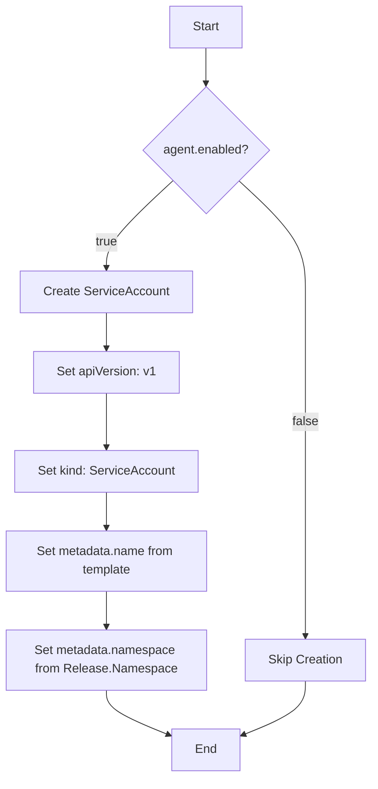
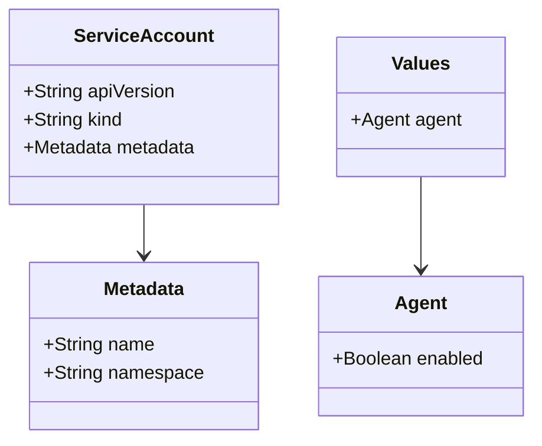
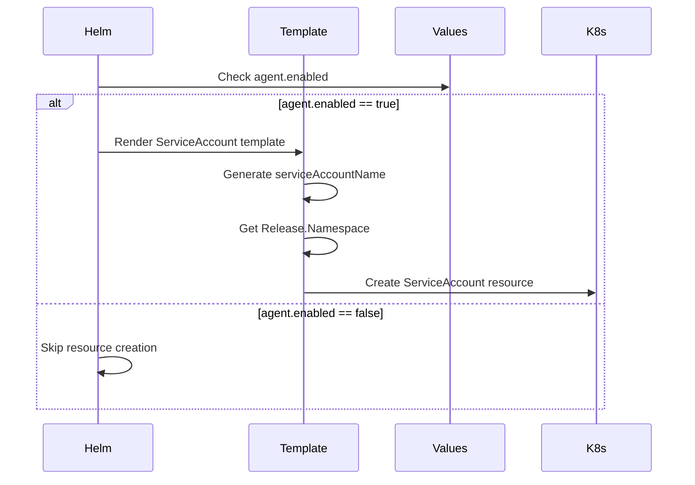

# Diagram: devops/k8s/amazon-cloudwatch-observability/helm/templates/cloudwatch-agent-serviceaccount.yaml

> Auto-generated by Obscura crawlers

## Diagram 1

### SVG

<svg id="container" width="481.859375" xmlns="http://www.w3.org/2000/svg" class="flowchart" height="1004.78125" viewBox="0 0 481.859375 1004.78125" role="graphics-document document" aria-roledescription="flowchart-v2"><g><marker id="container_flowchart-v2-pointEnd" class="marker flowchart-v2" viewBox="0 0 10 10" refX="5" refY="5" markerUnits="userSpaceOnUse" markerWidth="8" markerHeight="8" orient="auto"><path d="M 0 0 L 10 5 L 0 10 z" class="arrowMarkerPath" style="stroke-width: 1; stroke-dasharray: 1, 0;"></path></marker><marker id="container_flowchart-v2-pointStart" class="marker flowchart-v2" viewBox="0 0 10 10" refX="4.5" refY="5" markerUnits="userSpaceOnUse" markerWidth="8" markerHeight="8" orient="auto"><path d="M 0 5 L 10 10 L 10 0 z" class="arrowMarkerPath" style="stroke-width: 1; stroke-dasharray: 1, 0;"></path></marker><marker id="container_flowchart-v2-circleEnd" class="marker flowchart-v2" viewBox="0 0 10 10" refX="11" refY="5" markerUnits="userSpaceOnUse" markerWidth="11" markerHeight="11" orient="auto"><circle cx="5" cy="5" r="5" class="arrowMarkerPath" style="stroke-width: 1; stroke-dasharray: 1, 0;"></circle></marker><marker id="container_flowchart-v2-circleStart" class="marker flowchart-v2" viewBox="0 0 10 10" refX="-1" refY="5" markerUnits="userSpaceOnUse" markerWidth="11" markerHeight="11" orient="auto"><circle cx="5" cy="5" r="5" class="arrowMarkerPath" style="stroke-width: 1; stroke-dasharray: 1, 0;"></circle></marker><marker id="container_flowchart-v2-crossEnd" class="marker cross flowchart-v2" viewBox="0 0 11 11" refX="12" refY="5.2" markerUnits="userSpaceOnUse" markerWidth="11" markerHeight="11" orient="auto"><path d="M 1,1 l 9,9 M 10,1 l -9,9" class="arrowMarkerPath" style="stroke-width: 2; stroke-dasharray: 1, 0;"></path></marker><marker id="container_flowchart-v2-crossStart" class="marker cross flowchart-v2" viewBox="0 0 11 11" refX="-1" refY="5.2" markerUnits="userSpaceOnUse" markerWidth="11" markerHeight="11" orient="auto"><path d="M 1,1 l 9,9 M 10,1 l -9,9" class="arrowMarkerPath" style="stroke-width: 2; stroke-dasharray: 1, 0;"></path></marker><g class="root"><g class="clusters"></g><g class="edgePaths"><path d="M266.965,62L266.965,66.167C266.965,70.333,266.965,78.667,266.965,86.333C266.965,94,266.965,101,266.965,104.5L266.965,108" id="L_A_B_0" class="edge-thickness-normal edge-pattern-solid edge-thickness-normal edge-pattern-solid flowchart-link" style=";" data-edge="true" data-et="edge" data-id="L_A_B_0" data-points="W3sieCI6MjY2Ljk2NDg0Mzc1LCJ5Ijo2Mn0seyJ4IjoyNjYuOTY0ODQzNzUsInkiOjg3fSx7IngiOjI2Ni45NjQ4NDM3NSwieSI6MTEyfV0=" marker-end="url(#container_flowchart-v2-pointEnd)"></path><path d="M224.181,233.998L209.818,247.295C195.454,260.592,166.727,287.187,152.364,305.984C138,324.781,138,335.781,138,341.281L138,346.781" id="L_B_C_0" class="edge-thickness-normal edge-pattern-solid edge-thickness-normal edge-pattern-solid flowchart-link" style=";" data-edge="true" data-et="edge" data-id="L_B_C_0" data-points="W3sieCI6MjI0LjE4MTQzMjgwNjUyODEsInkiOjIzMy45OTc4MzkwNTY1MjgxfSx7IngiOjEzOCwieSI6MzEzLjc4MTI1fSx7IngiOjEzOCwieSI6MzUwLjc4MTI1fV0=" marker-end="url(#container_flowchart-v2-pointEnd)"></path><path d="M309.748,233.998L324.112,247.295C338.475,260.592,367.203,287.187,381.566,311.151C395.93,335.115,395.93,356.448,395.93,375.781C395.93,395.115,395.93,412.448,395.93,429.781C395.93,447.115,395.93,464.448,395.93,483.781C395.93,503.115,395.93,524.448,395.93,545.781C395.93,567.115,395.93,588.448,395.93,607.781C395.93,627.115,395.93,644.448,395.93,663.781C395.93,683.115,395.93,704.448,395.93,725.781C395.93,747.115,395.93,768.448,395.93,784.615C395.93,800.781,395.93,811.781,395.93,817.281L395.93,822.781" id="L_B_D_0" class="edge-thickness-normal edge-pattern-solid edge-thickness-normal edge-pattern-solid flowchart-link" style=";" data-edge="true" data-et="edge" data-id="L_B_D_0" data-points="W3sieCI6MzA5Ljc0ODI1NDY5MzQ3MTksInkiOjIzMy45OTc4MzkwNTY1MjgxfSx7IngiOjM5NS45Mjk2ODc1LCJ5IjozMTMuNzgxMjV9LHsieCI6Mzk1LjkyOTY4NzUsInkiOjM3Ny43ODEyNX0seyJ4IjozOTUuOTI5Njg3NSwieSI6NDI5Ljc4MTI1fSx7IngiOjM5NS45Mjk2ODc1LCJ5Ijo0ODEuNzgxMjV9LHsieCI6Mzk1LjkyOTY4NzUsInkiOjU0NS43ODEyNX0seyJ4IjozOTUuOTI5Njg3NSwieSI6NjA5Ljc4MTI1fSx7IngiOjM5NS45Mjk2ODc1LCJ5Ijo2NjEuNzgxMjV9LHsieCI6Mzk1LjkyOTY4NzUsInkiOjcyNS43ODEyNX0seyJ4IjozOTUuOTI5Njg3NSwieSI6Nzg5Ljc4MTI1fSx7IngiOjM5NS45Mjk2ODc1LCJ5Ijo4MjYuNzgxMjV9XQ==" marker-end="url(#container_flowchart-v2-pointEnd)"></path><path d="M138,404.781L138,408.948C138,413.115,138,421.448,138,429.115C138,436.781,138,443.781,138,447.281L138,450.781" id="L_C_E_0" class="edge-thickness-normal edge-pattern-solid edge-thickness-normal edge-pattern-solid flowchart-link" style=";" data-edge="true" data-et="edge" data-id="L_C_E_0" data-points="W3sieCI6MTM4LCJ5Ijo0MDQuNzgxMjV9LHsieCI6MTM4LCJ5Ijo0MjkuNzgxMjV9LHsieCI6MTM4LCJ5Ijo0NTQuNzgxMjV9XQ==" marker-end="url(#container_flowchart-v2-pointEnd)"></path><path d="M138,508.781L138,514.948C138,521.115,138,533.448,138,545.115C138,556.781,138,567.781,138,573.281L138,578.781" id="L_E_F_0" class="edge-thickness-normal edge-pattern-solid edge-thickness-normal edge-pattern-solid flowchart-link" style=";" data-edge="true" data-et="edge" data-id="L_E_F_0" data-points="W3sieCI6MTM4LCJ5Ijo1MDguNzgxMjV9LHsieCI6MTM4LCJ5Ijo1NDUuNzgxMjV9LHsieCI6MTM4LCJ5Ijo1ODIuNzgxMjV9XQ==" marker-end="url(#container_flowchart-v2-pointEnd)"></path><path d="M138,636.781L138,640.948C138,645.115,138,653.448,138,661.115C138,668.781,138,675.781,138,679.281L138,682.781" id="L_F_G_0" class="edge-thickness-normal edge-pattern-solid edge-thickness-normal edge-pattern-solid flowchart-link" style=";" data-edge="true" data-et="edge" data-id="L_F_G_0" data-points="W3sieCI6MTM4LCJ5Ijo2MzYuNzgxMjV9LHsieCI6MTM4LCJ5Ijo2NjEuNzgxMjV9LHsieCI6MTM4LCJ5Ijo2ODYuNzgxMjV9XQ==" marker-end="url(#container_flowchart-v2-pointEnd)"></path><path d="M138,764.781L138,768.948C138,773.115,138,781.448,138,789.115C138,796.781,138,803.781,138,807.281L138,810.781" id="L_G_H_0" class="edge-thickness-normal edge-pattern-solid edge-thickness-normal edge-pattern-solid flowchart-link" style=";" data-edge="true" data-et="edge" data-id="L_G_H_0" data-points="W3sieCI6MTM4LCJ5Ijo3NjQuNzgxMjV9LHsieCI6MTM4LCJ5Ijo3ODkuNzgxMjV9LHsieCI6MTM4LCJ5Ijo4MTQuNzgxMjV9XQ==" marker-end="url(#container_flowchart-v2-pointEnd)"></path><path d="M138,892.781L138,896.948C138,901.115,138,909.448,151.596,919.097C165.192,928.745,192.384,939.709,205.979,945.191L219.575,950.673" id="L_H_I_0" class="edge-thickness-normal edge-pattern-solid edge-thickness-normal edge-pattern-solid flowchart-link" style=";" data-edge="true" data-et="edge" data-id="L_H_I_0" data-points="W3sieCI6MTM4LCJ5Ijo4OTIuNzgxMjV9LHsieCI6MTM4LCJ5Ijo5MTcuNzgxMjV9LHsieCI6MjIzLjI4NTE1NjI1LCJ5Ijo5NTIuMTY5MTM0Mjk1MDE3NH1d" marker-end="url(#container_flowchart-v2-pointEnd)"></path><path d="M395.93,880.781L395.93,886.948C395.93,893.115,395.93,905.448,382.334,917.097C368.738,928.745,341.546,939.709,327.95,945.191L314.354,950.673" id="L_D_I_0" class="edge-thickness-normal edge-pattern-solid edge-thickness-normal edge-pattern-solid flowchart-link" style=";" data-edge="true" data-et="edge" data-id="L_D_I_0" data-points="W3sieCI6Mzk1LjkyOTY4NzUsInkiOjg4MC43ODEyNX0seyJ4IjozOTUuOTI5Njg3NSwieSI6OTE3Ljc4MTI1fSx7IngiOjMxMC42NDQ1MzEyNSwieSI6OTUyLjE2OTEzNDI5NTAxNzR9XQ==" marker-end="url(#container_flowchart-v2-pointEnd)"></path></g><g class="edgeLabels"><g class="edgeLabel"><g class="label" data-id="L_A_B_0" transform="translate(0, 0)"><foreignObject width="0" height="0">

</foreignObject></g></g><g class="edgeLabel" transform="translate(138, 313.78125)"><g class="label" data-id="L_B_C_0" transform="translate(-14.9921875, -12)"><foreignObject width="29.984375" height="24">

true

</foreignObject></g></g><g class="edgeLabel" transform="translate(395.9296875, 545.78125)"><g class="label" data-id="L_B_D_0" transform="translate(-17.21875, -12)"><foreignObject width="34.4375" height="24">

false

</foreignObject></g></g><g class="edgeLabel"><g class="label" data-id="L_C_E_0" transform="translate(0, 0)"><foreignObject width="0" height="0">

</foreignObject></g></g><g class="edgeLabel"><g class="label" data-id="L_E_F_0" transform="translate(0, 0)"><foreignObject width="0" height="0">

</foreignObject></g></g><g class="edgeLabel"><g class="label" data-id="L_F_G_0" transform="translate(0, 0)"><foreignObject width="0" height="0">

</foreignObject></g></g><g class="edgeLabel"><g class="label" data-id="L_G_H_0" transform="translate(0, 0)"><foreignObject width="0" height="0">

</foreignObject></g></g><g class="edgeLabel"><g class="label" data-id="L_H_I_0" transform="translate(0, 0)"><foreignObject width="0" height="0">

</foreignObject></g></g><g class="edgeLabel"><g class="label" data-id="L_D_I_0" transform="translate(0, 0)"><foreignObject width="0" height="0">

</foreignObject></g></g></g><g class="nodes"><g class="node default" id="flowchart-A-0" transform="translate(266.96484375, 35)"><rect class="basic label-container" style="" x="-47.5234375" y="-27" width="95.046875" height="54"></rect><g class="label" style="" transform="translate(-17.5234375, -12)"><rect></rect><foreignObject width="35.046875" height="24">

Start

</foreignObject></g></g><g class="node default" id="flowchart-B-1" transform="translate(266.96484375, 194.390625)"><polygon points="82.390625,0 164.78125,-82.390625 82.390625,-164.78125 0,-82.390625" class="label-container" transform="translate(-81.890625, 82.390625)"></polygon><g class="label" style="" transform="translate(-55.390625, -12)"><rect></rect><foreignObject width="110.78125" height="24">

agent.enabled?

</foreignObject></g></g><g class="node default" id="flowchart-C-3" transform="translate(138, 377.78125)"><rect class="basic label-container" style="" x="-109.9296875" y="-27" width="219.859375" height="54"></rect><g class="label" style="" transform="translate(-79.9296875, -12)"><rect></rect><foreignObject width="159.859375" height="24">

Create ServiceAccount

</foreignObject></g></g><g class="node default" id="flowchart-D-5" transform="translate(395.9296875, 853.78125)"><rect class="basic label-container" style="" x="-77.9296875" y="-27" width="155.859375" height="54"></rect><g class="label" style="" transform="translate(-47.9296875, -12)"><rect></rect><foreignObject width="95.859375" height="24">

Skip Creation

</foreignObject></g></g><g class="node default" id="flowchart-E-7" transform="translate(138, 481.78125)"><rect class="basic label-container" style="" x="-93.4609375" y="-27" width="186.921875" height="54"></rect><g class="label" style="" transform="translate(-63.4609375, -12)"><rect></rect><foreignObject width="126.921875" height="24">

Set apiVersion: v1

</foreignObject></g></g><g class="node default" id="flowchart-F-9" transform="translate(138, 609.78125)"><rect class="basic label-container" style="" x="-118.4375" y="-27" width="236.875" height="54"></rect><g class="label" style="" transform="translate(-88.4375, -12)"><rect></rect><foreignObject width="176.875" height="24">

Set kind: ServiceAccount

</foreignObject></g></g><g class="node default" id="flowchart-G-11" transform="translate(138, 725.78125)"><rect class="basic label-container" style="" x="-130" y="-39" width="260" height="78"></rect><g class="label" style="" transform="translate(-100, -24)"><rect></rect><foreignObject width="200" height="48">

Set metadata.name from template

</foreignObject></g></g><g class="node default" id="flowchart-H-13" transform="translate(138, 853.78125)"><rect class="basic label-container" style="" x="-130" y="-39" width="260" height="78"></rect><g class="label" style="" transform="translate(-100, -24)"><rect></rect><foreignObject width="200" height="48">

Set metadata.namespace from Release.Namespace

</foreignObject></g></g><g class="node default" id="flowchart-I-15" transform="translate(266.96484375, 969.78125)"><rect class="basic label-container" style="" x="-43.6796875" y="-27" width="87.359375" height="54"></rect><g class="label" style="" transform="translate(-13.6796875, -12)"><rect></rect><foreignObject width="27.359375" height="24">

End

</foreignObject></g></g></g></g></g></svg>

## Diagram 2

### SVG

<svg id="container" width="454.5234375" xmlns="http://www.w3.org/2000/svg" class="classDiagram" height="378" viewBox="0 0 454.5234375 378" role="graphics-document document" aria-roledescription="class"><g><defs><marker id="container_class-aggregationStart" class="marker aggregation class" refX="18" refY="7" markerWidth="190" markerHeight="240" orient="auto"><path d="M 18,7 L9,13 L1,7 L9,1 Z"></path></marker></defs><defs><marker id="container_class-aggregationEnd" class="marker aggregation class" refX="1" refY="7" markerWidth="20" markerHeight="28" orient="auto"><path d="M 18,7 L9,13 L1,7 L9,1 Z"></path></marker></defs><defs><marker id="container_class-extensionStart" class="marker extension class" refX="18" refY="7" markerWidth="190" markerHeight="240" orient="auto"><path d="M 1,7 L18,13 V 1 Z"></path></marker></defs><defs><marker id="container_class-extensionEnd" class="marker extension class" refX="1" refY="7" markerWidth="20" markerHeight="28" orient="auto"><path d="M 1,1 V 13 L18,7 Z"></path></marker></defs><defs><marker id="container_class-compositionStart" class="marker composition class" refX="18" refY="7" markerWidth="190" markerHeight="240" orient="auto"><path d="M 18,7 L9,13 L1,7 L9,1 Z"></path></marker></defs><defs><marker id="container_class-compositionEnd" class="marker composition class" refX="1" refY="7" markerWidth="20" markerHeight="28" orient="auto"><path d="M 18,7 L9,13 L1,7 L9,1 Z"></path></marker></defs><defs><marker id="container_class-dependencyStart" class="marker dependency class" refX="6" refY="7" markerWidth="190" markerHeight="240" orient="auto"><path d="M 5,7 L9,13 L1,7 L9,1 Z"></path></marker></defs><defs><marker id="container_class-dependencyEnd" class="marker dependency class" refX="13" refY="7" markerWidth="20" markerHeight="28" orient="auto"><path d="M 18,7 L9,13 L14,7 L9,1 Z"></path></marker></defs><defs><marker id="container_class-lollipopStart" class="marker lollipop class" refX="13" refY="7" markerWidth="190" markerHeight="240" orient="auto"><circle stroke="black" fill="transparent" cx="7" cy="7" r="6"></circle></marker></defs><defs><marker id="container_class-lollipopEnd" class="marker lollipop class" refX="1" refY="7" markerWidth="190" markerHeight="240" orient="auto"><circle stroke="black" fill="transparent" cx="7" cy="7" r="6"></circle></marker></defs><g class="root"><g class="clusters"></g><g class="edgePaths"><path d="M122.758,176L122.758,180.167C122.758,184.333,122.758,192.667,122.758,200C122.758,207.333,122.758,213.667,122.758,216.833L122.758,220" id="id_ServiceAccount_Metadata_1" class="edge-thickness-normal edge-pattern-solid relation" style=";;;" data-edge="true" data-et="edge" data-id="id_ServiceAccount_Metadata_1" data-points="W3sieCI6MTIyLjc1NzgxMjUsInkiOjE3Nn0seyJ4IjoxMjIuNzU3ODEyNSwieSI6MjAxfSx7IngiOjEyMi43NTc4MTI1LCJ5IjoyMjZ9XQ==" marker-end="url(#container_class-dependencyEnd)"></path><path d="M358.438,152L358.438,160.167C358.438,168.333,358.438,184.667,358.438,198C358.438,211.333,358.438,221.667,358.438,226.833L358.438,232" id="id_Values_Agent_2" class="edge-thickness-normal edge-pattern-solid relation" style=";;;" data-edge="true" data-et="edge" data-id="id_Values_Agent_2" data-points="W3sieCI6MzU4LjQzNzUsInkiOjE1Mn0seyJ4IjozNTguNDM3NSwieSI6MjAxfSx7IngiOjM1OC40Mzc1LCJ5IjoyMzh9XQ==" marker-end="url(#container_class-dependencyEnd)"></path></g><g class="edgeLabels"><g class="edgeLabel"><g class="label" data-id="id_ServiceAccount_Metadata_1" transform="translate(0, 0)"><foreignObject width="0" height="0">

</foreignObject></g></g><g class="edgeLabel"><g class="label" data-id="id_Values_Agent_2" transform="translate(0, 0)"><foreignObject width="0" height="0">

</foreignObject></g></g></g><g class="nodes"><g class="node default" id="classId-ServiceAccount-0" transform="translate(122.7578125, 92)"><g class="basic label-container"><path d="M-114.7578125 -84 L114.7578125 -84 L114.7578125 84 L-114.7578125 84" stroke="none" stroke-width="0" fill="#ECECFF" style=""></path><path d="M-114.7578125 -84 C-32.83066461779211 -84, 49.09648326441578 -84, 114.7578125 -84 M-114.7578125 -84 C-64.68146746297417 -84, -14.605122425948338 -84, 114.7578125 -84 M114.7578125 -84 C114.7578125 -49.38548304617726, 114.7578125 -14.770966092354513, 114.7578125 84 M114.7578125 -84 C114.7578125 -28.361270113797012, 114.7578125 27.277459772405976, 114.7578125 84 M114.7578125 84 C26.92757978231778 84, -60.90265293536444 84, -114.7578125 84 M114.7578125 84 C25.127506155574665 84, -64.50280018885067 84, -114.7578125 84 M-114.7578125 84 C-114.7578125 29.60014420250375, -114.7578125 -24.7997115949925, -114.7578125 -84 M-114.7578125 84 C-114.7578125 48.71552431100758, -114.7578125 13.431048622015155, -114.7578125 -84" stroke="#9370DB" stroke-width="1.3" fill="none" stroke-dasharray="0 0" style=""></path></g><g class="annotation-group text" transform="translate(0, -60)"></g><g class="label-group text" transform="translate(-55.671875, -60)"><g class="label" style="font-weight: bolder" transform="translate(0,-12)"><foreignObject width="111.34375" height="24">

ServiceAccount

</foreignObject></g></g><g class="members-group text" transform="translate(-102.7578125, -12)"><g class="label" style="" transform="translate(0,-12)"><foreignObject width="131.046875" height="24">

+String apiVersion

</foreignObject></g><g class="label" style="" transform="translate(0,12)"><foreignObject width="86.125" height="24">

+String kind

</foreignObject></g><g class="label" style="" transform="translate(0,36)"><foreignObject width="149.84375" height="24">

+Metadata metadata

</foreignObject></g></g><g class="methods-group text" transform="translate(-102.7578125, 84)"></g><g class="divider" style=""><path d="M-114.7578125 -36 C-59.86010830318061 -36, -4.96240410636122 -36, 114.7578125 -36 M-114.7578125 -36 C-48.83197078627275 -36, 17.093870927454503 -36, 114.7578125 -36" stroke="#9370DB" stroke-width="1.3" fill="none" stroke-dasharray="0 0" style=""></path></g><g class="divider" style=""><path d="M-114.7578125 60 C-47.111573048167244 60, 20.53466640366551 60, 114.7578125 60 M-114.7578125 60 C-25.243960793778 60, 64.269890912444 60, 114.7578125 60" stroke="#9370DB" stroke-width="1.3" fill="none" stroke-dasharray="0 0" style=""></path></g></g><g class="node default" id="classId-Metadata-1" transform="translate(122.7578125, 298)"><g class="basic label-container"><path d="M-97.59375 -72 L97.59375 -72 L97.59375 72 L-97.59375 72" stroke="none" stroke-width="0" fill="#ECECFF" style=""></path><path d="M-97.59375 -72 C-54.468219833758006 -72, -11.342689667516012 -72, 97.59375 -72 M-97.59375 -72 C-55.820316429160805 -72, -14.04688285832161 -72, 97.59375 -72 M97.59375 -72 C97.59375 -27.094406240734628, 97.59375 17.811187518530744, 97.59375 72 M97.59375 -72 C97.59375 -22.02946703586163, 97.59375 27.941065928276743, 97.59375 72 M97.59375 72 C20.45586250928399 72, -56.68202498143202 72, -97.59375 72 M97.59375 72 C29.77659014350337 72, -38.04056971299326 72, -97.59375 72 M-97.59375 72 C-97.59375 36.72971313161952, -97.59375 1.4594262632390382, -97.59375 -72 M-97.59375 72 C-97.59375 19.99372322381366, -97.59375 -32.01255355237268, -97.59375 -72" stroke="#9370DB" stroke-width="1.3" fill="none" stroke-dasharray="0 0" style=""></path></g><g class="annotation-group text" transform="translate(0, -48)"></g><g class="label-group text" transform="translate(-34.640625, -48)"><g class="label" style="font-weight: bolder" transform="translate(0,-12)"><foreignObject width="69.28125" height="24">

Metadata

</foreignObject></g></g><g class="members-group text" transform="translate(-85.59375, 0)"><g class="label" style="" transform="translate(0,-12)"><foreignObject width="94.984375" height="24">

+String name

</foreignObject></g><g class="label" style="" transform="translate(0,12)"><foreignObject width="136.546875" height="24">

+String namespace

</foreignObject></g></g><g class="methods-group text" transform="translate(-85.59375, 72)"></g><g class="divider" style=""><path d="M-97.59375 -24 C-37.85784909637596 -24, 21.878051807248085 -24, 97.59375 -24 M-97.59375 -24 C-42.6669555922781 -24, 12.2598388154438 -24, 97.59375 -24" stroke="#9370DB" stroke-width="1.3" fill="none" stroke-dasharray="0 0" style=""></path></g><g class="divider" style=""><path d="M-97.59375 48 C-31.615657241686534 48, 34.36243551662693 48, 97.59375 48 M-97.59375 48 C-33.74556968476661 48, 30.102610630466785 48, 97.59375 48" stroke="#9370DB" stroke-width="1.3" fill="none" stroke-dasharray="0 0" style=""></path></g></g><g class="node default" id="classId-Values-2" transform="translate(358.4375, 92)"><g class="basic label-container"><path d="M-70.71875 -60 L70.71875 -60 L70.71875 60 L-70.71875 60" stroke="none" stroke-width="0" fill="#ECECFF" style=""></path><path d="M-70.71875 -60 C-16.522037073697838 -60, 37.674675852604324 -60, 70.71875 -60 M-70.71875 -60 C-17.72115890136765 -60, 35.2764321972647 -60, 70.71875 -60 M70.71875 -60 C70.71875 -21.948061210875913, 70.71875 16.103877578248174, 70.71875 60 M70.71875 -60 C70.71875 -14.856257066554363, 70.71875 30.287485866891274, 70.71875 60 M70.71875 60 C28.453744724630198 60, -13.811260550739604 60, -70.71875 60 M70.71875 60 C29.756741293553077 60, -11.205267412893846 60, -70.71875 60 M-70.71875 60 C-70.71875 31.26116868843273, -70.71875 2.5223373768654582, -70.71875 -60 M-70.71875 60 C-70.71875 34.284304056031175, -70.71875 8.568608112062357, -70.71875 -60" stroke="#9370DB" stroke-width="1.3" fill="none" stroke-dasharray="0 0" style=""></path></g><g class="annotation-group text" transform="translate(0, -36)"></g><g class="label-group text" transform="translate(-23.78125, -36)"><g class="label" style="font-weight: bolder" transform="translate(0,-12)"><foreignObject width="47.5625" height="24">

Values

</foreignObject></g></g><g class="members-group text" transform="translate(-58.71875, 12)"><g class="label" style="" transform="translate(0,-12)"><foreignObject width="93.65625" height="24">

+Agent agent

</foreignObject></g></g><g class="methods-group text" transform="translate(-58.71875, 60)"></g><g class="divider" style=""><path d="M-70.71875 -12 C-32.48943405439122 -12, 5.739881891217564 -12, 70.71875 -12 M-70.71875 -12 C-16.960179099030903 -12, 36.798391801938195 -12, 70.71875 -12" stroke="#9370DB" stroke-width="1.3" fill="none" stroke-dasharray="0 0" style=""></path></g><g class="divider" style=""><path d="M-70.71875 36 C-40.42901985143847 36, -10.139289702876944 36, 70.71875 36 M-70.71875 36 C-25.85733101488237 36, 19.00408797023526 36, 70.71875 36" stroke="#9370DB" stroke-width="1.3" fill="none" stroke-dasharray="0 0" style=""></path></g></g><g class="node default" id="classId-Agent-3" transform="translate(358.4375, 298)"><g class="basic label-container"><path d="M-88.0859375 -60 L88.0859375 -60 L88.0859375 60 L-88.0859375 60" stroke="none" stroke-width="0" fill="#ECECFF" style=""></path><path d="M-88.0859375 -60 C-35.729470617961205 -60, 16.62699626407759 -60, 88.0859375 -60 M-88.0859375 -60 C-49.6087633824845 -60, -11.131589264968994 -60, 88.0859375 -60 M88.0859375 -60 C88.0859375 -26.40590497449199, 88.0859375 7.188190051016022, 88.0859375 60 M88.0859375 -60 C88.0859375 -28.195464746414498, 88.0859375 3.6090705071710047, 88.0859375 60 M88.0859375 60 C31.19315789379874 60, -25.699621712402518 60, -88.0859375 60 M88.0859375 60 C41.78834165813693 60, -4.509254183726142 60, -88.0859375 60 M-88.0859375 60 C-88.0859375 31.27184580394045, -88.0859375 2.543691607880902, -88.0859375 -60 M-88.0859375 60 C-88.0859375 27.079438595216978, -88.0859375 -5.841122809566045, -88.0859375 -60" stroke="#9370DB" stroke-width="1.3" fill="none" stroke-dasharray="0 0" style=""></path></g><g class="annotation-group text" transform="translate(0, -36)"></g><g class="label-group text" transform="translate(-21.078125, -36)"><g class="label" style="font-weight: bolder" transform="translate(0,-12)"><foreignObject width="42.15625" height="24">

Agent

</foreignObject></g></g><g class="members-group text" transform="translate(-76.0859375, 12)"><g class="label" style="" transform="translate(0,-12)"><foreignObject width="131.09375" height="24">

+Boolean enabled

</foreignObject></g></g><g class="methods-group text" transform="translate(-76.0859375, 60)"></g><g class="divider" style=""><path d="M-88.0859375 -12 C-20.810072250052002 -12, 46.465792999895996 -12, 88.0859375 -12 M-88.0859375 -12 C-17.81175406914508 -12, 52.46242936170984 -12, 88.0859375 -12" stroke="#9370DB" stroke-width="1.3" fill="none" stroke-dasharray="0 0" style=""></path></g><g class="divider" style=""><path d="M-88.0859375 36 C-18.395244586543882 36, 51.295448326912236 36, 88.0859375 36 M-88.0859375 36 C-27.492526270166117 36, 33.100884959667766 36, 88.0859375 36" stroke="#9370DB" stroke-width="1.3" fill="none" stroke-dasharray="0 0" style=""></path></g></g></g></g></g></svg>

## Diagram 3

### SVG

<svg id="container" width="969.5" xmlns="http://www.w3.org/2000/svg" height="679" viewBox="-64.5 -10 969.5 679" role="graphics-document document" aria-roledescription="sequence"><g><rect x="705" y="593" fill="#eaeaea" stroke="#666" width="150" height="65" name="K8s" rx="3" ry="3" class="actor actor-bottom"></rect><text x="780" y="625.5" dominant-baseline="central" alignment-baseline="central" class="actor actor-box" style="text-anchor: middle; font-size: 16px; font-weight: 400;"><tspan x="780" dy="0">K8s</tspan></text></g><g><rect x="505" y="593" fill="#eaeaea" stroke="#666" width="150" height="65" name="Values" rx="3" ry="3" class="actor actor-bottom"></rect><text x="580" y="625.5" dominant-baseline="central" alignment-baseline="central" class="actor actor-box" style="text-anchor: middle; font-size: 16px; font-weight: 400;"><tspan x="580" dy="0">Values</tspan></text></g><g><rect x="305" y="593" fill="#eaeaea" stroke="#666" width="150" height="65" name="Template" rx="3" ry="3" class="actor actor-bottom"></rect><text x="380" y="625.5" dominant-baseline="central" alignment-baseline="central" class="actor actor-box" style="text-anchor: middle; font-size: 16px; font-weight: 400;"><tspan x="380" dy="0">Template</tspan></text></g><g><rect x="0" y="593" fill="#eaeaea" stroke="#666" width="150" height="65" name="Helm" rx="3" ry="3" class="actor actor-bottom"></rect><text x="75" y="625.5" dominant-baseline="central" alignment-baseline="central" class="actor actor-box" style="text-anchor: middle; font-size: 16px; font-weight: 400;"><tspan x="75" dy="0">Helm</tspan></text></g><g><line id="actor3" x1="780" y1="65" x2="780" y2="593" class="actor-line 200" stroke-width="0.5px" stroke="#999" name="K8s"></line><g id="root-3"><rect x="705" y="0" fill="#eaeaea" stroke="#666" width="150" height="65" name="K8s" rx="3" ry="3" class="actor actor-top"></rect><text x="780" y="32.5" dominant-baseline="central" alignment-baseline="central" class="actor actor-box" style="text-anchor: middle; font-size: 16px; font-weight: 400;"><tspan x="780" dy="0">K8s</tspan></text></g></g><g><line id="actor2" x1="580" y1="65" x2="580" y2="593" class="actor-line 200" stroke-width="0.5px" stroke="#999" name="Values"></line><g id="root-2"><rect x="505" y="0" fill="#eaeaea" stroke="#666" width="150" height="65" name="Values" rx="3" ry="3" class="actor actor-top"></rect><text x="580" y="32.5" dominant-baseline="central" alignment-baseline="central" class="actor actor-box" style="text-anchor: middle; font-size: 16px; font-weight: 400;"><tspan x="580" dy="0">Values</tspan></text></g></g><g><line id="actor1" x1="380" y1="65" x2="380" y2="593" class="actor-line 200" stroke-width="0.5px" stroke="#999" name="Template"></line><g id="root-1"><rect x="305" y="0" fill="#eaeaea" stroke="#666" width="150" height="65" name="Template" rx="3" ry="3" class="actor actor-top"></rect><text x="380" y="32.5" dominant-baseline="central" alignment-baseline="central" class="actor actor-box" style="text-anchor: middle; font-size: 16px; font-weight: 400;"><tspan x="380" dy="0">Template</tspan></text></g></g><g><line id="actor0" x1="75" y1="65" x2="75" y2="593" class="actor-line 200" stroke-width="0.5px" stroke="#999" name="Helm"></line><g id="root-0"><rect x="0" y="0" fill="#eaeaea" stroke="#666" width="150" height="65" name="Helm" rx="3" ry="3" class="actor actor-top"></rect><text x="75" y="32.5" dominant-baseline="central" alignment-baseline="central" class="actor actor-box" style="text-anchor: middle; font-size: 16px; font-weight: 400;"><tspan x="75" dy="0">Helm</tspan></text></g></g><g></g><defs><symbol id="computer" width="24" height="24"><path transform="scale(.5)" d="M2 2v13h20v-13h-20zm18 11h-16v-9h16v9zm-10.228 6l.466-1h3.524l.467 1h-4.457zm14.228 3h-24l2-6h2.104l-1.33 4h18.45l-1.297-4h2.073l2 6zm-5-10h-14v-7h14v7z"></path></symbol></defs><defs><symbol id="database" fill-rule="evenodd" clip-rule="evenodd"><path transform="scale(.5)" d="M12.258.001l.256.004.255.005.253.008.251.01.249.012.247.015.246.016.242.019.241.02.239.023.236.024.233.027.231.028.229.031.225.032.223.034.22.036.217.038.214.04.211.041.208.043.205.045.201.046.198.048.194.05.191.051.187.053.183.054.18.056.175.057.172.059.168.06.163.061.16.063.155.064.15.066.074.033.073.033.071.034.07.034.069.035.068.035.067.035.066.035.064.036.064.036.062.036.06.036.06.037.058.037.058.037.055.038.055.038.053.038.052.038.051.039.05.039.048.039.047.039.045.04.044.04.043.04.041.04.04.041.039.041.037.041.036.041.034.041.033.042.032.042.03.042.029.042.027.042.026.043.024.043.023.043.021.043.02.043.018.044.017.043.015.044.013.044.012.044.011.045.009.044.007.045.006.045.004.045.002.045.001.045v17l-.001.045-.002.045-.004.045-.006.045-.007.045-.009.044-.011.045-.012.044-.013.044-.015.044-.017.043-.018.044-.02.043-.021.043-.023.043-.024.043-.026.043-.027.042-.029.042-.03.042-.032.042-.033.042-.034.041-.036.041-.037.041-.039.041-.04.041-.041.04-.043.04-.044.04-.045.04-.047.039-.048.039-.05.039-.051.039-.052.038-.053.038-.055.038-.055.038-.058.037-.058.037-.06.037-.06.036-.062.036-.064.036-.064.036-.066.035-.067.035-.068.035-.069.035-.07.034-.071.034-.073.033-.074.033-.15.066-.155.064-.16.063-.163.061-.168.06-.172.059-.175.057-.18.056-.183.054-.187.053-.191.051-.194.05-.198.048-.201.046-.205.045-.208.043-.211.041-.214.04-.217.038-.22.036-.223.034-.225.032-.229.031-.231.028-.233.027-.236.024-.239.023-.241.02-.242.019-.246.016-.247.015-.249.012-.251.01-.253.008-.255.005-.256.004-.258.001-.258-.001-.256-.004-.255-.005-.253-.008-.251-.01-.249-.012-.247-.015-.245-.016-.243-.019-.241-.02-.238-.023-.236-.024-.234-.027-.231-.028-.228-.031-.226-.032-.223-.034-.22-.036-.217-.038-.214-.04-.211-.041-.208-.043-.204-.045-.201-.046-.198-.048-.195-.05-.19-.051-.187-.053-.184-.054-.179-.056-.176-.057-.172-.059-.167-.06-.164-.061-.159-.063-.155-.064-.151-.066-.074-.033-.072-.033-.072-.034-.07-.034-.069-.035-.068-.035-.067-.035-.066-.035-.064-.036-.063-.036-.062-.036-.061-.036-.06-.037-.058-.037-.057-.037-.056-.038-.055-.038-.053-.038-.052-.038-.051-.039-.049-.039-.049-.039-.046-.039-.046-.04-.044-.04-.043-.04-.041-.04-.04-.041-.039-.041-.037-.041-.036-.041-.034-.041-.033-.042-.032-.042-.03-.042-.029-.042-.027-.042-.026-.043-.024-.043-.023-.043-.021-.043-.02-.043-.018-.044-.017-.043-.015-.044-.013-.044-.012-.044-.011-.045-.009-.044-.007-.045-.006-.045-.004-.045-.002-.045-.001-.045v-17l.001-.045.002-.045.004-.045.006-.045.007-.045.009-.044.011-.045.012-.044.013-.044.015-.044.017-.043.018-.044.02-.043.021-.043.023-.043.024-.043.026-.043.027-.042.029-.042.03-.042.032-.042.033-.042.034-.041.036-.041.037-.041.039-.041.04-.041.041-.04.043-.04.044-.04.046-.04.046-.039.049-.039.049-.039.051-.039.052-.038.053-.038.055-.038.056-.038.057-.037.058-.037.06-.037.061-.036.062-.036.063-.036.064-.036.066-.035.067-.035.068-.035.069-.035.07-.034.072-.034.072-.033.074-.033.151-.066.155-.064.159-.063.164-.061.167-.06.172-.059.176-.057.179-.056.184-.054.187-.053.19-.051.195-.05.198-.048.201-.046.204-.045.208-.043.211-.041.214-.04.217-.038.22-.036.223-.034.226-.032.228-.031.231-.028.234-.027.236-.024.238-.023.241-.02.243-.019.245-.016.247-.015.249-.012.251-.01.253-.008.255-.005.256-.004.258-.001.258.001zm-9.258 20.499v.01l.001.021.003.021.004.022.005.021.006.022.007.022.009.023.01.022.011.023.012.023.013.023.015.023.016.024.017.023.018.024.019.024.021.024.022.025.023.024.024.025.052.049.056.05.061.051.066.051.07.051.075.051.079.052.084.052.088.052.092.052.097.052.102.051.105.052.11.052.114.051.119.051.123.051.127.05.131.05.135.05.139.048.144.049.147.047.152.047.155.047.16.045.163.045.167.043.171.043.176.041.178.041.183.039.187.039.19.037.194.035.197.035.202.033.204.031.209.03.212.029.216.027.219.025.222.024.226.021.23.02.233.018.236.016.24.015.243.012.246.01.249.008.253.005.256.004.259.001.26-.001.257-.004.254-.005.25-.008.247-.011.244-.012.241-.014.237-.016.233-.018.231-.021.226-.021.224-.024.22-.026.216-.027.212-.028.21-.031.205-.031.202-.034.198-.034.194-.036.191-.037.187-.039.183-.04.179-.04.175-.042.172-.043.168-.044.163-.045.16-.046.155-.046.152-.047.148-.048.143-.049.139-.049.136-.05.131-.05.126-.05.123-.051.118-.052.114-.051.11-.052.106-.052.101-.052.096-.052.092-.052.088-.053.083-.051.079-.052.074-.052.07-.051.065-.051.06-.051.056-.05.051-.05.023-.024.023-.025.021-.024.02-.024.019-.024.018-.024.017-.024.015-.023.014-.024.013-.023.012-.023.01-.023.01-.022.008-.022.006-.022.006-.022.004-.022.004-.021.001-.021.001-.021v-4.127l-.077.055-.08.053-.083.054-.085.053-.087.052-.09.052-.093.051-.095.05-.097.05-.1.049-.102.049-.105.048-.106.047-.109.047-.111.046-.114.045-.115.045-.118.044-.12.043-.122.042-.124.042-.126.041-.128.04-.13.04-.132.038-.134.038-.135.037-.138.037-.139.035-.142.035-.143.034-.144.033-.147.032-.148.031-.15.03-.151.03-.153.029-.154.027-.156.027-.158.026-.159.025-.161.024-.162.023-.163.022-.165.021-.166.02-.167.019-.169.018-.169.017-.171.016-.173.015-.173.014-.175.013-.175.012-.177.011-.178.01-.179.008-.179.008-.181.006-.182.005-.182.004-.184.003-.184.002h-.37l-.184-.002-.184-.003-.182-.004-.182-.005-.181-.006-.179-.008-.179-.008-.178-.01-.176-.011-.176-.012-.175-.013-.173-.014-.172-.015-.171-.016-.17-.017-.169-.018-.167-.019-.166-.02-.165-.021-.163-.022-.162-.023-.161-.024-.159-.025-.157-.026-.156-.027-.155-.027-.153-.029-.151-.03-.15-.03-.148-.031-.146-.032-.145-.033-.143-.034-.141-.035-.14-.035-.137-.037-.136-.037-.134-.038-.132-.038-.13-.04-.128-.04-.126-.041-.124-.042-.122-.042-.12-.044-.117-.043-.116-.045-.113-.045-.112-.046-.109-.047-.106-.047-.105-.048-.102-.049-.1-.049-.097-.05-.095-.05-.093-.052-.09-.051-.087-.052-.085-.053-.083-.054-.08-.054-.077-.054v4.127zm0-5.654v.011l.001.021.003.021.004.021.005.022.006.022.007.022.009.022.01.022.011.023.012.023.013.023.015.024.016.023.017.024.018.024.019.024.021.024.022.024.023.025.024.024.052.05.056.05.061.05.066.051.07.051.075.052.079.051.084.052.088.052.092.052.097.052.102.052.105.052.11.051.114.051.119.052.123.05.127.051.131.05.135.049.139.049.144.048.147.048.152.047.155.046.16.045.163.045.167.044.171.042.176.042.178.04.183.04.187.038.19.037.194.036.197.034.202.033.204.032.209.03.212.028.216.027.219.025.222.024.226.022.23.02.233.018.236.016.24.014.243.012.246.01.249.008.253.006.256.003.259.001.26-.001.257-.003.254-.006.25-.008.247-.01.244-.012.241-.015.237-.016.233-.018.231-.02.226-.022.224-.024.22-.025.216-.027.212-.029.21-.03.205-.032.202-.033.198-.035.194-.036.191-.037.187-.039.183-.039.179-.041.175-.042.172-.043.168-.044.163-.045.16-.045.155-.047.152-.047.148-.048.143-.048.139-.05.136-.049.131-.05.126-.051.123-.051.118-.051.114-.052.11-.052.106-.052.101-.052.096-.052.092-.052.088-.052.083-.052.079-.052.074-.051.07-.052.065-.051.06-.05.056-.051.051-.049.023-.025.023-.024.021-.025.02-.024.019-.024.018-.024.017-.024.015-.023.014-.023.013-.024.012-.022.01-.023.01-.023.008-.022.006-.022.006-.022.004-.021.004-.022.001-.021.001-.021v-4.139l-.077.054-.08.054-.083.054-.085.052-.087.053-.09.051-.093.051-.095.051-.097.05-.1.049-.102.049-.105.048-.106.047-.109.047-.111.046-.114.045-.115.044-.118.044-.12.044-.122.042-.124.042-.126.041-.128.04-.13.039-.132.039-.134.038-.135.037-.138.036-.139.036-.142.035-.143.033-.144.033-.147.033-.148.031-.15.03-.151.03-.153.028-.154.028-.156.027-.158.026-.159.025-.161.024-.162.023-.163.022-.165.021-.166.02-.167.019-.169.018-.169.017-.171.016-.173.015-.173.014-.175.013-.175.012-.177.011-.178.009-.179.009-.179.007-.181.007-.182.005-.182.004-.184.003-.184.002h-.37l-.184-.002-.184-.003-.182-.004-.182-.005-.181-.007-.179-.007-.179-.009-.178-.009-.176-.011-.176-.012-.175-.013-.173-.014-.172-.015-.171-.016-.17-.017-.169-.018-.167-.019-.166-.02-.165-.021-.163-.022-.162-.023-.161-.024-.159-.025-.157-.026-.156-.027-.155-.028-.153-.028-.151-.03-.15-.03-.148-.031-.146-.033-.145-.033-.143-.033-.141-.035-.14-.036-.137-.036-.136-.037-.134-.038-.132-.039-.13-.039-.128-.04-.126-.041-.124-.042-.122-.043-.12-.043-.117-.044-.116-.044-.113-.046-.112-.046-.109-.046-.106-.047-.105-.048-.102-.049-.1-.049-.097-.05-.095-.051-.093-.051-.09-.051-.087-.053-.085-.052-.083-.054-.08-.054-.077-.054v4.139zm0-5.666v.011l.001.02.003.022.004.021.005.022.006.021.007.022.009.023.01.022.011.023.012.023.013.023.015.023.016.024.017.024.018.023.019.024.021.025.022.024.023.024.024.025.052.05.056.05.061.05.066.051.07.051.075.052.079.051.084.052.088.052.092.052.097.052.102.052.105.051.11.052.114.051.119.051.123.051.127.05.131.05.135.05.139.049.144.048.147.048.152.047.155.046.16.045.163.045.167.043.171.043.176.042.178.04.183.04.187.038.19.037.194.036.197.034.202.033.204.032.209.03.212.028.216.027.219.025.222.024.226.021.23.02.233.018.236.017.24.014.243.012.246.01.249.008.253.006.256.003.259.001.26-.001.257-.003.254-.006.25-.008.247-.01.244-.013.241-.014.237-.016.233-.018.231-.02.226-.022.224-.024.22-.025.216-.027.212-.029.21-.03.205-.032.202-.033.198-.035.194-.036.191-.037.187-.039.183-.039.179-.041.175-.042.172-.043.168-.044.163-.045.16-.045.155-.047.152-.047.148-.048.143-.049.139-.049.136-.049.131-.051.126-.05.123-.051.118-.052.114-.051.11-.052.106-.052.101-.052.096-.052.092-.052.088-.052.083-.052.079-.052.074-.052.07-.051.065-.051.06-.051.056-.05.051-.049.023-.025.023-.025.021-.024.02-.024.019-.024.018-.024.017-.024.015-.023.014-.024.013-.023.012-.023.01-.022.01-.023.008-.022.006-.022.006-.022.004-.022.004-.021.001-.021.001-.021v-4.153l-.077.054-.08.054-.083.053-.085.053-.087.053-.09.051-.093.051-.095.051-.097.05-.1.049-.102.048-.105.048-.106.048-.109.046-.111.046-.114.046-.115.044-.118.044-.12.043-.122.043-.124.042-.126.041-.128.04-.13.039-.132.039-.134.038-.135.037-.138.036-.139.036-.142.034-.143.034-.144.033-.147.032-.148.032-.15.03-.151.03-.153.028-.154.028-.156.027-.158.026-.159.024-.161.024-.162.023-.163.023-.165.021-.166.02-.167.019-.169.018-.169.017-.171.016-.173.015-.173.014-.175.013-.175.012-.177.01-.178.01-.179.009-.179.007-.181.006-.182.006-.182.004-.184.003-.184.001-.185.001-.185-.001-.184-.001-.184-.003-.182-.004-.182-.006-.181-.006-.179-.007-.179-.009-.178-.01-.176-.01-.176-.012-.175-.013-.173-.014-.172-.015-.171-.016-.17-.017-.169-.018-.167-.019-.166-.02-.165-.021-.163-.023-.162-.023-.161-.024-.159-.024-.157-.026-.156-.027-.155-.028-.153-.028-.151-.03-.15-.03-.148-.032-.146-.032-.145-.033-.143-.034-.141-.034-.14-.036-.137-.036-.136-.037-.134-.038-.132-.039-.13-.039-.128-.041-.126-.041-.124-.041-.122-.043-.12-.043-.117-.044-.116-.044-.113-.046-.112-.046-.109-.046-.106-.048-.105-.048-.102-.048-.1-.05-.097-.049-.095-.051-.093-.051-.09-.052-.087-.052-.085-.053-.083-.053-.08-.054-.077-.054v4.153zm8.74-8.179l-.257.004-.254.005-.25.008-.247.011-.244.012-.241.014-.237.016-.233.018-.231.021-.226.022-.224.023-.22.026-.216.027-.212.028-.21.031-.205.032-.202.033-.198.034-.194.036-.191.038-.187.038-.183.04-.179.041-.175.042-.172.043-.168.043-.163.045-.16.046-.155.046-.152.048-.148.048-.143.048-.139.049-.136.05-.131.05-.126.051-.123.051-.118.051-.114.052-.11.052-.106.052-.101.052-.096.052-.092.052-.088.052-.083.052-.079.052-.074.051-.07.052-.065.051-.06.05-.056.05-.051.05-.023.025-.023.024-.021.024-.02.025-.019.024-.018.024-.017.023-.015.024-.014.023-.013.023-.012.023-.01.023-.01.022-.008.022-.006.023-.006.021-.004.022-.004.021-.001.021-.001.021.001.021.001.021.004.021.004.022.006.021.006.023.008.022.01.022.01.023.012.023.013.023.014.023.015.024.017.023.018.024.019.024.02.025.021.024.023.024.023.025.051.05.056.05.06.05.065.051.07.052.074.051.079.052.083.052.088.052.092.052.096.052.101.052.106.052.11.052.114.052.118.051.123.051.126.051.131.05.136.05.139.049.143.048.148.048.152.048.155.046.16.046.163.045.168.043.172.043.175.042.179.041.183.04.187.038.191.038.194.036.198.034.202.033.205.032.21.031.212.028.216.027.22.026.224.023.226.022.231.021.233.018.237.016.241.014.244.012.247.011.25.008.254.005.257.004.26.001.26-.001.257-.004.254-.005.25-.008.247-.011.244-.012.241-.014.237-.016.233-.018.231-.021.226-.022.224-.023.22-.026.216-.027.212-.028.21-.031.205-.032.202-.033.198-.034.194-.036.191-.038.187-.038.183-.04.179-.041.175-.042.172-.043.168-.043.163-.045.16-.046.155-.046.152-.048.148-.048.143-.048.139-.049.136-.05.131-.05.126-.051.123-.051.118-.051.114-.052.11-.052.106-.052.101-.052.096-.052.092-.052.088-.052.083-.052.079-.052.074-.051.07-.052.065-.051.06-.05.056-.05.051-.05.023-.025.023-.024.021-.024.02-.025.019-.024.018-.024.017-.023.015-.024.014-.023.013-.023.012-.023.01-.023.01-.022.008-.022.006-.023.006-.021.004-.022.004-.021.001-.021.001-.021-.001-.021-.001-.021-.004-.021-.004-.022-.006-.021-.006-.023-.008-.022-.01-.022-.01-.023-.012-.023-.013-.023-.014-.023-.015-.024-.017-.023-.018-.024-.019-.024-.02-.025-.021-.024-.023-.024-.023-.025-.051-.05-.056-.05-.06-.05-.065-.051-.07-.052-.074-.051-.079-.052-.083-.052-.088-.052-.092-.052-.096-.052-.101-.052-.106-.052-.11-.052-.114-.052-.118-.051-.123-.051-.126-.051-.131-.05-.136-.05-.139-.049-.143-.048-.148-.048-.152-.048-.155-.046-.16-.046-.163-.045-.168-.043-.172-.043-.175-.042-.179-.041-.183-.04-.187-.038-.191-.038-.194-.036-.198-.034-.202-.033-.205-.032-.21-.031-.212-.028-.216-.027-.22-.026-.224-.023-.226-.022-.231-.021-.233-.018-.237-.016-.241-.014-.244-.012-.247-.011-.25-.008-.254-.005-.257-.004-.26-.001-.26.001z"></path></symbol></defs><defs><symbol id="clock" width="24" height="24"><path transform="scale(.5)" d="M12 2c5.514 0 10 4.486 10 10s-4.486 10-10 10-10-4.486-10-10 4.486-10 10-10zm0-2c-6.627 0-12 5.373-12 12s5.373 12 12 12 12-5.373 12-12-5.373-12-12-12zm5.848 12.459c.202.038.202.333.001.372-1.907.361-6.045 1.111-6.547 1.111-.719 0-1.301-.582-1.301-1.301 0-.512.77-5.447 1.125-7.445.034-.192.312-.181.343.014l.985 6.238 5.394 1.011z"></path></symbol></defs><defs><marker id="arrowhead" refX="7.9" refY="5" markerUnits="userSpaceOnUse" markerWidth="12" markerHeight="12" orient="auto-start-reverse"><path d="M -1 0 L 10 5 L 0 10 z"></path></marker></defs><defs><marker id="crosshead" markerWidth="15" markerHeight="8" orient="auto" refX="4" refY="4.5"><path fill="none" stroke="#000000" stroke-width="1pt" d="M 1,2 L 6,7 M 6,2 L 1,7" style="stroke-dasharray: 0, 0;"></path></marker></defs><defs><marker id="filled-head" refX="15.5" refY="7" markerWidth="20" markerHeight="28" orient="auto"><path d="M 18,7 L9,13 L14,7 L9,1 Z"></path></marker></defs><defs><marker id="sequencenumber" refX="15" refY="15" markerWidth="60" markerHeight="40" orient="auto"><circle cx="15" cy="15" r="6"></circle></marker></defs><g><line x1="-14.5" y1="123" x2="791" y2="123" class="loopLine"></line><line x1="791" y1="123" x2="791" y2="573" class="loopLine"></line><line x1="-14.5" y1="573" x2="791" y2="573" class="loopLine"></line><line x1="-14.5" y1="123" x2="-14.5" y2="573" class="loopLine"></line><line x1="-14.5" y1="425" x2="791" y2="425" class="loopLine" style="stroke-dasharray: 3, 3;"></line><polygon points="-14.5,123 35.5,123 35.5,136 27.1,143 -14.5,143" class="labelBox"></polygon><text x="11" y="136" text-anchor="middle" dominant-baseline="middle" alignment-baseline="middle" class="labelText" style="font-size: 16px; font-weight: 400;">alt</text><text x="413.25" y="141" text-anchor="middle" class="loopText" style="font-size: 16px; font-weight: 400;"><tspan x="413.25">[agent.enabled == true]</tspan></text><text x="388.25" y="443" text-anchor="middle" class="loopText" style="font-size: 16px; font-weight: 400;">[agent.enabled == false]</text></g><text x="326" y="80" text-anchor="middle" dominant-baseline="middle" alignment-baseline="middle" class="messageText" dy="1em" style="font-size: 16px; font-weight: 400;">Check agent.enabled</text><line x1="76" y1="113" x2="576" y2="113" class="messageLine0" stroke-width="2" stroke="none" marker-end="url(#arrowhead)" style="fill: none;"></line><text x="226" y="173" text-anchor="middle" dominant-baseline="middle" alignment-baseline="middle" class="messageText" dy="1em" style="font-size: 16px; font-weight: 400;">Render ServiceAccount template</text><line x1="76" y1="206" x2="376" y2="206" class="messageLine0" stroke-width="2" stroke="none" marker-end="url(#arrowhead)" style="fill: none;"></line><text x="381" y="221" text-anchor="middle" dominant-baseline="middle" alignment-baseline="middle" class="messageText" dy="1em" style="font-size: 16px; font-weight: 400;">Generate serviceAccountName</text><path d="M 381,254 C 441,244 441,284 381,274" class="messageLine0" stroke-width="2" stroke="none" marker-end="url(#arrowhead)" style="fill: none;"></path><text x="381" y="299" text-anchor="middle" dominant-baseline="middle" alignment-baseline="middle" class="messageText" dy="1em" style="font-size: 16px; font-weight: 400;">Get Release.Namespace</text><path d="M 381,332 C 441,322 441,362 381,352" class="messageLine0" stroke-width="2" stroke="none" marker-end="url(#arrowhead)" style="fill: none;"></path><text x="579" y="377" text-anchor="middle" dominant-baseline="middle" alignment-baseline="middle" class="messageText" dy="1em" style="font-size: 16px; font-weight: 400;">Create ServiceAccount resource</text><line x1="381" y1="410" x2="776" y2="410" class="messageLine0" stroke-width="2" stroke="none" marker-end="url(#arrowhead)" style="fill: none;"></line><text x="76" y="470" text-anchor="middle" dominant-baseline="middle" alignment-baseline="middle" class="messageText" dy="1em" style="font-size: 16px; font-weight: 400;">Skip resource creation</text><path d="M 76,503 C 136,493 136,533 76,523" class="messageLine0" stroke-width="2" stroke="none" marker-end="url(#arrowhead)" style="fill: none;"></path></svg>
