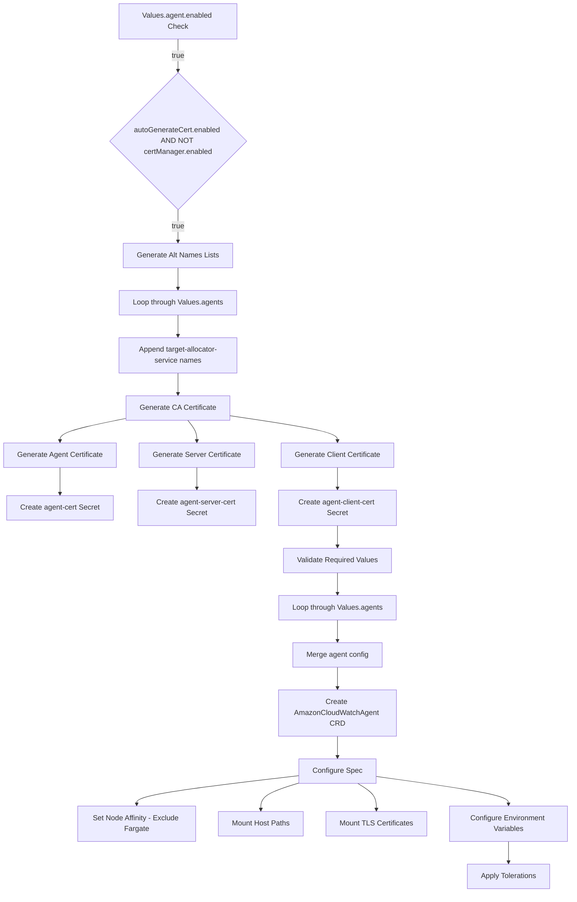
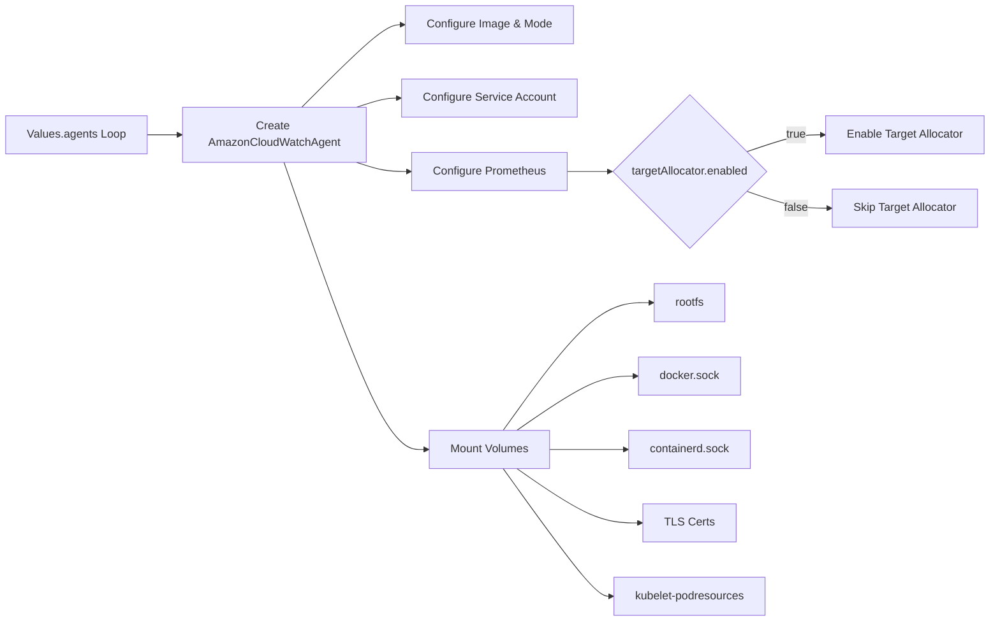
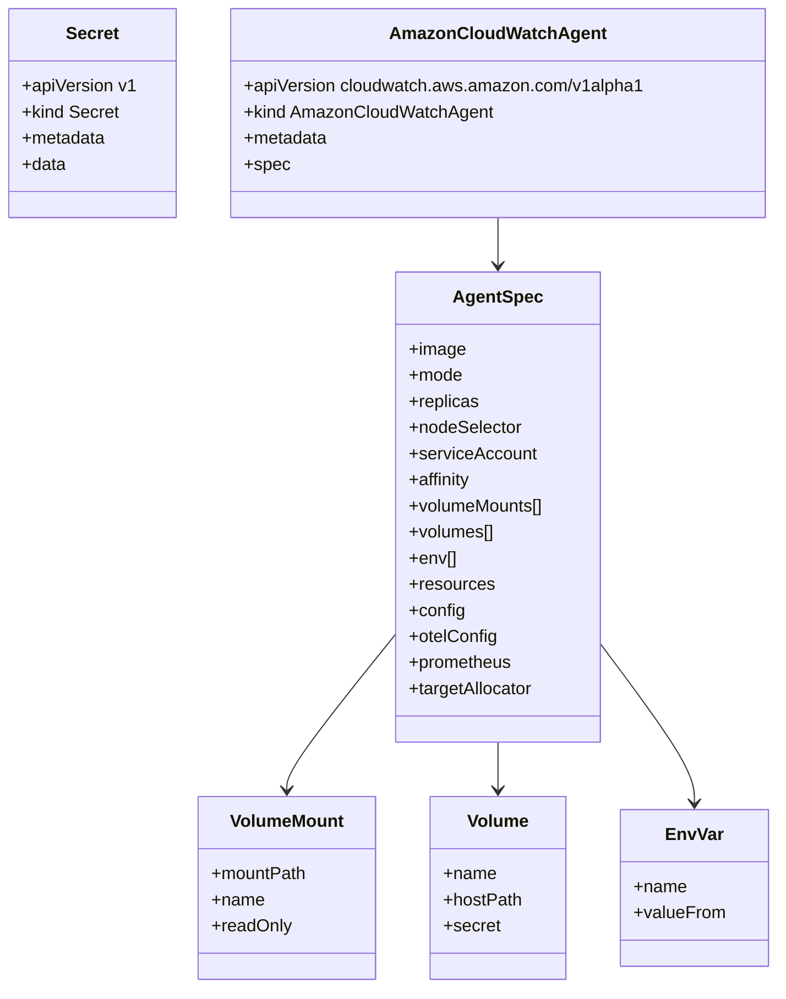
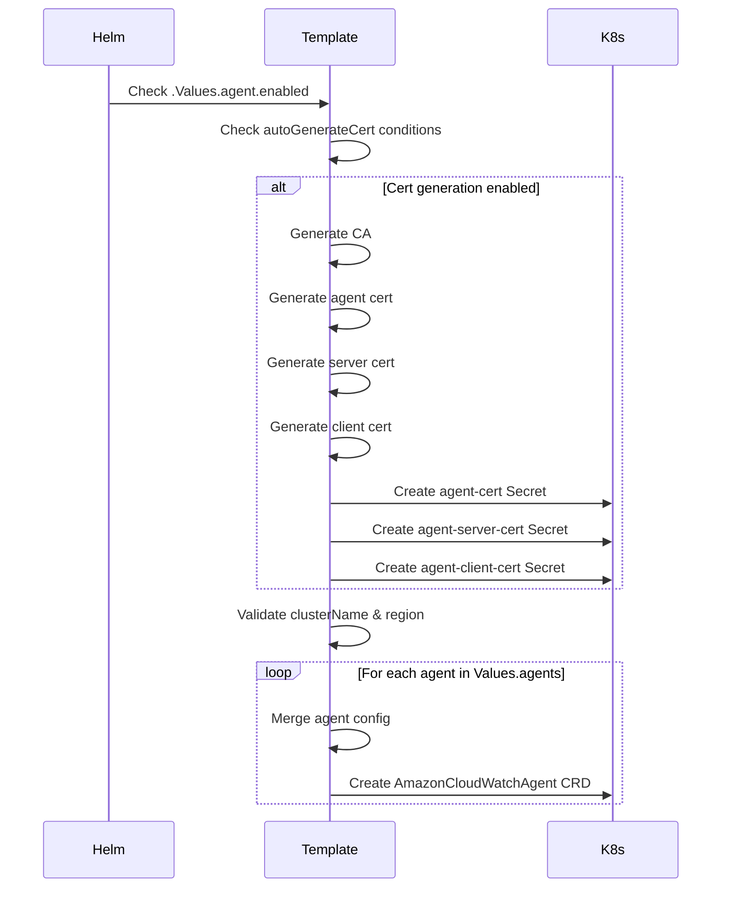

# Diagram: devops/k8s/amazon-cloudwatch-observability/helm/templates/linux/cloudwatch-agent-custom-resource.yaml

> Auto-generated by Obscura crawlers

## Diagram 1

### SVG

<svg id="container" width="1257.22265625" xmlns="http://www.w3.org/2000/svg" class="flowchart" height="2014" viewBox="0 0 1257.22265625 2014" role="graphics-document document" aria-roledescription="flowchart-v2"><g><marker id="container_flowchart-v2-pointEnd" class="marker flowchart-v2" viewBox="0 0 10 10" refX="5" refY="5" markerUnits="userSpaceOnUse" markerWidth="8" markerHeight="8" orient="auto"><path d="M 0 0 L 10 5 L 0 10 z" class="arrowMarkerPath" style="stroke-width: 1; stroke-dasharray: 1, 0;"></path></marker><marker id="container_flowchart-v2-pointStart" class="marker flowchart-v2" viewBox="0 0 10 10" refX="4.5" refY="5" markerUnits="userSpaceOnUse" markerWidth="8" markerHeight="8" orient="auto"><path d="M 0 5 L 10 10 L 10 0 z" class="arrowMarkerPath" style="stroke-width: 1; stroke-dasharray: 1, 0;"></path></marker><marker id="container_flowchart-v2-circleEnd" class="marker flowchart-v2" viewBox="0 0 10 10" refX="11" refY="5" markerUnits="userSpaceOnUse" markerWidth="11" markerHeight="11" orient="auto"><circle cx="5" cy="5" r="5" class="arrowMarkerPath" style="stroke-width: 1; stroke-dasharray: 1, 0;"></circle></marker><marker id="container_flowchart-v2-circleStart" class="marker flowchart-v2" viewBox="0 0 10 10" refX="-1" refY="5" markerUnits="userSpaceOnUse" markerWidth="11" markerHeight="11" orient="auto"><circle cx="5" cy="5" r="5" class="arrowMarkerPath" style="stroke-width: 1; stroke-dasharray: 1, 0;"></circle></marker><marker id="container_flowchart-v2-crossEnd" class="marker cross flowchart-v2" viewBox="0 0 11 11" refX="12" refY="5.2" markerUnits="userSpaceOnUse" markerWidth="11" markerHeight="11" orient="auto"><path d="M 1,1 l 9,9 M 10,1 l -9,9" class="arrowMarkerPath" style="stroke-width: 2; stroke-dasharray: 1, 0;"></path></marker><marker id="container_flowchart-v2-crossStart" class="marker cross flowchart-v2" viewBox="0 0 11 11" refX="-1" refY="5.2" markerUnits="userSpaceOnUse" markerWidth="11" markerHeight="11" orient="auto"><path d="M 1,1 l 9,9 M 10,1 l -9,9" class="arrowMarkerPath" style="stroke-width: 2; stroke-dasharray: 1, 0;"></path></marker><g class="root"><g class="clusters"></g><g class="edgePaths"><path d="M391.93,86L391.93,92.167C391.93,98.333,391.93,110.667,391.93,122.333C391.93,134,391.93,145,391.93,150.5L391.93,156" id="L_A_B_0" class="edge-thickness-normal edge-pattern-solid edge-thickness-normal edge-pattern-solid flowchart-link" style=";" data-edge="true" data-et="edge" data-id="L_A_B_0" data-points="W3sieCI6MzkxLjkyOTY4NzUsInkiOjg2fSx7IngiOjM5MS45Mjk2ODc1LCJ5IjoxMjN9LHsieCI6MzkxLjkyOTY4NzUsInkiOjE2MH1d" marker-end="url(#container_flowchart-v2-pointEnd)"></path><path d="M391.93,462L391.93,468.167C391.93,474.333,391.93,486.667,391.93,498.333C391.93,510,391.93,521,391.93,526.5L391.93,532" id="L_B_C_0" class="edge-thickness-normal edge-pattern-solid edge-thickness-normal edge-pattern-solid flowchart-link" style=";" data-edge="true" data-et="edge" data-id="L_B_C_0" data-points="W3sieCI6MzkxLjkyOTY4NzUsInkiOjQ2Mn0seyJ4IjozOTEuOTI5Njg3NSwieSI6NDk5fSx7IngiOjM5MS45Mjk2ODc1LCJ5Ijo1MzZ9XQ==" marker-end="url(#container_flowchart-v2-pointEnd)"></path><path d="M391.93,590L391.93,594.167C391.93,598.333,391.93,606.667,391.93,614.333C391.93,622,391.93,629,391.93,632.5L391.93,636" id="L_C_D_0" class="edge-thickness-normal edge-pattern-solid edge-thickness-normal edge-pattern-solid flowchart-link" style=";" data-edge="true" data-et="edge" data-id="L_C_D_0" data-points="W3sieCI6MzkxLjkyOTY4NzUsInkiOjU5MH0seyJ4IjozOTEuOTI5Njg3NSwieSI6NjE1fSx7IngiOjM5MS45Mjk2ODc1LCJ5Ijo2NDB9XQ==" marker-end="url(#container_flowchart-v2-pointEnd)"></path><path d="M391.93,718L391.93,722.167C391.93,726.333,391.93,734.667,391.93,742.333C391.93,750,391.93,757,391.93,760.5L391.93,764" id="L_D_E_0" class="edge-thickness-normal edge-pattern-solid edge-thickness-normal edge-pattern-solid flowchart-link" style=";" data-edge="true" data-et="edge" data-id="L_D_E_0" data-points="W3sieCI6MzkxLjkyOTY4NzUsInkiOjcxOH0seyJ4IjozOTEuOTI5Njg3NSwieSI6NzQzfSx7IngiOjM5MS45Mjk2ODc1LCJ5Ijo3Njh9XQ==" marker-end="url(#container_flowchart-v2-pointEnd)"></path><path d="M391.93,846L391.93,850.167C391.93,854.333,391.93,862.667,391.93,870.333C391.93,878,391.93,885,391.93,888.5L391.93,892" id="L_E_F_0" class="edge-thickness-normal edge-pattern-solid edge-thickness-normal edge-pattern-solid flowchart-link" style=";" data-edge="true" data-et="edge" data-id="L_E_F_0" data-points="W3sieCI6MzkxLjkyOTY4NzUsInkiOjg0Nn0seyJ4IjozOTEuOTI5Njg3NSwieSI6ODcxfSx7IngiOjM5MS45Mjk2ODc1LCJ5Ijo4OTZ9XQ==" marker-end="url(#container_flowchart-v2-pointEnd)"></path><path d="M279.141,945.588L254.663,950.49C230.185,955.392,181.229,965.196,156.751,973.598C132.273,982,132.273,989,132.273,992.5L132.273,996" id="L_F_G_0" class="edge-thickness-normal edge-pattern-solid edge-thickness-normal edge-pattern-solid flowchart-link" style=";" data-edge="true" data-et="edge" data-id="L_F_G_0" data-points="W3sieCI6Mjc5LjE0MDYyNSwieSI6OTQ1LjU4NzY3NjAxMzk2MDd9LHsieCI6MTMyLjI3MzQzNzUsInkiOjk3NX0seyJ4IjoxMzIuMjczNDM3NSwieSI6MTAwMH1d" marker-end="url(#container_flowchart-v2-pointEnd)"></path><path d="M413.478,950L416.803,954.167C420.128,958.333,426.779,966.667,430.104,974.333C433.43,982,433.43,989,433.43,992.5L433.43,996" id="L_F_H_0" class="edge-thickness-normal edge-pattern-solid edge-thickness-normal edge-pattern-solid flowchart-link" style=";" data-edge="true" data-et="edge" data-id="L_F_H_0" data-points="W3sieCI6NDEzLjQ3Nzc2NDQyMzA3NjksInkiOjk1MH0seyJ4Ijo0MzMuNDI5Njg3NSwieSI6OTc1fSx7IngiOjQzMy40Mjk2ODc1LCJ5IjoxMDAwfV0=" marker-end="url(#container_flowchart-v2-pointEnd)"></path><path d="M504.719,939.686L544.504,945.571C584.289,951.457,663.859,963.229,703.645,972.614C743.43,982,743.43,989,743.43,992.5L743.43,996" id="L_F_I_0" class="edge-thickness-normal edge-pattern-solid edge-thickness-normal edge-pattern-solid flowchart-link" style=";" data-edge="true" data-et="edge" data-id="L_F_I_0" data-points="W3sieCI6NTA0LjcxODc1LCJ5Ijo5MzkuNjg1NzIxOTA2MTE2N30seyJ4Ijo3NDMuNDI5Njg3NSwieSI6OTc1fSx7IngiOjc0My40Mjk2ODc1LCJ5IjoxMDAwfV0=" marker-end="url(#container_flowchart-v2-pointEnd)"></path><path d="M132.273,1054L132.273,1058.167C132.273,1062.333,132.273,1070.667,132.273,1080.333C132.273,1090,132.273,1101,132.273,1106.5L132.273,1112" id="L_G_J_0" class="edge-thickness-normal edge-pattern-solid edge-thickness-normal edge-pattern-solid flowchart-link" style=";" data-edge="true" data-et="edge" data-id="L_G_J_0" data-points="W3sieCI6MTMyLjI3MzQzNzUsInkiOjEwNTR9LHsieCI6MTMyLjI3MzQzNzUsInkiOjEwNzl9LHsieCI6MTMyLjI3MzQzNzUsInkiOjExMTZ9XQ==" marker-end="url(#container_flowchart-v2-pointEnd)"></path><path d="M433.43,1054L433.43,1058.167C433.43,1062.333,433.43,1070.667,433.43,1078.333C433.43,1086,433.43,1093,433.43,1096.5L433.43,1100" id="L_H_K_0" class="edge-thickness-normal edge-pattern-solid edge-thickness-normal edge-pattern-solid flowchart-link" style=";" data-edge="true" data-et="edge" data-id="L_H_K_0" data-points="W3sieCI6NDMzLjQyOTY4NzUsInkiOjEwNTR9LHsieCI6NDMzLjQyOTY4NzUsInkiOjEwNzl9LHsieCI6NDMzLjQyOTY4NzUsInkiOjExMDR9XQ==" marker-end="url(#container_flowchart-v2-pointEnd)"></path><path d="M743.43,1054L743.43,1058.167C743.43,1062.333,743.43,1070.667,743.43,1078.333C743.43,1086,743.43,1093,743.43,1096.5L743.43,1100" id="L_I_L_0" class="edge-thickness-normal edge-pattern-solid edge-thickness-normal edge-pattern-solid flowchart-link" style=";" data-edge="true" data-et="edge" data-id="L_I_L_0" data-points="W3sieCI6NzQzLjQyOTY4NzUsInkiOjEwNTR9LHsieCI6NzQzLjQyOTY4NzUsInkiOjEwNzl9LHsieCI6NzQzLjQyOTY4NzUsInkiOjExMDR9XQ==" marker-end="url(#container_flowchart-v2-pointEnd)"></path><path d="M743.43,1182L743.43,1186.167C743.43,1190.333,743.43,1198.667,743.43,1206.333C743.43,1214,743.43,1221,743.43,1224.5L743.43,1228" id="L_L_M_0" class="edge-thickness-normal edge-pattern-solid edge-thickness-normal edge-pattern-solid flowchart-link" style=";" data-edge="true" data-et="edge" data-id="L_L_M_0" data-points="W3sieCI6NzQzLjQyOTY4NzUsInkiOjExODJ9LHsieCI6NzQzLjQyOTY4NzUsInkiOjEyMDd9LHsieCI6NzQzLjQyOTY4NzUsInkiOjEyMzJ9XQ==" marker-end="url(#container_flowchart-v2-pointEnd)"></path><path d="M743.43,1286L743.43,1290.167C743.43,1294.333,743.43,1302.667,743.43,1310.333C743.43,1318,743.43,1325,743.43,1328.5L743.43,1332" id="L_M_N_0" class="edge-thickness-normal edge-pattern-solid edge-thickness-normal edge-pattern-solid flowchart-link" style=";" data-edge="true" data-et="edge" data-id="L_M_N_0" data-points="W3sieCI6NzQzLjQyOTY4NzUsInkiOjEyODZ9LHsieCI6NzQzLjQyOTY4NzUsInkiOjEzMTF9LHsieCI6NzQzLjQyOTY4NzUsInkiOjEzMzZ9XQ==" marker-end="url(#container_flowchart-v2-pointEnd)"></path><path d="M743.43,1414L743.43,1418.167C743.43,1422.333,743.43,1430.667,743.43,1438.333C743.43,1446,743.43,1453,743.43,1456.5L743.43,1460" id="L_N_O_0" class="edge-thickness-normal edge-pattern-solid edge-thickness-normal edge-pattern-solid flowchart-link" style=";" data-edge="true" data-et="edge" data-id="L_N_O_0" data-points="W3sieCI6NzQzLjQyOTY4NzUsInkiOjE0MTR9LHsieCI6NzQzLjQyOTY4NzUsInkiOjE0Mzl9LHsieCI6NzQzLjQyOTY4NzUsInkiOjE0NjR9XQ==" marker-end="url(#container_flowchart-v2-pointEnd)"></path><path d="M743.43,1518L743.43,1522.167C743.43,1526.333,743.43,1534.667,743.43,1542.333C743.43,1550,743.43,1557,743.43,1560.5L743.43,1564" id="L_O_P_0" class="edge-thickness-normal edge-pattern-solid edge-thickness-normal edge-pattern-solid flowchart-link" style=";" data-edge="true" data-et="edge" data-id="L_O_P_0" data-points="W3sieCI6NzQzLjQyOTY4NzUsInkiOjE1MTh9LHsieCI6NzQzLjQyOTY4NzUsInkiOjE1NDN9LHsieCI6NzQzLjQyOTY4NzUsInkiOjE1Njh9XQ==" marker-end="url(#container_flowchart-v2-pointEnd)"></path><path d="M743.43,1670L743.43,1674.167C743.43,1678.333,743.43,1686.667,743.43,1694.333C743.43,1702,743.43,1709,743.43,1712.5L743.43,1716" id="L_P_Q_0" class="edge-thickness-normal edge-pattern-solid edge-thickness-normal edge-pattern-solid flowchart-link" style=";" data-edge="true" data-et="edge" data-id="L_P_Q_0" data-points="W3sieCI6NzQzLjQyOTY4NzUsInkiOjE2NzB9LHsieCI6NzQzLjQyOTY4NzUsInkiOjE2OTV9LHsieCI6NzQzLjQyOTY4NzUsInkiOjE3MjB9XQ==" marker-end="url(#container_flowchart-v2-pointEnd)"></path><path d="M659.789,1756.827L599.968,1763.856C540.147,1770.885,420.505,1784.942,360.684,1795.471C300.863,1806,300.863,1813,300.863,1816.5L300.863,1820" id="L_Q_R_0" class="edge-thickness-normal edge-pattern-solid edge-thickness-normal edge-pattern-solid flowchart-link" style=";" data-edge="true" data-et="edge" data-id="L_Q_R_0" data-points="W3sieCI6NjU5Ljc4OTA2MjUsInkiOjE3NTYuODI3NDc5OTg2MjMwOX0seyJ4IjozMDAuODYzMjgxMjUsInkiOjE3OTl9LHsieCI6MzAwLjg2MzI4MTI1LCJ5IjoxODI0fV0=" marker-end="url(#container_flowchart-v2-pointEnd)"></path><path d="M659.789,1772.798L645.631,1777.165C631.473,1781.532,603.156,1790.266,588.998,1800.133C574.84,1810,574.84,1821,574.84,1826.5L574.84,1832" id="L_Q_S_0" class="edge-thickness-normal edge-pattern-solid edge-thickness-normal edge-pattern-solid flowchart-link" style=";" data-edge="true" data-et="edge" data-id="L_Q_S_0" data-points="W3sieCI6NjU5Ljc4OTA2MjUsInkiOjE3NzIuNzk4MTg4MDk1MTgzfSx7IngiOjU3NC44Mzk4NDM3NSwieSI6MTc5OX0seyJ4Ijo1NzQuODM5ODQzNzUsInkiOjE4MzZ9XQ==" marker-end="url(#container_flowchart-v2-pointEnd)"></path><path d="M787.871,1774L794.729,1778.167C801.587,1782.333,815.303,1790.667,822.161,1800.333C829.02,1810,829.02,1821,829.02,1826.5L829.02,1832" id="L_Q_T_0" class="edge-thickness-normal edge-pattern-solid edge-thickness-normal edge-pattern-solid flowchart-link" style=";" data-edge="true" data-et="edge" data-id="L_Q_T_0" data-points="W3sieCI6Nzg3Ljg3MDU2NzkwODY1MzgsInkiOjE3NzR9LHsieCI6ODI5LjAxOTUzMTI1LCJ5IjoxNzk5fSx7IngiOjgyOS4wMTk1MzEyNSwieSI6MTgzNn1d" marker-end="url(#container_flowchart-v2-pointEnd)"></path><path d="M827.07,1758.574L875.762,1765.311C924.454,1772.049,1021.839,1785.525,1070.531,1795.762C1119.223,1806,1119.223,1813,1119.223,1816.5L1119.223,1820" id="L_Q_U_0" class="edge-thickness-normal edge-pattern-solid edge-thickness-normal edge-pattern-solid flowchart-link" style=";" data-edge="true" data-et="edge" data-id="L_Q_U_0" data-points="W3sieCI6ODI3LjA3MDMxMjUsInkiOjE3NTguNTczNjkzMTI4MDcyOH0seyJ4IjoxMTE5LjIyMjY1NjI1LCJ5IjoxNzk5fSx7IngiOjExMTkuMjIyNjU2MjUsInkiOjE4MjR9XQ==" marker-end="url(#container_flowchart-v2-pointEnd)"></path><path d="M1119.223,1902L1119.223,1906.167C1119.223,1910.333,1119.223,1918.667,1119.223,1926.333C1119.223,1934,1119.223,1941,1119.223,1944.5L1119.223,1948" id="L_U_V_0" class="edge-thickness-normal edge-pattern-solid edge-thickness-normal edge-pattern-solid flowchart-link" style=";" data-edge="true" data-et="edge" data-id="L_U_V_0" data-points="W3sieCI6MTExOS4yMjI2NTYyNSwieSI6MTkwMn0seyJ4IjoxMTE5LjIyMjY1NjI1LCJ5IjoxOTI3fSx7IngiOjExMTkuMjIyNjU2MjUsInkiOjE5NTJ9XQ==" marker-end="url(#container_flowchart-v2-pointEnd)"></path></g><g class="edgeLabels"><g class="edgeLabel" transform="translate(391.9296875, 123)"><g class="label" data-id="L_A_B_0" transform="translate(-14.9921875, -12)"><foreignObject width="29.984375" height="24">

true

</foreignObject></g></g><g class="edgeLabel" transform="translate(391.9296875, 499)"><g class="label" data-id="L_B_C_0" transform="translate(-14.9921875, -12)"><foreignObject width="29.984375" height="24">

true

</foreignObject></g></g><g class="edgeLabel"><g class="label" data-id="L_C_D_0" transform="translate(0, 0)"><foreignObject width="0" height="0">

</foreignObject></g></g><g class="edgeLabel"><g class="label" data-id="L_D_E_0" transform="translate(0, 0)"><foreignObject width="0" height="0">

</foreignObject></g></g><g class="edgeLabel"><g class="label" data-id="L_E_F_0" transform="translate(0, 0)"><foreignObject width="0" height="0">

</foreignObject></g></g><g class="edgeLabel"><g class="label" data-id="L_F_G_0" transform="translate(0, 0)"><foreignObject width="0" height="0">

</foreignObject></g></g><g class="edgeLabel"><g class="label" data-id="L_F_H_0" transform="translate(0, 0)"><foreignObject width="0" height="0">

</foreignObject></g></g><g class="edgeLabel"><g class="label" data-id="L_F_I_0" transform="translate(0, 0)"><foreignObject width="0" height="0">

</foreignObject></g></g><g class="edgeLabel"><g class="label" data-id="L_G_J_0" transform="translate(0, 0)"><foreignObject width="0" height="0">

</foreignObject></g></g><g class="edgeLabel"><g class="label" data-id="L_H_K_0" transform="translate(0, 0)"><foreignObject width="0" height="0">

</foreignObject></g></g><g class="edgeLabel"><g class="label" data-id="L_I_L_0" transform="translate(0, 0)"><foreignObject width="0" height="0">

</foreignObject></g></g><g class="edgeLabel"><g class="label" data-id="L_L_M_0" transform="translate(0, 0)"><foreignObject width="0" height="0">

</foreignObject></g></g><g class="edgeLabel"><g class="label" data-id="L_M_N_0" transform="translate(0, 0)"><foreignObject width="0" height="0">

</foreignObject></g></g><g class="edgeLabel"><g class="label" data-id="L_N_O_0" transform="translate(0, 0)"><foreignObject width="0" height="0">

</foreignObject></g></g><g class="edgeLabel"><g class="label" data-id="L_O_P_0" transform="translate(0, 0)"><foreignObject width="0" height="0">

</foreignObject></g></g><g class="edgeLabel"><g class="label" data-id="L_P_Q_0" transform="translate(0, 0)"><foreignObject width="0" height="0">

</foreignObject></g></g><g class="edgeLabel"><g class="label" data-id="L_Q_R_0" transform="translate(0, 0)"><foreignObject width="0" height="0">

</foreignObject></g></g><g class="edgeLabel"><g class="label" data-id="L_Q_S_0" transform="translate(0, 0)"><foreignObject width="0" height="0">

</foreignObject></g></g><g class="edgeLabel"><g class="label" data-id="L_Q_T_0" transform="translate(0, 0)"><foreignObject width="0" height="0">

</foreignObject></g></g><g class="edgeLabel"><g class="label" data-id="L_Q_U_0" transform="translate(0, 0)"><foreignObject width="0" height="0">

</foreignObject></g></g><g class="edgeLabel"><g class="label" data-id="L_U_V_0" transform="translate(0, 0)"><foreignObject width="0" height="0">

</foreignObject></g></g></g><g class="nodes"><g class="node default" id="flowchart-A-0" transform="translate(391.9296875, 47)"><rect class="basic label-container" style="" x="-130" y="-39" width="260" height="78"></rect><g class="label" style="" transform="translate(-100, -24)"><rect></rect><foreignObject width="200" height="48">

Values.agent.enabled Check

</foreignObject></g></g><g class="node default" id="flowchart-B-1" transform="translate(391.9296875, 311)"><polygon points="151,0 302,-151 151,-302 0,-151" class="label-container" transform="translate(-150.5, 151)"></polygon><g class="label" style="" transform="translate(-100, -36)"><rect></rect><foreignObject width="200" height="72">

autoGenerateCert.enabled AND NOT certManager.enabled

</foreignObject></g></g><g class="node default" id="flowchart-C-3" transform="translate(391.9296875, 563)"><rect class="basic label-container" style="" x="-120.2890625" y="-27" width="240.578125" height="54"></rect><g class="label" style="" transform="translate(-90.2890625, -12)"><rect></rect><foreignObject width="180.578125" height="24">

Generate Alt Names Lists

</foreignObject></g></g><g class="node default" id="flowchart-D-5" transform="translate(391.9296875, 679)"><rect class="basic label-container" style="" x="-130" y="-39" width="260" height="78"></rect><g class="label" style="" transform="translate(-100, -24)"><rect></rect><foreignObject width="200" height="48">

Loop through Values.agents

</foreignObject></g></g><g class="node default" id="flowchart-E-7" transform="translate(391.9296875, 807)"><rect class="basic label-container" style="" x="-130" y="-39" width="260" height="78"></rect><g class="label" style="" transform="translate(-100, -24)"><rect></rect><foreignObject width="200" height="48">

Append target-allocator-service names

</foreignObject></g></g><g class="node default" id="flowchart-F-9" transform="translate(391.9296875, 923)"><rect class="basic label-container" style="" x="-112.7890625" y="-27" width="225.578125" height="54"></rect><g class="label" style="" transform="translate(-82.7890625, -12)"><rect></rect><foreignObject width="165.578125" height="24">

Generate CA Certificate

</foreignObject></g></g><g class="node default" id="flowchart-G-11" transform="translate(132.2734375, 1027)"><rect class="basic label-container" style="" x="-124.2734375" y="-27" width="248.546875" height="54"></rect><g class="label" style="" transform="translate(-94.2734375, -12)"><rect></rect><foreignObject width="188.546875" height="24">

Generate Agent Certificate

</foreignObject></g></g><g class="node default" id="flowchart-H-13" transform="translate(433.4296875, 1027)"><rect class="basic label-container" style="" x="-126.8828125" y="-27" width="253.765625" height="54"></rect><g class="label" style="" transform="translate(-96.8828125, -12)"><rect></rect><foreignObject width="193.765625" height="24">

Generate Server Certificate

</foreignObject></g></g><g class="node default" id="flowchart-I-15" transform="translate(743.4296875, 1027)"><rect class="basic label-container" style="" x="-124.65625" y="-27" width="249.3125" height="54"></rect><g class="label" style="" transform="translate(-94.65625, -12)"><rect></rect><foreignObject width="189.3125" height="24">

Generate Client Certificate

</foreignObject></g></g><g class="node default" id="flowchart-J-17" transform="translate(132.2734375, 1143)"><rect class="basic label-container" style="" x="-116.9921875" y="-27" width="233.984375" height="54"></rect><g class="label" style="" transform="translate(-86.9921875, -12)"><rect></rect><foreignObject width="173.984375" height="24">

Create agent-cert Secret

</foreignObject></g></g><g class="node default" id="flowchart-K-19" transform="translate(433.4296875, 1143)"><rect class="basic label-container" style="" x="-130" y="-39" width="260" height="78"></rect><g class="label" style="" transform="translate(-100, -24)"><rect></rect><foreignObject width="200" height="48">

Create agent-server-cert Secret

</foreignObject></g></g><g class="node default" id="flowchart-L-21" transform="translate(743.4296875, 1143)"><rect class="basic label-container" style="" x="-130" y="-39" width="260" height="78"></rect><g class="label" style="" transform="translate(-100, -24)"><rect></rect><foreignObject width="200" height="48">

Create agent-client-cert Secret

</foreignObject></g></g><g class="node default" id="flowchart-M-23" transform="translate(743.4296875, 1259)"><rect class="basic label-container" style="" x="-119.7734375" y="-27" width="239.546875" height="54"></rect><g class="label" style="" transform="translate(-89.7734375, -12)"><rect></rect><foreignObject width="179.546875" height="24">

Validate Required Values

</foreignObject></g></g><g class="node default" id="flowchart-N-25" transform="translate(743.4296875, 1375)"><rect class="basic label-container" style="" x="-130" y="-39" width="260" height="78"></rect><g class="label" style="" transform="translate(-100, -24)"><rect></rect><foreignObject width="200" height="48">

Loop through Values.agents

</foreignObject></g></g><g class="node default" id="flowchart-O-27" transform="translate(743.4296875, 1491)"><rect class="basic label-container" style="" x="-98.2109375" y="-27" width="196.421875" height="54"></rect><g class="label" style="" transform="translate(-68.2109375, -12)"><rect></rect><foreignObject width="136.421875" height="24">

Merge agent config

</foreignObject></g></g><g class="node default" id="flowchart-P-29" transform="translate(743.4296875, 1619)"><rect class="basic label-container" style="" x="-130" y="-51" width="260" height="102"></rect><g class="label" style="" transform="translate(-100, -36)"><rect></rect><foreignObject width="200" height="72">

Create AmazonCloudWatchAgent CRD

</foreignObject></g></g><g class="node default" id="flowchart-Q-31" transform="translate(743.4296875, 1747)"><rect class="basic label-container" style="" x="-83.640625" y="-27" width="167.28125" height="54"></rect><g class="label" style="" transform="translate(-53.640625, -12)"><rect></rect><foreignObject width="107.28125" height="24">

Configure Spec

</foreignObject></g></g><g class="node default" id="flowchart-R-33" transform="translate(300.86328125, 1863)"><rect class="basic label-container" style="" x="-130" y="-39" width="260" height="78"></rect><g class="label" style="" transform="translate(-100, -24)"><rect></rect><foreignObject width="200" height="48">

Set Node Affinity - Exclude Fargate

</foreignObject></g></g><g class="node default" id="flowchart-S-35" transform="translate(574.83984375, 1863)"><rect class="basic label-container" style="" x="-93.9765625" y="-27" width="187.953125" height="54"></rect><g class="label" style="" transform="translate(-63.9765625, -12)"><rect></rect><foreignObject width="127.953125" height="24">

Mount Host Paths

</foreignObject></g></g><g class="node default" id="flowchart-T-37" transform="translate(829.01953125, 1863)"><rect class="basic label-container" style="" x="-110.203125" y="-27" width="220.40625" height="54"></rect><g class="label" style="" transform="translate(-80.203125, -12)"><rect></rect><foreignObject width="160.40625" height="24">

Mount TLS Certificates

</foreignObject></g></g><g class="node default" id="flowchart-U-39" transform="translate(1119.22265625, 1863)"><rect class="basic label-container" style="" x="-130" y="-39" width="260" height="78"></rect><g class="label" style="" transform="translate(-100, -24)"><rect></rect><foreignObject width="200" height="48">

Configure Environment Variables

</foreignObject></g></g><g class="node default" id="flowchart-V-41" transform="translate(1119.22265625, 1979)"><rect class="basic label-container" style="" x="-92.84375" y="-27" width="185.6875" height="54"></rect><g class="label" style="" transform="translate(-62.84375, -12)"><rect></rect><foreignObject width="125.6875" height="24">

Apply Tolerations

</foreignObject></g></g></g></g></g></svg>

## Diagram 2

### SVG

<svg id="container" width="1406.90625" xmlns="http://www.w3.org/2000/svg" class="flowchart" height="882.765625" viewBox="0 0 1406.90625 882.765625" role="graphics-document document" aria-roledescription="flowchart-v2"><g><marker id="container_flowchart-v2-pointEnd" class="marker flowchart-v2" viewBox="0 0 10 10" refX="5" refY="5" markerUnits="userSpaceOnUse" markerWidth="8" markerHeight="8" orient="auto"><path d="M 0 0 L 10 5 L 0 10 z" class="arrowMarkerPath" style="stroke-width: 1; stroke-dasharray: 1, 0;"></path></marker><marker id="container_flowchart-v2-pointStart" class="marker flowchart-v2" viewBox="0 0 10 10" refX="4.5" refY="5" markerUnits="userSpaceOnUse" markerWidth="8" markerHeight="8" orient="auto"><path d="M 0 5 L 10 10 L 10 0 z" class="arrowMarkerPath" style="stroke-width: 1; stroke-dasharray: 1, 0;"></path></marker><marker id="container_flowchart-v2-circleEnd" class="marker flowchart-v2" viewBox="0 0 10 10" refX="11" refY="5" markerUnits="userSpaceOnUse" markerWidth="11" markerHeight="11" orient="auto"><circle cx="5" cy="5" r="5" class="arrowMarkerPath" style="stroke-width: 1; stroke-dasharray: 1, 0;"></circle></marker><marker id="container_flowchart-v2-circleStart" class="marker flowchart-v2" viewBox="0 0 10 10" refX="-1" refY="5" markerUnits="userSpaceOnUse" markerWidth="11" markerHeight="11" orient="auto"><circle cx="5" cy="5" r="5" class="arrowMarkerPath" style="stroke-width: 1; stroke-dasharray: 1, 0;"></circle></marker><marker id="container_flowchart-v2-crossEnd" class="marker cross flowchart-v2" viewBox="0 0 11 11" refX="12" refY="5.2" markerUnits="userSpaceOnUse" markerWidth="11" markerHeight="11" orient="auto"><path d="M 1,1 l 9,9 M 10,1 l -9,9" class="arrowMarkerPath" style="stroke-width: 2; stroke-dasharray: 1, 0;"></path></marker><marker id="container_flowchart-v2-crossStart" class="marker cross flowchart-v2" viewBox="0 0 11 11" refX="-1" refY="5.2" markerUnits="userSpaceOnUse" markerWidth="11" markerHeight="11" orient="auto"><path d="M 1,1 l 9,9 M 10,1 l -9,9" class="arrowMarkerPath" style="stroke-width: 2; stroke-dasharray: 1, 0;"></path></marker><g class="root"><g class="clusters"></g><g class="edgePaths"><path d="M206.797,191L210.964,191C215.13,191,223.464,191,231.13,191C238.797,191,245.797,191,249.297,191L252.797,191" id="L_A_B_0" class="edge-thickness-normal edge-pattern-solid edge-thickness-normal edge-pattern-solid flowchart-link" style=";" data-edge="true" data-et="edge" data-id="L_A_B_0" data-points="W3sieCI6MjA2Ljc5Njg3NSwieSI6MTkxfSx7IngiOjIzMS43OTY4NzUsInkiOjE5MX0seyJ4IjoyNTYuNzk2ODc1LCJ5IjoxOTF9XQ==" marker-end="url(#container_flowchart-v2-pointEnd)"></path><path d="M425.547,152L444.922,132.5C464.297,113,503.047,74,526.749,54.5C550.451,35,559.104,35,563.431,35L567.758,35" id="L_B_C_0" class="edge-thickness-normal edge-pattern-solid edge-thickness-normal edge-pattern-solid flowchart-link" style=";" data-edge="true" data-et="edge" data-id="L_B_C_0" data-points="W3sieCI6NDI1LjU0Njg3NSwieSI6MTUyfSx7IngiOjU0MS43OTY4NzUsInkiOjM1fSx7IngiOjU3MS43NTc4MTI1LCJ5IjozNX1d" marker-end="url(#container_flowchart-v2-pointEnd)"></path><path d="M503.047,152L509.505,149.833C515.964,147.667,528.88,143.333,538.839,141.167C548.797,139,555.797,139,559.297,139L562.797,139" id="L_B_D_0" class="edge-thickness-normal edge-pattern-solid edge-thickness-normal edge-pattern-solid flowchart-link" style=";" data-edge="true" data-et="edge" data-id="L_B_D_0" data-points="W3sieCI6NTAzLjA0Njg3NSwieSI6MTUyfSx7IngiOjU0MS43OTY4NzUsInkiOjEzOX0seyJ4Ijo1NjYuNzk2ODc1LCJ5IjoxMzl9XQ==" marker-end="url(#container_flowchart-v2-pointEnd)"></path><path d="M503.047,230L509.505,232.167C515.964,234.333,528.88,238.667,541.073,240.833C553.266,243,564.734,243,570.469,243L576.203,243" id="L_B_E_0" class="edge-thickness-normal edge-pattern-solid edge-thickness-normal edge-pattern-solid flowchart-link" style=";" data-edge="true" data-et="edge" data-id="L_B_E_0" data-points="W3sieCI6NTAzLjA0Njg3NSwieSI6MjMwfSx7IngiOjU0MS43OTY4NzUsInkiOjI0M30seyJ4Ijo1ODAuMjAzMTI1LCJ5IjoyNDN9XQ==" marker-end="url(#container_flowchart-v2-pointEnd)"></path><path d="M800,243L806.401,243C812.802,243,825.604,243,835.505,243C845.406,243,852.406,243,855.906,243L859.406,243" id="L_E_F_0" class="edge-thickness-normal edge-pattern-solid edge-thickness-normal edge-pattern-solid flowchart-link" style=";" data-edge="true" data-et="edge" data-id="L_E_F_0" data-points="W3sieCI6ODAwLCJ5IjoyNDN9LHsieCI6ODM4LjQwNjI1LCJ5IjoyNDN9LHsieCI6ODYzLjQwNjI1LCJ5IjoyNDN9XQ==" marker-end="url(#container_flowchart-v2-pointEnd)"></path><path d="M1058.723,214.785L1070.462,210.821C1082.201,206.857,1105.678,198.928,1123.787,194.964C1141.896,191,1154.635,191,1161.005,191L1167.375,191" id="L_F_G_0" class="edge-thickness-normal edge-pattern-solid edge-thickness-normal edge-pattern-solid flowchart-link" style=";" data-edge="true" data-et="edge" data-id="L_F_G_0" data-points="W3sieCI6MTA1OC43MjI2Nzc4ODA2MDQsInkiOjIxNC43ODUxNzc4ODA2MDM4fSx7IngiOjExMjkuMTU2MjUsInkiOjE5MX0seyJ4IjoxMTcxLjM3NSwieSI6MTkxfV0=" marker-end="url(#container_flowchart-v2-pointEnd)"></path><path d="M1058.723,271.215L1070.462,275.179C1082.201,279.143,1105.678,287.072,1125.32,291.036C1144.961,295,1160.766,295,1168.668,295L1176.57,295" id="L_F_H_0" class="edge-thickness-normal edge-pattern-solid edge-thickness-normal edge-pattern-solid flowchart-link" style=";" data-edge="true" data-et="edge" data-id="L_F_H_0" data-points="W3sieCI6MTA1OC43MjI2Nzc4ODA2MDQsInkiOjI3MS4yMTQ4MjIxMTkzOTYyfSx7IngiOjExMjkuMTU2MjUsInkiOjI5NX0seyJ4IjoxMTgwLjU3MDMxMjUsInkiOjI5NX1d" marker-end="url(#container_flowchart-v2-pointEnd)"></path><path d="M400.267,230L423.855,298.294C447.444,366.589,494.62,503.177,527.905,571.471C561.19,639.766,580.583,639.766,590.28,639.766L599.977,639.766" id="L_B_I_0" class="edge-thickness-normal edge-pattern-solid edge-thickness-normal edge-pattern-solid flowchart-link" style=";" data-edge="true" data-et="edge" data-id="L_B_I_0" data-points="W3sieCI6NDAwLjI2NzE1ODA2ODEzODMsInkiOjIzMH0seyJ4Ijo1NDEuNzk2ODc1LCJ5Ijo2MzkuNzY1NjI1fSx7IngiOjYwMy45NzY1NjI1LCJ5Ijo2MzkuNzY1NjI1fV0=" marker-end="url(#container_flowchart-v2-pointEnd)"></path><path d="M709.353,612.766L730.862,582.599C752.371,552.432,795.388,492.099,830.448,461.932C865.508,431.766,892.609,431.766,906.16,431.766L919.711,431.766" id="L_I_J_0" class="edge-thickness-normal edge-pattern-solid edge-thickness-normal edge-pattern-solid flowchart-link" style=";" data-edge="true" data-et="edge" data-id="L_I_J_0" data-points="W3sieCI6NzA5LjM1MjY1MTc0Mjc4ODUsInkiOjYxMi43NjU2MjV9LHsieCI6ODM4LjQwNjI1LCJ5Ijo0MzEuNzY1NjI1fSx7IngiOjkyMy43MTA5Mzc1LCJ5Ijo0MzEuNzY1NjI1fV0=" marker-end="url(#container_flowchart-v2-pointEnd)"></path><path d="M728.604,612.766L746.904,599.932C765.205,587.099,801.805,561.432,830.167,548.599C858.529,535.766,878.651,535.766,888.712,535.766L898.773,535.766" id="L_I_K_0" class="edge-thickness-normal edge-pattern-solid edge-thickness-normal edge-pattern-solid flowchart-link" style=";" data-edge="true" data-et="edge" data-id="L_I_K_0" data-points="W3sieCI6NzI4LjYwMzc0MDk4NTU3NjksInkiOjYxMi43NjU2MjV9LHsieCI6ODM4LjQwNjI1LCJ5Ijo1MzUuNzY1NjI1fSx7IngiOjkwMi43NzM0Mzc1LCJ5Ijo1MzUuNzY1NjI1fV0=" marker-end="url(#container_flowchart-v2-pointEnd)"></path><path d="M776.227,639.766L786.59,639.766C796.953,639.766,817.68,639.766,835.599,639.766C853.518,639.766,868.63,639.766,876.186,639.766L883.742,639.766" id="L_I_L_0" class="edge-thickness-normal edge-pattern-solid edge-thickness-normal edge-pattern-solid flowchart-link" style=";" data-edge="true" data-et="edge" data-id="L_I_L_0" data-points="W3sieCI6Nzc2LjIyNjU2MjUsInkiOjYzOS43NjU2MjV9LHsieCI6ODM4LjQwNjI1LCJ5Ijo2MzkuNzY1NjI1fSx7IngiOjg4Ny43NDIxODc1LCJ5Ijo2MzkuNzY1NjI1fV0=" marker-end="url(#container_flowchart-v2-pointEnd)"></path><path d="M728.604,666.766L746.904,679.599C765.205,692.432,801.805,718.099,831.754,730.932C861.703,743.766,885,743.766,896.648,743.766L908.297,743.766" id="L_I_M_0" class="edge-thickness-normal edge-pattern-solid edge-thickness-normal edge-pattern-solid flowchart-link" style=";" data-edge="true" data-et="edge" data-id="L_I_M_0" data-points="W3sieCI6NzI4LjYwMzc0MDk4NTU3NjksInkiOjY2Ni43NjU2MjV9LHsieCI6ODM4LjQwNjI1LCJ5Ijo3NDMuNzY1NjI1fSx7IngiOjkxMi4yOTY4NzUsInkiOjc0My43NjU2MjV9XQ==" marker-end="url(#container_flowchart-v2-pointEnd)"></path><path d="M709.353,666.766L730.862,696.932C752.371,727.099,795.388,787.432,820.798,817.599C846.208,847.766,854.01,847.766,857.911,847.766L861.813,847.766" id="L_I_N_0" class="edge-thickness-normal edge-pattern-solid edge-thickness-normal edge-pattern-solid flowchart-link" style=";" data-edge="true" data-et="edge" data-id="L_I_N_0" data-points="W3sieCI6NzA5LjM1MjY1MTc0Mjc4ODUsInkiOjY2Ni43NjU2MjV9LHsieCI6ODM4LjQwNjI1LCJ5Ijo4NDcuNzY1NjI1fSx7IngiOjg2NS44MTI1LCJ5Ijo4NDcuNzY1NjI1fV0=" marker-end="url(#container_flowchart-v2-pointEnd)"></path></g><g class="edgeLabels"><g class="edgeLabel"><g class="label" data-id="L_A_B_0" transform="translate(0, 0)"><foreignObject width="0" height="0">

</foreignObject></g></g><g class="edgeLabel"><g class="label" data-id="L_B_C_0" transform="translate(0, 0)"><foreignObject width="0" height="0">

</foreignObject></g></g><g class="edgeLabel"><g class="label" data-id="L_B_D_0" transform="translate(0, 0)"><foreignObject width="0" height="0">

</foreignObject></g></g><g class="edgeLabel"><g class="label" data-id="L_B_E_0" transform="translate(0, 0)"><foreignObject width="0" height="0">

</foreignObject></g></g><g class="edgeLabel"><g class="label" data-id="L_E_F_0" transform="translate(0, 0)"><foreignObject width="0" height="0">

</foreignObject></g></g><g class="edgeLabel" transform="translate(1129.15625, 191)"><g class="label" data-id="L_F_G_0" transform="translate(-14.9921875, -12)"><foreignObject width="29.984375" height="24">

true

</foreignObject></g></g><g class="edgeLabel" transform="translate(1129.15625, 295)"><g class="label" data-id="L_F_H_0" transform="translate(-17.21875, -12)"><foreignObject width="34.4375" height="24">

false

</foreignObject></g></g><g class="edgeLabel"><g class="label" data-id="L_B_I_0" transform="translate(0, 0)"><foreignObject width="0" height="0">

</foreignObject></g></g><g class="edgeLabel"><g class="label" data-id="L_I_J_0" transform="translate(0, 0)"><foreignObject width="0" height="0">

</foreignObject></g></g><g class="edgeLabel"><g class="label" data-id="L_I_K_0" transform="translate(0, 0)"><foreignObject width="0" height="0">

</foreignObject></g></g><g class="edgeLabel"><g class="label" data-id="L_I_L_0" transform="translate(0, 0)"><foreignObject width="0" height="0">

</foreignObject></g></g><g class="edgeLabel"><g class="label" data-id="L_I_M_0" transform="translate(0, 0)"><foreignObject width="0" height="0">

</foreignObject></g></g><g class="edgeLabel"><g class="label" data-id="L_I_N_0" transform="translate(0, 0)"><foreignObject width="0" height="0">

</foreignObject></g></g></g><g class="nodes"><g class="node default" id="flowchart-A-0" transform="translate(107.3984375, 191)"><rect class="basic label-container" style="" x="-99.3984375" y="-27" width="198.796875" height="54"></rect><g class="label" style="" transform="translate(-69.3984375, -12)"><rect></rect><foreignObject width="138.796875" height="24">

Values.agents Loop

</foreignObject></g></g><g class="node default" id="flowchart-B-1" transform="translate(386.796875, 191)"><rect class="basic label-container" style="" x="-130" y="-39" width="260" height="78"></rect><g class="label" style="" transform="translate(-100, -24)"><rect></rect><foreignObject width="200" height="48">

Create AmazonCloudWatchAgent

</foreignObject></g></g><g class="node default" id="flowchart-C-3" transform="translate(690.1015625, 35)"><rect class="basic label-container" style="" x="-118.34375" y="-27" width="236.6875" height="54"></rect><g class="label" style="" transform="translate(-88.34375, -12)"><rect></rect><foreignObject width="176.6875" height="24">

Configure Image &amp; Mode

</foreignObject></g></g><g class="node default" id="flowchart-D-5" transform="translate(690.1015625, 139)"><rect class="basic label-container" style="" x="-123.3046875" y="-27" width="246.609375" height="54"></rect><g class="label" style="" transform="translate(-93.3046875, -12)"><rect></rect><foreignObject width="186.609375" height="24">

Configure Service Account

</foreignObject></g></g><g class="node default" id="flowchart-E-7" transform="translate(690.1015625, 243)"><rect class="basic label-container" style="" x="-109.8984375" y="-27" width="219.796875" height="54"></rect><g class="label" style="" transform="translate(-79.8984375, -12)"><rect></rect><foreignObject width="159.796875" height="24">

Configure Prometheus

</foreignObject></g></g><g class="node default" id="flowchart-F-9" transform="translate(975.171875, 243)"><polygon points="111.765625,0 223.53125,-111.765625 111.765625,-223.53125 0,-111.765625" class="label-container" transform="translate(-111.265625, 111.765625)"></polygon><g class="label" style="" transform="translate(-84.765625, -12)"><rect></rect><foreignObject width="169.53125" height="24">

targetAllocator.enabled

</foreignObject></g></g><g class="node default" id="flowchart-G-11" transform="translate(1285.140625, 191)"><rect class="basic label-container" style="" x="-113.765625" y="-27" width="227.53125" height="54"></rect><g class="label" style="" transform="translate(-83.765625, -12)"><rect></rect><foreignObject width="167.53125" height="24">

Enable Target Allocator

</foreignObject></g></g><g class="node default" id="flowchart-H-13" transform="translate(1285.140625, 295)"><rect class="basic label-container" style="" x="-104.5703125" y="-27" width="209.140625" height="54"></rect><g class="label" style="" transform="translate(-74.5703125, -12)"><rect></rect><foreignObject width="149.140625" height="24">

Skip Target Allocator

</foreignObject></g></g><g class="node default" id="flowchart-I-15" transform="translate(690.1015625, 639.765625)"><rect class="basic label-container" style="" x="-86.125" y="-27" width="172.25" height="54"></rect><g class="label" style="" transform="translate(-56.125, -12)"><rect></rect><foreignObject width="112.25" height="24">

Mount Volumes

</foreignObject></g></g><g class="node default" id="flowchart-J-17" transform="translate(975.171875, 431.765625)"><rect class="basic label-container" style="" x="-51.4609375" y="-27" width="102.921875" height="54"></rect><g class="label" style="" transform="translate(-21.4609375, -12)"><rect></rect><foreignObject width="42.921875" height="24">

rootfs

</foreignObject></g></g><g class="node default" id="flowchart-K-19" transform="translate(975.171875, 535.765625)"><rect class="basic label-container" style="" x="-72.3984375" y="-27" width="144.796875" height="54"></rect><g class="label" style="" transform="translate(-42.3984375, -12)"><rect></rect><foreignObject width="84.796875" height="24">

docker.sock

</foreignObject></g></g><g class="node default" id="flowchart-L-21" transform="translate(975.171875, 639.765625)"><rect class="basic label-container" style="" x="-87.4296875" y="-27" width="174.859375" height="54"></rect><g class="label" style="" transform="translate(-57.4296875, -12)"><rect></rect><foreignObject width="114.859375" height="24">

containerd.sock

</foreignObject></g></g><g class="node default" id="flowchart-M-23" transform="translate(975.171875, 743.765625)"><rect class="basic label-container" style="" x="-62.875" y="-27" width="125.75" height="54"></rect><g class="label" style="" transform="translate(-32.875, -12)"><rect></rect><foreignObject width="65.75" height="24">

TLS Certs

</foreignObject></g></g><g class="node default" id="flowchart-N-25" transform="translate(975.171875, 847.765625)"><rect class="basic label-container" style="" x="-109.359375" y="-27" width="218.71875" height="54"></rect><g class="label" style="" transform="translate(-79.359375, -12)"><rect></rect><foreignObject width="158.71875" height="24">

kubelet-podresources

</foreignObject></g></g></g></g></g></svg>

## Diagram 3

### SVG

<svg id="container" width="701.98046875" xmlns="http://www.w3.org/2000/svg" class="classDiagram" height="908" viewBox="0 0 701.98046875 908" role="graphics-document document" aria-roledescription="class"><g><defs><marker id="container_class-aggregationStart" class="marker aggregation class" refX="18" refY="7" markerWidth="190" markerHeight="240" orient="auto"><path d="M 18,7 L9,13 L1,7 L9,1 Z"></path></marker></defs><defs><marker id="container_class-aggregationEnd" class="marker aggregation class" refX="1" refY="7" markerWidth="20" markerHeight="28" orient="auto"><path d="M 18,7 L9,13 L1,7 L9,1 Z"></path></marker></defs><defs><marker id="container_class-extensionStart" class="marker extension class" refX="18" refY="7" markerWidth="190" markerHeight="240" orient="auto"><path d="M 1,7 L18,13 V 1 Z"></path></marker></defs><defs><marker id="container_class-extensionEnd" class="marker extension class" refX="1" refY="7" markerWidth="20" markerHeight="28" orient="auto"><path d="M 1,1 V 13 L18,7 Z"></path></marker></defs><defs><marker id="container_class-compositionStart" class="marker composition class" refX="18" refY="7" markerWidth="190" markerHeight="240" orient="auto"><path d="M 18,7 L9,13 L1,7 L9,1 Z"></path></marker></defs><defs><marker id="container_class-compositionEnd" class="marker composition class" refX="1" refY="7" markerWidth="20" markerHeight="28" orient="auto"><path d="M 18,7 L9,13 L1,7 L9,1 Z"></path></marker></defs><defs><marker id="container_class-dependencyStart" class="marker dependency class" refX="6" refY="7" markerWidth="190" markerHeight="240" orient="auto"><path d="M 5,7 L9,13 L1,7 L9,1 Z"></path></marker></defs><defs><marker id="container_class-dependencyEnd" class="marker dependency class" refX="13" refY="7" markerWidth="20" markerHeight="28" orient="auto"><path d="M 18,7 L9,13 L14,7 L9,1 Z"></path></marker></defs><defs><marker id="container_class-lollipopStart" class="marker lollipop class" refX="13" refY="7" markerWidth="190" markerHeight="240" orient="auto"><circle stroke="black" fill="transparent" cx="7" cy="7" r="6"></circle></marker></defs><defs><marker id="container_class-lollipopEnd" class="marker lollipop class" refX="1" refY="7" markerWidth="190" markerHeight="240" orient="auto"><circle stroke="black" fill="transparent" cx="7" cy="7" r="6"></circle></marker></defs><g class="root"><g class="clusters"></g><g class="edgePaths"><path d="M450.883,200L450.883,204.167C450.883,208.333,450.883,216.667,450.883,224C450.883,231.333,450.883,237.667,450.883,240.833L450.883,244" id="id_AmazonCloudWatchAgent_AgentSpec_1" class="edge-thickness-normal edge-pattern-solid relation" style=";;;" data-edge="true" data-et="edge" data-id="id_AmazonCloudWatchAgent_AgentSpec_1" data-points="W3sieCI6NDUwLjg4MjgxMjUsInkiOjIwMH0seyJ4Ijo0NTAuODgyODEyNSwieSI6MjI1fSx7IngiOjQ1MC44ODI4MTI1LCJ5IjoyNTB9XQ==" marker-end="url(#container_class-dependencyEnd)"></path><path d="M356.816,583.587L340.362,604.156C323.908,624.725,290.999,665.862,274.544,689.598C258.09,713.333,258.09,719.667,258.09,722.833L258.09,726" id="id_AgentSpec_VolumeMount_2" class="edge-thickness-normal edge-pattern-solid relation" style=";;;" data-edge="true" data-et="edge" data-id="id_AgentSpec_VolumeMount_2" data-points="W3sieCI6MzU2LjgxNjQwNjI1LCJ5Ijo1ODMuNTg3Mjk2MTE5OTQ3M30seyJ4IjoyNTguMDg5ODQzNzUsInkiOjcwN30seyJ4IjoyNTguMDg5ODQzNzUsInkiOjczMn1d" marker-end="url(#container_class-dependencyEnd)"></path><path d="M450.883,682L450.883,686.167C450.883,690.333,450.883,698.667,450.883,706C450.883,713.333,450.883,719.667,450.883,722.833L450.883,726" id="id_AgentSpec_Volume_3" class="edge-thickness-normal edge-pattern-solid relation" style=";;;" data-edge="true" data-et="edge" data-id="id_AgentSpec_Volume_3" data-points="W3sieCI6NDUwLjg4MjgxMjUsInkiOjY4Mn0seyJ4Ijo0NTAuODgyODEyNSwieSI6NzA3fSx7IngiOjQ1MC44ODI4MTI1LCJ5Ijo3MzJ9XQ==" marker-end="url(#container_class-dependencyEnd)"></path><path d="M544.949,593.791L558.838,612.66C572.727,631.528,600.504,669.264,614.393,693.299C628.281,717.333,628.281,727.667,628.281,732.833L628.281,738" id="id_AgentSpec_EnvVar_4" class="edge-thickness-normal edge-pattern-solid relation" style=";;;" data-edge="true" data-et="edge" data-id="id_AgentSpec_EnvVar_4" data-points="W3sieCI6NTQ0Ljk0OTIxODc1LCJ5Ijo1OTMuNzkxNDUxOTc1MTYxOX0seyJ4Ijo2MjguMjgxMjUsInkiOjcwN30seyJ4Ijo2MjguMjgxMjUsInkiOjc0NH1d" marker-end="url(#container_class-dependencyEnd)"></path></g><g class="edgeLabels"><g class="edgeLabel"><g class="label" data-id="id_AmazonCloudWatchAgent_AgentSpec_1" transform="translate(0, 0)"><foreignObject width="0" height="0">

</foreignObject></g></g><g class="edgeLabel"><g class="label" data-id="id_AgentSpec_VolumeMount_2" transform="translate(0, 0)"><foreignObject width="0" height="0">

</foreignObject></g></g><g class="edgeLabel"><g class="label" data-id="id_AgentSpec_Volume_3" transform="translate(0, 0)"><foreignObject width="0" height="0">

</foreignObject></g></g><g class="edgeLabel"><g class="label" data-id="id_AgentSpec_EnvVar_4" transform="translate(0, 0)"><foreignObject width="0" height="0">

</foreignObject></g></g></g><g class="nodes"><g class="node default" id="classId-Secret-0" transform="translate(83.3359375, 104)"><g class="basic label-container"><path d="M-75.3359375 -96 L75.3359375 -96 L75.3359375 96 L-75.3359375 96" stroke="none" stroke-width="0" fill="#ECECFF" style=""></path><path d="M-75.3359375 -96 C-38.484735835121015 -96, -1.6335341702420294 -96, 75.3359375 -96 M-75.3359375 -96 C-41.840204261743544 -96, -8.344471023487088 -96, 75.3359375 -96 M75.3359375 -96 C75.3359375 -22.909112233975648, 75.3359375 50.181775532048704, 75.3359375 96 M75.3359375 -96 C75.3359375 -20.454677668674805, 75.3359375 55.09064466265039, 75.3359375 96 M75.3359375 96 C38.08868252684177 96, 0.8414275536835447 96, -75.3359375 96 M75.3359375 96 C30.88905177140888 96, -13.55783395718224 96, -75.3359375 96 M-75.3359375 96 C-75.3359375 54.02754227788939, -75.3359375 12.055084555778777, -75.3359375 -96 M-75.3359375 96 C-75.3359375 36.42297797048312, -75.3359375 -23.154044059033765, -75.3359375 -96" stroke="#9370DB" stroke-width="1.3" fill="none" stroke-dasharray="0 0" style=""></path></g><g class="annotation-group text" transform="translate(0, -72)"></g><g class="label-group text" transform="translate(-23.296875, -72)"><g class="label" style="font-weight: bolder" transform="translate(0,-12)"><foreignObject width="46.59375" height="24">

Secret

</foreignObject></g></g><g class="members-group text" transform="translate(-63.3359375, -24)"><g class="label" style="" transform="translate(0,-12)"><foreignObject width="103.375" height="24">

+apiVersion v1

</foreignObject></g><g class="label" style="" transform="translate(0,12)"><foreignObject width="89.15625" height="24">

+kind Secret

</foreignObject></g><g class="label" style="" transform="translate(0,36)"><foreignObject width="77.4375" height="24">

+metadata

</foreignObject></g><g class="label" style="" transform="translate(0,60)"><foreignObject width="40.625" height="24">

+data

</foreignObject></g></g><g class="methods-group text" transform="translate(-63.3359375, 96)"></g><g class="divider" style=""><path d="M-75.3359375 -48 C-16.017956977619477 -48, 43.300023544761046 -48, 75.3359375 -48 M-75.3359375 -48 C-24.700477740482583 -48, 25.934982019034834 -48, 75.3359375 -48" stroke="#9370DB" stroke-width="1.3" fill="none" stroke-dasharray="0 0" style=""></path></g><g class="divider" style=""><path d="M-75.3359375 72 C-39.50636234222735 72, -3.676787184454696 72, 75.3359375 72 M-75.3359375 72 C-19.68105901626572 72, 35.97381946746856 72, 75.3359375 72" stroke="#9370DB" stroke-width="1.3" fill="none" stroke-dasharray="0 0" style=""></path></g></g><g class="node default" id="classId-AmazonCloudWatchAgent-1" transform="translate(450.8828125, 104)"><g class="basic label-container"><path d="M-242.2109375 -96 L242.2109375 -96 L242.2109375 96 L-242.2109375 96" stroke="none" stroke-width="0" fill="#ECECFF" style=""></path><path d="M-242.2109375 -96 C-123.01152515560352 -96, -3.8121128112070437 -96, 242.2109375 -96 M-242.2109375 -96 C-94.8535285074442 -96, 52.50388048511161 -96, 242.2109375 -96 M242.2109375 -96 C242.2109375 -49.64497585440275, 242.2109375 -3.2899517088055035, 242.2109375 96 M242.2109375 -96 C242.2109375 -42.52817657229646, 242.2109375 10.943646855407081, 242.2109375 96 M242.2109375 96 C91.74754241883147 96, -58.715852662337056 96, -242.2109375 96 M242.2109375 96 C118.24953723638994 96, -5.711863027220119 96, -242.2109375 96 M-242.2109375 96 C-242.2109375 44.47777130420025, -242.2109375 -7.044457391599494, -242.2109375 -96 M-242.2109375 96 C-242.2109375 28.160198870430804, -242.2109375 -39.67960225913839, -242.2109375 -96" stroke="#9370DB" stroke-width="1.3" fill="none" stroke-dasharray="0 0" style=""></path></g><g class="annotation-group text" transform="translate(0, -72)"></g><g class="label-group text" transform="translate(-93.046875, -72)"><g class="label" style="font-weight: bolder" transform="translate(0,-12)"><foreignObject width="186.09375" height="24">

AmazonCloudWatchAgent

</foreignObject></g></g><g class="members-group text" transform="translate(-230.2109375, -24)"><g class="label" style="" transform="translate(0,-12)"><foreignObject width="367.375" height="24">

+apiVersion cloudwatch.aws.amazon.com/v1alpha1

</foreignObject></g><g class="label" style="" transform="translate(0,12)"><foreignObject width="227.796875" height="24">

+kind AmazonCloudWatchAgent

</foreignObject></g><g class="label" style="" transform="translate(0,36)"><foreignObject width="77.4375" height="24">

+metadata

</foreignObject></g><g class="label" style="" transform="translate(0,60)"><foreignObject width="41.328125" height="24">

+spec

</foreignObject></g></g><g class="methods-group text" transform="translate(-230.2109375, 96)"></g><g class="divider" style=""><path d="M-242.2109375 -48 C-130.2809561478628 -48, -18.35097479572559 -48, 242.2109375 -48 M-242.2109375 -48 C-116.17384720280434 -48, 9.863243094391322 -48, 242.2109375 -48" stroke="#9370DB" stroke-width="1.3" fill="none" stroke-dasharray="0 0" style=""></path></g><g class="divider" style=""><path d="M-242.2109375 72 C-125.18449936983872 72, -8.158061239677437 72, 242.2109375 72 M-242.2109375 72 C-145.24417412043766 72, -48.277410740875325 72, 242.2109375 72" stroke="#9370DB" stroke-width="1.3" fill="none" stroke-dasharray="0 0" style=""></path></g></g><g class="node default" id="classId-AgentSpec-2" transform="translate(450.8828125, 466)"><g class="basic label-container"><path d="M-94.06640625 -216 L94.06640625 -216 L94.06640625 216 L-94.06640625 216" stroke="none" stroke-width="0" fill="#ECECFF" style=""></path><path d="M-94.06640625 -216 C-21.8740161033367 -216, 50.3183740433266 -216, 94.06640625 -216 M-94.06640625 -216 C-48.483857474745996 -216, -2.9013086994919917 -216, 94.06640625 -216 M94.06640625 -216 C94.06640625 -58.847841133344275, 94.06640625 98.30431773331145, 94.06640625 216 M94.06640625 -216 C94.06640625 -113.57322645090335, 94.06640625 -11.146452901806697, 94.06640625 216 M94.06640625 216 C26.4329216071894 216, -41.2005630356212 216, -94.06640625 216 M94.06640625 216 C48.92484322431027 216, 3.7832801986205453 216, -94.06640625 216 M-94.06640625 216 C-94.06640625 74.48791410868856, -94.06640625 -67.02417178262289, -94.06640625 -216 M-94.06640625 216 C-94.06640625 111.20821822372399, -94.06640625 6.416436447447978, -94.06640625 -216" stroke="#9370DB" stroke-width="1.3" fill="none" stroke-dasharray="0 0" style=""></path></g><g class="annotation-group text" transform="translate(0, -192)"></g><g class="label-group text" transform="translate(-38.6796875, -192)"><g class="label" style="font-weight: bolder" transform="translate(0,-12)"><foreignObject width="77.359375" height="24">

AgentSpec

</foreignObject></g></g><g class="members-group text" transform="translate(-82.06640625, -144)"><g class="label" style="" transform="translate(0,-12)"><foreignObject width="51.546875" height="24">

+image

</foreignObject></g><g class="label" style="" transform="translate(0,12)"><foreignObject width="49.328125" height="24">

+mode

</foreignObject></g><g class="label" style="" transform="translate(0,36)"><foreignObject width="64.609375" height="24">

+replicas

</foreignObject></g><g class="label" style="" transform="translate(0,60)"><foreignObject width="104.46875" height="24">

+nodeSelector

</foreignObject></g><g class="label" style="" transform="translate(0,84)"><foreignObject width="116.421875" height="24">

+serviceAccount

</foreignObject></g><g class="label" style="" transform="translate(0,108)"><foreignObject width="58.46875" height="24">

+affinity

</foreignObject></g><g class="label" style="" transform="translate(0,132)"><foreignObject width="125.453125" height="24">

+volumeMounts[]

</foreignObject></g><g class="label" style="" transform="translate(0,156)"><foreignObject width="79.1875" height="24">

+volumes[]

</foreignObject></g><g class="label" style="" transform="translate(0,180)"><foreignObject width="44.15625" height="24">

+env[]

</foreignObject></g><g class="label" style="" transform="translate(0,204)"><foreignObject width="77.75" height="24">

+resources

</foreignObject></g><g class="label" style="" transform="translate(0,228)"><foreignObject width="51.5625" height="24">

+config

</foreignObject></g><g class="label" style="" transform="translate(0,252)"><foreignObject width="81.15625" height="24">

+otelConfig

</foreignObject></g><g class="label" style="" transform="translate(0,276)"><foreignObject width="95.625" height="24">

+prometheus

</foreignObject></g><g class="label" style="" transform="translate(0,300)"><foreignObject width="115.828125" height="24">

+targetAllocator

</foreignObject></g></g><g class="methods-group text" transform="translate(-82.06640625, 216)"></g><g class="divider" style=""><path d="M-94.06640625 -168 C-33.06115940506841 -168, 27.944087439863182 -168, 94.06640625 -168 M-94.06640625 -168 C-55.5884727131932 -168, -17.110539176386396 -168, 94.06640625 -168" stroke="#9370DB" stroke-width="1.3" fill="none" stroke-dasharray="0 0" style=""></path></g><g class="divider" style=""><path d="M-94.06640625 192 C-33.57370328451907 192, 26.91899968096186 192, 94.06640625 192 M-94.06640625 192 C-25.88436722923052 192, 42.29767179153896 192, 94.06640625 192" stroke="#9370DB" stroke-width="1.3" fill="none" stroke-dasharray="0 0" style=""></path></g></g><g class="node default" id="classId-VolumeMount-3" transform="translate(258.08984375, 816)"><g class="basic label-container"><path d="M-81.09375 -84 L81.09375 -84 L81.09375 84 L-81.09375 84" stroke="none" stroke-width="0" fill="#ECECFF" style=""></path><path d="M-81.09375 -84 C-21.187602877841556 -84, 38.71854424431689 -84, 81.09375 -84 M-81.09375 -84 C-36.56771025190143 -84, 7.958329496197138 -84, 81.09375 -84 M81.09375 -84 C81.09375 -28.036777130848783, 81.09375 27.926445738302434, 81.09375 84 M81.09375 -84 C81.09375 -19.2213903012822, 81.09375 45.5572193974356, 81.09375 84 M81.09375 84 C32.68708206089185 84, -15.719585878216293 84, -81.09375 84 M81.09375 84 C35.02780742145749 84, -11.038135157085023 84, -81.09375 84 M-81.09375 84 C-81.09375 17.6280137749377, -81.09375 -48.7439724501246, -81.09375 -84 M-81.09375 84 C-81.09375 31.914311324555328, -81.09375 -20.171377350889344, -81.09375 -84" stroke="#9370DB" stroke-width="1.3" fill="none" stroke-dasharray="0 0" style=""></path></g><g class="annotation-group text" transform="translate(0, -60)"></g><g class="label-group text" transform="translate(-50.40625, -60)"><g class="label" style="font-weight: bolder" transform="translate(0,-12)"><foreignObject width="100.8125" height="24">

VolumeMount

</foreignObject></g></g><g class="members-group text" transform="translate(-69.09375, -12)"><g class="label" style="" transform="translate(0,-12)"><foreignObject width="87.78125" height="24">

+mountPath

</foreignObject></g><g class="label" style="" transform="translate(0,12)"><foreignObject width="48.5" height="24">

+name

</foreignObject></g><g class="label" style="" transform="translate(0,36)"><foreignObject width="73.375" height="24">

+readOnly

</foreignObject></g></g><g class="methods-group text" transform="translate(-69.09375, 84)"></g><g class="divider" style=""><path d="M-81.09375 -36 C-37.8387729657625 -36, 5.416204068474997 -36, 81.09375 -36 M-81.09375 -36 C-18.787133371941827 -36, 43.519483256116345 -36, 81.09375 -36" stroke="#9370DB" stroke-width="1.3" fill="none" stroke-dasharray="0 0" style=""></path></g><g class="divider" style=""><path d="M-81.09375 60 C-38.17616345779736 60, 4.741423084405284 60, 81.09375 60 M-81.09375 60 C-19.641890619702856 60, 41.80996876059429 60, 81.09375 60" stroke="#9370DB" stroke-width="1.3" fill="none" stroke-dasharray="0 0" style=""></path></g></g><g class="node default" id="classId-Volume-4" transform="translate(450.8828125, 816)"><g class="basic label-container"><path d="M-61.69921875 -84 L61.69921875 -84 L61.69921875 84 L-61.69921875 84" stroke="none" stroke-width="0" fill="#ECECFF" style=""></path><path d="M-61.69921875 -84 C-31.467779175414115 -84, -1.2363396008282308 -84, 61.69921875 -84 M-61.69921875 -84 C-35.054450138221206 -84, -8.409681526442412 -84, 61.69921875 -84 M61.69921875 -84 C61.69921875 -27.720158730775225, 61.69921875 28.55968253844955, 61.69921875 84 M61.69921875 -84 C61.69921875 -19.021783796875994, 61.69921875 45.95643240624801, 61.69921875 84 M61.69921875 84 C26.465117322291107 84, -8.768984105417786 84, -61.69921875 84 M61.69921875 84 C23.445226530104833 84, -14.808765689790334 84, -61.69921875 84 M-61.69921875 84 C-61.69921875 45.56675078604375, -61.69921875 7.133501572087496, -61.69921875 -84 M-61.69921875 84 C-61.69921875 43.34904127179063, -61.69921875 2.6980825435812648, -61.69921875 -84" stroke="#9370DB" stroke-width="1.3" fill="none" stroke-dasharray="0 0" style=""></path></g><g class="annotation-group text" transform="translate(0, -60)"></g><g class="label-group text" transform="translate(-27.1640625, -60)"><g class="label" style="font-weight: bolder" transform="translate(0,-12)"><foreignObject width="54.328125" height="24">

Volume

</foreignObject></g></g><g class="members-group text" transform="translate(-49.69921875, -12)"><g class="label" style="" transform="translate(0,-12)"><foreignObject width="48.5" height="24">

+name

</foreignObject></g><g class="label" style="" transform="translate(0,12)"><foreignObject width="72.234375" height="24">

+hostPath

</foreignObject></g><g class="label" style="" transform="translate(0,36)"><foreignObject width="52.03125" height="24">

+secret

</foreignObject></g></g><g class="methods-group text" transform="translate(-49.69921875, 84)"></g><g class="divider" style=""><path d="M-61.69921875 -36 C-36.912212402512324 -36, -12.125206055024641 -36, 61.69921875 -36 M-61.69921875 -36 C-19.2188810089469 -36, 23.261456732106197 -36, 61.69921875 -36" stroke="#9370DB" stroke-width="1.3" fill="none" stroke-dasharray="0 0" style=""></path></g><g class="divider" style=""><path d="M-61.69921875 60 C-23.874698590726936 60, 13.949821568546128 60, 61.69921875 60 M-61.69921875 60 C-25.520131695852584 60, 10.658955358294833 60, 61.69921875 60" stroke="#9370DB" stroke-width="1.3" fill="none" stroke-dasharray="0 0" style=""></path></g></g><g class="node default" id="classId-EnvVar-5" transform="translate(628.28125, 816)"><g class="basic label-container"><path d="M-65.69921875 -72 L65.69921875 -72 L65.69921875 72 L-65.69921875 72" stroke="none" stroke-width="0" fill="#ECECFF" style=""></path><path d="M-65.69921875 -72 C-36.29774599909861 -72, -6.896273248197225 -72, 65.69921875 -72 M-65.69921875 -72 C-28.357740407820465 -72, 8.98373793435907 -72, 65.69921875 -72 M65.69921875 -72 C65.69921875 -29.93920538073948, 65.69921875 12.12158923852104, 65.69921875 72 M65.69921875 -72 C65.69921875 -14.453896950142564, 65.69921875 43.09220609971487, 65.69921875 72 M65.69921875 72 C29.405452913971217 72, -6.888312922057565 72, -65.69921875 72 M65.69921875 72 C32.745862584436715 72, -0.20749358112657035 72, -65.69921875 72 M-65.69921875 72 C-65.69921875 15.411996965715566, -65.69921875 -41.17600606856887, -65.69921875 -72 M-65.69921875 72 C-65.69921875 17.631662834177405, -65.69921875 -36.73667433164519, -65.69921875 -72" stroke="#9370DB" stroke-width="1.3" fill="none" stroke-dasharray="0 0" style=""></path></g><g class="annotation-group text" transform="translate(0, -48)"></g><g class="label-group text" transform="translate(-24.6328125, -48)"><g class="label" style="font-weight: bolder" transform="translate(0,-12)"><foreignObject width="49.265625" height="24">

EnvVar

</foreignObject></g></g><g class="members-group text" transform="translate(-53.69921875, 0)"><g class="label" style="" transform="translate(0,-12)"><foreignObject width="48.5" height="24">

+name

</foreignObject></g><g class="label" style="" transform="translate(0,12)"><foreignObject width="82.765625" height="24">

+valueFrom

</foreignObject></g></g><g class="methods-group text" transform="translate(-53.69921875, 72)"></g><g class="divider" style=""><path d="M-65.69921875 -24 C-37.60801008363971 -24, -9.516801417279417 -24, 65.69921875 -24 M-65.69921875 -24 C-25.11108016536297 -24, 15.477058419274059 -24, 65.69921875 -24" stroke="#9370DB" stroke-width="1.3" fill="none" stroke-dasharray="0 0" style=""></path></g><g class="divider" style=""><path d="M-65.69921875 48 C-33.578702400734905 48, -1.4581860514698093 48, 65.69921875 48 M-65.69921875 48 C-37.462848837730434 48, -9.226478925460874 48, 65.69921875 48" stroke="#9370DB" stroke-width="1.3" fill="none" stroke-dasharray="0 0" style=""></path></g></g></g></g></g></svg>

## Diagram 4

### SVG

<svg id="container" width="861" xmlns="http://www.w3.org/2000/svg" height="1067" viewBox="-50 -10 861 1067" role="graphics-document document" aria-roledescription="sequence"><g><rect x="611" y="981" fill="#eaeaea" stroke="#666" width="150" height="65" name="K8s" rx="3" ry="3" class="actor actor-bottom"></rect><text x="686" y="1013.5" dominant-baseline="central" alignment-baseline="central" class="actor actor-box" style="text-anchor: middle; font-size: 16px; font-weight: 400;"><tspan x="686" dy="0">K8s</tspan></text></g><g><rect x="274" y="981" fill="#eaeaea" stroke="#666" width="150" height="65" name="Template" rx="3" ry="3" class="actor actor-bottom"></rect><text x="349" y="1013.5" dominant-baseline="central" alignment-baseline="central" class="actor actor-box" style="text-anchor: middle; font-size: 16px; font-weight: 400;"><tspan x="349" dy="0">Template</tspan></text></g><g><rect x="0" y="981" fill="#eaeaea" stroke="#666" width="150" height="65" name="Helm" rx="3" ry="3" class="actor actor-bottom"></rect><text x="75" y="1013.5" dominant-baseline="central" alignment-baseline="central" class="actor actor-box" style="text-anchor: middle; font-size: 16px; font-weight: 400;"><tspan x="75" dy="0">Helm</tspan></text></g><g><line id="actor2" x1="686" y1="65" x2="686" y2="981" class="actor-line 200" stroke-width="0.5px" stroke="#999" name="K8s"></line><g id="root-2"><rect x="611" y="0" fill="#eaeaea" stroke="#666" width="150" height="65" name="K8s" rx="3" ry="3" class="actor actor-top"></rect><text x="686" y="32.5" dominant-baseline="central" alignment-baseline="central" class="actor actor-box" style="text-anchor: middle; font-size: 16px; font-weight: 400;"><tspan x="686" dy="0">K8s</tspan></text></g></g><g><line id="actor1" x1="349" y1="65" x2="349" y2="981" class="actor-line 200" stroke-width="0.5px" stroke="#999" name="Template"></line><g id="root-1"><rect x="274" y="0" fill="#eaeaea" stroke="#666" width="150" height="65" name="Template" rx="3" ry="3" class="actor actor-top"></rect><text x="349" y="32.5" dominant-baseline="central" alignment-baseline="central" class="actor actor-box" style="text-anchor: middle; font-size: 16px; font-weight: 400;"><tspan x="349" dy="0">Template</tspan></text></g></g><g><line id="actor0" x1="75" y1="65" x2="75" y2="981" class="actor-line 200" stroke-width="0.5px" stroke="#999" name="Helm"></line><g id="root-0"><rect x="0" y="0" fill="#eaeaea" stroke="#666" width="150" height="65" name="Helm" rx="3" ry="3" class="actor actor-top"></rect><text x="75" y="32.5" dominant-baseline="central" alignment-baseline="central" class="actor actor-box" style="text-anchor: middle; font-size: 16px; font-weight: 400;"><tspan x="75" dy="0">Helm</tspan></text></g></g><g></g><defs><symbol id="computer" width="24" height="24"><path transform="scale(.5)" d="M2 2v13h20v-13h-20zm18 11h-16v-9h16v9zm-10.228 6l.466-1h3.524l.467 1h-4.457zm14.228 3h-24l2-6h2.104l-1.33 4h18.45l-1.297-4h2.073l2 6zm-5-10h-14v-7h14v7z"></path></symbol></defs><defs><symbol id="database" fill-rule="evenodd" clip-rule="evenodd"><path transform="scale(.5)" d="M12.258.001l.256.004.255.005.253.008.251.01.249.012.247.015.246.016.242.019.241.02.239.023.236.024.233.027.231.028.229.031.225.032.223.034.22.036.217.038.214.04.211.041.208.043.205.045.201.046.198.048.194.05.191.051.187.053.183.054.18.056.175.057.172.059.168.06.163.061.16.063.155.064.15.066.074.033.073.033.071.034.07.034.069.035.068.035.067.035.066.035.064.036.064.036.062.036.06.036.06.037.058.037.058.037.055.038.055.038.053.038.052.038.051.039.05.039.048.039.047.039.045.04.044.04.043.04.041.04.04.041.039.041.037.041.036.041.034.041.033.042.032.042.03.042.029.042.027.042.026.043.024.043.023.043.021.043.02.043.018.044.017.043.015.044.013.044.012.044.011.045.009.044.007.045.006.045.004.045.002.045.001.045v17l-.001.045-.002.045-.004.045-.006.045-.007.045-.009.044-.011.045-.012.044-.013.044-.015.044-.017.043-.018.044-.02.043-.021.043-.023.043-.024.043-.026.043-.027.042-.029.042-.03.042-.032.042-.033.042-.034.041-.036.041-.037.041-.039.041-.04.041-.041.04-.043.04-.044.04-.045.04-.047.039-.048.039-.05.039-.051.039-.052.038-.053.038-.055.038-.055.038-.058.037-.058.037-.06.037-.06.036-.062.036-.064.036-.064.036-.066.035-.067.035-.068.035-.069.035-.07.034-.071.034-.073.033-.074.033-.15.066-.155.064-.16.063-.163.061-.168.06-.172.059-.175.057-.18.056-.183.054-.187.053-.191.051-.194.05-.198.048-.201.046-.205.045-.208.043-.211.041-.214.04-.217.038-.22.036-.223.034-.225.032-.229.031-.231.028-.233.027-.236.024-.239.023-.241.02-.242.019-.246.016-.247.015-.249.012-.251.01-.253.008-.255.005-.256.004-.258.001-.258-.001-.256-.004-.255-.005-.253-.008-.251-.01-.249-.012-.247-.015-.245-.016-.243-.019-.241-.02-.238-.023-.236-.024-.234-.027-.231-.028-.228-.031-.226-.032-.223-.034-.22-.036-.217-.038-.214-.04-.211-.041-.208-.043-.204-.045-.201-.046-.198-.048-.195-.05-.19-.051-.187-.053-.184-.054-.179-.056-.176-.057-.172-.059-.167-.06-.164-.061-.159-.063-.155-.064-.151-.066-.074-.033-.072-.033-.072-.034-.07-.034-.069-.035-.068-.035-.067-.035-.066-.035-.064-.036-.063-.036-.062-.036-.061-.036-.06-.037-.058-.037-.057-.037-.056-.038-.055-.038-.053-.038-.052-.038-.051-.039-.049-.039-.049-.039-.046-.039-.046-.04-.044-.04-.043-.04-.041-.04-.04-.041-.039-.041-.037-.041-.036-.041-.034-.041-.033-.042-.032-.042-.03-.042-.029-.042-.027-.042-.026-.043-.024-.043-.023-.043-.021-.043-.02-.043-.018-.044-.017-.043-.015-.044-.013-.044-.012-.044-.011-.045-.009-.044-.007-.045-.006-.045-.004-.045-.002-.045-.001-.045v-17l.001-.045.002-.045.004-.045.006-.045.007-.045.009-.044.011-.045.012-.044.013-.044.015-.044.017-.043.018-.044.02-.043.021-.043.023-.043.024-.043.026-.043.027-.042.029-.042.03-.042.032-.042.033-.042.034-.041.036-.041.037-.041.039-.041.04-.041.041-.04.043-.04.044-.04.046-.04.046-.039.049-.039.049-.039.051-.039.052-.038.053-.038.055-.038.056-.038.057-.037.058-.037.06-.037.061-.036.062-.036.063-.036.064-.036.066-.035.067-.035.068-.035.069-.035.07-.034.072-.034.072-.033.074-.033.151-.066.155-.064.159-.063.164-.061.167-.06.172-.059.176-.057.179-.056.184-.054.187-.053.19-.051.195-.05.198-.048.201-.046.204-.045.208-.043.211-.041.214-.04.217-.038.22-.036.223-.034.226-.032.228-.031.231-.028.234-.027.236-.024.238-.023.241-.02.243-.019.245-.016.247-.015.249-.012.251-.01.253-.008.255-.005.256-.004.258-.001.258.001zm-9.258 20.499v.01l.001.021.003.021.004.022.005.021.006.022.007.022.009.023.01.022.011.023.012.023.013.023.015.023.016.024.017.023.018.024.019.024.021.024.022.025.023.024.024.025.052.049.056.05.061.051.066.051.07.051.075.051.079.052.084.052.088.052.092.052.097.052.102.051.105.052.11.052.114.051.119.051.123.051.127.05.131.05.135.05.139.048.144.049.147.047.152.047.155.047.16.045.163.045.167.043.171.043.176.041.178.041.183.039.187.039.19.037.194.035.197.035.202.033.204.031.209.03.212.029.216.027.219.025.222.024.226.021.23.02.233.018.236.016.24.015.243.012.246.01.249.008.253.005.256.004.259.001.26-.001.257-.004.254-.005.25-.008.247-.011.244-.012.241-.014.237-.016.233-.018.231-.021.226-.021.224-.024.22-.026.216-.027.212-.028.21-.031.205-.031.202-.034.198-.034.194-.036.191-.037.187-.039.183-.04.179-.04.175-.042.172-.043.168-.044.163-.045.16-.046.155-.046.152-.047.148-.048.143-.049.139-.049.136-.05.131-.05.126-.05.123-.051.118-.052.114-.051.11-.052.106-.052.101-.052.096-.052.092-.052.088-.053.083-.051.079-.052.074-.052.07-.051.065-.051.06-.051.056-.05.051-.05.023-.024.023-.025.021-.024.02-.024.019-.024.018-.024.017-.024.015-.023.014-.024.013-.023.012-.023.01-.023.01-.022.008-.022.006-.022.006-.022.004-.022.004-.021.001-.021.001-.021v-4.127l-.077.055-.08.053-.083.054-.085.053-.087.052-.09.052-.093.051-.095.05-.097.05-.1.049-.102.049-.105.048-.106.047-.109.047-.111.046-.114.045-.115.045-.118.044-.12.043-.122.042-.124.042-.126.041-.128.04-.13.04-.132.038-.134.038-.135.037-.138.037-.139.035-.142.035-.143.034-.144.033-.147.032-.148.031-.15.03-.151.03-.153.029-.154.027-.156.027-.158.026-.159.025-.161.024-.162.023-.163.022-.165.021-.166.02-.167.019-.169.018-.169.017-.171.016-.173.015-.173.014-.175.013-.175.012-.177.011-.178.01-.179.008-.179.008-.181.006-.182.005-.182.004-.184.003-.184.002h-.37l-.184-.002-.184-.003-.182-.004-.182-.005-.181-.006-.179-.008-.179-.008-.178-.01-.176-.011-.176-.012-.175-.013-.173-.014-.172-.015-.171-.016-.17-.017-.169-.018-.167-.019-.166-.02-.165-.021-.163-.022-.162-.023-.161-.024-.159-.025-.157-.026-.156-.027-.155-.027-.153-.029-.151-.03-.15-.03-.148-.031-.146-.032-.145-.033-.143-.034-.141-.035-.14-.035-.137-.037-.136-.037-.134-.038-.132-.038-.13-.04-.128-.04-.126-.041-.124-.042-.122-.042-.12-.044-.117-.043-.116-.045-.113-.045-.112-.046-.109-.047-.106-.047-.105-.048-.102-.049-.1-.049-.097-.05-.095-.05-.093-.052-.09-.051-.087-.052-.085-.053-.083-.054-.08-.054-.077-.054v4.127zm0-5.654v.011l.001.021.003.021.004.021.005.022.006.022.007.022.009.022.01.022.011.023.012.023.013.023.015.024.016.023.017.024.018.024.019.024.021.024.022.024.023.025.024.024.052.05.056.05.061.05.066.051.07.051.075.052.079.051.084.052.088.052.092.052.097.052.102.052.105.052.11.051.114.051.119.052.123.05.127.051.131.05.135.049.139.049.144.048.147.048.152.047.155.046.16.045.163.045.167.044.171.042.176.042.178.04.183.04.187.038.19.037.194.036.197.034.202.033.204.032.209.03.212.028.216.027.219.025.222.024.226.022.23.02.233.018.236.016.24.014.243.012.246.01.249.008.253.006.256.003.259.001.26-.001.257-.003.254-.006.25-.008.247-.01.244-.012.241-.015.237-.016.233-.018.231-.02.226-.022.224-.024.22-.025.216-.027.212-.029.21-.03.205-.032.202-.033.198-.035.194-.036.191-.037.187-.039.183-.039.179-.041.175-.042.172-.043.168-.044.163-.045.16-.045.155-.047.152-.047.148-.048.143-.048.139-.05.136-.049.131-.05.126-.051.123-.051.118-.051.114-.052.11-.052.106-.052.101-.052.096-.052.092-.052.088-.052.083-.052.079-.052.074-.051.07-.052.065-.051.06-.05.056-.051.051-.049.023-.025.023-.024.021-.025.02-.024.019-.024.018-.024.017-.024.015-.023.014-.023.013-.024.012-.022.01-.023.01-.023.008-.022.006-.022.006-.022.004-.021.004-.022.001-.021.001-.021v-4.139l-.077.054-.08.054-.083.054-.085.052-.087.053-.09.051-.093.051-.095.051-.097.05-.1.049-.102.049-.105.048-.106.047-.109.047-.111.046-.114.045-.115.044-.118.044-.12.044-.122.042-.124.042-.126.041-.128.04-.13.039-.132.039-.134.038-.135.037-.138.036-.139.036-.142.035-.143.033-.144.033-.147.033-.148.031-.15.03-.151.03-.153.028-.154.028-.156.027-.158.026-.159.025-.161.024-.162.023-.163.022-.165.021-.166.02-.167.019-.169.018-.169.017-.171.016-.173.015-.173.014-.175.013-.175.012-.177.011-.178.009-.179.009-.179.007-.181.007-.182.005-.182.004-.184.003-.184.002h-.37l-.184-.002-.184-.003-.182-.004-.182-.005-.181-.007-.179-.007-.179-.009-.178-.009-.176-.011-.176-.012-.175-.013-.173-.014-.172-.015-.171-.016-.17-.017-.169-.018-.167-.019-.166-.02-.165-.021-.163-.022-.162-.023-.161-.024-.159-.025-.157-.026-.156-.027-.155-.028-.153-.028-.151-.03-.15-.03-.148-.031-.146-.033-.145-.033-.143-.033-.141-.035-.14-.036-.137-.036-.136-.037-.134-.038-.132-.039-.13-.039-.128-.04-.126-.041-.124-.042-.122-.043-.12-.043-.117-.044-.116-.044-.113-.046-.112-.046-.109-.046-.106-.047-.105-.048-.102-.049-.1-.049-.097-.05-.095-.051-.093-.051-.09-.051-.087-.053-.085-.052-.083-.054-.08-.054-.077-.054v4.139zm0-5.666v.011l.001.02.003.022.004.021.005.022.006.021.007.022.009.023.01.022.011.023.012.023.013.023.015.023.016.024.017.024.018.023.019.024.021.025.022.024.023.024.024.025.052.05.056.05.061.05.066.051.07.051.075.052.079.051.084.052.088.052.092.052.097.052.102.052.105.051.11.052.114.051.119.051.123.051.127.05.131.05.135.05.139.049.144.048.147.048.152.047.155.046.16.045.163.045.167.043.171.043.176.042.178.04.183.04.187.038.19.037.194.036.197.034.202.033.204.032.209.03.212.028.216.027.219.025.222.024.226.021.23.02.233.018.236.017.24.014.243.012.246.01.249.008.253.006.256.003.259.001.26-.001.257-.003.254-.006.25-.008.247-.01.244-.013.241-.014.237-.016.233-.018.231-.02.226-.022.224-.024.22-.025.216-.027.212-.029.21-.03.205-.032.202-.033.198-.035.194-.036.191-.037.187-.039.183-.039.179-.041.175-.042.172-.043.168-.044.163-.045.16-.045.155-.047.152-.047.148-.048.143-.049.139-.049.136-.049.131-.051.126-.05.123-.051.118-.052.114-.051.11-.052.106-.052.101-.052.096-.052.092-.052.088-.052.083-.052.079-.052.074-.052.07-.051.065-.051.06-.051.056-.05.051-.049.023-.025.023-.025.021-.024.02-.024.019-.024.018-.024.017-.024.015-.023.014-.024.013-.023.012-.023.01-.022.01-.023.008-.022.006-.022.006-.022.004-.022.004-.021.001-.021.001-.021v-4.153l-.077.054-.08.054-.083.053-.085.053-.087.053-.09.051-.093.051-.095.051-.097.05-.1.049-.102.048-.105.048-.106.048-.109.046-.111.046-.114.046-.115.044-.118.044-.12.043-.122.043-.124.042-.126.041-.128.04-.13.039-.132.039-.134.038-.135.037-.138.036-.139.036-.142.034-.143.034-.144.033-.147.032-.148.032-.15.03-.151.03-.153.028-.154.028-.156.027-.158.026-.159.024-.161.024-.162.023-.163.023-.165.021-.166.02-.167.019-.169.018-.169.017-.171.016-.173.015-.173.014-.175.013-.175.012-.177.01-.178.01-.179.009-.179.007-.181.006-.182.006-.182.004-.184.003-.184.001-.185.001-.185-.001-.184-.001-.184-.003-.182-.004-.182-.006-.181-.006-.179-.007-.179-.009-.178-.01-.176-.01-.176-.012-.175-.013-.173-.014-.172-.015-.171-.016-.17-.017-.169-.018-.167-.019-.166-.02-.165-.021-.163-.023-.162-.023-.161-.024-.159-.024-.157-.026-.156-.027-.155-.028-.153-.028-.151-.03-.15-.03-.148-.032-.146-.032-.145-.033-.143-.034-.141-.034-.14-.036-.137-.036-.136-.037-.134-.038-.132-.039-.13-.039-.128-.041-.126-.041-.124-.041-.122-.043-.12-.043-.117-.044-.116-.044-.113-.046-.112-.046-.109-.046-.106-.048-.105-.048-.102-.048-.1-.05-.097-.049-.095-.051-.093-.051-.09-.052-.087-.052-.085-.053-.083-.053-.08-.054-.077-.054v4.153zm8.74-8.179l-.257.004-.254.005-.25.008-.247.011-.244.012-.241.014-.237.016-.233.018-.231.021-.226.022-.224.023-.22.026-.216.027-.212.028-.21.031-.205.032-.202.033-.198.034-.194.036-.191.038-.187.038-.183.04-.179.041-.175.042-.172.043-.168.043-.163.045-.16.046-.155.046-.152.048-.148.048-.143.048-.139.049-.136.05-.131.05-.126.051-.123.051-.118.051-.114.052-.11.052-.106.052-.101.052-.096.052-.092.052-.088.052-.083.052-.079.052-.074.051-.07.052-.065.051-.06.05-.056.05-.051.05-.023.025-.023.024-.021.024-.02.025-.019.024-.018.024-.017.023-.015.024-.014.023-.013.023-.012.023-.01.023-.01.022-.008.022-.006.023-.006.021-.004.022-.004.021-.001.021-.001.021.001.021.001.021.004.021.004.022.006.021.006.023.008.022.01.022.01.023.012.023.013.023.014.023.015.024.017.023.018.024.019.024.02.025.021.024.023.024.023.025.051.05.056.05.06.05.065.051.07.052.074.051.079.052.083.052.088.052.092.052.096.052.101.052.106.052.11.052.114.052.118.051.123.051.126.051.131.05.136.05.139.049.143.048.148.048.152.048.155.046.16.046.163.045.168.043.172.043.175.042.179.041.183.04.187.038.191.038.194.036.198.034.202.033.205.032.21.031.212.028.216.027.22.026.224.023.226.022.231.021.233.018.237.016.241.014.244.012.247.011.25.008.254.005.257.004.26.001.26-.001.257-.004.254-.005.25-.008.247-.011.244-.012.241-.014.237-.016.233-.018.231-.021.226-.022.224-.023.22-.026.216-.027.212-.028.21-.031.205-.032.202-.033.198-.034.194-.036.191-.038.187-.038.183-.04.179-.041.175-.042.172-.043.168-.043.163-.045.16-.046.155-.046.152-.048.148-.048.143-.048.139-.049.136-.05.131-.05.126-.051.123-.051.118-.051.114-.052.11-.052.106-.052.101-.052.096-.052.092-.052.088-.052.083-.052.079-.052.074-.051.07-.052.065-.051.06-.05.056-.05.051-.05.023-.025.023-.024.021-.024.02-.025.019-.024.018-.024.017-.023.015-.024.014-.023.013-.023.012-.023.01-.023.01-.022.008-.022.006-.023.006-.021.004-.022.004-.021.001-.021.001-.021-.001-.021-.001-.021-.004-.021-.004-.022-.006-.021-.006-.023-.008-.022-.01-.022-.01-.023-.012-.023-.013-.023-.014-.023-.015-.024-.017-.023-.018-.024-.019-.024-.02-.025-.021-.024-.023-.024-.023-.025-.051-.05-.056-.05-.06-.05-.065-.051-.07-.052-.074-.051-.079-.052-.083-.052-.088-.052-.092-.052-.096-.052-.101-.052-.106-.052-.11-.052-.114-.052-.118-.051-.123-.051-.126-.051-.131-.05-.136-.05-.139-.049-.143-.048-.148-.048-.152-.048-.155-.046-.16-.046-.163-.045-.168-.043-.172-.043-.175-.042-.179-.041-.183-.04-.187-.038-.191-.038-.194-.036-.198-.034-.202-.033-.205-.032-.21-.031-.212-.028-.216-.027-.22-.026-.224-.023-.226-.022-.231-.021-.233-.018-.237-.016-.241-.014-.244-.012-.247-.011-.25-.008-.254-.005-.257-.004-.26-.001-.26.001z"></path></symbol></defs><defs><symbol id="clock" width="24" height="24"><path transform="scale(.5)" d="M12 2c5.514 0 10 4.486 10 10s-4.486 10-10 10-10-4.486-10-10 4.486-10 10-10zm0-2c-6.627 0-12 5.373-12 12s5.373 12 12 12 12-5.373 12-12-5.373-12-12-12zm5.848 12.459c.202.038.202.333.001.372-1.907.361-6.045 1.111-6.547 1.111-.719 0-1.301-.582-1.301-1.301 0-.512.77-5.447 1.125-7.445.034-.192.312-.181.343.014l.985 6.238 5.394 1.011z"></path></symbol></defs><defs><marker id="arrowhead" refX="7.9" refY="5" markerUnits="userSpaceOnUse" markerWidth="12" markerHeight="12" orient="auto-start-reverse"><path d="M -1 0 L 10 5 L 0 10 z"></path></marker></defs><defs><marker id="crosshead" markerWidth="15" markerHeight="8" orient="auto" refX="4" refY="4.5"><path fill="none" stroke="#000000" stroke-width="1pt" d="M 1,2 L 6,7 M 6,2 L 1,7" style="stroke-dasharray: 0, 0;"></path></marker></defs><defs><marker id="filled-head" refX="15.5" refY="7" markerWidth="20" markerHeight="28" orient="auto"><path d="M 18,7 L9,13 L14,7 L9,1 Z"></path></marker></defs><defs><marker id="sequencenumber" refX="15" refY="15" markerWidth="60" markerHeight="40" orient="auto"><circle cx="15" cy="15" r="6"></circle></marker></defs><g><line x1="265" y1="201" x2="697" y2="201" class="loopLine"></line><line x1="697" y1="201" x2="697" y2="702" class="loopLine"></line><line x1="265" y1="702" x2="697" y2="702" class="loopLine"></line><line x1="265" y1="201" x2="265" y2="702" class="loopLine"></line><polygon points="265,201 315,201 315,214 306.6,221 265,221" class="labelBox"></polygon><text x="290" y="214" text-anchor="middle" dominant-baseline="middle" alignment-baseline="middle" class="labelText" style="font-size: 16px; font-weight: 400;">alt</text><text x="506" y="219" text-anchor="middle" class="loopText" style="font-size: 16px; font-weight: 400;"><tspan x="506">[Cert generation enabled]</tspan></text></g><g><line x1="265" y1="790" x2="697" y2="790" class="loopLine"></line><line x1="697" y1="790" x2="697" y2="961" class="loopLine"></line><line x1="265" y1="961" x2="697" y2="961" class="loopLine"></line><line x1="265" y1="790" x2="265" y2="961" class="loopLine"></line><polygon points="265,790 315,790 315,803 306.6,810 265,810" class="labelBox"></polygon><text x="290" y="803" text-anchor="middle" dominant-baseline="middle" alignment-baseline="middle" class="labelText" style="font-size: 16px; font-weight: 400;">loop</text><text x="506" y="808" text-anchor="middle" class="loopText" style="font-size: 16px; font-weight: 400;"><tspan x="506">[For each agent in Values.agents]</tspan></text></g><text x="211" y="80" text-anchor="middle" dominant-baseline="middle" alignment-baseline="middle" class="messageText" dy="1em" style="font-size: 16px; font-weight: 400;">Check .Values.agent.enabled</text><line x1="76" y1="113" x2="345" y2="113" class="messageLine0" stroke-width="2" stroke="none" marker-end="url(#arrowhead)" style="fill: none;"></line><text x="350" y="128" text-anchor="middle" dominant-baseline="middle" alignment-baseline="middle" class="messageText" dy="1em" style="font-size: 16px; font-weight: 400;">Check autoGenerateCert conditions</text><path d="M 350,161 C 410,151 410,191 350,181" class="messageLine0" stroke-width="2" stroke="none" marker-end="url(#arrowhead)" style="fill: none;"></path><text x="350" y="251" text-anchor="middle" dominant-baseline="middle" alignment-baseline="middle" class="messageText" dy="1em" style="font-size: 16px; font-weight: 400;">Generate CA</text><path d="M 350,284 C 410,274 410,314 350,304" class="messageLine0" stroke-width="2" stroke="none" marker-end="url(#arrowhead)" style="fill: none;"></path><text x="350" y="329" text-anchor="middle" dominant-baseline="middle" alignment-baseline="middle" class="messageText" dy="1em" style="font-size: 16px; font-weight: 400;">Generate agent cert</text><path d="M 350,362 C 410,352 410,392 350,382" class="messageLine0" stroke-width="2" stroke="none" marker-end="url(#arrowhead)" style="fill: none;"></path><text x="350" y="407" text-anchor="middle" dominant-baseline="middle" alignment-baseline="middle" class="messageText" dy="1em" style="font-size: 16px; font-weight: 400;">Generate server cert</text><path d="M 350,440 C 410,430 410,470 350,460" class="messageLine0" stroke-width="2" stroke="none" marker-end="url(#arrowhead)" style="fill: none;"></path><text x="350" y="485" text-anchor="middle" dominant-baseline="middle" alignment-baseline="middle" class="messageText" dy="1em" style="font-size: 16px; font-weight: 400;">Generate client cert</text><path d="M 350,518 C 410,508 410,548 350,538" class="messageLine0" stroke-width="2" stroke="none" marker-end="url(#arrowhead)" style="fill: none;"></path><text x="516" y="563" text-anchor="middle" dominant-baseline="middle" alignment-baseline="middle" class="messageText" dy="1em" style="font-size: 16px; font-weight: 400;">Create agent-cert Secret</text><line x1="350" y1="596" x2="682" y2="596" class="messageLine0" stroke-width="2" stroke="none" marker-end="url(#arrowhead)" style="fill: none;"></line><text x="516" y="611" text-anchor="middle" dominant-baseline="middle" alignment-baseline="middle" class="messageText" dy="1em" style="font-size: 16px; font-weight: 400;">Create agent-server-cert Secret</text><line x1="350" y1="644" x2="682" y2="644" class="messageLine0" stroke-width="2" stroke="none" marker-end="url(#arrowhead)" style="fill: none;"></line><text x="516" y="659" text-anchor="middle" dominant-baseline="middle" alignment-baseline="middle" class="messageText" dy="1em" style="font-size: 16px; font-weight: 400;">Create agent-client-cert Secret</text><line x1="350" y1="692" x2="682" y2="692" class="messageLine0" stroke-width="2" stroke="none" marker-end="url(#arrowhead)" style="fill: none;"></line><text x="350" y="717" text-anchor="middle" dominant-baseline="middle" alignment-baseline="middle" class="messageText" dy="1em" style="font-size: 16px; font-weight: 400;">Validate clusterName &amp; region</text><path d="M 350,750 C 410,740 410,780 350,770" class="messageLine0" stroke-width="2" stroke="none" marker-end="url(#arrowhead)" style="fill: none;"></path><text x="350" y="840" text-anchor="middle" dominant-baseline="middle" alignment-baseline="middle" class="messageText" dy="1em" style="font-size: 16px; font-weight: 400;">Merge agent config</text><path d="M 350,873 C 410,863 410,903 350,893" class="messageLine0" stroke-width="2" stroke="none" marker-end="url(#arrowhead)" style="fill: none;"></path><text x="516" y="918" text-anchor="middle" dominant-baseline="middle" alignment-baseline="middle" class="messageText" dy="1em" style="font-size: 16px; font-weight: 400;">Create AmazonCloudWatchAgent CRD</text><line x1="350" y1="951" x2="682" y2="951" class="messageLine0" stroke-width="2" stroke="none" marker-end="url(#arrowhead)" style="fill: none;"></line></svg>
