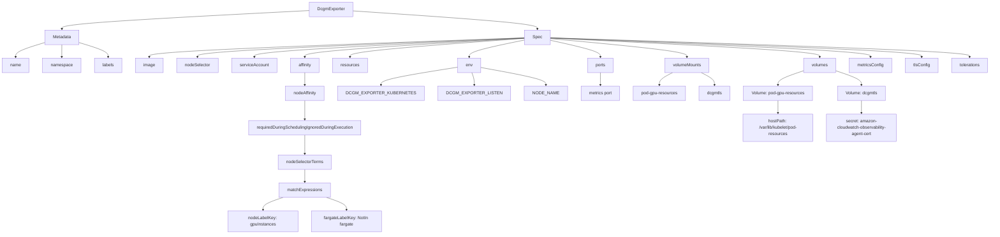
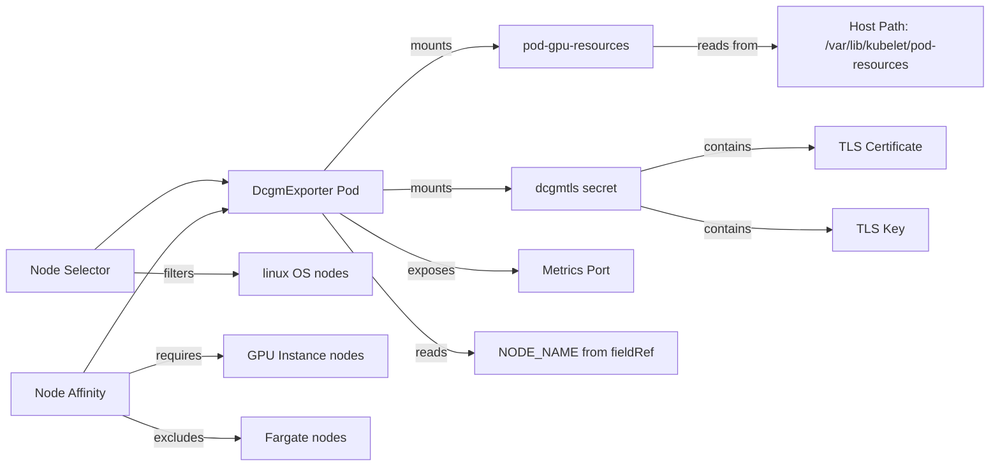
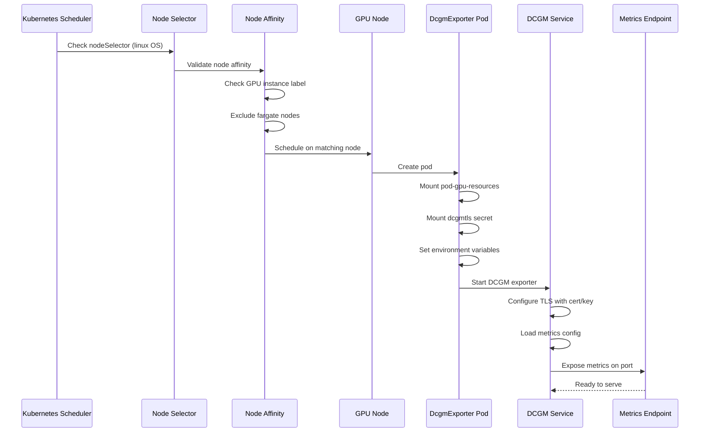
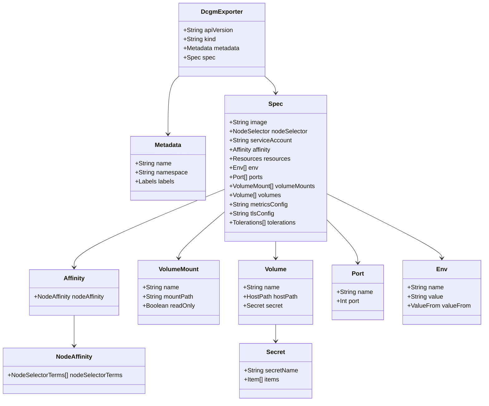
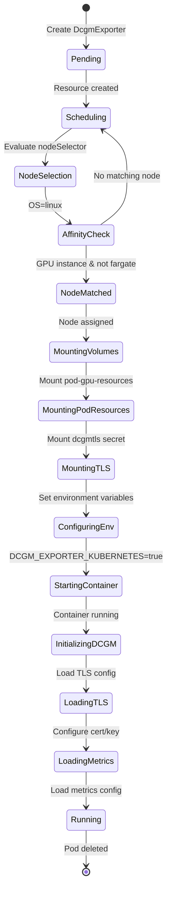
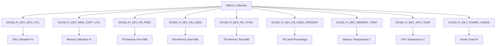

# Diagram: devops/k8s/amazon-cloudwatch-observability/helm/templates/linux/dcgm-exporter-daemonset.yaml

> Auto-generated by Obscura crawlers

## Diagram 1

### SVG

<svg id="container" width="3625.546875" xmlns="http://www.w3.org/2000/svg" class="flowchart" height="894" viewBox="0 0 3625.546875 894" role="graphics-document document" aria-roledescription="flowchart-v2"><g><marker id="container_flowchart-v2-pointEnd" class="marker flowchart-v2" viewBox="0 0 10 10" refX="5" refY="5" markerUnits="userSpaceOnUse" markerWidth="8" markerHeight="8" orient="auto"><path d="M 0 0 L 10 5 L 0 10 z" class="arrowMarkerPath" style="stroke-width: 1; stroke-dasharray: 1, 0;"></path></marker><marker id="container_flowchart-v2-pointStart" class="marker flowchart-v2" viewBox="0 0 10 10" refX="4.5" refY="5" markerUnits="userSpaceOnUse" markerWidth="8" markerHeight="8" orient="auto"><path d="M 0 5 L 10 10 L 10 0 z" class="arrowMarkerPath" style="stroke-width: 1; stroke-dasharray: 1, 0;"></path></marker><marker id="container_flowchart-v2-circleEnd" class="marker flowchart-v2" viewBox="0 0 10 10" refX="11" refY="5" markerUnits="userSpaceOnUse" markerWidth="11" markerHeight="11" orient="auto"><circle cx="5" cy="5" r="5" class="arrowMarkerPath" style="stroke-width: 1; stroke-dasharray: 1, 0;"></circle></marker><marker id="container_flowchart-v2-circleStart" class="marker flowchart-v2" viewBox="0 0 10 10" refX="-1" refY="5" markerUnits="userSpaceOnUse" markerWidth="11" markerHeight="11" orient="auto"><circle cx="5" cy="5" r="5" class="arrowMarkerPath" style="stroke-width: 1; stroke-dasharray: 1, 0;"></circle></marker><marker id="container_flowchart-v2-crossEnd" class="marker cross flowchart-v2" viewBox="0 0 11 11" refX="12" refY="5.2" markerUnits="userSpaceOnUse" markerWidth="11" markerHeight="11" orient="auto"><path d="M 1,1 l 9,9 M 10,1 l -9,9" class="arrowMarkerPath" style="stroke-width: 2; stroke-dasharray: 1, 0;"></path></marker><marker id="container_flowchart-v2-crossStart" class="marker cross flowchart-v2" viewBox="0 0 11 11" refX="-1" refY="5.2" markerUnits="userSpaceOnUse" markerWidth="11" markerHeight="11" orient="auto"><path d="M 1,1 l 9,9 M 10,1 l -9,9" class="arrowMarkerPath" style="stroke-width: 2; stroke-dasharray: 1, 0;"></path></marker><g class="root"><g class="clusters"></g><g class="edgePaths"><path d="M1114.883,39.353L967.462,47.294C820.042,55.235,525.201,71.118,377.78,82.559C230.359,94,230.359,101,230.359,104.5L230.359,108" id="L_A_B_0" class="edge-thickness-normal edge-pattern-solid edge-thickness-normal edge-pattern-solid flowchart-link" style=";" data-edge="true" data-et="edge" data-id="L_A_B_0" data-points="W3sieCI6MTExNC44ODI4MTI1LCJ5IjozOS4zNTI3NjIxNzYwNzM1NX0seyJ4IjoyMzAuMzU5Mzc1LCJ5Ijo4N30seyJ4IjoyMzAuMzU5Mzc1LCJ5IjoxMTJ9XQ==" marker-end="url(#container_flowchart-v2-pointEnd)"></path><path d="M1276.492,40.651L1386.96,48.375C1497.428,56.1,1718.365,71.55,1828.833,82.775C1939.301,94,1939.301,101,1939.301,104.5L1939.301,108" id="L_A_C_0" class="edge-thickness-normal edge-pattern-solid edge-thickness-normal edge-pattern-solid flowchart-link" style=";" data-edge="true" data-et="edge" data-id="L_A_C_0" data-points="W3sieCI6MTI3Ni40OTIxODc1LCJ5Ijo0MC42NTA1NzY1MjQwNDU5MX0seyJ4IjoxOTM5LjMwMDc4MTI1LCJ5Ijo4N30seyJ4IjoxOTM5LjMwMDc4MTI1LCJ5IjoxMTJ9XQ==" marker-end="url(#container_flowchart-v2-pointEnd)"></path><path d="M166.266,158.366L148.264,163.805C130.263,169.244,94.26,180.122,76.259,189.061C58.258,198,58.258,205,58.258,208.5L58.258,212" id="L_B_B1_0" class="edge-thickness-normal edge-pattern-solid edge-thickness-normal edge-pattern-solid flowchart-link" style=";" data-edge="true" data-et="edge" data-id="L_B_B1_0" data-points="W3sieCI6MTY2LjI2NTYyNSwieSI6MTU4LjM2NTc0NTE1NDExNTAyfSx7IngiOjU4LjI1NzgxMjUsInkiOjE5MX0seyJ4Ijo1OC4yNTc4MTI1LCJ5IjoyMTZ9XQ==" marker-end="url(#container_flowchart-v2-pointEnd)"></path><path d="M229.946,166L229.882,170.167C229.818,174.333,229.69,182.667,229.626,190.333C229.563,198,229.563,205,229.563,208.5L229.563,212" id="L_B_B2_0" class="edge-thickness-normal edge-pattern-solid edge-thickness-normal edge-pattern-solid flowchart-link" style=";" data-edge="true" data-et="edge" data-id="L_B_B2_0" data-points="W3sieCI6MjI5Ljk0NTYxMjk4MDc2OTIzLCJ5IjoxNjZ9LHsieCI6MjI5LjU2MjUsInkiOjE5MX0seyJ4IjoyMjkuNTYyNSwieSI6MjE2fV0=" marker-end="url(#container_flowchart-v2-pointEnd)"></path><path d="M294.453,158.366L312.454,163.805C330.456,169.244,366.458,180.122,384.46,189.061C402.461,198,402.461,205,402.461,208.5L402.461,212" id="L_B_B3_0" class="edge-thickness-normal edge-pattern-solid edge-thickness-normal edge-pattern-solid flowchart-link" style=";" data-edge="true" data-et="edge" data-id="L_B_B3_0" data-points="W3sieCI6Mjk0LjQ1MzEyNSwieSI6MTU4LjM2NTc0NTE1NDExNTAyfSx7IngiOjQwMi40NjA5Mzc1LCJ5IjoxOTF9LHsieCI6NDAyLjQ2MDkzNzUsInkiOjIxNn1d" marker-end="url(#container_flowchart-v2-pointEnd)"></path><path d="M1892.004,140.778L1669.352,149.148C1446.701,157.519,1001.397,174.259,778.745,186.13C556.094,198,556.094,205,556.094,208.5L556.094,212" id="L_C_C1_0" class="edge-thickness-normal edge-pattern-solid edge-thickness-normal edge-pattern-solid flowchart-link" style=";" data-edge="true" data-et="edge" data-id="L_C_C1_0" data-points="W3sieCI6MTg5Mi4wMDM5MDYyNSwieSI6MTQwLjc3ODA2ODk2OTAyMjk3fSx7IngiOjU1Ni4wOTM3NSwieSI6MTkxfSx7IngiOjU1Ni4wOTM3NSwieSI6MjE2fV0=" marker-end="url(#container_flowchart-v2-pointEnd)"></path><path d="M1892.004,141.044L1699.356,149.37C1506.708,157.696,1121.413,174.348,928.765,186.174C736.117,198,736.117,205,736.117,208.5L736.117,212" id="L_C_C2_0" class="edge-thickness-normal edge-pattern-solid edge-thickness-normal edge-pattern-solid flowchart-link" style=";" data-edge="true" data-et="edge" data-id="L_C_C2_0" data-points="W3sieCI6MTg5Mi4wMDM5MDYyNSwieSI6MTQxLjA0NDEwODI0MTQ4MTc1fSx7IngiOjczNi4xMTcxODc1LCJ5IjoxOTF9LHsieCI6NzM2LjExNzE4NzUsInkiOjIxNn1d" marker-end="url(#container_flowchart-v2-pointEnd)"></path><path d="M1892.004,141.482L1734.766,149.735C1577.529,157.988,1263.053,174.494,1105.816,186.247C948.578,198,948.578,205,948.578,208.5L948.578,212" id="L_C_C3_0" class="edge-thickness-normal edge-pattern-solid edge-thickness-normal edge-pattern-solid flowchart-link" style=";" data-edge="true" data-et="edge" data-id="L_C_C3_0" data-points="W3sieCI6MTg5Mi4wMDM5MDYyNSwieSI6MTQxLjQ4MjQ2ODIxMDk0MTM2fSx7IngiOjk0OC41NzgxMjUsInkiOjE5MX0seyJ4Ijo5NDguNTc4MTI1LCJ5IjoyMTZ9XQ==" marker-end="url(#container_flowchart-v2-pointEnd)"></path><path d="M1892.004,142.07L1766.364,150.225C1640.724,158.38,1389.444,174.69,1263.804,186.345C1138.164,198,1138.164,205,1138.164,208.5L1138.164,212" id="L_C_C4_0" class="edge-thickness-normal edge-pattern-solid edge-thickness-normal edge-pattern-solid flowchart-link" style=";" data-edge="true" data-et="edge" data-id="L_C_C4_0" data-points="W3sieCI6MTg5Mi4wMDM5MDYyNSwieSI6MTQyLjA2OTkzNDgwOTQyNjA2fSx7IngiOjExMzguMTY0MDYyNSwieSI6MTkxfSx7IngiOjExMzguMTY0MDYyNSwieSI6MjE2fV0=" marker-end="url(#container_flowchart-v2-pointEnd)"></path><path d="M1892.004,142.898L1794.739,150.915C1697.474,158.932,1502.944,174.966,1405.679,186.483C1308.414,198,1308.414,205,1308.414,208.5L1308.414,212" id="L_C_C5_0" class="edge-thickness-normal edge-pattern-solid edge-thickness-normal edge-pattern-solid flowchart-link" style=";" data-edge="true" data-et="edge" data-id="L_C_C5_0" data-points="W3sieCI6MTg5Mi4wMDM5MDYyNSwieSI6MTQyLjg5ODM4MjExMzQ2ODc2fSx7IngiOjEzMDguNDE0MDYyNSwieSI6MTkxfSx7IngiOjEzMDguNDE0MDYyNSwieSI6MjE2fV0=" marker-end="url(#container_flowchart-v2-pointEnd)"></path><path d="M1892.004,149.925L1862.367,156.771C1832.729,163.617,1773.454,177.308,1743.817,187.654C1714.18,198,1714.18,205,1714.18,208.5L1714.18,212" id="L_C_C6_0" class="edge-thickness-normal edge-pattern-solid edge-thickness-normal edge-pattern-solid flowchart-link" style=";" data-edge="true" data-et="edge" data-id="L_C_C6_0" data-points="W3sieCI6MTg5Mi4wMDM5MDYyNSwieSI6MTQ5LjkyNDk1MzU4NDAwODYyfSx7IngiOjE3MTQuMTc5Njg3NSwieSI6MTkxfSx7IngiOjE3MTQuMTc5Njg3NSwieSI6MjE2fV0=" marker-end="url(#container_flowchart-v2-pointEnd)"></path><path d="M1986.598,150.053L2015.8,156.878C2045.003,163.702,2103.408,177.351,2132.61,187.676C2161.813,198,2161.813,205,2161.813,208.5L2161.813,212" id="L_C_C7_0" class="edge-thickness-normal edge-pattern-solid edge-thickness-normal edge-pattern-solid flowchart-link" style=";" data-edge="true" data-et="edge" data-id="L_C_C7_0" data-points="W3sieCI6MTk4Ni41OTc2NTYyNSwieSI6MTUwLjA1MzA2OTUzNjM2NTd9LHsieCI6MjE2MS44MTI1LCJ5IjoxOTF9LHsieCI6MjE2MS44MTI1LCJ5IjoyMTZ9XQ==" marker-end="url(#container_flowchart-v2-pointEnd)"></path><path d="M1986.598,143.472L2070.369,151.394C2154.141,159.315,2321.684,175.157,2405.455,186.579C2489.227,198,2489.227,205,2489.227,208.5L2489.227,212" id="L_C_C8_0" class="edge-thickness-normal edge-pattern-solid edge-thickness-normal edge-pattern-solid flowchart-link" style=";" data-edge="true" data-et="edge" data-id="L_C_C8_0" data-points="W3sieCI6MTk4Ni41OTc2NTYyNSwieSI6MTQzLjQ3MjMwODA1MjkzMzI3fSx7IngiOjI0ODkuMjI2NTYyNSwieSI6MTkxfSx7IngiOjI0ODkuMjI2NTYyNSwieSI6MjE2fV0=" marker-end="url(#container_flowchart-v2-pointEnd)"></path><path d="M1986.598,141.349L2153.238,149.624C2319.878,157.899,2653.158,174.45,2819.798,186.225C2986.438,198,2986.438,205,2986.438,208.5L2986.438,212" id="L_C_C9_0" class="edge-thickness-normal edge-pattern-solid edge-thickness-normal edge-pattern-solid flowchart-link" style=";" data-edge="true" data-et="edge" data-id="L_C_C9_0" data-points="W3sieCI6MTk4Ni41OTc2NTYyNSwieSI6MTQxLjM0ODcyNjI1MTI3M30seyJ4IjoyOTg2LjQzNzUsInkiOjE5MX0seyJ4IjoyOTg2LjQzNzUsInkiOjIxNn1d" marker-end="url(#container_flowchart-v2-pointEnd)"></path><path d="M1986.598,140.988L2184.902,149.323C2383.206,157.659,2779.814,174.329,2978.118,186.165C3176.422,198,3176.422,205,3176.422,208.5L3176.422,212" id="L_C_C10_0" class="edge-thickness-normal edge-pattern-solid edge-thickness-normal edge-pattern-solid flowchart-link" style=";" data-edge="true" data-et="edge" data-id="L_C_C10_0" data-points="W3sieCI6MTk4Ni41OTc2NTYyNSwieSI6MTQwLjk4ODAzMjk1MjAwODY3fSx7IngiOjMxNzYuNDIxODc1LCJ5IjoxOTF9LHsieCI6MzE3Ni40MjE4NzUsInkiOjIxNn1d" marker-end="url(#container_flowchart-v2-pointEnd)"></path><path d="M1986.598,140.722L2216.699,149.102C2446.799,157.482,2907.001,174.241,3137.102,186.12C3367.203,198,3367.203,205,3367.203,208.5L3367.203,212" id="L_C_C11_0" class="edge-thickness-normal edge-pattern-solid edge-thickness-normal edge-pattern-solid flowchart-link" style=";" data-edge="true" data-et="edge" data-id="L_C_C11_0" data-points="W3sieCI6MTk4Ni41OTc2NTYyNSwieSI6MTQwLjcyMjQxMjk1ODI1NjYzfSx7IngiOjMzNjcuMjAzMTI1LCJ5IjoxOTF9LHsieCI6MzM2Ny4yMDMxMjUsInkiOjIxNn1d" marker-end="url(#container_flowchart-v2-pointEnd)"></path><path d="M1986.598,140.529L2246.838,148.941C2507.078,157.353,3027.559,174.176,3287.799,186.088C3548.039,198,3548.039,205,3548.039,208.5L3548.039,212" id="L_C_C12_0" class="edge-thickness-normal edge-pattern-solid edge-thickness-normal edge-pattern-solid flowchart-link" style=";" data-edge="true" data-et="edge" data-id="L_C_C12_0" data-points="W3sieCI6MTk4Ni41OTc2NTYyNSwieSI6MTQwLjUyODc5OTAxNTE0NDMzfSx7IngiOjM1NDguMDM5MDYyNSwieSI6MTkxfSx7IngiOjM1NDguMDM5MDYyNSwieSI6MjE2fV0=" marker-end="url(#container_flowchart-v2-pointEnd)"></path><path d="M1138.164,270L1138.164,274.167C1138.164,278.333,1138.164,286.667,1138.164,296.333C1138.164,306,1138.164,317,1138.164,322.5L1138.164,328" id="L_C4_C4A_0" class="edge-thickness-normal edge-pattern-solid edge-thickness-normal edge-pattern-solid flowchart-link" style=";" data-edge="true" data-et="edge" data-id="L_C4_C4A_0" data-points="W3sieCI6MTEzOC4xNjQwNjI1LCJ5IjoyNzB9LHsieCI6MTEzOC4xNjQwNjI1LCJ5IjoyOTV9LHsieCI6MTEzOC4xNjQwNjI1LCJ5IjozMzJ9XQ==" marker-end="url(#container_flowchart-v2-pointEnd)"></path><path d="M1138.164,386L1138.164,392.167C1138.164,398.333,1138.164,410.667,1138.164,424.333C1138.164,438,1138.164,453,1138.164,460.5L1138.164,468" id="L_C4A_C4A1_0" class="edge-thickness-normal edge-pattern-solid edge-thickness-normal edge-pattern-solid flowchart-link" style=";" data-edge="true" data-et="edge" data-id="L_C4A_C4A1_0" data-points="W3sieCI6MTEzOC4xNjQwNjI1LCJ5IjozODZ9LHsieCI6MTEzOC4xNjQwNjI1LCJ5Ijo0MjN9LHsieCI6MTEzOC4xNjQwNjI1LCJ5Ijo0NzJ9XQ==" marker-end="url(#container_flowchart-v2-pointEnd)"></path><path d="M1138.164,526L1138.164,534.167C1138.164,542.333,1138.164,558.667,1138.164,570.333C1138.164,582,1138.164,589,1138.164,592.5L1138.164,596" id="L_C4A1_C4A1A_0" class="edge-thickness-normal edge-pattern-solid edge-thickness-normal edge-pattern-solid flowchart-link" style=";" data-edge="true" data-et="edge" data-id="L_C4A1_C4A1A_0" data-points="W3sieCI6MTEzOC4xNjQwNjI1LCJ5Ijo1MjZ9LHsieCI6MTEzOC4xNjQwNjI1LCJ5Ijo1NzV9LHsieCI6MTEzOC4xNjQwNjI1LCJ5Ijo2MDB9XQ==" marker-end="url(#container_flowchart-v2-pointEnd)"></path><path d="M1138.164,654L1138.164,658.167C1138.164,662.333,1138.164,670.667,1138.164,678.333C1138.164,686,1138.164,693,1138.164,696.5L1138.164,700" id="L_C4A1A_C4A1A1_0" class="edge-thickness-normal edge-pattern-solid edge-thickness-normal edge-pattern-solid flowchart-link" style=";" data-edge="true" data-et="edge" data-id="L_C4A1A_C4A1A1_0" data-points="W3sieCI6MTEzOC4xNjQwNjI1LCJ5Ijo2NTR9LHsieCI6MTEzOC4xNjQwNjI1LCJ5Ijo2Nzl9LHsieCI6MTEzOC4xNjQwNjI1LCJ5Ijo3MDR9XQ==" marker-end="url(#container_flowchart-v2-pointEnd)"></path><path d="M1057.683,758L1045.263,762.167C1032.844,766.333,1008.004,774.667,995.584,782.333C983.164,790,983.164,797,983.164,800.5L983.164,804" id="L_C4A1A1_C4A1A1A_0" class="edge-thickness-normal edge-pattern-solid edge-thickness-normal edge-pattern-solid flowchart-link" style=";" data-edge="true" data-et="edge" data-id="L_C4A1A1_C4A1A1A_0" data-points="W3sieCI6MTA1Ny42ODMyOTMyNjkyMzA3LCJ5Ijo3NTh9LHsieCI6OTgzLjE2NDA2MjUsInkiOjc4M30seyJ4Ijo5ODMuMTY0MDYyNSwieSI6ODA4fV0=" marker-end="url(#container_flowchart-v2-pointEnd)"></path><path d="M1218.645,758L1231.065,762.167C1243.485,766.333,1268.324,774.667,1280.744,782.333C1293.164,790,1293.164,797,1293.164,800.5L1293.164,804" id="L_C4A1A1_C4A1A1B_0" class="edge-thickness-normal edge-pattern-solid edge-thickness-normal edge-pattern-solid flowchart-link" style=";" data-edge="true" data-et="edge" data-id="L_C4A1A1_C4A1A1B_0" data-points="W3sieCI6MTIxOC42NDQ4MzE3MzA3NjkzLCJ5Ijo3NTh9LHsieCI6MTI5My4xNjQwNjI1LCJ5Ijo3ODN9LHsieCI6MTI5My4xNjQwNjI1LCJ5Ijo4MDh9XQ==" marker-end="url(#container_flowchart-v2-pointEnd)"></path><path d="M1671.25,250.207L1626.78,257.672C1582.31,265.138,1493.37,280.069,1448.9,293.034C1404.43,306,1404.43,317,1404.43,322.5L1404.43,328" id="L_C6_C6A_0" class="edge-thickness-normal edge-pattern-solid edge-thickness-normal edge-pattern-solid flowchart-link" style=";" data-edge="true" data-et="edge" data-id="L_C6_C6A_0" data-points="W3sieCI6MTY3MS4yNSwieSI6MjUwLjIwNjkyMDkwMzk1NDh9LHsieCI6MTQwNC40Mjk2ODc1LCJ5IjoyOTV9LHsieCI6MTQwNC40Mjk2ODc1LCJ5IjozMzJ9XQ==" marker-end="url(#container_flowchart-v2-pointEnd)"></path><path d="M1715.535,270L1715.744,274.167C1715.953,278.333,1716.371,286.667,1716.58,296.333C1716.789,306,1716.789,317,1716.789,322.5L1716.789,328" id="L_C6_C6B_0" class="edge-thickness-normal edge-pattern-solid edge-thickness-normal edge-pattern-solid flowchart-link" style=";" data-edge="true" data-et="edge" data-id="L_C6_C6B_0" data-points="W3sieCI6MTcxNS41MzQ1NTUyODg0NjE0LCJ5IjoyNzB9LHsieCI6MTcxNi43ODkwNjI1LCJ5IjoyOTV9LHsieCI6MTcxNi43ODkwNjI1LCJ5IjozMzJ9XQ==" marker-end="url(#container_flowchart-v2-pointEnd)"></path><path d="M1757.109,252.003L1791.28,259.169C1825.451,266.335,1893.792,280.668,1927.962,293.334C1962.133,306,1962.133,317,1962.133,322.5L1962.133,328" id="L_C6_C6C_0" class="edge-thickness-normal edge-pattern-solid edge-thickness-normal edge-pattern-solid flowchart-link" style=";" data-edge="true" data-et="edge" data-id="L_C6_C6C_0" data-points="W3sieCI6MTc1Ny4xMDkzNzUsInkiOjI1Mi4wMDMwODc3ODEyMDg2NX0seyJ4IjoxOTYyLjEzMjgxMjUsInkiOjI5NX0seyJ4IjoxOTYyLjEzMjgxMjUsInkiOjMzMn1d" marker-end="url(#container_flowchart-v2-pointEnd)"></path><path d="M2161.813,270L2161.813,274.167C2161.813,278.333,2161.813,286.667,2161.813,296.333C2161.813,306,2161.813,317,2161.813,322.5L2161.813,328" id="L_C7_C7A_0" class="edge-thickness-normal edge-pattern-solid edge-thickness-normal edge-pattern-solid flowchart-link" style=";" data-edge="true" data-et="edge" data-id="L_C7_C7A_0" data-points="W3sieCI6MjE2MS44MTI1LCJ5IjoyNzB9LHsieCI6MjE2MS44MTI1LCJ5IjoyOTV9LHsieCI6MjE2MS44MTI1LCJ5IjozMzJ9XQ==" marker-end="url(#container_flowchart-v2-pointEnd)"></path><path d="M2435.344,270L2427.029,274.167C2418.714,278.333,2402.083,286.667,2393.768,296.333C2385.453,306,2385.453,317,2385.453,322.5L2385.453,328" id="L_C8_C8A_0" class="edge-thickness-normal edge-pattern-solid edge-thickness-normal edge-pattern-solid flowchart-link" style=";" data-edge="true" data-et="edge" data-id="L_C8_C8A_0" data-points="W3sieCI6MjQzNS4zNDQyMDA3MjExNTQsInkiOjI3MH0seyJ4IjoyMzg1LjQ1MzEyNSwieSI6Mjk1fSx7IngiOjIzODUuNDUzMTI1LCJ5IjozMzJ9XQ==" marker-end="url(#container_flowchart-v2-pointEnd)"></path><path d="M2543.109,270L2551.424,274.167C2559.739,278.333,2576.37,286.667,2584.685,296.333C2593,306,2593,317,2593,322.5L2593,328" id="L_C8_C8B_0" class="edge-thickness-normal edge-pattern-solid edge-thickness-normal edge-pattern-solid flowchart-link" style=";" data-edge="true" data-et="edge" data-id="L_C8_C8B_0" data-points="W3sieCI6MjU0My4xMDg5MjQyNzg4NDYsInkiOjI3MH0seyJ4IjoyNTkzLCJ5IjoyOTV9LHsieCI6MjU5MywieSI6MzMyfV0=" marker-end="url(#container_flowchart-v2-pointEnd)"></path><path d="M2925.906,263.307L2910.161,268.589C2894.417,273.872,2862.927,284.436,2847.182,293.218C2831.438,302,2831.438,309,2831.438,312.5L2831.438,316" id="L_C9_C9A_0" class="edge-thickness-normal edge-pattern-solid edge-thickness-normal edge-pattern-solid flowchart-link" style=";" data-edge="true" data-et="edge" data-id="L_C9_C9A_0" data-points="W3sieCI6MjkyNS45MDYyNSwieSI6MjYzLjMwNzI1ODA2NDUxNjEzfSx7IngiOjI4MzEuNDM3NSwieSI6Mjk1fSx7IngiOjI4MzEuNDM3NSwieSI6MzIwfV0=" marker-end="url(#container_flowchart-v2-pointEnd)"></path><path d="M3046.969,263.307L3062.714,268.589C3078.458,273.872,3109.948,284.436,3125.693,295.218C3141.438,306,3141.438,317,3141.438,322.5L3141.438,328" id="L_C9_C9B_0" class="edge-thickness-normal edge-pattern-solid edge-thickness-normal edge-pattern-solid flowchart-link" style=";" data-edge="true" data-et="edge" data-id="L_C9_C9B_0" data-points="W3sieCI6MzA0Ni45Njg3NSwieSI6MjYzLjMwNzI1ODA2NDUxNjEzfSx7IngiOjMxNDEuNDM3NSwieSI6Mjk1fSx7IngiOjMxNDEuNDM3NSwieSI6MzMyfV0=" marker-end="url(#container_flowchart-v2-pointEnd)"></path><path d="M2831.438,398L2831.438,402.167C2831.438,406.333,2831.438,414.667,2831.438,422.333C2831.438,430,2831.438,437,2831.438,440.5L2831.438,444" id="L_C9A_C9A1_0" class="edge-thickness-normal edge-pattern-solid edge-thickness-normal edge-pattern-solid flowchart-link" style=";" data-edge="true" data-et="edge" data-id="L_C9A_C9A1_0" data-points="W3sieCI6MjgzMS40Mzc1LCJ5IjozOTh9LHsieCI6MjgzMS40Mzc1LCJ5Ijo0MjN9LHsieCI6MjgzMS40Mzc1LCJ5Ijo0NDh9XQ==" marker-end="url(#container_flowchart-v2-pointEnd)"></path><path d="M3141.438,386L3141.438,392.167C3141.438,398.333,3141.438,410.667,3141.438,420.333C3141.438,430,3141.438,437,3141.438,440.5L3141.438,444" id="L_C9B_C9B1_0" class="edge-thickness-normal edge-pattern-solid edge-thickness-normal edge-pattern-solid flowchart-link" style=";" data-edge="true" data-et="edge" data-id="L_C9B_C9B1_0" data-points="W3sieCI6MzE0MS40Mzc1LCJ5IjozODZ9LHsieCI6MzE0MS40Mzc1LCJ5Ijo0MjN9LHsieCI6MzE0MS40Mzc1LCJ5Ijo0NDh9XQ==" marker-end="url(#container_flowchart-v2-pointEnd)"></path></g><g class="edgeLabels"><g class="edgeLabel"><g class="label" data-id="L_A_B_0" transform="translate(0, 0)"><foreignObject width="0" height="0">

</foreignObject></g></g><g class="edgeLabel"><g class="label" data-id="L_A_C_0" transform="translate(0, 0)"><foreignObject width="0" height="0">

</foreignObject></g></g><g class="edgeLabel"><g class="label" data-id="L_B_B1_0" transform="translate(0, 0)"><foreignObject width="0" height="0">

</foreignObject></g></g><g class="edgeLabel"><g class="label" data-id="L_B_B2_0" transform="translate(0, 0)"><foreignObject width="0" height="0">

</foreignObject></g></g><g class="edgeLabel"><g class="label" data-id="L_B_B3_0" transform="translate(0, 0)"><foreignObject width="0" height="0">

</foreignObject></g></g><g class="edgeLabel"><g class="label" data-id="L_C_C1_0" transform="translate(0, 0)"><foreignObject width="0" height="0">

</foreignObject></g></g><g class="edgeLabel"><g class="label" data-id="L_C_C2_0" transform="translate(0, 0)"><foreignObject width="0" height="0">

</foreignObject></g></g><g class="edgeLabel"><g class="label" data-id="L_C_C3_0" transform="translate(0, 0)"><foreignObject width="0" height="0">

</foreignObject></g></g><g class="edgeLabel"><g class="label" data-id="L_C_C4_0" transform="translate(0, 0)"><foreignObject width="0" height="0">

</foreignObject></g></g><g class="edgeLabel"><g class="label" data-id="L_C_C5_0" transform="translate(0, 0)"><foreignObject width="0" height="0">

</foreignObject></g></g><g class="edgeLabel"><g class="label" data-id="L_C_C6_0" transform="translate(0, 0)"><foreignObject width="0" height="0">

</foreignObject></g></g><g class="edgeLabel"><g class="label" data-id="L_C_C7_0" transform="translate(0, 0)"><foreignObject width="0" height="0">

</foreignObject></g></g><g class="edgeLabel"><g class="label" data-id="L_C_C8_0" transform="translate(0, 0)"><foreignObject width="0" height="0">

</foreignObject></g></g><g class="edgeLabel"><g class="label" data-id="L_C_C9_0" transform="translate(0, 0)"><foreignObject width="0" height="0">

</foreignObject></g></g><g class="edgeLabel"><g class="label" data-id="L_C_C10_0" transform="translate(0, 0)"><foreignObject width="0" height="0">

</foreignObject></g></g><g class="edgeLabel"><g class="label" data-id="L_C_C11_0" transform="translate(0, 0)"><foreignObject width="0" height="0">

</foreignObject></g></g><g class="edgeLabel"><g class="label" data-id="L_C_C12_0" transform="translate(0, 0)"><foreignObject width="0" height="0">

</foreignObject></g></g><g class="edgeLabel"><g class="label" data-id="L_C4_C4A_0" transform="translate(0, 0)"><foreignObject width="0" height="0">

</foreignObject></g></g><g class="edgeLabel"><g class="label" data-id="L_C4A_C4A1_0" transform="translate(0, 0)"><foreignObject width="0" height="0">

</foreignObject></g></g><g class="edgeLabel"><g class="label" data-id="L_C4A1_C4A1A_0" transform="translate(0, 0)"><foreignObject width="0" height="0">

</foreignObject></g></g><g class="edgeLabel"><g class="label" data-id="L_C4A1A_C4A1A1_0" transform="translate(0, 0)"><foreignObject width="0" height="0">

</foreignObject></g></g><g class="edgeLabel"><g class="label" data-id="L_C4A1A1_C4A1A1A_0" transform="translate(0, 0)"><foreignObject width="0" height="0">

</foreignObject></g></g><g class="edgeLabel"><g class="label" data-id="L_C4A1A1_C4A1A1B_0" transform="translate(0, 0)"><foreignObject width="0" height="0">

</foreignObject></g></g><g class="edgeLabel"><g class="label" data-id="L_C6_C6A_0" transform="translate(0, 0)"><foreignObject width="0" height="0">

</foreignObject></g></g><g class="edgeLabel"><g class="label" data-id="L_C6_C6B_0" transform="translate(0, 0)"><foreignObject width="0" height="0">

</foreignObject></g></g><g class="edgeLabel"><g class="label" data-id="L_C6_C6C_0" transform="translate(0, 0)"><foreignObject width="0" height="0">

</foreignObject></g></g><g class="edgeLabel"><g class="label" data-id="L_C7_C7A_0" transform="translate(0, 0)"><foreignObject width="0" height="0">

</foreignObject></g></g><g class="edgeLabel"><g class="label" data-id="L_C8_C8A_0" transform="translate(0, 0)"><foreignObject width="0" height="0">

</foreignObject></g></g><g class="edgeLabel"><g class="label" data-id="L_C8_C8B_0" transform="translate(0, 0)"><foreignObject width="0" height="0">

</foreignObject></g></g><g class="edgeLabel"><g class="label" data-id="L_C9_C9A_0" transform="translate(0, 0)"><foreignObject width="0" height="0">

</foreignObject></g></g><g class="edgeLabel"><g class="label" data-id="L_C9_C9B_0" transform="translate(0, 0)"><foreignObject width="0" height="0">

</foreignObject></g></g><g class="edgeLabel"><g class="label" data-id="L_C9A_C9A1_0" transform="translate(0, 0)"><foreignObject width="0" height="0">

</foreignObject></g></g><g class="edgeLabel"><g class="label" data-id="L_C9B_C9B1_0" transform="translate(0, 0)"><foreignObject width="0" height="0">

</foreignObject></g></g></g><g class="nodes"><g class="node default" id="flowchart-A-0" transform="translate(1195.6875, 35)"><rect class="basic label-container" style="" x="-80.8046875" y="-27" width="161.609375" height="54"></rect><g class="label" style="" transform="translate(-50.8046875, -12)"><rect></rect><foreignObject width="101.609375" height="24">

DcgmExporter

</foreignObject></g></g><g class="node default" id="flowchart-B-1" transform="translate(230.359375, 139)"><rect class="basic label-container" style="" x="-64.09375" y="-27" width="128.1875" height="54"></rect><g class="label" style="" transform="translate(-34.09375, -12)"><rect></rect><foreignObject width="68.1875" height="24">

Metadata

</foreignObject></g></g><g class="node default" id="flowchart-C-3" transform="translate(1939.30078125, 139)"><rect class="basic label-container" style="" x="-47.296875" y="-27" width="94.59375" height="54"></rect><g class="label" style="" transform="translate(-17.296875, -12)"><rect></rect><foreignObject width="34.59375" height="24">

Spec

</foreignObject></g></g><g class="node default" id="flowchart-B1-5" transform="translate(58.2578125, 243)"><rect class="basic label-container" style="" x="-50.2578125" y="-27" width="100.515625" height="54"></rect><g class="label" style="" transform="translate(-20.2578125, -12)"><rect></rect><foreignObject width="40.515625" height="24">

name

</foreignObject></g></g><g class="node default" id="flowchart-B2-7" transform="translate(229.5625, 243)"><rect class="basic label-container" style="" x="-71.046875" y="-27" width="142.09375" height="54"></rect><g class="label" style="" transform="translate(-41.046875, -12)"><rect></rect><foreignObject width="82.09375" height="24">

namespace

</foreignObject></g></g><g class="node default" id="flowchart-B3-9" transform="translate(402.4609375, 243)"><rect class="basic label-container" style="" x="-51.8515625" y="-27" width="103.703125" height="54"></rect><g class="label" style="" transform="translate(-21.8515625, -12)"><rect></rect><foreignObject width="43.703125" height="24">

labels

</foreignObject></g></g><g class="node default" id="flowchart-C1-11" transform="translate(556.09375, 243)"><rect class="basic label-container" style="" x="-51.78125" y="-27" width="103.5625" height="54"></rect><g class="label" style="" transform="translate(-21.78125, -12)"><rect></rect><foreignObject width="43.5625" height="24">

image

</foreignObject></g></g><g class="node default" id="flowchart-C2-13" transform="translate(736.1171875, 243)"><rect class="basic label-container" style="" x="-78.2421875" y="-27" width="156.484375" height="54"></rect><g class="label" style="" transform="translate(-48.2421875, -12)"><rect></rect><foreignObject width="96.484375" height="24">

nodeSelector

</foreignObject></g></g><g class="node default" id="flowchart-C3-15" transform="translate(948.578125, 243)"><rect class="basic label-container" style="" x="-84.21875" y="-27" width="168.4375" height="54"></rect><g class="label" style="" transform="translate(-54.21875, -12)"><rect></rect><foreignObject width="108.4375" height="24">

serviceAccount

</foreignObject></g></g><g class="node default" id="flowchart-C4-17" transform="translate(1138.1640625, 243)"><rect class="basic label-container" style="" x="-55.3671875" y="-27" width="110.734375" height="54"></rect><g class="label" style="" transform="translate(-25.3671875, -12)"><rect></rect><foreignObject width="50.734375" height="24">

affinity

</foreignObject></g></g><g class="node default" id="flowchart-C5-19" transform="translate(1308.4140625, 243)"><rect class="basic label-container" style="" x="-64.8828125" y="-27" width="129.765625" height="54"></rect><g class="label" style="" transform="translate(-34.8828125, -12)"><rect></rect><foreignObject width="69.765625" height="24">

resources

</foreignObject></g></g><g class="node default" id="flowchart-C6-21" transform="translate(1714.1796875, 243)"><rect class="basic label-container" style="" x="-42.9296875" y="-27" width="85.859375" height="54"></rect><g class="label" style="" transform="translate(-12.9296875, -12)"><rect></rect><foreignObject width="25.859375" height="24">

env

</foreignObject></g></g><g class="node default" id="flowchart-C7-23" transform="translate(2161.8125, 243)"><rect class="basic label-container" style="" x="-49.140625" y="-27" width="98.28125" height="54"></rect><g class="label" style="" transform="translate(-19.140625, -12)"><rect></rect><foreignObject width="38.28125" height="24">

ports

</foreignObject></g></g><g class="node default" id="flowchart-C8-25" transform="translate(2489.2265625, 243)"><rect class="basic label-container" style="" x="-83.65625" y="-27" width="167.3125" height="54"></rect><g class="label" style="" transform="translate(-53.65625, -12)"><rect></rect><foreignObject width="107.3125" height="24">

volumeMounts

</foreignObject></g></g><g class="node default" id="flowchart-C9-27" transform="translate(2986.4375, 243)"><rect class="basic label-container" style="" x="-60.53125" y="-27" width="121.0625" height="54"></rect><g class="label" style="" transform="translate(-30.53125, -12)"><rect></rect><foreignObject width="61.0625" height="24">

volumes

</foreignObject></g></g><g class="node default" id="flowchart-C10-29" transform="translate(3176.421875, 243)"><rect class="basic label-container" style="" x="-79.453125" y="-27" width="158.90625" height="54"></rect><g class="label" style="" transform="translate(-49.453125, -12)"><rect></rect><foreignObject width="98.90625" height="24">

metricsConfig

</foreignObject></g></g><g class="node default" id="flowchart-C11-31" transform="translate(3367.203125, 243)"><rect class="basic label-container" style="" x="-61.328125" y="-27" width="122.65625" height="54"></rect><g class="label" style="" transform="translate(-31.328125, -12)"><rect></rect><foreignObject width="62.65625" height="24">

tlsConfig

</foreignObject></g></g><g class="node default" id="flowchart-C12-33" transform="translate(3548.0390625, 243)"><rect class="basic label-container" style="" x="-69.5078125" y="-27" width="139.015625" height="54"></rect><g class="label" style="" transform="translate(-39.5078125, -12)"><rect></rect><foreignObject width="79.015625" height="24">

tolerations

</foreignObject></g></g><g class="node default" id="flowchart-C4A-35" transform="translate(1138.1640625, 359)"><rect class="basic label-container" style="" x="-74.1015625" y="-27" width="148.203125" height="54"></rect><g class="label" style="" transform="translate(-44.1015625, -12)"><rect></rect><foreignObject width="88.203125" height="24">

nodeAffinity

</foreignObject></g></g><g class="node default" id="flowchart-C4A1-37" transform="translate(1138.1640625, 499)"><rect class="basic label-container" style="" x="-212.2421875" y="-27" width="424.484375" height="54"></rect><g class="label" style="" transform="translate(-182.2421875, -12)"><rect></rect><foreignObject width="364.484375" height="24">

requiredDuringSchedulingIgnoredDuringExecution

</foreignObject></g></g><g class="node default" id="flowchart-C4A1A-39" transform="translate(1138.1640625, 627)"><rect class="basic label-container" style="" x="-99.9765625" y="-27" width="199.953125" height="54"></rect><g class="label" style="" transform="translate(-69.9765625, -12)"><rect></rect><foreignObject width="139.953125" height="24">

nodeSelectorTerms

</foreignObject></g></g><g class="node default" id="flowchart-C4A1A1-41" transform="translate(1138.1640625, 731)"><rect class="basic label-container" style="" x="-95.359375" y="-27" width="190.71875" height="54"></rect><g class="label" style="" transform="translate(-65.359375, -12)"><rect></rect><foreignObject width="130.71875" height="24">

matchExpressions

</foreignObject></g></g><g class="node default" id="flowchart-C4A1A1A-43" transform="translate(983.1640625, 847)"><rect class="basic label-container" style="" x="-130" y="-39" width="260" height="78"></rect><g class="label" style="" transform="translate(-100, -24)"><rect></rect><foreignObject width="200" height="48">

nodeLabelKey: gpuInstances

</foreignObject></g></g><g class="node default" id="flowchart-C4A1A1B-45" transform="translate(1293.1640625, 847)"><rect class="basic label-container" style="" x="-130" y="-39" width="260" height="78"></rect><g class="label" style="" transform="translate(-100, -24)"><rect></rect><foreignObject width="200" height="48">

fargateLabelKey: NotIn fargate

</foreignObject></g></g><g class="node default" id="flowchart-C6A-47" transform="translate(1404.4296875, 359)"><rect class="basic label-container" style="" x="-142.1640625" y="-27" width="284.328125" height="54"></rect><g class="label" style="" transform="translate(-112.1640625, -12)"><rect></rect><foreignObject width="224.328125" height="24">

DCGM_EXPORTER_KUBERNETES

</foreignObject></g></g><g class="node default" id="flowchart-C6B-49" transform="translate(1716.7890625, 359)"><rect class="basic label-container" style="" x="-120.1953125" y="-27" width="240.390625" height="54"></rect><g class="label" style="" transform="translate(-90.1953125, -12)"><rect></rect><foreignObject width="180.390625" height="24">

DCGM_EXPORTER_LISTEN

</foreignObject></g></g><g class="node default" id="flowchart-C6C-51" transform="translate(1962.1328125, 359)"><rect class="basic label-container" style="" x="-75.1484375" y="-27" width="150.296875" height="54"></rect><g class="label" style="" transform="translate(-45.1484375, -12)"><rect></rect><foreignObject width="90.296875" height="24">

NODE_NAME

</foreignObject></g></g><g class="node default" id="flowchart-C7A-53" transform="translate(2161.8125, 359)"><rect class="basic label-container" style="" x="-74.53125" y="-27" width="149.0625" height="54"></rect><g class="label" style="" transform="translate(-44.53125, -12)"><rect></rect><foreignObject width="89.0625" height="24">

metrics port

</foreignObject></g></g><g class="node default" id="flowchart-C8A-55" transform="translate(2385.453125, 359)"><rect class="basic label-container" style="" x="-99.109375" y="-27" width="198.21875" height="54"></rect><g class="label" style="" transform="translate(-69.109375, -12)"><rect></rect><foreignObject width="138.21875" height="24">

pod-gpu-resources

</foreignObject></g></g><g class="node default" id="flowchart-C8B-57" transform="translate(2593, 359)"><rect class="basic label-container" style="" x="-58.4375" y="-27" width="116.875" height="54"></rect><g class="label" style="" transform="translate(-28.4375, -12)"><rect></rect><foreignObject width="56.875" height="24">

dcgmtls

</foreignObject></g></g><g class="node default" id="flowchart-C9A-59" transform="translate(2831.4375, 359)"><rect class="basic label-container" style="" x="-130" y="-39" width="260" height="78"></rect><g class="label" style="" transform="translate(-100, -24)"><rect></rect><foreignObject width="200" height="48">

Volume: pod-gpu-resources

</foreignObject></g></g><g class="node default" id="flowchart-C9B-61" transform="translate(3141.4375, 359)"><rect class="basic label-container" style="" x="-89.609375" y="-27" width="179.21875" height="54"></rect><g class="label" style="" transform="translate(-59.609375, -12)"><rect></rect><foreignObject width="119.21875" height="24">

Volume: dcgmtls

</foreignObject></g></g><g class="node default" id="flowchart-C9A1-63" transform="translate(2831.4375, 499)"><rect class="basic label-container" style="" x="-130" y="-51" width="260" height="102"></rect><g class="label" style="" transform="translate(-100, -36)"><rect></rect><foreignObject width="200" height="72">

hostPath: /var/lib/kubelet/pod-resources

</foreignObject></g></g><g class="node default" id="flowchart-C9B1-65" transform="translate(3141.4375, 499)"><rect class="basic label-container" style="" x="-130" y="-51" width="260" height="102"></rect><g class="label" style="" transform="translate(-100, -36)"><rect></rect><foreignObject width="200" height="72">

secret: amazon-cloudwatch-observability-agent-cert

</foreignObject></g></g></g></g></g></svg>

## Diagram 2

### SVG

<svg id="container" width="1241.921875" xmlns="http://www.w3.org/2000/svg" class="flowchart" height="590" viewBox="0 0 1241.921875 590" role="graphics-document document" aria-roledescription="flowchart-v2"><g><marker id="container_flowchart-v2-pointEnd" class="marker flowchart-v2" viewBox="0 0 10 10" refX="5" refY="5" markerUnits="userSpaceOnUse" markerWidth="8" markerHeight="8" orient="auto"><path d="M 0 0 L 10 5 L 0 10 z" class="arrowMarkerPath" style="stroke-width: 1; stroke-dasharray: 1, 0;"></path></marker><marker id="container_flowchart-v2-pointStart" class="marker flowchart-v2" viewBox="0 0 10 10" refX="4.5" refY="5" markerUnits="userSpaceOnUse" markerWidth="8" markerHeight="8" orient="auto"><path d="M 0 5 L 10 10 L 10 0 z" class="arrowMarkerPath" style="stroke-width: 1; stroke-dasharray: 1, 0;"></path></marker><marker id="container_flowchart-v2-circleEnd" class="marker flowchart-v2" viewBox="0 0 10 10" refX="11" refY="5" markerUnits="userSpaceOnUse" markerWidth="11" markerHeight="11" orient="auto"><circle cx="5" cy="5" r="5" class="arrowMarkerPath" style="stroke-width: 1; stroke-dasharray: 1, 0;"></circle></marker><marker id="container_flowchart-v2-circleStart" class="marker flowchart-v2" viewBox="0 0 10 10" refX="-1" refY="5" markerUnits="userSpaceOnUse" markerWidth="11" markerHeight="11" orient="auto"><circle cx="5" cy="5" r="5" class="arrowMarkerPath" style="stroke-width: 1; stroke-dasharray: 1, 0;"></circle></marker><marker id="container_flowchart-v2-crossEnd" class="marker cross flowchart-v2" viewBox="0 0 11 11" refX="12" refY="5.2" markerUnits="userSpaceOnUse" markerWidth="11" markerHeight="11" orient="auto"><path d="M 1,1 l 9,9 M 10,1 l -9,9" class="arrowMarkerPath" style="stroke-width: 2; stroke-dasharray: 1, 0;"></path></marker><marker id="container_flowchart-v2-crossStart" class="marker cross flowchart-v2" viewBox="0 0 11 11" refX="-1" refY="5.2" markerUnits="userSpaceOnUse" markerWidth="11" markerHeight="11" orient="auto"><path d="M 1,1 l 9,9 M 10,1 l -9,9" class="arrowMarkerPath" style="stroke-width: 2; stroke-dasharray: 1, 0;"></path></marker><g class="root"><g class="clusters"></g><g class="edgePaths"><path d="M409.024,216L431.292,189.833C453.56,163.667,498.097,111.333,532.96,85.167C567.823,59,593.013,59,605.608,59L618.203,59" id="L_A_B_0" class="edge-thickness-normal edge-pattern-solid edge-thickness-normal edge-pattern-solid flowchart-link" style=";" data-edge="true" data-et="edge" data-id="L_A_B_0" data-points="W3sieCI6NDA5LjAyNDE1OTMwNzA2NTI1LCJ5IjoyMTZ9LHsieCI6NTQyLjYzMjgxMjUsInkiOjU5fSx7IngiOjYyMi4yMDMxMjUsInkiOjU5fV0=" marker-end="url(#container_flowchart-v2-pointEnd)"></path><path d="M482.836,240.528L492.802,240.273C502.768,240.018,522.701,239.509,548.018,239.255C573.336,239,604.039,239,619.391,239L634.742,239" id="L_A_C_0" class="edge-thickness-normal edge-pattern-solid edge-thickness-normal edge-pattern-solid flowchart-link" style=";" data-edge="true" data-et="edge" data-id="L_A_C_0" data-points="W3sieCI6NDgyLjgzNTkzNzUsInkiOjI0MC41Mjc1MTU4NDA5NDJ9LHsieCI6NTQyLjYzMjgxMjUsInkiOjIzOX0seyJ4Ijo2MzguNzQyMTg3NSwieSI6MjM5fV0=" marker-end="url(#container_flowchart-v2-pointEnd)"></path><path d="M820.422,59L835.309,59C850.195,59,879.969,59,904.885,59C929.802,59,949.862,59,959.892,59L969.922,59" id="L_B_D_0" class="edge-thickness-normal edge-pattern-solid edge-thickness-normal edge-pattern-solid flowchart-link" style=";" data-edge="true" data-et="edge" data-id="L_B_D_0" data-points="W3sieCI6ODIwLjQyMTg3NSwieSI6NTl9LHsieCI6OTA5Ljc0MjE4NzUsInkiOjU5fSx7IngiOjk3My45MjE4NzUsInkiOjU5fV0=" marker-end="url(#container_flowchart-v2-pointEnd)"></path><path d="M803.883,216.213L821.526,211.345C839.169,206.476,874.456,196.738,910.259,191.869C946.063,187,982.383,187,1000.543,187L1018.703,187" id="L_C_E_0" class="edge-thickness-normal edge-pattern-solid edge-thickness-normal edge-pattern-solid flowchart-link" style=";" data-edge="true" data-et="edge" data-id="L_C_E_0" data-points="W3sieCI6ODAzLjg4MjgxMjUsInkiOjIxNi4yMTM0ODMxNDYwNjc0fSx7IngiOjkwOS43NDIxODc1LCJ5IjoxODd9LHsieCI6MTAyMi43MDMxMjUsInkiOjE4N31d" marker-end="url(#container_flowchart-v2-pointEnd)"></path><path d="M803.883,261.787L821.526,266.655C839.169,271.524,874.456,281.262,914.237,286.131C954.018,291,998.294,291,1020.432,291L1042.57,291" id="L_C_F_0" class="edge-thickness-normal edge-pattern-solid edge-thickness-normal edge-pattern-solid flowchart-link" style=";" data-edge="true" data-et="edge" data-id="L_C_F_0" data-points="W3sieCI6ODAzLjg4MjgxMjUsInkiOjI2MS43ODY1MTY4NTM5MzI2fSx7IngiOjkwOS43NDIxODc1LCJ5IjoyOTF9LHsieCI6MTA0Ni41NzAzMTI1LCJ5IjoyOTF9XQ==" marker-end="url(#container_flowchart-v2-pointEnd)"></path><path d="M428.325,270L447.376,282.167C466.428,294.333,504.53,318.667,540.436,330.833C576.341,343,610.049,343,626.904,343L643.758,343" id="L_A_G_0" class="edge-thickness-normal edge-pattern-solid edge-thickness-normal edge-pattern-solid flowchart-link" style=";" data-edge="true" data-et="edge" data-id="L_A_G_0" data-points="W3sieCI6NDI4LjMyNTA3ODEyNSwieSI6MjcwfSx7IngiOjU0Mi42MzI4MTI1LCJ5IjozNDN9LHsieCI6NjQ3Ljc1NzgxMjUsInkiOjM0M31d" marker-end="url(#container_flowchart-v2-pointEnd)"></path><path d="M406.771,270L429.415,299.5C452.059,329,497.346,388,528.394,417.5C559.443,447,576.253,447,584.658,447L593.063,447" id="L_A_H_0" class="edge-thickness-normal edge-pattern-solid edge-thickness-normal edge-pattern-solid flowchart-link" style=";" data-edge="true" data-et="edge" data-id="L_A_H_0" data-points="W3sieCI6NDA2Ljc3MTQ4NDM3NSwieSI6MjcwfSx7IngiOjU0Mi42MzI4MTI1LCJ5Ijo0NDd9LHsieCI6NTk3LjA2MjUsInkiOjQ0N31d" marker-end="url(#container_flowchart-v2-pointEnd)"></path><path d="M170.281,345.353L179.749,345.627C189.216,345.902,208.151,346.451,229.411,346.725C250.672,347,274.258,347,286.051,347L297.844,347" id="L_I_J_0" class="edge-thickness-normal edge-pattern-solid edge-thickness-normal edge-pattern-solid flowchart-link" style=";" data-edge="true" data-et="edge" data-id="L_I_J_0" data-points="W3sieCI6MTcwLjI4MTI1LCJ5IjozNDUuMzUyODM0NTY5ODU5fSx7IngiOjIyNy4wODU5Mzc1LCJ5IjozNDd9LHsieCI6MzAxLjg0Mzc1LCJ5IjozNDd9XQ==" marker-end="url(#container_flowchart-v2-pointEnd)"></path><path d="M166.133,472.209L176.292,468.675C186.451,465.14,206.768,458.07,225.728,454.535C244.688,451,262.289,451,271.09,451L279.891,451" id="L_K_L_0" class="edge-thickness-normal edge-pattern-solid edge-thickness-normal edge-pattern-solid flowchart-link" style=";" data-edge="true" data-et="edge" data-id="L_K_L_0" data-points="W3sieCI6MTY2LjEzMjgxMjUsInkiOjQ3Mi4yMDk0OTE5ODYxODExfSx7IngiOjIyNy4wODU5Mzc1LCJ5Ijo0NTF9LHsieCI6MjgzLjg5MDYyNSwieSI6NDUxfV0=" marker-end="url(#container_flowchart-v2-pointEnd)"></path><path d="M155.65,526L167.556,530.833C179.462,535.667,203.274,545.333,227.571,550.167C251.867,555,276.648,555,289.039,555L301.43,555" id="L_K_M_0" class="edge-thickness-normal edge-pattern-solid edge-thickness-normal edge-pattern-solid flowchart-link" style=";" data-edge="true" data-et="edge" data-id="L_K_M_0" data-points="W3sieCI6MTU1LjY0OTk3MjA5ODIxNDI4LCJ5Ijo1MjZ9LHsieCI6MjI3LjA4NTkzNzUsInkiOjU1NX0seyJ4IjozMDUuNDI5Njg3NSwieSI6NTU1fV0=" marker-end="url(#container_flowchart-v2-pointEnd)"></path><path d="M120.178,316L137.996,300.5C155.814,285,191.45,254,218.969,239.72C246.487,225.441,265.888,227.882,275.589,229.102L285.289,230.323" id="L_I_A_0" class="edge-thickness-normal edge-pattern-solid edge-thickness-normal edge-pattern-solid flowchart-link" style=";" data-edge="true" data-et="edge" data-id="L_I_A_0" data-points="W3sieCI6MTIwLjE3ODMyMDMxMjUsInkiOjMxNn0seyJ4IjoyMjcuMDg1OTM3NSwieSI6MjIzfSx7IngiOjI4OS4yNTc4MTI1LCJ5IjoyMzAuODIyMjgzMzgzMjk5NzV9XQ==" marker-end="url(#container_flowchart-v2-pointEnd)"></path><path d="M106.07,472L126.24,439.833C146.409,407.667,186.747,343.333,216.628,308.967C246.509,274.601,265.933,270.202,275.645,268.003L285.357,265.803" id="L_K_A_0" class="edge-thickness-normal edge-pattern-solid edge-thickness-normal edge-pattern-solid flowchart-link" style=";" data-edge="true" data-et="edge" data-id="L_K_A_0" data-points="W3sieCI6MTA2LjA3MDI3Njk4ODYzNjM3LCJ5Ijo0NzJ9LHsieCI6MjI3LjA4NTkzNzUsInkiOjI3OX0seyJ4IjoyODkuMjU3ODEyNSwieSI6MjY0LjkxOTg4OTkxMDA2MDV9XQ==" marker-end="url(#container_flowchart-v2-pointEnd)"></path></g><g class="edgeLabels"><g class="edgeLabel" transform="translate(542.6328125, 59)"><g class="label" data-id="L_A_B_0" transform="translate(-27.5, -12)"><foreignObject width="55" height="24">

mounts

</foreignObject></g></g><g class="edgeLabel" transform="translate(542.6328125, 239)"><g class="label" data-id="L_A_C_0" transform="translate(-27.5, -12)"><foreignObject width="55" height="24">

mounts

</foreignObject></g></g><g class="edgeLabel" transform="translate(909.7421875, 59)"><g class="label" data-id="L_B_D_0" transform="translate(-39.1796875, -12)"><foreignObject width="78.359375" height="24">

reads from

</foreignObject></g></g><g class="edgeLabel" transform="translate(909.7421875, 187)"><g class="label" data-id="L_C_E_0" transform="translate(-30.890625, -12)"><foreignObject width="61.78125" height="24">

contains

</foreignObject></g></g><g class="edgeLabel" transform="translate(909.7421875, 291)"><g class="label" data-id="L_C_F_0" transform="translate(-30.890625, -12)"><foreignObject width="61.78125" height="24">

contains

</foreignObject></g></g><g class="edgeLabel" transform="translate(542.6328125, 343)"><g class="label" data-id="L_A_G_0" transform="translate(-29.4296875, -12)"><foreignObject width="58.859375" height="24">

exposes

</foreignObject></g></g><g class="edgeLabel" transform="translate(542.6328125, 447)"><g class="label" data-id="L_A_H_0" transform="translate(-20.0078125, -12)"><foreignObject width="40.015625" height="24">

reads

</foreignObject></g></g><g class="edgeLabel" transform="translate(227.0859375, 347)"><g class="label" data-id="L_I_J_0" transform="translate(-20.78125, -12)"><foreignObject width="41.5625" height="24">

filters

</foreignObject></g></g><g class="edgeLabel" transform="translate(227.0859375, 451)"><g class="label" data-id="L_K_L_0" transform="translate(-29.8515625, -12)"><foreignObject width="59.703125" height="24">

requires

</foreignObject></g></g><g class="edgeLabel" transform="translate(227.0859375, 555)"><g class="label" data-id="L_K_M_0" transform="translate(-31.8046875, -12)"><foreignObject width="63.609375" height="24">

excludes

</foreignObject></g></g><g class="edgeLabel"><g class="label" data-id="L_I_A_0" transform="translate(0, 0)"><foreignObject width="0" height="0">

</foreignObject></g></g><g class="edgeLabel"><g class="label" data-id="L_K_A_0" transform="translate(0, 0)"><foreignObject width="0" height="0">

</foreignObject></g></g></g><g class="nodes"><g class="node default" id="flowchart-A-0" transform="translate(386.046875, 243)"><rect class="basic label-container" style="" x="-96.7890625" y="-27" width="193.578125" height="54"></rect><g class="label" style="" transform="translate(-66.7890625, -12)"><rect></rect><foreignObject width="133.578125" height="24">

DcgmExporter Pod

</foreignObject></g></g><g class="node default" id="flowchart-B-1" transform="translate(721.3125, 59)"><rect class="basic label-container" style="" x="-99.109375" y="-27" width="198.21875" height="54"></rect><g class="label" style="" transform="translate(-69.109375, -12)"><rect></rect><foreignObject width="138.21875" height="24">

pod-gpu-resources

</foreignObject></g></g><g class="node default" id="flowchart-C-3" transform="translate(721.3125, 239)"><rect class="basic label-container" style="" x="-82.5703125" y="-27" width="165.140625" height="54"></rect><g class="label" style="" transform="translate(-52.5703125, -12)"><rect></rect><foreignObject width="105.140625" height="24">

dcgmtls secret

</foreignObject></g></g><g class="node default" id="flowchart-D-5" transform="translate(1103.921875, 59)"><rect class="basic label-container" style="" x="-130" y="-51" width="260" height="102"></rect><g class="label" style="" transform="translate(-100, -36)"><rect></rect><foreignObject width="200" height="72">

Host Path: /var/lib/kubelet/pod-resources

</foreignObject></g></g><g class="node default" id="flowchart-E-7" transform="translate(1103.921875, 187)"><rect class="basic label-container" style="" x="-81.21875" y="-27" width="162.4375" height="54"></rect><g class="label" style="" transform="translate(-51.21875, -12)"><rect></rect><foreignObject width="102.4375" height="24">

TLS Certificate

</foreignObject></g></g><g class="node default" id="flowchart-F-9" transform="translate(1103.921875, 291)"><rect class="basic label-container" style="" x="-57.3515625" y="-27" width="114.703125" height="54"></rect><g class="label" style="" transform="translate(-27.3515625, -12)"><rect></rect><foreignObject width="54.703125" height="24">

TLS Key

</foreignObject></g></g><g class="node default" id="flowchart-G-11" transform="translate(721.3125, 343)"><rect class="basic label-container" style="" x="-73.5546875" y="-27" width="147.109375" height="54"></rect><g class="label" style="" transform="translate(-43.5546875, -12)"><rect></rect><foreignObject width="87.109375" height="24">

Metrics Port

</foreignObject></g></g><g class="node default" id="flowchart-H-13" transform="translate(721.3125, 447)"><rect class="basic label-container" style="" x="-124.25" y="-27" width="248.5" height="54"></rect><g class="label" style="" transform="translate(-94.25, -12)"><rect></rect><foreignObject width="188.5" height="24">

NODE_NAME from fieldRef

</foreignObject></g></g><g class="node default" id="flowchart-I-14" transform="translate(89.140625, 343)"><rect class="basic label-container" style="" x="-81.140625" y="-27" width="162.28125" height="54"></rect><g class="label" style="" transform="translate(-51.140625, -12)"><rect></rect><foreignObject width="102.28125" height="24">

Node Selector

</foreignObject></g></g><g class="node default" id="flowchart-J-15" transform="translate(386.046875, 347)"><rect class="basic label-container" style="" x="-84.203125" y="-27" width="168.40625" height="54"></rect><g class="label" style="" transform="translate(-54.203125, -12)"><rect></rect><foreignObject width="108.40625" height="24">

linux OS nodes

</foreignObject></g></g><g class="node default" id="flowchart-K-16" transform="translate(89.140625, 499)"><rect class="basic label-container" style="" x="-76.9921875" y="-27" width="153.984375" height="54"></rect><g class="label" style="" transform="translate(-46.9921875, -12)"><rect></rect><foreignObject width="93.984375" height="24">

Node Affinity

</foreignObject></g></g><g class="node default" id="flowchart-L-17" transform="translate(386.046875, 451)"><rect class="basic label-container" style="" x="-102.15625" y="-27" width="204.3125" height="54"></rect><g class="label" style="" transform="translate(-72.15625, -12)"><rect></rect><foreignObject width="144.3125" height="24">

GPU Instance nodes

</foreignObject></g></g><g class="node default" id="flowchart-M-19" transform="translate(386.046875, 555)"><rect class="basic label-container" style="" x="-80.6171875" y="-27" width="161.234375" height="54"></rect><g class="label" style="" transform="translate(-50.6171875, -12)"><rect></rect><foreignObject width="101.234375" height="24">

Fargate nodes

</foreignObject></g></g></g></g></g></svg>

## Diagram 3

### SVG

<svg id="container" width="1708.5" xmlns="http://www.w3.org/2000/svg" height="1053" viewBox="-50 -10 1708.5 1053" role="graphics-document document" aria-roledescription="sequence"><g><rect x="1458.5" y="967" fill="#eaeaea" stroke="#666" width="150" height="65" name="Metrics" rx="3" ry="3" class="actor actor-bottom"></rect><text x="1533.5" y="999.5" dominant-baseline="central" alignment-baseline="central" class="actor actor-box" style="text-anchor: middle; font-size: 16px; font-weight: 400;"><tspan x="1533.5" dy="0">Metrics Endpoint</tspan></text></g><g><rect x="1220.5" y="967" fill="#eaeaea" stroke="#666" width="150" height="65" name="DCGM" rx="3" ry="3" class="actor actor-bottom"></rect><text x="1295.5" y="999.5" dominant-baseline="central" alignment-baseline="central" class="actor actor-box" style="text-anchor: middle; font-size: 16px; font-weight: 400;"><tspan x="1295.5" dy="0">DCGM Service</tspan></text></g><g><rect x="1000.5" y="967" fill="#eaeaea" stroke="#666" width="154" height="65" name="Pod" rx="3" ry="3" class="actor actor-bottom"></rect><text x="1077.5" y="999.5" dominant-baseline="central" alignment-baseline="central" class="actor actor-box" style="text-anchor: middle; font-size: 16px; font-weight: 400;"><tspan x="1077.5" dy="0">DcgmExporter Pod</tspan></text></g><g><rect x="800.5" y="967" fill="#eaeaea" stroke="#666" width="150" height="65" name="Node" rx="3" ry="3" class="actor actor-bottom"></rect><text x="875.5" y="999.5" dominant-baseline="central" alignment-baseline="central" class="actor actor-box" style="text-anchor: middle; font-size: 16px; font-weight: 400;"><tspan x="875.5" dy="0">GPU Node</tspan></text></g><g><rect x="528.5" y="967" fill="#eaeaea" stroke="#666" width="150" height="65" name="NA" rx="3" ry="3" class="actor actor-bottom"></rect><text x="603.5" y="999.5" dominant-baseline="central" alignment-baseline="central" class="actor actor-box" style="text-anchor: middle; font-size: 16px; font-weight: 400;"><tspan x="603.5" dy="0">Node Affinity</tspan></text></g><g><rect x="303.5" y="967" fill="#eaeaea" stroke="#666" width="150" height="65" name="NS" rx="3" ry="3" class="actor actor-bottom"></rect><text x="378.5" y="999.5" dominant-baseline="central" alignment-baseline="central" class="actor actor-box" style="text-anchor: middle; font-size: 16px; font-weight: 400;"><tspan x="378.5" dy="0">Node Selector</tspan></text></g><g><rect x="0" y="967" fill="#eaeaea" stroke="#666" width="181" height="65" name="K8s" rx="3" ry="3" class="actor actor-bottom"></rect><text x="90.5" y="999.5" dominant-baseline="central" alignment-baseline="central" class="actor actor-box" style="text-anchor: middle; font-size: 16px; font-weight: 400;"><tspan x="90.5" dy="0">Kubernetes Scheduler</tspan></text></g><g><line id="actor6" x1="1533.5" y1="65" x2="1533.5" y2="967" class="actor-line 200" stroke-width="0.5px" stroke="#999" name="Metrics"></line><g id="root-6"><rect x="1458.5" y="0" fill="#eaeaea" stroke="#666" width="150" height="65" name="Metrics" rx="3" ry="3" class="actor actor-top"></rect><text x="1533.5" y="32.5" dominant-baseline="central" alignment-baseline="central" class="actor actor-box" style="text-anchor: middle; font-size: 16px; font-weight: 400;"><tspan x="1533.5" dy="0">Metrics Endpoint</tspan></text></g></g><g><line id="actor5" x1="1295.5" y1="65" x2="1295.5" y2="967" class="actor-line 200" stroke-width="0.5px" stroke="#999" name="DCGM"></line><g id="root-5"><rect x="1220.5" y="0" fill="#eaeaea" stroke="#666" width="150" height="65" name="DCGM" rx="3" ry="3" class="actor actor-top"></rect><text x="1295.5" y="32.5" dominant-baseline="central" alignment-baseline="central" class="actor actor-box" style="text-anchor: middle; font-size: 16px; font-weight: 400;"><tspan x="1295.5" dy="0">DCGM Service</tspan></text></g></g><g><line id="actor4" x1="1077.5" y1="65" x2="1077.5" y2="967" class="actor-line 200" stroke-width="0.5px" stroke="#999" name="Pod"></line><g id="root-4"><rect x="1000.5" y="0" fill="#eaeaea" stroke="#666" width="154" height="65" name="Pod" rx="3" ry="3" class="actor actor-top"></rect><text x="1077.5" y="32.5" dominant-baseline="central" alignment-baseline="central" class="actor actor-box" style="text-anchor: middle; font-size: 16px; font-weight: 400;"><tspan x="1077.5" dy="0">DcgmExporter Pod</tspan></text></g></g><g><line id="actor3" x1="875.5" y1="65" x2="875.5" y2="967" class="actor-line 200" stroke-width="0.5px" stroke="#999" name="Node"></line><g id="root-3"><rect x="800.5" y="0" fill="#eaeaea" stroke="#666" width="150" height="65" name="Node" rx="3" ry="3" class="actor actor-top"></rect><text x="875.5" y="32.5" dominant-baseline="central" alignment-baseline="central" class="actor actor-box" style="text-anchor: middle; font-size: 16px; font-weight: 400;"><tspan x="875.5" dy="0">GPU Node</tspan></text></g></g><g><line id="actor2" x1="603.5" y1="65" x2="603.5" y2="967" class="actor-line 200" stroke-width="0.5px" stroke="#999" name="NA"></line><g id="root-2"><rect x="528.5" y="0" fill="#eaeaea" stroke="#666" width="150" height="65" name="NA" rx="3" ry="3" class="actor actor-top"></rect><text x="603.5" y="32.5" dominant-baseline="central" alignment-baseline="central" class="actor actor-box" style="text-anchor: middle; font-size: 16px; font-weight: 400;"><tspan x="603.5" dy="0">Node Affinity</tspan></text></g></g><g><line id="actor1" x1="378.5" y1="65" x2="378.5" y2="967" class="actor-line 200" stroke-width="0.5px" stroke="#999" name="NS"></line><g id="root-1"><rect x="303.5" y="0" fill="#eaeaea" stroke="#666" width="150" height="65" name="NS" rx="3" ry="3" class="actor actor-top"></rect><text x="378.5" y="32.5" dominant-baseline="central" alignment-baseline="central" class="actor actor-box" style="text-anchor: middle; font-size: 16px; font-weight: 400;"><tspan x="378.5" dy="0">Node Selector</tspan></text></g></g><g><line id="actor0" x1="90.5" y1="65" x2="90.5" y2="967" class="actor-line 200" stroke-width="0.5px" stroke="#999" name="K8s"></line><g id="root-0"><rect x="0" y="0" fill="#eaeaea" stroke="#666" width="181" height="65" name="K8s" rx="3" ry="3" class="actor actor-top"></rect><text x="90.5" y="32.5" dominant-baseline="central" alignment-baseline="central" class="actor actor-box" style="text-anchor: middle; font-size: 16px; font-weight: 400;"><tspan x="90.5" dy="0">Kubernetes Scheduler</tspan></text></g></g><g></g><defs><symbol id="computer" width="24" height="24"><path transform="scale(.5)" d="M2 2v13h20v-13h-20zm18 11h-16v-9h16v9zm-10.228 6l.466-1h3.524l.467 1h-4.457zm14.228 3h-24l2-6h2.104l-1.33 4h18.45l-1.297-4h2.073l2 6zm-5-10h-14v-7h14v7z"></path></symbol></defs><defs><symbol id="database" fill-rule="evenodd" clip-rule="evenodd"><path transform="scale(.5)" d="M12.258.001l.256.004.255.005.253.008.251.01.249.012.247.015.246.016.242.019.241.02.239.023.236.024.233.027.231.028.229.031.225.032.223.034.22.036.217.038.214.04.211.041.208.043.205.045.201.046.198.048.194.05.191.051.187.053.183.054.18.056.175.057.172.059.168.06.163.061.16.063.155.064.15.066.074.033.073.033.071.034.07.034.069.035.068.035.067.035.066.035.064.036.064.036.062.036.06.036.06.037.058.037.058.037.055.038.055.038.053.038.052.038.051.039.05.039.048.039.047.039.045.04.044.04.043.04.041.04.04.041.039.041.037.041.036.041.034.041.033.042.032.042.03.042.029.042.027.042.026.043.024.043.023.043.021.043.02.043.018.044.017.043.015.044.013.044.012.044.011.045.009.044.007.045.006.045.004.045.002.045.001.045v17l-.001.045-.002.045-.004.045-.006.045-.007.045-.009.044-.011.045-.012.044-.013.044-.015.044-.017.043-.018.044-.02.043-.021.043-.023.043-.024.043-.026.043-.027.042-.029.042-.03.042-.032.042-.033.042-.034.041-.036.041-.037.041-.039.041-.04.041-.041.04-.043.04-.044.04-.045.04-.047.039-.048.039-.05.039-.051.039-.052.038-.053.038-.055.038-.055.038-.058.037-.058.037-.06.037-.06.036-.062.036-.064.036-.064.036-.066.035-.067.035-.068.035-.069.035-.07.034-.071.034-.073.033-.074.033-.15.066-.155.064-.16.063-.163.061-.168.06-.172.059-.175.057-.18.056-.183.054-.187.053-.191.051-.194.05-.198.048-.201.046-.205.045-.208.043-.211.041-.214.04-.217.038-.22.036-.223.034-.225.032-.229.031-.231.028-.233.027-.236.024-.239.023-.241.02-.242.019-.246.016-.247.015-.249.012-.251.01-.253.008-.255.005-.256.004-.258.001-.258-.001-.256-.004-.255-.005-.253-.008-.251-.01-.249-.012-.247-.015-.245-.016-.243-.019-.241-.02-.238-.023-.236-.024-.234-.027-.231-.028-.228-.031-.226-.032-.223-.034-.22-.036-.217-.038-.214-.04-.211-.041-.208-.043-.204-.045-.201-.046-.198-.048-.195-.05-.19-.051-.187-.053-.184-.054-.179-.056-.176-.057-.172-.059-.167-.06-.164-.061-.159-.063-.155-.064-.151-.066-.074-.033-.072-.033-.072-.034-.07-.034-.069-.035-.068-.035-.067-.035-.066-.035-.064-.036-.063-.036-.062-.036-.061-.036-.06-.037-.058-.037-.057-.037-.056-.038-.055-.038-.053-.038-.052-.038-.051-.039-.049-.039-.049-.039-.046-.039-.046-.04-.044-.04-.043-.04-.041-.04-.04-.041-.039-.041-.037-.041-.036-.041-.034-.041-.033-.042-.032-.042-.03-.042-.029-.042-.027-.042-.026-.043-.024-.043-.023-.043-.021-.043-.02-.043-.018-.044-.017-.043-.015-.044-.013-.044-.012-.044-.011-.045-.009-.044-.007-.045-.006-.045-.004-.045-.002-.045-.001-.045v-17l.001-.045.002-.045.004-.045.006-.045.007-.045.009-.044.011-.045.012-.044.013-.044.015-.044.017-.043.018-.044.02-.043.021-.043.023-.043.024-.043.026-.043.027-.042.029-.042.03-.042.032-.042.033-.042.034-.041.036-.041.037-.041.039-.041.04-.041.041-.04.043-.04.044-.04.046-.04.046-.039.049-.039.049-.039.051-.039.052-.038.053-.038.055-.038.056-.038.057-.037.058-.037.06-.037.061-.036.062-.036.063-.036.064-.036.066-.035.067-.035.068-.035.069-.035.07-.034.072-.034.072-.033.074-.033.151-.066.155-.064.159-.063.164-.061.167-.06.172-.059.176-.057.179-.056.184-.054.187-.053.19-.051.195-.05.198-.048.201-.046.204-.045.208-.043.211-.041.214-.04.217-.038.22-.036.223-.034.226-.032.228-.031.231-.028.234-.027.236-.024.238-.023.241-.02.243-.019.245-.016.247-.015.249-.012.251-.01.253-.008.255-.005.256-.004.258-.001.258.001zm-9.258 20.499v.01l.001.021.003.021.004.022.005.021.006.022.007.022.009.023.01.022.011.023.012.023.013.023.015.023.016.024.017.023.018.024.019.024.021.024.022.025.023.024.024.025.052.049.056.05.061.051.066.051.07.051.075.051.079.052.084.052.088.052.092.052.097.052.102.051.105.052.11.052.114.051.119.051.123.051.127.05.131.05.135.05.139.048.144.049.147.047.152.047.155.047.16.045.163.045.167.043.171.043.176.041.178.041.183.039.187.039.19.037.194.035.197.035.202.033.204.031.209.03.212.029.216.027.219.025.222.024.226.021.23.02.233.018.236.016.24.015.243.012.246.01.249.008.253.005.256.004.259.001.26-.001.257-.004.254-.005.25-.008.247-.011.244-.012.241-.014.237-.016.233-.018.231-.021.226-.021.224-.024.22-.026.216-.027.212-.028.21-.031.205-.031.202-.034.198-.034.194-.036.191-.037.187-.039.183-.04.179-.04.175-.042.172-.043.168-.044.163-.045.16-.046.155-.046.152-.047.148-.048.143-.049.139-.049.136-.05.131-.05.126-.05.123-.051.118-.052.114-.051.11-.052.106-.052.101-.052.096-.052.092-.052.088-.053.083-.051.079-.052.074-.052.07-.051.065-.051.06-.051.056-.05.051-.05.023-.024.023-.025.021-.024.02-.024.019-.024.018-.024.017-.024.015-.023.014-.024.013-.023.012-.023.01-.023.01-.022.008-.022.006-.022.006-.022.004-.022.004-.021.001-.021.001-.021v-4.127l-.077.055-.08.053-.083.054-.085.053-.087.052-.09.052-.093.051-.095.05-.097.05-.1.049-.102.049-.105.048-.106.047-.109.047-.111.046-.114.045-.115.045-.118.044-.12.043-.122.042-.124.042-.126.041-.128.04-.13.04-.132.038-.134.038-.135.037-.138.037-.139.035-.142.035-.143.034-.144.033-.147.032-.148.031-.15.03-.151.03-.153.029-.154.027-.156.027-.158.026-.159.025-.161.024-.162.023-.163.022-.165.021-.166.02-.167.019-.169.018-.169.017-.171.016-.173.015-.173.014-.175.013-.175.012-.177.011-.178.01-.179.008-.179.008-.181.006-.182.005-.182.004-.184.003-.184.002h-.37l-.184-.002-.184-.003-.182-.004-.182-.005-.181-.006-.179-.008-.179-.008-.178-.01-.176-.011-.176-.012-.175-.013-.173-.014-.172-.015-.171-.016-.17-.017-.169-.018-.167-.019-.166-.02-.165-.021-.163-.022-.162-.023-.161-.024-.159-.025-.157-.026-.156-.027-.155-.027-.153-.029-.151-.03-.15-.03-.148-.031-.146-.032-.145-.033-.143-.034-.141-.035-.14-.035-.137-.037-.136-.037-.134-.038-.132-.038-.13-.04-.128-.04-.126-.041-.124-.042-.122-.042-.12-.044-.117-.043-.116-.045-.113-.045-.112-.046-.109-.047-.106-.047-.105-.048-.102-.049-.1-.049-.097-.05-.095-.05-.093-.052-.09-.051-.087-.052-.085-.053-.083-.054-.08-.054-.077-.054v4.127zm0-5.654v.011l.001.021.003.021.004.021.005.022.006.022.007.022.009.022.01.022.011.023.012.023.013.023.015.024.016.023.017.024.018.024.019.024.021.024.022.024.023.025.024.024.052.05.056.05.061.05.066.051.07.051.075.052.079.051.084.052.088.052.092.052.097.052.102.052.105.052.11.051.114.051.119.052.123.05.127.051.131.05.135.049.139.049.144.048.147.048.152.047.155.046.16.045.163.045.167.044.171.042.176.042.178.04.183.04.187.038.19.037.194.036.197.034.202.033.204.032.209.03.212.028.216.027.219.025.222.024.226.022.23.02.233.018.236.016.24.014.243.012.246.01.249.008.253.006.256.003.259.001.26-.001.257-.003.254-.006.25-.008.247-.01.244-.012.241-.015.237-.016.233-.018.231-.02.226-.022.224-.024.22-.025.216-.027.212-.029.21-.03.205-.032.202-.033.198-.035.194-.036.191-.037.187-.039.183-.039.179-.041.175-.042.172-.043.168-.044.163-.045.16-.045.155-.047.152-.047.148-.048.143-.048.139-.05.136-.049.131-.05.126-.051.123-.051.118-.051.114-.052.11-.052.106-.052.101-.052.096-.052.092-.052.088-.052.083-.052.079-.052.074-.051.07-.052.065-.051.06-.05.056-.051.051-.049.023-.025.023-.024.021-.025.02-.024.019-.024.018-.024.017-.024.015-.023.014-.023.013-.024.012-.022.01-.023.01-.023.008-.022.006-.022.006-.022.004-.021.004-.022.001-.021.001-.021v-4.139l-.077.054-.08.054-.083.054-.085.052-.087.053-.09.051-.093.051-.095.051-.097.05-.1.049-.102.049-.105.048-.106.047-.109.047-.111.046-.114.045-.115.044-.118.044-.12.044-.122.042-.124.042-.126.041-.128.04-.13.039-.132.039-.134.038-.135.037-.138.036-.139.036-.142.035-.143.033-.144.033-.147.033-.148.031-.15.03-.151.03-.153.028-.154.028-.156.027-.158.026-.159.025-.161.024-.162.023-.163.022-.165.021-.166.02-.167.019-.169.018-.169.017-.171.016-.173.015-.173.014-.175.013-.175.012-.177.011-.178.009-.179.009-.179.007-.181.007-.182.005-.182.004-.184.003-.184.002h-.37l-.184-.002-.184-.003-.182-.004-.182-.005-.181-.007-.179-.007-.179-.009-.178-.009-.176-.011-.176-.012-.175-.013-.173-.014-.172-.015-.171-.016-.17-.017-.169-.018-.167-.019-.166-.02-.165-.021-.163-.022-.162-.023-.161-.024-.159-.025-.157-.026-.156-.027-.155-.028-.153-.028-.151-.03-.15-.03-.148-.031-.146-.033-.145-.033-.143-.033-.141-.035-.14-.036-.137-.036-.136-.037-.134-.038-.132-.039-.13-.039-.128-.04-.126-.041-.124-.042-.122-.043-.12-.043-.117-.044-.116-.044-.113-.046-.112-.046-.109-.046-.106-.047-.105-.048-.102-.049-.1-.049-.097-.05-.095-.051-.093-.051-.09-.051-.087-.053-.085-.052-.083-.054-.08-.054-.077-.054v4.139zm0-5.666v.011l.001.02.003.022.004.021.005.022.006.021.007.022.009.023.01.022.011.023.012.023.013.023.015.023.016.024.017.024.018.023.019.024.021.025.022.024.023.024.024.025.052.05.056.05.061.05.066.051.07.051.075.052.079.051.084.052.088.052.092.052.097.052.102.052.105.051.11.052.114.051.119.051.123.051.127.05.131.05.135.05.139.049.144.048.147.048.152.047.155.046.16.045.163.045.167.043.171.043.176.042.178.04.183.04.187.038.19.037.194.036.197.034.202.033.204.032.209.03.212.028.216.027.219.025.222.024.226.021.23.02.233.018.236.017.24.014.243.012.246.01.249.008.253.006.256.003.259.001.26-.001.257-.003.254-.006.25-.008.247-.01.244-.013.241-.014.237-.016.233-.018.231-.02.226-.022.224-.024.22-.025.216-.027.212-.029.21-.03.205-.032.202-.033.198-.035.194-.036.191-.037.187-.039.183-.039.179-.041.175-.042.172-.043.168-.044.163-.045.16-.045.155-.047.152-.047.148-.048.143-.049.139-.049.136-.049.131-.051.126-.05.123-.051.118-.052.114-.051.11-.052.106-.052.101-.052.096-.052.092-.052.088-.052.083-.052.079-.052.074-.052.07-.051.065-.051.06-.051.056-.05.051-.049.023-.025.023-.025.021-.024.02-.024.019-.024.018-.024.017-.024.015-.023.014-.024.013-.023.012-.023.01-.022.01-.023.008-.022.006-.022.006-.022.004-.022.004-.021.001-.021.001-.021v-4.153l-.077.054-.08.054-.083.053-.085.053-.087.053-.09.051-.093.051-.095.051-.097.05-.1.049-.102.048-.105.048-.106.048-.109.046-.111.046-.114.046-.115.044-.118.044-.12.043-.122.043-.124.042-.126.041-.128.04-.13.039-.132.039-.134.038-.135.037-.138.036-.139.036-.142.034-.143.034-.144.033-.147.032-.148.032-.15.03-.151.03-.153.028-.154.028-.156.027-.158.026-.159.024-.161.024-.162.023-.163.023-.165.021-.166.02-.167.019-.169.018-.169.017-.171.016-.173.015-.173.014-.175.013-.175.012-.177.01-.178.01-.179.009-.179.007-.181.006-.182.006-.182.004-.184.003-.184.001-.185.001-.185-.001-.184-.001-.184-.003-.182-.004-.182-.006-.181-.006-.179-.007-.179-.009-.178-.01-.176-.01-.176-.012-.175-.013-.173-.014-.172-.015-.171-.016-.17-.017-.169-.018-.167-.019-.166-.02-.165-.021-.163-.023-.162-.023-.161-.024-.159-.024-.157-.026-.156-.027-.155-.028-.153-.028-.151-.03-.15-.03-.148-.032-.146-.032-.145-.033-.143-.034-.141-.034-.14-.036-.137-.036-.136-.037-.134-.038-.132-.039-.13-.039-.128-.041-.126-.041-.124-.041-.122-.043-.12-.043-.117-.044-.116-.044-.113-.046-.112-.046-.109-.046-.106-.048-.105-.048-.102-.048-.1-.05-.097-.049-.095-.051-.093-.051-.09-.052-.087-.052-.085-.053-.083-.053-.08-.054-.077-.054v4.153zm8.74-8.179l-.257.004-.254.005-.25.008-.247.011-.244.012-.241.014-.237.016-.233.018-.231.021-.226.022-.224.023-.22.026-.216.027-.212.028-.21.031-.205.032-.202.033-.198.034-.194.036-.191.038-.187.038-.183.04-.179.041-.175.042-.172.043-.168.043-.163.045-.16.046-.155.046-.152.048-.148.048-.143.048-.139.049-.136.05-.131.05-.126.051-.123.051-.118.051-.114.052-.11.052-.106.052-.101.052-.096.052-.092.052-.088.052-.083.052-.079.052-.074.051-.07.052-.065.051-.06.05-.056.05-.051.05-.023.025-.023.024-.021.024-.02.025-.019.024-.018.024-.017.023-.015.024-.014.023-.013.023-.012.023-.01.023-.01.022-.008.022-.006.023-.006.021-.004.022-.004.021-.001.021-.001.021.001.021.001.021.004.021.004.022.006.021.006.023.008.022.01.022.01.023.012.023.013.023.014.023.015.024.017.023.018.024.019.024.02.025.021.024.023.024.023.025.051.05.056.05.06.05.065.051.07.052.074.051.079.052.083.052.088.052.092.052.096.052.101.052.106.052.11.052.114.052.118.051.123.051.126.051.131.05.136.05.139.049.143.048.148.048.152.048.155.046.16.046.163.045.168.043.172.043.175.042.179.041.183.04.187.038.191.038.194.036.198.034.202.033.205.032.21.031.212.028.216.027.22.026.224.023.226.022.231.021.233.018.237.016.241.014.244.012.247.011.25.008.254.005.257.004.26.001.26-.001.257-.004.254-.005.25-.008.247-.011.244-.012.241-.014.237-.016.233-.018.231-.021.226-.022.224-.023.22-.026.216-.027.212-.028.21-.031.205-.032.202-.033.198-.034.194-.036.191-.038.187-.038.183-.04.179-.041.175-.042.172-.043.168-.043.163-.045.16-.046.155-.046.152-.048.148-.048.143-.048.139-.049.136-.05.131-.05.126-.051.123-.051.118-.051.114-.052.11-.052.106-.052.101-.052.096-.052.092-.052.088-.052.083-.052.079-.052.074-.051.07-.052.065-.051.06-.05.056-.05.051-.05.023-.025.023-.024.021-.024.02-.025.019-.024.018-.024.017-.023.015-.024.014-.023.013-.023.012-.023.01-.023.01-.022.008-.022.006-.023.006-.021.004-.022.004-.021.001-.021.001-.021-.001-.021-.001-.021-.004-.021-.004-.022-.006-.021-.006-.023-.008-.022-.01-.022-.01-.023-.012-.023-.013-.023-.014-.023-.015-.024-.017-.023-.018-.024-.019-.024-.02-.025-.021-.024-.023-.024-.023-.025-.051-.05-.056-.05-.06-.05-.065-.051-.07-.052-.074-.051-.079-.052-.083-.052-.088-.052-.092-.052-.096-.052-.101-.052-.106-.052-.11-.052-.114-.052-.118-.051-.123-.051-.126-.051-.131-.05-.136-.05-.139-.049-.143-.048-.148-.048-.152-.048-.155-.046-.16-.046-.163-.045-.168-.043-.172-.043-.175-.042-.179-.041-.183-.04-.187-.038-.191-.038-.194-.036-.198-.034-.202-.033-.205-.032-.21-.031-.212-.028-.216-.027-.22-.026-.224-.023-.226-.022-.231-.021-.233-.018-.237-.016-.241-.014-.244-.012-.247-.011-.25-.008-.254-.005-.257-.004-.26-.001-.26.001z"></path></symbol></defs><defs><symbol id="clock" width="24" height="24"><path transform="scale(.5)" d="M12 2c5.514 0 10 4.486 10 10s-4.486 10-10 10-10-4.486-10-10 4.486-10 10-10zm0-2c-6.627 0-12 5.373-12 12s5.373 12 12 12 12-5.373 12-12-5.373-12-12-12zm5.848 12.459c.202.038.202.333.001.372-1.907.361-6.045 1.111-6.547 1.111-.719 0-1.301-.582-1.301-1.301 0-.512.77-5.447 1.125-7.445.034-.192.312-.181.343.014l.985 6.238 5.394 1.011z"></path></symbol></defs><defs><marker id="arrowhead" refX="7.9" refY="5" markerUnits="userSpaceOnUse" markerWidth="12" markerHeight="12" orient="auto-start-reverse"><path d="M -1 0 L 10 5 L 0 10 z"></path></marker></defs><defs><marker id="crosshead" markerWidth="15" markerHeight="8" orient="auto" refX="4" refY="4.5"><path fill="none" stroke="#000000" stroke-width="1pt" d="M 1,2 L 6,7 M 6,2 L 1,7" style="stroke-dasharray: 0, 0;"></path></marker></defs><defs><marker id="filled-head" refX="15.5" refY="7" markerWidth="20" markerHeight="28" orient="auto"><path d="M 18,7 L9,13 L14,7 L9,1 Z"></path></marker></defs><defs><marker id="sequencenumber" refX="15" refY="15" markerWidth="60" markerHeight="40" orient="auto"><circle cx="15" cy="15" r="6"></circle></marker></defs><text x="233" y="80" text-anchor="middle" dominant-baseline="middle" alignment-baseline="middle" class="messageText" dy="1em" style="font-size: 16px; font-weight: 400;">Check nodeSelector (linux OS)</text><line x1="91.5" y1="113" x2="374.5" y2="113" class="messageLine0" stroke-width="2" stroke="none" marker-end="url(#arrowhead)" style="fill: none;"></line><text x="490" y="128" text-anchor="middle" dominant-baseline="middle" alignment-baseline="middle" class="messageText" dy="1em" style="font-size: 16px; font-weight: 400;">Validate node affinity</text><line x1="379.5" y1="161" x2="599.5" y2="161" class="messageLine0" stroke-width="2" stroke="none" marker-end="url(#arrowhead)" style="fill: none;"></line><text x="605" y="176" text-anchor="middle" dominant-baseline="middle" alignment-baseline="middle" class="messageText" dy="1em" style="font-size: 16px; font-weight: 400;">Check GPU instance label</text><path d="M 604.5,209 C 664.5,199 664.5,239 604.5,229" class="messageLine0" stroke-width="2" stroke="none" marker-end="url(#arrowhead)" style="fill: none;"></path><text x="605" y="254" text-anchor="middle" dominant-baseline="middle" alignment-baseline="middle" class="messageText" dy="1em" style="font-size: 16px; font-weight: 400;">Exclude fargate nodes</text><path d="M 604.5,287 C 664.5,277 664.5,317 604.5,307" class="messageLine0" stroke-width="2" stroke="none" marker-end="url(#arrowhead)" style="fill: none;"></path><text x="738" y="332" text-anchor="middle" dominant-baseline="middle" alignment-baseline="middle" class="messageText" dy="1em" style="font-size: 16px; font-weight: 400;">Schedule on matching node</text><line x1="604.5" y1="365" x2="871.5" y2="365" class="messageLine0" stroke-width="2" stroke="none" marker-end="url(#arrowhead)" style="fill: none;"></line><text x="975" y="380" text-anchor="middle" dominant-baseline="middle" alignment-baseline="middle" class="messageText" dy="1em" style="font-size: 16px; font-weight: 400;">Create pod</text><line x1="876.5" y1="413" x2="1073.5" y2="413" class="messageLine0" stroke-width="2" stroke="none" marker-end="url(#arrowhead)" style="fill: none;"></line><text x="1079" y="428" text-anchor="middle" dominant-baseline="middle" alignment-baseline="middle" class="messageText" dy="1em" style="font-size: 16px; font-weight: 400;">Mount pod-gpu-resources</text><path d="M 1078.5,461 C 1138.5,451 1138.5,491 1078.5,481" class="messageLine0" stroke-width="2" stroke="none" marker-end="url(#arrowhead)" style="fill: none;"></path><text x="1079" y="506" text-anchor="middle" dominant-baseline="middle" alignment-baseline="middle" class="messageText" dy="1em" style="font-size: 16px; font-weight: 400;">Mount dcgmtls secret</text><path d="M 1078.5,539 C 1138.5,529 1138.5,569 1078.5,559" class="messageLine0" stroke-width="2" stroke="none" marker-end="url(#arrowhead)" style="fill: none;"></path><text x="1079" y="584" text-anchor="middle" dominant-baseline="middle" alignment-baseline="middle" class="messageText" dy="1em" style="font-size: 16px; font-weight: 400;">Set environment variables</text><path d="M 1078.5,617 C 1138.5,607 1138.5,647 1078.5,637" class="messageLine0" stroke-width="2" stroke="none" marker-end="url(#arrowhead)" style="fill: none;"></path><text x="1185" y="662" text-anchor="middle" dominant-baseline="middle" alignment-baseline="middle" class="messageText" dy="1em" style="font-size: 16px; font-weight: 400;">Start DCGM exporter</text><line x1="1078.5" y1="695" x2="1291.5" y2="695" class="messageLine0" stroke-width="2" stroke="none" marker-end="url(#arrowhead)" style="fill: none;"></line><text x="1297" y="710" text-anchor="middle" dominant-baseline="middle" alignment-baseline="middle" class="messageText" dy="1em" style="font-size: 16px; font-weight: 400;">Configure TLS with cert/key</text><path d="M 1296.5,743 C 1356.5,733 1356.5,773 1296.5,763" class="messageLine0" stroke-width="2" stroke="none" marker-end="url(#arrowhead)" style="fill: none;"></path><text x="1297" y="788" text-anchor="middle" dominant-baseline="middle" alignment-baseline="middle" class="messageText" dy="1em" style="font-size: 16px; font-weight: 400;">Load metrics config</text><path d="M 1296.5,821 C 1356.5,811 1356.5,851 1296.5,841" class="messageLine0" stroke-width="2" stroke="none" marker-end="url(#arrowhead)" style="fill: none;"></path><text x="1413" y="866" text-anchor="middle" dominant-baseline="middle" alignment-baseline="middle" class="messageText" dy="1em" style="font-size: 16px; font-weight: 400;">Expose metrics on port</text><line x1="1296.5" y1="899" x2="1529.5" y2="899" class="messageLine0" stroke-width="2" stroke="none" marker-end="url(#arrowhead)" style="fill: none;"></line><text x="1416" y="914" text-anchor="middle" dominant-baseline="middle" alignment-baseline="middle" class="messageText" dy="1em" style="font-size: 16px; font-weight: 400;">Ready to serve</text><line x1="1532.5" y1="947" x2="1299.5" y2="947" class="messageLine1" stroke-width="2" stroke="none" marker-end="url(#arrowhead)" style="stroke-dasharray: 3, 3; fill: none;"></line></svg>

## Diagram 4

### SVG

<svg id="container" width="1261.8125" xmlns="http://www.w3.org/2000/svg" class="classDiagram" height="1054" viewBox="0 0 1261.8125 1054" role="graphics-document document" aria-roledescription="class"><g><defs><marker id="container_class-aggregationStart" class="marker aggregation class" refX="18" refY="7" markerWidth="190" markerHeight="240" orient="auto"><path d="M 18,7 L9,13 L1,7 L9,1 Z"></path></marker></defs><defs><marker id="container_class-aggregationEnd" class="marker aggregation class" refX="1" refY="7" markerWidth="20" markerHeight="28" orient="auto"><path d="M 18,7 L9,13 L1,7 L9,1 Z"></path></marker></defs><defs><marker id="container_class-extensionStart" class="marker extension class" refX="18" refY="7" markerWidth="190" markerHeight="240" orient="auto"><path d="M 1,7 L18,13 V 1 Z"></path></marker></defs><defs><marker id="container_class-extensionEnd" class="marker extension class" refX="1" refY="7" markerWidth="20" markerHeight="28" orient="auto"><path d="M 1,1 V 13 L18,7 Z"></path></marker></defs><defs><marker id="container_class-compositionStart" class="marker composition class" refX="18" refY="7" markerWidth="190" markerHeight="240" orient="auto"><path d="M 18,7 L9,13 L1,7 L9,1 Z"></path></marker></defs><defs><marker id="container_class-compositionEnd" class="marker composition class" refX="1" refY="7" markerWidth="20" markerHeight="28" orient="auto"><path d="M 18,7 L9,13 L1,7 L9,1 Z"></path></marker></defs><defs><marker id="container_class-dependencyStart" class="marker dependency class" refX="6" refY="7" markerWidth="190" markerHeight="240" orient="auto"><path d="M 5,7 L9,13 L1,7 L9,1 Z"></path></marker></defs><defs><marker id="container_class-dependencyEnd" class="marker dependency class" refX="13" refY="7" markerWidth="20" markerHeight="28" orient="auto"><path d="M 18,7 L9,13 L14,7 L9,1 Z"></path></marker></defs><defs><marker id="container_class-lollipopStart" class="marker lollipop class" refX="13" refY="7" markerWidth="190" markerHeight="240" orient="auto"><circle stroke="black" fill="transparent" cx="7" cy="7" r="6"></circle></marker></defs><defs><marker id="container_class-lollipopEnd" class="marker lollipop class" refX="1" refY="7" markerWidth="190" markerHeight="240" orient="auto"><circle stroke="black" fill="transparent" cx="7" cy="7" r="6"></circle></marker></defs><g class="root"><g class="clusters"></g><g class="edgePaths"><path d="M469.368,200L464.489,204.167C459.61,208.333,449.852,216.667,444.973,242C440.094,267.333,440.094,309.667,440.094,330.833L440.094,352" id="id_DcgmExporter_Metadata_1" class="edge-thickness-normal edge-pattern-solid relation" style=";;;" data-edge="true" data-et="edge" data-id="id_DcgmExporter_Metadata_1" data-points="W3sieCI6NDY5LjM2ODQzMDM5NzcyNzI1LCJ5IjoyMDB9LHsieCI6NDQwLjA5Mzc1LCJ5IjoyMjV9LHsieCI6NDQwLjA5Mzc1LCJ5IjozNTh9XQ==" marker-end="url(#container_class-dependencyEnd)"></path><path d="M694.198,200L699.077,204.167C703.956,208.333,713.714,216.667,718.594,224C723.473,231.333,723.473,237.667,723.473,240.833L723.473,244" id="id_DcgmExporter_Spec_2" class="edge-thickness-normal edge-pattern-solid relation" style=";;;" data-edge="true" data-et="edge" data-id="id_DcgmExporter_Spec_2" data-points="W3sieCI6Njk0LjE5Nzk3NTg1MjI3MjcsInkiOjIwMH0seyJ4Ijo3MjMuNDcyNjU2MjUsInkiOjIyNX0seyJ4Ijo3MjMuNDcyNjU2MjUsInkiOjI1MH1d" marker-end="url(#container_class-dependencyEnd)"></path><path d="M587.688,497.736L522.208,524.613C456.728,551.49,325.768,605.245,260.288,639.289C194.809,673.333,194.809,687.667,194.809,694.833L194.809,702" id="id_Spec_Affinity_3" class="edge-thickness-normal edge-pattern-solid relation" style=";;;" data-edge="true" data-et="edge" data-id="id_Spec_Affinity_3" data-points="W3sieCI6NTg3LjY4NzUsInkiOjQ5Ny43MzU1NDM2MDE5NDQ3Nn0seyJ4IjoxOTQuODA4NTkzNzUsInkiOjY1OX0seyJ4IjoxOTQuODA4NTkzNzUsInkiOjcwOH1d" marker-end="url(#container_class-dependencyEnd)"></path><path d="M587.688,558.682L568.23,575.402C548.773,592.121,509.859,625.561,490.402,645.447C470.945,665.333,470.945,671.667,470.945,674.833L470.945,678" id="id_Spec_VolumeMount_4" class="edge-thickness-normal edge-pattern-solid relation" style=";;;" data-edge="true" data-et="edge" data-id="id_Spec_VolumeMount_4" data-points="W3sieCI6NTg3LjY4NzUsInkiOjU1OC42ODE5MzQxOTY0ODI0fSx7IngiOjQ3MC45NDUzMTI1LCJ5Ijo2NTl9LHsieCI6NDcwLjk0NTMxMjUsInkiOjY4NH1d" marker-end="url(#container_class-dependencyEnd)"></path><path d="M723.473,634L723.473,638.167C723.473,642.333,723.473,650.667,723.473,658C723.473,665.333,723.473,671.667,723.473,674.833L723.473,678" id="id_Spec_Volume_5" class="edge-thickness-normal edge-pattern-solid relation" style=";;;" data-edge="true" data-et="edge" data-id="id_Spec_Volume_5" data-points="W3sieCI6NzIzLjQ3MjY1NjI1LCJ5Ijo2MzR9LHsieCI6NzIzLjQ3MjY1NjI1LCJ5Ijo2NTl9LHsieCI6NzIzLjQ3MjY1NjI1LCJ5Ijo2ODR9XQ==" marker-end="url(#container_class-dependencyEnd)"></path><path d="M859.258,579.721L872.285,592.934C885.313,606.148,911.367,632.574,924.395,650.954C937.422,669.333,937.422,679.667,937.422,684.833L937.422,690" id="id_Spec_Port_6" class="edge-thickness-normal edge-pattern-solid relation" style=";;;" data-edge="true" data-et="edge" data-id="id_Spec_Port_6" data-points="W3sieCI6ODU5LjI1NzgxMjUsInkiOjU3OS43MjEzNjcxNDY4NDc4fSx7IngiOjkzNy40MjE4NzUsInkiOjY1OX0seyJ4Ijo5MzcuNDIxODc1LCJ5Ijo2OTZ9XQ==" marker-end="url(#container_class-dependencyEnd)"></path><path d="M859.258,510.401L908.423,535.168C957.587,559.934,1055.917,609.467,1105.081,637.4C1154.246,665.333,1154.246,671.667,1154.246,674.833L1154.246,678" id="id_Spec_Env_7" class="edge-thickness-normal edge-pattern-solid relation" style=";;;" data-edge="true" data-et="edge" data-id="id_Spec_Env_7" data-points="W3sieCI6ODU5LjI1NzgxMjUsInkiOjUxMC40MDExMDQ0ODE0MDE1NX0seyJ4IjoxMTU0LjI0NjA5Mzc1LCJ5Ijo2NTl9LHsieCI6MTE1NC4yNDYwOTM3NSwieSI6Njg0fV0=" marker-end="url(#container_class-dependencyEnd)"></path><path d="M194.809,828L194.809,836.167C194.809,844.333,194.809,860.667,194.809,874C194.809,887.333,194.809,897.667,194.809,902.833L194.809,908" id="id_Affinity_NodeAffinity_8" class="edge-thickness-normal edge-pattern-solid relation" style=";;;" data-edge="true" data-et="edge" data-id="id_Affinity_NodeAffinity_8" data-points="W3sieCI6MTk0LjgwODU5Mzc1LCJ5Ijo4Mjh9LHsieCI6MTk0LjgwODU5Mzc1LCJ5Ijo4Nzd9LHsieCI6MTk0LjgwODU5Mzc1LCJ5Ijo5MTR9XQ==" marker-end="url(#container_class-dependencyEnd)"></path><path d="M723.473,852L723.473,856.167C723.473,860.333,723.473,868.667,723.473,876C723.473,883.333,723.473,889.667,723.473,892.833L723.473,896" id="id_Volume_Secret_9" class="edge-thickness-normal edge-pattern-solid relation" style=";;;" data-edge="true" data-et="edge" data-id="id_Volume_Secret_9" data-points="W3sieCI6NzIzLjQ3MjY1NjI1LCJ5Ijo4NTJ9LHsieCI6NzIzLjQ3MjY1NjI1LCJ5Ijo4Nzd9LHsieCI6NzIzLjQ3MjY1NjI1LCJ5Ijo5MDJ9XQ==" marker-end="url(#container_class-dependencyEnd)"></path></g><g class="edgeLabels"><g class="edgeLabel"><g class="label" data-id="id_DcgmExporter_Metadata_1" transform="translate(0, 0)"><foreignObject width="0" height="0">

</foreignObject></g></g><g class="edgeLabel"><g class="label" data-id="id_DcgmExporter_Spec_2" transform="translate(0, 0)"><foreignObject width="0" height="0">

</foreignObject></g></g><g class="edgeLabel"><g class="label" data-id="id_Spec_Affinity_3" transform="translate(0, 0)"><foreignObject width="0" height="0">

</foreignObject></g></g><g class="edgeLabel"><g class="label" data-id="id_Spec_VolumeMount_4" transform="translate(0, 0)"><foreignObject width="0" height="0">

</foreignObject></g></g><g class="edgeLabel"><g class="label" data-id="id_Spec_Volume_5" transform="translate(0, 0)"><foreignObject width="0" height="0">

</foreignObject></g></g><g class="edgeLabel"><g class="label" data-id="id_Spec_Port_6" transform="translate(0, 0)"><foreignObject width="0" height="0">

</foreignObject></g></g><g class="edgeLabel"><g class="label" data-id="id_Spec_Env_7" transform="translate(0, 0)"><foreignObject width="0" height="0">

</foreignObject></g></g><g class="edgeLabel"><g class="label" data-id="id_Affinity_NodeAffinity_8" transform="translate(0, 0)"><foreignObject width="0" height="0">

</foreignObject></g></g><g class="edgeLabel"><g class="label" data-id="id_Volume_Secret_9" transform="translate(0, 0)"><foreignObject width="0" height="0">

</foreignObject></g></g></g><g class="nodes"><g class="node default" id="classId-DcgmExporter-0" transform="translate(581.783203125, 104)"><g class="basic label-container"><path d="M-112.75 -96 L112.75 -96 L112.75 96 L-112.75 96" stroke="none" stroke-width="0" fill="#ECECFF" style=""></path><path d="M-112.75 -96 C-64.45065741258858 -96, -16.151314825177153 -96, 112.75 -96 M-112.75 -96 C-42.59097258995294 -96, 27.56805482009412 -96, 112.75 -96 M112.75 -96 C112.75 -31.611956829518718, 112.75 32.776086340962564, 112.75 96 M112.75 -96 C112.75 -47.74061115382971, 112.75 0.5187776923405778, 112.75 96 M112.75 96 C66.09676285172493 96, 19.443525703449865 96, -112.75 96 M112.75 96 C64.63637934874517 96, 16.52275869749033 96, -112.75 96 M-112.75 96 C-112.75 52.72177628030354, -112.75 9.443552560607074, -112.75 -96 M-112.75 96 C-112.75 43.91861355360517, -112.75 -8.162772892789661, -112.75 -96" stroke="#9370DB" stroke-width="1.3" fill="none" stroke-dasharray="0 0" style=""></path></g><g class="annotation-group text" transform="translate(0, -72)"></g><g class="label-group text" transform="translate(-51.65625, -72)"><g class="label" style="font-weight: bolder" transform="translate(0,-12)"><foreignObject width="103.3125" height="24">

DcgmExporter

</foreignObject></g></g><g class="members-group text" transform="translate(-100.75, -24)"><g class="label" style="" transform="translate(0,-12)"><foreignObject width="131.046875" height="24">

+String apiVersion

</foreignObject></g><g class="label" style="" transform="translate(0,12)"><foreignObject width="86.125" height="24">

+String kind

</foreignObject></g><g class="label" style="" transform="translate(0,36)"><foreignObject width="149.84375" height="24">

+Metadata metadata

</foreignObject></g><g class="label" style="" transform="translate(0,60)"><foreignObject width="79.53125" height="24">

+Spec spec

</foreignObject></g></g><g class="methods-group text" transform="translate(-100.75, 96)"></g><g class="divider" style=""><path d="M-112.75 -48 C-55.04261850494511 -48, 2.6647629901097787 -48, 112.75 -48 M-112.75 -48 C-49.97914778614819 -48, 12.791704427703621 -48, 112.75 -48" stroke="#9370DB" stroke-width="1.3" fill="none" stroke-dasharray="0 0" style=""></path></g><g class="divider" style=""><path d="M-112.75 72 C-28.867326416634683 72, 55.015347166730635 72, 112.75 72 M-112.75 72 C-37.88177291097166 72, 36.986454178056675 72, 112.75 72" stroke="#9370DB" stroke-width="1.3" fill="none" stroke-dasharray="0 0" style=""></path></g></g><g class="node default" id="classId-Metadata-1" transform="translate(440.09375, 442)"><g class="basic label-container"><path d="M-97.59375 -84 L97.59375 -84 L97.59375 84 L-97.59375 84" stroke="none" stroke-width="0" fill="#ECECFF" style=""></path><path d="M-97.59375 -84 C-39.435600189582196 -84, 18.722549620835608 -84, 97.59375 -84 M-97.59375 -84 C-19.702922328353367 -84, 58.18790534329327 -84, 97.59375 -84 M97.59375 -84 C97.59375 -18.778447592508257, 97.59375 46.443104814983485, 97.59375 84 M97.59375 -84 C97.59375 -21.51155398545032, 97.59375 40.97689202909936, 97.59375 84 M97.59375 84 C38.310657827426894 84, -20.972434345146212 84, -97.59375 84 M97.59375 84 C23.520058226917286 84, -50.55363354616543 84, -97.59375 84 M-97.59375 84 C-97.59375 25.733538940436297, -97.59375 -32.532922119127406, -97.59375 -84 M-97.59375 84 C-97.59375 44.009525122800056, -97.59375 4.019050245600113, -97.59375 -84" stroke="#9370DB" stroke-width="1.3" fill="none" stroke-dasharray="0 0" style=""></path></g><g class="annotation-group text" transform="translate(0, -60)"></g><g class="label-group text" transform="translate(-34.640625, -60)"><g class="label" style="font-weight: bolder" transform="translate(0,-12)"><foreignObject width="69.28125" height="24">

Metadata

</foreignObject></g></g><g class="members-group text" transform="translate(-85.59375, -12)"><g class="label" style="" transform="translate(0,-12)"><foreignObject width="94.984375" height="24">

+String name

</foreignObject></g><g class="label" style="" transform="translate(0,12)"><foreignObject width="136.546875" height="24">

+String namespace

</foreignObject></g><g class="label" style="" transform="translate(0,36)"><foreignObject width="102.828125" height="24">

+Labels labels

</foreignObject></g></g><g class="methods-group text" transform="translate(-85.59375, 84)"></g><g class="divider" style=""><path d="M-97.59375 -36 C-36.819046398915965 -36, 23.95565720216807 -36, 97.59375 -36 M-97.59375 -36 C-22.093796458701505 -36, 53.40615708259699 -36, 97.59375 -36" stroke="#9370DB" stroke-width="1.3" fill="none" stroke-dasharray="0 0" style=""></path></g><g class="divider" style=""><path d="M-97.59375 60 C-29.41163084218759 60, 38.77048831562482 60, 97.59375 60 M-97.59375 60 C-23.92422157926991 60, 49.74530684146018 60, 97.59375 60" stroke="#9370DB" stroke-width="1.3" fill="none" stroke-dasharray="0 0" style=""></path></g></g><g class="node default" id="classId-Spec-2" transform="translate(723.47265625, 442)"><g class="basic label-container"><path d="M-135.78515625 -192 L135.78515625 -192 L135.78515625 192 L-135.78515625 192" stroke="none" stroke-width="0" fill="#ECECFF" style=""></path><path d="M-135.78515625 -192 C-68.56311479504764 -192, -1.341073340095278 -192, 135.78515625 -192 M-135.78515625 -192 C-66.56188462126799 -192, 2.6613870074640147 -192, 135.78515625 -192 M135.78515625 -192 C135.78515625 -60.23390655152065, 135.78515625 71.5321868969587, 135.78515625 192 M135.78515625 -192 C135.78515625 -114.13575180979507, 135.78515625 -36.271503619590135, 135.78515625 192 M135.78515625 192 C64.95015279317474 192, -5.884850663650525 192, -135.78515625 192 M135.78515625 192 C60.68281041617374 192, -14.419535417652526 192, -135.78515625 192 M-135.78515625 192 C-135.78515625 72.20261703587137, -135.78515625 -47.59476592825726, -135.78515625 -192 M-135.78515625 192 C-135.78515625 55.498457938946274, -135.78515625 -81.00308412210745, -135.78515625 -192" stroke="#9370DB" stroke-width="1.3" fill="none" stroke-dasharray="0 0" style=""></path></g><g class="annotation-group text" transform="translate(0, -168)"></g><g class="label-group text" transform="translate(-17.6015625, -168)"><g class="label" style="font-weight: bolder" transform="translate(0,-12)"><foreignObject width="35.203125" height="24">

Spec

</foreignObject></g></g><g class="members-group text" transform="translate(-123.78515625, -120)"><g class="label" style="" transform="translate(0,-12)"><foreignObject width="98.03125" height="24">

+String image

</foreignObject></g><g class="label" style="" transform="translate(0,12)"><foreignObject width="206.75" height="24">

+NodeSelector nodeSelector

</foreignObject></g><g class="label" style="" transform="translate(0,36)"><foreignObject width="162.90625" height="24">

+String serviceAccount

</foreignObject></g><g class="label" style="" transform="translate(0,60)"><foreignObject width="113.96875" height="24">

+Affinity affinity

</foreignObject></g><g class="label" style="" transform="translate(0,84)"><foreignObject width="155.5" height="24">

+Resources resources

</foreignObject></g><g class="label" style="" transform="translate(0,108)"><foreignObject width="73.921875" height="24">

+Env[] env

</foreignObject></g><g class="label" style="" transform="translate(0,132)"><foreignObject width="90.921875" height="24">

+Port[] ports

</foreignObject></g><g class="label" style="" transform="translate(0,156)"><foreignObject width="229.96875" height="24">

+VolumeMount[] volumeMounts

</foreignObject></g><g class="label" style="" transform="translate(0,180)"><foreignObject width="137.46875" height="24">

+Volume[] volumes

</foreignObject></g><g class="label" style="" transform="translate(0,204)"><foreignObject width="153.375" height="24">

+String metricsConfig

</foreignObject></g><g class="label" style="" transform="translate(0,228)"><foreignObject width="117.125" height="24">

+String tlsConfig

</foreignObject></g><g class="label" style="" transform="translate(0,252)"><foreignObject width="181.609375" height="24">

+Tolerations[] tolerations

</foreignObject></g></g><g class="methods-group text" transform="translate(-123.78515625, 192)"></g><g class="divider" style=""><path d="M-135.78515625 -144 C-68.73189853667346 -144, -1.6786408233469103 -144, 135.78515625 -144 M-135.78515625 -144 C-45.950781864644824 -144, 43.88359252071035 -144, 135.78515625 -144" stroke="#9370DB" stroke-width="1.3" fill="none" stroke-dasharray="0 0" style=""></path></g><g class="divider" style=""><path d="M-135.78515625 168 C-46.23629508758174 168, 43.312566074836525 168, 135.78515625 168 M-135.78515625 168 C-43.275107893754324 168, 49.23494046249135 168, 135.78515625 168" stroke="#9370DB" stroke-width="1.3" fill="none" stroke-dasharray="0 0" style=""></path></g></g><g class="node default" id="classId-Affinity-3" transform="translate(194.80859375, 768)"><g class="basic label-container"><path d="M-120.30078125 -60 L120.30078125 -60 L120.30078125 60 L-120.30078125 60" stroke="none" stroke-width="0" fill="#ECECFF" style=""></path><path d="M-120.30078125 -60 C-58.884451704654865 -60, 2.531877840690271 -60, 120.30078125 -60 M-120.30078125 -60 C-32.88516996196863 -60, 54.53044132606274 -60, 120.30078125 -60 M120.30078125 -60 C120.30078125 -12.143714562493969, 120.30078125 35.71257087501206, 120.30078125 60 M120.30078125 -60 C120.30078125 -19.13127943982075, 120.30078125 21.737441120358497, 120.30078125 60 M120.30078125 60 C49.85317733945075 60, -20.594426571098495 60, -120.30078125 60 M120.30078125 60 C27.05601150470939 60, -66.18875824058122 60, -120.30078125 60 M-120.30078125 60 C-120.30078125 16.39896939281013, -120.30078125 -27.20206121437974, -120.30078125 -60 M-120.30078125 60 C-120.30078125 20.20340677371317, -120.30078125 -19.59318645257366, -120.30078125 -60" stroke="#9370DB" stroke-width="1.3" fill="none" stroke-dasharray="0 0" style=""></path></g><g class="annotation-group text" transform="translate(0, -36)"></g><g class="label-group text" transform="translate(-26.4296875, -36)"><g class="label" style="font-weight: bolder" transform="translate(0,-12)"><foreignObject width="52.859375" height="24">

Affinity

</foreignObject></g></g><g class="members-group text" transform="translate(-108.30078125, 12)"><g class="label" style="" transform="translate(0,-12)"><foreignObject width="190.171875" height="24">

+NodeAffinity nodeAffinity

</foreignObject></g></g><g class="methods-group text" transform="translate(-108.30078125, 60)"></g><g class="divider" style=""><path d="M-120.30078125 -12 C-59.32386067562389 -12, 1.6530598987522183 -12, 120.30078125 -12 M-120.30078125 -12 C-38.05693006365314 -12, 44.18692112269372 -12, 120.30078125 -12" stroke="#9370DB" stroke-width="1.3" fill="none" stroke-dasharray="0 0" style=""></path></g><g class="divider" style=""><path d="M-120.30078125 36 C-32.07082515191914 36, 56.159130946161724 36, 120.30078125 36 M-120.30078125 36 C-41.30250054312579 36, 37.695780163748424 36, 120.30078125 36" stroke="#9370DB" stroke-width="1.3" fill="none" stroke-dasharray="0 0" style=""></path></g></g><g class="node default" id="classId-NodeAffinity-4" transform="translate(194.80859375, 974)"><g class="basic label-container"><path d="M-186.80859375 -60 L186.80859375 -60 L186.80859375 60 L-186.80859375 60" stroke="none" stroke-width="0" fill="#ECECFF" style=""></path><path d="M-186.80859375 -60 C-62.47960219120513 -60, 61.84938936758974 -60, 186.80859375 -60 M-186.80859375 -60 C-111.5596396965725 -60, -36.31068564314501 -60, 186.80859375 -60 M186.80859375 -60 C186.80859375 -18.852874452332543, 186.80859375 22.294251095334914, 186.80859375 60 M186.80859375 -60 C186.80859375 -20.411845123448714, 186.80859375 19.176309753102572, 186.80859375 60 M186.80859375 60 C98.0181265518845 60, 9.227659353769013 60, -186.80859375 60 M186.80859375 60 C95.39349506264477 60, 3.978396375289549 60, -186.80859375 60 M-186.80859375 60 C-186.80859375 15.923662292095905, -186.80859375 -28.15267541580819, -186.80859375 -60 M-186.80859375 60 C-186.80859375 17.648108144522375, -186.80859375 -24.70378371095525, -186.80859375 -60" stroke="#9370DB" stroke-width="1.3" fill="none" stroke-dasharray="0 0" style=""></path></g><g class="annotation-group text" transform="translate(0, -36)"></g><g class="label-group text" transform="translate(-45.6171875, -36)"><g class="label" style="font-weight: bolder" transform="translate(0,-12)"><foreignObject width="91.234375" height="24">

NodeAffinity

</foreignObject></g></g><g class="members-group text" transform="translate(-174.80859375, 12)"><g class="label" style="" transform="translate(0,-12)"><foreignObject width="304" height="24">

+NodeSelectorTerms[] nodeSelectorTerms

</foreignObject></g></g><g class="methods-group text" transform="translate(-174.80859375, 60)"></g><g class="divider" style=""><path d="M-186.80859375 -12 C-100.30219067947851 -12, -13.795787608957028 -12, 186.80859375 -12 M-186.80859375 -12 C-60.43101956896368 -12, 65.94655461207265 -12, 186.80859375 -12" stroke="#9370DB" stroke-width="1.3" fill="none" stroke-dasharray="0 0" style=""></path></g><g class="divider" style=""><path d="M-186.80859375 36 C-39.082843559742145 36, 108.64290663051571 36, 186.80859375 36 M-186.80859375 36 C-101.43463500404877 36, -16.060676258097544 36, 186.80859375 36" stroke="#9370DB" stroke-width="1.3" fill="none" stroke-dasharray="0 0" style=""></path></g></g><g class="node default" id="classId-VolumeMount-5" transform="translate(470.9453125, 768)"><g class="basic label-container"><path d="M-105.8359375 -84 L105.8359375 -84 L105.8359375 84 L-105.8359375 84" stroke="none" stroke-width="0" fill="#ECECFF" style=""></path><path d="M-105.8359375 -84 C-55.58458722206185 -84, -5.333236944123698 -84, 105.8359375 -84 M-105.8359375 -84 C-37.590128146703435 -84, 30.65568120659313 -84, 105.8359375 -84 M105.8359375 -84 C105.8359375 -30.71431360082053, 105.8359375 22.571372798358937, 105.8359375 84 M105.8359375 -84 C105.8359375 -26.141993810053663, 105.8359375 31.716012379892675, 105.8359375 84 M105.8359375 84 C35.3211862126914 84, -35.1935650746172 84, -105.8359375 84 M105.8359375 84 C60.40519586545757 84, 14.974454230915143 84, -105.8359375 84 M-105.8359375 84 C-105.8359375 43.87996151659873, -105.8359375 3.7599230331974667, -105.8359375 -84 M-105.8359375 84 C-105.8359375 44.139312096864664, -105.8359375 4.278624193729328, -105.8359375 -84" stroke="#9370DB" stroke-width="1.3" fill="none" stroke-dasharray="0 0" style=""></path></g><g class="annotation-group text" transform="translate(0, -60)"></g><g class="label-group text" transform="translate(-50.40625, -60)"><g class="label" style="font-weight: bolder" transform="translate(0,-12)"><foreignObject width="100.8125" height="24">

VolumeMount

</foreignObject></g></g><g class="members-group text" transform="translate(-93.8359375, -12)"><g class="label" style="" transform="translate(0,-12)"><foreignObject width="94.984375" height="24">

+String name

</foreignObject></g><g class="label" style="" transform="translate(0,12)"><foreignObject width="134.265625" height="24">

+String mountPath

</foreignObject></g><g class="label" style="" transform="translate(0,36)"><foreignObject width="137.265625" height="24">

+Boolean readOnly

</foreignObject></g></g><g class="methods-group text" transform="translate(-93.8359375, 84)"></g><g class="divider" style=""><path d="M-105.8359375 -36 C-44.92390707493439 -36, 15.988123350131218 -36, 105.8359375 -36 M-105.8359375 -36 C-21.854822715356576 -36, 62.12629206928685 -36, 105.8359375 -36" stroke="#9370DB" stroke-width="1.3" fill="none" stroke-dasharray="0 0" style=""></path></g><g class="divider" style=""><path d="M-105.8359375 60 C-53.51169703362657 60, -1.187456567253136 60, 105.8359375 60 M-105.8359375 60 C-57.495774151552624 60, -9.155610803105247 60, 105.8359375 60" stroke="#9370DB" stroke-width="1.3" fill="none" stroke-dasharray="0 0" style=""></path></g></g><g class="node default" id="classId-Volume-6" transform="translate(723.47265625, 768)"><g class="basic label-container"><path d="M-96.69140625 -84 L96.69140625 -84 L96.69140625 84 L-96.69140625 84" stroke="none" stroke-width="0" fill="#ECECFF" style=""></path><path d="M-96.69140625 -84 C-49.834570925983286 -84, -2.9777356019665717 -84, 96.69140625 -84 M-96.69140625 -84 C-42.937822772982514 -84, 10.815760704034972 -84, 96.69140625 -84 M96.69140625 -84 C96.69140625 -26.18008251471403, 96.69140625 31.63983497057194, 96.69140625 84 M96.69140625 -84 C96.69140625 -42.86020625157246, 96.69140625 -1.7204125031449138, 96.69140625 84 M96.69140625 84 C22.756152470445898 84, -51.179101309108205 84, -96.69140625 84 M96.69140625 84 C36.41650956378427 84, -23.858387122431466 84, -96.69140625 84 M-96.69140625 84 C-96.69140625 42.22644178362017, -96.69140625 0.45288356724033463, -96.69140625 -84 M-96.69140625 84 C-96.69140625 28.836746389496426, -96.69140625 -26.326507221007148, -96.69140625 -84" stroke="#9370DB" stroke-width="1.3" fill="none" stroke-dasharray="0 0" style=""></path></g><g class="annotation-group text" transform="translate(0, -60)"></g><g class="label-group text" transform="translate(-27.1640625, -60)"><g class="label" style="font-weight: bolder" transform="translate(0,-12)"><foreignObject width="54.328125" height="24">

Volume

</foreignObject></g></g><g class="members-group text" transform="translate(-84.69140625, -12)"><g class="label" style="" transform="translate(0,-12)"><foreignObject width="94.984375" height="24">

+String name

</foreignObject></g><g class="label" style="" transform="translate(0,12)"><foreignObject width="142.21875" height="24">

+HostPath hostPath

</foreignObject></g><g class="label" style="" transform="translate(0,36)"><foreignObject width="100.90625" height="24">

+Secret secret

</foreignObject></g></g><g class="methods-group text" transform="translate(-84.69140625, 84)"></g><g class="divider" style=""><path d="M-96.69140625 -36 C-49.48294235832029 -36, -2.2744784666405735 -36, 96.69140625 -36 M-96.69140625 -36 C-55.04262818426243 -36, -13.393850118524867 -36, 96.69140625 -36" stroke="#9370DB" stroke-width="1.3" fill="none" stroke-dasharray="0 0" style=""></path></g><g class="divider" style=""><path d="M-96.69140625 60 C-22.304837674540934 60, 52.08173090091813 60, 96.69140625 60 M-96.69140625 60 C-42.809883913567504 60, 11.071638422864993 60, 96.69140625 60" stroke="#9370DB" stroke-width="1.3" fill="none" stroke-dasharray="0 0" style=""></path></g></g><g class="node default" id="classId-Secret-7" transform="translate(723.47265625, 974)"><g class="basic label-container"><path d="M-93.9296875 -72 L93.9296875 -72 L93.9296875 72 L-93.9296875 72" stroke="none" stroke-width="0" fill="#ECECFF" style=""></path><path d="M-93.9296875 -72 C-25.437732148040624 -72, 43.05422320391875 -72, 93.9296875 -72 M-93.9296875 -72 C-34.165545779926454 -72, 25.598595940147092 -72, 93.9296875 -72 M93.9296875 -72 C93.9296875 -29.256503863133993, 93.9296875 13.486992273732014, 93.9296875 72 M93.9296875 -72 C93.9296875 -29.582210421087318, 93.9296875 12.835579157825364, 93.9296875 72 M93.9296875 72 C33.857683490829025 72, -26.21432051834195 72, -93.9296875 72 M93.9296875 72 C54.082603265674585 72, 14.23551903134917 72, -93.9296875 72 M-93.9296875 72 C-93.9296875 28.67535103786087, -93.9296875 -14.649297924278258, -93.9296875 -72 M-93.9296875 72 C-93.9296875 33.59206060348371, -93.9296875 -4.8158787930325815, -93.9296875 -72" stroke="#9370DB" stroke-width="1.3" fill="none" stroke-dasharray="0 0" style=""></path></g><g class="annotation-group text" transform="translate(0, -48)"></g><g class="label-group text" transform="translate(-23.296875, -48)"><g class="label" style="font-weight: bolder" transform="translate(0,-12)"><foreignObject width="46.59375" height="24">

Secret

</foreignObject></g></g><g class="members-group text" transform="translate(-81.9296875, 0)"><g class="label" style="" transform="translate(0,-12)"><foreignObject width="140.5625" height="24">

+String secretName

</foreignObject></g><g class="label" style="" transform="translate(0,12)"><foreignObject width="95.171875" height="24">

+Item[] items

</foreignObject></g></g><g class="methods-group text" transform="translate(-81.9296875, 72)"></g><g class="divider" style=""><path d="M-93.9296875 -24 C-21.516461671293627 -24, 50.89676415741275 -24, 93.9296875 -24 M-93.9296875 -24 C-41.77118273645295 -24, 10.3873220270941 -24, 93.9296875 -24" stroke="#9370DB" stroke-width="1.3" fill="none" stroke-dasharray="0 0" style=""></path></g><g class="divider" style=""><path d="M-93.9296875 48 C-48.215104169298705 48, -2.50052083859741 48, 93.9296875 48 M-93.9296875 48 C-50.6659314957342 48, -7.402175491468398 48, 93.9296875 48" stroke="#9370DB" stroke-width="1.3" fill="none" stroke-dasharray="0 0" style=""></path></g></g><g class="node default" id="classId-Port-8" transform="translate(937.421875, 768)"><g class="basic label-container"><path d="M-67.2578125 -72 L67.2578125 -72 L67.2578125 72 L-67.2578125 72" stroke="none" stroke-width="0" fill="#ECECFF" style=""></path><path d="M-67.2578125 -72 C-16.427517545154963 -72, 34.402777409690074 -72, 67.2578125 -72 M-67.2578125 -72 C-23.89656855728792 -72, 19.464675385424158 -72, 67.2578125 -72 M67.2578125 -72 C67.2578125 -29.42238115219981, 67.2578125 13.155237695600377, 67.2578125 72 M67.2578125 -72 C67.2578125 -15.173226330352819, 67.2578125 41.65354733929436, 67.2578125 72 M67.2578125 72 C17.99649835606779 72, -31.26481578786442 72, -67.2578125 72 M67.2578125 72 C30.46032403122011 72, -6.337164437559778 72, -67.2578125 72 M-67.2578125 72 C-67.2578125 32.41792501581529, -67.2578125 -7.164149968369415, -67.2578125 -72 M-67.2578125 72 C-67.2578125 28.808890961582804, -67.2578125 -14.382218076834391, -67.2578125 -72" stroke="#9370DB" stroke-width="1.3" fill="none" stroke-dasharray="0 0" style=""></path></g><g class="annotation-group text" transform="translate(0, -48)"></g><g class="label-group text" transform="translate(-15.53125, -48)"><g class="label" style="font-weight: bolder" transform="translate(0,-12)"><foreignObject width="31.0625" height="24">

Port

</foreignObject></g></g><g class="members-group text" transform="translate(-55.2578125, 0)"><g class="label" style="" transform="translate(0,-12)"><foreignObject width="94.984375" height="24">

+String name

</foreignObject></g><g class="label" style="" transform="translate(0,12)"><foreignObject width="62.90625" height="24">

+Int port

</foreignObject></g></g><g class="methods-group text" transform="translate(-55.2578125, 72)"></g><g class="divider" style=""><path d="M-67.2578125 -24 C-17.644164738456766 -24, 31.969483023086468 -24, 67.2578125 -24 M-67.2578125 -24 C-36.36933349101008 -24, -5.480854482020163 -24, 67.2578125 -24" stroke="#9370DB" stroke-width="1.3" fill="none" stroke-dasharray="0 0" style=""></path></g><g class="divider" style=""><path d="M-67.2578125 48 C-34.060971575470944 48, -0.8641306509418882 48, 67.2578125 48 M-67.2578125 48 C-24.396411340661025 48, 18.46498981867795 48, 67.2578125 48" stroke="#9370DB" stroke-width="1.3" fill="none" stroke-dasharray="0 0" style=""></path></g></g><g class="node default" id="classId-Env-9" transform="translate(1154.24609375, 768)"><g class="basic label-container"><path d="M-99.56640625 -84 L99.56640625 -84 L99.56640625 84 L-99.56640625 84" stroke="none" stroke-width="0" fill="#ECECFF" style=""></path><path d="M-99.56640625 -84 C-40.66572750069962 -84, 18.234951248600765 -84, 99.56640625 -84 M-99.56640625 -84 C-37.0754181400571 -84, 25.415569969885794 -84, 99.56640625 -84 M99.56640625 -84 C99.56640625 -21.869705910831236, 99.56640625 40.26058817833753, 99.56640625 84 M99.56640625 -84 C99.56640625 -18.55016131997138, 99.56640625 46.89967736005724, 99.56640625 84 M99.56640625 84 C43.477943860942766 84, -12.610518528114468 84, -99.56640625 84 M99.56640625 84 C55.7171026377645 84, 11.867799025528996 84, -99.56640625 84 M-99.56640625 84 C-99.56640625 32.58190236641541, -99.56640625 -18.836195267169174, -99.56640625 -84 M-99.56640625 84 C-99.56640625 32.592556474993515, -99.56640625 -18.81488705001297, -99.56640625 -84" stroke="#9370DB" stroke-width="1.3" fill="none" stroke-dasharray="0 0" style=""></path></g><g class="annotation-group text" transform="translate(0, -60)"></g><g class="label-group text" transform="translate(-12.8046875, -60)"><g class="label" style="font-weight: bolder" transform="translate(0,-12)"><foreignObject width="25.609375" height="24">

Env

</foreignObject></g></g><g class="members-group text" transform="translate(-87.56640625, -12)"><g class="label" style="" transform="translate(0,-12)"><foreignObject width="94.984375" height="24">

+String name

</foreignObject></g><g class="label" style="" transform="translate(0,12)"><foreignObject width="93.359375" height="24">

+String value

</foreignObject></g><g class="label" style="" transform="translate(0,36)"><foreignObject width="162.328125" height="24">

+ValueFrom valueFrom

</foreignObject></g></g><g class="methods-group text" transform="translate(-87.56640625, 84)"></g><g class="divider" style=""><path d="M-99.56640625 -36 C-44.913392085771825 -36, 9.73962207845635 -36, 99.56640625 -36 M-99.56640625 -36 C-38.37520475636291 -36, 22.815996737274176 -36, 99.56640625 -36" stroke="#9370DB" stroke-width="1.3" fill="none" stroke-dasharray="0 0" style=""></path></g><g class="divider" style=""><path d="M-99.56640625 60 C-30.688795149663434 60, 38.18881595067313 60, 99.56640625 60 M-99.56640625 60 C-56.53793605371367 60, -13.509465857427344 60, 99.56640625 60" stroke="#9370DB" stroke-width="1.3" fill="none" stroke-dasharray="0 0" style=""></path></g></g></g></g></g></svg>

## Diagram 5

### SVG

<svg id="container" width="325.9921875" xmlns="http://www.w3.org/2000/svg" class="statediagram" height="1714" viewBox="0 0 325.9921875 1714" role="graphics-document document" aria-roledescription="stateDiagram"><g><defs><marker id="container_stateDiagram-barbEnd" refX="19" refY="7" markerWidth="20" markerHeight="14" markerUnits="userSpaceOnUse" orient="auto"><path d="M 19,7 L9,13 L14,7 L9,1 Z"></path></marker></defs><g class="root"><g class="clusters"></g><g class="edgePaths"><path d="M170.281,22L170.281,28.167C170.281,34.333,170.281,46.667,170.365,59.083C170.448,71.5,170.615,84,170.698,90.25L170.781,96.5" id="edge0" class="edge-thickness-normal edge-pattern-solid transition" style="fill:none;;;fill:none" data-edge="true" data-et="edge" data-id="edge0" data-points="W3sieCI6MTcwLjI4MTI1LCJ5IjoyMn0seyJ4IjoxNzAuMjgxMjUsInkiOjU5fSx7IngiOjE3MC43ODEyNSwieSI6OTYuNX1d" marker-end="url(#container_stateDiagram-barbEnd)"></path><path d="M170.781,136.5L170.698,142.583C170.615,148.667,170.448,160.833,170.448,173.167C170.448,185.5,170.615,198,170.698,204.25L170.781,210.5" id="edge1" class="edge-thickness-normal edge-pattern-solid transition" style="fill:none;;;fill:none" data-edge="true" data-et="edge" data-id="edge1" data-points="W3sieCI6MTcwLjc4MTI1LCJ5IjoxMzYuNX0seyJ4IjoxNzAuMjgxMjUsInkiOjE3M30seyJ4IjoxNzAuNzgxMjUsInkiOjIxMC41fV0=" marker-end="url(#container_stateDiagram-barbEnd)"></path><path d="M142.278,250.5L133.406,256.583C124.534,262.667,106.791,274.833,98.002,287.167C89.214,299.5,89.38,312,89.464,318.25L89.547,324.5" id="edge2" class="edge-thickness-normal edge-pattern-solid transition" style="fill:none;;;fill:none" data-edge="true" data-et="edge" data-id="edge2" data-points="W3sieCI6MTQyLjI3Nzk2MDUyNjMxNTc4LCJ5IjoyNTAuNX0seyJ4Ijo4OS4wNDY4NzUsInkiOjI4N30seyJ4Ijo4OS41NDY4NzUsInkiOjMyNC41fV0=" marker-end="url(#container_stateDiagram-barbEnd)"></path><path d="M89.547,364.5L89.464,370.583C89.38,376.667,89.214,388.833,98.002,401.167C106.791,413.5,124.534,426,133.406,432.25L142.278,438.5" id="edge3" class="edge-thickness-normal edge-pattern-solid transition" style="fill:none;;;fill:none" data-edge="true" data-et="edge" data-id="edge3" data-points="W3sieCI6ODkuNTQ2ODc1LCJ5IjozNjQuNX0seyJ4Ijo4OS4wNDY4NzUsInkiOjQwMX0seyJ4IjoxNDIuMjc3OTYwNTI2MzE1NzgsInkiOjQzOC41fV0=" marker-end="url(#container_stateDiagram-barbEnd)"></path><path d="M170.781,478.5L170.698,484.583C170.615,490.667,170.448,502.833,170.448,515.167C170.448,527.5,170.615,540,170.698,546.25L170.781,552.5" id="edge4" class="edge-thickness-normal edge-pattern-solid transition" style="fill:none;;;fill:none" data-edge="true" data-et="edge" data-id="edge4" data-points="W3sieCI6MTcwLjc4MTI1LCJ5Ijo0NzguNX0seyJ4IjoxNzAuMjgxMjUsInkiOjUxNX0seyJ4IjoxNzAuNzgxMjUsInkiOjU1Mi41fV0=" marker-end="url(#container_stateDiagram-barbEnd)"></path><path d="M199.285,438.5L207.99,432.25C216.695,426,234.105,413.5,242.81,397.75C251.516,382,251.516,363,251.516,344C251.516,325,251.516,306,242.81,290.417C234.105,274.833,216.695,262.667,207.99,256.583L199.285,250.5" id="edge5" class="edge-thickness-normal edge-pattern-solid transition" style="fill:none;;;fill:none" data-edge="true" data-et="edge" data-id="edge5" data-points="W3sieCI6MTk5LjI4NDUzOTQ3MzY4NDIyLCJ5Ijo0MzguNX0seyJ4IjoyNTEuNTE1NjI1LCJ5Ijo0MDF9LHsieCI6MjUxLjUxNTYyNSwieSI6MzQ0fSx7IngiOjI1MS41MTU2MjUsInkiOjI4N30seyJ4IjoxOTkuMjg0NTM5NDczNjg0MjIsInkiOjI1MC41fV0=" marker-end="url(#container_stateDiagram-barbEnd)"></path><path d="M170.781,592.5L170.698,598.583C170.615,604.667,170.448,616.833,170.448,629.167C170.448,641.5,170.615,654,170.698,660.25L170.781,666.5" id="edge6" class="edge-thickness-normal edge-pattern-solid transition" style="fill:none;;;fill:none" data-edge="true" data-et="edge" data-id="edge6" data-points="W3sieCI6MTcwLjc4MTI1LCJ5Ijo1OTIuNX0seyJ4IjoxNzAuMjgxMjUsInkiOjYyOX0seyJ4IjoxNzAuNzgxMjUsInkiOjY2Ni41fV0=" marker-end="url(#container_stateDiagram-barbEnd)"></path><path d="M170.781,706.5L170.698,712.583C170.615,718.667,170.448,730.833,170.448,743.167C170.448,755.5,170.615,768,170.698,774.25L170.781,780.5" id="edge7" class="edge-thickness-normal edge-pattern-solid transition" style="fill:none;;;fill:none" data-edge="true" data-et="edge" data-id="edge7" data-points="W3sieCI6MTcwLjc4MTI1LCJ5Ijo3MDYuNX0seyJ4IjoxNzAuMjgxMjUsInkiOjc0M30seyJ4IjoxNzAuNzgxMjUsInkiOjc4MC41fV0=" marker-end="url(#container_stateDiagram-barbEnd)"></path><path d="M170.781,820.5L170.698,826.583C170.615,832.667,170.448,844.833,170.448,857.167C170.448,869.5,170.615,882,170.698,888.25L170.781,894.5" id="edge8" class="edge-thickness-normal edge-pattern-solid transition" style="fill:none;;;fill:none" data-edge="true" data-et="edge" data-id="edge8" data-points="W3sieCI6MTcwLjc4MTI1LCJ5Ijo4MjAuNX0seyJ4IjoxNzAuMjgxMjUsInkiOjg1N30seyJ4IjoxNzAuNzgxMjUsInkiOjg5NC41fV0=" marker-end="url(#container_stateDiagram-barbEnd)"></path><path d="M170.781,934.5L170.698,940.583C170.615,946.667,170.448,958.833,170.448,971.167C170.448,983.5,170.615,996,170.698,1002.25L170.781,1008.5" id="edge9" class="edge-thickness-normal edge-pattern-solid transition" style="fill:none;;;fill:none" data-edge="true" data-et="edge" data-id="edge9" data-points="W3sieCI6MTcwLjc4MTI1LCJ5Ijo5MzQuNX0seyJ4IjoxNzAuMjgxMjUsInkiOjk3MX0seyJ4IjoxNzAuNzgxMjUsInkiOjEwMDguNX1d" marker-end="url(#container_stateDiagram-barbEnd)"></path><path d="M170.781,1048.5L170.698,1054.583C170.615,1060.667,170.448,1072.833,170.448,1085.167C170.448,1097.5,170.615,1110,170.698,1116.25L170.781,1122.5" id="edge10" class="edge-thickness-normal edge-pattern-solid transition" style="fill:none;;;fill:none" data-edge="true" data-et="edge" data-id="edge10" data-points="W3sieCI6MTcwLjc4MTI1LCJ5IjoxMDQ4LjV9LHsieCI6MTcwLjI4MTI1LCJ5IjoxMDg1fSx7IngiOjE3MC43ODEyNSwieSI6MTEyMi41fV0=" marker-end="url(#container_stateDiagram-barbEnd)"></path><path d="M170.781,1162.5L170.698,1168.583C170.615,1174.667,170.448,1186.833,170.448,1199.167C170.448,1211.5,170.615,1224,170.698,1230.25L170.781,1236.5" id="edge11" class="edge-thickness-normal edge-pattern-solid transition" style="fill:none;;;fill:none" data-edge="true" data-et="edge" data-id="edge11" data-points="W3sieCI6MTcwLjc4MTI1LCJ5IjoxMTYyLjV9LHsieCI6MTcwLjI4MTI1LCJ5IjoxMTk5fSx7IngiOjE3MC43ODEyNSwieSI6MTIzNi41fV0=" marker-end="url(#container_stateDiagram-barbEnd)"></path><path d="M170.781,1276.5L170.698,1282.583C170.615,1288.667,170.448,1300.833,170.448,1313.167C170.448,1325.5,170.615,1338,170.698,1344.25L170.781,1350.5" id="edge12" class="edge-thickness-normal edge-pattern-solid transition" style="fill:none;;;fill:none" data-edge="true" data-et="edge" data-id="edge12" data-points="W3sieCI6MTcwLjc4MTI1LCJ5IjoxMjc2LjV9LHsieCI6MTcwLjI4MTI1LCJ5IjoxMzEzfSx7IngiOjE3MC43ODEyNSwieSI6MTM1MC41fV0=" marker-end="url(#container_stateDiagram-barbEnd)"></path><path d="M170.781,1390.5L170.698,1396.583C170.615,1402.667,170.448,1414.833,170.448,1427.167C170.448,1439.5,170.615,1452,170.698,1458.25L170.781,1464.5" id="edge13" class="edge-thickness-normal edge-pattern-solid transition" style="fill:none;;;fill:none" data-edge="true" data-et="edge" data-id="edge13" data-points="W3sieCI6MTcwLjc4MTI1LCJ5IjoxMzkwLjV9LHsieCI6MTcwLjI4MTI1LCJ5IjoxNDI3fSx7IngiOjE3MC43ODEyNSwieSI6MTQ2NC41fV0=" marker-end="url(#container_stateDiagram-barbEnd)"></path><path d="M170.781,1504.5L170.698,1510.583C170.615,1516.667,170.448,1528.833,170.448,1541.167C170.448,1553.5,170.615,1566,170.698,1572.25L170.781,1578.5" id="edge14" class="edge-thickness-normal edge-pattern-solid transition" style="fill:none;;;fill:none" data-edge="true" data-et="edge" data-id="edge14" data-points="W3sieCI6MTcwLjc4MTI1LCJ5IjoxNTA0LjV9LHsieCI6MTcwLjI4MTI1LCJ5IjoxNTQxfSx7IngiOjE3MC43ODEyNSwieSI6MTU3OC41fV0=" marker-end="url(#container_stateDiagram-barbEnd)"></path><path d="M170.781,1618.5L170.698,1624.583C170.615,1630.667,170.448,1642.833,170.365,1655.083C170.281,1667.333,170.281,1679.667,170.281,1685.833L170.281,1692" id="edge15" class="edge-thickness-normal edge-pattern-solid transition" style="fill:none;;;fill:none" data-edge="true" data-et="edge" data-id="edge15" data-points="W3sieCI6MTcwLjc4MTI1LCJ5IjoxNjE4LjV9LHsieCI6MTcwLjI4MTI1LCJ5IjoxNjU1fSx7IngiOjE3MC4yODEyNSwieSI6MTY5Mn1d" marker-end="url(#container_stateDiagram-barbEnd)"></path></g><g class="edgeLabels"><g class="edgeLabel" transform="translate(170.28125, 59)"><g class="label" data-id="edge0" transform="translate(-75.890625, -12)"><foreignObject width="151.78125" height="24">

Create DcgmExporter

</foreignObject></g></g><g class="edgeLabel" transform="translate(170.28125, 173)"><g class="label" data-id="edge1" transform="translate(-62.359375, -12)"><foreignObject width="124.71875" height="24">

Resource created

</foreignObject></g></g><g class="edgeLabel" transform="translate(89.046875, 287)"><g class="label" data-id="edge2" transform="translate(-81.046875, -12)"><foreignObject width="162.09375" height="24">

Evaluate nodeSelector

</foreignObject></g></g><g class="edgeLabel" transform="translate(89.046875, 401)"><g class="label" data-id="edge3" transform="translate(-31.7265625, -12)"><foreignObject width="63.453125" height="24">

OS=linux

</foreignObject></g></g><g class="edgeLabel" transform="translate(170.28125, 515)"><g class="label" data-id="edge4" transform="translate(-97.4453125, -12)"><foreignObject width="194.890625" height="24">

GPU instance &amp; not fargate

</foreignObject></g></g><g class="edgeLabel" transform="translate(251.515625, 344)"><g class="label" data-id="edge5" transform="translate(-66.4765625, -12)"><foreignObject width="132.953125" height="24">

No matching node

</foreignObject></g></g><g class="edgeLabel" transform="translate(170.28125, 629)"><g class="label" data-id="edge6" transform="translate(-53.3125, -12)"><foreignObject width="106.625" height="24">

Node assigned

</foreignObject></g></g><g class="edgeLabel" transform="translate(170.28125, 743)"><g class="label" data-id="edge7" transform="translate(-94.359375, -12)"><foreignObject width="188.71875" height="24">

Mount pod-gpu-resources

</foreignObject></g></g><g class="edgeLabel" transform="translate(170.28125, 857)"><g class="label" data-id="edge8" transform="translate(-77.8203125, -12)"><foreignObject width="155.640625" height="24">

Mount dcgmtls secret

</foreignObject></g></g><g class="edgeLabel" transform="translate(170.28125, 971)"><g class="label" data-id="edge9" transform="translate(-95.046875, -12)"><foreignObject width="190.09375" height="24">

Set environment variables

</foreignObject></g></g><g class="edgeLabel" transform="translate(170.28125, 1085)"><g class="label" data-id="edge10" transform="translate(-131.15625, -12)"><foreignObject width="262.3125" height="24">

DCGM_EXPORTER_KUBERNETES=true

</foreignObject></g></g><g class="edgeLabel" transform="translate(170.28125, 1199)"><g class="label" data-id="edge11" transform="translate(-65.6015625, -12)"><foreignObject width="131.203125" height="24">

Container running

</foreignObject></g></g><g class="edgeLabel" transform="translate(170.28125, 1313)"><g class="label" data-id="edge12" transform="translate(-55.8984375, -12)"><foreignObject width="111.796875" height="24">

Load TLS config

</foreignObject></g></g><g class="edgeLabel" transform="translate(170.28125, 1427)"><g class="label" data-id="edge13" transform="translate(-66.796875, -12)"><foreignObject width="133.59375" height="24">

Configure cert/key

</foreignObject></g></g><g class="edgeLabel" transform="translate(170.28125, 1541)"><g class="label" data-id="edge14" transform="translate(-70.546875, -12)"><foreignObject width="141.09375" height="24">

Load metrics config

</foreignObject></g></g><g class="edgeLabel" transform="translate(170.28125, 1655)"><g class="label" data-id="edge15" transform="translate(-43.7109375, -12)"><foreignObject width="87.421875" height="24">

Pod deleted

</foreignObject></g></g></g><g class="nodes"><g class="node default" id="state-root_start-0" transform="translate(170.28125, 15)"><circle class="state-start" r="7" width="14" height="14"></circle></g><g class="node  statediagram-state" id="state-Pending-1" transform="translate(170.28125, 116)"><g class="basic label-container outer-path"><path d="M-32.3515625 -20 C-17.460005488353602 -20, -2.568448476707207 -20, 32.3515625 -20 C32.3515625 -20, 32.3515625 -20, 32.3515625 -20 C32.47763024330829 -19.994785799567193, 32.60369798661659 -19.989571599134383, 32.76445922736166 -19.982922465033347 C32.872551614545586 -19.969448763022143, 32.98064400172951 -19.955975061010935, 33.17453545140367 -19.931806517013612 C33.304225883687224 -19.904613292979885, 33.43391631597078 -19.877420068946158, 33.578989935703994 -19.847001329696653 C33.69837144171816 -19.811459915458524, 33.81775294773233 -19.7759185012204, 33.97505984602342 -19.729086208503173 C34.06917961037797 -19.692360562488208, 34.16329937473252 -19.65563491647324, 34.360039623264846 -19.578866633275286 C34.439114330301074 -19.540209364564422, 34.5181890373373 -19.501552095853558, 34.731299465185366 -19.397368756032446 C34.82287344468718 -19.342802508180178, 34.914447424189 -19.28823626032791, 35.086303290612136 -19.185832391312644 C35.20353810326518 -19.102128343932474, 35.320772915918226 -19.018424296552304, 35.42262606344834 -18.94570254698197 C35.50156557316148 -18.878844192718233, 35.580505082874616 -18.811985838454493, 35.737970358128706 -18.678619553365657 C35.84886693044912 -18.567722981045243, 35.95976350276953 -18.456826408724833, 36.03018205336566 -18.386407858128706 C36.110877277563254 -18.291131186955766, 36.19157250176085 -18.195854515782827, 36.29726504698197 -18.07106356344834 C36.34997469458453 -17.9972391086567, 36.4026843421871 -17.92341465386506, 36.537394891312644 -17.734740790612136 C36.59473100947566 -17.63851836894978, 36.652067127638674 -17.54229594728742, 36.74893125603245 -17.37973696518537 C36.785533899600736 -17.304865061053654, 36.82213654316902 -17.22999315692194, 36.93042913327529 -17.008477123264846 C36.97484868395297 -16.894639571140782, 37.01926823463066 -16.780802019016722, 37.080648708503176 -16.623497346023417 C37.1050018271165 -16.541696662552525, 37.12935494572984 -16.45989597908163, 37.19856382969665 -16.227427435703994 C37.228496413338036 -16.084672398382942, 37.25842899697942 -15.941917361061886, 37.28336901701361 -15.82297295140367 C37.303800476226066 -15.659062157021523, 37.32423193543852 -15.495151362639376, 37.33448496503335 -15.412896727361662 C37.339432252442876 -15.293282345971146, 37.3443795398524 -15.17366796458063, 37.3515625 -15 C37.3515625 -15, 37.3515625 -15, 37.3515625 -15 C37.3515625 -5.161242627764315, 37.3515625 4.67751474447137, 37.3515625 15 C37.3515625 15, 37.3515625 15, 37.3515625 15 C37.34797474498359 15.086743918706285, 37.34438698996718 15.17348783741257, 37.33448496503335 15.412896727361662 C37.32409535744508 15.49624705566684, 37.31370574985681 15.579597383972018, 37.28336901701361 15.822972951403669 C37.25518923497268 15.957368494573243, 37.22700945293175 16.091764037742816, 37.19856382969665 16.227427435703994 C37.16622495670882 16.336051795281314, 37.13388608372098 16.444676154858634, 37.080648708503176 16.623497346023417 C37.050440255775676 16.700914975411596, 37.02023180304817 16.77833260479978, 36.93042913327529 17.008477123264846 C36.88292682459211 17.105644648750445, 36.83542451590894 17.202812174236044, 36.74893125603245 17.379736965185366 C36.68012148146097 17.49521466677102, 36.611311706889495 17.610692368356673, 36.537394891312644 17.734740790612133 C36.47734530161664 17.818845473936822, 36.41729571192063 17.90295015726151, 36.29726504698197 18.07106356344834 C36.221513852516196 18.160502829747415, 36.14576265805043 18.24994209604649, 36.03018205336566 18.386407858128706 C35.9622435545089 18.45434635698546, 35.89430505565215 18.522284855842216, 35.737970358128706 18.678619553365657 C35.62616653624521 18.773312560184305, 35.51436271436171 18.868005567002953, 35.42262606344834 18.94570254698197 C35.30243788253609 19.03151525876911, 35.18224970162384 19.117327970556257, 35.086303290612136 19.185832391312644 C34.98278726242926 19.247514555626548, 34.87927123424638 19.309196719940452, 34.731299465185366 19.397368756032446 C34.6088300526165 19.457240403591857, 34.48636064004762 19.517112051151265, 34.360039623264846 19.578866633275286 C34.27190355453004 19.61325743401414, 34.18376748579523 19.647648234752996, 33.97505984602342 19.729086208503173 C33.87417852229021 19.75911987984308, 33.773297198556996 19.789153551182988, 33.578989935703994 19.847001329696653 C33.4332427843832 19.877561293669004, 33.2874956330624 19.908121257641355, 33.17453545140367 19.931806517013612 C33.031535357100225 19.949631460179504, 32.88853526279678 19.967456403345395, 32.76445922736166 19.982922465033347 C32.63902830836031 19.98811032621799, 32.51359738935896 19.99329818740263, 32.3515625 20 C32.3515625 20, 32.3515625 20, 32.3515625 20 C6.816724724583114 20, -18.71811305083377 20, -32.3515625 20 C-32.3515625 20, -32.3515625 20, -32.3515625 20 C-32.45270637684929 19.995816658309224, -32.55385025369858 19.99163331661845, -32.76445922736166 19.982922465033347 C-32.87893603372977 19.968652946000763, -32.99341284009789 19.954383426968178, -33.17453545140367 19.931806517013612 C-33.262331425761914 19.91339763705273, -33.35012740012016 19.894988757091845, -33.578989935703994 19.847001329696653 C-33.669602851675116 19.82002469579934, -33.76021576764624 19.793048061902024, -33.97505984602342 19.729086208503173 C-34.117590663346604 19.673470511001884, -34.26012148066978 19.6178548135006, -34.360039623264846 19.578866633275286 C-34.465316929347345 19.527399694440817, -34.570594235429844 19.475932755606348, -34.731299465185366 19.397368756032446 C-34.86022203394651 19.320547579547128, -34.98914460270767 19.243726403061814, -35.086303290612136 19.185832391312644 C-35.18841376031807 19.112926917240095, -35.290524230024005 19.040021443167547, -35.42262606344834 18.94570254698197 C-35.500626351469805 18.87963967291341, -35.578626639491276 18.813576798844853, -35.737970358128706 18.67861955336566 C-35.81976225545375 18.596827656040613, -35.9015541527788 18.515035758715566, -36.03018205336566 18.386407858128706 C-36.099033147493756 18.305115524903673, -36.167884241621856 18.22382319167864, -36.29726504698197 18.07106356344834 C-36.384297312479035 17.94916729128868, -36.47132957797609 17.827271019129018, -36.537394891312644 17.734740790612133 C-36.61734954993338 17.600559560313265, -36.697304208554115 17.466378330014397, -36.74893125603244 17.37973696518537 C-36.79631182347566 17.2828184653864, -36.84369239091888 17.185899965587428, -36.93042913327528 17.00847712326485 C-36.97328561416178 16.89864537570461, -37.01614209504828 16.788813628144375, -37.080648708503176 16.623497346023417 C-37.126034720395644 16.471048419388215, -37.171420732288105 16.318599492753012, -37.19856382969665 16.227427435703994 C-37.21775119371384 16.135918700635127, -37.23693855773102 16.044409965566263, -37.28336901701361 15.82297295140367 C-37.302563629740035 15.668984722411778, -37.32175824246646 15.514996493419886, -37.33448496503335 15.412896727361664 C-37.339623166265646 15.288666475309144, -37.34476136749795 15.164436223256626, -37.3515625 15 C-37.3515625 15, -37.3515625 15, -37.3515625 15 C-37.3515625 5.576540182537499, -37.3515625 -3.846919634925001, -37.3515625 -15 C-37.3515625 -15, -37.3515625 -15, -37.3515625 -15 C-37.34665747820689 -15.118592493001186, -37.34175245641379 -15.23718498600237, -37.33448496503335 -15.41289672736166 C-37.32392705783876 -15.497597234422011, -37.31336915064417 -15.582297741482362, -37.28336901701361 -15.822972951403669 C-37.25277750892931 -15.968870543492711, -37.222186000845014 -16.114768135581752, -37.19856382969665 -16.227427435703994 C-37.15971461808746 -16.357919637232452, -37.12086540647827 -16.488411838760914, -37.080648708503176 -16.623497346023417 C-37.03908778304638 -16.730008869571755, -36.99752685758958 -16.83652039312009, -36.93042913327529 -17.008477123264846 C-36.86480609803996 -17.14271118736475, -36.79918306280464 -17.27694525146465, -36.74893125603245 -17.379736965185366 C-36.673776463790816 -17.50586298035195, -36.59862167154918 -17.631988995518533, -36.537394891312644 -17.734740790612133 C-36.46606568847767 -17.83464355508742, -36.394736485642696 -17.93454631956271, -36.29726504698197 -18.07106356344834 C-36.21302173725356 -18.170529451291454, -36.12877842752516 -18.26999533913457, -36.03018205336566 -18.386407858128706 C-35.95094229166406 -18.465647619830303, -35.87170252996246 -18.5448873815319, -35.737970358128706 -18.678619553365657 C-35.64497566096145 -18.757382044169713, -35.551980963794186 -18.83614453497377, -35.42262606344834 -18.945702546981966 C-35.34331748520891 -19.00232778346572, -35.26400890696947 -19.058953019949477, -35.086303290612136 -19.185832391312644 C-34.99052688983753 -19.242902738713692, -34.89475048906293 -19.29997308611474, -34.731299465185366 -19.397368756032446 C-34.636811199245244 -19.44356125453639, -34.54232293330513 -19.489753753040336, -34.360039623264846 -19.578866633275286 C-34.27060716358286 -19.61376328733145, -34.18117470390087 -19.648659941387614, -33.97505984602342 -19.729086208503173 C-33.883456336471276 -19.756357754887187, -33.79185282691914 -19.7836293012712, -33.578989935703994 -19.847001329696653 C-33.4333947427719 -19.877529431345508, -33.28779954983981 -19.90805753299436, -33.17453545140367 -19.931806517013612 C-33.02874569055332 -19.949979191751936, -32.88295592970297 -19.968151866490263, -32.76445922736166 -19.982922465033347 C-32.60535346076291 -19.98950312821721, -32.44624769416416 -19.996083791401073, -32.3515625 -20 C-32.3515625 -20, -32.3515625 -20, -32.3515625 -20" stroke="none" stroke-width="0" fill="#ECECFF" style=""></path><path d="M-32.3515625 -20 C-13.027179305592753 -20, 6.297203888814494 -20, 32.3515625 -20 M-32.3515625 -20 C-14.104101209020929 -20, 4.143360081958143 -20, 32.3515625 -20 M32.3515625 -20 C32.3515625 -20, 32.3515625 -20, 32.3515625 -20 M32.3515625 -20 C32.3515625 -20, 32.3515625 -20, 32.3515625 -20 M32.3515625 -20 C32.51128143354634 -19.993393976043592, 32.671000367092674 -19.98678795208718, 32.76445922736166 -19.982922465033347 M32.3515625 -20 C32.507694779405874 -19.993542321156152, 32.66382705881174 -19.987084642312308, 32.76445922736166 -19.982922465033347 M32.76445922736166 -19.982922465033347 C32.89792476559215 -19.966286003042523, 33.03139030382263 -19.9496495410517, 33.17453545140367 -19.931806517013612 M32.76445922736166 -19.982922465033347 C32.927478878693485 -19.962602086686275, 33.090498530025314 -19.942281708339202, 33.17453545140367 -19.931806517013612 M33.17453545140367 -19.931806517013612 C33.30563336172781 -19.904318175869037, 33.436731272051944 -19.87682983472446, 33.578989935703994 -19.847001329696653 M33.17453545140367 -19.931806517013612 C33.27732392437573 -19.91025404067131, 33.38011239734778 -19.888701564329015, 33.578989935703994 -19.847001329696653 M33.578989935703994 -19.847001329696653 C33.69802393492448 -19.811563372713483, 33.817057934144955 -19.776125415730313, 33.97505984602342 -19.729086208503173 M33.578989935703994 -19.847001329696653 C33.69176820209028 -19.81342578507069, 33.804546468476566 -19.779850240444734, 33.97505984602342 -19.729086208503173 M33.97505984602342 -19.729086208503173 C34.11521658451607 -19.674396879436184, 34.255373323008726 -19.619707550369196, 34.360039623264846 -19.578866633275286 M33.97505984602342 -19.729086208503173 C34.090352368463606 -19.684098926646403, 34.20564489090379 -19.639111644789637, 34.360039623264846 -19.578866633275286 M34.360039623264846 -19.578866633275286 C34.491192867418974 -19.5147497191368, 34.6223461115731 -19.450632804998314, 34.731299465185366 -19.397368756032446 M34.360039623264846 -19.578866633275286 C34.4639839537951 -19.528051346480254, 34.567928284325355 -19.477236059685225, 34.731299465185366 -19.397368756032446 M34.731299465185366 -19.397368756032446 C34.825849355252586 -19.34102925037942, 34.92039924531981 -19.284689744726396, 35.086303290612136 -19.185832391312644 M34.731299465185366 -19.397368756032446 C34.85518369041848 -19.323549780644115, 34.9790679156516 -19.249730805255783, 35.086303290612136 -19.185832391312644 M35.086303290612136 -19.185832391312644 C35.18131280586638 -19.11799690126973, 35.27632232112064 -19.050161411226814, 35.42262606344834 -18.94570254698197 M35.086303290612136 -19.185832391312644 C35.16948175977351 -19.126444105818482, 35.252660228934886 -19.06705582032432, 35.42262606344834 -18.94570254698197 M35.42262606344834 -18.94570254698197 C35.53932124982992 -18.84686676575753, 35.65601643621149 -18.748030984533088, 35.737970358128706 -18.678619553365657 M35.42262606344834 -18.94570254698197 C35.53289689174501 -18.85230791950067, 35.64316772004169 -18.75891329201937, 35.737970358128706 -18.678619553365657 M35.737970358128706 -18.678619553365657 C35.80670848941455 -18.60988142207982, 35.87544662070038 -18.54114329079398, 36.03018205336566 -18.386407858128706 M35.737970358128706 -18.678619553365657 C35.83205579491319 -18.584534116581175, 35.92614123169767 -18.490448679796692, 36.03018205336566 -18.386407858128706 M36.03018205336566 -18.386407858128706 C36.08615422325421 -18.320321642019447, 36.14212639314276 -18.254235425910192, 36.29726504698197 -18.07106356344834 M36.03018205336566 -18.386407858128706 C36.10310146676654 -18.300312069415025, 36.17602088016743 -18.21421628070134, 36.29726504698197 -18.07106356344834 M36.29726504698197 -18.07106356344834 C36.39295360417655 -17.937043400423292, 36.488642161371125 -17.803023237398243, 36.537394891312644 -17.734740790612136 M36.29726504698197 -18.07106356344834 C36.374490341527455 -17.96290280872406, 36.45171563607294 -17.85474205399978, 36.537394891312644 -17.734740790612136 M36.537394891312644 -17.734740790612136 C36.59316842227291 -17.641140728633772, 36.64894195323317 -17.547540666655408, 36.74893125603245 -17.37973696518537 M36.537394891312644 -17.734740790612136 C36.60276742430505 -17.625031524685777, 36.66813995729745 -17.51532225875942, 36.74893125603245 -17.37973696518537 M36.74893125603245 -17.37973696518537 C36.79527887294025 -17.284931399478612, 36.84162648984805 -17.19012583377185, 36.93042913327529 -17.008477123264846 M36.74893125603245 -17.37973696518537 C36.789723064919954 -17.29629598642966, 36.83051487380745 -17.212855007673948, 36.93042913327529 -17.008477123264846 M36.93042913327529 -17.008477123264846 C36.980084425783794 -16.881221514801148, 37.029739718292305 -16.753965906337452, 37.080648708503176 -16.623497346023417 M36.93042913327529 -17.008477123264846 C36.968421496394434 -16.91111104119268, 37.006413859513586 -16.81374495912051, 37.080648708503176 -16.623497346023417 M37.080648708503176 -16.623497346023417 C37.119285305092276 -16.493719305758486, 37.15792190168137 -16.36394126549355, 37.19856382969665 -16.227427435703994 M37.080648708503176 -16.623497346023417 C37.1146714013727 -16.509217135162697, 37.148694094242224 -16.394936924301977, 37.19856382969665 -16.227427435703994 M37.19856382969665 -16.227427435703994 C37.231024709983224 -16.07261439877066, 37.26348559026979 -15.917801361837327, 37.28336901701361 -15.82297295140367 M37.19856382969665 -16.227427435703994 C37.22199000344145 -16.115702890061886, 37.24541617718624 -16.00397834441978, 37.28336901701361 -15.82297295140367 M37.28336901701361 -15.82297295140367 C37.302979769925685 -15.665646249731278, 37.32259052283775 -15.508319548058886, 37.33448496503335 -15.412896727361662 M37.28336901701361 -15.82297295140367 C37.30264881116279 -15.668301356895626, 37.321928605311975 -15.51362976238758, 37.33448496503335 -15.412896727361662 M37.33448496503335 -15.412896727361662 C37.34015250747697 -15.275868184792452, 37.34582004992059 -15.13883964222324, 37.3515625 -15 M37.33448496503335 -15.412896727361662 C37.33905109866744 -15.302497794617816, 37.34361723230154 -15.192098861873971, 37.3515625 -15 M37.3515625 -15 C37.3515625 -15, 37.3515625 -15, 37.3515625 -15 M37.3515625 -15 C37.3515625 -15, 37.3515625 -15, 37.3515625 -15 M37.3515625 -15 C37.3515625 -8.314419876772487, 37.3515625 -1.6288397535449715, 37.3515625 15 M37.3515625 -15 C37.3515625 -7.3453407135698665, 37.3515625 0.309318572860267, 37.3515625 15 M37.3515625 15 C37.3515625 15, 37.3515625 15, 37.3515625 15 M37.3515625 15 C37.3515625 15, 37.3515625 15, 37.3515625 15 M37.3515625 15 C37.345421979891206 15.14846408818189, 37.33928145978242 15.296928176363783, 37.33448496503335 15.412896727361662 M37.3515625 15 C37.347941189187054 15.087555223066072, 37.344319878374115 15.175110446132146, 37.33448496503335 15.412896727361662 M37.33448496503335 15.412896727361662 C37.32104195510815 15.52074288816759, 37.30759894518295 15.628589048973515, 37.28336901701361 15.822972951403669 M37.33448496503335 15.412896727361662 C37.32165992400664 15.515785250438364, 37.30883488297993 15.618673773515066, 37.28336901701361 15.822972951403669 M37.28336901701361 15.822972951403669 C37.25150125092932 15.97495729699862, 37.21963348484503 16.126941642593568, 37.19856382969665 16.227427435703994 M37.28336901701361 15.822972951403669 C37.257840151294545 15.944725694907286, 37.23231128557548 16.066478438410904, 37.19856382969665 16.227427435703994 M37.19856382969665 16.227427435703994 C37.16012392200303 16.356544809615002, 37.12168401430941 16.485662183526006, 37.080648708503176 16.623497346023417 M37.19856382969665 16.227427435703994 C37.165828304385386 16.337384126949885, 37.13309277907412 16.44734081819578, 37.080648708503176 16.623497346023417 M37.080648708503176 16.623497346023417 C37.025713516808466 16.764284176429914, 36.970778325113756 16.905071006836412, 36.93042913327529 17.008477123264846 M37.080648708503176 16.623497346023417 C37.032874538317465 16.7459320511415, 36.98510036813175 16.868366756259583, 36.93042913327529 17.008477123264846 M36.93042913327529 17.008477123264846 C36.87341097975935 17.12510962047365, 36.8163928262434 17.241742117682453, 36.74893125603245 17.379736965185366 M36.93042913327529 17.008477123264846 C36.886529796813605 17.098274651273258, 36.84263046035192 17.18807217928167, 36.74893125603245 17.379736965185366 M36.74893125603245 17.379736965185366 C36.67857366062487 17.497812245294313, 36.60821606521729 17.61588752540326, 36.537394891312644 17.734740790612133 M36.74893125603245 17.379736965185366 C36.66521829332878 17.520225443546884, 36.5815053306251 17.660713921908407, 36.537394891312644 17.734740790612133 M36.537394891312644 17.734740790612133 C36.44411688483991 17.865384767286454, 36.35083887836717 17.996028743960775, 36.29726504698197 18.07106356344834 M36.537394891312644 17.734740790612133 C36.48297113360438 17.81096600598105, 36.42854737589611 17.887191221349966, 36.29726504698197 18.07106356344834 M36.29726504698197 18.07106356344834 C36.197489357150765 18.18886849782491, 36.09771366731957 18.306673432201478, 36.03018205336566 18.386407858128706 M36.29726504698197 18.07106356344834 C36.2183427106136 18.164246989916762, 36.13942037424522 18.257430416385183, 36.03018205336566 18.386407858128706 M36.03018205336566 18.386407858128706 C35.97121958721305 18.44537032428131, 35.91225712106045 18.504332790433917, 35.737970358128706 18.678619553365657 M36.03018205336566 18.386407858128706 C35.94785917522317 18.46873073627119, 35.86553629708069 18.55105361441367, 35.737970358128706 18.678619553365657 M35.737970358128706 18.678619553365657 C35.66369196159149 18.741530146145806, 35.589413565054265 18.80444073892596, 35.42262606344834 18.94570254698197 M35.737970358128706 18.678619553365657 C35.67447528958917 18.732397133209304, 35.61098022104964 18.786174713052954, 35.42262606344834 18.94570254698197 M35.42262606344834 18.94570254698197 C35.312850599676715 19.024080721628046, 35.20307513590509 19.102458896274122, 35.086303290612136 19.185832391312644 M35.42262606344834 18.94570254698197 C35.31602227604045 19.021816188230357, 35.20941848863256 19.09792982947874, 35.086303290612136 19.185832391312644 M35.086303290612136 19.185832391312644 C34.997618004829725 19.238677351323975, 34.90893271904732 19.291522311335306, 34.731299465185366 19.397368756032446 M35.086303290612136 19.185832391312644 C34.98522879578054 19.246059717530503, 34.88415430094894 19.306287043748362, 34.731299465185366 19.397368756032446 M34.731299465185366 19.397368756032446 C34.65111488910605 19.43656860665655, 34.570930313026736 19.475768457280655, 34.360039623264846 19.578866633275286 M34.731299465185366 19.397368756032446 C34.6276774107736 19.448026491633442, 34.52405535636184 19.498684227234435, 34.360039623264846 19.578866633275286 M34.360039623264846 19.578866633275286 C34.24174668259691 19.625024681957544, 34.123453741928984 19.671182730639803, 33.97505984602342 19.729086208503173 M34.360039623264846 19.578866633275286 C34.20863959679466 19.63794310692491, 34.05723957032448 19.697019580574537, 33.97505984602342 19.729086208503173 M33.97505984602342 19.729086208503173 C33.84331347970759 19.76830880114699, 33.711567113391766 19.807531393790804, 33.578989935703994 19.847001329696653 M33.97505984602342 19.729086208503173 C33.88892614205792 19.754729323209222, 33.80279243809241 19.780372437915272, 33.578989935703994 19.847001329696653 M33.578989935703994 19.847001329696653 C33.48723444718965 19.86624043247055, 33.395478958675305 19.88547953524445, 33.17453545140367 19.931806517013612 M33.578989935703994 19.847001329696653 C33.44993902981615 19.87406045914647, 33.320888123928306 19.90111958859629, 33.17453545140367 19.931806517013612 M33.17453545140367 19.931806517013612 C33.04126767604533 19.94841832788813, 32.90799990068698 19.96503013876265, 32.76445922736166 19.982922465033347 M33.17453545140367 19.931806517013612 C33.07397755910908 19.944341045216294, 32.9734196668145 19.956875573418976, 32.76445922736166 19.982922465033347 M32.76445922736166 19.982922465033347 C32.629765014680785 19.988493458878615, 32.495070801999915 19.994064452723883, 32.3515625 20 M32.76445922736166 19.982922465033347 C32.63114509375587 19.988436378385845, 32.49783096015007 19.993950291738344, 32.3515625 20 M32.3515625 20 C32.3515625 20, 32.3515625 20, 32.3515625 20 M32.3515625 20 C32.3515625 20, 32.3515625 20, 32.3515625 20 M32.3515625 20 C13.905628306734702 20, -4.5403058865305965 20, -32.3515625 20 M32.3515625 20 C17.95010152773017 20, 3.5486405554603415 20, -32.3515625 20 M-32.3515625 20 C-32.3515625 20, -32.3515625 20, -32.3515625 20 M-32.3515625 20 C-32.3515625 20, -32.3515625 20, -32.3515625 20 M-32.3515625 20 C-32.4937227401439 19.994120208974678, -32.6358829802878 19.98824041794936, -32.76445922736166 19.982922465033347 M-32.3515625 20 C-32.456519816442594 19.99565893328095, -32.56147713288518 19.9913178665619, -32.76445922736166 19.982922465033347 M-32.76445922736166 19.982922465033347 C-32.915571208696335 19.964086376203504, -33.066683190031 19.94525028737366, -33.17453545140367 19.931806517013612 M-32.76445922736166 19.982922465033347 C-32.85818122291044 19.97124003047141, -32.95190321845921 19.959557595909473, -33.17453545140367 19.931806517013612 M-33.17453545140367 19.931806517013612 C-33.26963842909389 19.911865519570174, -33.3647414067841 19.89192452212674, -33.578989935703994 19.847001329696653 M-33.17453545140367 19.931806517013612 C-33.25993134363736 19.91390088135351, -33.34532723587105 19.895995245693403, -33.578989935703994 19.847001329696653 M-33.578989935703994 19.847001329696653 C-33.665841610980316 19.821144465670287, -33.75269328625664 19.79528760164392, -33.97505984602342 19.729086208503173 M-33.578989935703994 19.847001329696653 C-33.677460838636286 19.81768527172111, -33.77593174156858 19.788369213745565, -33.97505984602342 19.729086208503173 M-33.97505984602342 19.729086208503173 C-34.060941747784206 19.695574986447014, -34.146823649545 19.66206376439085, -34.360039623264846 19.578866633275286 M-33.97505984602342 19.729086208503173 C-34.079474172221495 19.68834361199181, -34.18388849841958 19.64760101548045, -34.360039623264846 19.578866633275286 M-34.360039623264846 19.578866633275286 C-34.44090212431281 19.539335365328743, -34.52176462536077 19.4998040973822, -34.731299465185366 19.397368756032446 M-34.360039623264846 19.578866633275286 C-34.47845913698408 19.52097486062089, -34.59687865070331 19.463083087966492, -34.731299465185366 19.397368756032446 M-34.731299465185366 19.397368756032446 C-34.84082981121329 19.332102836158498, -34.95036015724121 19.26683691628455, -35.086303290612136 19.185832391312644 M-34.731299465185366 19.397368756032446 C-34.85941081578843 19.321030960648585, -34.98752216639149 19.244693165264728, -35.086303290612136 19.185832391312644 M-35.086303290612136 19.185832391312644 C-35.209061622436664 19.098184627045214, -35.331819954261185 19.01053686277778, -35.42262606344834 18.94570254698197 M-35.086303290612136 19.185832391312644 C-35.15966329310963 19.133454356274257, -35.23302329560713 19.081076321235873, -35.42262606344834 18.94570254698197 M-35.42262606344834 18.94570254698197 C-35.50265970819776 18.877917507612963, -35.58269335294719 18.810132468243957, -35.737970358128706 18.67861955336566 M-35.42262606344834 18.94570254698197 C-35.54236604529544 18.84428795554406, -35.66210602714253 18.742873364106156, -35.737970358128706 18.67861955336566 M-35.737970358128706 18.67861955336566 C-35.85351768523736 18.56307222625701, -35.96906501234601 18.447524899148355, -36.03018205336566 18.386407858128706 M-35.737970358128706 18.67861955336566 C-35.82200877152191 18.594581139972455, -35.90604718491512 18.51054272657925, -36.03018205336566 18.386407858128706 M-36.03018205336566 18.386407858128706 C-36.09852504246393 18.305715443378762, -36.16686803156221 18.22502302862882, -36.29726504698197 18.07106356344834 M-36.03018205336566 18.386407858128706 C-36.08365536897547 18.323272033691218, -36.13712868458529 18.26013620925373, -36.29726504698197 18.07106356344834 M-36.29726504698197 18.07106356344834 C-36.3790143737939 17.956566507293083, -36.46076370060584 17.842069451137824, -36.537394891312644 17.734740790612133 M-36.29726504698197 18.07106356344834 C-36.35572320258676 17.98918782225218, -36.41418135819155 17.90731208105602, -36.537394891312644 17.734740790612133 M-36.537394891312644 17.734740790612133 C-36.58414433786162 17.656285096323092, -36.6308937844106 17.577829402034048, -36.74893125603244 17.37973696518537 M-36.537394891312644 17.734740790612133 C-36.5896267792695 17.64708437248985, -36.64185866722636 17.559427954367568, -36.74893125603244 17.37973696518537 M-36.74893125603244 17.37973696518537 C-36.81880688756635 17.23680407631931, -36.888682519100264 17.093871187453246, -36.93042913327528 17.00847712326485 M-36.74893125603244 17.37973696518537 C-36.81287523884178 17.248937457718963, -36.87681922165111 17.118137950252557, -36.93042913327528 17.00847712326485 M-36.93042913327528 17.00847712326485 C-36.989272022559476 16.857675722219046, -37.04811491184367 16.706874321173245, -37.080648708503176 16.623497346023417 M-36.93042913327528 17.00847712326485 C-36.98103326738241 16.878789842186457, -37.03163740148953 16.749102561108064, -37.080648708503176 16.623497346023417 M-37.080648708503176 16.623497346023417 C-37.11709334938342 16.50108195519856, -37.15353799026365 16.37866656437371, -37.19856382969665 16.227427435703994 M-37.080648708503176 16.623497346023417 C-37.106540017308795 16.536529972773053, -37.13243132611442 16.44956259952269, -37.19856382969665 16.227427435703994 M-37.19856382969665 16.227427435703994 C-37.2185292363186 16.13220804530343, -37.23849464294055 16.03698865490286, -37.28336901701361 15.82297295140367 M-37.19856382969665 16.227427435703994 C-37.22518441595458 16.100468038202983, -37.25180500221251 15.973508640701972, -37.28336901701361 15.82297295140367 M-37.28336901701361 15.82297295140367 C-37.30113398122284 15.680454036556425, -37.31889894543207 15.537935121709177, -37.33448496503335 15.412896727361664 M-37.28336901701361 15.82297295140367 C-37.29605166469222 15.721226774870024, -37.30873431237084 15.619480598336377, -37.33448496503335 15.412896727361664 M-37.33448496503335 15.412896727361664 C-37.33941167189984 15.293779937624953, -37.34433837876633 15.17466314788824, -37.3515625 15 M-37.33448496503335 15.412896727361664 C-37.34083543832148 15.259356439317408, -37.3471859116096 15.105816151273151, -37.3515625 15 M-37.3515625 15 C-37.3515625 15, -37.3515625 15, -37.3515625 15 M-37.3515625 15 C-37.3515625 15, -37.3515625 15, -37.3515625 15 M-37.3515625 15 C-37.3515625 5.073939982963825, -37.3515625 -4.85212003407235, -37.3515625 -15 M-37.3515625 15 C-37.3515625 5.0650388964214486, -37.3515625 -4.869922207157103, -37.3515625 -15 M-37.3515625 -15 C-37.3515625 -15, -37.3515625 -15, -37.3515625 -15 M-37.3515625 -15 C-37.3515625 -15, -37.3515625 -15, -37.3515625 -15 M-37.3515625 -15 C-37.347954480600905 -15.08723386630753, -37.344346461201816 -15.17446773261506, -37.33448496503335 -15.41289672736166 M-37.3515625 -15 C-37.34718146621442 -15.105923631019236, -37.342800432428845 -15.211847262038473, -37.33448496503335 -15.41289672736166 M-37.33448496503335 -15.41289672736166 C-37.31453421282727 -15.57295106359951, -37.29458346062119 -15.733005399837358, -37.28336901701361 -15.822972951403669 M-37.33448496503335 -15.41289672736166 C-37.31802866286223 -15.544916938615852, -37.301572360691125 -15.676937149870042, -37.28336901701361 -15.822972951403669 M-37.28336901701361 -15.822972951403669 C-37.26211296615553 -15.924347706416432, -37.24085691529744 -16.025722461429194, -37.19856382969665 -16.227427435703994 M-37.28336901701361 -15.822972951403669 C-37.24946636504676 -15.984662112780292, -37.21556371307991 -16.146351274156913, -37.19856382969665 -16.227427435703994 M-37.19856382969665 -16.227427435703994 C-37.1691199899598 -16.32632755000654, -37.139676150222954 -16.425227664309084, -37.080648708503176 -16.623497346023417 M-37.19856382969665 -16.227427435703994 C-37.156866691339104 -16.36748565455409, -37.115169552981556 -16.507543873404185, -37.080648708503176 -16.623497346023417 M-37.080648708503176 -16.623497346023417 C-37.032150346697904 -16.747787995201755, -36.98365198489263 -16.872078644380093, -36.93042913327529 -17.008477123264846 M-37.080648708503176 -16.623497346023417 C-37.02832305776097 -16.757596496125437, -36.97599740701877 -16.89169564622746, -36.93042913327529 -17.008477123264846 M-36.93042913327529 -17.008477123264846 C-36.86201041554918 -17.14842984730368, -36.79359169782306 -17.288382571342517, -36.74893125603245 -17.379736965185366 M-36.93042913327529 -17.008477123264846 C-36.8584386548061 -17.155736000681326, -36.786448176336904 -17.302994878097802, -36.74893125603245 -17.379736965185366 M-36.74893125603245 -17.379736965185366 C-36.70264727910068 -17.457411500665387, -36.656363302168906 -17.535086036145405, -36.537394891312644 -17.734740790612133 M-36.74893125603245 -17.379736965185366 C-36.67433536869017 -17.504925016907293, -36.5997394813479 -17.63011306862922, -36.537394891312644 -17.734740790612133 M-36.537394891312644 -17.734740790612133 C-36.44740541379602 -17.860778895908176, -36.357415936279395 -17.986817001204223, -36.29726504698197 -18.07106356344834 M-36.537394891312644 -17.734740790612133 C-36.444764119488205 -17.864478258758957, -36.35213334766377 -17.994215726905782, -36.29726504698197 -18.07106356344834 M-36.29726504698197 -18.07106356344834 C-36.223283782944236 -18.158413076839878, -36.14930251890651 -18.245762590231415, -36.03018205336566 -18.386407858128706 M-36.29726504698197 -18.07106356344834 C-36.21744591520647 -18.16530583425314, -36.13762678343097 -18.259548105057934, -36.03018205336566 -18.386407858128706 M-36.03018205336566 -18.386407858128706 C-35.913406770330845 -18.503183141163518, -35.79663148729603 -18.61995842419833, -35.737970358128706 -18.678619553365657 M-36.03018205336566 -18.386407858128706 C-35.945549865767006 -18.471040045727353, -35.86091767816836 -18.555672233326, -35.737970358128706 -18.678619553365657 M-35.737970358128706 -18.678619553365657 C-35.665351915595174 -18.740124236820506, -35.59273347306165 -18.801628920275355, -35.42262606344834 -18.945702546981966 M-35.737970358128706 -18.678619553365657 C-35.666916607112995 -18.738799010705065, -35.59586285609729 -18.798978468044478, -35.42262606344834 -18.945702546981966 M-35.42262606344834 -18.945702546981966 C-35.32381424911212 -19.016252826389138, -35.22500243477589 -19.086803105796314, -35.086303290612136 -19.185832391312644 M-35.42262606344834 -18.945702546981966 C-35.31566212100542 -19.022073333982835, -35.208698178562486 -19.098444120983704, -35.086303290612136 -19.185832391312644 M-35.086303290612136 -19.185832391312644 C-34.98104626193927 -19.248551966742287, -34.8757892332664 -19.31127154217193, -34.731299465185366 -19.397368756032446 M-35.086303290612136 -19.185832391312644 C-34.99803773229306 -19.238427248042246, -34.909772173973984 -19.291022104771844, -34.731299465185366 -19.397368756032446 M-34.731299465185366 -19.397368756032446 C-34.59944446691186 -19.461828736855317, -34.46758946863836 -19.52628871767819, -34.360039623264846 -19.578866633275286 M-34.731299465185366 -19.397368756032446 C-34.61811768928445 -19.452699954694616, -34.50493591338354 -19.508031153356786, -34.360039623264846 -19.578866633275286 M-34.360039623264846 -19.578866633275286 C-34.281781512133385 -19.609403042996703, -34.203523401001924 -19.639939452718124, -33.97505984602342 -19.729086208503173 M-34.360039623264846 -19.578866633275286 C-34.21632229879999 -19.634945307299922, -34.07260497433513 -19.69102398132456, -33.97505984602342 -19.729086208503173 M-33.97505984602342 -19.729086208503173 C-33.8212199475425 -19.774886330656205, -33.66738004906159 -19.820686452809234, -33.578989935703994 -19.847001329696653 M-33.97505984602342 -19.729086208503173 C-33.82223456068972 -19.774584267234818, -33.669409275356024 -19.820082325966467, -33.578989935703994 -19.847001329696653 M-33.578989935703994 -19.847001329696653 C-33.47454241737005 -19.86890167127013, -33.37009489903611 -19.890802012843608, -33.17453545140367 -19.931806517013612 M-33.578989935703994 -19.847001329696653 C-33.478744412594395 -19.868020605523704, -33.37849888948479 -19.889039881350755, -33.17453545140367 -19.931806517013612 M-33.17453545140367 -19.931806517013612 C-33.06111454103171 -19.945944418747533, -32.94769363065976 -19.960082320481458, -32.76445922736166 -19.982922465033347 M-33.17453545140367 -19.931806517013612 C-33.051774682131736 -19.9471086309453, -32.929013912859794 -19.962410744876987, -32.76445922736166 -19.982922465033347 M-32.76445922736166 -19.982922465033347 C-32.627406740100284 -19.988590997836763, -32.490354252838905 -19.994259530640182, -32.3515625 -20 M-32.76445922736166 -19.982922465033347 C-32.657424836608556 -19.987349440181347, -32.550390445855456 -19.991776415329348, -32.3515625 -20 M-32.3515625 -20 C-32.3515625 -20, -32.3515625 -20, -32.3515625 -20 M-32.3515625 -20 C-32.3515625 -20, -32.3515625 -20, -32.3515625 -20" stroke="#9370DB" stroke-width="1.3" fill="none" stroke-dasharray="0 0" style=""></path></g><g class="label" style="" transform="translate(-29.3515625, -12)"><rect></rect><foreignObject width="58.703125" height="24">

Pending

</foreignObject></g></g><g class="node  statediagram-state" id="state-Scheduling-5" transform="translate(170.28125, 230)"><g class="basic label-container outer-path"><path d="M-43.125 -20 C-20.85528500389713 -20, 1.41442999220574 -20, 43.125 -20 C43.125 -20, 43.125 -20, 43.125 -20 C43.2777918918132 -19.993680480608955, 43.43058378362641 -19.98736096121791, 43.53789672736166 -19.982922465033347 C43.657409667509256 -19.968025192579812, 43.77692260765686 -19.953127920126278, 43.94797295140367 -19.931806517013612 C44.040472997220164 -19.91241129699061, 44.132973043036664 -19.893016076967605, 44.352427435703994 -19.847001329696653 C44.475916005949614 -19.81023718945995, 44.599404576195234 -19.773473049223245, 44.74849734602342 -19.729086208503173 C44.86080097138896 -19.685265197904002, 44.973104596754496 -19.64144418730483, 45.133477123264846 -19.578866633275286 C45.22260454360968 -19.535294892488466, 45.31173196395451 -19.491723151701645, 45.504736965185366 -19.397368756032446 C45.63010683685624 -19.3226645275167, 45.75547670852712 -19.247960299000955, 45.859740790612136 -19.185832391312644 C45.943478506105215 -19.126044811612378, 46.02721622159829 -19.06625723191211, 46.19606356344834 -18.94570254698197 C46.264596623586826 -18.887658005912893, 46.33312968372531 -18.829613464843817, 46.511407858128706 -18.678619553365657 C46.58466041665328 -18.605366994841084, 46.65791297517785 -18.532114436316512, 46.80361955336566 -18.386407858128706 C46.86863370304921 -18.309645796648834, 46.93364785273276 -18.23288373516896, 47.07070254698197 -18.07106356344834 C47.15572560435882 -17.951981362351273, 47.240748661735665 -17.8328991612542, 47.310832391312644 -17.734740790612136 C47.393093796012955 -17.596688340896122, 47.47535520071326 -17.45863589118011, 47.52236875603245 -17.37973696518537 C47.55877378051236 -17.30526929736003, 47.595178804992265 -17.230801629534696, 47.70386663327529 -17.008477123264846 C47.75323249495767 -16.88196326243823, 47.80259835664005 -16.755449401611617, 47.854086208503176 -16.623497346023417 C47.888081294138445 -16.509309866227927, 47.92207637977372 -16.395122386432437, 47.97200132969665 -16.227427435703994 C48.00341192968341 -16.07762341520552, 48.034822529670166 -15.927819394707043, 48.05680651701361 -15.82297295140367 C48.072676537581415 -15.695656167463758, 48.08854655814921 -15.568339383523845, 48.10792246503335 -15.412896727361662 C48.11267199888866 -15.298063586092736, 48.11742153274397 -15.183230444823812, 48.125 -15 C48.125 -15, 48.125 -15, 48.125 -15 C48.125 -6.565508852677334, 48.125 1.8689822946453312, 48.125 15 C48.125 15, 48.125 15, 48.125 15 C48.120028698023326 15.120195000092478, 48.115057396046645 15.240390000184956, 48.10792246503335 15.412896727361662 C48.09535194792414 15.513743339624659, 48.08278143081492 15.614589951887655, 48.05680651701361 15.822972951403669 C48.03239957185296 15.939375010412194, 48.00799262669231 16.055777069420717, 47.97200132969665 16.227427435703994 C47.93917272058477 16.337696789924646, 47.90634411147289 16.447966144145298, 47.854086208503176 16.623497346023417 C47.79742182448626 16.768715716553768, 47.740757440469345 16.913934087084122, 47.70386663327529 17.008477123264846 C47.66436659448957 17.089275744043306, 47.62486655570385 17.17007436482177, 47.52236875603245 17.379736965185366 C47.47102939553539 17.465895528964985, 47.41969003503833 17.5520540927446, 47.310832391312644 17.734740790612133 C47.2213645117586 17.860048352507505, 47.13189663220455 17.985355914402877, 47.07070254698197 18.07106356344834 C46.98939363878583 18.167064809949185, 46.908084730589685 18.26306605645003, 46.80361955336566 18.386407858128706 C46.70544239791629 18.484585013578066, 46.60726524246694 18.582762169027426, 46.511407858128706 18.678619553365657 C46.41695934965361 18.758613359537712, 46.32251084117851 18.838607165709764, 46.19606356344834 18.94570254698197 C46.10803385459871 19.008554551038298, 46.020004145749084 19.071406555094622, 45.859740790612136 19.185832391312644 C45.75600347086447 19.247646416777908, 45.65226615111681 19.30946044224317, 45.504736965185366 19.397368756032446 C45.35837931483388 19.468918651436244, 45.2120216644824 19.540468546840042, 45.133477123264846 19.578866633275286 C45.033180302326194 19.618002574248788, 44.93288348138754 19.65713851522229, 44.74849734602342 19.729086208503173 C44.667953495558464 19.75306515171879, 44.58740964509351 19.77704409493441, 44.352427435703994 19.847001329696653 C44.21175476965025 19.87649728599864, 44.071082103596495 19.905993242300625, 43.94797295140367 19.931806517013612 C43.83185040647721 19.94628117714356, 43.71572786155075 19.960755837273506, 43.53789672736166 19.982922465033347 C43.44124323770496 19.986920082936035, 43.34458974804826 19.990917700838718, 43.125 20 C43.125 20, 43.125 20, 43.125 20 C16.476883116293866 20, -10.171233767412268 20, -43.125 20 C-43.125 20, -43.125 20, -43.125 20 C-43.236207842765324 19.995400409599934, -43.34741568553064 19.99080081919987, -43.53789672736166 19.982922465033347 C-43.63664429803884 19.970613593184947, -43.735391868716015 19.958304721336543, -43.94797295140367 19.931806517013612 C-44.048765817602394 19.91067247540944, -44.149558683801125 19.88953843380527, -44.352427435703994 19.847001329696653 C-44.459533824122914 19.815114376302926, -44.566640212541834 19.7832274229092, -44.74849734602342 19.729086208503173 C-44.88841368193687 19.67449068481368, -45.02833001785031 19.619895161124187, -45.133477123264846 19.578866633275286 C-45.22153853728973 19.535816031222986, -45.309599951314624 19.492765429170685, -45.504736965185366 19.397368756032446 C-45.61074073865317 19.334204217286974, -45.71674451212097 19.2710396785415, -45.859740790612136 19.185832391312644 C-45.95545966993265 19.117490425061266, -46.05117854925317 19.049148458809885, -46.19606356344834 18.94570254698197 C-46.28867856766598 18.867261639702175, -46.381293571883624 18.78882073242238, -46.511407858128706 18.67861955336566 C-46.58563694194248 18.60439046955188, -46.659866025756266 18.5301613857381, -46.80361955336566 18.386407858128706 C-46.88695191033071 18.28801753018088, -46.97028426729575 18.189627202233055, -47.07070254698197 18.07106356344834 C-47.160773540148746 17.944911288380666, -47.250844533315515 17.818759013312995, -47.310832391312644 17.734740790612133 C-47.37980806842697 17.61898466863556, -47.44878374554129 17.50322854665898, -47.52236875603244 17.37973696518537 C-47.56650369811315 17.289457498180187, -47.61063864019386 17.199178031175006, -47.70386663327528 17.00847712326485 C-47.73971057513307 16.916616973008594, -47.77555451699085 16.824756822752338, -47.854086208503176 16.623497346023417 C-47.89434424612051 16.48827298135036, -47.93460228373785 16.353048616677302, -47.97200132969665 16.227427435703994 C-47.992618064394854 16.129101719269304, -48.013234799093055 16.030776002834617, -48.05680651701361 15.82297295140367 C-48.068070070861765 15.732611414343646, -48.07933362470991 15.642249877283623, -48.10792246503335 15.412896727361664 C-48.112201371273905 15.309442312724945, -48.11648027751446 15.205987898088226, -48.125 15 C-48.125 15, -48.125 15, -48.125 15 C-48.125 6.5952600158795995, -48.125 -1.809479968240801, -48.125 -15 C-48.125 -15, -48.125 -15, -48.125 -15 C-48.11817807737781 -15.164938882017625, -48.11135615475562 -15.329877764035249, -48.10792246503335 -15.41289672736166 C-48.089733748710294 -15.558815181364475, -48.07154503238725 -15.704733635367287, -48.05680651701361 -15.822972951403669 C-48.03675127408547 -15.91862079079473, -48.016696031157316 -16.01426863018579, -47.97200132969665 -16.227427435703994 C-47.93708923437782 -16.344695096730295, -47.90217713905899 -16.461962757756595, -47.854086208503176 -16.623497346023417 C-47.80219260836826 -16.756489245314093, -47.75029900823335 -16.889481144604765, -47.70386663327529 -17.008477123264846 C-47.66525675872652 -17.08745488399296, -47.62664688417776 -17.166432644721077, -47.52236875603245 -17.379736965185366 C-47.437916806695966 -17.52146562313461, -47.35346485735948 -17.663194281083857, -47.310832391312644 -17.734740790612133 C-47.24068236428484 -17.832992016611502, -47.17053233725703 -17.931243242610872, -47.07070254698197 -18.07106356344834 C-46.98370813737899 -18.173777668775454, -46.89671372777601 -18.276491774102563, -46.80361955336566 -18.386407858128706 C-46.71113057567497 -18.47889683581939, -46.618641597984286 -18.57138581351008, -46.511407858128706 -18.678619553365657 C-46.40604723673958 -18.767855447734394, -46.300686615350465 -18.857091342103132, -46.19606356344834 -18.945702546981966 C-46.12566000158088 -18.99596972398277, -46.05525643971342 -19.046236900983573, -45.859740790612136 -19.185832391312644 C-45.78040459388831 -19.23310650343095, -45.7010683971645 -19.28038061554925, -45.504736965185366 -19.397368756032446 C-45.418266293268594 -19.439641691654757, -45.33179562135182 -19.48191462727707, -45.133477123264846 -19.578866633275286 C-44.98654220690513 -19.63620081555328, -44.839607290545416 -19.693534997831275, -44.74849734602342 -19.729086208503173 C-44.62979988467341 -19.764423973821312, -44.5111024233234 -19.799761739139452, -44.352427435703994 -19.847001329696653 C-44.25102323541673 -19.868263554579546, -44.149619035129476 -19.88952577946244, -43.94797295140367 -19.931806517013612 C-43.803744899815094 -19.94978452489547, -43.65951684822651 -19.96776253277733, -43.53789672736166 -19.982922465033347 C-43.38958085579313 -19.989056854857665, -43.241264984224586 -19.995191244681983, -43.125 -20 C-43.125 -20, -43.125 -20, -43.125 -20" stroke="none" stroke-width="0" fill="#ECECFF" style=""></path><path d="M-43.125 -20 C-16.388646654678798 -20, 10.347706690642404 -20, 43.125 -20 M-43.125 -20 C-20.298902662853944 -20, 2.5271946742921116 -20, 43.125 -20 M43.125 -20 C43.125 -20, 43.125 -20, 43.125 -20 M43.125 -20 C43.125 -20, 43.125 -20, 43.125 -20 M43.125 -20 C43.21133979430152 -19.99642895969261, 43.29767958860304 -19.99285791938522, 43.53789672736166 -19.982922465033347 M43.125 -20 C43.257117280998386 -19.994535588837515, 43.38923456199677 -19.98907117767503, 43.53789672736166 -19.982922465033347 M43.53789672736166 -19.982922465033347 C43.6719280180244 -19.966215482075388, 43.80595930868714 -19.949508499117428, 43.94797295140367 -19.931806517013612 M43.53789672736166 -19.982922465033347 C43.6592238719002 -19.967799052238316, 43.78055101643874 -19.952675639443285, 43.94797295140367 -19.931806517013612 M43.94797295140367 -19.931806517013612 C44.07914907002218 -19.904301777314164, 44.2103251886407 -19.876797037614715, 44.352427435703994 -19.847001329696653 M43.94797295140367 -19.931806517013612 C44.107808217640525 -19.89829258598001, 44.26764348387738 -19.864778654946406, 44.352427435703994 -19.847001329696653 M44.352427435703994 -19.847001329696653 C44.43357244970273 -19.822843412342642, 44.514717463701466 -19.79868549498863, 44.74849734602342 -19.729086208503173 M44.352427435703994 -19.847001329696653 C44.43365217024526 -19.822819678508818, 44.514876904786526 -19.798638027320983, 44.74849734602342 -19.729086208503173 M44.74849734602342 -19.729086208503173 C44.83847152140698 -19.693978176324325, 44.92844569679054 -19.658870144145475, 45.133477123264846 -19.578866633275286 M44.74849734602342 -19.729086208503173 C44.896876495692055 -19.671188484639302, 45.0452556453607 -19.613290760775435, 45.133477123264846 -19.578866633275286 M45.133477123264846 -19.578866633275286 C45.237300775310715 -19.528110342596378, 45.341124427356576 -19.477354051917466, 45.504736965185366 -19.397368756032446 M45.133477123264846 -19.578866633275286 C45.21331899062848 -19.53983432273332, 45.293160857992106 -19.50080201219135, 45.504736965185366 -19.397368756032446 M45.504736965185366 -19.397368756032446 C45.610356174525336 -19.33443336776868, 45.715975383865306 -19.271497979504908, 45.859740790612136 -19.185832391312644 M45.504736965185366 -19.397368756032446 C45.57709359181054 -19.35425356497422, 45.6494502184357 -19.311138373915995, 45.859740790612136 -19.185832391312644 M45.859740790612136 -19.185832391312644 C45.92937632135337 -19.136113577996014, 45.9990118520946 -19.08639476467938, 46.19606356344834 -18.94570254698197 M45.859740790612136 -19.185832391312644 C45.96333781240215 -19.11186553945253, 46.066934834192175 -19.037898687592417, 46.19606356344834 -18.94570254698197 M46.19606356344834 -18.94570254698197 C46.27636750933991 -18.87768857422352, 46.35667145523148 -18.809674601465073, 46.511407858128706 -18.678619553365657 M46.19606356344834 -18.94570254698197 C46.30777469040911 -18.851088048758125, 46.41948581736989 -18.756473550534277, 46.511407858128706 -18.678619553365657 M46.511407858128706 -18.678619553365657 C46.62550867898837 -18.56451873250599, 46.73960949984804 -18.450417911646326, 46.80361955336566 -18.386407858128706 M46.511407858128706 -18.678619553365657 C46.57803700790793 -18.611990403586436, 46.64466615768715 -18.545361253807215, 46.80361955336566 -18.386407858128706 M46.80361955336566 -18.386407858128706 C46.87790641439889 -18.298697527046386, 46.95219327543212 -18.21098719596407, 47.07070254698197 -18.07106356344834 M46.80361955336566 -18.386407858128706 C46.907379077257175 -18.26389921976536, 47.01113860114869 -18.141390581402014, 47.07070254698197 -18.07106356344834 M47.07070254698197 -18.07106356344834 C47.13214893990232 -17.985002535485076, 47.19359533282268 -17.898941507521812, 47.310832391312644 -17.734740790612136 M47.07070254698197 -18.07106356344834 C47.126862663840015 -17.99240642577705, 47.18302278069806 -17.91374928810576, 47.310832391312644 -17.734740790612136 M47.310832391312644 -17.734740790612136 C47.36711801189849 -17.640281331355744, 47.423403632484344 -17.54582187209935, 47.52236875603245 -17.37973696518537 M47.310832391312644 -17.734740790612136 C47.39281281779421 -17.597159883189324, 47.47479324427578 -17.459578975766508, 47.52236875603245 -17.37973696518537 M47.52236875603245 -17.37973696518537 C47.587847629400144 -17.245797788899033, 47.65332650276784 -17.111858612612696, 47.70386663327529 -17.008477123264846 M47.52236875603245 -17.37973696518537 C47.576958030567006 -17.268072819344486, 47.63154730510156 -17.156408673503602, 47.70386663327529 -17.008477123264846 M47.70386663327529 -17.008477123264846 C47.75100018121507 -16.887684192257503, 47.79813372915485 -16.766891261250155, 47.854086208503176 -16.623497346023417 M47.70386663327529 -17.008477123264846 C47.759834475886954 -16.865043835368546, 47.81580231849861 -16.72161054747225, 47.854086208503176 -16.623497346023417 M47.854086208503176 -16.623497346023417 C47.885532002242336 -16.51787278676307, 47.916977795981495 -16.412248227502726, 47.97200132969665 -16.227427435703994 M47.854086208503176 -16.623497346023417 C47.8926210704708 -16.494061026328275, 47.931155932438436 -16.364624706633137, 47.97200132969665 -16.227427435703994 M47.97200132969665 -16.227427435703994 C47.99193283864182 -16.132369710737045, 48.01186434758699 -16.037311985770096, 48.05680651701361 -15.82297295140367 M47.97200132969665 -16.227427435703994 C48.00473943190803 -16.071292266785797, 48.037477534119404 -15.915157097867603, 48.05680651701361 -15.82297295140367 M48.05680651701361 -15.82297295140367 C48.07173135389111 -15.70323887645697, 48.08665619076861 -15.58350480151027, 48.10792246503335 -15.412896727361662 M48.05680651701361 -15.82297295140367 C48.07723256687867 -15.659105553355566, 48.09765861674372 -15.495238155307462, 48.10792246503335 -15.412896727361662 M48.10792246503335 -15.412896727361662 C48.11169664492396 -15.321645470763416, 48.11547082481457 -15.23039421416517, 48.125 -15 M48.10792246503335 -15.412896727361662 C48.1119229951146 -15.31617282771888, 48.11592352519585 -15.219448928076098, 48.125 -15 M48.125 -15 C48.125 -15, 48.125 -15, 48.125 -15 M48.125 -15 C48.125 -15, 48.125 -15, 48.125 -15 M48.125 -15 C48.125 -3.1027583553560625, 48.125 8.794483289287875, 48.125 15 M48.125 -15 C48.125 -4.94755624708249, 48.125 5.10488750583502, 48.125 15 M48.125 15 C48.125 15, 48.125 15, 48.125 15 M48.125 15 C48.125 15, 48.125 15, 48.125 15 M48.125 15 C48.11880320165713 15.149824770430198, 48.11260640331425 15.299649540860397, 48.10792246503335 15.412896727361662 M48.125 15 C48.11888625521378 15.147816720567887, 48.11277251042756 15.295633441135772, 48.10792246503335 15.412896727361662 M48.10792246503335 15.412896727361662 C48.094471520206596 15.520806545687254, 48.08102057537985 15.628716364012847, 48.05680651701361 15.822972951403669 M48.10792246503335 15.412896727361662 C48.096709630936154 15.502851366677188, 48.08549679683896 15.592806005992715, 48.05680651701361 15.822972951403669 M48.05680651701361 15.822972951403669 C48.03251213740132 15.938838160695195, 48.008217757789026 16.05470336998672, 47.97200132969665 16.227427435703994 M48.05680651701361 15.822972951403669 C48.03232855780903 15.939713691917715, 48.00785059860444 16.056454432431764, 47.97200132969665 16.227427435703994 M47.97200132969665 16.227427435703994 C47.926354112805626 16.38075373446339, 47.88070689591459 16.534080033222786, 47.854086208503176 16.623497346023417 M47.97200132969665 16.227427435703994 C47.92553066209919 16.383519656629673, 47.87905999450173 16.539611877555352, 47.854086208503176 16.623497346023417 M47.854086208503176 16.623497346023417 C47.808534929221786 16.740235269987114, 47.762983649940395 16.85697319395081, 47.70386663327529 17.008477123264846 M47.854086208503176 16.623497346023417 C47.804690873006926 16.75008674176139, 47.75529553751067 16.87667613749936, 47.70386663327529 17.008477123264846 M47.70386663327529 17.008477123264846 C47.64858947999136 17.121548347577573, 47.59331232670743 17.234619571890295, 47.52236875603245 17.379736965185366 M47.70386663327529 17.008477123264846 C47.665196704960394 17.08757772593502, 47.6265267766455 17.166678328605197, 47.52236875603245 17.379736965185366 M47.52236875603245 17.379736965185366 C47.4600104724225 17.484387667951776, 47.39765218881255 17.589038370718185, 47.310832391312644 17.734740790612133 M47.52236875603245 17.379736965185366 C47.467841835937485 17.471244944194513, 47.41331491584253 17.56275292320366, 47.310832391312644 17.734740790612133 M47.310832391312644 17.734740790612133 C47.22562397806336 17.854082598761188, 47.14041556481407 17.97342440691024, 47.07070254698197 18.07106356344834 M47.310832391312644 17.734740790612133 C47.22513707581256 17.854764547793987, 47.13944176031248 17.974788304975842, 47.07070254698197 18.07106356344834 M47.07070254698197 18.07106356344834 C46.99075611142826 18.16545614154004, 46.91080967587455 18.25984871963174, 46.80361955336566 18.386407858128706 M47.07070254698197 18.07106356344834 C46.99933037985835 18.15533252193448, 46.92795821273473 18.23960148042062, 46.80361955336566 18.386407858128706 M46.80361955336566 18.386407858128706 C46.70533426513072 18.484693146363636, 46.6070489768958 18.582978434598566, 46.511407858128706 18.678619553365657 M46.80361955336566 18.386407858128706 C46.70185685786988 18.48817055362449, 46.60009416237409 18.589933249120268, 46.511407858128706 18.678619553365657 M46.511407858128706 18.678619553365657 C46.42036348544964 18.75573020358906, 46.329319112770584 18.832840853812463, 46.19606356344834 18.94570254698197 M46.511407858128706 18.678619553365657 C46.4003920795197 18.772645121577046, 46.28937630091068 18.86667068978843, 46.19606356344834 18.94570254698197 M46.19606356344834 18.94570254698197 C46.1050334949937 19.010696766621297, 46.014003426539055 19.075690986260625, 45.859740790612136 19.185832391312644 M46.19606356344834 18.94570254698197 C46.080641524299196 19.028112298957677, 45.96521948515005 19.11052205093338, 45.859740790612136 19.185832391312644 M45.859740790612136 19.185832391312644 C45.78696746854067 19.229195878962603, 45.7141941464692 19.272559366612562, 45.504736965185366 19.397368756032446 M45.859740790612136 19.185832391312644 C45.72946869920183 19.263457708753247, 45.59919660779153 19.34108302619385, 45.504736965185366 19.397368756032446 M45.504736965185366 19.397368756032446 C45.40041875674637 19.448366820599603, 45.296100548307365 19.499364885166756, 45.133477123264846 19.578866633275286 M45.504736965185366 19.397368756032446 C45.36744072206113 19.46448879937341, 45.2301444789369 19.531608842714377, 45.133477123264846 19.578866633275286 M45.133477123264846 19.578866633275286 C45.00109324058113 19.630522984593956, 44.86870935789741 19.682179335912625, 44.74849734602342 19.729086208503173 M45.133477123264846 19.578866633275286 C45.03481905742968 19.61736313002314, 44.93616099159451 19.655859626770994, 44.74849734602342 19.729086208503173 M44.74849734602342 19.729086208503173 C44.61803668432022 19.767926030299552, 44.48757602261702 19.806765852095932, 44.352427435703994 19.847001329696653 M44.74849734602342 19.729086208503173 C44.59858164041251 19.77371804782078, 44.44866593480161 19.81834988713839, 44.352427435703994 19.847001329696653 M44.352427435703994 19.847001329696653 C44.19644795152885 19.87970678825019, 44.04046846735371 19.912412246803722, 43.94797295140367 19.931806517013612 M44.352427435703994 19.847001329696653 C44.22551807688128 19.873611423947068, 44.09860871805857 19.900221518197487, 43.94797295140367 19.931806517013612 M43.94797295140367 19.931806517013612 C43.81554644323703 19.948313464042045, 43.683119935070394 19.964820411070477, 43.53789672736166 19.982922465033347 M43.94797295140367 19.931806517013612 C43.839908191312134 19.945276775311342, 43.7318434312206 19.958747033609075, 43.53789672736166 19.982922465033347 M43.53789672736166 19.982922465033347 C43.440438501830364 19.98695336705801, 43.34298027629907 19.990984269082674, 43.125 20 M43.53789672736166 19.982922465033347 C43.40908054328797 19.98825034181708, 43.28026435921427 19.993578218600813, 43.125 20 M43.125 20 C43.125 20, 43.125 20, 43.125 20 M43.125 20 C43.125 20, 43.125 20, 43.125 20 M43.125 20 C22.357377728667537 20, 1.5897554573350732 20, -43.125 20 M43.125 20 C12.793291094421406 20, -17.53841781115719 20, -43.125 20 M-43.125 20 C-43.125 20, -43.125 20, -43.125 20 M-43.125 20 C-43.125 20, -43.125 20, -43.125 20 M-43.125 20 C-43.26462581730434 19.994225033478713, -43.40425163460868 19.988450066957427, -43.53789672736166 19.982922465033347 M-43.125 20 C-43.21485951487062 19.996283382973036, -43.30471902974123 19.992566765946076, -43.53789672736166 19.982922465033347 M-43.53789672736166 19.982922465033347 C-43.6254552414121 19.97200830763897, -43.71301375546254 19.961094150244588, -43.94797295140367 19.931806517013612 M-43.53789672736166 19.982922465033347 C-43.67728905904316 19.965547229009296, -43.81668139072466 19.948171992985248, -43.94797295140367 19.931806517013612 M-43.94797295140367 19.931806517013612 C-44.037751079625984 19.91298202309304, -44.12752920784829 19.89415752917247, -44.352427435703994 19.847001329696653 M-43.94797295140367 19.931806517013612 C-44.07105529425512 19.905998863628376, -44.19413763710657 19.88019121024314, -44.352427435703994 19.847001329696653 M-44.352427435703994 19.847001329696653 C-44.45984475419754 19.815021808409035, -44.567262072691086 19.783042287121415, -44.74849734602342 19.729086208503173 M-44.352427435703994 19.847001329696653 C-44.46196243475765 19.814391347590405, -44.57149743381131 19.781781365484157, -44.74849734602342 19.729086208503173 M-44.74849734602342 19.729086208503173 C-44.86781363248092 19.68252884905472, -44.98712991893842 19.635971489606266, -45.133477123264846 19.578866633275286 M-44.74849734602342 19.729086208503173 C-44.883704601361465 19.676328173756136, -45.01891185669951 19.6235701390091, -45.133477123264846 19.578866633275286 M-45.133477123264846 19.578866633275286 C-45.24937274737481 19.52220871506663, -45.36526837148477 19.46555079685797, -45.504736965185366 19.397368756032446 M-45.133477123264846 19.578866633275286 C-45.226061788051275 19.53360474866894, -45.318646452837704 19.488342864062595, -45.504736965185366 19.397368756032446 M-45.504736965185366 19.397368756032446 C-45.61358323747829 19.33251045562831, -45.72242950977122 19.267652155224173, -45.859740790612136 19.185832391312644 M-45.504736965185366 19.397368756032446 C-45.64334959636579 19.314773555631707, -45.78196222754621 19.232178355230968, -45.859740790612136 19.185832391312644 M-45.859740790612136 19.185832391312644 C-45.96015595131422 19.11413734460353, -46.0605711120163 19.042442297894418, -46.19606356344834 18.94570254698197 M-45.859740790612136 19.185832391312644 C-45.94678241212723 19.12368586805331, -46.03382403364232 19.061539344793978, -46.19606356344834 18.94570254698197 M-46.19606356344834 18.94570254698197 C-46.299772094291974 18.857865901929166, -46.4034806251356 18.77002925687636, -46.511407858128706 18.67861955336566 M-46.19606356344834 18.94570254698197 C-46.26369853513534 18.88841864803074, -46.33133350682233 18.831134749079506, -46.511407858128706 18.67861955336566 M-46.511407858128706 18.67861955336566 C-46.58894662491712 18.601080786577246, -46.666485391705535 18.52354201978883, -46.80361955336566 18.386407858128706 M-46.511407858128706 18.67861955336566 C-46.593198693393575 18.596828718100788, -46.67498952865845 18.515037882835916, -46.80361955336566 18.386407858128706 M-46.80361955336566 18.386407858128706 C-46.90253691909995 18.26961634509837, -47.001454284834246 18.152824832068035, -47.07070254698197 18.07106356344834 M-46.80361955336566 18.386407858128706 C-46.85822490443388 18.32193544195113, -46.912830255502115 18.257463025773554, -47.07070254698197 18.07106356344834 M-47.07070254698197 18.07106356344834 C-47.13389567910309 17.982556075016735, -47.19708881122421 17.894048586585125, -47.310832391312644 17.734740790612133 M-47.07070254698197 18.07106356344834 C-47.12387259669815 17.996594275375347, -47.17704264641433 17.922124987302354, -47.310832391312644 17.734740790612133 M-47.310832391312644 17.734740790612133 C-47.37655450849701 17.624444846713782, -47.44227662568138 17.51414890281543, -47.52236875603244 17.37973696518537 M-47.310832391312644 17.734740790612133 C-47.38027235074931 17.618205502364415, -47.44971231018598 17.501670214116693, -47.52236875603244 17.37973696518537 M-47.52236875603244 17.37973696518537 C-47.5924216709606 17.236441437340154, -47.66247458588875 17.093145909494936, -47.70386663327528 17.00847712326485 M-47.52236875603244 17.37973696518537 C-47.5893192174771 17.242787607374474, -47.65626967892175 17.105838249563575, -47.70386663327528 17.00847712326485 M-47.70386663327528 17.00847712326485 C-47.757167076470665 16.871879794207715, -47.81046751966605 16.735282465150583, -47.854086208503176 16.623497346023417 M-47.70386663327528 17.00847712326485 C-47.760764017059344 16.862661625507123, -47.81766140084341 16.7168461277494, -47.854086208503176 16.623497346023417 M-47.854086208503176 16.623497346023417 C-47.89639710925228 16.481377535641045, -47.938708010001385 16.339257725258673, -47.97200132969665 16.227427435703994 M-47.854086208503176 16.623497346023417 C-47.89395187415004 16.489590935566785, -47.933817539796905 16.355684525110153, -47.97200132969665 16.227427435703994 M-47.97200132969665 16.227427435703994 C-47.99168506002453 16.133551421149438, -48.01136879035241 16.03967540659488, -48.05680651701361 15.82297295140367 M-47.97200132969665 16.227427435703994 C-48.001011626162665 16.0890709876166, -48.03002192262868 15.950714539529207, -48.05680651701361 15.82297295140367 M-48.05680651701361 15.82297295140367 C-48.07716065189474 15.659682489247526, -48.097514786775854 15.496392027091382, -48.10792246503335 15.412896727361664 M-48.05680651701361 15.82297295140367 C-48.0733542381072 15.690219334471069, -48.08990195920079 15.557465717538465, -48.10792246503335 15.412896727361664 M-48.10792246503335 15.412896727361664 C-48.11333761834215 15.281970391463002, -48.118752771650946 15.151044055564341, -48.125 15 M-48.10792246503335 15.412896727361664 C-48.11182437741518 15.318557183858546, -48.115726289797024 15.224217640355429, -48.125 15 M-48.125 15 C-48.125 15, -48.125 15, -48.125 15 M-48.125 15 C-48.125 15, -48.125 15, -48.125 15 M-48.125 15 C-48.125 3.212856900832593, -48.125 -8.574286198334814, -48.125 -15 M-48.125 15 C-48.125 8.923207695734453, -48.125 2.8464153914689057, -48.125 -15 M-48.125 -15 C-48.125 -15, -48.125 -15, -48.125 -15 M-48.125 -15 C-48.125 -15, -48.125 -15, -48.125 -15 M-48.125 -15 C-48.11926067146712 -15.138764170186633, -48.113521342934234 -15.277528340373266, -48.10792246503335 -15.41289672736166 M-48.125 -15 C-48.11847360820722 -15.157793605340702, -48.111947216414436 -15.315587210681404, -48.10792246503335 -15.41289672736166 M-48.10792246503335 -15.41289672736166 C-48.08758743929367 -15.576033886979687, -48.067252413554 -15.739171046597711, -48.05680651701361 -15.822972951403669 M-48.10792246503335 -15.41289672736166 C-48.09697803887078 -15.500698071735018, -48.08603361270821 -15.588499416108377, -48.05680651701361 -15.822972951403669 M-48.05680651701361 -15.822972951403669 C-48.03741019108852 -15.915478271509066, -48.01801386516343 -16.00798359161446, -47.97200132969665 -16.227427435703994 M-48.05680651701361 -15.822972951403669 C-48.029368656997974 -15.953830106184217, -48.001930796982336 -16.084687260964767, -47.97200132969665 -16.227427435703994 M-47.97200132969665 -16.227427435703994 C-47.93340738386986 -16.357062214583703, -47.894813438043066 -16.486696993463408, -47.854086208503176 -16.623497346023417 M-47.97200132969665 -16.227427435703994 C-47.9416319790539 -16.32943628633985, -47.911262628411144 -16.431445136975707, -47.854086208503176 -16.623497346023417 M-47.854086208503176 -16.623497346023417 C-47.809945797061026 -16.73661952559665, -47.765805385618876 -16.849741705169887, -47.70386663327529 -17.008477123264846 M-47.854086208503176 -16.623497346023417 C-47.80482028087888 -16.749755097808574, -47.75555435325458 -16.876012849593728, -47.70386663327529 -17.008477123264846 M-47.70386663327529 -17.008477123264846 C-47.65786546011271 -17.102574026963868, -47.61186428695014 -17.196670930662894, -47.52236875603245 -17.379736965185366 M-47.70386663327529 -17.008477123264846 C-47.6495353848731 -17.119613468215892, -47.595204136470905 -17.230749813166938, -47.52236875603245 -17.379736965185366 M-47.52236875603245 -17.379736965185366 C-47.44066020084713 -17.516861613702922, -47.3589516456618 -17.653986262220474, -47.310832391312644 -17.734740790612133 M-47.52236875603245 -17.379736965185366 C-47.45551427187899 -17.49193326605708, -47.38865978772552 -17.6041295669288, -47.310832391312644 -17.734740790612133 M-47.310832391312644 -17.734740790612133 C-47.23087485111551 -17.846728293470093, -47.15091731091837 -17.95871579632805, -47.07070254698197 -18.07106356344834 M-47.310832391312644 -17.734740790612133 C-47.216561327338596 -17.86677563085594, -47.122290263364555 -17.998810471099745, -47.07070254698197 -18.07106356344834 M-47.07070254698197 -18.07106356344834 C-46.98725999794477 -18.169583994929905, -46.903817448907574 -18.26810442641147, -46.80361955336566 -18.386407858128706 M-47.07070254698197 -18.07106356344834 C-46.99904121576423 -18.155673937335262, -46.92737988454649 -18.240284311222183, -46.80361955336566 -18.386407858128706 M-46.80361955336566 -18.386407858128706 C-46.72102056088897 -18.4690068506054, -46.63842156841227 -18.55160584308209, -46.511407858128706 -18.678619553365657 M-46.80361955336566 -18.386407858128706 C-46.70877592086086 -18.481251490633507, -46.613932288356054 -18.57609512313831, -46.511407858128706 -18.678619553365657 M-46.511407858128706 -18.678619553365657 C-46.4210152388246 -18.755178196638497, -46.3306226195205 -18.83173683991134, -46.19606356344834 -18.945702546981966 M-46.511407858128706 -18.678619553365657 C-46.442831765364616 -18.736700541209462, -46.37425567260052 -18.794781529053267, -46.19606356344834 -18.945702546981966 M-46.19606356344834 -18.945702546981966 C-46.06378622435549 -19.040146751806336, -45.93150888526264 -19.13459095663071, -45.859740790612136 -19.185832391312644 M-46.19606356344834 -18.945702546981966 C-46.09600177617943 -19.017145289909266, -45.995939988910514 -19.088588032836565, -45.859740790612136 -19.185832391312644 M-45.859740790612136 -19.185832391312644 C-45.76800546729905 -19.240494779208653, -45.67627014398597 -19.295157167104666, -45.504736965185366 -19.397368756032446 M-45.859740790612136 -19.185832391312644 C-45.746517718848466 -19.253298698117938, -45.633294647084796 -19.320765004923235, -45.504736965185366 -19.397368756032446 M-45.504736965185366 -19.397368756032446 C-45.3701647130804 -19.463157121309155, -45.235592460975425 -19.52894548658586, -45.133477123264846 -19.578866633275286 M-45.504736965185366 -19.397368756032446 C-45.39422851431781 -19.45139304572158, -45.283720063450254 -19.505417335410716, -45.133477123264846 -19.578866633275286 M-45.133477123264846 -19.578866633275286 C-45.045257232660724 -19.613290141409042, -44.957037342056594 -19.6477136495428, -44.74849734602342 -19.729086208503173 M-45.133477123264846 -19.578866633275286 C-44.99114514429903 -19.634404743808766, -44.84881316533322 -19.68994285434225, -44.74849734602342 -19.729086208503173 M-44.74849734602342 -19.729086208503173 C-44.647853206226394 -19.75904926712585, -44.54720906642937 -19.78901232574853, -44.352427435703994 -19.847001329696653 M-44.74849734602342 -19.729086208503173 C-44.630745410473786 -19.764142478594238, -44.51299347492416 -19.799198748685303, -44.352427435703994 -19.847001329696653 M-44.352427435703994 -19.847001329696653 C-44.19091422158695 -19.88086708940273, -44.029401007469914 -19.914732849108805, -43.94797295140367 -19.931806517013612 M-44.352427435703994 -19.847001329696653 C-44.22411459493645 -19.87390570316475, -44.09580175416892 -19.900810076632848, -43.94797295140367 -19.931806517013612 M-43.94797295140367 -19.931806517013612 C-43.79212480144862 -19.951232968646316, -43.63627665149357 -19.97065942027902, -43.53789672736166 -19.982922465033347 M-43.94797295140367 -19.931806517013612 C-43.830755557741206 -19.94641764989618, -43.71353816407875 -19.961028782778747, -43.53789672736166 -19.982922465033347 M-43.53789672736166 -19.982922465033347 C-43.389473164027756 -19.989061309022027, -43.24104960069385 -19.995200153010707, -43.125 -20 M-43.53789672736166 -19.982922465033347 C-43.382338724864766 -19.989356391608542, -43.22678072236788 -19.995790318183737, -43.125 -20 M-43.125 -20 C-43.125 -20, -43.125 -20, -43.125 -20 M-43.125 -20 C-43.125 -20, -43.125 -20, -43.125 -20" stroke="#9370DB" stroke-width="1.3" fill="none" stroke-dasharray="0 0" style=""></path></g><g class="label" style="" transform="translate(-40.125, -12)"><rect></rect><foreignObject width="80.25" height="24">

Scheduling

</foreignObject></g></g><g class="node  statediagram-state" id="state-NodeSelection-3" transform="translate(89.046875, 344)"><g class="basic label-container outer-path"><path d="M-55.9921875 -20 C-31.62885994776895 -20, -7.265532395537903 -20, 55.9921875 -20 C55.9921875 -20, 55.9921875 -20, 55.9921875 -20 C56.15092472148509 -19.99343457995479, 56.30966194297018 -19.986869159909585, 56.40508422736166 -19.982922465033347 C56.549933608559975 -19.964867008496405, 56.69478298975829 -19.946811551959463, 56.81516045140367 -19.931806517013612 C56.923052182965336 -19.909183999869647, 57.030943914527 -19.88656148272568, 57.219614935703994 -19.847001329696653 C57.368611850804896 -19.802643026165317, 57.517608765905806 -19.75828472263398, 57.61568484602342 -19.729086208503173 C57.75343576939684 -19.675335631408764, 57.891186692770255 -19.62158505431435, 58.000664623264846 -19.578866633275286 C58.095787682005465 -19.53236380348104, 58.190910740746084 -19.485860973686794, 58.371924465185366 -19.397368756032446 C58.47282420366585 -19.33724556199733, 58.57372394214634 -19.27712236796222, 58.726928290612136 -19.185832391312644 C58.81320186283916 -19.124234244704787, 58.89947543506618 -19.06263609809693, 59.06325106344834 -18.94570254698197 C59.180428054143974 -18.846458698319157, 59.2976050448396 -18.74721484965634, 59.378595358128706 -18.678619553365657 C59.470017141876355 -18.58719776961801, 59.561438925623996 -18.495775985870363, 59.67080705336566 -18.386407858128706 C59.73089790085323 -18.31545872856737, 59.790988748340794 -18.244509599006037, 59.93789004698197 -18.07106356344834 C60.013946536190126 -17.964539822453236, 60.09000302539829 -17.858016081458135, 60.178019891312644 -17.734740790612136 C60.2456056213579 -17.621317300792267, 60.31319135140317 -17.5078938109724, 60.38955625603245 -17.37973696518537 C60.45939840740696 -17.236872561079995, 60.52924055878146 -17.094008156974624, 60.57105413327529 -17.008477123264846 C60.61435821189565 -16.897498281022614, 60.65766229051601 -16.78651943878038, 60.721273708503176 -16.623497346023417 C60.75998081885652 -16.493482454199516, 60.79868792920986 -16.36346756237561, 60.83918882969665 -16.227427435703994 C60.86518058513667 -16.10346706989214, 60.89117234057669 -15.97950670408029, 60.92399401701361 -15.82297295140367 C60.943566622618064 -15.665952285410382, 60.963139228222516 -15.508931619417096, 60.97510996503335 -15.412896727361662 C60.980440775503276 -15.284009613295403, 60.9857715859732 -15.155122499229146, 60.9921875 -15 C60.9921875 -15, 60.9921875 -15, 60.9921875 -15 C60.9921875 -8.932053937117246, 60.9921875 -2.86410787423449, 60.9921875 15 C60.9921875 15, 60.9921875 15, 60.9921875 15 C60.98826422691336 15.094855997729399, 60.98434095382672 15.189711995458797, 60.97510996503335 15.412896727361662 C60.96113977486425 15.524972176524424, 60.94716958469515 15.637047625687186, 60.92399401701361 15.822972951403669 C60.895319223342796 15.95972931328991, 60.86664442967198 16.09648567517615, 60.83918882969665 16.227427435703994 C60.80322592854741 16.348224691296302, 60.76726302739817 16.469021946888606, 60.721273708503176 16.623497346023417 C60.66564606341383 16.766058782390637, 60.610018418324486 16.908620218757857, 60.57105413327529 17.008477123264846 C60.52865264236609 17.09521075922402, 60.48625115145689 17.18194439518319, 60.38955625603245 17.379736965185366 C60.31381972793518 17.50683925908497, 60.238083199837924 17.63394155298457, 60.178019891312644 17.734740790612133 C60.11504251869979 17.822946089050287, 60.05206514608693 17.911151387488445, 59.93789004698197 18.07106356344834 C59.87395955330697 18.146546154696637, 59.810029059631965 18.222028745944936, 59.67080705336566 18.386407858128706 C59.56261436496422 18.494600546530144, 59.45442167656278 18.602793234931582, 59.378595358128706 18.678619553365657 C59.31108218861251 18.735800291140503, 59.243569019096306 18.792981028915353, 59.06325106344834 18.94570254698197 C58.98662133397665 19.00041512220833, 58.90999160450496 19.055127697434692, 58.726928290612136 19.185832391312644 C58.649003613002435 19.232265420601, 58.57107893539273 19.278698449889355, 58.371924465185366 19.397368756032446 C58.28274118724221 19.440967803935145, 58.19355790929905 19.484566851837844, 58.000664623264846 19.578866633275286 C57.909084805922504 19.614601188890624, 57.81750498858016 19.65033574450596, 57.61568484602342 19.729086208503173 C57.53503168898482 19.753097693695707, 57.45437853194622 19.777109178888242, 57.219614935703994 19.847001329696653 C57.12681774250284 19.866458854974255, 57.03402054930167 19.885916380251853, 56.81516045140367 19.931806517013612 C56.65360695633471 19.95194413917311, 56.492053461265755 19.972081761332607, 56.40508422736166 19.982922465033347 C56.294107279630154 19.98751250554417, 56.18313033189865 19.992102546054998, 55.9921875 20 C55.9921875 20, 55.9921875 20, 55.9921875 20 C25.68653260829032 20, -4.619122283419358 20, -55.9921875 20 C-55.9921875 20, -55.9921875 20, -55.9921875 20 C-56.088478245323465 19.996017385313916, -56.18476899064694 19.992034770627832, -56.40508422736166 19.982922465033347 C-56.50474912641453 19.970499248322163, -56.60441402546739 19.958076031610975, -56.81516045140367 19.931806517013612 C-56.941841256201705 19.905244345502656, -57.06852206099974 19.8786821739917, -57.219614935703994 19.847001329696653 C-57.37765112300881 19.799951918232967, -57.535687310313634 19.752902506769285, -57.61568484602342 19.729086208503173 C-57.69878705374315 19.696659626427593, -57.78188926146289 19.664233044352013, -58.000664623264846 19.578866633275286 C-58.07913743438485 19.54050361354797, -58.15761024550484 19.50214059382065, -58.371924465185366 19.397368756032446 C-58.461780909517294 19.343825937000076, -58.55163735384923 19.29028311796771, -58.726928290612136 19.185832391312644 C-58.84774710398113 19.099569416605778, -58.96856591735011 19.013306441898916, -59.06325106344834 18.94570254698197 C-59.170651425706644 18.854739080220984, -59.27805178796495 18.76377561346, -59.378595358128706 18.67861955336566 C-59.44082515148942 18.616389760004946, -59.503054944850135 18.55415996664423, -59.67080705336566 18.386407858128706 C-59.75456217519197 18.287518372652407, -59.838317297018286 18.188628887176108, -59.93789004698197 18.07106356344834 C-60.028359565805026 17.944353118469962, -60.11882908462809 17.817642673491584, -60.178019891312644 17.734740790612133 C-60.257514470322484 17.601331673524555, -60.33700904933232 17.46792255643698, -60.38955625603244 17.37973696518537 C-60.43097369858743 17.295016232307912, -60.47239114114242 17.21029549943045, -60.57105413327528 17.00847712326485 C-60.6279119238859 16.86276309411448, -60.684769714496504 16.71704906496411, -60.721273708503176 16.623497346023417 C-60.74536710728346 16.542569046093696, -60.76946050606373 16.461640746163976, -60.83918882969665 16.227427435703994 C-60.872762516822405 16.067307179595662, -60.90633620394816 15.907186923487329, -60.92399401701361 15.82297295140367 C-60.93725546962623 15.716583328920414, -60.95051692223884 15.610193706437158, -60.97510996503335 15.412896727361664 C-60.981723912035655 15.252986232226972, -60.98833785903797 15.09307573709228, -60.9921875 15 C-60.9921875 15, -60.9921875 15, -60.9921875 15 C-60.9921875 5.9019029286596805, -60.9921875 -3.196194142680639, -60.9921875 -15 C-60.9921875 -15, -60.9921875 -15, -60.9921875 -15 C-60.986334671896834 -15.141508336790158, -60.98048184379367 -15.283016673580319, -60.97510996503335 -15.41289672736166 C-60.956215419091556 -15.564477679197012, -60.937320873149766 -15.716058631032364, -60.92399401701361 -15.822972951403669 C-60.89593305081198 -15.956801835851847, -60.86787208461036 -16.090630720300023, -60.83918882969665 -16.227427435703994 C-60.810092880907526 -16.325159004911818, -60.78099693211839 -16.42289057411964, -60.721273708503176 -16.623497346023417 C-60.67103733819226 -16.75224212926739, -60.62080096788134 -16.880986912511364, -60.57105413327529 -17.008477123264846 C-60.529837552606836 -17.092786986586287, -60.48862097193838 -17.177096849907723, -60.38955625603245 -17.379736965185366 C-60.34283675824153 -17.45814239897337, -60.29611726045061 -17.536547832761375, -60.178019891312644 -17.734740790612133 C-60.12918290434662 -17.80314124670355, -60.0803459173806 -17.871541702794964, -59.93789004698197 -18.07106356344834 C-59.88309603020497 -18.135758736807343, -59.82830201342796 -18.200453910166345, -59.67080705336566 -18.386407858128706 C-59.55588912218019 -18.501325789314176, -59.440971190994716 -18.616243720499646, -59.378595358128706 -18.678619553365657 C-59.31466587353347 -18.732765064840184, -59.25073638893824 -18.78691057631471, -59.06325106344834 -18.945702546981966 C-58.94409484882615 -19.030778449000042, -58.82493863420395 -19.11585435101812, -58.726928290612136 -19.185832391312644 C-58.64534394037281 -19.234446112156096, -58.56375959013348 -19.283059832999548, -58.371924465185366 -19.397368756032446 C-58.26583840066725 -19.44923107277396, -58.159752336149126 -19.501093389515468, -58.000664623264846 -19.578866633275286 C-57.90533415923033 -19.61606469577134, -57.8100036951958 -19.65326275826739, -57.61568484602342 -19.729086208503173 C-57.49238501606616 -19.765794158321476, -57.3690851861089 -19.80250210813978, -57.219614935703994 -19.847001329696653 C-57.13009411675119 -19.865771871536964, -57.04057329779838 -19.884542413377275, -56.81516045140367 -19.931806517013612 C-56.654812765397025 -19.95179383523024, -56.49446507939037 -19.971781153446866, -56.40508422736166 -19.982922465033347 C-56.292832198153484 -19.98756524330415, -56.180580168945305 -19.992208021574953, -55.9921875 -20 C-55.9921875 -20, -55.9921875 -20, -55.9921875 -20" stroke="none" stroke-width="0" fill="#ECECFF" style=""></path><path d="M-55.9921875 -20 C-13.922403539634246 -20, 28.14738042073151 -20, 55.9921875 -20 M-55.9921875 -20 C-18.834771413782732 -20, 18.322644672434535 -20, 55.9921875 -20 M55.9921875 -20 C55.9921875 -20, 55.9921875 -20, 55.9921875 -20 M55.9921875 -20 C55.9921875 -20, 55.9921875 -20, 55.9921875 -20 M55.9921875 -20 C56.09233082480557 -19.995858041447864, 56.19247414961115 -19.99171608289573, 56.40508422736166 -19.982922465033347 M55.9921875 -20 C56.11456487339757 -19.994938434395742, 56.23694224679514 -19.989876868791487, 56.40508422736166 -19.982922465033347 M56.40508422736166 -19.982922465033347 C56.530780032492856 -19.967254499263337, 56.65647583762405 -19.95158653349333, 56.81516045140367 -19.931806517013612 M56.40508422736166 -19.982922465033347 C56.49112021696529 -19.972198090113345, 56.57715620656892 -19.961473715193343, 56.81516045140367 -19.931806517013612 M56.81516045140367 -19.931806517013612 C56.949054050116416 -19.90373198165763, 57.08294764882916 -19.87565744630164, 57.219614935703994 -19.847001329696653 M56.81516045140367 -19.931806517013612 C56.94769114816404 -19.90401775214566, 57.08022184492441 -19.87622898727771, 57.219614935703994 -19.847001329696653 M57.219614935703994 -19.847001329696653 C57.367113904209766 -19.803088984188648, 57.51461287271553 -19.759176638680643, 57.61568484602342 -19.729086208503173 M57.219614935703994 -19.847001329696653 C57.35719102605522 -19.8060431530101, 57.494767116406436 -19.76508497632355, 57.61568484602342 -19.729086208503173 M57.61568484602342 -19.729086208503173 C57.714029261163404 -19.69071209863636, 57.81237367630339 -19.65233798876955, 58.000664623264846 -19.578866633275286 M57.61568484602342 -19.729086208503173 C57.698291869581375 -19.696852847887104, 57.78089889313934 -19.664619487271036, 58.000664623264846 -19.578866633275286 M58.000664623264846 -19.578866633275286 C58.14196519086202 -19.50978899498446, 58.28326575845919 -19.440711356693633, 58.371924465185366 -19.397368756032446 M58.000664623264846 -19.578866633275286 C58.117191823746126 -19.52189995619274, 58.233719024227405 -19.464933279110195, 58.371924465185366 -19.397368756032446 M58.371924465185366 -19.397368756032446 C58.50106296031778 -19.320418915357187, 58.63020145545019 -19.243469074681933, 58.726928290612136 -19.185832391312644 M58.371924465185366 -19.397368756032446 C58.44363171246932 -19.354640511072617, 58.51533895975328 -19.311912266112785, 58.726928290612136 -19.185832391312644 M58.726928290612136 -19.185832391312644 C58.851097189963944 -19.09717750118844, 58.97526608931575 -19.00852261106424, 59.06325106344834 -18.94570254698197 M58.726928290612136 -19.185832391312644 C58.80619332844836 -19.12923824207926, 58.88545836628458 -19.07264409284588, 59.06325106344834 -18.94570254698197 M59.06325106344834 -18.94570254698197 C59.16158585783388 -18.862417224544938, 59.25992065221941 -18.779131902107903, 59.378595358128706 -18.678619553365657 M59.06325106344834 -18.94570254698197 C59.17436550815008 -18.851593412852765, 59.285479952851816 -18.757484278723556, 59.378595358128706 -18.678619553365657 M59.378595358128706 -18.678619553365657 C59.451584805960806 -18.605630105533557, 59.524574253792906 -18.532640657701457, 59.67080705336566 -18.386407858128706 M59.378595358128706 -18.678619553365657 C59.464094097920544 -18.593120813573822, 59.549592837712375 -18.507622073781988, 59.67080705336566 -18.386407858128706 M59.67080705336566 -18.386407858128706 C59.77704436246636 -18.260973704297, 59.88328167156706 -18.135539550465293, 59.93789004698197 -18.07106356344834 M59.67080705336566 -18.386407858128706 C59.72578733616048 -18.321492760898042, 59.7807676189553 -18.256577663667375, 59.93789004698197 -18.07106356344834 M59.93789004698197 -18.07106356344834 C60.02785206878554 -17.945063912271024, 60.117814090589114 -17.81906426109371, 60.178019891312644 -17.734740790612136 M59.93789004698197 -18.07106356344834 C60.00822562950607 -17.972552450806383, 60.07856121203017 -17.87404133816442, 60.178019891312644 -17.734740790612136 M60.178019891312644 -17.734740790612136 C60.237527006838825 -17.63487496527336, 60.29703412236501 -17.535009139934584, 60.38955625603245 -17.37973696518537 M60.178019891312644 -17.734740790612136 C60.227241375151664 -17.65213648246314, 60.27646285899068 -17.569532174314137, 60.38955625603245 -17.37973696518537 M60.38955625603245 -17.37973696518537 C60.4315170664349 -17.293904755610676, 60.47347787683734 -17.208072546035982, 60.57105413327529 -17.008477123264846 M60.38955625603245 -17.37973696518537 C60.433123669542596 -17.290618396426453, 60.47669108305274 -17.201499827667536, 60.57105413327529 -17.008477123264846 M60.57105413327529 -17.008477123264846 C60.6092140777964 -16.91068156686685, 60.64737402231751 -16.81288601046885, 60.721273708503176 -16.623497346023417 M60.57105413327529 -17.008477123264846 C60.60572267442137 -16.919629266868924, 60.640391215567455 -16.830781410472998, 60.721273708503176 -16.623497346023417 M60.721273708503176 -16.623497346023417 C60.75493701096243 -16.510424306271258, 60.788600313421675 -16.3973512665191, 60.83918882969665 -16.227427435703994 M60.721273708503176 -16.623497346023417 C60.76338246808087 -16.482056515866994, 60.80549122765857 -16.34061568571057, 60.83918882969665 -16.227427435703994 M60.83918882969665 -16.227427435703994 C60.859128902173644 -16.132328869381038, 60.879068974650636 -16.037230303058085, 60.92399401701361 -15.82297295140367 M60.83918882969665 -16.227427435703994 C60.86709458396764 -16.094338790896195, 60.89500033823864 -15.961250146088393, 60.92399401701361 -15.82297295140367 M60.92399401701361 -15.82297295140367 C60.942732835594654 -15.672641317844704, 60.961471654175696 -15.522309684285737, 60.97510996503335 -15.412896727361662 M60.92399401701361 -15.82297295140367 C60.94263582656871 -15.673419569967532, 60.96127763612381 -15.523866188531393, 60.97510996503335 -15.412896727361662 M60.97510996503335 -15.412896727361662 C60.97862291894639 -15.327961332592919, 60.982135872859445 -15.243025937824175, 60.9921875 -15 M60.97510996503335 -15.412896727361662 C60.98067999199169 -15.278225891851259, 60.98625001895004 -15.143555056340853, 60.9921875 -15 M60.9921875 -15 C60.9921875 -15, 60.9921875 -15, 60.9921875 -15 M60.9921875 -15 C60.9921875 -15, 60.9921875 -15, 60.9921875 -15 M60.9921875 -15 C60.9921875 -8.571344802504612, 60.9921875 -2.1426896050092257, 60.9921875 15 M60.9921875 -15 C60.9921875 -8.993723437440632, 60.9921875 -2.9874468748812664, 60.9921875 15 M60.9921875 15 C60.9921875 15, 60.9921875 15, 60.9921875 15 M60.9921875 15 C60.9921875 15, 60.9921875 15, 60.9921875 15 M60.9921875 15 C60.987178454843615 15.121107546043264, 60.98216940968722 15.242215092086527, 60.97510996503335 15.412896727361662 M60.9921875 15 C60.98755125507615 15.112094067442667, 60.98291501015229 15.224188134885333, 60.97510996503335 15.412896727361662 M60.97510996503335 15.412896727361662 C60.964471716237746 15.498241772607315, 60.95383346744215 15.583586817852968, 60.92399401701361 15.822972951403669 M60.97510996503335 15.412896727361662 C60.96245078128654 15.514454665176654, 60.94979159753974 15.616012602991647, 60.92399401701361 15.822972951403669 M60.92399401701361 15.822972951403669 C60.90675339019762 15.905197271029488, 60.889512763381624 15.987421590655307, 60.83918882969665 16.227427435703994 M60.92399401701361 15.822972951403669 C60.891058091193635 15.980051584373202, 60.85812216537366 16.137130217342737, 60.83918882969665 16.227427435703994 M60.83918882969665 16.227427435703994 C60.795980913007476 16.372560269516637, 60.752772996318306 16.51769310332928, 60.721273708503176 16.623497346023417 M60.83918882969665 16.227427435703994 C60.80393259323607 16.345851046448796, 60.768676356775494 16.4642746571936, 60.721273708503176 16.623497346023417 M60.721273708503176 16.623497346023417 C60.68552840503534 16.71510470775107, 60.6497831015675 16.806712069478724, 60.57105413327529 17.008477123264846 M60.721273708503176 16.623497346023417 C60.673681483280404 16.745465766163683, 60.62608925805763 16.86743418630395, 60.57105413327529 17.008477123264846 M60.57105413327529 17.008477123264846 C60.50637982858497 17.14077052801648, 60.44170552389464 17.27306393276811, 60.38955625603245 17.379736965185366 M60.57105413327529 17.008477123264846 C60.51094092501791 17.131440656139162, 60.45082771676054 17.254404189013474, 60.38955625603245 17.379736965185366 M60.38955625603245 17.379736965185366 C60.337490400242466 17.467114745379547, 60.285424544452475 17.554492525573732, 60.178019891312644 17.734740790612133 M60.38955625603245 17.379736965185366 C60.33702802849164 17.467890705297975, 60.284499800950826 17.556044445410585, 60.178019891312644 17.734740790612133 M60.178019891312644 17.734740790612133 C60.11757114494331 17.81940452764188, 60.05712239857398 17.904068264671622, 59.93789004698197 18.07106356344834 M60.178019891312644 17.734740790612133 C60.12016866560282 17.81576647360016, 60.06231743989299 17.89679215658819, 59.93789004698197 18.07106356344834 M59.93789004698197 18.07106356344834 C59.87751672831062 18.14234620610615, 59.81714340963927 18.213628848763964, 59.67080705336566 18.386407858128706 M59.93789004698197 18.07106356344834 C59.85617410826083 18.167545389981935, 59.774458169539685 18.26402721651553, 59.67080705336566 18.386407858128706 M59.67080705336566 18.386407858128706 C59.607050381941406 18.450164529552957, 59.54329371051715 18.51392120097721, 59.378595358128706 18.678619553365657 M59.67080705336566 18.386407858128706 C59.60835435454277 18.448860556951598, 59.545901655719874 18.511313255774485, 59.378595358128706 18.678619553365657 M59.378595358128706 18.678619553365657 C59.2597513241549 18.77927531566298, 59.14090729018109 18.879931077960304, 59.06325106344834 18.94570254698197 M59.378595358128706 18.678619553365657 C59.25921288626301 18.77973134929501, 59.13983041439731 18.880843145224357, 59.06325106344834 18.94570254698197 M59.06325106344834 18.94570254698197 C58.947849831498125 19.028097442903185, 58.83244859954791 19.1104923388244, 58.726928290612136 19.185832391312644 M59.06325106344834 18.94570254698197 C58.97204809536409 19.010820214584076, 58.880845127279834 19.075937882186185, 58.726928290612136 19.185832391312644 M58.726928290612136 19.185832391312644 C58.61051997586636 19.255196690964564, 58.494111661120584 19.32456099061648, 58.371924465185366 19.397368756032446 M58.726928290612136 19.185832391312644 C58.60227662787217 19.260108660196767, 58.47762496513221 19.334384929080887, 58.371924465185366 19.397368756032446 M58.371924465185366 19.397368756032446 C58.26643897430326 19.448937470213817, 58.16095348342116 19.500506184395192, 58.000664623264846 19.578866633275286 M58.371924465185366 19.397368756032446 C58.24153205661015 19.46111372032096, 58.11113964803493 19.524858684609473, 58.000664623264846 19.578866633275286 M58.000664623264846 19.578866633275286 C57.91146147074905 19.613673811397547, 57.82225831823327 19.648480989519808, 57.61568484602342 19.729086208503173 M58.000664623264846 19.578866633275286 C57.88577233712323 19.62369774244373, 57.77088005098161 19.66852885161218, 57.61568484602342 19.729086208503173 M57.61568484602342 19.729086208503173 C57.518206329242176 19.758106820320794, 57.42072781246094 19.78712743213842, 57.219614935703994 19.847001329696653 M57.61568484602342 19.729086208503173 C57.46574802075198 19.773724335416144, 57.31581119548054 19.818362462329112, 57.219614935703994 19.847001329696653 M57.219614935703994 19.847001329696653 C57.06338183488265 19.879759966068764, 56.9071487340613 19.912518602440873, 56.81516045140367 19.931806517013612 M57.219614935703994 19.847001329696653 C57.06255174431341 19.879934017758007, 56.90548855292282 19.91286670581936, 56.81516045140367 19.931806517013612 M56.81516045140367 19.931806517013612 C56.732849177523896 19.942066606602825, 56.65053790364413 19.952326696192035, 56.40508422736166 19.982922465033347 M56.81516045140367 19.931806517013612 C56.65155486938777 19.95219993154429, 56.487949287371876 19.972593346074966, 56.40508422736166 19.982922465033347 M56.40508422736166 19.982922465033347 C56.24746121628484 19.989441800995184, 56.08983820520801 19.99596113695702, 55.9921875 20 M56.40508422736166 19.982922465033347 C56.267515863183704 19.988612334663863, 56.12994749900575 19.994302204294378, 55.9921875 20 M55.9921875 20 C55.9921875 20, 55.9921875 20, 55.9921875 20 M55.9921875 20 C55.9921875 20, 55.9921875 20, 55.9921875 20 M55.9921875 20 C28.699411453599062 20, 1.4066354071981237 20, -55.9921875 20 M55.9921875 20 C30.115178054053764 20, 4.238168608107529 20, -55.9921875 20 M-55.9921875 20 C-55.9921875 20, -55.9921875 20, -55.9921875 20 M-55.9921875 20 C-55.9921875 20, -55.9921875 20, -55.9921875 20 M-55.9921875 20 C-56.13393383642076 19.9941373281593, -56.27568017284152 19.9882746563186, -56.40508422736166 19.982922465033347 M-55.9921875 20 C-56.085562984304225 19.996137961401576, -56.17893846860846 19.992275922803152, -56.40508422736166 19.982922465033347 M-56.40508422736166 19.982922465033347 C-56.549581151963864 19.964910942165293, -56.694078076566065 19.94689941929724, -56.81516045140367 19.931806517013612 M-56.40508422736166 19.982922465033347 C-56.52097061071119 19.968477242413265, -56.63685699406071 19.954032019793186, -56.81516045140367 19.931806517013612 M-56.81516045140367 19.931806517013612 C-56.94754718050925 19.904047938988448, -57.07993390961483 19.876289360963284, -57.219614935703994 19.847001329696653 M-56.81516045140367 19.931806517013612 C-56.91763663744018 19.91031952035591, -57.0201128234767 19.888832523698206, -57.219614935703994 19.847001329696653 M-57.219614935703994 19.847001329696653 C-57.33860529851526 19.81157636383537, -57.45759566132652 19.77615139797409, -57.61568484602342 19.729086208503173 M-57.219614935703994 19.847001329696653 C-57.33678778450448 19.81211746120043, -57.45396063330496 19.777233592704203, -57.61568484602342 19.729086208503173 M-57.61568484602342 19.729086208503173 C-57.70394968858123 19.694645160062656, -57.79221453113905 19.66020411162214, -58.000664623264846 19.578866633275286 M-57.61568484602342 19.729086208503173 C-57.75089167097141 19.676328341694855, -57.886098495919406 19.623570474886538, -58.000664623264846 19.578866633275286 M-58.000664623264846 19.578866633275286 C-58.14061210097849 19.51045048032128, -58.28055957869213 19.442034327367267, -58.371924465185366 19.397368756032446 M-58.000664623264846 19.578866633275286 C-58.11983776089838 19.520606436338916, -58.239010898531916 19.462346239402546, -58.371924465185366 19.397368756032446 M-58.371924465185366 19.397368756032446 C-58.448836573340216 19.35153908717619, -58.52574868149507 19.305709418319932, -58.726928290612136 19.185832391312644 M-58.371924465185366 19.397368756032446 C-58.46458041356896 19.34215779466557, -58.55723636195255 19.286946833298693, -58.726928290612136 19.185832391312644 M-58.726928290612136 19.185832391312644 C-58.85713379515211 19.092867447926523, -58.98733929969209 18.9999025045404, -59.06325106344834 18.94570254698197 M-58.726928290612136 19.185832391312644 C-58.82400694843836 19.116519561868902, -58.92108560626458 19.04720673242516, -59.06325106344834 18.94570254698197 M-59.06325106344834 18.94570254698197 C-59.16454344541003 18.859912275646074, -59.265835827371724 18.774122004310176, -59.378595358128706 18.67861955336566 M-59.06325106344834 18.94570254698197 C-59.1771991354802 18.849193452926777, -59.29114720751206 18.752684358871583, -59.378595358128706 18.67861955336566 M-59.378595358128706 18.67861955336566 C-59.480091328780176 18.57712358271419, -59.581587299431646 18.47562761206272, -59.67080705336566 18.386407858128706 M-59.378595358128706 18.67861955336566 C-59.48369411037926 18.5735208011151, -59.58879286262982 18.468422048864543, -59.67080705336566 18.386407858128706 M-59.67080705336566 18.386407858128706 C-59.73810802066277 18.306945756194562, -59.80540898795989 18.227483654260418, -59.93789004698197 18.07106356344834 M-59.67080705336566 18.386407858128706 C-59.72988573765491 18.31665378739741, -59.788964421944165 18.24689971666611, -59.93789004698197 18.07106356344834 M-59.93789004698197 18.07106356344834 C-59.998287110268265 17.986472213080248, -60.05868417355457 17.901880862712154, -60.178019891312644 17.734740790612133 M-59.93789004698197 18.07106356344834 C-59.991890820673575 17.995430774055233, -60.04589159436518 17.919797984662125, -60.178019891312644 17.734740790612133 M-60.178019891312644 17.734740790612133 C-60.236171345324024 17.63715005884593, -60.2943227993354 17.539559327079726, -60.38955625603244 17.37973696518537 M-60.178019891312644 17.734740790612133 C-60.26089798502424 17.59565340319925, -60.34377607873584 17.45656601578637, -60.38955625603244 17.37973696518537 M-60.38955625603244 17.37973696518537 C-60.44509327321779 17.266134180766112, -60.50063029040315 17.152531396346856, -60.57105413327528 17.00847712326485 M-60.38955625603244 17.37973696518537 C-60.44783623348278 17.2605233658638, -60.506116210933115 17.14130976654223, -60.57105413327528 17.00847712326485 M-60.57105413327528 17.00847712326485 C-60.63092744161769 16.855034984492992, -60.6908007499601 16.701592845721137, -60.721273708503176 16.623497346023417 M-60.57105413327528 17.00847712326485 C-60.629239361218296 16.85936116378846, -60.68742458916131 16.710245204312066, -60.721273708503176 16.623497346023417 M-60.721273708503176 16.623497346023417 C-60.764672718475886 16.477722641186038, -60.808071728448596 16.331947936348655, -60.83918882969665 16.227427435703994 M-60.721273708503176 16.623497346023417 C-60.75477269015915 16.510976250119995, -60.78827167181513 16.398455154216574, -60.83918882969665 16.227427435703994 M-60.83918882969665 16.227427435703994 C-60.87254445597591 16.068347159460146, -60.90590008225518 15.909266883216294, -60.92399401701361 15.82297295140367 M-60.83918882969665 16.227427435703994 C-60.86315726500201 16.113116726092773, -60.88712570030737 15.998806016481549, -60.92399401701361 15.82297295140367 M-60.92399401701361 15.82297295140367 C-60.940049421075074 15.694168933713298, -60.95610482513654 15.565364916022926, -60.97510996503335 15.412896727361664 M-60.92399401701361 15.82297295140367 C-60.93872436873473 15.70479912803497, -60.95345472045585 15.58662530466627, -60.97510996503335 15.412896727361664 M-60.97510996503335 15.412896727361664 C-60.981236678480094 15.264766453491125, -60.98736339192684 15.116636179620588, -60.9921875 15 M-60.97510996503335 15.412896727361664 C-60.981071228827034 15.268766657292499, -60.98703249262072 15.124636587223334, -60.9921875 15 M-60.9921875 15 C-60.9921875 15, -60.9921875 15, -60.9921875 15 M-60.9921875 15 C-60.9921875 15, -60.9921875 15, -60.9921875 15 M-60.9921875 15 C-60.9921875 3.570225593732804, -60.9921875 -7.859548812534392, -60.9921875 -15 M-60.9921875 15 C-60.9921875 4.023119410198547, -60.9921875 -6.953761179602907, -60.9921875 -15 M-60.9921875 -15 C-60.9921875 -15, -60.9921875 -15, -60.9921875 -15 M-60.9921875 -15 C-60.9921875 -15, -60.9921875 -15, -60.9921875 -15 M-60.9921875 -15 C-60.98731314436915 -15.117851053556825, -60.98243878873831 -15.23570210711365, -60.97510996503335 -15.41289672736166 M-60.9921875 -15 C-60.98686533211041 -15.128678155739106, -60.98154316422083 -15.257356311478212, -60.97510996503335 -15.41289672736166 M-60.97510996503335 -15.41289672736166 C-60.96322263063521 -15.508262525958026, -60.951335296237076 -15.603628324554391, -60.92399401701361 -15.822972951403669 M-60.97510996503335 -15.41289672736166 C-60.96009446819602 -15.533358119230785, -60.94507897135869 -15.653819511099908, -60.92399401701361 -15.822972951403669 M-60.92399401701361 -15.822972951403669 C-60.89968564730896 -15.938904882505142, -60.87537727760431 -16.054836813606617, -60.83918882969665 -16.227427435703994 M-60.92399401701361 -15.822972951403669 C-60.89010505748438 -15.984596810550912, -60.85621609795514 -16.146220669698156, -60.83918882969665 -16.227427435703994 M-60.83918882969665 -16.227427435703994 C-60.81457189759479 -16.310114253062437, -60.78995496549293 -16.392801070420877, -60.721273708503176 -16.623497346023417 M-60.83918882969665 -16.227427435703994 C-60.797258190090446 -16.368269971422684, -60.755327550484246 -16.50911250714137, -60.721273708503176 -16.623497346023417 M-60.721273708503176 -16.623497346023417 C-60.68765795149805 -16.709647147898448, -60.65404219449294 -16.795796949773475, -60.57105413327529 -17.008477123264846 M-60.721273708503176 -16.623497346023417 C-60.69011850043983 -16.70334130139303, -60.658963292376484 -16.783185256762646, -60.57105413327529 -17.008477123264846 M-60.57105413327529 -17.008477123264846 C-60.52802631086528 -17.096491940786656, -60.48499848845527 -17.18450675830847, -60.38955625603245 -17.379736965185366 M-60.57105413327529 -17.008477123264846 C-60.520465415022926 -17.11195800043348, -60.46987669677056 -17.21543887760211, -60.38955625603245 -17.379736965185366 M-60.38955625603245 -17.379736965185366 C-60.31601533775328 -17.503154550379687, -60.24247441947411 -17.62657213557401, -60.178019891312644 -17.734740790612133 M-60.38955625603245 -17.379736965185366 C-60.316382880869085 -17.50253773344471, -60.24320950570573 -17.625338501704057, -60.178019891312644 -17.734740790612133 M-60.178019891312644 -17.734740790612133 C-60.125693824314425 -17.80802800734068, -60.073367757316205 -17.881315224069226, -59.93789004698197 -18.07106356344834 M-60.178019891312644 -17.734740790612133 C-60.09155655464798 -17.855840228363345, -60.005093217983315 -17.97693966611456, -59.93789004698197 -18.07106356344834 M-59.93789004698197 -18.07106356344834 C-59.83507148800089 -18.192461206641294, -59.732252929019815 -18.31385884983425, -59.67080705336566 -18.386407858128706 M-59.93789004698197 -18.07106356344834 C-59.83314365262112 -18.194737397573054, -59.72839725826026 -18.318411231697763, -59.67080705336566 -18.386407858128706 M-59.67080705336566 -18.386407858128706 C-59.59028006049556 -18.466934850998808, -59.509753067625454 -18.54746184386891, -59.378595358128706 -18.678619553365657 M-59.67080705336566 -18.386407858128706 C-59.595627627289744 -18.461587284204622, -59.520448201213824 -18.53676671028054, -59.378595358128706 -18.678619553365657 M-59.378595358128706 -18.678619553365657 C-59.28658093732154 -18.756551792444085, -59.19456651651438 -18.834484031522514, -59.06325106344834 -18.945702546981966 M-59.378595358128706 -18.678619553365657 C-59.277556641157815 -18.764194981413556, -59.17651792418693 -18.84977040946146, -59.06325106344834 -18.945702546981966 M-59.06325106344834 -18.945702546981966 C-58.98990594044284 -18.998069958267266, -58.916560817437336 -19.050437369552565, -58.726928290612136 -19.185832391312644 M-59.06325106344834 -18.945702546981966 C-58.97222981683845 -19.01069046794521, -58.88120857022855 -19.075678388908454, -58.726928290612136 -19.185832391312644 M-58.726928290612136 -19.185832391312644 C-58.643962720693615 -19.235269140441677, -58.5609971507751 -19.284705889570706, -58.371924465185366 -19.397368756032446 M-58.726928290612136 -19.185832391312644 C-58.59282433528509 -19.265741004044713, -58.45872037995804 -19.34564961677678, -58.371924465185366 -19.397368756032446 M-58.371924465185366 -19.397368756032446 C-58.23314365296145 -19.465214560982364, -58.094362840737546 -19.533060365932283, -58.000664623264846 -19.578866633275286 M-58.371924465185366 -19.397368756032446 C-58.29168902857997 -19.436593470852664, -58.211453591974575 -19.475818185672885, -58.000664623264846 -19.578866633275286 M-58.000664623264846 -19.578866633275286 C-57.873676807796095 -19.62841743263291, -57.74668899232735 -19.677968231990533, -57.61568484602342 -19.729086208503173 M-58.000664623264846 -19.578866633275286 C-57.893751755836874 -19.62058416359988, -57.78683888840891 -19.662301693924476, -57.61568484602342 -19.729086208503173 M-57.61568484602342 -19.729086208503173 C-57.50914257969184 -19.760805215474907, -57.40260031336026 -19.792524222446644, -57.219614935703994 -19.847001329696653 M-57.61568484602342 -19.729086208503173 C-57.51420718834797 -19.759297416149774, -57.41272953067251 -19.78950862379638, -57.219614935703994 -19.847001329696653 M-57.219614935703994 -19.847001329696653 C-57.10008479580986 -19.87206416444623, -56.98055465591573 -19.897126999195805, -56.81516045140367 -19.931806517013612 M-57.219614935703994 -19.847001329696653 C-57.08427602580359 -19.875378914940224, -56.94893711590319 -19.903756500183793, -56.81516045140367 -19.931806517013612 M-56.81516045140367 -19.931806517013612 C-56.68869905018508 -19.947569914236393, -56.56223764896649 -19.963333311459174, -56.40508422736166 -19.982922465033347 M-56.81516045140367 -19.931806517013612 C-56.690320526046165 -19.94736779748109, -56.56548060068866 -19.962929077948566, -56.40508422736166 -19.982922465033347 M-56.40508422736166 -19.982922465033347 C-56.24661922549313 -19.98947662599193, -56.08815422362459 -19.996030786950513, -55.9921875 -20 M-56.40508422736166 -19.982922465033347 C-56.24282946336398 -19.989633371713044, -56.0805746993663 -19.99634427839274, -55.9921875 -20 M-55.9921875 -20 C-55.9921875 -20, -55.9921875 -20, -55.9921875 -20 M-55.9921875 -20 C-55.9921875 -20, -55.9921875 -20, -55.9921875 -20" stroke="#9370DB" stroke-width="1.3" fill="none" stroke-dasharray="0 0" style=""></path></g><g class="label" style="" transform="translate(-52.9921875, -12)"><rect></rect><foreignObject width="105.984375" height="24">

NodeSelection

</foreignObject></g></g><g class="node  statediagram-state" id="state-AffinityCheck-5" transform="translate(170.28125, 458)"><g class="basic label-container outer-path"><path d="M-49.9609375 -20 C-11.037728025122114 -20, 27.885481449755773 -20, 49.9609375 -20 C49.9609375 -20, 49.9609375 -20, 49.9609375 -20 C50.054085594755755 -19.996147366302868, 50.147233689511516 -19.99229473260574, 50.37383422736166 -19.982922465033347 C50.535074265605864 -19.96282391522631, 50.696314303850066 -19.94272536541927, 50.78391045140367 -19.931806517013612 C50.895003972032086 -19.908512655300367, 51.00609749266051 -19.88521879358712, 51.188364935703994 -19.847001329696653 C51.31411918244916 -19.809562668341155, 51.439873429194336 -19.772124006985656, 51.58443484602342 -19.729086208503173 C51.677762111876596 -19.69266979636303, 51.77108937772977 -19.65625338422289, 51.969414623264846 -19.578866633275286 C52.09138221611614 -19.519240310427076, 52.213349808967436 -19.459613987578862, 52.340674465185366 -19.397368756032446 C52.42249658177741 -19.348613357194832, 52.504318698369445 -19.299857958357222, 52.695678290612136 -19.185832391312644 C52.82898268400581 -19.090654883812114, 52.96228707739947 -18.995477376311587, 53.03200106344834 -18.94570254698197 C53.11695386275043 -18.873751196231563, 53.201906662052515 -18.801799845481156, 53.347345358128706 -18.678619553365657 C53.44035253000582 -18.585612381488545, 53.53335970188293 -18.49260520961143, 53.63955705336566 -18.386407858128706 C53.71456769076321 -18.297842965907833, 53.789578328160765 -18.20927807368696, 53.90664004698197 -18.07106356344834 C53.99991502195197 -17.940423832657782, 54.09318999692197 -17.80978410186722, 54.146769891312644 -17.734740790612136 C54.2080429750725 -17.631911288179978, 54.269316058832366 -17.52908178574782, 54.35830625603245 -17.37973696518537 C54.401348657341764 -17.291692326048373, 54.444391058651085 -17.203647686911374, 54.53980413327529 -17.008477123264846 C54.595521038133974 -16.865686933713732, 54.65123794299266 -16.722896744162615, 54.690023708503176 -16.623497346023417 C54.718921222054526 -16.52643230902992, 54.747818735605875 -16.429367272036426, 54.80793882969665 -16.227427435703994 C54.835136958585665 -16.09771361109294, 54.86233508747468 -15.967999786481885, 54.89274401701361 -15.82297295140367 C54.903409256128135 -15.737411377100083, 54.91407449524266 -15.651849802796493, 54.94385996503335 -15.412896727361662 C54.950214984449985 -15.259246524063906, 54.95657000386663 -15.105596320766152, 54.9609375 -15 C54.9609375 -15, 54.9609375 -15, 54.9609375 -15 C54.9609375 -4.3358126275352475, 54.9609375 6.328374744929505, 54.9609375 15 C54.9609375 15, 54.9609375 15, 54.9609375 15 C54.95628741265564 15.11242874631393, 54.951637325311275 15.224857492627857, 54.94385996503335 15.412896727361662 C54.92805724333732 15.539673608036804, 54.91225452164129 15.666450488711943, 54.89274401701361 15.822972951403669 C54.862050855848125 15.969355349267342, 54.83135769468264 16.115737747131018, 54.80793882969665 16.227427435703994 C54.76282564329709 16.37895995766256, 54.71771245689753 16.530492479621127, 54.690023708503176 16.623497346023417 C54.64866824271319 16.72948232157264, 54.607312776923216 16.835467297121863, 54.53980413327529 17.008477123264846 C54.47440997061439 17.142243021030836, 54.409015807953494 17.276008918796826, 54.35830625603245 17.379736965185366 C54.29455415631178 17.486726793198166, 54.230802056591116 17.593716621210966, 54.146769891312644 17.734740790612133 C54.05978221057429 17.856574617931933, 53.97279452983594 17.978408445251734, 53.90664004698197 18.07106356344834 C53.80979280543429 18.18541088547014, 53.71294556388662 18.29975820749194, 53.63955705336566 18.386407858128706 C53.53374162919777 18.492223282296596, 53.42792620502988 18.598038706464486, 53.347345358128706 18.678619553365657 C53.26167986646231 18.75117452375783, 53.17601437479591 18.823729494150005, 53.03200106344834 18.94570254698197 C52.903718048153685 19.03729485942992, 52.775435032859036 19.12888717187787, 52.695678290612136 19.185832391312644 C52.60122560292715 19.24211397691775, 52.506772915242166 19.298395562522852, 52.340674465185366 19.397368756032446 C52.20135017803668 19.465480249683495, 52.062025890887995 19.53359174333454, 51.969414623264846 19.578866633275286 C51.83831304548663 19.630022627667167, 51.707211467708404 19.681178622059047, 51.58443484602342 19.729086208503173 C51.43448776466661 19.77372738878505, 51.2845406833098 19.81836856906693, 51.188364935703994 19.847001329696653 C51.058217102162885 19.874290460688595, 50.928069268621776 19.901579591680537, 50.78391045140367 19.931806517013612 C50.683047076774514 19.944379123549588, 50.582183702145365 19.956951730085564, 50.37383422736166 19.982922465033347 C50.227042914304924 19.988993798651187, 50.080251601248186 19.99506513226903, 49.9609375 20 C49.9609375 20, 49.9609375 20, 49.9609375 20 C12.335674239377646 20, -25.28958902124471 20, -49.9609375 20 C-49.9609375 20, -49.9609375 20, -49.9609375 20 C-50.1233102128499 19.99328421491969, -50.2856829256998 19.98656842983938, -50.37383422736166 19.982922465033347 C-50.46462232117922 19.97160574094082, -50.55541041499677 19.960289016848293, -50.78391045140367 19.931806517013612 C-50.88820089461546 19.909939110629814, -50.99249133782724 19.88807170424602, -51.188364935703994 19.847001329696653 C-51.342095774772865 19.80123367593734, -51.495826613841736 19.75546602217803, -51.58443484602342 19.729086208503173 C-51.67540805665068 19.69358835156256, -51.76638126727794 19.658090494621952, -51.969414623264846 19.578866633275286 C-52.1142942647997 19.50803929235348, -52.25917390633455 19.437211951431678, -52.340674465185366 19.397368756032446 C-52.43802138000014 19.339362585389495, -52.53536829481491 19.281356414746547, -52.695678290612136 19.185832391312644 C-52.81777293523267 19.098658490600855, -52.93986757985319 19.01148458988907, -53.03200106344834 18.94570254698197 C-53.11039501370329 18.879306258009237, -53.188788963958245 18.812909969036504, -53.347345358128706 18.67861955336566 C-53.45425060466592 18.571714306828444, -53.56115585120314 18.464809060291223, -53.63955705336566 18.386407858128706 C-53.73647419598317 18.271978004069705, -53.833391338600684 18.157548150010705, -53.90664004698197 18.07106356344834 C-53.98830342909128 17.956686880338655, -54.0699668112006 17.842310197228972, -54.146769891312644 17.734740790612133 C-54.19520628534334 17.65345403316241, -54.24364267937403 17.57216727571269, -54.35830625603244 17.37973696518537 C-54.42306389678138 17.247273093801194, -54.487821537530316 17.11480922241702, -54.53980413327528 17.00847712326485 C-54.59908942777467 16.85654193482192, -54.658374722274054 16.704606746378992, -54.690023708503176 16.623497346023417 C-54.73681007661141 16.466344705774706, -54.783596444719656 16.309192065525995, -54.80793882969665 16.227427435703994 C-54.84182835071463 16.065800898694174, -54.8757178717326 15.904174361684356, -54.89274401701361 15.82297295140367 C-54.9113859955936 15.673418213970235, -54.93002797417358 15.523863476536798, -54.94385996503335 15.412896727361664 C-54.948477002144706 15.30126706200826, -54.95309403925607 15.189637396654856, -54.9609375 15 C-54.9609375 15, -54.9609375 15, -54.9609375 15 C-54.9609375 8.137598780032306, -54.9609375 1.2751975600646102, -54.9609375 -15 C-54.9609375 -15, -54.9609375 -15, -54.9609375 -15 C-54.95479124298577 -15.148602793766992, -54.94864498597155 -15.297205587533984, -54.94385996503335 -15.41289672736166 C-54.92671536469255 -15.550438790902202, -54.90957076435174 -15.687980854442745, -54.89274401701361 -15.822972951403669 C-54.873397500763645 -15.91524071827556, -54.85405098451368 -16.007508485147454, -54.80793882969665 -16.227427435703994 C-54.78170671206567 -16.315539565619403, -54.755474594434695 -16.403651695534816, -54.690023708503176 -16.623497346023417 C-54.650551427920725 -16.724656131506542, -54.61107914733827 -16.825814916989664, -54.53980413327529 -17.008477123264846 C-54.49237073881353 -17.105503682457407, -54.44493734435177 -17.202530241649967, -54.35830625603245 -17.379736965185366 C-54.292696376779084 -17.489844549531842, -54.22708649752572 -17.59995213387832, -54.146769891312644 -17.734740790612133 C-54.05724051478246 -17.86013448438168, -53.96771113825227 -17.985528178151228, -53.90664004698197 -18.07106356344834 C-53.85141233383075 -18.136270801148772, -53.796184620679526 -18.201478038849203, -53.63955705336566 -18.386407858128706 C-53.52835072184317 -18.497614189651195, -53.41714439032068 -18.608820521173683, -53.347345358128706 -18.678619553365657 C-53.26687972267679 -18.746770470196164, -53.186414087224875 -18.81492138702667, -53.03200106344834 -18.945702546981966 C-52.92849189653504 -19.01960667166577, -52.82498272962174 -19.09351079634957, -52.695678290612136 -19.185832391312644 C-52.55723496785835 -19.268326705789004, -52.41879164510456 -19.35082102026536, -52.340674465185366 -19.397368756032446 C-52.258222435446726 -19.437677097205338, -52.175770405708086 -19.477985438378234, -51.969414623264846 -19.578866633275286 C-51.859502810575634 -19.621754355672056, -51.74959099788642 -19.664642078068823, -51.58443484602342 -19.729086208503173 C-51.437308259638414 -19.77288769105048, -51.290181673253414 -19.81668917359779, -51.188364935703994 -19.847001329696653 C-51.041113826109225 -19.877876640557446, -50.893862716514455 -19.90875195141824, -50.78391045140367 -19.931806517013612 C-50.666356100834456 -19.946459651530805, -50.54880175026524 -19.961112786047998, -50.37383422736166 -19.982922465033347 C-50.22908695841762 -19.988909256361325, -50.08433968947357 -19.994896047689306, -49.9609375 -20 C-49.9609375 -20, -49.9609375 -20, -49.9609375 -20" stroke="none" stroke-width="0" fill="#ECECFF" style=""></path><path d="M-49.9609375 -20 C-14.124196136355444 -20, 21.712545227289112 -20, 49.9609375 -20 M-49.9609375 -20 C-19.776176412540277 -20, 10.408584674919446 -20, 49.9609375 -20 M49.9609375 -20 C49.9609375 -20, 49.9609375 -20, 49.9609375 -20 M49.9609375 -20 C49.9609375 -20, 49.9609375 -20, 49.9609375 -20 M49.9609375 -20 C50.0812479307108 -19.995023923777634, 50.20155836142161 -19.99004784755527, 50.37383422736166 -19.982922465033347 M49.9609375 -20 C50.04375393391092 -19.996574686956315, 50.12657036782184 -19.993149373912626, 50.37383422736166 -19.982922465033347 M50.37383422736166 -19.982922465033347 C50.51542643418434 -19.96527301485892, 50.65701864100702 -19.947623564684488, 50.78391045140367 -19.931806517013612 M50.37383422736166 -19.982922465033347 C50.46305275759146 -19.971801386838, 50.55227128782126 -19.960680308642655, 50.78391045140367 -19.931806517013612 M50.78391045140367 -19.931806517013612 C50.93387326877281 -19.90036262082448, 51.08383608614194 -19.868918724635346, 51.188364935703994 -19.847001329696653 M50.78391045140367 -19.931806517013612 C50.912375452626335 -19.904870238853146, 51.040840453849 -19.87793396069268, 51.188364935703994 -19.847001329696653 M51.188364935703994 -19.847001329696653 C51.338631714364034 -19.80226497140384, 51.48889849302407 -19.757528613111027, 51.58443484602342 -19.729086208503173 M51.188364935703994 -19.847001329696653 C51.32937183394031 -19.805021757248845, 51.47037873217662 -19.763042184801034, 51.58443484602342 -19.729086208503173 M51.58443484602342 -19.729086208503173 C51.71924535164171 -19.676482985977184, 51.85405585726 -19.623879763451196, 51.969414623264846 -19.578866633275286 M51.58443484602342 -19.729086208503173 C51.702325855285885 -19.683084993942003, 51.82021686454835 -19.637083779380834, 51.969414623264846 -19.578866633275286 M51.969414623264846 -19.578866633275286 C52.1108193076164 -19.509738095404778, 52.25222399196795 -19.440609557534273, 52.340674465185366 -19.397368756032446 M51.969414623264846 -19.578866633275286 C52.06371843731368 -19.532764307806342, 52.158022251362524 -19.486661982337402, 52.340674465185366 -19.397368756032446 M52.340674465185366 -19.397368756032446 C52.48153997128938 -19.313431133557994, 52.62240547739339 -19.229493511083547, 52.695678290612136 -19.185832391312644 M52.340674465185366 -19.397368756032446 C52.44413512829905 -19.33571958213901, 52.54759579141274 -19.274070408245574, 52.695678290612136 -19.185832391312644 M52.695678290612136 -19.185832391312644 C52.80584162276171 -19.107177283967566, 52.91600495491129 -19.02852217662249, 53.03200106344834 -18.94570254698197 M52.695678290612136 -19.185832391312644 C52.802684557487055 -19.109431385248165, 52.90969082436198 -19.033030379183685, 53.03200106344834 -18.94570254698197 M53.03200106344834 -18.94570254698197 C53.11626395236882 -18.874335520518237, 53.2005268412893 -18.802968494054504, 53.347345358128706 -18.678619553365657 M53.03200106344834 -18.94570254698197 C53.148529823840285 -18.84700772138056, 53.26505858423223 -18.74831289577915, 53.347345358128706 -18.678619553365657 M53.347345358128706 -18.678619553365657 C53.44237286801216 -18.583592043482206, 53.53740037789561 -18.488564533598755, 53.63955705336566 -18.386407858128706 M53.347345358128706 -18.678619553365657 C53.461576325570405 -18.564388585923957, 53.575807293012105 -18.450157618482255, 53.63955705336566 -18.386407858128706 M53.63955705336566 -18.386407858128706 C53.736244065383055 -18.272249718755827, 53.832931077400445 -18.158091579382944, 53.90664004698197 -18.07106356344834 M53.63955705336566 -18.386407858128706 C53.70067994543787 -18.314240195828855, 53.761802837510075 -18.242072533529004, 53.90664004698197 -18.07106356344834 M53.90664004698197 -18.07106356344834 C53.995654062399915 -17.94639167782707, 54.08466807781786 -17.821719792205794, 54.146769891312644 -17.734740790612136 M53.90664004698197 -18.07106356344834 C53.97600866446683 -17.97390676960894, 54.04537728195169 -17.876749975769545, 54.146769891312644 -17.734740790612136 M54.146769891312644 -17.734740790612136 C54.198393519603655 -17.648105163919805, 54.25001714789466 -17.561469537227474, 54.35830625603245 -17.37973696518537 M54.146769891312644 -17.734740790612136 C54.203901509404744 -17.63886156435058, 54.261033127496844 -17.542982338089026, 54.35830625603245 -17.37973696518537 M54.35830625603245 -17.37973696518537 C54.400450705243664 -17.293529116423322, 54.442595154454885 -17.20732126766127, 54.53980413327529 -17.008477123264846 M54.35830625603245 -17.37973696518537 C54.40953316869748 -17.274950640480046, 54.46076008136251 -17.170164315774727, 54.53980413327529 -17.008477123264846 M54.53980413327529 -17.008477123264846 C54.58669082696378 -16.888316825484754, 54.63357752065227 -16.768156527704658, 54.690023708503176 -16.623497346023417 M54.53980413327529 -17.008477123264846 C54.59313979194477 -16.87178954468228, 54.646475450614254 -16.73510196609971, 54.690023708503176 -16.623497346023417 M54.690023708503176 -16.623497346023417 C54.72134513460312 -16.518290530299357, 54.75266656070307 -16.413083714575297, 54.80793882969665 -16.227427435703994 M54.690023708503176 -16.623497346023417 C54.72568174080576 -16.503724126835706, 54.76133977310835 -16.383950907647996, 54.80793882969665 -16.227427435703994 M54.80793882969665 -16.227427435703994 C54.82724279017848 -16.13536262659684, 54.84654675066031 -16.043297817489687, 54.89274401701361 -15.82297295140367 M54.80793882969665 -16.227427435703994 C54.8403835196273 -16.072691614118682, 54.87282820955796 -15.917955792533368, 54.89274401701361 -15.82297295140367 M54.89274401701361 -15.82297295140367 C54.912355842408424 -15.665637645769275, 54.93196766780324 -15.50830234013488, 54.94385996503335 -15.412896727361662 M54.89274401701361 -15.82297295140367 C54.90902627498668 -15.692349004726692, 54.92530853295975 -15.561725058049712, 54.94385996503335 -15.412896727361662 M54.94385996503335 -15.412896727361662 C54.95023937008667 -15.25865693372788, 54.95661877513999 -15.104417140094096, 54.9609375 -15 M54.94385996503335 -15.412896727361662 C54.948909426486836 -15.290812005347913, 54.953958887940324 -15.168727283334164, 54.9609375 -15 M54.9609375 -15 C54.9609375 -15, 54.9609375 -15, 54.9609375 -15 M54.9609375 -15 C54.9609375 -15, 54.9609375 -15, 54.9609375 -15 M54.9609375 -15 C54.9609375 -5.73885420089978, 54.9609375 3.5222915982004395, 54.9609375 15 M54.9609375 -15 C54.9609375 -8.743207377839997, 54.9609375 -2.486414755679993, 54.9609375 15 M54.9609375 15 C54.9609375 15, 54.9609375 15, 54.9609375 15 M54.9609375 15 C54.9609375 15, 54.9609375 15, 54.9609375 15 M54.9609375 15 C54.95671558490845 15.102076495694662, 54.9524936698169 15.204152991389323, 54.94385996503335 15.412896727361662 M54.9609375 15 C54.95531292168838 15.135989765630208, 54.949688343376764 15.271979531260419, 54.94385996503335 15.412896727361662 M54.94385996503335 15.412896727361662 C54.931827422008055 15.50942745799646, 54.919794878982756 15.605958188631261, 54.89274401701361 15.822972951403669 M54.94385996503335 15.412896727361662 C54.928905213284565 15.53287079350356, 54.913950461535784 15.652844859645459, 54.89274401701361 15.822972951403669 M54.89274401701361 15.822972951403669 C54.863506468156466 15.96241321584203, 54.834268919299326 16.10185348028039, 54.80793882969665 16.227427435703994 M54.89274401701361 15.822972951403669 C54.873035327792785 15.91696800037695, 54.85332663857195 16.010963049350234, 54.80793882969665 16.227427435703994 M54.80793882969665 16.227427435703994 C54.778117926568754 16.327594083611103, 54.748297023440855 16.42776073151821, 54.690023708503176 16.623497346023417 M54.80793882969665 16.227427435703994 C54.76595575973924 16.368446081867983, 54.723972689781824 16.509464728031976, 54.690023708503176 16.623497346023417 M54.690023708503176 16.623497346023417 C54.634294704815915 16.766318542214805, 54.57856570112865 16.909139738406193, 54.53980413327529 17.008477123264846 M54.690023708503176 16.623497346023417 C54.63237051666957 16.771249813807255, 54.57471732483596 16.919002281591098, 54.53980413327529 17.008477123264846 M54.53980413327529 17.008477123264846 C54.50266503199488 17.08444636918603, 54.46552593071448 17.160415615107215, 54.35830625603245 17.379736965185366 M54.53980413327529 17.008477123264846 C54.49125030243576 17.107795571700482, 54.44269647159622 17.20711402013612, 54.35830625603245 17.379736965185366 M54.35830625603245 17.379736965185366 C54.29240568051543 17.490332400808718, 54.22650510499841 17.600927836432067, 54.146769891312644 17.734740790612133 M54.35830625603245 17.379736965185366 C54.286580730628444 17.500107928035625, 54.21485520522444 17.620478890885884, 54.146769891312644 17.734740790612133 M54.146769891312644 17.734740790612133 C54.09339603667129 17.8094955252432, 54.04002218202992 17.884250259874268, 53.90664004698197 18.07106356344834 M54.146769891312644 17.734740790612133 C54.0522980194168 17.867056879849603, 53.957826147520954 17.999372969087073, 53.90664004698197 18.07106356344834 M53.90664004698197 18.07106356344834 C53.81161431156091 18.183260237250366, 53.71658857613985 18.295456911052387, 53.63955705336566 18.386407858128706 M53.90664004698197 18.07106356344834 C53.816752863949944 18.177193159909127, 53.726865680917925 18.283322756369916, 53.63955705336566 18.386407858128706 M53.63955705336566 18.386407858128706 C53.533149055806085 18.492815855688278, 53.42674105824651 18.599223853247853, 53.347345358128706 18.678619553365657 M53.63955705336566 18.386407858128706 C53.548582266216094 18.47738264527827, 53.45760747906653 18.56835743242783, 53.347345358128706 18.678619553365657 M53.347345358128706 18.678619553365657 C53.27922610259397 18.736313619813167, 53.211106847059234 18.794007686260677, 53.03200106344834 18.94570254698197 M53.347345358128706 18.678619553365657 C53.22453331229246 18.782636050278455, 53.10172126645622 18.88665254719125, 53.03200106344834 18.94570254698197 M53.03200106344834 18.94570254698197 C52.95211070021108 19.002743169970135, 52.872220336973825 19.0597837929583, 52.695678290612136 19.185832391312644 M53.03200106344834 18.94570254698197 C52.91151527561029 19.03172774602997, 52.79102948777224 19.117752945077967, 52.695678290612136 19.185832391312644 M52.695678290612136 19.185832391312644 C52.574420167904314 19.258086549248898, 52.45316204519649 19.33034070718515, 52.340674465185366 19.397368756032446 M52.695678290612136 19.185832391312644 C52.57075237593453 19.260272078880593, 52.445826461256935 19.334711766448546, 52.340674465185366 19.397368756032446 M52.340674465185366 19.397368756032446 C52.23491255933404 19.449072601258138, 52.12915065348271 19.500776446483826, 51.969414623264846 19.578866633275286 M52.340674465185366 19.397368756032446 C52.194616606822784 19.468772092063382, 52.04855874846021 19.540175428094322, 51.969414623264846 19.578866633275286 M51.969414623264846 19.578866633275286 C51.836564352080096 19.630704969951783, 51.70371408089534 19.682543306628276, 51.58443484602342 19.729086208503173 M51.969414623264846 19.578866633275286 C51.83406880671567 19.63167873477468, 51.69872299016649 19.68449083627408, 51.58443484602342 19.729086208503173 M51.58443484602342 19.729086208503173 C51.45926521812478 19.766350821287084, 51.334095590226134 19.803615434070995, 51.188364935703994 19.847001329696653 M51.58443484602342 19.729086208503173 C51.46842926206848 19.76362256719837, 51.35242367811354 19.79815892589357, 51.188364935703994 19.847001329696653 M51.188364935703994 19.847001329696653 C51.06934889700543 19.87195636876122, 50.95033285830687 19.896911407825787, 50.78391045140367 19.931806517013612 M51.188364935703994 19.847001329696653 C51.04877391593326 19.876270488622907, 50.90918289616253 19.905539647549162, 50.78391045140367 19.931806517013612 M50.78391045140367 19.931806517013612 C50.64086821294821 19.949636713442572, 50.49782597449275 19.967466909871536, 50.37383422736166 19.982922465033347 M50.78391045140367 19.931806517013612 C50.66838090827311 19.94620725954679, 50.552851365142544 19.96060800207996, 50.37383422736166 19.982922465033347 M50.37383422736166 19.982922465033347 C50.2153718042958 19.989476519331863, 50.05690938122994 19.996030573630378, 49.9609375 20 M50.37383422736166 19.982922465033347 C50.28133435605571 19.986748288010276, 50.18883448474975 19.9905741109872, 49.9609375 20 M49.9609375 20 C49.9609375 20, 49.9609375 20, 49.9609375 20 M49.9609375 20 C49.9609375 20, 49.9609375 20, 49.9609375 20 M49.9609375 20 C21.70967494288844 20, -6.541587614223118 20, -49.9609375 20 M49.9609375 20 C10.068754303503539 20, -29.823428892992922 20, -49.9609375 20 M-49.9609375 20 C-49.9609375 20, -49.9609375 20, -49.9609375 20 M-49.9609375 20 C-49.9609375 20, -49.9609375 20, -49.9609375 20 M-49.9609375 20 C-50.11716692988415 19.99353830298265, -50.273396359768306 19.9870766059653, -50.37383422736166 19.982922465033347 M-49.9609375 20 C-50.096625169923904 19.994387916459218, -50.23231283984781 19.988775832918435, -50.37383422736166 19.982922465033347 M-50.37383422736166 19.982922465033347 C-50.52130511969103 19.964540237474697, -50.6687760120204 19.946158009916047, -50.78391045140367 19.931806517013612 M-50.37383422736166 19.982922465033347 C-50.50103282920066 19.967067175849063, -50.628231431039666 19.95121188666478, -50.78391045140367 19.931806517013612 M-50.78391045140367 19.931806517013612 C-50.93898504971825 19.89929079307271, -51.094059648032825 19.866775069131805, -51.188364935703994 19.847001329696653 M-50.78391045140367 19.931806517013612 C-50.889232265995375 19.909722854792726, -50.994554080587086 19.887639192571836, -51.188364935703994 19.847001329696653 M-51.188364935703994 19.847001329696653 C-51.29773849660136 19.814439409811918, -51.40711205749873 19.78187748992718, -51.58443484602342 19.729086208503173 M-51.188364935703994 19.847001329696653 C-51.30330503528563 19.81278217944303, -51.41824513486727 19.778563029189407, -51.58443484602342 19.729086208503173 M-51.58443484602342 19.729086208503173 C-51.71892558634066 19.676607758784836, -51.85341632665791 19.6241293090665, -51.969414623264846 19.578866633275286 M-51.58443484602342 19.729086208503173 C-51.707529774751265 19.681054418265507, -51.8306247034791 19.63302262802784, -51.969414623264846 19.578866633275286 M-51.969414623264846 19.578866633275286 C-52.09379487786038 19.518060831971177, -52.21817513245592 19.45725503066707, -52.340674465185366 19.397368756032446 M-51.969414623264846 19.578866633275286 C-52.1127293062185 19.508804353985226, -52.25604398917215 19.43874207469517, -52.340674465185366 19.397368756032446 M-52.340674465185366 19.397368756032446 C-52.45315200158608 19.330346691877946, -52.565629537986794 19.263324627723442, -52.695678290612136 19.185832391312644 M-52.340674465185366 19.397368756032446 C-52.48001671702067 19.31433879608856, -52.61935896885598 19.23130883614467, -52.695678290612136 19.185832391312644 M-52.695678290612136 19.185832391312644 C-52.77768036311241 19.12728403689041, -52.85968243561268 19.068735682468173, -53.03200106344834 18.94570254698197 M-52.695678290612136 19.185832391312644 C-52.77528050177891 19.128997504948394, -52.85488271294568 19.072162618584144, -53.03200106344834 18.94570254698197 M-53.03200106344834 18.94570254698197 C-53.098806572151915 18.88912116734199, -53.16561208085549 18.832539787702014, -53.347345358128706 18.67861955336566 M-53.03200106344834 18.94570254698197 C-53.155884623710264 18.840778523643802, -53.27976818397218 18.73585450030564, -53.347345358128706 18.67861955336566 M-53.347345358128706 18.67861955336566 C-53.419993216046514 18.605971695447852, -53.49264107396432 18.533323837530045, -53.63955705336566 18.386407858128706 M-53.347345358128706 18.67861955336566 C-53.46357669684587 18.562388214648497, -53.579808035563026 18.446156875931337, -53.63955705336566 18.386407858128706 M-53.63955705336566 18.386407858128706 C-53.735969003127046 18.272574484147807, -53.832380952888435 18.15874111016691, -53.90664004698197 18.07106356344834 M-53.63955705336566 18.386407858128706 C-53.71957190078472 18.291934506300212, -53.79958674820379 18.197461154471714, -53.90664004698197 18.07106356344834 M-53.90664004698197 18.07106356344834 C-53.98985292059033 17.954516682465513, -54.07306579419868 17.837969801482686, -54.146769891312644 17.734740790612133 M-53.90664004698197 18.07106356344834 C-53.99424322251259 17.94836768203536, -54.0818463980432 17.82567180062238, -54.146769891312644 17.734740790612133 M-54.146769891312644 17.734740790612133 C-54.20984275426292 17.628890868979855, -54.2729156172132 17.523040947347578, -54.35830625603244 17.37973696518537 M-54.146769891312644 17.734740790612133 C-54.2238764098503 17.605339356100078, -54.30098292838795 17.475937921588024, -54.35830625603244 17.37973696518537 M-54.35830625603244 17.37973696518537 C-54.39868770996374 17.29713538090902, -54.439069163895034 17.214533796632665, -54.53980413327528 17.00847712326485 M-54.35830625603244 17.37973696518537 C-54.417587980700134 17.25847425917886, -54.47686970536783 17.137211553172353, -54.53980413327528 17.00847712326485 M-54.53980413327528 17.00847712326485 C-54.590886272500526 16.87756482005725, -54.64196841172578 16.746652516849647, -54.690023708503176 16.623497346023417 M-54.53980413327528 17.00847712326485 C-54.57186616377011 16.926309181176862, -54.603928194264945 16.84414123908887, -54.690023708503176 16.623497346023417 M-54.690023708503176 16.623497346023417 C-54.73157001712555 16.48394575532315, -54.773116325747914 16.344394164622877, -54.80793882969665 16.227427435703994 M-54.690023708503176 16.623497346023417 C-54.73183444618047 16.48305755378452, -54.773645183857774 16.342617761545625, -54.80793882969665 16.227427435703994 M-54.80793882969665 16.227427435703994 C-54.840393969477354 16.072641776498536, -54.872849109258055 15.917856117293077, -54.89274401701361 15.82297295140367 M-54.80793882969665 16.227427435703994 C-54.84062010397711 16.071563291616, -54.873301378257565 15.915699147528002, -54.89274401701361 15.82297295140367 M-54.89274401701361 15.82297295140367 C-54.910257361659994 15.682472647268433, -54.92777070630637 15.541972343133196, -54.94385996503335 15.412896727361664 M-54.89274401701361 15.82297295140367 C-54.90731747502451 15.706057803316474, -54.921890933035414 15.589142655229278, -54.94385996503335 15.412896727361664 M-54.94385996503335 15.412896727361664 C-54.94769933398829 15.32006934450304, -54.95153870294324 15.227241961644417, -54.9609375 15 M-54.94385996503335 15.412896727361664 C-54.94903081524013 15.287877095885232, -54.95420166544691 15.162857464408802, -54.9609375 15 M-54.9609375 15 C-54.9609375 15, -54.9609375 15, -54.9609375 15 M-54.9609375 15 C-54.9609375 15, -54.9609375 15, -54.9609375 15 M-54.9609375 15 C-54.9609375 5.380829427513344, -54.9609375 -4.238341144973312, -54.9609375 -15 M-54.9609375 15 C-54.9609375 4.090395799347997, -54.9609375 -6.819208401304007, -54.9609375 -15 M-54.9609375 -15 C-54.9609375 -15, -54.9609375 -15, -54.9609375 -15 M-54.9609375 -15 C-54.9609375 -15, -54.9609375 -15, -54.9609375 -15 M-54.9609375 -15 C-54.95659738606298 -15.104934280296947, -54.95225727212596 -15.209868560593895, -54.94385996503335 -15.41289672736166 M-54.9609375 -15 C-54.95523930849248 -15.137769568613422, -54.94954111698495 -15.275539137226843, -54.94385996503335 -15.41289672736166 M-54.94385996503335 -15.41289672736166 C-54.92551076431037 -15.560102662850966, -54.907161563587394 -15.707308598340273, -54.89274401701361 -15.822972951403669 M-54.94385996503335 -15.41289672736166 C-54.93353378933128 -15.4957381751827, -54.9232076136292 -15.578579623003739, -54.89274401701361 -15.822972951403669 M-54.89274401701361 -15.822972951403669 C-54.8722245057796 -15.920834987875924, -54.85170499454558 -16.018697024348178, -54.80793882969665 -16.227427435703994 M-54.89274401701361 -15.822972951403669 C-54.87335222597565 -15.915456643640628, -54.85396043493768 -16.00794033587759, -54.80793882969665 -16.227427435703994 M-54.80793882969665 -16.227427435703994 C-54.77322839810693 -16.344017720204764, -54.73851796651721 -16.46060800470553, -54.690023708503176 -16.623497346023417 M-54.80793882969665 -16.227427435703994 C-54.778188433496496 -16.327357255015535, -54.748438037296346 -16.427287074327072, -54.690023708503176 -16.623497346023417 M-54.690023708503176 -16.623497346023417 C-54.64961809407762 -16.72704806114996, -54.609212479652065 -16.83059877627651, -54.53980413327529 -17.008477123264846 M-54.690023708503176 -16.623497346023417 C-54.63001370448895 -16.777289805778445, -54.570003700474736 -16.931082265533473, -54.53980413327529 -17.008477123264846 M-54.53980413327529 -17.008477123264846 C-54.48460067247282 -17.121397607197373, -54.42939721167036 -17.234318091129904, -54.35830625603245 -17.379736965185366 M-54.53980413327529 -17.008477123264846 C-54.48640342182071 -17.117710024465904, -54.43300271036614 -17.22694292566696, -54.35830625603245 -17.379736965185366 M-54.35830625603245 -17.379736965185366 C-54.27557030572941 -17.518585805179395, -54.19283435542636 -17.657434645173424, -54.146769891312644 -17.734740790612133 M-54.35830625603245 -17.379736965185366 C-54.28147246182342 -17.508680709219107, -54.20463866761439 -17.637624453252847, -54.146769891312644 -17.734740790612133 M-54.146769891312644 -17.734740790612133 C-54.05813228329361 -17.858885484869624, -53.969494675274575 -17.98303017912712, -53.90664004698197 -18.07106356344834 M-54.146769891312644 -17.734740790612133 C-54.06628984658502 -17.847460106598124, -53.9858098018574 -17.960179422584115, -53.90664004698197 -18.07106356344834 M-53.90664004698197 -18.07106356344834 C-53.82528856195294 -18.167115080320787, -53.743937076923906 -18.263166597193234, -53.63955705336566 -18.386407858128706 M-53.90664004698197 -18.07106356344834 C-53.850424667855485 -18.13743693616221, -53.794209288729 -18.203810308876076, -53.63955705336566 -18.386407858128706 M-53.63955705336566 -18.386407858128706 C-53.577511119099235 -18.448453792395128, -53.51546518483281 -18.510499726661553, -53.347345358128706 -18.678619553365657 M-53.63955705336566 -18.386407858128706 C-53.57899013707977 -18.446974774414592, -53.518423220793885 -18.50754169070048, -53.347345358128706 -18.678619553365657 M-53.347345358128706 -18.678619553365657 C-53.27474284701263 -18.740110743598215, -53.20214033589656 -18.80160193383077, -53.03200106344834 -18.945702546981966 M-53.347345358128706 -18.678619553365657 C-53.2663596331476 -18.747210963557695, -53.185373908166504 -18.815802373749733, -53.03200106344834 -18.945702546981966 M-53.03200106344834 -18.945702546981966 C-52.89810750789608 -19.041300708178458, -52.764213952343816 -19.136898869374946, -52.695678290612136 -19.185832391312644 M-53.03200106344834 -18.945702546981966 C-52.94324096320653 -19.0090760404689, -52.85448086296471 -19.072449533955833, -52.695678290612136 -19.185832391312644 M-52.695678290612136 -19.185832391312644 C-52.6043927533583 -19.240226764891457, -52.51310721610446 -19.29462113847027, -52.340674465185366 -19.397368756032446 M-52.695678290612136 -19.185832391312644 C-52.57034825538914 -19.260512882457792, -52.44501822016614 -19.33519337360294, -52.340674465185366 -19.397368756032446 M-52.340674465185366 -19.397368756032446 C-52.19361566327586 -19.46926142354634, -52.04655686136634 -19.54115409106023, -51.969414623264846 -19.578866633275286 M-52.340674465185366 -19.397368756032446 C-52.23852535463771 -19.447306413255856, -52.13637624409005 -19.497244070479262, -51.969414623264846 -19.578866633275286 M-51.969414623264846 -19.578866633275286 C-51.86315554693615 -19.62032905352131, -51.75689647060745 -19.661791473767334, -51.58443484602342 -19.729086208503173 M-51.969414623264846 -19.578866633275286 C-51.850763436989055 -19.625164469827507, -51.732112250713264 -19.671462306379727, -51.58443484602342 -19.729086208503173 M-51.58443484602342 -19.729086208503173 C-51.42897328861943 -19.77536911943532, -51.27351173121545 -19.82165203036747, -51.188364935703994 -19.847001329696653 M-51.58443484602342 -19.729086208503173 C-51.44966471090064 -19.7692090161243, -51.31489457577786 -19.80933182374543, -51.188364935703994 -19.847001329696653 M-51.188364935703994 -19.847001329696653 C-51.053497908881596 -19.875279971463577, -50.918630882059205 -19.9035586132305, -50.78391045140367 -19.931806517013612 M-51.188364935703994 -19.847001329696653 C-51.03358001008703 -19.879456315660022, -50.878795084470056 -19.91191130162339, -50.78391045140367 -19.931806517013612 M-50.78391045140367 -19.931806517013612 C-50.6592403509391 -19.94734662883026, -50.53457025047452 -19.962886740646912, -50.37383422736166 -19.982922465033347 M-50.78391045140367 -19.931806517013612 C-50.69447458951823 -19.942954685571582, -50.60503872763278 -19.954102854129555, -50.37383422736166 -19.982922465033347 M-50.37383422736166 -19.982922465033347 C-50.237032519920156 -19.98858062550669, -50.10023081247865 -19.99423878598003, -49.9609375 -20 M-50.37383422736166 -19.982922465033347 C-50.22241092897278 -19.98918537898165, -50.07098763058389 -19.995448292929954, -49.9609375 -20 M-49.9609375 -20 C-49.9609375 -20, -49.9609375 -20, -49.9609375 -20 M-49.9609375 -20 C-49.9609375 -20, -49.9609375 -20, -49.9609375 -20" stroke="#9370DB" stroke-width="1.3" fill="none" stroke-dasharray="0 0" style=""></path></g><g class="label" style="" transform="translate(-46.9609375, -12)"><rect></rect><foreignObject width="93.921875" height="24">

AffinityCheck

</foreignObject></g></g><g class="node  statediagram-state" id="state-NodeMatched-6" transform="translate(170.28125, 572)"><g class="basic label-container outer-path"><path d="M-53.28125 -20 C-16.180790987841313 -20, 20.919668024317374 -20, 53.28125 -20 C53.28125 -20, 53.28125 -20, 53.28125 -20 C53.416227609493326 -19.994417284775864, 53.55120521898665 -19.98883456955173, 53.69414672736166 -19.982922465033347 C53.81343618218977 -19.968053049995834, 53.93272563701788 -19.953183634958325, 54.10422295140367 -19.931806517013612 C54.23889897737478 -19.90356792391372, 54.37357500334589 -19.875329330813827, 54.508677435703994 -19.847001329696653 C54.58994220799717 -19.82280775875363, 54.67120698029034 -19.798614187810607, 54.90474734602342 -19.729086208503173 C55.02157864615592 -19.68349849372765, 55.13840994628843 -19.63791077895213, 55.289727123264846 -19.578866633275286 C55.40725173747921 -19.52141235033063, 55.524776351693575 -19.46395806738597, 55.660986965185366 -19.397368756032446 C55.790138756797234 -19.320410992375166, 55.9192905484091 -19.243453228717886, 56.015990790612136 -19.185832391312644 C56.112431019635125 -19.116975391273034, 56.20887124865811 -19.048118391233423, 56.35231356344834 -18.94570254698197 C56.447516633711786 -18.865069659574893, 56.54271970397524 -18.78443677216782, 56.667657858128706 -18.678619553365657 C56.73916339251892 -18.60711401897544, 56.81066892690914 -18.53560848458523, 56.95986955336566 -18.386407858128706 C57.0185123164899 -18.317168478544364, 57.077155079614144 -18.24792909896002, 57.22695254698197 -18.07106356344834 C57.31615212419692 -17.94613178235979, 57.40535170141187 -17.821200001271233, 57.467082391312644 -17.734740790612136 C57.54582308898716 -17.602596849648354, 57.62456378666168 -17.47045290868457, 57.67861875603245 -17.37973696518537 C57.728864511069816 -17.276957630486102, 57.779110266107175 -17.17417829578683, 57.86011663327529 -17.008477123264846 C57.907368230413404 -16.887381658090366, 57.954619827551525 -16.76628619291588, 58.010336208503176 -16.623497346023417 C58.042110442598585 -16.516769575053413, 58.073884676694 -16.410041804083413, 58.12825132969665 -16.227427435703994 C58.146399036091466 -16.14087705519818, 58.16454674248629 -16.054326674692373, 58.21305651701361 -15.82297295140367 C58.230814303563015 -15.680511619126085, 58.24857209011242 -15.5380502868485, 58.26417246503335 -15.412896727361662 C58.270607245734475 -15.257318074003775, 58.277042026435595 -15.10173942064589, 58.28125 -15 C58.28125 -15, 58.28125 -15, 58.28125 -15 C58.28125 -5.5292355025786275, 58.28125 3.941528994842745, 58.28125 15 C58.28125 15, 58.28125 15, 58.28125 15 C58.276028969807854 15.126232871664657, 58.27080793961571 15.252465743329315, 58.26417246503335 15.412896727361662 C58.24469423036486 15.569160305233174, 58.22521599569637 15.725423883104686, 58.21305651701361 15.822972951403669 C58.188677307205324 15.93924273445134, 58.16429809739704 16.05551251749901, 58.12825132969665 16.227427435703994 C58.10366651456802 16.310006374051014, 58.079081699439385 16.39258531239803, 58.010336208503176 16.623497346023417 C57.97429814882654 16.71585497761355, 57.938260089149914 16.80821260920368, 57.86011663327529 17.008477123264846 C57.79732841839575 17.136912469643363, 57.73454020351621 17.26534781602188, 57.67861875603245 17.379736965185366 C57.60654462581758 17.500692962394066, 57.5344704956027 17.62164895960277, 57.467082391312644 17.734740790612133 C57.38614600168299 17.848099257401092, 57.30520961205334 17.961457724190055, 57.22695254698197 18.07106356344834 C57.16268908277577 18.146939292259937, 57.09842561856957 18.222815021071533, 56.95986955336566 18.386407858128706 C56.860379943183304 18.485897468311062, 56.760890333000944 18.58538707849342, 56.667657858128706 18.678619553365657 C56.59619140900807 18.739148548169933, 56.52472495988744 18.799677542974212, 56.35231356344834 18.94570254698197 C56.25969952174753 19.011827701781645, 56.167085480046715 19.077952856581323, 56.015990790612136 19.185832391312644 C55.92273283106379 19.241402073471217, 55.82947487151545 19.296971755629787, 55.660986965185366 19.397368756032446 C55.55223733932933 19.450533208567144, 55.443487713473296 19.503697661101846, 55.289727123264846 19.578866633275286 C55.136190374474666 19.6387768585614, 54.98265362568448 19.698687083847517, 54.90474734602342 19.729086208503173 C54.81586750001101 19.755546885118974, 54.7269876539986 19.782007561734773, 54.508677435703994 19.847001329696653 C54.34789784195305 19.88071326538796, 54.18711824820211 19.91442520107927, 54.10422295140367 19.931806517013612 C53.9804837414378 19.94723059345061, 53.85674453147193 19.962654669887602, 53.69414672736166 19.982922465033347 C53.57484337568482 19.98785688815876, 53.45554002400797 19.992791311284172, 53.28125 20 C53.28125 20, 53.28125 20, 53.28125 20 C16.028573007221063 20, -21.224103985557875 20, -53.28125 20 C-53.28125 20, -53.28125 20, -53.28125 20 C-53.404230117396324 19.99491350471955, -53.52721023479265 19.989827009439097, -53.69414672736166 19.982922465033347 C-53.79198628808096 19.970726776508158, -53.88982584880026 19.958531087982973, -54.10422295140367 19.931806517013612 C-54.234590960830154 19.904471219993287, -54.36495897025663 19.87713592297296, -54.508677435703994 19.847001329696653 C-54.66607252704974 19.80014278076946, -54.82346761839549 19.75328423184226, -54.90474734602342 19.729086208503173 C-55.043403049745756 19.674982585021073, -55.18205875346809 19.620878961538974, -55.289727123264846 19.578866633275286 C-55.39696199715702 19.52644269785272, -55.504196871049196 19.474018762430152, -55.660986965185366 19.397368756032446 C-55.77194380724527 19.33125282902257, -55.882900649305185 19.2651369020127, -56.015990790612136 19.185832391312644 C-56.09144992103922 19.1319556077396, -56.1669090514663 19.07807882416655, -56.35231356344834 18.94570254698197 C-56.419909003582234 18.888452129548316, -56.487504443716126 18.831201712114662, -56.667657858128706 18.67861955336566 C-56.738706059698785 18.607571351795585, -56.80975426126886 18.536523150225506, -56.95986955336566 18.386407858128706 C-57.04498079695839 18.285917202708408, -57.13009204055112 18.18542654728811, -57.22695254698197 18.07106356344834 C-57.31140994850689 17.952773612665354, -57.39586735003181 17.834483661882366, -57.467082391312644 17.734740790612133 C-57.55110066265453 17.59373993824512, -57.6351189339964 17.452739085878104, -57.67861875603244 17.37973696518537 C-57.74887813932812 17.23601909954397, -57.81913752262379 17.092301233902575, -57.86011663327528 17.00847712326485 C-57.90213903576292 16.900782935444806, -57.94416143825055 16.79308874762476, -58.010336208503176 16.623497346023417 C-58.03512118975552 16.540246061518708, -58.05990617100787 16.456994777014, -58.12825132969665 16.227427435703994 C-58.14869798936995 16.129912844256673, -58.16914464904324 16.032398252809354, -58.21305651701361 15.82297295140367 C-58.224634697983575 15.730087327300495, -58.236212878953545 15.63720170319732, -58.26417246503335 15.412896727361664 C-58.26950540157676 15.283958209577845, -58.27483833812017 15.155019691794028, -58.28125 15 C-58.28125 15, -58.28125 15, -58.28125 15 C-58.28125 7.7270466205208015, -58.28125 0.454093241041603, -58.28125 -15 C-58.28125 -15, -58.28125 -15, -58.28125 -15 C-58.27551247645413 -15.138720529624198, -58.269774952908264 -15.277441059248398, -58.26417246503335 -15.41289672736166 C-58.24835519528823 -15.53979031934255, -58.232537925543106 -15.666683911323439, -58.21305651701361 -15.822972951403669 C-58.18542163216729 -15.95476976068898, -58.15778674732097 -16.086566569974288, -58.12825132969665 -16.227427435703994 C-58.084612807379756 -16.37400664832393, -58.040974285062866 -16.52058586094387, -58.010336208503176 -16.623497346023417 C-57.96395025964391 -16.742374344789276, -57.91756431078464 -16.861251343555132, -57.86011663327529 -17.008477123264846 C-57.821717151222806 -17.087024519263096, -57.78331766917032 -17.16557191526135, -57.67861875603245 -17.379736965185366 C-57.617788306838975 -17.48182363096841, -57.55695785764551 -17.583910296751455, -57.467082391312644 -17.734740790612133 C-57.406746406756135 -17.81924659489652, -57.346410422199625 -17.903752399180906, -57.22695254698197 -18.07106356344834 C-57.125698859612 -18.19061356622141, -57.024445172242025 -18.31016356899448, -56.95986955336566 -18.386407858128706 C-56.89730179243798 -18.448975619056387, -56.834734031510294 -18.51154337998407, -56.667657858128706 -18.678619553365657 C-56.56888874089197 -18.762272728493386, -56.47011962365524 -18.845925903621115, -56.35231356344834 -18.945702546981966 C-56.243093633212126 -19.023684078307536, -56.13387370297592 -19.101665609633105, -56.015990790612136 -19.185832391312644 C-55.9163340138888 -19.245214940901803, -55.81667723716547 -19.304597490490966, -55.660986965185366 -19.397368756032446 C-55.544754172713496 -19.45419150580932, -55.42852138024163 -19.511014255586197, -55.289727123264846 -19.578866633275286 C-55.192461667699696 -19.616819731809553, -55.095196212134546 -19.65477283034382, -54.90474734602342 -19.729086208503173 C-54.77278977507934 -19.76837167948914, -54.64083220413526 -19.80765715047511, -54.508677435703994 -19.847001329696653 C-54.37711944151144 -19.874586140283792, -54.245561447318885 -19.90217095087093, -54.10422295140367 -19.931806517013612 C-54.01405847855763 -19.94304550683311, -53.92389400571159 -19.9542844966526, -53.69414672736166 -19.982922465033347 C-53.56721928901565 -19.988172222715935, -53.44029185066964 -19.99342198039852, -53.28125 -20 C-53.28125 -20, -53.28125 -20, -53.28125 -20" stroke="none" stroke-width="0" fill="#ECECFF" style=""></path><path d="M-53.28125 -20 C-13.567841729966752 -20, 26.145566540066497 -20, 53.28125 -20 M-53.28125 -20 C-17.402663041631 -20, 18.475923916737997 -20, 53.28125 -20 M53.28125 -20 C53.28125 -20, 53.28125 -20, 53.28125 -20 M53.28125 -20 C53.28125 -20, 53.28125 -20, 53.28125 -20 M53.28125 -20 C53.42229468491877 -19.99416634868009, 53.56333936983753 -19.988332697360175, 53.69414672736166 -19.982922465033347 M53.28125 -20 C53.4381100121917 -19.993512221905487, 53.5949700243834 -19.987024443810974, 53.69414672736166 -19.982922465033347 M53.69414672736166 -19.982922465033347 C53.82869499750977 -19.966151040649738, 53.96324326765789 -19.949379616266132, 54.10422295140367 -19.931806517013612 M53.69414672736166 -19.982922465033347 C53.81496162818264 -19.967862903351122, 53.93577652900362 -19.952803341668897, 54.10422295140367 -19.931806517013612 M54.10422295140367 -19.931806517013612 C54.220635965839605 -19.907397274741395, 54.33704898027554 -19.88298803246918, 54.508677435703994 -19.847001329696653 M54.10422295140367 -19.931806517013612 C54.243072325407944 -19.902692864851627, 54.38192169941222 -19.87357921268964, 54.508677435703994 -19.847001329696653 M54.508677435703994 -19.847001329696653 C54.58921631443238 -19.823023866631143, 54.66975519316076 -19.79904640356563, 54.90474734602342 -19.729086208503173 M54.508677435703994 -19.847001329696653 C54.593749058641706 -19.82167441021232, 54.67882068157942 -19.79634749072799, 54.90474734602342 -19.729086208503173 M54.90474734602342 -19.729086208503173 C55.03293741207465 -19.679066289512534, 55.16112747812588 -19.629046370521895, 55.289727123264846 -19.578866633275286 M54.90474734602342 -19.729086208503173 C55.028179910018004 -19.6809226725756, 55.151612474012595 -19.63275913664803, 55.289727123264846 -19.578866633275286 M55.289727123264846 -19.578866633275286 C55.416977896334586 -19.51665752099911, 55.54422866940433 -19.454448408722936, 55.660986965185366 -19.397368756032446 M55.289727123264846 -19.578866633275286 C55.41344959206801 -19.51838240385026, 55.537172060871185 -19.45789817442524, 55.660986965185366 -19.397368756032446 M55.660986965185366 -19.397368756032446 C55.739156893107406 -19.35078958927795, 55.81732682102945 -19.304210422523454, 56.015990790612136 -19.185832391312644 M55.660986965185366 -19.397368756032446 C55.760364129024886 -19.338152819557664, 55.85974129286441 -19.278936883082878, 56.015990790612136 -19.185832391312644 M56.015990790612136 -19.185832391312644 C56.134058771674816 -19.101533473121854, 56.2521267527375 -19.017234554931065, 56.35231356344834 -18.94570254698197 M56.015990790612136 -19.185832391312644 C56.13011480569376 -19.10434941070792, 56.24423882077537 -19.02286643010319, 56.35231356344834 -18.94570254698197 M56.35231356344834 -18.94570254698197 C56.462583752533476 -18.85230846088523, 56.572853941618604 -18.75891437478849, 56.667657858128706 -18.678619553365657 M56.35231356344834 -18.94570254698197 C56.42526925027699 -18.883912232179288, 56.49822493710564 -18.822121917376606, 56.667657858128706 -18.678619553365657 M56.667657858128706 -18.678619553365657 C56.73441978454452 -18.611857626949842, 56.801181710960336 -18.545095700534027, 56.95986955336566 -18.386407858128706 M56.667657858128706 -18.678619553365657 C56.76511688051681 -18.58116053097756, 56.8625759029049 -18.48370150858946, 56.95986955336566 -18.386407858128706 M56.95986955336566 -18.386407858128706 C57.04131614296648 -18.290244051500533, 57.1227627325673 -18.19408024487236, 57.22695254698197 -18.07106356344834 M56.95986955336566 -18.386407858128706 C57.05797186813185 -18.270578673957964, 57.156074182898045 -18.15474948978722, 57.22695254698197 -18.07106356344834 M57.22695254698197 -18.07106356344834 C57.27902546344532 -17.9981309061044, 57.331098379908674 -17.92519824876046, 57.467082391312644 -17.734740790612136 M57.22695254698197 -18.07106356344834 C57.27647071449235 -18.001709054643825, 57.32598888200273 -17.93235454583931, 57.467082391312644 -17.734740790612136 M57.467082391312644 -17.734740790612136 C57.53101690708538 -17.62744482896415, 57.594951422858124 -17.520148867316166, 57.67861875603245 -17.37973696518537 M57.467082391312644 -17.734740790612136 C57.542377270568586 -17.60837967910154, 57.61767214982453 -17.482018567590938, 57.67861875603245 -17.37973696518537 M57.67861875603245 -17.37973696518537 C57.74328024886269 -17.24746976751242, 57.80794174169293 -17.11520256983947, 57.86011663327529 -17.008477123264846 M57.67861875603245 -17.37973696518537 C57.74465117963423 -17.244665483797043, 57.810683603236015 -17.109594002408713, 57.86011663327529 -17.008477123264846 M57.86011663327529 -17.008477123264846 C57.90694697718141 -16.88846123760035, 57.953777321087536 -16.768445351935853, 58.010336208503176 -16.623497346023417 M57.86011663327529 -17.008477123264846 C57.91280669796737 -16.87344406024879, 57.96549676265944 -16.738410997232737, 58.010336208503176 -16.623497346023417 M58.010336208503176 -16.623497346023417 C58.04770576107259 -16.497975231598744, 58.085075313642015 -16.372453117174068, 58.12825132969665 -16.227427435703994 M58.010336208503176 -16.623497346023417 C58.03634032069122 -16.5361510728906, 58.062344432879264 -16.448804799757784, 58.12825132969665 -16.227427435703994 M58.12825132969665 -16.227427435703994 C58.15175029278487 -16.115355741764855, 58.17524925587309 -16.00328404782572, 58.21305651701361 -15.82297295140367 M58.12825132969665 -16.227427435703994 C58.149030396408655 -16.128327522395217, 58.16980946312066 -16.02922760908644, 58.21305651701361 -15.82297295140367 M58.21305651701361 -15.82297295140367 C58.22352779325001 -15.738967438715845, 58.2339990694864 -15.654961926028017, 58.26417246503335 -15.412896727361662 M58.21305651701361 -15.82297295140367 C58.22965407766065 -15.689819498085775, 58.24625163830769 -15.55666604476788, 58.26417246503335 -15.412896727361662 M58.26417246503335 -15.412896727361662 C58.27050268163111 -15.259846200935598, 58.27683289822887 -15.106795674509533, 58.28125 -15 M58.26417246503335 -15.412896727361662 C58.2709614932093 -15.248753159727988, 58.277750521385244 -15.084609592094312, 58.28125 -15 M58.28125 -15 C58.28125 -15, 58.28125 -15, 58.28125 -15 M58.28125 -15 C58.28125 -15, 58.28125 -15, 58.28125 -15 M58.28125 -15 C58.28125 -4.416514359282742, 58.28125 6.166971281434517, 58.28125 15 M58.28125 -15 C58.28125 -6.652125072756718, 58.28125 1.6957498544865643, 58.28125 15 M58.28125 15 C58.28125 15, 58.28125 15, 58.28125 15 M58.28125 15 C58.28125 15, 58.28125 15, 58.28125 15 M58.28125 15 C58.27485459199676 15.15462670929026, 58.26845918399351 15.30925341858052, 58.26417246503335 15.412896727361662 M58.28125 15 C58.277691098653825 15.086046301278753, 58.27413219730765 15.172092602557505, 58.26417246503335 15.412896727361662 M58.26417246503335 15.412896727361662 C58.25077923138805 15.52034355939256, 58.23738599774275 15.627790391423456, 58.21305651701361 15.822972951403669 M58.26417246503335 15.412896727361662 C58.24714102064908 15.549531000492724, 58.230109576264816 15.686165273623788, 58.21305651701361 15.822972951403669 M58.21305651701361 15.822972951403669 C58.19430357557372 15.91240983019787, 58.17555063413383 16.00184670899207, 58.12825132969665 16.227427435703994 M58.21305651701361 15.822972951403669 C58.18034679147884 15.978972785745473, 58.14763706594407 16.134972620087275, 58.12825132969665 16.227427435703994 M58.12825132969665 16.227427435703994 C58.10382603288521 16.309470561468686, 58.07940073607376 16.391513687233378, 58.010336208503176 16.623497346023417 M58.12825132969665 16.227427435703994 C58.08903869097274 16.359140367392232, 58.04982605224883 16.49085329908047, 58.010336208503176 16.623497346023417 M58.010336208503176 16.623497346023417 C57.967735485041274 16.7326736434787, 57.92513476157937 16.84184994093399, 57.86011663327529 17.008477123264846 M58.010336208503176 16.623497346023417 C57.974949329408844 16.714186144805726, 57.93956245031451 16.804874943588036, 57.86011663327529 17.008477123264846 M57.86011663327529 17.008477123264846 C57.82149144430664 17.087486210139538, 57.782866255337986 17.16649529701423, 57.67861875603245 17.379736965185366 M57.86011663327529 17.008477123264846 C57.820343666015006 17.089834028161345, 57.78057069875473 17.17119093305784, 57.67861875603245 17.379736965185366 M57.67861875603245 17.379736965185366 C57.63186480126608 17.45820022523938, 57.58511084649971 17.536663485293396, 57.467082391312644 17.734740790612133 M57.67861875603245 17.379736965185366 C57.62924500758684 17.462596806315126, 57.57987125914123 17.545456647444887, 57.467082391312644 17.734740790612133 M57.467082391312644 17.734740790612133 C57.40932280880814 17.81563811930496, 57.35156322630364 17.89653544799779, 57.22695254698197 18.07106356344834 M57.467082391312644 17.734740790612133 C57.38404497050403 17.851041934659275, 57.30100754969542 17.967343078706417, 57.22695254698197 18.07106356344834 M57.22695254698197 18.07106356344834 C57.121143049419565 18.195992601151257, 57.01533355185716 18.320921638854173, 56.95986955336566 18.386407858128706 M57.22695254698197 18.07106356344834 C57.16399120116486 18.14540188398306, 57.101029855347754 18.21974020451778, 56.95986955336566 18.386407858128706 M56.95986955336566 18.386407858128706 C56.846401180754896 18.499876230739464, 56.73293280814414 18.61334460335022, 56.667657858128706 18.678619553365657 M56.95986955336566 18.386407858128706 C56.895668246021245 18.450609165473114, 56.83146693867684 18.514810472817526, 56.667657858128706 18.678619553365657 M56.667657858128706 18.678619553365657 C56.60175502723991 18.734436403895362, 56.53585219635111 18.79025325442507, 56.35231356344834 18.94570254698197 M56.667657858128706 18.678619553365657 C56.55332427478893 18.775455158843222, 56.43899069144915 18.872290764320784, 56.35231356344834 18.94570254698197 M56.35231356344834 18.94570254698197 C56.2483770688121 19.019911777795585, 56.14444057417585 19.0941210086092, 56.015990790612136 19.185832391312644 M56.35231356344834 18.94570254698197 C56.221609679398995 19.03902332649835, 56.09090579534965 19.132344106014727, 56.015990790612136 19.185832391312644 M56.015990790612136 19.185832391312644 C55.9243148215674 19.24045941174144, 55.83263885252266 19.295086432170233, 55.660986965185366 19.397368756032446 M56.015990790612136 19.185832391312644 C55.91023487212843 19.248849240544487, 55.804478953644725 19.311866089776334, 55.660986965185366 19.397368756032446 M55.660986965185366 19.397368756032446 C55.548152626925386 19.452530102781797, 55.43531828866541 19.507691449531148, 55.289727123264846 19.578866633275286 M55.660986965185366 19.397368756032446 C55.5817987743464 19.436081503593897, 55.50261058350744 19.474794251155345, 55.289727123264846 19.578866633275286 M55.289727123264846 19.578866633275286 C55.18159602575087 19.62105951845452, 55.0734649282369 19.663252403633752, 54.90474734602342 19.729086208503173 M55.289727123264846 19.578866633275286 C55.19334382501788 19.616475512955848, 55.096960526770914 19.65408439263641, 54.90474734602342 19.729086208503173 M54.90474734602342 19.729086208503173 C54.74790101733158 19.77578138370983, 54.59105468863973 19.822476558916488, 54.508677435703994 19.847001329696653 M54.90474734602342 19.729086208503173 C54.80982786211912 19.757344963224458, 54.71490837821483 19.78560371794574, 54.508677435703994 19.847001329696653 M54.508677435703994 19.847001329696653 C54.3817444362213 19.873616380872203, 54.2548114367386 19.900231432047754, 54.10422295140367 19.931806517013612 M54.508677435703994 19.847001329696653 C54.427584544535826 19.864004720912572, 54.34649165336765 19.881008112128487, 54.10422295140367 19.931806517013612 M54.10422295140367 19.931806517013612 C54.007532216094425 19.943859004600775, 53.91084148078519 19.95591149218794, 53.69414672736166 19.982922465033347 M54.10422295140367 19.931806517013612 C53.99763173691255 19.945093098043802, 53.89104052242143 19.958379679073992, 53.69414672736166 19.982922465033347 M53.69414672736166 19.982922465033347 C53.5360071792334 19.989463165125663, 53.37786763110515 19.99600386521798, 53.28125 20 M53.69414672736166 19.982922465033347 C53.561063339484576 19.98842683467191, 53.42797995160748 19.993931204310474, 53.28125 20 M53.28125 20 C53.28125 20, 53.28125 20, 53.28125 20 M53.28125 20 C53.28125 20, 53.28125 20, 53.28125 20 M53.28125 20 C16.090785484808492 20, -21.099679030383015 20, -53.28125 20 M53.28125 20 C22.079977451149766 20, -9.121295097700468 20, -53.28125 20 M-53.28125 20 C-53.28125 20, -53.28125 20, -53.28125 20 M-53.28125 20 C-53.28125 20, -53.28125 20, -53.28125 20 M-53.28125 20 C-53.40889449016147 19.994720584834948, -53.536538980322945 19.9894411696699, -53.69414672736166 19.982922465033347 M-53.28125 20 C-53.36681224192409 19.99646111949683, -53.452374483848175 19.992922238993657, -53.69414672736166 19.982922465033347 M-53.69414672736166 19.982922465033347 C-53.85790494168034 19.96251002490597, -54.02166315599901 19.942097584778594, -54.10422295140367 19.931806517013612 M-53.69414672736166 19.982922465033347 C-53.79263308810174 19.97064615296965, -53.89111944884182 19.958369840905952, -54.10422295140367 19.931806517013612 M-54.10422295140367 19.931806517013612 C-54.22332281011207 19.906833902741173, -54.342422668820475 19.881861288468738, -54.508677435703994 19.847001329696653 M-54.10422295140367 19.931806517013612 C-54.246400989079206 19.90199491747531, -54.38857902675474 19.872183317937008, -54.508677435703994 19.847001329696653 M-54.508677435703994 19.847001329696653 C-54.666627913000845 19.79997743520791, -54.824578390297695 19.75295354071917, -54.90474734602342 19.729086208503173 M-54.508677435703994 19.847001329696653 C-54.5879640562483 19.823396680045374, -54.66725067679261 19.799792030394094, -54.90474734602342 19.729086208503173 M-54.90474734602342 19.729086208503173 C-55.05200905578895 19.671624511042538, -55.19927076555448 19.6141628135819, -55.289727123264846 19.578866633275286 M-54.90474734602342 19.729086208503173 C-54.990060027729854 19.695797096801456, -55.07537270943629 19.662507985099737, -55.289727123264846 19.578866633275286 M-55.289727123264846 19.578866633275286 C-55.37431918578488 19.53751209382508, -55.45891124830491 19.496157554374875, -55.660986965185366 19.397368756032446 M-55.289727123264846 19.578866633275286 C-55.42170831484894 19.514344960302044, -55.55368950643303 19.4498232873288, -55.660986965185366 19.397368756032446 M-55.660986965185366 19.397368756032446 C-55.751149078790476 19.3436437976477, -55.84131119239558 19.289918839262956, -56.015990790612136 19.185832391312644 M-55.660986965185366 19.397368756032446 C-55.75960072531259 19.33860770943362, -55.85821448543982 19.279846662834796, -56.015990790612136 19.185832391312644 M-56.015990790612136 19.185832391312644 C-56.14619680074763 19.09286708693826, -56.27640281088313 18.999901782563878, -56.35231356344834 18.94570254698197 M-56.015990790612136 19.185832391312644 C-56.12989967432915 19.10450301154992, -56.24380855804617 19.023173631787195, -56.35231356344834 18.94570254698197 M-56.35231356344834 18.94570254698197 C-56.43447358022756 18.87611656237044, -56.51663359700679 18.806530577758917, -56.667657858128706 18.67861955336566 M-56.35231356344834 18.94570254698197 C-56.478034314445715 18.839222502463947, -56.603755065443096 18.732742457945925, -56.667657858128706 18.67861955336566 M-56.667657858128706 18.67861955336566 C-56.76467475189013 18.581602659604236, -56.861691645651554 18.484585765842812, -56.95986955336566 18.386407858128706 M-56.667657858128706 18.67861955336566 C-56.77935980928982 18.56691760220454, -56.89106176045094 18.455215651043424, -56.95986955336566 18.386407858128706 M-56.95986955336566 18.386407858128706 C-57.01548092168622 18.320747639625797, -57.07109229000678 18.255087421122887, -57.22695254698197 18.07106356344834 M-56.95986955336566 18.386407858128706 C-57.026433816259875 18.307815581439417, -57.0929980791541 18.22922330475013, -57.22695254698197 18.07106356344834 M-57.22695254698197 18.07106356344834 C-57.32249817523225 17.93724358486517, -57.418043803482526 17.803423606281996, -57.467082391312644 17.734740790612133 M-57.22695254698197 18.07106356344834 C-57.30907568414026 17.956042953327714, -57.39119882129856 17.841022343207083, -57.467082391312644 17.734740790612133 M-57.467082391312644 17.734740790612133 C-57.51974239113331 17.64636590808036, -57.57240239095398 17.557991025548585, -57.67861875603244 17.37973696518537 M-57.467082391312644 17.734740790612133 C-57.54003281502041 17.612314183172487, -57.61298323872818 17.48988757573284, -57.67861875603244 17.37973696518537 M-57.67861875603244 17.37973696518537 C-57.72852179091096 17.277658675776156, -57.77842482578948 17.175580386366942, -57.86011663327528 17.00847712326485 M-57.67861875603244 17.37973696518537 C-57.726607438577375 17.281574546063695, -57.77459612112231 17.183412126942024, -57.86011663327528 17.00847712326485 M-57.86011663327528 17.00847712326485 C-57.89445053989355 16.92048686166496, -57.928784446511806 16.83249660006507, -58.010336208503176 16.623497346023417 M-57.86011663327528 17.00847712326485 C-57.894750314495106 16.91971860520333, -57.929383995714936 16.830960087141808, -58.010336208503176 16.623497346023417 M-58.010336208503176 16.623497346023417 C-58.047049845780805 16.500178412227037, -58.08376348305843 16.376859478430653, -58.12825132969665 16.227427435703994 M-58.010336208503176 16.623497346023417 C-58.05082525921331 16.487497022049954, -58.091314309923455 16.351496698076495, -58.12825132969665 16.227427435703994 M-58.12825132969665 16.227427435703994 C-58.146147975977655 16.142074415785125, -58.16404462225866 16.056721395866255, -58.21305651701361 15.82297295140367 M-58.12825132969665 16.227427435703994 C-58.1538590610474 16.105298564755852, -58.17946679239814 15.983169693807708, -58.21305651701361 15.82297295140367 M-58.21305651701361 15.82297295140367 C-58.23189396277166 15.671850084151503, -58.2507314085297 15.520727216899333, -58.26417246503335 15.412896727361664 M-58.21305651701361 15.82297295140367 C-58.22881939099275 15.696515747892178, -58.24458226497189 15.570058544380684, -58.26417246503335 15.412896727361664 M-58.26417246503335 15.412896727361664 C-58.26972389018911 15.278675641971782, -58.27527531534487 15.1444545565819, -58.28125 15 M-58.26417246503335 15.412896727361664 C-58.27021382864674 15.266830022205367, -58.27625519226012 15.120763317049068, -58.28125 15 M-58.28125 15 C-58.28125 15, -58.28125 15, -58.28125 15 M-58.28125 15 C-58.28125 15, -58.28125 15, -58.28125 15 M-58.28125 15 C-58.28125 4.598303248030746, -58.28125 -5.8033935039385085, -58.28125 -15 M-58.28125 15 C-58.28125 6.569268729386582, -58.28125 -1.8614625412268353, -58.28125 -15 M-58.28125 -15 C-58.28125 -15, -58.28125 -15, -58.28125 -15 M-58.28125 -15 C-58.28125 -15, -58.28125 -15, -58.28125 -15 M-58.28125 -15 C-58.27634346024612 -15.118629193909092, -58.271436920492235 -15.237258387818182, -58.26417246503335 -15.41289672736166 M-58.28125 -15 C-58.276858404182796 -15.106178997399729, -58.27246680836559 -15.21235799479946, -58.26417246503335 -15.41289672736166 M-58.26417246503335 -15.41289672736166 C-58.25143327470831 -15.515096515651356, -58.23869408438327 -15.617296303941052, -58.21305651701361 -15.822972951403669 M-58.26417246503335 -15.41289672736166 C-58.247524136768625 -15.546457462433471, -58.23087580850391 -15.680018197505282, -58.21305651701361 -15.822972951403669 M-58.21305651701361 -15.822972951403669 C-58.181026701308404 -15.975730147079283, -58.1489968856032 -16.128487342754894, -58.12825132969665 -16.227427435703994 M-58.21305651701361 -15.822972951403669 C-58.19378150385919 -15.91489970437592, -58.17450649070478 -16.006826457348172, -58.12825132969665 -16.227427435703994 M-58.12825132969665 -16.227427435703994 C-58.09610766484296 -16.335396102717024, -58.06396399998927 -16.443364769730056, -58.010336208503176 -16.623497346023417 M-58.12825132969665 -16.227427435703994 C-58.08161439665041 -16.38407813242753, -58.034977463604164 -16.540728829151067, -58.010336208503176 -16.623497346023417 M-58.010336208503176 -16.623497346023417 C-57.96530831976488 -16.738893934982116, -57.920280431026576 -16.85429052394081, -57.86011663327529 -17.008477123264846 M-58.010336208503176 -16.623497346023417 C-57.952025485573756 -16.772934921586387, -57.893714762644336 -16.922372497149354, -57.86011663327529 -17.008477123264846 M-57.86011663327529 -17.008477123264846 C-57.82063028083855 -17.089247748169008, -57.781143928401804 -17.17001837307317, -57.67861875603245 -17.379736965185366 M-57.86011663327529 -17.008477123264846 C-57.808906879663894 -17.11322834856495, -57.7576971260525 -17.217979573865048, -57.67861875603245 -17.379736965185366 M-57.67861875603245 -17.379736965185366 C-57.6344459676587 -17.453868469114816, -57.59027317928495 -17.52799997304427, -57.467082391312644 -17.734740790612133 M-57.67861875603245 -17.379736965185366 C-57.616749495798246 -17.483566980835672, -57.55488023556404 -17.587396996485978, -57.467082391312644 -17.734740790612133 M-57.467082391312644 -17.734740790612133 C-57.40634848013464 -17.819803925806802, -57.345614568956634 -17.90486706100147, -57.22695254698197 -18.07106356344834 M-57.467082391312644 -17.734740790612133 C-57.411729773760534 -17.812266955136817, -57.35637715620843 -17.8897931196615, -57.22695254698197 -18.07106356344834 M-57.22695254698197 -18.07106356344834 C-57.1576757709604 -18.152858498335267, -57.088398994938835 -18.23465343322219, -56.95986955336566 -18.386407858128706 M-57.22695254698197 -18.07106356344834 C-57.17349986134636 -18.134175030121316, -57.12004717571074 -18.19728649679429, -56.95986955336566 -18.386407858128706 M-56.95986955336566 -18.386407858128706 C-56.8576043698441 -18.488673041650266, -56.75533918632254 -18.590938225171822, -56.667657858128706 -18.678619553365657 M-56.95986955336566 -18.386407858128706 C-56.86769562150851 -18.47858178998585, -56.77552168965137 -18.570755721842993, -56.667657858128706 -18.678619553365657 M-56.667657858128706 -18.678619553365657 C-56.566340008363696 -18.764431394830662, -56.46502215859869 -18.85024323629567, -56.35231356344834 -18.945702546981966 M-56.667657858128706 -18.678619553365657 C-56.58965950576292 -18.744680788017483, -56.51166115339713 -18.81074202266931, -56.35231356344834 -18.945702546981966 M-56.35231356344834 -18.945702546981966 C-56.2826627819742 -18.995432249112604, -56.213012000500065 -19.045161951243244, -56.015990790612136 -19.185832391312644 M-56.35231356344834 -18.945702546981966 C-56.23085790765973 -19.03242021843683, -56.10940225187113 -19.11913788989169, -56.015990790612136 -19.185832391312644 M-56.015990790612136 -19.185832391312644 C-55.93998920316713 -19.23111950759012, -55.863987615722124 -19.276406623867594, -55.660986965185366 -19.397368756032446 M-56.015990790612136 -19.185832391312644 C-55.92724666023762 -19.23871241509007, -55.8385025298631 -19.2915924388675, -55.660986965185366 -19.397368756032446 M-55.660986965185366 -19.397368756032446 C-55.55644323912304 -19.448477069447694, -55.45189951306071 -19.499585382862943, -55.289727123264846 -19.578866633275286 M-55.660986965185366 -19.397368756032446 C-55.52145511991812 -19.465581718664698, -55.38192327465088 -19.533794681296953, -55.289727123264846 -19.578866633275286 M-55.289727123264846 -19.578866633275286 C-55.1872042405143 -19.61887118626319, -55.08468135776375 -19.65887573925109, -54.90474734602342 -19.729086208503173 M-55.289727123264846 -19.578866633275286 C-55.20054181353885 -19.61366684911936, -55.11135650381286 -19.64846706496344, -54.90474734602342 -19.729086208503173 M-54.90474734602342 -19.729086208503173 C-54.82456385178302 -19.75295786902252, -54.744380357542624 -19.776829529541867, -54.508677435703994 -19.847001329696653 M-54.90474734602342 -19.729086208503173 C-54.81165377853132 -19.756801364356114, -54.718560211039225 -19.78451652020906, -54.508677435703994 -19.847001329696653 M-54.508677435703994 -19.847001329696653 C-54.39740884566416 -19.87033189960527, -54.28614025562432 -19.893662469513888, -54.10422295140367 -19.931806517013612 M-54.508677435703994 -19.847001329696653 C-54.36536903473711 -19.877049941493144, -54.222060633770226 -19.907098553289636, -54.10422295140367 -19.931806517013612 M-54.10422295140367 -19.931806517013612 C-54.00878848625582 -19.943702410688466, -53.91335402110797 -19.955598304363317, -53.69414672736166 -19.982922465033347 M-54.10422295140367 -19.931806517013612 C-53.9851224156867 -19.94665238330848, -53.86602187996974 -19.961498249603345, -53.69414672736166 -19.982922465033347 M-53.69414672736166 -19.982922465033347 C-53.56679490107573 -19.988189775530966, -53.43944307478979 -19.993457086028588, -53.28125 -20 M-53.69414672736166 -19.982922465033347 C-53.60970635514178 -19.986414944662325, -53.5252659829219 -19.989907424291303, -53.28125 -20 M-53.28125 -20 C-53.28125 -20, -53.28125 -20, -53.28125 -20 M-53.28125 -20 C-53.28125 -20, -53.28125 -20, -53.28125 -20" stroke="#9370DB" stroke-width="1.3" fill="none" stroke-dasharray="0 0" style=""></path></g><g class="label" style="" transform="translate(-50.28125, -12)"><rect></rect><foreignObject width="100.5625" height="24">

NodeMatched

</foreignObject></g></g><g class="node  statediagram-state" id="state-MountingVolumes-7" transform="translate(170.28125, 686)"><g class="basic label-container outer-path"><path d="M-68.109375 -20 C-28.696647622992458 -20, 10.716079754015084 -20, 68.109375 -20 C68.109375 -20, 68.109375 -20, 68.109375 -20 C68.21957864456813 -19.9954419435446, 68.32978228913626 -19.990883887089197, 68.52227172736166 -19.982922465033347 C68.62639573525877 -19.96994342098438, 68.73051974315588 -19.956964376935414, 68.93234795140367 -19.931806517013612 C69.02587707632946 -19.912195521792125, 69.11940620125525 -19.892584526570637, 69.336802435704 -19.847001329696653 C69.47409314526904 -19.806128114551267, 69.61138385483406 -19.76525489940588, 69.73287234602341 -19.729086208503173 C69.81600546109583 -19.696647566341156, 69.89913857616824 -19.664208924179135, 70.11785212326485 -19.578866633275286 C70.247221003843 -19.515622041334634, 70.37658988442112 -19.452377449393982, 70.48911196518537 -19.397368756032446 C70.62732199621652 -19.31501345324946, 70.76553202724767 -19.23265815046647, 70.84411579061214 -19.185832391312644 C70.9254390135787 -19.12776872614139, 71.00676223654526 -19.069705060970136, 71.18043856344833 -18.94570254698197 C71.27633876293712 -18.864479221239467, 71.37223896242588 -18.78325589549696, 71.4957828581287 -18.678619553365657 C71.60187935371694 -18.572523057777424, 71.70797584930517 -18.46642656218919, 71.78799455336566 -18.386407858128706 C71.87610858524073 -18.2823718172829, 71.9642226171158 -18.178335776437095, 72.05507754698196 -18.07106356344834 C72.14182430268856 -17.949567172630672, 72.22857105839515 -17.828070781813004, 72.29520739131264 -17.734740790612136 C72.36996792291413 -17.6092764301717, 72.44472845451561 -17.483812069731265, 72.50674375603245 -17.37973696518537 C72.54983275159822 -17.29159701597342, 72.59292174716398 -17.203457066761473, 72.68824163327528 -17.008477123264846 C72.72864747137795 -16.904925834902983, 72.76905330948063 -16.801374546541116, 72.83846120850318 -16.623497346023417 C72.86218785692401 -16.543800938835716, 72.88591450534486 -16.464104531648015, 72.95637632969665 -16.227427435703994 C72.9752986718224 -16.13718264799284, 72.99422101394815 -16.046937860281684, 73.04118151701361 -15.82297295140367 C73.05544367547012 -15.70855519504568, 73.06970583392662 -15.594137438687687, 73.09229746503335 -15.412896727361662 C73.09720101119552 -15.294339911826967, 73.1021045573577 -15.175783096292273, 73.109375 -15 C73.109375 -15, 73.109375 -15, 73.109375 -15 C73.109375 -8.247761665150314, 73.109375 -1.4955233303006281, 73.109375 15 C73.109375 15, 73.109375 15, 73.109375 15 C73.10280090883418 15.158946869852388, 73.09622681766837 15.317893739704777, 73.09229746503335 15.412896727361662 C73.08024795080665 15.509563608971993, 73.06819843657996 15.606230490582321, 73.04118151701361 15.822972951403669 C73.01261913376567 15.959193203400293, 72.98405675051771 16.095413455396915, 72.95637632969665 16.227427435703994 C72.91366216042361 16.3709018011807, 72.87094799115057 16.514376166657406, 72.83846120850318 16.623497346023417 C72.80228505468054 16.716208882578915, 72.76610890085789 16.808920419134417, 72.68824163327528 17.008477123264846 C72.63810067175409 17.111042099400596, 72.5879597102329 17.21360707553634, 72.50674375603245 17.379736965185366 C72.42339188205335 17.519619458478008, 72.34004000807427 17.659501951770647, 72.29520739131264 17.734740790612133 C72.20714367321641 17.858081702021728, 72.11907995512018 17.981422613431324, 72.05507754698196 18.07106356344834 C71.95561638595915 18.188497134362585, 71.85615522493634 18.30593070527683, 71.78799455336566 18.386407858128706 C71.6779501683836 18.496452243110767, 71.56790578340154 18.606496628092824, 71.4957828581287 18.678619553365657 C71.4085914232464 18.752466931735604, 71.3213999883641 18.826314310105555, 71.18043856344833 18.94570254698197 C71.05337877838328 19.0364214898328, 70.92631899331823 19.12714043268363, 70.84411579061214 19.185832391312644 C70.72260209837715 19.25823883563241, 70.60108840614218 19.330645279952183, 70.48911196518537 19.397368756032446 C70.38268937466773 19.449395590310342, 70.27626678415008 19.501422424588235, 70.11785212326485 19.578866633275286 C70.02042219895101 19.616883907714435, 69.92299227463718 19.65490118215358, 69.73287234602341 19.729086208503173 C69.62039621393434 19.762571803851632, 69.50792008184528 19.79605739920009, 69.336802435704 19.847001329696653 C69.22717739032538 19.869987284529238, 69.11755234494676 19.892973239361826, 68.93234795140367 19.931806517013612 C68.83114435611243 19.944421532010892, 68.72994076082118 19.95703654700817, 68.52227172736166 19.982922465033347 C68.4316574379691 19.986670299765457, 68.34104314857653 19.990418134497563, 68.109375 20 C68.109375 20, 68.109375 20, 68.109375 20 C39.573542831086556 20, 11.037710662173104 20, -68.109375 20 C-68.109375 20, -68.109375 20, -68.109375 20 C-68.25552439309416 19.9939552163882, -68.40167378618833 19.987910432776406, -68.52227172736166 19.982922465033347 C-68.67771580933687 19.963546380421803, -68.83315989131208 19.94417029581026, -68.93234795140367 19.931806517013612 C-69.08598227526274 19.89959278686862, -69.2396165991218 19.86737905672363, -69.336802435704 19.847001329696653 C-69.46670603604062 19.808327352254615, -69.59660963637725 19.76965337481258, -69.73287234602341 19.729086208503173 C-69.83328334840425 19.689905713792676, -69.9336943507851 19.65072521908218, -70.11785212326485 19.578866633275286 C-70.19500802198176 19.541147412792288, -70.27216392069867 19.50342819230929, -70.48911196518537 19.397368756032446 C-70.61802063771081 19.320555859906314, -70.74692931023624 19.24374296378018, -70.84411579061214 19.185832391312644 C-70.93701477954949 19.1195037880965, -71.02991376848685 19.053175184880363, -71.18043856344833 18.94570254698197 C-71.2662937520782 18.87298691145731, -71.35214894070808 18.800271275932655, -71.4957828581287 18.67861955336566 C-71.56646596108357 18.607936450410797, -71.63714906403844 18.53725334745593, -71.78799455336566 18.386407858128706 C-71.87451963751319 18.284247884319747, -71.96104472166071 18.182087910510784, -72.05507754698196 18.07106356344834 C-72.11438129885961 17.988003490983473, -72.17368505073728 17.90494341851861, -72.29520739131264 17.734740790612133 C-72.37534979368296 17.60024448564803, -72.45549219605327 17.465748180683924, -72.50674375603245 17.37973696518537 C-72.54836563876707 17.294598043236373, -72.58998752150167 17.20945912128738, -72.68824163327528 17.00847712326485 C-72.7276113152236 16.907581275546367, -72.76698099717191 16.806685427827887, -72.83846120850318 16.623497346023417 C-72.8652112050206 16.533645691592138, -72.89196120153801 16.44379403716086, -72.95637632969665 16.227427435703994 C-72.98293047714209 16.10078489942921, -73.00948462458751 15.974142363154426, -73.04118151701361 15.82297295140367 C-73.05949662891842 15.676040492478503, -73.07781174082324 15.529108033553335, -73.09229746503335 15.412896727361664 C-73.0963937461492 15.31385778114424, -73.10049002726505 15.214818834926813, -73.109375 15 C-73.109375 15, -73.109375 15, -73.109375 15 C-73.109375 3.5597213494325626, -73.109375 -7.880557301134875, -73.109375 -15 C-73.109375 -15, -73.109375 -15, -73.109375 -15 C-73.10293937864863 -15.155598978407102, -73.09650375729726 -15.311197956814203, -73.09229746503335 -15.41289672736166 C-73.07875581078993 -15.521534259375766, -73.0652141565465 -15.63017179138987, -73.04118151701361 -15.822972951403669 C-73.02253900968194 -15.911883145784996, -73.00389650235027 -16.00079334016632, -72.95637632969665 -16.227427435703994 C-72.92917939527645 -16.318780328087456, -72.90198246085626 -16.410133220470918, -72.83846120850318 -16.623497346023417 C-72.79987724871681 -16.722379560415998, -72.76129328893045 -16.82126177480858, -72.68824163327528 -17.008477123264846 C-72.63247323052964 -17.122553214412754, -72.57670482778401 -17.236629305560665, -72.50674375603245 -17.379736965185366 C-72.46103446330825 -17.456447056124738, -72.41532517058407 -17.53315714706411, -72.29520739131264 -17.734740790612133 C-72.22266545323836 -17.83634209647254, -72.15012351516408 -17.937943402332944, -72.05507754698196 -18.07106356344834 C-71.98703747641304 -18.151398322966525, -71.9189974058441 -18.23173308248471, -71.78799455336566 -18.386407858128706 C-71.69672986357092 -18.477672547923444, -71.60546517377618 -18.568937237718178, -71.4957828581287 -18.678619553365657 C-71.42687493629091 -18.736981586098704, -71.35796701445312 -18.795343618831748, -71.18043856344833 -18.945702546981966 C-71.10154272624632 -19.002033092029198, -71.0226468890443 -19.058363637076425, -70.84411579061214 -19.185832391312644 C-70.74257546692947 -19.246337291276703, -70.6410351432468 -19.30684219124076, -70.48911196518537 -19.397368756032446 C-70.39060792174656 -19.44552444852937, -70.29210387830774 -19.493680141026292, -70.11785212326485 -19.578866633275286 C-70.00583717772015 -19.62257500065882, -69.89382223217544 -19.666283368042357, -69.73287234602341 -19.729086208503173 C-69.5867584009897 -19.77258621465818, -69.44064445595599 -19.816086220813187, -69.336802435704 -19.847001329696653 C-69.25445498722988 -19.864267773917202, -69.17210753875575 -19.881534218137748, -68.93234795140367 -19.931806517013612 C-68.82765234763562 -19.94485681041359, -68.72295674386757 -19.957907103813564, -68.52227172736167 -19.982922465033347 C-68.4039500633923 -19.987816285254837, -68.28562839942295 -19.992710105476327, -68.109375 -20 C-68.109375 -20, -68.109375 -20, -68.109375 -20" stroke="none" stroke-width="0" fill="#ECECFF" style=""></path><path d="M-68.109375 -20 C-27.78800935571035 -20, 12.533356288579299 -20, 68.109375 -20 M-68.109375 -20 C-21.007507913945595 -20, 26.09435917210881 -20, 68.109375 -20 M68.109375 -20 C68.109375 -20, 68.109375 -20, 68.109375 -20 M68.109375 -20 C68.109375 -20, 68.109375 -20, 68.109375 -20 M68.109375 -20 C68.24338377824355 -19.994457355932763, 68.3773925564871 -19.988914711865526, 68.52227172736166 -19.982922465033347 M68.109375 -20 C68.2698367086921 -19.993363254636314, 68.4302984173842 -19.98672650927263, 68.52227172736166 -19.982922465033347 M68.52227172736166 -19.982922465033347 C68.63838534793973 -19.968448917322267, 68.75449896851781 -19.953975369611186, 68.93234795140367 -19.931806517013612 M68.52227172736166 -19.982922465033347 C68.64937711711434 -19.967078794723506, 68.77648250686704 -19.951235124413664, 68.93234795140367 -19.931806517013612 M68.93234795140367 -19.931806517013612 C69.02494490594911 -19.912390977366943, 69.11754186049455 -19.892975437720274, 69.336802435704 -19.847001329696653 M68.93234795140367 -19.931806517013612 C69.06312209470262 -19.904386062675304, 69.19389623800156 -19.87696560833699, 69.336802435704 -19.847001329696653 M69.336802435704 -19.847001329696653 C69.4335437291003 -19.818200198790144, 69.5302850224966 -19.789399067883636, 69.73287234602341 -19.729086208503173 M69.336802435704 -19.847001329696653 C69.49305322160185 -19.800483455261645, 69.64930400749972 -19.75396558082664, 69.73287234602341 -19.729086208503173 M69.73287234602341 -19.729086208503173 C69.820444878107 -19.694915300447978, 69.90801741019058 -19.660744392392782, 70.11785212326485 -19.578866633275286 M69.73287234602341 -19.729086208503173 C69.86188916833117 -19.67874368822017, 69.99090599063892 -19.628401167937167, 70.11785212326485 -19.578866633275286 M70.11785212326485 -19.578866633275286 C70.1932617138193 -19.542001130832084, 70.26867130437375 -19.50513562838888, 70.48911196518537 -19.397368756032446 M70.11785212326485 -19.578866633275286 C70.21109630919895 -19.533282328426342, 70.30434049513305 -19.4876980235774, 70.48911196518537 -19.397368756032446 M70.48911196518537 -19.397368756032446 C70.60410544645418 -19.32884751414206, 70.719098927723 -19.260326272251675, 70.84411579061214 -19.185832391312644 M70.48911196518537 -19.397368756032446 C70.60457247647855 -19.32856922465194, 70.72003298777173 -19.25976969327143, 70.84411579061214 -19.185832391312644 M70.84411579061214 -19.185832391312644 C70.93166038522868 -19.123326752161347, 71.01920497984523 -19.06082111301005, 71.18043856344833 -18.94570254698197 M70.84411579061214 -19.185832391312644 C70.91359224576173 -19.136227155785384, 70.98306870091133 -19.086621920258125, 71.18043856344833 -18.94570254698197 M71.18043856344833 -18.94570254698197 C71.24824109173043 -18.888276734833713, 71.31604362001255 -18.830850922685457, 71.4957828581287 -18.678619553365657 M71.18043856344833 -18.94570254698197 C71.28424663608116 -18.85778159433427, 71.388054708714 -18.769860641686567, 71.4957828581287 -18.678619553365657 M71.4957828581287 -18.678619553365657 C71.60845107712544 -18.565951334368933, 71.72111929612215 -18.45328311537221, 71.78799455336566 -18.386407858128706 M71.4957828581287 -18.678619553365657 C71.58088674527328 -18.59351566622109, 71.66599063241785 -18.50841177907653, 71.78799455336566 -18.386407858128706 M71.78799455336566 -18.386407858128706 C71.89353201801705 -18.261800009076886, 71.99906948266845 -18.137192160025066, 72.05507754698196 -18.07106356344834 M71.78799455336566 -18.386407858128706 C71.8616522225155 -18.299440412499333, 71.93530989166534 -18.21247296686996, 72.05507754698196 -18.07106356344834 M72.05507754698196 -18.07106356344834 C72.1504582573024 -17.937474566797498, 72.24583896762286 -17.803885570146655, 72.29520739131264 -17.734740790612136 M72.05507754698196 -18.07106356344834 C72.10423325708031 -18.00221670783534, 72.15338896717864 -17.933369852222338, 72.29520739131264 -17.734740790612136 M72.29520739131264 -17.734740790612136 C72.34280714250112 -17.654858101015694, 72.3904068936896 -17.574975411419256, 72.50674375603245 -17.37973696518537 M72.29520739131264 -17.734740790612136 C72.36325245734095 -17.620546435549542, 72.43129752336924 -17.506352080486952, 72.50674375603245 -17.37973696518537 M72.50674375603245 -17.37973696518537 C72.56183120657572 -17.267053784030935, 72.61691865711899 -17.154370602876504, 72.68824163327528 -17.008477123264846 M72.50674375603245 -17.37973696518537 C72.5712095092599 -17.24787015926956, 72.63567526248735 -17.11600335335375, 72.68824163327528 -17.008477123264846 M72.68824163327528 -17.008477123264846 C72.73454470849451 -16.88981251143613, 72.78084778371374 -16.771147899607417, 72.83846120850318 -16.623497346023417 M72.68824163327528 -17.008477123264846 C72.74266667786105 -16.86899768785039, 72.79709172244684 -16.729518252435934, 72.83846120850318 -16.623497346023417 M72.83846120850318 -16.623497346023417 C72.86366068115682 -16.538853809443864, 72.88886015381044 -16.454210272864316, 72.95637632969665 -16.227427435703994 M72.83846120850318 -16.623497346023417 C72.87584666920304 -16.49792179713049, 72.91323212990291 -16.37234624823757, 72.95637632969665 -16.227427435703994 M72.95637632969665 -16.227427435703994 C72.98245902331594 -16.103033365827994, 73.00854171693523 -15.978639295951993, 73.04118151701361 -15.82297295140367 M72.95637632969665 -16.227427435703994 C72.98827317489388 -16.075304405460184, 73.0201700200911 -15.923181375216375, 73.04118151701361 -15.82297295140367 M73.04118151701361 -15.82297295140367 C73.05975810533242 -15.673942805461424, 73.07833469365123 -15.524912659519178, 73.09229746503335 -15.412896727361662 M73.04118151701361 -15.82297295140367 C73.05628308286273 -15.701821073360916, 73.07138464871184 -15.58066919531816, 73.09229746503335 -15.412896727361662 M73.09229746503335 -15.412896727361662 C73.09748017412316 -15.287590374528678, 73.10266288321297 -15.162284021695694, 73.109375 -15 M73.09229746503335 -15.412896727361662 C73.09726393548254 -15.292818542833706, 73.10223040593172 -15.172740358305749, 73.109375 -15 M73.109375 -15 C73.109375 -15, 73.109375 -15, 73.109375 -15 M73.109375 -15 C73.109375 -15, 73.109375 -15, 73.109375 -15 M73.109375 -15 C73.109375 -4.08212611541852, 73.109375 6.8357477691629605, 73.109375 15 M73.109375 -15 C73.109375 -7.290744949556741, 73.109375 0.4185101008865182, 73.109375 15 M73.109375 15 C73.109375 15, 73.109375 15, 73.109375 15 M73.109375 15 C73.109375 15, 73.109375 15, 73.109375 15 M73.109375 15 C73.10355660380002 15.140675850124685, 73.09773820760003 15.28135170024937, 73.09229746503335 15.412896727361662 M73.109375 15 C73.10307279641955 15.152373234112247, 73.0967705928391 15.304746468224495, 73.09229746503335 15.412896727361662 M73.09229746503335 15.412896727361662 C73.07272220027771 15.569938726318975, 73.05314693552207 15.72698072527629, 73.04118151701361 15.822972951403669 M73.09229746503335 15.412896727361662 C73.0762368251098 15.541742749605104, 73.06017618518626 15.670588771848545, 73.04118151701361 15.822972951403669 M73.04118151701361 15.822972951403669 C73.01952225759845 15.926270696202478, 72.99786299818331 16.029568441001288, 72.95637632969665 16.227427435703994 M73.04118151701361 15.822972951403669 C73.019041988848 15.928561202903053, 72.99690246068239 16.03414945440244, 72.95637632969665 16.227427435703994 M72.95637632969665 16.227427435703994 C72.91620971541825 16.362344714794787, 72.87604310113983 16.49726199388558, 72.83846120850318 16.623497346023417 M72.95637632969665 16.227427435703994 C72.91044359475164 16.38171277270117, 72.86451085980661 16.535998109698344, 72.83846120850318 16.623497346023417 M72.83846120850318 16.623497346023417 C72.80808957709071 16.701333166540746, 72.77771794567826 16.77916898705808, 72.68824163327528 17.008477123264846 M72.83846120850318 16.623497346023417 C72.78039763426756 16.772301533767624, 72.72233406003195 16.921105721511832, 72.68824163327528 17.008477123264846 M72.68824163327528 17.008477123264846 C72.63583716015673 17.115672186377854, 72.58343268703818 17.222867249490857, 72.50674375603245 17.379736965185366 M72.68824163327528 17.008477123264846 C72.622824447928 17.142290114688564, 72.55740726258071 17.276103106112284, 72.50674375603245 17.379736965185366 M72.50674375603245 17.379736965185366 C72.4642760503236 17.451006971189805, 72.42180834461476 17.52227697719424, 72.29520739131264 17.734740790612133 M72.50674375603245 17.379736965185366 C72.43231021354927 17.504652567080086, 72.35787667106608 17.629568168974806, 72.29520739131264 17.734740790612133 M72.29520739131264 17.734740790612133 C72.2236686286026 17.834937061954314, 72.15212986589256 17.935133333296495, 72.05507754698196 18.07106356344834 M72.29520739131264 17.734740790612133 C72.21772798062885 17.843257457132793, 72.14024856994504 17.951774123653454, 72.05507754698196 18.07106356344834 M72.05507754698196 18.07106356344834 C71.98331622654126 18.15579199438773, 71.91155490610056 18.240520425327123, 71.78799455336566 18.386407858128706 M72.05507754698196 18.07106356344834 C71.98823054353424 18.149989671278323, 71.92138354008654 18.22891577910831, 71.78799455336566 18.386407858128706 M71.78799455336566 18.386407858128706 C71.69509355053032 18.479308860964053, 71.60219254769497 18.5722098637994, 71.4957828581287 18.678619553365657 M71.78799455336566 18.386407858128706 C71.6786771935805 18.495725217913865, 71.56935983379535 18.605042577699024, 71.4957828581287 18.678619553365657 M71.4957828581287 18.678619553365657 C71.3925136152131 18.766084140522192, 71.28924437229752 18.853548727678728, 71.18043856344833 18.94570254698197 M71.4957828581287 18.678619553365657 C71.38018711399003 18.776524154510113, 71.26459136985136 18.874428755654574, 71.18043856344833 18.94570254698197 M71.18043856344833 18.94570254698197 C71.06813261756524 19.025887451128945, 70.95582667168215 19.10607235527592, 70.84411579061214 19.185832391312644 M71.18043856344833 18.94570254698197 C71.08364511796027 19.014811738730334, 70.98685167247221 19.083920930478694, 70.84411579061214 19.185832391312644 M70.84411579061214 19.185832391312644 C70.77180638381893 19.22891944545831, 70.69949697702572 19.272006499603975, 70.48911196518537 19.397368756032446 M70.84411579061214 19.185832391312644 C70.73616598571648 19.250156513094673, 70.62821618082083 19.314480634876706, 70.48911196518537 19.397368756032446 M70.48911196518537 19.397368756032446 C70.38399807328216 19.448755806542618, 70.27888418137893 19.50014285705279, 70.11785212326485 19.578866633275286 M70.48911196518537 19.397368756032446 C70.36718758728094 19.45697395238047, 70.2452632093765 19.516579148728493, 70.11785212326485 19.578866633275286 M70.11785212326485 19.578866633275286 C69.97330811193962 19.635267881513823, 69.82876410061438 19.691669129752363, 69.73287234602341 19.729086208503173 M70.11785212326485 19.578866633275286 C70.01572054636694 19.618718498245684, 69.91358896946902 19.658570363216082, 69.73287234602341 19.729086208503173 M69.73287234602341 19.729086208503173 C69.59954764755393 19.76877869098798, 69.46622294908447 19.808471173472785, 69.336802435704 19.847001329696653 M69.73287234602341 19.729086208503173 C69.60871022849288 19.76605087245466, 69.48454811096235 19.803015536406143, 69.336802435704 19.847001329696653 M69.336802435704 19.847001329696653 C69.22779720217949 19.86985732365001, 69.11879196865496 19.892713317603363, 68.93234795140367 19.931806517013612 M69.336802435704 19.847001329696653 C69.21621577516245 19.87228569353018, 69.09562911462092 19.897570057363712, 68.93234795140367 19.931806517013612 M68.93234795140367 19.931806517013612 C68.81234085317625 19.94676538620756, 68.69233375494883 19.961724255401506, 68.52227172736166 19.982922465033347 M68.93234795140367 19.931806517013612 C68.76864300209343 19.95221231766461, 68.60493805278318 19.972618118315612, 68.52227172736166 19.982922465033347 M68.52227172736166 19.982922465033347 C68.37181783383461 19.989145284099983, 68.22136394030755 19.995368103166616, 68.109375 20 M68.52227172736166 19.982922465033347 C68.41722306864672 19.987267309696726, 68.3121744099318 19.991612154360105, 68.109375 20 M68.109375 20 C68.109375 20, 68.109375 20, 68.109375 20 M68.109375 20 C68.109375 20, 68.109375 20, 68.109375 20 M68.109375 20 C31.26589791841287 20, -5.5775791631742635 20, -68.109375 20 M68.109375 20 C20.53537409030932 20, -27.038626819381363 20, -68.109375 20 M-68.109375 20 C-68.109375 20, -68.109375 20, -68.109375 20 M-68.109375 20 C-68.109375 20, -68.109375 20, -68.109375 20 M-68.109375 20 C-68.19429966049421 19.99648749005983, -68.27922432098842 19.992974980119662, -68.52227172736166 19.982922465033347 M-68.109375 20 C-68.24750919837763 19.994286727293872, -68.38564339675524 19.988573454587748, -68.52227172736166 19.982922465033347 M-68.52227172736166 19.982922465033347 C-68.67052702611582 19.964442461315816, -68.81878232486999 19.94596245759828, -68.93234795140367 19.931806517013612 M-68.52227172736166 19.982922465033347 C-68.64296429470325 19.967878152203426, -68.76365686204484 19.952833839373504, -68.93234795140367 19.931806517013612 M-68.93234795140367 19.931806517013612 C-69.0135984252562 19.91477008418341, -69.09484889910875 19.89773365135321, -69.336802435704 19.847001329696653 M-68.93234795140367 19.931806517013612 C-69.06155831896511 19.9047139519669, -69.19076868652655 19.877621386920186, -69.336802435704 19.847001329696653 M-69.336802435704 19.847001329696653 C-69.44292505820957 19.81540725610489, -69.54904768071513 19.78381318251313, -69.73287234602341 19.729086208503173 M-69.336802435704 19.847001329696653 C-69.45066049461329 19.81310431690839, -69.56451855352257 19.779207304120128, -69.73287234602341 19.729086208503173 M-69.73287234602341 19.729086208503173 C-69.81227212174147 19.698104319877693, -69.89167189745953 19.66712243125221, -70.11785212326485 19.578866633275286 M-69.73287234602341 19.729086208503173 C-69.83709175316336 19.68841966964431, -69.9413111603033 19.64775313078545, -70.11785212326485 19.578866633275286 M-70.11785212326485 19.578866633275286 C-70.24417478303845 19.517111247942, -70.37049744281204 19.455355862608716, -70.48911196518537 19.397368756032446 M-70.11785212326485 19.578866633275286 C-70.21884030112355 19.529496521460448, -70.31982847898223 19.48012640964561, -70.48911196518537 19.397368756032446 M-70.48911196518537 19.397368756032446 C-70.57331014966482 19.34719752804813, -70.65750833414428 19.297026300063813, -70.84411579061214 19.185832391312644 M-70.48911196518537 19.397368756032446 C-70.60781932764091 19.32663452129812, -70.72652669009643 19.255900286563797, -70.84411579061214 19.185832391312644 M-70.84411579061214 19.185832391312644 C-70.92076486824224 19.13110600176669, -70.99741394587237 19.076379612220737, -71.18043856344833 18.94570254698197 M-70.84411579061214 19.185832391312644 C-70.93422427392882 19.121496170814588, -71.02433275724549 19.05715995031653, -71.18043856344833 18.94570254698197 M-71.18043856344833 18.94570254698197 C-71.25924124685667 18.878960078687022, -71.33804393026502 18.81221761039207, -71.4957828581287 18.67861955336566 M-71.18043856344833 18.94570254698197 C-71.29565693949579 18.84811756030716, -71.41087531554322 18.750532573632345, -71.4957828581287 18.67861955336566 M-71.4957828581287 18.67861955336566 C-71.60620102228035 18.56820138921402, -71.71661918643198 18.45778322506238, -71.78799455336566 18.386407858128706 M-71.4957828581287 18.67861955336566 C-71.59082624248052 18.583576169013856, -71.68586962683231 18.488532784662056, -71.78799455336566 18.386407858128706 M-71.78799455336566 18.386407858128706 C-71.87836675381101 18.279705602690115, -71.96873895425635 18.173003347251523, -72.05507754698196 18.07106356344834 M-71.78799455336566 18.386407858128706 C-71.84756758999713 18.316070106689896, -71.90714062662859 18.245732355251086, -72.05507754698196 18.07106356344834 M-72.05507754698196 18.07106356344834 C-72.15018179766336 17.937861772613754, -72.24528604834475 17.804659981779164, -72.29520739131264 17.734740790612133 M-72.05507754698196 18.07106356344834 C-72.14528332283311 17.944722513485726, -72.23548909868424 17.81838146352311, -72.29520739131264 17.734740790612133 M-72.29520739131264 17.734740790612133 C-72.37294935816445 17.60427293623094, -72.45069132501625 17.473805081849754, -72.50674375603245 17.37973696518537 M-72.29520739131264 17.734740790612133 C-72.37703790447995 17.597411470192423, -72.45886841764724 17.460082149772713, -72.50674375603245 17.37973696518537 M-72.50674375603245 17.37973696518537 C-72.54567340818126 17.300105088921313, -72.58460306033008 17.220473212657257, -72.68824163327528 17.00847712326485 M-72.50674375603245 17.37973696518537 C-72.56642575787058 17.257655479139796, -72.6261077597087 17.135573993094223, -72.68824163327528 17.00847712326485 M-72.68824163327528 17.00847712326485 C-72.74266006510851 16.869014634882735, -72.79707849694175 16.72955214650062, -72.83846120850318 16.623497346023417 M-72.68824163327528 17.00847712326485 C-72.74077611934236 16.873842774093557, -72.79331060540943 16.739208424922268, -72.83846120850318 16.623497346023417 M-72.83846120850318 16.623497346023417 C-72.86494328105579 16.534545632326132, -72.89142535360838 16.44559391862885, -72.95637632969665 16.227427435703994 M-72.83846120850318 16.623497346023417 C-72.8623442450579 16.54327564035377, -72.88622728161262 16.463053934684122, -72.95637632969665 16.227427435703994 M-72.95637632969665 16.227427435703994 C-72.98764712093711 16.07829019369131, -73.01891791217756 15.929152951678628, -73.04118151701361 15.82297295140367 M-72.95637632969665 16.227427435703994 C-72.9873354939087 16.079776411139267, -73.01829465812075 15.93212538657454, -73.04118151701361 15.82297295140367 M-73.04118151701361 15.82297295140367 C-73.05440245405903 15.71690836389392, -73.06762339110446 15.61084377638417, -73.09229746503335 15.412896727361664 M-73.04118151701361 15.82297295140367 C-73.05811536712088 15.687121625555317, -73.07504921722813 15.551270299706964, -73.09229746503335 15.412896727361664 M-73.09229746503335 15.412896727361664 C-73.09852270704602 15.262384252400736, -73.10474794905868 15.111871777439806, -73.109375 15 M-73.09229746503335 15.412896727361664 C-73.09582609874158 15.327582230097931, -73.0993547324498 15.242267732834197, -73.109375 15 M-73.109375 15 C-73.109375 15, -73.109375 15, -73.109375 15 M-73.109375 15 C-73.109375 15, -73.109375 15, -73.109375 15 M-73.109375 15 C-73.109375 4.376099263349214, -73.109375 -6.247801473301571, -73.109375 -15 M-73.109375 15 C-73.109375 8.176956704002615, -73.109375 1.35391340800523, -73.109375 -15 M-73.109375 -15 C-73.109375 -15, -73.109375 -15, -73.109375 -15 M-73.109375 -15 C-73.109375 -15, -73.109375 -15, -73.109375 -15 M-73.109375 -15 C-73.10472883963415 -15.112333800727237, -73.10008267926831 -15.224667601454474, -73.09229746503335 -15.41289672736166 M-73.109375 -15 C-73.10359546162424 -15.139736354554298, -73.09781592324848 -15.279472709108594, -73.09229746503335 -15.41289672736166 M-73.09229746503335 -15.41289672736166 C-73.07384888672367 -15.560899916684486, -73.05540030841397 -15.70890310600731, -73.04118151701361 -15.822972951403669 M-73.09229746503335 -15.41289672736166 C-73.07477560306256 -15.553465361487174, -73.05725374109178 -15.694033995612685, -73.04118151701361 -15.822972951403669 M-73.04118151701361 -15.822972951403669 C-73.01693598225286 -15.938605208916313, -72.99269044749212 -16.054237466428958, -72.95637632969665 -16.227427435703994 M-73.04118151701361 -15.822972951403669 C-73.01423649011943 -15.951479677250713, -72.98729146322523 -16.07998640309776, -72.95637632969665 -16.227427435703994 M-72.95637632969665 -16.227427435703994 C-72.93171035744601 -16.31027897601853, -72.90704438519536 -16.393130516333063, -72.83846120850318 -16.623497346023417 M-72.95637632969665 -16.227427435703994 C-72.92662929078344 -16.327345978087482, -72.89688225187022 -16.42726452047097, -72.83846120850318 -16.623497346023417 M-72.83846120850318 -16.623497346023417 C-72.7927324599206 -16.740690084826866, -72.74700371133804 -16.85788282363032, -72.68824163327528 -17.008477123264846 M-72.83846120850318 -16.623497346023417 C-72.80002135891796 -16.722010237622673, -72.76158150933274 -16.82052312922193, -72.68824163327528 -17.008477123264846 M-72.68824163327528 -17.008477123264846 C-72.62399416485313 -17.13989742047466, -72.55974669643096 -17.27131771768448, -72.50674375603245 -17.379736965185366 M-72.68824163327528 -17.008477123264846 C-72.63742545135692 -17.112423284799153, -72.58660926943855 -17.21636944633346, -72.50674375603245 -17.379736965185366 M-72.50674375603245 -17.379736965185366 C-72.44328560754624 -17.48623347937545, -72.37982745906004 -17.592729993565534, -72.29520739131264 -17.734740790612133 M-72.50674375603245 -17.379736965185366 C-72.4424890057539 -17.487570349676698, -72.37823425547533 -17.595403734168027, -72.29520739131264 -17.734740790612133 M-72.29520739131264 -17.734740790612133 C-72.22982935520207 -17.826308427482008, -72.16445131909151 -17.917876064351887, -72.05507754698196 -18.07106356344834 M-72.29520739131264 -17.734740790612133 C-72.21651167836222 -17.844960994450517, -72.1378159654118 -17.955181198288898, -72.05507754698196 -18.07106356344834 M-72.05507754698196 -18.07106356344834 C-71.96571816697505 -18.17656998405496, -71.87635878696813 -18.28207640466158, -71.78799455336566 -18.386407858128706 M-72.05507754698196 -18.07106356344834 C-71.98963052446469 -18.14833671691722, -71.92418350194741 -18.2256098703861, -71.78799455336566 -18.386407858128706 M-71.78799455336566 -18.386407858128706 C-71.72886982690392 -18.445532584590456, -71.66974510044216 -18.504657311052203, -71.4957828581287 -18.678619553365657 M-71.78799455336566 -18.386407858128706 C-71.6974719300092 -18.476930481485173, -71.60694930665272 -18.56745310484164, -71.4957828581287 -18.678619553365657 M-71.4957828581287 -18.678619553365657 C-71.42293164768886 -18.740321381180774, -71.350080437249 -18.802023208995887, -71.18043856344833 -18.945702546981966 M-71.4957828581287 -18.678619553365657 C-71.42955798692667 -18.734709158127405, -71.36333311572463 -18.790798762889157, -71.18043856344833 -18.945702546981966 M-71.18043856344833 -18.945702546981966 C-71.07497366986367 -19.02100303367001, -70.969508776279 -19.096303520358052, -70.84411579061214 -19.185832391312644 M-71.18043856344833 -18.945702546981966 C-71.05526365983191 -19.035075710345364, -70.93008875621548 -19.124448873708758, -70.84411579061214 -19.185832391312644 M-70.84411579061214 -19.185832391312644 C-70.70423184303222 -19.26918513185886, -70.5643478954523 -19.352537872405073, -70.48911196518537 -19.397368756032446 M-70.84411579061214 -19.185832391312644 C-70.72785064891752 -19.255111378343685, -70.61158550722291 -19.324390365374725, -70.48911196518537 -19.397368756032446 M-70.48911196518537 -19.397368756032446 C-70.34596414940411 -19.467349458932738, -70.20281633362283 -19.53733016183303, -70.11785212326485 -19.578866633275286 M-70.48911196518537 -19.397368756032446 C-70.38834277761825 -19.446631810017244, -70.28757359005112 -19.495894864002043, -70.11785212326485 -19.578866633275286 M-70.11785212326485 -19.578866633275286 C-69.97759632115212 -19.633594617086775, -69.8373405190394 -19.688322600898267, -69.73287234602341 -19.729086208503173 M-70.11785212326485 -19.578866633275286 C-69.9914287021499 -19.628197205272667, -69.86500528103494 -19.67752777727005, -69.73287234602341 -19.729086208503173 M-69.73287234602341 -19.729086208503173 C-69.62179713616297 -19.762154731233725, -69.51072192630252 -19.795223253964277, -69.336802435704 -19.847001329696653 M-69.73287234602341 -19.729086208503173 C-69.57673520438962 -19.775570249574873, -69.42059806275584 -19.82205429064657, -69.336802435704 -19.847001329696653 M-69.336802435704 -19.847001329696653 C-69.25223837679917 -19.86473254824925, -69.16767431789434 -19.882463766801845, -68.93234795140367 -19.931806517013612 M-69.336802435704 -19.847001329696653 C-69.22425931798873 -19.87059913995604, -69.11171620027345 -19.894196950215434, -68.93234795140367 -19.931806517013612 M-68.93234795140367 -19.931806517013612 C-68.84811638290935 -19.9423059710769, -68.76388481441504 -19.95280542514019, -68.52227172736167 -19.982922465033347 M-68.93234795140367 -19.931806517013612 C-68.83808819429447 -19.943555983484153, -68.74382843718527 -19.95530544995469, -68.52227172736167 -19.982922465033347 M-68.52227172736167 -19.982922465033347 C-68.42462009820674 -19.98696136629105, -68.32696846905183 -19.99100026754876, -68.109375 -20 M-68.52227172736167 -19.982922465033347 C-68.36157300757628 -19.989569013248364, -68.2008742877909 -19.996215561463377, -68.109375 -20 M-68.109375 -20 C-68.109375 -20, -68.109375 -20, -68.109375 -20 M-68.109375 -20 C-68.109375 -20, -68.109375 -20, -68.109375 -20" stroke="#9370DB" stroke-width="1.3" fill="none" stroke-dasharray="0 0" style=""></path></g><g class="label" style="" transform="translate(-65.109375, -12)"><rect></rect><foreignObject width="130.21875" height="24">

MountingVolumes

</foreignObject></g></g><g class="node  statediagram-state" id="state-MountingPodResources-8" transform="translate(170.28125, 800)"><g class="basic label-container outer-path"><path d="M-87.8515625 -20 C-27.110069010245297 -20, 33.631424479509406 -20, 87.8515625 -20 C87.8515625 -20, 87.8515625 -20, 87.8515625 -20 C88.00456690549859 -19.99367169097791, 88.1575713109972 -19.98734338195582, 88.26445922736166 -19.982922465033347 C88.405645159883 -19.965323656897766, 88.54683109240433 -19.94772484876219, 88.67453545140367 -19.931806517013612 C88.79053560501029 -19.907483842553905, 88.90653575861693 -19.883161168094198, 89.078989935704 -19.847001329696653 C89.22105714052131 -19.804706090302822, 89.36312434533862 -19.762410850908992, 89.47505984602341 -19.729086208503173 C89.56174835216818 -19.69526024843972, 89.64843685831293 -19.661434288376267, 89.86003962326485 -19.578866633275286 C89.98136759838401 -19.51955300048272, 90.10269557350317 -19.460239367690154, 90.23129946518537 -19.397368756032446 C90.31569996833946 -19.347076972285397, 90.40010047149354 -19.296785188538347, 90.58630329061214 -19.185832391312644 C90.6664992764452 -19.128573557985245, 90.74669526227824 -19.07131472465785, 90.92262606344833 -18.94570254698197 C91.0201892494383 -18.863070743519792, 91.11775243542829 -18.780438940057614, 91.2379703581287 -18.678619553365657 C91.35182250431288 -18.56476740718148, 91.46567465049706 -18.450915260997306, 91.53018205336566 -18.386407858128706 C91.62693931703149 -18.272166772791255, 91.72369658069731 -18.1579256874538, 91.79726504698196 -18.07106356344834 C91.88617391917812 -17.94653894007177, 91.97508279137429 -17.8220143166952, 92.03739489131264 -17.734740790612136 C92.09714350029118 -17.63446968696806, 92.15689210926973 -17.53419858332398, 92.24893125603245 -17.37973696518537 C92.29471980135784 -17.28607499867911, 92.34050834668324 -17.192413032172844, 92.43042913327528 -17.008477123264846 C92.46438053413436 -16.921467139912593, 92.49833193499343 -16.834457156560344, 92.58064870850318 -16.623497346023417 C92.61163211212923 -16.519425927774833, 92.64261551575527 -16.41535450952625, 92.69856382969665 -16.227427435703994 C92.71908183100561 -16.129572600394543, 92.73959983231457 -16.03171776508509, 92.78336901701361 -15.82297295140367 C92.7997232653991 -15.691771463711916, 92.81607751378458 -15.560569976020163, 92.83448496503335 -15.412896727361662 C92.84008064831234 -15.277605579209698, 92.8456763315913 -15.142314431057736, 92.8515625 -15 C92.8515625 -15, 92.8515625 -15, 92.8515625 -15 C92.8515625 -5.387407197496527, 92.8515625 4.225185605006946, 92.8515625 15 C92.8515625 15, 92.8515625 15, 92.8515625 15 C92.8475616945596 15.096730557213313, 92.84356088911919 15.193461114426626, 92.83448496503335 15.412896727361662 C92.82168154084975 15.515611829935779, 92.80887811666615 15.618326932509895, 92.78336901701361 15.822972951403669 C92.7570828487421 15.94833743639381, 92.7307966804706 16.07370192138395, 92.69856382969665 16.227427435703994 C92.66202212932149 16.35016884362543, 92.6254804289463 16.472910251546864, 92.58064870850318 16.623497346023417 C92.5376398479043 16.73371960931795, 92.49463098730543 16.843941872612486, 92.43042913327528 17.008477123264846 C92.39122904863622 17.088662178029413, 92.35202896399716 17.16884723279398, 92.24893125603245 17.379736965185366 C92.1655691345452 17.519636656015663, 92.08220701305794 17.65953634684596, 92.03739489131264 17.734740790612133 C91.96064156325832 17.84224051513655, 91.88388823520398 17.949740239660965, 91.79726504698196 18.07106356344834 C91.73389086764178 18.1458893156027, 91.67051668830159 18.220715067757062, 91.53018205336566 18.386407858128706 C91.44136364975469 18.47522626173968, 91.3525452461437 18.56404466535066, 91.2379703581287 18.678619553365657 C91.14422506491778 18.75801776659032, 91.05047977170686 18.83741597981498, 90.92262606344833 18.94570254698197 C90.79355104182936 19.037860341076506, 90.66447602021039 19.130018135171042, 90.58630329061214 19.185832391312644 C90.49035310222084 19.243006293656023, 90.39440291382952 19.300180195999406, 90.23129946518537 19.397368756032446 C90.12245492661819 19.450579608564265, 90.01361038805102 19.503790461096084, 89.86003962326485 19.578866633275286 C89.73529591281606 19.627541780136873, 89.61055220236727 19.67621692699846, 89.47505984602341 19.729086208503173 C89.35809045614019 19.763909504655324, 89.24112106625695 19.798732800807475, 89.078989935704 19.847001329696653 C88.94356586436959 19.87539677141516, 88.80814179303518 19.903792213133674, 88.67453545140367 19.931806517013612 C88.53725723503099 19.948918228839236, 88.39997901865831 19.966029940664864, 88.26445922736166 19.982922465033347 C88.1127398888925 19.989197623289943, 87.96102055042336 19.995472781546535, 87.8515625 20 C87.8515625 20, 87.8515625 20, 87.8515625 20 C38.3405841597034 20, -11.170394180593206 20, -87.8515625 20 C-87.8515625 20, -87.8515625 20, -87.8515625 20 C-87.98476175589337 19.994490838024834, -88.11796101178675 19.98898167604967, -88.26445922736166 19.982922465033347 C-88.40040214498386 19.96597719802339, -88.53634506260606 19.94903193101343, -88.67453545140367 19.931806517013612 C-88.7669414291555 19.91243102098961, -88.85934740690733 19.89305552496561, -89.078989935704 19.847001329696653 C-89.17089681922103 19.81963946497008, -89.26280370273805 19.79227760024351, -89.47505984602341 19.729086208503173 C-89.57709860711732 19.689270560371888, -89.67913736821122 19.649454912240603, -89.86003962326485 19.578866633275286 C-89.96731952543989 19.52642068486658, -90.07459942761491 19.473974736457876, -90.23129946518537 19.397368756032446 C-90.30714704227144 19.352173410009613, -90.3829946193575 19.306978063986783, -90.58630329061214 19.185832391312644 C-90.6659755620482 19.128947482877578, -90.74564783348427 19.072062574442516, -90.92262606344833 18.94570254698197 C-91.00097430579248 18.879344970634953, -91.07932254813662 18.812987394287934, -91.2379703581287 18.67861955336566 C-91.34580491459599 18.570784996898382, -91.45363947106327 18.462950440431104, -91.53018205336566 18.386407858128706 C-91.6324299901289 18.265683947315242, -91.73467792689215 18.144960036501782, -91.79726504698196 18.07106356344834 C-91.88666878543391 17.94584583675596, -91.97607252388586 17.82062811006358, -92.03739489131264 17.734740790612133 C-92.09621450549625 17.6360287413956, -92.15503411967987 17.537316692179065, -92.24893125603245 17.37973696518537 C-92.31554636479608 17.243473582247777, -92.38216147355969 17.107210199310188, -92.43042913327528 17.00847712326485 C-92.46824165925545 16.911571924280647, -92.50605418523563 16.814666725296444, -92.58064870850318 16.623497346023417 C-92.61797195053143 16.498130785964484, -92.65529519255968 16.37276422590555, -92.69856382969665 16.227427435703994 C-92.72439539809542 16.10423103692304, -92.7502269664942 15.981034638142082, -92.78336901701361 15.82297295140367 C-92.79583462676496 15.722967955404354, -92.80830023651632 15.622962959405035, -92.83448496503335 15.412896727361664 C-92.83948377309417 15.292036691469479, -92.84448258115498 15.171176655577293, -92.8515625 15 C-92.8515625 15, -92.8515625 15, -92.8515625 15 C-92.8515625 6.488286865524731, -92.8515625 -2.023426268950537, -92.8515625 -15 C-92.8515625 -15, -92.8515625 -15, -92.8515625 -15 C-92.84575717635668 -15.140359784845085, -92.83995185271336 -15.280719569690168, -92.83448496503335 -15.41289672736166 C-92.81947927525712 -15.533279442364943, -92.80447358548089 -15.653662157368226, -92.78336901701361 -15.822972951403669 C-92.75659816075552 -15.950649019397913, -92.72982730449743 -16.07832508739216, -92.69856382969665 -16.227427435703994 C-92.66026993806817 -16.35605435029782, -92.62197604643968 -16.484681264891652, -92.58064870850318 -16.623497346023417 C-92.52324396314395 -16.770613100061922, -92.46583921778473 -16.917728854100424, -92.43042913327528 -17.008477123264846 C-92.39266117178764 -17.085732723300342, -92.35489321029999 -17.16298832333584, -92.24893125603245 -17.379736965185366 C-92.19162905130156 -17.475902472765107, -92.13432684657067 -17.572067980344848, -92.03739489131264 -17.734740790612133 C-91.97155789802656 -17.826951237001634, -91.90572090474048 -17.919161683391135, -91.79726504698196 -18.07106356344834 C-91.72193731148589 -18.16000285268667, -91.64660957598981 -18.248942141925, -91.53018205336566 -18.386407858128706 C-91.42322145291571 -18.493368458578658, -91.31626085246576 -18.60032905902861, -91.2379703581287 -18.678619553365657 C-91.15811655361279 -18.74625227582661, -91.07826274909688 -18.81388499828756, -90.92262606344833 -18.945702546981966 C-90.80444054889183 -19.030085382474393, -90.68625503433533 -19.114468217966817, -90.58630329061214 -19.185832391312644 C-90.4638670259468 -19.258788569477883, -90.34143076128147 -19.33174474764312, -90.23129946518537 -19.397368756032446 C-90.1210705090589 -19.451256409068545, -90.0108415529324 -19.505144062104648, -89.86003962326485 -19.578866633275286 C-89.744300814808 -19.62402805647614, -89.62856200635115 -19.66918947967699, -89.47505984602341 -19.729086208503173 C-89.33730770016781 -19.770096799184312, -89.19955555431223 -19.811107389865448, -89.078989935704 -19.847001329696653 C-88.96735478520672 -19.8704087592507, -88.85571963470946 -19.893816188804745, -88.67453545140367 -19.931806517013612 C-88.53885375617385 -19.948719222686318, -88.40317206094404 -19.965631928359024, -88.26445922736167 -19.982922465033347 C-88.13749596568046 -19.98817370438004, -88.01053270399925 -19.993424943726726, -87.8515625 -20 C-87.8515625 -20, -87.8515625 -20, -87.8515625 -20" stroke="none" stroke-width="0" fill="#ECECFF" style=""></path><path d="M-87.8515625 -20 C-46.07299240748774 -20, -4.294422314975478 -20, 87.8515625 -20 M-87.8515625 -20 C-18.464116341948454 -20, 50.92332981610309 -20, 87.8515625 -20 M87.8515625 -20 C87.8515625 -20, 87.8515625 -20, 87.8515625 -20 M87.8515625 -20 C87.8515625 -20, 87.8515625 -20, 87.8515625 -20 M87.8515625 -20 C87.99322460160003 -19.994140812137257, 88.13488670320007 -19.988281624274514, 88.26445922736166 -19.982922465033347 M87.8515625 -20 C87.98342254806087 -19.994546228070508, 88.11528259612176 -19.989092456141016, 88.26445922736166 -19.982922465033347 M88.26445922736166 -19.982922465033347 C88.37750529478524 -19.968831287424212, 88.49055136220883 -19.954740109815077, 88.67453545140367 -19.931806517013612 M88.26445922736166 -19.982922465033347 C88.3888281469955 -19.9674198953681, 88.51319706662932 -19.95191732570285, 88.67453545140367 -19.931806517013612 M88.67453545140367 -19.931806517013612 C88.80129808926313 -19.905227186914058, 88.92806072712258 -19.878647856814503, 89.078989935704 -19.847001329696653 M88.67453545140367 -19.931806517013612 C88.77567574867966 -19.91059962677324, 88.87681604595565 -19.88939273653287, 89.078989935704 -19.847001329696653 M89.078989935704 -19.847001329696653 C89.20412252907121 -19.80974774257046, 89.32925512243841 -19.772494155444264, 89.47505984602341 -19.729086208503173 M89.078989935704 -19.847001329696653 C89.23661813184383 -19.80007338246545, 89.39424632798365 -19.753145435234245, 89.47505984602341 -19.729086208503173 M89.47505984602341 -19.729086208503173 C89.61358072876502 -19.675035192331002, 89.75210161150662 -19.62098417615883, 89.86003962326485 -19.578866633275286 M89.47505984602341 -19.729086208503173 C89.60202885199267 -19.679542748635026, 89.72899785796193 -19.629999288766882, 89.86003962326485 -19.578866633275286 M89.86003962326485 -19.578866633275286 C89.98127475448136 -19.519598389100995, 90.10250988569788 -19.4603301449267, 90.23129946518537 -19.397368756032446 M89.86003962326485 -19.578866633275286 C89.98364882776596 -19.518437775393505, 90.10725803226708 -19.458008917511723, 90.23129946518537 -19.397368756032446 M90.23129946518537 -19.397368756032446 C90.30314309947448 -19.354559242057473, 90.37498673376358 -19.3117497280825, 90.58630329061214 -19.185832391312644 M90.23129946518537 -19.397368756032446 C90.32403894754631 -19.342108019219125, 90.41677842990727 -19.286847282405805, 90.58630329061214 -19.185832391312644 M90.58630329061214 -19.185832391312644 C90.70904084383339 -19.098199462682796, 90.83177839705463 -19.01056653405295, 90.92262606344833 -18.94570254698197 M90.58630329061214 -19.185832391312644 C90.71440183298677 -19.094371789997997, 90.84250037536141 -19.002911188683353, 90.92262606344833 -18.94570254698197 M90.92262606344833 -18.94570254698197 C90.98822048729629 -18.890146903891587, 91.05381491114426 -18.834591260801208, 91.2379703581287 -18.678619553365657 M90.92262606344833 -18.94570254698197 C91.04779185540342 -18.83969252879659, 91.17295764735852 -18.73368251061121, 91.2379703581287 -18.678619553365657 M91.2379703581287 -18.678619553365657 C91.33245855626386 -18.5841313552305, 91.42694675439903 -18.489643157095347, 91.53018205336566 -18.386407858128706 M91.2379703581287 -18.678619553365657 C91.29686994979113 -18.61971996170324, 91.35576954145354 -18.560820370040823, 91.53018205336566 -18.386407858128706 M91.53018205336566 -18.386407858128706 C91.634336656238 -18.263432750894147, 91.73849125911035 -18.14045764365959, 91.79726504698196 -18.07106356344834 M91.53018205336566 -18.386407858128706 C91.61759582932974 -18.283198607874677, 91.70500960529382 -18.17998935762065, 91.79726504698196 -18.07106356344834 M91.79726504698196 -18.07106356344834 C91.86228233168266 -17.98000119036527, 91.92729961638337 -17.8889388172822, 92.03739489131264 -17.734740790612136 M91.79726504698196 -18.07106356344834 C91.88712536484215 -17.945206357506613, 91.97698568270233 -17.81934915156489, 92.03739489131264 -17.734740790612136 M92.03739489131264 -17.734740790612136 C92.10084375240436 -17.628259862681077, 92.16429261349606 -17.521778934750017, 92.24893125603245 -17.37973696518537 M92.03739489131264 -17.734740790612136 C92.11610175475903 -17.60265363080951, 92.19480861820543 -17.470566471006887, 92.24893125603245 -17.37973696518537 M92.24893125603245 -17.37973696518537 C92.3183530564456 -17.23773240271468, 92.38777485685877 -17.095727840243992, 92.43042913327528 -17.008477123264846 M92.24893125603245 -17.37973696518537 C92.30709139617096 -17.260768497003166, 92.36525153630949 -17.141800028820963, 92.43042913327528 -17.008477123264846 M92.43042913327528 -17.008477123264846 C92.4884173933882 -16.85986594907518, 92.54640565350113 -16.711254774885507, 92.58064870850318 -16.623497346023417 M92.43042913327528 -17.008477123264846 C92.47874209315677 -16.884661618495688, 92.52705505303827 -16.760846113726526, 92.58064870850318 -16.623497346023417 M92.58064870850318 -16.623497346023417 C92.62406779241685 -16.477655214006923, 92.66748687633053 -16.33181308199043, 92.69856382969665 -16.227427435703994 M92.58064870850318 -16.623497346023417 C92.62243687791742 -16.483133359243816, 92.66422504733168 -16.342769372464215, 92.69856382969665 -16.227427435703994 M92.69856382969665 -16.227427435703994 C92.7248050308491 -16.102277408738498, 92.75104623200153 -15.977127381772998, 92.78336901701361 -15.82297295140367 M92.69856382969665 -16.227427435703994 C92.72781854413451 -16.087905304857305, 92.75707325857236 -15.948383174010615, 92.78336901701361 -15.82297295140367 M92.78336901701361 -15.82297295140367 C92.79721572060322 -15.711888169776216, 92.81106242419281 -15.600803388148764, 92.83448496503335 -15.412896727361662 M92.78336901701361 -15.82297295140367 C92.80151883209082 -15.677366581527712, 92.81966864716803 -15.531760211651754, 92.83448496503335 -15.412896727361662 M92.83448496503335 -15.412896727361662 C92.83830887902836 -15.32044301098313, 92.84213279302337 -15.2279892946046, 92.8515625 -15 M92.83448496503335 -15.412896727361662 C92.83846791236212 -15.316597939479795, 92.84245085969087 -15.220299151597928, 92.8515625 -15 M92.8515625 -15 C92.8515625 -15, 92.8515625 -15, 92.8515625 -15 M92.8515625 -15 C92.8515625 -15, 92.8515625 -15, 92.8515625 -15 M92.8515625 -15 C92.8515625 -8.122865300530883, 92.8515625 -1.2457306010617657, 92.8515625 15 M92.8515625 -15 C92.8515625 -7.556003171681965, 92.8515625 -0.11200634336393023, 92.8515625 15 M92.8515625 15 C92.8515625 15, 92.8515625 15, 92.8515625 15 M92.8515625 15 C92.8515625 15, 92.8515625 15, 92.8515625 15 M92.8515625 15 C92.84597776496226 15.135026444083895, 92.84039302992453 15.270052888167788, 92.83448496503335 15.412896727361662 M92.8515625 15 C92.84713851790963 15.106962025291644, 92.84271453581925 15.213924050583287, 92.83448496503335 15.412896727361662 M92.83448496503335 15.412896727361662 C92.81588508887295 15.56211369934396, 92.79728521271254 15.71133067132626, 92.78336901701361 15.822972951403669 M92.83448496503335 15.412896727361662 C92.82242458420492 15.509650785972147, 92.8103642033765 15.60640484458263, 92.78336901701361 15.822972951403669 M92.78336901701361 15.822972951403669 C92.759085109228 15.938788218263715, 92.73480120144237 16.05460348512376, 92.69856382969665 16.227427435703994 M92.78336901701361 15.822972951403669 C92.75857004110523 15.941244690781014, 92.73377106519686 16.05951643015836, 92.69856382969665 16.227427435703994 M92.69856382969665 16.227427435703994 C92.65593060255024 16.370629921369943, 92.61329737540383 16.51383240703589, 92.58064870850318 16.623497346023417 M92.69856382969665 16.227427435703994 C92.663401914492 16.34553422693493, 92.62823999928733 16.463641018165863, 92.58064870850318 16.623497346023417 M92.58064870850318 16.623497346023417 C92.52552489679925 16.7647675680852, 92.47040108509535 16.90603779014699, 92.43042913327528 17.008477123264846 M92.58064870850318 16.623497346023417 C92.54928032790252 16.70388761578517, 92.51791194730185 16.784277885546924, 92.43042913327528 17.008477123264846 M92.43042913327528 17.008477123264846 C92.37556202944145 17.12070957802094, 92.32069492560763 17.23294203277703, 92.24893125603245 17.379736965185366 M92.43042913327528 17.008477123264846 C92.39117949975747 17.088763531880883, 92.35192986623966 17.169049940496922, 92.24893125603245 17.379736965185366 M92.24893125603245 17.379736965185366 C92.19648277685874 17.467756870269508, 92.14403429768504 17.55577677535365, 92.03739489131264 17.734740790612133 M92.24893125603245 17.379736965185366 C92.17075000919318 17.510942026505848, 92.09256876235392 17.642147087826327, 92.03739489131264 17.734740790612133 M92.03739489131264 17.734740790612133 C91.96502534286299 17.836100649780562, 91.89265579441332 17.937460508948995, 91.79726504698196 18.07106356344834 M92.03739489131264 17.734740790612133 C91.98195852514257 17.812384252374454, 91.9265221589725 17.890027714136775, 91.79726504698196 18.07106356344834 M91.79726504698196 18.07106356344834 C91.70689447655346 18.17776389432968, 91.61652390612497 18.284464225211018, 91.53018205336566 18.386407858128706 M91.79726504698196 18.07106356344834 C91.71405116362929 18.169314009866365, 91.63083728027661 18.267564456284386, 91.53018205336566 18.386407858128706 M91.53018205336566 18.386407858128706 C91.43515568257071 18.48143422892366, 91.34012931177575 18.57646059971862, 91.2379703581287 18.678619553365657 M91.53018205336566 18.386407858128706 C91.4407977399822 18.47579217151217, 91.35141342659874 18.56517648489563, 91.2379703581287 18.678619553365657 M91.2379703581287 18.678619553365657 C91.13262850906644 18.767839548384583, 91.02728666000417 18.857059543403505, 90.92262606344833 18.94570254698197 M91.2379703581287 18.678619553365657 C91.1508892254215 18.75237351055875, 91.06380809271427 18.826127467751846, 90.92262606344833 18.94570254698197 M90.92262606344833 18.94570254698197 C90.79832441473712 19.034452218327026, 90.6740227660259 19.12320188967208, 90.58630329061214 19.185832391312644 M90.92262606344833 18.94570254698197 C90.85030762934956 18.997336916477472, 90.77798919525078 19.04897128597298, 90.58630329061214 19.185832391312644 M90.58630329061214 19.185832391312644 C90.49503667753514 19.24021548852966, 90.40377006445814 19.294598585746677, 90.23129946518537 19.397368756032446 M90.58630329061214 19.185832391312644 C90.4446446806552 19.270242601105533, 90.30298607069827 19.354652810898422, 90.23129946518537 19.397368756032446 M90.23129946518537 19.397368756032446 C90.09733971060902 19.462857689513125, 89.96337995603267 19.5283466229938, 89.86003962326485 19.578866633275286 M90.23129946518537 19.397368756032446 C90.08957018520643 19.466655979035796, 89.94784090522747 19.535943202039146, 89.86003962326485 19.578866633275286 M89.86003962326485 19.578866633275286 C89.74449633951596 19.62395176249834, 89.62895305576708 19.669036891721394, 89.47505984602341 19.729086208503173 M89.86003962326485 19.578866633275286 C89.76726714690348 19.615066565883968, 89.6744946705421 19.65126649849265, 89.47505984602341 19.729086208503173 M89.47505984602341 19.729086208503173 C89.3749497613873 19.75889027201569, 89.27483967675117 19.788694335528213, 89.078989935704 19.847001329696653 M89.47505984602341 19.729086208503173 C89.36360650574996 19.76226730553517, 89.25215316547651 19.795448402567164, 89.078989935704 19.847001329696653 M89.078989935704 19.847001329696653 C88.97166309331479 19.869505402036708, 88.86433625092558 19.892009474376767, 88.67453545140367 19.931806517013612 M89.078989935704 19.847001329696653 C88.93576043628887 19.87703339757748, 88.79253093687376 19.907065465458313, 88.67453545140367 19.931806517013612 M88.67453545140367 19.931806517013612 C88.58704871925708 19.942711726803008, 88.49956198711051 19.9536169365924, 88.26445922736166 19.982922465033347 M88.67453545140367 19.931806517013612 C88.53016440526976 19.949802349146957, 88.38579335913585 19.9677981812803, 88.26445922736166 19.982922465033347 M88.26445922736166 19.982922465033347 C88.15525057874319 19.987439368151858, 88.04604193012473 19.991956271270368, 87.8515625 20 M88.26445922736166 19.982922465033347 C88.15880030831738 19.987292550250654, 88.05314138927311 19.99166263546796, 87.8515625 20 M87.8515625 20 C87.8515625 20, 87.8515625 20, 87.8515625 20 M87.8515625 20 C87.8515625 20, 87.8515625 20, 87.8515625 20 M87.8515625 20 C46.3759820825238 20, 4.900401665047596 20, -87.8515625 20 M87.8515625 20 C20.032358691745813 20, -47.786845116508374 20, -87.8515625 20 M-87.8515625 20 C-87.8515625 20, -87.8515625 20, -87.8515625 20 M-87.8515625 20 C-87.8515625 20, -87.8515625 20, -87.8515625 20 M-87.8515625 20 C-87.94221334753576 19.996250653211906, -88.03286419507151 19.992501306423808, -88.26445922736166 19.982922465033347 M-87.8515625 20 C-87.9446764509076 19.996148778502874, -88.03779040181519 19.992297557005752, -88.26445922736166 19.982922465033347 M-88.26445922736166 19.982922465033347 C-88.3800553711015 19.968513420742884, -88.49565151484134 19.95410437645242, -88.67453545140367 19.931806517013612 M-88.26445922736166 19.982922465033347 C-88.35254231000904 19.971942920231548, -88.44062539265644 19.96096337542975, -88.67453545140367 19.931806517013612 M-88.67453545140367 19.931806517013612 C-88.79556531251902 19.90642922379213, -88.91659517363438 19.88105193057065, -89.078989935704 19.847001329696653 M-88.67453545140367 19.931806517013612 C-88.82281153903632 19.900716290858583, -88.97108762666896 19.869626064703557, -89.078989935704 19.847001329696653 M-89.078989935704 19.847001329696653 C-89.1770391549895 19.81781081238204, -89.275088374275 19.788620295067428, -89.47505984602341 19.729086208503173 M-89.078989935704 19.847001329696653 C-89.22365133404756 19.80393376542765, -89.36831273239112 19.76086620115865, -89.47505984602341 19.729086208503173 M-89.47505984602341 19.729086208503173 C-89.60405747150229 19.678751178846046, -89.73305509698116 19.62841614918892, -89.86003962326485 19.578866633275286 M-89.47505984602341 19.729086208503173 C-89.56832359379428 19.69269458119566, -89.66158734156515 19.656302953888144, -89.86003962326485 19.578866633275286 M-89.86003962326485 19.578866633275286 C-89.97555984255777 19.522392239298732, -90.09108006185069 19.46591784532218, -90.23129946518537 19.397368756032446 M-89.86003962326485 19.578866633275286 C-89.95008114667932 19.534848014727967, -90.04012267009378 19.49082939618065, -90.23129946518537 19.397368756032446 M-90.23129946518537 19.397368756032446 C-90.34103184387739 19.33198245082105, -90.45076422256942 19.266596145609657, -90.58630329061214 19.185832391312644 M-90.23129946518537 19.397368756032446 C-90.31407612005205 19.348044575840554, -90.39685277491871 19.298720395648658, -90.58630329061214 19.185832391312644 M-90.58630329061214 19.185832391312644 C-90.71201681225243 19.096074662071853, -90.83773033389272 19.006316932831062, -90.92262606344833 18.94570254698197 M-90.58630329061214 19.185832391312644 C-90.67395213939346 19.123252316118407, -90.76160098817479 19.060672240924173, -90.92262606344833 18.94570254698197 M-90.92262606344833 18.94570254698197 C-91.0159479707664 18.866662923316806, -91.10926987808448 18.787623299651642, -91.2379703581287 18.67861955336566 M-90.92262606344833 18.94570254698197 C-91.0350899946405 18.850450456097914, -91.14755392583267 18.75519836521386, -91.2379703581287 18.67861955336566 M-91.2379703581287 18.67861955336566 C-91.34386600535717 18.572723906137202, -91.44976165258562 18.46682825890874, -91.53018205336566 18.386407858128706 M-91.2379703581287 18.67861955336566 C-91.3226492766933 18.593940634801076, -91.40732819525788 18.50926171623649, -91.53018205336566 18.386407858128706 M-91.53018205336566 18.386407858128706 C-91.62333926931147 18.276417341102302, -91.71649648525728 18.166426824075895, -91.79726504698196 18.07106356344834 M-91.53018205336566 18.386407858128706 C-91.59313058607493 18.31208466600181, -91.65607911878422 18.237761473874915, -91.79726504698196 18.07106356344834 M-91.79726504698196 18.07106356344834 C-91.87481181542515 17.962452556515842, -91.95235858386833 17.853841549583343, -92.03739489131264 17.734740790612133 M-91.79726504698196 18.07106356344834 C-91.8635140927259 17.978276001683767, -91.92976313846982 17.885488439919193, -92.03739489131264 17.734740790612133 M-92.03739489131264 17.734740790612133 C-92.09698331911416 17.634738505668235, -92.15657174691569 17.534736220724334, -92.24893125603245 17.37973696518537 M-92.03739489131264 17.734740790612133 C-92.11246110492498 17.608763429566054, -92.18752731853732 17.482786068519975, -92.24893125603245 17.37973696518537 M-92.24893125603245 17.37973696518537 C-92.31899861952844 17.236411882322248, -92.38906598302444 17.09308679945913, -92.43042913327528 17.00847712326485 M-92.24893125603245 17.37973696518537 C-92.30209497578821 17.270988838252602, -92.35525869554398 17.162240711319832, -92.43042913327528 17.00847712326485 M-92.43042913327528 17.00847712326485 C-92.46230322073357 16.926790837899894, -92.49417730819187 16.845104552534934, -92.58064870850318 16.623497346023417 M-92.43042913327528 17.00847712326485 C-92.4798754478778 16.881757079274525, -92.52932176248032 16.755037035284197, -92.58064870850318 16.623497346023417 M-92.58064870850318 16.623497346023417 C-92.62709290938758 16.467494025219786, -92.673537110272 16.311490704416155, -92.69856382969665 16.227427435703994 M-92.58064870850318 16.623497346023417 C-92.62627826389772 16.47023037118501, -92.67190781929224 16.316963396346605, -92.69856382969665 16.227427435703994 M-92.69856382969665 16.227427435703994 C-92.72444437586027 16.103997451251534, -92.7503249220239 15.980567466799073, -92.78336901701361 15.82297295140367 M-92.69856382969665 16.227427435703994 C-92.71982382123258 16.126033886736828, -92.74108381276851 16.024640337769664, -92.78336901701361 15.82297295140367 M-92.78336901701361 15.82297295140367 C-92.7951901389195 15.728138340623591, -92.80701126082539 15.63330372984351, -92.83448496503335 15.412896727361664 M-92.78336901701361 15.82297295140367 C-92.80211120745166 15.672614267218771, -92.82085339788972 15.522255583033871, -92.83448496503335 15.412896727361664 M-92.83448496503335 15.412896727361664 C-92.83979605969682 15.28448629754621, -92.84510715436029 15.156075867730754, -92.8515625 15 M-92.83448496503335 15.412896727361664 C-92.84003930214766 15.27860523730528, -92.84559363926196 15.144313747248894, -92.8515625 15 M-92.8515625 15 C-92.8515625 15, -92.8515625 15, -92.8515625 15 M-92.8515625 15 C-92.8515625 15, -92.8515625 15, -92.8515625 15 M-92.8515625 15 C-92.8515625 3.343307682207856, -92.8515625 -8.313384635584288, -92.8515625 -15 M-92.8515625 15 C-92.8515625 4.317112848979905, -92.8515625 -6.36577430204019, -92.8515625 -15 M-92.8515625 -15 C-92.8515625 -15, -92.8515625 -15, -92.8515625 -15 M-92.8515625 -15 C-92.8515625 -15, -92.8515625 -15, -92.8515625 -15 M-92.8515625 -15 C-92.84801525401129 -15.085764500716556, -92.84446800802259 -15.17152900143311, -92.83448496503335 -15.41289672736166 M-92.8515625 -15 C-92.84682400210504 -15.114566316348556, -92.84208550421006 -15.22913263269711, -92.83448496503335 -15.41289672736166 M-92.83448496503335 -15.41289672736166 C-92.81633852167346 -15.558476047732333, -92.79819207831358 -15.704055368103004, -92.78336901701361 -15.822972951403669 M-92.83448496503335 -15.41289672736166 C-92.82320145834377 -15.503418335518612, -92.8119179516542 -15.593939943675563, -92.78336901701361 -15.822972951403669 M-92.78336901701361 -15.822972951403669 C-92.75534274000951 -15.95663639548268, -92.72731646300542 -16.09029983956169, -92.69856382969665 -16.227427435703994 M-92.78336901701361 -15.822972951403669 C-92.76179537482057 -15.925862368946689, -92.74022173262752 -16.02875178648971, -92.69856382969665 -16.227427435703994 M-92.69856382969665 -16.227427435703994 C-92.65761620147218 -16.364968094395678, -92.61666857324771 -16.50250875308736, -92.58064870850318 -16.623497346023417 M-92.69856382969665 -16.227427435703994 C-92.67261384628046 -16.314591893497127, -92.64666386286427 -16.401756351290263, -92.58064870850318 -16.623497346023417 M-92.58064870850318 -16.623497346023417 C-92.54702533204632 -16.709666674879735, -92.51340195558944 -16.795836003736053, -92.43042913327528 -17.008477123264846 M-92.58064870850318 -16.623497346023417 C-92.54189626853632 -16.722811338113807, -92.50314382856945 -16.822125330204194, -92.43042913327528 -17.008477123264846 M-92.43042913327528 -17.008477123264846 C-92.38348586964962 -17.10450110380749, -92.33654260602395 -17.200525084350133, -92.24893125603245 -17.379736965185366 M-92.43042913327528 -17.008477123264846 C-92.38884778047357 -17.093533139910992, -92.34726642767185 -17.178589156557138, -92.24893125603245 -17.379736965185366 M-92.24893125603245 -17.379736965185366 C-92.17427535859636 -17.505025726839104, -92.09961946116029 -17.63031448849284, -92.03739489131264 -17.734740790612133 M-92.24893125603245 -17.379736965185366 C-92.17283761824001 -17.507438566480904, -92.09674398044756 -17.635140167776445, -92.03739489131264 -17.734740790612133 M-92.03739489131264 -17.734740790612133 C-91.97766423085656 -17.81839878574356, -91.91793357040048 -17.902056780874993, -91.79726504698196 -18.07106356344834 M-92.03739489131264 -17.734740790612133 C-91.97556649325823 -17.821336850055065, -91.91373809520381 -17.907932909497998, -91.79726504698196 -18.07106356344834 M-91.79726504698196 -18.07106356344834 C-91.71484346038497 -18.168378546854598, -91.63242187378799 -18.265693530260855, -91.53018205336566 -18.386407858128706 M-91.79726504698196 -18.07106356344834 C-91.73985879259011 -18.138842999931097, -91.68245253819826 -18.20662243641385, -91.53018205336566 -18.386407858128706 M-91.53018205336566 -18.386407858128706 C-91.43922895934752 -18.47736095214685, -91.34827586532937 -18.56831404616499, -91.2379703581287 -18.678619553365657 M-91.53018205336566 -18.386407858128706 C-91.46443139368016 -18.452158517814212, -91.39868073399465 -18.51790917749972, -91.2379703581287 -18.678619553365657 M-91.2379703581287 -18.678619553365657 C-91.17124602221718 -18.735132183157717, -91.10452168630566 -18.791644812949777, -90.92262606344833 -18.945702546981966 M-91.2379703581287 -18.678619553365657 C-91.1178596663065 -18.780348120136516, -90.9977489744843 -18.88207668690737, -90.92262606344833 -18.945702546981966 M-90.92262606344833 -18.945702546981966 C-90.83634551499809 -19.007305674517475, -90.75006496654782 -19.068908802052984, -90.58630329061214 -19.185832391312644 M-90.92262606344833 -18.945702546981966 C-90.82966998815314 -19.012071909074187, -90.73671391285795 -19.078441271166408, -90.58630329061214 -19.185832391312644 M-90.58630329061214 -19.185832391312644 C-90.50560763580513 -19.23391656461989, -90.42491198099815 -19.282000737927135, -90.23129946518537 -19.397368756032446 M-90.58630329061214 -19.185832391312644 C-90.45058065363555 -19.266705528951928, -90.31485801665899 -19.347578666591208, -90.23129946518537 -19.397368756032446 M-90.23129946518537 -19.397368756032446 C-90.14177250449694 -19.441135820191334, -90.0522455438085 -19.484902884350223, -89.86003962326485 -19.578866633275286 M-90.23129946518537 -19.397368756032446 C-90.12804962998342 -19.44784452474981, -90.02479979478149 -19.49832029346718, -89.86003962326485 -19.578866633275286 M-89.86003962326485 -19.578866633275286 C-89.71695434851884 -19.634698680734317, -89.57386907377284 -19.690530728193345, -89.47505984602341 -19.729086208503173 M-89.86003962326485 -19.578866633275286 C-89.70764027344258 -19.638333044106915, -89.5552409236203 -19.697799454938544, -89.47505984602341 -19.729086208503173 M-89.47505984602341 -19.729086208503173 C-89.36923586683633 -19.760591372126832, -89.26341188764924 -19.792096535750492, -89.078989935704 -19.847001329696653 M-89.47505984602341 -19.729086208503173 C-89.35609065745841 -19.76450487051822, -89.2371214688934 -19.799923532533263, -89.078989935704 -19.847001329696653 M-89.078989935704 -19.847001329696653 C-88.97650606651082 -19.868489937342897, -88.87402219731766 -19.88997854498914, -88.67453545140367 -19.931806517013612 M-89.078989935704 -19.847001329696653 C-88.97724159432067 -19.86833571337923, -88.87549325293735 -19.88967009706181, -88.67453545140367 -19.931806517013612 M-88.67453545140367 -19.931806517013612 C-88.58804958403297 -19.942586969138798, -88.50156371666228 -19.953367421263987, -88.26445922736167 -19.982922465033347 M-88.67453545140367 -19.931806517013612 C-88.58331100016949 -19.9431776330014, -88.49208654893529 -19.954548748989186, -88.26445922736167 -19.982922465033347 M-88.26445922736167 -19.982922465033347 C-88.15003745476653 -19.987654984554453, -88.03561568217138 -19.99238750407556, -87.8515625 -20 M-88.26445922736167 -19.982922465033347 C-88.1499476544278 -19.987658698723937, -88.03543608149393 -19.992394932414527, -87.8515625 -20 M-87.8515625 -20 C-87.8515625 -20, -87.8515625 -20, -87.8515625 -20 M-87.8515625 -20 C-87.8515625 -20, -87.8515625 -20, -87.8515625 -20" stroke="#9370DB" stroke-width="1.3" fill="none" stroke-dasharray="0 0" style=""></path></g><g class="label" style="" transform="translate(-84.8515625, -12)"><rect></rect><foreignObject width="169.703125" height="24">

MountingPodResources

</foreignObject></g></g><g class="node  statediagram-state" id="state-MountingTLS-9" transform="translate(170.28125, 914)"><g class="basic label-container outer-path"><path d="M-49.59375 -20 C-21.347156460674917 -20, 6.899437078650166 -20, 49.59375 -20 C49.59375 -20, 49.59375 -20, 49.59375 -20 C49.71419366122066 -19.995018413322985, 49.834637322441324 -19.990036826645973, 50.00664672736166 -19.982922465033347 C50.1189335517922 -19.968925926964598, 50.231220376222744 -19.95492938889585, 50.41672295140367 -19.931806517013612 C50.52992578074581 -19.908070379772415, 50.64312861008795 -19.884334242531217, 50.821177435703994 -19.847001329696653 C50.97196410154911 -19.802110194282836, 51.12275076739423 -19.75721905886902, 51.21724734602342 -19.729086208503173 C51.35120204300433 -19.676816923543736, 51.485156739985236 -19.6245476385843, 51.602227123264846 -19.578866633275286 C51.73889285612077 -19.512054827622205, 51.875558588976695 -19.445243021969123, 51.973486965185366 -19.397368756032446 C52.082332178861364 -19.33251108642708, 52.19117739253736 -19.267653416821712, 52.328490790612136 -19.185832391312644 C52.41066422309346 -19.12716168821557, 52.49283765557479 -19.068490985118494, 52.66481356344834 -18.94570254698197 C52.76253212022223 -18.862939151178377, 52.86025067699612 -18.78017575537478, 52.980157858128706 -18.678619553365657 C53.05349494194245 -18.60528246955191, 53.1268320257562 -18.53194538573816, 53.27236955336566 -18.386407858128706 C53.327563374972456 -18.32124063609916, 53.382757196579256 -18.256073414069615, 53.53945254698197 -18.07106356344834 C53.623702464706 -17.953064211809444, 53.70795238243004 -17.83506486017055, 53.779582391312644 -17.734740790612136 C53.82315932710247 -17.66160925634257, 53.8667362628923 -17.588477722073, 53.99111875603245 -17.37973696518537 C54.05377342391524 -17.25157479355498, 54.116428091798035 -17.12341262192459, 54.17261663327529 -17.008477123264846 C54.22584558615107 -16.872063008194797, 54.279074539026844 -16.73564889312475, 54.322836208503176 -16.623497346023417 C54.357364374299024 -16.507519281532293, 54.39189254009487 -16.391541217041166, 54.44075132969665 -16.227427435703994 C54.47209514439633 -16.077941928844837, 54.503438959096 -15.928456421985677, 54.52555651701361 -15.82297295140367 C54.538158349147196 -15.7218751152576, 54.55076018128077 -15.620777279111529, 54.57667246503335 -15.412896727361662 C54.580869077432624 -15.31143199436303, 54.5850656898319 -15.209967261364397, 54.59375 -15 C54.59375 -15, 54.59375 -15, 54.59375 -15 C54.59375 -4.626793080478649, 54.59375 5.746413839042702, 54.59375 15 C54.59375 15, 54.59375 15, 54.59375 15 C54.59026912077205 15.084159900381989, 54.58678824154409 15.16831980076398, 54.57667246503335 15.412896727361662 C54.56283453583373 15.52391111669761, 54.54899660663412 15.634925506033559, 54.52555651701361 15.822972951403669 C54.497385026278266 15.957328951523682, 54.46921353554292 16.091684951643696, 54.44075132969665 16.227427435703994 C54.41233074331427 16.32289050257584, 54.38391015693189 16.418353569447692, 54.322836208503176 16.623497346023417 C54.286941696074514 16.715487097545562, 54.25104718364585 16.807476849067708, 54.17261663327529 17.008477123264846 C54.120147189780816 17.115805085405984, 54.067677746286336 17.223133047547126, 53.99111875603245 17.379736965185366 C53.94198855913576 17.462188074078142, 53.892858362239075 17.544639182970915, 53.779582391312644 17.734740790612133 C53.70240105867732 17.84283997285023, 53.62521972604199 17.950939155088324, 53.53945254698197 18.07106356344834 C53.46213049795978 18.162357534217488, 53.384808448937584 18.253651504986635, 53.27236955336566 18.386407858128706 C53.18653286407479 18.472244547419567, 53.100696174783934 18.558081236710432, 52.980157858128706 18.678619553365657 C52.897671250698195 18.748482146148966, 52.815184643267685 18.81834473893228, 52.66481356344834 18.94570254698197 C52.540976907310956 19.03412022001056, 52.41714025117358 19.12253789303915, 52.328490790612136 19.185832391312644 C52.22636318777846 19.246687233693606, 52.12423558494478 19.307542076074565, 51.973486965185366 19.397368756032446 C51.874295189259634 19.445860660455338, 51.7751034133339 19.494352564878227, 51.602227123264846 19.578866633275286 C51.51391534677331 19.61332599539357, 51.42560357028178 19.647785357511854, 51.21724734602342 19.729086208503173 C51.129521067745486 19.75520345312459, 51.04179478946755 19.781320697746008, 50.821177435703994 19.847001329696653 C50.694809221619515 19.87349795782746, 50.568441007535036 19.89999458595827, 50.41672295140367 19.931806517013612 C50.31193447325876 19.94486838719259, 50.207145995113855 19.95793025737157, 50.00664672736166 19.982922465033347 C49.856320174946745 19.989140017232625, 49.70599362253182 19.995357569431903, 49.59375 20 C49.59375 20, 49.59375 20, 49.59375 20 C10.338912805040472 20, -28.915924389919056 20, -49.59375 20 C-49.59375 20, -49.59375 20, -49.59375 20 C-49.74867138501925 19.99359240411845, -49.9035927700385 19.987184808236897, -50.00664672736166 19.982922465033347 C-50.16660194969787 19.96298406736222, -50.32655717203407 19.9430456696911, -50.41672295140367 19.931806517013612 C-50.528188769025476 19.908434592829835, -50.63965458664728 19.88506266864606, -50.821177435703994 19.847001329696653 C-50.91906872291811 19.81785783079685, -51.01696001013223 19.78871433189705, -51.21724734602342 19.729086208503173 C-51.3604563886988 19.673205866648235, -51.50366543137418 19.6173255247933, -51.602227123264846 19.578866633275286 C-51.742714040217436 19.51018676454673, -51.883200957170025 19.441506895818172, -51.973486965185366 19.397368756032446 C-52.052365371648705 19.350367427700032, -52.13124377811205 19.303366099367622, -52.328490790612136 19.185832391312644 C-52.44863800547278 19.10004892872416, -52.56878522033342 19.014265466135676, -52.66481356344834 18.94570254698197 C-52.78070778664187 18.847545146973392, -52.89660200983539 18.749387746964814, -52.980157858128706 18.67861955336566 C-53.092241945082016 18.56653546641235, -53.20432603203532 18.45445137945904, -53.27236955336566 18.386407858128706 C-53.357292692238545 18.286139297531456, -53.442215831111426 18.185870736934202, -53.53945254698197 18.07106356344834 C-53.630204601223326 17.9439574029954, -53.720956655464676 17.816851242542462, -53.779582391312644 17.734740790612133 C-53.83637073188249 17.639437658365168, -53.893159072452335 17.5441345261182, -53.99111875603244 17.37973696518537 C-54.04215837289958 17.27533376015822, -54.093197989766715 17.170930555131065, -54.17261663327528 17.00847712326485 C-54.227522833758464 16.86776459096591, -54.282429034241645 16.72705205866697, -54.322836208503176 16.623497346023417 C-54.36674762960278 16.47600148255074, -54.41065905070238 16.32850561907806, -54.44075132969665 16.227427435703994 C-54.4667531913413 16.103418871192165, -54.49275505298594 15.979410306680336, -54.52555651701361 15.82297295140367 C-54.53970074980373 15.709501250315345, -54.553844982593844 15.59602954922702, -54.57667246503335 15.412896727361664 C-54.581470159052486 15.2968991806868, -54.58626785307163 15.180901634011937, -54.59375 15 C-54.59375 15, -54.59375 15, -54.59375 15 C-54.59375 6.019640955829663, -54.59375 -2.9607180883406734, -54.59375 -15 C-54.59375 -15, -54.59375 -15, -54.59375 -15 C-54.58873716072707 -15.121199279323577, -54.58372432145415 -15.242398558647153, -54.57667246503335 -15.41289672736166 C-54.558983707850516 -15.554804273529664, -54.541294950667684 -15.696711819697667, -54.52555651701361 -15.822972951403669 C-54.50812702119328 -15.90609802861478, -54.49069752537296 -15.989223105825891, -54.44075132969665 -16.227427435703994 C-54.408657766966066 -16.33522781265206, -54.37656420423548 -16.443028189600128, -54.322836208503176 -16.623497346023417 C-54.289891342874895 -16.70792780065348, -54.25694647724661 -16.792358255283542, -54.17261663327529 -17.008477123264846 C-54.11325840885163 -17.129896312023327, -54.05390018442797 -17.251315500781807, -53.99111875603245 -17.379736965185366 C-53.93301904412908 -17.47724086249025, -53.874919332225716 -17.574744759795138, -53.779582391312644 -17.734740790612133 C-53.71898014441522 -17.819619518508112, -53.65837789751779 -17.904498246404092, -53.53945254698197 -18.07106356344834 C-53.46776999893207 -18.15569898800166, -53.39608745088216 -18.24033441255498, -53.27236955336566 -18.386407858128706 C-53.19598494904952 -18.462792462444842, -53.119600344733385 -18.539177066760978, -52.980157858128706 -18.678619553365657 C-52.88137548724447 -18.762283953760218, -52.78259311636024 -18.845948354154775, -52.66481356344834 -18.945702546981966 C-52.59548861060087 -18.995199611944628, -52.526163657753386 -19.04469667690729, -52.328490790612136 -19.185832391312644 C-52.20574705305919 -19.258971783551186, -52.08300331550625 -19.332111175789727, -51.973486965185366 -19.397368756032446 C-51.863203839882395 -19.451282890765285, -51.752920714579425 -19.505197025498124, -51.602227123264846 -19.578866633275286 C-51.50638976692529 -19.61626248576253, -51.41055241058573 -19.653658338249773, -51.21724734602342 -19.729086208503173 C-51.12641840442143 -19.756127156017303, -51.03558946281944 -19.783168103531434, -50.821177435703994 -19.847001329696653 C-50.70149118161943 -19.872096898149714, -50.58180492753487 -19.897192466602775, -50.41672295140367 -19.931806517013612 C-50.30672946206227 -19.945517191161617, -50.196735972720866 -19.95922786530962, -50.00664672736166 -19.982922465033347 C-49.906329202409644 -19.987071628556834, -49.80601167745763 -19.99122079208032, -49.59375 -20 C-49.59375 -20, -49.59375 -20, -49.59375 -20" stroke="none" stroke-width="0" fill="#ECECFF" style=""></path><path d="M-49.59375 -20 C-15.372161053170402 -20, 18.849427893659197 -20, 49.59375 -20 M-49.59375 -20 C-24.957369078277978 -20, -0.3209881565559556 -20, 49.59375 -20 M49.59375 -20 C49.59375 -20, 49.59375 -20, 49.59375 -20 M49.59375 -20 C49.59375 -20, 49.59375 -20, 49.59375 -20 M49.59375 -20 C49.6879707340228 -19.996103001614618, 49.7821914680456 -19.992206003229235, 50.00664672736166 -19.982922465033347 M49.59375 -20 C49.72285034502843 -19.994660370232243, 49.851950690056846 -19.989320740464485, 50.00664672736166 -19.982922465033347 M50.00664672736166 -19.982922465033347 C50.118523943033956 -19.968976984643067, 50.23040115870625 -19.955031504252787, 50.41672295140367 -19.931806517013612 M50.00664672736166 -19.982922465033347 C50.090530218966016 -19.972466398709145, 50.17441371057037 -19.962010332384942, 50.41672295140367 -19.931806517013612 M50.41672295140367 -19.931806517013612 C50.50054144456363 -19.914231627158323, 50.58435993772359 -19.896656737303037, 50.821177435703994 -19.847001329696653 M50.41672295140367 -19.931806517013612 C50.5299605380385 -19.908063091934523, 50.643198124673326 -19.88431966685543, 50.821177435703994 -19.847001329696653 M50.821177435703994 -19.847001329696653 C50.90281931789525 -19.822695488272643, 50.9844612000865 -19.798389646848634, 51.21724734602342 -19.729086208503173 M50.821177435703994 -19.847001329696653 C50.905661174012245 -19.821849431049614, 50.990144912320496 -19.79669753240258, 51.21724734602342 -19.729086208503173 M51.21724734602342 -19.729086208503173 C51.322645844446896 -19.687959586797785, 51.42804434287038 -19.6468329650924, 51.602227123264846 -19.578866633275286 M51.21724734602342 -19.729086208503173 C51.34071632997841 -19.680908461462952, 51.46418531393341 -19.63273071442273, 51.602227123264846 -19.578866633275286 M51.602227123264846 -19.578866633275286 C51.722898193204145 -19.519874141856583, 51.84356926314344 -19.46088165043788, 51.973486965185366 -19.397368756032446 M51.602227123264846 -19.578866633275286 C51.68685367704619 -19.53749523207489, 51.77148023082752 -19.49612383087449, 51.973486965185366 -19.397368756032446 M51.973486965185366 -19.397368756032446 C52.111255768137774 -19.31527636811714, 52.24902457109019 -19.233183980201837, 52.328490790612136 -19.185832391312644 M51.973486965185366 -19.397368756032446 C52.11526970955602 -19.312884578184196, 52.25705245392667 -19.228400400335946, 52.328490790612136 -19.185832391312644 M52.328490790612136 -19.185832391312644 C52.42202667660779 -19.11904905233724, 52.51556256260344 -19.052265713361837, 52.66481356344834 -18.94570254698197 M52.328490790612136 -19.185832391312644 C52.420627928999274 -19.120047738934222, 52.51276506738641 -19.0542630865558, 52.66481356344834 -18.94570254698197 M52.66481356344834 -18.94570254698197 C52.77985363636706 -18.84826857535387, 52.894893709285775 -18.75083460372577, 52.980157858128706 -18.678619553365657 M52.66481356344834 -18.94570254698197 C52.78440469566153 -18.844414024753153, 52.90399582787472 -18.743125502524332, 52.980157858128706 -18.678619553365657 M52.980157858128706 -18.678619553365657 C53.080186915180924 -18.57859049631344, 53.18021597223314 -18.47856143926122, 53.27236955336566 -18.386407858128706 M52.980157858128706 -18.678619553365657 C53.07834986099349 -18.580427550500872, 53.176541863858276 -18.482235547636083, 53.27236955336566 -18.386407858128706 M53.27236955336566 -18.386407858128706 C53.36904343475857 -18.272265222054862, 53.46571731615147 -18.15812258598102, 53.53945254698197 -18.07106356344834 M53.27236955336566 -18.386407858128706 C53.35244685807809 -18.29186076311328, 53.43252416279052 -18.197313668097852, 53.53945254698197 -18.07106356344834 M53.53945254698197 -18.07106356344834 C53.60201354346087 -17.98344143607043, 53.66457453993977 -17.89581930869252, 53.779582391312644 -17.734740790612136 M53.53945254698197 -18.07106356344834 C53.62453694099894 -17.95189545504167, 53.70962133501591 -17.832727346634996, 53.779582391312644 -17.734740790612136 M53.779582391312644 -17.734740790612136 C53.82291861362599 -17.662013225679463, 53.86625483593933 -17.589285660746786, 53.99111875603245 -17.37973696518537 M53.779582391312644 -17.734740790612136 C53.86163359978862 -17.597041095675795, 53.94368480826459 -17.45934140073945, 53.99111875603245 -17.37973696518537 M53.99111875603245 -17.37973696518537 C54.05422826544632 -17.250644400332252, 54.11733777486019 -17.121551835479135, 54.17261663327529 -17.008477123264846 M53.99111875603245 -17.37973696518537 C54.03017237071273 -17.299851519510288, 54.06922598539301 -17.219966073835206, 54.17261663327529 -17.008477123264846 M54.17261663327529 -17.008477123264846 C54.202696288286795 -16.93138957413378, 54.23277594329829 -16.854302025002717, 54.322836208503176 -16.623497346023417 M54.17261663327529 -17.008477123264846 C54.214276641372265 -16.901711672672132, 54.25593664946925 -16.79494622207942, 54.322836208503176 -16.623497346023417 M54.322836208503176 -16.623497346023417 C54.36641498255626 -16.47711882428393, 54.40999375660933 -16.330740302544445, 54.44075132969665 -16.227427435703994 M54.322836208503176 -16.623497346023417 C54.36127014246695 -16.494400037517273, 54.399704076430716 -16.365302729011134, 54.44075132969665 -16.227427435703994 M54.44075132969665 -16.227427435703994 C54.47384456529894 -16.06959855798068, 54.50693780090122 -15.911769680257366, 54.52555651701361 -15.82297295140367 M54.44075132969665 -16.227427435703994 C54.467544153532494 -16.099646599527382, 54.49433697736834 -15.971865763350767, 54.52555651701361 -15.82297295140367 M54.52555651701361 -15.82297295140367 C54.54295321222605 -15.683408464000017, 54.560349907438486 -15.543843976596364, 54.57667246503335 -15.412896727361662 M54.52555651701361 -15.82297295140367 C54.544559046173326 -15.670525707305702, 54.56356157533304 -15.518078463207733, 54.57667246503335 -15.412896727361662 M54.57667246503335 -15.412896727361662 C54.583418064900506 -15.249803159426968, 54.590163664767665 -15.086709591492273, 54.59375 -15 M54.57667246503335 -15.412896727361662 C54.582071090706975 -15.282369992839067, 54.58746971638061 -15.15184325831647, 54.59375 -15 M54.59375 -15 C54.59375 -15, 54.59375 -15, 54.59375 -15 M54.59375 -15 C54.59375 -15, 54.59375 -15, 54.59375 -15 M54.59375 -15 C54.59375 -4.118085050656504, 54.59375 6.763829898686993, 54.59375 15 M54.59375 -15 C54.59375 -6.158683715684246, 54.59375 2.682632568631508, 54.59375 15 M54.59375 15 C54.59375 15, 54.59375 15, 54.59375 15 M54.59375 15 C54.59375 15, 54.59375 15, 54.59375 15 M54.59375 15 C54.58791496653192 15.141078102180424, 54.582079933063845 15.282156204360847, 54.57667246503335 15.412896727361662 M54.59375 15 C54.58968801858312 15.09820965595508, 54.58562603716623 15.19641931191016, 54.57667246503335 15.412896727361662 M54.57667246503335 15.412896727361662 C54.55902798438023 15.554449066342437, 54.54138350372711 15.69600140532321, 54.52555651701361 15.822972951403669 M54.57667246503335 15.412896727361662 C54.5585816524026 15.558029751806474, 54.540490839771856 15.703162776251288, 54.52555651701361 15.822972951403669 M54.52555651701361 15.822972951403669 C54.50475678349791 15.922171429218906, 54.4839570499822 16.021369907034142, 54.44075132969665 16.227427435703994 M54.52555651701361 15.822972951403669 C54.496613287577006 15.961009542160994, 54.46767005814039 16.09904613291832, 54.44075132969665 16.227427435703994 M54.44075132969665 16.227427435703994 C54.414631388136165 16.31516277284058, 54.38851144657568 16.40289810997717, 54.322836208503176 16.623497346023417 M54.44075132969665 16.227427435703994 C54.40221261991543 16.356876679977173, 54.3636739101342 16.48632592425035, 54.322836208503176 16.623497346023417 M54.322836208503176 16.623497346023417 C54.28290383945846 16.72583523718198, 54.24297147041374 16.82817312834054, 54.17261663327529 17.008477123264846 M54.322836208503176 16.623497346023417 C54.28956249945248 16.708770554118303, 54.25628879040178 16.79404376221319, 54.17261663327529 17.008477123264846 M54.17261663327529 17.008477123264846 C54.12915028256794 17.09738896475642, 54.08568393186059 17.186300806247992, 53.99111875603245 17.379736965185366 M54.17261663327529 17.008477123264846 C54.11729747524163 17.121634269666483, 54.06197831720796 17.234791416068116, 53.99111875603245 17.379736965185366 M53.99111875603245 17.379736965185366 C53.90913828327287 17.517317950272705, 53.82715781051329 17.654898935360045, 53.779582391312644 17.734740790612133 M53.99111875603245 17.379736965185366 C53.932610954162456 17.477925725820782, 53.87410315229246 17.5761144864562, 53.779582391312644 17.734740790612133 M53.779582391312644 17.734740790612133 C53.697696423041975 17.849429225037824, 53.61581045477131 17.96411765946351, 53.53945254698197 18.07106356344834 M53.779582391312644 17.734740790612133 C53.70352060478343 17.841271950967005, 53.62745881825421 17.94780311132188, 53.53945254698197 18.07106356344834 M53.53945254698197 18.07106356344834 C53.45187918907782 18.174461231742967, 53.36430583117367 18.277858900037597, 53.27236955336566 18.386407858128706 M53.53945254698197 18.07106356344834 C53.459280954826475 18.16572198343743, 53.37910936267099 18.260380403426517, 53.27236955336566 18.386407858128706 M53.27236955336566 18.386407858128706 C53.1945848552889 18.464192556205465, 53.11680015721214 18.54197725428222, 52.980157858128706 18.678619553365657 M53.27236955336566 18.386407858128706 C53.21119665219452 18.44758075929984, 53.15002375102339 18.50875366047097, 52.980157858128706 18.678619553365657 M52.980157858128706 18.678619553365657 C52.91183891269601 18.736482748529433, 52.84351996726332 18.79434594369321, 52.66481356344834 18.94570254698197 M52.980157858128706 18.678619553365657 C52.87992678055227 18.76351094573931, 52.77969570297583 18.84840233811296, 52.66481356344834 18.94570254698197 M52.66481356344834 18.94570254698197 C52.59598362114426 18.994846181209844, 52.527153678840186 19.04398981543772, 52.328490790612136 19.185832391312644 M52.66481356344834 18.94570254698197 C52.53679368224147 19.03710698530232, 52.40877380103461 19.12851142362267, 52.328490790612136 19.185832391312644 M52.328490790612136 19.185832391312644 C52.226348723866444 19.24669585231444, 52.12420665712076 19.307559313316233, 51.973486965185366 19.397368756032446 M52.328490790612136 19.185832391312644 C52.19675146334006 19.264331991558546, 52.06501213606798 19.34283159180445, 51.973486965185366 19.397368756032446 M51.973486965185366 19.397368756032446 C51.85973346949247 19.452979451469936, 51.74597997379958 19.508590146907427, 51.602227123264846 19.578866633275286 M51.973486965185366 19.397368756032446 C51.898754221308785 19.433903368297447, 51.82402147743221 19.470437980562448, 51.602227123264846 19.578866633275286 M51.602227123264846 19.578866633275286 C51.484441430540706 19.62482675319568, 51.366655737816565 19.670786873116075, 51.21724734602342 19.729086208503173 M51.602227123264846 19.578866633275286 C51.45655119833107 19.635709555574444, 51.3108752733973 19.692552477873598, 51.21724734602342 19.729086208503173 M51.21724734602342 19.729086208503173 C51.11311126402571 19.760088863361432, 51.008975182027996 19.791091518219687, 50.821177435703994 19.847001329696653 M51.21724734602342 19.729086208503173 C51.06873212933478 19.773301104203767, 50.920216912646126 19.817515999904366, 50.821177435703994 19.847001329696653 M50.821177435703994 19.847001329696653 C50.6810656162761 19.876379688827615, 50.5409537968482 19.905758047958575, 50.41672295140367 19.931806517013612 M50.821177435703994 19.847001329696653 C50.73485263155876 19.865101737702517, 50.648527827413524 19.883202145708378, 50.41672295140367 19.931806517013612 M50.41672295140367 19.931806517013612 C50.2985894107393 19.946531847500875, 50.18045587007493 19.961257177988138, 50.00664672736166 19.982922465033347 M50.41672295140367 19.931806517013612 C50.26319642482761 19.95094357859392, 50.10966989825156 19.970080640174228, 50.00664672736166 19.982922465033347 M50.00664672736166 19.982922465033347 C49.8902704545433 19.987735823281653, 49.773894181724934 19.992549181529956, 49.59375 20 M50.00664672736166 19.982922465033347 C49.878348712405135 19.988228910183864, 49.750050697448614 19.99353535533438, 49.59375 20 M49.59375 20 C49.59375 20, 49.59375 20, 49.59375 20 M49.59375 20 C49.59375 20, 49.59375 20, 49.59375 20 M49.59375 20 C18.17523162323349 20, -13.24328675353302 20, -49.59375 20 M49.59375 20 C16.121921536581205 20, -17.34990692683759 20, -49.59375 20 M-49.59375 20 C-49.59375 20, -49.59375 20, -49.59375 20 M-49.59375 20 C-49.59375 20, -49.59375 20, -49.59375 20 M-49.59375 20 C-49.74467067935193 19.99375787452884, -49.89559135870385 19.98751574905768, -50.00664672736166 19.982922465033347 M-49.59375 20 C-49.69734123925977 19.995715434651174, -49.80093247851955 19.99143086930235, -50.00664672736166 19.982922465033347 M-50.00664672736166 19.982922465033347 C-50.16539595588411 19.963134394334336, -50.32414518440656 19.943346323635325, -50.41672295140367 19.931806517013612 M-50.00664672736166 19.982922465033347 C-50.11019925427977 19.970014656014126, -50.21375178119788 19.957106846994904, -50.41672295140367 19.931806517013612 M-50.41672295140367 19.931806517013612 C-50.57279307950425 19.89908205242757, -50.72886320760483 19.86635758784153, -50.821177435703994 19.847001329696653 M-50.41672295140367 19.931806517013612 C-50.51094970049401 19.91204924538712, -50.60517644958435 19.892291973760628, -50.821177435703994 19.847001329696653 M-50.821177435703994 19.847001329696653 C-50.943914530135324 19.810460913503125, -51.066651624566646 19.773920497309597, -51.21724734602342 19.729086208503173 M-50.821177435703994 19.847001329696653 C-50.94933143449291 19.808848231203417, -51.07748543328182 19.77069513271018, -51.21724734602342 19.729086208503173 M-51.21724734602342 19.729086208503173 C-51.319205947596394 19.689301838714012, -51.42116454916936 19.649517468924852, -51.602227123264846 19.578866633275286 M-51.21724734602342 19.729086208503173 C-51.334142447409974 19.683473598401065, -51.451037548796535 19.637860988298957, -51.602227123264846 19.578866633275286 M-51.602227123264846 19.578866633275286 C-51.68784362254943 19.537011277207874, -51.773460121834006 19.495155921140462, -51.973486965185366 19.397368756032446 M-51.602227123264846 19.578866633275286 C-51.73110609713478 19.51586154213043, -51.8599850710047 19.45285645098557, -51.973486965185366 19.397368756032446 M-51.973486965185366 19.397368756032446 C-52.08605502124962 19.33029275386604, -52.19862307731388 19.263216751699638, -52.328490790612136 19.185832391312644 M-51.973486965185366 19.397368756032446 C-52.068082950463 19.341001783595846, -52.16267893574064 19.284634811159243, -52.328490790612136 19.185832391312644 M-52.328490790612136 19.185832391312644 C-52.45649813621326 19.094436903242762, -52.58450548181439 19.003041415172877, -52.66481356344834 18.94570254698197 M-52.328490790612136 19.185832391312644 C-52.407887593816966 19.12914416341434, -52.48728439702179 19.072455935516036, -52.66481356344834 18.94570254698197 M-52.66481356344834 18.94570254698197 C-52.7684661520283 18.85791328260959, -52.872118740608265 18.770124018237215, -52.980157858128706 18.67861955336566 M-52.66481356344834 18.94570254698197 C-52.744626671287605 18.8781042928479, -52.82443977912687 18.81050603871383, -52.980157858128706 18.67861955336566 M-52.980157858128706 18.67861955336566 C-53.092681427422114 18.56609598407225, -53.20520499671552 18.45357241477884, -53.27236955336566 18.386407858128706 M-52.980157858128706 18.67861955336566 C-53.073414249338306 18.58536316215606, -53.166670640547906 18.49210677094646, -53.27236955336566 18.386407858128706 M-53.27236955336566 18.386407858128706 C-53.36716794761991 18.274479605535113, -53.461966341874174 18.16255135294152, -53.53945254698197 18.07106356344834 M-53.27236955336566 18.386407858128706 C-53.33362961997792 18.314078234155467, -53.394889686590176 18.241748610182224, -53.53945254698197 18.07106356344834 M-53.53945254698197 18.07106356344834 C-53.58897813712252 18.001698658603434, -53.63850372726307 17.932333753758527, -53.779582391312644 17.734740790612133 M-53.53945254698197 18.07106356344834 C-53.62302756677053 17.954009465181304, -53.70660258655909 17.83695536691427, -53.779582391312644 17.734740790612133 M-53.779582391312644 17.734740790612133 C-53.84388882372211 17.62682067231405, -53.90819525613157 17.518900554015964, -53.99111875603244 17.37973696518537 M-53.779582391312644 17.734740790612133 C-53.82623588544824 17.65644612524999, -53.87288937958383 17.578151459887845, -53.99111875603244 17.37973696518537 M-53.99111875603244 17.37973696518537 C-54.03192212622637 17.29627233739938, -54.07272549642029 17.21280770961339, -54.17261663327528 17.00847712326485 M-53.99111875603244 17.37973696518537 C-54.04380148387209 17.271972722942913, -54.09648421171174 17.164208480700452, -54.17261663327528 17.00847712326485 M-54.17261663327528 17.00847712326485 C-54.20717248957195 16.91991805338799, -54.24172834586862 16.831358983511127, -54.322836208503176 16.623497346023417 M-54.17261663327528 17.00847712326485 C-54.225768505600435 16.87226054871616, -54.27892037792559 16.736043974167472, -54.322836208503176 16.623497346023417 M-54.322836208503176 16.623497346023417 C-54.36751265030841 16.473431823297474, -54.41218909211365 16.323366300571536, -54.44075132969665 16.227427435703994 M-54.322836208503176 16.623497346023417 C-54.36944038103423 16.46695668993064, -54.416044553565285 16.310416033837864, -54.44075132969665 16.227427435703994 M-54.44075132969665 16.227427435703994 C-54.46933823440169 16.09109023551595, -54.49792513910672 15.954753035327903, -54.52555651701361 15.82297295140367 M-54.44075132969665 16.227427435703994 C-54.47369092764936 16.070331289530422, -54.50663052560207 15.913235143356847, -54.52555651701361 15.82297295140367 M-54.52555651701361 15.82297295140367 C-54.54015098314114 15.705889266304569, -54.554745449268665 15.588805581205468, -54.57667246503335 15.412896727361664 M-54.52555651701361 15.82297295140367 C-54.543571524015924 15.678448075434481, -54.56158653101824 15.533923199465292, -54.57667246503335 15.412896727361664 M-54.57667246503335 15.412896727361664 C-54.580744020559955 15.314455590775461, -54.58481557608656 15.216014454189258, -54.59375 15 M-54.57667246503335 15.412896727361664 C-54.58158454683398 15.294133539116203, -54.586496628634606 15.175370350870741, -54.59375 15 M-54.59375 15 C-54.59375 15, -54.59375 15, -54.59375 15 M-54.59375 15 C-54.59375 15, -54.59375 15, -54.59375 15 M-54.59375 15 C-54.59375 8.66948382869895, -54.59375 2.3389676573979035, -54.59375 -15 M-54.59375 15 C-54.59375 3.4027555314589026, -54.59375 -8.194488937082195, -54.59375 -15 M-54.59375 -15 C-54.59375 -15, -54.59375 -15, -54.59375 -15 M-54.59375 -15 C-54.59375 -15, -54.59375 -15, -54.59375 -15 M-54.59375 -15 C-54.58913559690547 -15.111565980697957, -54.58452119381094 -15.223131961395914, -54.57667246503335 -15.41289672736166 M-54.59375 -15 C-54.58833931512993 -15.130818299011013, -54.58292863025985 -15.261636598022028, -54.57667246503335 -15.41289672736166 M-54.57667246503335 -15.41289672736166 C-54.56446564504436 -15.510825589929418, -54.55225882505537 -15.608754452497177, -54.52555651701361 -15.822972951403669 M-54.57667246503335 -15.41289672736166 C-54.566080984441065 -15.497866576040193, -54.55548950384878 -15.582836424718726, -54.52555651701361 -15.822972951403669 M-54.52555651701361 -15.822972951403669 C-54.50683950862506 -15.91223845761785, -54.48812250023651 -16.00150396383203, -54.44075132969665 -16.227427435703994 M-54.52555651701361 -15.822972951403669 C-54.50553836128641 -15.918443913822857, -54.485520205559204 -16.013914876242048, -54.44075132969665 -16.227427435703994 M-54.44075132969665 -16.227427435703994 C-54.4093516103768 -16.33289723371796, -54.37795189105695 -16.438367031731925, -54.322836208503176 -16.623497346023417 M-54.44075132969665 -16.227427435703994 C-54.41452929405918 -16.315505700800163, -54.38830725842171 -16.403583965896335, -54.322836208503176 -16.623497346023417 M-54.322836208503176 -16.623497346023417 C-54.279978499890234 -16.733332239976868, -54.2371207912773 -16.84316713393032, -54.17261663327529 -17.008477123264846 M-54.322836208503176 -16.623497346023417 C-54.29236984283823 -16.701575949622544, -54.26190347717328 -16.779654553221675, -54.17261663327529 -17.008477123264846 M-54.17261663327529 -17.008477123264846 C-54.125004354904796 -17.105869595341282, -54.0773920765343 -17.203262067417718, -53.99111875603245 -17.379736965185366 M-54.17261663327529 -17.008477123264846 C-54.12586860447116 -17.104101744596896, -54.07912057566703 -17.199726365928946, -53.99111875603245 -17.379736965185366 M-53.99111875603245 -17.379736965185366 C-53.9108687691348 -17.514413820282357, -53.83061878223715 -17.649090675379345, -53.779582391312644 -17.734740790612133 M-53.99111875603245 -17.379736965185366 C-53.9319514992868 -17.479032433898446, -53.872784242541144 -17.578327902611527, -53.779582391312644 -17.734740790612133 M-53.779582391312644 -17.734740790612133 C-53.69285384131464 -17.856211682748413, -53.60612529131663 -17.977682574884692, -53.53945254698197 -18.07106356344834 M-53.779582391312644 -17.734740790612133 C-53.72679061243384 -17.80868027741339, -53.67399883355503 -17.882619764214645, -53.53945254698197 -18.07106356344834 M-53.53945254698197 -18.07106356344834 C-53.46755789359429 -18.15594942030075, -53.39566324020661 -18.240835277153163, -53.27236955336566 -18.386407858128706 M-53.53945254698197 -18.07106356344834 C-53.463572770381994 -18.16065464638639, -53.387692993782025 -18.250245729324444, -53.27236955336566 -18.386407858128706 M-53.27236955336566 -18.386407858128706 C-53.17421051701327 -18.48456689448109, -53.07605148066089 -18.582725930833476, -52.980157858128706 -18.678619553365657 M-53.27236955336566 -18.386407858128706 C-53.20889926004482 -18.449878151449546, -53.145428966723976 -18.513348444770386, -52.980157858128706 -18.678619553365657 M-52.980157858128706 -18.678619553365657 C-52.90627443230509 -18.7411956230155, -52.83239100648148 -18.803771692665343, -52.66481356344834 -18.945702546981966 M-52.980157858128706 -18.678619553365657 C-52.881723490540864 -18.761989210003136, -52.783289122953015 -18.845358866640613, -52.66481356344834 -18.945702546981966 M-52.66481356344834 -18.945702546981966 C-52.53357297334826 -19.039406527253167, -52.40233238324817 -19.133110507524368, -52.328490790612136 -19.185832391312644 M-52.66481356344834 -18.945702546981966 C-52.59532643438285 -18.99531540353869, -52.525839305317355 -19.044928260095414, -52.328490790612136 -19.185832391312644 M-52.328490790612136 -19.185832391312644 C-52.200657573364495 -19.262004455189686, -52.07282435611686 -19.338176519066728, -51.973486965185366 -19.397368756032446 M-52.328490790612136 -19.185832391312644 C-52.22681795023924 -19.246416254084725, -52.125145109866345 -19.307000116856806, -51.973486965185366 -19.397368756032446 M-51.973486965185366 -19.397368756032446 C-51.82671854993317 -19.469119462159913, -51.67995013468097 -19.54087016828738, -51.602227123264846 -19.578866633275286 M-51.973486965185366 -19.397368756032446 C-51.86264043130107 -19.4515583244373, -51.75179389741676 -19.505747892842155, -51.602227123264846 -19.578866633275286 M-51.602227123264846 -19.578866633275286 C-51.50114468320909 -19.618309123779536, -51.40006224315334 -19.657751614283786, -51.21724734602342 -19.729086208503173 M-51.602227123264846 -19.578866633275286 C-51.462320375973405 -19.633458415472862, -51.32241362868197 -19.68805019767044, -51.21724734602342 -19.729086208503173 M-51.21724734602342 -19.729086208503173 C-51.07572614852002 -19.77121889447672, -50.934204951016625 -19.81335158045027, -50.821177435703994 -19.847001329696653 M-51.21724734602342 -19.729086208503173 C-51.081625837545225 -19.769462480954044, -50.94600432906703 -19.809838753404915, -50.821177435703994 -19.847001329696653 M-50.821177435703994 -19.847001329696653 C-50.71856964716897 -19.868515920496517, -50.61596185863395 -19.89003051129638, -50.41672295140367 -19.931806517013612 M-50.821177435703994 -19.847001329696653 C-50.696086794941884 -19.873230078871682, -50.570996154179774 -19.899458828046715, -50.41672295140367 -19.931806517013612 M-50.41672295140367 -19.931806517013612 C-50.279128299332555 -19.948957672507916, -50.14153364726143 -19.966108828002216, -50.00664672736166 -19.982922465033347 M-50.41672295140367 -19.931806517013612 C-50.29693126910879 -19.94673853463957, -50.17713958681391 -19.961670552265527, -50.00664672736166 -19.982922465033347 M-50.00664672736166 -19.982922465033347 C-49.92131067634836 -19.986451990211247, -49.83597462533506 -19.989981515389147, -49.59375 -20 M-50.00664672736166 -19.982922465033347 C-49.916469447187836 -19.98665222493047, -49.826292167014 -19.99038198482759, -49.59375 -20 M-49.59375 -20 C-49.59375 -20, -49.59375 -20, -49.59375 -20 M-49.59375 -20 C-49.59375 -20, -49.59375 -20, -49.59375 -20" stroke="#9370DB" stroke-width="1.3" fill="none" stroke-dasharray="0 0" style=""></path></g><g class="label" style="" transform="translate(-46.59375, -12)"><rect></rect><foreignObject width="93.1875" height="24">

MountingTLS

</foreignObject></g></g><g class="node  statediagram-state" id="state-ConfiguringEnv-10" transform="translate(170.28125, 1028)"><g class="basic label-container outer-path"><path d="M-56.9765625 -20 C-12.172617332177452 -20, 32.631327835645095 -20, 56.9765625 -20 C56.9765625 -20, 56.9765625 -20, 56.9765625 -20 C57.089575853004185 -19.99532573314407, 57.20258920600837 -19.990651466288146, 57.38945922736166 -19.982922465033347 C57.492759127408384 -19.970046145920804, 57.5960590274551 -19.957169826808258, 57.79953545140367 -19.931806517013612 C57.930646650905516 -19.90431538942149, 58.06175785040736 -19.876824261829373, 58.203989935703994 -19.847001329696653 C58.353319193416034 -19.802544083483106, 58.502648451128074 -19.758086837269563, 58.60005984602342 -19.729086208503173 C58.689462746916945 -19.694201088322057, 58.77886564781047 -19.659315968140945, 58.985039623264846 -19.578866633275286 C59.05976214196031 -19.54233701979673, 59.13448466065579 -19.505807406318176, 59.356299465185366 -19.397368756032446 C59.431396230723024 -19.352620796584535, 59.506492996260675 -19.30787283713662, 59.711303290612136 -19.185832391312644 C59.81033247850318 -19.115126910170424, 59.90936166639422 -19.04442142902821, 60.04762606344834 -18.94570254698197 C60.169888232436115 -18.84215177200322, 60.292150401423896 -18.73860099702447, 60.362970358128706 -18.678619553365657 C60.439649329174934 -18.60194058231943, 60.51632830022116 -18.525261611273198, 60.65518205336566 -18.386407858128706 C60.750969924993214 -18.27331133180806, 60.846757796620764 -18.16021480548741, 60.92226504698197 -18.07106356344834 C60.97488892365209 -17.997359238322, 61.02751280032221 -17.923654913195666, 61.162394891312644 -17.734740790612136 C61.22023961736387 -17.637664814780987, 61.278084343415095 -17.54058883894984, 61.37393125603245 -17.37973696518537 C61.4452731694472 -17.23380474879239, 61.516615082861954 -17.087872532399413, 61.55542913327529 -17.008477123264846 C61.58702734563776 -16.927497845177573, 61.61862555800023 -16.8465185670903, 61.705648708503176 -16.623497346023417 C61.73041586267583 -16.540305941623867, 61.75518301684848 -16.457114537224317, 61.82356382969665 -16.227427435703994 C61.845662003253736 -16.122036413376495, 61.86776017681082 -16.016645391048993, 61.90836901701361 -15.82297295140367 C61.92154098577078 -15.717301210579185, 61.93471295452795 -15.6116294697547, 61.95948496503335 -15.412896727361662 C61.966007293044974 -15.255201375190557, 61.9725296210566 -15.09750602301945, 61.9765625 -15 C61.9765625 -15, 61.9765625 -15, 61.9765625 -15 C61.9765625 -3.8976419567014577, 61.9765625 7.2047160865970845, 61.9765625 15 C61.9765625 15, 61.9765625 15, 61.9765625 15 C61.970188305787616 15.154113807115566, 61.96381411157524 15.30822761423113, 61.95948496503335 15.412896727361662 C61.94676172501383 15.51496855478369, 61.93403848499431 15.617040382205719, 61.90836901701361 15.822972951403669 C61.8879217824198 15.92049028477267, 61.867474547825985 16.01800761814167, 61.82356382969665 16.227427435703994 C61.79154050754528 16.33499187870544, 61.759517185393904 16.442556321706892, 61.705648708503176 16.623497346023417 C61.669152813621444 16.71702830868578, 61.63265691873971 16.81055927134814, 61.55542913327529 17.008477123264846 C61.48564911922342 17.151214423445204, 61.41586910517155 17.29395172362556, 61.37393125603245 17.379736965185366 C61.30719451113797 17.49173567408561, 61.240457766243495 17.60373438298586, 61.162394891312644 17.734740790612133 C61.06638458006611 17.86921159822585, 60.970374268819576 18.003682405839566, 60.92226504698197 18.07106356344834 C60.85053336798337 18.155756996803177, 60.778801688984764 18.24045043015801, 60.65518205336566 18.386407858128706 C60.59616025506266 18.445429656431706, 60.537138456759656 18.504451454734706, 60.362970358128706 18.678619553365657 C60.28240710841069 18.746853145262275, 60.20184385869267 18.815086737158897, 60.04762606344834 18.94570254698197 C59.93013858461582 19.029586994546857, 59.8126511057833 19.113471442111745, 59.711303290612136 19.185832391312644 C59.58300156400367 19.262283626173005, 59.45469983739521 19.338734861033362, 59.356299465185366 19.397368756032446 C59.20864789641709 19.469551209605633, 59.060996327648816 19.54173366317882, 58.985039623264846 19.578866633275286 C58.90425603982528 19.61038848534927, 58.82347245638571 19.641910337423248, 58.60005984602342 19.729086208503173 C58.4736072361086 19.766732781582437, 58.34715462619377 19.8043793546617, 58.203989935703994 19.847001329696653 C58.08945090516474 19.871017638866245, 57.974911874625484 19.895033948035838, 57.79953545140367 19.931806517013612 C57.65824190331595 19.949418739415552, 57.51694835522823 19.967030961817493, 57.38945922736166 19.982922465033347 C57.276858647476274 19.987579659466796, 57.164258067590886 19.992236853900245, 56.9765625 20 C56.9765625 20, 56.9765625 20, 56.9765625 20 C13.532678249999414 20, -29.911206000001172 20, -56.9765625 20 C-56.9765625 20, -56.9765625 20, -56.9765625 20 C-57.08162548805848 19.995654562670587, -57.18668847611695 19.991309125341175, -57.38945922736166 19.982922465033347 C-57.50386635694924 19.968661631202398, -57.61827348653682 19.954400797371452, -57.79953545140367 19.931806517013612 C-57.88473178591833 19.91394272420703, -57.969928120432996 19.896078931400446, -58.203989935703994 19.847001329696653 C-58.303691390035176 19.817318920696824, -58.40339284436635 19.78763651169699, -58.60005984602342 19.729086208503173 C-58.6824281042387 19.696946014412923, -58.76479636245399 19.66480582032267, -58.985039623264846 19.578866633275286 C-59.07570112765555 19.534544924497318, -59.16636263204625 19.490223215719354, -59.356299465185366 19.397368756032446 C-59.479926569532964 19.323702991436562, -59.60355367388056 19.25003722684068, -59.711303290612136 19.185832391312644 C-59.833731306896084 19.098420467808154, -59.956159323180025 19.01100854430366, -60.04762606344834 18.94570254698197 C-60.13303888844576 18.873361574342336, -60.21845171344318 18.801020601702703, -60.362970358128706 18.67861955336566 C-60.428948142265305 18.61264176922906, -60.494925926401905 18.54666398509246, -60.65518205336566 18.386407858128706 C-60.749804743846894 18.274687058587908, -60.84442743432813 18.162966259047106, -60.92226504698197 18.07106356344834 C-61.01350454068854 17.94327470154699, -61.10474403439511 17.815485839645643, -61.162394891312644 17.734740790612133 C-61.228596084789324 17.623640852957585, -61.294797278266 17.51254091530304, -61.37393125603244 17.37973696518537 C-61.42499623848562 17.275281874022646, -61.4760612209388 17.170826782859923, -61.55542913327528 17.00847712326485 C-61.61208243638143 16.863287150675017, -61.668735739487566 16.718097178085188, -61.705648708503176 16.623497346023417 C-61.730214613099264 16.540981927035535, -61.754780517695345 16.458466508047653, -61.82356382969665 16.227427435703994 C-61.85394883275205 16.08251471125819, -61.88433383580746 15.937601986812393, -61.90836901701361 15.82297295140367 C-61.926529888681365 15.677277880347788, -61.94469076034912 15.531582809291907, -61.95948496503335 15.412896727361664 C-61.966112774577496 15.252651066866754, -61.972740584121645 15.092405406371846, -61.9765625 15 C-61.9765625 15, -61.9765625 15, -61.9765625 15 C-61.9765625 6.868020536235662, -61.9765625 -1.2639589275286767, -61.9765625 -15 C-61.9765625 -15, -61.9765625 -15, -61.9765625 -15 C-61.97103242886829 -15.133704792689318, -61.965502357736575 -15.267409585378637, -61.95948496503335 -15.41289672736166 C-61.948654239186894 -15.49978591421649, -61.93782351334044 -15.58667510107132, -61.90836901701361 -15.822972951403669 C-61.877140110054995 -15.971910438116652, -61.84591120309637 -16.120847924829633, -61.82356382969665 -16.227427435703994 C-61.77676281882312 -16.384629260134325, -61.72996180794959 -16.541831084564656, -61.705648708503176 -16.623497346023417 C-61.65953541273189 -16.74167559481001, -61.613422116960606 -16.85985384359661, -61.55542913327529 -17.008477123264846 C-61.511692474717165 -17.09794188830281, -61.46795581615905 -17.187406653340773, -61.37393125603245 -17.379736965185366 C-61.3282533809783 -17.456394330471316, -61.28257550592415 -17.53305169575727, -61.162394891312644 -17.734740790612133 C-61.09764628046312 -17.82542686255335, -61.0328976696136 -17.916112934494567, -60.92226504698197 -18.07106356344834 C-60.83773717973843 -18.1708654277147, -60.7532093124949 -18.270667291981056, -60.65518205336566 -18.386407858128706 C-60.593281122638956 -18.448308788855407, -60.531380191912255 -18.510209719582107, -60.362970358128706 -18.678619553365657 C-60.24160397928989 -18.781411632789503, -60.120237600451084 -18.884203712213353, -60.04762606344834 -18.945702546981966 C-59.92853678760594 -19.030730655629892, -59.809447511763544 -19.115758764277818, -59.711303290612136 -19.185832391312644 C-59.626538146388725 -19.23634145397532, -59.54177300216531 -19.286850516637998, -59.356299465185366 -19.397368756032446 C-59.241158863923154 -19.45365756606224, -59.12601826266094 -19.509946376092035, -58.985039623264846 -19.578866633275286 C-58.87577272803874 -19.62150270809706, -58.766505832812626 -19.664138782918837, -58.60005984602342 -19.729086208503173 C-58.46547516155182 -19.769153805073323, -58.33089047708023 -19.809221401643473, -58.203989935703994 -19.847001329696653 C-58.11499938097572 -19.86566068682117, -58.026008826247434 -19.884320043945685, -57.79953545140367 -19.931806517013612 C-57.63696584107405 -19.952070797808265, -57.47439623074443 -19.972335078602914, -57.38945922736166 -19.982922465033347 C-57.2443722241667 -19.988923307873883, -57.09928522097175 -19.994924150714418, -56.9765625 -20 C-56.9765625 -20, -56.9765625 -20, -56.9765625 -20" stroke="none" stroke-width="0" fill="#ECECFF" style=""></path><path d="M-56.9765625 -20 C-23.411989547021953 -20, 10.152583405956094 -20, 56.9765625 -20 M-56.9765625 -20 C-25.606046301926277 -20, 5.764469896147446 -20, 56.9765625 -20 M56.9765625 -20 C56.9765625 -20, 56.9765625 -20, 56.9765625 -20 M56.9765625 -20 C56.9765625 -20, 56.9765625 -20, 56.9765625 -20 M56.9765625 -20 C57.08543743806156 -19.99549689925222, 57.19431237612313 -19.990993798504437, 57.38945922736166 -19.982922465033347 M56.9765625 -20 C57.06210468234889 -19.996461949166996, 57.147646864697776 -19.99292389833399, 57.38945922736166 -19.982922465033347 M57.38945922736166 -19.982922465033347 C57.55031245654034 -19.962872130926044, 57.71116568571902 -19.94282179681874, 57.79953545140367 -19.931806517013612 M57.38945922736166 -19.982922465033347 C57.54451061847828 -19.96359532928628, 57.69956200959489 -19.944268193539212, 57.79953545140367 -19.931806517013612 M57.79953545140367 -19.931806517013612 C57.88129449801797 -19.91466344768907, 57.96305354463228 -19.89752037836453, 58.203989935703994 -19.847001329696653 M57.79953545140367 -19.931806517013612 C57.89829283089509 -19.911099272090393, 57.997050210386504 -19.89039202716717, 58.203989935703994 -19.847001329696653 M58.203989935703994 -19.847001329696653 C58.34177100831995 -19.805982127145832, 58.47955208093591 -19.76496292459501, 58.60005984602342 -19.729086208503173 M58.203989935703994 -19.847001329696653 C58.29776899641266 -19.819082093670986, 58.39154805712131 -19.791162857645322, 58.60005984602342 -19.729086208503173 M58.60005984602342 -19.729086208503173 C58.748590309975945 -19.671129441622515, 58.897120773928464 -19.613172674741858, 58.985039623264846 -19.578866633275286 M58.60005984602342 -19.729086208503173 C58.73019554191921 -19.678307102391344, 58.860331237815 -19.627527996279515, 58.985039623264846 -19.578866633275286 M58.985039623264846 -19.578866633275286 C59.083046421839896 -19.53095402897981, 59.18105322041495 -19.483041424684338, 59.356299465185366 -19.397368756032446 M58.985039623264846 -19.578866633275286 C59.112242398711125 -19.51668098560742, 59.23944517415741 -19.45449533793955, 59.356299465185366 -19.397368756032446 M59.356299465185366 -19.397368756032446 C59.45575345257926 -19.33810704265541, 59.555207439973145 -19.278845329278376, 59.711303290612136 -19.185832391312644 M59.356299465185366 -19.397368756032446 C59.448821135922664 -19.342237806775653, 59.541342806659955 -19.287106857518864, 59.711303290612136 -19.185832391312644 M59.711303290612136 -19.185832391312644 C59.836311122188846 -19.096578515092823, 59.96131895376555 -19.007324638873, 60.04762606344834 -18.94570254698197 M59.711303290612136 -19.185832391312644 C59.826913978878764 -19.103287946455954, 59.94252466714539 -19.020743501599263, 60.04762606344834 -18.94570254698197 M60.04762606344834 -18.94570254698197 C60.16966716046718 -18.842339010409827, 60.29170825748602 -18.738975473837684, 60.362970358128706 -18.678619553365657 M60.04762606344834 -18.94570254698197 C60.15324238056239 -18.85625008938117, 60.25885869767644 -18.766797631780367, 60.362970358128706 -18.678619553365657 M60.362970358128706 -18.678619553365657 C60.43231155053242 -18.609278360961945, 60.50165274293613 -18.539937168558232, 60.65518205336566 -18.386407858128706 M60.362970358128706 -18.678619553365657 C60.42979077539486 -18.6117991360995, 60.49661119266102 -18.54497871883334, 60.65518205336566 -18.386407858128706 M60.65518205336566 -18.386407858128706 C60.728490802610125 -18.29985238145314, 60.8017995518546 -18.21329690477757, 60.92226504698197 -18.07106356344834 M60.65518205336566 -18.386407858128706 C60.71868050975363 -18.311435372341293, 60.78217896614161 -18.23646288655388, 60.92226504698197 -18.07106356344834 M60.92226504698197 -18.07106356344834 C60.97667872589606 -17.994852464308977, 61.031092404810146 -17.918641365169613, 61.162394891312644 -17.734740790612136 M60.92226504698197 -18.07106356344834 C61.00692629250511 -17.95248811138208, 61.09158753802826 -17.83391265931582, 61.162394891312644 -17.734740790612136 M61.162394891312644 -17.734740790612136 C61.23483308386656 -17.6131738179656, 61.30727127642047 -17.491606845319062, 61.37393125603245 -17.37973696518537 M61.162394891312644 -17.734740790612136 C61.20797613710962 -17.658245590143522, 61.25355738290659 -17.58175038967491, 61.37393125603245 -17.37973696518537 M61.37393125603245 -17.37973696518537 C61.44240019820652 -17.23968150539616, 61.51086914038059 -17.099626045606954, 61.55542913327529 -17.008477123264846 M61.37393125603245 -17.37973696518537 C61.44347387141402 -17.23748527174679, 61.513016486795586 -17.095233578308214, 61.55542913327529 -17.008477123264846 M61.55542913327529 -17.008477123264846 C61.59151426105505 -16.915998866464374, 61.62759938883482 -16.823520609663902, 61.705648708503176 -16.623497346023417 M61.55542913327529 -17.008477123264846 C61.60655488621869 -16.877453047676887, 61.65768063916209 -16.74642897208893, 61.705648708503176 -16.623497346023417 M61.705648708503176 -16.623497346023417 C61.74176058873132 -16.502199678526146, 61.777872468959465 -16.380902011028876, 61.82356382969665 -16.227427435703994 M61.705648708503176 -16.623497346023417 C61.7426601325403 -16.499178164133877, 61.77967155657743 -16.374858982244334, 61.82356382969665 -16.227427435703994 M61.82356382969665 -16.227427435703994 C61.85638396634449 -16.070901026618266, 61.88920410299232 -15.91437461753254, 61.90836901701361 -15.82297295140367 M61.82356382969665 -16.227427435703994 C61.851884080666764 -16.0923619654921, 61.88020433163688 -15.957296495280202, 61.90836901701361 -15.82297295140367 M61.90836901701361 -15.82297295140367 C61.91930844392039 -15.73521171341619, 61.93024787082717 -15.64745047542871, 61.95948496503335 -15.412896727361662 M61.90836901701361 -15.82297295140367 C61.92124937144606 -15.719640678118978, 61.93412972587851 -15.616308404834285, 61.95948496503335 -15.412896727361662 M61.95948496503335 -15.412896727361662 C61.964232797269794 -15.298104727443656, 61.96898062950624 -15.183312727525648, 61.9765625 -15 M61.95948496503335 -15.412896727361662 C61.96416848444014 -15.29965966830289, 61.96885200384692 -15.186422609244117, 61.9765625 -15 M61.9765625 -15 C61.9765625 -15, 61.9765625 -15, 61.9765625 -15 M61.9765625 -15 C61.9765625 -15, 61.9765625 -15, 61.9765625 -15 M61.9765625 -15 C61.9765625 -7.665287211600053, 61.9765625 -0.33057442320010644, 61.9765625 15 M61.9765625 -15 C61.9765625 -8.134508051870604, 61.9765625 -1.26901610374121, 61.9765625 15 M61.9765625 15 C61.9765625 15, 61.9765625 15, 61.9765625 15 M61.9765625 15 C61.9765625 15, 61.9765625 15, 61.9765625 15 M61.9765625 15 C61.972215487294875 15.105101077131561, 61.96786847458974 15.210202154263122, 61.95948496503335 15.412896727361662 M61.9765625 15 C61.97111175767044 15.131786799087786, 61.96566101534089 15.263573598175574, 61.95948496503335 15.412896727361662 M61.95948496503335 15.412896727361662 C61.944333706240045 15.534447265621102, 61.92918244744674 15.655997803880542, 61.90836901701361 15.822972951403669 M61.95948496503335 15.412896727361662 C61.94685483729684 15.514221564169036, 61.93422470956034 15.61554640097641, 61.90836901701361 15.822972951403669 M61.90836901701361 15.822972951403669 C61.88678014309361 15.925935012383544, 61.865191269173614 16.02889707336342, 61.82356382969665 16.227427435703994 M61.90836901701361 15.822972951403669 C61.88241994477431 15.946729751696935, 61.85647087253501 16.0704865519902, 61.82356382969665 16.227427435703994 M61.82356382969665 16.227427435703994 C61.79966217638262 16.307711673965862, 61.77576052306859 16.38799591222773, 61.705648708503176 16.623497346023417 M61.82356382969665 16.227427435703994 C61.79956231140883 16.308047114499825, 61.775560793121 16.388666793295652, 61.705648708503176 16.623497346023417 M61.705648708503176 16.623497346023417 C61.652208082697534 16.76045393232109, 61.59876745689189 16.897410518618766, 61.55542913327529 17.008477123264846 M61.705648708503176 16.623497346023417 C61.670890317102774 16.71257546888654, 61.63613192570238 16.801653591749666, 61.55542913327529 17.008477123264846 M61.55542913327529 17.008477123264846 C61.50836433199403 17.10474971305564, 61.46129953071278 17.201022302846432, 61.37393125603245 17.379736965185366 M61.55542913327529 17.008477123264846 C61.511637762680216 17.098053803563186, 61.46784639208514 17.187630483861525, 61.37393125603245 17.379736965185366 M61.37393125603245 17.379736965185366 C61.300634043389536 17.50274555955079, 61.227336830746616 17.62575415391621, 61.162394891312644 17.734740790612133 M61.37393125603245 17.379736965185366 C61.28944964713421 17.521515398301613, 61.20496803823598 17.66329383141786, 61.162394891312644 17.734740790612133 M61.162394891312644 17.734740790612133 C61.083407229537855 17.84536989422061, 61.004419567763065 17.95599899782909, 60.92226504698197 18.07106356344834 M61.162394891312644 17.734740790612133 C61.11143341730657 17.80611677593922, 61.0604719433005 17.87749276126631, 60.92226504698197 18.07106356344834 M60.92226504698197 18.07106356344834 C60.856154746562815 18.149119847656145, 60.79004444614366 18.227176131863946, 60.65518205336566 18.386407858128706 M60.92226504698197 18.07106356344834 C60.84747294627326 18.15937042988827, 60.772680845564544 18.247677296328195, 60.65518205336566 18.386407858128706 M60.65518205336566 18.386407858128706 C60.59057681888642 18.451013092607944, 60.52597158440718 18.515618327087182, 60.362970358128706 18.678619553365657 M60.65518205336566 18.386407858128706 C60.556505568665166 18.4850843428292, 60.45782908396467 18.583760827529694, 60.362970358128706 18.678619553365657 M60.362970358128706 18.678619553365657 C60.288149390713976 18.7419896802381, 60.21332842329924 18.80535980711054, 60.04762606344834 18.94570254698197 M60.362970358128706 18.678619553365657 C60.24486889425792 18.77864639086735, 60.126767430387126 18.878673228369045, 60.04762606344834 18.94570254698197 M60.04762606344834 18.94570254698197 C59.927336717889176 19.03158748893869, 59.80704737233002 19.117472430895408, 59.711303290612136 19.185832391312644 M60.04762606344834 18.94570254698197 C59.971351317540694 19.000161668815167, 59.89507657163304 19.054620790648364, 59.711303290612136 19.185832391312644 M59.711303290612136 19.185832391312644 C59.62618973161597 19.236549064116854, 59.54107617261981 19.287265736921068, 59.356299465185366 19.397368756032446 M59.711303290612136 19.185832391312644 C59.63051390735182 19.233972414655483, 59.5497245240915 19.282112437998325, 59.356299465185366 19.397368756032446 M59.356299465185366 19.397368756032446 C59.27277413005781 19.43820180423725, 59.18924879493026 19.479034852442048, 58.985039623264846 19.578866633275286 M59.356299465185366 19.397368756032446 C59.225081238140575 19.4615174383704, 59.09386301109579 19.52566612070835, 58.985039623264846 19.578866633275286 M58.985039623264846 19.578866633275286 C58.89360006141424 19.61454646102792, 58.802160499563634 19.65022628878056, 58.60005984602342 19.729086208503173 M58.985039623264846 19.578866633275286 C58.896559170358344 19.613391813134932, 58.808078717451835 19.647916992994574, 58.60005984602342 19.729086208503173 M58.60005984602342 19.729086208503173 C58.462270966929175 19.770107735143277, 58.32448208783493 19.81112926178338, 58.203989935703994 19.847001329696653 M58.60005984602342 19.729086208503173 C58.48852670779896 19.762291062414494, 58.3769935695745 19.795495916325812, 58.203989935703994 19.847001329696653 M58.203989935703994 19.847001329696653 C58.06385490838654 19.87638455501033, 57.92371988106909 19.90576778032401, 57.79953545140367 19.931806517013612 M58.203989935703994 19.847001329696653 C58.104492287112734 19.86786379272751, 58.004994638521474 19.888726255758364, 57.79953545140367 19.931806517013612 M57.79953545140367 19.931806517013612 C57.67513559655982 19.94731294274877, 57.55073574171597 19.962819368483924, 57.38945922736166 19.982922465033347 M57.79953545140367 19.931806517013612 C57.717327515545534 19.94205372553186, 57.6351195796874 19.952300934050108, 57.38945922736166 19.982922465033347 M57.38945922736166 19.982922465033347 C57.25157619217998 19.988625349552848, 57.11369315699831 19.99432823407235, 56.9765625 20 M57.38945922736166 19.982922465033347 C57.239601155778736 19.989120640722085, 57.08974308419582 19.995318816410823, 56.9765625 20 M56.9765625 20 C56.9765625 20, 56.9765625 20, 56.9765625 20 M56.9765625 20 C56.9765625 20, 56.9765625 20, 56.9765625 20 M56.9765625 20 C30.18877181190567 20, 3.4009811238113414 20, -56.9765625 20 M56.9765625 20 C33.10605101188123 20, 9.235539523762455 20, -56.9765625 20 M-56.9765625 20 C-56.9765625 20, -56.9765625 20, -56.9765625 20 M-56.9765625 20 C-56.9765625 20, -56.9765625 20, -56.9765625 20 M-56.9765625 20 C-57.13393999664106 19.99349081859034, -57.29131749328212 19.98698163718068, -57.38945922736166 19.982922465033347 M-56.9765625 20 C-57.080875983506886 19.99568556240815, -57.18518946701377 19.991371124816293, -57.38945922736166 19.982922465033347 M-57.38945922736166 19.982922465033347 C-57.49048618924079 19.97032946736793, -57.59151315111991 19.957736469702507, -57.79953545140367 19.931806517013612 M-57.38945922736166 19.982922465033347 C-57.542375607391826 19.96386145814067, -57.69529198742199 19.944800451247993, -57.79953545140367 19.931806517013612 M-57.79953545140367 19.931806517013612 C-57.92294298943757 19.905930677369025, -58.04635052747147 19.880054837724437, -58.203989935703994 19.847001329696653 M-57.79953545140367 19.931806517013612 C-57.90059782231429 19.91061596621382, -58.0016601932249 19.889425415414024, -58.203989935703994 19.847001329696653 M-58.203989935703994 19.847001329696653 C-58.29907904087159 19.818692076537346, -58.394168146039185 19.79038282337804, -58.60005984602342 19.729086208503173 M-58.203989935703994 19.847001329696653 C-58.31406429405193 19.81423077337132, -58.42413865239987 19.781460217045993, -58.60005984602342 19.729086208503173 M-58.60005984602342 19.729086208503173 C-58.682637540285114 19.69686429221402, -58.765215234546815 19.664642375924863, -58.985039623264846 19.578866633275286 M-58.60005984602342 19.729086208503173 C-58.72329020357875 19.681001573773038, -58.84652056113408 19.632916939042907, -58.985039623264846 19.578866633275286 M-58.985039623264846 19.578866633275286 C-59.11841064234252 19.51366551504205, -59.25178166142019 19.448464396808816, -59.356299465185366 19.397368756032446 M-58.985039623264846 19.578866633275286 C-59.13320589569934 19.506432556412207, -59.28137216813384 19.43399847954913, -59.356299465185366 19.397368756032446 M-59.356299465185366 19.397368756032446 C-59.48845271156013 19.31862251353652, -59.620605957934885 19.239876271040597, -59.711303290612136 19.185832391312644 M-59.356299465185366 19.397368756032446 C-59.45815334039344 19.336677019913157, -59.56000721560151 19.27598528379387, -59.711303290612136 19.185832391312644 M-59.711303290612136 19.185832391312644 C-59.80800857404247 19.116786146063625, -59.90471385747279 19.047739900814605, -60.04762606344834 18.94570254698197 M-59.711303290612136 19.185832391312644 C-59.79019898059602 19.129501951377147, -59.86909467057989 19.073171511441647, -60.04762606344834 18.94570254698197 M-60.04762606344834 18.94570254698197 C-60.13486566308729 18.871814375144023, -60.22210526272624 18.79792620330608, -60.362970358128706 18.67861955336566 M-60.04762606344834 18.94570254698197 C-60.13412603261306 18.87244081020107, -60.220626001777774 18.799179073420174, -60.362970358128706 18.67861955336566 M-60.362970358128706 18.67861955336566 C-60.476272415598665 18.5653174958957, -60.589574473068616 18.452015438425747, -60.65518205336566 18.386407858128706 M-60.362970358128706 18.67861955336566 C-60.46482895188383 18.576760959610535, -60.566687545638956 18.47490236585541, -60.65518205336566 18.386407858128706 M-60.65518205336566 18.386407858128706 C-60.717523505806156 18.312801444320716, -60.77986495824666 18.23919503051272, -60.92226504698197 18.07106356344834 M-60.65518205336566 18.386407858128706 C-60.738285887226915 18.288287346899676, -60.821389721088174 18.190166835670645, -60.92226504698197 18.07106356344834 M-60.92226504698197 18.07106356344834 C-61.01534754935547 17.940693407301993, -61.108430051728966 17.810323251155644, -61.162394891312644 17.734740790612133 M-60.92226504698197 18.07106356344834 C-60.99442903264376 17.96999161287787, -61.06659301830555 17.8689196623074, -61.162394891312644 17.734740790612133 M-61.162394891312644 17.734740790612133 C-61.2225032397919 17.63386596618898, -61.28261158827116 17.53299114176583, -61.37393125603244 17.37973696518537 M-61.162394891312644 17.734740790612133 C-61.209932331255104 17.654962672779195, -61.257469771197556 17.575184554946258, -61.37393125603244 17.37973696518537 M-61.37393125603244 17.37973696518537 C-61.41472998044891 17.29628184048905, -61.45552870486539 17.212826715792737, -61.55542913327528 17.00847712326485 M-61.37393125603244 17.37973696518537 C-61.42752591145422 17.270107345258456, -61.481120566876 17.16047772533154, -61.55542913327528 17.00847712326485 M-61.55542913327528 17.00847712326485 C-61.61124919038082 16.86542257716131, -61.66706924748635 16.722368031057773, -61.705648708503176 16.623497346023417 M-61.55542913327528 17.00847712326485 C-61.59690511250256 16.902183298245273, -61.63838109172985 16.795889473225696, -61.705648708503176 16.623497346023417 M-61.705648708503176 16.623497346023417 C-61.738586930927525 16.512859807176415, -61.77152515335187 16.402222268329417, -61.82356382969665 16.227427435703994 M-61.705648708503176 16.623497346023417 C-61.743956070592915 16.494825184947818, -61.78226343268265 16.36615302387222, -61.82356382969665 16.227427435703994 M-61.82356382969665 16.227427435703994 C-61.8515849340773 16.09378866099742, -61.87960603845795 15.96014988629084, -61.90836901701361 15.82297295140367 M-61.82356382969665 16.227427435703994 C-61.85199078901456 16.091853050045525, -61.880417748332455 15.956278664387058, -61.90836901701361 15.82297295140367 M-61.90836901701361 15.82297295140367 C-61.92192347538012 15.714232698680084, -61.935477933746625 15.605492445956495, -61.95948496503335 15.412896727361664 M-61.90836901701361 15.82297295140367 C-61.92450807135841 15.69349785171915, -61.94064712570321 15.56402275203463, -61.95948496503335 15.412896727361664 M-61.95948496503335 15.412896727361664 C-61.96447079004425 15.29235059267535, -61.96945661505516 15.171804457989037, -61.9765625 15 M-61.95948496503335 15.412896727361664 C-61.96601370898996 15.255046251942844, -61.97254245294657 15.097195776524021, -61.9765625 15 M-61.9765625 15 C-61.9765625 15, -61.9765625 15, -61.9765625 15 M-61.9765625 15 C-61.9765625 15, -61.9765625 15, -61.9765625 15 M-61.9765625 15 C-61.9765625 7.608260561427052, -61.9765625 0.21652112285410396, -61.9765625 -15 M-61.9765625 15 C-61.9765625 4.831939068766609, -61.9765625 -5.336121862466783, -61.9765625 -15 M-61.9765625 -15 C-61.9765625 -15, -61.9765625 -15, -61.9765625 -15 M-61.9765625 -15 C-61.9765625 -15, -61.9765625 -15, -61.9765625 -15 M-61.9765625 -15 C-61.973115123575006 -15.083349877288644, -61.96966774715001 -15.166699754577287, -61.95948496503335 -15.41289672736166 M-61.9765625 -15 C-61.97077013114183 -15.140046567018022, -61.96497776228366 -15.280093134036042, -61.95948496503335 -15.41289672736166 M-61.95948496503335 -15.41289672736166 C-61.94054813421198 -15.564816908428226, -61.92161130339062 -15.71673708949479, -61.90836901701361 -15.822972951403669 M-61.95948496503335 -15.41289672736166 C-61.94600061419974 -15.521074544417276, -61.93251626336613 -15.629252361472894, -61.90836901701361 -15.822972951403669 M-61.90836901701361 -15.822972951403669 C-61.876674245193584 -15.974132249520366, -61.844979473373556 -16.12529154763706, -61.82356382969665 -16.227427435703994 M-61.90836901701361 -15.822972951403669 C-61.88519086017998 -15.933514650157774, -61.86201270334636 -16.044056348911877, -61.82356382969665 -16.227427435703994 M-61.82356382969665 -16.227427435703994 C-61.787753958972985 -16.347710671157763, -61.75194408824931 -16.46799390661153, -61.705648708503176 -16.623497346023417 M-61.82356382969665 -16.227427435703994 C-61.79612633557926 -16.319588353866763, -61.768688841461866 -16.41174927202953, -61.705648708503176 -16.623497346023417 M-61.705648708503176 -16.623497346023417 C-61.658873365531356 -16.743372276373638, -61.612098022559536 -16.86324720672386, -61.55542913327529 -17.008477123264846 M-61.705648708503176 -16.623497346023417 C-61.648075480043815 -16.771044885242127, -61.590502251584454 -16.918592424460837, -61.55542913327529 -17.008477123264846 M-61.55542913327529 -17.008477123264846 C-61.51356215793198 -17.094117390158168, -61.47169518258867 -17.179757657051493, -61.37393125603245 -17.379736965185366 M-61.55542913327529 -17.008477123264846 C-61.503136752797 -17.115442897217356, -61.450844372318706 -17.222408671169866, -61.37393125603245 -17.379736965185366 M-61.37393125603245 -17.379736965185366 C-61.30520812804254 -17.49506925504497, -61.236485000052625 -17.61040154490458, -61.162394891312644 -17.734740790612133 M-61.37393125603245 -17.379736965185366 C-61.31208545590023 -17.483527609704566, -61.25023965576801 -17.587318254223767, -61.162394891312644 -17.734740790612133 M-61.162394891312644 -17.734740790612133 C-61.09736320731917 -17.825823331159544, -61.0323315233257 -17.91690587170696, -60.92226504698197 -18.07106356344834 M-61.162394891312644 -17.734740790612133 C-61.07270200874245 -17.86036348883926, -60.98300912617226 -17.98598618706638, -60.92226504698197 -18.07106356344834 M-60.92226504698197 -18.07106356344834 C-60.84091340283422 -18.1671152681919, -60.75956175868647 -18.26316697293546, -60.65518205336566 -18.386407858128706 M-60.92226504698197 -18.07106356344834 C-60.83558909459409 -18.173401667052087, -60.748913142206206 -18.275739770655832, -60.65518205336566 -18.386407858128706 M-60.65518205336566 -18.386407858128706 C-60.579377840271135 -18.462212071223227, -60.503573627176614 -18.538016284317752, -60.362970358128706 -18.678619553365657 M-60.65518205336566 -18.386407858128706 C-60.5665320138402 -18.475057897654164, -60.47788197431474 -18.563707937179622, -60.362970358128706 -18.678619553365657 M-60.362970358128706 -18.678619553365657 C-60.247086687779 -18.776768015571434, -60.13120301742931 -18.874916477777212, -60.04762606344834 -18.945702546981966 M-60.362970358128706 -18.678619553365657 C-60.249004899126334 -18.775143373433696, -60.13503944012396 -18.87166719350174, -60.04762606344834 -18.945702546981966 M-60.04762606344834 -18.945702546981966 C-59.95974006339323 -19.008451944931178, -59.871854063338105 -19.07120134288039, -59.711303290612136 -19.185832391312644 M-60.04762606344834 -18.945702546981966 C-59.95263706014173 -19.01352339177576, -59.85764805683512 -19.081344236569553, -59.711303290612136 -19.185832391312644 M-59.711303290612136 -19.185832391312644 C-59.603478320598335 -19.2500821276509, -59.495653350584526 -19.314331863989153, -59.356299465185366 -19.397368756032446 M-59.711303290612136 -19.185832391312644 C-59.61312265842226 -19.2443353496804, -59.5149420262324 -19.30283830804816, -59.356299465185366 -19.397368756032446 M-59.356299465185366 -19.397368756032446 C-59.2440736125242 -19.452232632298735, -59.131847759863035 -19.507096508565024, -58.985039623264846 -19.578866633275286 M-59.356299465185366 -19.397368756032446 C-59.22519092182168 -19.461463817286077, -59.094082378458 -19.525558878539712, -58.985039623264846 -19.578866633275286 M-58.985039623264846 -19.578866633275286 C-58.87826227309341 -19.620531284602293, -58.77148492292198 -19.662195935929297, -58.60005984602342 -19.729086208503173 M-58.985039623264846 -19.578866633275286 C-58.832240567672834 -19.638489009782248, -58.67944151208082 -19.69811138628921, -58.60005984602342 -19.729086208503173 M-58.60005984602342 -19.729086208503173 C-58.46996584167061 -19.767816871676843, -58.33987183731779 -19.806547534850512, -58.203989935703994 -19.847001329696653 M-58.60005984602342 -19.729086208503173 C-58.50987989885531 -19.755933942002983, -58.41969995168719 -19.782781675502793, -58.203989935703994 -19.847001329696653 M-58.203989935703994 -19.847001329696653 C-58.09753715124448 -19.86932213136144, -57.99108436678497 -19.891642933026226, -57.79953545140367 -19.931806517013612 M-58.203989935703994 -19.847001329696653 C-58.07468874454975 -19.874112938448157, -57.94538755339551 -19.90122454719966, -57.79953545140367 -19.931806517013612 M-57.79953545140367 -19.931806517013612 C-57.64906720084458 -19.95056236488596, -57.49859895028548 -19.96931821275831, -57.38945922736166 -19.982922465033347 M-57.79953545140367 -19.931806517013612 C-57.64912878538773 -19.950554688380663, -57.49872211937179 -19.969302859747714, -57.38945922736166 -19.982922465033347 M-57.38945922736166 -19.982922465033347 C-57.28575888721215 -19.98721154282835, -57.18205854706263 -19.991500620623356, -56.9765625 -20 M-57.38945922736166 -19.982922465033347 C-57.26974213586216 -19.987874000564403, -57.15002504436266 -19.992825536095463, -56.9765625 -20 M-56.9765625 -20 C-56.9765625 -20, -56.9765625 -20, -56.9765625 -20 M-56.9765625 -20 C-56.9765625 -20, -56.9765625 -20, -56.9765625 -20" stroke="#9370DB" stroke-width="1.3" fill="none" stroke-dasharray="0 0" style=""></path></g><g class="label" style="" transform="translate(-53.9765625, -12)"><rect></rect><foreignObject width="107.953125" height="24">

ConfiguringEnv

</foreignObject></g></g><g class="node  statediagram-state" id="state-StartingContainer-11" transform="translate(170.28125, 1142)"><g class="basic label-container outer-path"><path d="M-66.8828125 -20 C-31.42596276283325 -20, 4.030886974333498 -20, 66.8828125 -20 C66.8828125 -20, 66.8828125 -20, 66.8828125 -20 C66.97866135285234 -19.996035662121717, 67.0745102057047 -19.99207132424343, 67.29570922736166 -19.982922465033347 C67.43429191446727 -19.965648151100435, 67.57287460157286 -19.94837383716752, 67.70578545140367 -19.931806517013612 C67.85382606841729 -19.900765663855374, 68.0018666854309 -19.869724810697132, 68.110239935704 -19.847001329696653 C68.2379950324793 -19.80896698947829, 68.36575012925462 -19.770932649259926, 68.50630984602341 -19.729086208503173 C68.60972394568354 -19.688733901598034, 68.71313804534365 -19.6483815946929, 68.89128962326485 -19.578866633275286 C68.98544387804922 -19.532837422875517, 69.0795981328336 -19.48680821247575, 69.26254946518537 -19.397368756032446 C69.35592860441344 -19.341726866457815, 69.44930774364148 -19.286084976883185, 69.61755329061214 -19.185832391312644 C69.72956887818447 -19.10585479901486, 69.84158446575681 -19.025877206717077, 69.95387606344833 -18.94570254698197 C70.02339634940827 -18.886821868293733, 70.09291663536823 -18.827941189605493, 70.2692203581287 -18.678619553365657 C70.3443770272951 -18.60346288419927, 70.41953369646149 -18.528306215032888, 70.56143205336566 -18.386407858128706 C70.61972074689332 -18.317586527727087, 70.678009440421 -18.24876519732547, 70.82851504698196 -18.07106356344834 C70.88201961824258 -17.996125748800857, 70.93552418950318 -17.92118793415337, 71.06864489131264 -17.734740790612136 C71.13135557241418 -17.629498688547795, 71.1940662535157 -17.524256586483457, 71.28018125603245 -17.37973696518537 C71.34993580531669 -17.237051754019763, 71.41969035460092 -17.094366542854154, 71.46167913327528 -17.008477123264846 C71.51704423245577 -16.866588534396715, 71.57240933163627 -16.724699945528585, 71.61189870850318 -16.623497346023417 C71.64105361399689 -16.525567744735756, 71.67020851949059 -16.427638143448096, 71.72981382969665 -16.227427435703994 C71.75726606503537 -16.09650172186394, 71.7847183003741 -15.965576008023886, 71.81461901701361 -15.82297295140367 C71.8279867800294 -15.715730456765984, 71.84135454304521 -15.608487962128297, 71.86573496503335 -15.412896727361662 C71.87232315217778 -15.25360904816834, 71.8789113393222 -15.094321368975018, 71.8828125 -15 C71.8828125 -15, 71.8828125 -15, 71.8828125 -15 C71.8828125 -7.1849851189674565, 71.8828125 0.630029762065087, 71.8828125 15 C71.8828125 15, 71.8828125 15, 71.8828125 15 C71.87770097675346 15.123585237825779, 71.87258945350692 15.247170475651556, 71.86573496503335 15.412896727361662 C71.85101160735152 15.53101444125116, 71.83628824966969 15.649132155140657, 71.81461901701361 15.822972951403669 C71.79254689873164 15.928239710426128, 71.77047478044967 16.033506469448586, 71.72981382969665 16.227427435703994 C71.7007549655422 16.32503443981971, 71.67169610138775 16.422641443935422, 71.61189870850318 16.623497346023417 C71.55562575712061 16.76771256068578, 71.49935280573804 16.911927775348143, 71.46167913327528 17.008477123264846 C71.41380340744658 17.106408485730398, 71.36592768161786 17.204339848195954, 71.28018125603245 17.379736965185366 C71.20809762543769 17.500708906088708, 71.13601399484291 17.621680846992053, 71.06864489131264 17.734740790612133 C71.00694367571703 17.821158719938346, 70.9452424601214 17.907576649264556, 70.82851504698196 18.07106356344834 C70.74872830336544 18.1652675936261, 70.66894155974892 18.259471623803858, 70.56143205336566 18.386407858128706 C70.48840051619521 18.459439395299157, 70.41536897902476 18.53247093246961, 70.2692203581287 18.678619553365657 C70.18839738602543 18.747073118901667, 70.10757441392215 18.81552668443768, 69.95387606344833 18.94570254698197 C69.83867486411319 19.02795462236114, 69.72347366477806 19.11020669774031, 69.61755329061214 19.185832391312644 C69.52489249911659 19.241046238547852, 69.43223170762103 19.296260085783064, 69.26254946518537 19.397368756032446 C69.17997382260721 19.437737527840277, 69.09739818002905 19.478106299648104, 68.89128962326485 19.578866633275286 C68.81199659070437 19.609806870591434, 68.73270355814387 19.640747107907583, 68.50630984602341 19.729086208503173 C68.42010872970495 19.754749392736247, 68.33390761338649 19.780412576969322, 68.110239935704 19.847001329696653 C68.00314348666679 19.869457093630867, 67.89604703762957 19.891912857565078, 67.70578545140367 19.931806517013612 C67.6047500688282 19.944400564317736, 67.50371468625272 19.956994611621862, 67.29570922736166 19.982922465033347 C67.20071375784822 19.98685150671565, 67.10571828833477 19.990780548397947, 66.8828125 20 C66.8828125 20, 66.8828125 20, 66.8828125 20 C32.43393358629942 20, -2.014945327401165 20, -66.8828125 20 C-66.8828125 20, -66.8828125 20, -66.8828125 20 C-66.97214477162368 19.996305189915038, -67.06147704324735 19.992610379830076, -67.29570922736166 19.982922465033347 C-67.41563530000103 19.96797369566842, -67.53556137264039 19.95302492630349, -67.70578545140367 19.931806517013612 C-67.84910661194193 19.901755229816345, -67.9924277724802 19.871703942619078, -68.110239935704 19.847001329696653 C-68.20933612193664 19.817499116817086, -68.30843230816929 19.787996903937522, -68.50630984602341 19.729086208503173 C-68.65106805264189 19.672601381001854, -68.79582625926038 19.616116553500536, -68.89128962326485 19.578866633275286 C-69.01184958828343 19.51992845774262, -69.132409553302 19.460990282209952, -69.26254946518537 19.397368756032446 C-69.34505644890353 19.348205264966527, -69.4275634326217 19.299041773900612, -69.61755329061214 19.185832391312644 C-69.71684865654443 19.11493686270183, -69.8161440224767 19.044041334091013, -69.95387606344833 18.94570254698197 C-70.04667746768952 18.86710376693537, -70.1394788719307 18.788504986888764, -70.2692203581287 18.67861955336566 C-70.35767236392557 18.590167547568797, -70.44612436972243 18.501715541771937, -70.56143205336566 18.386407858128706 C-70.64515100721161 18.287561076106126, -70.72886996105755 18.18871429408355, -70.82851504698196 18.07106356344834 C-70.91921175672289 17.944034917791196, -71.0099084664638 17.81700627213405, -71.06864489131264 17.734740790612133 C-71.1246971472789 17.640672967719475, -71.18074940324514 17.546605144826817, -71.28018125603245 17.37973696518537 C-71.34824317317252 17.24051408841078, -71.41630509031258 17.101291211636195, -71.46167913327528 17.00847712326485 C-71.49648971734062 16.91926524206501, -71.53130030140598 16.83005336086517, -71.61189870850318 16.623497346023417 C-71.65501556681613 16.478670371904897, -71.6981324251291 16.333843397786374, -71.72981382969665 16.227427435703994 C-71.7627152155398 16.070513531437474, -71.79561660138296 15.913599627170951, -71.81461901701361 15.82297295140367 C-71.83325728767831 15.67344796061407, -71.85189555834302 15.523922969824469, -71.86573496503335 15.412896727361664 C-71.87080653284623 15.290277522855959, -71.87587810065911 15.167658318350256, -71.8828125 15 C-71.8828125 15, -71.8828125 15, -71.8828125 15 C-71.8828125 5.729029844994342, -71.8828125 -3.5419403100113165, -71.8828125 -15 C-71.8828125 -15, -71.8828125 -15, -71.8828125 -15 C-71.87895441320066 -15.093279938611571, -71.87509632640132 -15.186559877223141, -71.86573496503335 -15.41289672736166 C-71.84858786163822 -15.550458871583603, -71.83144075824309 -15.688021015805544, -71.81461901701361 -15.822972951403669 C-71.78992398988024 -15.940748936340556, -71.76522896274686 -16.058524921277442, -71.72981382969665 -16.227427435703994 C-71.69322369334952 -16.350331537187344, -71.6566335570024 -16.47323563867069, -71.61189870850318 -16.623497346023417 C-71.5695849690747 -16.73193816643391, -71.52727122964622 -16.840378986844403, -71.46167913327528 -17.008477123264846 C-71.39120143274594 -17.152641563945533, -71.3207237322166 -17.296806004626216, -71.28018125603245 -17.379736965185366 C-71.20915928380289 -17.49892721346368, -71.13813731157335 -17.618117461741992, -71.06864489131264 -17.734740790612133 C-70.97824461131832 -17.861354260577134, -70.88784433132399 -17.98796773054213, -70.82851504698196 -18.07106356344834 C-70.74930433824727 -18.164587470526296, -70.67009362951258 -18.25811137760425, -70.56143205336566 -18.386407858128706 C-70.49619029314192 -18.45164961835245, -70.43094853291817 -18.516891378576194, -70.2692203581287 -18.678619553365657 C-70.1819575261346 -18.7525274020047, -70.0946946941405 -18.82643525064374, -69.95387606344833 -18.945702546981966 C-69.86606663762322 -19.00839727198181, -69.7782572117981 -19.071091996981657, -69.61755329061214 -19.185832391312644 C-69.5404387390679 -19.2317826902455, -69.46332418752365 -19.27773298917835, -69.26254946518537 -19.397368756032446 C-69.15666619553252 -19.44913193240539, -69.05078292587967 -19.500895108778337, -68.89128962326485 -19.578866633275286 C-68.7591317637673 -19.630434790073036, -68.62697390426973 -19.68200294687079, -68.50630984602341 -19.729086208503173 C-68.37617224356673 -19.767829851394737, -68.24603464111004 -19.8065734942863, -68.110239935704 -19.847001329696653 C-68.01807998609527 -19.866325239043856, -67.92592003648656 -19.885649148391057, -67.70578545140367 -19.931806517013612 C-67.55076292177509 -19.95113005517995, -67.39574039214652 -19.97045359334628, -67.29570922736167 -19.982922465033347 C-67.16956380286342 -19.988139878383937, -67.04341837836517 -19.99335729173453, -66.8828125 -20 C-66.8828125 -20, -66.8828125 -20, -66.8828125 -20" stroke="none" stroke-width="0" fill="#ECECFF" style=""></path><path d="M-66.8828125 -20 C-25.93928255594539 -20, 15.00424738810922 -20, 66.8828125 -20 M-66.8828125 -20 C-20.656647072298547 -20, 25.569518355402906 -20, 66.8828125 -20 M66.8828125 -20 C66.8828125 -20, 66.8828125 -20, 66.8828125 -20 M66.8828125 -20 C66.8828125 -20, 66.8828125 -20, 66.8828125 -20 M66.8828125 -20 C66.97096411269513 -19.996354022329538, 67.05911572539026 -19.992708044659075, 67.29570922736166 -19.982922465033347 M66.8828125 -20 C67.01425178556775 -19.994563630935954, 67.14569107113549 -19.989127261871907, 67.29570922736166 -19.982922465033347 M67.29570922736166 -19.982922465033347 C67.38121426030601 -19.972264273791904, 67.46671929325036 -19.961606082550457, 67.70578545140367 -19.931806517013612 M67.29570922736166 -19.982922465033347 C67.40919583011525 -19.968776374752593, 67.52268243286885 -19.95463028447184, 67.70578545140367 -19.931806517013612 M67.70578545140367 -19.931806517013612 C67.84745272074042 -19.90210201433374, 67.98911999007719 -19.872397511653865, 68.110239935704 -19.847001329696653 M67.70578545140367 -19.931806517013612 C67.81608902687802 -19.90867828938124, 67.92639260235237 -19.885550061748866, 68.110239935704 -19.847001329696653 M68.110239935704 -19.847001329696653 C68.24105409818154 -19.80805626615996, 68.37186826065907 -19.769111202623264, 68.50630984602341 -19.729086208503173 M68.110239935704 -19.847001329696653 C68.23354038323812 -19.81029319601775, 68.35684083077224 -19.773585062338846, 68.50630984602341 -19.729086208503173 M68.50630984602341 -19.729086208503173 C68.58915093320974 -19.696761515975908, 68.67199202039605 -19.66443682344864, 68.89128962326485 -19.578866633275286 M68.50630984602341 -19.729086208503173 C68.61991985525222 -19.684755445338737, 68.73352986448103 -19.6404246821743, 68.89128962326485 -19.578866633275286 M68.89128962326485 -19.578866633275286 C69.00837559111979 -19.5216267914689, 69.12546155897472 -19.464386949662515, 69.26254946518537 -19.397368756032446 M68.89128962326485 -19.578866633275286 C69.00158307190765 -19.524947451769133, 69.11187652055042 -19.47102827026298, 69.26254946518537 -19.397368756032446 M69.26254946518537 -19.397368756032446 C69.36889307683806 -19.33400171768253, 69.47523668849075 -19.270634679332616, 69.61755329061214 -19.185832391312644 M69.26254946518537 -19.397368756032446 C69.35968442243414 -19.33948888468482, 69.4568193796829 -19.281609013337192, 69.61755329061214 -19.185832391312644 M69.61755329061214 -19.185832391312644 C69.74881882792737 -19.092110599072186, 69.8800843652426 -18.99838880683173, 69.95387606344833 -18.94570254698197 M69.61755329061214 -19.185832391312644 C69.73020776394577 -19.105398643348945, 69.8428622372794 -19.024964895385242, 69.95387606344833 -18.94570254698197 M69.95387606344833 -18.94570254698197 C70.06686087290134 -18.850009294714745, 70.17984568235435 -18.754316042447517, 70.2692203581287 -18.678619553365657 M69.95387606344833 -18.94570254698197 C70.07251162256301 -18.845223353883487, 70.1911471816777 -18.744744160785, 70.2692203581287 -18.678619553365657 M70.2692203581287 -18.678619553365657 C70.329954050554 -18.61788586094037, 70.39068774297928 -18.557152168515085, 70.56143205336566 -18.386407858128706 M70.2692203581287 -18.678619553365657 C70.33668031761603 -18.61115959387834, 70.40414027710334 -18.543699634391025, 70.56143205336566 -18.386407858128706 M70.56143205336566 -18.386407858128706 C70.64267999553785 -18.29047859407632, 70.72392793771004 -18.194549330023936, 70.82851504698196 -18.07106356344834 M70.56143205336566 -18.386407858128706 C70.62136751925888 -18.315642187269148, 70.6813029851521 -18.244876516409594, 70.82851504698196 -18.07106356344834 M70.82851504698196 -18.07106356344834 C70.92214811289217 -17.939922295090586, 71.01578117880237 -17.80878102673283, 71.06864489131264 -17.734740790612136 M70.82851504698196 -18.07106356344834 C70.8952444115919 -17.97760327325506, 70.96197377620184 -17.88414298306178, 71.06864489131264 -17.734740790612136 M71.06864489131264 -17.734740790612136 C71.13846420086199 -17.61756887073206, 71.20828351041132 -17.500396950851986, 71.28018125603245 -17.37973696518537 M71.06864489131264 -17.734740790612136 C71.13686018888859 -17.62026075015119, 71.20507548646452 -17.505780709690246, 71.28018125603245 -17.37973696518537 M71.28018125603245 -17.37973696518537 C71.34014509414689 -17.257078973822026, 71.40010893226135 -17.13442098245868, 71.46167913327528 -17.008477123264846 M71.28018125603245 -17.37973696518537 C71.32267299033157 -17.29281873342164, 71.36516472463067 -17.205900501657908, 71.46167913327528 -17.008477123264846 M71.46167913327528 -17.008477123264846 C71.50779442176719 -16.890293767572988, 71.55390971025909 -16.772110411881126, 71.61189870850318 -16.623497346023417 M71.46167913327528 -17.008477123264846 C71.5062478853403 -16.894257200755487, 71.55081663740532 -16.78003727824613, 71.61189870850318 -16.623497346023417 M71.61189870850318 -16.623497346023417 C71.64489023082584 -16.51268077597386, 71.67788175314851 -16.4018642059243, 71.72981382969665 -16.227427435703994 M71.61189870850318 -16.623497346023417 C71.65362985265168 -16.483324903735003, 71.69536099680018 -16.343152461446586, 71.72981382969665 -16.227427435703994 M71.72981382969665 -16.227427435703994 C71.75198295463655 -16.121698030715596, 71.77415207957642 -16.015968625727197, 71.81461901701361 -15.82297295140367 M71.72981382969665 -16.227427435703994 C71.74853292443183 -16.13815197924651, 71.767252019167 -16.04887652278902, 71.81461901701361 -15.82297295140367 M71.81461901701361 -15.82297295140367 C71.82960091712305 -15.702781088318584, 71.84458281723249 -15.582589225233498, 71.86573496503335 -15.412896727361662 M71.81461901701361 -15.82297295140367 C71.82771732109498 -15.717892183323896, 71.84081562517635 -15.61281141524412, 71.86573496503335 -15.412896727361662 M71.86573496503335 -15.412896727361662 C71.87204367512028 -15.260366180426416, 71.87835238520722 -15.10783563349117, 71.8828125 -15 M71.86573496503335 -15.412896727361662 C71.87230392844023 -15.254073835289896, 71.87887289184711 -15.095250943218131, 71.8828125 -15 M71.8828125 -15 C71.8828125 -15, 71.8828125 -15, 71.8828125 -15 M71.8828125 -15 C71.8828125 -15, 71.8828125 -15, 71.8828125 -15 M71.8828125 -15 C71.8828125 -3.8303324991882945, 71.8828125 7.339335001623411, 71.8828125 15 M71.8828125 -15 C71.8828125 -7.266304442474651, 71.8828125 0.46739111505069886, 71.8828125 15 M71.8828125 15 C71.8828125 15, 71.8828125 15, 71.8828125 15 M71.8828125 15 C71.8828125 15, 71.8828125 15, 71.8828125 15 M71.8828125 15 C71.87636232916964 15.155950752376425, 71.86991215833926 15.311901504752852, 71.86573496503335 15.412896727361662 M71.8828125 15 C71.87821811499678 15.111081987873254, 71.87362372999355 15.22216397574651, 71.86573496503335 15.412896727361662 M71.86573496503335 15.412896727361662 C71.8454617482006 15.57553802680007, 71.82518853136787 15.738179326238477, 71.81461901701361 15.822972951403669 M71.86573496503335 15.412896727361662 C71.85029088126 15.536796445608536, 71.83484679748663 15.660696163855409, 71.81461901701361 15.822972951403669 M71.81461901701361 15.822972951403669 C71.78834669659174 15.94827139297051, 71.76207437616988 16.073569834537352, 71.72981382969665 16.227427435703994 M71.81461901701361 15.822972951403669 C71.79728880740912 15.905624510938631, 71.77995859780462 15.988276070473594, 71.72981382969665 16.227427435703994 M71.72981382969665 16.227427435703994 C71.6830025486206 16.384663757136476, 71.63619126754456 16.541900078568954, 71.61189870850318 16.623497346023417 M71.72981382969665 16.227427435703994 C71.68548972540701 16.37630947757699, 71.64116562111737 16.525191519449987, 71.61189870850318 16.623497346023417 M71.61189870850318 16.623497346023417 C71.57873973540805 16.708476511064656, 71.54558076231292 16.793455676105896, 71.46167913327528 17.008477123264846 M71.61189870850318 16.623497346023417 C71.56533409420213 16.742832225074665, 71.51876947990108 16.86216710412591, 71.46167913327528 17.008477123264846 M71.46167913327528 17.008477123264846 C71.3915881735326 17.15185047302205, 71.32149721378991 17.295223822779253, 71.28018125603245 17.379736965185366 M71.46167913327528 17.008477123264846 C71.4107908569311 17.112570756304265, 71.35990258058692 17.216664389343684, 71.28018125603245 17.379736965185366 M71.28018125603245 17.379736965185366 C71.20094604354279 17.51271080908966, 71.12171083105312 17.64568465299396, 71.06864489131264 17.734740790612133 M71.28018125603245 17.379736965185366 C71.22122545748528 17.478677561252894, 71.1622696589381 17.577618157320423, 71.06864489131264 17.734740790612133 M71.06864489131264 17.734740790612133 C70.99387924121511 17.83945659894404, 70.9191135911176 17.94417240727595, 70.82851504698196 18.07106356344834 M71.06864489131264 17.734740790612133 C71.01745000134498 17.806443695334206, 70.96625511137732 17.878146600056276, 70.82851504698196 18.07106356344834 M70.82851504698196 18.07106356344834 C70.72810093422291 18.18962228235147, 70.62768682146384 18.308181001254596, 70.56143205336566 18.386407858128706 M70.82851504698196 18.07106356344834 C70.76143394263977 18.15026607368214, 70.69435283829758 18.229468583915942, 70.56143205336566 18.386407858128706 M70.56143205336566 18.386407858128706 C70.49359087795611 18.454249033538265, 70.42574970254654 18.52209020894782, 70.2692203581287 18.678619553365657 M70.56143205336566 18.386407858128706 C70.45871298483428 18.48912692666009, 70.3559939163029 18.591845995191477, 70.2692203581287 18.678619553365657 M70.2692203581287 18.678619553365657 C70.19999459070364 18.73725078757908, 70.13076882327859 18.795882021792504, 69.95387606344833 18.94570254698197 M70.2692203581287 18.678619553365657 C70.20040111794053 18.736906476572837, 70.13158187775235 18.795193399780022, 69.95387606344833 18.94570254698197 M69.95387606344833 18.94570254698197 C69.83530616172841 19.030359829634, 69.71673626000849 19.11501711228603, 69.61755329061214 19.185832391312644 M69.95387606344833 18.94570254698197 C69.86884053581466 19.0064167467403, 69.78380500818098 19.067130946498633, 69.61755329061214 19.185832391312644 M69.61755329061214 19.185832391312644 C69.48524850683002 19.26466893050392, 69.3529437230479 19.34350546969519, 69.26254946518537 19.397368756032446 M69.61755329061214 19.185832391312644 C69.54626732383232 19.228309607579284, 69.47498135705251 19.270786823845924, 69.26254946518537 19.397368756032446 M69.26254946518537 19.397368756032446 C69.18415674550535 19.43569262144061, 69.10576402582532 19.47401648684877, 68.89128962326485 19.578866633275286 M69.26254946518537 19.397368756032446 C69.16162878736881 19.44670586908745, 69.06070810955224 19.496042982142452, 68.89128962326485 19.578866633275286 M68.89128962326485 19.578866633275286 C68.8134397431865 19.609243750745478, 68.73558986310816 19.63962086821567, 68.50630984602341 19.729086208503173 M68.89128962326485 19.578866633275286 C68.74410670826337 19.63629758492358, 68.5969237932619 19.693728536571875, 68.50630984602341 19.729086208503173 M68.50630984602341 19.729086208503173 C68.36915177368581 19.76991993583507, 68.23199370134823 19.810753663166967, 68.110239935704 19.847001329696653 M68.50630984602341 19.729086208503173 C68.41409109594376 19.756540919928195, 68.3218723458641 19.783995631353218, 68.110239935704 19.847001329696653 M68.110239935704 19.847001329696653 C68.02612041963006 19.86463933741958, 67.94200090355613 19.88227734514251, 67.70578545140367 19.931806517013612 M68.110239935704 19.847001329696653 C67.97251021182227 19.875880215915725, 67.83478048794055 19.9047591021348, 67.70578545140367 19.931806517013612 M67.70578545140367 19.931806517013612 C67.58375266930024 19.94701788743938, 67.46171988719681 19.962229257865147, 67.29570922736166 19.982922465033347 M67.70578545140367 19.931806517013612 C67.54919705120953 19.951325240742392, 67.3926086510154 19.970843964471168, 67.29570922736166 19.982922465033347 M67.29570922736166 19.982922465033347 C67.18387132076649 19.98754811506618, 67.0720334141713 19.99217376509901, 66.8828125 20 M67.29570922736166 19.982922465033347 C67.14392310792083 19.989200385371362, 66.99213698848001 19.995478305709376, 66.8828125 20 M66.8828125 20 C66.8828125 20, 66.8828125 20, 66.8828125 20 M66.8828125 20 C66.8828125 20, 66.8828125 20, 66.8828125 20 M66.8828125 20 C39.86197446256108 20, 12.841136425122166 20, -66.8828125 20 M66.8828125 20 C13.799842569097919 20, -39.28312736180416 20, -66.8828125 20 M-66.8828125 20 C-66.8828125 20, -66.8828125 20, -66.8828125 20 M-66.8828125 20 C-66.8828125 20, -66.8828125 20, -66.8828125 20 M-66.8828125 20 C-66.99813077940837 19.995230400682818, -67.11344905881674 19.990460801365636, -67.29570922736166 19.982922465033347 M-66.8828125 20 C-66.99379216223737 19.995409847216383, -67.10477182447474 19.990819694432762, -67.29570922736166 19.982922465033347 M-67.29570922736166 19.982922465033347 C-67.44054271459122 19.964868989677544, -67.5853762018208 19.94681551432174, -67.70578545140367 19.931806517013612 M-67.29570922736166 19.982922465033347 C-67.41334803152661 19.968258803386426, -67.53098683569156 19.953595141739502, -67.70578545140367 19.931806517013612 M-67.70578545140367 19.931806517013612 C-67.7928096116685 19.91355946944996, -67.87983377193333 19.89531242188631, -68.110239935704 19.847001329696653 M-67.70578545140367 19.931806517013612 C-67.84494316990707 19.90262821180902, -67.98410088841047 19.873449906604428, -68.110239935704 19.847001329696653 M-68.110239935704 19.847001329696653 C-68.2278199563107 19.81199624090162, -68.34539997691739 19.776991152106593, -68.50630984602341 19.729086208503173 M-68.110239935704 19.847001329696653 C-68.21008129502 19.81727726917821, -68.30992265433602 19.787553208659766, -68.50630984602341 19.729086208503173 M-68.50630984602341 19.729086208503173 C-68.63783587838451 19.67776459141911, -68.7693619107456 19.626442974335045, -68.89128962326485 19.578866633275286 M-68.50630984602341 19.729086208503173 C-68.6593975068739 19.669351217874905, -68.81248516772439 19.609616227246633, -68.89128962326485 19.578866633275286 M-68.89128962326485 19.578866633275286 C-69.03886721025131 19.506720347191383, -69.18644479723777 19.43457406110748, -69.26254946518537 19.397368756032446 M-68.89128962326485 19.578866633275286 C-69.00739217554013 19.52210755405079, -69.12349472781543 19.4653484748263, -69.26254946518537 19.397368756032446 M-69.26254946518537 19.397368756032446 C-69.39280274116467 19.31975465015518, -69.52305601714399 19.242140544277913, -69.61755329061214 19.185832391312644 M-69.26254946518537 19.397368756032446 C-69.38853375398928 19.322298414372458, -69.5145180427932 19.247228072712474, -69.61755329061214 19.185832391312644 M-69.61755329061214 19.185832391312644 C-69.70316628871235 19.124705885566037, -69.78877928681256 19.063579379819434, -69.95387606344833 18.94570254698197 M-69.61755329061214 19.185832391312644 C-69.71102181408291 19.11909714825556, -69.8044903375537 19.05236190519847, -69.95387606344833 18.94570254698197 M-69.95387606344833 18.94570254698197 C-70.02272129680955 18.887393608680217, -70.09156653017078 18.82908467037846, -70.2692203581287 18.67861955336566 M-69.95387606344833 18.94570254698197 C-70.04220242855378 18.87089393174598, -70.13052879365922 18.79608531650999, -70.2692203581287 18.67861955336566 M-70.2692203581287 18.67861955336566 C-70.36187667904395 18.585963232450425, -70.45453299995918 18.49330691153519, -70.56143205336566 18.386407858128706 M-70.2692203581287 18.67861955336566 C-70.34242968616385 18.60541022533052, -70.41563901419899 18.53220089729538, -70.56143205336566 18.386407858128706 M-70.56143205336566 18.386407858128706 C-70.62691162011811 18.309096279753973, -70.69239118687055 18.23178470137924, -70.82851504698196 18.07106356344834 M-70.56143205336566 18.386407858128706 C-70.66443235547584 18.2647956312287, -70.76743265758601 18.143183404328692, -70.82851504698196 18.07106356344834 M-70.82851504698196 18.07106356344834 C-70.8855391408871 17.991196350632272, -70.94256323479225 17.9113291378162, -71.06864489131264 17.734740790612133 M-70.82851504698196 18.07106356344834 C-70.88996358024674 17.98499953774618, -70.95141211351154 17.898935512044023, -71.06864489131264 17.734740790612133 M-71.06864489131264 17.734740790612133 C-71.11464491272002 17.6575427939889, -71.16064493412739 17.58034479736566, -71.28018125603245 17.37973696518537 M-71.06864489131264 17.734740790612133 C-71.12347681470477 17.64272095002588, -71.1783087380969 17.550701109439625, -71.28018125603245 17.37973696518537 M-71.28018125603245 17.37973696518537 C-71.31666580895447 17.305106619331546, -71.35315036187647 17.230476273477723, -71.46167913327528 17.00847712326485 M-71.28018125603245 17.37973696518537 C-71.33595025092038 17.265659662791037, -71.39171924580832 17.15158236039671, -71.46167913327528 17.00847712326485 M-71.46167913327528 17.00847712326485 C-71.50545959663727 16.896277411562487, -71.54924005999924 16.784077699860124, -71.61189870850318 16.623497346023417 M-71.46167913327528 17.00847712326485 C-71.49223731374533 16.93016321848635, -71.52279549421539 16.85184931370785, -71.61189870850318 16.623497346023417 M-71.61189870850318 16.623497346023417 C-71.64817927463902 16.501633072550078, -71.68445984077488 16.37976879907674, -71.72981382969665 16.227427435703994 M-71.61189870850318 16.623497346023417 C-71.64175327142927 16.52321763684718, -71.67160783435536 16.42293792767094, -71.72981382969665 16.227427435703994 M-71.72981382969665 16.227427435703994 C-71.7608237113629 16.079534528508823, -71.79183359302915 15.931641621313654, -71.81461901701361 15.82297295140367 M-71.72981382969665 16.227427435703994 C-71.75080973920358 16.127293351685083, -71.77180564871048 16.027159267666168, -71.81461901701361 15.82297295140367 M-71.81461901701361 15.82297295140367 C-71.83022454990363 15.697778012258027, -71.84583008279365 15.572583073112385, -71.86573496503335 15.412896727361664 M-71.81461901701361 15.82297295140367 C-71.82986955554945 15.700625944262828, -71.84512009408529 15.578278937121985, -71.86573496503335 15.412896727361664 M-71.86573496503335 15.412896727361664 C-71.86917705712636 15.32967461344065, -71.87261914921939 15.246452499519636, -71.8828125 15 M-71.86573496503335 15.412896727361664 C-71.86971260454348 15.316726270702434, -71.8736902440536 15.220555814043205, -71.8828125 15 M-71.8828125 15 C-71.8828125 15, -71.8828125 15, -71.8828125 15 M-71.8828125 15 C-71.8828125 15, -71.8828125 15, -71.8828125 15 M-71.8828125 15 C-71.8828125 6.329670335981753, -71.8828125 -2.3406593280364945, -71.8828125 -15 M-71.8828125 15 C-71.8828125 5.236475256515977, -71.8828125 -4.527049486968046, -71.8828125 -15 M-71.8828125 -15 C-71.8828125 -15, -71.8828125 -15, -71.8828125 -15 M-71.8828125 -15 C-71.8828125 -15, -71.8828125 -15, -71.8828125 -15 M-71.8828125 -15 C-71.8763583606011 -15.156046703516898, -71.8699042212022 -15.312093407033794, -71.86573496503335 -15.41289672736166 M-71.8828125 -15 C-71.87664997502067 -15.148996116899827, -71.87048745004134 -15.297992233799656, -71.86573496503335 -15.41289672736166 M-71.86573496503335 -15.41289672736166 C-71.8453392526761 -15.576520743625291, -71.82494354031883 -15.740144759888922, -71.81461901701361 -15.822972951403669 M-71.86573496503335 -15.41289672736166 C-71.85194540289413 -15.523523093345556, -71.83815584075491 -15.634149459329452, -71.81461901701361 -15.822972951403669 M-71.81461901701361 -15.822972951403669 C-71.79125750768057 -15.934389098324733, -71.76789599834751 -16.0458052452458, -71.72981382969665 -16.227427435703994 M-71.81461901701361 -15.822972951403669 C-71.78452683881859 -15.966489130052652, -71.75443466062357 -16.110005308701638, -71.72981382969665 -16.227427435703994 M-71.72981382969665 -16.227427435703994 C-71.68720932064289 -16.37053345899712, -71.64460481158913 -16.513639482290245, -71.61189870850318 -16.623497346023417 M-71.72981382969665 -16.227427435703994 C-71.69968667871642 -16.328622752014144, -71.66955952773617 -16.429818068324295, -71.61189870850318 -16.623497346023417 M-71.61189870850318 -16.623497346023417 C-71.57576239859895 -16.716106771367276, -71.53962608869473 -16.80871619671113, -71.46167913327528 -17.008477123264846 M-71.61189870850318 -16.623497346023417 C-71.57117887244604 -16.72785334217638, -71.53045903638892 -16.832209338329346, -71.46167913327528 -17.008477123264846 M-71.46167913327528 -17.008477123264846 C-71.41502178538924 -17.10391625381416, -71.3683644375032 -17.19935538436347, -71.28018125603245 -17.379736965185366 M-71.46167913327528 -17.008477123264846 C-71.39721567304616 -17.140339238777596, -71.33275221281704 -17.272201354290342, -71.28018125603245 -17.379736965185366 M-71.28018125603245 -17.379736965185366 C-71.23545217621113 -17.454802046621463, -71.1907230963898 -17.529867128057564, -71.06864489131264 -17.734740790612133 M-71.28018125603245 -17.379736965185366 C-71.19848843410915 -17.516835209882405, -71.11679561218585 -17.653933454579445, -71.06864489131264 -17.734740790612133 M-71.06864489131264 -17.734740790612133 C-70.98180285379904 -17.856370631903758, -70.89496081628542 -17.978000473195383, -70.82851504698196 -18.07106356344834 M-71.06864489131264 -17.734740790612133 C-71.0099963976788 -17.816883116804767, -70.95134790404498 -17.899025442997406, -70.82851504698196 -18.07106356344834 M-70.82851504698196 -18.07106356344834 C-70.76285504302274 -18.148588183630544, -70.69719503906353 -18.226112803812747, -70.56143205336566 -18.386407858128706 M-70.82851504698196 -18.07106356344834 C-70.76111940540471 -18.15063744709381, -70.69372376382748 -18.23021133073928, -70.56143205336566 -18.386407858128706 M-70.56143205336566 -18.386407858128706 C-70.48233361769076 -18.465506293803614, -70.40323518201585 -18.54460472947852, -70.2692203581287 -18.678619553365657 M-70.56143205336566 -18.386407858128706 C-70.47480355292458 -18.473036358569786, -70.3881750524835 -18.559664859010862, -70.2692203581287 -18.678619553365657 M-70.2692203581287 -18.678619553365657 C-70.20284527279422 -18.734836383007814, -70.13647018745974 -18.791053212649974, -69.95387606344833 -18.945702546981966 M-70.2692203581287 -18.678619553365657 C-70.16755760127857 -18.76472351623057, -70.06589484442843 -18.85082747909549, -69.95387606344833 -18.945702546981966 M-69.95387606344833 -18.945702546981966 C-69.86153760730224 -19.011630937477538, -69.76919915115613 -19.077559327973105, -69.61755329061214 -19.185832391312644 M-69.95387606344833 -18.945702546981966 C-69.82375952685004 -19.038603968478665, -69.69364299025176 -19.131505389975363, -69.61755329061214 -19.185832391312644 M-69.61755329061214 -19.185832391312644 C-69.51543672287745 -19.246680658201857, -69.41332015514277 -19.307528925091066, -69.26254946518537 -19.397368756032446 M-69.61755329061214 -19.185832391312644 C-69.50931674346175 -19.250327374392025, -69.40108019631138 -19.314822357471403, -69.26254946518537 -19.397368756032446 M-69.26254946518537 -19.397368756032446 C-69.16085698248216 -19.44708318150521, -69.05916449977894 -19.496797606977974, -68.89128962326485 -19.578866633275286 M-69.26254946518537 -19.397368756032446 C-69.16786492155785 -19.44365720885084, -69.07318037793033 -19.489945661669235, -68.89128962326485 -19.578866633275286 M-68.89128962326485 -19.578866633275286 C-68.78013866780218 -19.62223787068266, -68.6689877123395 -19.665609108090035, -68.50630984602341 -19.729086208503173 M-68.89128962326485 -19.578866633275286 C-68.8061207000416 -19.612099650242797, -68.72095177681835 -19.645332667210308, -68.50630984602341 -19.729086208503173 M-68.50630984602341 -19.729086208503173 C-68.35268323236137 -19.774822833014472, -68.19905661869933 -19.82055945752577, -68.110239935704 -19.847001329696653 M-68.50630984602341 -19.729086208503173 C-68.36369070835893 -19.771545765424964, -68.22107157069446 -19.81400532234676, -68.110239935704 -19.847001329696653 M-68.110239935704 -19.847001329696653 C-68.01811375375074 -19.866318158711067, -67.92598757179748 -19.88563498772548, -67.70578545140367 -19.931806517013612 M-68.110239935704 -19.847001329696653 C-67.97170226195543 -19.876049625187868, -67.83316458820686 -19.905097920679083, -67.70578545140367 -19.931806517013612 M-67.70578545140367 -19.931806517013612 C-67.54900622362678 -19.951349027375777, -67.39222699584988 -19.97089153773794, -67.29570922736167 -19.982922465033347 M-67.70578545140367 -19.931806517013612 C-67.58665954505994 -19.946655545753806, -67.46753363871623 -19.961504574493997, -67.29570922736167 -19.982922465033347 M-67.29570922736167 -19.982922465033347 C-67.15717517832339 -19.98865227568513, -67.0186411292851 -19.994382086336913, -66.8828125 -20 M-67.29570922736167 -19.982922465033347 C-67.16299997254404 -19.98841136041411, -67.0302907177264 -19.99390025579487, -66.8828125 -20 M-66.8828125 -20 C-66.8828125 -20, -66.8828125 -20, -66.8828125 -20 M-66.8828125 -20 C-66.8828125 -20, -66.8828125 -20, -66.8828125 -20" stroke="#9370DB" stroke-width="1.3" fill="none" stroke-dasharray="0 0" style=""></path></g><g class="label" style="" transform="translate(-63.8828125, -12)"><rect></rect><foreignObject width="127.765625" height="24">

StartingContainer

</foreignObject></g></g><g class="node  statediagram-state" id="state-InitializingDCGM-12" transform="translate(170.28125, 1256)"><g class="basic label-container outer-path"><path d="M-61.671875 -20 C-31.844577840276973 -20, -2.017280680553945 -20, 61.671875 -20 C61.671875 -20, 61.671875 -20, 61.671875 -20 C61.799443537555774 -19.99472372625796, 61.927012075111556 -19.989447452515915, 62.08477172736166 -19.982922465033347 C62.24488693018564 -19.96296412581522, 62.40500213300963 -19.943005786597087, 62.49484795140367 -19.931806517013612 C62.585586454619886 -19.91278065363266, 62.6763249578361 -19.89375479025171, 62.899302435703994 -19.847001329696653 C63.05214052659666 -19.801499458584924, 63.204978617489324 -19.755997587473193, 63.29537234602342 -19.729086208503173 C63.44597927060236 -19.67031920417183, 63.596586195181295 -19.611552199840485, 63.680352123264846 -19.578866633275286 C63.81242514701505 -19.514300066291625, 63.94449817076525 -19.449733499307964, 64.05161196518537 -19.397368756032446 C64.19255823088913 -19.313383011281775, 64.33350449659288 -19.229397266531105, 64.40661579061214 -19.185832391312644 C64.5068812809693 -19.11424420717583, 64.60714677132644 -19.04265602303901, 64.74293856344833 -18.94570254698197 C64.8606943249537 -18.84596850444824, 64.97845008645906 -18.746234461914508, 65.0582828581287 -18.678619553365657 C65.1558575647476 -18.581044846746757, 65.2534322713665 -18.483470140127856, 65.35049455336566 -18.386407858128706 C65.43932500361296 -18.281525943709184, 65.52815545386026 -18.176644029289665, 65.61757754698196 -18.07106356344834 C65.70106336092935 -17.954134405735612, 65.78454917487676 -17.837205248022883, 65.85770739131264 -17.734740790612136 C65.93539709818425 -17.604360639793924, 66.01308680505586 -17.473980488975712, 66.06924375603245 -17.37973696518537 C66.12394386997539 -17.267846093710762, 66.17864398391833 -17.15595522223616, 66.25074163327528 -17.008477123264846 C66.28464925002976 -16.921579348955973, 66.31855686678425 -16.8346815746471, 66.40096120850318 -16.623497346023417 C66.42654832238759 -16.53755174550195, 66.45213543627202 -16.451606144980488, 66.51887632969665 -16.227427435703994 C66.54385005723661 -16.108322267579325, 66.56882378477657 -15.989217099454656, 66.60368151701361 -15.82297295140367 C66.62204506071161 -15.675651949809437, 66.64040860440961 -15.528330948215203, 66.65479746503335 -15.412896727361662 C66.65969645348063 -15.294450107213212, 66.66459544192793 -15.176003487064762, 66.671875 -15 C66.671875 -15, 66.671875 -15, 66.671875 -15 C66.671875 -7.8733739476712845, 66.671875 -0.746747895342569, 66.671875 15 C66.671875 15, 66.671875 15, 66.671875 15 C66.66533625520994 15.158092273278653, 66.65879751041986 15.316184546557306, 66.65479746503335 15.412896727361662 C66.64420571878111 15.497868707289562, 66.63361397252888 15.582840687217464, 66.60368151701361 15.822972951403669 C66.57633983737567 15.953371400929393, 66.54899815773771 16.08376985045512, 66.51887632969665 16.227427435703994 C66.48259557365746 16.3492923470514, 66.44631481761827 16.471157258398804, 66.40096120850318 16.623497346023417 C66.3656146980005 16.71408268897181, 66.33026818749784 16.804668031920205, 66.25074163327528 17.008477123264846 C66.18933640858232 17.134083518000253, 66.12793118388936 17.25968991273566, 66.06924375603245 17.379736965185366 C65.98833539224464 17.515518719266943, 65.90742702845682 17.651300473348517, 65.85770739131264 17.734740790612133 C65.76294810440905 17.867459429614428, 65.66818881750544 18.000178068616723, 65.61757754698196 18.07106356344834 C65.53646560004817 18.16683225822616, 65.45535365311439 18.26260095300398, 65.35049455336566 18.386407858128706 C65.28078791566146 18.456114495832907, 65.21108127795726 18.52582113353711, 65.0582828581287 18.678619553365657 C64.96141541260619 18.760662094710323, 64.86454796708367 18.842704636054993, 64.74293856344833 18.94570254698197 C64.60958471282447 19.04091536626614, 64.47623086220061 19.136128185550312, 64.40661579061214 19.185832391312644 C64.30544340544428 19.24611804751005, 64.20427102027642 19.30640370370745, 64.05161196518537 19.397368756032446 C63.92785196727868 19.457871332318227, 63.80409196937198 19.51837390860401, 63.680352123264846 19.578866633275286 C63.59480364830499 19.612247751789997, 63.50925517334514 19.645628870304705, 63.29537234602342 19.729086208503173 C63.20284001021809 19.75663427844366, 63.11030767441276 19.784182348384142, 62.899302435703994 19.847001329696653 C62.74513833954423 19.87932614141186, 62.59097424338448 19.91165095312706, 62.49484795140367 19.931806517013612 C62.33715993805303 19.95146230737941, 62.17947192470238 19.971118097745205, 62.08477172736166 19.982922465033347 C61.92144047731085 19.989677895505544, 61.75810922726005 19.996433325977744, 61.671875 20 C61.671875 20, 61.671875 20, 61.671875 20 C31.741488062076808 20, 1.8111011241536161 20, -61.671875 20 C-61.671875 20, -61.671875 20, -61.671875 20 C-61.766130882846674 19.996101547848507, -61.86038676569335 19.99220309569702, -62.08477172736166 19.982922465033347 C-62.24105059251477 19.963442324807197, -62.39732945766787 19.943962184581043, -62.49484795140367 19.931806517013612 C-62.6013987955261 19.909465154399683, -62.707949639648525 19.887123791785758, -62.899302435703994 19.847001329696653 C-63.02911013610719 19.80835590290181, -63.15891783651038 19.769710476106965, -63.29537234602342 19.729086208503173 C-63.44549943863763 19.670506435185462, -63.595626531251845 19.611926661867756, -63.680352123264846 19.578866633275286 C-63.776000817122494 19.532106836130488, -63.87164951098014 19.48534703898569, -64.05161196518537 19.397368756032446 C-64.14700751492109 19.34052534659233, -64.2424030646568 19.283681937152217, -64.40661579061214 19.185832391312644 C-64.51677883924823 19.1071774863923, -64.62694188788433 19.02852258147195, -64.74293856344833 18.94570254698197 C-64.83781810423325 18.86534367506561, -64.93269764501815 18.78498480314925, -65.0582828581287 18.67861955336566 C-65.17104051860784 18.565861892886524, -65.28379817908699 18.453104232407387, -65.35049455336566 18.386407858128706 C-65.43790712108317 18.283200034448704, -65.52531968880069 18.179992210768702, -65.61757754698196 18.07106356344834 C-65.66810868217952 18.00029030512398, -65.71863981737708 17.92951704679962, -65.85770739131264 17.734740790612133 C-65.91568929833696 17.637434595403413, -65.97367120536126 17.540128400194693, -66.06924375603245 17.37973696518537 C-66.13035051202753 17.254741097929806, -66.19145726802262 17.129745230674246, -66.25074163327528 17.00847712326485 C-66.29405986171257 16.897462018149675, -66.33737809014987 16.786446913034503, -66.40096120850318 16.623497346023417 C-66.44338511570257 16.48099795366566, -66.48580902290196 16.3384985613079, -66.51887632969665 16.227427435703994 C-66.54338875053126 16.110522340139966, -66.56790117136588 15.993617244575937, -66.60368151701361 15.82297295140367 C-66.62019013043408 15.690533074654851, -66.63669874385454 15.558093197906032, -66.65479746503335 15.412896727361664 C-66.6595707234675 15.2974899786619, -66.66434398190162 15.182083229962135, -66.671875 15 C-66.671875 15, -66.671875 15, -66.671875 15 C-66.671875 8.631168762240991, -66.671875 2.262337524481982, -66.671875 -15 C-66.671875 -15, -66.671875 -15, -66.671875 -15 C-66.66545483047501 -15.15522538768927, -66.65903466095003 -15.31045077537854, -66.65479746503335 -15.41289672736166 C-66.6400181281416 -15.531463532854033, -66.62523879124984 -15.650030338346406, -66.60368151701361 -15.822972951403669 C-66.58457271141177 -15.914107024209914, -66.56546390580992 -16.00524109701616, -66.51887632969665 -16.227427435703994 C-66.47568500298769 -16.372504544755383, -66.43249367627874 -16.517581653806772, -66.40096120850318 -16.623497346023417 C-66.36293550905582 -16.720948861782833, -66.32490980960846 -16.81840037754225, -66.25074163327528 -17.008477123264846 C-66.1974505706721 -17.117485734155434, -66.14415950806894 -17.22649434504602, -66.06924375603245 -17.379736965185366 C-65.98915234142208 -17.51414770164754, -65.90906092681172 -17.648558438109713, -65.85770739131264 -17.734740790612133 C-65.76253337435377 -17.868040295198046, -65.66735935739487 -18.00133979978396, -65.61757754698196 -18.07106356344834 C-65.54286373053189 -18.159277999838757, -65.46814991408182 -18.24749243622917, -65.35049455336566 -18.386407858128706 C-65.26521761807584 -18.471684793418525, -65.17994068278603 -18.556961728708345, -65.0582828581287 -18.678619553365657 C-64.99204813477388 -18.73471750247517, -64.92581341141906 -18.79081545158468, -64.74293856344833 -18.945702546981966 C-64.6125332161768 -19.038810175335914, -64.48212786890525 -19.131917803689866, -64.40661579061214 -19.185832391312644 C-64.2767879541804 -19.263192990244757, -64.14696011774866 -19.340553589176874, -64.05161196518537 -19.397368756032446 C-63.916715326711234 -19.463315704141884, -63.781818688237095 -19.52926265225132, -63.680352123264846 -19.578866633275286 C-63.574121175153785 -19.62031807785673, -63.46789022704272 -19.66176952243817, -63.29537234602342 -19.729086208503173 C-63.1649110912951 -19.767926206850778, -63.034449836566786 -19.806766205198386, -62.899302435703994 -19.847001329696653 C-62.80510724307661 -19.86675198462867, -62.71091205044923 -19.886502639560685, -62.49484795140367 -19.931806517013612 C-62.347925206639594 -19.950120418049504, -62.201002461875525 -19.968434319085393, -62.08477172736166 -19.982922465033347 C-61.948854849975355 -19.988544028664897, -61.81293797258905 -19.99416559229645, -61.671875 -20 C-61.671875 -20, -61.671875 -20, -61.671875 -20" stroke="none" stroke-width="0" fill="#ECECFF" style=""></path><path d="M-61.671875 -20 C-29.71459236776631 -20, 2.2426902644673774 -20, 61.671875 -20 M-61.671875 -20 C-30.997372523192308 -20, -0.32287004638461525 -20, 61.671875 -20 M61.671875 -20 C61.671875 -20, 61.671875 -20, 61.671875 -20 M61.671875 -20 C61.671875 -20, 61.671875 -20, 61.671875 -20 M61.671875 -20 C61.80221617109325 -19.99460904928658, 61.93255734218649 -19.989218098573158, 62.08477172736166 -19.982922465033347 M61.671875 -20 C61.80853623220951 -19.99434764962523, 61.945197464419024 -19.988695299250463, 62.08477172736166 -19.982922465033347 M62.08477172736166 -19.982922465033347 C62.23951794749147 -19.963633368810115, 62.39426416762129 -19.944344272586882, 62.49484795140367 -19.931806517013612 M62.08477172736166 -19.982922465033347 C62.22896242625878 -19.964949113159626, 62.373153125155895 -19.946975761285902, 62.49484795140367 -19.931806517013612 M62.49484795140367 -19.931806517013612 C62.65165946321604 -19.898926600610388, 62.80847097502842 -19.866046684207163, 62.899302435703994 -19.847001329696653 M62.49484795140367 -19.931806517013612 C62.64574696912254 -19.90016632025394, 62.79664598684141 -19.868526123494266, 62.899302435703994 -19.847001329696653 M62.899302435703994 -19.847001329696653 C63.05663416550786 -19.80016164431777, 63.21396589531173 -19.753321958938894, 63.29537234602342 -19.729086208503173 M62.899302435703994 -19.847001329696653 C63.0450756242833 -19.803602771133527, 63.19084881286261 -19.760204212570404, 63.29537234602342 -19.729086208503173 M63.29537234602342 -19.729086208503173 C63.402084770669944 -19.687446891194604, 63.50879719531646 -19.64580757388603, 63.680352123264846 -19.578866633275286 M63.29537234602342 -19.729086208503173 C63.415826455576486 -19.68208486910511, 63.536280565129545 -19.63508352970705, 63.680352123264846 -19.578866633275286 M63.680352123264846 -19.578866633275286 C63.808891371853065 -19.51602762370057, 63.93743062044128 -19.453188614125853, 64.05161196518537 -19.397368756032446 M63.680352123264846 -19.578866633275286 C63.76659650395994 -19.536704324690255, 63.85284088465504 -19.494542016105225, 64.05161196518537 -19.397368756032446 M64.05161196518537 -19.397368756032446 C64.16555577564432 -19.329472982183155, 64.27949958610327 -19.26157720833387, 64.40661579061214 -19.185832391312644 M64.05161196518537 -19.397368756032446 C64.1798343383956 -19.320964805534082, 64.30805671160581 -19.244560855035722, 64.40661579061214 -19.185832391312644 M64.40661579061214 -19.185832391312644 C64.53395373521363 -19.094914846370077, 64.66129167981511 -19.003997301427514, 64.74293856344833 -18.94570254698197 M64.40661579061214 -19.185832391312644 C64.4941377361332 -19.123342923304705, 64.58165968165424 -19.060853455296765, 64.74293856344833 -18.94570254698197 M64.74293856344833 -18.94570254698197 C64.81347667659004 -18.885959812644476, 64.88401478973175 -18.82621707830698, 65.0582828581287 -18.678619553365657 M64.74293856344833 -18.94570254698197 C64.83625385494183 -18.866668526634385, 64.92956914643534 -18.787634506286803, 65.0582828581287 -18.678619553365657 M65.0582828581287 -18.678619553365657 C65.1709943157535 -18.565908095740863, 65.2837057733783 -18.453196638116072, 65.35049455336566 -18.386407858128706 M65.0582828581287 -18.678619553365657 C65.14911024491273 -18.587792166581636, 65.23993763169675 -18.496964779797615, 65.35049455336566 -18.386407858128706 M65.35049455336566 -18.386407858128706 C65.4420254921414 -18.278337482928666, 65.53355643091712 -18.170267107728627, 65.61757754698196 -18.07106356344834 M65.35049455336566 -18.386407858128706 C65.42208687942339 -18.301878958480255, 65.49367920548111 -18.2173500588318, 65.61757754698196 -18.07106356344834 M65.61757754698196 -18.07106356344834 C65.66764649926688 -18.000937632569546, 65.71771545155181 -17.930811701690754, 65.85770739131264 -17.734740790612136 M65.61757754698196 -18.07106356344834 C65.69747061049644 -17.959166365803192, 65.77736367401093 -17.84726916815804, 65.85770739131264 -17.734740790612136 M65.85770739131264 -17.734740790612136 C65.92496072596 -17.621875132245812, 65.99221406060737 -17.509009473879487, 66.06924375603245 -17.37973696518537 M65.85770739131264 -17.734740790612136 C65.9385624732112 -17.59904845507823, 66.01941755510977 -17.46335611954432, 66.06924375603245 -17.37973696518537 M66.06924375603245 -17.37973696518537 C66.11147497757551 -17.29335162078154, 66.15370619911856 -17.206966276377713, 66.25074163327528 -17.008477123264846 M66.06924375603245 -17.37973696518537 C66.1347021522407 -17.245839675598155, 66.20016054844896 -17.111942386010938, 66.25074163327528 -17.008477123264846 M66.25074163327528 -17.008477123264846 C66.2935333051354 -16.89881146700463, 66.33632497699553 -16.789145810744415, 66.40096120850318 -16.623497346023417 M66.25074163327528 -17.008477123264846 C66.28850919737012 -16.911687151717356, 66.32627676146497 -16.81489718016987, 66.40096120850318 -16.623497346023417 M66.40096120850318 -16.623497346023417 C66.42832294905766 -16.53159087959308, 66.45568468961214 -16.43968441316274, 66.51887632969665 -16.227427435703994 M66.40096120850318 -16.623497346023417 C66.4350024613803 -16.509154793196142, 66.46904371425741 -16.39481224036887, 66.51887632969665 -16.227427435703994 M66.51887632969665 -16.227427435703994 C66.5426130737797 -16.114221712200308, 66.56634981786277 -16.001015988696626, 66.60368151701361 -15.82297295140367 M66.51887632969665 -16.227427435703994 C66.54160882954054 -16.119011172594366, 66.56434132938443 -16.010594909484734, 66.60368151701361 -15.82297295140367 M66.60368151701361 -15.82297295140367 C66.6161399091852 -15.723025858230688, 66.62859830135676 -15.623078765057706, 66.65479746503335 -15.412896727361662 M66.60368151701361 -15.82297295140367 C66.61916246865825 -15.698777461719052, 66.63464342030287 -15.574581972034434, 66.65479746503335 -15.412896727361662 M66.65479746503335 -15.412896727361662 C66.66108048825699 -15.260987231521643, 66.66736351148062 -15.109077735681623, 66.671875 -15 M66.65479746503335 -15.412896727361662 C66.66085487652772 -15.266442020216274, 66.66691228802208 -15.119987313070887, 66.671875 -15 M66.671875 -15 C66.671875 -15, 66.671875 -15, 66.671875 -15 M66.671875 -15 C66.671875 -15, 66.671875 -15, 66.671875 -15 M66.671875 -15 C66.671875 -3.2171468760941906, 66.671875 8.565706247811619, 66.671875 15 M66.671875 -15 C66.671875 -8.806673303572143, 66.671875 -2.613346607144285, 66.671875 15 M66.671875 15 C66.671875 15, 66.671875 15, 66.671875 15 M66.671875 15 C66.671875 15, 66.671875 15, 66.671875 15 M66.671875 15 C66.66769908991657 15.100964197149905, 66.66352317983313 15.201928394299808, 66.65479746503335 15.412896727361662 M66.671875 15 C66.66595690672311 15.143086303206104, 66.6600388134462 15.28617260641221, 66.65479746503335 15.412896727361662 M66.65479746503335 15.412896727361662 C66.63643495872563 15.560209406522196, 66.6180724524179 15.70752208568273, 66.60368151701361 15.822972951403669 M66.65479746503335 15.412896727361662 C66.63782883240002 15.549027095025936, 66.62086019976668 15.68515746269021, 66.60368151701361 15.822972951403669 M66.60368151701361 15.822972951403669 C66.5763754769714 15.953201427903334, 66.54906943692919 16.083429904403, 66.51887632969665 16.227427435703994 M66.60368151701361 15.822972951403669 C66.57687612258735 15.950813739475032, 66.55007072816109 16.078654527546398, 66.51887632969665 16.227427435703994 M66.51887632969665 16.227427435703994 C66.49044337126463 16.322932059558035, 66.46201041283261 16.418436683412075, 66.40096120850318 16.623497346023417 M66.51887632969665 16.227427435703994 C66.48659832261652 16.33584735030125, 66.45432031553636 16.444267264898503, 66.40096120850318 16.623497346023417 M66.40096120850318 16.623497346023417 C66.36136705091995 16.724968475490584, 66.32177289333673 16.826439604957756, 66.25074163327528 17.008477123264846 M66.40096120850318 16.623497346023417 C66.35020685755981 16.75356959985963, 66.29945250661645 16.883641853695845, 66.25074163327528 17.008477123264846 M66.25074163327528 17.008477123264846 C66.199508093532 17.113277003875393, 66.14827455378874 17.21807688448594, 66.06924375603245 17.379736965185366 M66.25074163327528 17.008477123264846 C66.2128972755229 17.0858889943576, 66.17505291777053 17.16330086545035, 66.06924375603245 17.379736965185366 M66.06924375603245 17.379736965185366 C66.02622957059188 17.451924082512654, 65.98321538515133 17.524111199839947, 65.85770739131264 17.734740790612133 M66.06924375603245 17.379736965185366 C65.9949933370071 17.50434524626486, 65.92074291798174 17.628953527344354, 65.85770739131264 17.734740790612133 M65.85770739131264 17.734740790612133 C65.80869137168159 17.80339199755253, 65.75967535205054 17.87204320449293, 65.61757754698196 18.07106356344834 M65.85770739131264 17.734740790612133 C65.776774005307 17.84809505056392, 65.69584061930135 17.961449310515707, 65.61757754698196 18.07106356344834 M65.61757754698196 18.07106356344834 C65.55272002767927 18.14764069178699, 65.48786250837658 18.224217820125638, 65.35049455336566 18.386407858128706 M65.61757754698196 18.07106356344834 C65.53513820005152 18.168399516440683, 65.45269885312108 18.265735469433025, 65.35049455336566 18.386407858128706 M65.35049455336566 18.386407858128706 C65.28715061589591 18.449751795598456, 65.22380667842616 18.513095733068205, 65.0582828581287 18.678619553365657 M65.35049455336566 18.386407858128706 C65.25827262026237 18.478629791231995, 65.16605068715909 18.57085172433528, 65.0582828581287 18.678619553365657 M65.0582828581287 18.678619553365657 C64.93965698891189 18.779090539539283, 64.82103111969508 18.87956152571291, 64.74293856344833 18.94570254698197 M65.0582828581287 18.678619553365657 C64.98893379035646 18.737355217646147, 64.91958472258419 18.79609088192664, 64.74293856344833 18.94570254698197 M64.74293856344833 18.94570254698197 C64.62238001881633 19.03177969338239, 64.50182147418433 19.11785683978281, 64.40661579061214 19.185832391312644 M64.74293856344833 18.94570254698197 C64.64508613406241 19.015567838700598, 64.5472337046765 19.085433130419226, 64.40661579061214 19.185832391312644 M64.40661579061214 19.185832391312644 C64.33042545864002 19.231231974916568, 64.25423512666791 19.276631558520492, 64.05161196518537 19.397368756032446 M64.40661579061214 19.185832391312644 C64.29497528385684 19.252355694057623, 64.18333477710156 19.3188789968026, 64.05161196518537 19.397368756032446 M64.05161196518537 19.397368756032446 C63.97101892421521 19.436768292973913, 63.89042588324504 19.47616782991538, 63.680352123264846 19.578866633275286 M64.05161196518537 19.397368756032446 C63.908235955832914 19.467461015972024, 63.764859946480456 19.537553275911606, 63.680352123264846 19.578866633275286 M63.680352123264846 19.578866633275286 C63.55290106817443 19.628598189294195, 63.42545001308401 19.678329745313103, 63.29537234602342 19.729086208503173 M63.680352123264846 19.578866633275286 C63.534903169111715 19.63562099130101, 63.38945421495858 19.69237534932674, 63.29537234602342 19.729086208503173 M63.29537234602342 19.729086208503173 C63.14388809096846 19.774185025222938, 62.99240383591351 19.819283841942703, 62.899302435703994 19.847001329696653 M63.29537234602342 19.729086208503173 C63.20031467275218 19.757386103981496, 63.10525699948094 19.78568599945982, 62.899302435703994 19.847001329696653 M62.899302435703994 19.847001329696653 C62.79230758914168 19.86943578983217, 62.68531274257936 19.891870249967685, 62.49484795140367 19.931806517013612 M62.899302435703994 19.847001329696653 C62.75794887274146 19.876640055066936, 62.61659530977893 19.906278780437223, 62.49484795140367 19.931806517013612 M62.49484795140367 19.931806517013612 C62.396338977319594 19.944085647827702, 62.29783000323552 19.956364778641788, 62.08477172736166 19.982922465033347 M62.49484795140367 19.931806517013612 C62.39420925848163 19.944351117004004, 62.29357056555959 19.956895716994396, 62.08477172736166 19.982922465033347 M62.08477172736166 19.982922465033347 C61.9223265515966 19.989641247201998, 61.759881375831526 19.99636002937065, 61.671875 20 M62.08477172736166 19.982922465033347 C61.97265452844623 19.987559666681992, 61.86053732953079 19.992196868330637, 61.671875 20 M61.671875 20 C61.671875 20, 61.671875 20, 61.671875 20 M61.671875 20 C61.671875 20, 61.671875 20, 61.671875 20 M61.671875 20 C15.726262329465818 20, -30.219350341068363 20, -61.671875 20 M61.671875 20 C30.952915753353825 20, 0.23395650670764923 20, -61.671875 20 M-61.671875 20 C-61.671875 20, -61.671875 20, -61.671875 20 M-61.671875 20 C-61.671875 20, -61.671875 20, -61.671875 20 M-61.671875 20 C-61.75923421161238 19.99638679628075, -61.84659342322477 19.992773592561498, -62.08477172736166 19.982922465033347 M-61.671875 20 C-61.76324456829748 19.996220926701312, -61.85461413659496 19.992441853402624, -62.08477172736166 19.982922465033347 M-62.08477172736166 19.982922465033347 C-62.23764361762575 19.963867003784227, -62.39051550788984 19.94481154253511, -62.49484795140367 19.931806517013612 M-62.08477172736166 19.982922465033347 C-62.17978905288682 19.971078567758237, -62.274806378411974 19.95923467048313, -62.49484795140367 19.931806517013612 M-62.49484795140367 19.931806517013612 C-62.59956709438664 19.909849221740437, -62.704286237369615 19.88789192646726, -62.899302435703994 19.847001329696653 M-62.49484795140367 19.931806517013612 C-62.65309130899018 19.89862637412311, -62.811334666576684 19.86544623123261, -62.899302435703994 19.847001329696653 M-62.899302435703994 19.847001329696653 C-63.02364416141578 19.809983194072853, -63.14798588712756 19.77296505844905, -63.29537234602342 19.729086208503173 M-62.899302435703994 19.847001329696653 C-63.05443699338922 19.80081577079874, -63.20957155107444 19.75463021190082, -63.29537234602342 19.729086208503173 M-63.29537234602342 19.729086208503173 C-63.44439484482128 19.670937449030088, -63.59341734361915 19.612788689557004, -63.680352123264846 19.578866633275286 M-63.29537234602342 19.729086208503173 C-63.440432967198916 19.67248337847553, -63.58549358837441 19.615880548447887, -63.680352123264846 19.578866633275286 M-63.680352123264846 19.578866633275286 C-63.81012735594498 19.515423387896806, -63.93990258862511 19.451980142518327, -64.05161196518537 19.397368756032446 M-63.680352123264846 19.578866633275286 C-63.75843015288575 19.540696610462717, -63.83650818250665 19.50252658765015, -64.05161196518537 19.397368756032446 M-64.05161196518537 19.397368756032446 C-64.13867051298533 19.345493121460763, -64.22572906078528 19.29361748688908, -64.40661579061214 19.185832391312644 M-64.05161196518537 19.397368756032446 C-64.1731998120774 19.32491812512804, -64.29478765896943 19.252467494223634, -64.40661579061214 19.185832391312644 M-64.40661579061214 19.185832391312644 C-64.51699932163504 19.107020064993876, -64.62738285265795 19.028207738675103, -64.74293856344833 18.94570254698197 M-64.40661579061214 19.185832391312644 C-64.50894609061787 19.11276996142285, -64.61127639062359 19.03970753153305, -64.74293856344833 18.94570254698197 M-64.74293856344833 18.94570254698197 C-64.85726429237162 18.848873593855842, -64.9715900212949 18.75204464072971, -65.0582828581287 18.67861955336566 M-64.74293856344833 18.94570254698197 C-64.83870198553723 18.864595065787906, -64.93446540762612 18.783487584593843, -65.0582828581287 18.67861955336566 M-65.0582828581287 18.67861955336566 C-65.12958752221185 18.607314889282513, -65.20089218629501 18.536010225199366, -65.35049455336566 18.386407858128706 M-65.0582828581287 18.67861955336566 C-65.16575902467528 18.57114338681909, -65.27323519122184 18.463667220272523, -65.35049455336566 18.386407858128706 M-65.35049455336566 18.386407858128706 C-65.4406047290652 18.280014974722892, -65.53071490476474 18.173622091317075, -65.61757754698196 18.07106356344834 M-65.35049455336566 18.386407858128706 C-65.42017306119305 18.30413859939494, -65.48985156902044 18.221869340661172, -65.61757754698196 18.07106356344834 M-65.61757754698196 18.07106356344834 C-65.69237099560286 17.966308820861986, -65.76716444422375 17.86155407827563, -65.85770739131264 17.734740790612133 M-65.61757754698196 18.07106356344834 C-65.67098071182552 17.996267777324885, -65.7243838766691 17.92147199120143, -65.85770739131264 17.734740790612133 M-65.85770739131264 17.734740790612133 C-65.93579742943687 17.603688797265537, -66.0138874675611 17.47263680391894, -66.06924375603245 17.37973696518537 M-65.85770739131264 17.734740790612133 C-65.90702441117998 17.651976152320554, -65.9563414310473 17.56921151402898, -66.06924375603245 17.37973696518537 M-66.06924375603245 17.37973696518537 C-66.12198444707468 17.27185415731693, -66.17472513811691 17.16397134944849, -66.25074163327528 17.00847712326485 M-66.06924375603245 17.37973696518537 C-66.11830026948029 17.279390263039378, -66.16735678292812 17.179043560893387, -66.25074163327528 17.00847712326485 M-66.25074163327528 17.00847712326485 C-66.29836685162552 16.886424148985487, -66.34599206997575 16.764371174706124, -66.40096120850318 16.623497346023417 M-66.25074163327528 17.00847712326485 C-66.30713451926319 16.863954542551337, -66.36352740525108 16.719431961837824, -66.40096120850318 16.623497346023417 M-66.40096120850318 16.623497346023417 C-66.44455192385306 16.477078714175004, -66.48814263920295 16.33066008232659, -66.51887632969665 16.227427435703994 M-66.40096120850318 16.623497346023417 C-66.4245965174834 16.544107742608553, -66.44823182646361 16.46471813919369, -66.51887632969665 16.227427435703994 M-66.51887632969665 16.227427435703994 C-66.5515443863569 16.071626329337363, -66.58421244301714 15.915825222970732, -66.60368151701361 15.82297295140367 M-66.51887632969665 16.227427435703994 C-66.54340389802434 16.110450098432874, -66.56793146635204 15.993472761161755, -66.60368151701361 15.82297295140367 M-66.60368151701361 15.82297295140367 C-66.61690062057932 15.71692307293229, -66.63011972414502 15.610873194460913, -66.65479746503335 15.412896727361664 M-66.60368151701361 15.82297295140367 C-66.62273641646473 15.670105568147862, -66.64179131591587 15.517238184892054, -66.65479746503335 15.412896727361664 M-66.65479746503335 15.412896727361664 C-66.66153402098766 15.25002182107973, -66.66827057694195 15.087146914797797, -66.671875 15 M-66.65479746503335 15.412896727361664 C-66.65849529044729 15.323491551805043, -66.66219311586121 15.234086376248424, -66.671875 15 M-66.671875 15 C-66.671875 15, -66.671875 15, -66.671875 15 M-66.671875 15 C-66.671875 15, -66.671875 15, -66.671875 15 M-66.671875 15 C-66.671875 8.357258990052376, -66.671875 1.7145179801047519, -66.671875 -15 M-66.671875 15 C-66.671875 7.4685257683989015, -66.671875 -0.06294846320219705, -66.671875 -15 M-66.671875 -15 C-66.671875 -15, -66.671875 -15, -66.671875 -15 M-66.671875 -15 C-66.671875 -15, -66.671875 -15, -66.671875 -15 M-66.671875 -15 C-66.66697914291143 -15.118370910875138, -66.66208328582285 -15.236741821750275, -66.65479746503335 -15.41289672736166 M-66.671875 -15 C-66.66596390942304 -15.142916993531648, -66.66005281884608 -15.285833987063295, -66.65479746503335 -15.41289672736166 M-66.65479746503335 -15.41289672736166 C-66.64407018367467 -15.49895603378603, -66.633342902316 -15.585015340210399, -66.60368151701361 -15.822972951403669 M-66.65479746503335 -15.41289672736166 C-66.6395699625409 -15.535058928506437, -66.62434246004845 -15.657221129651214, -66.60368151701361 -15.822972951403669 M-66.60368151701361 -15.822972951403669 C-66.5838530271807 -15.917539355695135, -66.56402453734776 -16.012105759986603, -66.51887632969665 -16.227427435703994 M-66.60368151701361 -15.822972951403669 C-66.57536418878634 -15.958024482415766, -66.54704686055908 -16.093076013427865, -66.51887632969665 -16.227427435703994 M-66.51887632969665 -16.227427435703994 C-66.478530319937 -16.362947293594285, -66.43818431017732 -16.498467151484576, -66.40096120850318 -16.623497346023417 M-66.51887632969665 -16.227427435703994 C-66.47408768749474 -16.377869832918936, -66.42929904529285 -16.528312230133874, -66.40096120850318 -16.623497346023417 M-66.40096120850318 -16.623497346023417 C-66.36777662104608 -16.708542155048477, -66.33459203358898 -16.79358696407354, -66.25074163327528 -17.008477123264846 M-66.40096120850318 -16.623497346023417 C-66.35081221441122 -16.752018203209417, -66.30066322031925 -16.880539060395414, -66.25074163327528 -17.008477123264846 M-66.25074163327528 -17.008477123264846 C-66.18912360239284 -17.134518820018485, -66.1275055715104 -17.26056051677212, -66.06924375603245 -17.379736965185366 M-66.25074163327528 -17.008477123264846 C-66.19982343299898 -17.112631966685772, -66.14890523272268 -17.216786810106697, -66.06924375603245 -17.379736965185366 M-66.06924375603245 -17.379736965185366 C-65.99703821518193 -17.50091349789592, -65.92483267433143 -17.62209003060647, -65.85770739131264 -17.734740790612133 M-66.06924375603245 -17.379736965185366 C-66.02091575727601 -17.460841811893296, -65.9725877585196 -17.54194665860123, -65.85770739131264 -17.734740790612133 M-65.85770739131264 -17.734740790612133 C-65.77777253715611 -17.846696519693282, -65.69783768299958 -17.95865224877443, -65.61757754698196 -18.07106356344834 M-65.85770739131264 -17.734740790612133 C-65.77631158711262 -17.848742707542083, -65.69491578291257 -17.962744624472037, -65.61757754698196 -18.07106356344834 M-65.61757754698196 -18.07106356344834 C-65.5453960839207 -18.15628805584245, -65.47321462085945 -18.241512548236557, -65.35049455336566 -18.386407858128706 M-65.61757754698196 -18.07106356344834 C-65.51667092733233 -18.190203784138358, -65.41576430768268 -18.30934400482837, -65.35049455336566 -18.386407858128706 M-65.35049455336566 -18.386407858128706 C-65.25883044962848 -18.47807196186589, -65.16716634589129 -18.56973606560307, -65.0582828581287 -18.678619553365657 M-65.35049455336566 -18.386407858128706 C-65.28172103120662 -18.45518138028776, -65.21294750904755 -18.52395490244681, -65.0582828581287 -18.678619553365657 M-65.0582828581287 -18.678619553365657 C-64.98347080951815 -18.741982126396284, -64.90865876090758 -18.805344699426914, -64.74293856344833 -18.945702546981966 M-65.0582828581287 -18.678619553365657 C-64.9850404606835 -18.74065269967365, -64.91179806323831 -18.802685845981646, -64.74293856344833 -18.945702546981966 M-64.74293856344833 -18.945702546981966 C-64.60951552571031 -19.040964764916172, -64.47609248797228 -19.136226982850378, -64.40661579061214 -19.185832391312644 M-64.74293856344833 -18.945702546981966 C-64.64665721867895 -19.014446105844925, -64.55037587390957 -19.083189664707888, -64.40661579061214 -19.185832391312644 M-64.40661579061214 -19.185832391312644 C-64.31250377173541 -19.241910982369212, -64.21839175285868 -19.297989573425784, -64.05161196518537 -19.397368756032446 M-64.40661579061214 -19.185832391312644 C-64.31245976586402 -19.241937204176956, -64.2183037411159 -19.298042017041272, -64.05161196518537 -19.397368756032446 M-64.05161196518537 -19.397368756032446 C-63.91071628241063 -19.466248458194713, -63.76982059963589 -19.53512816035698, -63.680352123264846 -19.578866633275286 M-64.05161196518537 -19.397368756032446 C-63.94847808093709 -19.44778783978263, -63.84534419668882 -19.498206923532813, -63.680352123264846 -19.578866633275286 M-63.680352123264846 -19.578866633275286 C-63.544535951057 -19.63186226812222, -63.40871977884915 -19.684857902969153, -63.29537234602342 -19.729086208503173 M-63.680352123264846 -19.578866633275286 C-63.54681117582125 -19.630974472664278, -63.413270228377655 -19.683082312053273, -63.29537234602342 -19.729086208503173 M-63.29537234602342 -19.729086208503173 C-63.14902423095531 -19.77265593009797, -63.002676115887205 -19.816225651692765, -62.899302435703994 -19.847001329696653 M-63.29537234602342 -19.729086208503173 C-63.21503977007696 -19.753002252569413, -63.134707194130506 -19.776918296635653, -62.899302435703994 -19.847001329696653 M-62.899302435703994 -19.847001329696653 C-62.76835283702636 -19.87445857315916, -62.63740323834874 -19.901915816621667, -62.49484795140367 -19.931806517013612 M-62.899302435703994 -19.847001329696653 C-62.814896803052314 -19.86469932975719, -62.73049117040063 -19.88239732981773, -62.49484795140367 -19.931806517013612 M-62.49484795140367 -19.931806517013612 C-62.39671196623868 -19.94403915480742, -62.298575981073704 -19.956271792601232, -62.08477172736166 -19.982922465033347 M-62.49484795140367 -19.931806517013612 C-62.38977082007185 -19.944904367774814, -62.284693688740035 -19.95800221853602, -62.08477172736166 -19.982922465033347 M-62.08477172736166 -19.982922465033347 C-61.98267771529384 -19.98714510460745, -61.880583703226016 -19.99136774418155, -61.671875 -20 M-62.08477172736166 -19.982922465033347 C-61.95708529722498 -19.988203614848604, -61.829398867088294 -19.99348476466386, -61.671875 -20 M-61.671875 -20 C-61.671875 -20, -61.671875 -20, -61.671875 -20 M-61.671875 -20 C-61.671875 -20, -61.671875 -20, -61.671875 -20" stroke="#9370DB" stroke-width="1.3" fill="none" stroke-dasharray="0 0" style=""></path></g><g class="label" style="" transform="translate(-58.671875, -12)"><rect></rect><foreignObject width="117.34375" height="24">

InitializingDCGM

</foreignObject></g></g><g class="node  statediagram-state" id="state-LoadingTLS-13" transform="translate(170.28125, 1370)"><g class="basic label-container outer-path"><path d="M-43.9765625 -20 C-8.813257612901793 -20, 26.350047274196413 -20, 43.9765625 -20 C43.9765625 -20, 43.9765625 -20, 43.9765625 -20 C44.139358620969155 -19.99326670263034, 44.30215474193831 -19.986533405260676, 44.38945922736166 -19.982922465033347 C44.524910639682794 -19.966038464095273, 44.66036205200393 -19.9491544631572, 44.79953545140367 -19.931806517013612 C44.95324387007946 -19.899577250819313, 45.10695228875525 -19.86734798462501, 45.203989935703994 -19.847001329696653 C45.300684174488424 -19.818214207555055, 45.39737841327285 -19.789427085413458, 45.60005984602342 -19.729086208503173 C45.73661790676898 -19.67580108785052, 45.87317596751453 -19.622515967197867, 45.985039623264846 -19.578866633275286 C46.06814958764283 -19.538236647456454, 46.15125955202081 -19.497606661637626, 46.356299465185366 -19.397368756032446 C46.456920141736376 -19.337411846814184, 46.55754081828739 -19.277454937595923, 46.711303290612136 -19.185832391312644 C46.78338257661498 -19.13436877027572, 46.85546186261783 -19.082905149238798, 47.04762606344834 -18.94570254698197 C47.152953565012325 -18.85649470367423, 47.25828106657631 -18.76728686036649, 47.362970358128706 -18.678619553365657 C47.46499687388479 -18.57659303760957, 47.56702338964088 -18.474566521853486, 47.65518205336566 -18.386407858128706 C47.74535062564602 -18.279946026010208, 47.83551919792638 -18.173484193891706, 47.92226504698197 -18.07106356344834 C47.99162468582039 -17.973919344985713, 48.06098432465881 -17.87677512652309, 48.162394891312644 -17.734740790612136 C48.20885894771446 -17.656764042787525, 48.255323004116285 -17.57878729496292, 48.37393125603245 -17.37973696518537 C48.41832708087904 -17.2889238539531, 48.46272290572562 -17.198110742720832, 48.55542913327529 -17.008477123264846 C48.61071565357576 -16.866789914807224, 48.66600217387623 -16.725102706349602, 48.705648708503176 -16.623497346023417 C48.750983202616155 -16.47122146455913, 48.79631769672914 -16.318945583094838, 48.82356382969665 -16.227427435703994 C48.85106657919 -16.09626080881364, 48.878569328683334 -15.965094181923286, 48.90836901701361 -15.82297295140367 C48.921204058849504 -15.720004197122678, 48.934039100685396 -15.617035442841686, 48.95948496503335 -15.412896727361662 C48.96576837057673 -15.26097798788224, 48.97205177612012 -15.109059248402819, 48.9765625 -15 C48.9765625 -15, 48.9765625 -15, 48.9765625 -15 C48.9765625 -7.935940673431521, 48.9765625 -0.8718813468630415, 48.9765625 15 C48.9765625 15, 48.9765625 15, 48.9765625 15 C48.972057192613256 15.108928289672845, 48.967551885226506 15.217856579345687, 48.95948496503335 15.412896727361662 C48.94625948754354 15.51899774045598, 48.933034010053746 15.625098753550295, 48.90836901701361 15.822972951403669 C48.884754916096384 15.93559376282877, 48.861140815179155 16.04821457425387, 48.82356382969665 16.227427435703994 C48.78705237931674 16.35006723568244, 48.750540928936836 16.472707035660893, 48.705648708503176 16.623497346023417 C48.66811032743021 16.71969997182335, 48.63057194635725 16.815902597623282, 48.55542913327529 17.008477123264846 C48.48538407900139 17.151756571884775, 48.415339024727494 17.295036020504707, 48.37393125603245 17.379736965185366 C48.329575324059086 17.45417582373231, 48.28521939208573 17.528614682279258, 48.162394891312644 17.734740790612133 C48.09345842786713 17.831292315059844, 48.02452196442161 17.927843839507553, 47.92226504698197 18.07106356344834 C47.83790358295504 18.170668955808104, 47.753542118928124 18.27027434816787, 47.65518205336566 18.386407858128706 C47.54113657237801 18.500453339116355, 47.42709109139036 18.614498820104004, 47.362970358128706 18.678619553365657 C47.26732767629197 18.75962477278255, 47.17168499445523 18.840629992199446, 47.04762606344834 18.94570254698197 C46.955391346940424 19.011556868799534, 46.8631566304325 19.077411190617095, 46.711303290612136 19.185832391312644 C46.596794367780475 19.254064899045964, 46.48228544494881 19.322297406779285, 46.356299465185366 19.397368756032446 C46.25221878584965 19.44825069969677, 46.148138106513926 19.499132643361094, 45.985039623264846 19.578866633275286 C45.880775743280935 19.619550525491714, 45.776511863297024 19.660234417708143, 45.60005984602342 19.729086208503173 C45.51263701588167 19.755113112700283, 45.42521418573992 19.781140016897393, 45.203989935703994 19.847001329696653 C45.084258645818025 19.87210634116425, 44.964527355932056 19.89721135263185, 44.79953545140367 19.931806517013612 C44.66647486899601 19.948392501313762, 44.533414286588346 19.964978485613912, 44.38945922736166 19.982922465033347 C44.252383299466416 19.98859196734855, 44.11530737157117 19.99426146966376, 43.9765625 20 C43.9765625 20, 43.9765625 20, 43.9765625 20 C20.26120604552762 20, -3.4541504089447628 20, -43.9765625 20 C-43.9765625 20, -43.9765625 20, -43.9765625 20 C-44.06660277670955 19.996275906608076, -44.1566430534191 19.992551813216153, -44.38945922736166 19.982922465033347 C-44.52390254503984 19.966164122961473, -44.658345862718015 19.9494057808896, -44.79953545140367 19.931806517013612 C-44.93092929507279 19.904256125171795, -45.0623231387419 19.876705733329974, -45.203989935703994 19.847001329696653 C-45.29366151647558 19.820304943430486, -45.383333097247174 19.793608557164323, -45.60005984602342 19.729086208503173 C-45.70428606359201 19.68841701220681, -45.808512281160596 19.647747815910442, -45.985039623264846 19.578866633275286 C-46.12325867008634 19.51129545869616, -46.261477716907834 19.44372428411704, -46.356299465185366 19.397368756032446 C-46.44623416461382 19.343779307083853, -46.536168864042274 19.290189858135257, -46.711303290612136 19.185832391312644 C-46.81329983465738 19.113008258598384, -46.91529637870263 19.040184125884124, -47.04762606344834 18.94570254698197 C-47.117445710088546 18.88656832273098, -47.18726535672875 18.82743409847999, -47.362970358128706 18.67861955336566 C-47.449287237281055 18.592302674213308, -47.535604116433404 18.50598579506096, -47.65518205336566 18.386407858128706 C-47.75438433591216 18.26927994445387, -47.85358661845866 18.15215203077904, -47.92226504698197 18.07106356344834 C-47.97401607899482 17.998581733327594, -48.02576711100767 17.92609990320685, -48.162394891312644 17.734740790612133 C-48.21385951017785 17.648372016167706, -48.26532412904305 17.56200324172328, -48.37393125603244 17.37973696518537 C-48.41672035520566 17.292210463849397, -48.45950945437888 17.204683962513425, -48.55542913327528 17.00847712326485 C-48.59522761456685 16.906482357010635, -48.63502609585843 16.80448759075642, -48.705648708503176 16.623497346023417 C-48.73350777308575 16.529920397629358, -48.76136683766831 16.4363434492353, -48.82356382969665 16.227427435703994 C-48.84629805391758 16.11900294866316, -48.869032278138505 16.010578461622323, -48.90836901701361 15.82297295140367 C-48.923014853528485 15.705477148848315, -48.937660690043366 15.587981346292958, -48.95948496503335 15.412896727361664 C-48.9658148516917 15.259854178135123, -48.97214473835004 15.106811628908583, -48.9765625 15 C-48.9765625 15, -48.9765625 15, -48.9765625 15 C-48.9765625 4.780544908263581, -48.9765625 -5.438910183472839, -48.9765625 -15 C-48.9765625 -15, -48.9765625 -15, -48.9765625 -15 C-48.97064245339464 -15.143133530334152, -48.96472240678928 -15.286267060668305, -48.95948496503335 -15.41289672736166 C-48.94139128397139 -15.558052763713416, -48.923297602909436 -15.70320880006517, -48.90836901701361 -15.822972951403669 C-48.87472064793273 -15.983449382088134, -48.84107227885186 -16.143925812772597, -48.82356382969665 -16.227427435703994 C-48.779209126687 -16.37641225686576, -48.73485442367735 -16.52539707802752, -48.705648708503176 -16.623497346023417 C-48.67300366293234 -16.707159427698404, -48.6403586173615 -16.79082150937339, -48.55542913327529 -17.008477123264846 C-48.49548231768298 -17.13110029450261, -48.43553550209067 -17.253723465740368, -48.37393125603245 -17.379736965185366 C-48.29615451060386 -17.510263185549245, -48.21837776517528 -17.640789405913125, -48.162394891312644 -17.734740790612133 C-48.10398743482767 -17.816545523272875, -48.045579978342694 -17.898350255933618, -47.92226504698197 -18.07106356344834 C-47.84811922873375 -18.15860736562907, -47.77397341048553 -18.246151167809803, -47.65518205336566 -18.386407858128706 C-47.58182471444965 -18.459765197044714, -47.50846737553364 -18.53312253596072, -47.362970358128706 -18.678619553365657 C-47.239757161689184 -18.782975807508315, -47.11654396524966 -18.887332061650973, -47.04762606344834 -18.945702546981966 C-46.938347535622235 -19.023725916182563, -46.829069007796136 -19.10174928538316, -46.711303290612136 -19.185832391312644 C-46.59122698224898 -19.257382340752148, -46.47115067388582 -19.328932290191652, -46.356299465185366 -19.397368756032446 C-46.23844887768724 -19.454982397605107, -46.12059829018911 -19.51259603917777, -45.985039623264846 -19.578866633275286 C-45.83846853897534 -19.636058847838942, -45.69189745468584 -19.6932510624026, -45.60005984602342 -19.729086208503173 C-45.46358054402044 -19.76971785715102, -45.327101242017456 -19.810349505798865, -45.203989935703994 -19.847001329696653 C-45.05989385049942 -19.8772151015097, -44.91579776529485 -19.90742887332275, -44.79953545140367 -19.931806517013612 C-44.65011226537428 -19.950432097728186, -44.500689079344895 -19.969057678442756, -44.38945922736166 -19.982922465033347 C-44.28921035057759 -19.987068789247605, -44.188961473793526 -19.991215113461863, -43.9765625 -20 C-43.9765625 -20, -43.9765625 -20, -43.9765625 -20" stroke="none" stroke-width="0" fill="#ECECFF" style=""></path><path d="M-43.9765625 -20 C-23.815137780460653 -20, -3.653713060921305 -20, 43.9765625 -20 M-43.9765625 -20 C-13.360378523909453 -20, 17.255805452181093 -20, 43.9765625 -20 M43.9765625 -20 C43.9765625 -20, 43.9765625 -20, 43.9765625 -20 M43.9765625 -20 C43.9765625 -20, 43.9765625 -20, 43.9765625 -20 M43.9765625 -20 C44.1098381485766 -19.994487678400084, 44.24311379715321 -19.988975356800168, 44.38945922736166 -19.982922465033347 M43.9765625 -20 C44.10292549771849 -19.994773587754455, 44.22928849543698 -19.98954717550891, 44.38945922736166 -19.982922465033347 M44.38945922736166 -19.982922465033347 C44.53693738561839 -19.964539331777797, 44.684415543875105 -19.94615619852225, 44.79953545140367 -19.931806517013612 M44.38945922736166 -19.982922465033347 C44.50858554841416 -19.96807338459976, 44.627711869466665 -19.95322430416617, 44.79953545140367 -19.931806517013612 M44.79953545140367 -19.931806517013612 C44.93208942342078 -19.904012871837534, 45.064643395437884 -19.87621922666145, 45.203989935703994 -19.847001329696653 M44.79953545140367 -19.931806517013612 C44.88997736950333 -19.91284284099203, 44.980419287602984 -19.893879164970453, 45.203989935703994 -19.847001329696653 M45.203989935703994 -19.847001329696653 C45.28328425197378 -19.82339438892863, 45.36257856824358 -19.799787448160608, 45.60005984602342 -19.729086208503173 M45.203989935703994 -19.847001329696653 C45.287621797621966 -19.822103045639324, 45.371253659539946 -19.79720476158199, 45.60005984602342 -19.729086208503173 M45.60005984602342 -19.729086208503173 C45.7329738376593 -19.677223008029493, 45.86588782929518 -19.62535980755581, 45.985039623264846 -19.578866633275286 M45.60005984602342 -19.729086208503173 C45.721789990418564 -19.681586958764658, 45.84352013481371 -19.634087709026144, 45.985039623264846 -19.578866633275286 M45.985039623264846 -19.578866633275286 C46.093618541676264 -19.52578563452505, 46.20219746008768 -19.472704635774814, 46.356299465185366 -19.397368756032446 M45.985039623264846 -19.578866633275286 C46.07609716459621 -19.534351313834588, 46.16715470592758 -19.48983599439389, 46.356299465185366 -19.397368756032446 M46.356299465185366 -19.397368756032446 C46.441163702950234 -19.34680064643555, 46.5260279407151 -19.29623253683866, 46.711303290612136 -19.185832391312644 M46.356299465185366 -19.397368756032446 C46.4935895840098 -19.315561601945703, 46.630879702834235 -19.233754447858963, 46.711303290612136 -19.185832391312644 M46.711303290612136 -19.185832391312644 C46.792918691578485 -19.1275601150592, 46.87453409254484 -19.069287838805757, 47.04762606344834 -18.94570254698197 M46.711303290612136 -19.185832391312644 C46.81815358117954 -19.109542750191213, 46.925003871746945 -19.033253109069786, 47.04762606344834 -18.94570254698197 M47.04762606344834 -18.94570254698197 C47.14514977350545 -18.863104177929426, 47.24267348356257 -18.780505808876878, 47.362970358128706 -18.678619553365657 M47.04762606344834 -18.94570254698197 C47.143427827269555 -18.864562591997124, 47.23922959109077 -18.78342263701228, 47.362970358128706 -18.678619553365657 M47.362970358128706 -18.678619553365657 C47.451235184468935 -18.59035472702543, 47.53950001080916 -18.502089900685206, 47.65518205336566 -18.386407858128706 M47.362970358128706 -18.678619553365657 C47.47933474772258 -18.56225516377178, 47.59569913731646 -18.445890774177904, 47.65518205336566 -18.386407858128706 M47.65518205336566 -18.386407858128706 C47.737764966574424 -18.288902396751855, 47.82034787978319 -18.191396935375003, 47.92226504698197 -18.07106356344834 M47.65518205336566 -18.386407858128706 C47.72448575972597 -18.30458112665091, 47.79378946608629 -18.222754395173112, 47.92226504698197 -18.07106356344834 M47.92226504698197 -18.07106356344834 C47.97207399416119 -18.001301792377934, 48.02188294134042 -17.931540021307526, 48.162394891312644 -17.734740790612136 M47.92226504698197 -18.07106356344834 C48.00275922120825 -17.95832445786818, 48.08325339543453 -17.84558535228802, 48.162394891312644 -17.734740790612136 M48.162394891312644 -17.734740790612136 C48.219275196045125 -17.63928332258664, 48.276155500777605 -17.543825854561142, 48.37393125603245 -17.37973696518537 M48.162394891312644 -17.734740790612136 C48.210128837010494 -17.654632893570902, 48.25786278270835 -17.574524996529664, 48.37393125603245 -17.37973696518537 M48.37393125603245 -17.37973696518537 C48.43335342660625 -17.258186972486076, 48.49277559718006 -17.136636979786783, 48.55542913327529 -17.008477123264846 M48.37393125603245 -17.37973696518537 C48.41280540172153 -17.300218629199474, 48.451679547410606 -17.220700293213582, 48.55542913327529 -17.008477123264846 M48.55542913327529 -17.008477123264846 C48.60526905672515 -16.8807483462506, 48.655108980175015 -16.75301956923635, 48.705648708503176 -16.623497346023417 M48.55542913327529 -17.008477123264846 C48.61513545531323 -16.855462933714637, 48.67484177735117 -16.70244874416443, 48.705648708503176 -16.623497346023417 M48.705648708503176 -16.623497346023417 C48.74570828101912 -16.488939613874802, 48.785767853535056 -16.35438188172619, 48.82356382969665 -16.227427435703994 M48.705648708503176 -16.623497346023417 C48.73082342937736 -16.538936949205496, 48.75599815025154 -16.454376552387576, 48.82356382969665 -16.227427435703994 M48.82356382969665 -16.227427435703994 C48.84682350984005 -16.116496934457327, 48.87008318998345 -16.005566433210664, 48.90836901701361 -15.82297295140367 M48.82356382969665 -16.227427435703994 C48.843240967776694 -16.133582861021043, 48.86291810585673 -16.03973828633809, 48.90836901701361 -15.82297295140367 M48.90836901701361 -15.82297295140367 C48.922016486541274 -15.713486519312644, 48.93566395606893 -15.60400008722162, 48.95948496503335 -15.412896727361662 M48.90836901701361 -15.82297295140367 C48.92517357467701 -15.688158870470591, 48.94197813234042 -15.553344789537512, 48.95948496503335 -15.412896727361662 M48.95948496503335 -15.412896727361662 C48.96379544181717 -15.308679007363713, 48.968105918601 -15.204461287365763, 48.9765625 -15 M48.95948496503335 -15.412896727361662 C48.96294470259056 -15.329247985450596, 48.96640444014777 -15.24559924353953, 48.9765625 -15 M48.9765625 -15 C48.9765625 -15, 48.9765625 -15, 48.9765625 -15 M48.9765625 -15 C48.9765625 -15, 48.9765625 -15, 48.9765625 -15 M48.9765625 -15 C48.9765625 -5.347341037947054, 48.9765625 4.305317924105893, 48.9765625 15 M48.9765625 -15 C48.9765625 -4.445336687764474, 48.9765625 6.109326624471052, 48.9765625 15 M48.9765625 15 C48.9765625 15, 48.9765625 15, 48.9765625 15 M48.9765625 15 C48.9765625 15, 48.9765625 15, 48.9765625 15 M48.9765625 15 C48.970122250899706 15.15571086706002, 48.96368200179941 15.311421734120037, 48.95948496503335 15.412896727361662 M48.9765625 15 C48.972272344381835 15.103726399510878, 48.96798218876367 15.207452799021755, 48.95948496503335 15.412896727361662 M48.95948496503335 15.412896727361662 C48.941289432905364 15.5588698609637, 48.923093900777374 15.704842994565736, 48.90836901701361 15.822972951403669 M48.95948496503335 15.412896727361662 C48.94765539081313 15.507799146590528, 48.93582581659292 15.602701565819395, 48.90836901701361 15.822972951403669 M48.90836901701361 15.822972951403669 C48.89037842554481 15.908774016467977, 48.872387834076 15.994575081532284, 48.82356382969665 16.227427435703994 M48.90836901701361 15.822972951403669 C48.8837185638975 15.940536353104342, 48.8590681107814 16.058099754805017, 48.82356382969665 16.227427435703994 M48.82356382969665 16.227427435703994 C48.78857847801276 16.34494116052302, 48.75359312632887 16.462454885342048, 48.705648708503176 16.623497346023417 M48.82356382969665 16.227427435703994 C48.7877315698652 16.34778587484513, 48.75189931003376 16.46814431398626, 48.705648708503176 16.623497346023417 M48.705648708503176 16.623497346023417 C48.67209666947355 16.7094838527222, 48.638544630443924 16.79547035942099, 48.55542913327529 17.008477123264846 M48.705648708503176 16.623497346023417 C48.66440255090728 16.729202188679523, 48.6231563933114 16.83490703133563, 48.55542913327529 17.008477123264846 M48.55542913327529 17.008477123264846 C48.488722136733124 17.1449284656577, 48.42201514019095 17.28137980805055, 48.37393125603245 17.379736965185366 M48.55542913327529 17.008477123264846 C48.495520441596675 17.131022310790694, 48.43561174991806 17.253567498316546, 48.37393125603245 17.379736965185366 M48.37393125603245 17.379736965185366 C48.32860908486354 17.45579738232888, 48.283286913694624 17.531857799472387, 48.162394891312644 17.734740790612133 M48.37393125603245 17.379736965185366 C48.30008932157274 17.503659720711738, 48.22624738711303 17.62758247623811, 48.162394891312644 17.734740790612133 M48.162394891312644 17.734740790612133 C48.10721625839353 17.812023274496614, 48.05203762547441 17.889305758381095, 47.92226504698197 18.07106356344834 M48.162394891312644 17.734740790612133 C48.07203813874067 17.86129329662897, 47.98168138616871 17.987845802645804, 47.92226504698197 18.07106356344834 M47.92226504698197 18.07106356344834 C47.85637987030108 18.148854044560636, 47.7904946936202 18.22664452567293, 47.65518205336566 18.386407858128706 M47.92226504698197 18.07106356344834 C47.868442028028845 18.134612281843058, 47.81461900907572 18.198161000237775, 47.65518205336566 18.386407858128706 M47.65518205336566 18.386407858128706 C47.59030401349282 18.451285898001547, 47.525425973619974 18.516163937874385, 47.362970358128706 18.678619553365657 M47.65518205336566 18.386407858128706 C47.55379713386115 18.48779277763321, 47.45241221435665 18.589177697137714, 47.362970358128706 18.678619553365657 M47.362970358128706 18.678619553365657 C47.288868484573534 18.741380638806426, 47.214766611018355 18.804141724247195, 47.04762606344834 18.94570254698197 M47.362970358128706 18.678619553365657 C47.294201715333436 18.736863622767032, 47.225433072538166 18.79510769216841, 47.04762606344834 18.94570254698197 M47.04762606344834 18.94570254698197 C46.942779907926955 19.020561263183982, 46.837933752405576 19.095419979385994, 46.711303290612136 19.185832391312644 M47.04762606344834 18.94570254698197 C46.95412744616961 19.012459276604943, 46.86062882889088 19.079216006227913, 46.711303290612136 19.185832391312644 M46.711303290612136 19.185832391312644 C46.59894116589817 19.25278568502888, 46.4865790411842 19.319738978745114, 46.356299465185366 19.397368756032446 M46.711303290612136 19.185832391312644 C46.585742517539096 19.26065037237341, 46.46018174446605 19.335468353434177, 46.356299465185366 19.397368756032446 M46.356299465185366 19.397368756032446 C46.20849561530896 19.46962565530309, 46.06069176543256 19.541882554573736, 45.985039623264846 19.578866633275286 M46.356299465185366 19.397368756032446 C46.254370861288116 19.44719861412315, 46.152442257390874 19.497028472213856, 45.985039623264846 19.578866633275286 M45.985039623264846 19.578866633275286 C45.856145144873366 19.62916141481402, 45.727250666481886 19.679456196352753, 45.60005984602342 19.729086208503173 M45.985039623264846 19.578866633275286 C45.849780410849334 19.631644941736862, 45.714521198433815 19.68442325019844, 45.60005984602342 19.729086208503173 M45.60005984602342 19.729086208503173 C45.487253758669524 19.76267003579005, 45.37444767131563 19.79625386307693, 45.203989935703994 19.847001329696653 M45.60005984602342 19.729086208503173 C45.44373111927567 19.775627286934547, 45.28740239252791 19.822168365365922, 45.203989935703994 19.847001329696653 M45.203989935703994 19.847001329696653 C45.09717019003002 19.86939907503678, 44.99035044435604 19.89179682037691, 44.79953545140367 19.931806517013612 M45.203989935703994 19.847001329696653 C45.05709737609233 19.877801460531856, 44.91020481648067 19.90860159136706, 44.79953545140367 19.931806517013612 M44.79953545140367 19.931806517013612 C44.70788848352262 19.94323029964651, 44.61624151564157 19.9546540822794, 44.38945922736166 19.982922465033347 M44.79953545140367 19.931806517013612 C44.65124762086477 19.950290575813884, 44.502959790325875 19.968774634614153, 44.38945922736166 19.982922465033347 M44.38945922736166 19.982922465033347 C44.25491208282892 19.988487376095016, 44.120364938296184 19.99405228715668, 43.9765625 20 M44.38945922736166 19.982922465033347 C44.2378489580693 19.98919311215542, 44.08623868877694 19.995463759277495, 43.9765625 20 M43.9765625 20 C43.9765625 20, 43.9765625 20, 43.9765625 20 M43.9765625 20 C43.9765625 20, 43.9765625 20, 43.9765625 20 M43.9765625 20 C17.934553654164574 20, -8.107455191670851 20, -43.9765625 20 M43.9765625 20 C15.406225561313914 20, -13.164111377372173 20, -43.9765625 20 M-43.9765625 20 C-43.9765625 20, -43.9765625 20, -43.9765625 20 M-43.9765625 20 C-43.9765625 20, -43.9765625 20, -43.9765625 20 M-43.9765625 20 C-44.12866132175725 19.99370914619851, -44.2807601435145 19.98741829239702, -44.38945922736166 19.982922465033347 M-43.9765625 20 C-44.11588421939589 19.994237611061244, -44.255205938791775 19.98847522212249, -44.38945922736166 19.982922465033347 M-44.38945922736166 19.982922465033347 C-44.506875462439965 19.968286546594143, -44.62429169751827 19.95365062815494, -44.79953545140367 19.931806517013612 M-44.38945922736166 19.982922465033347 C-44.52555758283232 19.965957822715783, -44.661655938302985 19.94899318039822, -44.79953545140367 19.931806517013612 M-44.79953545140367 19.931806517013612 C-44.90156655079047 19.91041284521239, -45.00359765017727 19.88901917341117, -45.203989935703994 19.847001329696653 M-44.79953545140367 19.931806517013612 C-44.90031673714569 19.91067490357587, -45.0010980228877 19.88954329013813, -45.203989935703994 19.847001329696653 M-45.203989935703994 19.847001329696653 C-45.35879568165652 19.800913662292892, -45.51360142760904 19.75482599488913, -45.60005984602342 19.729086208503173 M-45.203989935703994 19.847001329696653 C-45.29745379051609 19.819175934532222, -45.39091764532819 19.791350539367794, -45.60005984602342 19.729086208503173 M-45.60005984602342 19.729086208503173 C-45.72619509087846 19.679868083231344, -45.8523303357335 19.630649957959513, -45.985039623264846 19.578866633275286 M-45.60005984602342 19.729086208503173 C-45.70924959514078 19.68648023618644, -45.81843934425814 19.643874263869712, -45.985039623264846 19.578866633275286 M-45.985039623264846 19.578866633275286 C-46.12238012976977 19.511724950886062, -46.2597206362747 19.44458326849684, -46.356299465185366 19.397368756032446 M-45.985039623264846 19.578866633275286 C-46.13094216411377 19.507539227350016, -46.2768447049627 19.436211821424745, -46.356299465185366 19.397368756032446 M-46.356299465185366 19.397368756032446 C-46.476607633067445 19.325680648307745, -46.59691580094953 19.25399254058304, -46.711303290612136 19.185832391312644 M-46.356299465185366 19.397368756032446 C-46.46168172215579 19.33457456073415, -46.56706397912621 19.271780365435852, -46.711303290612136 19.185832391312644 M-46.711303290612136 19.185832391312644 C-46.802777134559996 19.120521322061247, -46.894250978507856 19.055210252809847, -47.04762606344834 18.94570254698197 M-46.711303290612136 19.185832391312644 C-46.8241664313914 19.105249657656387, -46.93702957217065 19.024666924000126, -47.04762606344834 18.94570254698197 M-47.04762606344834 18.94570254698197 C-47.11905065088655 18.885209007214137, -47.19047523832475 18.824715467446303, -47.362970358128706 18.67861955336566 M-47.04762606344834 18.94570254698197 C-47.11088933283996 18.89212129100207, -47.17415260223159 18.838540035022174, -47.362970358128706 18.67861955336566 M-47.362970358128706 18.67861955336566 C-47.464470397232546 18.57711951426182, -47.56597043633638 18.475619475157984, -47.65518205336566 18.386407858128706 M-47.362970358128706 18.67861955336566 C-47.43185366512822 18.60973624636614, -47.50073697212775 18.54085293936662, -47.65518205336566 18.386407858128706 M-47.65518205336566 18.386407858128706 C-47.74964028331239 18.27488123677407, -47.84409851325913 18.16335461541944, -47.92226504698197 18.07106356344834 M-47.65518205336566 18.386407858128706 C-47.73395668082766 18.29339883123649, -47.812731308289656 18.200389804344276, -47.92226504698197 18.07106356344834 M-47.92226504698197 18.07106356344834 C-47.994888110126496 17.969348634857496, -48.067511173271015 17.867633706266652, -48.162394891312644 17.734740790612133 M-47.92226504698197 18.07106356344834 C-47.98765436220098 17.979480129204184, -48.05304367741999 17.887896694960023, -48.162394891312644 17.734740790612133 M-48.162394891312644 17.734740790612133 C-48.23182195291193 17.618227147728405, -48.30124901451121 17.501713504844673, -48.37393125603244 17.37973696518537 M-48.162394891312644 17.734740790612133 C-48.228946717869796 17.623052414723553, -48.295498544426955 17.511364038834976, -48.37393125603244 17.37973696518537 M-48.37393125603244 17.37973696518537 C-48.41857036404806 17.288426210276782, -48.46320947206367 17.197115455368195, -48.55542913327528 17.00847712326485 M-48.37393125603244 17.37973696518537 C-48.41554744115905 17.29460969787983, -48.457163626285656 17.209482430574294, -48.55542913327528 17.00847712326485 M-48.55542913327528 17.00847712326485 C-48.601390173091126 16.890689073050716, -48.647351212906976 16.772901022836585, -48.705648708503176 16.623497346023417 M-48.55542913327528 17.00847712326485 C-48.608535899719065 16.8723761451831, -48.661642666162855 16.73627516710135, -48.705648708503176 16.623497346023417 M-48.705648708503176 16.623497346023417 C-48.74699218537521 16.484627055162832, -48.78833566224724 16.345756764302244, -48.82356382969665 16.227427435703994 M-48.705648708503176 16.623497346023417 C-48.74830808692692 16.48020701976534, -48.79096746535066 16.336916693507266, -48.82356382969665 16.227427435703994 M-48.82356382969665 16.227427435703994 C-48.85296463053359 16.08720858687254, -48.88236543137053 15.94698973804108, -48.90836901701361 15.82297295140367 M-48.82356382969665 16.227427435703994 C-48.84410911812541 16.129442462152838, -48.86465440655416 16.03145748860168, -48.90836901701361 15.82297295140367 M-48.90836901701361 15.82297295140367 C-48.92594027694146 15.682008023587178, -48.943511536869316 15.541043095770686, -48.95948496503335 15.412896727361664 M-48.90836901701361 15.82297295140367 C-48.92623365218541 15.6796544291235, -48.94409828735721 15.536335906843332, -48.95948496503335 15.412896727361664 M-48.95948496503335 15.412896727361664 C-48.96624074587101 15.249557006254907, -48.97299652670868 15.08621728514815, -48.9765625 15 M-48.95948496503335 15.412896727361664 C-48.96440718803572 15.293888347464142, -48.969329411038096 15.17487996756662, -48.9765625 15 M-48.9765625 15 C-48.9765625 15, -48.9765625 15, -48.9765625 15 M-48.9765625 15 C-48.9765625 15, -48.9765625 15, -48.9765625 15 M-48.9765625 15 C-48.9765625 5.0348043537071945, -48.9765625 -4.930391292585611, -48.9765625 -15 M-48.9765625 15 C-48.9765625 8.918264237017869, -48.9765625 2.83652847403574, -48.9765625 -15 M-48.9765625 -15 C-48.9765625 -15, -48.9765625 -15, -48.9765625 -15 M-48.9765625 -15 C-48.9765625 -15, -48.9765625 -15, -48.9765625 -15 M-48.9765625 -15 C-48.970766299435994 -15.14013920912376, -48.96497009887199 -15.280278418247521, -48.95948496503335 -15.41289672736166 M-48.9765625 -15 C-48.97108605806945 -15.132408158151927, -48.965609616138906 -15.264816316303854, -48.95948496503335 -15.41289672736166 M-48.95948496503335 -15.41289672736166 C-48.947745470512224 -15.507076484793261, -48.936005975991094 -15.60125624222486, -48.90836901701361 -15.822972951403669 M-48.95948496503335 -15.41289672736166 C-48.94302329601514 -15.544959993992428, -48.926561626996936 -15.677023260623198, -48.90836901701361 -15.822972951403669 M-48.90836901701361 -15.822972951403669 C-48.876783164413276 -15.973612789942184, -48.84519731181294 -16.124252628480697, -48.82356382969665 -16.227427435703994 M-48.90836901701361 -15.822972951403669 C-48.889878539849455 -15.911158080668756, -48.8713880626853 -15.999343209933842, -48.82356382969665 -16.227427435703994 M-48.82356382969665 -16.227427435703994 C-48.791182812016594 -16.336193356807108, -48.75880179433653 -16.44495927791022, -48.705648708503176 -16.623497346023417 M-48.82356382969665 -16.227427435703994 C-48.783974881458484 -16.360404368769288, -48.74438593322032 -16.493381301834585, -48.705648708503176 -16.623497346023417 M-48.705648708503176 -16.623497346023417 C-48.65190347717159 -16.761234569380864, -48.59815824584 -16.89897179273831, -48.55542913327529 -17.008477123264846 M-48.705648708503176 -16.623497346023417 C-48.65210508051458 -16.760717904292715, -48.598561452525985 -16.897938462562013, -48.55542913327529 -17.008477123264846 M-48.55542913327529 -17.008477123264846 C-48.50189977835431 -17.117973168882408, -48.44837042343332 -17.227469214499965, -48.37393125603245 -17.379736965185366 M-48.55542913327529 -17.008477123264846 C-48.516637814592315 -17.08782603390175, -48.47784649590934 -17.167174944538647, -48.37393125603245 -17.379736965185366 M-48.37393125603245 -17.379736965185366 C-48.30875866665538 -17.489110682430034, -48.2435860772783 -17.5984843996747, -48.162394891312644 -17.734740790612133 M-48.37393125603245 -17.379736965185366 C-48.32898537458486 -17.455165886695898, -48.284039493137264 -17.530594808206427, -48.162394891312644 -17.734740790612133 M-48.162394891312644 -17.734740790612133 C-48.078716124588105 -17.85194019550391, -47.99503735786357 -17.969139600395685, -47.92226504698197 -18.07106356344834 M-48.162394891312644 -17.734740790612133 C-48.0937738165999 -17.83085058565539, -48.02515274188716 -17.926960380698645, -47.92226504698197 -18.07106356344834 M-47.92226504698197 -18.07106356344834 C-47.823079044801425 -18.188172254931416, -47.72389304262088 -18.305280946414495, -47.65518205336566 -18.386407858128706 M-47.92226504698197 -18.07106356344834 C-47.86714724578365 -18.136141028351204, -47.81202944458533 -18.201218493254064, -47.65518205336566 -18.386407858128706 M-47.65518205336566 -18.386407858128706 C-47.552203980016955 -18.489385931477408, -47.449225906668254 -18.592364004826113, -47.362970358128706 -18.678619553365657 M-47.65518205336566 -18.386407858128706 C-47.57778670101915 -18.463803210475213, -47.50039134867264 -18.541198562821723, -47.362970358128706 -18.678619553365657 M-47.362970358128706 -18.678619553365657 C-47.24558226918798 -18.778042193121884, -47.12819418024725 -18.877464832878108, -47.04762606344834 -18.945702546981966 M-47.362970358128706 -18.678619553365657 C-47.24365297256909 -18.779676224005712, -47.12433558700947 -18.880732894645767, -47.04762606344834 -18.945702546981966 M-47.04762606344834 -18.945702546981966 C-46.974377132080726 -18.998001278757883, -46.90112820071311 -19.050300010533803, -46.711303290612136 -19.185832391312644 M-47.04762606344834 -18.945702546981966 C-46.94324766911297 -19.020227288116416, -46.83886927477759 -19.09475202925087, -46.711303290612136 -19.185832391312644 M-46.711303290612136 -19.185832391312644 C-46.57387126885187 -19.267724101195803, -46.43643924709159 -19.349615811078962, -46.356299465185366 -19.397368756032446 M-46.711303290612136 -19.185832391312644 C-46.585424537801906 -19.260839847170136, -46.45954578499167 -19.335847303027627, -46.356299465185366 -19.397368756032446 M-46.356299465185366 -19.397368756032446 C-46.274087563098945 -19.43755970594934, -46.19187566101253 -19.47775065586623, -45.985039623264846 -19.578866633275286 M-46.356299465185366 -19.397368756032446 C-46.24240980885581 -19.453046016349106, -46.12852015252626 -19.508723276665766, -45.985039623264846 -19.578866633275286 M-45.985039623264846 -19.578866633275286 C-45.8743180225791 -19.62207033592883, -45.76359642189334 -19.66527403858237, -45.60005984602342 -19.729086208503173 M-45.985039623264846 -19.578866633275286 C-45.848241447038504 -19.632245447279285, -45.71144327081216 -19.68562426128328, -45.60005984602342 -19.729086208503173 M-45.60005984602342 -19.729086208503173 C-45.498871699042596 -19.759211225081597, -45.39768355206177 -19.78933624166002, -45.203989935703994 -19.847001329696653 M-45.60005984602342 -19.729086208503173 C-45.46062539865908 -19.770597642043406, -45.32119095129475 -19.812109075583642, -45.203989935703994 -19.847001329696653 M-45.203989935703994 -19.847001329696653 C-45.08257704942571 -19.87245893484927, -44.96116416314742 -19.897916540001887, -44.79953545140367 -19.931806517013612 M-45.203989935703994 -19.847001329696653 C-45.113274606800296 -19.866022333935256, -45.02255927789659 -19.885043338173855, -44.79953545140367 -19.931806517013612 M-44.79953545140367 -19.931806517013612 C-44.70848833328402 -19.943155528451722, -44.61744121516438 -19.954504539889836, -44.38945922736166 -19.982922465033347 M-44.79953545140367 -19.931806517013612 C-44.66681966377071 -19.948349522689917, -44.53410387613775 -19.96489252836622, -44.38945922736166 -19.982922465033347 M-44.38945922736166 -19.982922465033347 C-44.239107824843494 -19.989141045040498, -44.088756422325325 -19.995359625047648, -43.9765625 -20 M-44.38945922736166 -19.982922465033347 C-44.27367214506552 -19.987711454181394, -44.157885062769374 -19.99250044332944, -43.9765625 -20 M-43.9765625 -20 C-43.9765625 -20, -43.9765625 -20, -43.9765625 -20 M-43.9765625 -20 C-43.9765625 -20, -43.9765625 -20, -43.9765625 -20" stroke="#9370DB" stroke-width="1.3" fill="none" stroke-dasharray="0 0" style=""></path></g><g class="label" style="" transform="translate(-40.9765625, -12)"><rect></rect><foreignObject width="81.953125" height="24">

LoadingTLS

</foreignObject></g></g><g class="node  statediagram-state" id="state-LoadingMetrics-14" transform="translate(170.28125, 1484)"><g class="basic label-container outer-path"><path d="M-57.9921875 -20 C-19.721725018724307 -20, 18.548737462551387 -20, 57.9921875 -20 C57.9921875 -20, 57.9921875 -20, 57.9921875 -20 C58.15135864514143 -19.99341663273961, 58.310529790282864 -19.98683326547922, 58.40508422736166 -19.982922465033347 C58.50880736482083 -19.96999338943236, 58.61253050228 -19.95706431383137, 58.81516045140367 -19.931806517013612 C58.92201848041891 -19.909400744500953, 59.02887650943415 -19.88699497198829, 59.219614935703994 -19.847001329696653 C59.31569268964653 -19.8183977430445, 59.41177044358907 -19.78979415639235, 59.61568484602342 -19.729086208503173 C59.73608234907106 -19.682106957032065, 59.85647985211871 -19.63512770556096, 60.000664623264846 -19.578866633275286 C60.14843353712052 -19.506626813184464, 60.296202450976196 -19.434386993093643, 60.371924465185366 -19.397368756032446 C60.477566241872275 -19.334419920548704, 60.583208018559176 -19.27147108506496, 60.726928290612136 -19.185832391312644 C60.85152765931288 -19.09687015198078, 60.97612702801363 -19.007907912648918, 61.06325106344834 -18.94570254698197 C61.16859228905072 -18.856483080006637, 61.2739335146531 -18.7672636130313, 61.378595358128706 -18.678619553365657 C61.451244136633115 -18.605970774861245, 61.52389291513753 -18.533321996356836, 61.67080705336566 -18.386407858128706 C61.74709636822492 -18.296333234281615, 61.8233856830842 -18.206258610434524, 61.93789004698197 -18.07106356344834 C62.012700041456185 -17.966285646952542, 62.0875100359304 -17.86150773045674, 62.178019891312644 -17.734740790612136 C62.25092918636759 -17.61238320595779, 62.32383848142254 -17.490025621303445, 62.38955625603245 -17.37973696518537 C62.45266534304045 -17.250645264377262, 62.51577443004845 -17.121553563569158, 62.57105413327529 -17.008477123264846 C62.60779073489617 -16.91432928209862, 62.644527336517044 -16.820181440932394, 62.721273708503176 -16.623497346023417 C62.76744268192667 -16.46841849796475, 62.81361165535016 -16.31333964990608, 62.83918882969665 -16.227427435703994 C62.86806540289745 -16.08970874311225, 62.89694197609825 -15.95199005052051, 62.92399401701361 -15.82297295140367 C62.939054691940534 -15.70214911960908, 62.95411536686746 -15.581325287814488, 62.97510996503335 -15.412896727361662 C62.97923239651079 -15.313225523693637, 62.98335482798824 -15.21355432002561, 62.9921875 -15 C62.9921875 -15, 62.9921875 -15, 62.9921875 -15 C62.9921875 -3.621612880572183, 62.9921875 7.756774238855634, 62.9921875 15 C62.9921875 15, 62.9921875 15, 62.9921875 15 C62.98776472954908 15.106932730550612, 62.983341959098155 15.213865461101225, 62.97510996503335 15.412896727361662 C62.959246746237774 15.540158944279328, 62.94338352744221 15.667421161196994, 62.92399401701361 15.822972951403669 C62.89341919206317 15.96879097797892, 62.86284436711273 16.11460900455417, 62.83918882969665 16.227427435703994 C62.81220273996924 16.318072113248554, 62.785216650241814 16.408716790793118, 62.721273708503176 16.623497346023417 C62.6655660500115 16.766263839166765, 62.609858391519815 16.909030332310113, 62.57105413327529 17.008477123264846 C62.52947679348491 17.093524931165096, 62.48789945369453 17.178572739065345, 62.38955625603245 17.379736965185366 C62.31240721269349 17.509209765522193, 62.23525816935453 17.63868256585902, 62.178019891312644 17.734740790612133 C62.11168800283045 17.82764438085089, 62.04535611434826 17.920547971089647, 61.93789004698197 18.07106356344834 C61.83148413169462 18.196696790228444, 61.725078216407276 18.322330017008547, 61.67080705336566 18.386407858128706 C61.55469310775966 18.502521803734698, 61.43857916215367 18.61863574934069, 61.378595358128706 18.678619553365657 C61.28264067280124 18.75988902625955, 61.18668598747378 18.841158499153444, 61.06325106344834 18.94570254698197 C60.93370433725822 19.03819713166694, 60.8041576110681 19.130691716351908, 60.726928290612136 19.185832391312644 C60.641259498515005 19.236879911232684, 60.555590706417874 19.287927431152724, 60.371924465185366 19.397368756032446 C60.24527477231914 19.459284018102718, 60.11862507945292 19.521199280172993, 60.000664623264846 19.578866633275286 C59.922617945464005 19.609320541455087, 59.84457126766316 19.63977444963489, 59.61568484602342 19.729086208503173 C59.500378931426134 19.76341426660559, 59.38507301682884 19.797742324708008, 59.219614935703994 19.847001329696653 C59.082343458745974 19.875784131639964, 58.94507198178795 19.90456693358328, 58.81516045140367 19.931806517013612 C58.696157764558116 19.946640186459376, 58.57715507771256 19.96147385590514, 58.40508422736166 19.982922465033347 C58.256332629716454 19.989074876621505, 58.10758103207124 19.99522728820966, 57.9921875 20 C57.9921875 20, 57.9921875 20, 57.9921875 20 C12.87989507262786 20, -32.23239735474428 20, -57.9921875 20 C-57.9921875 20, -57.9921875 20, -57.9921875 20 C-58.07492586505319 19.996577915908155, -58.15766423010637 19.99315583181631, -58.40508422736166 19.982922465033347 C-58.514610052251335 19.969270085198456, -58.62413587714101 19.955617705363565, -58.81516045140367 19.931806517013612 C-58.95867487928656 19.901714705915637, -59.102189307169446 19.871622894817662, -59.219614935703994 19.847001329696653 C-59.3332364407475 19.813174742045536, -59.446857945790995 19.77934815439442, -59.61568484602342 19.729086208503173 C-59.742868309499926 19.679459067056023, -59.87005177297643 19.629831925608876, -60.000664623264846 19.578866633275286 C-60.14156109147345 19.509986547137803, -60.282457559682044 19.441106461000317, -60.371924465185366 19.397368756032446 C-60.50224378990646 19.31971529364764, -60.63256311462755 19.242061831262834, -60.726928290612136 19.185832391312644 C-60.84706890736934 19.100053639679466, -60.967209524126545 19.014274888046288, -61.06325106344834 18.94570254698197 C-61.14873729995353 18.87329939796689, -61.23422353645873 18.800896248951805, -61.378595358128706 18.67861955336566 C-61.48028645312501 18.576928458369355, -61.58197754812131 18.475237363373054, -61.67080705336566 18.386407858128706 C-61.77428125151286 18.264236103235085, -61.877755449660064 18.142064348341467, -61.93789004698197 18.07106356344834 C-62.00594708461777 17.975743751483726, -62.074004122253584 17.88042393951911, -62.178019891312644 17.734740790612133 C-62.251367544356945 17.61164754633097, -62.324715197401254 17.488554302049813, -62.38955625603244 17.37973696518537 C-62.447446038907124 17.261321521625604, -62.505335821781806 17.142906078065835, -62.57105413327528 17.00847712326485 C-62.62505247326989 16.870091237996615, -62.67905081326449 16.731705352728383, -62.721273708503176 16.623497346023417 C-62.7541371523405 16.513110984022592, -62.78700059617781 16.40272462202177, -62.83918882969665 16.227427435703994 C-62.86679798949289 16.095753314808352, -62.89440714928912 15.964079193912708, -62.92399401701361 15.82297295140367 C-62.94070354328408 15.68892125708942, -62.95741306955455 15.554869562775169, -62.97510996503335 15.412896727361664 C-62.97875725037152 15.324713498176157, -62.982404535709705 15.236530268990649, -62.9921875 15 C-62.9921875 15, -62.9921875 15, -62.9921875 15 C-62.9921875 6.417984924698775, -62.9921875 -2.16403015060245, -62.9921875 -15 C-62.9921875 -15, -62.9921875 -15, -62.9921875 -15 C-62.98833080352055 -15.09324632377588, -62.98447410704109 -15.18649264755176, -62.97510996503335 -15.41289672736166 C-62.960988993314565 -15.526181817173667, -62.94686802159578 -15.639466906985673, -62.92399401701361 -15.822972951403669 C-62.903743580198096 -15.919551713130407, -62.88349314338258 -16.016130474857142, -62.83918882969665 -16.227427435703994 C-62.79263438794735 -16.38380104904543, -62.746079946198044 -16.54017466238687, -62.721273708503176 -16.623497346023417 C-62.66357570057609 -16.771364667611486, -62.605877692648995 -16.919231989199556, -62.57105413327529 -17.008477123264846 C-62.511354452787806 -17.130594771565672, -62.45165477230033 -17.252712419866494, -62.38955625603245 -17.379736965185366 C-62.32394029931601 -17.48985474883088, -62.258324342599565 -17.599972532476396, -62.178019891312644 -17.734740790612133 C-62.1296303808865 -17.802514516814586, -62.08124087046037 -17.87028824301704, -61.93789004698197 -18.07106356344834 C-61.85495232411008 -18.168987947802833, -61.77201460123818 -18.266912332157325, -61.67080705336566 -18.386407858128706 C-61.57268916191615 -18.484525749578214, -61.47457127046664 -18.58264364102772, -61.378595358128706 -18.678619553365657 C-61.278281824965255 -18.76358078205914, -61.177968291801804 -18.848542010752624, -61.06325106344834 -18.945702546981966 C-60.94852952005872 -19.02761215459852, -60.8338079766691 -19.109521762215074, -60.726928290612136 -19.185832391312644 C-60.59149581507512 -19.266532630262642, -60.456063339538105 -19.347232869212643, -60.371924465185366 -19.397368756032446 C-60.285295097398205 -19.439719273338394, -60.19866572961105 -19.482069790644342, -60.000664623264846 -19.578866633275286 C-59.88357569137192 -19.624554876275678, -59.76648675947899 -19.67024311927607, -59.61568484602342 -19.729086208503173 C-59.479077993619654 -19.7697558305506, -59.34247114121589 -19.81042545259803, -59.219614935703994 -19.847001329696653 C-59.08046697902208 -19.876177588062525, -58.94131902234017 -19.905353846428397, -58.81516045140367 -19.931806517013612 C-58.66024559873413 -19.951116633261, -58.50533074606459 -19.970426749508388, -58.40508422736166 -19.982922465033347 C-58.31797598782249 -19.986525288470865, -58.230867748283316 -19.990128111908387, -57.9921875 -20 C-57.9921875 -20, -57.9921875 -20, -57.9921875 -20" stroke="none" stroke-width="0" fill="#ECECFF" style=""></path><path d="M-57.9921875 -20 C-30.71707254543517 -20, -3.441957590870338 -20, 57.9921875 -20 M-57.9921875 -20 C-20.18823164895651 -20, 17.61572420208698 -20, 57.9921875 -20 M57.9921875 -20 C57.9921875 -20, 57.9921875 -20, 57.9921875 -20 M57.9921875 -20 C57.9921875 -20, 57.9921875 -20, 57.9921875 -20 M57.9921875 -20 C58.09741462106868 -19.99564777407907, 58.20264174213736 -19.99129554815814, 58.40508422736166 -19.982922465033347 M57.9921875 -20 C58.083702211621635 -19.99621492352902, 58.17521692324326 -19.992429847058037, 58.40508422736166 -19.982922465033347 M58.40508422736166 -19.982922465033347 C58.52975933914115 -19.967381728556944, 58.65443445092064 -19.95184099208054, 58.81516045140367 -19.931806517013612 M58.40508422736166 -19.982922465033347 C58.497687157848844 -19.971379521785867, 58.59029008833603 -19.959836578538386, 58.81516045140367 -19.931806517013612 M58.81516045140367 -19.931806517013612 C58.96500070191738 -19.900388320391517, 59.114840952431095 -19.868970123769422, 59.219614935703994 -19.847001329696653 M58.81516045140367 -19.931806517013612 C58.975980443790796 -19.89808611061907, 59.13680043617793 -19.864365704224525, 59.219614935703994 -19.847001329696653 M59.219614935703994 -19.847001329696653 C59.34460396988674 -19.80979048199144, 59.46959300406949 -19.77257963428622, 59.61568484602342 -19.729086208503173 M59.219614935703994 -19.847001329696653 C59.31234016539815 -19.819395832757333, 59.4050653950923 -19.791790335818014, 59.61568484602342 -19.729086208503173 M59.61568484602342 -19.729086208503173 C59.70361693301044 -19.694775001689294, 59.79154901999745 -19.66046379487542, 60.000664623264846 -19.578866633275286 M59.61568484602342 -19.729086208503173 C59.75451285832733 -19.674915350003904, 59.893340870631235 -19.620744491504638, 60.000664623264846 -19.578866633275286 M60.000664623264846 -19.578866633275286 C60.09436881633499 -19.533057444640697, 60.18807300940514 -19.487248256006108, 60.371924465185366 -19.397368756032446 M60.000664623264846 -19.578866633275286 C60.08795583696742 -19.536192559217042, 60.17524705066999 -19.4935184851588, 60.371924465185366 -19.397368756032446 M60.371924465185366 -19.397368756032446 C60.48254663075237 -19.331452252926194, 60.59316879631936 -19.265535749819943, 60.726928290612136 -19.185832391312644 M60.371924465185366 -19.397368756032446 C60.4945435870887 -19.324303618603622, 60.61716270899203 -19.2512384811748, 60.726928290612136 -19.185832391312644 M60.726928290612136 -19.185832391312644 C60.829901497900586 -19.112310934445826, 60.93287470518903 -19.038789477579012, 61.06325106344834 -18.94570254698197 M60.726928290612136 -19.185832391312644 C60.84045404426089 -19.104776561160836, 60.95397979790963 -19.02372073100903, 61.06325106344834 -18.94570254698197 M61.06325106344834 -18.94570254698197 C61.13170686042346 -18.887723444474222, 61.200162657398586 -18.82974434196647, 61.378595358128706 -18.678619553365657 M61.06325106344834 -18.94570254698197 C61.157623150243644 -18.86577346667102, 61.25199523703894 -18.785844386360065, 61.378595358128706 -18.678619553365657 M61.378595358128706 -18.678619553365657 C61.443068991280335 -18.614145920214032, 61.507542624431956 -18.549672287062403, 61.67080705336566 -18.386407858128706 M61.378595358128706 -18.678619553365657 C61.47863854473173 -18.578576366762636, 61.57868173133475 -18.478533180159612, 61.67080705336566 -18.386407858128706 M61.67080705336566 -18.386407858128706 C61.74471776180013 -18.29914164958052, 61.81862847023461 -18.21187544103233, 61.93789004698197 -18.07106356344834 M61.67080705336566 -18.386407858128706 C61.75998789462882 -18.281112237818505, 61.849168735891986 -18.175816617508307, 61.93789004698197 -18.07106356344834 M61.93789004698197 -18.07106356344834 C62.0144205834344 -17.963875877977312, 62.09095111988683 -17.85668819250628, 62.178019891312644 -17.734740790612136 M61.93789004698197 -18.07106356344834 C62.025271016832995 -17.9486789004535, 62.112651986684014 -17.826294237458665, 62.178019891312644 -17.734740790612136 M62.178019891312644 -17.734740790612136 C62.25442605117657 -17.606514709608092, 62.330832211040494 -17.478288628604044, 62.38955625603245 -17.37973696518537 M62.178019891312644 -17.734740790612136 C62.229689042826855 -17.648028766093816, 62.28135819434107 -17.561316741575496, 62.38955625603245 -17.37973696518537 M62.38955625603245 -17.37973696518537 C62.443565420667206 -17.269259453111044, 62.49757458530197 -17.15878194103672, 62.57105413327529 -17.008477123264846 M62.38955625603245 -17.37973696518537 C62.43441254069231 -17.28798196835046, 62.47926882535216 -17.19622697151555, 62.57105413327529 -17.008477123264846 M62.57105413327529 -17.008477123264846 C62.6078620174717 -16.914146600513952, 62.64466990166812 -16.819816077763058, 62.721273708503176 -16.623497346023417 M62.57105413327529 -17.008477123264846 C62.625408020527786 -16.86918004846666, 62.679761907780275 -16.729882973668477, 62.721273708503176 -16.623497346023417 M62.721273708503176 -16.623497346023417 C62.75925605345343 -16.495916898275038, 62.797238398403685 -16.36833645052666, 62.83918882969665 -16.227427435703994 M62.721273708503176 -16.623497346023417 C62.750520360922984 -16.525259572243332, 62.77976701334279 -16.427021798463247, 62.83918882969665 -16.227427435703994 M62.83918882969665 -16.227427435703994 C62.86581531011231 -16.10043992767576, 62.892441790527975 -15.973452419647527, 62.92399401701361 -15.82297295140367 M62.83918882969665 -16.227427435703994 C62.86762808853226 -16.091794390955837, 62.896067347367854 -15.956161346207683, 62.92399401701361 -15.82297295140367 M62.92399401701361 -15.82297295140367 C62.939760165039566 -15.696489481945708, 62.95552631306551 -15.570006012487745, 62.97510996503335 -15.412896727361662 M62.92399401701361 -15.82297295140367 C62.93916034566396 -15.701301515649192, 62.954326674314295 -15.579630079894711, 62.97510996503335 -15.412896727361662 M62.97510996503335 -15.412896727361662 C62.979698158013605 -15.30196444880086, 62.98428635099386 -15.191032170240057, 62.9921875 -15 M62.97510996503335 -15.412896727361662 C62.981061125189036 -15.269010940736944, 62.98701228534472 -15.125125154112224, 62.9921875 -15 M62.9921875 -15 C62.9921875 -15, 62.9921875 -15, 62.9921875 -15 M62.9921875 -15 C62.9921875 -15, 62.9921875 -15, 62.9921875 -15 M62.9921875 -15 C62.9921875 -7.856449296394166, 62.9921875 -0.7128985927883313, 62.9921875 15 M62.9921875 -15 C62.9921875 -8.235835521255394, 62.9921875 -1.4716710425107884, 62.9921875 15 M62.9921875 15 C62.9921875 15, 62.9921875 15, 62.9921875 15 M62.9921875 15 C62.9921875 15, 62.9921875 15, 62.9921875 15 M62.9921875 15 C62.987190110576925 15.120825736394005, 62.982192721153844 15.24165147278801, 62.97510996503335 15.412896727361662 M62.9921875 15 C62.987635206441375 15.110064310570351, 62.98308291288275 15.220128621140702, 62.97510996503335 15.412896727361662 M62.97510996503335 15.412896727361662 C62.95819498637246 15.548596657573825, 62.941280007711576 15.684296587785989, 62.92399401701361 15.822972951403669 M62.97510996503335 15.412896727361662 C62.9636736174679 15.504644497053057, 62.95223726990245 15.596392266744452, 62.92399401701361 15.822972951403669 M62.92399401701361 15.822972951403669 C62.89756070860873 15.949039179867873, 62.87112740020384 16.075105408332078, 62.83918882969665 16.227427435703994 M62.92399401701361 15.822972951403669 C62.90535660222005 15.911858858357059, 62.88671918742649 16.00074476531045, 62.83918882969665 16.227427435703994 M62.83918882969665 16.227427435703994 C62.797852377841984 16.366274129947207, 62.756515925987316 16.50512082419042, 62.721273708503176 16.623497346023417 M62.83918882969665 16.227427435703994 C62.79785280658744 16.36627268981659, 62.75651678347823 16.505117943929186, 62.721273708503176 16.623497346023417 M62.721273708503176 16.623497346023417 C62.68300180415651 16.72157983086357, 62.64472989980985 16.81966231570372, 62.57105413327529 17.008477123264846 M62.721273708503176 16.623497346023417 C62.67302791539881 16.74714071709524, 62.624782122294455 16.870784088167063, 62.57105413327529 17.008477123264846 M62.57105413327529 17.008477123264846 C62.51228128723572 17.128698901399883, 62.453508441196156 17.248920679534915, 62.38955625603245 17.379736965185366 M62.57105413327529 17.008477123264846 C62.504028870298086 17.145579490056182, 62.43700360732089 17.282681856847518, 62.38955625603245 17.379736965185366 M62.38955625603245 17.379736965185366 C62.34684389544245 17.451417555057198, 62.304131534852445 17.523098144929026, 62.178019891312644 17.734740790612133 M62.38955625603245 17.379736965185366 C62.30825193126494 17.516183227531027, 62.22694760649743 17.652629489876688, 62.178019891312644 17.734740790612133 M62.178019891312644 17.734740790612133 C62.10687887854009 17.83437997850539, 62.03573786576753 17.934019166398645, 61.93789004698197 18.07106356344834 M62.178019891312644 17.734740790612133 C62.1274358508663 17.805588147347787, 62.07685181041996 17.876435504083446, 61.93789004698197 18.07106356344834 M61.93789004698197 18.07106356344834 C61.871560872960714 18.149378271229825, 61.80523169893945 18.227692979011305, 61.67080705336566 18.386407858128706 M61.93789004698197 18.07106356344834 C61.857113000279476 18.166436842270254, 61.77633595357698 18.26181012109217, 61.67080705336566 18.386407858128706 M61.67080705336566 18.386407858128706 C61.60927825449071 18.44793665700365, 61.54774945561577 18.509465455878594, 61.378595358128706 18.678619553365657 M61.67080705336566 18.386407858128706 C61.60812169901331 18.449093212481056, 61.545436344660956 18.511778566833407, 61.378595358128706 18.678619553365657 M61.378595358128706 18.678619553365657 C61.279544449851755 18.76251139333009, 61.180493541574805 18.846403233294527, 61.06325106344834 18.94570254698197 M61.378595358128706 18.678619553365657 C61.308587477272525 18.737913203865197, 61.23857959641635 18.79720685436474, 61.06325106344834 18.94570254698197 M61.06325106344834 18.94570254698197 C60.96697192908514 19.01444452764525, 60.87069279472195 19.08318650830853, 60.726928290612136 19.185832391312644 M61.06325106344834 18.94570254698197 C60.97615885817339 19.00788518635166, 60.88906665289845 19.07006782572135, 60.726928290612136 19.185832391312644 M60.726928290612136 19.185832391312644 C60.61035257990344 19.255296437307923, 60.49377686919475 19.324760483303198, 60.371924465185366 19.397368756032446 M60.726928290612136 19.185832391312644 C60.6314275274891 19.242738494323582, 60.53592676436607 19.299644597334524, 60.371924465185366 19.397368756032446 M60.371924465185366 19.397368756032446 C60.28604106697893 19.439354591032092, 60.2001576687725 19.481340426031736, 60.000664623264846 19.578866633275286 M60.371924465185366 19.397368756032446 C60.28930272521242 19.437760063483385, 60.20668098523948 19.478151370934324, 60.000664623264846 19.578866633275286 M60.000664623264846 19.578866633275286 C59.88692561992775 19.623247730096967, 59.773186616590664 19.66762882691865, 59.61568484602342 19.729086208503173 M60.000664623264846 19.578866633275286 C59.882121385700906 19.625122348109436, 59.763578148136965 19.671378062943585, 59.61568484602342 19.729086208503173 M59.61568484602342 19.729086208503173 C59.47713612105429 19.770333951061453, 59.33858739608517 19.811581693619733, 59.219614935703994 19.847001329696653 M59.61568484602342 19.729086208503173 C59.49396779840804 19.765322943602044, 59.372250750792674 19.80155967870092, 59.219614935703994 19.847001329696653 M59.219614935703994 19.847001329696653 C59.07715980694941 19.876871029124498, 58.93470467819482 19.90674072855234, 58.81516045140367 19.931806517013612 M59.219614935703994 19.847001329696653 C59.12583648241876 19.866664603577536, 59.03205802913352 19.88632787745842, 58.81516045140367 19.931806517013612 M58.81516045140367 19.931806517013612 C58.65606802017582 19.951637367885237, 58.49697558894798 19.97146821875686, 58.40508422736166 19.982922465033347 M58.81516045140367 19.931806517013612 C58.70595963867389 19.945418384125023, 58.5967588259441 19.95903025123643, 58.40508422736166 19.982922465033347 M58.40508422736166 19.982922465033347 C58.246403612912474 19.98948554379423, 58.08772299846328 19.996048622555115, 57.9921875 20 M58.40508422736166 19.982922465033347 C58.24769221569304 19.989432246788986, 58.090300204024416 19.99594202854463, 57.9921875 20 M57.9921875 20 C57.9921875 20, 57.9921875 20, 57.9921875 20 M57.9921875 20 C57.9921875 20, 57.9921875 20, 57.9921875 20 M57.9921875 20 C28.754098326343364 20, -0.48399084731327235 20, -57.9921875 20 M57.9921875 20 C20.511876837719043 20, -16.968433824561913 20, -57.9921875 20 M-57.9921875 20 C-57.9921875 20, -57.9921875 20, -57.9921875 20 M-57.9921875 20 C-57.9921875 20, -57.9921875 20, -57.9921875 20 M-57.9921875 20 C-58.147873903799855 19.99356076270763, -58.30356030759971 19.98712152541526, -58.40508422736166 19.982922465033347 M-57.9921875 20 C-58.09735927229032 19.995650063321477, -58.20253104458064 19.991300126642955, -58.40508422736166 19.982922465033347 M-58.40508422736166 19.982922465033347 C-58.49589591374001 19.971602800131183, -58.58670760011835 19.96028313522902, -58.81516045140367 19.931806517013612 M-58.40508422736166 19.982922465033347 C-58.550732529977154 19.964767423045608, -58.69638083259265 19.946612381057868, -58.81516045140367 19.931806517013612 M-58.81516045140367 19.931806517013612 C-58.94810666586215 19.903930627246346, -59.08105288032063 19.876054737479084, -59.219614935703994 19.847001329696653 M-58.81516045140367 19.931806517013612 C-58.96435471570345 19.90052376945687, -59.11354898000324 19.86924102190013, -59.219614935703994 19.847001329696653 M-59.219614935703994 19.847001329696653 C-59.370004558457865 19.802228399132545, -59.52039418121174 19.757455468568434, -59.61568484602342 19.729086208503173 M-59.219614935703994 19.847001329696653 C-59.30957125944082 19.820220171776846, -59.39952758317765 19.79343901385704, -59.61568484602342 19.729086208503173 M-59.61568484602342 19.729086208503173 C-59.73346086250855 19.683129864262956, -59.851236878993674 19.637173520022742, -60.000664623264846 19.578866633275286 M-59.61568484602342 19.729086208503173 C-59.752444519936205 19.675722418148546, -59.88920419384898 19.62235862779392, -60.000664623264846 19.578866633275286 M-60.000664623264846 19.578866633275286 C-60.093204927815535 19.533626435066747, -60.185745232366216 19.488386236858208, -60.371924465185366 19.397368756032446 M-60.000664623264846 19.578866633275286 C-60.107942323144115 19.526421761503375, -60.21522002302339 19.47397688973146, -60.371924465185366 19.397368756032446 M-60.371924465185366 19.397368756032446 C-60.4445917877234 19.354068430394722, -60.517259110261435 19.310768104757, -60.726928290612136 19.185832391312644 M-60.371924465185366 19.397368756032446 C-60.44634807223332 19.353021911979898, -60.520771679281275 19.308675067927346, -60.726928290612136 19.185832391312644 M-60.726928290612136 19.185832391312644 C-60.803301767515826 19.131302776903194, -60.87967524441951 19.076773162493748, -61.06325106344834 18.94570254698197 M-60.726928290612136 19.185832391312644 C-60.81544332080242 19.12263387447932, -60.90395835099272 19.059435357645995, -61.06325106344834 18.94570254698197 M-61.06325106344834 18.94570254698197 C-61.15407110390412 18.868781896459748, -61.244891144359904 18.791861245937525, -61.378595358128706 18.67861955336566 M-61.06325106344834 18.94570254698197 C-61.14797268179029 18.87394699651697, -61.232694300132245 18.80219144605197, -61.378595358128706 18.67861955336566 M-61.378595358128706 18.67861955336566 C-61.47604309367496 18.58117181781941, -61.57349082922121 18.483724082273156, -61.67080705336566 18.386407858128706 M-61.378595358128706 18.67861955336566 C-61.49253208401244 18.56468282748193, -61.606468809896164 18.4507461015982, -61.67080705336566 18.386407858128706 M-61.67080705336566 18.386407858128706 C-61.74639698333682 18.297158996458617, -61.82198691330799 18.207910134788527, -61.93789004698197 18.07106356344834 M-61.67080705336566 18.386407858128706 C-61.73718371133116 18.308037086160194, -61.80356036929666 18.229666314191682, -61.93789004698197 18.07106356344834 M-61.93789004698197 18.07106356344834 C-62.002050817596086 17.98120081298351, -62.066211588210194 17.891338062518678, -62.178019891312644 17.734740790612133 M-61.93789004698197 18.07106356344834 C-62.030895283086025 17.94080162544563, -62.12390051919008 17.810539687442922, -62.178019891312644 17.734740790612133 M-62.178019891312644 17.734740790612133 C-62.223941320398566 17.65767468892243, -62.26986274948449 17.580608587232728, -62.38955625603244 17.37973696518537 M-62.178019891312644 17.734740790612133 C-62.23006075820779 17.647404947194502, -62.282101625102946 17.56006910377687, -62.38955625603244 17.37973696518537 M-62.38955625603244 17.37973696518537 C-62.43737368315055 17.281924854638422, -62.485191110268644 17.18411274409148, -62.57105413327528 17.00847712326485 M-62.38955625603244 17.37973696518537 C-62.45542044738475 17.24500960836365, -62.52128463873706 17.11028225154193, -62.57105413327528 17.00847712326485 M-62.57105413327528 17.00847712326485 C-62.60315175982333 16.926217956310758, -62.63524938637136 16.84395878935667, -62.721273708503176 16.623497346023417 M-62.57105413327528 17.00847712326485 C-62.62430324418013 16.872011347593784, -62.67755235508498 16.735545571922717, -62.721273708503176 16.623497346023417 M-62.721273708503176 16.623497346023417 C-62.74717812447711 16.536485946570764, -62.77308254045104 16.449474547118115, -62.83918882969665 16.227427435703994 M-62.721273708503176 16.623497346023417 C-62.755296382405966 16.509217198870846, -62.78931905630875 16.394937051718276, -62.83918882969665 16.227427435703994 M-62.83918882969665 16.227427435703994 C-62.86791190909778 16.090440788610344, -62.8966349884989 15.953454141516696, -62.92399401701361 15.82297295140367 M-62.83918882969665 16.227427435703994 C-62.86336165185736 16.112141960482393, -62.88753447401807 15.99685648526079, -62.92399401701361 15.82297295140367 M-62.92399401701361 15.82297295140367 C-62.93438762065086 15.739590564910424, -62.9447812242881 15.656208178417177, -62.97510996503335 15.412896727361664 M-62.92399401701361 15.82297295140367 C-62.942159680479435 15.67723943828551, -62.96032534394525 15.531505925167346, -62.97510996503335 15.412896727361664 M-62.97510996503335 15.412896727361664 C-62.98061652612828 15.279760354954533, -62.98612308722322 15.146623982547402, -62.9921875 15 M-62.97510996503335 15.412896727361664 C-62.97897731072565 15.319392929357692, -62.98284465641795 15.225889131353718, -62.9921875 15 M-62.9921875 15 C-62.9921875 15, -62.9921875 15, -62.9921875 15 M-62.9921875 15 C-62.9921875 15, -62.9921875 15, -62.9921875 15 M-62.9921875 15 C-62.9921875 8.226175154505288, -62.9921875 1.452350309010578, -62.9921875 -15 M-62.9921875 15 C-62.9921875 3.903476418479496, -62.9921875 -7.193047163041008, -62.9921875 -15 M-62.9921875 -15 C-62.9921875 -15, -62.9921875 -15, -62.9921875 -15 M-62.9921875 -15 C-62.9921875 -15, -62.9921875 -15, -62.9921875 -15 M-62.9921875 -15 C-62.988657672248536 -15.085343366567677, -62.985127844497065 -15.170686733135355, -62.97510996503335 -15.41289672736166 M-62.9921875 -15 C-62.98768593955526 -15.108837696967544, -62.983184379110526 -15.21767539393509, -62.97510996503335 -15.41289672736166 M-62.97510996503335 -15.41289672736166 C-62.96312850587722 -15.509017639124071, -62.9511470467211 -15.605138550886481, -62.92399401701361 -15.822972951403669 M-62.97510996503335 -15.41289672736166 C-62.96438725732346 -15.498919341820034, -62.95366454961358 -15.584941956278408, -62.92399401701361 -15.822972951403669 M-62.92399401701361 -15.822972951403669 C-62.89124741714773 -15.979148647494563, -62.85850081728184 -16.135324343585456, -62.83918882969665 -16.227427435703994 M-62.92399401701361 -15.822972951403669 C-62.90634083036535 -15.907164859091985, -62.88868764371709 -15.991356766780301, -62.83918882969665 -16.227427435703994 M-62.83918882969665 -16.227427435703994 C-62.79613923847502 -16.372028463645627, -62.75308964725339 -16.51662949158726, -62.721273708503176 -16.623497346023417 M-62.83918882969665 -16.227427435703994 C-62.81490779466507 -16.308985994691884, -62.79062675963348 -16.390544553679774, -62.721273708503176 -16.623497346023417 M-62.721273708503176 -16.623497346023417 C-62.66221724039686 -16.77484610268008, -62.60316077229056 -16.926194859336743, -62.57105413327529 -17.008477123264846 M-62.721273708503176 -16.623497346023417 C-62.66885149762848 -16.757843958536657, -62.61642928675378 -16.892190571049902, -62.57105413327529 -17.008477123264846 M-62.57105413327529 -17.008477123264846 C-62.51199674538894 -17.129280941050492, -62.452939357502586 -17.250084758836135, -62.38955625603245 -17.379736965185366 M-62.57105413327529 -17.008477123264846 C-62.530705065333926 -17.091012460939947, -62.49035599739256 -17.173547798615044, -62.38955625603245 -17.379736965185366 M-62.38955625603245 -17.379736965185366 C-62.33958934054119 -17.463592269060282, -62.28962242504993 -17.547447572935198, -62.178019891312644 -17.734740790612133 M-62.38955625603245 -17.379736965185366 C-62.347140874800786 -17.450919159386917, -62.30472549356912 -17.522101353588468, -62.178019891312644 -17.734740790612133 M-62.178019891312644 -17.734740790612133 C-62.089040728740265 -17.85936386178598, -62.000061566167886 -17.983986932959827, -61.93789004698197 -18.07106356344834 M-62.178019891312644 -17.734740790612133 C-62.1136261846846 -17.82492978826343, -62.04923247805655 -17.915118785914725, -61.93789004698197 -18.07106356344834 M-61.93789004698197 -18.07106356344834 C-61.85399698853182 -18.17011591038866, -61.77010393008166 -18.26916825732898, -61.67080705336566 -18.386407858128706 M-61.93789004698197 -18.07106356344834 C-61.8596085698107 -18.163490328892543, -61.78132709263944 -18.255917094336745, -61.67080705336566 -18.386407858128706 M-61.67080705336566 -18.386407858128706 C-61.61159189950087 -18.44562301199349, -61.55237674563609 -18.50483816585827, -61.378595358128706 -18.678619553365657 M-61.67080705336566 -18.386407858128706 C-61.61017258617685 -18.44704232531751, -61.549538118988046 -18.507676792506317, -61.378595358128706 -18.678619553365657 M-61.378595358128706 -18.678619553365657 C-61.27517427071255 -18.766212746253952, -61.171753183296396 -18.85380593914225, -61.06325106344834 -18.945702546981966 M-61.378595358128706 -18.678619553365657 C-61.310365876111426 -18.73640697688171, -61.24213639409414 -18.794194400397767, -61.06325106344834 -18.945702546981966 M-61.06325106344834 -18.945702546981966 C-60.96768599409208 -19.013934695029658, -60.87212092473582 -19.082166843077346, -60.726928290612136 -19.185832391312644 M-61.06325106344834 -18.945702546981966 C-60.941708448162935 -19.03248230632417, -60.82016583287752 -19.119262065666376, -60.726928290612136 -19.185832391312644 M-60.726928290612136 -19.185832391312644 C-60.625841535106645 -19.24606702330638, -60.52475477960115 -19.30630165530012, -60.371924465185366 -19.397368756032446 M-60.726928290612136 -19.185832391312644 C-60.638674862798965 -19.23842001982965, -60.5504214349858 -19.291007648346657, -60.371924465185366 -19.397368756032446 M-60.371924465185366 -19.397368756032446 C-60.256798443977374 -19.453650438308056, -60.14167242276938 -19.50993212058367, -60.000664623264846 -19.578866633275286 M-60.371924465185366 -19.397368756032446 C-60.280511351032786 -19.442057904433263, -60.189098236880206 -19.486747052834083, -60.000664623264846 -19.578866633275286 M-60.000664623264846 -19.578866633275286 C-59.86355473722683 -19.63236707682523, -59.72644485118881 -19.685867520375176, -59.61568484602342 -19.729086208503173 M-60.000664623264846 -19.578866633275286 C-59.88042702236159 -19.625783490736037, -59.76018942145833 -19.672700348196788, -59.61568484602342 -19.729086208503173 M-59.61568484602342 -19.729086208503173 C-59.487091347405226 -19.767370151764677, -59.358497848787025 -19.80565409502618, -59.219614935703994 -19.847001329696653 M-59.61568484602342 -19.729086208503173 C-59.504038450999964 -19.76232478042445, -59.392392055976515 -19.795563352345724, -59.219614935703994 -19.847001329696653 M-59.219614935703994 -19.847001329696653 C-59.093667638239936 -19.873409700893184, -58.967720340775884 -19.89981807208971, -58.81516045140367 -19.931806517013612 M-59.219614935703994 -19.847001329696653 C-59.12138963409166 -19.86759700962071, -59.02316433247934 -19.888192689544763, -58.81516045140367 -19.931806517013612 M-58.81516045140367 -19.931806517013612 C-58.66581055096322 -19.95042296268905, -58.51646065052278 -19.969039408364488, -58.40508422736166 -19.982922465033347 M-58.81516045140367 -19.931806517013612 C-58.70545764033151 -19.945480958153144, -58.59575482925935 -19.959155399292673, -58.40508422736166 -19.982922465033347 M-58.40508422736166 -19.982922465033347 C-58.24781322575557 -19.98942724177578, -58.09054222414949 -19.99593201851821, -57.9921875 -20 M-58.40508422736166 -19.982922465033347 C-58.2636036154355 -19.988774146427655, -58.12212300350933 -19.994625827821963, -57.9921875 -20 M-57.9921875 -20 C-57.9921875 -20, -57.9921875 -20, -57.9921875 -20 M-57.9921875 -20 C-57.9921875 -20, -57.9921875 -20, -57.9921875 -20" stroke="#9370DB" stroke-width="1.3" fill="none" stroke-dasharray="0 0" style=""></path></g><g class="label" style="" transform="translate(-54.9921875, -12)"><rect></rect><foreignObject width="109.984375" height="24">

LoadingMetrics

</foreignObject></g></g><g class="node  statediagram-state" id="state-Running-15" transform="translate(170.28125, 1598)"><g class="basic label-container outer-path"><path d="M-32.9765625 -20 C-16.266099193499564 -20, 0.44436411300087286 -20, 32.9765625 -20 C32.9765625 -20, 32.9765625 -20, 32.9765625 -20 C33.12733729514912 -19.9937639083441, 33.27811209029823 -19.987527816688196, 33.38945922736166 -19.982922465033347 C33.50471067264245 -19.968556387360994, 33.61996211792325 -19.95419030968864, 33.79953545140367 -19.931806517013612 C33.91347294222584 -19.907916337459014, 34.027410433048 -19.88402615790441, 34.203989935703994 -19.847001329696653 C34.34940345973694 -19.80370984790828, 34.49481698376989 -19.760418366119907, 34.60005984602342 -19.729086208503173 C34.75124011312454 -19.67009548522545, 34.90242038022566 -19.611104761947725, 34.985039623264846 -19.578866633275286 C35.07943136427276 -19.532721322935313, 35.173823105280675 -19.48657601259534, 35.356299465185366 -19.397368756032446 C35.48673257566795 -19.31964749205053, 35.61716568615054 -19.24192622806862, 35.711303290612136 -19.185832391312644 C35.7813104683296 -19.135848227155222, 35.85131764604706 -19.0858640629978, 36.04762606344834 -18.94570254698197 C36.11931159508621 -18.884987998750727, 36.19099712672408 -18.82427345051948, 36.362970358128706 -18.678619553365657 C36.423993108576916 -18.617596802917447, 36.485015859025125 -18.556574052469237, 36.65518205336566 -18.386407858128706 C36.72374079877845 -18.305460700379577, 36.79229954419125 -18.22451354263045, 36.92226504698197 -18.07106356344834 C36.978763925162426 -17.991931961024033, 37.03526280334288 -17.912800358599725, 37.162394891312644 -17.734740790612136 C37.24610799161357 -17.594252081332638, 37.329821091914496 -17.453763372053135, 37.37393125603245 -17.37973696518537 C37.41702107317426 -17.291595335412765, 37.460110890316066 -17.203453705640158, 37.55542913327529 -17.008477123264846 C37.59910824561973 -16.89653715195979, 37.642787357964174 -16.784597180654735, 37.705648708503176 -16.623497346023417 C37.741035988987136 -16.504633566163225, 37.77642326947109 -16.385769786303033, 37.82356382969665 -16.227427435703994 C37.85650842705553 -16.070307446269076, 37.88945302441441 -15.913187456834157, 37.90836901701361 -15.82297295140367 C37.919235525461445 -15.735796699657598, 37.93010203390928 -15.648620447911524, 37.95948496503335 -15.412896727361662 C37.966298181923946 -15.248168330527665, 37.973111398814545 -15.083439933693668, 37.9765625 -15 C37.9765625 -15, 37.9765625 -15, 37.9765625 -15 C37.9765625 -3.0552786816920694, 37.9765625 8.889442636615861, 37.9765625 15 C37.9765625 15, 37.9765625 15, 37.9765625 15 C37.97310402046244 15.083618325800165, 37.96964554092488 15.16723665160033, 37.95948496503335 15.412896727361662 C37.941417147945764 15.557845270722282, 37.92334933085818 15.702793814082902, 37.90836901701361 15.822972951403669 C37.89051531916257 15.90812114086773, 37.872661621311515 15.99326933033179, 37.82356382969665 16.227427435703994 C37.777500881781116 16.382150150359223, 37.73143793386558 16.536872865014452, 37.705648708503176 16.623497346023417 C37.66796083279296 16.720083093743785, 37.630272957082745 16.816668841464153, 37.55542913327529 17.008477123264846 C37.501208596324666 17.119387004322025, 37.44698805937404 17.230296885379204, 37.37393125603245 17.379736965185366 C37.320890695179045 17.468750511535564, 37.26785013432565 17.557764057885763, 37.162394891312644 17.734740790612133 C37.103067628016106 17.81783379286803, 37.04374036471956 17.900926795123922, 36.92226504698197 18.07106356344834 C36.832929205414885 18.176542192271555, 36.74359336384781 18.282020821094772, 36.65518205336566 18.386407858128706 C36.56754888604051 18.47404102545385, 36.47991571871537 18.561674192778998, 36.362970358128706 18.678619553365657 C36.28890458131701 18.741350066424204, 36.21483880450532 18.80408057948275, 36.04762606344834 18.94570254698197 C35.96171173764172 19.007044196575723, 35.8757974118351 19.068385846169477, 35.711303290612136 19.185832391312644 C35.63218035935077 19.232979424798504, 35.5530574280894 19.280126458284364, 35.356299465185366 19.397368756032446 C35.264841967915636 19.44207960201711, 35.1733844706459 19.486790448001774, 34.985039623264846 19.578866633275286 C34.86608847588754 19.625281515012524, 34.74713732851022 19.671696396749766, 34.60005984602342 19.729086208503173 C34.49007762184084 19.76182933529904, 34.380095397658266 19.79457246209491, 34.203989935703994 19.847001329696653 C34.06542808684215 19.876054694176073, 33.926866237980306 19.905108058655493, 33.79953545140367 19.931806517013612 C33.66489004416059 19.94859004952348, 33.530244636917516 19.96537358203335, 33.38945922736166 19.982922465033347 C33.24594814273396 19.988858127399798, 33.10243705810626 19.994793789766252, 32.9765625 20 C32.9765625 20, 32.9765625 20, 32.9765625 20 C8.005757218015031 20, -16.965048063969938 20, -32.9765625 20 C-32.9765625 20, -32.9765625 20, -32.9765625 20 C-33.06356579256039 19.99640151720163, -33.150569085120786 19.99280303440326, -33.38945922736166 19.982922465033347 C-33.47264963147083 19.97255279197532, -33.555840035580005 19.9621831189173, -33.79953545140367 19.931806517013612 C-33.94947536708553 19.900367422803328, -34.09941528276739 19.868928328593046, -34.203989935703994 19.847001329696653 C-34.345054460141945 19.8050046011853, -34.486118984579896 19.763007872673946, -34.60005984602342 19.729086208503173 C-34.73542165325559 19.67626786741991, -34.870783460487765 19.623449526336646, -34.985039623264846 19.578866633275286 C-35.13117036475092 19.507427666856387, -35.277301106237005 19.43598870043749, -35.356299465185366 19.397368756032446 C-35.47793269246763 19.324891084284832, -35.5995659197499 19.25241341253722, -35.711303290612136 19.185832391312644 C-35.81618232817705 19.110950197782802, -35.92106136574196 19.03606800425296, -36.04762606344834 18.94570254698197 C-36.152465739630706 18.8569078706967, -36.25730541581307 18.768113194411427, -36.362970358128706 18.67861955336566 C-36.45240298491995 18.589186926574413, -36.54183561171119 18.49975429978317, -36.65518205336566 18.386407858128706 C-36.7327475909335 18.29482640097695, -36.81031312850134 18.203244943825194, -36.92226504698197 18.07106356344834 C-36.989046092252984 17.977530889985562, -37.055827137524005 17.88399821652278, -37.162394891312644 17.734740790612133 C-37.235185885193566 17.612581740944368, -37.30797687907449 17.490422691276606, -37.37393125603244 17.37973696518537 C-37.43812352187331 17.248429586660425, -37.502315787714174 17.11712220813548, -37.55542913327528 17.00847712326485 C-37.59632803130481 16.903662230605622, -37.63722692933433 16.79884733794639, -37.705648708503176 16.623497346023417 C-37.74933560769717 16.47675563833771, -37.793022506891155 16.330013930652004, -37.82356382969665 16.227427435703994 C-37.84958746087695 16.103315047515885, -37.87561109205724 15.979202659327774, -37.90836901701361 15.82297295140367 C-37.922881589831306 15.706546253029295, -37.937394162649 15.59011955465492, -37.95948496503335 15.412896727361664 C-37.96507843528022 15.27765908539302, -37.970671905527084 15.142421443424379, -37.9765625 15 C-37.9765625 15, -37.9765625 15, -37.9765625 15 C-37.9765625 5.6358134382095475, -37.9765625 -3.728373123580905, -37.9765625 -15 C-37.9765625 -15, -37.9765625 -15, -37.9765625 -15 C-37.97037394911156 -15.149625365366724, -37.964185398223115 -15.299250730733448, -37.95948496503335 -15.41289672736166 C-37.948103536988505 -15.504203906777208, -37.93672210894367 -15.595511086192754, -37.90836901701361 -15.822972951403669 C-37.87588141827642 -15.97791341447105, -37.84339381953924 -16.132853877538434, -37.82356382969665 -16.227427435703994 C-37.780758833455714 -16.371206883587995, -37.73795383721477 -16.514986331471995, -37.705648708503176 -16.623497346023417 C-37.67046728988062 -16.713659594743692, -37.635285871258056 -16.803821843463965, -37.55542913327529 -17.008477123264846 C-37.509025072039776 -17.10339814768937, -37.46262101080426 -17.198319172113887, -37.37393125603245 -17.379736965185366 C-37.33043870968128 -17.452726875703434, -37.286946163330114 -17.5257167862215, -37.162394891312644 -17.734740790612133 C-37.08738326969518 -17.839801103492626, -37.012371648077725 -17.94486141637312, -36.92226504698197 -18.07106356344834 C-36.868705390112915 -18.134301330817973, -36.81514573324387 -18.197539098187605, -36.65518205336566 -18.386407858128706 C-36.58574872472275 -18.45584118677161, -36.51631539607985 -18.52527451541452, -36.362970358128706 -18.678619553365657 C-36.26264371347099 -18.763591886928314, -36.16231706881329 -18.84856422049097, -36.04762606344834 -18.945702546981966 C-35.93776359029146 -19.024142845135053, -35.82790111713458 -19.10258314328814, -35.711303290612136 -19.185832391312644 C-35.61957548345758 -19.24049030055029, -35.527847676303026 -19.29514820978794, -35.356299465185366 -19.397368756032446 C-35.27551095044868 -19.43686385427539, -35.19472243571198 -19.476358952518336, -34.985039623264846 -19.578866633275286 C-34.88556630397441 -19.617681242908525, -34.78609298468397 -19.656495852541767, -34.60005984602342 -19.729086208503173 C-34.516002725327915 -19.75411109758397, -34.43194560463241 -19.77913598666477, -34.203989935703994 -19.847001329696653 C-34.04875119515953 -19.8795514706439, -33.89351245461508 -19.912101611591147, -33.79953545140367 -19.931806517013612 C-33.64027179577041 -19.951658710985114, -33.48100814013715 -19.971510904956613, -33.38945922736166 -19.982922465033347 C-33.26862590710527 -19.987920168127292, -33.147792586848865 -19.992917871221238, -32.9765625 -20 C-32.9765625 -20, -32.9765625 -20, -32.9765625 -20" stroke="none" stroke-width="0" fill="#ECECFF" style=""></path><path d="M-32.9765625 -20 C-12.338077134313806 -20, 8.300408231372387 -20, 32.9765625 -20 M-32.9765625 -20 C-17.221258777420054 -20, -1.465955054840105 -20, 32.9765625 -20 M32.9765625 -20 C32.9765625 -20, 32.9765625 -20, 32.9765625 -20 M32.9765625 -20 C32.9765625 -20, 32.9765625 -20, 32.9765625 -20 M32.9765625 -20 C33.10849877297429 -19.99454307538477, 33.24043504594858 -19.989086150769538, 33.38945922736166 -19.982922465033347 M32.9765625 -20 C33.0638316759569 -19.996390520183006, 33.1511008519138 -19.992781040366012, 33.38945922736166 -19.982922465033347 M33.38945922736166 -19.982922465033347 C33.51575684692196 -19.96717948317298, 33.642054466482264 -19.951436501312617, 33.79953545140367 -19.931806517013612 M33.38945922736166 -19.982922465033347 C33.48420367857792 -19.97111258150537, 33.57894812979418 -19.959302697977392, 33.79953545140367 -19.931806517013612 M33.79953545140367 -19.931806517013612 C33.92145606919966 -19.906242451756988, 34.04337668699564 -19.880678386500364, 34.203989935703994 -19.847001329696653 M33.79953545140367 -19.931806517013612 C33.91487191028122 -19.90762300470442, 34.03020836915878 -19.883439492395222, 34.203989935703994 -19.847001329696653 M34.203989935703994 -19.847001329696653 C34.35988997277111 -19.800587877712857, 34.51579000983822 -19.754174425729065, 34.60005984602342 -19.729086208503173 M34.203989935703994 -19.847001329696653 C34.341091563289666 -19.806184406695483, 34.478193190875345 -19.765367483694313, 34.60005984602342 -19.729086208503173 M34.60005984602342 -19.729086208503173 C34.700857837182014 -19.689754710303013, 34.80165582834061 -19.650423212102858, 34.985039623264846 -19.578866633275286 M34.60005984602342 -19.729086208503173 C34.703848054568056 -19.68858792385831, 34.80763626311269 -19.64808963921345, 34.985039623264846 -19.578866633275286 M34.985039623264846 -19.578866633275286 C35.103001040603424 -19.521198810295143, 35.220962457942 -19.463530987315, 35.356299465185366 -19.397368756032446 M34.985039623264846 -19.578866633275286 C35.10664625256921 -19.519416774752415, 35.22825288187357 -19.45996691622954, 35.356299465185366 -19.397368756032446 M35.356299465185366 -19.397368756032446 C35.49573049794311 -19.314285894141474, 35.63516153070084 -19.231203032250498, 35.711303290612136 -19.185832391312644 M35.356299465185366 -19.397368756032446 C35.48032887558354 -19.323463269063595, 35.60435828598171 -19.249557782094747, 35.711303290612136 -19.185832391312644 M35.711303290612136 -19.185832391312644 C35.83973837859633 -19.094131501051308, 35.968173466580524 -19.002430610789975, 36.04762606344834 -18.94570254698197 M35.711303290612136 -19.185832391312644 C35.81678369355988 -19.110520831152208, 35.922264096507625 -19.035209270991775, 36.04762606344834 -18.94570254698197 M36.04762606344834 -18.94570254698197 C36.145945557893036 -18.862430182933814, 36.24426505233774 -18.779157818885658, 36.362970358128706 -18.678619553365657 M36.04762606344834 -18.94570254698197 C36.16793299687142 -18.84380777205349, 36.2882399302945 -18.741912997125016, 36.362970358128706 -18.678619553365657 M36.362970358128706 -18.678619553365657 C36.4773049078652 -18.564285003629166, 36.59163945760169 -18.449950453892676, 36.65518205336566 -18.386407858128706 M36.362970358128706 -18.678619553365657 C36.43801703574975 -18.60357287574461, 36.5130637133708 -18.52852619812357, 36.65518205336566 -18.386407858128706 M36.65518205336566 -18.386407858128706 C36.75002483438402 -18.274427198181765, 36.84486761540238 -18.16244653823482, 36.92226504698197 -18.07106356344834 M36.65518205336566 -18.386407858128706 C36.76045621498004 -18.26211089038524, 36.86573037659443 -18.137813922641776, 36.92226504698197 -18.07106356344834 M36.92226504698197 -18.07106356344834 C36.9985510637876 -17.96421834905105, 37.074837080593234 -17.857373134653756, 37.162394891312644 -17.734740790612136 M36.92226504698197 -18.07106356344834 C36.992991972141624 -17.972004341342164, 37.06371889730128 -17.87294511923599, 37.162394891312644 -17.734740790612136 M37.162394891312644 -17.734740790612136 C37.22108023015164 -17.636254084499424, 37.27976556899064 -17.537767378386715, 37.37393125603245 -17.37973696518537 M37.162394891312644 -17.734740790612136 C37.239374445374985 -17.605552429982154, 37.316353999437325 -17.476364069352172, 37.37393125603245 -17.37973696518537 M37.37393125603245 -17.37973696518537 C37.4457830068501 -17.23276185971578, 37.51763475766775 -17.08578675424619, 37.55542913327529 -17.008477123264846 M37.37393125603245 -17.37973696518537 C37.42327517893075 -17.278802357611685, 37.47261910182906 -17.177867750037997, 37.55542913327529 -17.008477123264846 M37.55542913327529 -17.008477123264846 C37.58677960882696 -16.928132740211, 37.618130084378635 -16.847788357157157, 37.705648708503176 -16.623497346023417 M37.55542913327529 -17.008477123264846 C37.60613127413195 -16.878538672413494, 37.656833414988604 -16.748600221562146, 37.705648708503176 -16.623497346023417 M37.705648708503176 -16.623497346023417 C37.73377853151648 -16.52901093609217, 37.76190835452978 -16.43452452616092, 37.82356382969665 -16.227427435703994 M37.705648708503176 -16.623497346023417 C37.75203452582802 -16.467690132139463, 37.79842034315287 -16.311882918255506, 37.82356382969665 -16.227427435703994 M37.82356382969665 -16.227427435703994 C37.849260466078576 -16.104874557219585, 37.87495710246049 -15.982321678735177, 37.90836901701361 -15.82297295140367 M37.82356382969665 -16.227427435703994 C37.84214501690522 -16.13880969039979, 37.86072620411379 -16.050191945095584, 37.90836901701361 -15.82297295140367 M37.90836901701361 -15.82297295140367 C37.92751964695178 -15.669337573066592, 37.946670276889954 -15.515702194729515, 37.95948496503335 -15.412896727361662 M37.90836901701361 -15.82297295140367 C37.92533352036532 -15.686875710782592, 37.94229802371703 -15.550778470161513, 37.95948496503335 -15.412896727361662 M37.95948496503335 -15.412896727361662 C37.96461237640099 -15.288927350184512, 37.96973978776863 -15.164957973007361, 37.9765625 -15 M37.95948496503335 -15.412896727361662 C37.96605556537521 -15.254034257851153, 37.97262616571706 -15.095171788340643, 37.9765625 -15 M37.9765625 -15 C37.9765625 -15, 37.9765625 -15, 37.9765625 -15 M37.9765625 -15 C37.9765625 -15, 37.9765625 -15, 37.9765625 -15 M37.9765625 -15 C37.9765625 -7.16696444039516, 37.9765625 0.6660711192096809, 37.9765625 15 M37.9765625 -15 C37.9765625 -8.108853202958128, 37.9765625 -1.2177064059162568, 37.9765625 15 M37.9765625 15 C37.9765625 15, 37.9765625 15, 37.9765625 15 M37.9765625 15 C37.9765625 15, 37.9765625 15, 37.9765625 15 M37.9765625 15 C37.970611380699395 15.143884798839844, 37.9646602613988 15.287769597679688, 37.95948496503335 15.412896727361662 M37.9765625 15 C37.972584572780036 15.096177412841726, 37.968606645560065 15.192354825683452, 37.95948496503335 15.412896727361662 M37.95948496503335 15.412896727361662 C37.94576246664463 15.522985076334399, 37.93203996825591 15.633073425307135, 37.90836901701361 15.822972951403669 M37.95948496503335 15.412896727361662 C37.93992218314961 15.569838582837813, 37.92035940126588 15.726780438313963, 37.90836901701361 15.822972951403669 M37.90836901701361 15.822972951403669 C37.88120000262437 15.9525479225983, 37.854030988235124 16.082122893792928, 37.82356382969665 16.227427435703994 M37.90836901701361 15.822972951403669 C37.87735899344897 15.9708665353433, 37.84634896988433 16.118760119282932, 37.82356382969665 16.227427435703994 M37.82356382969665 16.227427435703994 C37.79260073136278 16.331430649678445, 37.761637633028904 16.435433863652896, 37.705648708503176 16.623497346023417 M37.82356382969665 16.227427435703994 C37.78178059472883 16.367774847970207, 37.739997359761006 16.508122260236423, 37.705648708503176 16.623497346023417 M37.705648708503176 16.623497346023417 C37.6548584598737 16.753661597744607, 37.60406821124422 16.883825849465797, 37.55542913327529 17.008477123264846 M37.705648708503176 16.623497346023417 C37.67407555540788 16.7044124027129, 37.642502402312594 16.78532745940239, 37.55542913327529 17.008477123264846 M37.55542913327529 17.008477123264846 C37.48965754399593 17.143015059518746, 37.423885954716575 17.277552995772645, 37.37393125603245 17.379736965185366 M37.55542913327529 17.008477123264846 C37.4957781876366 17.130495082839087, 37.43612724199792 17.25251304241333, 37.37393125603245 17.379736965185366 M37.37393125603245 17.379736965185366 C37.300260467101644 17.50337250145492, 37.22658967817083 17.627008037724472, 37.162394891312644 17.734740790612133 M37.37393125603245 17.379736965185366 C37.28959499562859 17.521271472054742, 37.20525873522473 17.66280597892412, 37.162394891312644 17.734740790612133 M37.162394891312644 17.734740790612133 C37.07730045234105 17.853922967853116, 36.992206013369454 17.9731051450941, 36.92226504698197 18.07106356344834 M37.162394891312644 17.734740790612133 C37.111963287344345 17.80537464677638, 37.061531683376046 17.876008502940625, 36.92226504698197 18.07106356344834 M36.92226504698197 18.07106356344834 C36.8436772388258 18.163852013202977, 36.76508943066962 18.25664046295761, 36.65518205336566 18.386407858128706 M36.92226504698197 18.07106356344834 C36.816605653135575 18.195815374028655, 36.71094625928918 18.320567184608972, 36.65518205336566 18.386407858128706 M36.65518205336566 18.386407858128706 C36.54338773267342 18.498202178820936, 36.4315934119812 18.60999649951317, 36.362970358128706 18.678619553365657 M36.65518205336566 18.386407858128706 C36.553347506167775 18.488242405326588, 36.45151295896989 18.590076952524466, 36.362970358128706 18.678619553365657 M36.362970358128706 18.678619553365657 C36.27953728056831 18.74928376545815, 36.19610420300793 18.819947977550644, 36.04762606344834 18.94570254698197 M36.362970358128706 18.678619553365657 C36.27991816120574 18.74896117601363, 36.19686596428277 18.819302798661603, 36.04762606344834 18.94570254698197 M36.04762606344834 18.94570254698197 C35.9781582135489 18.995301638478708, 35.90869036364946 19.044900729975442, 35.711303290612136 19.185832391312644 M36.04762606344834 18.94570254698197 C35.957821587275426 19.00982171055137, 35.86801711110251 19.073940874120776, 35.711303290612136 19.185832391312644 M35.711303290612136 19.185832391312644 C35.610017066706405 19.246185880674222, 35.50873084280068 19.306539370035797, 35.356299465185366 19.397368756032446 M35.711303290612136 19.185832391312644 C35.635442646266824 19.2310355237319, 35.55958200192151 19.276238656151158, 35.356299465185366 19.397368756032446 M35.356299465185366 19.397368756032446 C35.23636145692695 19.456002875432564, 35.116423448668534 19.51463699483268, 34.985039623264846 19.578866633275286 M35.356299465185366 19.397368756032446 C35.22398227793575 19.462054687277575, 35.091665090686135 19.52674061852271, 34.985039623264846 19.578866633275286 M34.985039623264846 19.578866633275286 C34.86030952886726 19.627536467137208, 34.73557943446968 19.676206300999127, 34.60005984602342 19.729086208503173 M34.985039623264846 19.578866633275286 C34.902207710009876 19.611187746123434, 34.8193757967549 19.643508858971582, 34.60005984602342 19.729086208503173 M34.60005984602342 19.729086208503173 C34.480176885486664 19.764776912220917, 34.360293924949914 19.800467615938665, 34.203989935703994 19.847001329696653 M34.60005984602342 19.729086208503173 C34.48788443090544 19.762482276530402, 34.37570901578745 19.795878344557632, 34.203989935703994 19.847001329696653 M34.203989935703994 19.847001329696653 C34.074274302330615 19.874199837843243, 33.944558668957235 19.901398345989833, 33.79953545140367 19.931806517013612 M34.203989935703994 19.847001329696653 C34.09681343281478 19.86947387915848, 33.98963692992557 19.891946428620304, 33.79953545140367 19.931806517013612 M33.79953545140367 19.931806517013612 C33.70980950143558 19.942990845013377, 33.62008355146748 19.95417517301314, 33.38945922736166 19.982922465033347 M33.79953545140367 19.931806517013612 C33.703450559596135 19.943783486287042, 33.60736566778859 19.955760455560476, 33.38945922736166 19.982922465033347 M33.38945922736166 19.982922465033347 C33.23541661838896 19.989293714468758, 33.08137400941626 19.99566496390417, 32.9765625 20 M33.38945922736166 19.982922465033347 C33.239538495495786 19.98912323237056, 33.0896177636299 19.99532399970777, 32.9765625 20 M32.9765625 20 C32.9765625 20, 32.9765625 20, 32.9765625 20 M32.9765625 20 C32.9765625 20, 32.9765625 20, 32.9765625 20 M32.9765625 20 C16.46855511960746 20, -0.039452260785083126 20, -32.9765625 20 M32.9765625 20 C17.559028139691602 20, 2.141493779383204 20, -32.9765625 20 M-32.9765625 20 C-32.9765625 20, -32.9765625 20, -32.9765625 20 M-32.9765625 20 C-32.9765625 20, -32.9765625 20, -32.9765625 20 M-32.9765625 20 C-33.096436450609424 19.995041976728167, -33.216310401218855 19.99008395345633, -33.38945922736166 19.982922465033347 M-32.9765625 20 C-33.117936160690604 19.994152742141516, -33.259309821381215 19.988305484283032, -33.38945922736166 19.982922465033347 M-33.38945922736166 19.982922465033347 C-33.50999128304404 19.967898159960882, -33.630523338726405 19.952873854888416, -33.79953545140367 19.931806517013612 M-33.38945922736166 19.982922465033347 C-33.540111099870444 19.96414372870884, -33.69076297237922 19.94536499238433, -33.79953545140367 19.931806517013612 M-33.79953545140367 19.931806517013612 C-33.95413023874631 19.899391398853904, -34.10872502608895 19.8669762806942, -34.203989935703994 19.847001329696653 M-33.79953545140367 19.931806517013612 C-33.94986846082218 19.900284999714295, -34.100201470240684 19.86876348241498, -34.203989935703994 19.847001329696653 M-34.203989935703994 19.847001329696653 C-34.31168614597112 19.814938778730625, -34.419382356238245 19.782876227764596, -34.60005984602342 19.729086208503173 M-34.203989935703994 19.847001329696653 C-34.31882994472882 19.812811977692856, -34.43366995375364 19.77862262568906, -34.60005984602342 19.729086208503173 M-34.60005984602342 19.729086208503173 C-34.698324464533876 19.690743235377823, -34.79658908304433 19.652400262252474, -34.985039623264846 19.578866633275286 M-34.60005984602342 19.729086208503173 C-34.727504256416466 19.679357245253225, -34.854948666809506 19.629628282003278, -34.985039623264846 19.578866633275286 M-34.985039623264846 19.578866633275286 C-35.0794341039479 19.532719983589747, -35.173828584630954 19.48657333390421, -35.356299465185366 19.397368756032446 M-34.985039623264846 19.578866633275286 C-35.075307538809476 19.534737338359534, -35.165575454354105 19.490608043443782, -35.356299465185366 19.397368756032446 M-35.356299465185366 19.397368756032446 C-35.463442885706 19.333525135042354, -35.57058630622663 19.269681514052262, -35.711303290612136 19.185832391312644 M-35.356299465185366 19.397368756032446 C-35.446395366341406 19.34368325170361, -35.53649126749744 19.28999774737477, -35.711303290612136 19.185832391312644 M-35.711303290612136 19.185832391312644 C-35.83674474094054 19.09626891725481, -35.96218619126894 19.00670544319698, -36.04762606344834 18.94570254698197 M-35.711303290612136 19.185832391312644 C-35.8325546002231 19.09926062022431, -35.95380590983405 19.012688849135973, -36.04762606344834 18.94570254698197 M-36.04762606344834 18.94570254698197 C-36.15625781007967 18.853696150857147, -36.264889556711005 18.761689754732323, -36.362970358128706 18.67861955336566 M-36.04762606344834 18.94570254698197 C-36.148321746741686 18.86041765363869, -36.24901743003503 18.775132760295413, -36.362970358128706 18.67861955336566 M-36.362970358128706 18.67861955336566 C-36.429356617063966 18.6122332944304, -36.49574287599923 18.54584703549514, -36.65518205336566 18.386407858128706 M-36.362970358128706 18.67861955336566 C-36.461710448691456 18.579879462802907, -36.560450539254205 18.481139372240158, -36.65518205336566 18.386407858128706 M-36.65518205336566 18.386407858128706 C-36.747565754576584 18.27733062822401, -36.839949455787504 18.16825339831932, -36.92226504698197 18.07106356344834 M-36.65518205336566 18.386407858128706 C-36.7478429010692 18.27700340197852, -36.84050374877273 18.16759894582833, -36.92226504698197 18.07106356344834 M-36.92226504698197 18.07106356344834 C-36.99476008961201 17.969527938744235, -37.06725513224205 17.86799231404013, -37.162394891312644 17.734740790612133 M-36.92226504698197 18.07106356344834 C-36.979267196494746 17.991227085666097, -37.036269346007515 17.91139060788385, -37.162394891312644 17.734740790612133 M-37.162394891312644 17.734740790612133 C-37.23533902266797 17.61232474310241, -37.30828315402329 17.489908695592685, -37.37393125603244 17.37973696518537 M-37.162394891312644 17.734740790612133 C-37.236118669405776 17.611016327054095, -37.3098424474989 17.487291863496054, -37.37393125603244 17.37973696518537 M-37.37393125603244 17.37973696518537 C-37.43938898625456 17.245841037894582, -37.50484671647668 17.11194511060379, -37.55542913327528 17.00847712326485 M-37.37393125603244 17.37973696518537 C-37.43014521400116 17.264749476261365, -37.486359171969866 17.149761987337364, -37.55542913327528 17.00847712326485 M-37.55542913327528 17.00847712326485 C-37.601394937920915 16.89067686183852, -37.64736074256654 16.772876600412193, -37.705648708503176 16.623497346023417 M-37.55542913327528 17.00847712326485 C-37.59651186880298 16.90319109547569, -37.637594604330666 16.797905067686532, -37.705648708503176 16.623497346023417 M-37.705648708503176 16.623497346023417 C-37.75020550227707 16.473833713950402, -37.794762296050955 16.324170081877387, -37.82356382969665 16.227427435703994 M-37.705648708503176 16.623497346023417 C-37.732095960754734 16.534662591655632, -37.75854321300629 16.44582783728785, -37.82356382969665 16.227427435703994 M-37.82356382969665 16.227427435703994 C-37.84251937210987 16.137024308561365, -37.86147491452308 16.046621181418733, -37.90836901701361 15.82297295140367 M-37.82356382969665 16.227427435703994 C-37.84692252966353 16.11602468726457, -37.87028122963041 16.004621938825146, -37.90836901701361 15.82297295140367 M-37.90836901701361 15.82297295140367 C-37.92099158721752 15.721708744684353, -37.93361415742143 15.620444537965037, -37.95948496503335 15.412896727361664 M-37.90836901701361 15.82297295140367 C-37.9229875398869 15.705696271753045, -37.93760606276018 15.58841959210242, -37.95948496503335 15.412896727361664 M-37.95948496503335 15.412896727361664 C-37.96342338622081 15.317674482321582, -37.967361807408274 15.2224522372815, -37.9765625 15 M-37.95948496503335 15.412896727361664 C-37.96567991091531 15.263116745306773, -37.971874856797285 15.113336763251882, -37.9765625 15 M-37.9765625 15 C-37.9765625 15, -37.9765625 15, -37.9765625 15 M-37.9765625 15 C-37.9765625 15, -37.9765625 15, -37.9765625 15 M-37.9765625 15 C-37.9765625 7.462676128864392, -37.9765625 -0.07464774227121573, -37.9765625 -15 M-37.9765625 15 C-37.9765625 6.691014999833072, -37.9765625 -1.6179700003338553, -37.9765625 -15 M-37.9765625 -15 C-37.9765625 -15, -37.9765625 -15, -37.9765625 -15 M-37.9765625 -15 C-37.9765625 -15, -37.9765625 -15, -37.9765625 -15 M-37.9765625 -15 C-37.97043217683496 -15.148217548812296, -37.96430185366992 -15.296435097624594, -37.95948496503335 -15.41289672736166 M-37.9765625 -15 C-37.97312821449747 -15.083033367964898, -37.96969392899494 -15.166066735929796, -37.95948496503335 -15.41289672736166 M-37.95948496503335 -15.41289672736166 C-37.94424067381545 -15.53519361557389, -37.92899638259755 -15.657490503786121, -37.90836901701361 -15.822972951403669 M-37.95948496503335 -15.41289672736166 C-37.946819683185005 -15.514503587020997, -37.93415440133667 -15.616110446680334, -37.90836901701361 -15.822972951403669 M-37.90836901701361 -15.822972951403669 C-37.87757882262262 -15.9698181219399, -37.84678862823163 -16.11666329247613, -37.82356382969665 -16.227427435703994 M-37.90836901701361 -15.822972951403669 C-37.889689068966874 -15.912061708743039, -37.871009120920135 -16.001150466082407, -37.82356382969665 -16.227427435703994 M-37.82356382969665 -16.227427435703994 C-37.79417961002892 -16.326127289724496, -37.764795390361186 -16.424827143744995, -37.705648708503176 -16.623497346023417 M-37.82356382969665 -16.227427435703994 C-37.77840118891042 -16.379126072019172, -37.7332385481242 -16.53082470833435, -37.705648708503176 -16.623497346023417 M-37.705648708503176 -16.623497346023417 C-37.66877267314644 -16.71800252522956, -37.63189663778971 -16.812507704435703, -37.55542913327529 -17.008477123264846 M-37.705648708503176 -16.623497346023417 C-37.64592328868478 -16.776560478990326, -37.58619786886637 -16.92962361195724, -37.55542913327529 -17.008477123264846 M-37.55542913327529 -17.008477123264846 C-37.48324613571095 -17.156129804784804, -37.411063138146616 -17.30378248630476, -37.37393125603245 -17.379736965185366 M-37.55542913327529 -17.008477123264846 C-37.5083451647964 -17.104788920185065, -37.46126119631751 -17.201100717105284, -37.37393125603245 -17.379736965185366 M-37.37393125603245 -17.379736965185366 C-37.303745509405246 -17.497523845829242, -37.23355976277804 -17.61531072647312, -37.162394891312644 -17.734740790612133 M-37.37393125603245 -17.379736965185366 C-37.30980009221083 -17.487362944840935, -37.2456689283892 -17.594988924496505, -37.162394891312644 -17.734740790612133 M-37.162394891312644 -17.734740790612133 C-37.07804187098849 -17.852884546427262, -36.99368885066434 -17.971028302242388, -36.92226504698197 -18.07106356344834 M-37.162394891312644 -17.734740790612133 C-37.100429683395596 -17.821528464189832, -37.03846447547855 -17.908316137767528, -36.92226504698197 -18.07106356344834 M-36.92226504698197 -18.07106356344834 C-36.835343486194205 -18.17369165634186, -36.74842192540644 -18.27631974923538, -36.65518205336566 -18.386407858128706 M-36.92226504698197 -18.07106356344834 C-36.86613124588487 -18.137340617164913, -36.80999744478778 -18.203617670881485, -36.65518205336566 -18.386407858128706 M-36.65518205336566 -18.386407858128706 C-36.571731295477306 -18.469858616017053, -36.48828053758896 -18.553309373905403, -36.362970358128706 -18.678619553365657 M-36.65518205336566 -18.386407858128706 C-36.58523734703802 -18.456352564456342, -36.515292640710385 -18.52629727078398, -36.362970358128706 -18.678619553365657 M-36.362970358128706 -18.678619553365657 C-36.26727718995006 -18.75966753253296, -36.17158402177141 -18.840715511700264, -36.04762606344834 -18.945702546981966 M-36.362970358128706 -18.678619553365657 C-36.243976788047945 -18.779401966285082, -36.124983217967184 -18.88018437920451, -36.04762606344834 -18.945702546981966 M-36.04762606344834 -18.945702546981966 C-35.946023337863316 -19.018245498720134, -35.8444206122783 -19.090788450458305, -35.711303290612136 -19.185832391312644 M-36.04762606344834 -18.945702546981966 C-35.92592659646415 -19.03259429628457, -35.80422712947996 -19.119486045587173, -35.711303290612136 -19.185832391312644 M-35.711303290612136 -19.185832391312644 C-35.5717476712962 -19.268989490678614, -35.43219205198026 -19.352146590044587, -35.356299465185366 -19.397368756032446 M-35.711303290612136 -19.185832391312644 C-35.595433668776764 -19.254875699663046, -35.47956404694139 -19.323919008013448, -35.356299465185366 -19.397368756032446 M-35.356299465185366 -19.397368756032446 C-35.22308618721876 -19.462492759335436, -35.08987290925216 -19.527616762638424, -34.985039623264846 -19.578866633275286 M-35.356299465185366 -19.397368756032446 C-35.25758824630188 -19.445625730432713, -35.15887702741839 -19.493882704832984, -34.985039623264846 -19.578866633275286 M-34.985039623264846 -19.578866633275286 C-34.877940954137785 -19.620656663647843, -34.77084228501072 -19.6624466940204, -34.60005984602342 -19.729086208503173 M-34.985039623264846 -19.578866633275286 C-34.84034790883236 -19.63532551544512, -34.69565619439988 -19.691784397614953, -34.60005984602342 -19.729086208503173 M-34.60005984602342 -19.729086208503173 C-34.46706129427871 -19.76868159290106, -34.33406274253399 -19.808276977298952, -34.203989935703994 -19.847001329696653 M-34.60005984602342 -19.729086208503173 C-34.45300497822157 -19.77286633950318, -34.30595011041972 -19.81664647050319, -34.203989935703994 -19.847001329696653 M-34.203989935703994 -19.847001329696653 C-34.0756968383885 -19.87390156339819, -33.947403741073 -19.900801797099728, -33.79953545140367 -19.931806517013612 M-34.203989935703994 -19.847001329696653 C-34.06778354833269 -19.87556080583838, -33.931577160961396 -19.904120281980106, -33.79953545140367 -19.931806517013612 M-33.79953545140367 -19.931806517013612 C-33.67881350832282 -19.946854491525613, -33.55809156524196 -19.961902466037618, -33.38945922736166 -19.982922465033347 M-33.79953545140367 -19.931806517013612 C-33.700004993778464 -19.944212975618317, -33.600474536153264 -19.95661943422302, -33.38945922736166 -19.982922465033347 M-33.38945922736166 -19.982922465033347 C-33.23469066484545 -19.989323740129418, -33.079922102329235 -19.99572501522549, -32.9765625 -20 M-33.38945922736166 -19.982922465033347 C-33.29295440598696 -19.986913933970406, -33.19644958461226 -19.990905402907465, -32.9765625 -20 M-32.9765625 -20 C-32.9765625 -20, -32.9765625 -20, -32.9765625 -20 M-32.9765625 -20 C-32.9765625 -20, -32.9765625 -20, -32.9765625 -20" stroke="#9370DB" stroke-width="1.3" fill="none" stroke-dasharray="0 0" style=""></path></g><g class="label" style="" transform="translate(-29.9765625, -12)"><rect></rect><foreignObject width="59.953125" height="24">

Running

</foreignObject></g></g><g class="node default" id="state-root_end-15" transform="translate(170.28125, 1699)"><g><path d="M7 0 C7 0.40517908122283747, 6.964012880168563 0.816513743121899, 6.893654271085456 1.2155372436685123 C6.823295662002349 1.6145607442151257, 6.716427752933756 2.013397210557766, 6.5778483455013586 2.394141003279681 C6.439268938068961 2.7748847960015954, 6.26476736710249 3.149104622578984, 6.062177826491071 3.4999999999999996 C5.859588285879653 3.8508953774210153, 5.622755194947063 4.189128084166967, 5.362311101832846 4.499513267805774 C5.10186700871863 4.809898451444582, 4.809898451444583 5.10186700871863, 4.499513267805775 5.362311101832846 C4.189128084166968 5.622755194947063, 3.8508953774210166 5.859588285879652, 3.500000000000001 6.06217782649107 C3.149104622578985 6.264767367102489, 2.7748847960015963 6.439268938068961, 2.3941410032796817 6.5778483455013586 C2.013397210557767 6.716427752933756, 1.6145607442151264 6.823295662002349, 1.2155372436685128 6.893654271085456 C0.8165137431218992 6.964012880168563, 0.4051790812228379 7, 4.286263797015736e-16 7 C-0.405179081222837 7, -0.8165137431218985 6.964012880168563, -1.2155372436685121 6.893654271085456 C-1.6145607442151257 6.823295662002349, -2.0133972105577667 6.716427752933756, -2.394141003279681 6.5778483455013586 C-2.774884796001595 6.439268938068961, -3.149104622578983 6.26476736710249, -3.4999999999999982 6.062177826491071 C-3.8508953774210135 5.859588285879653, -4.189128084166966 5.6227551949470636, -4.499513267805773 5.362311101832848 C-4.809898451444581 5.101867008718632, -5.101867008718628 4.809898451444586, -5.3623111018328435 4.499513267805779 C-5.622755194947059 4.189128084166971, -5.859588285879649 3.8508953774210206, -6.062177826491068 3.5000000000000053 C-6.264767367102486 3.14910462257899, -6.439268938068958 2.774884796001602, -6.577848345501356 2.394141003279688 C-6.716427752933754 2.0133972105577738, -6.823295662002347 1.614560744215134, -6.893654271085454 1.215537243668521 C-6.9640128801685615 0.816513743121908, -6.999999999999999 0.4051790812228472, -7 1.0183126166254463e-14 C-7.000000000000001 -0.40517908122282686, -6.964012880168565 -0.8165137431218878, -6.893654271085459 -1.215537243668501 C-6.823295662002352 -1.6145607442151142, -6.716427752933759 -2.0133972105577542, -6.577848345501363 -2.394141003279669 C-6.439268938068967 -2.7748847960015834, -6.264767367102496 -3.149104622578972, -6.062177826491078 -3.4999999999999876 C-5.859588285879661 -3.8508953774210033, -5.6227551949470715 -4.1891280841669545, -5.362311101832856 -4.499513267805763 C-5.10186700871864 -4.809898451444571, -4.809898451444594 -5.10186700871862, -4.499513267805787 -5.362311101832836 C-4.189128084166979 -5.622755194947053, -3.850895377421028 -5.859588285879643, -3.5000000000000133 -6.062177826491062 C-3.1491046225789985 -6.264767367102482, -2.774884796001611 -6.439268938068954, -2.3941410032796973 -6.577848345501353 C-2.0133972105577835 -6.716427752933752, -1.6145607442151435 -6.823295662002345, -1.2155372436685306 -6.893654271085453 C-0.8165137431219176 -6.9640128801685615, -0.40517908122285695 -6.999999999999999, -1.9937625952807352e-14 -7 C0.4051790812228171 -7.000000000000001, 0.8165137431218781 -6.964012880168565, 1.2155372436684913 -6.89365427108546 C1.6145607442151044 -6.823295662002354, 2.013397210557745 -6.716427752933763, 2.3941410032796595 -6.5778483455013665 C2.774884796001574 -6.43926893806897, 3.149104622578963 -6.2647673671025, 3.499999999999979 -6.062177826491083 C3.8508953774209953 -5.859588285879665, 4.189128084166947 -5.622755194947077, 4.499513267805756 -5.362311101832862 C4.809898451444564 -5.1018670087186475, 5.101867008718613 -4.809898451444602, 5.362311101832829 -4.499513267805796 C5.622755194947046 -4.189128084166989, 5.859588285879637 -3.8508953774210393, 6.062177826491056 -3.500000000000025 C6.2647673671024755 -3.1491046225790105, 6.439268938068949 -2.774884796001623, 6.577848345501348 -2.3941410032797092 C6.716427752933747 -2.0133972105577955, 6.823295662002342 -1.6145607442151562, 6.893654271085451 -1.2155372436685434 C6.96401288016856 -0.8165137431219307, 6.982275711847575 -0.2025895406114567, 7 -3.2800750208310675e-14 C7.017724288152425 0.2025895406113911, 7.017724288152424 -0.2025895406114242, 7 0" stroke="none" stroke-width="0" fill="#ECECFF" style=""></path><path d="M7 0 C7 0.40517908122283747, 6.964012880168563 0.816513743121899, 6.893654271085456 1.2155372436685123 C6.823295662002349 1.6145607442151257, 6.716427752933756 2.013397210557766, 6.5778483455013586 2.394141003279681 C6.439268938068961 2.7748847960015954, 6.26476736710249 3.149104622578984, 6.062177826491071 3.4999999999999996 C5.859588285879653 3.8508953774210153, 5.622755194947063 4.189128084166967, 5.362311101832846 4.499513267805774 C5.10186700871863 4.809898451444582, 4.809898451444583 5.10186700871863, 4.499513267805775 5.362311101832846 C4.189128084166968 5.622755194947063, 3.8508953774210166 5.859588285879652, 3.500000000000001 6.06217782649107 C3.149104622578985 6.264767367102489, 2.7748847960015963 6.439268938068961, 2.3941410032796817 6.5778483455013586 C2.013397210557767 6.716427752933756, 1.6145607442151264 6.823295662002349, 1.2155372436685128 6.893654271085456 C0.8165137431218992 6.964012880168563, 0.4051790812228379 7, 4.286263797015736e-16 7 C-0.405179081222837 7, -0.8165137431218985 6.964012880168563, -1.2155372436685121 6.893654271085456 C-1.6145607442151257 6.823295662002349, -2.0133972105577667 6.716427752933756, -2.394141003279681 6.5778483455013586 C-2.774884796001595 6.439268938068961, -3.149104622578983 6.26476736710249, -3.4999999999999982 6.062177826491071 C-3.8508953774210135 5.859588285879653, -4.189128084166966 5.6227551949470636, -4.499513267805773 5.362311101832848 C-4.809898451444581 5.101867008718632, -5.101867008718628 4.809898451444586, -5.3623111018328435 4.499513267805779 C-5.622755194947059 4.189128084166971, -5.859588285879649 3.8508953774210206, -6.062177826491068 3.5000000000000053 C-6.264767367102486 3.14910462257899, -6.439268938068958 2.774884796001602, -6.577848345501356 2.394141003279688 C-6.716427752933754 2.0133972105577738, -6.823295662002347 1.614560744215134, -6.893654271085454 1.215537243668521 C-6.9640128801685615 0.816513743121908, -6.999999999999999 0.4051790812228472, -7 1.0183126166254463e-14 C-7.000000000000001 -0.40517908122282686, -6.964012880168565 -0.8165137431218878, -6.893654271085459 -1.215537243668501 C-6.823295662002352 -1.6145607442151142, -6.716427752933759 -2.0133972105577542, -6.577848345501363 -2.394141003279669 C-6.439268938068967 -2.7748847960015834, -6.264767367102496 -3.149104622578972, -6.062177826491078 -3.4999999999999876 C-5.859588285879661 -3.8508953774210033, -5.6227551949470715 -4.1891280841669545, -5.362311101832856 -4.499513267805763 C-5.10186700871864 -4.809898451444571, -4.809898451444594 -5.10186700871862, -4.499513267805787 -5.362311101832836 C-4.189128084166979 -5.622755194947053, -3.850895377421028 -5.859588285879643, -3.5000000000000133 -6.062177826491062 C-3.1491046225789985 -6.264767367102482, -2.774884796001611 -6.439268938068954, -2.3941410032796973 -6.577848345501353 C-2.0133972105577835 -6.716427752933752, -1.6145607442151435 -6.823295662002345, -1.2155372436685306 -6.893654271085453 C-0.8165137431219176 -6.9640128801685615, -0.40517908122285695 -6.999999999999999, -1.9937625952807352e-14 -7 C0.4051790812228171 -7.000000000000001, 0.8165137431218781 -6.964012880168565, 1.2155372436684913 -6.89365427108546 C1.6145607442151044 -6.823295662002354, 2.013397210557745 -6.716427752933763, 2.3941410032796595 -6.5778483455013665 C2.774884796001574 -6.43926893806897, 3.149104622578963 -6.2647673671025, 3.499999999999979 -6.062177826491083 C3.8508953774209953 -5.859588285879665, 4.189128084166947 -5.622755194947077, 4.499513267805756 -5.362311101832862 C4.809898451444564 -5.1018670087186475, 5.101867008718613 -4.809898451444602, 5.362311101832829 -4.499513267805796 C5.622755194947046 -4.189128084166989, 5.859588285879637 -3.8508953774210393, 6.062177826491056 -3.500000000000025 C6.2647673671024755 -3.1491046225790105, 6.439268938068949 -2.774884796001623, 6.577848345501348 -2.3941410032797092 C6.716427752933747 -2.0133972105577955, 6.823295662002342 -1.6145607442151562, 6.893654271085451 -1.2155372436685434 C6.96401288016856 -0.8165137431219307, 6.982275711847575 -0.2025895406114567, 7 -3.2800750208310675e-14 C7.017724288152425 0.2025895406113911, 7.017724288152424 -0.2025895406114242, 7 0" stroke="#333333" stroke-width="2" fill="none" stroke-dasharray="0 0" style=""></path><g><path d="M2.5 0 C2.5 0.14470681472244193, 2.487147457203058 0.29161205111496386, 2.46201938253052 0.4341204441673258 C2.436891307857982 0.5766288372196877, 2.3987241974763416 0.7190704323420595, 2.3492315519647713 0.8550503583141718 C2.299738906453201 0.991030284286284, 2.2374169168223177 1.124680222349637, 2.165063509461097 1.2499999999999998 C2.092710102099876 1.3753197776503625, 2.0081268553382365 1.496117172916774, 1.915111107797445 1.6069690242163481 C1.8220953602566536 1.7178208755159223, 1.7178208755159226 1.8220953602566536, 1.6069690242163484 1.915111107797445 C1.4961171729167742 2.0081268553382365, 1.375319777650363 2.0927101020998755, 1.2500000000000002 2.1650635094610964 C1.1246802223496375 2.2374169168223172, 0.9910302842862845 2.2997389064532, 0.8550503583141721 2.349231551964771 C0.7190704323420597 2.3987241974763416, 0.576628837219688 2.436891307857982, 0.43412044416732604 2.46201938253052 C0.291612051114964 2.487147457203058, 0.14470681472244212 2.5, 1.5308084989341916e-16 2.5 C-0.1447068147224418 2.5, -0.2916120511149638 2.487147457203058, -0.43412044416732576 2.46201938253052 C-0.5766288372196877 2.436891307857982, -0.7190704323420595 2.3987241974763416, -0.8550503583141718 2.3492315519647713 C-0.991030284286284 2.299738906453201, -1.124680222349637 2.2374169168223177, -1.2499999999999996 2.165063509461097 C-1.375319777650362 2.092710102099876, -1.4961171729167733 2.008126855338237, -1.6069690242163475 1.9151111077974459 C-1.7178208755159217 1.8220953602566548, -1.822095360256653 1.7178208755159234, -1.9151111077974443 1.6069690242163495 C-2.0081268553382357 1.4961171729167755, -2.0927101020998746 1.3753197776503645, -2.1650635094610955 1.250000000000002 C-2.2374169168223164 1.1246802223496395, -2.2997389064531992 0.9910302842862865, -2.34923155196477 0.8550503583141743 C-2.3987241974763407 0.7190704323420621, -2.436891307857981 0.5766288372196907, -2.4620193825305194 0.434120444167329 C-2.487147457203058 0.29161205111496724, -2.5 0.14470681472244545, -2.5 3.636830773662308e-15 C-2.5 -0.14470681472243818, -2.4871474572030587 -0.2916120511149599, -2.4620193825305208 -0.4341204441673218 C-2.436891307857983 -0.5766288372196837, -2.398724197476343 -0.7190704323420553, -2.3492315519647726 -0.8550503583141675 C-2.2997389064532023 -0.9910302842862798, -2.23741691682232 -1.1246802223496328, -2.165063509461099 -1.2499999999999956 C-2.092710102099878 -1.3753197776503583, -2.00812685533824 -1.4961171729167695, -1.9151111077974488 -1.606969024216344 C-1.8220953602566576 -1.7178208755159183, -1.7178208755159263 -1.82209536025665, -1.6069690242163523 -1.9151111077974416 C-1.4961171729167784 -2.0081268553382334, -1.3753197776503672 -2.0927101020998724, -1.2500000000000047 -2.1650635094610937 C-1.1246802223496422 -2.237416916822315, -0.9910302842862897 -2.299738906453198, -0.8550503583141776 -2.3492315519647686 C-0.7190704323420656 -2.3987241974763394, -0.5766288372196942 -2.4368913078579806, -0.43412044416733236 -2.462019382530519 C-0.29161205111497057 -2.4871474572030574, -0.1447068147224489 -2.4999999999999996, -7.120580697431198e-15 -2.5 C0.14470681472243463 -2.5000000000000004, 0.29161205111495647 -2.487147457203059, 0.4341204441673183 -2.4620193825305217 C0.5766288372196802 -2.436891307857984, 0.7190704323420518 -2.3987241974763442, 0.8550503583141642 -2.349231551964774 C0.9910302842862766 -2.2997389064532037, 1.1246802223496295 -2.2374169168223212, 1.2499999999999925 -2.165063509461101 C1.3753197776503554 -2.0927101020998804, 1.4961171729167668 -2.008126855338242, 1.6069690242163412 -1.915111107797451 C1.7178208755159157 -1.82209536025666, 1.8220953602566472 -1.7178208755159294, 1.915111107797439 -1.6069690242163557 C2.0081268553382308 -1.496117172916782, 2.09271010209987 -1.3753197776503712, 2.1650635094610915 -1.2500000000000089 C2.237416916822313 -1.1246802223496466, 2.299738906453196 -0.9910302842862939, 2.3492315519647673 -0.855050358314182 C2.3987241974763385 -0.71907043234207, 2.4368913078579792 -0.5766288372196986, 2.462019382530518 -0.4341204441673369 C2.487147457203057 -0.29161205111497523, 2.4936698970884197 -0.07235340736123454, 2.5 -1.1714553645825241e-14 C2.5063301029115803 0.07235340736121111, 2.50633010291158 -0.07235340736122292, 2.5 0" stroke="none" stroke-width="0" fill="#9370DB" style=""></path><path d="M2.5 0 C2.5 0.14470681472244193, 2.487147457203058 0.29161205111496386, 2.46201938253052 0.4341204441673258 C2.436891307857982 0.5766288372196877, 2.3987241974763416 0.7190704323420595, 2.3492315519647713 0.8550503583141718 C2.299738906453201 0.991030284286284, 2.2374169168223177 1.124680222349637, 2.165063509461097 1.2499999999999998 C2.092710102099876 1.3753197776503625, 2.0081268553382365 1.496117172916774, 1.915111107797445 1.6069690242163481 C1.8220953602566536 1.7178208755159223, 1.7178208755159226 1.8220953602566536, 1.6069690242163484 1.915111107797445 C1.4961171729167742 2.0081268553382365, 1.375319777650363 2.0927101020998755, 1.2500000000000002 2.1650635094610964 C1.1246802223496375 2.2374169168223172, 0.9910302842862845 2.2997389064532, 0.8550503583141721 2.349231551964771 C0.7190704323420597 2.3987241974763416, 0.576628837219688 2.436891307857982, 0.43412044416732604 2.46201938253052 C0.291612051114964 2.487147457203058, 0.14470681472244212 2.5, 1.5308084989341916e-16 2.5 C-0.1447068147224418 2.5, -0.2916120511149638 2.487147457203058, -0.43412044416732576 2.46201938253052 C-0.5766288372196877 2.436891307857982, -0.7190704323420595 2.3987241974763416, -0.8550503583141718 2.3492315519647713 C-0.991030284286284 2.299738906453201, -1.124680222349637 2.2374169168223177, -1.2499999999999996 2.165063509461097 C-1.375319777650362 2.092710102099876, -1.4961171729167733 2.008126855338237, -1.6069690242163475 1.9151111077974459 C-1.7178208755159217 1.8220953602566548, -1.822095360256653 1.7178208755159234, -1.9151111077974443 1.6069690242163495 C-2.0081268553382357 1.4961171729167755, -2.0927101020998746 1.3753197776503645, -2.1650635094610955 1.250000000000002 C-2.2374169168223164 1.1246802223496395, -2.2997389064531992 0.9910302842862865, -2.34923155196477 0.8550503583141743 C-2.3987241974763407 0.7190704323420621, -2.436891307857981 0.5766288372196907, -2.4620193825305194 0.434120444167329 C-2.487147457203058 0.29161205111496724, -2.5 0.14470681472244545, -2.5 3.636830773662308e-15 C-2.5 -0.14470681472243818, -2.4871474572030587 -0.2916120511149599, -2.4620193825305208 -0.4341204441673218 C-2.436891307857983 -0.5766288372196837, -2.398724197476343 -0.7190704323420553, -2.3492315519647726 -0.8550503583141675 C-2.2997389064532023 -0.9910302842862798, -2.23741691682232 -1.1246802223496328, -2.165063509461099 -1.2499999999999956 C-2.092710102099878 -1.3753197776503583, -2.00812685533824 -1.4961171729167695, -1.9151111077974488 -1.606969024216344 C-1.8220953602566576 -1.7178208755159183, -1.7178208755159263 -1.82209536025665, -1.6069690242163523 -1.9151111077974416 C-1.4961171729167784 -2.0081268553382334, -1.3753197776503672 -2.0927101020998724, -1.2500000000000047 -2.1650635094610937 C-1.1246802223496422 -2.237416916822315, -0.9910302842862897 -2.299738906453198, -0.8550503583141776 -2.3492315519647686 C-0.7190704323420656 -2.3987241974763394, -0.5766288372196942 -2.4368913078579806, -0.43412044416733236 -2.462019382530519 C-0.29161205111497057 -2.4871474572030574, -0.1447068147224489 -2.4999999999999996, -7.120580697431198e-15 -2.5 C0.14470681472243463 -2.5000000000000004, 0.29161205111495647 -2.487147457203059, 0.4341204441673183 -2.4620193825305217 C0.5766288372196802 -2.436891307857984, 0.7190704323420518 -2.3987241974763442, 0.8550503583141642 -2.349231551964774 C0.9910302842862766 -2.2997389064532037, 1.1246802223496295 -2.2374169168223212, 1.2499999999999925 -2.165063509461101 C1.3753197776503554 -2.0927101020998804, 1.4961171729167668 -2.008126855338242, 1.6069690242163412 -1.915111107797451 C1.7178208755159157 -1.82209536025666, 1.8220953602566472 -1.7178208755159294, 1.915111107797439 -1.6069690242163557 C2.0081268553382308 -1.496117172916782, 2.09271010209987 -1.3753197776503712, 2.1650635094610915 -1.2500000000000089 C2.237416916822313 -1.1246802223496466, 2.299738906453196 -0.9910302842862939, 2.3492315519647673 -0.855050358314182 C2.3987241974763385 -0.71907043234207, 2.4368913078579792 -0.5766288372196986, 2.462019382530518 -0.4341204441673369 C2.487147457203057 -0.29161205111497523, 2.4936698970884197 -0.07235340736123454, 2.5 -1.1714553645825241e-14 C2.5063301029115803 0.07235340736121111, 2.50633010291158 -0.07235340736122292, 2.5 0" stroke="#9370DB" stroke-width="2" fill="none" stroke-dasharray="0 0" style=""></path></g></g></g></g></g></g></svg>

## Diagram 6

### SVG

<svg id="container" width="2709.28125" xmlns="http://www.w3.org/2000/svg" class="flowchart" height="278" viewBox="0 0 2709.28125 278" role="graphics-document document" aria-roledescription="flowchart-v2"><g><marker id="container_flowchart-v2-pointEnd" class="marker flowchart-v2" viewBox="0 0 10 10" refX="5" refY="5" markerUnits="userSpaceOnUse" markerWidth="8" markerHeight="8" orient="auto"><path d="M 0 0 L 10 5 L 0 10 z" class="arrowMarkerPath" style="stroke-width: 1; stroke-dasharray: 1, 0;"></path></marker><marker id="container_flowchart-v2-pointStart" class="marker flowchart-v2" viewBox="0 0 10 10" refX="4.5" refY="5" markerUnits="userSpaceOnUse" markerWidth="8" markerHeight="8" orient="auto"><path d="M 0 5 L 10 10 L 10 0 z" class="arrowMarkerPath" style="stroke-width: 1; stroke-dasharray: 1, 0;"></path></marker><marker id="container_flowchart-v2-circleEnd" class="marker flowchart-v2" viewBox="0 0 10 10" refX="11" refY="5" markerUnits="userSpaceOnUse" markerWidth="11" markerHeight="11" orient="auto"><circle cx="5" cy="5" r="5" class="arrowMarkerPath" style="stroke-width: 1; stroke-dasharray: 1, 0;"></circle></marker><marker id="container_flowchart-v2-circleStart" class="marker flowchart-v2" viewBox="0 0 10 10" refX="-1" refY="5" markerUnits="userSpaceOnUse" markerWidth="11" markerHeight="11" orient="auto"><circle cx="5" cy="5" r="5" class="arrowMarkerPath" style="stroke-width: 1; stroke-dasharray: 1, 0;"></circle></marker><marker id="container_flowchart-v2-crossEnd" class="marker cross flowchart-v2" viewBox="0 0 11 11" refX="12" refY="5.2" markerUnits="userSpaceOnUse" markerWidth="11" markerHeight="11" orient="auto"><path d="M 1,1 l 9,9 M 10,1 l -9,9" class="arrowMarkerPath" style="stroke-width: 2; stroke-dasharray: 1, 0;"></path></marker><marker id="container_flowchart-v2-crossStart" class="marker cross flowchart-v2" viewBox="0 0 11 11" refX="-1" refY="5.2" markerUnits="userSpaceOnUse" markerWidth="11" markerHeight="11" orient="auto"><path d="M 1,1 l 9,9 M 10,1 l -9,9" class="arrowMarkerPath" style="stroke-width: 2; stroke-dasharray: 1, 0;"></path></marker><g class="root"><g class="clusters"></g><g class="edgePaths"><path d="M1204.664,39.093L1024.741,47.078C844.818,55.062,484.971,71.031,305.048,82.516C125.125,94,125.125,101,125.125,104.5L125.125,108" id="L_A_B_0" class="edge-thickness-normal edge-pattern-solid edge-thickness-normal edge-pattern-solid flowchart-link" style=";" data-edge="true" data-et="edge" data-id="L_A_B_0" data-points="W3sieCI6MTIwNC42NjQwNjI1LCJ5IjozOS4wOTMxMDE0MDIxMjE1Mn0seyJ4IjoxMjUuMTI1LCJ5Ijo4N30seyJ4IjoxMjUuMTI1LCJ5IjoxMTJ9XQ==" marker-end="url(#container_flowchart-v2-pointEnd)"></path><path d="M1204.664,40.555L1076.133,48.296C947.602,56.037,690.539,71.518,562.008,82.759C433.477,94,433.477,101,433.477,104.5L433.477,108" id="L_A_C_0" class="edge-thickness-normal edge-pattern-solid edge-thickness-normal edge-pattern-solid flowchart-link" style=";" data-edge="true" data-et="edge" data-id="L_A_C_0" data-points="W3sieCI6MTIwNC42NjQwNjI1LCJ5Ijo0MC41NTQ4NTk4NDE4MzU3Mn0seyJ4Ijo0MzMuNDc2NTYyNSwieSI6ODd9LHsieCI6NDMzLjQ3NjU2MjUsInkiOjExMn1d" marker-end="url(#container_flowchart-v2-pointEnd)"></path><path d="M1204.664,43.579L1126.857,50.816C1049.049,58.052,893.435,72.526,815.628,83.263C737.82,94,737.82,101,737.82,104.5L737.82,108" id="L_A_D_0" class="edge-thickness-normal edge-pattern-solid edge-thickness-normal edge-pattern-solid flowchart-link" style=";" data-edge="true" data-et="edge" data-id="L_A_D_0" data-points="W3sieCI6MTIwNC42NjQwNjI1LCJ5Ijo0My41Nzg3NDI5MDgyNDczOX0seyJ4Ijo3MzcuODIwMzEyNSwieSI6ODd9LHsieCI6NzM3LjgyMDMxMjUsInkiOjExMn1d" marker-end="url(#container_flowchart-v2-pointEnd)"></path><path d="M1204.664,52.045L1173.139,57.871C1141.615,63.697,1078.565,75.348,1047.04,84.674C1015.516,94,1015.516,101,1015.516,104.5L1015.516,108" id="L_A_E_0" class="edge-thickness-normal edge-pattern-solid edge-thickness-normal edge-pattern-solid flowchart-link" style=";" data-edge="true" data-et="edge" data-id="L_A_E_0" data-points="W3sieCI6MTIwNC42NjQwNjI1LCJ5Ijo1Mi4wNDUwNjIwNTQwMzAwNH0seyJ4IjoxMDE1LjUxNTYyNSwieSI6ODd9LHsieCI6MTAxNS41MTU2MjUsInkiOjExMn1d" marker-end="url(#container_flowchart-v2-pointEnd)"></path><path d="M1296.898,62L1296.898,66.167C1296.898,70.333,1296.898,78.667,1296.898,86.333C1296.898,94,1296.898,101,1296.898,104.5L1296.898,108" id="L_A_F_0" class="edge-thickness-normal edge-pattern-solid edge-thickness-normal edge-pattern-solid flowchart-link" style=";" data-edge="true" data-et="edge" data-id="L_A_F_0" data-points="W3sieCI6MTI5Ni44OTg0Mzc1LCJ5Ijo2Mn0seyJ4IjoxMjk2Ljg5ODQzNzUsInkiOjg3fSx7IngiOjEyOTYuODk4NDM3NSwieSI6MTEyfV0=" marker-end="url(#container_flowchart-v2-pointEnd)"></path><path d="M1389.133,50.117L1426.641,56.264C1464.148,62.411,1539.164,74.706,1576.672,84.353C1614.18,94,1614.18,101,1614.18,104.5L1614.18,108" id="L_A_G_0" class="edge-thickness-normal edge-pattern-solid edge-thickness-normal edge-pattern-solid flowchart-link" style=";" data-edge="true" data-et="edge" data-id="L_A_G_0" data-points="W3sieCI6MTM4OS4xMzI4MTI1LCJ5Ijo1MC4xMTY1MTcyODU1MzEzN30seyJ4IjoxNjE0LjE3OTY4NzUsInkiOjg3fSx7IngiOjE2MTQuMTc5Njg3NSwieSI6MTEyfV0=" marker-end="url(#container_flowchart-v2-pointEnd)"></path><path d="M1389.133,42.329L1482.823,49.775C1576.513,57.22,1763.893,72.11,1857.583,83.055C1951.273,94,1951.273,101,1951.273,104.5L1951.273,108" id="L_A_H_0" class="edge-thickness-normal edge-pattern-solid edge-thickness-normal edge-pattern-solid flowchart-link" style=";" data-edge="true" data-et="edge" data-id="L_A_H_0" data-points="W3sieCI6MTM4OS4xMzI4MTI1LCJ5Ijo0Mi4zMjk0MTczODI5OTkwNX0seyJ4IjoxOTUxLjI3MzQzNzUsInkiOjg3fSx7IngiOjE5NTEuMjczNDM3NSwieSI6MTEyfV0=" marker-end="url(#container_flowchart-v2-pointEnd)"></path><path d="M1389.133,39.988L1534.005,47.824C1678.878,55.659,1968.622,71.329,2113.495,82.665C2258.367,94,2258.367,101,2258.367,104.5L2258.367,108" id="L_A_I_0" class="edge-thickness-normal edge-pattern-solid edge-thickness-normal edge-pattern-solid flowchart-link" style=";" data-edge="true" data-et="edge" data-id="L_A_I_0" data-points="W3sieCI6MTM4OS4xMzI4MTI1LCJ5IjozOS45ODgzOTY2NTg3NTc3Nn0seyJ4IjoyMjU4LjM2NzE4NzUsInkiOjg3fSx7IngiOjIyNTguMzY3MTg3NSwieSI6MTEyfV0=" marker-end="url(#container_flowchart-v2-pointEnd)"></path><path d="M1389.133,38.782L1585.121,46.818C1781.109,54.855,2173.086,70.927,2369.074,82.464C2565.063,94,2565.063,101,2565.063,104.5L2565.063,108" id="L_A_J_0" class="edge-thickness-normal edge-pattern-solid edge-thickness-normal edge-pattern-solid flowchart-link" style=";" data-edge="true" data-et="edge" data-id="L_A_J_0" data-points="W3sieCI6MTM4OS4xMzI4MTI1LCJ5IjozOC43ODE5OTI5MTU0NDc0MDR9LHsieCI6MjU2NS4wNjI1LCJ5Ijo4N30seyJ4IjoyNTY1LjA2MjUsInkiOjExMn1d" marker-end="url(#container_flowchart-v2-pointEnd)"></path><path d="M125.125,166L125.125,170.167C125.125,174.333,125.125,182.667,125.125,190.333C125.125,198,125.125,205,125.125,208.5L125.125,212" id="L_B_K_0" class="edge-thickness-normal edge-pattern-solid edge-thickness-normal edge-pattern-solid flowchart-link" style=";" data-edge="true" data-et="edge" data-id="L_B_K_0" data-points="W3sieCI6MTI1LjEyNSwieSI6MTY2fSx7IngiOjEyNS4xMjUsInkiOjE5MX0seyJ4IjoxMjUuMTI1LCJ5IjoyMTZ9XQ==" marker-end="url(#container_flowchart-v2-pointEnd)"></path><path d="M433.477,166L433.477,170.167C433.477,174.333,433.477,182.667,433.477,190.333C433.477,198,433.477,205,433.477,208.5L433.477,212" id="L_C_L_0" class="edge-thickness-normal edge-pattern-solid edge-thickness-normal edge-pattern-solid flowchart-link" style=";" data-edge="true" data-et="edge" data-id="L_C_L_0" data-points="W3sieCI6NDMzLjQ3NjU2MjUsInkiOjE2Nn0seyJ4Ijo0MzMuNDc2NTYyNSwieSI6MTkxfSx7IngiOjQzMy40NzY1NjI1LCJ5IjoyMTZ9XQ==" marker-end="url(#container_flowchart-v2-pointEnd)"></path><path d="M737.82,166L737.82,170.167C737.82,174.333,737.82,182.667,737.82,190.333C737.82,198,737.82,205,737.82,208.5L737.82,212" id="L_D_M_0" class="edge-thickness-normal edge-pattern-solid edge-thickness-normal edge-pattern-solid flowchart-link" style=";" data-edge="true" data-et="edge" data-id="L_D_M_0" data-points="W3sieCI6NzM3LjgyMDMxMjUsInkiOjE2Nn0seyJ4Ijo3MzcuODIwMzEyNSwieSI6MTkxfSx7IngiOjczNy44MjAzMTI1LCJ5IjoyMTZ9XQ==" marker-end="url(#container_flowchart-v2-pointEnd)"></path><path d="M1015.516,166L1015.516,170.167C1015.516,174.333,1015.516,182.667,1015.516,190.333C1015.516,198,1015.516,205,1015.516,208.5L1015.516,212" id="L_E_N_0" class="edge-thickness-normal edge-pattern-solid edge-thickness-normal edge-pattern-solid flowchart-link" style=";" data-edge="true" data-et="edge" data-id="L_E_N_0" data-points="W3sieCI6MTAxNS41MTU2MjUsInkiOjE2Nn0seyJ4IjoxMDE1LjUxNTYyNSwieSI6MTkxfSx7IngiOjEwMTUuNTE1NjI1LCJ5IjoyMTZ9XQ==" marker-end="url(#container_flowchart-v2-pointEnd)"></path><path d="M1296.898,166L1296.898,170.167C1296.898,174.333,1296.898,182.667,1296.898,190.333C1296.898,198,1296.898,205,1296.898,208.5L1296.898,212" id="L_F_O_0" class="edge-thickness-normal edge-pattern-solid edge-thickness-normal edge-pattern-solid flowchart-link" style=";" data-edge="true" data-et="edge" data-id="L_F_O_0" data-points="W3sieCI6MTI5Ni44OTg0Mzc1LCJ5IjoxNjZ9LHsieCI6MTI5Ni44OTg0Mzc1LCJ5IjoxOTF9LHsieCI6MTI5Ni44OTg0Mzc1LCJ5IjoyMTZ9XQ==" marker-end="url(#container_flowchart-v2-pointEnd)"></path><path d="M1614.18,166L1614.18,170.167C1614.18,174.333,1614.18,182.667,1614.18,190.333C1614.18,198,1614.18,205,1614.18,208.5L1614.18,212" id="L_G_P_0" class="edge-thickness-normal edge-pattern-solid edge-thickness-normal edge-pattern-solid flowchart-link" style=";" data-edge="true" data-et="edge" data-id="L_G_P_0" data-points="W3sieCI6MTYxNC4xNzk2ODc1LCJ5IjoxNjZ9LHsieCI6MTYxNC4xNzk2ODc1LCJ5IjoxOTF9LHsieCI6MTYxNC4xNzk2ODc1LCJ5IjoyMTZ9XQ==" marker-end="url(#container_flowchart-v2-pointEnd)"></path><path d="M1951.273,166L1951.273,170.167C1951.273,174.333,1951.273,182.667,1951.273,190.333C1951.273,198,1951.273,205,1951.273,208.5L1951.273,212" id="L_H_Q_0" class="edge-thickness-normal edge-pattern-solid edge-thickness-normal edge-pattern-solid flowchart-link" style=";" data-edge="true" data-et="edge" data-id="L_H_Q_0" data-points="W3sieCI6MTk1MS4yNzM0Mzc1LCJ5IjoxNjZ9LHsieCI6MTk1MS4yNzM0Mzc1LCJ5IjoxOTF9LHsieCI6MTk1MS4yNzM0Mzc1LCJ5IjoyMTZ9XQ==" marker-end="url(#container_flowchart-v2-pointEnd)"></path><path d="M2258.367,166L2258.367,170.167C2258.367,174.333,2258.367,182.667,2258.367,190.333C2258.367,198,2258.367,205,2258.367,208.5L2258.367,212" id="L_I_R_0" class="edge-thickness-normal edge-pattern-solid edge-thickness-normal edge-pattern-solid flowchart-link" style=";" data-edge="true" data-et="edge" data-id="L_I_R_0" data-points="W3sieCI6MjI1OC4zNjcxODc1LCJ5IjoxNjZ9LHsieCI6MjI1OC4zNjcxODc1LCJ5IjoxOTF9LHsieCI6MjI1OC4zNjcxODc1LCJ5IjoyMTZ9XQ==" marker-end="url(#container_flowchart-v2-pointEnd)"></path><path d="M2565.063,166L2565.063,170.167C2565.063,174.333,2565.063,182.667,2565.063,190.333C2565.063,198,2565.063,205,2565.063,208.5L2565.063,212" id="L_J_S_0" class="edge-thickness-normal edge-pattern-solid edge-thickness-normal edge-pattern-solid flowchart-link" style=";" data-edge="true" data-et="edge" data-id="L_J_S_0" data-points="W3sieCI6MjU2NS4wNjI1LCJ5IjoxNjZ9LHsieCI6MjU2NS4wNjI1LCJ5IjoxOTF9LHsieCI6MjU2NS4wNjI1LCJ5IjoyMTZ9XQ==" marker-end="url(#container_flowchart-v2-pointEnd)"></path></g><g class="edgeLabels"><g class="edgeLabel"><g class="label" data-id="L_A_B_0" transform="translate(0, 0)"><foreignObject width="0" height="0">

</foreignObject></g></g><g class="edgeLabel"><g class="label" data-id="L_A_C_0" transform="translate(0, 0)"><foreignObject width="0" height="0">

</foreignObject></g></g><g class="edgeLabel"><g class="label" data-id="L_A_D_0" transform="translate(0, 0)"><foreignObject width="0" height="0">

</foreignObject></g></g><g class="edgeLabel"><g class="label" data-id="L_A_E_0" transform="translate(0, 0)"><foreignObject width="0" height="0">

</foreignObject></g></g><g class="edgeLabel"><g class="label" data-id="L_A_F_0" transform="translate(0, 0)"><foreignObject width="0" height="0">

</foreignObject></g></g><g class="edgeLabel"><g class="label" data-id="L_A_G_0" transform="translate(0, 0)"><foreignObject width="0" height="0">

</foreignObject></g></g><g class="edgeLabel"><g class="label" data-id="L_A_H_0" transform="translate(0, 0)"><foreignObject width="0" height="0">

</foreignObject></g></g><g class="edgeLabel"><g class="label" data-id="L_A_I_0" transform="translate(0, 0)"><foreignObject width="0" height="0">

</foreignObject></g></g><g class="edgeLabel"><g class="label" data-id="L_A_J_0" transform="translate(0, 0)"><foreignObject width="0" height="0">

</foreignObject></g></g><g class="edgeLabel"><g class="label" data-id="L_B_K_0" transform="translate(0, 0)"><foreignObject width="0" height="0">

</foreignObject></g></g><g class="edgeLabel"><g class="label" data-id="L_C_L_0" transform="translate(0, 0)"><foreignObject width="0" height="0">

</foreignObject></g></g><g class="edgeLabel"><g class="label" data-id="L_D_M_0" transform="translate(0, 0)"><foreignObject width="0" height="0">

</foreignObject></g></g><g class="edgeLabel"><g class="label" data-id="L_E_N_0" transform="translate(0, 0)"><foreignObject width="0" height="0">

</foreignObject></g></g><g class="edgeLabel"><g class="label" data-id="L_F_O_0" transform="translate(0, 0)"><foreignObject width="0" height="0">

</foreignObject></g></g><g class="edgeLabel"><g class="label" data-id="L_G_P_0" transform="translate(0, 0)"><foreignObject width="0" height="0">

</foreignObject></g></g><g class="edgeLabel"><g class="label" data-id="L_H_Q_0" transform="translate(0, 0)"><foreignObject width="0" height="0">

</foreignObject></g></g><g class="edgeLabel"><g class="label" data-id="L_I_R_0" transform="translate(0, 0)"><foreignObject width="0" height="0">

</foreignObject></g></g><g class="edgeLabel"><g class="label" data-id="L_J_S_0" transform="translate(0, 0)"><foreignObject width="0" height="0">

</foreignObject></g></g></g><g class="nodes"><g class="node default" id="flowchart-A-0" transform="translate(1296.8984375, 35)"><rect class="basic label-container" style="" x="-92.234375" y="-27" width="184.46875" height="54"></rect><g class="label" style="" transform="translate(-62.234375, -12)"><rect></rect><foreignObject width="124.46875" height="24">

Metrics Collected

</foreignObject></g></g><g class="node default" id="flowchart-B-1" transform="translate(125.125, 139)"><rect class="basic label-container" style="" x="-117.125" y="-27" width="234.25" height="54"></rect><g class="label" style="" transform="translate(-87.125, -12)"><rect></rect><foreignObject width="174.25" height="24">

DCGM_FI_DEV_GPU_UTIL

</foreignObject></g></g><g class="node default" id="flowchart-C-3" transform="translate(433.4765625, 139)"><rect class="basic label-container" style="" x="-141.2265625" y="-27" width="282.453125" height="54"></rect><g class="label" style="" transform="translate(-111.2265625, -12)"><rect></rect><foreignObject width="222.453125" height="24">

DCGM_FI_DEV_MEM_COPY_UTIL

</foreignObject></g></g><g class="node default" id="flowchart-D-5" transform="translate(737.8203125, 139)"><rect class="basic label-container" style="" x="-113.1171875" y="-27" width="226.234375" height="54"></rect><g class="label" style="" transform="translate(-83.1171875, -12)"><rect></rect><foreignObject width="166.234375" height="24">

DCGM_FI_DEV_FB_FREE

</foreignObject></g></g><g class="node default" id="flowchart-E-7" transform="translate(1015.515625, 139)"><rect class="basic label-container" style="" x="-114.578125" y="-27" width="229.15625" height="54"></rect><g class="label" style="" transform="translate(-84.578125, -12)"><rect></rect><foreignObject width="169.15625" height="24">

DCGM_FI_DEV_FB_USED

</foreignObject></g></g><g class="node default" id="flowchart-F-9" transform="translate(1296.8984375, 139)"><rect class="basic label-container" style="" x="-116.8046875" y="-27" width="233.609375" height="54"></rect><g class="label" style="" transform="translate(-86.8046875, -12)"><rect></rect><foreignObject width="173.609375" height="24">

DCGM_FI_DEV_FB_TOTAL

</foreignObject></g></g><g class="node default" id="flowchart-G-11" transform="translate(1614.1796875, 139)"><rect class="basic label-container" style="" x="-150.4765625" y="-27" width="300.953125" height="54"></rect><g class="label" style="" transform="translate(-120.4765625, -12)"><rect></rect><foreignObject width="240.953125" height="24">

DCGM_FI_DEV_FB_USED_PERCENT

</foreignObject></g></g><g class="node default" id="flowchart-H-13" transform="translate(1951.2734375, 139)"><rect class="basic label-container" style="" x="-136.6171875" y="-27" width="273.234375" height="54"></rect><g class="label" style="" transform="translate(-106.6171875, -12)"><rect></rect><foreignObject width="213.234375" height="24">

DCGM_FI_DEV_MEMORY_TEMP

</foreignObject></g></g><g class="node default" id="flowchart-I-15" transform="translate(2258.3671875, 139)"><rect class="basic label-container" style="" x="-120.4765625" y="-27" width="240.953125" height="54"></rect><g class="label" style="" transform="translate(-90.4765625, -12)"><rect></rect><foreignObject width="180.953125" height="24">

DCGM_FI_DEV_GPU_TEMP

</foreignObject></g></g><g class="node default" id="flowchart-J-17" transform="translate(2565.0625, 139)"><rect class="basic label-container" style="" x="-136.21875" y="-27" width="272.4375" height="54"></rect><g class="label" style="" transform="translate(-106.21875, -12)"><rect></rect><foreignObject width="212.4375" height="24">

DCGM_FI_DEV_POWER_USAGE

</foreignObject></g></g><g class="node default" id="flowchart-K-19" transform="translate(125.125, 243)"><rect class="basic label-container" style="" x="-93.1171875" y="-27" width="186.234375" height="54"></rect><g class="label" style="" transform="translate(-63.1171875, -12)"><rect></rect><foreignObject width="126.234375" height="24">

GPU Utilization %

</foreignObject></g></g><g class="node default" id="flowchart-L-21" transform="translate(433.4765625, 243)"><rect class="basic label-container" style="" x="-107.2578125" y="-27" width="214.515625" height="54"></rect><g class="label" style="" transform="translate(-77.2578125, -12)"><rect></rect><foreignObject width="154.515625" height="24">

Memory Utilization %

</foreignObject></g></g><g class="node default" id="flowchart-M-23" transform="translate(737.8203125, 243)"><rect class="basic label-container" style="" x="-102.8515625" y="-27" width="205.703125" height="54"></rect><g class="label" style="" transform="translate(-72.8515625, -12)"><rect></rect><foreignObject width="145.703125" height="24">

FB Memory Free MiB

</foreignObject></g></g><g class="node default" id="flowchart-N-25" transform="translate(1015.515625, 243)"><rect class="basic label-container" style="" x="-105.7734375" y="-27" width="211.546875" height="54"></rect><g class="label" style="" transform="translate(-75.7734375, -12)"><rect></rect><foreignObject width="151.546875" height="24">

FB Memory Used MiB

</foreignObject></g></g><g class="node default" id="flowchart-O-27" transform="translate(1296.8984375, 243)"><rect class="basic label-container" style="" x="-105.453125" y="-27" width="210.90625" height="54"></rect><g class="label" style="" transform="translate(-75.453125, -12)"><rect></rect><foreignObject width="150.90625" height="24">

FB Memory Total MiB

</foreignObject></g></g><g class="node default" id="flowchart-P-29" transform="translate(1614.1796875, 243)"><rect class="basic label-container" style="" x="-100.9921875" y="-27" width="201.984375" height="54"></rect><g class="label" style="" transform="translate(-70.9921875, -12)"><rect></rect><foreignObject width="141.984375" height="24">

FB Used Percentage

</foreignObject></g></g><g class="node default" id="flowchart-Q-31" transform="translate(1951.2734375, 243)"><rect class="basic label-container" style="" x="-113.796875" y="-27" width="227.59375" height="54"></rect><g class="label" style="" transform="translate(-83.796875, -12)"><rect></rect><foreignObject width="167.59375" height="24">

Memory Temperature C

</foreignObject></g></g><g class="node default" id="flowchart-R-33" transform="translate(2258.3671875, 243)"><rect class="basic label-container" style="" x="-99.6484375" y="-27" width="199.296875" height="54"></rect><g class="label" style="" transform="translate(-69.6484375, -12)"><rect></rect><foreignObject width="139.296875" height="24">

GPU Temperature C

</foreignObject></g></g><g class="node default" id="flowchart-S-35" transform="translate(2565.0625, 243)"><rect class="basic label-container" style="" x="-81.125" y="-27" width="162.25" height="54"></rect><g class="label" style="" transform="translate(-51.125, -12)"><rect></rect><foreignObject width="102.25" height="24">

Power Draw W

</foreignObject></g></g></g></g></g></svg>
