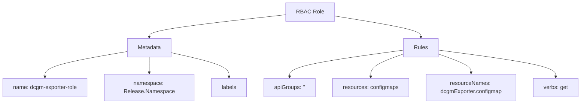
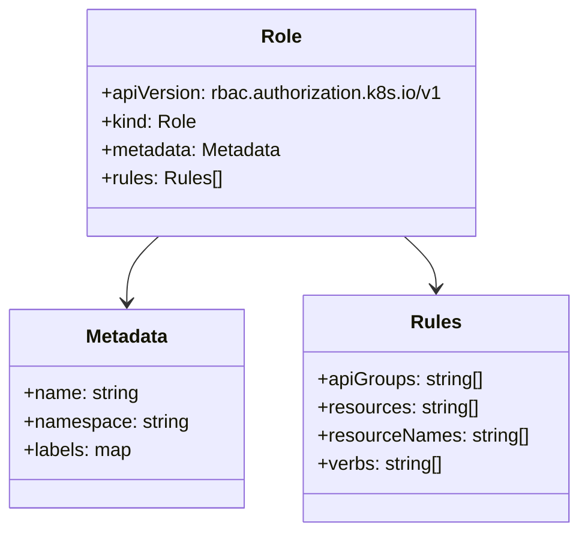
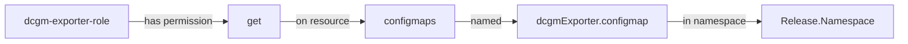

# Diagram: devops/k8s/amazon-cloudwatch-observability/helm/templates/linux/dcgm-exporter-role.yaml

> Auto-generated by Obscura crawlers

## Diagram 1

### SVG

<svg id="container" width="1690.296875" xmlns="http://www.w3.org/2000/svg" class="flowchart" height="302" viewBox="0 0 1690.296875 302" role="graphics-document document" aria-roledescription="flowchart-v2"><g><marker id="container_flowchart-v2-pointEnd" class="marker flowchart-v2" viewBox="0 0 10 10" refX="5" refY="5" markerUnits="userSpaceOnUse" markerWidth="8" markerHeight="8" orient="auto"><path d="M 0 0 L 10 5 L 0 10 z" class="arrowMarkerPath" style="stroke-width: 1; stroke-dasharray: 1, 0;"></path></marker><marker id="container_flowchart-v2-pointStart" class="marker flowchart-v2" viewBox="0 0 10 10" refX="4.5" refY="5" markerUnits="userSpaceOnUse" markerWidth="8" markerHeight="8" orient="auto"><path d="M 0 5 L 10 10 L 10 0 z" class="arrowMarkerPath" style="stroke-width: 1; stroke-dasharray: 1, 0;"></path></marker><marker id="container_flowchart-v2-circleEnd" class="marker flowchart-v2" viewBox="0 0 10 10" refX="11" refY="5" markerUnits="userSpaceOnUse" markerWidth="11" markerHeight="11" orient="auto"><circle cx="5" cy="5" r="5" class="arrowMarkerPath" style="stroke-width: 1; stroke-dasharray: 1, 0;"></circle></marker><marker id="container_flowchart-v2-circleStart" class="marker flowchart-v2" viewBox="0 0 10 10" refX="-1" refY="5" markerUnits="userSpaceOnUse" markerWidth="11" markerHeight="11" orient="auto"><circle cx="5" cy="5" r="5" class="arrowMarkerPath" style="stroke-width: 1; stroke-dasharray: 1, 0;"></circle></marker><marker id="container_flowchart-v2-crossEnd" class="marker cross flowchart-v2" viewBox="0 0 11 11" refX="12" refY="5.2" markerUnits="userSpaceOnUse" markerWidth="11" markerHeight="11" orient="auto"><path d="M 1,1 l 9,9 M 10,1 l -9,9" class="arrowMarkerPath" style="stroke-width: 2; stroke-dasharray: 1, 0;"></path></marker><marker id="container_flowchart-v2-crossStart" class="marker cross flowchart-v2" viewBox="0 0 11 11" refX="-1" refY="5.2" markerUnits="userSpaceOnUse" markerWidth="11" markerHeight="11" orient="auto"><path d="M 1,1 l 9,9 M 10,1 l -9,9" class="arrowMarkerPath" style="stroke-width: 2; stroke-dasharray: 1, 0;"></path></marker><g class="root"><g class="clusters"></g><g class="edgePaths"><path d="M838.266,42.443L771.591,49.869C704.917,57.295,571.568,72.148,504.893,83.074C438.219,94,438.219,101,438.219,104.5L438.219,108" id="L_A_B_0" class="edge-thickness-normal edge-pattern-solid edge-thickness-normal edge-pattern-solid flowchart-link" style=";" data-edge="true" data-et="edge" data-id="L_A_B_0" data-points="W3sieCI6ODM4LjI2NTYyNSwieSI6NDIuNDQzMjM5NjI1MTY3MzR9LHsieCI6NDM4LjIxODc1LCJ5Ijo4N30seyJ4Ijo0MzguMjE4NzUsInkiOjExMn1d" marker-end="url(#container_flowchart-v2-pointEnd)"></path><path d="M971.922,45.803L1014.396,52.669C1056.87,59.535,1141.818,73.268,1184.292,83.634C1226.766,94,1226.766,101,1226.766,104.5L1226.766,108" id="L_A_C_0" class="edge-thickness-normal edge-pattern-solid edge-thickness-normal edge-pattern-solid flowchart-link" style=";" data-edge="true" data-et="edge" data-id="L_A_C_0" data-points="W3sieCI6OTcxLjkyMTg3NSwieSI6NDUuODAzMTI4MTg3NjkxMjZ9LHsieCI6MTIyNi43NjU2MjUsInkiOjg3fSx7IngiOjEyMjYuNzY1NjI1LCJ5IjoxMTJ9XQ==" marker-end="url(#container_flowchart-v2-pointEnd)"></path><path d="M374.125,149.924L333.956,156.77C293.786,163.616,213.448,177.308,173.279,189.654C133.109,202,133.109,213,133.109,218.5L133.109,224" id="L_B_D_0" class="edge-thickness-normal edge-pattern-solid edge-thickness-normal edge-pattern-solid flowchart-link" style=";" data-edge="true" data-et="edge" data-id="L_B_D_0" data-points="W3sieCI6Mzc0LjEyNSwieSI6MTQ5LjkyMzU0MTc2MjY4NzU2fSx7IngiOjEzMy4xMDkzNzUsInkiOjE5MX0seyJ4IjoxMzMuMTA5Mzc1LCJ5IjoyMjh9XQ==" marker-end="url(#container_flowchart-v2-pointEnd)"></path><path d="M438.219,166L438.219,170.167C438.219,174.333,438.219,182.667,438.219,190.333C438.219,198,438.219,205,438.219,208.5L438.219,212" id="L_B_E_0" class="edge-thickness-normal edge-pattern-solid edge-thickness-normal edge-pattern-solid flowchart-link" style=";" data-edge="true" data-et="edge" data-id="L_B_E_0" data-points="W3sieCI6NDM4LjIxODc1LCJ5IjoxNjZ9LHsieCI6NDM4LjIxODc1LCJ5IjoxOTF9LHsieCI6NDM4LjIxODc1LCJ5IjoyMTZ9XQ==" marker-end="url(#container_flowchart-v2-pointEnd)"></path><path d="M502.313,153.375L530.272,159.646C558.232,165.917,614.151,178.458,642.111,190.229C670.07,202,670.07,213,670.07,218.5L670.07,224" id="L_B_F_0" class="edge-thickness-normal edge-pattern-solid edge-thickness-normal edge-pattern-solid flowchart-link" style=";" data-edge="true" data-et="edge" data-id="L_B_F_0" data-points="W3sieCI6NTAyLjMxMjUsInkiOjE1My4zNzUwMzc5MDgxNDQzNX0seyJ4Ijo2NzAuMDcwMzEyNSwieSI6MTkxfSx7IngiOjY3MC4wNzAzMTI1LCJ5IjoyMjh9XQ==" marker-end="url(#container_flowchart-v2-pointEnd)"></path><path d="M1176.867,145.824L1121.813,153.353C1066.758,160.883,956.648,175.941,901.594,188.971C846.539,202,846.539,213,846.539,218.5L846.539,224" id="L_C_G_0" class="edge-thickness-normal edge-pattern-solid edge-thickness-normal edge-pattern-solid flowchart-link" style=";" data-edge="true" data-et="edge" data-id="L_C_G_0" data-points="W3sieCI6MTE3Ni44NjcxODc1LCJ5IjoxNDUuODI0MTM4NTY4Njk4Nzd9LHsieCI6ODQ2LjUzOTA2MjUsInkiOjE5MX0seyJ4Ijo4NDYuNTM5MDYyNSwieSI6MjI4fV0=" marker-end="url(#container_flowchart-v2-pointEnd)"></path><path d="M1176.867,156.87L1160.983,162.558C1145.099,168.246,1113.331,179.623,1097.447,190.812C1081.563,202,1081.563,213,1081.563,218.5L1081.563,224" id="L_C_H_0" class="edge-thickness-normal edge-pattern-solid edge-thickness-normal edge-pattern-solid flowchart-link" style=";" data-edge="true" data-et="edge" data-id="L_C_H_0" data-points="W3sieCI6MTE3Ni44NjcxODc1LCJ5IjoxNTYuODY5NTc5MjUzMjAxMzJ9LHsieCI6MTA4MS41NjI1LCJ5IjoxOTF9LHsieCI6MTA4MS41NjI1LCJ5IjoyMjh9XQ==" marker-end="url(#container_flowchart-v2-pointEnd)"></path><path d="M1276.664,156.87L1292.548,162.558C1308.432,168.246,1340.201,179.623,1356.085,188.812C1371.969,198,1371.969,205,1371.969,208.5L1371.969,212" id="L_C_I_0" class="edge-thickness-normal edge-pattern-solid edge-thickness-normal edge-pattern-solid flowchart-link" style=";" data-edge="true" data-et="edge" data-id="L_C_I_0" data-points="W3sieCI6MTI3Ni42NjQwNjI1LCJ5IjoxNTYuODY5NTc5MjUzMjAxMzJ9LHsieCI6MTM3MS45Njg3NSwieSI6MTkxfSx7IngiOjEzNzEuOTY4NzUsInkiOjIxNn1d" marker-end="url(#container_flowchart-v2-pointEnd)"></path><path d="M1276.664,145.647L1333.409,153.206C1390.154,160.765,1503.643,175.882,1560.388,188.941C1617.133,202,1617.133,213,1617.133,218.5L1617.133,224" id="L_C_J_0" class="edge-thickness-normal edge-pattern-solid edge-thickness-normal edge-pattern-solid flowchart-link" style=";" data-edge="true" data-et="edge" data-id="L_C_J_0" data-points="W3sieCI6MTI3Ni42NjQwNjI1LCJ5IjoxNDUuNjQ2ODY2OTMyMTc1MjR9LHsieCI6MTYxNy4xMzI4MTI1LCJ5IjoxOTF9LHsieCI6MTYxNy4xMzI4MTI1LCJ5IjoyMjh9XQ==" marker-end="url(#container_flowchart-v2-pointEnd)"></path></g><g class="edgeLabels"><g class="edgeLabel"><g class="label" data-id="L_A_B_0" transform="translate(0, 0)"><foreignObject width="0" height="0">

</foreignObject></g></g><g class="edgeLabel"><g class="label" data-id="L_A_C_0" transform="translate(0, 0)"><foreignObject width="0" height="0">

</foreignObject></g></g><g class="edgeLabel"><g class="label" data-id="L_B_D_0" transform="translate(0, 0)"><foreignObject width="0" height="0">

</foreignObject></g></g><g class="edgeLabel"><g class="label" data-id="L_B_E_0" transform="translate(0, 0)"><foreignObject width="0" height="0">

</foreignObject></g></g><g class="edgeLabel"><g class="label" data-id="L_B_F_0" transform="translate(0, 0)"><foreignObject width="0" height="0">

</foreignObject></g></g><g class="edgeLabel"><g class="label" data-id="L_C_G_0" transform="translate(0, 0)"><foreignObject width="0" height="0">

</foreignObject></g></g><g class="edgeLabel"><g class="label" data-id="L_C_H_0" transform="translate(0, 0)"><foreignObject width="0" height="0">

</foreignObject></g></g><g class="edgeLabel"><g class="label" data-id="L_C_I_0" transform="translate(0, 0)"><foreignObject width="0" height="0">

</foreignObject></g></g><g class="edgeLabel"><g class="label" data-id="L_C_J_0" transform="translate(0, 0)"><foreignObject width="0" height="0">

</foreignObject></g></g></g><g class="nodes"><g class="node default" id="flowchart-A-0" transform="translate(905.09375, 35)"><rect class="basic label-container" style="" x="-66.828125" y="-27" width="133.65625" height="54"></rect><g class="label" style="" transform="translate(-36.828125, -12)"><rect></rect><foreignObject width="73.65625" height="24">

RBAC Role

</foreignObject></g></g><g class="node default" id="flowchart-B-1" transform="translate(438.21875, 139)"><rect class="basic label-container" style="" x="-64.09375" y="-27" width="128.1875" height="54"></rect><g class="label" style="" transform="translate(-34.09375, -12)"><rect></rect><foreignObject width="68.1875" height="24">

Metadata

</foreignObject></g></g><g class="node default" id="flowchart-C-3" transform="translate(1226.765625, 139)"><rect class="basic label-container" style="" x="-49.8984375" y="-27" width="99.796875" height="54"></rect><g class="label" style="" transform="translate(-19.8984375, -12)"><rect></rect><foreignObject width="39.796875" height="24">

Rules

</foreignObject></g></g><g class="node default" id="flowchart-D-5" transform="translate(133.109375, 255)"><rect class="basic label-container" style="" x="-125.109375" y="-27" width="250.21875" height="54"></rect><g class="label" style="" transform="translate(-95.109375, -12)"><rect></rect><foreignObject width="190.21875" height="24">

name: dcgm-exporter-role

</foreignObject></g></g><g class="node default" id="flowchart-E-7" transform="translate(438.21875, 255)"><rect class="basic label-container" style="" x="-130" y="-39" width="260" height="78"></rect><g class="label" style="" transform="translate(-100, -24)"><rect></rect><foreignObject width="200" height="48">

namespace: Release.Namespace

</foreignObject></g></g><g class="node default" id="flowchart-F-9" transform="translate(670.0703125, 255)"><rect class="basic label-container" style="" x="-51.8515625" y="-27" width="103.703125" height="54"></rect><g class="label" style="" transform="translate(-21.8515625, -12)"><rect></rect><foreignObject width="43.703125" height="24">

labels

</foreignObject></g></g><g class="node default" id="flowchart-G-11" transform="translate(846.5390625, 255)"><rect class="basic label-container" style="" x="-74.6171875" y="-27" width="149.234375" height="54"></rect><g class="label" style="" transform="translate(-44.6171875, -12)"><rect></rect><foreignObject width="89.234375" height="24">

apiGroups: ''

</foreignObject></g></g><g class="node default" id="flowchart-H-13" transform="translate(1081.5625, 255)"><rect class="basic label-container" style="" x="-110.40625" y="-27" width="220.8125" height="54"></rect><g class="label" style="" transform="translate(-80.40625, -12)"><rect></rect><foreignObject width="160.8125" height="24">

resources: configmaps

</foreignObject></g></g><g class="node default" id="flowchart-I-15" transform="translate(1371.96875, 255)"><rect class="basic label-container" style="" x="-130" y="-39" width="260" height="78"></rect><g class="label" style="" transform="translate(-100, -24)"><rect></rect><foreignObject width="200" height="48">

resourceNames: dcgmExporter.configmap

</foreignObject></g></g><g class="node default" id="flowchart-J-17" transform="translate(1617.1328125, 255)"><rect class="basic label-container" style="" x="-65.1640625" y="-27" width="130.328125" height="54"></rect><g class="label" style="" transform="translate(-35.1640625, -12)"><rect></rect><foreignObject width="70.328125" height="24">

verbs: get

</foreignObject></g></g></g></g></g></svg>

## Diagram 2

### SVG

<svg id="container" width="488.3828125" xmlns="http://www.w3.org/2000/svg" class="classDiagram" height="450" viewBox="0 0 488.3828125 450" role="graphics-document document" aria-roledescription="class"><g><defs><marker id="container_class-aggregationStart" class="marker aggregation class" refX="18" refY="7" markerWidth="190" markerHeight="240" orient="auto"><path d="M 18,7 L9,13 L1,7 L9,1 Z"></path></marker></defs><defs><marker id="container_class-aggregationEnd" class="marker aggregation class" refX="1" refY="7" markerWidth="20" markerHeight="28" orient="auto"><path d="M 18,7 L9,13 L1,7 L9,1 Z"></path></marker></defs><defs><marker id="container_class-extensionStart" class="marker extension class" refX="18" refY="7" markerWidth="190" markerHeight="240" orient="auto"><path d="M 1,7 L18,13 V 1 Z"></path></marker></defs><defs><marker id="container_class-extensionEnd" class="marker extension class" refX="1" refY="7" markerWidth="20" markerHeight="28" orient="auto"><path d="M 1,1 V 13 L18,7 Z"></path></marker></defs><defs><marker id="container_class-compositionStart" class="marker composition class" refX="18" refY="7" markerWidth="190" markerHeight="240" orient="auto"><path d="M 18,7 L9,13 L1,7 L9,1 Z"></path></marker></defs><defs><marker id="container_class-compositionEnd" class="marker composition class" refX="1" refY="7" markerWidth="20" markerHeight="28" orient="auto"><path d="M 18,7 L9,13 L1,7 L9,1 Z"></path></marker></defs><defs><marker id="container_class-dependencyStart" class="marker dependency class" refX="6" refY="7" markerWidth="190" markerHeight="240" orient="auto"><path d="M 5,7 L9,13 L1,7 L9,1 Z"></path></marker></defs><defs><marker id="container_class-dependencyEnd" class="marker dependency class" refX="13" refY="7" markerWidth="20" markerHeight="28" orient="auto"><path d="M 18,7 L9,13 L14,7 L9,1 Z"></path></marker></defs><defs><marker id="container_class-lollipopStart" class="marker lollipop class" refX="13" refY="7" markerWidth="190" markerHeight="240" orient="auto"><circle stroke="black" fill="transparent" cx="7" cy="7" r="6"></circle></marker></defs><defs><marker id="container_class-lollipopEnd" class="marker lollipop class" refX="1" refY="7" markerWidth="190" markerHeight="240" orient="auto"><circle stroke="black" fill="transparent" cx="7" cy="7" r="6"></circle></marker></defs><g class="root"><g class="clusters"></g><g class="edgePaths"><path d="M134.194,200L129.696,204.167C125.199,208.333,116.205,216.667,111.708,226C107.211,235.333,107.211,245.667,107.211,250.833L107.211,256" id="id_Role_Metadata_1" class="edge-thickness-normal edge-pattern-solid relation" style=";;;" data-edge="true" data-et="edge" data-id="id_Role_Metadata_1" data-points="W3sieCI6MTM0LjE5MzUyMDc5MDI4OTI2LCJ5IjoyMDB9LHsieCI6MTA3LjIxMDkzNzUsInkiOjIyNX0seyJ4IjoxMDcuMjEwOTM3NSwieSI6MjYyfV0=" marker-end="url(#container_class-dependencyEnd)"></path><path d="M341.42,200L345.917,204.167C350.414,208.333,359.408,216.667,363.905,224C368.402,231.333,368.402,237.667,368.402,240.833L368.402,244" id="id_Role_Rules_2" class="edge-thickness-normal edge-pattern-solid relation" style=";;;" data-edge="true" data-et="edge" data-id="id_Role_Rules_2" data-points="W3sieCI6MzQxLjQxOTc2MDQ1OTcxMDc0LCJ5IjoyMDB9LHsieCI6MzY4LjQwMjM0Mzc1LCJ5IjoyMjV9LHsieCI6MzY4LjQwMjM0Mzc1LCJ5IjoyNTB9XQ==" marker-end="url(#container_class-dependencyEnd)"></path></g><g class="edgeLabels"><g class="edgeLabel"><g class="label" data-id="id_Role_Metadata_1" transform="translate(0, 0)"><foreignObject width="0" height="0">

</foreignObject></g></g><g class="edgeLabel"><g class="label" data-id="id_Role_Rules_2" transform="translate(0, 0)"><foreignObject width="0" height="0">

</foreignObject></g></g></g><g class="nodes"><g class="node default" id="classId-Role-0" transform="translate(237.806640625, 104)"><g class="basic label-container"><path d="M-167.50390625 -96 L167.50390625 -96 L167.50390625 96 L-167.50390625 96" stroke="none" stroke-width="0" fill="#ECECFF" style=""></path><path d="M-167.50390625 -96 C-92.59420862669977 -96, -17.684511003399535 -96, 167.50390625 -96 M-167.50390625 -96 C-44.85911516246372 -96, 77.78567592507255 -96, 167.50390625 -96 M167.50390625 -96 C167.50390625 -38.538445537357745, 167.50390625 18.92310892528451, 167.50390625 96 M167.50390625 -96 C167.50390625 -36.17737838041761, 167.50390625 23.645243239164785, 167.50390625 96 M167.50390625 96 C79.70207914104918 96, -8.099747967901635 96, -167.50390625 96 M167.50390625 96 C86.68674089778132 96, 5.86957554556264 96, -167.50390625 96 M-167.50390625 96 C-167.50390625 42.3385953825391, -167.50390625 -11.322809234921806, -167.50390625 -96 M-167.50390625 96 C-167.50390625 45.7813648176679, -167.50390625 -4.437270364664201, -167.50390625 -96" stroke="#9370DB" stroke-width="1.3" fill="none" stroke-dasharray="0 0" style=""></path></g><g class="annotation-group text" transform="translate(0, -72)"></g><g class="label-group text" transform="translate(-16.2421875, -72)"><g class="label" style="font-weight: bolder" transform="translate(0,-12)"><foreignObject width="32.484375" height="24">

Role

</foreignObject></g></g><g class="members-group text" transform="translate(-155.50390625, -24)"><g class="label" style="" transform="translate(0,-12)"><foreignObject width="294.765625" height="24">

+apiVersion: rbac.authorization.k8s.io/v1

</foreignObject></g><g class="label" style="" transform="translate(0,12)"><foreignObject width="79.828125" height="24">

+kind: Role

</foreignObject></g><g class="label" style="" transform="translate(0,36)"><foreignObject width="153.6875" height="24">

+metadata: Metadata

</foreignObject></g><g class="label" style="" transform="translate(0,60)"><foreignObject width="102.453125" height="24">

+rules: Rules[]

</foreignObject></g></g><g class="methods-group text" transform="translate(-155.50390625, 96)"></g><g class="divider" style=""><path d="M-167.50390625 -48 C-75.65588306379607 -48, 16.192140122407864 -48, 167.50390625 -48 M-167.50390625 -48 C-98.64220951056471 -48, -29.780512771129423 -48, 167.50390625 -48" stroke="#9370DB" stroke-width="1.3" fill="none" stroke-dasharray="0 0" style=""></path></g><g class="divider" style=""><path d="M-167.50390625 72 C-65.77469250678553 72, 35.954521236428945 72, 167.50390625 72 M-167.50390625 72 C-91.0641781213777 72, -14.624449992755387 72, 167.50390625 72" stroke="#9370DB" stroke-width="1.3" fill="none" stroke-dasharray="0 0" style=""></path></g></g><g class="node default" id="classId-Metadata-1" transform="translate(107.2109375, 346)"><g class="basic label-container"><path d="M-99.2109375 -84 L99.2109375 -84 L99.2109375 84 L-99.2109375 84" stroke="none" stroke-width="0" fill="#ECECFF" style=""></path><path d="M-99.2109375 -84 C-43.59888235750889 -84, 12.013172784982217 -84, 99.2109375 -84 M-99.2109375 -84 C-22.789054393299097 -84, 53.63282871340181 -84, 99.2109375 -84 M99.2109375 -84 C99.2109375 -47.94049931693893, 99.2109375 -11.880998633877866, 99.2109375 84 M99.2109375 -84 C99.2109375 -29.89648083483486, 99.2109375 24.207038330330278, 99.2109375 84 M99.2109375 84 C52.03672244149434 84, 4.862507382988682 84, -99.2109375 84 M99.2109375 84 C44.29887707306286 84, -10.613183353874277 84, -99.2109375 84 M-99.2109375 84 C-99.2109375 43.635581288309815, -99.2109375 3.2711625766196306, -99.2109375 -84 M-99.2109375 84 C-99.2109375 49.303676508100835, -99.2109375 14.607353016201671, -99.2109375 -84" stroke="#9370DB" stroke-width="1.3" fill="none" stroke-dasharray="0 0" style=""></path></g><g class="annotation-group text" transform="translate(0, -60)"></g><g class="label-group text" transform="translate(-34.640625, -60)"><g class="label" style="font-weight: bolder" transform="translate(0,-12)"><foreignObject width="69.28125" height="24">

Metadata

</foreignObject></g></g><g class="members-group text" transform="translate(-87.2109375, -12)"><g class="label" style="" transform="translate(0,-12)"><foreignObject width="98.21875" height="24">

+name: string

</foreignObject></g><g class="label" style="" transform="translate(0,12)"><foreignObject width="139.78125" height="24">

+namespace: string

</foreignObject></g><g class="label" style="" transform="translate(0,36)"><foreignObject width="91.6875" height="24">

+labels: map

</foreignObject></g></g><g class="methods-group text" transform="translate(-87.2109375, 84)"></g><g class="divider" style=""><path d="M-99.2109375 -36 C-43.49055594889871 -36, 12.229825602202581 -36, 99.2109375 -36 M-99.2109375 -36 C-55.43322854372013 -36, -11.655519587440267 -36, 99.2109375 -36" stroke="#9370DB" stroke-width="1.3" fill="none" stroke-dasharray="0 0" style=""></path></g><g class="divider" style=""><path d="M-99.2109375 60 C-54.39319794063829 60, -9.575458381276576 60, 99.2109375 60 M-99.2109375 60 C-45.24603707055179 60, 8.718863358896414 60, 99.2109375 60" stroke="#9370DB" stroke-width="1.3" fill="none" stroke-dasharray="0 0" style=""></path></g></g><g class="node default" id="classId-Rules-2" transform="translate(368.40234375, 346)"><g class="basic label-container"><path d="M-111.98046875 -96 L111.98046875 -96 L111.98046875 96 L-111.98046875 96" stroke="none" stroke-width="0" fill="#ECECFF" style=""></path><path d="M-111.98046875 -96 C-58.845151604998065 -96, -5.709834459996131 -96, 111.98046875 -96 M-111.98046875 -96 C-46.06157266279406 -96, 19.857323424411874 -96, 111.98046875 -96 M111.98046875 -96 C111.98046875 -23.3466453977033, 111.98046875 49.3067092045934, 111.98046875 96 M111.98046875 -96 C111.98046875 -48.236661089010795, 111.98046875 -0.47332217802158993, 111.98046875 96 M111.98046875 96 C61.725334420863796 96, 11.470200091727591 96, -111.98046875 96 M111.98046875 96 C23.964123188992076 96, -64.05222237201585 96, -111.98046875 96 M-111.98046875 96 C-111.98046875 47.892601093647365, -111.98046875 -0.21479781270527099, -111.98046875 -96 M-111.98046875 96 C-111.98046875 34.49923097230207, -111.98046875 -27.001538055395855, -111.98046875 -96" stroke="#9370DB" stroke-width="1.3" fill="none" stroke-dasharray="0 0" style=""></path></g><g class="annotation-group text" transform="translate(0, -72)"></g><g class="label-group text" transform="translate(-20.1328125, -72)"><g class="label" style="font-weight: bolder" transform="translate(0,-12)"><foreignObject width="40.265625" height="24">

Rules

</foreignObject></g></g><g class="members-group text" transform="translate(-99.98046875, -24)"><g class="label" style="" transform="translate(0,-12)"><foreignObject width="141.90625" height="24">

+apiGroups: string[]

</foreignObject></g><g class="label" style="" transform="translate(0,12)"><foreignObject width="137.765625" height="24">

+resources: string[]

</foreignObject></g><g class="label" style="" transform="translate(0,36)"><foreignObject width="179.828125" height="24">

+resourceNames: string[]

</foreignObject></g><g class="label" style="" transform="translate(0,60)"><foreignObject width="107.53125" height="24">

+verbs: string[]

</foreignObject></g></g><g class="methods-group text" transform="translate(-99.98046875, 96)"></g><g class="divider" style=""><path d="M-111.98046875 -48 C-31.18573966781561 -48, 49.60898941436878 -48, 111.98046875 -48 M-111.98046875 -48 C-57.857276098913516 -48, -3.7340834478270324 -48, 111.98046875 -48" stroke="#9370DB" stroke-width="1.3" fill="none" stroke-dasharray="0 0" style=""></path></g><g class="divider" style=""><path d="M-111.98046875 72 C-56.69394774913745 72, -1.4074267482749008 72, 111.98046875 72 M-111.98046875 72 C-54.49662792925763 72, 2.987212891484745 72, 111.98046875 72" stroke="#9370DB" stroke-width="1.3" fill="none" stroke-dasharray="0 0" style=""></path></g></g></g></g></g></svg>

## Diagram 3

### SVG

<svg id="container" width="1431.15625" xmlns="http://www.w3.org/2000/svg" class="flowchart" height="70" viewBox="0 0 1431.15625 70" role="graphics-document document" aria-roledescription="flowchart-v2"><g><marker id="container_flowchart-v2-pointEnd" class="marker flowchart-v2" viewBox="0 0 10 10" refX="5" refY="5" markerUnits="userSpaceOnUse" markerWidth="8" markerHeight="8" orient="auto"><path d="M 0 0 L 10 5 L 0 10 z" class="arrowMarkerPath" style="stroke-width: 1; stroke-dasharray: 1, 0;"></path></marker><marker id="container_flowchart-v2-pointStart" class="marker flowchart-v2" viewBox="0 0 10 10" refX="4.5" refY="5" markerUnits="userSpaceOnUse" markerWidth="8" markerHeight="8" orient="auto"><path d="M 0 5 L 10 10 L 10 0 z" class="arrowMarkerPath" style="stroke-width: 1; stroke-dasharray: 1, 0;"></path></marker><marker id="container_flowchart-v2-circleEnd" class="marker flowchart-v2" viewBox="0 0 10 10" refX="11" refY="5" markerUnits="userSpaceOnUse" markerWidth="11" markerHeight="11" orient="auto"><circle cx="5" cy="5" r="5" class="arrowMarkerPath" style="stroke-width: 1; stroke-dasharray: 1, 0;"></circle></marker><marker id="container_flowchart-v2-circleStart" class="marker flowchart-v2" viewBox="0 0 10 10" refX="-1" refY="5" markerUnits="userSpaceOnUse" markerWidth="11" markerHeight="11" orient="auto"><circle cx="5" cy="5" r="5" class="arrowMarkerPath" style="stroke-width: 1; stroke-dasharray: 1, 0;"></circle></marker><marker id="container_flowchart-v2-crossEnd" class="marker cross flowchart-v2" viewBox="0 0 11 11" refX="12" refY="5.2" markerUnits="userSpaceOnUse" markerWidth="11" markerHeight="11" orient="auto"><path d="M 1,1 l 9,9 M 10,1 l -9,9" class="arrowMarkerPath" style="stroke-width: 2; stroke-dasharray: 1, 0;"></path></marker><marker id="container_flowchart-v2-crossStart" class="marker cross flowchart-v2" viewBox="0 0 11 11" refX="-1" refY="5.2" markerUnits="userSpaceOnUse" markerWidth="11" markerHeight="11" orient="auto"><path d="M 1,1 l 9,9 M 10,1 l -9,9" class="arrowMarkerPath" style="stroke-width: 2; stroke-dasharray: 1, 0;"></path></marker><g class="root"><g class="clusters"></g><g class="edgePaths"><path d="M209.625,35L222.982,35C236.339,35,263.052,35,289.099,35C315.146,35,340.526,35,353.216,35L365.906,35" id="L_A_B_0" class="edge-thickness-normal edge-pattern-solid edge-thickness-normal edge-pattern-solid flowchart-link" style=";" data-edge="true" data-et="edge" data-id="L_A_B_0" data-points="W3sieCI6MjA5LjYyNSwieSI6MzV9LHsieCI6Mjg5Ljc2NTYyNSwieSI6MzV9LHsieCI6MzY5LjkwNjI1LCJ5IjozNX1d" marker-end="url(#container_flowchart-v2-pointEnd)"></path><path d="M452.469,35L463.74,35C475.01,35,497.552,35,519.427,35C541.302,35,562.51,35,573.115,35L583.719,35" id="L_B_C_0" class="edge-thickness-normal edge-pattern-solid edge-thickness-normal edge-pattern-solid flowchart-link" style=";" data-edge="true" data-et="edge" data-id="L_B_C_0" data-points="W3sieCI6NDUyLjQ2ODc1LCJ5IjozNX0seyJ4Ijo1MjAuMDkzNzUsInkiOjM1fSx7IngiOjU4Ny43MTg3NSwieSI6MzV9XQ==" marker-end="url(#container_flowchart-v2-pointEnd)"></path><path d="M730.688,35L739.029,35C747.37,35,764.052,35,780.068,35C796.083,35,811.432,35,819.107,35L826.781,35" id="L_C_D_0" class="edge-thickness-normal edge-pattern-solid edge-thickness-normal edge-pattern-solid flowchart-link" style=";" data-edge="true" data-et="edge" data-id="L_C_D_0" data-points="W3sieCI6NzMwLjY4NzUsInkiOjM1fSx7IngiOjc4MC43MzQzNzUsInkiOjM1fSx7IngiOjgzMC43ODEyNSwieSI6MzV9XQ==" marker-end="url(#container_flowchart-v2-pointEnd)"></path><path d="M1069.547,35L1082.065,35C1094.583,35,1119.62,35,1143.99,35C1168.359,35,1192.063,35,1203.914,35L1215.766,35" id="L_D_E_0" class="edge-thickness-normal edge-pattern-solid edge-thickness-normal edge-pattern-solid flowchart-link" style=";" data-edge="true" data-et="edge" data-id="L_D_E_0" data-points="W3sieCI6MTA2OS41NDY4NzUsInkiOjM1fSx7IngiOjExNDQuNjU2MjUsInkiOjM1fSx7IngiOjEyMTkuNzY1NjI1LCJ5IjozNX1d" marker-end="url(#container_flowchart-v2-pointEnd)"></path></g><g class="edgeLabels"><g class="edgeLabel" transform="translate(289.765625, 35)"><g class="label" data-id="L_A_B_0" transform="translate(-55.140625, -12)"><foreignObject width="110.28125" height="24">

has permission

</foreignObject></g></g><g class="edgeLabel" transform="translate(520.09375, 35)"><g class="label" data-id="L_B_C_0" transform="translate(-42.625, -12)"><foreignObject width="85.25" height="24">

on resource

</foreignObject></g></g><g class="edgeLabel" transform="translate(780.734375, 35)"><g class="label" data-id="L_C_D_0" transform="translate(-25.046875, -12)"><foreignObject width="50.09375" height="24">

named

</foreignObject></g></g><g class="edgeLabel" transform="translate(1144.65625, 35)"><g class="label" data-id="L_D_E_0" transform="translate(-50.109375, -12)"><foreignObject width="100.21875" height="24">

in namespace

</foreignObject></g></g></g><g class="nodes"><g class="node default" id="flowchart-A-0" transform="translate(108.8125, 35)"><rect class="basic label-container" style="" x="-100.8125" y="-27" width="201.625" height="54"></rect><g class="label" style="" transform="translate(-70.8125, -12)"><rect></rect><foreignObject width="141.625" height="24">

dcgm-exporter-role

</foreignObject></g></g><g class="node default" id="flowchart-B-1" transform="translate(411.1875, 35)"><rect class="basic label-container" style="" x="-41.28125" y="-27" width="82.5625" height="54"></rect><g class="label" style="" transform="translate(-11.28125, -12)"><rect></rect><foreignObject width="22.5625" height="24">

get

</foreignObject></g></g><g class="node default" id="flowchart-C-3" transform="translate(659.203125, 35)"><rect class="basic label-container" style="" x="-71.484375" y="-27" width="142.96875" height="54"></rect><g class="label" style="" transform="translate(-41.484375, -12)"><rect></rect><foreignObject width="82.96875" height="24">

configmaps

</foreignObject></g></g><g class="node default" id="flowchart-D-5" transform="translate(950.1640625, 35)"><rect class="basic label-container" style="" x="-119.3828125" y="-27" width="238.765625" height="54"></rect><g class="label" style="" transform="translate(-89.3828125, -12)"><rect></rect><foreignObject width="178.765625" height="24">

dcgmExporter.configmap

</foreignObject></g></g><g class="node default" id="flowchart-E-7" transform="translate(1321.4609375, 35)"><rect class="basic label-container" style="" x="-101.6953125" y="-27" width="203.390625" height="54"></rect><g class="label" style="" transform="translate(-71.6953125, -12)"><rect></rect><foreignObject width="143.390625" height="24">

Release.Namespace

</foreignObject></g></g></g></g></g></svg>
