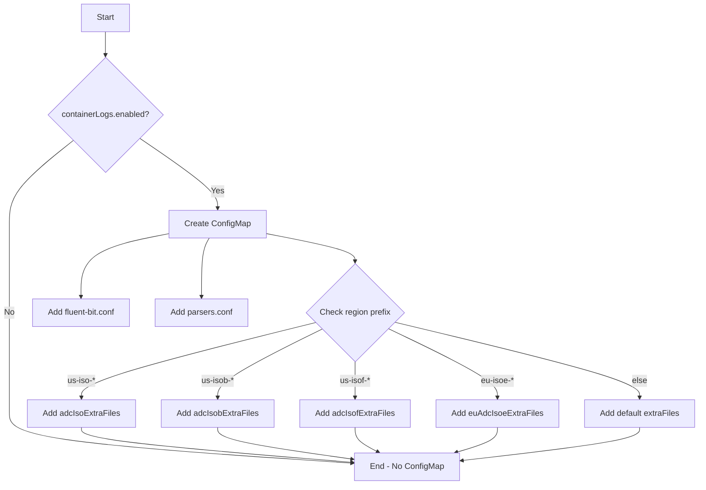
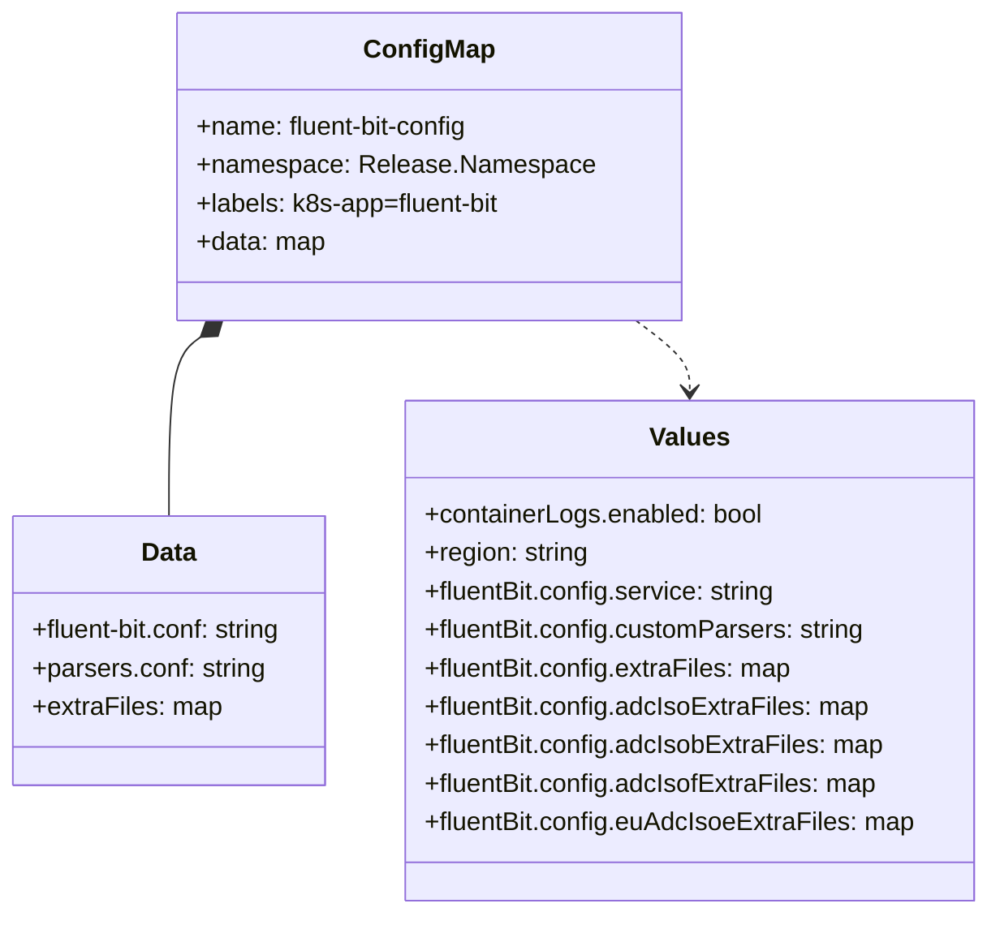

# Diagram: devops/k8s/amazon-cloudwatch-observability/helm/templates/linux/fluent-bit-configmap.yaml

> Auto-generated by Obscura crawlers

## Diagram 1

### SVG

<svg id="container" width="1356.953125" xmlns="http://www.w3.org/2000/svg" class="flowchart" height="948.109375" viewBox="0 0 1356.953125 948.109375" role="graphics-document document" aria-roledescription="flowchart-v2"><g><marker id="container_flowchart-v2-pointEnd" class="marker flowchart-v2" viewBox="0 0 10 10" refX="5" refY="5" markerUnits="userSpaceOnUse" markerWidth="8" markerHeight="8" orient="auto"><path d="M 0 0 L 10 5 L 0 10 z" class="arrowMarkerPath" style="stroke-width: 1; stroke-dasharray: 1, 0;"></path></marker><marker id="container_flowchart-v2-pointStart" class="marker flowchart-v2" viewBox="0 0 10 10" refX="4.5" refY="5" markerUnits="userSpaceOnUse" markerWidth="8" markerHeight="8" orient="auto"><path d="M 0 5 L 10 10 L 10 0 z" class="arrowMarkerPath" style="stroke-width: 1; stroke-dasharray: 1, 0;"></path></marker><marker id="container_flowchart-v2-circleEnd" class="marker flowchart-v2" viewBox="0 0 10 10" refX="11" refY="5" markerUnits="userSpaceOnUse" markerWidth="11" markerHeight="11" orient="auto"><circle cx="5" cy="5" r="5" class="arrowMarkerPath" style="stroke-width: 1; stroke-dasharray: 1, 0;"></circle></marker><marker id="container_flowchart-v2-circleStart" class="marker flowchart-v2" viewBox="0 0 10 10" refX="-1" refY="5" markerUnits="userSpaceOnUse" markerWidth="11" markerHeight="11" orient="auto"><circle cx="5" cy="5" r="5" class="arrowMarkerPath" style="stroke-width: 1; stroke-dasharray: 1, 0;"></circle></marker><marker id="container_flowchart-v2-crossEnd" class="marker cross flowchart-v2" viewBox="0 0 11 11" refX="12" refY="5.2" markerUnits="userSpaceOnUse" markerWidth="11" markerHeight="11" orient="auto"><path d="M 1,1 l 9,9 M 10,1 l -9,9" class="arrowMarkerPath" style="stroke-width: 2; stroke-dasharray: 1, 0;"></path></marker><marker id="container_flowchart-v2-crossStart" class="marker cross flowchart-v2" viewBox="0 0 11 11" refX="-1" refY="5.2" markerUnits="userSpaceOnUse" markerWidth="11" markerHeight="11" orient="auto"><path d="M 1,1 l 9,9 M 10,1 l -9,9" class="arrowMarkerPath" style="stroke-width: 2; stroke-dasharray: 1, 0;"></path></marker><g class="root"><g class="clusters"></g><g class="edgePaths"><path d="M208.992,62L208.992,66.167C208.992,70.333,208.992,78.667,208.992,86.333C208.992,94,208.992,101,208.992,104.5L208.992,108" id="L_A_B_0" class="edge-thickness-normal edge-pattern-solid edge-thickness-normal edge-pattern-solid flowchart-link" style=";" data-edge="true" data-et="edge" data-id="L_A_B_0" data-points="W3sieCI6MjA4Ljk5MjE4NzUsInkiOjYyfSx7IngiOjIwOC45OTIxODc1LCJ5Ijo4N30seyJ4IjoyMDguOTkyMTg3NSwieSI6MTEyfV0=" marker-end="url(#container_flowchart-v2-pointEnd)"></path><path d="M145.715,274.754L124.452,291.467C103.19,308.18,60.665,341.605,39.403,368.985C18.141,396.365,18.141,417.698,18.141,437.031C18.141,456.365,18.141,473.698,18.141,502.538C18.141,531.378,18.141,571.724,18.141,614.07C18.141,656.417,18.141,700.763,18.141,733.603C18.141,766.443,18.141,787.776,18.141,807.109C18.141,826.443,18.141,843.776,129.939,859.935C241.737,876.094,465.334,891.078,577.132,898.57L688.931,906.062" id="L_B_Z_0" class="edge-thickness-normal edge-pattern-solid edge-thickness-normal edge-pattern-solid flowchart-link" style=";" data-edge="true" data-et="edge" data-id="L_B_Z_0" data-points="W3sieCI6MTQ1LjcxNDczMTAzMjY5NDYzLCJ5IjoyNzQuNzUzNzkzNTMyNjk0NjZ9LHsieCI6MTguMTQwNjI1LCJ5IjozNzUuMDMxMjV9LHsieCI6MTguMTQwNjI1LCJ5Ijo0MzkuMDMxMjV9LHsieCI6MTguMTQwNjI1LCJ5Ijo0OTEuMDMxMjV9LHsieCI6MTguMTQwNjI1LCJ5Ijo2MTIuMDcwMzEyNX0seyJ4IjoxOC4xNDA2MjUsInkiOjc0NS4xMDkzNzV9LHsieCI6MTguMTQwNjI1LCJ5Ijo4MDkuMTA5Mzc1fSx7IngiOjE4LjE0MDYyNSwieSI6ODYxLjEwOTM3NX0seyJ4Ijo2OTIuOTIxODc1LCJ5Ijo5MDYuMzI5ODYyMTA3NDU5N31d" marker-end="url(#container_flowchart-v2-pointEnd)"></path><path d="M275.757,271.266L300.722,288.56C325.687,305.855,375.617,340.443,400.582,363.237C425.547,386.031,425.547,397.031,425.547,402.531L425.547,408.031" id="L_B_C_0" class="edge-thickness-normal edge-pattern-solid edge-thickness-normal edge-pattern-solid flowchart-link" style=";" data-edge="true" data-et="edge" data-id="L_B_C_0" data-points="W3sieCI6Mjc1Ljc1NzE3Nzc4OTUyOTI0LCJ5IjoyNzEuMjY2MjU5NzEwNDcwNzZ9LHsieCI6NDI1LjU0Njg3NSwieSI6Mzc1LjAzMTI1fSx7IngiOjQyNS41NDY4NzUsInkiOjQxMi4wMzEyNX1d" marker-end="url(#container_flowchart-v2-pointEnd)"></path><path d="M332.688,457.302L304.116,462.923C275.544,468.545,218.401,479.788,189.829,500.416C161.258,521.044,161.258,551.057,161.258,566.064L161.258,581.07" id="L_C_D_0" class="edge-thickness-normal edge-pattern-solid edge-thickness-normal edge-pattern-solid flowchart-link" style=";" data-edge="true" data-et="edge" data-id="L_C_D_0" data-points="W3sieCI6MzMyLjY4NzUsInkiOjQ1Ny4zMDE3Mjc5OTIyNTUxN30seyJ4IjoxNjEuMjU3ODEyNSwieSI6NDkxLjAzMTI1fSx7IngiOjE2MS4yNTc4MTI1LCJ5Ijo1ODUuMDcwMzEyNX1d" marker-end="url(#container_flowchart-v2-pointEnd)"></path><path d="M412.201,466.031L410.141,470.198C408.082,474.365,403.963,482.698,401.903,501.871C399.844,521.044,399.844,551.057,399.844,566.064L399.844,581.07" id="L_C_E_0" class="edge-thickness-normal edge-pattern-solid edge-thickness-normal edge-pattern-solid flowchart-link" style=";" data-edge="true" data-et="edge" data-id="L_C_E_0" data-points="W3sieCI6NDEyLjIwMTAyMTYzNDYxNTM2LCJ5Ijo0NjYuMDMxMjV9LHsieCI6Mzk5Ljg0Mzc1LCJ5Ijo0OTEuMDMxMjV9LHsieCI6Mzk5Ljg0Mzc1LCJ5Ijo1ODUuMDcwMzEyNX1d" marker-end="url(#container_flowchart-v2-pointEnd)"></path><path d="M518.406,457.437L546.655,463.036C574.904,468.635,631.401,479.833,659.65,488.932C687.898,498.031,687.898,505.031,687.898,508.531L687.898,512.031" id="L_C_F_0" class="edge-thickness-normal edge-pattern-solid edge-thickness-normal edge-pattern-solid flowchart-link" style=";" data-edge="true" data-et="edge" data-id="L_C_F_0" data-points="W3sieCI6NTE4LjQwNjI1LCJ5Ijo0NTcuNDM2NjU3ODE5ODk4MTN9LHsieCI6Njg3Ljg5ODQzNzUsInkiOjQ5MS4wMzEyNX0seyJ4Ijo2ODcuODk4NDM3NSwieSI6NTE2LjAzMTI1fV0=" marker-end="url(#container_flowchart-v2-pointEnd)"></path><path d="M611.123,631.334L535.545,650.296C459.967,669.259,308.812,707.184,233.234,731.647C157.656,756.109,157.656,767.109,157.656,772.609L157.656,778.109" id="L_F_G_0" class="edge-thickness-normal edge-pattern-solid edge-thickness-normal edge-pattern-solid flowchart-link" style=";" data-edge="true" data-et="edge" data-id="L_F_G_0" data-points="W3sieCI6NjExLjEyMjYxNjQwNTMyOTgsInkiOjYzMS4zMzM1NTM5MDUzMjk4fSx7IngiOjE1Ny42NTYyNSwieSI6NzQ1LjEwOTM3NX0seyJ4IjoxNTcuNjU2MjUsInkiOjc4Mi4xMDkzNzV9XQ==" marker-end="url(#container_flowchart-v2-pointEnd)"></path><path d="M623.842,644.053L590.108,660.895C556.374,677.738,488.906,711.424,455.172,733.767C421.438,756.109,421.438,767.109,421.438,772.609L421.438,778.109" id="L_F_H_0" class="edge-thickness-normal edge-pattern-solid edge-thickness-normal edge-pattern-solid flowchart-link" style=";" data-edge="true" data-et="edge" data-id="L_F_H_0" data-points="W3sieCI6NjIzLjg0MTcyMDAyNzIzMTMsInkiOjY0NC4wNTI2NTc1MjcyMzEzfSx7IngiOjQyMS40Mzc1LCJ5Ijo3NDUuMTA5Mzc1fSx7IngiOjQyMS40Mzc1LCJ5Ijo3ODIuMTA5Mzc1fV0=" marker-end="url(#container_flowchart-v2-pointEnd)"></path><path d="M687.898,708.109L687.898,714.276C687.898,720.443,687.898,732.776,687.898,744.443C687.898,756.109,687.898,767.109,687.898,772.609L687.898,778.109" id="L_F_I_0" class="edge-thickness-normal edge-pattern-solid edge-thickness-normal edge-pattern-solid flowchart-link" style=";" data-edge="true" data-et="edge" data-id="L_F_I_0" data-points="W3sieCI6Njg3Ljg5ODQzNzUsInkiOjcwOC4xMDkzNzV9LHsieCI6Njg3Ljg5ODQzNzUsInkiOjc0NS4xMDkzNzV9LHsieCI6Njg3Ljg5ODQzNzUsInkiOjc4Mi4xMDkzNzV9XQ==" marker-end="url(#container_flowchart-v2-pointEnd)"></path><path d="M752.649,643.359L787.744,660.317C822.839,677.276,893.029,711.193,928.124,733.651C963.219,756.109,963.219,767.109,963.219,772.609L963.219,778.109" id="L_F_J_0" class="edge-thickness-normal edge-pattern-solid edge-thickness-normal edge-pattern-solid flowchart-link" style=";" data-edge="true" data-et="edge" data-id="L_F_J_0" data-points="W3sieCI6NzUyLjY0OTAxMzM4NjAyNDUsInkiOjY0My4zNTg3OTkxMTM5NzU1fSx7IngiOjk2My4yMTg3NSwieSI6NzQ1LjEwOTM3NX0seyJ4Ijo5NjMuMjE4NzUsInkiOjc4Mi4xMDkzNzV9XQ==" marker-end="url(#container_flowchart-v2-pointEnd)"></path><path d="M765.293,630.715L844.435,649.781C923.578,668.846,1081.863,706.978,1161.006,731.544C1240.148,756.109,1240.148,767.109,1240.148,772.609L1240.148,778.109" id="L_F_K_0" class="edge-thickness-normal edge-pattern-solid edge-thickness-normal edge-pattern-solid flowchart-link" style=";" data-edge="true" data-et="edge" data-id="L_F_K_0" data-points="W3sieCI6NzY1LjI5Mjg5MDY4NDY3MzUsInkiOjYzMC43MTQ5MjE4MTUzMjY1fSx7IngiOjEyNDAuMTQ4NDM3NSwieSI6NzQ1LjEwOTM3NX0seyJ4IjoxMjQwLjE0ODQzNzUsInkiOjc4Mi4xMDkzNzV9XQ==" marker-end="url(#container_flowchart-v2-pointEnd)"></path><path d="M157.656,836.109L157.656,840.276C157.656,844.443,157.656,852.776,246.203,864.177C334.749,875.579,511.842,890.048,600.389,897.283L688.935,904.518" id="L_G_Z_0" class="edge-thickness-normal edge-pattern-solid edge-thickness-normal edge-pattern-solid flowchart-link" style=";" data-edge="true" data-et="edge" data-id="L_G_Z_0" data-points="W3sieCI6MTU3LjY1NjI1LCJ5Ijo4MzYuMTA5Mzc1fSx7IngiOjE1Ny42NTYyNSwieSI6ODYxLjEwOTM3NX0seyJ4Ijo2OTIuOTIxODc1LCJ5Ijo5MDQuODQzNjgzODI3MzIwNH1d" marker-end="url(#container_flowchart-v2-pointEnd)"></path><path d="M421.438,836.109L421.438,840.276C421.438,844.443,421.438,852.776,466.025,863.164C510.612,873.553,599.786,885.996,644.373,892.218L688.96,898.44" id="L_H_Z_0" class="edge-thickness-normal edge-pattern-solid edge-thickness-normal edge-pattern-solid flowchart-link" style=";" data-edge="true" data-et="edge" data-id="L_H_Z_0" data-points="W3sieCI6NDIxLjQzNzUsInkiOjgzNi4xMDkzNzV9LHsieCI6NDIxLjQzNzUsInkiOjg2MS4xMDkzNzV9LHsieCI6NjkyLjkyMTg3NSwieSI6ODk4Ljk5Mjc2ODc4MTg0MDN9XQ==" marker-end="url(#container_flowchart-v2-pointEnd)"></path><path d="M687.898,836.109L687.898,840.276C687.898,844.443,687.898,852.776,695.808,860.816C703.718,868.856,719.538,876.603,727.448,880.477L735.358,884.35" id="L_I_Z_0" class="edge-thickness-normal edge-pattern-solid edge-thickness-normal edge-pattern-solid flowchart-link" style=";" data-edge="true" data-et="edge" data-id="L_I_Z_0" data-points="W3sieCI6Njg3Ljg5ODQzNzUsInkiOjgzNi4xMDkzNzV9LHsieCI6Njg3Ljg5ODQzNzUsInkiOjg2MS4xMDkzNzV9LHsieCI6NzM4Ljk1MDEyMDE5MjMwNzcsInkiOjg4Ni4xMDkzNzV9XQ==" marker-end="url(#container_flowchart-v2-pointEnd)"></path><path d="M963.219,836.109L963.219,840.276C963.219,844.443,963.219,852.776,950.304,860.913C937.389,869.051,911.558,876.992,898.643,880.963L885.728,884.934" id="L_J_Z_0" class="edge-thickness-normal edge-pattern-solid edge-thickness-normal edge-pattern-solid flowchart-link" style=";" data-edge="true" data-et="edge" data-id="L_J_Z_0" data-points="W3sieCI6OTYzLjIxODc1LCJ5Ijo4MzYuMTA5Mzc1fSx7IngiOjk2My4yMTg3NSwieSI6ODYxLjEwOTM3NX0seyJ4Ijo4ODEuOTA0ODk3ODM2NTM4NSwieSI6ODg2LjEwOTM3NX1d" marker-end="url(#container_flowchart-v2-pointEnd)"></path><path d="M1240.148,836.109L1240.148,840.276C1240.148,844.443,1240.148,852.776,1183.328,863.567C1126.507,874.357,1012.865,887.605,956.044,894.229L899.223,900.853" id="L_K_Z_0" class="edge-thickness-normal edge-pattern-solid edge-thickness-normal edge-pattern-solid flowchart-link" style=";" data-edge="true" data-et="edge" data-id="L_K_Z_0" data-points="W3sieCI6MTI0MC4xNDg0Mzc1LCJ5Ijo4MzYuMTA5Mzc1fSx7IngiOjEyNDAuMTQ4NDM3NSwieSI6ODYxLjEwOTM3NX0seyJ4Ijo4OTUuMjUsInkiOjkwMS4zMTYxMTQ1MjY0MTE2fV0=" marker-end="url(#container_flowchart-v2-pointEnd)"></path></g><g class="edgeLabels"><g class="edgeLabel"><g class="label" data-id="L_A_B_0" transform="translate(0, 0)"><foreignObject width="0" height="0">

</foreignObject></g></g><g class="edgeLabel" transform="translate(18.140625, 612.0703125)"><g class="label" data-id="L_B_Z_0" transform="translate(-10.140625, -12)"><foreignObject width="20.28125" height="24">

No

</foreignObject></g></g><g class="edgeLabel" transform="translate(425.546875, 375.03125)"><g class="label" data-id="L_B_C_0" transform="translate(-12.03125, -12)"><foreignObject width="24.0625" height="24">

Yes

</foreignObject></g></g><g class="edgeLabel"><g class="label" data-id="L_C_D_0" transform="translate(0, 0)"><foreignObject width="0" height="0">

</foreignObject></g></g><g class="edgeLabel"><g class="label" data-id="L_C_E_0" transform="translate(0, 0)"><foreignObject width="0" height="0">

</foreignObject></g></g><g class="edgeLabel"><g class="label" data-id="L_C_F_0" transform="translate(0, 0)"><foreignObject width="0" height="0">

</foreignObject></g></g><g class="edgeLabel" transform="translate(157.65625, 745.109375)"><g class="label" data-id="L_F_G_0" transform="translate(-28.9375, -12)"><foreignObject width="57.875" height="24">

us-iso-*

</foreignObject></g></g><g class="edgeLabel" transform="translate(421.4375, 745.109375)"><g class="label" data-id="L_F_H_0" transform="translate(-33.6953125, -12)"><foreignObject width="67.390625" height="24">

us-isob-*

</foreignObject></g></g><g class="edgeLabel" transform="translate(687.8984375, 745.109375)"><g class="label" data-id="L_F_I_0" transform="translate(-31.4609375, -12)"><foreignObject width="62.921875" height="24">

us-isof-*

</foreignObject></g></g><g class="edgeLabel" transform="translate(963.21875, 745.109375)"><g class="label" data-id="L_F_J_0" transform="translate(-34.0078125, -12)"><foreignObject width="68.015625" height="24">

eu-isoe-*

</foreignObject></g></g><g class="edgeLabel" transform="translate(1240.1484375, 745.109375)"><g class="label" data-id="L_F_K_0" transform="translate(-14.8046875, -12)"><foreignObject width="29.609375" height="24">

else

</foreignObject></g></g><g class="edgeLabel"><g class="label" data-id="L_G_Z_0" transform="translate(0, 0)"><foreignObject width="0" height="0">

</foreignObject></g></g><g class="edgeLabel"><g class="label" data-id="L_H_Z_0" transform="translate(0, 0)"><foreignObject width="0" height="0">

</foreignObject></g></g><g class="edgeLabel"><g class="label" data-id="L_I_Z_0" transform="translate(0, 0)"><foreignObject width="0" height="0">

</foreignObject></g></g><g class="edgeLabel"><g class="label" data-id="L_J_Z_0" transform="translate(0, 0)"><foreignObject width="0" height="0">

</foreignObject></g></g><g class="edgeLabel"><g class="label" data-id="L_K_Z_0" transform="translate(0, 0)"><foreignObject width="0" height="0">

</foreignObject></g></g></g><g class="nodes"><g class="node default" id="flowchart-A-0" transform="translate(208.9921875, 35)"><rect class="basic label-container" style="" x="-47.5234375" y="-27" width="95.046875" height="54"></rect><g class="label" style="" transform="translate(-17.5234375, -12)"><rect></rect><foreignObject width="35.046875" height="24">

Start

</foreignObject></g></g><g class="node default" id="flowchart-B-1" transform="translate(208.9921875, 225.015625)"><polygon points="113.015625,0 226.03125,-113.015625 113.015625,-226.03125 0,-113.015625" class="label-container" transform="translate(-112.515625, 113.015625)"></polygon><g class="label" style="" transform="translate(-86.015625, -12)"><rect></rect><foreignObject width="172.03125" height="24">

containerLogs.enabled?

</foreignObject></g></g><g class="node default" id="flowchart-Z-3" transform="translate(794.0859375, 913.109375)"><rect class="basic label-container" style="" x="-101.1640625" y="-27" width="202.328125" height="54"></rect><g class="label" style="" transform="translate(-71.1640625, -12)"><rect></rect><foreignObject width="142.328125" height="24">

End - No ConfigMap

</foreignObject></g></g><g class="node default" id="flowchart-C-5" transform="translate(425.546875, 439.03125)"><rect class="basic label-container" style="" x="-92.859375" y="-27" width="185.71875" height="54"></rect><g class="label" style="" transform="translate(-62.859375, -12)"><rect></rect><foreignObject width="125.71875" height="24">

Create ConfigMap

</foreignObject></g></g><g class="node default" id="flowchart-D-7" transform="translate(161.2578125, 612.0703125)"><rect class="basic label-container" style="" x="-97.9765625" y="-27" width="195.953125" height="54"></rect><g class="label" style="" transform="translate(-67.9765625, -12)"><rect></rect><foreignObject width="135.953125" height="24">

Add fluent-bit.conf

</foreignObject></g></g><g class="node default" id="flowchart-E-9" transform="translate(399.84375, 612.0703125)"><rect class="basic label-container" style="" x="-90.609375" y="-27" width="181.21875" height="54"></rect><g class="label" style="" transform="translate(-60.609375, -12)"><rect></rect><foreignObject width="121.21875" height="24">

Add parsers.conf

</foreignObject></g></g><g class="node default" id="flowchart-F-11" transform="translate(687.8984375, 612.0703125)"><polygon points="96.0390625,0 192.078125,-96.0390625 96.0390625,-192.078125 0,-96.0390625" class="label-container" transform="translate(-95.5390625, 96.0390625)"></polygon><g class="label" style="" transform="translate(-69.0390625, -12)"><rect></rect><foreignObject width="138.078125" height="24">

Check region prefix

</foreignObject></g></g><g class="node default" id="flowchart-G-13" transform="translate(157.65625, 809.109375)"><rect class="basic label-container" style="" x="-104.515625" y="-27" width="209.03125" height="54"></rect><g class="label" style="" transform="translate(-74.515625, -12)"><rect></rect><foreignObject width="149.03125" height="24">

Add adcIsoExtraFiles

</foreignObject></g></g><g class="node default" id="flowchart-H-15" transform="translate(421.4375, 809.109375)"><rect class="basic label-container" style="" x="-109.265625" y="-27" width="218.53125" height="54"></rect><g class="label" style="" transform="translate(-79.265625, -12)"><rect></rect><foreignObject width="158.53125" height="24">

Add adcIsobExtraFiles

</foreignObject></g></g><g class="node default" id="flowchart-I-17" transform="translate(687.8984375, 809.109375)"><rect class="basic label-container" style="" x="-107.1953125" y="-27" width="214.390625" height="54"></rect><g class="label" style="" transform="translate(-77.1953125, -12)"><rect></rect><foreignObject width="154.390625" height="24">

Add adcIsofExtraFiles

</foreignObject></g></g><g class="node default" id="flowchart-J-19" transform="translate(963.21875, 809.109375)"><rect class="basic label-container" style="" x="-118.125" y="-27" width="236.25" height="54"></rect><g class="label" style="" transform="translate(-88.125, -12)"><rect></rect><foreignObject width="176.25" height="24">

Add euAdcIsoeExtraFiles

</foreignObject></g></g><g class="node default" id="flowchart-K-21" transform="translate(1240.1484375, 809.109375)"><rect class="basic label-container" style="" x="-108.8046875" y="-27" width="217.609375" height="54"></rect><g class="label" style="" transform="translate(-78.8046875, -12)"><rect></rect><foreignObject width="157.609375" height="24">

Add default extraFiles

</foreignObject></g></g></g></g></g></svg>

## Diagram 2

### SVG

<svg id="container" width="620.75" xmlns="http://www.w3.org/2000/svg" class="classDiagram" height="570" viewBox="0 0 620.75 570" role="graphics-document document" aria-roledescription="class"><g><defs><marker id="container_class-aggregationStart" class="marker aggregation class" refX="18" refY="7" markerWidth="190" markerHeight="240" orient="auto"><path d="M 18,7 L9,13 L1,7 L9,1 Z"></path></marker></defs><defs><marker id="container_class-aggregationEnd" class="marker aggregation class" refX="1" refY="7" markerWidth="20" markerHeight="28" orient="auto"><path d="M 18,7 L9,13 L1,7 L9,1 Z"></path></marker></defs><defs><marker id="container_class-extensionStart" class="marker extension class" refX="18" refY="7" markerWidth="190" markerHeight="240" orient="auto"><path d="M 1,7 L18,13 V 1 Z"></path></marker></defs><defs><marker id="container_class-extensionEnd" class="marker extension class" refX="1" refY="7" markerWidth="20" markerHeight="28" orient="auto"><path d="M 1,1 V 13 L18,7 Z"></path></marker></defs><defs><marker id="container_class-compositionStart" class="marker composition class" refX="18" refY="7" markerWidth="190" markerHeight="240" orient="auto"><path d="M 18,7 L9,13 L1,7 L9,1 Z"></path></marker></defs><defs><marker id="container_class-compositionEnd" class="marker composition class" refX="1" refY="7" markerWidth="20" markerHeight="28" orient="auto"><path d="M 18,7 L9,13 L1,7 L9,1 Z"></path></marker></defs><defs><marker id="container_class-dependencyStart" class="marker dependency class" refX="6" refY="7" markerWidth="190" markerHeight="240" orient="auto"><path d="M 5,7 L9,13 L1,7 L9,1 Z"></path></marker></defs><defs><marker id="container_class-dependencyEnd" class="marker dependency class" refX="13" refY="7" markerWidth="20" markerHeight="28" orient="auto"><path d="M 18,7 L9,13 L14,7 L9,1 Z"></path></marker></defs><defs><marker id="container_class-lollipopStart" class="marker lollipop class" refX="13" refY="7" markerWidth="190" markerHeight="240" orient="auto"><circle stroke="black" fill="transparent" cx="7" cy="7" r="6"></circle></marker></defs><defs><marker id="container_class-lollipopEnd" class="marker lollipop class" refX="1" refY="7" markerWidth="190" markerHeight="240" orient="auto"><circle stroke="black" fill="transparent" cx="7" cy="7" r="6"></circle></marker></defs><g class="root"><g class="clusters"></g><g class="edgePaths"><path d="M128.878,210.254L125.553,212.712C122.229,215.169,115.579,220.085,112.254,238.709C108.93,257.333,108.93,289.667,108.93,305.833L108.93,322" id="id_ConfigMap_Data_1" class="edge-thickness-normal edge-pattern-solid relation" style=";;;" data-edge="true" data-et="edge" data-id="id_ConfigMap_Data_1" data-points="W3sieCI6MTQyLjc0OTQxODkwNDk1ODY3LCJ5IjoyMDB9LHsieCI6MTA4LjkyOTY4NzUsInkiOjIyNX0seyJ4IjoxMDguOTI5Njg3NSwieSI6MzIyfV0=" marker-start="url(#container_class-compositionStart)"></path><path d="M402.485,200L408.122,204.167C413.758,208.333,425.031,216.667,430.668,224C436.305,231.333,436.305,237.667,436.305,240.833L436.305,244" id="id_ConfigMap_Values_2" class="edge-thickness-normal edge-pattern-dashed relation" style=";;;" data-edge="true" data-et="edge" data-id="id_ConfigMap_Values_2" data-points="W3sieCI6NDAyLjQ4NDk1NjA5NTA0MTMsInkiOjIwMH0seyJ4Ijo0MzYuMzA0Njg3NSwieSI6MjI1fSx7IngiOjQzNi4zMDQ2ODc1LCJ5IjoyNTB9XQ==" marker-end="url(#container_class-dependencyEnd)"></path></g><g class="edgeLabels"><g class="edgeLabel"><g class="label" data-id="id_ConfigMap_Data_1" transform="translate(0, 0)"><foreignObject width="0" height="0">

</foreignObject></g></g><g class="edgeLabel"><g class="label" data-id="id_ConfigMap_Values_2" transform="translate(0, 0)"><foreignObject width="0" height="0">

</foreignObject></g></g></g><g class="nodes"><g class="node default" id="classId-ConfigMap-0" transform="translate(272.6171875, 104)"><g class="basic label-container"><path d="M-151.95703125 -96 L151.95703125 -96 L151.95703125 96 L-151.95703125 96" stroke="none" stroke-width="0" fill="#ECECFF" style=""></path><path d="M-151.95703125 -96 C-88.9881390846982 -96, -26.01924691939641 -96, 151.95703125 -96 M-151.95703125 -96 C-39.54194553461156 -96, 72.87314018077689 -96, 151.95703125 -96 M151.95703125 -96 C151.95703125 -30.478963008062934, 151.95703125 35.04207398387413, 151.95703125 96 M151.95703125 -96 C151.95703125 -23.149028213451558, 151.95703125 49.701943573096884, 151.95703125 96 M151.95703125 96 C84.30919222812696 96, 16.66135320625392 96, -151.95703125 96 M151.95703125 96 C62.354883963145255 96, -27.24726332370949 96, -151.95703125 96 M-151.95703125 96 C-151.95703125 39.376682793662766, -151.95703125 -17.246634412674467, -151.95703125 -96 M-151.95703125 96 C-151.95703125 35.89224366125816, -151.95703125 -24.215512677483673, -151.95703125 -96" stroke="#9370DB" stroke-width="1.3" fill="none" stroke-dasharray="0 0" style=""></path></g><g class="annotation-group text" transform="translate(0, -72)"></g><g class="label-group text" transform="translate(-38.3828125, -72)"><g class="label" style="font-weight: bolder" transform="translate(0,-12)"><foreignObject width="76.765625" height="24">

ConfigMap

</foreignObject></g></g><g class="members-group text" transform="translate(-139.95703125, -24)"><g class="label" style="" transform="translate(0,-12)"><foreignObject width="174.21875" height="24">

+name: fluent-bit-config

</foreignObject></g><g class="label" style="" transform="translate(0,12)"><foreignObject width="241.53125" height="24">

+namespace: Release.Namespace

</foreignObject></g><g class="label" style="" transform="translate(0,36)"><foreignObject width="194.265625" height="24">

+labels: k8s-app=fluent-bit

</foreignObject></g><g class="label" style="" transform="translate(0,60)"><foreignObject width="80.625" height="24">

+data: map

</foreignObject></g></g><g class="methods-group text" transform="translate(-139.95703125, 96)"></g><g class="divider" style=""><path d="M-151.95703125 -48 C-67.47873441498407 -48, 16.99956242003185 -48, 151.95703125 -48 M-151.95703125 -48 C-41.32308804151951 -48, 69.31085516696098 -48, 151.95703125 -48" stroke="#9370DB" stroke-width="1.3" fill="none" stroke-dasharray="0 0" style=""></path></g><g class="divider" style=""><path d="M-151.95703125 72 C-41.331872168287816 72, 69.29328691342437 72, 151.95703125 72 M-151.95703125 72 C-63.23389133287499 72, 25.48924858425002 72, 151.95703125 72" stroke="#9370DB" stroke-width="1.3" fill="none" stroke-dasharray="0 0" style=""></path></g></g><g class="node default" id="classId-Data-1" transform="translate(108.9296875, 406)"><g class="basic label-container"><path d="M-100.9296875 -84 L100.9296875 -84 L100.9296875 84 L-100.9296875 84" stroke="none" stroke-width="0" fill="#ECECFF" style=""></path><path d="M-100.9296875 -84 C-52.35548045465189 -84, -3.781273409303779 -84, 100.9296875 -84 M-100.9296875 -84 C-23.750960014510937 -84, 53.427767470978125 -84, 100.9296875 -84 M100.9296875 -84 C100.9296875 -46.72703238161213, 100.9296875 -9.454064763224267, 100.9296875 84 M100.9296875 -84 C100.9296875 -29.715407290152598, 100.9296875 24.569185419694804, 100.9296875 84 M100.9296875 84 C34.11575790925407 84, -32.69817168149186 84, -100.9296875 84 M100.9296875 84 C56.89592570769037 84, 12.862163915380734 84, -100.9296875 84 M-100.9296875 84 C-100.9296875 49.40471675128362, -100.9296875 14.809433502567245, -100.9296875 -84 M-100.9296875 84 C-100.9296875 22.94017648895109, -100.9296875 -38.11964702209782, -100.9296875 -84" stroke="#9370DB" stroke-width="1.3" fill="none" stroke-dasharray="0 0" style=""></path></g><g class="annotation-group text" transform="translate(0, -60)"></g><g class="label-group text" transform="translate(-16.890625, -60)"><g class="label" style="font-weight: bolder" transform="translate(0,-12)"><foreignObject width="33.78125" height="24">

Data

</foreignObject></g></g><g class="members-group text" transform="translate(-88.9296875, -12)"><g class="label" style="" transform="translate(0,-12)"><foreignObject width="160.96875" height="24">

+fluent-bit.conf: string

</foreignObject></g><g class="label" style="" transform="translate(0,12)"><foreignObject width="146.46875" height="24">

+parsers.conf: string

</foreignObject></g><g class="label" style="" transform="translate(0,36)"><foreignObject width="117.03125" height="24">

+extraFiles: map

</foreignObject></g></g><g class="methods-group text" transform="translate(-88.9296875, 84)"></g><g class="divider" style=""><path d="M-100.9296875 -36 C-42.02691280462054 -36, 16.875861890758927 -36, 100.9296875 -36 M-100.9296875 -36 C-35.387408433835674 -36, 30.154870632328652 -36, 100.9296875 -36" stroke="#9370DB" stroke-width="1.3" fill="none" stroke-dasharray="0 0" style=""></path></g><g class="divider" style=""><path d="M-100.9296875 60 C-36.517590679488066 60, 27.894506141023868 60, 100.9296875 60 M-100.9296875 60 C-32.8268513535735 60, 35.275984792852995 60, 100.9296875 60" stroke="#9370DB" stroke-width="1.3" fill="none" stroke-dasharray="0 0" style=""></path></g></g><g class="node default" id="classId-Values-2" transform="translate(436.3046875, 406)"><g class="basic label-container"><path d="M-176.4453125 -156 L176.4453125 -156 L176.4453125 156 L-176.4453125 156" stroke="none" stroke-width="0" fill="#ECECFF" style=""></path><path d="M-176.4453125 -156 C-46.327186252988355 -156, 83.79093999402329 -156, 176.4453125 -156 M-176.4453125 -156 C-52.49264065163452 -156, 71.46003119673097 -156, 176.4453125 -156 M176.4453125 -156 C176.4453125 -71.67542756238646, 176.4453125 12.64914487522708, 176.4453125 156 M176.4453125 -156 C176.4453125 -84.95434971487401, 176.4453125 -13.908699429748026, 176.4453125 156 M176.4453125 156 C47.202339105845425 156, -82.04063428830915 156, -176.4453125 156 M176.4453125 156 C75.5889414511214 156, -25.2674295977572 156, -176.4453125 156 M-176.4453125 156 C-176.4453125 83.97746876793948, -176.4453125 11.954937535878969, -176.4453125 -156 M-176.4453125 156 C-176.4453125 69.53846518110642, -176.4453125 -16.923069637787165, -176.4453125 -156" stroke="#9370DB" stroke-width="1.3" fill="none" stroke-dasharray="0 0" style=""></path></g><g class="annotation-group text" transform="translate(0, -132)"></g><g class="label-group text" transform="translate(-23.78125, -132)"><g class="label" style="font-weight: bolder" transform="translate(0,-12)"><foreignObject width="47.5625" height="24">

Values

</foreignObject></g></g><g class="members-group text" transform="translate(-164.4453125, -84)"><g class="label" style="" transform="translate(0,-12)"><foreignObject width="213.625" height="24">

+containerLogs.enabled: bool

</foreignObject></g><g class="label" style="" transform="translate(0,12)"><foreignObject width="103.671875" height="24">

+region: string

</foreignObject></g><g class="label" style="" transform="translate(0,36)"><foreignObject width="222.15625" height="24">

+fluentBit.config.service: string

</foreignObject></g><g class="label" style="" transform="translate(0,60)"><foreignObject width="276.640625" height="24">

+fluentBit.config.customParsers: string

</foreignObject></g><g class="label" style="" transform="translate(0,84)"><foreignObject width="230.453125" height="24">

+fluentBit.config.extraFiles: map

</foreignObject></g><g class="label" style="" transform="translate(0,108)"><foreignObject width="278.0625" height="24">

+fluentBit.config.adcIsoExtraFiles: map

</foreignObject></g><g class="label" style="" transform="translate(0,132)"><foreignObject width="287.5625" height="24">

+fluentBit.config.adcIsobExtraFiles: map

</foreignObject></g><g class="label" style="" transform="translate(0,156)"><foreignObject width="283.421875" height="24">

+fluentBit.config.adcIsofExtraFiles: map

</foreignObject></g><g class="label" style="" transform="translate(0,180)"><foreignObject width="305.109375" height="24">

+fluentBit.config.euAdcIsoeExtraFiles: map

</foreignObject></g></g><g class="methods-group text" transform="translate(-164.4453125, 156)"></g><g class="divider" style=""><path d="M-176.4453125 -108 C-88.40621443969674 -108, -0.3671163793934795 -108, 176.4453125 -108 M-176.4453125 -108 C-43.593814389597924 -108, 89.25768372080415 -108, 176.4453125 -108" stroke="#9370DB" stroke-width="1.3" fill="none" stroke-dasharray="0 0" style=""></path></g><g class="divider" style=""><path d="M-176.4453125 132 C-37.90386414381197 132, 100.63758421237605 132, 176.4453125 132 M-176.4453125 132 C-39.13150833948089 132, 98.18229582103822 132, 176.4453125 132" stroke="#9370DB" stroke-width="1.3" fill="none" stroke-dasharray="0 0" style=""></path></g></g></g></g></g></svg>
