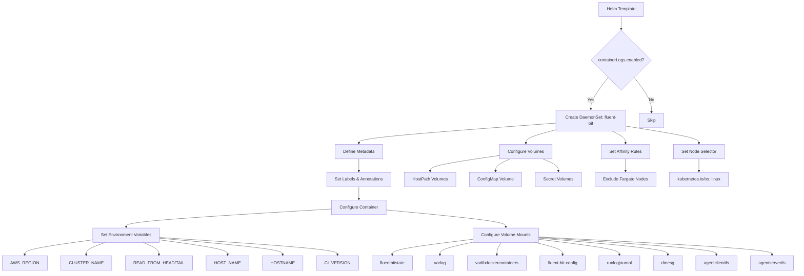
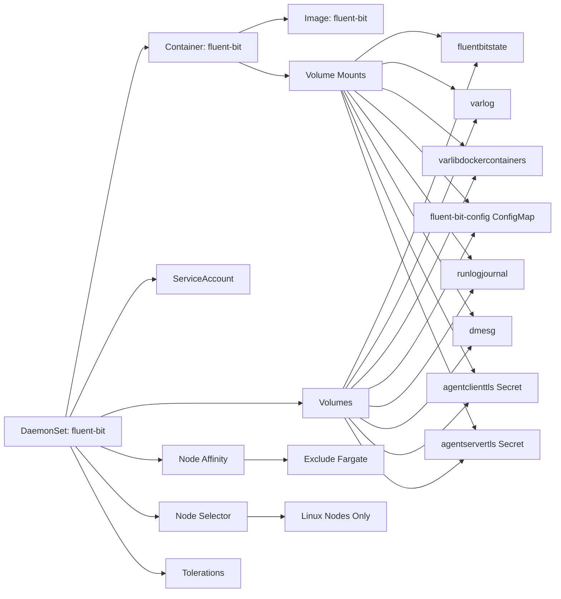

# Diagram: devops/k8s/amazon-cloudwatch-observability/helm/templates/linux/fluent-bit-daemonset.yaml

> Auto-generated by Obscura crawlers

## Diagram 1

### SVG

<svg id="container" width="2909.234375" xmlns="http://www.w3.org/2000/svg" class="flowchart" height="1018.03125" viewBox="0 0 2909.234375 1018.03125" role="graphics-document document" aria-roledescription="flowchart-v2"><g><marker id="container_flowchart-v2-pointEnd" class="marker flowchart-v2" viewBox="0 0 10 10" refX="5" refY="5" markerUnits="userSpaceOnUse" markerWidth="8" markerHeight="8" orient="auto"><path d="M 0 0 L 10 5 L 0 10 z" class="arrowMarkerPath" style="stroke-width: 1; stroke-dasharray: 1, 0;"></path></marker><marker id="container_flowchart-v2-pointStart" class="marker flowchart-v2" viewBox="0 0 10 10" refX="4.5" refY="5" markerUnits="userSpaceOnUse" markerWidth="8" markerHeight="8" orient="auto"><path d="M 0 5 L 10 10 L 10 0 z" class="arrowMarkerPath" style="stroke-width: 1; stroke-dasharray: 1, 0;"></path></marker><marker id="container_flowchart-v2-circleEnd" class="marker flowchart-v2" viewBox="0 0 10 10" refX="11" refY="5" markerUnits="userSpaceOnUse" markerWidth="11" markerHeight="11" orient="auto"><circle cx="5" cy="5" r="5" class="arrowMarkerPath" style="stroke-width: 1; stroke-dasharray: 1, 0;"></circle></marker><marker id="container_flowchart-v2-circleStart" class="marker flowchart-v2" viewBox="0 0 10 10" refX="-1" refY="5" markerUnits="userSpaceOnUse" markerWidth="11" markerHeight="11" orient="auto"><circle cx="5" cy="5" r="5" class="arrowMarkerPath" style="stroke-width: 1; stroke-dasharray: 1, 0;"></circle></marker><marker id="container_flowchart-v2-crossEnd" class="marker cross flowchart-v2" viewBox="0 0 11 11" refX="12" refY="5.2" markerUnits="userSpaceOnUse" markerWidth="11" markerHeight="11" orient="auto"><path d="M 1,1 l 9,9 M 10,1 l -9,9" class="arrowMarkerPath" style="stroke-width: 2; stroke-dasharray: 1, 0;"></path></marker><marker id="container_flowchart-v2-crossStart" class="marker cross flowchart-v2" viewBox="0 0 11 11" refX="-1" refY="5.2" markerUnits="userSpaceOnUse" markerWidth="11" markerHeight="11" orient="auto"><path d="M 1,1 l 9,9 M 10,1 l -9,9" class="arrowMarkerPath" style="stroke-width: 2; stroke-dasharray: 1, 0;"></path></marker><g class="root"><g class="clusters"></g><g class="edgePaths"><path d="M2257.898,62L2257.898,66.167C2257.898,70.333,2257.898,78.667,2257.898,86.333C2257.898,94,2257.898,101,2257.898,104.5L2257.898,108" id="L_A_B_0" class="edge-thickness-normal edge-pattern-solid edge-thickness-normal edge-pattern-solid flowchart-link" style=";" data-edge="true" data-et="edge" data-id="L_A_B_0" data-points="W3sieCI6MjI1Ny44OTg0Mzc1LCJ5Ijo2Mn0seyJ4IjoyMjU3Ljg5ODQzNzUsInkiOjg3fSx7IngiOjIyNTcuODk4NDM3NSwieSI6MTEyfV0=" marker-end="url(#container_flowchart-v2-pointEnd)"></path><path d="M2209.408,289.541L2198.701,303.79C2187.994,318.038,2166.579,346.535,2155.871,366.283C2145.164,386.031,2145.164,397.031,2145.164,402.531L2145.164,408.031" id="L_B_C_0" class="edge-thickness-normal edge-pattern-solid edge-thickness-normal edge-pattern-solid flowchart-link" style=";" data-edge="true" data-et="edge" data-id="L_B_C_0" data-points="W3sieCI6MjIwOS40MDg0NDM3ODEyMjAzLCJ5IjoyODkuNTQxMjU2MjgxMjIwM30seyJ4IjoyMTQ1LjE2NDA2MjUsInkiOjM3NS4wMzEyNX0seyJ4IjoyMTQ1LjE2NDA2MjUsInkiOjQxMi4wMzEyNX1d" marker-end="url(#container_flowchart-v2-pointEnd)"></path><path d="M2306.388,289.541L2317.096,303.79C2327.803,318.038,2349.218,346.535,2359.925,368.283C2370.633,390.031,2370.633,405.031,2370.633,412.531L2370.633,420.031" id="L_B_D_0" class="edge-thickness-normal edge-pattern-solid edge-thickness-normal edge-pattern-solid flowchart-link" style=";" data-edge="true" data-et="edge" data-id="L_B_D_0" data-points="W3sieCI6MjMwNi4zODg0MzEyMTg3Nzk3LCJ5IjoyODkuNTQxMjU2MjgxMjIwM30seyJ4IjoyMzcwLjYzMjgxMjUsInkiOjM3NS4wMzEyNX0seyJ4IjoyMzcwLjYzMjgxMjUsInkiOjQyNC4wMzEyNX1d" marker-end="url(#container_flowchart-v2-pointEnd)"></path><path d="M2015.164,460.675L1893.041,469.734C1770.918,478.794,1526.672,496.912,1404.549,509.472C1282.426,522.031,1282.426,529.031,1282.426,532.531L1282.426,536.031" id="L_C_E_0" class="edge-thickness-normal edge-pattern-solid edge-thickness-normal edge-pattern-solid flowchart-link" style=";" data-edge="true" data-et="edge" data-id="L_C_E_0" data-points="W3sieCI6MjAxNS4xNjQwNjI1LCJ5Ijo0NjAuNjc0OTYyNTYxMjk0Mn0seyJ4IjoxMjgyLjQyNTc4MTI1LCJ5Ijo1MTUuMDMxMjV9LHsieCI6MTI4Mi40MjU3ODEyNSwieSI6NTQwLjAzMTI1fV0=" marker-end="url(#container_flowchart-v2-pointEnd)"></path><path d="M1282.426,594.031L1282.426,598.198C1282.426,602.365,1282.426,610.698,1282.426,618.365C1282.426,626.031,1282.426,633.031,1282.426,636.531L1282.426,640.031" id="L_E_F_0" class="edge-thickness-normal edge-pattern-solid edge-thickness-normal edge-pattern-solid flowchart-link" style=";" data-edge="true" data-et="edge" data-id="L_E_F_0" data-points="W3sieCI6MTI4Mi40MjU3ODEyNSwieSI6NTk0LjAzMTI1fSx7IngiOjEyODIuNDI1NzgxMjUsInkiOjYxOS4wMzEyNX0seyJ4IjoxMjgyLjQyNTc4MTI1LCJ5Ijo2NDQuMDMxMjV9XQ==" marker-end="url(#container_flowchart-v2-pointEnd)"></path><path d="M1282.426,698.031L1282.426,702.198C1282.426,706.365,1282.426,714.698,1282.426,722.365C1282.426,730.031,1282.426,737.031,1282.426,740.531L1282.426,744.031" id="L_F_G_0" class="edge-thickness-normal edge-pattern-solid edge-thickness-normal edge-pattern-solid flowchart-link" style=";" data-edge="true" data-et="edge" data-id="L_F_G_0" data-points="W3sieCI6MTI4Mi40MjU3ODEyNSwieSI6Njk4LjAzMTI1fSx7IngiOjEyODIuNDI1NzgxMjUsInkiOjcyMy4wMzEyNX0seyJ4IjoxMjgyLjQyNTc4MTI1LCJ5Ijo3NDguMDMxMjV9XQ==" marker-end="url(#container_flowchart-v2-pointEnd)"></path><path d="M1180.824,781.275L1056.727,788.901C932.63,796.527,684.436,811.779,560.339,822.905C436.242,834.031,436.242,841.031,436.242,844.531L436.242,848.031" id="L_G_H_0" class="edge-thickness-normal edge-pattern-solid edge-thickness-normal edge-pattern-solid flowchart-link" style=";" data-edge="true" data-et="edge" data-id="L_G_H_0" data-points="W3sieCI6MTE4MC44MjQyMTg3NSwieSI6NzgxLjI3NDkwODMzNzI5NTZ9LHsieCI6NDM2LjI0MjE4NzUsInkiOjgyNy4wMzEyNX0seyJ4Ijo0MzYuMjQyMTg3NSwieSI6ODUyLjAzMTI1fV0=" marker-end="url(#container_flowchart-v2-pointEnd)"></path><path d="M311.039,897.558L273.337,903.137C235.635,908.716,160.232,919.874,122.53,928.952C84.828,938.031,84.828,945.031,84.828,948.531L84.828,952.031" id="L_H_I_0" class="edge-thickness-normal edge-pattern-solid edge-thickness-normal edge-pattern-solid flowchart-link" style=";" data-edge="true" data-et="edge" data-id="L_H_I_0" data-points="W3sieCI6MzExLjAzOTA2MjUsInkiOjg5Ny41NTgwMDU3NDEzMTN9LHsieCI6ODQuODI4MTI1LCJ5Ijo5MzEuMDMxMjV9LHsieCI6ODQuODI4MTI1LCJ5Ijo5NTYuMDMxMjV9XQ==" marker-end="url(#container_flowchart-v2-pointEnd)"></path><path d="M364.106,906.031L352.973,910.198C341.841,914.365,319.577,922.698,308.445,930.365C297.313,938.031,297.313,945.031,297.313,948.531L297.313,952.031" id="L_H_J_0" class="edge-thickness-normal edge-pattern-solid edge-thickness-normal edge-pattern-solid flowchart-link" style=";" data-edge="true" data-et="edge" data-id="L_H_J_0" data-points="W3sieCI6MzY0LjEwNTYxODk5MDM4NDY0LCJ5Ijo5MDYuMDMxMjV9LHsieCI6Mjk3LjMxMjUsInkiOjkzMS4wMzEyNX0seyJ4IjoyOTcuMzEyNSwieSI6OTU2LjAzMTI1fV0=" marker-end="url(#container_flowchart-v2-pointEnd)"></path><path d="M494.534,906.031L503.53,910.198C512.525,914.365,530.517,922.698,539.512,930.365C548.508,938.031,548.508,945.031,548.508,948.531L548.508,952.031" id="L_H_K_0" class="edge-thickness-normal edge-pattern-solid edge-thickness-normal edge-pattern-solid flowchart-link" style=";" data-edge="true" data-et="edge" data-id="L_H_K_0" data-points="W3sieCI6NDk0LjUzMzk1NDMyNjkyMzEsInkiOjkwNi4wMzEyNX0seyJ4Ijo1NDguNTA3ODEyNSwieSI6OTMxLjAzMTI1fSx7IngiOjU0OC41MDc4MTI1LCJ5Ijo5NTYuMDMxMjV9XQ==" marker-end="url(#container_flowchart-v2-pointEnd)"></path><path d="M561.445,897.558L599.147,903.137C636.849,908.716,712.253,919.874,749.954,928.952C787.656,938.031,787.656,945.031,787.656,948.531L787.656,952.031" id="L_H_L_0" class="edge-thickness-normal edge-pattern-solid edge-thickness-normal edge-pattern-solid flowchart-link" style=";" data-edge="true" data-et="edge" data-id="L_H_L_0" data-points="W3sieCI6NTYxLjQ0NTMxMjUsInkiOjg5Ny41NTgwMDU3NDEzMTN9LHsieCI6Nzg3LjY1NjI1LCJ5Ijo5MzEuMDMxMjV9LHsieCI6Nzg3LjY1NjI1LCJ5Ijo5NTYuMDMxMjV9XQ==" marker-end="url(#container_flowchart-v2-pointEnd)"></path><path d="M561.445,890.98L631.391,897.655C701.336,904.33,841.227,917.681,911.172,927.856C981.117,938.031,981.117,945.031,981.117,948.531L981.117,952.031" id="L_H_M_0" class="edge-thickness-normal edge-pattern-solid edge-thickness-normal edge-pattern-solid flowchart-link" style=";" data-edge="true" data-et="edge" data-id="L_H_M_0" data-points="W3sieCI6NTYxLjQ0NTMxMjUsInkiOjg5MC45Nzk5NzY3NzIxOTU0fSx7IngiOjk4MS4xMTcxODc1LCJ5Ijo5MzEuMDMxMjV9LHsieCI6OTgxLjExNzE4NzUsInkiOjk1Ni4wMzEyNX1d" marker-end="url(#container_flowchart-v2-pointEnd)"></path><path d="M561.445,887.87L663.339,895.064C765.232,902.257,969.018,916.644,1070.911,927.338C1172.805,938.031,1172.805,945.031,1172.805,948.531L1172.805,952.031" id="L_H_N_0" class="edge-thickness-normal edge-pattern-solid edge-thickness-normal edge-pattern-solid flowchart-link" style=";" data-edge="true" data-et="edge" data-id="L_H_N_0" data-points="W3sieCI6NTYxLjQ0NTMxMjUsInkiOjg4Ny44NzAzNjc1MjIyNzR9LHsieCI6MTE3Mi44MDQ2ODc1LCJ5Ijo5MzEuMDMxMjV9LHsieCI6MTE3Mi44MDQ2ODc1LCJ5Ijo5NTYuMDMxMjV9XQ==" marker-end="url(#container_flowchart-v2-pointEnd)"></path><path d="M1384.027,785.086L1454.667,792.077C1525.306,799.068,1666.585,813.05,1737.224,823.54C1807.863,834.031,1807.863,841.031,1807.863,844.531L1807.863,848.031" id="L_G_O_0" class="edge-thickness-normal edge-pattern-solid edge-thickness-normal edge-pattern-solid flowchart-link" style=";" data-edge="true" data-et="edge" data-id="L_G_O_0" data-points="W3sieCI6MTM4NC4wMjczNDM3NSwieSI6Nzg1LjA4NjI2MzY3OTA3N30seyJ4IjoxODA3Ljg2MzI4MTI1LCJ5Ijo4MjcuMDMxMjV9LHsieCI6MTgwNy44NjMyODEyNSwieSI6ODUyLjAzMTI1fV0=" marker-end="url(#container_flowchart-v2-pointEnd)"></path><path d="M1685.395,893.707L1633.481,899.927C1581.568,906.148,1477.741,918.59,1425.827,928.31C1373.914,938.031,1373.914,945.031,1373.914,948.531L1373.914,952.031" id="L_O_P_0" class="edge-thickness-normal edge-pattern-solid edge-thickness-normal edge-pattern-solid flowchart-link" style=";" data-edge="true" data-et="edge" data-id="L_O_P_0" data-points="W3sieCI6MTY4NS4zOTQ1MzEyNSwieSI6ODkzLjcwNjY0MjI0NTk5NjV9LHsieCI6MTM3My45MTQwNjI1LCJ5Ijo5MzEuMDMxMjV9LHsieCI6MTM3My45MTQwNjI1LCJ5Ijo5NTYuMDMxMjV9XQ==" marker-end="url(#container_flowchart-v2-pointEnd)"></path><path d="M1685.395,904.274L1663.758,908.734C1642.122,913.193,1598.85,922.112,1577.214,930.072C1555.578,938.031,1555.578,945.031,1555.578,948.531L1555.578,952.031" id="L_O_Q_0" class="edge-thickness-normal edge-pattern-solid edge-thickness-normal edge-pattern-solid flowchart-link" style=";" data-edge="true" data-et="edge" data-id="L_O_Q_0" data-points="W3sieCI6MTY4NS4zOTQ1MzEyNSwieSI6OTA0LjI3NDAxNTM0Nzk5MX0seyJ4IjoxNTU1LjU3ODEyNSwieSI6OTMxLjAzMTI1fSx7IngiOjE1NTUuNTc4MTI1LCJ5Ijo5NTYuMDMxMjV9XQ==" marker-end="url(#container_flowchart-v2-pointEnd)"></path><path d="M1788.881,906.031L1785.952,910.198C1783.022,914.365,1777.163,922.698,1774.234,930.365C1771.305,938.031,1771.305,945.031,1771.305,948.531L1771.305,952.031" id="L_O_R_0" class="edge-thickness-normal edge-pattern-solid edge-thickness-normal edge-pattern-solid flowchart-link" style=";" data-edge="true" data-et="edge" data-id="L_O_R_0" data-points="W3sieCI6MTc4OC44ODA5MzQ0OTUxOTI0LCJ5Ijo5MDYuMDMxMjV9LHsieCI6MTc3MS4zMDQ2ODc1LCJ5Ijo5MzEuMDMxMjV9LHsieCI6MTc3MS4zMDQ2ODc1LCJ5Ijo5NTYuMDMxMjV9XQ==" marker-end="url(#container_flowchart-v2-pointEnd)"></path><path d="M1919.808,906.031L1937.084,910.198C1954.359,914.365,1988.91,922.698,2006.185,930.365C2023.461,938.031,2023.461,945.031,2023.461,948.531L2023.461,952.031" id="L_O_S_0" class="edge-thickness-normal edge-pattern-solid edge-thickness-normal edge-pattern-solid flowchart-link" style=";" data-edge="true" data-et="edge" data-id="L_O_S_0" data-points="W3sieCI6MTkxOS44MDgyMTgxNDkwMzg2LCJ5Ijo5MDYuMDMxMjV9LHsieCI6MjAyMy40NjA5Mzc1LCJ5Ijo5MzEuMDMxMjV9LHsieCI6MjAyMy40NjA5Mzc1LCJ5Ijo5NTYuMDMxMjV9XQ==" marker-end="url(#container_flowchart-v2-pointEnd)"></path><path d="M1930.332,893.707L1982.245,899.927C2034.159,906.148,2137.986,918.59,2189.899,928.31C2241.813,938.031,2241.813,945.031,2241.813,948.531L2241.813,952.031" id="L_O_T_0" class="edge-thickness-normal edge-pattern-solid edge-thickness-normal edge-pattern-solid flowchart-link" style=";" data-edge="true" data-et="edge" data-id="L_O_T_0" data-points="W3sieCI6MTkzMC4zMzIwMzEyNSwieSI6ODkzLjcwNjY0MjI0NTk5NjV9LHsieCI6MjI0MS44MTI1LCJ5Ijo5MzEuMDMxMjV9LHsieCI6MjI0MS44MTI1LCJ5Ijo5NTYuMDMxMjV9XQ==" marker-end="url(#container_flowchart-v2-pointEnd)"></path><path d="M1930.332,889.346L2012.817,896.294C2095.302,903.241,2260.272,917.136,2342.757,927.584C2425.242,938.031,2425.242,945.031,2425.242,948.531L2425.242,952.031" id="L_O_U_0" class="edge-thickness-normal edge-pattern-solid edge-thickness-normal edge-pattern-solid flowchart-link" style=";" data-edge="true" data-et="edge" data-id="L_O_U_0" data-points="W3sieCI6MTkzMC4zMzIwMzEyNSwieSI6ODg5LjM0NjQzMDczNTA4ODV9LHsieCI6MjQyNS4yNDIxODc1LCJ5Ijo5MzEuMDMxMjV9LHsieCI6MjQyNS4yNDIxODc1LCJ5Ijo5NTYuMDMxMjV9XQ==" marker-end="url(#container_flowchart-v2-pointEnd)"></path><path d="M1930.332,886.985L2043.363,894.326C2156.393,901.667,2382.454,916.349,2495.485,927.19C2608.516,938.031,2608.516,945.031,2608.516,948.531L2608.516,952.031" id="L_O_V_0" class="edge-thickness-normal edge-pattern-solid edge-thickness-normal edge-pattern-solid flowchart-link" style=";" data-edge="true" data-et="edge" data-id="L_O_V_0" data-points="W3sieCI6MTkzMC4zMzIwMzEyNSwieSI6ODg2Ljk4NTIzMjgzNjI2MTV9LHsieCI6MjYwOC41MTU2MjUsInkiOjkzMS4wMzEyNX0seyJ4IjoyNjA4LjUxNTYyNSwieSI6OTU2LjAzMTI1fV0=" marker-end="url(#container_flowchart-v2-pointEnd)"></path><path d="M1930.332,885.326L2078.537,892.944C2226.742,900.561,2523.152,915.796,2671.357,926.914C2819.563,938.031,2819.563,945.031,2819.563,948.531L2819.563,952.031" id="L_O_W_0" class="edge-thickness-normal edge-pattern-solid edge-thickness-normal edge-pattern-solid flowchart-link" style=";" data-edge="true" data-et="edge" data-id="L_O_W_0" data-points="W3sieCI6MTkzMC4zMzIwMzEyNSwieSI6ODg1LjMyNTk4MTU1ODUyNDN9LHsieCI6MjgxOS41NjI1LCJ5Ijo5MzEuMDMxMjV9LHsieCI6MjgxOS41NjI1LCJ5Ijo5NTYuMDMxMjV9XQ==" marker-end="url(#container_flowchart-v2-pointEnd)"></path><path d="M2015.164,485.708L1996.842,490.595C1978.52,495.482,1941.875,505.257,1923.553,513.644C1905.23,522.031,1905.23,529.031,1905.23,532.531L1905.23,536.031" id="L_C_X_0" class="edge-thickness-normal edge-pattern-solid edge-thickness-normal edge-pattern-solid flowchart-link" style=";" data-edge="true" data-et="edge" data-id="L_C_X_0" data-points="W3sieCI6MjAxNS4xNjQwNjI1LCJ5Ijo0ODUuNzA3NTExMzM1MzMwNH0seyJ4IjoxOTA1LjIzMDQ2ODc1LCJ5Ijo1MTUuMDMxMjV9LHsieCI6MTkwNS4yMzA0Njg3NSwieSI6NTQwLjAzMTI1fV0=" marker-end="url(#container_flowchart-v2-pointEnd)"></path><path d="M1808.012,581.246L1764.943,587.544C1721.874,593.841,1635.736,606.436,1592.667,616.234C1549.598,626.031,1549.598,633.031,1549.598,636.531L1549.598,640.031" id="L_X_Y_0" class="edge-thickness-normal edge-pattern-solid edge-thickness-normal edge-pattern-solid flowchart-link" style=";" data-edge="true" data-et="edge" data-id="L_X_Y_0" data-points="W3sieCI6MTgwOC4wMTE3MTg3NSwieSI6NTgxLjI0NjQwMzQ0NTY2MjR9LHsieCI6MTU0OS41OTc2NTYyNSwieSI6NjE5LjAzMTI1fSx7IngiOjE1NDkuNTk3NjU2MjUsInkiOjY0NC4wMzEyNX1d" marker-end="url(#container_flowchart-v2-pointEnd)"></path><path d="M1846.695,594.031L1837.662,598.198C1828.629,602.365,1810.563,610.698,1801.529,618.365C1792.496,626.031,1792.496,633.031,1792.496,636.531L1792.496,640.031" id="L_X_Z_0" class="edge-thickness-normal edge-pattern-solid edge-thickness-normal edge-pattern-solid flowchart-link" style=";" data-edge="true" data-et="edge" data-id="L_X_Z_0" data-points="W3sieCI6MTg0Ni42OTUzMTI1LCJ5Ijo1OTQuMDMxMjV9LHsieCI6MTc5Mi40OTYwOTM3NSwieSI6NjE5LjAzMTI1fSx7IngiOjE3OTIuNDk2MDkzNzUsInkiOjY0NC4wMzEyNX1d" marker-end="url(#container_flowchart-v2-pointEnd)"></path><path d="M1967.502,594.031L1977.111,598.198C1986.721,602.365,2005.941,610.698,2015.55,618.365C2025.16,626.031,2025.16,633.031,2025.16,636.531L2025.16,640.031" id="L_X_AA_0" class="edge-thickness-normal edge-pattern-solid edge-thickness-normal edge-pattern-solid flowchart-link" style=";" data-edge="true" data-et="edge" data-id="L_X_AA_0" data-points="W3sieCI6MTk2Ny41MDE2NTI2NDQyMzA3LCJ5Ijo1OTQuMDMxMjV9LHsieCI6MjAyNS4xNjAxNTYyNSwieSI6NjE5LjAzMTI1fSx7IngiOjIwMjUuMTYwMTU2MjUsInkiOjY0NC4wMzEyNX1d" marker-end="url(#container_flowchart-v2-pointEnd)"></path><path d="M2222.676,490.031L2230.957,494.198C2239.238,498.365,2255.801,506.698,2264.082,514.365C2272.363,522.031,2272.363,529.031,2272.363,532.531L2272.363,536.031" id="L_C_AB_0" class="edge-thickness-normal edge-pattern-solid edge-thickness-normal edge-pattern-solid flowchart-link" style=";" data-edge="true" data-et="edge" data-id="L_C_AB_0" data-points="W3sieCI6MjIyMi42NzYwODY0MjU3ODEyLCJ5Ijo0OTAuMDMxMjV9LHsieCI6MjI3Mi4zNjMyODEyNSwieSI6NTE1LjAzMTI1fSx7IngiOjIyNzIuMzYzMjgxMjUsInkiOjU0MC4wMzEyNX1d" marker-end="url(#container_flowchart-v2-pointEnd)"></path><path d="M2272.363,594.031L2272.363,598.198C2272.363,602.365,2272.363,610.698,2272.363,618.365C2272.363,626.031,2272.363,633.031,2272.363,636.531L2272.363,640.031" id="L_AB_AC_0" class="edge-thickness-normal edge-pattern-solid edge-thickness-normal edge-pattern-solid flowchart-link" style=";" data-edge="true" data-et="edge" data-id="L_AB_AC_0" data-points="W3sieCI6MjI3Mi4zNjMyODEyNSwieSI6NTk0LjAzMTI1fSx7IngiOjIyNzIuMzYzMjgxMjUsInkiOjYxOS4wMzEyNX0seyJ4IjoyMjcyLjM2MzI4MTI1LCJ5Ijo2NDQuMDMxMjV9XQ==" marker-end="url(#container_flowchart-v2-pointEnd)"></path><path d="M2275.164,471.704L2320.575,478.925C2365.986,486.146,2456.807,500.589,2502.218,511.31C2547.629,522.031,2547.629,529.031,2547.629,532.531L2547.629,536.031" id="L_C_AD_0" class="edge-thickness-normal edge-pattern-solid edge-thickness-normal edge-pattern-solid flowchart-link" style=";" data-edge="true" data-et="edge" data-id="L_C_AD_0" data-points="W3sieCI6MjI3NS4xNjQwNjI1LCJ5Ijo0NzEuNzAzODYzMDk3MDI5MDZ9LHsieCI6MjU0Ny42Mjg5MDYyNSwieSI6NTE1LjAzMTI1fSx7IngiOjI1NDcuNjI4OTA2MjUsInkiOjU0MC4wMzEyNX1d" marker-end="url(#container_flowchart-v2-pointEnd)"></path><path d="M2547.629,594.031L2547.629,598.198C2547.629,602.365,2547.629,610.698,2547.629,618.365C2547.629,626.031,2547.629,633.031,2547.629,636.531L2547.629,640.031" id="L_AD_AE_0" class="edge-thickness-normal edge-pattern-solid edge-thickness-normal edge-pattern-solid flowchart-link" style=";" data-edge="true" data-et="edge" data-id="L_AD_AE_0" data-points="W3sieCI6MjU0Ny42Mjg5MDYyNSwieSI6NTk0LjAzMTI1fSx7IngiOjI1NDcuNjI4OTA2MjUsInkiOjYxOS4wMzEyNX0seyJ4IjoyNTQ3LjYyODkwNjI1LCJ5Ijo2NDQuMDMxMjV9XQ==" marker-end="url(#container_flowchart-v2-pointEnd)"></path></g><g class="edgeLabels"><g class="edgeLabel"><g class="label" data-id="L_A_B_0" transform="translate(0, 0)"><foreignObject width="0" height="0">

</foreignObject></g></g><g class="edgeLabel" transform="translate(2145.1640625, 375.03125)"><g class="label" data-id="L_B_C_0" transform="translate(-12.03125, -12)"><foreignObject width="24.0625" height="24">

Yes

</foreignObject></g></g><g class="edgeLabel" transform="translate(2370.6328125, 375.03125)"><g class="label" data-id="L_B_D_0" transform="translate(-10.140625, -12)"><foreignObject width="20.28125" height="24">

No

</foreignObject></g></g><g class="edgeLabel"><g class="label" data-id="L_C_E_0" transform="translate(0, 0)"><foreignObject width="0" height="0">

</foreignObject></g></g><g class="edgeLabel"><g class="label" data-id="L_E_F_0" transform="translate(0, 0)"><foreignObject width="0" height="0">

</foreignObject></g></g><g class="edgeLabel"><g class="label" data-id="L_F_G_0" transform="translate(0, 0)"><foreignObject width="0" height="0">

</foreignObject></g></g><g class="edgeLabel"><g class="label" data-id="L_G_H_0" transform="translate(0, 0)"><foreignObject width="0" height="0">

</foreignObject></g></g><g class="edgeLabel"><g class="label" data-id="L_H_I_0" transform="translate(0, 0)"><foreignObject width="0" height="0">

</foreignObject></g></g><g class="edgeLabel"><g class="label" data-id="L_H_J_0" transform="translate(0, 0)"><foreignObject width="0" height="0">

</foreignObject></g></g><g class="edgeLabel"><g class="label" data-id="L_H_K_0" transform="translate(0, 0)"><foreignObject width="0" height="0">

</foreignObject></g></g><g class="edgeLabel"><g class="label" data-id="L_H_L_0" transform="translate(0, 0)"><foreignObject width="0" height="0">

</foreignObject></g></g><g class="edgeLabel"><g class="label" data-id="L_H_M_0" transform="translate(0, 0)"><foreignObject width="0" height="0">

</foreignObject></g></g><g class="edgeLabel"><g class="label" data-id="L_H_N_0" transform="translate(0, 0)"><foreignObject width="0" height="0">

</foreignObject></g></g><g class="edgeLabel"><g class="label" data-id="L_G_O_0" transform="translate(0, 0)"><foreignObject width="0" height="0">

</foreignObject></g></g><g class="edgeLabel"><g class="label" data-id="L_O_P_0" transform="translate(0, 0)"><foreignObject width="0" height="0">

</foreignObject></g></g><g class="edgeLabel"><g class="label" data-id="L_O_Q_0" transform="translate(0, 0)"><foreignObject width="0" height="0">

</foreignObject></g></g><g class="edgeLabel"><g class="label" data-id="L_O_R_0" transform="translate(0, 0)"><foreignObject width="0" height="0">

</foreignObject></g></g><g class="edgeLabel"><g class="label" data-id="L_O_S_0" transform="translate(0, 0)"><foreignObject width="0" height="0">

</foreignObject></g></g><g class="edgeLabel"><g class="label" data-id="L_O_T_0" transform="translate(0, 0)"><foreignObject width="0" height="0">

</foreignObject></g></g><g class="edgeLabel"><g class="label" data-id="L_O_U_0" transform="translate(0, 0)"><foreignObject width="0" height="0">

</foreignObject></g></g><g class="edgeLabel"><g class="label" data-id="L_O_V_0" transform="translate(0, 0)"><foreignObject width="0" height="0">

</foreignObject></g></g><g class="edgeLabel"><g class="label" data-id="L_O_W_0" transform="translate(0, 0)"><foreignObject width="0" height="0">

</foreignObject></g></g><g class="edgeLabel"><g class="label" data-id="L_C_X_0" transform="translate(0, 0)"><foreignObject width="0" height="0">

</foreignObject></g></g><g class="edgeLabel"><g class="label" data-id="L_X_Y_0" transform="translate(0, 0)"><foreignObject width="0" height="0">

</foreignObject></g></g><g class="edgeLabel"><g class="label" data-id="L_X_Z_0" transform="translate(0, 0)"><foreignObject width="0" height="0">

</foreignObject></g></g><g class="edgeLabel"><g class="label" data-id="L_X_AA_0" transform="translate(0, 0)"><foreignObject width="0" height="0">

</foreignObject></g></g><g class="edgeLabel"><g class="label" data-id="L_C_AB_0" transform="translate(0, 0)"><foreignObject width="0" height="0">

</foreignObject></g></g><g class="edgeLabel"><g class="label" data-id="L_AB_AC_0" transform="translate(0, 0)"><foreignObject width="0" height="0">

</foreignObject></g></g><g class="edgeLabel"><g class="label" data-id="L_C_AD_0" transform="translate(0, 0)"><foreignObject width="0" height="0">

</foreignObject></g></g><g class="edgeLabel"><g class="label" data-id="L_AD_AE_0" transform="translate(0, 0)"><foreignObject width="0" height="0">

</foreignObject></g></g></g><g class="nodes"><g class="node default" id="flowchart-A-0" transform="translate(2257.8984375, 35)"><rect class="basic label-container" style="" x="-84.5703125" y="-27" width="169.140625" height="54"></rect><g class="label" style="" transform="translate(-54.5703125, -12)"><rect></rect><foreignObject width="109.140625" height="24">

Helm Template

</foreignObject></g></g><g class="node default" id="flowchart-B-1" transform="translate(2257.8984375, 225.015625)"><polygon points="113.015625,0 226.03125,-113.015625 113.015625,-226.03125 0,-113.015625" class="label-container" transform="translate(-112.515625, 113.015625)"></polygon><g class="label" style="" transform="translate(-86.015625, -12)"><rect></rect><foreignObject width="172.03125" height="24">

containerLogs.enabled?

</foreignObject></g></g><g class="node default" id="flowchart-C-3" transform="translate(2145.1640625, 451.03125)"><rect class="basic label-container" style="" x="-130" y="-39" width="260" height="78"></rect><g class="label" style="" transform="translate(-100, -24)"><rect></rect><foreignObject width="200" height="48">

Create DaemonSet: fluent-bit

</foreignObject></g></g><g class="node default" id="flowchart-D-5" transform="translate(2370.6328125, 451.03125)"><rect class="basic label-container" style="" x="-45.46875" y="-27" width="90.9375" height="54"></rect><g class="label" style="" transform="translate(-15.46875, -12)"><rect></rect><foreignObject width="30.9375" height="24">

Skip

</foreignObject></g></g><g class="node default" id="flowchart-E-7" transform="translate(1282.42578125, 567.03125)"><rect class="basic label-container" style="" x="-89.375" y="-27" width="178.75" height="54"></rect><g class="label" style="" transform="translate(-59.375, -12)"><rect></rect><foreignObject width="118.75" height="24">

Define Metadata

</foreignObject></g></g><g class="node default" id="flowchart-F-9" transform="translate(1282.42578125, 671.03125)"><rect class="basic label-container" style="" x="-121.3046875" y="-27" width="242.609375" height="54"></rect><g class="label" style="" transform="translate(-91.3046875, -12)"><rect></rect><foreignObject width="182.609375" height="24">

Set Labels &amp; Annotations

</foreignObject></g></g><g class="node default" id="flowchart-G-11" transform="translate(1282.42578125, 775.03125)"><rect class="basic label-container" style="" x="-101.6015625" y="-27" width="203.203125" height="54"></rect><g class="label" style="" transform="translate(-71.6015625, -12)"><rect></rect><foreignObject width="143.203125" height="24">

Configure Container

</foreignObject></g></g><g class="node default" id="flowchart-H-13" transform="translate(436.2421875, 879.03125)"><rect class="basic label-container" style="" x="-125.203125" y="-27" width="250.40625" height="54"></rect><g class="label" style="" transform="translate(-95.203125, -12)"><rect></rect><foreignObject width="190.40625" height="24">

Set Environment Variables

</foreignObject></g></g><g class="node default" id="flowchart-I-15" transform="translate(84.828125, 983.03125)"><rect class="basic label-container" style="" x="-76.828125" y="-27" width="153.65625" height="54"></rect><g class="label" style="" transform="translate(-46.828125, -12)"><rect></rect><foreignObject width="93.65625" height="24">

AWS_REGION

</foreignObject></g></g><g class="node default" id="flowchart-J-17" transform="translate(297.3125, 983.03125)"><rect class="basic label-container" style="" x="-85.65625" y="-27" width="171.3125" height="54"></rect><g class="label" style="" transform="translate(-55.65625, -12)"><rect></rect><foreignObject width="111.3125" height="24">

CLUSTER_NAME

</foreignObject></g></g><g class="node default" id="flowchart-K-19" transform="translate(548.5078125, 983.03125)"><rect class="basic label-container" style="" x="-115.5390625" y="-27" width="231.078125" height="54"></rect><g class="label" style="" transform="translate(-85.5390625, -12)"><rect></rect><foreignObject width="171.078125" height="24">

READ_FROM_HEAD/TAIL

</foreignObject></g></g><g class="node default" id="flowchart-L-21" transform="translate(787.65625, 983.03125)"><rect class="basic label-container" style="" x="-73.609375" y="-27" width="147.21875" height="54"></rect><g class="label" style="" transform="translate(-43.609375, -12)"><rect></rect><foreignObject width="87.21875" height="24">

HOST_NAME

</foreignObject></g></g><g class="node default" id="flowchart-M-23" transform="translate(981.1171875, 983.03125)"><rect class="basic label-container" style="" x="-69.8515625" y="-27" width="139.703125" height="54"></rect><g class="label" style="" transform="translate(-39.8515625, -12)"><rect></rect><foreignObject width="79.703125" height="24">

HOSTNAME

</foreignObject></g></g><g class="node default" id="flowchart-N-25" transform="translate(1172.8046875, 983.03125)"><rect class="basic label-container" style="" x="-71.8359375" y="-27" width="143.671875" height="54"></rect><g class="label" style="" transform="translate(-41.8359375, -12)"><rect></rect><foreignObject width="83.671875" height="24">

CI_VERSION

</foreignObject></g></g><g class="node default" id="flowchart-O-27" transform="translate(1807.86328125, 879.03125)"><rect class="basic label-container" style="" x="-122.46875" y="-27" width="244.9375" height="54"></rect><g class="label" style="" transform="translate(-92.46875, -12)"><rect></rect><foreignObject width="184.9375" height="24">

Configure Volume Mounts

</foreignObject></g></g><g class="node default" id="flowchart-P-29" transform="translate(1373.9140625, 983.03125)"><rect class="basic label-container" style="" x="-79.2734375" y="-27" width="158.546875" height="54"></rect><g class="label" style="" transform="translate(-49.2734375, -12)"><rect></rect><foreignObject width="98.546875" height="24">

fluentbitstate

</foreignObject></g></g><g class="node default" id="flowchart-Q-31" transform="translate(1555.578125, 983.03125)"><rect class="basic label-container" style="" x="-52.390625" y="-27" width="104.78125" height="54"></rect><g class="label" style="" transform="translate(-22.390625, -12)"><rect></rect><foreignObject width="44.78125" height="24">

varlog

</foreignObject></g></g><g class="node default" id="flowchart-R-33" transform="translate(1771.3046875, 983.03125)"><rect class="basic label-container" style="" x="-113.3359375" y="-27" width="226.671875" height="54"></rect><g class="label" style="" transform="translate(-83.3359375, -12)"><rect></rect><foreignObject width="166.671875" height="24">

varlibdockercontainers

</foreignObject></g></g><g class="node default" id="flowchart-S-35" transform="translate(2023.4609375, 983.03125)"><rect class="basic label-container" style="" x="-88.8203125" y="-27" width="177.640625" height="54"></rect><g class="label" style="" transform="translate(-58.8203125, -12)"><rect></rect><foreignObject width="117.640625" height="24">

fluent-bit-config

</foreignObject></g></g><g class="node default" id="flowchart-T-37" transform="translate(2241.8125, 983.03125)"><rect class="basic label-container" style="" x="-79.53125" y="-27" width="159.0625" height="54"></rect><g class="label" style="" transform="translate(-49.53125, -12)"><rect></rect><foreignObject width="99.0625" height="24">

runlogjournal

</foreignObject></g></g><g class="node default" id="flowchart-U-39" transform="translate(2425.2421875, 983.03125)"><rect class="basic label-container" style="" x="-53.8984375" y="-27" width="107.796875" height="54"></rect><g class="label" style="" transform="translate(-23.8984375, -12)"><rect></rect><foreignObject width="47.796875" height="24">

dmesg

</foreignObject></g></g><g class="node default" id="flowchart-V-41" transform="translate(2608.515625, 983.03125)"><rect class="basic label-container" style="" x="-79.375" y="-27" width="158.75" height="54"></rect><g class="label" style="" transform="translate(-49.375, -12)"><rect></rect><foreignObject width="98.75" height="24">

agentclienttls

</foreignObject></g></g><g class="node default" id="flowchart-W-43" transform="translate(2819.5625, 983.03125)"><rect class="basic label-container" style="" x="-81.671875" y="-27" width="163.34375" height="54"></rect><g class="label" style="" transform="translate(-51.671875, -12)"><rect></rect><foreignObject width="103.34375" height="24">

agentservertls

</foreignObject></g></g><g class="node default" id="flowchart-X-45" transform="translate(1905.23046875, 567.03125)"><rect class="basic label-container" style="" x="-97.21875" y="-27" width="194.4375" height="54"></rect><g class="label" style="" transform="translate(-67.21875, -12)"><rect></rect><foreignObject width="134.4375" height="24">

Configure Volumes

</foreignObject></g></g><g class="node default" id="flowchart-Y-47" transform="translate(1549.59765625, 671.03125)"><rect class="basic label-container" style="" x="-95.8671875" y="-27" width="191.734375" height="54"></rect><g class="label" style="" transform="translate(-65.8671875, -12)"><rect></rect><foreignObject width="131.734375" height="24">

HostPath Volumes

</foreignObject></g></g><g class="node default" id="flowchart-Z-49" transform="translate(1792.49609375, 671.03125)"><rect class="basic label-container" style="" x="-97.03125" y="-27" width="194.0625" height="54"></rect><g class="label" style="" transform="translate(-67.03125, -12)"><rect></rect><foreignObject width="134.0625" height="24">

ConfigMap Volume

</foreignObject></g></g><g class="node default" id="flowchart-AA-51" transform="translate(2025.16015625, 671.03125)"><rect class="basic label-container" style="" x="-85.6328125" y="-27" width="171.265625" height="54"></rect><g class="label" style="" transform="translate(-55.6328125, -12)"><rect></rect><foreignObject width="111.265625" height="24">

Secret Volumes

</foreignObject></g></g><g class="node default" id="flowchart-AB-53" transform="translate(2272.36328125, 567.03125)"><rect class="basic label-container" style="" x="-91.34375" y="-27" width="182.6875" height="54"></rect><g class="label" style="" transform="translate(-61.34375, -12)"><rect></rect><foreignObject width="122.6875" height="24">

Set Affinity Rules

</foreignObject></g></g><g class="node default" id="flowchart-AC-55" transform="translate(2272.36328125, 671.03125)"><rect class="basic label-container" style="" x="-111.5703125" y="-27" width="223.140625" height="54"></rect><g class="label" style="" transform="translate(-81.5703125, -12)"><rect></rect><foreignObject width="163.140625" height="24">

Exclude Fargate Nodes

</foreignObject></g></g><g class="node default" id="flowchart-AD-57" transform="translate(2547.62890625, 567.03125)"><rect class="basic label-container" style="" x="-94.8671875" y="-27" width="189.734375" height="54"></rect><g class="label" style="" transform="translate(-64.8671875, -12)"><rect></rect><foreignObject width="129.734375" height="24">

Set Node Selector

</foreignObject></g></g><g class="node default" id="flowchart-AE-59" transform="translate(2547.62890625, 671.03125)"><rect class="basic label-container" style="" x="-113.6953125" y="-27" width="227.390625" height="54"></rect><g class="label" style="" transform="translate(-83.6953125, -12)"><rect></rect><foreignObject width="167.390625" height="24">

kubernetes.io/os: linux

</foreignObject></g></g></g></g></g></svg>

## Diagram 2

### SVG

<svg id="container" width="1036.359375" xmlns="http://www.w3.org/2000/svg" class="flowchart" height="1086" viewBox="0 0 1036.359375 1086" role="graphics-document document" aria-roledescription="flowchart-v2"><g><marker id="container_flowchart-v2-pointEnd" class="marker flowchart-v2" viewBox="0 0 10 10" refX="5" refY="5" markerUnits="userSpaceOnUse" markerWidth="8" markerHeight="8" orient="auto"><path d="M 0 0 L 10 5 L 0 10 z" class="arrowMarkerPath" style="stroke-width: 1; stroke-dasharray: 1, 0;"></path></marker><marker id="container_flowchart-v2-pointStart" class="marker flowchart-v2" viewBox="0 0 10 10" refX="4.5" refY="5" markerUnits="userSpaceOnUse" markerWidth="8" markerHeight="8" orient="auto"><path d="M 0 5 L 10 10 L 10 0 z" class="arrowMarkerPath" style="stroke-width: 1; stroke-dasharray: 1, 0;"></path></marker><marker id="container_flowchart-v2-circleEnd" class="marker flowchart-v2" viewBox="0 0 10 10" refX="11" refY="5" markerUnits="userSpaceOnUse" markerWidth="11" markerHeight="11" orient="auto"><circle cx="5" cy="5" r="5" class="arrowMarkerPath" style="stroke-width: 1; stroke-dasharray: 1, 0;"></circle></marker><marker id="container_flowchart-v2-circleStart" class="marker flowchart-v2" viewBox="0 0 10 10" refX="-1" refY="5" markerUnits="userSpaceOnUse" markerWidth="11" markerHeight="11" orient="auto"><circle cx="5" cy="5" r="5" class="arrowMarkerPath" style="stroke-width: 1; stroke-dasharray: 1, 0;"></circle></marker><marker id="container_flowchart-v2-crossEnd" class="marker cross flowchart-v2" viewBox="0 0 11 11" refX="12" refY="5.2" markerUnits="userSpaceOnUse" markerWidth="11" markerHeight="11" orient="auto"><path d="M 1,1 l 9,9 M 10,1 l -9,9" class="arrowMarkerPath" style="stroke-width: 2; stroke-dasharray: 1, 0;"></path></marker><marker id="container_flowchart-v2-crossStart" class="marker cross flowchart-v2" viewBox="0 0 11 11" refX="-1" refY="5.2" markerUnits="userSpaceOnUse" markerWidth="11" markerHeight="11" orient="auto"><path d="M 1,1 l 9,9 M 10,1 l -9,9" class="arrowMarkerPath" style="stroke-width: 2; stroke-dasharray: 1, 0;"></path></marker><g class="root"><g class="clusters"></g><g class="edgePaths"><path d="M122.983,764L144.59,651.167C166.197,538.333,209.411,312.667,234.518,199.833C259.625,87,266.625,87,270.125,87L273.625,87" id="L_A_B_0" class="edge-thickness-normal edge-pattern-solid edge-thickness-normal edge-pattern-solid flowchart-link" style=";" data-edge="true" data-et="edge" data-id="L_A_B_0" data-points="W3sieCI6MTIyLjk4Mjg2NTc2NzA0NTQ1LCJ5Ijo3NjR9LHsieCI6MjUyLjYyNSwieSI6ODd9LHsieCI6Mjc3LjYyNSwieSI6ODd9XQ==" marker-end="url(#container_flowchart-v2-pointEnd)"></path><path d="M447.858,60L458.155,55.833C468.452,51.667,489.046,43.333,503.359,39.167C517.672,35,525.703,35,529.719,35L533.734,35" id="L_B_C_0" class="edge-thickness-normal edge-pattern-solid edge-thickness-normal edge-pattern-solid flowchart-link" style=";" data-edge="true" data-et="edge" data-id="L_B_C_0" data-points="W3sieCI6NDQ3Ljg1ODAyMjgzNjUzODQ1LCJ5Ijo2MH0seyJ4Ijo1MDkuNjQwNjI1LCJ5IjozNX0seyJ4Ijo1MzcuNzM0Mzc1LCJ5IjozNX1d" marker-end="url(#container_flowchart-v2-pointEnd)"></path><path d="M130.859,764L151.153,722C171.448,680,212.036,596,238.941,554C265.846,512,279.068,512,285.678,512L292.289,512" id="L_A_D_0" class="edge-thickness-normal edge-pattern-solid edge-thickness-normal edge-pattern-solid flowchart-link" style=";" data-edge="true" data-et="edge" data-id="L_A_D_0" data-points="W3sieCI6MTMwLjg1ODg3MDk2Nzc0MTk1LCJ5Ijo3NjR9LHsieCI6MjUyLjYyNSwieSI6NTEyfSx7IngiOjI5Ni4yODkwNjI1LCJ5Ijo1MTJ9XQ==" marker-end="url(#container_flowchart-v2-pointEnd)"></path><path d="M187.811,764L198.614,759.833C209.416,755.667,231.02,747.333,263.241,743.167C295.461,739,338.297,739,381.133,739C423.969,739,466.805,739,497.102,739C527.398,739,545.156,739,554.035,739L562.914,739" id="L_A_E_0" class="edge-thickness-normal edge-pattern-solid edge-thickness-normal edge-pattern-solid flowchart-link" style=";" data-edge="true" data-et="edge" data-id="L_A_E_0" data-points="W3sieCI6MTg3LjgxMTI5ODA3NjkyMzEsInkiOjc2NH0seyJ4IjoyNTIuNjI1LCJ5Ijo3Mzl9LHsieCI6MzgxLjEzMjgxMjUsInkiOjczOX0seyJ4Ijo1MDkuNjQwNjI1LCJ5Ijo3Mzl9LHsieCI6NTY2LjkxNDA2MjUsInkiOjczOX1d" marker-end="url(#container_flowchart-v2-pointEnd)"></path><path d="M641.192,712L658.65,676.833C676.107,641.667,711.022,571.333,752.196,472.292C793.369,373.25,840.8,245.5,864.516,181.625L888.232,117.75" id="L_E_F_0" class="edge-thickness-normal edge-pattern-solid edge-thickness-normal edge-pattern-solid flowchart-link" style=";" data-edge="true" data-et="edge" data-id="L_E_F_0" data-points="W3sieCI6NjQxLjE5MjQ1NjY3MDE2ODEsInkiOjcxMn0seyJ4Ijo3NDUuOTM3NSwieSI6NTAxfSx7IngiOjg4OS42MjM4MTExNDEzMDQ0LCJ5IjoxMTR9XQ==" marker-end="url(#container_flowchart-v2-pointEnd)"></path><path d="M645.914,712L662.585,687.167C679.255,662.333,712.596,612.667,752.771,530.949C792.946,449.232,839.955,335.465,863.46,278.581L886.964,221.697" id="L_E_G_0" class="edge-thickness-normal edge-pattern-solid edge-thickness-normal edge-pattern-solid flowchart-link" style=";" data-edge="true" data-et="edge" data-id="L_E_G_0" data-points="W3sieCI6NjQ1LjkxNDEwNjg4OTIwNDUsInkiOjcxMn0seyJ4Ijo3NDUuOTM3NSwieSI6NTYzfSx7IngiOjg4OC40OTE5OTg0ODc5MDMyLCJ5IjoyMTh9XQ==" marker-end="url(#container_flowchart-v2-pointEnd)"></path><path d="M655.772,712L670.799,697.5C685.827,683,715.882,654,754.151,589.604C792.419,525.209,838.901,425.417,862.142,375.522L885.383,325.626" id="L_E_H_0" class="edge-thickness-normal edge-pattern-solid edge-thickness-normal edge-pattern-solid flowchart-link" style=";" data-edge="true" data-et="edge" data-id="L_E_H_0" data-points="W3sieCI6NjU1Ljc3MTU4NzE3MTA1MjYsInkiOjcxMn0seyJ4Ijo3NDUuOTM3NSwieSI6NjI1fSx7IngiOjg4Ny4wNzIwODgwNjgxODE5LCJ5IjozMjJ9XQ==" marker-end="url(#container_flowchart-v2-pointEnd)"></path><path d="M688.664,712.207L698.21,708.006C707.755,703.805,726.846,695.402,759.295,648.289C791.743,601.176,837.549,515.353,860.452,472.441L883.355,429.529" id="L_E_I_0" class="edge-thickness-normal edge-pattern-solid edge-thickness-normal edge-pattern-solid flowchart-link" style=";" data-edge="true" data-et="edge" data-id="L_E_I_0" data-points="W3sieCI6Njg4LjY2NDA2MjUsInkiOjcxMi4yMDc0MzIzODc3NTM4fSx7IngiOjc0NS45Mzc1LCJ5Ijo2ODd9LHsieCI6ODg1LjIzODAzNzEwOTM3NSwieSI6NDI2fV0=" marker-end="url(#container_flowchart-v2-pointEnd)"></path><path d="M688.664,744.152L698.21,744.96C707.755,745.768,726.846,747.384,758.845,712.257C790.844,677.131,835.751,605.261,858.205,569.327L880.658,533.392" id="L_E_J_0" class="edge-thickness-normal edge-pattern-solid edge-thickness-normal edge-pattern-solid flowchart-link" style=";" data-edge="true" data-et="edge" data-id="L_E_J_0" data-points="W3sieCI6Njg4LjY2NDA2MjUsInkiOjc0NC4xNTI0MTY4NDg1MDg5fSx7IngiOjc0NS45Mzc1LCJ5Ijo3NDl9LHsieCI6ODgyLjc3NzcyNDg0NzU2MSwieSI6NTMwfV0=" marker-end="url(#container_flowchart-v2-pointEnd)"></path><path d="M672.095,766L684.402,773.5C696.709,781,721.323,796,755.457,774.532C789.591,753.065,833.244,695.13,855.071,666.162L876.897,637.195" id="L_E_K_0" class="edge-thickness-normal edge-pattern-solid edge-thickness-normal edge-pattern-solid flowchart-link" style=";" data-edge="true" data-et="edge" data-id="L_E_K_0" data-points="W3sieCI6NjcyLjA5NDcyNjU2MjUsInkiOjc2Nn0seyJ4Ijo3NDUuOTM3NSwieSI6ODExfSx7IngiOjg3OS4zMDQzNDI4MzA4ODIzLCJ5Ijo2MzR9XQ==" marker-end="url(#container_flowchart-v2-pointEnd)"></path><path d="M651.595,766L667.319,783.833C683.043,801.667,714.49,837.333,751.104,833.15C787.717,828.967,829.497,784.934,850.387,762.918L871.277,740.902" id="L_E_L_0" class="edge-thickness-normal edge-pattern-solid edge-thickness-normal edge-pattern-solid flowchart-link" style=";" data-edge="true" data-et="edge" data-id="L_E_L_0" data-points="W3sieCI6NjUxLjU5NTA5MDk1MTQ5MjYsInkiOjc2Nn0seyJ4Ijo3NDUuOTM3NSwieSI6ODczfSx7IngiOjg3NC4wMjk5NDc5MTY2NjY2LCJ5Ijo3Mzh9XQ==" marker-end="url(#container_flowchart-v2-pointEnd)"></path><path d="M644.065,766L661.043,794.167C678.022,822.333,711.98,878.667,748.288,891.744C784.595,904.82,823.253,874.641,842.582,859.551L861.911,844.461" id="L_E_M_0" class="edge-thickness-normal edge-pattern-solid edge-thickness-normal edge-pattern-solid flowchart-link" style=";" data-edge="true" data-et="edge" data-id="L_E_M_0" data-points="W3sieCI6NjQ0LjA2NDYxMjU2Mzc3NTUsInkiOjc2Nn0seyJ4Ijo3NDUuOTM3NSwieSI6OTM1fSx7IngiOjg2NS4wNjM0NzY1NjI1LCJ5Ijo4NDJ9XQ==" marker-end="url(#container_flowchart-v2-pointEnd)"></path><path d="M447.858,114L458.155,118.167C468.452,122.333,489.046,130.667,504.014,134.833C518.982,139,528.323,139,532.993,139L537.664,139" id="L_B_N_0" class="edge-thickness-normal edge-pattern-solid edge-thickness-normal edge-pattern-solid flowchart-link" style=";" data-edge="true" data-et="edge" data-id="L_B_N_0" data-points="W3sieCI6NDQ3Ljg1ODAyMjgzNjUzODQ1LCJ5IjoxMTR9LHsieCI6NTA5LjY0MDYyNSwieSI6MTM5fSx7IngiOjU0MS42NjQwNjI1LCJ5IjoxMzl9XQ==" marker-end="url(#container_flowchart-v2-pointEnd)"></path><path d="M662.463,112L676.375,101.167C690.288,90.333,718.113,68.667,743.786,60.894C769.46,53.121,792.982,59.242,804.743,62.303L816.504,65.363" id="L_N_F_0" class="edge-thickness-normal edge-pattern-solid edge-thickness-normal edge-pattern-solid flowchart-link" style=";" data-edge="true" data-et="edge" data-id="L_N_F_0" data-points="W3sieCI6NjYyLjQ2MzA2MDQ2MTk1NjUsInkiOjExMn0seyJ4Ijo3NDUuOTM3NSwieSI6NDd9LHsieCI6ODIwLjM3NSwieSI6NjYuMzcwNzc1MDk1Mjk4Nn1d" marker-end="url(#container_flowchart-v2-pointEnd)"></path><path d="M713.914,117.131L719.251,115.776C724.589,114.421,735.263,111.71,757.195,119.208C779.127,126.706,812.317,144.412,828.912,153.264L845.507,162.117" id="L_N_G_0" class="edge-thickness-normal edge-pattern-solid edge-thickness-normal edge-pattern-solid flowchart-link" style=";" data-edge="true" data-et="edge" data-id="L_N_G_0" data-points="W3sieCI6NzEzLjkxNDA2MjUsInkiOjExNy4xMzEzMjMxNTAxNjg2MX0seyJ4Ijo3NDUuOTM3NSwieSI6MTA5fSx7IngiOjg0OS4wMzYyOTk1NDI2ODMsInkiOjE2NH1d" marker-end="url(#container_flowchart-v2-pointEnd)"></path><path d="M713.914,162.327L719.251,163.772C724.589,165.218,735.263,168.109,760.122,185.303C784.98,202.496,824.023,233.992,843.544,249.74L863.066,265.489" id="L_N_H_0" class="edge-thickness-normal edge-pattern-solid edge-thickness-normal edge-pattern-solid flowchart-link" style=";" data-edge="true" data-et="edge" data-id="L_N_H_0" data-points="W3sieCI6NzEzLjkxNDA2MjUsInkiOjE2Mi4zMjY1ODg2Mzk4MjAxM30seyJ4Ijo3NDUuOTM3NSwieSI6MTcxfSx7IngiOjg2Ni4xNzkxMjA0NjM3MDk2LCJ5IjoyNjh9XQ==" marker-end="url(#container_flowchart-v2-pointEnd)"></path><path d="M661.725,166L675.761,177.167C689.796,188.333,717.867,210.667,752.901,244.511C787.935,278.355,829.932,323.71,850.931,346.388L871.93,369.065" id="L_N_I_0" class="edge-thickness-normal edge-pattern-solid edge-thickness-normal edge-pattern-solid flowchart-link" style=";" data-edge="true" data-et="edge" data-id="L_N_I_0" data-points="W3sieCI6NjYxLjcyNTMxNTgyNDQ2ODEsInkiOjE2Nn0seyJ4Ijo3NDUuOTM3NSwieSI6MjMzfSx7IngiOjg3NC42NDcyNjA5MTg2NzQ2LCJ5IjozNzJ9XQ==" marker-end="url(#container_flowchart-v2-pointEnd)"></path><path d="M648.238,166L664.521,187.5C680.804,209,713.371,252,751.551,303.131C789.731,354.261,833.525,413.522,855.421,443.153L877.318,472.783" id="L_N_J_0" class="edge-thickness-normal edge-pattern-solid edge-thickness-normal edge-pattern-solid flowchart-link" style=";" data-edge="true" data-et="edge" data-id="L_N_J_0" data-points="W3sieCI6NjQ4LjIzNzgzMDUyODg0NjIsInkiOjE2Nn0seyJ4Ijo3NDUuOTM3NSwieSI6Mjk1fSx7IngiOjg3OS42OTU1NzU0MjA2NzMxLCJ5Ijo0NzZ9XQ==" marker-end="url(#container_flowchart-v2-pointEnd)"></path><path d="M642.422,166L659.675,197.833C676.927,229.667,711.432,293.333,751.187,361.765C790.943,430.198,835.948,503.395,858.45,539.994L880.953,576.593" id="L_N_K_0" class="edge-thickness-normal edge-pattern-solid edge-thickness-normal edge-pattern-solid flowchart-link" style=";" data-edge="true" data-et="edge" data-id="L_N_K_0" data-points="W3sieCI6NjQyLjQyMjEyNTg2MDA5MTgsInkiOjE2Nn0seyJ4Ijo3NDUuOTM3NSwieSI6MzU3fSx7IngiOjg4My4wNDc2NTYyNSwieSI6NTgwfV0=" marker-end="url(#container_flowchart-v2-pointEnd)"></path><path d="M639.182,166L656.975,208.167C674.767,250.333,710.352,334.667,751.084,420.41C791.816,506.153,837.694,593.307,860.633,636.884L883.572,680.46" id="L_N_L_0" class="edge-thickness-normal edge-pattern-solid edge-thickness-normal edge-pattern-solid flowchart-link" style=";" data-edge="true" data-et="edge" data-id="L_N_L_0" data-points="W3sieCI6NjM5LjE4MTk0NzU0NDY0MjksInkiOjE2Nn0seyJ4Ijo3NDUuOTM3NSwieSI6NDE5fSx7IngiOjg4NS40MzU0Mzk4NTQ0NTIsInkiOjY4NH1d" marker-end="url(#container_flowchart-v2-pointEnd)"></path><path d="M637.117,166L655.253,218.5C673.39,271,709.664,376,751.07,479.061C792.475,582.122,839.013,683.244,862.282,733.805L885.55,784.366" id="L_N_M_0" class="edge-thickness-normal edge-pattern-solid edge-thickness-normal edge-pattern-solid flowchart-link" style=";" data-edge="true" data-et="edge" data-id="L_N_M_0" data-points="W3sieCI6NjM3LjExNjU3MDcyMzY4NDIsInkiOjE2Nn0seyJ4Ijo3NDUuOTM3NSwieSI6NDgxfSx7IngiOjg4Ny4yMjI3MDMwMzE0MzcyLCJ5Ijo3ODh9XQ==" marker-end="url(#container_flowchart-v2-pointEnd)"></path><path d="M187.811,818L198.614,822.167C209.416,826.333,231.02,834.667,249.742,838.833C268.464,843,284.302,843,292.221,843L300.141,843" id="L_A_O_0" class="edge-thickness-normal edge-pattern-solid edge-thickness-normal edge-pattern-solid flowchart-link" style=";" data-edge="true" data-et="edge" data-id="L_A_O_0" data-points="W3sieCI6MTg3LjgxMTI5ODA3NjkyMzEsInkiOjgxOH0seyJ4IjoyNTIuNjI1LCJ5Ijo4NDN9LHsieCI6MzA0LjE0MDYyNSwieSI6ODQzfV0=" marker-end="url(#container_flowchart-v2-pointEnd)"></path><path d="M458.125,843L466.711,843C475.297,843,492.469,843,505.673,843C518.878,843,528.115,843,532.733,843L537.352,843" id="L_O_P_0" class="edge-thickness-normal edge-pattern-solid edge-thickness-normal edge-pattern-solid flowchart-link" style=";" data-edge="true" data-et="edge" data-id="L_O_P_0" data-points="W3sieCI6NDU4LjEyNSwieSI6ODQzfSx7IngiOjUwOS42NDA2MjUsInkiOjg0M30seyJ4Ijo1NDEuMzUxNTYyNSwieSI6ODQzfV0=" marker-end="url(#container_flowchart-v2-pointEnd)"></path><path d="M141.145,818L159.725,839.5C178.305,861,215.465,904,241.273,925.5C267.081,947,281.536,947,288.764,947L295.992,947" id="L_A_Q_0" class="edge-thickness-normal edge-pattern-solid edge-thickness-normal edge-pattern-solid flowchart-link" style=";" data-edge="true" data-et="edge" data-id="L_A_Q_0" data-points="W3sieCI6MTQxLjE0NTQzMjY5MjMwNzY4LCJ5Ijo4MTh9LHsieCI6MjUyLjYyNSwieSI6OTQ3fSx7IngiOjI5OS45OTIxODc1LCJ5Ijo5NDd9XQ==" marker-end="url(#container_flowchart-v2-pointEnd)"></path><path d="M462.273,947L470.168,947C478.063,947,493.852,947,505.246,947C516.641,947,523.641,947,527.141,947L530.641,947" id="L_Q_R_0" class="edge-thickness-normal edge-pattern-solid edge-thickness-normal edge-pattern-solid flowchart-link" style=";" data-edge="true" data-et="edge" data-id="L_Q_R_0" data-points="W3sieCI6NDYyLjI3MzQzNzUsInkiOjk0N30seyJ4Ijo1MDkuNjQwNjI1LCJ5Ijo5NDd9LHsieCI6NTM0LjY0MDYyNSwieSI6OTQ3fV0=" marker-end="url(#container_flowchart-v2-pointEnd)"></path><path d="M131.812,818L151.948,856.833C172.083,895.667,212.354,973.333,241.501,1012.167C270.648,1051,288.672,1051,297.684,1051L306.695,1051" id="L_A_S_0" class="edge-thickness-normal edge-pattern-solid edge-thickness-normal edge-pattern-solid flowchart-link" style=";" data-edge="true" data-et="edge" data-id="L_A_S_0" data-points="W3sieCI6MTMxLjgxMjI1OTYxNTM4NDYyLCJ5Ijo4MTh9LHsieCI6MjUyLjYyNSwieSI6MTA1MX0seyJ4IjozMTAuNjk1MzEyNSwieSI6MTA1MX1d" marker-end="url(#container_flowchart-v2-pointEnd)"></path></g><g class="edgeLabels"><g class="edgeLabel"><g class="label" data-id="L_A_B_0" transform="translate(0, 0)"><foreignObject width="0" height="0">

</foreignObject></g></g><g class="edgeLabel"><g class="label" data-id="L_B_C_0" transform="translate(0, 0)"><foreignObject width="0" height="0">

</foreignObject></g></g><g class="edgeLabel"><g class="label" data-id="L_A_D_0" transform="translate(0, 0)"><foreignObject width="0" height="0">

</foreignObject></g></g><g class="edgeLabel"><g class="label" data-id="L_A_E_0" transform="translate(0, 0)"><foreignObject width="0" height="0">

</foreignObject></g></g><g class="edgeLabel"><g class="label" data-id="L_E_F_0" transform="translate(0, 0)"><foreignObject width="0" height="0">

</foreignObject></g></g><g class="edgeLabel"><g class="label" data-id="L_E_G_0" transform="translate(0, 0)"><foreignObject width="0" height="0">

</foreignObject></g></g><g class="edgeLabel"><g class="label" data-id="L_E_H_0" transform="translate(0, 0)"><foreignObject width="0" height="0">

</foreignObject></g></g><g class="edgeLabel"><g class="label" data-id="L_E_I_0" transform="translate(0, 0)"><foreignObject width="0" height="0">

</foreignObject></g></g><g class="edgeLabel"><g class="label" data-id="L_E_J_0" transform="translate(0, 0)"><foreignObject width="0" height="0">

</foreignObject></g></g><g class="edgeLabel"><g class="label" data-id="L_E_K_0" transform="translate(0, 0)"><foreignObject width="0" height="0">

</foreignObject></g></g><g class="edgeLabel"><g class="label" data-id="L_E_L_0" transform="translate(0, 0)"><foreignObject width="0" height="0">

</foreignObject></g></g><g class="edgeLabel"><g class="label" data-id="L_E_M_0" transform="translate(0, 0)"><foreignObject width="0" height="0">

</foreignObject></g></g><g class="edgeLabel"><g class="label" data-id="L_B_N_0" transform="translate(0, 0)"><foreignObject width="0" height="0">

</foreignObject></g></g><g class="edgeLabel"><g class="label" data-id="L_N_F_0" transform="translate(0, 0)"><foreignObject width="0" height="0">

</foreignObject></g></g><g class="edgeLabel"><g class="label" data-id="L_N_G_0" transform="translate(0, 0)"><foreignObject width="0" height="0">

</foreignObject></g></g><g class="edgeLabel"><g class="label" data-id="L_N_H_0" transform="translate(0, 0)"><foreignObject width="0" height="0">

</foreignObject></g></g><g class="edgeLabel"><g class="label" data-id="L_N_I_0" transform="translate(0, 0)"><foreignObject width="0" height="0">

</foreignObject></g></g><g class="edgeLabel"><g class="label" data-id="L_N_J_0" transform="translate(0, 0)"><foreignObject width="0" height="0">

</foreignObject></g></g><g class="edgeLabel"><g class="label" data-id="L_N_K_0" transform="translate(0, 0)"><foreignObject width="0" height="0">

</foreignObject></g></g><g class="edgeLabel"><g class="label" data-id="L_N_L_0" transform="translate(0, 0)"><foreignObject width="0" height="0">

</foreignObject></g></g><g class="edgeLabel"><g class="label" data-id="L_N_M_0" transform="translate(0, 0)"><foreignObject width="0" height="0">

</foreignObject></g></g><g class="edgeLabel"><g class="label" data-id="L_A_O_0" transform="translate(0, 0)"><foreignObject width="0" height="0">

</foreignObject></g></g><g class="edgeLabel"><g class="label" data-id="L_O_P_0" transform="translate(0, 0)"><foreignObject width="0" height="0">

</foreignObject></g></g><g class="edgeLabel"><g class="label" data-id="L_A_Q_0" transform="translate(0, 0)"><foreignObject width="0" height="0">

</foreignObject></g></g><g class="edgeLabel"><g class="label" data-id="L_Q_R_0" transform="translate(0, 0)"><foreignObject width="0" height="0">

</foreignObject></g></g><g class="edgeLabel"><g class="label" data-id="L_A_S_0" transform="translate(0, 0)"><foreignObject width="0" height="0">

</foreignObject></g></g></g><g class="nodes"><g class="node default" id="flowchart-A-0" transform="translate(117.8125, 791)"><rect class="basic label-container" style="" x="-109.8125" y="-27" width="219.625" height="54"></rect><g class="label" style="" transform="translate(-79.8125, -12)"><rect></rect><foreignObject width="159.625" height="24">

DaemonSet: fluent-bit

</foreignObject></g></g><g class="node default" id="flowchart-B-1" transform="translate(381.1328125, 87)"><rect class="basic label-container" style="" x="-103.5078125" y="-27" width="207.015625" height="54"></rect><g class="label" style="" transform="translate(-73.5078125, -12)"><rect></rect><foreignObject width="147.015625" height="24">

Container: fluent-bit

</foreignObject></g></g><g class="node default" id="flowchart-C-3" transform="translate(627.7890625, 35)"><rect class="basic label-container" style="" x="-90.0546875" y="-27" width="180.109375" height="54"></rect><g class="label" style="" transform="translate(-60.0546875, -12)"><rect></rect><foreignObject width="120.109375" height="24">

Image: fluent-bit

</foreignObject></g></g><g class="node default" id="flowchart-D-5" transform="translate(381.1328125, 512)"><rect class="basic label-container" style="" x="-84.84375" y="-27" width="169.6875" height="54"></rect><g class="label" style="" transform="translate(-54.84375, -12)"><rect></rect><foreignObject width="109.6875" height="24">

ServiceAccount

</foreignObject></g></g><g class="node default" id="flowchart-E-7" transform="translate(627.7890625, 739)"><rect class="basic label-container" style="" x="-60.875" y="-27" width="121.75" height="54"></rect><g class="label" style="" transform="translate(-30.875, -12)"><rect></rect><foreignObject width="61.75" height="24">

Volumes

</foreignObject></g></g><g class="node default" id="flowchart-F-9" transform="translate(899.6484375, 87)"><rect class="basic label-container" style="" x="-79.2734375" y="-27" width="158.546875" height="54"></rect><g class="label" style="" transform="translate(-49.2734375, -12)"><rect></rect><foreignObject width="98.546875" height="24">

fluentbitstate

</foreignObject></g></g><g class="node default" id="flowchart-G-11" transform="translate(899.6484375, 191)"><rect class="basic label-container" style="" x="-52.390625" y="-27" width="104.78125" height="54"></rect><g class="label" style="" transform="translate(-22.390625, -12)"><rect></rect><foreignObject width="44.78125" height="24">

varlog

</foreignObject></g></g><g class="node default" id="flowchart-H-13" transform="translate(899.6484375, 295)"><rect class="basic label-container" style="" x="-113.3359375" y="-27" width="226.671875" height="54"></rect><g class="label" style="" transform="translate(-83.3359375, -12)"><rect></rect><foreignObject width="166.671875" height="24">

varlibdockercontainers

</foreignObject></g></g><g class="node default" id="flowchart-I-15" transform="translate(899.6484375, 399)"><rect class="basic label-container" style="" x="-128.7109375" y="-27" width="257.421875" height="54"></rect><g class="label" style="" transform="translate(-98.7109375, -12)"><rect></rect><foreignObject width="197.421875" height="24">

fluent-bit-config ConfigMap

</foreignObject></g></g><g class="node default" id="flowchart-J-17" transform="translate(899.6484375, 503)"><rect class="basic label-container" style="" x="-79.53125" y="-27" width="159.0625" height="54"></rect><g class="label" style="" transform="translate(-49.53125, -12)"><rect></rect><foreignObject width="99.0625" height="24">

runlogjournal

</foreignObject></g></g><g class="node default" id="flowchart-K-19" transform="translate(899.6484375, 607)"><rect class="basic label-container" style="" x="-53.8984375" y="-27" width="107.796875" height="54"></rect><g class="label" style="" transform="translate(-23.8984375, -12)"><rect></rect><foreignObject width="47.796875" height="24">

dmesg

</foreignObject></g></g><g class="node default" id="flowchart-L-21" transform="translate(899.6484375, 711)"><rect class="basic label-container" style="" x="-104.1328125" y="-27" width="208.265625" height="54"></rect><g class="label" style="" transform="translate(-74.1328125, -12)"><rect></rect><foreignObject width="148.265625" height="24">

agentclienttls Secret

</foreignObject></g></g><g class="node default" id="flowchart-M-23" transform="translate(899.6484375, 815)"><rect class="basic label-container" style="" x="-106.4296875" y="-27" width="212.859375" height="54"></rect><g class="label" style="" transform="translate(-76.4296875, -12)"><rect></rect><foreignObject width="152.859375" height="24">

agentservertls Secret

</foreignObject></g></g><g class="node default" id="flowchart-N-25" transform="translate(627.7890625, 139)"><rect class="basic label-container" style="" x="-86.125" y="-27" width="172.25" height="54"></rect><g class="label" style="" transform="translate(-56.125, -12)"><rect></rect><foreignObject width="112.25" height="24">

Volume Mounts

</foreignObject></g></g><g class="node default" id="flowchart-O-43" transform="translate(381.1328125, 843)"><rect class="basic label-container" style="" x="-76.9921875" y="-27" width="153.984375" height="54"></rect><g class="label" style="" transform="translate(-46.9921875, -12)"><rect></rect><foreignObject width="93.984375" height="24">

Node Affinity

</foreignObject></g></g><g class="node default" id="flowchart-P-45" transform="translate(627.7890625, 843)"><rect class="basic label-container" style="" x="-86.4375" y="-27" width="172.875" height="54"></rect><g class="label" style="" transform="translate(-56.4375, -12)"><rect></rect><foreignObject width="112.875" height="24">

Exclude Fargate

</foreignObject></g></g><g class="node default" id="flowchart-Q-47" transform="translate(381.1328125, 947)"><rect class="basic label-container" style="" x="-81.140625" y="-27" width="162.28125" height="54"></rect><g class="label" style="" transform="translate(-51.140625, -12)"><rect></rect><foreignObject width="102.28125" height="24">

Node Selector

</foreignObject></g></g><g class="node default" id="flowchart-R-49" transform="translate(627.7890625, 947)"><rect class="basic label-container" style="" x="-93.1484375" y="-27" width="186.296875" height="54"></rect><g class="label" style="" transform="translate(-63.1484375, -12)"><rect></rect><foreignObject width="126.296875" height="24">

Linux Nodes Only

</foreignObject></g></g><g class="node default" id="flowchart-S-51" transform="translate(381.1328125, 1051)"><rect class="basic label-container" style="" x="-70.4375" y="-27" width="140.875" height="54"></rect><g class="label" style="" transform="translate(-40.4375, -12)"><rect></rect><foreignObject width="80.875" height="24">

Tolerations

</foreignObject></g></g></g></g></g></svg>
