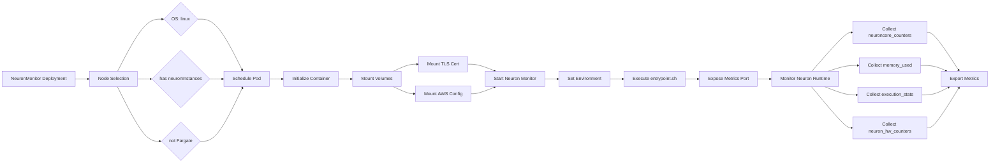
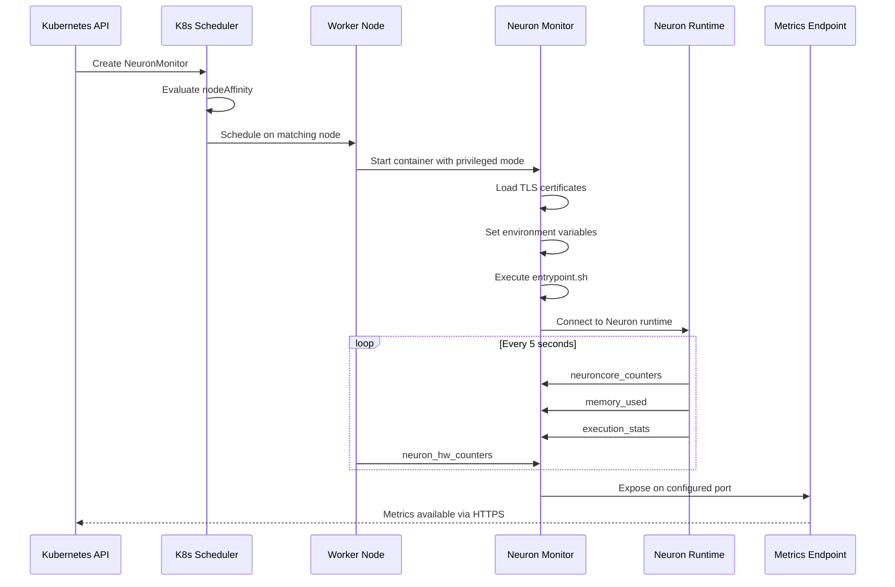

# Diagram: devops/k8s/amazon-cloudwatch-observability/helm/templates/linux/neuron-monitor-daemonset.yaml


> Auto-generated by Obscura crawlers

## Diagram 1

```mermaid
graph TD
      NM[NeuronMonitor] --> Meta[Metadata]
      NM --> Spec[Spec]...
  └ 238 lines...
```

> SVG rendering failed for this diagram.

## Diagram 2

```mermaid
graph TD
    NM[NeuronMonitor] --> Meta[Metadata]
    NM --> Spec[Spec]
    
    Meta --> Name[name: neuron-monitor.name]
    Meta --> NS[namespace: Release.Namespace]
    Meta --> Labels[labels]
    
    Labels --> K8S[k8s-app]
    Labels --> Ver[version: v1]
    
    Spec --> Image[image]
    Spec --> SA[serviceAccount]
    Spec --> Affinity[affinity]
    Spec --> Resources[resources]
    Spec --> Env[env]
    Spec --> Ports[ports]
    Spec --> Cmd[command]
    Spec --> Args[args]
    Spec --> SC[securityContext]
    Spec --> VM[volumeMounts]
    Spec --> Vol[volumes]
    Spec --> MC[monitorConfig]
    Spec --> Tol[tolerations]
    
    Affinity --> NA[nodeAffinity]
    NA --> NST[nodeSelectorTerms]
    NST --> ME1[kubernetes.io/os: linux]
    NST --> ME2[nodeLabelKey: neuronInstances]
    NST --> ME3[fargateLabelKey: NotIn fargate]
    
    Env --> E1[NODE_NAME]
    Env --> E2[PATH]
    Env --> E3[GOMEMLIMIT: 320MiB]
    
    Ports --> P1[metrics: port]
    
    Args --> A1[port]
    Args --> A2[cert-file]
    Args --> A3[key-file]
    
    SC --> Priv[privileged: true]
    
    VM --> VM1[neurontls]
    VM --> VM2[aws-config]
    
    Vol --> V1[neurontls secret]
    Vol --> V2[aws-config hostPath]
    
    V1 --> Cert1[tls.crt -> server.crt]
    V1 --> Cert2[tls.key -> server.key]
    
    MC --> Period[period: 5s]
    MC --> NR[neuron_runtimes]
    MC --> SM[system_metrics]
    
    NR --> Metrics1[neuroncore_counters]
    NR --> Metrics2[memory_used]
    NR --> Metrics3[execution_stats]
```



### SVG

<svg id="container" width="4329.19921875" xmlns="http://www.w3.org/2000/svg" class="flowchart" height="638" viewBox="0 0 4329.19921875 638" role="graphics-document document" aria-roledescription="flowchart-v2"><style>#container{font-family:"trebuchet ms",verdana,arial,sans-serif;font-size:16px;fill:#333;}@keyframes edge-animation-frame{from{stroke-dashoffset:0;}}@keyframes dash{to{stroke-dashoffset:0;}}#container .edge-animation-slow{stroke-dasharray:9,5!important;stroke-dashoffset:900;animation:dash 50s linear infinite;stroke-linecap:round;}#container .edge-animation-fast{stroke-dasharray:9,5!important;stroke-dashoffset:900;animation:dash 20s linear infinite;stroke-linecap:round;}#container .error-icon{fill:#552222;}#container .error-text{fill:#552222;stroke:#552222;}#container .edge-thickness-normal{stroke-width:1px;}#container .edge-thickness-thick{stroke-width:3.5px;}#container .edge-pattern-solid{stroke-dasharray:0;}#container .edge-thickness-invisible{stroke-width:0;fill:none;}#container .edge-pattern-dashed{stroke-dasharray:3;}#container .edge-pattern-dotted{stroke-dasharray:2;}#container .marker{fill:#333333;stroke:#333333;}#container .marker.cross{stroke:#333333;}#container svg{font-family:"trebuchet ms",verdana,arial,sans-serif;font-size:16px;}#container p{margin:0;}#container .label{font-family:"trebuchet ms",verdana,arial,sans-serif;color:#333;}#container .cluster-label text{fill:#333;}#container .cluster-label span{color:#333;}#container .cluster-label span p{background-color:transparent;}#container .label text,#container span{fill:#333;color:#333;}#container .node rect,#container .node circle,#container .node ellipse,#container .node polygon,#container .node path{fill:#ECECFF;stroke:#9370DB;stroke-width:1px;}#container .rough-node .label text,#container .node .label text,#container .image-shape .label,#container .icon-shape .label{text-anchor:middle;}#container .node .katex path{fill:#000;stroke:#000;stroke-width:1px;}#container .rough-node .label,#container .node .label,#container .image-shape .label,#container .icon-shape .label{text-align:center;}#container .node.clickable{cursor:pointer;}#container .root .anchor path{fill:#333333!important;stroke-width:0;stroke:#333333;}#container .arrowheadPath{fill:#333333;}#container .edgePath .path{stroke:#333333;stroke-width:2.0px;}#container .flowchart-link{stroke:#333333;fill:none;}#container .edgeLabel{background-color:rgba(232,232,232, 0.8);text-align:center;}#container .edgeLabel p{background-color:rgba(232,232,232, 0.8);}#container .edgeLabel rect{opacity:0.5;background-color:rgba(232,232,232, 0.8);fill:rgba(232,232,232, 0.8);}#container .labelBkg{background-color:rgba(232, 232, 232, 0.5);}#container .cluster rect{fill:#ffffde;stroke:#aaaa33;stroke-width:1px;}#container .cluster text{fill:#333;}#container .cluster span{color:#333;}#container div.mermaidTooltip{position:absolute;text-align:center;max-width:200px;padding:2px;font-family:"trebuchet ms",verdana,arial,sans-serif;font-size:12px;background:hsl(80, 100%, 96.2745098039%);border:1px solid #aaaa33;border-radius:2px;pointer-events:none;z-index:100;}#container .flowchartTitleText{text-anchor:middle;font-size:18px;fill:#333;}#container rect.text{fill:none;stroke-width:0;}#container .icon-shape,#container .image-shape{background-color:rgba(232,232,232, 0.8);text-align:center;}#container .icon-shape p,#container .image-shape p{background-color:rgba(232,232,232, 0.8);padding:2px;}#container .icon-shape rect,#container .image-shape rect{opacity:0.5;background-color:rgba(232,232,232, 0.8);fill:rgba(232,232,232, 0.8);}#container .label-icon{display:inline-block;height:1em;overflow:visible;vertical-align:-0.125em;}#container .node .label-icon path{fill:currentColor;stroke:revert;stroke-width:revert;}#container :root{--mermaid-font-family:"trebuchet ms",verdana,arial,sans-serif;}</style><g><marker id="container_flowchart-v2-pointEnd" class="marker flowchart-v2" viewBox="0 0 10 10" refX="5" refY="5" markerUnits="userSpaceOnUse" markerWidth="8" markerHeight="8" orient="auto"><path d="M 0 0 L 10 5 L 0 10 z" class="arrowMarkerPath" style="stroke-width: 1; stroke-dasharray: 1, 0;"></path></marker><marker id="container_flowchart-v2-pointStart" class="marker flowchart-v2" viewBox="0 0 10 10" refX="4.5" refY="5" markerUnits="userSpaceOnUse" markerWidth="8" markerHeight="8" orient="auto"><path d="M 0 5 L 10 10 L 10 0 z" class="arrowMarkerPath" style="stroke-width: 1; stroke-dasharray: 1, 0;"></path></marker><marker id="container_flowchart-v2-circleEnd" class="marker flowchart-v2" viewBox="0 0 10 10" refX="11" refY="5" markerUnits="userSpaceOnUse" markerWidth="11" markerHeight="11" orient="auto"><circle cx="5" cy="5" r="5" class="arrowMarkerPath" style="stroke-width: 1; stroke-dasharray: 1, 0;"></circle></marker><marker id="container_flowchart-v2-circleStart" class="marker flowchart-v2" viewBox="0 0 10 10" refX="-1" refY="5" markerUnits="userSpaceOnUse" markerWidth="11" markerHeight="11" orient="auto"><circle cx="5" cy="5" r="5" class="arrowMarkerPath" style="stroke-width: 1; stroke-dasharray: 1, 0;"></circle></marker><marker id="container_flowchart-v2-crossEnd" class="marker cross flowchart-v2" viewBox="0 0 11 11" refX="12" refY="5.2" markerUnits="userSpaceOnUse" markerWidth="11" markerHeight="11" orient="auto"><path d="M 1,1 l 9,9 M 10,1 l -9,9" class="arrowMarkerPath" style="stroke-width: 2; stroke-dasharray: 1, 0;"></path></marker><marker id="container_flowchart-v2-crossStart" class="marker cross flowchart-v2" viewBox="0 0 11 11" refX="-1" refY="5.2" markerUnits="userSpaceOnUse" markerWidth="11" markerHeight="11" orient="auto"><path d="M 1,1 l 9,9 M 10,1 l -9,9" class="arrowMarkerPath" style="stroke-width: 2; stroke-dasharray: 1, 0;"></path></marker><g class="root"><g class="clusters"></g><g class="edgePaths"><path d="M1230.063,40.063L1098.619,47.885C967.176,55.708,704.289,71.354,572.846,82.677C441.402,94,441.402,101,441.402,104.5L441.402,108" id="L_NM_Meta_0" class="edge-thickness-normal edge-pattern-solid edge-thickness-normal edge-pattern-solid flowchart-link" style=";" data-edge="true" data-et="edge" data-id="L_NM_Meta_0" data-points="W3sieCI6MTIzMC4wNjI1LCJ5Ijo0MC4wNjI1MzMyNTE2NjY0OTR9LHsieCI6NDQxLjQwMjM0Mzc1LCJ5Ijo4N30seyJ4Ijo0NDEuNDAyMzQzNzUsInkiOjExMn1d" marker-end="url(#container_flowchart-v2-pointEnd)"></path><path d="M1400.188,40.101L1530.531,47.918C1660.875,55.734,1921.563,71.367,2051.906,82.684C2182.25,94,2182.25,101,2182.25,104.5L2182.25,108" id="L_NM_Spec_0" class="edge-thickness-normal edge-pattern-solid edge-thickness-normal edge-pattern-solid flowchart-link" style=";" data-edge="true" data-et="edge" data-id="L_NM_Spec_0" data-points="W3sieCI6MTQwMC4xODc1LCJ5Ijo0MC4xMDEwNTIzMjgwOTU3Mn0seyJ4IjoyMTgyLjI1LCJ5Ijo4N30seyJ4IjoyMTgyLjI1LCJ5IjoxMTJ9XQ==" marker-end="url(#container_flowchart-v2-pointEnd)"></path><path d="M377.309,149.985L337.424,156.821C297.539,163.657,217.77,177.328,177.885,187.664C138,198,138,205,138,208.5L138,212" id="L_Meta_Name_0" class="edge-thickness-normal edge-pattern-solid edge-thickness-normal edge-pattern-solid flowchart-link" style=";" data-edge="true" data-et="edge" data-id="L_Meta_Name_0" data-points="W3sieCI6Mzc3LjMwODU5Mzc1LCJ5IjoxNDkuOTg1MDAwODM2ODYzMTh9LHsieCI6MTM4LCJ5IjoxOTF9LHsieCI6MTM4LCJ5IjoyMTZ9XQ==" marker-end="url(#container_flowchart-v2-pointEnd)"></path><path d="M444.828,166L445.357,170.167C445.885,174.333,446.943,182.667,447.471,190.333C448,198,448,205,448,208.5L448,212" id="L_Meta_NS_0" class="edge-thickness-normal edge-pattern-solid edge-thickness-normal edge-pattern-solid flowchart-link" style=";" data-edge="true" data-et="edge" data-id="L_Meta_NS_0" data-points="W3sieCI6NDQ0LjgyODA0OTg3OTgwNzcsInkiOjE2Nn0seyJ4Ijo0NDgsInkiOjE5MX0seyJ4Ijo0NDgsInkiOjIxNn1d" marker-end="url(#container_flowchart-v2-pointEnd)"></path><path d="M505.496,152.977L534.555,159.314C563.615,165.652,621.733,178.326,650.792,190.163C679.852,202,679.852,213,679.852,218.5L679.852,224" id="L_Meta_Labels_0" class="edge-thickness-normal edge-pattern-solid edge-thickness-normal edge-pattern-solid flowchart-link" style=";" data-edge="true" data-et="edge" data-id="L_Meta_Labels_0" data-points="W3sieCI6NTA1LjQ5NjA5Mzc1LCJ5IjoxNTIuOTc3Mjk0NjkzOTA0M30seyJ4Ijo2NzkuODUxNTYyNSwieSI6MTkxfSx7IngiOjY3OS44NTE1NjI1LCJ5IjoyMjh9XQ==" marker-end="url(#container_flowchart-v2-pointEnd)"></path><path d="M642.483,282L633.948,288.167C625.413,294.333,608.343,306.667,599.808,316.333C591.273,326,591.273,333,591.273,336.5L591.273,340" id="L_Labels_K8S_0" class="edge-thickness-normal edge-pattern-solid edge-thickness-normal edge-pattern-solid flowchart-link" style=";" data-edge="true" data-et="edge" data-id="L_Labels_K8S_0" data-points="W3sieCI6NjQyLjQ4MjY2NjAxNTYyNSwieSI6MjgyfSx7IngiOjU5MS4yNzM0Mzc1LCJ5IjozMTl9LHsieCI6NTkxLjI3MzQzNzUsInkiOjM0NH1d" marker-end="url(#container_flowchart-v2-pointEnd)"></path><path d="M731.703,274.689L751.152,282.074C770.6,289.46,809.497,304.23,828.946,315.115C848.395,326,848.395,333,848.395,336.5L848.395,340" id="L_Labels_Ver_0" class="edge-thickness-normal edge-pattern-solid edge-thickness-normal edge-pattern-solid flowchart-link" style=";" data-edge="true" data-et="edge" data-id="L_Labels_Ver_0" data-points="W3sieCI6NzMxLjcwMzEyNSwieSI6Mjc0LjY4OTM0MTA4OTc2MjkzfSx7IngiOjg0OC4zOTQ1MzEyNSwieSI6MzE5fSx7IngiOjg0OC4zOTQ1MzEyNSwieSI6MzQ0fV0=" marker-end="url(#container_flowchart-v2-pointEnd)"></path><path d="M2134.953,140.823L1918.042,149.186C1701.13,157.549,1267.307,174.274,1050.396,188.137C833.484,202,833.484,213,833.484,218.5L833.484,224" id="L_Spec_Image_0" class="edge-thickness-normal edge-pattern-solid edge-thickness-normal edge-pattern-solid flowchart-link" style=";" data-edge="true" data-et="edge" data-id="L_Spec_Image_0" data-points="W3sieCI6MjEzNC45NTMxMjUsInkiOjE0MC44MjM0NzI4NTEzMzM5N30seyJ4Ijo4MzMuNDg0Mzc1LCJ5IjoxOTF9LHsieCI6ODMzLjQ4NDM3NSwieSI6MjI4fV0=" marker-end="url(#container_flowchart-v2-pointEnd)"></path><path d="M2134.953,141.115L1949.042,149.429C1763.13,157.743,1391.307,174.372,1205.396,188.186C1019.484,202,1019.484,213,1019.484,218.5L1019.484,224" id="L_Spec_SA_0" class="edge-thickness-normal edge-pattern-solid edge-thickness-normal edge-pattern-solid flowchart-link" style=";" data-edge="true" data-et="edge" data-id="L_Spec_SA_0" data-points="W3sieCI6MjEzNC45NTMxMjUsInkiOjE0MS4xMTUxNjE4NTgxNzc1N30seyJ4IjoxMDE5LjQ4NDM3NSwieSI6MTkxfSx7IngiOjEwMTkuNDg0Mzc1LCJ5IjoyMjh9XQ==" marker-end="url(#container_flowchart-v2-pointEnd)"></path><path d="M2134.953,141.527L1980.639,149.773C1826.326,158.018,1517.698,174.509,1363.384,188.255C1209.07,202,1209.07,213,1209.07,218.5L1209.07,224" id="L_Spec_Affinity_0" class="edge-thickness-normal edge-pattern-solid edge-thickness-normal edge-pattern-solid flowchart-link" style=";" data-edge="true" data-et="edge" data-id="L_Spec_Affinity_0" data-points="W3sieCI6MjEzNC45NTMxMjUsInkiOjE0MS41MjcyMTgyODQxMzYyNH0seyJ4IjoxMjA5LjA3MDMxMjUsInkiOjE5MX0seyJ4IjoxMjA5LjA3MDMxMjUsInkiOjIyOH1d" marker-end="url(#container_flowchart-v2-pointEnd)"></path><path d="M2134.953,142.063L2009.014,150.219C1883.076,158.375,1631.198,174.688,1505.259,188.344C1379.32,202,1379.32,213,1379.32,218.5L1379.32,224" id="L_Spec_Resources_0" class="edge-thickness-normal edge-pattern-solid edge-thickness-normal edge-pattern-solid flowchart-link" style=";" data-edge="true" data-et="edge" data-id="L_Spec_Resources_0" data-points="W3sieCI6MjEzNC45NTMxMjUsInkiOjE0Mi4wNjMwNzk1NDI2OTAzM30seyJ4IjoxMzc5LjMyMDMxMjUsInkiOjE5MX0seyJ4IjoxMzc5LjMyMDMxMjUsInkiOjIyOH1d" marker-end="url(#container_flowchart-v2-pointEnd)"></path><path d="M2134.953,142.957L2039.245,150.964C1943.536,158.971,1752.12,174.986,1656.411,188.493C1560.703,202,1560.703,213,1560.703,218.5L1560.703,224" id="L_Spec_Env_0" class="edge-thickness-normal edge-pattern-solid edge-thickness-normal edge-pattern-solid flowchart-link" style=";" data-edge="true" data-et="edge" data-id="L_Spec_Env_0" data-points="W3sieCI6MjEzNC45NTMxMjUsInkiOjE0Mi45NTY5NjIyMTYyNDQ3Nn0seyJ4IjoxNTYwLjcwMzEyNSwieSI6MTkxfSx7IngiOjE1NjAuNzAzMTI1LCJ5IjoyMjh9XQ==" marker-end="url(#container_flowchart-v2-pointEnd)"></path><path d="M2134.953,153.904L2115.333,160.087C2095.714,166.27,2056.474,178.635,2036.854,190.317C2017.234,202,2017.234,213,2017.234,218.5L2017.234,224" id="L_Spec_Ports_0" class="edge-thickness-normal edge-pattern-solid edge-thickness-normal edge-pattern-solid flowchart-link" style=";" data-edge="true" data-et="edge" data-id="L_Spec_Ports_0" data-points="W3sieCI6MjEzNC45NTMxMjUsInkiOjE1My45MDQyNzA0Mjg5MzY2Nn0seyJ4IjoyMDE3LjIzNDM3NSwieSI6MTkxfSx7IngiOjIwMTcuMjM0Mzc1LCJ5IjoyMjh9XQ==" marker-end="url(#container_flowchart-v2-pointEnd)"></path><path d="M2182.25,166L2182.25,170.167C2182.25,174.333,2182.25,182.667,2182.25,192.333C2182.25,202,2182.25,213,2182.25,218.5L2182.25,224" id="L_Spec_Cmd_0" class="edge-thickness-normal edge-pattern-solid edge-thickness-normal edge-pattern-solid flowchart-link" style=";" data-edge="true" data-et="edge" data-id="L_Spec_Cmd_0" data-points="W3sieCI6MjE4Mi4yNSwieSI6MTY2fSx7IngiOjIxODIuMjUsInkiOjE5MX0seyJ4IjoyMTgyLjI1LCJ5IjoyMjh9XQ==" marker-end="url(#container_flowchart-v2-pointEnd)"></path><path d="M2229.547,154.272L2248.504,160.394C2267.461,166.515,2305.375,178.757,2324.332,190.379C2343.289,202,2343.289,213,2343.289,218.5L2343.289,224" id="L_Spec_Args_0" class="edge-thickness-normal edge-pattern-solid edge-thickness-normal edge-pattern-solid flowchart-link" style=";" data-edge="true" data-et="edge" data-id="L_Spec_Args_0" data-points="W3sieCI6MjIyOS41NDY4NzUsInkiOjE1NC4yNzIzMDM4ODU4OTcyNn0seyJ4IjoyMzQzLjI4OTA2MjUsInkiOjE5MX0seyJ4IjoyMzQzLjI4OTA2MjUsInkiOjIyOH1d" marker-end="url(#container_flowchart-v2-pointEnd)"></path><path d="M2229.547,143.753L2307.9,151.628C2386.253,159.502,2542.958,175.251,2621.311,188.626C2699.664,202,2699.664,213,2699.664,218.5L2699.664,224" id="L_Spec_SC_0" class="edge-thickness-normal edge-pattern-solid edge-thickness-normal edge-pattern-solid flowchart-link" style=";" data-edge="true" data-et="edge" data-id="L_Spec_SC_0" data-points="W3sieCI6MjIyOS41NDY4NzUsInkiOjE0My43NTMzMjU1ODI0NDg3OH0seyJ4IjoyNjk5LjY2NDA2MjUsInkiOjE5MX0seyJ4IjoyNjk5LjY2NDA2MjUsInkiOjIyOH1d" marker-end="url(#container_flowchart-v2-pointEnd)"></path><path d="M2229.547,142.003L2358.173,150.169C2486.799,158.335,2744.052,174.668,2872.678,188.334C3001.305,202,3001.305,213,3001.305,218.5L3001.305,224" id="L_Spec_VM_0" class="edge-thickness-normal edge-pattern-solid edge-thickness-normal edge-pattern-solid flowchart-link" style=";" data-edge="true" data-et="edge" data-id="L_Spec_VM_0" data-points="W3sieCI6MjIyOS41NDY4NzUsInkiOjE0Mi4wMDI3NzU2ODQ2MjExOH0seyJ4IjozMDAxLjMwNDY4NzUsInkiOjE5MX0seyJ4IjozMDAxLjMwNDY4NzUsInkiOjIyOH1d" marker-end="url(#container_flowchart-v2-pointEnd)"></path><path d="M2229.547,140.984L2428.234,149.32C2626.921,157.656,3024.294,174.328,3222.981,188.164C3421.668,202,3421.668,213,3421.668,218.5L3421.668,224" id="L_Spec_Vol_0" class="edge-thickness-normal edge-pattern-solid edge-thickness-normal edge-pattern-solid flowchart-link" style=";" data-edge="true" data-et="edge" data-id="L_Spec_Vol_0" data-points="W3sieCI6MjIyOS41NDY4NzUsInkiOjE0MC45ODQzNDg3NTI0MDcxfSx7IngiOjM0MjEuNjY3OTY4NzUsInkiOjE5MX0seyJ4IjozNDIxLjY2Nzk2ODc1LCJ5IjoyMjh9XQ==" marker-end="url(#container_flowchart-v2-pointEnd)"></path><path d="M2229.547,140.338L2527.932,148.782C2826.318,157.226,3423.089,174.113,3721.474,188.056C4019.859,202,4019.859,213,4019.859,218.5L4019.859,224" id="L_Spec_MC_0" class="edge-thickness-normal edge-pattern-solid edge-thickness-normal edge-pattern-solid flowchart-link" style=";" data-edge="true" data-et="edge" data-id="L_Spec_MC_0" data-points="W3sieCI6MjIyOS41NDY4NzUsInkiOjE0MC4zMzgzODk3MjE3MDAyNX0seyJ4Ijo0MDE5Ljg1OTM3NSwieSI6MTkxfSx7IngiOjQwMTkuODU5Mzc1LCJ5IjoyMjh9XQ==" marker-end="url(#container_flowchart-v2-pointEnd)"></path><path d="M2229.547,140.206L2561.424,148.672C2893.302,157.138,3557.057,174.069,3888.935,188.034C4220.813,202,4220.813,213,4220.813,218.5L4220.813,224" id="L_Spec_Tol_0" class="edge-thickness-normal edge-pattern-solid edge-thickness-normal edge-pattern-solid flowchart-link" style=";" data-edge="true" data-et="edge" data-id="L_Spec_Tol_0" data-points="W3sieCI6MjIyOS41NDY4NzUsInkiOjE0MC4yMDY0NTY3NTU2Nzk1NH0seyJ4Ijo0MjIwLjgxMjUsInkiOjE5MX0seyJ4Ijo0MjIwLjgxMjUsInkiOjIyOH1d" marker-end="url(#container_flowchart-v2-pointEnd)"></path><path d="M1209.07,282L1209.07,288.167C1209.07,294.333,1209.07,306.667,1209.07,316.333C1209.07,326,1209.07,333,1209.07,336.5L1209.07,340" id="L_Affinity_NA_0" class="edge-thickness-normal edge-pattern-solid edge-thickness-normal edge-pattern-solid flowchart-link" style=";" data-edge="true" data-et="edge" data-id="L_Affinity_NA_0" data-points="W3sieCI6MTIwOS4wNzAzMTI1LCJ5IjoyODJ9LHsieCI6MTIwOS4wNzAzMTI1LCJ5IjozMTl9LHsieCI6MTIwOS4wNzAzMTI1LCJ5IjozNDR9XQ==" marker-end="url(#container_flowchart-v2-pointEnd)"></path><path d="M1209.07,398L1209.07,402.167C1209.07,406.333,1209.07,414.667,1209.07,422.333C1209.07,430,1209.07,437,1209.07,440.5L1209.07,444" id="L_NA_NST_0" class="edge-thickness-normal edge-pattern-solid edge-thickness-normal edge-pattern-solid flowchart-link" style=";" data-edge="true" data-et="edge" data-id="L_NA_NST_0" data-points="W3sieCI6MTIwOS4wNzAzMTI1LCJ5IjozOTh9LHsieCI6MTIwOS4wNzAzMTI1LCJ5Ijo0MjN9LHsieCI6MTIwOS4wNzAzMTI1LCJ5Ijo0NDh9XQ==" marker-end="url(#container_flowchart-v2-pointEnd)"></path><path d="M1109.094,492.701L1076.807,498.418C1044.521,504.134,979.948,515.567,947.661,526.784C915.375,538,915.375,549,915.375,554.5L915.375,560" id="L_NST_ME1_0" class="edge-thickness-normal edge-pattern-solid edge-thickness-normal edge-pattern-solid flowchart-link" style=";" data-edge="true" data-et="edge" data-id="L_NST_ME1_0" data-points="W3sieCI6MTEwOS4wOTM3NSwieSI6NDkyLjcwMTI3NDE3MzM4MzM1fSx7IngiOjkxNS4zNzUsInkiOjUyN30seyJ4Ijo5MTUuMzc1LCJ5Ijo1NjR9XQ==" marker-end="url(#container_flowchart-v2-pointEnd)"></path><path d="M1209.07,502L1209.07,506.167C1209.07,510.333,1209.07,518.667,1209.07,526.333C1209.07,534,1209.07,541,1209.07,544.5L1209.07,548" id="L_NST_ME2_0" class="edge-thickness-normal edge-pattern-solid edge-thickness-normal edge-pattern-solid flowchart-link" style=";" data-edge="true" data-et="edge" data-id="L_NST_ME2_0" data-points="W3sieCI6MTIwOS4wNzAzMTI1LCJ5Ijo1MDJ9LHsieCI6MTIwOS4wNzAzMTI1LCJ5Ijo1Mjd9LHsieCI6MTIwOS4wNzAzMTI1LCJ5Ijo1NTJ9XQ==" marker-end="url(#container_flowchart-v2-pointEnd)"></path><path d="M1309.047,491.77L1344.051,497.642C1379.055,503.514,1449.063,515.257,1484.066,524.628C1519.07,534,1519.07,541,1519.07,544.5L1519.07,548" id="L_NST_ME3_0" class="edge-thickness-normal edge-pattern-solid edge-thickness-normal edge-pattern-solid flowchart-link" style=";" data-edge="true" data-et="edge" data-id="L_NST_ME3_0" data-points="W3sieCI6MTMwOS4wNDY4NzUsInkiOjQ5MS43NzAyNjIwOTY3NzQyfSx7IngiOjE1MTkuMDcwMzEyNSwieSI6NTI3fSx7IngiOjE1MTkuMDcwMzEyNSwieSI6NTUyfV0=" marker-end="url(#container_flowchart-v2-pointEnd)"></path><path d="M1517.773,273.03L1499.531,280.692C1481.289,288.353,1444.805,303.677,1426.563,314.838C1408.32,326,1408.32,333,1408.32,336.5L1408.32,340" id="L_Env_E1_0" class="edge-thickness-normal edge-pattern-solid edge-thickness-normal edge-pattern-solid flowchart-link" style=";" data-edge="true" data-et="edge" data-id="L_Env_E1_0" data-points="W3sieCI6MTUxNy43NzM0Mzc1LCJ5IjoyNzMuMDMwMjQ4NjU0MTkxMn0seyJ4IjoxNDA4LjMyMDMxMjUsInkiOjMxOX0seyJ4IjoxNDA4LjMyMDMxMjUsInkiOjM0NH1d" marker-end="url(#container_flowchart-v2-pointEnd)"></path><path d="M1569.434,282L1571.428,288.167C1573.422,294.333,1577.41,306.667,1579.404,316.333C1581.398,326,1581.398,333,1581.398,336.5L1581.398,340" id="L_Env_E2_0" class="edge-thickness-normal edge-pattern-solid edge-thickness-normal edge-pattern-solid flowchart-link" style=";" data-edge="true" data-et="edge" data-id="L_Env_E2_0" data-points="W3sieCI6MTU2OS40MzM5NTk5NjA5Mzc1LCJ5IjoyODJ9LHsieCI6MTU4MS4zOTg0Mzc1LCJ5IjozMTl9LHsieCI6MTU4MS4zOTg0Mzc1LCJ5IjozNDR9XQ==" marker-end="url(#container_flowchart-v2-pointEnd)"></path><path d="M1603.633,267.246L1633.87,275.872C1664.107,284.498,1724.581,301.749,1754.818,313.874C1785.055,326,1785.055,333,1785.055,336.5L1785.055,340" id="L_Env_E3_0" class="edge-thickness-normal edge-pattern-solid edge-thickness-normal edge-pattern-solid flowchart-link" style=";" data-edge="true" data-et="edge" data-id="L_Env_E3_0" data-points="W3sieCI6MTYwMy42MzI4MTI1LCJ5IjoyNjcuMjQ2NDA0NTY4NzIyMzd9LHsieCI6MTc4NS4wNTQ2ODc1LCJ5IjozMTl9LHsieCI6MTc4NS4wNTQ2ODc1LCJ5IjozNDR9XQ==" marker-end="url(#container_flowchart-v2-pointEnd)"></path><path d="M2017.234,282L2017.234,288.167C2017.234,294.333,2017.234,306.667,2017.234,316.333C2017.234,326,2017.234,333,2017.234,336.5L2017.234,340" id="L_Ports_P1_0" class="edge-thickness-normal edge-pattern-solid edge-thickness-normal edge-pattern-solid flowchart-link" style=";" data-edge="true" data-et="edge" data-id="L_Ports_P1_0" data-points="W3sieCI6MjAxNy4yMzQzNzUsInkiOjI4Mn0seyJ4IjoyMDE3LjIzNDM3NSwieSI6MzE5fSx7IngiOjIwMTcuMjM0Mzc1LCJ5IjozNDR9XQ==" marker-end="url(#container_flowchart-v2-pointEnd)"></path><path d="M2298.125,273.79L2280.014,281.325C2261.904,288.86,2225.682,303.93,2207.572,314.965C2189.461,326,2189.461,333,2189.461,336.5L2189.461,340" id="L_Args_A1_0" class="edge-thickness-normal edge-pattern-solid edge-thickness-normal edge-pattern-solid flowchart-link" style=";" data-edge="true" data-et="edge" data-id="L_Args_A1_0" data-points="W3sieCI6MjI5OC4xMjUsInkiOjI3My43OTA0NTIwMDYwOTQ1fSx7IngiOjIxODkuNDYwOTM3NSwieSI6MzE5fSx7IngiOjIxODkuNDYwOTM3NSwieSI6MzQ0fV0=" marker-end="url(#container_flowchart-v2-pointEnd)"></path><path d="M2343.289,282L2343.289,288.167C2343.289,294.333,2343.289,306.667,2343.289,316.333C2343.289,326,2343.289,333,2343.289,336.5L2343.289,340" id="L_Args_A2_0" class="edge-thickness-normal edge-pattern-solid edge-thickness-normal edge-pattern-solid flowchart-link" style=";" data-edge="true" data-et="edge" data-id="L_Args_A2_0" data-points="W3sieCI6MjM0My4yODkwNjI1LCJ5IjoyODJ9LHsieCI6MjM0My4yODkwNjI1LCJ5IjozMTl9LHsieCI6MjM0My4yODkwNjI1LCJ5IjozNDR9XQ==" marker-end="url(#container_flowchart-v2-pointEnd)"></path><path d="M2388.453,272.557L2408.365,280.298C2428.276,288.038,2468.099,303.519,2488.01,314.76C2507.922,326,2507.922,333,2507.922,336.5L2507.922,340" id="L_Args_A3_0" class="edge-thickness-normal edge-pattern-solid edge-thickness-normal edge-pattern-solid flowchart-link" style=";" data-edge="true" data-et="edge" data-id="L_Args_A3_0" data-points="W3sieCI6MjM4OC40NTMxMjUsInkiOjI3Mi41NTcyNTMzNTczNzY3NH0seyJ4IjoyNTA3LjkyMTg3NSwieSI6MzE5fSx7IngiOjI1MDcuOTIxODc1LCJ5IjozNDR9XQ==" marker-end="url(#container_flowchart-v2-pointEnd)"></path><path d="M2699.664,282L2699.664,288.167C2699.664,294.333,2699.664,306.667,2699.664,316.333C2699.664,326,2699.664,333,2699.664,336.5L2699.664,340" id="L_SC_Priv_0" class="edge-thickness-normal edge-pattern-solid edge-thickness-normal edge-pattern-solid flowchart-link" style=";" data-edge="true" data-et="edge" data-id="L_SC_Priv_0" data-points="W3sieCI6MjY5OS42NjQwNjI1LCJ5IjoyODJ9LHsieCI6MjY5OS42NjQwNjI1LCJ5IjozMTl9LHsieCI6MjY5OS42NjQwNjI1LCJ5IjozNDR9XQ==" marker-end="url(#container_flowchart-v2-pointEnd)"></path><path d="M2962.593,282L2953.751,288.167C2944.909,294.333,2927.226,306.667,2918.385,316.333C2909.543,326,2909.543,333,2909.543,336.5L2909.543,340" id="L_VM_VM1_0" class="edge-thickness-normal edge-pattern-solid edge-thickness-normal edge-pattern-solid flowchart-link" style=";" data-edge="true" data-et="edge" data-id="L_VM_VM1_0" data-points="W3sieCI6Mjk2Mi41OTI3MTI0MDIzNDM4LCJ5IjoyODJ9LHsieCI6MjkwOS41NDI5Njg3NSwieSI6MzE5fSx7IngiOjI5MDkuNTQyOTY4NzUsInkiOjM0NH1d" marker-end="url(#container_flowchart-v2-pointEnd)"></path><path d="M3040.017,282L3048.858,288.167C3057.7,294.333,3075.383,306.667,3084.225,316.333C3093.066,326,3093.066,333,3093.066,336.5L3093.066,340" id="L_VM_VM2_0" class="edge-thickness-normal edge-pattern-solid edge-thickness-normal edge-pattern-solid flowchart-link" style=";" data-edge="true" data-et="edge" data-id="L_VM_VM2_0" data-points="W3sieCI6MzA0MC4wMTY2NjI1OTc2NTYyLCJ5IjoyODJ9LHsieCI6MzA5My4wNjY0MDYyNSwieSI6MzE5fSx7IngiOjMwOTMuMDY2NDA2MjUsInkiOjM0NH1d" marker-end="url(#container_flowchart-v2-pointEnd)"></path><path d="M3370.644,282L3358.991,288.167C3347.337,294.333,3324.03,306.667,3312.376,316.333C3300.723,326,3300.723,333,3300.723,336.5L3300.723,340" id="L_Vol_V1_0" class="edge-thickness-normal edge-pattern-solid edge-thickness-normal edge-pattern-solid flowchart-link" style=";" data-edge="true" data-et="edge" data-id="L_Vol_V1_0" data-points="W3sieCI6MzM3MC42NDQxNjUwMzkwNjI1LCJ5IjoyODJ9LHsieCI6MzMwMC43MjI2NTYyNSwieSI6MzE5fSx7IngiOjMzMDAuNzIyNjU2MjUsInkiOjM0NH1d" marker-end="url(#container_flowchart-v2-pointEnd)"></path><path d="M3482.199,279.614L3498.342,286.178C3514.486,292.743,3546.772,305.871,3562.915,315.936C3579.059,326,3579.059,333,3579.059,336.5L3579.059,340" id="L_Vol_V2_0" class="edge-thickness-normal edge-pattern-solid edge-thickness-normal edge-pattern-solid flowchart-link" style=";" data-edge="true" data-et="edge" data-id="L_Vol_V2_0" data-points="W3sieCI6MzQ4Mi4xOTkyMTg3NSwieSI6Mjc5LjYxMzkxODM5NTcxMTN9LHsieCI6MzU3OS4wNTg1OTM3NSwieSI6MzE5fSx7IngiOjM1NzkuMDU4NTkzNzUsInkiOjM0NH1d" marker-end="url(#container_flowchart-v2-pointEnd)"></path><path d="M3211.785,376.037L3073.589,383.864C2935.392,391.691,2658.999,407.346,2520.802,418.673C2382.605,430,2382.605,437,2382.605,440.5L2382.605,444" id="L_V1_Cert1_0" class="edge-thickness-normal edge-pattern-solid edge-thickness-normal edge-pattern-solid flowchart-link" style=";" data-edge="true" data-et="edge" data-id="L_V1_Cert1_0" data-points="W3sieCI6MzIxMS43ODUxNTYyNSwieSI6Mzc2LjAzNzIxMTAwNDE3ODA2fSx7IngiOjIzODIuNjA1NDY4NzUsInkiOjQyM30seyJ4IjoyMzgyLjYwNTQ2ODc1LCJ5Ijo0NDh9XQ==" marker-end="url(#container_flowchart-v2-pointEnd)"></path><path d="M3364.641,398L3374.505,402.167C3384.369,406.333,3404.096,414.667,3413.96,422.333C3423.824,430,3423.824,437,3423.824,440.5L3423.824,444" id="L_V1_Cert2_0" class="edge-thickness-normal edge-pattern-solid edge-thickness-normal edge-pattern-solid flowchart-link" style=";" data-edge="true" data-et="edge" data-id="L_V1_Cert2_0" data-points="W3sieCI6MzM2NC42NDA3NzUyNDAzODQ4LCJ5IjozOTh9LHsieCI6MzQyMy44MjQyMTg3NSwieSI6NDIzfSx7IngiOjM0MjMuODI0MjE4NzUsInkiOjQ0OH1d" marker-end="url(#container_flowchart-v2-pointEnd)"></path><path d="M3938.414,278.455L3914.95,285.213C3891.486,291.97,3844.557,305.485,3821.093,315.743C3797.629,326,3797.629,333,3797.629,336.5L3797.629,340" id="L_MC_Period_0" class="edge-thickness-normal edge-pattern-solid edge-thickness-normal edge-pattern-solid flowchart-link" style=";" data-edge="true" data-et="edge" data-id="L_MC_Period_0" data-points="W3sieCI6MzkzOC40MTQwNjI1LCJ5IjoyNzguNDU1Mzc5NTg1NTIzMn0seyJ4IjozNzk3LjYyODkwNjI1LCJ5IjozMTl9LHsieCI6Mzc5Ny42Mjg5MDYyNSwieSI6MzQ0fV0=" marker-end="url(#container_flowchart-v2-pointEnd)"></path><path d="M4013.948,282L4012.598,288.167C4011.248,294.333,4008.548,306.667,4007.198,316.333C4005.848,326,4005.848,333,4005.848,336.5L4005.848,340" id="L_MC_NR_0" class="edge-thickness-normal edge-pattern-solid edge-thickness-normal edge-pattern-solid flowchart-link" style=";" data-edge="true" data-et="edge" data-id="L_MC_NR_0" data-points="W3sieCI6NDAxMy45NDgxODExNTIzNDM4LCJ5IjoyODJ9LHsieCI6NDAwNS44NDc2NTYyNSwieSI6MzE5fSx7IngiOjQwMDUuODQ3NjU2MjUsInkiOjM0NH1d" marker-end="url(#container_flowchart-v2-pointEnd)"></path><path d="M4101.305,279.248L4123.558,285.873C4145.811,292.499,4190.318,305.749,4212.571,315.875C4234.824,326,4234.824,333,4234.824,336.5L4234.824,340" id="L_MC_SM_0" class="edge-thickness-normal edge-pattern-solid edge-thickness-normal edge-pattern-solid flowchart-link" style=";" data-edge="true" data-et="edge" data-id="L_MC_SM_0" data-points="W3sieCI6NDEwMS4zMDQ2ODc1LCJ5IjoyNzkuMjQ4MTUxMDQyMTM5OX0seyJ4Ijo0MjM0LjgyNDIxODc1LCJ5IjozMTl9LHsieCI6NDIzNC44MjQyMTg3NSwieSI6MzQ0fV0=" marker-end="url(#container_flowchart-v2-pointEnd)"></path><path d="M3913.246,385.837L3874.59,392.031C3835.934,398.225,3758.621,410.612,3719.965,420.306C3681.309,430,3681.309,437,3681.309,440.5L3681.309,444" id="L_NR_Metrics1_0" class="edge-thickness-normal edge-pattern-solid edge-thickness-normal edge-pattern-solid flowchart-link" style=";" data-edge="true" data-et="edge" data-id="L_NR_Metrics1_0" data-points="W3sieCI6MzkxMy4yNDYwOTM3NSwieSI6Mzg1LjgzNzI5MzI3NjUyMn0seyJ4IjozNjgxLjMwODU5Mzc1LCJ5Ijo0MjN9LHsieCI6MzY4MS4zMDg1OTM3NSwieSI6NDQ4fV0=" marker-end="url(#container_flowchart-v2-pointEnd)"></path><path d="M4005.848,398L4005.848,402.167C4005.848,406.333,4005.848,414.667,4005.848,422.333C4005.848,430,4005.848,437,4005.848,440.5L4005.848,444" id="L_NR_Metrics2_0" class="edge-thickness-normal edge-pattern-solid edge-thickness-normal edge-pattern-solid flowchart-link" style=";" data-edge="true" data-et="edge" data-id="L_NR_Metrics2_0" data-points="W3sieCI6NDAwNS44NDc2NTYyNSwieSI6Mzk4fSx7IngiOjQwMDUuODQ3NjU2MjUsInkiOjQyM30seyJ4Ijo0MDA1Ljg0NzY1NjI1LCJ5Ijo0NDh9XQ==" marker-end="url(#container_flowchart-v2-pointEnd)"></path><path d="M4098.449,393.074L4119.372,398.062C4140.296,403.049,4182.142,413.025,4203.065,421.512C4223.988,430,4223.988,437,4223.988,440.5L4223.988,444" id="L_NR_Metrics3_0" class="edge-thickness-normal edge-pattern-solid edge-thickness-normal edge-pattern-solid flowchart-link" style=";" data-edge="true" data-et="edge" data-id="L_NR_Metrics3_0" data-points="W3sieCI6NDA5OC40NDkyMTg3NSwieSI6MzkzLjA3NDIwNjcxODcxNjR9LHsieCI6NDIyMy45ODgyODEyNSwieSI6NDIzfSx7IngiOjQyMjMuOTg4MjgxMjUsInkiOjQ0OH1d" marker-end="url(#container_flowchart-v2-pointEnd)"></path></g><g class="edgeLabels"><g class="edgeLabel"><g class="label" data-id="L_NM_Meta_0" transform="translate(0, 0)"><foreignObject width="0" height="0"><div xmlns="http://www.w3.org/1999/xhtml" class="labelBkg" style="display: table-cell; white-space: nowrap; line-height: 1.5; max-width: 200px; text-align: center;"><span class="edgeLabel"></span></div></foreignObject></g></g><g class="edgeLabel"><g class="label" data-id="L_NM_Spec_0" transform="translate(0, 0)"><foreignObject width="0" height="0"><div xmlns="http://www.w3.org/1999/xhtml" class="labelBkg" style="display: table-cell; white-space: nowrap; line-height: 1.5; max-width: 200px; text-align: center;"><span class="edgeLabel"></span></div></foreignObject></g></g><g class="edgeLabel"><g class="label" data-id="L_Meta_Name_0" transform="translate(0, 0)"><foreignObject width="0" height="0"><div xmlns="http://www.w3.org/1999/xhtml" class="labelBkg" style="display: table-cell; white-space: nowrap; line-height: 1.5; max-width: 200px; text-align: center;"><span class="edgeLabel"></span></div></foreignObject></g></g><g class="edgeLabel"><g class="label" data-id="L_Meta_NS_0" transform="translate(0, 0)"><foreignObject width="0" height="0"><div xmlns="http://www.w3.org/1999/xhtml" class="labelBkg" style="display: table-cell; white-space: nowrap; line-height: 1.5; max-width: 200px; text-align: center;"><span class="edgeLabel"></span></div></foreignObject></g></g><g class="edgeLabel"><g class="label" data-id="L_Meta_Labels_0" transform="translate(0, 0)"><foreignObject width="0" height="0"><div xmlns="http://www.w3.org/1999/xhtml" class="labelBkg" style="display: table-cell; white-space: nowrap; line-height: 1.5; max-width: 200px; text-align: center;"><span class="edgeLabel"></span></div></foreignObject></g></g><g class="edgeLabel"><g class="label" data-id="L_Labels_K8S_0" transform="translate(0, 0)"><foreignObject width="0" height="0"><div xmlns="http://www.w3.org/1999/xhtml" class="labelBkg" style="display: table-cell; white-space: nowrap; line-height: 1.5; max-width: 200px; text-align: center;"><span class="edgeLabel"></span></div></foreignObject></g></g><g class="edgeLabel"><g class="label" data-id="L_Labels_Ver_0" transform="translate(0, 0)"><foreignObject width="0" height="0"><div xmlns="http://www.w3.org/1999/xhtml" class="labelBkg" style="display: table-cell; white-space: nowrap; line-height: 1.5; max-width: 200px; text-align: center;"><span class="edgeLabel"></span></div></foreignObject></g></g><g class="edgeLabel"><g class="label" data-id="L_Spec_Image_0" transform="translate(0, 0)"><foreignObject width="0" height="0"><div xmlns="http://www.w3.org/1999/xhtml" class="labelBkg" style="display: table-cell; white-space: nowrap; line-height: 1.5; max-width: 200px; text-align: center;"><span class="edgeLabel"></span></div></foreignObject></g></g><g class="edgeLabel"><g class="label" data-id="L_Spec_SA_0" transform="translate(0, 0)"><foreignObject width="0" height="0"><div xmlns="http://www.w3.org/1999/xhtml" class="labelBkg" style="display: table-cell; white-space: nowrap; line-height: 1.5; max-width: 200px; text-align: center;"><span class="edgeLabel"></span></div></foreignObject></g></g><g class="edgeLabel"><g class="label" data-id="L_Spec_Affinity_0" transform="translate(0, 0)"><foreignObject width="0" height="0"><div xmlns="http://www.w3.org/1999/xhtml" class="labelBkg" style="display: table-cell; white-space: nowrap; line-height: 1.5; max-width: 200px; text-align: center;"><span class="edgeLabel"></span></div></foreignObject></g></g><g class="edgeLabel"><g class="label" data-id="L_Spec_Resources_0" transform="translate(0, 0)"><foreignObject width="0" height="0"><div xmlns="http://www.w3.org/1999/xhtml" class="labelBkg" style="display: table-cell; white-space: nowrap; line-height: 1.5; max-width: 200px; text-align: center;"><span class="edgeLabel"></span></div></foreignObject></g></g><g class="edgeLabel"><g class="label" data-id="L_Spec_Env_0" transform="translate(0, 0)"><foreignObject width="0" height="0"><div xmlns="http://www.w3.org/1999/xhtml" class="labelBkg" style="display: table-cell; white-space: nowrap; line-height: 1.5; max-width: 200px; text-align: center;"><span class="edgeLabel"></span></div></foreignObject></g></g><g class="edgeLabel"><g class="label" data-id="L_Spec_Ports_0" transform="translate(0, 0)"><foreignObject width="0" height="0"><div xmlns="http://www.w3.org/1999/xhtml" class="labelBkg" style="display: table-cell; white-space: nowrap; line-height: 1.5; max-width: 200px; text-align: center;"><span class="edgeLabel"></span></div></foreignObject></g></g><g class="edgeLabel"><g class="label" data-id="L_Spec_Cmd_0" transform="translate(0, 0)"><foreignObject width="0" height="0"><div xmlns="http://www.w3.org/1999/xhtml" class="labelBkg" style="display: table-cell; white-space: nowrap; line-height: 1.5; max-width: 200px; text-align: center;"><span class="edgeLabel"></span></div></foreignObject></g></g><g class="edgeLabel"><g class="label" data-id="L_Spec_Args_0" transform="translate(0, 0)"><foreignObject width="0" height="0"><div xmlns="http://www.w3.org/1999/xhtml" class="labelBkg" style="display: table-cell; white-space: nowrap; line-height: 1.5; max-width: 200px; text-align: center;"><span class="edgeLabel"></span></div></foreignObject></g></g><g class="edgeLabel"><g class="label" data-id="L_Spec_SC_0" transform="translate(0, 0)"><foreignObject width="0" height="0"><div xmlns="http://www.w3.org/1999/xhtml" class="labelBkg" style="display: table-cell; white-space: nowrap; line-height: 1.5; max-width: 200px; text-align: center;"><span class="edgeLabel"></span></div></foreignObject></g></g><g class="edgeLabel"><g class="label" data-id="L_Spec_VM_0" transform="translate(0, 0)"><foreignObject width="0" height="0"><div xmlns="http://www.w3.org/1999/xhtml" class="labelBkg" style="display: table-cell; white-space: nowrap; line-height: 1.5; max-width: 200px; text-align: center;"><span class="edgeLabel"></span></div></foreignObject></g></g><g class="edgeLabel"><g class="label" data-id="L_Spec_Vol_0" transform="translate(0, 0)"><foreignObject width="0" height="0"><div xmlns="http://www.w3.org/1999/xhtml" class="labelBkg" style="display: table-cell; white-space: nowrap; line-height: 1.5; max-width: 200px; text-align: center;"><span class="edgeLabel"></span></div></foreignObject></g></g><g class="edgeLabel"><g class="label" data-id="L_Spec_MC_0" transform="translate(0, 0)"><foreignObject width="0" height="0"><div xmlns="http://www.w3.org/1999/xhtml" class="labelBkg" style="display: table-cell; white-space: nowrap; line-height: 1.5; max-width: 200px; text-align: center;"><span class="edgeLabel"></span></div></foreignObject></g></g><g class="edgeLabel"><g class="label" data-id="L_Spec_Tol_0" transform="translate(0, 0)"><foreignObject width="0" height="0"><div xmlns="http://www.w3.org/1999/xhtml" class="labelBkg" style="display: table-cell; white-space: nowrap; line-height: 1.5; max-width: 200px; text-align: center;"><span class="edgeLabel"></span></div></foreignObject></g></g><g class="edgeLabel"><g class="label" data-id="L_Affinity_NA_0" transform="translate(0, 0)"><foreignObject width="0" height="0"><div xmlns="http://www.w3.org/1999/xhtml" class="labelBkg" style="display: table-cell; white-space: nowrap; line-height: 1.5; max-width: 200px; text-align: center;"><span class="edgeLabel"></span></div></foreignObject></g></g><g class="edgeLabel"><g class="label" data-id="L_NA_NST_0" transform="translate(0, 0)"><foreignObject width="0" height="0"><div xmlns="http://www.w3.org/1999/xhtml" class="labelBkg" style="display: table-cell; white-space: nowrap; line-height: 1.5; max-width: 200px; text-align: center;"><span class="edgeLabel"></span></div></foreignObject></g></g><g class="edgeLabel"><g class="label" data-id="L_NST_ME1_0" transform="translate(0, 0)"><foreignObject width="0" height="0"><div xmlns="http://www.w3.org/1999/xhtml" class="labelBkg" style="display: table-cell; white-space: nowrap; line-height: 1.5; max-width: 200px; text-align: center;"><span class="edgeLabel"></span></div></foreignObject></g></g><g class="edgeLabel"><g class="label" data-id="L_NST_ME2_0" transform="translate(0, 0)"><foreignObject width="0" height="0"><div xmlns="http://www.w3.org/1999/xhtml" class="labelBkg" style="display: table-cell; white-space: nowrap; line-height: 1.5; max-width: 200px; text-align: center;"><span class="edgeLabel"></span></div></foreignObject></g></g><g class="edgeLabel"><g class="label" data-id="L_NST_ME3_0" transform="translate(0, 0)"><foreignObject width="0" height="0"><div xmlns="http://www.w3.org/1999/xhtml" class="labelBkg" style="display: table-cell; white-space: nowrap; line-height: 1.5; max-width: 200px; text-align: center;"><span class="edgeLabel"></span></div></foreignObject></g></g><g class="edgeLabel"><g class="label" data-id="L_Env_E1_0" transform="translate(0, 0)"><foreignObject width="0" height="0"><div xmlns="http://www.w3.org/1999/xhtml" class="labelBkg" style="display: table-cell; white-space: nowrap; line-height: 1.5; max-width: 200px; text-align: center;"><span class="edgeLabel"></span></div></foreignObject></g></g><g class="edgeLabel"><g class="label" data-id="L_Env_E2_0" transform="translate(0, 0)"><foreignObject width="0" height="0"><div xmlns="http://www.w3.org/1999/xhtml" class="labelBkg" style="display: table-cell; white-space: nowrap; line-height: 1.5; max-width: 200px; text-align: center;"><span class="edgeLabel"></span></div></foreignObject></g></g><g class="edgeLabel"><g class="label" data-id="L_Env_E3_0" transform="translate(0, 0)"><foreignObject width="0" height="0"><div xmlns="http://www.w3.org/1999/xhtml" class="labelBkg" style="display: table-cell; white-space: nowrap; line-height: 1.5; max-width: 200px; text-align: center;"><span class="edgeLabel"></span></div></foreignObject></g></g><g class="edgeLabel"><g class="label" data-id="L_Ports_P1_0" transform="translate(0, 0)"><foreignObject width="0" height="0"><div xmlns="http://www.w3.org/1999/xhtml" class="labelBkg" style="display: table-cell; white-space: nowrap; line-height: 1.5; max-width: 200px; text-align: center;"><span class="edgeLabel"></span></div></foreignObject></g></g><g class="edgeLabel"><g class="label" data-id="L_Args_A1_0" transform="translate(0, 0)"><foreignObject width="0" height="0"><div xmlns="http://www.w3.org/1999/xhtml" class="labelBkg" style="display: table-cell; white-space: nowrap; line-height: 1.5; max-width: 200px; text-align: center;"><span class="edgeLabel"></span></div></foreignObject></g></g><g class="edgeLabel"><g class="label" data-id="L_Args_A2_0" transform="translate(0, 0)"><foreignObject width="0" height="0"><div xmlns="http://www.w3.org/1999/xhtml" class="labelBkg" style="display: table-cell; white-space: nowrap; line-height: 1.5; max-width: 200px; text-align: center;"><span class="edgeLabel"></span></div></foreignObject></g></g><g class="edgeLabel"><g class="label" data-id="L_Args_A3_0" transform="translate(0, 0)"><foreignObject width="0" height="0"><div xmlns="http://www.w3.org/1999/xhtml" class="labelBkg" style="display: table-cell; white-space: nowrap; line-height: 1.5; max-width: 200px; text-align: center;"><span class="edgeLabel"></span></div></foreignObject></g></g><g class="edgeLabel"><g class="label" data-id="L_SC_Priv_0" transform="translate(0, 0)"><foreignObject width="0" height="0"><div xmlns="http://www.w3.org/1999/xhtml" class="labelBkg" style="display: table-cell; white-space: nowrap; line-height: 1.5; max-width: 200px; text-align: center;"><span class="edgeLabel"></span></div></foreignObject></g></g><g class="edgeLabel"><g class="label" data-id="L_VM_VM1_0" transform="translate(0, 0)"><foreignObject width="0" height="0"><div xmlns="http://www.w3.org/1999/xhtml" class="labelBkg" style="display: table-cell; white-space: nowrap; line-height: 1.5; max-width: 200px; text-align: center;"><span class="edgeLabel"></span></div></foreignObject></g></g><g class="edgeLabel"><g class="label" data-id="L_VM_VM2_0" transform="translate(0, 0)"><foreignObject width="0" height="0"><div xmlns="http://www.w3.org/1999/xhtml" class="labelBkg" style="display: table-cell; white-space: nowrap; line-height: 1.5; max-width: 200px; text-align: center;"><span class="edgeLabel"></span></div></foreignObject></g></g><g class="edgeLabel"><g class="label" data-id="L_Vol_V1_0" transform="translate(0, 0)"><foreignObject width="0" height="0"><div xmlns="http://www.w3.org/1999/xhtml" class="labelBkg" style="display: table-cell; white-space: nowrap; line-height: 1.5; max-width: 200px; text-align: center;"><span class="edgeLabel"></span></div></foreignObject></g></g><g class="edgeLabel"><g class="label" data-id="L_Vol_V2_0" transform="translate(0, 0)"><foreignObject width="0" height="0"><div xmlns="http://www.w3.org/1999/xhtml" class="labelBkg" style="display: table-cell; white-space: nowrap; line-height: 1.5; max-width: 200px; text-align: center;"><span class="edgeLabel"></span></div></foreignObject></g></g><g class="edgeLabel"><g class="label" data-id="L_V1_Cert1_0" transform="translate(0, 0)"><foreignObject width="0" height="0"><div xmlns="http://www.w3.org/1999/xhtml" class="labelBkg" style="display: table-cell; white-space: nowrap; line-height: 1.5; max-width: 200px; text-align: center;"><span class="edgeLabel"></span></div></foreignObject></g></g><g class="edgeLabel"><g class="label" data-id="L_V1_Cert2_0" transform="translate(0, 0)"><foreignObject width="0" height="0"><div xmlns="http://www.w3.org/1999/xhtml" class="labelBkg" style="display: table-cell; white-space: nowrap; line-height: 1.5; max-width: 200px; text-align: center;"><span class="edgeLabel"></span></div></foreignObject></g></g><g class="edgeLabel"><g class="label" data-id="L_MC_Period_0" transform="translate(0, 0)"><foreignObject width="0" height="0"><div xmlns="http://www.w3.org/1999/xhtml" class="labelBkg" style="display: table-cell; white-space: nowrap; line-height: 1.5; max-width: 200px; text-align: center;"><span class="edgeLabel"></span></div></foreignObject></g></g><g class="edgeLabel"><g class="label" data-id="L_MC_NR_0" transform="translate(0, 0)"><foreignObject width="0" height="0"><div xmlns="http://www.w3.org/1999/xhtml" class="labelBkg" style="display: table-cell; white-space: nowrap; line-height: 1.5; max-width: 200px; text-align: center;"><span class="edgeLabel"></span></div></foreignObject></g></g><g class="edgeLabel"><g class="label" data-id="L_MC_SM_0" transform="translate(0, 0)"><foreignObject width="0" height="0"><div xmlns="http://www.w3.org/1999/xhtml" class="labelBkg" style="display: table-cell; white-space: nowrap; line-height: 1.5; max-width: 200px; text-align: center;"><span class="edgeLabel"></span></div></foreignObject></g></g><g class="edgeLabel"><g class="label" data-id="L_NR_Metrics1_0" transform="translate(0, 0)"><foreignObject width="0" height="0"><div xmlns="http://www.w3.org/1999/xhtml" class="labelBkg" style="display: table-cell; white-space: nowrap; line-height: 1.5; max-width: 200px; text-align: center;"><span class="edgeLabel"></span></div></foreignObject></g></g><g class="edgeLabel"><g class="label" data-id="L_NR_Metrics2_0" transform="translate(0, 0)"><foreignObject width="0" height="0"><div xmlns="http://www.w3.org/1999/xhtml" class="labelBkg" style="display: table-cell; white-space: nowrap; line-height: 1.5; max-width: 200px; text-align: center;"><span class="edgeLabel"></span></div></foreignObject></g></g><g class="edgeLabel"><g class="label" data-id="L_NR_Metrics3_0" transform="translate(0, 0)"><foreignObject width="0" height="0"><div xmlns="http://www.w3.org/1999/xhtml" class="labelBkg" style="display: table-cell; white-space: nowrap; line-height: 1.5; max-width: 200px; text-align: center;"><span class="edgeLabel"></span></div></foreignObject></g></g></g><g class="nodes"><g class="node default" id="flowchart-NM-0" transform="translate(1315.125, 35)"><rect class="basic label-container" style="" x="-85.0625" y="-27" width="170.125" height="54"></rect><g class="label" style="" transform="translate(-55.0625, -12)"><rect></rect><foreignObject width="110.125" height="24"><div xmlns="http://www.w3.org/1999/xhtml" style="display: table-cell; white-space: nowrap; line-height: 1.5; max-width: 200px; text-align: center;"><span class="nodeLabel"><p>NeuronMonitor</p></span></div></foreignObject></g></g><g class="node default" id="flowchart-Meta-1" transform="translate(441.40234375, 139)"><rect class="basic label-container" style="" x="-64.09375" y="-27" width="128.1875" height="54"></rect><g class="label" style="" transform="translate(-34.09375, -12)"><rect></rect><foreignObject width="68.1875" height="24"><div xmlns="http://www.w3.org/1999/xhtml" style="display: table-cell; white-space: nowrap; line-height: 1.5; max-width: 200px; text-align: center;"><span class="nodeLabel"><p>Metadata</p></span></div></foreignObject></g></g><g class="node default" id="flowchart-Spec-3" transform="translate(2182.25, 139)"><rect class="basic label-container" style="" x="-47.296875" y="-27" width="94.59375" height="54"></rect><g class="label" style="" transform="translate(-17.296875, -12)"><rect></rect><foreignObject width="34.59375" height="24"><div xmlns="http://www.w3.org/1999/xhtml" style="display: table-cell; white-space: nowrap; line-height: 1.5; max-width: 200px; text-align: center;"><span class="nodeLabel"><p>Spec</p></span></div></foreignObject></g></g><g class="node default" id="flowchart-Name-5" transform="translate(138, 255)"><rect class="basic label-container" style="" x="-130" y="-39" width="260" height="78"></rect><g class="label" style="" transform="translate(-100, -24)"><rect></rect><foreignObject width="200" height="48"><div xmlns="http://www.w3.org/1999/xhtml" style="display: table; white-space: break-spaces; line-height: 1.5; max-width: 200px; text-align: center; width: 200px;"><span class="nodeLabel"><p>name: neuron-monitor.name</p></span></div></foreignObject></g></g><g class="node default" id="flowchart-NS-7" transform="translate(448, 255)"><rect class="basic label-container" style="" x="-130" y="-39" width="260" height="78"></rect><g class="label" style="" transform="translate(-100, -24)"><rect></rect><foreignObject width="200" height="48"><div xmlns="http://www.w3.org/1999/xhtml" style="display: table; white-space: break-spaces; line-height: 1.5; max-width: 200px; text-align: center; width: 200px;"><span class="nodeLabel"><p>namespace: Release.Namespace</p></span></div></foreignObject></g></g><g class="node default" id="flowchart-Labels-9" transform="translate(679.8515625, 255)"><rect class="basic label-container" style="" x="-51.8515625" y="-27" width="103.703125" height="54"></rect><g class="label" style="" transform="translate(-21.8515625, -12)"><rect></rect><foreignObject width="43.703125" height="24"><div xmlns="http://www.w3.org/1999/xhtml" style="display: table-cell; white-space: nowrap; line-height: 1.5; max-width: 200px; text-align: center;"><span class="nodeLabel"><p>labels</p></span></div></foreignObject></g></g><g class="node default" id="flowchart-K8S-11" transform="translate(591.2734375, 371)"><rect class="basic label-container" style="" x="-59.125" y="-27" width="118.25" height="54"></rect><g class="label" style="" transform="translate(-29.125, -12)"><rect></rect><foreignObject width="58.25" height="24"><div xmlns="http://www.w3.org/1999/xhtml" style="display: table-cell; white-space: nowrap; line-height: 1.5; max-width: 200px; text-align: center;"><span class="nodeLabel"><p>k8s-app</p></span></div></foreignObject></g></g><g class="node default" id="flowchart-Ver-13" transform="translate(848.39453125, 371)"><rect class="basic label-container" style="" x="-68.03125" y="-27" width="136.0625" height="54"></rect><g class="label" style="" transform="translate(-38.03125, -12)"><rect></rect><foreignObject width="76.0625" height="24"><div xmlns="http://www.w3.org/1999/xhtml" style="display: table-cell; white-space: nowrap; line-height: 1.5; max-width: 200px; text-align: center;"><span class="nodeLabel"><p>version: v1</p></span></div></foreignObject></g></g><g class="node default" id="flowchart-Image-15" transform="translate(833.484375, 255)"><rect class="basic label-container" style="" x="-51.78125" y="-27" width="103.5625" height="54"></rect><g class="label" style="" transform="translate(-21.78125, -12)"><rect></rect><foreignObject width="43.5625" height="24"><div xmlns="http://www.w3.org/1999/xhtml" style="display: table-cell; white-space: nowrap; line-height: 1.5; max-width: 200px; text-align: center;"><span class="nodeLabel"><p>image</p></span></div></foreignObject></g></g><g class="node default" id="flowchart-SA-17" transform="translate(1019.484375, 255)"><rect class="basic label-container" style="" x="-84.21875" y="-27" width="168.4375" height="54"></rect><g class="label" style="" transform="translate(-54.21875, -12)"><rect></rect><foreignObject width="108.4375" height="24"><div xmlns="http://www.w3.org/1999/xhtml" style="display: table-cell; white-space: nowrap; line-height: 1.5; max-width: 200px; text-align: center;"><span class="nodeLabel"><p>serviceAccount</p></span></div></foreignObject></g></g><g class="node default" id="flowchart-Affinity-19" transform="translate(1209.0703125, 255)"><rect class="basic label-container" style="" x="-55.3671875" y="-27" width="110.734375" height="54"></rect><g class="label" style="" transform="translate(-25.3671875, -12)"><rect></rect><foreignObject width="50.734375" height="24"><div xmlns="http://www.w3.org/1999/xhtml" style="display: table-cell; white-space: nowrap; line-height: 1.5; max-width: 200px; text-align: center;"><span class="nodeLabel"><p>affinity</p></span></div></foreignObject></g></g><g class="node default" id="flowchart-Resources-21" transform="translate(1379.3203125, 255)"><rect class="basic label-container" style="" x="-64.8828125" y="-27" width="129.765625" height="54"></rect><g class="label" style="" transform="translate(-34.8828125, -12)"><rect></rect><foreignObject width="69.765625" height="24"><div xmlns="http://www.w3.org/1999/xhtml" style="display: table-cell; white-space: nowrap; line-height: 1.5; max-width: 200px; text-align: center;"><span class="nodeLabel"><p>resources</p></span></div></foreignObject></g></g><g class="node default" id="flowchart-Env-23" transform="translate(1560.703125, 255)"><rect class="basic label-container" style="" x="-42.9296875" y="-27" width="85.859375" height="54"></rect><g class="label" style="" transform="translate(-12.9296875, -12)"><rect></rect><foreignObject width="25.859375" height="24"><div xmlns="http://www.w3.org/1999/xhtml" style="display: table-cell; white-space: nowrap; line-height: 1.5; max-width: 200px; text-align: center;"><span class="nodeLabel"><p>env</p></span></div></foreignObject></g></g><g class="node default" id="flowchart-Ports-25" transform="translate(2017.234375, 255)"><rect class="basic label-container" style="" x="-49.140625" y="-27" width="98.28125" height="54"></rect><g class="label" style="" transform="translate(-19.140625, -12)"><rect></rect><foreignObject width="38.28125" height="24"><div xmlns="http://www.w3.org/1999/xhtml" style="display: table-cell; white-space: nowrap; line-height: 1.5; max-width: 200px; text-align: center;"><span class="nodeLabel"><p>ports</p></span></div></foreignObject></g></g><g class="node default" id="flowchart-Cmd-27" transform="translate(2182.25, 255)"><rect class="basic label-container" style="" x="-65.875" y="-27" width="131.75" height="54"></rect><g class="label" style="" transform="translate(-35.875, -12)"><rect></rect><foreignObject width="71.75" height="24"><div xmlns="http://www.w3.org/1999/xhtml" style="display: table-cell; white-space: nowrap; line-height: 1.5; max-width: 200px; text-align: center;"><span class="nodeLabel"><p>command</p></span></div></foreignObject></g></g><g class="node default" id="flowchart-Args-29" transform="translate(2343.2890625, 255)"><rect class="basic label-container" style="" x="-45.1640625" y="-27" width="90.328125" height="54"></rect><g class="label" style="" transform="translate(-15.1640625, -12)"><rect></rect><foreignObject width="30.328125" height="24"><div xmlns="http://www.w3.org/1999/xhtml" style="display: table-cell; white-space: nowrap; line-height: 1.5; max-width: 200px; text-align: center;"><span class="nodeLabel"><p>args</p></span></div></foreignObject></g></g><g class="node default" id="flowchart-SC-31" transform="translate(2699.6640625, 255)"><rect class="basic label-container" style="" x="-86.1328125" y="-27" width="172.265625" height="54"></rect><g class="label" style="" transform="translate(-56.1328125, -12)"><rect></rect><foreignObject width="112.265625" height="24"><div xmlns="http://www.w3.org/1999/xhtml" style="display: table-cell; white-space: nowrap; line-height: 1.5; max-width: 200px; text-align: center;"><span class="nodeLabel"><p>securityContext</p></span></div></foreignObject></g></g><g class="node default" id="flowchart-VM-33" transform="translate(3001.3046875, 255)"><rect class="basic label-container" style="" x="-83.65625" y="-27" width="167.3125" height="54"></rect><g class="label" style="" transform="translate(-53.65625, -12)"><rect></rect><foreignObject width="107.3125" height="24"><div xmlns="http://www.w3.org/1999/xhtml" style="display: table-cell; white-space: nowrap; line-height: 1.5; max-width: 200px; text-align: center;"><span class="nodeLabel"><p>volumeMounts</p></span></div></foreignObject></g></g><g class="node default" id="flowchart-Vol-35" transform="translate(3421.66796875, 255)"><rect class="basic label-container" style="" x="-60.53125" y="-27" width="121.0625" height="54"></rect><g class="label" style="" transform="translate(-30.53125, -12)"><rect></rect><foreignObject width="61.0625" height="24"><div xmlns="http://www.w3.org/1999/xhtml" style="display: table-cell; white-space: nowrap; line-height: 1.5; max-width: 200px; text-align: center;"><span class="nodeLabel"><p>volumes</p></span></div></foreignObject></g></g><g class="node default" id="flowchart-MC-37" transform="translate(4019.859375, 255)"><rect class="basic label-container" style="" x="-81.4453125" y="-27" width="162.890625" height="54"></rect><g class="label" style="" transform="translate(-51.4453125, -12)"><rect></rect><foreignObject width="102.890625" height="24"><div xmlns="http://www.w3.org/1999/xhtml" style="display: table-cell; white-space: nowrap; line-height: 1.5; max-width: 200px; text-align: center;"><span class="nodeLabel"><p>monitorConfig</p></span></div></foreignObject></g></g><g class="node default" id="flowchart-Tol-39" transform="translate(4220.8125, 255)"><rect class="basic label-container" style="" x="-69.5078125" y="-27" width="139.015625" height="54"></rect><g class="label" style="" transform="translate(-39.5078125, -12)"><rect></rect><foreignObject width="79.015625" height="24"><div xmlns="http://www.w3.org/1999/xhtml" style="display: table-cell; white-space: nowrap; line-height: 1.5; max-width: 200px; text-align: center;"><span class="nodeLabel"><p>tolerations</p></span></div></foreignObject></g></g><g class="node default" id="flowchart-NA-41" transform="translate(1209.0703125, 371)"><rect class="basic label-container" style="" x="-74.1015625" y="-27" width="148.203125" height="54"></rect><g class="label" style="" transform="translate(-44.1015625, -12)"><rect></rect><foreignObject width="88.203125" height="24"><div xmlns="http://www.w3.org/1999/xhtml" style="display: table-cell; white-space: nowrap; line-height: 1.5; max-width: 200px; text-align: center;"><span class="nodeLabel"><p>nodeAffinity</p></span></div></foreignObject></g></g><g class="node default" id="flowchart-NST-43" transform="translate(1209.0703125, 475)"><rect class="basic label-container" style="" x="-99.9765625" y="-27" width="199.953125" height="54"></rect><g class="label" style="" transform="translate(-69.9765625, -12)"><rect></rect><foreignObject width="139.953125" height="24"><div xmlns="http://www.w3.org/1999/xhtml" style="display: table-cell; white-space: nowrap; line-height: 1.5; max-width: 200px; text-align: center;"><span class="nodeLabel"><p>nodeSelectorTerms</p></span></div></foreignObject></g></g><g class="node default" id="flowchart-ME1-45" transform="translate(915.375, 591)"><rect class="basic label-container" style="" x="-113.6953125" y="-27" width="227.390625" height="54"></rect><g class="label" style="" transform="translate(-83.6953125, -12)"><rect></rect><foreignObject width="167.390625" height="24"><div xmlns="http://www.w3.org/1999/xhtml" style="display: table-cell; white-space: nowrap; line-height: 1.5; max-width: 200px; text-align: center;"><span class="nodeLabel"><p>kubernetes.io/os: linux</p></span></div></foreignObject></g></g><g class="node default" id="flowchart-ME2-47" transform="translate(1209.0703125, 591)"><rect class="basic label-container" style="" x="-130" y="-39" width="260" height="78"></rect><g class="label" style="" transform="translate(-100, -24)"><rect></rect><foreignObject width="200" height="48"><div xmlns="http://www.w3.org/1999/xhtml" style="display: table; white-space: break-spaces; line-height: 1.5; max-width: 200px; text-align: center; width: 200px;"><span class="nodeLabel"><p>nodeLabelKey: neuronInstances</p></span></div></foreignObject></g></g><g class="node default" id="flowchart-ME3-49" transform="translate(1519.0703125, 591)"><rect class="basic label-container" style="" x="-130" y="-39" width="260" height="78"></rect><g class="label" style="" transform="translate(-100, -24)"><rect></rect><foreignObject width="200" height="48"><div xmlns="http://www.w3.org/1999/xhtml" style="display: table; white-space: break-spaces; line-height: 1.5; max-width: 200px; text-align: center; width: 200px;"><span class="nodeLabel"><p>fargateLabelKey: NotIn fargate</p></span></div></foreignObject></g></g><g class="node default" id="flowchart-E1-51" transform="translate(1408.3203125, 371)"><rect class="basic label-container" style="" x="-75.1484375" y="-27" width="150.296875" height="54"></rect><g class="label" style="" transform="translate(-45.1484375, -12)"><rect></rect><foreignObject width="90.296875" height="24"><div xmlns="http://www.w3.org/1999/xhtml" style="display: table-cell; white-space: nowrap; line-height: 1.5; max-width: 200px; text-align: center;"><span class="nodeLabel"><p>NODE_NAME</p></span></div></foreignObject></g></g><g class="node default" id="flowchart-E2-53" transform="translate(1581.3984375, 371)"><rect class="basic label-container" style="" x="-47.9296875" y="-27" width="95.859375" height="54"></rect><g class="label" style="" transform="translate(-17.9296875, -12)"><rect></rect><foreignObject width="35.859375" height="24"><div xmlns="http://www.w3.org/1999/xhtml" style="display: table-cell; white-space: nowrap; line-height: 1.5; max-width: 200px; text-align: center;"><span class="nodeLabel"><p>PATH</p></span></div></foreignObject></g></g><g class="node default" id="flowchart-E3-55" transform="translate(1785.0546875, 371)"><rect class="basic label-container" style="" x="-105.7265625" y="-27" width="211.453125" height="54"></rect><g class="label" style="" transform="translate(-75.7265625, -12)"><rect></rect><foreignObject width="151.453125" height="24"><div xmlns="http://www.w3.org/1999/xhtml" style="display: table-cell; white-space: nowrap; line-height: 1.5; max-width: 200px; text-align: center;"><span class="nodeLabel"><p>GOMEMLIMIT: 320MiB</p></span></div></foreignObject></g></g><g class="node default" id="flowchart-P1-57" transform="translate(2017.234375, 371)"><rect class="basic label-container" style="" x="-76.453125" y="-27" width="152.90625" height="54"></rect><g class="label" style="" transform="translate(-46.453125, -12)"><rect></rect><foreignObject width="92.90625" height="24"><div xmlns="http://www.w3.org/1999/xhtml" style="display: table-cell; white-space: nowrap; line-height: 1.5; max-width: 200px; text-align: center;"><span class="nodeLabel"><p>metrics: port</p></span></div></foreignObject></g></g><g class="node default" id="flowchart-A1-59" transform="translate(2189.4609375, 371)"><rect class="basic label-container" style="" x="-45.40625" y="-27" width="90.8125" height="54"></rect><g class="label" style="" transform="translate(-15.40625, -12)"><rect></rect><foreignObject width="30.8125" height="24"><div xmlns="http://www.w3.org/1999/xhtml" style="display: table-cell; white-space: nowrap; line-height: 1.5; max-width: 200px; text-align: center;"><span class="nodeLabel"><p>port</p></span></div></foreignObject></g></g><g class="node default" id="flowchart-A2-61" transform="translate(2343.2890625, 371)"><rect class="basic label-container" style="" x="-58.0546875" y="-27" width="116.109375" height="54"></rect><g class="label" style="" transform="translate(-28.0546875, -12)"><rect></rect><foreignObject width="56.109375" height="24"><div xmlns="http://www.w3.org/1999/xhtml" style="display: table-cell; white-space: nowrap; line-height: 1.5; max-width: 200px; text-align: center;"><span class="nodeLabel"><p>cert-file</p></span></div></foreignObject></g></g><g class="node default" id="flowchart-A3-63" transform="translate(2507.921875, 371)"><rect class="basic label-container" style="" x="-56.578125" y="-27" width="113.15625" height="54"></rect><g class="label" style="" transform="translate(-26.578125, -12)"><rect></rect><foreignObject width="53.15625" height="24"><div xmlns="http://www.w3.org/1999/xhtml" style="display: table-cell; white-space: nowrap; line-height: 1.5; max-width: 200px; text-align: center;"><span class="nodeLabel"><p>key-file</p></span></div></foreignObject></g></g><g class="node default" id="flowchart-Priv-65" transform="translate(2699.6640625, 371)"><rect class="basic label-container" style="" x="-85.1640625" y="-27" width="170.328125" height="54"></rect><g class="label" style="" transform="translate(-55.1640625, -12)"><rect></rect><foreignObject width="110.328125" height="24"><div xmlns="http://www.w3.org/1999/xhtml" style="display: table-cell; white-space: nowrap; line-height: 1.5; max-width: 200px; text-align: center;"><span class="nodeLabel"><p>privileged: true</p></span></div></foreignObject></g></g><g class="node default" id="flowchart-VM1-67" transform="translate(2909.54296875, 371)"><rect class="basic label-container" style="" x="-64.8046875" y="-27" width="129.609375" height="54"></rect><g class="label" style="" transform="translate(-34.8046875, -12)"><rect></rect><foreignObject width="69.609375" height="24"><div xmlns="http://www.w3.org/1999/xhtml" style="display: table-cell; white-space: nowrap; line-height: 1.5; max-width: 200px; text-align: center;"><span class="nodeLabel"><p>neurontls</p></span></div></foreignObject></g></g><g class="node default" id="flowchart-VM2-69" transform="translate(3093.06640625, 371)"><rect class="basic label-container" style="" x="-68.71875" y="-27" width="137.4375" height="54"></rect><g class="label" style="" transform="translate(-38.71875, -12)"><rect></rect><foreignObject width="77.4375" height="24"><div xmlns="http://www.w3.org/1999/xhtml" style="display: table-cell; white-space: nowrap; line-height: 1.5; max-width: 200px; text-align: center;"><span class="nodeLabel"><p>aws-config</p></span></div></foreignObject></g></g><g class="node default" id="flowchart-V1-71" transform="translate(3300.72265625, 371)"><rect class="basic label-container" style="" x="-88.9375" y="-27" width="177.875" height="54"></rect><g class="label" style="" transform="translate(-58.9375, -12)"><rect></rect><foreignObject width="117.875" height="24"><div xmlns="http://www.w3.org/1999/xhtml" style="display: table-cell; white-space: nowrap; line-height: 1.5; max-width: 200px; text-align: center;"><span class="nodeLabel"><p>neurontls secret</p></span></div></foreignObject></g></g><g class="node default" id="flowchart-V2-73" transform="translate(3579.05859375, 371)"><rect class="basic label-container" style="" x="-102.953125" y="-27" width="205.90625" height="54"></rect><g class="label" style="" transform="translate(-72.953125, -12)"><rect></rect><foreignObject width="145.90625" height="24"><div xmlns="http://www.w3.org/1999/xhtml" style="display: table-cell; white-space: nowrap; line-height: 1.5; max-width: 200px; text-align: center;"><span class="nodeLabel"><p>aws-config hostPath</p></span></div></foreignObject></g></g><g class="node default" id="flowchart-Cert1-75" transform="translate(2382.60546875, 475)"><rect class="basic label-container" style="" x="-95.53125" y="-27" width="191.0625" height="54"></rect><g class="label" style="" transform="translate(-65.53125, -12)"><rect></rect><foreignObject width="131.0625" height="24"><div xmlns="http://www.w3.org/1999/xhtml" style="display: table-cell; white-space: nowrap; line-height: 1.5; max-width: 200px; text-align: center;"><span class="nodeLabel"><p>tls.crt -&gt; server.crt</p></span></div></foreignObject></g></g><g class="node default" id="flowchart-Cert2-77" transform="translate(3423.82421875, 475)"><rect class="basic label-container" style="" x="-100.671875" y="-27" width="201.34375" height="54"></rect><g class="label" style="" transform="translate(-70.671875, -12)"><rect></rect><foreignObject width="141.34375" height="24"><div xmlns="http://www.w3.org/1999/xhtml" style="display: table-cell; white-space: nowrap; line-height: 1.5; max-width: 200px; text-align: center;"><span class="nodeLabel"><p>tls.key -&gt; server.key</p></span></div></foreignObject></g></g><g class="node default" id="flowchart-Period-79" transform="translate(3797.62890625, 371)"><rect class="basic label-container" style="" x="-65.6171875" y="-27" width="131.234375" height="54"></rect><g class="label" style="" transform="translate(-35.6171875, -12)"><rect></rect><foreignObject width="71.234375" height="24"><div xmlns="http://www.w3.org/1999/xhtml" style="display: table-cell; white-space: nowrap; line-height: 1.5; max-width: 200px; text-align: center;"><span class="nodeLabel"><p>period: 5s</p></span></div></foreignObject></g></g><g class="node default" id="flowchart-NR-81" transform="translate(4005.84765625, 371)"><rect class="basic label-container" style="" x="-92.6015625" y="-27" width="185.203125" height="54"></rect><g class="label" style="" transform="translate(-62.6015625, -12)"><rect></rect><foreignObject width="125.203125" height="24"><div xmlns="http://www.w3.org/1999/xhtml" style="display: table-cell; white-space: nowrap; line-height: 1.5; max-width: 200px; text-align: center;"><span class="nodeLabel"><p>neuron_runtimes</p></span></div></foreignObject></g></g><g class="node default" id="flowchart-SM-83" transform="translate(4234.82421875, 371)"><rect class="basic label-container" style="" x="-86.375" y="-27" width="172.75" height="54"></rect><g class="label" style="" transform="translate(-56.375, -12)"><rect></rect><foreignObject width="112.75" height="24"><div xmlns="http://www.w3.org/1999/xhtml" style="display: table-cell; white-space: nowrap; line-height: 1.5; max-width: 200px; text-align: center;"><span class="nodeLabel"><p>system_metrics</p></span></div></foreignObject></g></g><g class="node default" id="flowchart-Metrics1-85" transform="translate(3681.30859375, 475)"><rect class="basic label-container" style="" x="-106.8125" y="-27" width="213.625" height="54"></rect><g class="label" style="" transform="translate(-76.8125, -12)"><rect></rect><foreignObject width="153.625" height="24"><div xmlns="http://www.w3.org/1999/xhtml" style="display: table-cell; white-space: nowrap; line-height: 1.5; max-width: 200px; text-align: center;"><span class="nodeLabel"><p>neuroncore_counters</p></span></div></foreignObject></g></g><g class="node default" id="flowchart-Metrics2-87" transform="translate(4005.84765625, 475)"><rect class="basic label-container" style="" x="-81.0703125" y="-27" width="162.140625" height="54"></rect><g class="label" style="" transform="translate(-51.0703125, -12)"><rect></rect><foreignObject width="102.140625" height="24"><div xmlns="http://www.w3.org/1999/xhtml" style="display: table-cell; white-space: nowrap; line-height: 1.5; max-width: 200px; text-align: center;"><span class="nodeLabel"><p>memory_used</p></span></div></foreignObject></g></g><g class="node default" id="flowchart-Metrics3-89" transform="translate(4223.98828125, 475)"><rect class="basic label-container" style="" x="-87.0703125" y="-27" width="174.140625" height="54"></rect><g class="label" style="" transform="translate(-57.0703125, -12)"><rect></rect><foreignObject width="114.140625" height="24"><div xmlns="http://www.w3.org/1999/xhtml" style="display: table-cell; white-space: nowrap; line-height: 1.5; max-width: 200px; text-align: center;"><span class="nodeLabel"><p>execution_stats</p></span></div></foreignObject></g></g></g></g></g></svg>

## Diagram 3



### SVG

<svg id="container" width="3496.125" xmlns="http://www.w3.org/2000/svg" class="flowchart" height="573.078125" viewBox="0 0 3496.125 573.078125" role="graphics-document document" aria-roledescription="flowchart-v2"><style>#container{font-family:"trebuchet ms",verdana,arial,sans-serif;font-size:16px;fill:#333;}@keyframes edge-animation-frame{from{stroke-dashoffset:0;}}@keyframes dash{to{stroke-dashoffset:0;}}#container .edge-animation-slow{stroke-dasharray:9,5!important;stroke-dashoffset:900;animation:dash 50s linear infinite;stroke-linecap:round;}#container .edge-animation-fast{stroke-dasharray:9,5!important;stroke-dashoffset:900;animation:dash 20s linear infinite;stroke-linecap:round;}#container .error-icon{fill:#552222;}#container .error-text{fill:#552222;stroke:#552222;}#container .edge-thickness-normal{stroke-width:1px;}#container .edge-thickness-thick{stroke-width:3.5px;}#container .edge-pattern-solid{stroke-dasharray:0;}#container .edge-thickness-invisible{stroke-width:0;fill:none;}#container .edge-pattern-dashed{stroke-dasharray:3;}#container .edge-pattern-dotted{stroke-dasharray:2;}#container .marker{fill:#333333;stroke:#333333;}#container .marker.cross{stroke:#333333;}#container svg{font-family:"trebuchet ms",verdana,arial,sans-serif;font-size:16px;}#container p{margin:0;}#container .label{font-family:"trebuchet ms",verdana,arial,sans-serif;color:#333;}#container .cluster-label text{fill:#333;}#container .cluster-label span{color:#333;}#container .cluster-label span p{background-color:transparent;}#container .label text,#container span{fill:#333;color:#333;}#container .node rect,#container .node circle,#container .node ellipse,#container .node polygon,#container .node path{fill:#ECECFF;stroke:#9370DB;stroke-width:1px;}#container .rough-node .label text,#container .node .label text,#container .image-shape .label,#container .icon-shape .label{text-anchor:middle;}#container .node .katex path{fill:#000;stroke:#000;stroke-width:1px;}#container .rough-node .label,#container .node .label,#container .image-shape .label,#container .icon-shape .label{text-align:center;}#container .node.clickable{cursor:pointer;}#container .root .anchor path{fill:#333333!important;stroke-width:0;stroke:#333333;}#container .arrowheadPath{fill:#333333;}#container .edgePath .path{stroke:#333333;stroke-width:2.0px;}#container .flowchart-link{stroke:#333333;fill:none;}#container .edgeLabel{background-color:rgba(232,232,232, 0.8);text-align:center;}#container .edgeLabel p{background-color:rgba(232,232,232, 0.8);}#container .edgeLabel rect{opacity:0.5;background-color:rgba(232,232,232, 0.8);fill:rgba(232,232,232, 0.8);}#container .labelBkg{background-color:rgba(232, 232, 232, 0.5);}#container .cluster rect{fill:#ffffde;stroke:#aaaa33;stroke-width:1px;}#container .cluster text{fill:#333;}#container .cluster span{color:#333;}#container div.mermaidTooltip{position:absolute;text-align:center;max-width:200px;padding:2px;font-family:"trebuchet ms",verdana,arial,sans-serif;font-size:12px;background:hsl(80, 100%, 96.2745098039%);border:1px solid #aaaa33;border-radius:2px;pointer-events:none;z-index:100;}#container .flowchartTitleText{text-anchor:middle;font-size:18px;fill:#333;}#container rect.text{fill:none;stroke-width:0;}#container .icon-shape,#container .image-shape{background-color:rgba(232,232,232, 0.8);text-align:center;}#container .icon-shape p,#container .image-shape p{background-color:rgba(232,232,232, 0.8);padding:2px;}#container .icon-shape rect,#container .image-shape rect{opacity:0.5;background-color:rgba(232,232,232, 0.8);fill:rgba(232,232,232, 0.8);}#container .label-icon{display:inline-block;height:1em;overflow:visible;vertical-align:-0.125em;}#container .node .label-icon path{fill:currentColor;stroke:revert;stroke-width:revert;}#container :root{--mermaid-font-family:"trebuchet ms",verdana,arial,sans-serif;}</style><g><marker id="container_flowchart-v2-pointEnd" class="marker flowchart-v2" viewBox="0 0 10 10" refX="5" refY="5" markerUnits="userSpaceOnUse" markerWidth="8" markerHeight="8" orient="auto"><path d="M 0 0 L 10 5 L 0 10 z" class="arrowMarkerPath" style="stroke-width: 1; stroke-dasharray: 1, 0;"></path></marker><marker id="container_flowchart-v2-pointStart" class="marker flowchart-v2" viewBox="0 0 10 10" refX="4.5" refY="5" markerUnits="userSpaceOnUse" markerWidth="8" markerHeight="8" orient="auto"><path d="M 0 5 L 10 10 L 10 0 z" class="arrowMarkerPath" style="stroke-width: 1; stroke-dasharray: 1, 0;"></path></marker><marker id="container_flowchart-v2-circleEnd" class="marker flowchart-v2" viewBox="0 0 10 10" refX="11" refY="5" markerUnits="userSpaceOnUse" markerWidth="11" markerHeight="11" orient="auto"><circle cx="5" cy="5" r="5" class="arrowMarkerPath" style="stroke-width: 1; stroke-dasharray: 1, 0;"></circle></marker><marker id="container_flowchart-v2-circleStart" class="marker flowchart-v2" viewBox="0 0 10 10" refX="-1" refY="5" markerUnits="userSpaceOnUse" markerWidth="11" markerHeight="11" orient="auto"><circle cx="5" cy="5" r="5" class="arrowMarkerPath" style="stroke-width: 1; stroke-dasharray: 1, 0;"></circle></marker><marker id="container_flowchart-v2-crossEnd" class="marker cross flowchart-v2" viewBox="0 0 11 11" refX="12" refY="5.2" markerUnits="userSpaceOnUse" markerWidth="11" markerHeight="11" orient="auto"><path d="M 1,1 l 9,9 M 10,1 l -9,9" class="arrowMarkerPath" style="stroke-width: 2; stroke-dasharray: 1, 0;"></path></marker><marker id="container_flowchart-v2-crossStart" class="marker cross flowchart-v2" viewBox="0 0 11 11" refX="-1" refY="5.2" markerUnits="userSpaceOnUse" markerWidth="11" markerHeight="11" orient="auto"><path d="M 1,1 l 9,9 M 10,1 l -9,9" class="arrowMarkerPath" style="stroke-width: 2; stroke-dasharray: 1, 0;"></path></marker><g class="root"><g class="clusters"></g><g class="edgePaths"><path d="M268,277.68L272.167,277.68C276.333,277.68,284.667,277.68,292.333,277.68C300,277.68,307,277.68,310.5,277.68L314,277.68" id="L_Start_NodeSelect_0" class="edge-thickness-normal edge-pattern-solid edge-thickness-normal edge-pattern-solid flowchart-link" style=";" data-edge="true" data-et="edge" data-id="L_Start_NodeSelect_0" data-points="W3sieCI6MjY4LCJ5IjoyNzcuNjc5Njg3NX0seyJ4IjoyOTMsInkiOjI3Ny42Nzk2ODc1fSx7IngiOjMxOCwieSI6Mjc3LjY3OTY4NzV9XQ==" marker-end="url(#container_flowchart-v2-pointEnd)"></path><path d="M417.214,250.68L433.217,220.027C449.221,189.375,481.228,128.07,507.961,97.418C534.695,66.766,556.156,66.766,566.887,66.766L577.617,66.766" id="L_NodeSelect_Linux_0" class="edge-thickness-normal edge-pattern-solid edge-thickness-normal edge-pattern-solid flowchart-link" style=";" data-edge="true" data-et="edge" data-id="L_NodeSelect_Linux_0" data-points="W3sieCI6NDE3LjIxMzc1Mzc4NTE0MjgsInkiOjI1MC42Nzk2ODc1fSx7IngiOjUxMy4yMzQzNzUsInkiOjY2Ljc2NTYyNX0seyJ4Ijo1ODEuNjE3MTg3NSwieSI6NjYuNzY1NjI1fV0=" marker-end="url(#container_flowchart-v2-pointEnd)"></path><path d="M488.234,277.68L492.401,277.68C496.568,277.68,504.901,277.68,512.568,277.68C520.234,277.68,527.234,277.68,530.734,277.68L534.234,277.68" id="L_NodeSelect_Neuron_0" class="edge-thickness-normal edge-pattern-solid edge-thickness-normal edge-pattern-solid flowchart-link" style=";" data-edge="true" data-et="edge" data-id="L_NodeSelect_Neuron_0" data-points="W3sieCI6NDg4LjIzNDM3NSwieSI6Mjc3LjY3OTY4NzV9LHsieCI6NTEzLjIzNDM3NSwieSI6Mjc3LjY3OTY4NzV9LHsieCI6NTM4LjIzNDM3NSwieSI6Mjc3LjY3OTY4NzV9XQ==" marker-end="url(#container_flowchart-v2-pointEnd)"></path><path d="M416.646,304.68L432.744,336.809C448.842,368.938,481.038,433.195,506.39,465.324C531.742,497.453,550.25,497.453,559.504,497.453L568.758,497.453" id="L_NodeSelect_NotFargate_0" class="edge-thickness-normal edge-pattern-solid edge-thickness-normal edge-pattern-solid flowchart-link" style=";" data-edge="true" data-et="edge" data-id="L_NodeSelect_NotFargate_0" data-points="W3sieCI6NDE2LjY0NTUwMTQ1OTY4ODYsInkiOjMwNC42Nzk2ODc1fSx7IngiOjUxMy4yMzQzNzUsInkiOjQ5Ny40NTMxMjV9LHsieCI6NTcyLjc1NzgxMjUsInkiOjQ5Ny40NTMxMjV9XQ==" marker-end="url(#container_flowchart-v2-pointEnd)"></path><path d="M699.148,66.766L710.546,66.766C721.943,66.766,744.737,66.766,771,96.82C797.262,126.875,826.993,186.985,841.858,217.04L856.724,247.094" id="L_Linux_Schedule_0" class="edge-thickness-normal edge-pattern-solid edge-thickness-normal edge-pattern-solid flowchart-link" style=";" data-edge="true" data-et="edge" data-id="L_Linux_Schedule_0" data-points="W3sieCI6Njk5LjE0ODQzNzUsInkiOjY2Ljc2NTYyNX0seyJ4Ijo3NjcuNTMxMjUsInkiOjY2Ljc2NTYyNX0seyJ4Ijo4NTguNDk3MDc4NjY4NDYzMSwieSI6MjUwLjY3OTY4NzV9XQ==" marker-end="url(#container_flowchart-v2-pointEnd)"></path><path d="M742.531,277.68L746.698,277.68C750.865,277.68,759.198,277.68,766.865,277.68C774.531,277.68,781.531,277.68,785.031,277.68L788.531,277.68" id="L_Neuron_Schedule_0" class="edge-thickness-normal edge-pattern-solid edge-thickness-normal edge-pattern-solid flowchart-link" style=";" data-edge="true" data-et="edge" data-id="L_Neuron_Schedule_0" data-points="W3sieCI6NzQyLjUzMTI1LCJ5IjoyNzcuNjc5Njg3NX0seyJ4Ijo3NjcuNTMxMjUsInkiOjI3Ny42Nzk2ODc1fSx7IngiOjc5Mi41MzEyNSwieSI6Mjc3LjY3OTY4NzV9XQ==" marker-end="url(#container_flowchart-v2-pointEnd)"></path><path d="M708.008,497.453L717.928,497.453C727.849,497.453,747.69,497.453,772.575,465.926C797.461,434.4,827.391,371.347,842.355,339.82L857.32,308.293" id="L_NotFargate_Schedule_0" class="edge-thickness-normal edge-pattern-solid edge-thickness-normal edge-pattern-solid flowchart-link" style=";" data-edge="true" data-et="edge" data-id="L_NotFargate_Schedule_0" data-points="W3sieCI6NzA4LjAwNzgxMjUsInkiOjQ5Ny40NTMxMjV9LHsieCI6NzY3LjUzMTI1LCJ5Ijo0OTcuNDUzMTI1fSx7IngiOjg1OS4wMzU0MTY2MTExMjMsInkiOjMwNC42Nzk2ODc1fV0=" marker-end="url(#container_flowchart-v2-pointEnd)"></path><path d="M951.172,277.68L955.339,277.68C959.505,277.68,967.839,277.68,975.505,277.68C983.172,277.68,990.172,277.68,993.672,277.68L997.172,277.68" id="L_Schedule_InitContainer_0" class="edge-thickness-normal edge-pattern-solid edge-thickness-normal edge-pattern-solid flowchart-link" style=";" data-edge="true" data-et="edge" data-id="L_Schedule_InitContainer_0" data-points="W3sieCI6OTUxLjE3MTg3NSwieSI6Mjc3LjY3OTY4NzV9LHsieCI6OTc2LjE3MTg3NSwieSI6Mjc3LjY3OTY4NzV9LHsieCI6MTAwMS4xNzE4NzUsInkiOjI3Ny42Nzk2ODc1fV0=" marker-end="url(#container_flowchart-v2-pointEnd)"></path><path d="M1198.172,277.68L1202.339,277.68C1206.505,277.68,1214.839,277.68,1222.505,277.68C1230.172,277.68,1237.172,277.68,1240.672,277.68L1244.172,277.68" id="L_InitContainer_MountVols_0" class="edge-thickness-normal edge-pattern-solid edge-thickness-normal edge-pattern-solid flowchart-link" style=";" data-edge="true" data-et="edge" data-id="L_InitContainer_MountVols_0" data-points="W3sieCI6MTE5OC4xNzE4NzUsInkiOjI3Ny42Nzk2ODc1fSx7IngiOjEyMjMuMTcxODc1LCJ5IjoyNzcuNjc5Njg3NX0seyJ4IjoxMjQ4LjE3MTg3NSwieSI6Mjc3LjY3OTY4NzV9XQ==" marker-end="url(#container_flowchart-v2-pointEnd)"></path><path d="M1391.996,250.68L1400.901,246.513C1409.805,242.346,1427.613,234.013,1441.833,229.846C1456.052,225.68,1466.682,225.68,1471.997,225.68L1477.313,225.68" id="L_MountVols_TLS_0" class="edge-thickness-normal edge-pattern-solid edge-thickness-normal edge-pattern-solid flowchart-link" style=";" data-edge="true" data-et="edge" data-id="L_MountVols_TLS_0" data-points="W3sieCI6MTM5MS45OTYzOTQyMzA3NjkzLCJ5IjoyNTAuNjc5Njg3NX0seyJ4IjoxNDQ1LjQyMTg3NSwieSI6MjI1LjY3OTY4NzV9LHsieCI6MTQ4MS4zMTI1LCJ5IjoyMjUuNjc5Njg3NX1d" marker-end="url(#container_flowchart-v2-pointEnd)"></path><path d="M1391.996,304.68L1400.901,308.846C1409.805,313.013,1427.613,321.346,1440.018,325.513C1452.422,329.68,1459.422,329.68,1462.922,329.68L1466.422,329.68" id="L_MountVols_AWS_0" class="edge-thickness-normal edge-pattern-solid edge-thickness-normal edge-pattern-solid flowchart-link" style=";" data-edge="true" data-et="edge" data-id="L_MountVols_AWS_0" data-points="W3sieCI6MTM5MS45OTYzOTQyMzA3NjkzLCJ5IjozMDQuNjc5Njg3NX0seyJ4IjoxNDQ1LjQyMTg3NSwieSI6MzI5LjY3OTY4NzV9LHsieCI6MTQ3MC40MjE4NzUsInkiOjMyOS42Nzk2ODc1fV0=" marker-end="url(#container_flowchart-v2-pointEnd)"></path><path d="M1650.094,225.68L1656.076,225.68C1662.057,225.68,1674.021,225.68,1689.945,229.602C1705.869,233.524,1725.754,241.368,1735.696,245.29L1745.639,249.212" id="L_TLS_StartMonitor_0" class="edge-thickness-normal edge-pattern-solid edge-thickness-normal edge-pattern-solid flowchart-link" style=";" data-edge="true" data-et="edge" data-id="L_TLS_StartMonitor_0" data-points="W3sieCI6MTY1MC4wOTM3NSwieSI6MjI1LjY3OTY4NzV9LHsieCI6MTY4NS45ODQzNzUsInkiOjIyNS42Nzk2ODc1fSx7IngiOjE3NDkuMzU5NTI1MjQwMzg0NSwieSI6MjUwLjY3OTY4NzV9XQ==" marker-end="url(#container_flowchart-v2-pointEnd)"></path><path d="M1660.984,329.68L1665.151,329.68C1669.318,329.68,1677.651,329.68,1691.76,325.758C1705.869,321.836,1725.754,313.992,1735.696,310.07L1745.639,306.148" id="L_AWS_StartMonitor_0" class="edge-thickness-normal edge-pattern-solid edge-thickness-normal edge-pattern-solid flowchart-link" style=";" data-edge="true" data-et="edge" data-id="L_AWS_StartMonitor_0" data-points="W3sieCI6MTY2MC45ODQzNzUsInkiOjMyOS42Nzk2ODc1fSx7IngiOjE2ODUuOTg0Mzc1LCJ5IjozMjkuNjc5Njg3NX0seyJ4IjoxNzQ5LjM1OTUyNTI0MDM4NDUsInkiOjMwNC42Nzk2ODc1fV0=" marker-end="url(#container_flowchart-v2-pointEnd)"></path><path d="M1924.625,277.68L1928.792,277.68C1932.958,277.68,1941.292,277.68,1948.958,277.68C1956.625,277.68,1963.625,277.68,1967.125,277.68L1970.625,277.68" id="L_StartMonitor_SetEnv_0" class="edge-thickness-normal edge-pattern-solid edge-thickness-normal edge-pattern-solid flowchart-link" style=";" data-edge="true" data-et="edge" data-id="L_StartMonitor_SetEnv_0" data-points="W3sieCI6MTkyNC42MjUsInkiOjI3Ny42Nzk2ODc1fSx7IngiOjE5NDkuNjI1LCJ5IjoyNzcuNjc5Njg3NX0seyJ4IjoxOTc0LjYyNSwieSI6Mjc3LjY3OTY4NzV9XQ==" marker-end="url(#container_flowchart-v2-pointEnd)"></path><path d="M2154.141,277.68L2158.307,277.68C2162.474,277.68,2170.807,277.68,2178.474,277.68C2186.141,277.68,2193.141,277.68,2196.641,277.68L2200.141,277.68" id="L_SetEnv_RunCmd_0" class="edge-thickness-normal edge-pattern-solid edge-thickness-normal edge-pattern-solid flowchart-link" style=";" data-edge="true" data-et="edge" data-id="L_SetEnv_RunCmd_0" data-points="W3sieCI6MjE1NC4xNDA2MjUsInkiOjI3Ny42Nzk2ODc1fSx7IngiOjIxNzkuMTQwNjI1LCJ5IjoyNzcuNjc5Njg3NX0seyJ4IjoyMjA0LjE0MDYyNSwieSI6Mjc3LjY3OTY4NzV9XQ==" marker-end="url(#container_flowchart-v2-pointEnd)"></path><path d="M2421.594,277.68L2425.76,277.68C2429.927,277.68,2438.26,277.68,2445.927,277.68C2453.594,277.68,2460.594,277.68,2464.094,277.68L2467.594,277.68" id="L_RunCmd_ExposeMetrics_0" class="edge-thickness-normal edge-pattern-solid edge-thickness-normal edge-pattern-solid flowchart-link" style=";" data-edge="true" data-et="edge" data-id="L_RunCmd_ExposeMetrics_0" data-points="W3sieCI6MjQyMS41OTM3NSwieSI6Mjc3LjY3OTY4NzV9LHsieCI6MjQ0Ni41OTM3NSwieSI6Mjc3LjY3OTY4NzV9LHsieCI6MjQ3MS41OTM3NSwieSI6Mjc3LjY3OTY4NzV9XQ==" marker-end="url(#container_flowchart-v2-pointEnd)"></path><path d="M2674.313,277.68L2678.479,277.68C2682.646,277.68,2690.979,277.68,2698.646,277.68C2706.313,277.68,2713.313,277.68,2716.813,277.68L2720.313,277.68" id="L_ExposeMetrics_Monitor_0" class="edge-thickness-normal edge-pattern-solid edge-thickness-normal edge-pattern-solid flowchart-link" style=";" data-edge="true" data-et="edge" data-id="L_ExposeMetrics_Monitor_0" data-points="W3sieCI6MjY3NC4zMTI1LCJ5IjoyNzcuNjc5Njg3NX0seyJ4IjoyNjk5LjMxMjUsInkiOjI3Ny42Nzk2ODc1fSx7IngiOjI3MjQuMzEyNSwieSI6Mjc3LjY3OTY4NzV9XQ==" marker-end="url(#container_flowchart-v2-pointEnd)"></path><path d="M2868.065,250.68L2888.221,227.918C2908.377,205.156,2948.688,159.633,2972.344,136.871C2996,114.109,3003,114.109,3006.5,114.109L3010,114.109" id="L_Monitor_Collect1_0" class="edge-thickness-normal edge-pattern-solid edge-thickness-normal edge-pattern-solid flowchart-link" style=";" data-edge="true" data-et="edge" data-id="L_Monitor_Collect1_0" data-points="W3sieCI6Mjg2OC4wNjUxMTk0NjU1MzkzLCJ5IjoyNTAuNjc5Njg3NX0seyJ4IjoyOTg5LCJ5IjoxMTQuMTA5Mzc1fSx7IngiOjMwMTQsInkiOjExNC4xMDkzNzV9XQ==" marker-end="url(#container_flowchart-v2-pointEnd)"></path><path d="M2926.367,250.68L2936.806,247.251C2947.245,243.823,2968.122,236.966,2985.745,233.538C3003.367,230.109,3017.734,230.109,3024.918,230.109L3032.102,230.109" id="L_Monitor_Collect2_0" class="edge-thickness-normal edge-pattern-solid edge-thickness-normal edge-pattern-solid flowchart-link" style=";" data-edge="true" data-et="edge" data-id="L_Monitor_Collect2_0" data-points="W3sieCI6MjkyNi4zNjY3OTM2MDMyMTksInkiOjI1MC42Nzk2ODc1fSx7IngiOjI5ODksInkiOjIzMC4xMDkzNzV9LHsieCI6MzAzNi4xMDE1NjI1LCJ5IjoyMzAuMTA5Mzc1fV0=" marker-end="url(#container_flowchart-v2-pointEnd)"></path><path d="M2913.46,304.68L2926.05,309.585C2938.64,314.49,2963.82,324.299,2982.594,329.204C3001.367,334.109,3013.734,334.109,3019.918,334.109L3026.102,334.109" id="L_Monitor_Collect3_0" class="edge-thickness-normal edge-pattern-solid edge-thickness-normal edge-pattern-solid flowchart-link" style=";" data-edge="true" data-et="edge" data-id="L_Monitor_Collect3_0" data-points="W3sieCI6MjkxMy40NTk4NjM0NTcwMTI1LCJ5IjozMDQuNjc5Njg3NX0seyJ4IjoyOTg5LCJ5IjozMzQuMTA5Mzc1fSx7IngiOjMwMzAuMTAxNTYyNSwieSI6MzM0LjEwOTM3NX1d" marker-end="url(#container_flowchart-v2-pointEnd)"></path><path d="M2866.837,304.68L2887.197,328.918C2907.558,353.156,2948.279,401.633,2972.139,425.871C2996,450.109,3003,450.109,3006.5,450.109L3010,450.109" id="L_Monitor_Collect4_0" class="edge-thickness-normal edge-pattern-solid edge-thickness-normal edge-pattern-solid flowchart-link" style=";" data-edge="true" data-et="edge" data-id="L_Monitor_Collect4_0" data-points="W3sieCI6Mjg2Ni44MzY2OTAzOTY5MDEsInkiOjMwNC42Nzk2ODc1fSx7IngiOjI5ODksInkiOjQ1MC4xMDkzNzV9LHsieCI6MzAxNCwieSI6NDUwLjEwOTM3NX1d" marker-end="url(#container_flowchart-v2-pointEnd)"></path><path d="M3274,114.109L3278.167,114.109C3282.333,114.109,3290.667,114.109,3309.367,136.313C3328.066,158.517,3357.133,202.925,3371.666,225.129L3386.199,247.333" id="L_Collect1_Export_0" class="edge-thickness-normal edge-pattern-solid edge-thickness-normal edge-pattern-solid flowchart-link" style=";" data-edge="true" data-et="edge" data-id="L_Collect1_Export_0" data-points="W3sieCI6MzI3NCwieSI6MTE0LjEwOTM3NX0seyJ4IjozMjk5LCJ5IjoxMTQuMTA5Mzc1fSx7IngiOjMzODguMzkwMDU0MDkwODQ0LCJ5IjoyNTAuNjc5Njg3NX1d" marker-end="url(#container_flowchart-v2-pointEnd)"></path><path d="M3251.898,230.109L3259.749,230.109C3267.599,230.109,3283.299,230.109,3298.256,233.267C3313.213,236.425,3327.427,242.74,3334.534,245.898L3341.64,249.056" id="L_Collect2_Export_0" class="edge-thickness-normal edge-pattern-solid edge-thickness-normal edge-pattern-solid flowchart-link" style=";" data-edge="true" data-et="edge" data-id="L_Collect2_Export_0" data-points="W3sieCI6MzI1MS44OTg0Mzc1LCJ5IjoyMzAuMTA5Mzc1fSx7IngiOjMyOTksInkiOjIzMC4xMDkzNzV9LHsieCI6MzM0NS4yOTU4NzE2NTM4MDIsInkiOjI1MC42Nzk2ODc1fV0=" marker-end="url(#container_flowchart-v2-pointEnd)"></path><path d="M3257.898,334.109L3264.749,334.109C3271.599,334.109,3285.299,334.109,3300.866,329.515C3316.433,324.921,3333.865,315.733,3342.581,311.139L3351.298,306.545" id="L_Collect3_Export_0" class="edge-thickness-normal edge-pattern-solid edge-thickness-normal edge-pattern-solid flowchart-link" style=";" data-edge="true" data-et="edge" data-id="L_Collect3_Export_0" data-points="W3sieCI6MzI1Ny44OTg0Mzc1LCJ5IjozMzQuMTA5Mzc1fSx7IngiOjMyOTksInkiOjMzNC4xMDkzNzV9LHsieCI6MzM1NC44MzYxMzk3NjE4NzIsInkiOjMwNC42Nzk2ODc1fV0=" marker-end="url(#container_flowchart-v2-pointEnd)"></path><path d="M3274,450.109L3278.167,450.109C3282.333,450.109,3290.667,450.109,3309.531,426.437C3328.396,402.766,3357.792,355.422,3372.49,331.75L3387.188,308.078" id="L_Collect4_Export_0" class="edge-thickness-normal edge-pattern-solid edge-thickness-normal edge-pattern-solid flowchart-link" style=";" data-edge="true" data-et="edge" data-id="L_Collect4_Export_0" data-points="W3sieCI6MzI3NCwieSI6NDUwLjEwOTM3NX0seyJ4IjozMjk5LCJ5Ijo0NTAuMTA5Mzc1fSx7IngiOjMzODkuMjk4MDU3OTcxOTk5MiwieSI6MzA0LjY3OTY4NzV9XQ==" marker-end="url(#container_flowchart-v2-pointEnd)"></path></g><g class="edgeLabels"><g class="edgeLabel"><g class="label" data-id="L_Start_NodeSelect_0" transform="translate(0, 0)"><foreignObject width="0" height="0"><div xmlns="http://www.w3.org/1999/xhtml" class="labelBkg" style="display: table-cell; white-space: nowrap; line-height: 1.5; max-width: 200px; text-align: center;"><span class="edgeLabel"></span></div></foreignObject></g></g><g class="edgeLabel"><g class="label" data-id="L_NodeSelect_Linux_0" transform="translate(0, 0)"><foreignObject width="0" height="0"><div xmlns="http://www.w3.org/1999/xhtml" class="labelBkg" style="display: table-cell; white-space: nowrap; line-height: 1.5; max-width: 200px; text-align: center;"><span class="edgeLabel"></span></div></foreignObject></g></g><g class="edgeLabel"><g class="label" data-id="L_NodeSelect_Neuron_0" transform="translate(0, 0)"><foreignObject width="0" height="0"><div xmlns="http://www.w3.org/1999/xhtml" class="labelBkg" style="display: table-cell; white-space: nowrap; line-height: 1.5; max-width: 200px; text-align: center;"><span class="edgeLabel"></span></div></foreignObject></g></g><g class="edgeLabel"><g class="label" data-id="L_NodeSelect_NotFargate_0" transform="translate(0, 0)"><foreignObject width="0" height="0"><div xmlns="http://www.w3.org/1999/xhtml" class="labelBkg" style="display: table-cell; white-space: nowrap; line-height: 1.5; max-width: 200px; text-align: center;"><span class="edgeLabel"></span></div></foreignObject></g></g><g class="edgeLabel"><g class="label" data-id="L_Linux_Schedule_0" transform="translate(0, 0)"><foreignObject width="0" height="0"><div xmlns="http://www.w3.org/1999/xhtml" class="labelBkg" style="display: table-cell; white-space: nowrap; line-height: 1.5; max-width: 200px; text-align: center;"><span class="edgeLabel"></span></div></foreignObject></g></g><g class="edgeLabel"><g class="label" data-id="L_Neuron_Schedule_0" transform="translate(0, 0)"><foreignObject width="0" height="0"><div xmlns="http://www.w3.org/1999/xhtml" class="labelBkg" style="display: table-cell; white-space: nowrap; line-height: 1.5; max-width: 200px; text-align: center;"><span class="edgeLabel"></span></div></foreignObject></g></g><g class="edgeLabel"><g class="label" data-id="L_NotFargate_Schedule_0" transform="translate(0, 0)"><foreignObject width="0" height="0"><div xmlns="http://www.w3.org/1999/xhtml" class="labelBkg" style="display: table-cell; white-space: nowrap; line-height: 1.5; max-width: 200px; text-align: center;"><span class="edgeLabel"></span></div></foreignObject></g></g><g class="edgeLabel"><g class="label" data-id="L_Schedule_InitContainer_0" transform="translate(0, 0)"><foreignObject width="0" height="0"><div xmlns="http://www.w3.org/1999/xhtml" class="labelBkg" style="display: table-cell; white-space: nowrap; line-height: 1.5; max-width: 200px; text-align: center;"><span class="edgeLabel"></span></div></foreignObject></g></g><g class="edgeLabel"><g class="label" data-id="L_InitContainer_MountVols_0" transform="translate(0, 0)"><foreignObject width="0" height="0"><div xmlns="http://www.w3.org/1999/xhtml" class="labelBkg" style="display: table-cell; white-space: nowrap; line-height: 1.5; max-width: 200px; text-align: center;"><span class="edgeLabel"></span></div></foreignObject></g></g><g class="edgeLabel"><g class="label" data-id="L_MountVols_TLS_0" transform="translate(0, 0)"><foreignObject width="0" height="0"><div xmlns="http://www.w3.org/1999/xhtml" class="labelBkg" style="display: table-cell; white-space: nowrap; line-height: 1.5; max-width: 200px; text-align: center;"><span class="edgeLabel"></span></div></foreignObject></g></g><g class="edgeLabel"><g class="label" data-id="L_MountVols_AWS_0" transform="translate(0, 0)"><foreignObject width="0" height="0"><div xmlns="http://www.w3.org/1999/xhtml" class="labelBkg" style="display: table-cell; white-space: nowrap; line-height: 1.5; max-width: 200px; text-align: center;"><span class="edgeLabel"></span></div></foreignObject></g></g><g class="edgeLabel"><g class="label" data-id="L_TLS_StartMonitor_0" transform="translate(0, 0)"><foreignObject width="0" height="0"><div xmlns="http://www.w3.org/1999/xhtml" class="labelBkg" style="display: table-cell; white-space: nowrap; line-height: 1.5; max-width: 200px; text-align: center;"><span class="edgeLabel"></span></div></foreignObject></g></g><g class="edgeLabel"><g class="label" data-id="L_AWS_StartMonitor_0" transform="translate(0, 0)"><foreignObject width="0" height="0"><div xmlns="http://www.w3.org/1999/xhtml" class="labelBkg" style="display: table-cell; white-space: nowrap; line-height: 1.5; max-width: 200px; text-align: center;"><span class="edgeLabel"></span></div></foreignObject></g></g><g class="edgeLabel"><g class="label" data-id="L_StartMonitor_SetEnv_0" transform="translate(0, 0)"><foreignObject width="0" height="0"><div xmlns="http://www.w3.org/1999/xhtml" class="labelBkg" style="display: table-cell; white-space: nowrap; line-height: 1.5; max-width: 200px; text-align: center;"><span class="edgeLabel"></span></div></foreignObject></g></g><g class="edgeLabel"><g class="label" data-id="L_SetEnv_RunCmd_0" transform="translate(0, 0)"><foreignObject width="0" height="0"><div xmlns="http://www.w3.org/1999/xhtml" class="labelBkg" style="display: table-cell; white-space: nowrap; line-height: 1.5; max-width: 200px; text-align: center;"><span class="edgeLabel"></span></div></foreignObject></g></g><g class="edgeLabel"><g class="label" data-id="L_RunCmd_ExposeMetrics_0" transform="translate(0, 0)"><foreignObject width="0" height="0"><div xmlns="http://www.w3.org/1999/xhtml" class="labelBkg" style="display: table-cell; white-space: nowrap; line-height: 1.5; max-width: 200px; text-align: center;"><span class="edgeLabel"></span></div></foreignObject></g></g><g class="edgeLabel"><g class="label" data-id="L_ExposeMetrics_Monitor_0" transform="translate(0, 0)"><foreignObject width="0" height="0"><div xmlns="http://www.w3.org/1999/xhtml" class="labelBkg" style="display: table-cell; white-space: nowrap; line-height: 1.5; max-width: 200px; text-align: center;"><span class="edgeLabel"></span></div></foreignObject></g></g><g class="edgeLabel"><g class="label" data-id="L_Monitor_Collect1_0" transform="translate(0, 0)"><foreignObject width="0" height="0"><div xmlns="http://www.w3.org/1999/xhtml" class="labelBkg" style="display: table-cell; white-space: nowrap; line-height: 1.5; max-width: 200px; text-align: center;"><span class="edgeLabel"></span></div></foreignObject></g></g><g class="edgeLabel"><g class="label" data-id="L_Monitor_Collect2_0" transform="translate(0, 0)"><foreignObject width="0" height="0"><div xmlns="http://www.w3.org/1999/xhtml" class="labelBkg" style="display: table-cell; white-space: nowrap; line-height: 1.5; max-width: 200px; text-align: center;"><span class="edgeLabel"></span></div></foreignObject></g></g><g class="edgeLabel"><g class="label" data-id="L_Monitor_Collect3_0" transform="translate(0, 0)"><foreignObject width="0" height="0"><div xmlns="http://www.w3.org/1999/xhtml" class="labelBkg" style="display: table-cell; white-space: nowrap; line-height: 1.5; max-width: 200px; text-align: center;"><span class="edgeLabel"></span></div></foreignObject></g></g><g class="edgeLabel"><g class="label" data-id="L_Monitor_Collect4_0" transform="translate(0, 0)"><foreignObject width="0" height="0"><div xmlns="http://www.w3.org/1999/xhtml" class="labelBkg" style="display: table-cell; white-space: nowrap; line-height: 1.5; max-width: 200px; text-align: center;"><span class="edgeLabel"></span></div></foreignObject></g></g><g class="edgeLabel"><g class="label" data-id="L_Collect1_Export_0" transform="translate(0, 0)"><foreignObject width="0" height="0"><div xmlns="http://www.w3.org/1999/xhtml" class="labelBkg" style="display: table-cell; white-space: nowrap; line-height: 1.5; max-width: 200px; text-align: center;"><span class="edgeLabel"></span></div></foreignObject></g></g><g class="edgeLabel"><g class="label" data-id="L_Collect2_Export_0" transform="translate(0, 0)"><foreignObject width="0" height="0"><div xmlns="http://www.w3.org/1999/xhtml" class="labelBkg" style="display: table-cell; white-space: nowrap; line-height: 1.5; max-width: 200px; text-align: center;"><span class="edgeLabel"></span></div></foreignObject></g></g><g class="edgeLabel"><g class="label" data-id="L_Collect3_Export_0" transform="translate(0, 0)"><foreignObject width="0" height="0"><div xmlns="http://www.w3.org/1999/xhtml" class="labelBkg" style="display: table-cell; white-space: nowrap; line-height: 1.5; max-width: 200px; text-align: center;"><span class="edgeLabel"></span></div></foreignObject></g></g><g class="edgeLabel"><g class="label" data-id="L_Collect4_Export_0" transform="translate(0, 0)"><foreignObject width="0" height="0"><div xmlns="http://www.w3.org/1999/xhtml" class="labelBkg" style="display: table-cell; white-space: nowrap; line-height: 1.5; max-width: 200px; text-align: center;"><span class="edgeLabel"></span></div></foreignObject></g></g></g><g class="nodes"><g class="node default" id="flowchart-Start-0" transform="translate(138, 277.6796875)"><rect class="basic label-container" style="" x="-130" y="-39" width="260" height="78"></rect><g class="label" style="" transform="translate(-100, -24)"><rect></rect><foreignObject width="200" height="48"><div xmlns="http://www.w3.org/1999/xhtml" style="display: table; white-space: break-spaces; line-height: 1.5; max-width: 200px; text-align: center; width: 200px;"><span class="nodeLabel"><p>NeuronMonitor Deployment</p></span></div></foreignObject></g></g><g class="node default" id="flowchart-NodeSelect-1" transform="translate(403.1171875, 277.6796875)"><rect class="basic label-container" style="" x="-85.1171875" y="-27" width="170.234375" height="54"></rect><g class="label" style="" transform="translate(-55.1171875, -12)"><rect></rect><foreignObject width="110.234375" height="24"><div xmlns="http://www.w3.org/1999/xhtml" style="display: table-cell; white-space: nowrap; line-height: 1.5; max-width: 200px; text-align: center;"><span class="nodeLabel"><p>Node Selection</p></span></div></foreignObject></g></g><g class="node default" id="flowchart-Linux-3" transform="translate(640.3828125, 66.765625)"><polygon points="58.765625,0 117.53125,-58.765625 58.765625,-117.53125 0,-58.765625" class="label-container" transform="translate(-58.265625, 58.765625)"></polygon><g class="label" style="" transform="translate(-31.765625, -12)"><rect></rect><foreignObject width="63.53125" height="24"><div xmlns="http://www.w3.org/1999/xhtml" style="display: table-cell; white-space: nowrap; line-height: 1.5; max-width: 200px; text-align: center;"><span class="nodeLabel"><p>OS: linux</p></span></div></foreignObject></g></g><g class="node default" id="flowchart-Neuron-5" transform="translate(640.3828125, 277.6796875)"><polygon points="102.1484375,0 204.296875,-102.1484375 102.1484375,-204.296875 0,-102.1484375" class="label-container" transform="translate(-101.6484375, 102.1484375)"></polygon><g class="label" style="" transform="translate(-75.1484375, -12)"><rect></rect><foreignObject width="150.296875" height="24"><div xmlns="http://www.w3.org/1999/xhtml" style="display: table-cell; white-space: nowrap; line-height: 1.5; max-width: 200px; text-align: center;"><span class="nodeLabel"><p>has neuronInstances</p></span></div></foreignObject></g></g><g class="node default" id="flowchart-NotFargate-7" transform="translate(640.3828125, 497.453125)"><polygon points="67.625,0 135.25,-67.625 67.625,-135.25 0,-67.625" class="label-container" transform="translate(-67.125, 67.625)"></polygon><g class="label" style="" transform="translate(-40.625, -12)"><rect></rect><foreignObject width="81.25" height="24"><div xmlns="http://www.w3.org/1999/xhtml" style="display: table-cell; white-space: nowrap; line-height: 1.5; max-width: 200px; text-align: center;"><span class="nodeLabel"><p>not Fargate</p></span></div></foreignObject></g></g><g class="node default" id="flowchart-Schedule-9" transform="translate(871.8515625, 277.6796875)"><rect class="basic label-container" style="" x="-79.3203125" y="-27" width="158.640625" height="54"></rect><g class="label" style="" transform="translate(-49.3203125, -12)"><rect></rect><foreignObject width="98.640625" height="24"><div xmlns="http://www.w3.org/1999/xhtml" style="display: table-cell; white-space: nowrap; line-height: 1.5; max-width: 200px; text-align: center;"><span class="nodeLabel"><p>Schedule Pod</p></span></div></foreignObject></g></g><g class="node default" id="flowchart-InitContainer-15" transform="translate(1099.671875, 277.6796875)"><rect class="basic label-container" style="" x="-98.5" y="-27" width="197" height="54"></rect><g class="label" style="" transform="translate(-68.5, -12)"><rect></rect><foreignObject width="137" height="24"><div xmlns="http://www.w3.org/1999/xhtml" style="display: table-cell; white-space: nowrap; line-height: 1.5; max-width: 200px; text-align: center;"><span class="nodeLabel"><p>Initialize Container</p></span></div></foreignObject></g></g><g class="node default" id="flowchart-MountVols-17" transform="translate(1334.296875, 277.6796875)"><rect class="basic label-container" style="" x="-86.125" y="-27" width="172.25" height="54"></rect><g class="label" style="" transform="translate(-56.125, -12)"><rect></rect><foreignObject width="112.25" height="24"><div xmlns="http://www.w3.org/1999/xhtml" style="display: table-cell; white-space: nowrap; line-height: 1.5; max-width: 200px; text-align: center;"><span class="nodeLabel"><p>Mount Volumes</p></span></div></foreignObject></g></g><g class="node default" id="flowchart-TLS-19" transform="translate(1565.703125, 225.6796875)"><rect class="basic label-container" style="" x="-84.390625" y="-27" width="168.78125" height="54"></rect><g class="label" style="" transform="translate(-54.390625, -12)"><rect></rect><foreignObject width="108.78125" height="24"><div xmlns="http://www.w3.org/1999/xhtml" style="display: table-cell; white-space: nowrap; line-height: 1.5; max-width: 200px; text-align: center;"><span class="nodeLabel"><p>Mount TLS Cert</p></span></div></foreignObject></g></g><g class="node default" id="flowchart-AWS-21" transform="translate(1565.703125, 329.6796875)"><rect class="basic label-container" style="" x="-95.28125" y="-27" width="190.5625" height="54"></rect><g class="label" style="" transform="translate(-65.28125, -12)"><rect></rect><foreignObject width="130.5625" height="24"><div xmlns="http://www.w3.org/1999/xhtml" style="display: table-cell; white-space: nowrap; line-height: 1.5; max-width: 200px; text-align: center;"><span class="nodeLabel"><p>Mount AWS Config</p></span></div></foreignObject></g></g><g class="node default" id="flowchart-StartMonitor-23" transform="translate(1817.8046875, 277.6796875)"><rect class="basic label-container" style="" x="-106.8203125" y="-27" width="213.640625" height="54"></rect><g class="label" style="" transform="translate(-76.8203125, -12)"><rect></rect><foreignObject width="153.640625" height="24"><div xmlns="http://www.w3.org/1999/xhtml" style="display: table-cell; white-space: nowrap; line-height: 1.5; max-width: 200px; text-align: center;"><span class="nodeLabel"><p>Start Neuron Monitor</p></span></div></foreignObject></g></g><g class="node default" id="flowchart-SetEnv-27" transform="translate(2064.3828125, 277.6796875)"><rect class="basic label-container" style="" x="-89.7578125" y="-27" width="179.515625" height="54"></rect><g class="label" style="" transform="translate(-59.7578125, -12)"><rect></rect><foreignObject width="119.515625" height="24"><div xmlns="http://www.w3.org/1999/xhtml" style="display: table-cell; white-space: nowrap; line-height: 1.5; max-width: 200px; text-align: center;"><span class="nodeLabel"><p>Set Environment</p></span></div></foreignObject></g></g><g class="node default" id="flowchart-RunCmd-29" transform="translate(2312.8671875, 277.6796875)"><rect class="basic label-container" style="" x="-108.7265625" y="-27" width="217.453125" height="54"></rect><g class="label" style="" transform="translate(-78.7265625, -12)"><rect></rect><foreignObject width="157.453125" height="24"><div xmlns="http://www.w3.org/1999/xhtml" style="display: table-cell; white-space: nowrap; line-height: 1.5; max-width: 200px; text-align: center;"><span class="nodeLabel"><p>Execute entrypoint.sh</p></span></div></foreignObject></g></g><g class="node default" id="flowchart-ExposeMetrics-31" transform="translate(2572.953125, 277.6796875)"><rect class="basic label-container" style="" x="-101.359375" y="-27" width="202.71875" height="54"></rect><g class="label" style="" transform="translate(-71.359375, -12)"><rect></rect><foreignObject width="142.71875" height="24"><div xmlns="http://www.w3.org/1999/xhtml" style="display: table-cell; white-space: nowrap; line-height: 1.5; max-width: 200px; text-align: center;"><span class="nodeLabel"><p>Expose Metrics Port</p></span></div></foreignObject></g></g><g class="node default" id="flowchart-Monitor-33" transform="translate(2844.15625, 277.6796875)"><rect class="basic label-container" style="" x="-119.84375" y="-27" width="239.6875" height="54"></rect><g class="label" style="" transform="translate(-89.84375, -12)"><rect></rect><foreignObject width="179.6875" height="24"><div xmlns="http://www.w3.org/1999/xhtml" style="display: table-cell; white-space: nowrap; line-height: 1.5; max-width: 200px; text-align: center;"><span class="nodeLabel"><p>Monitor Neuron Runtime</p></span></div></foreignObject></g></g><g class="node default" id="flowchart-Collect1-35" transform="translate(3144, 114.109375)"><rect class="basic label-container" style="" x="-130" y="-39" width="260" height="78"></rect><g class="label" style="" transform="translate(-100, -24)"><rect></rect><foreignObject width="200" height="48"><div xmlns="http://www.w3.org/1999/xhtml" style="display: table; white-space: break-spaces; line-height: 1.5; max-width: 200px; text-align: center; width: 200px;"><span class="nodeLabel"><p>Collect neuroncore_counters</p></span></div></foreignObject></g></g><g class="node default" id="flowchart-Collect2-37" transform="translate(3144, 230.109375)"><rect class="basic label-container" style="" x="-107.8984375" y="-27" width="215.796875" height="54"></rect><g class="label" style="" transform="translate(-77.8984375, -12)"><rect></rect><foreignObject width="155.796875" height="24"><div xmlns="http://www.w3.org/1999/xhtml" style="display: table-cell; white-space: nowrap; line-height: 1.5; max-width: 200px; text-align: center;"><span class="nodeLabel"><p>Collect memory_used</p></span></div></foreignObject></g></g><g class="node default" id="flowchart-Collect3-39" transform="translate(3144, 334.109375)"><rect class="basic label-container" style="" x="-113.8984375" y="-27" width="227.796875" height="54"></rect><g class="label" style="" transform="translate(-83.8984375, -12)"><rect></rect><foreignObject width="167.796875" height="24"><div xmlns="http://www.w3.org/1999/xhtml" style="display: table-cell; white-space: nowrap; line-height: 1.5; max-width: 200px; text-align: center;"><span class="nodeLabel"><p>Collect execution_stats</p></span></div></foreignObject></g></g><g class="node default" id="flowchart-Collect4-41" transform="translate(3144, 450.109375)"><rect class="basic label-container" style="" x="-130" y="-39" width="260" height="78"></rect><g class="label" style="" transform="translate(-100, -24)"><rect></rect><foreignObject width="200" height="48"><div xmlns="http://www.w3.org/1999/xhtml" style="display: table; white-space: break-spaces; line-height: 1.5; max-width: 200px; text-align: center; width: 200px;"><span class="nodeLabel"><p>Collect neuron_hw_counters</p></span></div></foreignObject></g></g><g class="node default" id="flowchart-Export-43" transform="translate(3406.0625, 277.6796875)"><rect class="basic label-container" style="" x="-82.0625" y="-27" width="164.125" height="54"></rect><g class="label" style="" transform="translate(-52.0625, -12)"><rect></rect><foreignObject width="104.125" height="24"><div xmlns="http://www.w3.org/1999/xhtml" style="display: table-cell; white-space: nowrap; line-height: 1.5; max-width: 200px; text-align: center;"><span class="nodeLabel"><p>Export Metrics</p></span></div></foreignObject></g></g></g></g></g></svg>

## Diagram 4



### SVG

<svg id="container" width="1556" xmlns="http://www.w3.org/2000/svg" height="1018" viewBox="-50 -10 1556 1018" role="graphics-document document" aria-roledescription="sequence"><g><rect x="1306" y="932" fill="#eaeaea" stroke="#666" width="150" height="65" name="Metrics" rx="3" ry="3" class="actor actor-bottom"></rect><text x="1381" y="964.5" dominant-baseline="central" alignment-baseline="central" class="actor actor-box" style="text-anchor: middle; font-size: 16px; font-weight: 400;"><tspan x="1381" dy="0">Metrics Endpoint</tspan></text></g><g><rect x="1106" y="932" fill="#eaeaea" stroke="#666" width="150" height="65" name="Neuron" rx="3" ry="3" class="actor actor-bottom"></rect><text x="1181" y="964.5" dominant-baseline="central" alignment-baseline="central" class="actor actor-box" style="text-anchor: middle; font-size: 16px; font-weight: 400;"><tspan x="1181" dy="0">Neuron Runtime</tspan></text></g><g><rect x="839" y="932" fill="#eaeaea" stroke="#666" width="150" height="65" name="Monitor" rx="3" ry="3" class="actor actor-bottom"></rect><text x="914" y="964.5" dominant-baseline="central" alignment-baseline="central" class="actor actor-box" style="text-anchor: middle; font-size: 16px; font-weight: 400;"><tspan x="914" dy="0">Neuron Monitor</tspan></text></g><g><rect x="503" y="932" fill="#eaeaea" stroke="#666" width="150" height="65" name="Node" rx="3" ry="3" class="actor actor-bottom"></rect><text x="578" y="964.5" dominant-baseline="central" alignment-baseline="central" class="actor actor-box" style="text-anchor: middle; font-size: 16px; font-weight: 400;"><tspan x="578" dy="0">Worker Node</tspan></text></g><g><rect x="231" y="932" fill="#eaeaea" stroke="#666" width="150" height="65" name="Scheduler" rx="3" ry="3" class="actor actor-bottom"></rect><text x="306" y="964.5" dominant-baseline="central" alignment-baseline="central" class="actor actor-box" style="text-anchor: middle; font-size: 16px; font-weight: 400;"><tspan x="306" dy="0">K8s Scheduler</tspan></text></g><g><rect x="0" y="932" fill="#eaeaea" stroke="#666" width="150" height="65" name="K8s" rx="3" ry="3" class="actor actor-bottom"></rect><text x="75" y="964.5" dominant-baseline="central" alignment-baseline="central" class="actor actor-box" style="text-anchor: middle; font-size: 16px; font-weight: 400;"><tspan x="75" dy="0">Kubernetes API</tspan></text></g><g><line id="actor5" x1="1381" y1="65" x2="1381" y2="932" class="actor-line 200" stroke-width="0.5px" stroke="#999" name="Metrics"></line><g id="root-5"><rect x="1306" y="0" fill="#eaeaea" stroke="#666" width="150" height="65" name="Metrics" rx="3" ry="3" class="actor actor-top"></rect><text x="1381" y="32.5" dominant-baseline="central" alignment-baseline="central" class="actor actor-box" style="text-anchor: middle; font-size: 16px; font-weight: 400;"><tspan x="1381" dy="0">Metrics Endpoint</tspan></text></g></g><g><line id="actor4" x1="1181" y1="65" x2="1181" y2="932" class="actor-line 200" stroke-width="0.5px" stroke="#999" name="Neuron"></line><g id="root-4"><rect x="1106" y="0" fill="#eaeaea" stroke="#666" width="150" height="65" name="Neuron" rx="3" ry="3" class="actor actor-top"></rect><text x="1181" y="32.5" dominant-baseline="central" alignment-baseline="central" class="actor actor-box" style="text-anchor: middle; font-size: 16px; font-weight: 400;"><tspan x="1181" dy="0">Neuron Runtime</tspan></text></g></g><g><line id="actor3" x1="914" y1="65" x2="914" y2="932" class="actor-line 200" stroke-width="0.5px" stroke="#999" name="Monitor"></line><g id="root-3"><rect x="839" y="0" fill="#eaeaea" stroke="#666" width="150" height="65" name="Monitor" rx="3" ry="3" class="actor actor-top"></rect><text x="914" y="32.5" dominant-baseline="central" alignment-baseline="central" class="actor actor-box" style="text-anchor: middle; font-size: 16px; font-weight: 400;"><tspan x="914" dy="0">Neuron Monitor</tspan></text></g></g><g><line id="actor2" x1="578" y1="65" x2="578" y2="932" class="actor-line 200" stroke-width="0.5px" stroke="#999" name="Node"></line><g id="root-2"><rect x="503" y="0" fill="#eaeaea" stroke="#666" width="150" height="65" name="Node" rx="3" ry="3" class="actor actor-top"></rect><text x="578" y="32.5" dominant-baseline="central" alignment-baseline="central" class="actor actor-box" style="text-anchor: middle; font-size: 16px; font-weight: 400;"><tspan x="578" dy="0">Worker Node</tspan></text></g></g><g><line id="actor1" x1="306" y1="65" x2="306" y2="932" class="actor-line 200" stroke-width="0.5px" stroke="#999" name="Scheduler"></line><g id="root-1"><rect x="231" y="0" fill="#eaeaea" stroke="#666" width="150" height="65" name="Scheduler" rx="3" ry="3" class="actor actor-top"></rect><text x="306" y="32.5" dominant-baseline="central" alignment-baseline="central" class="actor actor-box" style="text-anchor: middle; font-size: 16px; font-weight: 400;"><tspan x="306" dy="0">K8s Scheduler</tspan></text></g></g><g><line id="actor0" x1="75" y1="65" x2="75" y2="932" class="actor-line 200" stroke-width="0.5px" stroke="#999" name="K8s"></line><g id="root-0"><rect x="0" y="0" fill="#eaeaea" stroke="#666" width="150" height="65" name="K8s" rx="3" ry="3" class="actor actor-top"></rect><text x="75" y="32.5" dominant-baseline="central" alignment-baseline="central" class="actor actor-box" style="text-anchor: middle; font-size: 16px; font-weight: 400;"><tspan x="75" dy="0">Kubernetes API</tspan></text></g></g><style>#container{font-family:"trebuchet ms",verdana,arial,sans-serif;font-size:16px;fill:#333;}@keyframes edge-animation-frame{from{stroke-dashoffset:0;}}@keyframes dash{to{stroke-dashoffset:0;}}#container .edge-animation-slow{stroke-dasharray:9,5!important;stroke-dashoffset:900;animation:dash 50s linear infinite;stroke-linecap:round;}#container .edge-animation-fast{stroke-dasharray:9,5!important;stroke-dashoffset:900;animation:dash 20s linear infinite;stroke-linecap:round;}#container .error-icon{fill:#552222;}#container .error-text{fill:#552222;stroke:#552222;}#container .edge-thickness-normal{stroke-width:1px;}#container .edge-thickness-thick{stroke-width:3.5px;}#container .edge-pattern-solid{stroke-dasharray:0;}#container .edge-thickness-invisible{stroke-width:0;fill:none;}#container .edge-pattern-dashed{stroke-dasharray:3;}#container .edge-pattern-dotted{stroke-dasharray:2;}#container .marker{fill:#333333;stroke:#333333;}#container .marker.cross{stroke:#333333;}#container svg{font-family:"trebuchet ms",verdana,arial,sans-serif;font-size:16px;}#container p{margin:0;}#container .actor{stroke:hsl(259.6261682243, 59.7765363128%, 87.9019607843%);fill:#ECECFF;}#container text.actor&gt;tspan{fill:black;stroke:none;}#container .actor-line{stroke:hsl(259.6261682243, 59.7765363128%, 87.9019607843%);}#container .innerArc{stroke-width:1.5;stroke-dasharray:none;}#container .messageLine0{stroke-width:1.5;stroke-dasharray:none;stroke:#333;}#container .messageLine1{stroke-width:1.5;stroke-dasharray:2,2;stroke:#333;}#container #arrowhead path{fill:#333;stroke:#333;}#container .sequenceNumber{fill:white;}#container #sequencenumber{fill:#333;}#container #crosshead path{fill:#333;stroke:#333;}#container .messageText{fill:#333;stroke:none;}#container .labelBox{stroke:hsl(259.6261682243, 59.7765363128%, 87.9019607843%);fill:#ECECFF;}#container .labelText,#container .labelText&gt;tspan{fill:black;stroke:none;}#container .loopText,#container .loopText&gt;tspan{fill:black;stroke:none;}#container .loopLine{stroke-width:2px;stroke-dasharray:2,2;stroke:hsl(259.6261682243, 59.7765363128%, 87.9019607843%);fill:hsl(259.6261682243, 59.7765363128%, 87.9019607843%);}#container .note{stroke:#aaaa33;fill:#fff5ad;}#container .noteText,#container .noteText&gt;tspan{fill:black;stroke:none;}#container .activation0{fill:#f4f4f4;stroke:#666;}#container .activation1{fill:#f4f4f4;stroke:#666;}#container .activation2{fill:#f4f4f4;stroke:#666;}#container .actorPopupMenu{position:absolute;}#container .actorPopupMenuPanel{position:absolute;fill:#ECECFF;box-shadow:0px 8px 16px 0px rgba(0,0,0,0.2);filter:drop-shadow(3px 5px 2px rgb(0 0 0 / 0.4));}#container .actor-man line{stroke:hsl(259.6261682243, 59.7765363128%, 87.9019607843%);fill:#ECECFF;}#container .actor-man circle,#container line{stroke:hsl(259.6261682243, 59.7765363128%, 87.9019607843%);fill:#ECECFF;stroke-width:2px;}#container :root{--mermaid-font-family:"trebuchet ms",verdana,arial,sans-serif;}</style><g></g><defs><symbol id="computer" width="24" height="24"><path transform="scale(.5)" d="M2 2v13h20v-13h-20zm18 11h-16v-9h16v9zm-10.228 6l.466-1h3.524l.467 1h-4.457zm14.228 3h-24l2-6h2.104l-1.33 4h18.45l-1.297-4h2.073l2 6zm-5-10h-14v-7h14v7z"></path></symbol></defs><defs><symbol id="database" fill-rule="evenodd" clip-rule="evenodd"><path transform="scale(.5)" d="M12.258.001l.256.004.255.005.253.008.251.01.249.012.247.015.246.016.242.019.241.02.239.023.236.024.233.027.231.028.229.031.225.032.223.034.22.036.217.038.214.04.211.041.208.043.205.045.201.046.198.048.194.05.191.051.187.053.183.054.18.056.175.057.172.059.168.06.163.061.16.063.155.064.15.066.074.033.073.033.071.034.07.034.069.035.068.035.067.035.066.035.064.036.064.036.062.036.06.036.06.037.058.037.058.037.055.038.055.038.053.038.052.038.051.039.05.039.048.039.047.039.045.04.044.04.043.04.041.04.04.041.039.041.037.041.036.041.034.041.033.042.032.042.03.042.029.042.027.042.026.043.024.043.023.043.021.043.02.043.018.044.017.043.015.044.013.044.012.044.011.045.009.044.007.045.006.045.004.045.002.045.001.045v17l-.001.045-.002.045-.004.045-.006.045-.007.045-.009.044-.011.045-.012.044-.013.044-.015.044-.017.043-.018.044-.02.043-.021.043-.023.043-.024.043-.026.043-.027.042-.029.042-.03.042-.032.042-.033.042-.034.041-.036.041-.037.041-.039.041-.04.041-.041.04-.043.04-.044.04-.045.04-.047.039-.048.039-.05.039-.051.039-.052.038-.053.038-.055.038-.055.038-.058.037-.058.037-.06.037-.06.036-.062.036-.064.036-.064.036-.066.035-.067.035-.068.035-.069.035-.07.034-.071.034-.073.033-.074.033-.15.066-.155.064-.16.063-.163.061-.168.06-.172.059-.175.057-.18.056-.183.054-.187.053-.191.051-.194.05-.198.048-.201.046-.205.045-.208.043-.211.041-.214.04-.217.038-.22.036-.223.034-.225.032-.229.031-.231.028-.233.027-.236.024-.239.023-.241.02-.242.019-.246.016-.247.015-.249.012-.251.01-.253.008-.255.005-.256.004-.258.001-.258-.001-.256-.004-.255-.005-.253-.008-.251-.01-.249-.012-.247-.015-.245-.016-.243-.019-.241-.02-.238-.023-.236-.024-.234-.027-.231-.028-.228-.031-.226-.032-.223-.034-.22-.036-.217-.038-.214-.04-.211-.041-.208-.043-.204-.045-.201-.046-.198-.048-.195-.05-.19-.051-.187-.053-.184-.054-.179-.056-.176-.057-.172-.059-.167-.06-.164-.061-.159-.063-.155-.064-.151-.066-.074-.033-.072-.033-.072-.034-.07-.034-.069-.035-.068-.035-.067-.035-.066-.035-.064-.036-.063-.036-.062-.036-.061-.036-.06-.037-.058-.037-.057-.037-.056-.038-.055-.038-.053-.038-.052-.038-.051-.039-.049-.039-.049-.039-.046-.039-.046-.04-.044-.04-.043-.04-.041-.04-.04-.041-.039-.041-.037-.041-.036-.041-.034-.041-.033-.042-.032-.042-.03-.042-.029-.042-.027-.042-.026-.043-.024-.043-.023-.043-.021-.043-.02-.043-.018-.044-.017-.043-.015-.044-.013-.044-.012-.044-.011-.045-.009-.044-.007-.045-.006-.045-.004-.045-.002-.045-.001-.045v-17l.001-.045.002-.045.004-.045.006-.045.007-.045.009-.044.011-.045.012-.044.013-.044.015-.044.017-.043.018-.044.02-.043.021-.043.023-.043.024-.043.026-.043.027-.042.029-.042.03-.042.032-.042.033-.042.034-.041.036-.041.037-.041.039-.041.04-.041.041-.04.043-.04.044-.04.046-.04.046-.039.049-.039.049-.039.051-.039.052-.038.053-.038.055-.038.056-.038.057-.037.058-.037.06-.037.061-.036.062-.036.063-.036.064-.036.066-.035.067-.035.068-.035.069-.035.07-.034.072-.034.072-.033.074-.033.151-.066.155-.064.159-.063.164-.061.167-.06.172-.059.176-.057.179-.056.184-.054.187-.053.19-.051.195-.05.198-.048.201-.046.204-.045.208-.043.211-.041.214-.04.217-.038.22-.036.223-.034.226-.032.228-.031.231-.028.234-.027.236-.024.238-.023.241-.02.243-.019.245-.016.247-.015.249-.012.251-.01.253-.008.255-.005.256-.004.258-.001.258.001zm-9.258 20.499v.01l.001.021.003.021.004.022.005.021.006.022.007.022.009.023.01.022.011.023.012.023.013.023.015.023.016.024.017.023.018.024.019.024.021.024.022.025.023.024.024.025.052.049.056.05.061.051.066.051.07.051.075.051.079.052.084.052.088.052.092.052.097.052.102.051.105.052.11.052.114.051.119.051.123.051.127.05.131.05.135.05.139.048.144.049.147.047.152.047.155.047.16.045.163.045.167.043.171.043.176.041.178.041.183.039.187.039.19.037.194.035.197.035.202.033.204.031.209.03.212.029.216.027.219.025.222.024.226.021.23.02.233.018.236.016.24.015.243.012.246.01.249.008.253.005.256.004.259.001.26-.001.257-.004.254-.005.25-.008.247-.011.244-.012.241-.014.237-.016.233-.018.231-.021.226-.021.224-.024.22-.026.216-.027.212-.028.21-.031.205-.031.202-.034.198-.034.194-.036.191-.037.187-.039.183-.04.179-.04.175-.042.172-.043.168-.044.163-.045.16-.046.155-.046.152-.047.148-.048.143-.049.139-.049.136-.05.131-.05.126-.05.123-.051.118-.052.114-.051.11-.052.106-.052.101-.052.096-.052.092-.052.088-.053.083-.051.079-.052.074-.052.07-.051.065-.051.06-.051.056-.05.051-.05.023-.024.023-.025.021-.024.02-.024.019-.024.018-.024.017-.024.015-.023.014-.024.013-.023.012-.023.01-.023.01-.022.008-.022.006-.022.006-.022.004-.022.004-.021.001-.021.001-.021v-4.127l-.077.055-.08.053-.083.054-.085.053-.087.052-.09.052-.093.051-.095.05-.097.05-.1.049-.102.049-.105.048-.106.047-.109.047-.111.046-.114.045-.115.045-.118.044-.12.043-.122.042-.124.042-.126.041-.128.04-.13.04-.132.038-.134.038-.135.037-.138.037-.139.035-.142.035-.143.034-.144.033-.147.032-.148.031-.15.03-.151.03-.153.029-.154.027-.156.027-.158.026-.159.025-.161.024-.162.023-.163.022-.165.021-.166.02-.167.019-.169.018-.169.017-.171.016-.173.015-.173.014-.175.013-.175.012-.177.011-.178.01-.179.008-.179.008-.181.006-.182.005-.182.004-.184.003-.184.002h-.37l-.184-.002-.184-.003-.182-.004-.182-.005-.181-.006-.179-.008-.179-.008-.178-.01-.176-.011-.176-.012-.175-.013-.173-.014-.172-.015-.171-.016-.17-.017-.169-.018-.167-.019-.166-.02-.165-.021-.163-.022-.162-.023-.161-.024-.159-.025-.157-.026-.156-.027-.155-.027-.153-.029-.151-.03-.15-.03-.148-.031-.146-.032-.145-.033-.143-.034-.141-.035-.14-.035-.137-.037-.136-.037-.134-.038-.132-.038-.13-.04-.128-.04-.126-.041-.124-.042-.122-.042-.12-.044-.117-.043-.116-.045-.113-.045-.112-.046-.109-.047-.106-.047-.105-.048-.102-.049-.1-.049-.097-.05-.095-.05-.093-.052-.09-.051-.087-.052-.085-.053-.083-.054-.08-.054-.077-.054v4.127zm0-5.654v.011l.001.021.003.021.004.021.005.022.006.022.007.022.009.022.01.022.011.023.012.023.013.023.015.024.016.023.017.024.018.024.019.024.021.024.022.024.023.025.024.024.052.05.056.05.061.05.066.051.07.051.075.052.079.051.084.052.088.052.092.052.097.052.102.052.105.052.11.051.114.051.119.052.123.05.127.051.131.05.135.049.139.049.144.048.147.048.152.047.155.046.16.045.163.045.167.044.171.042.176.042.178.04.183.04.187.038.19.037.194.036.197.034.202.033.204.032.209.03.212.028.216.027.219.025.222.024.226.022.23.02.233.018.236.016.24.014.243.012.246.01.249.008.253.006.256.003.259.001.26-.001.257-.003.254-.006.25-.008.247-.01.244-.012.241-.015.237-.016.233-.018.231-.02.226-.022.224-.024.22-.025.216-.027.212-.029.21-.03.205-.032.202-.033.198-.035.194-.036.191-.037.187-.039.183-.039.179-.041.175-.042.172-.043.168-.044.163-.045.16-.045.155-.047.152-.047.148-.048.143-.048.139-.05.136-.049.131-.05.126-.051.123-.051.118-.051.114-.052.11-.052.106-.052.101-.052.096-.052.092-.052.088-.052.083-.052.079-.052.074-.051.07-.052.065-.051.06-.05.056-.051.051-.049.023-.025.023-.024.021-.025.02-.024.019-.024.018-.024.017-.024.015-.023.014-.023.013-.024.012-.022.01-.023.01-.023.008-.022.006-.022.006-.022.004-.021.004-.022.001-.021.001-.021v-4.139l-.077.054-.08.054-.083.054-.085.052-.087.053-.09.051-.093.051-.095.051-.097.05-.1.049-.102.049-.105.048-.106.047-.109.047-.111.046-.114.045-.115.044-.118.044-.12.044-.122.042-.124.042-.126.041-.128.04-.13.039-.132.039-.134.038-.135.037-.138.036-.139.036-.142.035-.143.033-.144.033-.147.033-.148.031-.15.03-.151.03-.153.028-.154.028-.156.027-.158.026-.159.025-.161.024-.162.023-.163.022-.165.021-.166.02-.167.019-.169.018-.169.017-.171.016-.173.015-.173.014-.175.013-.175.012-.177.011-.178.009-.179.009-.179.007-.181.007-.182.005-.182.004-.184.003-.184.002h-.37l-.184-.002-.184-.003-.182-.004-.182-.005-.181-.007-.179-.007-.179-.009-.178-.009-.176-.011-.176-.012-.175-.013-.173-.014-.172-.015-.171-.016-.17-.017-.169-.018-.167-.019-.166-.02-.165-.021-.163-.022-.162-.023-.161-.024-.159-.025-.157-.026-.156-.027-.155-.028-.153-.028-.151-.03-.15-.03-.148-.031-.146-.033-.145-.033-.143-.033-.141-.035-.14-.036-.137-.036-.136-.037-.134-.038-.132-.039-.13-.039-.128-.04-.126-.041-.124-.042-.122-.043-.12-.043-.117-.044-.116-.044-.113-.046-.112-.046-.109-.046-.106-.047-.105-.048-.102-.049-.1-.049-.097-.05-.095-.051-.093-.051-.09-.051-.087-.053-.085-.052-.083-.054-.08-.054-.077-.054v4.139zm0-5.666v.011l.001.02.003.022.004.021.005.022.006.021.007.022.009.023.01.022.011.023.012.023.013.023.015.023.016.024.017.024.018.023.019.024.021.025.022.024.023.024.024.025.052.05.056.05.061.05.066.051.07.051.075.052.079.051.084.052.088.052.092.052.097.052.102.052.105.051.11.052.114.051.119.051.123.051.127.05.131.05.135.05.139.049.144.048.147.048.152.047.155.046.16.045.163.045.167.043.171.043.176.042.178.04.183.04.187.038.19.037.194.036.197.034.202.033.204.032.209.03.212.028.216.027.219.025.222.024.226.021.23.02.233.018.236.017.24.014.243.012.246.01.249.008.253.006.256.003.259.001.26-.001.257-.003.254-.006.25-.008.247-.01.244-.013.241-.014.237-.016.233-.018.231-.02.226-.022.224-.024.22-.025.216-.027.212-.029.21-.03.205-.032.202-.033.198-.035.194-.036.191-.037.187-.039.183-.039.179-.041.175-.042.172-.043.168-.044.163-.045.16-.045.155-.047.152-.047.148-.048.143-.049.139-.049.136-.049.131-.051.126-.05.123-.051.118-.052.114-.051.11-.052.106-.052.101-.052.096-.052.092-.052.088-.052.083-.052.079-.052.074-.052.07-.051.065-.051.06-.051.056-.05.051-.049.023-.025.023-.025.021-.024.02-.024.019-.024.018-.024.017-.024.015-.023.014-.024.013-.023.012-.023.01-.022.01-.023.008-.022.006-.022.006-.022.004-.022.004-.021.001-.021.001-.021v-4.153l-.077.054-.08.054-.083.053-.085.053-.087.053-.09.051-.093.051-.095.051-.097.05-.1.049-.102.048-.105.048-.106.048-.109.046-.111.046-.114.046-.115.044-.118.044-.12.043-.122.043-.124.042-.126.041-.128.04-.13.039-.132.039-.134.038-.135.037-.138.036-.139.036-.142.034-.143.034-.144.033-.147.032-.148.032-.15.03-.151.03-.153.028-.154.028-.156.027-.158.026-.159.024-.161.024-.162.023-.163.023-.165.021-.166.02-.167.019-.169.018-.169.017-.171.016-.173.015-.173.014-.175.013-.175.012-.177.01-.178.01-.179.009-.179.007-.181.006-.182.006-.182.004-.184.003-.184.001-.185.001-.185-.001-.184-.001-.184-.003-.182-.004-.182-.006-.181-.006-.179-.007-.179-.009-.178-.01-.176-.01-.176-.012-.175-.013-.173-.014-.172-.015-.171-.016-.17-.017-.169-.018-.167-.019-.166-.02-.165-.021-.163-.023-.162-.023-.161-.024-.159-.024-.157-.026-.156-.027-.155-.028-.153-.028-.151-.03-.15-.03-.148-.032-.146-.032-.145-.033-.143-.034-.141-.034-.14-.036-.137-.036-.136-.037-.134-.038-.132-.039-.13-.039-.128-.041-.126-.041-.124-.041-.122-.043-.12-.043-.117-.044-.116-.044-.113-.046-.112-.046-.109-.046-.106-.048-.105-.048-.102-.048-.1-.05-.097-.049-.095-.051-.093-.051-.09-.052-.087-.052-.085-.053-.083-.053-.08-.054-.077-.054v4.153zm8.74-8.179l-.257.004-.254.005-.25.008-.247.011-.244.012-.241.014-.237.016-.233.018-.231.021-.226.022-.224.023-.22.026-.216.027-.212.028-.21.031-.205.032-.202.033-.198.034-.194.036-.191.038-.187.038-.183.04-.179.041-.175.042-.172.043-.168.043-.163.045-.16.046-.155.046-.152.048-.148.048-.143.048-.139.049-.136.05-.131.05-.126.051-.123.051-.118.051-.114.052-.11.052-.106.052-.101.052-.096.052-.092.052-.088.052-.083.052-.079.052-.074.051-.07.052-.065.051-.06.05-.056.05-.051.05-.023.025-.023.024-.021.024-.02.025-.019.024-.018.024-.017.023-.015.024-.014.023-.013.023-.012.023-.01.023-.01.022-.008.022-.006.023-.006.021-.004.022-.004.021-.001.021-.001.021.001.021.001.021.004.021.004.022.006.021.006.023.008.022.01.022.01.023.012.023.013.023.014.023.015.024.017.023.018.024.019.024.02.025.021.024.023.024.023.025.051.05.056.05.06.05.065.051.07.052.074.051.079.052.083.052.088.052.092.052.096.052.101.052.106.052.11.052.114.052.118.051.123.051.126.051.131.05.136.05.139.049.143.048.148.048.152.048.155.046.16.046.163.045.168.043.172.043.175.042.179.041.183.04.187.038.191.038.194.036.198.034.202.033.205.032.21.031.212.028.216.027.22.026.224.023.226.022.231.021.233.018.237.016.241.014.244.012.247.011.25.008.254.005.257.004.26.001.26-.001.257-.004.254-.005.25-.008.247-.011.244-.012.241-.014.237-.016.233-.018.231-.021.226-.022.224-.023.22-.026.216-.027.212-.028.21-.031.205-.032.202-.033.198-.034.194-.036.191-.038.187-.038.183-.04.179-.041.175-.042.172-.043.168-.043.163-.045.16-.046.155-.046.152-.048.148-.048.143-.048.139-.049.136-.05.131-.05.126-.051.123-.051.118-.051.114-.052.11-.052.106-.052.101-.052.096-.052.092-.052.088-.052.083-.052.079-.052.074-.051.07-.052.065-.051.06-.05.056-.05.051-.05.023-.025.023-.024.021-.024.02-.025.019-.024.018-.024.017-.023.015-.024.014-.023.013-.023.012-.023.01-.023.01-.022.008-.022.006-.023.006-.021.004-.022.004-.021.001-.021.001-.021-.001-.021-.001-.021-.004-.021-.004-.022-.006-.021-.006-.023-.008-.022-.01-.022-.01-.023-.012-.023-.013-.023-.014-.023-.015-.024-.017-.023-.018-.024-.019-.024-.02-.025-.021-.024-.023-.024-.023-.025-.051-.05-.056-.05-.06-.05-.065-.051-.07-.052-.074-.051-.079-.052-.083-.052-.088-.052-.092-.052-.096-.052-.101-.052-.106-.052-.11-.052-.114-.052-.118-.051-.123-.051-.126-.051-.131-.05-.136-.05-.139-.049-.143-.048-.148-.048-.152-.048-.155-.046-.16-.046-.163-.045-.168-.043-.172-.043-.175-.042-.179-.041-.183-.04-.187-.038-.191-.038-.194-.036-.198-.034-.202-.033-.205-.032-.21-.031-.212-.028-.216-.027-.22-.026-.224-.023-.226-.022-.231-.021-.233-.018-.237-.016-.241-.014-.244-.012-.247-.011-.25-.008-.254-.005-.257-.004-.26-.001-.26.001z"></path></symbol></defs><defs><symbol id="clock" width="24" height="24"><path transform="scale(.5)" d="M12 2c5.514 0 10 4.486 10 10s-4.486 10-10 10-10-4.486-10-10 4.486-10 10-10zm0-2c-6.627 0-12 5.373-12 12s5.373 12 12 12 12-5.373 12-12-5.373-12-12-12zm5.848 12.459c.202.038.202.333.001.372-1.907.361-6.045 1.111-6.547 1.111-.719 0-1.301-.582-1.301-1.301 0-.512.77-5.447 1.125-7.445.034-.192.312-.181.343.014l.985 6.238 5.394 1.011z"></path></symbol></defs><defs><marker id="arrowhead" refX="7.9" refY="5" markerUnits="userSpaceOnUse" markerWidth="12" markerHeight="12" orient="auto-start-reverse"><path d="M -1 0 L 10 5 L 0 10 z"></path></marker></defs><defs><marker id="crosshead" markerWidth="15" markerHeight="8" orient="auto" refX="4" refY="4.5"><path fill="none" stroke="#000000" stroke-width="1pt" d="M 1,2 L 6,7 M 6,2 L 1,7" style="stroke-dasharray: 0, 0;"></path></marker></defs><defs><marker id="filled-head" refX="15.5" refY="7" markerWidth="20" markerHeight="28" orient="auto"><path d="M 18,7 L9,13 L14,7 L9,1 Z"></path></marker></defs><defs><marker id="sequencenumber" refX="15" refY="15" markerWidth="60" markerHeight="40" orient="auto"><circle cx="15" cy="15" r="6"></circle></marker></defs><g><line x1="567" y1="579" x2="1192" y2="579" class="loopLine"></line><line x1="1192" y1="579" x2="1192" y2="816" class="loopLine"></line><line x1="567" y1="816" x2="1192" y2="816" class="loopLine"></line><line x1="567" y1="579" x2="567" y2="816" class="loopLine"></line><polygon points="567,579 617,579 617,592 608.6,599 567,599" class="labelBox"></polygon><text x="592" y="592" text-anchor="middle" dominant-baseline="middle" alignment-baseline="middle" class="labelText" style="font-size: 16px; font-weight: 400;">loop</text><text x="904.5" y="597" text-anchor="middle" class="loopText" style="font-size: 16px; font-weight: 400;"><tspan x="904.5">[Every 5 seconds]</tspan></text></g><text x="189" y="80" text-anchor="middle" dominant-baseline="middle" alignment-baseline="middle" class="messageText" dy="1em" style="font-size: 16px; font-weight: 400;">Create NeuronMonitor</text><line x1="76" y1="113" x2="302" y2="113" class="messageLine0" stroke-width="2" stroke="none" marker-end="url(#arrowhead)" style="fill: none;"></line><text x="307" y="128" text-anchor="middle" dominant-baseline="middle" alignment-baseline="middle" class="messageText" dy="1em" style="font-size: 16px; font-weight: 400;">Evaluate nodeAffinity</text><path d="M 307,161 C 367,151 367,191 307,181" class="messageLine0" stroke-width="2" stroke="none" marker-end="url(#arrowhead)" style="fill: none;"></path><text x="441" y="206" text-anchor="middle" dominant-baseline="middle" alignment-baseline="middle" class="messageText" dy="1em" style="font-size: 16px; font-weight: 400;">Schedule on matching node</text><line x1="307" y1="239" x2="574" y2="239" class="messageLine0" stroke-width="2" stroke="none" marker-end="url(#arrowhead)" style="fill: none;"></line><text x="745" y="254" text-anchor="middle" dominant-baseline="middle" alignment-baseline="middle" class="messageText" dy="1em" style="font-size: 16px; font-weight: 400;">Start container with privileged mode</text><line x1="579" y1="287" x2="910" y2="287" class="messageLine0" stroke-width="2" stroke="none" marker-end="url(#arrowhead)" style="fill: none;"></line><text x="915" y="302" text-anchor="middle" dominant-baseline="middle" alignment-baseline="middle" class="messageText" dy="1em" style="font-size: 16px; font-weight: 400;">Load TLS certificates</text><path d="M 915,335 C 975,325 975,365 915,355" class="messageLine0" stroke-width="2" stroke="none" marker-end="url(#arrowhead)" style="fill: none;"></path><text x="915" y="380" text-anchor="middle" dominant-baseline="middle" alignment-baseline="middle" class="messageText" dy="1em" style="font-size: 16px; font-weight: 400;">Set environment variables</text><path d="M 915,413 C 975,403 975,443 915,433" class="messageLine0" stroke-width="2" stroke="none" marker-end="url(#arrowhead)" style="fill: none;"></path><text x="915" y="458" text-anchor="middle" dominant-baseline="middle" alignment-baseline="middle" class="messageText" dy="1em" style="font-size: 16px; font-weight: 400;">Execute entrypoint.sh</text><path d="M 915,491 C 975,481 975,521 915,511" class="messageLine0" stroke-width="2" stroke="none" marker-end="url(#arrowhead)" style="fill: none;"></path><text x="1046" y="536" text-anchor="middle" dominant-baseline="middle" alignment-baseline="middle" class="messageText" dy="1em" style="font-size: 16px; font-weight: 400;">Connect to Neuron runtime</text><line x1="915" y1="569" x2="1177" y2="569" class="messageLine0" stroke-width="2" stroke="none" marker-end="url(#arrowhead)" style="fill: none;"></line><text x="1049" y="629" text-anchor="middle" dominant-baseline="middle" alignment-baseline="middle" class="messageText" dy="1em" style="font-size: 16px; font-weight: 400;">neuroncore_counters</text><line x1="1180" y1="662" x2="918" y2="662" class="messageLine0" stroke-width="2" stroke="none" marker-end="url(#arrowhead)" style="fill: none;"></line><text x="1049" y="677" text-anchor="middle" dominant-baseline="middle" alignment-baseline="middle" class="messageText" dy="1em" style="font-size: 16px; font-weight: 400;">memory_used</text><line x1="1180" y1="710" x2="918" y2="710" class="messageLine0" stroke-width="2" stroke="none" marker-end="url(#arrowhead)" style="fill: none;"></line><text x="1049" y="725" text-anchor="middle" dominant-baseline="middle" alignment-baseline="middle" class="messageText" dy="1em" style="font-size: 16px; font-weight: 400;">execution_stats</text><line x1="1180" y1="758" x2="918" y2="758" class="messageLine0" stroke-width="2" stroke="none" marker-end="url(#arrowhead)" style="fill: none;"></line><text x="745" y="773" text-anchor="middle" dominant-baseline="middle" alignment-baseline="middle" class="messageText" dy="1em" style="font-size: 16px; font-weight: 400;">neuron_hw_counters</text><line x1="579" y1="806" x2="910" y2="806" class="messageLine0" stroke-width="2" stroke="none" marker-end="url(#arrowhead)" style="fill: none;"></line><text x="1146" y="831" text-anchor="middle" dominant-baseline="middle" alignment-baseline="middle" class="messageText" dy="1em" style="font-size: 16px; font-weight: 400;">Expose on configured port</text><line x1="915" y1="864" x2="1377" y2="864" class="messageLine0" stroke-width="2" stroke="none" marker-end="url(#arrowhead)" style="fill: none;"></line><text x="730" y="879" text-anchor="middle" dominant-baseline="middle" alignment-baseline="middle" class="messageText" dy="1em" style="font-size: 16px; font-weight: 400;">Metrics available via HTTPS</text><line x1="1380" y1="912" x2="79" y2="912" class="messageLine1" stroke-width="2" stroke="none" marker-end="url(#arrowhead)" style="stroke-dasharray: 3, 3; fill: none;"></line></svg>
