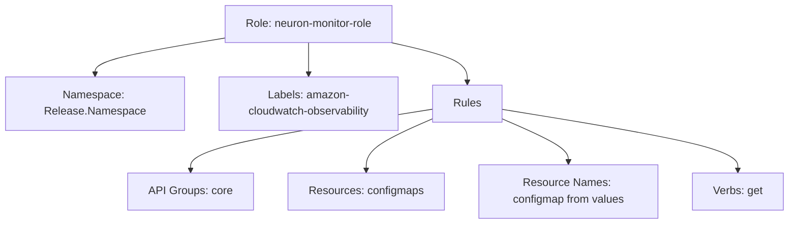
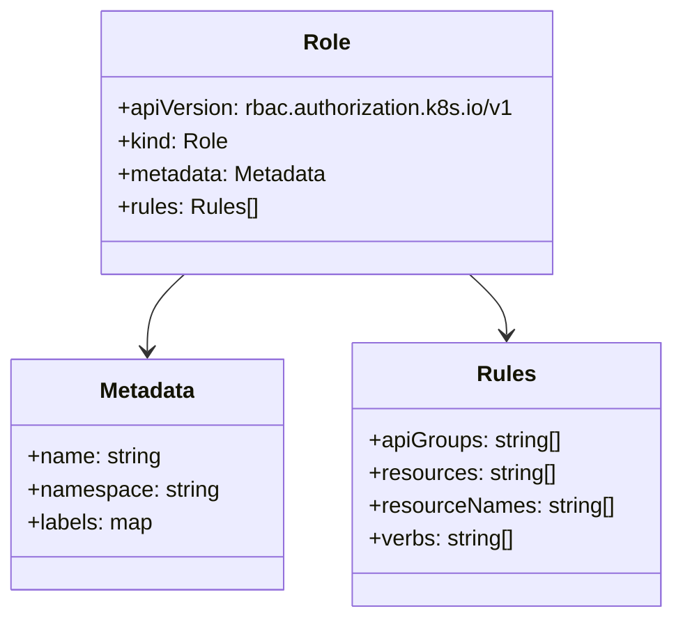

# Diagram: devops/k8s/amazon-cloudwatch-observability/helm/templates/linux/neuron-monitor-exporter-role.yaml

> Auto-generated by Obscura crawlers

## Diagram 1

### SVG

<svg id="container" width="1143.05078125" xmlns="http://www.w3.org/2000/svg" class="flowchart" height="326" viewBox="0 0 1143.05078125 326" role="graphics-document document" aria-roledescription="flowchart-v2"><g><marker id="container_flowchart-v2-pointEnd" class="marker flowchart-v2" viewBox="0 0 10 10" refX="5" refY="5" markerUnits="userSpaceOnUse" markerWidth="8" markerHeight="8" orient="auto"><path d="M 0 0 L 10 5 L 0 10 z" class="arrowMarkerPath" style="stroke-width: 1; stroke-dasharray: 1, 0;"></path></marker><marker id="container_flowchart-v2-pointStart" class="marker flowchart-v2" viewBox="0 0 10 10" refX="4.5" refY="5" markerUnits="userSpaceOnUse" markerWidth="8" markerHeight="8" orient="auto"><path d="M 0 5 L 10 10 L 10 0 z" class="arrowMarkerPath" style="stroke-width: 1; stroke-dasharray: 1, 0;"></path></marker><marker id="container_flowchart-v2-circleEnd" class="marker flowchart-v2" viewBox="0 0 10 10" refX="11" refY="5" markerUnits="userSpaceOnUse" markerWidth="11" markerHeight="11" orient="auto"><circle cx="5" cy="5" r="5" class="arrowMarkerPath" style="stroke-width: 1; stroke-dasharray: 1, 0;"></circle></marker><marker id="container_flowchart-v2-circleStart" class="marker flowchart-v2" viewBox="0 0 10 10" refX="-1" refY="5" markerUnits="userSpaceOnUse" markerWidth="11" markerHeight="11" orient="auto"><circle cx="5" cy="5" r="5" class="arrowMarkerPath" style="stroke-width: 1; stroke-dasharray: 1, 0;"></circle></marker><marker id="container_flowchart-v2-crossEnd" class="marker cross flowchart-v2" viewBox="0 0 11 11" refX="12" refY="5.2" markerUnits="userSpaceOnUse" markerWidth="11" markerHeight="11" orient="auto"><path d="M 1,1 l 9,9 M 10,1 l -9,9" class="arrowMarkerPath" style="stroke-width: 2; stroke-dasharray: 1, 0;"></path></marker><marker id="container_flowchart-v2-crossStart" class="marker cross flowchart-v2" viewBox="0 0 11 11" refX="-1" refY="5.2" markerUnits="userSpaceOnUse" markerWidth="11" markerHeight="11" orient="auto"><path d="M 1,1 l 9,9 M 10,1 l -9,9" class="arrowMarkerPath" style="stroke-width: 2; stroke-dasharray: 1, 0;"></path></marker><g class="root"><g class="clusters"></g><g class="edgePaths"><path d="M322.617,56.032L291.848,61.193C261.078,66.355,199.539,76.677,168.77,85.339C138,94,138,101,138,104.5L138,108" id="L_A_B_0" class="edge-thickness-normal edge-pattern-solid edge-thickness-normal edge-pattern-solid flowchart-link" style=";" data-edge="true" data-et="edge" data-id="L_A_B_0" data-points="W3sieCI6MzIyLjYxNzE4NzUsInkiOjU2LjAzMTk1NTY0NTE2MTI5fSx7IngiOjEzOCwieSI6ODd9LHsieCI6MTM4LCJ5IjoxMTJ9XQ==" marker-end="url(#container_flowchart-v2-pointEnd)"></path><path d="M448,62L448,66.167C448,70.333,448,78.667,448,86.333C448,94,448,101,448,104.5L448,108" id="L_A_C_0" class="edge-thickness-normal edge-pattern-solid edge-thickness-normal edge-pattern-solid flowchart-link" style=";" data-edge="true" data-et="edge" data-id="L_A_C_0" data-points="W3sieCI6NDQ4LCJ5Ijo2Mn0seyJ4Ijo0NDgsInkiOjg3fSx7IngiOjQ0OCwieSI6MTEyfV0=" marker-end="url(#container_flowchart-v2-pointEnd)"></path><path d="M567.37,62L585.792,66.167C604.213,70.333,641.056,78.667,659.477,88.333C677.898,98,677.898,109,677.898,114.5L677.898,120" id="L_A_D_0" class="edge-thickness-normal edge-pattern-solid edge-thickness-normal edge-pattern-solid flowchart-link" style=";" data-edge="true" data-et="edge" data-id="L_A_D_0" data-points="W3sieCI6NTY3LjM3MDM0MjU0ODA3NjksInkiOjYyfSx7IngiOjY3Ny44OTg0Mzc1LCJ5Ijo4N30seyJ4Ijo2NzcuODk4NDM3NSwieSI6MTI0fV0=" marker-end="url(#container_flowchart-v2-pointEnd)"></path><path d="M628,159.035L570.079,168.363C512.158,177.69,396.315,196.345,338.394,211.173C280.473,226,280.473,237,280.473,242.5L280.473,248" id="L_D_E_0" class="edge-thickness-normal edge-pattern-solid edge-thickness-normal edge-pattern-solid flowchart-link" style=";" data-edge="true" data-et="edge" data-id="L_D_E_0" data-points="W3sieCI6NjI4LCJ5IjoxNTkuMDM1NDYyNTk2MjAwMTV9LHsieCI6MjgwLjQ3MjY1NjI1LCJ5IjoyMTV9LHsieCI6MjgwLjQ3MjY1NjI1LCJ5IjoyNTJ9XQ==" marker-end="url(#container_flowchart-v2-pointEnd)"></path><path d="M628,172.853L611.96,179.877C595.921,186.902,563.841,200.951,547.801,213.475C531.762,226,531.762,237,531.762,242.5L531.762,248" id="L_D_F_0" class="edge-thickness-normal edge-pattern-solid edge-thickness-normal edge-pattern-solid flowchart-link" style=";" data-edge="true" data-et="edge" data-id="L_D_F_0" data-points="W3sieCI6NjI4LCJ5IjoxNzIuODUyODI0MDM1NzExNDJ9LHsieCI6NTMxLjc2MTcxODc1LCJ5IjoyMTV9LHsieCI6NTMxLjc2MTcxODc1LCJ5IjoyNTJ9XQ==" marker-end="url(#container_flowchart-v2-pointEnd)"></path><path d="M727.797,172.853L743.837,179.877C759.876,186.902,791.956,200.951,807.995,211.475C824.035,222,824.035,229,824.035,232.5L824.035,236" id="L_D_G_0" class="edge-thickness-normal edge-pattern-solid edge-thickness-normal edge-pattern-solid flowchart-link" style=";" data-edge="true" data-et="edge" data-id="L_D_G_0" data-points="W3sieCI6NzI3Ljc5Njg3NSwieSI6MTcyLjg1MjgyNDAzNTcxMTQyfSx7IngiOjgyNC4wMzUxNTYyNSwieSI6MjE1fSx7IngiOjgyNC4wMzUxNTYyNSwieSI6MjQwfV0=" marker-end="url(#container_flowchart-v2-pointEnd)"></path><path d="M727.797,159.154L784.755,168.462C841.712,177.769,955.628,196.385,1012.585,211.192C1069.543,226,1069.543,237,1069.543,242.5L1069.543,248" id="L_D_H_0" class="edge-thickness-normal edge-pattern-solid edge-thickness-normal edge-pattern-solid flowchart-link" style=";" data-edge="true" data-et="edge" data-id="L_D_H_0" data-points="W3sieCI6NzI3Ljc5Njg3NSwieSI6MTU5LjE1NDA3Nzg1Njc5Mzc4fSx7IngiOjEwNjkuNTQyOTY4NzUsInkiOjIxNX0seyJ4IjoxMDY5LjU0Mjk2ODc1LCJ5IjoyNTJ9XQ==" marker-end="url(#container_flowchart-v2-pointEnd)"></path></g><g class="edgeLabels"><g class="edgeLabel"><g class="label" data-id="L_A_B_0" transform="translate(0, 0)"><foreignObject width="0" height="0">

</foreignObject></g></g><g class="edgeLabel"><g class="label" data-id="L_A_C_0" transform="translate(0, 0)"><foreignObject width="0" height="0">

</foreignObject></g></g><g class="edgeLabel"><g class="label" data-id="L_A_D_0" transform="translate(0, 0)"><foreignObject width="0" height="0">

</foreignObject></g></g><g class="edgeLabel"><g class="label" data-id="L_D_E_0" transform="translate(0, 0)"><foreignObject width="0" height="0">

</foreignObject></g></g><g class="edgeLabel"><g class="label" data-id="L_D_F_0" transform="translate(0, 0)"><foreignObject width="0" height="0">

</foreignObject></g></g><g class="edgeLabel"><g class="label" data-id="L_D_G_0" transform="translate(0, 0)"><foreignObject width="0" height="0">

</foreignObject></g></g><g class="edgeLabel"><g class="label" data-id="L_D_H_0" transform="translate(0, 0)"><foreignObject width="0" height="0">

</foreignObject></g></g></g><g class="nodes"><g class="node default" id="flowchart-A-0" transform="translate(448, 35)"><rect class="basic label-container" style="" x="-125.3828125" y="-27" width="250.765625" height="54"></rect><g class="label" style="" transform="translate(-95.3828125, -12)"><rect></rect><foreignObject width="190.765625" height="24">

Role: neuron-monitor-role

</foreignObject></g></g><g class="node default" id="flowchart-B-1" transform="translate(138, 151)"><rect class="basic label-container" style="" x="-130" y="-39" width="260" height="78"></rect><g class="label" style="" transform="translate(-100, -24)"><rect></rect><foreignObject width="200" height="48">

Namespace: Release.Namespace

</foreignObject></g></g><g class="node default" id="flowchart-C-3" transform="translate(448, 151)"><rect class="basic label-container" style="" x="-130" y="-39" width="260" height="78"></rect><g class="label" style="" transform="translate(-100, -24)"><rect></rect><foreignObject width="200" height="48">

Labels: amazon-cloudwatch-observability

</foreignObject></g></g><g class="node default" id="flowchart-D-5" transform="translate(677.8984375, 151)"><rect class="basic label-container" style="" x="-49.8984375" y="-27" width="99.796875" height="54"></rect><g class="label" style="" transform="translate(-19.8984375, -12)"><rect></rect><foreignObject width="39.796875" height="24">

Rules

</foreignObject></g></g><g class="node default" id="flowchart-E-7" transform="translate(280.47265625, 279)"><rect class="basic label-container" style="" x="-89.015625" y="-27" width="178.03125" height="54"></rect><g class="label" style="" transform="translate(-59.015625, -12)"><rect></rect><foreignObject width="118.03125" height="24">

API Groups: core

</foreignObject></g></g><g class="node default" id="flowchart-F-9" transform="translate(531.76171875, 279)"><rect class="basic label-container" style="" x="-112.2734375" y="-27" width="224.546875" height="54"></rect><g class="label" style="" transform="translate(-82.2734375, -12)"><rect></rect><foreignObject width="164.546875" height="24">

Resources: configmaps

</foreignObject></g></g><g class="node default" id="flowchart-G-11" transform="translate(824.03515625, 279)"><rect class="basic label-container" style="" x="-130" y="-39" width="260" height="78"></rect><g class="label" style="" transform="translate(-100, -24)"><rect></rect><foreignObject width="200" height="48">

Resource Names: configmap from values

</foreignObject></g></g><g class="node default" id="flowchart-H-13" transform="translate(1069.54296875, 279)"><rect class="basic label-container" style="" x="-65.5078125" y="-27" width="131.015625" height="54"></rect><g class="label" style="" transform="translate(-35.5078125, -12)"><rect></rect><foreignObject width="71.015625" height="24">

Verbs: get

</foreignObject></g></g></g></g></g></svg>

## Diagram 2

### SVG

<svg id="container" width="488.3828125" xmlns="http://www.w3.org/2000/svg" class="classDiagram" height="450" viewBox="0 0 488.3828125 450" role="graphics-document document" aria-roledescription="class"><g><defs><marker id="container_class-aggregationStart" class="marker aggregation class" refX="18" refY="7" markerWidth="190" markerHeight="240" orient="auto"><path d="M 18,7 L9,13 L1,7 L9,1 Z"></path></marker></defs><defs><marker id="container_class-aggregationEnd" class="marker aggregation class" refX="1" refY="7" markerWidth="20" markerHeight="28" orient="auto"><path d="M 18,7 L9,13 L1,7 L9,1 Z"></path></marker></defs><defs><marker id="container_class-extensionStart" class="marker extension class" refX="18" refY="7" markerWidth="190" markerHeight="240" orient="auto"><path d="M 1,7 L18,13 V 1 Z"></path></marker></defs><defs><marker id="container_class-extensionEnd" class="marker extension class" refX="1" refY="7" markerWidth="20" markerHeight="28" orient="auto"><path d="M 1,1 V 13 L18,7 Z"></path></marker></defs><defs><marker id="container_class-compositionStart" class="marker composition class" refX="18" refY="7" markerWidth="190" markerHeight="240" orient="auto"><path d="M 18,7 L9,13 L1,7 L9,1 Z"></path></marker></defs><defs><marker id="container_class-compositionEnd" class="marker composition class" refX="1" refY="7" markerWidth="20" markerHeight="28" orient="auto"><path d="M 18,7 L9,13 L1,7 L9,1 Z"></path></marker></defs><defs><marker id="container_class-dependencyStart" class="marker dependency class" refX="6" refY="7" markerWidth="190" markerHeight="240" orient="auto"><path d="M 5,7 L9,13 L1,7 L9,1 Z"></path></marker></defs><defs><marker id="container_class-dependencyEnd" class="marker dependency class" refX="13" refY="7" markerWidth="20" markerHeight="28" orient="auto"><path d="M 18,7 L9,13 L14,7 L9,1 Z"></path></marker></defs><defs><marker id="container_class-lollipopStart" class="marker lollipop class" refX="13" refY="7" markerWidth="190" markerHeight="240" orient="auto"><circle stroke="black" fill="transparent" cx="7" cy="7" r="6"></circle></marker></defs><defs><marker id="container_class-lollipopEnd" class="marker lollipop class" refX="1" refY="7" markerWidth="190" markerHeight="240" orient="auto"><circle stroke="black" fill="transparent" cx="7" cy="7" r="6"></circle></marker></defs><g class="root"><g class="clusters"></g><g class="edgePaths"><path d="M134.194,200L129.696,204.167C125.199,208.333,116.205,216.667,111.708,226C107.211,235.333,107.211,245.667,107.211,250.833L107.211,256" id="id_Role_Metadata_1" class="edge-thickness-normal edge-pattern-solid relation" style=";;;" data-edge="true" data-et="edge" data-id="id_Role_Metadata_1" data-points="W3sieCI6MTM0LjE5MzUyMDc5MDI4OTI2LCJ5IjoyMDB9LHsieCI6MTA3LjIxMDkzNzUsInkiOjIyNX0seyJ4IjoxMDcuMjEwOTM3NSwieSI6MjYyfV0=" marker-end="url(#container_class-dependencyEnd)"></path><path d="M341.42,200L345.917,204.167C350.414,208.333,359.408,216.667,363.905,224C368.402,231.333,368.402,237.667,368.402,240.833L368.402,244" id="id_Role_Rules_2" class="edge-thickness-normal edge-pattern-solid relation" style=";;;" data-edge="true" data-et="edge" data-id="id_Role_Rules_2" data-points="W3sieCI6MzQxLjQxOTc2MDQ1OTcxMDc0LCJ5IjoyMDB9LHsieCI6MzY4LjQwMjM0Mzc1LCJ5IjoyMjV9LHsieCI6MzY4LjQwMjM0Mzc1LCJ5IjoyNTB9XQ==" marker-end="url(#container_class-dependencyEnd)"></path></g><g class="edgeLabels"><g class="edgeLabel"><g class="label" data-id="id_Role_Metadata_1" transform="translate(0, 0)"><foreignObject width="0" height="0">

</foreignObject></g></g><g class="edgeLabel"><g class="label" data-id="id_Role_Rules_2" transform="translate(0, 0)"><foreignObject width="0" height="0">

</foreignObject></g></g></g><g class="nodes"><g class="node default" id="classId-Role-0" transform="translate(237.806640625, 104)"><g class="basic label-container"><path d="M-167.50390625 -96 L167.50390625 -96 L167.50390625 96 L-167.50390625 96" stroke="none" stroke-width="0" fill="#ECECFF" style=""></path><path d="M-167.50390625 -96 C-90.4175423488707 -96, -13.331178447741394 -96, 167.50390625 -96 M-167.50390625 -96 C-89.52776677469986 -96, -11.551627299399712 -96, 167.50390625 -96 M167.50390625 -96 C167.50390625 -33.95207158400562, 167.50390625 28.095856831988755, 167.50390625 96 M167.50390625 -96 C167.50390625 -27.58053087054367, 167.50390625 40.83893825891266, 167.50390625 96 M167.50390625 96 C65.84569411996593 96, -35.812518010068146 96, -167.50390625 96 M167.50390625 96 C93.34018051438285 96, 19.176454778765702 96, -167.50390625 96 M-167.50390625 96 C-167.50390625 55.66846186321889, -167.50390625 15.336923726437774, -167.50390625 -96 M-167.50390625 96 C-167.50390625 45.514433967683686, -167.50390625 -4.971132064632627, -167.50390625 -96" stroke="#9370DB" stroke-width="1.3" fill="none" stroke-dasharray="0 0" style=""></path></g><g class="annotation-group text" transform="translate(0, -72)"></g><g class="label-group text" transform="translate(-16.2421875, -72)"><g class="label" style="font-weight: bolder" transform="translate(0,-12)"><foreignObject width="32.484375" height="24">

Role

</foreignObject></g></g><g class="members-group text" transform="translate(-155.50390625, -24)"><g class="label" style="" transform="translate(0,-12)"><foreignObject width="294.765625" height="24">

+apiVersion: rbac.authorization.k8s.io/v1

</foreignObject></g><g class="label" style="" transform="translate(0,12)"><foreignObject width="79.828125" height="24">

+kind: Role

</foreignObject></g><g class="label" style="" transform="translate(0,36)"><foreignObject width="153.6875" height="24">

+metadata: Metadata

</foreignObject></g><g class="label" style="" transform="translate(0,60)"><foreignObject width="102.453125" height="24">

+rules: Rules[]

</foreignObject></g></g><g class="methods-group text" transform="translate(-155.50390625, 96)"></g><g class="divider" style=""><path d="M-167.50390625 -48 C-80.98048776629349 -48, 5.5429307174130145 -48, 167.50390625 -48 M-167.50390625 -48 C-75.74555241285925 -48, 16.01280142428149 -48, 167.50390625 -48" stroke="#9370DB" stroke-width="1.3" fill="none" stroke-dasharray="0 0" style=""></path></g><g class="divider" style=""><path d="M-167.50390625 72 C-99.37199993196124 72, -31.240093613922483 72, 167.50390625 72 M-167.50390625 72 C-99.26622788638032 72, -31.028549522760642 72, 167.50390625 72" stroke="#9370DB" stroke-width="1.3" fill="none" stroke-dasharray="0 0" style=""></path></g></g><g class="node default" id="classId-Metadata-1" transform="translate(107.2109375, 346)"><g class="basic label-container"><path d="M-99.2109375 -84 L99.2109375 -84 L99.2109375 84 L-99.2109375 84" stroke="none" stroke-width="0" fill="#ECECFF" style=""></path><path d="M-99.2109375 -84 C-20.2266147301262 -84, 58.7577080397476 -84, 99.2109375 -84 M-99.2109375 -84 C-44.2954167673147 -84, 10.620103965370603 -84, 99.2109375 -84 M99.2109375 -84 C99.2109375 -35.84001256814434, 99.2109375 12.319974863711323, 99.2109375 84 M99.2109375 -84 C99.2109375 -43.966739823900284, 99.2109375 -3.933479647800567, 99.2109375 84 M99.2109375 84 C59.50208097342906 84, 19.79322444685812 84, -99.2109375 84 M99.2109375 84 C23.284104123904157 84, -52.642729252191685 84, -99.2109375 84 M-99.2109375 84 C-99.2109375 28.606146716170088, -99.2109375 -26.787706567659825, -99.2109375 -84 M-99.2109375 84 C-99.2109375 37.754635649995215, -99.2109375 -8.49072870000957, -99.2109375 -84" stroke="#9370DB" stroke-width="1.3" fill="none" stroke-dasharray="0 0" style=""></path></g><g class="annotation-group text" transform="translate(0, -60)"></g><g class="label-group text" transform="translate(-34.640625, -60)"><g class="label" style="font-weight: bolder" transform="translate(0,-12)"><foreignObject width="69.28125" height="24">

Metadata

</foreignObject></g></g><g class="members-group text" transform="translate(-87.2109375, -12)"><g class="label" style="" transform="translate(0,-12)"><foreignObject width="98.21875" height="24">

+name: string

</foreignObject></g><g class="label" style="" transform="translate(0,12)"><foreignObject width="139.78125" height="24">

+namespace: string

</foreignObject></g><g class="label" style="" transform="translate(0,36)"><foreignObject width="91.6875" height="24">

+labels: map

</foreignObject></g></g><g class="methods-group text" transform="translate(-87.2109375, 84)"></g><g class="divider" style=""><path d="M-99.2109375 -36 C-47.59751611491901 -36, 4.01590527016198 -36, 99.2109375 -36 M-99.2109375 -36 C-57.110170807488856 -36, -15.009404114977713 -36, 99.2109375 -36" stroke="#9370DB" stroke-width="1.3" fill="none" stroke-dasharray="0 0" style=""></path></g><g class="divider" style=""><path d="M-99.2109375 60 C-55.025861931914385 60, -10.84078636382877 60, 99.2109375 60 M-99.2109375 60 C-27.597380898261065 60, 44.01617570347787 60, 99.2109375 60" stroke="#9370DB" stroke-width="1.3" fill="none" stroke-dasharray="0 0" style=""></path></g></g><g class="node default" id="classId-Rules-2" transform="translate(368.40234375, 346)"><g class="basic label-container"><path d="M-111.98046875 -96 L111.98046875 -96 L111.98046875 96 L-111.98046875 96" stroke="none" stroke-width="0" fill="#ECECFF" style=""></path><path d="M-111.98046875 -96 C-59.729766408260126 -96, -7.479064066520252 -96, 111.98046875 -96 M-111.98046875 -96 C-53.87458495928047 -96, 4.231298831439062 -96, 111.98046875 -96 M111.98046875 -96 C111.98046875 -32.9658053718113, 111.98046875 30.0683892563774, 111.98046875 96 M111.98046875 -96 C111.98046875 -45.00170805368164, 111.98046875 5.996583892636721, 111.98046875 96 M111.98046875 96 C63.858788327640035 96, 15.73710790528007 96, -111.98046875 96 M111.98046875 96 C44.98686031995318 96, -22.00674811009364 96, -111.98046875 96 M-111.98046875 96 C-111.98046875 23.010893081006785, -111.98046875 -49.97821383798643, -111.98046875 -96 M-111.98046875 96 C-111.98046875 48.53434098229273, -111.98046875 1.0686819645854655, -111.98046875 -96" stroke="#9370DB" stroke-width="1.3" fill="none" stroke-dasharray="0 0" style=""></path></g><g class="annotation-group text" transform="translate(0, -72)"></g><g class="label-group text" transform="translate(-20.1328125, -72)"><g class="label" style="font-weight: bolder" transform="translate(0,-12)"><foreignObject width="40.265625" height="24">

Rules

</foreignObject></g></g><g class="members-group text" transform="translate(-99.98046875, -24)"><g class="label" style="" transform="translate(0,-12)"><foreignObject width="141.90625" height="24">

+apiGroups: string[]

</foreignObject></g><g class="label" style="" transform="translate(0,12)"><foreignObject width="137.765625" height="24">

+resources: string[]

</foreignObject></g><g class="label" style="" transform="translate(0,36)"><foreignObject width="179.828125" height="24">

+resourceNames: string[]

</foreignObject></g><g class="label" style="" transform="translate(0,60)"><foreignObject width="107.53125" height="24">

+verbs: string[]

</foreignObject></g></g><g class="methods-group text" transform="translate(-99.98046875, 96)"></g><g class="divider" style=""><path d="M-111.98046875 -48 C-46.1147181481776 -48, 19.751032453644797 -48, 111.98046875 -48 M-111.98046875 -48 C-65.810393483024 -48, -19.640318216048016 -48, 111.98046875 -48" stroke="#9370DB" stroke-width="1.3" fill="none" stroke-dasharray="0 0" style=""></path></g><g class="divider" style=""><path d="M-111.98046875 72 C-36.92094429216753 72, 38.13858016566493 72, 111.98046875 72 M-111.98046875 72 C-58.511580203090105 72, -5.04269165618021 72, 111.98046875 72" stroke="#9370DB" stroke-width="1.3" fill="none" stroke-dasharray="0 0" style=""></path></g></g></g></g></g></svg>
