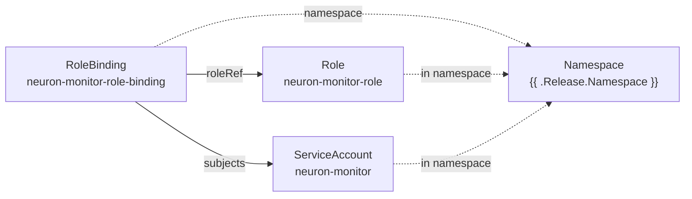
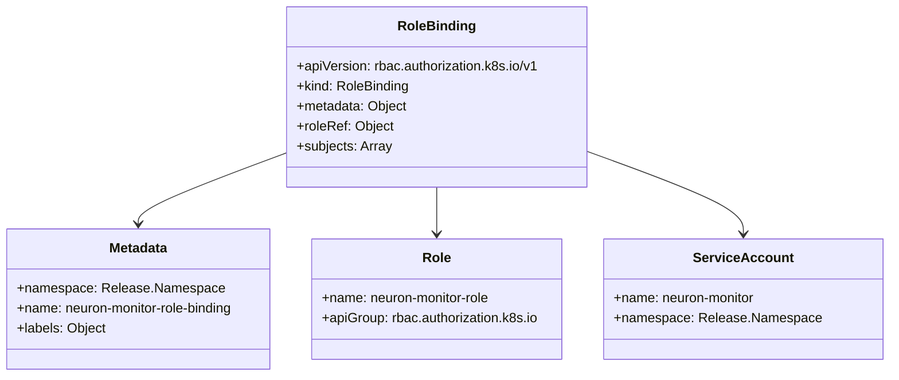
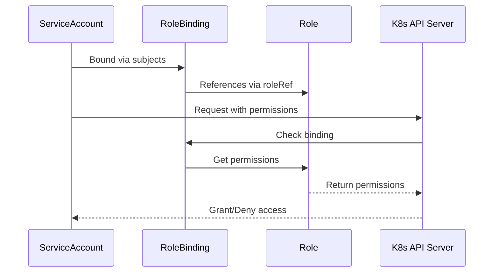

# Diagram: devops/k8s/amazon-cloudwatch-observability/helm/templates/linux/neuron-monitor-exporter-rolebinding.yaml

> Auto-generated by Obscura crawlers

## Diagram 1

### SVG

<svg id="container" width="983.484375" xmlns="http://www.w3.org/2000/svg" class="flowchart" height="281" viewBox="0 0 983.484375 281" role="graphics-document document" aria-roledescription="flowchart-v2"><g><marker id="container_flowchart-v2-pointEnd" class="marker flowchart-v2" viewBox="0 0 10 10" refX="5" refY="5" markerUnits="userSpaceOnUse" markerWidth="8" markerHeight="8" orient="auto"><path d="M 0 0 L 10 5 L 0 10 z" class="arrowMarkerPath" style="stroke-width: 1; stroke-dasharray: 1, 0;"></path></marker><marker id="container_flowchart-v2-pointStart" class="marker flowchart-v2" viewBox="0 0 10 10" refX="4.5" refY="5" markerUnits="userSpaceOnUse" markerWidth="8" markerHeight="8" orient="auto"><path d="M 0 5 L 10 10 L 10 0 z" class="arrowMarkerPath" style="stroke-width: 1; stroke-dasharray: 1, 0;"></path></marker><marker id="container_flowchart-v2-circleEnd" class="marker flowchart-v2" viewBox="0 0 10 10" refX="11" refY="5" markerUnits="userSpaceOnUse" markerWidth="11" markerHeight="11" orient="auto"><circle cx="5" cy="5" r="5" class="arrowMarkerPath" style="stroke-width: 1; stroke-dasharray: 1, 0;"></circle></marker><marker id="container_flowchart-v2-circleStart" class="marker flowchart-v2" viewBox="0 0 10 10" refX="-1" refY="5" markerUnits="userSpaceOnUse" markerWidth="11" markerHeight="11" orient="auto"><circle cx="5" cy="5" r="5" class="arrowMarkerPath" style="stroke-width: 1; stroke-dasharray: 1, 0;"></circle></marker><marker id="container_flowchart-v2-crossEnd" class="marker cross flowchart-v2" viewBox="0 0 11 11" refX="12" refY="5.2" markerUnits="userSpaceOnUse" markerWidth="11" markerHeight="11" orient="auto"><path d="M 1,1 l 9,9 M 10,1 l -9,9" class="arrowMarkerPath" style="stroke-width: 2; stroke-dasharray: 1, 0;"></path></marker><marker id="container_flowchart-v2-crossStart" class="marker cross flowchart-v2" viewBox="0 0 11 11" refX="-1" refY="5.2" markerUnits="userSpaceOnUse" markerWidth="11" markerHeight="11" orient="auto"><path d="M 1,1 l 9,9 M 10,1 l -9,9" class="arrowMarkerPath" style="stroke-width: 2; stroke-dasharray: 1, 0;"></path></marker><g class="root"><g class="clusters"></g><g class="edgePaths"><path d="M268,106L277.199,106C286.398,106,304.797,106,322.529,106C340.26,106,357.326,106,365.858,106L374.391,106" id="L_RoleBinding_Role_0" class="edge-thickness-normal edge-pattern-solid edge-thickness-normal edge-pattern-solid flowchart-link" style=";" data-edge="true" data-et="edge" data-id="L_RoleBinding_Role_0" data-points="W3sieCI6MjY4LCJ5IjoxMDZ9LHsieCI6MzIzLjE5NTMxMjUsInkiOjEwNn0seyJ4IjozNzguMzkwNjI1LCJ5IjoxMDZ9XQ==" marker-end="url(#container_flowchart-v2-pointEnd)"></path><path d="M211.789,157L230.357,169.833C248.924,182.667,286.06,208.333,316.017,221.167C345.974,234,368.753,234,380.142,234L391.531,234" id="L_RoleBinding_ServiceAccount_0" class="edge-thickness-normal edge-pattern-solid edge-thickness-normal edge-pattern-solid flowchart-link" style=";" data-edge="true" data-et="edge" data-id="L_RoleBinding_ServiceAccount_0" data-points="W3sieCI6MjExLjc4ODc1NzMyNDIxODc1LCJ5IjoxNTd9LHsieCI6MzIzLjE5NTMxMjUsInkiOjIzNH0seyJ4IjozOTUuNTMxMjUsInkiOjIzNH1d" marker-end="url(#container_flowchart-v2-pointEnd)"></path><path d="M247.825,55L260.387,49.167C272.949,43.333,298.072,31.667,337.38,25.833C376.688,20,430.18,20,486.991,20C543.802,20,603.932,20,650.992,27.562C698.052,35.125,732.041,50.249,749.035,57.812L766.03,65.374" id="L_RoleBinding_Namespace_0" class="edge-thickness-normal edge-pattern-dotted edge-thickness-normal edge-pattern-solid flowchart-link" style=";" data-edge="true" data-et="edge" data-id="L_RoleBinding_Namespace_0" data-points="W3sieCI6MjQ3LjgyNTEyNzE4MDIzMjU2LCJ5Ijo1NX0seyJ4IjozMjMuMTk1MzEyNSwieSI6MjB9LHsieCI6NDgzLjY3MTg3NSwieSI6MjB9LHsieCI6NjY0LjA2MjUsInkiOjIwfSx7IngiOjc2OS42ODQ0MTEzMzcyMDkzLCJ5Ijo2N31d" marker-end="url(#container_flowchart-v2-pointEnd)"></path><path d="M588.953,106L601.471,106C613.99,106,639.026,106,663.396,106C687.766,106,711.469,106,723.32,106L735.172,106" id="L_Role_Namespace_0" class="edge-thickness-normal edge-pattern-dotted edge-thickness-normal edge-pattern-solid flowchart-link" style=";" data-edge="true" data-et="edge" data-id="L_Role_Namespace_0" data-points="W3sieCI6NTg4Ljk1MzEyNSwieSI6MTA2fSx7IngiOjY2NC4wNjI1LCJ5IjoxMDZ9LHsieCI6NzM5LjE3MTg3NSwieSI6MTA2fV0=" marker-end="url(#container_flowchart-v2-pointEnd)"></path><path d="M571.813,234L587.188,234C602.563,234,633.313,234,670.528,219.535C707.744,205.07,751.426,176.139,773.267,161.674L795.108,147.209" id="L_ServiceAccount_Namespace_0" class="edge-thickness-normal edge-pattern-dotted edge-thickness-normal edge-pattern-solid flowchart-link" style=";" data-edge="true" data-et="edge" data-id="L_ServiceAccount_Namespace_0" data-points="W3sieCI6NTcxLjgxMjUsInkiOjIzNH0seyJ4Ijo2NjQuMDYyNSwieSI6MjM0fSx7IngiOjc5OC40NDI1MDQ4ODI4MTI1LCJ5IjoxNDV9XQ==" marker-end="url(#container_flowchart-v2-pointEnd)"></path></g><g class="edgeLabels"><g class="edgeLabel" transform="translate(323.1953125, 106)"><g class="label" data-id="L_RoleBinding_Role_0" transform="translate(-25.9453125, -12)"><foreignObject width="51.890625" height="24">

roleRef

</foreignObject></g></g><g class="edgeLabel" transform="translate(323.1953125, 234)"><g class="label" data-id="L_RoleBinding_ServiceAccount_0" transform="translate(-30.1953125, -12)"><foreignObject width="60.390625" height="24">

subjects

</foreignObject></g></g><g class="edgeLabel" transform="translate(483.671875, 20)"><g class="label" data-id="L_RoleBinding_Namespace_0" transform="translate(-41.046875, -12)"><foreignObject width="82.09375" height="24">

namespace

</foreignObject></g></g><g class="edgeLabel" transform="translate(664.0625, 106)"><g class="label" data-id="L_Role_Namespace_0" transform="translate(-50.109375, -12)"><foreignObject width="100.21875" height="24">

in namespace

</foreignObject></g></g><g class="edgeLabel" transform="translate(664.0625, 234)"><g class="label" data-id="L_ServiceAccount_Namespace_0" transform="translate(-50.109375, -12)"><foreignObject width="100.21875" height="24">

in namespace

</foreignObject></g></g></g><g class="nodes"><g class="node default" id="flowchart-RoleBinding-0" transform="translate(138, 106)"><rect class="basic label-container" style="" x="-130" y="-51" width="260" height="102"></rect><g class="label" style="" transform="translate(-100, -36)"><rect></rect><foreignObject width="200" height="72">

RoleBinding neuron-monitor-role-binding

</foreignObject></g></g><g class="node default" id="flowchart-Role-1" transform="translate(483.671875, 106)"><rect class="basic label-container" style="" x="-105.28125" y="-39" width="210.5625" height="78"></rect><g class="label" style="" transform="translate(-75.28125, -24)"><rect></rect><foreignObject width="150.5625" height="48">

Role neuron-monitor-role

</foreignObject></g></g><g class="node default" id="flowchart-ServiceAccount-2" transform="translate(483.671875, 234)"><rect class="basic label-container" style="" x="-88.140625" y="-39" width="176.28125" height="78"></rect><g class="label" style="" transform="translate(-58.140625, -24)"><rect></rect><foreignObject width="116.28125" height="48">

ServiceAccount neuron-monitor

</foreignObject></g></g><g class="node default" id="flowchart-Namespace-3" transform="translate(857.328125, 106)"><rect class="basic label-container" style="" x="-118.15625" y="-39" width="236.3125" height="78"></rect><g class="label" style="" transform="translate(-88.15625, -24)"><rect></rect><foreignObject width="176.3125" height="48">

Namespace {{ .Release.Namespace }}

</foreignObject></g></g></g></g></g></svg>

## Diagram 2

### SVG

<svg id="container" width="1066.9140625" xmlns="http://www.w3.org/2000/svg" class="classDiagram" height="450" viewBox="0 0 1066.9140625 450" role="graphics-document document" aria-roledescription="class"><g><defs><marker id="container_class-aggregationStart" class="marker aggregation class" refX="18" refY="7" markerWidth="190" markerHeight="240" orient="auto"><path d="M 18,7 L9,13 L1,7 L9,1 Z"></path></marker></defs><defs><marker id="container_class-aggregationEnd" class="marker aggregation class" refX="1" refY="7" markerWidth="20" markerHeight="28" orient="auto"><path d="M 18,7 L9,13 L1,7 L9,1 Z"></path></marker></defs><defs><marker id="container_class-extensionStart" class="marker extension class" refX="18" refY="7" markerWidth="190" markerHeight="240" orient="auto"><path d="M 1,7 L18,13 V 1 Z"></path></marker></defs><defs><marker id="container_class-extensionEnd" class="marker extension class" refX="1" refY="7" markerWidth="20" markerHeight="28" orient="auto"><path d="M 1,1 V 13 L18,7 Z"></path></marker></defs><defs><marker id="container_class-compositionStart" class="marker composition class" refX="18" refY="7" markerWidth="190" markerHeight="240" orient="auto"><path d="M 18,7 L9,13 L1,7 L9,1 Z"></path></marker></defs><defs><marker id="container_class-compositionEnd" class="marker composition class" refX="1" refY="7" markerWidth="20" markerHeight="28" orient="auto"><path d="M 18,7 L9,13 L1,7 L9,1 Z"></path></marker></defs><defs><marker id="container_class-dependencyStart" class="marker dependency class" refX="6" refY="7" markerWidth="190" markerHeight="240" orient="auto"><path d="M 5,7 L9,13 L1,7 L9,1 Z"></path></marker></defs><defs><marker id="container_class-dependencyEnd" class="marker dependency class" refX="13" refY="7" markerWidth="20" markerHeight="28" orient="auto"><path d="M 18,7 L9,13 L14,7 L9,1 Z"></path></marker></defs><defs><marker id="container_class-lollipopStart" class="marker lollipop class" refX="13" refY="7" markerWidth="190" markerHeight="240" orient="auto"><circle stroke="black" fill="transparent" cx="7" cy="7" r="6"></circle></marker></defs><defs><marker id="container_class-lollipopEnd" class="marker lollipop class" refX="1" refY="7" markerWidth="190" markerHeight="240" orient="auto"><circle stroke="black" fill="transparent" cx="7" cy="7" r="6"></circle></marker></defs><g class="root"><g class="clusters"></g><g class="edgePaths"><path d="M355.109,182.143L324.542,193.286C293.974,204.429,232.839,226.714,202.271,241.024C171.703,255.333,171.703,261.667,171.703,264.833L171.703,268" id="id_RoleBinding_Metadata_1" class="edge-thickness-normal edge-pattern-solid relation" style=";;;" data-edge="true" data-et="edge" data-id="id_RoleBinding_Metadata_1" data-points="W3sieCI6MzU1LjEwOTM3NSwieSI6MTgyLjE0MzMwMzc0ODI3MzZ9LHsieCI6MTcxLjcwMzEyNSwieSI6MjQ5fSx7IngiOjE3MS43MDMxMjUsInkiOjI3NH1d" marker-end="url(#container_class-dependencyEnd)"></path><path d="M536.559,224L536.559,228.167C536.559,232.333,536.559,240.667,536.559,250C536.559,259.333,536.559,269.667,536.559,274.833L536.559,280" id="id_RoleBinding_Role_2" class="edge-thickness-normal edge-pattern-solid relation" style=";;;" data-edge="true" data-et="edge" data-id="id_RoleBinding_Role_2" data-points="W3sieCI6NTM2LjU1ODU5Mzc1LCJ5IjoyMjR9LHsieCI6NTM2LjU1ODU5Mzc1LCJ5IjoyNDl9LHsieCI6NTM2LjU1ODU5Mzc1LCJ5IjoyODZ9XQ==" marker-end="url(#container_class-dependencyEnd)"></path><path d="M718.008,182.71L748.059,193.759C778.109,204.807,838.211,226.903,868.262,243.118C898.313,259.333,898.313,269.667,898.313,274.833L898.313,280" id="id_RoleBinding_ServiceAccount_3" class="edge-thickness-normal edge-pattern-solid relation" style=";;;" data-edge="true" data-et="edge" data-id="id_RoleBinding_ServiceAccount_3" data-points="W3sieCI6NzE4LjAwNzgxMjUsInkiOjE4Mi43MTAzOTUzMTc5NDk2Nn0seyJ4Ijo4OTguMzEyNSwieSI6MjQ5fSx7IngiOjg5OC4zMTI1LCJ5IjoyODZ9XQ==" marker-end="url(#container_class-dependencyEnd)"></path></g><g class="edgeLabels"><g class="edgeLabel"><g class="label" data-id="id_RoleBinding_Metadata_1" transform="translate(0, 0)"><foreignObject width="0" height="0">

</foreignObject></g></g><g class="edgeLabel"><g class="label" data-id="id_RoleBinding_Role_2" transform="translate(0, 0)"><foreignObject width="0" height="0">

</foreignObject></g></g><g class="edgeLabel"><g class="label" data-id="id_RoleBinding_ServiceAccount_3" transform="translate(0, 0)"><foreignObject width="0" height="0">

</foreignObject></g></g></g><g class="nodes"><g class="node default" id="classId-RoleBinding-0" transform="translate(536.55859375, 116)"><g class="basic label-container"><path d="M-181.44921875 -108 L181.44921875 -108 L181.44921875 108 L-181.44921875 108" stroke="none" stroke-width="0" fill="#ECECFF" style=""></path><path d="M-181.44921875 -108 C-79.14914971682964 -108, 23.15091931634072 -108, 181.44921875 -108 M-181.44921875 -108 C-102.5641455024177 -108, -23.679072254835404 -108, 181.44921875 -108 M181.44921875 -108 C181.44921875 -44.40790959211774, 181.44921875 19.18418081576452, 181.44921875 108 M181.44921875 -108 C181.44921875 -27.326769496552117, 181.44921875 53.346461006895765, 181.44921875 108 M181.44921875 108 C100.52474263451492 108, 19.600266519029844 108, -181.44921875 108 M181.44921875 108 C66.78457638956347 108, -47.88006597087306 108, -181.44921875 108 M-181.44921875 108 C-181.44921875 36.845860241065935, -181.44921875 -34.30827951786813, -181.44921875 -108 M-181.44921875 108 C-181.44921875 50.72102528688681, -181.44921875 -6.557949426226386, -181.44921875 -108" stroke="#9370DB" stroke-width="1.3" fill="none" stroke-dasharray="0 0" style=""></path></g><g class="annotation-group text" transform="translate(0, -84)"></g><g class="label-group text" transform="translate(-44.1328125, -84)"><g class="label" style="font-weight: bolder" transform="translate(0,-12)"><foreignObject width="88.265625" height="24">

RoleBinding

</foreignObject></g></g><g class="members-group text" transform="translate(-169.44921875, -36)"><g class="label" style="" transform="translate(0,-12)"><foreignObject width="294.765625" height="24">

+apiVersion: rbac.authorization.k8s.io/v1

</foreignObject></g><g class="label" style="" transform="translate(0,12)"><foreignObject width="135.21875" height="24">

+kind: RoleBinding

</foreignObject></g><g class="label" style="" transform="translate(0,36)"><foreignObject width="132.71875" height="24">

+metadata: Object

</foreignObject></g><g class="label" style="" transform="translate(0,60)"><foreignObject width="115.25" height="24">

+roleRef: Object

</foreignObject></g><g class="label" style="" transform="translate(0,84)"><foreignObject width="113.75" height="24">

+subjects: Array

</foreignObject></g></g><g class="methods-group text" transform="translate(-169.44921875, 108)"></g><g class="divider" style=""><path d="M-181.44921875 -60 C-60.53123618126844 -60, 60.38674638746312 -60, 181.44921875 -60 M-181.44921875 -60 C-43.730680802726255 -60, 93.98785714454749 -60, 181.44921875 -60" stroke="#9370DB" stroke-width="1.3" fill="none" stroke-dasharray="0 0" style=""></path></g><g class="divider" style=""><path d="M-181.44921875 84 C-67.8820190339101 84, 45.685180682179805 84, 181.44921875 84 M-181.44921875 84 C-80.393832566285 84, 20.661553617430002 84, 181.44921875 84" stroke="#9370DB" stroke-width="1.3" fill="none" stroke-dasharray="0 0" style=""></path></g></g><g class="node default" id="classId-Role-1" transform="translate(536.55859375, 358)"><g class="basic label-container"><path d="M-151.15234375 -72 L151.15234375 -72 L151.15234375 72 L-151.15234375 72" stroke="none" stroke-width="0" fill="#ECECFF" style=""></path><path d="M-151.15234375 -72 C-89.92806038239065 -72, -28.70377701478131 -72, 151.15234375 -72 M-151.15234375 -72 C-64.03818623031442 -72, 23.075971289371154 -72, 151.15234375 -72 M151.15234375 -72 C151.15234375 -40.696595983680595, 151.15234375 -9.39319196736119, 151.15234375 72 M151.15234375 -72 C151.15234375 -15.693028832022925, 151.15234375 40.61394233595415, 151.15234375 72 M151.15234375 72 C62.58350034526846 72, -25.985343059463077 72, -151.15234375 72 M151.15234375 72 C40.11090633055285 72, -70.9305310888943 72, -151.15234375 72 M-151.15234375 72 C-151.15234375 31.84032896145068, -151.15234375 -8.31934207709864, -151.15234375 -72 M-151.15234375 72 C-151.15234375 28.58000893729053, -151.15234375 -14.839982125418942, -151.15234375 -72" stroke="#9370DB" stroke-width="1.3" fill="none" stroke-dasharray="0 0" style=""></path></g><g class="annotation-group text" transform="translate(0, -48)"></g><g class="label-group text" transform="translate(-16.2421875, -48)"><g class="label" style="font-weight: bolder" transform="translate(0,-12)"><foreignObject width="32.484375" height="24">

Role

</foreignObject></g></g><g class="members-group text" transform="translate(-139.15234375, 0)"><g class="label" style="" transform="translate(0,-12)"><foreignObject width="207.140625" height="24">

+name: neuron-monitor-role

</foreignObject></g><g class="label" style="" transform="translate(0,12)"><foreignObject width="262.0625" height="24">

+apiGroup: rbac.authorization.k8s.io

</foreignObject></g></g><g class="methods-group text" transform="translate(-139.15234375, 72)"></g><g class="divider" style=""><path d="M-151.15234375 -24 C-73.41002230693364 -24, 4.332299136132718 -24, 151.15234375 -24 M-151.15234375 -24 C-40.89083250595782 -24, 69.37067873808437 -24, 151.15234375 -24" stroke="#9370DB" stroke-width="1.3" fill="none" stroke-dasharray="0 0" style=""></path></g><g class="divider" style=""><path d="M-151.15234375 48 C-49.96702591995465 48, 51.2182919100907 48, 151.15234375 48 M-151.15234375 48 C-61.54087515719348 48, 28.070593435613034 48, 151.15234375 48" stroke="#9370DB" stroke-width="1.3" fill="none" stroke-dasharray="0 0" style=""></path></g></g><g class="node default" id="classId-ServiceAccount-2" transform="translate(898.3125, 358)"><g class="basic label-container"><path d="M-160.6015625 -72 L160.6015625 -72 L160.6015625 72 L-160.6015625 72" stroke="none" stroke-width="0" fill="#ECECFF" style=""></path><path d="M-160.6015625 -72 C-75.76087522482294 -72, 9.079812050354121 -72, 160.6015625 -72 M-160.6015625 -72 C-37.796072158079795 -72, 85.00941818384041 -72, 160.6015625 -72 M160.6015625 -72 C160.6015625 -21.458169011360994, 160.6015625 29.083661977278013, 160.6015625 72 M160.6015625 -72 C160.6015625 -41.86156683480705, 160.6015625 -11.723133669614093, 160.6015625 72 M160.6015625 72 C77.85516461392358 72, -4.891233272152846 72, -160.6015625 72 M160.6015625 72 C65.32532166937227 72, -29.950919161255456 72, -160.6015625 72 M-160.6015625 72 C-160.6015625 37.866499426696706, -160.6015625 3.7329988533934113, -160.6015625 -72 M-160.6015625 72 C-160.6015625 30.36964022174299, -160.6015625 -11.260719556514019, -160.6015625 -72" stroke="#9370DB" stroke-width="1.3" fill="none" stroke-dasharray="0 0" style=""></path></g><g class="annotation-group text" transform="translate(0, -48)"></g><g class="label-group text" transform="translate(-55.671875, -48)"><g class="label" style="font-weight: bolder" transform="translate(0,-12)"><foreignObject width="111.34375" height="24">

ServiceAccount

</foreignObject></g></g><g class="members-group text" transform="translate(-148.6015625, 0)"><g class="label" style="" transform="translate(0,-12)"><foreignObject width="172.859375" height="24">

+name: neuron-monitor

</foreignObject></g><g class="label" style="" transform="translate(0,12)"><foreignObject width="241.53125" height="24">

+namespace: Release.Namespace

</foreignObject></g></g><g class="methods-group text" transform="translate(-148.6015625, 72)"></g><g class="divider" style=""><path d="M-160.6015625 -24 C-62.02520349148219 -24, 36.551155517035625 -24, 160.6015625 -24 M-160.6015625 -24 C-67.24620551551189 -24, 26.109151468976222 -24, 160.6015625 -24" stroke="#9370DB" stroke-width="1.3" fill="none" stroke-dasharray="0 0" style=""></path></g><g class="divider" style=""><path d="M-160.6015625 48 C-51.75733645599624 48, 57.08688958800752 48, 160.6015625 48 M-160.6015625 48 C-57.67402537473515 48, 45.2535117505297 48, 160.6015625 48" stroke="#9370DB" stroke-width="1.3" fill="none" stroke-dasharray="0 0" style=""></path></g></g><g class="node default" id="classId-Metadata-3" transform="translate(171.703125, 358)"><g class="basic label-container"><path d="M-163.703125 -84 L163.703125 -84 L163.703125 84 L-163.703125 84" stroke="none" stroke-width="0" fill="#ECECFF" style=""></path><path d="M-163.703125 -84 C-65.51206772409361 -84, 32.678989551812776 -84, 163.703125 -84 M-163.703125 -84 C-84.01570388023659 -84, -4.328282760473172 -84, 163.703125 -84 M163.703125 -84 C163.703125 -29.33522298741866, 163.703125 25.32955402516268, 163.703125 84 M163.703125 -84 C163.703125 -28.403120031836956, 163.703125 27.19375993632609, 163.703125 84 M163.703125 84 C40.839003437023194 84, -82.02511812595361 84, -163.703125 84 M163.703125 84 C36.408031382329426 84, -90.88706223534115 84, -163.703125 84 M-163.703125 84 C-163.703125 17.069707292534915, -163.703125 -49.86058541493017, -163.703125 -84 M-163.703125 84 C-163.703125 32.989122074541825, -163.703125 -18.02175585091635, -163.703125 -84" stroke="#9370DB" stroke-width="1.3" fill="none" stroke-dasharray="0 0" style=""></path></g><g class="annotation-group text" transform="translate(0, -60)"></g><g class="label-group text" transform="translate(-34.640625, -60)"><g class="label" style="font-weight: bolder" transform="translate(0,-12)"><foreignObject width="69.28125" height="24">

Metadata

</foreignObject></g></g><g class="members-group text" transform="translate(-151.703125, -12)"><g class="label" style="" transform="translate(0,-12)"><foreignObject width="241.53125" height="24">

+namespace: Release.Namespace

</foreignObject></g><g class="label" style="" transform="translate(0,12)"><foreignObject width="268.765625" height="24">

+name: neuron-monitor-role-binding

</foreignObject></g><g class="label" style="" transform="translate(0,36)"><foreignObject width="106.96875" height="24">

+labels: Object

</foreignObject></g></g><g class="methods-group text" transform="translate(-151.703125, 84)"></g><g class="divider" style=""><path d="M-163.703125 -36 C-50.934639154798646 -36, 61.83384669040271 -36, 163.703125 -36 M-163.703125 -36 C-68.38427576654215 -36, 26.934573466915708 -36, 163.703125 -36" stroke="#9370DB" stroke-width="1.3" fill="none" stroke-dasharray="0 0" style=""></path></g><g class="divider" style=""><path d="M-163.703125 60 C-73.93118955921433 60, 15.840745881571337 60, 163.703125 60 M-163.703125 60 C-66.54951301868617 60, 30.60409896262766 60, 163.703125 60" stroke="#9370DB" stroke-width="1.3" fill="none" stroke-dasharray="0 0" style=""></path></g></g></g></g></g></svg>

## Diagram 3

### SVG

<svg id="container" width="900" xmlns="http://www.w3.org/2000/svg" height="507" viewBox="-50 -10 900 507" role="graphics-document document" aria-roledescription="sequence"><g><rect x="650" y="421" fill="#eaeaea" stroke="#666" width="150" height="65" name="API" rx="3" ry="3" class="actor actor-bottom"></rect><text x="725" y="453.5" dominant-baseline="central" alignment-baseline="central" class="actor actor-box" style="text-anchor: middle; font-size: 16px; font-weight: 400;"><tspan x="725" dy="0">K8s API Server</tspan></text></g><g><rect x="439" y="421" fill="#eaeaea" stroke="#666" width="150" height="65" name="R" rx="3" ry="3" class="actor actor-bottom"></rect><text x="514" y="453.5" dominant-baseline="central" alignment-baseline="central" class="actor actor-box" style="text-anchor: middle; font-size: 16px; font-weight: 400;"><tspan x="514" dy="0">Role</tspan></text></g><g><rect x="207" y="421" fill="#eaeaea" stroke="#666" width="150" height="65" name="RB" rx="3" ry="3" class="actor actor-bottom"></rect><text x="282" y="453.5" dominant-baseline="central" alignment-baseline="central" class="actor actor-box" style="text-anchor: middle; font-size: 16px; font-weight: 400;"><tspan x="282" dy="0">RoleBinding</tspan></text></g><g><rect x="0" y="421" fill="#eaeaea" stroke="#666" width="150" height="65" name="SA" rx="3" ry="3" class="actor actor-bottom"></rect><text x="75" y="453.5" dominant-baseline="central" alignment-baseline="central" class="actor actor-box" style="text-anchor: middle; font-size: 16px; font-weight: 400;"><tspan x="75" dy="0">ServiceAccount</tspan></text></g><g><line id="actor3" x1="725" y1="65" x2="725" y2="421" class="actor-line 200" stroke-width="0.5px" stroke="#999" name="API"></line><g id="root-3"><rect x="650" y="0" fill="#eaeaea" stroke="#666" width="150" height="65" name="API" rx="3" ry="3" class="actor actor-top"></rect><text x="725" y="32.5" dominant-baseline="central" alignment-baseline="central" class="actor actor-box" style="text-anchor: middle; font-size: 16px; font-weight: 400;"><tspan x="725" dy="0">K8s API Server</tspan></text></g></g><g><line id="actor2" x1="514" y1="65" x2="514" y2="421" class="actor-line 200" stroke-width="0.5px" stroke="#999" name="R"></line><g id="root-2"><rect x="439" y="0" fill="#eaeaea" stroke="#666" width="150" height="65" name="R" rx="3" ry="3" class="actor actor-top"></rect><text x="514" y="32.5" dominant-baseline="central" alignment-baseline="central" class="actor actor-box" style="text-anchor: middle; font-size: 16px; font-weight: 400;"><tspan x="514" dy="0">Role</tspan></text></g></g><g><line id="actor1" x1="282" y1="65" x2="282" y2="421" class="actor-line 200" stroke-width="0.5px" stroke="#999" name="RB"></line><g id="root-1"><rect x="207" y="0" fill="#eaeaea" stroke="#666" width="150" height="65" name="RB" rx="3" ry="3" class="actor actor-top"></rect><text x="282" y="32.5" dominant-baseline="central" alignment-baseline="central" class="actor actor-box" style="text-anchor: middle; font-size: 16px; font-weight: 400;"><tspan x="282" dy="0">RoleBinding</tspan></text></g></g><g><line id="actor0" x1="75" y1="65" x2="75" y2="421" class="actor-line 200" stroke-width="0.5px" stroke="#999" name="SA"></line><g id="root-0"><rect x="0" y="0" fill="#eaeaea" stroke="#666" width="150" height="65" name="SA" rx="3" ry="3" class="actor actor-top"></rect><text x="75" y="32.5" dominant-baseline="central" alignment-baseline="central" class="actor actor-box" style="text-anchor: middle; font-size: 16px; font-weight: 400;"><tspan x="75" dy="0">ServiceAccount</tspan></text></g></g><g></g><defs><symbol id="computer" width="24" height="24"><path transform="scale(.5)" d="M2 2v13h20v-13h-20zm18 11h-16v-9h16v9zm-10.228 6l.466-1h3.524l.467 1h-4.457zm14.228 3h-24l2-6h2.104l-1.33 4h18.45l-1.297-4h2.073l2 6zm-5-10h-14v-7h14v7z"></path></symbol></defs><defs><symbol id="database" fill-rule="evenodd" clip-rule="evenodd"><path transform="scale(.5)" d="M12.258.001l.256.004.255.005.253.008.251.01.249.012.247.015.246.016.242.019.241.02.239.023.236.024.233.027.231.028.229.031.225.032.223.034.22.036.217.038.214.04.211.041.208.043.205.045.201.046.198.048.194.05.191.051.187.053.183.054.18.056.175.057.172.059.168.06.163.061.16.063.155.064.15.066.074.033.073.033.071.034.07.034.069.035.068.035.067.035.066.035.064.036.064.036.062.036.06.036.06.037.058.037.058.037.055.038.055.038.053.038.052.038.051.039.05.039.048.039.047.039.045.04.044.04.043.04.041.04.04.041.039.041.037.041.036.041.034.041.033.042.032.042.03.042.029.042.027.042.026.043.024.043.023.043.021.043.02.043.018.044.017.043.015.044.013.044.012.044.011.045.009.044.007.045.006.045.004.045.002.045.001.045v17l-.001.045-.002.045-.004.045-.006.045-.007.045-.009.044-.011.045-.012.044-.013.044-.015.044-.017.043-.018.044-.02.043-.021.043-.023.043-.024.043-.026.043-.027.042-.029.042-.03.042-.032.042-.033.042-.034.041-.036.041-.037.041-.039.041-.04.041-.041.04-.043.04-.044.04-.045.04-.047.039-.048.039-.05.039-.051.039-.052.038-.053.038-.055.038-.055.038-.058.037-.058.037-.06.037-.06.036-.062.036-.064.036-.064.036-.066.035-.067.035-.068.035-.069.035-.07.034-.071.034-.073.033-.074.033-.15.066-.155.064-.16.063-.163.061-.168.06-.172.059-.175.057-.18.056-.183.054-.187.053-.191.051-.194.05-.198.048-.201.046-.205.045-.208.043-.211.041-.214.04-.217.038-.22.036-.223.034-.225.032-.229.031-.231.028-.233.027-.236.024-.239.023-.241.02-.242.019-.246.016-.247.015-.249.012-.251.01-.253.008-.255.005-.256.004-.258.001-.258-.001-.256-.004-.255-.005-.253-.008-.251-.01-.249-.012-.247-.015-.245-.016-.243-.019-.241-.02-.238-.023-.236-.024-.234-.027-.231-.028-.228-.031-.226-.032-.223-.034-.22-.036-.217-.038-.214-.04-.211-.041-.208-.043-.204-.045-.201-.046-.198-.048-.195-.05-.19-.051-.187-.053-.184-.054-.179-.056-.176-.057-.172-.059-.167-.06-.164-.061-.159-.063-.155-.064-.151-.066-.074-.033-.072-.033-.072-.034-.07-.034-.069-.035-.068-.035-.067-.035-.066-.035-.064-.036-.063-.036-.062-.036-.061-.036-.06-.037-.058-.037-.057-.037-.056-.038-.055-.038-.053-.038-.052-.038-.051-.039-.049-.039-.049-.039-.046-.039-.046-.04-.044-.04-.043-.04-.041-.04-.04-.041-.039-.041-.037-.041-.036-.041-.034-.041-.033-.042-.032-.042-.03-.042-.029-.042-.027-.042-.026-.043-.024-.043-.023-.043-.021-.043-.02-.043-.018-.044-.017-.043-.015-.044-.013-.044-.012-.044-.011-.045-.009-.044-.007-.045-.006-.045-.004-.045-.002-.045-.001-.045v-17l.001-.045.002-.045.004-.045.006-.045.007-.045.009-.044.011-.045.012-.044.013-.044.015-.044.017-.043.018-.044.02-.043.021-.043.023-.043.024-.043.026-.043.027-.042.029-.042.03-.042.032-.042.033-.042.034-.041.036-.041.037-.041.039-.041.04-.041.041-.04.043-.04.044-.04.046-.04.046-.039.049-.039.049-.039.051-.039.052-.038.053-.038.055-.038.056-.038.057-.037.058-.037.06-.037.061-.036.062-.036.063-.036.064-.036.066-.035.067-.035.068-.035.069-.035.07-.034.072-.034.072-.033.074-.033.151-.066.155-.064.159-.063.164-.061.167-.06.172-.059.176-.057.179-.056.184-.054.187-.053.19-.051.195-.05.198-.048.201-.046.204-.045.208-.043.211-.041.214-.04.217-.038.22-.036.223-.034.226-.032.228-.031.231-.028.234-.027.236-.024.238-.023.241-.02.243-.019.245-.016.247-.015.249-.012.251-.01.253-.008.255-.005.256-.004.258-.001.258.001zm-9.258 20.499v.01l.001.021.003.021.004.022.005.021.006.022.007.022.009.023.01.022.011.023.012.023.013.023.015.023.016.024.017.023.018.024.019.024.021.024.022.025.023.024.024.025.052.049.056.05.061.051.066.051.07.051.075.051.079.052.084.052.088.052.092.052.097.052.102.051.105.052.11.052.114.051.119.051.123.051.127.05.131.05.135.05.139.048.144.049.147.047.152.047.155.047.16.045.163.045.167.043.171.043.176.041.178.041.183.039.187.039.19.037.194.035.197.035.202.033.204.031.209.03.212.029.216.027.219.025.222.024.226.021.23.02.233.018.236.016.24.015.243.012.246.01.249.008.253.005.256.004.259.001.26-.001.257-.004.254-.005.25-.008.247-.011.244-.012.241-.014.237-.016.233-.018.231-.021.226-.021.224-.024.22-.026.216-.027.212-.028.21-.031.205-.031.202-.034.198-.034.194-.036.191-.037.187-.039.183-.04.179-.04.175-.042.172-.043.168-.044.163-.045.16-.046.155-.046.152-.047.148-.048.143-.049.139-.049.136-.05.131-.05.126-.05.123-.051.118-.052.114-.051.11-.052.106-.052.101-.052.096-.052.092-.052.088-.053.083-.051.079-.052.074-.052.07-.051.065-.051.06-.051.056-.05.051-.05.023-.024.023-.025.021-.024.02-.024.019-.024.018-.024.017-.024.015-.023.014-.024.013-.023.012-.023.01-.023.01-.022.008-.022.006-.022.006-.022.004-.022.004-.021.001-.021.001-.021v-4.127l-.077.055-.08.053-.083.054-.085.053-.087.052-.09.052-.093.051-.095.05-.097.05-.1.049-.102.049-.105.048-.106.047-.109.047-.111.046-.114.045-.115.045-.118.044-.12.043-.122.042-.124.042-.126.041-.128.04-.13.04-.132.038-.134.038-.135.037-.138.037-.139.035-.142.035-.143.034-.144.033-.147.032-.148.031-.15.03-.151.03-.153.029-.154.027-.156.027-.158.026-.159.025-.161.024-.162.023-.163.022-.165.021-.166.02-.167.019-.169.018-.169.017-.171.016-.173.015-.173.014-.175.013-.175.012-.177.011-.178.01-.179.008-.179.008-.181.006-.182.005-.182.004-.184.003-.184.002h-.37l-.184-.002-.184-.003-.182-.004-.182-.005-.181-.006-.179-.008-.179-.008-.178-.01-.176-.011-.176-.012-.175-.013-.173-.014-.172-.015-.171-.016-.17-.017-.169-.018-.167-.019-.166-.02-.165-.021-.163-.022-.162-.023-.161-.024-.159-.025-.157-.026-.156-.027-.155-.027-.153-.029-.151-.03-.15-.03-.148-.031-.146-.032-.145-.033-.143-.034-.141-.035-.14-.035-.137-.037-.136-.037-.134-.038-.132-.038-.13-.04-.128-.04-.126-.041-.124-.042-.122-.042-.12-.044-.117-.043-.116-.045-.113-.045-.112-.046-.109-.047-.106-.047-.105-.048-.102-.049-.1-.049-.097-.05-.095-.05-.093-.052-.09-.051-.087-.052-.085-.053-.083-.054-.08-.054-.077-.054v4.127zm0-5.654v.011l.001.021.003.021.004.021.005.022.006.022.007.022.009.022.01.022.011.023.012.023.013.023.015.024.016.023.017.024.018.024.019.024.021.024.022.024.023.025.024.024.052.05.056.05.061.05.066.051.07.051.075.052.079.051.084.052.088.052.092.052.097.052.102.052.105.052.11.051.114.051.119.052.123.05.127.051.131.05.135.049.139.049.144.048.147.048.152.047.155.046.16.045.163.045.167.044.171.042.176.042.178.04.183.04.187.038.19.037.194.036.197.034.202.033.204.032.209.03.212.028.216.027.219.025.222.024.226.022.23.02.233.018.236.016.24.014.243.012.246.01.249.008.253.006.256.003.259.001.26-.001.257-.003.254-.006.25-.008.247-.01.244-.012.241-.015.237-.016.233-.018.231-.02.226-.022.224-.024.22-.025.216-.027.212-.029.21-.03.205-.032.202-.033.198-.035.194-.036.191-.037.187-.039.183-.039.179-.041.175-.042.172-.043.168-.044.163-.045.16-.045.155-.047.152-.047.148-.048.143-.048.139-.05.136-.049.131-.05.126-.051.123-.051.118-.051.114-.052.11-.052.106-.052.101-.052.096-.052.092-.052.088-.052.083-.052.079-.052.074-.051.07-.052.065-.051.06-.05.056-.051.051-.049.023-.025.023-.024.021-.025.02-.024.019-.024.018-.024.017-.024.015-.023.014-.023.013-.024.012-.022.01-.023.01-.023.008-.022.006-.022.006-.022.004-.021.004-.022.001-.021.001-.021v-4.139l-.077.054-.08.054-.083.054-.085.052-.087.053-.09.051-.093.051-.095.051-.097.05-.1.049-.102.049-.105.048-.106.047-.109.047-.111.046-.114.045-.115.044-.118.044-.12.044-.122.042-.124.042-.126.041-.128.04-.13.039-.132.039-.134.038-.135.037-.138.036-.139.036-.142.035-.143.033-.144.033-.147.033-.148.031-.15.03-.151.03-.153.028-.154.028-.156.027-.158.026-.159.025-.161.024-.162.023-.163.022-.165.021-.166.02-.167.019-.169.018-.169.017-.171.016-.173.015-.173.014-.175.013-.175.012-.177.011-.178.009-.179.009-.179.007-.181.007-.182.005-.182.004-.184.003-.184.002h-.37l-.184-.002-.184-.003-.182-.004-.182-.005-.181-.007-.179-.007-.179-.009-.178-.009-.176-.011-.176-.012-.175-.013-.173-.014-.172-.015-.171-.016-.17-.017-.169-.018-.167-.019-.166-.02-.165-.021-.163-.022-.162-.023-.161-.024-.159-.025-.157-.026-.156-.027-.155-.028-.153-.028-.151-.03-.15-.03-.148-.031-.146-.033-.145-.033-.143-.033-.141-.035-.14-.036-.137-.036-.136-.037-.134-.038-.132-.039-.13-.039-.128-.04-.126-.041-.124-.042-.122-.043-.12-.043-.117-.044-.116-.044-.113-.046-.112-.046-.109-.046-.106-.047-.105-.048-.102-.049-.1-.049-.097-.05-.095-.051-.093-.051-.09-.051-.087-.053-.085-.052-.083-.054-.08-.054-.077-.054v4.139zm0-5.666v.011l.001.02.003.022.004.021.005.022.006.021.007.022.009.023.01.022.011.023.012.023.013.023.015.023.016.024.017.024.018.023.019.024.021.025.022.024.023.024.024.025.052.05.056.05.061.05.066.051.07.051.075.052.079.051.084.052.088.052.092.052.097.052.102.052.105.051.11.052.114.051.119.051.123.051.127.05.131.05.135.05.139.049.144.048.147.048.152.047.155.046.16.045.163.045.167.043.171.043.176.042.178.04.183.04.187.038.19.037.194.036.197.034.202.033.204.032.209.03.212.028.216.027.219.025.222.024.226.021.23.02.233.018.236.017.24.014.243.012.246.01.249.008.253.006.256.003.259.001.26-.001.257-.003.254-.006.25-.008.247-.01.244-.013.241-.014.237-.016.233-.018.231-.02.226-.022.224-.024.22-.025.216-.027.212-.029.21-.03.205-.032.202-.033.198-.035.194-.036.191-.037.187-.039.183-.039.179-.041.175-.042.172-.043.168-.044.163-.045.16-.045.155-.047.152-.047.148-.048.143-.049.139-.049.136-.049.131-.051.126-.05.123-.051.118-.052.114-.051.11-.052.106-.052.101-.052.096-.052.092-.052.088-.052.083-.052.079-.052.074-.052.07-.051.065-.051.06-.051.056-.05.051-.049.023-.025.023-.025.021-.024.02-.024.019-.024.018-.024.017-.024.015-.023.014-.024.013-.023.012-.023.01-.022.01-.023.008-.022.006-.022.006-.022.004-.022.004-.021.001-.021.001-.021v-4.153l-.077.054-.08.054-.083.053-.085.053-.087.053-.09.051-.093.051-.095.051-.097.05-.1.049-.102.048-.105.048-.106.048-.109.046-.111.046-.114.046-.115.044-.118.044-.12.043-.122.043-.124.042-.126.041-.128.04-.13.039-.132.039-.134.038-.135.037-.138.036-.139.036-.142.034-.143.034-.144.033-.147.032-.148.032-.15.03-.151.03-.153.028-.154.028-.156.027-.158.026-.159.024-.161.024-.162.023-.163.023-.165.021-.166.02-.167.019-.169.018-.169.017-.171.016-.173.015-.173.014-.175.013-.175.012-.177.01-.178.01-.179.009-.179.007-.181.006-.182.006-.182.004-.184.003-.184.001-.185.001-.185-.001-.184-.001-.184-.003-.182-.004-.182-.006-.181-.006-.179-.007-.179-.009-.178-.01-.176-.01-.176-.012-.175-.013-.173-.014-.172-.015-.171-.016-.17-.017-.169-.018-.167-.019-.166-.02-.165-.021-.163-.023-.162-.023-.161-.024-.159-.024-.157-.026-.156-.027-.155-.028-.153-.028-.151-.03-.15-.03-.148-.032-.146-.032-.145-.033-.143-.034-.141-.034-.14-.036-.137-.036-.136-.037-.134-.038-.132-.039-.13-.039-.128-.041-.126-.041-.124-.041-.122-.043-.12-.043-.117-.044-.116-.044-.113-.046-.112-.046-.109-.046-.106-.048-.105-.048-.102-.048-.1-.05-.097-.049-.095-.051-.093-.051-.09-.052-.087-.052-.085-.053-.083-.053-.08-.054-.077-.054v4.153zm8.74-8.179l-.257.004-.254.005-.25.008-.247.011-.244.012-.241.014-.237.016-.233.018-.231.021-.226.022-.224.023-.22.026-.216.027-.212.028-.21.031-.205.032-.202.033-.198.034-.194.036-.191.038-.187.038-.183.04-.179.041-.175.042-.172.043-.168.043-.163.045-.16.046-.155.046-.152.048-.148.048-.143.048-.139.049-.136.05-.131.05-.126.051-.123.051-.118.051-.114.052-.11.052-.106.052-.101.052-.096.052-.092.052-.088.052-.083.052-.079.052-.074.051-.07.052-.065.051-.06.05-.056.05-.051.05-.023.025-.023.024-.021.024-.02.025-.019.024-.018.024-.017.023-.015.024-.014.023-.013.023-.012.023-.01.023-.01.022-.008.022-.006.023-.006.021-.004.022-.004.021-.001.021-.001.021.001.021.001.021.004.021.004.022.006.021.006.023.008.022.01.022.01.023.012.023.013.023.014.023.015.024.017.023.018.024.019.024.02.025.021.024.023.024.023.025.051.05.056.05.06.05.065.051.07.052.074.051.079.052.083.052.088.052.092.052.096.052.101.052.106.052.11.052.114.052.118.051.123.051.126.051.131.05.136.05.139.049.143.048.148.048.152.048.155.046.16.046.163.045.168.043.172.043.175.042.179.041.183.04.187.038.191.038.194.036.198.034.202.033.205.032.21.031.212.028.216.027.22.026.224.023.226.022.231.021.233.018.237.016.241.014.244.012.247.011.25.008.254.005.257.004.26.001.26-.001.257-.004.254-.005.25-.008.247-.011.244-.012.241-.014.237-.016.233-.018.231-.021.226-.022.224-.023.22-.026.216-.027.212-.028.21-.031.205-.032.202-.033.198-.034.194-.036.191-.038.187-.038.183-.04.179-.041.175-.042.172-.043.168-.043.163-.045.16-.046.155-.046.152-.048.148-.048.143-.048.139-.049.136-.05.131-.05.126-.051.123-.051.118-.051.114-.052.11-.052.106-.052.101-.052.096-.052.092-.052.088-.052.083-.052.079-.052.074-.051.07-.052.065-.051.06-.05.056-.05.051-.05.023-.025.023-.024.021-.024.02-.025.019-.024.018-.024.017-.023.015-.024.014-.023.013-.023.012-.023.01-.023.01-.022.008-.022.006-.023.006-.021.004-.022.004-.021.001-.021.001-.021-.001-.021-.001-.021-.004-.021-.004-.022-.006-.021-.006-.023-.008-.022-.01-.022-.01-.023-.012-.023-.013-.023-.014-.023-.015-.024-.017-.023-.018-.024-.019-.024-.02-.025-.021-.024-.023-.024-.023-.025-.051-.05-.056-.05-.06-.05-.065-.051-.07-.052-.074-.051-.079-.052-.083-.052-.088-.052-.092-.052-.096-.052-.101-.052-.106-.052-.11-.052-.114-.052-.118-.051-.123-.051-.126-.051-.131-.05-.136-.05-.139-.049-.143-.048-.148-.048-.152-.048-.155-.046-.16-.046-.163-.045-.168-.043-.172-.043-.175-.042-.179-.041-.183-.04-.187-.038-.191-.038-.194-.036-.198-.034-.202-.033-.205-.032-.21-.031-.212-.028-.216-.027-.22-.026-.224-.023-.226-.022-.231-.021-.233-.018-.237-.016-.241-.014-.244-.012-.247-.011-.25-.008-.254-.005-.257-.004-.26-.001-.26.001z"></path></symbol></defs><defs><symbol id="clock" width="24" height="24"><path transform="scale(.5)" d="M12 2c5.514 0 10 4.486 10 10s-4.486 10-10 10-10-4.486-10-10 4.486-10 10-10zm0-2c-6.627 0-12 5.373-12 12s5.373 12 12 12 12-5.373 12-12-5.373-12-12-12zm5.848 12.459c.202.038.202.333.001.372-1.907.361-6.045 1.111-6.547 1.111-.719 0-1.301-.582-1.301-1.301 0-.512.77-5.447 1.125-7.445.034-.192.312-.181.343.014l.985 6.238 5.394 1.011z"></path></symbol></defs><defs><marker id="arrowhead" refX="7.9" refY="5" markerUnits="userSpaceOnUse" markerWidth="12" markerHeight="12" orient="auto-start-reverse"><path d="M -1 0 L 10 5 L 0 10 z"></path></marker></defs><defs><marker id="crosshead" markerWidth="15" markerHeight="8" orient="auto" refX="4" refY="4.5"><path fill="none" stroke="#000000" stroke-width="1pt" d="M 1,2 L 6,7 M 6,2 L 1,7" style="stroke-dasharray: 0, 0;"></path></marker></defs><defs><marker id="filled-head" refX="15.5" refY="7" markerWidth="20" markerHeight="28" orient="auto"><path d="M 18,7 L9,13 L14,7 L9,1 Z"></path></marker></defs><defs><marker id="sequencenumber" refX="15" refY="15" markerWidth="60" markerHeight="40" orient="auto"><circle cx="15" cy="15" r="6"></circle></marker></defs><text x="177" y="80" text-anchor="middle" dominant-baseline="middle" alignment-baseline="middle" class="messageText" dy="1em" style="font-size: 16px; font-weight: 400;">Bound via subjects</text><line x1="76" y1="113" x2="278" y2="113" class="messageLine0" stroke-width="2" stroke="none" marker-end="url(#arrowhead)" style="fill: none;"></line><text x="397" y="128" text-anchor="middle" dominant-baseline="middle" alignment-baseline="middle" class="messageText" dy="1em" style="font-size: 16px; font-weight: 400;">References via roleRef</text><line x1="283" y1="161" x2="510" y2="161" class="messageLine0" stroke-width="2" stroke="none" marker-end="url(#arrowhead)" style="fill: none;"></line><text x="399" y="176" text-anchor="middle" dominant-baseline="middle" alignment-baseline="middle" class="messageText" dy="1em" style="font-size: 16px; font-weight: 400;">Request with permissions</text><line x1="76" y1="209" x2="721" y2="209" class="messageLine0" stroke-width="2" stroke="none" marker-end="url(#arrowhead)" style="fill: none;"></line><text x="505" y="224" text-anchor="middle" dominant-baseline="middle" alignment-baseline="middle" class="messageText" dy="1em" style="font-size: 16px; font-weight: 400;">Check binding</text><line x1="724" y1="257" x2="286" y2="257" class="messageLine0" stroke-width="2" stroke="none" marker-end="url(#arrowhead)" style="fill: none;"></line><text x="397" y="272" text-anchor="middle" dominant-baseline="middle" alignment-baseline="middle" class="messageText" dy="1em" style="font-size: 16px; font-weight: 400;">Get permissions</text><line x1="283" y1="305" x2="510" y2="305" class="messageLine0" stroke-width="2" stroke="none" marker-end="url(#arrowhead)" style="fill: none;"></line><text x="618" y="320" text-anchor="middle" dominant-baseline="middle" alignment-baseline="middle" class="messageText" dy="1em" style="font-size: 16px; font-weight: 400;">Return permissions</text><line x1="515" y1="353" x2="721" y2="353" class="messageLine1" stroke-width="2" stroke="none" marker-end="url(#arrowhead)" style="stroke-dasharray: 3, 3; fill: none;"></line><text x="402" y="368" text-anchor="middle" dominant-baseline="middle" alignment-baseline="middle" class="messageText" dy="1em" style="font-size: 16px; font-weight: 400;">Grant/Deny access</text><line x1="724" y1="401" x2="79" y2="401" class="messageLine1" stroke-width="2" stroke="none" marker-end="url(#arrowhead)" style="stroke-dasharray: 3, 3; fill: none;"></line></svg>
