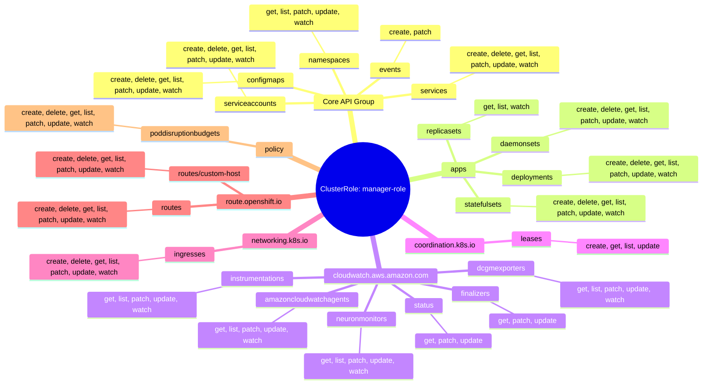

# Diagram: devops/k8s/amazon-cloudwatch-observability/helm/templates/operator-clusterrole.yaml

> Auto-generated by Obscura crawlers

## Diagram 1

### SVG

<svg id="container" width="100%" xmlns="http://www.w3.org/2000/svg" class="mindmapDiagram" style="max-width: 1647.213134765625px;" viewBox="5 5 1647.213134765625 820.24853515625" role="graphics-document document" aria-roledescription="mindmap"><g><marker id="container_mindmap-pointEnd" class="marker mindmap" viewBox="0 0 10 10" refX="5" refY="5" markerUnits="userSpaceOnUse" markerWidth="8" markerHeight="8" orient="auto"><path d="M 0 0 L 10 5 L 0 10 z" class="arrowMarkerPath" style="stroke-width: 1; stroke-dasharray: 1, 0;"></path></marker><marker id="container_mindmap-pointStart" class="marker mindmap" viewBox="0 0 10 10" refX="4.5" refY="5" markerUnits="userSpaceOnUse" markerWidth="8" markerHeight="8" orient="auto"><path d="M 0 5 L 10 10 L 10 0 z" class="arrowMarkerPath" style="stroke-width: 1; stroke-dasharray: 1, 0;"></path></marker><g class="subgraphs"></g><g class="edgePaths"><path d="M883.051,403.872L870.507,391.172C857.964,378.472,832.877,353.072,807.791,327.672C782.704,302.272,757.617,276.871,745.074,264.171L732.531,251.471" id="edge_0_1" class="edge-thickness-normal edge-pattern-solid edge section-edge-0 edge-depth-1" style="undefined;;;undefined" data-edge="true" data-et="edge" data-id="edge_0_1" data-points="W3sieCI6ODgzLjA1MDgyNTQ3NDAzOTQsInkiOjQwMy44NzIyNDAxMzgzOTY3fSx7IngiOjgwNy43OTA3MTkxNjc1OTI5LCJ5IjozMjcuNjcxNzI2ODAwNjEwNX0seyJ4Ijo3MzIuNTMwNjEyODYxMTQ2NCwieSI6MjUxLjQ3MTIxMzQ2MjgyNDI3fV0="></path><path d="M725.665,226.256L727.046,220.789C728.428,215.321,731.19,204.387,733.953,193.452C736.716,182.518,739.479,171.583,740.861,166.116L742.242,160.649" id="edge_1_2" class="edge-thickness-normal edge-pattern-solid edge section-edge-0 edge-depth-3" style="undefined;;;undefined" data-edge="true" data-et="edge" data-id="edge_1_2" data-points="W3sieCI6NzI1LjY2NDY5MjExMTEyMzgsInkiOjIyNi4yNTYwMjAyNjc5MDg4fSx7IngiOjczMy45NTMzMjQzMDYxNjU3LCJ5IjoxOTMuNDUyMzUwNjA1MzQ1NX0seyJ4Ijo3NDIuMjQxOTU2NTAxMjA3NSwieSI6MTYwLjY0ODY4MDk0Mjc4MjE2fV0="></path><path d="M746.034,131.106L746.081,125.097C746.128,119.088,746.221,107.071,746.315,95.053C746.409,83.035,746.503,71.017,746.55,65.008L746.597,59" id="edge_2_3" class="edge-thickness-normal edge-pattern-solid edge section-edge-0 edge-depth-5" style="undefined;;;undefined" data-edge="true" data-et="edge" data-id="edge_2_3" data-points="W3sieCI6NzQ2LjAzMzY5MDM2MTgxNTMsInkiOjEzMS4xMDYxOTY0ODcwNDg2M30seyJ4Ijo3NDYuMzE1MTgzMTY2NjA1NywieSI6OTUuMDUyODY5NjU0NTI5NDV9LHsieCI6NzQ2LjU5NjY3NTk3MTM5NjIsInkiOjU4Ljk5OTU0MjgyMjAxMDI3fV0="></path><path d="M736.109,235.734L745.779,232.265C755.448,228.796,774.788,221.857,794.127,214.919C813.467,207.981,832.806,201.043,842.476,197.574L852.145,194.105" id="edge_1_4" class="edge-thickness-normal edge-pattern-solid edge section-edge-0 edge-depth-3" style="undefined;;;undefined" data-edge="true" data-et="edge" data-id="edge_1_4" data-points="W3sieCI6NzM2LjEwODk1NzQ2Mzc0NCwieSI6MjM1LjczMzY4NjY4NDQwNTc3fSx7IngiOjc5NC4xMjcxNDMwNjM0MTI2LCJ5IjoyMTQuOTE5MTUxODUyOTg4Mn0seyJ4Ijo4NTIuMTQ1MzI4NjYzMDgxNSwieSI6MTk0LjEwNDYxNzAyMTU3MDYyfV0="></path><path d="M874.244,176.338L877.105,171.783C879.966,167.228,885.689,158.119,891.412,149.009C897.134,139.9,902.857,130.79,905.719,126.235L908.58,121.681" id="edge_4_5" class="edge-thickness-normal edge-pattern-solid edge section-edge-0 edge-depth-5" style="undefined;;;undefined" data-edge="true" data-et="edge" data-id="edge_4_5" data-points="W3sieCI6ODc0LjI0MzU0NzAxNDgyNjcsInkiOjE3Ni4zMzc3NTYwNDg4Mjk0Mn0seyJ4Ijo4OTEuNDExNzU3NTI4Mzg3OSwieSI6MTQ5LjAwOTIxMTIzNjQ0OTd9LHsieCI6OTA4LjU3OTk2ODA0MTk0OSwieSI6MTIxLjY4MDY2NjQyNDA2OTk1fV0="></path><path d="M709.396,248.946L703.222,252.94C697.048,256.933,684.701,264.921,672.354,272.908C660.006,280.895,647.659,288.882,641.485,292.876L635.312,296.87" id="edge_1_6" class="edge-thickness-normal edge-pattern-solid edge section-edge-0 edge-depth-3" style="undefined;;;undefined" data-edge="true" data-et="edge" data-id="edge_1_6" data-points="W3sieCI6NzA5LjM5NTUxMTQ5MzExMDIsInkiOjI0OC45NDYxNzYxMTA4MjU1Mn0seyJ4Ijo2NzIuMzUzNjUxOTUxOTExLCJ5IjoyNzIuOTA3OTUwMzQ5NjMyM30seyJ4Ijo2MzUuMzExNzkyNDEwNzExOSwieSI6Mjk2Ljg2OTcyNDU4ODQzOTF9XQ=="></path><path d="M607.727,304.48L589.82,303.84C571.913,303.199,536.1,301.917,500.287,300.635C464.473,299.353,428.66,298.072,410.753,297.431L392.846,296.79" id="edge_6_7" class="edge-thickness-normal edge-pattern-solid edge section-edge-0 edge-depth-5" style="undefined;;;undefined" data-edge="true" data-et="edge" data-id="edge_6_7" data-points="W3sieCI6NjA3LjcyNjgzMTU4MDg4OCwieSI6MzA0LjQ4MDQzNjk3NjAxMjV9LHsieCI6NTAwLjI4NjU0MzczNjM0OTI0LCJ5IjozMDAuNjM1MTgyNjMzMjUzM30seyJ4IjozOTIuODQ2MjU1ODkxODEwNTMsInkiOjI5Ni43ODk5MjgyOTA0OTQwNn1d"></path><path d="M708.274,234.726L699.046,230.64C689.818,226.554,671.362,218.382,652.905,210.21C634.449,202.037,615.992,193.865,606.764,189.779L597.536,185.693" id="edge_1_8" class="edge-thickness-normal edge-pattern-solid edge section-edge-0 edge-depth-3" style="undefined;;;undefined" data-edge="true" data-et="edge" data-id="edge_1_8" data-points="W3sieCI6NzA4LjI3NDQzODc5OTI1MSwieSI6MjM0LjcyNTk1MDc1MjQ5NTQ2fSx7IngiOjY1Mi45MDUyMjI4ODMzMTk0LCJ5IjoyMTAuMjA5NTUzMDgwNDQyfSx7IngiOjU5Ny41MzYwMDY5NjczODc4LCJ5IjoxODUuNjkzMTU1NDA4Mzg4NTJ9XQ=="></path><path d="M570.939,171.934L562.64,166.983C554.34,162.031,537.742,152.127,521.143,142.223C504.545,132.32,487.946,122.416,479.647,117.464L471.348,112.513" id="edge_8_9" class="edge-thickness-normal edge-pattern-solid edge section-edge-0 edge-depth-5" style="undefined;;;undefined" data-edge="true" data-et="edge" data-id="edge_8_9" data-points="W3sieCI6NTcwLjkzOTAyNjUxMjY0MjYsInkiOjE3MS45MzQzODg3MzU4MDE4fSx7IngiOjUyMS4xNDM0MzQzOTMyOTA2LCJ5IjoxNDIuMjIzNDY4MjY2ODEzNn0seyJ4Ijo0NzEuMzQ3ODQyMjczOTM4NywieSI6MTEyLjUxMjU0Nzc5NzgyNTR9XQ=="></path><path d="M706.991,240.919L694.546,241.019C682.101,241.119,657.212,241.319,632.323,241.518C607.434,241.718,582.544,241.918,570.1,242.017L557.655,242.117" id="edge_1_10" class="edge-thickness-normal edge-pattern-solid edge section-edge-0 edge-depth-3" style="undefined;;;undefined" data-edge="true" data-et="edge" data-id="edge_1_10" data-points="W3sieCI6NzA2Ljk5MDU1MjQ3Mjg0OTYsInkiOjI0MC45MTkyODYyNDI5MTg1fSx7IngiOjYzMi4zMjI4MDU4NDk4NTE5LCJ5IjoyNDEuNTE4MjYyMDA5Mzg4NjV9LHsieCI6NTU3LjY1NTA1OTIyNjg1NDIsInkiOjI0Mi4xMTcyMzc3NzU4NTg4fV0="></path><path d="M527.99,239.088L511.499,235.546C495.008,232.004,462.027,224.92,429.045,217.836C396.064,210.752,363.082,203.669,346.591,200.127L330.101,196.585" id="edge_10_11" class="edge-thickness-normal edge-pattern-solid edge section-edge-0 edge-depth-5" style="undefined;;;undefined" data-edge="true" data-et="edge" data-id="edge_10_11" data-points="W3sieCI6NTI3Ljk4OTk5NDkwMzA1MzEsInkiOjIzOS4wODc2ODM4MjU4NzkwOH0seyJ4Ijo0MjkuMDQ1MjczNTA4MDU0LCJ5IjoyMTcuODM2MjU0NzgyNzQxMn0seyJ4IjozMzAuMTAwNTUyMTEzMDU0OSwieSI6MTk2LjU4NDgyNTczOTYwMzMzfV0="></path><path d="M908.557,415.553L924.431,416.624C940.304,417.694,972.05,419.834,1003.797,421.974C1035.543,424.114,1067.29,426.254,1083.163,427.324L1099.036,428.395" id="edge_0_12" class="edge-thickness-normal edge-pattern-solid edge section-edge-1 edge-depth-1" style="undefined;;;undefined" data-edge="true" data-et="edge" data-id="edge_0_12" data-points="W3sieCI6OTA4LjU1NzM5ODM2MDY4ODEsInkiOjQxNS41NTM0MjY0MTU2MzR9LHsieCI6MTAwMy43OTY4MjA2MjY5NTU0LCJ5Ijo0MjEuOTczOTkwODY0MDMzOH0seyJ4IjoxMDk5LjAzNjI0Mjg5MzIyMjYsInkiOjQyOC4zOTQ1NTUzMTI0MzM1N31d"></path><path d="M1128.803,431.84L1140.134,433.706C1151.465,435.571,1174.127,439.303,1196.789,443.034C1219.451,446.765,1242.113,450.496,1253.444,452.361L1264.775,454.227" id="edge_12_13" class="edge-thickness-normal edge-pattern-solid edge section-edge-1 edge-depth-3" style="undefined;;;undefined" data-edge="true" data-et="edge" data-id="edge_12_13" data-points="W3sieCI6MTEyOC44MDMwMTQ4NjQxMjc2LCJ5Ijo0MzEuODQwMjk4MTcxMTM5NDd9LHsieCI6MTE5Ni43ODkyMzUwMzg4Mzg4LCJ5Ijo0NDMuMDMzNjEzNjE2NDg1OX0seyJ4IjoxMjY0Ljc3NTQ1NTIxMzU0OTgsInkiOjQ1NC4yMjY5MjkwNjE4MzI0fV0="></path><path d="M1294.564,456.05L1312.285,455.325C1330.007,454.599,1365.451,453.148,1400.895,451.698C1436.338,450.247,1471.782,448.796,1489.504,448.07L1507.226,447.345" id="edge_13_14" class="edge-thickness-normal edge-pattern-solid edge section-edge-1 edge-depth-5" style="undefined;;;undefined" data-edge="true" data-et="edge" data-id="edge_13_14" data-points="W3sieCI6MTI5NC41NjM2NDUzNTYxMjM1LCJ5Ijo0NTYuMDUwMjIyMzA3OTM5NDZ9LHsieCI6MTQwMC44OTQ2MTEzMTg3OTUsInkiOjQ1MS42OTc1Mzc4OTQ2NjM4fSx7IngiOjE1MDcuMjI1NTc3MjgxNDY2NSwieSI6NDQ3LjM0NDg1MzQ4MTM4ODE2fV0="></path><path d="M1128.446,425.356L1139.638,422.22C1150.83,419.083,1173.214,412.811,1195.599,406.538C1217.983,400.265,1240.367,393.992,1251.559,390.856L1262.751,387.72" id="edge_12_15" class="edge-thickness-normal edge-pattern-solid edge section-edge-1 edge-depth-3" style="undefined;;;undefined" data-edge="true" data-et="edge" data-id="edge_12_15" data-points="W3sieCI6MTEyOC40NDU4NzM2NjUwOTA5LCJ5Ijo0MjUuMzU1OTczMDU3MTQ1ODN9LHsieCI6MTE5NS41OTg2NjY4NzIyMjAzLCJ5Ijo0MDYuNTM3ODA3NjY3MTIwMn0seyJ4IjoxMjYyLjc1MTQ2MDA3OTM1LCJ5IjozODcuNzE5NjQyMjc3MDk0Nn1d"></path><path d="M1291.638,379.621L1307.64,375.132C1323.642,370.643,1355.646,361.665,1387.65,352.687C1419.654,343.709,1451.658,334.731,1467.66,330.242L1483.662,325.753" id="edge_15_16" class="edge-thickness-normal edge-pattern-solid edge section-edge-1 edge-depth-5" style="undefined;;;undefined" data-edge="true" data-et="edge" data-id="edge_15_16" data-points="W3sieCI6MTI5MS42Mzc1NTc5NDI5MzQ4LCJ5IjozNzkuNjIwNjcxMTM5MDIzNH0seyJ4IjoxMzg3LjY1MDAxOTkxMDE5NywieSI6MzUyLjY4Njk1NjczMTgwMDd9LHsieCI6MTQ4My42NjI0ODE4Nzc0NTksInkiOjMyNS43NTMyNDIzMjQ1Nzh9XQ=="></path><path d="M1123.47,441.038L1127.055,445.444C1130.639,449.849,1137.809,458.661,1144.979,467.472C1152.149,476.283,1159.318,485.094,1162.903,489.499L1166.488,493.905" id="edge_12_17" class="edge-thickness-normal edge-pattern-solid edge section-edge-1 edge-depth-3" style="undefined;;;undefined" data-edge="true" data-et="edge" data-id="edge_12_17" data-points="W3sieCI6MTEyMy40Njk2NzgzNTcxNzMzLCJ5Ijo0NDEuMDM4Mjc1NDQ3MzM2fSx7IngiOjExNDQuOTc4OTE0NjQ1NzQ4NSwieSI6NDY3LjQ3MTYzNjM5ODA3MDEzfSx7IngiOjExNjYuNDg4MTUwOTM0MzIzOCwieSI6NDkzLjkwNDk5NzM0ODgwNDN9XQ=="></path><path d="M1190.838,507.417L1208.27,509.615C1225.702,511.813,1260.566,516.21,1295.431,520.607C1330.295,525.003,1365.16,529.4,1382.592,531.599L1400.024,533.797" id="edge_17_18" class="edge-thickness-normal edge-pattern-solid edge section-edge-1 edge-depth-5" style="undefined;;;undefined" data-edge="true" data-et="edge" data-id="edge_17_18" data-points="W3sieCI6MTE5MC44Mzc2ODQxMzU1MDc1LCJ5Ijo1MDcuNDE2NTU1ODUzNzcyOH0seyJ4IjoxMjk1LjQzMDc5NTgwMzc4MjUsInkiOjUyMC42MDY3MDg2MjM0MjI3fSx7IngiOjE0MDAuMDIzOTA3NDcyMDU3NSwieSI6NTMzLjc5Njg2MTM5MzA3MjZ9XQ=="></path><path d="M1114.883,414.429L1115.146,409.97C1115.408,405.511,1115.933,396.593,1116.457,387.674C1116.982,378.756,1117.507,369.838,1117.769,365.379L1118.031,360.92" id="edge_12_19" class="edge-thickness-normal edge-pattern-solid edge section-edge-1 edge-depth-3" style="undefined;;;undefined" data-edge="true" data-et="edge" data-id="edge_12_19" data-points="W3sieCI6MTExNC44ODMyNTQ2ODQzNjcsInkiOjQxNC40MjkzODMzNDc0Nzc3fSx7IngiOjExMTYuNDU3MzQ0Mjg2Njg0NSwieSI6Mzg3LjY3NDQ3OTkxMjA1NTc0fSx7IngiOjExMTguMDMxNDMzODg5MDAxOCwieSI6MzYwLjkxOTU3NjQ3NjYzMzh9XQ=="></path><path d="M1132.951,340.662L1142.34,337.128C1151.728,333.595,1170.505,326.528,1189.282,319.461C1208.059,312.394,1226.836,305.327,1236.225,301.793L1245.613,298.26" id="edge_19_20" class="edge-thickness-normal edge-pattern-solid edge section-edge-1 edge-depth-5" style="undefined;;;undefined" data-edge="true" data-et="edge" data-id="edge_19_20" data-points="W3sieCI6MTEzMi45NTEwMzgyMjkxMjQ2LCJ5IjozNDAuNjYxODA4MTkxMjM0NDZ9LHsieCI6MTE4OS4yODIxNTMxMTIwNDc2LCJ5IjozMTkuNDYwNjg2MDY2NjI5NX0seyJ4IjoxMjQ1LjYxMzI2Nzk5NDk3MDgsInkiOjI5OC4yNTk1NjM5NDIwMjQ1fV0="></path><path d="M884.979,426.825L875.863,439.824C866.747,452.822,848.516,478.818,830.284,504.815C812.053,530.811,793.821,556.807,784.706,569.806L775.59,582.804" id="edge_0_21" class="edge-thickness-normal edge-pattern-solid edge section-edge-2 edge-depth-1" style="undefined;;;undefined" data-edge="true" data-et="edge" data-id="edge_0_21" data-points="W3sieCI6ODg0Ljk3ODY2MzkxOTQ0MjcsInkiOjQyNi44MjU0MjQ5MDMyNzc1fSx7IngiOjgzMC4yODQyOTg4ODIyNDU1LCJ5Ijo1MDQuODE0NjEzOTkzMjc2fSx7IngiOjc3NS41ODk5MzM4NDUwNDgyLCJ5Ijo1ODIuODAzODAzMDgzMjc0NX1d"></path><path d="M762.902,609.521L761.375,614.933C759.847,620.346,756.791,631.171,753.736,641.996C750.68,652.821,747.625,663.646,746.097,669.059L744.569,674.472" id="edge_21_22" class="edge-thickness-normal edge-pattern-solid edge section-edge-2 edge-depth-3" style="undefined;;;undefined" data-edge="true" data-et="edge" data-id="edge_21_22" data-points="W3sieCI6NzYyLjkwMjQ4MzczNzkzMTksInkiOjYwOS41MjA2NzkyMjkzNDY1fSx7IngiOjc1My43MzU4Mjg3OTM3NTMsInkiOjY0MS45OTYxNTY3NDIyMDczfSx7IngiOjc0NC41NjkxNzM4NDk1NzQsInkiOjY3NC40NzE2MzQyNTUwNjgxfV0="></path><path d="M734.6,702.701L732.116,708.514C729.632,714.327,724.664,725.952,719.696,737.578C714.729,749.204,709.761,760.829,707.277,766.642L704.793,772.455" id="edge_22_23" class="edge-thickness-normal edge-pattern-solid edge section-edge-2 edge-depth-5" style="undefined;;;undefined" data-edge="true" data-et="edge" data-id="edge_22_23" data-points="W3sieCI6NzM0LjYwMDIwMjQ3MTY1OTksInkiOjcwMi43MDA5ODUxMTUyMzg4fSx7IngiOjcxOS42OTY0NjIwODkwOTQ0LCJ5Ijo3MzcuNTc4MDYyNTk1MTU4NH0seyJ4Ijo3MDQuNzkyNzIxNzA2NTI5MiwieSI6NzcyLjQ1NTE0MDA3NTA3Nzl9XQ=="></path><path d="M781.954,595.913L800.595,596.944C819.235,597.975,856.516,600.037,893.797,602.099C931.078,604.16,968.359,606.222,987,607.253L1005.64,608.284" id="edge_21_24" class="edge-thickness-normal edge-pattern-solid edge section-edge-2 edge-depth-3" style="undefined;;;undefined" data-edge="true" data-et="edge" data-id="edge_21_24" data-points="W3sieCI6NzgxLjk1NDM0MTQ2MTMyMTEsInkiOjU5NS45MTMwNTQ1Nzg0NTE4fSx7IngiOjg5My43OTc0MDc1NzY5NjcsInkiOjYwMi4wOTg2MDMzMjg5OH0seyJ4IjoxMDA1LjY0MDQ3MzY5MjYxMjksInkiOjYwOC4yODQxNTIwNzk1MDgxfV0="></path><path d="M1035.615,609.394L1055.114,609.76C1074.613,610.126,1113.612,610.859,1152.61,611.591C1191.609,612.323,1230.607,613.055,1250.107,613.422L1269.606,613.788" id="edge_24_25" class="edge-thickness-normal edge-pattern-solid edge section-edge-2 edge-depth-5" style="undefined;;;undefined" data-edge="true" data-et="edge" data-id="edge_24_25" data-points="W3sieCI6MTAzNS42MTQ5NDIyMzg2NDM0LCJ5Ijo2MDkuMzk0MDc1NzQyNjkzMX0seyJ4IjoxMTUyLjYxMDM3ODYyNDIwMywieSI6NjExLjU5MDg5OTEzNjk5Mjd9LHsieCI6MTI2OS42MDU4MTUwMDk3NjI2LCJ5Ijo2MTMuNzg3NzIyNTMxMjkyM31d"></path><path d="M755.752,585.136L751.151,581.058C746.55,576.981,737.349,568.826,728.147,560.671C718.946,552.516,709.744,544.36,705.143,540.283L700.543,536.205" id="edge_21_26" class="edge-thickness-normal edge-pattern-solid edge section-edge-2 edge-depth-3" style="undefined;;;undefined" data-edge="true" data-et="edge" data-id="edge_21_26" data-points="W3sieCI6NzU1Ljc1MTUyODAwOTQxODcsInkiOjU4NS4xMzU2ODQ1NDIxNDkyfSx7IngiOjcyOC4xNDcwNzkzMzM1NzE0LCJ5Ijo1NjAuNjcwNTY4MTc2NzYxN30seyJ4Ijo3MDAuNTQyNjMwNjU3NzI0LCJ5Ijo1MzYuMjA1NDUxODExMzc0MX1d"></path><path d="M674.321,525.92L655.733,525.503C637.145,525.086,599.969,524.252,562.793,523.418C525.617,522.584,488.441,521.75,469.853,521.333L451.265,520.916" id="edge_26_27" class="edge-thickness-normal edge-pattern-solid edge section-edge-2 edge-depth-5" style="undefined;;;undefined" data-edge="true" data-et="edge" data-id="edge_26_27" data-points="W3sieCI6Njc0LjMyMDcwMzA5ODkwOTIsInkiOjUyNS45MTk5NTE1NjE0MzZ9LHsieCI6NTYyLjc5MjYxNTAwMzY0LCJ5Ijo1MjMuNDE3NzU4MTUzNjkzNX0seyJ4Ijo0NTEuMjY0NTI2OTA4MzcwNywieSI6NTIwLjkxNTU2NDc0NTk1MX1d"></path><path d="M780.575,601.418L788.84,605.267C797.105,609.117,813.636,616.816,830.167,624.515C846.697,632.215,863.228,639.914,871.493,643.763L879.758,647.613" id="edge_21_28" class="edge-thickness-normal edge-pattern-solid edge section-edge-2 edge-depth-3" style="undefined;;;undefined" data-edge="true" data-et="edge" data-id="edge_21_28" data-points="W3sieCI6NzgwLjU3NDcyNDI0MTI3ODEsInkiOjYwMS40MTc4MzQzNjExNTV9LHsieCI6ODMwLjE2NjU0NDM5ODA3MzMsInkiOjYyNC41MTU0NjA5NDU5MTc5fSx7IngiOjg3OS43NTgzNjQ1NTQ4Njg2LCJ5Ijo2NDcuNjEzMDg3NTMwNjgwOH1d"></path><path d="M902.197,666.064L905.54,670.645C908.882,675.227,915.568,684.391,922.254,693.554C928.939,702.717,935.625,711.881,938.968,716.462L942.311,721.044" id="edge_28_29" class="edge-thickness-normal edge-pattern-solid edge section-edge-2 edge-depth-5" style="undefined;;;undefined" data-edge="true" data-et="edge" data-id="edge_28_29" data-points="W3sieCI6OTAyLjE5Njg3OTQyNzg2MDgsInkiOjY2Ni4wNjM3OTEyNTI2NDk1fSx7IngiOjkyMi4yNTM2OTg3NTAzODUyLCJ5Ijo2OTMuNTUzOTAzMTQ5NDYzNH0seyJ4Ijo5NDIuMzEwNTE4MDcyOTA5NSwieSI6NzIxLjA0NDAxNTA0NjI3NzF9XQ=="></path><path d="M751.998,594.296L735.885,593.448C719.772,592.6,687.547,590.903,655.321,589.207C623.096,587.511,590.87,585.814,574.757,584.966L558.645,584.118" id="edge_21_30" class="edge-thickness-normal edge-pattern-solid edge section-edge-2 edge-depth-3" style="undefined;;;undefined" data-edge="true" data-et="edge" data-id="edge_21_30" data-points="W3sieCI6NzUxLjk5Nzk2OTIwOTEzMDQsInkiOjU5NC4yOTYyMTQwOTYyMjA2fSx7IngiOjY1NS4zMjEzMzE3MDQ5MTA2LCJ5Ijo1ODkuMjA3MDY1OTMwMzE4NX0seyJ4Ijo1NTguNjQ0Njk0MjAwNjkwOCwieSI6NTg0LjExNzkxNzc2NDQxNjV9XQ=="></path><path d="M528.769,585.088L515.8,586.619C502.831,588.15,476.894,591.212,450.956,594.275C425.018,597.337,399.081,600.399,386.112,601.93L373.143,603.461" id="edge_30_31" class="edge-thickness-normal edge-pattern-solid edge section-edge-2 edge-depth-5" style="undefined;;;undefined" data-edge="true" data-et="edge" data-id="edge_30_31" data-points="W3sieCI6NTI4Ljc2ODg5MDcyMzEwMDYsInkiOjU4NS4wODgwODY4NTIxNDcyfSx7IngiOjQ1MC45NTYwNTIwMjA2MTQwNCwieSI6NTk0LjI3NDY5ODYxNzc5Nzl9LHsieCI6MzczLjE0MzIxMzMxODEyNzQ0LCJ5Ijo2MDMuNDYxMzEwMzgzNDQ4Nn1d"></path><path d="M752.62,599.429L740.381,603.132C728.142,606.836,703.663,614.243,679.185,621.65C654.706,629.057,630.228,636.464,617.989,640.167L605.749,643.871" id="edge_21_32" class="edge-thickness-normal edge-pattern-solid edge section-edge-2 edge-depth-3" style="undefined;;;undefined" data-edge="true" data-et="edge" data-id="edge_21_32" data-points="W3sieCI6NzUyLjYyMDEwNTI5NDc3NTgsInkiOjU5OS40MjkwNDE4MDIxMjI0fSx7IngiOjY3OS4xODQ3MDY4MzI1Nzk5LCJ5Ijo2MjEuNjQ5NzczOTI5MDE2Nn0seyJ4Ijo2MDUuNzQ5MzA4MzcwMzg0MSwieSI6NjQzLjg3MDUwNjA1NTkxMDl9XQ=="></path><path d="M577.368,653.537L565.122,658.185C552.875,662.833,528.382,672.129,503.889,681.424C479.396,690.72,454.903,700.016,442.657,704.664L430.41,709.312" id="edge_32_33" class="edge-thickness-normal edge-pattern-solid edge section-edge-2 edge-depth-5" style="undefined;;;undefined" data-edge="true" data-et="edge" data-id="edge_32_33" data-points="W3sieCI6NTc3LjM2ODIyMzYwNDM4NywieSI6NjUzLjUzNzI2NjMxMjI5OTd9LHsieCI6NTAzLjg4OTEwMzQ4OTg5MjYsInkiOjY4MS40MjQ0ODcxNzY1NjkyfSx7IngiOjQzMC40MDk5ODMzNzUzOTgxNiwieSI6NzA5LjMxMTcwODA0MDgzODd9XQ=="></path><path d="M898.365,400.324L902.419,388.248C906.474,376.171,914.582,352.018,922.691,327.865C930.799,303.712,938.908,279.559,942.962,267.482L947.016,255.405" id="edge_0_34" class="edge-thickness-normal edge-pattern-solid edge section-edge-3 edge-depth-1" style="undefined;;;undefined" data-edge="true" data-et="edge" data-id="edge_0_34" data-points="W3sieCI6ODk4LjM2NTIwOTk3MjE3MzEsInkiOjQwMC4zMjQ0MjAwNjQ4ODAxNH0seyJ4Ijo5MjIuNjkwNjkyNTA4MzkzMywieSI6MzI3Ljg2NDkzMzUyMDE1MTl9LHsieCI6OTQ3LjAxNjE3NTA0NDYxMzUsInkiOjI1NS40MDU0NDY5NzU0MjM2N31d"></path><path d="M963.407,231.696L968.697,227.376C973.986,223.055,984.565,214.415,995.143,205.774C1005.722,197.133,1016.301,188.492,1021.59,184.171L1026.88,179.851" id="edge_34_35" class="edge-thickness-normal edge-pattern-solid edge section-edge-3 edge-depth-3" style="undefined;;;undefined" data-edge="true" data-et="edge" data-id="edge_34_35" data-points="W3sieCI6OTYzLjQwNzEzODU0NjgwMzksInkiOjIzMS42OTYzMDM5MTc0NzQzOH0seyJ4Ijo5OTUuMTQzMzI0MTc1NTgyNCwieSI6MjA1Ljc3MzYyNDI1NzYyNjd9LHsieCI6MTAyNi44Nzk1MDk4MDQzNjA5LCJ5IjoxNzkuODUwOTQ0NTk3Nzc5fV0="></path><path d="M1050.355,161.177L1055.775,156.978C1061.195,152.78,1072.035,144.384,1082.875,135.987C1093.716,127.591,1104.556,119.195,1109.976,114.997L1115.396,110.798" id="edge_35_36" class="edge-thickness-normal edge-pattern-solid edge section-edge-3 edge-depth-5" style="undefined;;;undefined" data-edge="true" data-et="edge" data-id="edge_35_36" data-points="W3sieCI6MTA1MC4zNTUzMzk0NjM3MzI0LCJ5IjoxNjEuMTc2NTAxNTEwMjgyMzV9LHsieCI6MTA4Mi44NzU0ODE1MTE5Mzg3LCJ5IjoxMzUuOTg3NDUwNTc2MDgxM30seyJ4IjoxMTE1LjM5NTYyMzU2MDE0NSwieSI6MTEwLjc5ODM5OTY0MTg4MDI1fV0="></path><path d="M905.126,424.133L917.426,434.358C929.726,444.583,954.326,465.033,978.926,485.483C1003.526,505.933,1028.126,526.383,1040.426,536.608L1052.726,546.833" id="edge_0_37" class="edge-thickness-normal edge-pattern-solid edge section-edge-4 edge-depth-1" style="undefined;;;undefined" data-edge="true" data-et="edge" data-id="edge_0_37" data-points="W3sieCI6OTA1LjEyNjIwMjA1NDA3NDYsInkiOjQyNC4xMzM0MjM1NTYxMjY5fSx7IngiOjk3OC45MjU5MTA5NDQyNjA0LCJ5Ijo0ODUuNDgzMjc5NTY1Nzh9LHsieCI6MTA1Mi43MjU2MTk4MzQ0NDYyLCJ5Ijo1NDYuODMzMTM1NTc1NDMzMX1d"></path><path d="M1067.595,571.047L1068.945,576.972C1070.296,582.897,1072.997,594.747,1075.699,606.596C1078.4,618.446,1081.102,630.296,1082.452,636.221L1083.803,642.146" id="edge_37_38" class="edge-thickness-normal edge-pattern-solid edge section-edge-4 edge-depth-3" style="undefined;;;undefined" data-edge="true" data-et="edge" data-id="edge_37_38" data-points="W3sieCI6MTA2Ny41OTQ1MDcyOTU5NDM1LCJ5Ijo1NzEuMDQ2ODQzODMyMDkyfSx7IngiOjEwNzUuNjk4ODQ1MTAwODI2LCJ5Ijo2MDYuNTk2Mzk3ODIzNzY0Nn0seyJ4IjoxMDgzLjgwMzE4MjkwNTcwODgsInkiOjY0Mi4xNDU5NTE4MTU0MzcyfV0="></path><path d="M1099.829,664.765L1107.778,669.773C1115.728,674.78,1131.626,684.794,1147.525,694.809C1163.423,704.823,1179.321,714.838,1187.271,719.845L1195.22,724.852" id="edge_38_39" class="edge-thickness-normal edge-pattern-solid edge section-edge-4 edge-depth-5" style="undefined;;;undefined" data-edge="true" data-et="edge" data-id="edge_38_39" data-points="W3sieCI6MTA5OS44MjkxNzU4NzgyOTcsInkiOjY2NC43NjUzOTQwNTk4ODF9LHsieCI6MTE0Ny41MjQ1NjA2MDEzMSwieSI6Njk0LjgwODc2NzI4MDMwMzZ9LHsieCI6MTE5NS4yMTk5NDUzMjQzMjI3LCJ5Ijo3MjQuODUyMTQwNTAwNzI2M31d"></path><path d="M878.592,414.615L860.071,414.701C841.55,414.788,804.509,414.962,767.467,415.135C730.426,415.309,693.384,415.482,674.864,415.569L656.343,415.656" id="edge_0_40" class="edge-thickness-normal edge-pattern-solid edge section-edge-5 edge-depth-1" style="undefined;;;undefined" data-edge="true" data-et="edge" data-id="edge_0_40" data-points="W3sieCI6ODc4LjU5MTUzMjk1OTEyNDUsInkiOjQxNC42MTQ3MzkwOTUxMTF9LHsieCI6NzY3LjQ2NzI3Njk4OTQ5NzIsInkiOjQxNS4xMzUxNTc0Mzk0NTkzNn0seyJ4Ijo2NTYuMzQzMDIxMDE5ODcsInkiOjQxNS42NTU1NzU3ODM4MDc3fV0="></path><path d="M626.776,412.15L615.207,409.309C603.638,406.469,580.499,400.789,557.361,395.109C534.223,389.428,511.085,383.748,499.515,380.908L487.946,378.068" id="edge_40_41" class="edge-thickness-normal edge-pattern-solid edge section-edge-5 edge-depth-3" style="undefined;;;undefined" data-edge="true" data-et="edge" data-id="edge_40_41" data-points="W3sieCI6NjI2Ljc3NTczNTI4NDIyODUsInkiOjQxMi4xNDk1OTY5Njk5NzExfSx7IngiOjU1Ny4zNjEwNDA0Njk3MDY2LCJ5IjozOTUuMTA4Njg0MDQwNjgyNTN9LHsieCI6NDg3Ljk0NjM0NTY1NTE4NDcsInkiOjM3OC4wNjc3NzExMTEzOTM5NH1d"></path><path d="M458.379,374.439L442.141,374.382C425.903,374.326,393.428,374.212,360.952,374.099C328.477,373.985,296.001,373.872,279.763,373.815L263.525,373.758" id="edge_41_42" class="edge-thickness-normal edge-pattern-solid edge section-edge-5 edge-depth-5" style="undefined;;;undefined" data-edge="true" data-et="edge" data-id="edge_41_42" data-points="W3sieCI6NDU4LjM3ODk4NzAxMDg2NDgsInkiOjM3NC40MzkxMjg3MzE4NTI4fSx7IngiOjM2MC45NTIyNDA0NzA4MjA0LCJ5IjozNzQuMDk4Njc3NTI0NzcyOH0seyJ4IjoyNjMuNTI1NDkzOTMwNzc2LCJ5IjozNzMuNzU4MjI2MzE3NjkyODR9XQ=="></path><path d="M626.412,417.165L609.166,418.828C591.919,420.491,557.426,423.816,522.933,427.142C488.44,430.467,453.947,433.793,436.7,435.456L419.454,437.118" id="edge_40_43" class="edge-thickness-normal edge-pattern-solid edge section-edge-5 edge-depth-3" style="undefined;;;undefined" data-edge="true" data-et="edge" data-id="edge_40_43" data-points="W3sieCI6NjI2LjQxMjQxNTYwNzg5OTgsInkiOjQxNy4xNjUzMDU3NjM3NjYyfSx7IngiOjUyMi45MzMxMjU1MTk0OTQ2LCJ5Ijo0MjcuMTQxNzkzMDM4MTgxOTZ9LHsieCI6NDE5LjQ1MzgzNTQzMTA4OTU0LCJ5Ijo0MzcuMTE4MjgwMzEyNTk3NzN9XQ=="></path><path d="M389.677,440.699L369.691,443.581C349.705,446.464,309.733,452.228,269.762,457.993C229.79,463.758,189.818,469.522,169.832,472.405L149.846,475.287" id="edge_43_44" class="edge-thickness-normal edge-pattern-solid edge section-edge-5 edge-depth-5" style="undefined;;;undefined" data-edge="true" data-et="edge" data-id="edge_43_44" data-points="W3sieCI6Mzg5LjY3NjY2NjgyNTMyOTQsInkiOjQ0MC42OTg4OTQ3MzU5MjEzfSx7IngiOjI2OS43NjE1MzI3NjQxNjU3NCwieSI6NDU3Ljk5MjkyNzg5NzcwNTN9LHsieCI6MTQ5Ljg0NjM5ODcwMzAwMjE0LCJ5Ijo0NzUuMjg2OTYxMDU5NDg5M31d"></path><path d="M905.708,405.702L918.418,396.427C931.128,387.152,956.549,368.602,981.969,350.051C1007.389,331.501,1032.809,312.95,1045.519,303.675L1058.23,294.4" id="edge_0_45" class="edge-thickness-normal edge-pattern-solid edge section-edge-6 edge-depth-1" style="undefined;;;undefined" data-edge="true" data-et="edge" data-id="edge_0_45" data-points="W3sieCI6OTA1LjcwODEyMDM2OTk5MzUsInkiOjQwNS43MDIzMDE3MzU5MTQ5NH0seyJ4Ijo5ODEuOTY4ODI4NTA5MjA5MywieSI6MzUwLjA1MTExMTI1MTUyMTJ9LHsieCI6MTA1OC4yMjk1MzY2NDg0MjUsInkiOjI5NC4zOTk5MjA3NjcxMjc0N31d"></path><path d="M1083.698,278.722L1091.356,274.8C1099.015,270.879,1114.332,263.037,1129.649,255.195C1144.966,247.352,1160.283,239.51,1167.942,235.589L1175.6,231.667" id="edge_45_46" class="edge-thickness-normal edge-pattern-solid edge section-edge-6 edge-depth-3" style="undefined;;;undefined" data-edge="true" data-et="edge" data-id="edge_45_46" data-points="W3sieCI6MTA4My42OTc5NzgzNjUxNiwieSI6Mjc4LjcyMTYyMjMyODQ1NTk2fSx7IngiOjExMjkuNjQ5MDUwNjk5MjYsInkiOjI1NS4xOTQ1MjQzMDc5Nzc3Nn0seyJ4IjoxMTc1LjYwMDEyMzAzMzM2LCJ5IjoyMzEuNjY3NDI2Mjg3NDk5NTh9XQ=="></path><path d="M1203.258,220.323L1217.309,215.895C1231.359,211.468,1259.46,202.612,1287.561,193.757C1315.662,184.902,1343.763,176.046,1357.813,171.619L1371.863,167.191" id="edge_46_47" class="edge-thickness-normal edge-pattern-solid edge section-edge-6 edge-depth-5" style="undefined;;;undefined" data-edge="true" data-et="edge" data-id="edge_46_47" data-points="W3sieCI6MTIwMy4yNTgyNzA2ODUwNDcxLCJ5IjoyMjAuMzIyOTYyODgzMTE0MDN9LHsieCI6MTI4Ny41NjA4MTg3MDY0MTI0LCJ5IjoxOTMuNzU2OTMxNDk1NTU4NTV9LHsieCI6MTM3MS44NjMzNjY3Mjc3Nzc3LCJ5IjoxNjcuMTkwOTAwMTA4MDAzMDZ9XQ=="></path></g><g class="edgeLabels"><g class="edgeLabel"><g class="label" data-id="edge_0_1" transform="translate(0, 0)"><foreignObject width="0" height="0">

</foreignObject></g></g><g class="edgeLabel"><g class="label" data-id="edge_1_2" transform="translate(0, 0)"><foreignObject width="0" height="0">

</foreignObject></g></g><g class="edgeLabel"><g class="label" data-id="edge_2_3" transform="translate(0, 0)"><foreignObject width="0" height="0">

</foreignObject></g></g><g class="edgeLabel"><g class="label" data-id="edge_1_4" transform="translate(0, 0)"><foreignObject width="0" height="0">

</foreignObject></g></g><g class="edgeLabel"><g class="label" data-id="edge_4_5" transform="translate(0, 0)"><foreignObject width="0" height="0">

</foreignObject></g></g><g class="edgeLabel"><g class="label" data-id="edge_1_6" transform="translate(0, 0)"><foreignObject width="0" height="0">

</foreignObject></g></g><g class="edgeLabel"><g class="label" data-id="edge_6_7" transform="translate(0, 0)"><foreignObject width="0" height="0">

</foreignObject></g></g><g class="edgeLabel"><g class="label" data-id="edge_1_8" transform="translate(0, 0)"><foreignObject width="0" height="0">

</foreignObject></g></g><g class="edgeLabel"><g class="label" data-id="edge_8_9" transform="translate(0, 0)"><foreignObject width="0" height="0">

</foreignObject></g></g><g class="edgeLabel"><g class="label" data-id="edge_1_10" transform="translate(0, 0)"><foreignObject width="0" height="0">

</foreignObject></g></g><g class="edgeLabel"><g class="label" data-id="edge_10_11" transform="translate(0, 0)"><foreignObject width="0" height="0">

</foreignObject></g></g><g class="edgeLabel"><g class="label" data-id="edge_0_12" transform="translate(0, 0)"><foreignObject width="0" height="0">

</foreignObject></g></g><g class="edgeLabel"><g class="label" data-id="edge_12_13" transform="translate(0, 0)"><foreignObject width="0" height="0">

</foreignObject></g></g><g class="edgeLabel"><g class="label" data-id="edge_13_14" transform="translate(0, 0)"><foreignObject width="0" height="0">

</foreignObject></g></g><g class="edgeLabel"><g class="label" data-id="edge_12_15" transform="translate(0, 0)"><foreignObject width="0" height="0">

</foreignObject></g></g><g class="edgeLabel"><g class="label" data-id="edge_15_16" transform="translate(0, 0)"><foreignObject width="0" height="0">

</foreignObject></g></g><g class="edgeLabel"><g class="label" data-id="edge_12_17" transform="translate(0, 0)"><foreignObject width="0" height="0">

</foreignObject></g></g><g class="edgeLabel"><g class="label" data-id="edge_17_18" transform="translate(0, 0)"><foreignObject width="0" height="0">

</foreignObject></g></g><g class="edgeLabel"><g class="label" data-id="edge_12_19" transform="translate(0, 0)"><foreignObject width="0" height="0">

</foreignObject></g></g><g class="edgeLabel"><g class="label" data-id="edge_19_20" transform="translate(0, 0)"><foreignObject width="0" height="0">

</foreignObject></g></g><g class="edgeLabel"><g class="label" data-id="edge_0_21" transform="translate(0, 0)"><foreignObject width="0" height="0">

</foreignObject></g></g><g class="edgeLabel"><g class="label" data-id="edge_21_22" transform="translate(0, 0)"><foreignObject width="0" height="0">

</foreignObject></g></g><g class="edgeLabel"><g class="label" data-id="edge_22_23" transform="translate(0, 0)"><foreignObject width="0" height="0">

</foreignObject></g></g><g class="edgeLabel"><g class="label" data-id="edge_21_24" transform="translate(0, 0)"><foreignObject width="0" height="0">

</foreignObject></g></g><g class="edgeLabel"><g class="label" data-id="edge_24_25" transform="translate(0, 0)"><foreignObject width="0" height="0">

</foreignObject></g></g><g class="edgeLabel"><g class="label" data-id="edge_21_26" transform="translate(0, 0)"><foreignObject width="0" height="0">

</foreignObject></g></g><g class="edgeLabel"><g class="label" data-id="edge_26_27" transform="translate(0, 0)"><foreignObject width="0" height="0">

</foreignObject></g></g><g class="edgeLabel"><g class="label" data-id="edge_21_28" transform="translate(0, 0)"><foreignObject width="0" height="0">

</foreignObject></g></g><g class="edgeLabel"><g class="label" data-id="edge_28_29" transform="translate(0, 0)"><foreignObject width="0" height="0">

</foreignObject></g></g><g class="edgeLabel"><g class="label" data-id="edge_21_30" transform="translate(0, 0)"><foreignObject width="0" height="0">

</foreignObject></g></g><g class="edgeLabel"><g class="label" data-id="edge_30_31" transform="translate(0, 0)"><foreignObject width="0" height="0">

</foreignObject></g></g><g class="edgeLabel"><g class="label" data-id="edge_21_32" transform="translate(0, 0)"><foreignObject width="0" height="0">

</foreignObject></g></g><g class="edgeLabel"><g class="label" data-id="edge_32_33" transform="translate(0, 0)"><foreignObject width="0" height="0">

</foreignObject></g></g><g class="edgeLabel"><g class="label" data-id="edge_0_34" transform="translate(0, 0)"><foreignObject width="0" height="0">

</foreignObject></g></g><g class="edgeLabel"><g class="label" data-id="edge_34_35" transform="translate(0, 0)"><foreignObject width="0" height="0">

</foreignObject></g></g><g class="edgeLabel"><g class="label" data-id="edge_35_36" transform="translate(0, 0)"><foreignObject width="0" height="0">

</foreignObject></g></g><g class="edgeLabel"><g class="label" data-id="edge_0_37" transform="translate(0, 0)"><foreignObject width="0" height="0">

</foreignObject></g></g><g class="edgeLabel"><g class="label" data-id="edge_37_38" transform="translate(0, 0)"><foreignObject width="0" height="0">

</foreignObject></g></g><g class="edgeLabel"><g class="label" data-id="edge_38_39" transform="translate(0, 0)"><foreignObject width="0" height="0">

</foreignObject></g></g><g class="edgeLabel"><g class="label" data-id="edge_0_40" transform="translate(0, 0)"><foreignObject width="0" height="0">

</foreignObject></g></g><g class="edgeLabel"><g class="label" data-id="edge_40_41" transform="translate(0, 0)"><foreignObject width="0" height="0">

</foreignObject></g></g><g class="edgeLabel"><g class="label" data-id="edge_41_42" transform="translate(0, 0)"><foreignObject width="0" height="0">

</foreignObject></g></g><g class="edgeLabel"><g class="label" data-id="edge_40_43" transform="translate(0, 0)"><foreignObject width="0" height="0">

</foreignObject></g></g><g class="edgeLabel"><g class="label" data-id="edge_43_44" transform="translate(0, 0)"><foreignObject width="0" height="0">

</foreignObject></g></g><g class="edgeLabel"><g class="label" data-id="edge_0_45" transform="translate(0, 0)"><foreignObject width="0" height="0">

</foreignObject></g></g><g class="edgeLabel"><g class="label" data-id="edge_45_46" transform="translate(0, 0)"><foreignObject width="0" height="0">

</foreignObject></g></g><g class="edgeLabel"><g class="label" data-id="edge_46_47" transform="translate(0, 0)"><foreignObject width="0" height="0">

</foreignObject></g></g></g><g class="nodes"><g class="node mindmap-node section-root section--1" id="node_0" transform="translate(893.5913684683367, 414.5444916995889)"><circle class="basic label-container" style="" r="104.2421875" cx="0" cy="0"></circle><g class="label" style="" transform="translate(-94.2421875, -12)"><rect></rect><foreignObject width="188.484375" height="24">

ClusterRole: manager-role

</foreignObject></g></g><g class="node mindmap-node section-0" id="node_1" transform="translate(721.9900698668491, 240.79896190163208)"><path id="node-1" class="node-bkg node-0" style="" d="M-74.015625 12
    v-24
    q0,-5 5,-5
    h138.03125
    q5,0 5,5
    v24
    q0,5 -5,5
    h-138.03125
    q-5,0 -5,-5
    Z"></path><line class="node-line-" x1="-74.015625" y1="17" x2="74.015625" y2="17"></line><g class="label" style="" transform="translate(-54.015625, -12)"><rect></rect><foreignObject width="108.03125" height="24">

Core API Group

</foreignObject></g></g><g class="node mindmap-node section-0" id="node_2" transform="translate(745.9165787454822, 146.1057393090589)"><path id="node-2" class="node-bkg node-0" style="" d="M-61.484375 12
    v-24
    q0,-5 5,-5
    h112.96875
    q5,0 5,5
    v24
    q0,5 -5,5
    h-112.96875
    q-5,0 -5,-5
    Z"></path><line class="node-line-" x1="-61.484375" y1="17" x2="61.484375" y2="17"></line><g class="label" style="" transform="translate(-41.484375, -12)"><rect></rect><foreignObject width="82.96875" height="24">

configmaps

</foreignObject></g></g><g class="node mindmap-node section-0" id="node_3" transform="translate(746.7137875877293, 44)"><path id="node-3" class="node-bkg node-0" style="" d="M-120 24
    v-48
    q0,-5 5,-5
    h230
    q5,0 5,5
    v48
    q0,5 -5,5
    h-230
    q-5,0 -5,-5
    Z"></path><line class="node-line-" x1="-120" y1="29" x2="120" y2="29"></line><g class="label" style="" transform="translate(-100, -24)"><rect></rect><foreignObject width="200" height="48">

create, delete, get, list, patch, update, watch

</foreignObject></g></g><g class="node mindmap-node section-0" id="node_4" transform="translate(866.2642162599764, 189.0393418043443)"><path id="node-4" class="node-bkg node-0" style="" d="M-43.90625 12
    v-24
    q0,-5 5,-5
    h77.8125
    q5,0 5,5
    v24
    q0,5 -5,5
    h-77.8125
    q-5,0 -5,-5
    Z"></path><line class="node-line-" x1="-43.90625" y1="17" x2="43.90625" y2="17"></line><g class="label" style="" transform="translate(-23.90625, -12)"><rect></rect><foreignObject width="47.8125" height="24">

events

</foreignObject></g></g><g class="node mindmap-node section-0" id="node_5" transform="translate(916.5592987967993, 108.97908066855507)"><path id="node-5" class="node-bkg node-0" style="" d="M-66.703125 12
    v-24
    q0,-5 5,-5
    h123.40625
    q5,0 5,5
    v24
    q0,5 -5,5
    h-123.40625
    q-5,0 -5,-5
    Z"></path><line class="node-line-" x1="-66.703125" y1="17" x2="66.703125" y2="17"></line><g class="label" style="" transform="translate(-46.703125, -12)"><rect></rect><foreignObject width="93.40625" height="24">

create, patch

</foreignObject></g></g><g class="node mindmap-node section-0" id="node_6" transform="translate(622.717234036973, 305.0169387976325)"><path id="node-6" class="node-bkg node-0" style="" d="M-64.78125 12
    v-24
    q0,-5 5,-5
    h119.5625
    q5,0 5,5
    v24
    q0,5 -5,5
    h-119.5625
    q-5,0 -5,-5
    Z"></path><line class="node-line-" x1="-64.78125" y1="17" x2="64.78125" y2="17"></line><g class="label" style="" transform="translate(-44.78125, -12)"><rect></rect><foreignObject width="89.5625" height="24">

namespaces

</foreignObject></g></g><g class="node mindmap-node section-0" id="node_7" transform="translate(377.8558534357256, 296.25342646887407)"><path id="node-7" class="node-bkg node-0" style="" d="M-120 24
    v-48
    q0,-5 5,-5
    h230
    q5,0 5,5
    v48
    q0,5 -5,5
    h-230
    q-5,0 -5,-5
    Z"></path><line class="node-line-" x1="-120" y1="29" x2="120" y2="29"></line><g class="label" style="" transform="translate(-100, -24)"><rect></rect><foreignObject width="200" height="48">

get, list, patch, update, watch

</foreignObject></g></g><g class="node mindmap-node section-0" id="node_8" transform="translate(583.8203758997897, 179.6201442592519)"><path id="node-8" class="node-bkg node-0" style="" d="M-77.640625 12
    v-24
    q0,-5 5,-5
    h145.28125
    q5,0 5,5
    v24
    q0,5 -5,5
    h-145.28125
    q-5,0 -5,-5
    Z"></path><line class="node-line-" x1="-77.640625" y1="17" x2="77.640625" y2="17"></line><g class="label" style="" transform="translate(-57.640625, -12)"><rect></rect><foreignObject width="115.28125" height="24">

serviceaccounts

</foreignObject></g></g><g class="node mindmap-node section-0" id="node_9" transform="translate(458.4664928867915, 104.8267922743753)"><path id="node-9" class="node-bkg node-0" style="" d="M-120 24
    v-48
    q0,-5 5,-5
    h230
    q5,0 5,5
    v48
    q0,5 -5,5
    h-230
    q-5,0 -5,-5
    Z"></path><line class="node-line-" x1="-120" y1="29" x2="120" y2="29"></line><g class="label" style="" transform="translate(-100, -24)"><rect></rect><foreignObject width="200" height="48">

create, delete, get, list, patch, update, watch

</foreignObject></g></g><g class="node mindmap-node section-0" id="node_10" transform="translate(542.6555418328546, 242.23756211714522)"><path id="node-10" class="node-bkg node-0" style="" d="M-49.140625 12
    v-24
    q0,-5 5,-5
    h88.28125
    q5,0 5,5
    v24
    q0,5 -5,5
    h-88.28125
    q-5,0 -5,-5
    Z"></path><line class="node-line-" x1="-49.140625" y1="17" x2="49.140625" y2="17"></line><g class="label" style="" transform="translate(-29.140625, -12)"><rect></rect><foreignObject width="58.28125" height="24">

services

</foreignObject></g></g><g class="node mindmap-node section-0" id="node_11" transform="translate(315.4350051832534, 193.4349474483372)"><path id="node-11" class="node-bkg node-0" style="" d="M-120 24
    v-48
    q0,-5 5,-5
    h230
    q5,0 5,5
    v48
    q0,5 -5,5
    h-230
    q-5,0 -5,-5
    Z"></path><line class="node-line-" x1="-120" y1="29" x2="120" y2="29"></line><g class="label" style="" transform="translate(-100, -24)"><rect></rect><foreignObject width="200" height="48">

create, delete, get, list, patch, update, watch

</foreignObject></g></g><g class="node mindmap-node section-1" id="node_12" transform="translate(1114.0022727855742, 429.4034900284787)"><path id="node-12" class="node-bkg node-0" style="" d="M-37.59375 12
    v-24
    q0,-5 5,-5
    h65.1875
    q5,0 5,5
    v24
    q0,5 -5,5
    h-65.1875
    q-5,0 -5,-5
    Z"></path><line class="node-line-" x1="-37.59375" y1="17" x2="37.59375" y2="17"></line><g class="label" style="" transform="translate(-17.59375, -12)"><rect></rect><foreignObject width="35.1875" height="24">

apps

</foreignObject></g></g><g class="node mindmap-node section-1" id="node_13" transform="translate(1279.5761972921032, 456.66373720449315)"><path id="node-13" class="node-bkg node-0" style="" d="M-64.4375 12
    v-24
    q0,-5 5,-5
    h118.875
    q5,0 5,5
    v24
    q0,5 -5,5
    h-118.875
    q-5,0 -5,-5
    Z"></path><line class="node-line-" x1="-64.4375" y1="17" x2="64.4375" y2="17"></line><g class="label" style="" transform="translate(-44.4375, -12)"><rect></rect><foreignObject width="88.875" height="24">

daemonsets

</foreignObject></g></g><g class="node mindmap-node section-1" id="node_14" transform="translate(1522.2130253454868, 446.7313385848345)"><path id="node-14" class="node-bkg node-0" style="" d="M-120 24
    v-48
    q0,-5 5,-5
    h230
    q5,0 5,5
    v48
    q0,5 -5,5
    h-230
    q-5,0 -5,-5
    Z"></path><line class="node-line-" x1="-120" y1="29" x2="120" y2="29"></line><g class="label" style="" transform="translate(-100, -24)"><rect></rect><foreignObject width="200" height="48">

create, delete, get, list, patch, update, watch

</foreignObject></g></g><g class="node mindmap-node section-1" id="node_15" transform="translate(1277.1950609588666, 383.6721253057617)"><path id="node-15" class="node-bkg node-0" style="" d="M-67.3046875 12
    v-24
    q0,-5 5,-5
    h124.609375
    q5,0 5,5
    v24
    q0,5 -5,5
    h-124.609375
    q-5,0 -5,-5
    Z"></path><line class="node-line-" x1="-67.3046875" y1="17" x2="67.3046875" y2="17"></line><g class="label" style="" transform="translate(-47.3046875, -12)"><rect></rect><foreignObject width="94.609375" height="24">

deployments

</foreignObject></g></g><g class="node mindmap-node section-1" id="node_16" transform="translate(1498.1049788615271, 321.7017881578397)"><path id="node-16" class="node-bkg node-0" style="" d="M-120 24
    v-48
    q0,-5 5,-5
    h230
    q5,0 5,5
    v48
    q0,5 -5,5
    h-230
    q-5,0 -5,-5
    Z"></path><line class="node-line-" x1="-120" y1="29" x2="120" y2="29"></line><g class="label" style="" transform="translate(-100, -24)"><rect></rect><foreignObject width="200" height="48">

create, delete, get, list, patch, update, watch

</foreignObject></g></g><g class="node mindmap-node section-1" id="node_17" transform="translate(1175.955556505923, 505.53978276766156)"><path id="node-17" class="node-bkg node-0" style="" d="M-62.453125 12
    v-24
    q0,-5 5,-5
    h114.90625
    q5,0 5,5
    v24
    q0,5 -5,5
    h-114.90625
    q-5,0 -5,-5
    Z"></path><line class="node-line-" x1="-62.453125" y1="17" x2="62.453125" y2="17"></line><g class="label" style="" transform="translate(-42.453125, -12)"><rect></rect><foreignObject width="84.90625" height="24">

statefulsets

</foreignObject></g></g><g class="node mindmap-node section-1" id="node_18" transform="translate(1414.9060351016421, 535.6736344791839)"><path id="node-18" class="node-bkg node-0" style="" d="M-120 24
    v-48
    q0,-5 5,-5
    h230
    q5,0 5,5
    v48
    q0,5 -5,5
    h-230
    q-5,0 -5,-5
    Z"></path><line class="node-line-" x1="-120" y1="29" x2="120" y2="29"></line><g class="label" style="" transform="translate(-100, -24)"><rect></rect><foreignObject width="200" height="48">

create, delete, get, list, patch, update, watch

</foreignObject></g></g><g class="node mindmap-node section-1" id="node_19" transform="translate(1118.9124157877948, 345.9454697956328)"><path id="node-19" class="node-bkg node-0" style="" d="M-59.296875 12
    v-24
    q0,-5 5,-5
    h108.59375
    q5,0 5,5
    v24
    q0,5 -5,5
    h-108.59375
    q-5,0 -5,-5
    Z"></path><line class="node-line-" x1="-59.296875" y1="17" x2="59.296875" y2="17"></line><g class="label" style="" transform="translate(-39.296875, -12)"><rect></rect><foreignObject width="78.59375" height="24">

replicasets

</foreignObject></g></g><g class="node mindmap-node section-1" id="node_20" transform="translate(1259.6518904363006, 292.97590233762617)"><path id="node-20" class="node-bkg node-0" style="" d="M-71.921875 12
    v-24
    q0,-5 5,-5
    h133.84375
    q5,0 5,5
    v24
    q0,5 -5,5
    h-133.84375
    q-5,0 -5,-5
    Z"></path><line class="node-line-" x1="-71.921875" y1="17" x2="71.921875" y2="17"></line><g class="label" style="" transform="translate(-51.921875, -12)"><rect></rect><foreignObject width="103.84375" height="24">

get, list, watch

</foreignObject></g></g><g class="node mindmap-node section-2" id="node_21" transform="translate(766.9772292961543, 595.0847362869631)"><path id="node-21" class="node-bkg node-0" style="" d="M-124.53125 12
    v-24
    q0,-5 5,-5
    h239.0625
    q5,0 5,5
    v24
    q0,5 -5,5
    h-239.0625
    q-5,0 -5,-5
    Z"></path><line class="node-line-" x1="-124.53125" y1="17" x2="124.53125" y2="17"></line><g class="label" style="" transform="translate(-104.53125, -12)"><rect></rect><foreignObject width="209.0625" height="24">

cloudwatch.aws.amazon.com

</foreignObject></g></g><g class="node mindmap-node section-2" id="node_22" transform="translate(740.4944282913516, 688.9075771974515)"><path id="node-22" class="node-bkg node-0" style="" d="M-113.8515625 12
    v-24
    q0,-5 5,-5
    h217.703125
    q5,0 5,5
    v24
    q0,5 -5,5
    h-217.703125
    q-5,0 -5,-5
    Z"></path><line class="node-line-" x1="-113.8515625" y1="17" x2="113.8515625" y2="17"></line><g class="label" style="" transform="translate(-93.8515625, -12)"><rect></rect><foreignObject width="187.703125" height="24">

amazoncloudwatchagents

</foreignObject></g></g><g class="node mindmap-node section-2" id="node_23" transform="translate(698.8984958868375, 786.2485479928653)"><path id="node-23" class="node-bkg node-0" style="" d="M-120 24
    v-48
    q0,-5 5,-5
    h230
    q5,0 5,5
    v48
    q0,5 -5,5
    h-230
    q-5,0 -5,-5
    Z"></path><line class="node-line-" x1="-120" y1="29" x2="120" y2="29"></line><g class="label" style="" transform="translate(-100, -24)"><rect></rect><foreignObject width="200" height="48">

get, list, patch, update, watch

</foreignObject></g></g><g class="node mindmap-node section-2" id="node_24" transform="translate(1020.6175858577797, 609.1124703709968)"><path id="node-24" class="node-bkg node-0" style="" d="M-74.0625 12
    v-24
    q0,-5 5,-5
    h138.125
    q5,0 5,5
    v24
    q0,5 -5,5
    h-138.125
    q-5,0 -5,-5
    Z"></path><line class="node-line-" x1="-74.0625" y1="17" x2="74.0625" y2="17"></line><g class="label" style="" transform="translate(-54.0625, -12)"><rect></rect><foreignObject width="108.125" height="24">

dcgmexporters

</foreignObject></g></g><g class="node mindmap-node section-2" id="node_25" transform="translate(1284.6031713906264, 614.0693279029886)"><path id="node-25" class="node-bkg node-0" style="" d="M-120 24
    v-48
    q0,-5 5,-5
    h230
    q5,0 5,5
    v48
    q0,5 -5,5
    h-230
    q-5,0 -5,-5
    Z"></path><line class="node-line-" x1="-120" y1="29" x2="120" y2="29"></line><g class="label" style="" transform="translate(-100, -24)"><rect></rect><foreignObject width="200" height="48">

get, list, patch, update, watch

</foreignObject></g></g><g class="node mindmap-node section-2" id="node_26" transform="translate(689.3169293709884, 526.2564000665602)"><path id="node-26" class="node-bkg node-0" style="" d="M-78.53125 12
    v-24
    q0,-5 5,-5
    h147.0625
    q5,0 5,5
    v24
    q0,5 -5,5
    h-147.0625
    q-5,0 -5,-5
    Z"></path><line class="node-line-" x1="-78.53125" y1="17" x2="78.53125" y2="17"></line><g class="label" style="" transform="translate(-58.53125, -12)"><rect></rect><foreignObject width="117.0625" height="24">

neuronmonitors

</foreignObject></g></g><g class="node mindmap-node section-2" id="node_27" transform="translate(436.2683006362915, 520.5791162408268)"><path id="node-27" class="node-bkg node-0" style="" d="M-120 24
    v-48
    q0,-5 5,-5
    h230
    q5,0 5,5
    v48
    q0,5 -5,5
    h-230
    q-5,0 -5,-5
    Z"></path><line class="node-line-" x1="-120" y1="29" x2="120" y2="29"></line><g class="label" style="" transform="translate(-100, -24)"><rect></rect><foreignObject width="200" height="48">

get, list, patch, update, watch

</foreignObject></g></g><g class="node mindmap-node section-2" id="node_28" transform="translate(893.3558594999924, 653.9461856048727)"><path id="node-28" class="node-bkg node-0" style="" d="M-52.6640625 12
    v-24
    q0,-5 5,-5
    h95.328125
    q5,0 5,5
    v24
    q0,5 -5,5
    h-95.328125
    q-5,0 -5,-5
    Z"></path><line class="node-line-" x1="-52.6640625" y1="17" x2="52.6640625" y2="17"></line><g class="label" style="" transform="translate(-32.6640625, -12)"><rect></rect><foreignObject width="65.328125" height="24">

finalizers

</foreignObject></g></g><g class="node mindmap-node section-2" id="node_29" transform="translate(951.1515380007779, 733.1616206940539)"><path id="node-29" class="node-bkg node-0" style="" d="M-85.375 12
    v-24
    q0,-5 5,-5
    h160.75
    q5,0 5,5
    v24
    q0,5 -5,5
    h-160.75
    q-5,0 -5,-5
    Z"></path><line class="node-line-" x1="-85.375" y1="17" x2="85.375" y2="17"></line><g class="label" style="" transform="translate(-65.375, -12)"><rect></rect><foreignObject width="130.75" height="24">

get, patch, update

</foreignObject></g></g><g class="node mindmap-node section-2" id="node_30" transform="translate(543.6654341136668, 583.329395573674)"><path id="node-30" class="node-bkg node-0" style="" d="M-42.203125 12
    v-24
    q0,-5 5,-5
    h74.40625
    q5,0 5,5
    v24
    q0,5 -5,5
    h-74.40625
    q-5,0 -5,-5
    Z"></path><line class="node-line-" x1="-42.203125" y1="17" x2="42.203125" y2="17"></line><g class="label" style="" transform="translate(-22.203125, -12)"><rect></rect><foreignObject width="44.40625" height="24">

status

</foreignObject></g></g><g class="node mindmap-node section-2" id="node_31" transform="translate(358.2466699275612, 605.2200016619217)"><path id="node-31" class="node-bkg node-0" style="" d="M-85.375 12
    v-24
    q0,-5 5,-5
    h160.75
    q5,0 5,5
    v24
    q0,5 -5,5
    h-160.75
    q-5,0 -5,-5
    Z"></path><line class="node-line-" x1="-85.375" y1="17" x2="85.375" y2="17"></line><g class="label" style="" transform="translate(-65.375, -12)"><rect></rect><foreignObject width="130.75" height="24">

get, patch, update

</foreignObject></g></g><g class="node mindmap-node section-2" id="node_32" transform="translate(591.3921843690057, 648.2148115710702)"><path id="node-32" class="node-bkg node-0" style="" d="M-82.640625 12
    v-24
    q0,-5 5,-5
    h155.28125
    q5,0 5,5
    v24
    q0,5 -5,5
    h-155.28125
    q-5,0 -5,-5
    Z"></path><line class="node-line-" x1="-82.640625" y1="17" x2="82.640625" y2="17"></line><g class="label" style="" transform="translate(-62.640625, -12)"><rect></rect><foreignObject width="125.28125" height="24">

instrumentations

</foreignObject></g></g><g class="node mindmap-node section-2" id="node_33" transform="translate(416.38602261077955, 714.6341627820682)"><path id="node-33" class="node-bkg node-0" style="" d="M-120 24
    v-48
    q0,-5 5,-5
    h230
    q5,0 5,5
    v48
    q0,5 -5,5
    h-230
    q-5,0 -5,-5
    Z"></path><line class="node-line-" x1="-120" y1="29" x2="120" y2="29"></line><g class="label" style="" transform="translate(-100, -24)"><rect></rect><foreignObject width="200" height="48">

get, list, patch, update, watch

</foreignObject></g></g><g class="node mindmap-node section-3" id="node_34" transform="translate(951.79001654845, 241.18537534071493)"><path id="node-34" class="node-bkg node-0" style="" d="M-89.453125 12
    v-24
    q0,-5 5,-5
    h168.90625
    q5,0 5,5
    v24
    q0,5 -5,5
    h-168.90625
    q-5,0 -5,-5
    Z"></path><line class="node-line-" x1="-89.453125" y1="17" x2="89.453125" y2="17"></line><g class="label" style="" transform="translate(-69.453125, -12)"><rect></rect><foreignObject width="138.90625" height="24">

coordination.k8s.io

</foreignObject></g></g><g class="node mindmap-node section-3" id="node_35" transform="translate(1038.4966318027148, 170.36187317453846)"><path id="node-35" class="node-bkg node-0" style="" d="M-42.6953125 12
    v-24
    q0,-5 5,-5
    h75.390625
    q5,0 5,5
    v24
    q0,5 -5,5
    h-75.390625
    q-5,0 -5,-5
    Z"></path><line class="node-line-" x1="-42.6953125" y1="17" x2="42.6953125" y2="17"></line><g class="label" style="" transform="translate(-22.6953125, -12)"><rect></rect><foreignObject width="45.390625" height="24">

leases

</foreignObject></g></g><g class="node mindmap-node section-3" id="node_36" transform="translate(1127.2543312211626, 101.61302797762414)"><path id="node-36" class="node-bkg node-0" style="" d="M-102.71875 12
    v-24
    q0,-5 5,-5
    h195.4375
    q5,0 5,5
    v24
    q0,5 -5,5
    h-195.4375
    q-5,0 -5,-5
    Z"></path><line class="node-line-" x1="-102.71875" y1="17" x2="102.71875" y2="17"></line><g class="label" style="" transform="translate(-82.71875, -12)"><rect></rect><foreignObject width="165.4375" height="24">

create, get, list, update

</foreignObject></g></g><g class="node mindmap-node section-4" id="node_37" transform="translate(1064.2604534201841, 556.4220674319711)"><path id="node-37" class="node-bkg node-0" style="" d="M-83.640625 12
    v-24
    q0,-5 5,-5
    h157.28125
    q5,0 5,5
    v24
    q0,5 -5,5
    h-157.28125
    q-5,0 -5,-5
    Z"></path><line class="node-line-" x1="-83.640625" y1="17" x2="83.640625" y2="17"></line><g class="label" style="" transform="translate(-63.640625, -12)"><rect></rect><foreignObject width="127.28125" height="24">

networking.k8s.io

</foreignObject></g></g><g class="node mindmap-node section-4" id="node_38" transform="translate(1087.1372367814681, 656.7707282155582)"><path id="node-38" class="node-bkg node-0" style="" d="M-53.8046875 12
    v-24
    q0,-5 5,-5
    h97.609375
    q5,0 5,5
    v24
    q0,5 -5,5
    h-97.609375
    q-5,0 -5,-5
    Z"></path><line class="node-line-" x1="-53.8046875" y1="17" x2="53.8046875" y2="17"></line><g class="label" style="" transform="translate(-33.8046875, -12)"><rect></rect><foreignObject width="67.609375" height="24">

ingresses

</foreignObject></g></g><g class="node mindmap-node section-4" id="node_39" transform="translate(1207.9118844211516, 732.8468063450491)"><path id="node-39" class="node-bkg node-0" style="" d="M-120 24
    v-48
    q0,-5 5,-5
    h230
    q5,0 5,5
    v48
    q0,5 -5,5
    h-230
    q-5,0 -5,-5
    Z"></path><line class="node-line-" x1="-120" y1="29" x2="120" y2="29"></line><g class="label" style="" transform="translate(-100, -24)"><rect></rect><foreignObject width="200" height="48">

create, delete, get, list, patch, update, watch

</foreignObject></g></g><g class="node mindmap-node section-5" id="node_40" transform="translate(641.3431855106578, 415.72582317932984)"><path id="node-40" class="node-bkg node-0" style="" d="M-84.671875 12
    v-24
    q0,-5 5,-5
    h159.34375
    q5,0 5,5
    v24
    q0,5 -5,5
    h-159.34375
    q-5,0 -5,-5
    Z"></path><line class="node-line-" x1="-84.671875" y1="17" x2="84.671875" y2="17"></line><g class="label" style="" transform="translate(-64.671875, -12)"><rect></rect><foreignObject width="129.34375" height="24">

route.openshift.io

</foreignObject></g></g><g class="node mindmap-node section-5" id="node_41" transform="translate(473.37889542875536, 374.49154490203523)"><path id="node-41" class="node-bkg node-0" style="" d="M-43.046875 12
    v-24
    q0,-5 5,-5
    h76.09375
    q5,0 5,5
    v24
    q0,5 -5,5
    h-76.09375
    q-5,0 -5,-5
    Z"></path><line class="node-line-" x1="-43.046875" y1="17" x2="43.046875" y2="17"></line><g class="label" style="" transform="translate(-23.046875, -12)"><rect></rect><foreignObject width="46.09375" height="24">

routes

</foreignObject></g></g><g class="node mindmap-node section-5" id="node_42" transform="translate(248.52558551288547, 373.7058101475104)"><path id="node-42" class="node-bkg node-0" style="" d="M-120 24
    v-48
    q0,-5 5,-5
    h230
    q5,0 5,5
    v48
    q0,5 -5,5
    h-230
    q-5,0 -5,-5
    Z"></path><line class="node-line-" x1="-120" y1="29" x2="120" y2="29"></line><g class="label" style="" transform="translate(-100, -24)"><rect></rect><foreignObject width="200" height="48">

create, delete, get, list, patch, update, watch

</foreignObject></g></g><g class="node mindmap-node section-5" id="node_43" transform="translate(404.52306552833153, 438.5577628970341)"><path id="node-43" class="node-bkg node-0" style="" d="M-92.4453125 12
    v-24
    q0,-5 5,-5
    h174.890625
    q5,0 5,5
    v24
    q0,5 -5,5
    h-174.890625
    q-5,0 -5,-5
    Z"></path><line class="node-line-" x1="-92.4453125" y1="17" x2="92.4453125" y2="17"></line><g class="label" style="" transform="translate(-72.4453125, -12)"><rect></rect><foreignObject width="144.890625" height="24">

routes/custom-host

</foreignObject></g></g><g class="node mindmap-node section-5" id="node_44" transform="translate(135, 477.42809289837646)"><path id="node-44" class="node-bkg node-0" style="" d="M-120 24
    v-48
    q0,-5 5,-5
    h230
    q5,0 5,5
    v48
    q0,5 -5,5
    h-230
    q-5,0 -5,-5
    Z"></path><line class="node-line-" x1="-120" y1="29" x2="120" y2="29"></line><g class="label" style="" transform="translate(-100, -24)"><rect></rect><foreignObject width="200" height="48">

create, delete, get, list, patch, update, watch

</foreignObject></g></g><g class="node mindmap-node section-6" id="node_45" transform="translate(1070.3462885500817, 285.5577308034535)"><path id="node-45" class="node-bkg node-0" style="" d="M-41.7890625 12
    v-24
    q0,-5 5,-5
    h73.578125
    q5,0 5,5
    v24
    q0,5 -5,5
    h-73.578125
    q-5,0 -5,-5
    Z"></path><line class="node-line-" x1="-41.7890625" y1="17" x2="41.7890625" y2="17"></line><g class="label" style="" transform="translate(-21.7890625, -12)"><rect></rect><foreignObject width="43.578125" height="24">

policy

</foreignObject></g></g><g class="node mindmap-node section-6" id="node_46" transform="translate(1188.9518128484383, 224.831317812502)"><path id="node-46" class="node-bkg node-0" style="" d="M-101.1953125 12
    v-24
    q0,-5 5,-5
    h192.390625
    q5,0 5,5
    v24
    q0,5 -5,5
    h-192.390625
    q-5,0 -5,-5
    Z"></path><line class="node-line-" x1="-101.1953125" y1="17" x2="101.1953125" y2="17"></line><g class="label" style="" transform="translate(-81.1953125, -12)"><rect></rect><foreignObject width="162.390625" height="24">

poddisruptionbudgets

</foreignObject></g></g><g class="node mindmap-node section-6" id="node_47" transform="translate(1386.1698245643865, 162.6825451786151)"><path id="node-47" class="node-bkg node-0" style="" d="M-120 24
    v-48
    q0,-5 5,-5
    h230
    q5,0 5,5
    v48
    q0,5 -5,5
    h-230
    q-5,0 -5,-5
    Z"></path><line class="node-line-" x1="-120" y1="29" x2="120" y2="29"></line><g class="label" style="" transform="translate(-100, -24)"><rect></rect><foreignObject width="200" height="48">

create, delete, get, list, patch, update, watch

</foreignObject></g></g></g></g></svg>

## Diagram 2

```mermaid
graph TD
    CR[ClusterRole: manager-role]
    CR --> CoreAPI[Core API Group]
    CR --> Apps[apps]
    CR --> CW[cloudwatch.aws.amazon.com]
    CR --> Coord[coordination.k8s.io]
    CR --> Net[networking.k8s.io]
    CR --> Route[route.openshift.io]
    CR --> Pol[policy]
    
    CoreAPI --> CM[configmaps]
    CoreAPI --> EV[events]
    CoreAPI --> NS[namespaces]
    CoreAPI --> SA[serviceaccounts]
    CoreAPI --> SVC[services]
    
    Apps --> DS[daemonsets]
    Apps --> DEP[deployments]
    Apps --> SS[statefulsets]
    Apps --> RS[replicasets]
    
    CW --> ACW[amazoncloudwatchagents]
    CW --> DCGM[dcgmexporters]
    CW --> NM[neuronmonitors]
    CW --> INST[instrumentations]
    
    Coord --> LS[leases]
    Net --> ING[ingresses]
    Route --> RT[routes]
    Pol --> PDB[poddisruptionbudgets]
```

### SVG

<svg id="container" width="3584.6015625" xmlns="http://www.w3.org/2000/svg" class="flowchart" height="278" viewBox="0 0 3584.6015625 278" role="graphics-document document" aria-roledescription="flowchart-v2"><g><marker id="container_flowchart-v2-pointEnd" class="marker flowchart-v2" viewBox="0 0 10 10" refX="5" refY="5" markerUnits="userSpaceOnUse" markerWidth="8" markerHeight="8" orient="auto"><path d="M 0 0 L 10 5 L 0 10 z" class="arrowMarkerPath" style="stroke-width: 1; stroke-dasharray: 1, 0;"></path></marker><marker id="container_flowchart-v2-pointStart" class="marker flowchart-v2" viewBox="0 0 10 10" refX="4.5" refY="5" markerUnits="userSpaceOnUse" markerWidth="8" markerHeight="8" orient="auto"><path d="M 0 5 L 10 10 L 10 0 z" class="arrowMarkerPath" style="stroke-width: 1; stroke-dasharray: 1, 0;"></path></marker><marker id="container_flowchart-v2-circleEnd" class="marker flowchart-v2" viewBox="0 0 10 10" refX="11" refY="5" markerUnits="userSpaceOnUse" markerWidth="11" markerHeight="11" orient="auto"><circle cx="5" cy="5" r="5" class="arrowMarkerPath" style="stroke-width: 1; stroke-dasharray: 1, 0;"></circle></marker><marker id="container_flowchart-v2-circleStart" class="marker flowchart-v2" viewBox="0 0 10 10" refX="-1" refY="5" markerUnits="userSpaceOnUse" markerWidth="11" markerHeight="11" orient="auto"><circle cx="5" cy="5" r="5" class="arrowMarkerPath" style="stroke-width: 1; stroke-dasharray: 1, 0;"></circle></marker><marker id="container_flowchart-v2-crossEnd" class="marker cross flowchart-v2" viewBox="0 0 11 11" refX="12" refY="5.2" markerUnits="userSpaceOnUse" markerWidth="11" markerHeight="11" orient="auto"><path d="M 1,1 l 9,9 M 10,1 l -9,9" class="arrowMarkerPath" style="stroke-width: 2; stroke-dasharray: 1, 0;"></path></marker><marker id="container_flowchart-v2-crossStart" class="marker cross flowchart-v2" viewBox="0 0 11 11" refX="-1" refY="5.2" markerUnits="userSpaceOnUse" markerWidth="11" markerHeight="11" orient="auto"><path d="M 1,1 l 9,9 M 10,1 l -9,9" class="arrowMarkerPath" style="stroke-width: 2; stroke-dasharray: 1, 0;"></path></marker><g class="root"><g class="clusters"></g><g class="edgePaths"><path d="M2645.516,37.765L2276.857,45.971C1908.198,54.177,1170.88,70.588,802.221,82.294C433.563,94,433.563,101,433.563,104.5L433.563,108" id="L_CR_CoreAPI_0" class="edge-thickness-normal edge-pattern-solid edge-thickness-normal edge-pattern-solid flowchart-link" style=";" data-edge="true" data-et="edge" data-id="L_CR_CoreAPI_0" data-points="W3sieCI6MjY0NS41MTU2MjUsInkiOjM3Ljc2NTQzMzkxNTMyMDM4Nn0seyJ4Ijo0MzMuNTYyNSwieSI6ODd9LHsieCI6NDMzLjU2MjUsInkiOjExMn1d" marker-end="url(#container_flowchart-v2-pointEnd)"></path><path d="M2645.516,39.481L2425.924,47.401C2206.332,55.321,1767.148,71.16,1547.557,82.58C1327.965,94,1327.965,101,1327.965,104.5L1327.965,108" id="L_CR_Apps_0" class="edge-thickness-normal edge-pattern-solid edge-thickness-normal edge-pattern-solid flowchart-link" style=";" data-edge="true" data-et="edge" data-id="L_CR_Apps_0" data-points="W3sieCI6MjY0NS41MTU2MjUsInkiOjM5LjQ4MDk0NDEzNjkzODg3NH0seyJ4IjoxMzI3Ljk2NDg0Mzc1LCJ5Ijo4N30seyJ4IjoxMzI3Ljk2NDg0Mzc1LCJ5IjoxMTJ9XQ==" marker-end="url(#container_flowchart-v2-pointEnd)"></path><path d="M2645.516,47.013L2576.589,53.677C2507.661,60.342,2369.807,73.671,2300.88,83.835C2231.953,94,2231.953,101,2231.953,104.5L2231.953,108" id="L_CR_CW_0" class="edge-thickness-normal edge-pattern-solid edge-thickness-normal edge-pattern-solid flowchart-link" style=";" data-edge="true" data-et="edge" data-id="L_CR_CW_0" data-points="W3sieCI6MjY0NS41MTU2MjUsInkiOjQ3LjAxMjg5OTY2NDQzNDQxfSx7IngiOjIyMzEuOTUzMTI1LCJ5Ijo4N30seyJ4IjoyMjMxLjk1MzEyNSwieSI6MTEyfV0=" marker-end="url(#container_flowchart-v2-pointEnd)"></path><path d="M2769.758,62L2769.758,66.167C2769.758,70.333,2769.758,78.667,2769.758,86.333C2769.758,94,2769.758,101,2769.758,104.5L2769.758,108" id="L_CR_Coord_0" class="edge-thickness-normal edge-pattern-solid edge-thickness-normal edge-pattern-solid flowchart-link" style=";" data-edge="true" data-et="edge" data-id="L_CR_Coord_0" data-points="W3sieCI6Mjc2OS43NTc4MTI1LCJ5Ijo2Mn0seyJ4IjoyNzY5Ljc1NzgxMjUsInkiOjg3fSx7IngiOjI3NjkuNzU3ODEyNSwieSI6MTEyfV0=" marker-end="url(#container_flowchart-v2-pointEnd)"></path><path d="M2894,61.577L2913.809,65.814C2933.617,70.051,2973.234,78.526,2993.043,86.263C3012.852,94,3012.852,101,3012.852,104.5L3012.852,108" id="L_CR_Net_0" class="edge-thickness-normal edge-pattern-solid edge-thickness-normal edge-pattern-solid flowchart-link" style=";" data-edge="true" data-et="edge" data-id="L_CR_Net_0" data-points="W3sieCI6Mjg5NCwieSI6NjEuNTc2NTUyMjU2MDc0MDQ1fSx7IngiOjMwMTIuODUxNTYyNSwieSI6ODd9LHsieCI6MzAxMi44NTE1NjI1LCJ5IjoxMTJ9XQ==" marker-end="url(#container_flowchart-v2-pointEnd)"></path><path d="M2894,48.42L2953.527,54.85C3013.055,61.28,3132.109,74.14,3191.637,84.07C3251.164,94,3251.164,101,3251.164,104.5L3251.164,108" id="L_CR_Route_0" class="edge-thickness-normal edge-pattern-solid edge-thickness-normal edge-pattern-solid flowchart-link" style=";" data-edge="true" data-et="edge" data-id="L_CR_Route_0" data-points="W3sieCI6Mjg5NCwieSI6NDguNDIwMjUzMTY0NTU2OTZ9LHsieCI6MzI1MS4xNjQwNjI1LCJ5Ijo4N30seyJ4IjozMjUxLjE2NDA2MjUsInkiOjExMn1d" marker-end="url(#container_flowchart-v2-pointEnd)"></path><path d="M2894,44.287L2989.234,51.406C3084.469,58.525,3274.938,72.762,3370.172,83.381C3465.406,94,3465.406,101,3465.406,104.5L3465.406,108" id="L_CR_Pol_0" class="edge-thickness-normal edge-pattern-solid edge-thickness-normal edge-pattern-solid flowchart-link" style=";" data-edge="true" data-et="edge" data-id="L_CR_Pol_0" data-points="W3sieCI6Mjg5NCwieSI6NDQuMjg3MTUzMzk3Nzk2NTd9LHsieCI6MzQ2NS40MDYyNSwieSI6ODd9LHsieCI6MzQ2NS40MDYyNSwieSI6MTEyfV0=" marker-end="url(#container_flowchart-v2-pointEnd)"></path><path d="M349.547,151.339L304.536,157.949C259.526,164.559,169.505,177.78,124.495,187.89C79.484,198,79.484,205,79.484,208.5L79.484,212" id="L_CoreAPI_CM_0" class="edge-thickness-normal edge-pattern-solid edge-thickness-normal edge-pattern-solid flowchart-link" style=";" data-edge="true" data-et="edge" data-id="L_CoreAPI_CM_0" data-points="W3sieCI6MzQ5LjU0Njg3NSwieSI6MTUxLjMzODU1NTIyNzA0MjA2fSx7IngiOjc5LjQ4NDM3NSwieSI6MTkxfSx7IngiOjc5LjQ4NDM3NSwieSI6MjE2fV0=" marker-end="url(#container_flowchart-v2-pointEnd)"></path><path d="M349.547,163.449L333.768,168.041C317.99,172.633,286.432,181.816,270.654,189.908C254.875,198,254.875,205,254.875,208.5L254.875,212" id="L_CoreAPI_EV_0" class="edge-thickness-normal edge-pattern-solid edge-thickness-normal edge-pattern-solid flowchart-link" style=";" data-edge="true" data-et="edge" data-id="L_CoreAPI_EV_0" data-points="W3sieCI6MzQ5LjU0Njg3NSwieSI6MTYzLjQ0OTQ1Nzg1MjM5NTk0fSx7IngiOjI1NC44NzUsInkiOjE5MX0seyJ4IjoyNTQuODc1LCJ5IjoyMTZ9XQ==" marker-end="url(#container_flowchart-v2-pointEnd)"></path><path d="M433.563,166L433.563,170.167C433.563,174.333,433.563,182.667,433.563,190.333C433.563,198,433.563,205,433.563,208.5L433.563,212" id="L_CoreAPI_NS_0" class="edge-thickness-normal edge-pattern-solid edge-thickness-normal edge-pattern-solid flowchart-link" style=";" data-edge="true" data-et="edge" data-id="L_CoreAPI_NS_0" data-points="W3sieCI6NDMzLjU2MjUsInkiOjE2Nn0seyJ4Ijo0MzMuNTYyNSwieSI6MTkxfSx7IngiOjQzMy41NjI1LCJ5IjoyMTZ9XQ==" marker-end="url(#container_flowchart-v2-pointEnd)"></path><path d="M517.578,159.567L538.979,164.806C560.38,170.044,603.182,180.522,624.583,189.261C645.984,198,645.984,205,645.984,208.5L645.984,212" id="L_CoreAPI_SA_0" class="edge-thickness-normal edge-pattern-solid edge-thickness-normal edge-pattern-solid flowchart-link" style=";" data-edge="true" data-et="edge" data-id="L_CoreAPI_SA_0" data-points="W3sieCI6NTE3LjU3ODEyNSwieSI6MTU5LjU2NjY3ODkyNjA3NTc1fSx7IngiOjY0NS45ODQzNzUsInkiOjE5MX0seyJ4Ijo2NDUuOTg0Mzc1LCJ5IjoyMTZ9XQ==" marker-end="url(#container_flowchart-v2-pointEnd)"></path><path d="M517.578,149.676L571.776,156.564C625.974,163.451,734.37,177.225,788.568,187.613C842.766,198,842.766,205,842.766,208.5L842.766,212" id="L_CoreAPI_SVC_0" class="edge-thickness-normal edge-pattern-solid edge-thickness-normal edge-pattern-solid flowchart-link" style=";" data-edge="true" data-et="edge" data-id="L_CoreAPI_SVC_0" data-points="W3sieCI6NTE3LjU3ODEyNSwieSI6MTQ5LjY3NjM5MDg1MTEyMDd9LHsieCI6ODQyLjc2NTYyNSwieSI6MTkxfSx7IngiOjg0Mi43NjU2MjUsInkiOjIxNn1d" marker-end="url(#container_flowchart-v2-pointEnd)"></path><path d="M1280.371,147.205L1238.033,154.504C1195.695,161.803,1111.02,176.402,1068.682,187.201C1026.344,198,1026.344,205,1026.344,208.5L1026.344,212" id="L_Apps_DS_0" class="edge-thickness-normal edge-pattern-solid edge-thickness-normal edge-pattern-solid flowchart-link" style=";" data-edge="true" data-et="edge" data-id="L_Apps_DS_0" data-points="W3sieCI6MTI4MC4zNzEwOTM3NSwieSI6MTQ3LjIwNTI0NTA5NDg2NDk4fSx7IngiOjEwMjYuMzQzNzUsInkiOjE5MX0seyJ4IjoxMDI2LjM0Mzc1LCJ5IjoyMTZ9XQ==" marker-end="url(#container_flowchart-v2-pointEnd)"></path><path d="M1280.371,163.779L1271.657,168.316C1262.943,172.853,1245.514,181.926,1236.8,189.963C1228.086,198,1228.086,205,1228.086,208.5L1228.086,212" id="L_Apps_DEP_0" class="edge-thickness-normal edge-pattern-solid edge-thickness-normal edge-pattern-solid flowchart-link" style=";" data-edge="true" data-et="edge" data-id="L_Apps_DEP_0" data-points="W3sieCI6MTI4MC4zNzEwOTM3NSwieSI6MTYzLjc3ODc1NTUyNDI2NzY3fSx7IngiOjEyMjguMDg1OTM3NSwieSI6MTkxfSx7IngiOjEyMjguMDg1OTM3NSwieSI6MjE2fV0=" marker-end="url(#container_flowchart-v2-pointEnd)"></path><path d="M1375.559,163.779L1384.273,168.316C1392.987,172.853,1410.415,181.926,1419.13,189.963C1427.844,198,1427.844,205,1427.844,208.5L1427.844,212" id="L_Apps_SS_0" class="edge-thickness-normal edge-pattern-solid edge-thickness-normal edge-pattern-solid flowchart-link" style=";" data-edge="true" data-et="edge" data-id="L_Apps_SS_0" data-points="W3sieCI6MTM3NS41NTg1OTM3NSwieSI6MTYzLjc3ODc1NTUyNDI2NzY3fSx7IngiOjE0MjcuODQzNzUsInkiOjE5MX0seyJ4IjoxNDI3Ljg0Mzc1LCJ5IjoyMTZ9XQ==" marker-end="url(#container_flowchart-v2-pointEnd)"></path><path d="M1375.559,147.486L1416.231,154.739C1456.904,161.991,1538.249,176.495,1578.921,187.248C1619.594,198,1619.594,205,1619.594,208.5L1619.594,212" id="L_Apps_RS_0" class="edge-thickness-normal edge-pattern-solid edge-thickness-normal edge-pattern-solid flowchart-link" style=";" data-edge="true" data-et="edge" data-id="L_Apps_RS_0" data-points="W3sieCI6MTM3NS41NTg1OTM3NSwieSI6MTQ3LjQ4NjM4NDM5Nzk4MDF9LHsieCI6MTYxOS41OTM3NSwieSI6MTkxfSx7IngiOjE2MTkuNTkzNzUsInkiOjIxNn1d" marker-end="url(#container_flowchart-v2-pointEnd)"></path><path d="M2097.422,157.948L2058.309,163.456C2019.195,168.965,1940.969,179.983,1901.855,188.991C1862.742,198,1862.742,205,1862.742,208.5L1862.742,212" id="L_CW_ACW_0" class="edge-thickness-normal edge-pattern-solid edge-thickness-normal edge-pattern-solid flowchart-link" style=";" data-edge="true" data-et="edge" data-id="L_CW_ACW_0" data-points="W3sieCI6MjA5Ny40MjE4NzUsInkiOjE1Ny45NDc1MDIwNjMwOTkwOH0seyJ4IjoxODYyLjc0MjE4NzUsInkiOjE5MX0seyJ4IjoxODYyLjc0MjE4NzUsInkiOjIxNn1d" marker-end="url(#container_flowchart-v2-pointEnd)"></path><path d="M2174.164,166L2165.246,170.167C2156.328,174.333,2138.492,182.667,2129.574,190.333C2120.656,198,2120.656,205,2120.656,208.5L2120.656,212" id="L_CW_DCGM_0" class="edge-thickness-normal edge-pattern-solid edge-thickness-normal edge-pattern-solid flowchart-link" style=";" data-edge="true" data-et="edge" data-id="L_CW_DCGM_0" data-points="W3sieCI6MjE3NC4xNjQzNjI5ODA3NjksInkiOjE2Nn0seyJ4IjoyMTIwLjY1NjI1LCJ5IjoxOTF9LHsieCI6MjEyMC42NTYyNSwieSI6MjE2fV0=" marker-end="url(#container_flowchart-v2-pointEnd)"></path><path d="M2289.742,166L2298.66,170.167C2307.578,174.333,2325.414,182.667,2334.332,190.333C2343.25,198,2343.25,205,2343.25,208.5L2343.25,212" id="L_CW_NM_0" class="edge-thickness-normal edge-pattern-solid edge-thickness-normal edge-pattern-solid flowchart-link" style=";" data-edge="true" data-et="edge" data-id="L_CW_NM_0" data-points="W3sieCI6MjI4OS43NDE4ODcwMTkyMzEsInkiOjE2Nn0seyJ4IjoyMzQzLjI1LCJ5IjoxOTF9LHsieCI6MjM0My4yNSwieSI6MjE2fV0=" marker-end="url(#container_flowchart-v2-pointEnd)"></path><path d="M2366.484,159.427L2401.141,164.689C2435.797,169.951,2505.109,180.476,2539.766,189.238C2574.422,198,2574.422,205,2574.422,208.5L2574.422,212" id="L_CW_INST_0" class="edge-thickness-normal edge-pattern-solid edge-thickness-normal edge-pattern-solid flowchart-link" style=";" data-edge="true" data-et="edge" data-id="L_CW_INST_0" data-points="W3sieCI6MjM2Ni40ODQzNzUsInkiOjE1OS40MjcwNDYyNjMzNDUyfSx7IngiOjI1NzQuNDIxODc1LCJ5IjoxOTF9LHsieCI6MjU3NC40MjE4NzUsInkiOjIxNn1d" marker-end="url(#container_flowchart-v2-pointEnd)"></path><path d="M2769.758,166L2769.758,170.167C2769.758,174.333,2769.758,182.667,2769.758,190.333C2769.758,198,2769.758,205,2769.758,208.5L2769.758,212" id="L_Coord_LS_0" class="edge-thickness-normal edge-pattern-solid edge-thickness-normal edge-pattern-solid flowchart-link" style=";" data-edge="true" data-et="edge" data-id="L_Coord_LS_0" data-points="W3sieCI6Mjc2OS43NTc4MTI1LCJ5IjoxNjZ9LHsieCI6Mjc2OS43NTc4MTI1LCJ5IjoxOTF9LHsieCI6Mjc2OS43NTc4MTI1LCJ5IjoyMTZ9XQ==" marker-end="url(#container_flowchart-v2-pointEnd)"></path><path d="M3012.852,166L3012.852,170.167C3012.852,174.333,3012.852,182.667,3012.852,190.333C3012.852,198,3012.852,205,3012.852,208.5L3012.852,212" id="L_Net_ING_0" class="edge-thickness-normal edge-pattern-solid edge-thickness-normal edge-pattern-solid flowchart-link" style=";" data-edge="true" data-et="edge" data-id="L_Net_ING_0" data-points="W3sieCI6MzAxMi44NTE1NjI1LCJ5IjoxNjZ9LHsieCI6MzAxMi44NTE1NjI1LCJ5IjoxOTF9LHsieCI6MzAxMi44NTE1NjI1LCJ5IjoyMTZ9XQ==" marker-end="url(#container_flowchart-v2-pointEnd)"></path><path d="M3251.164,166L3251.164,170.167C3251.164,174.333,3251.164,182.667,3251.164,190.333C3251.164,198,3251.164,205,3251.164,208.5L3251.164,212" id="L_Route_RT_0" class="edge-thickness-normal edge-pattern-solid edge-thickness-normal edge-pattern-solid flowchart-link" style=";" data-edge="true" data-et="edge" data-id="L_Route_RT_0" data-points="W3sieCI6MzI1MS4xNjQwNjI1LCJ5IjoxNjZ9LHsieCI6MzI1MS4xNjQwNjI1LCJ5IjoxOTF9LHsieCI6MzI1MS4xNjQwNjI1LCJ5IjoyMTZ9XQ==" marker-end="url(#container_flowchart-v2-pointEnd)"></path><path d="M3465.406,166L3465.406,170.167C3465.406,174.333,3465.406,182.667,3465.406,190.333C3465.406,198,3465.406,205,3465.406,208.5L3465.406,212" id="L_Pol_PDB_0" class="edge-thickness-normal edge-pattern-solid edge-thickness-normal edge-pattern-solid flowchart-link" style=";" data-edge="true" data-et="edge" data-id="L_Pol_PDB_0" data-points="W3sieCI6MzQ2NS40MDYyNSwieSI6MTY2fSx7IngiOjM0NjUuNDA2MjUsInkiOjE5MX0seyJ4IjozNDY1LjQwNjI1LCJ5IjoyMTZ9XQ==" marker-end="url(#container_flowchart-v2-pointEnd)"></path></g><g class="edgeLabels"><g class="edgeLabel"><g class="label" data-id="L_CR_CoreAPI_0" transform="translate(0, 0)"><foreignObject width="0" height="0">

</foreignObject></g></g><g class="edgeLabel"><g class="label" data-id="L_CR_Apps_0" transform="translate(0, 0)"><foreignObject width="0" height="0">

</foreignObject></g></g><g class="edgeLabel"><g class="label" data-id="L_CR_CW_0" transform="translate(0, 0)"><foreignObject width="0" height="0">

</foreignObject></g></g><g class="edgeLabel"><g class="label" data-id="L_CR_Coord_0" transform="translate(0, 0)"><foreignObject width="0" height="0">

</foreignObject></g></g><g class="edgeLabel"><g class="label" data-id="L_CR_Net_0" transform="translate(0, 0)"><foreignObject width="0" height="0">

</foreignObject></g></g><g class="edgeLabel"><g class="label" data-id="L_CR_Route_0" transform="translate(0, 0)"><foreignObject width="0" height="0">

</foreignObject></g></g><g class="edgeLabel"><g class="label" data-id="L_CR_Pol_0" transform="translate(0, 0)"><foreignObject width="0" height="0">

</foreignObject></g></g><g class="edgeLabel"><g class="label" data-id="L_CoreAPI_CM_0" transform="translate(0, 0)"><foreignObject width="0" height="0">

</foreignObject></g></g><g class="edgeLabel"><g class="label" data-id="L_CoreAPI_EV_0" transform="translate(0, 0)"><foreignObject width="0" height="0">

</foreignObject></g></g><g class="edgeLabel"><g class="label" data-id="L_CoreAPI_NS_0" transform="translate(0, 0)"><foreignObject width="0" height="0">

</foreignObject></g></g><g class="edgeLabel"><g class="label" data-id="L_CoreAPI_SA_0" transform="translate(0, 0)"><foreignObject width="0" height="0">

</foreignObject></g></g><g class="edgeLabel"><g class="label" data-id="L_CoreAPI_SVC_0" transform="translate(0, 0)"><foreignObject width="0" height="0">

</foreignObject></g></g><g class="edgeLabel"><g class="label" data-id="L_Apps_DS_0" transform="translate(0, 0)"><foreignObject width="0" height="0">

</foreignObject></g></g><g class="edgeLabel"><g class="label" data-id="L_Apps_DEP_0" transform="translate(0, 0)"><foreignObject width="0" height="0">

</foreignObject></g></g><g class="edgeLabel"><g class="label" data-id="L_Apps_SS_0" transform="translate(0, 0)"><foreignObject width="0" height="0">

</foreignObject></g></g><g class="edgeLabel"><g class="label" data-id="L_Apps_RS_0" transform="translate(0, 0)"><foreignObject width="0" height="0">

</foreignObject></g></g><g class="edgeLabel"><g class="label" data-id="L_CW_ACW_0" transform="translate(0, 0)"><foreignObject width="0" height="0">

</foreignObject></g></g><g class="edgeLabel"><g class="label" data-id="L_CW_DCGM_0" transform="translate(0, 0)"><foreignObject width="0" height="0">

</foreignObject></g></g><g class="edgeLabel"><g class="label" data-id="L_CW_NM_0" transform="translate(0, 0)"><foreignObject width="0" height="0">

</foreignObject></g></g><g class="edgeLabel"><g class="label" data-id="L_CW_INST_0" transform="translate(0, 0)"><foreignObject width="0" height="0">

</foreignObject></g></g><g class="edgeLabel"><g class="label" data-id="L_Coord_LS_0" transform="translate(0, 0)"><foreignObject width="0" height="0">

</foreignObject></g></g><g class="edgeLabel"><g class="label" data-id="L_Net_ING_0" transform="translate(0, 0)"><foreignObject width="0" height="0">

</foreignObject></g></g><g class="edgeLabel"><g class="label" data-id="L_Route_RT_0" transform="translate(0, 0)"><foreignObject width="0" height="0">

</foreignObject></g></g><g class="edgeLabel"><g class="label" data-id="L_Pol_PDB_0" transform="translate(0, 0)"><foreignObject width="0" height="0">

</foreignObject></g></g></g><g class="nodes"><g class="node default" id="flowchart-CR-0" transform="translate(2769.7578125, 35)"><rect class="basic label-container" style="" x="-124.2421875" y="-27" width="248.484375" height="54"></rect><g class="label" style="" transform="translate(-94.2421875, -12)"><rect></rect><foreignObject width="188.484375" height="24">

ClusterRole: manager-role

</foreignObject></g></g><g class="node default" id="flowchart-CoreAPI-2" transform="translate(433.5625, 139)"><rect class="basic label-container" style="" x="-84.015625" y="-27" width="168.03125" height="54"></rect><g class="label" style="" transform="translate(-54.015625, -12)"><rect></rect><foreignObject width="108.03125" height="24">

Core API Group

</foreignObject></g></g><g class="node default" id="flowchart-Apps-4" transform="translate(1327.96484375, 139)"><rect class="basic label-container" style="" x="-47.59375" y="-27" width="95.1875" height="54"></rect><g class="label" style="" transform="translate(-17.59375, -12)"><rect></rect><foreignObject width="35.1875" height="24">

apps

</foreignObject></g></g><g class="node default" id="flowchart-CW-6" transform="translate(2231.953125, 139)"><rect class="basic label-container" style="" x="-134.53125" y="-27" width="269.0625" height="54"></rect><g class="label" style="" transform="translate(-104.53125, -12)"><rect></rect><foreignObject width="209.0625" height="24">

cloudwatch.aws.amazon.com

</foreignObject></g></g><g class="node default" id="flowchart-Coord-8" transform="translate(2769.7578125, 139)"><rect class="basic label-container" style="" x="-99.453125" y="-27" width="198.90625" height="54"></rect><g class="label" style="" transform="translate(-69.453125, -12)"><rect></rect><foreignObject width="138.90625" height="24">

coordination.k8s.io

</foreignObject></g></g><g class="node default" id="flowchart-Net-10" transform="translate(3012.8515625, 139)"><rect class="basic label-container" style="" x="-93.640625" y="-27" width="187.28125" height="54"></rect><g class="label" style="" transform="translate(-63.640625, -12)"><rect></rect><foreignObject width="127.28125" height="24">

networking.k8s.io

</foreignObject></g></g><g class="node default" id="flowchart-Route-12" transform="translate(3251.1640625, 139)"><rect class="basic label-container" style="" x="-94.671875" y="-27" width="189.34375" height="54"></rect><g class="label" style="" transform="translate(-64.671875, -12)"><rect></rect><foreignObject width="129.34375" height="24">

route.openshift.io

</foreignObject></g></g><g class="node default" id="flowchart-Pol-14" transform="translate(3465.40625, 139)"><rect class="basic label-container" style="" x="-51.7890625" y="-27" width="103.578125" height="54"></rect><g class="label" style="" transform="translate(-21.7890625, -12)"><rect></rect><foreignObject width="43.578125" height="24">

policy

</foreignObject></g></g><g class="node default" id="flowchart-CM-16" transform="translate(79.484375, 243)"><rect class="basic label-container" style="" x="-71.484375" y="-27" width="142.96875" height="54"></rect><g class="label" style="" transform="translate(-41.484375, -12)"><rect></rect><foreignObject width="82.96875" height="24">

configmaps

</foreignObject></g></g><g class="node default" id="flowchart-EV-18" transform="translate(254.875, 243)"><rect class="basic label-container" style="" x="-53.90625" y="-27" width="107.8125" height="54"></rect><g class="label" style="" transform="translate(-23.90625, -12)"><rect></rect><foreignObject width="47.8125" height="24">

events

</foreignObject></g></g><g class="node default" id="flowchart-NS-20" transform="translate(433.5625, 243)"><rect class="basic label-container" style="" x="-74.78125" y="-27" width="149.5625" height="54"></rect><g class="label" style="" transform="translate(-44.78125, -12)"><rect></rect><foreignObject width="89.5625" height="24">

namespaces

</foreignObject></g></g><g class="node default" id="flowchart-SA-22" transform="translate(645.984375, 243)"><rect class="basic label-container" style="" x="-87.640625" y="-27" width="175.28125" height="54"></rect><g class="label" style="" transform="translate(-57.640625, -12)"><rect></rect><foreignObject width="115.28125" height="24">

serviceaccounts

</foreignObject></g></g><g class="node default" id="flowchart-SVC-24" transform="translate(842.765625, 243)"><rect class="basic label-container" style="" x="-59.140625" y="-27" width="118.28125" height="54"></rect><g class="label" style="" transform="translate(-29.140625, -12)"><rect></rect><foreignObject width="58.28125" height="24">

services

</foreignObject></g></g><g class="node default" id="flowchart-DS-26" transform="translate(1026.34375, 243)"><rect class="basic label-container" style="" x="-74.4375" y="-27" width="148.875" height="54"></rect><g class="label" style="" transform="translate(-44.4375, -12)"><rect></rect><foreignObject width="88.875" height="24">

daemonsets

</foreignObject></g></g><g class="node default" id="flowchart-DEP-28" transform="translate(1228.0859375, 243)"><rect class="basic label-container" style="" x="-77.3046875" y="-27" width="154.609375" height="54"></rect><g class="label" style="" transform="translate(-47.3046875, -12)"><rect></rect><foreignObject width="94.609375" height="24">

deployments

</foreignObject></g></g><g class="node default" id="flowchart-SS-30" transform="translate(1427.84375, 243)"><rect class="basic label-container" style="" x="-72.453125" y="-27" width="144.90625" height="54"></rect><g class="label" style="" transform="translate(-42.453125, -12)"><rect></rect><foreignObject width="84.90625" height="24">

statefulsets

</foreignObject></g></g><g class="node default" id="flowchart-RS-32" transform="translate(1619.59375, 243)"><rect class="basic label-container" style="" x="-69.296875" y="-27" width="138.59375" height="54"></rect><g class="label" style="" transform="translate(-39.296875, -12)"><rect></rect><foreignObject width="78.59375" height="24">

replicasets

</foreignObject></g></g><g class="node default" id="flowchart-ACW-34" transform="translate(1862.7421875, 243)"><rect class="basic label-container" style="" x="-123.8515625" y="-27" width="247.703125" height="54"></rect><g class="label" style="" transform="translate(-93.8515625, -12)"><rect></rect><foreignObject width="187.703125" height="24">

amazoncloudwatchagents

</foreignObject></g></g><g class="node default" id="flowchart-DCGM-36" transform="translate(2120.65625, 243)"><rect class="basic label-container" style="" x="-84.0625" y="-27" width="168.125" height="54"></rect><g class="label" style="" transform="translate(-54.0625, -12)"><rect></rect><foreignObject width="108.125" height="24">

dcgmexporters

</foreignObject></g></g><g class="node default" id="flowchart-NM-38" transform="translate(2343.25, 243)"><rect class="basic label-container" style="" x="-88.53125" y="-27" width="177.0625" height="54"></rect><g class="label" style="" transform="translate(-58.53125, -12)"><rect></rect><foreignObject width="117.0625" height="24">

neuronmonitors

</foreignObject></g></g><g class="node default" id="flowchart-INST-40" transform="translate(2574.421875, 243)"><rect class="basic label-container" style="" x="-92.640625" y="-27" width="185.28125" height="54"></rect><g class="label" style="" transform="translate(-62.640625, -12)"><rect></rect><foreignObject width="125.28125" height="24">

instrumentations

</foreignObject></g></g><g class="node default" id="flowchart-LS-42" transform="translate(2769.7578125, 243)"><rect class="basic label-container" style="" x="-52.6953125" y="-27" width="105.390625" height="54"></rect><g class="label" style="" transform="translate(-22.6953125, -12)"><rect></rect><foreignObject width="45.390625" height="24">

leases

</foreignObject></g></g><g class="node default" id="flowchart-ING-44" transform="translate(3012.8515625, 243)"><rect class="basic label-container" style="" x="-63.8046875" y="-27" width="127.609375" height="54"></rect><g class="label" style="" transform="translate(-33.8046875, -12)"><rect></rect><foreignObject width="67.609375" height="24">

ingresses

</foreignObject></g></g><g class="node default" id="flowchart-RT-46" transform="translate(3251.1640625, 243)"><rect class="basic label-container" style="" x="-53.046875" y="-27" width="106.09375" height="54"></rect><g class="label" style="" transform="translate(-23.046875, -12)"><rect></rect><foreignObject width="46.09375" height="24">

routes

</foreignObject></g></g><g class="node default" id="flowchart-PDB-48" transform="translate(3465.40625, 243)"><rect class="basic label-container" style="" x="-111.1953125" y="-27" width="222.390625" height="54"></rect><g class="label" style="" transform="translate(-81.1953125, -12)"><rect></rect><foreignObject width="162.390625" height="24">

poddisruptionbudgets

</foreignObject></g></g></g></g></g></svg>
