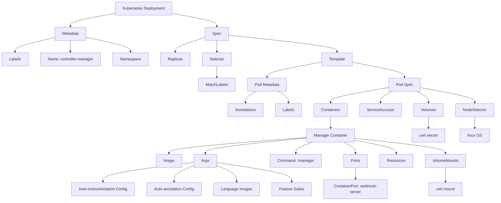
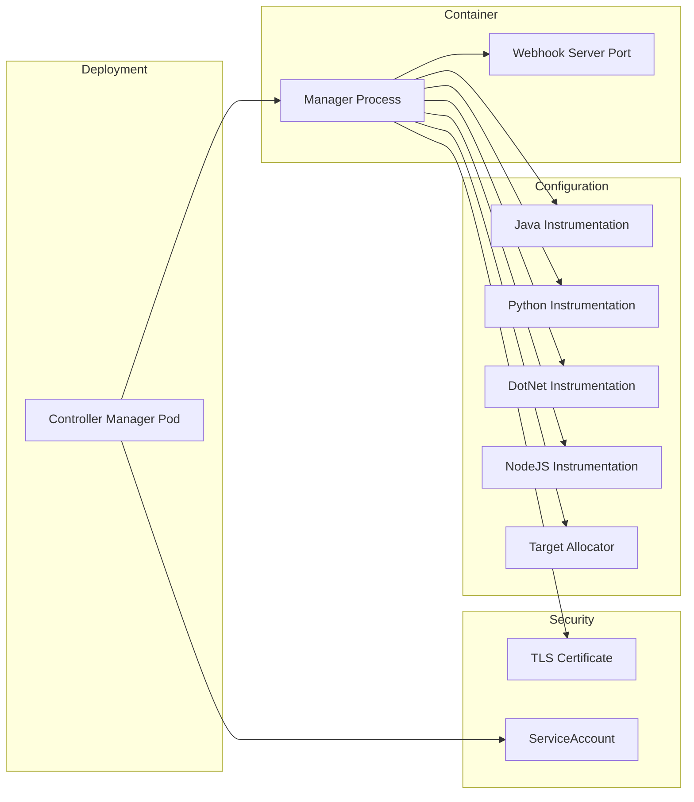
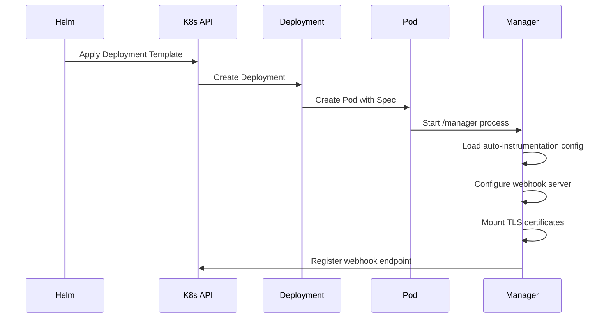
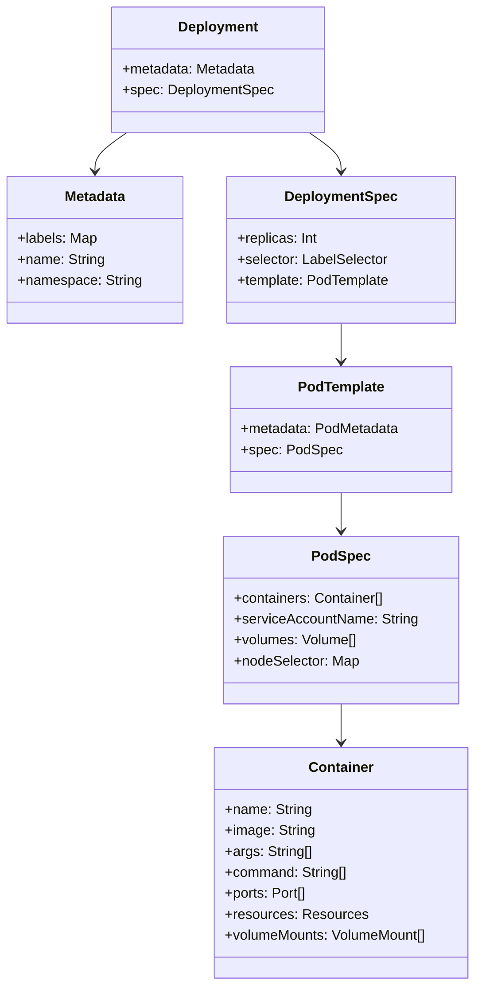

# Diagram: devops/k8s/amazon-cloudwatch-observability/helm/templates/operator-deployment.yaml

> Auto-generated by Obscura crawlers

## Diagram 1

### SVG

<svg id="container" width="2031.9140625" xmlns="http://www.w3.org/2000/svg" class="flowchart" height="822" viewBox="0 0 2031.9140625 822" role="graphics-document document" aria-roledescription="flowchart-v2"><g><marker id="container_flowchart-v2-pointEnd" class="marker flowchart-v2" viewBox="0 0 10 10" refX="5" refY="5" markerUnits="userSpaceOnUse" markerWidth="8" markerHeight="8" orient="auto"><path d="M 0 0 L 10 5 L 0 10 z" class="arrowMarkerPath" style="stroke-width: 1; stroke-dasharray: 1, 0;"></path></marker><marker id="container_flowchart-v2-pointStart" class="marker flowchart-v2" viewBox="0 0 10 10" refX="4.5" refY="5" markerUnits="userSpaceOnUse" markerWidth="8" markerHeight="8" orient="auto"><path d="M 0 5 L 10 10 L 10 0 z" class="arrowMarkerPath" style="stroke-width: 1; stroke-dasharray: 1, 0;"></path></marker><marker id="container_flowchart-v2-circleEnd" class="marker flowchart-v2" viewBox="0 0 10 10" refX="11" refY="5" markerUnits="userSpaceOnUse" markerWidth="11" markerHeight="11" orient="auto"><circle cx="5" cy="5" r="5" class="arrowMarkerPath" style="stroke-width: 1; stroke-dasharray: 1, 0;"></circle></marker><marker id="container_flowchart-v2-circleStart" class="marker flowchart-v2" viewBox="0 0 10 10" refX="-1" refY="5" markerUnits="userSpaceOnUse" markerWidth="11" markerHeight="11" orient="auto"><circle cx="5" cy="5" r="5" class="arrowMarkerPath" style="stroke-width: 1; stroke-dasharray: 1, 0;"></circle></marker><marker id="container_flowchart-v2-crossEnd" class="marker cross flowchart-v2" viewBox="0 0 11 11" refX="12" refY="5.2" markerUnits="userSpaceOnUse" markerWidth="11" markerHeight="11" orient="auto"><path d="M 1,1 l 9,9 M 10,1 l -9,9" class="arrowMarkerPath" style="stroke-width: 2; stroke-dasharray: 1, 0;"></path></marker><marker id="container_flowchart-v2-crossStart" class="marker cross flowchart-v2" viewBox="0 0 11 11" refX="-1" refY="5.2" markerUnits="userSpaceOnUse" markerWidth="11" markerHeight="11" orient="auto"><path d="M 1,1 l 9,9 M 10,1 l -9,9" class="arrowMarkerPath" style="stroke-width: 2; stroke-dasharray: 1, 0;"></path></marker><g class="root"><g class="clusters"></g><g class="edgePaths"><path d="M472.133,55.396L441.797,60.664C411.461,65.931,350.789,76.465,320.453,85.233C290.117,94,290.117,101,290.117,104.5L290.117,108" id="L_A_B_0" class="edge-thickness-normal edge-pattern-solid edge-thickness-normal edge-pattern-solid flowchart-link" style=";" data-edge="true" data-et="edge" data-id="L_A_B_0" data-points="W3sieCI6NDcyLjEzMjgxMjUsInkiOjU1LjM5NjMwNjE1MTE5NzM3fSx7IngiOjI5MC4xMTcxODc1LCJ5Ijo4N30seyJ4IjoyOTAuMTE3MTg3NSwieSI6MTEyfV0=" marker-end="url(#container_flowchart-v2-pointEnd)"></path><path d="M707.07,55.396L737.406,60.664C767.742,65.931,828.414,76.465,858.75,85.233C889.086,94,889.086,101,889.086,104.5L889.086,108" id="L_A_C_0" class="edge-thickness-normal edge-pattern-solid edge-thickness-normal edge-pattern-solid flowchart-link" style=";" data-edge="true" data-et="edge" data-id="L_A_C_0" data-points="W3sieCI6NzA3LjA3MDMxMjUsInkiOjU1LjM5NjMwNjE1MTE5NzM3fSx7IngiOjg4OS4wODU5Mzc1LCJ5Ijo4N30seyJ4Ijo4ODkuMDg1OTM3NSwieSI6MTEyfV0=" marker-end="url(#container_flowchart-v2-pointEnd)"></path><path d="M226.023,153.575L198.595,159.813C171.167,166.05,116.31,178.525,88.882,188.263C61.453,198,61.453,205,61.453,208.5L61.453,212" id="L_B_D_0" class="edge-thickness-normal edge-pattern-solid edge-thickness-normal edge-pattern-solid flowchart-link" style=";" data-edge="true" data-et="edge" data-id="L_B_D_0" data-points="W3sieCI6MjI2LjAyMzQzNzUsInkiOjE1My41NzU0MjEwOTM5OTAyM30seyJ4Ijo2MS40NTMxMjUsInkiOjE5MX0seyJ4Ijo2MS40NTMxMjUsInkiOjIxNn1d" marker-end="url(#container_flowchart-v2-pointEnd)"></path><path d="M290.117,166L290.117,170.167C290.117,174.333,290.117,182.667,290.117,190.333C290.117,198,290.117,205,290.117,208.5L290.117,212" id="L_B_E_0" class="edge-thickness-normal edge-pattern-solid edge-thickness-normal edge-pattern-solid flowchart-link" style=";" data-edge="true" data-et="edge" data-id="L_B_E_0" data-points="W3sieCI6MjkwLjExNzE4NzUsInkiOjE2Nn0seyJ4IjoyOTAuMTE3MTg3NSwieSI6MTkxfSx7IngiOjI5MC4xMTcxODc1LCJ5IjoyMTZ9XQ==" marker-end="url(#container_flowchart-v2-pointEnd)"></path><path d="M354.211,152.492L384.701,158.91C415.19,165.328,476.169,178.164,506.659,188.082C537.148,198,537.148,205,537.148,208.5L537.148,212" id="L_B_F_0" class="edge-thickness-normal edge-pattern-solid edge-thickness-normal edge-pattern-solid flowchart-link" style=";" data-edge="true" data-et="edge" data-id="L_B_F_0" data-points="W3sieCI6MzU0LjIxMDkzNzUsInkiOjE1Mi40OTE3MTQxMDQ5OTY4NH0seyJ4Ijo1MzcuMTQ4NDM3NSwieSI6MTkxfSx7IngiOjUzNy4xNDg0Mzc1LCJ5IjoyMTZ9XQ==" marker-end="url(#container_flowchart-v2-pointEnd)"></path><path d="M841.789,153.473L821.35,159.728C800.911,165.982,760.034,178.491,739.595,188.246C719.156,198,719.156,205,719.156,208.5L719.156,212" id="L_C_G_0" class="edge-thickness-normal edge-pattern-solid edge-thickness-normal edge-pattern-solid flowchart-link" style=";" data-edge="true" data-et="edge" data-id="L_C_G_0" data-points="W3sieCI6ODQxLjc4OTA2MjUsInkiOjE1My40NzMyNjU1OTY5ODQwNX0seyJ4Ijo3MTkuMTU2MjUsInkiOjE5MX0seyJ4Ijo3MTkuMTU2MjUsInkiOjIxNn1d" marker-end="url(#container_flowchart-v2-pointEnd)"></path><path d="M889.086,166L889.086,170.167C889.086,174.333,889.086,182.667,889.086,190.333C889.086,198,889.086,205,889.086,208.5L889.086,212" id="L_C_H_0" class="edge-thickness-normal edge-pattern-solid edge-thickness-normal edge-pattern-solid flowchart-link" style=";" data-edge="true" data-et="edge" data-id="L_C_H_0" data-points="W3sieCI6ODg5LjA4NTkzNzUsInkiOjE2Nn0seyJ4Ijo4ODkuMDg1OTM3NSwieSI6MTkxfSx7IngiOjg4OS4wODU5Mzc1LCJ5IjoyMTZ9XQ==" marker-end="url(#container_flowchart-v2-pointEnd)"></path><path d="M936.383,144.006L1010.378,151.839C1084.372,159.671,1232.362,175.335,1306.357,186.668C1380.352,198,1380.352,205,1380.352,208.5L1380.352,212" id="L_C_I_0" class="edge-thickness-normal edge-pattern-solid edge-thickness-normal edge-pattern-solid flowchart-link" style=";" data-edge="true" data-et="edge" data-id="L_C_I_0" data-points="W3sieCI6OTM2LjM4MjgxMjUsInkiOjE0NC4wMDYzMjkzMTUyMjUzNH0seyJ4IjoxMzgwLjM1MTU2MjUsInkiOjE5MX0seyJ4IjoxMzgwLjM1MTU2MjUsInkiOjIxNn1d" marker-end="url(#container_flowchart-v2-pointEnd)"></path><path d="M889.086,270L889.086,274.167C889.086,278.333,889.086,286.667,889.086,294.333C889.086,302,889.086,309,889.086,312.5L889.086,316" id="L_H_J_0" class="edge-thickness-normal edge-pattern-solid edge-thickness-normal edge-pattern-solid flowchart-link" style=";" data-edge="true" data-et="edge" data-id="L_H_J_0" data-points="W3sieCI6ODg5LjA4NTkzNzUsInkiOjI3MH0seyJ4Ijo4ODkuMDg1OTM3NSwieSI6Mjk1fSx7IngiOjg4OS4wODU5Mzc1LCJ5IjozMjB9XQ==" marker-end="url(#container_flowchart-v2-pointEnd)"></path><path d="M1316.898,254.542L1279.827,261.285C1242.755,268.028,1168.612,281.514,1131.54,291.757C1094.469,302,1094.469,309,1094.469,312.5L1094.469,316" id="L_I_K_0" class="edge-thickness-normal edge-pattern-solid edge-thickness-normal edge-pattern-solid flowchart-link" style=";" data-edge="true" data-et="edge" data-id="L_I_K_0" data-points="W3sieCI6MTMxNi44OTg0Mzc1LCJ5IjoyNTQuNTQxNjYwOTczNDEwMjJ9LHsieCI6MTA5NC40Njg3NSwieSI6Mjk1fSx7IngiOjEwOTQuNDY4NzUsInkiOjMyMH1d" marker-end="url(#container_flowchart-v2-pointEnd)"></path><path d="M1443.805,254.921L1479.359,261.601C1514.914,268.281,1586.023,281.64,1621.578,291.82C1657.133,302,1657.133,309,1657.133,312.5L1657.133,316" id="L_I_L_0" class="edge-thickness-normal edge-pattern-solid edge-thickness-normal edge-pattern-solid flowchart-link" style=";" data-edge="true" data-et="edge" data-id="L_I_L_0" data-points="W3sieCI6MTQ0My44MDQ2ODc1LCJ5IjoyNTQuOTIxMTkyMjc3Mjk0OH0seyJ4IjoxNjU3LjEzMjgxMjUsInkiOjI5NX0seyJ4IjoxNjU3LjEzMjgxMjUsInkiOjMyMH1d" marker-end="url(#container_flowchart-v2-pointEnd)"></path><path d="M1048.383,374L1041.271,378.167C1034.159,382.333,1019.935,390.667,1012.823,398.333C1005.711,406,1005.711,413,1005.711,416.5L1005.711,420" id="L_K_M_0" class="edge-thickness-normal edge-pattern-solid edge-thickness-normal edge-pattern-solid flowchart-link" style=";" data-edge="true" data-et="edge" data-id="L_K_M_0" data-points="W3sieCI6MTA0OC4zODI5NjI3NDAzODQ1LCJ5IjozNzR9LHsieCI6MTAwNS43MTA5Mzc1LCJ5IjozOTl9LHsieCI6MTAwNS43MTA5Mzc1LCJ5Ijo0MjR9XQ==" marker-end="url(#container_flowchart-v2-pointEnd)"></path><path d="M1140.555,374L1147.667,378.167C1154.779,382.333,1169.003,390.667,1176.115,398.333C1183.227,406,1183.227,413,1183.227,416.5L1183.227,420" id="L_K_N_0" class="edge-thickness-normal edge-pattern-solid edge-thickness-normal edge-pattern-solid flowchart-link" style=";" data-edge="true" data-et="edge" data-id="L_K_N_0" data-points="W3sieCI6MTE0MC41NTQ1MzcyNTk2MTU1LCJ5IjozNzR9LHsieCI6MTE4My4yMjY1NjI1LCJ5IjozOTl9LHsieCI6MTE4My4yMjY1NjI1LCJ5Ijo0MjR9XQ==" marker-end="url(#container_flowchart-v2-pointEnd)"></path><path d="M1593.852,357.911L1554.135,364.759C1514.419,371.608,1434.987,385.304,1395.271,395.652C1355.555,406,1355.555,413,1355.555,416.5L1355.555,420" id="L_L_O_0" class="edge-thickness-normal edge-pattern-solid edge-thickness-normal edge-pattern-solid flowchart-link" style=";" data-edge="true" data-et="edge" data-id="L_L_O_0" data-points="W3sieCI6MTU5My44NTE1NjI1LCJ5IjozNTcuOTExMzUxNzQzNDMzfSx7IngiOjEzNTUuNTU0Njg3NSwieSI6Mzk5fSx7IngiOjEzNTUuNTU0Njg3NSwieSI6NDI0fV0=" marker-end="url(#container_flowchart-v2-pointEnd)"></path><path d="M1606.321,374L1598.48,378.167C1590.639,382.333,1574.956,390.667,1567.115,398.333C1559.273,406,1559.273,413,1559.273,416.5L1559.273,420" id="L_L_P_0" class="edge-thickness-normal edge-pattern-solid edge-thickness-normal edge-pattern-solid flowchart-link" style=";" data-edge="true" data-et="edge" data-id="L_L_P_0" data-points="W3sieCI6MTYwNi4zMjEyMTM5NDIzMDc2LCJ5IjozNzR9LHsieCI6MTU1OS4yNzM0Mzc1LCJ5IjozOTl9LHsieCI6MTU1OS4yNzM0Mzc1LCJ5Ijo0MjR9XQ==" marker-end="url(#container_flowchart-v2-pointEnd)"></path><path d="M1707.944,374L1715.786,378.167C1723.627,382.333,1739.31,390.667,1747.151,398.333C1754.992,406,1754.992,413,1754.992,416.5L1754.992,420" id="L_L_Q_0" class="edge-thickness-normal edge-pattern-solid edge-thickness-normal edge-pattern-solid flowchart-link" style=";" data-edge="true" data-et="edge" data-id="L_L_Q_0" data-points="W3sieCI6MTcwNy45NDQ0MTEwNTc2OTI0LCJ5IjozNzR9LHsieCI6MTc1NC45OTIxODc1LCJ5IjozOTl9LHsieCI6MTc1NC45OTIxODc1LCJ5Ijo0MjR9XQ==" marker-end="url(#container_flowchart-v2-pointEnd)"></path><path d="M1720.414,358.435L1757.827,365.196C1795.24,371.957,1870.065,385.478,1907.478,395.739C1944.891,406,1944.891,413,1944.891,416.5L1944.891,420" id="L_L_R_0" class="edge-thickness-normal edge-pattern-solid edge-thickness-normal edge-pattern-solid flowchart-link" style=";" data-edge="true" data-et="edge" data-id="L_L_R_0" data-points="W3sieCI6MTcyMC40MTQwNjI1LCJ5IjozNTguNDM1Mzk3NjA1NDA4Mn0seyJ4IjoxOTQ0Ljg5MDYyNSwieSI6Mzk5fSx7IngiOjE5NDQuODkwNjI1LCJ5Ijo0MjR9XQ==" marker-end="url(#container_flowchart-v2-pointEnd)"></path><path d="M1355.555,478L1355.555,482.167C1355.555,486.333,1355.555,494.667,1355.555,502.333C1355.555,510,1355.555,517,1355.555,520.5L1355.555,524" id="L_O_S_0" class="edge-thickness-normal edge-pattern-solid edge-thickness-normal edge-pattern-solid flowchart-link" style=";" data-edge="true" data-et="edge" data-id="L_O_S_0" data-points="W3sieCI6MTM1NS41NTQ2ODc1LCJ5Ijo0Nzh9LHsieCI6MTM1NS41NTQ2ODc1LCJ5Ijo1MDN9LHsieCI6MTM1NS41NTQ2ODc1LCJ5Ijo1Mjh9XQ==" marker-end="url(#container_flowchart-v2-pointEnd)"></path><path d="M1257.156,562.824L1164.555,570.186C1071.954,577.549,886.753,592.275,794.152,603.137C701.551,614,701.551,621,701.551,624.5L701.551,628" id="L_S_T_0" class="edge-thickness-normal edge-pattern-solid edge-thickness-normal edge-pattern-solid flowchart-link" style=";" data-edge="true" data-et="edge" data-id="L_S_T_0" data-points="W3sieCI6MTI1Ny4xNTYyNSwieSI6NTYyLjgyMzY4MjI0NTc4MTd9LHsieCI6NzAxLjU1MDc4MTI1LCJ5Ijo2MDd9LHsieCI6NzAxLjU1MDc4MTI1LCJ5Ijo2MzJ9XQ==" marker-end="url(#container_flowchart-v2-pointEnd)"></path><path d="M1257.156,565.098L1189.102,572.081C1121.048,579.065,984.94,593.033,916.886,603.516C848.832,614,848.832,621,848.832,624.5L848.832,628" id="L_S_U_0" class="edge-thickness-normal edge-pattern-solid edge-thickness-normal edge-pattern-solid flowchart-link" style=";" data-edge="true" data-et="edge" data-id="L_S_U_0" data-points="W3sieCI6MTI1Ny4xNTYyNSwieSI6NTY1LjA5NzY3MTE1NTc4ODJ9LHsieCI6ODQ4LjgzMjAzMTI1LCJ5Ijo2MDd9LHsieCI6ODQ4LjgzMjAzMTI1LCJ5Ijo2MzJ9XQ==" marker-end="url(#container_flowchart-v2-pointEnd)"></path><path d="M1283.021,582L1271.827,586.167C1260.634,590.333,1238.246,598.667,1227.053,606.333C1215.859,614,1215.859,621,1215.859,624.5L1215.859,628" id="L_S_V_0" class="edge-thickness-normal edge-pattern-solid edge-thickness-normal edge-pattern-solid flowchart-link" style=";" data-edge="true" data-et="edge" data-id="L_S_V_0" data-points="W3sieCI6MTI4My4wMjA1ODI5MzI2OTI0LCJ5Ijo1ODJ9LHsieCI6MTIxNS44NTkzNzUsInkiOjYwN30seyJ4IjoxMjE1Ljg1OTM3NSwieSI6NjMyfV0=" marker-end="url(#container_flowchart-v2-pointEnd)"></path><path d="M1408.76,582L1416.97,586.167C1425.181,590.333,1441.602,598.667,1449.813,606.333C1458.023,614,1458.023,621,1458.023,624.5L1458.023,628" id="L_S_W_0" class="edge-thickness-normal edge-pattern-solid edge-thickness-normal edge-pattern-solid flowchart-link" style=";" data-edge="true" data-et="edge" data-id="L_S_W_0" data-points="W3sieCI6MTQwOC43NTk2MTUzODQ2MTU1LCJ5Ijo1ODJ9LHsieCI6MTQ1OC4wMjM0Mzc1LCJ5Ijo2MDd9LHsieCI6MTQ1OC4wMjM0Mzc1LCJ5Ijo2MzJ9XQ==" marker-end="url(#container_flowchart-v2-pointEnd)"></path><path d="M1453.953,574.091L1482.224,579.575C1510.495,585.06,1567.036,596.03,1595.307,605.015C1623.578,614,1623.578,621,1623.578,624.5L1623.578,628" id="L_S_X_0" class="edge-thickness-normal edge-pattern-solid edge-thickness-normal edge-pattern-solid flowchart-link" style=";" data-edge="true" data-et="edge" data-id="L_S_X_0" data-points="W3sieCI6MTQ1My45NTMxMjUsInkiOjU3NC4wOTA1NjQ2MDc4MDZ9LHsieCI6MTYyMy41NzgxMjUsInkiOjYwN30seyJ4IjoxNjIzLjU3ODEyNSwieSI6NjMyfV0=" marker-end="url(#container_flowchart-v2-pointEnd)"></path><path d="M1453.953,565.915L1515.685,572.762C1577.417,579.61,1700.88,593.305,1762.612,603.652C1824.344,614,1824.344,621,1824.344,624.5L1824.344,628" id="L_S_Y_0" class="edge-thickness-normal edge-pattern-solid edge-thickness-normal edge-pattern-solid flowchart-link" style=";" data-edge="true" data-et="edge" data-id="L_S_Y_0" data-points="W3sieCI6MTQ1My45NTMxMjUsInkiOjU2NS45MTQ3NTcxMDM1NzQ3fSx7IngiOjE4MjQuMzQzNzUsInkiOjYwN30seyJ4IjoxODI0LjM0Mzc1LCJ5Ijo2MzJ9XQ==" marker-end="url(#container_flowchart-v2-pointEnd)"></path><path d="M803.434,664.585L740.55,672.321C677.667,680.057,551.9,695.528,489.016,706.764C426.133,718,426.133,725,426.133,728.5L426.133,732" id="L_U_Z1_0" class="edge-thickness-normal edge-pattern-solid edge-thickness-normal edge-pattern-solid flowchart-link" style=";" data-edge="true" data-et="edge" data-id="L_U_Z1_0" data-points="W3sieCI6ODAzLjQzMzU5Mzc1LCJ5Ijo2NjQuNTg0ODY2NjAzMjEwM30seyJ4Ijo0MjYuMTMyODEyNSwieSI6NzExfSx7IngiOjQyNi4xMzI4MTI1LCJ5Ijo3MzZ9XQ==" marker-end="url(#container_flowchart-v2-pointEnd)"></path><path d="M803.434,677.405L789.623,683.005C775.813,688.604,748.191,699.802,734.381,710.901C720.57,722,720.57,733,720.57,738.5L720.57,744" id="L_U_Z2_0" class="edge-thickness-normal edge-pattern-solid edge-thickness-normal edge-pattern-solid flowchart-link" style=";" data-edge="true" data-et="edge" data-id="L_U_Z2_0" data-points="W3sieCI6ODAzLjQzMzU5Mzc1LCJ5Ijo2NzcuNDA1NDgxOTU1MjMwN30seyJ4Ijo3MjAuNTcwMzEyNSwieSI6NzExfSx7IngiOjcyMC41NzAzMTI1LCJ5Ijo3NDh9XQ==" marker-end="url(#container_flowchart-v2-pointEnd)"></path><path d="M894.23,677.405L908.041,683.005C921.852,688.604,949.473,699.802,963.283,710.901C977.094,722,977.094,733,977.094,738.5L977.094,744" id="L_U_Z3_0" class="edge-thickness-normal edge-pattern-solid edge-thickness-normal edge-pattern-solid flowchart-link" style=";" data-edge="true" data-et="edge" data-id="L_U_Z3_0" data-points="W3sieCI6ODk0LjIzMDQ2ODc1LCJ5Ijo2NzcuNDA1NDgxOTU1MjMwN30seyJ4Ijo5NzcuMDkzNzUsInkiOjcxMX0seyJ4Ijo5NzcuMDkzNzUsInkiOjc0OH1d" marker-end="url(#container_flowchart-v2-pointEnd)"></path><path d="M894.23,665.749L944.959,673.291C995.688,680.833,1097.145,695.916,1147.873,708.958C1198.602,722,1198.602,733,1198.602,738.5L1198.602,744" id="L_U_Z4_0" class="edge-thickness-normal edge-pattern-solid edge-thickness-normal edge-pattern-solid flowchart-link" style=";" data-edge="true" data-et="edge" data-id="L_U_Z4_0" data-points="W3sieCI6ODk0LjIzMDQ2ODc1LCJ5Ijo2NjUuNzQ5MzU1MDQ0MDU4fSx7IngiOjExOTguNjAxNTYyNSwieSI6NzExfSx7IngiOjExOTguNjAxNTYyNSwieSI6NzQ4fV0=" marker-end="url(#container_flowchart-v2-pointEnd)"></path><path d="M1458.023,686L1458.023,690.167C1458.023,694.333,1458.023,702.667,1458.023,710.333C1458.023,718,1458.023,725,1458.023,728.5L1458.023,732" id="L_W_AA_0" class="edge-thickness-normal edge-pattern-solid edge-thickness-normal edge-pattern-solid flowchart-link" style=";" data-edge="true" data-et="edge" data-id="L_W_AA_0" data-points="W3sieCI6MTQ1OC4wMjM0Mzc1LCJ5Ijo2ODZ9LHsieCI6MTQ1OC4wMjM0Mzc1LCJ5Ijo3MTF9LHsieCI6MTQ1OC4wMjM0Mzc1LCJ5Ijo3MzZ9XQ==" marker-end="url(#container_flowchart-v2-pointEnd)"></path><path d="M1824.344,686L1824.344,690.167C1824.344,694.333,1824.344,702.667,1824.344,712.333C1824.344,722,1824.344,733,1824.344,738.5L1824.344,744" id="L_Y_AB_0" class="edge-thickness-normal edge-pattern-solid edge-thickness-normal edge-pattern-solid flowchart-link" style=";" data-edge="true" data-et="edge" data-id="L_Y_AB_0" data-points="W3sieCI6MTgyNC4zNDM3NSwieSI6Njg2fSx7IngiOjE4MjQuMzQzNzUsInkiOjcxMX0seyJ4IjoxODI0LjM0Mzc1LCJ5Ijo3NDh9XQ==" marker-end="url(#container_flowchart-v2-pointEnd)"></path><path d="M1754.992,478L1754.992,482.167C1754.992,486.333,1754.992,494.667,1754.992,502.333C1754.992,510,1754.992,517,1754.992,520.5L1754.992,524" id="L_Q_AC_0" class="edge-thickness-normal edge-pattern-solid edge-thickness-normal edge-pattern-solid flowchart-link" style=";" data-edge="true" data-et="edge" data-id="L_Q_AC_0" data-points="W3sieCI6MTc1NC45OTIxODc1LCJ5Ijo0Nzh9LHsieCI6MTc1NC45OTIxODc1LCJ5Ijo1MDN9LHsieCI6MTc1NC45OTIxODc1LCJ5Ijo1Mjh9XQ==" marker-end="url(#container_flowchart-v2-pointEnd)"></path><path d="M1944.891,478L1944.891,482.167C1944.891,486.333,1944.891,494.667,1944.891,502.333C1944.891,510,1944.891,517,1944.891,520.5L1944.891,524" id="L_R_AD_0" class="edge-thickness-normal edge-pattern-solid edge-thickness-normal edge-pattern-solid flowchart-link" style=";" data-edge="true" data-et="edge" data-id="L_R_AD_0" data-points="W3sieCI6MTk0NC44OTA2MjUsInkiOjQ3OH0seyJ4IjoxOTQ0Ljg5MDYyNSwieSI6NTAzfSx7IngiOjE5NDQuODkwNjI1LCJ5Ijo1Mjh9XQ==" marker-end="url(#container_flowchart-v2-pointEnd)"></path></g><g class="edgeLabels"><g class="edgeLabel"><g class="label" data-id="L_A_B_0" transform="translate(0, 0)"><foreignObject width="0" height="0">

</foreignObject></g></g><g class="edgeLabel"><g class="label" data-id="L_A_C_0" transform="translate(0, 0)"><foreignObject width="0" height="0">

</foreignObject></g></g><g class="edgeLabel"><g class="label" data-id="L_B_D_0" transform="translate(0, 0)"><foreignObject width="0" height="0">

</foreignObject></g></g><g class="edgeLabel"><g class="label" data-id="L_B_E_0" transform="translate(0, 0)"><foreignObject width="0" height="0">

</foreignObject></g></g><g class="edgeLabel"><g class="label" data-id="L_B_F_0" transform="translate(0, 0)"><foreignObject width="0" height="0">

</foreignObject></g></g><g class="edgeLabel"><g class="label" data-id="L_C_G_0" transform="translate(0, 0)"><foreignObject width="0" height="0">

</foreignObject></g></g><g class="edgeLabel"><g class="label" data-id="L_C_H_0" transform="translate(0, 0)"><foreignObject width="0" height="0">

</foreignObject></g></g><g class="edgeLabel"><g class="label" data-id="L_C_I_0" transform="translate(0, 0)"><foreignObject width="0" height="0">

</foreignObject></g></g><g class="edgeLabel"><g class="label" data-id="L_H_J_0" transform="translate(0, 0)"><foreignObject width="0" height="0">

</foreignObject></g></g><g class="edgeLabel"><g class="label" data-id="L_I_K_0" transform="translate(0, 0)"><foreignObject width="0" height="0">

</foreignObject></g></g><g class="edgeLabel"><g class="label" data-id="L_I_L_0" transform="translate(0, 0)"><foreignObject width="0" height="0">

</foreignObject></g></g><g class="edgeLabel"><g class="label" data-id="L_K_M_0" transform="translate(0, 0)"><foreignObject width="0" height="0">

</foreignObject></g></g><g class="edgeLabel"><g class="label" data-id="L_K_N_0" transform="translate(0, 0)"><foreignObject width="0" height="0">

</foreignObject></g></g><g class="edgeLabel"><g class="label" data-id="L_L_O_0" transform="translate(0, 0)"><foreignObject width="0" height="0">

</foreignObject></g></g><g class="edgeLabel"><g class="label" data-id="L_L_P_0" transform="translate(0, 0)"><foreignObject width="0" height="0">

</foreignObject></g></g><g class="edgeLabel"><g class="label" data-id="L_L_Q_0" transform="translate(0, 0)"><foreignObject width="0" height="0">

</foreignObject></g></g><g class="edgeLabel"><g class="label" data-id="L_L_R_0" transform="translate(0, 0)"><foreignObject width="0" height="0">

</foreignObject></g></g><g class="edgeLabel"><g class="label" data-id="L_O_S_0" transform="translate(0, 0)"><foreignObject width="0" height="0">

</foreignObject></g></g><g class="edgeLabel"><g class="label" data-id="L_S_T_0" transform="translate(0, 0)"><foreignObject width="0" height="0">

</foreignObject></g></g><g class="edgeLabel"><g class="label" data-id="L_S_U_0" transform="translate(0, 0)"><foreignObject width="0" height="0">

</foreignObject></g></g><g class="edgeLabel"><g class="label" data-id="L_S_V_0" transform="translate(0, 0)"><foreignObject width="0" height="0">

</foreignObject></g></g><g class="edgeLabel"><g class="label" data-id="L_S_W_0" transform="translate(0, 0)"><foreignObject width="0" height="0">

</foreignObject></g></g><g class="edgeLabel"><g class="label" data-id="L_S_X_0" transform="translate(0, 0)"><foreignObject width="0" height="0">

</foreignObject></g></g><g class="edgeLabel"><g class="label" data-id="L_S_Y_0" transform="translate(0, 0)"><foreignObject width="0" height="0">

</foreignObject></g></g><g class="edgeLabel"><g class="label" data-id="L_U_Z1_0" transform="translate(0, 0)"><foreignObject width="0" height="0">

</foreignObject></g></g><g class="edgeLabel"><g class="label" data-id="L_U_Z2_0" transform="translate(0, 0)"><foreignObject width="0" height="0">

</foreignObject></g></g><g class="edgeLabel"><g class="label" data-id="L_U_Z3_0" transform="translate(0, 0)"><foreignObject width="0" height="0">

</foreignObject></g></g><g class="edgeLabel"><g class="label" data-id="L_U_Z4_0" transform="translate(0, 0)"><foreignObject width="0" height="0">

</foreignObject></g></g><g class="edgeLabel"><g class="label" data-id="L_W_AA_0" transform="translate(0, 0)"><foreignObject width="0" height="0">

</foreignObject></g></g><g class="edgeLabel"><g class="label" data-id="L_Y_AB_0" transform="translate(0, 0)"><foreignObject width="0" height="0">

</foreignObject></g></g><g class="edgeLabel"><g class="label" data-id="L_Q_AC_0" transform="translate(0, 0)"><foreignObject width="0" height="0">

</foreignObject></g></g><g class="edgeLabel"><g class="label" data-id="L_R_AD_0" transform="translate(0, 0)"><foreignObject width="0" height="0">

</foreignObject></g></g></g><g class="nodes"><g class="node default" id="flowchart-A-0" transform="translate(589.6015625, 35)"><rect class="basic label-container" style="" x="-117.46875" y="-27" width="234.9375" height="54"></rect><g class="label" style="" transform="translate(-87.46875, -12)"><rect></rect><foreignObject width="174.9375" height="24">

Kubernetes Deployment

</foreignObject></g></g><g class="node default" id="flowchart-B-1" transform="translate(290.1171875, 139)"><rect class="basic label-container" style="" x="-64.09375" y="-27" width="128.1875" height="54"></rect><g class="label" style="" transform="translate(-34.09375, -12)"><rect></rect><foreignObject width="68.1875" height="24">

Metadata

</foreignObject></g></g><g class="node default" id="flowchart-C-3" transform="translate(889.0859375, 139)"><rect class="basic label-container" style="" x="-47.296875" y="-27" width="94.59375" height="54"></rect><g class="label" style="" transform="translate(-17.296875, -12)"><rect></rect><foreignObject width="34.59375" height="24">

Spec

</foreignObject></g></g><g class="node default" id="flowchart-D-5" transform="translate(61.453125, 243)"><rect class="basic label-container" style="" x="-53.453125" y="-27" width="106.90625" height="54"></rect><g class="label" style="" transform="translate(-23.453125, -12)"><rect></rect><foreignObject width="46.90625" height="24">

Labels

</foreignObject></g></g><g class="node default" id="flowchart-E-7" transform="translate(290.1171875, 243)"><rect class="basic label-container" style="" x="-125.2109375" y="-27" width="250.421875" height="54"></rect><g class="label" style="" transform="translate(-95.2109375, -12)"><rect></rect><foreignObject width="190.421875" height="24">

Name: controller-manager

</foreignObject></g></g><g class="node default" id="flowchart-F-9" transform="translate(537.1484375, 243)"><rect class="basic label-container" style="" x="-71.8203125" y="-27" width="143.640625" height="54"></rect><g class="label" style="" transform="translate(-41.8203125, -12)"><rect></rect><foreignObject width="83.640625" height="24">

Namespace

</foreignObject></g></g><g class="node default" id="flowchart-G-11" transform="translate(719.15625, 243)"><rect class="basic label-container" style="" x="-60.1875" y="-27" width="120.375" height="54"></rect><g class="label" style="" transform="translate(-30.1875, -12)"><rect></rect><foreignObject width="60.375" height="24">

Replicas

</foreignObject></g></g><g class="node default" id="flowchart-H-13" transform="translate(889.0859375, 243)"><rect class="basic label-container" style="" x="-59.7421875" y="-27" width="119.484375" height="54"></rect><g class="label" style="" transform="translate(-29.7421875, -12)"><rect></rect><foreignObject width="59.484375" height="24">

Selector

</foreignObject></g></g><g class="node default" id="flowchart-I-15" transform="translate(1380.3515625, 243)"><rect class="basic label-container" style="" x="-63.453125" y="-27" width="126.90625" height="54"></rect><g class="label" style="" transform="translate(-33.453125, -12)"><rect></rect><foreignObject width="66.90625" height="24">

Template

</foreignObject></g></g><g class="node default" id="flowchart-J-17" transform="translate(889.0859375, 347)"><rect class="basic label-container" style="" x="-75.3046875" y="-27" width="150.609375" height="54"></rect><g class="label" style="" transform="translate(-45.3046875, -12)"><rect></rect><foreignObject width="90.609375" height="24">

MatchLabels

</foreignObject></g></g><g class="node default" id="flowchart-K-19" transform="translate(1094.46875, 347)"><rect class="basic label-container" style="" x="-80.078125" y="-27" width="160.15625" height="54"></rect><g class="label" style="" transform="translate(-50.078125, -12)"><rect></rect><foreignObject width="100.15625" height="24">

Pod Metadata

</foreignObject></g></g><g class="node default" id="flowchart-L-21" transform="translate(1657.1328125, 347)"><rect class="basic label-container" style="" x="-63.28125" y="-27" width="126.5625" height="54"></rect><g class="label" style="" transform="translate(-33.28125, -12)"><rect></rect><foreignObject width="66.5625" height="24">

Pod Spec

</foreignObject></g></g><g class="node default" id="flowchart-M-23" transform="translate(1005.7109375, 451)"><rect class="basic label-container" style="" x="-74.0625" y="-27" width="148.125" height="54"></rect><g class="label" style="" transform="translate(-44.0625, -12)"><rect></rect><foreignObject width="88.125" height="24">

Annotations

</foreignObject></g></g><g class="node default" id="flowchart-N-25" transform="translate(1183.2265625, 451)"><rect class="basic label-container" style="" x="-53.453125" y="-27" width="106.90625" height="54"></rect><g class="label" style="" transform="translate(-23.453125, -12)"><rect></rect><foreignObject width="46.90625" height="24">

Labels

</foreignObject></g></g><g class="node default" id="flowchart-O-27" transform="translate(1355.5546875, 451)"><rect class="basic label-container" style="" x="-68.875" y="-27" width="137.75" height="54"></rect><g class="label" style="" transform="translate(-38.875, -12)"><rect></rect><foreignObject width="77.75" height="24">

Containers

</foreignObject></g></g><g class="node default" id="flowchart-P-29" transform="translate(1559.2734375, 451)"><rect class="basic label-container" style="" x="-84.84375" y="-27" width="169.6875" height="54"></rect><g class="label" style="" transform="translate(-54.84375, -12)"><rect></rect><foreignObject width="109.6875" height="24">

ServiceAccount

</foreignObject></g></g><g class="node default" id="flowchart-Q-31" transform="translate(1754.9921875, 451)"><rect class="basic label-container" style="" x="-60.875" y="-27" width="121.75" height="54"></rect><g class="label" style="" transform="translate(-30.875, -12)"><rect></rect><foreignObject width="61.75" height="24">

Volumes

</foreignObject></g></g><g class="node default" id="flowchart-R-33" transform="translate(1944.890625, 451)"><rect class="basic label-container" style="" x="-79.0234375" y="-27" width="158.046875" height="54"></rect><g class="label" style="" transform="translate(-49.0234375, -12)"><rect></rect><foreignObject width="98.046875" height="24">

NodeSelector

</foreignObject></g></g><g class="node default" id="flowchart-S-35" transform="translate(1355.5546875, 555)"><rect class="basic label-container" style="" x="-98.3984375" y="-27" width="196.796875" height="54"></rect><g class="label" style="" transform="translate(-68.3984375, -12)"><rect></rect><foreignObject width="136.796875" height="24">

Manager Container

</foreignObject></g></g><g class="node default" id="flowchart-T-37" transform="translate(701.55078125, 659)"><rect class="basic label-container" style="" x="-51.8828125" y="-27" width="103.765625" height="54"></rect><g class="label" style="" transform="translate(-21.8828125, -12)"><rect></rect><foreignObject width="43.765625" height="24">

Image

</foreignObject></g></g><g class="node default" id="flowchart-U-39" transform="translate(848.83203125, 659)"><rect class="basic label-container" style="" x="-45.3984375" y="-27" width="90.796875" height="54"></rect><g class="label" style="" transform="translate(-15.3984375, -12)"><rect></rect><foreignObject width="30.796875" height="24">

Args

</foreignObject></g></g><g class="node default" id="flowchart-V-41" transform="translate(1215.859375, 659)"><rect class="basic label-container" style="" x="-106.140625" y="-27" width="212.28125" height="54"></rect><g class="label" style="" transform="translate(-76.140625, -12)"><rect></rect><foreignObject width="152.28125" height="24">

Command: /manager

</foreignObject></g></g><g class="node default" id="flowchart-W-43" transform="translate(1458.0234375, 659)"><rect class="basic label-container" style="" x="-48.796875" y="-27" width="97.59375" height="54"></rect><g class="label" style="" transform="translate(-18.796875, -12)"><rect></rect><foreignObject width="37.59375" height="24">

Ports

</foreignObject></g></g><g class="node default" id="flowchart-X-45" transform="translate(1623.578125, 659)"><rect class="basic label-container" style="" x="-66.7578125" y="-27" width="133.515625" height="54"></rect><g class="label" style="" transform="translate(-36.7578125, -12)"><rect></rect><foreignObject width="73.515625" height="24">

Resources

</foreignObject></g></g><g class="node default" id="flowchart-Y-47" transform="translate(1824.34375, 659)"><rect class="basic label-container" style="" x="-84.0078125" y="-27" width="168.015625" height="54"></rect><g class="label" style="" transform="translate(-54.0078125, -12)"><rect></rect><foreignObject width="108.015625" height="24">

VolumeMounts

</foreignObject></g></g><g class="node default" id="flowchart-Z1-49" transform="translate(426.1328125, 775)"><rect class="basic label-container" style="" x="-130" y="-39" width="260" height="78"></rect><g class="label" style="" transform="translate(-100, -24)"><rect></rect><foreignObject width="200" height="48">

Auto-instrumentation Config

</foreignObject></g></g><g class="node default" id="flowchart-Z2-51" transform="translate(720.5703125, 775)"><rect class="basic label-container" style="" x="-114.4375" y="-27" width="228.875" height="54"></rect><g class="label" style="" transform="translate(-84.4375, -12)"><rect></rect><foreignObject width="168.875" height="24">

Auto-annotation Config

</foreignObject></g></g><g class="node default" id="flowchart-Z3-53" transform="translate(977.09375, 775)"><rect class="basic label-container" style="" x="-92.0859375" y="-27" width="184.171875" height="54"></rect><g class="label" style="" transform="translate(-62.0859375, -12)"><rect></rect><foreignObject width="124.171875" height="24">

Language Images

</foreignObject></g></g><g class="node default" id="flowchart-Z4-55" transform="translate(1198.6015625, 775)"><rect class="basic label-container" style="" x="-79.421875" y="-27" width="158.84375" height="54"></rect><g class="label" style="" transform="translate(-49.421875, -12)"><rect></rect><foreignObject width="98.84375" height="24">

Feature Gates

</foreignObject></g></g><g class="node default" id="flowchart-AA-57" transform="translate(1458.0234375, 775)"><rect class="basic label-container" style="" x="-130" y="-39" width="260" height="78"></rect><g class="label" style="" transform="translate(-100, -24)"><rect></rect><foreignObject width="200" height="48">

ContainerPort: webhook-server

</foreignObject></g></g><g class="node default" id="flowchart-AB-59" transform="translate(1824.34375, 775)"><rect class="basic label-container" style="" x="-69.8828125" y="-27" width="139.765625" height="54"></rect><g class="label" style="" transform="translate(-39.8828125, -12)"><rect></rect><foreignObject width="79.765625" height="24">

cert mount

</foreignObject></g></g><g class="node default" id="flowchart-AC-61" transform="translate(1754.9921875, 555)"><rect class="basic label-container" style="" x="-68.140625" y="-27" width="136.28125" height="54"></rect><g class="label" style="" transform="translate(-38.140625, -12)"><rect></rect><foreignObject width="76.28125" height="24">

cert secret

</foreignObject></g></g><g class="node default" id="flowchart-AD-63" transform="translate(1944.890625, 555)"><rect class="basic label-container" style="" x="-59.84375" y="-27" width="119.6875" height="54"></rect><g class="label" style="" transform="translate(-29.84375, -12)"><rect></rect><foreignObject width="59.6875" height="24">

linux OS

</foreignObject></g></g></g></g></g></svg>

## Diagram 2

### SVG

<svg id="container" width="887.15625" xmlns="http://www.w3.org/2000/svg" class="flowchart" height="1026" viewBox="0 0 887.15625 1026" role="graphics-document document" aria-roledescription="flowchart-v2"><g><marker id="container_flowchart-v2-pointEnd" class="marker flowchart-v2" viewBox="0 0 10 10" refX="5" refY="5" markerUnits="userSpaceOnUse" markerWidth="8" markerHeight="8" orient="auto"><path d="M 0 0 L 10 5 L 0 10 z" class="arrowMarkerPath" style="stroke-width: 1; stroke-dasharray: 1, 0;"></path></marker><marker id="container_flowchart-v2-pointStart" class="marker flowchart-v2" viewBox="0 0 10 10" refX="4.5" refY="5" markerUnits="userSpaceOnUse" markerWidth="8" markerHeight="8" orient="auto"><path d="M 0 5 L 10 10 L 10 0 z" class="arrowMarkerPath" style="stroke-width: 1; stroke-dasharray: 1, 0;"></path></marker><marker id="container_flowchart-v2-circleEnd" class="marker flowchart-v2" viewBox="0 0 10 10" refX="11" refY="5" markerUnits="userSpaceOnUse" markerWidth="11" markerHeight="11" orient="auto"><circle cx="5" cy="5" r="5" class="arrowMarkerPath" style="stroke-width: 1; stroke-dasharray: 1, 0;"></circle></marker><marker id="container_flowchart-v2-circleStart" class="marker flowchart-v2" viewBox="0 0 10 10" refX="-1" refY="5" markerUnits="userSpaceOnUse" markerWidth="11" markerHeight="11" orient="auto"><circle cx="5" cy="5" r="5" class="arrowMarkerPath" style="stroke-width: 1; stroke-dasharray: 1, 0;"></circle></marker><marker id="container_flowchart-v2-crossEnd" class="marker cross flowchart-v2" viewBox="0 0 11 11" refX="12" refY="5.2" markerUnits="userSpaceOnUse" markerWidth="11" markerHeight="11" orient="auto"><path d="M 1,1 l 9,9 M 10,1 l -9,9" class="arrowMarkerPath" style="stroke-width: 2; stroke-dasharray: 1, 0;"></path></marker><marker id="container_flowchart-v2-crossStart" class="marker cross flowchart-v2" viewBox="0 0 11 11" refX="-1" refY="5.2" markerUnits="userSpaceOnUse" markerWidth="11" markerHeight="11" orient="auto"><path d="M 1,1 l 9,9 M 10,1 l -9,9" class="arrowMarkerPath" style="stroke-width: 2; stroke-dasharray: 1, 0;"></path></marker><g class="root"><g class="clusters"><g class="cluster" id="Security" data-look="classic"><rect style="" x="594.734375" y="790" width="284.421875" height="228"></rect><g class="cluster-label" transform="translate(707.6953125, 790)"><foreignObject width="58.5" height="24">

Security

</foreignObject></g></g><g class="cluster" id="Configuration" data-look="classic"><rect style="" x="594.734375" y="230" width="284.421875" height="540"></rect><g class="cluster-label" transform="translate(688.2578125, 230)"><foreignObject width="97.375" height="24">

Configuration

</foreignObject></g></g><g class="cluster" id="Container" data-look="classic"><rect style="" x="338.609375" y="8" width="540.546875" height="202"></rect><g class="cluster-label" transform="translate(573.625, 8)"><foreignObject width="70.515625" height="24">

Container

</foreignObject></g></g><g class="cluster" id="Deployment" data-look="classic"><rect style="" x="8" y="79" width="280.609375" height="918"></rect><g class="cluster-label" transform="translate(104.3671875, 79)"><foreignObject width="87.875" height="24">

Deployment

</foreignObject></g></g></g><g class="edgePaths"><path d="M157.477,516L179.333,451.667C201.188,387.333,244.899,258.667,270.921,194.333C296.943,130,305.276,130,313.609,130C321.943,130,330.276,130,337.943,130C345.609,130,352.609,130,356.109,130L359.609,130" id="L_A_B_0" class="edge-thickness-normal edge-pattern-solid edge-thickness-normal edge-pattern-solid flowchart-link" style=";" data-edge="true" data-et="edge" data-id="L_A_B_0" data-points="W3sieCI6MTU3LjQ3NzE0ODkxMDQxMTYxLCJ5Ijo1MTZ9LHsieCI6Mjg4LjYwOTM3NSwieSI6MTMwfSx7IngiOjMxMy42MDkzNzUsInkiOjEzMH0seyJ4IjozMzguNjA5Mzc1LCJ5IjoxMzB9LHsieCI6MzYzLjYwOTM3NSwieSI6MTMwfV0=" marker-end="url(#container_flowchart-v2-pointEnd)"></path><path d="M506.175,103L516.768,97.5C527.361,92,548.548,81,563.308,75.5C578.068,70,586.401,70,595.898,70C605.396,70,616.057,70,621.388,70L626.719,70" id="L_B_C_0" class="edge-thickness-normal edge-pattern-solid edge-thickness-normal edge-pattern-solid flowchart-link" style=";" data-edge="true" data-et="edge" data-id="L_B_C_0" data-points="W3sieCI6NTA2LjE3NSwieSI6MTAzfSx7IngiOjU2OS43MzQzNzUsInkiOjcwfSx7IngiOjU5NC43MzQzNzUsInkiOjcwfSx7IngiOjYzMC43MTg3NSwieSI6NzB9XQ==" marker-end="url(#container_flowchart-v2-pointEnd)"></path><path d="M532.177,103L538.436,100.833C544.696,98.667,557.215,94.333,567.641,92.167C578.068,90,586.401,90,610.718,118.622C635.034,147.243,675.334,204.486,695.484,233.108L715.634,261.729" id="L_B_D_0" class="edge-thickness-normal edge-pattern-solid edge-thickness-normal edge-pattern-solid flowchart-link" style=";" data-edge="true" data-et="edge" data-id="L_B_D_0" data-points="W3sieCI6NTMyLjE3NjU2MjUsInkiOjEwM30seyJ4Ijo1NjkuNzM0Mzc1LCJ5Ijo5MH0seyJ4Ijo1OTQuNzM0Mzc1LCJ5Ijo5MH0seyJ4Ijo3MTcuOTM2OTE5ODYzODYxNCwieSI6MjY1fV0=" marker-end="url(#container_flowchart-v2-pointEnd)"></path><path d="M544.734,114.327L548.901,113.606C553.068,112.884,561.401,111.442,569.734,110.721C578.068,110,586.401,110,611.735,152.57C637.069,195.139,679.404,280.279,700.571,322.849L721.739,365.418" id="L_B_E_0" class="edge-thickness-normal edge-pattern-solid edge-thickness-normal edge-pattern-solid flowchart-link" style=";" data-edge="true" data-et="edge" data-id="L_B_E_0" data-points="W3sieCI6NTQ0LjczNDM3NSwieSI6MTE0LjMyNjY2MzA2MTExNDEyfSx7IngiOjU2OS43MzQzNzUsInkiOjExMH0seyJ4Ijo1OTQuNzM0Mzc1LCJ5IjoxMTB9LHsieCI6NzIzLjUxOTgwNDQxNDMzNTcsInkiOjM2OX1d" marker-end="url(#container_flowchart-v2-pointEnd)"></path><path d="M544.734,130L548.901,130C553.068,130,561.401,130,569.734,130C578.068,130,586.401,130,612.301,186.544C638.2,243.089,681.667,356.178,703.4,412.722L725.133,469.266" id="L_B_F_0" class="edge-thickness-normal edge-pattern-solid edge-thickness-normal edge-pattern-solid flowchart-link" style=";" data-edge="true" data-et="edge" data-id="L_B_F_0" data-points="W3sieCI6NTQ0LjczNDM3NSwieSI6MTMwfSx7IngiOjU2OS43MzQzNzUsInkiOjEzMH0seyJ4Ijo1OTQuNzM0Mzc1LCJ5IjoxMzB9LHsieCI6NzI2LjU2Nzc1NzYwMTM1MTMsInkiOjQ3M31d" marker-end="url(#container_flowchart-v2-pointEnd)"></path><path d="M544.734,145.673L548.901,146.394C553.068,147.116,561.401,148.558,569.734,149.279C578.068,150,586.401,150,612.661,220.53C638.92,291.061,683.106,432.122,705.199,502.652L727.292,573.183" id="L_B_G_0" class="edge-thickness-normal edge-pattern-solid edge-thickness-normal edge-pattern-solid flowchart-link" style=";" data-edge="true" data-et="edge" data-id="L_B_G_0" data-points="W3sieCI6NTQ0LjczNDM3NSwieSI6MTQ1LjY3MzMzNjkzODg4NTg4fSx7IngiOjU2OS43MzQzNzUsInkiOjE1MH0seyJ4Ijo1OTQuNzM0Mzc1LCJ5IjoxNTB9LHsieCI6NzI4LjQ4NzgzMzgzODEwNTgsInkiOjU3N31d" marker-end="url(#container_flowchart-v2-pointEnd)"></path><path d="M532.177,157L538.436,159.167C544.696,161.333,557.215,165.667,567.641,167.833C578.068,170,586.401,170,612.91,254.522C639.418,339.044,684.102,508.089,706.444,592.611L728.786,677.133" id="L_B_H_0" class="edge-thickness-normal edge-pattern-solid edge-thickness-normal edge-pattern-solid flowchart-link" style=";" data-edge="true" data-et="edge" data-id="L_B_H_0" data-points="W3sieCI6NTMyLjE3NjU2MjUsInkiOjE1N30seyJ4Ijo1NjkuNzM0Mzc1LCJ5IjoxNzB9LHsieCI6NTk0LjczNDM3NSwieSI6MTcwfSx7IngiOjcyOS44MDgzMzIzNjUyNDE3LCJ5Ijo2ODF9XQ==" marker-end="url(#container_flowchart-v2-pointEnd)"></path><path d="M157.477,570L179.333,634.333C201.188,698.667,244.899,827.333,270.921,891.667C296.943,956,305.276,956,313.609,956C321.943,956,330.276,956,353.703,956C377.13,956,415.651,956,454.172,956C492.693,956,531.214,956,554.641,956C578.068,956,586.401,956,599.462,956C612.523,956,630.313,956,639.207,956L648.102,956" id="L_A_I_0" class="edge-thickness-normal edge-pattern-solid edge-thickness-normal edge-pattern-solid flowchart-link" style=";" data-edge="true" data-et="edge" data-id="L_A_I_0" data-points="W3sieCI6MTU3LjQ3NzE0ODkxMDQxMTYxLCJ5Ijo1NzB9LHsieCI6Mjg4LjYwOTM3NSwieSI6OTU2fSx7IngiOjMxMy42MDkzNzUsInkiOjk1Nn0seyJ4IjozMzguNjA5Mzc1LCJ5Ijo5NTZ9LHsieCI6NDU0LjE3MTg3NSwieSI6OTU2fSx7IngiOjU2OS43MzQzNzUsInkiOjk1Nn0seyJ4Ijo1OTQuNzM0Mzc1LCJ5Ijo5NTZ9LHsieCI6NjUyLjEwMTU2MjUsInkiOjk1Nn1d" marker-end="url(#container_flowchart-v2-pointEnd)"></path><path d="M506.175,157L516.768,162.5C527.361,168,548.548,179,563.308,184.5C578.068,190,586.401,190,613.163,295.182C639.925,400.363,685.115,610.726,707.71,715.908L730.305,821.089" id="L_B_J_0" class="edge-thickness-normal edge-pattern-solid edge-thickness-normal edge-pattern-solid flowchart-link" style=";" data-edge="true" data-et="edge" data-id="L_B_J_0" data-points="W3sieCI6NTA2LjE3NSwieSI6MTU3fSx7IngiOjU2OS43MzQzNzUsInkiOjE5MH0seyJ4Ijo1OTQuNzM0Mzc1LCJ5IjoxOTB9LHsieCI6NzMxLjE0NTE2ODUyMzQxMzksInkiOjgyNX1d" marker-end="url(#container_flowchart-v2-pointEnd)"></path></g><g class="edgeLabels"><g class="edgeLabel"><g class="label" data-id="L_A_B_0" transform="translate(0, 0)"><foreignObject width="0" height="0">

</foreignObject></g></g><g class="edgeLabel"><g class="label" data-id="L_B_C_0" transform="translate(0, 0)"><foreignObject width="0" height="0">

</foreignObject></g></g><g class="edgeLabel"><g class="label" data-id="L_B_D_0" transform="translate(0, 0)"><foreignObject width="0" height="0">

</foreignObject></g></g><g class="edgeLabel"><g class="label" data-id="L_B_E_0" transform="translate(0, 0)"><foreignObject width="0" height="0">

</foreignObject></g></g><g class="edgeLabel"><g class="label" data-id="L_B_F_0" transform="translate(0, 0)"><foreignObject width="0" height="0">

</foreignObject></g></g><g class="edgeLabel"><g class="label" data-id="L_B_G_0" transform="translate(0, 0)"><foreignObject width="0" height="0">

</foreignObject></g></g><g class="edgeLabel"><g class="label" data-id="L_B_H_0" transform="translate(0, 0)"><foreignObject width="0" height="0">

</foreignObject></g></g><g class="edgeLabel"><g class="label" data-id="L_A_I_0" transform="translate(0, 0)"><foreignObject width="0" height="0">

</foreignObject></g></g><g class="edgeLabel"><g class="label" data-id="L_B_J_0" transform="translate(0, 0)"><foreignObject width="0" height="0">

</foreignObject></g></g></g><g class="nodes"><g class="node default" id="flowchart-A-0" transform="translate(148.3046875, 543)"><rect class="basic label-container" style="" x="-115.3046875" y="-27" width="230.609375" height="54"></rect><g class="label" style="" transform="translate(-85.3046875, -12)"><rect></rect><foreignObject width="170.609375" height="24">

Controller Manager Pod

</foreignObject></g></g><g class="node default" id="flowchart-B-1" transform="translate(454.171875, 130)"><rect class="basic label-container" style="" x="-90.5625" y="-27" width="181.125" height="54"></rect><g class="label" style="" transform="translate(-60.5625, -12)"><rect></rect><foreignObject width="121.125" height="24">

Manager Process

</foreignObject></g></g><g class="node default" id="flowchart-C-2" transform="translate(736.9453125, 70)"><rect class="basic label-container" style="" x="-106.2265625" y="-27" width="212.453125" height="54"></rect><g class="label" style="" transform="translate(-76.2265625, -12)"><rect></rect><foreignObject width="152.453125" height="24">

Webhook Server Port

</foreignObject></g></g><g class="node default" id="flowchart-D-3" transform="translate(736.9453125, 292)"><rect class="basic label-container" style="" x="-105.9609375" y="-27" width="211.921875" height="54"></rect><g class="label" style="" transform="translate(-75.9609375, -12)"><rect></rect><foreignObject width="151.921875" height="24">

Java Instrumentation

</foreignObject></g></g><g class="node default" id="flowchart-E-4" transform="translate(736.9453125, 396)"><rect class="basic label-container" style="" x="-116.609375" y="-27" width="233.21875" height="54"></rect><g class="label" style="" transform="translate(-86.609375, -12)"><rect></rect><foreignObject width="173.21875" height="24">

Python Instrumentation

</foreignObject></g></g><g class="node default" id="flowchart-F-5" transform="translate(736.9453125, 500)"><rect class="basic label-container" style="" x="-116.5546875" y="-27" width="233.109375" height="54"></rect><g class="label" style="" transform="translate(-86.5546875, -12)"><rect></rect><foreignObject width="173.109375" height="24">

DotNet Instrumentation

</foreignObject></g></g><g class="node default" id="flowchart-G-6" transform="translate(736.9453125, 604)"><rect class="basic label-container" style="" x="-117.2109375" y="-27" width="234.421875" height="54"></rect><g class="label" style="" transform="translate(-87.2109375, -12)"><rect></rect><foreignObject width="174.421875" height="24">

NodeJS Instrumentation

</foreignObject></g></g><g class="node default" id="flowchart-H-7" transform="translate(736.9453125, 708)"><rect class="basic label-container" style="" x="-86.984375" y="-27" width="173.96875" height="54"></rect><g class="label" style="" transform="translate(-56.984375, -12)"><rect></rect><foreignObject width="113.96875" height="24">

Target Allocator

</foreignObject></g></g><g class="node default" id="flowchart-I-8" transform="translate(736.9453125, 956)"><rect class="basic label-container" style="" x="-84.84375" y="-27" width="169.6875" height="54"></rect><g class="label" style="" transform="translate(-54.84375, -12)"><rect></rect><foreignObject width="109.6875" height="24">

ServiceAccount

</foreignObject></g></g><g class="node default" id="flowchart-J-9" transform="translate(736.9453125, 852)"><rect class="basic label-container" style="" x="-81.21875" y="-27" width="162.4375" height="54"></rect><g class="label" style="" transform="translate(-51.21875, -12)"><rect></rect><foreignObject width="102.4375" height="24">

TLS Certificate

</foreignObject></g></g></g></g></g></svg>

## Diagram 3

### SVG

<svg id="container" width="1242.5" xmlns="http://www.w3.org/2000/svg" height="645" viewBox="-50 -10 1242.5 645" role="graphics-document document" aria-roledescription="sequence"><g><rect x="944" y="559" fill="#eaeaea" stroke="#666" width="150" height="65" name="Manager" rx="3" ry="3" class="actor actor-bottom"></rect><text x="1019" y="591.5" dominant-baseline="central" alignment-baseline="central" class="actor actor-box" style="text-anchor: middle; font-size: 16px; font-weight: 400;"><tspan x="1019" dy="0">Manager</tspan></text></g><g><rect x="704" y="559" fill="#eaeaea" stroke="#666" width="150" height="65" name="Pod" rx="3" ry="3" class="actor actor-bottom"></rect><text x="779" y="591.5" dominant-baseline="central" alignment-baseline="central" class="actor actor-box" style="text-anchor: middle; font-size: 16px; font-weight: 400;"><tspan x="779" dy="0">Pod</tspan></text></g><g><rect x="482" y="559" fill="#eaeaea" stroke="#666" width="150" height="65" name="Deployment" rx="3" ry="3" class="actor actor-bottom"></rect><text x="557" y="591.5" dominant-baseline="central" alignment-baseline="central" class="actor actor-box" style="text-anchor: middle; font-size: 16px; font-weight: 400;"><tspan x="557" dy="0">Deployment</tspan></text></g><g><rect x="274" y="559" fill="#eaeaea" stroke="#666" width="150" height="65" name="K8s API" rx="3" ry="3" class="actor actor-bottom"></rect><text x="349" y="591.5" dominant-baseline="central" alignment-baseline="central" class="actor actor-box" style="text-anchor: middle; font-size: 16px; font-weight: 400;"><tspan x="349" dy="0">K8s API</tspan></text></g><g><rect x="0" y="559" fill="#eaeaea" stroke="#666" width="150" height="65" name="Helm" rx="3" ry="3" class="actor actor-bottom"></rect><text x="75" y="591.5" dominant-baseline="central" alignment-baseline="central" class="actor actor-box" style="text-anchor: middle; font-size: 16px; font-weight: 400;"><tspan x="75" dy="0">Helm</tspan></text></g><g><line id="actor4" x1="1019" y1="65" x2="1019" y2="559" class="actor-line 200" stroke-width="0.5px" stroke="#999" name="Manager"></line><g id="root-4"><rect x="944" y="0" fill="#eaeaea" stroke="#666" width="150" height="65" name="Manager" rx="3" ry="3" class="actor actor-top"></rect><text x="1019" y="32.5" dominant-baseline="central" alignment-baseline="central" class="actor actor-box" style="text-anchor: middle; font-size: 16px; font-weight: 400;"><tspan x="1019" dy="0">Manager</tspan></text></g></g><g><line id="actor3" x1="779" y1="65" x2="779" y2="559" class="actor-line 200" stroke-width="0.5px" stroke="#999" name="Pod"></line><g id="root-3"><rect x="704" y="0" fill="#eaeaea" stroke="#666" width="150" height="65" name="Pod" rx="3" ry="3" class="actor actor-top"></rect><text x="779" y="32.5" dominant-baseline="central" alignment-baseline="central" class="actor actor-box" style="text-anchor: middle; font-size: 16px; font-weight: 400;"><tspan x="779" dy="0">Pod</tspan></text></g></g><g><line id="actor2" x1="557" y1="65" x2="557" y2="559" class="actor-line 200" stroke-width="0.5px" stroke="#999" name="Deployment"></line><g id="root-2"><rect x="482" y="0" fill="#eaeaea" stroke="#666" width="150" height="65" name="Deployment" rx="3" ry="3" class="actor actor-top"></rect><text x="557" y="32.5" dominant-baseline="central" alignment-baseline="central" class="actor actor-box" style="text-anchor: middle; font-size: 16px; font-weight: 400;"><tspan x="557" dy="0">Deployment</tspan></text></g></g><g><line id="actor1" x1="349" y1="65" x2="349" y2="559" class="actor-line 200" stroke-width="0.5px" stroke="#999" name="K8s API"></line><g id="root-1"><rect x="274" y="0" fill="#eaeaea" stroke="#666" width="150" height="65" name="K8s API" rx="3" ry="3" class="actor actor-top"></rect><text x="349" y="32.5" dominant-baseline="central" alignment-baseline="central" class="actor actor-box" style="text-anchor: middle; font-size: 16px; font-weight: 400;"><tspan x="349" dy="0">K8s API</tspan></text></g></g><g><line id="actor0" x1="75" y1="65" x2="75" y2="559" class="actor-line 200" stroke-width="0.5px" stroke="#999" name="Helm"></line><g id="root-0"><rect x="0" y="0" fill="#eaeaea" stroke="#666" width="150" height="65" name="Helm" rx="3" ry="3" class="actor actor-top"></rect><text x="75" y="32.5" dominant-baseline="central" alignment-baseline="central" class="actor actor-box" style="text-anchor: middle; font-size: 16px; font-weight: 400;"><tspan x="75" dy="0">Helm</tspan></text></g></g><g></g><defs><symbol id="computer" width="24" height="24"><path transform="scale(.5)" d="M2 2v13h20v-13h-20zm18 11h-16v-9h16v9zm-10.228 6l.466-1h3.524l.467 1h-4.457zm14.228 3h-24l2-6h2.104l-1.33 4h18.45l-1.297-4h2.073l2 6zm-5-10h-14v-7h14v7z"></path></symbol></defs><defs><symbol id="database" fill-rule="evenodd" clip-rule="evenodd"><path transform="scale(.5)" d="M12.258.001l.256.004.255.005.253.008.251.01.249.012.247.015.246.016.242.019.241.02.239.023.236.024.233.027.231.028.229.031.225.032.223.034.22.036.217.038.214.04.211.041.208.043.205.045.201.046.198.048.194.05.191.051.187.053.183.054.18.056.175.057.172.059.168.06.163.061.16.063.155.064.15.066.074.033.073.033.071.034.07.034.069.035.068.035.067.035.066.035.064.036.064.036.062.036.06.036.06.037.058.037.058.037.055.038.055.038.053.038.052.038.051.039.05.039.048.039.047.039.045.04.044.04.043.04.041.04.04.041.039.041.037.041.036.041.034.041.033.042.032.042.03.042.029.042.027.042.026.043.024.043.023.043.021.043.02.043.018.044.017.043.015.044.013.044.012.044.011.045.009.044.007.045.006.045.004.045.002.045.001.045v17l-.001.045-.002.045-.004.045-.006.045-.007.045-.009.044-.011.045-.012.044-.013.044-.015.044-.017.043-.018.044-.02.043-.021.043-.023.043-.024.043-.026.043-.027.042-.029.042-.03.042-.032.042-.033.042-.034.041-.036.041-.037.041-.039.041-.04.041-.041.04-.043.04-.044.04-.045.04-.047.039-.048.039-.05.039-.051.039-.052.038-.053.038-.055.038-.055.038-.058.037-.058.037-.06.037-.06.036-.062.036-.064.036-.064.036-.066.035-.067.035-.068.035-.069.035-.07.034-.071.034-.073.033-.074.033-.15.066-.155.064-.16.063-.163.061-.168.06-.172.059-.175.057-.18.056-.183.054-.187.053-.191.051-.194.05-.198.048-.201.046-.205.045-.208.043-.211.041-.214.04-.217.038-.22.036-.223.034-.225.032-.229.031-.231.028-.233.027-.236.024-.239.023-.241.02-.242.019-.246.016-.247.015-.249.012-.251.01-.253.008-.255.005-.256.004-.258.001-.258-.001-.256-.004-.255-.005-.253-.008-.251-.01-.249-.012-.247-.015-.245-.016-.243-.019-.241-.02-.238-.023-.236-.024-.234-.027-.231-.028-.228-.031-.226-.032-.223-.034-.22-.036-.217-.038-.214-.04-.211-.041-.208-.043-.204-.045-.201-.046-.198-.048-.195-.05-.19-.051-.187-.053-.184-.054-.179-.056-.176-.057-.172-.059-.167-.06-.164-.061-.159-.063-.155-.064-.151-.066-.074-.033-.072-.033-.072-.034-.07-.034-.069-.035-.068-.035-.067-.035-.066-.035-.064-.036-.063-.036-.062-.036-.061-.036-.06-.037-.058-.037-.057-.037-.056-.038-.055-.038-.053-.038-.052-.038-.051-.039-.049-.039-.049-.039-.046-.039-.046-.04-.044-.04-.043-.04-.041-.04-.04-.041-.039-.041-.037-.041-.036-.041-.034-.041-.033-.042-.032-.042-.03-.042-.029-.042-.027-.042-.026-.043-.024-.043-.023-.043-.021-.043-.02-.043-.018-.044-.017-.043-.015-.044-.013-.044-.012-.044-.011-.045-.009-.044-.007-.045-.006-.045-.004-.045-.002-.045-.001-.045v-17l.001-.045.002-.045.004-.045.006-.045.007-.045.009-.044.011-.045.012-.044.013-.044.015-.044.017-.043.018-.044.02-.043.021-.043.023-.043.024-.043.026-.043.027-.042.029-.042.03-.042.032-.042.033-.042.034-.041.036-.041.037-.041.039-.041.04-.041.041-.04.043-.04.044-.04.046-.04.046-.039.049-.039.049-.039.051-.039.052-.038.053-.038.055-.038.056-.038.057-.037.058-.037.06-.037.061-.036.062-.036.063-.036.064-.036.066-.035.067-.035.068-.035.069-.035.07-.034.072-.034.072-.033.074-.033.151-.066.155-.064.159-.063.164-.061.167-.06.172-.059.176-.057.179-.056.184-.054.187-.053.19-.051.195-.05.198-.048.201-.046.204-.045.208-.043.211-.041.214-.04.217-.038.22-.036.223-.034.226-.032.228-.031.231-.028.234-.027.236-.024.238-.023.241-.02.243-.019.245-.016.247-.015.249-.012.251-.01.253-.008.255-.005.256-.004.258-.001.258.001zm-9.258 20.499v.01l.001.021.003.021.004.022.005.021.006.022.007.022.009.023.01.022.011.023.012.023.013.023.015.023.016.024.017.023.018.024.019.024.021.024.022.025.023.024.024.025.052.049.056.05.061.051.066.051.07.051.075.051.079.052.084.052.088.052.092.052.097.052.102.051.105.052.11.052.114.051.119.051.123.051.127.05.131.05.135.05.139.048.144.049.147.047.152.047.155.047.16.045.163.045.167.043.171.043.176.041.178.041.183.039.187.039.19.037.194.035.197.035.202.033.204.031.209.03.212.029.216.027.219.025.222.024.226.021.23.02.233.018.236.016.24.015.243.012.246.01.249.008.253.005.256.004.259.001.26-.001.257-.004.254-.005.25-.008.247-.011.244-.012.241-.014.237-.016.233-.018.231-.021.226-.021.224-.024.22-.026.216-.027.212-.028.21-.031.205-.031.202-.034.198-.034.194-.036.191-.037.187-.039.183-.04.179-.04.175-.042.172-.043.168-.044.163-.045.16-.046.155-.046.152-.047.148-.048.143-.049.139-.049.136-.05.131-.05.126-.05.123-.051.118-.052.114-.051.11-.052.106-.052.101-.052.096-.052.092-.052.088-.053.083-.051.079-.052.074-.052.07-.051.065-.051.06-.051.056-.05.051-.05.023-.024.023-.025.021-.024.02-.024.019-.024.018-.024.017-.024.015-.023.014-.024.013-.023.012-.023.01-.023.01-.022.008-.022.006-.022.006-.022.004-.022.004-.021.001-.021.001-.021v-4.127l-.077.055-.08.053-.083.054-.085.053-.087.052-.09.052-.093.051-.095.05-.097.05-.1.049-.102.049-.105.048-.106.047-.109.047-.111.046-.114.045-.115.045-.118.044-.12.043-.122.042-.124.042-.126.041-.128.04-.13.04-.132.038-.134.038-.135.037-.138.037-.139.035-.142.035-.143.034-.144.033-.147.032-.148.031-.15.03-.151.03-.153.029-.154.027-.156.027-.158.026-.159.025-.161.024-.162.023-.163.022-.165.021-.166.02-.167.019-.169.018-.169.017-.171.016-.173.015-.173.014-.175.013-.175.012-.177.011-.178.01-.179.008-.179.008-.181.006-.182.005-.182.004-.184.003-.184.002h-.37l-.184-.002-.184-.003-.182-.004-.182-.005-.181-.006-.179-.008-.179-.008-.178-.01-.176-.011-.176-.012-.175-.013-.173-.014-.172-.015-.171-.016-.17-.017-.169-.018-.167-.019-.166-.02-.165-.021-.163-.022-.162-.023-.161-.024-.159-.025-.157-.026-.156-.027-.155-.027-.153-.029-.151-.03-.15-.03-.148-.031-.146-.032-.145-.033-.143-.034-.141-.035-.14-.035-.137-.037-.136-.037-.134-.038-.132-.038-.13-.04-.128-.04-.126-.041-.124-.042-.122-.042-.12-.044-.117-.043-.116-.045-.113-.045-.112-.046-.109-.047-.106-.047-.105-.048-.102-.049-.1-.049-.097-.05-.095-.05-.093-.052-.09-.051-.087-.052-.085-.053-.083-.054-.08-.054-.077-.054v4.127zm0-5.654v.011l.001.021.003.021.004.021.005.022.006.022.007.022.009.022.01.022.011.023.012.023.013.023.015.024.016.023.017.024.018.024.019.024.021.024.022.024.023.025.024.024.052.05.056.05.061.05.066.051.07.051.075.052.079.051.084.052.088.052.092.052.097.052.102.052.105.052.11.051.114.051.119.052.123.05.127.051.131.05.135.049.139.049.144.048.147.048.152.047.155.046.16.045.163.045.167.044.171.042.176.042.178.04.183.04.187.038.19.037.194.036.197.034.202.033.204.032.209.03.212.028.216.027.219.025.222.024.226.022.23.02.233.018.236.016.24.014.243.012.246.01.249.008.253.006.256.003.259.001.26-.001.257-.003.254-.006.25-.008.247-.01.244-.012.241-.015.237-.016.233-.018.231-.02.226-.022.224-.024.22-.025.216-.027.212-.029.21-.03.205-.032.202-.033.198-.035.194-.036.191-.037.187-.039.183-.039.179-.041.175-.042.172-.043.168-.044.163-.045.16-.045.155-.047.152-.047.148-.048.143-.048.139-.05.136-.049.131-.05.126-.051.123-.051.118-.051.114-.052.11-.052.106-.052.101-.052.096-.052.092-.052.088-.052.083-.052.079-.052.074-.051.07-.052.065-.051.06-.05.056-.051.051-.049.023-.025.023-.024.021-.025.02-.024.019-.024.018-.024.017-.024.015-.023.014-.023.013-.024.012-.022.01-.023.01-.023.008-.022.006-.022.006-.022.004-.021.004-.022.001-.021.001-.021v-4.139l-.077.054-.08.054-.083.054-.085.052-.087.053-.09.051-.093.051-.095.051-.097.05-.1.049-.102.049-.105.048-.106.047-.109.047-.111.046-.114.045-.115.044-.118.044-.12.044-.122.042-.124.042-.126.041-.128.04-.13.039-.132.039-.134.038-.135.037-.138.036-.139.036-.142.035-.143.033-.144.033-.147.033-.148.031-.15.03-.151.03-.153.028-.154.028-.156.027-.158.026-.159.025-.161.024-.162.023-.163.022-.165.021-.166.02-.167.019-.169.018-.169.017-.171.016-.173.015-.173.014-.175.013-.175.012-.177.011-.178.009-.179.009-.179.007-.181.007-.182.005-.182.004-.184.003-.184.002h-.37l-.184-.002-.184-.003-.182-.004-.182-.005-.181-.007-.179-.007-.179-.009-.178-.009-.176-.011-.176-.012-.175-.013-.173-.014-.172-.015-.171-.016-.17-.017-.169-.018-.167-.019-.166-.02-.165-.021-.163-.022-.162-.023-.161-.024-.159-.025-.157-.026-.156-.027-.155-.028-.153-.028-.151-.03-.15-.03-.148-.031-.146-.033-.145-.033-.143-.033-.141-.035-.14-.036-.137-.036-.136-.037-.134-.038-.132-.039-.13-.039-.128-.04-.126-.041-.124-.042-.122-.043-.12-.043-.117-.044-.116-.044-.113-.046-.112-.046-.109-.046-.106-.047-.105-.048-.102-.049-.1-.049-.097-.05-.095-.051-.093-.051-.09-.051-.087-.053-.085-.052-.083-.054-.08-.054-.077-.054v4.139zm0-5.666v.011l.001.02.003.022.004.021.005.022.006.021.007.022.009.023.01.022.011.023.012.023.013.023.015.023.016.024.017.024.018.023.019.024.021.025.022.024.023.024.024.025.052.05.056.05.061.05.066.051.07.051.075.052.079.051.084.052.088.052.092.052.097.052.102.052.105.051.11.052.114.051.119.051.123.051.127.05.131.05.135.05.139.049.144.048.147.048.152.047.155.046.16.045.163.045.167.043.171.043.176.042.178.04.183.04.187.038.19.037.194.036.197.034.202.033.204.032.209.03.212.028.216.027.219.025.222.024.226.021.23.02.233.018.236.017.24.014.243.012.246.01.249.008.253.006.256.003.259.001.26-.001.257-.003.254-.006.25-.008.247-.01.244-.013.241-.014.237-.016.233-.018.231-.02.226-.022.224-.024.22-.025.216-.027.212-.029.21-.03.205-.032.202-.033.198-.035.194-.036.191-.037.187-.039.183-.039.179-.041.175-.042.172-.043.168-.044.163-.045.16-.045.155-.047.152-.047.148-.048.143-.049.139-.049.136-.049.131-.051.126-.05.123-.051.118-.052.114-.051.11-.052.106-.052.101-.052.096-.052.092-.052.088-.052.083-.052.079-.052.074-.052.07-.051.065-.051.06-.051.056-.05.051-.049.023-.025.023-.025.021-.024.02-.024.019-.024.018-.024.017-.024.015-.023.014-.024.013-.023.012-.023.01-.022.01-.023.008-.022.006-.022.006-.022.004-.022.004-.021.001-.021.001-.021v-4.153l-.077.054-.08.054-.083.053-.085.053-.087.053-.09.051-.093.051-.095.051-.097.05-.1.049-.102.048-.105.048-.106.048-.109.046-.111.046-.114.046-.115.044-.118.044-.12.043-.122.043-.124.042-.126.041-.128.04-.13.039-.132.039-.134.038-.135.037-.138.036-.139.036-.142.034-.143.034-.144.033-.147.032-.148.032-.15.03-.151.03-.153.028-.154.028-.156.027-.158.026-.159.024-.161.024-.162.023-.163.023-.165.021-.166.02-.167.019-.169.018-.169.017-.171.016-.173.015-.173.014-.175.013-.175.012-.177.01-.178.01-.179.009-.179.007-.181.006-.182.006-.182.004-.184.003-.184.001-.185.001-.185-.001-.184-.001-.184-.003-.182-.004-.182-.006-.181-.006-.179-.007-.179-.009-.178-.01-.176-.01-.176-.012-.175-.013-.173-.014-.172-.015-.171-.016-.17-.017-.169-.018-.167-.019-.166-.02-.165-.021-.163-.023-.162-.023-.161-.024-.159-.024-.157-.026-.156-.027-.155-.028-.153-.028-.151-.03-.15-.03-.148-.032-.146-.032-.145-.033-.143-.034-.141-.034-.14-.036-.137-.036-.136-.037-.134-.038-.132-.039-.13-.039-.128-.041-.126-.041-.124-.041-.122-.043-.12-.043-.117-.044-.116-.044-.113-.046-.112-.046-.109-.046-.106-.048-.105-.048-.102-.048-.1-.05-.097-.049-.095-.051-.093-.051-.09-.052-.087-.052-.085-.053-.083-.053-.08-.054-.077-.054v4.153zm8.74-8.179l-.257.004-.254.005-.25.008-.247.011-.244.012-.241.014-.237.016-.233.018-.231.021-.226.022-.224.023-.22.026-.216.027-.212.028-.21.031-.205.032-.202.033-.198.034-.194.036-.191.038-.187.038-.183.04-.179.041-.175.042-.172.043-.168.043-.163.045-.16.046-.155.046-.152.048-.148.048-.143.048-.139.049-.136.05-.131.05-.126.051-.123.051-.118.051-.114.052-.11.052-.106.052-.101.052-.096.052-.092.052-.088.052-.083.052-.079.052-.074.051-.07.052-.065.051-.06.05-.056.05-.051.05-.023.025-.023.024-.021.024-.02.025-.019.024-.018.024-.017.023-.015.024-.014.023-.013.023-.012.023-.01.023-.01.022-.008.022-.006.023-.006.021-.004.022-.004.021-.001.021-.001.021.001.021.001.021.004.021.004.022.006.021.006.023.008.022.01.022.01.023.012.023.013.023.014.023.015.024.017.023.018.024.019.024.02.025.021.024.023.024.023.025.051.05.056.05.06.05.065.051.07.052.074.051.079.052.083.052.088.052.092.052.096.052.101.052.106.052.11.052.114.052.118.051.123.051.126.051.131.05.136.05.139.049.143.048.148.048.152.048.155.046.16.046.163.045.168.043.172.043.175.042.179.041.183.04.187.038.191.038.194.036.198.034.202.033.205.032.21.031.212.028.216.027.22.026.224.023.226.022.231.021.233.018.237.016.241.014.244.012.247.011.25.008.254.005.257.004.26.001.26-.001.257-.004.254-.005.25-.008.247-.011.244-.012.241-.014.237-.016.233-.018.231-.021.226-.022.224-.023.22-.026.216-.027.212-.028.21-.031.205-.032.202-.033.198-.034.194-.036.191-.038.187-.038.183-.04.179-.041.175-.042.172-.043.168-.043.163-.045.16-.046.155-.046.152-.048.148-.048.143-.048.139-.049.136-.05.131-.05.126-.051.123-.051.118-.051.114-.052.11-.052.106-.052.101-.052.096-.052.092-.052.088-.052.083-.052.079-.052.074-.051.07-.052.065-.051.06-.05.056-.05.051-.05.023-.025.023-.024.021-.024.02-.025.019-.024.018-.024.017-.023.015-.024.014-.023.013-.023.012-.023.01-.023.01-.022.008-.022.006-.023.006-.021.004-.022.004-.021.001-.021.001-.021-.001-.021-.001-.021-.004-.021-.004-.022-.006-.021-.006-.023-.008-.022-.01-.022-.01-.023-.012-.023-.013-.023-.014-.023-.015-.024-.017-.023-.018-.024-.019-.024-.02-.025-.021-.024-.023-.024-.023-.025-.051-.05-.056-.05-.06-.05-.065-.051-.07-.052-.074-.051-.079-.052-.083-.052-.088-.052-.092-.052-.096-.052-.101-.052-.106-.052-.11-.052-.114-.052-.118-.051-.123-.051-.126-.051-.131-.05-.136-.05-.139-.049-.143-.048-.148-.048-.152-.048-.155-.046-.16-.046-.163-.045-.168-.043-.172-.043-.175-.042-.179-.041-.183-.04-.187-.038-.191-.038-.194-.036-.198-.034-.202-.033-.205-.032-.21-.031-.212-.028-.216-.027-.22-.026-.224-.023-.226-.022-.231-.021-.233-.018-.237-.016-.241-.014-.244-.012-.247-.011-.25-.008-.254-.005-.257-.004-.26-.001-.26.001z"></path></symbol></defs><defs><symbol id="clock" width="24" height="24"><path transform="scale(.5)" d="M12 2c5.514 0 10 4.486 10 10s-4.486 10-10 10-10-4.486-10-10 4.486-10 10-10zm0-2c-6.627 0-12 5.373-12 12s5.373 12 12 12 12-5.373 12-12-5.373-12-12-12zm5.848 12.459c.202.038.202.333.001.372-1.907.361-6.045 1.111-6.547 1.111-.719 0-1.301-.582-1.301-1.301 0-.512.77-5.447 1.125-7.445.034-.192.312-.181.343.014l.985 6.238 5.394 1.011z"></path></symbol></defs><defs><marker id="arrowhead" refX="7.9" refY="5" markerUnits="userSpaceOnUse" markerWidth="12" markerHeight="12" orient="auto-start-reverse"><path d="M -1 0 L 10 5 L 0 10 z"></path></marker></defs><defs><marker id="crosshead" markerWidth="15" markerHeight="8" orient="auto" refX="4" refY="4.5"><path fill="none" stroke="#000000" stroke-width="1pt" d="M 1,2 L 6,7 M 6,2 L 1,7" style="stroke-dasharray: 0, 0;"></path></marker></defs><defs><marker id="filled-head" refX="15.5" refY="7" markerWidth="20" markerHeight="28" orient="auto"><path d="M 18,7 L9,13 L14,7 L9,1 Z"></path></marker></defs><defs><marker id="sequencenumber" refX="15" refY="15" markerWidth="60" markerHeight="40" orient="auto"><circle cx="15" cy="15" r="6"></circle></marker></defs><text x="211" y="80" text-anchor="middle" dominant-baseline="middle" alignment-baseline="middle" class="messageText" dy="1em" style="font-size: 16px; font-weight: 400;">Apply Deployment Template</text><line x1="76" y1="113" x2="345" y2="113" class="messageLine0" stroke-width="2" stroke="none" marker-end="url(#arrowhead)" style="fill: none;"></line><text x="452" y="128" text-anchor="middle" dominant-baseline="middle" alignment-baseline="middle" class="messageText" dy="1em" style="font-size: 16px; font-weight: 400;">Create Deployment</text><line x1="350" y1="161" x2="553" y2="161" class="messageLine0" stroke-width="2" stroke="none" marker-end="url(#arrowhead)" style="fill: none;"></line><text x="667" y="176" text-anchor="middle" dominant-baseline="middle" alignment-baseline="middle" class="messageText" dy="1em" style="font-size: 16px; font-weight: 400;">Create Pod with Spec</text><line x1="558" y1="209" x2="775" y2="209" class="messageLine0" stroke-width="2" stroke="none" marker-end="url(#arrowhead)" style="fill: none;"></line><text x="898" y="224" text-anchor="middle" dominant-baseline="middle" alignment-baseline="middle" class="messageText" dy="1em" style="font-size: 16px; font-weight: 400;">Start /manager process</text><line x1="780" y1="257" x2="1015" y2="257" class="messageLine0" stroke-width="2" stroke="none" marker-end="url(#arrowhead)" style="fill: none;"></line><text x="1020" y="272" text-anchor="middle" dominant-baseline="middle" alignment-baseline="middle" class="messageText" dy="1em" style="font-size: 16px; font-weight: 400;">Load auto-instrumentation config</text><path d="M 1020,305 C 1080,295 1080,335 1020,325" class="messageLine0" stroke-width="2" stroke="none" marker-end="url(#arrowhead)" style="fill: none;"></path><text x="1020" y="350" text-anchor="middle" dominant-baseline="middle" alignment-baseline="middle" class="messageText" dy="1em" style="font-size: 16px; font-weight: 400;">Configure webhook server</text><path d="M 1020,383 C 1080,373 1080,413 1020,403" class="messageLine0" stroke-width="2" stroke="none" marker-end="url(#arrowhead)" style="fill: none;"></path><text x="1020" y="428" text-anchor="middle" dominant-baseline="middle" alignment-baseline="middle" class="messageText" dy="1em" style="font-size: 16px; font-weight: 400;">Mount TLS certificates</text><path d="M 1020,461 C 1080,451 1080,491 1020,481" class="messageLine0" stroke-width="2" stroke="none" marker-end="url(#arrowhead)" style="fill: none;"></path><text x="686" y="506" text-anchor="middle" dominant-baseline="middle" alignment-baseline="middle" class="messageText" dy="1em" style="font-size: 16px; font-weight: 400;">Register webhook endpoint</text><line x1="1018" y1="539" x2="353" y2="539" class="messageLine0" stroke-width="2" stroke="none" marker-end="url(#arrowhead)" style="fill: none;"></line></svg>

## Diagram 4

### SVG

<svg id="container" width="543.31640625" xmlns="http://www.w3.org/2000/svg" class="classDiagram" height="1128" viewBox="0 0 543.31640625 1128" role="graphics-document document" aria-roledescription="class"><g><defs><marker id="container_class-aggregationStart" class="marker aggregation class" refX="18" refY="7" markerWidth="190" markerHeight="240" orient="auto"><path d="M 18,7 L9,13 L1,7 L9,1 Z"></path></marker></defs><defs><marker id="container_class-aggregationEnd" class="marker aggregation class" refX="1" refY="7" markerWidth="20" markerHeight="28" orient="auto"><path d="M 18,7 L9,13 L1,7 L9,1 Z"></path></marker></defs><defs><marker id="container_class-extensionStart" class="marker extension class" refX="18" refY="7" markerWidth="190" markerHeight="240" orient="auto"><path d="M 1,7 L18,13 V 1 Z"></path></marker></defs><defs><marker id="container_class-extensionEnd" class="marker extension class" refX="1" refY="7" markerWidth="20" markerHeight="28" orient="auto"><path d="M 1,1 V 13 L18,7 Z"></path></marker></defs><defs><marker id="container_class-compositionStart" class="marker composition class" refX="18" refY="7" markerWidth="190" markerHeight="240" orient="auto"><path d="M 18,7 L9,13 L1,7 L9,1 Z"></path></marker></defs><defs><marker id="container_class-compositionEnd" class="marker composition class" refX="1" refY="7" markerWidth="20" markerHeight="28" orient="auto"><path d="M 18,7 L9,13 L1,7 L9,1 Z"></path></marker></defs><defs><marker id="container_class-dependencyStart" class="marker dependency class" refX="6" refY="7" markerWidth="190" markerHeight="240" orient="auto"><path d="M 5,7 L9,13 L1,7 L9,1 Z"></path></marker></defs><defs><marker id="container_class-dependencyEnd" class="marker dependency class" refX="13" refY="7" markerWidth="20" markerHeight="28" orient="auto"><path d="M 18,7 L9,13 L14,7 L9,1 Z"></path></marker></defs><defs><marker id="container_class-lollipopStart" class="marker lollipop class" refX="13" refY="7" markerWidth="190" markerHeight="240" orient="auto"><circle stroke="black" fill="transparent" cx="7" cy="7" r="6"></circle></marker></defs><defs><marker id="container_class-lollipopEnd" class="marker lollipop class" refX="1" refY="7" markerWidth="190" markerHeight="240" orient="auto"><circle stroke="black" fill="transparent" cx="7" cy="7" r="6"></circle></marker></defs><g class="root"><g class="clusters"></g><g class="edgePaths"><path d="M144.002,152L137.974,156.167C131.947,160.333,119.891,168.667,113.864,176C107.836,183.333,107.836,189.667,107.836,192.833L107.836,196" id="id_Deployment_Metadata_1" class="edge-thickness-normal edge-pattern-solid relation" style=";;;" data-edge="true" data-et="edge" data-id="id_Deployment_Metadata_1" data-points="W3sieCI6MTQ0LjAwMTk3MzI2MDMwOTI4LCJ5IjoxNTJ9LHsieCI6MTA3LjgzNTkzNzUsInkiOjE3N30seyJ4IjoxMDcuODM1OTM3NSwieSI6MjAyfV0=" marker-end="url(#container_class-dependencyEnd)"></path><path d="M352.318,152L358.346,156.167C364.374,160.333,376.429,168.667,382.457,176C388.484,183.333,388.484,189.667,388.484,192.833L388.484,196" id="id_Deployment_DeploymentSpec_2" class="edge-thickness-normal edge-pattern-solid relation" style=";;;" data-edge="true" data-et="edge" data-id="id_Deployment_DeploymentSpec_2" data-points="W3sieCI6MzUyLjMxODMzOTIzOTY5MDcsInkiOjE1Mn0seyJ4IjozODguNDg0Mzc1LCJ5IjoxNzd9LHsieCI6Mzg4LjQ4NDM3NSwieSI6MjAyfV0=" marker-end="url(#container_class-dependencyEnd)"></path><path d="M388.484,370L388.484,374.167C388.484,378.333,388.484,386.667,388.484,394C388.484,401.333,388.484,407.667,388.484,410.833L388.484,414" id="id_DeploymentSpec_PodTemplate_3" class="edge-thickness-normal edge-pattern-solid relation" style=";;;" data-edge="true" data-et="edge" data-id="id_DeploymentSpec_PodTemplate_3" data-points="W3sieCI6Mzg4LjQ4NDM3NSwieSI6MzcwfSx7IngiOjM4OC40ODQzNzUsInkiOjM5NX0seyJ4IjozODguNDg0Mzc1LCJ5Ijo0MjB9XQ==" marker-end="url(#container_class-dependencyEnd)"></path><path d="M388.484,564L388.484,568.167C388.484,572.333,388.484,580.667,388.484,588C388.484,595.333,388.484,601.667,388.484,604.833L388.484,608" id="id_PodTemplate_PodSpec_4" class="edge-thickness-normal edge-pattern-solid relation" style=";;;" data-edge="true" data-et="edge" data-id="id_PodTemplate_PodSpec_4" data-points="W3sieCI6Mzg4LjQ4NDM3NSwieSI6NTY0fSx7IngiOjM4OC40ODQzNzUsInkiOjU4OX0seyJ4IjozODguNDg0Mzc1LCJ5Ijo2MTR9XQ==" marker-end="url(#container_class-dependencyEnd)"></path><path d="M388.484,806L388.484,810.167C388.484,814.333,388.484,822.667,388.484,830C388.484,837.333,388.484,843.667,388.484,846.833L388.484,850" id="id_PodSpec_Container_5" class="edge-thickness-normal edge-pattern-solid relation" style=";;;" data-edge="true" data-et="edge" data-id="id_PodSpec_Container_5" data-points="W3sieCI6Mzg4LjQ4NDM3NSwieSI6ODA2fSx7IngiOjM4OC40ODQzNzUsInkiOjgzMX0seyJ4IjozODguNDg0Mzc1LCJ5Ijo4NTZ9XQ==" marker-end="url(#container_class-dependencyEnd)"></path></g><g class="edgeLabels"><g class="edgeLabel"><g class="label" data-id="id_Deployment_Metadata_1" transform="translate(0, 0)"><foreignObject width="0" height="0">

</foreignObject></g></g><g class="edgeLabel"><g class="label" data-id="id_Deployment_DeploymentSpec_2" transform="translate(0, 0)"><foreignObject width="0" height="0">

</foreignObject></g></g><g class="edgeLabel"><g class="label" data-id="id_DeploymentSpec_PodTemplate_3" transform="translate(0, 0)"><foreignObject width="0" height="0">

</foreignObject></g></g><g class="edgeLabel"><g class="label" data-id="id_PodTemplate_PodSpec_4" transform="translate(0, 0)"><foreignObject width="0" height="0">

</foreignObject></g></g><g class="edgeLabel"><g class="label" data-id="id_PodSpec_Container_5" transform="translate(0, 0)"><foreignObject width="0" height="0">

</foreignObject></g></g></g><g class="nodes"><g class="node default" id="classId-Deployment-0" transform="translate(248.16015625, 80)"><g class="basic label-container"><path d="M-120.15625 -72 L120.15625 -72 L120.15625 72 L-120.15625 72" stroke="none" stroke-width="0" fill="#ECECFF" style=""></path><path d="M-120.15625 -72 C-52.8653724967336 -72, 14.425505006532802 -72, 120.15625 -72 M-120.15625 -72 C-41.68067287776044 -72, 36.79490424447911 -72, 120.15625 -72 M120.15625 -72 C120.15625 -22.10138266048235, 120.15625 27.7972346790353, 120.15625 72 M120.15625 -72 C120.15625 -30.341278099516963, 120.15625 11.317443800966075, 120.15625 72 M120.15625 72 C24.8808680225347 72, -70.3945139549306 72, -120.15625 72 M120.15625 72 C24.72915843817249 72, -70.69793312365502 72, -120.15625 72 M-120.15625 72 C-120.15625 30.997685740423123, -120.15625 -10.004628519153755, -120.15625 -72 M-120.15625 72 C-120.15625 39.97529547284616, -120.15625 7.950590945692326, -120.15625 -72" stroke="#9370DB" stroke-width="1.3" fill="none" stroke-dasharray="0 0" style=""></path></g><g class="annotation-group text" transform="translate(0, -48)"></g><g class="label-group text" transform="translate(-44.375, -48)"><g class="label" style="font-weight: bolder" transform="translate(0,-12)"><foreignObject width="88.75" height="24">

Deployment

</foreignObject></g></g><g class="members-group text" transform="translate(-108.15625, 0)"><g class="label" style="" transform="translate(0,-12)"><foreignObject width="153.6875" height="24">

+metadata: Metadata

</foreignObject></g><g class="label" style="" transform="translate(0,12)"><foreignObject width="171.9375" height="24">

+spec: DeploymentSpec

</foreignObject></g></g><g class="methods-group text" transform="translate(-108.15625, 72)"></g><g class="divider" style=""><path d="M-120.15625 -24 C-67.63001129319368 -24, -15.10377258638735 -24, 120.15625 -24 M-120.15625 -24 C-24.099018966687694 -24, 71.95821206662461 -24, 120.15625 -24" stroke="#9370DB" stroke-width="1.3" fill="none" stroke-dasharray="0 0" style=""></path></g><g class="divider" style=""><path d="M-120.15625 48 C-50.567871881316236 48, 19.020506237367528 48, 120.15625 48 M-120.15625 48 C-52.497062459540814 48, 15.162125080918372 48, 120.15625 48" stroke="#9370DB" stroke-width="1.3" fill="none" stroke-dasharray="0 0" style=""></path></g></g><g class="node default" id="classId-Metadata-1" transform="translate(107.8359375, 286)"><g class="basic label-container"><path d="M-99.8359375 -84 L99.8359375 -84 L99.8359375 84 L-99.8359375 84" stroke="none" stroke-width="0" fill="#ECECFF" style=""></path><path d="M-99.8359375 -84 C-51.12112955180386 -84, -2.406321603607722 -84, 99.8359375 -84 M-99.8359375 -84 C-43.004201256752076 -84, 13.827534986495849 -84, 99.8359375 -84 M99.8359375 -84 C99.8359375 -38.77482610165521, 99.8359375 6.450347796689584, 99.8359375 84 M99.8359375 -84 C99.8359375 -27.99980929652274, 99.8359375 28.000381406954517, 99.8359375 84 M99.8359375 84 C56.22358117601279 84, 12.611224852025586 84, -99.8359375 84 M99.8359375 84 C49.0021605872437 84, -1.8316163255125986 84, -99.8359375 84 M-99.8359375 84 C-99.8359375 26.76214577851639, -99.8359375 -30.475708442967218, -99.8359375 -84 M-99.8359375 84 C-99.8359375 27.773225991448335, -99.8359375 -28.45354801710333, -99.8359375 -84" stroke="#9370DB" stroke-width="1.3" fill="none" stroke-dasharray="0 0" style=""></path></g><g class="annotation-group text" transform="translate(0, -60)"></g><g class="label-group text" transform="translate(-34.640625, -60)"><g class="label" style="font-weight: bolder" transform="translate(0,-12)"><foreignObject width="69.28125" height="24">

Metadata

</foreignObject></g></g><g class="members-group text" transform="translate(-87.8359375, -12)"><g class="label" style="" transform="translate(0,-12)"><foreignObject width="90.421875" height="24">

+labels: Map

</foreignObject></g><g class="label" style="" transform="translate(0,12)"><foreignObject width="99.46875" height="24">

+name: String

</foreignObject></g><g class="label" style="" transform="translate(0,36)"><foreignObject width="141.03125" height="24">

+namespace: String

</foreignObject></g></g><g class="methods-group text" transform="translate(-87.8359375, 84)"></g><g class="divider" style=""><path d="M-99.8359375 -36 C-20.04511198811325 -36, 59.7457135237735 -36, 99.8359375 -36 M-99.8359375 -36 C-42.04822063493974 -36, 15.739496230120523 -36, 99.8359375 -36" stroke="#9370DB" stroke-width="1.3" fill="none" stroke-dasharray="0 0" style=""></path></g><g class="divider" style=""><path d="M-99.8359375 60 C-24.557529941681153 60, 50.720877616637694 60, 99.8359375 60 M-99.8359375 60 C-48.876193069391455 60, 2.08355136121709 60, 99.8359375 60" stroke="#9370DB" stroke-width="1.3" fill="none" stroke-dasharray="0 0" style=""></path></g></g><g class="node default" id="classId-DeploymentSpec-2" transform="translate(388.484375, 286)"><g class="basic label-container"><path d="M-130.8125 -84 L130.8125 -84 L130.8125 84 L-130.8125 84" stroke="none" stroke-width="0" fill="#ECECFF" style=""></path><path d="M-130.8125 -84 C-26.27897476293265 -84, 78.2545504741347 -84, 130.8125 -84 M-130.8125 -84 C-72.49203823629216 -84, -14.17157647258432 -84, 130.8125 -84 M130.8125 -84 C130.8125 -18.522084175489454, 130.8125 46.95583164902109, 130.8125 84 M130.8125 -84 C130.8125 -43.268590841301545, 130.8125 -2.537181682603091, 130.8125 84 M130.8125 84 C51.622711318680985 84, -27.56707736263803 84, -130.8125 84 M130.8125 84 C47.54788867950428 84, -35.716722640991435 84, -130.8125 84 M-130.8125 84 C-130.8125 20.856491851823023, -130.8125 -42.287016296353954, -130.8125 -84 M-130.8125 84 C-130.8125 28.224529004447923, -130.8125 -27.550941991104153, -130.8125 -84" stroke="#9370DB" stroke-width="1.3" fill="none" stroke-dasharray="0 0" style=""></path></g><g class="annotation-group text" transform="translate(0, -60)"></g><g class="label-group text" transform="translate(-61.96875, -60)"><g class="label" style="font-weight: bolder" transform="translate(0,-12)"><foreignObject width="123.9375" height="24">

DeploymentSpec

</foreignObject></g></g><g class="members-group text" transform="translate(-118.8125, -12)"><g class="label" style="" transform="translate(0,-12)"><foreignObject width="92.5625" height="24">

+replicas: Int

</foreignObject></g><g class="label" style="" transform="translate(0,12)"><foreignObject width="173.359375" height="24">

+selector: LabelSelector

</foreignObject></g><g class="label" style="" transform="translate(0,36)"><foreignObject width="175.65625" height="24">

+template: PodTemplate

</foreignObject></g></g><g class="methods-group text" transform="translate(-118.8125, 84)"></g><g class="divider" style=""><path d="M-130.8125 -36 C-56.126853459464854 -36, 18.55879308107029 -36, 130.8125 -36 M-130.8125 -36 C-35.82898287042204 -36, 59.15453425915592 -36, 130.8125 -36" stroke="#9370DB" stroke-width="1.3" fill="none" stroke-dasharray="0 0" style=""></path></g><g class="divider" style=""><path d="M-130.8125 60 C-43.83336079171569 60, 43.14577841656862 60, 130.8125 60 M-130.8125 60 C-67.90306249024522 60, -4.993624980490438 60, 130.8125 60" stroke="#9370DB" stroke-width="1.3" fill="none" stroke-dasharray="0 0" style=""></path></g></g><g class="node default" id="classId-PodTemplate-3" transform="translate(388.484375, 492)"><g class="basic label-container"><path d="M-126.68359375 -72 L126.68359375 -72 L126.68359375 72 L-126.68359375 72" stroke="none" stroke-width="0" fill="#ECECFF" style=""></path><path d="M-126.68359375 -72 C-45.064245565015085 -72, 36.55510261996983 -72, 126.68359375 -72 M-126.68359375 -72 C-41.492475481530036 -72, 43.69864278693993 -72, 126.68359375 -72 M126.68359375 -72 C126.68359375 -21.48499202052743, 126.68359375 29.030015958945143, 126.68359375 72 M126.68359375 -72 C126.68359375 -30.97005446301978, 126.68359375 10.059891073960443, 126.68359375 72 M126.68359375 72 C42.186598622972056 72, -42.31039650405589 72, -126.68359375 72 M126.68359375 72 C51.10324455851739 72, -24.477104632965222 72, -126.68359375 72 M-126.68359375 72 C-126.68359375 25.11976494223196, -126.68359375 -21.76047011553608, -126.68359375 -72 M-126.68359375 72 C-126.68359375 27.19583132031621, -126.68359375 -17.60833735936758, -126.68359375 -72" stroke="#9370DB" stroke-width="1.3" fill="none" stroke-dasharray="0 0" style=""></path></g><g class="annotation-group text" transform="translate(0, -48)"></g><g class="label-group text" transform="translate(-47.9453125, -48)"><g class="label" style="font-weight: bolder" transform="translate(0,-12)"><foreignObject width="95.890625" height="24">

PodTemplate

</foreignObject></g></g><g class="members-group text" transform="translate(-114.68359375, 0)"><g class="label" style="" transform="translate(0,-12)"><foreignObject width="181.421875" height="24">

+metadata: PodMetadata

</foreignObject></g><g class="label" style="" transform="translate(0,12)"><foreignObject width="111.796875" height="24">

+spec: PodSpec

</foreignObject></g></g><g class="methods-group text" transform="translate(-114.68359375, 72)"></g><g class="divider" style=""><path d="M-126.68359375 -24 C-57.86298621243557 -24, 10.957621325128855 -24, 126.68359375 -24 M-126.68359375 -24 C-38.25722121021289 -24, 50.16915132957422 -24, 126.68359375 -24" stroke="#9370DB" stroke-width="1.3" fill="none" stroke-dasharray="0 0" style=""></path></g><g class="divider" style=""><path d="M-126.68359375 48 C-69.12174411963142 48, -11.559894489262845 48, 126.68359375 48 M-126.68359375 48 C-66.58136815552737 48, -6.479142561054758 48, 126.68359375 48" stroke="#9370DB" stroke-width="1.3" fill="none" stroke-dasharray="0 0" style=""></path></g></g><g class="node default" id="classId-PodSpec-4" transform="translate(388.484375, 710)"><g class="basic label-container"><path d="M-132.54296875 -96 L132.54296875 -96 L132.54296875 96 L-132.54296875 96" stroke="none" stroke-width="0" fill="#ECECFF" style=""></path><path d="M-132.54296875 -96 C-29.472348520405646 -96, 73.59827170918871 -96, 132.54296875 -96 M-132.54296875 -96 C-65.60287986905115 -96, 1.3372090118976985 -96, 132.54296875 -96 M132.54296875 -96 C132.54296875 -22.704264067262855, 132.54296875 50.59147186547429, 132.54296875 96 M132.54296875 -96 C132.54296875 -37.05503354558985, 132.54296875 21.8899329088203, 132.54296875 96 M132.54296875 96 C57.51776847108428 96, -17.507431807831438 96, -132.54296875 96 M132.54296875 96 C28.27426156073244 96, -75.99444562853512 96, -132.54296875 96 M-132.54296875 96 C-132.54296875 23.843254631980784, -132.54296875 -48.31349073603843, -132.54296875 -96 M-132.54296875 96 C-132.54296875 49.401882021698064, -132.54296875 2.8037640433961286, -132.54296875 -96" stroke="#9370DB" stroke-width="1.3" fill="none" stroke-dasharray="0 0" style=""></path></g><g class="annotation-group text" transform="translate(0, -72)"></g><g class="label-group text" transform="translate(-31.6328125, -72)"><g class="label" style="font-weight: bolder" transform="translate(0,-12)"><foreignObject width="63.265625" height="24">

PodSpec

</foreignObject></g></g><g class="members-group text" transform="translate(-120.54296875, -24)"><g class="label" style="" transform="translate(0,-12)"><foreignObject width="173.3125" height="24">

+containers: Container[]

</foreignObject></g><g class="label" style="" transform="translate(0,12)"><foreignObject width="209.453125" height="24">

+serviceAccountName: String

</foreignObject></g><g class="label" style="" transform="translate(0,36)"><foreignObject width="141.546875" height="24">

+volumes: Volume[]

</foreignObject></g><g class="label" style="" transform="translate(0,60)"><foreignObject width="143.375" height="24">

+nodeSelector: Map

</foreignObject></g></g><g class="methods-group text" transform="translate(-120.54296875, 96)"></g><g class="divider" style=""><path d="M-132.54296875 -48 C-55.303292895999064 -48, 21.93638295800187 -48, 132.54296875 -48 M-132.54296875 -48 C-36.962980676079 -48, 58.617007397842 -48, 132.54296875 -48" stroke="#9370DB" stroke-width="1.3" fill="none" stroke-dasharray="0 0" style=""></path></g><g class="divider" style=""><path d="M-132.54296875 72 C-49.319863231591185 72, 33.90324228681763 72, 132.54296875 72 M-132.54296875 72 C-34.705045689036226 72, 63.13287737192755 72, 132.54296875 72" stroke="#9370DB" stroke-width="1.3" fill="none" stroke-dasharray="0 0" style=""></path></g></g><g class="node default" id="classId-Container-5" transform="translate(388.484375, 988)"><g class="basic label-container"><path d="M-146.83203125 -132 L146.83203125 -132 L146.83203125 132 L-146.83203125 132" stroke="none" stroke-width="0" fill="#ECECFF" style=""></path><path d="M-146.83203125 -132 C-41.00085947275052 -132, 64.83031230449896 -132, 146.83203125 -132 M-146.83203125 -132 C-59.07741323102093 -132, 28.677204787958146 -132, 146.83203125 -132 M146.83203125 -132 C146.83203125 -28.390566665971562, 146.83203125 75.21886666805688, 146.83203125 132 M146.83203125 -132 C146.83203125 -59.37905613814674, 146.83203125 13.241887723706526, 146.83203125 132 M146.83203125 132 C57.18479886495395 132, -32.462433520092105 132, -146.83203125 132 M146.83203125 132 C79.79223825458263 132, 12.752445259165256 132, -146.83203125 132 M-146.83203125 132 C-146.83203125 74.54317272689826, -146.83203125 17.086345453796525, -146.83203125 -132 M-146.83203125 132 C-146.83203125 58.32660571761397, -146.83203125 -15.346788564772055, -146.83203125 -132" stroke="#9370DB" stroke-width="1.3" fill="none" stroke-dasharray="0 0" style=""></path></g><g class="annotation-group text" transform="translate(0, -108)"></g><g class="label-group text" transform="translate(-35.6015625, -108)"><g class="label" style="font-weight: bolder" transform="translate(0,-12)"><foreignObject width="71.203125" height="24">

Container

</foreignObject></g></g><g class="members-group text" transform="translate(-134.83203125, -60)"><g class="label" style="" transform="translate(0,-12)"><foreignObject width="99.46875" height="24">

+name: String

</foreignObject></g><g class="label" style="" transform="translate(0,12)"><foreignObject width="102.5" height="24">

+image: String

</foreignObject></g><g class="label" style="" transform="translate(0,36)"><foreignObject width="99.34375" height="24">

+args: String[]

</foreignObject></g><g class="label" style="" transform="translate(0,60)"><foreignObject width="141" height="24">

+command: String[]

</foreignObject></g><g class="label" style="" transform="translate(0,84)"><foreignObject width="94.765625" height="24">

+ports: Port[]

</foreignObject></g><g class="label" style="" transform="translate(0,108)"><foreignObject width="159.34375" height="24">

+resources: Resources

</foreignObject></g><g class="label" style="" transform="translate(0,132)"><foreignObject width="234.0625" height="24">

+volumeMounts: VolumeMount[]

</foreignObject></g></g><g class="methods-group text" transform="translate(-134.83203125, 132)"></g><g class="divider" style=""><path d="M-146.83203125 -84 C-41.31768319166706 -84, 64.19666486666588 -84, 146.83203125 -84 M-146.83203125 -84 C-43.05879086141704 -84, 60.714449527165925 -84, 146.83203125 -84" stroke="#9370DB" stroke-width="1.3" fill="none" stroke-dasharray="0 0" style=""></path></g><g class="divider" style=""><path d="M-146.83203125 108 C-33.03729852716184 108, 80.75743419567632 108, 146.83203125 108 M-146.83203125 108 C-46.106733500688435 108, 54.61856424862313 108, 146.83203125 108" stroke="#9370DB" stroke-width="1.3" fill="none" stroke-dasharray="0 0" style=""></path></g></g></g></g></g></svg>
