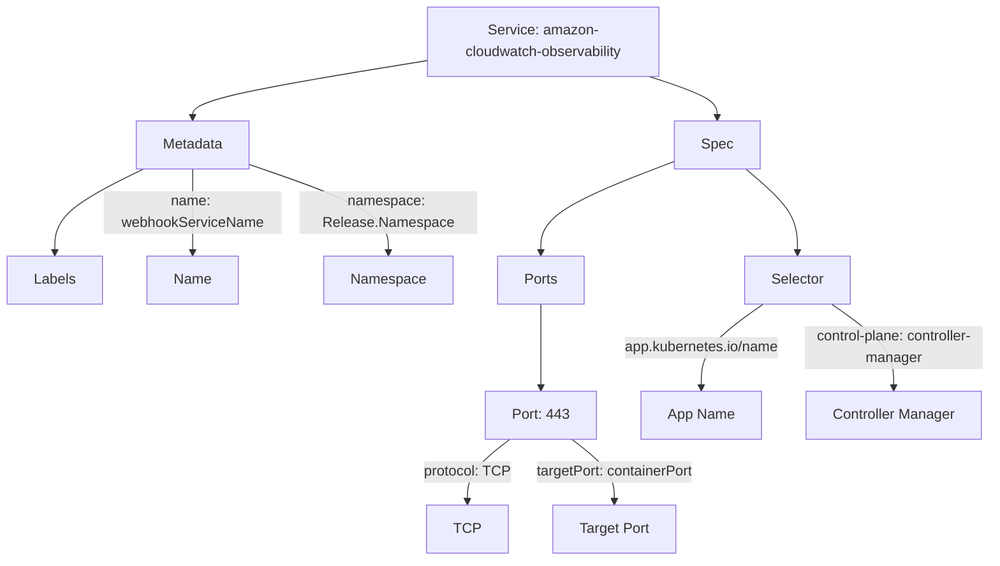
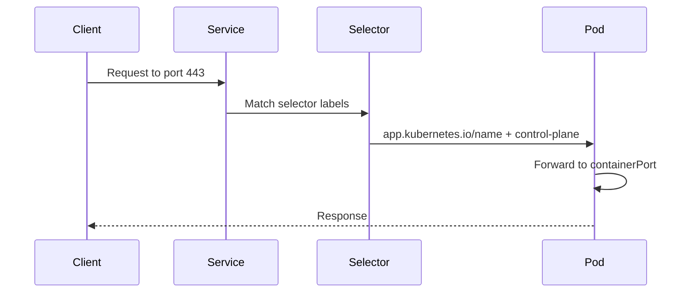
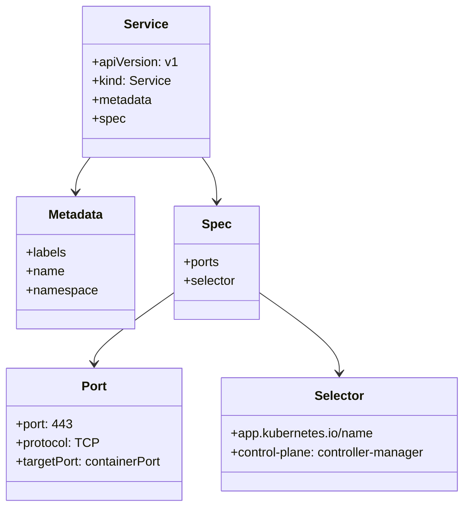

# Diagram: devops/k8s/amazon-cloudwatch-observability/helm/templates/operator-service.yaml

> Auto-generated by Obscura crawlers

## Diagram 1

### SVG

<svg id="container" width="1109.8671875" xmlns="http://www.w3.org/2000/svg" class="flowchart" height="630" viewBox="0 0 1109.8671875 630" role="graphics-document document" aria-roledescription="flowchart-v2"><g><marker id="container_flowchart-v2-pointEnd" class="marker flowchart-v2" viewBox="0 0 10 10" refX="5" refY="5" markerUnits="userSpaceOnUse" markerWidth="8" markerHeight="8" orient="auto"><path d="M 0 0 L 10 5 L 0 10 z" class="arrowMarkerPath" style="stroke-width: 1; stroke-dasharray: 1, 0;"></path></marker><marker id="container_flowchart-v2-pointStart" class="marker flowchart-v2" viewBox="0 0 10 10" refX="4.5" refY="5" markerUnits="userSpaceOnUse" markerWidth="8" markerHeight="8" orient="auto"><path d="M 0 5 L 10 10 L 10 0 z" class="arrowMarkerPath" style="stroke-width: 1; stroke-dasharray: 1, 0;"></path></marker><marker id="container_flowchart-v2-circleEnd" class="marker flowchart-v2" viewBox="0 0 10 10" refX="11" refY="5" markerUnits="userSpaceOnUse" markerWidth="11" markerHeight="11" orient="auto"><circle cx="5" cy="5" r="5" class="arrowMarkerPath" style="stroke-width: 1; stroke-dasharray: 1, 0;"></circle></marker><marker id="container_flowchart-v2-circleStart" class="marker flowchart-v2" viewBox="0 0 10 10" refX="-1" refY="5" markerUnits="userSpaceOnUse" markerWidth="11" markerHeight="11" orient="auto"><circle cx="5" cy="5" r="5" class="arrowMarkerPath" style="stroke-width: 1; stroke-dasharray: 1, 0;"></circle></marker><marker id="container_flowchart-v2-crossEnd" class="marker cross flowchart-v2" viewBox="0 0 11 11" refX="12" refY="5.2" markerUnits="userSpaceOnUse" markerWidth="11" markerHeight="11" orient="auto"><path d="M 1,1 l 9,9 M 10,1 l -9,9" class="arrowMarkerPath" style="stroke-width: 2; stroke-dasharray: 1, 0;"></path></marker><marker id="container_flowchart-v2-crossStart" class="marker cross flowchart-v2" viewBox="0 0 11 11" refX="-1" refY="5.2" markerUnits="userSpaceOnUse" markerWidth="11" markerHeight="11" orient="auto"><path d="M 1,1 l 9,9 M 10,1 l -9,9" class="arrowMarkerPath" style="stroke-width: 2; stroke-dasharray: 1, 0;"></path></marker><g class="root"><g class="clusters"></g><g class="edgePaths"><path d="M478.906,68.173L435.079,75.31C391.253,82.448,303.599,96.724,259.772,107.362C215.945,118,215.945,125,215.945,128.5L215.945,132" id="L_Service_Metadata_0" class="edge-thickness-normal edge-pattern-solid edge-thickness-normal edge-pattern-solid flowchart-link" style=";" data-edge="true" data-et="edge" data-id="L_Service_Metadata_0" data-points="W3sieCI6NDc4LjkwNjI1LCJ5Ijo2OC4xNzI1ODc5MjQyMTMyfSx7IngiOjIxNS45NDUzMTI1LCJ5IjoxMTF9LHsieCI6MjE1Ljk0NTMxMjUsInkiOjEzNn1d" marker-end="url(#container_flowchart-v2-pointEnd)"></path><path d="M727.922,86L740.638,90.167C753.353,94.333,778.784,102.667,791.499,110.333C804.215,118,804.215,125,804.215,128.5L804.215,132" id="L_Service_Spec_0" class="edge-thickness-normal edge-pattern-solid edge-thickness-normal edge-pattern-solid flowchart-link" style=";" data-edge="true" data-et="edge" data-id="L_Service_Spec_0" data-points="W3sieCI6NzI3LjkyMjQyNDMxNjQwNjIsInkiOjg2fSx7IngiOjgwNC4yMTQ4NDM3NSwieSI6MTExfSx7IngiOjgwNC4yMTQ4NDM3NSwieSI6MTM2fV0=" marker-end="url(#container_flowchart-v2-pointEnd)"></path><path d="M161.06,190L144.459,198.167C127.858,206.333,94.655,222.667,78.054,238.333C61.453,254,61.453,269,61.453,276.5L61.453,284" id="L_Metadata_Labels_0" class="edge-thickness-normal edge-pattern-solid edge-thickness-normal edge-pattern-solid flowchart-link" style=";" data-edge="true" data-et="edge" data-id="L_Metadata_Labels_0" data-points="W3sieCI6MTYxLjA1OTkzMDA5ODY4NDIyLCJ5IjoxOTB9LHsieCI6NjEuNDUzMTI1LCJ5IjoyMzl9LHsieCI6NjEuNDUzMTI1LCJ5IjoyODh9XQ==" marker-end="url(#container_flowchart-v2-pointEnd)"></path><path d="M215.945,190L215.945,198.167C215.945,206.333,215.945,222.667,215.945,238.333C215.945,254,215.945,269,215.945,276.5L215.945,284" id="L_Metadata_Name_0" class="edge-thickness-normal edge-pattern-solid edge-thickness-normal edge-pattern-solid flowchart-link" style=";" data-edge="true" data-et="edge" data-id="L_Metadata_Name_0" data-points="W3sieCI6MjE1Ljk0NTMxMjUsInkiOjE5MH0seyJ4IjoyMTUuOTQ1MzEyNSwieSI6MjM5fSx7IngiOjIxNS45NDUzMTI1LCJ5IjoyODh9XQ==" marker-end="url(#container_flowchart-v2-pointEnd)"></path><path d="M280.039,185.141L306.023,194.118C332.008,203.094,383.977,221.047,409.961,237.524C435.945,254,435.945,269,435.945,276.5L435.945,284" id="L_Metadata_Namespace_0" class="edge-thickness-normal edge-pattern-solid edge-thickness-normal edge-pattern-solid flowchart-link" style=";" data-edge="true" data-et="edge" data-id="L_Metadata_Namespace_0" data-points="W3sieCI6MjgwLjAzOTA2MjUsInkiOjE4NS4xNDE0NzcyNzI3MjczfSx7IngiOjQzNS45NDUzMTI1LCJ5IjoyMzl9LHsieCI6NDM1Ljk0NTMxMjUsInkiOjI4OH1d" marker-end="url(#container_flowchart-v2-pointEnd)"></path><path d="M756.918,181.186L731.859,190.822C706.799,200.458,656.681,219.729,631.622,236.864C606.563,254,606.563,269,606.563,276.5L606.563,284" id="L_Spec_Ports_0" class="edge-thickness-normal edge-pattern-solid edge-thickness-normal edge-pattern-solid flowchart-link" style=";" data-edge="true" data-et="edge" data-id="L_Spec_Ports_0" data-points="W3sieCI6NzU2LjkxNzk2ODc1LCJ5IjoxODEuMTg2Mjg4MjY2NTY2NTJ9LHsieCI6NjA2LjU2MjUsInkiOjIzOX0seyJ4Ijo2MDYuNTYyNSwieSI6Mjg4fV0=" marker-end="url(#container_flowchart-v2-pointEnd)"></path><path d="M835.965,190L845.569,198.167C855.172,206.333,874.379,222.667,883.982,238.333C893.586,254,893.586,269,893.586,276.5L893.586,284" id="L_Spec_Selector_0" class="edge-thickness-normal edge-pattern-solid edge-thickness-normal edge-pattern-solid flowchart-link" style=";" data-edge="true" data-et="edge" data-id="L_Spec_Selector_0" data-points="W3sieCI6ODM1Ljk2NTEwMDc0MDEzMTYsInkiOjE5MH0seyJ4Ijo4OTMuNTg1OTM3NSwieSI6MjM5fSx7IngiOjg5My41ODU5Mzc1LCJ5IjoyODh9XQ==" marker-end="url(#container_flowchart-v2-pointEnd)"></path><path d="M606.563,342L606.563,350.167C606.563,358.333,606.563,374.667,606.563,390.333C606.563,406,606.563,421,606.563,428.5L606.563,436" id="L_Ports_Port443_0" class="edge-thickness-normal edge-pattern-solid edge-thickness-normal edge-pattern-solid flowchart-link" style=";" data-edge="true" data-et="edge" data-id="L_Ports_Port443_0" data-points="W3sieCI6NjA2LjU2MjUsInkiOjM0Mn0seyJ4Ijo2MDYuNTYyNSwieSI6MzkxfSx7IngiOjYwNi41NjI1LCJ5Ijo0NDB9XQ==" marker-end="url(#container_flowchart-v2-pointEnd)"></path><path d="M572.285,494L564.456,500.167C556.628,506.333,540.97,518.667,533.141,530.333C525.313,542,525.313,553,525.313,558.5L525.313,564" id="L_Port443_Protocol_0" class="edge-thickness-normal edge-pattern-solid edge-thickness-normal edge-pattern-solid flowchart-link" style=";" data-edge="true" data-et="edge" data-id="L_Port443_Protocol_0" data-points="W3sieCI6NTcyLjI4NTE1NjI1LCJ5Ijo0OTR9LHsieCI6NTI1LjMxMjUsInkiOjUzMX0seyJ4Ijo1MjUuMzEyNSwieSI6NTY4fV0=" marker-end="url(#container_flowchart-v2-pointEnd)"></path><path d="M640.84,494L648.669,500.167C656.497,506.333,672.155,518.667,679.984,530.333C687.813,542,687.813,553,687.813,558.5L687.813,564" id="L_Port443_TargetPort_0" class="edge-thickness-normal edge-pattern-solid edge-thickness-normal edge-pattern-solid flowchart-link" style=";" data-edge="true" data-et="edge" data-id="L_Port443_TargetPort_0" data-points="W3sieCI6NjQwLjgzOTg0Mzc1LCJ5Ijo0OTR9LHsieCI6Njg3LjgxMjUsInkiOjUzMX0seyJ4Ijo2ODcuODEyNSwieSI6NTY4fV0=" marker-end="url(#container_flowchart-v2-pointEnd)"></path><path d="M855.118,342L843.482,350.167C831.847,358.333,808.576,374.667,796.94,390.333C785.305,406,785.305,421,785.305,428.5L785.305,436" id="L_Selector_AppName_0" class="edge-thickness-normal edge-pattern-solid edge-thickness-normal edge-pattern-solid flowchart-link" style=";" data-edge="true" data-et="edge" data-id="L_Selector_AppName_0" data-points="W3sieCI6ODU1LjExNzU5ODY4NDIxMDUsInkiOjM0Mn0seyJ4Ijo3ODUuMzA0Njg3NSwieSI6MzkxfSx7IngiOjc4NS4zMDQ2ODc1LCJ5Ijo0NDB9XQ==" marker-end="url(#container_flowchart-v2-pointEnd)"></path><path d="M932.054,342L943.69,350.167C955.325,358.333,978.596,374.667,990.232,390.333C1001.867,406,1001.867,421,1001.867,428.5L1001.867,436" id="L_Selector_ControlPlane_0" class="edge-thickness-normal edge-pattern-solid edge-thickness-normal edge-pattern-solid flowchart-link" style=";" data-edge="true" data-et="edge" data-id="L_Selector_ControlPlane_0" data-points="W3sieCI6OTMyLjA1NDI3NjMxNTc4OTUsInkiOjM0Mn0seyJ4IjoxMDAxLjg2NzE4NzUsInkiOjM5MX0seyJ4IjoxMDAxLjg2NzE4NzUsInkiOjQ0MH1d" marker-end="url(#container_flowchart-v2-pointEnd)"></path></g><g class="edgeLabels"><g class="edgeLabel"><g class="label" data-id="L_Service_Metadata_0" transform="translate(0, 0)"><foreignObject width="0" height="0">

</foreignObject></g></g><g class="edgeLabel"><g class="label" data-id="L_Service_Spec_0" transform="translate(0, 0)"><foreignObject width="0" height="0">

</foreignObject></g></g><g class="edgeLabel"><g class="label" data-id="L_Metadata_Labels_0" transform="translate(0, 0)"><foreignObject width="0" height="0">

</foreignObject></g></g><g class="edgeLabel" transform="translate(215.9453125, 239)"><g class="label" data-id="L_Metadata_Name_0" transform="translate(-100, -24)"><foreignObject width="200" height="48">

name: webhookServiceName

</foreignObject></g></g><g class="edgeLabel" transform="translate(435.9453125, 239)"><g class="label" data-id="L_Metadata_Namespace_0" transform="translate(-100, -24)"><foreignObject width="200" height="48">

namespace: Release.Namespace

</foreignObject></g></g><g class="edgeLabel"><g class="label" data-id="L_Spec_Ports_0" transform="translate(0, 0)"><foreignObject width="0" height="0">

</foreignObject></g></g><g class="edgeLabel"><g class="label" data-id="L_Spec_Selector_0" transform="translate(0, 0)"><foreignObject width="0" height="0">

</foreignObject></g></g><g class="edgeLabel"><g class="label" data-id="L_Ports_Port443_0" transform="translate(0, 0)"><foreignObject width="0" height="0">

</foreignObject></g></g><g class="edgeLabel" transform="translate(525.3125, 531)"><g class="label" data-id="L_Port443_Protocol_0" transform="translate(-47.5, -12)"><foreignObject width="95" height="24">

protocol: TCP

</foreignObject></g></g><g class="edgeLabel" transform="translate(687.8125, 531)"><g class="label" data-id="L_Port443_TargetPort_0" transform="translate(-90.21875, -12)"><foreignObject width="180.4375" height="24">

targetPort: containerPort

</foreignObject></g></g><g class="edgeLabel" transform="translate(785.3046875, 391)"><g class="label" data-id="L_Selector_AppName_0" transform="translate(-89.53125, -12)"><foreignObject width="179.0625" height="24">

app.kubernetes.io/name

</foreignObject></g></g><g class="edgeLabel" transform="translate(1001.8671875, 391)"><g class="label" data-id="L_Selector_ControlPlane_0" transform="translate(-100, -24)"><foreignObject width="200" height="48">

control-plane: controller-manager

</foreignObject></g></g></g><g class="nodes"><g class="node default" id="flowchart-Service-0" transform="translate(608.90625, 47)"><rect class="basic label-container" style="" x="-130" y="-39" width="260" height="78"></rect><g class="label" style="" transform="translate(-100, -24)"><rect></rect><foreignObject width="200" height="48">

Service: amazon-cloudwatch-observability

</foreignObject></g></g><g class="node default" id="flowchart-Metadata-1" transform="translate(215.9453125, 163)"><rect class="basic label-container" style="" x="-64.09375" y="-27" width="128.1875" height="54"></rect><g class="label" style="" transform="translate(-34.09375, -12)"><rect></rect><foreignObject width="68.1875" height="24">

Metadata

</foreignObject></g></g><g class="node default" id="flowchart-Labels-2" transform="translate(61.453125, 315)"><rect class="basic label-container" style="" x="-53.453125" y="-27" width="106.90625" height="54"></rect><g class="label" style="" transform="translate(-23.453125, -12)"><rect></rect><foreignObject width="46.90625" height="24">

Labels

</foreignObject></g></g><g class="node default" id="flowchart-Spec-3" transform="translate(804.21484375, 163)"><rect class="basic label-container" style="" x="-47.296875" y="-27" width="94.59375" height="54"></rect><g class="label" style="" transform="translate(-17.296875, -12)"><rect></rect><foreignObject width="34.59375" height="24">

Spec

</foreignObject></g></g><g class="node default" id="flowchart-Ports-4" transform="translate(606.5625, 315)"><rect class="basic label-container" style="" x="-48.796875" y="-27" width="97.59375" height="54"></rect><g class="label" style="" transform="translate(-18.796875, -12)"><rect></rect><foreignObject width="37.59375" height="24">

Ports

</foreignObject></g></g><g class="node default" id="flowchart-Port443-5" transform="translate(606.5625, 467)"><rect class="basic label-container" style="" x="-61.5" y="-27" width="123" height="54"></rect><g class="label" style="" transform="translate(-31.5, -12)"><rect></rect><foreignObject width="63" height="24">

Port: 443

</foreignObject></g></g><g class="node default" id="flowchart-Selector-6" transform="translate(893.5859375, 315)"><rect class="basic label-container" style="" x="-59.7421875" y="-27" width="119.484375" height="54"></rect><g class="label" style="" transform="translate(-29.7421875, -12)"><rect></rect><foreignObject width="59.484375" height="24">

Selector

</foreignObject></g></g><g class="node default" id="flowchart-Name-14" transform="translate(215.9453125, 315)"><rect class="basic label-container" style="" x="-51.0390625" y="-27" width="102.078125" height="54"></rect><g class="label" style="" transform="translate(-21.0390625, -12)"><rect></rect><foreignObject width="42.078125" height="24">

Name

</foreignObject></g></g><g class="node default" id="flowchart-Namespace-16" transform="translate(435.9453125, 315)"><rect class="basic label-container" style="" x="-71.8203125" y="-27" width="143.640625" height="54"></rect><g class="label" style="" transform="translate(-41.8203125, -12)"><rect></rect><foreignObject width="83.640625" height="24">

Namespace

</foreignObject></g></g><g class="node default" id="flowchart-Protocol-24" transform="translate(525.3125, 595)"><rect class="basic label-container" style="" x="-42.984375" y="-27" width="85.96875" height="54"></rect><g class="label" style="" transform="translate(-12.984375, -12)"><rect></rect><foreignObject width="25.96875" height="24">

TCP

</foreignObject></g></g><g class="node default" id="flowchart-TargetPort-26" transform="translate(687.8125, 595)"><rect class="basic label-container" style="" x="-69.515625" y="-27" width="139.03125" height="54"></rect><g class="label" style="" transform="translate(-39.515625, -12)"><rect></rect><foreignObject width="79.03125" height="24">

Target Port

</foreignObject></g></g><g class="node default" id="flowchart-AppName-28" transform="translate(785.3046875, 467)"><rect class="basic label-container" style="" x="-67.2421875" y="-27" width="134.484375" height="54"></rect><g class="label" style="" transform="translate(-37.2421875, -12)"><rect></rect><foreignObject width="74.484375" height="24">

App Name

</foreignObject></g></g><g class="node default" id="flowchart-ControlPlane-30" transform="translate(1001.8671875, 467)"><rect class="basic label-container" style="" x="-99.3203125" y="-27" width="198.640625" height="54"></rect><g class="label" style="" transform="translate(-69.3203125, -12)"><rect></rect><foreignObject width="138.640625" height="24">

Controller Manager

</foreignObject></g></g></g></g></g></svg>

## Diagram 2

### SVG

<svg id="container" width="1066.5" xmlns="http://www.w3.org/2000/svg" height="441" viewBox="-50 -10 1066.5 441" role="graphics-document document" aria-roledescription="sequence"><g><rect x="800" y="355" fill="#eaeaea" stroke="#666" width="150" height="65" name="Pod" rx="3" ry="3" class="actor actor-bottom"></rect><text x="875" y="387.5" dominant-baseline="central" alignment-baseline="central" class="actor actor-box" style="text-anchor: middle; font-size: 16px; font-weight: 400;"><tspan x="875" dy="0">Pod</tspan></text></g><g><rect x="436" y="355" fill="#eaeaea" stroke="#666" width="150" height="65" name="Selector" rx="3" ry="3" class="actor actor-bottom"></rect><text x="511" y="387.5" dominant-baseline="central" alignment-baseline="central" class="actor actor-box" style="text-anchor: middle; font-size: 16px; font-weight: 400;"><tspan x="511" dy="0">Selector</tspan></text></g><g><rect x="212" y="355" fill="#eaeaea" stroke="#666" width="150" height="65" name="Service" rx="3" ry="3" class="actor actor-bottom"></rect><text x="287" y="387.5" dominant-baseline="central" alignment-baseline="central" class="actor actor-box" style="text-anchor: middle; font-size: 16px; font-weight: 400;"><tspan x="287" dy="0">Service</tspan></text></g><g><rect x="0" y="355" fill="#eaeaea" stroke="#666" width="150" height="65" name="Client" rx="3" ry="3" class="actor actor-bottom"></rect><text x="75" y="387.5" dominant-baseline="central" alignment-baseline="central" class="actor actor-box" style="text-anchor: middle; font-size: 16px; font-weight: 400;"><tspan x="75" dy="0">Client</tspan></text></g><g><line id="actor3" x1="875" y1="65" x2="875" y2="355" class="actor-line 200" stroke-width="0.5px" stroke="#999" name="Pod"></line><g id="root-3"><rect x="800" y="0" fill="#eaeaea" stroke="#666" width="150" height="65" name="Pod" rx="3" ry="3" class="actor actor-top"></rect><text x="875" y="32.5" dominant-baseline="central" alignment-baseline="central" class="actor actor-box" style="text-anchor: middle; font-size: 16px; font-weight: 400;"><tspan x="875" dy="0">Pod</tspan></text></g></g><g><line id="actor2" x1="511" y1="65" x2="511" y2="355" class="actor-line 200" stroke-width="0.5px" stroke="#999" name="Selector"></line><g id="root-2"><rect x="436" y="0" fill="#eaeaea" stroke="#666" width="150" height="65" name="Selector" rx="3" ry="3" class="actor actor-top"></rect><text x="511" y="32.5" dominant-baseline="central" alignment-baseline="central" class="actor actor-box" style="text-anchor: middle; font-size: 16px; font-weight: 400;"><tspan x="511" dy="0">Selector</tspan></text></g></g><g><line id="actor1" x1="287" y1="65" x2="287" y2="355" class="actor-line 200" stroke-width="0.5px" stroke="#999" name="Service"></line><g id="root-1"><rect x="212" y="0" fill="#eaeaea" stroke="#666" width="150" height="65" name="Service" rx="3" ry="3" class="actor actor-top"></rect><text x="287" y="32.5" dominant-baseline="central" alignment-baseline="central" class="actor actor-box" style="text-anchor: middle; font-size: 16px; font-weight: 400;"><tspan x="287" dy="0">Service</tspan></text></g></g><g><line id="actor0" x1="75" y1="65" x2="75" y2="355" class="actor-line 200" stroke-width="0.5px" stroke="#999" name="Client"></line><g id="root-0"><rect x="0" y="0" fill="#eaeaea" stroke="#666" width="150" height="65" name="Client" rx="3" ry="3" class="actor actor-top"></rect><text x="75" y="32.5" dominant-baseline="central" alignment-baseline="central" class="actor actor-box" style="text-anchor: middle; font-size: 16px; font-weight: 400;"><tspan x="75" dy="0">Client</tspan></text></g></g><g></g><defs><symbol id="computer" width="24" height="24"><path transform="scale(.5)" d="M2 2v13h20v-13h-20zm18 11h-16v-9h16v9zm-10.228 6l.466-1h3.524l.467 1h-4.457zm14.228 3h-24l2-6h2.104l-1.33 4h18.45l-1.297-4h2.073l2 6zm-5-10h-14v-7h14v7z"></path></symbol></defs><defs><symbol id="database" fill-rule="evenodd" clip-rule="evenodd"><path transform="scale(.5)" d="M12.258.001l.256.004.255.005.253.008.251.01.249.012.247.015.246.016.242.019.241.02.239.023.236.024.233.027.231.028.229.031.225.032.223.034.22.036.217.038.214.04.211.041.208.043.205.045.201.046.198.048.194.05.191.051.187.053.183.054.18.056.175.057.172.059.168.06.163.061.16.063.155.064.15.066.074.033.073.033.071.034.07.034.069.035.068.035.067.035.066.035.064.036.064.036.062.036.06.036.06.037.058.037.058.037.055.038.055.038.053.038.052.038.051.039.05.039.048.039.047.039.045.04.044.04.043.04.041.04.04.041.039.041.037.041.036.041.034.041.033.042.032.042.03.042.029.042.027.042.026.043.024.043.023.043.021.043.02.043.018.044.017.043.015.044.013.044.012.044.011.045.009.044.007.045.006.045.004.045.002.045.001.045v17l-.001.045-.002.045-.004.045-.006.045-.007.045-.009.044-.011.045-.012.044-.013.044-.015.044-.017.043-.018.044-.02.043-.021.043-.023.043-.024.043-.026.043-.027.042-.029.042-.03.042-.032.042-.033.042-.034.041-.036.041-.037.041-.039.041-.04.041-.041.04-.043.04-.044.04-.045.04-.047.039-.048.039-.05.039-.051.039-.052.038-.053.038-.055.038-.055.038-.058.037-.058.037-.06.037-.06.036-.062.036-.064.036-.064.036-.066.035-.067.035-.068.035-.069.035-.07.034-.071.034-.073.033-.074.033-.15.066-.155.064-.16.063-.163.061-.168.06-.172.059-.175.057-.18.056-.183.054-.187.053-.191.051-.194.05-.198.048-.201.046-.205.045-.208.043-.211.041-.214.04-.217.038-.22.036-.223.034-.225.032-.229.031-.231.028-.233.027-.236.024-.239.023-.241.02-.242.019-.246.016-.247.015-.249.012-.251.01-.253.008-.255.005-.256.004-.258.001-.258-.001-.256-.004-.255-.005-.253-.008-.251-.01-.249-.012-.247-.015-.245-.016-.243-.019-.241-.02-.238-.023-.236-.024-.234-.027-.231-.028-.228-.031-.226-.032-.223-.034-.22-.036-.217-.038-.214-.04-.211-.041-.208-.043-.204-.045-.201-.046-.198-.048-.195-.05-.19-.051-.187-.053-.184-.054-.179-.056-.176-.057-.172-.059-.167-.06-.164-.061-.159-.063-.155-.064-.151-.066-.074-.033-.072-.033-.072-.034-.07-.034-.069-.035-.068-.035-.067-.035-.066-.035-.064-.036-.063-.036-.062-.036-.061-.036-.06-.037-.058-.037-.057-.037-.056-.038-.055-.038-.053-.038-.052-.038-.051-.039-.049-.039-.049-.039-.046-.039-.046-.04-.044-.04-.043-.04-.041-.04-.04-.041-.039-.041-.037-.041-.036-.041-.034-.041-.033-.042-.032-.042-.03-.042-.029-.042-.027-.042-.026-.043-.024-.043-.023-.043-.021-.043-.02-.043-.018-.044-.017-.043-.015-.044-.013-.044-.012-.044-.011-.045-.009-.044-.007-.045-.006-.045-.004-.045-.002-.045-.001-.045v-17l.001-.045.002-.045.004-.045.006-.045.007-.045.009-.044.011-.045.012-.044.013-.044.015-.044.017-.043.018-.044.02-.043.021-.043.023-.043.024-.043.026-.043.027-.042.029-.042.03-.042.032-.042.033-.042.034-.041.036-.041.037-.041.039-.041.04-.041.041-.04.043-.04.044-.04.046-.04.046-.039.049-.039.049-.039.051-.039.052-.038.053-.038.055-.038.056-.038.057-.037.058-.037.06-.037.061-.036.062-.036.063-.036.064-.036.066-.035.067-.035.068-.035.069-.035.07-.034.072-.034.072-.033.074-.033.151-.066.155-.064.159-.063.164-.061.167-.06.172-.059.176-.057.179-.056.184-.054.187-.053.19-.051.195-.05.198-.048.201-.046.204-.045.208-.043.211-.041.214-.04.217-.038.22-.036.223-.034.226-.032.228-.031.231-.028.234-.027.236-.024.238-.023.241-.02.243-.019.245-.016.247-.015.249-.012.251-.01.253-.008.255-.005.256-.004.258-.001.258.001zm-9.258 20.499v.01l.001.021.003.021.004.022.005.021.006.022.007.022.009.023.01.022.011.023.012.023.013.023.015.023.016.024.017.023.018.024.019.024.021.024.022.025.023.024.024.025.052.049.056.05.061.051.066.051.07.051.075.051.079.052.084.052.088.052.092.052.097.052.102.051.105.052.11.052.114.051.119.051.123.051.127.05.131.05.135.05.139.048.144.049.147.047.152.047.155.047.16.045.163.045.167.043.171.043.176.041.178.041.183.039.187.039.19.037.194.035.197.035.202.033.204.031.209.03.212.029.216.027.219.025.222.024.226.021.23.02.233.018.236.016.24.015.243.012.246.01.249.008.253.005.256.004.259.001.26-.001.257-.004.254-.005.25-.008.247-.011.244-.012.241-.014.237-.016.233-.018.231-.021.226-.021.224-.024.22-.026.216-.027.212-.028.21-.031.205-.031.202-.034.198-.034.194-.036.191-.037.187-.039.183-.04.179-.04.175-.042.172-.043.168-.044.163-.045.16-.046.155-.046.152-.047.148-.048.143-.049.139-.049.136-.05.131-.05.126-.05.123-.051.118-.052.114-.051.11-.052.106-.052.101-.052.096-.052.092-.052.088-.053.083-.051.079-.052.074-.052.07-.051.065-.051.06-.051.056-.05.051-.05.023-.024.023-.025.021-.024.02-.024.019-.024.018-.024.017-.024.015-.023.014-.024.013-.023.012-.023.01-.023.01-.022.008-.022.006-.022.006-.022.004-.022.004-.021.001-.021.001-.021v-4.127l-.077.055-.08.053-.083.054-.085.053-.087.052-.09.052-.093.051-.095.05-.097.05-.1.049-.102.049-.105.048-.106.047-.109.047-.111.046-.114.045-.115.045-.118.044-.12.043-.122.042-.124.042-.126.041-.128.04-.13.04-.132.038-.134.038-.135.037-.138.037-.139.035-.142.035-.143.034-.144.033-.147.032-.148.031-.15.03-.151.03-.153.029-.154.027-.156.027-.158.026-.159.025-.161.024-.162.023-.163.022-.165.021-.166.02-.167.019-.169.018-.169.017-.171.016-.173.015-.173.014-.175.013-.175.012-.177.011-.178.01-.179.008-.179.008-.181.006-.182.005-.182.004-.184.003-.184.002h-.37l-.184-.002-.184-.003-.182-.004-.182-.005-.181-.006-.179-.008-.179-.008-.178-.01-.176-.011-.176-.012-.175-.013-.173-.014-.172-.015-.171-.016-.17-.017-.169-.018-.167-.019-.166-.02-.165-.021-.163-.022-.162-.023-.161-.024-.159-.025-.157-.026-.156-.027-.155-.027-.153-.029-.151-.03-.15-.03-.148-.031-.146-.032-.145-.033-.143-.034-.141-.035-.14-.035-.137-.037-.136-.037-.134-.038-.132-.038-.13-.04-.128-.04-.126-.041-.124-.042-.122-.042-.12-.044-.117-.043-.116-.045-.113-.045-.112-.046-.109-.047-.106-.047-.105-.048-.102-.049-.1-.049-.097-.05-.095-.05-.093-.052-.09-.051-.087-.052-.085-.053-.083-.054-.08-.054-.077-.054v4.127zm0-5.654v.011l.001.021.003.021.004.021.005.022.006.022.007.022.009.022.01.022.011.023.012.023.013.023.015.024.016.023.017.024.018.024.019.024.021.024.022.024.023.025.024.024.052.05.056.05.061.05.066.051.07.051.075.052.079.051.084.052.088.052.092.052.097.052.102.052.105.052.11.051.114.051.119.052.123.05.127.051.131.05.135.049.139.049.144.048.147.048.152.047.155.046.16.045.163.045.167.044.171.042.176.042.178.04.183.04.187.038.19.037.194.036.197.034.202.033.204.032.209.03.212.028.216.027.219.025.222.024.226.022.23.02.233.018.236.016.24.014.243.012.246.01.249.008.253.006.256.003.259.001.26-.001.257-.003.254-.006.25-.008.247-.01.244-.012.241-.015.237-.016.233-.018.231-.02.226-.022.224-.024.22-.025.216-.027.212-.029.21-.03.205-.032.202-.033.198-.035.194-.036.191-.037.187-.039.183-.039.179-.041.175-.042.172-.043.168-.044.163-.045.16-.045.155-.047.152-.047.148-.048.143-.048.139-.05.136-.049.131-.05.126-.051.123-.051.118-.051.114-.052.11-.052.106-.052.101-.052.096-.052.092-.052.088-.052.083-.052.079-.052.074-.051.07-.052.065-.051.06-.05.056-.051.051-.049.023-.025.023-.024.021-.025.02-.024.019-.024.018-.024.017-.024.015-.023.014-.023.013-.024.012-.022.01-.023.01-.023.008-.022.006-.022.006-.022.004-.021.004-.022.001-.021.001-.021v-4.139l-.077.054-.08.054-.083.054-.085.052-.087.053-.09.051-.093.051-.095.051-.097.05-.1.049-.102.049-.105.048-.106.047-.109.047-.111.046-.114.045-.115.044-.118.044-.12.044-.122.042-.124.042-.126.041-.128.04-.13.039-.132.039-.134.038-.135.037-.138.036-.139.036-.142.035-.143.033-.144.033-.147.033-.148.031-.15.03-.151.03-.153.028-.154.028-.156.027-.158.026-.159.025-.161.024-.162.023-.163.022-.165.021-.166.02-.167.019-.169.018-.169.017-.171.016-.173.015-.173.014-.175.013-.175.012-.177.011-.178.009-.179.009-.179.007-.181.007-.182.005-.182.004-.184.003-.184.002h-.37l-.184-.002-.184-.003-.182-.004-.182-.005-.181-.007-.179-.007-.179-.009-.178-.009-.176-.011-.176-.012-.175-.013-.173-.014-.172-.015-.171-.016-.17-.017-.169-.018-.167-.019-.166-.02-.165-.021-.163-.022-.162-.023-.161-.024-.159-.025-.157-.026-.156-.027-.155-.028-.153-.028-.151-.03-.15-.03-.148-.031-.146-.033-.145-.033-.143-.033-.141-.035-.14-.036-.137-.036-.136-.037-.134-.038-.132-.039-.13-.039-.128-.04-.126-.041-.124-.042-.122-.043-.12-.043-.117-.044-.116-.044-.113-.046-.112-.046-.109-.046-.106-.047-.105-.048-.102-.049-.1-.049-.097-.05-.095-.051-.093-.051-.09-.051-.087-.053-.085-.052-.083-.054-.08-.054-.077-.054v4.139zm0-5.666v.011l.001.02.003.022.004.021.005.022.006.021.007.022.009.023.01.022.011.023.012.023.013.023.015.023.016.024.017.024.018.023.019.024.021.025.022.024.023.024.024.025.052.05.056.05.061.05.066.051.07.051.075.052.079.051.084.052.088.052.092.052.097.052.102.052.105.051.11.052.114.051.119.051.123.051.127.05.131.05.135.05.139.049.144.048.147.048.152.047.155.046.16.045.163.045.167.043.171.043.176.042.178.04.183.04.187.038.19.037.194.036.197.034.202.033.204.032.209.03.212.028.216.027.219.025.222.024.226.021.23.02.233.018.236.017.24.014.243.012.246.01.249.008.253.006.256.003.259.001.26-.001.257-.003.254-.006.25-.008.247-.01.244-.013.241-.014.237-.016.233-.018.231-.02.226-.022.224-.024.22-.025.216-.027.212-.029.21-.03.205-.032.202-.033.198-.035.194-.036.191-.037.187-.039.183-.039.179-.041.175-.042.172-.043.168-.044.163-.045.16-.045.155-.047.152-.047.148-.048.143-.049.139-.049.136-.049.131-.051.126-.05.123-.051.118-.052.114-.051.11-.052.106-.052.101-.052.096-.052.092-.052.088-.052.083-.052.079-.052.074-.052.07-.051.065-.051.06-.051.056-.05.051-.049.023-.025.023-.025.021-.024.02-.024.019-.024.018-.024.017-.024.015-.023.014-.024.013-.023.012-.023.01-.022.01-.023.008-.022.006-.022.006-.022.004-.022.004-.021.001-.021.001-.021v-4.153l-.077.054-.08.054-.083.053-.085.053-.087.053-.09.051-.093.051-.095.051-.097.05-.1.049-.102.048-.105.048-.106.048-.109.046-.111.046-.114.046-.115.044-.118.044-.12.043-.122.043-.124.042-.126.041-.128.04-.13.039-.132.039-.134.038-.135.037-.138.036-.139.036-.142.034-.143.034-.144.033-.147.032-.148.032-.15.03-.151.03-.153.028-.154.028-.156.027-.158.026-.159.024-.161.024-.162.023-.163.023-.165.021-.166.02-.167.019-.169.018-.169.017-.171.016-.173.015-.173.014-.175.013-.175.012-.177.01-.178.01-.179.009-.179.007-.181.006-.182.006-.182.004-.184.003-.184.001-.185.001-.185-.001-.184-.001-.184-.003-.182-.004-.182-.006-.181-.006-.179-.007-.179-.009-.178-.01-.176-.01-.176-.012-.175-.013-.173-.014-.172-.015-.171-.016-.17-.017-.169-.018-.167-.019-.166-.02-.165-.021-.163-.023-.162-.023-.161-.024-.159-.024-.157-.026-.156-.027-.155-.028-.153-.028-.151-.03-.15-.03-.148-.032-.146-.032-.145-.033-.143-.034-.141-.034-.14-.036-.137-.036-.136-.037-.134-.038-.132-.039-.13-.039-.128-.041-.126-.041-.124-.041-.122-.043-.12-.043-.117-.044-.116-.044-.113-.046-.112-.046-.109-.046-.106-.048-.105-.048-.102-.048-.1-.05-.097-.049-.095-.051-.093-.051-.09-.052-.087-.052-.085-.053-.083-.053-.08-.054-.077-.054v4.153zm8.74-8.179l-.257.004-.254.005-.25.008-.247.011-.244.012-.241.014-.237.016-.233.018-.231.021-.226.022-.224.023-.22.026-.216.027-.212.028-.21.031-.205.032-.202.033-.198.034-.194.036-.191.038-.187.038-.183.04-.179.041-.175.042-.172.043-.168.043-.163.045-.16.046-.155.046-.152.048-.148.048-.143.048-.139.049-.136.05-.131.05-.126.051-.123.051-.118.051-.114.052-.11.052-.106.052-.101.052-.096.052-.092.052-.088.052-.083.052-.079.052-.074.051-.07.052-.065.051-.06.05-.056.05-.051.05-.023.025-.023.024-.021.024-.02.025-.019.024-.018.024-.017.023-.015.024-.014.023-.013.023-.012.023-.01.023-.01.022-.008.022-.006.023-.006.021-.004.022-.004.021-.001.021-.001.021.001.021.001.021.004.021.004.022.006.021.006.023.008.022.01.022.01.023.012.023.013.023.014.023.015.024.017.023.018.024.019.024.02.025.021.024.023.024.023.025.051.05.056.05.06.05.065.051.07.052.074.051.079.052.083.052.088.052.092.052.096.052.101.052.106.052.11.052.114.052.118.051.123.051.126.051.131.05.136.05.139.049.143.048.148.048.152.048.155.046.16.046.163.045.168.043.172.043.175.042.179.041.183.04.187.038.191.038.194.036.198.034.202.033.205.032.21.031.212.028.216.027.22.026.224.023.226.022.231.021.233.018.237.016.241.014.244.012.247.011.25.008.254.005.257.004.26.001.26-.001.257-.004.254-.005.25-.008.247-.011.244-.012.241-.014.237-.016.233-.018.231-.021.226-.022.224-.023.22-.026.216-.027.212-.028.21-.031.205-.032.202-.033.198-.034.194-.036.191-.038.187-.038.183-.04.179-.041.175-.042.172-.043.168-.043.163-.045.16-.046.155-.046.152-.048.148-.048.143-.048.139-.049.136-.05.131-.05.126-.051.123-.051.118-.051.114-.052.11-.052.106-.052.101-.052.096-.052.092-.052.088-.052.083-.052.079-.052.074-.051.07-.052.065-.051.06-.05.056-.05.051-.05.023-.025.023-.024.021-.024.02-.025.019-.024.018-.024.017-.023.015-.024.014-.023.013-.023.012-.023.01-.023.01-.022.008-.022.006-.023.006-.021.004-.022.004-.021.001-.021.001-.021-.001-.021-.001-.021-.004-.021-.004-.022-.006-.021-.006-.023-.008-.022-.01-.022-.01-.023-.012-.023-.013-.023-.014-.023-.015-.024-.017-.023-.018-.024-.019-.024-.02-.025-.021-.024-.023-.024-.023-.025-.051-.05-.056-.05-.06-.05-.065-.051-.07-.052-.074-.051-.079-.052-.083-.052-.088-.052-.092-.052-.096-.052-.101-.052-.106-.052-.11-.052-.114-.052-.118-.051-.123-.051-.126-.051-.131-.05-.136-.05-.139-.049-.143-.048-.148-.048-.152-.048-.155-.046-.16-.046-.163-.045-.168-.043-.172-.043-.175-.042-.179-.041-.183-.04-.187-.038-.191-.038-.194-.036-.198-.034-.202-.033-.205-.032-.21-.031-.212-.028-.216-.027-.22-.026-.224-.023-.226-.022-.231-.021-.233-.018-.237-.016-.241-.014-.244-.012-.247-.011-.25-.008-.254-.005-.257-.004-.26-.001-.26.001z"></path></symbol></defs><defs><symbol id="clock" width="24" height="24"><path transform="scale(.5)" d="M12 2c5.514 0 10 4.486 10 10s-4.486 10-10 10-10-4.486-10-10 4.486-10 10-10zm0-2c-6.627 0-12 5.373-12 12s5.373 12 12 12 12-5.373 12-12-5.373-12-12-12zm5.848 12.459c.202.038.202.333.001.372-1.907.361-6.045 1.111-6.547 1.111-.719 0-1.301-.582-1.301-1.301 0-.512.77-5.447 1.125-7.445.034-.192.312-.181.343.014l.985 6.238 5.394 1.011z"></path></symbol></defs><defs><marker id="arrowhead" refX="7.9" refY="5" markerUnits="userSpaceOnUse" markerWidth="12" markerHeight="12" orient="auto-start-reverse"><path d="M -1 0 L 10 5 L 0 10 z"></path></marker></defs><defs><marker id="crosshead" markerWidth="15" markerHeight="8" orient="auto" refX="4" refY="4.5"><path fill="none" stroke="#000000" stroke-width="1pt" d="M 1,2 L 6,7 M 6,2 L 1,7" style="stroke-dasharray: 0, 0;"></path></marker></defs><defs><marker id="filled-head" refX="15.5" refY="7" markerWidth="20" markerHeight="28" orient="auto"><path d="M 18,7 L9,13 L14,7 L9,1 Z"></path></marker></defs><defs><marker id="sequencenumber" refX="15" refY="15" markerWidth="60" markerHeight="40" orient="auto"><circle cx="15" cy="15" r="6"></circle></marker></defs><text x="180" y="80" text-anchor="middle" dominant-baseline="middle" alignment-baseline="middle" class="messageText" dy="1em" style="font-size: 16px; font-weight: 400;">Request to port 443</text><line x1="76" y1="113" x2="283" y2="113" class="messageLine0" stroke-width="2" stroke="none" marker-end="url(#arrowhead)" style="fill: none;"></line><text x="398" y="128" text-anchor="middle" dominant-baseline="middle" alignment-baseline="middle" class="messageText" dy="1em" style="font-size: 16px; font-weight: 400;">Match selector labels</text><line x1="288" y1="161" x2="507" y2="161" class="messageLine0" stroke-width="2" stroke="none" marker-end="url(#arrowhead)" style="fill: none;"></line><text x="692" y="176" text-anchor="middle" dominant-baseline="middle" alignment-baseline="middle" class="messageText" dy="1em" style="font-size: 16px; font-weight: 400;">app.kubernetes.io/name + control-plane</text><line x1="512" y1="209" x2="871" y2="209" class="messageLine0" stroke-width="2" stroke="none" marker-end="url(#arrowhead)" style="fill: none;"></line><text x="876" y="224" text-anchor="middle" dominant-baseline="middle" alignment-baseline="middle" class="messageText" dy="1em" style="font-size: 16px; font-weight: 400;">Forward to containerPort</text><path d="M 876,257 C 936,247 936,287 876,277" class="messageLine0" stroke-width="2" stroke="none" marker-end="url(#arrowhead)" style="fill: none;"></path><text x="477" y="302" text-anchor="middle" dominant-baseline="middle" alignment-baseline="middle" class="messageText" dy="1em" style="font-size: 16px; font-weight: 400;">Response</text><line x1="874" y1="335" x2="79" y2="335" class="messageLine1" stroke-width="2" stroke="none" marker-end="url(#arrowhead)" style="stroke-dasharray: 3, 3; fill: none;"></line></svg>

## Diagram 3

### SVG

<svg id="container" width="603.375" xmlns="http://www.w3.org/2000/svg" class="classDiagram" height="644" viewBox="0 0 603.375 644" role="graphics-document document" aria-roledescription="class"><g><defs><marker id="container_class-aggregationStart" class="marker aggregation class" refX="18" refY="7" markerWidth="190" markerHeight="240" orient="auto"><path d="M 18,7 L9,13 L1,7 L9,1 Z"></path></marker></defs><defs><marker id="container_class-aggregationEnd" class="marker aggregation class" refX="1" refY="7" markerWidth="20" markerHeight="28" orient="auto"><path d="M 18,7 L9,13 L1,7 L9,1 Z"></path></marker></defs><defs><marker id="container_class-extensionStart" class="marker extension class" refX="18" refY="7" markerWidth="190" markerHeight="240" orient="auto"><path d="M 1,7 L18,13 V 1 Z"></path></marker></defs><defs><marker id="container_class-extensionEnd" class="marker extension class" refX="1" refY="7" markerWidth="20" markerHeight="28" orient="auto"><path d="M 1,1 V 13 L18,7 Z"></path></marker></defs><defs><marker id="container_class-compositionStart" class="marker composition class" refX="18" refY="7" markerWidth="190" markerHeight="240" orient="auto"><path d="M 18,7 L9,13 L1,7 L9,1 Z"></path></marker></defs><defs><marker id="container_class-compositionEnd" class="marker composition class" refX="1" refY="7" markerWidth="20" markerHeight="28" orient="auto"><path d="M 18,7 L9,13 L1,7 L9,1 Z"></path></marker></defs><defs><marker id="container_class-dependencyStart" class="marker dependency class" refX="6" refY="7" markerWidth="190" markerHeight="240" orient="auto"><path d="M 5,7 L9,13 L1,7 L9,1 Z"></path></marker></defs><defs><marker id="container_class-dependencyEnd" class="marker dependency class" refX="13" refY="7" markerWidth="20" markerHeight="28" orient="auto"><path d="M 18,7 L9,13 L14,7 L9,1 Z"></path></marker></defs><defs><marker id="container_class-lollipopStart" class="marker lollipop class" refX="13" refY="7" markerWidth="190" markerHeight="240" orient="auto"><circle stroke="black" fill="transparent" cx="7" cy="7" r="6"></circle></marker></defs><defs><marker id="container_class-lollipopEnd" class="marker lollipop class" refX="1" refY="7" markerWidth="190" markerHeight="240" orient="auto"><circle stroke="black" fill="transparent" cx="7" cy="7" r="6"></circle></marker></defs><g class="root"><g class="clusters"></g><g class="edgePaths"><path d="M121.428,200L118.359,204.167C115.289,208.333,109.15,216.667,106.081,224C103.012,231.333,103.012,237.667,103.012,240.833L103.012,244" id="id_Service_Metadata_1" class="edge-thickness-normal edge-pattern-solid relation" style=";;;" data-edge="true" data-et="edge" data-id="id_Service_Metadata_1" data-points="W3sieCI6MTIxLjQyNzk5MjYzOTQ2MjgxLCJ5IjoyMDB9LHsieCI6MTAzLjAxMTcxODc1LCJ5IjoyMjV9LHsieCI6MTAzLjAxMTcxODc1LCJ5IjoyNTB9XQ==" marker-end="url(#container_class-dependencyEnd)"></path><path d="M262.865,200L265.934,204.167C269.004,208.333,275.142,216.667,278.212,226C281.281,235.333,281.281,245.667,281.281,250.833L281.281,256" id="id_Service_Spec_2" class="edge-thickness-normal edge-pattern-solid relation" style=";;;" data-edge="true" data-et="edge" data-id="id_Service_Spec_2" data-points="W3sieCI6MjYyLjg2NDk3NjExMDUzNzIsInkiOjIwMH0seyJ4IjoyODEuMjgxMjUsInkiOjIyNX0seyJ4IjoyODEuMjgxMjUsInkiOjI2Mn1d" marker-end="url(#container_class-dependencyEnd)"></path><path d="M227.371,370.878L209.799,382.898C192.227,394.918,157.082,418.959,139.51,434.146C121.938,449.333,121.938,455.667,121.938,458.833L121.938,462" id="id_Spec_Port_3" class="edge-thickness-normal edge-pattern-solid relation" style=";;;" data-edge="true" data-et="edge" data-id="id_Spec_Port_3" data-points="W3sieCI6MjI3LjM3MTA5Mzc1LCJ5IjozNzAuODc3NTQ5NTE5NTEzNjV9LHsieCI6MTIxLjkzNzUsInkiOjQ0M30seyJ4IjoxMjEuOTM3NSwieSI6NDY4fV0=" marker-end="url(#container_class-dependencyEnd)"></path><path d="M335.191,370.878L352.764,382.898C370.336,394.918,405.48,418.959,423.053,436.146C440.625,453.333,440.625,463.667,440.625,468.833L440.625,474" id="id_Spec_Selector_4" class="edge-thickness-normal edge-pattern-solid relation" style=";;;" data-edge="true" data-et="edge" data-id="id_Spec_Selector_4" data-points="W3sieCI6MzM1LjE5MTQwNjI1LCJ5IjozNzAuODc3NTQ5NTE5NTEzNjV9LHsieCI6NDQwLjYyNSwieSI6NDQzfSx7IngiOjQ0MC42MjUsInkiOjQ4MH1d" marker-end="url(#container_class-dependencyEnd)"></path></g><g class="edgeLabels"><g class="edgeLabel"><g class="label" data-id="id_Service_Metadata_1" transform="translate(0, 0)"><foreignObject width="0" height="0">

</foreignObject></g></g><g class="edgeLabel"><g class="label" data-id="id_Service_Spec_2" transform="translate(0, 0)"><foreignObject width="0" height="0">

</foreignObject></g></g><g class="edgeLabel"><g class="label" data-id="id_Spec_Port_3" transform="translate(0, 0)"><foreignObject width="0" height="0">

</foreignObject></g></g><g class="edgeLabel"><g class="label" data-id="id_Spec_Selector_4" transform="translate(0, 0)"><foreignObject width="0" height="0">

</foreignObject></g></g></g><g class="nodes"><g class="node default" id="classId-Service-0" transform="translate(192.146484375, 104)"><g class="basic label-container"><path d="M-78.92578125 -96 L78.92578125 -96 L78.92578125 96 L-78.92578125 96" stroke="none" stroke-width="0" fill="#ECECFF" style=""></path><path d="M-78.92578125 -96 C-34.579828121028584 -96, 9.766125007942833 -96, 78.92578125 -96 M-78.92578125 -96 C-21.106816402769347 -96, 36.712148444461306 -96, 78.92578125 -96 M78.92578125 -96 C78.92578125 -21.135302938069017, 78.92578125 53.729394123861965, 78.92578125 96 M78.92578125 -96 C78.92578125 -37.45274052276017, 78.92578125 21.094518954479653, 78.92578125 96 M78.92578125 96 C16.142051180919253 96, -46.64167888816149 96, -78.92578125 96 M78.92578125 96 C21.263643548150647 96, -36.39849415369871 96, -78.92578125 96 M-78.92578125 96 C-78.92578125 45.32894456095506, -78.92578125 -5.342110878089883, -78.92578125 -96 M-78.92578125 96 C-78.92578125 45.19920082355371, -78.92578125 -5.60159835289258, -78.92578125 -96" stroke="#9370DB" stroke-width="1.3" fill="none" stroke-dasharray="0 0" style=""></path></g><g class="annotation-group text" transform="translate(0, -72)"></g><g class="label-group text" transform="translate(-26.6484375, -72)"><g class="label" style="font-weight: bolder" transform="translate(0,-12)"><foreignObject width="53.296875" height="24">

Service

</foreignObject></g></g><g class="members-group text" transform="translate(-66.92578125, -24)"><g class="label" style="" transform="translate(0,-12)"><foreignObject width="107.203125" height="24">

+apiVersion: v1

</foreignObject></g><g class="label" style="" transform="translate(0,12)"><foreignObject width="99.765625" height="24">

+kind: Service

</foreignObject></g><g class="label" style="" transform="translate(0,36)"><foreignObject width="77.4375" height="24">

+metadata

</foreignObject></g><g class="label" style="" transform="translate(0,60)"><foreignObject width="41.328125" height="24">

+spec

</foreignObject></g></g><g class="methods-group text" transform="translate(-66.92578125, 96)"></g><g class="divider" style=""><path d="M-78.92578125 -48 C-37.91602671075542 -48, 3.0937278284891647 -48, 78.92578125 -48 M-78.92578125 -48 C-23.556491734334216 -48, 31.812797781331568 -48, 78.92578125 -48" stroke="#9370DB" stroke-width="1.3" fill="none" stroke-dasharray="0 0" style=""></path></g><g class="divider" style=""><path d="M-78.92578125 72 C-20.26927317246041 72, 38.38723490507918 72, 78.92578125 72 M-78.92578125 72 C-29.392943294609395 72, 20.13989466078121 72, 78.92578125 72" stroke="#9370DB" stroke-width="1.3" fill="none" stroke-dasharray="0 0" style=""></path></g></g><g class="node default" id="classId-Metadata-1" transform="translate(103.01171875, 334)"><g class="basic label-container"><path d="M-74.359375 -84 L74.359375 -84 L74.359375 84 L-74.359375 84" stroke="none" stroke-width="0" fill="#ECECFF" style=""></path><path d="M-74.359375 -84 C-31.424018621104565 -84, 11.51133775779087 -84, 74.359375 -84 M-74.359375 -84 C-30.27463559776161 -84, 13.810103804476782 -84, 74.359375 -84 M74.359375 -84 C74.359375 -31.08533395430632, 74.359375 21.829332091387357, 74.359375 84 M74.359375 -84 C74.359375 -23.962829202760588, 74.359375 36.074341594478824, 74.359375 84 M74.359375 84 C20.065388154606566 84, -34.22859869078687 84, -74.359375 84 M74.359375 84 C32.78815292505535 84, -8.7830691498893 84, -74.359375 84 M-74.359375 84 C-74.359375 34.70597202964105, -74.359375 -14.588055940717894, -74.359375 -84 M-74.359375 84 C-74.359375 24.53776882102124, -74.359375 -34.92446235795752, -74.359375 -84" stroke="#9370DB" stroke-width="1.3" fill="none" stroke-dasharray="0 0" style=""></path></g><g class="annotation-group text" transform="translate(0, -60)"></g><g class="label-group text" transform="translate(-34.640625, -60)"><g class="label" style="font-weight: bolder" transform="translate(0,-12)"><foreignObject width="69.28125" height="24">

Metadata

</foreignObject></g></g><g class="members-group text" transform="translate(-62.359375, -12)"><g class="label" style="" transform="translate(0,-12)"><foreignObject width="51.6875" height="24">

+labels

</foreignObject></g><g class="label" style="" transform="translate(0,12)"><foreignObject width="48.5" height="24">

+name

</foreignObject></g><g class="label" style="" transform="translate(0,36)"><foreignObject width="90.078125" height="24">

+namespace

</foreignObject></g></g><g class="methods-group text" transform="translate(-62.359375, 84)"></g><g class="divider" style=""><path d="M-74.359375 -36 C-36.99706516145893 -36, 0.3652446770821456 -36, 74.359375 -36 M-74.359375 -36 C-16.12371697564734 -36, 42.11194104870532 -36, 74.359375 -36" stroke="#9370DB" stroke-width="1.3" fill="none" stroke-dasharray="0 0" style=""></path></g><g class="divider" style=""><path d="M-74.359375 60 C-37.74657740177084 60, -1.1337798035416853 60, 74.359375 60 M-74.359375 60 C-35.32290035465765 60, 3.7135742906847042 60, 74.359375 60" stroke="#9370DB" stroke-width="1.3" fill="none" stroke-dasharray="0 0" style=""></path></g></g><g class="node default" id="classId-Spec-2" transform="translate(281.28125, 334)"><g class="basic label-container"><path d="M-53.91015625 -72 L53.91015625 -72 L53.91015625 72 L-53.91015625 72" stroke="none" stroke-width="0" fill="#ECECFF" style=""></path><path d="M-53.91015625 -72 C-21.76793217208575 -72, 10.3742919058285 -72, 53.91015625 -72 M-53.91015625 -72 C-13.188349683426253 -72, 27.533456883147494 -72, 53.91015625 -72 M53.91015625 -72 C53.91015625 -28.71719229636573, 53.91015625 14.565615407268538, 53.91015625 72 M53.91015625 -72 C53.91015625 -37.05667568754952, 53.91015625 -2.113351375099043, 53.91015625 72 M53.91015625 72 C25.826625489148682 72, -2.256905271702635 72, -53.91015625 72 M53.91015625 72 C14.106811462685734 72, -25.696533324628533 72, -53.91015625 72 M-53.91015625 72 C-53.91015625 35.66871909256049, -53.91015625 -0.6625618148790267, -53.91015625 -72 M-53.91015625 72 C-53.91015625 21.25443921160631, -53.91015625 -29.49112157678738, -53.91015625 -72" stroke="#9370DB" stroke-width="1.3" fill="none" stroke-dasharray="0 0" style=""></path></g><g class="annotation-group text" transform="translate(0, -48)"></g><g class="label-group text" transform="translate(-17.6015625, -48)"><g class="label" style="font-weight: bolder" transform="translate(0,-12)"><foreignObject width="35.203125" height="24">

Spec

</foreignObject></g></g><g class="members-group text" transform="translate(-41.91015625, 0)"><g class="label" style="" transform="translate(0,-12)"><foreignObject width="46.265625" height="24">

+ports

</foreignObject></g><g class="label" style="" transform="translate(0,12)"><foreignObject width="66.21875" height="24">

+selector

</foreignObject></g></g><g class="methods-group text" transform="translate(-41.91015625, 72)"></g><g class="divider" style=""><path d="M-53.91015625 -24 C-17.016257218283272 -24, 19.877641813433456 -24, 53.91015625 -24 M-53.91015625 -24 C-15.415644961013399 -24, 23.078866327973202 -24, 53.91015625 -24" stroke="#9370DB" stroke-width="1.3" fill="none" stroke-dasharray="0 0" style=""></path></g><g class="divider" style=""><path d="M-53.91015625 48 C-12.818063446944755 48, 28.27402935611049 48, 53.91015625 48 M-53.91015625 48 C-19.508768645919886 48, 14.892618958160227 48, 53.91015625 48" stroke="#9370DB" stroke-width="1.3" fill="none" stroke-dasharray="0 0" style=""></path></g></g><g class="node default" id="classId-Port-3" transform="translate(121.9375, 552)"><g class="basic label-container"><path d="M-113.9375 -84 L113.9375 -84 L113.9375 84 L-113.9375 84" stroke="none" stroke-width="0" fill="#ECECFF" style=""></path><path d="M-113.9375 -84 C-22.89128124016611 -84, 68.15493751966778 -84, 113.9375 -84 M-113.9375 -84 C-36.57934127010738 -84, 40.778817459785245 -84, 113.9375 -84 M113.9375 -84 C113.9375 -33.71015738606355, 113.9375 16.5796852278729, 113.9375 84 M113.9375 -84 C113.9375 -18.22928733790053, 113.9375 47.54142532419894, 113.9375 84 M113.9375 84 C29.169049776522783 84, -55.599400446954434 84, -113.9375 84 M113.9375 84 C25.663802608442595 84, -62.60989478311481 84, -113.9375 84 M-113.9375 84 C-113.9375 34.01890647112258, -113.9375 -15.962187057754846, -113.9375 -84 M-113.9375 84 C-113.9375 17.267793429893658, -113.9375 -49.464413140212685, -113.9375 -84" stroke="#9370DB" stroke-width="1.3" fill="none" stroke-dasharray="0 0" style=""></path></g><g class="annotation-group text" transform="translate(0, -60)"></g><g class="label-group text" transform="translate(-15.53125, -60)"><g class="label" style="font-weight: bolder" transform="translate(0,-12)"><foreignObject width="31.0625" height="24">

Port

</foreignObject></g></g><g class="members-group text" transform="translate(-101.9375, -12)"><g class="label" style="" transform="translate(0,-12)"><foreignObject width="71.671875" height="24">

+port: 443

</foreignObject></g><g class="label" style="" transform="translate(0,12)"><foreignObject width="102.984375" height="24">

+protocol: TCP

</foreignObject></g><g class="label" style="" transform="translate(0,36)"><foreignObject width="188.34375" height="24">

+targetPort: containerPort

</foreignObject></g></g><g class="methods-group text" transform="translate(-101.9375, 84)"></g><g class="divider" style=""><path d="M-113.9375 -36 C-34.77101789938348 -36, 44.39546420123304 -36, 113.9375 -36 M-113.9375 -36 C-23.075267640624503 -36, 67.786964718751 -36, 113.9375 -36" stroke="#9370DB" stroke-width="1.3" fill="none" stroke-dasharray="0 0" style=""></path></g><g class="divider" style=""><path d="M-113.9375 60 C-40.21052201096356 60, 33.516455978072884 60, 113.9375 60 M-113.9375 60 C-68.17204403431754 60, -22.406588068635088 60, 113.9375 60" stroke="#9370DB" stroke-width="1.3" fill="none" stroke-dasharray="0 0" style=""></path></g></g><g class="node default" id="classId-Selector-4" transform="translate(440.625, 552)"><g class="basic label-container"><path d="M-154.75 -72 L154.75 -72 L154.75 72 L-154.75 72" stroke="none" stroke-width="0" fill="#ECECFF" style=""></path><path d="M-154.75 -72 C-33.1705471473186 -72, 88.4089057053628 -72, 154.75 -72 M-154.75 -72 C-50.0003118114704 -72, 54.74937637705921 -72, 154.75 -72 M154.75 -72 C154.75 -37.35393417904113, 154.75 -2.7078683580822656, 154.75 72 M154.75 -72 C154.75 -21.258152272616428, 154.75 29.483695454767144, 154.75 72 M154.75 72 C84.82069853188418 72, 14.891397063768352 72, -154.75 72 M154.75 72 C70.36979703956345 72, -14.010405920873097 72, -154.75 72 M-154.75 72 C-154.75 38.4455486670577, -154.75 4.8910973341154005, -154.75 -72 M-154.75 72 C-154.75 29.558001992101175, -154.75 -12.88399601579765, -154.75 -72" stroke="#9370DB" stroke-width="1.3" fill="none" stroke-dasharray="0 0" style=""></path></g><g class="annotation-group text" transform="translate(0, -48)"></g><g class="label-group text" transform="translate(-30.40625, -48)"><g class="label" style="font-weight: bolder" transform="translate(0,-12)"><foreignObject width="60.8125" height="24">

Selector

</foreignObject></g></g><g class="members-group text" transform="translate(-142.75, 0)"><g class="label" style="" transform="translate(0,-12)"><foreignObject width="186.8125" height="24">

+app.kubernetes.io/name

</foreignObject></g><g class="label" style="" transform="translate(0,12)"><foreignObject width="255.09375" height="24">

+control-plane: controller-manager

</foreignObject></g></g><g class="methods-group text" transform="translate(-142.75, 72)"></g><g class="divider" style=""><path d="M-154.75 -24 C-84.60416225430185 -24, -14.45832450860371 -24, 154.75 -24 M-154.75 -24 C-79.03216348248176 -24, -3.314326964963527 -24, 154.75 -24" stroke="#9370DB" stroke-width="1.3" fill="none" stroke-dasharray="0 0" style=""></path></g><g class="divider" style=""><path d="M-154.75 48 C-37.69919571694648 48, 79.35160856610705 48, 154.75 48 M-154.75 48 C-34.79481882649715 48, 85.1603623470057 48, 154.75 48" stroke="#9370DB" stroke-width="1.3" fill="none" stroke-dasharray="0 0" style=""></path></g></g></g></g></g></svg>
