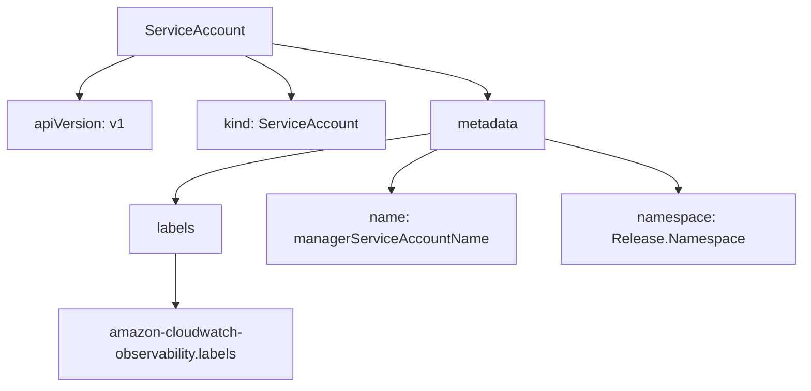
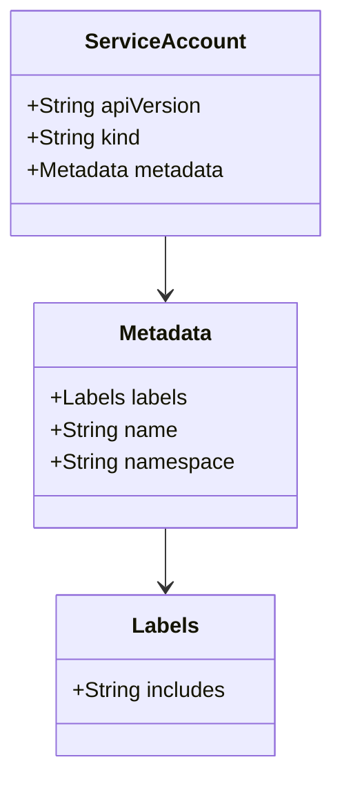
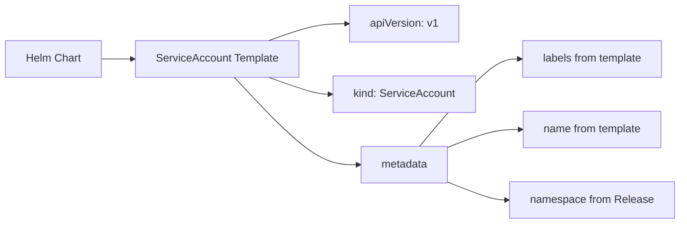

# Diagram: devops/k8s/amazon-cloudwatch-observability/helm/templates/operator-serviceaccount.yaml

> Auto-generated by Obscura crawlers

## Diagram 1

### SVG

<svg id="container" width="889.88671875" xmlns="http://www.w3.org/2000/svg" class="flowchart" height="430" viewBox="0 0 889.88671875 430" role="graphics-document document" aria-roledescription="flowchart-v2"><g><marker id="container_flowchart-v2-pointEnd" class="marker flowchart-v2" viewBox="0 0 10 10" refX="5" refY="5" markerUnits="userSpaceOnUse" markerWidth="8" markerHeight="8" orient="auto"><path d="M 0 0 L 10 5 L 0 10 z" class="arrowMarkerPath" style="stroke-width: 1; stroke-dasharray: 1, 0;"></path></marker><marker id="container_flowchart-v2-pointStart" class="marker flowchart-v2" viewBox="0 0 10 10" refX="4.5" refY="5" markerUnits="userSpaceOnUse" markerWidth="8" markerHeight="8" orient="auto"><path d="M 0 5 L 10 10 L 10 0 z" class="arrowMarkerPath" style="stroke-width: 1; stroke-dasharray: 1, 0;"></path></marker><marker id="container_flowchart-v2-circleEnd" class="marker flowchart-v2" viewBox="0 0 10 10" refX="11" refY="5" markerUnits="userSpaceOnUse" markerWidth="11" markerHeight="11" orient="auto"><circle cx="5" cy="5" r="5" class="arrowMarkerPath" style="stroke-width: 1; stroke-dasharray: 1, 0;"></circle></marker><marker id="container_flowchart-v2-circleStart" class="marker flowchart-v2" viewBox="0 0 10 10" refX="-1" refY="5" markerUnits="userSpaceOnUse" markerWidth="11" markerHeight="11" orient="auto"><circle cx="5" cy="5" r="5" class="arrowMarkerPath" style="stroke-width: 1; stroke-dasharray: 1, 0;"></circle></marker><marker id="container_flowchart-v2-crossEnd" class="marker cross flowchart-v2" viewBox="0 0 11 11" refX="12" refY="5.2" markerUnits="userSpaceOnUse" markerWidth="11" markerHeight="11" orient="auto"><path d="M 1,1 l 9,9 M 10,1 l -9,9" class="arrowMarkerPath" style="stroke-width: 2; stroke-dasharray: 1, 0;"></path></marker><marker id="container_flowchart-v2-crossStart" class="marker cross flowchart-v2" viewBox="0 0 11 11" refX="-1" refY="5.2" markerUnits="userSpaceOnUse" markerWidth="11" markerHeight="11" orient="auto"><path d="M 1,1 l 9,9 M 10,1 l -9,9" class="arrowMarkerPath" style="stroke-width: 2; stroke-dasharray: 1, 0;"></path></marker><g class="root"><g class="clusters"></g><g class="edgePaths"><path d="M148.884,62L138.692,66.167C128.501,70.333,108.118,78.667,97.926,86.333C87.734,94,87.734,101,87.734,104.5L87.734,108" id="L_SA_apiVersion_0" class="edge-thickness-normal edge-pattern-solid edge-thickness-normal edge-pattern-solid flowchart-link" style=";" data-edge="true" data-et="edge" data-id="L_SA_apiVersion_0" data-points="W3sieCI6MTQ4Ljg4NDA4OTU0MzI2OTIzLCJ5Ijo2Mn0seyJ4Ijo4Ny43MzQzNzUsInkiOjg3fSx7IngiOjg3LjczNDM3NSwieSI6MTEyfV0=" marker-end="url(#container_flowchart-v2-pointEnd)"></path><path d="M270.615,62L279.209,66.167C287.803,70.333,304.992,78.667,313.586,86.333C322.18,94,322.18,101,322.18,104.5L322.18,108" id="L_SA_kind_0" class="edge-thickness-normal edge-pattern-solid edge-thickness-normal edge-pattern-solid flowchart-link" style=";" data-edge="true" data-et="edge" data-id="L_SA_kind_0" data-points="W3sieCI6MjcwLjYxNTMwOTQ5NTE5MjMsInkiOjYyfSx7IngiOjMyMi4xNzk2ODc1LCJ5Ijo4N30seyJ4IjozMjIuMTc5Njg3NSwieSI6MTEyfV0=" marker-end="url(#container_flowchart-v2-pointEnd)"></path><path d="M299.77,48.505L340.077,54.921C380.385,61.336,461.001,74.168,501.309,84.084C541.617,94,541.617,101,541.617,104.5L541.617,108" id="L_SA_metadata_0" class="edge-thickness-normal edge-pattern-solid edge-thickness-normal edge-pattern-solid flowchart-link" style=";" data-edge="true" data-et="edge" data-id="L_SA_metadata_0" data-points="W3sieCI6Mjk5Ljc2OTUzMTI1LCJ5Ijo0OC41MDQ3MTcwMzc1MzMwMzR9LHsieCI6NTQxLjYxNzE4NzUsInkiOjg3fSx7IngiOjU0MS42MTcxODc1LCJ5IjoxMTJ9XQ==" marker-end="url(#container_flowchart-v2-pointEnd)"></path><path d="M476.891,148.71L429.907,155.758C382.923,162.807,288.956,176.903,241.972,189.452C194.988,202,194.988,213,194.988,218.5L194.988,224" id="L_metadata_labels_0" class="edge-thickness-normal edge-pattern-solid edge-thickness-normal edge-pattern-solid flowchart-link" style=";" data-edge="true" data-et="edge" data-id="L_metadata_labels_0" data-points="W3sieCI6NDc2Ljg5MDYyNSwieSI6MTQ4LjcxMDA0MjAzNDMyNjE2fSx7IngiOjE5NC45ODgyODEyNSwieSI6MTkxfSx7IngiOjE5NC45ODgyODEyNSwieSI6MjI4fV0=" marker-end="url(#container_flowchart-v2-pointEnd)"></path><path d="M194.988,282L194.988,288.167C194.988,294.333,194.988,306.667,194.988,316.333C194.988,326,194.988,333,194.988,336.5L194.988,340" id="L_labels_include_0" class="edge-thickness-normal edge-pattern-solid edge-thickness-normal edge-pattern-solid flowchart-link" style=";" data-edge="true" data-et="edge" data-id="L_labels_include_0" data-points="W3sieCI6MTk0Ljk4ODI4MTI1LCJ5IjoyODJ9LHsieCI6MTk0Ljk4ODI4MTI1LCJ5IjozMTl9LHsieCI6MTk0Ljk4ODI4MTI1LCJ5IjozNDR9XQ==" marker-end="url(#container_flowchart-v2-pointEnd)"></path><path d="M485.928,166L477.334,170.167C468.74,174.333,451.551,182.667,442.957,190.333C434.363,198,434.363,205,434.363,208.5L434.363,212" id="L_metadata_name_0" class="edge-thickness-normal edge-pattern-solid edge-thickness-normal edge-pattern-solid flowchart-link" style=";" data-edge="true" data-et="edge" data-id="L_metadata_name_0" data-points="W3sieCI6NDg1LjkyNzY1OTI1NDgwNzcsInkiOjE2Nn0seyJ4Ijo0MzQuMzYzMjgxMjUsInkiOjE5MX0seyJ4Ijo0MzQuMzYzMjgxMjUsInkiOjIxNn1d" marker-end="url(#container_flowchart-v2-pointEnd)"></path><path d="M606.344,155.007L630.601,161.006C654.858,167.005,703.372,179.002,727.63,188.501C751.887,198,751.887,205,751.887,208.5L751.887,212" id="L_metadata_namespace_0" class="edge-thickness-normal edge-pattern-solid edge-thickness-normal edge-pattern-solid flowchart-link" style=";" data-edge="true" data-et="edge" data-id="L_metadata_namespace_0" data-points="W3sieCI6NjA2LjM0Mzc1LCJ5IjoxNTUuMDA2OTg1MDgyMzkwNTR9LHsieCI6NzUxLjg4NjcxODc1LCJ5IjoxOTF9LHsieCI6NzUxLjg4NjcxODc1LCJ5IjoyMTZ9XQ==" marker-end="url(#container_flowchart-v2-pointEnd)"></path></g><g class="edgeLabels"><g class="edgeLabel"><g class="label" data-id="L_SA_apiVersion_0" transform="translate(0, 0)"><foreignObject width="0" height="0">

</foreignObject></g></g><g class="edgeLabel"><g class="label" data-id="L_SA_kind_0" transform="translate(0, 0)"><foreignObject width="0" height="0">

</foreignObject></g></g><g class="edgeLabel"><g class="label" data-id="L_SA_metadata_0" transform="translate(0, 0)"><foreignObject width="0" height="0">

</foreignObject></g></g><g class="edgeLabel"><g class="label" data-id="L_metadata_labels_0" transform="translate(0, 0)"><foreignObject width="0" height="0">

</foreignObject></g></g><g class="edgeLabel"><g class="label" data-id="L_labels_include_0" transform="translate(0, 0)"><foreignObject width="0" height="0">

</foreignObject></g></g><g class="edgeLabel"><g class="label" data-id="L_metadata_name_0" transform="translate(0, 0)"><foreignObject width="0" height="0">

</foreignObject></g></g><g class="edgeLabel"><g class="label" data-id="L_metadata_namespace_0" transform="translate(0, 0)"><foreignObject width="0" height="0">

</foreignObject></g></g></g><g class="nodes"><g class="node default" id="flowchart-SA-0" transform="translate(214.92578125, 35)"><rect class="basic label-container" style="" x="-84.84375" y="-27" width="169.6875" height="54"></rect><g class="label" style="" transform="translate(-54.84375, -12)"><rect></rect><foreignObject width="109.6875" height="24">

ServiceAccount

</foreignObject></g></g><g class="node default" id="flowchart-apiVersion-2" transform="translate(87.734375, 139)"><rect class="basic label-container" style="" x="-79.734375" y="-27" width="159.46875" height="54"></rect><g class="label" style="" transform="translate(-49.734375, -12)"><rect></rect><foreignObject width="99.46875" height="24">

apiVersion: v1

</foreignObject></g></g><g class="node default" id="flowchart-kind-4" transform="translate(322.1796875, 139)"><rect class="basic label-container" style="" x="-104.7109375" y="-27" width="209.421875" height="54"></rect><g class="label" style="" transform="translate(-74.7109375, -12)"><rect></rect><foreignObject width="149.421875" height="24">

kind: ServiceAccount

</foreignObject></g></g><g class="node default" id="flowchart-metadata-6" transform="translate(541.6171875, 139)"><rect class="basic label-container" style="" x="-64.7265625" y="-27" width="129.453125" height="54"></rect><g class="label" style="" transform="translate(-34.7265625, -12)"><rect></rect><foreignObject width="69.453125" height="24">

metadata

</foreignObject></g></g><g class="node default" id="flowchart-labels-8" transform="translate(194.98828125, 255)"><rect class="basic label-container" style="" x="-51.8515625" y="-27" width="103.703125" height="54"></rect><g class="label" style="" transform="translate(-21.8515625, -12)"><rect></rect><foreignObject width="43.703125" height="24">

labels

</foreignObject></g></g><g class="node default" id="flowchart-include-10" transform="translate(194.98828125, 383)"><rect class="basic label-container" style="" x="-130" y="-39" width="260" height="78"></rect><g class="label" style="" transform="translate(-100, -24)"><rect></rect><foreignObject width="200" height="48">

amazon-cloudwatch-observability.labels

</foreignObject></g></g><g class="node default" id="flowchart-name-12" transform="translate(434.36328125, 255)"><rect class="basic label-container" style="" x="-137.5234375" y="-39" width="275.046875" height="78"></rect><g class="label" style="" transform="translate(-107.5234375, -24)"><rect></rect><foreignObject width="215.046875" height="48">

name: managerServiceAccountName

</foreignObject></g></g><g class="node default" id="flowchart-namespace-14" transform="translate(751.88671875, 255)"><rect class="basic label-container" style="" x="-130" y="-39" width="260" height="78"></rect><g class="label" style="" transform="translate(-100, -24)"><rect></rect><foreignObject width="200" height="48">

namespace: Release.Namespace

</foreignObject></g></g></g></g></g></svg>

## Diagram 2

### SVG

<svg id="container" width="245.515625" xmlns="http://www.w3.org/2000/svg" class="classDiagram" height="572" viewBox="0 0 245.515625 572" role="graphics-document document" aria-roledescription="class"><g><defs><marker id="container_class-aggregationStart" class="marker aggregation class" refX="18" refY="7" markerWidth="190" markerHeight="240" orient="auto"><path d="M 18,7 L9,13 L1,7 L9,1 Z"></path></marker></defs><defs><marker id="container_class-aggregationEnd" class="marker aggregation class" refX="1" refY="7" markerWidth="20" markerHeight="28" orient="auto"><path d="M 18,7 L9,13 L1,7 L9,1 Z"></path></marker></defs><defs><marker id="container_class-extensionStart" class="marker extension class" refX="18" refY="7" markerWidth="190" markerHeight="240" orient="auto"><path d="M 1,7 L18,13 V 1 Z"></path></marker></defs><defs><marker id="container_class-extensionEnd" class="marker extension class" refX="1" refY="7" markerWidth="20" markerHeight="28" orient="auto"><path d="M 1,1 V 13 L18,7 Z"></path></marker></defs><defs><marker id="container_class-compositionStart" class="marker composition class" refX="18" refY="7" markerWidth="190" markerHeight="240" orient="auto"><path d="M 18,7 L9,13 L1,7 L9,1 Z"></path></marker></defs><defs><marker id="container_class-compositionEnd" class="marker composition class" refX="1" refY="7" markerWidth="20" markerHeight="28" orient="auto"><path d="M 18,7 L9,13 L1,7 L9,1 Z"></path></marker></defs><defs><marker id="container_class-dependencyStart" class="marker dependency class" refX="6" refY="7" markerWidth="190" markerHeight="240" orient="auto"><path d="M 5,7 L9,13 L1,7 L9,1 Z"></path></marker></defs><defs><marker id="container_class-dependencyEnd" class="marker dependency class" refX="13" refY="7" markerWidth="20" markerHeight="28" orient="auto"><path d="M 18,7 L9,13 L14,7 L9,1 Z"></path></marker></defs><defs><marker id="container_class-lollipopStart" class="marker lollipop class" refX="13" refY="7" markerWidth="190" markerHeight="240" orient="auto"><circle stroke="black" fill="transparent" cx="7" cy="7" r="6"></circle></marker></defs><defs><marker id="container_class-lollipopEnd" class="marker lollipop class" refX="1" refY="7" markerWidth="190" markerHeight="240" orient="auto"><circle stroke="black" fill="transparent" cx="7" cy="7" r="6"></circle></marker></defs><g class="root"><g class="clusters"></g><g class="edgePaths"><path d="M122.758,176L122.758,180.167C122.758,184.333,122.758,192.667,122.758,200C122.758,207.333,122.758,213.667,122.758,216.833L122.758,220" id="id_ServiceAccount_Metadata_1" class="edge-thickness-normal edge-pattern-solid relation" style=";;;" data-edge="true" data-et="edge" data-id="id_ServiceAccount_Metadata_1" data-points="W3sieCI6MTIyLjc1NzgxMjUsInkiOjE3Nn0seyJ4IjoxMjIuNzU3ODEyNSwieSI6MjAxfSx7IngiOjEyMi43NTc4MTI1LCJ5IjoyMjZ9XQ==" marker-end="url(#container_class-dependencyEnd)"></path><path d="M122.758,394L122.758,398.167C122.758,402.333,122.758,410.667,122.758,418C122.758,425.333,122.758,431.667,122.758,434.833L122.758,438" id="id_Metadata_Labels_2" class="edge-thickness-normal edge-pattern-solid relation" style=";;;" data-edge="true" data-et="edge" data-id="id_Metadata_Labels_2" data-points="W3sieCI6MTIyLjc1NzgxMjUsInkiOjM5NH0seyJ4IjoxMjIuNzU3ODEyNSwieSI6NDE5fSx7IngiOjEyMi43NTc4MTI1LCJ5Ijo0NDR9XQ==" marker-end="url(#container_class-dependencyEnd)"></path></g><g class="edgeLabels"><g class="edgeLabel"><g class="label" data-id="id_ServiceAccount_Metadata_1" transform="translate(0, 0)"><foreignObject width="0" height="0">

</foreignObject></g></g><g class="edgeLabel"><g class="label" data-id="id_Metadata_Labels_2" transform="translate(0, 0)"><foreignObject width="0" height="0">

</foreignObject></g></g></g><g class="nodes"><g class="node default" id="classId-ServiceAccount-0" transform="translate(122.7578125, 92)"><g class="basic label-container"><path d="M-114.7578125 -84 L114.7578125 -84 L114.7578125 84 L-114.7578125 84" stroke="none" stroke-width="0" fill="#ECECFF" style=""></path><path d="M-114.7578125 -84 C-60.32981855376856 -84, -5.901824607537122 -84, 114.7578125 -84 M-114.7578125 -84 C-27.626617593904484 -84, 59.50457731219103 -84, 114.7578125 -84 M114.7578125 -84 C114.7578125 -29.31984949697852, 114.7578125 25.36030100604296, 114.7578125 84 M114.7578125 -84 C114.7578125 -27.941655781534386, 114.7578125 28.116688436931227, 114.7578125 84 M114.7578125 84 C39.273837408654714 84, -36.21013768269057 84, -114.7578125 84 M114.7578125 84 C52.692782005397454 84, -9.372248489205091 84, -114.7578125 84 M-114.7578125 84 C-114.7578125 50.349845758494446, -114.7578125 16.699691516988892, -114.7578125 -84 M-114.7578125 84 C-114.7578125 30.235656503982277, -114.7578125 -23.528686992035446, -114.7578125 -84" stroke="#9370DB" stroke-width="1.3" fill="none" stroke-dasharray="0 0" style=""></path></g><g class="annotation-group text" transform="translate(0, -60)"></g><g class="label-group text" transform="translate(-55.671875, -60)"><g class="label" style="font-weight: bolder" transform="translate(0,-12)"><foreignObject width="111.34375" height="24">

ServiceAccount

</foreignObject></g></g><g class="members-group text" transform="translate(-102.7578125, -12)"><g class="label" style="" transform="translate(0,-12)"><foreignObject width="131.046875" height="24">

+String apiVersion

</foreignObject></g><g class="label" style="" transform="translate(0,12)"><foreignObject width="86.125" height="24">

+String kind

</foreignObject></g><g class="label" style="" transform="translate(0,36)"><foreignObject width="149.84375" height="24">

+Metadata metadata

</foreignObject></g></g><g class="methods-group text" transform="translate(-102.7578125, 84)"></g><g class="divider" style=""><path d="M-114.7578125 -36 C-47.73984457930986 -36, 19.27812334138028 -36, 114.7578125 -36 M-114.7578125 -36 C-48.17836300181601 -36, 18.40108649636798 -36, 114.7578125 -36" stroke="#9370DB" stroke-width="1.3" fill="none" stroke-dasharray="0 0" style=""></path></g><g class="divider" style=""><path d="M-114.7578125 60 C-47.43476622429698 60, 19.888280051406042 60, 114.7578125 60 M-114.7578125 60 C-24.287019519620145 60, 66.18377346075971 60, 114.7578125 60" stroke="#9370DB" stroke-width="1.3" fill="none" stroke-dasharray="0 0" style=""></path></g></g><g class="node default" id="classId-Metadata-1" transform="translate(122.7578125, 310)"><g class="basic label-container"><path d="M-97.59375 -84 L97.59375 -84 L97.59375 84 L-97.59375 84" stroke="none" stroke-width="0" fill="#ECECFF" style=""></path><path d="M-97.59375 -84 C-56.78630063256922 -84, -15.978851265138445 -84, 97.59375 -84 M-97.59375 -84 C-54.992742852327524 -84, -12.391735704655048 -84, 97.59375 -84 M97.59375 -84 C97.59375 -26.340810612571083, 97.59375 31.318378774857834, 97.59375 84 M97.59375 -84 C97.59375 -37.50368650160566, 97.59375 8.992626996788687, 97.59375 84 M97.59375 84 C25.959046725042313 84, -45.675656549915374 84, -97.59375 84 M97.59375 84 C51.48504594848299 84, 5.376341896965982 84, -97.59375 84 M-97.59375 84 C-97.59375 40.44818129320167, -97.59375 -3.1036374135966582, -97.59375 -84 M-97.59375 84 C-97.59375 23.93486631201558, -97.59375 -36.13026737596884, -97.59375 -84" stroke="#9370DB" stroke-width="1.3" fill="none" stroke-dasharray="0 0" style=""></path></g><g class="annotation-group text" transform="translate(0, -60)"></g><g class="label-group text" transform="translate(-34.640625, -60)"><g class="label" style="font-weight: bolder" transform="translate(0,-12)"><foreignObject width="69.28125" height="24">

Metadata

</foreignObject></g></g><g class="members-group text" transform="translate(-85.59375, -12)"><g class="label" style="" transform="translate(0,-12)"><foreignObject width="102.828125" height="24">

+Labels labels

</foreignObject></g><g class="label" style="" transform="translate(0,12)"><foreignObject width="94.984375" height="24">

+String name

</foreignObject></g><g class="label" style="" transform="translate(0,36)"><foreignObject width="136.546875" height="24">

+String namespace

</foreignObject></g></g><g class="methods-group text" transform="translate(-85.59375, 84)"></g><g class="divider" style=""><path d="M-97.59375 -36 C-26.215582413306606 -36, 45.16258517338679 -36, 97.59375 -36 M-97.59375 -36 C-41.186902467062886 -36, 15.219945065874228 -36, 97.59375 -36" stroke="#9370DB" stroke-width="1.3" fill="none" stroke-dasharray="0 0" style=""></path></g><g class="divider" style=""><path d="M-97.59375 60 C-35.7108098421804 60, 26.172130315639194 60, 97.59375 60 M-97.59375 60 C-37.40500825605005 60, 22.783733487899894 60, 97.59375 60" stroke="#9370DB" stroke-width="1.3" fill="none" stroke-dasharray="0 0" style=""></path></g></g><g class="node default" id="classId-Labels-2" transform="translate(122.7578125, 504)"><g class="basic label-container"><path d="M-81.8046875 -60 L81.8046875 -60 L81.8046875 60 L-81.8046875 60" stroke="none" stroke-width="0" fill="#ECECFF" style=""></path><path d="M-81.8046875 -60 C-17.99510423974548 -60, 45.81447902050904 -60, 81.8046875 -60 M-81.8046875 -60 C-39.33360483432643 -60, 3.137477831347141 -60, 81.8046875 -60 M81.8046875 -60 C81.8046875 -18.71124437458053, 81.8046875 22.57751125083894, 81.8046875 60 M81.8046875 -60 C81.8046875 -27.98770320260656, 81.8046875 4.024593594786879, 81.8046875 60 M81.8046875 60 C24.534294093191875 60, -32.73609931361625 60, -81.8046875 60 M81.8046875 60 C43.25959832209558 60, 4.714509144191155 60, -81.8046875 60 M-81.8046875 60 C-81.8046875 26.961911881937993, -81.8046875 -6.076176236124013, -81.8046875 -60 M-81.8046875 60 C-81.8046875 34.03825657773902, -81.8046875 8.076513155478047, -81.8046875 -60" stroke="#9370DB" stroke-width="1.3" fill="none" stroke-dasharray="0 0" style=""></path></g><g class="annotation-group text" transform="translate(0, -36)"></g><g class="label-group text" transform="translate(-23.84375, -36)"><g class="label" style="font-weight: bolder" transform="translate(0,-12)"><foreignObject width="47.6875" height="24">

Labels

</foreignObject></g></g><g class="members-group text" transform="translate(-69.8046875, 12)"><g class="label" style="" transform="translate(0,-12)"><foreignObject width="115.765625" height="24">

+String includes

</foreignObject></g></g><g class="methods-group text" transform="translate(-69.8046875, 60)"></g><g class="divider" style=""><path d="M-81.8046875 -12 C-17.103228271718677 -12, 47.598230956562645 -12, 81.8046875 -12 M-81.8046875 -12 C-29.31639209588578 -12, 23.171903308228437 -12, 81.8046875 -12" stroke="#9370DB" stroke-width="1.3" fill="none" stroke-dasharray="0 0" style=""></path></g><g class="divider" style=""><path d="M-81.8046875 36 C-48.731551471248075 36, -15.65841544249615 36, 81.8046875 36 M-81.8046875 36 C-36.069614530374764 36, 9.665458439250472 36, 81.8046875 36" stroke="#9370DB" stroke-width="1.3" fill="none" stroke-dasharray="0 0" style=""></path></g></g></g></g></g></svg>

## Diagram 3

### SVG

<svg id="container" width="998.078125" xmlns="http://www.w3.org/2000/svg" class="flowchart" height="330" viewBox="0 0 998.078125 330" role="graphics-document document" aria-roledescription="flowchart-v2"><g><marker id="container_flowchart-v2-pointEnd" class="marker flowchart-v2" viewBox="0 0 10 10" refX="5" refY="5" markerUnits="userSpaceOnUse" markerWidth="8" markerHeight="8" orient="auto"><path d="M 0 0 L 10 5 L 0 10 z" class="arrowMarkerPath" style="stroke-width: 1; stroke-dasharray: 1, 0;"></path></marker><marker id="container_flowchart-v2-pointStart" class="marker flowchart-v2" viewBox="0 0 10 10" refX="4.5" refY="5" markerUnits="userSpaceOnUse" markerWidth="8" markerHeight="8" orient="auto"><path d="M 0 5 L 10 10 L 10 0 z" class="arrowMarkerPath" style="stroke-width: 1; stroke-dasharray: 1, 0;"></path></marker><marker id="container_flowchart-v2-circleEnd" class="marker flowchart-v2" viewBox="0 0 10 10" refX="11" refY="5" markerUnits="userSpaceOnUse" markerWidth="11" markerHeight="11" orient="auto"><circle cx="5" cy="5" r="5" class="arrowMarkerPath" style="stroke-width: 1; stroke-dasharray: 1, 0;"></circle></marker><marker id="container_flowchart-v2-circleStart" class="marker flowchart-v2" viewBox="0 0 10 10" refX="-1" refY="5" markerUnits="userSpaceOnUse" markerWidth="11" markerHeight="11" orient="auto"><circle cx="5" cy="5" r="5" class="arrowMarkerPath" style="stroke-width: 1; stroke-dasharray: 1, 0;"></circle></marker><marker id="container_flowchart-v2-crossEnd" class="marker cross flowchart-v2" viewBox="0 0 11 11" refX="12" refY="5.2" markerUnits="userSpaceOnUse" markerWidth="11" markerHeight="11" orient="auto"><path d="M 1,1 l 9,9 M 10,1 l -9,9" class="arrowMarkerPath" style="stroke-width: 2; stroke-dasharray: 1, 0;"></path></marker><marker id="container_flowchart-v2-crossStart" class="marker cross flowchart-v2" viewBox="0 0 11 11" refX="-1" refY="5.2" markerUnits="userSpaceOnUse" markerWidth="11" markerHeight="11" orient="auto"><path d="M 1,1 l 9,9 M 10,1 l -9,9" class="arrowMarkerPath" style="stroke-width: 2; stroke-dasharray: 1, 0;"></path></marker><g class="root"><g class="clusters"></g><g class="edgePaths"><path d="M149.078,87L153.245,87C157.411,87,165.745,87,173.411,87C181.078,87,188.078,87,191.578,87L195.078,87" id="L_A_B_0" class="edge-thickness-normal edge-pattern-solid edge-thickness-normal edge-pattern-solid flowchart-link" style=";" data-edge="true" data-et="edge" data-id="L_A_B_0" data-points="W3sieCI6MTQ5LjA3ODEyNSwieSI6ODd9LHsieCI6MTc0LjA3ODEyNSwieSI6ODd9LHsieCI6MTk5LjA3ODEyNSwieSI6ODd9XQ==" marker-end="url(#container_flowchart-v2-pointEnd)"></path><path d="M394.996,60L406.647,55.833C418.299,51.667,441.603,43.333,460.917,39.167C480.232,35,495.557,35,503.22,35L510.883,35" id="L_B_C_0" class="edge-thickness-normal edge-pattern-solid edge-thickness-normal edge-pattern-solid flowchart-link" style=";" data-edge="true" data-et="edge" data-id="L_B_C_0" data-points="W3sieCI6Mzk0Ljk5NTY0MzAyODg0NjIsInkiOjYwfSx7IngiOjQ2NC45MDYyNSwieSI6MzV9LHsieCI6NTE0Ljg4MjgxMjUsInkiOjM1fV0=" marker-end="url(#container_flowchart-v2-pointEnd)"></path><path d="M394.996,114L406.647,118.167C418.299,122.333,441.603,130.667,456.754,134.833C471.906,139,478.906,139,482.406,139L485.906,139" id="L_B_D_0" class="edge-thickness-normal edge-pattern-solid edge-thickness-normal edge-pattern-solid flowchart-link" style=";" data-edge="true" data-et="edge" data-id="L_B_D_0" data-points="W3sieCI6Mzk0Ljk5NTY0MzAyODg0NjIsInkiOjExNH0seyJ4Ijo0NjQuOTA2MjUsInkiOjEzOX0seyJ4Ijo0ODkuOTA2MjUsInkiOjEzOX1d" marker-end="url(#container_flowchart-v2-pointEnd)"></path><path d="M344.66,114L364.701,135.5C384.742,157,424.824,200,455.029,221.5C485.234,243,505.563,243,515.727,243L525.891,243" id="L_B_E_0" class="edge-thickness-normal edge-pattern-solid edge-thickness-normal edge-pattern-solid flowchart-link" style=";" data-edge="true" data-et="edge" data-id="L_B_E_0" data-points="W3sieCI6MzQ0LjY2MDAwNjAwOTYxNTM2LCJ5IjoxMTR9LHsieCI6NDY0LjkwNjI1LCJ5IjoyNDN9LHsieCI6NTI5Ljg5MDYyNSwieSI6MjQzfV0=" marker-end="url(#container_flowchart-v2-pointEnd)"></path><path d="M617.067,216L634.944,194.5C652.821,173,688.574,130,712.402,108.5C736.229,87,748.13,87,754.081,87L760.031,87" id="L_E_F_0" class="edge-thickness-normal edge-pattern-solid edge-thickness-normal edge-pattern-solid flowchart-link" style=";" data-edge="true" data-et="edge" data-id="L_E_F_0" data-points="W3sieCI6NjE3LjA2NzE1NzQ1MTkyMzEsInkiOjIxNn0seyJ4Ijo3MjQuMzI4MTI1LCJ5Ijo4N30seyJ4Ijo3NjQuMDMxMjUsInkiOjg3fV0=" marker-end="url(#container_flowchart-v2-pointEnd)"></path><path d="M659.344,217.052L670.174,212.71C681.005,208.368,702.667,199.684,719.714,195.342C736.76,191,749.193,191,755.409,191L761.625,191" id="L_E_G_0" class="edge-thickness-normal edge-pattern-solid edge-thickness-normal edge-pattern-solid flowchart-link" style=";" data-edge="true" data-et="edge" data-id="L_E_G_0" data-points="W3sieCI6NjU5LjM0Mzc1LCJ5IjoyMTcuMDUxNjc3NDA3Njk3NH0seyJ4Ijo3MjQuMzI4MTI1LCJ5IjoxOTF9LHsieCI6NzY1LjYyNSwieSI6MTkxfV0=" marker-end="url(#container_flowchart-v2-pointEnd)"></path><path d="M659.344,268.948L670.174,273.29C681.005,277.632,702.667,286.316,716.997,290.658C731.328,295,738.328,295,741.828,295L745.328,295" id="L_E_H_0" class="edge-thickness-normal edge-pattern-solid edge-thickness-normal edge-pattern-solid flowchart-link" style=";" data-edge="true" data-et="edge" data-id="L_E_H_0" data-points="W3sieCI6NjU5LjM0Mzc1LCJ5IjoyNjguOTQ4MzIyNTkyMzAyNn0seyJ4Ijo3MjQuMzI4MTI1LCJ5IjoyOTV9LHsieCI6NzQ5LjMyODEyNSwieSI6Mjk1fV0=" marker-end="url(#container_flowchart-v2-pointEnd)"></path></g><g class="edgeLabels"><g class="edgeLabel"><g class="label" data-id="L_A_B_0" transform="translate(0, 0)"><foreignObject width="0" height="0">

</foreignObject></g></g><g class="edgeLabel"><g class="label" data-id="L_B_C_0" transform="translate(0, 0)"><foreignObject width="0" height="0">

</foreignObject></g></g><g class="edgeLabel"><g class="label" data-id="L_B_D_0" transform="translate(0, 0)"><foreignObject width="0" height="0">

</foreignObject></g></g><g class="edgeLabel"><g class="label" data-id="L_B_E_0" transform="translate(0, 0)"><foreignObject width="0" height="0">

</foreignObject></g></g><g class="edgeLabel"><g class="label" data-id="L_E_F_0" transform="translate(0, 0)"><foreignObject width="0" height="0">

</foreignObject></g></g><g class="edgeLabel"><g class="label" data-id="L_E_G_0" transform="translate(0, 0)"><foreignObject width="0" height="0">

</foreignObject></g></g><g class="edgeLabel"><g class="label" data-id="L_E_H_0" transform="translate(0, 0)"><foreignObject width="0" height="0">

</foreignObject></g></g></g><g class="nodes"><g class="node default" id="flowchart-A-0" transform="translate(78.5390625, 87)"><rect class="basic label-container" style="" x="-70.5390625" y="-27" width="141.078125" height="54"></rect><g class="label" style="" transform="translate(-40.5390625, -12)"><rect></rect><foreignObject width="81.078125" height="24">

Helm Chart

</foreignObject></g></g><g class="node default" id="flowchart-B-1" transform="translate(319.4921875, 87)"><rect class="basic label-container" style="" x="-120.4140625" y="-27" width="240.828125" height="54"></rect><g class="label" style="" transform="translate(-90.4140625, -12)"><rect></rect><foreignObject width="180.828125" height="24">

ServiceAccount Template

</foreignObject></g></g><g class="node default" id="flowchart-C-3" transform="translate(594.6171875, 35)"><rect class="basic label-container" style="" x="-79.734375" y="-27" width="159.46875" height="54"></rect><g class="label" style="" transform="translate(-49.734375, -12)"><rect></rect><foreignObject width="99.46875" height="24">

apiVersion: v1

</foreignObject></g></g><g class="node default" id="flowchart-D-5" transform="translate(594.6171875, 139)"><rect class="basic label-container" style="" x="-104.7109375" y="-27" width="209.421875" height="54"></rect><g class="label" style="" transform="translate(-74.7109375, -12)"><rect></rect><foreignObject width="149.421875" height="24">

kind: ServiceAccount

</foreignObject></g></g><g class="node default" id="flowchart-E-7" transform="translate(594.6171875, 243)"><rect class="basic label-container" style="" x="-64.7265625" y="-27" width="129.453125" height="54"></rect><g class="label" style="" transform="translate(-34.7265625, -12)"><rect></rect><foreignObject width="69.453125" height="24">

metadata

</foreignObject></g></g><g class="node default" id="flowchart-F-9" transform="translate(869.703125, 87)"><rect class="basic label-container" style="" x="-105.671875" y="-27" width="211.34375" height="54"></rect><g class="label" style="" transform="translate(-75.671875, -12)"><rect></rect><foreignObject width="151.34375" height="24">

labels from template

</foreignObject></g></g><g class="node default" id="flowchart-G-11" transform="translate(869.703125, 191)"><rect class="basic label-container" style="" x="-104.078125" y="-27" width="208.15625" height="54"></rect><g class="label" style="" transform="translate(-74.078125, -12)"><rect></rect><foreignObject width="148.15625" height="24">

name from template

</foreignObject></g></g><g class="node default" id="flowchart-H-13" transform="translate(869.703125, 295)"><rect class="basic label-container" style="" x="-120.375" y="-27" width="240.75" height="54"></rect><g class="label" style="" transform="translate(-90.375, -12)"><rect></rect><foreignObject width="180.75" height="24">

namespace from Release

</foreignObject></g></g></g></g></g></svg>
