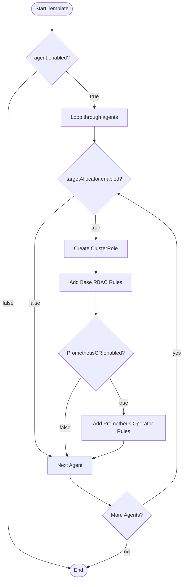

# Diagram: devops/k8s/amazon-cloudwatch-observability/helm/templates/target-allocator-clusterrole.yaml


> Auto-generated by Obscura crawlers

## Diagram 1



### SVG

<svg id="container" width="568.23828125" xmlns="http://www.w3.org/2000/svg" class="flowchart" height="1783.515625" viewBox="0 0 568.23828125 1783.515625" role="graphics-document document" aria-roledescription="flowchart-v2"><style>#container{font-family:"trebuchet ms",verdana,arial,sans-serif;font-size:16px;fill:#333;}@keyframes edge-animation-frame{from{stroke-dashoffset:0;}}@keyframes dash{to{stroke-dashoffset:0;}}#container .edge-animation-slow{stroke-dasharray:9,5!important;stroke-dashoffset:900;animation:dash 50s linear infinite;stroke-linecap:round;}#container .edge-animation-fast{stroke-dasharray:9,5!important;stroke-dashoffset:900;animation:dash 20s linear infinite;stroke-linecap:round;}#container .error-icon{fill:#552222;}#container .error-text{fill:#552222;stroke:#552222;}#container .edge-thickness-normal{stroke-width:1px;}#container .edge-thickness-thick{stroke-width:3.5px;}#container .edge-pattern-solid{stroke-dasharray:0;}#container .edge-thickness-invisible{stroke-width:0;fill:none;}#container .edge-pattern-dashed{stroke-dasharray:3;}#container .edge-pattern-dotted{stroke-dasharray:2;}#container .marker{fill:#333333;stroke:#333333;}#container .marker.cross{stroke:#333333;}#container svg{font-family:"trebuchet ms",verdana,arial,sans-serif;font-size:16px;}#container p{margin:0;}#container .label{font-family:"trebuchet ms",verdana,arial,sans-serif;color:#333;}#container .cluster-label text{fill:#333;}#container .cluster-label span{color:#333;}#container .cluster-label span p{background-color:transparent;}#container .label text,#container span{fill:#333;color:#333;}#container .node rect,#container .node circle,#container .node ellipse,#container .node polygon,#container .node path{fill:#ECECFF;stroke:#9370DB;stroke-width:1px;}#container .rough-node .label text,#container .node .label text,#container .image-shape .label,#container .icon-shape .label{text-anchor:middle;}#container .node .katex path{fill:#000;stroke:#000;stroke-width:1px;}#container .rough-node .label,#container .node .label,#container .image-shape .label,#container .icon-shape .label{text-align:center;}#container .node.clickable{cursor:pointer;}#container .root .anchor path{fill:#333333!important;stroke-width:0;stroke:#333333;}#container .arrowheadPath{fill:#333333;}#container .edgePath .path{stroke:#333333;stroke-width:2.0px;}#container .flowchart-link{stroke:#333333;fill:none;}#container .edgeLabel{background-color:rgba(232,232,232, 0.8);text-align:center;}#container .edgeLabel p{background-color:rgba(232,232,232, 0.8);}#container .edgeLabel rect{opacity:0.5;background-color:rgba(232,232,232, 0.8);fill:rgba(232,232,232, 0.8);}#container .labelBkg{background-color:rgba(232, 232, 232, 0.5);}#container .cluster rect{fill:#ffffde;stroke:#aaaa33;stroke-width:1px;}#container .cluster text{fill:#333;}#container .cluster span{color:#333;}#container div.mermaidTooltip{position:absolute;text-align:center;max-width:200px;padding:2px;font-family:"trebuchet ms",verdana,arial,sans-serif;font-size:12px;background:hsl(80, 100%, 96.2745098039%);border:1px solid #aaaa33;border-radius:2px;pointer-events:none;z-index:100;}#container .flowchartTitleText{text-anchor:middle;font-size:18px;fill:#333;}#container rect.text{fill:none;stroke-width:0;}#container .icon-shape,#container .image-shape{background-color:rgba(232,232,232, 0.8);text-align:center;}#container .icon-shape p,#container .image-shape p{background-color:rgba(232,232,232, 0.8);padding:2px;}#container .icon-shape rect,#container .image-shape rect{opacity:0.5;background-color:rgba(232,232,232, 0.8);fill:rgba(232,232,232, 0.8);}#container .label-icon{display:inline-block;height:1em;overflow:visible;vertical-align:-0.125em;}#container .node .label-icon path{fill:currentColor;stroke:revert;stroke-width:revert;}#container :root{--mermaid-font-family:"trebuchet ms",verdana,arial,sans-serif;}</style><g><marker id="container_flowchart-v2-pointEnd" class="marker flowchart-v2" viewBox="0 0 10 10" refX="5" refY="5" markerUnits="userSpaceOnUse" markerWidth="8" markerHeight="8" orient="auto"><path d="M 0 0 L 10 5 L 0 10 z" class="arrowMarkerPath" style="stroke-width: 1; stroke-dasharray: 1, 0;"></path></marker><marker id="container_flowchart-v2-pointStart" class="marker flowchart-v2" viewBox="0 0 10 10" refX="4.5" refY="5" markerUnits="userSpaceOnUse" markerWidth="8" markerHeight="8" orient="auto"><path d="M 0 5 L 10 10 L 10 0 z" class="arrowMarkerPath" style="stroke-width: 1; stroke-dasharray: 1, 0;"></path></marker><marker id="container_flowchart-v2-circleEnd" class="marker flowchart-v2" viewBox="0 0 10 10" refX="11" refY="5" markerUnits="userSpaceOnUse" markerWidth="11" markerHeight="11" orient="auto"><circle cx="5" cy="5" r="5" class="arrowMarkerPath" style="stroke-width: 1; stroke-dasharray: 1, 0;"></circle></marker><marker id="container_flowchart-v2-circleStart" class="marker flowchart-v2" viewBox="0 0 10 10" refX="-1" refY="5" markerUnits="userSpaceOnUse" markerWidth="11" markerHeight="11" orient="auto"><circle cx="5" cy="5" r="5" class="arrowMarkerPath" style="stroke-width: 1; stroke-dasharray: 1, 0;"></circle></marker><marker id="container_flowchart-v2-crossEnd" class="marker cross flowchart-v2" viewBox="0 0 11 11" refX="12" refY="5.2" markerUnits="userSpaceOnUse" markerWidth="11" markerHeight="11" orient="auto"><path d="M 1,1 l 9,9 M 10,1 l -9,9" class="arrowMarkerPath" style="stroke-width: 2; stroke-dasharray: 1, 0;"></path></marker><marker id="container_flowchart-v2-crossStart" class="marker cross flowchart-v2" viewBox="0 0 11 11" refX="-1" refY="5.2" markerUnits="userSpaceOnUse" markerWidth="11" markerHeight="11" orient="auto"><path d="M 1,1 l 9,9 M 10,1 l -9,9" class="arrowMarkerPath" style="stroke-width: 2; stroke-dasharray: 1, 0;"></path></marker><g class="root"><g class="clusters"></g><g class="edgePaths"><path d="M162.656,47.5L162.573,51.583C162.49,55.667,162.323,63.833,162.24,71.417C162.156,79,162.156,86,162.156,89.5L162.156,93" id="L_Start_CheckAgent_0" class="edge-thickness-normal edge-pattern-solid edge-thickness-normal edge-pattern-solid flowchart-link" style=";" data-edge="true" data-et="edge" data-id="L_Start_CheckAgent_0" data-points="W3sieCI6MTYyLjY1NjI1LCJ5Ijo0Ny41MDAwMDAwMDAwMDAwMX0seyJ4IjoxNjIuMTU2MjUsInkiOjcyfSx7IngiOjE2Mi4xNTYyNSwieSI6OTd9XQ==" marker-end="url(#container_flowchart-v2-pointEnd)"></path><path d="M118.141,217.766L102.654,231.268C87.167,244.771,56.193,271.776,40.706,295.945C25.219,320.115,25.219,341.448,25.219,360.781C25.219,380.115,25.219,397.448,25.219,429.521C25.219,461.594,25.219,508.406,25.219,557.219C25.219,606.031,25.219,656.844,25.219,692.917C25.219,728.99,25.219,750.323,25.219,769.656C25.219,788.99,25.219,806.323,25.219,823.656C25.219,840.99,25.219,858.323,25.219,877.656C25.219,896.99,25.219,918.323,25.219,954.32C25.219,990.318,25.219,1040.979,25.219,1091.641C25.219,1142.302,25.219,1192.964,25.219,1230.961C25.219,1268.958,25.219,1294.292,25.219,1317.625C25.219,1340.958,25.219,1362.292,25.219,1381.625C25.219,1400.958,25.219,1418.292,25.219,1435.625C25.219,1452.958,25.219,1470.292,25.219,1495.616C25.219,1520.94,25.219,1554.255,25.219,1589.57C25.219,1624.885,25.219,1662.201,57.07,1689.12C88.922,1716.039,152.624,1732.562,184.476,1740.824L216.327,1749.085" id="L_CheckAgent_End_0" class="edge-thickness-normal edge-pattern-solid edge-thickness-normal edge-pattern-solid flowchart-link" style=";" data-edge="true" data-et="edge" data-id="L_CheckAgent_End_0" data-points="W3sieCI6MTE4LjE0MDkyMzExNzk1MTg0LCJ5IjoyMTcuNzY1OTIzMTE3OTUxODR9LHsieCI6MjUuMjE4NzUsInkiOjI5OC43ODEyNX0seyJ4IjoyNS4yMTg3NSwieSI6MzYyLjc4MTI1fSx7IngiOjI1LjIxODc1LCJ5Ijo0MTQuNzgxMjV9LHsieCI6MjUuMjE4NzUsInkiOjU1NS4yMTg3NX0seyJ4IjoyNS4yMTg3NSwieSI6NzA3LjY1NjI1fSx7IngiOjI1LjIxODc1LCJ5Ijo3NzEuNjU2MjV9LHsieCI6MjUuMjE4NzUsInkiOjgyMy42NTYyNX0seyJ4IjoyNS4yMTg3NSwieSI6ODc1LjY1NjI1fSx7IngiOjI1LjIxODc1LCJ5Ijo5MzkuNjU2MjV9LHsieCI6MjUuMjE4NzUsInkiOjEwOTEuNjQwNjI1fSx7IngiOjI1LjIxODc1LCJ5IjoxMjQzLjYyNX0seyJ4IjoyNS4yMTg3NSwieSI6MTMxOS42MjV9LHsieCI6MjUuMjE4NzUsInkiOjEzODMuNjI1fSx7IngiOjI1LjIxODc1LCJ5IjoxNDM1LjYyNX0seyJ4IjoyNS4yMTg3NSwieSI6MTQ4Ny42MjV9LHsieCI6MjUuMjE4NzUsInkiOjE1ODcuNTcwMzEyNX0seyJ4IjoyNS4yMTg3NSwieSI6MTY5OS41MTU2MjV9LHsieCI6MjIwLjE5ODkzNDU2NDE1MTY3LCJ5IjoxNzUwLjA4OTcwMjcxMTc2MX1d" marker-end="url(#container_flowchart-v2-pointEnd)"></path><path d="M205.098,218.839L219.602,232.163C234.106,245.486,263.114,272.134,277.617,290.958C292.121,309.781,292.121,320.781,292.121,326.281L292.121,331.781" id="L_CheckAgent_LoopAgents_0" class="edge-thickness-normal edge-pattern-solid edge-thickness-normal edge-pattern-solid flowchart-link" style=";" data-edge="true" data-et="edge" data-id="L_CheckAgent_LoopAgents_0" data-points="W3sieCI6MjA1LjA5ODQ5OTMwNDg0ODQ1LCJ5IjoyMTguODM5MDAwNjk1MTUxNTV9LHsieCI6MjkyLjEyMTA5Mzc1LCJ5IjoyOTguNzgxMjV9LHsieCI6MjkyLjEyMTA5Mzc1LCJ5IjozMzUuNzgxMjV9XQ==" marker-end="url(#container_flowchart-v2-pointEnd)"></path><path d="M292.121,389.781L292.121,393.948C292.121,398.115,292.121,406.448,292.121,414.115C292.121,421.781,292.121,428.781,292.121,432.281L292.121,435.781" id="L_LoopAgents_CheckTA_0" class="edge-thickness-normal edge-pattern-solid edge-thickness-normal edge-pattern-solid flowchart-link" style=";" data-edge="true" data-et="edge" data-id="L_LoopAgents_CheckTA_0" data-points="W3sieCI6MjkyLjEyMTA5Mzc1LCJ5IjozODkuNzgxMjV9LHsieCI6MjkyLjEyMTA5Mzc1LCJ5Ijo0MTQuNzgxMjV9LHsieCI6MjkyLjEyMTA5Mzc1LCJ5Ijo0MzkuNzgxMjV9XQ==" marker-end="url(#container_flowchart-v2-pointEnd)"></path><path d="M228.877,607.412L208.633,624.12C188.388,640.827,147.899,674.242,127.655,701.616C107.41,728.99,107.41,750.323,107.41,769.656C107.41,788.99,107.41,806.323,107.41,823.656C107.41,840.99,107.41,858.323,107.41,877.656C107.41,896.99,107.41,918.323,107.41,954.32C107.41,990.318,107.41,1040.979,107.41,1091.641C107.41,1142.302,107.41,1192.964,107.41,1230.961C107.41,1268.958,107.41,1294.292,107.41,1317.625C107.41,1340.958,107.41,1362.292,115.599,1376.839C123.788,1391.387,140.167,1399.15,148.356,1403.031L156.545,1406.912" id="L_CheckTA_NextAgent_0" class="edge-thickness-normal edge-pattern-solid edge-thickness-normal edge-pattern-solid flowchart-link" style=";" data-edge="true" data-et="edge" data-id="L_CheckTA_NextAgent_0" data-points="W3sieCI6MjI4Ljg3NzIzMjk1NzUwNzgzLCJ5Ijo2MDcuNDEyMzg5MjA3NTA3OH0seyJ4IjoxMDcuNDEwMTU2MjUsInkiOjcwNy42NTYyNX0seyJ4IjoxMDcuNDEwMTU2MjUsInkiOjc3MS42NTYyNX0seyJ4IjoxMDcuNDEwMTU2MjUsInkiOjgyMy42NTYyNX0seyJ4IjoxMDcuNDEwMTU2MjUsInkiOjg3NS42NTYyNX0seyJ4IjoxMDcuNDEwMTU2MjUsInkiOjkzOS42NTYyNX0seyJ4IjoxMDcuNDEwMTU2MjUsInkiOjEwOTEuNjQwNjI1fSx7IngiOjEwNy40MTAxNTYyNSwieSI6MTI0My42MjV9LHsieCI6MTA3LjQxMDE1NjI1LCJ5IjoxMzE5LjYyNX0seyJ4IjoxMDcuNDEwMTU2MjUsInkiOjEzODMuNjI1fSx7IngiOjE2MC4xNTk1NTUyODg0NjE1NSwieSI6MTQwOC42MjV9XQ==" marker-end="url(#container_flowchart-v2-pointEnd)"></path><path d="M297.17,665.607L297.491,672.615C297.811,679.623,298.453,693.64,298.773,706.148C299.094,718.656,299.094,729.656,299.094,735.156L299.094,740.656" id="L_CheckTA_CreateRole_0" class="edge-thickness-normal edge-pattern-solid edge-thickness-normal edge-pattern-solid flowchart-link" style=";" data-edge="true" data-et="edge" data-id="L_CheckTA_CreateRole_0" data-points="W3sieCI6Mjk3LjE3MDM3MDU2MzkzODEsInkiOjY2NS42MDY5NzMxODYwNjE5fSx7IngiOjI5OS4wOTM3NSwieSI6NzA3LjY1NjI1fSx7IngiOjI5OS4wOTM3NSwieSI6NzQ0LjY1NjI1fV0=" marker-end="url(#container_flowchart-v2-pointEnd)"></path><path d="M299.094,798.656L299.094,802.823C299.094,806.99,299.094,815.323,299.094,822.99C299.094,830.656,299.094,837.656,299.094,841.156L299.094,844.656" id="L_CreateRole_BaseRules_0" class="edge-thickness-normal edge-pattern-solid edge-thickness-normal edge-pattern-solid flowchart-link" style=";" data-edge="true" data-et="edge" data-id="L_CreateRole_BaseRules_0" data-points="W3sieCI6Mjk5LjA5Mzc1LCJ5Ijo3OTguNjU2MjV9LHsieCI6Mjk5LjA5Mzc1LCJ5Ijo4MjMuNjU2MjV9LHsieCI6Mjk5LjA5Mzc1LCJ5Ijo4NDguNjU2MjV9XQ==" marker-end="url(#container_flowchart-v2-pointEnd)"></path><path d="M299.094,902.656L299.094,908.823C299.094,914.99,299.094,927.323,299.094,938.99C299.094,950.656,299.094,961.656,299.094,967.156L299.094,972.656" id="L_BaseRules_CheckPromCR_0" class="edge-thickness-normal edge-pattern-solid edge-thickness-normal edge-pattern-solid flowchart-link" style=";" data-edge="true" data-et="edge" data-id="L_BaseRules_CheckPromCR_0" data-points="W3sieCI6Mjk5LjA5Mzc1LCJ5Ijo5MDIuNjU2MjV9LHsieCI6Mjk5LjA5Mzc1LCJ5Ijo5MzkuNjU2MjV9LHsieCI6Mjk5LjA5Mzc1LCJ5Ijo5NzYuNjU2MjV9XQ==" marker-end="url(#container_flowchart-v2-pointEnd)"></path><path d="M340.066,1165.653L347.26,1178.648C354.454,1191.644,368.842,1217.634,376.036,1236.13C383.23,1254.625,383.23,1265.625,383.23,1271.125L383.23,1276.625" id="L_CheckPromCR_AddPromRules_0" class="edge-thickness-normal edge-pattern-solid edge-thickness-normal edge-pattern-solid flowchart-link" style=";" data-edge="true" data-et="edge" data-id="L_CheckPromCR_AddPromRules_0" data-points="W3sieCI6MzQwLjA2NTk4MTA5NzA3Njc2LCJ5IjoxMTY1LjY1Mjc2ODkwMjkyMzN9LHsieCI6MzgzLjIzMDQ2ODc1LCJ5IjoxMjQzLjYyNX0seyJ4IjozODMuMjMwNDY4NzUsInkiOjEyODAuNjI1fV0=" marker-end="url(#container_flowchart-v2-pointEnd)"></path><path d="M253.994,1161.525L245.164,1175.209C236.333,1188.892,218.673,1216.258,209.842,1242.608C201.012,1268.958,201.012,1294.292,201.012,1317.625C201.012,1340.958,201.012,1362.292,202.106,1376.488C203.2,1390.685,205.388,1397.745,206.482,1401.274L207.576,1404.804" id="L_CheckPromCR_NextAgent_0" class="edge-thickness-normal edge-pattern-solid edge-thickness-normal edge-pattern-solid flowchart-link" style=";" data-edge="true" data-et="edge" data-id="L_CheckPromCR_NextAgent_0" data-points="W3sieCI6MjUzLjk5NDEyNTMzOTc1MzUsInkiOjExNjEuNTI1Mzc1MzM5NzUzNX0seyJ4IjoyMDEuMDExNzE4NzUsInkiOjEyNDMuNjI1fSx7IngiOjIwMS4wMTE3MTg3NSwieSI6MTMxOS42MjV9LHsieCI6MjAxLjAxMTcxODc1LCJ5IjoxMzgzLjYyNX0seyJ4IjoyMDguNzYwMzY2NTg2NTM4NDUsInkiOjE0MDguNjI1fV0=" marker-end="url(#container_flowchart-v2-pointEnd)"></path><path d="M383.23,1358.625L383.23,1362.792C383.23,1366.958,383.23,1375.292,367.716,1384.315C352.201,1393.339,321.171,1403.053,305.656,1407.91L290.142,1412.768" id="L_AddPromRules_NextAgent_0" class="edge-thickness-normal edge-pattern-solid edge-thickness-normal edge-pattern-solid flowchart-link" style=";" data-edge="true" data-et="edge" data-id="L_AddPromRules_NextAgent_0" data-points="W3sieCI6MzgzLjIzMDQ2ODc1LCJ5IjoxMzU4LjYyNX0seyJ4IjozODMuMjMwNDY4NzUsInkiOjEzODMuNjI1fSx7IngiOjI4Ni4zMjQyMTg3NSwieSI6MTQxMy45NjI2MTM0NzA2NzQxfV0=" marker-end="url(#container_flowchart-v2-pointEnd)"></path><path d="M217.129,1462.625L217.129,1466.792C217.129,1470.958,217.129,1479.292,238.176,1495.293C259.223,1511.295,301.316,1534.965,322.363,1546.8L343.41,1558.635" id="L_NextAgent_MoreAgents_0" class="edge-thickness-normal edge-pattern-solid edge-thickness-normal edge-pattern-solid flowchart-link" style=";" data-edge="true" data-et="edge" data-id="L_NextAgent_MoreAgents_0" data-points="W3sieCI6MjE3LjEyODkwNjI1LCJ5IjoxNDYyLjYyNX0seyJ4IjoyMTcuMTI4OTA2MjUsInkiOjE0ODcuNjI1fSx7IngiOjM0Ni44OTY1Nzg3NTIwOTI1LCJ5IjoxNTYwLjU5NTYwODc0NzkwNzZ9XQ==" marker-end="url(#container_flowchart-v2-pointEnd)"></path><path d="M440.242,1558L458.24,1546.271C476.238,1534.542,512.234,1511.083,530.232,1490.687C548.23,1470.292,548.23,1452.958,548.23,1435.625C548.23,1418.292,548.23,1400.958,548.23,1381.625C548.23,1362.292,548.23,1340.958,548.23,1317.625C548.23,1294.292,548.23,1268.958,548.23,1230.961C548.23,1192.964,548.23,1142.302,548.23,1091.641C548.23,1040.979,548.23,990.318,548.23,954.32C548.23,918.323,548.23,896.99,548.23,877.656C548.23,858.323,548.23,840.99,548.23,823.656C548.23,806.323,548.23,788.99,548.23,769.656C548.23,750.323,548.23,728.99,518.179,700.436C488.128,671.883,428.026,636.11,397.975,618.223L367.924,600.337" id="L_MoreAgents_CheckTA_0" class="edge-thickness-normal edge-pattern-solid edge-thickness-normal edge-pattern-solid flowchart-link" style=";" data-edge="true" data-et="edge" data-id="L_MoreAgents_CheckTA_0" data-points="W3sieCI6NDQwLjI0MjExNDg1MzAzODcsInkiOjE1NTcuOTk5OTI3MzUzMDM4Nn0seyJ4Ijo1NDguMjMwNDY4NzUsInkiOjE0ODcuNjI1fSx7IngiOjU0OC4yMzA0Njg3NSwieSI6MTQzNS42MjV9LHsieCI6NTQ4LjIzMDQ2ODc1LCJ5IjoxMzgzLjYyNX0seyJ4Ijo1NDguMjMwNDY4NzUsInkiOjEzMTkuNjI1fSx7IngiOjU0OC4yMzA0Njg3NSwieSI6MTI0My42MjV9LHsieCI6NTQ4LjIzMDQ2ODc1LCJ5IjoxMDkxLjY0MDYyNX0seyJ4Ijo1NDguMjMwNDY4NzUsInkiOjkzOS42NTYyNX0seyJ4Ijo1NDguMjMwNDY4NzUsInkiOjg3NS42NTYyNX0seyJ4Ijo1NDguMjMwNDY4NzUsInkiOjgyMy42NTYyNX0seyJ4Ijo1NDguMjMwNDY4NzUsInkiOjc3MS42NTYyNX0seyJ4Ijo1NDguMjMwNDY4NzUsInkiOjcwNy42NTYyNX0seyJ4IjozNjQuNDg2NDE1Mjk3NDA1MSwieSI6NTk4LjI5MDkyODQ1MjU5NDl9XQ==" marker-end="url(#container_flowchart-v2-pointEnd)"></path><path d="M394.867,1662.516L394.867,1668.682C394.867,1674.849,394.867,1687.182,374.516,1701.115C354.164,1715.048,313.461,1730.581,293.109,1738.347L272.758,1746.113" id="L_MoreAgents_End_0" class="edge-thickness-normal edge-pattern-solid edge-thickness-normal edge-pattern-solid flowchart-link" style=";" data-edge="true" data-et="edge" data-id="L_MoreAgents_End_0" data-points="W3sieCI6Mzk0Ljg2NzE4NzUsInkiOjE2NjIuNTE1NjI1fSx7IngiOjM5NC44NjcxODc1LCJ5IjoxNjk5LjUxNTYyNX0seyJ4IjoyNjkuMDIwNDYwNjgxNzk1MSwieSI6MTc0Ny41MzkzOTUxMzMxMDc3fV0=" marker-end="url(#container_flowchart-v2-pointEnd)"></path></g><g class="edgeLabels"><g class="edgeLabel"><g class="label" data-id="L_Start_CheckAgent_0" transform="translate(0, 0)"><foreignObject width="0" height="0"><div xmlns="http://www.w3.org/1999/xhtml" class="labelBkg" style="display: table-cell; white-space: nowrap; line-height: 1.5; max-width: 200px; text-align: center;"><span class="edgeLabel"></span></div></foreignObject></g></g><g class="edgeLabel" transform="translate(25.21875, 939.65625)"><g class="label" data-id="L_CheckAgent_End_0" transform="translate(-17.21875, -12)"><foreignObject width="34.4375" height="24"><div xmlns="http://www.w3.org/1999/xhtml" class="labelBkg" style="display: table-cell; white-space: nowrap; line-height: 1.5; max-width: 200px; text-align: center;"><span class="edgeLabel"><p>false</p></span></div></foreignObject></g></g><g class="edgeLabel" transform="translate(292.12109375, 298.78125)"><g class="label" data-id="L_CheckAgent_LoopAgents_0" transform="translate(-14.9921875, -12)"><foreignObject width="29.984375" height="24"><div xmlns="http://www.w3.org/1999/xhtml" class="labelBkg" style="display: table-cell; white-space: nowrap; line-height: 1.5; max-width: 200px; text-align: center;"><span class="edgeLabel"><p>true</p></span></div></foreignObject></g></g><g class="edgeLabel"><g class="label" data-id="L_LoopAgents_CheckTA_0" transform="translate(0, 0)"><foreignObject width="0" height="0"><div xmlns="http://www.w3.org/1999/xhtml" class="labelBkg" style="display: table-cell; white-space: nowrap; line-height: 1.5; max-width: 200px; text-align: center;"><span class="edgeLabel"></span></div></foreignObject></g></g><g class="edgeLabel" transform="translate(107.41015625, 939.65625)"><g class="label" data-id="L_CheckTA_NextAgent_0" transform="translate(-17.21875, -12)"><foreignObject width="34.4375" height="24"><div xmlns="http://www.w3.org/1999/xhtml" class="labelBkg" style="display: table-cell; white-space: nowrap; line-height: 1.5; max-width: 200px; text-align: center;"><span class="edgeLabel"><p>false</p></span></div></foreignObject></g></g><g class="edgeLabel" transform="translate(299.09375, 707.65625)"><g class="label" data-id="L_CheckTA_CreateRole_0" transform="translate(-14.9921875, -12)"><foreignObject width="29.984375" height="24"><div xmlns="http://www.w3.org/1999/xhtml" class="labelBkg" style="display: table-cell; white-space: nowrap; line-height: 1.5; max-width: 200px; text-align: center;"><span class="edgeLabel"><p>true</p></span></div></foreignObject></g></g><g class="edgeLabel"><g class="label" data-id="L_CreateRole_BaseRules_0" transform="translate(0, 0)"><foreignObject width="0" height="0"><div xmlns="http://www.w3.org/1999/xhtml" class="labelBkg" style="display: table-cell; white-space: nowrap; line-height: 1.5; max-width: 200px; text-align: center;"><span class="edgeLabel"></span></div></foreignObject></g></g><g class="edgeLabel"><g class="label" data-id="L_BaseRules_CheckPromCR_0" transform="translate(0, 0)"><foreignObject width="0" height="0"><div xmlns="http://www.w3.org/1999/xhtml" class="labelBkg" style="display: table-cell; white-space: nowrap; line-height: 1.5; max-width: 200px; text-align: center;"><span class="edgeLabel"></span></div></foreignObject></g></g><g class="edgeLabel" transform="translate(383.23046875, 1243.625)"><g class="label" data-id="L_CheckPromCR_AddPromRules_0" transform="translate(-14.9921875, -12)"><foreignObject width="29.984375" height="24"><div xmlns="http://www.w3.org/1999/xhtml" class="labelBkg" style="display: table-cell; white-space: nowrap; line-height: 1.5; max-width: 200px; text-align: center;"><span class="edgeLabel"><p>true</p></span></div></foreignObject></g></g><g class="edgeLabel" transform="translate(201.01171875, 1319.625)"><g class="label" data-id="L_CheckPromCR_NextAgent_0" transform="translate(-17.21875, -12)"><foreignObject width="34.4375" height="24"><div xmlns="http://www.w3.org/1999/xhtml" class="labelBkg" style="display: table-cell; white-space: nowrap; line-height: 1.5; max-width: 200px; text-align: center;"><span class="edgeLabel"><p>false</p></span></div></foreignObject></g></g><g class="edgeLabel"><g class="label" data-id="L_AddPromRules_NextAgent_0" transform="translate(0, 0)"><foreignObject width="0" height="0"><div xmlns="http://www.w3.org/1999/xhtml" class="labelBkg" style="display: table-cell; white-space: nowrap; line-height: 1.5; max-width: 200px; text-align: center;"><span class="edgeLabel"></span></div></foreignObject></g></g><g class="edgeLabel"><g class="label" data-id="L_NextAgent_MoreAgents_0" transform="translate(0, 0)"><foreignObject width="0" height="0"><div xmlns="http://www.w3.org/1999/xhtml" class="labelBkg" style="display: table-cell; white-space: nowrap; line-height: 1.5; max-width: 200px; text-align: center;"><span class="edgeLabel"></span></div></foreignObject></g></g><g class="edgeLabel" transform="translate(548.23046875, 1091.640625)"><g class="label" data-id="L_MoreAgents_CheckTA_0" transform="translate(-12.0078125, -12)"><foreignObject width="24.015625" height="24"><div xmlns="http://www.w3.org/1999/xhtml" class="labelBkg" style="display: table-cell; white-space: nowrap; line-height: 1.5; max-width: 200px; text-align: center;"><span class="edgeLabel"><p>yes</p></span></div></foreignObject></g></g><g class="edgeLabel" transform="translate(394.8671875, 1699.515625)"><g class="label" data-id="L_MoreAgents_End_0" transform="translate(-9.3671875, -12)"><foreignObject width="18.734375" height="24"><div xmlns="http://www.w3.org/1999/xhtml" class="labelBkg" style="display: table-cell; white-space: nowrap; line-height: 1.5; max-width: 200px; text-align: center;"><span class="edgeLabel"><p>no</p></span></div></foreignObject></g></g></g><g class="nodes"><g class="node default" id="flowchart-Start-0" transform="translate(162.15625, 27.5)"><g class="basic label-container outer-path"><path d="M-45.96875 -19.5 C-21.400867495730576 -19.5, 3.167015008538847 -19.5, 45.96875 -19.5 C45.96875 -19.5, 45.96875 -19.5, 45.96875 -19.5 C46.35876991139255 -19.487492820569344, 46.7487898227851 -19.47498564113869, 47.2181192896239 -19.45993515863156 C47.617894950182674 -19.42136928145803, 48.017670610741455 -19.3828034042845, 48.462354652847864 -19.3399052695533 C48.910448076233216 -19.267460999876754, 49.35854149961856 -19.19501673020021, 49.69634325967676 -19.140403561325776 C50.04610990141279 -19.06057160779017, 50.39587654314882 -18.980739654254563, 50.91501438623539 -18.862249829261074 C51.37541323689512 -18.72560586706815, 51.83581208755484 -18.588961904875227, 52.113360251460605 -18.50658706670804 C52.5347591900451 -18.35150836193986, 52.956158128629596 -18.196429657171677, 53.2864565951478 -18.074876768247425 C53.559899370085404 -17.953831763174264, 53.83334214502301 -17.832786758101108, 54.42948291279238 -17.568892924097174 C54.74887262546736 -17.402267515573513, 55.06826233814234 -17.235642107049852, 55.53774226407678 -16.990714730406097 C55.81541994909519 -16.822384885932735, 56.09309763411359 -16.654055041459372, 56.6066805736057 -16.342718045390892 C56.927501613630895 -16.118927175988304, 57.24832265365609 -15.895136306585712, 57.63190534457871 -15.627565626425154 C57.981189685277144 -15.34902065956482, 58.330474025975576 -15.070475692704484, 58.609203708501866 -14.848196188198123 C58.96185907271477 -14.527923917169593, 59.31451443692768 -14.207651646141061, 59.53455973676799 -14.007812326905688 C59.73390841753363 -13.801968447184096, 59.93325709829926 -13.596124567462503, 60.40417094296865 -13.10986736009568 C60.682403064537255 -12.783040078244984, 60.96063518610586 -12.456212796394286, 61.21446390812658 -12.158051136245305 C61.40833759474135 -11.898278058437713, 61.60221128135612 -11.63850498063012, 61.962108964640635 -11.156274872382312 C62.20629057293408 -10.781146350100814, 62.45047218122753 -10.406017827819314, 62.64403387860425 -10.108655082055241 C62.84556847480464 -9.75080999891066, 63.04710307100503 -9.392964915766079, 63.257436474273504 -9.019496659696287 C63.400072458885006 -8.72330998572934, 63.54270844349651 -8.427123311762392, 63.79979614880834 -7.893275190886684 C63.911762862012864 -7.616715244542384, 64.02372957521739 -7.340155298198083, 64.26888422997033 -6.734618561215508 C64.38135279149033 -6.395881173349055, 64.49382135301032 -6.057143785482602, 64.66277313421489 -5.548287939305138 C64.74251126950699 -5.244211870709893, 64.8222494047991 -4.940135802114648, 64.97984428754556 -4.339158212148133 C65.07305473823533 -3.8605422478918956, 65.1662651889251 -3.3819262836356576, 65.21879477658177 -3.1121979531509023 C65.281935940923 -2.6224875511535424, 65.34507710526424 -2.132777149156182, 65.37864270250937 -1.872449005199798 C65.40881399299374 -1.4025068020782587, 65.43898528347813 -0.9325645989567196, 65.45873121591342 -0.6250057626472757 C65.45873121591342 -0.28698346850673684, 65.45873121591342 0.05103882563380202, 65.45873121591342 0.625005762647271 C65.42771439261061 1.1081178219176537, 65.3966975693078 1.5912298811880363, 65.37864270250937 1.8724490051997846 C65.32767397262805 2.2677524092451393, 65.27670524274673 2.663055813290494, 65.21879477658177 3.1121979531508885 C65.15507201493298 3.4394008664069835, 65.09134925328419 3.766603779663078, 64.97984428754556 4.339158212148129 C64.91353531063466 4.592023079601787, 64.84722633372375 4.844887947055446, 64.66277313421489 5.548287939305125 C64.56427700786904 5.844942578632258, 64.4657808815232 6.141597217959391, 64.26888422997033 6.734618561215495 C64.13658782010722 7.061393251354438, 64.00429141024412 7.388167941493382, 63.79979614880834 7.893275190886679 C63.67010761969956 8.162576196471063, 63.540419090590774 8.431877202055446, 63.257436474273504 9.019496659696284 C63.09085903319925 9.315271774118608, 62.924281592125 9.611046888540931, 62.64403387860425 10.108655082055236 C62.472916577314145 10.371537208266037, 62.30179927602404 10.634419334476837, 61.96210896464064 11.156274872382301 C61.6674790126825 11.55105216666541, 61.372849060724356 11.945829460948522, 61.21446390812658 12.158051136245302 C61.02701565287662 12.37823852296979, 60.83956739762666 12.598425909694278, 60.40417094296866 13.10986736009567 C60.11321923312521 13.410298888088665, 59.82226752328175 13.71073041608166, 59.53455973676799 14.007812326905684 C59.337816026725875 14.186489758812623, 59.141072316683754 14.365167190719562, 58.60920370850189 14.848196188198111 C58.36343709173454 15.04418852494573, 58.11767047496719 15.240180861693348, 57.63190534457871 15.627565626425152 C57.31128820334571 15.851214264856944, 56.99067106211272 16.074862903288736, 56.60668057360571 16.34271804539089 C56.19833487132947 16.59025960981645, 55.78998916905324 16.83780117424201, 55.53774226407678 16.990714730406093 C55.23452337491019 17.14890383066334, 54.931304485743595 17.307092930920582, 54.42948291279239 17.56889292409717 C54.0595942425251 17.732631666066943, 53.68970557225782 17.896370408036713, 53.286456595147804 18.07487676824742 C52.8236372900878 18.245198550764258, 52.3608179850278 18.415520333281098, 52.11336025146062 18.506587066708033 C51.65158823718747 18.64363857665354, 51.189816222914324 18.780690086599044, 50.91501438623541 18.86224982926107 C50.54569658530369 18.94654420729986, 50.176378784371956 19.030838585338643, 49.696343259676766 19.140403561325773 C49.437294388471535 19.182284573868234, 49.178245517266305 19.224165586410695, 48.46235465284788 19.3399052695533 C47.98840501748471 19.38562662086895, 47.51445538212155 19.431347972184604, 47.2181192896239 19.45993515863156 C46.90618645611329 19.469938237461818, 46.59425362260268 19.479941316292074, 45.96875000000001 19.5 C45.96875000000001 19.5, 45.96875 19.5, 45.96875 19.5 C9.77338915418455 19.5, -26.4219716916309 19.5, -45.96874999999999 19.5 C-46.304114809750246 19.489245503299312, -46.6394796195005 19.478491006598624, -47.21811928962389 19.45993515863156 C-47.52723193419231 19.43011543357239, -47.83634457876073 19.40029570851322, -48.46235465284787 19.3399052695533 C-48.709314370852326 19.299978737547555, -48.95627408885677 19.26005220554181, -49.69634325967676 19.140403561325773 C-50.175162954445334 19.031116090585364, -50.6539826492139 18.921828619844952, -50.915014386235384 18.862249829261074 C-51.22348736005704 18.77069666983849, -51.5319603338787 18.6791435104159, -52.11336025146059 18.506587066708043 C-52.368020794035985 18.412869632984048, -52.622681336611386 18.319152199260053, -53.2864565951478 18.074876768247425 C-53.726044838609965 17.880284092788656, -54.16563308207213 17.68569141732989, -54.42948291279238 17.568892924097174 C-54.696576020305045 17.42955062098912, -54.9636691278177 17.290208317881063, -55.53774226407678 16.990714730406097 C-55.82301534567812 16.817780511888653, -56.10828842727946 16.64484629337121, -56.606680573605686 16.3427180453909 C-56.904463531102685 16.134997545057463, -57.20224648859968 15.927277044724026, -57.63190534457871 15.627565626425156 C-57.84798693976166 15.455246304439491, -58.06406853494462 15.282926982453827, -58.609203708501866 14.848196188198125 C-58.9067793585839 14.577945856213878, -59.20435500866593 14.307695524229631, -59.534559736767974 14.007812326905697 C-59.80266955954873 13.730966922658745, -60.07077938232949 13.45412151841179, -60.404170942968655 13.109867360095677 C-60.624460048589725 12.851103241827957, -60.8447491542108 12.592339123560237, -61.214463908126575 12.158051136245307 C-61.42120675205351 11.881034560043767, -61.62794959598044 11.604017983842228, -61.962108964640635 11.156274872382316 C-62.14564513533391 10.874314027834874, -62.32918130602719 10.592353183287432, -62.64403387860425 10.108655082055249 C-62.832131252634056 9.774669147540827, -63.020228626663865 9.440683213026405, -63.257436474273504 9.019496659696289 C-63.468644201494804 8.580919294999836, -63.67985192871611 8.142341930303383, -63.79979614880834 7.893275190886686 C-63.93902080238542 7.549387604825737, -64.0782454559625 7.2055000187647895, -64.26888422997033 6.73461856121551 C-64.40019311745453 6.339137113343121, -64.53150200493876 5.9436556654707315, -64.66277313421489 5.5482879393051325 C-64.77101003421863 5.135533729421642, -64.87924693422238 4.722779519538151, -64.97984428754556 4.339158212148136 C-65.07414192589458 3.8549597690388024, -65.16843956424361 3.370761325929469, -65.21879477658177 3.112197953150904 C-65.26076122893579 2.786714435906482, -65.30272768128982 2.46123091866206, -65.37864270250937 1.872449005199809 C-65.40552890665978 1.4536746734037371, -65.4324151108102 1.0349003416076654, -65.45873121591342 0.6250057626472781 C-65.45873121591342 0.3517761414002583, -65.45873121591342 0.07854652015323849, -65.45873121591342 -0.6250057626472687 C-65.43460710917306 -1.0007581977568742, -65.4104830024327 -1.3765106328664798, -65.37864270250937 -1.8724490051997822 C-65.32163727284139 -2.3145718607092713, -65.2646318431734 -2.7566947162187603, -65.21879477658177 -3.112197953150895 C-65.15960769000473 -3.416111133528808, -65.1004206034277 -3.7200243139067206, -64.97984428754556 -4.339158212148126 C-64.88127129685144 -4.715059747469231, -64.78269830615731 -5.090961282790335, -64.66277313421489 -5.548287939305123 C-64.54955646582155 -5.8892785058794095, -64.43633979742823 -6.230269072453695, -64.26888422997033 -6.734618561215485 C-64.11819166528386 -7.106832109433588, -63.9674991005974 -7.4790456576516915, -63.79979614880834 -7.893275190886676 C-63.66282493680873 -8.177698843318312, -63.525853724809124 -8.462122495749949, -63.257436474273504 -9.019496659696282 C-63.07781282487021 -9.338436638078674, -62.898189175466904 -9.657376616461066, -62.64403387860425 -10.108655082055243 C-62.424817622079765 -10.445430119884, -62.205601365555275 -10.782205157712756, -61.96210896464064 -11.156274872382308 C-61.785417969556676 -11.393024708914027, -61.60872697447271 -11.629774545445745, -61.21446390812659 -12.158051136245302 C-60.915801762545364 -12.508876686802518, -60.61713961696414 -12.859702237359736, -60.40417094296866 -13.10986736009567 C-60.14665594088109 -13.375772742125955, -59.88914093879352 -13.64167812415624, -59.534559736767996 -14.007812326905677 C-59.23385386616644 -14.280905442344661, -58.93314799556489 -14.553998557783643, -58.60920370850189 -14.848196188198107 C-58.29173668493577 -15.10136769133979, -57.974269661369654 -15.354539194481472, -57.63190534457872 -15.627565626425149 C-57.354738813955336 -15.820904999842291, -57.077572283331946 -16.014244373259434, -56.606680573605715 -16.342718045390885 C-56.19980028808429 -16.589371265567937, -55.792920002562866 -16.83602448574499, -55.53774226407679 -16.99071473040609 C-55.16730001546227 -17.183974214228705, -54.796857766847744 -17.377233698051317, -54.42948291279239 -17.56889292409717 C-54.074210926560724 -17.7261612936329, -53.71893894032906 -17.883429663168627, -53.286456595147804 -18.07487676824742 C-52.94555122690742 -18.20033309505456, -52.60464585866704 -18.3257894218617, -52.11336025146062 -18.506587066708033 C-51.65701859741534 -18.64202687424245, -51.20067694337006 -18.777466681776865, -50.91501438623541 -18.862249829261067 C-50.45627588122358 -18.96695389948151, -49.99753737621175 -19.071657969701956, -49.696343259676766 -19.140403561325773 C-49.22519737998855 -19.216574773362897, -48.75405150030034 -19.29274598540002, -48.46235465284788 -19.3399052695533 C-48.01655814774195 -19.38291072225213, -47.570761642636015 -19.42591617495096, -47.2181192896239 -19.45993515863156 C-46.74380386722867 -19.47514553102881, -46.26948844483344 -19.490355903426064, -45.96875000000001 -19.5 C-45.96875000000001 -19.5, -45.96875 -19.5, -45.96875 -19.5" stroke="none" stroke-width="0" fill="#ECECFF" style=""></path><path d="M-45.96875 -19.5 C-21.23088245075174 -19.5, 3.5069850984965214 -19.5, 45.96875 -19.5 M-45.96875 -19.5 C-11.569366126260164 -19.5, 22.830017747479673 -19.5, 45.96875 -19.5 M45.96875 -19.5 C45.96875 -19.5, 45.96875 -19.5, 45.96875 -19.5 M45.96875 -19.5 C45.96875 -19.5, 45.96875 -19.5, 45.96875 -19.5 M45.96875 -19.5 C46.39470784876901 -19.486340360866635, 46.82066569753801 -19.47268072173327, 47.2181192896239 -19.45993515863156 M45.96875 -19.5 C46.22356933495296 -19.491828439903806, 46.47838866990593 -19.48365687980761, 47.2181192896239 -19.45993515863156 M47.2181192896239 -19.45993515863156 C47.6041745312443 -19.422692873771798, 47.990229772864694 -19.385450588912033, 48.462354652847864 -19.3399052695533 M47.2181192896239 -19.45993515863156 C47.58054886996313 -19.424972012901577, 47.94297845030236 -19.39000886717159, 48.462354652847864 -19.3399052695533 M48.462354652847864 -19.3399052695533 C48.85447910934181 -19.276509628397935, 49.24660356583576 -19.213113987242572, 49.69634325967676 -19.140403561325776 M48.462354652847864 -19.3399052695533 C48.8232828997716 -19.28155318963103, 49.18421114669534 -19.223201109708757, 49.69634325967676 -19.140403561325776 M49.69634325967676 -19.140403561325776 C50.16359663376855 -19.033756027802546, 50.63085000786033 -18.927108494279317, 50.91501438623539 -18.862249829261074 M49.69634325967676 -19.140403561325776 C50.06377471899346 -19.05653972845109, 50.431206178310156 -18.9726758955764, 50.91501438623539 -18.862249829261074 M50.91501438623539 -18.862249829261074 C51.26307920427618 -18.758946018296083, 51.611144022316964 -18.65564220733109, 52.113360251460605 -18.50658706670804 M50.91501438623539 -18.862249829261074 C51.37415838157945 -18.72597830153897, 51.833302376923506 -18.589706773816868, 52.113360251460605 -18.50658706670804 M52.113360251460605 -18.50658706670804 C52.57004003360116 -18.338524685378687, 53.02671981574171 -18.170462304049334, 53.2864565951478 -18.074876768247425 M52.113360251460605 -18.50658706670804 C52.517075476023 -18.35801613216645, 52.92079070058539 -18.209445197624863, 53.2864565951478 -18.074876768247425 M53.2864565951478 -18.074876768247425 C53.74354160004269 -17.872538795525376, 54.20062660493758 -17.670200822803327, 54.42948291279238 -17.568892924097174 M53.2864565951478 -18.074876768247425 C53.57819522177497 -17.945732732358454, 53.86993384840214 -17.81658869646948, 54.42948291279238 -17.568892924097174 M54.42948291279238 -17.568892924097174 C54.728725782940714 -17.412778110414997, 55.02796865308905 -17.256663296732818, 55.53774226407678 -16.990714730406097 M54.42948291279238 -17.568892924097174 C54.85777442528375 -17.345453516364234, 55.28606593777513 -17.12201410863129, 55.53774226407678 -16.990714730406097 M55.53774226407678 -16.990714730406097 C55.813584222140655 -16.823497714400503, 56.08942618020452 -16.65628069839491, 56.6066805736057 -16.342718045390892 M55.53774226407678 -16.990714730406097 C55.876609992778135 -16.78529112185952, 56.215477721479495 -16.57986751331294, 56.6066805736057 -16.342718045390892 M56.6066805736057 -16.342718045390892 C56.885761832352784 -16.1480430405219, 57.16484309109987 -15.953368035652915, 57.63190534457871 -15.627565626425154 M56.6066805736057 -16.342718045390892 C56.95934337595158 -16.096715741001063, 57.312006178297466 -15.850713436611235, 57.63190534457871 -15.627565626425154 M57.63190534457871 -15.627565626425154 C57.93258274341551 -15.387783402214424, 58.23326014225231 -15.148001178003694, 58.609203708501866 -14.848196188198123 M57.63190534457871 -15.627565626425154 C58.01416609059785 -15.322722853860554, 58.39642683661699 -15.017880081295955, 58.609203708501866 -14.848196188198123 M58.609203708501866 -14.848196188198123 C58.94581715588707 -14.542492761586649, 59.28243060327228 -14.236789334975173, 59.53455973676799 -14.007812326905688 M58.609203708501866 -14.848196188198123 C58.941221430829415 -14.546666477487793, 59.27323915315696 -14.245136766777463, 59.53455973676799 -14.007812326905688 M59.53455973676799 -14.007812326905688 C59.75586680428189 -13.779294610049435, 59.977173871795785 -13.550776893193184, 60.40417094296865 -13.10986736009568 M59.53455973676799 -14.007812326905688 C59.73060327651644 -13.805381276641466, 59.926646816264885 -13.602950226377242, 60.40417094296865 -13.10986736009568 M60.40417094296865 -13.10986736009568 C60.71632719835611 -12.743190860323454, 61.02848345374358 -12.376514360551225, 61.21446390812658 -12.158051136245305 M60.40417094296865 -13.10986736009568 C60.59966771934831 -12.880225722478423, 60.795164495727974 -12.650584084861165, 61.21446390812658 -12.158051136245305 M61.21446390812658 -12.158051136245305 C61.44166946883574 -11.853616383747426, 61.6688750295449 -11.549181631249546, 61.962108964640635 -11.156274872382312 M61.21446390812658 -12.158051136245305 C61.49919092588625 -11.776542871612278, 61.78391794364593 -11.395034606979252, 61.962108964640635 -11.156274872382312 M61.962108964640635 -11.156274872382312 C62.12623231800419 -10.90413732832467, 62.29035567136775 -10.651999784267026, 62.64403387860425 -10.108655082055241 M61.962108964640635 -11.156274872382312 C62.17432951887049 -10.8302471118872, 62.38655007310035 -10.504219351392088, 62.64403387860425 -10.108655082055241 M62.64403387860425 -10.108655082055241 C62.85060856572089 -9.741860807124313, 63.057183252837525 -9.375066532193385, 63.257436474273504 -9.019496659696287 M62.64403387860425 -10.108655082055241 C62.82815932918413 -9.781721699827022, 63.012284779764016 -9.454788317598805, 63.257436474273504 -9.019496659696287 M63.257436474273504 -9.019496659696287 C63.435051838551395 -8.650674555413248, 63.61266720282929 -8.281852451130211, 63.79979614880834 -7.893275190886684 M63.257436474273504 -9.019496659696287 C63.43749505879486 -8.645601156301165, 63.617553643316214 -8.271705652906045, 63.79979614880834 -7.893275190886684 M63.79979614880834 -7.893275190886684 C63.97180552846287 -7.468408697564867, 64.1438149081174 -7.04354220424305, 64.26888422997033 -6.734618561215508 M63.79979614880834 -7.893275190886684 C63.94074601497095 -7.545126296384761, 64.08169588113356 -7.196977401882838, 64.26888422997033 -6.734618561215508 M64.26888422997033 -6.734618561215508 C64.35518373758444 -6.474698194241042, 64.44148324519857 -6.214777827266576, 64.66277313421489 -5.548287939305138 M64.26888422997033 -6.734618561215508 C64.41949468841051 -6.28100385691146, 64.57010514685068 -5.827389152607413, 64.66277313421489 -5.548287939305138 M64.66277313421489 -5.548287939305138 C64.75514344935827 -5.19603989411561, 64.84751376450164 -4.843791848926082, 64.97984428754556 -4.339158212148133 M64.66277313421489 -5.548287939305138 C64.7624650503227 -5.1681194564362745, 64.86215696643052 -4.78795097356741, 64.97984428754556 -4.339158212148133 M64.97984428754556 -4.339158212148133 C65.06354710449251 -3.90936193772212, 65.14724992143948 -3.479565663296107, 65.21879477658177 -3.1121979531509023 M64.97984428754556 -4.339158212148133 C65.03977068011521 -4.03144885175052, 65.09969707268486 -3.7237394913529065, 65.21879477658177 -3.1121979531509023 M65.21879477658177 -3.1121979531509023 C65.25879588954064 -2.801957220155159, 65.2987970024995 -2.4917164871594153, 65.37864270250937 -1.872449005199798 M65.21879477658177 -3.1121979531509023 C65.26380335397344 -2.763120314850064, 65.3088119313651 -2.414042676549226, 65.37864270250937 -1.872449005199798 M65.37864270250937 -1.872449005199798 C65.40308364832596 -1.491761545729929, 65.42752459414257 -1.1110740862600599, 65.45873121591342 -0.6250057626472757 M65.37864270250937 -1.872449005199798 C65.39674518590375 -1.5904882142707024, 65.41484766929813 -1.3085274233416069, 65.45873121591342 -0.6250057626472757 M65.45873121591342 -0.6250057626472757 C65.45873121591342 -0.22534815516572831, 65.45873121591342 0.17430945231581907, 65.45873121591342 0.625005762647271 M65.45873121591342 -0.6250057626472757 C65.45873121591342 -0.13048534055556066, 65.45873121591342 0.3640350815361544, 65.45873121591342 0.625005762647271 M65.45873121591342 0.625005762647271 C65.43378949095786 1.013493261428051, 65.40884776600231 1.401980760208831, 65.37864270250937 1.8724490051997846 M65.45873121591342 0.625005762647271 C65.42892418118149 1.0892743884025653, 65.39911714644954 1.5535430141578597, 65.37864270250937 1.8724490051997846 M65.37864270250937 1.8724490051997846 C65.32648058257178 2.277008106860104, 65.27431846263418 2.681567208520423, 65.21879477658177 3.1121979531508885 M65.37864270250937 1.8724490051997846 C65.32874912350671 2.2594137513428323, 65.27885554450404 2.6463784974858804, 65.21879477658177 3.1121979531508885 M65.21879477658177 3.1121979531508885 C65.13205300702491 3.557598606945896, 65.04531123746806 4.0029992607409035, 64.97984428754556 4.339158212148129 M65.21879477658177 3.1121979531508885 C65.1294727350332 3.5708477582826634, 65.04015069348462 4.029497563414438, 64.97984428754556 4.339158212148129 M64.97984428754556 4.339158212148129 C64.87260382700129 4.7481125665130515, 64.76536336645701 5.157066920877975, 64.66277313421489 5.548287939305125 M64.97984428754556 4.339158212148129 C64.89821023349411 4.650464240669138, 64.81657617944266 4.961770269190148, 64.66277313421489 5.548287939305125 M64.66277313421489 5.548287939305125 C64.53398394968535 5.936180443338165, 64.40519476515581 6.324072947371204, 64.26888422997033 6.734618561215495 M64.66277313421489 5.548287939305125 C64.57102991618133 5.824603894725452, 64.47928669814779 6.100919850145778, 64.26888422997033 6.734618561215495 M64.26888422997033 6.734618561215495 C64.17420990619523 6.968465971343501, 64.07953558242015 7.202313381471506, 63.79979614880834 7.893275190886679 M64.26888422997033 6.734618561215495 C64.15313681730947 7.0205169083117696, 64.03738940464864 7.306415255408044, 63.79979614880834 7.893275190886679 M63.79979614880834 7.893275190886679 C63.682125557070954 8.13762069237669, 63.56445496533357 8.381966193866699, 63.257436474273504 9.019496659696284 M63.79979614880834 7.893275190886679 C63.64403022597861 8.216726462499453, 63.48826430314888 8.540177734112227, 63.257436474273504 9.019496659696284 M63.257436474273504 9.019496659696284 C63.02895495060815 9.425188741227192, 62.8004734269428 9.830880822758102, 62.64403387860425 10.108655082055236 M63.257436474273504 9.019496659696284 C63.04941571772285 9.38885857733771, 62.8413949611722 9.758220494979136, 62.64403387860425 10.108655082055236 M62.64403387860425 10.108655082055236 C62.486547722609906 10.35059610861672, 62.329061566615565 10.592537135178206, 61.96210896464064 11.156274872382301 M62.64403387860425 10.108655082055236 C62.39995181887947 10.483630671002723, 62.1558697591547 10.85860625995021, 61.96210896464064 11.156274872382301 M61.96210896464064 11.156274872382301 C61.77783132342308 11.403190123575353, 61.593553682205524 11.650105374768406, 61.21446390812658 12.158051136245302 M61.96210896464064 11.156274872382301 C61.72017202877063 11.480448325539836, 61.47823509290062 11.80462177869737, 61.21446390812658 12.158051136245302 M61.21446390812658 12.158051136245302 C60.89420441997857 12.534246154305071, 60.57394493183057 12.910441172364841, 60.40417094296866 13.10986736009567 M61.21446390812658 12.158051136245302 C61.005723034868154 12.403250043666821, 60.796982161609726 12.64844895108834, 60.40417094296866 13.10986736009567 M60.40417094296866 13.10986736009567 C60.062034712419454 13.46315110804466, 59.71989848187024 13.816434855993649, 59.53455973676799 14.007812326905684 M60.40417094296866 13.10986736009567 C60.064950187956676 13.46014064018748, 59.72572943294469 13.810413920279291, 59.53455973676799 14.007812326905684 M59.53455973676799 14.007812326905684 C59.343406000480186 14.181413092551553, 59.15225226419239 14.355013858197422, 58.60920370850189 14.848196188198111 M59.53455973676799 14.007812326905684 C59.24719537579535 14.268789036296686, 58.95983101482272 14.529765745687689, 58.60920370850189 14.848196188198111 M58.60920370850189 14.848196188198111 C58.2348943249042 15.146697960826243, 57.86058494130651 15.445199733454375, 57.63190534457871 15.627565626425152 M58.60920370850189 14.848196188198111 C58.271877001548944 15.117205260352415, 57.934550294596 15.38621433250672, 57.63190534457871 15.627565626425152 M57.63190534457871 15.627565626425152 C57.41323176826888 15.780102847032342, 57.19455819195905 15.93264006763953, 56.60668057360571 16.34271804539089 M57.63190534457871 15.627565626425152 C57.25292796131186 15.8919238433256, 56.87395057804501 16.156282060226047, 56.60668057360571 16.34271804539089 M56.60668057360571 16.34271804539089 C56.21740237837959 16.578700774989564, 55.82812418315347 16.814683504588235, 55.53774226407678 16.990714730406093 M56.60668057360571 16.34271804539089 C56.328971640202134 16.511066832818976, 56.05126270679856 16.679415620247063, 55.53774226407678 16.990714730406093 M55.53774226407678 16.990714730406093 C55.131316400510535 17.202746843100417, 54.72489053694429 17.414778955794738, 54.42948291279239 17.56889292409717 M55.53774226407678 16.990714730406093 C55.238273536917056 17.14694737354645, 54.93880480975732 17.303180016686806, 54.42948291279239 17.56889292409717 M54.42948291279239 17.56889292409717 C54.126037759815695 17.70321909193931, 53.822592606839 17.837545259781447, 53.286456595147804 18.07487676824742 M54.42948291279239 17.56889292409717 C54.129926186313696 17.701497800874716, 53.830369459835005 17.834102677652265, 53.286456595147804 18.07487676824742 M53.286456595147804 18.07487676824742 C52.863207000050764 18.2306365317195, 52.439957404953724 18.386396295191577, 52.11336025146062 18.506587066708033 M53.286456595147804 18.07487676824742 C53.04924581711007 18.162172527317704, 52.81203503907233 18.249468286387987, 52.11336025146062 18.506587066708033 M52.11336025146062 18.506587066708033 C51.66866626246698 18.638569908394967, 51.22397227347333 18.7705527500819, 50.91501438623541 18.86224982926107 M52.11336025146062 18.506587066708033 C51.785524517032805 18.60388699184132, 51.457688782605 18.70118691697461, 50.91501438623541 18.86224982926107 M50.91501438623541 18.86224982926107 C50.49344869818296 18.958469446585838, 50.071883010130506 19.0546890639106, 49.696343259676766 19.140403561325773 M50.91501438623541 18.86224982926107 C50.52845240428379 18.95048007908885, 50.14189042233217 19.038710328916633, 49.696343259676766 19.140403561325773 M49.696343259676766 19.140403561325773 C49.243423140649234 19.213628173722164, 48.790503021621696 19.286852786118555, 48.46235465284788 19.3399052695533 M49.696343259676766 19.140403561325773 C49.324346093678855 19.200545178243207, 48.952348927680944 19.26068679516064, 48.46235465284788 19.3399052695533 M48.46235465284788 19.3399052695533 C48.139045266827424 19.371094537186266, 47.81573588080696 19.402283804819234, 47.2181192896239 19.45993515863156 M48.46235465284788 19.3399052695533 C47.98936098621317 19.38553439971544, 47.516367319578464 19.431163529877576, 47.2181192896239 19.45993515863156 M47.2181192896239 19.45993515863156 C46.88434831839677 19.47063854403303, 46.55057734716963 19.4813419294345, 45.96875000000001 19.5 M47.2181192896239 19.45993515863156 C46.76555090824427 19.474448145751488, 46.31298252686465 19.488961132871417, 45.96875000000001 19.5 M45.96875000000001 19.5 C45.96875000000001 19.5, 45.96875 19.5, 45.96875 19.5 M45.96875000000001 19.5 C45.96875000000001 19.5, 45.96875000000001 19.5, 45.96875 19.5 M45.96875 19.5 C18.950993740024572 19.5, -8.066762519950856 19.5, -45.96874999999999 19.5 M45.96875 19.5 C24.419551224233153 19.5, 2.8703524484663063 19.5, -45.96874999999999 19.5 M-45.96874999999999 19.5 C-46.25878187675314 19.49069924222533, -46.54881375350629 19.481398484450654, -47.21811928962389 19.45993515863156 M-45.96874999999999 19.5 C-46.46745102025118 19.484007628943193, -46.96615204050237 19.46801525788639, -47.21811928962389 19.45993515863156 M-47.21811928962389 19.45993515863156 C-47.70096102553099 19.41335599707075, -48.18380276143808 19.36677683550994, -48.46235465284787 19.3399052695533 M-47.21811928962389 19.45993515863156 C-47.52608269150356 19.430226299632405, -47.83404609338323 19.400517440633255, -48.46235465284787 19.3399052695533 M-48.46235465284787 19.3399052695533 C-48.8954778891113 19.26988126363509, -49.328601125374725 19.199857257716882, -49.69634325967676 19.140403561325773 M-48.46235465284787 19.3399052695533 C-48.767683060746876 19.290542140421355, -49.07301146864588 19.24117901128941, -49.69634325967676 19.140403561325773 M-49.69634325967676 19.140403561325773 C-50.13155550203584 19.041069207032606, -50.56676774439492 18.941734852739444, -50.915014386235384 18.862249829261074 M-49.69634325967676 19.140403561325773 C-50.01164424167002 19.068438169717005, -50.32694522366328 18.996472778108238, -50.915014386235384 18.862249829261074 M-50.915014386235384 18.862249829261074 C-51.194153363777666 18.77940284595692, -51.47329234131995 18.69655586265276, -52.11336025146059 18.506587066708043 M-50.915014386235384 18.862249829261074 C-51.38682133970558 18.72222000203636, -51.85862829317576 18.582190174811643, -52.11336025146059 18.506587066708043 M-52.11336025146059 18.506587066708043 C-52.55072766232309 18.34563181653062, -52.98809507318558 18.184676566353193, -53.2864565951478 18.074876768247425 M-52.11336025146059 18.506587066708043 C-52.472725677002586 18.37433726817101, -52.83209110254458 18.24208746963398, -53.2864565951478 18.074876768247425 M-53.2864565951478 18.074876768247425 C-53.71239032276884 17.8863285419047, -54.13832405038988 17.697780315561978, -54.42948291279238 17.568892924097174 M-53.2864565951478 18.074876768247425 C-53.57880630087886 17.945462225766178, -53.871156006609915 17.816047683284935, -54.42948291279238 17.568892924097174 M-54.42948291279238 17.568892924097174 C-54.78906208520175 17.38130070017266, -55.14864125761112 17.193708476248144, -55.53774226407678 16.990714730406097 M-54.42948291279238 17.568892924097174 C-54.79025580056774 17.380677939630832, -55.1510286883431 17.19246295516449, -55.53774226407678 16.990714730406097 M-55.53774226407678 16.990714730406097 C-55.945421976775926 16.743576892775955, -56.35310168947506 16.496439055145817, -56.606680573605686 16.3427180453909 M-55.53774226407678 16.990714730406097 C-55.961642036885515 16.73374419701787, -56.385541809694246 16.47677366362964, -56.606680573605686 16.3427180453909 M-56.606680573605686 16.3427180453909 C-56.99021671814694 16.075179833971028, -57.373752862688185 15.807641622551156, -57.63190534457871 15.627565626425156 M-56.606680573605686 16.3427180453909 C-56.90228398089241 16.13651790493294, -57.19788738817913 15.93031776447498, -57.63190534457871 15.627565626425156 M-57.63190534457871 15.627565626425156 C-57.85318191074929 15.451103453320844, -58.074458476919865 15.27464128021653, -58.609203708501866 14.848196188198125 M-57.63190534457871 15.627565626425156 C-57.95742285541626 15.367974073916969, -58.28294036625381 15.108382521408783, -58.609203708501866 14.848196188198125 M-58.609203708501866 14.848196188198125 C-58.84601974144988 14.633126132883616, -59.08283577439789 14.418056077569107, -59.534559736767974 14.007812326905697 M-58.609203708501866 14.848196188198125 C-58.95205046955085 14.53683183104165, -59.29489723059983 14.225467473885177, -59.534559736767974 14.007812326905697 M-59.534559736767974 14.007812326905697 C-59.862390849004655 13.669299788086455, -60.19022196124133 13.330787249267214, -60.404170942968655 13.109867360095677 M-59.534559736767974 14.007812326905697 C-59.75384130627053 13.781386103042635, -59.973122875773086 13.554959879179576, -60.404170942968655 13.109867360095677 M-60.404170942968655 13.109867360095677 C-60.70221720083213 12.759765266296727, -61.000263458695606 12.409663172497776, -61.214463908126575 12.158051136245307 M-60.404170942968655 13.109867360095677 C-60.69315297200692 12.77041262524405, -60.98213500104519 12.430957890392424, -61.214463908126575 12.158051136245307 M-61.214463908126575 12.158051136245307 C-61.37498059761276 11.942973395705064, -61.53549728709894 11.727895655164822, -61.962108964640635 11.156274872382316 M-61.214463908126575 12.158051136245307 C-61.50445499773049 11.769489494907805, -61.794446087334414 11.380927853570304, -61.962108964640635 11.156274872382316 M-61.962108964640635 11.156274872382316 C-62.19860665308958 10.792950914403365, -62.43510434153851 10.429626956424416, -62.64403387860425 10.108655082055249 M-61.962108964640635 11.156274872382316 C-62.206816622091836 10.780338197330531, -62.45152427954304 10.404401522278746, -62.64403387860425 10.108655082055249 M-62.64403387860425 10.108655082055249 C-62.858429590055394 9.727973786453816, -63.07282530150653 9.347292490852384, -63.257436474273504 9.019496659696289 M-62.64403387860425 10.108655082055249 C-62.7754720778476 9.875273249737761, -62.90691027709096 9.641891417420272, -63.257436474273504 9.019496659696289 M-63.257436474273504 9.019496659696289 C-63.3940009909146 8.735917518878495, -63.53056550755569 8.452338378060698, -63.79979614880834 7.893275190886686 M-63.257436474273504 9.019496659696289 C-63.4371496468531 8.646318411588865, -63.61686281943269 8.27314016348144, -63.79979614880834 7.893275190886686 M-63.79979614880834 7.893275190886686 C-63.91192894826008 7.616305008300692, -64.02406174771183 7.339334825714698, -64.26888422997033 6.73461856121551 M-63.79979614880834 7.893275190886686 C-63.91295741418377 7.613764677585149, -64.0261186795592 7.33425416428361, -64.26888422997033 6.73461856121551 M-64.26888422997033 6.73461856121551 C-64.35369109501906 6.479193795827694, -64.43849796006779 6.223769030439879, -64.66277313421489 5.5482879393051325 M-64.26888422997033 6.73461856121551 C-64.3839257519565 6.388131826370524, -64.49896727394267 6.041645091525537, -64.66277313421489 5.5482879393051325 M-64.66277313421489 5.5482879393051325 C-64.74930228996855 5.218314766443087, -64.8358314457222 4.888341593581042, -64.97984428754556 4.339158212148136 M-64.66277313421489 5.5482879393051325 C-64.72897875420817 5.29581721657355, -64.79518437420144 5.043346493841967, -64.97984428754556 4.339158212148136 M-64.97984428754556 4.339158212148136 C-65.04696126505621 3.994526717809183, -65.11407824256685 3.64989522347023, -65.21879477658177 3.112197953150904 M-64.97984428754556 4.339158212148136 C-65.03916056573009 4.034581660170414, -65.09847684391461 3.730005108192692, -65.21879477658177 3.112197953150904 M-65.21879477658177 3.112197953150904 C-65.2573338619807 2.8132964172000565, -65.29587294737962 2.514394881249209, -65.37864270250937 1.872449005199809 M-65.21879477658177 3.112197953150904 C-65.27817962008383 2.6516208338127187, -65.33756446358589 2.1910437144745334, -65.37864270250937 1.872449005199809 M-65.37864270250937 1.872449005199809 C-65.40434572643942 1.472103660381702, -65.43004875036948 1.0717583155635946, -65.45873121591342 0.6250057626472781 M-65.37864270250937 1.872449005199809 C-65.40326432000775 1.4889474384505645, -65.42788593750613 1.10544587170132, -65.45873121591342 0.6250057626472781 M-65.45873121591342 0.6250057626472781 C-65.45873121591342 0.31310512204087704, -65.45873121591342 0.0012044814344759347, -65.45873121591342 -0.6250057626472687 M-65.45873121591342 0.6250057626472781 C-65.45873121591342 0.27725666204555033, -65.45873121591342 -0.07049243855617748, -65.45873121591342 -0.6250057626472687 M-65.45873121591342 -0.6250057626472687 C-65.43135288694255 -1.0514453357580331, -65.40397455797167 -1.4778849088687975, -65.37864270250937 -1.8724490051997822 M-65.45873121591342 -0.6250057626472687 C-65.42690575561487 -1.1207129958462747, -65.39508029531633 -1.6164202290452807, -65.37864270250937 -1.8724490051997822 M-65.37864270250937 -1.8724490051997822 C-65.31473984937243 -2.3680669150841616, -65.2508369962355 -2.8636848249685407, -65.21879477658177 -3.112197953150895 M-65.37864270250937 -1.8724490051997822 C-65.31764153801869 -2.345561990946976, -65.25664037352803 -2.81867497669417, -65.21879477658177 -3.112197953150895 M-65.21879477658177 -3.112197953150895 C-65.15735345891535 -3.4276861337408526, -65.09591214124895 -3.74317431433081, -64.97984428754556 -4.339158212148126 M-65.21879477658177 -3.112197953150895 C-65.15533106801294 -3.438070683592268, -65.09186735944412 -3.7639434140336405, -64.97984428754556 -4.339158212148126 M-64.97984428754556 -4.339158212148126 C-64.86401304763179 -4.780872931516304, -64.74818180771801 -5.222587650884481, -64.66277313421489 -5.548287939305123 M-64.97984428754556 -4.339158212148126 C-64.90629143644617 -4.619647111397438, -64.83273858534677 -4.900136010646751, -64.66277313421489 -5.548287939305123 M-64.66277313421489 -5.548287939305123 C-64.56633288493796 -5.838750604460207, -64.46989263566103 -6.129213269615293, -64.26888422997033 -6.734618561215485 M-64.66277313421489 -5.548287939305123 C-64.58325597581903 -5.787780951054779, -64.50373881742317 -6.0272739628044345, -64.26888422997033 -6.734618561215485 M-64.26888422997033 -6.734618561215485 C-64.08810791950813 -7.181139543129287, -63.907331609045954 -7.627660525043089, -63.79979614880834 -7.893275190886676 M-64.26888422997033 -6.734618561215485 C-64.16202590112096 -6.998560699438656, -64.0551675722716 -7.262502837661827, -63.79979614880834 -7.893275190886676 M-63.79979614880834 -7.893275190886676 C-63.6895317207338 -8.122241635064283, -63.57926729265925 -8.35120807924189, -63.257436474273504 -9.019496659696282 M-63.79979614880834 -7.893275190886676 C-63.68089238260838 -8.140181405533944, -63.56198861640841 -8.387087620181212, -63.257436474273504 -9.019496659696282 M-63.257436474273504 -9.019496659696282 C-63.07363122032309 -9.345861500385464, -62.88982596637266 -9.672226341074648, -62.64403387860425 -10.108655082055243 M-63.257436474273504 -9.019496659696282 C-63.065994792405554 -9.359420751425212, -62.87455311053761 -9.69934484315414, -62.64403387860425 -10.108655082055243 M-62.64403387860425 -10.108655082055243 C-62.394005883115106 -10.492765225044108, -62.143977887625965 -10.876875368032971, -61.96210896464064 -11.156274872382308 M-62.64403387860425 -10.108655082055243 C-62.46983839004081 -10.376266130526902, -62.29564290147738 -10.643877178998562, -61.96210896464064 -11.156274872382308 M-61.96210896464064 -11.156274872382308 C-61.80917891139409 -11.361187211518226, -61.656248858147535 -11.566099550654142, -61.21446390812659 -12.158051136245302 M-61.96210896464064 -11.156274872382308 C-61.77057054032314 -11.412918911458332, -61.57903211600564 -11.669562950534358, -61.21446390812659 -12.158051136245302 M-61.21446390812659 -12.158051136245302 C-61.04867990375822 -12.352790461153472, -60.88289589938985 -12.54752978606164, -60.40417094296866 -13.10986736009567 M-61.21446390812659 -12.158051136245302 C-61.04956723089783 -12.351748156204943, -60.88467055366907 -12.545445176164582, -60.40417094296866 -13.10986736009567 M-60.40417094296866 -13.10986736009567 C-60.06973152608282 -13.455203516017075, -59.73529210919698 -13.80053967193848, -59.534559736767996 -14.007812326905677 M-60.40417094296866 -13.10986736009567 C-60.13122164194753 -13.39170992295436, -59.858272340926405 -13.673552485813051, -59.534559736767996 -14.007812326905677 M-59.534559736767996 -14.007812326905677 C-59.304189447016014 -14.217028528794572, -59.073819157264026 -14.426244730683468, -58.60920370850189 -14.848196188198107 M-59.534559736767996 -14.007812326905677 C-59.292764752381515 -14.227404134180764, -59.05096976799504 -14.446995941455851, -58.60920370850189 -14.848196188198107 M-58.60920370850189 -14.848196188198107 C-58.27613303607314 -15.113811186077204, -57.943062363644394 -15.379426183956298, -57.63190534457872 -15.627565626425149 M-58.60920370850189 -14.848196188198107 C-58.37185934800785 -15.03747199969341, -58.134514987513825 -15.226747811188714, -57.63190534457872 -15.627565626425149 M-57.63190534457872 -15.627565626425149 C-57.377096881153 -15.805308980030327, -57.12228841772729 -15.983052333635506, -56.606680573605715 -16.342718045390885 M-57.63190534457872 -15.627565626425149 C-57.37476083537732 -15.80693850443765, -57.11761632617593 -15.986311382450152, -56.606680573605715 -16.342718045390885 M-56.606680573605715 -16.342718045390885 C-56.36319852181623 -16.49031829604503, -56.11971647002675 -16.63791854669917, -55.53774226407679 -16.99071473040609 M-56.606680573605715 -16.342718045390885 C-56.234818809340645 -16.568142832190663, -55.862957045075575 -16.79356761899044, -55.53774226407679 -16.99071473040609 M-55.53774226407679 -16.99071473040609 C-55.2550449606694 -17.138197732517458, -54.97234765726201 -17.28568073462883, -54.42948291279239 -17.56889292409717 M-55.53774226407679 -16.99071473040609 C-55.21221612228684 -17.160541510068462, -54.8866899804969 -17.33036828973083, -54.42948291279239 -17.56889292409717 M-54.42948291279239 -17.56889292409717 C-54.054566687799564 -17.734857215406826, -53.67965046280674 -17.900821506716483, -53.286456595147804 -18.07487676824742 M-54.42948291279239 -17.56889292409717 C-54.153124636317024 -17.691228535215814, -53.87676635984167 -17.813564146334453, -53.286456595147804 -18.07487676824742 M-53.286456595147804 -18.07487676824742 C-52.958506759206365 -18.195565339408923, -52.630556923264926 -18.31625391057042, -52.11336025146062 -18.506587066708033 M-53.286456595147804 -18.07487676824742 C-53.03038248300741 -18.169114408638233, -52.77430837086701 -18.26335204902904, -52.11336025146062 -18.506587066708033 M-52.11336025146062 -18.506587066708033 C-51.691950304609605 -18.631659326907464, -51.27054035775859 -18.756731587106895, -50.91501438623541 -18.862249829261067 M-52.11336025146062 -18.506587066708033 C-51.69313245250181 -18.63130847161828, -51.272904653542994 -18.756029876528526, -50.91501438623541 -18.862249829261067 M-50.91501438623541 -18.862249829261067 C-50.5221990827327 -18.95190735892615, -50.12938377922998 -19.041564888591232, -49.696343259676766 -19.140403561325773 M-50.91501438623541 -18.862249829261067 C-50.67022282246333 -18.918121906277804, -50.425431258691255 -18.973993983294545, -49.696343259676766 -19.140403561325773 M-49.696343259676766 -19.140403561325773 C-49.340856222488235 -19.197875948655266, -48.9853691852997 -19.255348335984763, -48.46235465284788 -19.3399052695533 M-49.696343259676766 -19.140403561325773 C-49.32551701842967 -19.200355872210153, -48.95469077718258 -19.26030818309453, -48.46235465284788 -19.3399052695533 M-48.46235465284788 -19.3399052695533 C-48.10251071512986 -19.374618981449302, -47.74266677741184 -19.40933269334531, -47.2181192896239 -19.45993515863156 M-48.46235465284788 -19.3399052695533 C-48.200707072924686 -19.365146096911236, -47.939059493001494 -19.390386924269173, -47.2181192896239 -19.45993515863156 M-47.2181192896239 -19.45993515863156 C-46.733047500195504 -19.475490466783565, -46.24797571076711 -19.491045774935575, -45.96875000000001 -19.5 M-47.2181192896239 -19.45993515863156 C-46.86758534856856 -19.47117609984828, -46.51705140751323 -19.482417041065, -45.96875000000001 -19.5 M-45.96875000000001 -19.5 C-45.96875000000001 -19.5, -45.96875 -19.5, -45.96875 -19.5 M-45.96875000000001 -19.5 C-45.96875000000001 -19.5, -45.96875 -19.5, -45.96875 -19.5" stroke="#9370DB" stroke-width="1.3" fill="none" stroke-dasharray="0 0" style=""></path></g><g class="label" style="" transform="translate(-53.09375, -12)"><rect></rect><foreignObject width="106.1875" height="24"><div xmlns="http://www.w3.org/1999/xhtml" style="display: table-cell; white-space: nowrap; line-height: 1.5; max-width: 200px; text-align: center;"><span class="nodeLabel"><p>Start Template</p></span></div></foreignObject></g></g><g class="node default" id="flowchart-CheckAgent-1" transform="translate(162.15625, 179.390625)"><polygon points="82.390625,0 164.78125,-82.390625 82.390625,-164.78125 0,-82.390625" class="label-container" transform="translate(-81.890625, 82.390625)"></polygon><g class="label" style="" transform="translate(-55.390625, -12)"><rect></rect><foreignObject width="110.78125" height="24"><div xmlns="http://www.w3.org/1999/xhtml" style="display: table-cell; white-space: nowrap; line-height: 1.5; max-width: 200px; text-align: center;"><span class="nodeLabel"><p>agent.enabled?</p></span></div></foreignObject></g></g><g class="node default" id="flowchart-End-3" transform="translate(244.65625, 1756.015625)"><g class="basic label-container outer-path"><path d="M-6.5546875 -19.5 C-1.5125054607574233 -19.5, 3.5296765784851534 -19.5, 6.5546875 -19.5 C6.5546875 -19.5, 6.554687499999999 -19.5, 6.554687499999999 -19.5 C6.961683990316296 -19.486948414726168, 7.368680480632594 -19.473896829452332, 7.8040567896239 -19.45993515863156 C8.1311827657896 -19.4283777091374, 8.458308741955301 -19.396820259643242, 9.048292152847864 -19.3399052695533 C9.312762804992358 -19.297147705515115, 9.577233457136852 -19.254390141476936, 10.282280759676757 -19.140403561325776 C10.633162101041206 -19.060317184874076, 10.984043442405653 -18.98023080842238, 11.50095188623539 -18.862249829261074 C11.962373008393707 -18.72530246225338, 12.423794130552023 -18.58835509524569, 12.699297751460602 -18.50658706670804 C13.018937490254537 -18.388956688114515, 13.338577229048472 -18.271326309520994, 13.872394095147794 -18.074876768247425 C14.189144080540611 -17.9346609457685, 14.505894065933427 -17.794445123289574, 15.015420412792382 -17.568892924097174 C15.282427996437777 -17.429595238735892, 15.549435580083173 -17.290297553374607, 16.123679764076783 -16.990714730406097 C16.47381176528838 -16.778462653667596, 16.82394376649998 -16.566210576929095, 17.192618073605697 -16.342718045390892 C17.593465601144693 -16.063104162589482, 17.994313128683693 -15.783490279788076, 18.217842844578712 -15.627565626425154 C18.430897785619315 -15.457659980575365, 18.643952726659915 -15.287754334725575, 19.19514120850187 -14.848196188198123 C19.561994624154647 -14.515029622511756, 19.92884803980742 -14.181863056825389, 20.120497236767985 -14.007812326905688 C20.34059049884183 -13.78054796382157, 20.560683760915676 -13.553283600737451, 20.990108442968648 -13.10986736009568 C21.173472003224198 -12.89447808853736, 21.35683556347975 -12.67908881697904, 21.800401408126582 -12.158051136245305 C21.966977430512564 -11.934854441635913, 22.13355345289855 -11.71165774702652, 22.548046464640635 -11.156274872382312 C22.786923227547643 -10.789296017164828, 23.02579999045465 -10.422317161947342, 23.229971378604247 -10.108655082055241 C23.360853789491944 -9.876260108242896, 23.491736200379645 -9.643865134430548, 23.8433739742735 -9.019496659696287 C24.00587926853574 -8.682050939104464, 24.16838456279798 -8.344605218512642, 24.38573364880834 -7.893275190886684 C24.562486622995678 -7.456691927357679, 24.73923959718302 -7.0201086638286725, 24.854821729970325 -6.734618561215508 C24.96870571578574 -6.3916181408884825, 25.082589701601158 -6.048617720561457, 25.24871063421488 -5.548287939305138 C25.36104662661173 -5.119902113568867, 25.473382619008582 -4.691516287832597, 25.56578178754556 -4.339158212148133 C25.660394566069712 -3.85334159084443, 25.755007344593867 -3.3675249695407268, 25.804732276581777 -3.1121979531509023 C25.837470164438862 -2.8582893597585306, 25.870208052295947 -2.6043807663661593, 25.964580202509367 -1.872449005199798 C25.984842695570958 -1.5568443201755227, 26.005105188632545 -1.2412396351512474, 26.044668715913414 -0.6250057626472757 C26.044668715913414 -0.28703299902086776, 26.044668715913414 0.05093976460554017, 26.044668715913414 0.625005762647271 C26.01851566061444 1.0323607092950642, 25.992362605315467 1.4397156559428572, 25.964580202509367 1.8724490051997846 C25.919328401804915 2.2234130354847523, 25.87407660110046 2.5743770657697196, 25.804732276581777 3.1121979531508885 C25.753950069271912 3.372953854863733, 25.703167861962047 3.6337097565765775, 25.56578178754556 4.339158212148129 C25.47289666822002 4.693369428801786, 25.380011548894476 5.047580645455442, 25.248710634214884 5.548287939305125 C25.096668657803573 6.0062141476568165, 24.944626681392265 6.464140356008508, 24.85482172997033 6.734618561215495 C24.692059736903218 7.136643830880319, 24.52929774383611 7.538669100545143, 24.385733648808344 7.893275190886679 C24.253618126193228 8.167615900416303, 24.12150260357811 8.441956609945928, 23.843373974273504 9.019496659696284 C23.665024217078138 9.336174713467916, 23.486674459882774 9.652852767239546, 23.22997137860425 10.108655082055236 C23.03085012548884 10.41455879838369, 22.83172887237343 10.720462514712143, 22.54804646464064 11.156274872382301 C22.32648460171117 11.453147584006844, 22.104922738781696 11.750020295631387, 21.800401408126582 12.158051136245302 C21.570510905642927 12.428093601602766, 21.340620403159274 12.69813606696023, 20.99010844296866 13.10986736009567 C20.81254940465572 13.293211645021938, 20.63499036634278 13.476555929948205, 20.12049723676799 14.007812326905684 C19.884483839490592 14.222153449740716, 19.6484704422132 14.436494572575747, 19.195141208501887 14.848196188198111 C18.973597492206938 15.024871406417446, 18.75205377591199 15.201546624636782, 18.217842844578715 15.627565626425152 C17.959653207616242 15.80766754032093, 17.701463570653768 15.987769454216707, 17.192618073605708 16.34271804539089 C16.844880316319326 16.553518717391782, 16.497142559032945 16.76431938939268, 16.123679764076787 16.990714730406093 C15.794834353803823 17.16227317030996, 15.465988943530858 17.333831610213828, 15.015420412792386 17.56889292409717 C14.612371121111082 17.747310889492045, 14.20932182942978 17.92572885488692, 13.872394095147804 18.07487676824742 C13.471968702274031 18.222237014316725, 13.071543309400257 18.36959726038603, 12.699297751460616 18.506587066708033 C12.374095877004798 18.603105276027048, 12.048894002548979 18.699623485346063, 11.500951886235413 18.86224982926107 C11.173395056741887 18.937012538084893, 10.84583822724836 19.01177524690872, 10.282280759676766 19.140403561325773 C9.91135875201708 19.200371354981062, 9.540436744357393 19.260339148636348, 9.048292152847878 19.3399052695533 C8.55862428969453 19.387142939399936, 8.068956426541181 19.434380609246574, 7.804056789623901 19.45993515863156 C7.542878692958206 19.4683106318393, 7.281700596292513 19.476686105047047, 6.5546875000000036 19.5 C6.554687500000003 19.5, 6.554687500000002 19.5, 6.5546875 19.5 C3.4254011896157093 19.5, 0.29611487923141855 19.5, -6.5546874999999964 19.5 C-6.842602622374093 19.49076712241825, -7.13051774474819 19.481534244836503, -7.8040567896238935 19.45993515863156 C-8.2911252923411 19.41294824596001, -8.778193795058307 19.365961333288457, -9.048292152847871 19.3399052695533 C-9.389033555841133 19.284816842006393, -9.729774958834394 19.229728414459487, -10.282280759676759 19.140403561325773 C-10.73646061292499 19.03673997362239, -11.190640466173221 18.933076385919005, -11.500951886235388 18.862249829261074 C-11.758847814008185 18.78570767162146, -12.01674374178098 18.709165513981844, -12.699297751460593 18.506587066708043 C-12.952285062885089 18.41348539751476, -13.205272374309587 18.32038372832147, -13.872394095147797 18.074876768247425 C-14.200191897447048 17.929770404945863, -14.5279896997463 17.784664041644305, -15.01542041279238 17.568892924097174 C-15.359481857620146 17.3893962887124, -15.703543302447914 17.20989965332763, -16.12367976407678 16.990714730406097 C-16.514135281216856 16.754018301344473, -16.904590798356928 16.517321872282846, -17.192618073605686 16.3427180453909 C-17.452729694593042 16.16127543864071, -17.712841315580402 15.979832831890526, -18.217842844578712 15.627565626425156 C-18.41781537554995 15.468092854468132, -18.617787906521187 15.308620082511107, -19.19514120850187 14.848196188198125 C-19.559042787807737 14.517710402180711, -19.9229443671136 14.187224616163295, -20.120497236767974 14.007812326905697 C-20.433966833371628 13.684129232079915, -20.74743642997528 13.360446137254135, -20.990108442968655 13.109867360095677 C-21.307587739118823 12.736938113753979, -21.625067035268987 12.364008867412279, -21.80040140812658 12.158051136245307 C-21.974260560758378 11.925095710613338, -22.14811971339018 11.692140284981367, -22.548046464640635 11.156274872382316 C-22.754815506138442 10.838622099379775, -22.961584547636246 10.520969326377232, -23.229971378604244 10.108655082055249 C-23.40817950612971 9.792228506104081, -23.58638763365518 9.475801930152913, -23.8433739742735 9.019496659696289 C-24.059604381512933 8.57048959247406, -24.275834788752363 8.12148252525183, -24.38573364880834 7.893275190886686 C-24.487341633990766 7.64230150302934, -24.588949619173192 7.391327815171994, -24.854821729970325 6.73461856121551 C-24.94485269606396 6.463459635827906, -25.034883662157597 6.1923007104403025, -25.24871063421488 5.5482879393051325 C-25.3364836690569 5.213571316378576, -25.42425670389892 4.878854693452019, -25.565781787545557 4.339158212148136 C-25.65557779781781 3.878074677793624, -25.745373808090058 3.4169911434391125, -25.804732276581777 3.112197953150904 C-25.867436676075148 2.6258750130645447, -25.930141075568518 2.1395520729781854, -25.964580202509364 1.872449005199809 C-25.99200099206201 1.4453480742544118, -26.019421781614653 1.0182471433090146, -26.044668715913414 0.6250057626472781 C-26.044668715913414 0.3239237372301978, -26.044668715913414 0.02284171181311745, -26.044668715913414 -0.6250057626472687 C-26.015467540722426 -1.0798376370112697, -25.98626636553144 -1.5346695113752706, -25.964580202509367 -1.8724490051997822 C-25.908328039366356 -2.3087296742909276, -25.85207587622335 -2.7450103433820727, -25.804732276581777 -3.112197953150895 C-25.751504554660404 -3.3855110555341357, -25.69827683273903 -3.6588241579173757, -25.56578178754556 -4.339158212148126 C-25.462843539778696 -4.73170636460198, -25.359905292011828 -5.124254517055833, -25.248710634214884 -5.548287939305123 C-25.09822806235576 -6.001517469603007, -24.947745490496633 -6.454746999900891, -24.854821729970332 -6.734618561215485 C-24.710875171066228 -7.090169344726019, -24.56692861216212 -7.445720128236552, -24.385733648808344 -7.893275190886676 C-24.17759387032807 -8.325481894378793, -23.969454091847794 -8.757688597870912, -23.843373974273504 -9.019496659696282 C-23.64563635971127 -9.370599817456236, -23.447898745149033 -9.721702975216191, -23.229971378604247 -10.108655082055243 C-23.022172179446294 -10.427890453859838, -22.814372980288336 -10.747125825664435, -22.54804646464064 -11.156274872382308 C-22.298742451876578 -11.490319537423362, -22.04943843911251 -11.824364202464414, -21.800401408126586 -12.158051136245302 C-21.486675425055417 -12.526571527474845, -21.172949441984247 -12.895091918704386, -20.990108442968662 -13.10986736009567 C-20.7354367290674 -13.372836813635288, -20.480765015166135 -13.635806267174907, -20.120497236767996 -14.007812326905677 C-19.889139870182724 -14.217924965857941, -19.657782503597456 -14.428037604810203, -19.195141208501887 -14.848196188198107 C-18.882114121599425 -15.097826960002202, -18.569087034696963 -15.347457731806296, -18.21784284457872 -15.627565626425149 C-17.9987203921925 -15.780415963551695, -17.779597939806276 -15.933266300678241, -17.19261807360571 -16.342718045390885 C-16.77144072589978 -16.59803822868305, -16.350263378193848 -16.85335841197521, -16.12367976407679 -16.99071473040609 C-15.845399710400802 -17.13589325616197, -15.567119656724813 -17.281071781917856, -15.01542041279239 -17.56889292409717 C-14.762222499837407 -17.680976129313116, -14.509024586882424 -17.793059334529058, -13.872394095147806 -18.07487676824742 C-13.546557287545166 -18.194787725447622, -13.220720479942527 -18.314698682647826, -12.699297751460618 -18.506587066708033 C-12.389822139806967 -18.5984378037762, -12.080346528153315 -18.69028854084437, -11.500951886235413 -18.862249829261067 C-11.059445847919504 -18.96302070141052, -10.617939809603593 -19.063791573559975, -10.282280759676768 -19.140403561325773 C-9.979772953089938 -19.189310677511653, -9.677265146503109 -19.238217793697537, -9.04829215284788 -19.3399052695533 C-8.77614862196922 -19.366158628676683, -8.504005091090558 -19.392411987800063, -7.804056789623903 -19.45993515863156 C-7.531122084306954 -19.4686876433959, -7.258187378990005 -19.477440128160236, -6.554687500000006 -19.5 C-6.554687500000005 -19.5, -6.5546875000000036 -19.5, -6.5546875 -19.5" stroke="none" stroke-width="0" fill="#ECECFF" style=""></path><path d="M-6.5546875 -19.5 C-2.7306645727960666 -19.5, 1.0933583544078669 -19.5, 6.5546875 -19.5 M-6.5546875 -19.5 C-2.00633872847449 -19.5, 2.54201004305102 -19.5, 6.5546875 -19.5 M6.5546875 -19.5 C6.5546875 -19.5, 6.554687499999999 -19.5, 6.554687499999999 -19.5 M6.5546875 -19.5 C6.5546875 -19.5, 6.554687499999999 -19.5, 6.554687499999999 -19.5 M6.554687499999999 -19.5 C6.844360010643955 -19.490710766396987, 7.134032521287912 -19.481421532793973, 7.8040567896239 -19.45993515863156 M6.554687499999999 -19.5 C7.032313982611296 -19.484683448346207, 7.509940465222593 -19.469366896692414, 7.8040567896239 -19.45993515863156 M7.8040567896239 -19.45993515863156 C8.093095025128374 -19.43205198767178, 8.38213326063285 -19.404168816711998, 9.048292152847864 -19.3399052695533 M7.8040567896239 -19.45993515863156 C8.05625564065745 -19.435605838785847, 8.308454491691002 -19.411276518940134, 9.048292152847864 -19.3399052695533 M9.048292152847864 -19.3399052695533 C9.488864593936933 -19.26867693396833, 9.929437035026003 -19.197448598383357, 10.282280759676757 -19.140403561325776 M9.048292152847864 -19.3399052695533 C9.358835945939639 -19.289698957389305, 9.669379739031411 -19.23949264522531, 10.282280759676757 -19.140403561325776 M10.282280759676757 -19.140403561325776 C10.70433028744053 -19.04407351074425, 11.126379815204304 -18.947743460162723, 11.50095188623539 -18.862249829261074 M10.282280759676757 -19.140403561325776 C10.673579879110239 -19.05109209078047, 11.064878998543723 -18.961780620235167, 11.50095188623539 -18.862249829261074 M11.50095188623539 -18.862249829261074 C11.885163550533328 -18.748217824065627, 12.269375214831268 -18.63418581887018, 12.699297751460602 -18.50658706670804 M11.50095188623539 -18.862249829261074 C11.905179994127822 -18.742277048675238, 12.309408102020253 -18.6223042680894, 12.699297751460602 -18.50658706670804 M12.699297751460602 -18.50658706670804 C13.093429825676369 -18.36154282007968, 13.487561899892135 -18.216498573451325, 13.872394095147794 -18.074876768247425 M12.699297751460602 -18.50658706670804 C12.955092542190586 -18.41245221917828, 13.21088733292057 -18.318317371648522, 13.872394095147794 -18.074876768247425 M13.872394095147794 -18.074876768247425 C14.132705173836337 -17.9596447755658, 14.393016252524882 -17.84441278288417, 15.015420412792382 -17.568892924097174 M13.872394095147794 -18.074876768247425 C14.16848265756437 -17.943807144820745, 14.464571219980947 -17.812737521394066, 15.015420412792382 -17.568892924097174 M15.015420412792382 -17.568892924097174 C15.320701225235398 -17.409628119787346, 15.625982037678416 -17.250363315477518, 16.123679764076783 -16.990714730406097 M15.015420412792382 -17.568892924097174 C15.433905832579526 -17.350569348646925, 15.852391252366672 -17.132245773196676, 16.123679764076783 -16.990714730406097 M16.123679764076783 -16.990714730406097 C16.436275537318384 -16.801217335650367, 16.748871310559984 -16.61171994089464, 17.192618073605697 -16.342718045390892 M16.123679764076783 -16.990714730406097 C16.355518698222937 -16.85017260608989, 16.587357632369095 -16.709630481773686, 17.192618073605697 -16.342718045390892 M17.192618073605697 -16.342718045390892 C17.407570238366038 -16.19277672038332, 17.622522403126375 -16.042835395375747, 18.217842844578712 -15.627565626425154 M17.192618073605697 -16.342718045390892 C17.492566083350415 -16.133487298333044, 17.792514093095136 -15.924256551275198, 18.217842844578712 -15.627565626425154 M18.217842844578712 -15.627565626425154 C18.426545268240375 -15.461130997359717, 18.635247691902034 -15.29469636829428, 19.19514120850187 -14.848196188198123 M18.217842844578712 -15.627565626425154 C18.57538315980451 -15.342436739579954, 18.932923475030307 -15.057307852734752, 19.19514120850187 -14.848196188198123 M19.19514120850187 -14.848196188198123 C19.511568538097723 -14.560825259667528, 19.827995867693577 -14.273454331136932, 20.120497236767985 -14.007812326905688 M19.19514120850187 -14.848196188198123 C19.453246312101005 -14.613791962196208, 19.71135141570014 -14.379387736194294, 20.120497236767985 -14.007812326905688 M20.120497236767985 -14.007812326905688 C20.453694512982203 -13.66375878320938, 20.786891789196417 -13.319705239513072, 20.990108442968648 -13.10986736009568 M20.120497236767985 -14.007812326905688 C20.327547918097892 -13.79401549925548, 20.5345985994278 -13.580218671605273, 20.990108442968648 -13.10986736009568 M20.990108442968648 -13.10986736009568 C21.159589340083592 -12.910785454608227, 21.329070237198536 -12.711703549120775, 21.800401408126582 -12.158051136245305 M20.990108442968648 -13.10986736009568 C21.189170237894803 -12.876038048838412, 21.388232032820955 -12.642208737581143, 21.800401408126582 -12.158051136245305 M21.800401408126582 -12.158051136245305 C22.064704007155466 -11.80390973200871, 22.32900660618435 -11.449768327772116, 22.548046464640635 -11.156274872382312 M21.800401408126582 -12.158051136245305 C22.054982008112333 -11.816936325034177, 22.309562608098084 -11.47582151382305, 22.548046464640635 -11.156274872382312 M22.548046464640635 -11.156274872382312 C22.81402332971294 -10.74766298284257, 23.080000194785242 -10.339051093302826, 23.229971378604247 -10.108655082055241 M22.548046464640635 -11.156274872382312 C22.70689571278861 -10.912239770231347, 22.865744960936592 -10.668204668080383, 23.229971378604247 -10.108655082055241 M23.229971378604247 -10.108655082055241 C23.35870716557216 -9.880071656381714, 23.487442952540075 -9.651488230708189, 23.8433739742735 -9.019496659696287 M23.229971378604247 -10.108655082055241 C23.376681073587687 -9.848157162644599, 23.52339076857113 -9.587659243233958, 23.8433739742735 -9.019496659696287 M23.8433739742735 -9.019496659696287 C23.963851590468323 -8.769322311859709, 24.084329206663146 -8.51914796402313, 24.38573364880834 -7.893275190886684 M23.8433739742735 -9.019496659696287 C24.05864253509218 -8.572486887146967, 24.273911095910858 -8.125477114597647, 24.38573364880834 -7.893275190886684 M24.38573364880834 -7.893275190886684 C24.534761549546403 -7.525173394805223, 24.683789450284465 -7.1570715987237605, 24.854821729970325 -6.734618561215508 M24.38573364880834 -7.893275190886684 C24.50280514623235 -7.604106328825953, 24.619876643656365 -7.3149374667652225, 24.854821729970325 -6.734618561215508 M24.854821729970325 -6.734618561215508 C24.935160990978538 -6.492649507381696, 25.01550025198675 -6.250680453547884, 25.24871063421488 -5.548287939305138 M24.854821729970325 -6.734618561215508 C24.971817050826818 -6.382247295468682, 25.088812371683307 -6.029876029721856, 25.24871063421488 -5.548287939305138 M25.24871063421488 -5.548287939305138 C25.317896959055826 -5.284450497143753, 25.387083283896768 -5.02061305498237, 25.56578178754556 -4.339158212148133 M25.24871063421488 -5.548287939305138 C25.337922041088802 -5.208086180426552, 25.427133447962728 -4.8678844215479655, 25.56578178754556 -4.339158212148133 M25.56578178754556 -4.339158212148133 C25.634720173520872 -3.9851741702979497, 25.70365855949618 -3.631190128447767, 25.804732276581777 -3.1121979531509023 M25.56578178754556 -4.339158212148133 C25.65991495718852 -3.855804281083997, 25.754048126831474 -3.3724503500198613, 25.804732276581777 -3.1121979531509023 M25.804732276581777 -3.1121979531509023 C25.838021468381395 -2.8540135552475174, 25.871310660181013 -2.5958291573441326, 25.964580202509367 -1.872449005199798 M25.804732276581777 -3.1121979531509023 C25.86191142780435 -2.6687277475691618, 25.919090579026925 -2.2252575419874217, 25.964580202509367 -1.872449005199798 M25.964580202509367 -1.872449005199798 C25.990595843317365 -1.4672344001679356, 26.016611484125363 -1.062019795136073, 26.044668715913414 -0.6250057626472757 M25.964580202509367 -1.872449005199798 C25.994794867913168 -1.4018312026966537, 26.025009533316968 -0.9312134001935093, 26.044668715913414 -0.6250057626472757 M26.044668715913414 -0.6250057626472757 C26.044668715913414 -0.3142271621827383, 26.044668715913414 -0.0034485617182008488, 26.044668715913414 0.625005762647271 M26.044668715913414 -0.6250057626472757 C26.044668715913414 -0.28358164297833083, 26.044668715913414 0.05784247669061404, 26.044668715913414 0.625005762647271 M26.044668715913414 0.625005762647271 C26.021578639321653 0.9846523435382952, 25.998488562729897 1.3442989244293195, 25.964580202509367 1.8724490051997846 M26.044668715913414 0.625005762647271 C26.02500761850765 0.9312432248942213, 26.005346521101888 1.2374806871411717, 25.964580202509367 1.8724490051997846 M25.964580202509367 1.8724490051997846 C25.92848014173616 2.1524339477934737, 25.89238008096295 2.4324188903871624, 25.804732276581777 3.1121979531508885 M25.964580202509367 1.8724490051997846 C25.91559904746503 2.2523371713005784, 25.86661789242069 2.6322253374013718, 25.804732276581777 3.1121979531508885 M25.804732276581777 3.1121979531508885 C25.716592592014482 3.5647766050750174, 25.62845290744719 4.017355256999147, 25.56578178754556 4.339158212148129 M25.804732276581777 3.1121979531508885 C25.75459881264155 3.3696226947725973, 25.704465348701323 3.6270474363943057, 25.56578178754556 4.339158212148129 M25.56578178754556 4.339158212148129 C25.443927806347784 4.803840254304777, 25.322073825150007 5.268522296461427, 25.248710634214884 5.548287939305125 M25.56578178754556 4.339158212148129 C25.45847729088074 4.748356763994133, 25.351172794215916 5.1575553158401375, 25.248710634214884 5.548287939305125 M25.248710634214884 5.548287939305125 C25.12183857321842 5.930406372708719, 24.994966512221954 6.312524806112311, 24.85482172997033 6.734618561215495 M25.248710634214884 5.548287939305125 C25.09319252314442 6.016683711403345, 24.937674412073957 6.485079483501564, 24.85482172997033 6.734618561215495 M24.85482172997033 6.734618561215495 C24.668333588164245 7.19524787697947, 24.481845446358157 7.6558771927434455, 24.385733648808344 7.893275190886679 M24.85482172997033 6.734618561215495 C24.675678880902886 7.177104861903447, 24.496536031835443 7.619591162591399, 24.385733648808344 7.893275190886679 M24.385733648808344 7.893275190886679 C24.2549050948591 8.164943482444897, 24.12407654090986 8.436611774003117, 23.843373974273504 9.019496659696284 M24.385733648808344 7.893275190886679 C24.261744189241426 8.150741956626826, 24.13775472967451 8.408208722366972, 23.843373974273504 9.019496659696284 M23.843373974273504 9.019496659696284 C23.60013085706439 9.45139944533758, 23.356887739855274 9.883302230978877, 23.22997137860425 10.108655082055236 M23.843373974273504 9.019496659696284 C23.680686514327533 9.308364718722043, 23.517999054381562 9.597232777747802, 23.22997137860425 10.108655082055236 M23.22997137860425 10.108655082055236 C23.048743408535454 10.387069910604826, 22.86751543846666 10.665484739154413, 22.54804646464064 11.156274872382301 M23.22997137860425 10.108655082055236 C23.06844057248441 10.356809777350122, 22.906909766364567 10.60496447264501, 22.54804646464064 11.156274872382301 M22.54804646464064 11.156274872382301 C22.30277543921563 11.48491570180173, 22.057504413790618 11.813556531221158, 21.800401408126582 12.158051136245302 M22.54804646464064 11.156274872382301 C22.25008581822632 11.555514993804183, 21.952125171812 11.954755115226064, 21.800401408126582 12.158051136245302 M21.800401408126582 12.158051136245302 C21.599182423004564 12.394414405854233, 21.397963437882545 12.630777675463165, 20.99010844296866 13.10986736009567 M21.800401408126582 12.158051136245302 C21.529025192679175 12.476825080653931, 21.257648977231767 12.795599025062561, 20.99010844296866 13.10986736009567 M20.99010844296866 13.10986736009567 C20.704649596270595 13.404627055918596, 20.419190749572532 13.699386751741523, 20.12049723676799 14.007812326905684 M20.99010844296866 13.10986736009567 C20.75799836961437 13.349540067425401, 20.52588829626008 13.589212774755131, 20.12049723676799 14.007812326905684 M20.12049723676799 14.007812326905684 C19.926103167231055 14.184355877473898, 19.73170909769412 14.36089942804211, 19.195141208501887 14.848196188198111 M20.12049723676799 14.007812326905684 C19.783279554353985 14.314064503783134, 19.446061871939982 14.620316680660583, 19.195141208501887 14.848196188198111 M19.195141208501887 14.848196188198111 C18.970071485834072 15.027683302668835, 18.74500176316626 15.20717041713956, 18.217842844578715 15.627565626425152 M19.195141208501887 14.848196188198111 C18.9537541708284 15.040695927163872, 18.71236713315491 15.233195666129635, 18.217842844578715 15.627565626425152 M18.217842844578715 15.627565626425152 C17.866813702719483 15.872428359979516, 17.515784560860247 16.11729109353388, 17.192618073605708 16.34271804539089 M18.217842844578715 15.627565626425152 C17.918531326215515 15.836352384648523, 17.619219807852314 16.045139142871893, 17.192618073605708 16.34271804539089 M17.192618073605708 16.34271804539089 C16.777101613733315 16.594606565211294, 16.36158515386092 16.846495085031698, 16.123679764076787 16.990714730406093 M17.192618073605708 16.34271804539089 C16.86539325360771 16.541083654260166, 16.538168433609712 16.73944926312944, 16.123679764076787 16.990714730406093 M16.123679764076787 16.990714730406093 C15.865020511182086 17.1256570969621, 15.606361258287386 17.260599463518105, 15.015420412792386 17.56889292409717 M16.123679764076787 16.990714730406093 C15.87967625055226 17.11801120712013, 15.635672737027733 17.245307683834167, 15.015420412792386 17.56889292409717 M15.015420412792386 17.56889292409717 C14.70490050213056 17.706350877301286, 14.394380591468733 17.843808830505406, 13.872394095147804 18.07487676824742 M15.015420412792386 17.56889292409717 C14.681932572095976 17.71651809860816, 14.348444731399566 17.86414327311915, 13.872394095147804 18.07487676824742 M13.872394095147804 18.07487676824742 C13.438399018911104 18.234590968109032, 13.004403942674404 18.394305167970643, 12.699297751460616 18.506587066708033 M13.872394095147804 18.07487676824742 C13.442148030948987 18.233211297023605, 13.011901966750168 18.39154582579979, 12.699297751460616 18.506587066708033 M12.699297751460616 18.506587066708033 C12.366810952804743 18.605267403290277, 12.03432415414887 18.703947739872522, 11.500951886235413 18.86224982926107 M12.699297751460616 18.506587066708033 C12.320875029705025 18.618900944143693, 11.942452307949434 18.731214821579353, 11.500951886235413 18.86224982926107 M11.500951886235413 18.86224982926107 C11.112127225228733 18.950996520817807, 10.723302564222053 19.039743212374542, 10.282280759676766 19.140403561325773 M11.500951886235413 18.86224982926107 C11.1998060932415 18.930984391351977, 10.898660300247588 18.999718953442883, 10.282280759676766 19.140403561325773 M10.282280759676766 19.140403561325773 C9.80654126823586 19.217317432887082, 9.330801776794953 19.29423130444839, 9.048292152847878 19.3399052695533 M10.282280759676766 19.140403561325773 C10.02165033291575 19.18254026750535, 9.761019906154734 19.22467697368492, 9.048292152847878 19.3399052695533 M9.048292152847878 19.3399052695533 C8.713930508525753 19.372160735252343, 8.379568864203625 19.40441620095139, 7.804056789623901 19.45993515863156 M9.048292152847878 19.3399052695533 C8.728719402162803 19.370734068469424, 8.409146651477727 19.40156286738555, 7.804056789623901 19.45993515863156 M7.804056789623901 19.45993515863156 C7.471700309569368 19.470593184054263, 7.139343829514835 19.48125120947697, 6.5546875000000036 19.5 M7.804056789623901 19.45993515863156 C7.394940564837011 19.473054719664052, 6.9858243400501205 19.486174280696545, 6.5546875000000036 19.5 M6.5546875000000036 19.5 C6.554687500000003 19.5, 6.554687500000001 19.5, 6.5546875 19.5 M6.5546875000000036 19.5 C6.554687500000003 19.5, 6.554687500000001 19.5, 6.5546875 19.5 M6.5546875 19.5 C3.5382659313776244 19.5, 0.5218443627552487 19.5, -6.5546874999999964 19.5 M6.5546875 19.5 C1.8509289072877468 19.5, -2.8528296854245063 19.5, -6.5546874999999964 19.5 M-6.5546874999999964 19.5 C-6.858749385533665 19.490249327151492, -7.162811271067334 19.480498654302984, -7.8040567896238935 19.45993515863156 M-6.5546874999999964 19.5 C-6.817321635014354 19.491577834476423, -7.07995577002871 19.483155668952843, -7.8040567896238935 19.45993515863156 M-7.8040567896238935 19.45993515863156 C-8.199016458769956 19.421833874357535, -8.593976127916017 19.383732590083515, -9.048292152847871 19.3399052695533 M-7.8040567896238935 19.45993515863156 C-8.08674015679148 19.43266503417739, -8.369423523959066 19.405394909723224, -9.048292152847871 19.3399052695533 M-9.048292152847871 19.3399052695533 C-9.442113439984679 19.276235297978715, -9.835934727121485 19.212565326404132, -10.282280759676759 19.140403561325773 M-9.048292152847871 19.3399052695533 C-9.471420270650858 19.271497196874474, -9.894548388453845 19.203089124195646, -10.282280759676759 19.140403561325773 M-10.282280759676759 19.140403561325773 C-10.739500377600814 19.03604616717145, -11.19671999552487 18.93168877301713, -11.500951886235388 18.862249829261074 M-10.282280759676759 19.140403561325773 C-10.67252614548127 19.051332598605025, -11.062771531285781 18.962261635884282, -11.500951886235388 18.862249829261074 M-11.500951886235388 18.862249829261074 C-11.792421168713282 18.77574327617512, -12.083890451191177 18.689236723089167, -12.699297751460593 18.506587066708043 M-11.500951886235388 18.862249829261074 C-11.837576019968083 18.762341553345347, -12.174200153700777 18.66243327742962, -12.699297751460593 18.506587066708043 M-12.699297751460593 18.506587066708043 C-13.04258643917591 18.380253656302965, -13.385875126891227 18.253920245897884, -13.872394095147797 18.074876768247425 M-12.699297751460593 18.506587066708043 C-12.950021070508235 18.414318567637558, -13.200744389555878 18.32205006856707, -13.872394095147797 18.074876768247425 M-13.872394095147797 18.074876768247425 C-14.201021187080647 17.929403303025072, -14.529648279013495 17.783929837802724, -15.01542041279238 17.568892924097174 M-13.872394095147797 18.074876768247425 C-14.111532678580208 17.96901721115593, -14.350671262012618 17.863157654064437, -15.01542041279238 17.568892924097174 M-15.01542041279238 17.568892924097174 C-15.274462951734716 17.433750597455624, -15.533505490677049 17.29860827081407, -16.12367976407678 16.990714730406097 M-15.01542041279238 17.568892924097174 C-15.296492348179175 17.42225787544105, -15.577564283565968 17.27562282678493, -16.12367976407678 16.990714730406097 M-16.12367976407678 16.990714730406097 C-16.453738161099015 16.79063139049278, -16.783796558121253 16.59054805057946, -17.192618073605686 16.3427180453909 M-16.12367976407678 16.990714730406097 C-16.34128748571894 16.8587996507417, -16.558895207361097 16.726884571077306, -17.192618073605686 16.3427180453909 M-17.192618073605686 16.3427180453909 C-17.56507037757496 16.082911441342315, -17.937522681544227 15.823104837293732, -18.217842844578712 15.627565626425156 M-17.192618073605686 16.3427180453909 C-17.471629005068877 16.148092097790737, -17.750639936532068 15.953466150190573, -18.217842844578712 15.627565626425156 M-18.217842844578712 15.627565626425156 C-18.445107563536244 15.446328060824685, -18.672372282493775 15.265090495224216, -19.19514120850187 14.848196188198125 M-18.217842844578712 15.627565626425156 C-18.55194327334853 15.361129425267023, -18.88604370211835 15.094693224108891, -19.19514120850187 14.848196188198125 M-19.19514120850187 14.848196188198125 C-19.386832813272655 14.67410694462723, -19.57852441804344 14.500017701056334, -20.120497236767974 14.007812326905697 M-19.19514120850187 14.848196188198125 C-19.556101245141434 14.52038183340129, -19.917061281781002 14.192567478604454, -20.120497236767974 14.007812326905697 M-20.120497236767974 14.007812326905697 C-20.353435407516113 13.76728454102876, -20.586373578264247 13.526756755151823, -20.990108442968655 13.109867360095677 M-20.120497236767974 14.007812326905697 C-20.418613214735373 13.699983103877381, -20.71672919270277 13.392153880849067, -20.990108442968655 13.109867360095677 M-20.990108442968655 13.109867360095677 C-21.27185950818947 12.77890652679753, -21.55361057341028 12.447945693499383, -21.80040140812658 12.158051136245307 M-20.990108442968655 13.109867360095677 C-21.172337224007524 12.895811064776037, -21.35456600504639 12.681754769456395, -21.80040140812658 12.158051136245307 M-21.80040140812658 12.158051136245307 C-21.995955573497483 11.896026369999257, -22.19150973886839 11.634001603753205, -22.548046464640635 11.156274872382316 M-21.80040140812658 12.158051136245307 C-21.998907911776502 11.89207050566892, -22.19741441542643 11.626089875092534, -22.548046464640635 11.156274872382316 M-22.548046464640635 11.156274872382316 C-22.755172693762596 10.838073363270768, -22.962298922884553 10.519871854159218, -23.229971378604244 10.108655082055249 M-22.548046464640635 11.156274872382316 C-22.73470903936184 10.869511031690942, -22.921371614083043 10.582747190999568, -23.229971378604244 10.108655082055249 M-23.229971378604244 10.108655082055249 C-23.35288401233462 9.890411254613177, -23.475796646064996 9.672167427171106, -23.8433739742735 9.019496659696289 M-23.229971378604244 10.108655082055249 C-23.45902020031782 9.701955705394559, -23.688069022031392 9.295256328733869, -23.8433739742735 9.019496659696289 M-23.8433739742735 9.019496659696289 C-24.0273228503973 8.637522882549783, -24.2112717265211 8.255549105403276, -24.38573364880834 7.893275190886686 M-23.8433739742735 9.019496659696289 C-23.958723156958282 8.779971613774206, -24.074072339643067 8.540446567852124, -24.38573364880834 7.893275190886686 M-24.38573364880834 7.893275190886686 C-24.563619574798167 7.453893514501399, -24.741505500787998 7.0145118381161105, -24.854821729970325 6.73461856121551 M-24.38573364880834 7.893275190886686 C-24.536308648592303 7.521352030250722, -24.686883648376266 7.149428869614757, -24.854821729970325 6.73461856121551 M-24.854821729970325 6.73461856121551 C-24.979489397701 6.359139409106114, -25.104157065431668 5.9836602569967186, -25.24871063421488 5.5482879393051325 M-24.854821729970325 6.73461856121551 C-24.93855825299699 6.482417495462313, -25.022294776023656 6.230216429709116, -25.24871063421488 5.5482879393051325 M-25.24871063421488 5.5482879393051325 C-25.35313773830874 5.150062132402047, -25.457564842402594 4.751836325498961, -25.565781787545557 4.339158212148136 M-25.24871063421488 5.5482879393051325 C-25.333564076024537 5.224704989970594, -25.418417517834197 4.901122040636056, -25.565781787545557 4.339158212148136 M-25.565781787545557 4.339158212148136 C-25.631688583734146 4.000740743126051, -25.69759537992273 3.6623232741039664, -25.804732276581777 3.112197953150904 M-25.565781787545557 4.339158212148136 C-25.653294109064632 3.8898009368833955, -25.740806430583707 3.440443661618655, -25.804732276581777 3.112197953150904 M-25.804732276581777 3.112197953150904 C-25.864886912682252 2.6456504744321174, -25.925041548782723 2.1791029957133303, -25.964580202509364 1.872449005199809 M-25.804732276581777 3.112197953150904 C-25.860860506392072 2.6768784865148993, -25.916988736202363 2.2415590198788946, -25.964580202509364 1.872449005199809 M-25.964580202509364 1.872449005199809 C-25.98160768291417 1.6072322535601278, -25.99863516331898 1.3420155019204465, -26.044668715913414 0.6250057626472781 M-25.964580202509364 1.872449005199809 C-25.99615620625368 1.3806272591905895, -26.027732209998 0.8888055131813699, -26.044668715913414 0.6250057626472781 M-26.044668715913414 0.6250057626472781 C-26.044668715913414 0.23702700106775365, -26.044668715913414 -0.15095176051177084, -26.044668715913414 -0.6250057626472687 M-26.044668715913414 0.6250057626472781 C-26.044668715913414 0.12782952478200205, -26.044668715913414 -0.36934671308327405, -26.044668715913414 -0.6250057626472687 M-26.044668715913414 -0.6250057626472687 C-26.021585635999145 -0.9845433646387798, -25.998502556084873 -1.3440809666302909, -25.964580202509367 -1.8724490051997822 M-26.044668715913414 -0.6250057626472687 C-26.0150137414931 -1.0869059263081802, -25.985358767072785 -1.5488060899690919, -25.964580202509367 -1.8724490051997822 M-25.964580202509367 -1.8724490051997822 C-25.92074611754732 -2.21241751214629, -25.87691203258527 -2.552386019092798, -25.804732276581777 -3.112197953150895 M-25.964580202509367 -1.8724490051997822 C-25.926847386123104 -2.1650972779042608, -25.88911456973684 -2.4577455506087396, -25.804732276581777 -3.112197953150895 M-25.804732276581777 -3.112197953150895 C-25.71293620079409 -3.5835514012131915, -25.6211401250064 -4.054904849275488, -25.56578178754556 -4.339158212148126 M-25.804732276581777 -3.112197953150895 C-25.710004368257362 -3.5986057416462582, -25.615276459932947 -4.085013530141621, -25.56578178754556 -4.339158212148126 M-25.56578178754556 -4.339158212148126 C-25.44417411868947 -4.802900958593481, -25.322566449833378 -5.266643705038836, -25.248710634214884 -5.548287939305123 M-25.56578178754556 -4.339158212148126 C-25.480185935566997 -4.6655722932193076, -25.394590083588433 -4.991986374290489, -25.248710634214884 -5.548287939305123 M-25.248710634214884 -5.548287939305123 C-25.093284611545933 -6.016406355810277, -24.937858588876985 -6.484524772315432, -24.854821729970332 -6.734618561215485 M-25.248710634214884 -5.548287939305123 C-25.100666711712794 -5.994172646285626, -24.952622789210704 -6.440057353266129, -24.854821729970332 -6.734618561215485 M-24.854821729970332 -6.734618561215485 C-24.710603893107436 -7.0908394065290326, -24.56638605624454 -7.44706025184258, -24.385733648808344 -7.893275190886676 M-24.854821729970332 -6.734618561215485 C-24.67000090696528 -7.191129567305484, -24.485180083960234 -7.647640573395483, -24.385733648808344 -7.893275190886676 M-24.385733648808344 -7.893275190886676 C-24.218002802229343 -8.241571882673165, -24.05027195565034 -8.589868574459654, -23.843373974273504 -9.019496659696282 M-24.385733648808344 -7.893275190886676 C-24.19769480703673 -8.283741869212117, -24.00965596526511 -8.674208547537559, -23.843373974273504 -9.019496659696282 M-23.843373974273504 -9.019496659696282 C-23.665759574179496 -9.33486901247147, -23.488145174085492 -9.650241365246659, -23.229971378604247 -10.108655082055243 M-23.843373974273504 -9.019496659696282 C-23.691454000341448 -9.289245956978142, -23.539534026409395 -9.558995254260005, -23.229971378604247 -10.108655082055243 M-23.229971378604247 -10.108655082055243 C-22.995440918409482 -10.468956849161033, -22.760910458214713 -10.829258616266825, -22.54804646464064 -11.156274872382308 M-23.229971378604247 -10.108655082055243 C-23.06555464625942 -10.361243335011405, -22.901137913914596 -10.613831587967566, -22.54804646464064 -11.156274872382308 M-22.54804646464064 -11.156274872382308 C-22.35992159998591 -11.408345052491908, -22.171796735331174 -11.660415232601508, -21.800401408126586 -12.158051136245302 M-22.54804646464064 -11.156274872382308 C-22.381450971935173 -11.379497655446027, -22.214855479229705 -11.602720438509744, -21.800401408126586 -12.158051136245302 M-21.800401408126586 -12.158051136245302 C-21.560598568299177 -12.439737197074713, -21.32079572847177 -12.721423257904124, -20.990108442968662 -13.10986736009567 M-21.800401408126586 -12.158051136245302 C-21.616643041670883 -12.37390416963143, -21.43288467521518 -12.589757203017559, -20.990108442968662 -13.10986736009567 M-20.990108442968662 -13.10986736009567 C-20.79242152985866 -13.313995328279159, -20.594734616748656 -13.518123296462646, -20.120497236767996 -14.007812326905677 M-20.990108442968662 -13.10986736009567 C-20.756973639428253 -13.350598185474482, -20.52383883588784 -13.591329010853295, -20.120497236767996 -14.007812326905677 M-20.120497236767996 -14.007812326905677 C-19.77711616864738 -14.319661927607621, -19.433735100526764 -14.631511528309563, -19.195141208501887 -14.848196188198107 M-20.120497236767996 -14.007812326905677 C-19.777189403844133 -14.319595417339627, -19.43388157092027 -14.631378507773576, -19.195141208501887 -14.848196188198107 M-19.195141208501887 -14.848196188198107 C-18.935338785804547 -15.055381706666417, -18.675536363107206 -15.262567225134724, -18.21784284457872 -15.627565626425149 M-19.195141208501887 -14.848196188198107 C-18.832483476445386 -15.137406078785613, -18.469825744388885 -15.42661596937312, -18.21784284457872 -15.627565626425149 M-18.21784284457872 -15.627565626425149 C-17.899761146134093 -15.84944564972532, -17.581679447689467 -16.07132567302549, -17.19261807360571 -16.342718045390885 M-18.21784284457872 -15.627565626425149 C-17.85877272535876 -15.878037397698055, -17.4997026061388 -16.12850916897096, -17.19261807360571 -16.342718045390885 M-17.19261807360571 -16.342718045390885 C-16.936905400768755 -16.497732570399116, -16.681192727931794 -16.652747095407346, -16.12367976407679 -16.99071473040609 M-17.19261807360571 -16.342718045390885 C-16.857153756140317 -16.54607848604556, -16.521689438674922 -16.749438926700233, -16.12367976407679 -16.99071473040609 M-16.12367976407679 -16.99071473040609 C-15.684991654639468 -17.219578036106398, -15.246303545202146 -17.448441341806703, -15.01542041279239 -17.56889292409717 M-16.12367976407679 -16.99071473040609 C-15.76400000305828 -17.178359431343566, -15.40432024203977 -17.36600413228104, -15.01542041279239 -17.56889292409717 M-15.01542041279239 -17.56889292409717 C-14.566109750829648 -17.767789425820844, -14.116799088866907 -17.96668592754452, -13.872394095147806 -18.07487676824742 M-15.01542041279239 -17.56889292409717 C-14.755381604947685 -17.684004390552857, -14.495342797102982 -17.799115857008545, -13.872394095147806 -18.07487676824742 M-13.872394095147806 -18.07487676824742 C-13.519879175256522 -18.204605517379612, -13.167364255365237 -18.334334266511803, -12.699297751460618 -18.506587066708033 M-13.872394095147806 -18.07487676824742 C-13.606075329422014 -18.172884535858195, -13.339756563696222 -18.27089230346897, -12.699297751460618 -18.506587066708033 M-12.699297751460618 -18.506587066708033 C-12.407594949039073 -18.59316292728749, -12.115892146617528 -18.679738787866953, -11.500951886235413 -18.862249829261067 M-12.699297751460618 -18.506587066708033 C-12.247720596703653 -18.640612795863046, -11.79614344194669 -18.774638525018055, -11.500951886235413 -18.862249829261067 M-11.500951886235413 -18.862249829261067 C-11.235235031396476 -18.92289796741353, -10.96951817655754 -18.983546105565992, -10.282280759676768 -19.140403561325773 M-11.500951886235413 -18.862249829261067 C-11.243563092583013 -18.920997141793382, -10.986174298930615 -18.979744454325694, -10.282280759676768 -19.140403561325773 M-10.282280759676768 -19.140403561325773 C-9.974527281882345 -19.19015875695171, -9.666773804087924 -19.23991395257765, -9.04829215284788 -19.3399052695533 M-10.282280759676768 -19.140403561325773 C-9.868416961699836 -19.207313850620995, -9.454553163722904 -19.274224139916218, -9.04829215284788 -19.3399052695533 M-9.04829215284788 -19.3399052695533 C-8.771427169521075 -19.366614101515978, -8.49456218619427 -19.393322933478654, -7.804056789623903 -19.45993515863156 M-9.04829215284788 -19.3399052695533 C-8.733357053751023 -19.3702866797983, -8.418421954654168 -19.400668090043304, -7.804056789623903 -19.45993515863156 M-7.804056789623903 -19.45993515863156 C-7.462382413861085 -19.470891990833444, -7.120708038098266 -19.48184882303533, -6.554687500000006 -19.5 M-7.804056789623903 -19.45993515863156 C-7.371480863153712 -19.473807026635495, -6.93890493668352 -19.487678894639433, -6.554687500000006 -19.5 M-6.554687500000006 -19.5 C-6.5546875000000036 -19.5, -6.554687500000002 -19.5, -6.5546875 -19.5 M-6.554687500000006 -19.5 C-6.554687500000005 -19.5, -6.5546875000000036 -19.5, -6.5546875 -19.5" stroke="#9370DB" stroke-width="1.3" fill="none" stroke-dasharray="0 0" style=""></path></g><g class="label" style="" transform="translate(-13.6796875, -12)"><rect></rect><foreignObject width="27.359375" height="24"><div xmlns="http://www.w3.org/1999/xhtml" style="display: table-cell; white-space: nowrap; line-height: 1.5; max-width: 200px; text-align: center;"><span class="nodeLabel"><p>End</p></span></div></foreignObject></g></g><g class="node default" id="flowchart-LoopAgents-5" transform="translate(292.12109375, 362.78125)"><rect class="basic label-container" style="" x="-104.703125" y="-27" width="209.40625" height="54"></rect><g class="label" style="" transform="translate(-74.703125, -12)"><rect></rect><foreignObject width="149.40625" height="24"><div xmlns="http://www.w3.org/1999/xhtml" style="display: table-cell; white-space: nowrap; line-height: 1.5; max-width: 200px; text-align: center;"><span class="nodeLabel"><p>Loop through agents</p></span></div></foreignObject></g></g><g class="node default" id="flowchart-CheckTA-7" transform="translate(292.12109375, 555.21875)"><polygon points="115.4375,0 230.875,-115.4375 115.4375,-230.875 0,-115.4375" class="label-container" transform="translate(-114.9375, 115.4375)"></polygon><g class="label" style="" transform="translate(-88.4375, -12)"><rect></rect><foreignObject width="176.875" height="24"><div xmlns="http://www.w3.org/1999/xhtml" style="display: table-cell; white-space: nowrap; line-height: 1.5; max-width: 200px; text-align: center;"><span class="nodeLabel"><p>targetAllocator.enabled?</p></span></div></foreignObject></g></g><g class="node default" id="flowchart-NextAgent-9" transform="translate(217.12890625, 1435.625)"><rect class="basic label-container" style="" x="-69.1953125" y="-27" width="138.390625" height="54"></rect><g class="label" style="" transform="translate(-39.1953125, -12)"><rect></rect><foreignObject width="78.390625" height="24"><div xmlns="http://www.w3.org/1999/xhtml" style="display: table-cell; white-space: nowrap; line-height: 1.5; max-width: 200px; text-align: center;"><span class="nodeLabel"><p>Next Agent</p></span></div></foreignObject></g></g><g class="node default" id="flowchart-CreateRole-11" transform="translate(299.09375, 771.65625)"><rect class="basic label-container" style="" x="-96.5" y="-27" width="193" height="54"></rect><g class="label" style="" transform="translate(-66.5, -12)"><rect></rect><foreignObject width="133" height="24"><div xmlns="http://www.w3.org/1999/xhtml" style="display: table-cell; white-space: nowrap; line-height: 1.5; max-width: 200px; text-align: center;"><span class="nodeLabel"><p>Create ClusterRole</p></span></div></foreignObject></g></g><g class="node default" id="flowchart-BaseRules-13" transform="translate(299.09375, 875.65625)"><rect class="basic label-container" style="" x="-106.2890625" y="-27" width="212.578125" height="54"></rect><g class="label" style="" transform="translate(-76.2890625, -12)"><rect></rect><foreignObject width="152.578125" height="24"><div xmlns="http://www.w3.org/1999/xhtml" style="display: table-cell; white-space: nowrap; line-height: 1.5; max-width: 200px; text-align: center;"><span class="nodeLabel"><p>Add Base RBAC Rules</p></span></div></foreignObject></g></g><g class="node default" id="flowchart-CheckPromCR-15" transform="translate(299.09375, 1091.640625)"><polygon points="114.984375,0 229.96875,-114.984375 114.984375,-229.96875 0,-114.984375" class="label-container" transform="translate(-114.484375, 114.984375)"></polygon><g class="label" style="" transform="translate(-87.984375, -12)"><rect></rect><foreignObject width="175.96875" height="24"><div xmlns="http://www.w3.org/1999/xhtml" style="display: table-cell; white-space: nowrap; line-height: 1.5; max-width: 200px; text-align: center;"><span class="nodeLabel"><p>PrometheusCR.enabled?</p></span></div></foreignObject></g></g><g class="node default" id="flowchart-AddPromRules-17" transform="translate(383.23046875, 1319.625)"><rect class="basic label-container" style="" x="-130" y="-39" width="260" height="78"></rect><g class="label" style="" transform="translate(-100, -24)"><rect></rect><foreignObject width="200" height="48"><div xmlns="http://www.w3.org/1999/xhtml" style="display: table; white-space: break-spaces; line-height: 1.5; max-width: 200px; text-align: center; width: 200px;"><span class="nodeLabel"><p>Add Prometheus Operator Rules</p></span></div></foreignObject></g></g><g class="node default" id="flowchart-MoreAgents-23" transform="translate(394.8671875, 1587.5703125)"><polygon points="74.9453125,0 149.890625,-74.9453125 74.9453125,-149.890625 0,-74.9453125" class="label-container" transform="translate(-74.4453125, 74.9453125)"></polygon><g class="label" style="" transform="translate(-47.9453125, -12)"><rect></rect><foreignObject width="95.890625" height="24"><div xmlns="http://www.w3.org/1999/xhtml" style="display: table-cell; white-space: nowrap; line-height: 1.5; max-width: 200px; text-align: center;"><span class="nodeLabel"><p>More Agents?</p></span></div></foreignObject></g></g></g></g></g></svg>

## Diagram 2

```mermaid
graph LR
    ClusterRole[ClusterRole: cloudwatch-agent-target-allocator-role]
    ClusterRole --> Rule1[pods, nodes, services, endpoints: list, watch, get]
    ClusterRole --> Rule2[configmaps: get]
    ClusterRole --> Rule3[endpointslices: get, list, watch]
    ClusterRole --> Rule4[ingresses: get, list, watch]
    ClusterRole --> Rule5[/metrics: get]
    ClusterRole --> Rule6[podmonitors, servicemonitors: get, list, watch]
    Rule6 -.->|conditional| PromCR{PrometheusCR.enabled}
```

> SVG rendering failed for this diagram.
