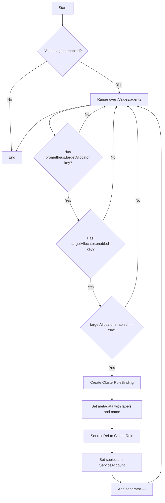
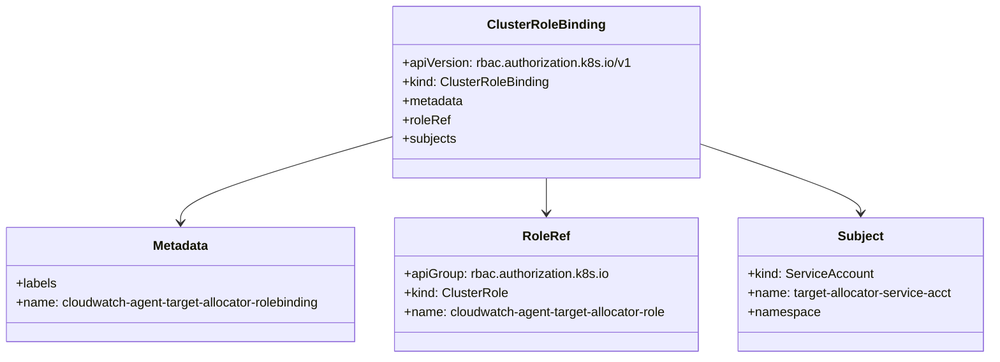
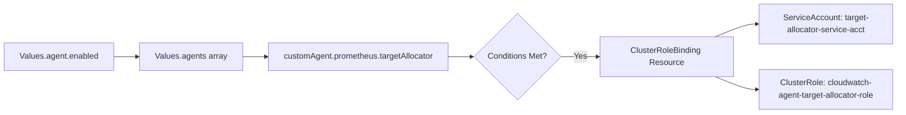

# Diagram: devops/k8s/amazon-cloudwatch-observability/helm/templates/target-allocator-clusterrolebinding.yaml

> Auto-generated by Obscura crawlers

## Diagram 1

### SVG

<svg id="container" width="713.7969970703125" xmlns="http://www.w3.org/2000/svg" class="flowchart" height="2165.796875" viewBox="0 0 713.7969970703125 2165.796875" role="graphics-document document" aria-roledescription="flowchart-v2"><g><marker id="container_flowchart-v2-pointEnd" class="marker flowchart-v2" viewBox="0 0 10 10" refX="5" refY="5" markerUnits="userSpaceOnUse" markerWidth="8" markerHeight="8" orient="auto"><path d="M 0 0 L 10 5 L 0 10 z" class="arrowMarkerPath" style="stroke-width: 1; stroke-dasharray: 1, 0;"></path></marker><marker id="container_flowchart-v2-pointStart" class="marker flowchart-v2" viewBox="0 0 10 10" refX="4.5" refY="5" markerUnits="userSpaceOnUse" markerWidth="8" markerHeight="8" orient="auto"><path d="M 0 5 L 10 10 L 10 0 z" class="arrowMarkerPath" style="stroke-width: 1; stroke-dasharray: 1, 0;"></path></marker><marker id="container_flowchart-v2-circleEnd" class="marker flowchart-v2" viewBox="0 0 10 10" refX="11" refY="5" markerUnits="userSpaceOnUse" markerWidth="11" markerHeight="11" orient="auto"><circle cx="5" cy="5" r="5" class="arrowMarkerPath" style="stroke-width: 1; stroke-dasharray: 1, 0;"></circle></marker><marker id="container_flowchart-v2-circleStart" class="marker flowchart-v2" viewBox="0 0 10 10" refX="-1" refY="5" markerUnits="userSpaceOnUse" markerWidth="11" markerHeight="11" orient="auto"><circle cx="5" cy="5" r="5" class="arrowMarkerPath" style="stroke-width: 1; stroke-dasharray: 1, 0;"></circle></marker><marker id="container_flowchart-v2-crossEnd" class="marker cross flowchart-v2" viewBox="0 0 11 11" refX="12" refY="5.2" markerUnits="userSpaceOnUse" markerWidth="11" markerHeight="11" orient="auto"><path d="M 1,1 l 9,9 M 10,1 l -9,9" class="arrowMarkerPath" style="stroke-width: 2; stroke-dasharray: 1, 0;"></path></marker><marker id="container_flowchart-v2-crossStart" class="marker cross flowchart-v2" viewBox="0 0 11 11" refX="-1" refY="5.2" markerUnits="userSpaceOnUse" markerWidth="11" markerHeight="11" orient="auto"><path d="M 1,1 l 9,9 M 10,1 l -9,9" class="arrowMarkerPath" style="stroke-width: 2; stroke-dasharray: 1, 0;"></path></marker><g class="root"><g class="clusters"></g><g class="edgePaths"><path d="M273.668,62L273.668,66.167C273.668,70.333,273.668,78.667,273.668,86.333C273.668,94,273.668,101,273.668,104.5L273.668,108" id="L_A_B_0" class="edge-thickness-normal edge-pattern-solid edge-thickness-normal edge-pattern-solid flowchart-link" style=";" data-edge="true" data-et="edge" data-id="L_A_B_0" data-points="W3sieCI6MjczLjY2Nzk2ODc1LCJ5Ijo2Mn0seyJ4IjoyNzMuNjY3OTY4NzUsInkiOjg3fSx7IngiOjI3My42Njc5Njg3NSwieSI6MTEyfV0=" marker-end="url(#container_flowchart-v2-pointEnd)"></path><path d="M206.63,263.603L179.138,280.942C151.647,298.282,96.663,332.961,69.171,360.968C41.68,388.974,41.68,410.307,41.68,431.641C41.68,452.974,41.68,474.307,43.074,511.405C44.468,548.502,47.256,601.363,48.651,627.794L50.045,654.224" id="L_B_Z_0" class="edge-thickness-normal edge-pattern-solid edge-thickness-normal edge-pattern-solid flowchart-link" style=";" data-edge="true" data-et="edge" data-id="L_B_Z_0" data-points="W3sieCI6MjA2LjYzMDAyMTg5NTAzODA2LCJ5IjoyNjMuNjAyNjc4MTQ1MDM4MDZ9LHsieCI6NDEuNjc5Njg3NSwieSI6MzY3LjY0MDYyNX0seyJ4Ijo0MS42Nzk2ODc1LCJ5Ijo0MzEuNjQwNjI1fSx7IngiOjQxLjY3OTY4NzUsInkiOjQ5NS42NDA2MjV9LHsieCI6NTAuMjU1NDcyNTQ5MDM5ODEsInkiOjY1OC4yMTg3NX1d" marker-end="url(#container_flowchart-v2-pointEnd)"></path><path d="M342.414,261.894L372.276,279.519C402.138,297.143,461.862,332.392,491.724,355.516C521.586,378.641,521.586,389.641,521.586,395.141L521.586,400.641" id="L_B_C_0" class="edge-thickness-normal edge-pattern-solid edge-thickness-normal edge-pattern-solid flowchart-link" style=";" data-edge="true" data-et="edge" data-id="L_B_C_0" data-points="W3sieCI6MzQyLjQxNDM4NzExNDUwMzM3LCJ5IjoyNjEuODk0MjA2NjM1NDk2NjN9LHsieCI6NTIxLjU4NTkzNzUsInkiOjM2Ny42NDA2MjV9LHsieCI6NTIxLjU4NTkzNzUsInkiOjQwNC42NDA2MjV9XQ==" marker-end="url(#container_flowchart-v2-pointEnd)"></path><path d="M398.242,455.08L362.67,461.84C327.098,468.601,255.953,482.121,229.39,503.978C202.828,525.836,220.847,556.032,229.856,571.13L238.866,586.228" id="L_C_D_0" class="edge-thickness-normal edge-pattern-solid edge-thickness-normal edge-pattern-solid flowchart-link" style=";" data-edge="true" data-et="edge" data-id="L_C_D_0" data-points="W3sieCI6Mzk4LjI0MjE4NzUsInkiOjQ1NS4wODA0NDQwNTcwMDg2Nn0seyJ4IjoxODQuODA4NTkzNzUsInkiOjQ5NS42NDA2MjV9LHsieCI6MjQwLjkxNTM4MDg2NTA0NTg4LCJ5Ijo1ODkuNjYyNzQ0MTM0OTU0MX1d" marker-end="url(#container_flowchart-v2-pointEnd)"></path><path d="M344.704,579.407L350.874,565.446C357.045,551.485,369.386,523.563,388.426,503.712C407.466,483.862,433.206,472.084,446.076,466.194L458.945,460.305" id="L_D_C_0" class="edge-thickness-normal edge-pattern-solid edge-thickness-normal edge-pattern-solid flowchart-link" style=";" data-edge="true" data-et="edge" data-id="L_D_C_0" data-points="W3sieCI6MzQ0LjcwMzgyMjUwMDc4NTksInkiOjU3OS40MDY5NDc1MDA3ODU5fSx7IngiOjM4MS43MjY1NjI1LCJ5Ijo0OTUuNjQwNjI1fSx7IngiOjQ2Mi41ODI3NjM2NzE4NzUsInkiOjQ1OC42NDA2MjV9XQ==" marker-end="url(#container_flowchart-v2-pointEnd)"></path><path d="M297.938,837.797L297.938,843.964C297.938,850.13,297.938,862.464,305.431,882.88C312.924,903.296,327.91,931.796,335.403,946.045L342.897,960.295" id="L_D_E_0" class="edge-thickness-normal edge-pattern-solid edge-thickness-normal edge-pattern-solid flowchart-link" style=";" data-edge="true" data-et="edge" data-id="L_D_E_0" data-points="W3sieCI6Mjk3LjkzNzUsInkiOjgzNy43OTY4NzV9LHsieCI6Mjk3LjkzNzUsInkiOjg3NC43OTY4NzV9LHsieCI6MzQ0Ljc1ODI1NjMzODg1MjksInkiOjk2My44MzU0OTM2NjExNDcxfV0=" marker-end="url(#container_flowchart-v2-pointEnd)"></path><path d="M448.835,963.835L456.639,948.996C464.442,934.156,480.049,904.476,487.853,858.04C495.656,811.604,495.656,748.411,495.656,685.219C495.656,622.026,495.656,558.833,497.904,521.688C500.152,484.543,504.649,473.445,506.897,467.897L509.145,462.348" id="L_E_C_0" class="edge-thickness-normal edge-pattern-solid edge-thickness-normal edge-pattern-solid flowchart-link" style=";" data-edge="true" data-et="edge" data-id="L_E_C_0" data-points="W3sieCI6NDQ4LjgzNTQ5MzY2MTE0NzEsInkiOjk2My44MzU0OTM2NjExNDcxfSx7IngiOjQ5NS42NTYyNSwieSI6ODc0Ljc5Njg3NX0seyJ4Ijo0OTUuNjU2MjUsInkiOjY4NS4yMTg3NX0seyJ4Ijo0OTUuNjU2MjUsInkiOjQ5NS42NDA2MjV9LHsieCI6NTEwLjY0Njg1MDU4NTkzNzUsInkiOjQ1OC42NDA2MjV9XQ==" marker-end="url(#container_flowchart-v2-pointEnd)"></path><path d="M396.797,1213.797L396.797,1219.964C396.797,1226.13,396.797,1238.464,403.976,1258.217C411.155,1277.97,425.514,1305.143,432.693,1318.729L439.872,1332.316" id="L_E_F_0" class="edge-thickness-normal edge-pattern-solid edge-thickness-normal edge-pattern-solid flowchart-link" style=";" data-edge="true" data-et="edge" data-id="L_E_F_0" data-points="W3sieCI6Mzk2Ljc5Njg3NSwieSI6MTIxMy43OTY4NzV9LHsieCI6Mzk2Ljc5Njg3NSwieSI6MTI1MC43OTY4NzV9LHsieCI6NDQxLjc0MTExMjkxODIxNTYsInkiOjEzMzUuODUyNjM3MDgxNzg0NX1d" marker-end="url(#container_flowchart-v2-pointEnd)"></path><path d="M544.418,1342.418L554.303,1327.148C564.187,1311.877,583.957,1281.337,593.842,1234.734C603.727,1188.13,603.727,1125.464,603.727,1062.797C603.727,1000.13,603.727,937.464,603.727,874.534C603.727,811.604,603.727,748.411,603.727,685.219C603.727,622.026,603.727,558.833,596.338,521.48C588.949,484.127,574.172,472.613,566.783,466.856L559.394,461.099" id="L_F_C_0" class="edge-thickness-normal edge-pattern-solid edge-thickness-normal edge-pattern-solid flowchart-link" style=";" data-edge="true" data-et="edge" data-id="L_F_C_0" data-points="W3sieCI6NTQ0LjQxNzc5NjAyMDcyMTcsInkiOjEzNDIuNDE3Nzk2MDIwNzIxN30seyJ4Ijo2MDMuNzI2NTYyNSwieSI6MTI1MC43OTY4NzV9LHsieCI6NjAzLjcyNjU2MjUsInkiOjEwNjIuNzk2ODc1fSx7IngiOjYwMy43MjY1NjI1LCJ5Ijo4NzQuNzk2ODc1fSx7IngiOjYwMy43MjY1NjI1LCJ5Ijo2ODUuMjE4NzV9LHsieCI6NjAzLjcyNjU2MjUsInkiOjQ5NS42NDA2MjV9LHsieCI6NTU2LjIzOTAxMzY3MTg3NSwieSI6NDU4LjY0MDYyNX1d" marker-end="url(#container_flowchart-v2-pointEnd)"></path><path d="M489.797,1565.797L489.797,1571.964C489.797,1578.13,489.797,1590.464,489.797,1602.13C489.797,1613.797,489.797,1624.797,489.797,1630.297L489.797,1635.797" id="L_F_G_0" class="edge-thickness-normal edge-pattern-solid edge-thickness-normal edge-pattern-solid flowchart-link" style=";" data-edge="true" data-et="edge" data-id="L_F_G_0" data-points="W3sieCI6NDg5Ljc5Njg3NSwieSI6MTU2NS43OTY4NzV9LHsieCI6NDg5Ljc5Njg3NSwieSI6MTYwMi43OTY4NzV9LHsieCI6NDg5Ljc5Njg3NSwieSI6MTYzOS43OTY4NzV9XQ==" marker-end="url(#container_flowchart-v2-pointEnd)"></path><path d="M489.797,1693.797L489.797,1697.964C489.797,1702.13,489.797,1710.464,489.797,1718.13C489.797,1725.797,489.797,1732.797,489.797,1736.297L489.797,1739.797" id="L_G_H_0" class="edge-thickness-normal edge-pattern-solid edge-thickness-normal edge-pattern-solid flowchart-link" style=";" data-edge="true" data-et="edge" data-id="L_G_H_0" data-points="W3sieCI6NDg5Ljc5Njg3NSwieSI6MTY5My43OTY4NzV9LHsieCI6NDg5Ljc5Njg3NSwieSI6MTcxOC43OTY4NzV9LHsieCI6NDg5Ljc5Njg3NSwieSI6MTc0My43OTY4NzV9XQ==" marker-end="url(#container_flowchart-v2-pointEnd)"></path><path d="M489.797,1821.797L489.797,1825.964C489.797,1830.13,489.797,1838.464,489.797,1846.13C489.797,1853.797,489.797,1860.797,489.797,1864.297L489.797,1867.797" id="L_H_I_0" class="edge-thickness-normal edge-pattern-solid edge-thickness-normal edge-pattern-solid flowchart-link" style=";" data-edge="true" data-et="edge" data-id="L_H_I_0" data-points="W3sieCI6NDg5Ljc5Njg3NSwieSI6MTgyMS43OTY4NzV9LHsieCI6NDg5Ljc5Njg3NSwieSI6MTg0Ni43OTY4NzV9LHsieCI6NDg5Ljc5Njg3NSwieSI6MTg3MS43OTY4NzV9XQ==" marker-end="url(#container_flowchart-v2-pointEnd)"></path><path d="M489.797,1925.797L489.797,1929.964C489.797,1934.13,489.797,1942.464,489.797,1950.13C489.797,1957.797,489.797,1964.797,489.797,1968.297L489.797,1971.797" id="L_I_J_0" class="edge-thickness-normal edge-pattern-solid edge-thickness-normal edge-pattern-solid flowchart-link" style=";" data-edge="true" data-et="edge" data-id="L_I_J_0" data-points="W3sieCI6NDg5Ljc5Njg3NSwieSI6MTkyNS43OTY4NzV9LHsieCI6NDg5Ljc5Njg3NSwieSI6MTk1MC43OTY4NzV9LHsieCI6NDg5Ljc5Njg3NSwieSI6MTk3NS43OTY4NzV9XQ==" marker-end="url(#container_flowchart-v2-pointEnd)"></path><path d="M489.797,2053.797L489.797,2057.964C489.797,2062.13,489.797,2070.464,496.196,2078.455C502.595,2086.446,515.393,2094.095,521.791,2097.92L528.19,2101.745" id="L_J_K_0" class="edge-thickness-normal edge-pattern-solid edge-thickness-normal edge-pattern-solid flowchart-link" style=";" data-edge="true" data-et="edge" data-id="L_J_K_0" data-points="W3sieCI6NDg5Ljc5Njg3NSwieSI6MjA1My43OTY4NzV9LHsieCI6NDg5Ljc5Njg3NSwieSI6MjA3OC43OTY4NzV9LHsieCI6NTMxLjYyMzc5ODA3NjkyMzEsInkiOjIxMDMuNzk2ODc1fV0=" marker-end="url(#container_flowchart-v2-pointEnd)"></path><path d="M643.778,2103.797L654.114,2099.63C664.451,2095.464,685.124,2087.13,695.46,2072.297C705.797,2057.464,705.797,2036.13,705.797,2014.797C705.797,1993.464,705.797,1972.13,705.797,1952.797C705.797,1933.464,705.797,1916.13,705.797,1898.797C705.797,1881.464,705.797,1864.13,705.797,1844.797C705.797,1825.464,705.797,1804.13,705.797,1782.797C705.797,1761.464,705.797,1740.13,705.797,1720.797C705.797,1701.464,705.797,1684.13,705.797,1664.797C705.797,1645.464,705.797,1624.13,705.797,1584.13C705.797,1544.13,705.797,1485.464,705.797,1426.797C705.797,1368.13,705.797,1309.464,705.797,1248.797C705.797,1188.13,705.797,1125.464,705.797,1062.797C705.797,1000.13,705.797,937.464,705.797,874.534C705.797,811.604,705.797,748.411,705.797,685.219C705.797,622.026,705.797,558.833,688.677,521.289C671.557,483.745,637.318,471.849,620.198,465.901L603.078,459.953" id="L_K_C_0" class="edge-thickness-normal edge-pattern-solid edge-thickness-normal edge-pattern-solid flowchart-link" style=";" data-edge="true" data-et="edge" data-id="L_K_C_0" data-points="W3sieCI6NjQzLjc3NzY0NDIzMDc2OTMsInkiOjIxMDMuNzk2ODc1fSx7IngiOjcwNS43OTY4NzUsInkiOjIwNzguNzk2ODc1fSx7IngiOjcwNS43OTY4NzUsInkiOjIwMTQuNzk2ODc1fSx7IngiOjcwNS43OTY4NzUsInkiOjE5NTAuNzk2ODc1fSx7IngiOjcwNS43OTY4NzUsInkiOjE4OTguNzk2ODc1fSx7IngiOjcwNS43OTY4NzUsInkiOjE4NDYuNzk2ODc1fSx7IngiOjcwNS43OTY4NzUsInkiOjE3ODIuNzk2ODc1fSx7IngiOjcwNS43OTY4NzUsInkiOjE3MTguNzk2ODc1fSx7IngiOjcwNS43OTY4NzUsInkiOjE2NjYuNzk2ODc1fSx7IngiOjcwNS43OTY4NzUsInkiOjE2MDIuNzk2ODc1fSx7IngiOjcwNS43OTY4NzUsInkiOjE0MjYuNzk2ODc1fSx7IngiOjcwNS43OTY4NzUsInkiOjEyNTAuNzk2ODc1fSx7IngiOjcwNS43OTY4NzUsInkiOjEwNjIuNzk2ODc1fSx7IngiOjcwNS43OTY4NzUsInkiOjg3NC43OTY4NzV9LHsieCI6NzA1Ljc5Njg3NSwieSI6Njg1LjIxODc1fSx7IngiOjcwNS43OTY4NzUsInkiOjQ5NS42NDA2MjV9LHsieCI6NTk5LjI5OTkyNjc1NzgxMjUsInkiOjQ1OC42NDA2MjV9XQ==" marker-end="url(#container_flowchart-v2-pointEnd)"></path><path d="M398.242,453.766L359.337,460.745C320.431,467.725,242.62,481.683,187.886,515.185C133.153,548.688,101.497,601.736,85.669,628.26L69.841,654.784" id="L_C_Z_0" class="edge-thickness-normal edge-pattern-solid edge-thickness-normal edge-pattern-solid flowchart-link" style=";" data-edge="true" data-et="edge" data-id="L_C_Z_0" data-points="W3sieCI6Mzk4LjI0MjE4NzUsInkiOjQ1My43NjY0Njk0MTg4OTc1fSx7IngiOjE2NC44MDg1OTM3NSwieSI6NDk1LjY0MDYyNX0seyJ4Ijo2Ny43OTE2NzU0NjY3MDIzOSwieSI6NjU4LjIxODc1fV0=" marker-end="url(#container_flowchart-v2-pointEnd)"></path></g><g class="edgeLabels"><g class="edgeLabel"><g class="label" data-id="L_A_B_0" transform="translate(0, 0)"><foreignObject width="0" height="0">

</foreignObject></g></g><g class="edgeLabel" transform="translate(41.6796875, 431.640625)"><g class="label" data-id="L_B_Z_0" transform="translate(-10.140625, -12)"><foreignObject width="20.28125" height="24">

No

</foreignObject></g></g><g class="edgeLabel" transform="translate(521.5859375, 367.640625)"><g class="label" data-id="L_B_C_0" transform="translate(-12.03125, -12)"><foreignObject width="24.0625" height="24">

Yes

</foreignObject></g></g><g class="edgeLabel"><g class="label" data-id="L_C_D_0" transform="translate(0, 0)"><foreignObject width="0" height="0">

</foreignObject></g></g><g class="edgeLabel" transform="translate(381.18822, 496.85867)"><g class="label" data-id="L_D_C_0" transform="translate(-10.140625, -12)"><foreignObject width="20.28125" height="24">

No

</foreignObject></g></g><g class="edgeLabel" transform="translate(297.9375, 874.796875)"><g class="label" data-id="L_D_E_0" transform="translate(-12.03125, -12)"><foreignObject width="24.0625" height="24">

Yes

</foreignObject></g></g><g class="edgeLabel" transform="translate(495.65625, 685.21875)"><g class="label" data-id="L_E_C_0" transform="translate(-10.140625, -12)"><foreignObject width="20.28125" height="24">

No

</foreignObject></g></g><g class="edgeLabel" transform="translate(396.796875, 1250.796875)"><g class="label" data-id="L_E_F_0" transform="translate(-12.03125, -12)"><foreignObject width="24.0625" height="24">

Yes

</foreignObject></g></g><g class="edgeLabel" transform="translate(603.7265625, 874.796875)"><g class="label" data-id="L_F_C_0" transform="translate(-10.140625, -12)"><foreignObject width="20.28125" height="24">

No

</foreignObject></g></g><g class="edgeLabel" transform="translate(489.796875, 1602.796875)"><g class="label" data-id="L_F_G_0" transform="translate(-12.03125, -12)"><foreignObject width="24.0625" height="24">

Yes

</foreignObject></g></g><g class="edgeLabel"><g class="label" data-id="L_G_H_0" transform="translate(0, 0)"><foreignObject width="0" height="0">

</foreignObject></g></g><g class="edgeLabel"><g class="label" data-id="L_H_I_0" transform="translate(0, 0)"><foreignObject width="0" height="0">

</foreignObject></g></g><g class="edgeLabel"><g class="label" data-id="L_I_J_0" transform="translate(0, 0)"><foreignObject width="0" height="0">

</foreignObject></g></g><g class="edgeLabel"><g class="label" data-id="L_J_K_0" transform="translate(0, 0)"><foreignObject width="0" height="0">

</foreignObject></g></g><g class="edgeLabel"><g class="label" data-id="L_K_C_0" transform="translate(0, 0)"><foreignObject width="0" height="0">

</foreignObject></g></g><g class="edgeLabel"><g class="label" data-id="L_C_Z_0" transform="translate(0, 0)"><foreignObject width="0" height="0">

</foreignObject></g></g></g><g class="nodes"><g class="node default" id="flowchart-A-0" transform="translate(273.66796875, 35)"><rect class="basic label-container" style="" x="-47.5234375" y="-27" width="95.046875" height="54"></rect><g class="label" style="" transform="translate(-17.5234375, -12)"><rect></rect><foreignObject width="35.046875" height="24">

Start

</foreignObject></g></g><g class="node default" id="flowchart-B-1" transform="translate(273.66796875, 221.3203125)"><polygon points="109.3203125,0 218.640625,-109.3203125 109.3203125,-218.640625 0,-109.3203125" class="label-container" transform="translate(-108.8203125, 109.3203125)"></polygon><g class="label" style="" transform="translate(-82.3203125, -12)"><rect></rect><foreignObject width="164.640625" height="24">

.Values.agent.enabled?

</foreignObject></g></g><g class="node default" id="flowchart-Z-3" transform="translate(51.6796875, 685.21875)"><rect class="basic label-container" style="" x="-43.6796875" y="-27" width="87.359375" height="54"></rect><g class="label" style="" transform="translate(-13.6796875, -12)"><rect></rect><foreignObject width="27.359375" height="24">

End

</foreignObject></g></g><g class="node default" id="flowchart-C-5" transform="translate(521.5859375, 431.640625)"><rect class="basic label-container" style="" x="-123.34375" y="-27" width="246.6875" height="54"></rect><g class="label" style="" transform="translate(-93.34375, -12)"><rect></rect><foreignObject width="186.6875" height="24">

Range over .Values.agents

</foreignObject></g></g><g class="node default" id="flowchart-D-7" transform="translate(297.9375, 685.21875)"><polygon points="152.578125,0 305.15625,-152.578125 152.578125,-305.15625 0,-152.578125" class="label-container" transform="translate(-152.078125, 152.578125)"></polygon><g class="label" style="" transform="translate(-101.578125, -36)"><rect></rect><foreignObject width="203.15625" height="72">

Has prometheus.targetAllocator key?

</foreignObject></g></g><g class="node default" id="flowchart-E-11" transform="translate(396.796875, 1062.796875)"><polygon points="151,0 302,-151 151,-302 0,-151" class="label-container" transform="translate(-150.5, 151)"></polygon><g class="label" style="" transform="translate(-100, -36)"><rect></rect><foreignObject width="200" height="72">

Has targetAllocator.enabled key?

</foreignObject></g></g><g class="node default" id="flowchart-F-15" transform="translate(489.796875, 1426.796875)"><polygon points="139,0 278,-139 139,-278 0,-139" class="label-container" transform="translate(-138.5, 139)"></polygon><g class="label" style="" transform="translate(-100, -24)"><rect></rect><foreignObject width="200" height="48">

targetAllocator.enabled == true?

</foreignObject></g></g><g class="node default" id="flowchart-G-19" transform="translate(489.796875, 1666.796875)"><rect class="basic label-container" style="" x="-124.1953125" y="-27" width="248.390625" height="54"></rect><g class="label" style="" transform="translate(-94.1953125, -12)"><rect></rect><foreignObject width="188.390625" height="24">

Create ClusterRoleBinding

</foreignObject></g></g><g class="node default" id="flowchart-H-21" transform="translate(489.796875, 1782.796875)"><rect class="basic label-container" style="" x="-130" y="-39" width="260" height="78"></rect><g class="label" style="" transform="translate(-100, -24)"><rect></rect><foreignObject width="200" height="48">

Set metadata with labels and name

</foreignObject></g></g><g class="node default" id="flowchart-I-23" transform="translate(489.796875, 1898.796875)"><rect class="basic label-container" style="" x="-122.765625" y="-27" width="245.53125" height="54"></rect><g class="label" style="" transform="translate(-92.765625, -12)"><rect></rect><foreignObject width="185.53125" height="24">

Set roleRef to ClusterRole

</foreignObject></g></g><g class="node default" id="flowchart-J-25" transform="translate(489.796875, 2014.796875)"><rect class="basic label-container" style="" x="-130" y="-39" width="260" height="78"></rect><g class="label" style="" transform="translate(-100, -24)"><rect></rect><foreignObject width="200" height="48">

Set subjects to ServiceAccount

</foreignObject></g></g><g class="node default" id="flowchart-K-27" transform="translate(576.796875, 2130.796875)"><rect class="basic label-container" style="" x="-92.875" y="-27" width="185.75" height="54"></rect><g class="label" style="" transform="translate(-62.875, -12)"><rect></rect><foreignObject width="125.75" height="24">

Add separator ---

</foreignObject></g></g></g></g></g></svg>

## Diagram 2

### SVG

<svg id="container" width="1273.8203125" xmlns="http://www.w3.org/2000/svg" class="classDiagram" height="450" viewBox="0 0 1273.8203125 450" role="graphics-document document" aria-roledescription="class"><g><defs><marker id="container_class-aggregationStart" class="marker aggregation class" refX="18" refY="7" markerWidth="190" markerHeight="240" orient="auto"><path d="M 18,7 L9,13 L1,7 L9,1 Z"></path></marker></defs><defs><marker id="container_class-aggregationEnd" class="marker aggregation class" refX="1" refY="7" markerWidth="20" markerHeight="28" orient="auto"><path d="M 18,7 L9,13 L1,7 L9,1 Z"></path></marker></defs><defs><marker id="container_class-extensionStart" class="marker extension class" refX="18" refY="7" markerWidth="190" markerHeight="240" orient="auto"><path d="M 1,7 L18,13 V 1 Z"></path></marker></defs><defs><marker id="container_class-extensionEnd" class="marker extension class" refX="1" refY="7" markerWidth="20" markerHeight="28" orient="auto"><path d="M 1,1 V 13 L18,7 Z"></path></marker></defs><defs><marker id="container_class-compositionStart" class="marker composition class" refX="18" refY="7" markerWidth="190" markerHeight="240" orient="auto"><path d="M 18,7 L9,13 L1,7 L9,1 Z"></path></marker></defs><defs><marker id="container_class-compositionEnd" class="marker composition class" refX="1" refY="7" markerWidth="20" markerHeight="28" orient="auto"><path d="M 18,7 L9,13 L1,7 L9,1 Z"></path></marker></defs><defs><marker id="container_class-dependencyStart" class="marker dependency class" refX="6" refY="7" markerWidth="190" markerHeight="240" orient="auto"><path d="M 5,7 L9,13 L1,7 L9,1 Z"></path></marker></defs><defs><marker id="container_class-dependencyEnd" class="marker dependency class" refX="13" refY="7" markerWidth="20" markerHeight="28" orient="auto"><path d="M 18,7 L9,13 L14,7 L9,1 Z"></path></marker></defs><defs><marker id="container_class-lollipopStart" class="marker lollipop class" refX="13" refY="7" markerWidth="190" markerHeight="240" orient="auto"><circle stroke="black" fill="transparent" cx="7" cy="7" r="6"></circle></marker></defs><defs><marker id="container_class-lollipopEnd" class="marker lollipop class" refX="1" refY="7" markerWidth="190" markerHeight="240" orient="auto"><circle stroke="black" fill="transparent" cx="7" cy="7" r="6"></circle></marker></defs><g class="root"><g class="clusters"></g><g class="edgePaths"><path d="M512.328,170.751L466.022,183.792C419.716,196.834,327.104,222.917,280.798,241.125C234.492,259.333,234.492,269.667,234.492,274.833L234.492,280" id="id_ClusterRoleBinding_Metadata_1" class="edge-thickness-normal edge-pattern-solid relation" style=";;;" data-edge="true" data-et="edge" data-id="id_ClusterRoleBinding_Metadata_1" data-points="W3sieCI6NTEyLjMyODEyNSwieSI6MTcwLjc1MDk4NjQwOTQ2OTUzfSx7IngiOjIzNC40OTIxODc1LCJ5IjoyNDl9LHsieCI6MjM0LjQ5MjE4NzUsInkiOjI4Nn1d" marker-end="url(#container_class-dependencyEnd)"></path><path d="M706.73,224L706.73,228.167C706.73,232.333,706.73,240.667,706.73,248C706.73,255.333,706.73,261.667,706.73,264.833L706.73,268" id="id_ClusterRoleBinding_RoleRef_2" class="edge-thickness-normal edge-pattern-solid relation" style=";;;" data-edge="true" data-et="edge" data-id="id_ClusterRoleBinding_RoleRef_2" data-points="W3sieCI6NzA2LjczMDQ2ODc1LCJ5IjoyMjR9LHsieCI6NzA2LjczMDQ2ODc1LCJ5IjoyNDl9LHsieCI6NzA2LjczMDQ2ODc1LCJ5IjoyNzR9XQ==" marker-end="url(#container_class-dependencyEnd)"></path><path d="M901.133,180.25L935.802,191.709C970.471,203.167,1039.81,226.083,1074.479,240.708C1109.148,255.333,1109.148,261.667,1109.148,264.833L1109.148,268" id="id_ClusterRoleBinding_Subject_3" class="edge-thickness-normal edge-pattern-solid relation" style=";;;" data-edge="true" data-et="edge" data-id="id_ClusterRoleBinding_Subject_3" data-points="W3sieCI6OTAxLjEzMjgxMjUsInkiOjE4MC4yNTAzOTA3MDQ2MjczfSx7IngiOjExMDkuMTQ4NDM3NSwieSI6MjQ5fSx7IngiOjExMDkuMTQ4NDM3NSwieSI6Mjc0fV0=" marker-end="url(#container_class-dependencyEnd)"></path></g><g class="edgeLabels"><g class="edgeLabel"><g class="label" data-id="id_ClusterRoleBinding_Metadata_1" transform="translate(0, 0)"><foreignObject width="0" height="0">

</foreignObject></g></g><g class="edgeLabel"><g class="label" data-id="id_ClusterRoleBinding_RoleRef_2" transform="translate(0, 0)"><foreignObject width="0" height="0">

</foreignObject></g></g><g class="edgeLabel"><g class="label" data-id="id_ClusterRoleBinding_Subject_3" transform="translate(0, 0)"><foreignObject width="0" height="0">

</foreignObject></g></g></g><g class="nodes"><g class="node default" id="classId-ClusterRoleBinding-0" transform="translate(706.73046875, 116)"><g class="basic label-container"><path d="M-194.40234375 -108 L194.40234375 -108 L194.40234375 108 L-194.40234375 108" stroke="none" stroke-width="0" fill="#ECECFF" style=""></path><path d="M-194.40234375 -108 C-104.89183964038281 -108, -15.381335530765625 -108, 194.40234375 -108 M-194.40234375 -108 C-70.24482088667864 -108, 53.91270197664272 -108, 194.40234375 -108 M194.40234375 -108 C194.40234375 -49.07973380217838, 194.40234375 9.840532395643237, 194.40234375 108 M194.40234375 -108 C194.40234375 -42.48550757204828, 194.40234375 23.028984855903445, 194.40234375 108 M194.40234375 108 C91.1653538902446 108, -12.071635969510794 108, -194.40234375 108 M194.40234375 108 C74.26931489036724 108, -45.86371396926552 108, -194.40234375 108 M-194.40234375 108 C-194.40234375 42.99320890456666, -194.40234375 -22.013582190866686, -194.40234375 -108 M-194.40234375 108 C-194.40234375 39.31597199493841, -194.40234375 -29.368056010123183, -194.40234375 -108" stroke="#9370DB" stroke-width="1.3" fill="none" stroke-dasharray="0 0" style=""></path></g><g class="annotation-group text" transform="translate(0, -84)"></g><g class="label-group text" transform="translate(-70.0390625, -84)"><g class="label" style="font-weight: bolder" transform="translate(0,-12)"><foreignObject width="140.078125" height="24">

ClusterRoleBinding

</foreignObject></g></g><g class="members-group text" transform="translate(-182.40234375, -36)"><g class="label" style="" transform="translate(0,-12)"><foreignObject width="294.765625" height="24">

+apiVersion: rbac.authorization.k8s.io/v1

</foreignObject></g><g class="label" style="" transform="translate(0,12)"><foreignObject width="185.921875" height="24">

+kind: ClusterRoleBinding

</foreignObject></g><g class="label" style="" transform="translate(0,36)"><foreignObject width="77.4375" height="24">

+metadata

</foreignObject></g><g class="label" style="" transform="translate(0,60)"><foreignObject width="59.875" height="24">

+roleRef

</foreignObject></g><g class="label" style="" transform="translate(0,84)"><foreignObject width="68.375" height="24">

+subjects

</foreignObject></g></g><g class="methods-group text" transform="translate(-182.40234375, 108)"></g><g class="divider" style=""><path d="M-194.40234375 -60 C-106.61772864099326 -60, -18.833113531986527 -60, 194.40234375 -60 M-194.40234375 -60 C-114.43372610668958 -60, -34.46510846337915 -60, 194.40234375 -60" stroke="#9370DB" stroke-width="1.3" fill="none" stroke-dasharray="0 0" style=""></path></g><g class="divider" style=""><path d="M-194.40234375 84 C-47.92974511578609 84, 98.54285351842782 84, 194.40234375 84 M-194.40234375 84 C-43.32813653322444 84, 107.74607068355112 84, 194.40234375 84" stroke="#9370DB" stroke-width="1.3" fill="none" stroke-dasharray="0 0" style=""></path></g></g><g class="node default" id="classId-Metadata-1" transform="translate(234.4921875, 358)"><g class="basic label-container"><path d="M-226.4921875 -72 L226.4921875 -72 L226.4921875 72 L-226.4921875 72" stroke="none" stroke-width="0" fill="#ECECFF" style=""></path><path d="M-226.4921875 -72 C-118.31928346571642 -72, -10.146379431432848 -72, 226.4921875 -72 M-226.4921875 -72 C-76.35536346480521 -72, 73.78146057038958 -72, 226.4921875 -72 M226.4921875 -72 C226.4921875 -23.406611177916027, 226.4921875 25.186777644167947, 226.4921875 72 M226.4921875 -72 C226.4921875 -40.923339222442685, 226.4921875 -9.84667844488537, 226.4921875 72 M226.4921875 72 C89.95146778378458 72, -46.58925193243084 72, -226.4921875 72 M226.4921875 72 C85.25344816283368 72, -55.985291174332644 72, -226.4921875 72 M-226.4921875 72 C-226.4921875 24.44394630141614, -226.4921875 -23.11210739716772, -226.4921875 -72 M-226.4921875 72 C-226.4921875 33.17871726616073, -226.4921875 -5.642565467678537, -226.4921875 -72" stroke="#9370DB" stroke-width="1.3" fill="none" stroke-dasharray="0 0" style=""></path></g><g class="annotation-group text" transform="translate(0, -48)"></g><g class="label-group text" transform="translate(-34.640625, -48)"><g class="label" style="font-weight: bolder" transform="translate(0,-12)"><foreignObject width="69.28125" height="24">

Metadata

</foreignObject></g></g><g class="members-group text" transform="translate(-214.4921875, 0)"><g class="label" style="" transform="translate(0,-12)"><foreignObject width="51.6875" height="24">

+labels

</foreignObject></g><g class="label" style="" transform="translate(0,12)"><foreignObject width="394.34375" height="24">

+name: cloudwatch-agent-target-allocator-rolebinding

</foreignObject></g></g><g class="methods-group text" transform="translate(-214.4921875, 72)"></g><g class="divider" style=""><path d="M-226.4921875 -24 C-124.29624307776353 -24, -22.10029865552707 -24, 226.4921875 -24 M-226.4921875 -24 C-69.08025355534997 -24, 88.33168038930006 -24, 226.4921875 -24" stroke="#9370DB" stroke-width="1.3" fill="none" stroke-dasharray="0 0" style=""></path></g><g class="divider" style=""><path d="M-226.4921875 48 C-58.88329908830096 48, 108.72558932339808 48, 226.4921875 48 M-226.4921875 48 C-81.25222229493974 48, 63.98774291012052 48, 226.4921875 48" stroke="#9370DB" stroke-width="1.3" fill="none" stroke-dasharray="0 0" style=""></path></g></g><g class="node default" id="classId-RoleRef-2" transform="translate(706.73046875, 358)"><g class="basic label-container"><path d="M-195.74609375 -84 L195.74609375 -84 L195.74609375 84 L-195.74609375 84" stroke="none" stroke-width="0" fill="#ECECFF" style=""></path><path d="M-195.74609375 -84 C-114.47322970505373 -84, -33.20036566010745 -84, 195.74609375 -84 M-195.74609375 -84 C-86.95931926328994 -84, 21.827455223420117 -84, 195.74609375 -84 M195.74609375 -84 C195.74609375 -50.14732600118256, 195.74609375 -16.294652002365126, 195.74609375 84 M195.74609375 -84 C195.74609375 -19.908711725033257, 195.74609375 44.182576549933486, 195.74609375 84 M195.74609375 84 C50.88189954825194 84, -93.98229465349613 84, -195.74609375 84 M195.74609375 84 C69.79701645603087 84, -56.15206083793825 84, -195.74609375 84 M-195.74609375 84 C-195.74609375 24.231776364124116, -195.74609375 -35.53644727175177, -195.74609375 -84 M-195.74609375 84 C-195.74609375 35.145637784972635, -195.74609375 -13.70872443005473, -195.74609375 -84" stroke="#9370DB" stroke-width="1.3" fill="none" stroke-dasharray="0 0" style=""></path></g><g class="annotation-group text" transform="translate(0, -60)"></g><g class="label-group text" transform="translate(-28.3203125, -60)"><g class="label" style="font-weight: bolder" transform="translate(0,-12)"><foreignObject width="56.640625" height="24">

RoleRef

</foreignObject></g></g><g class="members-group text" transform="translate(-183.74609375, -12)"><g class="label" style="" transform="translate(0,-12)"><foreignObject width="262.0625" height="24">

+apiGroup: rbac.authorization.k8s.io

</foreignObject></g><g class="label" style="" transform="translate(0,12)"><foreignObject width="130.53125" height="24">

+kind: ClusterRole

</foreignObject></g><g class="label" style="" transform="translate(0,36)"><foreignObject width="339.171875" height="24">

+name: cloudwatch-agent-target-allocator-role

</foreignObject></g></g><g class="methods-group text" transform="translate(-183.74609375, 84)"></g><g class="divider" style=""><path d="M-195.74609375 -36 C-45.41051645495489 -36, 104.92506084009023 -36, 195.74609375 -36 M-195.74609375 -36 C-40.84875104389164 -36, 114.04859166221672 -36, 195.74609375 -36" stroke="#9370DB" stroke-width="1.3" fill="none" stroke-dasharray="0 0" style=""></path></g><g class="divider" style=""><path d="M-195.74609375 60 C-106.27121488201672 60, -16.796336014033443 60, 195.74609375 60 M-195.74609375 60 C-106.3658904888316 60, -16.985687227663192 60, 195.74609375 60" stroke="#9370DB" stroke-width="1.3" fill="none" stroke-dasharray="0 0" style=""></path></g></g><g class="node default" id="classId-Subject-3" transform="translate(1109.1484375, 358)"><g class="basic label-container"><path d="M-156.671875 -84 L156.671875 -84 L156.671875 84 L-156.671875 84" stroke="none" stroke-width="0" fill="#ECECFF" style=""></path><path d="M-156.671875 -84 C-50.33941591121554 -84, 55.99304317756892 -84, 156.671875 -84 M-156.671875 -84 C-53.26283317799209 -84, 50.146208644015815 -84, 156.671875 -84 M156.671875 -84 C156.671875 -32.26676966492455, 156.671875 19.466460670150894, 156.671875 84 M156.671875 -84 C156.671875 -27.828062834965024, 156.671875 28.34387433006995, 156.671875 84 M156.671875 84 C52.57091083016648 84, -51.530053339667035 84, -156.671875 84 M156.671875 84 C44.30563316682374 84, -68.06060866635252 84, -156.671875 84 M-156.671875 84 C-156.671875 41.61966464429227, -156.671875 -0.7606707114154574, -156.671875 -84 M-156.671875 84 C-156.671875 46.73078953176915, -156.671875 9.461579063538295, -156.671875 -84" stroke="#9370DB" stroke-width="1.3" fill="none" stroke-dasharray="0 0" style=""></path></g><g class="annotation-group text" transform="translate(0, -60)"></g><g class="label-group text" transform="translate(-27.515625, -60)"><g class="label" style="font-weight: bolder" transform="translate(0,-12)"><foreignObject width="55.03125" height="24">

Subject

</foreignObject></g></g><g class="members-group text" transform="translate(-144.671875, -12)"><g class="label" style="" transform="translate(0,-12)"><foreignObject width="157.40625" height="24">

+kind: ServiceAccount

</foreignObject></g><g class="label" style="" transform="translate(0,12)"><foreignObject width="261.828125" height="24">

+name: target-allocator-service-acct

</foreignObject></g><g class="label" style="" transform="translate(0,36)"><foreignObject width="90.078125" height="24">

+namespace

</foreignObject></g></g><g class="methods-group text" transform="translate(-144.671875, 84)"></g><g class="divider" style=""><path d="M-156.671875 -36 C-88.28565869093006 -36, -19.899442381860126 -36, 156.671875 -36 M-156.671875 -36 C-67.76580054729054 -36, 21.140273905418923 -36, 156.671875 -36" stroke="#9370DB" stroke-width="1.3" fill="none" stroke-dasharray="0 0" style=""></path></g><g class="divider" style=""><path d="M-156.671875 60 C-51.98551536042545 60, 52.700844279149095 60, 156.671875 60 M-156.671875 60 C-57.32738302228735 60, 42.0171089554253 60, 156.671875 60" stroke="#9370DB" stroke-width="1.3" fill="none" stroke-dasharray="0 0" style=""></path></g></g></g></g></g></svg>

## Diagram 3

### SVG

<svg id="container" width="1750.953125" xmlns="http://www.w3.org/2000/svg" class="flowchart" height="222" viewBox="0 0 1750.953125 222" role="graphics-document document" aria-roledescription="flowchart-v2"><g><marker id="container_flowchart-v2-pointEnd" class="marker flowchart-v2" viewBox="0 0 10 10" refX="5" refY="5" markerUnits="userSpaceOnUse" markerWidth="8" markerHeight="8" orient="auto"><path d="M 0 0 L 10 5 L 0 10 z" class="arrowMarkerPath" style="stroke-width: 1; stroke-dasharray: 1, 0;"></path></marker><marker id="container_flowchart-v2-pointStart" class="marker flowchart-v2" viewBox="0 0 10 10" refX="4.5" refY="5" markerUnits="userSpaceOnUse" markerWidth="8" markerHeight="8" orient="auto"><path d="M 0 5 L 10 10 L 10 0 z" class="arrowMarkerPath" style="stroke-width: 1; stroke-dasharray: 1, 0;"></path></marker><marker id="container_flowchart-v2-circleEnd" class="marker flowchart-v2" viewBox="0 0 10 10" refX="11" refY="5" markerUnits="userSpaceOnUse" markerWidth="11" markerHeight="11" orient="auto"><circle cx="5" cy="5" r="5" class="arrowMarkerPath" style="stroke-width: 1; stroke-dasharray: 1, 0;"></circle></marker><marker id="container_flowchart-v2-circleStart" class="marker flowchart-v2" viewBox="0 0 10 10" refX="-1" refY="5" markerUnits="userSpaceOnUse" markerWidth="11" markerHeight="11" orient="auto"><circle cx="5" cy="5" r="5" class="arrowMarkerPath" style="stroke-width: 1; stroke-dasharray: 1, 0;"></circle></marker><marker id="container_flowchart-v2-crossEnd" class="marker cross flowchart-v2" viewBox="0 0 11 11" refX="12" refY="5.2" markerUnits="userSpaceOnUse" markerWidth="11" markerHeight="11" orient="auto"><path d="M 1,1 l 9,9 M 10,1 l -9,9" class="arrowMarkerPath" style="stroke-width: 2; stroke-dasharray: 1, 0;"></path></marker><marker id="container_flowchart-v2-crossStart" class="marker cross flowchart-v2" viewBox="0 0 11 11" refX="-1" refY="5.2" markerUnits="userSpaceOnUse" markerWidth="11" markerHeight="11" orient="auto"><path d="M 1,1 l 9,9 M 10,1 l -9,9" class="arrowMarkerPath" style="stroke-width: 2; stroke-dasharray: 1, 0;"></path></marker><g class="root"><g class="clusters"></g><g class="edgePaths"><path d="M222.266,111L226.432,111C230.599,111,238.932,111,246.599,111C254.266,111,261.266,111,264.766,111L268.266,111" id="L_A_B_0" class="edge-thickness-normal edge-pattern-solid edge-thickness-normal edge-pattern-solid flowchart-link" style=";" data-edge="true" data-et="edge" data-id="L_A_B_0" data-points="W3sieCI6MjIyLjI2NTYyNSwieSI6MTExfSx7IngiOjI0Ny4yNjU2MjUsInkiOjExMX0seyJ4IjoyNzIuMjY1NjI1LCJ5IjoxMTF9XQ==" marker-end="url(#container_flowchart-v2-pointEnd)"></path><path d="M472.125,111L476.292,111C480.458,111,488.792,111,496.458,111C504.125,111,511.125,111,514.625,111L518.125,111" id="L_B_C_0" class="edge-thickness-normal edge-pattern-solid edge-thickness-normal edge-pattern-solid flowchart-link" style=";" data-edge="true" data-et="edge" data-id="L_B_C_0" data-points="W3sieCI6NDcyLjEyNSwieSI6MTExfSx7IngiOjQ5Ny4xMjUsInkiOjExMX0seyJ4Ijo1MjIuMTI1LCJ5IjoxMTF9XQ==" marker-end="url(#container_flowchart-v2-pointEnd)"></path><path d="M878.922,111L883.089,111C887.255,111,895.589,111,903.255,111C910.922,111,917.922,111,921.422,111L924.922,111" id="L_C_D_0" class="edge-thickness-normal edge-pattern-solid edge-thickness-normal edge-pattern-solid flowchart-link" style=";" data-edge="true" data-et="edge" data-id="L_C_D_0" data-points="W3sieCI6ODc4LjkyMTg3NSwieSI6MTExfSx7IngiOjkwMy45MjE4NzUsInkiOjExMX0seyJ4Ijo5MjguOTIxODc1LCJ5IjoxMTF9XQ==" marker-end="url(#container_flowchart-v2-pointEnd)"></path><path d="M1098.891,111L1105.063,111C1111.234,111,1123.578,111,1135.255,111C1146.932,111,1157.943,111,1163.448,111L1168.953,111" id="L_D_E_0" class="edge-thickness-normal edge-pattern-solid edge-thickness-normal edge-pattern-solid flowchart-link" style=";" data-edge="true" data-et="edge" data-id="L_D_E_0" data-points="W3sieCI6MTA5OC44OTA2MjUsInkiOjExMX0seyJ4IjoxMTM1LjkyMTg3NSwieSI6MTExfSx7IngiOjExNzIuOTUzMTI1LCJ5IjoxMTF9XQ==" marker-end="url(#container_flowchart-v2-pointEnd)"></path><path d="M1397.406,72L1407.497,67.833C1417.589,63.667,1437.771,55.333,1451.362,51.167C1464.953,47,1471.953,47,1475.453,47L1478.953,47" id="L_E_F_0" class="edge-thickness-normal edge-pattern-solid edge-thickness-normal edge-pattern-solid flowchart-link" style=";" data-edge="true" data-et="edge" data-id="L_E_F_0" data-points="W3sieCI6MTM5Ny40MDYyNSwieSI6NzJ9LHsieCI6MTQ1Ny45NTMxMjUsInkiOjQ3fSx7IngiOjE0ODIuOTUzMTI1LCJ5Ijo0N31d" marker-end="url(#container_flowchart-v2-pointEnd)"></path><path d="M1397.406,150L1407.497,154.167C1417.589,158.333,1437.771,166.667,1451.362,170.833C1464.953,175,1471.953,175,1475.453,175L1478.953,175" id="L_E_G_0" class="edge-thickness-normal edge-pattern-solid edge-thickness-normal edge-pattern-solid flowchart-link" style=";" data-edge="true" data-et="edge" data-id="L_E_G_0" data-points="W3sieCI6MTM5Ny40MDYyNSwieSI6MTUwfSx7IngiOjE0NTcuOTUzMTI1LCJ5IjoxNzV9LHsieCI6MTQ4Mi45NTMxMjUsInkiOjE3NX1d" marker-end="url(#container_flowchart-v2-pointEnd)"></path></g><g class="edgeLabels"><g class="edgeLabel"><g class="label" data-id="L_A_B_0" transform="translate(0, 0)"><foreignObject width="0" height="0">

</foreignObject></g></g><g class="edgeLabel"><g class="label" data-id="L_B_C_0" transform="translate(0, 0)"><foreignObject width="0" height="0">

</foreignObject></g></g><g class="edgeLabel"><g class="label" data-id="L_C_D_0" transform="translate(0, 0)"><foreignObject width="0" height="0">

</foreignObject></g></g><g class="edgeLabel" transform="translate(1135.921875, 111)"><g class="label" data-id="L_D_E_0" transform="translate(-12.03125, -12)"><foreignObject width="24.0625" height="24">

Yes

</foreignObject></g></g><g class="edgeLabel"><g class="label" data-id="L_E_F_0" transform="translate(0, 0)"><foreignObject width="0" height="0">

</foreignObject></g></g><g class="edgeLabel"><g class="label" data-id="L_E_G_0" transform="translate(0, 0)"><foreignObject width="0" height="0">

</foreignObject></g></g></g><g class="nodes"><g class="node default" id="flowchart-A-0" transform="translate(115.1328125, 111)"><rect class="basic label-container" style="" x="-107.1328125" y="-27" width="214.265625" height="54"></rect><g class="label" style="" transform="translate(-77.1328125, -12)"><rect></rect><foreignObject width="154.265625" height="24">

Values.agent.enabled

</foreignObject></g></g><g class="node default" id="flowchart-B-1" transform="translate(372.1953125, 111)"><rect class="basic label-container" style="" x="-99.9296875" y="-27" width="199.859375" height="54"></rect><g class="label" style="" transform="translate(-69.9296875, -12)"><rect></rect><foreignObject width="139.859375" height="24">

Values.agents array

</foreignObject></g></g><g class="node default" id="flowchart-C-3" transform="translate(700.5234375, 111)"><rect class="basic label-container" style="" x="-178.3984375" y="-27" width="356.796875" height="54"></rect><g class="label" style="" transform="translate(-148.3984375, -12)"><rect></rect><foreignObject width="296.796875" height="24">

customAgent.prometheus.targetAllocator

</foreignObject></g></g><g class="node default" id="flowchart-D-5" transform="translate(1013.90625, 111)"><polygon points="84.984375,0 169.96875,-84.984375 84.984375,-169.96875 0,-84.984375" class="label-container" transform="translate(-84.484375, 84.984375)"></polygon><g class="label" style="" transform="translate(-57.984375, -12)"><rect></rect><foreignObject width="115.96875" height="24">

Conditions Met?

</foreignObject></g></g><g class="node default" id="flowchart-E-7" transform="translate(1302.953125, 111)"><rect class="basic label-container" style="" x="-130" y="-39" width="260" height="78"></rect><g class="label" style="" transform="translate(-100, -24)"><rect></rect><foreignObject width="200" height="48">

ClusterRoleBinding Resource

</foreignObject></g></g><g class="node default" id="flowchart-F-9" transform="translate(1612.953125, 47)"><rect class="basic label-container" style="" x="-130" y="-39" width="260" height="78"></rect><g class="label" style="" transform="translate(-100, -24)"><rect></rect><foreignObject width="200" height="48">

ServiceAccount: target-allocator-service-acct

</foreignObject></g></g><g class="node default" id="flowchart-G-11" transform="translate(1612.953125, 175)"><rect class="basic label-container" style="" x="-130" y="-39" width="260" height="78"></rect><g class="label" style="" transform="translate(-100, -24)"><rect></rect><foreignObject width="200" height="48">

ClusterRole: cloudwatch-agent-target-allocator-role

</foreignObject></g></g></g></g></g></svg>
