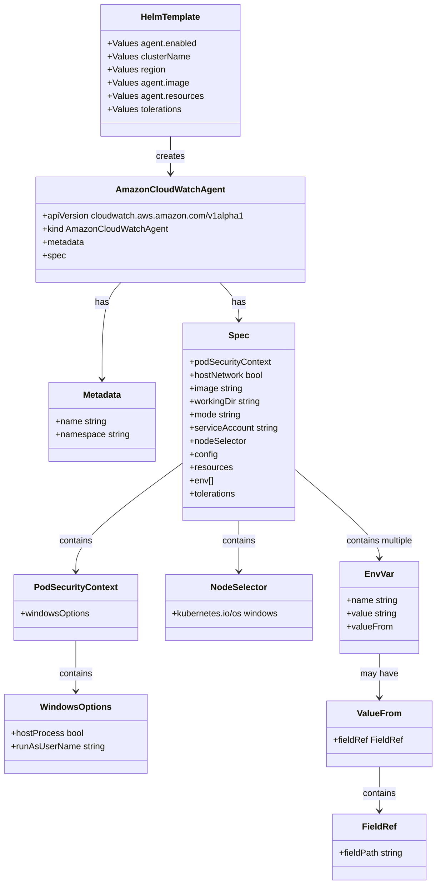
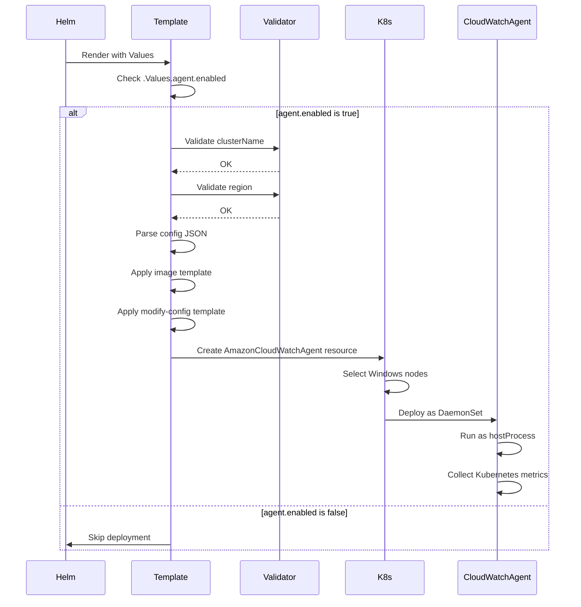

# Diagram: devops/k8s/amazon-cloudwatch-observability/helm/templates/windows/cloudwatch-agent-windows-container-insights-daemonset.yaml


> Auto-generated by Obscura crawlers

## Diagram 1

```mermaid
flowchart TD
      Start([Start]) --> CheckEnabled{agent.enabled?}
      CheckEnabled -->|No| End([End - No Deployment])
      CheckEnabled -->|Yes| ValidateCluster[Validate clusterName required]...
  └ 237 lines...
```

> SVG rendering failed for this diagram.

## Diagram 2

```mermaid
flowchart TD
    Start([Start]) --> CheckEnabled{agent.enabled?}
    CheckEnabled -->|No| End([End - No Deployment])
    CheckEnabled -->|Yes| ValidateCluster[Validate clusterName required]
    ValidateCluster --> ValidateRegion[Validate region required]
    ValidateRegion --> CreateConfig[Create config from JSON]
    CreateConfig --> DefineResource[Define AmazonCloudWatchAgent Resource]
    DefineResource --> SetMetadata[Set metadata: name, namespace]
    SetMetadata --> ConfigureSpec[Configure spec]
    ConfigureSpec --> SetSecurityContext[Set podSecurityContext: Windows hostProcess]
    SetSecurityContext --> SetNetwork[Set hostNetwork: true]
    SetNetwork --> SetImage[Set image from template]
    SetImage --> SetWorkingDir[Set workingDir: Windows path]
    SetWorkingDir --> SetMode[Set mode: daemonset]
    SetMode --> SetServiceAccount[Set serviceAccount]
    SetServiceAccount --> SetNodeSelector[Set nodeSelector: windows]
    SetNodeSelector --> SetConfig[Set config with modifications]
    SetConfig --> CheckResources{resources defined?}
    CheckResources -->|Yes| SetResources[Set resources]
    CheckResources -->|No| SetEnvVars[Set environment variables]
    SetResources --> SetEnvVars
    SetEnvVars --> EnvNodeName[K8S_NODE_NAME from fieldRef]
    EnvNodeName --> EnvHostIP[HOST_IP from fieldRef]
    EnvHostIP --> EnvHostName[HOST_NAME from fieldRef]
    EnvHostName --> EnvNamespace[K8S_NAMESPACE from fieldRef]
    EnvNamespace --> EnvRunInContainer[RUN_IN_CONTAINER: True]
    EnvRunInContainer --> EnvHostProcess[RUN_AS_HOST_PROCESS_CONTAINER: True]
    EnvHostProcess --> CheckTolerations{tolerations defined?}
    CheckTolerations -->|Yes| SetTolerations[Set tolerations]
    CheckTolerations -->|No| End
    SetTolerations --> End([End - Deployment Complete])
```



### SVG

<svg id="container" width="393.359375" xmlns="http://www.w3.org/2000/svg" class="flowchart" height="3577.03125" viewBox="0 0 393.359375 3577.03125" role="graphics-document document" aria-roledescription="flowchart-v2"><style>#container{font-family:"trebuchet ms",verdana,arial,sans-serif;font-size:16px;fill:#333;}@keyframes edge-animation-frame{from{stroke-dashoffset:0;}}@keyframes dash{to{stroke-dashoffset:0;}}#container .edge-animation-slow{stroke-dasharray:9,5!important;stroke-dashoffset:900;animation:dash 50s linear infinite;stroke-linecap:round;}#container .edge-animation-fast{stroke-dasharray:9,5!important;stroke-dashoffset:900;animation:dash 20s linear infinite;stroke-linecap:round;}#container .error-icon{fill:#552222;}#container .error-text{fill:#552222;stroke:#552222;}#container .edge-thickness-normal{stroke-width:1px;}#container .edge-thickness-thick{stroke-width:3.5px;}#container .edge-pattern-solid{stroke-dasharray:0;}#container .edge-thickness-invisible{stroke-width:0;fill:none;}#container .edge-pattern-dashed{stroke-dasharray:3;}#container .edge-pattern-dotted{stroke-dasharray:2;}#container .marker{fill:#333333;stroke:#333333;}#container .marker.cross{stroke:#333333;}#container svg{font-family:"trebuchet ms",verdana,arial,sans-serif;font-size:16px;}#container p{margin:0;}#container .label{font-family:"trebuchet ms",verdana,arial,sans-serif;color:#333;}#container .cluster-label text{fill:#333;}#container .cluster-label span{color:#333;}#container .cluster-label span p{background-color:transparent;}#container .label text,#container span{fill:#333;color:#333;}#container .node rect,#container .node circle,#container .node ellipse,#container .node polygon,#container .node path{fill:#ECECFF;stroke:#9370DB;stroke-width:1px;}#container .rough-node .label text,#container .node .label text,#container .image-shape .label,#container .icon-shape .label{text-anchor:middle;}#container .node .katex path{fill:#000;stroke:#000;stroke-width:1px;}#container .rough-node .label,#container .node .label,#container .image-shape .label,#container .icon-shape .label{text-align:center;}#container .node.clickable{cursor:pointer;}#container .root .anchor path{fill:#333333!important;stroke-width:0;stroke:#333333;}#container .arrowheadPath{fill:#333333;}#container .edgePath .path{stroke:#333333;stroke-width:2.0px;}#container .flowchart-link{stroke:#333333;fill:none;}#container .edgeLabel{background-color:rgba(232,232,232, 0.8);text-align:center;}#container .edgeLabel p{background-color:rgba(232,232,232, 0.8);}#container .edgeLabel rect{opacity:0.5;background-color:rgba(232,232,232, 0.8);fill:rgba(232,232,232, 0.8);}#container .labelBkg{background-color:rgba(232, 232, 232, 0.5);}#container .cluster rect{fill:#ffffde;stroke:#aaaa33;stroke-width:1px;}#container .cluster text{fill:#333;}#container .cluster span{color:#333;}#container div.mermaidTooltip{position:absolute;text-align:center;max-width:200px;padding:2px;font-family:"trebuchet ms",verdana,arial,sans-serif;font-size:12px;background:hsl(80, 100%, 96.2745098039%);border:1px solid #aaaa33;border-radius:2px;pointer-events:none;z-index:100;}#container .flowchartTitleText{text-anchor:middle;font-size:18px;fill:#333;}#container rect.text{fill:none;stroke-width:0;}#container .icon-shape,#container .image-shape{background-color:rgba(232,232,232, 0.8);text-align:center;}#container .icon-shape p,#container .image-shape p{background-color:rgba(232,232,232, 0.8);padding:2px;}#container .icon-shape rect,#container .image-shape rect{opacity:0.5;background-color:rgba(232,232,232, 0.8);fill:rgba(232,232,232, 0.8);}#container .label-icon{display:inline-block;height:1em;overflow:visible;vertical-align:-0.125em;}#container .node .label-icon path{fill:currentColor;stroke:revert;stroke-width:revert;}#container :root{--mermaid-font-family:"trebuchet ms",verdana,arial,sans-serif;}</style><g><marker id="container_flowchart-v2-pointEnd" class="marker flowchart-v2" viewBox="0 0 10 10" refX="5" refY="5" markerUnits="userSpaceOnUse" markerWidth="8" markerHeight="8" orient="auto"><path d="M 0 0 L 10 5 L 0 10 z" class="arrowMarkerPath" style="stroke-width: 1; stroke-dasharray: 1, 0;"></path></marker><marker id="container_flowchart-v2-pointStart" class="marker flowchart-v2" viewBox="0 0 10 10" refX="4.5" refY="5" markerUnits="userSpaceOnUse" markerWidth="8" markerHeight="8" orient="auto"><path d="M 0 5 L 10 10 L 10 0 z" class="arrowMarkerPath" style="stroke-width: 1; stroke-dasharray: 1, 0;"></path></marker><marker id="container_flowchart-v2-circleEnd" class="marker flowchart-v2" viewBox="0 0 10 10" refX="11" refY="5" markerUnits="userSpaceOnUse" markerWidth="11" markerHeight="11" orient="auto"><circle cx="5" cy="5" r="5" class="arrowMarkerPath" style="stroke-width: 1; stroke-dasharray: 1, 0;"></circle></marker><marker id="container_flowchart-v2-circleStart" class="marker flowchart-v2" viewBox="0 0 10 10" refX="-1" refY="5" markerUnits="userSpaceOnUse" markerWidth="11" markerHeight="11" orient="auto"><circle cx="5" cy="5" r="5" class="arrowMarkerPath" style="stroke-width: 1; stroke-dasharray: 1, 0;"></circle></marker><marker id="container_flowchart-v2-crossEnd" class="marker cross flowchart-v2" viewBox="0 0 11 11" refX="12" refY="5.2" markerUnits="userSpaceOnUse" markerWidth="11" markerHeight="11" orient="auto"><path d="M 1,1 l 9,9 M 10,1 l -9,9" class="arrowMarkerPath" style="stroke-width: 2; stroke-dasharray: 1, 0;"></path></marker><marker id="container_flowchart-v2-crossStart" class="marker cross flowchart-v2" viewBox="0 0 11 11" refX="-1" refY="5.2" markerUnits="userSpaceOnUse" markerWidth="11" markerHeight="11" orient="auto"><path d="M 1,1 l 9,9 M 10,1 l -9,9" class="arrowMarkerPath" style="stroke-width: 2; stroke-dasharray: 1, 0;"></path></marker><g class="root"><g class="clusters"></g><g class="edgePaths"><path d="M119.195,47.5L119.112,51.583C119.029,55.667,118.862,63.833,118.779,71.417C118.695,79,118.695,86,118.695,89.5L118.695,93" id="L_Start_CheckEnabled_0" class="edge-thickness-normal edge-pattern-solid edge-thickness-normal edge-pattern-solid flowchart-link" style=";" data-edge="true" data-et="edge" data-id="L_Start_CheckEnabled_0" data-points="W3sieCI6MTE5LjE5NTMxMjUsInkiOjQ3LjV9LHsieCI6MTE4LjY5NTMxMjUsInkiOjcyfSx7IngiOjExOC42OTUzMTI1LCJ5Ijo5N31d" marker-end="url(#container_flowchart-v2-pointEnd)"></path><path d="M81.028,224.114L70.547,236.558C60.065,249.003,39.103,273.892,28.622,299.003C18.141,324.115,18.141,349.448,18.141,372.781C18.141,396.115,18.141,417.448,18.141,436.781C18.141,456.115,18.141,473.448,18.141,490.781C18.141,508.115,18.141,525.448,18.141,542.781C18.141,560.115,18.141,577.448,18.141,594.781C18.141,612.115,18.141,629.448,18.141,650.781C18.141,672.115,18.141,697.448,18.141,722.781C18.141,748.115,18.141,773.448,18.141,796.781C18.141,820.115,18.141,841.448,18.141,862.781C18.141,884.115,18.141,905.448,18.141,924.781C18.141,944.115,18.141,961.448,18.141,978.781C18.141,996.115,18.141,1013.448,18.141,1032.781C18.141,1052.115,18.141,1073.448,18.141,1094.781C18.141,1116.115,18.141,1137.448,18.141,1156.781C18.141,1176.115,18.141,1193.448,18.141,1210.781C18.141,1228.115,18.141,1245.448,18.141,1262.781C18.141,1280.115,18.141,1297.448,18.141,1314.781C18.141,1332.115,18.141,1349.448,18.141,1368.781C18.141,1388.115,18.141,1409.448,18.141,1430.781C18.141,1452.115,18.141,1473.448,18.141,1492.781C18.141,1512.115,18.141,1529.448,18.141,1546.781C18.141,1564.115,18.141,1581.448,18.141,1598.781C18.141,1616.115,18.141,1633.448,18.141,1650.781C18.141,1668.115,18.141,1685.448,18.141,1702.781C18.141,1720.115,18.141,1737.448,18.141,1754.781C18.141,1772.115,18.141,1789.448,18.141,1808.781C18.141,1828.115,18.141,1849.448,18.141,1870.781C18.141,1892.115,18.141,1913.448,18.141,1944.156C18.141,1974.865,18.141,2014.948,18.141,2057.031C18.141,2099.115,18.141,2143.198,18.141,2175.906C18.141,2208.615,18.141,2229.948,18.141,2249.281C18.141,2268.615,18.141,2285.948,18.141,2303.281C18.141,2320.615,18.141,2337.948,18.141,2355.281C18.141,2372.615,18.141,2389.948,18.141,2409.281C18.141,2428.615,18.141,2449.948,18.141,2471.281C18.141,2492.615,18.141,2513.948,18.141,2533.281C18.141,2552.615,18.141,2569.948,18.141,2587.281C18.141,2604.615,18.141,2621.948,18.141,2639.281C18.141,2656.615,18.141,2673.948,18.141,2691.281C18.141,2708.615,18.141,2725.948,18.141,2745.281C18.141,2764.615,18.141,2785.948,18.141,2807.281C18.141,2828.615,18.141,2849.948,18.141,2869.281C18.141,2888.615,18.141,2905.948,18.141,2923.281C18.141,2940.615,18.141,2957.948,18.141,2977.281C18.141,2996.615,18.141,3017.948,18.141,3039.281C18.141,3060.615,18.141,3081.948,18.141,3113.427C18.141,3144.906,18.141,3186.531,18.141,3230.156C18.141,3273.781,18.141,3319.406,18.141,3352.885C18.141,3386.365,18.141,3407.698,18.141,3427.031C18.141,3446.365,18.141,3463.698,26.153,3476.32C34.166,3488.941,50.19,3496.851,58.203,3500.806L66.215,3504.761" id="L_CheckEnabled_End_0" class="edge-thickness-normal edge-pattern-solid edge-thickness-normal edge-pattern-solid flowchart-link" style=";" data-edge="true" data-et="edge" data-id="L_CheckEnabled_End_0" data-points="W3sieCI6ODEuMDI3OTMzMDI0NDU1NjUsInkiOjIyNC4xMTM4NzA1MjQ0NTU2NX0seyJ4IjoxOC4xNDA2MjUsInkiOjI5OC43ODEyNX0seyJ4IjoxOC4xNDA2MjUsInkiOjM3NC43ODEyNX0seyJ4IjoxOC4xNDA2MjUsInkiOjQzOC43ODEyNX0seyJ4IjoxOC4xNDA2MjUsInkiOjQ5MC43ODEyNX0seyJ4IjoxOC4xNDA2MjUsInkiOjU0Mi43ODEyNX0seyJ4IjoxOC4xNDA2MjUsInkiOjU5NC43ODEyNX0seyJ4IjoxOC4xNDA2MjUsInkiOjY0Ni43ODEyNX0seyJ4IjoxOC4xNDA2MjUsInkiOjcyMi43ODEyNX0seyJ4IjoxOC4xNDA2MjUsInkiOjc5OC43ODEyNX0seyJ4IjoxOC4xNDA2MjUsInkiOjg2Mi43ODEyNX0seyJ4IjoxOC4xNDA2MjUsInkiOjkyNi43ODEyNX0seyJ4IjoxOC4xNDA2MjUsInkiOjk3OC43ODEyNX0seyJ4IjoxOC4xNDA2MjUsInkiOjEwMzAuNzgxMjV9LHsieCI6MTguMTQwNjI1LCJ5IjoxMDk0Ljc4MTI1fSx7IngiOjE4LjE0MDYyNSwieSI6MTE1OC43ODEyNX0seyJ4IjoxOC4xNDA2MjUsInkiOjEyMTAuNzgxMjV9LHsieCI6MTguMTQwNjI1LCJ5IjoxMjYyLjc4MTI1fSx7IngiOjE4LjE0MDYyNSwieSI6MTMxNC43ODEyNX0seyJ4IjoxOC4xNDA2MjUsInkiOjEzNjYuNzgxMjV9LHsieCI6MTguMTQwNjI1LCJ5IjoxNDMwLjc4MTI1fSx7IngiOjE4LjE0MDYyNSwieSI6MTQ5NC43ODEyNX0seyJ4IjoxOC4xNDA2MjUsInkiOjE1NDYuNzgxMjV9LHsieCI6MTguMTQwNjI1LCJ5IjoxNTk4Ljc4MTI1fSx7IngiOjE4LjE0MDYyNSwieSI6MTY1MC43ODEyNX0seyJ4IjoxOC4xNDA2MjUsInkiOjE3MDIuNzgxMjV9LHsieCI6MTguMTQwNjI1LCJ5IjoxNzU0Ljc4MTI1fSx7IngiOjE4LjE0MDYyNSwieSI6MTgwNi43ODEyNX0seyJ4IjoxOC4xNDA2MjUsInkiOjE4NzAuNzgxMjV9LHsieCI6MTguMTQwNjI1LCJ5IjoxOTM0Ljc4MTI1fSx7IngiOjE4LjE0MDYyNSwieSI6MjA1NS4wMzEyNX0seyJ4IjoxOC4xNDA2MjUsInkiOjIxODcuMjgxMjV9LHsieCI6MTguMTQwNjI1LCJ5IjoyMjUxLjI4MTI1fSx7IngiOjE4LjE0MDYyNSwieSI6MjMwMy4yODEyNX0seyJ4IjoxOC4xNDA2MjUsInkiOjIzNTUuMjgxMjV9LHsieCI6MTguMTQwNjI1LCJ5IjoyNDA3LjI4MTI1fSx7IngiOjE4LjE0MDYyNSwieSI6MjQ3MS4yODEyNX0seyJ4IjoxOC4xNDA2MjUsInkiOjI1MzUuMjgxMjV9LHsieCI6MTguMTQwNjI1LCJ5IjoyNTg3LjI4MTI1fSx7IngiOjE4LjE0MDYyNSwieSI6MjYzOS4yODEyNX0seyJ4IjoxOC4xNDA2MjUsInkiOjI2OTEuMjgxMjV9LHsieCI6MTguMTQwNjI1LCJ5IjoyNzQzLjI4MTI1fSx7IngiOjE4LjE0MDYyNSwieSI6MjgwNy4yODEyNX0seyJ4IjoxOC4xNDA2MjUsInkiOjI4NzEuMjgxMjV9LHsieCI6MTguMTQwNjI1LCJ5IjoyOTIzLjI4MTI1fSx7IngiOjE4LjE0MDYyNSwieSI6Mjk3NS4yODEyNX0seyJ4IjoxOC4xNDA2MjUsInkiOjMwMzkuMjgxMjV9LHsieCI6MTguMTQwNjI1LCJ5IjozMTAzLjI4MTI1fSx7IngiOjE4LjE0MDYyNSwieSI6MzIyOC4xNTYyNX0seyJ4IjoxOC4xNDA2MjUsInkiOjMzNjUuMDMxMjV9LHsieCI6MTguMTQwNjI1LCJ5IjozNDI5LjAzMTI1fSx7IngiOjE4LjE0MDYyNSwieSI6MzQ4MS4wMzEyNX0seyJ4Ijo2OS44MDIxMjk0MjQ3Nzg3NiwieSI6MzUwNi41MzEyNX1d" marker-end="url(#container_flowchart-v2-pointEnd)"></path><path d="M156.363,224.114L166.844,236.558C177.325,249.003,198.288,273.892,208.769,291.837C219.25,309.781,219.25,320.781,219.25,326.281L219.25,331.781" id="L_CheckEnabled_ValidateCluster_0" class="edge-thickness-normal edge-pattern-solid edge-thickness-normal edge-pattern-solid flowchart-link" style=";" data-edge="true" data-et="edge" data-id="L_CheckEnabled_ValidateCluster_0" data-points="W3sieCI6MTU2LjM2MjY5MTk3NTU0NDM1LCJ5IjoyMjQuMTEzODcwNTI0NDU1NjV9LHsieCI6MjE5LjI1LCJ5IjoyOTguNzgxMjV9LHsieCI6MjE5LjI1LCJ5IjozMzUuNzgxMjV9XQ==" marker-end="url(#container_flowchart-v2-pointEnd)"></path><path d="M219.25,413.781L219.25,417.948C219.25,422.115,219.25,430.448,219.25,438.115C219.25,445.781,219.25,452.781,219.25,456.281L219.25,459.781" id="L_ValidateCluster_ValidateRegion_0" class="edge-thickness-normal edge-pattern-solid edge-thickness-normal edge-pattern-solid flowchart-link" style=";" data-edge="true" data-et="edge" data-id="L_ValidateCluster_ValidateRegion_0" data-points="W3sieCI6MjE5LjI1LCJ5Ijo0MTMuNzgxMjV9LHsieCI6MjE5LjI1LCJ5Ijo0MzguNzgxMjV9LHsieCI6MjE5LjI1LCJ5Ijo0NjMuNzgxMjV9XQ==" marker-end="url(#container_flowchart-v2-pointEnd)"></path><path d="M219.25,517.781L219.25,521.948C219.25,526.115,219.25,534.448,219.25,542.115C219.25,549.781,219.25,556.781,219.25,560.281L219.25,563.781" id="L_ValidateRegion_CreateConfig_0" class="edge-thickness-normal edge-pattern-solid edge-thickness-normal edge-pattern-solid flowchart-link" style=";" data-edge="true" data-et="edge" data-id="L_ValidateRegion_CreateConfig_0" data-points="W3sieCI6MjE5LjI1LCJ5Ijo1MTcuNzgxMjV9LHsieCI6MjE5LjI1LCJ5Ijo1NDIuNzgxMjV9LHsieCI6MjE5LjI1LCJ5Ijo1NjcuNzgxMjV9XQ==" marker-end="url(#container_flowchart-v2-pointEnd)"></path><path d="M219.25,621.781L219.25,625.948C219.25,630.115,219.25,638.448,219.25,646.115C219.25,653.781,219.25,660.781,219.25,664.281L219.25,667.781" id="L_CreateConfig_DefineResource_0" class="edge-thickness-normal edge-pattern-solid edge-thickness-normal edge-pattern-solid flowchart-link" style=";" data-edge="true" data-et="edge" data-id="L_CreateConfig_DefineResource_0" data-points="W3sieCI6MjE5LjI1LCJ5Ijo2MjEuNzgxMjV9LHsieCI6MjE5LjI1LCJ5Ijo2NDYuNzgxMjV9LHsieCI6MjE5LjI1LCJ5Ijo2NzEuNzgxMjV9XQ==" marker-end="url(#container_flowchart-v2-pointEnd)"></path><path d="M219.25,773.781L219.25,777.948C219.25,782.115,219.25,790.448,219.25,798.115C219.25,805.781,219.25,812.781,219.25,816.281L219.25,819.781" id="L_DefineResource_SetMetadata_0" class="edge-thickness-normal edge-pattern-solid edge-thickness-normal edge-pattern-solid flowchart-link" style=";" data-edge="true" data-et="edge" data-id="L_DefineResource_SetMetadata_0" data-points="W3sieCI6MjE5LjI1LCJ5Ijo3NzMuNzgxMjV9LHsieCI6MjE5LjI1LCJ5Ijo3OTguNzgxMjV9LHsieCI6MjE5LjI1LCJ5Ijo4MjMuNzgxMjV9XQ==" marker-end="url(#container_flowchart-v2-pointEnd)"></path><path d="M219.25,901.781L219.25,905.948C219.25,910.115,219.25,918.448,219.25,926.115C219.25,933.781,219.25,940.781,219.25,944.281L219.25,947.781" id="L_SetMetadata_ConfigureSpec_0" class="edge-thickness-normal edge-pattern-solid edge-thickness-normal edge-pattern-solid flowchart-link" style=";" data-edge="true" data-et="edge" data-id="L_SetMetadata_ConfigureSpec_0" data-points="W3sieCI6MjE5LjI1LCJ5Ijo5MDEuNzgxMjV9LHsieCI6MjE5LjI1LCJ5Ijo5MjYuNzgxMjV9LHsieCI6MjE5LjI1LCJ5Ijo5NTEuNzgxMjV9XQ==" marker-end="url(#container_flowchart-v2-pointEnd)"></path><path d="M219.25,1005.781L219.25,1009.948C219.25,1014.115,219.25,1022.448,219.25,1030.115C219.25,1037.781,219.25,1044.781,219.25,1048.281L219.25,1051.781" id="L_ConfigureSpec_SetSecurityContext_0" class="edge-thickness-normal edge-pattern-solid edge-thickness-normal edge-pattern-solid flowchart-link" style=";" data-edge="true" data-et="edge" data-id="L_ConfigureSpec_SetSecurityContext_0" data-points="W3sieCI6MjE5LjI1LCJ5IjoxMDA1Ljc4MTI1fSx7IngiOjIxOS4yNSwieSI6MTAzMC43ODEyNX0seyJ4IjoyMTkuMjUsInkiOjEwNTUuNzgxMjV9XQ==" marker-end="url(#container_flowchart-v2-pointEnd)"></path><path d="M219.25,1133.781L219.25,1137.948C219.25,1142.115,219.25,1150.448,219.25,1158.115C219.25,1165.781,219.25,1172.781,219.25,1176.281L219.25,1179.781" id="L_SetSecurityContext_SetNetwork_0" class="edge-thickness-normal edge-pattern-solid edge-thickness-normal edge-pattern-solid flowchart-link" style=";" data-edge="true" data-et="edge" data-id="L_SetSecurityContext_SetNetwork_0" data-points="W3sieCI6MjE5LjI1LCJ5IjoxMTMzLjc4MTI1fSx7IngiOjIxOS4yNSwieSI6MTE1OC43ODEyNX0seyJ4IjoyMTkuMjUsInkiOjExODMuNzgxMjV9XQ==" marker-end="url(#container_flowchart-v2-pointEnd)"></path><path d="M219.25,1237.781L219.25,1241.948C219.25,1246.115,219.25,1254.448,219.25,1262.115C219.25,1269.781,219.25,1276.781,219.25,1280.281L219.25,1283.781" id="L_SetNetwork_SetImage_0" class="edge-thickness-normal edge-pattern-solid edge-thickness-normal edge-pattern-solid flowchart-link" style=";" data-edge="true" data-et="edge" data-id="L_SetNetwork_SetImage_0" data-points="W3sieCI6MjE5LjI1LCJ5IjoxMjM3Ljc4MTI1fSx7IngiOjIxOS4yNSwieSI6MTI2Mi43ODEyNX0seyJ4IjoyMTkuMjUsInkiOjEyODcuNzgxMjV9XQ==" marker-end="url(#container_flowchart-v2-pointEnd)"></path><path d="M219.25,1341.781L219.25,1345.948C219.25,1350.115,219.25,1358.448,219.25,1366.115C219.25,1373.781,219.25,1380.781,219.25,1384.281L219.25,1387.781" id="L_SetImage_SetWorkingDir_0" class="edge-thickness-normal edge-pattern-solid edge-thickness-normal edge-pattern-solid flowchart-link" style=";" data-edge="true" data-et="edge" data-id="L_SetImage_SetWorkingDir_0" data-points="W3sieCI6MjE5LjI1LCJ5IjoxMzQxLjc4MTI1fSx7IngiOjIxOS4yNSwieSI6MTM2Ni43ODEyNX0seyJ4IjoyMTkuMjUsInkiOjEzOTEuNzgxMjV9XQ==" marker-end="url(#container_flowchart-v2-pointEnd)"></path><path d="M219.25,1469.781L219.25,1473.948C219.25,1478.115,219.25,1486.448,219.25,1494.115C219.25,1501.781,219.25,1508.781,219.25,1512.281L219.25,1515.781" id="L_SetWorkingDir_SetMode_0" class="edge-thickness-normal edge-pattern-solid edge-thickness-normal edge-pattern-solid flowchart-link" style=";" data-edge="true" data-et="edge" data-id="L_SetWorkingDir_SetMode_0" data-points="W3sieCI6MjE5LjI1LCJ5IjoxNDY5Ljc4MTI1fSx7IngiOjIxOS4yNSwieSI6MTQ5NC43ODEyNX0seyJ4IjoyMTkuMjUsInkiOjE1MTkuNzgxMjV9XQ==" marker-end="url(#container_flowchart-v2-pointEnd)"></path><path d="M219.25,1573.781L219.25,1577.948C219.25,1582.115,219.25,1590.448,219.25,1598.115C219.25,1605.781,219.25,1612.781,219.25,1616.281L219.25,1619.781" id="L_SetMode_SetServiceAccount_0" class="edge-thickness-normal edge-pattern-solid edge-thickness-normal edge-pattern-solid flowchart-link" style=";" data-edge="true" data-et="edge" data-id="L_SetMode_SetServiceAccount_0" data-points="W3sieCI6MjE5LjI1LCJ5IjoxNTczLjc4MTI1fSx7IngiOjIxOS4yNSwieSI6MTU5OC43ODEyNX0seyJ4IjoyMTkuMjUsInkiOjE2MjMuNzgxMjV9XQ==" marker-end="url(#container_flowchart-v2-pointEnd)"></path><path d="M219.25,1677.781L219.25,1681.948C219.25,1686.115,219.25,1694.448,219.25,1702.115C219.25,1709.781,219.25,1716.781,219.25,1720.281L219.25,1723.781" id="L_SetServiceAccount_SetNodeSelector_0" class="edge-thickness-normal edge-pattern-solid edge-thickness-normal edge-pattern-solid flowchart-link" style=";" data-edge="true" data-et="edge" data-id="L_SetServiceAccount_SetNodeSelector_0" data-points="W3sieCI6MjE5LjI1LCJ5IjoxNjc3Ljc4MTI1fSx7IngiOjIxOS4yNSwieSI6MTcwMi43ODEyNX0seyJ4IjoyMTkuMjUsInkiOjE3MjcuNzgxMjV9XQ==" marker-end="url(#container_flowchart-v2-pointEnd)"></path><path d="M219.25,1781.781L219.25,1785.948C219.25,1790.115,219.25,1798.448,219.25,1806.115C219.25,1813.781,219.25,1820.781,219.25,1824.281L219.25,1827.781" id="L_SetNodeSelector_SetConfig_0" class="edge-thickness-normal edge-pattern-solid edge-thickness-normal edge-pattern-solid flowchart-link" style=";" data-edge="true" data-et="edge" data-id="L_SetNodeSelector_SetConfig_0" data-points="W3sieCI6MjE5LjI1LCJ5IjoxNzgxLjc4MTI1fSx7IngiOjIxOS4yNSwieSI6MTgwNi43ODEyNX0seyJ4IjoyMTkuMjUsInkiOjE4MzEuNzgxMjV9XQ==" marker-end="url(#container_flowchart-v2-pointEnd)"></path><path d="M219.25,1909.781L219.25,1913.948C219.25,1918.115,219.25,1926.448,219.25,1934.115C219.25,1941.781,219.25,1948.781,219.25,1952.281L219.25,1955.781" id="L_SetConfig_CheckResources_0" class="edge-thickness-normal edge-pattern-solid edge-thickness-normal edge-pattern-solid flowchart-link" style=";" data-edge="true" data-et="edge" data-id="L_SetConfig_CheckResources_0" data-points="W3sieCI6MjE5LjI1LCJ5IjoxOTA5Ljc4MTI1fSx7IngiOjIxOS4yNSwieSI6MTkzNC43ODEyNX0seyJ4IjoyMTkuMjUsInkiOjE5NTkuNzgxMjV9XQ==" marker-end="url(#container_flowchart-v2-pointEnd)"></path><path d="M249.61,2119.921L254.862,2131.148C260.115,2142.375,270.62,2164.828,275.872,2181.555C281.125,2198.281,281.125,2209.281,281.125,2214.781L281.125,2220.281" id="L_CheckResources_SetResources_0" class="edge-thickness-normal edge-pattern-solid edge-thickness-normal edge-pattern-solid flowchart-link" style=";" data-edge="true" data-et="edge" data-id="L_CheckResources_SetResources_0" data-points="W3sieCI6MjQ5LjYwOTc4NzUwODA0ODkyLCJ5IjoyMTE5LjkyMTQ2MjQ5MTk1MX0seyJ4IjoyODEuMTI1LCJ5IjoyMTg3LjI4MTI1fSx7IngiOjI4MS4xMjUsInkiOjIyMjQuMjgxMjV9XQ==" marker-end="url(#container_flowchart-v2-pointEnd)"></path><path d="M181.854,2112.885L173.839,2125.285C165.825,2137.684,149.795,2162.483,141.78,2185.549C133.766,2208.615,133.766,2229.948,133.766,2249.281C133.766,2268.615,133.766,2285.948,140.046,2298.435C146.326,2310.922,158.886,2318.562,165.166,2322.382L171.446,2326.202" id="L_CheckResources_SetEnvVars_0" class="edge-thickness-normal edge-pattern-solid edge-thickness-normal edge-pattern-solid flowchart-link" style=";" data-edge="true" data-et="edge" data-id="L_CheckResources_SetEnvVars_0" data-points="W3sieCI6MTgxLjg1NDAzNjU5ODQ5MywieSI6MjExMi44ODUyODY1OTg0OTN9LHsieCI6MTMzLjc2NTYyNSwieSI6MjE4Ny4yODEyNX0seyJ4IjoxMzMuNzY1NjI1LCJ5IjoyMjUxLjI4MTI1fSx7IngiOjEzMy43NjU2MjUsInkiOjIzMDMuMjgxMjV9LHsieCI6MTc0Ljg2Mzg4MjIxMTUzODQ1LCJ5IjoyMzI4LjI4MTI1fV0=" marker-end="url(#container_flowchart-v2-pointEnd)"></path><path d="M281.125,2278.281L281.125,2282.448C281.125,2286.615,281.125,2294.948,276.677,2302.852C272.23,2310.757,263.335,2318.232,258.887,2321.97L254.44,2325.708" id="L_SetResources_SetEnvVars_0" class="edge-thickness-normal edge-pattern-solid edge-thickness-normal edge-pattern-solid flowchart-link" style=";" data-edge="true" data-et="edge" data-id="L_SetResources_SetEnvVars_0" data-points="W3sieCI6MjgxLjEyNSwieSI6MjI3OC4yODEyNX0seyJ4IjoyODEuMTI1LCJ5IjoyMzAzLjI4MTI1fSx7IngiOjI1MS4zNzc0MDM4NDYxNTM4NCwieSI6MjMyOC4yODEyNX1d" marker-end="url(#container_flowchart-v2-pointEnd)"></path><path d="M219.25,2382.281L219.25,2386.448C219.25,2390.615,219.25,2398.948,219.25,2406.615C219.25,2414.281,219.25,2421.281,219.25,2424.781L219.25,2428.281" id="L_SetEnvVars_EnvNodeName_0" class="edge-thickness-normal edge-pattern-solid edge-thickness-normal edge-pattern-solid flowchart-link" style=";" data-edge="true" data-et="edge" data-id="L_SetEnvVars_EnvNodeName_0" data-points="W3sieCI6MjE5LjI1LCJ5IjoyMzgyLjI4MTI1fSx7IngiOjIxOS4yNSwieSI6MjQwNy4yODEyNX0seyJ4IjoyMTkuMjUsInkiOjI0MzIuMjgxMjV9XQ==" marker-end="url(#container_flowchart-v2-pointEnd)"></path><path d="M219.25,2510.281L219.25,2514.448C219.25,2518.615,219.25,2526.948,219.25,2534.615C219.25,2542.281,219.25,2549.281,219.25,2552.781L219.25,2556.281" id="L_EnvNodeName_EnvHostIP_0" class="edge-thickness-normal edge-pattern-solid edge-thickness-normal edge-pattern-solid flowchart-link" style=";" data-edge="true" data-et="edge" data-id="L_EnvNodeName_EnvHostIP_0" data-points="W3sieCI6MjE5LjI1LCJ5IjoyNTEwLjI4MTI1fSx7IngiOjIxOS4yNSwieSI6MjUzNS4yODEyNX0seyJ4IjoyMTkuMjUsInkiOjI1NjAuMjgxMjV9XQ==" marker-end="url(#container_flowchart-v2-pointEnd)"></path><path d="M219.25,2614.281L219.25,2618.448C219.25,2622.615,219.25,2630.948,219.25,2638.615C219.25,2646.281,219.25,2653.281,219.25,2656.781L219.25,2660.281" id="L_EnvHostIP_EnvHostName_0" class="edge-thickness-normal edge-pattern-solid edge-thickness-normal edge-pattern-solid flowchart-link" style=";" data-edge="true" data-et="edge" data-id="L_EnvHostIP_EnvHostName_0" data-points="W3sieCI6MjE5LjI1LCJ5IjoyNjE0LjI4MTI1fSx7IngiOjIxOS4yNSwieSI6MjYzOS4yODEyNX0seyJ4IjoyMTkuMjUsInkiOjI2NjQuMjgxMjV9XQ==" marker-end="url(#container_flowchart-v2-pointEnd)"></path><path d="M219.25,2718.281L219.25,2722.448C219.25,2726.615,219.25,2734.948,219.25,2742.615C219.25,2750.281,219.25,2757.281,219.25,2760.781L219.25,2764.281" id="L_EnvHostName_EnvNamespace_0" class="edge-thickness-normal edge-pattern-solid edge-thickness-normal edge-pattern-solid flowchart-link" style=";" data-edge="true" data-et="edge" data-id="L_EnvHostName_EnvNamespace_0" data-points="W3sieCI6MjE5LjI1LCJ5IjoyNzE4LjI4MTI1fSx7IngiOjIxOS4yNSwieSI6Mjc0My4yODEyNX0seyJ4IjoyMTkuMjUsInkiOjI3NjguMjgxMjV9XQ==" marker-end="url(#container_flowchart-v2-pointEnd)"></path><path d="M219.25,2846.281L219.25,2850.448C219.25,2854.615,219.25,2862.948,219.25,2870.615C219.25,2878.281,219.25,2885.281,219.25,2888.781L219.25,2892.281" id="L_EnvNamespace_EnvRunInContainer_0" class="edge-thickness-normal edge-pattern-solid edge-thickness-normal edge-pattern-solid flowchart-link" style=";" data-edge="true" data-et="edge" data-id="L_EnvNamespace_EnvRunInContainer_0" data-points="W3sieCI6MjE5LjI1LCJ5IjoyODQ2LjI4MTI1fSx7IngiOjIxOS4yNSwieSI6Mjg3MS4yODEyNX0seyJ4IjoyMTkuMjUsInkiOjI4OTYuMjgxMjV9XQ==" marker-end="url(#container_flowchart-v2-pointEnd)"></path><path d="M219.25,2950.281L219.25,2954.448C219.25,2958.615,219.25,2966.948,219.25,2974.615C219.25,2982.281,219.25,2989.281,219.25,2992.781L219.25,2996.281" id="L_EnvRunInContainer_EnvHostProcess_0" class="edge-thickness-normal edge-pattern-solid edge-thickness-normal edge-pattern-solid flowchart-link" style=";" data-edge="true" data-et="edge" data-id="L_EnvRunInContainer_EnvHostProcess_0" data-points="W3sieCI6MjE5LjI1LCJ5IjoyOTUwLjI4MTI1fSx7IngiOjIxOS4yNSwieSI6Mjk3NS4yODEyNX0seyJ4IjoyMTkuMjUsInkiOjMwMDAuMjgxMjV9XQ==" marker-end="url(#container_flowchart-v2-pointEnd)"></path><path d="M219.25,3078.281L219.25,3082.448C219.25,3086.615,219.25,3094.948,219.25,3102.615C219.25,3110.281,219.25,3117.281,219.25,3120.781L219.25,3124.281" id="L_EnvHostProcess_CheckTolerations_0" class="edge-thickness-normal edge-pattern-solid edge-thickness-normal edge-pattern-solid flowchart-link" style=";" data-edge="true" data-et="edge" data-id="L_EnvHostProcess_CheckTolerations_0" data-points="W3sieCI6MjE5LjI1LCJ5IjozMDc4LjI4MTI1fSx7IngiOjIxOS4yNSwieSI6MzEwMy4yODEyNX0seyJ4IjoyMTkuMjUsInkiOjMxMjguMjgxMjV9XQ==" marker-end="url(#container_flowchart-v2-pointEnd)"></path><path d="M251.134,3296.147L256.518,3307.628C261.902,3319.108,272.67,3342.07,278.054,3359.051C283.438,3376.031,283.438,3387.031,283.438,3392.531L283.438,3398.031" id="L_CheckTolerations_SetTolerations_0" class="edge-thickness-normal edge-pattern-solid edge-thickness-normal edge-pattern-solid flowchart-link" style=";" data-edge="true" data-et="edge" data-id="L_CheckTolerations_SetTolerations_0" data-points="W3sieCI6MjUxLjEzNDI0Nzc0NjM0NzU0LCJ5IjozMjk2LjE0NzAwMjI1MzY1MjN9LHsieCI6MjgzLjQzNzUsInkiOjMzNjUuMDMxMjV9LHsieCI6MjgzLjQzNzUsInkiOjM0MDIuMDMxMjV9XQ==" marker-end="url(#container_flowchart-v2-pointEnd)"></path><path d="M180.854,3289.635L173.006,3302.201C165.158,3314.767,149.462,3339.899,141.614,3363.132C133.766,3386.365,133.766,3407.698,133.766,3427.031C133.766,3446.365,133.766,3463.698,133.836,3475.948C133.906,3488.198,134.047,3495.365,134.117,3498.949L134.187,3502.532" id="L_CheckTolerations_End_0" class="edge-thickness-normal edge-pattern-solid edge-thickness-normal edge-pattern-solid flowchart-link" style=";" data-edge="true" data-et="edge" data-id="L_CheckTolerations_End_0" data-points="W3sieCI6MTgwLjg1MzgxMzg1NzA3MjYsInkiOjMyODkuNjM1MDYzODU3MDcyNX0seyJ4IjoxMzMuNzY1NjI1LCJ5IjozMzY1LjAzMTI1fSx7IngiOjEzMy43NjU2MjUsInkiOjM0MjkuMDMxMjV9LHsieCI6MTMzLjc2NTYyNSwieSI6MzQ4MS4wMzEyNX0seyJ4IjoxMzQuMjY1NjI1LCJ5IjozNTA2LjUzMTI1fV0=" marker-end="url(#container_flowchart-v2-pointEnd)"></path><path d="M283.438,3456.031L283.438,3460.198C283.438,3464.365,283.438,3472.698,273.105,3480.873C262.772,3489.049,242.106,3497.067,231.773,3501.076L221.44,3505.084" id="L_SetTolerations_End_0" class="edge-thickness-normal edge-pattern-solid edge-thickness-normal edge-pattern-solid flowchart-link" style=";" data-edge="true" data-et="edge" data-id="L_SetTolerations_End_0" data-points="W3sieCI6MjgzLjQzNzUsInkiOjM0NTYuMDMxMjV9LHsieCI6MjgzLjQzNzUsInkiOjM0ODEuMDMxMjV9LHsieCI6MjE3LjcxMTAwNjYzNzE2ODE0LCJ5IjozNTA2LjUzMTI1fV0=" marker-end="url(#container_flowchart-v2-pointEnd)"></path></g><g class="edgeLabels"><g class="edgeLabel"><g class="label" data-id="L_Start_CheckEnabled_0" transform="translate(0, 0)"><foreignObject width="0" height="0"><div xmlns="http://www.w3.org/1999/xhtml" class="labelBkg" style="display: table-cell; white-space: nowrap; line-height: 1.5; max-width: 200px; text-align: center;"><span class="edgeLabel"></span></div></foreignObject></g></g><g class="edgeLabel" transform="translate(18.140625, 1754.78125)"><g class="label" data-id="L_CheckEnabled_End_0" transform="translate(-10.140625, -12)"><foreignObject width="20.28125" height="24"><div xmlns="http://www.w3.org/1999/xhtml" class="labelBkg" style="display: table-cell; white-space: nowrap; line-height: 1.5; max-width: 200px; text-align: center;"><span class="edgeLabel"><p>No</p></span></div></foreignObject></g></g><g class="edgeLabel" transform="translate(219.25, 298.78125)"><g class="label" data-id="L_CheckEnabled_ValidateCluster_0" transform="translate(-12.03125, -12)"><foreignObject width="24.0625" height="24"><div xmlns="http://www.w3.org/1999/xhtml" class="labelBkg" style="display: table-cell; white-space: nowrap; line-height: 1.5; max-width: 200px; text-align: center;"><span class="edgeLabel"><p>Yes</p></span></div></foreignObject></g></g><g class="edgeLabel"><g class="label" data-id="L_ValidateCluster_ValidateRegion_0" transform="translate(0, 0)"><foreignObject width="0" height="0"><div xmlns="http://www.w3.org/1999/xhtml" class="labelBkg" style="display: table-cell; white-space: nowrap; line-height: 1.5; max-width: 200px; text-align: center;"><span class="edgeLabel"></span></div></foreignObject></g></g><g class="edgeLabel"><g class="label" data-id="L_ValidateRegion_CreateConfig_0" transform="translate(0, 0)"><foreignObject width="0" height="0"><div xmlns="http://www.w3.org/1999/xhtml" class="labelBkg" style="display: table-cell; white-space: nowrap; line-height: 1.5; max-width: 200px; text-align: center;"><span class="edgeLabel"></span></div></foreignObject></g></g><g class="edgeLabel"><g class="label" data-id="L_CreateConfig_DefineResource_0" transform="translate(0, 0)"><foreignObject width="0" height="0"><div xmlns="http://www.w3.org/1999/xhtml" class="labelBkg" style="display: table-cell; white-space: nowrap; line-height: 1.5; max-width: 200px; text-align: center;"><span class="edgeLabel"></span></div></foreignObject></g></g><g class="edgeLabel"><g class="label" data-id="L_DefineResource_SetMetadata_0" transform="translate(0, 0)"><foreignObject width="0" height="0"><div xmlns="http://www.w3.org/1999/xhtml" class="labelBkg" style="display: table-cell; white-space: nowrap; line-height: 1.5; max-width: 200px; text-align: center;"><span class="edgeLabel"></span></div></foreignObject></g></g><g class="edgeLabel"><g class="label" data-id="L_SetMetadata_ConfigureSpec_0" transform="translate(0, 0)"><foreignObject width="0" height="0"><div xmlns="http://www.w3.org/1999/xhtml" class="labelBkg" style="display: table-cell; white-space: nowrap; line-height: 1.5; max-width: 200px; text-align: center;"><span class="edgeLabel"></span></div></foreignObject></g></g><g class="edgeLabel"><g class="label" data-id="L_ConfigureSpec_SetSecurityContext_0" transform="translate(0, 0)"><foreignObject width="0" height="0"><div xmlns="http://www.w3.org/1999/xhtml" class="labelBkg" style="display: table-cell; white-space: nowrap; line-height: 1.5; max-width: 200px; text-align: center;"><span class="edgeLabel"></span></div></foreignObject></g></g><g class="edgeLabel"><g class="label" data-id="L_SetSecurityContext_SetNetwork_0" transform="translate(0, 0)"><foreignObject width="0" height="0"><div xmlns="http://www.w3.org/1999/xhtml" class="labelBkg" style="display: table-cell; white-space: nowrap; line-height: 1.5; max-width: 200px; text-align: center;"><span class="edgeLabel"></span></div></foreignObject></g></g><g class="edgeLabel"><g class="label" data-id="L_SetNetwork_SetImage_0" transform="translate(0, 0)"><foreignObject width="0" height="0"><div xmlns="http://www.w3.org/1999/xhtml" class="labelBkg" style="display: table-cell; white-space: nowrap; line-height: 1.5; max-width: 200px; text-align: center;"><span class="edgeLabel"></span></div></foreignObject></g></g><g class="edgeLabel"><g class="label" data-id="L_SetImage_SetWorkingDir_0" transform="translate(0, 0)"><foreignObject width="0" height="0"><div xmlns="http://www.w3.org/1999/xhtml" class="labelBkg" style="display: table-cell; white-space: nowrap; line-height: 1.5; max-width: 200px; text-align: center;"><span class="edgeLabel"></span></div></foreignObject></g></g><g class="edgeLabel"><g class="label" data-id="L_SetWorkingDir_SetMode_0" transform="translate(0, 0)"><foreignObject width="0" height="0"><div xmlns="http://www.w3.org/1999/xhtml" class="labelBkg" style="display: table-cell; white-space: nowrap; line-height: 1.5; max-width: 200px; text-align: center;"><span class="edgeLabel"></span></div></foreignObject></g></g><g class="edgeLabel"><g class="label" data-id="L_SetMode_SetServiceAccount_0" transform="translate(0, 0)"><foreignObject width="0" height="0"><div xmlns="http://www.w3.org/1999/xhtml" class="labelBkg" style="display: table-cell; white-space: nowrap; line-height: 1.5; max-width: 200px; text-align: center;"><span class="edgeLabel"></span></div></foreignObject></g></g><g class="edgeLabel"><g class="label" data-id="L_SetServiceAccount_SetNodeSelector_0" transform="translate(0, 0)"><foreignObject width="0" height="0"><div xmlns="http://www.w3.org/1999/xhtml" class="labelBkg" style="display: table-cell; white-space: nowrap; line-height: 1.5; max-width: 200px; text-align: center;"><span class="edgeLabel"></span></div></foreignObject></g></g><g class="edgeLabel"><g class="label" data-id="L_SetNodeSelector_SetConfig_0" transform="translate(0, 0)"><foreignObject width="0" height="0"><div xmlns="http://www.w3.org/1999/xhtml" class="labelBkg" style="display: table-cell; white-space: nowrap; line-height: 1.5; max-width: 200px; text-align: center;"><span class="edgeLabel"></span></div></foreignObject></g></g><g class="edgeLabel"><g class="label" data-id="L_SetConfig_CheckResources_0" transform="translate(0, 0)"><foreignObject width="0" height="0"><div xmlns="http://www.w3.org/1999/xhtml" class="labelBkg" style="display: table-cell; white-space: nowrap; line-height: 1.5; max-width: 200px; text-align: center;"><span class="edgeLabel"></span></div></foreignObject></g></g><g class="edgeLabel" transform="translate(281.125, 2187.28125)"><g class="label" data-id="L_CheckResources_SetResources_0" transform="translate(-12.03125, -12)"><foreignObject width="24.0625" height="24"><div xmlns="http://www.w3.org/1999/xhtml" class="labelBkg" style="display: table-cell; white-space: nowrap; line-height: 1.5; max-width: 200px; text-align: center;"><span class="edgeLabel"><p>Yes</p></span></div></foreignObject></g></g><g class="edgeLabel" transform="translate(133.765625, 2251.28125)"><g class="label" data-id="L_CheckResources_SetEnvVars_0" transform="translate(-10.140625, -12)"><foreignObject width="20.28125" height="24"><div xmlns="http://www.w3.org/1999/xhtml" class="labelBkg" style="display: table-cell; white-space: nowrap; line-height: 1.5; max-width: 200px; text-align: center;"><span class="edgeLabel"><p>No</p></span></div></foreignObject></g></g><g class="edgeLabel"><g class="label" data-id="L_SetResources_SetEnvVars_0" transform="translate(0, 0)"><foreignObject width="0" height="0"><div xmlns="http://www.w3.org/1999/xhtml" class="labelBkg" style="display: table-cell; white-space: nowrap; line-height: 1.5; max-width: 200px; text-align: center;"><span class="edgeLabel"></span></div></foreignObject></g></g><g class="edgeLabel"><g class="label" data-id="L_SetEnvVars_EnvNodeName_0" transform="translate(0, 0)"><foreignObject width="0" height="0"><div xmlns="http://www.w3.org/1999/xhtml" class="labelBkg" style="display: table-cell; white-space: nowrap; line-height: 1.5; max-width: 200px; text-align: center;"><span class="edgeLabel"></span></div></foreignObject></g></g><g class="edgeLabel"><g class="label" data-id="L_EnvNodeName_EnvHostIP_0" transform="translate(0, 0)"><foreignObject width="0" height="0"><div xmlns="http://www.w3.org/1999/xhtml" class="labelBkg" style="display: table-cell; white-space: nowrap; line-height: 1.5; max-width: 200px; text-align: center;"><span class="edgeLabel"></span></div></foreignObject></g></g><g class="edgeLabel"><g class="label" data-id="L_EnvHostIP_EnvHostName_0" transform="translate(0, 0)"><foreignObject width="0" height="0"><div xmlns="http://www.w3.org/1999/xhtml" class="labelBkg" style="display: table-cell; white-space: nowrap; line-height: 1.5; max-width: 200px; text-align: center;"><span class="edgeLabel"></span></div></foreignObject></g></g><g class="edgeLabel"><g class="label" data-id="L_EnvHostName_EnvNamespace_0" transform="translate(0, 0)"><foreignObject width="0" height="0"><div xmlns="http://www.w3.org/1999/xhtml" class="labelBkg" style="display: table-cell; white-space: nowrap; line-height: 1.5; max-width: 200px; text-align: center;"><span class="edgeLabel"></span></div></foreignObject></g></g><g class="edgeLabel"><g class="label" data-id="L_EnvNamespace_EnvRunInContainer_0" transform="translate(0, 0)"><foreignObject width="0" height="0"><div xmlns="http://www.w3.org/1999/xhtml" class="labelBkg" style="display: table-cell; white-space: nowrap; line-height: 1.5; max-width: 200px; text-align: center;"><span class="edgeLabel"></span></div></foreignObject></g></g><g class="edgeLabel"><g class="label" data-id="L_EnvRunInContainer_EnvHostProcess_0" transform="translate(0, 0)"><foreignObject width="0" height="0"><div xmlns="http://www.w3.org/1999/xhtml" class="labelBkg" style="display: table-cell; white-space: nowrap; line-height: 1.5; max-width: 200px; text-align: center;"><span class="edgeLabel"></span></div></foreignObject></g></g><g class="edgeLabel"><g class="label" data-id="L_EnvHostProcess_CheckTolerations_0" transform="translate(0, 0)"><foreignObject width="0" height="0"><div xmlns="http://www.w3.org/1999/xhtml" class="labelBkg" style="display: table-cell; white-space: nowrap; line-height: 1.5; max-width: 200px; text-align: center;"><span class="edgeLabel"></span></div></foreignObject></g></g><g class="edgeLabel" transform="translate(283.4375, 3365.03125)"><g class="label" data-id="L_CheckTolerations_SetTolerations_0" transform="translate(-12.03125, -12)"><foreignObject width="24.0625" height="24"><div xmlns="http://www.w3.org/1999/xhtml" class="labelBkg" style="display: table-cell; white-space: nowrap; line-height: 1.5; max-width: 200px; text-align: center;"><span class="edgeLabel"><p>Yes</p></span></div></foreignObject></g></g><g class="edgeLabel" transform="translate(133.765625, 3429.03125)"><g class="label" data-id="L_CheckTolerations_End_0" transform="translate(-10.140625, -12)"><foreignObject width="20.28125" height="24"><div xmlns="http://www.w3.org/1999/xhtml" class="labelBkg" style="display: table-cell; white-space: nowrap; line-height: 1.5; max-width: 200px; text-align: center;"><span class="edgeLabel"><p>No</p></span></div></foreignObject></g></g><g class="edgeLabel"><g class="label" data-id="L_SetTolerations_End_0" transform="translate(0, 0)"><foreignObject width="0" height="0"><div xmlns="http://www.w3.org/1999/xhtml" class="labelBkg" style="display: table-cell; white-space: nowrap; line-height: 1.5; max-width: 200px; text-align: center;"><span class="edgeLabel"></span></div></foreignObject></g></g></g><g class="nodes"><g class="node default" id="flowchart-Start-0" transform="translate(118.6953125, 27.5)"><g class="basic label-container outer-path"><path d="M-10.3984375 -19.5 C-3.226337987359676 -19.5, 3.9457615252806484 -19.5, 10.3984375 -19.5 C10.3984375 -19.5, 10.398437499999998 -19.5, 10.398437499999998 -19.5 C10.89085767843806 -19.484209043315225, 11.383277856876122 -19.468418086630447, 11.6478067896239 -19.45993515863156 C11.91407936066689 -19.434248163942662, 12.180351931709879 -19.408561169253762, 12.892042152847864 -19.3399052695533 C13.307297205724508 -19.272770052955234, 13.722552258601151 -19.20563483635717, 14.126030759676757 -19.140403561325776 C14.476251671113953 -19.060467923695263, 14.826472582551151 -18.980532286064754, 15.34470188623539 -18.862249829261074 C15.694319526234452 -18.758485148889793, 16.043937166233512 -18.654720468518516, 16.543047751460602 -18.50658706670804 C16.86291277825732 -18.388873780046953, 17.182777805054037 -18.271160493385864, 17.716144095147794 -18.074876768247425 C17.967946596224095 -17.96341127047675, 18.219749097300397 -17.851945772706074, 18.85917041279238 -17.568892924097174 C19.223966655569356 -17.37857895790357, 19.588762898346328 -17.18826499170997, 19.967429764076783 -16.990714730406097 C20.31026189163322 -16.782887879976172, 20.653094019189663 -16.575061029546248, 21.036368073605697 -16.342718045390892 C21.281200079682627 -16.17193383655835, 21.526032085759557 -16.00114962772581, 22.061592844578712 -15.627565626425154 C22.423642398779897 -15.33884074149297, 22.785691952981082 -15.050115856560787, 23.03889120850187 -14.848196188198123 C23.40595604334879 -14.514837617193479, 23.773020878195716 -14.181479046188832, 23.964247236767985 -14.007812326905688 C24.253989359468246 -13.708629796946992, 24.543731482168507 -13.409447266988296, 24.833858442968648 -13.10986736009568 C25.047535963191383 -12.858869586246717, 25.26121348341412 -12.607871812397756, 25.644151408126582 -12.158051136245305 C25.908763946783935 -11.803494441142647, 26.173376485441285 -11.448937746039986, 26.391796464640635 -11.156274872382312 C26.658684055251438 -10.746263863851384, 26.92557164586224 -10.336252855320456, 27.073721378604247 -10.108655082055241 C27.22143620212602 -9.84637245514449, 27.369151025647792 -9.584089828233738, 27.6871239742735 -9.019496659696287 C27.88665069008815 -8.60517516511936, 28.0861774059028 -8.190853670542433, 28.22948364880834 -7.893275190886684 C28.40315270034403 -7.464309275930841, 28.57682175187972 -7.035343360974997, 28.698571729970325 -6.734618561215508 C28.805329932243 -6.413079865579792, 28.912088134515677 -6.091541169944074, 29.09246063421488 -5.548287939305138 C29.202714437723134 -5.127842402227463, 29.312968241231385 -4.707396865149788, 29.40953178754556 -4.339158212148133 C29.502819683355998 -3.860144583565302, 29.596107579166436 -3.3811309549824706, 29.648482276581777 -3.1121979531509023 C29.68779202520543 -2.807319305413724, 29.727101773829084 -2.502440657676546, 29.808330202509367 -1.872449005199798 C29.836165644485384 -1.4388895280589962, 29.864001086461396 -1.0053300509181946, 29.888418715913414 -0.6250057626472757 C29.888418715913414 -0.2587997446070163, 29.888418715913414 0.10740627343324305, 29.888418715913414 0.625005762647271 C29.86669124581248 0.9634286475675155, 29.84496377571155 1.3018515324877598, 29.808330202509367 1.8724490051997846 C29.74518039406485 2.3622264491553024, 29.68203058562033 2.8520038931108203, 29.648482276581777 3.1121979531508885 C29.57453044135095 3.491924997335271, 29.500578606120126 3.8716520415196536, 29.40953178754556 4.339158212148129 C29.29320644738493 4.78275714990196, 29.176881107224297 5.226356087655791, 29.092460634214884 5.548287939305125 C28.940009849334313 6.007445413631444, 28.787559064453742 6.466602887957763, 28.69857172997033 6.734618561215495 C28.52890173488825 7.1537067294144245, 28.359231739806173 7.572794897613354, 28.229483648808344 7.893275190886679 C28.09527674276053 8.171958702862739, 27.961069836712717 8.450642214838798, 27.687123974273504 9.019496659696284 C27.460316688587966 9.42221596215906, 27.233509402902428 9.824935264621834, 27.07372137860425 10.108655082055236 C26.808559362120935 10.516015145344813, 26.543397345637615 10.92337520863439, 26.39179646464064 11.156274872382301 C26.231672370148146 11.370826571397142, 26.07154827565565 11.585378270411985, 25.644151408126582 12.158051136245302 C25.401683107325223 12.44286819920374, 25.159214806523863 12.727685262162181, 24.83385844296866 13.10986736009567 C24.51309143703208 13.441085629186146, 24.192324431095507 13.772303898276622, 23.96424723676799 14.007812326905684 C23.611440682347858 14.328221904880147, 23.258634127927728 14.648631482854608, 23.038891208501887 14.848196188198111 C22.720558931981397 15.102057707545558, 22.402226655460904 15.355919226893004, 22.061592844578715 15.627565626425152 C21.715922205414316 15.868690500465444, 21.370251566249916 16.109815374505736, 21.036368073605708 16.34271804539089 C20.780595213767004 16.497769056113274, 20.524822353928304 16.65282006683566, 19.967429764076787 16.990714730406093 C19.67106444409416 17.14532832800998, 19.374699124111533 17.299941925613872, 18.859170412792388 17.56889292409717 C18.426693725109565 17.76033752476923, 17.994217037426743 17.951782125441287, 17.716144095147804 18.07487676824742 C17.324427051263186 18.21903226138962, 16.932710007378564 18.363187754531822, 16.543047751460616 18.506587066708033 C16.098828790634457 18.63842892252833, 15.654609829808296 18.77027077834863, 15.344701886235413 18.86224982926107 C14.958817731827468 18.950325369375246, 14.572933577419523 19.038400909489418, 14.126030759676766 19.140403561325773 C13.664603859792129 19.215003484080068, 13.203176959907491 19.289603406834367, 12.892042152847878 19.3399052695533 C12.403111535829932 19.38707181815192, 11.914180918811988 19.434238366750545, 11.6478067896239 19.45993515863156 C11.284399800459859 19.471588913445256, 10.920992811295818 19.483242668258953, 10.398437500000004 19.5 C10.398437500000002 19.5, 10.398437500000002 19.5, 10.3984375 19.5 C5.641586320899576 19.5, 0.8847351417991511 19.5, -10.398437499999996 19.5 C-10.876886368595235 19.484657076028377, -11.355335237190475 19.469314152056757, -11.647806789623893 19.45993515863156 C-11.97205645718951 19.428655183168782, -12.296306124755127 19.39737520770601, -12.892042152847871 19.3399052695533 C-13.17287869557102 19.294501795245736, -13.453715238294167 19.249098320938174, -14.126030759676759 19.140403561325773 C-14.602334525112015 19.03169033503772, -15.078638290547271 18.922977108749667, -15.344701886235388 18.862249829261074 C-15.808704511202627 18.724536285770277, -16.272707136169867 18.586822742279484, -16.54304775146059 18.506587066708043 C-17.001980787486477 18.33769546712004, -17.46091382351236 18.16880386753203, -17.716144095147797 18.074876768247425 C-18.015018661778246 17.94257386339914, -18.313893228408695 17.81027095855086, -18.85917041279238 17.568892924097174 C-19.09498201876268 17.445870160307013, -19.330793624732973 17.322847396516853, -19.96742976407678 16.990714730406097 C-20.387183056739154 16.736257817650014, -20.806936349401525 16.48180090489393, -21.036368073605686 16.3427180453909 C-21.429949595086107 16.06817261387562, -21.823531116566528 15.793627182360344, -22.061592844578712 15.627565626425156 C-22.364882716407383 15.385700024524237, -22.668172588236054 15.143834422623316, -23.03889120850187 14.848196188198125 C-23.24904541112639 14.657339701750038, -23.45919961375091 14.46648321530195, -23.964247236767974 14.007812326905697 C-24.141106895151726 13.825190209176476, -24.317966553535477 13.642568091447258, -24.833858442968655 13.109867360095677 C-25.130033409021152 12.761963392137424, -25.42620837507365 12.414059424179172, -25.64415140812658 12.158051136245307 C-25.917986747196007 11.791136728804869, -26.191822086265436 11.424222321364429, -26.391796464640635 11.156274872382316 C-26.617373866672455 10.809727406847554, -26.842951268704276 10.46317994131279, -27.073721378604244 10.108655082055249 C-27.307588325474324 9.693400636291107, -27.541455272344404 9.278146190526968, -27.6871239742735 9.019496659696289 C-27.81314544381202 8.757810381772067, -27.939166913350537 8.496124103847848, -28.22948364880834 7.893275190886686 C-28.3820897052044 7.516335281151036, -28.53469576160046 7.139395371415386, -28.698571729970325 6.73461856121551 C-28.807855997487515 6.405471759537158, -28.9171402650047 6.076324957858807, -29.09246063421488 5.5482879393051325 C-29.184332645641728 5.197940142152932, -29.27620465706858 4.847592345000732, -29.409531787545557 4.339158212148136 C-29.470171212452925 4.027787581395806, -29.53081063736029 3.7164169506434757, -29.648482276581777 3.112197953150904 C-29.68791818882846 2.806340805267345, -29.72735410107514 2.500483657383786, -29.808330202509364 1.872449005199809 C-29.829421734105573 1.5439313758109914, -29.850513265701778 1.2154137464221737, -29.888418715913414 0.6250057626472781 C-29.888418715913414 0.212962919741171, -29.888418715913414 -0.19907992316493617, -29.888418715913414 -0.6250057626472687 C-29.861172765472492 -1.049383433299973, -29.83392681503157 -1.4737611039526772, -29.808330202509367 -1.8724490051997822 C-29.75874502850617 -2.2570218230684533, -29.709159854502975 -2.6415946409371243, -29.648482276581777 -3.112197953150895 C-29.589822711734964 -3.4134024209358564, -29.53116314688815 -3.7146068887208177, -29.40953178754556 -4.339158212148126 C-29.290849244572833 -4.791746185842635, -29.172166701600105 -5.2443341595371455, -29.092460634214884 -5.548287939305123 C-28.955701624354937 -5.96018428741415, -28.81894261449499 -6.372080635523178, -28.698571729970332 -6.734618561215485 C-28.54026314449026 -7.125643828039546, -28.38195455901019 -7.516669094863608, -28.229483648808344 -7.893275190886676 C-28.0864549396011 -8.19027736587964, -27.943426230393857 -8.487279540872604, -27.687123974273504 -9.019496659696282 C-27.46197132942639 -9.41927797979988, -27.23681868457928 -9.819059299903477, -27.073721378604247 -10.108655082055243 C-26.92369969271323 -10.33912867804714, -26.77367800682222 -10.569602274039037, -26.39179646464064 -11.156274872382308 C-26.19438636870421 -11.42078641650741, -25.996976272767782 -11.68529796063251, -25.644151408126586 -12.158051136245302 C-25.440998396321042 -12.396686223645936, -25.2378453845155 -12.635321311046573, -24.833858442968662 -13.10986736009567 C-24.56802172044637 -13.384365601700758, -24.302184997924076 -13.658863843305843, -23.964247236767996 -14.007812326905677 C-23.618241549798284 -14.32204553700276, -23.272235862828573 -14.636278747099842, -23.038891208501887 -14.848196188198107 C-22.741611019139963 -15.085269228256164, -22.44433082977804 -15.322342268314221, -22.06159284457872 -15.627565626425149 C-21.740870337305687 -15.851287763645246, -21.420147830032654 -16.07500990086534, -21.03636807360571 -16.342718045390885 C-20.74433035451701 -16.51975302690659, -20.452292635428307 -16.696788008422292, -19.96742976407679 -16.99071473040609 C-19.645771368570557 -17.15852370930966, -19.324112973064324 -17.326332688213224, -18.859170412792388 -17.56889292409717 C-18.598843117638108 -17.684132095327133, -18.338515822483828 -17.7993712665571, -17.716144095147804 -18.07487676824742 C-17.384648021230543 -18.196870387765088, -17.05315194731328 -18.318864007282755, -16.54304775146062 -18.506587066708033 C-16.138133518774822 -18.626763485530997, -15.733219286089026 -18.74693990435396, -15.344701886235413 -18.862249829261067 C-14.993399293537092 -18.9424323535808, -14.64209670083877 -19.022614877900534, -14.126030759676768 -19.140403561325773 C-13.807261198977688 -19.191939751804735, -13.48849163827861 -19.2434759422837, -12.89204215284788 -19.3399052695533 C-12.493073275629314 -19.378393317308298, -12.094104398410746 -19.416881365063297, -11.647806789623903 -19.45993515863156 C-11.277768348720798 -19.47180157119519, -10.907729907817693 -19.48366798375882, -10.398437500000005 -19.5 C-10.398437500000004 -19.5, -10.398437500000002 -19.5, -10.3984375 -19.5" stroke="none" stroke-width="0" fill="#ECECFF" style=""></path><path d="M-10.3984375 -19.5 C-4.765731061132807 -19.5, 0.866975377734386 -19.5, 10.3984375 -19.5 M-10.3984375 -19.5 C-3.448482448919111 -19.5, 3.501472602161778 -19.5, 10.3984375 -19.5 M10.3984375 -19.5 C10.3984375 -19.5, 10.398437499999998 -19.5, 10.398437499999998 -19.5 M10.3984375 -19.5 C10.3984375 -19.5, 10.3984375 -19.5, 10.398437499999998 -19.5 M10.398437499999998 -19.5 C10.731720550177206 -19.489312261276922, 11.065003600354414 -19.47862452255384, 11.6478067896239 -19.45993515863156 M10.398437499999998 -19.5 C10.81605137888498 -19.486607935740263, 11.233665257769964 -19.473215871480523, 11.6478067896239 -19.45993515863156 M11.6478067896239 -19.45993515863156 C11.902523942094447 -19.43536290127492, 12.157241094564995 -19.410790643918283, 12.892042152847864 -19.3399052695533 M11.6478067896239 -19.45993515863156 C11.991586932791321 -19.426771101676312, 12.335367075958741 -19.393607044721062, 12.892042152847864 -19.3399052695533 M12.892042152847864 -19.3399052695533 C13.250013350335921 -19.28203126245153, 13.607984547823978 -19.22415725534976, 14.126030759676757 -19.140403561325776 M12.892042152847864 -19.3399052695533 C13.154357731689856 -19.297496121053822, 13.416673310531849 -19.255086972554345, 14.126030759676757 -19.140403561325776 M14.126030759676757 -19.140403561325776 C14.43181334592685 -19.07061068143205, 14.73759593217694 -19.00081780153832, 15.34470188623539 -18.862249829261074 M14.126030759676757 -19.140403561325776 C14.430766053281962 -19.07084971914402, 14.735501346887165 -19.001295876962267, 15.34470188623539 -18.862249829261074 M15.34470188623539 -18.862249829261074 C15.727620549723515 -18.74860157991888, 16.11053921321164 -18.634953330576685, 16.543047751460602 -18.50658706670804 M15.34470188623539 -18.862249829261074 C15.764879136222177 -18.737543427020388, 16.185056386208963 -18.612837024779704, 16.543047751460602 -18.50658706670804 M16.543047751460602 -18.50658706670804 C16.859175349732922 -18.39024918829234, 17.17530294800524 -18.273911309876645, 17.716144095147794 -18.074876768247425 M16.543047751460602 -18.50658706670804 C16.96610551801791 -18.350897897911825, 17.38916328457522 -18.195208729115613, 17.716144095147794 -18.074876768247425 M17.716144095147794 -18.074876768247425 C17.9889465533762 -17.95411521238711, 18.261749011604604 -17.833353656526796, 18.85917041279238 -17.568892924097174 M17.716144095147794 -18.074876768247425 C18.009687406546057 -17.944933851944363, 18.30323071794432 -17.8149909356413, 18.85917041279238 -17.568892924097174 M18.85917041279238 -17.568892924097174 C19.28217312482894 -17.34821268017387, 19.7051758368655 -17.127532436250565, 19.967429764076783 -16.990714730406097 M18.85917041279238 -17.568892924097174 C19.301290457433307 -17.33823917999941, 19.743410502074234 -17.10758543590164, 19.967429764076783 -16.990714730406097 M19.967429764076783 -16.990714730406097 C20.271221888071242 -16.806554159559973, 20.5750140120657 -16.622393588713845, 21.036368073605697 -16.342718045390892 M19.967429764076783 -16.990714730406097 C20.218570181381573 -16.83847193357102, 20.469710598686362 -16.686229136735946, 21.036368073605697 -16.342718045390892 M21.036368073605697 -16.342718045390892 C21.374675852022285 -16.10672918427517, 21.712983630438874 -15.870740323159449, 22.061592844578712 -15.627565626425154 M21.036368073605697 -16.342718045390892 C21.42708304147931 -16.070172197580618, 21.817798009352927 -15.79762634977034, 22.061592844578712 -15.627565626425154 M22.061592844578712 -15.627565626425154 C22.434796780077594 -15.32994541923861, 22.808000715576476 -15.032325212052067, 23.03889120850187 -14.848196188198123 M22.061592844578712 -15.627565626425154 C22.37546502379213 -15.377260915991924, 22.68933720300555 -15.126956205558693, 23.03889120850187 -14.848196188198123 M23.03889120850187 -14.848196188198123 C23.334459968061 -14.579768461087358, 23.630028727620132 -14.311340733976593, 23.964247236767985 -14.007812326905688 M23.03889120850187 -14.848196188198123 C23.398106739214168 -14.521966147527337, 23.757322269926465 -14.19573610685655, 23.964247236767985 -14.007812326905688 M23.964247236767985 -14.007812326905688 C24.23821553255034 -13.724917568295007, 24.51218382833269 -13.442022809684326, 24.833858442968648 -13.10986736009568 M23.964247236767985 -14.007812326905688 C24.206703281536793 -13.757456554670416, 24.449159326305605 -13.507100782435142, 24.833858442968648 -13.10986736009568 M24.833858442968648 -13.10986736009568 C25.1448726213182 -12.744532408998209, 25.455886799667756 -12.379197457900737, 25.644151408126582 -12.158051136245305 M24.833858442968648 -13.10986736009568 C25.1420568454085 -12.747839979603931, 25.450255247848354 -12.385812599112183, 25.644151408126582 -12.158051136245305 M25.644151408126582 -12.158051136245305 C25.921021660036423 -11.78707022208496, 26.197891911946265 -11.416089307924617, 26.391796464640635 -11.156274872382312 M25.644151408126582 -12.158051136245305 C25.8482769926122 -11.884541449257883, 26.05240257709782 -11.611031762270459, 26.391796464640635 -11.156274872382312 M26.391796464640635 -11.156274872382312 C26.549654554660584 -10.913762455279226, 26.70751264468053 -10.671250038176138, 27.073721378604247 -10.108655082055241 M26.391796464640635 -11.156274872382312 C26.586843795141593 -10.856629795191054, 26.78189112564255 -10.556984717999798, 27.073721378604247 -10.108655082055241 M27.073721378604247 -10.108655082055241 C27.295495250314872 -9.714873115793358, 27.5172691220255 -9.321091149531473, 27.6871239742735 -9.019496659696287 M27.073721378604247 -10.108655082055241 C27.27569203706753 -9.750035726206805, 27.47766269553081 -9.39141637035837, 27.6871239742735 -9.019496659696287 M27.6871239742735 -9.019496659696287 C27.896459374086575 -8.584807222924413, 28.10579477389965 -8.15011778615254, 28.22948364880834 -7.893275190886684 M27.6871239742735 -9.019496659696287 C27.87621574330551 -8.626843555385603, 28.065307512337522 -8.23419045107492, 28.22948364880834 -7.893275190886684 M28.22948364880834 -7.893275190886684 C28.32601828603673 -7.6548327705623125, 28.422552923265126 -7.416390350237942, 28.698571729970325 -6.734618561215508 M28.22948364880834 -7.893275190886684 C28.41327232871748 -7.439313598198714, 28.59706100862662 -6.985352005510744, 28.698571729970325 -6.734618561215508 M28.698571729970325 -6.734618561215508 C28.81951914840394 -6.370344207247619, 28.940466566837557 -6.0060698532797305, 29.09246063421488 -5.548287939305138 M28.698571729970325 -6.734618561215508 C28.850665876701697 -6.276535224172001, 29.00276002343307 -5.818451887128495, 29.09246063421488 -5.548287939305138 M29.09246063421488 -5.548287939305138 C29.210431501139443 -5.098413894824629, 29.32840236806401 -4.648539850344122, 29.40953178754556 -4.339158212148133 M29.09246063421488 -5.548287939305138 C29.194766234000216 -5.158152347796235, 29.297071833785548 -4.768016756287331, 29.40953178754556 -4.339158212148133 M29.40953178754556 -4.339158212148133 C29.46503728210357 -4.0541492286831895, 29.52054277666158 -3.769140245218246, 29.648482276581777 -3.1121979531509023 M29.40953178754556 -4.339158212148133 C29.490220249822826 -3.924840011866907, 29.570908712100096 -3.510521811585681, 29.648482276581777 -3.1121979531509023 M29.648482276581777 -3.1121979531509023 C29.695218715904776 -2.7497193589155713, 29.74195515522777 -2.38724076468024, 29.808330202509367 -1.872449005199798 M29.648482276581777 -3.1121979531509023 C29.71153042743027 -2.6232089454356218, 29.774578578278756 -2.1342199377203412, 29.808330202509367 -1.872449005199798 M29.808330202509367 -1.872449005199798 C29.83383610754995 -1.475173946196728, 29.85934201259053 -1.077898887193658, 29.888418715913414 -0.6250057626472757 M29.808330202509367 -1.872449005199798 C29.839525523840187 -1.3865566950621, 29.870720845171007 -0.900664384924402, 29.888418715913414 -0.6250057626472757 M29.888418715913414 -0.6250057626472757 C29.888418715913414 -0.2624760857229425, 29.888418715913414 0.10005359120139068, 29.888418715913414 0.625005762647271 M29.888418715913414 -0.6250057626472757 C29.888418715913414 -0.14133900077225842, 29.888418715913414 0.34232776110275887, 29.888418715913414 0.625005762647271 M29.888418715913414 0.625005762647271 C29.856745597353747 1.1183401502952095, 29.825072478794084 1.611674537943148, 29.808330202509367 1.8724490051997846 M29.888418715913414 0.625005762647271 C29.864375003044405 0.9995059983178214, 29.840331290175392 1.3740062339883719, 29.808330202509367 1.8724490051997846 M29.808330202509367 1.8724490051997846 C29.770198973960547 2.1681872839616867, 29.732067745411722 2.463925562723589, 29.648482276581777 3.1121979531508885 M29.808330202509367 1.8724490051997846 C29.771386509623476 2.158976991865453, 29.73444281673758 2.4455049785311207, 29.648482276581777 3.1121979531508885 M29.648482276581777 3.1121979531508885 C29.57129842184523 3.5085207344095726, 29.49411456710869 3.904843515668256, 29.40953178754556 4.339158212148129 M29.648482276581777 3.1121979531508885 C29.566052005769752 3.5354599721267315, 29.48362173495773 3.9587219911025744, 29.40953178754556 4.339158212148129 M29.40953178754556 4.339158212148129 C29.29590465249606 4.772467724403728, 29.182277517446558 5.205777236659328, 29.092460634214884 5.548287939305125 M29.40953178754556 4.339158212148129 C29.300857783632267 4.75357928868075, 29.192183779718974 5.168000365213371, 29.092460634214884 5.548287939305125 M29.092460634214884 5.548287939305125 C28.94458362736188 5.99366992294498, 28.796706620508875 6.439051906584833, 28.69857172997033 6.734618561215495 M29.092460634214884 5.548287939305125 C28.951966319700098 5.971434429894551, 28.811472005185312 6.3945809204839765, 28.69857172997033 6.734618561215495 M28.69857172997033 6.734618561215495 C28.520746637980896 7.173849976443662, 28.342921545991466 7.613081391671828, 28.229483648808344 7.893275190886679 M28.69857172997033 6.734618561215495 C28.599996471559653 6.978101355312838, 28.501421213148973 7.221584149410182, 28.229483648808344 7.893275190886679 M28.229483648808344 7.893275190886679 C28.086766551653586 8.189630296785229, 27.944049454498828 8.485985402683777, 27.687123974273504 9.019496659696284 M28.229483648808344 7.893275190886679 C28.01322024326612 8.34235077979071, 27.796956837723894 8.791426368694742, 27.687123974273504 9.019496659696284 M27.687123974273504 9.019496659696284 C27.479914287704922 9.3874184404548, 27.272704601136343 9.755340221213316, 27.07372137860425 10.108655082055236 M27.687123974273504 9.019496659696284 C27.45561280814247 9.430568178209581, 27.224101642011437 9.84163969672288, 27.07372137860425 10.108655082055236 M27.07372137860425 10.108655082055236 C26.899212673147716 10.37674731578521, 26.72470396769118 10.644839549515183, 26.39179646464064 11.156274872382301 M27.07372137860425 10.108655082055236 C26.882819940996306 10.401930954434702, 26.69191850338836 10.69520682681417, 26.39179646464064 11.156274872382301 M26.39179646464064 11.156274872382301 C26.105887328798065 11.539367067553245, 25.81997819295549 11.92245926272419, 25.644151408126582 12.158051136245302 M26.39179646464064 11.156274872382301 C26.129398519700636 11.507864213657355, 25.867000574760628 11.85945355493241, 25.644151408126582 12.158051136245302 M25.644151408126582 12.158051136245302 C25.362850417787413 12.488483285977482, 25.081549427448245 12.818915435709664, 24.83385844296866 13.10986736009567 M25.644151408126582 12.158051136245302 C25.39291373040407 12.453169208327008, 25.14167605268156 12.748287280408714, 24.83385844296866 13.10986736009567 M24.83385844296866 13.10986736009567 C24.530506003752237 13.42310365928507, 24.22715356453581 13.736339958474469, 23.96424723676799 14.007812326905684 M24.83385844296866 13.10986736009567 C24.614755150318352 13.33610949847198, 24.39565185766805 13.562351636848293, 23.96424723676799 14.007812326905684 M23.96424723676799 14.007812326905684 C23.63200381741667 14.30954700968139, 23.299760398065352 14.611281692457096, 23.038891208501887 14.848196188198111 M23.96424723676799 14.007812326905684 C23.642593841751513 14.299929429777178, 23.320940446735037 14.59204653264867, 23.038891208501887 14.848196188198111 M23.038891208501887 14.848196188198111 C22.75649738153959 15.073397750385206, 22.474103554577294 15.2985993125723, 22.061592844578715 15.627565626425152 M23.038891208501887 14.848196188198111 C22.71041637511116 15.110146126744798, 22.38194154172043 15.372096065291485, 22.061592844578715 15.627565626425152 M22.061592844578715 15.627565626425152 C21.79945885229718 15.810418951843117, 21.537324860015648 15.993272277261081, 21.036368073605708 16.34271804539089 M22.061592844578715 15.627565626425152 C21.807502327098348 15.804808172018236, 21.55341180961798 15.982050717611317, 21.036368073605708 16.34271804539089 M21.036368073605708 16.34271804539089 C20.75074176390369 16.51586639285876, 20.465115454201676 16.68901474032663, 19.967429764076787 16.990714730406093 M21.036368073605708 16.34271804539089 C20.65396952256885 16.574530294252757, 20.271570971531993 16.80634254311462, 19.967429764076787 16.990714730406093 M19.967429764076787 16.990714730406093 C19.70916828707551 17.12544957753329, 19.450906810074233 17.260184424660483, 18.859170412792388 17.56889292409717 M19.967429764076787 16.990714730406093 C19.589636658691802 17.187809151497408, 19.211843553306817 17.38490357258872, 18.859170412792388 17.56889292409717 M18.859170412792388 17.56889292409717 C18.608409190594365 17.67989747859687, 18.357647968396343 17.79090203309657, 17.716144095147804 18.07487676824742 M18.859170412792388 17.56889292409717 C18.61326310454908 17.67774879487536, 18.367355796305777 17.78660466565355, 17.716144095147804 18.07487676824742 M17.716144095147804 18.07487676824742 C17.412498208985014 18.186621261227128, 17.108852322822226 18.298365754206838, 16.543047751460616 18.506587066708033 M17.716144095147804 18.07487676824742 C17.344200368658736 18.211755497805516, 16.97225664216967 18.348634227363608, 16.543047751460616 18.506587066708033 M16.543047751460616 18.506587066708033 C16.19399726554129 18.6101834187255, 15.844946779621964 18.71377977074297, 15.344701886235413 18.86224982926107 M16.543047751460616 18.506587066708033 C16.245812600324392 18.59480489934612, 15.948577449188171 18.683022731984202, 15.344701886235413 18.86224982926107 M15.344701886235413 18.86224982926107 C14.94016087208129 18.95458367586492, 14.535619857927166 19.046917522468775, 14.126030759676766 19.140403561325773 M15.344701886235413 18.86224982926107 C14.989046693092844 18.94342580622883, 14.633391499950275 19.02460178319659, 14.126030759676766 19.140403561325773 M14.126030759676766 19.140403561325773 C13.793335793658915 19.194191103343545, 13.460640827641065 19.247978645361314, 12.892042152847878 19.3399052695533 M14.126030759676766 19.140403561325773 C13.744695448003785 19.20205489721755, 13.363360136330805 19.26370623310933, 12.892042152847878 19.3399052695533 M12.892042152847878 19.3399052695533 C12.627143973270186 19.365459678350486, 12.362245793692495 19.391014087147674, 11.6478067896239 19.45993515863156 M12.892042152847878 19.3399052695533 C12.56616387280868 19.37134235530271, 12.240285592769483 19.402779441052118, 11.6478067896239 19.45993515863156 M11.6478067896239 19.45993515863156 C11.22764278085411 19.473409000593175, 10.807478772084318 19.48688284255479, 10.398437500000004 19.5 M11.6478067896239 19.45993515863156 C11.236691422791775 19.473118828258347, 10.825576055959651 19.486302497885138, 10.398437500000004 19.5 M10.398437500000004 19.5 C10.398437500000002 19.5, 10.398437500000002 19.5, 10.3984375 19.5 M10.398437500000004 19.5 C10.398437500000002 19.5, 10.398437500000002 19.5, 10.3984375 19.5 M10.3984375 19.5 C6.198067306775065 19.5, 1.9976971135501298 19.5, -10.398437499999996 19.5 M10.3984375 19.5 C2.7070474872234715 19.5, -4.984342525553057 19.5, -10.398437499999996 19.5 M-10.398437499999996 19.5 C-10.799269509960972 19.48714609761273, -11.20010151992195 19.47429219522546, -11.647806789623893 19.45993515863156 M-10.398437499999996 19.5 C-10.713735190098399 19.489889016768267, -11.029032880196803 19.479778033536537, -11.647806789623893 19.45993515863156 M-11.647806789623893 19.45993515863156 C-12.003322249556778 19.42563900978173, -12.358837709489663 19.3913428609319, -12.892042152847871 19.3399052695533 M-11.647806789623893 19.45993515863156 C-12.040105200134532 19.422090602777462, -12.432403610645173 19.38424604692337, -12.892042152847871 19.3399052695533 M-12.892042152847871 19.3399052695533 C-13.369748371699396 19.26267343275644, -13.84745459055092 19.18544159595958, -14.126030759676759 19.140403561325773 M-12.892042152847871 19.3399052695533 C-13.217191778057268 19.287337599722445, -13.542341403266667 19.234769929891595, -14.126030759676759 19.140403561325773 M-14.126030759676759 19.140403561325773 C-14.539986367129005 19.045920895237586, -14.953941974581253 18.951438229149403, -15.344701886235388 18.862249829261074 M-14.126030759676759 19.140403561325773 C-14.592035704123917 19.034040973722163, -15.058040648571076 18.927678386118558, -15.344701886235388 18.862249829261074 M-15.344701886235388 18.862249829261074 C-15.808208287642843 18.72468356231809, -16.2717146890503 18.58711729537511, -16.54304775146059 18.506587066708043 M-15.344701886235388 18.862249829261074 C-15.728413473311416 18.74836624436013, -16.112125060387445 18.634482659459188, -16.54304775146059 18.506587066708043 M-16.54304775146059 18.506587066708043 C-16.812853457955683 18.40729607266124, -17.082659164450774 18.308005078614435, -17.716144095147797 18.074876768247425 M-16.54304775146059 18.506587066708043 C-16.86774783801996 18.3870944333595, -17.192447924579326 18.267601800010954, -17.716144095147797 18.074876768247425 M-17.716144095147797 18.074876768247425 C-18.06875280984554 17.91878735001662, -18.421361524543283 17.762697931785812, -18.85917041279238 17.568892924097174 M-17.716144095147797 18.074876768247425 C-17.9696851596775 17.962641660008583, -18.223226224207203 17.85040655176974, -18.85917041279238 17.568892924097174 M-18.85917041279238 17.568892924097174 C-19.090390156319945 17.44826573200216, -19.32160989984751 17.32763853990714, -19.96742976407678 16.990714730406097 M-18.85917041279238 17.568892924097174 C-19.22969688218313 17.37558950234955, -19.60022335157388 17.182286080601926, -19.96742976407678 16.990714730406097 M-19.96742976407678 16.990714730406097 C-20.328109406719822 16.772068611447033, -20.688789049362864 16.553422492487968, -21.036368073605686 16.3427180453909 M-19.96742976407678 16.990714730406097 C-20.341693209282397 16.763834030506317, -20.71595665448801 16.536953330606536, -21.036368073605686 16.3427180453909 M-21.036368073605686 16.3427180453909 C-21.425446578173773 16.071313723541206, -21.81452508274186 15.799909401691513, -22.061592844578712 15.627565626425156 M-21.036368073605686 16.3427180453909 C-21.265337476995864 16.182998901511635, -21.49430688038604 16.023279757632366, -22.061592844578712 15.627565626425156 M-22.061592844578712 15.627565626425156 C-22.283097561155788 15.450921509442997, -22.504602277732864 15.274277392460839, -23.03889120850187 14.848196188198125 M-22.061592844578712 15.627565626425156 C-22.404579033573842 15.354043267947347, -22.747565222568976 15.080520909469538, -23.03889120850187 14.848196188198125 M-23.03889120850187 14.848196188198125 C-23.268139925160163 14.63999856931772, -23.497388641818457 14.431800950437317, -23.964247236767974 14.007812326905697 M-23.03889120850187 14.848196188198125 C-23.26802211977246 14.640105557053873, -23.49715303104305 14.43201492590962, -23.964247236767974 14.007812326905697 M-23.964247236767974 14.007812326905697 C-24.151136126185563 13.81483420471886, -24.33802501560315 13.621856082532021, -24.833858442968655 13.109867360095677 M-23.964247236767974 14.007812326905697 C-24.30982533878847 13.650974564079704, -24.655403440808964 13.294136801253712, -24.833858442968655 13.109867360095677 M-24.833858442968655 13.109867360095677 C-25.109974373930598 12.78552587614622, -25.38609030489254 12.461184392196763, -25.64415140812658 12.158051136245307 M-24.833858442968655 13.109867360095677 C-25.089724028380783 12.809313084306337, -25.345589613792914 12.508758808516996, -25.64415140812658 12.158051136245307 M-25.64415140812658 12.158051136245307 C-25.8369456533528 11.899724411559236, -26.02973989857902 11.641397686873166, -26.391796464640635 11.156274872382316 M-25.64415140812658 12.158051136245307 C-25.852009723849974 11.879539929458076, -26.05986803957337 11.601028722670845, -26.391796464640635 11.156274872382316 M-26.391796464640635 11.156274872382316 C-26.58866888932785 10.853825960414559, -26.78554131401506 10.551377048446803, -27.073721378604244 10.108655082055249 M-26.391796464640635 11.156274872382316 C-26.654670560800966 10.752429669101478, -26.917544656961294 10.348584465820638, -27.073721378604244 10.108655082055249 M-27.073721378604244 10.108655082055249 C-27.263675910962085 9.77137157487173, -27.453630443319927 9.43408806768821, -27.6871239742735 9.019496659696289 M-27.073721378604244 10.108655082055249 C-27.239517413354914 9.814267433686418, -27.40531344810558 9.519879785317585, -27.6871239742735 9.019496659696289 M-27.6871239742735 9.019496659696289 C-27.816528102240245 8.750786219168562, -27.94593223020699 8.482075778640834, -28.22948364880834 7.893275190886686 M-27.6871239742735 9.019496659696289 C-27.86835034628871 8.643176220583525, -28.04957671830392 8.266855781470763, -28.22948364880834 7.893275190886686 M-28.22948364880834 7.893275190886686 C-28.382275614527178 7.515876081529459, -28.535067580246018 7.138476972172233, -28.698571729970325 6.73461856121551 M-28.22948364880834 7.893275190886686 C-28.348379236602973 7.5996007903441285, -28.46727482439761 7.30592638980157, -28.698571729970325 6.73461856121551 M-28.698571729970325 6.73461856121551 C-28.83364778258342 6.327791012191177, -28.968723835196517 5.920963463166846, -29.09246063421488 5.5482879393051325 M-28.698571729970325 6.73461856121551 C-28.80242341117541 6.421833843944131, -28.906275092380493 6.109049126672753, -29.09246063421488 5.5482879393051325 M-29.09246063421488 5.5482879393051325 C-29.18956079807153 5.178002931042513, -29.286660961928177 4.807717922779893, -29.409531787545557 4.339158212148136 M-29.09246063421488 5.5482879393051325 C-29.163474167192355 5.277482560602137, -29.234487700169833 5.006677181899143, -29.409531787545557 4.339158212148136 M-29.409531787545557 4.339158212148136 C-29.49371508134814 3.9068947906173337, -29.57789837515072 3.4746313690865316, -29.648482276581777 3.112197953150904 M-29.409531787545557 4.339158212148136 C-29.491490370174205 3.9183182123026103, -29.573448952802853 3.497478212457085, -29.648482276581777 3.112197953150904 M-29.648482276581777 3.112197953150904 C-29.706961112396925 2.6586476505209133, -29.76543994821207 2.2050973478909226, -29.808330202509364 1.872449005199809 M-29.648482276581777 3.112197953150904 C-29.700381121588947 2.7096807598614414, -29.752279966596113 2.3071635665719787, -29.808330202509364 1.872449005199809 M-29.808330202509364 1.872449005199809 C-29.827277869222545 1.5773238018607003, -29.84622553593573 1.2821985985215913, -29.888418715913414 0.6250057626472781 M-29.808330202509364 1.872449005199809 C-29.82582168756981 1.600005006510736, -29.843313172630257 1.327561007821663, -29.888418715913414 0.6250057626472781 M-29.888418715913414 0.6250057626472781 C-29.888418715913414 0.14867023970276466, -29.888418715913414 -0.3276652832417488, -29.888418715913414 -0.6250057626472687 M-29.888418715913414 0.6250057626472781 C-29.888418715913414 0.2110269198561675, -29.888418715913414 -0.20295192293494313, -29.888418715913414 -0.6250057626472687 M-29.888418715913414 -0.6250057626472687 C-29.866898450303772 -0.9602012703632166, -29.845378184694127 -1.2953967780791644, -29.808330202509367 -1.8724490051997822 M-29.888418715913414 -0.6250057626472687 C-29.870199070892436 -0.9087914404817523, -29.85197942587146 -1.192577118316236, -29.808330202509367 -1.8724490051997822 M-29.808330202509367 -1.8724490051997822 C-29.76898092442517 -2.1776342356269702, -29.729631646340973 -2.4828194660541585, -29.648482276581777 -3.112197953150895 M-29.808330202509367 -1.8724490051997822 C-29.770206708696158 -2.168127294879665, -29.732083214882948 -2.4638055845595472, -29.648482276581777 -3.112197953150895 M-29.648482276581777 -3.112197953150895 C-29.572273762920354 -3.503512564127242, -29.49606524925893 -3.8948271751035883, -29.40953178754556 -4.339158212148126 M-29.648482276581777 -3.112197953150895 C-29.55720071491142 -3.5809094799632804, -29.465919153241067 -4.0496210067756655, -29.40953178754556 -4.339158212148126 M-29.40953178754556 -4.339158212148126 C-29.331140945594385 -4.638096467313772, -29.252750103643212 -4.937034722479417, -29.092460634214884 -5.548287939305123 M-29.40953178754556 -4.339158212148126 C-29.309537324872718 -4.720480436193935, -29.20954286219988 -5.101802660239745, -29.092460634214884 -5.548287939305123 M-29.092460634214884 -5.548287939305123 C-28.94299871781304 -5.998443417985038, -28.793536801411197 -6.4485988966649535, -28.698571729970332 -6.734618561215485 M-29.092460634214884 -5.548287939305123 C-28.94132970818873 -6.003470209052896, -28.790198782162573 -6.458652478800668, -28.698571729970332 -6.734618561215485 M-28.698571729970332 -6.734618561215485 C-28.544060923733312 -7.116263239884146, -28.389550117496288 -7.497907918552808, -28.229483648808344 -7.893275190886676 M-28.698571729970332 -6.734618561215485 C-28.543005601897775 -7.1188699052211755, -28.38743947382522 -7.503121249226866, -28.229483648808344 -7.893275190886676 M-28.229483648808344 -7.893275190886676 C-28.103572067266168 -8.154733284035265, -27.977660485723995 -8.416191377183853, -27.687123974273504 -9.019496659696282 M-28.229483648808344 -7.893275190886676 C-28.111730169724197 -8.137792809725745, -27.993976690640046 -8.382310428564812, -27.687123974273504 -9.019496659696282 M-27.687123974273504 -9.019496659696282 C-27.531468167691134 -9.295879306142856, -27.37581236110876 -9.572261952589432, -27.073721378604247 -10.108655082055243 M-27.687123974273504 -9.019496659696282 C-27.563303151917165 -9.239353068007821, -27.43948232956083 -9.45920947631936, -27.073721378604247 -10.108655082055243 M-27.073721378604247 -10.108655082055243 C-26.878684785956747 -10.408283663020077, -26.683648193309242 -10.707912243984909, -26.39179646464064 -11.156274872382308 M-27.073721378604247 -10.108655082055243 C-26.863064701781372 -10.432280306893349, -26.652408024958493 -10.755905531731456, -26.39179646464064 -11.156274872382308 M-26.39179646464064 -11.156274872382308 C-26.128650675676752 -11.508866256519372, -25.865504886712863 -11.861457640656438, -25.644151408126586 -12.158051136245302 M-26.39179646464064 -11.156274872382308 C-26.234946752379056 -11.366439197510086, -26.07809704011747 -11.576603522637866, -25.644151408126586 -12.158051136245302 M-25.644151408126586 -12.158051136245302 C-25.477594744463506 -12.3536980707266, -25.311038080800426 -12.549345005207897, -24.833858442968662 -13.10986736009567 M-25.644151408126586 -12.158051136245302 C-25.45102358971835 -12.384910061031794, -25.257895771310118 -12.611768985818287, -24.833858442968662 -13.10986736009567 M-24.833858442968662 -13.10986736009567 C-24.613459495956807 -13.337447367975482, -24.393060548944952 -13.565027375855296, -23.964247236767996 -14.007812326905677 M-24.833858442968662 -13.10986736009567 C-24.604253727905625 -13.346953079295941, -24.374649012842585 -13.584038798496213, -23.964247236767996 -14.007812326905677 M-23.964247236767996 -14.007812326905677 C-23.77111136845004 -14.183213212416995, -23.577975500132084 -14.358614097928312, -23.038891208501887 -14.848196188198107 M-23.964247236767996 -14.007812326905677 C-23.73523081992825 -14.21579897723719, -23.50621440308851 -14.423785627568703, -23.038891208501887 -14.848196188198107 M-23.038891208501887 -14.848196188198107 C-22.823895123534456 -15.019649844673536, -22.60889903856702 -15.191103501148964, -22.06159284457872 -15.627565626425149 M-23.038891208501887 -14.848196188198107 C-22.675172722039047 -15.138252002196808, -22.31145423557621 -15.428307816195508, -22.06159284457872 -15.627565626425149 M-22.06159284457872 -15.627565626425149 C-21.664472809904677 -15.90457937156453, -21.267352775230638 -16.18159311670391, -21.03636807360571 -16.342718045390885 M-22.06159284457872 -15.627565626425149 C-21.67726135726041 -15.895658634536463, -21.292929869942103 -16.163751642647778, -21.03636807360571 -16.342718045390885 M-21.03636807360571 -16.342718045390885 C-20.69120284942512 -16.551959232705165, -20.34603762524453 -16.76120042001945, -19.96742976407679 -16.99071473040609 M-21.03636807360571 -16.342718045390885 C-20.682454970035998 -16.5572622485991, -20.32854186646629 -16.77180645180731, -19.96742976407679 -16.99071473040609 M-19.96742976407679 -16.99071473040609 C-19.68450017689879 -17.138318914811805, -19.401570589720787 -17.285923099217516, -18.859170412792388 -17.56889292409717 M-19.96742976407679 -16.99071473040609 C-19.65062050418145 -17.155993918367475, -19.333811244286107 -17.32127310632886, -18.859170412792388 -17.56889292409717 M-18.859170412792388 -17.56889292409717 C-18.598099931249635 -17.68446108189547, -18.337029449706883 -17.80002923969377, -17.716144095147804 -18.07487676824742 M-18.859170412792388 -17.56889292409717 C-18.539126758859684 -17.7105667559355, -18.21908310492698 -17.852240587773828, -17.716144095147804 -18.07487676824742 M-17.716144095147804 -18.07487676824742 C-17.43654747147715 -18.17777091032108, -17.156950847806495 -18.280665052394735, -16.54304775146062 -18.506587066708033 M-17.716144095147804 -18.07487676824742 C-17.274051463905696 -18.237570943204002, -16.831958832663588 -18.400265118160583, -16.54304775146062 -18.506587066708033 M-16.54304775146062 -18.506587066708033 C-16.15930809464274 -18.620478982561018, -15.775568437824859 -18.734370898414, -15.344701886235413 -18.862249829261067 M-16.54304775146062 -18.506587066708033 C-16.261496935886598 -18.590149870880012, -15.979946120312576 -18.673712675051995, -15.344701886235413 -18.862249829261067 M-15.344701886235413 -18.862249829261067 C-14.906567144614314 -18.9622512249397, -14.468432402993216 -19.062252620618327, -14.126030759676768 -19.140403561325773 M-15.344701886235413 -18.862249829261067 C-15.017832092581953 -18.936855726637724, -14.690962298928492 -19.011461624014384, -14.126030759676768 -19.140403561325773 M-14.126030759676768 -19.140403561325773 C-13.643780449697708 -19.218370051536176, -13.161530139718648 -19.296336541746584, -12.89204215284788 -19.3399052695533 M-14.126030759676768 -19.140403561325773 C-13.814528077317245 -19.19076489927028, -13.50302539495772 -19.241126237214786, -12.89204215284788 -19.3399052695533 M-12.89204215284788 -19.3399052695533 C-12.491061746889674 -19.378587367066594, -12.090081340931468 -19.41726946457989, -11.647806789623903 -19.45993515863156 M-12.89204215284788 -19.3399052695533 C-12.602682429761062 -19.3678194540335, -12.313322706674244 -19.395733638513704, -11.647806789623903 -19.45993515863156 M-11.647806789623903 -19.45993515863156 C-11.340476792577359 -19.469790633455293, -11.033146795530813 -19.479646108279024, -10.398437500000005 -19.5 M-11.647806789623903 -19.45993515863156 C-11.203245274413803 -19.47419138113785, -10.758683759203704 -19.488447603644143, -10.398437500000005 -19.5 M-10.398437500000005 -19.5 C-10.398437500000004 -19.5, -10.398437500000004 -19.5, -10.3984375 -19.5 M-10.398437500000005 -19.5 C-10.398437500000004 -19.5, -10.398437500000004 -19.5, -10.3984375 -19.5" stroke="#9370DB" stroke-width="1.3" fill="none" stroke-dasharray="0 0" style=""></path></g><g class="label" style="" transform="translate(-17.5234375, -12)"><rect></rect><foreignObject width="35.046875" height="24"><div xmlns="http://www.w3.org/1999/xhtml" style="display: table-cell; white-space: nowrap; line-height: 1.5; max-width: 200px; text-align: center;"><span class="nodeLabel"><p>Start</p></span></div></foreignObject></g></g><g class="node default" id="flowchart-CheckEnabled-1" transform="translate(118.6953125, 179.390625)"><polygon points="82.390625,0 164.78125,-82.390625 82.390625,-164.78125 0,-82.390625" class="label-container" transform="translate(-81.890625, 82.390625)"></polygon><g class="label" style="" transform="translate(-55.390625, -12)"><rect></rect><foreignObject width="110.78125" height="24"><div xmlns="http://www.w3.org/1999/xhtml" style="display: table-cell; white-space: nowrap; line-height: 1.5; max-width: 200px; text-align: center;"><span class="nodeLabel"><p>agent.enabled?</p></span></div></foreignObject></g></g><g class="node default" id="flowchart-End-3" transform="translate(133.765625, 3537.53125)"><g class="basic label-container outer-path"><path d="M-83.875 -31.5 C-35.97052283526522 -31.5, 11.933954329469557 -31.5, 83.875 -31.5 C83.875 -31.5, 83.875 -31.5, 83.875 -31.5 C84.31276177042234 -31.48596183207415, 84.75052354084467 -31.471923664148303, 85.89321192939245 -31.435279871635593 C86.68840039854958 -31.35856899637006, 87.4835888677067 -31.281858121104527, 87.90313059306193 -31.241385435432253 C88.37264093365026 -31.165478644673005, 88.84215127423857 -31.089571853913757, 89.89649680409322 -30.91911344521856 C90.40013893394385 -30.8041604156522, 90.90378106379447 -30.689207386085837, 91.86511939314947 -30.469788185729428 C92.27852194037155 -30.347092479708166, 92.69192448759364 -30.224396773686905, 93.80090886774406 -29.895256030836062 C94.23710892016524 -29.73473037935598, 94.67330897258643 -29.5742047278759, 95.69591065370028 -29.197877856399685 C96.42771363074168 -28.873930386627478, 97.15951660778309 -28.549982916855274, 97.54233778220308 -28.380519338926202 C97.9008820303061 -28.19346703434941, 98.25942627840911 -28.00641472977262, 99.33260288812403 -27.44653917988677 C99.85349947823276 -27.13076860583471, 100.37439606834151 -26.81499803178265, 101.05934938813228 -26.399775304092984 C101.58093400358638 -26.035940455386296, 102.10251861904048 -25.672105606679605, 102.7154817104733 -25.244529088840633 C103.1472446905602 -24.900209601916764, 103.5790076706471 -24.555890114992895, 104.29419445219533 -23.985547688627737 C104.72662371387118 -23.59282687462502, 105.15905297554704 -23.200106060622296, 105.78900034400982 -22.62800452807842 C106.1446548336793 -22.260762067718037, 106.50030932334879 -21.89351960735765, 107.19375690787243 -21.177478043231485 C107.62478487552914 -20.671168066235747, 108.05581284318586 -20.16485808924001, 108.50269169774293 -19.63992875855011 C108.81069082209062 -19.227237991221667, 109.11868994643831 -18.81454722389323, 109.7104260198041 -18.02167479384835 C110.02523844339466 -17.538038372240944, 110.34005086698522 -17.05440195063354, 110.8119970346684 -16.329365901781543 C111.09838294182599 -15.820858723905513, 111.3847688489836 -15.312351546029483, 111.8028781507495 -14.56995614258631 C112.04075563767357 -14.075998451225649, 112.27863312459762 -13.582040759864988, 112.67899762499809 -12.750675308355413 C112.83062310346202 -12.376157445070312, 112.98224858192594 -12.00163958178521, 113.43675529456745 -10.878999214271206 C113.60313309660451 -10.377895783238396, 113.76951089864157 -9.876792352205586, 114.07303737065482 -8.962618978877531 C114.17722221807347 -8.565317001671687, 114.28140706549213 -8.168015024465841, 114.58522923372745 -7.009409419623907 C114.67719762224519 -6.537171182111072, 114.76916601076294 -6.064932944598237, 114.97122617755518 -5.027396693551458 C115.06096039789415 -4.331435800628506, 115.15069461823312 -3.635474907705553, 115.22944205789975 -3.024725316091981 C115.25716966074226 -2.592845520501495, 115.2848972635848 -2.1609657249110086, 115.35881581032167 -1.0096246935071378 C115.35881581032167 -0.5255168913099921, 115.35881581032167 -0.041409089112846575, 115.35881581032167 1.00962469350713 C115.32402901583806 1.5514570969843877, 115.28924222135446 2.093289500461645, 115.22944205789975 3.02472531609196 C115.16432834177586 3.529734440191248, 115.09921462565197 4.034743564290536, 114.97122617755518 5.027396693551435 C114.88096010443775 5.490893901268156, 114.79069403132031 5.954391108984877, 114.58522923372745 7.0094094196239 C114.41682543482843 7.651606091493987, 114.24842163592942 8.293802763364074, 114.07303737065482 8.96261897887751 C113.90647550458303 9.464276781456332, 113.73991363851123 9.965934584035157, 113.43675529456746 10.878999214271184 C113.16408211186574 11.552507247321783, 112.89140892916402 12.226015280372383, 112.67899762499809 12.750675308355405 C112.37541164539086 13.381078090709202, 112.07182566578362 14.011480873063, 111.8028781507495 14.569956142586303 C111.50694477352927 15.095415820344723, 111.21101139630905 15.620875498103143, 110.81199703466841 16.329365901781536 C110.51089768733027 16.791935355788645, 110.20979833999215 17.25450480979575, 109.71042601980412 18.021674793848334 C109.2964664081106 18.57634296102119, 108.8825067964171 19.131011128194046, 108.50269169774295 19.639928758550102 C108.00471416373944 20.22488150571503, 107.50673662973593 20.809834252879956, 107.19375690787246 21.177478043231467 C106.84181818940007 21.540883664760358, 106.48987947092768 21.904289286289252, 105.78900034400982 22.628004528078414 C105.2680967740094 23.101075367999588, 104.74719320400898 23.57414620792076, 104.29419445219536 23.985547688627715 C103.75254005685595 24.417502654882078, 103.21088566151656 24.84945762113644, 102.71548171047331 25.24452908884063 C102.30966679892704 25.527608003690926, 101.90385188738075 25.810686918541226, 101.05934938813229 26.399775304092973 C100.50155484730676 26.737913632705975, 99.94376030648125 27.076051961318978, 99.33260288812404 27.446539179886766 C98.85605381497017 27.695154526106894, 98.37950474181629 27.943769872327017, 97.54233778220309 28.3805193389262 C96.90916973690565 28.660804050316642, 96.27600169160823 28.94108876170709, 95.6959106537003 29.197877856399682 C95.25004848048337 29.36195925764826, 94.80418630726643 29.52604065889684, 93.80090886774407 29.895256030836055 C93.16846393364436 30.082962367505647, 92.53601899954465 30.270668704175236, 91.86511939314951 30.46978818572942 C91.10715720745704 30.642788108448222, 90.34919502176456 30.815788031167024, 89.89649680409323 30.919113445218557 C89.41702926012914 30.996630039400333, 88.93756171616506 31.07414663358211, 87.90313059306196 31.24138543543225 C87.38506355388888 31.291362739634504, 86.86699651471581 31.34134004383676, 85.89321192939245 31.435279871635593 C85.29621162259038 31.454424509484134, 84.69921131578829 31.47356914733267, 83.875 31.5 C83.875 31.5, 83.875 31.5, 83.875 31.5 C31.92332708637506 31.5, -20.02834582724988 31.5, -83.875 31.5 C-84.3353236865509 31.485238315338012, -84.79564737310179 31.47047663067603, -85.89321192939244 31.435279871635593 C-86.51763839334615 31.375042201640674, -87.14206485729987 31.314804531645756, -87.90313059306195 31.24138543543225 C-88.51127010253391 31.143066155733152, -89.1194096120059 31.044746876034058, -89.89649680409323 30.919113445218557 C-90.37781316191989 30.809256127427386, -90.85912951974656 30.699398809636214, -91.86511939314947 30.469788185729428 C-92.4586461816395 30.29363255039128, -93.05217297012952 30.11747691505313, -93.80090886774403 29.89525603083607 C-94.23858374826422 29.734187628982394, -94.67625862878442 29.573119227128718, -95.69591065370028 29.197877856399685 C-96.08293213208223 29.026554928504243, -96.4699536104642 28.855232000608805, -97.54233778220308 28.380519338926206 C-97.97914613612558 28.152636700473938, -98.4159544900481 27.92475406202167, -99.33260288812403 27.446539179886773 C-99.70771188018034 27.219145904517116, -100.08282087223665 26.99175262914746, -101.05934938813226 26.399775304092994 C-101.4697433425074 26.113502247188855, -101.88013729688252 25.827229190284715, -102.7154817104733 25.244529088840636 C-103.10261174695704 24.93580318670778, -103.48974178344078 24.627077284574924, -104.29419445219533 23.98554768862774 C-104.64706946742797 23.66507593635473, -104.99994448266061 23.34460418408172, -105.7890003440098 22.628004528078435 C-106.20765372310785 22.19571054207805, -106.62630710220589 21.763416556077665, -107.19375690787244 21.177478043231478 C-107.61678365968564 20.680566749647625, -108.03981041149882 20.18365545606377, -108.50269169774293 19.639928758550113 C-108.91655440483723 19.085390434712007, -109.33041711193152 18.530852110873905, -109.7104260198041 18.021674793848355 C-110.09147872370472 17.436275513678876, -110.47253142760535 16.850876233509396, -110.8119970346684 16.329365901781557 C-111.17428728181953 15.686082882099116, -111.53657752897067 15.042799862416675, -111.8028781507495 14.569956142586314 C-112.07690082759346 14.000942190973799, -112.35092350443743 13.431928239361282, -112.67899762499809 12.750675308355417 C-112.96662261490789 12.040236022427312, -113.2542476048177 11.329796736499206, -113.43675529456745 10.878999214271209 C-113.57286233564925 10.469066492244863, -113.70896937673103 10.05913377021852, -114.07303737065482 8.962618978877522 C-114.20334799797625 8.465688079917724, -114.33365862529769 7.968757180957925, -114.58522923372743 7.009409419623911 C-114.7075702997654 6.381213902312448, -114.82991136580337 5.753018385000985, -114.97122617755518 5.027396693551461 C-115.06982691201156 4.262668868025074, -115.16842764646795 3.4979410424986868, -115.22944205789975 3.024725316091999 C-115.26333828805367 2.4967641708999926, -115.2972345182076 1.9688030257079863, -115.35881581032167 1.0096246935071416 C-115.35881581032167 0.2548481293906095, -115.35881581032167 -0.4999284347259225, -115.35881581032167 -1.0096246935071262 C-115.32271120071849 -1.5719831311930146, -115.2866065911153 -2.1343415688789027, -115.22944205789975 -3.024725316091956 C-115.17193409764039 -3.4707456996323316, -115.11442613738103 -3.9167660831727074, -114.97122617755518 -5.027396693551446 C-114.86527610768894 -5.571427909759382, -114.7593260378227 -6.115459125967318, -114.58522923372745 -7.009409419623896 C-114.41288990567136 -7.666613969838979, -114.2405505776153 -8.323818520054061, -114.07303737065482 -8.962618978877506 C-113.89217861315048 -9.507336740550866, -113.71131985564612 -10.052054502224225, -113.43675529456746 -10.878999214271168 C-113.15203223166208 -11.582270684393388, -112.8673091687567 -12.285542154515609, -112.67899762499809 -12.750675308355401 C-112.46605529388508 -13.192854615147555, -112.25311296277208 -13.635033921939707, -111.8028781507495 -14.5699561425863 C-111.45816789244569 -15.182024111903438, -111.11345763414185 -15.794092081220576, -110.8119970346684 -16.329365901781546 C-110.53627977689244 -16.75294165017576, -110.2605625191165 -17.176517398569974, -109.71042601980412 -18.021674793848344 C-109.2785213417743 -18.600387715082686, -108.84661666374447 -19.17910063631703, -108.50269169774295 -19.639928758550102 C-108.00069088151628 -20.22960748194559, -107.49869006528962 -20.819286205341072, -107.19375690787246 -21.177478043231467 C-106.82279504865305 -21.56052661941056, -106.45183318943364 -21.94357519558965, -105.78900034400984 -22.628004528078403 C-105.32312414064668 -23.051100969563947, -104.85724793728352 -23.474197411049495, -104.29419445219536 -23.98554768862771 C-103.9702889745162 -24.243853687590086, -103.64638349683705 -24.502159686552456, -102.71548171047331 -25.244529088840626 C-102.31891972026128 -25.521153566320667, -101.92235773004924 -25.797778043800708, -101.0593493881323 -26.39977530409297 C-100.52154836954303 -26.72579344203138, -99.98374735095375 -27.051811579969794, -99.33260288812404 -27.446539179886763 C-98.93575592092293 -27.65357398848297, -98.53890895372182 -27.86060879707918, -97.54233778220309 -28.3805193389262 C-96.8150639422764 -28.702461894049804, -96.08779010234969 -29.02440444917341, -95.6959106537003 -29.19787785639968 C-95.00412044077758 -29.452463049593867, -94.31233022785486 -29.707048242788055, -93.80090886774407 -29.895256030836055 C-93.38658719063933 -30.01822452978188, -92.97226551353458 -30.141193028727706, -91.86511939314951 -30.469788185729417 C-91.46432126910068 -30.561267742091378, -91.06352314505185 -30.65274729845334, -89.89649680409325 -30.919113445218553 C-89.33069625710243 -31.010587689807256, -88.76489571011162 -31.102061934395955, -87.90313059306196 -31.24138543543225 C-87.27815625156832 -31.301675958514526, -86.65318191007466 -31.361966481596806, -85.89321192939246 -31.435279871635593 C-85.46650493876675 -31.44896353429019, -85.03979794814101 -31.462647196944783, -83.87500000000001 -31.5 C-83.87500000000001 -31.5, -83.875 -31.5, -83.875 -31.5" stroke="none" stroke-width="0" fill="#ECECFF" style=""></path><path d="M-83.875 -31.5 C-19.50212573990764 -31.5, 44.87074852018472 -31.5, 83.875 -31.5 M-83.875 -31.5 C-33.77238827176932 -31.5, 16.330223456461354 -31.5, 83.875 -31.5 M83.875 -31.5 C83.875 -31.5, 83.875 -31.5, 83.875 -31.5 M83.875 -31.5 C83.875 -31.5, 83.875 -31.5, 83.875 -31.5 M83.875 -31.5 C84.56227848753913 -31.477960316611043, 85.24955697507826 -31.455920633222085, 85.89321192939245 -31.435279871635593 M83.875 -31.5 C84.35766202028925 -31.484521968453954, 84.84032404057851 -31.469043936907905, 85.89321192939245 -31.435279871635593 M85.89321192939245 -31.435279871635593 C86.36654295213852 -31.38961819713512, 86.83987397488458 -31.34395652263465, 87.90313059306193 -31.241385435432253 M85.89321192939245 -31.435279871635593 C86.52298952373678 -31.374525984527565, 87.15276711808112 -31.31377209741954, 87.90313059306193 -31.241385435432253 M87.90313059306193 -31.241385435432253 C88.58924213286683 -31.130460242551056, 89.27535367267171 -31.019535049669862, 89.89649680409322 -30.91911344521856 M87.90313059306193 -31.241385435432253 C88.46483785635843 -31.150572961207363, 89.02654511965491 -31.059760486982473, 89.89649680409322 -30.91911344521856 M89.89649680409322 -30.91911344521856 C90.33044872304696 -30.820066751518286, 90.76440064200071 -30.72102005781801, 91.86511939314947 -30.469788185729428 M89.89649680409322 -30.91911344521856 C90.68226817506915 -30.7397662574307, 91.46803954604509 -30.56041906964284, 91.86511939314947 -30.469788185729428 M91.86511939314947 -30.469788185729428 C92.56508876332272 -30.262040950876212, 93.26505813349596 -30.054293716022993, 93.80090886774406 -29.895256030836062 M91.86511939314947 -30.469788185729428 C92.32664193126172 -30.33281071899895, 92.78816446937397 -30.195833252268475, 93.80090886774406 -29.895256030836062 M93.80090886774406 -29.895256030836062 C94.29021394803151 -29.7151872382037, 94.77951902831896 -29.53511844557134, 95.69591065370028 -29.197877856399685 M93.80090886774406 -29.895256030836062 C94.42540658537993 -29.665435097952443, 95.0499043030158 -29.43561416506882, 95.69591065370028 -29.197877856399685 M95.69591065370028 -29.197877856399685 C96.08217410137533 -29.02689048621201, 96.46843754905038 -28.855903116024333, 97.54233778220308 -28.380519338926202 M95.69591065370028 -29.197877856399685 C96.24631639442411 -28.95422956218744, 96.79672213514793 -28.710581267975193, 97.54233778220308 -28.380519338926202 M97.54233778220308 -28.380519338926202 C98.20218278454588 -28.036278623854855, 98.86202778688869 -27.692037908783508, 99.33260288812403 -27.44653917988677 M97.54233778220308 -28.380519338926202 C98.20354438640744 -28.035568277035825, 98.86475099061182 -27.690617215145444, 99.33260288812403 -27.44653917988677 M99.33260288812403 -27.44653917988677 C99.85756776274934 -27.128302387852873, 100.38253263737464 -26.810065595818976, 101.05934938813228 -26.399775304092984 M99.33260288812403 -27.44653917988677 C99.80276898008695 -27.1615217319362, 100.27293507204988 -26.876504283985632, 101.05934938813228 -26.399775304092984 M101.05934938813228 -26.399775304092984 C101.62780120950306 -26.00324792138746, 102.19625303087385 -25.606720538681934, 102.7154817104733 -25.244529088840633 M101.05934938813228 -26.399775304092984 C101.55374005752832 -26.05490977494945, 102.04813072692434 -25.710044245805918, 102.7154817104733 -25.244529088840633 M102.7154817104733 -25.244529088840633 C103.06449655364347 -24.96619903908746, 103.41351139681363 -24.687868989334284, 104.29419445219533 -23.985547688627737 M102.7154817104733 -25.244529088840633 C103.1366883154402 -24.908628030158027, 103.5578949204071 -24.572726971475422, 104.29419445219533 -23.985547688627737 M104.29419445219533 -23.985547688627737 C104.84904727757211 -23.481645033221824, 105.40390010294891 -22.977742377815915, 105.78900034400982 -22.62800452807842 M104.29419445219533 -23.985547688627737 C104.85327059517839 -23.477809527914676, 105.41234673816145 -22.970071367201612, 105.78900034400982 -22.62800452807842 M105.78900034400982 -22.62800452807842 C106.28006412408415 -22.120940858065527, 106.77112790415849 -21.613877188052637, 107.19375690787243 -21.177478043231485 M105.78900034400982 -22.62800452807842 C106.10992183395943 -22.29662674156111, 106.43084332390904 -21.965248955043794, 107.19375690787243 -21.177478043231485 M107.19375690787243 -21.177478043231485 C107.56717351462991 -20.73884164892728, 107.94059012138742 -20.300205254623073, 108.50269169774293 -19.63992875855011 M107.19375690787243 -21.177478043231485 C107.65001315384552 -20.641533494995638, 108.1062693998186 -20.105588946759795, 108.50269169774293 -19.63992875855011 M108.50269169774293 -19.63992875855011 C108.76350079909761 -19.29046832293277, 109.02430990045228 -18.941007887315433, 109.7104260198041 -18.02167479384835 M108.50269169774293 -19.63992875855011 C108.86044256330509 -19.16057519047116, 109.21819342886724 -18.681221622392208, 109.7104260198041 -18.02167479384835 M109.7104260198041 -18.02167479384835 C110.00038318914909 -17.57622271733244, 110.29034035849408 -17.13077064081653, 110.8119970346684 -16.329365901781543 M109.7104260198041 -18.02167479384835 C110.10161315527405 -17.42070630531247, 110.49280029074399 -16.819737816776588, 110.8119970346684 -16.329365901781543 M110.8119970346684 -16.329365901781543 C111.08440573852278 -15.845676663715691, 111.35681444237714 -15.36198742564984, 111.8028781507495 -14.56995614258631 M110.8119970346684 -16.329365901781543 C111.1983680591937 -15.643325023428142, 111.584739083719 -14.957284145074741, 111.8028781507495 -14.56995614258631 M111.8028781507495 -14.56995614258631 C112.04517935785574 -14.066812501614908, 112.28748056496197 -13.563668860643508, 112.67899762499809 -12.750675308355413 M111.8028781507495 -14.56995614258631 C112.00899176872919 -14.14195680472655, 112.21510538670888 -13.713957466866791, 112.67899762499809 -12.750675308355413 M112.67899762499809 -12.750675308355413 C112.94771300032718 -12.086943136034206, 113.21642837565628 -11.423210963712998, 113.43675529456745 -10.878999214271206 M112.67899762499809 -12.750675308355413 C112.86822377906464 -12.283283049372251, 113.05744993313117 -11.81589079038909, 113.43675529456745 -10.878999214271206 M113.43675529456745 -10.878999214271206 C113.61795990216766 -10.333239807212845, 113.79916450976786 -9.787480400154486, 114.07303737065482 -8.962618978877531 M113.43675529456745 -10.878999214271206 C113.68434341568573 -10.133303241272925, 113.93193153680402 -9.387607268274646, 114.07303737065482 -8.962618978877531 M114.07303737065482 -8.962618978877531 C114.19150893656163 -8.51083555217335, 114.30998050246846 -8.05905212546917, 114.58522923372745 -7.009409419623907 M114.07303737065482 -8.962618978877531 C114.22881992961224 -8.368552564984741, 114.38460248856966 -7.774486151091952, 114.58522923372745 -7.009409419623907 M114.58522923372745 -7.009409419623907 C114.69197398235333 -6.461297695940564, 114.79871873097923 -5.913185972257221, 114.97122617755518 -5.027396693551458 M114.58522923372745 -7.009409419623907 C114.71662530539238 -6.334718362194043, 114.84802137705732 -5.66002730476418, 114.97122617755518 -5.027396693551458 M114.97122617755518 -5.027396693551458 C115.02907023386729 -4.578769615395652, 115.0869142901794 -4.130142537239846, 115.22944205789975 -3.024725316091981 M114.97122617755518 -5.027396693551458 C115.03528034527397 -4.530605217650547, 115.09933451299278 -4.033813741749636, 115.22944205789975 -3.024725316091981 M115.22944205789975 -3.024725316091981 C115.27155493198975 -2.3687833092398702, 115.31366780607978 -1.7128413023877593, 115.35881581032167 -1.0096246935071378 M115.22944205789975 -3.024725316091981 C115.26974476869981 -2.396978063618446, 115.31004747949986 -1.7692308111449104, 115.35881581032167 -1.0096246935071378 M115.35881581032167 -1.0096246935071378 C115.35881581032167 -0.5012996681467, 115.35881581032167 0.0070253572137377596, 115.35881581032167 1.00962469350713 M115.35881581032167 -1.0096246935071378 C115.35881581032167 -0.586320797856421, 115.35881581032167 -0.1630169022057042, 115.35881581032167 1.00962469350713 M115.35881581032167 1.00962469350713 C115.31516018286892 1.6895963292718876, 115.27150455541617 2.3695679650366452, 115.22944205789975 3.02472531609196 M115.35881581032167 1.00962469350713 C115.32370218680794 1.5565477229403315, 115.2885885632942 2.103470752373533, 115.22944205789975 3.02472531609196 M115.22944205789975 3.02472531609196 C115.1603893204137 3.5602847120283676, 115.09133658292765 4.095844107964775, 114.97122617755518 5.027396693551435 M115.22944205789975 3.02472531609196 C115.134243273558 3.763068288320276, 115.03904448921625 4.5014112605485925, 114.97122617755518 5.027396693551435 M114.97122617755518 5.027396693551435 C114.87452264100058 5.523948915459646, 114.77781910444597 6.020501137367855, 114.58522923372745 7.0094094196239 M114.97122617755518 5.027396693551435 C114.85771544967464 5.610250290717171, 114.7442047217941 6.1931038878829066, 114.58522923372745 7.0094094196239 M114.58522923372745 7.0094094196239 C114.42083838021902 7.63630299149812, 114.2564475267106 8.26319656337234, 114.07303737065482 8.96261897887751 M114.58522923372745 7.0094094196239 C114.45948604326217 7.488922702311487, 114.33374285279689 7.968435984999074, 114.07303737065482 8.96261897887751 M114.07303737065482 8.96261897887751 C113.8487613283224 9.638102684848139, 113.62448528598996 10.313586390818768, 113.43675529456746 10.878999214271184 M114.07303737065482 8.96261897887751 C113.91475178098509 9.43934995557888, 113.75646619131535 9.91608093228025, 113.43675529456746 10.878999214271184 M113.43675529456746 10.878999214271184 C113.14778438770523 11.59276294109331, 112.858813480843 12.306526667915438, 112.67899762499809 12.750675308355405 M113.43675529456746 10.878999214271184 C113.2584710715833 11.319364691933016, 113.08018684859914 11.759730169594848, 112.67899762499809 12.750675308355405 M112.67899762499809 12.750675308355405 C112.43868488057787 13.249689864013014, 112.19837213615764 13.748704419670624, 111.8028781507495 14.569956142586303 M112.67899762499809 12.750675308355405 C112.44444983235827 13.2377188182908, 112.20990203971846 13.724762328226193, 111.8028781507495 14.569956142586303 M111.8028781507495 14.569956142586303 C111.56405237537767 14.994015490491146, 111.32522660000583 15.418074838395988, 110.81199703466841 16.329365901781536 M111.8028781507495 14.569956142586303 C111.59275667236471 14.9430481045654, 111.38263519397992 15.316140066544497, 110.81199703466841 16.329365901781536 M110.81199703466841 16.329365901781536 C110.46422926335265 16.863630587244803, 110.11646149203688 17.397895272708073, 109.71042601980412 18.021674793848334 M110.81199703466841 16.329365901781536 C110.40854931638268 16.94916993794993, 110.00510159809694 17.568973974118325, 109.71042601980412 18.021674793848334 M109.71042601980412 18.021674793848334 C109.24559746090037 18.64450271602648, 108.78076890199664 19.267330638204623, 108.50269169774295 19.639928758550102 M109.71042601980412 18.021674793848334 C109.46492777085273 18.350620082092615, 109.21942952190135 18.679565370336892, 108.50269169774295 19.639928758550102 M108.50269169774295 19.639928758550102 C108.04618961451314 20.176162081216226, 107.58968753128333 20.71239540388235, 107.19375690787246 21.177478043231467 M108.50269169774295 19.639928758550102 C108.00489160276967 20.22467307573354, 107.5070915077964 20.809417392916984, 107.19375690787246 21.177478043231467 M107.19375690787246 21.177478043231467 C106.87179135289152 21.509933912612954, 106.54982579791057 21.842389781994438, 105.78900034400982 22.628004528078414 M107.19375690787246 21.177478043231467 C106.64500440626479 21.74411005455964, 106.09625190465712 22.31074206588782, 105.78900034400982 22.628004528078414 M105.78900034400982 22.628004528078414 C105.48735510452204 22.90195075348553, 105.18570986503426 23.17589697889265, 104.29419445219536 23.985547688627715 M105.78900034400982 22.628004528078414 C105.26073938477943 23.1077571542324, 104.73247842554903 23.587509780386384, 104.29419445219536 23.985547688627715 M104.29419445219536 23.985547688627715 C103.92992744709414 24.276040931643827, 103.56566044199292 24.566534174659942, 102.71548171047331 25.24452908884063 M104.29419445219536 23.985547688627715 C103.88866549856334 24.308946237570577, 103.48313654493131 24.63234478651344, 102.71548171047331 25.24452908884063 M102.71548171047331 25.24452908884063 C102.28638151469055 25.543850809970593, 101.85728131890778 25.843172531100556, 101.05934938813229 26.399775304092973 M102.71548171047331 25.24452908884063 C102.16975460263967 25.62520469511963, 101.62402749480603 26.005880301398633, 101.05934938813229 26.399775304092973 M101.05934938813229 26.399775304092973 C100.51598412570105 26.729166519347512, 99.97261886326982 27.05855773460205, 99.33260288812404 27.446539179886766 M101.05934938813229 26.399775304092973 C100.4528495657594 26.767439060603998, 99.84634974338651 27.135102817115023, 99.33260288812404 27.446539179886766 M99.33260288812404 27.446539179886766 C98.71979014850066 27.76624319362299, 98.10697740887727 28.08594720735922, 97.54233778220309 28.3805193389262 M99.33260288812404 27.446539179886766 C98.7699686126932 27.740065120994583, 98.20733433726237 28.0335910621024, 97.54233778220309 28.3805193389262 M97.54233778220309 28.3805193389262 C97.15158098725763 28.55349578066007, 96.76082419231219 28.726472222393944, 95.6959106537003 29.197877856399682 M97.54233778220309 28.3805193389262 C97.05212937139815 28.5975200608737, 96.56192096059321 28.814520782821198, 95.6959106537003 29.197877856399682 M95.6959106537003 29.197877856399682 C94.98782375978159 29.45846037884526, 94.27973686586289 29.719042901290834, 93.80090886774407 29.895256030836055 M95.6959106537003 29.197877856399682 C95.0508908979663 29.435251089007057, 94.40587114223229 29.67262432161443, 93.80090886774407 29.895256030836055 M93.80090886774407 29.895256030836055 C93.05554281949847 30.11647676144912, 92.31017677125288 30.33769749206219, 91.86511939314951 30.46978818572942 M93.80090886774407 29.895256030836055 C93.33901896035334 30.032342530840026, 92.87712905296262 30.169429030843993, 91.86511939314951 30.46978818572942 M91.86511939314951 30.46978818572942 C91.38113755476945 30.58025388206302, 90.89715571638939 30.690719578396614, 89.89649680409323 30.919113445218557 M91.86511939314951 30.46978818572942 C91.32796965862997 30.592389107403907, 90.79081992411042 30.714990029078393, 89.89649680409323 30.919113445218557 M89.89649680409323 30.919113445218557 C89.16354854394659 31.037610835820416, 88.43060028379995 31.156108226422276, 87.90313059306196 31.24138543543225 M89.89649680409323 30.919113445218557 C89.3488887639363 31.007646466387353, 88.80128072377937 31.09617948755615, 87.90313059306196 31.24138543543225 M87.90313059306196 31.24138543543225 C87.20728544082449 31.308512780392363, 86.51144028858701 31.37564012535248, 85.89321192939245 31.435279871635593 M87.90313059306196 31.24138543543225 C87.4828829224261 31.28192622279672, 87.06263525179024 31.322467010161194, 85.89321192939245 31.435279871635593 M85.89321192939245 31.435279871635593 C85.15780641876131 31.458862894981547, 84.42240090813016 31.482445918327496, 83.875 31.5 M85.89321192939245 31.435279871635593 C85.43781196345405 31.44988366216098, 84.98241199751565 31.464487452686363, 83.875 31.5 M83.875 31.5 C83.875 31.5, 83.875 31.5, 83.875 31.5 M83.875 31.5 C83.875 31.5, 83.875 31.5, 83.875 31.5 M83.875 31.5 C49.96640059976665 31.5, 16.0578011995333 31.5, -83.875 31.5 M83.875 31.5 C42.518178024915095 31.5, 1.1613560498301894 31.5, -83.875 31.5 M-83.875 31.5 C-84.44548622013262 31.48170561730441, -85.01597244026524 31.46341123460882, -85.89321192939244 31.435279871635593 M-83.875 31.5 C-84.50947201139203 31.479653717519508, -85.14394402278407 31.45930743503902, -85.89321192939244 31.435279871635593 M-85.89321192939244 31.435279871635593 C-86.61363221107554 31.365781793493777, -87.33405249275864 31.296283715351958, -87.90313059306195 31.24138543543225 M-85.89321192939244 31.435279871635593 C-86.50716660287235 31.376052402673512, -87.12112127635224 31.31682493371143, -87.90313059306195 31.24138543543225 M-87.90313059306195 31.24138543543225 C-88.42022642409204 31.157785391609366, -88.93732225512213 31.074185347786482, -89.89649680409323 30.919113445218557 M-87.90313059306195 31.24138543543225 C-88.69612436665402 31.113180351876444, -89.4891181402461 30.98497526832064, -89.89649680409323 30.919113445218557 M-89.89649680409323 30.919113445218557 C-90.49962439557686 30.78145350823777, -91.1027519870605 30.643793571256982, -91.86511939314947 30.469788185729428 M-89.89649680409323 30.919113445218557 C-90.29173756909887 30.82890231979305, -90.68697833410451 30.73869119436754, -91.86511939314947 30.469788185729428 M-91.86511939314947 30.469788185729428 C-92.38918039670642 30.314249630726067, -92.91324140026337 30.158711075722707, -93.80090886774403 29.89525603083607 M-91.86511939314947 30.469788185729428 C-92.2735730294766 30.34856129048443, -92.6820266658037 30.227334395239428, -93.80090886774403 29.89525603083607 M-93.80090886774403 29.89525603083607 C-94.23121273686415 29.736900229314504, -94.66151660598427 29.578544427792934, -95.69591065370028 29.197877856399685 M-93.80090886774403 29.89525603083607 C-94.18877037019381 29.752519412582124, -94.57663187264359 29.60978279432818, -95.69591065370028 29.197877856399685 M-95.69591065370028 29.197877856399685 C-96.41771995168916 28.878354291892077, -97.13952924967803 28.558830727384468, -97.54233778220308 28.380519338926206 M-95.69591065370028 29.197877856399685 C-96.31886150682159 28.92211599290338, -96.94181235994289 28.64635412940707, -97.54233778220308 28.380519338926206 M-97.54233778220308 28.380519338926206 C-98.1927866189433 28.041180597431193, -98.84323545568353 27.701841855936184, -99.33260288812403 27.446539179886773 M-97.54233778220308 28.380519338926206 C-98.01503309286096 28.133914498131787, -98.48772840351883 27.88730965733737, -99.33260288812403 27.446539179886773 M-99.33260288812403 27.446539179886773 C-99.84550274088417 27.135616275009475, -100.35840259364431 26.824693370132177, -101.05934938813226 26.399775304092994 M-99.33260288812403 27.446539179886773 C-99.85412117714667 27.130391728299603, -100.37563946616929 26.81424427671243, -101.05934938813226 26.399775304092994 M-101.05934938813226 26.399775304092994 C-101.52337377301743 26.07609198048898, -101.98739815790259 25.75240865688496, -102.7154817104733 25.244529088840636 M-101.05934938813226 26.399775304092994 C-101.40241190920813 26.16046974032766, -101.74547443028398 25.92116417656232, -102.7154817104733 25.244529088840636 M-102.7154817104733 25.244529088840636 C-103.11263357455678 24.927811045889023, -103.50978543864025 24.61109300293741, -104.29419445219533 23.98554768862774 M-102.7154817104733 25.244529088840636 C-103.11251493638885 24.92790565667085, -103.5095481623044 24.611282224501064, -104.29419445219533 23.98554768862774 M-104.29419445219533 23.98554768862774 C-104.70083566977044 23.61624689396306, -105.10747688734556 23.246946099298377, -105.7890003440098 22.628004528078435 M-104.29419445219533 23.98554768862774 C-104.85603020630806 23.475303322102018, -105.41786596042078 22.965058955576296, -105.7890003440098 22.628004528078435 M-105.7890003440098 22.628004528078435 C-106.08348441523339 22.323925546948207, -106.37796848645695 22.019846565817975, -107.19375690787244 21.177478043231478 M-105.7890003440098 22.628004528078435 C-106.31333345261828 22.08658754489138, -106.83766656122674 21.545170561704325, -107.19375690787244 21.177478043231478 M-107.19375690787244 21.177478043231478 C-107.62416613271515 20.67189487675254, -108.05457535755785 20.166311710273604, -108.50269169774293 19.639928758550113 M-107.19375690787244 21.177478043231478 C-107.67515258111767 20.61200329324784, -108.15654825436289 20.046528543264206, -108.50269169774293 19.639928758550113 M-108.50269169774293 19.639928758550113 C-108.92671014323857 19.071782670461026, -109.3507285887342 18.50363658237194, -109.7104260198041 18.021674793848355 M-108.50269169774293 19.639928758550113 C-108.83022860103745 19.201059147361214, -109.15776550433195 18.76218953617231, -109.7104260198041 18.021674793848355 M-109.7104260198041 18.021674793848355 C-110.13406362925639 17.370853663103244, -110.55770123870866 16.720032532358136, -110.8119970346684 16.329365901781557 M-109.7104260198041 18.021674793848355 C-109.99042214030756 17.591525563269183, -110.270418260811 17.161376332690008, -110.8119970346684 16.329365901781557 M-110.8119970346684 16.329365901781557 C-111.13919894595718 15.748385775502003, -111.46640085724597 15.167405649222449, -111.8028781507495 14.569956142586314 M-110.8119970346684 16.329365901781557 C-111.15463799863635 15.720972174096534, -111.4972789626043 15.11257844641151, -111.8028781507495 14.569956142586314 M-111.8028781507495 14.569956142586314 C-112.10975692426165 13.932715803234482, -112.41663569777378 13.29547546388265, -112.67899762499809 12.750675308355417 M-111.8028781507495 14.569956142586314 C-112.03510503520289 14.087732048159536, -112.26733191965627 13.605507953732756, -112.67899762499809 12.750675308355417 M-112.67899762499809 12.750675308355417 C-112.91989772182482 12.155647411706845, -113.16079781865157 11.56061951505827, -113.43675529456745 10.878999214271209 M-112.67899762499809 12.750675308355417 C-112.92083562742864 12.153330766732244, -113.1626736298592 11.555986225109073, -113.43675529456745 10.878999214271209 M-113.43675529456745 10.878999214271209 C-113.57246595338967 10.470260332455766, -113.70817661221189 10.061521450640324, -114.07303737065482 8.962618978877522 M-113.43675529456745 10.878999214271209 C-113.61773784960346 10.333908594156927, -113.79872040463947 9.788817974042646, -114.07303737065482 8.962618978877522 M-114.07303737065482 8.962618978877522 C-114.25979473555425 8.250432205362014, -114.44655210045367 7.538245431846505, -114.58522923372743 7.009409419623911 M-114.07303737065482 8.962618978877522 C-114.22936510832037 8.366473562288668, -114.38569284598591 7.770328145699813, -114.58522923372743 7.009409419623911 M-114.58522923372743 7.009409419623911 C-114.70142002320391 6.412794272594279, -114.81761081268039 5.816179125564647, -114.97122617755518 5.027396693551461 M-114.58522923372743 7.009409419623911 C-114.67938938472614 6.525916945000524, -114.77354953572485 6.042424470377135, -114.97122617755518 5.027396693551461 M-114.97122617755518 5.027396693551461 C-115.04183905183702 4.479737184710736, -115.11245192611885 3.9320776758700093, -115.22944205789975 3.024725316091999 M-114.97122617755518 5.027396693551461 C-115.04410718230628 4.46214601268421, -115.11698818705737 3.8968953318169595, -115.22944205789975 3.024725316091999 M-115.22944205789975 3.024725316091999 C-115.2603375454904 2.5435031584787615, -115.29123303308107 2.062281000865524, -115.35881581032167 1.0096246935071416 M-115.22944205789975 3.024725316091999 C-115.27800862142524 2.268261886957916, -115.32657518495074 1.5117984578238328, -115.35881581032167 1.0096246935071416 M-115.35881581032167 1.0096246935071416 C-115.35881581032167 0.3800123235812247, -115.35881581032167 -0.24960004634469213, -115.35881581032167 -1.0096246935071262 M-115.35881581032167 1.0096246935071416 C-115.35881581032167 0.5081709815963945, -115.35881581032167 0.006717269685647453, -115.35881581032167 -1.0096246935071262 M-115.35881581032167 -1.0096246935071262 C-115.31514767538299 -1.6897911434612185, -115.2714795404443 -2.3699575934153105, -115.22944205789975 -3.024725316091956 M-115.35881581032167 -1.0096246935071262 C-115.3239339652752 -1.552937586224492, -115.28905212022873 -2.096250478941858, -115.22944205789975 -3.024725316091956 M-115.22944205789975 -3.024725316091956 C-115.17318942252184 -3.461009647743725, -115.11693678714393 -3.897293979395494, -114.97122617755518 -5.027396693551446 M-115.22944205789975 -3.024725316091956 C-115.1725747995074 -3.465776542472673, -115.11570754111506 -3.9068277688533897, -114.97122617755518 -5.027396693551446 M-114.97122617755518 -5.027396693551446 C-114.88329369401643 -5.478911411985972, -114.79536121047768 -5.930426130420497, -114.58522923372745 -7.009409419623896 M-114.97122617755518 -5.027396693551446 C-114.81791473053327 -5.814618571623124, -114.66460328351137 -6.601840449694802, -114.58522923372745 -7.009409419623896 M-114.58522923372745 -7.009409419623896 C-114.38854286336903 -7.759459794212693, -114.1918564930106 -8.509510168801489, -114.07303737065482 -8.962618978877506 M-114.58522923372745 -7.009409419623896 C-114.46658407892079 -7.461854816037074, -114.34793892411412 -7.914300212450252, -114.07303737065482 -8.962618978877506 M-114.07303737065482 -8.962618978877506 C-113.92145946952407 -9.419147466424487, -113.76988156839333 -9.875675953971466, -113.43675529456746 -10.878999214271168 M-114.07303737065482 -8.962618978877506 C-113.89516247073003 -9.498349836934402, -113.71728757080523 -10.034080694991298, -113.43675529456746 -10.878999214271168 M-113.43675529456746 -10.878999214271168 C-113.20812306970987 -11.443725229972758, -112.9794908448523 -12.008451245674348, -112.67899762499809 -12.750675308355401 M-113.43675529456746 -10.878999214271168 C-113.13811799954377 -11.616639106738997, -112.83948070452008 -12.354278999206825, -112.67899762499809 -12.750675308355401 M-112.67899762499809 -12.750675308355401 C-112.42075391480233 -13.286923898107126, -112.16251020460656 -13.823172487858852, -111.8028781507495 -14.5699561425863 M-112.67899762499809 -12.750675308355401 C-112.40636236335966 -13.31680826260769, -112.13372710172123 -13.882941216859978, -111.8028781507495 -14.5699561425863 M-111.8028781507495 -14.5699561425863 C-111.584111422952 -14.958398620324099, -111.36534469515449 -15.346841098061896, -110.8119970346684 -16.329365901781546 M-111.8028781507495 -14.5699561425863 C-111.45026152691996 -15.196062664500682, -111.09764490309041 -15.822169186415064, -110.8119970346684 -16.329365901781546 M-110.8119970346684 -16.329365901781546 C-110.37804906639983 -16.996026512387488, -109.94410109813126 -17.66268712299343, -109.71042601980412 -18.021674793848344 M-110.8119970346684 -16.329365901781546 C-110.51185546714201 -16.79046394879792, -110.21171389961563 -17.2515619958143, -109.71042601980412 -18.021674793848344 M-109.71042601980412 -18.021674793848344 C-109.46448293321691 -18.35121612399907, -109.21853984662972 -18.6807574541498, -108.50269169774295 -19.639928758550102 M-109.71042601980412 -18.021674793848344 C-109.26366100009558 -18.62029921912719, -108.81689598038703 -19.218923644406036, -108.50269169774295 -19.639928758550102 M-108.50269169774295 -19.639928758550102 C-108.22356857963138 -19.967802655639314, -107.94444546151979 -20.295676552728523, -107.19375690787246 -21.177478043231467 M-108.50269169774295 -19.639928758550102 C-108.23352712276805 -19.956104784213803, -107.96436254779317 -20.272280809877508, -107.19375690787246 -21.177478043231467 M-107.19375690787246 -21.177478043231467 C-106.74592885744568 -21.639897272663834, -106.2981008070189 -22.1023165020962, -105.78900034400984 -22.628004528078403 M-107.19375690787246 -21.177478043231467 C-106.88092172725963 -21.500506051460196, -106.56808654664681 -21.823534059688924, -105.78900034400984 -22.628004528078403 M-105.78900034400984 -22.628004528078403 C-105.33116023578815 -23.043802800579897, -104.87332012756644 -23.45960107308139, -104.29419445219536 -23.98554768862771 M-105.78900034400984 -22.628004528078403 C-105.26165345821087 -23.106927016927017, -104.7343065724119 -23.585849505775634, -104.29419445219536 -23.98554768862771 M-104.29419445219536 -23.98554768862771 C-103.84320904759056 -24.345196547574403, -103.39222364298577 -24.70484540652109, -102.71548171047331 -25.244529088840626 M-104.29419445219536 -23.98554768862771 C-103.9312746744257 -24.27496655369814, -103.56835489665602 -24.564385418768563, -102.71548171047331 -25.244529088840626 M-102.71548171047331 -25.244529088840626 C-102.21259819938459 -25.595318856699784, -101.70971468829588 -25.946108624558946, -101.0593493881323 -26.39977530409297 M-102.71548171047331 -25.244529088840626 C-102.34773563088861 -25.50105283448771, -101.9799895513039 -25.757576580134792, -101.0593493881323 -26.39977530409297 M-101.0593493881323 -26.39977530409297 C-100.66892418909289 -26.636453354143804, -100.27849899005348 -26.873131404194634, -99.33260288812404 -27.446539179886763 M-101.0593493881323 -26.39977530409297 C-100.37759283774074 -26.813060131386532, -99.69583628734918 -27.226344958680095, -99.33260288812404 -27.446539179886763 M-99.33260288812404 -27.446539179886763 C-98.83198240089195 -27.707712567413026, -98.33136191365983 -27.96888595493929, -97.54233778220309 -28.3805193389262 M-99.33260288812404 -27.446539179886763 C-98.74882044115981 -27.7510981085375, -98.16503799419557 -28.055657037188244, -97.54233778220309 -28.3805193389262 M-97.54233778220309 -28.3805193389262 C-96.83074426539207 -28.695520680146753, -96.11915074858105 -29.010522021367308, -95.6959106537003 -29.19787785639968 M-97.54233778220309 -28.3805193389262 C-97.11596804380513 -28.569260574306064, -96.68959830540717 -28.758001809685926, -95.6959106537003 -29.19787785639968 M-95.6959106537003 -29.19787785639968 C-95.09996159697064 -29.41719261816888, -94.50401254024099 -29.636507379938084, -93.80090886774407 -29.895256030836055 M-95.6959106537003 -29.19787785639968 C-95.0581488605324 -29.43258009169086, -94.42038706736449 -29.667282326982036, -93.80090886774407 -29.895256030836055 M-93.80090886774407 -29.895256030836055 C-93.0451833815915 -30.11955138824211, -92.28945789543893 -30.343846745648168, -91.86511939314951 -30.469788185729417 M-93.80090886774407 -29.895256030836055 C-93.16175511821791 -30.084953508708924, -92.52260136869175 -30.274650986581797, -91.86511939314951 -30.469788185729417 M-91.86511939314951 -30.469788185729417 C-91.12845529324947 -30.637926959349098, -90.39179119334942 -30.806065732968776, -89.89649680409325 -30.919113445218553 M-91.86511939314951 -30.469788185729417 C-91.24221445718297 -30.611962172529196, -90.61930952121642 -30.754136159328972, -89.89649680409325 -30.919113445218553 M-89.89649680409325 -30.919113445218553 C-89.3576566580891 -31.00622894125676, -88.81881651208494 -31.093344437294974, -87.90313059306196 -31.24138543543225 M-89.89649680409325 -30.919113445218553 C-89.47040059482555 -30.9880013759075, -89.04430438555784 -31.05688930659645, -87.90313059306196 -31.24138543543225 M-87.90313059306196 -31.24138543543225 C-87.22012430348572 -31.307274230752427, -86.53711801390948 -31.373163026072604, -85.89321192939246 -31.435279871635593 M-87.90313059306196 -31.24138543543225 C-87.3337963300781 -31.296308427057674, -86.76446206709424 -31.351231418683096, -85.89321192939246 -31.435279871635593 M-85.89321192939246 -31.435279871635593 C-85.46885475624313 -31.448888180217363, -85.0444975830938 -31.462496488799133, -83.87500000000001 -31.5 M-85.89321192939246 -31.435279871635593 C-85.11282985401618 -31.46030520587135, -84.3324477786399 -31.485330540107103, -83.87500000000001 -31.5 M-83.87500000000001 -31.5 C-83.87500000000001 -31.5, -83.875 -31.5, -83.875 -31.5 M-83.87500000000001 -31.5 C-83.87500000000001 -31.5, -83.875 -31.5, -83.875 -31.5" stroke="#9370DB" stroke-width="1.3" fill="none" stroke-dasharray="0 0" style=""></path></g><g class="label" style="" transform="translate(-100, -24)"><rect></rect><foreignObject width="200" height="48"><div xmlns="http://www.w3.org/1999/xhtml" style="display: table; white-space: break-spaces; line-height: 1.5; max-width: 200px; text-align: center; width: 200px;"><span class="nodeLabel"><p>End - Deployment Complete</p></span></div></foreignObject></g></g><g class="node default" id="flowchart-ValidateCluster-5" transform="translate(219.25, 374.78125)"><rect class="basic label-container" style="" x="-130" y="-39" width="260" height="78"></rect><g class="label" style="" transform="translate(-100, -24)"><rect></rect><foreignObject width="200" height="48"><div xmlns="http://www.w3.org/1999/xhtml" style="display: table; white-space: break-spaces; line-height: 1.5; max-width: 200px; text-align: center; width: 200px;"><span class="nodeLabel"><p>Validate clusterName required</p></span></div></foreignObject></g></g><g class="node default" id="flowchart-ValidateRegion-7" transform="translate(219.25, 490.78125)"><rect class="basic label-container" style="" x="-117.390625" y="-27" width="234.78125" height="54"></rect><g class="label" style="" transform="translate(-87.390625, -12)"><rect></rect><foreignObject width="174.78125" height="24"><div xmlns="http://www.w3.org/1999/xhtml" style="display: table-cell; white-space: nowrap; line-height: 1.5; max-width: 200px; text-align: center;"><span class="nodeLabel"><p>Validate region required</p></span></div></foreignObject></g></g><g class="node default" id="flowchart-CreateConfig-9" transform="translate(219.25, 594.78125)"><rect class="basic label-container" style="" x="-115.96875" y="-27" width="231.9375" height="54"></rect><g class="label" style="" transform="translate(-85.96875, -12)"><rect></rect><foreignObject width="171.9375" height="24"><div xmlns="http://www.w3.org/1999/xhtml" style="display: table-cell; white-space: nowrap; line-height: 1.5; max-width: 200px; text-align: center;"><span class="nodeLabel"><p>Create config from JSON</p></span></div></foreignObject></g></g><g class="node default" id="flowchart-DefineResource-11" transform="translate(219.25, 722.78125)"><rect class="basic label-container" style="" x="-130" y="-51" width="260" height="102"></rect><g class="label" style="" transform="translate(-100, -36)"><rect></rect><foreignObject width="200" height="72"><div xmlns="http://www.w3.org/1999/xhtml" style="display: table; white-space: break-spaces; line-height: 1.5; max-width: 200px; text-align: center; width: 200px;"><span class="nodeLabel"><p>Define AmazonCloudWatchAgent Resource</p></span></div></foreignObject></g></g><g class="node default" id="flowchart-SetMetadata-13" transform="translate(219.25, 862.78125)"><rect class="basic label-container" style="" x="-130" y="-39" width="260" height="78"></rect><g class="label" style="" transform="translate(-100, -24)"><rect></rect><foreignObject width="200" height="48"><div xmlns="http://www.w3.org/1999/xhtml" style="display: table; white-space: break-spaces; line-height: 1.5; max-width: 200px; text-align: center; width: 200px;"><span class="nodeLabel"><p>Set metadata: name, namespace</p></span></div></foreignObject></g></g><g class="node default" id="flowchart-ConfigureSpec-15" transform="translate(219.25, 978.78125)"><rect class="basic label-container" style="" x="-83.0234375" y="-27" width="166.046875" height="54"></rect><g class="label" style="" transform="translate(-53.0234375, -12)"><rect></rect><foreignObject width="106.046875" height="24"><div xmlns="http://www.w3.org/1999/xhtml" style="display: table-cell; white-space: nowrap; line-height: 1.5; max-width: 200px; text-align: center;"><span class="nodeLabel"><p>Configure spec</p></span></div></foreignObject></g></g><g class="node default" id="flowchart-SetSecurityContext-17" transform="translate(219.25, 1094.78125)"><rect class="basic label-container" style="" x="-130" y="-39" width="260" height="78"></rect><g class="label" style="" transform="translate(-100, -24)"><rect></rect><foreignObject width="200" height="48"><div xmlns="http://www.w3.org/1999/xhtml" style="display: table; white-space: break-spaces; line-height: 1.5; max-width: 200px; text-align: center; width: 200px;"><span class="nodeLabel"><p>Set podSecurityContext: Windows hostProcess</p></span></div></foreignObject></g></g><g class="node default" id="flowchart-SetNetwork-19" transform="translate(219.25, 1210.78125)"><rect class="basic label-container" style="" x="-109.0859375" y="-27" width="218.171875" height="54"></rect><g class="label" style="" transform="translate(-79.0859375, -12)"><rect></rect><foreignObject width="158.171875" height="24"><div xmlns="http://www.w3.org/1999/xhtml" style="display: table-cell; white-space: nowrap; line-height: 1.5; max-width: 200px; text-align: center;"><span class="nodeLabel"><p>Set hostNetwork: true</p></span></div></foreignObject></g></g><g class="node default" id="flowchart-SetImage-21" transform="translate(219.25, 1314.78125)"><rect class="basic label-container" style="" x="-119.3203125" y="-27" width="238.640625" height="54"></rect><g class="label" style="" transform="translate(-89.3203125, -12)"><rect></rect><foreignObject width="178.640625" height="24"><div xmlns="http://www.w3.org/1999/xhtml" style="display: table-cell; white-space: nowrap; line-height: 1.5; max-width: 200px; text-align: center;"><span class="nodeLabel"><p>Set image from template</p></span></div></foreignObject></g></g><g class="node default" id="flowchart-SetWorkingDir-23" transform="translate(219.25, 1430.78125)"><rect class="basic label-container" style="" x="-130" y="-39" width="260" height="78"></rect><g class="label" style="" transform="translate(-100, -24)"><rect></rect><foreignObject width="200" height="48"><div xmlns="http://www.w3.org/1999/xhtml" style="display: table; white-space: break-spaces; line-height: 1.5; max-width: 200px; text-align: center; width: 200px;"><span class="nodeLabel"><p>Set workingDir: Windows path</p></span></div></foreignObject></g></g><g class="node default" id="flowchart-SetMode-25" transform="translate(219.25, 1546.78125)"><rect class="basic label-container" style="" x="-109.140625" y="-27" width="218.28125" height="54"></rect><g class="label" style="" transform="translate(-79.140625, -12)"><rect></rect><foreignObject width="158.28125" height="24"><div xmlns="http://www.w3.org/1999/xhtml" style="display: table-cell; white-space: nowrap; line-height: 1.5; max-width: 200px; text-align: center;"><span class="nodeLabel"><p>Set mode: daemonset</p></span></div></foreignObject></g></g><g class="node default" id="flowchart-SetServiceAccount-27" transform="translate(219.25, 1650.78125)"><rect class="basic label-container" style="" x="-97.9453125" y="-27" width="195.890625" height="54"></rect><g class="label" style="" transform="translate(-67.9453125, -12)"><rect></rect><foreignObject width="135.890625" height="24"><div xmlns="http://www.w3.org/1999/xhtml" style="display: table-cell; white-space: nowrap; line-height: 1.5; max-width: 200px; text-align: center;"><span class="nodeLabel"><p>Set serviceAccount</p></span></div></foreignObject></g></g><g class="node default" id="flowchart-SetNodeSelector-29" transform="translate(219.25, 1754.78125)"><rect class="basic label-container" style="" x="-127.703125" y="-27" width="255.40625" height="54"></rect><g class="label" style="" transform="translate(-97.703125, -12)"><rect></rect><foreignObject width="195.40625" height="24"><div xmlns="http://www.w3.org/1999/xhtml" style="display: table-cell; white-space: nowrap; line-height: 1.5; max-width: 200px; text-align: center;"><span class="nodeLabel"><p>Set nodeSelector: windows</p></span></div></foreignObject></g></g><g class="node default" id="flowchart-SetConfig-31" transform="translate(219.25, 1870.78125)"><rect class="basic label-container" style="" x="-130" y="-39" width="260" height="78"></rect><g class="label" style="" transform="translate(-100, -24)"><rect></rect><foreignObject width="200" height="48"><div xmlns="http://www.w3.org/1999/xhtml" style="display: table; white-space: break-spaces; line-height: 1.5; max-width: 200px; text-align: center; width: 200px;"><span class="nodeLabel"><p>Set config with modifications</p></span></div></foreignObject></g></g><g class="node default" id="flowchart-CheckResources-33" transform="translate(219.25, 2055.03125)"><polygon points="95.25,0 190.5,-95.25 95.25,-190.5 0,-95.25" class="label-container" transform="translate(-94.75, 95.25)"></polygon><g class="label" style="" transform="translate(-68.25, -12)"><rect></rect><foreignObject width="136.5" height="24"><div xmlns="http://www.w3.org/1999/xhtml" style="display: table-cell; white-space: nowrap; line-height: 1.5; max-width: 200px; text-align: center;"><span class="nodeLabel"><p>resources defined?</p></span></div></foreignObject></g></g><g class="node default" id="flowchart-SetResources-35" transform="translate(281.125, 2251.28125)"><rect class="basic label-container" style="" x="-78.609375" y="-27" width="157.21875" height="54"></rect><g class="label" style="" transform="translate(-48.609375, -12)"><rect></rect><foreignObject width="97.21875" height="24"><div xmlns="http://www.w3.org/1999/xhtml" style="display: table-cell; white-space: nowrap; line-height: 1.5; max-width: 200px; text-align: center;"><span class="nodeLabel"><p>Set resources</p></span></div></foreignObject></g></g><g class="node default" id="flowchart-SetEnvVars-37" transform="translate(219.25, 2355.28125)"><rect class="basic label-container" style="" x="-125.046875" y="-27" width="250.09375" height="54"></rect><g class="label" style="" transform="translate(-95.046875, -12)"><rect></rect><foreignObject width="190.09375" height="24"><div xmlns="http://www.w3.org/1999/xhtml" style="display: table-cell; white-space: nowrap; line-height: 1.5; max-width: 200px; text-align: center;"><span class="nodeLabel"><p>Set environment variables</p></span></div></foreignObject></g></g><g class="node default" id="flowchart-EnvNodeName-41" transform="translate(219.25, 2471.28125)"><rect class="basic label-container" style="" x="-130" y="-39" width="260" height="78"></rect><g class="label" style="" transform="translate(-100, -24)"><rect></rect><foreignObject width="200" height="48"><div xmlns="http://www.w3.org/1999/xhtml" style="display: table; white-space: break-spaces; line-height: 1.5; max-width: 200px; text-align: center; width: 200px;"><span class="nodeLabel"><p>K8S_NODE_NAME from fieldRef</p></span></div></foreignObject></g></g><g class="node default" id="flowchart-EnvHostIP-43" transform="translate(219.25, 2587.28125)"><rect class="basic label-container" style="" x="-109.171875" y="-27" width="218.34375" height="54"></rect><g class="label" style="" transform="translate(-79.171875, -12)"><rect></rect><foreignObject width="158.34375" height="24"><div xmlns="http://www.w3.org/1999/xhtml" style="display: table-cell; white-space: nowrap; line-height: 1.5; max-width: 200px; text-align: center;"><span class="nodeLabel"><p>HOST_IP from fieldRef</p></span></div></foreignObject></g></g><g class="node default" id="flowchart-EnvHostName-45" transform="translate(219.25, 2691.28125)"><rect class="basic label-container" style="" x="-122.71875" y="-27" width="245.4375" height="54"></rect><g class="label" style="" transform="translate(-92.71875, -12)"><rect></rect><foreignObject width="185.4375" height="24"><div xmlns="http://www.w3.org/1999/xhtml" style="display: table-cell; white-space: nowrap; line-height: 1.5; max-width: 200px; text-align: center;"><span class="nodeLabel"><p>HOST_NAME from fieldRef</p></span></div></foreignObject></g></g><g class="node default" id="flowchart-EnvNamespace-47" transform="translate(219.25, 2807.28125)"><rect class="basic label-container" style="" x="-130" y="-39" width="260" height="78"></rect><g class="label" style="" transform="translate(-100, -24)"><rect></rect><foreignObject width="200" height="48"><div xmlns="http://www.w3.org/1999/xhtml" style="display: table; white-space: break-spaces; line-height: 1.5; max-width: 200px; text-align: center; width: 200px;"><span class="nodeLabel"><p>K8S_NAMESPACE from fieldRef</p></span></div></foreignObject></g></g><g class="node default" id="flowchart-EnvRunInContainer-49" transform="translate(219.25, 2923.28125)"><rect class="basic label-container" style="" x="-122" y="-27" width="244" height="54"></rect><g class="label" style="" transform="translate(-92, -12)"><rect></rect><foreignObject width="184" height="24"><div xmlns="http://www.w3.org/1999/xhtml" style="display: table-cell; white-space: nowrap; line-height: 1.5; max-width: 200px; text-align: center;"><span class="nodeLabel"><p>RUN_IN_CONTAINER: True</p></span></div></foreignObject></g></g><g class="node default" id="flowchart-EnvHostProcess-51" transform="translate(219.25, 3039.28125)"><rect class="basic label-container" style="" x="-166.109375" y="-39" width="332.21875" height="78"></rect><g class="label" style="" transform="translate(-136.109375, -24)"><rect></rect><foreignObject width="272.21875" height="48"><div xmlns="http://www.w3.org/1999/xhtml" style="display: table; white-space: break-spaces; line-height: 1.5; max-width: 200px; text-align: center; width: 200px;"><span class="nodeLabel"><p>RUN_AS_HOST_PROCESS_CONTAINER: True</p></span></div></foreignObject></g></g><g class="node default" id="flowchart-CheckTolerations-53" transform="translate(219.25, 3228.15625)"><polygon points="99.875,0 199.75,-99.875 99.875,-199.75 0,-99.875" class="label-container" transform="translate(-99.375, 99.875)"></polygon><g class="label" style="" transform="translate(-72.875, -12)"><rect></rect><foreignObject width="145.75" height="24"><div xmlns="http://www.w3.org/1999/xhtml" style="display: table-cell; white-space: nowrap; line-height: 1.5; max-width: 200px; text-align: center;"><span class="nodeLabel"><p>tolerations defined?</p></span></div></foreignObject></g></g><g class="node default" id="flowchart-SetTolerations-55" transform="translate(283.4375, 3429.03125)"><rect class="basic label-container" style="" x="-83.234375" y="-27" width="166.46875" height="54"></rect><g class="label" style="" transform="translate(-53.234375, -12)"><rect></rect><foreignObject width="106.46875" height="24"><div xmlns="http://www.w3.org/1999/xhtml" style="display: table-cell; white-space: nowrap; line-height: 1.5; max-width: 200px; text-align: center;"><span class="nodeLabel"><p>Set tolerations</p></span></div></foreignObject></g></g></g></g></g></svg>

## Diagram 3



### SVG

<svg id="container" width="794.33984375" xmlns="http://www.w3.org/2000/svg" class="classDiagram" height="1610" viewBox="0 0 794.33984375 1610" role="graphics-document document" aria-roledescription="class"><style>#container{font-family:"trebuchet ms",verdana,arial,sans-serif;font-size:16px;fill:#333;}@keyframes edge-animation-frame{from{stroke-dashoffset:0;}}@keyframes dash{to{stroke-dashoffset:0;}}#container .edge-animation-slow{stroke-dasharray:9,5!important;stroke-dashoffset:900;animation:dash 50s linear infinite;stroke-linecap:round;}#container .edge-animation-fast{stroke-dasharray:9,5!important;stroke-dashoffset:900;animation:dash 20s linear infinite;stroke-linecap:round;}#container .error-icon{fill:#552222;}#container .error-text{fill:#552222;stroke:#552222;}#container .edge-thickness-normal{stroke-width:1px;}#container .edge-thickness-thick{stroke-width:3.5px;}#container .edge-pattern-solid{stroke-dasharray:0;}#container .edge-thickness-invisible{stroke-width:0;fill:none;}#container .edge-pattern-dashed{stroke-dasharray:3;}#container .edge-pattern-dotted{stroke-dasharray:2;}#container .marker{fill:#333333;stroke:#333333;}#container .marker.cross{stroke:#333333;}#container svg{font-family:"trebuchet ms",verdana,arial,sans-serif;font-size:16px;}#container p{margin:0;}#container g.classGroup text{fill:#9370DB;stroke:none;font-family:"trebuchet ms",verdana,arial,sans-serif;font-size:10px;}#container g.classGroup text .title{font-weight:bolder;}#container .nodeLabel,#container .edgeLabel{color:#131300;}#container .edgeLabel .label rect{fill:#ECECFF;}#container .label text{fill:#131300;}#container .labelBkg{background:#ECECFF;}#container .edgeLabel .label span{background:#ECECFF;}#container .classTitle{font-weight:bolder;}#container .node rect,#container .node circle,#container .node ellipse,#container .node polygon,#container .node path{fill:#ECECFF;stroke:#9370DB;stroke-width:1px;}#container .divider{stroke:#9370DB;stroke-width:1;}#container g.clickable{cursor:pointer;}#container g.classGroup rect{fill:#ECECFF;stroke:#9370DB;}#container g.classGroup line{stroke:#9370DB;stroke-width:1;}#container .classLabel .box{stroke:none;stroke-width:0;fill:#ECECFF;opacity:0.5;}#container .classLabel .label{fill:#9370DB;font-size:10px;}#container .relation{stroke:#333333;stroke-width:1;fill:none;}#container .dashed-line{stroke-dasharray:3;}#container .dotted-line{stroke-dasharray:1 2;}#container #compositionStart,#container .composition{fill:#333333!important;stroke:#333333!important;stroke-width:1;}#container #compositionEnd,#container .composition{fill:#333333!important;stroke:#333333!important;stroke-width:1;}#container #dependencyStart,#container .dependency{fill:#333333!important;stroke:#333333!important;stroke-width:1;}#container #dependencyStart,#container .dependency{fill:#333333!important;stroke:#333333!important;stroke-width:1;}#container #extensionStart,#container .extension{fill:transparent!important;stroke:#333333!important;stroke-width:1;}#container #extensionEnd,#container .extension{fill:transparent!important;stroke:#333333!important;stroke-width:1;}#container #aggregationStart,#container .aggregation{fill:transparent!important;stroke:#333333!important;stroke-width:1;}#container #aggregationEnd,#container .aggregation{fill:transparent!important;stroke:#333333!important;stroke-width:1;}#container #lollipopStart,#container .lollipop{fill:#ECECFF!important;stroke:#333333!important;stroke-width:1;}#container #lollipopEnd,#container .lollipop{fill:#ECECFF!important;stroke:#333333!important;stroke-width:1;}#container .edgeTerminals{font-size:11px;line-height:initial;}#container .classTitleText{text-anchor:middle;font-size:18px;fill:#333;}#container .label-icon{display:inline-block;height:1em;overflow:visible;vertical-align:-0.125em;}#container .node .label-icon path{fill:currentColor;stroke:revert;stroke-width:revert;}#container :root{--mermaid-font-family:"trebuchet ms",verdana,arial,sans-serif;}</style><g><defs><marker id="container_class-aggregationStart" class="marker aggregation class" refX="18" refY="7" markerWidth="190" markerHeight="240" orient="auto"><path d="M 18,7 L9,13 L1,7 L9,1 Z"></path></marker></defs><defs><marker id="container_class-aggregationEnd" class="marker aggregation class" refX="1" refY="7" markerWidth="20" markerHeight="28" orient="auto"><path d="M 18,7 L9,13 L1,7 L9,1 Z"></path></marker></defs><defs><marker id="container_class-extensionStart" class="marker extension class" refX="18" refY="7" markerWidth="190" markerHeight="240" orient="auto"><path d="M 1,7 L18,13 V 1 Z"></path></marker></defs><defs><marker id="container_class-extensionEnd" class="marker extension class" refX="1" refY="7" markerWidth="20" markerHeight="28" orient="auto"><path d="M 1,1 V 13 L18,7 Z"></path></marker></defs><defs><marker id="container_class-compositionStart" class="marker composition class" refX="18" refY="7" markerWidth="190" markerHeight="240" orient="auto"><path d="M 18,7 L9,13 L1,7 L9,1 Z"></path></marker></defs><defs><marker id="container_class-compositionEnd" class="marker composition class" refX="1" refY="7" markerWidth="20" markerHeight="28" orient="auto"><path d="M 18,7 L9,13 L1,7 L9,1 Z"></path></marker></defs><defs><marker id="container_class-dependencyStart" class="marker dependency class" refX="6" refY="7" markerWidth="190" markerHeight="240" orient="auto"><path d="M 5,7 L9,13 L1,7 L9,1 Z"></path></marker></defs><defs><marker id="container_class-dependencyEnd" class="marker dependency class" refX="13" refY="7" markerWidth="20" markerHeight="28" orient="auto"><path d="M 18,7 L9,13 L14,7 L9,1 Z"></path></marker></defs><defs><marker id="container_class-lollipopStart" class="marker lollipop class" refX="13" refY="7" markerWidth="190" markerHeight="240" orient="auto"><circle stroke="black" fill="transparent" cx="7" cy="7" r="6"></circle></marker></defs><defs><marker id="container_class-lollipopEnd" class="marker lollipop class" refX="1" refY="7" markerWidth="190" markerHeight="240" orient="auto"><circle stroke="black" fill="transparent" cx="7" cy="7" r="6"></circle></marker></defs><g class="root"><g class="clusters"></g><g class="edgePaths"><path d="M309.994,248L309.994,254.167C309.994,260.333,309.994,272.667,309.994,284C309.994,295.333,309.994,305.667,309.994,310.833L309.994,316" id="id_HelmTemplate_AmazonCloudWatchAgent_1" class="edge-thickness-normal edge-pattern-solid relation" style=";;;" data-edge="true" data-et="edge" data-id="id_HelmTemplate_AmazonCloudWatchAgent_1" data-points="W3sieCI6MzA5Ljk5NDE0MDYyNSwieSI6MjQ4fSx7IngiOjMwOS45OTQxNDA2MjUsInkiOjI4NX0seyJ4IjozMDkuOTk0MTQwNjI1LCJ5IjozMjJ9XQ==" marker-end="url(#container_class-dependencyEnd)"></path><path d="M220.043,514L214.265,520.167C208.487,526.333,196.931,538.667,191.153,568C185.375,597.333,185.375,643.667,185.375,666.833L185.375,690" id="id_AmazonCloudWatchAgent_Metadata_2" class="edge-thickness-normal edge-pattern-solid relation" style=";;;" data-edge="true" data-et="edge" data-id="id_AmazonCloudWatchAgent_Metadata_2" data-points="W3sieCI6MjIwLjA0MzQ4MjczMDI2MzE4LCJ5Ijo1MTR9LHsieCI6MTg1LjM3NSwieSI6NTUxfSx7IngiOjE4NS4zNzUsInkiOjY5Nn1d" marker-end="url(#container_class-dependencyEnd)"></path><path d="M399.945,514L405.723,520.167C411.501,526.333,423.057,538.667,428.835,550C434.613,561.333,434.613,571.667,434.613,576.833L434.613,582" id="id_AmazonCloudWatchAgent_Spec_3" class="edge-thickness-normal edge-pattern-solid relation" style=";;;" data-edge="true" data-et="edge" data-id="id_AmazonCloudWatchAgent_Spec_3" data-points="W3sieCI6Mzk5Ljk0NDc5ODUxOTczNjgsInkiOjUxNH0seyJ4Ijo0MzQuNjEzMjgxMjUsInkiOjU1MX0seyJ4Ijo0MzQuNjEzMjgxMjUsInkiOjU4OH1d" marker-end="url(#container_class-dependencyEnd)"></path><path d="M332.664,842.097L299.895,865.914C267.125,889.732,201.586,937.366,168.816,970.35C136.047,1003.333,136.047,1021.667,136.047,1030.833L136.047,1040" id="id_Spec_PodSecurityContext_4" class="edge-thickness-normal edge-pattern-solid relation" style=";;;" data-edge="true" data-et="edge" data-id="id_Spec_PodSecurityContext_4" data-points="W3sieCI6MzMyLjY2NDA2MjUsInkiOjg0Mi4wOTczNTMyMzc0NzZ9LHsieCI6MTM2LjA0Njg3NSwieSI6OTg1fSx7IngiOjEzNi4wNDY4NzUsInkiOjEwNDZ9XQ==" marker-end="url(#container_class-dependencyEnd)"></path><path d="M136.047,1166L136.047,1176.167C136.047,1186.333,136.047,1206.667,136.047,1222C136.047,1237.333,136.047,1247.667,136.047,1252.833L136.047,1258" id="id_PodSecurityContext_WindowsOptions_5" class="edge-thickness-normal edge-pattern-solid relation" style=";;;" data-edge="true" data-et="edge" data-id="id_PodSecurityContext_WindowsOptions_5" data-points="W3sieCI6MTM2LjA0Njg3NSwieSI6MTE2Nn0seyJ4IjoxMzYuMDQ2ODc1LCJ5IjoxMjI3fSx7IngiOjEzNi4wNDY4NzUsInkiOjEyNjR9XQ==" marker-end="url(#container_class-dependencyEnd)"></path><path d="M434.613,948L434.613,954.167C434.613,960.333,434.613,972.667,434.613,988C434.613,1003.333,434.613,1021.667,434.613,1030.833L434.613,1040" id="id_Spec_NodeSelector_6" class="edge-thickness-normal edge-pattern-solid relation" style=";;;" data-edge="true" data-et="edge" data-id="id_Spec_NodeSelector_6" data-points="W3sieCI6NDM0LjYxMzI4MTI1LCJ5Ijo5NDh9LHsieCI6NDM0LjYxMzI4MTI1LCJ5Ijo5ODV9LHsieCI6NDM0LjYxMzI4MTI1LCJ5IjoxMDQ2fV0=" marker-end="url(#container_class-dependencyEnd)"></path><path d="M536.563,853.799L562.546,875.666C588.529,897.532,640.495,941.266,666.478,968.3C692.461,995.333,692.461,1005.667,692.461,1010.833L692.461,1016" id="id_Spec_EnvVar_7" class="edge-thickness-normal edge-pattern-solid relation" style=";;;" data-edge="true" data-et="edge" data-id="id_Spec_EnvVar_7" data-points="W3sieCI6NTM2LjU2MjUsInkiOjg1My43OTg2NDg2NjkxMjA5fSx7IngiOjY5Mi40NjA5Mzc1LCJ5Ijo5ODV9LHsieCI6NjkyLjQ2MDkzNzUsInkiOjEwMjJ9XQ==" marker-end="url(#container_class-dependencyEnd)"></path><path d="M692.461,1190L692.461,1196.167C692.461,1202.333,692.461,1214.667,692.461,1228C692.461,1241.333,692.461,1255.667,692.461,1262.833L692.461,1270" id="id_EnvVar_ValueFrom_8" class="edge-thickness-normal edge-pattern-solid relation" style=";;;" data-edge="true" data-et="edge" data-id="id_EnvVar_ValueFrom_8" data-points="W3sieCI6NjkyLjQ2MDkzNzUsInkiOjExOTB9LHsieCI6NjkyLjQ2MDkzNzUsInkiOjEyMjd9LHsieCI6NjkyLjQ2MDkzNzUsInkiOjEyNzZ9XQ==" marker-end="url(#container_class-dependencyEnd)"></path><path d="M692.461,1396L692.461,1404.167C692.461,1412.333,692.461,1428.667,692.461,1442C692.461,1455.333,692.461,1465.667,692.461,1470.833L692.461,1476" id="id_ValueFrom_FieldRef_9" class="edge-thickness-normal edge-pattern-solid relation" style=";;;" data-edge="true" data-et="edge" data-id="id_ValueFrom_FieldRef_9" data-points="W3sieCI6NjkyLjQ2MDkzNzUsInkiOjEzOTZ9LHsieCI6NjkyLjQ2MDkzNzUsInkiOjE0NDV9LHsieCI6NjkyLjQ2MDkzNzUsInkiOjE0ODJ9XQ==" marker-end="url(#container_class-dependencyEnd)"></path></g><g class="edgeLabels"><g class="edgeLabel" transform="translate(309.994140625, 285)"><g class="label" data-id="id_HelmTemplate_AmazonCloudWatchAgent_1" transform="translate(-26.171875, -12)"><foreignObject width="52.34375" height="24"><div xmlns="http://www.w3.org/1999/xhtml" class="labelBkg" style="display: table-cell; white-space: nowrap; line-height: 1.5; max-width: 200px; text-align: center;"><span class="edgeLabel"><p>creates</p></span></div></foreignObject></g></g><g class="edgeLabel" transform="translate(185.375, 551)"><g class="label" data-id="id_AmazonCloudWatchAgent_Metadata_2" transform="translate(-12.703125, -12)"><foreignObject width="25.40625" height="24"><div xmlns="http://www.w3.org/1999/xhtml" class="labelBkg" style="display: table-cell; white-space: nowrap; line-height: 1.5; max-width: 200px; text-align: center;"><span class="edgeLabel"><p>has</p></span></div></foreignObject></g></g><g class="edgeLabel" transform="translate(434.61328125, 551)"><g class="label" data-id="id_AmazonCloudWatchAgent_Spec_3" transform="translate(-12.703125, -12)"><foreignObject width="25.40625" height="24"><div xmlns="http://www.w3.org/1999/xhtml" class="labelBkg" style="display: table-cell; white-space: nowrap; line-height: 1.5; max-width: 200px; text-align: center;"><span class="edgeLabel"><p>has</p></span></div></foreignObject></g></g><g class="edgeLabel" transform="translate(136.046875, 985)"><g class="label" data-id="id_Spec_PodSecurityContext_4" transform="translate(-30.890625, -12)"><foreignObject width="61.78125" height="24"><div xmlns="http://www.w3.org/1999/xhtml" class="labelBkg" style="display: table-cell; white-space: nowrap; line-height: 1.5; max-width: 200px; text-align: center;"><span class="edgeLabel"><p>contains</p></span></div></foreignObject></g></g><g class="edgeLabel" transform="translate(136.046875, 1227)"><g class="label" data-id="id_PodSecurityContext_WindowsOptions_5" transform="translate(-30.890625, -12)"><foreignObject width="61.78125" height="24"><div xmlns="http://www.w3.org/1999/xhtml" class="labelBkg" style="display: table-cell; white-space: nowrap; line-height: 1.5; max-width: 200px; text-align: center;"><span class="edgeLabel"><p>contains</p></span></div></foreignObject></g></g><g class="edgeLabel" transform="translate(434.61328125, 985)"><g class="label" data-id="id_Spec_NodeSelector_6" transform="translate(-30.890625, -12)"><foreignObject width="61.78125" height="24"><div xmlns="http://www.w3.org/1999/xhtml" class="labelBkg" style="display: table-cell; white-space: nowrap; line-height: 1.5; max-width: 200px; text-align: center;"><span class="edgeLabel"><p>contains</p></span></div></foreignObject></g></g><g class="edgeLabel" transform="translate(692.4609375, 985)"><g class="label" data-id="id_Spec_EnvVar_7" transform="translate(-63.4296875, -12)"><foreignObject width="126.859375" height="24"><div xmlns="http://www.w3.org/1999/xhtml" class="labelBkg" style="display: table-cell; white-space: nowrap; line-height: 1.5; max-width: 200px; text-align: center;"><span class="edgeLabel"><p>contains multiple</p></span></div></foreignObject></g></g><g class="edgeLabel" transform="translate(692.4609375, 1227)"><g class="label" data-id="id_EnvVar_ValueFrom_8" transform="translate(-34.328125, -12)"><foreignObject width="68.65625" height="24"><div xmlns="http://www.w3.org/1999/xhtml" class="labelBkg" style="display: table-cell; white-space: nowrap; line-height: 1.5; max-width: 200px; text-align: center;"><span class="edgeLabel"><p>may have</p></span></div></foreignObject></g></g><g class="edgeLabel" transform="translate(692.4609375, 1445)"><g class="label" data-id="id_ValueFrom_FieldRef_9" transform="translate(-30.890625, -12)"><foreignObject width="61.78125" height="24"><div xmlns="http://www.w3.org/1999/xhtml" class="labelBkg" style="display: table-cell; white-space: nowrap; line-height: 1.5; max-width: 200px; text-align: center;"><span class="edgeLabel"><p>contains</p></span></div></foreignObject></g></g></g><g class="nodes"><g class="node default" id="classId-HelmTemplate-0" transform="translate(309.994140625, 128)"><g class="basic label-container"><path d="M-124.8828125 -120 L124.8828125 -120 L124.8828125 120 L-124.8828125 120" stroke="none" stroke-width="0" fill="#ECECFF" style=""></path><path d="M-124.8828125 -120 C-52.59241526358795 -120, 19.697981972824095 -120, 124.8828125 -120 M-124.8828125 -120 C-37.15079130975944 -120, 50.58122988048112 -120, 124.8828125 -120 M124.8828125 -120 C124.8828125 -70.80079930996484, 124.8828125 -21.601598619929675, 124.8828125 120 M124.8828125 -120 C124.8828125 -36.84254887649131, 124.8828125 46.314902247017386, 124.8828125 120 M124.8828125 120 C65.65658004583094 120, 6.430347591661885 120, -124.8828125 120 M124.8828125 120 C60.749064805176445 120, -3.3846828896471095 120, -124.8828125 120 M-124.8828125 120 C-124.8828125 34.09982070276054, -124.8828125 -51.80035859447892, -124.8828125 -120 M-124.8828125 120 C-124.8828125 42.2084898675581, -124.8828125 -35.5830202648838, -124.8828125 -120" stroke="#9370DB" stroke-width="1.3" fill="none" stroke-dasharray="0 0" style=""></path></g><g class="annotation-group text" transform="translate(0, -96)"></g><g class="label-group text" transform="translate(-52.796875, -96)"><g class="label" style="font-weight: bolder" transform="translate(0,-12)"><foreignObject width="105.59375" height="24"><div xmlns="http://www.w3.org/1999/xhtml" style="display: table-cell; white-space: nowrap; line-height: 1.5; max-width: 155px; text-align: center;"><span class="nodeLabel markdown-node-label" style=""><p>HelmTemplate</p></span></div></foreignObject></g></g><g class="members-group text" transform="translate(-112.8828125, -48)"><g class="label" style="" transform="translate(0,-12)"><foreignObject width="162.25" height="24"><div xmlns="http://www.w3.org/1999/xhtml" style="display: table-cell; white-space: nowrap; line-height: 1.5; max-width: 220px; text-align: center;"><span class="nodeLabel markdown-node-label" style=""><p>+Values agent.enabled</p></span></div></foreignObject></g><g class="label" style="" transform="translate(0,12)"><foreignObject width="150.4375" height="24"><div xmlns="http://www.w3.org/1999/xhtml" style="display: table-cell; white-space: nowrap; line-height: 1.5; max-width: 208px; text-align: center;"><span class="nodeLabel markdown-node-label" style=""><p>+Values clusterName</p></span></div></foreignObject></g><g class="label" style="" transform="translate(0,36)"><foreignObject width="104.796875" height="24"><div xmlns="http://www.w3.org/1999/xhtml" style="display: table-cell; white-space: nowrap; line-height: 1.5; max-width: 162px; text-align: center;"><span class="nodeLabel markdown-node-label" style=""><p>+Values region</p></span></div></foreignObject></g><g class="label" style="" transform="translate(0,60)"><foreignObject width="146.765625" height="24"><div xmlns="http://www.w3.org/1999/xhtml" style="display: table-cell; white-space: nowrap; line-height: 1.5; max-width: 204px; text-align: center;"><span class="nodeLabel markdown-node-label" style=""><p>+Values agent.image</p></span></div></foreignObject></g><g class="label" style="" transform="translate(0,84)"><foreignObject width="172.96875" height="24"><div xmlns="http://www.w3.org/1999/xhtml" style="display: table-cell; white-space: nowrap; line-height: 1.5; max-width: 230px; text-align: center;"><span class="nodeLabel markdown-node-label" style=""><p>+Values agent.resources</p></span></div></foreignObject></g><g class="label" style="" transform="translate(0,108)"><foreignObject width="137.828125" height="24"><div xmlns="http://www.w3.org/1999/xhtml" style="display: table-cell; white-space: nowrap; line-height: 1.5; max-width: 195px; text-align: center;"><span class="nodeLabel markdown-node-label" style=""><p>+Values tolerations</p></span></div></foreignObject></g></g><g class="methods-group text" transform="translate(-112.8828125, 120)"></g><g class="divider" style=""><path d="M-124.8828125 -72 C-74.10937111698927 -72, -23.33592973397853 -72, 124.8828125 -72 M-124.8828125 -72 C-33.73107791937237 -72, 57.420656661255265 -72, 124.8828125 -72" stroke="#9370DB" stroke-width="1.3" fill="none" stroke-dasharray="0 0" style=""></path></g><g class="divider" style=""><path d="M-124.8828125 96 C-42.80429466721186 96, 39.274223165576274 96, 124.8828125 96 M-124.8828125 96 C-49.093294694615125 96, 26.69622311076975 96, 124.8828125 96" stroke="#9370DB" stroke-width="1.3" fill="none" stroke-dasharray="0 0" style=""></path></g></g><g class="node default" id="classId-AmazonCloudWatchAgent-1" transform="translate(309.994140625, 418)"><g class="basic label-container"><path d="M-242.2109375 -96 L242.2109375 -96 L242.2109375 96 L-242.2109375 96" stroke="none" stroke-width="0" fill="#ECECFF" style=""></path><path d="M-242.2109375 -96 C-139.70515669819747 -96, -37.19937589639497 -96, 242.2109375 -96 M-242.2109375 -96 C-139.78607375931236 -96, -37.36121001862472 -96, 242.2109375 -96 M242.2109375 -96 C242.2109375 -50.50192290132012, 242.2109375 -5.003845802640242, 242.2109375 96 M242.2109375 -96 C242.2109375 -20.04178229822304, 242.2109375 55.91643540355392, 242.2109375 96 M242.2109375 96 C51.64876587557626 96, -138.91340574884748 96, -242.2109375 96 M242.2109375 96 C97.81246727077135 96, -46.5860029584573 96, -242.2109375 96 M-242.2109375 96 C-242.2109375 47.760288545316435, -242.2109375 -0.4794229093671305, -242.2109375 -96 M-242.2109375 96 C-242.2109375 32.392459468543855, -242.2109375 -31.21508106291229, -242.2109375 -96" stroke="#9370DB" stroke-width="1.3" fill="none" stroke-dasharray="0 0" style=""></path></g><g class="annotation-group text" transform="translate(0, -72)"></g><g class="label-group text" transform="translate(-93.046875, -72)"><g class="label" style="font-weight: bolder" transform="translate(0,-12)"><foreignObject width="186.09375" height="24"><div xmlns="http://www.w3.org/1999/xhtml" style="display: table-cell; white-space: nowrap; line-height: 1.5; max-width: 234px; text-align: center;"><span class="nodeLabel markdown-node-label" style=""><p>AmazonCloudWatchAgent</p></span></div></foreignObject></g></g><g class="members-group text" transform="translate(-230.2109375, -24)"><g class="label" style="" transform="translate(0,-12)"><foreignObject width="367.375" height="24"><div xmlns="http://www.w3.org/1999/xhtml" style="display: table-cell; white-space: nowrap; line-height: 1.5; max-width: 425px; text-align: center;"><span class="nodeLabel markdown-node-label" style=""><p>+apiVersion cloudwatch.aws.amazon.com/v1alpha1</p></span></div></foreignObject></g><g class="label" style="" transform="translate(0,12)"><foreignObject width="227.796875" height="24"><div xmlns="http://www.w3.org/1999/xhtml" style="display: table-cell; white-space: nowrap; line-height: 1.5; max-width: 285px; text-align: center;"><span class="nodeLabel markdown-node-label" style=""><p>+kind AmazonCloudWatchAgent</p></span></div></foreignObject></g><g class="label" style="" transform="translate(0,36)"><foreignObject width="77.4375" height="24"><div xmlns="http://www.w3.org/1999/xhtml" style="display: table-cell; white-space: nowrap; line-height: 1.5; max-width: 135px; text-align: center;"><span class="nodeLabel markdown-node-label" style=""><p>+metadata</p></span></div></foreignObject></g><g class="label" style="" transform="translate(0,60)"><foreignObject width="41.328125" height="24"><div xmlns="http://www.w3.org/1999/xhtml" style="display: table-cell; white-space: nowrap; line-height: 1.5; max-width: 99px; text-align: center;"><span class="nodeLabel markdown-node-label" style=""><p>+spec</p></span></div></foreignObject></g></g><g class="methods-group text" transform="translate(-230.2109375, 96)"></g><g class="divider" style=""><path d="M-242.2109375 -48 C-113.15104731911194 -48, 15.908842861776122 -48, 242.2109375 -48 M-242.2109375 -48 C-92.29890494154739 -48, 57.61312761690522 -48, 242.2109375 -48" stroke="#9370DB" stroke-width="1.3" fill="none" stroke-dasharray="0 0" style=""></path></g><g class="divider" style=""><path d="M-242.2109375 72 C-83.99788750686301 72, 74.21516248627398 72, 242.2109375 72 M-242.2109375 72 C-119.8894799839416 72, 2.431977532116804 72, 242.2109375 72" stroke="#9370DB" stroke-width="1.3" fill="none" stroke-dasharray="0 0" style=""></path></g></g><g class="node default" id="classId-Metadata-2" transform="translate(185.375, 768)"><g class="basic label-container"><path d="M-97.2890625 -72 L97.2890625 -72 L97.2890625 72 L-97.2890625 72" stroke="none" stroke-width="0" fill="#ECECFF" style=""></path><path d="M-97.2890625 -72 C-37.52931991930462 -72, 22.23042266139076 -72, 97.2890625 -72 M-97.2890625 -72 C-56.56556155750248 -72, -15.842060615004954 -72, 97.2890625 -72 M97.2890625 -72 C97.2890625 -31.167508954736746, 97.2890625 9.664982090526507, 97.2890625 72 M97.2890625 -72 C97.2890625 -40.11421265720887, 97.2890625 -8.228425314417734, 97.2890625 72 M97.2890625 72 C28.367759826405816 72, -40.55354284718837 72, -97.2890625 72 M97.2890625 72 C40.78851404883376 72, -15.712034402332478 72, -97.2890625 72 M-97.2890625 72 C-97.2890625 19.779642832637983, -97.2890625 -32.440714334724035, -97.2890625 -72 M-97.2890625 72 C-97.2890625 17.91169762532482, -97.2890625 -36.17660474935036, -97.2890625 -72" stroke="#9370DB" stroke-width="1.3" fill="none" stroke-dasharray="0 0" style=""></path></g><g class="annotation-group text" transform="translate(0, -48)"></g><g class="label-group text" transform="translate(-34.640625, -48)"><g class="label" style="font-weight: bolder" transform="translate(0,-12)"><foreignObject width="69.28125" height="24"><div xmlns="http://www.w3.org/1999/xhtml" style="display: table-cell; white-space: nowrap; line-height: 1.5; max-width: 118px; text-align: center;"><span class="nodeLabel markdown-node-label" style=""><p>Metadata</p></span></div></foreignObject></g></g><g class="members-group text" transform="translate(-85.2890625, 0)"><g class="label" style="" transform="translate(0,-12)"><foreignObject width="94.375" height="24"><div xmlns="http://www.w3.org/1999/xhtml" style="display: table-cell; white-space: nowrap; line-height: 1.5; max-width: 152px; text-align: center;"><span class="nodeLabel markdown-node-label" style=""><p>+name string</p></span></div></foreignObject></g><g class="label" style="" transform="translate(0,12)"><foreignObject width="135.9375" height="24"><div xmlns="http://www.w3.org/1999/xhtml" style="display: table-cell; white-space: nowrap; line-height: 1.5; max-width: 194px; text-align: center;"><span class="nodeLabel markdown-node-label" style=""><p>+namespace string</p></span></div></foreignObject></g></g><g class="methods-group text" transform="translate(-85.2890625, 72)"></g><g class="divider" style=""><path d="M-97.2890625 -24 C-27.172371225583206 -24, 42.94432004883359 -24, 97.2890625 -24 M-97.2890625 -24 C-47.822338372786 -24, 1.6443857544280007 -24, 97.2890625 -24" stroke="#9370DB" stroke-width="1.3" fill="none" stroke-dasharray="0 0" style=""></path></g><g class="divider" style=""><path d="M-97.2890625 48 C-55.19823810816299 48, -13.10741371632598 48, 97.2890625 48 M-97.2890625 48 C-21.375355450085763 48, 54.538351599828474 48, 97.2890625 48" stroke="#9370DB" stroke-width="1.3" fill="none" stroke-dasharray="0 0" style=""></path></g></g><g class="node default" id="classId-Spec-3" transform="translate(434.61328125, 768)"><g class="basic label-container"><path d="M-101.94921875 -180 L101.94921875 -180 L101.94921875 180 L-101.94921875 180" stroke="none" stroke-width="0" fill="#ECECFF" style=""></path><path d="M-101.94921875 -180 C-60.80981725237866 -180, -19.670415754757315 -180, 101.94921875 -180 M-101.94921875 -180 C-52.95943313554594 -180, -3.9696475210918862 -180, 101.94921875 -180 M101.94921875 -180 C101.94921875 -56.38025989942412, 101.94921875 67.23948020115176, 101.94921875 180 M101.94921875 -180 C101.94921875 -53.87718544219882, 101.94921875 72.24562911560236, 101.94921875 180 M101.94921875 180 C34.88910100276054 180, -32.17101674447892 180, -101.94921875 180 M101.94921875 180 C30.156956307794644 180, -41.63530613441071 180, -101.94921875 180 M-101.94921875 180 C-101.94921875 51.56672971989846, -101.94921875 -76.86654056020308, -101.94921875 -180 M-101.94921875 180 C-101.94921875 95.42841309560879, -101.94921875 10.856826191217579, -101.94921875 -180" stroke="#9370DB" stroke-width="1.3" fill="none" stroke-dasharray="0 0" style=""></path></g><g class="annotation-group text" transform="translate(0, -156)"></g><g class="label-group text" transform="translate(-17.6015625, -156)"><g class="label" style="font-weight: bolder" transform="translate(0,-12)"><foreignObject width="35.203125" height="24"><div xmlns="http://www.w3.org/1999/xhtml" style="display: table-cell; white-space: nowrap; line-height: 1.5; max-width: 85px; text-align: center;"><span class="nodeLabel markdown-node-label" style=""><p>Spec</p></span></div></foreignObject></g></g><g class="members-group text" transform="translate(-89.94921875, -108)"><g class="label" style="" transform="translate(0,-12)"><foreignObject width="149.90625" height="24"><div xmlns="http://www.w3.org/1999/xhtml" style="display: table-cell; white-space: nowrap; line-height: 1.5; max-width: 207px; text-align: center;"><span class="nodeLabel markdown-node-label" style=""><p>+podSecurityContext</p></span></div></foreignObject></g><g class="label" style="" transform="translate(0,12)"><foreignObject width="137.6875" height="24"><div xmlns="http://www.w3.org/1999/xhtml" style="display: table-cell; white-space: nowrap; line-height: 1.5; max-width: 195px; text-align: center;"><span class="nodeLabel markdown-node-label" style=""><p>+hostNetwork bool</p></span></div></foreignObject></g><g class="label" style="" transform="translate(0,36)"><foreignObject width="97.421875" height="24"><div xmlns="http://www.w3.org/1999/xhtml" style="display: table-cell; white-space: nowrap; line-height: 1.5; max-width: 155px; text-align: center;"><span class="nodeLabel markdown-node-label" style=""><p>+image string</p></span></div></foreignObject></g><g class="label" style="" transform="translate(0,60)"><foreignObject width="132.25" height="24"><div xmlns="http://www.w3.org/1999/xhtml" style="display: table-cell; white-space: nowrap; line-height: 1.5; max-width: 190px; text-align: center;"><span class="nodeLabel markdown-node-label" style=""><p>+workingDir string</p></span></div></foreignObject></g><g class="label" style="" transform="translate(0,84)"><foreignObject width="95.203125" height="24"><div xmlns="http://www.w3.org/1999/xhtml" style="display: table-cell; white-space: nowrap; line-height: 1.5; max-width: 153px; text-align: center;"><span class="nodeLabel markdown-node-label" style=""><p>+mode string</p></span></div></foreignObject></g><g class="label" style="" transform="translate(0,108)"><foreignObject width="162.296875" height="24"><div xmlns="http://www.w3.org/1999/xhtml" style="display: table-cell; white-space: nowrap; line-height: 1.5; max-width: 220px; text-align: center;"><span class="nodeLabel markdown-node-label" style=""><p>+serviceAccount string</p></span></div></foreignObject></g><g class="label" style="" transform="translate(0,132)"><foreignObject width="104.46875" height="24"><div xmlns="http://www.w3.org/1999/xhtml" style="display: table-cell; white-space: nowrap; line-height: 1.5; max-width: 163px; text-align: center;"><span class="nodeLabel markdown-node-label" style=""><p>+nodeSelector</p></span></div></foreignObject></g><g class="label" style="" transform="translate(0,156)"><foreignObject width="51.5625" height="24"><div xmlns="http://www.w3.org/1999/xhtml" style="display: table-cell; white-space: nowrap; line-height: 1.5; max-width: 110px; text-align: center;"><span class="nodeLabel markdown-node-label" style=""><p>+config</p></span></div></foreignObject></g><g class="label" style="" transform="translate(0,180)"><foreignObject width="77.75" height="24"><div xmlns="http://www.w3.org/1999/xhtml" style="display: table-cell; white-space: nowrap; line-height: 1.5; max-width: 135px; text-align: center;"><span class="nodeLabel markdown-node-label" style=""><p>+resources</p></span></div></foreignObject></g><g class="label" style="" transform="translate(0,204)"><foreignObject width="44.15625" height="24"><div xmlns="http://www.w3.org/1999/xhtml" style="display: table-cell; white-space: nowrap; line-height: 1.5; max-width: 102px; text-align: center;"><span class="nodeLabel markdown-node-label" style=""><p>+env[]</p></span></div></foreignObject></g><g class="label" style="" transform="translate(0,228)"><foreignObject width="86.921875" height="24"><div xmlns="http://www.w3.org/1999/xhtml" style="display: table-cell; white-space: nowrap; line-height: 1.5; max-width: 144px; text-align: center;"><span class="nodeLabel markdown-node-label" style=""><p>+tolerations</p></span></div></foreignObject></g></g><g class="methods-group text" transform="translate(-89.94921875, 180)"></g><g class="divider" style=""><path d="M-101.94921875 -132 C-36.17715711015275 -132, 29.594904529694503 -132, 101.94921875 -132 M-101.94921875 -132 C-41.38022656085069 -132, 19.188765628298626 -132, 101.94921875 -132" stroke="#9370DB" stroke-width="1.3" fill="none" stroke-dasharray="0 0" style=""></path></g><g class="divider" style=""><path d="M-101.94921875 156 C-42.23707371876316 156, 17.475071312473673 156, 101.94921875 156 M-101.94921875 156 C-50.67853178920515 156, 0.5921551715896953 156, 101.94921875 156" stroke="#9370DB" stroke-width="1.3" fill="none" stroke-dasharray="0 0" style=""></path></g></g><g class="node default" id="classId-PodSecurityContext-4" transform="translate(136.046875, 1106)"><g class="basic label-container"><path d="M-112.22265625 -60 L112.22265625 -60 L112.22265625 60 L-112.22265625 60" stroke="none" stroke-width="0" fill="#ECECFF" style=""></path><path d="M-112.22265625 -60 C-52.36801212510695 -60, 7.486631999786098 -60, 112.22265625 -60 M-112.22265625 -60 C-36.68293777807281 -60, 38.856780693854375 -60, 112.22265625 -60 M112.22265625 -60 C112.22265625 -25.89160042759986, 112.22265625 8.216799144800277, 112.22265625 60 M112.22265625 -60 C112.22265625 -34.73721109979669, 112.22265625 -9.474422199593377, 112.22265625 60 M112.22265625 60 C35.7432048198763 60, -40.736246610247406 60, -112.22265625 60 M112.22265625 60 C36.85228284354794 60, -38.51809056290412 60, -112.22265625 60 M-112.22265625 60 C-112.22265625 31.978378901676002, -112.22265625 3.956757803352005, -112.22265625 -60 M-112.22265625 60 C-112.22265625 35.61861091934597, -112.22265625 11.23722183869193, -112.22265625 -60" stroke="#9370DB" stroke-width="1.3" fill="none" stroke-dasharray="0 0" style=""></path></g><g class="annotation-group text" transform="translate(0, -36)"></g><g class="label-group text" transform="translate(-72.1796875, -36)"><g class="label" style="font-weight: bolder" transform="translate(0,-12)"><foreignObject width="144.359375" height="24"><div xmlns="http://www.w3.org/1999/xhtml" style="display: table-cell; white-space: nowrap; line-height: 1.5; max-width: 191px; text-align: center;"><span class="nodeLabel markdown-node-label" style=""><p>PodSecurityContext</p></span></div></foreignObject></g></g><g class="members-group text" transform="translate(-100.22265625, 12)"><g class="label" style="" transform="translate(0,-12)"><foreignObject width="128.265625" height="24"><div xmlns="http://www.w3.org/1999/xhtml" style="display: table-cell; white-space: nowrap; line-height: 1.5; max-width: 186px; text-align: center;"><span class="nodeLabel markdown-node-label" style=""><p>+windowsOptions</p></span></div></foreignObject></g></g><g class="methods-group text" transform="translate(-100.22265625, 60)"></g><g class="divider" style=""><path d="M-112.22265625 -12 C-46.80582855535761 -12, 18.610999139284786 -12, 112.22265625 -12 M-112.22265625 -12 C-58.93006145502152 -12, -5.637466660043046 -12, 112.22265625 -12" stroke="#9370DB" stroke-width="1.3" fill="none" stroke-dasharray="0 0" style=""></path></g><g class="divider" style=""><path d="M-112.22265625 36 C-58.990361965012674 36, -5.7580676800253485 36, 112.22265625 36 M-112.22265625 36 C-27.928079800699635 36, 56.36649664860073 36, 112.22265625 36" stroke="#9370DB" stroke-width="1.3" fill="none" stroke-dasharray="0 0" style=""></path></g></g><g class="node default" id="classId-WindowsOptions-5" transform="translate(136.046875, 1336)"><g class="basic label-container"><path d="M-128.046875 -72 L128.046875 -72 L128.046875 72 L-128.046875 72" stroke="none" stroke-width="0" fill="#ECECFF" style=""></path><path d="M-128.046875 -72 C-59.441820620393884 -72, 9.163233759212233 -72, 128.046875 -72 M-128.046875 -72 C-69.80159606028806 -72, -11.55631712057611 -72, 128.046875 -72 M128.046875 -72 C128.046875 -41.779964811289055, 128.046875 -11.55992962257811, 128.046875 72 M128.046875 -72 C128.046875 -31.04203034214155, 128.046875 9.915939315716898, 128.046875 72 M128.046875 72 C36.76008857026085 72, -54.526697859478304 72, -128.046875 72 M128.046875 72 C44.76938805616922 72, -38.50809888766156 72, -128.046875 72 M-128.046875 72 C-128.046875 26.727275827486487, -128.046875 -18.545448345027026, -128.046875 -72 M-128.046875 72 C-128.046875 40.46726483572149, -128.046875 8.934529671442974, -128.046875 -72" stroke="#9370DB" stroke-width="1.3" fill="none" stroke-dasharray="0 0" style=""></path></g><g class="annotation-group text" transform="translate(0, -48)"></g><g class="label-group text" transform="translate(-61.78125, -48)"><g class="label" style="font-weight: bolder" transform="translate(0,-12)"><foreignObject width="123.5625" height="24"><div xmlns="http://www.w3.org/1999/xhtml" style="display: table-cell; white-space: nowrap; line-height: 1.5; max-width: 172px; text-align: center;"><span class="nodeLabel markdown-node-label" style=""><p>WindowsOptions</p></span></div></foreignObject></g></g><g class="members-group text" transform="translate(-116.046875, 0)"><g class="label" style="" transform="translate(0,-12)"><foreignObject width="131.921875" height="24"><div xmlns="http://www.w3.org/1999/xhtml" style="display: table-cell; white-space: nowrap; line-height: 1.5; max-width: 190px; text-align: center;"><span class="nodeLabel markdown-node-label" style=""><p>+hostProcess bool</p></span></div></foreignObject></g><g class="label" style="" transform="translate(0,12)"><foreignObject width="170.3125" height="24"><div xmlns="http://www.w3.org/1999/xhtml" style="display: table-cell; white-space: nowrap; line-height: 1.5; max-width: 228px; text-align: center;"><span class="nodeLabel markdown-node-label" style=""><p>+runAsUserName string</p></span></div></foreignObject></g></g><g class="methods-group text" transform="translate(-116.046875, 72)"></g><g class="divider" style=""><path d="M-128.046875 -24 C-36.73827635811719 -24, 54.57032228376562 -24, 128.046875 -24 M-128.046875 -24 C-26.286703484270618 -24, 75.47346803145876 -24, 128.046875 -24" stroke="#9370DB" stroke-width="1.3" fill="none" stroke-dasharray="0 0" style=""></path></g><g class="divider" style=""><path d="M-128.046875 48 C-53.32535815785525 48, 21.396158684289503 48, 128.046875 48 M-128.046875 48 C-53.698845021022834 48, 20.649184957954333 48, 128.046875 48" stroke="#9370DB" stroke-width="1.3" fill="none" stroke-dasharray="0 0" style=""></path></g></g><g class="node default" id="classId-NodeSelector-6" transform="translate(434.61328125, 1106)"><g class="basic label-container"><path d="M-136.34375 -60 L136.34375 -60 L136.34375 60 L-136.34375 60" stroke="none" stroke-width="0" fill="#ECECFF" style=""></path><path d="M-136.34375 -60 C-35.970151996594694 -60, 64.40344600681061 -60, 136.34375 -60 M-136.34375 -60 C-75.0640834396758 -60, -13.784416879351596 -60, 136.34375 -60 M136.34375 -60 C136.34375 -22.43353183069057, 136.34375 15.132936338618862, 136.34375 60 M136.34375 -60 C136.34375 -31.740669845038312, 136.34375 -3.4813396900766236, 136.34375 60 M136.34375 60 C62.14540807191952 60, -12.052933856160962 60, -136.34375 60 M136.34375 60 C75.9813206338031 60, 15.618891267606188 60, -136.34375 60 M-136.34375 60 C-136.34375 29.55762818541361, -136.34375 -0.8847436291727817, -136.34375 -60 M-136.34375 60 C-136.34375 22.655669530876352, -136.34375 -14.688660938247295, -136.34375 -60" stroke="#9370DB" stroke-width="1.3" fill="none" stroke-dasharray="0 0" style=""></path></g><g class="annotation-group text" transform="translate(0, -36)"></g><g class="label-group text" transform="translate(-49.59375, -36)"><g class="label" style="font-weight: bolder" transform="translate(0,-12)"><foreignObject width="99.1875" height="24"><div xmlns="http://www.w3.org/1999/xhtml" style="display: table-cell; white-space: nowrap; line-height: 1.5; max-width: 149px; text-align: center;"><span class="nodeLabel markdown-node-label" style=""><p>NodeSelector</p></span></div></foreignObject></g></g><g class="members-group text" transform="translate(-124.34375, 12)"><g class="label" style="" transform="translate(0,-12)"><foreignObject width="199.09375" height="24"><div xmlns="http://www.w3.org/1999/xhtml" style="display: table-cell; white-space: nowrap; line-height: 1.5; max-width: 256px; text-align: center;"><span class="nodeLabel markdown-node-label" style=""><p>+kubernetes.io/os windows</p></span></div></foreignObject></g></g><g class="methods-group text" transform="translate(-124.34375, 60)"></g><g class="divider" style=""><path d="M-136.34375 -12 C-43.74395129008586 -12, 48.85584741982828 -12, 136.34375 -12 M-136.34375 -12 C-53.176465943158135 -12, 29.99081811368373 -12, 136.34375 -12" stroke="#9370DB" stroke-width="1.3" fill="none" stroke-dasharray="0 0" style=""></path></g><g class="divider" style=""><path d="M-136.34375 36 C-43.240816731455624 36, 49.86211653708875 36, 136.34375 36 M-136.34375 36 C-66.17519715543823 36, 3.993355689123547 36, 136.34375 36" stroke="#9370DB" stroke-width="1.3" fill="none" stroke-dasharray="0 0" style=""></path></g></g><g class="node default" id="classId-EnvVar-7" transform="translate(692.4609375, 1106)"><g class="basic label-container"><path d="M-71.50390625 -84 L71.50390625 -84 L71.50390625 84 L-71.50390625 84" stroke="none" stroke-width="0" fill="#ECECFF" style=""></path><path d="M-71.50390625 -84 C-28.309828725508353 -84, 14.884248798983293 -84, 71.50390625 -84 M-71.50390625 -84 C-16.35208452596479 -84, 38.79973719807042 -84, 71.50390625 -84 M71.50390625 -84 C71.50390625 -23.121678247746367, 71.50390625 37.75664350450727, 71.50390625 84 M71.50390625 -84 C71.50390625 -40.68383199085483, 71.50390625 2.6323360182903457, 71.50390625 84 M71.50390625 84 C32.520087806666915 84, -6.46373063666617 84, -71.50390625 84 M71.50390625 84 C39.725358752398876 84, 7.946811254797751 84, -71.50390625 84 M-71.50390625 84 C-71.50390625 48.3107326903237, -71.50390625 12.621465380647393, -71.50390625 -84 M-71.50390625 84 C-71.50390625 19.68257279497874, -71.50390625 -44.63485441004252, -71.50390625 -84" stroke="#9370DB" stroke-width="1.3" fill="none" stroke-dasharray="0 0" style=""></path></g><g class="annotation-group text" transform="translate(0, -60)"></g><g class="label-group text" transform="translate(-24.6328125, -60)"><g class="label" style="font-weight: bolder" transform="translate(0,-12)"><foreignObject width="49.265625" height="24"><div xmlns="http://www.w3.org/1999/xhtml" style="display: table-cell; white-space: nowrap; line-height: 1.5; max-width: 99px; text-align: center;"><span class="nodeLabel markdown-node-label" style=""><p>EnvVar</p></span></div></foreignObject></g></g><g class="members-group text" transform="translate(-59.50390625, -12)"><g class="label" style="" transform="translate(0,-12)"><foreignObject width="94.375" height="24"><div xmlns="http://www.w3.org/1999/xhtml" style="display: table-cell; white-space: nowrap; line-height: 1.5; max-width: 152px; text-align: center;"><span class="nodeLabel markdown-node-label" style=""><p>+name string</p></span></div></foreignObject></g><g class="label" style="" transform="translate(0,12)"><foreignObject width="92.578125" height="24"><div xmlns="http://www.w3.org/1999/xhtml" style="display: table-cell; white-space: nowrap; line-height: 1.5; max-width: 151px; text-align: center;"><span class="nodeLabel markdown-node-label" style=""><p>+value string</p></span></div></foreignObject></g><g class="label" style="" transform="translate(0,36)"><foreignObject width="82.765625" height="24"><div xmlns="http://www.w3.org/1999/xhtml" style="display: table-cell; white-space: nowrap; line-height: 1.5; max-width: 140px; text-align: center;"><span class="nodeLabel markdown-node-label" style=""><p>+valueFrom</p></span></div></foreignObject></g></g><g class="methods-group text" transform="translate(-59.50390625, 84)"></g><g class="divider" style=""><path d="M-71.50390625 -36 C-31.910627379793397 -36, 7.682651490413207 -36, 71.50390625 -36 M-71.50390625 -36 C-29.520487345282667 -36, 12.462931559434665 -36, 71.50390625 -36" stroke="#9370DB" stroke-width="1.3" fill="none" stroke-dasharray="0 0" style=""></path></g><g class="divider" style=""><path d="M-71.50390625 60 C-34.89618571209305 60, 1.7115348258138994 60, 71.50390625 60 M-71.50390625 60 C-39.1999624582318 60, -6.896018666463604 60, 71.50390625 60" stroke="#9370DB" stroke-width="1.3" fill="none" stroke-dasharray="0 0" style=""></path></g></g><g class="node default" id="classId-FieldRef-8" transform="translate(692.4609375, 1542)"><g class="basic label-container"><path d="M-85.76953125 -60 L85.76953125 -60 L85.76953125 60 L-85.76953125 60" stroke="none" stroke-width="0" fill="#ECECFF" style=""></path><path d="M-85.76953125 -60 C-51.044303471008625 -60, -16.31907569201725 -60, 85.76953125 -60 M-85.76953125 -60 C-37.898217004019855 -60, 9.97309724196029 -60, 85.76953125 -60 M85.76953125 -60 C85.76953125 -29.066325357816986, 85.76953125 1.8673492843660284, 85.76953125 60 M85.76953125 -60 C85.76953125 -22.218567510701753, 85.76953125 15.562864978596494, 85.76953125 60 M85.76953125 60 C47.98104855029712 60, 10.192565850594235 60, -85.76953125 60 M85.76953125 60 C17.64313480047882 60, -50.48326164904236 60, -85.76953125 60 M-85.76953125 60 C-85.76953125 19.549826396016975, -85.76953125 -20.90034720796605, -85.76953125 -60 M-85.76953125 60 C-85.76953125 31.44029184926602, -85.76953125 2.8805836985320425, -85.76953125 -60" stroke="#9370DB" stroke-width="1.3" fill="none" stroke-dasharray="0 0" style=""></path></g><g class="annotation-group text" transform="translate(0, -36)"></g><g class="label-group text" transform="translate(-29.5546875, -36)"><g class="label" style="font-weight: bolder" transform="translate(0,-12)"><foreignObject width="59.109375" height="24"><div xmlns="http://www.w3.org/1999/xhtml" style="display: table-cell; white-space: nowrap; line-height: 1.5; max-width: 110px; text-align: center;"><span class="nodeLabel markdown-node-label" style=""><p>FieldRef</p></span></div></foreignObject></g></g><g class="members-group text" transform="translate(-73.76953125, 12)"><g class="label" style="" transform="translate(0,-12)"><foreignObject width="117.984375" height="24"><div xmlns="http://www.w3.org/1999/xhtml" style="display: table-cell; white-space: nowrap; line-height: 1.5; max-width: 176px; text-align: center;"><span class="nodeLabel markdown-node-label" style=""><p>+fieldPath string</p></span></div></foreignObject></g></g><g class="methods-group text" transform="translate(-73.76953125, 60)"></g><g class="divider" style=""><path d="M-85.76953125 -12 C-49.883918426853384 -12, -13.998305603706768 -12, 85.76953125 -12 M-85.76953125 -12 C-49.194214415268874 -12, -12.618897580537748 -12, 85.76953125 -12" stroke="#9370DB" stroke-width="1.3" fill="none" stroke-dasharray="0 0" style=""></path></g><g class="divider" style=""><path d="M-85.76953125 36 C-27.369521218283552 36, 31.030488813432896 36, 85.76953125 36 M-85.76953125 36 C-47.94677326340141 36, -10.124015276802822 36, 85.76953125 36" stroke="#9370DB" stroke-width="1.3" fill="none" stroke-dasharray="0 0" style=""></path></g></g><g class="node default" id="classId-ValueFrom-9" transform="translate(692.4609375, 1336)"><g class="basic label-container"><path d="M-93.87890625 -60 L93.87890625 -60 L93.87890625 60 L-93.87890625 60" stroke="none" stroke-width="0" fill="#ECECFF" style=""></path><path d="M-93.87890625 -60 C-24.490598435383816 -60, 44.89770937923237 -60, 93.87890625 -60 M-93.87890625 -60 C-22.437420253268016 -60, 49.00406574346397 -60, 93.87890625 -60 M93.87890625 -60 C93.87890625 -22.71648982031094, 93.87890625 14.56702035937812, 93.87890625 60 M93.87890625 -60 C93.87890625 -32.352742759782835, 93.87890625 -4.70548551956567, 93.87890625 60 M93.87890625 60 C33.168971571630316 60, -27.54096310673937 60, -93.87890625 60 M93.87890625 60 C38.025023846933394 60, -17.828858556133213 60, -93.87890625 60 M-93.87890625 60 C-93.87890625 13.082187347398268, -93.87890625 -33.835625305203465, -93.87890625 -60 M-93.87890625 60 C-93.87890625 30.079250638479685, -93.87890625 0.15850127695937033, -93.87890625 -60" stroke="#9370DB" stroke-width="1.3" fill="none" stroke-dasharray="0 0" style=""></path></g><g class="annotation-group text" transform="translate(0, -36)"></g><g class="label-group text" transform="translate(-37.9296875, -36)"><g class="label" style="font-weight: bolder" transform="translate(0,-12)"><foreignObject width="75.859375" height="24"><div xmlns="http://www.w3.org/1999/xhtml" style="display: table-cell; white-space: nowrap; line-height: 1.5; max-width: 126px; text-align: center;"><span class="nodeLabel markdown-node-label" style=""><p>ValueFrom</p></span></div></foreignObject></g></g><g class="members-group text" transform="translate(-81.87890625, 12)"><g class="label" style="" transform="translate(0,-12)"><foreignObject width="125.828125" height="24"><div xmlns="http://www.w3.org/1999/xhtml" style="display: table-cell; white-space: nowrap; line-height: 1.5; max-width: 185px; text-align: center;"><span class="nodeLabel markdown-node-label" style=""><p>+fieldRef FieldRef</p></span></div></foreignObject></g></g><g class="methods-group text" transform="translate(-81.87890625, 60)"></g><g class="divider" style=""><path d="M-93.87890625 -12 C-28.454689490361687 -12, 36.969527269276625 -12, 93.87890625 -12 M-93.87890625 -12 C-41.8881987447887 -12, 10.102508760422594 -12, 93.87890625 -12" stroke="#9370DB" stroke-width="1.3" fill="none" stroke-dasharray="0 0" style=""></path></g><g class="divider" style=""><path d="M-93.87890625 36 C-38.32526998003759 36, 17.22836628992482 36, 93.87890625 36 M-93.87890625 36 C-52.11549893968025 36, -10.352091629360501 36, 93.87890625 36" stroke="#9370DB" stroke-width="1.3" fill="none" stroke-dasharray="0 0" style=""></path></g></g></g></g></g></svg>

## Diagram 4



### SVG

<svg id="container" width="1144.5" xmlns="http://www.w3.org/2000/svg" height="1201" viewBox="-50 -10 1144.5 1201" role="graphics-document document" aria-roledescription="sequence"><g><rect x="861" y="1115" fill="#eaeaea" stroke="#666" width="150" height="65" name="CloudWatchAgent" rx="3" ry="3" class="actor actor-bottom"></rect><text x="936" y="1147.5" dominant-baseline="central" alignment-baseline="central" class="actor actor-box" style="text-anchor: middle; font-size: 16px; font-weight: 400;"><tspan x="936" dy="0">CloudWatchAgent</tspan></text></g><g><rect x="633" y="1115" fill="#eaeaea" stroke="#666" width="150" height="65" name="K8s" rx="3" ry="3" class="actor actor-bottom"></rect><text x="708" y="1147.5" dominant-baseline="central" alignment-baseline="central" class="actor actor-box" style="text-anchor: middle; font-size: 16px; font-weight: 400;"><tspan x="708" dy="0">K8s</tspan></text></g><g><rect x="433" y="1115" fill="#eaeaea" stroke="#666" width="150" height="65" name="Validator" rx="3" ry="3" class="actor actor-bottom"></rect><text x="508" y="1147.5" dominant-baseline="central" alignment-baseline="central" class="actor actor-box" style="text-anchor: middle; font-size: 16px; font-weight: 400;"><tspan x="508" dy="0">Validator</tspan></text></g><g><rect x="209" y="1115" fill="#eaeaea" stroke="#666" width="150" height="65" name="Template" rx="3" ry="3" class="actor actor-bottom"></rect><text x="284" y="1147.5" dominant-baseline="central" alignment-baseline="central" class="actor actor-box" style="text-anchor: middle; font-size: 16px; font-weight: 400;"><tspan x="284" dy="0">Template</tspan></text></g><g><rect x="0" y="1115" fill="#eaeaea" stroke="#666" width="150" height="65" name="Helm" rx="3" ry="3" class="actor actor-bottom"></rect><text x="75" y="1147.5" dominant-baseline="central" alignment-baseline="central" class="actor actor-box" style="text-anchor: middle; font-size: 16px; font-weight: 400;"><tspan x="75" dy="0">Helm</tspan></text></g><g><line id="actor4" x1="936" y1="65" x2="936" y2="1115" class="actor-line 200" stroke-width="0.5px" stroke="#999" name="CloudWatchAgent"></line><g id="root-4"><rect x="861" y="0" fill="#eaeaea" stroke="#666" width="150" height="65" name="CloudWatchAgent" rx="3" ry="3" class="actor actor-top"></rect><text x="936" y="32.5" dominant-baseline="central" alignment-baseline="central" class="actor actor-box" style="text-anchor: middle; font-size: 16px; font-weight: 400;"><tspan x="936" dy="0">CloudWatchAgent</tspan></text></g></g><g><line id="actor3" x1="708" y1="65" x2="708" y2="1115" class="actor-line 200" stroke-width="0.5px" stroke="#999" name="K8s"></line><g id="root-3"><rect x="633" y="0" fill="#eaeaea" stroke="#666" width="150" height="65" name="K8s" rx="3" ry="3" class="actor actor-top"></rect><text x="708" y="32.5" dominant-baseline="central" alignment-baseline="central" class="actor actor-box" style="text-anchor: middle; font-size: 16px; font-weight: 400;"><tspan x="708" dy="0">K8s</tspan></text></g></g><g><line id="actor2" x1="508" y1="65" x2="508" y2="1115" class="actor-line 200" stroke-width="0.5px" stroke="#999" name="Validator"></line><g id="root-2"><rect x="433" y="0" fill="#eaeaea" stroke="#666" width="150" height="65" name="Validator" rx="3" ry="3" class="actor actor-top"></rect><text x="508" y="32.5" dominant-baseline="central" alignment-baseline="central" class="actor actor-box" style="text-anchor: middle; font-size: 16px; font-weight: 400;"><tspan x="508" dy="0">Validator</tspan></text></g></g><g><line id="actor1" x1="284" y1="65" x2="284" y2="1115" class="actor-line 200" stroke-width="0.5px" stroke="#999" name="Template"></line><g id="root-1"><rect x="209" y="0" fill="#eaeaea" stroke="#666" width="150" height="65" name="Template" rx="3" ry="3" class="actor actor-top"></rect><text x="284" y="32.5" dominant-baseline="central" alignment-baseline="central" class="actor actor-box" style="text-anchor: middle; font-size: 16px; font-weight: 400;"><tspan x="284" dy="0">Template</tspan></text></g></g><g><line id="actor0" x1="75" y1="65" x2="75" y2="1115" class="actor-line 200" stroke-width="0.5px" stroke="#999" name="Helm"></line><g id="root-0"><rect x="0" y="0" fill="#eaeaea" stroke="#666" width="150" height="65" name="Helm" rx="3" ry="3" class="actor actor-top"></rect><text x="75" y="32.5" dominant-baseline="central" alignment-baseline="central" class="actor actor-box" style="text-anchor: middle; font-size: 16px; font-weight: 400;"><tspan x="75" dy="0">Helm</tspan></text></g></g><style>#container{font-family:"trebuchet ms",verdana,arial,sans-serif;font-size:16px;fill:#333;}@keyframes edge-animation-frame{from{stroke-dashoffset:0;}}@keyframes dash{to{stroke-dashoffset:0;}}#container .edge-animation-slow{stroke-dasharray:9,5!important;stroke-dashoffset:900;animation:dash 50s linear infinite;stroke-linecap:round;}#container .edge-animation-fast{stroke-dasharray:9,5!important;stroke-dashoffset:900;animation:dash 20s linear infinite;stroke-linecap:round;}#container .error-icon{fill:#552222;}#container .error-text{fill:#552222;stroke:#552222;}#container .edge-thickness-normal{stroke-width:1px;}#container .edge-thickness-thick{stroke-width:3.5px;}#container .edge-pattern-solid{stroke-dasharray:0;}#container .edge-thickness-invisible{stroke-width:0;fill:none;}#container .edge-pattern-dashed{stroke-dasharray:3;}#container .edge-pattern-dotted{stroke-dasharray:2;}#container .marker{fill:#333333;stroke:#333333;}#container .marker.cross{stroke:#333333;}#container svg{font-family:"trebuchet ms",verdana,arial,sans-serif;font-size:16px;}#container p{margin:0;}#container .actor{stroke:hsl(259.6261682243, 59.7765363128%, 87.9019607843%);fill:#ECECFF;}#container text.actor&gt;tspan{fill:black;stroke:none;}#container .actor-line{stroke:hsl(259.6261682243, 59.7765363128%, 87.9019607843%);}#container .innerArc{stroke-width:1.5;stroke-dasharray:none;}#container .messageLine0{stroke-width:1.5;stroke-dasharray:none;stroke:#333;}#container .messageLine1{stroke-width:1.5;stroke-dasharray:2,2;stroke:#333;}#container #arrowhead path{fill:#333;stroke:#333;}#container .sequenceNumber{fill:white;}#container #sequencenumber{fill:#333;}#container #crosshead path{fill:#333;stroke:#333;}#container .messageText{fill:#333;stroke:none;}#container .labelBox{stroke:hsl(259.6261682243, 59.7765363128%, 87.9019607843%);fill:#ECECFF;}#container .labelText,#container .labelText&gt;tspan{fill:black;stroke:none;}#container .loopText,#container .loopText&gt;tspan{fill:black;stroke:none;}#container .loopLine{stroke-width:2px;stroke-dasharray:2,2;stroke:hsl(259.6261682243, 59.7765363128%, 87.9019607843%);fill:hsl(259.6261682243, 59.7765363128%, 87.9019607843%);}#container .note{stroke:#aaaa33;fill:#fff5ad;}#container .noteText,#container .noteText&gt;tspan{fill:black;stroke:none;}#container .activation0{fill:#f4f4f4;stroke:#666;}#container .activation1{fill:#f4f4f4;stroke:#666;}#container .activation2{fill:#f4f4f4;stroke:#666;}#container .actorPopupMenu{position:absolute;}#container .actorPopupMenuPanel{position:absolute;fill:#ECECFF;box-shadow:0px 8px 16px 0px rgba(0,0,0,0.2);filter:drop-shadow(3px 5px 2px rgb(0 0 0 / 0.4));}#container .actor-man line{stroke:hsl(259.6261682243, 59.7765363128%, 87.9019607843%);fill:#ECECFF;}#container .actor-man circle,#container line{stroke:hsl(259.6261682243, 59.7765363128%, 87.9019607843%);fill:#ECECFF;stroke-width:2px;}#container :root{--mermaid-font-family:"trebuchet ms",verdana,arial,sans-serif;}</style><g></g><defs><symbol id="computer" width="24" height="24"><path transform="scale(.5)" d="M2 2v13h20v-13h-20zm18 11h-16v-9h16v9zm-10.228 6l.466-1h3.524l.467 1h-4.457zm14.228 3h-24l2-6h2.104l-1.33 4h18.45l-1.297-4h2.073l2 6zm-5-10h-14v-7h14v7z"></path></symbol></defs><defs><symbol id="database" fill-rule="evenodd" clip-rule="evenodd"><path transform="scale(.5)" d="M12.258.001l.256.004.255.005.253.008.251.01.249.012.247.015.246.016.242.019.241.02.239.023.236.024.233.027.231.028.229.031.225.032.223.034.22.036.217.038.214.04.211.041.208.043.205.045.201.046.198.048.194.05.191.051.187.053.183.054.18.056.175.057.172.059.168.06.163.061.16.063.155.064.15.066.074.033.073.033.071.034.07.034.069.035.068.035.067.035.066.035.064.036.064.036.062.036.06.036.06.037.058.037.058.037.055.038.055.038.053.038.052.038.051.039.05.039.048.039.047.039.045.04.044.04.043.04.041.04.04.041.039.041.037.041.036.041.034.041.033.042.032.042.03.042.029.042.027.042.026.043.024.043.023.043.021.043.02.043.018.044.017.043.015.044.013.044.012.044.011.045.009.044.007.045.006.045.004.045.002.045.001.045v17l-.001.045-.002.045-.004.045-.006.045-.007.045-.009.044-.011.045-.012.044-.013.044-.015.044-.017.043-.018.044-.02.043-.021.043-.023.043-.024.043-.026.043-.027.042-.029.042-.03.042-.032.042-.033.042-.034.041-.036.041-.037.041-.039.041-.04.041-.041.04-.043.04-.044.04-.045.04-.047.039-.048.039-.05.039-.051.039-.052.038-.053.038-.055.038-.055.038-.058.037-.058.037-.06.037-.06.036-.062.036-.064.036-.064.036-.066.035-.067.035-.068.035-.069.035-.07.034-.071.034-.073.033-.074.033-.15.066-.155.064-.16.063-.163.061-.168.06-.172.059-.175.057-.18.056-.183.054-.187.053-.191.051-.194.05-.198.048-.201.046-.205.045-.208.043-.211.041-.214.04-.217.038-.22.036-.223.034-.225.032-.229.031-.231.028-.233.027-.236.024-.239.023-.241.02-.242.019-.246.016-.247.015-.249.012-.251.01-.253.008-.255.005-.256.004-.258.001-.258-.001-.256-.004-.255-.005-.253-.008-.251-.01-.249-.012-.247-.015-.245-.016-.243-.019-.241-.02-.238-.023-.236-.024-.234-.027-.231-.028-.228-.031-.226-.032-.223-.034-.22-.036-.217-.038-.214-.04-.211-.041-.208-.043-.204-.045-.201-.046-.198-.048-.195-.05-.19-.051-.187-.053-.184-.054-.179-.056-.176-.057-.172-.059-.167-.06-.164-.061-.159-.063-.155-.064-.151-.066-.074-.033-.072-.033-.072-.034-.07-.034-.069-.035-.068-.035-.067-.035-.066-.035-.064-.036-.063-.036-.062-.036-.061-.036-.06-.037-.058-.037-.057-.037-.056-.038-.055-.038-.053-.038-.052-.038-.051-.039-.049-.039-.049-.039-.046-.039-.046-.04-.044-.04-.043-.04-.041-.04-.04-.041-.039-.041-.037-.041-.036-.041-.034-.041-.033-.042-.032-.042-.03-.042-.029-.042-.027-.042-.026-.043-.024-.043-.023-.043-.021-.043-.02-.043-.018-.044-.017-.043-.015-.044-.013-.044-.012-.044-.011-.045-.009-.044-.007-.045-.006-.045-.004-.045-.002-.045-.001-.045v-17l.001-.045.002-.045.004-.045.006-.045.007-.045.009-.044.011-.045.012-.044.013-.044.015-.044.017-.043.018-.044.02-.043.021-.043.023-.043.024-.043.026-.043.027-.042.029-.042.03-.042.032-.042.033-.042.034-.041.036-.041.037-.041.039-.041.04-.041.041-.04.043-.04.044-.04.046-.04.046-.039.049-.039.049-.039.051-.039.052-.038.053-.038.055-.038.056-.038.057-.037.058-.037.06-.037.061-.036.062-.036.063-.036.064-.036.066-.035.067-.035.068-.035.069-.035.07-.034.072-.034.072-.033.074-.033.151-.066.155-.064.159-.063.164-.061.167-.06.172-.059.176-.057.179-.056.184-.054.187-.053.19-.051.195-.05.198-.048.201-.046.204-.045.208-.043.211-.041.214-.04.217-.038.22-.036.223-.034.226-.032.228-.031.231-.028.234-.027.236-.024.238-.023.241-.02.243-.019.245-.016.247-.015.249-.012.251-.01.253-.008.255-.005.256-.004.258-.001.258.001zm-9.258 20.499v.01l.001.021.003.021.004.022.005.021.006.022.007.022.009.023.01.022.011.023.012.023.013.023.015.023.016.024.017.023.018.024.019.024.021.024.022.025.023.024.024.025.052.049.056.05.061.051.066.051.07.051.075.051.079.052.084.052.088.052.092.052.097.052.102.051.105.052.11.052.114.051.119.051.123.051.127.05.131.05.135.05.139.048.144.049.147.047.152.047.155.047.16.045.163.045.167.043.171.043.176.041.178.041.183.039.187.039.19.037.194.035.197.035.202.033.204.031.209.03.212.029.216.027.219.025.222.024.226.021.23.02.233.018.236.016.24.015.243.012.246.01.249.008.253.005.256.004.259.001.26-.001.257-.004.254-.005.25-.008.247-.011.244-.012.241-.014.237-.016.233-.018.231-.021.226-.021.224-.024.22-.026.216-.027.212-.028.21-.031.205-.031.202-.034.198-.034.194-.036.191-.037.187-.039.183-.04.179-.04.175-.042.172-.043.168-.044.163-.045.16-.046.155-.046.152-.047.148-.048.143-.049.139-.049.136-.05.131-.05.126-.05.123-.051.118-.052.114-.051.11-.052.106-.052.101-.052.096-.052.092-.052.088-.053.083-.051.079-.052.074-.052.07-.051.065-.051.06-.051.056-.05.051-.05.023-.024.023-.025.021-.024.02-.024.019-.024.018-.024.017-.024.015-.023.014-.024.013-.023.012-.023.01-.023.01-.022.008-.022.006-.022.006-.022.004-.022.004-.021.001-.021.001-.021v-4.127l-.077.055-.08.053-.083.054-.085.053-.087.052-.09.052-.093.051-.095.05-.097.05-.1.049-.102.049-.105.048-.106.047-.109.047-.111.046-.114.045-.115.045-.118.044-.12.043-.122.042-.124.042-.126.041-.128.04-.13.04-.132.038-.134.038-.135.037-.138.037-.139.035-.142.035-.143.034-.144.033-.147.032-.148.031-.15.03-.151.03-.153.029-.154.027-.156.027-.158.026-.159.025-.161.024-.162.023-.163.022-.165.021-.166.02-.167.019-.169.018-.169.017-.171.016-.173.015-.173.014-.175.013-.175.012-.177.011-.178.01-.179.008-.179.008-.181.006-.182.005-.182.004-.184.003-.184.002h-.37l-.184-.002-.184-.003-.182-.004-.182-.005-.181-.006-.179-.008-.179-.008-.178-.01-.176-.011-.176-.012-.175-.013-.173-.014-.172-.015-.171-.016-.17-.017-.169-.018-.167-.019-.166-.02-.165-.021-.163-.022-.162-.023-.161-.024-.159-.025-.157-.026-.156-.027-.155-.027-.153-.029-.151-.03-.15-.03-.148-.031-.146-.032-.145-.033-.143-.034-.141-.035-.14-.035-.137-.037-.136-.037-.134-.038-.132-.038-.13-.04-.128-.04-.126-.041-.124-.042-.122-.042-.12-.044-.117-.043-.116-.045-.113-.045-.112-.046-.109-.047-.106-.047-.105-.048-.102-.049-.1-.049-.097-.05-.095-.05-.093-.052-.09-.051-.087-.052-.085-.053-.083-.054-.08-.054-.077-.054v4.127zm0-5.654v.011l.001.021.003.021.004.021.005.022.006.022.007.022.009.022.01.022.011.023.012.023.013.023.015.024.016.023.017.024.018.024.019.024.021.024.022.024.023.025.024.024.052.05.056.05.061.05.066.051.07.051.075.052.079.051.084.052.088.052.092.052.097.052.102.052.105.052.11.051.114.051.119.052.123.05.127.051.131.05.135.049.139.049.144.048.147.048.152.047.155.046.16.045.163.045.167.044.171.042.176.042.178.04.183.04.187.038.19.037.194.036.197.034.202.033.204.032.209.03.212.028.216.027.219.025.222.024.226.022.23.02.233.018.236.016.24.014.243.012.246.01.249.008.253.006.256.003.259.001.26-.001.257-.003.254-.006.25-.008.247-.01.244-.012.241-.015.237-.016.233-.018.231-.02.226-.022.224-.024.22-.025.216-.027.212-.029.21-.03.205-.032.202-.033.198-.035.194-.036.191-.037.187-.039.183-.039.179-.041.175-.042.172-.043.168-.044.163-.045.16-.045.155-.047.152-.047.148-.048.143-.048.139-.05.136-.049.131-.05.126-.051.123-.051.118-.051.114-.052.11-.052.106-.052.101-.052.096-.052.092-.052.088-.052.083-.052.079-.052.074-.051.07-.052.065-.051.06-.05.056-.051.051-.049.023-.025.023-.024.021-.025.02-.024.019-.024.018-.024.017-.024.015-.023.014-.023.013-.024.012-.022.01-.023.01-.023.008-.022.006-.022.006-.022.004-.021.004-.022.001-.021.001-.021v-4.139l-.077.054-.08.054-.083.054-.085.052-.087.053-.09.051-.093.051-.095.051-.097.05-.1.049-.102.049-.105.048-.106.047-.109.047-.111.046-.114.045-.115.044-.118.044-.12.044-.122.042-.124.042-.126.041-.128.04-.13.039-.132.039-.134.038-.135.037-.138.036-.139.036-.142.035-.143.033-.144.033-.147.033-.148.031-.15.03-.151.03-.153.028-.154.028-.156.027-.158.026-.159.025-.161.024-.162.023-.163.022-.165.021-.166.02-.167.019-.169.018-.169.017-.171.016-.173.015-.173.014-.175.013-.175.012-.177.011-.178.009-.179.009-.179.007-.181.007-.182.005-.182.004-.184.003-.184.002h-.37l-.184-.002-.184-.003-.182-.004-.182-.005-.181-.007-.179-.007-.179-.009-.178-.009-.176-.011-.176-.012-.175-.013-.173-.014-.172-.015-.171-.016-.17-.017-.169-.018-.167-.019-.166-.02-.165-.021-.163-.022-.162-.023-.161-.024-.159-.025-.157-.026-.156-.027-.155-.028-.153-.028-.151-.03-.15-.03-.148-.031-.146-.033-.145-.033-.143-.033-.141-.035-.14-.036-.137-.036-.136-.037-.134-.038-.132-.039-.13-.039-.128-.04-.126-.041-.124-.042-.122-.043-.12-.043-.117-.044-.116-.044-.113-.046-.112-.046-.109-.046-.106-.047-.105-.048-.102-.049-.1-.049-.097-.05-.095-.051-.093-.051-.09-.051-.087-.053-.085-.052-.083-.054-.08-.054-.077-.054v4.139zm0-5.666v.011l.001.02.003.022.004.021.005.022.006.021.007.022.009.023.01.022.011.023.012.023.013.023.015.023.016.024.017.024.018.023.019.024.021.025.022.024.023.024.024.025.052.05.056.05.061.05.066.051.07.051.075.052.079.051.084.052.088.052.092.052.097.052.102.052.105.051.11.052.114.051.119.051.123.051.127.05.131.05.135.05.139.049.144.048.147.048.152.047.155.046.16.045.163.045.167.043.171.043.176.042.178.04.183.04.187.038.19.037.194.036.197.034.202.033.204.032.209.03.212.028.216.027.219.025.222.024.226.021.23.02.233.018.236.017.24.014.243.012.246.01.249.008.253.006.256.003.259.001.26-.001.257-.003.254-.006.25-.008.247-.01.244-.013.241-.014.237-.016.233-.018.231-.02.226-.022.224-.024.22-.025.216-.027.212-.029.21-.03.205-.032.202-.033.198-.035.194-.036.191-.037.187-.039.183-.039.179-.041.175-.042.172-.043.168-.044.163-.045.16-.045.155-.047.152-.047.148-.048.143-.049.139-.049.136-.049.131-.051.126-.05.123-.051.118-.052.114-.051.11-.052.106-.052.101-.052.096-.052.092-.052.088-.052.083-.052.079-.052.074-.052.07-.051.065-.051.06-.051.056-.05.051-.049.023-.025.023-.025.021-.024.02-.024.019-.024.018-.024.017-.024.015-.023.014-.024.013-.023.012-.023.01-.022.01-.023.008-.022.006-.022.006-.022.004-.022.004-.021.001-.021.001-.021v-4.153l-.077.054-.08.054-.083.053-.085.053-.087.053-.09.051-.093.051-.095.051-.097.05-.1.049-.102.048-.105.048-.106.048-.109.046-.111.046-.114.046-.115.044-.118.044-.12.043-.122.043-.124.042-.126.041-.128.04-.13.039-.132.039-.134.038-.135.037-.138.036-.139.036-.142.034-.143.034-.144.033-.147.032-.148.032-.15.03-.151.03-.153.028-.154.028-.156.027-.158.026-.159.024-.161.024-.162.023-.163.023-.165.021-.166.02-.167.019-.169.018-.169.017-.171.016-.173.015-.173.014-.175.013-.175.012-.177.01-.178.01-.179.009-.179.007-.181.006-.182.006-.182.004-.184.003-.184.001-.185.001-.185-.001-.184-.001-.184-.003-.182-.004-.182-.006-.181-.006-.179-.007-.179-.009-.178-.01-.176-.01-.176-.012-.175-.013-.173-.014-.172-.015-.171-.016-.17-.017-.169-.018-.167-.019-.166-.02-.165-.021-.163-.023-.162-.023-.161-.024-.159-.024-.157-.026-.156-.027-.155-.028-.153-.028-.151-.03-.15-.03-.148-.032-.146-.032-.145-.033-.143-.034-.141-.034-.14-.036-.137-.036-.136-.037-.134-.038-.132-.039-.13-.039-.128-.041-.126-.041-.124-.041-.122-.043-.12-.043-.117-.044-.116-.044-.113-.046-.112-.046-.109-.046-.106-.048-.105-.048-.102-.048-.1-.05-.097-.049-.095-.051-.093-.051-.09-.052-.087-.052-.085-.053-.083-.053-.08-.054-.077-.054v4.153zm8.74-8.179l-.257.004-.254.005-.25.008-.247.011-.244.012-.241.014-.237.016-.233.018-.231.021-.226.022-.224.023-.22.026-.216.027-.212.028-.21.031-.205.032-.202.033-.198.034-.194.036-.191.038-.187.038-.183.04-.179.041-.175.042-.172.043-.168.043-.163.045-.16.046-.155.046-.152.048-.148.048-.143.048-.139.049-.136.05-.131.05-.126.051-.123.051-.118.051-.114.052-.11.052-.106.052-.101.052-.096.052-.092.052-.088.052-.083.052-.079.052-.074.051-.07.052-.065.051-.06.05-.056.05-.051.05-.023.025-.023.024-.021.024-.02.025-.019.024-.018.024-.017.023-.015.024-.014.023-.013.023-.012.023-.01.023-.01.022-.008.022-.006.023-.006.021-.004.022-.004.021-.001.021-.001.021.001.021.001.021.004.021.004.022.006.021.006.023.008.022.01.022.01.023.012.023.013.023.014.023.015.024.017.023.018.024.019.024.02.025.021.024.023.024.023.025.051.05.056.05.06.05.065.051.07.052.074.051.079.052.083.052.088.052.092.052.096.052.101.052.106.052.11.052.114.052.118.051.123.051.126.051.131.05.136.05.139.049.143.048.148.048.152.048.155.046.16.046.163.045.168.043.172.043.175.042.179.041.183.04.187.038.191.038.194.036.198.034.202.033.205.032.21.031.212.028.216.027.22.026.224.023.226.022.231.021.233.018.237.016.241.014.244.012.247.011.25.008.254.005.257.004.26.001.26-.001.257-.004.254-.005.25-.008.247-.011.244-.012.241-.014.237-.016.233-.018.231-.021.226-.022.224-.023.22-.026.216-.027.212-.028.21-.031.205-.032.202-.033.198-.034.194-.036.191-.038.187-.038.183-.04.179-.041.175-.042.172-.043.168-.043.163-.045.16-.046.155-.046.152-.048.148-.048.143-.048.139-.049.136-.05.131-.05.126-.051.123-.051.118-.051.114-.052.11-.052.106-.052.101-.052.096-.052.092-.052.088-.052.083-.052.079-.052.074-.051.07-.052.065-.051.06-.05.056-.05.051-.05.023-.025.023-.024.021-.024.02-.025.019-.024.018-.024.017-.023.015-.024.014-.023.013-.023.012-.023.01-.023.01-.022.008-.022.006-.023.006-.021.004-.022.004-.021.001-.021.001-.021-.001-.021-.001-.021-.004-.021-.004-.022-.006-.021-.006-.023-.008-.022-.01-.022-.01-.023-.012-.023-.013-.023-.014-.023-.015-.024-.017-.023-.018-.024-.019-.024-.02-.025-.021-.024-.023-.024-.023-.025-.051-.05-.056-.05-.06-.05-.065-.051-.07-.052-.074-.051-.079-.052-.083-.052-.088-.052-.092-.052-.096-.052-.101-.052-.106-.052-.11-.052-.114-.052-.118-.051-.123-.051-.126-.051-.131-.05-.136-.05-.139-.049-.143-.048-.148-.048-.152-.048-.155-.046-.16-.046-.163-.045-.168-.043-.172-.043-.175-.042-.179-.041-.183-.04-.187-.038-.191-.038-.194-.036-.198-.034-.202-.033-.205-.032-.21-.031-.212-.028-.216-.027-.22-.026-.224-.023-.226-.022-.231-.021-.233-.018-.237-.016-.241-.014-.244-.012-.247-.011-.25-.008-.254-.005-.257-.004-.26-.001-.26.001z"></path></symbol></defs><defs><symbol id="clock" width="24" height="24"><path transform="scale(.5)" d="M12 2c5.514 0 10 4.486 10 10s-4.486 10-10 10-10-4.486-10-10 4.486-10 10-10zm0-2c-6.627 0-12 5.373-12 12s5.373 12 12 12 12-5.373 12-12-5.373-12-12-12zm5.848 12.459c.202.038.202.333.001.372-1.907.361-6.045 1.111-6.547 1.111-.719 0-1.301-.582-1.301-1.301 0-.512.77-5.447 1.125-7.445.034-.192.312-.181.343.014l.985 6.238 5.394 1.011z"></path></symbol></defs><defs><marker id="arrowhead" refX="7.9" refY="5" markerUnits="userSpaceOnUse" markerWidth="12" markerHeight="12" orient="auto-start-reverse"><path d="M -1 0 L 10 5 L 0 10 z"></path></marker></defs><defs><marker id="crosshead" markerWidth="15" markerHeight="8" orient="auto" refX="4" refY="4.5"><path fill="none" stroke="#000000" stroke-width="1pt" d="M 1,2 L 6,7 M 6,2 L 1,7" style="stroke-dasharray: 0, 0;"></path></marker></defs><defs><marker id="filled-head" refX="15.5" refY="7" markerWidth="20" markerHeight="28" orient="auto"><path d="M 18,7 L9,13 L14,7 L9,1 Z"></path></marker></defs><defs><marker id="sequencenumber" refX="15" refY="15" markerWidth="60" markerHeight="40" orient="auto"><circle cx="15" cy="15" r="6"></circle></marker></defs><g><line x1="64" y1="201" x2="1044.5" y2="201" class="loopLine"></line><line x1="1044.5" y1="201" x2="1044.5" y2="1095" class="loopLine"></line><line x1="64" y1="1095" x2="1044.5" y2="1095" class="loopLine"></line><line x1="64" y1="201" x2="64" y2="1095" class="loopLine"></line><line x1="64" y1="1007" x2="1044.5" y2="1007" class="loopLine" style="stroke-dasharray: 3, 3;"></line><polygon points="64,201 114,201 114,214 105.6,221 64,221" class="labelBox"></polygon><text x="89" y="214" text-anchor="middle" dominant-baseline="middle" alignment-baseline="middle" class="labelText" style="font-size: 16px; font-weight: 400;">alt</text><text x="579.25" y="219" text-anchor="middle" class="loopText" style="font-size: 16px; font-weight: 400;"><tspan x="579.25">[agent.enabled is true]</tspan></text><text x="554.25" y="1025" text-anchor="middle" class="loopText" style="font-size: 16px; font-weight: 400;">[agent.enabled is false]</text></g><text x="178" y="80" text-anchor="middle" dominant-baseline="middle" alignment-baseline="middle" class="messageText" dy="1em" style="font-size: 16px; font-weight: 400;">Render with Values</text><line x1="76" y1="113" x2="280" y2="113" class="messageLine0" stroke-width="2" stroke="none" marker-end="url(#arrowhead)" style="fill: none;"></line><text x="285" y="128" text-anchor="middle" dominant-baseline="middle" alignment-baseline="middle" class="messageText" dy="1em" style="font-size: 16px; font-weight: 400;">Check .Values.agent.enabled</text><path d="M 285,161 C 345,151 345,191 285,181" class="messageLine0" stroke-width="2" stroke="none" marker-end="url(#arrowhead)" style="fill: none;"></path><text x="395" y="251" text-anchor="middle" dominant-baseline="middle" alignment-baseline="middle" class="messageText" dy="1em" style="font-size: 16px; font-weight: 400;">Validate clusterName</text><line x1="285" y1="284" x2="504" y2="284" class="messageLine0" stroke-width="2" stroke="none" marker-end="url(#arrowhead)" style="fill: none;"></line><text x="398" y="299" text-anchor="middle" dominant-baseline="middle" alignment-baseline="middle" class="messageText" dy="1em" style="font-size: 16px; font-weight: 400;">OK</text><line x1="507" y1="332" x2="288" y2="332" class="messageLine1" stroke-width="2" stroke="none" marker-end="url(#arrowhead)" style="stroke-dasharray: 3, 3; fill: none;"></line><text x="395" y="347" text-anchor="middle" dominant-baseline="middle" alignment-baseline="middle" class="messageText" dy="1em" style="font-size: 16px; font-weight: 400;">Validate region</text><line x1="285" y1="380" x2="504" y2="380" class="messageLine0" stroke-width="2" stroke="none" marker-end="url(#arrowhead)" style="fill: none;"></line><text x="398" y="395" text-anchor="middle" dominant-baseline="middle" alignment-baseline="middle" class="messageText" dy="1em" style="font-size: 16px; font-weight: 400;">OK</text><line x1="507" y1="428" x2="288" y2="428" class="messageLine1" stroke-width="2" stroke="none" marker-end="url(#arrowhead)" style="stroke-dasharray: 3, 3; fill: none;"></line><text x="285" y="443" text-anchor="middle" dominant-baseline="middle" alignment-baseline="middle" class="messageText" dy="1em" style="font-size: 16px; font-weight: 400;">Parse config JSON</text><path d="M 285,476 C 345,466 345,506 285,496" class="messageLine0" stroke-width="2" stroke="none" marker-end="url(#arrowhead)" style="fill: none;"></path><text x="285" y="521" text-anchor="middle" dominant-baseline="middle" alignment-baseline="middle" class="messageText" dy="1em" style="font-size: 16px; font-weight: 400;">Apply image template</text><path d="M 285,554 C 345,544 345,584 285,574" class="messageLine0" stroke-width="2" stroke="none" marker-end="url(#arrowhead)" style="fill: none;"></path><text x="285" y="599" text-anchor="middle" dominant-baseline="middle" alignment-baseline="middle" class="messageText" dy="1em" style="font-size: 16px; font-weight: 400;">Apply modify-config template</text><path d="M 285,632 C 345,622 345,662 285,652" class="messageLine0" stroke-width="2" stroke="none" marker-end="url(#arrowhead)" style="fill: none;"></path><text x="495" y="677" text-anchor="middle" dominant-baseline="middle" alignment-baseline="middle" class="messageText" dy="1em" style="font-size: 16px; font-weight: 400;">Create AmazonCloudWatchAgent resource</text><line x1="285" y1="710" x2="704" y2="710" class="messageLine0" stroke-width="2" stroke="none" marker-end="url(#arrowhead)" style="fill: none;"></line><text x="709" y="725" text-anchor="middle" dominant-baseline="middle" alignment-baseline="middle" class="messageText" dy="1em" style="font-size: 16px; font-weight: 400;">Select Windows nodes</text><path d="M 709,758 C 769,748 769,788 709,778" class="messageLine0" stroke-width="2" stroke="none" marker-end="url(#arrowhead)" style="fill: none;"></path><text x="821" y="803" text-anchor="middle" dominant-baseline="middle" alignment-baseline="middle" class="messageText" dy="1em" style="font-size: 16px; font-weight: 400;">Deploy as DaemonSet</text><line x1="709" y1="836" x2="932" y2="836" class="messageLine0" stroke-width="2" stroke="none" marker-end="url(#arrowhead)" style="fill: none;"></line><text x="937" y="851" text-anchor="middle" dominant-baseline="middle" alignment-baseline="middle" class="messageText" dy="1em" style="font-size: 16px; font-weight: 400;">Run as hostProcess</text><path d="M 937,884 C 997,874 997,914 937,904" class="messageLine0" stroke-width="2" stroke="none" marker-end="url(#arrowhead)" style="fill: none;"></path><text x="937" y="929" text-anchor="middle" dominant-baseline="middle" alignment-baseline="middle" class="messageText" dy="1em" style="font-size: 16px; font-weight: 400;">Collect Kubernetes metrics</text><path d="M 937,962 C 997,952 997,992 937,982" class="messageLine0" stroke-width="2" stroke="none" marker-end="url(#arrowhead)" style="fill: none;"></path><text x="181" y="1052" text-anchor="middle" dominant-baseline="middle" alignment-baseline="middle" class="messageText" dy="1em" style="font-size: 16px; font-weight: 400;">Skip deployment</text><line x1="283" y1="1085" x2="79" y2="1085" class="messageLine0" stroke-width="2" stroke="none" marker-end="url(#arrowhead)" style="fill: none;"></line></svg>
