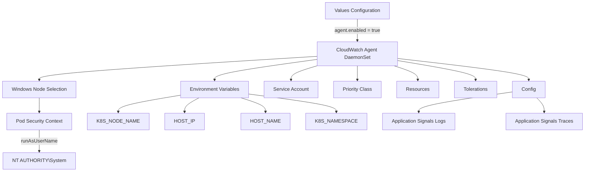
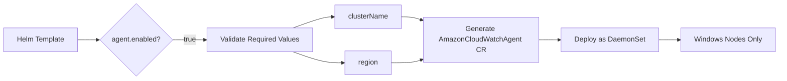
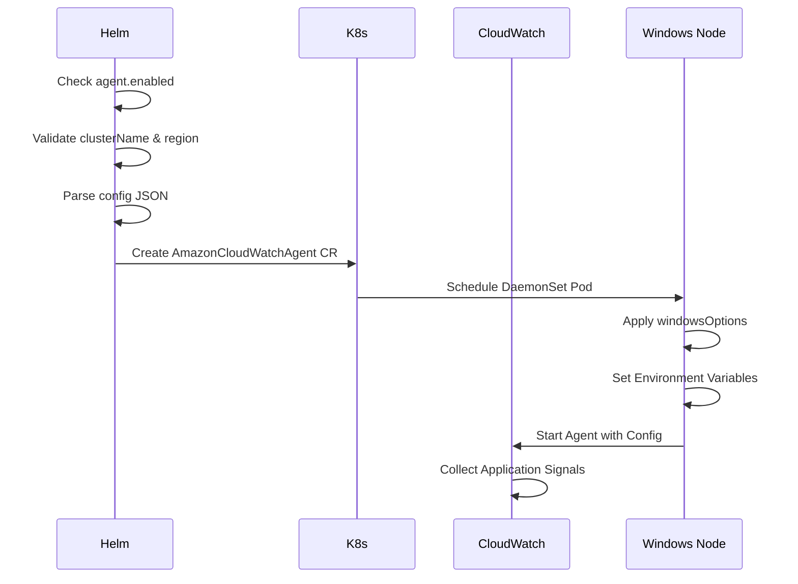

# Diagram: devops/k8s/amazon-cloudwatch-observability/helm/templates/windows/cloudwatch-agent-windows-daemonset.yaml

> Auto-generated by Obscura crawlers

## Diagram 1

### SVG

<svg id="container" width="1879.5703125" xmlns="http://www.w3.org/2000/svg" class="flowchart" height="558" viewBox="0 0 1879.5703125 558" role="graphics-document document" aria-roledescription="flowchart-v2"><g><marker id="container_flowchart-v2-pointEnd" class="marker flowchart-v2" viewBox="0 0 10 10" refX="5" refY="5" markerUnits="userSpaceOnUse" markerWidth="8" markerHeight="8" orient="auto"><path d="M 0 0 L 10 5 L 0 10 z" class="arrowMarkerPath" style="stroke-width: 1; stroke-dasharray: 1, 0;"></path></marker><marker id="container_flowchart-v2-pointStart" class="marker flowchart-v2" viewBox="0 0 10 10" refX="4.5" refY="5" markerUnits="userSpaceOnUse" markerWidth="8" markerHeight="8" orient="auto"><path d="M 0 5 L 10 10 L 10 0 z" class="arrowMarkerPath" style="stroke-width: 1; stroke-dasharray: 1, 0;"></path></marker><marker id="container_flowchart-v2-circleEnd" class="marker flowchart-v2" viewBox="0 0 10 10" refX="11" refY="5" markerUnits="userSpaceOnUse" markerWidth="11" markerHeight="11" orient="auto"><circle cx="5" cy="5" r="5" class="arrowMarkerPath" style="stroke-width: 1; stroke-dasharray: 1, 0;"></circle></marker><marker id="container_flowchart-v2-circleStart" class="marker flowchart-v2" viewBox="0 0 10 10" refX="-1" refY="5" markerUnits="userSpaceOnUse" markerWidth="11" markerHeight="11" orient="auto"><circle cx="5" cy="5" r="5" class="arrowMarkerPath" style="stroke-width: 1; stroke-dasharray: 1, 0;"></circle></marker><marker id="container_flowchart-v2-crossEnd" class="marker cross flowchart-v2" viewBox="0 0 11 11" refX="12" refY="5.2" markerUnits="userSpaceOnUse" markerWidth="11" markerHeight="11" orient="auto"><path d="M 1,1 l 9,9 M 10,1 l -9,9" class="arrowMarkerPath" style="stroke-width: 2; stroke-dasharray: 1, 0;"></path></marker><marker id="container_flowchart-v2-crossStart" class="marker cross flowchart-v2" viewBox="0 0 11 11" refX="-1" refY="5.2" markerUnits="userSpaceOnUse" markerWidth="11" markerHeight="11" orient="auto"><path d="M 1,1 l 9,9 M 10,1 l -9,9" class="arrowMarkerPath" style="stroke-width: 2; stroke-dasharray: 1, 0;"></path></marker><g class="root"><g class="clusters"></g><g class="edgePaths"><path d="M1131.809,62L1131.809,68.167C1131.809,74.333,1131.809,86.667,1131.809,98.333C1131.809,110,1131.809,121,1131.809,126.5L1131.809,132" id="L_A_B_0" class="edge-thickness-normal edge-pattern-solid edge-thickness-normal edge-pattern-solid flowchart-link" style=";" data-edge="true" data-et="edge" data-id="L_A_B_0" data-points="W3sieCI6MTEzMS44MDg1OTM3NSwieSI6NjJ9LHsieCI6MTEzMS44MDg1OTM3NSwieSI6OTl9LHsieCI6MTEzMS44MDg1OTM3NSwieSI6MTM2fV0=" marker-end="url(#container_flowchart-v2-pointEnd)"></path><path d="M1001.809,183.286L856.127,192.572C710.445,201.857,419.082,220.429,273.4,233.214C127.719,246,127.719,253,127.719,256.5L127.719,260" id="L_B_C_0" class="edge-thickness-normal edge-pattern-solid edge-thickness-normal edge-pattern-solid flowchart-link" style=";" data-edge="true" data-et="edge" data-id="L_B_C_0" data-points="W3sieCI6MTAwMS44MDg1OTM3NSwieSI6MTgzLjI4NjExMTEwMDMwNDYyfSx7IngiOjEyNy43MTg3NSwieSI6MjM5fSx7IngiOjEyNy43MTg3NSwieSI6MjY0fV0=" marker-end="url(#container_flowchart-v2-pointEnd)"></path><path d="M127.719,318L127.719,322.167C127.719,326.333,127.719,334.667,127.719,342.333C127.719,350,127.719,357,127.719,360.5L127.719,364" id="L_C_D_0" class="edge-thickness-normal edge-pattern-solid edge-thickness-normal edge-pattern-solid flowchart-link" style=";" data-edge="true" data-et="edge" data-id="L_C_D_0" data-points="W3sieCI6MTI3LjcxODc1LCJ5IjozMTh9LHsieCI6MTI3LjcxODc1LCJ5IjozNDN9LHsieCI6MTI3LjcxODc1LCJ5IjozNjh9XQ==" marker-end="url(#container_flowchart-v2-pointEnd)"></path><path d="M127.719,422L127.719,428.167C127.719,434.333,127.719,446.667,127.719,458.333C127.719,470,127.719,481,127.719,486.5L127.719,492" id="L_D_E_0" class="edge-thickness-normal edge-pattern-solid edge-thickness-normal edge-pattern-solid flowchart-link" style=";" data-edge="true" data-et="edge" data-id="L_D_E_0" data-points="W3sieCI6MTI3LjcxODc1LCJ5Ijo0MjJ9LHsieCI6MTI3LjcxODc1LCJ5Ijo0NTl9LHsieCI6MTI3LjcxODc1LCJ5Ijo0OTZ9XQ==" marker-end="url(#container_flowchart-v2-pointEnd)"></path><path d="M1001.809,192.988L946.388,200.657C890.967,208.326,780.126,223.663,724.706,234.831C669.285,246,669.285,253,669.285,256.5L669.285,260" id="L_B_F_0" class="edge-thickness-normal edge-pattern-solid edge-thickness-normal edge-pattern-solid flowchart-link" style=";" data-edge="true" data-et="edge" data-id="L_B_F_0" data-points="W3sieCI6MTAwMS44MDg1OTM3NSwieSI6MTkyLjk4ODI3NzYyMTA2NjUyfSx7IngiOjY2OS4yODUxNTYyNSwieSI6MjM5fSx7IngiOjY2OS4yODUxNTYyNSwieSI6MjY0fV0=" marker-end="url(#container_flowchart-v2-pointEnd)"></path><path d="M557.809,310.696L527.337,316.08C496.865,321.464,435.921,332.232,405.449,341.116C374.977,350,374.977,357,374.977,360.5L374.977,364" id="L_F_G_0" class="edge-thickness-normal edge-pattern-solid edge-thickness-normal edge-pattern-solid flowchart-link" style=";" data-edge="true" data-et="edge" data-id="L_F_G_0" data-points="W3sieCI6NTU3LjgwODU5Mzc1LCJ5IjozMTAuNjk2MjY5MDYyODE5NH0seyJ4IjozNzQuOTc2NTYyNSwieSI6MzQzfSx7IngiOjM3NC45NzY1NjI1LCJ5IjozNjh9XQ==" marker-end="url(#container_flowchart-v2-pointEnd)"></path><path d="M621.599,318L614.24,322.167C606.881,326.333,592.163,334.667,584.804,342.333C577.445,350,577.445,357,577.445,360.5L577.445,364" id="L_F_H_0" class="edge-thickness-normal edge-pattern-solid edge-thickness-normal edge-pattern-solid flowchart-link" style=";" data-edge="true" data-et="edge" data-id="L_F_H_0" data-points="W3sieCI6NjIxLjU5OTA4MzUzMzY1MzgsInkiOjMxOH0seyJ4Ijo1NzcuNDQ1MzEyNSwieSI6MzQzfSx7IngiOjU3Ny40NDUzMTI1LCJ5IjozNjh9XQ==" marker-end="url(#container_flowchart-v2-pointEnd)"></path><path d="M767.335,318L782.466,322.167C797.597,326.333,827.859,334.667,842.99,342.333C858.121,350,858.121,357,858.121,360.5L858.121,364" id="L_F_I_0" class="edge-thickness-normal edge-pattern-solid edge-thickness-normal edge-pattern-solid flowchart-link" style=";" data-edge="true" data-et="edge" data-id="L_F_I_0" data-points="W3sieCI6NzY3LjMzNDU4NTMzNjUzODUsInkiOjMxOH0seyJ4Ijo4NTguMTIxMDkzNzUsInkiOjM0M30seyJ4Ijo4NTguMTIxMDkzNzUsInkiOjM2OH1d" marker-end="url(#container_flowchart-v2-pointEnd)"></path><path d="M780.762,305.421L829.176,311.684C877.59,317.948,974.418,330.474,1022.832,340.237C1071.246,350,1071.246,357,1071.246,360.5L1071.246,364" id="L_F_J_0" class="edge-thickness-normal edge-pattern-solid edge-thickness-normal edge-pattern-solid flowchart-link" style=";" data-edge="true" data-et="edge" data-id="L_F_J_0" data-points="W3sieCI6NzgwLjc2MTcxODc1LCJ5IjozMDUuNDIxMjU1MTc0ODI2NX0seyJ4IjoxMDcxLjI0NjA5Mzc1LCJ5IjozNDN9LHsieCI6MTA3MS4yNDYwOTM3NSwieSI6MzY4fV0=" marker-end="url(#container_flowchart-v2-pointEnd)"></path><path d="M1001.809,213.863L987.794,218.052C973.78,222.242,945.751,230.621,931.737,238.31C917.723,246,917.723,253,917.723,256.5L917.723,260" id="L_B_K_0" class="edge-thickness-normal edge-pattern-solid edge-thickness-normal edge-pattern-solid flowchart-link" style=";" data-edge="true" data-et="edge" data-id="L_B_K_0" data-points="W3sieCI6MTAwMS44MDg1OTM3NSwieSI6MjEzLjg2Mjg5ODIyMjgyMjN9LHsieCI6OTE3LjcyMjY1NjI1LCJ5IjoyMzl9LHsieCI6OTE3LjcyMjY1NjI1LCJ5IjoyNjR9XQ==" marker-end="url(#container_flowchart-v2-pointEnd)"></path><path d="M1131.809,214L1131.809,218.167C1131.809,222.333,1131.809,230.667,1131.809,238.333C1131.809,246,1131.809,253,1131.809,256.5L1131.809,260" id="L_B_L_0" class="edge-thickness-normal edge-pattern-solid edge-thickness-normal edge-pattern-solid flowchart-link" style=";" data-edge="true" data-et="edge" data-id="L_B_L_0" data-points="W3sieCI6MTEzMS44MDg1OTM3NSwieSI6MjE0fSx7IngiOjExMzEuODA4NTkzNzUsInkiOjIzOX0seyJ4IjoxMTMxLjgwODU5Mzc1LCJ5IjoyNjR9XQ==" marker-end="url(#container_flowchart-v2-pointEnd)"></path><path d="M1249.956,214L1262.579,218.167C1275.201,222.333,1300.446,230.667,1313.069,238.333C1325.691,246,1325.691,253,1325.691,256.5L1325.691,260" id="L_B_M_0" class="edge-thickness-normal edge-pattern-solid edge-thickness-normal edge-pattern-solid flowchart-link" style=";" data-edge="true" data-et="edge" data-id="L_B_M_0" data-points="W3sieCI6MTI0OS45NTU5MzI2MTcxODc1LCJ5IjoyMTR9LHsieCI6MTMyNS42OTE0MDYyNSwieSI6MjM5fSx7IngiOjEzMjUuNjkxNDA2MjUsInkiOjI2NH1d" marker-end="url(#container_flowchart-v2-pointEnd)"></path><path d="M1261.809,196.833L1303.655,203.861C1345.501,210.889,1429.194,224.944,1471.04,235.472C1512.887,246,1512.887,253,1512.887,256.5L1512.887,260" id="L_B_N_0" class="edge-thickness-normal edge-pattern-solid edge-thickness-normal edge-pattern-solid flowchart-link" style=";" data-edge="true" data-et="edge" data-id="L_B_N_0" data-points="W3sieCI6MTI2MS44MDg1OTM3NSwieSI6MTk2LjgzMjc5MzQ3MjQ2NzF9LHsieCI6MTUxMi44ODY3MTg3NSwieSI6MjM5fSx7IngiOjE1MTIuODg2NzE4NzUsInkiOjI2NH1d" marker-end="url(#container_flowchart-v2-pointEnd)"></path><path d="M1261.809,190.019L1332.469,198.183C1403.129,206.346,1544.449,222.673,1615.109,234.337C1685.77,246,1685.77,253,1685.77,256.5L1685.77,260" id="L_B_O_0" class="edge-thickness-normal edge-pattern-solid edge-thickness-normal edge-pattern-solid flowchart-link" style=";" data-edge="true" data-et="edge" data-id="L_B_O_0" data-points="W3sieCI6MTI2MS44MDg1OTM3NSwieSI6MTkwLjAxOTEwOTUzNzg0NTM0fSx7IngiOjE2ODUuNzY5NTMxMjUsInkiOjIzOX0seyJ4IjoxNjg1Ljc2OTUzMTI1LCJ5IjoyNjR9XQ==" marker-end="url(#container_flowchart-v2-pointEnd)"></path><path d="M1633.324,298.631L1582.504,306.026C1531.684,313.421,1430.043,328.21,1379.223,339.105C1328.402,350,1328.402,357,1328.402,360.5L1328.402,364" id="L_O_P_0" class="edge-thickness-normal edge-pattern-solid edge-thickness-normal edge-pattern-solid flowchart-link" style=";" data-edge="true" data-et="edge" data-id="L_O_P_0" data-points="W3sieCI6MTYzMy4zMjQyMTg3NSwieSI6Mjk4LjYzMTI0NDEyNDc4NDEzfSx7IngiOjEzMjguNDAyMzQzNzUsInkiOjM0M30seyJ4IjoxMzI4LjQwMjM0Mzc1LCJ5IjozNjh9XQ==" marker-end="url(#container_flowchart-v2-pointEnd)"></path><path d="M1717.773,318L1722.712,322.167C1727.651,326.333,1737.529,334.667,1742.467,342.333C1747.406,350,1747.406,357,1747.406,360.5L1747.406,364" id="L_O_Q_0" class="edge-thickness-normal edge-pattern-solid edge-thickness-normal edge-pattern-solid flowchart-link" style=";" data-edge="true" data-et="edge" data-id="L_O_Q_0" data-points="W3sieCI6MTcxNy43NzMyMTIxMzk0MjMsInkiOjMxOH0seyJ4IjoxNzQ3LjQwNjI1LCJ5IjozNDN9LHsieCI6MTc0Ny40MDYyNSwieSI6MzY4fV0=" marker-end="url(#container_flowchart-v2-pointEnd)"></path></g><g class="edgeLabels"><g class="edgeLabel" transform="translate(1131.80859375, 99)"><g class="label" data-id="L_A_B_0" transform="translate(-74.9453125, -12)"><foreignObject width="149.890625" height="24">

agent.enabled = true

</foreignObject></g></g><g class="edgeLabel"><g class="label" data-id="L_B_C_0" transform="translate(0, 0)"><foreignObject width="0" height="0">

</foreignObject></g></g><g class="edgeLabel"><g class="label" data-id="L_C_D_0" transform="translate(0, 0)"><foreignObject width="0" height="0">

</foreignObject></g></g><g class="edgeLabel" transform="translate(127.71875, 459)"><g class="label" data-id="L_D_E_0" transform="translate(-58.2265625, -12)"><foreignObject width="116.453125" height="24">

runAsUserName

</foreignObject></g></g><g class="edgeLabel"><g class="label" data-id="L_B_F_0" transform="translate(0, 0)"><foreignObject width="0" height="0">

</foreignObject></g></g><g class="edgeLabel"><g class="label" data-id="L_F_G_0" transform="translate(0, 0)"><foreignObject width="0" height="0">

</foreignObject></g></g><g class="edgeLabel"><g class="label" data-id="L_F_H_0" transform="translate(0, 0)"><foreignObject width="0" height="0">

</foreignObject></g></g><g class="edgeLabel"><g class="label" data-id="L_F_I_0" transform="translate(0, 0)"><foreignObject width="0" height="0">

</foreignObject></g></g><g class="edgeLabel"><g class="label" data-id="L_F_J_0" transform="translate(0, 0)"><foreignObject width="0" height="0">

</foreignObject></g></g><g class="edgeLabel"><g class="label" data-id="L_B_K_0" transform="translate(0, 0)"><foreignObject width="0" height="0">

</foreignObject></g></g><g class="edgeLabel"><g class="label" data-id="L_B_L_0" transform="translate(0, 0)"><foreignObject width="0" height="0">

</foreignObject></g></g><g class="edgeLabel"><g class="label" data-id="L_B_M_0" transform="translate(0, 0)"><foreignObject width="0" height="0">

</foreignObject></g></g><g class="edgeLabel"><g class="label" data-id="L_B_N_0" transform="translate(0, 0)"><foreignObject width="0" height="0">

</foreignObject></g></g><g class="edgeLabel"><g class="label" data-id="L_B_O_0" transform="translate(0, 0)"><foreignObject width="0" height="0">

</foreignObject></g></g><g class="edgeLabel"><g class="label" data-id="L_O_P_0" transform="translate(0, 0)"><foreignObject width="0" height="0">

</foreignObject></g></g><g class="edgeLabel"><g class="label" data-id="L_O_Q_0" transform="translate(0, 0)"><foreignObject width="0" height="0">

</foreignObject></g></g></g><g class="nodes"><g class="node default" id="flowchart-A-0" transform="translate(1131.80859375, 35)"><rect class="basic label-container" style="" x="-104.296875" y="-27" width="208.59375" height="54"></rect><g class="label" style="" transform="translate(-74.296875, -12)"><rect></rect><foreignObject width="148.59375" height="24">

Values Configuration

</foreignObject></g></g><g class="node default" id="flowchart-B-1" transform="translate(1131.80859375, 175)"><rect class="basic label-container" style="" x="-130" y="-39" width="260" height="78"></rect><g class="label" style="" transform="translate(-100, -24)"><rect></rect><foreignObject width="200" height="48">

CloudWatch Agent DaemonSet

</foreignObject></g></g><g class="node default" id="flowchart-C-3" transform="translate(127.71875, 291)"><rect class="basic label-container" style="" x="-119.71875" y="-27" width="239.4375" height="54"></rect><g class="label" style="" transform="translate(-89.71875, -12)"><rect></rect><foreignObject width="179.4375" height="24">

Windows Node Selection

</foreignObject></g></g><g class="node default" id="flowchart-D-5" transform="translate(127.71875, 395)"><rect class="basic label-container" style="" x="-104.859375" y="-27" width="209.71875" height="54"></rect><g class="label" style="" transform="translate(-74.859375, -12)"><rect></rect><foreignObject width="149.71875" height="24">

Pod Security Context

</foreignObject></g></g><g class="node default" id="flowchart-E-7" transform="translate(127.71875, 523)"><rect class="basic label-container" style="" x="-112.4140625" y="-27" width="224.828125" height="54"></rect><g class="label" style="" transform="translate(-82.4140625, -12)"><rect></rect><foreignObject width="164.828125" height="24">

NT AUTHORITY\System

</foreignObject></g></g><g class="node default" id="flowchart-F-9" transform="translate(669.28515625, 291)"><rect class="basic label-container" style="" x="-111.4765625" y="-27" width="222.953125" height="54"></rect><g class="label" style="" transform="translate(-81.4765625, -12)"><rect></rect><foreignObject width="162.953125" height="24">

Environment Variables

</foreignObject></g></g><g class="node default" id="flowchart-G-11" transform="translate(374.9765625, 395)"><rect class="basic label-container" style="" x="-92.3984375" y="-27" width="184.796875" height="54"></rect><g class="label" style="" transform="translate(-62.3984375, -12)"><rect></rect><foreignObject width="124.796875" height="24">

K8S_NODE_NAME

</foreignObject></g></g><g class="node default" id="flowchart-H-13" transform="translate(577.4453125, 395)"><rect class="basic label-container" style="" x="-60.0703125" y="-27" width="120.140625" height="54"></rect><g class="label" style="" transform="translate(-30.0703125, -12)"><rect></rect><foreignObject width="60.140625" height="24">

HOST_IP

</foreignObject></g></g><g class="node default" id="flowchart-I-15" transform="translate(858.12109375, 395)"><rect class="basic label-container" style="" x="-73.609375" y="-27" width="147.21875" height="54"></rect><g class="label" style="" transform="translate(-43.609375, -12)"><rect></rect><foreignObject width="87.21875" height="24">

HOST_NAME

</foreignObject></g></g><g class="node default" id="flowchart-J-17" transform="translate(1071.24609375, 395)"><rect class="basic label-container" style="" x="-89.515625" y="-27" width="179.03125" height="54"></rect><g class="label" style="" transform="translate(-59.515625, -12)"><rect></rect><foreignObject width="119.03125" height="24">

K8S_NAMESPACE

</foreignObject></g></g><g class="node default" id="flowchart-K-19" transform="translate(917.72265625, 291)"><rect class="basic label-container" style="" x="-86.9609375" y="-27" width="173.921875" height="54"></rect><g class="label" style="" transform="translate(-56.9609375, -12)"><rect></rect><foreignObject width="113.921875" height="24">

Service Account

</foreignObject></g></g><g class="node default" id="flowchart-L-21" transform="translate(1131.80859375, 291)"><rect class="basic label-container" style="" x="-77.125" y="-27" width="154.25" height="54"></rect><g class="label" style="" transform="translate(-47.125, -12)"><rect></rect><foreignObject width="94.25" height="24">

Priority Class

</foreignObject></g></g><g class="node default" id="flowchart-M-23" transform="translate(1325.69140625, 291)"><rect class="basic label-container" style="" x="-66.7578125" y="-27" width="133.515625" height="54"></rect><g class="label" style="" transform="translate(-36.7578125, -12)"><rect></rect><foreignObject width="73.515625" height="24">

Resources

</foreignObject></g></g><g class="node default" id="flowchart-N-25" transform="translate(1512.88671875, 291)"><rect class="basic label-container" style="" x="-70.4375" y="-27" width="140.875" height="54"></rect><g class="label" style="" transform="translate(-40.4375, -12)"><rect></rect><foreignObject width="80.875" height="24">

Tolerations

</foreignObject></g></g><g class="node default" id="flowchart-O-27" transform="translate(1685.76953125, 291)"><rect class="basic label-container" style="" x="-52.4453125" y="-27" width="104.890625" height="54"></rect><g class="label" style="" transform="translate(-22.4453125, -12)"><rect></rect><foreignObject width="44.890625" height="24">

Config

</foreignObject></g></g><g class="node default" id="flowchart-P-29" transform="translate(1328.40234375, 395)"><rect class="basic label-container" style="" x="-117.640625" y="-27" width="235.28125" height="54"></rect><g class="label" style="" transform="translate(-87.640625, -12)"><rect></rect><foreignObject width="175.28125" height="24">

Application Signals Logs

</foreignObject></g></g><g class="node default" id="flowchart-Q-31" transform="translate(1747.40625, 395)"><rect class="basic label-container" style="" x="-124.1640625" y="-27" width="248.328125" height="54"></rect><g class="label" style="" transform="translate(-94.1640625, -12)"><rect></rect><foreignObject width="188.328125" height="24">

Application Signals Traces

</foreignObject></g></g></g></g></g></svg>

## Diagram 2

### SVG

<svg id="container" width="1761.421875" xmlns="http://www.w3.org/2000/svg" class="flowchart" height="180.78125" viewBox="0 0 1761.421875 180.78125" role="graphics-document document" aria-roledescription="flowchart-v2"><g><marker id="container_flowchart-v2-pointEnd" class="marker flowchart-v2" viewBox="0 0 10 10" refX="5" refY="5" markerUnits="userSpaceOnUse" markerWidth="8" markerHeight="8" orient="auto"><path d="M 0 0 L 10 5 L 0 10 z" class="arrowMarkerPath" style="stroke-width: 1; stroke-dasharray: 1, 0;"></path></marker><marker id="container_flowchart-v2-pointStart" class="marker flowchart-v2" viewBox="0 0 10 10" refX="4.5" refY="5" markerUnits="userSpaceOnUse" markerWidth="8" markerHeight="8" orient="auto"><path d="M 0 5 L 10 10 L 10 0 z" class="arrowMarkerPath" style="stroke-width: 1; stroke-dasharray: 1, 0;"></path></marker><marker id="container_flowchart-v2-circleEnd" class="marker flowchart-v2" viewBox="0 0 10 10" refX="11" refY="5" markerUnits="userSpaceOnUse" markerWidth="11" markerHeight="11" orient="auto"><circle cx="5" cy="5" r="5" class="arrowMarkerPath" style="stroke-width: 1; stroke-dasharray: 1, 0;"></circle></marker><marker id="container_flowchart-v2-circleStart" class="marker flowchart-v2" viewBox="0 0 10 10" refX="-1" refY="5" markerUnits="userSpaceOnUse" markerWidth="11" markerHeight="11" orient="auto"><circle cx="5" cy="5" r="5" class="arrowMarkerPath" style="stroke-width: 1; stroke-dasharray: 1, 0;"></circle></marker><marker id="container_flowchart-v2-crossEnd" class="marker cross flowchart-v2" viewBox="0 0 11 11" refX="12" refY="5.2" markerUnits="userSpaceOnUse" markerWidth="11" markerHeight="11" orient="auto"><path d="M 1,1 l 9,9 M 10,1 l -9,9" class="arrowMarkerPath" style="stroke-width: 2; stroke-dasharray: 1, 0;"></path></marker><marker id="container_flowchart-v2-crossStart" class="marker cross flowchart-v2" viewBox="0 0 11 11" refX="-1" refY="5.2" markerUnits="userSpaceOnUse" markerWidth="11" markerHeight="11" orient="auto"><path d="M 1,1 l 9,9 M 10,1 l -9,9" class="arrowMarkerPath" style="stroke-width: 2; stroke-dasharray: 1, 0;"></path></marker><g class="root"><g class="clusters"></g><g class="edgePaths"><path d="M177.141,90.391L181.307,90.391C185.474,90.391,193.807,90.391,201.474,90.391C209.141,90.391,216.141,90.391,219.641,90.391L223.141,90.391" id="L_A_B_0" class="edge-thickness-normal edge-pattern-solid edge-thickness-normal edge-pattern-solid flowchart-link" style=";" data-edge="true" data-et="edge" data-id="L_A_B_0" data-points="W3sieCI6MTc3LjE0MDYyNSwieSI6OTAuMzkwNjI1fSx7IngiOjIwMi4xNDA2MjUsInkiOjkwLjM5MDYyNX0seyJ4IjoyMjcuMTQwNjI1LCJ5Ijo5MC4zOTA2MjV9XQ==" marker-end="url(#container_flowchart-v2-pointEnd)"></path><path d="M391.922,90.391L398.587,90.391C405.253,90.391,418.583,90.391,431.247,90.391C443.911,90.391,455.909,90.391,461.908,90.391L467.906,90.391" id="L_B_C_0" class="edge-thickness-normal edge-pattern-solid edge-thickness-normal edge-pattern-solid flowchart-link" style=";" data-edge="true" data-et="edge" data-id="L_B_C_0" data-points="W3sieCI6MzkxLjkyMTg3NSwieSI6OTAuMzkwNjI1fSx7IngiOjQzMS45MTQwNjI1LCJ5Ijo5MC4zOTA2MjV9LHsieCI6NDcxLjkwNjI1LCJ5Ijo5MC4zOTA2MjV9XQ==" marker-end="url(#container_flowchart-v2-pointEnd)"></path><path d="M666.851,63.391L678.451,59.224C690.051,55.057,713.252,46.724,728.353,42.557C743.453,38.391,750.453,38.391,753.953,38.391L757.453,38.391" id="L_C_D_0" class="edge-thickness-normal edge-pattern-solid edge-thickness-normal edge-pattern-solid flowchart-link" style=";" data-edge="true" data-et="edge" data-id="L_C_D_0" data-points="W3sieCI6NjY2Ljg1MDUxMDgxNzMwNzcsInkiOjYzLjM5MDYyNX0seyJ4Ijo3MzYuNDUzMTI1LCJ5IjozOC4zOTA2MjV9LHsieCI6NzYxLjQ1MzEyNSwieSI6MzguMzkwNjI1fV0=" marker-end="url(#container_flowchart-v2-pointEnd)"></path><path d="M666.851,117.391L678.451,121.557C690.051,125.724,713.252,134.057,732.157,138.224C751.063,142.391,765.672,142.391,772.977,142.391L780.281,142.391" id="L_C_E_0" class="edge-thickness-normal edge-pattern-solid edge-thickness-normal edge-pattern-solid flowchart-link" style=";" data-edge="true" data-et="edge" data-id="L_C_E_0" data-points="W3sieCI6NjY2Ljg1MDUxMDgxNzMwNzcsInkiOjExNy4zOTA2MjV9LHsieCI6NzM2LjQ1MzEyNSwieSI6MTQyLjM5MDYyNX0seyJ4Ijo3ODQuMjgxMjUsInkiOjE0Mi4zOTA2MjV9XQ==" marker-end="url(#container_flowchart-v2-pointEnd)"></path><path d="M913.078,38.391L917.245,38.391C921.411,38.391,929.745,38.391,937.446,39.576C945.147,40.762,952.217,43.134,955.751,44.32L959.286,45.505" id="L_D_F_0" class="edge-thickness-normal edge-pattern-solid edge-thickness-normal edge-pattern-solid flowchart-link" style=";" data-edge="true" data-et="edge" data-id="L_D_F_0" data-points="W3sieCI6OTEzLjA3ODEyNSwieSI6MzguMzkwNjI1fSx7IngiOjkzOC4wNzgxMjUsInkiOjM4LjM5MDYyNX0seyJ4Ijo5NjMuMDc4MTI1LCJ5Ijo0Ni43Nzc3MjE3NzQxOTM1NX1d" marker-end="url(#container_flowchart-v2-pointEnd)"></path><path d="M890.25,142.391L898.221,142.391C906.193,142.391,922.135,142.391,933.641,141.205C945.147,140.019,952.217,137.647,955.751,136.462L959.286,135.276" id="L_E_F_0" class="edge-thickness-normal edge-pattern-solid edge-thickness-normal edge-pattern-solid flowchart-link" style=";" data-edge="true" data-et="edge" data-id="L_E_F_0" data-points="W3sieCI6ODkwLjI1LCJ5IjoxNDIuMzkwNjI1fSx7IngiOjkzOC4wNzgxMjUsInkiOjE0Mi4zOTA2MjV9LHsieCI6OTYzLjA3ODEyNSwieSI6MTM0LjAwMzUyODIyNTgwNjQ2fV0=" marker-end="url(#container_flowchart-v2-pointEnd)"></path><path d="M1223.078,90.391L1227.245,90.391C1231.411,90.391,1239.745,90.391,1247.411,90.391C1255.078,90.391,1262.078,90.391,1265.578,90.391L1269.078,90.391" id="L_F_G_0" class="edge-thickness-normal edge-pattern-solid edge-thickness-normal edge-pattern-solid flowchart-link" style=";" data-edge="true" data-et="edge" data-id="L_F_G_0" data-points="W3sieCI6MTIyMy4wNzgxMjUsInkiOjkwLjM5MDYyNX0seyJ4IjoxMjQ4LjA3ODEyNSwieSI6OTAuMzkwNjI1fSx7IngiOjEyNzMuMDc4MTI1LCJ5Ijo5MC4zOTA2MjV9XQ==" marker-end="url(#container_flowchart-v2-pointEnd)"></path><path d="M1491.094,90.391L1495.26,90.391C1499.427,90.391,1507.76,90.391,1515.427,90.391C1523.094,90.391,1530.094,90.391,1533.594,90.391L1537.094,90.391" id="L_G_H_0" class="edge-thickness-normal edge-pattern-solid edge-thickness-normal edge-pattern-solid flowchart-link" style=";" data-edge="true" data-et="edge" data-id="L_G_H_0" data-points="W3sieCI6MTQ5MS4wOTM3NSwieSI6OTAuMzkwNjI1fSx7IngiOjE1MTYuMDkzNzUsInkiOjkwLjM5MDYyNX0seyJ4IjoxNTQxLjA5Mzc1LCJ5Ijo5MC4zOTA2MjV9XQ==" marker-end="url(#container_flowchart-v2-pointEnd)"></path></g><g class="edgeLabels"><g class="edgeLabel"><g class="label" data-id="L_A_B_0" transform="translate(0, 0)"><foreignObject width="0" height="0">

</foreignObject></g></g><g class="edgeLabel" transform="translate(431.9140625, 90.390625)"><g class="label" data-id="L_B_C_0" transform="translate(-14.9921875, -12)"><foreignObject width="29.984375" height="24">

true

</foreignObject></g></g><g class="edgeLabel"><g class="label" data-id="L_C_D_0" transform="translate(0, 0)"><foreignObject width="0" height="0">

</foreignObject></g></g><g class="edgeLabel"><g class="label" data-id="L_C_E_0" transform="translate(0, 0)"><foreignObject width="0" height="0">

</foreignObject></g></g><g class="edgeLabel"><g class="label" data-id="L_D_F_0" transform="translate(0, 0)"><foreignObject width="0" height="0">

</foreignObject></g></g><g class="edgeLabel"><g class="label" data-id="L_E_F_0" transform="translate(0, 0)"><foreignObject width="0" height="0">

</foreignObject></g></g><g class="edgeLabel"><g class="label" data-id="L_F_G_0" transform="translate(0, 0)"><foreignObject width="0" height="0">

</foreignObject></g></g><g class="edgeLabel"><g class="label" data-id="L_G_H_0" transform="translate(0, 0)"><foreignObject width="0" height="0">

</foreignObject></g></g></g><g class="nodes"><g class="node default" id="flowchart-A-0" transform="translate(92.5703125, 90.390625)"><rect class="basic label-container" style="" x="-84.5703125" y="-27" width="169.140625" height="54"></rect><g class="label" style="" transform="translate(-54.5703125, -12)"><rect></rect><foreignObject width="109.140625" height="24">

Helm Template

</foreignObject></g></g><g class="node default" id="flowchart-B-1" transform="translate(309.53125, 90.390625)"><polygon points="82.390625,0 164.78125,-82.390625 82.390625,-164.78125 0,-82.390625" class="label-container" transform="translate(-81.890625, 82.390625)"></polygon><g class="label" style="" transform="translate(-55.390625, -12)"><rect></rect><foreignObject width="110.78125" height="24">

agent.enabled?

</foreignObject></g></g><g class="node default" id="flowchart-C-3" transform="translate(591.6796875, 90.390625)"><rect class="basic label-container" style="" x="-119.7734375" y="-27" width="239.546875" height="54"></rect><g class="label" style="" transform="translate(-89.7734375, -12)"><rect></rect><foreignObject width="179.546875" height="24">

Validate Required Values

</foreignObject></g></g><g class="node default" id="flowchart-D-5" transform="translate(837.265625, 38.390625)"><rect class="basic label-container" style="" x="-75.8125" y="-27" width="151.625" height="54"></rect><g class="label" style="" transform="translate(-45.8125, -12)"><rect></rect><foreignObject width="91.625" height="24">

clusterName

</foreignObject></g></g><g class="node default" id="flowchart-E-7" transform="translate(837.265625, 142.390625)"><rect class="basic label-container" style="" x="-52.984375" y="-27" width="105.96875" height="54"></rect><g class="label" style="" transform="translate(-22.984375, -12)"><rect></rect><foreignObject width="45.96875" height="24">

region

</foreignObject></g></g><g class="node default" id="flowchart-F-9" transform="translate(1093.078125, 90.390625)"><rect class="basic label-container" style="" x="-130" y="-51" width="260" height="102"></rect><g class="label" style="" transform="translate(-100, -36)"><rect></rect><foreignObject width="200" height="72">

Generate AmazonCloudWatchAgent CR

</foreignObject></g></g><g class="node default" id="flowchart-G-13" transform="translate(1382.0859375, 90.390625)"><rect class="basic label-container" style="" x="-109.0078125" y="-27" width="218.015625" height="54"></rect><g class="label" style="" transform="translate(-79.0078125, -12)"><rect></rect><foreignObject width="158.015625" height="24">

Deploy as DaemonSet

</foreignObject></g></g><g class="node default" id="flowchart-H-15" transform="translate(1647.2578125, 90.390625)"><rect class="basic label-container" style="" x="-106.1640625" y="-27" width="212.328125" height="54"></rect><g class="label" style="" transform="translate(-76.1640625, -12)"><rect></rect><foreignObject width="152.328125" height="24">

Windows Nodes Only

</foreignObject></g></g></g></g></g></svg>

## Diagram 3

### SVG

<svg id="container" width="1068.5" xmlns="http://www.w3.org/2000/svg" height="783" viewBox="-84.5 -10 1068.5 783" role="graphics-document document" aria-roledescription="sequence"><g><rect x="763" y="697" fill="#eaeaea" stroke="#666" width="150" height="65" name="Windows Node" rx="3" ry="3" class="actor actor-bottom"></rect><text x="838" y="729.5" dominant-baseline="central" alignment-baseline="central" class="actor actor-box" style="text-anchor: middle; font-size: 16px; font-weight: 400;"><tspan x="838" dy="0">Windows Node</tspan></text></g><g><rect x="527" y="697" fill="#eaeaea" stroke="#666" width="150" height="65" name="CloudWatch" rx="3" ry="3" class="actor actor-bottom"></rect><text x="602" y="729.5" dominant-baseline="central" alignment-baseline="central" class="actor actor-box" style="text-anchor: middle; font-size: 16px; font-weight: 400;"><tspan x="602" dy="0">CloudWatch</tspan></text></g><g><rect x="327" y="697" fill="#eaeaea" stroke="#666" width="150" height="65" name="K8s" rx="3" ry="3" class="actor actor-bottom"></rect><text x="402" y="729.5" dominant-baseline="central" alignment-baseline="central" class="actor actor-box" style="text-anchor: middle; font-size: 16px; font-weight: 400;"><tspan x="402" dy="0">K8s</tspan></text></g><g><rect x="0" y="697" fill="#eaeaea" stroke="#666" width="150" height="65" name="Helm" rx="3" ry="3" class="actor actor-bottom"></rect><text x="75" y="729.5" dominant-baseline="central" alignment-baseline="central" class="actor actor-box" style="text-anchor: middle; font-size: 16px; font-weight: 400;"><tspan x="75" dy="0">Helm</tspan></text></g><g><line id="actor3" x1="838" y1="65" x2="838" y2="697" class="actor-line 200" stroke-width="0.5px" stroke="#999" name="Windows Node"></line><g id="root-3"><rect x="763" y="0" fill="#eaeaea" stroke="#666" width="150" height="65" name="Windows Node" rx="3" ry="3" class="actor actor-top"></rect><text x="838" y="32.5" dominant-baseline="central" alignment-baseline="central" class="actor actor-box" style="text-anchor: middle; font-size: 16px; font-weight: 400;"><tspan x="838" dy="0">Windows Node</tspan></text></g></g><g><line id="actor2" x1="602" y1="65" x2="602" y2="697" class="actor-line 200" stroke-width="0.5px" stroke="#999" name="CloudWatch"></line><g id="root-2"><rect x="527" y="0" fill="#eaeaea" stroke="#666" width="150" height="65" name="CloudWatch" rx="3" ry="3" class="actor actor-top"></rect><text x="602" y="32.5" dominant-baseline="central" alignment-baseline="central" class="actor actor-box" style="text-anchor: middle; font-size: 16px; font-weight: 400;"><tspan x="602" dy="0">CloudWatch</tspan></text></g></g><g><line id="actor1" x1="402" y1="65" x2="402" y2="697" class="actor-line 200" stroke-width="0.5px" stroke="#999" name="K8s"></line><g id="root-1"><rect x="327" y="0" fill="#eaeaea" stroke="#666" width="150" height="65" name="K8s" rx="3" ry="3" class="actor actor-top"></rect><text x="402" y="32.5" dominant-baseline="central" alignment-baseline="central" class="actor actor-box" style="text-anchor: middle; font-size: 16px; font-weight: 400;"><tspan x="402" dy="0">K8s</tspan></text></g></g><g><line id="actor0" x1="75" y1="65" x2="75" y2="697" class="actor-line 200" stroke-width="0.5px" stroke="#999" name="Helm"></line><g id="root-0"><rect x="0" y="0" fill="#eaeaea" stroke="#666" width="150" height="65" name="Helm" rx="3" ry="3" class="actor actor-top"></rect><text x="75" y="32.5" dominant-baseline="central" alignment-baseline="central" class="actor actor-box" style="text-anchor: middle; font-size: 16px; font-weight: 400;"><tspan x="75" dy="0">Helm</tspan></text></g></g><g></g><defs><symbol id="computer" width="24" height="24"><path transform="scale(.5)" d="M2 2v13h20v-13h-20zm18 11h-16v-9h16v9zm-10.228 6l.466-1h3.524l.467 1h-4.457zm14.228 3h-24l2-6h2.104l-1.33 4h18.45l-1.297-4h2.073l2 6zm-5-10h-14v-7h14v7z"></path></symbol></defs><defs><symbol id="database" fill-rule="evenodd" clip-rule="evenodd"><path transform="scale(.5)" d="M12.258.001l.256.004.255.005.253.008.251.01.249.012.247.015.246.016.242.019.241.02.239.023.236.024.233.027.231.028.229.031.225.032.223.034.22.036.217.038.214.04.211.041.208.043.205.045.201.046.198.048.194.05.191.051.187.053.183.054.18.056.175.057.172.059.168.06.163.061.16.063.155.064.15.066.074.033.073.033.071.034.07.034.069.035.068.035.067.035.066.035.064.036.064.036.062.036.06.036.06.037.058.037.058.037.055.038.055.038.053.038.052.038.051.039.05.039.048.039.047.039.045.04.044.04.043.04.041.04.04.041.039.041.037.041.036.041.034.041.033.042.032.042.03.042.029.042.027.042.026.043.024.043.023.043.021.043.02.043.018.044.017.043.015.044.013.044.012.044.011.045.009.044.007.045.006.045.004.045.002.045.001.045v17l-.001.045-.002.045-.004.045-.006.045-.007.045-.009.044-.011.045-.012.044-.013.044-.015.044-.017.043-.018.044-.02.043-.021.043-.023.043-.024.043-.026.043-.027.042-.029.042-.03.042-.032.042-.033.042-.034.041-.036.041-.037.041-.039.041-.04.041-.041.04-.043.04-.044.04-.045.04-.047.039-.048.039-.05.039-.051.039-.052.038-.053.038-.055.038-.055.038-.058.037-.058.037-.06.037-.06.036-.062.036-.064.036-.064.036-.066.035-.067.035-.068.035-.069.035-.07.034-.071.034-.073.033-.074.033-.15.066-.155.064-.16.063-.163.061-.168.06-.172.059-.175.057-.18.056-.183.054-.187.053-.191.051-.194.05-.198.048-.201.046-.205.045-.208.043-.211.041-.214.04-.217.038-.22.036-.223.034-.225.032-.229.031-.231.028-.233.027-.236.024-.239.023-.241.02-.242.019-.246.016-.247.015-.249.012-.251.01-.253.008-.255.005-.256.004-.258.001-.258-.001-.256-.004-.255-.005-.253-.008-.251-.01-.249-.012-.247-.015-.245-.016-.243-.019-.241-.02-.238-.023-.236-.024-.234-.027-.231-.028-.228-.031-.226-.032-.223-.034-.22-.036-.217-.038-.214-.04-.211-.041-.208-.043-.204-.045-.201-.046-.198-.048-.195-.05-.19-.051-.187-.053-.184-.054-.179-.056-.176-.057-.172-.059-.167-.06-.164-.061-.159-.063-.155-.064-.151-.066-.074-.033-.072-.033-.072-.034-.07-.034-.069-.035-.068-.035-.067-.035-.066-.035-.064-.036-.063-.036-.062-.036-.061-.036-.06-.037-.058-.037-.057-.037-.056-.038-.055-.038-.053-.038-.052-.038-.051-.039-.049-.039-.049-.039-.046-.039-.046-.04-.044-.04-.043-.04-.041-.04-.04-.041-.039-.041-.037-.041-.036-.041-.034-.041-.033-.042-.032-.042-.03-.042-.029-.042-.027-.042-.026-.043-.024-.043-.023-.043-.021-.043-.02-.043-.018-.044-.017-.043-.015-.044-.013-.044-.012-.044-.011-.045-.009-.044-.007-.045-.006-.045-.004-.045-.002-.045-.001-.045v-17l.001-.045.002-.045.004-.045.006-.045.007-.045.009-.044.011-.045.012-.044.013-.044.015-.044.017-.043.018-.044.02-.043.021-.043.023-.043.024-.043.026-.043.027-.042.029-.042.03-.042.032-.042.033-.042.034-.041.036-.041.037-.041.039-.041.04-.041.041-.04.043-.04.044-.04.046-.04.046-.039.049-.039.049-.039.051-.039.052-.038.053-.038.055-.038.056-.038.057-.037.058-.037.06-.037.061-.036.062-.036.063-.036.064-.036.066-.035.067-.035.068-.035.069-.035.07-.034.072-.034.072-.033.074-.033.151-.066.155-.064.159-.063.164-.061.167-.06.172-.059.176-.057.179-.056.184-.054.187-.053.19-.051.195-.05.198-.048.201-.046.204-.045.208-.043.211-.041.214-.04.217-.038.22-.036.223-.034.226-.032.228-.031.231-.028.234-.027.236-.024.238-.023.241-.02.243-.019.245-.016.247-.015.249-.012.251-.01.253-.008.255-.005.256-.004.258-.001.258.001zm-9.258 20.499v.01l.001.021.003.021.004.022.005.021.006.022.007.022.009.023.01.022.011.023.012.023.013.023.015.023.016.024.017.023.018.024.019.024.021.024.022.025.023.024.024.025.052.049.056.05.061.051.066.051.07.051.075.051.079.052.084.052.088.052.092.052.097.052.102.051.105.052.11.052.114.051.119.051.123.051.127.05.131.05.135.05.139.048.144.049.147.047.152.047.155.047.16.045.163.045.167.043.171.043.176.041.178.041.183.039.187.039.19.037.194.035.197.035.202.033.204.031.209.03.212.029.216.027.219.025.222.024.226.021.23.02.233.018.236.016.24.015.243.012.246.01.249.008.253.005.256.004.259.001.26-.001.257-.004.254-.005.25-.008.247-.011.244-.012.241-.014.237-.016.233-.018.231-.021.226-.021.224-.024.22-.026.216-.027.212-.028.21-.031.205-.031.202-.034.198-.034.194-.036.191-.037.187-.039.183-.04.179-.04.175-.042.172-.043.168-.044.163-.045.16-.046.155-.046.152-.047.148-.048.143-.049.139-.049.136-.05.131-.05.126-.05.123-.051.118-.052.114-.051.11-.052.106-.052.101-.052.096-.052.092-.052.088-.053.083-.051.079-.052.074-.052.07-.051.065-.051.06-.051.056-.05.051-.05.023-.024.023-.025.021-.024.02-.024.019-.024.018-.024.017-.024.015-.023.014-.024.013-.023.012-.023.01-.023.01-.022.008-.022.006-.022.006-.022.004-.022.004-.021.001-.021.001-.021v-4.127l-.077.055-.08.053-.083.054-.085.053-.087.052-.09.052-.093.051-.095.05-.097.05-.1.049-.102.049-.105.048-.106.047-.109.047-.111.046-.114.045-.115.045-.118.044-.12.043-.122.042-.124.042-.126.041-.128.04-.13.04-.132.038-.134.038-.135.037-.138.037-.139.035-.142.035-.143.034-.144.033-.147.032-.148.031-.15.03-.151.03-.153.029-.154.027-.156.027-.158.026-.159.025-.161.024-.162.023-.163.022-.165.021-.166.02-.167.019-.169.018-.169.017-.171.016-.173.015-.173.014-.175.013-.175.012-.177.011-.178.01-.179.008-.179.008-.181.006-.182.005-.182.004-.184.003-.184.002h-.37l-.184-.002-.184-.003-.182-.004-.182-.005-.181-.006-.179-.008-.179-.008-.178-.01-.176-.011-.176-.012-.175-.013-.173-.014-.172-.015-.171-.016-.17-.017-.169-.018-.167-.019-.166-.02-.165-.021-.163-.022-.162-.023-.161-.024-.159-.025-.157-.026-.156-.027-.155-.027-.153-.029-.151-.03-.15-.03-.148-.031-.146-.032-.145-.033-.143-.034-.141-.035-.14-.035-.137-.037-.136-.037-.134-.038-.132-.038-.13-.04-.128-.04-.126-.041-.124-.042-.122-.042-.12-.044-.117-.043-.116-.045-.113-.045-.112-.046-.109-.047-.106-.047-.105-.048-.102-.049-.1-.049-.097-.05-.095-.05-.093-.052-.09-.051-.087-.052-.085-.053-.083-.054-.08-.054-.077-.054v4.127zm0-5.654v.011l.001.021.003.021.004.021.005.022.006.022.007.022.009.022.01.022.011.023.012.023.013.023.015.024.016.023.017.024.018.024.019.024.021.024.022.024.023.025.024.024.052.05.056.05.061.05.066.051.07.051.075.052.079.051.084.052.088.052.092.052.097.052.102.052.105.052.11.051.114.051.119.052.123.05.127.051.131.05.135.049.139.049.144.048.147.048.152.047.155.046.16.045.163.045.167.044.171.042.176.042.178.04.183.04.187.038.19.037.194.036.197.034.202.033.204.032.209.03.212.028.216.027.219.025.222.024.226.022.23.02.233.018.236.016.24.014.243.012.246.01.249.008.253.006.256.003.259.001.26-.001.257-.003.254-.006.25-.008.247-.01.244-.012.241-.015.237-.016.233-.018.231-.02.226-.022.224-.024.22-.025.216-.027.212-.029.21-.03.205-.032.202-.033.198-.035.194-.036.191-.037.187-.039.183-.039.179-.041.175-.042.172-.043.168-.044.163-.045.16-.045.155-.047.152-.047.148-.048.143-.048.139-.05.136-.049.131-.05.126-.051.123-.051.118-.051.114-.052.11-.052.106-.052.101-.052.096-.052.092-.052.088-.052.083-.052.079-.052.074-.051.07-.052.065-.051.06-.05.056-.051.051-.049.023-.025.023-.024.021-.025.02-.024.019-.024.018-.024.017-.024.015-.023.014-.023.013-.024.012-.022.01-.023.01-.023.008-.022.006-.022.006-.022.004-.021.004-.022.001-.021.001-.021v-4.139l-.077.054-.08.054-.083.054-.085.052-.087.053-.09.051-.093.051-.095.051-.097.05-.1.049-.102.049-.105.048-.106.047-.109.047-.111.046-.114.045-.115.044-.118.044-.12.044-.122.042-.124.042-.126.041-.128.04-.13.039-.132.039-.134.038-.135.037-.138.036-.139.036-.142.035-.143.033-.144.033-.147.033-.148.031-.15.03-.151.03-.153.028-.154.028-.156.027-.158.026-.159.025-.161.024-.162.023-.163.022-.165.021-.166.02-.167.019-.169.018-.169.017-.171.016-.173.015-.173.014-.175.013-.175.012-.177.011-.178.009-.179.009-.179.007-.181.007-.182.005-.182.004-.184.003-.184.002h-.37l-.184-.002-.184-.003-.182-.004-.182-.005-.181-.007-.179-.007-.179-.009-.178-.009-.176-.011-.176-.012-.175-.013-.173-.014-.172-.015-.171-.016-.17-.017-.169-.018-.167-.019-.166-.02-.165-.021-.163-.022-.162-.023-.161-.024-.159-.025-.157-.026-.156-.027-.155-.028-.153-.028-.151-.03-.15-.03-.148-.031-.146-.033-.145-.033-.143-.033-.141-.035-.14-.036-.137-.036-.136-.037-.134-.038-.132-.039-.13-.039-.128-.04-.126-.041-.124-.042-.122-.043-.12-.043-.117-.044-.116-.044-.113-.046-.112-.046-.109-.046-.106-.047-.105-.048-.102-.049-.1-.049-.097-.05-.095-.051-.093-.051-.09-.051-.087-.053-.085-.052-.083-.054-.08-.054-.077-.054v4.139zm0-5.666v.011l.001.02.003.022.004.021.005.022.006.021.007.022.009.023.01.022.011.023.012.023.013.023.015.023.016.024.017.024.018.023.019.024.021.025.022.024.023.024.024.025.052.05.056.05.061.05.066.051.07.051.075.052.079.051.084.052.088.052.092.052.097.052.102.052.105.051.11.052.114.051.119.051.123.051.127.05.131.05.135.05.139.049.144.048.147.048.152.047.155.046.16.045.163.045.167.043.171.043.176.042.178.04.183.04.187.038.19.037.194.036.197.034.202.033.204.032.209.03.212.028.216.027.219.025.222.024.226.021.23.02.233.018.236.017.24.014.243.012.246.01.249.008.253.006.256.003.259.001.26-.001.257-.003.254-.006.25-.008.247-.01.244-.013.241-.014.237-.016.233-.018.231-.02.226-.022.224-.024.22-.025.216-.027.212-.029.21-.03.205-.032.202-.033.198-.035.194-.036.191-.037.187-.039.183-.039.179-.041.175-.042.172-.043.168-.044.163-.045.16-.045.155-.047.152-.047.148-.048.143-.049.139-.049.136-.049.131-.051.126-.05.123-.051.118-.052.114-.051.11-.052.106-.052.101-.052.096-.052.092-.052.088-.052.083-.052.079-.052.074-.052.07-.051.065-.051.06-.051.056-.05.051-.049.023-.025.023-.025.021-.024.02-.024.019-.024.018-.024.017-.024.015-.023.014-.024.013-.023.012-.023.01-.022.01-.023.008-.022.006-.022.006-.022.004-.022.004-.021.001-.021.001-.021v-4.153l-.077.054-.08.054-.083.053-.085.053-.087.053-.09.051-.093.051-.095.051-.097.05-.1.049-.102.048-.105.048-.106.048-.109.046-.111.046-.114.046-.115.044-.118.044-.12.043-.122.043-.124.042-.126.041-.128.04-.13.039-.132.039-.134.038-.135.037-.138.036-.139.036-.142.034-.143.034-.144.033-.147.032-.148.032-.15.03-.151.03-.153.028-.154.028-.156.027-.158.026-.159.024-.161.024-.162.023-.163.023-.165.021-.166.02-.167.019-.169.018-.169.017-.171.016-.173.015-.173.014-.175.013-.175.012-.177.01-.178.01-.179.009-.179.007-.181.006-.182.006-.182.004-.184.003-.184.001-.185.001-.185-.001-.184-.001-.184-.003-.182-.004-.182-.006-.181-.006-.179-.007-.179-.009-.178-.01-.176-.01-.176-.012-.175-.013-.173-.014-.172-.015-.171-.016-.17-.017-.169-.018-.167-.019-.166-.02-.165-.021-.163-.023-.162-.023-.161-.024-.159-.024-.157-.026-.156-.027-.155-.028-.153-.028-.151-.03-.15-.03-.148-.032-.146-.032-.145-.033-.143-.034-.141-.034-.14-.036-.137-.036-.136-.037-.134-.038-.132-.039-.13-.039-.128-.041-.126-.041-.124-.041-.122-.043-.12-.043-.117-.044-.116-.044-.113-.046-.112-.046-.109-.046-.106-.048-.105-.048-.102-.048-.1-.05-.097-.049-.095-.051-.093-.051-.09-.052-.087-.052-.085-.053-.083-.053-.08-.054-.077-.054v4.153zm8.74-8.179l-.257.004-.254.005-.25.008-.247.011-.244.012-.241.014-.237.016-.233.018-.231.021-.226.022-.224.023-.22.026-.216.027-.212.028-.21.031-.205.032-.202.033-.198.034-.194.036-.191.038-.187.038-.183.04-.179.041-.175.042-.172.043-.168.043-.163.045-.16.046-.155.046-.152.048-.148.048-.143.048-.139.049-.136.05-.131.05-.126.051-.123.051-.118.051-.114.052-.11.052-.106.052-.101.052-.096.052-.092.052-.088.052-.083.052-.079.052-.074.051-.07.052-.065.051-.06.05-.056.05-.051.05-.023.025-.023.024-.021.024-.02.025-.019.024-.018.024-.017.023-.015.024-.014.023-.013.023-.012.023-.01.023-.01.022-.008.022-.006.023-.006.021-.004.022-.004.021-.001.021-.001.021.001.021.001.021.004.021.004.022.006.021.006.023.008.022.01.022.01.023.012.023.013.023.014.023.015.024.017.023.018.024.019.024.02.025.021.024.023.024.023.025.051.05.056.05.06.05.065.051.07.052.074.051.079.052.083.052.088.052.092.052.096.052.101.052.106.052.11.052.114.052.118.051.123.051.126.051.131.05.136.05.139.049.143.048.148.048.152.048.155.046.16.046.163.045.168.043.172.043.175.042.179.041.183.04.187.038.191.038.194.036.198.034.202.033.205.032.21.031.212.028.216.027.22.026.224.023.226.022.231.021.233.018.237.016.241.014.244.012.247.011.25.008.254.005.257.004.26.001.26-.001.257-.004.254-.005.25-.008.247-.011.244-.012.241-.014.237-.016.233-.018.231-.021.226-.022.224-.023.22-.026.216-.027.212-.028.21-.031.205-.032.202-.033.198-.034.194-.036.191-.038.187-.038.183-.04.179-.041.175-.042.172-.043.168-.043.163-.045.16-.046.155-.046.152-.048.148-.048.143-.048.139-.049.136-.05.131-.05.126-.051.123-.051.118-.051.114-.052.11-.052.106-.052.101-.052.096-.052.092-.052.088-.052.083-.052.079-.052.074-.051.07-.052.065-.051.06-.05.056-.05.051-.05.023-.025.023-.024.021-.024.02-.025.019-.024.018-.024.017-.023.015-.024.014-.023.013-.023.012-.023.01-.023.01-.022.008-.022.006-.023.006-.021.004-.022.004-.021.001-.021.001-.021-.001-.021-.001-.021-.004-.021-.004-.022-.006-.021-.006-.023-.008-.022-.01-.022-.01-.023-.012-.023-.013-.023-.014-.023-.015-.024-.017-.023-.018-.024-.019-.024-.02-.025-.021-.024-.023-.024-.023-.025-.051-.05-.056-.05-.06-.05-.065-.051-.07-.052-.074-.051-.079-.052-.083-.052-.088-.052-.092-.052-.096-.052-.101-.052-.106-.052-.11-.052-.114-.052-.118-.051-.123-.051-.126-.051-.131-.05-.136-.05-.139-.049-.143-.048-.148-.048-.152-.048-.155-.046-.16-.046-.163-.045-.168-.043-.172-.043-.175-.042-.179-.041-.183-.04-.187-.038-.191-.038-.194-.036-.198-.034-.202-.033-.205-.032-.21-.031-.212-.028-.216-.027-.22-.026-.224-.023-.226-.022-.231-.021-.233-.018-.237-.016-.241-.014-.244-.012-.247-.011-.25-.008-.254-.005-.257-.004-.26-.001-.26.001z"></path></symbol></defs><defs><symbol id="clock" width="24" height="24"><path transform="scale(.5)" d="M12 2c5.514 0 10 4.486 10 10s-4.486 10-10 10-10-4.486-10-10 4.486-10 10-10zm0-2c-6.627 0-12 5.373-12 12s5.373 12 12 12 12-5.373 12-12-5.373-12-12-12zm5.848 12.459c.202.038.202.333.001.372-1.907.361-6.045 1.111-6.547 1.111-.719 0-1.301-.582-1.301-1.301 0-.512.77-5.447 1.125-7.445.034-.192.312-.181.343.014l.985 6.238 5.394 1.011z"></path></symbol></defs><defs><marker id="arrowhead" refX="7.9" refY="5" markerUnits="userSpaceOnUse" markerWidth="12" markerHeight="12" orient="auto-start-reverse"><path d="M -1 0 L 10 5 L 0 10 z"></path></marker></defs><defs><marker id="crosshead" markerWidth="15" markerHeight="8" orient="auto" refX="4" refY="4.5"><path fill="none" stroke="#000000" stroke-width="1pt" d="M 1,2 L 6,7 M 6,2 L 1,7" style="stroke-dasharray: 0, 0;"></path></marker></defs><defs><marker id="filled-head" refX="15.5" refY="7" markerWidth="20" markerHeight="28" orient="auto"><path d="M 18,7 L9,13 L14,7 L9,1 Z"></path></marker></defs><defs><marker id="sequencenumber" refX="15" refY="15" markerWidth="60" markerHeight="40" orient="auto"><circle cx="15" cy="15" r="6"></circle></marker></defs><text x="76" y="80" text-anchor="middle" dominant-baseline="middle" alignment-baseline="middle" class="messageText" dy="1em" style="font-size: 16px; font-weight: 400;">Check agent.enabled</text><path d="M 76,113 C 136,103 136,143 76,133" class="messageLine0" stroke-width="2" stroke="none" marker-end="url(#arrowhead)" style="fill: none;"></path><text x="76" y="158" text-anchor="middle" dominant-baseline="middle" alignment-baseline="middle" class="messageText" dy="1em" style="font-size: 16px; font-weight: 400;">Validate clusterName &amp; region</text><path d="M 76,191 C 136,181 136,221 76,211" class="messageLine0" stroke-width="2" stroke="none" marker-end="url(#arrowhead)" style="fill: none;"></path><text x="76" y="236" text-anchor="middle" dominant-baseline="middle" alignment-baseline="middle" class="messageText" dy="1em" style="font-size: 16px; font-weight: 400;">Parse config JSON</text><path d="M 76,269 C 136,259 136,299 76,289" class="messageLine0" stroke-width="2" stroke="none" marker-end="url(#arrowhead)" style="fill: none;"></path><text x="237" y="314" text-anchor="middle" dominant-baseline="middle" alignment-baseline="middle" class="messageText" dy="1em" style="font-size: 16px; font-weight: 400;">Create AmazonCloudWatchAgent CR</text><line x1="76" y1="347" x2="398" y2="347" class="messageLine0" stroke-width="2" stroke="none" marker-end="url(#arrowhead)" style="fill: none;"></line><text x="619" y="362" text-anchor="middle" dominant-baseline="middle" alignment-baseline="middle" class="messageText" dy="1em" style="font-size: 16px; font-weight: 400;">Schedule DaemonSet Pod</text><line x1="403" y1="395" x2="834" y2="395" class="messageLine0" stroke-width="2" stroke="none" marker-end="url(#arrowhead)" style="fill: none;"></line><text x="839" y="410" text-anchor="middle" dominant-baseline="middle" alignment-baseline="middle" class="messageText" dy="1em" style="font-size: 16px; font-weight: 400;">Apply windowsOptions</text><path d="M 839,443 C 899,433 899,473 839,463" class="messageLine0" stroke-width="2" stroke="none" marker-end="url(#arrowhead)" style="fill: none;"></path><text x="839" y="488" text-anchor="middle" dominant-baseline="middle" alignment-baseline="middle" class="messageText" dy="1em" style="font-size: 16px; font-weight: 400;">Set Environment Variables</text><path d="M 839,521 C 899,511 899,551 839,541" class="messageLine0" stroke-width="2" stroke="none" marker-end="url(#arrowhead)" style="fill: none;"></path><text x="722" y="566" text-anchor="middle" dominant-baseline="middle" alignment-baseline="middle" class="messageText" dy="1em" style="font-size: 16px; font-weight: 400;">Start Agent with Config</text><line x1="837" y1="599" x2="606" y2="599" class="messageLine0" stroke-width="2" stroke="none" marker-end="url(#arrowhead)" style="fill: none;"></line><text x="603" y="614" text-anchor="middle" dominant-baseline="middle" alignment-baseline="middle" class="messageText" dy="1em" style="font-size: 16px; font-weight: 400;">Collect Application Signals</text><path d="M 603,647 C 663,637 663,677 603,667" class="messageLine0" stroke-width="2" stroke="none" marker-end="url(#arrowhead)" style="fill: none;"></path></svg>
