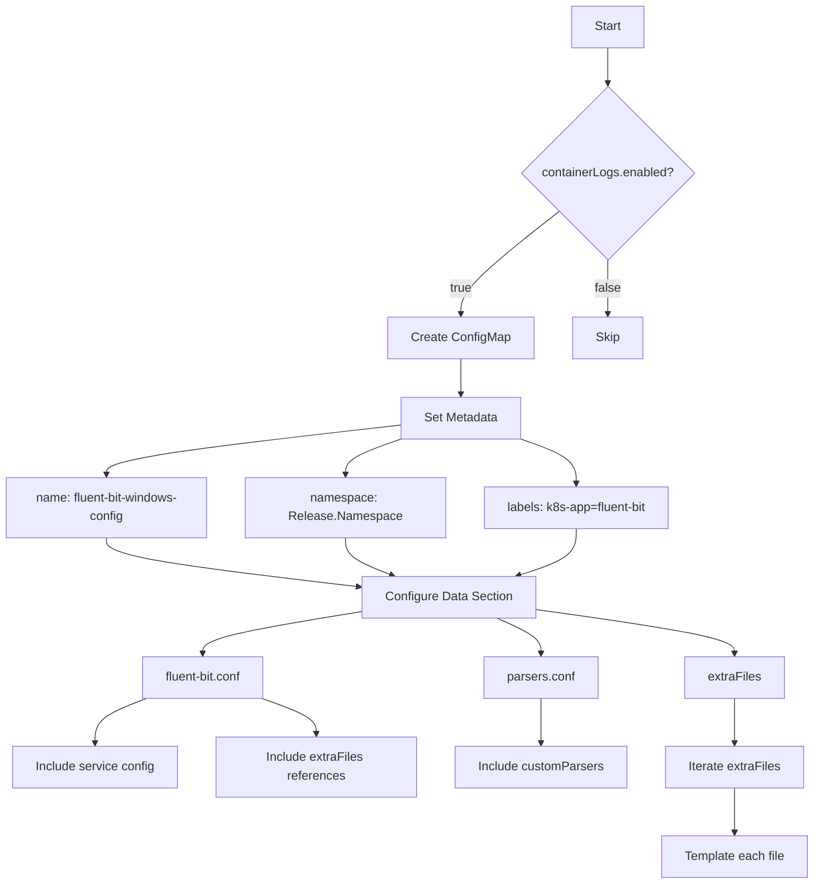
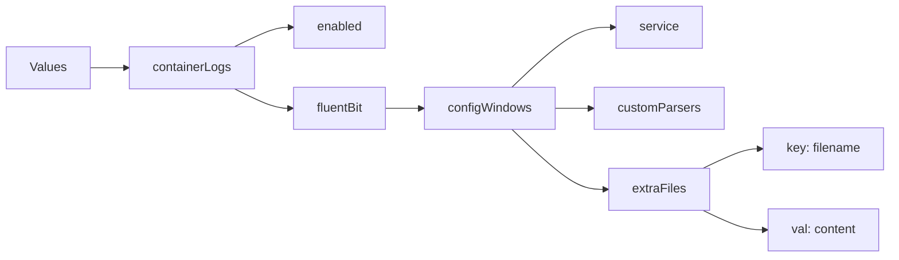
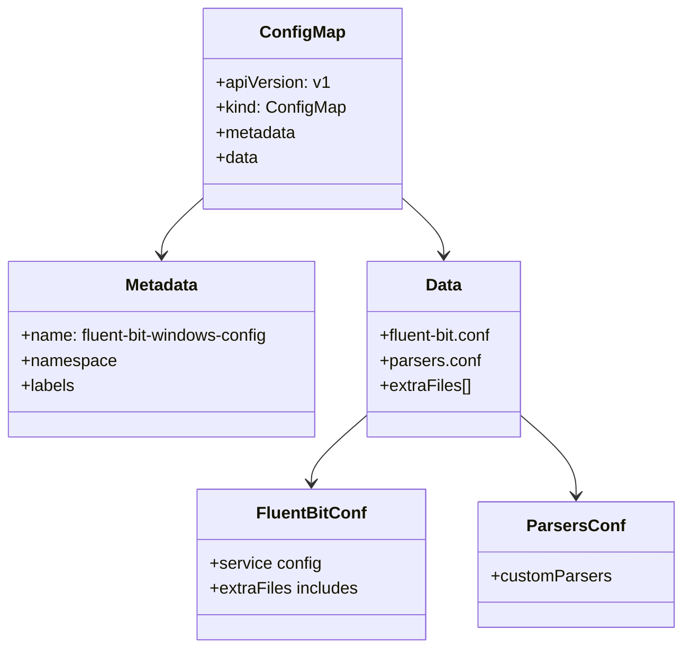

# Diagram: devops/k8s/amazon-cloudwatch-observability/helm/templates/windows/fluent-bit-windows-configmap.yaml

> Auto-generated by Obscura crawlers

## Diagram 1

### SVG

<svg id="container" width="1059.16796875" xmlns="http://www.w3.org/2000/svg" class="flowchart" height="1146.03125" viewBox="0 0 1059.16796875 1146.03125" role="graphics-document document" aria-roledescription="flowchart-v2"><g><marker id="container_flowchart-v2-pointEnd" class="marker flowchart-v2" viewBox="0 0 10 10" refX="5" refY="5" markerUnits="userSpaceOnUse" markerWidth="8" markerHeight="8" orient="auto"><path d="M 0 0 L 10 5 L 0 10 z" class="arrowMarkerPath" style="stroke-width: 1; stroke-dasharray: 1, 0;"></path></marker><marker id="container_flowchart-v2-pointStart" class="marker flowchart-v2" viewBox="0 0 10 10" refX="4.5" refY="5" markerUnits="userSpaceOnUse" markerWidth="8" markerHeight="8" orient="auto"><path d="M 0 5 L 10 10 L 10 0 z" class="arrowMarkerPath" style="stroke-width: 1; stroke-dasharray: 1, 0;"></path></marker><marker id="container_flowchart-v2-circleEnd" class="marker flowchart-v2" viewBox="0 0 10 10" refX="11" refY="5" markerUnits="userSpaceOnUse" markerWidth="11" markerHeight="11" orient="auto"><circle cx="5" cy="5" r="5" class="arrowMarkerPath" style="stroke-width: 1; stroke-dasharray: 1, 0;"></circle></marker><marker id="container_flowchart-v2-circleStart" class="marker flowchart-v2" viewBox="0 0 10 10" refX="-1" refY="5" markerUnits="userSpaceOnUse" markerWidth="11" markerHeight="11" orient="auto"><circle cx="5" cy="5" r="5" class="arrowMarkerPath" style="stroke-width: 1; stroke-dasharray: 1, 0;"></circle></marker><marker id="container_flowchart-v2-crossEnd" class="marker cross flowchart-v2" viewBox="0 0 11 11" refX="12" refY="5.2" markerUnits="userSpaceOnUse" markerWidth="11" markerHeight="11" orient="auto"><path d="M 1,1 l 9,9 M 10,1 l -9,9" class="arrowMarkerPath" style="stroke-width: 2; stroke-dasharray: 1, 0;"></path></marker><marker id="container_flowchart-v2-crossStart" class="marker cross flowchart-v2" viewBox="0 0 11 11" refX="-1" refY="5.2" markerUnits="userSpaceOnUse" markerWidth="11" markerHeight="11" orient="auto"><path d="M 1,1 l 9,9 M 10,1 l -9,9" class="arrowMarkerPath" style="stroke-width: 2; stroke-dasharray: 1, 0;"></path></marker><g class="root"><g class="clusters"></g><g class="edgePaths"><path d="M787.898,62L787.898,66.167C787.898,70.333,787.898,78.667,787.898,86.333C787.898,94,787.898,101,787.898,104.5L787.898,108" id="L_A_B_0" class="edge-thickness-normal edge-pattern-solid edge-thickness-normal edge-pattern-solid flowchart-link" style=";" data-edge="true" data-et="edge" data-id="L_A_B_0" data-points="W3sieCI6Nzg3Ljg5ODQzNzUsInkiOjYyfSx7IngiOjc4Ny44OTg0Mzc1LCJ5Ijo4N30seyJ4Ijo3ODcuODk4NDM3NSwieSI6MTEyfV0=" marker-end="url(#container_flowchart-v2-pointEnd)"></path><path d="M724.992,275.125L704.088,291.776C683.185,308.427,641.378,341.729,620.474,363.88C599.57,386.031,599.57,397.031,599.57,402.531L599.57,408.031" id="L_B_C_0" class="edge-thickness-normal edge-pattern-solid edge-thickness-normal edge-pattern-solid flowchart-link" style=";" data-edge="true" data-et="edge" data-id="L_B_C_0" data-points="W3sieCI6NzI0Ljk5MTkzODU1NjM4NjgsInkiOjI3NS4xMjQ3NTEwNTYzODY4fSx7IngiOjU5OS41NzAzMTI1LCJ5IjozNzUuMDMxMjV9LHsieCI6NTk5LjU3MDMxMjUsInkiOjQxMi4wMzEyNX1d" marker-end="url(#container_flowchart-v2-pointEnd)"></path><path d="M787.898,338.031L787.898,344.198C787.898,350.365,787.898,362.698,787.898,374.365C787.898,386.031,787.898,397.031,787.898,402.531L787.898,408.031" id="L_B_D_0" class="edge-thickness-normal edge-pattern-solid edge-thickness-normal edge-pattern-solid flowchart-link" style=";" data-edge="true" data-et="edge" data-id="L_B_D_0" data-points="W3sieCI6Nzg3Ljg5ODQzNzUsInkiOjMzOC4wMzEyNX0seyJ4Ijo3ODcuODk4NDM3NSwieSI6Mzc1LjAzMTI1fSx7IngiOjc4Ny44OTg0Mzc1LCJ5Ijo0MTIuMDMxMjV9XQ==" marker-end="url(#container_flowchart-v2-pointEnd)"></path><path d="M599.57,466.031L599.57,470.198C599.57,474.365,599.57,482.698,599.57,490.365C599.57,498.031,599.57,505.031,599.57,508.531L599.57,512.031" id="L_C_E_0" class="edge-thickness-normal edge-pattern-solid edge-thickness-normal edge-pattern-solid flowchart-link" style=";" data-edge="true" data-et="edge" data-id="L_C_E_0" data-points="W3sieCI6NTk5LjU3MDMxMjUsInkiOjQ2Ni4wMzEyNX0seyJ4Ijo1OTkuNTcwMzEyNSwieSI6NDkxLjAzMTI1fSx7IngiOjU5OS41NzAzMTI1LCJ5Ijo1MTYuMDMxMjV9XQ==" marker-end="url(#container_flowchart-v2-pointEnd)"></path><path d="M521.75,551.798L457.792,559.004C393.833,566.209,265.917,580.62,201.958,591.326C138,602.031,138,609.031,138,612.531L138,616.031" id="L_E_F_0" class="edge-thickness-normal edge-pattern-solid edge-thickness-normal edge-pattern-solid flowchart-link" style=";" data-edge="true" data-et="edge" data-id="L_E_F_0" data-points="W3sieCI6NTIxLjc1LCJ5Ijo1NTEuNzk4NDAwMTgzNjQ2Mn0seyJ4IjoxMzgsInkiOjU5NS4wMzEyNX0seyJ4IjoxMzgsInkiOjYyMC4wMzEyNX1d" marker-end="url(#container_flowchart-v2-pointEnd)"></path><path d="M521.75,569.729L509.458,573.946C497.167,578.163,472.583,586.597,460.292,594.314C448,602.031,448,609.031,448,612.531L448,616.031" id="L_E_G_0" class="edge-thickness-normal edge-pattern-solid edge-thickness-normal edge-pattern-solid flowchart-link" style=";" data-edge="true" data-et="edge" data-id="L_E_G_0" data-points="W3sieCI6NTIxLjc1LCJ5Ijo1NjkuNzI5NDYxNDMyNDAwNH0seyJ4Ijo0NDgsInkiOjU5NS4wMzEyNX0seyJ4Ijo0NDgsInkiOjYyMC4wMzEyNX1d" marker-end="url(#container_flowchart-v2-pointEnd)"></path><path d="M677.391,569.729L689.682,573.946C701.974,578.163,726.557,586.597,738.849,596.314C751.141,606.031,751.141,617.031,751.141,622.531L751.141,628.031" id="L_E_H_0" class="edge-thickness-normal edge-pattern-solid edge-thickness-normal edge-pattern-solid flowchart-link" style=";" data-edge="true" data-et="edge" data-id="L_E_H_0" data-points="W3sieCI6Njc3LjM5MDYyNSwieSI6NTY5LjcyOTQ2MTQzMjQwMDR9LHsieCI6NzUxLjE0MDYyNSwieSI6NTk1LjAzMTI1fSx7IngiOjc1MS4xNDA2MjUsInkiOjYzMi4wMzEyNX1d" marker-end="url(#container_flowchart-v2-pointEnd)"></path><path d="M138,698.031L138,702.198C138,706.365,138,714.698,192.846,725.271C247.691,735.844,357.383,748.657,412.228,755.064L467.074,761.47" id="L_F_I_0" class="edge-thickness-normal edge-pattern-solid edge-thickness-normal edge-pattern-solid flowchart-link" style=";" data-edge="true" data-et="edge" data-id="L_F_I_0" data-points="W3sieCI6MTM4LCJ5Ijo2OTguMDMxMjV9LHsieCI6MTM4LCJ5Ijo3MjMuMDMxMjV9LHsieCI6NDcxLjA0Njg3NSwieSI6NzYxLjkzNDA2MTQxNDEzMDd9XQ==" marker-end="url(#container_flowchart-v2-pointEnd)"></path><path d="M448,698.031L448,702.198C448,706.365,448,714.698,458.209,722.792C468.418,730.886,488.835,738.74,499.044,742.668L509.253,746.595" id="L_G_I_0" class="edge-thickness-normal edge-pattern-solid edge-thickness-normal edge-pattern-solid flowchart-link" style=";" data-edge="true" data-et="edge" data-id="L_G_I_0" data-points="W3sieCI6NDQ4LCJ5Ijo2OTguMDMxMjV9LHsieCI6NDQ4LCJ5Ijo3MjMuMDMxMjV9LHsieCI6NTEyLjk4NjQ3ODM2NTM4NDYsInkiOjc0OC4wMzEyNX1d" marker-end="url(#container_flowchart-v2-pointEnd)"></path><path d="M751.141,686.031L751.141,692.198C751.141,698.365,751.141,710.698,738.318,720.834C725.496,730.97,699.852,738.909,687.03,742.879L674.207,746.848" id="L_H_I_0" class="edge-thickness-normal edge-pattern-solid edge-thickness-normal edge-pattern-solid flowchart-link" style=";" data-edge="true" data-et="edge" data-id="L_H_I_0" data-points="W3sieCI6NzUxLjE0MDYyNSwieSI6Njg2LjAzMTI1fSx7IngiOjc1MS4xNDA2MjUsInkiOjcyMy4wMzEyNX0seyJ4Ijo2NzAuMzg2NDE4MjY5MjMwNywieSI6NzQ4LjAzMTI1fV0=" marker-end="url(#container_flowchart-v2-pointEnd)"></path><path d="M471.047,793.129L436.04,798.779C401.033,804.43,331.018,815.73,296.011,824.881C261.004,834.031,261.004,841.031,261.004,844.531L261.004,848.031" id="L_I_J_0" class="edge-thickness-normal edge-pattern-solid edge-thickness-normal edge-pattern-solid flowchart-link" style=";" data-edge="true" data-et="edge" data-id="L_I_J_0" data-points="W3sieCI6NDcxLjA0Njg3NSwieSI6NzkzLjEyODk1MjMzNDA0MDZ9LHsieCI6MjYxLjAwMzkwNjI1LCJ5Ijo4MjcuMDMxMjV9LHsieCI6MjYxLjAwMzkwNjI1LCJ5Ijo4NTIuMDMxMjV9XQ==" marker-end="url(#container_flowchart-v2-pointEnd)"></path><path d="M645.258,802.031L654.84,806.198C664.421,810.365,683.584,818.698,693.165,826.365C702.746,834.031,702.746,841.031,702.746,844.531L702.746,848.031" id="L_I_K_0" class="edge-thickness-normal edge-pattern-solid edge-thickness-normal edge-pattern-solid flowchart-link" style=";" data-edge="true" data-et="edge" data-id="L_I_K_0" data-points="W3sieCI6NjQ1LjI1ODQ4ODU4MTczMDcsInkiOjgwMi4wMzEyNX0seyJ4Ijo3MDIuNzQ2MDkzNzUsInkiOjgyNy4wMzEyNX0seyJ4Ijo3MDIuNzQ2MDkzNzUsInkiOjg1Mi4wMzEyNX1d" marker-end="url(#container_flowchart-v2-pointEnd)"></path><path d="M695.297,790.709L738.592,796.763C781.887,802.816,868.477,814.924,911.771,824.478C955.066,834.031,955.066,841.031,955.066,844.531L955.066,848.031" id="L_I_L_0" class="edge-thickness-normal edge-pattern-solid edge-thickness-normal edge-pattern-solid flowchart-link" style=";" data-edge="true" data-et="edge" data-id="L_I_L_0" data-points="W3sieCI6Njk1LjI5Njg3NSwieSI6NzkwLjcwOTA4MjA0NjYzNjJ9LHsieCI6OTU1LjA2NjQwNjI1LCJ5Ijo4MjcuMDMxMjV9LHsieCI6OTU1LjA2NjQwNjI1LCJ5Ijo4NTIuMDMxMjV9XQ==" marker-end="url(#container_flowchart-v2-pointEnd)"></path><path d="M189.038,906.031L177.932,910.198C166.826,914.365,144.614,922.698,133.508,932.365C122.402,942.031,122.402,953.031,122.402,958.531L122.402,964.031" id="L_J_M_0" class="edge-thickness-normal edge-pattern-solid edge-thickness-normal edge-pattern-solid flowchart-link" style=";" data-edge="true" data-et="edge" data-id="L_J_M_0" data-points="W3sieCI6MTg5LjAzNzcxMDMzNjUzODQ1LCJ5Ijo5MDYuMDMxMjV9LHsieCI6MTIyLjQwMjM0Mzc1LCJ5Ijo5MzEuMDMxMjV9LHsieCI6MTIyLjQwMjM0Mzc1LCJ5Ijo5NjguMDMxMjV9XQ==" marker-end="url(#container_flowchart-v2-pointEnd)"></path><path d="M338.807,906.031L350.814,910.198C362.821,914.365,386.834,922.698,398.841,930.365C410.848,938.031,410.848,945.031,410.848,948.531L410.848,952.031" id="L_J_N_0" class="edge-thickness-normal edge-pattern-solid edge-thickness-normal edge-pattern-solid flowchart-link" style=";" data-edge="true" data-et="edge" data-id="L_J_N_0" data-points="W3sieCI6MzM4LjgwNzM5MTgyNjkyMzEsInkiOjkwNi4wMzEyNX0seyJ4Ijo0MTAuODQ3NjU2MjUsInkiOjkzMS4wMzEyNX0seyJ4Ijo0MTAuODQ3NjU2MjUsInkiOjk1Ni4wMzEyNX1d" marker-end="url(#container_flowchart-v2-pointEnd)"></path><path d="M702.746,906.031L702.746,910.198C702.746,914.365,702.746,922.698,702.746,932.365C702.746,942.031,702.746,953.031,702.746,958.531L702.746,964.031" id="L_K_O_0" class="edge-thickness-normal edge-pattern-solid edge-thickness-normal edge-pattern-solid flowchart-link" style=";" data-edge="true" data-et="edge" data-id="L_K_O_0" data-points="W3sieCI6NzAyLjc0NjA5Mzc1LCJ5Ijo5MDYuMDMxMjV9LHsieCI6NzAyLjc0NjA5Mzc1LCJ5Ijo5MzEuMDMxMjV9LHsieCI6NzAyLjc0NjA5Mzc1LCJ5Ijo5NjguMDMxMjV9XQ==" marker-end="url(#container_flowchart-v2-pointEnd)"></path><path d="M955.066,906.031L955.066,910.198C955.066,914.365,955.066,922.698,955.066,932.365C955.066,942.031,955.066,953.031,955.066,958.531L955.066,964.031" id="L_L_P_0" class="edge-thickness-normal edge-pattern-solid edge-thickness-normal edge-pattern-solid flowchart-link" style=";" data-edge="true" data-et="edge" data-id="L_L_P_0" data-points="W3sieCI6OTU1LjA2NjQwNjI1LCJ5Ijo5MDYuMDMxMjV9LHsieCI6OTU1LjA2NjQwNjI1LCJ5Ijo5MzEuMDMxMjV9LHsieCI6OTU1LjA2NjQwNjI1LCJ5Ijo5NjguMDMxMjV9XQ==" marker-end="url(#container_flowchart-v2-pointEnd)"></path><path d="M955.066,1022.031L955.066,1028.198C955.066,1034.365,955.066,1046.698,955.066,1056.365C955.066,1066.031,955.066,1073.031,955.066,1076.531L955.066,1080.031" id="L_P_Q_0" class="edge-thickness-normal edge-pattern-solid edge-thickness-normal edge-pattern-solid flowchart-link" style=";" data-edge="true" data-et="edge" data-id="L_P_Q_0" data-points="W3sieCI6OTU1LjA2NjQwNjI1LCJ5IjoxMDIyLjAzMTI1fSx7IngiOjk1NS4wNjY0MDYyNSwieSI6MTA1OS4wMzEyNX0seyJ4Ijo5NTUuMDY2NDA2MjUsInkiOjEwODQuMDMxMjV9XQ==" marker-end="url(#container_flowchart-v2-pointEnd)"></path></g><g class="edgeLabels"><g class="edgeLabel"><g class="label" data-id="L_A_B_0" transform="translate(0, 0)"><foreignObject width="0" height="0">

</foreignObject></g></g><g class="edgeLabel" transform="translate(599.5703125, 375.03125)"><g class="label" data-id="L_B_C_0" transform="translate(-14.9921875, -12)"><foreignObject width="29.984375" height="24">

true

</foreignObject></g></g><g class="edgeLabel" transform="translate(787.8984375, 375.03125)"><g class="label" data-id="L_B_D_0" transform="translate(-17.21875, -12)"><foreignObject width="34.4375" height="24">

false

</foreignObject></g></g><g class="edgeLabel"><g class="label" data-id="L_C_E_0" transform="translate(0, 0)"><foreignObject width="0" height="0">

</foreignObject></g></g><g class="edgeLabel"><g class="label" data-id="L_E_F_0" transform="translate(0, 0)"><foreignObject width="0" height="0">

</foreignObject></g></g><g class="edgeLabel"><g class="label" data-id="L_E_G_0" transform="translate(0, 0)"><foreignObject width="0" height="0">

</foreignObject></g></g><g class="edgeLabel"><g class="label" data-id="L_E_H_0" transform="translate(0, 0)"><foreignObject width="0" height="0">

</foreignObject></g></g><g class="edgeLabel"><g class="label" data-id="L_F_I_0" transform="translate(0, 0)"><foreignObject width="0" height="0">

</foreignObject></g></g><g class="edgeLabel"><g class="label" data-id="L_G_I_0" transform="translate(0, 0)"><foreignObject width="0" height="0">

</foreignObject></g></g><g class="edgeLabel"><g class="label" data-id="L_H_I_0" transform="translate(0, 0)"><foreignObject width="0" height="0">

</foreignObject></g></g><g class="edgeLabel"><g class="label" data-id="L_I_J_0" transform="translate(0, 0)"><foreignObject width="0" height="0">

</foreignObject></g></g><g class="edgeLabel"><g class="label" data-id="L_I_K_0" transform="translate(0, 0)"><foreignObject width="0" height="0">

</foreignObject></g></g><g class="edgeLabel"><g class="label" data-id="L_I_L_0" transform="translate(0, 0)"><foreignObject width="0" height="0">

</foreignObject></g></g><g class="edgeLabel"><g class="label" data-id="L_J_M_0" transform="translate(0, 0)"><foreignObject width="0" height="0">

</foreignObject></g></g><g class="edgeLabel"><g class="label" data-id="L_J_N_0" transform="translate(0, 0)"><foreignObject width="0" height="0">

</foreignObject></g></g><g class="edgeLabel"><g class="label" data-id="L_K_O_0" transform="translate(0, 0)"><foreignObject width="0" height="0">

</foreignObject></g></g><g class="edgeLabel"><g class="label" data-id="L_L_P_0" transform="translate(0, 0)"><foreignObject width="0" height="0">

</foreignObject></g></g><g class="edgeLabel"><g class="label" data-id="L_P_Q_0" transform="translate(0, 0)"><foreignObject width="0" height="0">

</foreignObject></g></g></g><g class="nodes"><g class="node default" id="flowchart-A-0" transform="translate(787.8984375, 35)"><rect class="basic label-container" style="" x="-47.5234375" y="-27" width="95.046875" height="54"></rect><g class="label" style="" transform="translate(-17.5234375, -12)"><rect></rect><foreignObject width="35.046875" height="24">

Start

</foreignObject></g></g><g class="node default" id="flowchart-B-1" transform="translate(787.8984375, 225.015625)"><polygon points="113.015625,0 226.03125,-113.015625 113.015625,-226.03125 0,-113.015625" class="label-container" transform="translate(-112.515625, 113.015625)"></polygon><g class="label" style="" transform="translate(-86.015625, -12)"><rect></rect><foreignObject width="172.03125" height="24">

containerLogs.enabled?

</foreignObject></g></g><g class="node default" id="flowchart-C-3" transform="translate(599.5703125, 439.03125)"><rect class="basic label-container" style="" x="-92.859375" y="-27" width="185.71875" height="54"></rect><g class="label" style="" transform="translate(-62.859375, -12)"><rect></rect><foreignObject width="125.71875" height="24">

Create ConfigMap

</foreignObject></g></g><g class="node default" id="flowchart-D-5" transform="translate(787.8984375, 439.03125)"><rect class="basic label-container" style="" x="-45.46875" y="-27" width="90.9375" height="54"></rect><g class="label" style="" transform="translate(-15.46875, -12)"><rect></rect><foreignObject width="30.9375" height="24">

Skip

</foreignObject></g></g><g class="node default" id="flowchart-E-7" transform="translate(599.5703125, 543.03125)"><rect class="basic label-container" style="" x="-77.8203125" y="-27" width="155.640625" height="54"></rect><g class="label" style="" transform="translate(-47.8203125, -12)"><rect></rect><foreignObject width="95.640625" height="24">

Set Metadata

</foreignObject></g></g><g class="node default" id="flowchart-F-9" transform="translate(138, 659.03125)"><rect class="basic label-container" style="" x="-130" y="-39" width="260" height="78"></rect><g class="label" style="" transform="translate(-100, -24)"><rect></rect><foreignObject width="200" height="48">

name: fluent-bit-windows-config

</foreignObject></g></g><g class="node default" id="flowchart-G-11" transform="translate(448, 659.03125)"><rect class="basic label-container" style="" x="-130" y="-39" width="260" height="78"></rect><g class="label" style="" transform="translate(-100, -24)"><rect></rect><foreignObject width="200" height="48">

namespace: Release.Namespace

</foreignObject></g></g><g class="node default" id="flowchart-H-13" transform="translate(751.140625, 659.03125)"><rect class="basic label-container" style="" x="-123.140625" y="-27" width="246.28125" height="54"></rect><g class="label" style="" transform="translate(-93.140625, -12)"><rect></rect><foreignObject width="186.28125" height="24">

labels: k8s-app=fluent-bit

</foreignObject></g></g><g class="node default" id="flowchart-I-15" transform="translate(583.171875, 775.03125)"><rect class="basic label-container" style="" x="-112.125" y="-27" width="224.25" height="54"></rect><g class="label" style="" transform="translate(-82.125, -12)"><rect></rect><foreignObject width="164.25" height="24">

Configure Data Section

</foreignObject></g></g><g class="node default" id="flowchart-J-21" transform="translate(261.00390625, 879.03125)"><rect class="basic label-container" style="" x="-81.7109375" y="-27" width="163.421875" height="54"></rect><g class="label" style="" transform="translate(-51.7109375, -12)"><rect></rect><foreignObject width="103.421875" height="24">

fluent-bit.conf

</foreignObject></g></g><g class="node default" id="flowchart-K-23" transform="translate(702.74609375, 879.03125)"><rect class="basic label-container" style="" x="-74.34375" y="-27" width="148.6875" height="54"></rect><g class="label" style="" transform="translate(-44.34375, -12)"><rect></rect><foreignObject width="88.6875" height="24">

parsers.conf

</foreignObject></g></g><g class="node default" id="flowchart-L-25" transform="translate(955.06640625, 879.03125)"><rect class="basic label-container" style="" x="-64.5234375" y="-27" width="129.046875" height="54"></rect><g class="label" style="" transform="translate(-34.5234375, -12)"><rect></rect><foreignObject width="69.046875" height="24">

extraFiles

</foreignObject></g></g><g class="node default" id="flowchart-M-27" transform="translate(122.40234375, 995.03125)"><rect class="basic label-container" style="" x="-108.4453125" y="-27" width="216.890625" height="54"></rect><g class="label" style="" transform="translate(-78.4453125, -12)"><rect></rect><foreignObject width="156.890625" height="24">

Include service config

</foreignObject></g></g><g class="node default" id="flowchart-N-29" transform="translate(410.84765625, 995.03125)"><rect class="basic label-container" style="" x="-130" y="-39" width="260" height="78"></rect><g class="label" style="" transform="translate(-100, -24)"><rect></rect><foreignObject width="200" height="48">

Include extraFiles references

</foreignObject></g></g><g class="node default" id="flowchart-O-31" transform="translate(702.74609375, 995.03125)"><rect class="basic label-container" style="" x="-111.8984375" y="-27" width="223.796875" height="54"></rect><g class="label" style="" transform="translate(-81.8984375, -12)"><rect></rect><foreignObject width="163.796875" height="24">

Include customParsers

</foreignObject></g></g><g class="node default" id="flowchart-P-33" transform="translate(955.06640625, 995.03125)"><rect class="basic label-container" style="" x="-90.421875" y="-27" width="180.84375" height="54"></rect><g class="label" style="" transform="translate(-60.421875, -12)"><rect></rect><foreignObject width="120.84375" height="24">

Iterate extraFiles

</foreignObject></g></g><g class="node default" id="flowchart-Q-35" transform="translate(955.06640625, 1111.03125)"><rect class="basic label-container" style="" x="-96.1015625" y="-27" width="192.203125" height="54"></rect><g class="label" style="" transform="translate(-66.1015625, -12)"><rect></rect><foreignObject width="132.203125" height="24">

Template each file

</foreignObject></g></g></g></g></g></svg>

## Diagram 2

### SVG

<svg id="container" width="1147.3125" xmlns="http://www.w3.org/2000/svg" class="flowchart" height="330" viewBox="0 0 1147.3125 330" role="graphics-document document" aria-roledescription="flowchart-v2"><g><marker id="container_flowchart-v2-pointEnd" class="marker flowchart-v2" viewBox="0 0 10 10" refX="5" refY="5" markerUnits="userSpaceOnUse" markerWidth="8" markerHeight="8" orient="auto"><path d="M 0 0 L 10 5 L 0 10 z" class="arrowMarkerPath" style="stroke-width: 1; stroke-dasharray: 1, 0;"></path></marker><marker id="container_flowchart-v2-pointStart" class="marker flowchart-v2" viewBox="0 0 10 10" refX="4.5" refY="5" markerUnits="userSpaceOnUse" markerWidth="8" markerHeight="8" orient="auto"><path d="M 0 5 L 10 10 L 10 0 z" class="arrowMarkerPath" style="stroke-width: 1; stroke-dasharray: 1, 0;"></path></marker><marker id="container_flowchart-v2-circleEnd" class="marker flowchart-v2" viewBox="0 0 10 10" refX="11" refY="5" markerUnits="userSpaceOnUse" markerWidth="11" markerHeight="11" orient="auto"><circle cx="5" cy="5" r="5" class="arrowMarkerPath" style="stroke-width: 1; stroke-dasharray: 1, 0;"></circle></marker><marker id="container_flowchart-v2-circleStart" class="marker flowchart-v2" viewBox="0 0 10 10" refX="-1" refY="5" markerUnits="userSpaceOnUse" markerWidth="11" markerHeight="11" orient="auto"><circle cx="5" cy="5" r="5" class="arrowMarkerPath" style="stroke-width: 1; stroke-dasharray: 1, 0;"></circle></marker><marker id="container_flowchart-v2-crossEnd" class="marker cross flowchart-v2" viewBox="0 0 11 11" refX="12" refY="5.2" markerUnits="userSpaceOnUse" markerWidth="11" markerHeight="11" orient="auto"><path d="M 1,1 l 9,9 M 10,1 l -9,9" class="arrowMarkerPath" style="stroke-width: 2; stroke-dasharray: 1, 0;"></path></marker><marker id="container_flowchart-v2-crossStart" class="marker cross flowchart-v2" viewBox="0 0 11 11" refX="-1" refY="5.2" markerUnits="userSpaceOnUse" markerWidth="11" markerHeight="11" orient="auto"><path d="M 1,1 l 9,9 M 10,1 l -9,9" class="arrowMarkerPath" style="stroke-width: 2; stroke-dasharray: 1, 0;"></path></marker><g class="root"><g class="clusters"></g><g class="edgePaths"><path d="M115,87L119.167,87C123.333,87,131.667,87,139.333,87C147,87,154,87,157.5,87L161,87" id="L_A_B_0" class="edge-thickness-normal edge-pattern-solid edge-thickness-normal edge-pattern-solid flowchart-link" style=";" data-edge="true" data-et="edge" data-id="L_A_B_0" data-points="W3sieCI6MTE1LCJ5Ijo4N30seyJ4IjoxNDAsInkiOjg3fSx7IngiOjE2NSwieSI6ODd9XQ==" marker-end="url(#container_flowchart-v2-pointEnd)"></path><path d="M300.884,60L309.37,55.833C317.855,51.667,334.826,43.333,347.102,39.167C359.378,35,366.958,35,370.749,35L374.539,35" id="L_B_C_0" class="edge-thickness-normal edge-pattern-solid edge-thickness-normal edge-pattern-solid flowchart-link" style=";" data-edge="true" data-et="edge" data-id="L_B_C_0" data-points="W3sieCI6MzAwLjg4NDE2NDY2MzQ2MTU1LCJ5Ijo2MH0seyJ4IjozNTEuNzk2ODc1LCJ5IjozNX0seyJ4IjozNzguNTM5MDYyNSwieSI6MzV9XQ==" marker-end="url(#container_flowchart-v2-pointEnd)"></path><path d="M300.884,114L309.37,118.167C317.855,122.333,334.826,130.667,346.811,134.833C358.797,139,365.797,139,369.297,139L372.797,139" id="L_B_D_0" class="edge-thickness-normal edge-pattern-solid edge-thickness-normal edge-pattern-solid flowchart-link" style=";" data-edge="true" data-et="edge" data-id="L_B_D_0" data-points="W3sieCI6MzAwLjg4NDE2NDY2MzQ2MTU1LCJ5IjoxMTR9LHsieCI6MzUxLjc5Njg3NSwieSI6MTM5fSx7IngiOjM3Ni43OTY4NzUsInkiOjEzOX1d" marker-end="url(#container_flowchart-v2-pointEnd)"></path><path d="M499.484,139L503.651,139C507.818,139,516.151,139,523.818,139C531.484,139,538.484,139,541.984,139L545.484,139" id="L_D_E_0" class="edge-thickness-normal edge-pattern-solid edge-thickness-normal edge-pattern-solid flowchart-link" style=";" data-edge="true" data-et="edge" data-id="L_D_E_0" data-points="W3sieCI6NDk5LjQ4NDM3NSwieSI6MTM5fSx7IngiOjUyNC40ODQzNzUsInkiOjEzOX0seyJ4Ijo1NDkuNDg0Mzc1LCJ5IjoxMzl9XQ==" marker-end="url(#container_flowchart-v2-pointEnd)"></path><path d="M662.117,112L675.6,99.167C689.083,86.333,716.049,60.667,737.592,47.833C759.135,35,775.255,35,783.315,35L791.375,35" id="L_E_F_0" class="edge-thickness-normal edge-pattern-solid edge-thickness-normal edge-pattern-solid flowchart-link" style=";" data-edge="true" data-et="edge" data-id="L_E_F_0" data-points="W3sieCI6NjYyLjExNzAzNzI1OTYxNTQsInkiOjExMn0seyJ4Ijo3NDMuMDE1NjI1LCJ5IjozNX0seyJ4Ijo3OTUuMzc1LCJ5IjozNX1d" marker-end="url(#container_flowchart-v2-pointEnd)"></path><path d="M718.016,139L722.182,139C726.349,139,734.682,139,742.349,139C750.016,139,757.016,139,760.516,139L764.016,139" id="L_E_G_0" class="edge-thickness-normal edge-pattern-solid edge-thickness-normal edge-pattern-solid flowchart-link" style=";" data-edge="true" data-et="edge" data-id="L_E_G_0" data-points="W3sieCI6NzE4LjAxNTYyNSwieSI6MTM5fSx7IngiOjc0My4wMTU2MjUsInkiOjEzOX0seyJ4Ijo3NjguMDE1NjI1LCJ5IjoxMzl9XQ==" marker-end="url(#container_flowchart-v2-pointEnd)"></path><path d="M662.117,166L675.6,178.833C689.083,191.667,716.049,217.333,736.073,230.167C756.096,243,769.177,243,775.717,243L782.258,243" id="L_E_H_0" class="edge-thickness-normal edge-pattern-solid edge-thickness-normal edge-pattern-solid flowchart-link" style=";" data-edge="true" data-et="edge" data-id="L_E_H_0" data-points="W3sieCI6NjYyLjExNzAzNzI1OTYxNTQsInkiOjE2Nn0seyJ4Ijo3NDMuMDE1NjI1LCJ5IjoyNDN9LHsieCI6Nzg2LjI1NzgxMjUsInkiOjI0M31d" marker-end="url(#container_flowchart-v2-pointEnd)"></path><path d="M906.736,216L915.372,211.833C924.007,207.667,941.277,199.333,953.412,195.167C965.547,191,972.547,191,976.047,191L979.547,191" id="L_H_I_0" class="edge-thickness-normal edge-pattern-solid edge-thickness-normal edge-pattern-solid flowchart-link" style=";" data-edge="true" data-et="edge" data-id="L_H_I_0" data-points="W3sieCI6OTA2LjczNjQ3ODM2NTM4NDYsInkiOjIxNn0seyJ4Ijo5NTguNTQ2ODc1LCJ5IjoxOTF9LHsieCI6OTgzLjU0Njg3NSwieSI6MTkxfV0=" marker-end="url(#container_flowchart-v2-pointEnd)"></path><path d="M906.736,270L915.372,274.167C924.007,278.333,941.277,286.667,954.347,290.833C967.417,295,976.286,295,980.721,295L985.156,295" id="L_H_J_0" class="edge-thickness-normal edge-pattern-solid edge-thickness-normal edge-pattern-solid flowchart-link" style=";" data-edge="true" data-et="edge" data-id="L_H_J_0" data-points="W3sieCI6OTA2LjczNjQ3ODM2NTM4NDYsInkiOjI3MH0seyJ4Ijo5NTguNTQ2ODc1LCJ5IjoyOTV9LHsieCI6OTg5LjE1NjI1LCJ5IjoyOTV9XQ==" marker-end="url(#container_flowchart-v2-pointEnd)"></path></g><g class="edgeLabels"><g class="edgeLabel"><g class="label" data-id="L_A_B_0" transform="translate(0, 0)"><foreignObject width="0" height="0">

</foreignObject></g></g><g class="edgeLabel"><g class="label" data-id="L_B_C_0" transform="translate(0, 0)"><foreignObject width="0" height="0">

</foreignObject></g></g><g class="edgeLabel"><g class="label" data-id="L_B_D_0" transform="translate(0, 0)"><foreignObject width="0" height="0">

</foreignObject></g></g><g class="edgeLabel"><g class="label" data-id="L_D_E_0" transform="translate(0, 0)"><foreignObject width="0" height="0">

</foreignObject></g></g><g class="edgeLabel"><g class="label" data-id="L_E_F_0" transform="translate(0, 0)"><foreignObject width="0" height="0">

</foreignObject></g></g><g class="edgeLabel"><g class="label" data-id="L_E_G_0" transform="translate(0, 0)"><foreignObject width="0" height="0">

</foreignObject></g></g><g class="edgeLabel"><g class="label" data-id="L_E_H_0" transform="translate(0, 0)"><foreignObject width="0" height="0">

</foreignObject></g></g><g class="edgeLabel"><g class="label" data-id="L_H_I_0" transform="translate(0, 0)"><foreignObject width="0" height="0">

</foreignObject></g></g><g class="edgeLabel"><g class="label" data-id="L_H_J_0" transform="translate(0, 0)"><foreignObject width="0" height="0">

</foreignObject></g></g></g><g class="nodes"><g class="node default" id="flowchart-A-0" transform="translate(61.5, 87)"><rect class="basic label-container" style="" x="-53.5" y="-27" width="107" height="54"></rect><g class="label" style="" transform="translate(-23.5, -12)"><rect></rect><foreignObject width="47" height="24">

Values

</foreignObject></g></g><g class="node default" id="flowchart-B-1" transform="translate(245.8984375, 87)"><rect class="basic label-container" style="" x="-80.8984375" y="-27" width="161.796875" height="54"></rect><g class="label" style="" transform="translate(-50.8984375, -12)"><rect></rect><foreignObject width="101.796875" height="24">

containerLogs

</foreignObject></g></g><g class="node default" id="flowchart-C-3" transform="translate(438.140625, 35)"><rect class="basic label-container" style="" x="-59.6015625" y="-27" width="119.203125" height="54"></rect><g class="label" style="" transform="translate(-29.6015625, -12)"><rect></rect><foreignObject width="59.203125" height="24">

enabled

</foreignObject></g></g><g class="node default" id="flowchart-D-5" transform="translate(438.140625, 139)"><rect class="basic label-container" style="" x="-61.34375" y="-27" width="122.6875" height="54"></rect><g class="label" style="" transform="translate(-31.34375, -12)"><rect></rect><foreignObject width="62.6875" height="24">

fluentBit

</foreignObject></g></g><g class="node default" id="flowchart-E-7" transform="translate(633.75, 139)"><rect class="basic label-container" style="" x="-84.265625" y="-27" width="168.53125" height="54"></rect><g class="label" style="" transform="translate(-54.265625, -12)"><rect></rect><foreignObject width="108.53125" height="24">

configWindows

</foreignObject></g></g><g class="node default" id="flowchart-F-9" transform="translate(850.78125, 35)"><rect class="basic label-container" style="" x="-55.40625" y="-27" width="110.8125" height="54"></rect><g class="label" style="" transform="translate(-25.40625, -12)"><rect></rect><foreignObject width="50.8125" height="24">

service

</foreignObject></g></g><g class="node default" id="flowchart-G-11" transform="translate(850.78125, 139)"><rect class="basic label-container" style="" x="-82.765625" y="-27" width="165.53125" height="54"></rect><g class="label" style="" transform="translate(-52.765625, -12)"><rect></rect><foreignObject width="105.53125" height="24">

customParsers

</foreignObject></g></g><g class="node default" id="flowchart-H-13" transform="translate(850.78125, 243)"><rect class="basic label-container" style="" x="-64.5234375" y="-27" width="129.046875" height="54"></rect><g class="label" style="" transform="translate(-34.5234375, -12)"><rect></rect><foreignObject width="69.046875" height="24">

extraFiles

</foreignObject></g></g><g class="node default" id="flowchart-I-15" transform="translate(1061.4296875, 191)"><rect class="basic label-container" style="" x="-77.8828125" y="-27" width="155.765625" height="54"></rect><g class="label" style="" transform="translate(-47.8828125, -12)"><rect></rect><foreignObject width="95.765625" height="24">

key: filename

</foreignObject></g></g><g class="node default" id="flowchart-J-17" transform="translate(1061.4296875, 295)"><rect class="basic label-container" style="" x="-72.2734375" y="-27" width="144.546875" height="54"></rect><g class="label" style="" transform="translate(-42.2734375, -12)"><rect></rect><foreignObject width="84.546875" height="24">

val: content

</foreignObject></g></g></g></g></g></svg>

## Diagram 3

### SVG

<svg id="container" width="659.38671875" xmlns="http://www.w3.org/2000/svg" class="classDiagram" height="620" viewBox="0 0 659.38671875 620" role="graphics-document document" aria-roledescription="class"><g><defs><marker id="container_class-aggregationStart" class="marker aggregation class" refX="18" refY="7" markerWidth="190" markerHeight="240" orient="auto"><path d="M 18,7 L9,13 L1,7 L9,1 Z"></path></marker></defs><defs><marker id="container_class-aggregationEnd" class="marker aggregation class" refX="1" refY="7" markerWidth="20" markerHeight="28" orient="auto"><path d="M 18,7 L9,13 L1,7 L9,1 Z"></path></marker></defs><defs><marker id="container_class-extensionStart" class="marker extension class" refX="18" refY="7" markerWidth="190" markerHeight="240" orient="auto"><path d="M 1,7 L18,13 V 1 Z"></path></marker></defs><defs><marker id="container_class-extensionEnd" class="marker extension class" refX="1" refY="7" markerWidth="20" markerHeight="28" orient="auto"><path d="M 1,1 V 13 L18,7 Z"></path></marker></defs><defs><marker id="container_class-compositionStart" class="marker composition class" refX="18" refY="7" markerWidth="190" markerHeight="240" orient="auto"><path d="M 18,7 L9,13 L1,7 L9,1 Z"></path></marker></defs><defs><marker id="container_class-compositionEnd" class="marker composition class" refX="1" refY="7" markerWidth="20" markerHeight="28" orient="auto"><path d="M 18,7 L9,13 L1,7 L9,1 Z"></path></marker></defs><defs><marker id="container_class-dependencyStart" class="marker dependency class" refX="6" refY="7" markerWidth="190" markerHeight="240" orient="auto"><path d="M 5,7 L9,13 L1,7 L9,1 Z"></path></marker></defs><defs><marker id="container_class-dependencyEnd" class="marker dependency class" refX="13" refY="7" markerWidth="20" markerHeight="28" orient="auto"><path d="M 18,7 L9,13 L14,7 L9,1 Z"></path></marker></defs><defs><marker id="container_class-lollipopStart" class="marker lollipop class" refX="13" refY="7" markerWidth="190" markerHeight="240" orient="auto"><circle stroke="black" fill="transparent" cx="7" cy="7" r="6"></circle></marker></defs><defs><marker id="container_class-lollipopEnd" class="marker lollipop class" refX="1" refY="7" markerWidth="190" markerHeight="240" orient="auto"><circle stroke="black" fill="transparent" cx="7" cy="7" r="6"></circle></marker></defs><g class="root"><g class="clusters"></g><g class="edgePaths"><path d="M204.965,185.029L197.334,191.691C189.703,198.353,174.441,211.676,166.811,221.505C159.18,231.333,159.18,237.667,159.18,240.833L159.18,244" id="id_ConfigMap_Metadata_1" class="edge-thickness-normal edge-pattern-solid relation" style=";;;" data-edge="true" data-et="edge" data-id="id_ConfigMap_Metadata_1" data-points="W3sieCI6MjA0Ljk2NDg0Mzc1LCJ5IjoxODUuMDI5MjgyNDUzMDc0OH0seyJ4IjoxNTkuMTc5Njg3NSwieSI6MjI1fSx7IngiOjE1OS4xNzk2ODc1LCJ5IjoyNTB9XQ==" marker-end="url(#container_class-dependencyEnd)"></path><path d="M390.598,185.029L398.229,191.691C405.859,198.353,421.121,211.676,428.752,221.505C436.383,231.333,436.383,237.667,436.383,240.833L436.383,244" id="id_ConfigMap_Data_2" class="edge-thickness-normal edge-pattern-solid relation" style=";;;" data-edge="true" data-et="edge" data-id="id_ConfigMap_Data_2" data-points="W3sieCI6MzkwLjU5NzY1NjI1LCJ5IjoxODUuMDI5MjgyNDUzMDc0OH0seyJ4Ijo0MzYuMzgyODEyNSwieSI6MjI1fSx7IngiOjQzNi4zODI4MTI1LCJ5IjoyNTB9XQ==" marker-end="url(#container_class-dependencyEnd)"></path><path d="M360.359,400.619L352.299,407.683C344.238,414.746,328.117,428.873,320.057,439.103C311.996,449.333,311.996,455.667,311.996,458.833L311.996,462" id="id_Data_FluentBitConf_3" class="edge-thickness-normal edge-pattern-solid relation" style=";;;" data-edge="true" data-et="edge" data-id="id_Data_FluentBitConf_3" data-points="W3sieCI6MzYwLjM1OTM3NSwieSI6NDAwLjYxOTI4ODM4MzYzMjJ9LHsieCI6MzExLjk5NjA5Mzc1LCJ5Ijo0NDN9LHsieCI6MzExLjk5NjA5Mzc1LCJ5Ijo0Njh9XQ==" marker-end="url(#container_class-dependencyEnd)"></path><path d="M512.406,400.619L520.467,407.683C528.527,414.746,544.648,428.873,552.709,441.103C560.77,453.333,560.77,463.667,560.77,468.833L560.77,474" id="id_Data_ParsersConf_4" class="edge-thickness-normal edge-pattern-solid relation" style=";;;" data-edge="true" data-et="edge" data-id="id_Data_ParsersConf_4" data-points="W3sieCI6NTEyLjQwNjI1LCJ5Ijo0MDAuNjE5Mjg4MzgzNjMyMn0seyJ4Ijo1NjAuNzY5NTMxMjUsInkiOjQ0M30seyJ4Ijo1NjAuNzY5NTMxMjUsInkiOjQ4MH1d" marker-end="url(#container_class-dependencyEnd)"></path></g><g class="edgeLabels"><g class="edgeLabel"><g class="label" data-id="id_ConfigMap_Metadata_1" transform="translate(0, 0)"><foreignObject width="0" height="0">

</foreignObject></g></g><g class="edgeLabel"><g class="label" data-id="id_ConfigMap_Data_2" transform="translate(0, 0)"><foreignObject width="0" height="0">

</foreignObject></g></g><g class="edgeLabel"><g class="label" data-id="id_Data_FluentBitConf_3" transform="translate(0, 0)"><foreignObject width="0" height="0">

</foreignObject></g></g><g class="edgeLabel"><g class="label" data-id="id_Data_ParsersConf_4" transform="translate(0, 0)"><foreignObject width="0" height="0">

</foreignObject></g></g></g><g class="nodes"><g class="node default" id="classId-ConfigMap-0" transform="translate(297.78125, 104)"><g class="basic label-container"><path d="M-92.81640625 -96 L92.81640625 -96 L92.81640625 96 L-92.81640625 96" stroke="none" stroke-width="0" fill="#ECECFF" style=""></path><path d="M-92.81640625 -96 C-40.622801820420875 -96, 11.57080260915825 -96, 92.81640625 -96 M-92.81640625 -96 C-27.27308421510058 -96, 38.27023781979884 -96, 92.81640625 -96 M92.81640625 -96 C92.81640625 -33.186632337435036, 92.81640625 29.62673532512993, 92.81640625 96 M92.81640625 -96 C92.81640625 -29.186467505425043, 92.81640625 37.627064989149915, 92.81640625 96 M92.81640625 96 C49.21066220720422 96, 5.604918164408446 96, -92.81640625 96 M92.81640625 96 C51.55490417075325 96, 10.293402091506493 96, -92.81640625 96 M-92.81640625 96 C-92.81640625 22.49935659293095, -92.81640625 -51.0012868141381, -92.81640625 -96 M-92.81640625 96 C-92.81640625 39.1365984664156, -92.81640625 -17.726803067168802, -92.81640625 -96" stroke="#9370DB" stroke-width="1.3" fill="none" stroke-dasharray="0 0" style=""></path></g><g class="annotation-group text" transform="translate(0, -72)"></g><g class="label-group text" transform="translate(-38.3828125, -72)"><g class="label" style="font-weight: bolder" transform="translate(0,-12)"><foreignObject width="76.765625" height="24">

ConfigMap

</foreignObject></g></g><g class="members-group text" transform="translate(-80.81640625, -24)"><g class="label" style="" transform="translate(0,-12)"><foreignObject width="107.203125" height="24">

+apiVersion: v1

</foreignObject></g><g class="label" style="" transform="translate(0,12)"><foreignObject width="123.25" height="24">

+kind: ConfigMap

</foreignObject></g><g class="label" style="" transform="translate(0,36)"><foreignObject width="77.4375" height="24">

+metadata

</foreignObject></g><g class="label" style="" transform="translate(0,60)"><foreignObject width="40.625" height="24">

+data

</foreignObject></g></g><g class="methods-group text" transform="translate(-80.81640625, 96)"></g><g class="divider" style=""><path d="M-92.81640625 -48 C-23.633734600086484 -48, 45.54893704982703 -48, 92.81640625 -48 M-92.81640625 -48 C-47.5737447836359 -48, -2.331083317271805 -48, 92.81640625 -48" stroke="#9370DB" stroke-width="1.3" fill="none" stroke-dasharray="0 0" style=""></path></g><g class="divider" style=""><path d="M-92.81640625 72 C-44.14785508365159 72, 4.520696082696816 72, 92.81640625 72 M-92.81640625 72 C-34.3157256887832 72, 24.184954872433593 72, 92.81640625 72" stroke="#9370DB" stroke-width="1.3" fill="none" stroke-dasharray="0 0" style=""></path></g></g><g class="node default" id="classId-Metadata-1" transform="translate(159.1796875, 334)"><g class="basic label-container"><path d="M-151.1796875 -84 L151.1796875 -84 L151.1796875 84 L-151.1796875 84" stroke="none" stroke-width="0" fill="#ECECFF" style=""></path><path d="M-151.1796875 -84 C-30.74883163831325 -84, 89.6820242233735 -84, 151.1796875 -84 M-151.1796875 -84 C-52.67625182717627 -84, 45.827183845647454 -84, 151.1796875 -84 M151.1796875 -84 C151.1796875 -21.632910847864103, 151.1796875 40.73417830427179, 151.1796875 84 M151.1796875 -84 C151.1796875 -34.21201429421323, 151.1796875 15.575971411573533, 151.1796875 84 M151.1796875 84 C76.71502122152769 84, 2.2503549430553846 84, -151.1796875 84 M151.1796875 84 C71.55456711008443 84, -8.070553279831131 84, -151.1796875 84 M-151.1796875 84 C-151.1796875 24.283495193201368, -151.1796875 -35.433009613597264, -151.1796875 -84 M-151.1796875 84 C-151.1796875 35.774489580496365, -151.1796875 -12.45102083900727, -151.1796875 -84" stroke="#9370DB" stroke-width="1.3" fill="none" stroke-dasharray="0 0" style=""></path></g><g class="annotation-group text" transform="translate(0, -60)"></g><g class="label-group text" transform="translate(-34.640625, -60)"><g class="label" style="font-weight: bolder" transform="translate(0,-12)"><foreignObject width="69.28125" height="24">

Metadata

</foreignObject></g></g><g class="members-group text" transform="translate(-139.1796875, -12)"><g class="label" style="" transform="translate(0,-12)"><foreignObject width="243.71875" height="24">

+name: fluent-bit-windows-config

</foreignObject></g><g class="label" style="" transform="translate(0,12)"><foreignObject width="90.078125" height="24">

+namespace

</foreignObject></g><g class="label" style="" transform="translate(0,36)"><foreignObject width="51.6875" height="24">

+labels

</foreignObject></g></g><g class="methods-group text" transform="translate(-139.1796875, 84)"></g><g class="divider" style=""><path d="M-151.1796875 -36 C-75.97899045786305 -36, -0.7782934157260968 -36, 151.1796875 -36 M-151.1796875 -36 C-35.281068708265565 -36, 80.61755008346887 -36, 151.1796875 -36" stroke="#9370DB" stroke-width="1.3" fill="none" stroke-dasharray="0 0" style=""></path></g><g class="divider" style=""><path d="M-151.1796875 60 C-71.87254857319239 60, 7.434590353615221 60, 151.1796875 60 M-151.1796875 60 C-38.595488853457596 60, 73.98870979308481 60, 151.1796875 60" stroke="#9370DB" stroke-width="1.3" fill="none" stroke-dasharray="0 0" style=""></path></g></g><g class="node default" id="classId-Data-2" transform="translate(436.3828125, 334)"><g class="basic label-container"><path d="M-76.0234375 -84 L76.0234375 -84 L76.0234375 84 L-76.0234375 84" stroke="none" stroke-width="0" fill="#ECECFF" style=""></path><path d="M-76.0234375 -84 C-16.811959836965492 -84, 42.399517826069015 -84, 76.0234375 -84 M-76.0234375 -84 C-18.395555612547184 -84, 39.23232627490563 -84, 76.0234375 -84 M76.0234375 -84 C76.0234375 -17.693313698312835, 76.0234375 48.61337260337433, 76.0234375 84 M76.0234375 -84 C76.0234375 -28.822424909957675, 76.0234375 26.35515018008465, 76.0234375 84 M76.0234375 84 C17.65168449111917 84, -40.72006851776166 84, -76.0234375 84 M76.0234375 84 C34.10986738919861 84, -7.803702721602775 84, -76.0234375 84 M-76.0234375 84 C-76.0234375 32.19824122933812, -76.0234375 -19.603517541323754, -76.0234375 -84 M-76.0234375 84 C-76.0234375 18.0895489419389, -76.0234375 -47.8209021161222, -76.0234375 -84" stroke="#9370DB" stroke-width="1.3" fill="none" stroke-dasharray="0 0" style=""></path></g><g class="annotation-group text" transform="translate(0, -60)"></g><g class="label-group text" transform="translate(-16.890625, -60)"><g class="label" style="font-weight: bolder" transform="translate(0,-12)"><foreignObject width="33.78125" height="24">

Data

</foreignObject></g></g><g class="members-group text" transform="translate(-64.0234375, -12)"><g class="label" style="" transform="translate(0,-12)"><foreignObject width="111.15625" height="24">

+fluent-bit.conf

</foreignObject></g><g class="label" style="" transform="translate(0,12)"><foreignObject width="96.65625" height="24">

+parsers.conf

</foreignObject></g><g class="label" style="" transform="translate(0,36)"><foreignObject width="87.34375" height="24">

+extraFiles[]

</foreignObject></g></g><g class="methods-group text" transform="translate(-64.0234375, 84)"></g><g class="divider" style=""><path d="M-76.0234375 -36 C-42.56394963166476 -36, -9.104461763329525 -36, 76.0234375 -36 M-76.0234375 -36 C-20.33573695743555 -36, 35.3519635851289 -36, 76.0234375 -36" stroke="#9370DB" stroke-width="1.3" fill="none" stroke-dasharray="0 0" style=""></path></g><g class="divider" style=""><path d="M-76.0234375 60 C-32.34110458104704 60, 11.341228337905918 60, 76.0234375 60 M-76.0234375 60 C-21.26318499384218 60, 33.49706751231564 60, 76.0234375 60" stroke="#9370DB" stroke-width="1.3" fill="none" stroke-dasharray="0 0" style=""></path></g></g><g class="node default" id="classId-FluentBitConf-3" transform="translate(311.99609375, 540)"><g class="basic label-container"><path d="M-108.15625 -72 L108.15625 -72 L108.15625 72 L-108.15625 72" stroke="none" stroke-width="0" fill="#ECECFF" style=""></path><path d="M-108.15625 -72 C-33.12209574826244 -72, 41.91205850347512 -72, 108.15625 -72 M-108.15625 -72 C-37.1108135865651 -72, 33.9346228268698 -72, 108.15625 -72 M108.15625 -72 C108.15625 -35.59759312941171, 108.15625 0.8048137411765737, 108.15625 72 M108.15625 -72 C108.15625 -29.34614042724931, 108.15625 13.30771914550138, 108.15625 72 M108.15625 72 C23.65251721826793 72, -60.85121556346414 72, -108.15625 72 M108.15625 72 C53.68087379739303 72, -0.7945024052139331 72, -108.15625 72 M-108.15625 72 C-108.15625 15.280104849957056, -108.15625 -41.43979030008589, -108.15625 -72 M-108.15625 72 C-108.15625 33.10416365831334, -108.15625 -5.791672683373321, -108.15625 -72" stroke="#9370DB" stroke-width="1.3" fill="none" stroke-dasharray="0 0" style=""></path></g><g class="annotation-group text" transform="translate(0, -48)"></g><g class="label-group text" transform="translate(-49.75, -48)"><g class="label" style="font-weight: bolder" transform="translate(0,-12)"><foreignObject width="99.5" height="24">

FluentBitConf

</foreignObject></g></g><g class="members-group text" transform="translate(-96.15625, 0)"><g class="label" style="" transform="translate(0,-12)"><foreignObject width="106.59375" height="24">

+service config

</foreignObject></g><g class="label" style="" transform="translate(0,12)"><foreignObject width="142.5625" height="24">

+extraFiles includes

</foreignObject></g></g><g class="methods-group text" transform="translate(-96.15625, 72)"></g><g class="divider" style=""><path d="M-108.15625 -24 C-23.139353386030322 -24, 61.877543227939356 -24, 108.15625 -24 M-108.15625 -24 C-63.40485410279501 -24, -18.653458205590013 -24, 108.15625 -24" stroke="#9370DB" stroke-width="1.3" fill="none" stroke-dasharray="0 0" style=""></path></g><g class="divider" style=""><path d="M-108.15625 48 C-64.39189401222617 48, -20.62753802445235 48, 108.15625 48 M-108.15625 48 C-31.849120590278616 48, 44.45800881944277 48, 108.15625 48" stroke="#9370DB" stroke-width="1.3" fill="none" stroke-dasharray="0 0" style=""></path></g></g><g class="node default" id="classId-ParsersConf-4" transform="translate(560.76953125, 540)"><g class="basic label-container"><path d="M-90.6171875 -60 L90.6171875 -60 L90.6171875 60 L-90.6171875 60" stroke="none" stroke-width="0" fill="#ECECFF" style=""></path><path d="M-90.6171875 -60 C-23.17904832595387 -60, 44.25909084809226 -60, 90.6171875 -60 M-90.6171875 -60 C-27.06530768407088 -60, 36.48657213185824 -60, 90.6171875 -60 M90.6171875 -60 C90.6171875 -25.79562219406435, 90.6171875 8.4087556118713, 90.6171875 60 M90.6171875 -60 C90.6171875 -33.111427230571834, 90.6171875 -6.222854461143676, 90.6171875 60 M90.6171875 60 C29.358394833505166 60, -31.90039783298967 60, -90.6171875 60 M90.6171875 60 C52.184758462311905 60, 13.75232942462381 60, -90.6171875 60 M-90.6171875 60 C-90.6171875 27.396036340553238, -90.6171875 -5.207927318893525, -90.6171875 -60 M-90.6171875 60 C-90.6171875 16.02562755932135, -90.6171875 -27.9487448813573, -90.6171875 -60" stroke="#9370DB" stroke-width="1.3" fill="none" stroke-dasharray="0 0" style=""></path></g><g class="annotation-group text" transform="translate(0, -36)"></g><g class="label-group text" transform="translate(-43.71875, -36)"><g class="label" style="font-weight: bolder" transform="translate(0,-12)"><foreignObject width="87.4375" height="24">

ParsersConf

</foreignObject></g></g><g class="members-group text" transform="translate(-78.6171875, 12)"><g class="label" style="" transform="translate(0,-12)"><foreignObject width="113.515625" height="24">

+customParsers

</foreignObject></g></g><g class="methods-group text" transform="translate(-78.6171875, 60)"></g><g class="divider" style=""><path d="M-90.6171875 -12 C-31.0824465648043 -12, 28.4522943703914 -12, 90.6171875 -12 M-90.6171875 -12 C-51.926379931125666 -12, -13.235572362251332 -12, 90.6171875 -12" stroke="#9370DB" stroke-width="1.3" fill="none" stroke-dasharray="0 0" style=""></path></g><g class="divider" style=""><path d="M-90.6171875 36 C-45.15860361941924 36, 0.2999802611615223 36, 90.6171875 36 M-90.6171875 36 C-22.9247319999143 36, 44.7677235001714 36, 90.6171875 36" stroke="#9370DB" stroke-width="1.3" fill="none" stroke-dasharray="0 0" style=""></path></g></g></g></g></g></svg>
