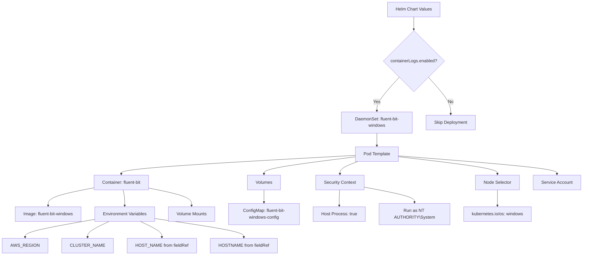
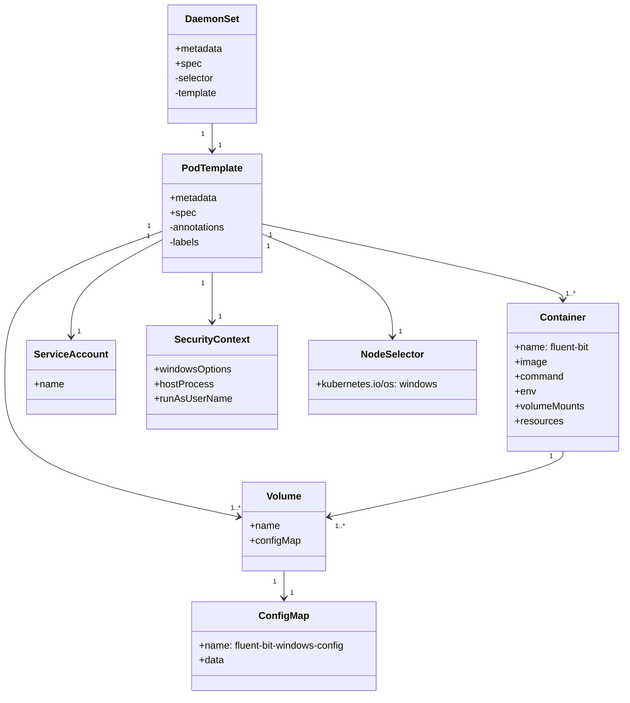
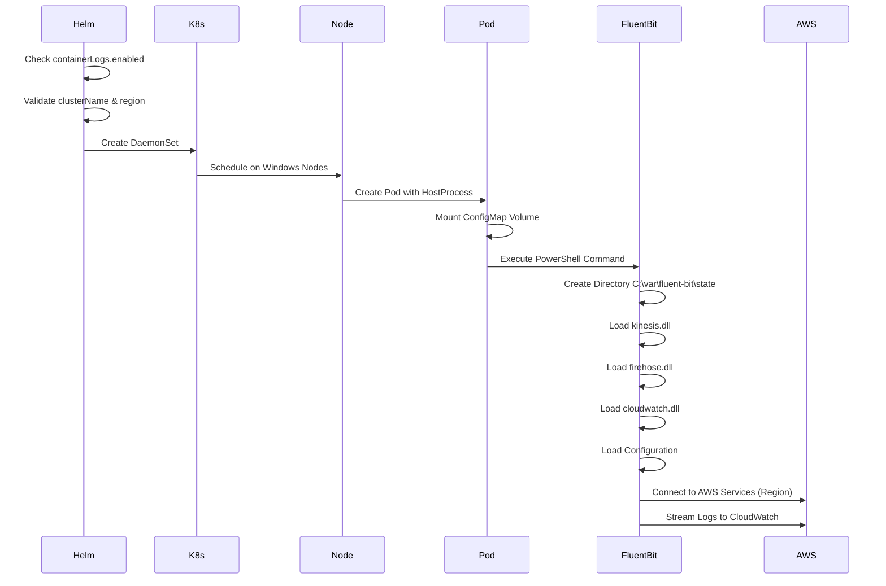
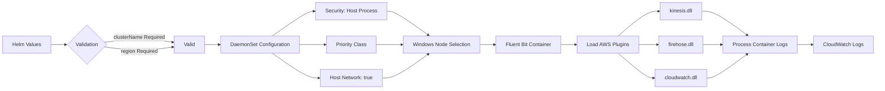

# Diagram: devops/k8s/amazon-cloudwatch-observability/helm/templates/windows/fluent-bit-windows-daemonset.yaml


> Auto-generated by Obscura crawlers

## Diagram 1

```mermaid
graph TD
      A[Helm Chart Values] --> B{containerLogs.enabled?}
      B -->|Yes| C[DaemonSet: fluent-bit-windows]
      B -->|No| D[Skip Deployment]...
  └ 229 lines...
```

> SVG rendering failed for this diagram.

## Diagram 2



### SVG

<svg id="container" width="2111.390625" xmlns="http://www.w3.org/2000/svg" class="flowchart" height="938.03125" viewBox="0 0 2111.390625 938.03125" role="graphics-document document" aria-roledescription="flowchart-v2"><style>#container{font-family:"trebuchet ms",verdana,arial,sans-serif;font-size:16px;fill:#333;}@keyframes edge-animation-frame{from{stroke-dashoffset:0;}}@keyframes dash{to{stroke-dashoffset:0;}}#container .edge-animation-slow{stroke-dasharray:9,5!important;stroke-dashoffset:900;animation:dash 50s linear infinite;stroke-linecap:round;}#container .edge-animation-fast{stroke-dasharray:9,5!important;stroke-dashoffset:900;animation:dash 20s linear infinite;stroke-linecap:round;}#container .error-icon{fill:#552222;}#container .error-text{fill:#552222;stroke:#552222;}#container .edge-thickness-normal{stroke-width:1px;}#container .edge-thickness-thick{stroke-width:3.5px;}#container .edge-pattern-solid{stroke-dasharray:0;}#container .edge-thickness-invisible{stroke-width:0;fill:none;}#container .edge-pattern-dashed{stroke-dasharray:3;}#container .edge-pattern-dotted{stroke-dasharray:2;}#container .marker{fill:#333333;stroke:#333333;}#container .marker.cross{stroke:#333333;}#container svg{font-family:"trebuchet ms",verdana,arial,sans-serif;font-size:16px;}#container p{margin:0;}#container .label{font-family:"trebuchet ms",verdana,arial,sans-serif;color:#333;}#container .cluster-label text{fill:#333;}#container .cluster-label span{color:#333;}#container .cluster-label span p{background-color:transparent;}#container .label text,#container span{fill:#333;color:#333;}#container .node rect,#container .node circle,#container .node ellipse,#container .node polygon,#container .node path{fill:#ECECFF;stroke:#9370DB;stroke-width:1px;}#container .rough-node .label text,#container .node .label text,#container .image-shape .label,#container .icon-shape .label{text-anchor:middle;}#container .node .katex path{fill:#000;stroke:#000;stroke-width:1px;}#container .rough-node .label,#container .node .label,#container .image-shape .label,#container .icon-shape .label{text-align:center;}#container .node.clickable{cursor:pointer;}#container .root .anchor path{fill:#333333!important;stroke-width:0;stroke:#333333;}#container .arrowheadPath{fill:#333333;}#container .edgePath .path{stroke:#333333;stroke-width:2.0px;}#container .flowchart-link{stroke:#333333;fill:none;}#container .edgeLabel{background-color:rgba(232,232,232, 0.8);text-align:center;}#container .edgeLabel p{background-color:rgba(232,232,232, 0.8);}#container .edgeLabel rect{opacity:0.5;background-color:rgba(232,232,232, 0.8);fill:rgba(232,232,232, 0.8);}#container .labelBkg{background-color:rgba(232, 232, 232, 0.5);}#container .cluster rect{fill:#ffffde;stroke:#aaaa33;stroke-width:1px;}#container .cluster text{fill:#333;}#container .cluster span{color:#333;}#container div.mermaidTooltip{position:absolute;text-align:center;max-width:200px;padding:2px;font-family:"trebuchet ms",verdana,arial,sans-serif;font-size:12px;background:hsl(80, 100%, 96.2745098039%);border:1px solid #aaaa33;border-radius:2px;pointer-events:none;z-index:100;}#container .flowchartTitleText{text-anchor:middle;font-size:18px;fill:#333;}#container rect.text{fill:none;stroke-width:0;}#container .icon-shape,#container .image-shape{background-color:rgba(232,232,232, 0.8);text-align:center;}#container .icon-shape p,#container .image-shape p{background-color:rgba(232,232,232, 0.8);padding:2px;}#container .icon-shape rect,#container .image-shape rect{opacity:0.5;background-color:rgba(232,232,232, 0.8);fill:rgba(232,232,232, 0.8);}#container .label-icon{display:inline-block;height:1em;overflow:visible;vertical-align:-0.125em;}#container .node .label-icon path{fill:currentColor;stroke:revert;stroke-width:revert;}#container :root{--mermaid-font-family:"trebuchet ms",verdana,arial,sans-serif;}</style><g><marker id="container_flowchart-v2-pointEnd" class="marker flowchart-v2" viewBox="0 0 10 10" refX="5" refY="5" markerUnits="userSpaceOnUse" markerWidth="8" markerHeight="8" orient="auto"><path d="M 0 0 L 10 5 L 0 10 z" class="arrowMarkerPath" style="stroke-width: 1; stroke-dasharray: 1, 0;"></path></marker><marker id="container_flowchart-v2-pointStart" class="marker flowchart-v2" viewBox="0 0 10 10" refX="4.5" refY="5" markerUnits="userSpaceOnUse" markerWidth="8" markerHeight="8" orient="auto"><path d="M 0 5 L 10 10 L 10 0 z" class="arrowMarkerPath" style="stroke-width: 1; stroke-dasharray: 1, 0;"></path></marker><marker id="container_flowchart-v2-circleEnd" class="marker flowchart-v2" viewBox="0 0 10 10" refX="11" refY="5" markerUnits="userSpaceOnUse" markerWidth="11" markerHeight="11" orient="auto"><circle cx="5" cy="5" r="5" class="arrowMarkerPath" style="stroke-width: 1; stroke-dasharray: 1, 0;"></circle></marker><marker id="container_flowchart-v2-circleStart" class="marker flowchart-v2" viewBox="0 0 10 10" refX="-1" refY="5" markerUnits="userSpaceOnUse" markerWidth="11" markerHeight="11" orient="auto"><circle cx="5" cy="5" r="5" class="arrowMarkerPath" style="stroke-width: 1; stroke-dasharray: 1, 0;"></circle></marker><marker id="container_flowchart-v2-crossEnd" class="marker cross flowchart-v2" viewBox="0 0 11 11" refX="12" refY="5.2" markerUnits="userSpaceOnUse" markerWidth="11" markerHeight="11" orient="auto"><path d="M 1,1 l 9,9 M 10,1 l -9,9" class="arrowMarkerPath" style="stroke-width: 2; stroke-dasharray: 1, 0;"></path></marker><marker id="container_flowchart-v2-crossStart" class="marker cross flowchart-v2" viewBox="0 0 11 11" refX="-1" refY="5.2" markerUnits="userSpaceOnUse" markerWidth="11" markerHeight="11" orient="auto"><path d="M 1,1 l 9,9 M 10,1 l -9,9" class="arrowMarkerPath" style="stroke-width: 2; stroke-dasharray: 1, 0;"></path></marker><g class="root"><g class="clusters"></g><g class="edgePaths"><path d="M1488.957,62L1488.957,66.167C1488.957,70.333,1488.957,78.667,1488.957,86.333C1488.957,94,1488.957,101,1488.957,104.5L1488.957,108" id="L_A_B_0" class="edge-thickness-normal edge-pattern-solid edge-thickness-normal edge-pattern-solid flowchart-link" style=";" data-edge="true" data-et="edge" data-id="L_A_B_0" data-points="W3sieCI6MTQ4OC45NTcwMzEyNSwieSI6NjJ9LHsieCI6MTQ4OC45NTcwMzEyNSwieSI6ODd9LHsieCI6MTQ4OC45NTcwMzEyNSwieSI6MTEyfV0=" marker-end="url(#container_flowchart-v2-pointEnd)"></path><path d="M1435.268,284.342L1421.589,299.457C1407.91,314.572,1380.553,344.801,1366.874,365.416C1353.195,386.031,1353.195,397.031,1353.195,402.531L1353.195,408.031" id="L_B_C_0" class="edge-thickness-normal edge-pattern-solid edge-thickness-normal edge-pattern-solid flowchart-link" style=";" data-edge="true" data-et="edge" data-id="L_B_C_0" data-points="W3sieCI6MTQzNS4yNjc2OTY0MTkzNTcyLCJ5IjoyODQuMzQxOTE1MTY5MzU3MTV9LHsieCI6MTM1My4xOTUzMTI1LCJ5IjozNzUuMDMxMjV9LHsieCI6MTM1My4xOTUzMTI1LCJ5Ijo0MTIuMDMxMjV9XQ==" marker-end="url(#container_flowchart-v2-pointEnd)"></path><path d="M1542.646,284.342L1556.325,299.457C1570.004,314.572,1597.361,344.801,1611.04,367.416C1624.719,390.031,1624.719,405.031,1624.719,412.531L1624.719,420.031" id="L_B_D_0" class="edge-thickness-normal edge-pattern-solid edge-thickness-normal edge-pattern-solid flowchart-link" style=";" data-edge="true" data-et="edge" data-id="L_B_D_0" data-points="W3sieCI6MTU0Mi42NDYzNjYwODA2NDI4LCJ5IjoyODQuMzQxOTE1MTY5MzU3MTV9LHsieCI6MTYyNC43MTg3NSwieSI6Mzc1LjAzMTI1fSx7IngiOjE2MjQuNzE4NzUsInkiOjQyNC4wMzEyNX1d" marker-end="url(#container_flowchart-v2-pointEnd)"></path><path d="M1353.195,490.031L1353.195,494.198C1353.195,498.365,1353.195,506.698,1353.195,514.365C1353.195,522.031,1353.195,529.031,1353.195,532.531L1353.195,536.031" id="L_C_E_0" class="edge-thickness-normal edge-pattern-solid edge-thickness-normal edge-pattern-solid flowchart-link" style=";" data-edge="true" data-et="edge" data-id="L_C_E_0" data-points="W3sieCI6MTM1My4xOTUzMTI1LCJ5Ijo0OTAuMDMxMjV9LHsieCI6MTM1My4xOTUzMTI1LCJ5Ijo1MTUuMDMxMjV9LHsieCI6MTM1My4xOTUzMTI1LCJ5Ijo1NDAuMDMxMjV9XQ==" marker-end="url(#container_flowchart-v2-pointEnd)"></path><path d="M1273.758,571.432L1130.555,579.365C987.352,587.298,700.945,603.165,557.742,614.598C414.539,626.031,414.539,633.031,414.539,636.531L414.539,640.031" id="L_E_F_0" class="edge-thickness-normal edge-pattern-solid edge-thickness-normal edge-pattern-solid flowchart-link" style=";" data-edge="true" data-et="edge" data-id="L_E_F_0" data-points="W3sieCI6MTI3My43NTc4MTI1LCJ5Ijo1NzEuNDMxOTU1Nzk2MTg0OH0seyJ4Ijo0MTQuNTM5MDYyNSwieSI6NjE5LjAzMTI1fSx7IngiOjQxNC41MzkwNjI1LCJ5Ijo2NDQuMDMxMjV9XQ==" marker-end="url(#container_flowchart-v2-pointEnd)"></path><path d="M311.031,690.669L282.603,696.063C254.174,701.457,197.318,712.244,168.889,723.138C140.461,734.031,140.461,745.031,140.461,750.531L140.461,756.031" id="L_F_G_0" class="edge-thickness-normal edge-pattern-solid edge-thickness-normal edge-pattern-solid flowchart-link" style=";" data-edge="true" data-et="edge" data-id="L_F_G_0" data-points="W3sieCI6MzExLjAzMTI1LCJ5Ijo2OTAuNjY5NDY5MDI5NzAxOX0seyJ4IjoxNDAuNDYwOTM3NSwieSI6NzIzLjAzMTI1fSx7IngiOjE0MC40NjA5Mzc1LCJ5Ijo3NjAuMDMxMjV9XQ==" marker-end="url(#container_flowchart-v2-pointEnd)"></path><path d="M420.75,698.031L421.708,702.198C422.666,706.365,424.583,714.698,425.542,724.365C426.5,734.031,426.5,745.031,426.5,750.531L426.5,756.031" id="L_F_H_0" class="edge-thickness-normal edge-pattern-solid edge-thickness-normal edge-pattern-solid flowchart-link" style=";" data-edge="true" data-et="edge" data-id="L_F_H_0" data-points="W3sieCI6NDIwLjc0OTU0OTI3ODg0NjEzLCJ5Ijo2OTguMDMxMjV9LHsieCI6NDI2LjUsInkiOjcyMy4wMzEyNX0seyJ4Ijo0MjYuNSwieSI6NzYwLjAzMTI1fV0=" marker-end="url(#container_flowchart-v2-pointEnd)"></path><path d="M518.047,691.768L544.056,696.978C570.065,702.189,622.083,712.61,648.092,723.321C674.102,734.031,674.102,745.031,674.102,750.531L674.102,756.031" id="L_F_I_0" class="edge-thickness-normal edge-pattern-solid edge-thickness-normal edge-pattern-solid flowchart-link" style=";" data-edge="true" data-et="edge" data-id="L_F_I_0" data-points="W3sieCI6NTE4LjA0Njg3NSwieSI6NjkxLjc2NzcwNTU3NDI4Mzd9LHsieCI6Njc0LjEwMTU2MjUsInkiOjcyMy4wMzEyNX0seyJ4Ijo2NzQuMTAxNTYyNSwieSI6NzYwLjAzMTI1fV0=" marker-end="url(#container_flowchart-v2-pointEnd)"></path><path d="M1273.758,577.034L1218.169,584.033C1162.581,591.033,1051.404,605.032,995.815,615.532C940.227,626.031,940.227,633.031,940.227,636.531L940.227,640.031" id="L_E_J_0" class="edge-thickness-normal edge-pattern-solid edge-thickness-normal edge-pattern-solid flowchart-link" style=";" data-edge="true" data-et="edge" data-id="L_E_J_0" data-points="W3sieCI6MTI3My43NTc4MTI1LCJ5Ijo1NzcuMDMzODIyODMzOTAwOX0seyJ4Ijo5NDAuMjI2NTYyNSwieSI6NjE5LjAzMTI1fSx7IngiOjk0MC4yMjY1NjI1LCJ5Ijo2NDQuMDMxMjV9XQ==" marker-end="url(#container_flowchart-v2-pointEnd)"></path><path d="M940.227,698.031L940.227,702.198C940.227,706.365,940.227,714.698,940.227,722.365C940.227,730.031,940.227,737.031,940.227,740.531L940.227,744.031" id="L_J_K_0" class="edge-thickness-normal edge-pattern-solid edge-thickness-normal edge-pattern-solid flowchart-link" style=";" data-edge="true" data-et="edge" data-id="L_J_K_0" data-points="W3sieCI6OTQwLjIyNjU2MjUsInkiOjY5OC4wMzEyNX0seyJ4Ijo5NDAuMjI2NTYyNSwieSI6NzIzLjAzMTI1fSx7IngiOjk0MC4yMjY1NjI1LCJ5Ijo3NDguMDMxMjV9XQ==" marker-end="url(#container_flowchart-v2-pointEnd)"></path><path d="M1282.704,594.031L1271.825,598.198C1260.947,602.365,1239.19,610.698,1228.312,618.365C1217.434,626.031,1217.434,633.031,1217.434,636.531L1217.434,640.031" id="L_E_L_0" class="edge-thickness-normal edge-pattern-solid edge-thickness-normal edge-pattern-solid flowchart-link" style=";" data-edge="true" data-et="edge" data-id="L_E_L_0" data-points="W3sieCI6MTI4Mi43MDM2NTA4NDEzNDYyLCJ5Ijo1OTQuMDMxMjV9LHsieCI6MTIxNy40MzM1OTM3NSwieSI6NjE5LjAzMTI1fSx7IngiOjEyMTcuNDMzNTkzNzUsInkiOjY0NC4wMzEyNX1d" marker-end="url(#container_flowchart-v2-pointEnd)"></path><path d="M1216.45,698.031L1216.298,702.198C1216.146,706.365,1215.843,714.698,1215.691,724.365C1215.539,734.031,1215.539,745.031,1215.539,750.531L1215.539,756.031" id="L_L_M_0" class="edge-thickness-normal edge-pattern-solid edge-thickness-normal edge-pattern-solid flowchart-link" style=";" data-edge="true" data-et="edge" data-id="L_L_M_0" data-points="W3sieCI6MTIxNi40NDk4OTQ4MzE3MzA3LCJ5Ijo2OTguMDMxMjV9LHsieCI6MTIxNS41MzkwNjI1LCJ5Ijo3MjMuMDMxMjV9LHsieCI6MTIxNS41MzkwNjI1LCJ5Ijo3NjAuMDMxMjV9XQ==" marker-end="url(#container_flowchart-v2-pointEnd)"></path><path d="M1306.309,687.934L1337.066,693.783C1367.823,699.633,1429.337,711.332,1460.094,720.682C1490.852,730.031,1490.852,737.031,1490.852,740.531L1490.852,744.031" id="L_L_N_0" class="edge-thickness-normal edge-pattern-solid edge-thickness-normal edge-pattern-solid flowchart-link" style=";" data-edge="true" data-et="edge" data-id="L_L_N_0" data-points="W3sieCI6MTMwNi4zMDg1OTM3NSwieSI6Njg3LjkzMzk0MzA0OTUwMzZ9LHsieCI6MTQ5MC44NTE1NjI1LCJ5Ijo3MjMuMDMxMjV9LHsieCI6MTQ5MC44NTE1NjI1LCJ5Ijo3NDguMDMxMjV9XQ==" marker-end="url(#container_flowchart-v2-pointEnd)"></path><path d="M1432.633,576.311L1493.582,583.431C1554.531,590.551,1676.43,604.791,1737.379,615.411C1798.328,626.031,1798.328,633.031,1798.328,636.531L1798.328,640.031" id="L_E_O_0" class="edge-thickness-normal edge-pattern-solid edge-thickness-normal edge-pattern-solid flowchart-link" style=";" data-edge="true" data-et="edge" data-id="L_E_O_0" data-points="W3sieCI6MTQzMi42MzI4MTI1LCJ5Ijo1NzYuMzExMDY0NjYyMDU2N30seyJ4IjoxNzk4LjMyODEyNSwieSI6NjE5LjAzMTI1fSx7IngiOjE3OTguMzI4MTI1LCJ5Ijo2NDQuMDMxMjV9XQ==" marker-end="url(#container_flowchart-v2-pointEnd)"></path><path d="M1798.328,698.031L1798.328,702.198C1798.328,706.365,1798.328,714.698,1798.328,724.365C1798.328,734.031,1798.328,745.031,1798.328,750.531L1798.328,756.031" id="L_O_P_0" class="edge-thickness-normal edge-pattern-solid edge-thickness-normal edge-pattern-solid flowchart-link" style=";" data-edge="true" data-et="edge" data-id="L_O_P_0" data-points="W3sieCI6MTc5OC4zMjgxMjUsInkiOjY5OC4wMzEyNX0seyJ4IjoxNzk4LjMyODEyNSwieSI6NzIzLjAzMTI1fSx7IngiOjE3OTguMzI4MTI1LCJ5Ijo3NjAuMDMxMjV9XQ==" marker-end="url(#container_flowchart-v2-pointEnd)"></path><path d="M1432.633,573.259L1529.932,580.888C1627.232,588.517,1821.831,603.774,1919.13,614.903C2016.43,626.031,2016.43,633.031,2016.43,636.531L2016.43,640.031" id="L_E_Q_0" class="edge-thickness-normal edge-pattern-solid edge-thickness-normal edge-pattern-solid flowchart-link" style=";" data-edge="true" data-et="edge" data-id="L_E_Q_0" data-points="W3sieCI6MTQzMi42MzI4MTI1LCJ5Ijo1NzMuMjU5NDQwNDQ5MjY2MX0seyJ4IjoyMDE2LjQyOTY4NzUsInkiOjYxOS4wMzEyNX0seyJ4IjoyMDE2LjQyOTY4NzUsInkiOjY0NC4wMzEyNX1d" marker-end="url(#container_flowchart-v2-pointEnd)"></path><path d="M315.023,807.912L276.658,815.099C238.292,822.285,161.56,836.658,123.194,847.345C84.828,858.031,84.828,865.031,84.828,868.531L84.828,872.031" id="L_H_R_0" class="edge-thickness-normal edge-pattern-solid edge-thickness-normal edge-pattern-solid flowchart-link" style=";" data-edge="true" data-et="edge" data-id="L_H_R_0" data-points="W3sieCI6MzE1LjAyMzQzNzUsInkiOjgwNy45MTIzOTUxMDQ0OTUzfSx7IngiOjg0LjgyODEyNSwieSI6ODUxLjAzMTI1fSx7IngiOjg0LjgyODEyNSwieSI6ODc2LjAzMTI1fV0=" marker-end="url(#container_flowchart-v2-pointEnd)"></path><path d="M371.999,814.031L359.551,820.198C347.104,826.365,322.208,838.698,309.76,848.365C297.313,858.031,297.313,865.031,297.313,868.531L297.313,872.031" id="L_H_S_0" class="edge-thickness-normal edge-pattern-solid edge-thickness-normal edge-pattern-solid flowchart-link" style=";" data-edge="true" data-et="edge" data-id="L_H_S_0" data-points="W3sieCI6MzcxLjk5OTAyMzQzNzUsInkiOjgxNC4wMzEyNX0seyJ4IjoyOTcuMzEyNSwieSI6ODUxLjAzMTI1fSx7IngiOjI5Ny4zMTI1LCJ5Ijo4NzYuMDMxMjV9XQ==" marker-end="url(#container_flowchart-v2-pointEnd)"></path><path d="M481.001,814.031L493.449,820.198C505.896,826.365,530.792,838.698,543.24,848.365C555.688,858.031,555.688,865.031,555.688,868.531L555.688,872.031" id="L_H_T_0" class="edge-thickness-normal edge-pattern-solid edge-thickness-normal edge-pattern-solid flowchart-link" style=";" data-edge="true" data-et="edge" data-id="L_H_T_0" data-points="W3sieCI6NDgxLjAwMDk3NjU2MjUsInkiOjgxNC4wMzEyNX0seyJ4Ijo1NTUuNjg3NSwieSI6ODUxLjAzMTI1fSx7IngiOjU1NS42ODc1LCJ5Ijo4NzYuMDMxMjV9XQ==" marker-end="url(#container_flowchart-v2-pointEnd)"></path><path d="M537.977,803.983L589.54,811.825C641.104,819.666,744.232,835.349,795.796,846.69C847.359,858.031,847.359,865.031,847.359,868.531L847.359,872.031" id="L_H_U_0" class="edge-thickness-normal edge-pattern-solid edge-thickness-normal edge-pattern-solid flowchart-link" style=";" data-edge="true" data-et="edge" data-id="L_H_U_0" data-points="W3sieCI6NTM3Ljk3NjU2MjUsInkiOjgwMy45ODM0NjgzMDMzMjI5fSx7IngiOjg0Ny4zNTkzNzUsInkiOjg1MS4wMzEyNX0seyJ4Ijo4NDcuMzU5Mzc1LCJ5Ijo4NzYuMDMxMjV9XQ==" marker-end="url(#container_flowchart-v2-pointEnd)"></path></g><g class="edgeLabels"><g class="edgeLabel"><g class="label" data-id="L_A_B_0" transform="translate(0, 0)"><foreignObject width="0" height="0"><div xmlns="http://www.w3.org/1999/xhtml" class="labelBkg" style="display: table-cell; white-space: nowrap; line-height: 1.5; max-width: 200px; text-align: center;"><span class="edgeLabel"></span></div></foreignObject></g></g><g class="edgeLabel" transform="translate(1353.1953125, 375.03125)"><g class="label" data-id="L_B_C_0" transform="translate(-12.03125, -12)"><foreignObject width="24.0625" height="24"><div xmlns="http://www.w3.org/1999/xhtml" class="labelBkg" style="display: table-cell; white-space: nowrap; line-height: 1.5; max-width: 200px; text-align: center;"><span class="edgeLabel"><p>Yes</p></span></div></foreignObject></g></g><g class="edgeLabel" transform="translate(1624.71875, 375.03125)"><g class="label" data-id="L_B_D_0" transform="translate(-10.140625, -12)"><foreignObject width="20.28125" height="24"><div xmlns="http://www.w3.org/1999/xhtml" class="labelBkg" style="display: table-cell; white-space: nowrap; line-height: 1.5; max-width: 200px; text-align: center;"><span class="edgeLabel"><p>No</p></span></div></foreignObject></g></g><g class="edgeLabel"><g class="label" data-id="L_C_E_0" transform="translate(0, 0)"><foreignObject width="0" height="0"><div xmlns="http://www.w3.org/1999/xhtml" class="labelBkg" style="display: table-cell; white-space: nowrap; line-height: 1.5; max-width: 200px; text-align: center;"><span class="edgeLabel"></span></div></foreignObject></g></g><g class="edgeLabel"><g class="label" data-id="L_E_F_0" transform="translate(0, 0)"><foreignObject width="0" height="0"><div xmlns="http://www.w3.org/1999/xhtml" class="labelBkg" style="display: table-cell; white-space: nowrap; line-height: 1.5; max-width: 200px; text-align: center;"><span class="edgeLabel"></span></div></foreignObject></g></g><g class="edgeLabel"><g class="label" data-id="L_F_G_0" transform="translate(0, 0)"><foreignObject width="0" height="0"><div xmlns="http://www.w3.org/1999/xhtml" class="labelBkg" style="display: table-cell; white-space: nowrap; line-height: 1.5; max-width: 200px; text-align: center;"><span class="edgeLabel"></span></div></foreignObject></g></g><g class="edgeLabel"><g class="label" data-id="L_F_H_0" transform="translate(0, 0)"><foreignObject width="0" height="0"><div xmlns="http://www.w3.org/1999/xhtml" class="labelBkg" style="display: table-cell; white-space: nowrap; line-height: 1.5; max-width: 200px; text-align: center;"><span class="edgeLabel"></span></div></foreignObject></g></g><g class="edgeLabel"><g class="label" data-id="L_F_I_0" transform="translate(0, 0)"><foreignObject width="0" height="0"><div xmlns="http://www.w3.org/1999/xhtml" class="labelBkg" style="display: table-cell; white-space: nowrap; line-height: 1.5; max-width: 200px; text-align: center;"><span class="edgeLabel"></span></div></foreignObject></g></g><g class="edgeLabel"><g class="label" data-id="L_E_J_0" transform="translate(0, 0)"><foreignObject width="0" height="0"><div xmlns="http://www.w3.org/1999/xhtml" class="labelBkg" style="display: table-cell; white-space: nowrap; line-height: 1.5; max-width: 200px; text-align: center;"><span class="edgeLabel"></span></div></foreignObject></g></g><g class="edgeLabel"><g class="label" data-id="L_J_K_0" transform="translate(0, 0)"><foreignObject width="0" height="0"><div xmlns="http://www.w3.org/1999/xhtml" class="labelBkg" style="display: table-cell; white-space: nowrap; line-height: 1.5; max-width: 200px; text-align: center;"><span class="edgeLabel"></span></div></foreignObject></g></g><g class="edgeLabel"><g class="label" data-id="L_E_L_0" transform="translate(0, 0)"><foreignObject width="0" height="0"><div xmlns="http://www.w3.org/1999/xhtml" class="labelBkg" style="display: table-cell; white-space: nowrap; line-height: 1.5; max-width: 200px; text-align: center;"><span class="edgeLabel"></span></div></foreignObject></g></g><g class="edgeLabel"><g class="label" data-id="L_L_M_0" transform="translate(0, 0)"><foreignObject width="0" height="0"><div xmlns="http://www.w3.org/1999/xhtml" class="labelBkg" style="display: table-cell; white-space: nowrap; line-height: 1.5; max-width: 200px; text-align: center;"><span class="edgeLabel"></span></div></foreignObject></g></g><g class="edgeLabel"><g class="label" data-id="L_L_N_0" transform="translate(0, 0)"><foreignObject width="0" height="0"><div xmlns="http://www.w3.org/1999/xhtml" class="labelBkg" style="display: table-cell; white-space: nowrap; line-height: 1.5; max-width: 200px; text-align: center;"><span class="edgeLabel"></span></div></foreignObject></g></g><g class="edgeLabel"><g class="label" data-id="L_E_O_0" transform="translate(0, 0)"><foreignObject width="0" height="0"><div xmlns="http://www.w3.org/1999/xhtml" class="labelBkg" style="display: table-cell; white-space: nowrap; line-height: 1.5; max-width: 200px; text-align: center;"><span class="edgeLabel"></span></div></foreignObject></g></g><g class="edgeLabel"><g class="label" data-id="L_O_P_0" transform="translate(0, 0)"><foreignObject width="0" height="0"><div xmlns="http://www.w3.org/1999/xhtml" class="labelBkg" style="display: table-cell; white-space: nowrap; line-height: 1.5; max-width: 200px; text-align: center;"><span class="edgeLabel"></span></div></foreignObject></g></g><g class="edgeLabel"><g class="label" data-id="L_E_Q_0" transform="translate(0, 0)"><foreignObject width="0" height="0"><div xmlns="http://www.w3.org/1999/xhtml" class="labelBkg" style="display: table-cell; white-space: nowrap; line-height: 1.5; max-width: 200px; text-align: center;"><span class="edgeLabel"></span></div></foreignObject></g></g><g class="edgeLabel"><g class="label" data-id="L_H_R_0" transform="translate(0, 0)"><foreignObject width="0" height="0"><div xmlns="http://www.w3.org/1999/xhtml" class="labelBkg" style="display: table-cell; white-space: nowrap; line-height: 1.5; max-width: 200px; text-align: center;"><span class="edgeLabel"></span></div></foreignObject></g></g><g class="edgeLabel"><g class="label" data-id="L_H_S_0" transform="translate(0, 0)"><foreignObject width="0" height="0"><div xmlns="http://www.w3.org/1999/xhtml" class="labelBkg" style="display: table-cell; white-space: nowrap; line-height: 1.5; max-width: 200px; text-align: center;"><span class="edgeLabel"></span></div></foreignObject></g></g><g class="edgeLabel"><g class="label" data-id="L_H_T_0" transform="translate(0, 0)"><foreignObject width="0" height="0"><div xmlns="http://www.w3.org/1999/xhtml" class="labelBkg" style="display: table-cell; white-space: nowrap; line-height: 1.5; max-width: 200px; text-align: center;"><span class="edgeLabel"></span></div></foreignObject></g></g><g class="edgeLabel"><g class="label" data-id="L_H_U_0" transform="translate(0, 0)"><foreignObject width="0" height="0"><div xmlns="http://www.w3.org/1999/xhtml" class="labelBkg" style="display: table-cell; white-space: nowrap; line-height: 1.5; max-width: 200px; text-align: center;"><span class="edgeLabel"></span></div></foreignObject></g></g></g><g class="nodes"><g class="node default" id="flowchart-A-0" transform="translate(1488.95703125, 35)"><rect class="basic label-container" style="" x="-96.15625" y="-27" width="192.3125" height="54"></rect><g class="label" style="" transform="translate(-66.15625, -12)"><rect></rect><foreignObject width="132.3125" height="24"><div xmlns="http://www.w3.org/1999/xhtml" style="display: table-cell; white-space: nowrap; line-height: 1.5; max-width: 200px; text-align: center;"><span class="nodeLabel"><p>Helm Chart Values</p></span></div></foreignObject></g></g><g class="node default" id="flowchart-B-1" transform="translate(1488.95703125, 225.015625)"><polygon points="113.015625,0 226.03125,-113.015625 113.015625,-226.03125 0,-113.015625" class="label-container" transform="translate(-112.515625, 113.015625)"></polygon><g class="label" style="" transform="translate(-86.015625, -12)"><rect></rect><foreignObject width="172.03125" height="24"><div xmlns="http://www.w3.org/1999/xhtml" style="display: table-cell; white-space: nowrap; line-height: 1.5; max-width: 200px; text-align: center;"><span class="nodeLabel"><p>containerLogs.enabled?</p></span></div></foreignObject></g></g><g class="node default" id="flowchart-C-3" transform="translate(1353.1953125, 451.03125)"><rect class="basic label-container" style="" x="-130" y="-39" width="260" height="78"></rect><g class="label" style="" transform="translate(-100, -24)"><rect></rect><foreignObject width="200" height="48"><div xmlns="http://www.w3.org/1999/xhtml" style="display: table; white-space: break-spaces; line-height: 1.5; max-width: 200px; text-align: center; width: 200px;"><span class="nodeLabel"><p>DaemonSet: fluent-bit-windows</p></span></div></foreignObject></g></g><g class="node default" id="flowchart-D-5" transform="translate(1624.71875, 451.03125)"><rect class="basic label-container" style="" x="-91.5234375" y="-27" width="183.046875" height="54"></rect><g class="label" style="" transform="translate(-61.5234375, -12)"><rect></rect><foreignObject width="123.046875" height="24"><div xmlns="http://www.w3.org/1999/xhtml" style="display: table-cell; white-space: nowrap; line-height: 1.5; max-width: 200px; text-align: center;"><span class="nodeLabel"><p>Skip Deployment</p></span></div></foreignObject></g></g><g class="node default" id="flowchart-E-7" transform="translate(1353.1953125, 567.03125)"><rect class="basic label-container" style="" x="-79.4375" y="-27" width="158.875" height="54"></rect><g class="label" style="" transform="translate(-49.4375, -12)"><rect></rect><foreignObject width="98.875" height="24"><div xmlns="http://www.w3.org/1999/xhtml" style="display: table-cell; white-space: nowrap; line-height: 1.5; max-width: 200px; text-align: center;"><span class="nodeLabel"><p>Pod Template</p></span></div></foreignObject></g></g><g class="node default" id="flowchart-F-9" transform="translate(414.5390625, 671.03125)"><rect class="basic label-container" style="" x="-103.5078125" y="-27" width="207.015625" height="54"></rect><g class="label" style="" transform="translate(-73.5078125, -12)"><rect></rect><foreignObject width="147.015625" height="24"><div xmlns="http://www.w3.org/1999/xhtml" style="display: table-cell; white-space: nowrap; line-height: 1.5; max-width: 200px; text-align: center;"><span class="nodeLabel"><p>Container: fluent-bit</p></span></div></foreignObject></g></g><g class="node default" id="flowchart-G-11" transform="translate(140.4609375, 787.03125)"><rect class="basic label-container" style="" x="-124.5625" y="-27" width="249.125" height="54"></rect><g class="label" style="" transform="translate(-94.5625, -12)"><rect></rect><foreignObject width="189.125" height="24"><div xmlns="http://www.w3.org/1999/xhtml" style="display: table-cell; white-space: nowrap; line-height: 1.5; max-width: 200px; text-align: center;"><span class="nodeLabel"><p>Image: fluent-bit-windows</p></span></div></foreignObject></g></g><g class="node default" id="flowchart-H-13" transform="translate(426.5, 787.03125)"><rect class="basic label-container" style="" x="-111.4765625" y="-27" width="222.953125" height="54"></rect><g class="label" style="" transform="translate(-81.4765625, -12)"><rect></rect><foreignObject width="162.953125" height="24"><div xmlns="http://www.w3.org/1999/xhtml" style="display: table-cell; white-space: nowrap; line-height: 1.5; max-width: 200px; text-align: center;"><span class="nodeLabel"><p>Environment Variables</p></span></div></foreignObject></g></g><g class="node default" id="flowchart-I-15" transform="translate(674.1015625, 787.03125)"><rect class="basic label-container" style="" x="-86.125" y="-27" width="172.25" height="54"></rect><g class="label" style="" transform="translate(-56.125, -12)"><rect></rect><foreignObject width="112.25" height="24"><div xmlns="http://www.w3.org/1999/xhtml" style="display: table-cell; white-space: nowrap; line-height: 1.5; max-width: 200px; text-align: center;"><span class="nodeLabel"><p>Volume Mounts</p></span></div></foreignObject></g></g><g class="node default" id="flowchart-J-17" transform="translate(940.2265625, 671.03125)"><rect class="basic label-container" style="" x="-60.875" y="-27" width="121.75" height="54"></rect><g class="label" style="" transform="translate(-30.875, -12)"><rect></rect><foreignObject width="61.75" height="24"><div xmlns="http://www.w3.org/1999/xhtml" style="display: table-cell; white-space: nowrap; line-height: 1.5; max-width: 200px; text-align: center;"><span class="nodeLabel"><p>Volumes</p></span></div></foreignObject></g></g><g class="node default" id="flowchart-K-19" transform="translate(940.2265625, 787.03125)"><rect class="basic label-container" style="" x="-130" y="-39" width="260" height="78"></rect><g class="label" style="" transform="translate(-100, -24)"><rect></rect><foreignObject width="200" height="48"><div xmlns="http://www.w3.org/1999/xhtml" style="display: table; white-space: break-spaces; line-height: 1.5; max-width: 200px; text-align: center; width: 200px;"><span class="nodeLabel"><p>ConfigMap: fluent-bit-windows-config</p></span></div></foreignObject></g></g><g class="node default" id="flowchart-L-21" transform="translate(1217.43359375, 671.03125)"><rect class="basic label-container" style="" x="-88.875" y="-27" width="177.75" height="54"></rect><g class="label" style="" transform="translate(-58.875, -12)"><rect></rect><foreignObject width="117.75" height="24"><div xmlns="http://www.w3.org/1999/xhtml" style="display: table-cell; white-space: nowrap; line-height: 1.5; max-width: 200px; text-align: center;"><span class="nodeLabel"><p>Security Context</p></span></div></foreignObject></g></g><g class="node default" id="flowchart-M-23" transform="translate(1215.5390625, 787.03125)"><rect class="basic label-container" style="" x="-95.3125" y="-27" width="190.625" height="54"></rect><g class="label" style="" transform="translate(-65.3125, -12)"><rect></rect><foreignObject width="130.625" height="24"><div xmlns="http://www.w3.org/1999/xhtml" style="display: table-cell; white-space: nowrap; line-height: 1.5; max-width: 200px; text-align: center;"><span class="nodeLabel"><p>Host Process: true</p></span></div></foreignObject></g></g><g class="node default" id="flowchart-N-25" transform="translate(1490.8515625, 787.03125)"><rect class="basic label-container" style="" x="-130" y="-39" width="260" height="78"></rect><g class="label" style="" transform="translate(-100, -24)"><rect></rect><foreignObject width="200" height="48"><div xmlns="http://www.w3.org/1999/xhtml" style="display: table; white-space: break-spaces; line-height: 1.5; max-width: 200px; text-align: center; width: 200px;"><span class="nodeLabel"><p>Run as NT AUTHORITY\System</p></span></div></foreignObject></g></g><g class="node default" id="flowchart-O-27" transform="translate(1798.328125, 671.03125)"><rect class="basic label-container" style="" x="-81.140625" y="-27" width="162.28125" height="54"></rect><g class="label" style="" transform="translate(-51.140625, -12)"><rect></rect><foreignObject width="102.28125" height="24"><div xmlns="http://www.w3.org/1999/xhtml" style="display: table-cell; white-space: nowrap; line-height: 1.5; max-width: 200px; text-align: center;"><span class="nodeLabel"><p>Node Selector</p></span></div></foreignObject></g></g><g class="node default" id="flowchart-P-29" transform="translate(1798.328125, 787.03125)"><rect class="basic label-container" style="" x="-127.4765625" y="-27" width="254.953125" height="54"></rect><g class="label" style="" transform="translate(-97.4765625, -12)"><rect></rect><foreignObject width="194.953125" height="24"><div xmlns="http://www.w3.org/1999/xhtml" style="display: table-cell; white-space: nowrap; line-height: 1.5; max-width: 200px; text-align: center;"><span class="nodeLabel"><p>kubernetes.io/os: windows</p></span></div></foreignObject></g></g><g class="node default" id="flowchart-Q-31" transform="translate(2016.4296875, 671.03125)"><rect class="basic label-container" style="" x="-86.9609375" y="-27" width="173.921875" height="54"></rect><g class="label" style="" transform="translate(-56.9609375, -12)"><rect></rect><foreignObject width="113.921875" height="24"><div xmlns="http://www.w3.org/1999/xhtml" style="display: table-cell; white-space: nowrap; line-height: 1.5; max-width: 200px; text-align: center;"><span class="nodeLabel"><p>Service Account</p></span></div></foreignObject></g></g><g class="node default" id="flowchart-R-33" transform="translate(84.828125, 903.03125)"><rect class="basic label-container" style="" x="-76.828125" y="-27" width="153.65625" height="54"></rect><g class="label" style="" transform="translate(-46.828125, -12)"><rect></rect><foreignObject width="93.65625" height="24"><div xmlns="http://www.w3.org/1999/xhtml" style="display: table-cell; white-space: nowrap; line-height: 1.5; max-width: 200px; text-align: center;"><span class="nodeLabel"><p>AWS_REGION</p></span></div></foreignObject></g></g><g class="node default" id="flowchart-S-35" transform="translate(297.3125, 903.03125)"><rect class="basic label-container" style="" x="-85.65625" y="-27" width="171.3125" height="54"></rect><g class="label" style="" transform="translate(-55.65625, -12)"><rect></rect><foreignObject width="111.3125" height="24"><div xmlns="http://www.w3.org/1999/xhtml" style="display: table-cell; white-space: nowrap; line-height: 1.5; max-width: 200px; text-align: center;"><span class="nodeLabel"><p>CLUSTER_NAME</p></span></div></foreignObject></g></g><g class="node default" id="flowchart-T-37" transform="translate(555.6875, 903.03125)"><rect class="basic label-container" style="" x="-122.71875" y="-27" width="245.4375" height="54"></rect><g class="label" style="" transform="translate(-92.71875, -12)"><rect></rect><foreignObject width="185.4375" height="24"><div xmlns="http://www.w3.org/1999/xhtml" style="display: table-cell; white-space: nowrap; line-height: 1.5; max-width: 200px; text-align: center;"><span class="nodeLabel"><p>HOST_NAME from fieldRef</p></span></div></foreignObject></g></g><g class="node default" id="flowchart-U-39" transform="translate(847.359375, 903.03125)"><rect class="basic label-container" style="" x="-118.953125" y="-27" width="237.90625" height="54"></rect><g class="label" style="" transform="translate(-88.953125, -12)"><rect></rect><foreignObject width="177.90625" height="24"><div xmlns="http://www.w3.org/1999/xhtml" style="display: table-cell; white-space: nowrap; line-height: 1.5; max-width: 200px; text-align: center;"><span class="nodeLabel"><p>HOSTNAME from fieldRef</p></span></div></foreignObject></g></g></g></g></g></svg>

## Diagram 3



### SVG

<svg id="container" width="1007.734375" xmlns="http://www.w3.org/2000/svg" class="classDiagram" height="1128" viewBox="-35 0 1007.734375 1128" role="graphics-document document" aria-roledescription="class"><style>#container{font-family:"trebuchet ms",verdana,arial,sans-serif;font-size:16px;fill:#333;}@keyframes edge-animation-frame{from{stroke-dashoffset:0;}}@keyframes dash{to{stroke-dashoffset:0;}}#container .edge-animation-slow{stroke-dasharray:9,5!important;stroke-dashoffset:900;animation:dash 50s linear infinite;stroke-linecap:round;}#container .edge-animation-fast{stroke-dasharray:9,5!important;stroke-dashoffset:900;animation:dash 20s linear infinite;stroke-linecap:round;}#container .error-icon{fill:#552222;}#container .error-text{fill:#552222;stroke:#552222;}#container .edge-thickness-normal{stroke-width:1px;}#container .edge-thickness-thick{stroke-width:3.5px;}#container .edge-pattern-solid{stroke-dasharray:0;}#container .edge-thickness-invisible{stroke-width:0;fill:none;}#container .edge-pattern-dashed{stroke-dasharray:3;}#container .edge-pattern-dotted{stroke-dasharray:2;}#container .marker{fill:#333333;stroke:#333333;}#container .marker.cross{stroke:#333333;}#container svg{font-family:"trebuchet ms",verdana,arial,sans-serif;font-size:16px;}#container p{margin:0;}#container g.classGroup text{fill:#9370DB;stroke:none;font-family:"trebuchet ms",verdana,arial,sans-serif;font-size:10px;}#container g.classGroup text .title{font-weight:bolder;}#container .nodeLabel,#container .edgeLabel{color:#131300;}#container .edgeLabel .label rect{fill:#ECECFF;}#container .label text{fill:#131300;}#container .labelBkg{background:#ECECFF;}#container .edgeLabel .label span{background:#ECECFF;}#container .classTitle{font-weight:bolder;}#container .node rect,#container .node circle,#container .node ellipse,#container .node polygon,#container .node path{fill:#ECECFF;stroke:#9370DB;stroke-width:1px;}#container .divider{stroke:#9370DB;stroke-width:1;}#container g.clickable{cursor:pointer;}#container g.classGroup rect{fill:#ECECFF;stroke:#9370DB;}#container g.classGroup line{stroke:#9370DB;stroke-width:1;}#container .classLabel .box{stroke:none;stroke-width:0;fill:#ECECFF;opacity:0.5;}#container .classLabel .label{fill:#9370DB;font-size:10px;}#container .relation{stroke:#333333;stroke-width:1;fill:none;}#container .dashed-line{stroke-dasharray:3;}#container .dotted-line{stroke-dasharray:1 2;}#container #compositionStart,#container .composition{fill:#333333!important;stroke:#333333!important;stroke-width:1;}#container #compositionEnd,#container .composition{fill:#333333!important;stroke:#333333!important;stroke-width:1;}#container #dependencyStart,#container .dependency{fill:#333333!important;stroke:#333333!important;stroke-width:1;}#container #dependencyStart,#container .dependency{fill:#333333!important;stroke:#333333!important;stroke-width:1;}#container #extensionStart,#container .extension{fill:transparent!important;stroke:#333333!important;stroke-width:1;}#container #extensionEnd,#container .extension{fill:transparent!important;stroke:#333333!important;stroke-width:1;}#container #aggregationStart,#container .aggregation{fill:transparent!important;stroke:#333333!important;stroke-width:1;}#container #aggregationEnd,#container .aggregation{fill:transparent!important;stroke:#333333!important;stroke-width:1;}#container #lollipopStart,#container .lollipop{fill:#ECECFF!important;stroke:#333333!important;stroke-width:1;}#container #lollipopEnd,#container .lollipop{fill:#ECECFF!important;stroke:#333333!important;stroke-width:1;}#container .edgeTerminals{font-size:11px;line-height:initial;}#container .classTitleText{text-anchor:middle;font-size:18px;fill:#333;}#container .label-icon{display:inline-block;height:1em;overflow:visible;vertical-align:-0.125em;}#container .node .label-icon path{fill:currentColor;stroke:revert;stroke-width:revert;}#container :root{--mermaid-font-family:"trebuchet ms",verdana,arial,sans-serif;}</style><g><defs><marker id="container_class-aggregationStart" class="marker aggregation class" refX="18" refY="7" markerWidth="190" markerHeight="240" orient="auto"><path d="M 18,7 L9,13 L1,7 L9,1 Z"></path></marker></defs><defs><marker id="container_class-aggregationEnd" class="marker aggregation class" refX="1" refY="7" markerWidth="20" markerHeight="28" orient="auto"><path d="M 18,7 L9,13 L1,7 L9,1 Z"></path></marker></defs><defs><marker id="container_class-extensionStart" class="marker extension class" refX="18" refY="7" markerWidth="190" markerHeight="240" orient="auto"><path d="M 1,7 L18,13 V 1 Z"></path></marker></defs><defs><marker id="container_class-extensionEnd" class="marker extension class" refX="1" refY="7" markerWidth="20" markerHeight="28" orient="auto"><path d="M 1,1 V 13 L18,7 Z"></path></marker></defs><defs><marker id="container_class-compositionStart" class="marker composition class" refX="18" refY="7" markerWidth="190" markerHeight="240" orient="auto"><path d="M 18,7 L9,13 L1,7 L9,1 Z"></path></marker></defs><defs><marker id="container_class-compositionEnd" class="marker composition class" refX="1" refY="7" markerWidth="20" markerHeight="28" orient="auto"><path d="M 18,7 L9,13 L1,7 L9,1 Z"></path></marker></defs><defs><marker id="container_class-dependencyStart" class="marker dependency class" refX="6" refY="7" markerWidth="190" markerHeight="240" orient="auto"><path d="M 5,7 L9,13 L1,7 L9,1 Z"></path></marker></defs><defs><marker id="container_class-dependencyEnd" class="marker dependency class" refX="13" refY="7" markerWidth="20" markerHeight="28" orient="auto"><path d="M 18,7 L9,13 L14,7 L9,1 Z"></path></marker></defs><defs><marker id="container_class-lollipopStart" class="marker lollipop class" refX="13" refY="7" markerWidth="190" markerHeight="240" orient="auto"><circle stroke="black" fill="transparent" cx="7" cy="7" r="6"></circle></marker></defs><defs><marker id="container_class-lollipopEnd" class="marker lollipop class" refX="1" refY="7" markerWidth="190" markerHeight="240" orient="auto"><circle stroke="black" fill="transparent" cx="7" cy="7" r="6"></circle></marker></defs><g class="root"><g class="clusters"></g><g class="edgePaths"><path d="M298.551,200L298.551,204.167C298.551,208.333,298.551,216.667,298.551,224C298.551,231.333,298.551,237.667,298.551,240.833L298.551,244" id="id_DaemonSet_PodTemplate_1" class="edge-thickness-normal edge-pattern-solid relation" style=";;;" data-edge="true" data-et="edge" data-id="id_DaemonSet_PodTemplate_1" data-points="W3sieCI6Mjk4LjU1MDc4MTI1LCJ5IjoyMDB9LHsieCI6Mjk4LjU1MDc4MTI1LCJ5IjoyMjV9LHsieCI6Mjk4LjU1MDc4MTI1LCJ5IjoyNTB9XQ==" marker-end="url(#container_class-dependencyEnd)"></path><path d="M381.453,363.477L463.296,380.731C545.139,397.985,708.826,432.492,790.669,452.913C872.512,473.333,872.512,479.667,872.512,482.833L872.512,486" id="id_PodTemplate_Container_2" class="edge-thickness-normal edge-pattern-solid relation" style=";;;" data-edge="true" data-et="edge" data-id="id_PodTemplate_Container_2" data-points="W3sieCI6MzgxLjQ1MzEyNSwieSI6MzYzLjQ3NzExODk3ODU4OTAzfSx7IngiOjg3Mi41MTE3MTg3NSwieSI6NDY3fSx7IngiOjg3Mi41MTE3MTg3NSwieSI6NDkyfV0=" marker-end="url(#container_class-dependencyEnd)"></path><path d="M215.648,376.813L175.207,391.844C134.766,406.875,53.883,436.938,13.441,476.135C-27,515.333,-27,563.667,-27,612C-27,660.333,-27,708.667,35.867,746.392C98.733,784.117,224.466,811.234,287.333,824.793L350.199,838.352" id="id_PodTemplate_Volume_3" class="edge-thickness-normal edge-pattern-solid relation" style=";;;" data-edge="true" data-et="edge" data-id="id_PodTemplate_Volume_3" data-points="W3sieCI6MjE1LjY0ODQzNzUsInkiOjM3Ni44MTI5NjEyMDc1Njg5fSx7IngiOi0yNywieSI6NDY3fSx7IngiOi0yNywieSI6NjEyfSx7IngiOi0yNywieSI6NzU3fSx7IngiOjM1Ni4wNjQ0NTMxMjUsInkiOjgzOS42MTY0OTMzMjMyMDA1fV0=" marker-end="url(#container_class-dependencyEnd)"></path><path d="M298.551,442L298.551,446.167C298.551,450.333,298.551,458.667,298.551,472C298.551,485.333,298.551,503.667,298.551,512.833L298.551,522" id="id_PodTemplate_SecurityContext_4" class="edge-thickness-normal edge-pattern-solid relation" style=";;;" data-edge="true" data-et="edge" data-id="id_PodTemplate_SecurityContext_4" data-points="W3sieCI6Mjk4LjU1MDc4MTI1LCJ5Ijo0NDJ9LHsieCI6Mjk4LjU1MDc4MTI1LCJ5Ijo0Njd9LHsieCI6Mjk4LjU1MDc4MTI1LCJ5Ijo1Mjh9XQ==" marker-end="url(#container_class-dependencyEnd)"></path><path d="M381.453,380.181L416.548,394.651C451.643,409.121,521.833,438.06,556.928,465.697C592.023,493.333,592.023,519.667,592.023,532.833L592.023,546" id="id_PodTemplate_NodeSelector_5" class="edge-thickness-normal edge-pattern-solid relation" style=";;;" data-edge="true" data-et="edge" data-id="id_PodTemplate_NodeSelector_5" data-points="W3sieCI6MzgxLjQ1MzEyNSwieSI6MzgwLjE4MDk4MjA0NDIxNzN9LHsieCI6NTkyLjAyMzQzNzUsInkiOjQ2N30seyJ4Ijo1OTIuMDIzNDM3NSwieSI6NTUyfV0=" marker-end="url(#container_class-dependencyEnd)"></path><path d="M215.648,391.007L192.319,403.673C168.99,416.338,122.331,441.669,99.001,467.501C75.672,493.333,75.672,519.667,75.672,532.833L75.672,546" id="id_PodTemplate_ServiceAccount_6" class="edge-thickness-normal edge-pattern-solid relation" style=";;;" data-edge="true" data-et="edge" data-id="id_PodTemplate_ServiceAccount_6" data-points="W3sieCI6MjE1LjY0ODQzNzUsInkiOjM5MS4wMDczMjYwMDczMjZ9LHsieCI6NzUuNjcxODc1LCJ5Ijo0Njd9LHsieCI6NzUuNjcxODc1LCJ5Ijo1NTJ9XQ==" marker-end="url(#container_class-dependencyEnd)"></path><path d="M422.756,926L422.756,930.167C422.756,934.333,422.756,942.667,422.756,950C422.756,957.333,422.756,963.667,422.756,966.833L422.756,970" id="id_Volume_ConfigMap_7" class="edge-thickness-normal edge-pattern-solid relation" style=";;;" data-edge="true" data-et="edge" data-id="id_Volume_ConfigMap_7" data-points="W3sieCI6NDIyLjc1NTg1OTM3NSwieSI6OTI2fSx7IngiOjQyMi43NTU4NTkzNzUsInkiOjk1MX0seyJ4Ijo0MjIuNzU1ODU5Mzc1LCJ5Ijo5NzZ9XQ==" marker-end="url(#container_class-dependencyEnd)"></path><path d="M872.512,732L872.512,736.167C872.512,740.333,872.512,748.667,809.645,766.392C746.779,784.117,621.046,811.234,558.179,824.793L495.312,838.352" id="id_Container_Volume_8" class="edge-thickness-normal edge-pattern-solid relation" style=";;;" data-edge="true" data-et="edge" data-id="id_Container_Volume_8" data-points="W3sieCI6ODcyLjUxMTcxODc1LCJ5Ijo3MzJ9LHsieCI6ODcyLjUxMTcxODc1LCJ5Ijo3NTd9LHsieCI6NDg5LjQ0NzI2NTYyNSwieSI6ODM5LjYxNjQ5MzMyMzIwMDV9XQ==" marker-end="url(#container_class-dependencyEnd)"></path></g><g class="edgeLabels"><g class="edgeLabel"><g class="label" data-id="id_DaemonSet_PodTemplate_1" transform="translate(0, 0)"><foreignObject width="0" height="0"><div xmlns="http://www.w3.org/1999/xhtml" class="labelBkg" style="display: table-cell; white-space: nowrap; line-height: 1.5; max-width: 200px; text-align: center;"><span class="edgeLabel"></span></div></foreignObject></g></g><g class="edgeLabel"><g class="label" data-id="id_PodTemplate_Container_2" transform="translate(0, 0)"><foreignObject width="0" height="0"><div xmlns="http://www.w3.org/1999/xhtml" class="labelBkg" style="display: table-cell; white-space: nowrap; line-height: 1.5; max-width: 200px; text-align: center;"><span class="edgeLabel"></span></div></foreignObject></g></g><g class="edgeLabel"><g class="label" data-id="id_PodTemplate_Volume_3" transform="translate(0, 0)"><foreignObject width="0" height="0"><div xmlns="http://www.w3.org/1999/xhtml" class="labelBkg" style="display: table-cell; white-space: nowrap; line-height: 1.5; max-width: 200px; text-align: center;"><span class="edgeLabel"></span></div></foreignObject></g></g><g class="edgeLabel"><g class="label" data-id="id_PodTemplate_SecurityContext_4" transform="translate(0, 0)"><foreignObject width="0" height="0"><div xmlns="http://www.w3.org/1999/xhtml" class="labelBkg" style="display: table-cell; white-space: nowrap; line-height: 1.5; max-width: 200px; text-align: center;"><span class="edgeLabel"></span></div></foreignObject></g></g><g class="edgeLabel"><g class="label" data-id="id_PodTemplate_NodeSelector_5" transform="translate(0, 0)"><foreignObject width="0" height="0"><div xmlns="http://www.w3.org/1999/xhtml" class="labelBkg" style="display: table-cell; white-space: nowrap; line-height: 1.5; max-width: 200px; text-align: center;"><span class="edgeLabel"></span></div></foreignObject></g></g><g class="edgeLabel"><g class="label" data-id="id_PodTemplate_ServiceAccount_6" transform="translate(0, 0)"><foreignObject width="0" height="0"><div xmlns="http://www.w3.org/1999/xhtml" class="labelBkg" style="display: table-cell; white-space: nowrap; line-height: 1.5; max-width: 200px; text-align: center;"><span class="edgeLabel"></span></div></foreignObject></g></g><g class="edgeLabel"><g class="label" data-id="id_Volume_ConfigMap_7" transform="translate(0, 0)"><foreignObject width="0" height="0"><div xmlns="http://www.w3.org/1999/xhtml" class="labelBkg" style="display: table-cell; white-space: nowrap; line-height: 1.5; max-width: 200px; text-align: center;"><span class="edgeLabel"></span></div></foreignObject></g></g><g class="edgeLabel"><g class="label" data-id="id_Container_Volume_8" transform="translate(0, 0)"><foreignObject width="0" height="0"><div xmlns="http://www.w3.org/1999/xhtml" class="labelBkg" style="display: table-cell; white-space: nowrap; line-height: 1.5; max-width: 200px; text-align: center;"><span class="edgeLabel"></span></div></foreignObject></g></g><g class="edgeTerminals" transform="translate(283.550780625, 217.4999994642857)"><g class="inner" transform="translate(0, 0)"><foreignObject style="width: 9px; height: 12px;"><div xmlns="http://www.w3.org/1999/xhtml" style="display: inline-block; padding-right: 1px; white-space: nowrap;"><span class="edgeLabel">1</span></div></foreignObject></g></g><g class="edgeTerminals" transform="translate(395.48252157941295, 381.7644391057204)"><g class="inner" transform="translate(0, 0)"><foreignObject style="width: 9px; height: 12px;"><div xmlns="http://www.w3.org/1999/xhtml" style="display: inline-block; padding-right: 1px; white-space: nowrap;"><span class="edgeLabel">1</span></div></foreignObject></g></g><g class="edgeTerminals" transform="translate(194.01895366886774, 368.84957984344237)"><g class="inner" transform="translate(0, 0)"><foreignObject style="width: 9px; height: 12px;"><div xmlns="http://www.w3.org/1999/xhtml" style="display: inline-block; padding-right: 1px; white-space: nowrap;"><span class="edgeLabel">1</span></div></foreignObject></g></g><g class="edgeTerminals" transform="translate(283.550780625, 459.4999994642857)"><g class="inner" transform="translate(0, 0)"><foreignObject style="width: 9px; height: 12px;"><div xmlns="http://www.w3.org/1999/xhtml" style="display: inline-block; padding-right: 1px; white-space: nowrap;"><span class="edgeLabel">1</span></div></foreignObject></g></g><g class="edgeTerminals" transform="translate(391.91427425247196, 400.71910205754034)"><g class="inner" transform="translate(0, 0)"><foreignObject style="width: 9px; height: 12px;"><div xmlns="http://www.w3.org/1999/xhtml" style="display: inline-block; padding-right: 1px; white-space: nowrap;"><span class="edgeLabel">1</span></div></foreignObject></g></g><g class="edgeTerminals" transform="translate(193.1119781497389, 386.1743046927417)"><g class="inner" transform="translate(0, 0)"><foreignObject style="width: 9px; height: 12px;"><div xmlns="http://www.w3.org/1999/xhtml" style="display: inline-block; padding-right: 1px; white-space: nowrap;"><span class="edgeLabel">1</span></div></foreignObject></g></g><g class="edgeTerminals" transform="translate(407.7558596875, 943.5000002678571)"><g class="inner" transform="translate(0, 0)"><foreignObject style="width: 9px; height: 12px;"><div xmlns="http://www.w3.org/1999/xhtml" style="display: inline-block; padding-right: 1px; white-space: nowrap;"><span class="edgeLabel">1</span></div></foreignObject></g></g><g class="edgeTerminals" transform="translate(853.5134890229632, 740.4658369290481)"><g class="inner" transform="translate(0, 0)"><foreignObject style="width: 9px; height: 12px;"><div xmlns="http://www.w3.org/1999/xhtml" style="display: inline-block; padding-right: 1px; white-space: nowrap;"><span class="edgeLabel">1</span></div></foreignObject></g></g><g class="edgeTerminals" transform="translate(308.550780625, 227.4999994642857)"><g class="inner" transform="translate(0, 0)"></g><foreignObject style="width: 9px; height: 12px;"><div xmlns="http://www.w3.org/1999/xhtml" style="display: inline-block; padding-right: 1px; white-space: nowrap;"><span class="edgeLabel">1</span></div></foreignObject></g><g class="edgeTerminals" transform="translate(876.7255230010311, 468.36827771051674)"><g class="inner" transform="translate(0, 0)"></g><foreignObject style="width: 36px; height: 12px;"><div xmlns="http://www.w3.org/1999/xhtml" style="display: inline-block; padding-right: 1px; white-space: nowrap;"><span class="edgeLabel">1..*</span></div></foreignObject></g><g class="edgeTerminals" transform="translate(337.1201609277171, 816.2641992192661)"><g class="inner" transform="translate(0, 0)"></g><foreignObject style="width: 36px; height: 12px;"><div xmlns="http://www.w3.org/1999/xhtml" style="display: inline-block; padding-right: 1px; white-space: nowrap;"><span class="edgeLabel">1..*</span></div></foreignObject></g><g class="edgeTerminals" transform="translate(308.550780625, 505.4999994642857)"><g class="inner" transform="translate(0, 0)"></g><foreignObject style="width: 9px; height: 12px;"><div xmlns="http://www.w3.org/1999/xhtml" style="display: inline-block; padding-right: 1px; white-space: nowrap;"><span class="edgeLabel">1</span></div></foreignObject></g><g class="edgeTerminals" transform="translate(602.02343875, 529.5000010714286)"><g class="inner" transform="translate(0, 0)"></g><foreignObject style="width: 9px; height: 12px;"><div xmlns="http://www.w3.org/1999/xhtml" style="display: inline-block; padding-right: 1px; white-space: nowrap;"><span class="edgeLabel">1</span></div></foreignObject></g><g class="edgeTerminals" transform="translate(85.67187749999984, 529.5000021428572)"><g class="inner" transform="translate(0, 0)"></g><foreignObject style="width: 9px; height: 12px;"><div xmlns="http://www.w3.org/1999/xhtml" style="display: inline-block; padding-right: 1px; white-space: nowrap;"><span class="edgeLabel">1</span></div></foreignObject></g><g class="edgeTerminals" transform="translate(432.7558596875, 953.5000002678571)"><g class="inner" transform="translate(0, 0)"></g><foreignObject style="width: 9px; height: 12px;"><div xmlns="http://www.w3.org/1999/xhtml" style="display: inline-block; padding-right: 1px; white-space: nowrap;"><span class="edgeLabel">1</span></div></foreignObject></g><g class="edgeTerminals" transform="translate(504.71630706731366, 845.5899141277456)"><g class="inner" transform="translate(0, 0)"></g><foreignObject style="width: 36px; height: 12px;"><div xmlns="http://www.w3.org/1999/xhtml" style="display: inline-block; padding-right: 1px; white-space: nowrap;"><span class="edgeLabel">1..*</span></div></foreignObject></g></g><g class="nodes"><g class="node default" id="classId-DaemonSet-0" transform="translate(298.55078125, 104)"><g class="basic label-container"><path d="M-71.75 -96 L71.75 -96 L71.75 96 L-71.75 96" stroke="none" stroke-width="0" fill="#ECECFF" style=""></path><path d="M-71.75 -96 C-35.01166672084057 -96, 1.726666558318854 -96, 71.75 -96 M-71.75 -96 C-21.041558457086467 -96, 29.666883085827067 -96, 71.75 -96 M71.75 -96 C71.75 -20.848437021634737, 71.75 54.303125956730526, 71.75 96 M71.75 -96 C71.75 -29.153543856738168, 71.75 37.692912286523665, 71.75 96 M71.75 96 C35.76212783407352 96, -0.22574433185296527 96, -71.75 96 M71.75 96 C32.24612136069449 96, -7.257757278611024 96, -71.75 96 M-71.75 96 C-71.75 49.75918451943903, -71.75 3.5183690388780633, -71.75 -96 M-71.75 96 C-71.75 54.46613393189803, -71.75 12.932267863796056, -71.75 -96" stroke="#9370DB" stroke-width="1.3" fill="none" stroke-dasharray="0 0" style=""></path></g><g class="annotation-group text" transform="translate(0, -72)"></g><g class="label-group text" transform="translate(-42.0625, -72)"><g class="label" style="font-weight: bolder" transform="translate(0,-12)"><foreignObject width="84.125" height="24"><div xmlns="http://www.w3.org/1999/xhtml" style="display: table-cell; white-space: nowrap; line-height: 1.5; max-width: 133px; text-align: center;"><span class="nodeLabel markdown-node-label" style=""><p>DaemonSet</p></span></div></foreignObject></g></g><g class="members-group text" transform="translate(-59.75, -24)"><g class="label" style="" transform="translate(0,-12)"><foreignObject width="77.4375" height="24"><div xmlns="http://www.w3.org/1999/xhtml" style="display: table-cell; white-space: nowrap; line-height: 1.5; max-width: 135px; text-align: center;"><span class="nodeLabel markdown-node-label" style=""><p>+metadata</p></span></div></foreignObject></g><g class="label" style="" transform="translate(0,12)"><foreignObject width="41.328125" height="24"><div xmlns="http://www.w3.org/1999/xhtml" style="display: table-cell; white-space: nowrap; line-height: 1.5; max-width: 99px; text-align: center;"><span class="nodeLabel markdown-node-label" style=""><p>+spec</p></span></div></foreignObject></g><g class="label" style="" transform="translate(0,36)"><foreignObject width="64.6875" height="24"><div xmlns="http://www.w3.org/1999/xhtml" style="display: table-cell; white-space: nowrap; line-height: 1.5; max-width: 123px; text-align: center;"><span class="nodeLabel markdown-node-label" style=""><p>-selector</p></span></div></foreignObject></g><g class="label" style="" transform="translate(0,60)"><foreignObject width="71.421875" height="24"><div xmlns="http://www.w3.org/1999/xhtml" style="display: table-cell; white-space: nowrap; line-height: 1.5; max-width: 129px; text-align: center;"><span class="nodeLabel markdown-node-label" style=""><p>-template</p></span></div></foreignObject></g></g><g class="methods-group text" transform="translate(-59.75, 96)"></g><g class="divider" style=""><path d="M-71.75 -48 C-21.10870266599457 -48, 29.53259466801086 -48, 71.75 -48 M-71.75 -48 C-34.293986336044505 -48, 3.162027327910991 -48, 71.75 -48" stroke="#9370DB" stroke-width="1.3" fill="none" stroke-dasharray="0 0" style=""></path></g><g class="divider" style=""><path d="M-71.75 72 C-30.595725823671906 72, 10.558548352656189 72, 71.75 72 M-71.75 72 C-29.81669502609906 72, 12.116609947801877 72, 71.75 72" stroke="#9370DB" stroke-width="1.3" fill="none" stroke-dasharray="0 0" style=""></path></g></g><g class="node default" id="classId-PodTemplate-1" transform="translate(298.55078125, 346)"><g class="basic label-container"><path d="M-82.90234375 -96 L82.90234375 -96 L82.90234375 96 L-82.90234375 96" stroke="none" stroke-width="0" fill="#ECECFF" style=""></path><path d="M-82.90234375 -96 C-36.34294610850901 -96, 10.216451532981978 -96, 82.90234375 -96 M-82.90234375 -96 C-44.344395500395414 -96, -5.786447250790829 -96, 82.90234375 -96 M82.90234375 -96 C82.90234375 -28.30790607153324, 82.90234375 39.38418785693352, 82.90234375 96 M82.90234375 -96 C82.90234375 -54.80755780066154, 82.90234375 -13.615115601323083, 82.90234375 96 M82.90234375 96 C39.65963797149435 96, -3.583067807011304 96, -82.90234375 96 M82.90234375 96 C34.09165324459016 96, -14.719037260819675 96, -82.90234375 96 M-82.90234375 96 C-82.90234375 22.955000494726477, -82.90234375 -50.08999901054705, -82.90234375 -96 M-82.90234375 96 C-82.90234375 33.06902313685745, -82.90234375 -29.861953726285094, -82.90234375 -96" stroke="#9370DB" stroke-width="1.3" fill="none" stroke-dasharray="0 0" style=""></path></g><g class="annotation-group text" transform="translate(0, -72)"></g><g class="label-group text" transform="translate(-47.9453125, -72)"><g class="label" style="font-weight: bolder" transform="translate(0,-12)"><foreignObject width="95.890625" height="24"><div xmlns="http://www.w3.org/1999/xhtml" style="display: table-cell; white-space: nowrap; line-height: 1.5; max-width: 145px; text-align: center;"><span class="nodeLabel markdown-node-label" style=""><p>PodTemplate</p></span></div></foreignObject></g></g><g class="members-group text" transform="translate(-70.90234375, -24)"><g class="label" style="" transform="translate(0,-12)"><foreignObject width="77.4375" height="24"><div xmlns="http://www.w3.org/1999/xhtml" style="display: table-cell; white-space: nowrap; line-height: 1.5; max-width: 135px; text-align: center;"><span class="nodeLabel markdown-node-label" style=""><p>+metadata</p></span></div></foreignObject></g><g class="label" style="" transform="translate(0,12)"><foreignObject width="41.328125" height="24"><div xmlns="http://www.w3.org/1999/xhtml" style="display: table-cell; white-space: nowrap; line-height: 1.5; max-width: 99px; text-align: center;"><span class="nodeLabel markdown-node-label" style=""><p>+spec</p></span></div></foreignObject></g><g class="label" style="" transform="translate(0,36)"><foreignObject width="93.859375" height="24"><div xmlns="http://www.w3.org/1999/xhtml" style="display: table-cell; white-space: nowrap; line-height: 1.5; max-width: 151px; text-align: center;"><span class="nodeLabel markdown-node-label" style=""><p>-annotations</p></span></div></foreignObject></g><g class="label" style="" transform="translate(0,60)"><foreignObject width="50.15625" height="24"><div xmlns="http://www.w3.org/1999/xhtml" style="display: table-cell; white-space: nowrap; line-height: 1.5; max-width: 108px; text-align: center;"><span class="nodeLabel markdown-node-label" style=""><p>-labels</p></span></div></foreignObject></g></g><g class="methods-group text" transform="translate(-70.90234375, 96)"></g><g class="divider" style=""><path d="M-82.90234375 -48 C-22.742319702304535 -48, 37.41770434539093 -48, 82.90234375 -48 M-82.90234375 -48 C-40.382905767779356 -48, 2.1365322144412886 -48, 82.90234375 -48" stroke="#9370DB" stroke-width="1.3" fill="none" stroke-dasharray="0 0" style=""></path></g><g class="divider" style=""><path d="M-82.90234375 72 C-30.067541740341156 72, 22.76726026931769 72, 82.90234375 72 M-82.90234375 72 C-26.313497856870335 72, 30.27534803625933 72, 82.90234375 72" stroke="#9370DB" stroke-width="1.3" fill="none" stroke-dasharray="0 0" style=""></path></g></g><g class="node default" id="classId-Container-2" transform="translate(872.51171875, 612)"><g class="basic label-container"><path d="M-92.22265625 -120 L92.22265625 -120 L92.22265625 120 L-92.22265625 120" stroke="none" stroke-width="0" fill="#ECECFF" style=""></path><path d="M-92.22265625 -120 C-18.907666851398318 -120, 54.407322547203364 -120, 92.22265625 -120 M-92.22265625 -120 C-37.060559550003966 -120, 18.10153714999207 -120, 92.22265625 -120 M92.22265625 -120 C92.22265625 -45.290611644934856, 92.22265625 29.418776710130288, 92.22265625 120 M92.22265625 -120 C92.22265625 -24.737154842253062, 92.22265625 70.52569031549388, 92.22265625 120 M92.22265625 120 C30.292578704644136 120, -31.63749884071173 120, -92.22265625 120 M92.22265625 120 C23.66936497565453 120, -44.88392629869094 120, -92.22265625 120 M-92.22265625 120 C-92.22265625 50.93264049252585, -92.22265625 -18.134719014948303, -92.22265625 -120 M-92.22265625 120 C-92.22265625 45.14846118146288, -92.22265625 -29.703077637074244, -92.22265625 -120" stroke="#9370DB" stroke-width="1.3" fill="none" stroke-dasharray="0 0" style=""></path></g><g class="annotation-group text" transform="translate(0, -96)"></g><g class="label-group text" transform="translate(-35.6015625, -96)"><g class="label" style="font-weight: bolder" transform="translate(0,-12)"><foreignObject width="71.203125" height="24"><div xmlns="http://www.w3.org/1999/xhtml" style="display: table-cell; white-space: nowrap; line-height: 1.5; max-width: 121px; text-align: center;"><span class="nodeLabel markdown-node-label" style=""><p>Container</p></span></div></foreignObject></g></g><g class="members-group text" transform="translate(-80.22265625, -48)"><g class="label" style="" transform="translate(0,-12)"><foreignObject width="124.84375" height="24"><div xmlns="http://www.w3.org/1999/xhtml" style="display: table-cell; white-space: nowrap; line-height: 1.5; max-width: 182px; text-align: center;"><span class="nodeLabel markdown-node-label" style=""><p>+name: fluent-bit</p></span></div></foreignObject></g><g class="label" style="" transform="translate(0,12)"><foreignObject width="51.546875" height="24"><div xmlns="http://www.w3.org/1999/xhtml" style="display: table-cell; white-space: nowrap; line-height: 1.5; max-width: 109px; text-align: center;"><span class="nodeLabel markdown-node-label" style=""><p>+image</p></span></div></foreignObject></g><g class="label" style="" transform="translate(0,36)"><foreignObject width="79.734375" height="24"><div xmlns="http://www.w3.org/1999/xhtml" style="display: table-cell; white-space: nowrap; line-height: 1.5; max-width: 137px; text-align: center;"><span class="nodeLabel markdown-node-label" style=""><p>+command</p></span></div></foreignObject></g><g class="label" style="" transform="translate(0,60)"><foreignObject width="33.84375" height="24"><div xmlns="http://www.w3.org/1999/xhtml" style="display: table-cell; white-space: nowrap; line-height: 1.5; max-width: 91px; text-align: center;"><span class="nodeLabel markdown-node-label" style=""><p>+env</p></span></div></foreignObject></g><g class="label" style="" transform="translate(0,84)"><foreignObject width="115.140625" height="24"><div xmlns="http://www.w3.org/1999/xhtml" style="display: table-cell; white-space: nowrap; line-height: 1.5; max-width: 173px; text-align: center;"><span class="nodeLabel markdown-node-label" style=""><p>+volumeMounts</p></span></div></foreignObject></g><g class="label" style="" transform="translate(0,108)"><foreignObject width="77.75" height="24"><div xmlns="http://www.w3.org/1999/xhtml" style="display: table-cell; white-space: nowrap; line-height: 1.5; max-width: 135px; text-align: center;"><span class="nodeLabel markdown-node-label" style=""><p>+resources</p></span></div></foreignObject></g></g><g class="methods-group text" transform="translate(-80.22265625, 120)"></g><g class="divider" style=""><path d="M-92.22265625 -72 C-44.64613695976646 -72, 2.930382330467083 -72, 92.22265625 -72 M-92.22265625 -72 C-26.163126396636287 -72, 39.89640345672743 -72, 92.22265625 -72" stroke="#9370DB" stroke-width="1.3" fill="none" stroke-dasharray="0 0" style=""></path></g><g class="divider" style=""><path d="M-92.22265625 96 C-54.95945198275405 96, -17.696247715508093 96, 92.22265625 96 M-92.22265625 96 C-40.01822181275289 96, 12.186212624494217 96, 92.22265625 96" stroke="#9370DB" stroke-width="1.3" fill="none" stroke-dasharray="0 0" style=""></path></g></g><g class="node default" id="classId-ConfigMap-3" transform="translate(422.755859375, 1048)"><g class="basic label-container"><path d="M-153.05078125 -72 L153.05078125 -72 L153.05078125 72 L-153.05078125 72" stroke="none" stroke-width="0" fill="#ECECFF" style=""></path><path d="M-153.05078125 -72 C-41.0936357483654 -72, 70.8635097532692 -72, 153.05078125 -72 M-153.05078125 -72 C-45.10981667404373 -72, 62.831147901912544 -72, 153.05078125 -72 M153.05078125 -72 C153.05078125 -29.233836110936274, 153.05078125 13.532327778127453, 153.05078125 72 M153.05078125 -72 C153.05078125 -35.079214719695024, 153.05078125 1.8415705606099522, 153.05078125 72 M153.05078125 72 C41.22245282754652 72, -70.60587559490696 72, -153.05078125 72 M153.05078125 72 C37.29612315832452 72, -78.45853493335096 72, -153.05078125 72 M-153.05078125 72 C-153.05078125 38.384697722760194, -153.05078125 4.769395445520388, -153.05078125 -72 M-153.05078125 72 C-153.05078125 27.2144239733637, -153.05078125 -17.5711520532726, -153.05078125 -72" stroke="#9370DB" stroke-width="1.3" fill="none" stroke-dasharray="0 0" style=""></path></g><g class="annotation-group text" transform="translate(0, -48)"></g><g class="label-group text" transform="translate(-38.3828125, -48)"><g class="label" style="font-weight: bolder" transform="translate(0,-12)"><foreignObject width="76.765625" height="24"><div xmlns="http://www.w3.org/1999/xhtml" style="display: table-cell; white-space: nowrap; line-height: 1.5; max-width: 126px; text-align: center;"><span class="nodeLabel markdown-node-label" style=""><p>ConfigMap</p></span></div></foreignObject></g></g><g class="members-group text" transform="translate(-141.05078125, 0)"><g class="label" style="" transform="translate(0,-12)"><foreignObject width="243.71875" height="24"><div xmlns="http://www.w3.org/1999/xhtml" style="display: table-cell; white-space: nowrap; line-height: 1.5; max-width: 302px; text-align: center;"><span class="nodeLabel markdown-node-label" style=""><p>+name: fluent-bit-windows-config</p></span></div></foreignObject></g><g class="label" style="" transform="translate(0,12)"><foreignObject width="40.625" height="24"><div xmlns="http://www.w3.org/1999/xhtml" style="display: table-cell; white-space: nowrap; line-height: 1.5; max-width: 98px; text-align: center;"><span class="nodeLabel markdown-node-label" style=""><p>+data</p></span></div></foreignObject></g></g><g class="methods-group text" transform="translate(-141.05078125, 72)"></g><g class="divider" style=""><path d="M-153.05078125 -24 C-48.26157493472803 -24, 56.52763138054394 -24, 153.05078125 -24 M-153.05078125 -24 C-79.6596476235213 -24, -6.268513997042589 -24, 153.05078125 -24" stroke="#9370DB" stroke-width="1.3" fill="none" stroke-dasharray="0 0" style=""></path></g><g class="divider" style=""><path d="M-153.05078125 48 C-40.84171692251934 48, 71.36734740496132 48, 153.05078125 48 M-153.05078125 48 C-39.61293476911828 48, 73.82491171176343 48, 153.05078125 48" stroke="#9370DB" stroke-width="1.3" fill="none" stroke-dasharray="0 0" style=""></path></g></g><g class="node default" id="classId-ServiceAccount-4" transform="translate(75.671875, 612)"><g class="basic label-container"><path d="M-67.671875 -60 L67.671875 -60 L67.671875 60 L-67.671875 60" stroke="none" stroke-width="0" fill="#ECECFF" style=""></path><path d="M-67.671875 -60 C-23.11881623297392 -60, 21.43424253405216 -60, 67.671875 -60 M-67.671875 -60 C-26.62678513491445 -60, 14.418304730171101 -60, 67.671875 -60 M67.671875 -60 C67.671875 -20.062558193041895, 67.671875 19.87488361391621, 67.671875 60 M67.671875 -60 C67.671875 -27.119273357085213, 67.671875 5.761453285829575, 67.671875 60 M67.671875 60 C29.770727467097437 60, -8.130420065805126 60, -67.671875 60 M67.671875 60 C37.62952309342317 60, 7.587171186846334 60, -67.671875 60 M-67.671875 60 C-67.671875 16.775828228369193, -67.671875 -26.448343543261615, -67.671875 -60 M-67.671875 60 C-67.671875 13.147883492413193, -67.671875 -33.704233015173614, -67.671875 -60" stroke="#9370DB" stroke-width="1.3" fill="none" stroke-dasharray="0 0" style=""></path></g><g class="annotation-group text" transform="translate(0, -36)"></g><g class="label-group text" transform="translate(-55.671875, -36)"><g class="label" style="font-weight: bolder" transform="translate(0,-12)"><foreignObject width="111.34375" height="24"><div xmlns="http://www.w3.org/1999/xhtml" style="display: table-cell; white-space: nowrap; line-height: 1.5; max-width: 160px; text-align: center;"><span class="nodeLabel markdown-node-label" style=""><p>ServiceAccount</p></span></div></foreignObject></g></g><g class="members-group text" transform="translate(-55.671875, 12)"><g class="label" style="" transform="translate(0,-12)"><foreignObject width="48.5" height="24"><div xmlns="http://www.w3.org/1999/xhtml" style="display: table-cell; white-space: nowrap; line-height: 1.5; max-width: 106px; text-align: center;"><span class="nodeLabel markdown-node-label" style=""><p>+name</p></span></div></foreignObject></g></g><g class="methods-group text" transform="translate(-55.671875, 60)"></g><g class="divider" style=""><path d="M-67.671875 -12 C-20.284226731425292 -12, 27.103421537149416 -12, 67.671875 -12 M-67.671875 -12 C-16.05543761797731 -12, 35.56099976404538 -12, 67.671875 -12" stroke="#9370DB" stroke-width="1.3" fill="none" stroke-dasharray="0 0" style=""></path></g><g class="divider" style=""><path d="M-67.671875 36 C-29.22664476168137 36, 9.218585476637259 36, 67.671875 36 M-67.671875 36 C-17.51892129855826 36, 32.63403240288348 36, 67.671875 36" stroke="#9370DB" stroke-width="1.3" fill="none" stroke-dasharray="0 0" style=""></path></g></g><g class="node default" id="classId-Volume-5" transform="translate(422.755859375, 854)"><g class="basic label-container"><path d="M-66.69140625 -72 L66.69140625 -72 L66.69140625 72 L-66.69140625 72" stroke="none" stroke-width="0" fill="#ECECFF" style=""></path><path d="M-66.69140625 -72 C-35.84810622002987 -72, -5.004806190059739 -72, 66.69140625 -72 M-66.69140625 -72 C-29.087447875151682 -72, 8.516510499696636 -72, 66.69140625 -72 M66.69140625 -72 C66.69140625 -24.36447613347245, 66.69140625 23.2710477330551, 66.69140625 72 M66.69140625 -72 C66.69140625 -32.418870416929146, 66.69140625 7.162259166141709, 66.69140625 72 M66.69140625 72 C27.80005484380812 72, -11.09129656238376 72, -66.69140625 72 M66.69140625 72 C35.407054053443424 72, 4.122701856886849 72, -66.69140625 72 M-66.69140625 72 C-66.69140625 32.01498379950032, -66.69140625 -7.970032400999358, -66.69140625 -72 M-66.69140625 72 C-66.69140625 34.133994960073316, -66.69140625 -3.7320100798533673, -66.69140625 -72" stroke="#9370DB" stroke-width="1.3" fill="none" stroke-dasharray="0 0" style=""></path></g><g class="annotation-group text" transform="translate(0, -48)"></g><g class="label-group text" transform="translate(-27.1640625, -48)"><g class="label" style="font-weight: bolder" transform="translate(0,-12)"><foreignObject width="54.328125" height="24"><div xmlns="http://www.w3.org/1999/xhtml" style="display: table-cell; white-space: nowrap; line-height: 1.5; max-width: 104px; text-align: center;"><span class="nodeLabel markdown-node-label" style=""><p>Volume</p></span></div></foreignObject></g></g><g class="members-group text" transform="translate(-54.69140625, 0)"><g class="label" style="" transform="translate(0,-12)"><foreignObject width="48.5" height="24"><div xmlns="http://www.w3.org/1999/xhtml" style="display: table-cell; white-space: nowrap; line-height: 1.5; max-width: 106px; text-align: center;"><span class="nodeLabel markdown-node-label" style=""><p>+name</p></span></div></foreignObject></g><g class="label" style="" transform="translate(0,12)"><foreignObject width="82.21875" height="24"><div xmlns="http://www.w3.org/1999/xhtml" style="display: table-cell; white-space: nowrap; line-height: 1.5; max-width: 140px; text-align: center;"><span class="nodeLabel markdown-node-label" style=""><p>+configMap</p></span></div></foreignObject></g></g><g class="methods-group text" transform="translate(-54.69140625, 72)"></g><g class="divider" style=""><path d="M-66.69140625 -24 C-33.51011181499452 -24, -0.32881737998903304 -24, 66.69140625 -24 M-66.69140625 -24 C-15.477993665042852 -24, 35.735418919914295 -24, 66.69140625 -24" stroke="#9370DB" stroke-width="1.3" fill="none" stroke-dasharray="0 0" style=""></path></g><g class="divider" style=""><path d="M-66.69140625 48 C-18.00277881794925 48, 30.685848614101502 48, 66.69140625 48 M-66.69140625 48 C-27.638883620863837 48, 11.413639008272327 48, 66.69140625 48" stroke="#9370DB" stroke-width="1.3" fill="none" stroke-dasharray="0 0" style=""></path></g></g><g class="node default" id="classId-SecurityContext-6" transform="translate(298.55078125, 612)"><g class="basic label-container"><path d="M-105.20703125 -84 L105.20703125 -84 L105.20703125 84 L-105.20703125 84" stroke="none" stroke-width="0" fill="#ECECFF" style=""></path><path d="M-105.20703125 -84 C-38.91126871930298 -84, 27.384493811394037 -84, 105.20703125 -84 M-105.20703125 -84 C-56.442851285100204 -84, -7.678671320200408 -84, 105.20703125 -84 M105.20703125 -84 C105.20703125 -32.451052518650506, 105.20703125 19.097894962698987, 105.20703125 84 M105.20703125 -84 C105.20703125 -47.35728494470379, 105.20703125 -10.714569889407585, 105.20703125 84 M105.20703125 84 C26.325988274204306 84, -52.55505470159139 84, -105.20703125 84 M105.20703125 84 C30.59339438270912 84, -44.02024248458176 84, -105.20703125 84 M-105.20703125 84 C-105.20703125 31.594982525328895, -105.20703125 -20.81003494934221, -105.20703125 -84 M-105.20703125 84 C-105.20703125 46.72694918731965, -105.20703125 9.453898374639294, -105.20703125 -84" stroke="#9370DB" stroke-width="1.3" fill="none" stroke-dasharray="0 0" style=""></path></g><g class="annotation-group text" transform="translate(0, -60)"></g><g class="label-group text" transform="translate(-58.1484375, -60)"><g class="label" style="font-weight: bolder" transform="translate(0,-12)"><foreignObject width="116.296875" height="24"><div xmlns="http://www.w3.org/1999/xhtml" style="display: table-cell; white-space: nowrap; line-height: 1.5; max-width: 164px; text-align: center;"><span class="nodeLabel markdown-node-label" style=""><p>SecurityContext</p></span></div></foreignObject></g></g><g class="members-group text" transform="translate(-93.20703125, -12)"><g class="label" style="" transform="translate(0,-12)"><foreignObject width="128.265625" height="24"><div xmlns="http://www.w3.org/1999/xhtml" style="display: table-cell; white-space: nowrap; line-height: 1.5; max-width: 186px; text-align: center;"><span class="nodeLabel markdown-node-label" style=""><p>+windowsOptions</p></span></div></foreignObject></g><g class="label" style="" transform="translate(0,12)"><foreignObject width="94.8125" height="24"><div xmlns="http://www.w3.org/1999/xhtml" style="display: table-cell; white-space: nowrap; line-height: 1.5; max-width: 152px; text-align: center;"><span class="nodeLabel markdown-node-label" style=""><p>+hostProcess</p></span></div></foreignObject></g><g class="label" style="" transform="translate(0,36)"><foreignObject width="124.4375" height="24"><div xmlns="http://www.w3.org/1999/xhtml" style="display: table-cell; white-space: nowrap; line-height: 1.5; max-width: 182px; text-align: center;"><span class="nodeLabel markdown-node-label" style=""><p>+runAsUserName</p></span></div></foreignObject></g></g><g class="methods-group text" transform="translate(-93.20703125, 84)"></g><g class="divider" style=""><path d="M-105.20703125 -36 C-34.833887197998536 -36, 35.53925685400293 -36, 105.20703125 -36 M-105.20703125 -36 C-28.06553246605516 -36, 49.07596631788968 -36, 105.20703125 -36" stroke="#9370DB" stroke-width="1.3" fill="none" stroke-dasharray="0 0" style=""></path></g><g class="divider" style=""><path d="M-105.20703125 60 C-37.56853332104657 60, 30.069964607906854 60, 105.20703125 60 M-105.20703125 60 C-54.467416599789686 60, -3.727801949579373 60, 105.20703125 60" stroke="#9370DB" stroke-width="1.3" fill="none" stroke-dasharray="0 0" style=""></path></g></g><g class="node default" id="classId-NodeSelector-7" transform="translate(592.0234375, 612)"><g class="basic label-container"><path d="M-138.265625 -60 L138.265625 -60 L138.265625 60 L-138.265625 60" stroke="none" stroke-width="0" fill="#ECECFF" style=""></path><path d="M-138.265625 -60 C-77.4985849001873 -60, -16.731544800374607 -60, 138.265625 -60 M-138.265625 -60 C-46.90743425763216 -60, 44.45075648473568 -60, 138.265625 -60 M138.265625 -60 C138.265625 -18.82787602727616, 138.265625 22.344247945447677, 138.265625 60 M138.265625 -60 C138.265625 -32.69222851364253, 138.265625 -5.384457027285073, 138.265625 60 M138.265625 60 C68.28651378484732 60, -1.6925974303053692 60, -138.265625 60 M138.265625 60 C50.75134529350052 60, -36.76293441299896 60, -138.265625 60 M-138.265625 60 C-138.265625 27.367157083962915, -138.265625 -5.265685832074169, -138.265625 -60 M-138.265625 60 C-138.265625 14.666228107744566, -138.265625 -30.66754378451087, -138.265625 -60" stroke="#9370DB" stroke-width="1.3" fill="none" stroke-dasharray="0 0" style=""></path></g><g class="annotation-group text" transform="translate(0, -36)"></g><g class="label-group text" transform="translate(-49.59375, -36)"><g class="label" style="font-weight: bolder" transform="translate(0,-12)"><foreignObject width="99.1875" height="24"><div xmlns="http://www.w3.org/1999/xhtml" style="display: table-cell; white-space: nowrap; line-height: 1.5; max-width: 149px; text-align: center;"><span class="nodeLabel markdown-node-label" style=""><p>NodeSelector</p></span></div></foreignObject></g></g><g class="members-group text" transform="translate(-126.265625, 12)"><g class="label" style="" transform="translate(0,-12)"><foreignObject width="202.9375" height="24"><div xmlns="http://www.w3.org/1999/xhtml" style="display: table-cell; white-space: nowrap; line-height: 1.5; max-width: 260px; text-align: center;"><span class="nodeLabel markdown-node-label" style=""><p>+kubernetes.io/os: windows</p></span></div></foreignObject></g></g><g class="methods-group text" transform="translate(-126.265625, 60)"></g><g class="divider" style=""><path d="M-138.265625 -12 C-73.63790886556507 -12, -9.010192731130132 -12, 138.265625 -12 M-138.265625 -12 C-53.73553328137376 -12, 30.794558437252476 -12, 138.265625 -12" stroke="#9370DB" stroke-width="1.3" fill="none" stroke-dasharray="0 0" style=""></path></g><g class="divider" style=""><path d="M-138.265625 36 C-36.04502466056843 36, 66.17557567886314 36, 138.265625 36 M-138.265625 36 C-29.25883200957952 36, 79.74796098084096 36, 138.265625 36" stroke="#9370DB" stroke-width="1.3" fill="none" stroke-dasharray="0 0" style=""></path></g></g></g></g></g></svg>

## Diagram 4



### SVG

<svg id="container" width="1642.5" xmlns="http://www.w3.org/2000/svg" height="1083" viewBox="-84.5 -10 1642.5 1083" role="graphics-document document" aria-roledescription="sequence"><g><rect x="1358" y="997" fill="#eaeaea" stroke="#666" width="150" height="65" name="AWS" rx="3" ry="3" class="actor actor-bottom"></rect><text x="1433" y="1029.5" dominant-baseline="central" alignment-baseline="central" class="actor actor-box" style="text-anchor: middle; font-size: 16px; font-weight: 400;"><tspan x="1433" dy="0">AWS</tspan></text></g><g><rect x="1047" y="997" fill="#eaeaea" stroke="#666" width="150" height="65" name="FluentBit" rx="3" ry="3" class="actor actor-bottom"></rect><text x="1122" y="1029.5" dominant-baseline="central" alignment-baseline="central" class="actor actor-box" style="text-anchor: middle; font-size: 16px; font-weight: 400;"><tspan x="1122" dy="0">FluentBit</tspan></text></g><g><rect x="759" y="997" fill="#eaeaea" stroke="#666" width="150" height="65" name="Pod" rx="3" ry="3" class="actor actor-bottom"></rect><text x="834" y="1029.5" dominant-baseline="central" alignment-baseline="central" class="actor actor-box" style="text-anchor: middle; font-size: 16px; font-weight: 400;"><tspan x="834" dy="0">Pod</tspan></text></g><g><rect x="483" y="997" fill="#eaeaea" stroke="#666" width="150" height="65" name="Node" rx="3" ry="3" class="actor actor-bottom"></rect><text x="558" y="1029.5" dominant-baseline="central" alignment-baseline="central" class="actor actor-box" style="text-anchor: middle; font-size: 16px; font-weight: 400;"><tspan x="558" dy="0">Node</tspan></text></g><g><rect x="204" y="997" fill="#eaeaea" stroke="#666" width="150" height="65" name="K8s" rx="3" ry="3" class="actor actor-bottom"></rect><text x="279" y="1029.5" dominant-baseline="central" alignment-baseline="central" class="actor actor-box" style="text-anchor: middle; font-size: 16px; font-weight: 400;"><tspan x="279" dy="0">K8s</tspan></text></g><g><rect x="0" y="997" fill="#eaeaea" stroke="#666" width="150" height="65" name="Helm" rx="3" ry="3" class="actor actor-bottom"></rect><text x="75" y="1029.5" dominant-baseline="central" alignment-baseline="central" class="actor actor-box" style="text-anchor: middle; font-size: 16px; font-weight: 400;"><tspan x="75" dy="0">Helm</tspan></text></g><g><line id="actor5" x1="1433" y1="65" x2="1433" y2="997" class="actor-line 200" stroke-width="0.5px" stroke="#999" name="AWS"></line><g id="root-5"><rect x="1358" y="0" fill="#eaeaea" stroke="#666" width="150" height="65" name="AWS" rx="3" ry="3" class="actor actor-top"></rect><text x="1433" y="32.5" dominant-baseline="central" alignment-baseline="central" class="actor actor-box" style="text-anchor: middle; font-size: 16px; font-weight: 400;"><tspan x="1433" dy="0">AWS</tspan></text></g></g><g><line id="actor4" x1="1122" y1="65" x2="1122" y2="997" class="actor-line 200" stroke-width="0.5px" stroke="#999" name="FluentBit"></line><g id="root-4"><rect x="1047" y="0" fill="#eaeaea" stroke="#666" width="150" height="65" name="FluentBit" rx="3" ry="3" class="actor actor-top"></rect><text x="1122" y="32.5" dominant-baseline="central" alignment-baseline="central" class="actor actor-box" style="text-anchor: middle; font-size: 16px; font-weight: 400;"><tspan x="1122" dy="0">FluentBit</tspan></text></g></g><g><line id="actor3" x1="834" y1="65" x2="834" y2="997" class="actor-line 200" stroke-width="0.5px" stroke="#999" name="Pod"></line><g id="root-3"><rect x="759" y="0" fill="#eaeaea" stroke="#666" width="150" height="65" name="Pod" rx="3" ry="3" class="actor actor-top"></rect><text x="834" y="32.5" dominant-baseline="central" alignment-baseline="central" class="actor actor-box" style="text-anchor: middle; font-size: 16px; font-weight: 400;"><tspan x="834" dy="0">Pod</tspan></text></g></g><g><line id="actor2" x1="558" y1="65" x2="558" y2="997" class="actor-line 200" stroke-width="0.5px" stroke="#999" name="Node"></line><g id="root-2"><rect x="483" y="0" fill="#eaeaea" stroke="#666" width="150" height="65" name="Node" rx="3" ry="3" class="actor actor-top"></rect><text x="558" y="32.5" dominant-baseline="central" alignment-baseline="central" class="actor actor-box" style="text-anchor: middle; font-size: 16px; font-weight: 400;"><tspan x="558" dy="0">Node</tspan></text></g></g><g><line id="actor1" x1="279" y1="65" x2="279" y2="997" class="actor-line 200" stroke-width="0.5px" stroke="#999" name="K8s"></line><g id="root-1"><rect x="204" y="0" fill="#eaeaea" stroke="#666" width="150" height="65" name="K8s" rx="3" ry="3" class="actor actor-top"></rect><text x="279" y="32.5" dominant-baseline="central" alignment-baseline="central" class="actor actor-box" style="text-anchor: middle; font-size: 16px; font-weight: 400;"><tspan x="279" dy="0">K8s</tspan></text></g></g><g><line id="actor0" x1="75" y1="65" x2="75" y2="997" class="actor-line 200" stroke-width="0.5px" stroke="#999" name="Helm"></line><g id="root-0"><rect x="0" y="0" fill="#eaeaea" stroke="#666" width="150" height="65" name="Helm" rx="3" ry="3" class="actor actor-top"></rect><text x="75" y="32.5" dominant-baseline="central" alignment-baseline="central" class="actor actor-box" style="text-anchor: middle; font-size: 16px; font-weight: 400;"><tspan x="75" dy="0">Helm</tspan></text></g></g><style>#container{font-family:"trebuchet ms",verdana,arial,sans-serif;font-size:16px;fill:#333;}@keyframes edge-animation-frame{from{stroke-dashoffset:0;}}@keyframes dash{to{stroke-dashoffset:0;}}#container .edge-animation-slow{stroke-dasharray:9,5!important;stroke-dashoffset:900;animation:dash 50s linear infinite;stroke-linecap:round;}#container .edge-animation-fast{stroke-dasharray:9,5!important;stroke-dashoffset:900;animation:dash 20s linear infinite;stroke-linecap:round;}#container .error-icon{fill:#552222;}#container .error-text{fill:#552222;stroke:#552222;}#container .edge-thickness-normal{stroke-width:1px;}#container .edge-thickness-thick{stroke-width:3.5px;}#container .edge-pattern-solid{stroke-dasharray:0;}#container .edge-thickness-invisible{stroke-width:0;fill:none;}#container .edge-pattern-dashed{stroke-dasharray:3;}#container .edge-pattern-dotted{stroke-dasharray:2;}#container .marker{fill:#333333;stroke:#333333;}#container .marker.cross{stroke:#333333;}#container svg{font-family:"trebuchet ms",verdana,arial,sans-serif;font-size:16px;}#container p{margin:0;}#container .actor{stroke:hsl(259.6261682243, 59.7765363128%, 87.9019607843%);fill:#ECECFF;}#container text.actor&gt;tspan{fill:black;stroke:none;}#container .actor-line{stroke:hsl(259.6261682243, 59.7765363128%, 87.9019607843%);}#container .innerArc{stroke-width:1.5;stroke-dasharray:none;}#container .messageLine0{stroke-width:1.5;stroke-dasharray:none;stroke:#333;}#container .messageLine1{stroke-width:1.5;stroke-dasharray:2,2;stroke:#333;}#container #arrowhead path{fill:#333;stroke:#333;}#container .sequenceNumber{fill:white;}#container #sequencenumber{fill:#333;}#container #crosshead path{fill:#333;stroke:#333;}#container .messageText{fill:#333;stroke:none;}#container .labelBox{stroke:hsl(259.6261682243, 59.7765363128%, 87.9019607843%);fill:#ECECFF;}#container .labelText,#container .labelText&gt;tspan{fill:black;stroke:none;}#container .loopText,#container .loopText&gt;tspan{fill:black;stroke:none;}#container .loopLine{stroke-width:2px;stroke-dasharray:2,2;stroke:hsl(259.6261682243, 59.7765363128%, 87.9019607843%);fill:hsl(259.6261682243, 59.7765363128%, 87.9019607843%);}#container .note{stroke:#aaaa33;fill:#fff5ad;}#container .noteText,#container .noteText&gt;tspan{fill:black;stroke:none;}#container .activation0{fill:#f4f4f4;stroke:#666;}#container .activation1{fill:#f4f4f4;stroke:#666;}#container .activation2{fill:#f4f4f4;stroke:#666;}#container .actorPopupMenu{position:absolute;}#container .actorPopupMenuPanel{position:absolute;fill:#ECECFF;box-shadow:0px 8px 16px 0px rgba(0,0,0,0.2);filter:drop-shadow(3px 5px 2px rgb(0 0 0 / 0.4));}#container .actor-man line{stroke:hsl(259.6261682243, 59.7765363128%, 87.9019607843%);fill:#ECECFF;}#container .actor-man circle,#container line{stroke:hsl(259.6261682243, 59.7765363128%, 87.9019607843%);fill:#ECECFF;stroke-width:2px;}#container :root{--mermaid-font-family:"trebuchet ms",verdana,arial,sans-serif;}</style><g></g><defs><symbol id="computer" width="24" height="24"><path transform="scale(.5)" d="M2 2v13h20v-13h-20zm18 11h-16v-9h16v9zm-10.228 6l.466-1h3.524l.467 1h-4.457zm14.228 3h-24l2-6h2.104l-1.33 4h18.45l-1.297-4h2.073l2 6zm-5-10h-14v-7h14v7z"></path></symbol></defs><defs><symbol id="database" fill-rule="evenodd" clip-rule="evenodd"><path transform="scale(.5)" d="M12.258.001l.256.004.255.005.253.008.251.01.249.012.247.015.246.016.242.019.241.02.239.023.236.024.233.027.231.028.229.031.225.032.223.034.22.036.217.038.214.04.211.041.208.043.205.045.201.046.198.048.194.05.191.051.187.053.183.054.18.056.175.057.172.059.168.06.163.061.16.063.155.064.15.066.074.033.073.033.071.034.07.034.069.035.068.035.067.035.066.035.064.036.064.036.062.036.06.036.06.037.058.037.058.037.055.038.055.038.053.038.052.038.051.039.05.039.048.039.047.039.045.04.044.04.043.04.041.04.04.041.039.041.037.041.036.041.034.041.033.042.032.042.03.042.029.042.027.042.026.043.024.043.023.043.021.043.02.043.018.044.017.043.015.044.013.044.012.044.011.045.009.044.007.045.006.045.004.045.002.045.001.045v17l-.001.045-.002.045-.004.045-.006.045-.007.045-.009.044-.011.045-.012.044-.013.044-.015.044-.017.043-.018.044-.02.043-.021.043-.023.043-.024.043-.026.043-.027.042-.029.042-.03.042-.032.042-.033.042-.034.041-.036.041-.037.041-.039.041-.04.041-.041.04-.043.04-.044.04-.045.04-.047.039-.048.039-.05.039-.051.039-.052.038-.053.038-.055.038-.055.038-.058.037-.058.037-.06.037-.06.036-.062.036-.064.036-.064.036-.066.035-.067.035-.068.035-.069.035-.07.034-.071.034-.073.033-.074.033-.15.066-.155.064-.16.063-.163.061-.168.06-.172.059-.175.057-.18.056-.183.054-.187.053-.191.051-.194.05-.198.048-.201.046-.205.045-.208.043-.211.041-.214.04-.217.038-.22.036-.223.034-.225.032-.229.031-.231.028-.233.027-.236.024-.239.023-.241.02-.242.019-.246.016-.247.015-.249.012-.251.01-.253.008-.255.005-.256.004-.258.001-.258-.001-.256-.004-.255-.005-.253-.008-.251-.01-.249-.012-.247-.015-.245-.016-.243-.019-.241-.02-.238-.023-.236-.024-.234-.027-.231-.028-.228-.031-.226-.032-.223-.034-.22-.036-.217-.038-.214-.04-.211-.041-.208-.043-.204-.045-.201-.046-.198-.048-.195-.05-.19-.051-.187-.053-.184-.054-.179-.056-.176-.057-.172-.059-.167-.06-.164-.061-.159-.063-.155-.064-.151-.066-.074-.033-.072-.033-.072-.034-.07-.034-.069-.035-.068-.035-.067-.035-.066-.035-.064-.036-.063-.036-.062-.036-.061-.036-.06-.037-.058-.037-.057-.037-.056-.038-.055-.038-.053-.038-.052-.038-.051-.039-.049-.039-.049-.039-.046-.039-.046-.04-.044-.04-.043-.04-.041-.04-.04-.041-.039-.041-.037-.041-.036-.041-.034-.041-.033-.042-.032-.042-.03-.042-.029-.042-.027-.042-.026-.043-.024-.043-.023-.043-.021-.043-.02-.043-.018-.044-.017-.043-.015-.044-.013-.044-.012-.044-.011-.045-.009-.044-.007-.045-.006-.045-.004-.045-.002-.045-.001-.045v-17l.001-.045.002-.045.004-.045.006-.045.007-.045.009-.044.011-.045.012-.044.013-.044.015-.044.017-.043.018-.044.02-.043.021-.043.023-.043.024-.043.026-.043.027-.042.029-.042.03-.042.032-.042.033-.042.034-.041.036-.041.037-.041.039-.041.04-.041.041-.04.043-.04.044-.04.046-.04.046-.039.049-.039.049-.039.051-.039.052-.038.053-.038.055-.038.056-.038.057-.037.058-.037.06-.037.061-.036.062-.036.063-.036.064-.036.066-.035.067-.035.068-.035.069-.035.07-.034.072-.034.072-.033.074-.033.151-.066.155-.064.159-.063.164-.061.167-.06.172-.059.176-.057.179-.056.184-.054.187-.053.19-.051.195-.05.198-.048.201-.046.204-.045.208-.043.211-.041.214-.04.217-.038.22-.036.223-.034.226-.032.228-.031.231-.028.234-.027.236-.024.238-.023.241-.02.243-.019.245-.016.247-.015.249-.012.251-.01.253-.008.255-.005.256-.004.258-.001.258.001zm-9.258 20.499v.01l.001.021.003.021.004.022.005.021.006.022.007.022.009.023.01.022.011.023.012.023.013.023.015.023.016.024.017.023.018.024.019.024.021.024.022.025.023.024.024.025.052.049.056.05.061.051.066.051.07.051.075.051.079.052.084.052.088.052.092.052.097.052.102.051.105.052.11.052.114.051.119.051.123.051.127.05.131.05.135.05.139.048.144.049.147.047.152.047.155.047.16.045.163.045.167.043.171.043.176.041.178.041.183.039.187.039.19.037.194.035.197.035.202.033.204.031.209.03.212.029.216.027.219.025.222.024.226.021.23.02.233.018.236.016.24.015.243.012.246.01.249.008.253.005.256.004.259.001.26-.001.257-.004.254-.005.25-.008.247-.011.244-.012.241-.014.237-.016.233-.018.231-.021.226-.021.224-.024.22-.026.216-.027.212-.028.21-.031.205-.031.202-.034.198-.034.194-.036.191-.037.187-.039.183-.04.179-.04.175-.042.172-.043.168-.044.163-.045.16-.046.155-.046.152-.047.148-.048.143-.049.139-.049.136-.05.131-.05.126-.05.123-.051.118-.052.114-.051.11-.052.106-.052.101-.052.096-.052.092-.052.088-.053.083-.051.079-.052.074-.052.07-.051.065-.051.06-.051.056-.05.051-.05.023-.024.023-.025.021-.024.02-.024.019-.024.018-.024.017-.024.015-.023.014-.024.013-.023.012-.023.01-.023.01-.022.008-.022.006-.022.006-.022.004-.022.004-.021.001-.021.001-.021v-4.127l-.077.055-.08.053-.083.054-.085.053-.087.052-.09.052-.093.051-.095.05-.097.05-.1.049-.102.049-.105.048-.106.047-.109.047-.111.046-.114.045-.115.045-.118.044-.12.043-.122.042-.124.042-.126.041-.128.04-.13.04-.132.038-.134.038-.135.037-.138.037-.139.035-.142.035-.143.034-.144.033-.147.032-.148.031-.15.03-.151.03-.153.029-.154.027-.156.027-.158.026-.159.025-.161.024-.162.023-.163.022-.165.021-.166.02-.167.019-.169.018-.169.017-.171.016-.173.015-.173.014-.175.013-.175.012-.177.011-.178.01-.179.008-.179.008-.181.006-.182.005-.182.004-.184.003-.184.002h-.37l-.184-.002-.184-.003-.182-.004-.182-.005-.181-.006-.179-.008-.179-.008-.178-.01-.176-.011-.176-.012-.175-.013-.173-.014-.172-.015-.171-.016-.17-.017-.169-.018-.167-.019-.166-.02-.165-.021-.163-.022-.162-.023-.161-.024-.159-.025-.157-.026-.156-.027-.155-.027-.153-.029-.151-.03-.15-.03-.148-.031-.146-.032-.145-.033-.143-.034-.141-.035-.14-.035-.137-.037-.136-.037-.134-.038-.132-.038-.13-.04-.128-.04-.126-.041-.124-.042-.122-.042-.12-.044-.117-.043-.116-.045-.113-.045-.112-.046-.109-.047-.106-.047-.105-.048-.102-.049-.1-.049-.097-.05-.095-.05-.093-.052-.09-.051-.087-.052-.085-.053-.083-.054-.08-.054-.077-.054v4.127zm0-5.654v.011l.001.021.003.021.004.021.005.022.006.022.007.022.009.022.01.022.011.023.012.023.013.023.015.024.016.023.017.024.018.024.019.024.021.024.022.024.023.025.024.024.052.05.056.05.061.05.066.051.07.051.075.052.079.051.084.052.088.052.092.052.097.052.102.052.105.052.11.051.114.051.119.052.123.05.127.051.131.05.135.049.139.049.144.048.147.048.152.047.155.046.16.045.163.045.167.044.171.042.176.042.178.04.183.04.187.038.19.037.194.036.197.034.202.033.204.032.209.03.212.028.216.027.219.025.222.024.226.022.23.02.233.018.236.016.24.014.243.012.246.01.249.008.253.006.256.003.259.001.26-.001.257-.003.254-.006.25-.008.247-.01.244-.012.241-.015.237-.016.233-.018.231-.02.226-.022.224-.024.22-.025.216-.027.212-.029.21-.03.205-.032.202-.033.198-.035.194-.036.191-.037.187-.039.183-.039.179-.041.175-.042.172-.043.168-.044.163-.045.16-.045.155-.047.152-.047.148-.048.143-.048.139-.05.136-.049.131-.05.126-.051.123-.051.118-.051.114-.052.11-.052.106-.052.101-.052.096-.052.092-.052.088-.052.083-.052.079-.052.074-.051.07-.052.065-.051.06-.05.056-.051.051-.049.023-.025.023-.024.021-.025.02-.024.019-.024.018-.024.017-.024.015-.023.014-.023.013-.024.012-.022.01-.023.01-.023.008-.022.006-.022.006-.022.004-.021.004-.022.001-.021.001-.021v-4.139l-.077.054-.08.054-.083.054-.085.052-.087.053-.09.051-.093.051-.095.051-.097.05-.1.049-.102.049-.105.048-.106.047-.109.047-.111.046-.114.045-.115.044-.118.044-.12.044-.122.042-.124.042-.126.041-.128.04-.13.039-.132.039-.134.038-.135.037-.138.036-.139.036-.142.035-.143.033-.144.033-.147.033-.148.031-.15.03-.151.03-.153.028-.154.028-.156.027-.158.026-.159.025-.161.024-.162.023-.163.022-.165.021-.166.02-.167.019-.169.018-.169.017-.171.016-.173.015-.173.014-.175.013-.175.012-.177.011-.178.009-.179.009-.179.007-.181.007-.182.005-.182.004-.184.003-.184.002h-.37l-.184-.002-.184-.003-.182-.004-.182-.005-.181-.007-.179-.007-.179-.009-.178-.009-.176-.011-.176-.012-.175-.013-.173-.014-.172-.015-.171-.016-.17-.017-.169-.018-.167-.019-.166-.02-.165-.021-.163-.022-.162-.023-.161-.024-.159-.025-.157-.026-.156-.027-.155-.028-.153-.028-.151-.03-.15-.03-.148-.031-.146-.033-.145-.033-.143-.033-.141-.035-.14-.036-.137-.036-.136-.037-.134-.038-.132-.039-.13-.039-.128-.04-.126-.041-.124-.042-.122-.043-.12-.043-.117-.044-.116-.044-.113-.046-.112-.046-.109-.046-.106-.047-.105-.048-.102-.049-.1-.049-.097-.05-.095-.051-.093-.051-.09-.051-.087-.053-.085-.052-.083-.054-.08-.054-.077-.054v4.139zm0-5.666v.011l.001.02.003.022.004.021.005.022.006.021.007.022.009.023.01.022.011.023.012.023.013.023.015.023.016.024.017.024.018.023.019.024.021.025.022.024.023.024.024.025.052.05.056.05.061.05.066.051.07.051.075.052.079.051.084.052.088.052.092.052.097.052.102.052.105.051.11.052.114.051.119.051.123.051.127.05.131.05.135.05.139.049.144.048.147.048.152.047.155.046.16.045.163.045.167.043.171.043.176.042.178.04.183.04.187.038.19.037.194.036.197.034.202.033.204.032.209.03.212.028.216.027.219.025.222.024.226.021.23.02.233.018.236.017.24.014.243.012.246.01.249.008.253.006.256.003.259.001.26-.001.257-.003.254-.006.25-.008.247-.01.244-.013.241-.014.237-.016.233-.018.231-.02.226-.022.224-.024.22-.025.216-.027.212-.029.21-.03.205-.032.202-.033.198-.035.194-.036.191-.037.187-.039.183-.039.179-.041.175-.042.172-.043.168-.044.163-.045.16-.045.155-.047.152-.047.148-.048.143-.049.139-.049.136-.049.131-.051.126-.05.123-.051.118-.052.114-.051.11-.052.106-.052.101-.052.096-.052.092-.052.088-.052.083-.052.079-.052.074-.052.07-.051.065-.051.06-.051.056-.05.051-.049.023-.025.023-.025.021-.024.02-.024.019-.024.018-.024.017-.024.015-.023.014-.024.013-.023.012-.023.01-.022.01-.023.008-.022.006-.022.006-.022.004-.022.004-.021.001-.021.001-.021v-4.153l-.077.054-.08.054-.083.053-.085.053-.087.053-.09.051-.093.051-.095.051-.097.05-.1.049-.102.048-.105.048-.106.048-.109.046-.111.046-.114.046-.115.044-.118.044-.12.043-.122.043-.124.042-.126.041-.128.04-.13.039-.132.039-.134.038-.135.037-.138.036-.139.036-.142.034-.143.034-.144.033-.147.032-.148.032-.15.03-.151.03-.153.028-.154.028-.156.027-.158.026-.159.024-.161.024-.162.023-.163.023-.165.021-.166.02-.167.019-.169.018-.169.017-.171.016-.173.015-.173.014-.175.013-.175.012-.177.01-.178.01-.179.009-.179.007-.181.006-.182.006-.182.004-.184.003-.184.001-.185.001-.185-.001-.184-.001-.184-.003-.182-.004-.182-.006-.181-.006-.179-.007-.179-.009-.178-.01-.176-.01-.176-.012-.175-.013-.173-.014-.172-.015-.171-.016-.17-.017-.169-.018-.167-.019-.166-.02-.165-.021-.163-.023-.162-.023-.161-.024-.159-.024-.157-.026-.156-.027-.155-.028-.153-.028-.151-.03-.15-.03-.148-.032-.146-.032-.145-.033-.143-.034-.141-.034-.14-.036-.137-.036-.136-.037-.134-.038-.132-.039-.13-.039-.128-.041-.126-.041-.124-.041-.122-.043-.12-.043-.117-.044-.116-.044-.113-.046-.112-.046-.109-.046-.106-.048-.105-.048-.102-.048-.1-.05-.097-.049-.095-.051-.093-.051-.09-.052-.087-.052-.085-.053-.083-.053-.08-.054-.077-.054v4.153zm8.74-8.179l-.257.004-.254.005-.25.008-.247.011-.244.012-.241.014-.237.016-.233.018-.231.021-.226.022-.224.023-.22.026-.216.027-.212.028-.21.031-.205.032-.202.033-.198.034-.194.036-.191.038-.187.038-.183.04-.179.041-.175.042-.172.043-.168.043-.163.045-.16.046-.155.046-.152.048-.148.048-.143.048-.139.049-.136.05-.131.05-.126.051-.123.051-.118.051-.114.052-.11.052-.106.052-.101.052-.096.052-.092.052-.088.052-.083.052-.079.052-.074.051-.07.052-.065.051-.06.05-.056.05-.051.05-.023.025-.023.024-.021.024-.02.025-.019.024-.018.024-.017.023-.015.024-.014.023-.013.023-.012.023-.01.023-.01.022-.008.022-.006.023-.006.021-.004.022-.004.021-.001.021-.001.021.001.021.001.021.004.021.004.022.006.021.006.023.008.022.01.022.01.023.012.023.013.023.014.023.015.024.017.023.018.024.019.024.02.025.021.024.023.024.023.025.051.05.056.05.06.05.065.051.07.052.074.051.079.052.083.052.088.052.092.052.096.052.101.052.106.052.11.052.114.052.118.051.123.051.126.051.131.05.136.05.139.049.143.048.148.048.152.048.155.046.16.046.163.045.168.043.172.043.175.042.179.041.183.04.187.038.191.038.194.036.198.034.202.033.205.032.21.031.212.028.216.027.22.026.224.023.226.022.231.021.233.018.237.016.241.014.244.012.247.011.25.008.254.005.257.004.26.001.26-.001.257-.004.254-.005.25-.008.247-.011.244-.012.241-.014.237-.016.233-.018.231-.021.226-.022.224-.023.22-.026.216-.027.212-.028.21-.031.205-.032.202-.033.198-.034.194-.036.191-.038.187-.038.183-.04.179-.041.175-.042.172-.043.168-.043.163-.045.16-.046.155-.046.152-.048.148-.048.143-.048.139-.049.136-.05.131-.05.126-.051.123-.051.118-.051.114-.052.11-.052.106-.052.101-.052.096-.052.092-.052.088-.052.083-.052.079-.052.074-.051.07-.052.065-.051.06-.05.056-.05.051-.05.023-.025.023-.024.021-.024.02-.025.019-.024.018-.024.017-.023.015-.024.014-.023.013-.023.012-.023.01-.023.01-.022.008-.022.006-.023.006-.021.004-.022.004-.021.001-.021.001-.021-.001-.021-.001-.021-.004-.021-.004-.022-.006-.021-.006-.023-.008-.022-.01-.022-.01-.023-.012-.023-.013-.023-.014-.023-.015-.024-.017-.023-.018-.024-.019-.024-.02-.025-.021-.024-.023-.024-.023-.025-.051-.05-.056-.05-.06-.05-.065-.051-.07-.052-.074-.051-.079-.052-.083-.052-.088-.052-.092-.052-.096-.052-.101-.052-.106-.052-.11-.052-.114-.052-.118-.051-.123-.051-.126-.051-.131-.05-.136-.05-.139-.049-.143-.048-.148-.048-.152-.048-.155-.046-.16-.046-.163-.045-.168-.043-.172-.043-.175-.042-.179-.041-.183-.04-.187-.038-.191-.038-.194-.036-.198-.034-.202-.033-.205-.032-.21-.031-.212-.028-.216-.027-.22-.026-.224-.023-.226-.022-.231-.021-.233-.018-.237-.016-.241-.014-.244-.012-.247-.011-.25-.008-.254-.005-.257-.004-.26-.001-.26.001z"></path></symbol></defs><defs><symbol id="clock" width="24" height="24"><path transform="scale(.5)" d="M12 2c5.514 0 10 4.486 10 10s-4.486 10-10 10-10-4.486-10-10 4.486-10 10-10zm0-2c-6.627 0-12 5.373-12 12s5.373 12 12 12 12-5.373 12-12-5.373-12-12-12zm5.848 12.459c.202.038.202.333.001.372-1.907.361-6.045 1.111-6.547 1.111-.719 0-1.301-.582-1.301-1.301 0-.512.77-5.447 1.125-7.445.034-.192.312-.181.343.014l.985 6.238 5.394 1.011z"></path></symbol></defs><defs><marker id="arrowhead" refX="7.9" refY="5" markerUnits="userSpaceOnUse" markerWidth="12" markerHeight="12" orient="auto-start-reverse"><path d="M -1 0 L 10 5 L 0 10 z"></path></marker></defs><defs><marker id="crosshead" markerWidth="15" markerHeight="8" orient="auto" refX="4" refY="4.5"><path fill="none" stroke="#000000" stroke-width="1pt" d="M 1,2 L 6,7 M 6,2 L 1,7" style="stroke-dasharray: 0, 0;"></path></marker></defs><defs><marker id="filled-head" refX="15.5" refY="7" markerWidth="20" markerHeight="28" orient="auto"><path d="M 18,7 L9,13 L14,7 L9,1 Z"></path></marker></defs><defs><marker id="sequencenumber" refX="15" refY="15" markerWidth="60" markerHeight="40" orient="auto"><circle cx="15" cy="15" r="6"></circle></marker></defs><text x="76" y="80" text-anchor="middle" dominant-baseline="middle" alignment-baseline="middle" class="messageText" dy="1em" style="font-size: 16px; font-weight: 400;">Check containerLogs.enabled</text><path d="M 76,113 C 136,103 136,143 76,133" class="messageLine0" stroke-width="2" stroke="none" marker-end="url(#arrowhead)" style="fill: none;"></path><text x="76" y="158" text-anchor="middle" dominant-baseline="middle" alignment-baseline="middle" class="messageText" dy="1em" style="font-size: 16px; font-weight: 400;">Validate clusterName &amp; region</text><path d="M 76,191 C 136,181 136,221 76,211" class="messageLine0" stroke-width="2" stroke="none" marker-end="url(#arrowhead)" style="fill: none;"></path><text x="176" y="236" text-anchor="middle" dominant-baseline="middle" alignment-baseline="middle" class="messageText" dy="1em" style="font-size: 16px; font-weight: 400;">Create DaemonSet</text><line x1="76" y1="269" x2="275" y2="269" class="messageLine0" stroke-width="2" stroke="none" marker-end="url(#arrowhead)" style="fill: none;"></line><text x="417" y="284" text-anchor="middle" dominant-baseline="middle" alignment-baseline="middle" class="messageText" dy="1em" style="font-size: 16px; font-weight: 400;">Schedule on Windows Nodes</text><line x1="280" y1="317" x2="554" y2="317" class="messageLine0" stroke-width="2" stroke="none" marker-end="url(#arrowhead)" style="fill: none;"></line><text x="695" y="332" text-anchor="middle" dominant-baseline="middle" alignment-baseline="middle" class="messageText" dy="1em" style="font-size: 16px; font-weight: 400;">Create Pod with HostProcess</text><line x1="559" y1="365" x2="830" y2="365" class="messageLine0" stroke-width="2" stroke="none" marker-end="url(#arrowhead)" style="fill: none;"></line><text x="835" y="380" text-anchor="middle" dominant-baseline="middle" alignment-baseline="middle" class="messageText" dy="1em" style="font-size: 16px; font-weight: 400;">Mount ConfigMap Volume</text><path d="M 835,413 C 895,403 895,443 835,433" class="messageLine0" stroke-width="2" stroke="none" marker-end="url(#arrowhead)" style="fill: none;"></path><text x="977" y="458" text-anchor="middle" dominant-baseline="middle" alignment-baseline="middle" class="messageText" dy="1em" style="font-size: 16px; font-weight: 400;">Execute PowerShell Command</text><line x1="835" y1="491" x2="1118" y2="491" class="messageLine0" stroke-width="2" stroke="none" marker-end="url(#arrowhead)" style="fill: none;"></line><text x="1123" y="506" text-anchor="middle" dominant-baseline="middle" alignment-baseline="middle" class="messageText" dy="1em" style="font-size: 16px; font-weight: 400;">Create Directory C:\var\fluent-bit\state</text><path d="M 1123,539 C 1183,529 1183,569 1123,559" class="messageLine0" stroke-width="2" stroke="none" marker-end="url(#arrowhead)" style="fill: none;"></path><text x="1123" y="584" text-anchor="middle" dominant-baseline="middle" alignment-baseline="middle" class="messageText" dy="1em" style="font-size: 16px; font-weight: 400;">Load kinesis.dll</text><path d="M 1123,617 C 1183,607 1183,647 1123,637" class="messageLine0" stroke-width="2" stroke="none" marker-end="url(#arrowhead)" style="fill: none;"></path><text x="1123" y="662" text-anchor="middle" dominant-baseline="middle" alignment-baseline="middle" class="messageText" dy="1em" style="font-size: 16px; font-weight: 400;">Load firehose.dll</text><path d="M 1123,695 C 1183,685 1183,725 1123,715" class="messageLine0" stroke-width="2" stroke="none" marker-end="url(#arrowhead)" style="fill: none;"></path><text x="1123" y="740" text-anchor="middle" dominant-baseline="middle" alignment-baseline="middle" class="messageText" dy="1em" style="font-size: 16px; font-weight: 400;">Load cloudwatch.dll</text><path d="M 1123,773 C 1183,763 1183,803 1123,793" class="messageLine0" stroke-width="2" stroke="none" marker-end="url(#arrowhead)" style="fill: none;"></path><text x="1123" y="818" text-anchor="middle" dominant-baseline="middle" alignment-baseline="middle" class="messageText" dy="1em" style="font-size: 16px; font-weight: 400;">Load Configuration</text><path d="M 1123,851 C 1183,841 1183,881 1123,871" class="messageLine0" stroke-width="2" stroke="none" marker-end="url(#arrowhead)" style="fill: none;"></path><text x="1276" y="896" text-anchor="middle" dominant-baseline="middle" alignment-baseline="middle" class="messageText" dy="1em" style="font-size: 16px; font-weight: 400;">Connect to AWS Services (Region)</text><line x1="1123" y1="929" x2="1429" y2="929" class="messageLine0" stroke-width="2" stroke="none" marker-end="url(#arrowhead)" style="fill: none;"></line><text x="1276" y="944" text-anchor="middle" dominant-baseline="middle" alignment-baseline="middle" class="messageText" dy="1em" style="font-size: 16px; font-weight: 400;">Stream Logs to CloudWatch</text><line x1="1123" y1="977" x2="1429" y2="977" class="messageLine0" stroke-width="2" stroke="none" marker-end="url(#arrowhead)" style="fill: none;"></line></svg>

## Diagram 5



### SVG

<svg id="container" width="2719.375" xmlns="http://www.w3.org/2000/svg" class="flowchart" height="278" viewBox="0 0 2719.375 278" role="graphics-document document" aria-roledescription="flowchart-v2"><style>#container{font-family:"trebuchet ms",verdana,arial,sans-serif;font-size:16px;fill:#333;}@keyframes edge-animation-frame{from{stroke-dashoffset:0;}}@keyframes dash{to{stroke-dashoffset:0;}}#container .edge-animation-slow{stroke-dasharray:9,5!important;stroke-dashoffset:900;animation:dash 50s linear infinite;stroke-linecap:round;}#container .edge-animation-fast{stroke-dasharray:9,5!important;stroke-dashoffset:900;animation:dash 20s linear infinite;stroke-linecap:round;}#container .error-icon{fill:#552222;}#container .error-text{fill:#552222;stroke:#552222;}#container .edge-thickness-normal{stroke-width:1px;}#container .edge-thickness-thick{stroke-width:3.5px;}#container .edge-pattern-solid{stroke-dasharray:0;}#container .edge-thickness-invisible{stroke-width:0;fill:none;}#container .edge-pattern-dashed{stroke-dasharray:3;}#container .edge-pattern-dotted{stroke-dasharray:2;}#container .marker{fill:#333333;stroke:#333333;}#container .marker.cross{stroke:#333333;}#container svg{font-family:"trebuchet ms",verdana,arial,sans-serif;font-size:16px;}#container p{margin:0;}#container .label{font-family:"trebuchet ms",verdana,arial,sans-serif;color:#333;}#container .cluster-label text{fill:#333;}#container .cluster-label span{color:#333;}#container .cluster-label span p{background-color:transparent;}#container .label text,#container span{fill:#333;color:#333;}#container .node rect,#container .node circle,#container .node ellipse,#container .node polygon,#container .node path{fill:#ECECFF;stroke:#9370DB;stroke-width:1px;}#container .rough-node .label text,#container .node .label text,#container .image-shape .label,#container .icon-shape .label{text-anchor:middle;}#container .node .katex path{fill:#000;stroke:#000;stroke-width:1px;}#container .rough-node .label,#container .node .label,#container .image-shape .label,#container .icon-shape .label{text-align:center;}#container .node.clickable{cursor:pointer;}#container .root .anchor path{fill:#333333!important;stroke-width:0;stroke:#333333;}#container .arrowheadPath{fill:#333333;}#container .edgePath .path{stroke:#333333;stroke-width:2.0px;}#container .flowchart-link{stroke:#333333;fill:none;}#container .edgeLabel{background-color:rgba(232,232,232, 0.8);text-align:center;}#container .edgeLabel p{background-color:rgba(232,232,232, 0.8);}#container .edgeLabel rect{opacity:0.5;background-color:rgba(232,232,232, 0.8);fill:rgba(232,232,232, 0.8);}#container .labelBkg{background-color:rgba(232, 232, 232, 0.5);}#container .cluster rect{fill:#ffffde;stroke:#aaaa33;stroke-width:1px;}#container .cluster text{fill:#333;}#container .cluster span{color:#333;}#container div.mermaidTooltip{position:absolute;text-align:center;max-width:200px;padding:2px;font-family:"trebuchet ms",verdana,arial,sans-serif;font-size:12px;background:hsl(80, 100%, 96.2745098039%);border:1px solid #aaaa33;border-radius:2px;pointer-events:none;z-index:100;}#container .flowchartTitleText{text-anchor:middle;font-size:18px;fill:#333;}#container rect.text{fill:none;stroke-width:0;}#container .icon-shape,#container .image-shape{background-color:rgba(232,232,232, 0.8);text-align:center;}#container .icon-shape p,#container .image-shape p{background-color:rgba(232,232,232, 0.8);padding:2px;}#container .icon-shape rect,#container .image-shape rect{opacity:0.5;background-color:rgba(232,232,232, 0.8);fill:rgba(232,232,232, 0.8);}#container .label-icon{display:inline-block;height:1em;overflow:visible;vertical-align:-0.125em;}#container .node .label-icon path{fill:currentColor;stroke:revert;stroke-width:revert;}#container :root{--mermaid-font-family:"trebuchet ms",verdana,arial,sans-serif;}</style><g><marker id="container_flowchart-v2-pointEnd" class="marker flowchart-v2" viewBox="0 0 10 10" refX="5" refY="5" markerUnits="userSpaceOnUse" markerWidth="8" markerHeight="8" orient="auto"><path d="M 0 0 L 10 5 L 0 10 z" class="arrowMarkerPath" style="stroke-width: 1; stroke-dasharray: 1, 0;"></path></marker><marker id="container_flowchart-v2-pointStart" class="marker flowchart-v2" viewBox="0 0 10 10" refX="4.5" refY="5" markerUnits="userSpaceOnUse" markerWidth="8" markerHeight="8" orient="auto"><path d="M 0 5 L 10 10 L 10 0 z" class="arrowMarkerPath" style="stroke-width: 1; stroke-dasharray: 1, 0;"></path></marker><marker id="container_flowchart-v2-circleEnd" class="marker flowchart-v2" viewBox="0 0 10 10" refX="11" refY="5" markerUnits="userSpaceOnUse" markerWidth="11" markerHeight="11" orient="auto"><circle cx="5" cy="5" r="5" class="arrowMarkerPath" style="stroke-width: 1; stroke-dasharray: 1, 0;"></circle></marker><marker id="container_flowchart-v2-circleStart" class="marker flowchart-v2" viewBox="0 0 10 10" refX="-1" refY="5" markerUnits="userSpaceOnUse" markerWidth="11" markerHeight="11" orient="auto"><circle cx="5" cy="5" r="5" class="arrowMarkerPath" style="stroke-width: 1; stroke-dasharray: 1, 0;"></circle></marker><marker id="container_flowchart-v2-crossEnd" class="marker cross flowchart-v2" viewBox="0 0 11 11" refX="12" refY="5.2" markerUnits="userSpaceOnUse" markerWidth="11" markerHeight="11" orient="auto"><path d="M 1,1 l 9,9 M 10,1 l -9,9" class="arrowMarkerPath" style="stroke-width: 2; stroke-dasharray: 1, 0;"></path></marker><marker id="container_flowchart-v2-crossStart" class="marker cross flowchart-v2" viewBox="0 0 11 11" refX="-1" refY="5.2" markerUnits="userSpaceOnUse" markerWidth="11" markerHeight="11" orient="auto"><path d="M 1,1 l 9,9 M 10,1 l -9,9" class="arrowMarkerPath" style="stroke-width: 2; stroke-dasharray: 1, 0;"></path></marker><g class="root"><g class="clusters"></g><g class="edgePaths"><path d="M157.234,139L161.401,139C165.568,139,173.901,139,181.568,139C189.234,139,196.234,139,199.734,139L203.234,139" id="L_A_B_0" class="edge-thickness-normal edge-pattern-solid edge-thickness-normal edge-pattern-solid flowchart-link" style=";" data-edge="true" data-et="edge" data-id="L_A_B_0" data-points="W3sieCI6MTU3LjIzNDM3NSwieSI6MTM5fSx7IngiOjE4Mi4yMzQzNzUsInkiOjEzOX0seyJ4IjoyMDcuMjM0Mzc1LCJ5IjoxMzl9XQ==" marker-end="url(#container_flowchart-v2-pointEnd)"></path><path d="M327.198,131.683L346.035,129.236C364.872,126.789,402.545,121.894,438.339,121.878C474.133,121.861,508.048,126.722,525.005,129.152L541.962,131.583" id="L_B_C_0" class="edge-thickness-normal edge-pattern-solid edge-thickness-normal edge-pattern-solid flowchart-link" style=";" data-edge="true" data-et="edge" data-id="L_B_C_0" data-points="W3sieCI6MzI3LjE5ODQ2MDIxMTQ5NzYsInkiOjEzMS42ODI4MzUyMTE0OTc2M30seyJ4Ijo0NDAuMjE4NzUsInkiOjExN30seyJ4Ijo1NDUuOTIxODc1LCJ5IjoxMzIuMTUwNDA0NjQxOTMwMDd9XQ==" marker-end="url(#container_flowchart-v2-pointEnd)"></path><path d="M327.198,146.317L346.035,148.764C364.872,151.211,402.545,156.106,438.339,156.122C474.133,156.139,508.048,151.278,525.005,148.848L541.962,146.417" id="L_B_C_2" class="edge-thickness-normal edge-pattern-solid edge-thickness-normal edge-pattern-solid flowchart-link" style=";" data-edge="true" data-et="edge" data-id="L_B_C_2" data-points="W3sieCI6MzI3LjE5ODQ2MDIxMTQ5NzYsInkiOjE0Ni4zMTcxNjQ3ODg1MDIzN30seyJ4Ijo0NDAuMjE4NzUsInkiOjE2MX0seyJ4Ijo1NDUuOTIxODc1LCJ5IjoxNDUuODQ5NTk1MzU4MDY5OTN9XQ==" marker-end="url(#container_flowchart-v2-pointEnd)"></path><path d="M641.5,139L645.667,139C649.833,139,658.167,139,665.833,139C673.5,139,680.5,139,684,139L687.5,139" id="L_C_D_0" class="edge-thickness-normal edge-pattern-solid edge-thickness-normal edge-pattern-solid flowchart-link" style=";" data-edge="true" data-et="edge" data-id="L_C_D_0" data-points="W3sieCI6NjQxLjUsInkiOjEzOX0seyJ4Ijo2NjYuNSwieSI6MTM5fSx7IngiOjY5MS41LCJ5IjoxMzl9XQ==" marker-end="url(#container_flowchart-v2-pointEnd)"></path><path d="M852.185,112L870.376,99.167C888.566,86.333,924.947,60.667,946.638,47.833C968.328,35,975.328,35,978.828,35L982.328,35" id="L_D_E_0" class="edge-thickness-normal edge-pattern-solid edge-thickness-normal edge-pattern-solid flowchart-link" style=";" data-edge="true" data-et="edge" data-id="L_D_E_0" data-points="W3sieCI6ODUyLjE4NTAyMTAzMzY1MzgsInkiOjExMn0seyJ4Ijo5NjEuMzI4MTI1LCJ5IjozNX0seyJ4Ijo5ODYuMzI4MTI1LCJ5IjozNX1d" marker-end="url(#container_flowchart-v2-pointEnd)"></path><path d="M936.328,139L940.495,139C944.661,139,952.995,139,966.074,139C979.154,139,996.979,139,1005.892,139L1014.805,139" id="L_D_F_0" class="edge-thickness-normal edge-pattern-solid edge-thickness-normal edge-pattern-solid flowchart-link" style=";" data-edge="true" data-et="edge" data-id="L_D_F_0" data-points="W3sieCI6OTM2LjMyODEyNSwieSI6MTM5fSx7IngiOjk2MS4zMjgxMjUsInkiOjEzOX0seyJ4IjoxMDE4LjgwNDY4NzUsInkiOjEzOX1d" marker-end="url(#container_flowchart-v2-pointEnd)"></path><path d="M852.185,166L870.376,178.833C888.566,191.667,924.947,217.333,948.533,230.167C972.12,243,982.911,243,988.307,243L993.703,243" id="L_D_G_0" class="edge-thickness-normal edge-pattern-solid edge-thickness-normal edge-pattern-solid flowchart-link" style=";" data-edge="true" data-et="edge" data-id="L_D_G_0" data-points="W3sieCI6ODUyLjE4NTAyMTAzMzY1MzgsInkiOjE2Nn0seyJ4Ijo5NjEuMzI4MTI1LCJ5IjoyNDN9LHsieCI6OTk3LjcwMzEyNSwieSI6MjQzfV0=" marker-end="url(#container_flowchart-v2-pointEnd)"></path><path d="M1205.531,35L1209.698,35C1213.865,35,1222.198,35,1243.681,47.444C1265.164,59.889,1299.797,84.777,1317.114,97.221L1334.431,109.666" id="L_E_H_0" class="edge-thickness-normal edge-pattern-solid edge-thickness-normal edge-pattern-solid flowchart-link" style=";" data-edge="true" data-et="edge" data-id="L_E_H_0" data-points="W3sieCI6MTIwNS41MzEyNSwieSI6MzV9LHsieCI6MTIzMC41MzEyNSwieSI6MzV9LHsieCI6MTMzNy42Nzg3ODYwNTc2OTI0LCJ5IjoxMTJ9XQ==" marker-end="url(#container_flowchart-v2-pointEnd)"></path><path d="M1173.055,139L1182.634,139C1192.214,139,1211.372,139,1224.452,139C1237.531,139,1244.531,139,1248.031,139L1251.531,139" id="L_F_H_0" class="edge-thickness-normal edge-pattern-solid edge-thickness-normal edge-pattern-solid flowchart-link" style=";" data-edge="true" data-et="edge" data-id="L_F_H_0" data-points="W3sieCI6MTE3My4wNTQ2ODc1LCJ5IjoxMzl9LHsieCI6MTIzMC41MzEyNSwieSI6MTM5fSx7IngiOjEyNTUuNTMxMjUsInkiOjEzOX1d" marker-end="url(#container_flowchart-v2-pointEnd)"></path><path d="M1194.156,243L1200.219,243C1206.281,243,1218.406,243,1241.785,230.556C1265.164,218.111,1299.797,193.223,1317.114,180.779L1334.431,168.334" id="L_G_H_0" class="edge-thickness-normal edge-pattern-solid edge-thickness-normal edge-pattern-solid flowchart-link" style=";" data-edge="true" data-et="edge" data-id="L_G_H_0" data-points="W3sieCI6MTE5NC4xNTYyNSwieSI6MjQzfSx7IngiOjEyMzAuNTMxMjUsInkiOjI0M30seyJ4IjoxMzM3LjY3ODc4NjA1NzY5MjQsInkiOjE2Nn1d" marker-end="url(#container_flowchart-v2-pointEnd)"></path><path d="M1494.969,139L1499.135,139C1503.302,139,1511.635,139,1519.302,139C1526.969,139,1533.969,139,1537.469,139L1540.969,139" id="L_H_I_0" class="edge-thickness-normal edge-pattern-solid edge-thickness-normal edge-pattern-solid flowchart-link" style=";" data-edge="true" data-et="edge" data-id="L_H_I_0" data-points="W3sieCI6MTQ5NC45Njg3NSwieSI6MTM5fSx7IngiOjE1MTkuOTY4NzUsInkiOjEzOX0seyJ4IjoxNTQ0Ljk2ODc1LCJ5IjoxMzl9XQ==" marker-end="url(#container_flowchart-v2-pointEnd)"></path><path d="M1749.547,139L1753.714,139C1757.88,139,1766.214,139,1773.88,139C1781.547,139,1788.547,139,1792.047,139L1795.547,139" id="L_I_J_0" class="edge-thickness-normal edge-pattern-solid edge-thickness-normal edge-pattern-solid flowchart-link" style=";" data-edge="true" data-et="edge" data-id="L_I_J_0" data-points="W3sieCI6MTc0OS41NDY4NzUsInkiOjEzOX0seyJ4IjoxNzc0LjU0Njg3NSwieSI6MTM5fSx7IngiOjE3OTkuNTQ2ODc1LCJ5IjoxMzl9XQ==" marker-end="url(#container_flowchart-v2-pointEnd)"></path><path d="M1923.979,112L1938.618,99.167C1953.257,86.333,1982.535,60.667,2003.404,47.833C2024.273,35,2036.734,35,2042.965,35L2049.195,35" id="L_J_K_0" class="edge-thickness-normal edge-pattern-solid edge-thickness-normal edge-pattern-solid flowchart-link" style=";" data-edge="true" data-et="edge" data-id="L_J_K_0" data-points="W3sieCI6MTkyMy45Nzg1OTA3NDUxOTI0LCJ5IjoxMTJ9LHsieCI6MjAxMS44MTI1LCJ5IjozNX0seyJ4IjoyMDUzLjE5NTMxMjUsInkiOjM1fV0=" marker-end="url(#container_flowchart-v2-pointEnd)"></path><path d="M1986.813,139L1990.979,139C1995.146,139,2003.479,139,2013.201,139C2022.922,139,2034.031,139,2039.586,139L2045.141,139" id="L_J_L_0" class="edge-thickness-normal edge-pattern-solid edge-thickness-normal edge-pattern-solid flowchart-link" style=";" data-edge="true" data-et="edge" data-id="L_J_L_0" data-points="W3sieCI6MTk4Ni44MTI1LCJ5IjoxMzl9LHsieCI6MjAxMS44MTI1LCJ5IjoxMzl9LHsieCI6MjA0OS4xNDA2MjUsInkiOjEzOX1d" marker-end="url(#container_flowchart-v2-pointEnd)"></path><path d="M1923.979,166L1938.618,178.833C1953.257,191.667,1982.535,217.333,2000.674,230.167C2018.813,243,2025.813,243,2029.313,243L2032.813,243" id="L_J_M_0" class="edge-thickness-normal edge-pattern-solid edge-thickness-normal edge-pattern-solid flowchart-link" style=";" data-edge="true" data-et="edge" data-id="L_J_M_0" data-points="W3sieCI6MTkyMy45Nzg1OTA3NDUxOTI0LCJ5IjoxNjZ9LHsieCI6MjAxMS44MTI1LCJ5IjoyNDN9LHsieCI6MjAzNi44MTI1LCJ5IjoyNDN9XQ==" marker-end="url(#container_flowchart-v2-pointEnd)"></path><path d="M2186.086,35L2192.983,35C2199.88,35,2213.674,35,2237.095,47.433C2260.515,59.865,2293.561,84.73,2310.084,97.163L2326.608,109.595" id="L_K_N_0" class="edge-thickness-normal edge-pattern-solid edge-thickness-normal edge-pattern-solid flowchart-link" style=";" data-edge="true" data-et="edge" data-id="L_K_N_0" data-points="W3sieCI6MjE4Ni4wODU5Mzc1LCJ5IjozNX0seyJ4IjoyMjI3LjQ2ODc1LCJ5IjozNX0seyJ4IjoyMzI5LjgwMzc4NjA1NzY5MjQsInkiOjExMn1d" marker-end="url(#container_flowchart-v2-pointEnd)"></path><path d="M2190.141,139L2196.362,139C2202.583,139,2215.026,139,2224.747,139C2234.469,139,2241.469,139,2244.969,139L2248.469,139" id="L_L_N_0" class="edge-thickness-normal edge-pattern-solid edge-thickness-normal edge-pattern-solid flowchart-link" style=";" data-edge="true" data-et="edge" data-id="L_L_N_0" data-points="W3sieCI6MjE5MC4xNDA2MjUsInkiOjEzOX0seyJ4IjoyMjI3LjQ2ODc1LCJ5IjoxMzl9LHsieCI6MjI1Mi40Njg3NSwieSI6MTM5fV0=" marker-end="url(#container_flowchart-v2-pointEnd)"></path><path d="M2202.469,243L2206.635,243C2210.802,243,2219.135,243,2239.825,230.567C2260.515,218.135,2293.561,193.27,2310.084,180.837L2326.608,168.405" id="L_M_N_0" class="edge-thickness-normal edge-pattern-solid edge-thickness-normal edge-pattern-solid flowchart-link" style=";" data-edge="true" data-et="edge" data-id="L_M_N_0" data-points="W3sieCI6MjIwMi40Njg3NSwieSI6MjQzfSx7IngiOjIyMjcuNDY4NzUsInkiOjI0M30seyJ4IjoyMzI5LjgwMzc4NjA1NzY5MjQsInkiOjE2Nn1d" marker-end="url(#container_flowchart-v2-pointEnd)"></path><path d="M2478.906,139L2483.073,139C2487.24,139,2495.573,139,2503.24,139C2510.906,139,2517.906,139,2521.406,139L2524.906,139" id="L_N_O_0" class="edge-thickness-normal edge-pattern-solid edge-thickness-normal edge-pattern-solid flowchart-link" style=";" data-edge="true" data-et="edge" data-id="L_N_O_0" data-points="W3sieCI6MjQ3OC45MDYyNSwieSI6MTM5fSx7IngiOjI1MDMuOTA2MjUsInkiOjEzOX0seyJ4IjoyNTI4LjkwNjI1LCJ5IjoxMzl9XQ==" marker-end="url(#container_flowchart-v2-pointEnd)"></path></g><g class="edgeLabels"><g class="edgeLabel"><g class="label" data-id="L_A_B_0" transform="translate(0, 0)"><foreignObject width="0" height="0"><div xmlns="http://www.w3.org/1999/xhtml" class="labelBkg" style="display: table-cell; white-space: nowrap; line-height: 1.5; max-width: 200px; text-align: center;"><span class="edgeLabel"></span></div></foreignObject></g></g><g class="edgeLabel" transform="translate(436.65535, 117.46293)"><g class="label" data-id="L_B_C_0" transform="translate(-80.703125, -12)"><foreignObject width="161.40625" height="24"><div xmlns="http://www.w3.org/1999/xhtml" class="labelBkg" style="display: table-cell; white-space: nowrap; line-height: 1.5; max-width: 200px; text-align: center;"><span class="edgeLabel"><p>clusterName Required</p></span></div></foreignObject></g></g><g class="edgeLabel" transform="translate(436.65535, 160.53707)"><g class="label" data-id="L_B_C_2" transform="translate(-57.875, -12)"><foreignObject width="115.75" height="24"><div xmlns="http://www.w3.org/1999/xhtml" class="labelBkg" style="display: table-cell; white-space: nowrap; line-height: 1.5; max-width: 200px; text-align: center;"><span class="edgeLabel"><p>region Required</p></span></div></foreignObject></g></g><g class="edgeLabel"><g class="label" data-id="L_C_D_0" transform="translate(0, 0)"><foreignObject width="0" height="0"><div xmlns="http://www.w3.org/1999/xhtml" class="labelBkg" style="display: table-cell; white-space: nowrap; line-height: 1.5; max-width: 200px; text-align: center;"><span class="edgeLabel"></span></div></foreignObject></g></g><g class="edgeLabel"><g class="label" data-id="L_D_E_0" transform="translate(0, 0)"><foreignObject width="0" height="0"><div xmlns="http://www.w3.org/1999/xhtml" class="labelBkg" style="display: table-cell; white-space: nowrap; line-height: 1.5; max-width: 200px; text-align: center;"><span class="edgeLabel"></span></div></foreignObject></g></g><g class="edgeLabel"><g class="label" data-id="L_D_F_0" transform="translate(0, 0)"><foreignObject width="0" height="0"><div xmlns="http://www.w3.org/1999/xhtml" class="labelBkg" style="display: table-cell; white-space: nowrap; line-height: 1.5; max-width: 200px; text-align: center;"><span class="edgeLabel"></span></div></foreignObject></g></g><g class="edgeLabel"><g class="label" data-id="L_D_G_0" transform="translate(0, 0)"><foreignObject width="0" height="0"><div xmlns="http://www.w3.org/1999/xhtml" class="labelBkg" style="display: table-cell; white-space: nowrap; line-height: 1.5; max-width: 200px; text-align: center;"><span class="edgeLabel"></span></div></foreignObject></g></g><g class="edgeLabel"><g class="label" data-id="L_E_H_0" transform="translate(0, 0)"><foreignObject width="0" height="0"><div xmlns="http://www.w3.org/1999/xhtml" class="labelBkg" style="display: table-cell; white-space: nowrap; line-height: 1.5; max-width: 200px; text-align: center;"><span class="edgeLabel"></span></div></foreignObject></g></g><g class="edgeLabel"><g class="label" data-id="L_F_H_0" transform="translate(0, 0)"><foreignObject width="0" height="0"><div xmlns="http://www.w3.org/1999/xhtml" class="labelBkg" style="display: table-cell; white-space: nowrap; line-height: 1.5; max-width: 200px; text-align: center;"><span class="edgeLabel"></span></div></foreignObject></g></g><g class="edgeLabel"><g class="label" data-id="L_G_H_0" transform="translate(0, 0)"><foreignObject width="0" height="0"><div xmlns="http://www.w3.org/1999/xhtml" class="labelBkg" style="display: table-cell; white-space: nowrap; line-height: 1.5; max-width: 200px; text-align: center;"><span class="edgeLabel"></span></div></foreignObject></g></g><g class="edgeLabel"><g class="label" data-id="L_H_I_0" transform="translate(0, 0)"><foreignObject width="0" height="0"><div xmlns="http://www.w3.org/1999/xhtml" class="labelBkg" style="display: table-cell; white-space: nowrap; line-height: 1.5; max-width: 200px; text-align: center;"><span class="edgeLabel"></span></div></foreignObject></g></g><g class="edgeLabel"><g class="label" data-id="L_I_J_0" transform="translate(0, 0)"><foreignObject width="0" height="0"><div xmlns="http://www.w3.org/1999/xhtml" class="labelBkg" style="display: table-cell; white-space: nowrap; line-height: 1.5; max-width: 200px; text-align: center;"><span class="edgeLabel"></span></div></foreignObject></g></g><g class="edgeLabel"><g class="label" data-id="L_J_K_0" transform="translate(0, 0)"><foreignObject width="0" height="0"><div xmlns="http://www.w3.org/1999/xhtml" class="labelBkg" style="display: table-cell; white-space: nowrap; line-height: 1.5; max-width: 200px; text-align: center;"><span class="edgeLabel"></span></div></foreignObject></g></g><g class="edgeLabel"><g class="label" data-id="L_J_L_0" transform="translate(0, 0)"><foreignObject width="0" height="0"><div xmlns="http://www.w3.org/1999/xhtml" class="labelBkg" style="display: table-cell; white-space: nowrap; line-height: 1.5; max-width: 200px; text-align: center;"><span class="edgeLabel"></span></div></foreignObject></g></g><g class="edgeLabel"><g class="label" data-id="L_J_M_0" transform="translate(0, 0)"><foreignObject width="0" height="0"><div xmlns="http://www.w3.org/1999/xhtml" class="labelBkg" style="display: table-cell; white-space: nowrap; line-height: 1.5; max-width: 200px; text-align: center;"><span class="edgeLabel"></span></div></foreignObject></g></g><g class="edgeLabel"><g class="label" data-id="L_K_N_0" transform="translate(0, 0)"><foreignObject width="0" height="0"><div xmlns="http://www.w3.org/1999/xhtml" class="labelBkg" style="display: table-cell; white-space: nowrap; line-height: 1.5; max-width: 200px; text-align: center;"><span class="edgeLabel"></span></div></foreignObject></g></g><g class="edgeLabel"><g class="label" data-id="L_L_N_0" transform="translate(0, 0)"><foreignObject width="0" height="0"><div xmlns="http://www.w3.org/1999/xhtml" class="labelBkg" style="display: table-cell; white-space: nowrap; line-height: 1.5; max-width: 200px; text-align: center;"><span class="edgeLabel"></span></div></foreignObject></g></g><g class="edgeLabel"><g class="label" data-id="L_M_N_0" transform="translate(0, 0)"><foreignObject width="0" height="0"><div xmlns="http://www.w3.org/1999/xhtml" class="labelBkg" style="display: table-cell; white-space: nowrap; line-height: 1.5; max-width: 200px; text-align: center;"><span class="edgeLabel"></span></div></foreignObject></g></g><g class="edgeLabel"><g class="label" data-id="L_N_O_0" transform="translate(0, 0)"><foreignObject width="0" height="0"><div xmlns="http://www.w3.org/1999/xhtml" class="labelBkg" style="display: table-cell; white-space: nowrap; line-height: 1.5; max-width: 200px; text-align: center;"><span class="edgeLabel"></span></div></foreignObject></g></g></g><g class="nodes"><g class="node default" id="flowchart-A-0" transform="translate(82.6171875, 139)"><rect class="basic label-container" style="" x="-74.6171875" y="-27" width="149.234375" height="54"></rect><g class="label" style="" transform="translate(-44.6171875, -12)"><rect></rect><foreignObject width="89.234375" height="24"><div xmlns="http://www.w3.org/1999/xhtml" style="display: table-cell; white-space: nowrap; line-height: 1.5; max-width: 200px; text-align: center;"><span class="nodeLabel"><p>Helm Values</p></span></div></foreignObject></g></g><g class="node default" id="flowchart-B-1" transform="translate(270.875, 139)"><polygon points="63.640625,0 127.28125,-63.640625 63.640625,-127.28125 0,-63.640625" class="label-container" transform="translate(-63.140625, 63.640625)"></polygon><g class="label" style="" transform="translate(-36.640625, -12)"><rect></rect><foreignObject width="73.28125" height="24"><div xmlns="http://www.w3.org/1999/xhtml" style="display: table-cell; white-space: nowrap; line-height: 1.5; max-width: 200px; text-align: center;"><span class="nodeLabel"><p>Validation</p></span></div></foreignObject></g></g><g class="node default" id="flowchart-C-3" transform="translate(593.7109375, 139)"><rect class="basic label-container" style="" x="-47.7890625" y="-27" width="95.578125" height="54"></rect><g class="label" style="" transform="translate(-17.7890625, -12)"><rect></rect><foreignObject width="35.578125" height="24"><div xmlns="http://www.w3.org/1999/xhtml" style="display: table-cell; white-space: nowrap; line-height: 1.5; max-width: 200px; text-align: center;"><span class="nodeLabel"><p>Valid</p></span></div></foreignObject></g></g><g class="node default" id="flowchart-D-7" transform="translate(813.9140625, 139)"><rect class="basic label-container" style="" x="-122.4140625" y="-27" width="244.828125" height="54"></rect><g class="label" style="" transform="translate(-92.4140625, -12)"><rect></rect><foreignObject width="184.828125" height="24"><div xmlns="http://www.w3.org/1999/xhtml" style="display: table-cell; white-space: nowrap; line-height: 1.5; max-width: 200px; text-align: center;"><span class="nodeLabel"><p>DaemonSet Configuration</p></span></div></foreignObject></g></g><g class="node default" id="flowchart-E-9" transform="translate(1095.9296875, 35)"><rect class="basic label-container" style="" x="-109.6015625" y="-27" width="219.203125" height="54"></rect><g class="label" style="" transform="translate(-79.6015625, -12)"><rect></rect><foreignObject width="159.203125" height="24"><div xmlns="http://www.w3.org/1999/xhtml" style="display: table-cell; white-space: nowrap; line-height: 1.5; max-width: 200px; text-align: center;"><span class="nodeLabel"><p>Security: Host Process</p></span></div></foreignObject></g></g><g class="node default" id="flowchart-F-11" transform="translate(1095.9296875, 139)"><rect class="basic label-container" style="" x="-77.125" y="-27" width="154.25" height="54"></rect><g class="label" style="" transform="translate(-47.125, -12)"><rect></rect><foreignObject width="94.25" height="24"><div xmlns="http://www.w3.org/1999/xhtml" style="display: table-cell; white-space: nowrap; line-height: 1.5; max-width: 200px; text-align: center;"><span class="nodeLabel"><p>Priority Class</p></span></div></foreignObject></g></g><g class="node default" id="flowchart-G-13" transform="translate(1095.9296875, 243)"><rect class="basic label-container" style="" x="-98.2265625" y="-27" width="196.453125" height="54"></rect><g class="label" style="" transform="translate(-68.2265625, -12)"><rect></rect><foreignObject width="136.453125" height="24"><div xmlns="http://www.w3.org/1999/xhtml" style="display: table-cell; white-space: nowrap; line-height: 1.5; max-width: 200px; text-align: center;"><span class="nodeLabel"><p>Host Network: true</p></span></div></foreignObject></g></g><g class="node default" id="flowchart-H-15" transform="translate(1375.25, 139)"><rect class="basic label-container" style="" x="-119.71875" y="-27" width="239.4375" height="54"></rect><g class="label" style="" transform="translate(-89.71875, -12)"><rect></rect><foreignObject width="179.4375" height="24"><div xmlns="http://www.w3.org/1999/xhtml" style="display: table-cell; white-space: nowrap; line-height: 1.5; max-width: 200px; text-align: center;"><span class="nodeLabel"><p>Windows Node Selection</p></span></div></foreignObject></g></g><g class="node default" id="flowchart-I-21" transform="translate(1647.2578125, 139)"><rect class="basic label-container" style="" x="-102.2890625" y="-27" width="204.578125" height="54"></rect><g class="label" style="" transform="translate(-72.2890625, -12)"><rect></rect><foreignObject width="144.578125" height="24"><div xmlns="http://www.w3.org/1999/xhtml" style="display: table-cell; white-space: nowrap; line-height: 1.5; max-width: 200px; text-align: center;"><span class="nodeLabel"><p>Fluent Bit Container</p></span></div></foreignObject></g></g><g class="node default" id="flowchart-J-23" transform="translate(1893.1796875, 139)"><rect class="basic label-container" style="" x="-93.6328125" y="-27" width="187.265625" height="54"></rect><g class="label" style="" transform="translate(-63.6328125, -12)"><rect></rect><foreignObject width="127.265625" height="24"><div xmlns="http://www.w3.org/1999/xhtml" style="display: table-cell; white-space: nowrap; line-height: 1.5; max-width: 200px; text-align: center;"><span class="nodeLabel"><p>Load AWS Plugins</p></span></div></foreignObject></g></g><g class="node default" id="flowchart-K-25" transform="translate(2119.640625, 35)"><rect class="basic label-container" style="" x="-66.4453125" y="-27" width="132.890625" height="54"></rect><g class="label" style="" transform="translate(-36.4453125, -12)"><rect></rect><foreignObject width="72.890625" height="24"><div xmlns="http://www.w3.org/1999/xhtml" style="display: table-cell; white-space: nowrap; line-height: 1.5; max-width: 200px; text-align: center;"><span class="nodeLabel"><p>kinesis.dll</p></span></div></foreignObject></g></g><g class="node default" id="flowchart-L-27" transform="translate(2119.640625, 139)"><rect class="basic label-container" style="" x="-70.5" y="-27" width="141" height="54"></rect><g class="label" style="" transform="translate(-40.5, -12)"><rect></rect><foreignObject width="81" height="24"><div xmlns="http://www.w3.org/1999/xhtml" style="display: table-cell; white-space: nowrap; line-height: 1.5; max-width: 200px; text-align: center;"><span class="nodeLabel"><p>firehose.dll</p></span></div></foreignObject></g></g><g class="node default" id="flowchart-M-29" transform="translate(2119.640625, 243)"><rect class="basic label-container" style="" x="-82.828125" y="-27" width="165.65625" height="54"></rect><g class="label" style="" transform="translate(-52.828125, -12)"><rect></rect><foreignObject width="105.65625" height="24"><div xmlns="http://www.w3.org/1999/xhtml" style="display: table-cell; white-space: nowrap; line-height: 1.5; max-width: 200px; text-align: center;"><span class="nodeLabel"><p>cloudwatch.dll</p></span></div></foreignObject></g></g><g class="node default" id="flowchart-N-31" transform="translate(2365.6875, 139)"><rect class="basic label-container" style="" x="-113.21875" y="-27" width="226.4375" height="54"></rect><g class="label" style="" transform="translate(-83.21875, -12)"><rect></rect><foreignObject width="166.4375" height="24"><div xmlns="http://www.w3.org/1999/xhtml" style="display: table-cell; white-space: nowrap; line-height: 1.5; max-width: 200px; text-align: center;"><span class="nodeLabel"><p>Process Container Logs</p></span></div></foreignObject></g></g><g class="node default" id="flowchart-O-37" transform="translate(2620.140625, 139)"><rect class="basic label-container" style="" x="-91.234375" y="-27" width="182.46875" height="54"></rect><g class="label" style="" transform="translate(-61.234375, -12)"><rect></rect><foreignObject width="122.46875" height="24"><div xmlns="http://www.w3.org/1999/xhtml" style="display: table-cell; white-space: nowrap; line-height: 1.5; max-width: 200px; text-align: center;"><span class="nodeLabel"><p>CloudWatch Logs</p></span></div></foreignObject></g></g></g></g></g></svg>
