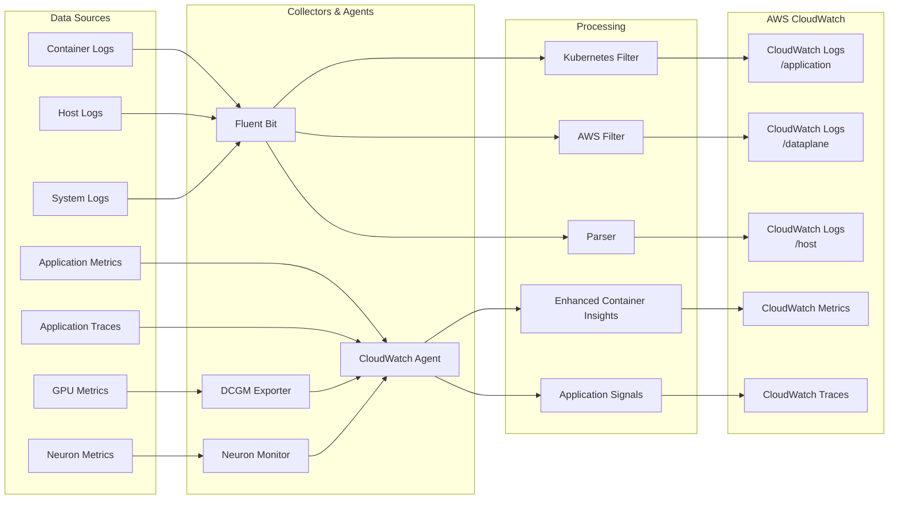
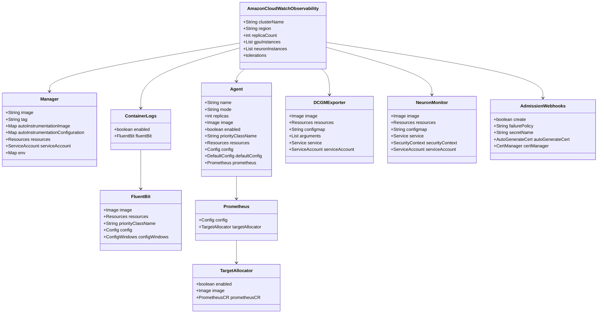
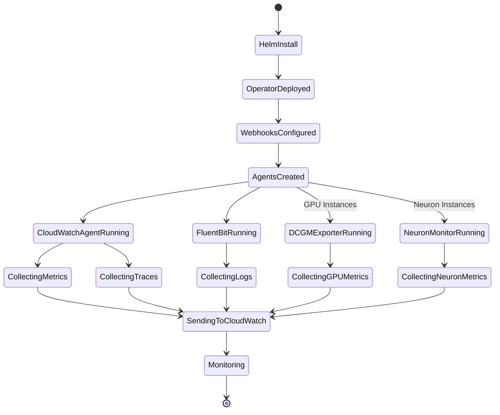
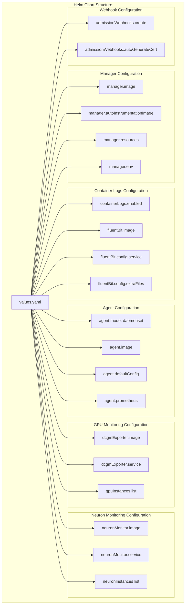

# Diagram: devops/k8s/amazon-cloudwatch-observability/helm/values.yaml

> Auto-generated by Obscura crawlers

## Diagram 1

```mermaid
graph TB
    subgraph "Amazon CloudWatch Observability"
        Manager[CloudWatch Agent Operator<br/>manager]
        
        subgraph "Logging Pipeline"
            FluentBit[Fluent Bit<br/>DaemonSet]
            AppLogs[Application Logs]
            DataplaneLogs[Dataplane Logs]
            HostLogs[Host Logs]
            CWLogs[CloudWatch Logs]
        end
        
        subgraph "Metrics & Traces Pipeline"
            CWAgent[CloudWatch Agent<br/>DaemonSet]
            K8sMetrics[Kubernetes Metrics]
            AppSignals[Application Signals]
            PromMetrics[Prometheus Metrics]
            TargetAlloc[Target Allocator]
            CWMetrics[CloudWatch Metrics]
            CWTraces[CloudWatch Traces]
        end
        
        subgraph "GPU Monitoring"
            DCGM[DCGM Exporter<br/>DaemonSet]
            GPUMetrics[GPU Metrics]
        end
        
        subgraph "Neuron Monitoring"
            NeuronMon[Neuron Monitor<br/>DaemonSet]
            NeuronMetrics[Neuron/Inferentia Metrics]
        end
        
        subgraph "Auto-Instrumentation"
            JavaInstr[Java Auto-Instrumentation]
            PythonInstr[Python Auto-Instrumentation]
            DotNetInstr[.NET Auto-Instrumentation]
            NodeInstr[Node.js Auto-Instrumentation]
        end
    end
    
    subgraph "EKS Cluster"
        AppPods[Application Pods]
        SystemPods[System Pods]
        Nodes[Worker Nodes]
        GPUNodes[GPU Instances]
        NeuronNodes[Neuron/Inferentia Instances]
    end
    
    Manager -->|manages| CWAgent
    Manager -->|manages| FluentBit
    Manager -->|injects| JavaInstr
    Manager -->|injects| PythonInstr
    Manager -->|injects| DotNetInstr
    Manager -->|injects| NodeInstr
    
    AppPods -->|container logs| FluentBit
    SystemPods -->|dataplane logs| FluentBit
    Nodes -->|host logs| FluentBit
    FluentBit -->|streams| AppLogs
    FluentBit -->|streams| DataplaneLogs
    FluentBit -->|streams| HostLogs
    AppLogs --> CWLogs
    DataplaneLogs --> CWLogs
    HostLogs --> CWLogs
    
    AppPods -->|metrics/traces| CWAgent
    AppPods -->|instrumented| K8sMetrics
    JavaInstr -->|traces| AppSignals
    PythonInstr -->|traces| AppSignals
    DotNetInstr -->|traces| AppSignals
    NodeInstr -->|traces| AppSignals
    K8sMetrics --> CWAgent
    AppSignals --> CWAgent
    TargetAlloc -->|allocates targets| CWAgent
    PromMetrics --> CWAgent
    CWAgent --> CWMetrics
    CWAgent --> CWTraces
    
    GPUNodes -->|exposes| DCGM
    DCGM -->|scrapes| GPUMetrics
    GPUMetrics --> CWAgent
    
    NeuronNodes -->|exposes| NeuronMon
    NeuronMon -->|scrapes| NeuronMetrics
    NeuronMetrics --> CWAgent
```

### SVG

<svg id="container" width="4609.30078125" xmlns="http://www.w3.org/2000/svg" class="flowchart" height="855" viewBox="0 0 4609.30078125 855" role="graphics-document document" aria-roledescription="flowchart-v2"><g><marker id="container_flowchart-v2-pointEnd" class="marker flowchart-v2" viewBox="0 0 10 10" refX="5" refY="5" markerUnits="userSpaceOnUse" markerWidth="8" markerHeight="8" orient="auto"><path d="M 0 0 L 10 5 L 0 10 z" class="arrowMarkerPath" style="stroke-width: 1; stroke-dasharray: 1, 0;"></path></marker><marker id="container_flowchart-v2-pointStart" class="marker flowchart-v2" viewBox="0 0 10 10" refX="4.5" refY="5" markerUnits="userSpaceOnUse" markerWidth="8" markerHeight="8" orient="auto"><path d="M 0 5 L 10 10 L 10 0 z" class="arrowMarkerPath" style="stroke-width: 1; stroke-dasharray: 1, 0;"></path></marker><marker id="container_flowchart-v2-circleEnd" class="marker flowchart-v2" viewBox="0 0 10 10" refX="11" refY="5" markerUnits="userSpaceOnUse" markerWidth="11" markerHeight="11" orient="auto"><circle cx="5" cy="5" r="5" class="arrowMarkerPath" style="stroke-width: 1; stroke-dasharray: 1, 0;"></circle></marker><marker id="container_flowchart-v2-circleStart" class="marker flowchart-v2" viewBox="0 0 10 10" refX="-1" refY="5" markerUnits="userSpaceOnUse" markerWidth="11" markerHeight="11" orient="auto"><circle cx="5" cy="5" r="5" class="arrowMarkerPath" style="stroke-width: 1; stroke-dasharray: 1, 0;"></circle></marker><marker id="container_flowchart-v2-crossEnd" class="marker cross flowchart-v2" viewBox="0 0 11 11" refX="12" refY="5.2" markerUnits="userSpaceOnUse" markerWidth="11" markerHeight="11" orient="auto"><path d="M 1,1 l 9,9 M 10,1 l -9,9" class="arrowMarkerPath" style="stroke-width: 2; stroke-dasharray: 1, 0;"></path></marker><marker id="container_flowchart-v2-crossStart" class="marker cross flowchart-v2" viewBox="0 0 11 11" refX="-1" refY="5.2" markerUnits="userSpaceOnUse" markerWidth="11" markerHeight="11" orient="auto"><path d="M 1,1 l 9,9 M 10,1 l -9,9" class="arrowMarkerPath" style="stroke-width: 2; stroke-dasharray: 1, 0;"></path></marker><g class="root"><g class="clusters"><g class="cluster" id="subGraph6" data-look="classic"><rect style="" x="3413.20703125" y="8" width="1188.09375" height="128"></rect><g class="cluster-label" transform="translate(3966.50390625, 8)"><foreignObject width="81.5" height="24">

EKS Cluster

</foreignObject></g></g><g class="cluster" id="subGraph5" data-look="classic"><rect style="" x="8" y="8" width="3385.20703125" height="839"></rect><g class="cluster-label" transform="translate(1600.603515625, 8)"><foreignObject width="200" height="48">

Amazon CloudWatch Observability

</foreignObject></g></g><g class="cluster" id="Auto-Instrumentation" data-look="classic"><rect style="" x="28" y="210" width="1245.40625" height="128"></rect><g class="cluster-label" transform="translate(571.7890625, 210)"><foreignObject width="157.828125" height="24">

Auto-Instrumentation

</foreignObject></g></g><g class="cluster" id="subGraph3" data-look="classic"><rect style="" x="3053.70703125" y="210" width="319.5" height="306"></rect><g class="cluster-label" transform="translate(3145.17578125, 210)"><foreignObject width="136.5625" height="24">

Neuron Monitoring

</foreignObject></g></g><g class="cluster" id="subGraph2" data-look="classic"><rect style="" x="2796.19140625" y="210" width="237.515625" height="306"></rect><g class="cluster-label" transform="translate(2858.36328125, 210)"><foreignObject width="113.171875" height="24">

GPU Monitoring

</foreignObject></g></g><g class="cluster" id="subGraph1" data-look="classic"><rect style="" x="105.88671875" y="412" width="1995.41015625" height="410"></rect><g class="cluster-label" transform="translate(1012.537109375, 412)"><foreignObject width="182.109375" height="24">

Metrics &amp; Traces Pipeline

</foreignObject></g></g><g class="cluster" id="subGraph0" data-look="classic"><rect style="" x="2121.296875" y="210" width="654.89453125" height="483"></rect><g class="cluster-label" transform="translate(2389.072265625, 210)"><foreignObject width="119.34375" height="24">

Logging Pipeline

</foreignObject></g></g></g><g class="edgePaths"><path d="M1031.598,81.763L1151.915,90.802C1272.232,99.842,1512.866,117.921,1633.183,133.127C1753.5,148.333,1753.5,160.667,1676.818,173C1600.135,185.333,1446.771,197.667,1370.089,214.5C1293.406,231.333,1293.406,252.667,1293.406,274C1293.406,295.333,1293.406,316.667,1293.406,333.5C1293.406,350.333,1293.406,362.667,1293.406,375C1293.406,387.333,1293.406,399.667,1293.406,414.5C1293.406,429.333,1293.406,446.667,1293.406,464C1293.406,481.333,1293.406,498.667,1293.406,513.5C1293.406,528.333,1293.406,540.667,1359.255,556.953C1425.104,573.239,1556.802,593.478,1622.651,603.598L1688.5,613.717" id="L_Manager_CWAgent_0" class="edge-thickness-normal edge-pattern-solid edge-thickness-normal edge-pattern-solid flowchart-link" style=";" data-edge="true" data-et="edge" data-id="L_Manager_CWAgent_0" data-points="W3sieCI6MTAzMS41OTc2NTYyNSwieSI6ODEuNzYyODk1OTExMDAyMjd9LHsieCI6MTc1My41LCJ5IjoxMzZ9LHsieCI6MTc1My41LCJ5IjoxNzN9LHsieCI6MTI5My40MDYyNSwieSI6MjEwfSx7IngiOjEyOTMuNDA2MjUsInkiOjI3NH0seyJ4IjoxMjkzLjQwNjI1LCJ5IjozMzh9LHsieCI6MTI5My40MDYyNSwieSI6Mzc1fSx7IngiOjEyOTMuNDA2MjUsInkiOjQxMn0seyJ4IjoxMjkzLjQwNjI1LCJ5Ijo0NjR9LHsieCI6MTI5My40MDYyNSwieSI6NTE2fSx7IngiOjEyOTMuNDA2MjUsInkiOjU1M30seyJ4IjoxNjkyLjQ1MzEyNSwieSI6NjE0LjMyNDkwNzk3OTMzNjh9XQ==" marker-end="url(#container_flowchart-v2-pointEnd)"></path><path d="M1031.598,82.401L1143.199,91.335C1254.799,100.268,1478.001,118.134,1589.602,133.234C1701.203,148.333,1701.203,160.667,1781.803,173C1862.404,185.333,2023.604,197.667,2133.379,211.286C2243.153,224.906,2301.502,239.811,2330.677,247.264L2359.851,254.717" id="L_Manager_FluentBit_0" class="edge-thickness-normal edge-pattern-solid edge-thickness-normal edge-pattern-solid flowchart-link" style=";" data-edge="true" data-et="edge" data-id="L_Manager_FluentBit_0" data-points="W3sieCI6MTAzMS41OTc2NTYyNSwieSI6ODIuNDAxNDY1NjY2NzU2MjR9LHsieCI6MTcwMS4yMDMxMjUsInkiOjEzNn0seyJ4IjoxNzAxLjIwMzEyNSwieSI6MTczfSx7IngiOjIxODQuODA0Njg3NSwieSI6MjEwfSx7IngiOjIzNjMuNzI2NTYyNSwieSI6MjU1LjcwNjg3Mjg5NTA5NzkyfV0=" marker-end="url(#container_flowchart-v2-pointEnd)"></path><path d="M1030.161,111L1043.891,115.167C1057.621,119.333,1085.08,127.667,1098.809,138C1112.539,148.333,1112.539,160.667,1112.539,173C1112.539,185.333,1112.539,197.667,1112.539,209.333C1112.539,221,1112.539,232,1112.539,237.5L1112.539,243" id="L_Manager_JavaInstr_0" class="edge-thickness-normal edge-pattern-solid edge-thickness-normal edge-pattern-solid flowchart-link" style=";" data-edge="true" data-et="edge" data-id="L_Manager_JavaInstr_0" data-points="W3sieCI6MTAzMC4xNjE0Mzc5ODgyODEyLCJ5IjoxMTF9LHsieCI6MTExMi41MzkwNjI1LCJ5IjoxMzZ9LHsieCI6MTExMi41MzkwNjI1LCJ5IjoxNzN9LHsieCI6MTExMi41MzkwNjI1LCJ5IjoyMTB9LHsieCI6MTExMi41MzkwNjI1LCJ5IjoyNDd9XQ==" marker-end="url(#container_flowchart-v2-pointEnd)"></path><path d="M843.774,111L837.59,115.167C831.406,119.333,819.039,127.667,812.855,138C806.672,148.333,806.672,160.667,806.672,173C806.672,185.333,806.672,197.667,806.672,207.333C806.672,217,806.672,224,806.672,227.5L806.672,231" id="L_Manager_PythonInstr_0" class="edge-thickness-normal edge-pattern-solid edge-thickness-normal edge-pattern-solid flowchart-link" style=";" data-edge="true" data-et="edge" data-id="L_Manager_PythonInstr_0" data-points="W3sieCI6ODQzLjc3MzYyMDYwNTQ2ODgsInkiOjExMX0seyJ4Ijo4MDYuNjcxODc1LCJ5IjoxMzZ9LHsieCI6ODA2LjY3MTg3NSwieSI6MTczfSx7IngiOjgwNi42NzE4NzUsInkiOjIxMH0seyJ4Ijo4MDYuNjcxODc1LCJ5IjoyMzV9XQ==" marker-end="url(#container_flowchart-v2-pointEnd)"></path><path d="M771.707,92.697L726.395,99.914C681.083,107.132,590.46,121.566,545.148,134.95C499.836,148.333,499.836,160.667,499.836,173C499.836,185.333,499.836,197.667,499.836,209.333C499.836,221,499.836,232,499.836,237.5L499.836,243" id="L_Manager_DotNetInstr_0" class="edge-thickness-normal edge-pattern-solid edge-thickness-normal edge-pattern-solid flowchart-link" style=";" data-edge="true" data-et="edge" data-id="L_Manager_DotNetInstr_0" data-points="W3sieCI6NzcxLjcwNzAzMTI1LCJ5Ijo5Mi42OTcyNjM0MDM0OTAwMX0seyJ4Ijo0OTkuODM1OTM3NSwieSI6MTM2fSx7IngiOjQ5OS44MzU5Mzc1LCJ5IjoxNzN9LHsieCI6NDk5LjgzNTkzNzUsInkiOjIxMH0seyJ4Ijo0OTkuODM1OTM3NSwieSI6MjQ3fV0=" marker-end="url(#container_flowchart-v2-pointEnd)"></path><path d="M771.707,83.736L675.256,92.446C578.805,101.157,385.902,118.579,289.451,133.456C193,148.333,193,160.667,193,173C193,185.333,193,197.667,193,207.333C193,217,193,224,193,227.5L193,231" id="L_Manager_NodeInstr_0" class="edge-thickness-normal edge-pattern-solid edge-thickness-normal edge-pattern-solid flowchart-link" style=";" data-edge="true" data-et="edge" data-id="L_Manager_NodeInstr_0" data-points="W3sieCI6NzcxLjcwNzAzMTI1LCJ5Ijo4My43MzU2NTU4MTY3NzM3fSx7IngiOjE5MywieSI6MTM2fSx7IngiOjE5MywieSI6MTczfSx7IngiOjE5MywieSI6MjEwfSx7IngiOjE5MywieSI6MjM1fV0=" marker-end="url(#container_flowchart-v2-pointEnd)"></path><path d="M3584.915,99L3595.351,105.167C3605.787,111.333,3626.659,123.667,3408.593,136C3190.527,148.333,2733.523,160.667,2505.021,173C2276.52,185.333,2276.52,197.667,2290.436,209.441C2304.352,221.216,2332.184,232.432,2346.1,238.04L2360.016,243.648" id="L_AppPods_FluentBit_0" class="edge-thickness-normal edge-pattern-solid edge-thickness-normal edge-pattern-solid flowchart-link" style=";" data-edge="true" data-et="edge" data-id="L_AppPods_FluentBit_0" data-points="W3sieCI6MzU4NC45MTUzNDQyMzgyODEyLCJ5Ijo5OX0seyJ4IjozNjQ3LjUzMTI1LCJ5IjoxMzZ9LHsieCI6MjI3Ni41MTk1MzEyNSwieSI6MTczfSx7IngiOjIyNzYuNTE5NTMxMjUsInkiOjIxMH0seyJ4IjoyMzYzLjcyNjU2MjUsInkiOjI0NS4xNDI3Nzk4NDExMDk3Nn1d" marker-end="url(#container_flowchart-v2-pointEnd)"></path><path d="M3755.84,99L3755.84,105.167C3755.84,111.333,3755.84,123.667,3571.458,136C3387.077,148.333,3018.314,160.667,2833.932,173C2649.551,185.333,2649.551,197.667,2626.422,210.743C2603.293,223.82,2557.036,237.64,2533.907,244.55L2510.778,251.461" id="L_SystemPods_FluentBit_0" class="edge-thickness-normal edge-pattern-solid edge-thickness-normal edge-pattern-solid flowchart-link" style=";" data-edge="true" data-et="edge" data-id="L_SystemPods_FluentBit_0" data-points="W3sieCI6Mzc1NS44Mzk4NDM3NSwieSI6OTl9LHsieCI6Mzc1NS44Mzk4NDM3NSwieSI6MTM2fSx7IngiOjI2NDkuNTUwNzgxMjUsInkiOjE3M30seyJ4IjoyNjQ5LjU1MDc4MTI1LCJ5IjoyMTB9LHsieCI6MjUwNi45NDUzMTI1LCJ5IjoyNTIuNjA1NTkwOTExNTc3NTR9XQ==" marker-end="url(#container_flowchart-v2-pointEnd)"></path><path d="M3962.34,99L3962.34,105.167C3962.34,111.333,3962.34,123.667,3761.315,136C3560.29,148.333,3158.241,160.667,2957.216,173C2756.191,185.333,2756.191,197.667,2715.304,211.989C2674.417,226.311,2592.642,242.623,2551.755,250.778L2510.868,258.934" id="L_Nodes_FluentBit_0" class="edge-thickness-normal edge-pattern-solid edge-thickness-normal edge-pattern-solid flowchart-link" style=";" data-edge="true" data-et="edge" data-id="L_Nodes_FluentBit_0" data-points="W3sieCI6Mzk2Mi4zMzk4NDM3NSwieSI6OTl9LHsieCI6Mzk2Mi4zMzk4NDM3NSwieSI6MTM2fSx7IngiOjI3NTYuMTkxNDA2MjUsInkiOjE3M30seyJ4IjoyNzU2LjE5MTQwNjI1LCJ5IjoyMTB9LHsieCI6MjUwNi45NDUzMTI1LCJ5IjoyNTkuNzE2MzEwMTU3MTcyNn1d" marker-end="url(#container_flowchart-v2-pointEnd)"></path><path d="M2506.945,295.278L2530.908,302.399C2554.87,309.519,2602.794,323.759,2626.757,337.046C2650.719,350.333,2650.719,362.667,2650.719,375C2650.719,387.333,2650.719,399.667,2650.719,409.333C2650.719,419,2650.719,426,2650.719,429.5L2650.719,433" id="L_FluentBit_AppLogs_0" class="edge-thickness-normal edge-pattern-solid edge-thickness-normal edge-pattern-solid flowchart-link" style=";" data-edge="true" data-et="edge" data-id="L_FluentBit_AppLogs_0" data-points="W3sieCI6MjUwNi45NDUzMTI1LCJ5IjoyOTUuMjc4MzkyMzk3MjU3OH0seyJ4IjoyNjUwLjcxODc1LCJ5IjozMzh9LHsieCI6MjY1MC43MTg3NSwieSI6Mzc1fSx7IngiOjI2NTAuNzE4NzUsInkiOjQxMn0seyJ4IjoyNjUwLjcxODc1LCJ5Ijo0Mzd9XQ==" marker-end="url(#container_flowchart-v2-pointEnd)"></path><path d="M2429.356,313L2428.718,317.167C2428.079,321.333,2426.801,329.667,2426.162,340C2425.523,350.333,2425.523,362.667,2425.523,375C2425.523,387.333,2425.523,399.667,2425.523,409.333C2425.523,419,2425.523,426,2425.523,429.5L2425.523,433" id="L_FluentBit_DataplaneLogs_0" class="edge-thickness-normal edge-pattern-solid edge-thickness-normal edge-pattern-solid flowchart-link" style=";" data-edge="true" data-et="edge" data-id="L_FluentBit_DataplaneLogs_0" data-points="W3sieCI6MjQyOS4zNTY0NDUzMTI1LCJ5IjozMTN9LHsieCI6MjQyNS41MjM0Mzc1LCJ5IjozMzh9LHsieCI6MjQyNS41MjM0Mzc1LCJ5IjozNzV9LHsieCI6MjQyNS41MjM0Mzc1LCJ5Ijo0MTJ9LHsieCI6MjQyNS41MjM0Mzc1LCJ5Ijo0Mzd9XQ==" marker-end="url(#container_flowchart-v2-pointEnd)"></path><path d="M2363.727,295.777L2340.586,302.814C2317.445,309.851,2271.164,323.926,2248.023,337.129C2224.883,350.333,2224.883,362.667,2224.883,375C2224.883,387.333,2224.883,399.667,2224.883,409.333C2224.883,419,2224.883,426,2224.883,429.5L2224.883,433" id="L_FluentBit_HostLogs_0" class="edge-thickness-normal edge-pattern-solid edge-thickness-normal edge-pattern-solid flowchart-link" style=";" data-edge="true" data-et="edge" data-id="L_FluentBit_HostLogs_0" data-points="W3sieCI6MjM2My43MjY1NjI1LCJ5IjoyOTUuNzc2ODIwODQ3ODcyOX0seyJ4IjoyMjI0Ljg4MjgxMjUsInkiOjMzOH0seyJ4IjoyMjI0Ljg4MjgxMjUsInkiOjM3NX0seyJ4IjoyMjI0Ljg4MjgxMjUsInkiOjQxMn0seyJ4IjoyMjI0Ljg4MjgxMjUsInkiOjQzN31d" marker-end="url(#container_flowchart-v2-pointEnd)"></path><path d="M2650.719,491L2650.719,495.167C2650.719,499.333,2650.719,507.667,2650.719,518C2650.719,528.333,2650.719,540.667,2627.13,554.787C2603.541,568.907,2556.364,584.815,2532.775,592.768L2509.186,600.722" id="L_AppLogs_CWLogs_0" class="edge-thickness-normal edge-pattern-solid edge-thickness-normal edge-pattern-solid flowchart-link" style=";" data-edge="true" data-et="edge" data-id="L_AppLogs_CWLogs_0" data-points="W3sieCI6MjY1MC43MTg3NSwieSI6NDkxfSx7IngiOjI2NTAuNzE4NzUsInkiOjUxNn0seyJ4IjoyNjUwLjcxODc1LCJ5Ijo1NTN9LHsieCI6MjUwNS4zOTYwNzMxOTA3ODk2LCJ5Ijo2MDJ9XQ==" marker-end="url(#container_flowchart-v2-pointEnd)"></path><path d="M2425.523,491L2425.523,495.167C2425.523,499.333,2425.523,507.667,2425.523,518C2425.523,528.333,2425.523,540.667,2425.503,554.333C2425.483,568,2425.443,583,2425.423,590.5L2425.403,598" id="L_DataplaneLogs_CWLogs_0" class="edge-thickness-normal edge-pattern-solid edge-thickness-normal edge-pattern-solid flowchart-link" style=";" data-edge="true" data-et="edge" data-id="L_DataplaneLogs_CWLogs_0" data-points="W3sieCI6MjQyNS41MjM0Mzc1LCJ5Ijo0OTF9LHsieCI6MjQyNS41MjM0Mzc1LCJ5Ijo1MTZ9LHsieCI6MjQyNS41MjM0Mzc1LCJ5Ijo1NTN9LHsieCI6MjQyNS4zOTI0NzUzMjg5NDc1LCJ5Ijo2MDJ9XQ==" marker-end="url(#container_flowchart-v2-pointEnd)"></path><path d="M2224.883,491L2224.883,495.167C2224.883,499.333,2224.883,507.667,2224.883,518C2224.883,528.333,2224.883,540.667,2245.798,554.764C2266.713,568.861,2308.542,584.721,2329.457,592.652L2350.372,600.582" id="L_HostLogs_CWLogs_0" class="edge-thickness-normal edge-pattern-solid edge-thickness-normal edge-pattern-solid flowchart-link" style=";" data-edge="true" data-et="edge" data-id="L_HostLogs_CWLogs_0" data-points="W3sieCI6MjIyNC44ODI4MTI1LCJ5Ijo0OTF9LHsieCI6MjIyNC44ODI4MTI1LCJ5Ijo1MTZ9LHsieCI6MjIyNC44ODI4MTI1LCJ5Ijo1NTN9LHsieCI6MjM1NC4xMTIyNTMyODk0NzM4LCJ5Ijo2MDJ9XQ==" marker-end="url(#container_flowchart-v2-pointEnd)"></path><path d="M3557.248,99L3561.365,105.167C3565.482,111.333,3573.715,123.667,3338.748,136C3103.781,148.333,2625.613,160.667,2368.838,173C2112.063,185.333,2076.68,197.667,2058.988,214.5C2041.297,231.333,2041.297,252.667,2041.297,274C2041.297,295.333,2041.297,316.667,2041.297,333.5C2041.297,350.333,2041.297,362.667,2041.297,375C2041.297,387.333,2041.297,399.667,2041.297,414.5C2041.297,429.333,2041.297,446.667,2041.297,464C2041.297,481.333,2041.297,498.667,2041.297,513.5C2041.297,528.333,2041.297,540.667,2015.626,554.534C1989.954,568.402,1938.612,583.803,1912.94,591.504L1887.269,599.205" id="L_AppPods_CWAgent_0" class="edge-thickness-normal edge-pattern-solid edge-thickness-normal edge-pattern-solid flowchart-link" style=";" data-edge="true" data-et="edge" data-id="L_AppPods_CWAgent_0" data-points="W3sieCI6MzU1Ny4yNDc5MjQ4MDQ2ODc1LCJ5Ijo5OX0seyJ4IjozNTgxLjk0OTIxODc1LCJ5IjoxMzZ9LHsieCI6MjE0Ny40NDUzMTI1LCJ5IjoxNzN9LHsieCI6MjA0MS4yOTY4NzUsInkiOjIxMH0seyJ4IjoyMDQxLjI5Njg3NSwieSI6Mjc0fSx7IngiOjIwNDEuMjk2ODc1LCJ5IjozMzh9LHsieCI6MjA0MS4yOTY4NzUsInkiOjM3NX0seyJ4IjoyMDQxLjI5Njg3NSwieSI6NDEyfSx7IngiOjIwNDEuMjk2ODc1LCJ5Ijo0NjR9LHsieCI6MjA0MS4yOTY4NzUsInkiOjUxNn0seyJ4IjoyMDQxLjI5Njg3NSwieSI6NTUzfSx7IngiOjE4ODMuNDM3NSwieSI6NjAwLjM1NDQwNTAwNzg2MzN9XQ==" marker-end="url(#container_flowchart-v2-pointEnd)"></path><path d="M3521.079,99L3516.935,105.167C3512.791,111.333,3504.503,123.667,3262.655,136C3020.807,148.333,2545.4,160.667,2280.429,173C2015.458,185.333,1960.924,197.667,1933.658,214.5C1906.391,231.333,1906.391,252.667,1906.391,274C1906.391,295.333,1906.391,316.667,1906.391,333.5C1906.391,350.333,1906.391,362.667,1906.391,375C1906.391,387.333,1906.391,399.667,1906.391,409.333C1906.391,419,1906.391,426,1906.391,429.5L1906.391,433" id="L_AppPods_K8sMetrics_0" class="edge-thickness-normal edge-pattern-solid edge-thickness-normal edge-pattern-solid flowchart-link" style=";" data-edge="true" data-et="edge" data-id="L_AppPods_K8sMetrics_0" data-points="W3sieCI6MzUyMS4wNzg3MzUzNTE1NjI1LCJ5Ijo5OX0seyJ4IjozNDk2LjIxNDg0Mzc1LCJ5IjoxMzZ9LHsieCI6MjA2OS45OTIxODc1LCJ5IjoxNzN9LHsieCI6MTkwNi4zOTA2MjUsInkiOjIxMH0seyJ4IjoxOTA2LjM5MDYyNSwieSI6Mjc0fSx7IngiOjE5MDYuMzkwNjI1LCJ5IjozMzh9LHsieCI6MTkwNi4zOTA2MjUsInkiOjM3NX0seyJ4IjoxOTA2LjM5MDYyNSwieSI6NDEyfSx7IngiOjE5MDYuMzkwNjI1LCJ5Ijo0Mzd9XQ==" marker-end="url(#container_flowchart-v2-pointEnd)"></path><path d="M1112.539,301L1112.539,307.167C1112.539,313.333,1112.539,325.667,1112.539,338C1112.539,350.333,1112.539,362.667,1112.539,375C1112.539,387.333,1112.539,399.667,1053.192,412.553C993.844,425.439,875.15,438.877,815.802,445.596L756.455,452.316" id="L_JavaInstr_AppSignals_0" class="edge-thickness-normal edge-pattern-solid edge-thickness-normal edge-pattern-solid flowchart-link" style=";" data-edge="true" data-et="edge" data-id="L_JavaInstr_AppSignals_0" data-points="W3sieCI6MTExMi41MzkwNjI1LCJ5IjozMDF9LHsieCI6MTExMi41MzkwNjI1LCJ5IjozMzh9LHsieCI6MTExMi41MzkwNjI1LCJ5IjozNzV9LHsieCI6MTExMi41MzkwNjI1LCJ5Ijo0MTJ9LHsieCI6NzUyLjQ4MDQ2ODc1LCJ5Ijo0NTIuNzY1NjI1OTMwMjQxNDd9XQ==" marker-end="url(#container_flowchart-v2-pointEnd)"></path><path d="M806.672,313L806.672,317.167C806.672,321.333,806.672,329.667,806.672,340C806.672,350.333,806.672,362.667,806.672,375C806.672,387.333,806.672,399.667,795.01,409.786C783.348,419.905,760.025,427.811,748.363,431.763L736.702,435.716" id="L_PythonInstr_AppSignals_0" class="edge-thickness-normal edge-pattern-solid edge-thickness-normal edge-pattern-solid flowchart-link" style=";" data-edge="true" data-et="edge" data-id="L_PythonInstr_AppSignals_0" data-points="W3sieCI6ODA2LjY3MTg3NSwieSI6MzEzfSx7IngiOjgwNi42NzE4NzUsInkiOjMzOH0seyJ4Ijo4MDYuNjcxODc1LCJ5IjozNzV9LHsieCI6ODA2LjY3MTg3NSwieSI6NDEyfSx7IngiOjczMi45MTMyMzYxNzc4ODQ2LCJ5Ijo0Mzd9XQ==" marker-end="url(#container_flowchart-v2-pointEnd)"></path><path d="M499.836,301L499.836,307.167C499.836,313.333,499.836,325.667,499.836,338C499.836,350.333,499.836,362.667,499.836,375C499.836,387.333,499.836,399.667,511.498,409.786C523.159,419.905,546.483,427.811,558.145,431.763L569.806,435.716" id="L_DotNetInstr_AppSignals_0" class="edge-thickness-normal edge-pattern-solid edge-thickness-normal edge-pattern-solid flowchart-link" style=";" data-edge="true" data-et="edge" data-id="L_DotNetInstr_AppSignals_0" data-points="W3sieCI6NDk5LjgzNTkzNzUsInkiOjMwMX0seyJ4Ijo0OTkuODM1OTM3NSwieSI6MzM4fSx7IngiOjQ5OS44MzU5Mzc1LCJ5IjozNzV9LHsieCI6NDk5LjgzNTkzNzUsInkiOjQxMn0seyJ4Ijo1NzMuNTk0NTc2MzIyMTE1NCwieSI6NDM3fV0=" marker-end="url(#container_flowchart-v2-pointEnd)"></path><path d="M193,313L193,317.167C193,321.333,193,329.667,193,340C193,350.333,193,362.667,193,375C193,387.333,193,399.667,252.509,412.557C312.018,425.447,431.035,438.893,490.544,445.617L550.053,452.34" id="L_NodeInstr_AppSignals_0" class="edge-thickness-normal edge-pattern-solid edge-thickness-normal edge-pattern-solid flowchart-link" style=";" data-edge="true" data-et="edge" data-id="L_NodeInstr_AppSignals_0" data-points="W3sieCI6MTkzLCJ5IjozMTN9LHsieCI6MTkzLCJ5IjozMzh9LHsieCI6MTkzLCJ5IjozNzV9LHsieCI6MTkzLCJ5Ijo0MTJ9LHsieCI6NTU0LjAyNzM0Mzc1LCJ5Ijo0NTIuNzg5MjcyMjI1NzU4NTd9XQ==" marker-end="url(#container_flowchart-v2-pointEnd)"></path><path d="M1906.391,491L1906.391,495.167C1906.391,499.333,1906.391,507.667,1906.391,518C1906.391,528.333,1906.391,540.667,1897.341,552.64C1888.291,564.613,1870.192,576.227,1861.143,582.033L1852.093,587.84" id="L_K8sMetrics_CWAgent_0" class="edge-thickness-normal edge-pattern-solid edge-thickness-normal edge-pattern-solid flowchart-link" style=";" data-edge="true" data-et="edge" data-id="L_K8sMetrics_CWAgent_0" data-points="W3sieCI6MTkwNi4zOTA2MjUsInkiOjQ5MX0seyJ4IjoxOTA2LjM5MDYyNSwieSI6NTE2fSx7IngiOjE5MDYuMzkwNjI1LCJ5Ijo1NTN9LHsieCI6MTg0OC43MjY0NTk3MDM5NDczLCJ5Ijo1OTB9XQ==" marker-end="url(#container_flowchart-v2-pointEnd)"></path><path d="M653.254,491L653.254,495.167C653.254,499.333,653.254,507.667,653.254,518C653.254,528.333,653.254,540.667,825.789,558.389C998.323,576.112,1343.393,599.225,1515.927,610.781L1688.462,622.337" id="L_AppSignals_CWAgent_0" class="edge-thickness-normal edge-pattern-solid edge-thickness-normal edge-pattern-solid flowchart-link" style=";" data-edge="true" data-et="edge" data-id="L_AppSignals_CWAgent_0" data-points="W3sieCI6NjUzLjI1MzkwNjI1LCJ5Ijo0OTF9LHsieCI6NjUzLjI1MzkwNjI1LCJ5Ijo1MTZ9LHsieCI6NjUzLjI1MzkwNjI1LCJ5Ijo1NTN9LHsieCI6MTY5Mi40NTMxMjUsInkiOjYyMi42MDQwNzA0ODk5ODA0fV0=" marker-end="url(#container_flowchart-v2-pointEnd)"></path><path d="M1669.5,491L1669.5,495.167C1669.5,499.333,1669.5,507.667,1669.5,518C1669.5,528.333,1669.5,540.667,1678.55,552.64C1687.599,564.613,1705.698,576.227,1714.748,582.033L1723.798,587.84" id="L_TargetAlloc_CWAgent_0" class="edge-thickness-normal edge-pattern-solid edge-thickness-normal edge-pattern-solid flowchart-link" style=";" data-edge="true" data-et="edge" data-id="L_TargetAlloc_CWAgent_0" data-points="W3sieCI6MTY2OS41LCJ5Ijo0OTF9LHsieCI6MTY2OS41LCJ5Ijo1MTZ9LHsieCI6MTY2OS41LCJ5Ijo1NTN9LHsieCI6MTcyNy4xNjQxNjUyOTYwNTI3LCJ5Ijo1OTB9XQ==" marker-end="url(#container_flowchart-v2-pointEnd)"></path><path d="M1430.461,491L1430.461,495.167C1430.461,499.333,1430.461,507.667,1430.461,518C1430.461,528.333,1430.461,540.667,1473.474,555.978C1516.487,571.289,1602.514,589.578,1645.527,598.722L1688.541,607.867" id="L_PromMetrics_CWAgent_0" class="edge-thickness-normal edge-pattern-solid edge-thickness-normal edge-pattern-solid flowchart-link" style=";" data-edge="true" data-et="edge" data-id="L_PromMetrics_CWAgent_0" data-points="W3sieCI6MTQzMC40NjA5Mzc1LCJ5Ijo0OTF9LHsieCI6MTQzMC40NjA5Mzc1LCJ5Ijo1MTZ9LHsieCI6MTQzMC40NjA5Mzc1LCJ5Ijo1NTN9LHsieCI6MTY5Mi40NTMxMjUsInkiOjYwOC42OTg2NzU2NDE0MTc5fV0=" marker-end="url(#container_flowchart-v2-pointEnd)"></path><path d="M1883.438,663.521L1897.029,668.434C1910.62,673.347,1937.802,683.174,1951.393,692.253C1964.984,701.333,1964.984,709.667,1964.984,717.333C1964.984,725,1964.984,732,1964.984,735.5L1964.984,739" id="L_CWAgent_CWMetrics_0" class="edge-thickness-normal edge-pattern-solid edge-thickness-normal edge-pattern-solid flowchart-link" style=";" data-edge="true" data-et="edge" data-id="L_CWAgent_CWMetrics_0" data-points="W3sieCI6MTg4My40Mzc1LCJ5Ijo2NjMuNTIwNjMwMTU3NTM5NH0seyJ4IjoxOTY0Ljk4NDM3NSwieSI6NjkzfSx7IngiOjE5NjQuOTg0Mzc1LCJ5Ijo3MTh9LHsieCI6MTk2NC45ODQzNzUsInkiOjc0M31d" marker-end="url(#container_flowchart-v2-pointEnd)"></path><path d="M1692.453,632.947L1450.274,642.955C1208.095,652.964,723.737,672.982,481.558,687.158C239.379,701.333,239.379,709.667,239.379,717.333C239.379,725,239.379,732,239.379,735.5L239.379,739" id="L_CWAgent_CWTraces_0" class="edge-thickness-normal edge-pattern-solid edge-thickness-normal edge-pattern-solid flowchart-link" style=";" data-edge="true" data-et="edge" data-id="L_CWAgent_CWTraces_0" data-points="W3sieCI6MTY5Mi40NTMxMjUsInkiOjYzMi45NDY1NTMzODk4NTR9LHsieCI6MjM5LjM3ODkwNjI1LCJ5Ijo2OTN9LHsieCI6MjM5LjM3ODkwNjI1LCJ5Ijo3MTh9LHsieCI6MjM5LjM3ODkwNjI1LCJ5Ijo3NDN9XQ==" marker-end="url(#container_flowchart-v2-pointEnd)"></path><path d="M4174.77,99L4174.77,105.167C4174.77,111.333,4174.77,123.667,3964.799,136C3754.829,148.333,3334.889,160.667,3124.919,173C2914.949,185.333,2914.949,197.667,2914.949,207.333C2914.949,217,2914.949,224,2914.949,227.5L2914.949,231" id="L_GPUNodes_DCGM_0" class="edge-thickness-normal edge-pattern-solid edge-thickness-normal edge-pattern-solid flowchart-link" style=";" data-edge="true" data-et="edge" data-id="L_GPUNodes_DCGM_0" data-points="W3sieCI6NDE3NC43Njk1MzEyNSwieSI6OTl9LHsieCI6NDE3NC43Njk1MzEyNSwieSI6MTM2fSx7IngiOjI5MTQuOTQ5MjE4NzUsInkiOjE3M30seyJ4IjoyOTE0Ljk0OTIxODc1LCJ5IjoyMTB9LHsieCI6MjkxNC45NDkyMTg3NSwieSI6MjM1fV0=" marker-end="url(#container_flowchart-v2-pointEnd)"></path><path d="M2914.949,313L2914.949,317.167C2914.949,321.333,2914.949,329.667,2914.949,340C2914.949,350.333,2914.949,362.667,2914.949,375C2914.949,387.333,2914.949,399.667,2914.949,409.333C2914.949,419,2914.949,426,2914.949,429.5L2914.949,433" id="L_DCGM_GPUMetrics_0" class="edge-thickness-normal edge-pattern-solid edge-thickness-normal edge-pattern-solid flowchart-link" style=";" data-edge="true" data-et="edge" data-id="L_DCGM_GPUMetrics_0" data-points="W3sieCI6MjkxNC45NDkyMTg3NSwieSI6MzEzfSx7IngiOjI5MTQuOTQ5MjE4NzUsInkiOjMzOH0seyJ4IjoyOTE0Ljk0OTIxODc1LCJ5IjozNzV9LHsieCI6MjkxNC45NDkyMTg3NSwieSI6NDEyfSx7IngiOjI5MTQuOTQ5MjE4NzUsInkiOjQzN31d" marker-end="url(#container_flowchart-v2-pointEnd)"></path><path d="M2914.949,491L2914.949,495.167C2914.949,499.333,2914.949,507.667,2772.674,518C2630.398,528.333,2345.848,540.667,2174.571,554.896C2003.295,569.126,1945.293,585.253,1916.292,593.316L1887.291,601.379" id="L_GPUMetrics_CWAgent_0" class="edge-thickness-normal edge-pattern-solid edge-thickness-normal edge-pattern-solid flowchart-link" style=";" data-edge="true" data-et="edge" data-id="L_GPUMetrics_CWAgent_0" data-points="W3sieCI6MjkxNC45NDkyMTg3NSwieSI6NDkxfSx7IngiOjI5MTQuOTQ5MjE4NzUsInkiOjUxNn0seyJ4IjoyMDYxLjI5Njg3NSwieSI6NTUzfSx7IngiOjE4ODMuNDM3NSwieSI6NjAyLjQ1MDI4NDM3NTA4OTN9XQ==" marker-end="url(#container_flowchart-v2-pointEnd)"></path><path d="M4436.301,111L4436.301,115.167C4436.301,119.333,4436.301,127.667,4232.493,138C4028.686,148.333,3621.072,160.667,3417.264,173C3213.457,185.333,3213.457,197.667,3213.457,207.333C3213.457,217,3213.457,224,3213.457,227.5L3213.457,231" id="L_NeuronNodes_NeuronMon_0" class="edge-thickness-normal edge-pattern-solid edge-thickness-normal edge-pattern-solid flowchart-link" style=";" data-edge="true" data-et="edge" data-id="L_NeuronNodes_NeuronMon_0" data-points="W3sieCI6NDQzNi4zMDA3ODEyNSwieSI6MTExfSx7IngiOjQ0MzYuMzAwNzgxMjUsInkiOjEzNn0seyJ4IjozMjEzLjQ1NzAzMTI1LCJ5IjoxNzN9LHsieCI6MzIxMy40NTcwMzEyNSwieSI6MjEwfSx7IngiOjMyMTMuNDU3MDMxMjUsInkiOjIzNX1d" marker-end="url(#container_flowchart-v2-pointEnd)"></path><path d="M3213.457,313L3213.457,317.167C3213.457,321.333,3213.457,329.667,3213.457,340C3213.457,350.333,3213.457,362.667,3213.457,375C3213.457,387.333,3213.457,399.667,3213.457,409.333C3213.457,419,3213.457,426,3213.457,429.5L3213.457,433" id="L_NeuronMon_NeuronMetrics_0" class="edge-thickness-normal edge-pattern-solid edge-thickness-normal edge-pattern-solid flowchart-link" style=";" data-edge="true" data-et="edge" data-id="L_NeuronMon_NeuronMetrics_0" data-points="W3sieCI6MzIxMy40NTcwMzEyNSwieSI6MzEzfSx7IngiOjMyMTMuNDU3MDMxMjUsInkiOjMzOH0seyJ4IjozMjEzLjQ1NzAzMTI1LCJ5IjozNzV9LHsieCI6MzIxMy40NTcwMzEyNSwieSI6NDEyfSx7IngiOjMyMTMuNDU3MDMxMjUsInkiOjQzN31d" marker-end="url(#container_flowchart-v2-pointEnd)"></path><path d="M3213.457,491L3213.457,495.167C3213.457,499.333,3213.457,507.667,3024.764,518C2836.07,528.333,2458.684,540.667,2237.659,555.21C2016.634,569.752,1951.972,586.505,1919.641,594.881L1887.31,603.257" id="L_NeuronMetrics_CWAgent_0" class="edge-thickness-normal edge-pattern-solid edge-thickness-normal edge-pattern-solid flowchart-link" style=";" data-edge="true" data-et="edge" data-id="L_NeuronMetrics_CWAgent_0" data-points="W3sieCI6MzIxMy40NTcwMzEyNSwieSI6NDkxfSx7IngiOjMyMTMuNDU3MDMxMjUsInkiOjUxNn0seyJ4IjoyMDgxLjI5Njg3NSwieSI6NTUzfSx7IngiOjE4ODMuNDM3NSwieSI6NjA0LjI2MDM3OTc3MDQzMzJ9XQ==" marker-end="url(#container_flowchart-v2-pointEnd)"></path></g><g class="edgeLabels"><g class="edgeLabel" transform="translate(1293.40625, 375)"><g class="label" data-id="L_Manager_CWAgent_0" transform="translate(-32.296875, -12)"><foreignObject width="64.59375" height="24">

manages

</foreignObject></g></g><g class="edgeLabel" transform="translate(1701.203125, 173)"><g class="label" data-id="L_Manager_FluentBit_0" transform="translate(-32.296875, -12)"><foreignObject width="64.59375" height="24">

manages

</foreignObject></g></g><g class="edgeLabel" transform="translate(1112.5390625, 173)"><g class="label" data-id="L_Manager_JavaInstr_0" transform="translate(-23.9921875, -12)"><foreignObject width="47.984375" height="24">

injects

</foreignObject></g></g><g class="edgeLabel" transform="translate(806.671875, 173)"><g class="label" data-id="L_Manager_PythonInstr_0" transform="translate(-23.9921875, -12)"><foreignObject width="47.984375" height="24">

injects

</foreignObject></g></g><g class="edgeLabel" transform="translate(499.8359375, 173)"><g class="label" data-id="L_Manager_DotNetInstr_0" transform="translate(-23.9921875, -12)"><foreignObject width="47.984375" height="24">

injects

</foreignObject></g></g><g class="edgeLabel" transform="translate(193, 173)"><g class="label" data-id="L_Manager_NodeInstr_0" transform="translate(-23.9921875, -12)"><foreignObject width="47.984375" height="24">

injects

</foreignObject></g></g><g class="edgeLabel" transform="translate(2276.51953125, 173)"><g class="label" data-id="L_AppPods_FluentBit_0" transform="translate(-51.5390625, -12)"><foreignObject width="103.078125" height="24">

container logs

</foreignObject></g></g><g class="edgeLabel" transform="translate(2649.55078125, 173)"><g class="label" data-id="L_SystemPods_FluentBit_0" transform="translate(-53.71875, -12)"><foreignObject width="107.4375" height="24">

dataplane logs

</foreignObject></g></g><g class="edgeLabel" transform="translate(2756.19140625, 173)"><g class="label" data-id="L_Nodes_FluentBit_0" transform="translate(-32.921875, -12)"><foreignObject width="65.84375" height="24">

host logs

</foreignObject></g></g><g class="edgeLabel" transform="translate(2650.71875, 375)"><g class="label" data-id="L_FluentBit_AppLogs_0" transform="translate(-28.703125, -12)"><foreignObject width="57.40625" height="24">

streams

</foreignObject></g></g><g class="edgeLabel" transform="translate(2425.5234375, 375)"><g class="label" data-id="L_FluentBit_DataplaneLogs_0" transform="translate(-28.703125, -12)"><foreignObject width="57.40625" height="24">

streams

</foreignObject></g></g><g class="edgeLabel" transform="translate(2224.8828125, 375)"><g class="label" data-id="L_FluentBit_HostLogs_0" transform="translate(-28.703125, -12)"><foreignObject width="57.40625" height="24">

streams

</foreignObject></g></g><g class="edgeLabel"><g class="label" data-id="L_AppLogs_CWLogs_0" transform="translate(0, 0)"><foreignObject width="0" height="0">

</foreignObject></g></g><g class="edgeLabel"><g class="label" data-id="L_DataplaneLogs_CWLogs_0" transform="translate(0, 0)"><foreignObject width="0" height="0">

</foreignObject></g></g><g class="edgeLabel"><g class="label" data-id="L_HostLogs_CWLogs_0" transform="translate(0, 0)"><foreignObject width="0" height="0">

</foreignObject></g></g><g class="edgeLabel" transform="translate(2041.296875, 375)"><g class="label" data-id="L_AppPods_CWAgent_0" transform="translate(-52.7421875, -12)"><foreignObject width="105.484375" height="24">

metrics/traces

</foreignObject></g></g><g class="edgeLabel" transform="translate(1906.390625, 274)"><g class="label" data-id="L_AppPods_K8sMetrics_0" transform="translate(-49.1328125, -12)"><foreignObject width="98.265625" height="24">

instrumented

</foreignObject></g></g><g class="edgeLabel" transform="translate(1112.5390625, 375)"><g class="label" data-id="L_JavaInstr_AppSignals_0" transform="translate(-21.8125, -12)"><foreignObject width="43.625" height="24">

traces

</foreignObject></g></g><g class="edgeLabel" transform="translate(806.671875, 375)"><g class="label" data-id="L_PythonInstr_AppSignals_0" transform="translate(-21.8125, -12)"><foreignObject width="43.625" height="24">

traces

</foreignObject></g></g><g class="edgeLabel" transform="translate(499.8359375, 375)"><g class="label" data-id="L_DotNetInstr_AppSignals_0" transform="translate(-21.8125, -12)"><foreignObject width="43.625" height="24">

traces

</foreignObject></g></g><g class="edgeLabel" transform="translate(193, 375)"><g class="label" data-id="L_NodeInstr_AppSignals_0" transform="translate(-21.8125, -12)"><foreignObject width="43.625" height="24">

traces

</foreignObject></g></g><g class="edgeLabel"><g class="label" data-id="L_K8sMetrics_CWAgent_0" transform="translate(0, 0)"><foreignObject width="0" height="0">

</foreignObject></g></g><g class="edgeLabel"><g class="label" data-id="L_AppSignals_CWAgent_0" transform="translate(0, 0)"><foreignObject width="0" height="0">

</foreignObject></g></g><g class="edgeLabel" transform="translate(1669.5, 553)"><g class="label" data-id="L_TargetAlloc_CWAgent_0" transform="translate(-59.84375, -12)"><foreignObject width="119.6875" height="24">

allocates targets

</foreignObject></g></g><g class="edgeLabel"><g class="label" data-id="L_PromMetrics_CWAgent_0" transform="translate(0, 0)"><foreignObject width="0" height="0">

</foreignObject></g></g><g class="edgeLabel"><g class="label" data-id="L_CWAgent_CWMetrics_0" transform="translate(0, 0)"><foreignObject width="0" height="0">

</foreignObject></g></g><g class="edgeLabel"><g class="label" data-id="L_CWAgent_CWTraces_0" transform="translate(0, 0)"><foreignObject width="0" height="0">

</foreignObject></g></g><g class="edgeLabel" transform="translate(2914.94921875, 173)"><g class="label" data-id="L_GPUNodes_DCGM_0" transform="translate(-29.4296875, -12)"><foreignObject width="58.859375" height="24">

exposes

</foreignObject></g></g><g class="edgeLabel" transform="translate(2914.94921875, 375)"><g class="label" data-id="L_DCGM_GPUMetrics_0" transform="translate(-27.5703125, -12)"><foreignObject width="55.140625" height="24">

scrapes

</foreignObject></g></g><g class="edgeLabel"><g class="label" data-id="L_GPUMetrics_CWAgent_0" transform="translate(0, 0)"><foreignObject width="0" height="0">

</foreignObject></g></g><g class="edgeLabel" transform="translate(3213.45703125, 173)"><g class="label" data-id="L_NeuronNodes_NeuronMon_0" transform="translate(-29.4296875, -12)"><foreignObject width="58.859375" height="24">

exposes

</foreignObject></g></g><g class="edgeLabel" transform="translate(3213.45703125, 375)"><g class="label" data-id="L_NeuronMon_NeuronMetrics_0" transform="translate(-27.5703125, -12)"><foreignObject width="55.140625" height="24">

scrapes

</foreignObject></g></g><g class="edgeLabel"><g class="label" data-id="L_NeuronMetrics_CWAgent_0" transform="translate(0, 0)"><foreignObject width="0" height="0">

</foreignObject></g></g></g><g class="nodes"><g class="node default" id="flowchart-Manager-0" transform="translate(901.65234375, 72)"><rect class="basic label-container" style="" x="-129.9453125" y="-39" width="259.890625" height="78"></rect><g class="label" style="" transform="translate(-99.9453125, -24)"><rect></rect><foreignObject width="199.890625" height="48">

CloudWatch Agent Operator manager

</foreignObject></g></g><g class="node default" id="flowchart-FluentBit-1" transform="translate(2435.3359375, 274)"><rect class="basic label-container" style="" x="-71.609375" y="-39" width="143.21875" height="78"></rect><g class="label" style="" transform="translate(-41.609375, -24)"><rect></rect><foreignObject width="83.21875" height="48">

Fluent Bit DaemonSet

</foreignObject></g></g><g class="node default" id="flowchart-AppLogs-2" transform="translate(2650.71875, 464)"><rect class="basic label-container" style="" x="-89.7109375" y="-27" width="179.421875" height="54"></rect><g class="label" style="" transform="translate(-59.7109375, -12)"><rect></rect><foreignObject width="119.421875" height="24">

Application Logs

</foreignObject></g></g><g class="node default" id="flowchart-DataplaneLogs-3" transform="translate(2425.5234375, 464)"><rect class="basic label-container" style="" x="-85.484375" y="-27" width="170.96875" height="54"></rect><g class="label" style="" transform="translate(-55.484375, -12)"><rect></rect><foreignObject width="110.96875" height="24">

Dataplane Logs

</foreignObject></g></g><g class="node default" id="flowchart-HostLogs-4" transform="translate(2224.8828125, 464)"><rect class="basic label-container" style="" x="-65.15625" y="-27" width="130.3125" height="54"></rect><g class="label" style="" transform="translate(-35.15625, -12)"><rect></rect><foreignObject width="70.3125" height="24">

Host Logs

</foreignObject></g></g><g class="node default" id="flowchart-CWLogs-5" transform="translate(2425.3203125, 629)"><rect class="basic label-container" style="" x="-91.234375" y="-27" width="182.46875" height="54"></rect><g class="label" style="" transform="translate(-61.234375, -12)"><rect></rect><foreignObject width="122.46875" height="24">

CloudWatch Logs

</foreignObject></g></g><g class="node default" id="flowchart-CWAgent-6" transform="translate(1787.9453125, 629)"><rect class="basic label-container" style="" x="-95.4921875" y="-39" width="190.984375" height="78"></rect><g class="label" style="" transform="translate(-65.4921875, -24)"><rect></rect><foreignObject width="130.984375" height="48">

CloudWatch Agent DaemonSet

</foreignObject></g></g><g class="node default" id="flowchart-K8sMetrics-7" transform="translate(1906.390625, 464)"><rect class="basic label-container" style="" x="-99.90625" y="-27" width="199.8125" height="54"></rect><g class="label" style="" transform="translate(-69.90625, -12)"><rect></rect><foreignObject width="139.8125" height="24">

Kubernetes Metrics

</foreignObject></g></g><g class="node default" id="flowchart-AppSignals-8" transform="translate(653.25390625, 464)"><rect class="basic label-container" style="" x="-99.2265625" y="-27" width="198.453125" height="54"></rect><g class="label" style="" transform="translate(-69.2265625, -12)"><rect></rect><foreignObject width="138.453125" height="24">

Application Signals

</foreignObject></g></g><g class="node default" id="flowchart-PromMetrics-9" transform="translate(1430.4609375, 464)"><rect class="basic label-container" style="" x="-102.0546875" y="-27" width="204.109375" height="54"></rect><g class="label" style="" transform="translate(-72.0546875, -12)"><rect></rect><foreignObject width="144.109375" height="24">

Prometheus Metrics

</foreignObject></g></g><g class="node default" id="flowchart-TargetAlloc-10" transform="translate(1669.5, 464)"><rect class="basic label-container" style="" x="-86.984375" y="-27" width="173.96875" height="54"></rect><g class="label" style="" transform="translate(-56.984375, -12)"><rect></rect><foreignObject width="113.96875" height="24">

Target Allocator

</foreignObject></g></g><g class="node default" id="flowchart-CWMetrics-11" transform="translate(1964.984375, 770)"><rect class="basic label-container" style="" x="-101.3125" y="-27" width="202.625" height="54"></rect><g class="label" style="" transform="translate(-71.3125, -12)"><rect></rect><foreignObject width="142.625" height="24">

CloudWatch Metrics

</foreignObject></g></g><g class="node default" id="flowchart-CWTraces-12" transform="translate(239.37890625, 770)"><rect class="basic label-container" style="" x="-97.7578125" y="-27" width="195.515625" height="54"></rect><g class="label" style="" transform="translate(-67.7578125, -12)"><rect></rect><foreignObject width="135.515625" height="24">

CloudWatch Traces

</foreignObject></g></g><g class="node default" id="flowchart-DCGM-13" transform="translate(2914.94921875, 274)"><rect class="basic label-container" style="" x="-83.7578125" y="-39" width="167.515625" height="78"></rect><g class="label" style="" transform="translate(-53.7578125, -24)"><rect></rect><foreignObject width="107.515625" height="48">

DCGM Exporter DaemonSet

</foreignObject></g></g><g class="node default" id="flowchart-GPUMetrics-14" transform="translate(2914.94921875, 464)"><rect class="basic label-container" style="" x="-73.4921875" y="-27" width="146.984375" height="54"></rect><g class="label" style="" transform="translate(-43.4921875, -12)"><rect></rect><foreignObject width="86.984375" height="24">

GPU Metrics

</foreignObject></g></g><g class="node default" id="flowchart-NeuronMon-15" transform="translate(3213.45703125, 274)"><rect class="basic label-container" style="" x="-87.1796875" y="-39" width="174.359375" height="78"></rect><g class="label" style="" transform="translate(-57.1796875, -24)"><rect></rect><foreignObject width="114.359375" height="48">

Neuron Monitor DaemonSet

</foreignObject></g></g><g class="node default" id="flowchart-NeuronMetrics-16" transform="translate(3213.45703125, 464)"><rect class="basic label-container" style="" x="-124.75" y="-27" width="249.5" height="54"></rect><g class="label" style="" transform="translate(-94.75, -12)"><rect></rect><foreignObject width="189.5" height="24">

Neuron/Inferentia Metrics

</foreignObject></g></g><g class="node default" id="flowchart-JavaInstr-17" transform="translate(1112.5390625, 274)"><rect class="basic label-container" style="" x="-125.8671875" y="-27" width="251.734375" height="54"></rect><g class="label" style="" transform="translate(-95.8671875, -12)"><rect></rect><foreignObject width="191.734375" height="24">

Java Auto-Instrumentation

</foreignObject></g></g><g class="node default" id="flowchart-PythonInstr-18" transform="translate(806.671875, 274)"><rect class="basic label-container" style="" x="-130" y="-39" width="260" height="78"></rect><g class="label" style="" transform="translate(-100, -24)"><rect></rect><foreignObject width="200" height="48">

Python Auto-Instrumentation

</foreignObject></g></g><g class="node default" id="flowchart-DotNetInstr-19" transform="translate(499.8359375, 274)"><rect class="basic label-container" style="" x="-126.8359375" y="-27" width="253.671875" height="54"></rect><g class="label" style="" transform="translate(-96.8359375, -12)"><rect></rect><foreignObject width="193.671875" height="24">

.NET Auto-Instrumentation

</foreignObject></g></g><g class="node default" id="flowchart-NodeInstr-20" transform="translate(193, 274)"><rect class="basic label-container" style="" x="-130" y="-39" width="260" height="78"></rect><g class="label" style="" transform="translate(-100, -24)"><rect></rect><foreignObject width="200" height="48">

Node.js Auto-Instrumentation

</foreignObject></g></g><g class="node default" id="flowchart-AppPods-21" transform="translate(3539.22265625, 72)"><rect class="basic label-container" style="" x="-91.015625" y="-27" width="182.03125" height="54"></rect><g class="label" style="" transform="translate(-61.015625, -12)"><rect></rect><foreignObject width="122.03125" height="24">

Application Pods

</foreignObject></g></g><g class="node default" id="flowchart-SystemPods-22" transform="translate(3755.83984375, 72)"><rect class="basic label-container" style="" x="-75.6015625" y="-27" width="151.203125" height="54"></rect><g class="label" style="" transform="translate(-45.6015625, -12)"><rect></rect><foreignObject width="91.203125" height="24">

System Pods

</foreignObject></g></g><g class="node default" id="flowchart-Nodes-23" transform="translate(3962.33984375, 72)"><rect class="basic label-container" style="" x="-80.8984375" y="-27" width="161.796875" height="54"></rect><g class="label" style="" transform="translate(-50.8984375, -12)"><rect></rect><foreignObject width="101.796875" height="24">

Worker Nodes

</foreignObject></g></g><g class="node default" id="flowchart-GPUNodes-24" transform="translate(4174.76953125, 72)"><rect class="basic label-container" style="" x="-81.53125" y="-27" width="163.0625" height="54"></rect><g class="label" style="" transform="translate(-51.53125, -12)"><rect></rect><foreignObject width="103.0625" height="24">

GPU Instances

</foreignObject></g></g><g class="node default" id="flowchart-NeuronNodes-25" transform="translate(4436.30078125, 72)"><rect class="basic label-container" style="" x="-130" y="-39" width="260" height="78"></rect><g class="label" style="" transform="translate(-100, -24)"><rect></rect><foreignObject width="200" height="48">

Neuron/Inferentia Instances

</foreignObject></g></g></g></g></g></svg>

## Diagram 2

### SVG

<svg id="container" width="1443.546875" xmlns="http://www.w3.org/2000/svg" class="flowchart" height="808" viewBox="0 0 1443.546875 808" role="graphics-document document" aria-roledescription="flowchart-v2"><g><marker id="container_flowchart-v2-pointEnd" class="marker flowchart-v2" viewBox="0 0 10 10" refX="5" refY="5" markerUnits="userSpaceOnUse" markerWidth="8" markerHeight="8" orient="auto"><path d="M 0 0 L 10 5 L 0 10 z" class="arrowMarkerPath" style="stroke-width: 1; stroke-dasharray: 1, 0;"></path></marker><marker id="container_flowchart-v2-pointStart" class="marker flowchart-v2" viewBox="0 0 10 10" refX="4.5" refY="5" markerUnits="userSpaceOnUse" markerWidth="8" markerHeight="8" orient="auto"><path d="M 0 5 L 10 10 L 10 0 z" class="arrowMarkerPath" style="stroke-width: 1; stroke-dasharray: 1, 0;"></path></marker><marker id="container_flowchart-v2-circleEnd" class="marker flowchart-v2" viewBox="0 0 10 10" refX="11" refY="5" markerUnits="userSpaceOnUse" markerWidth="11" markerHeight="11" orient="auto"><circle cx="5" cy="5" r="5" class="arrowMarkerPath" style="stroke-width: 1; stroke-dasharray: 1, 0;"></circle></marker><marker id="container_flowchart-v2-circleStart" class="marker flowchart-v2" viewBox="0 0 10 10" refX="-1" refY="5" markerUnits="userSpaceOnUse" markerWidth="11" markerHeight="11" orient="auto"><circle cx="5" cy="5" r="5" class="arrowMarkerPath" style="stroke-width: 1; stroke-dasharray: 1, 0;"></circle></marker><marker id="container_flowchart-v2-crossEnd" class="marker cross flowchart-v2" viewBox="0 0 11 11" refX="12" refY="5.2" markerUnits="userSpaceOnUse" markerWidth="11" markerHeight="11" orient="auto"><path d="M 1,1 l 9,9 M 10,1 l -9,9" class="arrowMarkerPath" style="stroke-width: 2; stroke-dasharray: 1, 0;"></path></marker><marker id="container_flowchart-v2-crossStart" class="marker cross flowchart-v2" viewBox="0 0 11 11" refX="-1" refY="5.2" markerUnits="userSpaceOnUse" markerWidth="11" markerHeight="11" orient="auto"><path d="M 1,1 l 9,9 M 10,1 l -9,9" class="arrowMarkerPath" style="stroke-width: 2; stroke-dasharray: 1, 0;"></path></marker><g class="root"><g class="clusters"><g class="cluster" id="Output" data-look="classic"><rect style="" x="1182.921875" y="20" width="252.625" height="682"></rect><g class="cluster-label" transform="translate(1248.8203125, 20)"><foreignObject width="120.828125" height="24">

AWS CloudWatch

</foreignObject></g></g><g class="cluster" id="Processing" data-look="classic"><rect style="" x="822.921875" y="32" width="310" height="670"></rect><g class="cluster-label" transform="translate(939.390625, 32)"><foreignObject width="77.0625" height="24">

Processing

</foreignObject></g></g><g class="cluster" id="Collectors" data-look="classic"><rect style="" x="307.578125" y="8" width="465.34375" height="792"></rect><g class="cluster-label" transform="translate(469.9140625, 8)"><foreignObject width="140.671875" height="24">

Collectors &amp; Agents

</foreignObject></g></g><g class="cluster" id="Input" data-look="classic"><rect style="" x="8" y="18" width="249.578125" height="782"></rect><g class="cluster-label" transform="translate(85.7578125, 18)"><foreignObject width="94.0625" height="24">

Data Sources

</foreignObject></g></g></g><g class="edgePaths"><path d="M216.469,80L223.32,80C230.172,80,243.875,80,254.893,80C265.911,80,274.245,80,282.578,80C290.911,80,299.245,80,317.519,95.343C335.793,110.685,364.009,141.37,378.116,156.713L392.224,172.056" id="L_A1_B1_0" class="edge-thickness-normal edge-pattern-solid edge-thickness-normal edge-pattern-solid flowchart-link" style=";" data-edge="true" data-et="edge" data-id="L_A1_B1_0" data-points="W3sieCI6MjE2LjQ2ODc1LCJ5Ijo4MH0seyJ4IjoyNTcuNTc4MTI1LCJ5Ijo4MH0seyJ4IjoyODIuNTc4MTI1LCJ5Ijo4MH0seyJ4IjozMDcuNTc4MTI1LCJ5Ijo4MH0seyJ4IjozOTQuOTMxMTYwMzQ4MzYwNjYsInkiOjE3NX1d" marker-end="url(#container_flowchart-v2-pointEnd)"></path><path d="M197.945,184L207.884,184C217.823,184,237.701,184,251.806,184C265.911,184,274.245,184,282.578,184C290.911,184,299.245,184,310.631,185.158C322.017,186.317,336.456,188.634,343.675,189.792L350.894,190.95" id="L_A2_B1_0" class="edge-thickness-normal edge-pattern-solid edge-thickness-normal edge-pattern-solid flowchart-link" style=";" data-edge="true" data-et="edge" data-id="L_A2_B1_0" data-points="W3sieCI6MTk3Ljk0NTMxMjUsInkiOjE4NH0seyJ4IjoyNTcuNTc4MTI1LCJ5IjoxODR9LHsieCI6MjgyLjU3ODEyNSwieSI6MTg0fSx7IngiOjMwNy41NzgxMjUsInkiOjE4NH0seyJ4IjozNTQuODQzNzUsInkiOjE5MS41ODQwOTM1OTk4MzI4N31d" marker-end="url(#container_flowchart-v2-pointEnd)"></path><path d="M207.086,322L215.501,322C223.917,322,240.747,322,253.329,322C265.911,322,274.245,322,282.578,322C290.911,322,299.245,322,317.446,306.987C335.647,291.974,363.717,261.948,377.751,246.935L391.786,231.922" id="L_A3_B1_0" class="edge-thickness-normal edge-pattern-solid edge-thickness-normal edge-pattern-solid flowchart-link" style=";" data-edge="true" data-et="edge" data-id="L_A3_B1_0" data-points="W3sieCI6MjA3LjA4NTkzNzUsInkiOjMyMn0seyJ4IjoyNTcuNTc4MTI1LCJ5IjozMjJ9LHsieCI6MjgyLjU3ODEyNSwieSI6MzIyfSx7IngiOjMwNy41NzgxMjUsInkiOjMyMn0seyJ4IjozOTQuNTE3MzgyODEyNSwieSI6MjI5fV0=" marker-end="url(#container_flowchart-v2-pointEnd)"></path><path d="M447.803,175L461.825,161.5C475.848,148,503.893,121,537.997,107.5C572.102,94,612.266,94,652.43,94C692.594,94,732.758,94,757.007,94C781.255,94,789.589,94,797.922,94C806.255,94,814.589,94,828.59,94C842.591,94,862.26,94,872.095,94L881.93,94" id="L_B1_C1_0" class="edge-thickness-normal edge-pattern-solid edge-thickness-normal edge-pattern-solid flowchart-link" style=";" data-edge="true" data-et="edge" data-id="L_B1_C1_0" data-points="W3sieCI6NDQ3LjgwMjczNDM3NSwieSI6MTc1fSx7IngiOjUzMS45Mzc1LCJ5Ijo5NH0seyJ4Ijo2NTIuNDI5Njg3NSwieSI6OTR9LHsieCI6NzcyLjkyMTg3NSwieSI6OTR9LHsieCI6Nzk3LjkyMTg3NSwieSI6OTR9LHsieCI6ODIyLjkyMTg3NSwieSI6OTR9LHsieCI6ODg1LjkyOTY4NzUsInkiOjk0fV0=" marker-end="url(#container_flowchart-v2-pointEnd)"></path><path d="M484.672,213.573L492.549,214.978C500.427,216.382,516.182,219.191,544.142,220.596C572.102,222,612.266,222,652.43,222C692.594,222,732.758,222,757.007,222C781.255,222,789.589,222,797.922,222C806.255,222,814.589,222,832.911,222C851.234,222,879.547,222,893.703,222L907.859,222" id="L_B1_C2_0" class="edge-thickness-normal edge-pattern-solid edge-thickness-normal edge-pattern-solid flowchart-link" style=";" data-edge="true" data-et="edge" data-id="L_B1_C2_0" data-points="W3sieCI6NDg0LjY3MTg3NSwieSI6MjEzLjU3MzIyOTMzMzUxOTA0fSx7IngiOjUzMS45Mzc1LCJ5IjoyMjJ9LHsieCI6NjUyLjQyOTY4NzUsInkiOjIyMn0seyJ4Ijo3NzIuOTIxODc1LCJ5IjoyMjJ9LHsieCI6Nzk3LjkyMTg3NSwieSI6MjIyfSx7IngiOjgyMi45MjE4NzUsInkiOjIyMn0seyJ4Ijo5MTEuODU5Mzc1LCJ5IjoyMjJ9XQ==" marker-end="url(#container_flowchart-v2-pointEnd)"></path><path d="M436.4,229L452.323,254.833C468.246,280.667,500.092,332.333,536.097,358.167C572.102,384,612.266,384,652.43,384C692.594,384,732.758,384,757.007,384C781.255,384,789.589,384,797.922,384C806.255,384,814.589,384,835.135,384C855.682,384,888.443,384,904.823,384L921.203,384" id="L_B1_C3_0" class="edge-thickness-normal edge-pattern-solid edge-thickness-normal edge-pattern-solid flowchart-link" style=";" data-edge="true" data-et="edge" data-id="L_B1_C3_0" data-points="W3sieCI6NDM2LjM5OTg1NDA1MjE5NzgsInkiOjIyOX0seyJ4Ijo1MzEuOTM3NSwieSI6Mzg0fSx7IngiOjY1Mi40Mjk2ODc1LCJ5IjozODR9LHsieCI6NzcyLjkyMTg3NSwieSI6Mzg0fSx7IngiOjc5Ny45MjE4NzUsInkiOjM4NH0seyJ4Ijo4MjIuOTIxODc1LCJ5IjozODR9LHsieCI6OTI1LjIwMzEyNSwieSI6Mzg0fV0=" marker-end="url(#container_flowchart-v2-pointEnd)"></path><path d="M1069.914,94L1080.415,94C1090.917,94,1111.919,94,1126.587,94C1141.255,94,1149.589,94,1157.922,94C1166.255,94,1174.589,94,1183.935,94C1193.281,94,1203.641,94,1208.82,94L1214,94" id="L_C1_D1_0" class="edge-thickness-normal edge-pattern-solid edge-thickness-normal edge-pattern-solid flowchart-link" style=";" data-edge="true" data-et="edge" data-id="L_C1_D1_0" data-points="W3sieCI6MTA2OS45MTQwNjI1LCJ5Ijo5NH0seyJ4IjoxMTMyLjkyMTg3NSwieSI6OTR9LHsieCI6MTE1Ny45MjE4NzUsInkiOjk0fSx7IngiOjExODIuOTIxODc1LCJ5Ijo5NH0seyJ4IjoxMjE4LCJ5Ijo5NH1d" marker-end="url(#container_flowchart-v2-pointEnd)"></path><path d="M1043.984,222L1058.807,222C1073.63,222,1103.276,222,1122.266,222C1141.255,222,1149.589,222,1157.922,222C1166.255,222,1174.589,222,1183.935,222C1193.281,222,1203.641,222,1208.82,222L1214,222" id="L_C2_D2_0" class="edge-thickness-normal edge-pattern-solid edge-thickness-normal edge-pattern-solid flowchart-link" style=";" data-edge="true" data-et="edge" data-id="L_C2_D2_0" data-points="W3sieCI6MTA0My45ODQzNzUsInkiOjIyMn0seyJ4IjoxMTMyLjkyMTg3NSwieSI6MjIyfSx7IngiOjExNTcuOTIxODc1LCJ5IjoyMjJ9LHsieCI6MTE4Mi45MjE4NzUsInkiOjIyMn0seyJ4IjoxMjE4LCJ5IjoyMjJ9XQ==" marker-end="url(#container_flowchart-v2-pointEnd)"></path><path d="M1030.641,384L1047.688,384C1064.734,384,1098.828,384,1120.042,384C1141.255,384,1149.589,384,1157.922,384C1166.255,384,1174.589,384,1183.935,384C1193.281,384,1203.641,384,1208.82,384L1214,384" id="L_C3_D3_0" class="edge-thickness-normal edge-pattern-solid edge-thickness-normal edge-pattern-solid flowchart-link" style=";" data-edge="true" data-et="edge" data-id="L_C3_D3_0" data-points="W3sieCI6MTAzMC42NDA2MjUsInkiOjM4NH0seyJ4IjoxMTMyLjkyMTg3NSwieSI6Mzg0fSx7IngiOjExNTcuOTIxODc1LCJ5IjozODR9LHsieCI6MTE4Mi45MjE4NzUsInkiOjM4NH0seyJ4IjoxMjE4LCJ5IjozODR9XQ==" marker-end="url(#container_flowchart-v2-pointEnd)"></path><path d="M232.578,426L236.745,426C240.911,426,249.245,426,257.578,426C265.911,426,274.245,426,282.578,426C290.911,426,299.245,426,322.108,426C344.971,426,382.365,426,419.758,426C457.151,426,494.544,426,529.44,446.972C564.335,467.945,596.733,509.89,612.931,530.862L629.13,551.834" id="L_A4_B2_0" class="edge-thickness-normal edge-pattern-solid edge-thickness-normal edge-pattern-solid flowchart-link" style=";" data-edge="true" data-et="edge" data-id="L_A4_B2_0" data-points="W3sieCI6MjMyLjU3ODEyNSwieSI6NDI2fSx7IngiOjI1Ny41NzgxMjUsInkiOjQyNn0seyJ4IjoyODIuNTc4MTI1LCJ5Ijo0MjZ9LHsieCI6MzA3LjU3ODEyNSwieSI6NDI2fSx7IngiOjQxOS43NTc4MTI1LCJ5Ijo0MjZ9LHsieCI6NTMxLjkzNzUsInkiOjQyNn0seyJ4Ijo2MzEuNTc1MjcwNDMyNjkyMywieSI6NTU1fV0=" marker-end="url(#container_flowchart-v2-pointEnd)"></path><path d="M229.016,530L233.776,530C238.536,530,248.057,530,256.984,530C265.911,530,274.245,530,282.578,530C290.911,530,299.245,530,322.108,530C344.971,530,382.365,530,419.758,530C457.151,530,494.544,530,522.284,533.903C550.023,537.805,568.108,545.61,577.151,549.513L586.194,553.415" id="L_A7_B2_0" class="edge-thickness-normal edge-pattern-solid edge-thickness-normal edge-pattern-solid flowchart-link" style=";" data-edge="true" data-et="edge" data-id="L_A7_B2_0" data-points="W3sieCI6MjI5LjAxNTYyNSwieSI6NTMwfSx7IngiOjI1Ny41NzgxMjUsInkiOjUzMH0seyJ4IjoyODIuNTc4MTI1LCJ5Ijo1MzB9LHsieCI6MzA3LjU3ODEyNSwieSI6NTMwfSx7IngiOjQxOS43NTc4MTI1LCJ5Ijo1MzB9LHsieCI6NTMxLjkzNzUsInkiOjUzMH0seyJ4Ijo1ODkuODY2NDM2Mjk4MDc2OSwieSI6NTU1fV0=" marker-end="url(#container_flowchart-v2-pointEnd)"></path><path d="M692.104,555L705.574,545.833C719.043,536.667,745.983,518.333,763.619,509.167C781.255,500,789.589,500,797.922,500C806.255,500,814.589,500,822.255,500C829.922,500,836.922,500,840.422,500L843.922,500" id="L_B2_C4_0" class="edge-thickness-normal edge-pattern-solid edge-thickness-normal edge-pattern-solid flowchart-link" style=";" data-edge="true" data-et="edge" data-id="L_B2_C4_0" data-points="W3sieCI6NjkyLjEwMzk0NDM1OTc1NiwieSI6NTU1fSx7IngiOjc3Mi45MjE4NzUsInkiOjUwMH0seyJ4Ijo3OTcuOTIxODc1LCJ5Ijo1MDB9LHsieCI6ODIyLjkyMTg3NSwieSI6NTAwfSx7IngiOjg0Ny45MjE4NzUsInkiOjUwMH1d" marker-end="url(#container_flowchart-v2-pointEnd)"></path><path d="M708.521,609L719.254,614.167C729.988,619.333,751.455,629.667,766.355,634.833C781.255,640,789.589,640,797.922,640C806.255,640,814.589,640,827.384,640C840.18,640,857.438,640,866.066,640L874.695,640" id="L_B2_C5_0" class="edge-thickness-normal edge-pattern-solid edge-thickness-normal edge-pattern-solid flowchart-link" style=";" data-edge="true" data-et="edge" data-id="L_B2_C5_0" data-points="W3sieCI6NzA4LjUyMDg3ODIzMjc1ODYsInkiOjYwOX0seyJ4Ijo3NzIuOTIxODc1LCJ5Ijo2NDB9LHsieCI6Nzk3LjkyMTg3NSwieSI6NjQwfSx7IngiOjgyMi45MjE4NzUsInkiOjY0MH0seyJ4Ijo4NzguNjk1MzEyNSwieSI6NjQwfV0=" marker-end="url(#container_flowchart-v2-pointEnd)"></path><path d="M1107.922,500L1112.089,500C1116.255,500,1124.589,500,1132.922,500C1141.255,500,1149.589,500,1157.922,500C1166.255,500,1174.589,500,1182.255,500C1189.922,500,1196.922,500,1200.422,500L1203.922,500" id="L_C4_D4_0" class="edge-thickness-normal edge-pattern-solid edge-thickness-normal edge-pattern-solid flowchart-link" style=";" data-edge="true" data-et="edge" data-id="L_C4_D4_0" data-points="W3sieCI6MTEwNy45MjE4NzUsInkiOjUwMH0seyJ4IjoxMTMyLjkyMTg3NSwieSI6NTAwfSx7IngiOjExNTcuOTIxODc1LCJ5Ijo1MDB9LHsieCI6MTE4Mi45MjE4NzUsInkiOjUwMH0seyJ4IjoxMjA3LjkyMTg3NSwieSI6NTAwfV0=" marker-end="url(#container_flowchart-v2-pointEnd)"></path><path d="M1077.148,640L1086.444,640C1095.74,640,1114.331,640,1127.793,640C1141.255,640,1149.589,640,1157.922,640C1166.255,640,1174.589,640,1182.848,640C1191.107,640,1199.292,640,1203.384,640L1207.477,640" id="L_C5_D5_0" class="edge-thickness-normal edge-pattern-solid edge-thickness-normal edge-pattern-solid flowchart-link" style=";" data-edge="true" data-et="edge" data-id="L_C5_D5_0" data-points="W3sieCI6MTA3Ny4xNDg0Mzc1LCJ5Ijo2NDB9LHsieCI6MTEzMi45MjE4NzUsInkiOjY0MH0seyJ4IjoxMTU3LjkyMTg3NSwieSI6NjQwfSx7IngiOjExODIuOTIxODc1LCJ5Ijo2NDB9LHsieCI6MTIxMS40NzY1NjI1LCJ5Ijo2NDB9XQ==" marker-end="url(#container_flowchart-v2-pointEnd)"></path><path d="M206.281,634L214.831,634C223.38,634,240.479,634,253.195,634C265.911,634,274.245,634,282.578,634C290.911,634,299.245,634,307.482,634C315.719,634,323.859,634,327.93,634L332,634" id="L_A5_B3_0" class="edge-thickness-normal edge-pattern-solid edge-thickness-normal edge-pattern-solid flowchart-link" style=";" data-edge="true" data-et="edge" data-id="L_A5_B3_0" data-points="W3sieCI6MjA2LjI4MTI1LCJ5Ijo2MzR9LHsieCI6MjU3LjU3ODEyNSwieSI6NjM0fSx7IngiOjI4Mi41NzgxMjUsInkiOjYzNH0seyJ4IjozMDcuNTc4MTI1LCJ5Ijo2MzR9LHsieCI6MzM2LCJ5Ijo2MzR9XQ==" marker-end="url(#container_flowchart-v2-pointEnd)"></path><path d="M503.516,634L508.253,634C512.99,634,522.464,634,536.243,630.097C550.023,626.195,568.108,618.39,577.151,614.487L586.194,610.585" id="L_B3_B2_0" class="edge-thickness-normal edge-pattern-solid edge-thickness-normal edge-pattern-solid flowchart-link" style=";" data-edge="true" data-et="edge" data-id="L_B3_B2_0" data-points="W3sieCI6NTAzLjUxNTYyNSwieSI6NjM0fSx7IngiOjUzMS45Mzc1LCJ5Ijo2MzR9LHsieCI6NTg5Ljg2NjQzNjI5ODA3NjksInkiOjYwOX1d" marker-end="url(#container_flowchart-v2-pointEnd)"></path><path d="M217.977,738L224.577,738C231.177,738,244.378,738,255.145,738C265.911,738,274.245,738,282.578,738C290.911,738,299.245,738,306.911,738C314.578,738,321.578,738,325.078,738L328.578,738" id="L_A6_B4_0" class="edge-thickness-normal edge-pattern-solid edge-thickness-normal edge-pattern-solid flowchart-link" style=";" data-edge="true" data-et="edge" data-id="L_A6_B4_0" data-points="W3sieCI6MjE3Ljk3NjU2MjUsInkiOjczOH0seyJ4IjoyNTcuNTc4MTI1LCJ5Ijo3Mzh9LHsieCI6MjgyLjU3ODEyNSwieSI6NzM4fSx7IngiOjMwNy41NzgxMjUsInkiOjczOH0seyJ4IjozMzIuNTc4MTI1LCJ5Ijo3Mzh9XQ==" marker-end="url(#container_flowchart-v2-pointEnd)"></path><path d="M506.938,738L511.104,738C515.271,738,523.604,738,543.97,717.028C564.335,696.055,596.733,654.11,612.931,633.138L629.13,612.166" id="L_B4_B2_0" class="edge-thickness-normal edge-pattern-solid edge-thickness-normal edge-pattern-solid flowchart-link" style=";" data-edge="true" data-et="edge" data-id="L_B4_B2_0" data-points="W3sieCI6NTA2LjkzNzUsInkiOjczOH0seyJ4Ijo1MzEuOTM3NSwieSI6NzM4fSx7IngiOjYzMS41NzUyNzA0MzI2OTIzLCJ5Ijo2MDl9XQ==" marker-end="url(#container_flowchart-v2-pointEnd)"></path></g><g class="edgeLabels"><g class="edgeLabel"><g class="label" data-id="L_A1_B1_0" transform="translate(0, 0)"><foreignObject width="0" height="0">

</foreignObject></g></g><g class="edgeLabel"><g class="label" data-id="L_A2_B1_0" transform="translate(0, 0)"><foreignObject width="0" height="0">

</foreignObject></g></g><g class="edgeLabel"><g class="label" data-id="L_A3_B1_0" transform="translate(0, 0)"><foreignObject width="0" height="0">

</foreignObject></g></g><g class="edgeLabel"><g class="label" data-id="L_B1_C1_0" transform="translate(0, 0)"><foreignObject width="0" height="0">

</foreignObject></g></g><g class="edgeLabel"><g class="label" data-id="L_B1_C2_0" transform="translate(0, 0)"><foreignObject width="0" height="0">

</foreignObject></g></g><g class="edgeLabel"><g class="label" data-id="L_B1_C3_0" transform="translate(0, 0)"><foreignObject width="0" height="0">

</foreignObject></g></g><g class="edgeLabel"><g class="label" data-id="L_C1_D1_0" transform="translate(0, 0)"><foreignObject width="0" height="0">

</foreignObject></g></g><g class="edgeLabel"><g class="label" data-id="L_C2_D2_0" transform="translate(0, 0)"><foreignObject width="0" height="0">

</foreignObject></g></g><g class="edgeLabel"><g class="label" data-id="L_C3_D3_0" transform="translate(0, 0)"><foreignObject width="0" height="0">

</foreignObject></g></g><g class="edgeLabel"><g class="label" data-id="L_A4_B2_0" transform="translate(0, 0)"><foreignObject width="0" height="0">

</foreignObject></g></g><g class="edgeLabel"><g class="label" data-id="L_A7_B2_0" transform="translate(0, 0)"><foreignObject width="0" height="0">

</foreignObject></g></g><g class="edgeLabel"><g class="label" data-id="L_B2_C4_0" transform="translate(0, 0)"><foreignObject width="0" height="0">

</foreignObject></g></g><g class="edgeLabel"><g class="label" data-id="L_B2_C5_0" transform="translate(0, 0)"><foreignObject width="0" height="0">

</foreignObject></g></g><g class="edgeLabel"><g class="label" data-id="L_C4_D4_0" transform="translate(0, 0)"><foreignObject width="0" height="0">

</foreignObject></g></g><g class="edgeLabel"><g class="label" data-id="L_C5_D5_0" transform="translate(0, 0)"><foreignObject width="0" height="0">

</foreignObject></g></g><g class="edgeLabel"><g class="label" data-id="L_A5_B3_0" transform="translate(0, 0)"><foreignObject width="0" height="0">

</foreignObject></g></g><g class="edgeLabel"><g class="label" data-id="L_B3_B2_0" transform="translate(0, 0)"><foreignObject width="0" height="0">

</foreignObject></g></g><g class="edgeLabel"><g class="label" data-id="L_A6_B4_0" transform="translate(0, 0)"><foreignObject width="0" height="0">

</foreignObject></g></g><g class="edgeLabel"><g class="label" data-id="L_B4_B2_0" transform="translate(0, 0)"><foreignObject width="0" height="0">

</foreignObject></g></g></g><g class="nodes"><g class="node default" id="flowchart-A1-0" transform="translate(132.7890625, 80)"><rect class="basic label-container" style="" x="-83.6796875" y="-27" width="167.359375" height="54"></rect><g class="label" style="" transform="translate(-53.6796875, -12)"><rect></rect><foreignObject width="107.359375" height="24">

Container Logs

</foreignObject></g></g><g class="node default" id="flowchart-A2-1" transform="translate(132.7890625, 184)"><rect class="basic label-container" style="" x="-65.15625" y="-27" width="130.3125" height="54"></rect><g class="label" style="" transform="translate(-35.15625, -12)"><rect></rect><foreignObject width="70.3125" height="24">

Host Logs

</foreignObject></g></g><g class="node default" id="flowchart-A3-2" transform="translate(132.7890625, 322)"><rect class="basic label-container" style="" x="-74.296875" y="-27" width="148.59375" height="54"></rect><g class="label" style="" transform="translate(-44.296875, -12)"><rect></rect><foreignObject width="88.59375" height="24">

System Logs

</foreignObject></g></g><g class="node default" id="flowchart-A4-3" transform="translate(132.7890625, 426)"><rect class="basic label-container" style="" x="-99.7890625" y="-27" width="199.578125" height="54"></rect><g class="label" style="" transform="translate(-69.7890625, -12)"><rect></rect><foreignObject width="139.578125" height="24">

Application Metrics

</foreignObject></g></g><g class="node default" id="flowchart-A5-4" transform="translate(132.7890625, 634)"><rect class="basic label-container" style="" x="-73.4921875" y="-27" width="146.984375" height="54"></rect><g class="label" style="" transform="translate(-43.4921875, -12)"><rect></rect><foreignObject width="86.984375" height="24">

GPU Metrics

</foreignObject></g></g><g class="node default" id="flowchart-A6-5" transform="translate(132.7890625, 738)"><rect class="basic label-container" style="" x="-85.1875" y="-27" width="170.375" height="54"></rect><g class="label" style="" transform="translate(-55.1875, -12)"><rect></rect><foreignObject width="110.375" height="24">

Neuron Metrics

</foreignObject></g></g><g class="node default" id="flowchart-A7-6" transform="translate(132.7890625, 530)"><rect class="basic label-container" style="" x="-96.2265625" y="-27" width="192.453125" height="54"></rect><g class="label" style="" transform="translate(-66.2265625, -12)"><rect></rect><foreignObject width="132.453125" height="24">

Application Traces

</foreignObject></g></g><g class="node default" id="flowchart-B1-7" transform="translate(419.7578125, 202)"><rect class="basic label-container" style="" x="-64.9140625" y="-27" width="129.828125" height="54"></rect><g class="label" style="" transform="translate(-34.9140625, -12)"><rect></rect><foreignObject width="69.828125" height="24">

Fluent Bit

</foreignObject></g></g><g class="node default" id="flowchart-B2-8" transform="translate(652.4296875, 582)"><rect class="basic label-container" style="" x="-95.4921875" y="-27" width="190.984375" height="54"></rect><g class="label" style="" transform="translate(-65.4921875, -12)"><rect></rect><foreignObject width="130.984375" height="24">

CloudWatch Agent

</foreignObject></g></g><g class="node default" id="flowchart-B3-9" transform="translate(419.7578125, 634)"><rect class="basic label-container" style="" x="-83.7578125" y="-27" width="167.515625" height="54"></rect><g class="label" style="" transform="translate(-53.7578125, -12)"><rect></rect><foreignObject width="107.515625" height="24">

DCGM Exporter

</foreignObject></g></g><g class="node default" id="flowchart-B4-10" transform="translate(419.7578125, 738)"><rect class="basic label-container" style="" x="-87.1796875" y="-27" width="174.359375" height="54"></rect><g class="label" style="" transform="translate(-57.1796875, -12)"><rect></rect><foreignObject width="114.359375" height="24">

Neuron Monitor

</foreignObject></g></g><g class="node default" id="flowchart-C1-11" transform="translate(977.921875, 94)"><rect class="basic label-container" style="" x="-91.9921875" y="-27" width="183.984375" height="54"></rect><g class="label" style="" transform="translate(-61.9921875, -12)"><rect></rect><foreignObject width="123.984375" height="24">

Kubernetes Filter

</foreignObject></g></g><g class="node default" id="flowchart-C2-12" transform="translate(977.921875, 222)"><rect class="basic label-container" style="" x="-66.0625" y="-27" width="132.125" height="54"></rect><g class="label" style="" transform="translate(-36.0625, -12)"><rect></rect><foreignObject width="72.125" height="24">

AWS Filter

</foreignObject></g></g><g class="node default" id="flowchart-C3-13" transform="translate(977.921875, 384)"><rect class="basic label-container" style="" x="-52.71875" y="-27" width="105.4375" height="54"></rect><g class="label" style="" transform="translate(-22.71875, -12)"><rect></rect><foreignObject width="45.4375" height="24">

Parser

</foreignObject></g></g><g class="node default" id="flowchart-C4-14" transform="translate(977.921875, 500)"><rect class="basic label-container" style="" x="-130" y="-39" width="260" height="78"></rect><g class="label" style="" transform="translate(-100, -24)"><rect></rect><foreignObject width="200" height="48">

Enhanced Container Insights

</foreignObject></g></g><g class="node default" id="flowchart-C5-15" transform="translate(977.921875, 640)"><rect class="basic label-container" style="" x="-99.2265625" y="-27" width="198.453125" height="54"></rect><g class="label" style="" transform="translate(-69.2265625, -12)"><rect></rect><foreignObject width="138.453125" height="24">

Application Signals

</foreignObject></g></g><g class="node default" id="flowchart-D1-16" transform="translate(1309.234375, 94)"><rect class="basic label-container" style="" x="-91.234375" y="-39" width="182.46875" height="78"></rect><g class="label" style="" transform="translate(-61.234375, -24)"><rect></rect><foreignObject width="122.46875" height="48">

CloudWatch Logs /application

</foreignObject></g></g><g class="node default" id="flowchart-D2-17" transform="translate(1309.234375, 222)"><rect class="basic label-container" style="" x="-91.234375" y="-39" width="182.46875" height="78"></rect><g class="label" style="" transform="translate(-61.234375, -24)"><rect></rect><foreignObject width="122.46875" height="48">

CloudWatch Logs /dataplane

</foreignObject></g></g><g class="node default" id="flowchart-D3-18" transform="translate(1309.234375, 384)"><rect class="basic label-container" style="" x="-91.234375" y="-39" width="182.46875" height="78"></rect><g class="label" style="" transform="translate(-61.234375, -24)"><rect></rect><foreignObject width="122.46875" height="48">

CloudWatch Logs /host

</foreignObject></g></g><g class="node default" id="flowchart-D4-19" transform="translate(1309.234375, 500)"><rect class="basic label-container" style="" x="-101.3125" y="-27" width="202.625" height="54"></rect><g class="label" style="" transform="translate(-71.3125, -12)"><rect></rect><foreignObject width="142.625" height="24">

CloudWatch Metrics

</foreignObject></g></g><g class="node default" id="flowchart-D5-20" transform="translate(1309.234375, 640)"><rect class="basic label-container" style="" x="-97.7578125" y="-27" width="195.515625" height="54"></rect><g class="label" style="" transform="translate(-67.7578125, -12)"><rect></rect><foreignObject width="135.515625" height="24">

CloudWatch Traces

</foreignObject></g></g></g></g></g></svg>

## Diagram 3

### SVG

<svg id="container" width="2129.8203125" xmlns="http://www.w3.org/2000/svg" class="classDiagram" height="1126" viewBox="0 0 2129.8203125 1126" role="graphics-document document" aria-roledescription="class"><g><defs><marker id="container_class-aggregationStart" class="marker aggregation class" refX="18" refY="7" markerWidth="190" markerHeight="240" orient="auto"><path d="M 18,7 L9,13 L1,7 L9,1 Z"></path></marker></defs><defs><marker id="container_class-aggregationEnd" class="marker aggregation class" refX="1" refY="7" markerWidth="20" markerHeight="28" orient="auto"><path d="M 18,7 L9,13 L1,7 L9,1 Z"></path></marker></defs><defs><marker id="container_class-extensionStart" class="marker extension class" refX="18" refY="7" markerWidth="190" markerHeight="240" orient="auto"><path d="M 1,7 L18,13 V 1 Z"></path></marker></defs><defs><marker id="container_class-extensionEnd" class="marker extension class" refX="1" refY="7" markerWidth="20" markerHeight="28" orient="auto"><path d="M 1,1 V 13 L18,7 Z"></path></marker></defs><defs><marker id="container_class-compositionStart" class="marker composition class" refX="18" refY="7" markerWidth="190" markerHeight="240" orient="auto"><path d="M 18,7 L9,13 L1,7 L9,1 Z"></path></marker></defs><defs><marker id="container_class-compositionEnd" class="marker composition class" refX="1" refY="7" markerWidth="20" markerHeight="28" orient="auto"><path d="M 18,7 L9,13 L1,7 L9,1 Z"></path></marker></defs><defs><marker id="container_class-dependencyStart" class="marker dependency class" refX="6" refY="7" markerWidth="190" markerHeight="240" orient="auto"><path d="M 5,7 L9,13 L1,7 L9,1 Z"></path></marker></defs><defs><marker id="container_class-dependencyEnd" class="marker dependency class" refX="13" refY="7" markerWidth="20" markerHeight="28" orient="auto"><path d="M 18,7 L9,13 L14,7 L9,1 Z"></path></marker></defs><defs><marker id="container_class-lollipopStart" class="marker lollipop class" refX="13" refY="7" markerWidth="190" markerHeight="240" orient="auto"><circle stroke="black" fill="transparent" cx="7" cy="7" r="6"></circle></marker></defs><defs><marker id="container_class-lollipopEnd" class="marker lollipop class" refX="1" refY="7" markerWidth="190" markerHeight="240" orient="auto"><circle stroke="black" fill="transparent" cx="7" cy="7" r="6"></circle></marker></defs><g class="root"><g class="clusters"></g><g class="edgePaths"><path d="M868.129,154.242L753.658,174.035C639.188,193.828,410.246,233.414,295.775,262.374C181.305,291.333,181.305,309.667,181.305,318.833L181.305,328" id="id_AmazonCloudWatchObservability_Manager_1" class="edge-thickness-normal edge-pattern-solid relation" style=";;;" data-edge="true" data-et="edge" data-id="id_AmazonCloudWatchObservability_Manager_1" data-points="W3sieCI6ODY4LjEyODkwNjI1LCJ5IjoxNTQuMjQyMjQ0MjcwNTQyMn0seyJ4IjoxODEuMzA0Njg3NSwieSI6MjczfSx7IngiOjE4MS4zMDQ2ODc1LCJ5IjozMzR9XQ==" marker-end="url(#container_class-dependencyEnd)"></path><path d="M868.129,171.418L808.948,188.348C749.767,205.279,631.405,239.139,572.224,275.236C513.043,311.333,513.043,349.667,513.043,368.833L513.043,388" id="id_AmazonCloudWatchObservability_ContainerLogs_2" class="edge-thickness-normal edge-pattern-solid relation" style=";;;" data-edge="true" data-et="edge" data-id="id_AmazonCloudWatchObservability_ContainerLogs_2" data-points="W3sieCI6ODY4LjEyODkwNjI1LCJ5IjoxNzEuNDE3ODY0NDM2ODIzMjR9LHsieCI6NTEzLjA0Mjk2ODc1LCJ5IjoyNzN9LHsieCI6NTEzLjA0Mjk2ODc1LCJ5IjozOTR9XQ==" marker-end="url(#container_class-dependencyEnd)"></path><path d="M883.825,248L879.1,252.167C874.376,256.333,864.926,264.667,860.201,272C855.477,279.333,855.477,285.667,855.477,288.833L855.477,292" id="id_AmazonCloudWatchObservability_Agent_3" class="edge-thickness-normal edge-pattern-solid relation" style=";;;" data-edge="true" data-et="edge" data-id="id_AmazonCloudWatchObservability_Agent_3" data-points="W3sieCI6ODgzLjgyNTE2MTYzNzkzMSwieSI6MjQ4fSx7IngiOjg1NS40NzY1NjI1LCJ5IjoyNzN9LHsieCI6ODU1LjQ3NjU2MjUsInkiOjI5OH1d" marker-end="url(#container_class-dependencyEnd)"></path><path d="M1155.972,248L1160.696,252.167C1165.421,256.333,1174.871,264.667,1179.596,280C1184.32,295.333,1184.32,317.667,1184.32,328.833L1184.32,340" id="id_AmazonCloudWatchObservability_DCGMExporter_4" class="edge-thickness-normal edge-pattern-solid relation" style=";;;" data-edge="true" data-et="edge" data-id="id_AmazonCloudWatchObservability_DCGMExporter_4" data-points="W3sieCI6MTE1NS45NzE3MTMzNjIwNjg4LCJ5IjoyNDh9LHsieCI6MTE4NC4zMjAzMTI1LCJ5IjoyNzN9LHsieCI6MTE4NC4zMjAzMTI1LCJ5IjozNDZ9XQ==" marker-end="url(#container_class-dependencyEnd)"></path><path d="M1171.668,169.848L1234.018,187.04C1296.368,204.232,1421.069,238.616,1483.419,266.975C1545.77,295.333,1545.77,317.667,1545.77,328.833L1545.77,340" id="id_AmazonCloudWatchObservability_NeuronMonitor_5" class="edge-thickness-normal edge-pattern-solid relation" style=";;;" data-edge="true" data-et="edge" data-id="id_AmazonCloudWatchObservability_NeuronMonitor_5" data-points="W3sieCI6MTE3MS42Njc5Njg3NSwieSI6MTY5Ljg0Nzg2NDAzNTEyMDN9LHsieCI6MTU0NS43Njk1MzEyNSwieSI6MjczfSx7IngiOjE1NDUuNzY5NTMxMjUsInkiOjM0Nn1d" marker-end="url(#container_class-dependencyEnd)"></path><path d="M1171.668,151.971L1299.38,172.143C1427.091,192.314,1682.514,232.657,1810.226,265.995C1937.938,299.333,1937.938,325.667,1937.938,338.833L1937.938,352" id="id_AmazonCloudWatchObservability_AdmissionWebhooks_6" class="edge-thickness-normal edge-pattern-solid relation" style=";;;" data-edge="true" data-et="edge" data-id="id_AmazonCloudWatchObservability_AdmissionWebhooks_6" data-points="W3sieCI6MTE3MS42Njc5Njg3NSwieSI6MTUxLjk3MTI5MTU2MDY0NjQyfSx7IngiOjE5MzcuOTM3NSwieSI6MjczfSx7IngiOjE5MzcuOTM3NSwieSI6MzU4fV0=" marker-end="url(#container_class-dependencyEnd)"></path><path d="M513.043,538L513.043,558.167C513.043,578.333,513.043,618.667,513.043,642C513.043,665.333,513.043,671.667,513.043,674.833L513.043,678" id="id_ContainerLogs_FluentBit_7" class="edge-thickness-normal edge-pattern-solid relation" style=";;;" data-edge="true" data-et="edge" data-id="id_ContainerLogs_FluentBit_7" data-points="W3sieCI6NTEzLjA0Mjk2ODc1LCJ5Ijo1Mzh9LHsieCI6NTEzLjA0Mjk2ODc1LCJ5Ijo2NTl9LHsieCI6NTEzLjA0Mjk2ODc1LCJ5Ijo2ODR9XQ==" marker-end="url(#container_class-dependencyEnd)"></path><path d="M855.477,634L855.477,638.167C855.477,642.333,855.477,650.667,855.477,664C855.477,677.333,855.477,695.667,855.477,704.833L855.477,714" id="id_Agent_Prometheus_8" class="edge-thickness-normal edge-pattern-solid relation" style=";;;" data-edge="true" data-et="edge" data-id="id_Agent_Prometheus_8" data-points="W3sieCI6ODU1LjQ3NjU2MjUsInkiOjYzNH0seyJ4Ijo4NTUuNDc2NTYyNSwieSI6NjU5fSx7IngiOjg1NS40NzY1NjI1LCJ5Ijo3MjB9XQ==" marker-end="url(#container_class-dependencyEnd)"></path><path d="M855.477,864L855.477,874.167C855.477,884.333,855.477,904.667,855.477,918C855.477,931.333,855.477,937.667,855.477,940.833L855.477,944" id="id_Prometheus_TargetAllocator_9" class="edge-thickness-normal edge-pattern-solid relation" style=";;;" data-edge="true" data-et="edge" data-id="id_Prometheus_TargetAllocator_9" data-points="W3sieCI6ODU1LjQ3NjU2MjUsInkiOjg2NH0seyJ4Ijo4NTUuNDc2NTYyNSwieSI6OTI1fSx7IngiOjg1NS40NzY1NjI1LCJ5Ijo5NTB9XQ==" marker-end="url(#container_class-dependencyEnd)"></path></g><g class="edgeLabels"><g class="edgeLabel"><g class="label" data-id="id_AmazonCloudWatchObservability_Manager_1" transform="translate(0, 0)"><foreignObject width="0" height="0">

</foreignObject></g></g><g class="edgeLabel"><g class="label" data-id="id_AmazonCloudWatchObservability_ContainerLogs_2" transform="translate(0, 0)"><foreignObject width="0" height="0">

</foreignObject></g></g><g class="edgeLabel"><g class="label" data-id="id_AmazonCloudWatchObservability_Agent_3" transform="translate(0, 0)"><foreignObject width="0" height="0">

</foreignObject></g></g><g class="edgeLabel"><g class="label" data-id="id_AmazonCloudWatchObservability_DCGMExporter_4" transform="translate(0, 0)"><foreignObject width="0" height="0">

</foreignObject></g></g><g class="edgeLabel"><g class="label" data-id="id_AmazonCloudWatchObservability_NeuronMonitor_5" transform="translate(0, 0)"><foreignObject width="0" height="0">

</foreignObject></g></g><g class="edgeLabel"><g class="label" data-id="id_AmazonCloudWatchObservability_AdmissionWebhooks_6" transform="translate(0, 0)"><foreignObject width="0" height="0">

</foreignObject></g></g><g class="edgeLabel"><g class="label" data-id="id_ContainerLogs_FluentBit_7" transform="translate(0, 0)"><foreignObject width="0" height="0">

</foreignObject></g></g><g class="edgeLabel"><g class="label" data-id="id_Agent_Prometheus_8" transform="translate(0, 0)"><foreignObject width="0" height="0">

</foreignObject></g></g><g class="edgeLabel"><g class="label" data-id="id_Prometheus_TargetAllocator_9" transform="translate(0, 0)"><foreignObject width="0" height="0">

</foreignObject></g></g></g><g class="nodes"><g class="node default" id="classId-AmazonCloudWatchObservability-0" transform="translate(1019.8984375, 128)"><g class="basic label-container"><path d="M-151.76953125 -120 L151.76953125 -120 L151.76953125 120 L-151.76953125 120" stroke="none" stroke-width="0" fill="#ECECFF" style=""></path><path d="M-151.76953125 -120 C-75.71408090008372 -120, 0.34136944983256967 -120, 151.76953125 -120 M-151.76953125 -120 C-50.60470680240621 -120, 50.560117645187574 -120, 151.76953125 -120 M151.76953125 -120 C151.76953125 -52.19389808774767, 151.76953125 15.612203824504661, 151.76953125 120 M151.76953125 -120 C151.76953125 -54.98161366504665, 151.76953125 10.036772669906696, 151.76953125 120 M151.76953125 120 C63.75132999618479 120, -24.266871257630413 120, -151.76953125 120 M151.76953125 120 C53.969093124126005 120, -43.83134500174799 120, -151.76953125 120 M-151.76953125 120 C-151.76953125 37.51085256106823, -151.76953125 -44.97829487786353, -151.76953125 -120 M-151.76953125 120 C-151.76953125 65.69179144088193, -151.76953125 11.383582881763871, -151.76953125 -120" stroke="#9370DB" stroke-width="1.3" fill="none" stroke-dasharray="0 0" style=""></path></g><g class="annotation-group text" transform="translate(0, -96)"></g><g class="label-group text" transform="translate(-120.9296875, -96)"><g class="label" style="font-weight: bolder" transform="translate(0,-12)"><foreignObject width="241.859375" height="24">

AmazonCloudWatchObservability

</foreignObject></g></g><g class="members-group text" transform="translate(-139.76953125, -48)"><g class="label" style="" transform="translate(0,-12)"><foreignObject width="146.09375" height="24">

+String clusterName

</foreignObject></g><g class="label" style="" transform="translate(0,12)"><foreignObject width="100.4375" height="24">

+String region

</foreignObject></g><g class="label" style="" transform="translate(0,36)"><foreignObject width="123.65625" height="24">

+int replicaCount

</foreignObject></g><g class="label" style="" transform="translate(0,60)"><foreignObject width="133.921875" height="24">

+List gpuInstances

</foreignObject></g><g class="label" style="" transform="translate(0,84)"><foreignObject width="158.609375" height="24">

+List neuronInstances

</foreignObject></g><g class="label" style="" transform="translate(0,108)"><foreignObject width="86.921875" height="24">

+tolerations

</foreignObject></g></g><g class="methods-group text" transform="translate(-139.76953125, 120)"></g><g class="divider" style=""><path d="M-151.76953125 -72 C-77.08100099634842 -72, -2.392470742696844 -72, 151.76953125 -72 M-151.76953125 -72 C-57.622745432701095 -72, 36.52404038459781 -72, 151.76953125 -72" stroke="#9370DB" stroke-width="1.3" fill="none" stroke-dasharray="0 0" style=""></path></g><g class="divider" style=""><path d="M-151.76953125 96 C-58.52470910395529 96, 34.72011304208942 96, 151.76953125 96 M-151.76953125 96 C-85.26822369968009 96, -18.766916149360185 96, 151.76953125 96" stroke="#9370DB" stroke-width="1.3" fill="none" stroke-dasharray="0 0" style=""></path></g></g><g class="node default" id="classId-Manager-1" transform="translate(181.3046875, 466)"><g class="basic label-container"><path d="M-173.3046875 -132 L173.3046875 -132 L173.3046875 132 L-173.3046875 132" stroke="none" stroke-width="0" fill="#ECECFF" style=""></path><path d="M-173.3046875 -132 C-76.81538399574866 -132, 19.673919508502678 -132, 173.3046875 -132 M-173.3046875 -132 C-92.15114070870547 -132, -10.997593917410939 -132, 173.3046875 -132 M173.3046875 -132 C173.3046875 -32.723910679750716, 173.3046875 66.55217864049857, 173.3046875 132 M173.3046875 -132 C173.3046875 -37.131342152030896, 173.3046875 57.73731569593821, 173.3046875 132 M173.3046875 132 C60.965619200081036 132, -51.37344909983793 132, -173.3046875 132 M173.3046875 132 C50.353304572600024 132, -72.59807835479995 132, -173.3046875 132 M-173.3046875 132 C-173.3046875 78.8674091599519, -173.3046875 25.734818319903795, -173.3046875 -132 M-173.3046875 132 C-173.3046875 56.70897731441286, -173.3046875 -18.582045371174274, -173.3046875 -132" stroke="#9370DB" stroke-width="1.3" fill="none" stroke-dasharray="0 0" style=""></path></g><g class="annotation-group text" transform="translate(0, -108)"></g><g class="label-group text" transform="translate(-31.453125, -108)"><g class="label" style="font-weight: bolder" transform="translate(0,-12)"><foreignObject width="62.90625" height="24">

Manager

</foreignObject></g></g><g class="members-group text" transform="translate(-161.3046875, -60)"><g class="label" style="" transform="translate(0,-12)"><foreignObject width="98.03125" height="24">

+String image

</foreignObject></g><g class="label" style="" transform="translate(0,12)"><foreignObject width="77" height="24">

+String tag

</foreignObject></g><g class="label" style="" transform="translate(0,36)"><foreignObject width="237.5625" height="24">

+Map autoInstrumentationImage

</foreignObject></g><g class="label" style="" transform="translate(0,60)"><foreignObject width="291.15625" height="24">

+Map autoInstrumentationConfiguration

</foreignObject></g><g class="label" style="" transform="translate(0,84)"><foreignObject width="155.5" height="24">

+Resources resources

</foreignObject></g><g class="label" style="" transform="translate(0,108)"><foreignObject width="229.703125" height="24">

+ServiceAccount serviceAccount

</foreignObject></g><g class="label" style="" transform="translate(0,132)"><foreignObject width="68.75" height="24">

+Map env

</foreignObject></g></g><g class="methods-group text" transform="translate(-161.3046875, 132)"></g><g class="divider" style=""><path d="M-173.3046875 -84 C-38.25766837907136 -84, 96.78935074185728 -84, 173.3046875 -84 M-173.3046875 -84 C-61.029242302071495 -84, 51.24620289585701 -84, 173.3046875 -84" stroke="#9370DB" stroke-width="1.3" fill="none" stroke-dasharray="0 0" style=""></path></g><g class="divider" style=""><path d="M-173.3046875 108 C-102.20195006736063 108, -31.099212634721255 108, 173.3046875 108 M-173.3046875 108 C-79.12407140993608 108, 15.056544680127843 108, 173.3046875 108" stroke="#9370DB" stroke-width="1.3" fill="none" stroke-dasharray="0 0" style=""></path></g></g><g class="node default" id="classId-ContainerLogs-2" transform="translate(513.04296875, 466)"><g class="basic label-container"><path d="M-108.43359375 -72 L108.43359375 -72 L108.43359375 72 L-108.43359375 72" stroke="none" stroke-width="0" fill="#ECECFF" style=""></path><path d="M-108.43359375 -72 C-61.49748348730503 -72, -14.561373224610065 -72, 108.43359375 -72 M-108.43359375 -72 C-62.659301598599654 -72, -16.88500944719931 -72, 108.43359375 -72 M108.43359375 -72 C108.43359375 -31.85227186893782, 108.43359375 8.295456262124361, 108.43359375 72 M108.43359375 -72 C108.43359375 -34.57562405749511, 108.43359375 2.8487518850097757, 108.43359375 72 M108.43359375 72 C41.59652165071759 72, -25.240550448564818 72, -108.43359375 72 M108.43359375 72 C25.777741769612774 72, -56.87811021077445 72, -108.43359375 72 M-108.43359375 72 C-108.43359375 35.451806636167014, -108.43359375 -1.0963867276659727, -108.43359375 -72 M-108.43359375 72 C-108.43359375 35.73816898829353, -108.43359375 -0.523662023412939, -108.43359375 -72" stroke="#9370DB" stroke-width="1.3" fill="none" stroke-dasharray="0 0" style=""></path></g><g class="annotation-group text" transform="translate(0, -48)"></g><g class="label-group text" transform="translate(-52.3828125, -48)"><g class="label" style="font-weight: bolder" transform="translate(0,-12)"><foreignObject width="104.765625" height="24">

ContainerLogs

</foreignObject></g></g><g class="members-group text" transform="translate(-96.43359375, 0)"><g class="label" style="" transform="translate(0,-12)"><foreignObject width="130.875" height="24">

+boolean enabled

</foreignObject></g><g class="label" style="" transform="translate(0,12)"><foreignObject width="140.484375" height="24">

+FluentBit fluentBit

</foreignObject></g></g><g class="methods-group text" transform="translate(-96.43359375, 72)"></g><g class="divider" style=""><path d="M-108.43359375 -24 C-63.94561920133137 -24, -19.457644652662736 -24, 108.43359375 -24 M-108.43359375 -24 C-44.63557184870133 -24, 19.162450052597336 -24, 108.43359375 -24" stroke="#9370DB" stroke-width="1.3" fill="none" stroke-dasharray="0 0" style=""></path></g><g class="divider" style=""><path d="M-108.43359375 48 C-23.859160942745206 48, 60.71527186450959 48, 108.43359375 48 M-108.43359375 48 C-44.878810464861736 48, 18.675972820276527 48, 108.43359375 48" stroke="#9370DB" stroke-width="1.3" fill="none" stroke-dasharray="0 0" style=""></path></g></g><g class="node default" id="classId-FluentBit-3" transform="translate(513.04296875, 792)"><g class="basic label-container"><path d="M-143.8828125 -108 L143.8828125 -108 L143.8828125 108 L-143.8828125 108" stroke="none" stroke-width="0" fill="#ECECFF" style=""></path><path d="M-143.8828125 -108 C-71.49776422830953 -108, 0.8872840433809301 -108, 143.8828125 -108 M-143.8828125 -108 C-74.38015490052243 -108, -4.877497301044855 -108, 143.8828125 -108 M143.8828125 -108 C143.8828125 -41.485700823527296, 143.8828125 25.02859835294541, 143.8828125 108 M143.8828125 -108 C143.8828125 -35.00591148228031, 143.8828125 37.98817703543938, 143.8828125 108 M143.8828125 108 C31.755697907567267 108, -80.37141668486547 108, -143.8828125 108 M143.8828125 108 C57.443626291205035 108, -28.99555991758993 108, -143.8828125 108 M-143.8828125 108 C-143.8828125 61.0241779342531, -143.8828125 14.048355868506206, -143.8828125 -108 M-143.8828125 108 C-143.8828125 58.901523963087435, -143.8828125 9.80304792617487, -143.8828125 -108" stroke="#9370DB" stroke-width="1.3" fill="none" stroke-dasharray="0 0" style=""></path></g><g class="annotation-group text" transform="translate(0, -84)"></g><g class="label-group text" transform="translate(-33.171875, -84)"><g class="label" style="font-weight: bolder" transform="translate(0,-12)"><foreignObject width="66.34375" height="24">

FluentBit

</foreignObject></g></g><g class="members-group text" transform="translate(-131.8828125, -36)"><g class="label" style="" transform="translate(0,-12)"><foreignObject width="99.546875" height="24">

+Image image

</foreignObject></g><g class="label" style="" transform="translate(0,12)"><foreignObject width="155.5" height="24">

+Resources resources

</foreignObject></g><g class="label" style="" transform="translate(0,36)"><foreignObject width="187.0625" height="24">

+String priorityClassName

</foreignObject></g><g class="label" style="" transform="translate(0,60)"><foreignObject width="100.6875" height="24">

+Config config

</foreignObject></g><g class="label" style="" transform="translate(0,84)"><foreignObject width="230.59375" height="24">

+ConfigWindows configWindows

</foreignObject></g></g><g class="methods-group text" transform="translate(-131.8828125, 108)"></g><g class="divider" style=""><path d="M-143.8828125 -60 C-42.76821269333037 -60, 58.34638711333926 -60, 143.8828125 -60 M-143.8828125 -60 C-69.51703879394688 -60, 4.848734912106238 -60, 143.8828125 -60" stroke="#9370DB" stroke-width="1.3" fill="none" stroke-dasharray="0 0" style=""></path></g><g class="divider" style=""><path d="M-143.8828125 84 C-54.97660374727741 84, 33.92960500544518 84, 143.8828125 84 M-143.8828125 84 C-45.02797014349143 84, 53.82687221301714 84, 143.8828125 84" stroke="#9370DB" stroke-width="1.3" fill="none" stroke-dasharray="0 0" style=""></path></g></g><g class="node default" id="classId-Agent-4" transform="translate(855.4765625, 466)"><g class="basic label-container"><path d="M-125.6796875 -168 L125.6796875 -168 L125.6796875 168 L-125.6796875 168" stroke="none" stroke-width="0" fill="#ECECFF" style=""></path><path d="M-125.6796875 -168 C-37.69384769258616 -168, 50.29199211482768 -168, 125.6796875 -168 M-125.6796875 -168 C-61.35316622535207 -168, 2.9733550492958614 -168, 125.6796875 -168 M125.6796875 -168 C125.6796875 -38.59229453466031, 125.6796875 90.81541093067938, 125.6796875 168 M125.6796875 -168 C125.6796875 -37.46613576002679, 125.6796875 93.06772847994642, 125.6796875 168 M125.6796875 168 C53.39724584218777 168, -18.885195815624456 168, -125.6796875 168 M125.6796875 168 C43.14935968099016 168, -39.38096813801968 168, -125.6796875 168 M-125.6796875 168 C-125.6796875 58.52044605438894, -125.6796875 -50.95910789122212, -125.6796875 -168 M-125.6796875 168 C-125.6796875 88.93748674144037, -125.6796875 9.874973482880733, -125.6796875 -168" stroke="#9370DB" stroke-width="1.3" fill="none" stroke-dasharray="0 0" style=""></path></g><g class="annotation-group text" transform="translate(0, -144)"></g><g class="label-group text" transform="translate(-21.078125, -144)"><g class="label" style="font-weight: bolder" transform="translate(0,-12)"><foreignObject width="42.15625" height="24">

Agent

</foreignObject></g></g><g class="members-group text" transform="translate(-113.6796875, -96)"><g class="label" style="" transform="translate(0,-12)"><foreignObject width="94.984375" height="24">

+String name

</foreignObject></g><g class="label" style="" transform="translate(0,12)"><foreignObject width="95.8125" height="24">

+String mode

</foreignObject></g><g class="label" style="" transform="translate(0,36)"><foreignObject width="88.515625" height="24">

+int replicas

</foreignObject></g><g class="label" style="" transform="translate(0,60)"><foreignObject width="99.546875" height="24">

+Image image

</foreignObject></g><g class="label" style="" transform="translate(0,84)"><foreignObject width="130.875" height="24">

+boolean enabled

</foreignObject></g><g class="label" style="" transform="translate(0,108)"><foreignObject width="187.0625" height="24">

+String priorityClassName

</foreignObject></g><g class="label" style="" transform="translate(0,132)"><foreignObject width="155.5" height="24">

+Resources resources

</foreignObject></g><g class="label" style="" transform="translate(0,156)"><foreignObject width="100.6875" height="24">

+Config config

</foreignObject></g><g class="label" style="" transform="translate(0,180)"><foreignObject width="206.28125" height="24">

+DefaultConfig defaultConfig

</foreignObject></g><g class="label" style="" transform="translate(0,204)"><foreignObject width="186.96875" height="24">

+Prometheus prometheus

</foreignObject></g></g><g class="methods-group text" transform="translate(-113.6796875, 168)"></g><g class="divider" style=""><path d="M-125.6796875 -120 C-63.88341870106855 -120, -2.0871499021370994 -120, 125.6796875 -120 M-125.6796875 -120 C-36.175604371990104 -120, 53.32847875601979 -120, 125.6796875 -120" stroke="#9370DB" stroke-width="1.3" fill="none" stroke-dasharray="0 0" style=""></path></g><g class="divider" style=""><path d="M-125.6796875 144 C-54.377294224487585 144, 16.92509905102483 144, 125.6796875 144 M-125.6796875 144 C-74.36165416783575 144, -23.04362083567152 144, 125.6796875 144" stroke="#9370DB" stroke-width="1.3" fill="none" stroke-dasharray="0 0" style=""></path></g></g><g class="node default" id="classId-Prometheus-5" transform="translate(855.4765625, 792)"><g class="basic label-container"><path d="M-148.55078125 -72 L148.55078125 -72 L148.55078125 72 L-148.55078125 72" stroke="none" stroke-width="0" fill="#ECECFF" style=""></path><path d="M-148.55078125 -72 C-63.99199309145297 -72, 20.566795067094063 -72, 148.55078125 -72 M-148.55078125 -72 C-43.45166863667782 -72, 61.647443976644354 -72, 148.55078125 -72 M148.55078125 -72 C148.55078125 -40.23069633120752, 148.55078125 -8.461392662415037, 148.55078125 72 M148.55078125 -72 C148.55078125 -16.49588058920628, 148.55078125 39.00823882158744, 148.55078125 72 M148.55078125 72 C73.59929822293819 72, -1.352184804123624 72, -148.55078125 72 M148.55078125 72 C55.94393749069293 72, -36.66290626861414 72, -148.55078125 72 M-148.55078125 72 C-148.55078125 28.980246469140234, -148.55078125 -14.039507061719533, -148.55078125 -72 M-148.55078125 72 C-148.55078125 32.566921408909536, -148.55078125 -6.8661571821809275, -148.55078125 -72" stroke="#9370DB" stroke-width="1.3" fill="none" stroke-dasharray="0 0" style=""></path></g><g class="annotation-group text" transform="translate(0, -48)"></g><g class="label-group text" transform="translate(-44.0234375, -48)"><g class="label" style="font-weight: bolder" transform="translate(0,-12)"><foreignObject width="88.046875" height="24">

Prometheus

</foreignObject></g></g><g class="members-group text" transform="translate(-136.55078125, 0)"><g class="label" style="" transform="translate(0,-12)"><foreignObject width="100.6875" height="24">

+Config config

</foreignObject></g><g class="label" style="" transform="translate(0,12)"><foreignObject width="229.078125" height="24">

+TargetAllocator targetAllocator

</foreignObject></g></g><g class="methods-group text" transform="translate(-136.55078125, 72)"></g><g class="divider" style=""><path d="M-148.55078125 -24 C-66.07450385777176 -24, 16.40177353445648 -24, 148.55078125 -24 M-148.55078125 -24 C-46.05538628263463 -24, 56.44000868473074 -24, 148.55078125 -24" stroke="#9370DB" stroke-width="1.3" fill="none" stroke-dasharray="0 0" style=""></path></g><g class="divider" style=""><path d="M-148.55078125 48 C-38.57437288027951 48, 71.40203548944098 48, 148.55078125 48 M-148.55078125 48 C-67.72541975298896 48, 13.09994174402209 48, 148.55078125 48" stroke="#9370DB" stroke-width="1.3" fill="none" stroke-dasharray="0 0" style=""></path></g></g><g class="node default" id="classId-TargetAllocator-6" transform="translate(855.4765625, 1034)"><g class="basic label-container"><path d="M-152.234375 -84 L152.234375 -84 L152.234375 84 L-152.234375 84" stroke="none" stroke-width="0" fill="#ECECFF" style=""></path><path d="M-152.234375 -84 C-33.4405318499428 -84, 85.3533113001144 -84, 152.234375 -84 M-152.234375 -84 C-59.30476172471384 -84, 33.624851550572316 -84, 152.234375 -84 M152.234375 -84 C152.234375 -18.008753462947453, 152.234375 47.98249307410509, 152.234375 84 M152.234375 -84 C152.234375 -44.70903474037027, 152.234375 -5.418069480740542, 152.234375 84 M152.234375 84 C73.12176772901663 84, -5.99083954196675 84, -152.234375 84 M152.234375 84 C71.22662000744397 84, -9.781134985112061 84, -152.234375 84 M-152.234375 84 C-152.234375 44.43473700577285, -152.234375 4.869474011545705, -152.234375 -84 M-152.234375 84 C-152.234375 39.562039993259916, -152.234375 -4.875920013480169, -152.234375 -84" stroke="#9370DB" stroke-width="1.3" fill="none" stroke-dasharray="0 0" style=""></path></g><g class="annotation-group text" transform="translate(0, -60)"></g><g class="label-group text" transform="translate(-56.21875, -60)"><g class="label" style="font-weight: bolder" transform="translate(0,-12)"><foreignObject width="112.4375" height="24">

TargetAllocator

</foreignObject></g></g><g class="members-group text" transform="translate(-140.234375, -12)"><g class="label" style="" transform="translate(0,-12)"><foreignObject width="130.875" height="24">

+boolean enabled

</foreignObject></g><g class="label" style="" transform="translate(0,12)"><foreignObject width="99.546875" height="24">

+Image image

</foreignObject></g><g class="label" style="" transform="translate(0,36)"><foreignObject width="224.25" height="24">

+PrometheusCR prometheusCR

</foreignObject></g></g><g class="methods-group text" transform="translate(-140.234375, 84)"></g><g class="divider" style=""><path d="M-152.234375 -36 C-84.86517123658393 -36, -17.495967473167866 -36, 152.234375 -36 M-152.234375 -36 C-44.25903268938306 -36, 63.716309621233876 -36, 152.234375 -36" stroke="#9370DB" stroke-width="1.3" fill="none" stroke-dasharray="0 0" style=""></path></g><g class="divider" style=""><path d="M-152.234375 60 C-65.81954852740506 60, 20.595277945189878 60, 152.234375 60 M-152.234375 60 C-59.493918013731445 60, 33.24653897253711 60, 152.234375 60" stroke="#9370DB" stroke-width="1.3" fill="none" stroke-dasharray="0 0" style=""></path></g></g><g class="node default" id="classId-DCGMExporter-7" transform="translate(1184.3203125, 466)"><g class="basic label-container"><path d="M-153.1640625 -120 L153.1640625 -120 L153.1640625 120 L-153.1640625 120" stroke="none" stroke-width="0" fill="#ECECFF" style=""></path><path d="M-153.1640625 -120 C-56.28109735768106 -120, 40.601867784637875 -120, 153.1640625 -120 M-153.1640625 -120 C-79.48253827561675 -120, -5.801014051233494 -120, 153.1640625 -120 M153.1640625 -120 C153.1640625 -25.8881510845206, 153.1640625 68.2236978309588, 153.1640625 120 M153.1640625 -120 C153.1640625 -24.33751203621803, 153.1640625 71.32497592756394, 153.1640625 120 M153.1640625 120 C67.20753408594294 120, -18.748994328114122 120, -153.1640625 120 M153.1640625 120 C64.66800503262947 120, -23.828052434741068 120, -153.1640625 120 M-153.1640625 120 C-153.1640625 48.29872674583943, -153.1640625 -23.402546508321137, -153.1640625 -120 M-153.1640625 120 C-153.1640625 32.7430989422882, -153.1640625 -54.5138021154236, -153.1640625 -120" stroke="#9370DB" stroke-width="1.3" fill="none" stroke-dasharray="0 0" style=""></path></g><g class="annotation-group text" transform="translate(0, -96)"></g><g class="label-group text" transform="translate(-52.625, -96)"><g class="label" style="font-weight: bolder" transform="translate(0,-12)"><foreignObject width="105.25" height="24">

DCGMExporter

</foreignObject></g></g><g class="members-group text" transform="translate(-141.1640625, -48)"><g class="label" style="" transform="translate(0,-12)"><foreignObject width="99.546875" height="24">

+Image image

</foreignObject></g><g class="label" style="" transform="translate(0,12)"><foreignObject width="155.5" height="24">

+Resources resources

</foreignObject></g><g class="label" style="" transform="translate(0,36)"><foreignObject width="129.953125" height="24">

+String configmap

</foreignObject></g><g class="label" style="" transform="translate(0,60)"><foreignObject width="115.125" height="24">

+List arguments

</foreignObject></g><g class="label" style="" transform="translate(0,84)"><foreignObject width="114.4375" height="24">

+Service service

</foreignObject></g><g class="label" style="" transform="translate(0,108)"><foreignObject width="229.703125" height="24">

+ServiceAccount serviceAccount

</foreignObject></g></g><g class="methods-group text" transform="translate(-141.1640625, 120)"></g><g class="divider" style=""><path d="M-153.1640625 -72 C-34.693390929135376 -72, 83.77728064172925 -72, 153.1640625 -72 M-153.1640625 -72 C-65.039196110175 -72, 23.085670279650003 -72, 153.1640625 -72" stroke="#9370DB" stroke-width="1.3" fill="none" stroke-dasharray="0 0" style=""></path></g><g class="divider" style=""><path d="M-153.1640625 96 C-33.10448963240172 96, 86.95508323519655 96, 153.1640625 96 M-153.1640625 96 C-80.50525739131079 96, -7.846452282621584 96, 153.1640625 96" stroke="#9370DB" stroke-width="1.3" fill="none" stroke-dasharray="0 0" style=""></path></g></g><g class="node default" id="classId-NeuronMonitor-8" transform="translate(1545.76953125, 466)"><g class="basic label-container"><path d="M-158.28515625 -120 L158.28515625 -120 L158.28515625 120 L-158.28515625 120" stroke="none" stroke-width="0" fill="#ECECFF" style=""></path><path d="M-158.28515625 -120 C-94.71072592447631 -120, -31.136295598952614 -120, 158.28515625 -120 M-158.28515625 -120 C-45.051024280430894 -120, 68.18310768913821 -120, 158.28515625 -120 M158.28515625 -120 C158.28515625 -65.07848189828407, 158.28515625 -10.156963796568135, 158.28515625 120 M158.28515625 -120 C158.28515625 -53.72310462070695, 158.28515625 12.553790758586103, 158.28515625 120 M158.28515625 120 C76.13914609276208 120, -6.006864064475849 120, -158.28515625 120 M158.28515625 120 C33.32351919174876 120, -91.63811786650248 120, -158.28515625 120 M-158.28515625 120 C-158.28515625 40.81981530929619, -158.28515625 -38.36036938140762, -158.28515625 -120 M-158.28515625 120 C-158.28515625 43.625223448470976, -158.28515625 -32.74955310305805, -158.28515625 -120" stroke="#9370DB" stroke-width="1.3" fill="none" stroke-dasharray="0 0" style=""></path></g><g class="annotation-group text" transform="translate(0, -96)"></g><g class="label-group text" transform="translate(-55.2109375, -96)"><g class="label" style="font-weight: bolder" transform="translate(0,-12)"><foreignObject width="110.421875" height="24">

NeuronMonitor

</foreignObject></g></g><g class="members-group text" transform="translate(-146.28515625, -48)"><g class="label" style="" transform="translate(0,-12)"><foreignObject width="99.546875" height="24">

+Image image

</foreignObject></g><g class="label" style="" transform="translate(0,12)"><foreignObject width="155.5" height="24">

+Resources resources

</foreignObject></g><g class="label" style="" transform="translate(0,36)"><foreignObject width="129.953125" height="24">

+String configmap

</foreignObject></g><g class="label" style="" transform="translate(0,60)"><foreignObject width="114.4375" height="24">

+Service service

</foreignObject></g><g class="label" style="" transform="translate(0,84)"><foreignObject width="237.359375" height="24">

+SecurityContext securityContext

</foreignObject></g><g class="label" style="" transform="translate(0,108)"><foreignObject width="229.703125" height="24">

+ServiceAccount serviceAccount

</foreignObject></g></g><g class="methods-group text" transform="translate(-146.28515625, 120)"></g><g class="divider" style=""><path d="M-158.28515625 -72 C-80.6502363289864 -72, -3.01531640797279 -72, 158.28515625 -72 M-158.28515625 -72 C-65.37404642794799 -72, 27.537063394104024 -72, 158.28515625 -72" stroke="#9370DB" stroke-width="1.3" fill="none" stroke-dasharray="0 0" style=""></path></g><g class="divider" style=""><path d="M-158.28515625 96 C-71.5136442611577 96, 15.257867727684612 96, 158.28515625 96 M-158.28515625 96 C-62.24434466589727 96, 33.796466918205454 96, 158.28515625 96" stroke="#9370DB" stroke-width="1.3" fill="none" stroke-dasharray="0 0" style=""></path></g></g><g class="node default" id="classId-AdmissionWebhooks-9" transform="translate(1937.9375, 466)"><g class="basic label-container"><path d="M-183.8828125 -108 L183.8828125 -108 L183.8828125 108 L-183.8828125 108" stroke="none" stroke-width="0" fill="#ECECFF" style=""></path><path d="M-183.8828125 -108 C-50.85132994825898 -108, 82.18015260348204 -108, 183.8828125 -108 M-183.8828125 -108 C-107.42598555464406 -108, -30.969158609288115 -108, 183.8828125 -108 M183.8828125 -108 C183.8828125 -51.616144698062875, 183.8828125 4.767710603874249, 183.8828125 108 M183.8828125 -108 C183.8828125 -51.96582274749805, 183.8828125 4.068354505003896, 183.8828125 108 M183.8828125 108 C86.62640203686396 108, -10.63000842627207 108, -183.8828125 108 M183.8828125 108 C87.54877032780449 108, -8.78527184439102 108, -183.8828125 108 M-183.8828125 108 C-183.8828125 36.87086267294333, -183.8828125 -34.258274654113336, -183.8828125 -108 M-183.8828125 108 C-183.8828125 49.978130298023736, -183.8828125 -8.043739403952529, -183.8828125 -108" stroke="#9370DB" stroke-width="1.3" fill="none" stroke-dasharray="0 0" style=""></path></g><g class="annotation-group text" transform="translate(0, -84)"></g><g class="label-group text" transform="translate(-75.84375, -84)"><g class="label" style="font-weight: bolder" transform="translate(0,-12)"><foreignObject width="151.6875" height="24">

AdmissionWebhooks

</foreignObject></g></g><g class="members-group text" transform="translate(-171.8828125, -36)"><g class="label" style="" transform="translate(0,-12)"><foreignObject width="116.53125" height="24">

+boolean create

</foreignObject></g><g class="label" style="" transform="translate(0,12)"><foreignObject width="143.984375" height="24">

+String failurePolicy

</foreignObject></g><g class="label" style="" transform="translate(0,36)"><foreignObject width="140.5625" height="24">

+String secretName

</foreignObject></g><g class="label" style="" transform="translate(0,60)"><foreignObject width="267.921875" height="24">

+AutoGenerateCert autoGenerateCert

</foreignObject></g><g class="label" style="" transform="translate(0,84)"><foreignObject width="193.609375" height="24">

+CertManager certManager

</foreignObject></g></g><g class="methods-group text" transform="translate(-171.8828125, 108)"></g><g class="divider" style=""><path d="M-183.8828125 -60 C-102.40590540098702 -60, -20.928998301974048 -60, 183.8828125 -60 M-183.8828125 -60 C-58.351986309456976 -60, 67.17883988108605 -60, 183.8828125 -60" stroke="#9370DB" stroke-width="1.3" fill="none" stroke-dasharray="0 0" style=""></path></g><g class="divider" style=""><path d="M-183.8828125 84 C-55.89149282546846 84, 72.09982684906308 84, 183.8828125 84 M-183.8828125 84 C-96.27829728164325 84, -8.673782063286495 84, 183.8828125 84" stroke="#9370DB" stroke-width="1.3" fill="none" stroke-dasharray="0 0" style=""></path></g></g></g></g></g></svg>

## Diagram 4

### SVG

<svg id="container" width="1012.375" xmlns="http://www.w3.org/2000/svg" class="statediagram" height="838" viewBox="0 0 1012.375 838" role="graphics-document document" aria-roledescription="stateDiagram"><g><defs><marker id="container_stateDiagram-barbEnd" refX="19" refY="7" markerWidth="20" markerHeight="14" markerUnits="userSpaceOnUse" orient="auto"><path d="M 19,7 L9,13 L14,7 L9,1 Z"></path></marker></defs><g class="root"><g class="clusters"></g><g class="edgePaths"><path d="M569.652,22L569.652,26.167C569.652,30.333,569.652,38.667,569.736,47.083C569.819,55.5,569.986,64,570.069,68.25L570.152,72.5" id="edge0" class="edge-thickness-normal edge-pattern-solid transition" style="fill:none;;;fill:none" data-edge="true" data-et="edge" data-id="edge0" data-points="W3sieCI6NTY5LjY1MjM0Mzc1LCJ5IjoyMn0seyJ4Ijo1NjkuNjUyMzQzNzUsInkiOjQ3fSx7IngiOjU3MC4xNTIzNDM3NSwieSI6NzIuNX1d" marker-end="url(#container_stateDiagram-barbEnd)"></path><path d="M570.152,112.5L570.069,116.583C569.986,120.667,569.819,128.833,569.819,137.167C569.819,145.5,569.986,154,570.069,158.25L570.152,162.5" id="edge1" class="edge-thickness-normal edge-pattern-solid transition" style="fill:none;;;fill:none" data-edge="true" data-et="edge" data-id="edge1" data-points="W3sieCI6NTcwLjE1MjM0Mzc1LCJ5IjoxMTIuNX0seyJ4Ijo1NjkuNjUyMzQzNzUsInkiOjEzN30seyJ4Ijo1NzAuMTUyMzQzNzUsInkiOjE2Mi41fV0=" marker-end="url(#container_stateDiagram-barbEnd)"></path><path d="M570.152,202.5L570.069,206.583C569.986,210.667,569.819,218.833,569.819,227.167C569.819,235.5,569.986,244,570.069,248.25L570.152,252.5" id="edge2" class="edge-thickness-normal edge-pattern-solid transition" style="fill:none;;;fill:none" data-edge="true" data-et="edge" data-id="edge2" data-points="W3sieCI6NTcwLjE1MjM0Mzc1LCJ5IjoyMDIuNX0seyJ4Ijo1NjkuNjUyMzQzNzUsInkiOjIyN30seyJ4Ijo1NzAuMTUyMzQzNzUsInkiOjI1Mi41fV0=" marker-end="url(#container_stateDiagram-barbEnd)"></path><path d="M570.152,292.5L570.069,296.583C569.986,300.667,569.819,308.833,569.819,317.167C569.819,325.5,569.986,334,570.069,338.25L570.152,342.5" id="edge3" class="edge-thickness-normal edge-pattern-solid transition" style="fill:none;;;fill:none" data-edge="true" data-et="edge" data-id="edge3" data-points="W3sieCI6NTcwLjE1MjM0Mzc1LCJ5IjoyOTIuNX0seyJ4Ijo1NjkuNjUyMzQzNzUsInkiOjMxN30seyJ4Ijo1NzAuMTUyMzQzNzUsInkiOjM0Mi41fV0=" marker-end="url(#container_stateDiagram-barbEnd)"></path><path d="M510.105,371.099L453.689,379.082C397.273,387.066,284.441,403.033,228.109,417.266C171.776,431.5,171.943,444,172.026,450.25L172.109,456.5" id="edge4" class="edge-thickness-normal edge-pattern-solid transition" style="fill:none;;;fill:none" data-edge="true" data-et="edge" data-id="edge4" data-points="W3sieCI6NTEwLjEwNTQ2ODc1LCJ5IjozNzEuMDk4NzQ5NzQyMzkyfSx7IngiOjE3MS42MDkzNzUsInkiOjQxOX0seyJ4IjoxNzIuMTA5Mzc1LCJ5Ijo0NTYuNX1d" marker-end="url(#container_stateDiagram-barbEnd)"></path><path d="M533.243,382.5L521.779,388.583C510.316,394.667,487.388,406.833,476.008,419.167C464.628,431.5,464.794,444,464.878,450.25L464.961,456.5" id="edge5" class="edge-thickness-normal edge-pattern-solid transition" style="fill:none;;;fill:none" data-edge="true" data-et="edge" data-id="edge5" data-points="W3sieCI6NTMzLjI0MzA3ODM5OTEyMjksInkiOjM4Mi41fSx7IngiOjQ2NC40NjA5Mzc1LCJ5Ijo0MTl9LHsieCI6NDY0Ljk2MDkzNzUsInkiOjQ1Ni41fV0=" marker-end="url(#container_stateDiagram-barbEnd)"></path><path d="M607.062,382.5L618.359,388.583C629.656,394.667,652.25,406.833,663.63,419.167C675.01,431.5,675.177,444,675.26,450.25L675.344,456.5" id="edge6" class="edge-thickness-normal edge-pattern-solid transition" style="fill:none;;;fill:none" data-edge="true" data-et="edge" data-id="edge6" data-points="W3sieCI6NjA3LjA2MTYwOTEwMDg3NzEsInkiOjM4Mi41fSx7IngiOjY3NC44NDM3NSwieSI6NDE5fSx7IngiOjY3NS4zNDM3NSwieSI6NDU2LjV9XQ==" marker-end="url(#container_stateDiagram-barbEnd)"></path><path d="M630.199,372.631L676.415,380.359C722.63,388.087,815.061,403.544,861.36,417.522C907.659,431.5,907.826,444,907.909,450.25L907.992,456.5" id="edge7" class="edge-thickness-normal edge-pattern-solid transition" style="fill:none;;;fill:none" data-edge="true" data-et="edge" data-id="edge7" data-points="W3sieCI6NjMwLjE5OTIxODc1LCJ5IjozNzIuNjMxMDQ4NTk2ODk4OTV9LHsieCI6OTA3LjQ5MjE4NzUsInkiOjQxOX0seyJ4Ijo5MDcuOTkyMTg3NSwieSI6NDU2LjV9XQ==" marker-end="url(#container_stateDiagram-barbEnd)"></path><path d="M130.592,496.5L121.859,500.583C113.126,504.667,95.661,512.833,87.011,521.167C78.362,529.5,78.529,538,78.612,542.25L78.695,546.5" id="edge8" class="edge-thickness-normal edge-pattern-solid transition" style="fill:none;;;fill:none" data-edge="true" data-et="edge" data-id="edge8" data-points="W3sieCI6MTMwLjU5MjAxMzg4ODg4ODg5LCJ5Ijo0OTYuNX0seyJ4Ijo3OC4xOTUzMTI1LCJ5Ijo1MjF9LHsieCI6NzguNjk1MzEyNSwieSI6NTQ2LjV9XQ==" marker-end="url(#container_stateDiagram-barbEnd)"></path><path d="M213.627,496.5L222.193,500.583C230.759,504.667,247.891,512.833,256.541,521.167C265.19,529.5,265.357,538,265.44,542.25L265.523,546.5" id="edge9" class="edge-thickness-normal edge-pattern-solid transition" style="fill:none;;;fill:none" data-edge="true" data-et="edge" data-id="edge9" data-points="W3sieCI6MjEzLjYyNjczNjExMTExMTExLCJ5Ijo0OTYuNX0seyJ4IjoyNjUuMDIzNDM3NSwieSI6NTIxfSx7IngiOjI2NS41MjM0Mzc1LCJ5Ijo1NDYuNX1d" marker-end="url(#container_stateDiagram-barbEnd)"></path><path d="M464.961,496.5L464.878,500.583C464.794,504.667,464.628,512.833,464.628,521.167C464.628,529.5,464.794,538,464.878,542.25L464.961,546.5" id="edge10" class="edge-thickness-normal edge-pattern-solid transition" style="fill:none;;;fill:none" data-edge="true" data-et="edge" data-id="edge10" data-points="W3sieCI6NDY0Ljk2MDkzNzUsInkiOjQ5Ni41fSx7IngiOjQ2NC40NjA5Mzc1LCJ5Ijo1MjF9LHsieCI6NDY0Ljk2MDkzNzUsInkiOjU0Ni41fV0=" marker-end="url(#container_stateDiagram-barbEnd)"></path><path d="M675.344,496.5L675.26,500.583C675.177,504.667,675.01,512.833,675.01,521.167C675.01,529.5,675.177,538,675.26,542.25L675.344,546.5" id="edge11" class="edge-thickness-normal edge-pattern-solid transition" style="fill:none;;;fill:none" data-edge="true" data-et="edge" data-id="edge11" data-points="W3sieCI6Njc1LjM0Mzc1LCJ5Ijo0OTYuNX0seyJ4Ijo2NzQuODQzNzUsInkiOjUyMX0seyJ4Ijo2NzUuMzQzNzUsInkiOjU0Ni41fV0=" marker-end="url(#container_stateDiagram-barbEnd)"></path><path d="M907.992,496.5L907.909,500.583C907.826,504.667,907.659,512.833,907.659,521.167C907.659,529.5,907.826,538,907.909,542.25L907.992,546.5" id="edge12" class="edge-thickness-normal edge-pattern-solid transition" style="fill:none;;;fill:none" data-edge="true" data-et="edge" data-id="edge12" data-points="W3sieCI6OTA3Ljk5MjE4NzUsInkiOjQ5Ni41fSx7IngiOjkwNy40OTIxODc1LCJ5Ijo1MjF9LHsieCI6OTA3Ljk5MjE4NzUsInkiOjU0Ni41fV0=" marker-end="url(#container_stateDiagram-barbEnd)"></path><path d="M78.695,586.5L78.612,590.583C78.529,594.667,78.362,602.833,127.992,612.782C177.622,622.731,277.049,634.461,326.763,640.326L376.477,646.192" id="edge13" class="edge-thickness-normal edge-pattern-solid transition" style="fill:none;;;fill:none" data-edge="true" data-et="edge" data-id="edge13" data-points="W3sieCI6NzguNjk1MzEyNSwieSI6NTg2LjV9LHsieCI6NzguMTk1MzEyNSwieSI6NjExfSx7IngiOjM3Ni40NzY1NjI1LCJ5Ijo2NDYuMTkxNTU3Nzg0ODc5M31d" marker-end="url(#container_stateDiagram-barbEnd)"></path><path d="M265.523,586.5L265.44,590.583C265.357,594.667,265.19,602.833,284.114,611.27C303.038,619.707,341.053,628.413,360.061,632.766L379.068,637.12" id="edge14" class="edge-thickness-normal edge-pattern-solid transition" style="fill:none;;;fill:none" data-edge="true" data-et="edge" data-id="edge14" data-points="W3sieCI6MjY1LjUyMzQzNzUsInkiOjU4Ni41fSx7IngiOjI2NS4wMjM0Mzc1LCJ5Ijo2MTF9LHsieCI6Mzc5LjA2ODI3NDk4MTM4MzEsInkiOjYzNy4xMTk2NDM2ODExNjQ2fV0=" marker-end="url(#container_stateDiagram-barbEnd)"></path><path d="M464.961,586.5L464.878,590.583C464.794,594.667,464.628,602.833,464.628,611.167C464.628,619.5,464.794,628,464.878,632.25L464.961,636.5" id="edge15" class="edge-thickness-normal edge-pattern-solid transition" style="fill:none;;;fill:none" data-edge="true" data-et="edge" data-id="edge15" data-points="W3sieCI6NDY0Ljk2MDkzNzUsInkiOjU4Ni41fSx7IngiOjQ2NC40NjA5Mzc1LCJ5Ijo2MTF9LHsieCI6NDY0Ljk2MDkzNzUsInkiOjYzNi41fV0=" marker-end="url(#container_stateDiagram-barbEnd)"></path><path d="M675.344,586.5L675.26,590.583C675.177,594.667,675.01,602.833,654.438,611.4C633.866,619.967,592.889,628.934,572.401,633.418L551.912,637.902" id="edge16" class="edge-thickness-normal edge-pattern-solid transition" style="fill:none;;;fill:none" data-edge="true" data-et="edge" data-id="edge16" data-points="W3sieCI6Njc1LjM0Mzc1LCJ5Ijo1ODYuNX0seyJ4Ijo2NzQuODQzNzUsInkiOjYxMX0seyJ4Ijo1NTEuOTExODk1MjM5MzAzNCwieSI6NjM3LjkwMTU1NTMyNzc3MzZ9XQ==" marker-end="url(#container_stateDiagram-barbEnd)"></path><path d="M907.992,586.5L907.909,590.583C907.826,594.667,907.659,602.833,848.568,613.002C789.477,623.171,671.461,635.342,612.453,641.427L553.445,647.512" id="edge17" class="edge-thickness-normal edge-pattern-solid transition" style="fill:none;;;fill:none" data-edge="true" data-et="edge" data-id="edge17" data-points="W3sieCI6OTA3Ljk5MjE4NzUsInkiOjU4Ni41fSx7IngiOjkwNy40OTIxODc1LCJ5Ijo2MTF9LHsieCI6NTUzLjQ0NTMxMjUsInkiOjY0Ny41MTIzNzkyMDU3NTU4fV0=" marker-end="url(#container_stateDiagram-barbEnd)"></path><path d="M464.961,676.5L464.878,680.583C464.794,684.667,464.628,692.833,464.628,701.167C464.628,709.5,464.794,718,464.878,722.25L464.961,726.5" id="edge18" class="edge-thickness-normal edge-pattern-solid transition" style="fill:none;;;fill:none" data-edge="true" data-et="edge" data-id="edge18" data-points="W3sieCI6NDY0Ljk2MDkzNzUsInkiOjY3Ni41fSx7IngiOjQ2NC40NjA5Mzc1LCJ5Ijo3MDF9LHsieCI6NDY0Ljk2MDkzNzUsInkiOjcyNi41fV0=" marker-end="url(#container_stateDiagram-barbEnd)"></path><path d="M464.961,766.5L464.878,770.583C464.794,774.667,464.628,782.833,464.544,791.083C464.461,799.333,464.461,807.667,464.461,811.833L464.461,816" id="edge19" class="edge-thickness-normal edge-pattern-solid transition" style="fill:none;;;fill:none" data-edge="true" data-et="edge" data-id="edge19" data-points="W3sieCI6NDY0Ljk2MDkzNzUsInkiOjc2Ni41fSx7IngiOjQ2NC40NjA5Mzc1LCJ5Ijo3OTF9LHsieCI6NDY0LjQ2MDkzNzUsInkiOjgxNn1d" marker-end="url(#container_stateDiagram-barbEnd)"></path></g><g class="edgeLabels"><g class="edgeLabel"><g class="label" data-id="edge0" transform="translate(0, 0)"><foreignObject width="0" height="0">

</foreignObject></g></g><g class="edgeLabel"><g class="label" data-id="edge1" transform="translate(0, 0)"><foreignObject width="0" height="0">

</foreignObject></g></g><g class="edgeLabel"><g class="label" data-id="edge2" transform="translate(0, 0)"><foreignObject width="0" height="0">

</foreignObject></g></g><g class="edgeLabel"><g class="label" data-id="edge3" transform="translate(0, 0)"><foreignObject width="0" height="0">

</foreignObject></g></g><g class="edgeLabel"><g class="label" data-id="edge4" transform="translate(0, 0)"><foreignObject width="0" height="0">

</foreignObject></g></g><g class="edgeLabel"><g class="label" data-id="edge5" transform="translate(0, 0)"><foreignObject width="0" height="0">

</foreignObject></g></g><g class="edgeLabel" transform="translate(674.84375, 419)"><g class="label" data-id="edge6" transform="translate(-51.53125, -12)"><foreignObject width="103.0625" height="24">

GPU Instances

</foreignObject></g></g><g class="edgeLabel" transform="translate(787.34057, 398.90824)"><g class="label" data-id="edge7" transform="translate(-63.2265625, -12)"><foreignObject width="126.453125" height="24">

Neuron Instances

</foreignObject></g></g><g class="edgeLabel"><g class="label" data-id="edge8" transform="translate(0, 0)"><foreignObject width="0" height="0">

</foreignObject></g></g><g class="edgeLabel"><g class="label" data-id="edge9" transform="translate(0, 0)"><foreignObject width="0" height="0">

</foreignObject></g></g><g class="edgeLabel"><g class="label" data-id="edge10" transform="translate(0, 0)"><foreignObject width="0" height="0">

</foreignObject></g></g><g class="edgeLabel"><g class="label" data-id="edge11" transform="translate(0, 0)"><foreignObject width="0" height="0">

</foreignObject></g></g><g class="edgeLabel"><g class="label" data-id="edge12" transform="translate(0, 0)"><foreignObject width="0" height="0">

</foreignObject></g></g><g class="edgeLabel"><g class="label" data-id="edge13" transform="translate(0, 0)"><foreignObject width="0" height="0">

</foreignObject></g></g><g class="edgeLabel"><g class="label" data-id="edge14" transform="translate(0, 0)"><foreignObject width="0" height="0">

</foreignObject></g></g><g class="edgeLabel"><g class="label" data-id="edge15" transform="translate(0, 0)"><foreignObject width="0" height="0">

</foreignObject></g></g><g class="edgeLabel"><g class="label" data-id="edge16" transform="translate(0, 0)"><foreignObject width="0" height="0">

</foreignObject></g></g><g class="edgeLabel"><g class="label" data-id="edge17" transform="translate(0, 0)"><foreignObject width="0" height="0">

</foreignObject></g></g><g class="edgeLabel"><g class="label" data-id="edge18" transform="translate(0, 0)"><foreignObject width="0" height="0">

</foreignObject></g></g><g class="edgeLabel"><g class="label" data-id="edge19" transform="translate(0, 0)"><foreignObject width="0" height="0">

</foreignObject></g></g></g><g class="nodes"><g class="node default" id="state-root_start-0" transform="translate(569.65234375, 15)"><circle class="state-start" r="7" width="14" height="14"></circle></g><g class="node  statediagram-state" id="state-HelmInstall-1" transform="translate(569.65234375, 92)"><g class="basic label-container outer-path"><path d="M-44.578125 -20 C-17.6567055183155 -20, 9.264713963368997 -20, 44.578125 -20 C44.578125 -20, 44.578125 -20, 44.578125 -20 C44.71579068702787 -19.994306105066638, 44.85345637405573 -19.988612210133276, 44.99102172736166 -19.982922465033347 C45.09565112227815 -19.969880424558113, 45.200280517194635 -19.95683838408288, 45.40109795140367 -19.931806517013612 C45.51032850259761 -19.908903278913133, 45.61955905379154 -19.886000040812657, 45.805552435703994 -19.847001329696653 C45.89788377994489 -19.81951309753748, 45.99021512418579 -19.792024865378313, 46.20162234602342 -19.729086208503173 C46.30844394216617 -19.687404292344585, 46.41526553830892 -19.645722376185997, 46.586602123264846 -19.578866633275286 C46.73387268569863 -19.50687044234922, 46.88114324813241 -19.434874251423153, 46.957861965185366 -19.397368756032446 C47.07881100819999 -19.325298769617802, 47.199760051214625 -19.25322878320316, 47.312865790612136 -19.185832391312644 C47.40778993397913 -19.11805785562564, 47.502714077346134 -19.050283319938636, 47.64918856344834 -18.94570254698197 C47.7408251480698 -18.868090318828987, 47.832461732691264 -18.790478090676, 47.964532858128706 -18.678619553365657 C48.07121181763848 -18.57194059385588, 48.17789077714826 -18.465261634346106, 48.25674455336566 -18.386407858128706 C48.32175989328547 -18.30964439133954, 48.38677523320528 -18.232880924550372, 48.52382754698197 -18.07106356344834 C48.579868421275535 -17.992573435379867, 48.6359092955691 -17.914083307311394, 48.763957391312644 -17.734740790612136 C48.813946336309336 -17.650848516456904, 48.863935281306034 -17.56695624230167, 48.97549375603245 -17.37973696518537 C49.033257376756715 -17.261579590429115, 49.091020997480975 -17.143422215672857, 49.15699163327529 -17.008477123264846 C49.201153967732395 -16.895298759819426, 49.2453163021895 -16.782120396374, 49.307211208503176 -16.623497346023417 C49.33973695693255 -16.514245282902895, 49.37226270536192 -16.404993219782373, 49.42512632969665 -16.227427435703994 C49.45079421501381 -16.105011677335018, 49.476462100330956 -15.98259591896604, 49.50993151701361 -15.82297295140367 C49.52250371028517 -15.722112892176439, 49.535075903556724 -15.621252832949207, 49.56104746503335 -15.412896727361662 C49.56650861134797 -15.280858383106837, 49.57196975766259 -15.148820038852012, 49.578125 -15 C49.578125 -15, 49.578125 -15, 49.578125 -15 C49.578125 -7.942143863808987, 49.578125 -0.8842877276179735, 49.578125 15 C49.578125 15, 49.578125 15, 49.578125 15 C49.57250915792462 15.135778542912162, 49.56689331584924 15.271557085824323, 49.56104746503335 15.412896727361662 C49.54778524589412 15.519292499282656, 49.53452302675489 15.62568827120365, 49.50993151701361 15.822972951403669 C49.47782973589067 15.9760733658945, 49.44572795476774 16.129173780385333, 49.42512632969665 16.227427435703994 C49.39637635911035 16.32399688461395, 49.36762638852404 16.420566333523904, 49.307211208503176 16.623497346023417 C49.267862643305804 16.72433907614729, 49.22851407810844 16.825180806271163, 49.15699163327529 17.008477123264846 C49.09883217997763 17.127444186491626, 49.04067272667996 17.246411249718403, 48.97549375603245 17.379736965185366 C48.90332747638363 17.500847609097978, 48.83116119673481 17.621958253010593, 48.763957391312644 17.734740790612133 C48.683486632317326 17.847447101120835, 48.60301587332201 17.96015341162954, 48.52382754698197 18.07106356344834 C48.44576310832197 18.163234072006517, 48.367698669661976 18.255404580564694, 48.25674455336566 18.386407858128706 C48.19327082615758 18.449881585336787, 48.129797098949496 18.513355312544867, 47.964532858128706 18.678619553365657 C47.89054524800635 18.741283862615415, 47.81655763788398 18.80394817186517, 47.64918856344834 18.94570254698197 C47.51761040182053 19.03964754869136, 47.38603224019271 19.13359255040075, 47.312865790612136 19.185832391312644 C47.18986301251456 19.25912613821218, 47.066860234416986 19.33241988511172, 46.957861965185366 19.397368756032446 C46.86282330387145 19.443830326438892, 46.767784642557544 19.49029189684534, 46.586602123264846 19.578866633275286 C46.49977410606932 19.612747030719675, 46.41294608887378 19.646627428164066, 46.20162234602342 19.729086208503173 C46.05003609924784 19.774215389473753, 45.89844985247226 19.819344570444336, 45.805552435703994 19.847001329696653 C45.68016518267041 19.873292271924843, 45.55477792963681 19.899583214153033, 45.40109795140367 19.931806517013612 C45.29969699053749 19.94444613360415, 45.19829602967132 19.95708575019469, 44.99102172736166 19.982922465033347 C44.901315206945114 19.986632754162883, 44.81160868652856 19.990343043292416, 44.578125 20 C44.578125 20, 44.578125 20, 44.578125 20 C13.415200899609768 20, -17.747723200780463 20, -44.578125 20 C-44.578125 20, -44.578125 20, -44.578125 20 C-44.72923058324275 19.993750226847343, -44.880336166485506 19.987500453694686, -44.99102172736166 19.982922465033347 C-45.1062309446771 19.968561651071386, -45.22144016199254 19.954200837109425, -45.40109795140367 19.931806517013612 C-45.49760601484037 19.91157090407065, -45.59411407827708 19.89133529112769, -45.805552435703994 19.847001329696653 C-45.890894711798005 19.82159383327655, -45.97623698789201 19.79618633685644, -46.20162234602342 19.729086208503173 C-46.34716643716836 19.67229472790805, -46.492710528313296 19.615503247312926, -46.586602123264846 19.578866633275286 C-46.68831021350763 19.529144577741363, -46.79001830375041 19.479422522207436, -46.957861965185366 19.397368756032446 C-47.062294629068326 19.335140395396476, -47.166727292951286 19.272912034760505, -47.312865790612136 19.185832391312644 C-47.39290998749167 19.128681933215006, -47.472954184371204 19.07153147511737, -47.64918856344834 18.94570254698197 C-47.74129299769125 18.867694070412362, -47.83339743193416 18.789685593842755, -47.964532858128706 18.67861955336566 C-48.07358367123984 18.569568740254528, -48.18263448435096 18.4605179271434, -48.25674455336566 18.386407858128706 C-48.32736248741597 18.30302942094947, -48.39798042146628 18.21965098377024, -48.52382754698197 18.07106356344834 C-48.609960145381585 17.950427353459148, -48.69609274378121 17.829791143469954, -48.763957391312644 17.734740790612133 C-48.819191807657454 17.642045479696705, -48.874426224002256 17.549350168781277, -48.97549375603244 17.37973696518537 C-49.04176861733141 17.24416956956103, -49.10804347863037 17.108602173936692, -49.15699163327528 17.00847712326485 C-49.190763334325446 16.921927671053755, -49.22453503537562 16.83537821884266, -49.307211208503176 16.623497346023417 C-49.35092744107505 16.47665710925823, -49.394643673646925 16.32981687249304, -49.42512632969665 16.227427435703994 C-49.445673665096194 16.129432699701486, -49.46622100049574 16.031437963698977, -49.50993151701361 15.82297295140367 C-49.5235455577191 15.713754701077816, -49.5371595984246 15.604536450751961, -49.56104746503335 15.412896727361664 C-49.565204296911 15.312393798699679, -49.56936112878866 15.211890870037694, -49.578125 15 C-49.578125 15, -49.578125 15, -49.578125 15 C-49.578125 3.3987971291206165, -49.578125 -8.202405741758767, -49.578125 -15 C-49.578125 -15, -49.578125 -15, -49.578125 -15 C-49.574661934169896 -15.083729212130429, -49.57119886833979 -15.167458424260857, -49.56104746503335 -15.41289672736166 C-49.54431598475885 -15.547124547042303, -49.52758450448436 -15.681352366722944, -49.50993151701361 -15.822972951403669 C-49.48426986787976 -15.945358968050696, -49.45860821874591 -16.067744984697725, -49.42512632969665 -16.227427435703994 C-49.396018237834085 -16.3251997927765, -49.366910145971524 -16.422972149849, -49.307211208503176 -16.623497346023417 C-49.2689159415733 -16.721639704033013, -49.230620674643426 -16.81978206204261, -49.15699163327529 -17.008477123264846 C-49.11175428561795 -17.101011596919854, -49.066516937960614 -17.193546070574858, -48.97549375603245 -17.379736965185366 C-48.932091063619566 -17.4525760813383, -48.88868837120668 -17.525415197491235, -48.763957391312644 -17.734740790612133 C-48.67880895816909 -17.85399859139621, -48.593660525025534 -17.973256392180282, -48.52382754698197 -18.07106356344834 C-48.431330260523666 -18.180274903201198, -48.33883297406536 -18.289486242954055, -48.25674455336566 -18.386407858128706 C-48.155714565975615 -18.487437845518752, -48.054684578585565 -18.588467832908798, -47.964532858128706 -18.678619553365657 C-47.88684786733723 -18.744415384302357, -47.809162876545756 -18.81021121523906, -47.64918856344834 -18.945702546981966 C-47.57582365196415 -18.998084086969484, -47.50245874047996 -19.050465626957006, -47.312865790612136 -19.185832391312644 C-47.1965812573118 -19.25512293323264, -47.080296724011454 -19.32441347515264, -46.957861965185366 -19.397368756032446 C-46.840773122319476 -19.454610003346044, -46.723684279453586 -19.511851250659642, -46.586602123264846 -19.578866633275286 C-46.45164187461377 -19.631528285713983, -46.316681625962694 -19.684189938152677, -46.20162234602342 -19.729086208503173 C-46.071070538825246 -19.76795316548909, -45.94051873162707 -19.806820122475003, -45.805552435703994 -19.847001329696653 C-45.70637996681988 -19.867795609712985, -45.60720749793576 -19.88858988972932, -45.40109795140367 -19.931806517013612 C-45.28012676039403 -19.946885560247537, -45.159155569384396 -19.961964603481462, -44.99102172736166 -19.982922465033347 C-44.85016703200084 -19.988748258327018, -44.70931233664002 -19.994574051620685, -44.578125 -20 C-44.578125 -20, -44.578125 -20, -44.578125 -20" stroke="none" stroke-width="0" fill="#ECECFF" style=""></path><path d="M-44.578125 -20 C-22.755723457053648 -20, -0.9333219141072959 -20, 44.578125 -20 M-44.578125 -20 C-25.70687399928052 -20, -6.835622998561043 -20, 44.578125 -20 M44.578125 -20 C44.578125 -20, 44.578125 -20, 44.578125 -20 M44.578125 -20 C44.578125 -20, 44.578125 -20, 44.578125 -20 M44.578125 -20 C44.66960982525059 -19.996216159638468, 44.76109465050117 -19.99243231927694, 44.99102172736166 -19.982922465033347 M44.578125 -20 C44.72854538723772 -19.993778566763744, 44.87896577447544 -19.987557133527485, 44.99102172736166 -19.982922465033347 M44.99102172736166 -19.982922465033347 C45.105294734461935 -19.968678349553006, 45.219567741562216 -19.954434234072664, 45.40109795140367 -19.931806517013612 M44.99102172736166 -19.982922465033347 C45.073992988385484 -19.972580108132423, 45.156964249409306 -19.962237751231502, 45.40109795140367 -19.931806517013612 M45.40109795140367 -19.931806517013612 C45.5332402599442 -19.904099188591573, 45.66538256848474 -19.876391860169534, 45.805552435703994 -19.847001329696653 M45.40109795140367 -19.931806517013612 C45.52721867198042 -19.905361782814254, 45.65333939255717 -19.87891704861489, 45.805552435703994 -19.847001329696653 M45.805552435703994 -19.847001329696653 C45.93430584145187 -19.808669780020008, 46.06305924719974 -19.77033823034336, 46.20162234602342 -19.729086208503173 M45.805552435703994 -19.847001329696653 C45.88691049543748 -19.822779985879336, 45.968268555170965 -19.79855864206202, 46.20162234602342 -19.729086208503173 M46.20162234602342 -19.729086208503173 C46.34886730801199 -19.671631046045384, 46.496112270000566 -19.614175883587595, 46.586602123264846 -19.578866633275286 M46.20162234602342 -19.729086208503173 C46.31416738140363 -19.68517099942397, 46.42671241678383 -19.64125579034477, 46.586602123264846 -19.578866633275286 M46.586602123264846 -19.578866633275286 C46.67526762694209 -19.535520709787196, 46.763933130619336 -19.49217478629911, 46.957861965185366 -19.397368756032446 M46.586602123264846 -19.578866633275286 C46.67249385259299 -19.53687672543841, 46.75838558192114 -19.494886817601536, 46.957861965185366 -19.397368756032446 M46.957861965185366 -19.397368756032446 C47.09482495348549 -19.31575652942802, 47.23178794178561 -19.234144302823587, 47.312865790612136 -19.185832391312644 M46.957861965185366 -19.397368756032446 C47.095823719521256 -19.315161394048395, 47.23378547385715 -19.232954032064345, 47.312865790612136 -19.185832391312644 M47.312865790612136 -19.185832391312644 C47.39953396393528 -19.1239525049374, 47.48620213725844 -19.06207261856215, 47.64918856344834 -18.94570254698197 M47.312865790612136 -19.185832391312644 C47.44500920357264 -19.091483807908855, 47.57715261653314 -18.99713522450507, 47.64918856344834 -18.94570254698197 M47.64918856344834 -18.94570254698197 C47.731657259080684 -18.875855124717855, 47.81412595471302 -18.806007702453744, 47.964532858128706 -18.678619553365657 M47.64918856344834 -18.94570254698197 C47.764194971356936 -18.848297088162994, 47.87920137926553 -18.75089162934402, 47.964532858128706 -18.678619553365657 M47.964532858128706 -18.678619553365657 C48.05909873128838 -18.584053680205983, 48.15366460444805 -18.489487807046313, 48.25674455336566 -18.386407858128706 M47.964532858128706 -18.678619553365657 C48.02381897263707 -18.61933343885729, 48.08310508714544 -18.560047324348922, 48.25674455336566 -18.386407858128706 M48.25674455336566 -18.386407858128706 C48.360750213755914 -18.263608606950445, 48.46475587414617 -18.140809355772188, 48.52382754698197 -18.07106356344834 M48.25674455336566 -18.386407858128706 C48.35441594402176 -18.271087465093327, 48.45208733467786 -18.155767072057948, 48.52382754698197 -18.07106356344834 M48.52382754698197 -18.07106356344834 C48.57668121499074 -17.997037395527304, 48.62953488299952 -17.923011227606263, 48.763957391312644 -17.734740790612136 M48.52382754698197 -18.07106356344834 C48.59316195896854 -17.973954677390104, 48.6624963709551 -17.87684579133187, 48.763957391312644 -17.734740790612136 M48.763957391312644 -17.734740790612136 C48.807490516670626 -17.661682779733788, 48.8510236420286 -17.58862476885544, 48.97549375603245 -17.37973696518537 M48.763957391312644 -17.734740790612136 C48.816224337060966 -17.647025537924474, 48.86849128280929 -17.559310285236812, 48.97549375603245 -17.37973696518537 M48.97549375603245 -17.37973696518537 C49.02062690576619 -17.287415631789795, 49.065760055499936 -17.195094298394224, 49.15699163327529 -17.008477123264846 M48.97549375603245 -17.37973696518537 C49.013888535110226 -17.301199189275653, 49.052283314187996 -17.222661413365934, 49.15699163327529 -17.008477123264846 M49.15699163327529 -17.008477123264846 C49.18840839947721 -16.927962851834423, 49.219825165679126 -16.847448580404, 49.307211208503176 -16.623497346023417 M49.15699163327529 -17.008477123264846 C49.210197485626836 -16.872122209764633, 49.263403337978374 -16.73576729626442, 49.307211208503176 -16.623497346023417 M49.307211208503176 -16.623497346023417 C49.343156330006856 -16.502759811207817, 49.379101451510536 -16.382022276392217, 49.42512632969665 -16.227427435703994 M49.307211208503176 -16.623497346023417 C49.350398539342635 -16.47843365886109, 49.393585870182086 -16.33336997169876, 49.42512632969665 -16.227427435703994 M49.42512632969665 -16.227427435703994 C49.45198799485088 -16.099318280225148, 49.47884966000511 -15.971209124746302, 49.50993151701361 -15.82297295140367 M49.42512632969665 -16.227427435703994 C49.453524071624976 -16.09199239416596, 49.4819218135533 -15.956557352627923, 49.50993151701361 -15.82297295140367 M49.50993151701361 -15.82297295140367 C49.52147579485507 -15.73035931417464, 49.53302007269653 -15.63774567694561, 49.56104746503335 -15.412896727361662 M49.50993151701361 -15.82297295140367 C49.52752465171622 -15.681832533835339, 49.54511778641882 -15.540692116267007, 49.56104746503335 -15.412896727361662 M49.56104746503335 -15.412896727361662 C49.564758105230055 -15.323181718923388, 49.56846874542677 -15.233466710485114, 49.578125 -15 M49.56104746503335 -15.412896727361662 C49.56531678115418 -15.30967418044224, 49.56958609727501 -15.206451633522816, 49.578125 -15 M49.578125 -15 C49.578125 -15, 49.578125 -15, 49.578125 -15 M49.578125 -15 C49.578125 -15, 49.578125 -15, 49.578125 -15 M49.578125 -15 C49.578125 -3.689649648019863, 49.578125 7.620700703960274, 49.578125 15 M49.578125 -15 C49.578125 -7.038415865077242, 49.578125 0.9231682698455153, 49.578125 15 M49.578125 15 C49.578125 15, 49.578125 15, 49.578125 15 M49.578125 15 C49.578125 15, 49.578125 15, 49.578125 15 M49.578125 15 C49.574328860237046 15.091782197359972, 49.57053272047409 15.183564394719944, 49.56104746503335 15.412896727361662 M49.578125 15 C49.572112400909774 15.145371243106302, 49.56609980181954 15.290742486212602, 49.56104746503335 15.412896727361662 M49.56104746503335 15.412896727361662 C49.54426777706135 15.547511291910173, 49.527488089089346 15.682125856458683, 49.50993151701361 15.822972951403669 M49.56104746503335 15.412896727361662 C49.54617987084857 15.532171574451029, 49.5313122766638 15.651446421540397, 49.50993151701361 15.822972951403669 M49.50993151701361 15.822972951403669 C49.486696401647805 15.933786297853946, 49.463461286282005 16.04459964430422, 49.42512632969665 16.227427435703994 M49.50993151701361 15.822972951403669 C49.479709012737686 15.967110683633384, 49.44948650846177 16.111248415863102, 49.42512632969665 16.227427435703994 M49.42512632969665 16.227427435703994 C49.388812286970854 16.349404155060824, 49.352498244245055 16.471380874417655, 49.307211208503176 16.623497346023417 M49.42512632969665 16.227427435703994 C49.38530300869118 16.361191613017425, 49.34547968768571 16.494955790330852, 49.307211208503176 16.623497346023417 M49.307211208503176 16.623497346023417 C49.25022857417889 16.769531322191398, 49.193245939854606 16.91556529835938, 49.15699163327529 17.008477123264846 M49.307211208503176 16.623497346023417 C49.2594691644818 16.745849718838457, 49.211727120460424 16.868202091653497, 49.15699163327529 17.008477123264846 M49.15699163327529 17.008477123264846 C49.109517271099314 17.10558748325627, 49.06204290892333 17.20269784324769, 48.97549375603245 17.379736965185366 M49.15699163327529 17.008477123264846 C49.117876956058296 17.0884874743552, 49.078762278841296 17.16849782544556, 48.97549375603245 17.379736965185366 M48.97549375603245 17.379736965185366 C48.91472869832208 17.481713889900092, 48.85396364061172 17.583690814614823, 48.763957391312644 17.734740790612133 M48.97549375603245 17.379736965185366 C48.893155104160115 17.5179190523829, 48.81081645228778 17.656101139580436, 48.763957391312644 17.734740790612133 M48.763957391312644 17.734740790612133 C48.698045431166356 17.827056234622265, 48.63213347102006 17.919371678632398, 48.52382754698197 18.07106356344834 M48.763957391312644 17.734740790612133 C48.70295931753548 17.820173908547083, 48.64196124375831 17.905607026482034, 48.52382754698197 18.07106356344834 M48.52382754698197 18.07106356344834 C48.42457282489775 18.188253392368363, 48.32531810281353 18.30544322128839, 48.25674455336566 18.386407858128706 M48.52382754698197 18.07106356344834 C48.426382682791825 18.186116497190763, 48.32893781860168 18.301169430933186, 48.25674455336566 18.386407858128706 M48.25674455336566 18.386407858128706 C48.16385228465996 18.4793001268344, 48.07096001595427 18.572192395540092, 47.964532858128706 18.678619553365657 M48.25674455336566 18.386407858128706 C48.142428397157026 18.500724014337333, 48.0281122409484 18.615040170545964, 47.964532858128706 18.678619553365657 M47.964532858128706 18.678619553365657 C47.884002053779234 18.746825665436866, 47.80347124942977 18.81503177750808, 47.64918856344834 18.94570254698197 M47.964532858128706 18.678619553365657 C47.900165905496586 18.73313558136728, 47.835798952864465 18.7876516093689, 47.64918856344834 18.94570254698197 M47.64918856344834 18.94570254698197 C47.557248544197776 19.011346459002016, 47.46530852494721 19.076990371022063, 47.312865790612136 19.185832391312644 M47.64918856344834 18.94570254698197 C47.57859275421842 18.996106985961294, 47.5079969449885 19.04651142494062, 47.312865790612136 19.185832391312644 M47.312865790612136 19.185832391312644 C47.23675455363524 19.231184844529356, 47.16064331665834 19.276537297746064, 46.957861965185366 19.397368756032446 M47.312865790612136 19.185832391312644 C47.22733287559288 19.236798946068244, 47.14179996057362 19.28776550082385, 46.957861965185366 19.397368756032446 M46.957861965185366 19.397368756032446 C46.86619254091607 19.4421832068141, 46.77452311664677 19.48699765759575, 46.586602123264846 19.578866633275286 M46.957861965185366 19.397368756032446 C46.83264434958898 19.458583918185692, 46.707426733992605 19.519799080338938, 46.586602123264846 19.578866633275286 M46.586602123264846 19.578866633275286 C46.46196391215526 19.627500614166973, 46.33732570104567 19.676134595058663, 46.20162234602342 19.729086208503173 M46.586602123264846 19.578866633275286 C46.45643393340309 19.62965841857198, 46.326265743541335 19.680450203868677, 46.20162234602342 19.729086208503173 M46.20162234602342 19.729086208503173 C46.066353632602045 19.769357449314935, 45.93108491918068 19.8096286901267, 45.805552435703994 19.847001329696653 M46.20162234602342 19.729086208503173 C46.106548621390196 19.757390882679005, 46.01147489675697 19.785695556854836, 45.805552435703994 19.847001329696653 M45.805552435703994 19.847001329696653 C45.712959352681054 19.86641605757042, 45.62036626965811 19.885830785444185, 45.40109795140367 19.931806517013612 M45.805552435703994 19.847001329696653 C45.71678299959172 19.86561432312296, 45.628013563479456 19.884227316549264, 45.40109795140367 19.931806517013612 M45.40109795140367 19.931806517013612 C45.27779161928736 19.947176635282933, 45.154485287171056 19.96254675355225, 44.99102172736166 19.982922465033347 M45.40109795140367 19.931806517013612 C45.302479379496205 19.94409930918214, 45.20386080758874 19.956392101350666, 44.99102172736166 19.982922465033347 M44.99102172736166 19.982922465033347 C44.845655953703464 19.988934837905532, 44.70029018004526 19.994947210777713, 44.578125 20 M44.99102172736166 19.982922465033347 C44.84276853472955 19.989054262437676, 44.694515342097446 19.99518605984201, 44.578125 20 M44.578125 20 C44.578125 20, 44.578125 20, 44.578125 20 M44.578125 20 C44.578125 20, 44.578125 20, 44.578125 20 M44.578125 20 C9.997698954817274 20, -24.582727090365452 20, -44.578125 20 M44.578125 20 C9.04035813656477 20, -26.49740872687046 20, -44.578125 20 M-44.578125 20 C-44.578125 20, -44.578125 20, -44.578125 20 M-44.578125 20 C-44.578125 20, -44.578125 20, -44.578125 20 M-44.578125 20 C-44.662705076954296 19.996501742140467, -44.7472851539086 19.99300348428093, -44.99102172736166 19.982922465033347 M-44.578125 20 C-44.684664250339445 19.995593504010994, -44.79120350067889 19.99118700802199, -44.99102172736166 19.982922465033347 M-44.99102172736166 19.982922465033347 C-45.134200189201266 19.96507528837726, -45.27737865104086 19.947228111721174, -45.40109795140367 19.931806517013612 M-44.99102172736166 19.982922465033347 C-45.07981967595031 19.9718538122849, -45.16861762453896 19.96078515953645, -45.40109795140367 19.931806517013612 M-45.40109795140367 19.931806517013612 C-45.53074903361195 19.90462154382302, -45.66040011582023 19.877436570632426, -45.805552435703994 19.847001329696653 M-45.40109795140367 19.931806517013612 C-45.49163219028658 19.912823483359418, -45.58216642916949 19.89384044970522, -45.805552435703994 19.847001329696653 M-45.805552435703994 19.847001329696653 C-45.95673552087648 19.80199217513568, -46.10791860604896 19.756983020574708, -46.20162234602342 19.729086208503173 M-45.805552435703994 19.847001329696653 C-45.93601720423519 19.808160285244604, -46.06648197276638 19.76931924079256, -46.20162234602342 19.729086208503173 M-46.20162234602342 19.729086208503173 C-46.34310654127876 19.673878904200052, -46.48459073653409 19.618671599896928, -46.586602123264846 19.578866633275286 M-46.20162234602342 19.729086208503173 C-46.31312343760421 19.68557834755855, -46.424624529185 19.642070486613925, -46.586602123264846 19.578866633275286 M-46.586602123264846 19.578866633275286 C-46.69717766412119 19.524809545289177, -46.80775320497754 19.47075245730307, -46.957861965185366 19.397368756032446 M-46.586602123264846 19.578866633275286 C-46.69666826260924 19.525058576513793, -46.80673440195363 19.4712505197523, -46.957861965185366 19.397368756032446 M-46.957861965185366 19.397368756032446 C-47.08204684071488 19.323370631952756, -47.20623171624439 19.24937250787307, -47.312865790612136 19.185832391312644 M-46.957861965185366 19.397368756032446 C-47.04668718086727 19.344440415899168, -47.13551239654918 19.291512075765887, -47.312865790612136 19.185832391312644 M-47.312865790612136 19.185832391312644 C-47.406915823076666 19.118681958814275, -47.500965855541196 19.051531526315905, -47.64918856344834 18.94570254698197 M-47.312865790612136 19.185832391312644 C-47.43377349369326 19.099505950571178, -47.55468119677439 19.013179509829712, -47.64918856344834 18.94570254698197 M-47.64918856344834 18.94570254698197 C-47.76035902816121 18.8515459663236, -47.871529492874075 18.757389385665228, -47.964532858128706 18.67861955336566 M-47.64918856344834 18.94570254698197 C-47.7445637226209 18.86492390770372, -47.83993888179346 18.78414526842547, -47.964532858128706 18.67861955336566 M-47.964532858128706 18.67861955336566 C-48.0364906884038 18.606661723090564, -48.10844851867889 18.53470389281547, -48.25674455336566 18.386407858128706 M-47.964532858128706 18.67861955336566 C-48.06207098928685 18.581081422207518, -48.15960912044499 18.483543291049372, -48.25674455336566 18.386407858128706 M-48.25674455336566 18.386407858128706 C-48.323170787186115 18.30797855205886, -48.389597021006566 18.229549245989013, -48.52382754698197 18.07106356344834 M-48.25674455336566 18.386407858128706 C-48.358950721845346 18.265733263034445, -48.46115689032504 18.145058667940187, -48.52382754698197 18.07106356344834 M-48.52382754698197 18.07106356344834 C-48.579266663227095 17.993416249966256, -48.63470577947221 17.915768936484167, -48.763957391312644 17.734740790612133 M-48.52382754698197 18.07106356344834 C-48.60122586276305 17.96266047740586, -48.67862417854413 17.854257391363372, -48.763957391312644 17.734740790612133 M-48.763957391312644 17.734740790612133 C-48.8204613935225 17.639914839702975, -48.876965395732356 17.54508888879382, -48.97549375603244 17.37973696518537 M-48.763957391312644 17.734740790612133 C-48.810488301515804 17.656651847632553, -48.85701921171897 17.578562904652973, -48.97549375603244 17.37973696518537 M-48.97549375603244 17.37973696518537 C-49.02077185094397 17.287119141689697, -49.066049945855504 17.194501318194025, -49.15699163327528 17.00847712326485 M-48.97549375603244 17.37973696518537 C-49.01666916559946 17.295511318697997, -49.05784457516648 17.211285672210625, -49.15699163327528 17.00847712326485 M-49.15699163327528 17.00847712326485 C-49.193118638818106 16.915891542955656, -49.22924564436092 16.823305962646465, -49.307211208503176 16.623497346023417 M-49.15699163327528 17.00847712326485 C-49.19447434334917 16.91241717000803, -49.23195705342306 16.81635721675121, -49.307211208503176 16.623497346023417 M-49.307211208503176 16.623497346023417 C-49.34331917269709 16.502212832253246, -49.37942713689101 16.380928318483072, -49.42512632969665 16.227427435703994 M-49.307211208503176 16.623497346023417 C-49.33934072194142 16.515576212776974, -49.37147023537966 16.407655079530535, -49.42512632969665 16.227427435703994 M-49.42512632969665 16.227427435703994 C-49.445494644344265 16.130286488817372, -49.46586295899188 16.03314554193075, -49.50993151701361 15.82297295140367 M-49.42512632969665 16.227427435703994 C-49.446934888936845 16.123417647389306, -49.46874344817704 16.01940785907462, -49.50993151701361 15.82297295140367 M-49.50993151701361 15.82297295140367 C-49.52907054001312 15.66943068939845, -49.54820956301263 15.515888427393227, -49.56104746503335 15.412896727361664 M-49.50993151701361 15.82297295140367 C-49.53007246766315 15.661392753619019, -49.55021341831269 15.499812555834366, -49.56104746503335 15.412896727361664 M-49.56104746503335 15.412896727361664 C-49.5671029348782 15.266488964973254, -49.57315840472305 15.120081202584846, -49.578125 15 M-49.56104746503335 15.412896727361664 C-49.565770280332224 15.298709581228024, -49.5704930956311 15.184522435094387, -49.578125 15 M-49.578125 15 C-49.578125 15, -49.578125 15, -49.578125 15 M-49.578125 15 C-49.578125 15, -49.578125 15, -49.578125 15 M-49.578125 15 C-49.578125 7.412148415921692, -49.578125 -0.17570316815661613, -49.578125 -15 M-49.578125 15 C-49.578125 4.508480768168756, -49.578125 -5.9830384636624885, -49.578125 -15 M-49.578125 -15 C-49.578125 -15, -49.578125 -15, -49.578125 -15 M-49.578125 -15 C-49.578125 -15, -49.578125 -15, -49.578125 -15 M-49.578125 -15 C-49.571671324111186 -15.156035496876278, -49.56521764822237 -15.312070993752556, -49.56104746503335 -15.41289672736166 M-49.578125 -15 C-49.57318038631261 -15.119549736749459, -49.56823577262521 -15.239099473498918, -49.56104746503335 -15.41289672736166 M-49.56104746503335 -15.41289672736166 C-49.549615927228494 -15.504605910886905, -49.538184389423634 -15.596315094412148, -49.50993151701361 -15.822972951403669 M-49.56104746503335 -15.41289672736166 C-49.54976430883601 -15.503415523704692, -49.538481152638674 -15.593934320047726, -49.50993151701361 -15.822972951403669 M-49.50993151701361 -15.822972951403669 C-49.4836288801595 -15.948415978665771, -49.45732624330539 -16.073859005927872, -49.42512632969665 -16.227427435703994 M-49.50993151701361 -15.822972951403669 C-49.491382439722344 -15.911437557490178, -49.472833362431075 -15.999902163576687, -49.42512632969665 -16.227427435703994 M-49.42512632969665 -16.227427435703994 C-49.38638150900935 -16.35756899430684, -49.34763668832205 -16.487710552909682, -49.307211208503176 -16.623497346023417 M-49.42512632969665 -16.227427435703994 C-49.389279494751236 -16.347834831789953, -49.35343265980582 -16.468242227875912, -49.307211208503176 -16.623497346023417 M-49.307211208503176 -16.623497346023417 C-49.26485348884802 -16.732050878095112, -49.22249576919286 -16.84060441016681, -49.15699163327529 -17.008477123264846 M-49.307211208503176 -16.623497346023417 C-49.251452508493756 -16.76639464736602, -49.19569380848434 -16.909291948708628, -49.15699163327529 -17.008477123264846 M-49.15699163327529 -17.008477123264846 C-49.115244073389086 -17.0938731219364, -49.07349651350288 -17.17926912060795, -48.97549375603245 -17.379736965185366 M-49.15699163327529 -17.008477123264846 C-49.0876205116229 -17.15037802067345, -49.01824938997051 -17.292278918082054, -48.97549375603245 -17.379736965185366 M-48.97549375603245 -17.379736965185366 C-48.92675159323198 -17.461536868840994, -48.878009430431504 -17.543336772496623, -48.763957391312644 -17.734740790612133 M-48.97549375603245 -17.379736965185366 C-48.925252650803515 -17.464052418812287, -48.87501154557458 -17.548367872439208, -48.763957391312644 -17.734740790612133 M-48.763957391312644 -17.734740790612133 C-48.66856727992144 -17.86834295428183, -48.57317716853023 -18.00194511795152, -48.52382754698197 -18.07106356344834 M-48.763957391312644 -17.734740790612133 C-48.688153506446355 -17.84091073721352, -48.612349621580066 -17.947080683814907, -48.52382754698197 -18.07106356344834 M-48.52382754698197 -18.07106356344834 C-48.422402406848775 -18.19081600011642, -48.32097726671558 -18.310568436784504, -48.25674455336566 -18.386407858128706 M-48.52382754698197 -18.07106356344834 C-48.45968198304389 -18.14680008767641, -48.39553641910582 -18.22253661190448, -48.25674455336566 -18.386407858128706 M-48.25674455336566 -18.386407858128706 C-48.19165452425216 -18.451497887242205, -48.12656449513866 -18.516587916355707, -47.964532858128706 -18.678619553365657 M-48.25674455336566 -18.386407858128706 C-48.149930890339 -18.493221521155363, -48.043117227312344 -18.600035184182023, -47.964532858128706 -18.678619553365657 M-47.964532858128706 -18.678619553365657 C-47.85879027284171 -18.768178954653717, -47.75304768755471 -18.857738355941773, -47.64918856344834 -18.945702546981966 M-47.964532858128706 -18.678619553365657 C-47.87879354225036 -18.751237049675886, -47.79305422637201 -18.82385454598612, -47.64918856344834 -18.945702546981966 M-47.64918856344834 -18.945702546981966 C-47.54145165898777 -19.022625218255808, -47.433714754527195 -19.09954788952965, -47.312865790612136 -19.185832391312644 M-47.64918856344834 -18.945702546981966 C-47.55770375252919 -19.01102144650036, -47.466218941610045 -19.076340346018757, -47.312865790612136 -19.185832391312644 M-47.312865790612136 -19.185832391312644 C-47.18469859600425 -19.262203462500665, -47.05653140139637 -19.338574533688682, -46.957861965185366 -19.397368756032446 M-47.312865790612136 -19.185832391312644 C-47.20177437907252 -19.252028504327573, -47.0906829675329 -19.3182246173425, -46.957861965185366 -19.397368756032446 M-46.957861965185366 -19.397368756032446 C-46.868692139297416 -19.44096122762608, -46.779522313409466 -19.48455369921971, -46.586602123264846 -19.578866633275286 M-46.957861965185366 -19.397368756032446 C-46.815147039575784 -19.46713783182318, -46.6724321139662 -19.536906907613915, -46.586602123264846 -19.578866633275286 M-46.586602123264846 -19.578866633275286 C-46.503532582932415 -19.611280468496787, -46.42046304259999 -19.643694303718284, -46.20162234602342 -19.729086208503173 M-46.586602123264846 -19.578866633275286 C-46.443014854993066 -19.63489455921591, -46.299427586721286 -19.690922485156527, -46.20162234602342 -19.729086208503173 M-46.20162234602342 -19.729086208503173 C-46.0783259990074 -19.765793121404943, -45.95502965199137 -19.802500034306718, -45.805552435703994 -19.847001329696653 M-46.20162234602342 -19.729086208503173 C-46.107910120970075 -19.75698554669214, -46.01419789591674 -19.784884884881105, -45.805552435703994 -19.847001329696653 M-45.805552435703994 -19.847001329696653 C-45.66826110519896 -19.875788294491013, -45.530969774693915 -19.904575259285373, -45.40109795140367 -19.931806517013612 M-45.805552435703994 -19.847001329696653 C-45.66181408524733 -19.877140092420955, -45.51807573479066 -19.90727885514526, -45.40109795140367 -19.931806517013612 M-45.40109795140367 -19.931806517013612 C-45.28980849792135 -19.945678732923316, -45.17851904443903 -19.95955094883302, -44.99102172736166 -19.982922465033347 M-45.40109795140367 -19.931806517013612 C-45.25501911249195 -19.95001522529471, -45.10894027358023 -19.968223933575807, -44.99102172736166 -19.982922465033347 M-44.99102172736166 -19.982922465033347 C-44.828426562817974 -19.98964745078377, -44.665831398274285 -19.996372436534195, -44.578125 -20 M-44.99102172736166 -19.982922465033347 C-44.889262081501876 -19.987131275118788, -44.78750243564209 -19.991340085204225, -44.578125 -20 M-44.578125 -20 C-44.578125 -20, -44.578125 -20, -44.578125 -20 M-44.578125 -20 C-44.578125 -20, -44.578125 -20, -44.578125 -20" stroke="#9370DB" stroke-width="1.3" fill="none" stroke-dasharray="0 0" style=""></path></g><g class="label" style="" transform="translate(-41.578125, -12)"><rect></rect><foreignObject width="83.15625" height="24">

HelmInstall

</foreignObject></g></g><g class="node  statediagram-state" id="state-OperatorDeployed-2" transform="translate(569.65234375, 182)"><g class="basic label-container outer-path"><path d="M-69.59375 -20 C-23.772113218836765 -20, 22.04952356232647 -20, 69.59375 -20 C69.59375 -20, 69.59375 -20, 69.59375 -20 C69.75263786553492 -19.993428349270804, 69.91152573106984 -19.986856698541605, 70.00664672736166 -19.982922465033347 C70.11452421456896 -19.969475550276293, 70.22240170177625 -19.95602863551924, 70.41672295140367 -19.931806517013612 C70.55749089860588 -19.902290582355704, 70.69825884580808 -19.872774647697796, 70.821177435704 -19.847001329696653 C70.90663392949065 -19.821559829196154, 70.9920904232773 -19.79611832869566, 71.21724734602341 -19.729086208503173 C71.33985383800716 -19.681245006874473, 71.4624603299909 -19.633403805245774, 71.60222712326485 -19.578866633275286 C71.71166596721362 -19.525365242546194, 71.82110481116237 -19.471863851817105, 71.97348696518537 -19.397368756032446 C72.05197282510282 -19.350601334670472, 72.13045868502027 -19.3038339133085, 72.32849079061214 -19.185832391312644 C72.44792269656796 -19.10055964946577, 72.56735460252378 -19.01528690761889, 72.66481356344833 -18.94570254698197 C72.78402034210065 -18.844739555613796, 72.90322712075296 -18.74377656424562, 72.9801578581287 -18.678619553365657 C73.09517577244506 -18.563601639049313, 73.2101936867614 -18.44858372473297, 73.27236955336566 -18.386407858128706 C73.33716864195742 -18.30989971880009, 73.40196773054919 -18.233391579471473, 73.53945254698196 -18.07106356344834 C73.59719816107338 -17.9901857987353, 73.65494377516481 -17.909308034022256, 73.77958239131264 -17.734740790612136 C73.84490560562378 -17.625114292112254, 73.91022881993491 -17.515487793612373, 73.99111875603245 -17.37973696518537 C74.03534072082475 -17.289279490378444, 74.07956268561705 -17.19882201557152, 74.17261663327528 -17.008477123264846 C74.21882523647426 -16.890054622474306, 74.26503383967324 -16.77163212168377, 74.32283620850318 -16.623497346023417 C74.36534947903428 -16.48069778752567, 74.40786274956537 -16.337898229027928, 74.44075132969665 -16.227427435703994 C74.46686026239789 -16.10290822590799, 74.49296919509912 -15.978389016111986, 74.52555651701361 -15.82297295140367 C74.53637732319905 -15.73616334474428, 74.5471981293845 -15.649353738084889, 74.57667246503335 -15.412896727361662 C74.58324487754354 -15.253990443660467, 74.58981729005373 -15.095084159959272, 74.59375 -15 C74.59375 -15, 74.59375 -15, 74.59375 -15 C74.59375 -3.4269861322432877, 74.59375 8.146027735513425, 74.59375 15 C74.59375 15, 74.59375 15, 74.59375 15 C74.58959616478515 15.100430476035532, 74.58544232957028 15.200860952071064, 74.57667246503335 15.412896727361662 C74.55905597495297 15.554224512777076, 74.54143948487257 15.695552298192487, 74.52555651701361 15.822972951403669 C74.5052319354907 15.91990532545462, 74.4849073539678 16.01683769950557, 74.44075132969665 16.227427435703994 C74.40066259839564 16.362083110485184, 74.36057386709462 16.49673878526637, 74.32283620850318 16.623497346023417 C74.27252300257167 16.752439042086838, 74.22220979664017 16.88138073815026, 74.17261663327528 17.008477123264846 C74.1265105512724 17.102788621426672, 74.08040446926952 17.197100119588498, 73.99111875603245 17.379736965185366 C73.9467970694361 17.45411835257429, 73.90247538283975 17.52849973996322, 73.77958239131264 17.734740790612133 C73.71073246379012 17.831171113958614, 73.64188253626759 17.9276014373051, 73.53945254698196 18.07106356344834 C73.4477371180926 18.17935176571393, 73.35602168920326 18.28763996797952, 73.27236955336566 18.386407858128706 C73.2101261932497 18.44865121824466, 73.14788283313375 18.510894578360617, 72.9801578581287 18.678619553365657 C72.91203923717526 18.73631308235022, 72.84392061622182 18.794006611334787, 72.66481356344833 18.94570254698197 C72.53830896655577 19.036025093096683, 72.41180436966322 19.126347639211396, 72.32849079061214 19.185832391312644 C72.23953160224968 19.238840561835865, 72.15057241388723 19.291848732359085, 71.97348696518537 19.397368756032446 C71.8846579693129 19.440794605984507, 71.79582897344042 19.48422045593657, 71.60222712326485 19.578866633275286 C71.5115490521603 19.614249326416765, 71.42087098105576 19.649632019558243, 71.21724734602341 19.729086208503173 C71.10167739789388 19.763492872793897, 70.98610744976435 19.797899537084625, 70.821177435704 19.847001329696653 C70.67346460183975 19.877973453955942, 70.5257517679755 19.90894557821523, 70.41672295140367 19.931806517013612 C70.3036303859642 19.945903490594382, 70.19053782052474 19.960000464175153, 70.00664672736166 19.982922465033347 C69.89442436793621 19.98756401615286, 69.78220200851078 19.99220556727237, 69.59375 20 C69.59375 20, 69.59375 20, 69.59375 20 C37.773195383573075 20, 5.95264076714615 20, -69.59375 20 C-69.59375 20, -69.59375 20, -69.59375 20 C-69.7011591398654 19.995557525114062, -69.8085682797308 19.991115050228128, -70.00664672736166 19.982922465033347 C-70.15960981701733 19.963855635791923, -70.31257290667298 19.9447888065505, -70.41672295140367 19.931806517013612 C-70.50461493418943 19.91337750620242, -70.5925069169752 19.89494849539123, -70.821177435704 19.847001329696653 C-70.94069889495772 19.811418249573858, -71.06022035421144 19.77583516945106, -71.21724734602341 19.729086208503173 C-71.29728653082827 19.697854821677804, -71.37732571563312 19.666623434852436, -71.60222712326485 19.578866633275286 C-71.70230271110307 19.529942659536278, -71.8023782989413 19.481018685797274, -71.97348696518537 19.397368756032446 C-72.08302034597531 19.33210102783284, -72.19255372676525 19.266833299633234, -72.32849079061214 19.185832391312644 C-72.45645722391055 19.094466114065444, -72.58442365720896 19.00309983681824, -72.66481356344833 18.94570254698197 C-72.74556107413132 18.877312894008746, -72.8263085848143 18.808923241035526, -72.9801578581287 18.67861955336566 C-73.0969385046217 18.561838906872662, -73.2137191511147 18.445058260379664, -73.27236955336566 18.386407858128706 C-73.34473504535016 18.300966083195505, -73.41710053733466 18.2155243082623, -73.53945254698196 18.07106356344834 C-73.59211561680392 17.997304344897415, -73.64477868662587 17.92354512634649, -73.77958239131264 17.734740790612133 C-73.84470596824606 17.625449326860934, -73.90982954517946 17.516157863109733, -73.99111875603245 17.37973696518537 C-74.04025766987144 17.279221710345226, -74.08939658371042 17.178706455505086, -74.17261663327528 17.00847712326485 C-74.21462615574039 16.90081594411358, -74.25663567820551 16.79315476496231, -74.32283620850318 16.623497346023417 C-74.36996487156003 16.46519495730966, -74.41709353461687 16.306892568595906, -74.44075132969665 16.227427435703994 C-74.47011814726486 16.087370660512907, -74.49948496483306 15.947313885321817, -74.52555651701361 15.82297295140367 C-74.54057658665563 15.70247487434032, -74.55559665629767 15.581976797276967, -74.57667246503335 15.412896727361664 C-74.5834943413482 15.24795896495242, -74.59031621766304 15.083021202543177, -74.59375 15 C-74.59375 15, -74.59375 15, -74.59375 15 C-74.59375 8.627267314587005, -74.59375 2.2545346291740103, -74.59375 -15 C-74.59375 -15, -74.59375 -15, -74.59375 -15 C-74.59004856097219 -15.08949254468486, -74.58634712194439 -15.178985089369721, -74.57667246503335 -15.41289672736166 C-74.55879230815964 -15.556339772049439, -74.54091215128591 -15.699782816737217, -74.52555651701361 -15.822972951403669 C-74.49750184381169 -15.956771823160025, -74.46944717060978 -16.090570694916384, -74.44075132969665 -16.227427435703994 C-74.40465211875396 -16.348682547821568, -74.36855290781128 -16.469937659939138, -74.32283620850318 -16.623497346023417 C-74.28520769200287 -16.719930969126388, -74.24757917550255 -16.816364592229355, -74.17261663327528 -17.008477123264846 C-74.13042472542128 -17.094782050232375, -74.08823281756726 -17.181086977199904, -73.99111875603245 -17.379736965185366 C-73.91042888783655 -17.515152036351353, -73.82973901964064 -17.65056710751734, -73.77958239131264 -17.734740790612133 C-73.68488676491651 -17.867370267526088, -73.59019113852038 -17.99999974444004, -73.53945254698196 -18.07106356344834 C-73.47462733076843 -18.147602551601686, -73.4098021145549 -18.22414153975503, -73.27236955336566 -18.386407858128706 C-73.17010614020784 -18.488671271286535, -73.06784272705 -18.59093468444436, -72.9801578581287 -18.678619553365657 C-72.89938708951291 -18.747028904803148, -72.8186163208971 -18.815438256240636, -72.66481356344833 -18.945702546981966 C-72.54930411639911 -19.028174706998797, -72.4337946693499 -19.11064686701563, -72.32849079061214 -19.185832391312644 C-72.21522560131841 -19.25332379471849, -72.10196041202467 -19.320815198124336, -71.97348696518537 -19.397368756032446 C-71.88541212958557 -19.440425919492906, -71.79733729398576 -19.483483082953367, -71.60222712326485 -19.578866633275286 C-71.5241125223649 -19.6093470451306, -71.44599792146496 -19.639827456985913, -71.21724734602341 -19.729086208503173 C-71.09640856190364 -19.765061473230716, -70.97556977778389 -19.801036737958256, -70.821177435704 -19.847001329696653 C-70.73999447965909 -19.864023605531333, -70.65881152361418 -19.88104588136601, -70.41672295140367 -19.931806517013612 C-70.26805432334557 -19.95033804217515, -70.11938569528746 -19.96886956733669, -70.00664672736167 -19.982922465033347 C-69.87069234967751 -19.98854557968869, -69.73473797199337 -19.994168694344033, -69.59375 -20 C-69.59375 -20, -69.59375 -20, -69.59375 -20" stroke="none" stroke-width="0" fill="#ECECFF" style=""></path><path d="M-69.59375 -20 C-16.964937372970667 -20, 35.66387525405867 -20, 69.59375 -20 M-69.59375 -20 C-29.023957647764284 -20, 11.545834704471432 -20, 69.59375 -20 M69.59375 -20 C69.59375 -20, 69.59375 -20, 69.59375 -20 M69.59375 -20 C69.59375 -20, 69.59375 -20, 69.59375 -20 M69.59375 -20 C69.73921151568076 -19.99398366720847, 69.88467303136152 -19.987967334416943, 70.00664672736166 -19.982922465033347 M69.59375 -20 C69.75441552008216 -19.993354824934865, 69.91508104016434 -19.986709649869734, 70.00664672736166 -19.982922465033347 M70.00664672736166 -19.982922465033347 C70.1230625190285 -19.968411251735333, 70.23947831069535 -19.953900038437315, 70.41672295140367 -19.931806517013612 M70.00664672736166 -19.982922465033347 C70.14273017329265 -19.965959681187964, 70.27881361922365 -19.94899689734258, 70.41672295140367 -19.931806517013612 M70.41672295140367 -19.931806517013612 C70.52457635904511 -19.909192035550692, 70.63242976668657 -19.88657755408777, 70.821177435704 -19.847001329696653 M70.41672295140367 -19.931806517013612 C70.55126207555404 -19.90359662920691, 70.68580119970439 -19.875386741400202, 70.821177435704 -19.847001329696653 M70.821177435704 -19.847001329696653 C70.90991224573196 -19.820583832164235, 70.99864705575992 -19.79416633463182, 71.21724734602341 -19.729086208503173 M70.821177435704 -19.847001329696653 C70.92737005952287 -19.815386415810973, 71.03356268334176 -19.783771501925298, 71.21724734602341 -19.729086208503173 M71.21724734602341 -19.729086208503173 C71.3138930698796 -19.69137493003214, 71.4105387937358 -19.653663651561107, 71.60222712326485 -19.578866633275286 M71.21724734602341 -19.729086208503173 C71.29804347132934 -19.697559462577754, 71.37883959663527 -19.666032716652335, 71.60222712326485 -19.578866633275286 M71.60222712326485 -19.578866633275286 C71.72901849106023 -19.51688211055251, 71.85580985885562 -19.454897587829727, 71.97348696518537 -19.397368756032446 M71.60222712326485 -19.578866633275286 C71.70702538558724 -19.527633884664883, 71.81182364790962 -19.476401136054484, 71.97348696518537 -19.397368756032446 M71.97348696518537 -19.397368756032446 C72.08838066985827 -19.328906968088397, 72.20327437453115 -19.260445180144345, 72.32849079061214 -19.185832391312644 M71.97348696518537 -19.397368756032446 C72.07928029560956 -19.33432961412283, 72.18507362603376 -19.271290472213213, 72.32849079061214 -19.185832391312644 M72.32849079061214 -19.185832391312644 C72.4357090101061 -19.109280053986865, 72.54292722960007 -19.032727716661086, 72.66481356344833 -18.94570254698197 M72.32849079061214 -19.185832391312644 C72.4195532303636 -19.12081505901163, 72.51061567011506 -19.055797726710612, 72.66481356344833 -18.94570254698197 M72.66481356344833 -18.94570254698197 C72.77536731460773 -18.852068296059194, 72.88592106576715 -18.75843404513642, 72.9801578581287 -18.678619553365657 M72.66481356344833 -18.94570254698197 C72.77480299553467 -18.85254624993353, 72.884792427621 -18.759389952885087, 72.9801578581287 -18.678619553365657 M72.9801578581287 -18.678619553365657 C73.06791605897403 -18.590861352520328, 73.15567425981936 -18.503103151674996, 73.27236955336566 -18.386407858128706 M72.9801578581287 -18.678619553365657 C73.08821520447684 -18.57056220701753, 73.19627255082496 -18.46250486066941, 73.27236955336566 -18.386407858128706 M73.27236955336566 -18.386407858128706 C73.34245838059111 -18.303654136197114, 73.41254720781654 -18.22090041426552, 73.53945254698196 -18.07106356344834 M73.27236955336566 -18.386407858128706 C73.35798478336278 -18.28532214708518, 73.4436000133599 -18.18423643604165, 73.53945254698196 -18.07106356344834 M73.53945254698196 -18.07106356344834 C73.60579338180614 -17.97814744307803, 73.67213421663031 -17.885231322707718, 73.77958239131264 -17.734740790612136 M73.53945254698196 -18.07106356344834 C73.5995955750622 -17.98682801152396, 73.65973860314243 -17.902592459599582, 73.77958239131264 -17.734740790612136 M73.77958239131264 -17.734740790612136 C73.8514754788683 -17.61408862218804, 73.92336856642393 -17.49343645376394, 73.99111875603245 -17.37973696518537 M73.77958239131264 -17.734740790612136 C73.82467572470259 -17.659064412813546, 73.86976905809254 -17.583388035014952, 73.99111875603245 -17.37973696518537 M73.99111875603245 -17.37973696518537 C74.03024955298636 -17.299693640646105, 74.06938034994029 -17.219650316106836, 74.17261663327528 -17.008477123264846 M73.99111875603245 -17.37973696518537 C74.05959517777433 -17.239666205695674, 74.1280715995162 -17.099595446205974, 74.17261663327528 -17.008477123264846 M74.17261663327528 -17.008477123264846 C74.20387559240098 -16.92836727671023, 74.23513455152666 -16.848257430155616, 74.32283620850318 -16.623497346023417 M74.17261663327528 -17.008477123264846 C74.21676074776622 -16.89534545359091, 74.26090486225716 -16.782213783916973, 74.32283620850318 -16.623497346023417 M74.32283620850318 -16.623497346023417 C74.35717832102264 -16.50814422347142, 74.39152043354211 -16.39279110091942, 74.44075132969665 -16.227427435703994 M74.32283620850318 -16.623497346023417 C74.35482266300541 -16.51605673927249, 74.38680911750764 -16.408616132521562, 74.44075132969665 -16.227427435703994 M74.44075132969665 -16.227427435703994 C74.47347727042701 -16.07135026754832, 74.50620321115738 -15.91527309939264, 74.52555651701361 -15.82297295140367 M74.44075132969665 -16.227427435703994 C74.46074355582756 -16.132080137200028, 74.48073578195849 -16.036732838696057, 74.52555651701361 -15.82297295140367 M74.52555651701361 -15.82297295140367 C74.53668356451922 -15.733706532553864, 74.54781061202482 -15.644440113704059, 74.57667246503335 -15.412896727361662 M74.52555651701361 -15.82297295140367 C74.54276159393031 -15.684945716270985, 74.559966670847 -15.546918481138299, 74.57667246503335 -15.412896727361662 M74.57667246503335 -15.412896727361662 C74.58305555127609 -15.258567930773749, 74.58943863751881 -15.104239134185836, 74.59375 -15 M74.57667246503335 -15.412896727361662 C74.58213544153936 -15.280814133158692, 74.58759841804537 -15.148731538955722, 74.59375 -15 M74.59375 -15 C74.59375 -15, 74.59375 -15, 74.59375 -15 M74.59375 -15 C74.59375 -15, 74.59375 -15, 74.59375 -15 M74.59375 -15 C74.59375 -7.393204725433805, 74.59375 0.21359054913238928, 74.59375 15 M74.59375 -15 C74.59375 -8.02283416998305, 74.59375 -1.0456683399660989, 74.59375 15 M74.59375 15 C74.59375 15, 74.59375 15, 74.59375 15 M74.59375 15 C74.59375 15, 74.59375 15, 74.59375 15 M74.59375 15 C74.58964000269013 15.0993705732137, 74.58553000538025 15.198741146427398, 74.57667246503335 15.412896727361662 M74.59375 15 C74.58796981570292 15.139751971491973, 74.58218963140584 15.279503942983949, 74.57667246503335 15.412896727361662 M74.57667246503335 15.412896727361662 C74.557121381911 15.569744729860735, 74.53757029878867 15.726592732359807, 74.52555651701361 15.822972951403669 M74.57667246503335 15.412896727361662 C74.55830701039113 15.560233059450974, 74.53994155574891 15.707569391540286, 74.52555651701361 15.822972951403669 M74.52555651701361 15.822972951403669 C74.49361651368615 15.975301812208789, 74.4616765103587 16.127630673013908, 74.44075132969665 16.227427435703994 M74.52555651701361 15.822972951403669 C74.4983365963007 15.952790705988509, 74.4711166755878 16.082608460573347, 74.44075132969665 16.227427435703994 M74.44075132969665 16.227427435703994 C74.4056243504561 16.345416879100075, 74.37049737121554 16.463406322496155, 74.32283620850318 16.623497346023417 M74.44075132969665 16.227427435703994 C74.39701658063484 16.374329868262524, 74.35328183157303 16.521232300821055, 74.32283620850318 16.623497346023417 M74.32283620850318 16.623497346023417 C74.27130318461668 16.75556516758597, 74.21977016073019 16.887632989148525, 74.17261663327528 17.008477123264846 M74.32283620850318 16.623497346023417 C74.2902453323603 16.707020603352245, 74.25765445621742 16.790543860681076, 74.17261663327528 17.008477123264846 M74.17261663327528 17.008477123264846 C74.12538613357825 17.10508865458257, 74.07815563388122 17.201700185900293, 73.99111875603245 17.379736965185366 M74.17261663327528 17.008477123264846 C74.10619515330065 17.144344432183928, 74.03977367332601 17.28021174110301, 73.99111875603245 17.379736965185366 M73.99111875603245 17.379736965185366 C73.9117076941665 17.513005922420952, 73.83229663230054 17.64627487965654, 73.77958239131264 17.734740790612133 M73.99111875603245 17.379736965185366 C73.94510863243114 17.456951915477514, 73.89909850882984 17.53416686576966, 73.77958239131264 17.734740790612133 M73.77958239131264 17.734740790612133 C73.68890170014727 17.861747000858312, 73.59822100898188 17.988753211104488, 73.53945254698196 18.07106356344834 M73.77958239131264 17.734740790612133 C73.71834871131847 17.820503895585652, 73.6571150313243 17.90626700055917, 73.53945254698196 18.07106356344834 M73.53945254698196 18.07106356344834 C73.44526275949325 18.182273235391712, 73.35107297200453 18.29348290733508, 73.27236955336566 18.386407858128706 M73.53945254698196 18.07106356344834 C73.45309116748538 18.173030251541164, 73.36672978798882 18.274996939633986, 73.27236955336566 18.386407858128706 M73.27236955336566 18.386407858128706 C73.16851824096506 18.490259170529317, 73.06466692856444 18.594110482929928, 72.9801578581287 18.678619553365657 M73.27236955336566 18.386407858128706 C73.17264860439718 18.48612880709718, 73.07292765542871 18.585849756065656, 72.9801578581287 18.678619553365657 M72.9801578581287 18.678619553365657 C72.90199440014067 18.744820625346396, 72.82383094215261 18.81102169732713, 72.66481356344833 18.94570254698197 M72.9801578581287 18.678619553365657 C72.89174191876927 18.75350403412486, 72.80332597940983 18.82838851488406, 72.66481356344833 18.94570254698197 M72.66481356344833 18.94570254698197 C72.57523406625118 19.009661078650137, 72.48565456905405 19.073619610318307, 72.32849079061214 19.185832391312644 M72.66481356344833 18.94570254698197 C72.54132802670898 19.0338695255789, 72.41784248996964 19.122036504175828, 72.32849079061214 19.185832391312644 M72.32849079061214 19.185832391312644 C72.22518359711395 19.24739011716458, 72.12187640361577 19.308947843016522, 71.97348696518537 19.397368756032446 M72.32849079061214 19.185832391312644 C72.23418752215241 19.24202494238497, 72.1398842536927 19.298217493457294, 71.97348696518537 19.397368756032446 M71.97348696518537 19.397368756032446 C71.8919850558267 19.437212611654743, 71.81048314646803 19.477056467277038, 71.60222712326485 19.578866633275286 M71.97348696518537 19.397368756032446 C71.82797345894821 19.468505974524987, 71.68245995271106 19.539643193017532, 71.60222712326485 19.578866633275286 M71.60222712326485 19.578866633275286 C71.47178100282774 19.629766867419015, 71.34133488239061 19.680667101562744, 71.21724734602341 19.729086208503173 M71.60222712326485 19.578866633275286 C71.52312669780292 19.60973171506836, 71.44402627234099 19.640596796861438, 71.21724734602341 19.729086208503173 M71.21724734602341 19.729086208503173 C71.05959603640939 19.776021036913786, 70.90194472679536 19.8229558653244, 70.821177435704 19.847001329696653 M71.21724734602341 19.729086208503173 C71.12674633252232 19.75602952759174, 71.0362453190212 19.782972846680302, 70.821177435704 19.847001329696653 M70.821177435704 19.847001329696653 C70.67128213217816 19.878431069721497, 70.52138682865231 19.90986080974634, 70.41672295140367 19.931806517013612 M70.821177435704 19.847001329696653 C70.7323856201499 19.865619015598455, 70.6435938045958 19.884236701500257, 70.41672295140367 19.931806517013612 M70.41672295140367 19.931806517013612 C70.2700835204889 19.950085103015017, 70.12344408957412 19.96836368901642, 70.00664672736166 19.982922465033347 M70.41672295140367 19.931806517013612 C70.26004033059543 19.951336985329693, 70.10335770978719 19.97086745364577, 70.00664672736166 19.982922465033347 M70.00664672736166 19.982922465033347 C69.88344749861253 19.988018022826385, 69.7602482698634 19.993113580619426, 69.59375 20 M70.00664672736166 19.982922465033347 C69.90393846345977 19.987170510251232, 69.80123019955788 19.991418555469117, 69.59375 20 M69.59375 20 C69.59375 20, 69.59375 20, 69.59375 20 M69.59375 20 C69.59375 20, 69.59375 20, 69.59375 20 M69.59375 20 C27.336757889835162 20, -14.920234220329675 20, -69.59375 20 M69.59375 20 C23.15345256402223 20, -23.286844871955537 20, -69.59375 20 M-69.59375 20 C-69.59375 20, -69.59375 20, -69.59375 20 M-69.59375 20 C-69.59375 20, -69.59375 20, -69.59375 20 M-69.59375 20 C-69.72801738628202 19.994446659825172, -69.86228477256404 19.988893319650344, -70.00664672736166 19.982922465033347 M-69.59375 20 C-69.7562735039611 19.9932779781532, -69.91879700792218 19.986555956306393, -70.00664672736166 19.982922465033347 M-70.00664672736166 19.982922465033347 C-70.09372161860898 19.972068591158507, -70.18079650985632 19.961214717283667, -70.41672295140367 19.931806517013612 M-70.00664672736166 19.982922465033347 C-70.11733360138713 19.96912536057461, -70.2280204754126 19.955328256115866, -70.41672295140367 19.931806517013612 M-70.41672295140367 19.931806517013612 C-70.53077599423413 19.907892108750744, -70.64482903706458 19.883977700487875, -70.821177435704 19.847001329696653 M-70.41672295140367 19.931806517013612 C-70.51089297978648 19.912061138468825, -70.60506300816928 19.89231575992404, -70.821177435704 19.847001329696653 M-70.821177435704 19.847001329696653 C-70.93305985275452 19.813692490973477, -71.04494226980506 19.7803836522503, -71.21724734602341 19.729086208503173 M-70.821177435704 19.847001329696653 C-70.96833745781807 19.80318989290151, -71.11549747993215 19.759378456106372, -71.21724734602341 19.729086208503173 M-71.21724734602341 19.729086208503173 C-71.34377882632546 19.679713471680145, -71.47031030662751 19.630340734857118, -71.60222712326485 19.578866633275286 M-71.21724734602341 19.729086208503173 C-71.30925259236245 19.6931856499782, -71.4012578387015 19.657285091453225, -71.60222712326485 19.578866633275286 M-71.60222712326485 19.578866633275286 C-71.67667658308164 19.542470510148355, -71.75112604289843 19.506074387021428, -71.97348696518537 19.397368756032446 M-71.60222712326485 19.578866633275286 C-71.71895828871956 19.52180024379315, -71.83568945417427 19.464733854311017, -71.97348696518537 19.397368756032446 M-71.97348696518537 19.397368756032446 C-72.07845998327997 19.334818414174293, -72.18343300137455 19.27226807231614, -72.32849079061214 19.185832391312644 M-71.97348696518537 19.397368756032446 C-72.04882779407896 19.352475366390895, -72.12416862297253 19.307581976749344, -72.32849079061214 19.185832391312644 M-72.32849079061214 19.185832391312644 C-72.44904347395828 19.099759429789888, -72.56959615730443 19.013686468267135, -72.66481356344833 18.94570254698197 M-72.32849079061214 19.185832391312644 C-72.39881603889982 19.135621129133078, -72.4691412871875 19.085409866953512, -72.66481356344833 18.94570254698197 M-72.66481356344833 18.94570254698197 C-72.76032409682762 18.864809251599272, -72.85583463020689 18.783915956216575, -72.9801578581287 18.67861955336566 M-72.66481356344833 18.94570254698197 C-72.74364678435097 18.878934214748675, -72.82248000525362 18.812165882515377, -72.9801578581287 18.67861955336566 M-72.9801578581287 18.67861955336566 C-73.05435331818198 18.60442409331238, -73.12854877823526 18.530228633259107, -73.27236955336566 18.386407858128706 M-72.9801578581287 18.67861955336566 C-73.07623516430631 18.58254224718805, -73.17231247048393 18.48646494101044, -73.27236955336566 18.386407858128706 M-73.27236955336566 18.386407858128706 C-73.32641786929644 18.322593132095136, -73.3804661852272 18.258778406061566, -73.53945254698196 18.07106356344834 M-73.27236955336566 18.386407858128706 C-73.36884500654926 18.27249950579888, -73.46532045973287 18.158591153469054, -73.53945254698196 18.07106356344834 M-73.53945254698196 18.07106356344834 C-73.59031856113482 17.999821277964422, -73.64118457528768 17.9285789924805, -73.77958239131264 17.734740790612133 M-73.53945254698196 18.07106356344834 C-73.58949000077251 18.000981748955805, -73.63952745456308 17.930899934463273, -73.77958239131264 17.734740790612133 M-73.77958239131264 17.734740790612133 C-73.83112727437312 17.648237315467885, -73.8826721574336 17.561733840323633, -73.99111875603245 17.37973696518537 M-73.77958239131264 17.734740790612133 C-73.83794656692477 17.636793065937805, -73.8963107425369 17.53884534126348, -73.99111875603245 17.37973696518537 M-73.99111875603245 17.37973696518537 C-74.03689959099165 17.28609077048523, -74.08268042595087 17.19244457578509, -74.17261663327528 17.00847712326485 M-73.99111875603245 17.37973696518537 C-74.04550578908601 17.26848651090608, -74.09989282213958 17.15723605662679, -74.17261663327528 17.00847712326485 M-74.17261663327528 17.00847712326485 C-74.22617689412932 16.871213938614655, -74.27973715498335 16.73395075396446, -74.32283620850318 16.623497346023417 M-74.17261663327528 17.00847712326485 C-74.2283501763646 16.865644293583017, -74.28408371945393 16.722811463901184, -74.32283620850318 16.623497346023417 M-74.32283620850318 16.623497346023417 C-74.36775105846154 16.4726310244273, -74.41266590841991 16.32176470283119, -74.44075132969665 16.227427435703994 M-74.32283620850318 16.623497346023417 C-74.35309999434368 16.521843081307797, -74.3833637801842 16.420188816592177, -74.44075132969665 16.227427435703994 M-74.44075132969665 16.227427435703994 C-74.4689681624657 16.09285518950945, -74.49718499523475 15.95828294331491, -74.52555651701361 15.82297295140367 M-74.44075132969665 16.227427435703994 C-74.47267512087886 16.075175894164992, -74.50459891206107 15.922924352625992, -74.52555651701361 15.82297295140367 M-74.52555651701361 15.82297295140367 C-74.542512927305 15.686940637126465, -74.55946933759638 15.55090832284926, -74.57667246503335 15.412896727361664 M-74.52555651701361 15.82297295140367 C-74.54594401287339 15.659414851755024, -74.56633150873316 15.495856752106377, -74.57667246503335 15.412896727361664 M-74.57667246503335 15.412896727361664 C-74.581275447583 15.301606869981207, -74.58587843013262 15.19031701260075, -74.59375 15 M-74.57667246503335 15.412896727361664 C-74.58291726194093 15.261911458632122, -74.58916205884852 15.110926189902582, -74.59375 15 M-74.59375 15 C-74.59375 15, -74.59375 15, -74.59375 15 M-74.59375 15 C-74.59375 15, -74.59375 15, -74.59375 15 M-74.59375 15 C-74.59375 6.544999192928097, -74.59375 -1.9100016141438054, -74.59375 -15 M-74.59375 15 C-74.59375 3.4046855365069355, -74.59375 -8.190628926986129, -74.59375 -15 M-74.59375 -15 C-74.59375 -15, -74.59375 -15, -74.59375 -15 M-74.59375 -15 C-74.59375 -15, -74.59375 -15, -74.59375 -15 M-74.59375 -15 C-74.59014659262023 -15.087122357961308, -74.58654318524044 -15.174244715922613, -74.57667246503335 -15.41289672736166 M-74.59375 -15 C-74.58744734570115 -15.152384131478595, -74.5811446914023 -15.30476826295719, -74.57667246503335 -15.41289672736166 M-74.57667246503335 -15.41289672736166 C-74.55736859505012 -15.567761469556517, -74.53806472506689 -15.722626211751374, -74.52555651701361 -15.822972951403669 M-74.57667246503335 -15.41289672736166 C-74.55681994934503 -15.57216296395884, -74.53696743365671 -15.73142920055602, -74.52555651701361 -15.822972951403669 M-74.52555651701361 -15.822972951403669 C-74.495973426631 -15.964061178943224, -74.46639033624838 -16.105149406482777, -74.44075132969665 -16.227427435703994 M-74.52555651701361 -15.822972951403669 C-74.50049457411055 -15.942498837886749, -74.47543263120748 -16.062024724369827, -74.44075132969665 -16.227427435703994 M-74.44075132969665 -16.227427435703994 C-74.41049975241174 -16.32904069260423, -74.38024817512684 -16.430653949504464, -74.32283620850318 -16.623497346023417 M-74.44075132969665 -16.227427435703994 C-74.39662707915123 -16.37563818068351, -74.35250282860582 -16.52384892566302, -74.32283620850318 -16.623497346023417 M-74.32283620850318 -16.623497346023417 C-74.28218866545166 -16.727668071081375, -74.24154112240012 -16.831838796139333, -74.17261663327528 -17.008477123264846 M-74.32283620850318 -16.623497346023417 C-74.26942608561389 -16.760375760046088, -74.21601596272461 -16.897254174068763, -74.17261663327528 -17.008477123264846 M-74.17261663327528 -17.008477123264846 C-74.10481619681475 -17.147165132760406, -74.03701576035422 -17.285853142255966, -73.99111875603245 -17.379736965185366 M-74.17261663327528 -17.008477123264846 C-74.11096387867528 -17.13458984851803, -74.04931112407527 -17.260702573771212, -73.99111875603245 -17.379736965185366 M-73.99111875603245 -17.379736965185366 C-73.9224740136558 -17.49493770701253, -73.85382927127917 -17.61013844883969, -73.77958239131264 -17.734740790612133 M-73.99111875603245 -17.379736965185366 C-73.92305547893179 -17.49396188237076, -73.85499220183112 -17.608186799556147, -73.77958239131264 -17.734740790612133 M-73.77958239131264 -17.734740790612133 C-73.69448691130987 -17.853924425907998, -73.6093914313071 -17.973108061203863, -73.53945254698196 -18.07106356344834 M-73.77958239131264 -17.734740790612133 C-73.69793885754919 -17.84908967438377, -73.61629532378575 -17.963438558155406, -73.53945254698196 -18.07106356344834 M-73.53945254698196 -18.07106356344834 C-73.43339505862153 -18.196285403333217, -73.32733757026108 -18.321507243218097, -73.27236955336566 -18.386407858128706 M-73.53945254698196 -18.07106356344834 C-73.45390627164186 -18.172067859882176, -73.36835999630176 -18.273072156316015, -73.27236955336566 -18.386407858128706 M-73.27236955336566 -18.386407858128706 C-73.16264629078603 -18.496131120708334, -73.0529230282064 -18.605854383287966, -72.9801578581287 -18.678619553365657 M-73.27236955336566 -18.386407858128706 C-73.2063378859313 -18.452439525563058, -73.14030621849696 -18.51847119299741, -72.9801578581287 -18.678619553365657 M-72.9801578581287 -18.678619553365657 C-72.88255066086637 -18.761288632474077, -72.78494346360405 -18.843957711582494, -72.66481356344833 -18.945702546981966 M-72.9801578581287 -18.678619553365657 C-72.90438538516311 -18.742795564331306, -72.82861291219751 -18.80697157529696, -72.66481356344833 -18.945702546981966 M-72.66481356344833 -18.945702546981966 C-72.53871457389937 -19.035735495019644, -72.4126155843504 -19.12576844305732, -72.32849079061214 -19.185832391312644 M-72.66481356344833 -18.945702546981966 C-72.55342303428995 -19.02523385615008, -72.44203250513158 -19.104765165318195, -72.32849079061214 -19.185832391312644 M-72.32849079061214 -19.185832391312644 C-72.20805443933295 -19.25759687976312, -72.08761808805379 -19.329361368213597, -71.97348696518537 -19.397368756032446 M-72.32849079061214 -19.185832391312644 C-72.1932480350111 -19.26641958171867, -72.05800527941004 -19.347006772124693, -71.97348696518537 -19.397368756032446 M-71.97348696518537 -19.397368756032446 C-71.86448130573642 -19.45065837576373, -71.75547564628746 -19.503947995495015, -71.60222712326485 -19.578866633275286 M-71.97348696518537 -19.397368756032446 C-71.88220298994345 -19.441994772266767, -71.79091901470153 -19.486620788501085, -71.60222712326485 -19.578866633275286 M-71.60222712326485 -19.578866633275286 C-71.47961811198518 -19.62670881793631, -71.35700910070548 -19.674551002597333, -71.21724734602341 -19.729086208503173 M-71.60222712326485 -19.578866633275286 C-71.51645954209124 -19.612333247299905, -71.43069196091764 -19.645799861324523, -71.21724734602341 -19.729086208503173 M-71.21724734602341 -19.729086208503173 C-71.11908783405956 -19.758309561370794, -71.0209283220957 -19.78753291423841, -70.821177435704 -19.847001329696653 M-71.21724734602341 -19.729086208503173 C-71.08122252934527 -19.769582551007428, -70.94519771266712 -19.81007889351168, -70.821177435704 -19.847001329696653 M-70.821177435704 -19.847001329696653 C-70.71428633719928 -19.86941403615209, -70.60739523869455 -19.891826742607527, -70.41672295140367 -19.931806517013612 M-70.821177435704 -19.847001329696653 C-70.72314111559899 -19.867557384365583, -70.62510479549397 -19.888113439034512, -70.41672295140367 -19.931806517013612 M-70.41672295140367 -19.931806517013612 C-70.3029981966696 -19.945982292907775, -70.18927344193555 -19.960158068801935, -70.00664672736167 -19.982922465033347 M-70.41672295140367 -19.931806517013612 C-70.33350372200252 -19.942179783140535, -70.25028449260138 -19.952553049267458, -70.00664672736167 -19.982922465033347 M-70.00664672736167 -19.982922465033347 C-69.87151946694962 -19.988511369865265, -69.73639220653759 -19.994100274697182, -69.59375 -20 M-70.00664672736167 -19.982922465033347 C-69.87084665691575 -19.98853919749411, -69.7350465864698 -19.994155929954868, -69.59375 -20 M-69.59375 -20 C-69.59375 -20, -69.59375 -20, -69.59375 -20 M-69.59375 -20 C-69.59375 -20, -69.59375 -20, -69.59375 -20" stroke="#9370DB" stroke-width="1.3" fill="none" stroke-dasharray="0 0" style=""></path></g><g class="label" style="" transform="translate(-66.59375, -12)"><rect></rect><foreignObject width="133.1875" height="24">

OperatorDeployed

</foreignObject></g></g><g class="node  statediagram-state" id="state-WebhooksConfigured-3" transform="translate(569.65234375, 272)"><g class="basic label-container outer-path"><path d="M-79.4765625 -20 C-46.431996965291496 -20, -13.387431430582993 -20, 79.4765625 -20 C79.4765625 -20, 79.4765625 -20, 79.4765625 -20 C79.58026744688257 -19.995710731669107, 79.68397239376515 -19.991421463338213, 79.88945922736166 -19.982922465033347 C80.05215652963865 -19.962642267454054, 80.21485383191566 -19.94236206987476, 80.29953545140367 -19.931806517013612 C80.41555939210089 -19.9074788549255, 80.5315833327981 -19.883151192837392, 80.703989935704 -19.847001329696653 C80.8139635693476 -19.814260760415046, 80.9239372029912 -19.78152019113344, 81.10005984602341 -19.729086208503173 C81.2534275596459 -19.66924194094417, 81.4067952732684 -19.60939767338516, 81.48503962326485 -19.578866633275286 C81.56250583274036 -19.540995711106273, 81.63997204221585 -19.50312478893726, 81.85629946518537 -19.397368756032446 C81.97002079860823 -19.329605549722086, 82.08374213203109 -19.26184234341173, 82.21130329061214 -19.185832391312644 C82.28555991466615 -19.13281418078755, 82.35981653872017 -19.079795970262456, 82.54762606344833 -18.94570254698197 C82.64633477018711 -18.86210053693607, 82.74504347692589 -18.778498526890164, 82.8629703581287 -18.678619553365657 C82.92512991267861 -18.61645999881575, 82.98728946722852 -18.55430044426584, 83.15518205336566 -18.386407858128706 C83.26178547446636 -18.260541436675414, 83.36838889556708 -18.13467501522212, 83.42226504698196 -18.07106356344834 C83.48970735597926 -17.976604732511813, 83.55714966497655 -17.882145901575285, 83.66239489131264 -17.734740790612136 C83.70740092510346 -17.659210920444476, 83.75240695889427 -17.583681050276816, 83.87393125603245 -17.37973696518537 C83.92985242840956 -17.265348378761534, 83.98577360078666 -17.1509597923377, 84.05542913327528 -17.008477123264846 C84.09397779749246 -16.90968536366381, 84.13252646170965 -16.810893604062773, 84.20564870850318 -16.623497346023417 C84.24988812615855 -16.474899761540588, 84.29412754381394 -16.32630217705776, 84.32356382969665 -16.227427435703994 C84.34716911299081 -16.114848677451647, 84.37077439628497 -16.002269919199296, 84.40836901701361 -15.82297295140367 C84.42800101015764 -15.665475850580778, 84.44763300330168 -15.507978749757886, 84.45948496503335 -15.412896727361662 C84.46601590535533 -15.25499314872434, 84.4725468456773 -15.097089570087016, 84.4765625 -15 C84.4765625 -15, 84.4765625 -15, 84.4765625 -15 C84.4765625 -4.306363104216871, 84.4765625 6.387273791566258, 84.4765625 15 C84.4765625 15, 84.4765625 15, 84.4765625 15 C84.4711637441047 15.13052988299243, 84.46576498820939 15.26105976598486, 84.45948496503335 15.412896727361662 C84.44909548032054 15.496246069902012, 84.43870599560773 15.579595412442364, 84.40836901701361 15.822972951403669 C84.39126014790737 15.904568889697641, 84.37415127880115 15.986164827991614, 84.32356382969665 16.227427435703994 C84.2881861563435 16.346258945780633, 84.25280848299036 16.465090455857272, 84.20564870850318 16.623497346023417 C84.15347106707395 16.75721718076489, 84.10129342564471 16.890937015506363, 84.05542913327528 17.008477123264846 C84.00336122393053 17.11498373417471, 83.95129331458575 17.221490345084575, 83.87393125603245 17.379736965185366 C83.80979506329672 17.487371384447744, 83.745658870561 17.59500580371012, 83.66239489131264 17.734740790612133 C83.61356390157877 17.80313284705729, 83.5647329118449 17.87152490350245, 83.42226504698196 18.07106356344834 C83.36272906707035 18.141357562100698, 83.30319308715875 18.21165156075305, 83.15518205336566 18.386407858128706 C83.07623344035561 18.465356471138765, 82.99728482734554 18.544305084148824, 82.8629703581287 18.678619553365657 C82.7961056965105 18.735251032968723, 82.72924103489227 18.79188251257179, 82.54762606344833 18.94570254698197 C82.44638751544595 19.017985480923873, 82.34514896744356 19.090268414865772, 82.21130329061214 19.185832391312644 C82.12796766033632 19.23548964855202, 82.04463203006051 19.285146905791393, 81.85629946518537 19.397368756032446 C81.71725431348956 19.465343788675757, 81.57820916179377 19.533318821319064, 81.48503962326485 19.578866633275286 C81.38029503912833 19.619738096834116, 81.2755504549918 19.66060956039295, 81.10005984602341 19.729086208503173 C80.98899661313104 19.76215116553584, 80.87793338023866 19.79521612256851, 80.703989935704 19.847001329696653 C80.60135624592266 19.86852135141676, 80.49872255614132 19.890041373136864, 80.29953545140367 19.931806517013612 C80.15532739159507 19.949782032922695, 80.01111933178645 19.967757548831777, 79.88945922736166 19.982922465033347 C79.77767097393463 19.987546061395953, 79.66588272050761 19.99216965775856, 79.4765625 20 C79.4765625 20, 79.4765625 20, 79.4765625 20 C24.368462179970166 20, -30.739638140059668 20, -79.4765625 20 C-79.4765625 20, -79.4765625 20, -79.4765625 20 C-79.62241383080936 19.99396754433549, -79.76826516161874 19.987935088670984, -79.88945922736166 19.982922465033347 C-79.99618021092395 19.969619708305306, -80.10290119448624 19.956316951577264, -80.29953545140367 19.931806517013612 C-80.45936254812875 19.898294298946492, -80.61918964485385 19.864782080879376, -80.703989935704 19.847001329696653 C-80.78761616936707 19.822104721243406, -80.87124240303015 19.797208112790155, -81.10005984602341 19.729086208503173 C-81.19219244169629 19.693135958113935, -81.28432503736917 19.6571857077247, -81.48503962326485 19.578866633275286 C-81.61916411819935 19.51329716314097, -81.75328861313385 19.447727693006648, -81.85629946518537 19.397368756032446 C-81.97894218632598 19.324289556510465, -82.1015849074666 19.25121035698848, -82.21130329061214 19.185832391312644 C-82.34166023988556 19.092759318465173, -82.47201718915898 18.9996862456177, -82.54762606344833 18.94570254698197 C-82.67225309438405 18.840148836103637, -82.79688012531976 18.734595125225308, -82.8629703581287 18.67861955336566 C-82.93360197206957 18.607987939424806, -83.00423358601041 18.53735632548395, -83.15518205336566 18.386407858128706 C-83.24734199978653 18.277594815005422, -83.33950194620739 18.168781771882134, -83.42226504698196 18.07106356344834 C-83.49459042129068 17.96976557401381, -83.5669157955994 17.868467584579275, -83.66239489131264 17.734740790612133 C-83.73216633080904 17.617649207046536, -83.80193777030543 17.50055762348094, -83.87393125603245 17.37973696518537 C-83.94436635675153 17.23565966380937, -84.0148014574706 17.091582362433364, -84.05542913327528 17.00847712326485 C-84.1149350922838 16.855976420151546, -84.1744410512923 16.703475717038245, -84.20564870850318 16.623497346023417 C-84.25206997681748 16.46757105436491, -84.2984912451318 16.3116447627064, -84.32356382969665 16.227427435703994 C-84.34538900228301 16.123338414708268, -84.36721417486937 16.01924939371254, -84.40836901701361 15.82297295140367 C-84.42628583667263 15.67923578057436, -84.44420265633167 15.535498609745048, -84.45948496503335 15.412896727361664 C-84.46396937547657 15.304473679201374, -84.46845378591978 15.196050631041082, -84.4765625 15 C-84.4765625 15, -84.4765625 15, -84.4765625 15 C-84.4765625 8.167692966492808, -84.4765625 1.3353859329856164, -84.4765625 -15 C-84.4765625 -15, -84.4765625 -15, -84.4765625 -15 C-84.47214131397203 -15.106894422735673, -84.46772012794405 -15.213788845471344, -84.45948496503335 -15.41289672736166 C-84.44149606637222 -15.557212149913925, -84.42350716771111 -15.70152757246619, -84.40836901701361 -15.822972951403669 C-84.38097484415987 -15.953621752555266, -84.35358067130612 -16.08427055370686, -84.32356382969665 -16.227427435703994 C-84.2858315794344 -16.354167830203497, -84.24809932917216 -16.480908224703, -84.20564870850318 -16.623497346023417 C-84.17278554501846 -16.70771841600449, -84.13992238153374 -16.791939485985562, -84.05542913327528 -17.008477123264846 C-84.00391976417127 -17.113841221850947, -83.95241039506726 -17.219205320437045, -83.87393125603245 -17.379736965185366 C-83.82147909951898 -17.467763041641916, -83.7690269430055 -17.555789118098463, -83.66239489131264 -17.734740790612133 C-83.5898520801671 -17.83634331928492, -83.51730926902157 -17.937945847957714, -83.42226504698196 -18.07106356344834 C-83.36856593108241 -18.134465989784143, -83.31486681518287 -18.19786841611994, -83.15518205336566 -18.386407858128706 C-83.08519211533098 -18.456397796163383, -83.0152021772963 -18.52638773419806, -82.8629703581287 -18.678619553365657 C-82.76476445137489 -18.761795713547016, -82.66655854462108 -18.844971873728376, -82.54762606344833 -18.945702546981966 C-82.4375486614581 -19.02429630137253, -82.32747125946786 -19.10289005576309, -82.21130329061214 -19.185832391312644 C-82.10720593980334 -19.247860948724902, -82.00310858899454 -19.30988950613716, -81.85629946518537 -19.397368756032446 C-81.75602134203643 -19.44639174325153, -81.65574321888748 -19.49541473047062, -81.48503962326485 -19.578866633275286 C-81.38791268132206 -19.616765683626387, -81.29078573937929 -19.654664733977487, -81.10005984602341 -19.729086208503173 C-80.96116585533917 -19.77043674111841, -80.82227186465495 -19.81178727373365, -80.703989935704 -19.847001329696653 C-80.55442420625928 -19.878361965303647, -80.40485847681457 -19.909722600910637, -80.29953545140367 -19.931806517013612 C-80.21275814534383 -19.942623296933515, -80.125980839284 -19.95344007685342, -79.88945922736167 -19.982922465033347 C-79.75185333622733 -19.98861388679026, -79.61424744509297 -19.994305308547172, -79.4765625 -20 C-79.4765625 -20, -79.4765625 -20, -79.4765625 -20" stroke="none" stroke-width="0" fill="#ECECFF" style=""></path><path d="M-79.4765625 -20 C-41.93485220434292 -20, -4.393141908685834 -20, 79.4765625 -20 M-79.4765625 -20 C-23.524993783735212 -20, 32.426574932529576 -20, 79.4765625 -20 M79.4765625 -20 C79.4765625 -20, 79.4765625 -20, 79.4765625 -20 M79.4765625 -20 C79.4765625 -20, 79.4765625 -20, 79.4765625 -20 M79.4765625 -20 C79.56973875984177 -19.996146201386296, 79.66291501968354 -19.99229240277259, 79.88945922736166 -19.982922465033347 M79.4765625 -20 C79.58437280158377 -19.99554093294266, 79.69218310316754 -19.991081865885317, 79.88945922736166 -19.982922465033347 M79.88945922736166 -19.982922465033347 C79.98581147925773 -19.970912169359632, 80.08216373115381 -19.95890187368592, 80.29953545140367 -19.931806517013612 M79.88945922736166 -19.982922465033347 C80.03760718235502 -19.964455841701643, 80.1857551373484 -19.94598921836994, 80.29953545140367 -19.931806517013612 M80.29953545140367 -19.931806517013612 C80.44618219876914 -19.901057927586386, 80.59282894613462 -19.87030933815916, 80.703989935704 -19.847001329696653 M80.29953545140367 -19.931806517013612 C80.40389958607412 -19.909923659155798, 80.50826372074455 -19.888040801297986, 80.703989935704 -19.847001329696653 M80.703989935704 -19.847001329696653 C80.81697607798463 -19.813363897735563, 80.92996222026525 -19.779726465774473, 81.10005984602341 -19.729086208503173 M80.703989935704 -19.847001329696653 C80.79066856734053 -19.821195982993938, 80.87734719897705 -19.795390636291224, 81.10005984602341 -19.729086208503173 M81.10005984602341 -19.729086208503173 C81.1886239824749 -19.69452837522295, 81.27718811892638 -19.65997054194273, 81.48503962326485 -19.578866633275286 M81.10005984602341 -19.729086208503173 C81.17847150202203 -19.69848988538867, 81.25688315802066 -19.66789356227417, 81.48503962326485 -19.578866633275286 M81.48503962326485 -19.578866633275286 C81.57279608444277 -19.535965113585622, 81.66055254562067 -19.493063593895954, 81.85629946518537 -19.397368756032446 M81.48503962326485 -19.578866633275286 C81.56657299149879 -19.53900739834601, 81.64810635973271 -19.499148163416727, 81.85629946518537 -19.397368756032446 M81.85629946518537 -19.397368756032446 C81.952009286348 -19.34033808146891, 82.04771910751062 -19.283307406905376, 82.21130329061214 -19.185832391312644 M81.85629946518537 -19.397368756032446 C81.98689705775861 -19.31954948199817, 82.11749465033186 -19.241730207963894, 82.21130329061214 -19.185832391312644 M82.21130329061214 -19.185832391312644 C82.28651545152344 -19.13213194058461, 82.36172761243475 -19.07843148985658, 82.54762606344833 -18.94570254698197 M82.21130329061214 -19.185832391312644 C82.29495268372352 -19.12610787258083, 82.3786020768349 -19.066383353849016, 82.54762606344833 -18.94570254698197 M82.54762606344833 -18.94570254698197 C82.61652874617958 -18.88734495154581, 82.68543142891085 -18.82898735610965, 82.8629703581287 -18.678619553365657 M82.54762606344833 -18.94570254698197 C82.62923213760686 -18.87658572783791, 82.71083821176539 -18.807468908693846, 82.8629703581287 -18.678619553365657 M82.8629703581287 -18.678619553365657 C82.94911132514524 -18.592478586349124, 83.03525229216177 -18.506337619332587, 83.15518205336566 -18.386407858128706 M82.8629703581287 -18.678619553365657 C82.9457159583529 -18.595873953141464, 83.02846155857709 -18.513128352917267, 83.15518205336566 -18.386407858128706 M83.15518205336566 -18.386407858128706 C83.21999911595198 -18.30987849694483, 83.28481617853828 -18.23334913576095, 83.42226504698196 -18.07106356344834 M83.15518205336566 -18.386407858128706 C83.2473180138466 -18.27762313515118, 83.33945397432753 -18.16883841217366, 83.42226504698196 -18.07106356344834 M83.42226504698196 -18.07106356344834 C83.47129064052947 -18.00239894740364, 83.52031623407699 -17.93373433135894, 83.66239489131264 -17.734740790612136 M83.42226504698196 -18.07106356344834 C83.51782228865208 -17.937227319258653, 83.61337953032219 -17.803391075068962, 83.66239489131264 -17.734740790612136 M83.66239489131264 -17.734740790612136 C83.70710926643235 -17.65970038684945, 83.75182364155206 -17.584659983086766, 83.87393125603245 -17.37973696518537 M83.66239489131264 -17.734740790612136 C83.74425969361366 -17.5973539256012, 83.82612449591466 -17.459967060590266, 83.87393125603245 -17.37973696518537 M83.87393125603245 -17.37973696518537 C83.9303995428705 -17.264229238243903, 83.98686782970857 -17.14872151130244, 84.05542913327528 -17.008477123264846 M83.87393125603245 -17.37973696518537 C83.92359391072947 -17.278150381296573, 83.97325656542648 -17.176563797407777, 84.05542913327528 -17.008477123264846 M84.05542913327528 -17.008477123264846 C84.08729769921206 -16.926804988346813, 84.11916626514882 -16.845132853428776, 84.20564870850318 -16.623497346023417 M84.05542913327528 -17.008477123264846 C84.09923869087365 -16.896202849424846, 84.14304824847201 -16.783928575584845, 84.20564870850318 -16.623497346023417 M84.20564870850318 -16.623497346023417 C84.24639777348328 -16.486623649512605, 84.28714683846339 -16.349749953001794, 84.32356382969665 -16.227427435703994 M84.20564870850318 -16.623497346023417 C84.23587387274979 -16.52197280895489, 84.26609903699641 -16.420448271886364, 84.32356382969665 -16.227427435703994 M84.32356382969665 -16.227427435703994 C84.346612432467 -16.1175036086098, 84.36966103523733 -16.007579781515602, 84.40836901701361 -15.82297295140367 M84.32356382969665 -16.227427435703994 C84.3514861156719 -16.094259947583296, 84.37940840164714 -15.9610924594626, 84.40836901701361 -15.82297295140367 M84.40836901701361 -15.82297295140367 C84.42283467381294 -15.706922635438321, 84.43730033061229 -15.590872319472973, 84.45948496503335 -15.412896727361662 M84.40836901701361 -15.82297295140367 C84.41992491659892 -15.73026607906861, 84.43148081618423 -15.637559206733549, 84.45948496503335 -15.412896727361662 M84.45948496503335 -15.412896727361662 C84.46515883391935 -15.275715225518363, 84.47083270280534 -15.138533723675065, 84.4765625 -15 M84.45948496503335 -15.412896727361662 C84.4647340146206 -15.285986409182543, 84.46998306420784 -15.159076091003424, 84.4765625 -15 M84.4765625 -15 C84.4765625 -15, 84.4765625 -15, 84.4765625 -15 M84.4765625 -15 C84.4765625 -15, 84.4765625 -15, 84.4765625 -15 M84.4765625 -15 C84.4765625 -5.857178878393096, 84.4765625 3.2856422432138075, 84.4765625 15 M84.4765625 -15 C84.4765625 -7.760267263482952, 84.4765625 -0.5205345269659034, 84.4765625 15 M84.4765625 15 C84.4765625 15, 84.4765625 15, 84.4765625 15 M84.4765625 15 C84.4765625 15, 84.4765625 15, 84.4765625 15 M84.4765625 15 C84.47015259411037 15.154977235865308, 84.46374268822075 15.309954471730618, 84.45948496503335 15.412896727361662 M84.4765625 15 C84.47170702359769 15.11739459589532, 84.46685154719538 15.23478919179064, 84.45948496503335 15.412896727361662 M84.45948496503335 15.412896727361662 C84.4404203500827 15.565842052933169, 84.42135573513207 15.718787378504674, 84.40836901701361 15.822972951403669 M84.45948496503335 15.412896727361662 C84.43992576805732 15.569809823018822, 84.42036657108127 15.726722918675982, 84.40836901701361 15.822972951403669 M84.40836901701361 15.822972951403669 C84.37794710259358 15.968061714219486, 84.34752518817355 16.113150477035305, 84.32356382969665 16.227427435703994 M84.40836901701361 15.822972951403669 C84.37817194128198 15.966989409344732, 84.34797486555034 16.111005867285794, 84.32356382969665 16.227427435703994 M84.32356382969665 16.227427435703994 C84.2766312744151 16.385071110012113, 84.22969871913354 16.54271478432023, 84.20564870850318 16.623497346023417 M84.32356382969665 16.227427435703994 C84.28641841451915 16.352196685900417, 84.24927299934166 16.476965936096843, 84.20564870850318 16.623497346023417 M84.20564870850318 16.623497346023417 C84.16829910019112 16.719216188699004, 84.13094949187905 16.814935031374592, 84.05542913327528 17.008477123264846 M84.20564870850318 16.623497346023417 C84.17385217910913 16.70498486710448, 84.14205564971508 16.786472388185544, 84.05542913327528 17.008477123264846 M84.05542913327528 17.008477123264846 C84.00715578384278 17.107221837812144, 83.95888243441028 17.205966552359442, 83.87393125603245 17.379736965185366 M84.05542913327528 17.008477123264846 C84.00924155485782 17.10295532500721, 83.96305397644036 17.19743352674957, 83.87393125603245 17.379736965185366 M83.87393125603245 17.379736965185366 C83.8026627521532 17.499340946955073, 83.73139424827394 17.61894492872478, 83.66239489131264 17.734740790612133 M83.87393125603245 17.379736965185366 C83.82939440805863 17.454479439956057, 83.78485756008483 17.529221914726747, 83.66239489131264 17.734740790612133 M83.66239489131264 17.734740790612133 C83.59586244757035 17.82792527596981, 83.52933000382808 17.92110976132749, 83.42226504698196 18.07106356344834 M83.66239489131264 17.734740790612133 C83.60297293940076 17.817966412525344, 83.54355098748889 17.90119203443856, 83.42226504698196 18.07106356344834 M83.42226504698196 18.07106356344834 C83.33424193163789 18.174992259348855, 83.2462188162938 18.278920955249365, 83.15518205336566 18.386407858128706 M83.42226504698196 18.07106356344834 C83.33379021903947 18.175525595405993, 83.24531539109698 18.279987627363646, 83.15518205336566 18.386407858128706 M83.15518205336566 18.386407858128706 C83.06228604951473 18.479303861979645, 82.96939004566379 18.57219986583058, 82.8629703581287 18.678619553365657 M83.15518205336566 18.386407858128706 C83.05306370575919 18.488526205735177, 82.95094535815272 18.590644553341647, 82.8629703581287 18.678619553365657 M82.8629703581287 18.678619553365657 C82.76706106063763 18.759850584723047, 82.67115176314654 18.841081616080434, 82.54762606344833 18.94570254698197 M82.8629703581287 18.678619553365657 C82.74306032911097 18.780178167410455, 82.62315030009326 18.881736781455256, 82.54762606344833 18.94570254698197 M82.54762606344833 18.94570254698197 C82.46881876491905 19.00196987663191, 82.39001146638978 19.058237206281852, 82.21130329061214 19.185832391312644 M82.54762606344833 18.94570254698197 C82.46303926276993 19.006096361852272, 82.37845246209152 19.066490176722578, 82.21130329061214 19.185832391312644 M82.21130329061214 19.185832391312644 C82.08648932598892 19.260205371127498, 81.96167536136572 19.334578350942348, 81.85629946518537 19.397368756032446 M82.21130329061214 19.185832391312644 C82.08672468943323 19.260065124955965, 81.96214608825431 19.334297858599285, 81.85629946518537 19.397368756032446 M81.85629946518537 19.397368756032446 C81.75090517163721 19.44889288655393, 81.64551087808907 19.500417017075417, 81.48503962326485 19.578866633275286 M81.85629946518537 19.397368756032446 C81.73955823385037 19.454440066423604, 81.62281700251538 19.51151137681476, 81.48503962326485 19.578866633275286 M81.48503962326485 19.578866633275286 C81.3405796034951 19.635235107907175, 81.19611958372536 19.69160358253906, 81.10005984602341 19.729086208503173 M81.48503962326485 19.578866633275286 C81.33402081111673 19.63779435663485, 81.18300199896862 19.696722079994412, 81.10005984602341 19.729086208503173 M81.10005984602341 19.729086208503173 C81.00835872056956 19.756386816400273, 80.9166575951157 19.783687424297373, 80.703989935704 19.847001329696653 M81.10005984602341 19.729086208503173 C80.98356275974582 19.763768893779694, 80.86706567346825 19.79845157905622, 80.703989935704 19.847001329696653 M80.703989935704 19.847001329696653 C80.59385934784622 19.870093285640134, 80.48372875998844 19.893185241583613, 80.29953545140367 19.931806517013612 M80.703989935704 19.847001329696653 C80.57044049066714 19.87500370361524, 80.43689104563029 19.903006077533824, 80.29953545140367 19.931806517013612 M80.29953545140367 19.931806517013612 C80.14874662492562 19.950602324632584, 79.99795779844759 19.96939813225156, 79.88945922736166 19.982922465033347 M80.29953545140367 19.931806517013612 C80.15840770745469 19.94939807195121, 80.0172799635057 19.966989626888815, 79.88945922736166 19.982922465033347 M79.88945922736166 19.982922465033347 C79.75973381273299 19.988287947871008, 79.63000839810431 19.993653430708665, 79.4765625 20 M79.88945922736166 19.982922465033347 C79.73624849557226 19.98925930777395, 79.58303776378284 19.99559615051455, 79.4765625 20 M79.4765625 20 C79.4765625 20, 79.4765625 20, 79.4765625 20 M79.4765625 20 C79.4765625 20, 79.4765625 20, 79.4765625 20 M79.4765625 20 C34.60867503564209 20, -10.259212428715827 20, -79.4765625 20 M79.4765625 20 C43.846460334967006 20, 8.216358169934011 20, -79.4765625 20 M-79.4765625 20 C-79.4765625 20, -79.4765625 20, -79.4765625 20 M-79.4765625 20 C-79.4765625 20, -79.4765625 20, -79.4765625 20 M-79.4765625 20 C-79.60485364432951 19.99469383902072, -79.73314478865902 19.98938767804144, -79.88945922736166 19.982922465033347 M-79.4765625 20 C-79.56677496292608 19.99626878493348, -79.65698742585214 19.992537569866965, -79.88945922736166 19.982922465033347 M-79.88945922736166 19.982922465033347 C-80.00591796815678 19.968405898132072, -80.12237670895192 19.9538893312308, -80.29953545140367 19.931806517013612 M-79.88945922736166 19.982922465033347 C-80.04377482497989 19.963687045850207, -80.19809042259813 19.944451626667064, -80.29953545140367 19.931806517013612 M-80.29953545140367 19.931806517013612 C-80.40609718323302 19.909462871487616, -80.51265891506235 19.887119225961616, -80.703989935704 19.847001329696653 M-80.29953545140367 19.931806517013612 C-80.38047599837925 19.91483506901576, -80.46141654535485 19.897863621017905, -80.703989935704 19.847001329696653 M-80.703989935704 19.847001329696653 C-80.81231139201941 19.814752634917024, -80.92063284833482 19.782503940137396, -81.10005984602341 19.729086208503173 M-80.703989935704 19.847001329696653 C-80.83036197387689 19.809378743864254, -80.95673401204978 19.771756158031852, -81.10005984602341 19.729086208503173 M-81.10005984602341 19.729086208503173 C-81.2394096468025 19.67471174750909, -81.37875944758159 19.62033728651501, -81.48503962326485 19.578866633275286 M-81.10005984602341 19.729086208503173 C-81.18176828226957 19.69720347774421, -81.26347671851575 19.665320746985252, -81.48503962326485 19.578866633275286 M-81.48503962326485 19.578866633275286 C-81.59316098086188 19.52600932237691, -81.7012823384589 19.47315201147854, -81.85629946518537 19.397368756032446 M-81.48503962326485 19.578866633275286 C-81.56724861801034 19.538677104670768, -81.64945761275582 19.498487576066253, -81.85629946518537 19.397368756032446 M-81.85629946518537 19.397368756032446 C-81.99469033977252 19.314905693879897, -82.13308121435968 19.23244263172735, -82.21130329061214 19.185832391312644 M-81.85629946518537 19.397368756032446 C-81.99443210741592 19.31505956696536, -82.13256474964646 19.232750377898274, -82.21130329061214 19.185832391312644 M-82.21130329061214 19.185832391312644 C-82.3273109096058 19.10300454336407, -82.44331852859945 19.020176695415493, -82.54762606344833 18.94570254698197 M-82.21130329061214 19.185832391312644 C-82.3189362259153 19.108983952590393, -82.42656916121844 19.03213551386814, -82.54762606344833 18.94570254698197 M-82.54762606344833 18.94570254698197 C-82.62086910605387 18.883668854251034, -82.69411214865943 18.8216351615201, -82.8629703581287 18.67861955336566 M-82.54762606344833 18.94570254698197 C-82.6166066439388 18.887278975509222, -82.68558722442926 18.82885540403647, -82.8629703581287 18.67861955336566 M-82.8629703581287 18.67861955336566 C-82.94721159264412 18.59437831885024, -83.03145282715955 18.51013708433482, -83.15518205336566 18.386407858128706 M-82.8629703581287 18.67861955336566 C-82.94895351869542 18.592636392798955, -83.03493667926212 18.506653232232246, -83.15518205336566 18.386407858128706 M-83.15518205336566 18.386407858128706 C-83.25809231827755 18.264901937947844, -83.36100258318943 18.143396017766978, -83.42226504698196 18.07106356344834 M-83.15518205336566 18.386407858128706 C-83.23148637753896 18.296315512818037, -83.30779070171224 18.206223167507368, -83.42226504698196 18.07106356344834 M-83.42226504698196 18.07106356344834 C-83.47722624221788 17.994085619987537, -83.53218743745381 17.917107676526737, -83.66239489131264 17.734740790612133 M-83.42226504698196 18.07106356344834 C-83.49935697503446 17.963089600119577, -83.57644890308694 17.855115636790813, -83.66239489131264 17.734740790612133 M-83.66239489131264 17.734740790612133 C-83.74144243027756 17.602081903520602, -83.82048996924249 17.46942301642907, -83.87393125603245 17.37973696518537 M-83.66239489131264 17.734740790612133 C-83.72218336080944 17.634402792387146, -83.78197183030625 17.53406479416216, -83.87393125603245 17.37973696518537 M-83.87393125603245 17.37973696518537 C-83.92685400247525 17.271481757042817, -83.97977674891806 17.16322654890027, -84.05542913327528 17.00847712326485 M-83.87393125603245 17.37973696518537 C-83.94549539654197 17.233350176004368, -84.01705953705151 17.08696338682337, -84.05542913327528 17.00847712326485 M-84.05542913327528 17.00847712326485 C-84.09901466270537 16.896776984414842, -84.14260019213546 16.785076845564834, -84.20564870850318 16.623497346023417 M-84.05542913327528 17.00847712326485 C-84.08683004658431 16.928003479316992, -84.11823095989334 16.847529835369134, -84.20564870850318 16.623497346023417 M-84.20564870850318 16.623497346023417 C-84.23518958116163 16.524271303882497, -84.2647304538201 16.42504526174158, -84.32356382969665 16.227427435703994 M-84.20564870850318 16.623497346023417 C-84.24206531093823 16.501176134675756, -84.2784819133733 16.378854923328092, -84.32356382969665 16.227427435703994 M-84.32356382969665 16.227427435703994 C-84.35074306543 16.097803716684037, -84.37792230116335 15.968179997664082, -84.40836901701361 15.82297295140367 M-84.32356382969665 16.227427435703994 C-84.34520430336902 16.124219284220757, -84.3668447770414 16.02101113273752, -84.40836901701361 15.82297295140367 M-84.40836901701361 15.82297295140367 C-84.42855943364889 15.660995914170028, -84.44874985028416 15.499018876936384, -84.45948496503335 15.412896727361664 M-84.40836901701361 15.82297295140367 C-84.41911891470411 15.736732206107225, -84.4298688123946 15.650491460810782, -84.45948496503335 15.412896727361664 M-84.45948496503335 15.412896727361664 C-84.46479378429221 15.284541311757593, -84.47010260355107 15.15618589615352, -84.4765625 15 M-84.45948496503335 15.412896727361664 C-84.46384113374347 15.30757427843945, -84.46819730245359 15.202251829517236, -84.4765625 15 M-84.4765625 15 C-84.4765625 15, -84.4765625 15, -84.4765625 15 M-84.4765625 15 C-84.4765625 15, -84.4765625 15, -84.4765625 15 M-84.4765625 15 C-84.4765625 7.011887143087179, -84.4765625 -0.9762257138256416, -84.4765625 -15 M-84.4765625 15 C-84.4765625 3.621380978408883, -84.4765625 -7.757238043182234, -84.4765625 -15 M-84.4765625 -15 C-84.4765625 -15, -84.4765625 -15, -84.4765625 -15 M-84.4765625 -15 C-84.4765625 -15, -84.4765625 -15, -84.4765625 -15 M-84.4765625 -15 C-84.47278576304356 -15.091313080750044, -84.46900902608712 -15.182626161500087, -84.45948496503335 -15.41289672736166 M-84.4765625 -15 C-84.47283695841277 -15.090075290843957, -84.46911141682553 -15.180150581687913, -84.45948496503335 -15.41289672736166 M-84.45948496503335 -15.41289672736166 C-84.44272832920046 -15.54732635678666, -84.42597169336756 -15.681755986211662, -84.40836901701361 -15.822972951403669 M-84.45948496503335 -15.41289672736166 C-84.4430717186903 -15.544571524472554, -84.42665847234724 -15.676246321583447, -84.40836901701361 -15.822972951403669 M-84.40836901701361 -15.822972951403669 C-84.38823502064132 -15.918996383192416, -84.36810102426902 -16.015019814981166, -84.32356382969665 -16.227427435703994 M-84.40836901701361 -15.822972951403669 C-84.379296878065 -15.961624339814842, -84.3502247391164 -16.100275728226016, -84.32356382969665 -16.227427435703994 M-84.32356382969665 -16.227427435703994 C-84.28440259270249 -16.358967712025507, -84.24524135570833 -16.490507988347016, -84.20564870850318 -16.623497346023417 M-84.32356382969665 -16.227427435703994 C-84.28924987082712 -16.34268599181283, -84.2549359119576 -16.457944547921667, -84.20564870850318 -16.623497346023417 M-84.20564870850318 -16.623497346023417 C-84.15483207828484 -16.753729207962436, -84.10401544806649 -16.88396106990146, -84.05542913327528 -17.008477123264846 M-84.20564870850318 -16.623497346023417 C-84.15463197113833 -16.754242038627616, -84.10361523377348 -16.884986731231812, -84.05542913327528 -17.008477123264846 M-84.05542913327528 -17.008477123264846 C-83.98537537448529 -17.151774377257052, -83.91532161569529 -17.295071631249254, -83.87393125603245 -17.379736965185366 M-84.05542913327528 -17.008477123264846 C-84.00029347913639 -17.121258906450116, -83.94515782499751 -17.234040689635385, -83.87393125603245 -17.379736965185366 M-83.87393125603245 -17.379736965185366 C-83.80073336947811 -17.5025788688664, -83.72753548292377 -17.625420772547432, -83.66239489131264 -17.734740790612133 M-83.87393125603245 -17.379736965185366 C-83.81985895288672 -17.470481998512355, -83.765786649741 -17.561227031839344, -83.66239489131264 -17.734740790612133 M-83.66239489131264 -17.734740790612133 C-83.60636878439165 -17.813210235688437, -83.55034267747065 -17.891679680764746, -83.42226504698196 -18.07106356344834 M-83.66239489131264 -17.734740790612133 C-83.60582347672153 -17.813973986600672, -83.54925206213042 -17.893207182589208, -83.42226504698196 -18.07106356344834 M-83.42226504698196 -18.07106356344834 C-83.33741384006039 -18.171247194151164, -83.25256263313882 -18.271430824853987, -83.15518205336566 -18.386407858128706 M-83.42226504698196 -18.07106356344834 C-83.34552826820307 -18.161666506947007, -83.26879148942417 -18.252269450445677, -83.15518205336566 -18.386407858128706 M-83.15518205336566 -18.386407858128706 C-83.07179241233976 -18.469797499154605, -82.98840277131386 -18.5531871401805, -82.8629703581287 -18.678619553365657 M-83.15518205336566 -18.386407858128706 C-83.0664482307688 -18.475141680725567, -82.97771440817193 -18.56387550332243, -82.8629703581287 -18.678619553365657 M-82.8629703581287 -18.678619553365657 C-82.76529467949074 -18.761346633240613, -82.66761900085275 -18.844073713115574, -82.54762606344833 -18.945702546981966 M-82.8629703581287 -18.678619553365657 C-82.74795094370383 -18.776036028142, -82.63293152927893 -18.873452502918337, -82.54762606344833 -18.945702546981966 M-82.54762606344833 -18.945702546981966 C-82.46802844037343 -19.002534157511583, -82.38843081729854 -19.0593657680412, -82.21130329061214 -19.185832391312644 M-82.54762606344833 -18.945702546981966 C-82.41829170431757 -19.038045504500953, -82.28895734518679 -19.130388462019937, -82.21130329061214 -19.185832391312644 M-82.21130329061214 -19.185832391312644 C-82.0786601047396 -19.264870574381792, -81.94601691886707 -19.343908757450944, -81.85629946518537 -19.397368756032446 M-82.21130329061214 -19.185832391312644 C-82.13906539690582 -19.228876832907826, -82.0668275031995 -19.27192127450301, -81.85629946518537 -19.397368756032446 M-81.85629946518537 -19.397368756032446 C-81.7324912686034 -19.457894895214782, -81.6086830720214 -19.51842103439712, -81.48503962326485 -19.578866633275286 M-81.85629946518537 -19.397368756032446 C-81.76042580024293 -19.444238534838927, -81.6645521353005 -19.491108313645412, -81.48503962326485 -19.578866633275286 M-81.48503962326485 -19.578866633275286 C-81.40538586682311 -19.609947625486676, -81.32573211038137 -19.64102861769807, -81.10005984602341 -19.729086208503173 M-81.48503962326485 -19.578866633275286 C-81.39971697349262 -19.61215963452835, -81.31439432372036 -19.645452635781417, -81.10005984602341 -19.729086208503173 M-81.10005984602341 -19.729086208503173 C-80.96628471567173 -19.768912790369416, -80.83250958532005 -19.80873937223566, -80.703989935704 -19.847001329696653 M-81.10005984602341 -19.729086208503173 C-80.97527227003633 -19.76623707950494, -80.85048469404924 -19.803387950506703, -80.703989935704 -19.847001329696653 M-80.703989935704 -19.847001329696653 C-80.59425793478793 -19.87000971074712, -80.48452593387186 -19.893018091797586, -80.29953545140367 -19.931806517013612 M-80.703989935704 -19.847001329696653 C-80.62066242165125 -19.86447327205903, -80.53733490759849 -19.881945214421407, -80.29953545140367 -19.931806517013612 M-80.29953545140367 -19.931806517013612 C-80.16650142751357 -19.948389190798004, -80.03346740362345 -19.96497186458239, -79.88945922736167 -19.982922465033347 M-80.29953545140367 -19.931806517013612 C-80.18403613787709 -19.94620349143058, -80.0685368243505 -19.960600465847552, -79.88945922736167 -19.982922465033347 M-79.88945922736167 -19.982922465033347 C-79.7699854448082 -19.987863937231957, -79.65051166225471 -19.99280540943057, -79.4765625 -20 M-79.88945922736167 -19.982922465033347 C-79.74313149354201 -19.988974624872114, -79.59680375972235 -19.99502678471088, -79.4765625 -20 M-79.4765625 -20 C-79.4765625 -20, -79.4765625 -20, -79.4765625 -20 M-79.4765625 -20 C-79.4765625 -20, -79.4765625 -20, -79.4765625 -20" stroke="#9370DB" stroke-width="1.3" fill="none" stroke-dasharray="0 0" style=""></path></g><g class="label" style="" transform="translate(-76.4765625, -12)"><rect></rect><foreignObject width="152.953125" height="24">

WebhooksConfigured

</foreignObject></g></g><g class="node  statediagram-state" id="state-AgentsCreated-7" transform="translate(569.65234375, 362)"><g class="basic label-container outer-path"><path d="M-55.046875 -20 C-31.613349822818897 -20, -8.179824645637794 -20, 55.046875 -20 C55.046875 -20, 55.046875 -20, 55.046875 -20 C55.210661608683075 -19.99322573575546, 55.37444821736615 -19.986451471510915, 55.45977172736166 -19.982922465033347 C55.56432156997115 -19.96989034074284, 55.66887141258063 -19.956858216452332, 55.86984795140367 -19.931806517013612 C55.97172235910882 -19.910445700003052, 56.07359676681396 -19.889084882992496, 56.274302435703994 -19.847001329696653 C56.397954103299 -19.81018863327525, 56.521605770894006 -19.77337593685385, 56.67037234602342 -19.729086208503173 C56.75294393813555 -19.69686667328017, 56.835515530247676 -19.664647138057166, 57.055352123264846 -19.578866633275286 C57.13401378143422 -19.5404112918511, 57.212675439603586 -19.501955950426915, 57.426611965185366 -19.397368756032446 C57.56408113671708 -19.31545490969036, 57.70155030824879 -19.233541063348273, 57.781615790612136 -19.185832391312644 C57.85294350458909 -19.134905382388126, 57.92427121856604 -19.083978373463605, 58.11793856344834 -18.94570254698197 C58.19077025426337 -18.884017251445762, 58.2636019450784 -18.822331955909554, 58.433282858128706 -18.678619553365657 C58.54222869753362 -18.569673713960743, 58.651174536938534 -18.46072787455583, 58.72549455336566 -18.386407858128706 C58.78706727364615 -18.313709084666936, 58.84863999392664 -18.24101031120517, 58.99257754698197 -18.07106356344834 C59.08196238112843 -17.9458723138832, 59.17134721527488 -17.82068106431806, 59.232707391312644 -17.734740790612136 C59.279752139649524 -17.655789515979272, 59.3267968879864 -17.576838241346405, 59.44424375603245 -17.37973696518537 C59.48204702176741 -17.302409149157732, 59.51985028750237 -17.225081333130092, 59.62574163327529 -17.008477123264846 C59.672104101456014 -16.889660300320816, 59.718466569636746 -16.770843477376783, 59.775961208503176 -16.623497346023417 C59.8043413381879 -16.528170170803545, 59.83272146787263 -16.432842995583673, 59.89387632969665 -16.227427435703994 C59.91386010897593 -16.13212042208273, 59.933843888255204 -16.036813408461462, 59.97868151701361 -15.82297295140367 C59.9932287722524 -15.706268014302712, 60.0077760274912 -15.58956307720175, 60.02979746503335 -15.412896727361662 C60.035744448483904 -15.269111924156478, 60.04169143193447 -15.125327120951294, 60.046875 -15 C60.046875 -15, 60.046875 -15, 60.046875 -15 C60.046875 -8.440533711618267, 60.046875 -1.8810674232365336, 60.046875 15 C60.046875 15, 60.046875 15, 60.046875 15 C60.0434295886623 15.083302365858312, 60.039984177324605 15.166604731716625, 60.02979746503335 15.412896727361662 C60.0126622630018 15.550363393236315, 59.99552706097025 15.687830059110969, 59.97868151701361 15.822972951403669 C59.953984746649084 15.940757250191162, 59.92928797628455 16.058541548978656, 59.89387632969665 16.227427435703994 C59.852809194435515 16.3653695114558, 59.81174205917438 16.5033115872076, 59.775961208503176 16.623497346023417 C59.720752254051874 16.764985770246106, 59.665543299600564 16.906474194468796, 59.62574163327529 17.008477123264846 C59.57526460229014 17.111729540476805, 59.524787571305 17.214981957688767, 59.44424375603245 17.379736965185366 C59.38213052610618 17.4839764148074, 59.320017296179905 17.588215864429436, 59.232707391312644 17.734740790612133 C59.181244094842555 17.806819622030847, 59.129780798372465 17.87889845344956, 58.99257754698197 18.07106356344834 C58.92089653222823 18.15569717764231, 58.84921551747448 18.240330791836275, 58.72549455336566 18.386407858128706 C58.61162612851031 18.500276282984053, 58.49775770365496 18.6141447078394, 58.433282858128706 18.678619553365657 C58.31125032786075 18.781975834269918, 58.18921779759278 18.885332115174183, 58.11793856344834 18.94570254698197 C58.043689201313434 18.998715572596478, 57.96943983917852 19.051728598210982, 57.781615790612136 19.185832391312644 C57.70068571397672 19.234056249710147, 57.61975563734129 19.282280108107646, 57.426611965185366 19.397368756032446 C57.288983564510744 19.464651181305143, 57.15135516383612 19.53193360657784, 57.055352123264846 19.578866633275286 C56.94800762706101 19.620752585670857, 56.84066313085718 19.662638538066425, 56.67037234602342 19.729086208503173 C56.56264318895009 19.761158568158386, 56.45491403187677 19.7932309278136, 56.274302435703994 19.847001329696653 C56.1463218114561 19.873836044685806, 56.0183411872082 19.90067075967496, 55.86984795140367 19.931806517013612 C55.754323444446726 19.9462066317884, 55.63879893748978 19.96060674656319, 55.45977172736166 19.982922465033347 C55.377116460848754 19.986341112144142, 55.29446119433585 19.98975975925494, 55.046875 20 C55.046875 20, 55.046875 20, 55.046875 20 C16.020031702652894 20, -23.006811594694213 20, -55.046875 20 C-55.046875 20, -55.046875 20, -55.046875 20 C-55.1836068490982 19.99434472888911, -55.320338698196394 19.988689457778218, -55.45977172736166 19.982922465033347 C-55.58147586568298 19.967752060012298, -55.70318000400431 19.95258165499125, -55.86984795140367 19.931806517013612 C-56.01849763449747 19.900637956127994, -56.16714731759127 19.869469395242373, -56.274302435703994 19.847001329696653 C-56.36359726837944 19.82041710619837, -56.45289210105489 19.793832882700084, -56.67037234602342 19.729086208503173 C-56.776495838121456 19.687676693388124, -56.88261933021949 19.646267178273078, -57.055352123264846 19.578866633275286 C-57.15588372742403 19.52971972674125, -57.25641533158322 19.480572820207207, -57.426611965185366 19.397368756032446 C-57.5572705478743 19.319513139777513, -57.68792913056325 19.241657523522576, -57.781615790612136 19.185832391312644 C-57.90024994781238 19.10112923112947, -58.01888410501261 19.0164260709463, -58.11793856344834 18.94570254698197 C-58.193634503737165 18.881591355887068, -58.26933044402599 18.817480164792165, -58.433282858128706 18.67861955336566 C-58.52989783315752 18.58200457833685, -58.62651280818633 18.485389603308036, -58.72549455336566 18.386407858128706 C-58.799025141843934 18.299590456364726, -58.872555730322205 18.21277305460075, -58.99257754698197 18.07106356344834 C-59.04899040408342 17.99205244104139, -59.10540326118487 17.913041318634445, -59.232707391312644 17.734740790612133 C-59.30479498524587 17.61376219836864, -59.3768825791791 17.492783606125144, -59.44424375603244 17.37973696518537 C-59.4961868822269 17.273485602289202, -59.54813000842137 17.167234239393036, -59.62574163327528 17.00847712326485 C-59.67846768363651 16.873351836882623, -59.731193733997735 16.738226550500396, -59.775961208503176 16.623497346023417 C-59.81534083632297 16.491223507849565, -59.85472046414275 16.358949669675713, -59.89387632969665 16.227427435703994 C-59.92308088237786 16.088144537244574, -59.952285435059075 15.948861638785154, -59.97868151701361 15.82297295140367 C-59.99698428263717 15.676139540165, -60.01528704826074 15.529306128926331, -60.02979746503335 15.412896727361664 C-60.033582644061255 15.321379536142064, -60.03736782308917 15.229862344922466, -60.046875 15 C-60.046875 15, -60.046875 15, -60.046875 15 C-60.046875 3.5649290194033725, -60.046875 -7.870141961193255, -60.046875 -15 C-60.046875 -15, -60.046875 -15, -60.046875 -15 C-60.04303057315075 -15.092949671468167, -60.0391861463015 -15.185899342936333, -60.02979746503335 -15.41289672736166 C-60.009585556507915 -15.575046182666544, -59.989373647982475 -15.737195637971427, -59.97868151701361 -15.822972951403669 C-59.96163533924748 -15.90426990098677, -59.944589161481346 -15.985566850569873, -59.89387632969665 -16.227427435703994 C-59.85293725372959 -16.364939367869397, -59.81199817776254 -16.5024513000348, -59.775961208503176 -16.623497346023417 C-59.724296374965505 -16.755902966771416, -59.67263154142783 -16.888308587519415, -59.62574163327529 -17.008477123264846 C-59.56703066097836 -17.12857233663637, -59.50831968868143 -17.248667550007898, -59.44424375603245 -17.379736965185366 C-59.387987697733585 -17.474146812522868, -59.33173163943473 -17.568556659860366, -59.232707391312644 -17.734740790612133 C-59.17440275015544 -17.816401521446615, -59.11609810899822 -17.898062252281097, -58.99257754698197 -18.07106356344834 C-58.91349325848834 -18.16443820642973, -58.8344089699947 -18.25781284941112, -58.72549455336566 -18.386407858128706 C-58.63380618678916 -18.478096224705205, -58.54211782021266 -18.5697845912817, -58.433282858128706 -18.678619553365657 C-58.326991693546674 -18.76864357761606, -58.22070052896465 -18.85866760186647, -58.11793856344834 -18.945702546981966 C-58.03125541420426 -19.00759312595924, -57.94457226496018 -19.069483704936513, -57.781615790612136 -19.185832391312644 C-57.696554469586104 -19.236517937042972, -57.61149314856008 -19.2872034827733, -57.426611965185366 -19.397368756032446 C-57.30392638618791 -19.4573460809194, -57.181240807190456 -19.51732340580636, -57.055352123264846 -19.578866633275286 C-56.94146127307811 -19.623306980921562, -56.82757042289137 -19.667747328567838, -56.67037234602342 -19.729086208503173 C-56.52928058229695 -19.77109104650208, -56.388188818570484 -19.813095884500985, -56.274302435703994 -19.847001329696653 C-56.11733516817367 -19.87991390463959, -55.960367900643334 -19.912826479582524, -55.86984795140367 -19.931806517013612 C-55.75420326269054 -19.946221612428687, -55.6385585739774 -19.96063670784376, -55.45977172736166 -19.982922465033347 C-55.32203707970223 -19.98861921219953, -55.184302432042784 -19.994315959365714, -55.046875 -20 C-55.046875 -20, -55.046875 -20, -55.046875 -20" stroke="none" stroke-width="0" fill="#ECECFF" style=""></path><path d="M-55.046875 -20 C-22.402043913774605 -20, 10.24278717245079 -20, 55.046875 -20 M-55.046875 -20 C-22.86204869089299 -20, 9.322777618214019 -20, 55.046875 -20 M55.046875 -20 C55.046875 -20, 55.046875 -20, 55.046875 -20 M55.046875 -20 C55.046875 -20, 55.046875 -20, 55.046875 -20 M55.046875 -20 C55.18843137645463 -19.994145184961617, 55.329987752909254 -19.98829036992323, 55.45977172736166 -19.982922465033347 M55.046875 -20 C55.13131307229025 -19.996507615496817, 55.215751144580494 -19.99301523099363, 55.45977172736166 -19.982922465033347 M55.45977172736166 -19.982922465033347 C55.573277133505684 -19.96877403091242, 55.686782539649705 -19.954625596791495, 55.86984795140367 -19.931806517013612 M55.45977172736166 -19.982922465033347 C55.5480920015467 -19.971913354337214, 55.63641227573173 -19.96090424364108, 55.86984795140367 -19.931806517013612 M55.86984795140367 -19.931806517013612 C55.96770440886338 -19.91128817557551, 56.06556086632309 -19.890769834137412, 56.274302435703994 -19.847001329696653 M55.86984795140367 -19.931806517013612 C55.994620648250354 -19.905644433667124, 56.11939334509704 -19.87948235032064, 56.274302435703994 -19.847001329696653 M56.274302435703994 -19.847001329696653 C56.422692304066175 -19.802823751809708, 56.57108217242836 -19.758646173922763, 56.67037234602342 -19.729086208503173 M56.274302435703994 -19.847001329696653 C56.377639101976754 -19.816236671211346, 56.480975768249515 -19.785472012726043, 56.67037234602342 -19.729086208503173 M56.67037234602342 -19.729086208503173 C56.760153342745454 -19.69405355487196, 56.84993433946748 -19.659020901240748, 57.055352123264846 -19.578866633275286 M56.67037234602342 -19.729086208503173 C56.80222393912367 -19.67763755722449, 56.934075532223915 -19.626188905945806, 57.055352123264846 -19.578866633275286 M57.055352123264846 -19.578866633275286 C57.20012368343923 -19.508092130110978, 57.34489524361361 -19.43731762694667, 57.426611965185366 -19.397368756032446 M57.055352123264846 -19.578866633275286 C57.18967654016586 -19.513199427247017, 57.32400095706688 -19.44753222121875, 57.426611965185366 -19.397368756032446 M57.426611965185366 -19.397368756032446 C57.52030105758966 -19.34154217445328, 57.61399014999396 -19.285715592874116, 57.781615790612136 -19.185832391312644 M57.426611965185366 -19.397368756032446 C57.543995207643434 -19.327423525558512, 57.6613784501015 -19.25747829508458, 57.781615790612136 -19.185832391312644 M57.781615790612136 -19.185832391312644 C57.87816526769124 -19.116897389660217, 57.97471474477034 -19.04796238800779, 58.11793856344834 -18.94570254698197 M57.781615790612136 -19.185832391312644 C57.90515847501431 -19.097624610068713, 58.028701159416485 -19.009416828824783, 58.11793856344834 -18.94570254698197 M58.11793856344834 -18.94570254698197 C58.217364115192666 -18.861493400186582, 58.316789666936984 -18.777284253391194, 58.433282858128706 -18.678619553365657 M58.11793856344834 -18.94570254698197 C58.19732784871079 -18.87846325225984, 58.27671713397324 -18.811223957537717, 58.433282858128706 -18.678619553365657 M58.433282858128706 -18.678619553365657 C58.511790666215695 -18.600111745278664, 58.59029847430269 -18.52160393719167, 58.72549455336566 -18.386407858128706 M58.433282858128706 -18.678619553365657 C58.53764756763729 -18.574254843857066, 58.64201227714589 -18.46989013434848, 58.72549455336566 -18.386407858128706 M58.72549455336566 -18.386407858128706 C58.81246387397836 -18.283723375316438, 58.89943319459106 -18.181038892504173, 58.99257754698197 -18.07106356344834 M58.72549455336566 -18.386407858128706 C58.792771224496576 -18.306974442623783, 58.860047895627496 -18.227541027118864, 58.99257754698197 -18.07106356344834 M58.99257754698197 -18.07106356344834 C59.06056091103179 -17.975846937761094, 59.12854427508162 -17.88063031207385, 59.232707391312644 -17.734740790612136 M58.99257754698197 -18.07106356344834 C59.06479538887452 -17.969916182533446, 59.137013230767074 -17.868768801618547, 59.232707391312644 -17.734740790612136 M59.232707391312644 -17.734740790612136 C59.31631170753548 -17.594434644571432, 59.39991602375832 -17.454128498530725, 59.44424375603245 -17.37973696518537 M59.232707391312644 -17.734740790612136 C59.301581963039574 -17.61915434536866, 59.370456534766504 -17.50356790012518, 59.44424375603245 -17.37973696518537 M59.44424375603245 -17.37973696518537 C59.48750217295145 -17.291250459056194, 59.530760589870454 -17.202763952927015, 59.62574163327529 -17.008477123264846 M59.44424375603245 -17.37973696518537 C59.51100339980668 -17.243177931158037, 59.57776304358092 -17.106618897130705, 59.62574163327529 -17.008477123264846 M59.62574163327529 -17.008477123264846 C59.66158452511916 -16.916619663963633, 59.69742741696302 -16.82476220466242, 59.775961208503176 -16.623497346023417 M59.62574163327529 -17.008477123264846 C59.67269961379482 -16.888134132994153, 59.719657594314356 -16.767791142723464, 59.775961208503176 -16.623497346023417 M59.775961208503176 -16.623497346023417 C59.8224192948139 -16.46744738489495, 59.868877381124626 -16.311397423766483, 59.89387632969665 -16.227427435703994 M59.775961208503176 -16.623497346023417 C59.8052137431169 -16.525239814302235, 59.834466277730634 -16.426982282581054, 59.89387632969665 -16.227427435703994 M59.89387632969665 -16.227427435703994 C59.92010638919292 -16.10233054573338, 59.94633644868917 -15.977233655762767, 59.97868151701361 -15.82297295140367 M59.89387632969665 -16.227427435703994 C59.92522812239698 -16.077903880015008, 59.956579915097315 -15.92838032432602, 59.97868151701361 -15.82297295140367 M59.97868151701361 -15.82297295140367 C59.99721248253236 -15.674308813063783, 60.015743448051104 -15.525644674723896, 60.02979746503335 -15.412896727361662 M59.97868151701361 -15.82297295140367 C59.9978218357634 -15.669420294279064, 60.01696215451319 -15.515867637154457, 60.02979746503335 -15.412896727361662 M60.02979746503335 -15.412896727361662 C60.036544730168586 -15.249762896956902, 60.043291995303825 -15.086629066552142, 60.046875 -15 M60.02979746503335 -15.412896727361662 C60.0349078841188 -15.28933818568967, 60.04001830320426 -15.165779644017679, 60.046875 -15 M60.046875 -15 C60.046875 -15, 60.046875 -15, 60.046875 -15 M60.046875 -15 C60.046875 -15, 60.046875 -15, 60.046875 -15 M60.046875 -15 C60.046875 -7.921679713345872, 60.046875 -0.8433594266917446, 60.046875 15 M60.046875 -15 C60.046875 -3.2252084362222515, 60.046875 8.549583127555497, 60.046875 15 M60.046875 15 C60.046875 15, 60.046875 15, 60.046875 15 M60.046875 15 C60.046875 15, 60.046875 15, 60.046875 15 M60.046875 15 C60.04104857876601 15.140869877557979, 60.035222157532026 15.281739755115957, 60.02979746503335 15.412896727361662 M60.046875 15 C60.04185520631622 15.121367421475632, 60.03683541263244 15.242734842951263, 60.02979746503335 15.412896727361662 M60.02979746503335 15.412896727361662 C60.01168318807856 15.558217993671786, 59.99356891112377 15.703539259981909, 59.97868151701361 15.822972951403669 M60.02979746503335 15.412896727361662 C60.019081645621746 15.498864080645006, 60.008365826210145 15.58483143392835, 59.97868151701361 15.822972951403669 M59.97868151701361 15.822972951403669 C59.95618723651114 15.930253094378072, 59.93369295600867 16.037533237352473, 59.89387632969665 16.227427435703994 M59.97868151701361 15.822972951403669 C59.94815019732001 15.968583491894902, 59.91761887762642 16.114194032386138, 59.89387632969665 16.227427435703994 M59.89387632969665 16.227427435703994 C59.86297634656546 16.33121864944971, 59.83207636343426 16.43500986319543, 59.775961208503176 16.623497346023417 M59.89387632969665 16.227427435703994 C59.85073058963432 16.372351421908565, 59.80758484957199 16.517275408113132, 59.775961208503176 16.623497346023417 M59.775961208503176 16.623497346023417 C59.72410817258226 16.756385288143093, 59.67225513666135 16.88927323026277, 59.62574163327529 17.008477123264846 M59.775961208503176 16.623497346023417 C59.7190373366198 16.76938072696187, 59.66211346473642 16.91526410790032, 59.62574163327529 17.008477123264846 M59.62574163327529 17.008477123264846 C59.57258838272348 17.117203835098632, 59.51943513217167 17.225930546932414, 59.44424375603245 17.379736965185366 M59.62574163327529 17.008477123264846 C59.56857505751773 17.125413223021503, 59.511408481760164 17.242349322778157, 59.44424375603245 17.379736965185366 M59.44424375603245 17.379736965185366 C59.38857256389261 17.473165280462926, 59.332901371752776 17.566593595740486, 59.232707391312644 17.734740790612133 M59.44424375603245 17.379736965185366 C59.37102355239258 17.502616321768386, 59.29780334875271 17.625495678351406, 59.232707391312644 17.734740790612133 M59.232707391312644 17.734740790612133 C59.17462806367476 17.8160859502281, 59.116548736036876 17.89743110984407, 58.99257754698197 18.07106356344834 M59.232707391312644 17.734740790612133 C59.156775472871075 17.84109005939304, 59.080843554429514 17.947439328173946, 58.99257754698197 18.07106356344834 M58.99257754698197 18.07106356344834 C58.92939981237376 18.145657373745937, 58.86622207776555 18.220251184043533, 58.72549455336566 18.386407858128706 M58.99257754698197 18.07106356344834 C58.91047673157835 18.16799981302225, 58.82837591617473 18.264936062596156, 58.72549455336566 18.386407858128706 M58.72549455336566 18.386407858128706 C58.65841813902745 18.453484272466916, 58.59134172468924 18.520560686805126, 58.433282858128706 18.678619553365657 M58.72549455336566 18.386407858128706 C58.615233020734756 18.496669390759607, 58.504971488103855 18.606930923390507, 58.433282858128706 18.678619553365657 M58.433282858128706 18.678619553365657 C58.34820162752824 18.75067967987711, 58.26312039692778 18.82273980638856, 58.11793856344834 18.94570254698197 M58.433282858128706 18.678619553365657 C58.34876220865009 18.750204891885968, 58.26424155917148 18.82179023040628, 58.11793856344834 18.94570254698197 M58.11793856344834 18.94570254698197 C58.010034212130094 19.02274477301426, 57.90212986081185 19.09978699904655, 57.781615790612136 19.185832391312644 M58.11793856344834 18.94570254698197 C58.04001290532241 19.001340397482974, 57.962087247196486 19.05697824798398, 57.781615790612136 19.185832391312644 M57.781615790612136 19.185832391312644 C57.661086445908644 19.25765229181649, 57.54055710120516 19.32947219232034, 57.426611965185366 19.397368756032446 M57.781615790612136 19.185832391312644 C57.66607645104031 19.254678894151784, 57.550537111468486 19.323525396990927, 57.426611965185366 19.397368756032446 M57.426611965185366 19.397368756032446 C57.32614791680909 19.44648263655664, 57.22568386843281 19.495596517080838, 57.055352123264846 19.578866633275286 M57.426611965185366 19.397368756032446 C57.29590541079086 19.46126729685391, 57.16519885639635 19.525165837675377, 57.055352123264846 19.578866633275286 M57.055352123264846 19.578866633275286 C56.92528432360486 19.62961924619369, 56.79521652394488 19.6803718591121, 56.67037234602342 19.729086208503173 M57.055352123264846 19.578866633275286 C56.944973610208045 19.62193646272059, 56.83459509715124 19.66500629216589, 56.67037234602342 19.729086208503173 M56.67037234602342 19.729086208503173 C56.5513882337566 19.76450931349675, 56.432404121489775 19.79993241849032, 56.274302435703994 19.847001329696653 M56.67037234602342 19.729086208503173 C56.512013578895576 19.776231656141118, 56.353654811767726 19.823377103779062, 56.274302435703994 19.847001329696653 M56.274302435703994 19.847001329696653 C56.12508156534588 19.878289655957175, 55.97586069498776 19.909577982217698, 55.86984795140367 19.931806517013612 M56.274302435703994 19.847001329696653 C56.12922857991939 19.87742011844093, 55.98415472413479 19.907838907185205, 55.86984795140367 19.931806517013612 M55.86984795140367 19.931806517013612 C55.70703462712841 19.952101176719907, 55.544221302853146 19.9723958364262, 55.45977172736166 19.982922465033347 M55.86984795140367 19.931806517013612 C55.72048678402572 19.950424367111346, 55.57112561664777 19.96904221720908, 55.45977172736166 19.982922465033347 M55.45977172736166 19.982922465033347 C55.36944766281952 19.98665829597685, 55.279123598277366 19.990394126920354, 55.046875 20 M55.45977172736166 19.982922465033347 C55.34736103695427 19.98757180557989, 55.23495034654688 19.992221146126436, 55.046875 20 M55.046875 20 C55.046875 20, 55.046875 20, 55.046875 20 M55.046875 20 C55.046875 20, 55.046875 20, 55.046875 20 M55.046875 20 C14.76051876426611 20, -25.52583747146778 20, -55.046875 20 M55.046875 20 C22.319026571390644 20, -10.408821857218712 20, -55.046875 20 M-55.046875 20 C-55.046875 20, -55.046875 20, -55.046875 20 M-55.046875 20 C-55.046875 20, -55.046875 20, -55.046875 20 M-55.046875 20 C-55.21147432981181 19.993192121360927, -55.376073659623614 19.986384242721854, -55.45977172736166 19.982922465033347 M-55.046875 20 C-55.13368916487358 19.99640933958062, -55.22050332974716 19.99281867916124, -55.45977172736166 19.982922465033347 M-55.45977172736166 19.982922465033347 C-55.577705548046765 19.96822202961554, -55.69563936873186 19.95352159419773, -55.86984795140367 19.931806517013612 M-55.45977172736166 19.982922465033347 C-55.59078237646766 19.96659200465277, -55.72179302557365 19.950261544272198, -55.86984795140367 19.931806517013612 M-55.86984795140367 19.931806517013612 C-56.017300576917656 19.900888952707895, -56.16475320243163 19.869971388402178, -56.274302435703994 19.847001329696653 M-55.86984795140367 19.931806517013612 C-56.028059532468866 19.898633036958973, -56.18627111353406 19.865459556904334, -56.274302435703994 19.847001329696653 M-56.274302435703994 19.847001329696653 C-56.37216033460382 19.817867770928693, -56.470018233503644 19.78873421216073, -56.67037234602342 19.729086208503173 M-56.274302435703994 19.847001329696653 C-56.41706568002524 19.804498870364316, -56.55982892434648 19.761996411031976, -56.67037234602342 19.729086208503173 M-56.67037234602342 19.729086208503173 C-56.8059891735563 19.676168358189788, -56.94160600108918 19.6232505078764, -57.055352123264846 19.578866633275286 M-56.67037234602342 19.729086208503173 C-56.7536204429616 19.696602700277907, -56.83686853989977 19.66411919205264, -57.055352123264846 19.578866633275286 M-57.055352123264846 19.578866633275286 C-57.15128928714337 19.531965811730522, -57.2472264510219 19.485064990185762, -57.426611965185366 19.397368756032446 M-57.055352123264846 19.578866633275286 C-57.17738530317067 19.51920824686989, -57.29941848307649 19.4595498604645, -57.426611965185366 19.397368756032446 M-57.426611965185366 19.397368756032446 C-57.54021157025714 19.32967808407532, -57.65381117532892 19.261987412118188, -57.781615790612136 19.185832391312644 M-57.426611965185366 19.397368756032446 C-57.50095575915308 19.353069470252912, -57.5752995531208 19.308770184473374, -57.781615790612136 19.185832391312644 M-57.781615790612136 19.185832391312644 C-57.91387528189382 19.091400929580512, -58.04613477317551 18.996969467848384, -58.11793856344834 18.94570254698197 M-57.781615790612136 19.185832391312644 C-57.89623777317443 19.103993868760497, -58.01085975573672 19.02215534620835, -58.11793856344834 18.94570254698197 M-58.11793856344834 18.94570254698197 C-58.20764131347522 18.86972819318217, -58.2973440635021 18.79375383938237, -58.433282858128706 18.67861955336566 M-58.11793856344834 18.94570254698197 C-58.188199467242804 18.886194596985177, -58.258460371037266 18.82668664698839, -58.433282858128706 18.67861955336566 M-58.433282858128706 18.67861955336566 C-58.54168224946487 18.570220162029493, -58.65008164080104 18.461820770693325, -58.72549455336566 18.386407858128706 M-58.433282858128706 18.67861955336566 C-58.503815863347896 18.60808654814647, -58.574348868567085 18.53755354292728, -58.72549455336566 18.386407858128706 M-58.72549455336566 18.386407858128706 C-58.80620114313208 18.291117767654015, -58.8869077328985 18.19582767717932, -58.99257754698197 18.07106356344834 M-58.72549455336566 18.386407858128706 C-58.78095967487204 18.320920312913017, -58.83642479637842 18.25543276769733, -58.99257754698197 18.07106356344834 M-58.99257754698197 18.07106356344834 C-59.057250487522026 17.98048347436974, -59.12192342806208 17.88990338529114, -59.232707391312644 17.734740790612133 M-58.99257754698197 18.07106356344834 C-59.083124661588215 17.94424443881361, -59.17367177619446 17.817425314178877, -59.232707391312644 17.734740790612133 M-59.232707391312644 17.734740790612133 C-59.3037821099831 17.615462022384424, -59.37485682865357 17.496183254156712, -59.44424375603244 17.37973696518537 M-59.232707391312644 17.734740790612133 C-59.311947363786075 17.60175895842436, -59.39118733625951 17.46877712623658, -59.44424375603244 17.37973696518537 M-59.44424375603244 17.37973696518537 C-59.486938063536535 17.292404363307785, -59.52963237104063 17.2050717614302, -59.62574163327528 17.00847712326485 M-59.44424375603244 17.37973696518537 C-59.488369027830494 17.289477279059525, -59.53249429962855 17.19921759293368, -59.62574163327528 17.00847712326485 M-59.62574163327528 17.00847712326485 C-59.66381453345678 16.91090464239095, -59.701887433638284 16.81333216151705, -59.775961208503176 16.623497346023417 M-59.62574163327528 17.00847712326485 C-59.66072451851826 16.918823671990793, -59.69570740376123 16.829170220716737, -59.775961208503176 16.623497346023417 M-59.775961208503176 16.623497346023417 C-59.815294896795606 16.49137781600187, -59.854628585088044 16.359258285980324, -59.89387632969665 16.227427435703994 M-59.775961208503176 16.623497346023417 C-59.8021725338629 16.53545505611604, -59.828383859222626 16.447412766208657, -59.89387632969665 16.227427435703994 M-59.89387632969665 16.227427435703994 C-59.9242055014706 16.082780982849158, -59.95453467324455 15.938134529994322, -59.97868151701361 15.82297295140367 M-59.89387632969665 16.227427435703994 C-59.92187371878824 16.093901764397206, -59.94987110787984 15.960376093090415, -59.97868151701361 15.82297295140367 M-59.97868151701361 15.82297295140367 C-59.99757864419804 15.671371291623437, -60.01647577138247 15.519769631843205, -60.02979746503335 15.412896727361664 M-59.97868151701361 15.82297295140367 C-59.99516046477926 15.690771066518097, -60.01163941254491 15.558569181632526, -60.02979746503335 15.412896727361664 M-60.02979746503335 15.412896727361664 C-60.03656794080347 15.24920171554494, -60.0433384165736 15.085506703728216, -60.046875 15 M-60.02979746503335 15.412896727361664 C-60.036107921127076 15.260323965874278, -60.042418377220805 15.10775120438689, -60.046875 15 M-60.046875 15 C-60.046875 15, -60.046875 15, -60.046875 15 M-60.046875 15 C-60.046875 15, -60.046875 15, -60.046875 15 M-60.046875 15 C-60.046875 7.4138619237351575, -60.046875 -0.17227615252968498, -60.046875 -15 M-60.046875 15 C-60.046875 4.87744513677004, -60.046875 -5.245109726459919, -60.046875 -15 M-60.046875 -15 C-60.046875 -15, -60.046875 -15, -60.046875 -15 M-60.046875 -15 C-60.046875 -15, -60.046875 -15, -60.046875 -15 M-60.046875 -15 C-60.042418694865226 -15.107743524452765, -60.03796238973045 -15.21548704890553, -60.02979746503335 -15.41289672736166 M-60.046875 -15 C-60.04169742916463 -15.125182121294593, -60.03651985832926 -15.250364242589187, -60.02979746503335 -15.41289672736166 M-60.02979746503335 -15.41289672736166 C-60.010715477415914 -15.565981424653236, -59.99163348979848 -15.71906612194481, -59.97868151701361 -15.822972951403669 M-60.02979746503335 -15.41289672736166 C-60.01929048147036 -15.497188701050938, -60.008783497907366 -15.581480674740213, -59.97868151701361 -15.822972951403669 M-59.97868151701361 -15.822972951403669 C-59.94787879171404 -15.96987788458328, -59.917076066414474 -16.11678281776289, -59.89387632969665 -16.227427435703994 M-59.97868151701361 -15.822972951403669 C-59.95573510620279 -15.932409402694663, -59.93278869539196 -16.041845853985656, -59.89387632969665 -16.227427435703994 M-59.89387632969665 -16.227427435703994 C-59.853953898515314 -16.361524518229842, -59.81403146733397 -16.495621600755694, -59.775961208503176 -16.623497346023417 M-59.89387632969665 -16.227427435703994 C-59.86492107279253 -16.32468642920047, -59.8359658158884 -16.421945422696947, -59.775961208503176 -16.623497346023417 M-59.775961208503176 -16.623497346023417 C-59.74387997549877 -16.705714499925836, -59.71179874249436 -16.787931653828256, -59.62574163327529 -17.008477123264846 M-59.775961208503176 -16.623497346023417 C-59.74046448306925 -16.714467656847564, -59.70496775763533 -16.805437967671715, -59.62574163327529 -17.008477123264846 M-59.62574163327529 -17.008477123264846 C-59.58641910169378 -17.088912647253554, -59.54709657011227 -17.169348171242262, -59.44424375603245 -17.379736965185366 M-59.62574163327529 -17.008477123264846 C-59.55787802192532 -17.147294359062244, -59.49001441057535 -17.286111594859637, -59.44424375603245 -17.379736965185366 M-59.44424375603245 -17.379736965185366 C-59.39984414907863 -17.454249119806757, -59.355444542124815 -17.528761274428152, -59.232707391312644 -17.734740790612133 M-59.44424375603245 -17.379736965185366 C-59.38066813160887 -17.48643062943624, -59.31709250718529 -17.59312429368711, -59.232707391312644 -17.734740790612133 M-59.232707391312644 -17.734740790612133 C-59.14626251890741 -17.855814367558963, -59.059817646502175 -17.976887944505798, -58.99257754698197 -18.07106356344834 M-59.232707391312644 -17.734740790612133 C-59.170158216746415 -17.822346360371142, -59.10760904218018 -17.909951930130152, -58.99257754698197 -18.07106356344834 M-58.99257754698197 -18.07106356344834 C-58.93709772768039 -18.136568462318035, -58.88161790837881 -18.20207336118773, -58.72549455336566 -18.386407858128706 M-58.99257754698197 -18.07106356344834 C-58.90631531488707 -18.17291318842521, -58.820053082792164 -18.274762813402077, -58.72549455336566 -18.386407858128706 M-58.72549455336566 -18.386407858128706 C-58.636563390395786 -18.475339021098577, -58.547632227425915 -18.564270184068445, -58.433282858128706 -18.678619553365657 M-58.72549455336566 -18.386407858128706 C-58.61755070795113 -18.49435170354323, -58.50960686253661 -18.60229554895776, -58.433282858128706 -18.678619553365657 M-58.433282858128706 -18.678619553365657 C-58.34005966454194 -18.757575570765187, -58.24683647095518 -18.836531588164718, -58.11793856344834 -18.945702546981966 M-58.433282858128706 -18.678619553365657 C-58.34333216029067 -18.75480390824929, -58.25338146245264 -18.830988263132923, -58.11793856344834 -18.945702546981966 M-58.11793856344834 -18.945702546981966 C-58.04459596924293 -18.998068152738707, -57.97125337503751 -19.050433758495448, -57.781615790612136 -19.185832391312644 M-58.11793856344834 -18.945702546981966 C-58.00042074218598 -19.029608658625364, -57.88290292092362 -19.11351477026876, -57.781615790612136 -19.185832391312644 M-57.781615790612136 -19.185832391312644 C-57.66890069959574 -19.25299600729342, -57.55618560857935 -19.320159623274193, -57.426611965185366 -19.397368756032446 M-57.781615790612136 -19.185832391312644 C-57.67428033945879 -19.249790437723114, -57.566944888305436 -19.313748484133583, -57.426611965185366 -19.397368756032446 M-57.426611965185366 -19.397368756032446 C-57.315299455037064 -19.451786126351788, -57.203986944888754 -19.50620349667113, -57.055352123264846 -19.578866633275286 M-57.426611965185366 -19.397368756032446 C-57.32666939279234 -19.446227702482695, -57.22672682039932 -19.495086648932944, -57.055352123264846 -19.578866633275286 M-57.055352123264846 -19.578866633275286 C-56.96742839546222 -19.613174578325292, -56.879504667659596 -19.6474825233753, -56.67037234602342 -19.729086208503173 M-57.055352123264846 -19.578866633275286 C-56.904116723463304 -19.637878869399472, -56.75288132366176 -19.696891105523658, -56.67037234602342 -19.729086208503173 M-56.67037234602342 -19.729086208503173 C-56.557152776965054 -19.762793134626957, -56.44393320790668 -19.796500060750745, -56.274302435703994 -19.847001329696653 M-56.67037234602342 -19.729086208503173 C-56.53749555317857 -19.76864534370601, -56.40461876033372 -19.808204478908845, -56.274302435703994 -19.847001329696653 M-56.274302435703994 -19.847001329696653 C-56.12257908746263 -19.87881437039077, -55.97085573922127 -19.910627411084892, -55.86984795140367 -19.931806517013612 M-56.274302435703994 -19.847001329696653 C-56.1625588059342 -19.87043150496223, -56.0508151761644 -19.893861680227804, -55.86984795140367 -19.931806517013612 M-55.86984795140367 -19.931806517013612 C-55.733912443765256 -19.948750860370055, -55.59797693612684 -19.965695203726497, -55.45977172736166 -19.982922465033347 M-55.86984795140367 -19.931806517013612 C-55.77286315651217 -19.943895659089478, -55.675878361620676 -19.955984801165343, -55.45977172736166 -19.982922465033347 M-55.45977172736166 -19.982922465033347 C-55.30625187844682 -19.98927209295283, -55.15273202953198 -19.99562172087231, -55.046875 -20 M-55.45977172736166 -19.982922465033347 C-55.353347038872634 -19.98732422270917, -55.2469223503836 -19.991725980384995, -55.046875 -20 M-55.046875 -20 C-55.046875 -20, -55.046875 -20, -55.046875 -20 M-55.046875 -20 C-55.046875 -20, -55.046875 -20, -55.046875 -20" stroke="#9370DB" stroke-width="1.3" fill="none" stroke-dasharray="0 0" style=""></path></g><g class="label" style="" transform="translate(-52.046875, -12)"><rect></rect><foreignObject width="104.09375" height="24">

AgentsCreated

</foreignObject></g></g><g class="node  statediagram-state" id="state-CloudWatchAgentRunning-9" transform="translate(171.609375, 476)"><g class="basic label-container outer-path"><path d="M-96.3515625 -20 C-55.136427706298846 -20, -13.921292912597693 -20, 96.3515625 -20 C96.3515625 -20, 96.3515625 -20, 96.3515625 -20 C96.5135454766121 -19.99330033452972, 96.6755284532242 -19.986600669059445, 96.76445922736166 -19.982922465033347 C96.87392913192305 -19.969277055660108, 96.98339903648444 -19.955631646286868, 97.17453545140367 -19.931806517013612 C97.29545787468513 -19.90645175113694, 97.41638029796658 -19.88109698526027, 97.578989935704 -19.847001329696653 C97.70902446319526 -19.808288373551854, 97.83905899068654 -19.769575417407054, 97.97505984602341 -19.729086208503173 C98.0734637463604 -19.690688887440462, 98.17186764669741 -19.652291566377748, 98.36003962326485 -19.578866633275286 C98.46626758852081 -19.526934945490137, 98.57249555377675 -19.475003257704984, 98.73129946518537 -19.397368756032446 C98.81065000777171 -19.350086095635536, 98.89000055035805 -19.302803435238626, 99.08630329061214 -19.185832391312644 C99.19655766619594 -19.107112280204944, 99.30681204177975 -19.02839216909724, 99.42262606344833 -18.94570254698197 C99.51560825213609 -18.866950650319648, 99.60859044082383 -18.788198753657326, 99.7379703581287 -18.678619553365657 C99.84303267371652 -18.573557237777845, 99.94809498930434 -18.468494922190033, 100.03018205336566 -18.386407858128706 C100.10524601862542 -18.29778000181991, 100.18030998388517 -18.209152145511116, 100.29726504698196 -18.07106356344834 C100.3462395633328 -18.00247048546865, 100.39521407968364 -17.933877407488954, 100.53739489131264 -17.734740790612136 C100.595437113096 -17.637333374177363, 100.65347933487935 -17.53992595774259, 100.74893125603245 -17.37973696518537 C100.80477217116525 -17.265512547578734, 100.86061308629806 -17.151288129972098, 100.93042913327528 -17.008477123264846 C100.9694096443359 -16.90857863505448, 101.0083901553965 -16.808680146844114, 101.08064870850318 -16.623497346023417 C101.10670630343002 -16.53597142753772, 101.13276389835684 -16.44844550905203, 101.19856382969665 -16.227427435703994 C101.22290080141636 -16.111359095337768, 101.24723777313608 -15.99529075497154, 101.28336901701361 -15.82297295140367 C101.29927152345897 -15.69539555044458, 101.31517402990434 -15.567818149485488, 101.33448496503335 -15.412896727361662 C101.33855046214691 -15.314602069697793, 101.34261595926048 -15.216307412033924, 101.3515625 -15 C101.3515625 -15, 101.3515625 -15, 101.3515625 -15 C101.3515625 -7.356013136801609, 101.3515625 0.28797372639678187, 101.3515625 15 C101.3515625 15, 101.3515625 15, 101.3515625 15 C101.34520463981083 15.153718886845217, 101.33884677962165 15.307437773690436, 101.33448496503335 15.412896727361662 C101.3235103167759 15.500940527622832, 101.31253566851842 15.588984327884, 101.28336901701361 15.822972951403669 C101.2527345931337 15.969075218307205, 101.22210016925379 16.115177485210744, 101.19856382969665 16.227427435703994 C101.15796329027938 16.36380224364343, 101.11736275086213 16.50017705158287, 101.08064870850318 16.623497346023417 C101.02844498212352 16.757284030763575, 100.97624125574386 16.89107071550373, 100.93042913327528 17.008477123264846 C100.88543775748852 17.10050845341663, 100.84044638170174 17.192539783568417, 100.74893125603245 17.379736965185366 C100.69457818652954 17.470953185255976, 100.64022511702663 17.562169405326586, 100.53739489131264 17.734740790612133 C100.45871308661651 17.844941514728372, 100.38003128192038 17.95514223884461, 100.29726504698196 18.07106356344834 C100.22803622936453 18.1528018739545, 100.1588074117471 18.234540184460656, 100.03018205336566 18.386407858128706 C99.9369397098066 18.479650201687775, 99.84369736624753 18.57289254524684, 99.7379703581287 18.678619553365657 C99.63215306498445 18.768242228981176, 99.52633577184018 18.8578649045967, 99.42262606344833 18.94570254698197 C99.33904450330225 19.005378633907462, 99.25546294315616 19.065054720832954, 99.08630329061214 19.185832391312644 C98.97154594548074 19.25421292660634, 98.85678860034933 19.322593461900038, 98.73129946518537 19.397368756032446 C98.5834711452529 19.469637617984564, 98.43564282532043 19.54190647993668, 98.36003962326485 19.578866633275286 C98.26510104072716 19.615911783136767, 98.17016245818948 19.65295693299825, 97.97505984602341 19.729086208503173 C97.87652704026338 19.75842069574902, 97.77799423450334 19.787755182994864, 97.578989935704 19.847001329696653 C97.46744899048504 19.87038900648102, 97.35590804526609 19.89377668326539, 97.17453545140367 19.931806517013612 C97.03629175145512 19.949038576241463, 96.89804805150658 19.966270635469314, 96.76445922736166 19.982922465033347 C96.63522252667434 19.988267734512874, 96.50598582598703 19.9936130039924, 96.3515625 20 C96.3515625 20, 96.3515625 20, 96.3515625 20 C50.043041338980395 20, 3.734520177960789 20, -96.3515625 20 C-96.3515625 20, -96.3515625 20, -96.3515625 20 C-96.45080752157322 19.995895195544385, -96.55005254314645 19.99179039108877, -96.76445922736166 19.982922465033347 C-96.87011815044472 19.96975209400598, -96.9757770735278 19.956581722978612, -97.17453545140367 19.931806517013612 C-97.30560945960919 19.90432318761628, -97.4366834678147 19.87683985821895, -97.578989935704 19.847001329696653 C-97.67423002175723 19.8186471275802, -97.76947010781043 19.790292925463742, -97.97505984602341 19.729086208503173 C-98.1016398188607 19.679694549834178, -98.22821979169798 19.630302891165186, -98.36003962326485 19.578866633275286 C-98.46226361462823 19.5288923690517, -98.56448760599159 19.478918104828118, -98.73129946518537 19.397368756032446 C-98.8032885177798 19.354472591555506, -98.87527757037425 19.311576427078563, -99.08630329061214 19.185832391312644 C-99.18135313229813 19.117968108750876, -99.27640297398412 19.05010382618911, -99.42262606344833 18.94570254698197 C-99.54078347100491 18.845628327595374, -99.65894087856151 18.745554108208776, -99.7379703581287 18.67861955336566 C-99.8021482330371 18.61444167845727, -99.8663261079455 18.550263803548876, -100.03018205336566 18.386407858128706 C-100.10038892003075 18.303514767294068, -100.17059578669586 18.22062167645943, -100.29726504698196 18.07106356344834 C-100.3902289265111 17.94085954893278, -100.48319280604024 17.810655534417222, -100.53739489131264 17.734740790612133 C-100.58843855628722 17.64907846794824, -100.63948222126179 17.563416145284343, -100.74893125603245 17.37973696518537 C-100.79577571064769 17.283915101704086, -100.84262016526293 17.188093238222798, -100.93042913327528 17.00847712326485 C-100.98488119395475 16.868928451536053, -101.03933325463422 16.729379779807253, -101.08064870850318 16.623497346023417 C-101.12420750200062 16.47718593778728, -101.16776629549805 16.330874529551146, -101.19856382969665 16.227427435703994 C-101.21959871883278 16.127107449308905, -101.24063360796893 16.02678746291382, -101.28336901701361 15.82297295140367 C-101.30193196679188 15.67405222026087, -101.32049491657017 15.525131489118069, -101.33448496503335 15.412896727361664 C-101.34064012550635 15.264078667808615, -101.34679528597934 15.115260608255564, -101.3515625 15 C-101.3515625 15, -101.3515625 15, -101.3515625 15 C-101.3515625 6.498437946848529, -101.3515625 -2.0031241063029412, -101.3515625 -15 C-101.3515625 -15, -101.3515625 -15, -101.3515625 -15 C-101.34801523660539 -15.085764921552403, -101.34446797321078 -15.171529843104805, -101.33448496503335 -15.41289672736166 C-101.31524824437844 -15.567222765999732, -101.29601152372354 -15.721548804637802, -101.28336901701361 -15.822972951403669 C-101.25000086619156 -15.982112959931115, -101.21663271536949 -16.14125296845856, -101.19856382969665 -16.227427435703994 C-101.17114930551926 -16.31951119919835, -101.14373478134188 -16.411594962692707, -101.08064870850318 -16.623497346023417 C-101.02122409899945 -16.77578956822347, -100.96179948949572 -16.928081790423526, -100.93042913327528 -17.008477123264846 C-100.8608733670856 -17.15075571711139, -100.79131760089591 -17.293034310957935, -100.74893125603245 -17.379736965185366 C-100.69671085866443 -17.467374099611447, -100.6444904612964 -17.55501123403753, -100.53739489131264 -17.734740790612133 C-100.45358680382994 -17.852121320495243, -100.36977871634723 -17.969501850378354, -100.29726504698196 -18.07106356344834 C-100.22405930004622 -18.157497425527808, -100.15085355311047 -18.24393128760728, -100.03018205336566 -18.386407858128706 C-99.91430833606243 -18.502281575431937, -99.79843461875919 -18.61815529273517, -99.7379703581287 -18.678619553365657 C-99.65383601858653 -18.74987770405974, -99.56970167904436 -18.82113585475383, -99.42262606344833 -18.945702546981966 C-99.35000892889833 -18.99755018450048, -99.27739179434833 -19.049397822018992, -99.08630329061214 -19.185832391312644 C-98.97832592829582 -19.25017293375319, -98.87034856597948 -19.314513476193742, -98.73129946518537 -19.397368756032446 C-98.59930635306526 -19.46189625660065, -98.46731324094515 -19.52642375716885, -98.36003962326485 -19.578866633275286 C-98.2264323445317 -19.63100035521378, -98.09282506579854 -19.683134077152275, -97.97505984602341 -19.729086208503173 C-97.86201285051838 -19.762741757254112, -97.74896585501335 -19.796397306005048, -97.578989935704 -19.847001329696653 C-97.47354023567136 -19.869111806674685, -97.36809053563874 -19.891222283652716, -97.17453545140367 -19.931806517013612 C-97.01337772470734 -19.95189480669691, -96.852219998011 -19.971983096380207, -96.76445922736167 -19.982922465033347 C-96.62539624437055 -19.988674152555244, -96.48633326137943 -19.994425840077138, -96.3515625 -20 C-96.3515625 -20, -96.3515625 -20, -96.3515625 -20" stroke="none" stroke-width="0" fill="#ECECFF" style=""></path><path d="M-96.3515625 -20 C-49.70771880692463 -20, -3.0638751138492637 -20, 96.3515625 -20 M-96.3515625 -20 C-37.24797161458299 -20, 21.855619270834026 -20, 96.3515625 -20 M96.3515625 -20 C96.3515625 -20, 96.3515625 -20, 96.3515625 -20 M96.3515625 -20 C96.3515625 -20, 96.3515625 -20, 96.3515625 -20 M96.3515625 -20 C96.50140351049751 -19.993802529962974, 96.65124452099502 -19.987605059925947, 96.76445922736166 -19.982922465033347 M96.3515625 -20 C96.51245207499217 -19.99334555795524, 96.67334164998432 -19.98669111591048, 96.76445922736166 -19.982922465033347 M96.76445922736166 -19.982922465033347 C96.9164714361417 -19.96397416296946, 97.06848364492174 -19.945025860905574, 97.17453545140367 -19.931806517013612 M96.76445922736166 -19.982922465033347 C96.84906894349226 -19.972375874916352, 96.93367865962286 -19.961829284799357, 97.17453545140367 -19.931806517013612 M97.17453545140367 -19.931806517013612 C97.32298583811817 -19.900679744184337, 97.47143622483267 -19.86955297135506, 97.578989935704 -19.847001329696653 M97.17453545140367 -19.931806517013612 C97.27085580378669 -19.911610262939664, 97.36717615616972 -19.891414008865713, 97.578989935704 -19.847001329696653 M97.578989935704 -19.847001329696653 C97.66092390304469 -19.822608530756064, 97.74285787038536 -19.79821573181547, 97.97505984602341 -19.729086208503173 M97.578989935704 -19.847001329696653 C97.72712401720754 -19.80289990285691, 97.87525809871107 -19.75879847601717, 97.97505984602341 -19.729086208503173 M97.97505984602341 -19.729086208503173 C98.12851392538373 -19.669208240928693, 98.28196800474404 -19.609330273354217, 98.36003962326485 -19.578866633275286 M97.97505984602341 -19.729086208503173 C98.11602988119714 -19.674079530086463, 98.25699991637084 -19.619072851669756, 98.36003962326485 -19.578866633275286 M98.36003962326485 -19.578866633275286 C98.49554297508529 -19.51262308108425, 98.63104632690572 -19.446379528893214, 98.73129946518537 -19.397368756032446 M98.36003962326485 -19.578866633275286 C98.44432141586053 -19.537663775548456, 98.5286032084562 -19.496460917821626, 98.73129946518537 -19.397368756032446 M98.73129946518537 -19.397368756032446 C98.80327586221107 -19.35448013263764, 98.87525225923675 -19.311591509242838, 99.08630329061214 -19.185832391312644 M98.73129946518537 -19.397368756032446 C98.81685643713476 -19.346387866457945, 98.90241340908415 -19.295406976883445, 99.08630329061214 -19.185832391312644 M99.08630329061214 -19.185832391312644 C99.15461177396428 -19.13706107162029, 99.2229202573164 -19.088289751927938, 99.42262606344833 -18.94570254698197 M99.08630329061214 -19.185832391312644 C99.17892751740767 -19.1196999644951, 99.27155174420322 -19.05356753767756, 99.42262606344833 -18.94570254698197 M99.42262606344833 -18.94570254698197 C99.53641771591029 -18.84932593354462, 99.65020936837223 -18.752949320107266, 99.7379703581287 -18.678619553365657 M99.42262606344833 -18.94570254698197 C99.49790008324825 -18.881948704312727, 99.57317410304817 -18.818194861643487, 99.7379703581287 -18.678619553365657 M99.7379703581287 -18.678619553365657 C99.81134330873533 -18.60524660275904, 99.88471625934194 -18.531873652152417, 100.03018205336566 -18.386407858128706 M99.7379703581287 -18.678619553365657 C99.79740267415266 -18.6191872373417, 99.85683499017662 -18.559754921317737, 100.03018205336566 -18.386407858128706 M100.03018205336566 -18.386407858128706 C100.08984976289425 -18.31595832661149, 100.14951747242283 -18.24550879509427, 100.29726504698196 -18.07106356344834 M100.03018205336566 -18.386407858128706 C100.09795020425585 -18.306394153568544, 100.16571835514604 -18.22638044900838, 100.29726504698196 -18.07106356344834 M100.29726504698196 -18.07106356344834 C100.38895331844377 -17.94264614919254, 100.48064158990557 -17.814228734936737, 100.53739489131264 -17.734740790612136 M100.29726504698196 -18.07106356344834 C100.36960481902751 -17.9697454087287, 100.44194459107307 -17.868427254009056, 100.53739489131264 -17.734740790612136 M100.53739489131264 -17.734740790612136 C100.59473131695617 -17.638517852930903, 100.65206774259968 -17.542294915249673, 100.74893125603245 -17.37973696518537 M100.53739489131264 -17.734740790612136 C100.61172787536975 -17.60999394753097, 100.68606085942687 -17.485247104449805, 100.74893125603245 -17.37973696518537 M100.74893125603245 -17.37973696518537 C100.81061353882347 -17.253563839052042, 100.87229582161449 -17.127390712918718, 100.93042913327528 -17.008477123264846 M100.74893125603245 -17.37973696518537 C100.80048240034368 -17.274287414047084, 100.8520335446549 -17.168837862908802, 100.93042913327528 -17.008477123264846 M100.93042913327528 -17.008477123264846 C100.9635743513177 -16.923533209402542, 100.99671956936012 -16.83858929554024, 101.08064870850318 -16.623497346023417 M100.93042913327528 -17.008477123264846 C100.97070171717343 -16.905267336161362, 101.01097430107158 -16.802057549057878, 101.08064870850318 -16.623497346023417 M101.08064870850318 -16.623497346023417 C101.12121303643887 -16.487244170306496, 101.16177736437456 -16.350990994589576, 101.19856382969665 -16.227427435703994 M101.08064870850318 -16.623497346023417 C101.12180382573328 -16.485259744047294, 101.16295894296337 -16.34702214207117, 101.19856382969665 -16.227427435703994 M101.19856382969665 -16.227427435703994 C101.22202985410027 -16.115512833555027, 101.2454958785039 -16.00359823140606, 101.28336901701361 -15.82297295140367 M101.19856382969665 -16.227427435703994 C101.23023946249026 -16.07635941578982, 101.26191509528387 -15.925291395875648, 101.28336901701361 -15.82297295140367 M101.28336901701361 -15.82297295140367 C101.29721913609345 -15.71186076910397, 101.31106925517328 -15.60074858680427, 101.33448496503335 -15.412896727361662 M101.28336901701361 -15.82297295140367 C101.29669590610932 -15.716058366615268, 101.31002279520504 -15.609143781826866, 101.33448496503335 -15.412896727361662 M101.33448496503335 -15.412896727361662 C101.34101813993382 -15.25493912159767, 101.34755131483428 -15.09698151583368, 101.3515625 -15 M101.33448496503335 -15.412896727361662 C101.33866274334015 -15.311887360735236, 101.34284052164696 -15.21087799410881, 101.3515625 -15 M101.3515625 -15 C101.3515625 -15, 101.3515625 -15, 101.3515625 -15 M101.3515625 -15 C101.3515625 -15, 101.3515625 -15, 101.3515625 -15 M101.3515625 -15 C101.3515625 -8.56675095639477, 101.3515625 -2.1335019127895407, 101.3515625 15 M101.3515625 -15 C101.3515625 -8.571237939750551, 101.3515625 -2.1424758795011023, 101.3515625 15 M101.3515625 15 C101.3515625 15, 101.3515625 15, 101.3515625 15 M101.3515625 15 C101.3515625 15, 101.3515625 15, 101.3515625 15 M101.3515625 15 C101.34707148084216 15.108582832148294, 101.34258046168432 15.217165664296587, 101.33448496503335 15.412896727361662 M101.3515625 15 C101.34676385271959 15.116020594407509, 101.34196520543918 15.232041188815018, 101.33448496503335 15.412896727361662 M101.33448496503335 15.412896727361662 C101.32039320872981 15.525947437344474, 101.30630145242627 15.638998147327287, 101.28336901701361 15.822972951403669 M101.33448496503335 15.412896727361662 C101.31701139051567 15.553077976782324, 101.29953781599798 15.693259226202985, 101.28336901701361 15.822972951403669 M101.28336901701361 15.822972951403669 C101.26540895992723 15.908628391320663, 101.24744890284084 15.994283831237658, 101.19856382969665 16.227427435703994 M101.28336901701361 15.822972951403669 C101.2513268284446 15.975789155972548, 101.2192846398756 16.128605360541425, 101.19856382969665 16.227427435703994 M101.19856382969665 16.227427435703994 C101.15955608610952 16.358452136759688, 101.12054834252237 16.489476837815385, 101.08064870850318 16.623497346023417 M101.19856382969665 16.227427435703994 C101.15457488532046 16.375183695272607, 101.11058594094425 16.52293995484122, 101.08064870850318 16.623497346023417 M101.08064870850318 16.623497346023417 C101.03464961760336 16.741382912808273, 100.98865052670354 16.859268479593126, 100.93042913327528 17.008477123264846 M101.08064870850318 16.623497346023417 C101.0399523909747 16.727793069353, 100.99925607344623 16.832088792682587, 100.93042913327528 17.008477123264846 M100.93042913327528 17.008477123264846 C100.88806768311676 17.09512885455941, 100.84570623295822 17.181780585853975, 100.74893125603245 17.379736965185366 M100.93042913327528 17.008477123264846 C100.88199354117674 17.10755371049, 100.83355794907821 17.20663029771515, 100.74893125603245 17.379736965185366 M100.74893125603245 17.379736965185366 C100.68112961943223 17.49352279295619, 100.613327982832 17.60730862072701, 100.53739489131264 17.734740790612133 M100.74893125603245 17.379736965185366 C100.70328159947482 17.4563469737238, 100.6576319429172 17.532956982262238, 100.53739489131264 17.734740790612133 M100.53739489131264 17.734740790612133 C100.47826373526618 17.817559127574732, 100.41913257921973 17.900377464537335, 100.29726504698196 18.07106356344834 M100.53739489131264 17.734740790612133 C100.44896963786952 17.858588063780648, 100.3605443844264 17.982435336949163, 100.29726504698196 18.07106356344834 M100.29726504698196 18.07106356344834 C100.1953990321178 18.191336539927654, 100.09353301725365 18.31160951640697, 100.03018205336566 18.386407858128706 M100.29726504698196 18.07106356344834 C100.23503723324933 18.1445358042875, 100.17280941951668 18.218008045126656, 100.03018205336566 18.386407858128706 M100.03018205336566 18.386407858128706 C99.93424681570902 18.482343095785357, 99.83831157805236 18.578278333442004, 99.7379703581287 18.678619553365657 M100.03018205336566 18.386407858128706 C99.95985104207374 18.456738869420636, 99.8895200307818 18.52706988071257, 99.7379703581287 18.678619553365657 M99.7379703581287 18.678619553365657 C99.64535695579715 18.757059103917136, 99.55274355346562 18.835498654468616, 99.42262606344833 18.94570254698197 M99.7379703581287 18.678619553365657 C99.66386780018294 18.74138121845569, 99.58976524223716 18.804142883545722, 99.42262606344833 18.94570254698197 M99.42262606344833 18.94570254698197 C99.32359742844034 19.016407633373284, 99.22456879343234 19.087112719764598, 99.08630329061214 19.185832391312644 M99.42262606344833 18.94570254698197 C99.28888003913333 19.04119537289968, 99.15513401481833 19.13668819881739, 99.08630329061214 19.185832391312644 M99.08630329061214 19.185832391312644 C99.01424599677064 19.22876921874669, 98.94218870292916 19.271706046180736, 98.73129946518537 19.397368756032446 M99.08630329061214 19.185832391312644 C98.96754839612002 19.2565949489931, 98.84879350162792 19.327357506673557, 98.73129946518537 19.397368756032446 M98.73129946518537 19.397368756032446 C98.63757697278088 19.443186890666478, 98.54385448037638 19.489005025300514, 98.36003962326485 19.578866633275286 M98.73129946518537 19.397368756032446 C98.58606159813657 19.46837122273683, 98.44082373108776 19.539373689441213, 98.36003962326485 19.578866633275286 M98.36003962326485 19.578866633275286 C98.21631178197966 19.634949410975953, 98.07258394069446 19.691032188676616, 97.97505984602341 19.729086208503173 M98.36003962326485 19.578866633275286 C98.22567223957982 19.631296949086362, 98.0913048558948 19.683727264897442, 97.97505984602341 19.729086208503173 M97.97505984602341 19.729086208503173 C97.86612926858916 19.76151624649691, 97.75719869115491 19.79394628449065, 97.578989935704 19.847001329696653 M97.97505984602341 19.729086208503173 C97.83308968084431 19.771352557944997, 97.69111951566519 19.813618907386825, 97.578989935704 19.847001329696653 M97.578989935704 19.847001329696653 C97.43377638253322 19.877449409902542, 97.28856282936246 19.907897490108436, 97.17453545140367 19.931806517013612 M97.578989935704 19.847001329696653 C97.43272061435268 19.87767078121079, 97.28645129300133 19.908340232724928, 97.17453545140367 19.931806517013612 M97.17453545140367 19.931806517013612 C97.07650781600917 19.944025649022617, 96.97848018061467 19.956244781031618, 96.76445922736166 19.982922465033347 M97.17453545140367 19.931806517013612 C97.07500900784375 19.9442124752656, 96.97548256428381 19.95661843351759, 96.76445922736166 19.982922465033347 M96.76445922736166 19.982922465033347 C96.63293457012799 19.988362365095615, 96.50140991289433 19.993802265157882, 96.3515625 20 M96.76445922736166 19.982922465033347 C96.67921109553457 19.986448353846807, 96.59396296370748 19.989974242660267, 96.3515625 20 M96.3515625 20 C96.3515625 20, 96.3515625 20, 96.3515625 20 M96.3515625 20 C96.3515625 20, 96.3515625 20, 96.3515625 20 M96.3515625 20 C22.63822121254273 20, -51.07512007491454 20, -96.3515625 20 M96.3515625 20 C39.570797920370325 20, -17.20996665925935 20, -96.3515625 20 M-96.3515625 20 C-96.3515625 20, -96.3515625 20, -96.3515625 20 M-96.3515625 20 C-96.3515625 20, -96.3515625 20, -96.3515625 20 M-96.3515625 20 C-96.48666443777205 19.99441214252022, -96.6217663755441 19.98882428504044, -96.76445922736166 19.982922465033347 M-96.3515625 20 C-96.50367860118351 19.993708431516154, -96.65579470236703 19.987416863032305, -96.76445922736166 19.982922465033347 M-96.76445922736166 19.982922465033347 C-96.91069210345299 19.964694556037834, -97.05692497954432 19.946466647042325, -97.17453545140367 19.931806517013612 M-96.76445922736166 19.982922465033347 C-96.89121766838676 19.967122041837296, -97.01797610941188 19.95132161864125, -97.17453545140367 19.931806517013612 M-97.17453545140367 19.931806517013612 C-97.32144771992208 19.90100225365524, -97.46835998844048 19.870197990296866, -97.578989935704 19.847001329696653 M-97.17453545140367 19.931806517013612 C-97.33620238461386 19.897908525803143, -97.49786931782404 19.864010534592673, -97.578989935704 19.847001329696653 M-97.578989935704 19.847001329696653 C-97.72506713389178 19.803512263551674, -97.87114433207957 19.760023197406696, -97.97505984602341 19.729086208503173 M-97.578989935704 19.847001329696653 C-97.67582145019156 19.81817333880752, -97.77265296467912 19.78934534791838, -97.97505984602341 19.729086208503173 M-97.97505984602341 19.729086208503173 C-98.08901508946704 19.68462073453009, -98.20297033291067 19.64015526055701, -98.36003962326485 19.578866633275286 M-97.97505984602341 19.729086208503173 C-98.10348594654 19.67897418857835, -98.2319120470566 19.62886216865353, -98.36003962326485 19.578866633275286 M-98.36003962326485 19.578866633275286 C-98.462651382203 19.528702801035614, -98.56526314114116 19.47853896879594, -98.73129946518537 19.397368756032446 M-98.36003962326485 19.578866633275286 C-98.49072943548313 19.514976277205047, -98.62141924770141 19.45108592113481, -98.73129946518537 19.397368756032446 M-98.73129946518537 19.397368756032446 C-98.8389749501562 19.33320809344581, -98.94665043512704 19.26904743085917, -99.08630329061214 19.185832391312644 M-98.73129946518537 19.397368756032446 C-98.84907375159845 19.32719051393789, -98.96684803801155 19.257012271843333, -99.08630329061214 19.185832391312644 M-99.08630329061214 19.185832391312644 C-99.18249701474619 19.117151392380855, -99.27869073888026 19.048470393449065, -99.42262606344833 18.94570254698197 M-99.08630329061214 19.185832391312644 C-99.19651155462269 19.10714520323544, -99.30671981863325 19.028458015158236, -99.42262606344833 18.94570254698197 M-99.42262606344833 18.94570254698197 C-99.5143718118991 18.867997861781827, -99.60611756034986 18.790293176581688, -99.7379703581287 18.67861955336566 M-99.42262606344833 18.94570254698197 C-99.49840134248774 18.88152415939303, -99.57417662152716 18.817345771804096, -99.7379703581287 18.67861955336566 M-99.7379703581287 18.67861955336566 C-99.82733101895666 18.589258892537714, -99.9166916797846 18.499898231709768, -100.03018205336566 18.386407858128706 M-99.7379703581287 18.67861955336566 C-99.80557201329229 18.61101789820208, -99.87317366845586 18.5434162430385, -100.03018205336566 18.386407858128706 M-100.03018205336566 18.386407858128706 C-100.12197557683534 18.278027449766363, -100.21376910030503 18.16964704140402, -100.29726504698196 18.07106356344834 M-100.03018205336566 18.386407858128706 C-100.1089646703703 18.293389398001324, -100.18774728737493 18.20037093787394, -100.29726504698196 18.07106356344834 M-100.29726504698196 18.07106356344834 C-100.35449695337425 17.990905291134418, -100.41172885976655 17.910747018820494, -100.53739489131264 17.734740790612133 M-100.29726504698196 18.07106356344834 C-100.36775499801135 17.972336244262465, -100.43824494904072 17.87360892507659, -100.53739489131264 17.734740790612133 M-100.53739489131264 17.734740790612133 C-100.58316267325168 17.65793254210518, -100.62893045519073 17.581124293598226, -100.74893125603245 17.37973696518537 M-100.53739489131264 17.734740790612133 C-100.58283607601395 17.658480642990458, -100.62827726071524 17.582220495368784, -100.74893125603245 17.37973696518537 M-100.74893125603245 17.37973696518537 C-100.8196586389055 17.235061791107352, -100.89038602177854 17.09038661702933, -100.93042913327528 17.00847712326485 M-100.74893125603245 17.37973696518537 C-100.79550396358215 17.28447096921134, -100.84207667113184 17.18920497323731, -100.93042913327528 17.00847712326485 M-100.93042913327528 17.00847712326485 C-100.97930020320898 16.88323130501458, -101.02817127314268 16.75798548676431, -101.08064870850318 16.623497346023417 M-100.93042913327528 17.00847712326485 C-100.96737837970218 16.913784320165878, -101.00432762612908 16.819091517066905, -101.08064870850318 16.623497346023417 M-101.08064870850318 16.623497346023417 C-101.1075099442393 16.53327204564299, -101.13437117997543 16.44304674526256, -101.19856382969665 16.227427435703994 M-101.08064870850318 16.623497346023417 C-101.10664774255432 16.536168130051774, -101.13264677660545 16.448838914080127, -101.19856382969665 16.227427435703994 M-101.19856382969665 16.227427435703994 C-101.22758186993735 16.089034055861667, -101.25659991017804 15.950640676019336, -101.28336901701361 15.82297295140367 M-101.19856382969665 16.227427435703994 C-101.23072118856895 16.074061958772194, -101.26287854744125 15.920696481840398, -101.28336901701361 15.82297295140367 M-101.28336901701361 15.82297295140367 C-101.2972819691728 15.711356692530554, -101.31119492133199 15.59974043365744, -101.33448496503335 15.412896727361664 M-101.28336901701361 15.82297295140367 C-101.29802115368076 15.70542660605774, -101.31267329034792 15.587880260711808, -101.33448496503335 15.412896727361664 M-101.33448496503335 15.412896727361664 C-101.33870126898852 15.31095589643682, -101.34291757294368 15.209015065511977, -101.3515625 15 M-101.33448496503335 15.412896727361664 C-101.33876837859565 15.309333335732777, -101.34305179215794 15.205769944103888, -101.3515625 15 M-101.3515625 15 C-101.3515625 15, -101.3515625 15, -101.3515625 15 M-101.3515625 15 C-101.3515625 15, -101.3515625 15, -101.3515625 15 M-101.3515625 15 C-101.3515625 4.6643590792387695, -101.3515625 -5.671281841522461, -101.3515625 -15 M-101.3515625 15 C-101.3515625 6.987403035002551, -101.3515625 -1.0251939299948987, -101.3515625 -15 M-101.3515625 -15 C-101.3515625 -15, -101.3515625 -15, -101.3515625 -15 M-101.3515625 -15 C-101.3515625 -15, -101.3515625 -15, -101.3515625 -15 M-101.3515625 -15 C-101.3481396405348 -15.082757111852654, -101.3447167810696 -15.165514223705307, -101.33448496503335 -15.41289672736166 M-101.3515625 -15 C-101.34737241229253 -15.101306980495277, -101.34318232458506 -15.202613960990554, -101.33448496503335 -15.41289672736166 M-101.33448496503335 -15.41289672736166 C-101.32106154182888 -15.520585754263458, -101.30763811862441 -15.628274781165254, -101.28336901701361 -15.822972951403669 M-101.33448496503335 -15.41289672736166 C-101.31788744302067 -15.546049870736606, -101.30128992100796 -15.67920301411155, -101.28336901701361 -15.822972951403669 M-101.28336901701361 -15.822972951403669 C-101.25322042831216 -15.966758164094207, -101.2230718396107 -16.110543376784744, -101.19856382969665 -16.227427435703994 M-101.28336901701361 -15.822972951403669 C-101.25638761219851 -15.951653171511039, -101.22940620738339 -16.08033339161841, -101.19856382969665 -16.227427435703994 M-101.19856382969665 -16.227427435703994 C-101.16098314806564 -16.353658720145564, -101.12340246643464 -16.47989000458713, -101.08064870850318 -16.623497346023417 M-101.19856382969665 -16.227427435703994 C-101.15331794622327 -16.379405679276505, -101.1080720627499 -16.531383922849017, -101.08064870850318 -16.623497346023417 M-101.08064870850318 -16.623497346023417 C-101.02457978438332 -16.767189683623787, -100.96851086026345 -16.910882021224158, -100.93042913327528 -17.008477123264846 M-101.08064870850318 -16.623497346023417 C-101.04925105107307 -16.70396264586872, -101.01785339364295 -16.78442794571403, -100.93042913327528 -17.008477123264846 M-100.93042913327528 -17.008477123264846 C-100.87192628880655 -17.128146604359117, -100.81342344433783 -17.247816085453383, -100.74893125603245 -17.379736965185366 M-100.93042913327528 -17.008477123264846 C-100.87296655649905 -17.12601870278285, -100.81550397972283 -17.24356028230086, -100.74893125603245 -17.379736965185366 M-100.74893125603245 -17.379736965185366 C-100.70216114844767 -17.45822733316634, -100.65539104086291 -17.536717701147317, -100.53739489131264 -17.734740790612133 M-100.74893125603245 -17.379736965185366 C-100.6882224661966 -17.481619460222564, -100.62751367636078 -17.58350195525976, -100.53739489131264 -17.734740790612133 M-100.53739489131264 -17.734740790612133 C-100.45941089342534 -17.84396417548299, -100.38142689553804 -17.953187560353854, -100.29726504698196 -18.07106356344834 M-100.53739489131264 -17.734740790612133 C-100.45789209493549 -17.846091385122058, -100.37838929855833 -17.95744197963198, -100.29726504698196 -18.07106356344834 M-100.29726504698196 -18.07106356344834 C-100.22887333312478 -18.151813507412427, -100.16048161926759 -18.23256345137651, -100.03018205336566 -18.386407858128706 M-100.29726504698196 -18.07106356344834 C-100.23105983438782 -18.149231910249398, -100.16485462179368 -18.22740025705046, -100.03018205336566 -18.386407858128706 M-100.03018205336566 -18.386407858128706 C-99.95350047515134 -18.46308943634302, -99.87681889693704 -18.53977101455733, -99.7379703581287 -18.678619553365657 M-100.03018205336566 -18.386407858128706 C-99.95726405923973 -18.45932585225463, -99.88434606511382 -18.532243846380553, -99.7379703581287 -18.678619553365657 M-99.7379703581287 -18.678619553365657 C-99.6578983241193 -18.746437106779315, -99.5778262901099 -18.814254660192972, -99.42262606344833 -18.945702546981966 M-99.7379703581287 -18.678619553365657 C-99.61490547355045 -18.782850193769416, -99.49184058897218 -18.88708083417318, -99.42262606344833 -18.945702546981966 M-99.42262606344833 -18.945702546981966 C-99.29344616698978 -19.037935220272736, -99.16426627053121 -19.130167893563502, -99.08630329061214 -19.185832391312644 M-99.42262606344833 -18.945702546981966 C-99.30357949482543 -19.030700163261265, -99.18453292620252 -19.11569777954056, -99.08630329061214 -19.185832391312644 M-99.08630329061214 -19.185832391312644 C-98.99843980481246 -19.238187664823652, -98.91057631901279 -19.290542938334664, -98.73129946518537 -19.397368756032446 M-99.08630329061214 -19.185832391312644 C-98.9654105814186 -19.25786881005599, -98.84451787222504 -19.32990522879933, -98.73129946518537 -19.397368756032446 M-98.73129946518537 -19.397368756032446 C-98.59495906933601 -19.464021514114496, -98.45861867348664 -19.530674272196546, -98.36003962326485 -19.578866633275286 M-98.73129946518537 -19.397368756032446 C-98.58521180264044 -19.468786662440294, -98.43912414009552 -19.540204568848143, -98.36003962326485 -19.578866633275286 M-98.36003962326485 -19.578866633275286 C-98.27388399892948 -19.612484662211482, -98.18772837459412 -19.646102691147675, -97.97505984602341 -19.729086208503173 M-98.36003962326485 -19.578866633275286 C-98.25893030785197 -19.61831961057643, -98.15782099243907 -19.657772587877577, -97.97505984602341 -19.729086208503173 M-97.97505984602341 -19.729086208503173 C-97.87875692258207 -19.757756831019574, -97.78245399914073 -19.786427453535975, -97.578989935704 -19.847001329696653 M-97.97505984602341 -19.729086208503173 C-97.84769652803264 -19.76700391112384, -97.72033321004187 -19.804921613744504, -97.578989935704 -19.847001329696653 M-97.578989935704 -19.847001329696653 C-97.4415857804087 -19.875811951361793, -97.30418162511342 -19.904622573026934, -97.17453545140367 -19.931806517013612 M-97.578989935704 -19.847001329696653 C-97.46392567105381 -19.87112776887813, -97.34886140640363 -19.895254208059605, -97.17453545140367 -19.931806517013612 M-97.17453545140367 -19.931806517013612 C-97.01710922689136 -19.951429675434742, -96.85968300237906 -19.971052833855868, -96.76445922736167 -19.982922465033347 M-97.17453545140367 -19.931806517013612 C-97.06600722641438 -19.9453345461506, -96.95747900142509 -19.95886257528759, -96.76445922736167 -19.982922465033347 M-96.76445922736167 -19.982922465033347 C-96.67111662168341 -19.98678314376174, -96.57777401600516 -19.990643822490135, -96.3515625 -20 M-96.76445922736167 -19.982922465033347 C-96.64596329777957 -19.987823492933895, -96.52746736819746 -19.992724520834443, -96.3515625 -20 M-96.3515625 -20 C-96.3515625 -20, -96.3515625 -20, -96.3515625 -20 M-96.3515625 -20 C-96.3515625 -20, -96.3515625 -20, -96.3515625 -20" stroke="#9370DB" stroke-width="1.3" fill="none" stroke-dasharray="0 0" style=""></path></g><g class="label" style="" transform="translate(-93.3515625, -12)"><rect></rect><foreignObject width="186.703125" height="24">

CloudWatchAgentRunning

</foreignObject></g></g><g class="node  statediagram-state" id="state-FluentBitRunning-10" transform="translate(464.4609375, 476)"><g class="basic label-container outer-path"><path d="M-65.7734375 -20 C-19.74846059072442 -20, 26.27651631855116 -20, 65.7734375 -20 C65.7734375 -20, 65.7734375 -20, 65.7734375 -20 C65.93312644898405 -19.99339521621426, 66.09281539796812 -19.98679043242852, 66.18633422736166 -19.982922465033347 C66.34889082468071 -19.962659806308775, 66.51144742199975 -19.9423971475842, 66.59641045140367 -19.931806517013612 C66.71011860143821 -19.907964425165318, 66.82382675147274 -19.88412233331702, 67.000864935704 -19.847001329696653 C67.08213643400869 -19.822805756333242, 67.16340793231336 -19.79861018296983, 67.39693484602341 -19.729086208503173 C67.47697453586794 -19.697854624610713, 67.55701422571246 -19.666623040718253, 67.78191462326485 -19.578866633275286 C67.86080537977851 -19.540299292495195, 67.93969613629217 -19.501731951715104, 68.15317446518537 -19.397368756032446 C68.29244104523457 -19.314383886685896, 68.43170762528376 -19.231399017339342, 68.50817829061214 -19.185832391312644 C68.63971270451363 -19.091918624879487, 68.7712471184151 -18.99800485844633, 68.84450106344833 -18.94570254698197 C68.95697198114459 -18.850444538830796, 69.06944289884083 -18.755186530679623, 69.1598453581287 -18.678619553365657 C69.2754127970119 -18.56305211448247, 69.39098023589509 -18.44748467559928, 69.45205705336566 -18.386407858128706 C69.52281839263372 -18.302860102728815, 69.59357973190178 -18.219312347328927, 69.71914004698196 -18.07106356344834 C69.77017948361728 -17.999578384665014, 69.82121892025262 -17.92809320588169, 69.95926989131264 -17.734740790612136 C70.04056153064354 -17.59831581717597, 70.12185316997444 -17.4618908437398, 70.17080625603245 -17.37973696518537 C70.22151224006828 -17.276016217022672, 70.27221822410411 -17.17229546885998, 70.35230413327528 -17.008477123264846 C70.41200597322853 -16.855474420313254, 70.4717078131818 -16.702471717361664, 70.50252370850318 -16.623497346023417 C70.54068038519951 -16.49533132826218, 70.57883706189583 -16.36716531050094, 70.62043882969665 -16.227427435703994 C70.65222121764305 -16.075850277119937, 70.68400360558945 -15.92427311853588, 70.70524401701361 -15.82297295140367 C70.7227356169214 -15.68264709380889, 70.7402272168292 -15.54232123621411, 70.75635996503335 -15.412896727361662 C70.76045689064743 -15.31384219861385, 70.7645538162615 -15.21478766986604, 70.7734375 -15 C70.7734375 -15, 70.7734375 -15, 70.7734375 -15 C70.7734375 -3.7221303325902237, 70.7734375 7.5557393348195525, 70.7734375 15 C70.7734375 15, 70.7734375 15, 70.7734375 15 C70.76740286989515 15.145903903929739, 70.7613682397903 15.291807807859477, 70.75635996503335 15.412896727361662 C70.74315144495556 15.518861700105433, 70.72994292487778 15.624826672849203, 70.70524401701361 15.822972951403669 C70.673809707644 15.972890047133962, 70.6423753982744 16.122807142864254, 70.62043882969665 16.227427435703994 C70.59273006563645 16.320499533542776, 70.56502130157622 16.41357163138156, 70.50252370850318 16.623497346023417 C70.45069030515563 16.756334974169597, 70.3988569018081 16.88917260231578, 70.35230413327528 17.008477123264846 C70.29813303535155 17.11928587517611, 70.24396193742784 17.230094627087375, 70.17080625603245 17.379736965185366 C70.10797636284691 17.48517913094049, 70.04514646966136 17.59062129669562, 69.95926989131264 17.734740790612133 C69.89550177704987 17.824053591639295, 69.83173366278712 17.913366392666457, 69.71914004698196 18.07106356344834 C69.62701876949166 18.1798309502516, 69.53489749200133 18.288598337054857, 69.45205705336566 18.386407858128706 C69.36732639603832 18.47113851545604, 69.28259573871098 18.555869172783378, 69.1598453581287 18.678619553365657 C69.05649942572579 18.7661490932047, 68.95315349332287 18.85367863304374, 68.84450106344833 18.94570254698197 C68.71892903606819 19.035359251262797, 68.59335700868803 19.125015955543624, 68.50817829061214 19.185832391312644 C68.43614243289107 19.228756445591404, 68.36410657517003 19.27168049987016, 68.15317446518537 19.397368756032446 C68.0273384214697 19.45888624927084, 67.90150237775403 19.52040374250923, 67.78191462326485 19.578866633275286 C67.69495467877613 19.612798508909222, 67.6079947342874 19.646730384543158, 67.39693484602341 19.729086208503173 C67.30324775565302 19.756978063772817, 67.20956066528261 19.784869919042464, 67.000864935704 19.847001329696653 C66.9197249288839 19.864014600025904, 66.83858492206379 19.88102787035515, 66.59641045140367 19.931806517013612 C66.44133251534231 19.95113696158459, 66.28625457928094 19.97046740615557, 66.18633422736166 19.982922465033347 C66.07373899270429 19.98757943838653, 65.96114375804693 19.99223641173971, 65.7734375 20 C65.7734375 20, 65.7734375 20, 65.7734375 20 C16.224595618658434 20, -33.32424626268313 20, -65.7734375 20 C-65.7734375 20, -65.7734375 20, -65.7734375 20 C-65.85817181129252 19.99649536296105, -65.94290612258504 19.9929907259221, -66.18633422736166 19.982922465033347 C-66.32998193152899 19.96501679738211, -66.47362963569631 19.947111129730867, -66.59641045140367 19.931806517013612 C-66.70596318706119 19.908835723935145, -66.81551592271872 19.885864930856677, -67.000864935704 19.847001329696653 C-67.14896925688954 19.802908762887455, -67.29707357807509 19.75881619607826, -67.39693484602341 19.729086208503173 C-67.54531459102013 19.67118825234157, -67.69369433601685 19.61329029617996, -67.78191462326485 19.578866633275286 C-67.92554771447884 19.508648693671823, -68.06918080569282 19.438430754068364, -68.15317446518537 19.397368756032446 C-68.27970044885012 19.32197563429675, -68.40622643251487 19.246582512561055, -68.50817829061214 19.185832391312644 C-68.61120070012538 19.112275804732544, -68.71422310963862 19.03871921815244, -68.84450106344833 18.94570254698197 C-68.96269524931022 18.845597177959743, -69.08088943517208 18.745491808937516, -69.1598453581287 18.67861955336566 C-69.25510304330393 18.58336186819044, -69.35036072847915 18.48810418301522, -69.45205705336566 18.386407858128706 C-69.52788700663449 18.296875601486576, -69.60371695990331 18.207343344844446, -69.71914004698196 18.07106356344834 C-69.78770526802894 17.975031996331285, -69.85627048907594 17.879000429214226, -69.95926989131264 17.734740790612133 C-70.01272364598785 17.645033815557248, -70.06617740066305 17.555326840502364, -70.17080625603245 17.37973696518537 C-70.23078203875905 17.25705454072736, -70.29075782148563 17.13437211626935, -70.35230413327528 17.00847712326485 C-70.3882626501105 16.916323342506537, -70.42422116694574 16.824169561748224, -70.50252370850318 16.623497346023417 C-70.54589448663565 16.47781747026581, -70.5892652647681 16.332137594508204, -70.62043882969665 16.227427435703994 C-70.65396533407485 16.067532204437093, -70.68749183845306 15.907636973170188, -70.70524401701361 15.82297295140367 C-70.72517389271314 15.663086096339734, -70.74510376841266 15.503199241275798, -70.75635996503335 15.412896727361664 C-70.76134501564573 15.29236931590536, -70.76633006625812 15.171841904449055, -70.7734375 15 C-70.7734375 15, -70.7734375 15, -70.7734375 15 C-70.7734375 5.064406803587211, -70.7734375 -4.871186392825578, -70.7734375 -15 C-70.7734375 -15, -70.7734375 -15, -70.7734375 -15 C-70.76716162444674 -15.151736681103396, -70.7608857488935 -15.30347336220679, -70.75635996503335 -15.41289672736166 C-70.74309431530006 -15.519320021125026, -70.72982866556674 -15.625743314888389, -70.70524401701361 -15.822972951403669 C-70.68088925947225 -15.939126116242909, -70.65653450193089 -16.055279281082147, -70.62043882969665 -16.227427435703994 C-70.58332666897785 -16.352084986142643, -70.54621450825906 -16.476742536581295, -70.50252370850318 -16.623497346023417 C-70.45097146951043 -16.755614411682902, -70.39941923051768 -16.887731477342392, -70.35230413327528 -17.008477123264846 C-70.29958184878343 -17.11632227993268, -70.24685956429158 -17.224167436600514, -70.17080625603245 -17.379736965185366 C-70.12255481902469 -17.460713324700595, -70.07430338201692 -17.541689684215825, -69.95926989131264 -17.734740790612133 C-69.87611061973571 -17.85121259727885, -69.7929513481588 -17.967684403945565, -69.71914004698196 -18.07106356344834 C-69.65457706050024 -18.147292937542396, -69.59001407401851 -18.22352231163645, -69.45205705336566 -18.386407858128706 C-69.36843461788546 -18.470030293608918, -69.28481218240523 -18.55365272908913, -69.1598453581287 -18.678619553365657 C-69.05136028282445 -18.770501725213162, -68.94287520752019 -18.862383897060667, -68.84450106344833 -18.945702546981966 C-68.7490132290148 -19.013879550354744, -68.65352539458128 -19.082056553727522, -68.50817829061214 -19.185832391312644 C-68.37639486440811 -19.264358268818352, -68.24461143820409 -19.34288414632406, -68.15317446518537 -19.397368756032446 C-68.06279074395945 -19.441554664896042, -67.97240702273352 -19.485740573759642, -67.78191462326485 -19.578866633275286 C-67.63869075236606 -19.634752761120954, -67.49546688146725 -19.690638888966618, -67.39693484602341 -19.729086208503173 C-67.24711061186437 -19.773690815589678, -67.09728637770532 -19.81829542267618, -67.000864935704 -19.847001329696653 C-66.86958949857917 -19.874526894296945, -66.73831406145435 -19.902052458897238, -66.59641045140367 -19.931806517013612 C-66.46650919502771 -19.9479986917346, -66.33660793865175 -19.964190866455592, -66.18633422736167 -19.982922465033347 C-66.06431178524228 -19.98796935057135, -65.9422893431229 -19.99301623610935, -65.7734375 -20 C-65.7734375 -20, -65.7734375 -20, -65.7734375 -20" stroke="none" stroke-width="0" fill="#ECECFF" style=""></path><path d="M-65.7734375 -20 C-21.3861277915652 -20, 23.001181916869598 -20, 65.7734375 -20 M-65.7734375 -20 C-36.60965141705802 -20, -7.445865334116036 -20, 65.7734375 -20 M65.7734375 -20 C65.7734375 -20, 65.7734375 -20, 65.7734375 -20 M65.7734375 -20 C65.7734375 -20, 65.7734375 -20, 65.7734375 -20 M65.7734375 -20 C65.89578807180544 -19.99493954291779, 66.01813864361088 -19.989879085835586, 66.18633422736166 -19.982922465033347 M65.7734375 -20 C65.87552952897256 -19.995777442447327, 65.97762155794513 -19.99155488489465, 66.18633422736166 -19.982922465033347 M66.18633422736166 -19.982922465033347 C66.31638141615255 -19.96671209985581, 66.44642860494345 -19.950501734678266, 66.59641045140367 -19.931806517013612 M66.18633422736166 -19.982922465033347 C66.26984562435844 -19.97251278025361, 66.35335702135524 -19.962103095473868, 66.59641045140367 -19.931806517013612 M66.59641045140367 -19.931806517013612 C66.71900341265614 -19.906101476159037, 66.8415963739086 -19.880396435304462, 67.000864935704 -19.847001329696653 M66.59641045140367 -19.931806517013612 C66.75769542675361 -19.897988613944435, 66.91898040210356 -19.864170710875257, 67.000864935704 -19.847001329696653 M67.000864935704 -19.847001329696653 C67.09194637314724 -19.819885210913647, 67.18302781059049 -19.792769092130637, 67.39693484602341 -19.729086208503173 M67.000864935704 -19.847001329696653 C67.15488623664986 -19.801147201689904, 67.30890753759572 -19.755293073683156, 67.39693484602341 -19.729086208503173 M67.39693484602341 -19.729086208503173 C67.54714481301382 -19.67047409750353, 67.69735478000422 -19.611861986503886, 67.78191462326485 -19.578866633275286 M67.39693484602341 -19.729086208503173 C67.48146747327361 -19.696101474994798, 67.56600010052381 -19.663116741486423, 67.78191462326485 -19.578866633275286 M67.78191462326485 -19.578866633275286 C67.88735691713663 -19.527319036825464, 67.9927992110084 -19.475771440375645, 68.15317446518537 -19.397368756032446 M67.78191462326485 -19.578866633275286 C67.89974332441305 -19.521263691287132, 68.01757202556125 -19.463660749298977, 68.15317446518537 -19.397368756032446 M68.15317446518537 -19.397368756032446 C68.22773845954576 -19.352938259299002, 68.30230245390615 -19.308507762565554, 68.50817829061214 -19.185832391312644 M68.15317446518537 -19.397368756032446 C68.28236164448282 -19.320389905891506, 68.41154882378027 -19.243411055750567, 68.50817829061214 -19.185832391312644 M68.50817829061214 -19.185832391312644 C68.63548415540032 -19.09493775091653, 68.76279002018852 -19.004043110520417, 68.84450106344833 -18.94570254698197 M68.50817829061214 -19.185832391312644 C68.63745430089637 -19.093531094069355, 68.76673031118058 -19.001229796826063, 68.84450106344833 -18.94570254698197 M68.84450106344833 -18.94570254698197 C68.93904790975336 -18.865625452916515, 69.03359475605836 -18.78554835885106, 69.1598453581287 -18.678619553365657 M68.84450106344833 -18.94570254698197 C68.96325390839836 -18.84512401784811, 69.08200675334838 -18.74454548871425, 69.1598453581287 -18.678619553365657 M69.1598453581287 -18.678619553365657 C69.23748732359242 -18.60097758790195, 69.31512928905612 -18.523335622438246, 69.45205705336566 -18.386407858128706 M69.1598453581287 -18.678619553365657 C69.26340940255612 -18.57505550893824, 69.36697344698355 -18.471491464510823, 69.45205705336566 -18.386407858128706 M69.45205705336566 -18.386407858128706 C69.53559130849705 -18.28777914946633, 69.61912556362843 -18.18915044080396, 69.71914004698196 -18.07106356344834 M69.45205705336566 -18.386407858128706 C69.55220352739939 -18.26816513967146, 69.6523500014331 -18.149922421214217, 69.71914004698196 -18.07106356344834 M69.71914004698196 -18.07106356344834 C69.79676708881755 -17.96234012663445, 69.87439413065313 -17.853616689820562, 69.95926989131264 -17.734740790612136 M69.71914004698196 -18.07106356344834 C69.7930167807754 -17.967592759863933, 69.86689351456886 -17.864121956279526, 69.95926989131264 -17.734740790612136 M69.95926989131264 -17.734740790612136 C70.01738176385479 -17.637216485122156, 70.07549363639693 -17.539692179632173, 70.17080625603245 -17.37973696518537 M69.95926989131264 -17.734740790612136 C70.04344660944454 -17.593474030221884, 70.12762332757646 -17.452207269831632, 70.17080625603245 -17.37973696518537 M70.17080625603245 -17.37973696518537 C70.22659768194693 -17.265613779392847, 70.28238910786142 -17.15149059360033, 70.35230413327528 -17.008477123264846 M70.17080625603245 -17.37973696518537 C70.22594301363337 -17.266952924832424, 70.2810797712343 -17.154168884479482, 70.35230413327528 -17.008477123264846 M70.35230413327528 -17.008477123264846 C70.41063084612533 -16.858998569047323, 70.46895755897538 -16.709520014829796, 70.50252370850318 -16.623497346023417 M70.35230413327528 -17.008477123264846 C70.38770442971378 -16.917753938776418, 70.42310472615227 -16.82703075428799, 70.50252370850318 -16.623497346023417 M70.50252370850318 -16.623497346023417 C70.5278327053075 -16.538485924306652, 70.55314170211182 -16.453474502589888, 70.62043882969665 -16.227427435703994 M70.50252370850318 -16.623497346023417 C70.54958091265031 -16.465434983556282, 70.59663811679745 -16.30737262108915, 70.62043882969665 -16.227427435703994 M70.62043882969665 -16.227427435703994 C70.6507253559245 -16.08298436878466, 70.68101188215233 -15.938541301865328, 70.70524401701361 -15.82297295140367 M70.62043882969665 -16.227427435703994 C70.64434734950115 -16.113402476219274, 70.66825586930564 -15.999377516734556, 70.70524401701361 -15.82297295140367 M70.70524401701361 -15.82297295140367 C70.72285536394898 -15.681686426721447, 70.74046671088433 -15.540399902039221, 70.75635996503335 -15.412896727361662 M70.70524401701361 -15.82297295140367 C70.71641342385705 -15.733366705983421, 70.72758283070048 -15.643760460563172, 70.75635996503335 -15.412896727361662 M70.75635996503335 -15.412896727361662 C70.760563083019 -15.31127470378659, 70.76476620100463 -15.209652680211521, 70.7734375 -15 M70.75635996503335 -15.412896727361662 C70.76167450653256 -15.28440296074161, 70.76698904803176 -15.15590919412156, 70.7734375 -15 M70.7734375 -15 C70.7734375 -15, 70.7734375 -15, 70.7734375 -15 M70.7734375 -15 C70.7734375 -15, 70.7734375 -15, 70.7734375 -15 M70.7734375 -15 C70.7734375 -6.830968052732187, 70.7734375 1.338063894535626, 70.7734375 15 M70.7734375 -15 C70.7734375 -6.217675031451314, 70.7734375 2.5646499370973714, 70.7734375 15 M70.7734375 15 C70.7734375 15, 70.7734375 15, 70.7734375 15 M70.7734375 15 C70.7734375 15, 70.7734375 15, 70.7734375 15 M70.7734375 15 C70.76736028775191 15.146933445231815, 70.76128307550383 15.293866890463631, 70.75635996503335 15.412896727361662 M70.7734375 15 C70.76788364397375 15.134279858419593, 70.7623297879475 15.268559716839187, 70.75635996503335 15.412896727361662 M70.75635996503335 15.412896727361662 C70.74552402410806 15.49982775203654, 70.73468808318277 15.586758776711417, 70.70524401701361 15.822972951403669 M70.75635996503335 15.412896727361662 C70.74221767664153 15.526352829570508, 70.72807538824972 15.639808931779353, 70.70524401701361 15.822972951403669 M70.70524401701361 15.822972951403669 C70.68266810419975 15.93064241672318, 70.6600921913859 16.03831188204269, 70.62043882969665 16.227427435703994 M70.70524401701361 15.822972951403669 C70.68066152449475 15.940212234153822, 70.65607903197589 16.057451516903974, 70.62043882969665 16.227427435703994 M70.62043882969665 16.227427435703994 C70.57795481827618 16.3701287145816, 70.5354708068557 16.512829993459206, 70.50252370850318 16.623497346023417 M70.62043882969665 16.227427435703994 C70.59369971411206 16.317242541726152, 70.56696059852749 16.40705764774831, 70.50252370850318 16.623497346023417 M70.50252370850318 16.623497346023417 C70.46066952786157 16.730760418200145, 70.41881534721998 16.83802349037687, 70.35230413327528 17.008477123264846 M70.50252370850318 16.623497346023417 C70.45941601976058 16.7339728841438, 70.41630833101799 16.844448422264183, 70.35230413327528 17.008477123264846 M70.35230413327528 17.008477123264846 C70.28883121754484 17.138313047619985, 70.2253583018144 17.268148971975126, 70.17080625603245 17.379736965185366 M70.35230413327528 17.008477123264846 C70.3139675650113 17.086895827051773, 70.27563099674731 17.165314530838703, 70.17080625603245 17.379736965185366 M70.17080625603245 17.379736965185366 C70.12464037701774 17.457213306787988, 70.07847449800305 17.53468964839061, 69.95926989131264 17.734740790612133 M70.17080625603245 17.379736965185366 C70.12377207902637 17.458670498836067, 70.07673790202028 17.537604032486772, 69.95926989131264 17.734740790612133 M69.95926989131264 17.734740790612133 C69.89096471748535 17.830408138936495, 69.82265954365803 17.926075487260853, 69.71914004698196 18.07106356344834 M69.95926989131264 17.734740790612133 C69.87465519815834 17.853251042029083, 69.79004050500403 17.971761293446033, 69.71914004698196 18.07106356344834 M69.71914004698196 18.07106356344834 C69.65867380187412 18.142455924142396, 69.59820755676628 18.213848284836452, 69.45205705336566 18.386407858128706 M69.71914004698196 18.07106356344834 C69.62561252342537 18.181491301844616, 69.53208499986879 18.291919040240888, 69.45205705336566 18.386407858128706 M69.45205705336566 18.386407858128706 C69.38576818232752 18.45269672916684, 69.3194793112894 18.51898560020497, 69.1598453581287 18.678619553365657 M69.45205705336566 18.386407858128706 C69.350371600851 18.48809331064336, 69.24868614833635 18.589778763158016, 69.1598453581287 18.678619553365657 M69.1598453581287 18.678619553365657 C69.09657790247857 18.732204354925656, 69.03331044682844 18.785789156485656, 68.84450106344833 18.94570254698197 M69.1598453581287 18.678619553365657 C69.05592080555117 18.766639159494186, 68.95199625297363 18.854658765622716, 68.84450106344833 18.94570254698197 M68.84450106344833 18.94570254698197 C68.77096763747299 18.99820440400359, 68.69743421149764 19.050706261025212, 68.50817829061214 19.185832391312644 M68.84450106344833 18.94570254698197 C68.74125500679497 19.01941881455093, 68.63800895014161 19.09313508211989, 68.50817829061214 19.185832391312644 M68.50817829061214 19.185832391312644 C68.4073282889735 19.245925948622837, 68.30647828733488 19.306019505933033, 68.15317446518537 19.397368756032446 M68.50817829061214 19.185832391312644 C68.39309632887053 19.254406356120988, 68.27801436712893 19.32298032092933, 68.15317446518537 19.397368756032446 M68.15317446518537 19.397368756032446 C68.0101130619544 19.467307214411044, 67.86705165872343 19.53724567278964, 67.78191462326485 19.578866633275286 M68.15317446518537 19.397368756032446 C68.04431102824667 19.450588847415137, 67.93544759130798 19.50380893879783, 67.78191462326485 19.578866633275286 M67.78191462326485 19.578866633275286 C67.62809020045054 19.63888910931394, 67.47426577763622 19.698911585352597, 67.39693484602341 19.729086208503173 M67.78191462326485 19.578866633275286 C67.68651136510867 19.616093100125752, 67.59110810695248 19.653319566976222, 67.39693484602341 19.729086208503173 M67.39693484602341 19.729086208503173 C67.3170477829578 19.752869617638133, 67.23716071989217 19.776653026773094, 67.000864935704 19.847001329696653 M67.39693484602341 19.729086208503173 C67.28143943007382 19.76347068360254, 67.16594401412424 19.79785515870191, 67.000864935704 19.847001329696653 M67.000864935704 19.847001329696653 C66.86793123873446 19.874874594822494, 66.7349975417649 19.902747859948335, 66.59641045140367 19.931806517013612 M67.000864935704 19.847001329696653 C66.91342208531539 19.86533616734733, 66.82597923492679 19.883671004998003, 66.59641045140367 19.931806517013612 M66.59641045140367 19.931806517013612 C66.47329684871679 19.947152611584606, 66.3501832460299 19.9624987061556, 66.18633422736166 19.982922465033347 M66.59641045140367 19.931806517013612 C66.46957752489594 19.947616224815388, 66.34274459838821 19.963425932617163, 66.18633422736166 19.982922465033347 M66.18633422736166 19.982922465033347 C66.03221553751229 19.989296861197094, 65.87809684766292 19.99567125736084, 65.7734375 20 M66.18633422736166 19.982922465033347 C66.03255155279848 19.989282963502053, 65.8787688782353 19.99564346197076, 65.7734375 20 M65.7734375 20 C65.7734375 20, 65.7734375 20, 65.7734375 20 M65.7734375 20 C65.7734375 20, 65.7734375 20, 65.7734375 20 M65.7734375 20 C14.855809085633233 20, -36.061819328733534 20, -65.7734375 20 M65.7734375 20 C34.148672304026206 20, 2.52390710805242 20, -65.7734375 20 M-65.7734375 20 C-65.7734375 20, -65.7734375 20, -65.7734375 20 M-65.7734375 20 C-65.7734375 20, -65.7734375 20, -65.7734375 20 M-65.7734375 20 C-65.88736125792917 19.99528807851784, -66.00128501585833 19.990576157035687, -66.18633422736166 19.982922465033347 M-65.7734375 20 C-65.89018192004978 19.99517141506957, -66.00692634009955 19.99034283013914, -66.18633422736166 19.982922465033347 M-66.18633422736166 19.982922465033347 C-66.32902856363039 19.96513563456674, -66.4717228998991 19.947348804100127, -66.59641045140367 19.931806517013612 M-66.18633422736166 19.982922465033347 C-66.32387569312293 19.96577793920565, -66.46141715888422 19.94863341337796, -66.59641045140367 19.931806517013612 M-66.59641045140367 19.931806517013612 C-66.72011376546732 19.905868659657315, -66.84381707953096 19.879930802301022, -67.000864935704 19.847001329696653 M-66.59641045140367 19.931806517013612 C-66.6941692902793 19.911308644040147, -66.79192812915495 19.89081077106668, -67.000864935704 19.847001329696653 M-67.000864935704 19.847001329696653 C-67.13323752206672 19.80759230326729, -67.26561010842944 19.76818327683792, -67.39693484602341 19.729086208503173 M-67.000864935704 19.847001329696653 C-67.1115852428251 19.81403846608948, -67.2223055499462 19.78107560248231, -67.39693484602341 19.729086208503173 M-67.39693484602341 19.729086208503173 C-67.48031712934525 19.696550340588523, -67.56369941266709 19.664014472673873, -67.78191462326485 19.578866633275286 M-67.39693484602341 19.729086208503173 C-67.53852306044037 19.673838315797237, -67.68011127485732 19.618590423091298, -67.78191462326485 19.578866633275286 M-67.78191462326485 19.578866633275286 C-67.88429079055183 19.528817974775823, -67.9866669578388 19.47876931627636, -68.15317446518537 19.397368756032446 M-67.78191462326485 19.578866633275286 C-67.89121183798771 19.52543448085574, -68.00050905271057 19.472002328436194, -68.15317446518537 19.397368756032446 M-68.15317446518537 19.397368756032446 C-68.29238533739769 19.31441708135157, -68.43159620961002 19.231465406670694, -68.50817829061214 19.185832391312644 M-68.15317446518537 19.397368756032446 C-68.29365694748648 19.313659366205258, -68.4341394297876 19.229949976378073, -68.50817829061214 19.185832391312644 M-68.50817829061214 19.185832391312644 C-68.58609430044463 19.130201429560746, -68.6640103102771 19.07457046780885, -68.84450106344833 18.94570254698197 M-68.50817829061214 19.185832391312644 C-68.59088117575149 19.126783666283597, -68.67358406089085 19.06773494125455, -68.84450106344833 18.94570254698197 M-68.84450106344833 18.94570254698197 C-68.94757969422021 18.85839940007605, -69.0506583249921 18.771096253170132, -69.1598453581287 18.67861955336566 M-68.84450106344833 18.94570254698197 C-68.95492280923102 18.85218009891019, -69.0653445550137 18.75865765083841, -69.1598453581287 18.67861955336566 M-69.1598453581287 18.67861955336566 C-69.25228620076079 18.586178710733574, -69.34472704339288 18.493737868101487, -69.45205705336566 18.386407858128706 M-69.1598453581287 18.67861955336566 C-69.22205544579779 18.616409465696577, -69.28426553346688 18.554199378027494, -69.45205705336566 18.386407858128706 M-69.45205705336566 18.386407858128706 C-69.53593342924403 18.287375208263683, -69.61980980512237 18.188342558398663, -69.71914004698196 18.07106356344834 M-69.45205705336566 18.386407858128706 C-69.54642698109816 18.274985495001403, -69.64079690883067 18.1635631318741, -69.71914004698196 18.07106356344834 M-69.71914004698196 18.07106356344834 C-69.78033606586868 17.985353206137763, -69.84153208475539 17.899642848827185, -69.95926989131264 17.734740790612133 M-69.71914004698196 18.07106356344834 C-69.80800084615504 17.946606270529877, -69.8968616453281 17.822148977611416, -69.95926989131264 17.734740790612133 M-69.95926989131264 17.734740790612133 C-70.01364032828332 17.64349542416991, -70.068010765254 17.552250057727687, -70.17080625603245 17.37973696518537 M-69.95926989131264 17.734740790612133 C-70.01331903713167 17.644034620293777, -70.06736818295069 17.553328449975417, -70.17080625603245 17.37973696518537 M-70.17080625603245 17.37973696518537 C-70.20896901474842 17.301673794511572, -70.24713177346437 17.22361062383777, -70.35230413327528 17.00847712326485 M-70.17080625603245 17.37973696518537 C-70.21524678216711 17.28883241600684, -70.25968730830178 17.197927866828312, -70.35230413327528 17.00847712326485 M-70.35230413327528 17.00847712326485 C-70.39504381394293 16.89894470901165, -70.43778349461057 16.789412294758456, -70.50252370850318 16.623497346023417 M-70.35230413327528 17.00847712326485 C-70.39371974376989 16.90233801004777, -70.43513535426452 16.796198896830692, -70.50252370850318 16.623497346023417 M-70.50252370850318 16.623497346023417 C-70.54223145662965 16.490121371167458, -70.58193920475613 16.3567453963115, -70.62043882969665 16.227427435703994 M-70.50252370850318 16.623497346023417 C-70.54952691754268 16.46561634992576, -70.59653012658218 16.3077353538281, -70.62043882969665 16.227427435703994 M-70.62043882969665 16.227427435703994 C-70.65330612714996 16.070676106423395, -70.68617342460327 15.9139247771428, -70.70524401701361 15.82297295140367 M-70.62043882969665 16.227427435703994 C-70.65223708514308 16.075774601542225, -70.68403534058952 15.924121767380454, -70.70524401701361 15.82297295140367 M-70.70524401701361 15.82297295140367 C-70.71865135714799 15.715412950469574, -70.73205869728235 15.607852949535479, -70.75635996503335 15.412896727361664 M-70.70524401701361 15.82297295140367 C-70.71982678677624 15.705983100055906, -70.73440955653885 15.588993248708144, -70.75635996503335 15.412896727361664 M-70.75635996503335 15.412896727361664 C-70.76035656715861 15.316267796938767, -70.76435316928388 15.219638866515869, -70.7734375 15 M-70.75635996503335 15.412896727361664 C-70.76167694554778 15.284343990790717, -70.76699392606218 15.15579125421977, -70.7734375 15 M-70.7734375 15 C-70.7734375 15, -70.7734375 15, -70.7734375 15 M-70.7734375 15 C-70.7734375 15, -70.7734375 15, -70.7734375 15 M-70.7734375 15 C-70.7734375 6.727522415515734, -70.7734375 -1.5449551689685315, -70.7734375 -15 M-70.7734375 15 C-70.7734375 8.901480955643024, -70.7734375 2.8029619112860455, -70.7734375 -15 M-70.7734375 -15 C-70.7734375 -15, -70.7734375 -15, -70.7734375 -15 M-70.7734375 -15 C-70.7734375 -15, -70.7734375 -15, -70.7734375 -15 M-70.7734375 -15 C-70.76795395232587 -15.132579959192094, -70.76247040465174 -15.265159918384189, -70.75635996503335 -15.41289672736166 M-70.7734375 -15 C-70.76766667244796 -15.13952574625422, -70.76189584489593 -15.27905149250844, -70.75635996503335 -15.41289672736166 M-70.75635996503335 -15.41289672736166 C-70.73966780019248 -15.546809140105939, -70.72297563535159 -15.680721552850217, -70.70524401701361 -15.822972951403669 M-70.75635996503335 -15.41289672736166 C-70.74191078107813 -15.528814890408535, -70.7274615971229 -15.64473305345541, -70.70524401701361 -15.822972951403669 M-70.70524401701361 -15.822972951403669 C-70.67375126956135 -15.973168751129927, -70.64225852210909 -16.123364550856184, -70.62043882969665 -16.227427435703994 M-70.70524401701361 -15.822972951403669 C-70.68209798696996 -15.933361430470562, -70.65895195692632 -16.043749909537453, -70.62043882969665 -16.227427435703994 M-70.62043882969665 -16.227427435703994 C-70.57407443234312 -16.38316270117258, -70.5277100349896 -16.538897966641162, -70.50252370850318 -16.623497346023417 M-70.62043882969665 -16.227427435703994 C-70.57842115786765 -16.368562307505886, -70.53640348603864 -16.509697179307775, -70.50252370850318 -16.623497346023417 M-70.50252370850318 -16.623497346023417 C-70.46699239668736 -16.71455629414782, -70.43146108487156 -16.80561524227222, -70.35230413327528 -17.008477123264846 M-70.50252370850318 -16.623497346023417 C-70.46971323749753 -16.707583376753963, -70.43690276649187 -16.791669407484513, -70.35230413327528 -17.008477123264846 M-70.35230413327528 -17.008477123264846 C-70.2931909446 -17.12939508338866, -70.2340777559247 -17.250313043512474, -70.17080625603245 -17.379736965185366 M-70.35230413327528 -17.008477123264846 C-70.30220162248597 -17.11096344717141, -70.25209911169665 -17.213449771077972, -70.17080625603245 -17.379736965185366 M-70.17080625603245 -17.379736965185366 C-70.12249801452452 -17.46080865495214, -70.07418977301658 -17.541880344718916, -69.95926989131264 -17.734740790612133 M-70.17080625603245 -17.379736965185366 C-70.12492275705422 -17.456739411941086, -70.079039258076 -17.533741858696807, -69.95926989131264 -17.734740790612133 M-69.95926989131264 -17.734740790612133 C-69.88060658126246 -17.84491561136504, -69.80194327121225 -17.955090432117945, -69.71914004698196 -18.07106356344834 M-69.95926989131264 -17.734740790612133 C-69.90715683898732 -17.80772966172836, -69.855043786662 -17.880718532844586, -69.71914004698196 -18.07106356344834 M-69.71914004698196 -18.07106356344834 C-69.62875097303026 -18.177785741398232, -69.53836189907858 -18.284507919348123, -69.45205705336566 -18.386407858128706 M-69.71914004698196 -18.07106356344834 C-69.61981924095191 -18.188331417535775, -69.52049843492186 -18.305599271623212, -69.45205705336566 -18.386407858128706 M-69.45205705336566 -18.386407858128706 C-69.38935426181317 -18.449110649681206, -69.32665147026066 -18.511813441233706, -69.1598453581287 -18.678619553365657 M-69.45205705336566 -18.386407858128706 C-69.35017046679754 -18.488294444696827, -69.24828388022942 -18.590181031264944, -69.1598453581287 -18.678619553365657 M-69.1598453581287 -18.678619553365657 C-69.08871381336763 -18.738864898646426, -69.01758226860656 -18.799110243927196, -68.84450106344833 -18.945702546981966 M-69.1598453581287 -18.678619553365657 C-69.09657707813489 -18.732205053109148, -69.03330879814105 -18.78579055285264, -68.84450106344833 -18.945702546981966 M-68.84450106344833 -18.945702546981966 C-68.75237310362986 -19.01148064598832, -68.66024514381141 -19.077258744994673, -68.50817829061214 -19.185832391312644 M-68.84450106344833 -18.945702546981966 C-68.74445445195438 -19.01713445461421, -68.64440784046042 -19.088566362246457, -68.50817829061214 -19.185832391312644 M-68.50817829061214 -19.185832391312644 C-68.4354483636174 -19.229170021109475, -68.36271843662266 -19.272507650906306, -68.15317446518537 -19.397368756032446 M-68.50817829061214 -19.185832391312644 C-68.37129938142932 -19.267394517637726, -68.2344204722465 -19.348956643962808, -68.15317446518537 -19.397368756032446 M-68.15317446518537 -19.397368756032446 C-68.05580312607184 -19.44497070312691, -67.9584317869583 -19.49257265022137, -67.78191462326485 -19.578866633275286 M-68.15317446518537 -19.397368756032446 C-68.01611477509559 -19.464373155641553, -67.8790550850058 -19.531377555250664, -67.78191462326485 -19.578866633275286 M-67.78191462326485 -19.578866633275286 C-67.65612294564612 -19.6279506981955, -67.5303312680274 -19.677034763115717, -67.39693484602341 -19.729086208503173 M-67.78191462326485 -19.578866633275286 C-67.6603443545733 -19.626303499320674, -67.53877408588174 -19.67374036536606, -67.39693484602341 -19.729086208503173 M-67.39693484602341 -19.729086208503173 C-67.25461973287152 -19.77145525340597, -67.11230461971961 -19.813824298308766, -67.000864935704 -19.847001329696653 M-67.39693484602341 -19.729086208503173 C-67.28027953612875 -19.76381599899142, -67.16362422623409 -19.798545789479668, -67.000864935704 -19.847001329696653 M-67.000864935704 -19.847001329696653 C-66.84652922285478 -19.879362125647564, -66.69219351000557 -19.91172292159848, -66.59641045140367 -19.931806517013612 M-67.000864935704 -19.847001329696653 C-66.85908406190369 -19.876729652727605, -66.71730318810337 -19.90645797575856, -66.59641045140367 -19.931806517013612 M-66.59641045140367 -19.931806517013612 C-66.48467731615828 -19.945734037797408, -66.3729441809129 -19.959661558581203, -66.18633422736167 -19.982922465033347 M-66.59641045140367 -19.931806517013612 C-66.46271241065715 -19.948471960412835, -66.32901436991064 -19.96513740381206, -66.18633422736167 -19.982922465033347 M-66.18633422736167 -19.982922465033347 C-66.087525606539 -19.987009219820404, -65.98871698571634 -19.991095974607465, -65.7734375 -20 M-66.18633422736167 -19.982922465033347 C-66.08814914385917 -19.986983430126077, -65.98996406035668 -19.991044395218804, -65.7734375 -20 M-65.7734375 -20 C-65.7734375 -20, -65.7734375 -20, -65.7734375 -20 M-65.7734375 -20 C-65.7734375 -20, -65.7734375 -20, -65.7734375 -20" stroke="#9370DB" stroke-width="1.3" fill="none" stroke-dasharray="0 0" style=""></path></g><g class="label" style="" transform="translate(-62.7734375, -12)"><rect></rect><foreignObject width="125.546875" height="24">

FluentBitRunning

</foreignObject></g></g><g class="node  statediagram-state" id="state-DCGMExporterRunning-11" transform="translate(674.84375, 476)"><g class="basic label-container outer-path"><path d="M-84.609375 -20 C-41.956242061818 -20, 0.6968908763639945 -20, 84.609375 -20 C84.609375 -20, 84.609375 -20, 84.609375 -20 C84.75300618224614 -19.994059370359306, 84.89663736449228 -19.988118740718612, 85.02227172736166 -19.982922465033347 C85.16897567349436 -19.964635837218413, 85.31567961962708 -19.94634920940348, 85.43234795140367 -19.931806517013612 C85.56092663908106 -19.904846401310326, 85.68950532675846 -19.877886285607037, 85.836802435704 -19.847001329696653 C85.98171864144369 -19.803857905979072, 86.12663484718338 -19.76071448226149, 86.23287234602341 -19.729086208503173 C86.3385120799622 -19.687865456407618, 86.44415181390099 -19.646644704312063, 86.61785212326485 -19.578866633275286 C86.71057678916206 -19.53353630629638, 86.80330145505927 -19.488205979317474, 86.98911196518537 -19.397368756032446 C87.12036357476234 -19.319159772452746, 87.25161518433929 -19.240950788873047, 87.34411579061214 -19.185832391312644 C87.47386623984038 -19.093192351174213, 87.60361668906863 -19.000552311035783, 87.68043856344833 -18.94570254698197 C87.76836290216508 -18.871234430728258, 87.85628724088183 -18.796766314474542, 87.9957828581287 -18.678619553365657 C88.10203131495038 -18.572371096543982, 88.20827977177207 -18.466122639722304, 88.28799455336566 -18.386407858128706 C88.38921102750679 -18.266901792931908, 88.49042750164791 -18.14739572773511, 88.55507754698196 -18.07106356344834 C88.64975470473878 -17.938459953473167, 88.7444318624956 -17.805856343497993, 88.79520739131264 -17.734740790612136 C88.85959961777912 -17.626676691308813, 88.92399184424559 -17.51861259200549, 89.00674375603245 -17.37973696518537 C89.05684872734034 -17.277245608207615, 89.10695369864823 -17.174754251229864, 89.18824163327528 -17.008477123264846 C89.24177048969734 -16.871294421276176, 89.2952993461194 -16.734111719287508, 89.33846120850318 -16.623497346023417 C89.3682087872411 -16.523576990400677, 89.39795636597903 -16.423656634777934, 89.45637632969665 -16.227427435703994 C89.48674070634374 -16.082613083110225, 89.51710508299082 -15.937798730516455, 89.54118151701361 -15.82297295140367 C89.55918886065481 -15.678509554528759, 89.57719620429603 -15.534046157653849, 89.59229746503335 -15.412896727361662 C89.59671067182676 -15.306195224731141, 89.60112387862016 -15.19949372210062, 89.609375 -15 C89.609375 -15, 89.609375 -15, 89.609375 -15 C89.609375 -5.570204214828955, 89.609375 3.85959157034209, 89.609375 15 C89.609375 15, 89.609375 15, 89.609375 15 C89.60406827983849 15.128304664109493, 89.59876155967697 15.256609328218985, 89.59229746503335 15.412896727361662 C89.57868634944326 15.522091511033231, 89.56507523385318 15.6312862947048, 89.54118151701361 15.822972951403669 C89.51029115710391 15.970295833203767, 89.4794007971942 16.117618715003868, 89.45637632969665 16.227427435703994 C89.41672257783249 16.36062204031199, 89.37706882596832 16.493816644919992, 89.33846120850318 16.623497346023417 C89.30096449669855 16.719593182640775, 89.26346778489393 16.815689019258134, 89.18824163327528 17.008477123264846 C89.12452671064426 17.138808080647465, 89.06081178801324 17.269139038030083, 89.00674375603245 17.379736965185366 C88.96300293106991 17.453143540974786, 88.91926210610738 17.52655011676421, 88.79520739131264 17.734740790612133 C88.70038260222626 17.86755117112954, 88.60555781313987 18.00036155164695, 88.55507754698196 18.07106356344834 C88.49940477463844 18.13679628154416, 88.44373200229492 18.202528999639984, 88.28799455336566 18.386407858128706 C88.1815998681263 18.492802543368075, 88.07520518288692 18.599197228607444, 87.9957828581287 18.678619553365657 C87.901328719979 18.75861812762888, 87.8068745818293 18.8386167018921, 87.68043856344833 18.94570254698197 C87.5772005793398 19.0194130508647, 87.47396259523128 19.09312355474743, 87.34411579061214 19.185832391312644 C87.25734590378701 19.23753602127795, 87.1705760169619 19.28923965124326, 86.98911196518537 19.397368756032446 C86.84977459669719 19.465486644760695, 86.710437228209 19.533604533488948, 86.61785212326485 19.578866633275286 C86.53408628568062 19.611552164527545, 86.45032044809636 19.644237695779807, 86.23287234602341 19.729086208503173 C86.080608644437 19.7744170765094, 85.92834494285061 19.81974794451563, 85.836802435704 19.847001329696653 C85.74909227234032 19.86539221698407, 85.66138210897664 19.883783104271487, 85.43234795140367 19.931806517013612 C85.32208100689355 19.945551277312852, 85.21181406238344 19.959296037612088, 85.02227172736166 19.982922465033347 C84.92163072216042 19.98708500779891, 84.82098971695918 19.99124755056447, 84.609375 20 C84.609375 20, 84.609375 20, 84.609375 20 C41.03337787857653 20, -2.542619242846939 20, -84.609375 20 C-84.609375 20, -84.609375 20, -84.609375 20 C-84.73129351454556 19.99495741293825, -84.85321202909111 19.989914825876493, -85.02227172736166 19.982922465033347 C-85.14823869496587 19.967220698896327, -85.2742056625701 19.951518932759303, -85.43234795140367 19.931806517013612 C-85.53486327243174 19.910311314611093, -85.63737859345979 19.88881611220857, -85.836802435704 19.847001329696653 C-85.95996586827982 19.810333987138183, -86.08312930085566 19.773666644579716, -86.23287234602341 19.729086208503173 C-86.35300940049378 19.682208584382288, -86.47314645496414 19.6353309602614, -86.61785212326485 19.578866633275286 C-86.72319278458504 19.5273687219524, -86.82853344590524 19.475870810629516, -86.98911196518537 19.397368756032446 C-87.11952544965476 19.319659186616022, -87.24993893412415 19.2419496171996, -87.34411579061214 19.185832391312644 C-87.43864890848953 19.118337042459043, -87.53318202636692 19.050841693605438, -87.68043856344833 18.94570254698197 C-87.77411745276498 18.866360574986874, -87.86779634208165 18.78701860299178, -87.9957828581287 18.67861955336566 C-88.0686565965648 18.60574581492958, -88.14153033500087 18.5328720764935, -88.28799455336566 18.386407858128706 C-88.3788355310137 18.279152118492767, -88.46967650866175 18.171896378856832, -88.55507754698196 18.07106356344834 C-88.60310466861829 18.003797394326, -88.65113179025461 17.93653122520366, -88.79520739131264 17.734740790612133 C-88.86655225453175 17.61500866133553, -88.93789711775086 17.49527653205893, -89.00674375603245 17.37973696518537 C-89.05568441118947 17.279627254961202, -89.10462506634649 17.17951754473703, -89.18824163327528 17.00847712326485 C-89.23564737705907 16.88698661409413, -89.28305312084285 16.765496104923407, -89.33846120850318 16.623497346023417 C-89.3796789705494 16.485049323819094, -89.42089673259565 16.346601301614776, -89.45637632969665 16.227427435703994 C-89.48294266809843 16.100726758092378, -89.50950900650021 15.974026080480758, -89.54118151701361 15.82297295140367 C-89.55401909745595 15.719983831225475, -89.56685667789829 15.616994711047278, -89.59229746503335 15.412896727361664 C-89.59852072796616 15.262432102140025, -89.60474399089897 15.111967476918387, -89.609375 15 C-89.609375 15, -89.609375 15, -89.609375 15 C-89.609375 6.797840759892054, -89.609375 -1.404318480215892, -89.609375 -15 C-89.609375 -15, -89.609375 -15, -89.609375 -15 C-89.60270885901012 -15.16117242940672, -89.59604271802024 -15.322344858813441, -89.59229746503335 -15.41289672736166 C-89.57844655069721 -15.524015289582284, -89.56459563636105 -15.635133851802907, -89.54118151701361 -15.822972951403669 C-89.5089238899721 -15.97681662916204, -89.47666626293058 -16.13066030692041, -89.45637632969665 -16.227427435703994 C-89.42090760029328 -16.346564797661912, -89.3854388708899 -16.465702159619827, -89.33846120850318 -16.623497346023417 C-89.29812308405724 -16.726875099155635, -89.2577849596113 -16.83025285228785, -89.18824163327528 -17.008477123264846 C-89.12855644484863 -17.130565127581434, -89.06887125642199 -17.252653131898022, -89.00674375603245 -17.379736965185366 C-88.95857451444529 -17.46057538298649, -88.91040527285811 -17.541413800787613, -88.79520739131264 -17.734740790612133 C-88.70465771171087 -17.86156350774663, -88.61410803210909 -17.98838622488113, -88.55507754698196 -18.07106356344834 C-88.47268908263085 -18.168339439492787, -88.39030061827975 -18.26561531553723, -88.28799455336566 -18.386407858128706 C-88.18386208904433 -18.490540322450038, -88.079729624723 -18.59467278677137, -87.9957828581287 -18.678619553365657 C-87.88079768152949 -18.776007030182853, -87.76581250493027 -18.87339450700005, -87.68043856344833 -18.945702546981966 C-87.60454781243709 -18.999887501728825, -87.52865706142585 -19.054072456475687, -87.34411579061214 -19.185832391312644 C-87.2409891286734 -19.247282543704618, -87.13786246673466 -19.30873269609659, -86.98911196518537 -19.397368756032446 C-86.89039322552166 -19.44562940711813, -86.79167448585795 -19.493890058203814, -86.61785212326485 -19.578866633275286 C-86.46430282845768 -19.638781754032422, -86.31075353365048 -19.69869687478956, -86.23287234602341 -19.729086208503173 C-86.11864076549475 -19.763094423495566, -86.00440918496608 -19.79710263848796, -85.836802435704 -19.847001329696653 C-85.71746510961508 -19.872023735642735, -85.59812778352614 -19.89704614158882, -85.43234795140367 -19.931806517013612 C-85.34274990341738 -19.942974902047972, -85.25315185543108 -19.954143287082328, -85.02227172736167 -19.982922465033347 C-84.9179902237486 -19.987235579927006, -84.81370872013554 -19.99154869482067, -84.609375 -20 C-84.609375 -20, -84.609375 -20, -84.609375 -20" stroke="none" stroke-width="0" fill="#ECECFF" style=""></path><path d="M-84.609375 -20 C-28.944540928694565 -20, 26.72029314261087 -20, 84.609375 -20 M-84.609375 -20 C-21.971679352231725 -20, 40.66601629553655 -20, 84.609375 -20 M84.609375 -20 C84.609375 -20, 84.609375 -20, 84.609375 -20 M84.609375 -20 C84.609375 -20, 84.609375 -20, 84.609375 -20 M84.609375 -20 C84.69490044817795 -19.996462641297423, 84.78042589635591 -19.99292528259485, 85.02227172736166 -19.982922465033347 M84.609375 -20 C84.73294904670833 -19.994888939621497, 84.85652309341664 -19.989777879242993, 85.02227172736166 -19.982922465033347 M85.02227172736166 -19.982922465033347 C85.16182358456885 -19.965527344173257, 85.30137544177606 -19.948132223313166, 85.43234795140367 -19.931806517013612 M85.02227172736166 -19.982922465033347 C85.13219767770727 -19.969220209612388, 85.24212362805287 -19.95551795419143, 85.43234795140367 -19.931806517013612 M85.43234795140367 -19.931806517013612 C85.58732199217768 -19.89931187777172, 85.74229603295167 -19.866817238529823, 85.836802435704 -19.847001329696653 M85.43234795140367 -19.931806517013612 C85.53855700573448 -19.909536820182677, 85.64476606006527 -19.88726712335174, 85.836802435704 -19.847001329696653 M85.836802435704 -19.847001329696653 C85.94532104986924 -19.814693938481998, 86.05383966403447 -19.782386547267343, 86.23287234602341 -19.729086208503173 M85.836802435704 -19.847001329696653 C85.9829652517841 -19.803486774000753, 86.12912806786419 -19.75997221830485, 86.23287234602341 -19.729086208503173 M86.23287234602341 -19.729086208503173 C86.35067600657179 -19.68311907751601, 86.46847966712015 -19.637151946528846, 86.61785212326485 -19.578866633275286 M86.23287234602341 -19.729086208503173 C86.34306680328909 -19.68608819785043, 86.45326126055477 -19.64309018719769, 86.61785212326485 -19.578866633275286 M86.61785212326485 -19.578866633275286 C86.71601786944746 -19.53087632422937, 86.81418361563007 -19.48288601518346, 86.98911196518537 -19.397368756032446 M86.61785212326485 -19.578866633275286 C86.76173540759 -19.508526381712795, 86.90561869191514 -19.4381861301503, 86.98911196518537 -19.397368756032446 M86.98911196518537 -19.397368756032446 C87.12537733307985 -19.316172220961445, 87.26164270097433 -19.23497568589044, 87.34411579061214 -19.185832391312644 M86.98911196518537 -19.397368756032446 C87.06197163099105 -19.35395381868436, 87.13483129679673 -19.310538881336274, 87.34411579061214 -19.185832391312644 M87.34411579061214 -19.185832391312644 C87.45492245572919 -19.106717953057473, 87.56572912084623 -19.0276035148023, 87.68043856344833 -18.94570254698197 M87.34411579061214 -19.185832391312644 C87.44107411911934 -19.116605475351363, 87.53803244762653 -19.04737855939008, 87.68043856344833 -18.94570254698197 M87.68043856344833 -18.94570254698197 C87.76258684773605 -18.876126499283867, 87.84473513202376 -18.806550451585768, 87.9957828581287 -18.678619553365657 M87.68043856344833 -18.94570254698197 C87.75125315760855 -18.885725645166755, 87.82206775176876 -18.82574874335154, 87.9957828581287 -18.678619553365657 M87.9957828581287 -18.678619553365657 C88.09262352381627 -18.581778887678087, 88.18946418950385 -18.484938221990515, 88.28799455336566 -18.386407858128706 M87.9957828581287 -18.678619553365657 C88.08697622537191 -18.587426186122457, 88.1781695926151 -18.496232818879257, 88.28799455336566 -18.386407858128706 M88.28799455336566 -18.386407858128706 C88.35074951756644 -18.312313211907934, 88.4135044817672 -18.238218565687163, 88.55507754698196 -18.07106356344834 M88.28799455336566 -18.386407858128706 C88.34725897055021 -18.31643449298232, 88.40652338773475 -18.246461127835936, 88.55507754698196 -18.07106356344834 M88.55507754698196 -18.07106356344834 C88.623505730999 -17.97522392863367, 88.69193391501604 -17.879384293818998, 88.79520739131264 -17.734740790612136 M88.55507754698196 -18.07106356344834 C88.64670385636275 -17.942732932486628, 88.73833016574353 -17.814402301524915, 88.79520739131264 -17.734740790612136 M88.79520739131264 -17.734740790612136 C88.87492001283391 -17.60096575097615, 88.95463263435516 -17.467190711340166, 89.00674375603245 -17.37973696518537 M88.79520739131264 -17.734740790612136 C88.8430709165607 -17.654415431026894, 88.89093444180877 -17.57409007144165, 89.00674375603245 -17.37973696518537 M89.00674375603245 -17.37973696518537 C89.04615293525426 -17.29912420061552, 89.08556211447605 -17.218511436045674, 89.18824163327528 -17.008477123264846 M89.00674375603245 -17.37973696518537 C89.06614676867247 -17.258226160665988, 89.12554978131249 -17.13671535614661, 89.18824163327528 -17.008477123264846 M89.18824163327528 -17.008477123264846 C89.21923054185135 -16.92905935695532, 89.2502194504274 -16.849641590645795, 89.33846120850318 -16.623497346023417 M89.18824163327528 -17.008477123264846 C89.24181911729715 -16.871169799418357, 89.29539660131904 -16.733862475571865, 89.33846120850318 -16.623497346023417 M89.33846120850318 -16.623497346023417 C89.38038080422673 -16.482691906052615, 89.4223003999503 -16.341886466081814, 89.45637632969665 -16.227427435703994 M89.33846120850318 -16.623497346023417 C89.37837950284796 -16.48941415888662, 89.41829779719274 -16.35533097174983, 89.45637632969665 -16.227427435703994 M89.45637632969665 -16.227427435703994 C89.47981574400042 -16.1156397429406, 89.50325515830419 -16.00385205017721, 89.54118151701361 -15.82297295140367 M89.45637632969665 -16.227427435703994 C89.48399576025257 -16.09570433130935, 89.51161519080847 -15.963981226914704, 89.54118151701361 -15.82297295140367 M89.54118151701361 -15.82297295140367 C89.55399665226928 -15.720163897090515, 89.56681178752494 -15.617354842777358, 89.59229746503335 -15.412896727361662 M89.54118151701361 -15.82297295140367 C89.55471579020313 -15.71439463368241, 89.56825006339265 -15.60581631596115, 89.59229746503335 -15.412896727361662 M89.59229746503335 -15.412896727361662 C89.59842916798227 -15.264645818450854, 89.60456087093118 -15.116394909540045, 89.609375 -15 M89.59229746503335 -15.412896727361662 C89.59620331921623 -15.31846187989617, 89.6001091733991 -15.224027032430675, 89.609375 -15 M89.609375 -15 C89.609375 -15, 89.609375 -15, 89.609375 -15 M89.609375 -15 C89.609375 -15, 89.609375 -15, 89.609375 -15 M89.609375 -15 C89.609375 -8.01769057066321, 89.609375 -1.0353811413264182, 89.609375 15 M89.609375 -15 C89.609375 -8.36368669990896, 89.609375 -1.7273733998179228, 89.609375 15 M89.609375 15 C89.609375 15, 89.609375 15, 89.609375 15 M89.609375 15 C89.609375 15, 89.609375 15, 89.609375 15 M89.609375 15 C89.6031325372435 15.150928834159828, 89.59689007448698 15.301857668319657, 89.59229746503335 15.412896727361662 M89.609375 15 C89.6036341237468 15.138801590613738, 89.59789324749362 15.277603181227475, 89.59229746503335 15.412896727361662 M89.59229746503335 15.412896727361662 C89.57233584435939 15.57303825557074, 89.55237422368543 15.733179783779818, 89.54118151701361 15.822972951403669 M89.59229746503335 15.412896727361662 C89.5736435296595 15.562547387830216, 89.55498959428566 15.712198048298768, 89.54118151701361 15.822972951403669 M89.54118151701361 15.822972951403669 C89.50747882074366 15.983708480333632, 89.4737761244737 16.144444009263598, 89.45637632969665 16.227427435703994 M89.54118151701361 15.822972951403669 C89.52018359233266 15.923116646228257, 89.4991856676517 16.023260341052847, 89.45637632969665 16.227427435703994 M89.45637632969665 16.227427435703994 C89.42284677188043 16.340051235119287, 89.38931721406419 16.452675034534582, 89.33846120850318 16.623497346023417 M89.45637632969665 16.227427435703994 C89.42949077755527 16.317734413449905, 89.4026052254139 16.408041391195813, 89.33846120850318 16.623497346023417 M89.33846120850318 16.623497346023417 C89.29880851349078 16.725118494064457, 89.25915581847838 16.826739642105494, 89.18824163327528 17.008477123264846 M89.33846120850318 16.623497346023417 C89.29561235586844 16.733309544049835, 89.25276350323371 16.843121742076253, 89.18824163327528 17.008477123264846 M89.18824163327528 17.008477123264846 C89.13249779519042 17.12250296659601, 89.07675395710555 17.236528809927172, 89.00674375603245 17.379736965185366 M89.18824163327528 17.008477123264846 C89.11909827074233 17.149912131948142, 89.04995490820936 17.29134714063144, 89.00674375603245 17.379736965185366 M89.00674375603245 17.379736965185366 C88.92682843669535 17.51385217564788, 88.84691311735826 17.6479673861104, 88.79520739131264 17.734740790612133 M89.00674375603245 17.379736965185366 C88.92265376770581 17.520858174182166, 88.83856377937919 17.661979383178966, 88.79520739131264 17.734740790612133 M88.79520739131264 17.734740790612133 C88.73261327140817 17.82240931023407, 88.67001915150368 17.91007782985601, 88.55507754698196 18.07106356344834 M88.79520739131264 17.734740790612133 C88.72186082529028 17.83746904803226, 88.6485142592679 17.940197305452386, 88.55507754698196 18.07106356344834 M88.55507754698196 18.07106356344834 C88.45391854566981 18.19050177060421, 88.35275954435764 18.309939977760077, 88.28799455336566 18.386407858128706 M88.55507754698196 18.07106356344834 C88.48753895056572 18.150806233553276, 88.42000035414947 18.23054890365821, 88.28799455336566 18.386407858128706 M88.28799455336566 18.386407858128706 C88.18668451413114 18.487717897363225, 88.08537447489662 18.589027936597745, 87.9957828581287 18.678619553365657 M88.28799455336566 18.386407858128706 C88.21889140444955 18.455511007044812, 88.14978825553345 18.524614155960922, 87.9957828581287 18.678619553365657 M87.9957828581287 18.678619553365657 C87.87080630081462 18.78446929798571, 87.74582974350054 18.890319042605757, 87.68043856344833 18.94570254698197 M87.9957828581287 18.678619553365657 C87.9243333010108 18.739134241373417, 87.85288374389289 18.799648929381178, 87.68043856344833 18.94570254698197 M87.68043856344833 18.94570254698197 C87.54598027991302 19.041703916208398, 87.4115219963777 19.13770528543483, 87.34411579061214 19.185832391312644 M87.68043856344833 18.94570254698197 C87.56207833588775 19.030210125161666, 87.44371810832716 19.114717703341363, 87.34411579061214 19.185832391312644 M87.34411579061214 19.185832391312644 C87.23981531671367 19.247981983814952, 87.13551484281521 19.310131576317257, 86.98911196518537 19.397368756032446 M87.34411579061214 19.185832391312644 C87.2651103909076 19.232909391191853, 87.18610499120305 19.279986391071063, 86.98911196518537 19.397368756032446 M86.98911196518537 19.397368756032446 C86.89033424932286 19.445658238824876, 86.79155653346035 19.49394772161731, 86.61785212326485 19.578866633275286 M86.98911196518537 19.397368756032446 C86.87369811305622 19.45379115027121, 86.75828426092706 19.510213544509973, 86.61785212326485 19.578866633275286 M86.61785212326485 19.578866633275286 C86.50122379029578 19.62437515001788, 86.3845954573267 19.66988366676047, 86.23287234602341 19.729086208503173 M86.61785212326485 19.578866633275286 C86.49278103840365 19.627669522028995, 86.36770995354243 19.676472410782708, 86.23287234602341 19.729086208503173 M86.23287234602341 19.729086208503173 C86.14310517852485 19.75581105217093, 86.05333801102627 19.782535895838688, 85.836802435704 19.847001329696653 M86.23287234602341 19.729086208503173 C86.15347619894166 19.75272346561743, 86.07408005185991 19.776360722731685, 85.836802435704 19.847001329696653 M85.836802435704 19.847001329696653 C85.69324702601378 19.877101733775994, 85.54969161632357 19.907202137855336, 85.43234795140367 19.931806517013612 M85.836802435704 19.847001329696653 C85.70406417748724 19.874833615625374, 85.57132591927046 19.902665901554094, 85.43234795140367 19.931806517013612 M85.43234795140367 19.931806517013612 C85.30447439912275 19.947745938682743, 85.17660084684184 19.96368536035187, 85.02227172736166 19.982922465033347 M85.43234795140367 19.931806517013612 C85.34513315287015 19.94267783031349, 85.25791835433661 19.95354914361337, 85.02227172736166 19.982922465033347 M85.02227172736166 19.982922465033347 C84.87574441319316 19.9889828795764, 84.72921709902468 19.995043294119455, 84.609375 20 M85.02227172736166 19.982922465033347 C84.8601052617708 19.989629719663924, 84.69793879617993 19.9963369742945, 84.609375 20 M84.609375 20 C84.609375 20, 84.609375 20, 84.609375 20 M84.609375 20 C84.609375 20, 84.609375 20, 84.609375 20 M84.609375 20 C38.11056729507623 20, -8.38824040984754 20, -84.609375 20 M84.609375 20 C48.5142513715021 20, 12.419127743004196 20, -84.609375 20 M-84.609375 20 C-84.609375 20, -84.609375 20, -84.609375 20 M-84.609375 20 C-84.609375 20, -84.609375 20, -84.609375 20 M-84.609375 20 C-84.7207823251033 19.995392158949407, -84.8321896502066 19.99078431789881, -85.02227172736166 19.982922465033347 M-84.609375 20 C-84.7280429893383 19.995091855655296, -84.8467109786766 19.99018371131059, -85.02227172736166 19.982922465033347 M-85.02227172736166 19.982922465033347 C-85.1719365694109 19.964266761927313, -85.32160141146014 19.94561105882128, -85.43234795140367 19.931806517013612 M-85.02227172736166 19.982922465033347 C-85.18268211139738 19.962927331515544, -85.34309249543311 19.94293219799774, -85.43234795140367 19.931806517013612 M-85.43234795140367 19.931806517013612 C-85.54764455701446 19.90763136105571, -85.66294116262526 19.88345620509781, -85.836802435704 19.847001329696653 M-85.43234795140367 19.931806517013612 C-85.53642987966602 19.909982831617054, -85.64051180792835 19.888159146220495, -85.836802435704 19.847001329696653 M-85.836802435704 19.847001329696653 C-85.9877540102329 19.80206109884052, -86.1387055847618 19.757120867984387, -86.23287234602341 19.729086208503173 M-85.836802435704 19.847001329696653 C-85.99314057998356 19.80045744754458, -86.14947872426312 19.75391356539251, -86.23287234602341 19.729086208503173 M-86.23287234602341 19.729086208503173 C-86.32997113682018 19.691198142763337, -86.42706992761694 19.6533100770235, -86.61785212326485 19.578866633275286 M-86.23287234602341 19.729086208503173 C-86.32035378891423 19.69495084356129, -86.40783523180504 19.660815478619412, -86.61785212326485 19.578866633275286 M-86.61785212326485 19.578866633275286 C-86.69880229756109 19.539292504489364, -86.77975247185731 19.499718375703445, -86.98911196518537 19.397368756032446 M-86.61785212326485 19.578866633275286 C-86.73251635283728 19.522810707173974, -86.8471805824097 19.466754781072662, -86.98911196518537 19.397368756032446 M-86.98911196518537 19.397368756032446 C-87.12108214695616 19.31873159636341, -87.25305232872694 19.240094436694378, -87.34411579061214 19.185832391312644 M-86.98911196518537 19.397368756032446 C-87.12052689343466 19.319062455647238, -87.25194182168394 19.240756155262027, -87.34411579061214 19.185832391312644 M-87.34411579061214 19.185832391312644 C-87.45211991925765 19.108718925637962, -87.56012404790317 19.03160545996328, -87.68043856344833 18.94570254698197 M-87.34411579061214 19.185832391312644 C-87.41408777904944 19.135873351818336, -87.48405976748676 19.08591431232403, -87.68043856344833 18.94570254698197 M-87.68043856344833 18.94570254698197 C-87.77465354232832 18.86590653028768, -87.8688685212083 18.786110513593393, -87.9957828581287 18.67861955336566 M-87.68043856344833 18.94570254698197 C-87.74443806582441 18.891497733472086, -87.80843756820049 18.8372929199622, -87.9957828581287 18.67861955336566 M-87.9957828581287 18.67861955336566 C-88.09921084141371 18.575191570080662, -88.20263882469871 18.47176358679566, -88.28799455336566 18.386407858128706 M-87.9957828581287 18.67861955336566 C-88.06502518822253 18.60937722327183, -88.13426751831636 18.540134893178003, -88.28799455336566 18.386407858128706 M-88.28799455336566 18.386407858128706 C-88.34512456884872 18.318954576309267, -88.40225458433176 18.251501294489827, -88.55507754698196 18.07106356344834 M-88.28799455336566 18.386407858128706 C-88.34532489140558 18.31871805591331, -88.40265522944549 18.25102825369791, -88.55507754698196 18.07106356344834 M-88.55507754698196 18.07106356344834 C-88.63496692914897 17.959171521851122, -88.714856311316 17.847279480253903, -88.79520739131264 17.734740790612133 M-88.55507754698196 18.07106356344834 C-88.63661604573848 17.956861790357067, -88.71815454449501 17.842660017265796, -88.79520739131264 17.734740790612133 M-88.79520739131264 17.734740790612133 C-88.86378654748466 17.619650116638148, -88.9323657036567 17.504559442664164, -89.00674375603245 17.37973696518537 M-88.79520739131264 17.734740790612133 C-88.84789664830608 17.6463168082092, -88.90058590529952 17.557892825806267, -89.00674375603245 17.37973696518537 M-89.00674375603245 17.37973696518537 C-89.05449236242747 17.282065629677557, -89.10224096882249 17.184394294169746, -89.18824163327528 17.00847712326485 M-89.00674375603245 17.37973696518537 C-89.07264275258485 17.24493841318891, -89.13854174913725 17.110139861192444, -89.18824163327528 17.00847712326485 M-89.18824163327528 17.00847712326485 C-89.24182651564685 16.871150839073064, -89.29541139801842 16.733824554881274, -89.33846120850318 16.623497346023417 M-89.18824163327528 17.00847712326485 C-89.24044388856652 16.874694208601237, -89.29264614385774 16.740911293937625, -89.33846120850318 16.623497346023417 M-89.33846120850318 16.623497346023417 C-89.37499064395607 16.500797135249734, -89.41152007940894 16.378096924476047, -89.45637632969665 16.227427435703994 M-89.33846120850318 16.623497346023417 C-89.37294680294626 16.507662276185595, -89.40743239738933 16.391827206347774, -89.45637632969665 16.227427435703994 M-89.45637632969665 16.227427435703994 C-89.48646913165805 16.083908282176754, -89.51656193361944 15.940389128649512, -89.54118151701361 15.82297295140367 M-89.45637632969665 16.227427435703994 C-89.48659494152781 16.083308267394578, -89.51681355335897 15.939189099085162, -89.54118151701361 15.82297295140367 M-89.54118151701361 15.82297295140367 C-89.55287845620818 15.72913459285646, -89.56457539540274 15.635296234309246, -89.59229746503335 15.412896727361664 M-89.54118151701361 15.82297295140367 C-89.55364240673684 15.72300582169432, -89.56610329646007 15.62303869198497, -89.59229746503335 15.412896727361664 M-89.59229746503335 15.412896727361664 C-89.59639284592487 15.31387954656187, -89.6004882268164 15.214862365762075, -89.609375 15 M-89.59229746503335 15.412896727361664 C-89.59863867898657 15.259580309395245, -89.60497989293978 15.106263891428826, -89.609375 15 M-89.609375 15 C-89.609375 15, -89.609375 15, -89.609375 15 M-89.609375 15 C-89.609375 15, -89.609375 15, -89.609375 15 M-89.609375 15 C-89.609375 8.584577621031176, -89.609375 2.1691552420623506, -89.609375 -15 M-89.609375 15 C-89.609375 4.040591409582531, -89.609375 -6.918817180834939, -89.609375 -15 M-89.609375 -15 C-89.609375 -15, -89.609375 -15, -89.609375 -15 M-89.609375 -15 C-89.609375 -15, -89.609375 -15, -89.609375 -15 M-89.609375 -15 C-89.60427751423943 -15.123245842706352, -89.59918002847887 -15.246491685412705, -89.59229746503335 -15.41289672736166 M-89.609375 -15 C-89.60337560478155 -15.145052002920139, -89.59737620956308 -15.290104005840275, -89.59229746503335 -15.41289672736166 M-89.59229746503335 -15.41289672736166 C-89.58167146231304 -15.498143528820274, -89.57104545959272 -15.583390330278887, -89.54118151701361 -15.822972951403669 M-89.59229746503335 -15.41289672736166 C-89.58097348754923 -15.503743011304877, -89.56964951006509 -15.594589295248095, -89.54118151701361 -15.822972951403669 M-89.54118151701361 -15.822972951403669 C-89.52313654865584 -15.909033351743084, -89.50509158029807 -15.995093752082498, -89.45637632969665 -16.227427435703994 M-89.54118151701361 -15.822972951403669 C-89.5209968872346 -15.919237864982016, -89.50081225745559 -16.01550277856036, -89.45637632969665 -16.227427435703994 M-89.45637632969665 -16.227427435703994 C-89.42887978786148 -16.319786691654578, -89.4013832460263 -16.41214594760516, -89.33846120850318 -16.623497346023417 M-89.45637632969665 -16.227427435703994 C-89.41978869057799 -16.35032314914478, -89.38320105145932 -16.473218862585572, -89.33846120850318 -16.623497346023417 M-89.33846120850318 -16.623497346023417 C-89.3037078112471 -16.712562669991563, -89.26895441399101 -16.801627993959713, -89.18824163327528 -17.008477123264846 M-89.33846120850318 -16.623497346023417 C-89.30701788389067 -16.704079680826922, -89.27557455927816 -16.78466201563043, -89.18824163327528 -17.008477123264846 M-89.18824163327528 -17.008477123264846 C-89.12568337281506 -17.136442090360347, -89.06312511235485 -17.26440705745585, -89.00674375603245 -17.379736965185366 M-89.18824163327528 -17.008477123264846 C-89.15027304385971 -17.086143114286383, -89.11230445444414 -17.163809105307916, -89.00674375603245 -17.379736965185366 M-89.00674375603245 -17.379736965185366 C-88.92400927385759 -17.518583341342396, -88.84127479168274 -17.657429717499426, -88.79520739131264 -17.734740790612133 M-89.00674375603245 -17.379736965185366 C-88.93868065466343 -17.493961587455, -88.87061755329441 -17.608186209724632, -88.79520739131264 -17.734740790612133 M-88.79520739131264 -17.734740790612133 C-88.7322710805668 -17.82288857832724, -88.66933476982096 -17.91103636604235, -88.55507754698196 -18.07106356344834 M-88.79520739131264 -17.734740790612133 C-88.70297993669229 -17.863913377868013, -88.61075248207192 -17.993085965123893, -88.55507754698196 -18.07106356344834 M-88.55507754698196 -18.07106356344834 C-88.45497119661007 -18.18925890798758, -88.35486484623819 -18.307454252526814, -88.28799455336566 -18.386407858128706 M-88.55507754698196 -18.07106356344834 C-88.49061929024934 -18.147169283361286, -88.42616103351673 -18.223275003274228, -88.28799455336566 -18.386407858128706 M-88.28799455336566 -18.386407858128706 C-88.21066562351264 -18.463736787981723, -88.13333669365963 -18.541065717834744, -87.9957828581287 -18.678619553365657 M-88.28799455336566 -18.386407858128706 C-88.21861399689189 -18.455788414602477, -88.14923344041812 -18.52516897107625, -87.9957828581287 -18.678619553365657 M-87.9957828581287 -18.678619553365657 C-87.91956723102102 -18.743170896743845, -87.84335160391333 -18.80772224012203, -87.68043856344833 -18.945702546981966 M-87.9957828581287 -18.678619553365657 C-87.91161916458024 -18.749902565634876, -87.82745547103178 -18.821185577904096, -87.68043856344833 -18.945702546981966 M-87.68043856344833 -18.945702546981966 C-87.55699500462514 -19.03383955392285, -87.43355144580192 -19.12197656086373, -87.34411579061214 -19.185832391312644 M-87.68043856344833 -18.945702546981966 C-87.57110468022829 -19.023765439174174, -87.46177079700826 -19.10182833136638, -87.34411579061214 -19.185832391312644 M-87.34411579061214 -19.185832391312644 C-87.24510821416834 -19.24482810150101, -87.14610063772454 -19.303823811689377, -86.98911196518537 -19.397368756032446 M-87.34411579061214 -19.185832391312644 C-87.24991652071589 -19.241962972692036, -87.15571725081963 -19.298093554071432, -86.98911196518537 -19.397368756032446 M-86.98911196518537 -19.397368756032446 C-86.84862962154537 -19.466046389004713, -86.70814727790538 -19.534724021976977, -86.61785212326485 -19.578866633275286 M-86.98911196518537 -19.397368756032446 C-86.90472860907597 -19.438621265135655, -86.82034525296658 -19.479873774238868, -86.61785212326485 -19.578866633275286 M-86.61785212326485 -19.578866633275286 C-86.50633729095674 -19.62237985586835, -86.3948224586486 -19.665893078461416, -86.23287234602341 -19.729086208503173 M-86.61785212326485 -19.578866633275286 C-86.50526032046103 -19.622800091059812, -86.3926685176572 -19.666733548844334, -86.23287234602341 -19.729086208503173 M-86.23287234602341 -19.729086208503173 C-86.09215367794096 -19.77097997111631, -85.9514350098585 -19.812873733729447, -85.836802435704 -19.847001329696653 M-86.23287234602341 -19.729086208503173 C-86.0978564613241 -19.76928217894315, -85.9628405766248 -19.80947814938313, -85.836802435704 -19.847001329696653 M-85.836802435704 -19.847001329696653 C-85.6800451636329 -19.879869873222095, -85.5232878915618 -19.912738416747537, -85.43234795140367 -19.931806517013612 M-85.836802435704 -19.847001329696653 C-85.71747551005731 -19.872021554899323, -85.59814858441062 -19.897041780101993, -85.43234795140367 -19.931806517013612 M-85.43234795140367 -19.931806517013612 C-85.34267650248547 -19.94298405146459, -85.25300505356728 -19.95416158591557, -85.02227172736167 -19.982922465033347 M-85.43234795140367 -19.931806517013612 C-85.29222813207882 -19.949272434277837, -85.15210831275397 -19.966738351542066, -85.02227172736167 -19.982922465033347 M-85.02227172736167 -19.982922465033347 C-84.9190992869534 -19.987189708733546, -84.81592684654514 -19.991456952433747, -84.609375 -20 M-85.02227172736167 -19.982922465033347 C-84.86587530354963 -19.989391068970647, -84.70947887973759 -19.995859672907944, -84.609375 -20 M-84.609375 -20 C-84.609375 -20, -84.609375 -20, -84.609375 -20 M-84.609375 -20 C-84.609375 -20, -84.609375 -20, -84.609375 -20" stroke="#9370DB" stroke-width="1.3" fill="none" stroke-dasharray="0 0" style=""></path></g><g class="label" style="" transform="translate(-81.609375, -12)"><rect></rect><foreignObject width="163.21875" height="24">

DCGMExporterRunning

</foreignObject></g></g><g class="node  statediagram-state" id="state-NeuronMonitorRunning-12" transform="translate(907.4921875, 476)"><g class="basic label-container outer-path"><path d="M-88.0390625 -20 C-24.470927850914286 -20, 39.09720679817143 -20, 88.0390625 -20 C88.0390625 -20, 88.0390625 -20, 88.0390625 -20 C88.19859380518538 -19.993401736410004, 88.35812511037076 -19.986803472820007, 88.45195922736166 -19.982922465033347 C88.5624199238255 -19.969153553578263, 88.67288062028933 -19.95538464212318, 88.86203545140367 -19.931806517013612 C88.99021306007423 -19.904930498734448, 89.11839066874478 -19.87805448045528, 89.266489935704 -19.847001329696653 C89.39454337467114 -19.808878169159478, 89.52259681363827 -19.7707550086223, 89.66255984602341 -19.729086208503173 C89.79388033112319 -19.67784479620936, 89.92520081622297 -19.626603383915548, 90.04753962326485 -19.578866633275286 C90.18309115535502 -19.512599527185625, 90.31864268744516 -19.44633242109596, 90.41879946518537 -19.397368756032446 C90.54002930949723 -19.32513144836274, 90.66125915380907 -19.25289414069303, 90.77380329061214 -19.185832391312644 C90.86397163401392 -19.1214534315353, 90.95413997741571 -19.05707447175796, 91.11012606344833 -18.94570254698197 C91.21160677226385 -18.859752770937263, 91.31308748107938 -18.773802994892552, 91.4254703581287 -18.678619553365657 C91.48591367234926 -18.618176239145114, 91.54635698656979 -18.557732924924572, 91.71768205336566 -18.386407858128706 C91.81634201998052 -18.26992025566441, 91.91500198659537 -18.15343265320011, 91.98476504698196 -18.07106356344834 C92.07290305491313 -17.94761860265102, 92.16104106284429 -17.824173641853697, 92.22489489131264 -17.734740790612136 C92.26812679670708 -17.66218829205786, 92.3113587021015 -17.589635793503582, 92.43643125603245 -17.37973696518537 C92.50227262290879 -17.245056296575473, 92.56811398978513 -17.110375627965578, 92.61792913327528 -17.008477123264846 C92.66726265021472 -16.882046154910242, 92.71659616715415 -16.755615186555637, 92.76814870850318 -16.623497346023417 C92.80788028702557 -16.49004132627857, 92.84761186554796 -16.356585306533717, 92.88606382969665 -16.227427435703994 C92.91152231866467 -16.106010334316775, 92.9369808076327 -15.984593232929553, 92.97086901701361 -15.82297295140367 C92.98460180012216 -15.712802093561619, 92.99833458323073 -15.602631235719567, 93.02198496503335 -15.412896727361662 C93.02811225776108 -15.264752447768293, 93.0342395504888 -15.116608168174924, 93.0390625 -15 C93.0390625 -15, 93.0390625 -15, 93.0390625 -15 C93.0390625 -7.913760017784582, 93.0390625 -0.8275200355691634, 93.0390625 15 C93.0390625 15, 93.0390625 15, 93.0390625 15 C93.03227567233029 15.164090364298188, 93.02548884466057 15.328180728596374, 93.02198496503335 15.412896727361662 C93.00814679216258 15.523913071542522, 92.99430861929179 15.63492941572338, 92.97086901701361 15.822972951403669 C92.95162230162232 15.91476474615513, 92.93237558623105 16.006556540906594, 92.88606382969665 16.227427435703994 C92.85828645114003 16.320730005573555, 92.8305090725834 16.414032575443116, 92.76814870850318 16.623497346023417 C92.71480853616805 16.760196492139638, 92.66146836383294 16.89689563825586, 92.61792913327528 17.008477123264846 C92.55742767592801 17.132234832346242, 92.49692621858074 17.255992541427634, 92.43643125603245 17.379736965185366 C92.36296738304861 17.50302525169097, 92.28950351006476 17.626313538196577, 92.22489489131264 17.734740790612133 C92.13526046113097 17.86028162117537, 92.0456260309493 17.985822451738606, 91.98476504698196 18.07106356344834 C91.88834650377197 18.184904722299304, 91.79192796056198 18.298745881150264, 91.71768205336566 18.386407858128706 C91.65835978335676 18.445730128137615, 91.59903751334784 18.505052398146525, 91.4254703581287 18.678619553365657 C91.35674236451857 18.736829194663414, 91.28801437090843 18.795038835961172, 91.11012606344833 18.94570254698197 C91.03719474226612 18.997774509444188, 90.9642634210839 19.049846471906406, 90.77380329061214 19.185832391312644 C90.69424369320748 19.233239621342687, 90.61468409580283 19.280646851372726, 90.41879946518537 19.397368756032446 C90.30546323605212 19.452775462278893, 90.19212700691888 19.50818216852534, 90.04753962326485 19.578866633275286 C89.91354805071917 19.631150307124745, 89.77955647817349 19.683433980974204, 89.66255984602341 19.729086208503173 C89.58327988577528 19.75268887529837, 89.50399992552715 19.776291542093567, 89.266489935704 19.847001329696653 C89.18322481078009 19.864460190434365, 89.09995968585616 19.88191905117208, 88.86203545140367 19.931806517013612 C88.75252551041551 19.945456916922243, 88.64301556942736 19.959107316830874, 88.45195922736166 19.982922465033347 C88.31756364631053 19.988481107383045, 88.18316806525941 19.994039749732742, 88.0390625 20 C88.0390625 20, 88.0390625 20, 88.0390625 20 C41.992379543520975 20, -4.054303412958049 20, -88.0390625 20 C-88.0390625 20, -88.0390625 20, -88.0390625 20 C-88.1247143827417 19.996457411925185, -88.21036626548342 19.992914823850374, -88.45195922736166 19.982922465033347 C-88.59852278330618 19.96465333683712, -88.74508633925072 19.946384208640893, -88.86203545140367 19.931806517013612 C-88.94883858177353 19.913605814545324, -89.0356417121434 19.89540511207704, -89.266489935704 19.847001329696653 C-89.41394947343576 19.803100723238686, -89.56140901116753 19.75920011678072, -89.66255984602341 19.729086208503173 C-89.81653559451007 19.669004685003937, -89.97051134299673 19.608923161504702, -90.04753962326485 19.578866633275286 C-90.14933541865062 19.52910170130961, -90.25113121403638 19.47933676934393, -90.41879946518537 19.397368756032446 C-90.50526019231476 19.34584934525991, -90.59172091944416 19.294329934487376, -90.77380329061214 19.185832391312644 C-90.84739331621266 19.133290122935385, -90.92098334181318 19.080747854558123, -91.11012606344833 18.94570254698197 C-91.19980422067177 18.869749022224198, -91.28948237789518 18.79379549746643, -91.4254703581287 18.67861955336566 C-91.50141652746763 18.602673384026733, -91.57736269680656 18.52672721468781, -91.71768205336566 18.386407858128706 C-91.79396182331864 18.296344503931177, -91.87024159327161 18.206281149733652, -91.98476504698196 18.07106356344834 C-92.06038544864967 17.965150601056006, -92.13600585031739 17.85923763866367, -92.22489489131264 17.734740790612133 C-92.28293595768653 17.637335313204638, -92.34097702406042 17.539929835797146, -92.43643125603245 17.37973696518537 C-92.50840590196113 17.232510473748153, -92.5803805478898 17.085283982310937, -92.61792913327528 17.00847712326485 C-92.65592066247002 16.911113178357763, -92.69391219166478 16.81374923345068, -92.76814870850318 16.623497346023417 C-92.79893484912577 16.52008852252347, -92.82972098974837 16.416679699023522, -92.88606382969665 16.227427435703994 C-92.91081460053232 16.109385596860353, -92.93556537136797 15.99134375801671, -92.97086901701361 15.82297295140367 C-92.98799416670575 15.685586930133157, -93.00511931639787 15.548200908862645, -93.02198496503335 15.412896727361664 C-93.02710769444315 15.289040549488556, -93.03223042385294 15.165184371615446, -93.0390625 15 C-93.0390625 15, -93.0390625 15, -93.0390625 15 C-93.0390625 8.953329174779928, -93.0390625 2.9066583495598532, -93.0390625 -15 C-93.0390625 -15, -93.0390625 -15, -93.0390625 -15 C-93.03389655715277 -15.124900982461657, -93.02873061430554 -15.249801964923313, -93.02198496503335 -15.41289672736166 C-93.00787818386392 -15.526067973899297, -92.99377140269449 -15.639239220436934, -92.97086901701361 -15.822972951403669 C-92.94136637827349 -15.963677487466308, -92.91186373953336 -16.10438202352895, -92.88606382969665 -16.227427435703994 C-92.84886595923436 -16.352372880096155, -92.81166808877207 -16.477318324488312, -92.76814870850318 -16.623497346023417 C-92.71421035089504 -16.761729509609587, -92.66027199328691 -16.899961673195758, -92.61792913327528 -17.008477123264846 C-92.58069554174739 -17.084639652076607, -92.54346195021948 -17.16080218088837, -92.43643125603245 -17.379736965185366 C-92.39145217152486 -17.455221608620253, -92.34647308701727 -17.530706252055136, -92.22489489131264 -17.734740790612133 C-92.15848841088405 -17.82774885337205, -92.09208193045546 -17.920756916131968, -91.98476504698196 -18.07106356344834 C-91.8964906566601 -18.175288939154495, -91.80821626633826 -18.279514314860652, -91.71768205336566 -18.386407858128706 C-91.62018421931867 -18.483905692175693, -91.52268638527168 -18.58140352622268, -91.4254703581287 -18.678619553365657 C-91.32966265464299 -18.759764538989717, -91.23385495115727 -18.840909524613778, -91.11012606344833 -18.945702546981966 C-90.98544183641378 -19.034725373999628, -90.86075760937923 -19.12374820101729, -90.77380329061214 -19.185832391312644 C-90.6941928062571 -19.23326994338353, -90.61458232190208 -19.28070749545442, -90.41879946518537 -19.397368756032446 C-90.31945289521695 -19.44593633465164, -90.22010632524854 -19.494503913270837, -90.04753962326485 -19.578866633275286 C-89.91186043300117 -19.631808817601744, -89.77618124273748 -19.6847510019282, -89.66255984602341 -19.729086208503173 C-89.55094639474103 -19.762314972647793, -89.43933294345864 -19.795543736792414, -89.266489935704 -19.847001329696653 C-89.12238058193938 -19.877217883634177, -88.97827122817476 -19.907434437571702, -88.86203545140367 -19.931806517013612 C-88.71859592899027 -19.94968623483629, -88.57515640657685 -19.967565952658966, -88.45195922736167 -19.982922465033347 C-88.35433884543075 -19.98696007389631, -88.25671846349984 -19.99099768275927, -88.0390625 -20 C-88.0390625 -20, -88.0390625 -20, -88.0390625 -20" stroke="none" stroke-width="0" fill="#ECECFF" style=""></path><path d="M-88.0390625 -20 C-45.86067867501166 -20, -3.6822948500233252 -20, 88.0390625 -20 M-88.0390625 -20 C-24.10419568960178 -20, 39.83067112079644 -20, 88.0390625 -20 M88.0390625 -20 C88.0390625 -20, 88.0390625 -20, 88.0390625 -20 M88.0390625 -20 C88.0390625 -20, 88.0390625 -20, 88.0390625 -20 M88.0390625 -20 C88.1736659464449 -19.99443276027402, 88.30826939288978 -19.988865520548043, 88.45195922736166 -19.982922465033347 M88.0390625 -20 C88.12788811651927 -19.996326145325163, 88.21671373303853 -19.992652290650327, 88.45195922736166 -19.982922465033347 M88.45195922736166 -19.982922465033347 C88.61511996284015 -19.962584500565733, 88.77828069831865 -19.942246536098114, 88.86203545140367 -19.931806517013612 M88.45195922736166 -19.982922465033347 C88.55802715843365 -19.96970111121333, 88.66409508950562 -19.95647975739331, 88.86203545140367 -19.931806517013612 M88.86203545140367 -19.931806517013612 C89.01671229149179 -19.89937419420241, 89.1713891315799 -19.8669418713912, 89.266489935704 -19.847001329696653 M88.86203545140367 -19.931806517013612 C88.95705010511819 -19.911884039160373, 89.05206475883271 -19.891961561307138, 89.266489935704 -19.847001329696653 M89.266489935704 -19.847001329696653 C89.37320175458454 -19.81523184474404, 89.47991357346508 -19.783462359791425, 89.66255984602341 -19.729086208503173 M89.266489935704 -19.847001329696653 C89.37920878362046 -19.813443474715598, 89.49192763153692 -19.77988561973454, 89.66255984602341 -19.729086208503173 M89.66255984602341 -19.729086208503173 C89.78510342795202 -19.681269554454158, 89.90764700988065 -19.633452900405143, 90.04753962326485 -19.578866633275286 M89.66255984602341 -19.729086208503173 C89.74402701348428 -19.697297621116373, 89.82549418094514 -19.665509033729574, 90.04753962326485 -19.578866633275286 M90.04753962326485 -19.578866633275286 C90.16436203904031 -19.521755634229592, 90.28118445481577 -19.464644635183898, 90.41879946518537 -19.397368756032446 M90.04753962326485 -19.578866633275286 C90.17472550644028 -19.51668924373543, 90.30191138961571 -19.45451185419558, 90.41879946518537 -19.397368756032446 M90.41879946518537 -19.397368756032446 C90.49829907520204 -19.34999727072704, 90.5777986852187 -19.302625785421636, 90.77380329061214 -19.185832391312644 M90.41879946518537 -19.397368756032446 C90.52575017915979 -19.333639963219756, 90.6327008931342 -19.269911170407063, 90.77380329061214 -19.185832391312644 M90.77380329061214 -19.185832391312644 C90.86819400857127 -19.11843871404647, 90.9625847265304 -19.051045036780298, 91.11012606344833 -18.94570254698197 M90.77380329061214 -19.185832391312644 C90.86111471400689 -19.123493233213818, 90.94842613740164 -19.061154075114995, 91.11012606344833 -18.94570254698197 M91.11012606344833 -18.94570254698197 C91.21428229327103 -18.85748672023607, 91.3184385230937 -18.76927089349017, 91.4254703581287 -18.678619553365657 M91.11012606344833 -18.94570254698197 C91.19617850420292 -18.872819847429653, 91.28223094495752 -18.79993714787734, 91.4254703581287 -18.678619553365657 M91.4254703581287 -18.678619553365657 C91.50643795454027 -18.5976519569541, 91.58740555095183 -18.516684360542538, 91.71768205336566 -18.386407858128706 M91.4254703581287 -18.678619553365657 C91.52550013846123 -18.578589773033134, 91.62552991879376 -18.478559992700614, 91.71768205336566 -18.386407858128706 M91.71768205336566 -18.386407858128706 C91.81167402082052 -18.275431751857962, 91.90566598827537 -18.164455645587218, 91.98476504698196 -18.07106356344834 M91.71768205336566 -18.386407858128706 C91.77512568939169 -18.318584285233893, 91.8325693254177 -18.250760712339083, 91.98476504698196 -18.07106356344834 M91.98476504698196 -18.07106356344834 C92.04364678069835 -17.988594564194628, 92.10252851441476 -17.906125564940915, 92.22489489131264 -17.734740790612136 M91.98476504698196 -18.07106356344834 C92.05232879432181 -17.976434647530464, 92.11989254166166 -17.881805731612587, 92.22489489131264 -17.734740790612136 M92.22489489131264 -17.734740790612136 C92.29928358065311 -17.60990046200326, 92.37367226999356 -17.485060133394388, 92.43643125603245 -17.37973696518537 M92.22489489131264 -17.734740790612136 C92.29280931483181 -17.620765681968788, 92.36072373835098 -17.50679057332544, 92.43643125603245 -17.37973696518537 M92.43643125603245 -17.37973696518537 C92.50785212598795 -17.233643240606817, 92.57927299594346 -17.087549516028265, 92.61792913327528 -17.008477123264846 M92.43643125603245 -17.37973696518537 C92.50789123301705 -17.233563245900196, 92.57935121000166 -17.087389526615027, 92.61792913327528 -17.008477123264846 M92.61792913327528 -17.008477123264846 C92.6699361392701 -16.875194589663586, 92.72194314526492 -16.741912056062326, 92.76814870850318 -16.623497346023417 M92.61792913327528 -17.008477123264846 C92.65094981006851 -16.923852381270123, 92.68397048686174 -16.839227639275396, 92.76814870850318 -16.623497346023417 M92.76814870850318 -16.623497346023417 C92.8119838795914 -16.476257601824177, 92.85581905067963 -16.329017857624937, 92.88606382969665 -16.227427435703994 M92.76814870850318 -16.623497346023417 C92.79773908317974 -16.524105029534756, 92.82732945785628 -16.424712713046098, 92.88606382969665 -16.227427435703994 M92.88606382969665 -16.227427435703994 C92.90402298029322 -16.141776319035163, 92.92198213088979 -16.056125202366328, 92.97086901701361 -15.82297295140367 M92.88606382969665 -16.227427435703994 C92.91650690953388 -16.082237730384893, 92.9469499893711 -15.937048025065794, 92.97086901701361 -15.82297295140367 M92.97086901701361 -15.82297295140367 C92.98309242249988 -15.724911032160671, 92.99531582798613 -15.626849112917672, 93.02198496503335 -15.412896727361662 M92.97086901701361 -15.82297295140367 C92.98851307734449 -15.681423984445942, 93.00615713767539 -15.539875017488216, 93.02198496503335 -15.412896727361662 M93.02198496503335 -15.412896727361662 C93.02851216459182 -15.255083592047367, 93.03503936415028 -15.09727045673307, 93.0390625 -15 M93.02198496503335 -15.412896727361662 C93.02872692407162 -15.24989118655354, 93.03546888310989 -15.086885645745419, 93.0390625 -15 M93.0390625 -15 C93.0390625 -15, 93.0390625 -15, 93.0390625 -15 M93.0390625 -15 C93.0390625 -15, 93.0390625 -15, 93.0390625 -15 M93.0390625 -15 C93.0390625 -7.026240954974739, 93.0390625 0.9475180900505222, 93.0390625 15 M93.0390625 -15 C93.0390625 -7.99462434217246, 93.0390625 -0.9892486843449202, 93.0390625 15 M93.0390625 15 C93.0390625 15, 93.0390625 15, 93.0390625 15 M93.0390625 15 C93.0390625 15, 93.0390625 15, 93.0390625 15 M93.0390625 15 C93.03436553266212 15.113562200055298, 93.02966856532424 15.227124400110597, 93.02198496503335 15.412896727361662 M93.0390625 15 C93.03468836337946 15.105756872943406, 93.03031422675892 15.211513745886814, 93.02198496503335 15.412896727361662 M93.02198496503335 15.412896727361662 C93.0069196399108 15.53375786521699, 92.99185431478826 15.654619003072318, 92.97086901701361 15.822972951403669 M93.02198496503335 15.412896727361662 C93.00664782643025 15.535938481053524, 92.99131068782714 15.658980234745385, 92.97086901701361 15.822972951403669 M92.97086901701361 15.822972951403669 C92.95349435672757 15.905836505959835, 92.93611969644152 15.988700060516, 92.88606382969665 16.227427435703994 M92.97086901701361 15.822972951403669 C92.94978302014613 15.923536681746269, 92.92869702327864 16.024100412088867, 92.88606382969665 16.227427435703994 M92.88606382969665 16.227427435703994 C92.84644301683848 16.360511400141178, 92.8068222039803 16.493595364578365, 92.76814870850318 16.623497346023417 M92.88606382969665 16.227427435703994 C92.8560687304963 16.328179197904298, 92.82607363129596 16.4289309601046, 92.76814870850318 16.623497346023417 M92.76814870850318 16.623497346023417 C92.72949275031615 16.722564076503225, 92.69083679212913 16.821630806983038, 92.61792913327528 17.008477123264846 M92.76814870850318 16.623497346023417 C92.73037253059717 16.720309392877002, 92.69259635269115 16.817121439730585, 92.61792913327528 17.008477123264846 M92.61792913327528 17.008477123264846 C92.57146693503643 17.103517068830495, 92.52500473679756 17.198557014396144, 92.43643125603245 17.379736965185366 M92.61792913327528 17.008477123264846 C92.58096202981875 17.08409454201387, 92.54399492636223 17.15971196076289, 92.43643125603245 17.379736965185366 M92.43643125603245 17.379736965185366 C92.35789097863378 17.511544557527902, 92.27935070123509 17.64335214987044, 92.22489489131264 17.734740790612133 M92.43643125603245 17.379736965185366 C92.35854603428594 17.51044523229986, 92.28066081253942 17.641153499414347, 92.22489489131264 17.734740790612133 M92.22489489131264 17.734740790612133 C92.16529264398567 17.818218931965838, 92.10569039665869 17.901697073319543, 91.98476504698196 18.07106356344834 M92.22489489131264 17.734740790612133 C92.1400994374769 17.853504213115624, 92.05530398364115 17.972267635619115, 91.98476504698196 18.07106356344834 M91.98476504698196 18.07106356344834 C91.91011068300145 18.159207804440587, 91.83545631902093 18.247352045432834, 91.71768205336566 18.386407858128706 M91.98476504698196 18.07106356344834 C91.93103723991055 18.13449986538674, 91.87730943283916 18.197936167325135, 91.71768205336566 18.386407858128706 M91.71768205336566 18.386407858128706 C91.62355614127556 18.480533770218813, 91.52943022918545 18.57465968230892, 91.4254703581287 18.678619553365657 M91.71768205336566 18.386407858128706 C91.65828401721302 18.44580589428135, 91.59888598106038 18.50520393043399, 91.4254703581287 18.678619553365657 M91.4254703581287 18.678619553365657 C91.33017382657734 18.759331598445748, 91.23487729502597 18.840043643525842, 91.11012606344833 18.94570254698197 M91.4254703581287 18.678619553365657 C91.32835710667766 18.76087028171211, 91.23124385522662 18.843121010058557, 91.11012606344833 18.94570254698197 M91.11012606344833 18.94570254698197 C90.98249582624995 19.03682878482749, 90.85486558905156 19.127955022673014, 90.77380329061214 19.185832391312644 M91.11012606344833 18.94570254698197 C91.02735683102915 19.0047986430583, 90.94458759860998 19.063894739134636, 90.77380329061214 19.185832391312644 M90.77380329061214 19.185832391312644 C90.67440774573278 19.24505928050981, 90.57501220085344 19.30428616970698, 90.41879946518537 19.397368756032446 M90.77380329061214 19.185832391312644 C90.63226521466613 19.270170778424557, 90.49072713872013 19.35450916553647, 90.41879946518537 19.397368756032446 M90.41879946518537 19.397368756032446 C90.29722595947413 19.45680242141736, 90.1756524537629 19.516236086802277, 90.04753962326485 19.578866633275286 M90.41879946518537 19.397368756032446 C90.33426239124898 19.438696413202166, 90.2497253173126 19.48002407037189, 90.04753962326485 19.578866633275286 M90.04753962326485 19.578866633275286 C89.95300920491225 19.615752516977526, 89.85847878655966 19.652638400679763, 89.66255984602341 19.729086208503173 M90.04753962326485 19.578866633275286 C89.902804320083 19.635342523827898, 89.75806901690115 19.691818414380514, 89.66255984602341 19.729086208503173 M89.66255984602341 19.729086208503173 C89.52043890507359 19.77139744583679, 89.37831796412377 19.81370868317041, 89.266489935704 19.847001329696653 M89.66255984602341 19.729086208503173 C89.53972169416653 19.765656710795827, 89.41688354230965 19.80222721308848, 89.266489935704 19.847001329696653 M89.266489935704 19.847001329696653 C89.16299235150267 19.868702491028145, 89.05949476730135 19.890403652359634, 88.86203545140367 19.931806517013612 M89.266489935704 19.847001329696653 C89.17130527686473 19.866959453876014, 89.07612061802547 19.88691757805537, 88.86203545140367 19.931806517013612 M88.86203545140367 19.931806517013612 C88.7124330023461 19.950454442841345, 88.56283055328853 19.969102368669077, 88.45195922736166 19.982922465033347 M88.86203545140367 19.931806517013612 C88.776367714017 19.942484989342642, 88.69069997663031 19.95316346167167, 88.45195922736166 19.982922465033347 M88.45195922736166 19.982922465033347 C88.32491801241873 19.988176928550793, 88.19787679747581 19.993431392068235, 88.0390625 20 M88.45195922736166 19.982922465033347 C88.36345900814054 19.98658286117638, 88.27495878891943 19.99024325731941, 88.0390625 20 M88.0390625 20 C88.0390625 20, 88.0390625 20, 88.0390625 20 M88.0390625 20 C88.0390625 20, 88.0390625 20, 88.0390625 20 M88.0390625 20 C40.81870001876531 20, -6.401662462469375 20, -88.0390625 20 M88.0390625 20 C45.70256478275554 20, 3.366067065511075 20, -88.0390625 20 M-88.0390625 20 C-88.0390625 20, -88.0390625 20, -88.0390625 20 M-88.0390625 20 C-88.0390625 20, -88.0390625 20, -88.0390625 20 M-88.0390625 20 C-88.20322554564748 19.99321016620744, -88.36738859129497 19.986420332414884, -88.45195922736166 19.982922465033347 M-88.0390625 20 C-88.203819567873 19.993185597266457, -88.36857663574598 19.986371194532914, -88.45195922736166 19.982922465033347 M-88.45195922736166 19.982922465033347 C-88.57912814923613 19.967070875452784, -88.7062970711106 19.95121928587222, -88.86203545140367 19.931806517013612 M-88.45195922736166 19.982922465033347 C-88.5389749640631 19.97207596476496, -88.62599070076456 19.961229464496576, -88.86203545140367 19.931806517013612 M-88.86203545140367 19.931806517013612 C-88.94667506587197 19.914059456125322, -89.03131468034029 19.896312395237032, -89.266489935704 19.847001329696653 M-88.86203545140367 19.931806517013612 C-88.97917963793924 19.90724396407412, -89.09632382447482 19.882681411134627, -89.266489935704 19.847001329696653 M-89.266489935704 19.847001329696653 C-89.41243563217718 19.803551413308348, -89.55838132865036 19.760101496920043, -89.66255984602341 19.729086208503173 M-89.266489935704 19.847001329696653 C-89.37020288118029 19.816124648038844, -89.47391582665658 19.785247966381032, -89.66255984602341 19.729086208503173 M-89.66255984602341 19.729086208503173 C-89.77491588725357 19.68524474517016, -89.88727192848373 19.64140328183715, -90.04753962326485 19.578866633275286 M-89.66255984602341 19.729086208503173 C-89.81325131314733 19.67028621556841, -89.96394278027125 19.611486222633648, -90.04753962326485 19.578866633275286 M-90.04753962326485 19.578866633275286 C-90.18909033678558 19.509666706094038, -90.33064105030631 19.44046677891279, -90.41879946518537 19.397368756032446 M-90.04753962326485 19.578866633275286 C-90.14453767304265 19.531447176217135, -90.24153572282046 19.484027719158984, -90.41879946518537 19.397368756032446 M-90.41879946518537 19.397368756032446 C-90.54235984691097 19.32374274948955, -90.66592022863657 19.250116742946656, -90.77380329061214 19.185832391312644 M-90.41879946518537 19.397368756032446 C-90.54799074453513 19.320387462790617, -90.6771820238849 19.24340616954879, -90.77380329061214 19.185832391312644 M-90.77380329061214 19.185832391312644 C-90.8729631245179 19.11503363070882, -90.97212295842365 19.044234870104994, -91.11012606344833 18.94570254698197 M-90.77380329061214 19.185832391312644 C-90.8565391648327 19.126760112532338, -90.93927503905326 19.06768783375203, -91.11012606344833 18.94570254698197 M-91.11012606344833 18.94570254698197 C-91.2250005985767 18.848408778710493, -91.33987513370505 18.751115010439015, -91.4254703581287 18.67861955336566 M-91.11012606344833 18.94570254698197 C-91.21891722893 18.853561129978367, -91.32770839441167 18.761419712974764, -91.4254703581287 18.67861955336566 M-91.4254703581287 18.67861955336566 C-91.53289135269999 18.57119855879437, -91.64031234727129 18.463777564223083, -91.71768205336566 18.386407858128706 M-91.4254703581287 18.67861955336566 C-91.52405209602759 18.580037815466778, -91.62263383392647 18.481456077567895, -91.71768205336566 18.386407858128706 M-91.71768205336566 18.386407858128706 C-91.77159426169757 18.322753834033435, -91.8255064700295 18.259099809938167, -91.98476504698196 18.07106356344834 M-91.71768205336566 18.386407858128706 C-91.7932177257841 18.297223058230067, -91.86875339820254 18.208038258331424, -91.98476504698196 18.07106356344834 M-91.98476504698196 18.07106356344834 C-92.06533097050921 17.958223966719675, -92.14589689403644 17.845384369991006, -92.22489489131264 17.734740790612133 M-91.98476504698196 18.07106356344834 C-92.0615126553594 17.963571849829858, -92.13826026373683 17.856080136211375, -92.22489489131264 17.734740790612133 M-92.22489489131264 17.734740790612133 C-92.27472264964497 17.65111902258257, -92.3245504079773 17.56749725455301, -92.43643125603245 17.37973696518537 M-92.22489489131264 17.734740790612133 C-92.29785725331374 17.61229414813122, -92.37081961531482 17.489847505650307, -92.43643125603245 17.37973696518537 M-92.43643125603245 17.37973696518537 C-92.48518984829613 17.279999670562006, -92.53394844055983 17.180262375938643, -92.61792913327528 17.00847712326485 M-92.43643125603245 17.37973696518537 C-92.48227544583818 17.285961176075297, -92.5281196356439 17.192185386965228, -92.61792913327528 17.00847712326485 M-92.61792913327528 17.00847712326485 C-92.67674995416544 16.857732278665864, -92.73557077505562 16.70698743406688, -92.76814870850318 16.623497346023417 M-92.61792913327528 17.00847712326485 C-92.6593627225311 16.902291934431656, -92.7007963117869 16.79610674559846, -92.76814870850318 16.623497346023417 M-92.76814870850318 16.623497346023417 C-92.80188266699943 16.510186976826514, -92.83561662549569 16.39687660762961, -92.88606382969665 16.227427435703994 M-92.76814870850318 16.623497346023417 C-92.79321651038016 16.539296083786372, -92.81828431225716 16.45509482154933, -92.88606382969665 16.227427435703994 M-92.88606382969665 16.227427435703994 C-92.91646114678625 16.08245598293618, -92.94685846387584 15.937484530168373, -92.97086901701361 15.82297295140367 M-92.88606382969665 16.227427435703994 C-92.91304008606606 16.098771769660097, -92.94001634243546 15.970116103616197, -92.97086901701361 15.82297295140367 M-92.97086901701361 15.82297295140367 C-92.9855271287403 15.705378671314298, -93.00018524046699 15.587784391224925, -93.02198496503335 15.412896727361664 M-92.97086901701361 15.82297295140367 C-92.98399885173447 15.717639229674633, -92.99712868645534 15.612305507945596, -93.02198496503335 15.412896727361664 M-93.02198496503335 15.412896727361664 C-93.02800388077988 15.267372761586847, -93.0340227965264 15.121848795812028, -93.0390625 15 M-93.02198496503335 15.412896727361664 C-93.02651863526566 15.303282687307673, -93.03105230549797 15.193668647253684, -93.0390625 15 M-93.0390625 15 C-93.0390625 15, -93.0390625 15, -93.0390625 15 M-93.0390625 15 C-93.0390625 15, -93.0390625 15, -93.0390625 15 M-93.0390625 15 C-93.0390625 6.246823703748117, -93.0390625 -2.5063525925037666, -93.0390625 -15 M-93.0390625 15 C-93.0390625 4.50842322326498, -93.0390625 -5.983153553470039, -93.0390625 -15 M-93.0390625 -15 C-93.0390625 -15, -93.0390625 -15, -93.0390625 -15 M-93.0390625 -15 C-93.0390625 -15, -93.0390625 -15, -93.0390625 -15 M-93.0390625 -15 C-93.03469929472578 -15.105492577356655, -93.03033608945157 -15.21098515471331, -93.02198496503335 -15.41289672736166 M-93.0390625 -15 C-93.03358958008444 -15.132323003680694, -93.02811666016888 -15.26464600736139, -93.02198496503335 -15.41289672736166 M-93.02198496503335 -15.41289672736166 C-93.00318924007924 -15.56368489066322, -92.98439351512513 -15.71447305396478, -92.97086901701361 -15.822972951403669 M-93.02198496503335 -15.41289672736166 C-93.00339940217779 -15.561998871267111, -92.98481383932224 -15.711101015172561, -92.97086901701361 -15.822972951403669 M-92.97086901701361 -15.822972951403669 C-92.9502001426274 -15.921547333412917, -92.92953126824116 -16.020121715422167, -92.88606382969665 -16.227427435703994 M-92.97086901701361 -15.822972951403669 C-92.95010494681851 -15.922001343043725, -92.92934087662343 -16.021029734683783, -92.88606382969665 -16.227427435703994 M-92.88606382969665 -16.227427435703994 C-92.86164873590971 -16.309436290113496, -92.83723364212277 -16.391445144522994, -92.76814870850318 -16.623497346023417 M-92.88606382969665 -16.227427435703994 C-92.85902645131733 -16.31824438879346, -92.83198907293803 -16.40906134188293, -92.76814870850318 -16.623497346023417 M-92.76814870850318 -16.623497346023417 C-92.72347749761045 -16.737979848004247, -92.67880628671772 -16.852462349985082, -92.61792913327528 -17.008477123264846 M-92.76814870850318 -16.623497346023417 C-92.71160236186138 -16.768413212686937, -92.65505601521959 -16.913329079350458, -92.61792913327528 -17.008477123264846 M-92.61792913327528 -17.008477123264846 C-92.56889569945992 -17.108776615268038, -92.51986226564455 -17.20907610727123, -92.43643125603245 -17.379736965185366 M-92.61792913327528 -17.008477123264846 C-92.5508450055839 -17.145699899753627, -92.48376087789251 -17.28292267624241, -92.43643125603245 -17.379736965185366 M-92.43643125603245 -17.379736965185366 C-92.35397694861467 -17.518113147431855, -92.27152264119688 -17.656489329678344, -92.22489489131264 -17.734740790612133 M-92.43643125603245 -17.379736965185366 C-92.37521989069175 -17.48246289074586, -92.31400852535104 -17.58518881630636, -92.22489489131264 -17.734740790612133 M-92.22489489131264 -17.734740790612133 C-92.17392862882384 -17.80612348262656, -92.12296236633506 -17.877506174640992, -91.98476504698196 -18.07106356344834 M-92.22489489131264 -17.734740790612133 C-92.13915497694245 -17.854827012398093, -92.05341506257226 -17.974913234184058, -91.98476504698196 -18.07106356344834 M-91.98476504698196 -18.07106356344834 C-91.89216993955709 -18.180390400198174, -91.79957483213224 -18.28971723694801, -91.71768205336566 -18.386407858128706 M-91.98476504698196 -18.07106356344834 C-91.90702053959345 -18.16285632986807, -91.82927603220494 -18.254649096287796, -91.71768205336566 -18.386407858128706 M-91.71768205336566 -18.386407858128706 C-91.64052992775606 -18.463559983738303, -91.56337780214646 -18.540712109347904, -91.4254703581287 -18.678619553365657 M-91.71768205336566 -18.386407858128706 C-91.60313009491496 -18.500959816579403, -91.48857813646427 -18.6155117750301, -91.4254703581287 -18.678619553365657 M-91.4254703581287 -18.678619553365657 C-91.36188545203852 -18.73247322173341, -91.29830054594832 -18.786326890101165, -91.11012606344833 -18.945702546981966 M-91.4254703581287 -18.678619553365657 C-91.32200006920151 -18.76625441780813, -91.2185297802743 -18.853889282250606, -91.11012606344833 -18.945702546981966 M-91.11012606344833 -18.945702546981966 C-90.98242024647632 -19.036882747748653, -90.8547144295043 -19.128062948515336, -90.77380329061214 -19.185832391312644 M-91.11012606344833 -18.945702546981966 C-91.01794699499294 -19.0115171368537, -90.92576792653756 -19.077331726725436, -90.77380329061214 -19.185832391312644 M-90.77380329061214 -19.185832391312644 C-90.66136908749043 -19.25282863443747, -90.5489348843687 -19.319824877562297, -90.41879946518537 -19.397368756032446 M-90.77380329061214 -19.185832391312644 C-90.69608347284203 -19.23214335063261, -90.61836365507195 -19.27845430995258, -90.41879946518537 -19.397368756032446 M-90.41879946518537 -19.397368756032446 C-90.34351735198064 -19.4341719385968, -90.2682352387759 -19.470975121161157, -90.04753962326485 -19.578866633275286 M-90.41879946518537 -19.397368756032446 C-90.34186176155468 -19.434981307437614, -90.26492405792398 -19.47259385884278, -90.04753962326485 -19.578866633275286 M-90.04753962326485 -19.578866633275286 C-89.97051365108629 -19.608922260885358, -89.89348767890775 -19.638977888495432, -89.66255984602341 -19.729086208503173 M-90.04753962326485 -19.578866633275286 C-89.90784648711721 -19.633375064145902, -89.76815335096957 -19.687883495016518, -89.66255984602341 -19.729086208503173 M-89.66255984602341 -19.729086208503173 C-89.55074880381856 -19.76237379801413, -89.43893776161372 -19.795661387525087, -89.266489935704 -19.847001329696653 M-89.66255984602341 -19.729086208503173 C-89.54957091119836 -19.76272447184076, -89.4365819763733 -19.796362735178345, -89.266489935704 -19.847001329696653 M-89.266489935704 -19.847001329696653 C-89.14692918533535 -19.872070582787785, -89.02736843496672 -19.89713983587892, -88.86203545140367 -19.931806517013612 M-89.266489935704 -19.847001329696653 C-89.17025870695556 -19.867178896509568, -89.07402747820713 -19.88735646332248, -88.86203545140367 -19.931806517013612 M-88.86203545140367 -19.931806517013612 C-88.7621500308531 -19.94425722170082, -88.66226461030254 -19.956707926388027, -88.45195922736167 -19.982922465033347 M-88.86203545140367 -19.931806517013612 C-88.76784503589187 -19.94354734006305, -88.67365462038008 -19.955288163112485, -88.45195922736167 -19.982922465033347 M-88.45195922736167 -19.982922465033347 C-88.3109514104396 -19.988754591481637, -88.16994359351752 -19.994586717929927, -88.0390625 -20 M-88.45195922736167 -19.982922465033347 C-88.33656473192603 -19.987695216668733, -88.22117023649041 -19.99246796830412, -88.0390625 -20 M-88.0390625 -20 C-88.0390625 -20, -88.0390625 -20, -88.0390625 -20 M-88.0390625 -20 C-88.0390625 -20, -88.0390625 -20, -88.0390625 -20" stroke="#9370DB" stroke-width="1.3" fill="none" stroke-dasharray="0 0" style=""></path></g><g class="label" style="" transform="translate(-85.0390625, -12)"><rect></rect><foreignObject width="170.078125" height="24">

NeuronMonitorRunning

</foreignObject></g></g><g class="node  statediagram-state" id="state-CollectingMetrics-13" transform="translate(78.1953125, 566)"><g class="basic label-container outer-path"><path d="M-65.1953125 -20 C-28.10777436848604 -20, 8.979763763027918 -20, 65.1953125 -20 C65.1953125 -20, 65.1953125 -20, 65.1953125 -20 C65.34429533475725 -19.993838024374146, 65.4932781695145 -19.987676048748288, 65.60820922736166 -19.982922465033347 C65.70864222302632 -19.97040350517935, 65.80907521869096 -19.957884545325353, 66.01828545140367 -19.931806517013612 C66.10158899768534 -19.914339600164354, 66.18489254396701 -19.89687268331509, 66.422739935704 -19.847001329696653 C66.56691260215771 -19.804079267215393, 66.71108526861143 -19.761157204734136, 66.81880984602341 -19.729086208503173 C66.95768030891361 -19.67489878573374, 67.0965507718038 -19.620711362964304, 67.20378962326485 -19.578866633275286 C67.34926610253146 -19.507747516165647, 67.49474258179808 -19.436628399056005, 67.57504946518537 -19.397368756032446 C67.64823745442605 -19.35375818038157, 67.72142544366673 -19.31014760473069, 67.93005329061214 -19.185832391312644 C68.03389950194239 -19.11168762154051, 68.13774571327265 -19.037542851768382, 68.26637606344833 -18.94570254698197 C68.38190556120354 -18.84785405366223, 68.49743505895876 -18.75000556034249, 68.5817203581287 -18.678619553365657 C68.67418801178628 -18.58615189970808, 68.76665566544386 -18.493684246050506, 68.87393205336566 -18.386407858128706 C68.96369080430505 -18.280429901153145, 69.05344955524444 -18.174451944177587, 69.14101504698196 -18.07106356344834 C69.19137926628639 -18.000524085378014, 69.24174348559082 -17.92998460730769, 69.38114489131264 -17.734740790612136 C69.44477451726009 -17.62795650011089, 69.50840414320753 -17.521172209609645, 69.59268125603245 -17.37973696518537 C69.6456046703275 -17.27148039092921, 69.69852808462255 -17.163223816673046, 69.77417913327528 -17.008477123264846 C69.82901676245832 -16.867940324147245, 69.88385439164136 -16.727403525029644, 69.92439870850318 -16.623497346023417 C69.96149391417318 -16.49889674658977, 69.99858911984317 -16.37429614715613, 70.04231382969665 -16.227427435703994 C70.06406417067625 -16.12369530300583, 70.08581451165583 -16.019963170307673, 70.12711901701361 -15.82297295140367 C70.13820334645789 -15.734049236973316, 70.14928767590216 -15.645125522542962, 70.17823496503335 -15.412896727361662 C70.1837023517368 -15.28070750441571, 70.18916973844024 -15.14851828146976, 70.1953125 -15 C70.1953125 -15, 70.1953125 -15, 70.1953125 -15 C70.1953125 -7.602338540448576, 70.1953125 -0.2046770808971523, 70.1953125 15 C70.1953125 15, 70.1953125 15, 70.1953125 15 C70.18959155805169 15.138319623557935, 70.18387061610338 15.276639247115869, 70.17823496503335 15.412896727361662 C70.16135093614221 15.548348363935466, 70.14446690725107 15.683800000509269, 70.12711901701361 15.822972951403669 C70.09480234295711 15.977098237289468, 70.0624856689006 16.131223523175265, 70.04231382969665 16.227427435703994 C69.99786898936009 16.3767150228098, 69.95342414902353 16.526002609915608, 69.92439870850318 16.623497346023417 C69.86651615572856 16.77183761552245, 69.80863360295395 16.920177885021484, 69.77417913327528 17.008477123264846 C69.72840676076157 17.10210600775605, 69.68263438824786 17.195734892247252, 69.59268125603245 17.379736965185366 C69.51405833337616 17.511683254165924, 69.43543541071986 17.64362954314648, 69.38114489131264 17.734740790612133 C69.29504164946103 17.855335884197594, 69.20893840760942 17.97593097778305, 69.14101504698196 18.07106356344834 C69.04859385988398 18.180185052856263, 68.95617267278598 18.28930654226419, 68.87393205336566 18.386407858128706 C68.8024940382341 18.457845873260265, 68.73105602310254 18.529283888391824, 68.5817203581287 18.678619553365657 C68.5159776155675 18.73430081599827, 68.4502348730063 18.78998207863088, 68.26637606344833 18.94570254698197 C68.19268113261082 18.998319716258795, 68.1189862017733 19.05093688553562, 67.93005329061214 19.185832391312644 C67.82493795007098 19.248467538941355, 67.7198226095298 19.311102686570067, 67.57504946518537 19.397368756032446 C67.49976267591322 19.434174224586865, 67.42447588664108 19.470979693141285, 67.20378962326485 19.578866633275286 C67.1070525208642 19.61661356776501, 67.01031541846356 19.65436050225474, 66.81880984602341 19.729086208503173 C66.6845648906934 19.769052663325724, 66.55031993536338 19.809019118148274, 66.422739935704 19.847001329696653 C66.32304724770495 19.867904688190787, 66.2233545597059 19.888808046684925, 66.01828545140367 19.931806517013612 C65.88248445265923 19.948734093853908, 65.74668345391478 19.965661670694203, 65.60820922736166 19.982922465033347 C65.49252089780092 19.987707369738047, 65.37683256824016 19.992492274442743, 65.1953125 20 C65.1953125 20, 65.1953125 20, 65.1953125 20 C17.75230480069235 20, -29.6907028986153 20, -65.1953125 20 C-65.1953125 20, -65.1953125 20, -65.1953125 20 C-65.3400466588704 19.994013750908678, -65.4847808177408 19.988027501817356, -65.60820922736166 19.982922465033347 C-65.72825690137488 19.967958538072978, -65.84830457538808 19.952994611112604, -66.01828545140367 19.931806517013612 C-66.17805850314636 19.898305630987636, -66.33783155488905 19.864804744961656, -66.422739935704 19.847001329696653 C-66.50828420254506 19.82153369802568, -66.59382846938611 19.796066066354705, -66.81880984602341 19.729086208503173 C-66.94460344922567 19.68000139221793, -67.07039705242794 19.630916575932694, -67.20378962326485 19.578866633275286 C-67.30475003551305 19.529510095240312, -67.40571044776124 19.480153557205334, -67.57504946518537 19.397368756032446 C-67.6976090217352 19.324339111850286, -67.82016857828503 19.25130946766813, -67.93005329061214 19.185832391312644 C-68.03424319209019 19.111442231491562, -68.13843309356825 19.037052071670484, -68.26637606344833 18.94570254698197 C-68.37911742270288 18.850215486514948, -68.49185878195742 18.754728426047926, -68.5817203581287 18.67861955336566 C-68.64506837778896 18.615271533705403, -68.70841639744923 18.551923514045146, -68.87393205336566 18.386407858128706 C-68.97329777286998 18.269086974802402, -69.07266349237432 18.151766091476098, -69.14101504698196 18.07106356344834 C-69.22601826225194 17.952009152951067, -69.31102147752192 17.832954742453794, -69.38114489131264 17.734740790612133 C-69.42352225913451 17.663622391143516, -69.46589962695639 17.5925039916749, -69.59268125603245 17.37973696518537 C-69.64280385283769 17.277209554676535, -69.69292644964293 17.174682144167697, -69.77417913327528 17.00847712326485 C-69.81307327961407 16.908799968867452, -69.85196742595286 16.809122814470058, -69.92439870850318 16.623497346023417 C-69.96963201770464 16.47156133868572, -70.01486532690612 16.319625331348025, -70.04231382969665 16.227427435703994 C-70.06474231020941 16.120461107270287, -70.08717079072217 16.01349477883658, -70.12711901701361 15.82297295140367 C-70.13988288951168 15.720575151090184, -70.15264676200974 15.618177350776696, -70.17823496503335 15.412896727361664 C-70.1841251760015 15.270484556227606, -70.19001538696965 15.128072385093546, -70.1953125 15 C-70.1953125 15, -70.1953125 15, -70.1953125 15 C-70.1953125 5.304559244301469, -70.1953125 -4.390881511397062, -70.1953125 -15 C-70.1953125 -15, -70.1953125 -15, -70.1953125 -15 C-70.19035403947268 -15.119884522472304, -70.18539557894537 -15.23976904494461, -70.17823496503335 -15.41289672736166 C-70.1586973293698 -15.569636848009022, -70.13915969370625 -15.726376968656384, -70.12711901701361 -15.822972951403669 C-70.10956714296199 -15.906681677162632, -70.09201526891037 -15.990390402921596, -70.04231382969665 -16.227427435703994 C-70.01071433344043 -16.333568272618407, -69.97911483718421 -16.439709109532824, -69.92439870850318 -16.623497346023417 C-69.86599830701374 -16.773164748038788, -69.80759790552432 -16.922832150054163, -69.77417913327528 -17.008477123264846 C-69.71928219506846 -17.120770605206335, -69.66438525686164 -17.233064087147824, -69.59268125603245 -17.379736965185366 C-69.51146855140824 -17.516029469091432, -69.43025584678402 -17.652321972997502, -69.38114489131264 -17.734740790612133 C-69.30387710667793 -17.842961056409123, -69.22660932204323 -17.95118132220611, -69.14101504698196 -18.07106356344834 C-69.06716339196089 -18.158260047763083, -68.99331173693982 -18.24545653207782, -68.87393205336566 -18.386407858128706 C-68.80935124318032 -18.450988668314054, -68.74477043299497 -18.515569478499405, -68.5817203581287 -18.678619553365657 C-68.51360576506927 -18.736309670898024, -68.44549117200982 -18.79399978843039, -68.26637606344833 -18.945702546981966 C-68.15553617969569 -19.02484070288709, -68.04469629594303 -19.103978858792214, -67.93005329061214 -19.185832391312644 C-67.82840383198418 -19.246402321588878, -67.7267543733562 -19.306972251865112, -67.57504946518537 -19.397368756032446 C-67.46129134464212 -19.452981712421508, -67.34753322409887 -19.50859466881057, -67.20378962326485 -19.578866633275286 C-67.10280394535893 -19.61827136707151, -67.00181826745299 -19.657676100867736, -66.81880984602341 -19.729086208503173 C-66.67115327544975 -19.773045474179693, -66.52349670487611 -19.81700473985621, -66.422739935704 -19.847001329696653 C-66.30893141848574 -19.870864466330325, -66.19512290126747 -19.894727602963997, -66.01828545140367 -19.931806517013612 C-65.87605464747735 -19.949535568233998, -65.73382384355101 -19.967264619454387, -65.60820922736167 -19.982922465033347 C-65.47340573489818 -19.988497978723856, -65.3386022424347 -19.99407349241437, -65.1953125 -20 C-65.1953125 -20, -65.1953125 -20, -65.1953125 -20" stroke="none" stroke-width="0" fill="#ECECFF" style=""></path><path d="M-65.1953125 -20 C-23.101930167805264 -20, 18.99145216438947 -20, 65.1953125 -20 M-65.1953125 -20 C-31.48736214475567 -20, 2.220588210488657 -20, 65.1953125 -20 M65.1953125 -20 C65.1953125 -20, 65.1953125 -20, 65.1953125 -20 M65.1953125 -20 C65.1953125 -20, 65.1953125 -20, 65.1953125 -20 M65.1953125 -20 C65.34927634176007 -19.993632008400603, 65.50324018352015 -19.987264016801205, 65.60820922736166 -19.982922465033347 M65.1953125 -20 C65.35519279616551 -19.993387302036293, 65.51507309233101 -19.98677460407259, 65.60820922736166 -19.982922465033347 M65.60820922736166 -19.982922465033347 C65.71699561397209 -19.96936225608384, 65.82578200058254 -19.955802047134338, 66.01828545140367 -19.931806517013612 M65.60820922736166 -19.982922465033347 C65.7390235969428 -19.96661647087003, 65.86983796652396 -19.95031047670671, 66.01828545140367 -19.931806517013612 M66.01828545140367 -19.931806517013612 C66.12228579651816 -19.909999937804287, 66.22628614163264 -19.88819335859496, 66.422739935704 -19.847001329696653 M66.01828545140367 -19.931806517013612 C66.13608496506407 -19.907106556425713, 66.25388447872446 -19.882406595837818, 66.422739935704 -19.847001329696653 M66.422739935704 -19.847001329696653 C66.51015817370367 -19.820975792639473, 66.59757641170336 -19.79495025558229, 66.81880984602341 -19.729086208503173 M66.422739935704 -19.847001329696653 C66.55459366218201 -19.80774677454772, 66.68644738866001 -19.768492219398787, 66.81880984602341 -19.729086208503173 M66.81880984602341 -19.729086208503173 C66.92677435229304 -19.6869583274292, 67.03473885856268 -19.644830446355225, 67.20378962326485 -19.578866633275286 M66.81880984602341 -19.729086208503173 C66.90535326810132 -19.695316860418277, 66.99189669017923 -19.661547512333385, 67.20378962326485 -19.578866633275286 M67.20378962326485 -19.578866633275286 C67.29371495448585 -19.534904817630103, 67.38364028570683 -19.490943001984924, 67.57504946518537 -19.397368756032446 M67.20378962326485 -19.578866633275286 C67.28221441806423 -19.540527087296763, 67.3606392128636 -19.502187541318236, 67.57504946518537 -19.397368756032446 M67.57504946518537 -19.397368756032446 C67.68615902918968 -19.331161826496352, 67.79726859319399 -19.264954896960262, 67.93005329061214 -19.185832391312644 M67.57504946518537 -19.397368756032446 C67.70952800764806 -19.31723693781562, 67.84400655011076 -19.23710511959879, 67.93005329061214 -19.185832391312644 M67.93005329061214 -19.185832391312644 C68.05699552954187 -19.095197374789308, 68.1839377684716 -19.004562358265968, 68.26637606344833 -18.94570254698197 M67.93005329061214 -19.185832391312644 C68.03749722378241 -19.109118897519522, 68.1449411569527 -19.032405403726404, 68.26637606344833 -18.94570254698197 M68.26637606344833 -18.94570254698197 C68.34342902139427 -18.880442020559407, 68.42048197934021 -18.815181494136844, 68.5817203581287 -18.678619553365657 M68.26637606344833 -18.94570254698197 C68.37759629165959 -18.85150381879043, 68.48881651987082 -18.757305090598887, 68.5817203581287 -18.678619553365657 M68.5817203581287 -18.678619553365657 C68.65661294486368 -18.603726966630685, 68.73150553159866 -18.52883437989571, 68.87393205336566 -18.386407858128706 M68.5817203581287 -18.678619553365657 C68.67359176078764 -18.586748150706715, 68.7654631634466 -18.494876748047773, 68.87393205336566 -18.386407858128706 M68.87393205336566 -18.386407858128706 C68.96169677736361 -18.282784244314083, 69.04946150136155 -18.17916063049946, 69.14101504698196 -18.07106356344834 M68.87393205336566 -18.386407858128706 C68.93692505022489 -18.312032167279174, 68.99991804708411 -18.237656476429645, 69.14101504698196 -18.07106356344834 M69.14101504698196 -18.07106356344834 C69.22247130983985 -17.956976968899472, 69.30392757269773 -17.842890374350603, 69.38114489131264 -17.734740790612136 M69.14101504698196 -18.07106356344834 C69.19572926547984 -17.994431532431697, 69.2504434839777 -17.91779950141505, 69.38114489131264 -17.734740790612136 M69.38114489131264 -17.734740790612136 C69.44502118513272 -17.627542538007933, 69.50889747895278 -17.52034428540373, 69.59268125603245 -17.37973696518537 M69.38114489131264 -17.734740790612136 C69.42933723604285 -17.653863600734308, 69.47752958077305 -17.572986410856483, 69.59268125603245 -17.37973696518537 M69.59268125603245 -17.37973696518537 C69.64280212201973 -17.27721309512125, 69.69292298800701 -17.174689225057133, 69.77417913327528 -17.008477123264846 M69.59268125603245 -17.37973696518537 C69.64642432052732 -17.26980376964725, 69.70016738502218 -17.159870574109128, 69.77417913327528 -17.008477123264846 M69.77417913327528 -17.008477123264846 C69.81922627312446 -16.893031197937272, 69.86427341297363 -16.777585272609695, 69.92439870850318 -16.623497346023417 M69.77417913327528 -17.008477123264846 C69.80658896971507 -16.92541783093166, 69.83899880615486 -16.84235853859848, 69.92439870850318 -16.623497346023417 M69.92439870850318 -16.623497346023417 C69.95055912005706 -16.535626072575216, 69.97671953161097 -16.447754799127015, 70.04231382969665 -16.227427435703994 M69.92439870850318 -16.623497346023417 C69.95385014713628 -16.524571707478287, 69.98330158576938 -16.42564606893316, 70.04231382969665 -16.227427435703994 M70.04231382969665 -16.227427435703994 C70.06901616751755 -16.10007814712098, 70.09571850533845 -15.972728858537963, 70.12711901701361 -15.82297295140367 M70.04231382969665 -16.227427435703994 C70.07160529944788 -16.087730010729786, 70.10089676919912 -15.94803258575558, 70.12711901701361 -15.82297295140367 M70.12711901701361 -15.82297295140367 C70.14305837345908 -15.695099922377688, 70.15899772990456 -15.567226893351707, 70.17823496503335 -15.412896727361662 M70.12711901701361 -15.82297295140367 C70.13889320548114 -15.728514862784138, 70.15066739394865 -15.634056774164607, 70.17823496503335 -15.412896727361662 M70.17823496503335 -15.412896727361662 C70.18337251268397 -15.288682277457296, 70.1885100603346 -15.164467827552928, 70.1953125 -15 M70.17823496503335 -15.412896727361662 C70.18317010922529 -15.29357594190375, 70.1881052534172 -15.174255156445838, 70.1953125 -15 M70.1953125 -15 C70.1953125 -15, 70.1953125 -15, 70.1953125 -15 M70.1953125 -15 C70.1953125 -15, 70.1953125 -15, 70.1953125 -15 M70.1953125 -15 C70.1953125 -5.722167048538518, 70.1953125 3.5556659029229642, 70.1953125 15 M70.1953125 -15 C70.1953125 -7.74729148218273, 70.1953125 -0.4945829643654598, 70.1953125 15 M70.1953125 15 C70.1953125 15, 70.1953125 15, 70.1953125 15 M70.1953125 15 C70.1953125 15, 70.1953125 15, 70.1953125 15 M70.1953125 15 C70.19169456001633 15.08747372392826, 70.18807662003266 15.174947447856523, 70.17823496503335 15.412896727361662 M70.1953125 15 C70.18997004822351 15.12916857490884, 70.18462759644703 15.25833714981768, 70.17823496503335 15.412896727361662 M70.17823496503335 15.412896727361662 C70.1625847490853 15.538450135056303, 70.14693453313724 15.664003542750946, 70.12711901701361 15.822972951403669 M70.17823496503335 15.412896727361662 C70.16680090324094 15.504626159504513, 70.15536684144854 15.596355591647363, 70.12711901701361 15.822972951403669 M70.12711901701361 15.822972951403669 C70.10869616602555 15.910835556645832, 70.09027331503749 15.998698161887996, 70.04231382969665 16.227427435703994 M70.12711901701361 15.822972951403669 C70.09499455798127 15.97618152180389, 70.06287009894892 16.129390092204112, 70.04231382969665 16.227427435703994 M70.04231382969665 16.227427435703994 C70.00469229631757 16.353795938748505, 69.96707076293849 16.48016444179302, 69.92439870850318 16.623497346023417 M70.04231382969665 16.227427435703994 C70.01010608807876 16.335611332773972, 69.97789834646088 16.443795229843946, 69.92439870850318 16.623497346023417 M69.92439870850318 16.623497346023417 C69.89162904254164 16.707478802388277, 69.8588593765801 16.79146025875314, 69.77417913327528 17.008477123264846 M69.92439870850318 16.623497346023417 C69.88005760825577 16.737133846925463, 69.83571650800835 16.85077034782751, 69.77417913327528 17.008477123264846 M69.77417913327528 17.008477123264846 C69.70653848774604 17.146838275186127, 69.6388978422168 17.285199427107408, 69.59268125603245 17.379736965185366 M69.77417913327528 17.008477123264846 C69.73698627363201 17.084556333674872, 69.69979341398876 17.1606355440849, 69.59268125603245 17.379736965185366 M69.59268125603245 17.379736965185366 C69.5314058458745 17.482570371817268, 69.47013043571656 17.58540377844917, 69.38114489131264 17.734740790612133 M69.59268125603245 17.379736965185366 C69.50936901194805 17.51955295093338, 69.42605676786364 17.659368936681396, 69.38114489131264 17.734740790612133 M69.38114489131264 17.734740790612133 C69.32085015519782 17.819188822859395, 69.26055541908298 17.90363685510666, 69.14101504698196 18.07106356344834 M69.38114489131264 17.734740790612133 C69.32356011627991 17.81539328620735, 69.26597534124717 17.896045781802567, 69.14101504698196 18.07106356344834 M69.14101504698196 18.07106356344834 C69.08409609407371 18.138267644156617, 69.02717714116547 18.20547172486489, 68.87393205336566 18.386407858128706 M69.14101504698196 18.07106356344834 C69.04504508377428 18.184375084891396, 68.94907512056659 18.297686606334448, 68.87393205336566 18.386407858128706 M68.87393205336566 18.386407858128706 C68.80174358205839 18.45859632943597, 68.72955511075114 18.530784800743234, 68.5817203581287 18.678619553365657 M68.87393205336566 18.386407858128706 C68.80537406334436 18.454965848150007, 68.73681607332306 18.523523838171307, 68.5817203581287 18.678619553365657 M68.5817203581287 18.678619553365657 C68.4827964719859 18.76240381107026, 68.38387258584312 18.84618806877486, 68.26637606344833 18.94570254698197 M68.5817203581287 18.678619553365657 C68.50320369967936 18.745119770877615, 68.42468704123002 18.811619988389573, 68.26637606344833 18.94570254698197 M68.26637606344833 18.94570254698197 C68.15466453596723 19.02546304454734, 68.04295300848612 19.105223542112707, 67.93005329061214 19.185832391312644 M68.26637606344833 18.94570254698197 C68.16067538007997 19.02117138433975, 68.0549746967116 19.096640221697523, 67.93005329061214 19.185832391312644 M67.93005329061214 19.185832391312644 C67.83004459135073 19.245424641217788, 67.73003589208933 19.30501689112293, 67.57504946518537 19.397368756032446 M67.93005329061214 19.185832391312644 C67.83933626934142 19.23988800289584, 67.7486192480707 19.293943614479033, 67.57504946518537 19.397368756032446 M67.57504946518537 19.397368756032446 C67.49809518418019 19.43498941162218, 67.421140903175 19.472610067211914, 67.20378962326485 19.578866633275286 M67.57504946518537 19.397368756032446 C67.43404819957648 19.46630007449712, 67.29304693396759 19.535231392961794, 67.20378962326485 19.578866633275286 M67.20378962326485 19.578866633275286 C67.05154276626078 19.63827354122461, 66.8992959092567 19.697680449173934, 66.81880984602341 19.729086208503173 M67.20378962326485 19.578866633275286 C67.08202155745123 19.626380679997208, 66.9602534916376 19.673894726719126, 66.81880984602341 19.729086208503173 M66.81880984602341 19.729086208503173 C66.7064870725809 19.762526147004383, 66.5941642991384 19.795966085505594, 66.422739935704 19.847001329696653 M66.81880984602341 19.729086208503173 C66.68657163690735 19.768455229092883, 66.55433342779128 19.807824249682593, 66.422739935704 19.847001329696653 M66.422739935704 19.847001329696653 C66.31109818139345 19.870410143924733, 66.19945642708288 19.893818958152817, 66.01828545140367 19.931806517013612 M66.422739935704 19.847001329696653 C66.31002173851853 19.87063585026052, 66.19730354133306 19.894270370824383, 66.01828545140367 19.931806517013612 M66.01828545140367 19.931806517013612 C65.91025089697597 19.94527301017927, 65.80221634254828 19.958739503344933, 65.60820922736166 19.982922465033347 M66.01828545140367 19.931806517013612 C65.87641308174376 19.949490889449283, 65.73454071208387 19.96717526188495, 65.60820922736166 19.982922465033347 M65.60820922736166 19.982922465033347 C65.47697045739032 19.98835054071098, 65.34573168741899 19.993778616388614, 65.1953125 20 M65.60820922736166 19.982922465033347 C65.51367684047993 19.986832353476323, 65.41914445359822 19.9907422419193, 65.1953125 20 M65.1953125 20 C65.1953125 20, 65.1953125 20, 65.1953125 20 M65.1953125 20 C65.1953125 20, 65.1953125 20, 65.1953125 20 M65.1953125 20 C34.49798045985919 20, 3.800648419718385 20, -65.1953125 20 M65.1953125 20 C19.81430712204628 20, -25.56669825590744 20, -65.1953125 20 M-65.1953125 20 C-65.1953125 20, -65.1953125 20, -65.1953125 20 M-65.1953125 20 C-65.1953125 20, -65.1953125 20, -65.1953125 20 M-65.1953125 20 C-65.2830852313404 19.996369692978284, -65.37085796268077 19.992739385956572, -65.60820922736166 19.982922465033347 M-65.1953125 20 C-65.2812709994161 19.996444730165727, -65.36722949883217 19.99288946033145, -65.60820922736166 19.982922465033347 M-65.60820922736166 19.982922465033347 C-65.71938894023047 19.96906392827685, -65.8305686530993 19.95520539152035, -66.01828545140367 19.931806517013612 M-65.60820922736166 19.982922465033347 C-65.69653190731228 19.971913054458845, -65.78485458726291 19.960903643884343, -66.01828545140367 19.931806517013612 M-66.01828545140367 19.931806517013612 C-66.09928450739807 19.91482280096461, -66.18028356339248 19.89783908491561, -66.422739935704 19.847001329696653 M-66.01828545140367 19.931806517013612 C-66.15704399120699 19.902711910780713, -66.2958025310103 19.873617304547817, -66.422739935704 19.847001329696653 M-66.422739935704 19.847001329696653 C-66.54292683670461 19.8112201389823, -66.66311373770522 19.775438948267947, -66.81880984602341 19.729086208503173 M-66.422739935704 19.847001329696653 C-66.56227252363185 19.80546067844475, -66.70180511155968 19.763920027192846, -66.81880984602341 19.729086208503173 M-66.81880984602341 19.729086208503173 C-66.95465685229792 19.676078542166096, -67.09050385857243 19.62307087582902, -67.20378962326485 19.578866633275286 M-66.81880984602341 19.729086208503173 C-66.91732419096496 19.690645791822032, -67.01583853590651 19.652205375140895, -67.20378962326485 19.578866633275286 M-67.20378962326485 19.578866633275286 C-67.35202934837588 19.50639664758674, -67.50026907348689 19.43392666189819, -67.57504946518537 19.397368756032446 M-67.20378962326485 19.578866633275286 C-67.31720198930073 19.52342270596519, -67.4306143553366 19.467978778655095, -67.57504946518537 19.397368756032446 M-67.57504946518537 19.397368756032446 C-67.70222723923479 19.321587251528292, -67.8294050132842 19.245805747024143, -67.93005329061214 19.185832391312644 M-67.57504946518537 19.397368756032446 C-67.69216521038952 19.32758291932448, -67.80928095559365 19.257797082616516, -67.93005329061214 19.185832391312644 M-67.93005329061214 19.185832391312644 C-68.0393417514911 19.10780193004862, -68.14863021237007 19.029771468784592, -68.26637606344833 18.94570254698197 M-67.93005329061214 19.185832391312644 C-68.00934905887591 19.129216300975706, -68.0886448271397 19.07260021063877, -68.26637606344833 18.94570254698197 M-68.26637606344833 18.94570254698197 C-68.33280425976336 18.88944073463387, -68.39923245607841 18.833178922285768, -68.5817203581287 18.67861955336566 M-68.26637606344833 18.94570254698197 C-68.33099310403314 18.890974705289096, -68.39561014461796 18.836246863596227, -68.5817203581287 18.67861955336566 M-68.5817203581287 18.67861955336566 C-68.6945991744819 18.56574073701248, -68.80747799083507 18.4528619206593, -68.87393205336566 18.386407858128706 M-68.5817203581287 18.67861955336566 C-68.64038036956042 18.619959541933945, -68.69904038099214 18.56129953050223, -68.87393205336566 18.386407858128706 M-68.87393205336566 18.386407858128706 C-68.9799539363209 18.26122805746632, -69.08597581927613 18.136048256803928, -69.14101504698196 18.07106356344834 M-68.87393205336566 18.386407858128706 C-68.942241441712 18.30575511571161, -69.01055083005834 18.22510237329451, -69.14101504698196 18.07106356344834 M-69.14101504698196 18.07106356344834 C-69.23648059594532 17.937355742884925, -69.33194614490868 17.80364792232151, -69.38114489131264 17.734740790612133 M-69.14101504698196 18.07106356344834 C-69.21577639830396 17.966353775926173, -69.29053774962597 17.861643988404005, -69.38114489131264 17.734740790612133 M-69.38114489131264 17.734740790612133 C-69.4574046456826 17.606760409729162, -69.53366440005256 17.47878002884619, -69.59268125603245 17.37973696518537 M-69.38114489131264 17.734740790612133 C-69.44020404908898 17.635626735377, -69.4992632068653 17.53651268014186, -69.59268125603245 17.37973696518537 M-69.59268125603245 17.37973696518537 C-69.6318094967262 17.299698869559837, -69.67093773741996 17.219660773934304, -69.77417913327528 17.00847712326485 M-69.59268125603245 17.37973696518537 C-69.64916013110438 17.26420757966534, -69.70563900617631 17.148678194145305, -69.77417913327528 17.00847712326485 M-69.77417913327528 17.00847712326485 C-69.82328893015237 16.882619500292403, -69.87239872702946 16.756761877319956, -69.92439870850318 16.623497346023417 M-69.77417913327528 17.00847712326485 C-69.83087236718448 16.86318481679714, -69.88756560109368 16.717892510329435, -69.92439870850318 16.623497346023417 M-69.92439870850318 16.623497346023417 C-69.96549210208072 16.485467070141574, -70.00658549565826 16.347436794259732, -70.04231382969665 16.227427435703994 M-69.92439870850318 16.623497346023417 C-69.95831079501183 16.509588655379844, -69.99222288152049 16.39567996473627, -70.04231382969665 16.227427435703994 M-70.04231382969665 16.227427435703994 C-70.06747910485632 16.107408735091553, -70.09264438001597 15.98739003447911, -70.12711901701361 15.82297295140367 M-70.04231382969665 16.227427435703994 C-70.05957590176058 16.145100839000904, -70.07683797382452 16.062774242297813, -70.12711901701361 15.82297295140367 M-70.12711901701361 15.82297295140367 C-70.13864393670931 15.730514614342662, -70.15016885640502 15.638056277281654, -70.17823496503335 15.412896727361664 M-70.12711901701361 15.82297295140367 C-70.14085917399052 15.712742936914623, -70.15459933096744 15.602512922425577, -70.17823496503335 15.412896727361664 M-70.17823496503335 15.412896727361664 C-70.18368982774814 15.281010306543783, -70.18914469046292 15.1491238857259, -70.1953125 15 M-70.17823496503335 15.412896727361664 C-70.18465510179782 15.257672131748997, -70.19107523856226 15.102447536136328, -70.1953125 15 M-70.1953125 15 C-70.1953125 15, -70.1953125 15, -70.1953125 15 M-70.1953125 15 C-70.1953125 15, -70.1953125 15, -70.1953125 15 M-70.1953125 15 C-70.1953125 6.136845423841368, -70.1953125 -2.7263091523172633, -70.1953125 -15 M-70.1953125 15 C-70.1953125 3.278561137526218, -70.1953125 -8.442877724947564, -70.1953125 -15 M-70.1953125 -15 C-70.1953125 -15, -70.1953125 -15, -70.1953125 -15 M-70.1953125 -15 C-70.1953125 -15, -70.1953125 -15, -70.1953125 -15 M-70.1953125 -15 C-70.18906670509223 -15.151009398149347, -70.18282091018447 -15.302018796298693, -70.17823496503335 -15.41289672736166 M-70.1953125 -15 C-70.1908980021634 -15.106732717177374, -70.18648350432677 -15.213465434354747, -70.17823496503335 -15.41289672736166 M-70.17823496503335 -15.41289672736166 C-70.16558092940691 -15.514413364529014, -70.15292689378046 -15.615930001696368, -70.12711901701361 -15.822972951403669 M-70.17823496503335 -15.41289672736166 C-70.16350530550285 -15.531064997651043, -70.14877564597234 -15.649233267940426, -70.12711901701361 -15.822972951403669 M-70.12711901701361 -15.822972951403669 C-70.10697146801652 -15.919061018623882, -70.08682391901942 -16.015149085844094, -70.04231382969665 -16.227427435703994 M-70.12711901701361 -15.822972951403669 C-70.09939501348194 -15.955194787188747, -70.07167100995025 -16.087416622973826, -70.04231382969665 -16.227427435703994 M-70.04231382969665 -16.227427435703994 C-69.99692369341287 -16.379890215925414, -69.9515335571291 -16.532352996146837, -69.92439870850318 -16.623497346023417 M-70.04231382969665 -16.227427435703994 C-70.00885279618677 -16.33982106603159, -69.97539176267689 -16.45221469635919, -69.92439870850318 -16.623497346023417 M-69.92439870850318 -16.623497346023417 C-69.88825490825644 -16.716125967469953, -69.85211110800972 -16.80875458891649, -69.77417913327528 -17.008477123264846 M-69.92439870850318 -16.623497346023417 C-69.87234151739322 -16.75690849305216, -69.82028432628327 -16.8903196400809, -69.77417913327528 -17.008477123264846 M-69.77417913327528 -17.008477123264846 C-69.72148500675127 -17.11626468188885, -69.66879088022726 -17.224052240512858, -69.59268125603245 -17.379736965185366 M-69.77417913327528 -17.008477123264846 C-69.72026740524534 -17.11875532557837, -69.66635567721539 -17.229033527891893, -69.59268125603245 -17.379736965185366 M-69.59268125603245 -17.379736965185366 C-69.5453327194261 -17.45919806231578, -69.49798418281974 -17.538659159446198, -69.38114489131264 -17.734740790612133 M-69.59268125603245 -17.379736965185366 C-69.51594501267249 -17.508516997771014, -69.43920876931253 -17.63729703035666, -69.38114489131264 -17.734740790612133 M-69.38114489131264 -17.734740790612133 C-69.30012804379622 -17.84821194568292, -69.2191111962798 -17.961683100753707, -69.14101504698196 -18.07106356344834 M-69.38114489131264 -17.734740790612133 C-69.32233654862476 -17.81710699933483, -69.26352820593688 -17.899473208057525, -69.14101504698196 -18.07106356344834 M-69.14101504698196 -18.07106356344834 C-69.03753756312393 -18.19323919777341, -68.9340600792659 -18.31541483209848, -68.87393205336566 -18.386407858128706 M-69.14101504698196 -18.07106356344834 C-69.04211408156986 -18.187835712654852, -68.94321311615778 -18.304607861861363, -68.87393205336566 -18.386407858128706 M-68.87393205336566 -18.386407858128706 C-68.80296479270415 -18.457375118790228, -68.73199753204263 -18.528342379451747, -68.5817203581287 -18.678619553365657 M-68.87393205336566 -18.386407858128706 C-68.78137687625724 -18.478963035237125, -68.68882169914882 -18.57151821234554, -68.5817203581287 -18.678619553365657 M-68.5817203581287 -18.678619553365657 C-68.50255278237958 -18.745671069708628, -68.42338520663044 -18.8127225860516, -68.26637606344833 -18.945702546981966 M-68.5817203581287 -18.678619553365657 C-68.48105095537667 -18.763882188225857, -68.38038155262463 -18.84914482308606, -68.26637606344833 -18.945702546981966 M-68.26637606344833 -18.945702546981966 C-68.19320959736207 -18.997942399678706, -68.12004313127579 -19.050182252375443, -67.93005329061214 -19.185832391312644 M-68.26637606344833 -18.945702546981966 C-68.14745058577142 -19.030613705987598, -68.0285251080945 -19.11552486499323, -67.93005329061214 -19.185832391312644 M-67.93005329061214 -19.185832391312644 C-67.84064875860538 -19.23910592904832, -67.75124422659864 -19.292379466784, -67.57504946518537 -19.397368756032446 M-67.93005329061214 -19.185832391312644 C-67.78882987686258 -19.269983280453033, -67.64760646311302 -19.354134169593426, -67.57504946518537 -19.397368756032446 M-67.57504946518537 -19.397368756032446 C-67.48158049054005 -19.443062953386065, -67.38811151589474 -19.488757150739684, -67.20378962326485 -19.578866633275286 M-67.57504946518537 -19.397368756032446 C-67.42687262643604 -19.46980799845209, -67.2786957876867 -19.54224724087173, -67.20378962326485 -19.578866633275286 M-67.20378962326485 -19.578866633275286 C-67.06754644462161 -19.632028886550344, -66.93130326597837 -19.6851911398254, -66.81880984602341 -19.729086208503173 M-67.20378962326485 -19.578866633275286 C-67.05116288691367 -19.63842177060582, -66.89853615056249 -19.697976907936358, -66.81880984602341 -19.729086208503173 M-66.81880984602341 -19.729086208503173 C-66.68099153631412 -19.770116497017, -66.54317322660484 -19.81114678553083, -66.422739935704 -19.847001329696653 M-66.81880984602341 -19.729086208503173 C-66.72844862417371 -19.755987909813946, -66.63808740232402 -19.782889611124723, -66.422739935704 -19.847001329696653 M-66.422739935704 -19.847001329696653 C-66.28825021071947 -19.875200859587515, -66.15376048573492 -19.903400389478374, -66.01828545140367 -19.931806517013612 M-66.422739935704 -19.847001329696653 C-66.33647019649301 -19.86509019179996, -66.250200457282 -19.883179053903273, -66.01828545140367 -19.931806517013612 M-66.01828545140367 -19.931806517013612 C-65.92566781581537 -19.943351293250036, -65.83305018022708 -19.95489606948646, -65.60820922736167 -19.982922465033347 M-66.01828545140367 -19.931806517013612 C-65.87216283795686 -19.950020681784817, -65.72604022451004 -19.968234846556026, -65.60820922736167 -19.982922465033347 M-65.60820922736167 -19.982922465033347 C-65.46961099173598 -19.988654930462022, -65.33101275611028 -19.994387395890698, -65.1953125 -20 M-65.60820922736167 -19.982922465033347 C-65.51732148137798 -19.986681610013726, -65.4264337353943 -19.990440754994104, -65.1953125 -20 M-65.1953125 -20 C-65.1953125 -20, -65.1953125 -20, -65.1953125 -20 M-65.1953125 -20 C-65.1953125 -20, -65.1953125 -20, -65.1953125 -20" stroke="#9370DB" stroke-width="1.3" fill="none" stroke-dasharray="0 0" style=""></path></g><g class="label" style="" transform="translate(-62.1953125, -12)"><rect></rect><foreignObject width="124.390625" height="24">

CollectingMetrics

</foreignObject></g></g><g class="node  statediagram-state" id="state-CollectingTraces-14" transform="translate(265.0234375, 566)"><g class="basic label-container outer-path"><path d="M-61.6328125 -20 C-22.883126535669938 -20, 15.866559428660125 -20, 61.6328125 -20 C61.6328125 -20, 61.6328125 -20, 61.6328125 -20 C61.723138743150564 -19.996264078948588, 61.81346498630113 -19.992528157897173, 62.04570922736166 -19.982922465033347 C62.14137964702317 -19.97099715965904, 62.237050066684674 -19.959071854284733, 62.45578545140367 -19.931806517013612 C62.60706507428594 -19.90008651574335, 62.75834469716822 -19.868366514473085, 62.860239935703994 -19.847001329696653 C62.98968460796683 -19.80846398106188, 63.11912928022966 -19.76992663242711, 63.25630984602342 -19.729086208503173 C63.38892832487782 -19.677338317474646, 63.521546803732214 -19.625590426446117, 63.641289623264846 -19.578866633275286 C63.787451048535296 -19.50741266646825, 63.93361247380574 -19.435958699661217, 64.01254946518537 -19.397368756032446 C64.15194561885271 -19.314306677568187, 64.29134177252004 -19.231244599103928, 64.36755329061214 -19.185832391312644 C64.44532037495222 -19.130307760318566, 64.52308745929231 -19.074783129324487, 64.70387606344833 -18.94570254698197 C64.77992400829305 -18.881293223236057, 64.85597195313777 -18.81688389949014, 65.0192203581287 -18.678619553365657 C65.11409689315724 -18.583743018337124, 65.20897342818577 -18.488866483308595, 65.31143205336566 -18.386407858128706 C65.36925671385025 -18.318134410505756, 65.42708137433483 -18.24986096288281, 65.57851504698196 -18.07106356344834 C65.63913110442876 -17.986165492674463, 65.69974716187556 -17.901267421900585, 65.81864489131264 -17.734740790612136 C65.87724341790624 -17.636399774245266, 65.93584194449983 -17.5380587578784, 66.03018125603245 -17.37973696518537 C66.07230673580162 -17.293567919037237, 66.11443221557077 -17.2073988728891, 66.21167913327528 -17.008477123264846 C66.24393581764222 -16.92581032605619, 66.27619250200918 -16.843143528847534, 66.36189870850318 -16.623497346023417 C66.40870623484608 -16.466273636517244, 66.45551376118898 -16.309049927011074, 66.47981382969665 -16.227427435703994 C66.50638601630874 -16.10069886669845, 66.53295820292084 -15.973970297692908, 66.56461901701361 -15.82297295140367 C66.58416479426305 -15.666167515117547, 66.60371057151248 -15.509362078831423, 66.61573496503335 -15.412896727361662 C66.62056858853757 -15.296030485829302, 66.62540221204179 -15.179164244296944, 66.6328125 -15 C66.6328125 -15, 66.6328125 -15, 66.6328125 -15 C66.6328125 -3.4572629734225995, 66.6328125 8.085474053154801, 66.6328125 15 C66.6328125 15, 66.6328125 15, 66.6328125 15 C66.62924223161517 15.086321130934973, 66.62567196323032 15.172642261869948, 66.61573496503335 15.412896727361662 C66.60310517176775 15.514218880885865, 66.59047537850213 15.61554103441007, 66.56461901701361 15.822972951403669 C66.53120241901824 15.98234401509548, 66.49778582102287 16.14171507878729, 66.47981382969665 16.227427435703994 C66.44610914889206 16.34063946286811, 66.41240446808749 16.453851490032232, 66.36189870850318 16.623497346023417 C66.32892506918263 16.708001541306917, 66.29595142986209 16.79250573659042, 66.21167913327528 17.008477123264846 C66.14945218056623 17.135764389523327, 66.08722522785719 17.26305165578181, 66.03018125603245 17.379736965185366 C65.95861433783062 17.49984175080605, 65.8870474196288 17.619946536426735, 65.81864489131264 17.734740790612133 C65.76930939107918 17.803839457976995, 65.71997389084571 17.872938125341854, 65.57851504698196 18.07106356344834 C65.49766700269495 18.166520668959905, 65.41681895840793 18.261977774471468, 65.31143205336566 18.386407858128706 C65.21013976290324 18.48770014859113, 65.1088474724408 18.58899243905356, 65.0192203581287 18.678619553365657 C64.92284867226311 18.760242207699466, 64.82647698639751 18.841864862033272, 64.70387606344833 18.94570254698197 C64.58637316560032 19.029598003512323, 64.4688702677523 19.11349346004268, 64.36755329061214 19.185832391312644 C64.25019534277722 19.25576254946272, 64.13283739494229 19.325692707612795, 64.01254946518537 19.397368756032446 C63.88816176650842 19.45817819652621, 63.763774067831456 19.518987637019972, 63.641289623264846 19.578866633275286 C63.49595499617936 19.635576380740787, 63.35062036909387 19.692286128206284, 63.25630984602342 19.729086208503173 C63.14515629437822 19.762178054593576, 63.034002742733016 19.795269900683977, 62.860239935703994 19.847001329696653 C62.701314649806264 19.8803244579178, 62.542389363908526 19.913647586138953, 62.45578545140367 19.931806517013612 C62.320178815314506 19.94870986657419, 62.184572179225334 19.965613216134773, 62.04570922736166 19.982922465033347 C61.926804147071906 19.98784041553234, 61.807899066782156 19.992758366031335, 61.6328125 20 C61.6328125 20, 61.6328125 20, 61.6328125 20 C25.029860718556144 20, -11.573091062887713 20, -61.6328125 20 C-61.6328125 20, -61.6328125 20, -61.6328125 20 C-61.72194237247775 19.996313561205636, -61.8110722449555 19.99262712241127, -62.04570922736166 19.982922465033347 C-62.181737096213254 19.96596660886369, -62.31776496506484 19.94901075269403, -62.45578545140367 19.931806517013612 C-62.538144182538254 19.914537707067943, -62.620502913672844 19.897268897122274, -62.860239935703994 19.847001329696653 C-62.94194920052117 19.82267542759574, -63.02365846533834 19.798349525494828, -63.25630984602342 19.729086208503173 C-63.35561285779277 19.690338053070874, -63.45491586956213 19.651589897638576, -63.641289623264846 19.578866633275286 C-63.76772094595524 19.51705812587894, -63.894152268645634 19.455249618482593, -64.01254946518537 19.397368756032446 C-64.10865519132837 19.340102173305887, -64.20476091747138 19.282835590579325, -64.36755329061214 19.185832391312644 C-64.4593668700096 19.12027875561253, -64.55118044940707 19.05472511991242, -64.70387606344833 18.94570254698197 C-64.829422303178 18.8393703059682, -64.95496854290768 18.733038064954425, -65.0192203581287 18.67861955336566 C-65.08923006728402 18.608609844210342, -65.15923977643935 18.538600135055024, -65.31143205336566 18.386407858128706 C-65.40570318794667 18.275102139854962, -65.49997432252766 18.163796421581218, -65.57851504698196 18.07106356344834 C-65.67000377645677 17.942925625134205, -65.76149250593157 17.81478768682007, -65.81864489131264 17.734740790612133 C-65.87607363125835 17.638362929542396, -65.93350237120404 17.54198506847266, -66.03018125603245 17.37973696518537 C-66.1004246615698 17.23605178257101, -66.17066806710714 17.09236659995665, -66.21167913327528 17.00847712326485 C-66.2419233873877 16.930967742790507, -66.27216764150012 16.853458362316164, -66.36189870850318 16.623497346023417 C-66.3947301424804 16.51321850324736, -66.42756157645762 16.4029396604713, -66.47981382969665 16.227427435703994 C-66.51280528169465 16.070083986248502, -66.54579673369265 15.912740536793013, -66.56461901701361 15.82297295140367 C-66.5794356040204 15.704107307933894, -66.5942521910272 15.585241664464117, -66.61573496503335 15.412896727361664 C-66.62222039283556 15.256093539998908, -66.62870582063776 15.099290352636151, -66.6328125 15 C-66.6328125 15, -66.6328125 15, -66.6328125 15 C-66.6328125 8.405400976046554, -66.6328125 1.8108019520931062, -66.6328125 -15 C-66.6328125 -15, -66.6328125 -15, -66.6328125 -15 C-66.62857154902505 -15.102536740921863, -66.6243305980501 -15.205073481843728, -66.61573496503335 -15.41289672736166 C-66.59883833184912 -15.548449481514577, -66.58194169866489 -15.684002235667494, -66.56461901701361 -15.822972951403669 C-66.53128790946913 -15.981936292439368, -66.49795680192464 -16.14089963347507, -66.47981382969665 -16.227427435703994 C-66.43824339673971 -16.367060058615706, -66.39667296378276 -16.506692681527415, -66.36189870850318 -16.623497346023417 C-66.31852417317326 -16.73465675333719, -66.27514963784336 -16.84581616065097, -66.21167913327528 -17.008477123264846 C-66.14605034919286 -17.142722946819436, -66.08042156511044 -17.276968770374026, -66.03018125603245 -17.379736965185366 C-65.9520601533632 -17.510841091565112, -65.87393905069396 -17.64194521794486, -65.81864489131264 -17.734740790612133 C-65.74957946134245 -17.831472943916303, -65.68051403137224 -17.928205097220474, -65.57851504698196 -18.07106356344834 C-65.47408216834309 -18.194367230259587, -65.36964928970423 -18.31767089707083, -65.31143205336566 -18.386407858128706 C-65.19643223019636 -18.501407681298005, -65.08143240702705 -18.616407504467308, -65.0192203581287 -18.678619553365657 C-64.91296856066297 -18.76861023536936, -64.80671676319723 -18.858600917373057, -64.70387606344833 -18.945702546981966 C-64.60681801910145 -19.015000658684347, -64.50975997475457 -19.084298770386724, -64.36755329061214 -19.185832391312644 C-64.22773656870235 -19.26914507405424, -64.08791984679259 -19.35245775679584, -64.01254946518537 -19.397368756032446 C-63.88060087171299 -19.46187449275994, -63.748652278240606 -19.526380229487433, -63.641289623264846 -19.578866633275286 C-63.52241588927818 -19.625251308213763, -63.403542155291504 -19.67163598315224, -63.25630984602342 -19.729086208503173 C-63.16389949667776 -19.756597961501114, -63.0714891473321 -19.784109714499056, -62.860239935703994 -19.847001329696653 C-62.74321754772759 -19.87153834416389, -62.626195159751184 -19.89607535863113, -62.45578545140367 -19.931806517013612 C-62.307592361648304 -19.95027876638753, -62.159399271892944 -19.968751015761452, -62.04570922736166 -19.982922465033347 C-61.94223928673234 -19.98720201343371, -61.83876934610302 -19.991481561834068, -61.6328125 -20 C-61.6328125 -20, -61.6328125 -20, -61.6328125 -20" stroke="none" stroke-width="0" fill="#ECECFF" style=""></path><path d="M-61.6328125 -20 C-36.66739669259711 -20, -11.701980885194224 -20, 61.6328125 -20 M-61.6328125 -20 C-28.802175438805605 -20, 4.0284616223887895 -20, 61.6328125 -20 M61.6328125 -20 C61.6328125 -20, 61.6328125 -20, 61.6328125 -20 M61.6328125 -20 C61.6328125 -20, 61.6328125 -20, 61.6328125 -20 M61.6328125 -20 C61.74795117601596 -19.995237829134076, 61.86308985203192 -19.990475658268153, 62.04570922736166 -19.982922465033347 M61.6328125 -20 C61.75348504011823 -19.99500894682176, 61.874157580236464 -19.990017893643518, 62.04570922736166 -19.982922465033347 M62.04570922736166 -19.982922465033347 C62.136205006864444 -19.971642177882156, 62.22670078636722 -19.96036189073097, 62.45578545140367 -19.931806517013612 M62.04570922736166 -19.982922465033347 C62.1940128980743 -19.96443643175748, 62.342316568786934 -19.94595039848161, 62.45578545140367 -19.931806517013612 M62.45578545140367 -19.931806517013612 C62.55773862549703 -19.910429184428207, 62.6596917995904 -19.889051851842805, 62.860239935703994 -19.847001329696653 M62.45578545140367 -19.931806517013612 C62.57077741530115 -19.907695237705777, 62.68576937919863 -19.883583958397946, 62.860239935703994 -19.847001329696653 M62.860239935703994 -19.847001329696653 C63.01438677573026 -19.801109827086343, 63.16853361575652 -19.755218324476033, 63.25630984602342 -19.729086208503173 M62.860239935703994 -19.847001329696653 C62.9630217879633 -19.816401846499677, 63.06580364022261 -19.785802363302704, 63.25630984602342 -19.729086208503173 M63.25630984602342 -19.729086208503173 C63.39769263388897 -19.67391847348633, 63.539075421754525 -19.61875073846949, 63.641289623264846 -19.578866633275286 M63.25630984602342 -19.729086208503173 C63.402666384519534 -19.671977709967877, 63.54902292301565 -19.61486921143258, 63.641289623264846 -19.578866633275286 M63.641289623264846 -19.578866633275286 C63.77102138583443 -19.51544463913892, 63.900753148404014 -19.452022645002554, 64.01254946518537 -19.397368756032446 M63.641289623264846 -19.578866633275286 C63.751306890520844 -19.525082468621957, 63.86132415777685 -19.47129830396863, 64.01254946518537 -19.397368756032446 M64.01254946518537 -19.397368756032446 C64.12092325433268 -19.332791994473403, 64.22929704347999 -19.26821523291436, 64.36755329061214 -19.185832391312644 M64.01254946518537 -19.397368756032446 C64.13465126415015 -19.324611876165847, 64.25675306311494 -19.251854996299247, 64.36755329061214 -19.185832391312644 M64.36755329061214 -19.185832391312644 C64.44394105874434 -19.13129257316216, 64.52032882687654 -19.076752755011675, 64.70387606344833 -18.94570254698197 M64.36755329061214 -19.185832391312644 C64.44078823169026 -19.133543648411425, 64.51402317276839 -19.08125490551021, 64.70387606344833 -18.94570254698197 M64.70387606344833 -18.94570254698197 C64.78712097856368 -18.87519770035115, 64.87036589367902 -18.804692853720336, 65.0192203581287 -18.678619553365657 M64.70387606344833 -18.94570254698197 C64.82756362775817 -18.840944523747517, 64.95125119206799 -18.73618650051306, 65.0192203581287 -18.678619553365657 M65.0192203581287 -18.678619553365657 C65.12926198501744 -18.568577926476927, 65.23930361190618 -18.458536299588193, 65.31143205336566 -18.386407858128706 M65.0192203581287 -18.678619553365657 C65.11818721863419 -18.579652692860176, 65.21715407913968 -18.480685832354695, 65.31143205336566 -18.386407858128706 M65.31143205336566 -18.386407858128706 C65.40707777080969 -18.273479172935378, 65.50272348825374 -18.160550487742054, 65.57851504698196 -18.07106356344834 M65.31143205336566 -18.386407858128706 C65.41236180378762 -18.26724032698742, 65.51329155420959 -18.148072795846133, 65.57851504698196 -18.07106356344834 M65.57851504698196 -18.07106356344834 C65.63990287218998 -17.98508456467003, 65.701290697398 -17.89910556589172, 65.81864489131264 -17.734740790612136 M65.57851504698196 -18.07106356344834 C65.65009471177132 -17.970810005179718, 65.72167437656067 -17.8705564469111, 65.81864489131264 -17.734740790612136 M65.81864489131264 -17.734740790612136 C65.86510829824083 -17.656765132744912, 65.91157170516902 -17.578789474877688, 66.03018125603245 -17.37973696518537 M65.81864489131264 -17.734740790612136 C65.8934177015399 -17.609255823978884, 65.96819051176715 -17.48377085734563, 66.03018125603245 -17.37973696518537 M66.03018125603245 -17.37973696518537 C66.07001806718898 -17.29824946551172, 66.10985487834552 -17.216761965838074, 66.21167913327528 -17.008477123264846 M66.03018125603245 -17.37973696518537 C66.07891486338592 -17.280050778012725, 66.12764847073939 -17.180364590840078, 66.21167913327528 -17.008477123264846 M66.21167913327528 -17.008477123264846 C66.25469187673751 -16.898244909044358, 66.29770462019974 -16.78801269482387, 66.36189870850318 -16.623497346023417 M66.21167913327528 -17.008477123264846 C66.26852436143008 -16.862795288929533, 66.32536958958487 -16.717113454594223, 66.36189870850318 -16.623497346023417 M66.36189870850318 -16.623497346023417 C66.39580764434591 -16.509599238280117, 66.42971658018864 -16.39570113053682, 66.47981382969665 -16.227427435703994 M66.36189870850318 -16.623497346023417 C66.39878894744052 -16.49958521770863, 66.43567918637788 -16.37567308939385, 66.47981382969665 -16.227427435703994 M66.47981382969665 -16.227427435703994 C66.49995397353692 -16.131374685296148, 66.52009411737717 -16.0353219348883, 66.56461901701361 -15.82297295140367 M66.47981382969665 -16.227427435703994 C66.4985065390733 -16.13827781679151, 66.51719924844996 -16.049128197879032, 66.56461901701361 -15.82297295140367 M66.56461901701361 -15.82297295140367 C66.5770330744578 -15.72338153230705, 66.58944713190199 -15.623790113210429, 66.61573496503335 -15.412896727361662 M66.56461901701361 -15.82297295140367 C66.5795377554978 -15.70328780064203, 66.594456493982 -15.58360264988039, 66.61573496503335 -15.412896727361662 M66.61573496503335 -15.412896727361662 C66.62253755975004 -15.248425151014482, 66.62934015446673 -15.083953574667301, 66.6328125 -15 M66.61573496503335 -15.412896727361662 C66.62225032734686 -15.255369790243593, 66.62876568966037 -15.097842853125524, 66.6328125 -15 M66.6328125 -15 C66.6328125 -15, 66.6328125 -15, 66.6328125 -15 M66.6328125 -15 C66.6328125 -15, 66.6328125 -15, 66.6328125 -15 M66.6328125 -15 C66.6328125 -8.11025962491101, 66.6328125 -1.2205192498220203, 66.6328125 15 M66.6328125 -15 C66.6328125 -5.2157980429253765, 66.6328125 4.568403914149247, 66.6328125 15 M66.6328125 15 C66.6328125 15, 66.6328125 15, 66.6328125 15 M66.6328125 15 C66.6328125 15, 66.6328125 15, 66.6328125 15 M66.6328125 15 C66.62911841673991 15.089314698618265, 66.62542433347984 15.178629397236532, 66.61573496503335 15.412896727361662 M66.6328125 15 C66.62661210561674 15.149911714670518, 66.6204117112335 15.299823429341037, 66.61573496503335 15.412896727361662 M66.61573496503335 15.412896727361662 C66.59769350532271 15.557633819423256, 66.57965204561205 15.702370911484847, 66.56461901701361 15.822972951403669 M66.61573496503335 15.412896727361662 C66.60292836580949 15.515637301605024, 66.59012176658563 15.618377875848385, 66.56461901701361 15.822972951403669 M66.56461901701361 15.822972951403669 C66.5403694506612 15.938624436458621, 66.5161198843088 16.05427592151357, 66.47981382969665 16.227427435703994 M66.56461901701361 15.822972951403669 C66.53288945340165 15.974298179184684, 66.50115988978969 16.125623406965698, 66.47981382969665 16.227427435703994 M66.47981382969665 16.227427435703994 C66.4549211386522 16.311040511022888, 66.43002844760774 16.394653586341782, 66.36189870850318 16.623497346023417 M66.47981382969665 16.227427435703994 C66.45437529076976 16.312873981740257, 66.42893675184287 16.398320527776523, 66.36189870850318 16.623497346023417 M66.36189870850318 16.623497346023417 C66.32244441882746 16.724610024764075, 66.28299012915174 16.825722703504734, 66.21167913327528 17.008477123264846 M66.36189870850318 16.623497346023417 C66.32345731914442 16.722014183724056, 66.28501592978566 16.820531021424696, 66.21167913327528 17.008477123264846 M66.21167913327528 17.008477123264846 C66.16744595405751 17.09895753754573, 66.12321277483974 17.189437951826612, 66.03018125603245 17.379736965185366 M66.21167913327528 17.008477123264846 C66.17341201372263 17.086753767442136, 66.13514489416998 17.165030411619426, 66.03018125603245 17.379736965185366 M66.03018125603245 17.379736965185366 C65.96630801277065 17.48693009829222, 65.90243476950887 17.59412323139907, 65.81864489131264 17.734740790612133 M66.03018125603245 17.379736965185366 C65.97100886202581 17.479041055334793, 65.91183646801916 17.578345145484217, 65.81864489131264 17.734740790612133 M65.81864489131264 17.734740790612133 C65.75029128067624 17.830475978908606, 65.68193767003984 17.926211167205082, 65.57851504698196 18.07106356344834 M65.81864489131264 17.734740790612133 C65.74623457885448 17.836157743326797, 65.67382426639632 17.937574696041466, 65.57851504698196 18.07106356344834 M65.57851504698196 18.07106356344834 C65.47375702356005 18.194751127979504, 65.36899900013815 18.318438692510664, 65.31143205336566 18.386407858128706 M65.57851504698196 18.07106356344834 C65.51579939860659 18.145111789561774, 65.45308375023123 18.219160015675207, 65.31143205336566 18.386407858128706 M65.31143205336566 18.386407858128706 C65.21545543500262 18.48238447649175, 65.11947881663957 18.578361094854795, 65.0192203581287 18.678619553365657 M65.31143205336566 18.386407858128706 C65.2285024871916 18.469337424302758, 65.14557292101756 18.55226699047681, 65.0192203581287 18.678619553365657 M65.0192203581287 18.678619553365657 C64.95518829315651 18.73285194598764, 64.89115622818431 18.78708433860962, 64.70387606344833 18.94570254698197 M65.0192203581287 18.678619553365657 C64.91831036693522 18.764085956241505, 64.81740037574173 18.849552359117354, 64.70387606344833 18.94570254698197 M64.70387606344833 18.94570254698197 C64.57619493669893 19.036865119268548, 64.4485138099495 19.128027691555126, 64.36755329061214 19.185832391312644 M64.70387606344833 18.94570254698197 C64.62208950089368 19.004097030260553, 64.54030293833902 19.062491513539133, 64.36755329061214 19.185832391312644 M64.36755329061214 19.185832391312644 C64.2589652403376 19.25053682479156, 64.15037719006305 19.31524125827048, 64.01254946518537 19.397368756032446 M64.36755329061214 19.185832391312644 C64.2665286186345 19.246030029553502, 64.16550394665684 19.306227667794364, 64.01254946518537 19.397368756032446 M64.01254946518537 19.397368756032446 C63.90335777264333 19.450749321801194, 63.79416608010129 19.50412988756994, 63.641289623264846 19.578866633275286 M64.01254946518537 19.397368756032446 C63.864144564714614 19.469919491033952, 63.715739664243856 19.542470226035462, 63.641289623264846 19.578866633275286 M63.641289623264846 19.578866633275286 C63.496851079207346 19.635226728058253, 63.352412535149845 19.691586822841217, 63.25630984602342 19.729086208503173 M63.641289623264846 19.578866633275286 C63.496615387591504 19.63531869521214, 63.35194115191816 19.69177075714899, 63.25630984602342 19.729086208503173 M63.25630984602342 19.729086208503173 C63.11352945316194 19.771593773177138, 62.97074906030046 19.8141013378511, 62.860239935703994 19.847001329696653 M63.25630984602342 19.729086208503173 C63.141332244695256 19.763316523510472, 63.02635464336709 19.797546838517768, 62.860239935703994 19.847001329696653 M62.860239935703994 19.847001329696653 C62.74147085287946 19.871904587559705, 62.622701770054924 19.896807845422753, 62.45578545140367 19.931806517013612 M62.860239935703994 19.847001329696653 C62.7306428730581 19.87417497617612, 62.60104581041221 19.90134862265559, 62.45578545140367 19.931806517013612 M62.45578545140367 19.931806517013612 C62.37284470900307 19.94214506977212, 62.28990396660246 19.952483622530625, 62.04570922736166 19.982922465033347 M62.45578545140367 19.931806517013612 C62.33237790452675 19.947189251689686, 62.208970357649825 19.962571986365756, 62.04570922736166 19.982922465033347 M62.04570922736166 19.982922465033347 C61.959347588328725 19.986494408845513, 61.87298594929579 19.990066352657674, 61.6328125 20 M62.04570922736166 19.982922465033347 C61.90020006402841 19.98894076854636, 61.75469090069516 19.994959072059373, 61.6328125 20 M61.6328125 20 C61.6328125 20, 61.6328125 20, 61.6328125 20 M61.6328125 20 C61.6328125 20, 61.6328125 20, 61.6328125 20 M61.6328125 20 C22.486419327674668 20, -16.659973844650665 20, -61.6328125 20 M61.6328125 20 C30.127604691750005 20, -1.3776031164999907 20, -61.6328125 20 M-61.6328125 20 C-61.6328125 20, -61.6328125 20, -61.6328125 20 M-61.6328125 20 C-61.6328125 20, -61.6328125 20, -61.6328125 20 M-61.6328125 20 C-61.72511722616717 19.996182248285717, -61.81742195233434 19.992364496571433, -62.04570922736166 19.982922465033347 M-61.6328125 20 C-61.72687020372281 19.996109744597703, -61.82092790744562 19.992219489195406, -62.04570922736166 19.982922465033347 M-62.04570922736166 19.982922465033347 C-62.20955923629241 19.96249858271951, -62.37340924522315 19.942074700405673, -62.45578545140367 19.931806517013612 M-62.04570922736166 19.982922465033347 C-62.171419520179846 19.967252693375038, -62.29712981299803 19.951582921716728, -62.45578545140367 19.931806517013612 M-62.45578545140367 19.931806517013612 C-62.5864178218885 19.904415789308395, -62.71705019237334 19.877025061603174, -62.860239935703994 19.847001329696653 M-62.45578545140367 19.931806517013612 C-62.606847771693474 19.900132079305564, -62.757910091983284 19.868457641597516, -62.860239935703994 19.847001329696653 M-62.860239935703994 19.847001329696653 C-62.96089481814213 19.817035072851148, -63.06154970058027 19.78706881600564, -63.25630984602342 19.729086208503173 M-62.860239935703994 19.847001329696653 C-62.96385922983646 19.81615252925191, -63.067478523968916 19.78530372880716, -63.25630984602342 19.729086208503173 M-63.25630984602342 19.729086208503173 C-63.350504222722826 19.6923314486609, -63.444698599422225 19.65557668881863, -63.641289623264846 19.578866633275286 M-63.25630984602342 19.729086208503173 C-63.38395223499941 19.67927999377044, -63.511594623975405 19.629473779037706, -63.641289623264846 19.578866633275286 M-63.641289623264846 19.578866633275286 C-63.72620656752672 19.53735326881941, -63.811123511788594 19.495839904363528, -64.01254946518537 19.397368756032446 M-63.641289623264846 19.578866633275286 C-63.766487978401166 19.517660886987215, -63.89168633353748 19.456455140699145, -64.01254946518537 19.397368756032446 M-64.01254946518537 19.397368756032446 C-64.13331501933153 19.32540810525146, -64.25408057347768 19.25344745447047, -64.36755329061214 19.185832391312644 M-64.01254946518537 19.397368756032446 C-64.11736863005275 19.334910090798747, -64.22218779492015 19.27245142556505, -64.36755329061214 19.185832391312644 M-64.36755329061214 19.185832391312644 C-64.45682914593799 19.122090655773597, -64.54610500126383 19.05834892023455, -64.70387606344833 18.94570254698197 M-64.36755329061214 19.185832391312644 C-64.49301244028435 19.09625628016623, -64.61847158995654 19.006680169019816, -64.70387606344833 18.94570254698197 M-64.70387606344833 18.94570254698197 C-64.80880814257836 18.85682960939216, -64.91374022170838 18.767956671802352, -65.0192203581287 18.67861955336566 M-64.70387606344833 18.94570254698197 C-64.8156244668483 18.851056477224603, -64.92737287024826 18.756410407467236, -65.0192203581287 18.67861955336566 M-65.0192203581287 18.67861955336566 C-65.13297767087427 18.5648622406201, -65.24673498361982 18.451104927874546, -65.31143205336566 18.386407858128706 M-65.0192203581287 18.67861955336566 C-65.08494249701486 18.612897414479505, -65.15066463590102 18.547175275593347, -65.31143205336566 18.386407858128706 M-65.31143205336566 18.386407858128706 C-65.4091469733683 18.271036070090986, -65.50686189337094 18.15566428205327, -65.57851504698196 18.07106356344834 M-65.31143205336566 18.386407858128706 C-65.38053523749917 18.304817882796712, -65.44963842163268 18.223227907464718, -65.57851504698196 18.07106356344834 M-65.57851504698196 18.07106356344834 C-65.6620401151302 17.954079426806565, -65.74556518327843 17.837095290164793, -65.81864489131264 17.734740790612133 M-65.57851504698196 18.07106356344834 C-65.65128723578314 17.96913977137996, -65.72405942458433 17.867215979311577, -65.81864489131264 17.734740790612133 M-65.81864489131264 17.734740790612133 C-65.89254268814103 17.610724285934857, -65.96644048496943 17.486707781257582, -66.03018125603245 17.37973696518537 M-65.81864489131264 17.734740790612133 C-65.86609568974356 17.65510807599664, -65.91354648817449 17.575475361381148, -66.03018125603245 17.37973696518537 M-66.03018125603245 17.37973696518537 C-66.09964949186585 17.237637417544395, -66.16911772769924 17.095537869903424, -66.21167913327528 17.00847712326485 M-66.03018125603245 17.37973696518537 C-66.09571881093102 17.24567775390904, -66.1612563658296 17.11161854263271, -66.21167913327528 17.00847712326485 M-66.21167913327528 17.00847712326485 C-66.25293011378362 16.902759920543456, -66.29418109429194 16.79704271782206, -66.36189870850318 16.623497346023417 M-66.21167913327528 17.00847712326485 C-66.25099731005263 16.90771327198702, -66.29031548682998 16.80694942070919, -66.36189870850318 16.623497346023417 M-66.36189870850318 16.623497346023417 C-66.38897045602181 16.532564949029997, -66.41604220354043 16.44163255203658, -66.47981382969665 16.227427435703994 M-66.36189870850318 16.623497346023417 C-66.40705257013407 16.471828198371206, -66.45220643176495 16.320159050718996, -66.47981382969665 16.227427435703994 M-66.47981382969665 16.227427435703994 C-66.5009947322047 16.12641107960667, -66.52217563471277 16.025394723509343, -66.56461901701361 15.82297295140367 M-66.47981382969665 16.227427435703994 C-66.50721104847997 16.096764107848184, -66.53460826726328 15.966100779992374, -66.56461901701361 15.82297295140367 M-66.56461901701361 15.82297295140367 C-66.58241169404434 15.680231711242307, -66.60020437107508 15.537490471080945, -66.61573496503335 15.412896727361664 M-66.56461901701361 15.82297295140367 C-66.57501497520947 15.739571675531602, -66.58541093340533 15.656170399659535, -66.61573496503335 15.412896727361664 M-66.61573496503335 15.412896727361664 C-66.61992136629267 15.311678876965146, -66.62410776755199 15.210461026568627, -66.6328125 15 M-66.61573496503335 15.412896727361664 C-66.62041544668405 15.299733114473467, -66.62509592833476 15.18656950158527, -66.6328125 15 M-66.6328125 15 C-66.6328125 15, -66.6328125 15, -66.6328125 15 M-66.6328125 15 C-66.6328125 15, -66.6328125 15, -66.6328125 15 M-66.6328125 15 C-66.6328125 6.999114633592502, -66.6328125 -1.0017707328149967, -66.6328125 -15 M-66.6328125 15 C-66.6328125 6.6652522091692905, -66.6328125 -1.669495581661419, -66.6328125 -15 M-66.6328125 -15 C-66.6328125 -15, -66.6328125 -15, -66.6328125 -15 M-66.6328125 -15 C-66.6328125 -15, -66.6328125 -15, -66.6328125 -15 M-66.6328125 -15 C-66.62620484444007 -15.159758382082678, -66.61959718888012 -15.319516764165357, -66.61573496503335 -15.41289672736166 M-66.6328125 -15 C-66.62677701975548 -15.145924458412049, -66.62074153951095 -15.291848916824097, -66.61573496503335 -15.41289672736166 M-66.61573496503335 -15.41289672736166 C-66.60541629759307 -15.49567794036824, -66.5950976301528 -15.578459153374823, -66.56461901701361 -15.822972951403669 M-66.61573496503335 -15.41289672736166 C-66.60517309146309 -15.49762905455695, -66.5946112178928 -15.58236138175224, -66.56461901701361 -15.822972951403669 M-66.56461901701361 -15.822972951403669 C-66.54444712742641 -15.91917710422116, -66.5242752378392 -16.01538125703865, -66.47981382969665 -16.227427435703994 M-66.56461901701361 -15.822972951403669 C-66.53473559744769 -15.9654935144972, -66.50485217788177 -16.10801407759073, -66.47981382969665 -16.227427435703994 M-66.47981382969665 -16.227427435703994 C-66.45565422134236 -16.308578129672558, -66.43149461298806 -16.389728823641118, -66.36189870850318 -16.623497346023417 M-66.47981382969665 -16.227427435703994 C-66.44177039066827 -16.35521309484344, -66.40372695163988 -16.48299875398288, -66.36189870850318 -16.623497346023417 M-66.36189870850318 -16.623497346023417 C-66.32956749927367 -16.706355134086266, -66.29723629004415 -16.789212922149115, -66.21167913327528 -17.008477123264846 M-66.36189870850318 -16.623497346023417 C-66.32888360578862 -16.708107802878786, -66.29586850307408 -16.79271825973415, -66.21167913327528 -17.008477123264846 M-66.21167913327528 -17.008477123264846 C-66.15571518123048 -17.12295321689763, -66.09975122918567 -17.237429310530413, -66.03018125603245 -17.379736965185366 M-66.21167913327528 -17.008477123264846 C-66.1556707396128 -17.123044123679605, -66.0996623459503 -17.23761112409436, -66.03018125603245 -17.379736965185366 M-66.03018125603245 -17.379736965185366 C-65.96036425570568 -17.49690500968993, -65.89054725537892 -17.614073054194492, -65.81864489131264 -17.734740790612133 M-66.03018125603245 -17.379736965185366 C-65.96541086021976 -17.488435714539246, -65.90064046440708 -17.59713446389313, -65.81864489131264 -17.734740790612133 M-65.81864489131264 -17.734740790612133 C-65.72855574628541 -17.860918488942197, -65.63846660125817 -17.98709618727226, -65.57851504698196 -18.07106356344834 M-65.81864489131264 -17.734740790612133 C-65.76864659242463 -17.80476776525155, -65.7186482935366 -17.87479473989097, -65.57851504698196 -18.07106356344834 M-65.57851504698196 -18.07106356344834 C-65.491234173729 -18.17411589576788, -65.40395330047602 -18.27716822808742, -65.31143205336566 -18.386407858128706 M-65.57851504698196 -18.07106356344834 C-65.51290746310538 -18.148526291355925, -65.44729987922881 -18.225989019263512, -65.31143205336566 -18.386407858128706 M-65.31143205336566 -18.386407858128706 C-65.23581227085914 -18.462027640635224, -65.16019248835262 -18.537647423141742, -65.0192203581287 -18.678619553365657 M-65.31143205336566 -18.386407858128706 C-65.24238769361722 -18.455452217877152, -65.17334333386877 -18.524496577625598, -65.0192203581287 -18.678619553365657 M-65.0192203581287 -18.678619553365657 C-64.92733507685939 -18.75644241683481, -64.83544979559007 -18.834265280303956, -64.70387606344833 -18.945702546981966 M-65.0192203581287 -18.678619553365657 C-64.92108947319079 -18.76173217331016, -64.82295858825286 -18.84484479325467, -64.70387606344833 -18.945702546981966 M-64.70387606344833 -18.945702546981966 C-64.59832187873268 -19.021066786312165, -64.492767694017 -19.096431025642364, -64.36755329061214 -19.185832391312644 M-64.70387606344833 -18.945702546981966 C-64.61509114614888 -19.009093759507483, -64.52630622884942 -19.072484972033, -64.36755329061214 -19.185832391312644 M-64.36755329061214 -19.185832391312644 C-64.25176802504062 -19.2548254342402, -64.13598275946912 -19.32381847716775, -64.01254946518537 -19.397368756032446 M-64.36755329061214 -19.185832391312644 C-64.29118645765979 -19.231337146672633, -64.21481962470743 -19.27684190203262, -64.01254946518537 -19.397368756032446 M-64.01254946518537 -19.397368756032446 C-63.9266159629201 -19.439379085413904, -63.84068246065483 -19.48138941479536, -63.641289623264846 -19.578866633275286 M-64.01254946518537 -19.397368756032446 C-63.910732513631075 -19.447144030618695, -63.80891556207678 -19.496919305204944, -63.641289623264846 -19.578866633275286 M-63.641289623264846 -19.578866633275286 C-63.53098269076073 -19.621908531902257, -63.420675758256614 -19.664950430529228, -63.25630984602342 -19.729086208503173 M-63.641289623264846 -19.578866633275286 C-63.49287405671777 -19.636778567049216, -63.34445849017069 -19.69469050082315, -63.25630984602342 -19.729086208503173 M-63.25630984602342 -19.729086208503173 C-63.158526547723945 -19.75819755771014, -63.060743249424476 -19.787308906917104, -62.860239935703994 -19.847001329696653 M-63.25630984602342 -19.729086208503173 C-63.132306209488554 -19.766003690618003, -63.008302572953696 -19.802921172732837, -62.860239935703994 -19.847001329696653 M-62.860239935703994 -19.847001329696653 C-62.778235864382985 -19.864195775299507, -62.69623179306197 -19.881390220902357, -62.45578545140367 -19.931806517013612 M-62.860239935703994 -19.847001329696653 C-62.730299288142795 -19.874247018356968, -62.6003586405816 -19.90149270701728, -62.45578545140367 -19.931806517013612 M-62.45578545140367 -19.931806517013612 C-62.3361325173011 -19.946721239695435, -62.216479583198534 -19.961635962377258, -62.04570922736166 -19.982922465033347 M-62.45578545140367 -19.931806517013612 C-62.36182022732744 -19.943519269979877, -62.267855003251206 -19.955232022946145, -62.04570922736166 -19.982922465033347 M-62.04570922736166 -19.982922465033347 C-61.941927287846944 -19.987214917803062, -61.838145348332226 -19.991507370572776, -61.6328125 -20 M-62.04570922736166 -19.982922465033347 C-61.92574234984946 -19.987884331790312, -61.805775472337245 -19.992846198547273, -61.6328125 -20 M-61.6328125 -20 C-61.6328125 -20, -61.6328125 -20, -61.6328125 -20 M-61.6328125 -20 C-61.6328125 -20, -61.6328125 -20, -61.6328125 -20" stroke="#9370DB" stroke-width="1.3" fill="none" stroke-dasharray="0 0" style=""></path></g><g class="label" style="" transform="translate(-58.6328125, -12)"><rect></rect><foreignObject width="117.265625" height="24">

CollectingTraces

</foreignObject></g></g><g class="node  statediagram-state" id="state-CollectingLogs-15" transform="translate(464.4609375, 566)"><g class="basic label-container outer-path"><path d="M-55.1171875 -20 C-23.5423187628269 -20, 8.032549974346203 -20, 55.1171875 -20 C55.1171875 -20, 55.1171875 -20, 55.1171875 -20 C55.26025332521692 -19.994082753699, 55.40331915043385 -19.988165507398005, 55.53008422736166 -19.982922465033347 C55.613514995185966 -19.972522830669476, 55.69694576301027 -19.962123196305605, 55.94016045140367 -19.931806517013612 C56.080771545246506 -19.902323471046618, 56.221382639089335 -19.87284042507962, 56.344614935703994 -19.847001329696653 C56.429827899711455 -19.821632331152706, 56.515040863718916 -19.796263332608756, 56.74068484602342 -19.729086208503173 C56.819762650957315 -19.69822995326753, 56.89884045589121 -19.66737369803188, 57.125664623264846 -19.578866633275286 C57.25105353045783 -19.51756773176307, 57.37644243765082 -19.456268830250856, 57.496924465185366 -19.397368756032446 C57.63858117703943 -19.31295967726338, 57.78023788889349 -19.228550598494312, 57.851928290612136 -19.185832391312644 C57.922204835834215 -19.13565590245355, 57.992481381056294 -19.085479413594456, 58.18825106344834 -18.94570254698197 C58.314134419245576 -18.83908478322356, 58.44001777504281 -18.73246701946515, 58.503595358128706 -18.678619553365657 C58.607987190359594 -18.574227721134765, 58.71237902259049 -18.469835888903877, 58.79580705336566 -18.386407858128706 C58.880697929861064 -18.28617738964856, 58.96558880635647 -18.18594692116842, 59.06289004698197 -18.07106356344834 C59.116812964240204 -17.995539818774883, 59.17073588149844 -17.92001607410143, 59.303019891312644 -17.734740790612136 C59.34898114089248 -17.65760786151105, 59.3949423904723 -17.580474932409967, 59.51455625603245 -17.37973696518537 C59.58321068230911 -17.239302091599967, 59.65186510858577 -17.098867218014565, 59.69605413327529 -17.008477123264846 C59.73351180680079 -16.91248133318254, 59.77096948032629 -16.816485543100235, 59.846273708503176 -16.623497346023417 C59.870482196993734 -16.54218246657135, 59.894690685484285 -16.46086758711928, 59.96418882969665 -16.227427435703994 C59.98475485917733 -16.12934354354039, 60.005320888658 -16.031259651376782, 60.04899401701361 -15.82297295140367 C60.06636657494896 -15.683602104611852, 60.083739132884304 -15.544231257820034, 60.10010996503335 -15.412896727361662 C60.105234364804296 -15.289000163879248, 60.11035876457525 -15.165103600396833, 60.1171875 -15 C60.1171875 -15, 60.1171875 -15, 60.1171875 -15 C60.1171875 -5.6502023716852925, 60.1171875 3.699595256629415, 60.1171875 15 C60.1171875 15, 60.1171875 15, 60.1171875 15 C60.11258912163026 15.111178538573865, 60.107990743260515 15.22235707714773, 60.10010996503335 15.412896727361662 C60.084143139840656 15.540990123622862, 60.06817631464796 15.669083519884062, 60.04899401701361 15.822972951403669 C60.01975146324109 15.96243708537798, 59.99050890946857 16.10190121935229, 59.96418882969665 16.227427435703994 C59.93929610811428 16.311040613597957, 59.9144033865319 16.394653791491923, 59.846273708503176 16.623497346023417 C59.8131055734309 16.708499991199755, 59.77993743835864 16.793502636376097, 59.69605413327529 17.008477123264846 C59.64315301887169 17.11668808236395, 59.5902519044681 17.224899041463054, 59.51455625603245 17.379736965185366 C59.43532626578718 17.51270204503275, 59.35609627554192 17.64566712488013, 59.303019891312644 17.734740790612133 C59.23997419768874 17.82304177858002, 59.17692850406484 17.911342766547904, 59.06289004698197 18.07106356344834 C58.9932881635129 18.153242351973187, 58.92368628004383 18.235421140498033, 58.79580705336566 18.386407858128706 C58.71471325933068 18.46750165216368, 58.63361946529571 18.548595446198654, 58.503595358128706 18.678619553365657 C58.40853510877196 18.759131477635123, 58.3134748594152 18.839643401904592, 58.18825106344834 18.94570254698197 C58.101900744395174 19.00735548977047, 58.015550425342006 19.069008432558974, 57.851928290612136 19.185832391312644 C57.7554557340898 19.24331755750044, 57.658983177567464 19.300802723688232, 57.496924465185366 19.397368756032446 C57.36762312512991 19.460580329423525, 57.238321785074454 19.523791902814608, 57.125664623264846 19.578866633275286 C57.01890343124294 19.62052497967278, 56.91214223922104 19.662183326070274, 56.74068484602342 19.729086208503173 C56.661445749769776 19.75267670956011, 56.582206653516124 19.776267210617043, 56.344614935703994 19.847001329696653 C56.18542748408103 19.880379428289746, 56.02624003245807 19.91375752688284, 55.94016045140367 19.931806517013612 C55.84404173615544 19.94378770237453, 55.74792302090721 19.955768887735445, 55.53008422736166 19.982922465033347 C55.41366697103331 19.987737518372164, 55.297249714704954 19.99255257171098, 55.1171875 20 C55.1171875 20, 55.1171875 20, 55.1171875 20 C18.919623640449856 20, -17.277940219100287 20, -55.1171875 20 C-55.1171875 20, -55.1171875 20, -55.1171875 20 C-55.22882355260489 19.995382698709964, -55.34045960520977 19.990765397419928, -55.53008422736166 19.982922465033347 C-55.64363596643199 19.96876825551918, -55.757187705502304 19.954614046005013, -55.94016045140367 19.931806517013612 C-56.02957971998231 19.913057268047623, -56.118998988560946 19.894308019081638, -56.344614935703994 19.847001329696653 C-56.46795033887336 19.810282789274247, -56.59128574204272 19.77356424885184, -56.74068484602342 19.729086208503173 C-56.891972199034875 19.670053700173572, -57.04325955204632 19.611021191843975, -57.125664623264846 19.578866633275286 C-57.21142908991024 19.536938940372977, -57.297193556555634 19.495011247470668, -57.496924465185366 19.397368756032446 C-57.5817935789348 19.346797740979397, -57.66666269268424 19.29622672592635, -57.851928290612136 19.185832391312644 C-57.92738560354995 19.131956905401992, -58.002842916487765 19.078081419491337, -58.18825106344834 18.94570254698197 C-58.257306421593995 18.887215642065925, -58.32636177973964 18.828728737149884, -58.503595358128706 18.67861955336566 C-58.58327957529176 18.5989353362026, -58.662963792454825 18.51925111903954, -58.79580705336566 18.386407858128706 C-58.89141943452251 18.273518533015285, -58.987031815679366 18.16062920790186, -59.06289004698197 18.07106356344834 C-59.11603881801842 17.996624078020613, -59.16918758905487 17.922184592592885, -59.303019891312644 17.734740790612133 C-59.357826414268935 17.642763577457334, -59.41263293722523 17.55078636430254, -59.51455625603244 17.37973696518537 C-59.57212339233682 17.261981505734, -59.62969052864119 17.14422604628263, -59.69605413327528 17.00847712326485 C-59.73953422456132 16.897047199219735, -59.783014315847346 16.785617275174616, -59.846273708503176 16.623497346023417 C-59.89085701467256 16.473744660383726, -59.93544032084195 16.323991974744036, -59.96418882969665 16.227427435703994 C-59.98304110134466 16.137516829424833, -60.001893372992676 16.047606223145667, -60.04899401701361 15.82297295140367 C-60.060717842842486 15.728918895605378, -60.07244166867136 15.634864839807086, -60.10010996503335 15.412896727361664 C-60.10382118320062 15.323167744883518, -60.1075324013679 15.233438762405372, -60.1171875 15 C-60.1171875 15, -60.1171875 15, -60.1171875 15 C-60.1171875 5.835290129534268, -60.1171875 -3.3294197409314634, -60.1171875 -15 C-60.1171875 -15, -60.1171875 -15, -60.1171875 -15 C-60.111176157915494 -15.145340851509978, -60.10516481583098 -15.290681703019958, -60.10010996503335 -15.41289672736166 C-60.086786637985334 -15.519782735724757, -60.07346331093733 -15.626668744087853, -60.04899401701361 -15.822972951403669 C-60.02699245510495 -15.927903211651905, -60.00499089319629 -16.032833471900144, -59.96418882969665 -16.227427435703994 C-59.92810100690285 -16.348644295703753, -59.89201318410905 -16.46986115570351, -59.846273708503176 -16.623497346023417 C-59.80659836734103 -16.725176531172277, -59.766923026178894 -16.826855716321134, -59.69605413327529 -17.008477123264846 C-59.651245479238234 -17.100134690103555, -59.60643682520117 -17.191792256942268, -59.51455625603245 -17.379736965185366 C-59.443644436977145 -17.498742352585058, -59.37273261792185 -17.61774773998475, -59.303019891312644 -17.734740790612133 C-59.25252973789417 -17.805456650383576, -59.2020395844757 -17.876172510155023, -59.06289004698197 -18.07106356344834 C-58.993388884080815 -18.153123431423367, -58.92388772117966 -18.235183299398393, -58.79580705336566 -18.386407858128706 C-58.71089417969954 -18.47132073179483, -58.62598130603341 -18.55623360546095, -58.503595358128706 -18.678619553365657 C-58.389787452429196 -18.775009932593026, -58.27597954672969 -18.871400311820395, -58.18825106344834 -18.945702546981966 C-58.08136255964032 -19.022019471832785, -57.97447405583229 -19.098336396683607, -57.851928290612136 -19.185832391312644 C-57.718951132789265 -19.265069578469163, -57.58597397496639 -19.34430676562568, -57.496924465185366 -19.397368756032446 C-57.36136212927306 -19.46364114378892, -57.22579979336076 -19.529913531545397, -57.125664623264846 -19.578866633275286 C-56.97418279154309 -19.637975027433125, -56.82270095982135 -19.697083421590964, -56.74068484602342 -19.729086208503173 C-56.626026781188195 -19.76322139337483, -56.51136871635297 -19.797356578246493, -56.344614935703994 -19.847001329696653 C-56.18312630172285 -19.880861935490213, -56.0216376677417 -19.914722541283773, -55.94016045140367 -19.931806517013612 C-55.82556631624528 -19.946090661064652, -55.71097218108689 -19.960374805115695, -55.53008422736166 -19.982922465033347 C-55.41893380007038 -19.98751968071184, -55.307783372779085 -19.992116896390332, -55.1171875 -20 C-55.1171875 -20, -55.1171875 -20, -55.1171875 -20" stroke="none" stroke-width="0" fill="#ECECFF" style=""></path><path d="M-55.1171875 -20 C-12.844126628587397 -20, 29.428934242825207 -20, 55.1171875 -20 M-55.1171875 -20 C-21.152262721069604 -20, 12.812662057860791 -20, 55.1171875 -20 M55.1171875 -20 C55.1171875 -20, 55.1171875 -20, 55.1171875 -20 M55.1171875 -20 C55.1171875 -20, 55.1171875 -20, 55.1171875 -20 M55.1171875 -20 C55.27097695798659 -19.993639220966823, 55.42476641597318 -19.98727844193365, 55.53008422736166 -19.982922465033347 M55.1171875 -20 C55.277172258202036 -19.993382981454506, 55.43715701640407 -19.986765962909008, 55.53008422736166 -19.982922465033347 M55.53008422736166 -19.982922465033347 C55.61353636153982 -19.972520167356244, 55.69698849571799 -19.962117869679144, 55.94016045140367 -19.931806517013612 M55.53008422736166 -19.982922465033347 C55.6289418055608 -19.970599880761633, 55.72779938375994 -19.958277296489918, 55.94016045140367 -19.931806517013612 M55.94016045140367 -19.931806517013612 C56.0751094806002 -19.90351068115695, 56.210058509796724 -19.875214845300285, 56.344614935703994 -19.847001329696653 M55.94016045140367 -19.931806517013612 C56.09711207555726 -19.898897222141848, 56.254063699710855 -19.865987927270083, 56.344614935703994 -19.847001329696653 M56.344614935703994 -19.847001329696653 C56.470194259492175 -19.809614745161774, 56.595773583280355 -19.7722281606269, 56.74068484602342 -19.729086208503173 M56.344614935703994 -19.847001329696653 C56.481606484423 -19.806217178593993, 56.61859803314201 -19.765433027491333, 56.74068484602342 -19.729086208503173 M56.74068484602342 -19.729086208503173 C56.86005353130222 -19.6825084029712, 56.979422216581014 -19.635930597439234, 57.125664623264846 -19.578866633275286 M56.74068484602342 -19.729086208503173 C56.84158974709752 -19.689712993924534, 56.942494648171625 -19.650339779345895, 57.125664623264846 -19.578866633275286 M57.125664623264846 -19.578866633275286 C57.218166481603745 -19.533645230274413, 57.310668339942644 -19.48842382727354, 57.496924465185366 -19.397368756032446 M57.125664623264846 -19.578866633275286 C57.23146035851285 -19.527146249865304, 57.33725609376086 -19.475425866455325, 57.496924465185366 -19.397368756032446 M57.496924465185366 -19.397368756032446 C57.62678524047557 -19.319988529800906, 57.756646015765774 -19.24260830356937, 57.851928290612136 -19.185832391312644 M57.496924465185366 -19.397368756032446 C57.588588692860824 -19.342748731941146, 57.680252920536276 -19.288128707849843, 57.851928290612136 -19.185832391312644 M57.851928290612136 -19.185832391312644 C57.97180541599479 -19.10024176890491, 58.09168254137744 -19.01465114649718, 58.18825106344834 -18.94570254698197 M57.851928290612136 -19.185832391312644 C57.94069056530031 -19.12245734530085, 58.02945283998849 -19.05908229928906, 58.18825106344834 -18.94570254698197 M58.18825106344834 -18.94570254698197 C58.290573455611984 -18.859039901505067, 58.392895847775634 -18.77237725602816, 58.503595358128706 -18.678619553365657 M58.18825106344834 -18.94570254698197 C58.287217044551745 -18.861882636664376, 58.38618302565515 -18.778062726346782, 58.503595358128706 -18.678619553365657 M58.503595358128706 -18.678619553365657 C58.60723398423372 -18.57498092726064, 58.71087261033874 -18.471342301155623, 58.79580705336566 -18.386407858128706 M58.503595358128706 -18.678619553365657 C58.59535363957526 -18.58686127191911, 58.6871119210218 -18.49510299047256, 58.79580705336566 -18.386407858128706 M58.79580705336566 -18.386407858128706 C58.888665620892255 -18.27676995462456, 58.98152418841885 -18.16713205112041, 59.06289004698197 -18.07106356344834 M58.79580705336566 -18.386407858128706 C58.87038716143431 -18.298351290925925, 58.94496726950297 -18.21029472372314, 59.06289004698197 -18.07106356344834 M59.06289004698197 -18.07106356344834 C59.124731031414775 -17.984449875685648, 59.18657201584758 -17.897836187922955, 59.303019891312644 -17.734740790612136 M59.06289004698197 -18.07106356344834 C59.126952498151226 -17.981338517933967, 59.19101494932049 -17.891613472419593, 59.303019891312644 -17.734740790612136 M59.303019891312644 -17.734740790612136 C59.38340690954369 -17.599833967265365, 59.46379392777474 -17.464927143918597, 59.51455625603245 -17.37973696518537 M59.303019891312644 -17.734740790612136 C59.34782856528481 -17.659542132955853, 59.39263723925698 -17.58434347529957, 59.51455625603245 -17.37973696518537 M59.51455625603245 -17.37973696518537 C59.57948075565072 -17.246931778528573, 59.644405255268985 -17.114126591871774, 59.69605413327529 -17.008477123264846 M59.51455625603245 -17.37973696518537 C59.562789596814554 -17.281074089640526, 59.611022937596665 -17.182411214095684, 59.69605413327529 -17.008477123264846 M59.69605413327529 -17.008477123264846 C59.727782568105305 -16.927164113595172, 59.75951100293533 -16.8458511039255, 59.846273708503176 -16.623497346023417 M59.69605413327529 -17.008477123264846 C59.743443988756795 -16.88702733232317, 59.7908338442383 -16.765577541381496, 59.846273708503176 -16.623497346023417 M59.846273708503176 -16.623497346023417 C59.889815373651004 -16.47724347089945, 59.93335703879883 -16.33098959577548, 59.96418882969665 -16.227427435703994 M59.846273708503176 -16.623497346023417 C59.88224006726908 -16.50268847650147, 59.918206426034985 -16.381879606979517, 59.96418882969665 -16.227427435703994 M59.96418882969665 -16.227427435703994 C59.992967159247726 -16.090177288562625, 60.0217454887988 -15.952927141421252, 60.04899401701361 -15.82297295140367 M59.96418882969665 -16.227427435703994 C59.995749991574435 -16.076905352620948, 60.02731115345221 -15.926383269537903, 60.04899401701361 -15.82297295140367 M60.04899401701361 -15.82297295140367 C60.06871109644132 -15.664793248315123, 60.08842817586903 -15.506613545226577, 60.10010996503335 -15.412896727361662 M60.04899401701361 -15.82297295140367 C60.05946470230461 -15.738972179558328, 60.069935387595606 -15.654971407712985, 60.10010996503335 -15.412896727361662 M60.10010996503335 -15.412896727361662 C60.10575223750883 -15.276479156291817, 60.11139450998432 -15.140061585221972, 60.1171875 -15 M60.10010996503335 -15.412896727361662 C60.1043132353084 -15.311271021767938, 60.10851650558346 -15.209645316174214, 60.1171875 -15 M60.1171875 -15 C60.1171875 -15, 60.1171875 -15, 60.1171875 -15 M60.1171875 -15 C60.1171875 -15, 60.1171875 -15, 60.1171875 -15 M60.1171875 -15 C60.1171875 -6.131227275893227, 60.1171875 2.7375454482135453, 60.1171875 15 M60.1171875 -15 C60.1171875 -8.202221642067368, 60.1171875 -1.4044432841347376, 60.1171875 15 M60.1171875 15 C60.1171875 15, 60.1171875 15, 60.1171875 15 M60.1171875 15 C60.1171875 15, 60.1171875 15, 60.1171875 15 M60.1171875 15 C60.11216227911536 15.121498639094483, 60.10713705823072 15.242997278188966, 60.10010996503335 15.412896727361662 M60.1171875 15 C60.11122736328488 15.144102819821747, 60.10526722656977 15.288205639643492, 60.10010996503335 15.412896727361662 M60.10010996503335 15.412896727361662 C60.0844517907828 15.538513980309327, 60.06879361653226 15.664131233256992, 60.04899401701361 15.822972951403669 M60.10010996503335 15.412896727361662 C60.08827625216439 15.507832348781152, 60.07644253929543 15.602767970200643, 60.04899401701361 15.822972951403669 M60.04899401701361 15.822972951403669 C60.02159786012107 15.953631214870148, 59.99420170322853 16.084289478336625, 59.96418882969665 16.227427435703994 M60.04899401701361 15.822972951403669 C60.028828800928274 15.919145276831324, 60.008663584842935 16.01531760225898, 59.96418882969665 16.227427435703994 M59.96418882969665 16.227427435703994 C59.93727958035058 16.317814010957346, 59.91037033100451 16.408200586210697, 59.846273708503176 16.623497346023417 M59.96418882969665 16.227427435703994 C59.93149633389129 16.33723959338733, 59.89880383808593 16.447051751070664, 59.846273708503176 16.623497346023417 M59.846273708503176 16.623497346023417 C59.78870139846291 16.77104253153571, 59.73112908842264 16.918587717048002, 59.69605413327529 17.008477123264846 M59.846273708503176 16.623497346023417 C59.80127456081113 16.738820277993224, 59.756275413119084 16.854143209963027, 59.69605413327529 17.008477123264846 M59.69605413327529 17.008477123264846 C59.63887333586111 17.125442313885085, 59.58169253844693 17.242407504505323, 59.51455625603245 17.379736965185366 M59.69605413327529 17.008477123264846 C59.65559250991402 17.091242696731324, 59.615130886552755 17.174008270197803, 59.51455625603245 17.379736965185366 M59.51455625603245 17.379736965185366 C59.459475323804234 17.472174696518174, 59.40439439157602 17.56461242785098, 59.303019891312644 17.734740790612133 M59.51455625603245 17.379736965185366 C59.441396894870905 17.502514214915116, 59.36823753370936 17.625291464644867, 59.303019891312644 17.734740790612133 M59.303019891312644 17.734740790612133 C59.22012596703566 17.850840955261873, 59.13723204275869 17.966941119911613, 59.06289004698197 18.07106356344834 M59.303019891312644 17.734740790612133 C59.23988197470914 17.823170944899612, 59.17674405810565 17.911601099187095, 59.06289004698197 18.07106356344834 M59.06289004698197 18.07106356344834 C58.95861054923242 18.194186133785767, 58.854331051482866 18.317308704123196, 58.79580705336566 18.386407858128706 M59.06289004698197 18.07106356344834 C58.98939930908614 18.15783391371854, 58.91590857119031 18.24460426398874, 58.79580705336566 18.386407858128706 M58.79580705336566 18.386407858128706 C58.68430547580313 18.497909435691238, 58.57280389824059 18.609411013253766, 58.503595358128706 18.678619553365657 M58.79580705336566 18.386407858128706 C58.707083891387036 18.475131020107323, 58.61836072940842 18.56385418208594, 58.503595358128706 18.678619553365657 M58.503595358128706 18.678619553365657 C58.39615869960813 18.76961376149266, 58.28872204108756 18.860607969619664, 58.18825106344834 18.94570254698197 M58.503595358128706 18.678619553365657 C58.41354230133508 18.754890601862414, 58.32348924454145 18.83116165035917, 58.18825106344834 18.94570254698197 M58.18825106344834 18.94570254698197 C58.07498903059875 19.02657008410231, 57.96172699774917 19.10743762122265, 57.851928290612136 19.185832391312644 M58.18825106344834 18.94570254698197 C58.086941614711016 19.018036103075623, 57.98563216597369 19.090369659169273, 57.851928290612136 19.185832391312644 M57.851928290612136 19.185832391312644 C57.749869958442204 19.246645957337293, 57.64781162627227 19.307459523361942, 57.496924465185366 19.397368756032446 M57.851928290612136 19.185832391312644 C57.76227796140281 19.239252392390313, 57.672627632193475 19.292672393467985, 57.496924465185366 19.397368756032446 M57.496924465185366 19.397368756032446 C57.40922436123677 19.440242724351524, 57.321524257288175 19.483116692670603, 57.125664623264846 19.578866633275286 M57.496924465185366 19.397368756032446 C57.368989334465226 19.459912430377546, 57.24105420374508 19.52245610472265, 57.125664623264846 19.578866633275286 M57.125664623264846 19.578866633275286 C56.97878326239911 19.63617991813468, 56.831901901533385 19.693493202994077, 56.74068484602342 19.729086208503173 M57.125664623264846 19.578866633275286 C57.02357908540075 19.618700533758943, 56.921493547536656 19.658534434242597, 56.74068484602342 19.729086208503173 M56.74068484602342 19.729086208503173 C56.655820772867955 19.754351337740154, 56.57095669971249 19.77961646697713, 56.344614935703994 19.847001329696653 M56.74068484602342 19.729086208503173 C56.591304778575044 19.773558581430617, 56.441924711126674 19.818030954358065, 56.344614935703994 19.847001329696653 M56.344614935703994 19.847001329696653 C56.22336987050114 19.872423746470133, 56.102124805298274 19.89784616324361, 55.94016045140367 19.931806517013612 M56.344614935703994 19.847001329696653 C56.21223968809737 19.87475750030465, 56.079864440490745 19.902513670912644, 55.94016045140367 19.931806517013612 M55.94016045140367 19.931806517013612 C55.79244318254435 19.950219455374693, 55.644725913685036 19.968632393735774, 55.53008422736166 19.982922465033347 M55.94016045140367 19.931806517013612 C55.776212065726796 19.95224266197607, 55.61226368004992 19.97267880693852, 55.53008422736166 19.982922465033347 M55.53008422736166 19.982922465033347 C55.365167953676696 19.989743452567982, 55.20025167999173 19.996564440102617, 55.1171875 20 M55.53008422736166 19.982922465033347 C55.43212376562518 19.98697413970111, 55.334163303888694 19.99102581436888, 55.1171875 20 M55.1171875 20 C55.1171875 20, 55.1171875 20, 55.1171875 20 M55.1171875 20 C55.1171875 20, 55.1171875 20, 55.1171875 20 M55.1171875 20 C11.914020182672225 20, -31.28914713465555 20, -55.1171875 20 M55.1171875 20 C25.034036366217084 20, -5.0491147675658326 20, -55.1171875 20 M-55.1171875 20 C-55.1171875 20, -55.1171875 20, -55.1171875 20 M-55.1171875 20 C-55.1171875 20, -55.1171875 20, -55.1171875 20 M-55.1171875 20 C-55.27171476328714 19.993608705113868, -55.42624202657428 19.987217410227736, -55.53008422736166 19.982922465033347 M-55.1171875 20 C-55.2034530485178 19.99643203052094, -55.2897185970356 19.992864061041878, -55.53008422736166 19.982922465033347 M-55.53008422736166 19.982922465033347 C-55.66612462501183 19.965965047150576, -55.802165022662 19.9490076292678, -55.94016045140367 19.931806517013612 M-55.53008422736166 19.982922465033347 C-55.68811107936929 19.963224438473006, -55.84613793137692 19.94352641191266, -55.94016045140367 19.931806517013612 M-55.94016045140367 19.931806517013612 C-56.04380886764603 19.910073729528897, -56.147457283888386 19.88834094204418, -56.344614935703994 19.847001329696653 M-55.94016045140367 19.931806517013612 C-56.07723884150819 19.903064201126, -56.21431723161271 19.874321885238388, -56.344614935703994 19.847001329696653 M-56.344614935703994 19.847001329696653 C-56.49286716454369 19.80286472887096, -56.64111939338339 19.758728128045266, -56.74068484602342 19.729086208503173 M-56.344614935703994 19.847001329696653 C-56.45107158739397 19.815307811308063, -56.55752823908395 19.783614292919474, -56.74068484602342 19.729086208503173 M-56.74068484602342 19.729086208503173 C-56.84297584986575 19.689172134946023, -56.94526685370809 19.64925806138887, -57.125664623264846 19.578866633275286 M-56.74068484602342 19.729086208503173 C-56.857849656125154 19.68336835773383, -56.97501446622688 19.637650506964487, -57.125664623264846 19.578866633275286 M-57.125664623264846 19.578866633275286 C-57.258200177174736 19.51407394907488, -57.39073573108462 19.449281264874475, -57.496924465185366 19.397368756032446 M-57.125664623264846 19.578866633275286 C-57.26764355471551 19.50945736310429, -57.409622486166185 19.440048092933292, -57.496924465185366 19.397368756032446 M-57.496924465185366 19.397368756032446 C-57.57049440538724 19.3535305870092, -57.64406434558911 19.309692417985957, -57.851928290612136 19.185832391312644 M-57.496924465185366 19.397368756032446 C-57.62820302148351 19.31914371569214, -57.75948157778164 19.240918675351832, -57.851928290612136 19.185832391312644 M-57.851928290612136 19.185832391312644 C-57.92705390720242 19.132193732042143, -58.002179523792705 19.078555072771643, -58.18825106344834 18.94570254698197 M-57.851928290612136 19.185832391312644 C-57.92680361687571 19.132372435900596, -58.00167894313928 19.078912480488544, -58.18825106344834 18.94570254698197 M-58.18825106344834 18.94570254698197 C-58.28397238804622 18.86463072054403, -58.379693712644105 18.78355889410609, -58.503595358128706 18.67861955336566 M-58.18825106344834 18.94570254698197 C-58.27011060032084 18.87637105586965, -58.35197013719335 18.80703956475733, -58.503595358128706 18.67861955336566 M-58.503595358128706 18.67861955336566 C-58.56728590903932 18.614929002455046, -58.630976459949935 18.55123845154443, -58.79580705336566 18.386407858128706 M-58.503595358128706 18.67861955336566 C-58.59192430564582 18.590290605848548, -58.68025325316293 18.50196165833143, -58.79580705336566 18.386407858128706 M-58.79580705336566 18.386407858128706 C-58.8595130644954 18.311190312920758, -58.92321907562515 18.23597276771281, -59.06289004698197 18.07106356344834 M-58.79580705336566 18.386407858128706 C-58.855125173048826 18.316371086562008, -58.914443292732 18.246334314995313, -59.06289004698197 18.07106356344834 M-59.06289004698197 18.07106356344834 C-59.144023602432895 17.95742894874489, -59.22515715788382 17.843794334041444, -59.303019891312644 17.734740790612133 M-59.06289004698197 18.07106356344834 C-59.154544173869304 17.942693971644577, -59.24619830075664 17.814324379840812, -59.303019891312644 17.734740790612133 M-59.303019891312644 17.734740790612133 C-59.35188495910528 17.65273462576619, -59.40075002689791 17.57072846092025, -59.51455625603244 17.37973696518537 M-59.303019891312644 17.734740790612133 C-59.37102103831979 17.620620141177124, -59.439022185326934 17.506499491742115, -59.51455625603244 17.37973696518537 M-59.51455625603244 17.37973696518537 C-59.570601030217134 17.265095547223005, -59.62664580440182 17.150454129260638, -59.69605413327528 17.00847712326485 M-59.51455625603244 17.37973696518537 C-59.58453068519081 17.23660198254832, -59.654505114349185 17.093466999911268, -59.69605413327528 17.00847712326485 M-59.69605413327528 17.00847712326485 C-59.726896430821405 16.92943508882355, -59.75773872836753 16.85039305438225, -59.846273708503176 16.623497346023417 M-59.69605413327528 17.00847712326485 C-59.737355554254954 16.902630652694107, -59.778656975234625 16.79678418212336, -59.846273708503176 16.623497346023417 M-59.846273708503176 16.623497346023417 C-59.874524190652906 16.52860564919716, -59.90277467280263 16.433713952370905, -59.96418882969665 16.227427435703994 M-59.846273708503176 16.623497346023417 C-59.8823025688582 16.502478537364347, -59.91833142921322 16.38145972870528, -59.96418882969665 16.227427435703994 M-59.96418882969665 16.227427435703994 C-59.98607846212792 16.123030991611223, -60.00796809455919 16.018634547518452, -60.04899401701361 15.82297295140367 M-59.96418882969665 16.227427435703994 C-59.9975062664798 16.068529293518747, -60.030823703262946 15.9096311513335, -60.04899401701361 15.82297295140367 M-60.04899401701361 15.82297295140367 C-60.06599532709896 15.686580429819726, -60.0829966371843 15.550187908235781, -60.10010996503335 15.412896727361664 M-60.04899401701361 15.82297295140367 C-60.06740979990857 15.6752328623531, -60.08582558280352 15.52749277330253, -60.10010996503335 15.412896727361664 M-60.10010996503335 15.412896727361664 C-60.10470128372801 15.301888875994123, -60.10929260242268 15.190881024626583, -60.1171875 15 M-60.10010996503335 15.412896727361664 C-60.10462918557388 15.303632048644644, -60.10914840611441 15.194367369927624, -60.1171875 15 M-60.1171875 15 C-60.1171875 15, -60.1171875 15, -60.1171875 15 M-60.1171875 15 C-60.1171875 15, -60.1171875 15, -60.1171875 15 M-60.1171875 15 C-60.1171875 6.581834305244666, -60.1171875 -1.8363313895106685, -60.1171875 -15 M-60.1171875 15 C-60.1171875 6.195595208592534, -60.1171875 -2.6088095828149314, -60.1171875 -15 M-60.1171875 -15 C-60.1171875 -15, -60.1171875 -15, -60.1171875 -15 M-60.1171875 -15 C-60.1171875 -15, -60.1171875 -15, -60.1171875 -15 M-60.1171875 -15 C-60.1115278862718 -15.136836843904408, -60.1058682725436 -15.273673687808817, -60.10010996503335 -15.41289672736166 M-60.1171875 -15 C-60.11143912696137 -15.138982846174153, -60.105690753922744 -15.277965692348305, -60.10010996503335 -15.41289672736166 M-60.10010996503335 -15.41289672736166 C-60.0877983151793 -15.511666584509298, -60.07548666532525 -15.610436441656935, -60.04899401701361 -15.822972951403669 M-60.10010996503335 -15.41289672736166 C-60.0813956420444 -15.563031845736978, -60.06268131905546 -15.713166964112295, -60.04899401701361 -15.822972951403669 M-60.04899401701361 -15.822972951403669 C-60.022206057124514 -15.950730590354555, -59.99541809723542 -16.07848822930544, -59.96418882969665 -16.227427435703994 M-60.04899401701361 -15.822972951403669 C-60.026508418161896 -15.930211689687033, -60.00402281931018 -16.037450427970395, -59.96418882969665 -16.227427435703994 M-59.96418882969665 -16.227427435703994 C-59.93968631564459 -16.309729929607858, -59.91518380159253 -16.392032423511726, -59.846273708503176 -16.623497346023417 M-59.96418882969665 -16.227427435703994 C-59.93003245698585 -16.342156669236367, -59.895876084275045 -16.456885902768736, -59.846273708503176 -16.623497346023417 M-59.846273708503176 -16.623497346023417 C-59.800687991718114 -16.740323525745207, -59.75510227493305 -16.857149705467, -59.69605413327529 -17.008477123264846 M-59.846273708503176 -16.623497346023417 C-59.8158220677641 -16.7015382128717, -59.78537042702503 -16.779579079719984, -59.69605413327529 -17.008477123264846 M-59.69605413327529 -17.008477123264846 C-59.63542469555451 -17.13249662038452, -59.57479525783374 -17.256516117504187, -59.51455625603245 -17.379736965185366 M-59.69605413327529 -17.008477123264846 C-59.64467202784474 -17.113580899846013, -59.5932899224142 -17.21868467642718, -59.51455625603245 -17.379736965185366 M-59.51455625603245 -17.379736965185366 C-59.45224759582631 -17.484304389134888, -59.389938935620165 -17.58887181308441, -59.303019891312644 -17.734740790612133 M-59.51455625603245 -17.379736965185366 C-59.433232628184236 -17.516215622280274, -59.35190900033603 -17.652694279375183, -59.303019891312644 -17.734740790612133 M-59.303019891312644 -17.734740790612133 C-59.22723526623076 -17.840883762207092, -59.15145064114887 -17.94702673380205, -59.06289004698197 -18.07106356344834 M-59.303019891312644 -17.734740790612133 C-59.2179815174367 -17.853844443800927, -59.13294314356075 -17.972948096989725, -59.06289004698197 -18.07106356344834 M-59.06289004698197 -18.07106356344834 C-58.978537479162405 -18.170658452075923, -58.89418491134284 -18.27025334070351, -58.79580705336566 -18.386407858128706 M-59.06289004698197 -18.07106356344834 C-58.983003157325896 -18.165385835831554, -58.90311626766983 -18.259708108214767, -58.79580705336566 -18.386407858128706 M-58.79580705336566 -18.386407858128706 C-58.72213806813024 -18.46007684336412, -58.64846908289483 -18.533745828599532, -58.503595358128706 -18.678619553365657 M-58.79580705336566 -18.386407858128706 C-58.69963712963926 -18.482577781855102, -58.603467205912864 -18.578747705581502, -58.503595358128706 -18.678619553365657 M-58.503595358128706 -18.678619553365657 C-58.402531629255975 -18.764216165413814, -58.30146790038325 -18.849812777461974, -58.18825106344834 -18.945702546981966 M-58.503595358128706 -18.678619553365657 C-58.42315965936026 -18.746745115118635, -58.34272396059181 -18.81487067687161, -58.18825106344834 -18.945702546981966 M-58.18825106344834 -18.945702546981966 C-58.08799279834638 -19.01728557238573, -57.98773453324441 -19.088868597789496, -57.851928290612136 -19.185832391312644 M-58.18825106344834 -18.945702546981966 C-58.09828644659576 -19.00993604879899, -58.00832182974317 -19.074169550616013, -57.851928290612136 -19.185832391312644 M-57.851928290612136 -19.185832391312644 C-57.760877360576636 -19.24008696933279, -57.669826430541136 -19.294341547352932, -57.496924465185366 -19.397368756032446 M-57.851928290612136 -19.185832391312644 C-57.72823139947563 -19.25953973980868, -57.604534508339135 -19.333247088304713, -57.496924465185366 -19.397368756032446 M-57.496924465185366 -19.397368756032446 C-57.37170984560659 -19.458582453521934, -57.24649522602782 -19.51979615101142, -57.125664623264846 -19.578866633275286 M-57.496924465185366 -19.397368756032446 C-57.388977262946156 -19.450140927564302, -57.28103006070695 -19.502913099096162, -57.125664623264846 -19.578866633275286 M-57.125664623264846 -19.578866633275286 C-57.0406087467405 -19.612055539284004, -56.95555287021616 -19.645244445292718, -56.74068484602342 -19.729086208503173 M-57.125664623264846 -19.578866633275286 C-57.037944232911805 -19.613095235806256, -56.95022384255877 -19.647323838337226, -56.74068484602342 -19.729086208503173 M-56.74068484602342 -19.729086208503173 C-56.65975883552835 -19.753178925689223, -56.57883282503329 -19.777271642875274, -56.344614935703994 -19.847001329696653 M-56.74068484602342 -19.729086208503173 C-56.645598883686446 -19.757394526001264, -56.550512921349466 -19.785702843499358, -56.344614935703994 -19.847001329696653 M-56.344614935703994 -19.847001329696653 C-56.26095002871039 -19.864544015919364, -56.17728512171678 -19.882086702142075, -55.94016045140367 -19.931806517013612 M-56.344614935703994 -19.847001329696653 C-56.23077336483978 -19.870871396951063, -56.11693179397555 -19.894741464205474, -55.94016045140367 -19.931806517013612 M-55.94016045140367 -19.931806517013612 C-55.81747525374253 -19.947099210953837, -55.694790056081395 -19.962391904894062, -55.53008422736166 -19.982922465033347 M-55.94016045140367 -19.931806517013612 C-55.78428247255965 -19.95123668681345, -55.62840449371564 -19.970666856613285, -55.53008422736166 -19.982922465033347 M-55.53008422736166 -19.982922465033347 C-55.37859376569652 -19.989188156875304, -55.22710330403138 -19.99545384871726, -55.1171875 -20 M-55.53008422736166 -19.982922465033347 C-55.431126585850286 -19.987015383361683, -55.3321689443389 -19.991108301690016, -55.1171875 -20 M-55.1171875 -20 C-55.1171875 -20, -55.1171875 -20, -55.1171875 -20 M-55.1171875 -20 C-55.1171875 -20, -55.1171875 -20, -55.1171875 -20" stroke="#9370DB" stroke-width="1.3" fill="none" stroke-dasharray="0 0" style=""></path></g><g class="label" style="" transform="translate(-52.1171875, -12)"><rect></rect><foreignObject width="104.234375" height="24">

CollectingLogs

</foreignObject></g></g><g class="node  statediagram-state" id="state-CollectingGPUMetrics-16" transform="translate(674.84375, 566)"><g class="basic label-container outer-path"><path d="M-80.1875 -20 C-20.08120081705298 -20, 40.02509836589404 -20, 80.1875 -20 C80.1875 -20, 80.1875 -20, 80.1875 -20 C80.34284163843805 -19.993575022308473, 80.49818327687608 -19.987150044616946, 80.60039672736166 -19.982922465033347 C80.71240073317122 -19.968961180268938, 80.82440473898079 -19.954999895504532, 81.01047295140367 -19.931806517013612 C81.1130245241202 -19.91030371343135, 81.21557609683676 -19.88880090984909, 81.414927435704 -19.847001329696653 C81.55594537053271 -19.805018471512923, 81.69696330536144 -19.763035613329194, 81.81099734602341 -19.729086208503173 C81.94307478930084 -19.67754943021189, 82.07515223257826 -19.626012651920604, 82.19597712326485 -19.578866633275286 C82.31633731193895 -19.520026122446286, 82.43669750061305 -19.461185611617285, 82.56723696518537 -19.397368756032446 C82.69223366484613 -19.32288688976967, 82.81723036450688 -19.248405023506894, 82.92224079061214 -19.185832391312644 C83.01543696955628 -19.1192915985101, 83.10863314850042 -19.052750805707557, 83.25856356344833 -18.94570254698197 C83.34500377475739 -18.872491422523076, 83.43144398606643 -18.79928029806418, 83.5739078581287 -18.678619553365657 C83.65168775016127 -18.60083966133309, 83.72946764219384 -18.523059769300527, 83.86611955336566 -18.386407858128706 C83.95281234164088 -18.284049876430338, 84.0395051299161 -18.18169189473197, 84.13320254698196 -18.07106356344834 C84.21016138604256 -17.96327600285063, 84.28712022510314 -17.855488442252916, 84.37333239131264 -17.734740790612136 C84.44464936996607 -17.61505545767479, 84.5159663486195 -17.495370124737438, 84.58486875603245 -17.37973696518537 C84.65254783562945 -17.241297195121888, 84.72022691522645 -17.102857425058406, 84.76636663327528 -17.008477123264846 C84.81279621400179 -16.88948830560649, 84.85922579472832 -16.77049948794814, 84.91658620850318 -16.623497346023417 C84.95787304242496 -16.484817315478868, 84.99915987634675 -16.34613728493432, 85.03450132969665 -16.227427435703994 C85.0661228822535 -16.076617336265738, 85.09774443481032 -15.92580723682748, 85.11930651701361 -15.82297295140367 C85.13513301910618 -15.696005293180765, 85.15095952119873 -15.569037634957857, 85.17042246503335 -15.412896727361662 C85.17481436901282 -15.306710279285415, 85.17920627299227 -15.200523831209166, 85.1875 -15 C85.1875 -15, 85.1875 -15, 85.1875 -15 C85.1875 -7.21189233003462, 85.1875 0.5762153399307604, 85.1875 15 C85.1875 15, 85.1875 15, 85.1875 15 C85.18188172692689 15.135837319018213, 85.17626345385379 15.271674638036425, 85.17042246503335 15.412896727361662 C85.15001873426857 15.57658507106925, 85.12961500350377 15.740273414776837, 85.11930651701361 15.822972951403669 C85.09618719636521 15.93323404752363, 85.07306787571679 16.043495143643593, 85.03450132969665 16.227427435703994 C85.00937325738566 16.311831142760223, 84.98424518507467 16.396234849816448, 84.91658620850318 16.623497346023417 C84.86682837267537 16.751015750491952, 84.81707053684758 16.878534154960487, 84.76636663327528 17.008477123264846 C84.7222261788504 17.098767865950258, 84.67808572442553 17.18905860863567, 84.58486875603245 17.379736965185366 C84.52341427464673 17.482870892113006, 84.461959793261 17.586004819040646, 84.37333239131264 17.734740790612133 C84.30054167633897 17.836690530199547, 84.22775096136527 17.93864026978696, 84.13320254698196 18.07106356344834 C84.0663512266535 18.149994768209805, 83.99949990632501 18.228925972971272, 83.86611955336566 18.386407858128706 C83.7650852167521 18.487442194742272, 83.66405088013853 18.588476531355838, 83.5739078581287 18.678619553365657 C83.48599984929186 18.753073838916603, 83.39809184045502 18.827528124467545, 83.25856356344833 18.94570254698197 C83.18261566070748 18.99992830727945, 83.10666775796665 19.05415406757693, 82.92224079061214 19.185832391312644 C82.81456120027923 19.2499955001641, 82.70688160994632 19.31415860901556, 82.56723696518537 19.397368756032446 C82.45911821566845 19.450224791918146, 82.35099946615155 19.503080827803846, 82.19597712326485 19.578866633275286 C82.05528665839215 19.633764223022027, 81.91459619351943 19.688661812768768, 81.81099734602341 19.729086208503173 C81.69981546415127 19.762186488867567, 81.58863358227913 19.79528676923196, 81.414927435704 19.847001329696653 C81.2941739299302 19.872320677296525, 81.17342042415638 19.8976400248964, 81.01047295140367 19.931806517013612 C80.89132605703033 19.946658161908967, 80.77217916265698 19.961509806804326, 80.60039672736166 19.982922465033347 C80.50336850600102 19.986935581953954, 80.4063402846404 19.99094869887456, 80.1875 20 C80.1875 20, 80.1875 20, 80.1875 20 C22.21247689819782 20, -35.76254620360436 20, -80.1875 20 C-80.1875 20, -80.1875 20, -80.1875 20 C-80.27884902696553 19.996221776297084, -80.37019805393108 19.99244355259417, -80.60039672736166 19.982922465033347 C-80.691244006551 19.97159836349192, -80.78209128574034 19.960274261950495, -81.01047295140367 19.931806517013612 C-81.1281138961299 19.907139804834834, -81.24575484085612 19.88247309265606, -81.414927435704 19.847001329696653 C-81.56630015251869 19.801935719349743, -81.71767286933337 19.756870109002833, -81.81099734602341 19.729086208503173 C-81.95715422000787 19.672055619302093, -82.1033110939923 19.615025030101016, -82.19597712326485 19.578866633275286 C-82.31761051507438 19.519403691360868, -82.43924390688392 19.45994074944645, -82.56723696518537 19.397368756032446 C-82.6556154591484 19.344706604265845, -82.74399395311141 19.292044452499244, -82.92224079061214 19.185832391312644 C-82.99980825838489 19.13045028380823, -83.07737572615765 19.075068176303812, -83.25856356344833 18.94570254698197 C-83.36212712334941 18.857988686054256, -83.46569068325049 18.770274825126545, -83.5739078581287 18.67861955336566 C-83.68811563078324 18.564411780711122, -83.80232340343778 18.450204008056584, -83.86611955336566 18.386407858128706 C-83.93553996524149 18.304443332709113, -84.00496037711733 18.222478807289516, -84.13320254698196 18.07106356344834 C-84.21254486638365 17.959937730927148, -84.29188718578534 17.848811898405952, -84.37333239131264 17.734740790612133 C-84.42310923095793 17.651204475165184, -84.47288607060324 17.56766815971823, -84.58486875603245 17.37973696518537 C-84.65406768787922 17.238188287653855, -84.72326661972599 17.09663961012234, -84.76636663327528 17.00847712326485 C-84.80893839917198 16.899375037688973, -84.85151016506867 16.790272952113096, -84.91658620850318 16.623497346023417 C-84.9595340743781 16.479238007498218, -85.00248194025302 16.33497866897302, -85.03450132969665 16.227427435703994 C-85.06105710591422 16.100777131458724, -85.08761288213178 15.974126827213453, -85.11930651701361 15.82297295140367 C-85.13397924870593 15.705261383060199, -85.14865198039824 15.587549814716729, -85.17042246503335 15.412896727361664 C-85.17424616085921 15.320448285826677, -85.17806985668508 15.227999844291688, -85.1875 15 C-85.1875 15, -85.1875 15, -85.1875 15 C-85.1875 5.62638668971389, -85.1875 -3.7472266205722207, -85.1875 -15 C-85.1875 -15, -85.1875 -15, -85.1875 -15 C-85.18301219101261 -15.108505217382742, -85.17852438202522 -15.217010434765486, -85.17042246503335 -15.41289672736166 C-85.15052154272178 -15.572551304702792, -85.13062062041021 -15.732205882043923, -85.11930651701361 -15.822972951403669 C-85.09008511263889 -15.962336219274762, -85.06086370826415 -16.101699487145854, -85.03450132969665 -16.227427435703994 C-84.99987687626863 -16.343728924650392, -84.9652524228406 -16.46003041359679, -84.91658620850318 -16.623497346023417 C-84.86200941573328 -16.763365678703977, -84.80743262296338 -16.903234011384537, -84.76636663327528 -17.008477123264846 C-84.72498941070717 -17.09311558484419, -84.68361218813905 -17.17775404642353, -84.58486875603245 -17.379736965185366 C-84.53295504971273 -17.466859405622483, -84.48104134339299 -17.553981846059603, -84.37333239131264 -17.734740790612133 C-84.30150812878094 -17.835336929334115, -84.22968386624925 -17.935933068056098, -84.13320254698196 -18.07106356344834 C-84.06892541893555 -18.1469554251256, -84.00464829088912 -18.222847286802864, -83.86611955336566 -18.386407858128706 C-83.76279310543762 -18.489734306056747, -83.65946665750958 -18.593060753984787, -83.5739078581287 -18.678619553365657 C-83.50725108422263 -18.735074961058015, -83.44059431031656 -18.791530368750372, -83.25856356344833 -18.945702546981966 C-83.1662136079043 -19.011639147889856, -83.07386365236026 -19.07757574879774, -82.92224079061214 -19.185832391312644 C-82.80593505572301 -19.255135566637403, -82.68962932083387 -19.324438741962165, -82.56723696518537 -19.397368756032446 C-82.47732305537725 -19.441324988089107, -82.38740914556914 -19.485281220145765, -82.19597712326485 -19.578866633275286 C-82.11417792511024 -19.610784779440824, -82.03237872695563 -19.642702925606358, -81.81099734602341 -19.729086208503173 C-81.71012702563007 -19.75911660400687, -81.60925670523672 -19.78914699951057, -81.414927435704 -19.847001329696653 C-81.32466545811866 -19.86592727615999, -81.2344034805333 -19.884853222623327, -81.01047295140367 -19.931806517013612 C-80.88912325814142 -19.946932740504124, -80.76777356487916 -19.962058963994632, -80.60039672736167 -19.982922465033347 C-80.45140028048488 -19.98908500366063, -80.30240383360808 -19.995247542287917, -80.1875 -20 C-80.1875 -20, -80.1875 -20, -80.1875 -20" stroke="none" stroke-width="0" fill="#ECECFF" style=""></path><path d="M-80.1875 -20 C-21.40666808123168 -20, 37.37416383753664 -20, 80.1875 -20 M-80.1875 -20 C-26.27526735033357 -20, 27.636965299332857 -20, 80.1875 -20 M80.1875 -20 C80.1875 -20, 80.1875 -20, 80.1875 -20 M80.1875 -20 C80.1875 -20, 80.1875 -20, 80.1875 -20 M80.1875 -20 C80.30824282532815 -19.99500603980397, 80.42898565065629 -19.990012079607947, 80.60039672736166 -19.982922465033347 M80.1875 -20 C80.35175142454837 -19.99320651082906, 80.51600284909672 -19.986413021658123, 80.60039672736166 -19.982922465033347 M80.60039672736166 -19.982922465033347 C80.7252095292685 -19.967364565500468, 80.85002233117534 -19.95180666596759, 81.01047295140367 -19.931806517013612 M80.60039672736166 -19.982922465033347 C80.74629242242978 -19.96473658560855, 80.89218811749791 -19.946550706183746, 81.01047295140367 -19.931806517013612 M81.01047295140367 -19.931806517013612 C81.11051123889725 -19.91083069392579, 81.21054952639082 -19.88985487083797, 81.414927435704 -19.847001329696653 M81.01047295140367 -19.931806517013612 C81.16559104397479 -19.899281673286144, 81.3207091365459 -19.86675682955867, 81.414927435704 -19.847001329696653 M81.414927435704 -19.847001329696653 C81.52893623238663 -19.813059440328907, 81.64294502906925 -19.77911755096116, 81.81099734602341 -19.729086208503173 M81.414927435704 -19.847001329696653 C81.55281716641953 -19.805949778228012, 81.69070689713504 -19.76489822675937, 81.81099734602341 -19.729086208503173 M81.81099734602341 -19.729086208503173 C81.9339865657205 -19.681095666057306, 82.05697578541759 -19.633105123611436, 82.19597712326485 -19.578866633275286 M81.81099734602341 -19.729086208503173 C81.91395803135505 -19.688910824418024, 82.01691871668667 -19.648735440332874, 82.19597712326485 -19.578866633275286 M82.19597712326485 -19.578866633275286 C82.31207565946909 -19.52210951738829, 82.42817419567332 -19.4653524015013, 82.56723696518537 -19.397368756032446 M82.19597712326485 -19.578866633275286 C82.31000756797481 -19.5231205457134, 82.42403801268475 -19.467374458151518, 82.56723696518537 -19.397368756032446 M82.56723696518537 -19.397368756032446 C82.67683478271846 -19.332062631868002, 82.78643260025154 -19.26675650770356, 82.92224079061214 -19.185832391312644 M82.56723696518537 -19.397368756032446 C82.67217638449657 -19.334838434703627, 82.77711580380775 -19.27230811337481, 82.92224079061214 -19.185832391312644 M82.92224079061214 -19.185832391312644 C83.01589120517306 -19.118967280513353, 83.10954161973397 -19.05210216971406, 83.25856356344833 -18.94570254698197 M82.92224079061214 -19.185832391312644 C83.02279940806555 -19.11403491845178, 83.12335802551898 -19.04223744559091, 83.25856356344833 -18.94570254698197 M83.25856356344833 -18.94570254698197 C83.3688649072659 -18.852282074172845, 83.47916625108348 -18.758861601363723, 83.5739078581287 -18.678619553365657 M83.25856356344833 -18.94570254698197 C83.3795965760774 -18.843192814335186, 83.50062958870647 -18.740683081688402, 83.5739078581287 -18.678619553365657 M83.5739078581287 -18.678619553365657 C83.66894388671739 -18.583583524776977, 83.76397991530608 -18.488547496188293, 83.86611955336566 -18.386407858128706 M83.5739078581287 -18.678619553365657 C83.67538175966993 -18.57714565182443, 83.77685566121116 -18.475671750283208, 83.86611955336566 -18.386407858128706 M83.86611955336566 -18.386407858128706 C83.97190126726855 -18.261511624530584, 84.07768298117145 -18.13661539093246, 84.13320254698196 -18.07106356344834 M83.86611955336566 -18.386407858128706 C83.93727924811084 -18.302389765305755, 84.008438942856 -18.2183716724828, 84.13320254698196 -18.07106356344834 M84.13320254698196 -18.07106356344834 C84.19189562091474 -17.988858798662143, 84.25058869484751 -17.906654033875945, 84.37333239131264 -17.734740790612136 M84.13320254698196 -18.07106356344834 C84.2120403599344 -17.96064433617398, 84.29087817288683 -17.850225108899625, 84.37333239131264 -17.734740790612136 M84.37333239131264 -17.734740790612136 C84.41630851941117 -17.6626175417456, 84.4592846475097 -17.590494292879065, 84.58486875603245 -17.37973696518537 M84.37333239131264 -17.734740790612136 C84.43577038569845 -17.62995631590353, 84.49820838008424 -17.525171841194926, 84.58486875603245 -17.37973696518537 M84.58486875603245 -17.37973696518537 C84.65278612375629 -17.240809768967672, 84.72070349148012 -17.101882572749975, 84.76636663327528 -17.008477123264846 M84.58486875603245 -17.37973696518537 C84.65480427572402 -17.23668157313478, 84.7247397954156 -17.09362618108419, 84.76636663327528 -17.008477123264846 M84.76636663327528 -17.008477123264846 C84.81107806193968 -16.893891551968593, 84.8557894906041 -16.779305980672344, 84.91658620850318 -16.623497346023417 M84.76636663327528 -17.008477123264846 C84.80198226555736 -16.917202080305454, 84.83759789783944 -16.82592703734606, 84.91658620850318 -16.623497346023417 M84.91658620850318 -16.623497346023417 C84.961429276204 -16.47287213678015, 85.00627234390483 -16.32224692753688, 85.03450132969665 -16.227427435703994 M84.91658620850318 -16.623497346023417 C84.9597187641667 -16.478617645433836, 85.0028513198302 -16.333737944844252, 85.03450132969665 -16.227427435703994 M85.03450132969665 -16.227427435703994 C85.06104712248104 -16.100824744634792, 85.08759291526543 -15.974222053565587, 85.11930651701361 -15.82297295140367 M85.03450132969665 -16.227427435703994 C85.05249128910752 -16.141629385062235, 85.07048124851838 -16.055831334420475, 85.11930651701361 -15.82297295140367 M85.11930651701361 -15.82297295140367 C85.13279643969666 -15.71475043434599, 85.14628636237973 -15.606527917288311, 85.17042246503335 -15.412896727361662 M85.11930651701361 -15.82297295140367 C85.1394810777311 -15.66112311781477, 85.15965563844858 -15.499273284225866, 85.17042246503335 -15.412896727361662 M85.17042246503335 -15.412896727361662 C85.17608444247546 -15.276002734123894, 85.18174641991757 -15.139108740886128, 85.1875 -15 M85.17042246503335 -15.412896727361662 C85.1758675097316 -15.281247684298103, 85.18131255442985 -15.149598641234544, 85.1875 -15 M85.1875 -15 C85.1875 -15, 85.1875 -15, 85.1875 -15 M85.1875 -15 C85.1875 -15, 85.1875 -15, 85.1875 -15 M85.1875 -15 C85.1875 -6.832124219329657, 85.1875 1.335751561340686, 85.1875 15 M85.1875 -15 C85.1875 -8.660719567680893, 85.1875 -2.321439135361784, 85.1875 15 M85.1875 15 C85.1875 15, 85.1875 15, 85.1875 15 M85.1875 15 C85.1875 15, 85.1875 15, 85.1875 15 M85.1875 15 C85.18203389518587 15.132158229719968, 85.17656779037172 15.264316459439934, 85.17042246503335 15.412896727361662 M85.1875 15 C85.18308720593525 15.10669152377167, 85.1786744118705 15.21338304754334, 85.17042246503335 15.412896727361662 M85.17042246503335 15.412896727361662 C85.15013451421946 15.575656229740478, 85.12984656340555 15.738415732119295, 85.11930651701361 15.822972951403669 M85.17042246503335 15.412896727361662 C85.16018957977882 15.494989755248312, 85.14995669452428 15.577082783134962, 85.11930651701361 15.822972951403669 M85.11930651701361 15.822972951403669 C85.09522393859199 15.93782803449823, 85.07114136017037 16.052683117592792, 85.03450132969665 16.227427435703994 M85.11930651701361 15.822972951403669 C85.09003159658995 15.962591449015502, 85.06075667616629 16.102209946627337, 85.03450132969665 16.227427435703994 M85.03450132969665 16.227427435703994 C84.99526562207384 16.359217854457704, 84.95602991445105 16.491008273211413, 84.91658620850318 16.623497346023417 M85.03450132969665 16.227427435703994 C84.98784258701379 16.384151389705618, 84.94118384433091 16.54087534370724, 84.91658620850318 16.623497346023417 M84.91658620850318 16.623497346023417 C84.85996399031825 16.76860765478762, 84.80334177213334 16.913717963551825, 84.76636663327528 17.008477123264846 M84.91658620850318 16.623497346023417 C84.86412900605802 16.757933634246207, 84.81167180361288 16.892369922468994, 84.76636663327528 17.008477123264846 M84.76636663327528 17.008477123264846 C84.70967111025455 17.124449669247404, 84.6529755872338 17.24042221522996, 84.58486875603245 17.379736965185366 M84.76636663327528 17.008477123264846 C84.7139451957913 17.115706887541997, 84.66152375830731 17.222936651819147, 84.58486875603245 17.379736965185366 M84.58486875603245 17.379736965185366 C84.51290289404132 17.500511264870564, 84.44093703205019 17.621285564555766, 84.37333239131264 17.734740790612133 M84.58486875603245 17.379736965185366 C84.50614731043012 17.51184859700322, 84.42742586482781 17.64396022882107, 84.37333239131264 17.734740790612133 M84.37333239131264 17.734740790612133 C84.28675989608229 17.855993114447088, 84.20018740085195 17.97724543828204, 84.13320254698196 18.07106356344834 M84.37333239131264 17.734740790612133 C84.30575891553627 17.829383332053144, 84.2381854397599 17.92402587349416, 84.13320254698196 18.07106356344834 M84.13320254698196 18.07106356344834 C84.05156314892093 18.167455018595312, 83.9699237508599 18.263846473742284, 83.86611955336566 18.386407858128706 M84.13320254698196 18.07106356344834 C84.05362822426291 18.16501678874639, 83.97405390154384 18.25897001404444, 83.86611955336566 18.386407858128706 M83.86611955336566 18.386407858128706 C83.79606287556584 18.456464535928525, 83.72600619776603 18.526521213728348, 83.5739078581287 18.678619553365657 M83.86611955336566 18.386407858128706 C83.76978372285683 18.482743688637544, 83.67344789234798 18.579079519146383, 83.5739078581287 18.678619553365657 M83.5739078581287 18.678619553365657 C83.46320314167592 18.77238166536969, 83.35249842522315 18.866143777373722, 83.25856356344833 18.94570254698197 M83.5739078581287 18.678619553365657 C83.49937224846963 18.74174799454751, 83.42483663881056 18.804876435729362, 83.25856356344833 18.94570254698197 M83.25856356344833 18.94570254698197 C83.15019064317842 19.02307932481542, 83.04181772290849 19.10045610264887, 82.92224079061214 19.185832391312644 M83.25856356344833 18.94570254698197 C83.18769287247174 18.99630324775612, 83.11682218149514 19.04690394853027, 82.92224079061214 19.185832391312644 M82.92224079061214 19.185832391312644 C82.80638201468749 19.254869236903037, 82.69052323876284 19.32390608249343, 82.56723696518537 19.397368756032446 M82.92224079061214 19.185832391312644 C82.82573505515114 19.243337327856604, 82.72922931969016 19.30084226440056, 82.56723696518537 19.397368756032446 M82.56723696518537 19.397368756032446 C82.46150487427806 19.449058025620165, 82.35577278337075 19.500747295207887, 82.19597712326485 19.578866633275286 M82.56723696518537 19.397368756032446 C82.48739659058013 19.436400336809303, 82.40755621597489 19.47543191758616, 82.19597712326485 19.578866633275286 M82.19597712326485 19.578866633275286 C82.08124868646544 19.623633808232004, 81.96652024966603 19.668400983188725, 81.81099734602341 19.729086208503173 M82.19597712326485 19.578866633275286 C82.05228566181246 19.63493521552114, 81.90859420036008 19.691003797766992, 81.81099734602341 19.729086208503173 M81.81099734602341 19.729086208503173 C81.7257360511254 19.75446959577666, 81.64047475622738 19.779852983050148, 81.414927435704 19.847001329696653 M81.81099734602341 19.729086208503173 C81.66893307342066 19.771380574938902, 81.52686880081792 19.813674941374636, 81.414927435704 19.847001329696653 M81.414927435704 19.847001329696653 C81.30941941356998 19.869124035533368, 81.20391139143598 19.891246741370082, 81.01047295140367 19.931806517013612 M81.414927435704 19.847001329696653 C81.27281745468062 19.876798659255616, 81.13070747365722 19.90659598881458, 81.01047295140367 19.931806517013612 M81.01047295140367 19.931806517013612 C80.86906525647501 19.949432967804437, 80.72765756154634 19.967059418595262, 80.60039672736166 19.982922465033347 M81.01047295140367 19.931806517013612 C80.8897255939492 19.946857659423983, 80.76897823649472 19.961908801834355, 80.60039672736166 19.982922465033347 M80.60039672736166 19.982922465033347 C80.50449702206406 19.986888906184326, 80.40859731676647 19.9908553473353, 80.1875 20 M80.60039672736166 19.982922465033347 C80.48203863419364 19.987817791977637, 80.36368054102562 19.99271311892193, 80.1875 20 M80.1875 20 C80.1875 20, 80.1875 20, 80.1875 20 M80.1875 20 C80.1875 20, 80.1875 20, 80.1875 20 M80.1875 20 C31.89568744774924 20, -16.39612510450152 20, -80.1875 20 M80.1875 20 C19.63221635985611 20, -40.92306728028778 20, -80.1875 20 M-80.1875 20 C-80.1875 20, -80.1875 20, -80.1875 20 M-80.1875 20 C-80.1875 20, -80.1875 20, -80.1875 20 M-80.1875 20 C-80.28982633776629 19.995767751363932, -80.39215267553256 19.991535502727864, -80.60039672736166 19.982922465033347 M-80.1875 20 C-80.33340413140733 19.993965360486605, -80.47930826281467 19.98793072097321, -80.60039672736166 19.982922465033347 M-80.60039672736166 19.982922465033347 C-80.68557586615644 19.97230489645528, -80.77075500495123 19.961687327877218, -81.01047295140367 19.931806517013612 M-80.60039672736166 19.982922465033347 C-80.75035300614933 19.964230434375754, -80.900309284937 19.94553840371816, -81.01047295140367 19.931806517013612 M-81.01047295140367 19.931806517013612 C-81.12066996979901 19.908700632051172, -81.23086698819435 19.885594747088728, -81.414927435704 19.847001329696653 M-81.01047295140367 19.931806517013612 C-81.11446344101482 19.910002004286028, -81.21845393062596 19.888197491558444, -81.414927435704 19.847001329696653 M-81.414927435704 19.847001329696653 C-81.56609256135333 19.801997521917382, -81.71725768700266 19.756993714138112, -81.81099734602341 19.729086208503173 M-81.414927435704 19.847001329696653 C-81.53526664340838 19.811174795311988, -81.65560585111275 19.775348260927327, -81.81099734602341 19.729086208503173 M-81.81099734602341 19.729086208503173 C-81.9434200509019 19.677414708717095, -82.0758427557804 19.625743208931016, -82.19597712326485 19.578866633275286 M-81.81099734602341 19.729086208503173 C-81.91649192118878 19.68792209753677, -82.02198649635415 19.646757986570368, -82.19597712326485 19.578866633275286 M-82.19597712326485 19.578866633275286 C-82.32267783730941 19.516926428470796, -82.44937855135397 19.454986223666307, -82.56723696518537 19.397368756032446 M-82.19597712326485 19.578866633275286 C-82.30284130738148 19.526623917041494, -82.40970549149812 19.474381200807702, -82.56723696518537 19.397368756032446 M-82.56723696518537 19.397368756032446 C-82.69818999919885 19.319337684871627, -82.82914303321232 19.241306613710805, -82.92224079061214 19.185832391312644 M-82.56723696518537 19.397368756032446 C-82.64101635074965 19.3534057846623, -82.71479573631395 19.30944281329215, -82.92224079061214 19.185832391312644 M-82.92224079061214 19.185832391312644 C-83.0563177590487 19.090103275833805, -83.19039472748526 18.994374160354965, -83.25856356344833 18.94570254698197 M-82.92224079061214 19.185832391312644 C-83.0194960503278 19.116393470543407, -83.11675131004347 19.04695454977417, -83.25856356344833 18.94570254698197 M-83.25856356344833 18.94570254698197 C-83.36869260546186 18.852428006356842, -83.47882164747537 18.75915346573171, -83.5739078581287 18.67861955336566 M-83.25856356344833 18.94570254698197 C-83.37997888083338 18.84286901872378, -83.50139419821843 18.74003549046559, -83.5739078581287 18.67861955336566 M-83.5739078581287 18.67861955336566 C-83.69007065746428 18.562456754030098, -83.80623345679983 18.446293954694532, -83.86611955336566 18.386407858128706 M-83.5739078581287 18.67861955336566 C-83.65177592124714 18.600751490247234, -83.72964398436557 18.522883427128807, -83.86611955336566 18.386407858128706 M-83.86611955336566 18.386407858128706 C-83.96766997064562 18.26650750701295, -84.06922038792555 18.146607155897197, -84.13320254698196 18.07106356344834 M-83.86611955336566 18.386407858128706 C-83.92111562797108 18.321474115542507, -83.97611170257649 18.25654037295631, -84.13320254698196 18.07106356344834 M-84.13320254698196 18.07106356344834 C-84.20489796956731 17.970647876298834, -84.27659339215266 17.870232189149327, -84.37333239131264 17.734740790612133 M-84.13320254698196 18.07106356344834 C-84.222166625889 17.94646161826225, -84.31113070479604 17.821859673076162, -84.37333239131264 17.734740790612133 M-84.37333239131264 17.734740790612133 C-84.45681733051858 17.594634985055336, -84.54030226972449 17.45452917949854, -84.58486875603245 17.37973696518537 M-84.37333239131264 17.734740790612133 C-84.44214518181175 17.619258027646858, -84.51095797231086 17.503775264681583, -84.58486875603245 17.37973696518537 M-84.58486875603245 17.37973696518537 C-84.64535272536128 17.256015028417455, -84.70583669469012 17.132293091649544, -84.76636663327528 17.00847712326485 M-84.58486875603245 17.37973696518537 C-84.62741230049284 17.292712754042842, -84.66995584495322 17.205688542900315, -84.76636663327528 17.00847712326485 M-84.76636663327528 17.00847712326485 C-84.81976902373809 16.87161852575289, -84.8731714142009 16.734759928240933, -84.91658620850318 16.623497346023417 M-84.76636663327528 17.00847712326485 C-84.82290346063526 16.863585652429816, -84.87944028799525 16.71869418159478, -84.91658620850318 16.623497346023417 M-84.91658620850318 16.623497346023417 C-84.95627874473506 16.49017246702071, -84.99597128096693 16.356847588018, -85.03450132969665 16.227427435703994 M-84.91658620850318 16.623497346023417 C-84.94249788967679 16.536461543195227, -84.9684095708504 16.449425740367037, -85.03450132969665 16.227427435703994 M-85.03450132969665 16.227427435703994 C-85.05816364321431 16.11457668784387, -85.08182595673198 16.00172593998374, -85.11930651701361 15.82297295140367 M-85.03450132969665 16.227427435703994 C-85.06302241035085 16.091404164809408, -85.09154349100504 15.955380893914823, -85.11930651701361 15.82297295140367 M-85.11930651701361 15.82297295140367 C-85.13194582427235 15.721574472143011, -85.14458513153109 15.620175992882354, -85.17042246503335 15.412896727361664 M-85.11930651701361 15.82297295140367 C-85.13157946952883 15.724513542544692, -85.14385242204406 15.626054133685713, -85.17042246503335 15.412896727361664 M-85.17042246503335 15.412896727361664 C-85.17633601109429 15.269920365701006, -85.18224955715523 15.12694400404035, -85.1875 15 M-85.17042246503335 15.412896727361664 C-85.17554899263372 15.288948717707019, -85.1806755202341 15.165000708052373, -85.1875 15 M-85.1875 15 C-85.1875 15, -85.1875 15, -85.1875 15 M-85.1875 15 C-85.1875 15, -85.1875 15, -85.1875 15 M-85.1875 15 C-85.1875 4.85509000588937, -85.1875 -5.289819988221261, -85.1875 -15 M-85.1875 15 C-85.1875 6.08461902548663, -85.1875 -2.8307619490267406, -85.1875 -15 M-85.1875 -15 C-85.1875 -15, -85.1875 -15, -85.1875 -15 M-85.1875 -15 C-85.1875 -15, -85.1875 -15, -85.1875 -15 M-85.1875 -15 C-85.18260937372597 -15.118244441439577, -85.17771874745193 -15.236488882879156, -85.17042246503335 -15.41289672736166 M-85.1875 -15 C-85.18325853497173 -15.102549169585112, -85.17901706994347 -15.205098339170224, -85.17042246503335 -15.41289672736166 M-85.17042246503335 -15.41289672736166 C-85.150745816679 -15.570752073326036, -85.13106916832466 -15.728607419290412, -85.11930651701361 -15.822972951403669 M-85.17042246503335 -15.41289672736166 C-85.15925808440177 -15.502462650141787, -85.14809370377017 -15.592028572921915, -85.11930651701361 -15.822972951403669 M-85.11930651701361 -15.822972951403669 C-85.09451796125265 -15.941194994819215, -85.06972940549169 -16.059417038234763, -85.03450132969665 -16.227427435703994 M-85.11930651701361 -15.822972951403669 C-85.09758885298369 -15.926549240582807, -85.07587118895376 -16.030125529761946, -85.03450132969665 -16.227427435703994 M-85.03450132969665 -16.227427435703994 C-85.00312659541213 -16.332813310463674, -84.9717518611276 -16.43819918522335, -84.91658620850318 -16.623497346023417 M-85.03450132969665 -16.227427435703994 C-84.99496159273647 -16.360239071000347, -84.9554218557763 -16.4930507062967, -84.91658620850318 -16.623497346023417 M-84.91658620850318 -16.623497346023417 C-84.86488354505276 -16.755999916528836, -84.81318088160235 -16.888502487034255, -84.76636663327528 -17.008477123264846 M-84.91658620850318 -16.623497346023417 C-84.87715609395951 -16.724548069210407, -84.83772597941586 -16.825598792397393, -84.76636663327528 -17.008477123264846 M-84.76636663327528 -17.008477123264846 C-84.72542626550337 -17.092221984075692, -84.68448589773148 -17.17596684488654, -84.58486875603245 -17.379736965185366 M-84.76636663327528 -17.008477123264846 C-84.71006250561562 -17.123649057239746, -84.65375837795598 -17.238820991214645, -84.58486875603245 -17.379736965185366 M-84.58486875603245 -17.379736965185366 C-84.50247253722668 -17.518015662162572, -84.42007631842091 -17.65629435913978, -84.37333239131264 -17.734740790612133 M-84.58486875603245 -17.379736965185366 C-84.5338503661478 -17.465356870775377, -84.48283197626316 -17.55097677636539, -84.37333239131264 -17.734740790612133 M-84.37333239131264 -17.734740790612133 C-84.28304277213563 -17.861199270459057, -84.19275315295863 -17.987657750305978, -84.13320254698196 -18.07106356344834 M-84.37333239131264 -17.734740790612133 C-84.29132144411024 -17.849604268922867, -84.20931049690783 -17.964467747233602, -84.13320254698196 -18.07106356344834 M-84.13320254698196 -18.07106356344834 C-84.06891494024431 -18.146967797292955, -84.00462733350668 -18.222872031137573, -83.86611955336566 -18.386407858128706 M-84.13320254698196 -18.07106356344834 C-84.04071775756056 -18.180260147977624, -83.94823296813915 -18.289456732506903, -83.86611955336566 -18.386407858128706 M-83.86611955336566 -18.386407858128706 C-83.7839719126528 -18.468555498841567, -83.70182427193994 -18.55070313955443, -83.5739078581287 -18.678619553365657 M-83.86611955336566 -18.386407858128706 C-83.7584757398495 -18.494051671644858, -83.65083192633335 -18.601695485161013, -83.5739078581287 -18.678619553365657 M-83.5739078581287 -18.678619553365657 C-83.49421314977101 -18.7461175282541, -83.41451844141334 -18.813615503142543, -83.25856356344833 -18.945702546981966 M-83.5739078581287 -18.678619553365657 C-83.50713938684694 -18.735169563909498, -83.4403709155652 -18.791719574453342, -83.25856356344833 -18.945702546981966 M-83.25856356344833 -18.945702546981966 C-83.14499343870988 -19.026790057482906, -83.03142331397143 -19.10787756798385, -82.92224079061214 -19.185832391312644 M-83.25856356344833 -18.945702546981966 C-83.1477884812953 -19.024794435434266, -83.03701339914224 -19.103886323886567, -82.92224079061214 -19.185832391312644 M-82.92224079061214 -19.185832391312644 C-82.81725086579415 -19.248392807391273, -82.71226094097615 -19.310953223469898, -82.56723696518537 -19.397368756032446 M-82.92224079061214 -19.185832391312644 C-82.7955202928945 -19.261341418265946, -82.66879979517684 -19.33685044521925, -82.56723696518537 -19.397368756032446 M-82.56723696518537 -19.397368756032446 C-82.43423061972894 -19.462391596195534, -82.3012242742725 -19.52741443635862, -82.19597712326485 -19.578866633275286 M-82.56723696518537 -19.397368756032446 C-82.44273777613105 -19.458232700850512, -82.31823858707673 -19.519096645668576, -82.19597712326485 -19.578866633275286 M-82.19597712326485 -19.578866633275286 C-82.06753870435651 -19.628983459851483, -81.93910028544816 -19.679100286427683, -81.81099734602341 -19.729086208503173 M-82.19597712326485 -19.578866633275286 C-82.07937680869067 -19.624364217206264, -81.9627764941165 -19.66986180113724, -81.81099734602341 -19.729086208503173 M-81.81099734602341 -19.729086208503173 C-81.69916361539684 -19.762380552649933, -81.58732988477027 -19.795674896796697, -81.414927435704 -19.847001329696653 M-81.81099734602341 -19.729086208503173 C-81.72890514589668 -19.753526115385213, -81.64681294576992 -19.777966022267254, -81.414927435704 -19.847001329696653 M-81.414927435704 -19.847001329696653 C-81.33371602338767 -19.864029572184002, -81.25250461107134 -19.881057814671347, -81.01047295140367 -19.931806517013612 M-81.414927435704 -19.847001329696653 C-81.28873729099337 -19.873460620606117, -81.16254714628272 -19.899919911515582, -81.01047295140367 -19.931806517013612 M-81.01047295140367 -19.931806517013612 C-80.9121482166394 -19.944062682420437, -80.8138234818751 -19.956318847827262, -80.60039672736167 -19.982922465033347 M-81.01047295140367 -19.931806517013612 C-80.84878043680075 -19.95196146793995, -80.68708792219783 -19.972116418866282, -80.60039672736167 -19.982922465033347 M-80.60039672736167 -19.982922465033347 C-80.51758610857047 -19.9863475375619, -80.43477548977926 -19.98977261009046, -80.1875 -20 M-80.60039672736167 -19.982922465033347 C-80.50001794901894 -19.987074162015816, -80.39963917067621 -19.99122585899828, -80.1875 -20 M-80.1875 -20 C-80.1875 -20, -80.1875 -20, -80.1875 -20 M-80.1875 -20 C-80.1875 -20, -80.1875 -20, -80.1875 -20" stroke="#9370DB" stroke-width="1.3" fill="none" stroke-dasharray="0 0" style=""></path></g><g class="label" style="" transform="translate(-77.1875, -12)"><rect></rect><foreignObject width="154.375" height="24">

CollectingGPUMetrics

</foreignObject></g></g><g class="node  statediagram-state" id="state-CollectingNeuronMetrics-17" transform="translate(907.4921875, 566)"><g class="basic label-container outer-path"><path d="M-91.8828125 -20 C-46.61732420503065 -20, -1.3518359100612969 -20, 91.8828125 -20 C91.8828125 -20, 91.8828125 -20, 91.8828125 -20 C92.04061536101172 -19.99347322538983, 92.19841822202343 -19.986946450779666, 92.29570922736166 -19.982922465033347 C92.4465666607467 -19.964118105572336, 92.59742409413174 -19.945313746111324, 92.70578545140367 -19.931806517013612 C92.82897250172645 -19.90597690878039, 92.95215955204925 -19.880147300547165, 93.110239935704 -19.847001329696653 C93.2379788531677 -19.80897180626805, 93.3657177706314 -19.77094228283945, 93.50630984602341 -19.729086208503173 C93.60623419163115 -19.690095607854808, 93.70615853723888 -19.651105007206443, 93.89128962326485 -19.578866633275286 C93.98270515538307 -19.534176302803093, 94.0741206875013 -19.489485972330897, 94.26254946518537 -19.397368756032446 C94.34227275917706 -19.349863984008604, 94.42199605316875 -19.30235921198476, 94.61755329061214 -19.185832391312644 C94.69553454099835 -19.130154848700702, 94.77351579138457 -19.07447730608876, 94.95387606344833 -18.94570254698197 C95.04252927401726 -18.87061710775928, 95.13118248458618 -18.795531668536587, 95.2692203581287 -18.678619553365657 C95.34526471327564 -18.60257519821873, 95.42130906842257 -18.5265308430718, 95.56143205336566 -18.386407858128706 C95.6323472163483 -18.302678483412212, 95.70326237933094 -18.218949108695714, 95.82851504698196 -18.07106356344834 C95.91565035094692 -17.949022976935225, 96.00278565491188 -17.826982390422106, 96.06864489131264 -17.734740790612136 C96.12203073465915 -17.645147785472115, 96.17541657800565 -17.555554780332095, 96.28018125603245 -17.37973696518537 C96.32754388991906 -17.282855149062776, 96.37490652380566 -17.18597333294018, 96.46167913327528 -17.008477123264846 C96.5119409416644 -16.87966714781363, 96.56220275005353 -16.750857172362416, 96.61189870850318 -16.623497346023417 C96.64532493968942 -16.511220614640266, 96.67875117087566 -16.39894388325711, 96.72981382969665 -16.227427435703994 C96.75426053961915 -16.110835729850105, 96.77870724954164 -15.99424402399622, 96.81461901701361 -15.82297295140367 C96.82532711536076 -15.737067540138037, 96.8360352137079 -15.651162128872404, 96.86573496503335 -15.412896727361662 C96.87016892510628 -15.305693456694003, 96.87460288517921 -15.198490186026342, 96.8828125 -15 C96.8828125 -15, 96.8828125 -15, 96.8828125 -15 C96.8828125 -8.256354086678364, 96.8828125 -1.5127081733567298, 96.8828125 15 C96.8828125 15, 96.8828125 15, 96.8828125 15 C96.87730221666865 15.133226367786264, 96.8717919333373 15.26645273557253, 96.86573496503335 15.412896727361662 C96.84712882778967 15.562163928704564, 96.828522690546 15.711431130047465, 96.81461901701361 15.822972951403669 C96.7874607880889 15.952496484359342, 96.76030255916416 16.082020017315013, 96.72981382969665 16.227427435703994 C96.70197284681018 16.320943648751488, 96.6741318639237 16.414459861798985, 96.61189870850318 16.623497346023417 C96.57648942772167 16.714243555409674, 96.54108014694016 16.80498976479593, 96.46167913327528 17.008477123264846 C96.40141985176537 17.13173945375307, 96.34116057025544 17.255001784241294, 96.28018125603245 17.379736965185366 C96.22509089520614 17.472190519747432, 96.17000053437981 17.5646440743095, 96.06864489131264 17.734740790612133 C95.99522765926596 17.83756802195741, 95.9218104272193 17.940395253302686, 95.82851504698196 18.07106356344834 C95.72281621255473 18.195861941434462, 95.6171173781275 18.320660319420583, 95.56143205336566 18.386407858128706 C95.47828723849969 18.469552672994684, 95.3951424236337 18.552697487860662, 95.2692203581287 18.678619553365657 C95.14630852437118 18.782720566336582, 95.02339669061367 18.88682157930751, 94.95387606344833 18.94570254698197 C94.88084334184624 18.99784690795242, 94.80781062024417 19.049991268922877, 94.61755329061214 19.185832391312644 C94.53514520682646 19.234936950810255, 94.45273712304078 19.284041510307866, 94.26254946518537 19.397368756032446 C94.13000863738995 19.462164018478383, 93.99746780959454 19.52695928092432, 93.89128962326485 19.578866633275286 C93.7461840292679 19.635487011752318, 93.60107843527094 19.69210739022935, 93.50630984602341 19.729086208503173 C93.40734612315408 19.758548985330837, 93.30838240028477 19.788011762158504, 93.110239935704 19.847001329696653 C92.97480708019272 19.875398613263368, 92.83937422468142 19.90379589683008, 92.70578545140367 19.931806517013612 C92.55026224192994 19.95119246485756, 92.39473903245621 19.970578412701506, 92.29570922736166 19.982922465033347 C92.16992865641605 19.988124787929376, 92.04414808547044 19.993327110825405, 91.8828125 20 C91.8828125 20, 91.8828125 20, 91.8828125 20 C50.85501546131647 20, 9.827218422632939 20, -91.8828125 20 C-91.8828125 20, -91.8828125 20, -91.8828125 20 C-92.04369274182662 19.993345943977825, -92.20457298365324 19.986691887955647, -92.29570922736166 19.982922465033347 C-92.38562692142095 19.971714236157542, -92.47554461548025 19.960506007281737, -92.70578545140367 19.931806517013612 C-92.81992009994111 19.907874997833357, -92.93405474847856 19.8839434786531, -93.110239935704 19.847001329696653 C-93.19240678379677 19.822539199152246, -93.27457363188954 19.79807706860784, -93.50630984602341 19.729086208503173 C-93.5905736931952 19.696206353306845, -93.67483754036698 19.66332649811052, -93.89128962326485 19.578866633275286 C-93.96613816488725 19.542275410941855, -94.04098670650966 19.505684188608424, -94.26254946518537 19.397368756032446 C-94.3464401337019 19.347380767788746, -94.43033080221844 19.29739277954505, -94.61755329061214 19.185832391312644 C-94.71218739159086 19.118264941910514, -94.80682149256958 19.05069749250838, -94.95387606344833 18.94570254698197 C-95.06899920849128 18.84819821685366, -95.18412235353422 18.750693886725347, -95.2692203581287 18.67861955336566 C-95.33001728229041 18.617822629203953, -95.39081420645212 18.557025705042246, -95.56143205336566 18.386407858128706 C-95.62644371055276 18.30964873953383, -95.69145536773986 18.232889620938955, -95.82851504698196 18.07106356344834 C-95.89440332452243 17.978781288991456, -95.96029160206291 17.886499014534568, -96.06864489131264 17.734740790612133 C-96.12947971565178 17.63264678238728, -96.19031453999092 17.53055277416243, -96.28018125603245 17.37973696518537 C-96.33866799376604 17.260100430944426, -96.39715473149964 17.140463896703483, -96.46167913327528 17.00847712326485 C-96.51794800393881 16.864272366589095, -96.57421687460234 16.72006760991334, -96.61189870850318 16.623497346023417 C-96.65316347026173 16.484891454568288, -96.69442823202027 16.34628556311316, -96.72981382969665 16.227427435703994 C-96.75241425006057 16.119641088518705, -96.7750146704245 16.011854741333416, -96.81461901701361 15.82297295140367 C-96.83036151472585 15.696679215907796, -96.84610401243809 15.570385480411923, -96.86573496503335 15.412896727361664 C-96.87048578432385 15.298032507135254, -96.87523660361435 15.183168286908842, -96.8828125 15 C-96.8828125 15, -96.8828125 15, -96.8828125 15 C-96.8828125 6.149002453415873, -96.8828125 -2.7019950931682537, -96.8828125 -15 C-96.8828125 -15, -96.8828125 -15, -96.8828125 -15 C-96.8763069527065 -15.157289631813345, -96.869801405413 -15.314579263626692, -96.86573496503335 -15.41289672736166 C-96.84633569605137 -15.568526805282465, -96.82693642706938 -15.72415688320327, -96.81461901701361 -15.822972951403669 C-96.7866009908483 -15.956597045428142, -96.75858296468299 -16.090221139452616, -96.72981382969665 -16.227427435703994 C-96.6936847208727 -16.34878297303447, -96.65755561204875 -16.470138510364947, -96.61189870850318 -16.623497346023417 C-96.56825609064722 -16.735343789970063, -96.52461347279127 -16.84719023391671, -96.46167913327528 -17.008477123264846 C-96.41049520646705 -17.113175518994698, -96.35931127965881 -17.21787391472455, -96.28018125603245 -17.379736965185366 C-96.22679907153638 -17.469323829982088, -96.1734168870403 -17.558910694778806, -96.06864489131264 -17.734740790612133 C-96.00855607425144 -17.818900415280194, -95.94846725719025 -17.903060039948258, -95.82851504698196 -18.07106356344834 C-95.7597857525683 -18.15221208802228, -95.69105645815465 -18.233360612596222, -95.56143205336566 -18.386407858128706 C-95.47616916794676 -18.471670743547605, -95.39090628252787 -18.556933628966505, -95.2692203581287 -18.678619553365657 C-95.16677688857591 -18.765384746160205, -95.0643334190231 -18.852149938954753, -94.95387606344833 -18.945702546981966 C-94.85750926414701 -19.014507119208016, -94.76114246484568 -19.083311691434066, -94.61755329061214 -19.185832391312644 C-94.49189289539356 -19.260709734287285, -94.366232500175 -19.335587077261927, -94.26254946518537 -19.397368756032446 C-94.11922105129675 -19.467437747967583, -93.97589263740812 -19.537506739902717, -93.89128962326485 -19.578866633275286 C-93.74426360965556 -19.63623636181037, -93.59723759604627 -19.693606090345448, -93.50630984602341 -19.729086208503173 C-93.35229244003752 -19.7749391769301, -93.19827503405162 -19.82079214535703, -93.110239935704 -19.847001329696653 C-92.99133212137683 -19.87193367649684, -92.87242430704964 -19.896866023297026, -92.70578545140367 -19.931806517013612 C-92.58025861552734 -19.94745342078797, -92.454731779651 -19.963100324562323, -92.29570922736167 -19.982922465033347 C-92.15268848823702 -19.988837846559775, -92.00966774911237 -19.994753228086203, -91.8828125 -20 C-91.8828125 -20, -91.8828125 -20, -91.8828125 -20" stroke="none" stroke-width="0" fill="#ECECFF" style=""></path><path d="M-91.8828125 -20 C-50.40666684131963 -20, -8.930521182639254 -20, 91.8828125 -20 M-91.8828125 -20 C-52.47958825496749 -20, -13.076364009934977 -20, 91.8828125 -20 M91.8828125 -20 C91.8828125 -20, 91.8828125 -20, 91.8828125 -20 M91.8828125 -20 C91.8828125 -20, 91.8828125 -20, 91.8828125 -20 M91.8828125 -20 C92.02181518449662 -19.994250806442285, 92.16081786899325 -19.98850161288457, 92.29570922736166 -19.982922465033347 M91.8828125 -20 C91.99606849222687 -19.99531569751159, 92.10932448445375 -19.990631395023176, 92.29570922736166 -19.982922465033347 M92.29570922736166 -19.982922465033347 C92.43054088219534 -19.96611571678552, 92.56537253702903 -19.949308968537693, 92.70578545140367 -19.931806517013612 M92.29570922736166 -19.982922465033347 C92.38526627829786 -19.971759190275954, 92.47482332923407 -19.960595915518557, 92.70578545140367 -19.931806517013612 M92.70578545140367 -19.931806517013612 C92.83146743028698 -19.905453777273312, 92.95714940917027 -19.879101037533008, 93.110239935704 -19.847001329696653 M92.70578545140367 -19.931806517013612 C92.83753632774201 -19.904181263293466, 92.96928720408037 -19.87655600957332, 93.110239935704 -19.847001329696653 M93.110239935704 -19.847001329696653 C93.24134081458654 -19.807970906987848, 93.37244169346907 -19.76894048427904, 93.50630984602341 -19.729086208503173 M93.110239935704 -19.847001329696653 C93.2026529571784 -19.819488781171515, 93.2950659786528 -19.79197623264638, 93.50630984602341 -19.729086208503173 M93.50630984602341 -19.729086208503173 C93.63494514960689 -19.678892557288343, 93.76358045319037 -19.628698906073513, 93.89128962326485 -19.578866633275286 M93.50630984602341 -19.729086208503173 C93.64540086250815 -19.674812725454093, 93.78449187899288 -19.620539242405012, 93.89128962326485 -19.578866633275286 M93.89128962326485 -19.578866633275286 C93.986839918456 -19.532154940307336, 94.08239021364716 -19.48544324733939, 94.26254946518537 -19.397368756032446 M93.89128962326485 -19.578866633275286 C93.98272918221326 -19.534164556801553, 94.07416874116167 -19.489462480327816, 94.26254946518537 -19.397368756032446 M94.26254946518537 -19.397368756032446 C94.38103719896439 -19.326765391583148, 94.49952493274341 -19.256162027133847, 94.61755329061214 -19.185832391312644 M94.26254946518537 -19.397368756032446 C94.34310658178354 -19.349367133579502, 94.42366369838172 -19.301365511126555, 94.61755329061214 -19.185832391312644 M94.61755329061214 -19.185832391312644 C94.71957861404327 -19.112987710511806, 94.8216039374744 -19.04014302971097, 94.95387606344833 -18.94570254698197 M94.61755329061214 -19.185832391312644 C94.68829500888717 -19.135323775277474, 94.7590367271622 -19.084815159242304, 94.95387606344833 -18.94570254698197 M94.95387606344833 -18.94570254698197 C95.04311029106839 -18.870125011418946, 95.13234451868844 -18.794547475855918, 95.2692203581287 -18.678619553365657 M94.95387606344833 -18.94570254698197 C95.03146740268667 -18.879986034864704, 95.109058741925 -18.814269522747438, 95.2692203581287 -18.678619553365657 M95.2692203581287 -18.678619553365657 C95.3438111303688 -18.60402878112556, 95.4184019026089 -18.52943800888546, 95.56143205336566 -18.386407858128706 M95.2692203581287 -18.678619553365657 C95.33592982328052 -18.611910088213843, 95.40263928843234 -18.545200623062026, 95.56143205336566 -18.386407858128706 M95.56143205336566 -18.386407858128706 C95.63411620345182 -18.300589844285824, 95.70680035353799 -18.214771830442945, 95.82851504698196 -18.07106356344834 M95.56143205336566 -18.386407858128706 C95.63263256617697 -18.302341571506147, 95.70383307898825 -18.21827528488359, 95.82851504698196 -18.07106356344834 M95.82851504698196 -18.07106356344834 C95.90570591326342 -17.96295102850805, 95.98289677954487 -17.85483849356776, 96.06864489131264 -17.734740790612136 M95.82851504698196 -18.07106356344834 C95.90884244335976 -17.958558044778652, 95.98916983973757 -17.846052526108963, 96.06864489131264 -17.734740790612136 M96.06864489131264 -17.734740790612136 C96.11350178556118 -17.65946120889063, 96.15835867980972 -17.584181627169123, 96.28018125603245 -17.37973696518537 M96.06864489131264 -17.734740790612136 C96.14738052460835 -17.60260534877262, 96.22611615790407 -17.470469906933104, 96.28018125603245 -17.37973696518537 M96.28018125603245 -17.37973696518537 C96.33911954506158 -17.259176768006053, 96.39805783409072 -17.13861657082674, 96.46167913327528 -17.008477123264846 M96.28018125603245 -17.37973696518537 C96.34910406321332 -17.238753109685767, 96.41802687039419 -17.09776925418617, 96.46167913327528 -17.008477123264846 M96.46167913327528 -17.008477123264846 C96.49282631041257 -16.928653749394815, 96.52397348754987 -16.848830375524784, 96.61189870850318 -16.623497346023417 M96.46167913327528 -17.008477123264846 C96.5064454534141 -16.893750877175986, 96.55121177355291 -16.779024631087125, 96.61189870850318 -16.623497346023417 M96.61189870850318 -16.623497346023417 C96.64521195619058 -16.511600119523084, 96.678525203878 -16.399702893022752, 96.72981382969665 -16.227427435703994 M96.61189870850318 -16.623497346023417 C96.65086300939767 -16.492618566400065, 96.68982731029217 -16.361739786776717, 96.72981382969665 -16.227427435703994 M96.72981382969665 -16.227427435703994 C96.75371871322955 -16.113419818393716, 96.77762359676245 -15.99941220108344, 96.81461901701361 -15.82297295140367 M96.72981382969665 -16.227427435703994 C96.74772648099959 -16.141998084335412, 96.76563913230251 -16.05656873296683, 96.81461901701361 -15.82297295140367 M96.81461901701361 -15.82297295140367 C96.82874465816342 -15.709650401215471, 96.84287029931322 -15.596327851027272, 96.86573496503335 -15.412896727361662 M96.81461901701361 -15.82297295140367 C96.82581871330744 -15.733123709738127, 96.83701840960126 -15.643274468072581, 96.86573496503335 -15.412896727361662 M96.86573496503335 -15.412896727361662 C96.87193692134655 -15.262947248706968, 96.87813887765974 -15.112997770052274, 96.8828125 -15 M96.86573496503335 -15.412896727361662 C96.87030970722431 -15.302289658902428, 96.87488444941528 -15.191682590443193, 96.8828125 -15 M96.8828125 -15 C96.8828125 -15, 96.8828125 -15, 96.8828125 -15 M96.8828125 -15 C96.8828125 -15, 96.8828125 -15, 96.8828125 -15 M96.8828125 -15 C96.8828125 -4.518363776432027, 96.8828125 5.963272447135946, 96.8828125 15 M96.8828125 -15 C96.8828125 -6.981334160843444, 96.8828125 1.0373316783131123, 96.8828125 15 M96.8828125 15 C96.8828125 15, 96.8828125 15, 96.8828125 15 M96.8828125 15 C96.8828125 15, 96.8828125 15, 96.8828125 15 M96.8828125 15 C96.8774300153745 15.130136479959313, 96.87204753074901 15.260272959918625, 96.86573496503335 15.412896727361662 M96.8828125 15 C96.87643448846445 15.154206101480458, 96.87005647692891 15.308412202960918, 96.86573496503335 15.412896727361662 M96.86573496503335 15.412896727361662 C96.85008504924214 15.538447727056642, 96.83443513345094 15.663998726751624, 96.81461901701361 15.822972951403669 M96.86573496503335 15.412896727361662 C96.84585454611378 15.572386816829717, 96.8259741271942 15.73187690629777, 96.81461901701361 15.822972951403669 M96.81461901701361 15.822972951403669 C96.7828220112214 15.974619825691153, 96.7510250054292 16.12626669997864, 96.72981382969665 16.227427435703994 M96.81461901701361 15.822972951403669 C96.79658284154524 15.908991416530593, 96.77854666607689 15.99500988165752, 96.72981382969665 16.227427435703994 M96.72981382969665 16.227427435703994 C96.69341817008207 16.34967830135772, 96.65702251046747 16.47192916701145, 96.61189870850318 16.623497346023417 M96.72981382969665 16.227427435703994 C96.69328477944018 16.35012635262574, 96.6567557291837 16.472825269547485, 96.61189870850318 16.623497346023417 M96.61189870850318 16.623497346023417 C96.57250621047741 16.724451666337096, 96.53311371245165 16.825405986650775, 96.46167913327528 17.008477123264846 M96.61189870850318 16.623497346023417 C96.5740244123117 16.720560848492052, 96.53615011612023 16.81762435096069, 96.46167913327528 17.008477123264846 M96.46167913327528 17.008477123264846 C96.4152937949191 17.10335984942757, 96.3689084565629 17.198242575590296, 96.28018125603245 17.379736965185366 M96.46167913327528 17.008477123264846 C96.40235278579473 17.12983110669399, 96.34302643831418 17.251185090123137, 96.28018125603245 17.379736965185366 M96.28018125603245 17.379736965185366 C96.20040712142338 17.51361523710255, 96.1206329868143 17.647493509019732, 96.06864489131264 17.734740790612133 M96.28018125603245 17.379736965185366 C96.21351595573255 17.49161577458552, 96.14685065543264 17.603494583985675, 96.06864489131264 17.734740790612133 M96.06864489131264 17.734740790612133 C95.99466402579037 17.8383574397572, 95.92068316026811 17.941974088902263, 95.82851504698196 18.07106356344834 M96.06864489131264 17.734740790612133 C95.9965273981231 17.835747624423686, 95.92440990493355 17.936754458235235, 95.82851504698196 18.07106356344834 M95.82851504698196 18.07106356344834 C95.72431690439878 18.194090077922365, 95.62011876181558 18.31711659239639, 95.56143205336566 18.386407858128706 M95.82851504698196 18.07106356344834 C95.76792738911695 18.14259927591391, 95.70733973125193 18.214134988379474, 95.56143205336566 18.386407858128706 M95.56143205336566 18.386407858128706 C95.4743714502662 18.47346846122816, 95.38731084716676 18.560529064327614, 95.2692203581287 18.678619553365657 M95.56143205336566 18.386407858128706 C95.47712226236837 18.470717649125998, 95.39281247137107 18.555027440123293, 95.2692203581287 18.678619553365657 M95.2692203581287 18.678619553365657 C95.15168753231116 18.778164779003408, 95.03415470649361 18.87771000464116, 94.95387606344833 18.94570254698197 M95.2692203581287 18.678619553365657 C95.16584848499929 18.76617106387932, 95.06247661186987 18.85372257439298, 94.95387606344833 18.94570254698197 M94.95387606344833 18.94570254698197 C94.87751394336121 19.00022405278025, 94.80115182327408 19.05474555857853, 94.61755329061214 19.185832391312644 M94.95387606344833 18.94570254698197 C94.85578721312356 19.01573664000645, 94.7576983627988 19.085770733030927, 94.61755329061214 19.185832391312644 M94.61755329061214 19.185832391312644 C94.50375692880024 19.253640304838896, 94.38996056698835 19.321448218365152, 94.26254946518537 19.397368756032446 M94.61755329061214 19.185832391312644 C94.48594782935146 19.264252224729624, 94.35434236809077 19.342672058146604, 94.26254946518537 19.397368756032446 M94.26254946518537 19.397368756032446 C94.14835905113625 19.45319304783892, 94.03416863708713 19.50901733964539, 93.89128962326485 19.578866633275286 M94.26254946518537 19.397368756032446 C94.17078876401244 19.442227829373234, 94.07902806283951 19.487086902714022, 93.89128962326485 19.578866633275286 M93.89128962326485 19.578866633275286 C93.77062489901266 19.62595015478397, 93.64996017476047 19.67303367629265, 93.50630984602341 19.729086208503173 M93.89128962326485 19.578866633275286 C93.76437580022973 19.628388560695715, 93.6374619771946 19.677910488116144, 93.50630984602341 19.729086208503173 M93.50630984602341 19.729086208503173 C93.36781905740543 19.7703167026624, 93.22932826878746 19.811547196821625, 93.110239935704 19.847001329696653 M93.50630984602341 19.729086208503173 C93.36630264451513 19.770768158339997, 93.22629544300685 19.812450108176822, 93.110239935704 19.847001329696653 M93.110239935704 19.847001329696653 C92.98954080786582 19.872309275442433, 92.86884168002764 19.897617221188213, 92.70578545140367 19.931806517013612 M93.110239935704 19.847001329696653 C92.97107328754534 19.876181507253058, 92.83190663938667 19.905361684809467, 92.70578545140367 19.931806517013612 M92.70578545140367 19.931806517013612 C92.60560442077978 19.94429406945803, 92.50542339015591 19.95678162190245, 92.29570922736166 19.982922465033347 M92.70578545140367 19.931806517013612 C92.58433771337278 19.946944961771788, 92.4628899753419 19.962083406529963, 92.29570922736166 19.982922465033347 M92.29570922736166 19.982922465033347 C92.1408977737077 19.989325514119997, 91.98608632005377 19.995728563206647, 91.8828125 20 M92.29570922736166 19.982922465033347 C92.17347658620413 19.987978044467877, 92.05124394504661 19.993033623902406, 91.8828125 20 M91.8828125 20 C91.8828125 20, 91.8828125 20, 91.8828125 20 M91.8828125 20 C91.8828125 20, 91.8828125 20, 91.8828125 20 M91.8828125 20 C40.91802922750609 20, -10.046754044987821 20, -91.8828125 20 M91.8828125 20 C55.08198844255483 20, 18.281164385109662 20, -91.8828125 20 M-91.8828125 20 C-91.8828125 20, -91.8828125 20, -91.8828125 20 M-91.8828125 20 C-91.8828125 20, -91.8828125 20, -91.8828125 20 M-91.8828125 20 C-91.97854342765747 19.996040539543856, -92.07427435531494 19.992081079087708, -92.29570922736166 19.982922465033347 M-91.8828125 20 C-92.00753692014754 19.9948413598241, -92.13226134029507 19.9896827196482, -92.29570922736166 19.982922465033347 M-92.29570922736166 19.982922465033347 C-92.42451770689246 19.966866504804052, -92.55332618642326 19.950810544574757, -92.70578545140367 19.931806517013612 M-92.29570922736166 19.982922465033347 C-92.42016193637446 19.967409451032903, -92.54461464538724 19.95189643703246, -92.70578545140367 19.931806517013612 M-92.70578545140367 19.931806517013612 C-92.81031873140763 19.909888193108937, -92.91485201141161 19.887969869204262, -93.110239935704 19.847001329696653 M-92.70578545140367 19.931806517013612 C-92.86324454746608 19.898790816472097, -93.0207036435285 19.865775115930585, -93.110239935704 19.847001329696653 M-93.110239935704 19.847001329696653 C-93.24682309774619 19.806338760575446, -93.38340625978837 19.76567619145424, -93.50630984602341 19.729086208503173 M-93.110239935704 19.847001329696653 C-93.26639069936746 19.80051323317101, -93.42254146303092 19.754025136645367, -93.50630984602341 19.729086208503173 M-93.50630984602341 19.729086208503173 C-93.63051451652005 19.680621395683605, -93.7547191870167 19.632156582864038, -93.89128962326485 19.578866633275286 M-93.50630984602341 19.729086208503173 C-93.63367318223298 19.679388880497786, -93.76103651844255 19.6296915524924, -93.89128962326485 19.578866633275286 M-93.89128962326485 19.578866633275286 C-93.98542976742746 19.532844321138157, -94.07956991159007 19.486822009001024, -94.26254946518537 19.397368756032446 M-93.89128962326485 19.578866633275286 C-94.03154010673899 19.510302349831225, -94.1717905902131 19.441738066387163, -94.26254946518537 19.397368756032446 M-94.26254946518537 19.397368756032446 C-94.36332854333833 19.337317459946664, -94.46410762149127 19.277266163860887, -94.61755329061214 19.185832391312644 M-94.26254946518537 19.397368756032446 C-94.39714577325442 19.317166764745718, -94.53174208132347 19.236964773458986, -94.61755329061214 19.185832391312644 M-94.61755329061214 19.185832391312644 C-94.7191150286596 19.1133187041138, -94.82067676670708 19.04080501691496, -94.95387606344833 18.94570254698197 M-94.61755329061214 19.185832391312644 C-94.70662004939804 19.122239947833613, -94.79568680818394 19.05864750435458, -94.95387606344833 18.94570254698197 M-94.95387606344833 18.94570254698197 C-95.02830509169739 18.882664375649714, -95.10273411994645 18.81962620431746, -95.2692203581287 18.67861955336566 M-94.95387606344833 18.94570254698197 C-95.07616564038344 18.84212855865596, -95.19845521731853 18.738554570329953, -95.2692203581287 18.67861955336566 M-95.2692203581287 18.67861955336566 C-95.38254528554955 18.56529462594482, -95.49587021297039 18.45196969852398, -95.56143205336566 18.386407858128706 M-95.2692203581287 18.67861955336566 C-95.34907229927502 18.598767612219344, -95.42892424042134 18.518915671073028, -95.56143205336566 18.386407858128706 M-95.56143205336566 18.386407858128706 C-95.665099344322 18.26400811898614, -95.76876663527834 18.141608379843575, -95.82851504698196 18.07106356344834 M-95.56143205336566 18.386407858128706 C-95.65773665946288 18.272701224572586, -95.75404126556012 18.158994591016466, -95.82851504698196 18.07106356344834 M-95.82851504698196 18.07106356344834 C-95.91261553903618 17.953273495481547, -95.99671603109041 17.835483427514752, -96.06864489131264 17.734740790612133 M-95.82851504698196 18.07106356344834 C-95.90291518242773 17.966859690238593, -95.9773153178735 17.86265581702885, -96.06864489131264 17.734740790612133 M-96.06864489131264 17.734740790612133 C-96.13329439672906 17.626244921520435, -96.19794390214547 17.517749052428737, -96.28018125603245 17.37973696518537 M-96.06864489131264 17.734740790612133 C-96.14295363645901 17.610034625671823, -96.21726238160538 17.48532846073151, -96.28018125603245 17.37973696518537 M-96.28018125603245 17.37973696518537 C-96.34122300869062 17.25487406438073, -96.40226476134879 17.130011163576093, -96.46167913327528 17.00847712326485 M-96.28018125603245 17.37973696518537 C-96.34368117377048 17.249845807340904, -96.40718109150849 17.11995464949644, -96.46167913327528 17.00847712326485 M-96.46167913327528 17.00847712326485 C-96.50470165560274 16.898219847960572, -96.54772417793022 16.787962572656298, -96.61189870850318 16.623497346023417 M-96.46167913327528 17.00847712326485 C-96.50404610541113 16.899899879117356, -96.54641307754697 16.791322634969863, -96.61189870850318 16.623497346023417 M-96.61189870850318 16.623497346023417 C-96.65053306704262 16.493726823234788, -96.68916742558204 16.363956300446162, -96.72981382969665 16.227427435703994 M-96.61189870850318 16.623497346023417 C-96.6380346692305 16.535708201453918, -96.66417062995782 16.447919056884416, -96.72981382969665 16.227427435703994 M-96.72981382969665 16.227427435703994 C-96.75794607941036 16.093258584597763, -96.78607832912407 15.959089733491528, -96.81461901701361 15.82297295140367 M-96.72981382969665 16.227427435703994 C-96.76210834205338 16.073407843810926, -96.79440285441012 15.919388251917859, -96.81461901701361 15.82297295140367 M-96.81461901701361 15.82297295140367 C-96.82713636421444 15.722552893202758, -96.83965371141527 15.622132835001848, -96.86573496503335 15.412896727361664 M-96.81461901701361 15.82297295140367 C-96.82669418254048 15.72610028297484, -96.83876934806736 15.62922761454601, -96.86573496503335 15.412896727361664 M-96.86573496503335 15.412896727361664 C-96.86976908128395 15.315360789012198, -96.87380319753454 15.217824850662732, -96.8828125 15 M-96.86573496503335 15.412896727361664 C-96.87084497644595 15.289348042310637, -96.87595498785855 15.165799357259612, -96.8828125 15 M-96.8828125 15 C-96.8828125 15, -96.8828125 15, -96.8828125 15 M-96.8828125 15 C-96.8828125 15, -96.8828125 15, -96.8828125 15 M-96.8828125 15 C-96.8828125 5.252862374188503, -96.8828125 -4.4942752516229945, -96.8828125 -15 M-96.8828125 15 C-96.8828125 7.908373456977251, -96.8828125 0.8167469139545016, -96.8828125 -15 M-96.8828125 -15 C-96.8828125 -15, -96.8828125 -15, -96.8828125 -15 M-96.8828125 -15 C-96.8828125 -15, -96.8828125 -15, -96.8828125 -15 M-96.8828125 -15 C-96.87890526494132 -15.094468233964184, -96.87499802988265 -15.188936467928366, -96.86573496503335 -15.41289672736166 M-96.8828125 -15 C-96.8775658496937 -15.126852308914476, -96.87231919938738 -15.253704617828951, -96.86573496503335 -15.41289672736166 M-96.86573496503335 -15.41289672736166 C-96.85065083812266 -15.533908702022025, -96.83556671121198 -15.65492067668239, -96.81461901701361 -15.822972951403669 M-96.86573496503335 -15.41289672736166 C-96.85047093382879 -15.53535197904965, -96.83520690262422 -15.65780723073764, -96.81461901701361 -15.822972951403669 M-96.81461901701361 -15.822972951403669 C-96.78481310551925 -15.965123861553783, -96.75500719402487 -16.1072747717039, -96.72981382969665 -16.227427435703994 M-96.81461901701361 -15.822972951403669 C-96.78427751238287 -15.967678222349612, -96.75393600775213 -16.112383493295557, -96.72981382969665 -16.227427435703994 M-96.72981382969665 -16.227427435703994 C-96.7056780450852 -16.308498107130962, -96.68154226047375 -16.389568778557926, -96.61189870850318 -16.623497346023417 M-96.72981382969665 -16.227427435703994 C-96.68271885912684 -16.385616653348766, -96.635623888557 -16.543805870993534, -96.61189870850318 -16.623497346023417 M-96.61189870850318 -16.623497346023417 C-96.57378560800753 -16.721172851472915, -96.53567250751189 -16.818848356922416, -96.46167913327528 -17.008477123264846 M-96.61189870850318 -16.623497346023417 C-96.56079993975997 -16.754452267033045, -96.50970117101677 -16.88540718804267, -96.46167913327528 -17.008477123264846 M-96.46167913327528 -17.008477123264846 C-96.42331120167144 -17.086959981788876, -96.3849432700676 -17.165442840312906, -96.28018125603245 -17.379736965185366 M-96.46167913327528 -17.008477123264846 C-96.3995422565721 -17.135580136108302, -96.33740537986893 -17.26268314895176, -96.28018125603245 -17.379736965185366 M-96.28018125603245 -17.379736965185366 C-96.22221914627035 -17.477009936301265, -96.16425703650825 -17.574282907417167, -96.06864489131264 -17.734740790612133 M-96.28018125603245 -17.379736965185366 C-96.22064713151946 -17.47964811745246, -96.16111300700645 -17.579559269719553, -96.06864489131264 -17.734740790612133 M-96.06864489131264 -17.734740790612133 C-95.97620876034796 -17.8642056472731, -95.88377262938329 -17.99367050393407, -95.82851504698196 -18.07106356344834 M-96.06864489131264 -17.734740790612133 C-95.99823187185702 -17.833360360424848, -95.92781885240139 -17.931979930237564, -95.82851504698196 -18.07106356344834 M-95.82851504698196 -18.07106356344834 C-95.72625366388851 -18.191803350313883, -95.62399228079506 -18.312543137179425, -95.56143205336566 -18.386407858128706 M-95.82851504698196 -18.07106356344834 C-95.72711500604103 -18.190786365556125, -95.6257149651001 -18.31050916766391, -95.56143205336566 -18.386407858128706 M-95.56143205336566 -18.386407858128706 C-95.47102659523873 -18.47681331625564, -95.38062113711179 -18.56721877438257, -95.2692203581287 -18.678619553365657 M-95.56143205336566 -18.386407858128706 C-95.48911051741008 -18.458729394084287, -95.4167889814545 -18.53105093003987, -95.2692203581287 -18.678619553365657 M-95.2692203581287 -18.678619553365657 C-95.2046934496854 -18.733271057028702, -95.1401665412421 -18.787922560691744, -94.95387606344833 -18.945702546981966 M-95.2692203581287 -18.678619553365657 C-95.18471102669182 -18.75019530599361, -95.10020169525491 -18.821771058621565, -94.95387606344833 -18.945702546981966 M-94.95387606344833 -18.945702546981966 C-94.86762668202371 -19.007283421688886, -94.7813773005991 -19.06886429639581, -94.61755329061214 -19.185832391312644 M-94.95387606344833 -18.945702546981966 C-94.83042119759006 -19.033847626990728, -94.70696633173176 -19.121992706999485, -94.61755329061214 -19.185832391312644 M-94.61755329061214 -19.185832391312644 C-94.53646951848178 -19.234147832346572, -94.45538574635141 -19.2824632733805, -94.26254946518537 -19.397368756032446 M-94.61755329061214 -19.185832391312644 C-94.49969888238856 -19.256058375643512, -94.38184447416499 -19.32628435997438, -94.26254946518537 -19.397368756032446 M-94.26254946518537 -19.397368756032446 C-94.16225608350872 -19.44639920269119, -94.06196270183207 -19.495429649349937, -93.89128962326485 -19.578866633275286 M-94.26254946518537 -19.397368756032446 C-94.15244075032656 -19.45119762669465, -94.04233203546777 -19.505026497356855, -93.89128962326485 -19.578866633275286 M-93.89128962326485 -19.578866633275286 C-93.76953010081914 -19.626377346364702, -93.64777057837343 -19.673888059454118, -93.50630984602341 -19.729086208503173 M-93.89128962326485 -19.578866633275286 C-93.74439300627537 -19.63618587109264, -93.59749638928588 -19.693505108909992, -93.50630984602341 -19.729086208503173 M-93.50630984602341 -19.729086208503173 C-93.36490662370527 -19.771183771742315, -93.22350340138712 -19.813281334981454, -93.110239935704 -19.847001329696653 M-93.50630984602341 -19.729086208503173 C-93.41249290367979 -19.7570167223802, -93.31867596133617 -19.78494723625723, -93.110239935704 -19.847001329696653 M-93.110239935704 -19.847001329696653 C-92.9552116465465 -19.87950734362841, -92.80018335738902 -19.91201335756017, -92.70578545140367 -19.931806517013612 M-93.110239935704 -19.847001329696653 C-93.01757011895776 -19.866432146940248, -92.92490030221154 -19.885862964183847, -92.70578545140367 -19.931806517013612 M-92.70578545140367 -19.931806517013612 C-92.61152469875721 -19.94355610757774, -92.51726394611076 -19.95530569814187, -92.29570922736167 -19.982922465033347 M-92.70578545140367 -19.931806517013612 C-92.603774104288 -19.944522218170803, -92.50176275717233 -19.957237919327998, -92.29570922736167 -19.982922465033347 M-92.29570922736167 -19.982922465033347 C-92.13817643338271 -19.989438069588417, -91.98064363940375 -19.995953674143482, -91.8828125 -20 M-92.29570922736167 -19.982922465033347 C-92.19587258186783 -19.987051739235323, -92.096035936374 -19.9911810134373, -91.8828125 -20 M-91.8828125 -20 C-91.8828125 -20, -91.8828125 -20, -91.8828125 -20 M-91.8828125 -20 C-91.8828125 -20, -91.8828125 -20, -91.8828125 -20" stroke="#9370DB" stroke-width="1.3" fill="none" stroke-dasharray="0 0" style=""></path></g><g class="label" style="" transform="translate(-88.8828125, -12)"><rect></rect><foreignObject width="177.765625" height="24">

CollectingNeuronMetrics

</foreignObject></g></g><g class="node  statediagram-state" id="state-SendingToCloudWatch-18" transform="translate(464.4609375, 656)"><g class="basic label-container outer-path"><path d="M-83.484375 -20 C-27.21488711820482 -20, 29.054600763590358 -20, 83.484375 -20 C83.484375 -20, 83.484375 -20, 83.484375 -20 C83.64564976323244 -19.99332962645178, 83.80692452646487 -19.986659252903557, 83.89727172736166 -19.982922465033347 C84.04746385489301 -19.964201035860512, 84.19765598242437 -19.945479606687677, 84.30734795140367 -19.931806517013612 C84.43406198258944 -19.905237378661774, 84.56077601377523 -19.878668240309935, 84.711802435704 -19.847001329696653 C84.79339295972792 -19.822710778261524, 84.87498348375186 -19.79842022682639, 85.10787234602341 -19.729086208503173 C85.24724906778043 -19.674701242910906, 85.38662578953745 -19.620316277318636, 85.49285212326485 -19.578866633275286 C85.5779078398783 -19.53728542715061, 85.66296355649177 -19.495704221025935, 85.86411196518537 -19.397368756032446 C85.94574301495307 -19.348727208310073, 86.02737406472077 -19.300085660587705, 86.21911579061214 -19.185832391312644 C86.33089397383952 -19.106024302459176, 86.4426721570669 -19.026216213605707, 86.55543856344833 -18.94570254698197 C86.65934510624423 -18.8576981943604, 86.76325164904014 -18.76969384173883, 86.8707828581287 -18.678619553365657 C86.98671600941367 -18.5626864020807, 87.10264916069863 -18.44675325079574, 87.16299455336566 -18.386407858128706 C87.2553262053331 -18.27739208264966, 87.34765785730055 -18.16837630717061, 87.43007754698196 -18.07106356344834 C87.51089481044015 -17.957871943243642, 87.59171207389834 -17.844680323038947, 87.67020739131264 -17.734740790612136 C87.73570548990881 -17.624820798413065, 87.80120358850499 -17.514900806213994, 87.88174375603245 -17.37973696518537 C87.92030857278115 -17.30085137166042, 87.95887338952987 -17.221965778135473, 88.06324163327528 -17.008477123264846 C88.10821806706372 -16.893212402041158, 88.15319450085215 -16.77794768081747, 88.21346120850318 -16.623497346023417 C88.23969251788216 -16.535387930978576, 88.26592382726116 -16.44727851593374, 88.33137632969665 -16.227427435703994 C88.35991198006884 -16.091334678638063, 88.38844763044104 -15.955241921572133, 88.41618151701361 -15.82297295140367 C88.43172941310553 -15.698240401814493, 88.44727730919745 -15.573507852225314, 88.46729746503335 -15.412896727361662 C88.47136158656694 -15.314635328155202, 88.47542570810053 -15.216373928948741, 88.484375 -15 C88.484375 -15, 88.484375 -15, 88.484375 -15 C88.484375 -3.7807807061456025, 88.484375 7.438438587708795, 88.484375 15 C88.484375 15, 88.484375 15, 88.484375 15 C88.4803602815283 15.097066943295939, 88.47634556305661 15.19413388659188, 88.46729746503335 15.412896727361662 C88.44987388634334 15.552676886691533, 88.43245030765334 15.692457046021403, 88.41618151701361 15.822972951403669 C88.39362628885678 15.930543767070334, 88.37107106069993 16.038114582737002, 88.33137632969665 16.227427435703994 C88.29866910990513 16.33728905038504, 88.2659618901136 16.447150665066083, 88.21346120850318 16.623497346023417 C88.16894822444168 16.73757434738859, 88.12443524038017 16.85165134875377, 88.06324163327528 17.008477123264846 C88.00822997773652 17.121005263259455, 87.95321832219777 17.233533403254064, 87.88174375603245 17.379736965185366 C87.82350647279041 17.477471736985798, 87.76526918954839 17.57520650878623, 87.67020739131264 17.734740790612133 C87.6062282145503 17.824349203062766, 87.54224903778795 17.913957615513397, 87.43007754698196 18.07106356344834 C87.35927640668105 18.154658311838922, 87.28847526638013 18.238253060229503, 87.16299455336566 18.386407858128706 C87.06913665703988 18.480265754454486, 86.9752787607141 18.574123650780265, 86.8707828581287 18.678619553365657 C86.77555351674182 18.759274691279277, 86.68032417535494 18.839929829192894, 86.55543856344833 18.94570254698197 C86.42434353524024 19.03930259805989, 86.29324850703215 19.132902649137808, 86.21911579061214 19.185832391312644 C86.14348032377552 19.23090134706057, 86.0678448569389 19.275970302808496, 85.86411196518537 19.397368756032446 C85.71861443540331 19.468498164112013, 85.57311690562126 19.53962757219158, 85.49285212326485 19.578866633275286 C85.40850938655193 19.61177727126609, 85.324166649839 19.644687909256895, 85.10787234602341 19.729086208503173 C84.97582084595076 19.768399643402308, 84.8437693458781 19.80771307830144, 84.711802435704 19.847001329696653 C84.6182219402761 19.866623096179737, 84.52464144484821 19.886244862662817, 84.30734795140367 19.931806517013612 C84.16295313472635 19.949805312142104, 84.01855831804903 19.96780410727059, 83.89727172736166 19.982922465033347 C83.76711329149302 19.988305857761972, 83.6369548556244 19.993689250490597, 83.484375 20 C83.484375 20, 83.484375 20, 83.484375 20 C31.751265508431388 20, -19.981843983137225 20, -83.484375 20 C-83.484375 20, -83.484375 20, -83.484375 20 C-83.59757442860827 19.99531803700016, -83.71077385721654 19.990636074000317, -83.89727172736166 19.982922465033347 C-84.04763254877508 19.96418000819004, -84.19799337018851 19.945437551346735, -84.30734795140367 19.931806517013612 C-84.4526590031465 19.901337993506964, -84.59797005488932 19.87086947000031, -84.711802435704 19.847001329696653 C-84.82575911736652 19.813074955642623, -84.93971579902905 19.77914858158859, -85.10787234602341 19.729086208503173 C-85.2124211263919 19.688291147811718, -85.31696990676038 19.647496087120263, -85.49285212326485 19.578866633275286 C-85.5921800191133 19.53030818387706, -85.69150791496175 19.481749734478836, -85.86411196518537 19.397368756032446 C-85.99444617131091 19.319706426255316, -86.12478037743644 19.242044096478182, -86.21911579061214 19.185832391312644 C-86.30254265411197 19.126266755669626, -86.3859695176118 19.066701120026607, -86.55543856344833 18.94570254698197 C-86.6284535598411 18.883861999540855, -86.70146855623388 18.82202145209974, -86.8707828581287 18.67861955336566 C-86.95333953090845 18.596062880585922, -87.03589620368818 18.513506207806184, -87.16299455336566 18.386407858128706 C-87.25432868029924 18.278569858231595, -87.34566280723281 18.170731858334484, -87.43007754698196 18.07106356344834 C-87.50067924782655 17.972179728907943, -87.57128094867116 17.87329589436754, -87.67020739131264 17.734740790612133 C-87.7484444395759 17.60344208241912, -87.82668148783917 17.472143374226114, -87.88174375603245 17.37973696518537 C-87.95309671926815 17.233782146022385, -88.02444968250383 17.087827326859397, -88.06324163327528 17.00847712326485 C-88.09537351221354 16.926130174957784, -88.1275053911518 16.843783226650718, -88.21346120850318 16.623497346023417 C-88.25771877380764 16.47483880466184, -88.3019763391121 16.326180263300262, -88.33137632969665 16.227427435703994 C-88.3535795494277 16.121535425200367, -88.37578276915876 16.015643414696736, -88.41618151701361 15.82297295140367 C-88.42799881469982 15.728169020316042, -88.43981611238604 15.633365089228414, -88.46729746503335 15.412896727361664 C-88.47352705738436 15.262279070916978, -88.47975664973536 15.111661414472294, -88.484375 15 C-88.484375 15, -88.484375 15, -88.484375 15 C-88.484375 3.4532760055016247, -88.484375 -8.09344798899675, -88.484375 -15 C-88.484375 -15, -88.484375 -15, -88.484375 -15 C-88.47984745423256 -15.10946596414568, -88.47531990846512 -15.21893192829136, -88.46729746503335 -15.41289672736166 C-88.45122211580495 -15.54186075458063, -88.43514676657654 -15.6708247817996, -88.41618151701361 -15.822972951403669 C-88.38609844117164 -15.966445718940346, -88.35601536532968 -16.10991848647702, -88.33137632969665 -16.227427435703994 C-88.3047743931244 -16.31678176554608, -88.27817245655217 -16.406136095388167, -88.21346120850318 -16.623497346023417 C-88.16992571054185 -16.73506926520785, -88.12639021258052 -16.84664118439229, -88.06324163327528 -17.008477123264846 C-87.99419294289127 -17.149718476972176, -87.92514425250728 -17.290959830679505, -87.88174375603245 -17.379736965185366 C-87.81204558712851 -17.496705584831048, -87.74234741822455 -17.613674204476734, -87.67020739131264 -17.734740790612133 C-87.57804390314206 -17.863823787280815, -87.48588041497148 -17.992906783949497, -87.43007754698196 -18.07106356344834 C-87.37012190505253 -18.14185305610885, -87.31016626312308 -18.21264254876936, -87.16299455336566 -18.386407858128706 C-87.05663393203365 -18.492768479460715, -86.95027331070163 -18.599129100792727, -86.8707828581287 -18.678619553365657 C-86.777725953955 -18.757434730816605, -86.6846690497813 -18.836249908267558, -86.55543856344833 -18.945702546981966 C-86.45779146091209 -19.015421238147702, -86.36014435837583 -19.08513992931344, -86.21911579061214 -19.185832391312644 C-86.11977295746888 -19.245027871132695, -86.02043012432563 -19.304223350952743, -85.86411196518537 -19.397368756032446 C-85.78438330362695 -19.436345723628534, -85.70465464206855 -19.475322691224623, -85.49285212326485 -19.578866633275286 C-85.405070765465 -19.613119025377824, -85.31728940766514 -19.64737141748036, -85.10787234602341 -19.729086208503173 C-84.96963765781771 -19.770240458266233, -84.831402969612 -19.811394708029297, -84.711802435704 -19.847001329696653 C-84.62382701757379 -19.865447835059864, -84.53585159944357 -19.883894340423073, -84.30734795140367 -19.931806517013612 C-84.1983821270643 -19.945389092852704, -84.08941630272493 -19.958971668691795, -83.89727172736167 -19.982922465033347 C-83.80231986131606 -19.986849703262877, -83.70736799527047 -19.990776941492406, -83.484375 -20 C-83.484375 -20, -83.484375 -20, -83.484375 -20" stroke="none" stroke-width="0" fill="#ECECFF" style=""></path><path d="M-83.484375 -20 C-25.525220745026616 -20, 32.43393350994677 -20, 83.484375 -20 M-83.484375 -20 C-37.132333269487695 -20, 9.21970846102461 -20, 83.484375 -20 M83.484375 -20 C83.484375 -20, 83.484375 -20, 83.484375 -20 M83.484375 -20 C83.484375 -20, 83.484375 -20, 83.484375 -20 M83.484375 -20 C83.63106186580136 -19.993932986352597, 83.77774873160271 -19.987865972705194, 83.89727172736166 -19.982922465033347 M83.484375 -20 C83.59185913666376 -19.99555442322354, 83.69934327332751 -19.991108846447077, 83.89727172736166 -19.982922465033347 M83.89727172736166 -19.982922465033347 C84.00160199287531 -19.96991771099929, 84.10593225838896 -19.956912956965233, 84.30734795140367 -19.931806517013612 M83.89727172736166 -19.982922465033347 C84.052988956812 -19.963512332624536, 84.20870618626235 -19.944102200215724, 84.30734795140367 -19.931806517013612 M84.30734795140367 -19.931806517013612 C84.4187329956372 -19.908451529228344, 84.53011803987071 -19.885096541443072, 84.711802435704 -19.847001329696653 M84.30734795140367 -19.931806517013612 C84.44645089068148 -19.90263969780477, 84.58555382995927 -19.873472878595926, 84.711802435704 -19.847001329696653 M84.711802435704 -19.847001329696653 C84.85769875230044 -19.8035661143346, 85.00359506889689 -19.76013089897255, 85.10787234602341 -19.729086208503173 M84.711802435704 -19.847001329696653 C84.85027547962386 -19.805776118362946, 84.9887485235437 -19.76455090702924, 85.10787234602341 -19.729086208503173 M85.10787234602341 -19.729086208503173 C85.22646569468243 -19.68281094025905, 85.34505904334145 -19.63653567201493, 85.49285212326485 -19.578866633275286 M85.10787234602341 -19.729086208503173 C85.20230982829197 -19.692236588573458, 85.29674731056052 -19.655386968643743, 85.49285212326485 -19.578866633275286 M85.49285212326485 -19.578866633275286 C85.61017913433713 -19.521508952620387, 85.72750614540941 -19.464151271965488, 85.86411196518537 -19.397368756032446 M85.49285212326485 -19.578866633275286 C85.5830278731119 -19.534782395423555, 85.67320362295894 -19.490698157571824, 85.86411196518537 -19.397368756032446 M85.86411196518537 -19.397368756032446 C85.96250424561562 -19.338739682687436, 86.06089652604587 -19.280110609342426, 86.21911579061214 -19.185832391312644 M85.86411196518537 -19.397368756032446 C85.98665987418833 -19.32434605228176, 86.1092077831913 -19.251323348531074, 86.21911579061214 -19.185832391312644 M86.21911579061214 -19.185832391312644 C86.30534887140364 -19.124263155034065, 86.39158195219515 -19.062693918755485, 86.55543856344833 -18.94570254698197 M86.21911579061214 -19.185832391312644 C86.30181309749679 -19.126787649080903, 86.38451040438144 -19.067742906849162, 86.55543856344833 -18.94570254698197 M86.55543856344833 -18.94570254698197 C86.66670670708558 -18.851463236494716, 86.77797485072284 -18.757223926007462, 86.8707828581287 -18.678619553365657 M86.55543856344833 -18.94570254698197 C86.67085596720236 -18.847948992438386, 86.78627337095637 -18.750195437894803, 86.8707828581287 -18.678619553365657 M86.8707828581287 -18.678619553365657 C86.95280969631203 -18.59659271518233, 87.03483653449537 -18.514565876999, 87.16299455336566 -18.386407858128706 M86.8707828581287 -18.678619553365657 C86.96564856815284 -18.58375384334152, 87.060514278177 -18.488888133317378, 87.16299455336566 -18.386407858128706 M87.16299455336566 -18.386407858128706 C87.24017758919487 -18.29527801992636, 87.31736062502408 -18.204148181724012, 87.43007754698196 -18.07106356344834 M87.16299455336566 -18.386407858128706 C87.2602141325883 -18.271620917844785, 87.35743371181094 -18.156833977560865, 87.43007754698196 -18.07106356344834 M87.43007754698196 -18.07106356344834 C87.51664089134256 -17.949824056203926, 87.60320423570315 -17.828584548959512, 87.67020739131264 -17.734740790612136 M87.43007754698196 -18.07106356344834 C87.52029463259771 -17.944706673174814, 87.61051171821346 -17.81834978290129, 87.67020739131264 -17.734740790612136 M87.67020739131264 -17.734740790612136 C87.754730764072 -17.592892268693518, 87.83925413683134 -17.4510437467749, 87.88174375603245 -17.37973696518537 M87.67020739131264 -17.734740790612136 C87.72615406015262 -17.640850165780876, 87.78210072899259 -17.54695954094962, 87.88174375603245 -17.37973696518537 M87.88174375603245 -17.37973696518537 C87.95289941615063 -17.234185736000015, 88.02405507626881 -17.08863450681466, 88.06324163327528 -17.008477123264846 M87.88174375603245 -17.37973696518537 C87.94105203172161 -17.258419948196362, 88.00036030741077 -17.13710293120735, 88.06324163327528 -17.008477123264846 M88.06324163327528 -17.008477123264846 C88.1175453299264 -16.869308675954194, 88.1718490265775 -16.730140228643545, 88.21346120850318 -16.623497346023417 M88.06324163327528 -17.008477123264846 C88.10416619834744 -16.903596451612817, 88.1450907634196 -16.79871577996079, 88.21346120850318 -16.623497346023417 M88.21346120850318 -16.623497346023417 C88.24022222426323 -16.533608678608573, 88.26698324002328 -16.443720011193726, 88.33137632969665 -16.227427435703994 M88.21346120850318 -16.623497346023417 C88.24903657024898 -16.504001812341, 88.28461193199479 -16.384506278658577, 88.33137632969665 -16.227427435703994 M88.33137632969665 -16.227427435703994 C88.35360980111408 -16.121391148292314, 88.37584327253151 -16.015354860880638, 88.41618151701361 -15.82297295140367 M88.33137632969665 -16.227427435703994 C88.35801759889604 -16.10036939673201, 88.38465886809543 -15.973311357760023, 88.41618151701361 -15.82297295140367 M88.41618151701361 -15.82297295140367 C88.42858960768694 -15.723429400554798, 88.44099769836028 -15.623885849705925, 88.46729746503335 -15.412896727361662 M88.41618151701361 -15.82297295140367 C88.42931979121201 -15.71757152420867, 88.4424580654104 -15.612170097013669, 88.46729746503335 -15.412896727361662 M88.46729746503335 -15.412896727361662 C88.47346272418079 -15.263834504371895, 88.47962798332823 -15.114772281382125, 88.484375 -15 M88.46729746503335 -15.412896727361662 C88.4722568193154 -15.292990595892116, 88.47721617359745 -15.173084464422569, 88.484375 -15 M88.484375 -15 C88.484375 -15, 88.484375 -15, 88.484375 -15 M88.484375 -15 C88.484375 -15, 88.484375 -15, 88.484375 -15 M88.484375 -15 C88.484375 -6.544889921242598, 88.484375 1.9102201575148037, 88.484375 15 M88.484375 -15 C88.484375 -4.426457509180773, 88.484375 6.147084981638454, 88.484375 15 M88.484375 15 C88.484375 15, 88.484375 15, 88.484375 15 M88.484375 15 C88.484375 15, 88.484375 15, 88.484375 15 M88.484375 15 C88.4805408329109 15.092701613337953, 88.47670666582182 15.185403226675906, 88.46729746503335 15.412896727361662 M88.484375 15 C88.47896791306644 15.130731308926514, 88.47356082613288 15.261462617853027, 88.46729746503335 15.412896727361662 M88.46729746503335 15.412896727361662 C88.45059534619855 15.546888995736088, 88.43389322736375 15.680881264110516, 88.41618151701361 15.822972951403669 M88.46729746503335 15.412896727361662 C88.45501244242305 15.511452968211568, 88.44272741981274 15.610009209061474, 88.41618151701361 15.822972951403669 M88.41618151701361 15.822972951403669 C88.39202254234165 15.938192384923147, 88.36786356766969 16.053411818442626, 88.33137632969665 16.227427435703994 M88.41618151701361 15.822972951403669 C88.39338479155481 15.931695520516312, 88.37058806609599 16.040418089628957, 88.33137632969665 16.227427435703994 M88.33137632969665 16.227427435703994 C88.30257099431364 16.32418285168793, 88.27376565893063 16.420938267671865, 88.21346120850318 16.623497346023417 M88.33137632969665 16.227427435703994 C88.30664785897864 16.310488904669885, 88.28191938826062 16.393550373635776, 88.21346120850318 16.623497346023417 M88.21346120850318 16.623497346023417 C88.17278571955346 16.72773969028041, 88.13211023060376 16.831982034537404, 88.06324163327528 17.008477123264846 M88.21346120850318 16.623497346023417 C88.16088108045221 16.758248665574648, 88.10830095240125 16.89299998512588, 88.06324163327528 17.008477123264846 M88.06324163327528 17.008477123264846 C88.0192375554792 17.098488903097262, 87.9752334776831 17.18850068292968, 87.88174375603245 17.379736965185366 M88.06324163327528 17.008477123264846 C87.99175840267067 17.154698408590004, 87.92027517206607 17.300919693915162, 87.88174375603245 17.379736965185366 M87.88174375603245 17.379736965185366 C87.80085284277754 17.51548943349402, 87.71996192952265 17.651241901802678, 87.67020739131264 17.734740790612133 M87.88174375603245 17.379736965185366 C87.82308841344587 17.478173331091217, 87.7644330708593 17.576609696997068, 87.67020739131264 17.734740790612133 M87.67020739131264 17.734740790612133 C87.58405189994855 17.855409064193065, 87.49789640858444 17.976077337773994, 87.43007754698196 18.07106356344834 M87.67020739131264 17.734740790612133 C87.59795807807764 17.835932249884678, 87.52570876484262 17.93712370915722, 87.43007754698196 18.07106356344834 M87.43007754698196 18.07106356344834 C87.33720920921657 18.180713002651647, 87.24434087145117 18.290362441854953, 87.16299455336566 18.386407858128706 M87.43007754698196 18.07106356344834 C87.37062793964023 18.141255582200145, 87.3111783322985 18.21144760095195, 87.16299455336566 18.386407858128706 M87.16299455336566 18.386407858128706 C87.05670222516541 18.49270018632896, 86.95040989696514 18.59899251452922, 86.8707828581287 18.678619553365657 M87.16299455336566 18.386407858128706 C87.10384788039745 18.445554531096914, 87.04470120742924 18.50470120406512, 86.8707828581287 18.678619553365657 M86.8707828581287 18.678619553365657 C86.75896125186736 18.773327622783995, 86.64713964560602 18.86803569220233, 86.55543856344833 18.94570254698197 M86.8707828581287 18.678619553365657 C86.77347846590267 18.76103216969057, 86.67617407367665 18.843444786015485, 86.55543856344833 18.94570254698197 M86.55543856344833 18.94570254698197 C86.42214411539783 19.040872953643962, 86.28884966734734 19.136043360305955, 86.21911579061214 19.185832391312644 M86.55543856344833 18.94570254698197 C86.43230118456715 19.033620945646064, 86.30916380568596 19.12153934431016, 86.21911579061214 19.185832391312644 M86.21911579061214 19.185832391312644 C86.11927868742924 19.24532239214876, 86.01944158424637 19.304812392984882, 85.86411196518537 19.397368756032446 M86.21911579061214 19.185832391312644 C86.08377326431892 19.26647903214713, 85.9484307380257 19.34712567298162, 85.86411196518537 19.397368756032446 M85.86411196518537 19.397368756032446 C85.77633480823059 19.440280393270918, 85.6885576512758 19.483192030509386, 85.49285212326485 19.578866633275286 M85.86411196518537 19.397368756032446 C85.76446658478756 19.4460824141693, 85.66482120438974 19.494796072306155, 85.49285212326485 19.578866633275286 M85.49285212326485 19.578866633275286 C85.38088681806508 19.622555630936123, 85.2689215128653 19.66624462859696, 85.10787234602341 19.729086208503173 M85.49285212326485 19.578866633275286 C85.39194770895783 19.61823965791682, 85.2910432946508 19.657612682558355, 85.10787234602341 19.729086208503173 M85.10787234602341 19.729086208503173 C84.96793328666232 19.770747871543815, 84.82799422730123 19.812409534584457, 84.711802435704 19.847001329696653 M85.10787234602341 19.729086208503173 C84.99246231242752 19.763445264174504, 84.87705227883163 19.79780431984583, 84.711802435704 19.847001329696653 M84.711802435704 19.847001329696653 C84.59472535091642 19.871549812879156, 84.47764826612884 19.896098296061655, 84.30734795140367 19.931806517013612 M84.711802435704 19.847001329696653 C84.6046049959736 19.869478269152427, 84.49740755624319 19.891955208608206, 84.30734795140367 19.931806517013612 M84.30734795140367 19.931806517013612 C84.19016673799835 19.94641314003183, 84.07298552459302 19.961019763050047, 83.89727172736166 19.982922465033347 M84.30734795140367 19.931806517013612 C84.1443316107257 19.952126482688115, 83.98131527004772 19.972446448362614, 83.89727172736166 19.982922465033347 M83.89727172736166 19.982922465033347 C83.78202523308907 19.98768909529535, 83.6667787388165 19.992455725557353, 83.484375 20 M83.89727172736166 19.982922465033347 C83.7584075182961 19.98866593120487, 83.61954330923052 19.99440939737639, 83.484375 20 M83.484375 20 C83.484375 20, 83.484375 20, 83.484375 20 M83.484375 20 C83.484375 20, 83.484375 20, 83.484375 20 M83.484375 20 C43.92888972460625 20, 4.373404449212501 20, -83.484375 20 M83.484375 20 C31.268504988346862 20, -20.947365023306276 20, -83.484375 20 M-83.484375 20 C-83.484375 20, -83.484375 20, -83.484375 20 M-83.484375 20 C-83.484375 20, -83.484375 20, -83.484375 20 M-83.484375 20 C-83.57762390869378 19.996143196607548, -83.67087281738758 19.9922863932151, -83.89727172736166 19.982922465033347 M-83.484375 20 C-83.64698602367729 19.99327435831096, -83.80959704735457 19.98654871662192, -83.89727172736166 19.982922465033347 M-83.89727172736166 19.982922465033347 C-84.00687080782973 19.969260953900132, -84.1164698882978 19.955599442766918, -84.30734795140367 19.931806517013612 M-83.89727172736166 19.982922465033347 C-84.04645015531568 19.96432739338105, -84.19562858326972 19.945732321728755, -84.30734795140367 19.931806517013612 M-84.30734795140367 19.931806517013612 C-84.42089293896075 19.90799863673918, -84.53443792651782 19.884190756464744, -84.711802435704 19.847001329696653 M-84.30734795140367 19.931806517013612 C-84.44166158455964 19.903643909696456, -84.5759752177156 19.875481302379303, -84.711802435704 19.847001329696653 M-84.711802435704 19.847001329696653 C-84.86545996538119 19.80125550108886, -85.01911749505837 19.755509672481065, -85.10787234602341 19.729086208503173 M-84.711802435704 19.847001329696653 C-84.86461949674974 19.801505719441614, -85.01743655779548 19.756010109186576, -85.10787234602341 19.729086208503173 M-85.10787234602341 19.729086208503173 C-85.2540489088241 19.672047936702157, -85.4002254716248 19.615009664901137, -85.49285212326485 19.578866633275286 M-85.10787234602341 19.729086208503173 C-85.20536919425037 19.69104282027209, -85.30286604247733 19.65299943204101, -85.49285212326485 19.578866633275286 M-85.49285212326485 19.578866633275286 C-85.58871761101243 19.532000852055788, -85.68458309875999 19.485135070836286, -85.86411196518537 19.397368756032446 M-85.49285212326485 19.578866633275286 C-85.62791262965102 19.51283957502512, -85.7629731360372 19.446812516774955, -85.86411196518537 19.397368756032446 M-85.86411196518537 19.397368756032446 C-85.98818558849138 19.32343692388891, -86.11225921179737 19.249505091745373, -86.21911579061214 19.185832391312644 M-85.86411196518537 19.397368756032446 C-85.93705928622784 19.353901587500328, -86.01000660727031 19.31043441896821, -86.21911579061214 19.185832391312644 M-86.21911579061214 19.185832391312644 C-86.33192098814104 19.105291028341963, -86.44472618566995 19.024749665371278, -86.55543856344833 18.94570254698197 M-86.21911579061214 19.185832391312644 C-86.34082687559994 19.09893234691489, -86.46253796058777 19.012032302517134, -86.55543856344833 18.94570254698197 M-86.55543856344833 18.94570254698197 C-86.66252479538436 18.85500513503243, -86.76961102732038 18.76430772308289, -86.8707828581287 18.67861955336566 M-86.55543856344833 18.94570254698197 C-86.63700945412243 18.876615526729175, -86.71858034479652 18.807528506476377, -86.8707828581287 18.67861955336566 M-86.8707828581287 18.67861955336566 C-86.98078873512054 18.568613676373825, -87.09079461211238 18.45860779938199, -87.16299455336566 18.386407858128706 M-86.8707828581287 18.67861955336566 C-86.95774919062575 18.591653220868622, -87.04471552312279 18.504686888371584, -87.16299455336566 18.386407858128706 M-87.16299455336566 18.386407858128706 C-87.2544514313877 18.27842492629532, -87.34590830940972 18.17044199446193, -87.43007754698196 18.07106356344834 M-87.16299455336566 18.386407858128706 C-87.25519582483169 18.27754602261679, -87.34739709629773 18.16868418710487, -87.43007754698196 18.07106356344834 M-87.43007754698196 18.07106356344834 C-87.50294118812984 17.9690116843989, -87.57580482927771 17.86695980534946, -87.67020739131264 17.734740790612133 M-87.43007754698196 18.07106356344834 C-87.51247120892083 17.955664059797943, -87.5948648708597 17.840264556147545, -87.67020739131264 17.734740790612133 M-87.67020739131264 17.734740790612133 C-87.74763865148364 17.604794369320786, -87.82506991165464 17.47484794802944, -87.88174375603245 17.37973696518537 M-87.67020739131264 17.734740790612133 C-87.72156391392792 17.648553425081907, -87.7729204365432 17.562366059551678, -87.88174375603245 17.37973696518537 M-87.88174375603245 17.37973696518537 C-87.94622228135185 17.247844033537913, -88.01070080667124 17.115951101890456, -88.06324163327528 17.00847712326485 M-87.88174375603245 17.37973696518537 C-87.93126343578693 17.278442841216048, -87.98078311554141 17.17714871724673, -88.06324163327528 17.00847712326485 M-88.06324163327528 17.00847712326485 C-88.10474725960766 16.902107319226552, -88.14625288594006 16.79573751518825, -88.21346120850318 16.623497346023417 M-88.06324163327528 17.00847712326485 C-88.09518326414674 16.926617738967124, -88.1271248950182 16.8447583546694, -88.21346120850318 16.623497346023417 M-88.21346120850318 16.623497346023417 C-88.24145336281956 16.52947335709376, -88.26944551713594 16.435449368164104, -88.33137632969665 16.227427435703994 M-88.21346120850318 16.623497346023417 C-88.25254086365204 16.492231098289754, -88.29162051880093 16.360964850556087, -88.33137632969665 16.227427435703994 M-88.33137632969665 16.227427435703994 C-88.35103764711748 16.13365831320466, -88.37069896453829 16.039889190705324, -88.41618151701361 15.82297295140367 M-88.33137632969665 16.227427435703994 C-88.36229922735035 16.079949374287125, -88.39322212500406 15.932471312870257, -88.41618151701361 15.82297295140367 M-88.41618151701361 15.82297295140367 C-88.4331660868855 15.686714727701101, -88.4501506567574 15.550456503998534, -88.46729746503335 15.412896727361664 M-88.41618151701361 15.82297295140367 C-88.42764485909882 15.731008618953272, -88.43910820118403 15.639044286502873, -88.46729746503335 15.412896727361664 M-88.46729746503335 15.412896727361664 C-88.47286213600563 15.278355387655305, -88.4784268069779 15.143814047948947, -88.484375 15 M-88.46729746503335 15.412896727361664 C-88.47212450405578 15.296189683921167, -88.47695154307821 15.17948264048067, -88.484375 15 M-88.484375 15 C-88.484375 15, -88.484375 15, -88.484375 15 M-88.484375 15 C-88.484375 15, -88.484375 15, -88.484375 15 M-88.484375 15 C-88.484375 3.183876582323707, -88.484375 -8.632246835352586, -88.484375 -15 M-88.484375 15 C-88.484375 6.438992057895469, -88.484375 -2.1220158842090626, -88.484375 -15 M-88.484375 -15 C-88.484375 -15, -88.484375 -15, -88.484375 -15 M-88.484375 -15 C-88.484375 -15, -88.484375 -15, -88.484375 -15 M-88.484375 -15 C-88.4785644459162 -15.140486245236337, -88.47275389183241 -15.280972490472674, -88.46729746503335 -15.41289672736166 M-88.484375 -15 C-88.4806139518707 -15.09093375988248, -88.47685290374137 -15.181867519764962, -88.46729746503335 -15.41289672736166 M-88.46729746503335 -15.41289672736166 C-88.45292545745336 -15.528195745156122, -88.43855344987335 -15.643494762950583, -88.41618151701361 -15.822972951403669 M-88.46729746503335 -15.41289672736166 C-88.45284401862385 -15.528849085825472, -88.43839057221435 -15.644801444289284, -88.41618151701361 -15.822972951403669 M-88.41618151701361 -15.822972951403669 C-88.38712068254785 -15.961570426264036, -88.35805984808206 -16.1001679011244, -88.33137632969665 -16.227427435703994 M-88.41618151701361 -15.822972951403669 C-88.39564704346353 -15.920906346433332, -88.37511256991345 -16.018839741462997, -88.33137632969665 -16.227427435703994 M-88.33137632969665 -16.227427435703994 C-88.3039172239997 -16.319660945882866, -88.27645811830276 -16.411894456061738, -88.21346120850318 -16.623497346023417 M-88.33137632969665 -16.227427435703994 C-88.29474457856973 -16.350471318768648, -88.2581128274428 -16.4735152018333, -88.21346120850318 -16.623497346023417 M-88.21346120850318 -16.623497346023417 C-88.17135996723214 -16.731393580329247, -88.12925872596111 -16.83928981463508, -88.06324163327528 -17.008477123264846 M-88.21346120850318 -16.623497346023417 C-88.16535948008405 -16.746771510949173, -88.11725775166494 -16.87004567587493, -88.06324163327528 -17.008477123264846 M-88.06324163327528 -17.008477123264846 C-87.99842727993271 -17.14105700211351, -87.93361292659014 -17.27363688096217, -87.88174375603245 -17.379736965185366 M-88.06324163327528 -17.008477123264846 C-88.00244674574377 -17.13283505338173, -87.94165185821225 -17.257192983498612, -87.88174375603245 -17.379736965185366 M-87.88174375603245 -17.379736965185366 C-87.81046355297194 -17.499360580714523, -87.73918334991143 -17.618984196243684, -87.67020739131264 -17.734740790612133 M-87.88174375603245 -17.379736965185366 C-87.8256445013969 -17.47388366202207, -87.76954524676133 -17.56803035885878, -87.67020739131264 -17.734740790612133 M-87.67020739131264 -17.734740790612133 C-87.61195365782474 -17.81633022081945, -87.55369992433684 -17.897919651026765, -87.43007754698196 -18.07106356344834 M-87.67020739131264 -17.734740790612133 C-87.58691508984032 -17.851398917240108, -87.50362278836798 -17.96805704386808, -87.43007754698196 -18.07106356344834 M-87.43007754698196 -18.07106356344834 C-87.34589672586746 -18.170455671124444, -87.26171590475296 -18.269847778800546, -87.16299455336566 -18.386407858128706 M-87.43007754698196 -18.07106356344834 C-87.35030530659066 -18.165250469700446, -87.27053306619935 -18.259437375952547, -87.16299455336566 -18.386407858128706 M-87.16299455336566 -18.386407858128706 C-87.0707593711015 -18.47864304039286, -86.97852418883735 -18.57087822265701, -86.8707828581287 -18.678619553365657 M-87.16299455336566 -18.386407858128706 C-87.05894397488102 -18.490458436613352, -86.95489339639637 -18.594509015097994, -86.8707828581287 -18.678619553365657 M-86.8707828581287 -18.678619553365657 C-86.76195658895544 -18.770790701679445, -86.65313031978216 -18.862961849993233, -86.55543856344833 -18.945702546981966 M-86.8707828581287 -18.678619553365657 C-86.75952895708966 -18.772846800987555, -86.64827505605062 -18.867074048609453, -86.55543856344833 -18.945702546981966 M-86.55543856344833 -18.945702546981966 C-86.45763365780525 -19.0155339074004, -86.35982875216216 -19.08536526781883, -86.21911579061214 -19.185832391312644 M-86.55543856344833 -18.945702546981966 C-86.44925728524578 -19.021514522455984, -86.34307600704322 -19.097326497930002, -86.21911579061214 -19.185832391312644 M-86.21911579061214 -19.185832391312644 C-86.14055364999655 -19.23264526610476, -86.06199150938097 -19.27945814089688, -85.86411196518537 -19.397368756032446 M-86.21911579061214 -19.185832391312644 C-86.12596823831238 -19.241336285030833, -86.03282068601263 -19.29684017874902, -85.86411196518537 -19.397368756032446 M-85.86411196518537 -19.397368756032446 C-85.72301922861 -19.4663447919278, -85.58192649203464 -19.53532082782315, -85.49285212326485 -19.578866633275286 M-85.86411196518537 -19.397368756032446 C-85.7407825729882 -19.457660822014173, -85.61745318079102 -19.5179528879959, -85.49285212326485 -19.578866633275286 M-85.49285212326485 -19.578866633275286 C-85.3921138687138 -19.618174822178844, -85.29137561416277 -19.6574830110824, -85.10787234602341 -19.729086208503173 M-85.49285212326485 -19.578866633275286 C-85.36962464894773 -19.62695014296238, -85.24639717463062 -19.675033652649468, -85.10787234602341 -19.729086208503173 M-85.10787234602341 -19.729086208503173 C-84.97127110985244 -19.769754158525657, -84.83466987368145 -19.810422108548146, -84.711802435704 -19.847001329696653 M-85.10787234602341 -19.729086208503173 C-84.95088488239271 -19.775823401401627, -84.793897418762 -19.822560594300082, -84.711802435704 -19.847001329696653 M-84.711802435704 -19.847001329696653 C-84.5601112105045 -19.878807634897193, -84.408419985305 -19.91061394009773, -84.30734795140367 -19.931806517013612 M-84.711802435704 -19.847001329696653 C-84.61824203697108 -19.86661888234592, -84.52468163823818 -19.886236434995187, -84.30734795140367 -19.931806517013612 M-84.30734795140367 -19.931806517013612 C-84.14637158273001 -19.95187220044296, -83.98539521405635 -19.971937883872304, -83.89727172736167 -19.982922465033347 M-84.30734795140367 -19.931806517013612 C-84.20358310619446 -19.94474079148022, -84.09981826098526 -19.95767506594683, -83.89727172736167 -19.982922465033347 M-83.89727172736167 -19.982922465033347 C-83.78569627437643 -19.987537259904574, -83.6741208213912 -19.992152054775804, -83.484375 -20 M-83.89727172736167 -19.982922465033347 C-83.75454695795433 -19.98882560516172, -83.611822188547 -19.994728745290086, -83.484375 -20 M-83.484375 -20 C-83.484375 -20, -83.484375 -20, -83.484375 -20 M-83.484375 -20 C-83.484375 -20, -83.484375 -20, -83.484375 -20" stroke="#9370DB" stroke-width="1.3" fill="none" stroke-dasharray="0 0" style=""></path></g><g class="label" style="" transform="translate(-80.484375, -12)"><rect></rect><foreignObject width="160.96875" height="24">

SendingToCloudWatch

</foreignObject></g></g><g class="node  statediagram-state" id="state-Monitoring-19" transform="translate(464.4609375, 746)"><g class="basic label-container outer-path"><path d="M-42.4765625 -20 C-16.569861245612 -20, 9.336840008776 -20, 42.4765625 -20 C42.4765625 -20, 42.4765625 -20, 42.4765625 -20 C42.575042842018725 -19.99592682292471, 42.67352318403745 -19.991853645849417, 42.88945922736166 -19.982922465033347 C43.004323009439005 -19.96860470952891, 43.11918679151634 -19.954286954024475, 43.29953545140367 -19.931806517013612 C43.4035308537717 -19.91000097418923, 43.50752625613973 -19.888195431364853, 43.703989935703994 -19.847001329696653 C43.80229405403247 -19.817734925649013, 43.900598172360944 -19.788468521601377, 44.10005984602342 -19.729086208503173 C44.22514373165075 -19.68027832487502, 44.35022761727809 -19.63147044124687, 44.485039623264846 -19.578866633275286 C44.56429062178234 -19.540123180910783, 44.643541620299835 -19.50137972854628, 44.856299465185366 -19.397368756032446 C44.948546593331464 -19.34240139865141, 45.04079372147757 -19.287434041270377, 45.211303290612136 -19.185832391312644 C45.29827548587673 -19.123735437443404, 45.38524768114133 -19.061638483574164, 45.54762606344834 -18.94570254698197 C45.62332253108936 -18.88159090924254, 45.699018998730374 -18.817479271503114, 45.862970358128706 -18.678619553365657 C45.92822348334211 -18.613366428152258, 45.993476608555504 -18.54811330293886, 46.15518205336566 -18.386407858128706 C46.22092531141702 -18.308784940025657, 46.28666856946838 -18.231162021922604, 46.42226504698197 -18.07106356344834 C46.51544374924547 -17.94055867097281, 46.60862245150898 -17.81005377849728, 46.662394891312644 -17.734740790612136 C46.72237297424943 -17.634084579976545, 46.78235105718622 -17.533428369340953, 46.87393125603245 -17.37973696518537 C46.917127242472986 -17.291378162641045, 46.960323228913516 -17.20301936009672, 47.05542913327529 -17.008477123264846 C47.09827787495891 -16.898665209581758, 47.141126616642524 -16.78885329589867, 47.205648708503176 -16.623497346023417 C47.2384416816285 -16.513347690971596, 47.271234654753826 -16.40319803591977, 47.32356382969665 -16.227427435703994 C47.342765529491736 -16.13585033017525, 47.36196722928682 -16.0442732246465, 47.40836901701361 -15.82297295140367 C47.422301980258695 -15.711196154169032, 47.43623494350377 -15.599419356934394, 47.45948496503335 -15.412896727361662 C47.465627482514684 -15.264384347164079, 47.47176999999602 -15.115871966966495, 47.4765625 -15 C47.4765625 -15, 47.4765625 -15, 47.4765625 -15 C47.4765625 -6.2857661436335786, 47.4765625 2.428467712732843, 47.4765625 15 C47.4765625 15, 47.4765625 15, 47.4765625 15 C47.47284070873707 15.089984616362246, 47.46911891747414 15.179969232724492, 47.45948496503335 15.412896727361662 C47.444463579842235 15.533405358379794, 47.42944219465112 15.653913989397925, 47.40836901701361 15.822972951403669 C47.38712610448953 15.924285046828357, 47.36588319196545 16.025597142253048, 47.32356382969665 16.227427435703994 C47.28828012708543 16.345943303622544, 47.2529964244742 16.46445917154109, 47.205648708503176 16.623497346023417 C47.15670189644348 16.74893727470671, 47.10775508438378 16.874377203390004, 47.05542913327529 17.008477123264846 C46.984152467586995 17.154275873300104, 46.91287580189869 17.300074623335366, 46.87393125603245 17.379736965185366 C46.80848883060964 17.489563525744238, 46.74304640518683 17.59939008630311, 46.662394891312644 17.734740790612133 C46.570714138395765 17.86314767449057, 46.479033385478886 17.99155455836901, 46.42226504698197 18.07106356344834 C46.34012483249042 18.168046331437473, 46.25798461799886 18.265029099426602, 46.15518205336566 18.386407858128706 C46.05401226166361 18.487577649830754, 45.95284246996156 18.588747441532806, 45.862970358128706 18.678619553365657 C45.77600333358562 18.752276865873604, 45.68903630904254 18.82593417838155, 45.54762606344834 18.94570254698197 C45.41698092026419 19.03898138632672, 45.28633577708003 19.13226022567147, 45.211303290612136 19.185832391312644 C45.098119548093635 19.253275262974558, 44.984935805575134 19.32071813463647, 44.856299465185366 19.397368756032446 C44.72508974220312 19.46151328098755, 44.593880019220876 19.525657805942654, 44.485039623264846 19.578866633275286 C44.39848310046176 19.61264109327901, 44.311926577658674 19.646415553282733, 44.10005984602342 19.729086208503173 C43.96350389118997 19.76974067768739, 43.82694793635652 19.81039514687161, 43.703989935703994 19.847001329696653 C43.57975751385061 19.873050129289865, 43.455525091997224 19.89909892888308, 43.29953545140367 19.931806517013612 C43.204281774079696 19.94367987550972, 43.109028096755715 19.955553234005826, 42.88945922736166 19.982922465033347 C42.78312490446421 19.987320485160655, 42.67679058156675 19.991718505287967, 42.4765625 20 C42.4765625 20, 42.4765625 20, 42.4765625 20 C12.092353891322276 20, -18.29185471735545 20, -42.4765625 20 C-42.4765625 20, -42.4765625 20, -42.4765625 20 C-42.626150450478086 19.9938129966028, -42.77573840095617 19.9876259932056, -42.88945922736166 19.982922465033347 C-43.019091027449896 19.966763878003597, -43.14872282753812 19.950605290973844, -43.29953545140367 19.931806517013612 C-43.43447568715805 19.903512524947875, -43.569415922912434 19.87521853288214, -43.703989935703994 19.847001329696653 C-43.80718847881581 19.816277792258006, -43.91038702192762 19.78555425481936, -44.10005984602342 19.729086208503173 C-44.235566840108724 19.67621121533402, -44.37107383419403 19.62333622216487, -44.485039623264846 19.578866633275286 C-44.61583176570948 19.5149262510057, -44.746623908154106 19.450985868736115, -44.856299465185366 19.397368756032446 C-44.97916234054687 19.32415837306896, -45.102025215908384 19.250947990105477, -45.211303290612136 19.185832391312644 C-45.31297794761971 19.113238081525914, -45.41465260462728 19.040643771739187, -45.54762606344834 18.94570254698197 C-45.63258925975595 18.873742390417068, -45.71755245606357 18.801782233852165, -45.862970358128706 18.67861955336566 C-45.967950695399786 18.57363921609458, -46.072931032670866 18.4686588788235, -46.15518205336566 18.386407858128706 C-46.25011039792447 18.274326173500448, -46.34503874248329 18.16224448887219, -46.42226504698197 18.07106356344834 C-46.48870646858655 17.978006562526534, -46.55514789019114 17.884949561604728, -46.662394891312644 17.734740790612133 C-46.71592000979469 17.644914051636476, -46.76944512827672 17.55508731266082, -46.87393125603244 17.37973696518537 C-46.93558320303394 17.253625891901333, -46.99723515003544 17.127514818617293, -47.05542913327528 17.00847712326485 C-47.08985951835 16.92023960857149, -47.12428990342472 16.83200209387813, -47.205648708503176 16.623497346023417 C-47.23622890201111 16.520780286687433, -47.26680909551905 16.41806322735145, -47.32356382969665 16.227427435703994 C-47.354543812437875 16.079677123020844, -47.3855237951791 15.931926810337691, -47.40836901701361 15.82297295140367 C-47.42515889692847 15.688276622286448, -47.44194877684333 15.553580293169226, -47.45948496503335 15.412896727361664 C-47.46320515405068 15.32295084972645, -47.466925343068006 15.233004972091235, -47.4765625 15 C-47.4765625 15, -47.4765625 15, -47.4765625 15 C-47.4765625 7.411339098918725, -47.4765625 -0.17732180216255067, -47.4765625 -15 C-47.4765625 -15, -47.4765625 -15, -47.4765625 -15 C-47.47105080114232 -15.133260592057612, -47.46553910228463 -15.266521184115222, -47.45948496503335 -15.41289672736166 C-47.44652795807751 -15.516843943312443, -47.433570951121666 -15.620791159263227, -47.40836901701361 -15.822972951403669 C-47.386040849636316 -15.92946086455695, -47.36371268225902 -16.035948777710228, -47.32356382969665 -16.227427435703994 C-47.289387048386295 -16.342225220513864, -47.255210267075945 -16.457023005323734, -47.205648708503176 -16.623497346023417 C-47.16326754854802 -16.732110950435604, -47.120886388592865 -16.840724554847792, -47.05542913327529 -17.008477123264846 C-46.994295067312216 -17.133528853952818, -46.933161001349134 -17.258580584640793, -46.87393125603245 -17.379736965185366 C-46.827183258235365 -17.458190228155015, -46.78043526043828 -17.536643491124664, -46.662394891312644 -17.734740790612133 C-46.587212823577865 -17.840039828133275, -46.51203075584308 -17.945338865654413, -46.42226504698197 -18.07106356344834 C-46.3157836530854 -18.19678590765396, -46.20930225918882 -18.322508251859585, -46.15518205336566 -18.386407858128706 C-46.03937496529689 -18.502214946197473, -45.92356787722812 -18.61802203426624, -45.862970358128706 -18.678619553365657 C-45.758590406455525 -18.767024862853358, -45.654210454782344 -18.855430172341062, -45.54762606344834 -18.945702546981966 C-45.45873283282306 -19.009171093735702, -45.36983960219778 -19.072639640489434, -45.211303290612136 -19.185832391312644 C-45.09757471523959 -19.253599912888358, -44.98384613986705 -19.321367434464072, -44.856299465185366 -19.397368756032446 C-44.745788614548665 -19.451394218897228, -44.63527776391196 -19.50541968176201, -44.485039623264846 -19.578866633275286 C-44.404326371636145 -19.610361041791506, -44.323613120007444 -19.641855450307727, -44.10005984602342 -19.729086208503173 C-44.007073394571684 -19.756769474529214, -43.91408694311995 -19.784452740555256, -43.703989935703994 -19.847001329696653 C-43.54751990797268 -19.87980964441765, -43.39104988024136 -19.91261795913865, -43.29953545140367 -19.931806517013612 C-43.167217442068214 -19.948299939676843, -43.03489943273276 -19.96479336234007, -42.88945922736166 -19.982922465033347 C-42.74522923383304 -19.988887861691886, -42.60099924030441 -19.994853258350428, -42.4765625 -20 C-42.4765625 -20, -42.4765625 -20, -42.4765625 -20" stroke="none" stroke-width="0" fill="#ECECFF" style=""></path><path d="M-42.4765625 -20 C-17.958028520253603 -20, 6.560505459492795 -20, 42.4765625 -20 M-42.4765625 -20 C-11.689941774332656 -20, 19.096678951334688 -20, 42.4765625 -20 M42.4765625 -20 C42.4765625 -20, 42.4765625 -20, 42.4765625 -20 M42.4765625 -20 C42.4765625 -20, 42.4765625 -20, 42.4765625 -20 M42.4765625 -20 C42.63122628141786 -19.993603058682215, 42.785890062835726 -19.98720611736443, 42.88945922736166 -19.982922465033347 M42.4765625 -20 C42.59438931713466 -19.99512664679499, 42.71221613426932 -19.990253293589976, 42.88945922736166 -19.982922465033347 M42.88945922736166 -19.982922465033347 C43.01304379188124 -19.96751766513113, 43.13662835640081 -19.952112865228912, 43.29953545140367 -19.931806517013612 M42.88945922736166 -19.982922465033347 C43.014116170956356 -19.967383993218817, 43.13877311455105 -19.951845521404287, 43.29953545140367 -19.931806517013612 M43.29953545140367 -19.931806517013612 C43.43135768448142 -19.9041663013586, 43.56317991755917 -19.876526085703585, 43.703989935703994 -19.847001329696653 M43.29953545140367 -19.931806517013612 C43.44838373297627 -19.900596314405995, 43.59723201454887 -19.86938611179838, 43.703989935703994 -19.847001329696653 M43.703989935703994 -19.847001329696653 C43.790539751255594 -19.821234333204014, 43.87708956680719 -19.795467336711376, 44.10005984602342 -19.729086208503173 M43.703989935703994 -19.847001329696653 C43.84461010672927 -19.80513689092795, 43.985230277754546 -19.76327245215925, 44.10005984602342 -19.729086208503173 M44.10005984602342 -19.729086208503173 C44.18027425374973 -19.697786449481686, 44.26048866147603 -19.6664866904602, 44.485039623264846 -19.578866633275286 M44.10005984602342 -19.729086208503173 C44.19484161681638 -19.692102246774354, 44.289623387609346 -19.655118285045535, 44.485039623264846 -19.578866633275286 M44.485039623264846 -19.578866633275286 C44.60922145755131 -19.518157833749537, 44.73340329183777 -19.457449034223785, 44.856299465185366 -19.397368756032446 M44.485039623264846 -19.578866633275286 C44.59263580806092 -19.526266063714907, 44.70023199285699 -19.473665494154528, 44.856299465185366 -19.397368756032446 M44.856299465185366 -19.397368756032446 C44.99364261561503 -19.31553000196795, 45.1309857660447 -19.233691247903455, 45.211303290612136 -19.185832391312644 M44.856299465185366 -19.397368756032446 C44.94811785018036 -19.34265687411699, 45.039936235175354 -19.287944992201535, 45.211303290612136 -19.185832391312644 M45.211303290612136 -19.185832391312644 C45.33485132738211 -19.09762078855156, 45.45839936415208 -19.009409185790474, 45.54762606344834 -18.94570254698197 M45.211303290612136 -19.185832391312644 C45.322233843678056 -19.106629498762135, 45.433164396743976 -19.027426606211627, 45.54762606344834 -18.94570254698197 M45.54762606344834 -18.94570254698197 C45.627767111853146 -18.87782654135707, 45.70790816025795 -18.809950535732167, 45.862970358128706 -18.678619553365657 M45.54762606344834 -18.94570254698197 C45.62163028120457 -18.88302417178384, 45.695634498960786 -18.82034579658571, 45.862970358128706 -18.678619553365657 M45.862970358128706 -18.678619553365657 C45.95109630711717 -18.590493604377198, 46.039222256105624 -18.502367655388735, 46.15518205336566 -18.386407858128706 M45.862970358128706 -18.678619553365657 C45.957060956990226 -18.584528954504137, 46.051151555851746 -18.49043835564262, 46.15518205336566 -18.386407858128706 M46.15518205336566 -18.386407858128706 C46.23922069158227 -18.28718362548293, 46.32325932979888 -18.187959392837154, 46.42226504698197 -18.07106356344834 M46.15518205336566 -18.386407858128706 C46.2378728682405 -18.28877499749546, 46.32056368311534 -18.19114213686221, 46.42226504698197 -18.07106356344834 M46.42226504698197 -18.07106356344834 C46.51122925142315 -17.94646144244075, 46.60019345586433 -17.82185932143316, 46.662394891312644 -17.734740790612136 M46.42226504698197 -18.07106356344834 C46.509377390301914 -17.949055135319444, 46.59648973362185 -17.827046707190547, 46.662394891312644 -17.734740790612136 M46.662394891312644 -17.734740790612136 C46.712239091000626 -17.651091430427627, 46.7620832906886 -17.567442070243118, 46.87393125603245 -17.37973696518537 M46.662394891312644 -17.734740790612136 C46.71568057071416 -17.64531588226099, 46.768966250115675 -17.55589097390985, 46.87393125603245 -17.37973696518537 M46.87393125603245 -17.37973696518537 C46.93034164552347 -17.264347669160212, 46.98675203501449 -17.148958373135052, 47.05542913327529 -17.008477123264846 M46.87393125603245 -17.37973696518537 C46.92756287925138 -17.27003172642072, 46.981194502470316 -17.16032648765607, 47.05542913327529 -17.008477123264846 M47.05542913327529 -17.008477123264846 C47.10128049715468 -16.890970148386735, 47.14713186103407 -16.773463173508624, 47.205648708503176 -16.623497346023417 M47.05542913327529 -17.008477123264846 C47.089185839344836 -16.921966099895588, 47.12294254541439 -16.835455076526333, 47.205648708503176 -16.623497346023417 M47.205648708503176 -16.623497346023417 C47.247591493034605 -16.482614016219994, 47.28953427756604 -16.34173068641657, 47.32356382969665 -16.227427435703994 M47.205648708503176 -16.623497346023417 C47.237108900390915 -16.517824424234494, 47.26856909227866 -16.41215150244557, 47.32356382969665 -16.227427435703994 M47.32356382969665 -16.227427435703994 C47.35603842413268 -16.072548992992775, 47.3885130185687 -15.91767055028156, 47.40836901701361 -15.82297295140367 M47.32356382969665 -16.227427435703994 C47.348803118685495 -16.10705574695416, 47.37404240767433 -15.986684058204327, 47.40836901701361 -15.82297295140367 M47.40836901701361 -15.82297295140367 C47.42370842528202 -15.699912989387101, 47.43904783355044 -15.576853027370532, 47.45948496503335 -15.412896727361662 M47.40836901701361 -15.82297295140367 C47.42301170332925 -15.705502421231145, 47.43765438964489 -15.588031891058618, 47.45948496503335 -15.412896727361662 M47.45948496503335 -15.412896727361662 C47.46357281288679 -15.314061678630448, 47.46766066074023 -15.215226629899233, 47.4765625 -15 M47.45948496503335 -15.412896727361662 C47.46356725801803 -15.314195982974514, 47.46764955100271 -15.215495238587366, 47.4765625 -15 M47.4765625 -15 C47.4765625 -15, 47.4765625 -15, 47.4765625 -15 M47.4765625 -15 C47.4765625 -15, 47.4765625 -15, 47.4765625 -15 M47.4765625 -15 C47.4765625 -5.894360874208633, 47.4765625 3.2112782515827334, 47.4765625 15 M47.4765625 -15 C47.4765625 -3.7323086151756666, 47.4765625 7.535382769648667, 47.4765625 15 M47.4765625 15 C47.4765625 15, 47.4765625 15, 47.4765625 15 M47.4765625 15 C47.4765625 15, 47.4765625 15, 47.4765625 15 M47.4765625 15 C47.47216157359471 15.106404590220535, 47.46776064718942 15.21280918044107, 47.45948496503335 15.412896727361662 M47.4765625 15 C47.47028903099192 15.151678496205669, 47.464015561983835 15.30335699241134, 47.45948496503335 15.412896727361662 M47.45948496503335 15.412896727361662 C47.44256191798983 15.54866138594166, 47.42563887094631 15.684426044521658, 47.40836901701361 15.822972951403669 M47.45948496503335 15.412896727361662 C47.44252234844082 15.54897883151143, 47.425559731848296 15.685060935661198, 47.40836901701361 15.822972951403669 M47.40836901701361 15.822972951403669 C47.38755174322627 15.92225508261022, 47.366734469438924 16.02153721381677, 47.32356382969665 16.227427435703994 M47.40836901701361 15.822972951403669 C47.38360339580616 15.941085614917968, 47.35883777459872 16.059198278432266, 47.32356382969665 16.227427435703994 M47.32356382969665 16.227427435703994 C47.294380335604345 16.325453064401625, 47.26519684151204 16.423478693099252, 47.205648708503176 16.623497346023417 M47.32356382969665 16.227427435703994 C47.296634852514046 16.317880275592177, 47.26970587533144 16.40833311548036, 47.205648708503176 16.623497346023417 M47.205648708503176 16.623497346023417 C47.154219194718884 16.755299893928875, 47.1027896809346 16.887102441834333, 47.05542913327529 17.008477123264846 M47.205648708503176 16.623497346023417 C47.16343229265269 16.731688747479556, 47.12121587680221 16.839880148935695, 47.05542913327529 17.008477123264846 M47.05542913327529 17.008477123264846 C46.9903510422827 17.141596486099452, 46.9252729512901 17.274715848934058, 46.87393125603245 17.379736965185366 M47.05542913327529 17.008477123264846 C47.004194802396974 17.11327862216799, 46.95296047151865 17.218080121071132, 46.87393125603245 17.379736965185366 M46.87393125603245 17.379736965185366 C46.81353143388281 17.481100945542227, 46.75313161173316 17.58246492589909, 46.662394891312644 17.734740790612133 M46.87393125603245 17.379736965185366 C46.83019694160742 17.45313261488308, 46.78646262718239 17.5265282645808, 46.662394891312644 17.734740790612133 M46.662394891312644 17.734740790612133 C46.56961322243392 17.864689603233238, 46.47683155355521 17.994638415854343, 46.42226504698197 18.07106356344834 M46.662394891312644 17.734740790612133 C46.58493399450455 17.843231526836497, 46.50747309769646 17.951722263060862, 46.42226504698197 18.07106356344834 M46.42226504698197 18.07106356344834 C46.35422179222974 18.151402082524637, 46.28617853747751 18.231740601600933, 46.15518205336566 18.386407858128706 M46.42226504698197 18.07106356344834 C46.33944765627534 18.168845871883782, 46.25663026556871 18.26662818031922, 46.15518205336566 18.386407858128706 M46.15518205336566 18.386407858128706 C46.09438114031253 18.447208771181835, 46.0335802272594 18.508009684234967, 45.862970358128706 18.678619553365657 M46.15518205336566 18.386407858128706 C46.06097636625345 18.480613545240914, 45.96677067914124 18.57481923235312, 45.862970358128706 18.678619553365657 M45.862970358128706 18.678619553365657 C45.74333352798906 18.779946779763872, 45.62369669784941 18.881274006162087, 45.54762606344834 18.94570254698197 M45.862970358128706 18.678619553365657 C45.75862618560062 18.766994559463253, 45.654282013072525 18.855369565560846, 45.54762606344834 18.94570254698197 M45.54762606344834 18.94570254698197 C45.41647400344029 19.039343317982382, 45.28532194343225 19.1329840889828, 45.211303290612136 19.185832391312644 M45.54762606344834 18.94570254698197 C45.453119674113786 19.013178812022794, 45.35861328477923 19.08065507706362, 45.211303290612136 19.185832391312644 M45.211303290612136 19.185832391312644 C45.135313984663625 19.231112189406666, 45.05932467871511 19.276391987500688, 44.856299465185366 19.397368756032446 M45.211303290612136 19.185832391312644 C45.07536665954135 19.266833041754655, 44.93943002847057 19.347833692196666, 44.856299465185366 19.397368756032446 M44.856299465185366 19.397368756032446 C44.72433522927409 19.46188213988234, 44.59237099336281 19.526395523732237, 44.485039623264846 19.578866633275286 M44.856299465185366 19.397368756032446 C44.730988574598406 19.458629517550015, 44.60567768401145 19.519890279067585, 44.485039623264846 19.578866633275286 M44.485039623264846 19.578866633275286 C44.36631785080289 19.625192012642817, 44.24759607834094 19.671517392010344, 44.10005984602342 19.729086208503173 M44.485039623264846 19.578866633275286 C44.3887133628026 19.61645325674319, 44.29238710234035 19.654039880211087, 44.10005984602342 19.729086208503173 M44.10005984602342 19.729086208503173 C43.99588492080781 19.760100427488435, 43.8917099955922 19.7911146464737, 43.703989935703994 19.847001329696653 M44.10005984602342 19.729086208503173 C43.99807096089594 19.759449615156548, 43.896082075768454 19.789813021809923, 43.703989935703994 19.847001329696653 M43.703989935703994 19.847001329696653 C43.61377124832072 19.865918199159147, 43.523552560937446 19.884835068621637, 43.29953545140367 19.931806517013612 M43.703989935703994 19.847001329696653 C43.56965873987137 19.875167619519853, 43.435327544038756 19.903333909343058, 43.29953545140367 19.931806517013612 M43.29953545140367 19.931806517013612 C43.21107949894167 19.942832539989332, 43.12262354647967 19.953858562965053, 42.88945922736166 19.982922465033347 M43.29953545140367 19.931806517013612 C43.16243537996536 19.948896023096328, 43.02533530852705 19.96598552917904, 42.88945922736166 19.982922465033347 M42.88945922736166 19.982922465033347 C42.74816060334955 19.98876661935185, 42.60686197933743 19.994610773670356, 42.4765625 20 M42.88945922736166 19.982922465033347 C42.7694397395015 19.987886507770398, 42.64942025164134 19.99285055050745, 42.4765625 20 M42.4765625 20 C42.4765625 20, 42.4765625 20, 42.4765625 20 M42.4765625 20 C42.4765625 20, 42.4765625 20, 42.4765625 20 M42.4765625 20 C14.061592044030569 20, -14.353378411938863 20, -42.4765625 20 M42.4765625 20 C16.573560086018233 20, -9.329442327963534 20, -42.4765625 20 M-42.4765625 20 C-42.4765625 20, -42.4765625 20, -42.4765625 20 M-42.4765625 20 C-42.4765625 20, -42.4765625 20, -42.4765625 20 M-42.4765625 20 C-42.56153944316835 19.996485327632435, -42.6465163863367 19.992970655264866, -42.88945922736166 19.982922465033347 M-42.4765625 20 C-42.589732713218936 19.9953192453576, -42.702902926437865 19.9906384907152, -42.88945922736166 19.982922465033347 M-42.88945922736166 19.982922465033347 C-42.97508173086416 19.9722496311021, -43.06070423436666 19.961576797170853, -43.29953545140367 19.931806517013612 M-42.88945922736166 19.982922465033347 C-42.999199765582546 19.969243321209632, -43.10894030380342 19.95556417738592, -43.29953545140367 19.931806517013612 M-43.29953545140367 19.931806517013612 C-43.40621143943673 19.90943891448099, -43.5128874274698 19.88707131194837, -43.703989935703994 19.847001329696653 M-43.29953545140367 19.931806517013612 C-43.45026756506465 19.90020131635472, -43.60099967872562 19.86859611569583, -43.703989935703994 19.847001329696653 M-43.703989935703994 19.847001329696653 C-43.85387299860519 19.802379208534784, -44.00375606150638 19.757757087372912, -44.10005984602342 19.729086208503173 M-43.703989935703994 19.847001329696653 C-43.850569908770694 19.80336258098495, -43.997149881837395 19.75972383227324, -44.10005984602342 19.729086208503173 M-44.10005984602342 19.729086208503173 C-44.19428563668104 19.69231919089637, -44.28851142733865 19.655552173289568, -44.485039623264846 19.578866633275286 M-44.10005984602342 19.729086208503173 C-44.18378688881382 19.696415815026445, -44.26751393160422 19.663745421549713, -44.485039623264846 19.578866633275286 M-44.485039623264846 19.578866633275286 C-44.5798346126531 19.53252418681454, -44.674629602041364 19.486181740353796, -44.856299465185366 19.397368756032446 M-44.485039623264846 19.578866633275286 C-44.61488515279602 19.515389021860404, -44.744730682327194 19.451911410445526, -44.856299465185366 19.397368756032446 M-44.856299465185366 19.397368756032446 C-44.98257735530644 19.32212346596103, -45.10885524542751 19.24687817588962, -45.211303290612136 19.185832391312644 M-44.856299465185366 19.397368756032446 C-44.99687588586388 19.313603391082065, -45.1374523065424 19.22983802613168, -45.211303290612136 19.185832391312644 M-45.211303290612136 19.185832391312644 C-45.31139768797077 19.114366365228808, -45.4114920853294 19.042900339144968, -45.54762606344834 18.94570254698197 M-45.211303290612136 19.185832391312644 C-45.296528951303316 19.124982439160526, -45.38175461199449 19.064132487008408, -45.54762606344834 18.94570254698197 M-45.54762606344834 18.94570254698197 C-45.61895488305779 18.885290118427587, -45.69028370266724 18.824877689873208, -45.862970358128706 18.67861955336566 M-45.54762606344834 18.94570254698197 C-45.61431331055581 18.889221329804577, -45.681000557663275 18.832740112627185, -45.862970358128706 18.67861955336566 M-45.862970358128706 18.67861955336566 C-45.945496705326455 18.59609320616791, -46.028023052524205 18.513566858970158, -46.15518205336566 18.386407858128706 M-45.862970358128706 18.67861955336566 C-45.9482423359182 18.593347575576164, -46.0335143137077 18.508075597786668, -46.15518205336566 18.386407858128706 M-46.15518205336566 18.386407858128706 C-46.229949441140626 18.298130170194515, -46.30471682891559 18.209852482260327, -46.42226504698197 18.07106356344834 M-46.15518205336566 18.386407858128706 C-46.24204198920754 18.283852525671293, -46.328901925049436 18.18129719321388, -46.42226504698197 18.07106356344834 M-46.42226504698197 18.07106356344834 C-46.51703073539396 17.93833595857569, -46.611796423805956 17.805608353703036, -46.662394891312644 17.734740790612133 M-46.42226504698197 18.07106356344834 C-46.48119115926869 17.98853240813956, -46.54011727155542 17.906001252830777, -46.662394891312644 17.734740790612133 M-46.662394891312644 17.734740790612133 C-46.72385328528302 17.631600297520226, -46.7853116792534 17.528459804428323, -46.87393125603244 17.37973696518537 M-46.662394891312644 17.734740790612133 C-46.72764042753868 17.62524465275922, -46.79288596376472 17.515748514906306, -46.87393125603244 17.37973696518537 M-46.87393125603244 17.37973696518537 C-46.946331273344626 17.23164036267579, -47.01873129065682 17.083543760166215, -47.05542913327528 17.00847712326485 M-46.87393125603244 17.37973696518537 C-46.93561738872253 17.25355596395765, -46.997303521412604 17.127374962729924, -47.05542913327528 17.00847712326485 M-47.05542913327528 17.00847712326485 C-47.08617831111159 16.929673734187098, -47.116927488947894 16.850870345109346, -47.205648708503176 16.623497346023417 M-47.05542913327528 17.00847712326485 C-47.09601041372127 16.90447621471105, -47.13659169416725 16.800475306157246, -47.205648708503176 16.623497346023417 M-47.205648708503176 16.623497346023417 C-47.2308811455737 16.538743083919375, -47.25611358264422 16.453988821815337, -47.32356382969665 16.227427435703994 M-47.205648708503176 16.623497346023417 C-47.23252529958068 16.533220467960486, -47.25940189065819 16.442943589897556, -47.32356382969665 16.227427435703994 M-47.32356382969665 16.227427435703994 C-47.355400275651945 16.075592462653624, -47.38723672160723 15.923757489603252, -47.40836901701361 15.82297295140367 M-47.32356382969665 16.227427435703994 C-47.34964954028162 16.103018977258902, -47.37573525086658 15.978610518813811, -47.40836901701361 15.82297295140367 M-47.40836901701361 15.82297295140367 C-47.42313769987539 15.704491617560615, -47.43790638273716 15.58601028371756, -47.45948496503335 15.412896727361664 M-47.40836901701361 15.82297295140367 C-47.4270895853324 15.672787730049155, -47.445810153651195 15.52260250869464, -47.45948496503335 15.412896727361664 M-47.45948496503335 15.412896727361664 C-47.463274542816045 15.32127318405676, -47.46706412059874 15.229649640751857, -47.4765625 15 M-47.45948496503335 15.412896727361664 C-47.46568460786517 15.263003183529321, -47.471884250697 15.11310963969698, -47.4765625 15 M-47.4765625 15 C-47.4765625 15, -47.4765625 15, -47.4765625 15 M-47.4765625 15 C-47.4765625 15, -47.4765625 15, -47.4765625 15 M-47.4765625 15 C-47.4765625 7.670146443235782, -47.4765625 0.3402928864715644, -47.4765625 -15 M-47.4765625 15 C-47.4765625 3.928946901990889, -47.4765625 -7.142106196018222, -47.4765625 -15 M-47.4765625 -15 C-47.4765625 -15, -47.4765625 -15, -47.4765625 -15 M-47.4765625 -15 C-47.4765625 -15, -47.4765625 -15, -47.4765625 -15 M-47.4765625 -15 C-47.4708466910953 -15.13819551800545, -47.465130882190614 -15.276391036010898, -47.45948496503335 -15.41289672736166 M-47.4765625 -15 C-47.47160834151271 -15.11978050873415, -47.46665418302543 -15.239561017468299, -47.45948496503335 -15.41289672736166 M-47.45948496503335 -15.41289672736166 C-47.44886135825903 -15.498124307412327, -47.43823775148472 -15.583351887462992, -47.40836901701361 -15.822972951403669 M-47.45948496503335 -15.41289672736166 C-47.44326498347681 -15.543021063276736, -47.42704500192026 -15.673145399191814, -47.40836901701361 -15.822972951403669 M-47.40836901701361 -15.822972951403669 C-47.37955655482699 -15.96038588454841, -47.35074409264037 -16.097798817693153, -47.32356382969665 -16.227427435703994 M-47.40836901701361 -15.822972951403669 C-47.37902127152854 -15.962938767659418, -47.34967352604348 -16.10290458391517, -47.32356382969665 -16.227427435703994 M-47.32356382969665 -16.227427435703994 C-47.28538826256863 -16.35565690530679, -47.24721269544061 -16.483886374909588, -47.205648708503176 -16.623497346023417 M-47.32356382969665 -16.227427435703994 C-47.28841107318281 -16.345503463434774, -47.25325831666896 -16.463579491165554, -47.205648708503176 -16.623497346023417 M-47.205648708503176 -16.623497346023417 C-47.173421118224766 -16.706089581473353, -47.141193527946356 -16.788681816923287, -47.05542913327529 -17.008477123264846 M-47.205648708503176 -16.623497346023417 C-47.17150680303729 -16.7109955508407, -47.1373648975714 -16.798493755657983, -47.05542913327529 -17.008477123264846 M-47.05542913327529 -17.008477123264846 C-47.00743531518828 -17.10665004730573, -46.95944149710128 -17.20482297134662, -46.87393125603245 -17.379736965185366 M-47.05542913327529 -17.008477123264846 C-46.987122849263464 -17.148199860465112, -46.91881656525164 -17.287922597665382, -46.87393125603245 -17.379736965185366 M-46.87393125603245 -17.379736965185366 C-46.827605054592624 -17.457482362533067, -46.7812788531528 -17.53522775988077, -46.662394891312644 -17.734740790612133 M-46.87393125603245 -17.379736965185366 C-46.79215742030151 -17.516971168594118, -46.71038358457056 -17.654205372002867, -46.662394891312644 -17.734740790612133 M-46.662394891312644 -17.734740790612133 C-46.61432172934047 -17.802071443236972, -46.5662485673683 -17.869402095861812, -46.42226504698197 -18.07106356344834 M-46.662394891312644 -17.734740790612133 C-46.58680254432111 -17.84061445998569, -46.511210197329575 -17.946488129359253, -46.42226504698197 -18.07106356344834 M-46.42226504698197 -18.07106356344834 C-46.34849503684844 -18.158163649826513, -46.27472502671491 -18.24526373620468, -46.15518205336566 -18.386407858128706 M-46.42226504698197 -18.07106356344834 C-46.326797741307736 -18.183781598263106, -46.23133043563351 -18.29649963307787, -46.15518205336566 -18.386407858128706 M-46.15518205336566 -18.386407858128706 C-46.09644496044615 -18.445144951048213, -46.03770786752664 -18.503882043967725, -45.862970358128706 -18.678619553365657 M-46.15518205336566 -18.386407858128706 C-46.085405292044605 -18.456184619449754, -46.01562853072356 -18.525961380770802, -45.862970358128706 -18.678619553365657 M-45.862970358128706 -18.678619553365657 C-45.78880203091116 -18.741436922187425, -45.71463370369361 -18.804254291009197, -45.54762606344834 -18.945702546981966 M-45.862970358128706 -18.678619553365657 C-45.78042952161386 -18.748528075840515, -45.69788868509901 -18.81843659831537, -45.54762606344834 -18.945702546981966 M-45.54762606344834 -18.945702546981966 C-45.41803727478243 -19.038227163697414, -45.28844848611652 -19.130751780412858, -45.211303290612136 -19.185832391312644 M-45.54762606344834 -18.945702546981966 C-45.421242244375875 -19.035938859390605, -45.29485842530342 -19.126175171799243, -45.211303290612136 -19.185832391312644 M-45.211303290612136 -19.185832391312644 C-45.09703895816616 -19.253919154810756, -44.98277462572018 -19.322005918308864, -44.856299465185366 -19.397368756032446 M-45.211303290612136 -19.185832391312644 C-45.07471651361104 -19.26722044464101, -44.93812973660994 -19.34860849796937, -44.856299465185366 -19.397368756032446 M-44.856299465185366 -19.397368756032446 C-44.7675103251498 -19.44077512165311, -44.678721185114235 -19.484181487273776, -44.485039623264846 -19.578866633275286 M-44.856299465185366 -19.397368756032446 C-44.74847343083836 -19.45008169219128, -44.64064739649135 -19.502794628350113, -44.485039623264846 -19.578866633275286 M-44.485039623264846 -19.578866633275286 C-44.382374780943394 -19.618926579059647, -44.27970993862194 -19.658986524844007, -44.10005984602342 -19.729086208503173 M-44.485039623264846 -19.578866633275286 C-44.34392470594876 -19.63392984487938, -44.20280978863267 -19.688993056483472, -44.10005984602342 -19.729086208503173 M-44.10005984602342 -19.729086208503173 C-43.99838135095625 -19.759357208031883, -43.89670285588908 -19.789628207560597, -43.703989935703994 -19.847001329696653 M-44.10005984602342 -19.729086208503173 C-44.00969771029243 -19.755988181888195, -43.91933557456144 -19.78289015527322, -43.703989935703994 -19.847001329696653 M-43.703989935703994 -19.847001329696653 C-43.62279342488716 -19.864026447668127, -43.54159691407034 -19.8810515656396, -43.29953545140367 -19.931806517013612 M-43.703989935703994 -19.847001329696653 C-43.56272076262661 -19.87662236036878, -43.42145158954922 -19.90624339104091, -43.29953545140367 -19.931806517013612 M-43.29953545140367 -19.931806517013612 C-43.16579095340572 -19.948477751303187, -43.03204645540777 -19.965148985592762, -42.88945922736166 -19.982922465033347 M-43.29953545140367 -19.931806517013612 C-43.163672636262675 -19.9487417992597, -43.02780982112167 -19.965677081505792, -42.88945922736166 -19.982922465033347 M-42.88945922736166 -19.982922465033347 C-42.772459923963645 -19.987761592017037, -42.65546062056562 -19.99260071900073, -42.4765625 -20 M-42.88945922736166 -19.982922465033347 C-42.742166482222416 -19.98901453803553, -42.59487373708317 -19.995106611037713, -42.4765625 -20 M-42.4765625 -20 C-42.4765625 -20, -42.4765625 -20, -42.4765625 -20 M-42.4765625 -20 C-42.4765625 -20, -42.4765625 -20, -42.4765625 -20" stroke="#9370DB" stroke-width="1.3" fill="none" stroke-dasharray="0 0" style=""></path></g><g class="label" style="" transform="translate(-39.4765625, -12)"><rect></rect><foreignObject width="78.953125" height="24">

Monitoring

</foreignObject></g></g><g class="node default" id="state-root_end-19" transform="translate(464.4609375, 823)"><g><path d="M7 0 C7 0.40517908122283747, 6.964012880168563 0.816513743121899, 6.893654271085456 1.2155372436685123 C6.823295662002349 1.6145607442151257, 6.716427752933756 2.013397210557766, 6.5778483455013586 2.394141003279681 C6.439268938068961 2.7748847960015954, 6.26476736710249 3.149104622578984, 6.062177826491071 3.4999999999999996 C5.859588285879653 3.8508953774210153, 5.622755194947063 4.189128084166967, 5.362311101832846 4.499513267805774 C5.10186700871863 4.809898451444582, 4.809898451444583 5.10186700871863, 4.499513267805775 5.362311101832846 C4.189128084166968 5.622755194947063, 3.8508953774210166 5.859588285879652, 3.500000000000001 6.06217782649107 C3.149104622578985 6.264767367102489, 2.7748847960015963 6.439268938068961, 2.3941410032796817 6.5778483455013586 C2.013397210557767 6.716427752933756, 1.6145607442151264 6.823295662002349, 1.2155372436685128 6.893654271085456 C0.8165137431218992 6.964012880168563, 0.4051790812228379 7, 4.286263797015736e-16 7 C-0.405179081222837 7, -0.8165137431218985 6.964012880168563, -1.2155372436685121 6.893654271085456 C-1.6145607442151257 6.823295662002349, -2.0133972105577667 6.716427752933756, -2.394141003279681 6.5778483455013586 C-2.774884796001595 6.439268938068961, -3.149104622578983 6.26476736710249, -3.4999999999999982 6.062177826491071 C-3.8508953774210135 5.859588285879653, -4.189128084166966 5.6227551949470636, -4.499513267805773 5.362311101832848 C-4.809898451444581 5.101867008718632, -5.101867008718628 4.809898451444586, -5.3623111018328435 4.499513267805779 C-5.622755194947059 4.189128084166971, -5.859588285879649 3.8508953774210206, -6.062177826491068 3.5000000000000053 C-6.264767367102486 3.14910462257899, -6.439268938068958 2.774884796001602, -6.577848345501356 2.394141003279688 C-6.716427752933754 2.0133972105577738, -6.823295662002347 1.614560744215134, -6.893654271085454 1.215537243668521 C-6.9640128801685615 0.816513743121908, -6.999999999999999 0.4051790812228472, -7 1.0183126166254463e-14 C-7.000000000000001 -0.40517908122282686, -6.964012880168565 -0.8165137431218878, -6.893654271085459 -1.215537243668501 C-6.823295662002352 -1.6145607442151142, -6.716427752933759 -2.0133972105577542, -6.577848345501363 -2.394141003279669 C-6.439268938068967 -2.7748847960015834, -6.264767367102496 -3.149104622578972, -6.062177826491078 -3.4999999999999876 C-5.859588285879661 -3.8508953774210033, -5.6227551949470715 -4.1891280841669545, -5.362311101832856 -4.499513267805763 C-5.10186700871864 -4.809898451444571, -4.809898451444594 -5.10186700871862, -4.499513267805787 -5.362311101832836 C-4.189128084166979 -5.622755194947053, -3.850895377421028 -5.859588285879643, -3.5000000000000133 -6.062177826491062 C-3.1491046225789985 -6.264767367102482, -2.774884796001611 -6.439268938068954, -2.3941410032796973 -6.577848345501353 C-2.0133972105577835 -6.716427752933752, -1.6145607442151435 -6.823295662002345, -1.2155372436685306 -6.893654271085453 C-0.8165137431219176 -6.9640128801685615, -0.40517908122285695 -6.999999999999999, -1.9937625952807352e-14 -7 C0.4051790812228171 -7.000000000000001, 0.8165137431218781 -6.964012880168565, 1.2155372436684913 -6.89365427108546 C1.6145607442151044 -6.823295662002354, 2.013397210557745 -6.716427752933763, 2.3941410032796595 -6.5778483455013665 C2.774884796001574 -6.43926893806897, 3.149104622578963 -6.2647673671025, 3.499999999999979 -6.062177826491083 C3.8508953774209953 -5.859588285879665, 4.189128084166947 -5.622755194947077, 4.499513267805756 -5.362311101832862 C4.809898451444564 -5.1018670087186475, 5.101867008718613 -4.809898451444602, 5.362311101832829 -4.499513267805796 C5.622755194947046 -4.189128084166989, 5.859588285879637 -3.8508953774210393, 6.062177826491056 -3.500000000000025 C6.2647673671024755 -3.1491046225790105, 6.439268938068949 -2.774884796001623, 6.577848345501348 -2.3941410032797092 C6.716427752933747 -2.0133972105577955, 6.823295662002342 -1.6145607442151562, 6.893654271085451 -1.2155372436685434 C6.96401288016856 -0.8165137431219307, 6.982275711847575 -0.2025895406114567, 7 -3.2800750208310675e-14 C7.017724288152425 0.2025895406113911, 7.017724288152424 -0.2025895406114242, 7 0" stroke="none" stroke-width="0" fill="#ECECFF" style=""></path><path d="M7 0 C7 0.40517908122283747, 6.964012880168563 0.816513743121899, 6.893654271085456 1.2155372436685123 C6.823295662002349 1.6145607442151257, 6.716427752933756 2.013397210557766, 6.5778483455013586 2.394141003279681 C6.439268938068961 2.7748847960015954, 6.26476736710249 3.149104622578984, 6.062177826491071 3.4999999999999996 C5.859588285879653 3.8508953774210153, 5.622755194947063 4.189128084166967, 5.362311101832846 4.499513267805774 C5.10186700871863 4.809898451444582, 4.809898451444583 5.10186700871863, 4.499513267805775 5.362311101832846 C4.189128084166968 5.622755194947063, 3.8508953774210166 5.859588285879652, 3.500000000000001 6.06217782649107 C3.149104622578985 6.264767367102489, 2.7748847960015963 6.439268938068961, 2.3941410032796817 6.5778483455013586 C2.013397210557767 6.716427752933756, 1.6145607442151264 6.823295662002349, 1.2155372436685128 6.893654271085456 C0.8165137431218992 6.964012880168563, 0.4051790812228379 7, 4.286263797015736e-16 7 C-0.405179081222837 7, -0.8165137431218985 6.964012880168563, -1.2155372436685121 6.893654271085456 C-1.6145607442151257 6.823295662002349, -2.0133972105577667 6.716427752933756, -2.394141003279681 6.5778483455013586 C-2.774884796001595 6.439268938068961, -3.149104622578983 6.26476736710249, -3.4999999999999982 6.062177826491071 C-3.8508953774210135 5.859588285879653, -4.189128084166966 5.6227551949470636, -4.499513267805773 5.362311101832848 C-4.809898451444581 5.101867008718632, -5.101867008718628 4.809898451444586, -5.3623111018328435 4.499513267805779 C-5.622755194947059 4.189128084166971, -5.859588285879649 3.8508953774210206, -6.062177826491068 3.5000000000000053 C-6.264767367102486 3.14910462257899, -6.439268938068958 2.774884796001602, -6.577848345501356 2.394141003279688 C-6.716427752933754 2.0133972105577738, -6.823295662002347 1.614560744215134, -6.893654271085454 1.215537243668521 C-6.9640128801685615 0.816513743121908, -6.999999999999999 0.4051790812228472, -7 1.0183126166254463e-14 C-7.000000000000001 -0.40517908122282686, -6.964012880168565 -0.8165137431218878, -6.893654271085459 -1.215537243668501 C-6.823295662002352 -1.6145607442151142, -6.716427752933759 -2.0133972105577542, -6.577848345501363 -2.394141003279669 C-6.439268938068967 -2.7748847960015834, -6.264767367102496 -3.149104622578972, -6.062177826491078 -3.4999999999999876 C-5.859588285879661 -3.8508953774210033, -5.6227551949470715 -4.1891280841669545, -5.362311101832856 -4.499513267805763 C-5.10186700871864 -4.809898451444571, -4.809898451444594 -5.10186700871862, -4.499513267805787 -5.362311101832836 C-4.189128084166979 -5.622755194947053, -3.850895377421028 -5.859588285879643, -3.5000000000000133 -6.062177826491062 C-3.1491046225789985 -6.264767367102482, -2.774884796001611 -6.439268938068954, -2.3941410032796973 -6.577848345501353 C-2.0133972105577835 -6.716427752933752, -1.6145607442151435 -6.823295662002345, -1.2155372436685306 -6.893654271085453 C-0.8165137431219176 -6.9640128801685615, -0.40517908122285695 -6.999999999999999, -1.9937625952807352e-14 -7 C0.4051790812228171 -7.000000000000001, 0.8165137431218781 -6.964012880168565, 1.2155372436684913 -6.89365427108546 C1.6145607442151044 -6.823295662002354, 2.013397210557745 -6.716427752933763, 2.3941410032796595 -6.5778483455013665 C2.774884796001574 -6.43926893806897, 3.149104622578963 -6.2647673671025, 3.499999999999979 -6.062177826491083 C3.8508953774209953 -5.859588285879665, 4.189128084166947 -5.622755194947077, 4.499513267805756 -5.362311101832862 C4.809898451444564 -5.1018670087186475, 5.101867008718613 -4.809898451444602, 5.362311101832829 -4.499513267805796 C5.622755194947046 -4.189128084166989, 5.859588285879637 -3.8508953774210393, 6.062177826491056 -3.500000000000025 C6.2647673671024755 -3.1491046225790105, 6.439268938068949 -2.774884796001623, 6.577848345501348 -2.3941410032797092 C6.716427752933747 -2.0133972105577955, 6.823295662002342 -1.6145607442151562, 6.893654271085451 -1.2155372436685434 C6.96401288016856 -0.8165137431219307, 6.982275711847575 -0.2025895406114567, 7 -3.2800750208310675e-14 C7.017724288152425 0.2025895406113911, 7.017724288152424 -0.2025895406114242, 7 0" stroke="#333333" stroke-width="2" fill="none" stroke-dasharray="0 0" style=""></path><g><path d="M2.5 0 C2.5 0.14470681472244193, 2.487147457203058 0.29161205111496386, 2.46201938253052 0.4341204441673258 C2.436891307857982 0.5766288372196877, 2.3987241974763416 0.7190704323420595, 2.3492315519647713 0.8550503583141718 C2.299738906453201 0.991030284286284, 2.2374169168223177 1.124680222349637, 2.165063509461097 1.2499999999999998 C2.092710102099876 1.3753197776503625, 2.0081268553382365 1.496117172916774, 1.915111107797445 1.6069690242163481 C1.8220953602566536 1.7178208755159223, 1.7178208755159226 1.8220953602566536, 1.6069690242163484 1.915111107797445 C1.4961171729167742 2.0081268553382365, 1.375319777650363 2.0927101020998755, 1.2500000000000002 2.1650635094610964 C1.1246802223496375 2.2374169168223172, 0.9910302842862845 2.2997389064532, 0.8550503583141721 2.349231551964771 C0.7190704323420597 2.3987241974763416, 0.576628837219688 2.436891307857982, 0.43412044416732604 2.46201938253052 C0.291612051114964 2.487147457203058, 0.14470681472244212 2.5, 1.5308084989341916e-16 2.5 C-0.1447068147224418 2.5, -0.2916120511149638 2.487147457203058, -0.43412044416732576 2.46201938253052 C-0.5766288372196877 2.436891307857982, -0.7190704323420595 2.3987241974763416, -0.8550503583141718 2.3492315519647713 C-0.991030284286284 2.299738906453201, -1.124680222349637 2.2374169168223177, -1.2499999999999996 2.165063509461097 C-1.375319777650362 2.092710102099876, -1.4961171729167733 2.008126855338237, -1.6069690242163475 1.9151111077974459 C-1.7178208755159217 1.8220953602566548, -1.822095360256653 1.7178208755159234, -1.9151111077974443 1.6069690242163495 C-2.0081268553382357 1.4961171729167755, -2.0927101020998746 1.3753197776503645, -2.1650635094610955 1.250000000000002 C-2.2374169168223164 1.1246802223496395, -2.2997389064531992 0.9910302842862865, -2.34923155196477 0.8550503583141743 C-2.3987241974763407 0.7190704323420621, -2.436891307857981 0.5766288372196907, -2.4620193825305194 0.434120444167329 C-2.487147457203058 0.29161205111496724, -2.5 0.14470681472244545, -2.5 3.636830773662308e-15 C-2.5 -0.14470681472243818, -2.4871474572030587 -0.2916120511149599, -2.4620193825305208 -0.4341204441673218 C-2.436891307857983 -0.5766288372196837, -2.398724197476343 -0.7190704323420553, -2.3492315519647726 -0.8550503583141675 C-2.2997389064532023 -0.9910302842862798, -2.23741691682232 -1.1246802223496328, -2.165063509461099 -1.2499999999999956 C-2.092710102099878 -1.3753197776503583, -2.00812685533824 -1.4961171729167695, -1.9151111077974488 -1.606969024216344 C-1.8220953602566576 -1.7178208755159183, -1.7178208755159263 -1.82209536025665, -1.6069690242163523 -1.9151111077974416 C-1.4961171729167784 -2.0081268553382334, -1.3753197776503672 -2.0927101020998724, -1.2500000000000047 -2.1650635094610937 C-1.1246802223496422 -2.237416916822315, -0.9910302842862897 -2.299738906453198, -0.8550503583141776 -2.3492315519647686 C-0.7190704323420656 -2.3987241974763394, -0.5766288372196942 -2.4368913078579806, -0.43412044416733236 -2.462019382530519 C-0.29161205111497057 -2.4871474572030574, -0.1447068147224489 -2.4999999999999996, -7.120580697431198e-15 -2.5 C0.14470681472243463 -2.5000000000000004, 0.29161205111495647 -2.487147457203059, 0.4341204441673183 -2.4620193825305217 C0.5766288372196802 -2.436891307857984, 0.7190704323420518 -2.3987241974763442, 0.8550503583141642 -2.349231551964774 C0.9910302842862766 -2.2997389064532037, 1.1246802223496295 -2.2374169168223212, 1.2499999999999925 -2.165063509461101 C1.3753197776503554 -2.0927101020998804, 1.4961171729167668 -2.008126855338242, 1.6069690242163412 -1.915111107797451 C1.7178208755159157 -1.82209536025666, 1.8220953602566472 -1.7178208755159294, 1.915111107797439 -1.6069690242163557 C2.0081268553382308 -1.496117172916782, 2.09271010209987 -1.3753197776503712, 2.1650635094610915 -1.2500000000000089 C2.237416916822313 -1.1246802223496466, 2.299738906453196 -0.9910302842862939, 2.3492315519647673 -0.855050358314182 C2.3987241974763385 -0.71907043234207, 2.4368913078579792 -0.5766288372196986, 2.462019382530518 -0.4341204441673369 C2.487147457203057 -0.29161205111497523, 2.4936698970884197 -0.07235340736123454, 2.5 -1.1714553645825241e-14 C2.5063301029115803 0.07235340736121111, 2.50633010291158 -0.07235340736122292, 2.5 0" stroke="none" stroke-width="0" fill="#9370DB" style=""></path><path d="M2.5 0 C2.5 0.14470681472244193, 2.487147457203058 0.29161205111496386, 2.46201938253052 0.4341204441673258 C2.436891307857982 0.5766288372196877, 2.3987241974763416 0.7190704323420595, 2.3492315519647713 0.8550503583141718 C2.299738906453201 0.991030284286284, 2.2374169168223177 1.124680222349637, 2.165063509461097 1.2499999999999998 C2.092710102099876 1.3753197776503625, 2.0081268553382365 1.496117172916774, 1.915111107797445 1.6069690242163481 C1.8220953602566536 1.7178208755159223, 1.7178208755159226 1.8220953602566536, 1.6069690242163484 1.915111107797445 C1.4961171729167742 2.0081268553382365, 1.375319777650363 2.0927101020998755, 1.2500000000000002 2.1650635094610964 C1.1246802223496375 2.2374169168223172, 0.9910302842862845 2.2997389064532, 0.8550503583141721 2.349231551964771 C0.7190704323420597 2.3987241974763416, 0.576628837219688 2.436891307857982, 0.43412044416732604 2.46201938253052 C0.291612051114964 2.487147457203058, 0.14470681472244212 2.5, 1.5308084989341916e-16 2.5 C-0.1447068147224418 2.5, -0.2916120511149638 2.487147457203058, -0.43412044416732576 2.46201938253052 C-0.5766288372196877 2.436891307857982, -0.7190704323420595 2.3987241974763416, -0.8550503583141718 2.3492315519647713 C-0.991030284286284 2.299738906453201, -1.124680222349637 2.2374169168223177, -1.2499999999999996 2.165063509461097 C-1.375319777650362 2.092710102099876, -1.4961171729167733 2.008126855338237, -1.6069690242163475 1.9151111077974459 C-1.7178208755159217 1.8220953602566548, -1.822095360256653 1.7178208755159234, -1.9151111077974443 1.6069690242163495 C-2.0081268553382357 1.4961171729167755, -2.0927101020998746 1.3753197776503645, -2.1650635094610955 1.250000000000002 C-2.2374169168223164 1.1246802223496395, -2.2997389064531992 0.9910302842862865, -2.34923155196477 0.8550503583141743 C-2.3987241974763407 0.7190704323420621, -2.436891307857981 0.5766288372196907, -2.4620193825305194 0.434120444167329 C-2.487147457203058 0.29161205111496724, -2.5 0.14470681472244545, -2.5 3.636830773662308e-15 C-2.5 -0.14470681472243818, -2.4871474572030587 -0.2916120511149599, -2.4620193825305208 -0.4341204441673218 C-2.436891307857983 -0.5766288372196837, -2.398724197476343 -0.7190704323420553, -2.3492315519647726 -0.8550503583141675 C-2.2997389064532023 -0.9910302842862798, -2.23741691682232 -1.1246802223496328, -2.165063509461099 -1.2499999999999956 C-2.092710102099878 -1.3753197776503583, -2.00812685533824 -1.4961171729167695, -1.9151111077974488 -1.606969024216344 C-1.8220953602566576 -1.7178208755159183, -1.7178208755159263 -1.82209536025665, -1.6069690242163523 -1.9151111077974416 C-1.4961171729167784 -2.0081268553382334, -1.3753197776503672 -2.0927101020998724, -1.2500000000000047 -2.1650635094610937 C-1.1246802223496422 -2.237416916822315, -0.9910302842862897 -2.299738906453198, -0.8550503583141776 -2.3492315519647686 C-0.7190704323420656 -2.3987241974763394, -0.5766288372196942 -2.4368913078579806, -0.43412044416733236 -2.462019382530519 C-0.29161205111497057 -2.4871474572030574, -0.1447068147224489 -2.4999999999999996, -7.120580697431198e-15 -2.5 C0.14470681472243463 -2.5000000000000004, 0.29161205111495647 -2.487147457203059, 0.4341204441673183 -2.4620193825305217 C0.5766288372196802 -2.436891307857984, 0.7190704323420518 -2.3987241974763442, 0.8550503583141642 -2.349231551964774 C0.9910302842862766 -2.2997389064532037, 1.1246802223496295 -2.2374169168223212, 1.2499999999999925 -2.165063509461101 C1.3753197776503554 -2.0927101020998804, 1.4961171729167668 -2.008126855338242, 1.6069690242163412 -1.915111107797451 C1.7178208755159157 -1.82209536025666, 1.8220953602566472 -1.7178208755159294, 1.915111107797439 -1.6069690242163557 C2.0081268553382308 -1.496117172916782, 2.09271010209987 -1.3753197776503712, 2.1650635094610915 -1.2500000000000089 C2.237416916822313 -1.1246802223496466, 2.299738906453196 -0.9910302842862939, 2.3492315519647673 -0.855050358314182 C2.3987241974763385 -0.71907043234207, 2.4368913078579792 -0.5766288372196986, 2.462019382530518 -0.4341204441673369 C2.487147457203057 -0.29161205111497523, 2.4936698970884197 -0.07235340736123454, 2.5 -1.1714553645825241e-14 C2.5063301029115803 0.07235340736121111, 2.50633010291158 -0.07235340736122292, 2.5 0" stroke="#9370DB" stroke-width="2" fill="none" stroke-dasharray="0 0" style=""></path></g></g></g></g></g></g></svg>

## Diagram 5

### SVG

<svg id="container" width="726.265625" xmlns="http://www.w3.org/2000/svg" class="flowchart" height="2356" viewBox="0 0 726.265625 2356" role="graphics-document document" aria-roledescription="flowchart-v2"><g><marker id="container_flowchart-v2-pointEnd" class="marker flowchart-v2" viewBox="0 0 10 10" refX="5" refY="5" markerUnits="userSpaceOnUse" markerWidth="8" markerHeight="8" orient="auto"><path d="M 0 0 L 10 5 L 0 10 z" class="arrowMarkerPath" style="stroke-width: 1; stroke-dasharray: 1, 0;"></path></marker><marker id="container_flowchart-v2-pointStart" class="marker flowchart-v2" viewBox="0 0 10 10" refX="4.5" refY="5" markerUnits="userSpaceOnUse" markerWidth="8" markerHeight="8" orient="auto"><path d="M 0 5 L 10 10 L 10 0 z" class="arrowMarkerPath" style="stroke-width: 1; stroke-dasharray: 1, 0;"></path></marker><marker id="container_flowchart-v2-circleEnd" class="marker flowchart-v2" viewBox="0 0 10 10" refX="11" refY="5" markerUnits="userSpaceOnUse" markerWidth="11" markerHeight="11" orient="auto"><circle cx="5" cy="5" r="5" class="arrowMarkerPath" style="stroke-width: 1; stroke-dasharray: 1, 0;"></circle></marker><marker id="container_flowchart-v2-circleStart" class="marker flowchart-v2" viewBox="0 0 10 10" refX="-1" refY="5" markerUnits="userSpaceOnUse" markerWidth="11" markerHeight="11" orient="auto"><circle cx="5" cy="5" r="5" class="arrowMarkerPath" style="stroke-width: 1; stroke-dasharray: 1, 0;"></circle></marker><marker id="container_flowchart-v2-crossEnd" class="marker cross flowchart-v2" viewBox="0 0 11 11" refX="12" refY="5.2" markerUnits="userSpaceOnUse" markerWidth="11" markerHeight="11" orient="auto"><path d="M 1,1 l 9,9 M 10,1 l -9,9" class="arrowMarkerPath" style="stroke-width: 2; stroke-dasharray: 1, 0;"></path></marker><marker id="container_flowchart-v2-crossStart" class="marker cross flowchart-v2" viewBox="0 0 11 11" refX="-1" refY="5.2" markerUnits="userSpaceOnUse" markerWidth="11" markerHeight="11" orient="auto"><path d="M 1,1 l 9,9 M 10,1 l -9,9" class="arrowMarkerPath" style="stroke-width: 2; stroke-dasharray: 1, 0;"></path></marker><g class="root"><g class="clusters"></g><g class="edgePaths"></g><g class="edgeLabels"></g><g class="nodes"><g class="root" transform="translate(0, 0)"><g class="clusters"><g class="cluster" id="subGraph6" data-look="classic"><rect style="" x="8" y="8" width="710.265625" height="2340"></rect><g class="cluster-label" transform="translate(286.90625, 8)"><foreignObject width="152.453125" height="24">

Helm Chart Structure

</foreignObject></g></g><g class="cluster" id="subGraph5" data-look="classic"><rect style="" x="264.78125" y="28" width="415.984375" height="228"></rect><g class="cluster-label" transform="translate(388.203125, 28)"><foreignObject width="169.140625" height="24">

Webhook Configuration

</foreignObject></g></g><g class="cluster" id="subGraph4" data-look="classic"><rect style="" x="264.78125" y="1996" width="415.984375" height="332"></rect><g class="cluster-label" transform="translate(372.7734375, 1996)"><foreignObject width="200" height="48">

Neuron Monitoring Configuration

</foreignObject></g></g><g class="cluster" id="subGraph3" data-look="classic"><rect style="" x="264.78125" y="1644" width="415.984375" height="332"></rect><g class="cluster-label" transform="translate(372.7734375, 1644)"><foreignObject width="200" height="48">

GPU Monitoring Configuration

</foreignObject></g></g><g class="cluster" id="subGraph2" data-look="classic"><rect style="" x="264.78125" y="1188" width="415.984375" height="436"></rect><g class="cluster-label" transform="translate(401.4140625, 1188)"><foreignObject width="142.71875" height="24">

Agent Configuration

</foreignObject></g></g><g class="cluster" id="subGraph1" data-look="classic"><rect style="" x="264.78125" y="732" width="415.984375" height="436"></rect><g class="cluster-label" transform="translate(372.7734375, 732)"><foreignObject width="200" height="48">

Container Logs Configuration

</foreignObject></g></g><g class="cluster" id="subGraph0" data-look="classic"><rect style="" x="264.78125" y="276" width="415.984375" height="436"></rect><g class="cluster-label" transform="translate(390.953125, 276)"><foreignObject width="163.640625" height="24">

Manager Configuration

</foreignObject></g></g></g><g class="edgePaths"><path d="M121.165,1151L138.851,1015.5C156.537,880,191.909,609,215.845,473.5C239.781,338,252.281,338,278.411,338C304.542,338,344.302,338,364.182,338L384.063,338" id="L_Values_V1_0" class="edge-thickness-normal edge-pattern-solid edge-thickness-normal edge-pattern-solid flowchart-link" style=";" data-edge="true" data-et="edge" data-id="L_Values_V1_0" data-points="W3sieCI6MTIxLjE2NDc4Nzk0NjQyODU4LCJ5IjoxMTUxfSx7IngiOjIyNy4yODEyNSwieSI6MzM4fSx7IngiOjI2NC43ODEyNSwieSI6MzM4fSx7IngiOjM4OC4wNjI1LCJ5IjozMzh9XQ==" marker-end="url(#container_flowchart-v2-pointEnd)"></path><path d="M121.663,1151L139.266,1032.833C156.869,914.667,192.075,678.333,215.928,560.167C239.781,442,252.281,442,265.819,442C279.357,442,293.932,442,301.22,442L308.508,442" id="L_Values_V2_0" class="edge-thickness-normal edge-pattern-solid edge-thickness-normal edge-pattern-solid flowchart-link" style=";" data-edge="true" data-et="edge" data-id="L_Values_V2_0" data-points="W3sieCI6MTIxLjY2Mjc2NzQ5MzIwNjUyLCJ5IjoxMTUxfSx7IngiOjIyNy4yODEyNSwieSI6NDQyfSx7IngiOjI2NC43ODEyNSwieSI6NDQyfSx7IngiOjMxMi41MDc4MTI1LCJ5Ijo0NDJ9XQ==" marker-end="url(#container_flowchart-v2-pointEnd)"></path><path d="M122.325,1151L139.817,1050.167C157.31,949.333,192.296,747.667,216.038,646.833C239.781,546,252.281,546,276.228,546C300.174,546,335.568,546,353.264,546L370.961,546" id="L_Values_V3_0" class="edge-thickness-normal edge-pattern-solid edge-thickness-normal edge-pattern-solid flowchart-link" style=";" data-edge="true" data-et="edge" data-id="L_Values_V3_0" data-points="W3sieCI6MTIyLjMyNDYzOTA0MjcyMTUxLCJ5IjoxMTUxfSx7IngiOjIyNy4yODEyNSwieSI6NTQ2fSx7IngiOjI2NC43ODEyNSwieSI6NTQ2fSx7IngiOjM3NC45NjA5Mzc1LCJ5Ijo1NDZ9XQ==" marker-end="url(#container_flowchart-v2-pointEnd)"></path><path d="M123.247,1151L140.586,1067.5C157.925,984,192.603,817,216.192,733.5C239.781,650,252.281,650,279.9,650C307.518,650,350.255,650,371.624,650L392.992,650" id="L_Values_V4_0" class="edge-thickness-normal edge-pattern-solid edge-thickness-normal edge-pattern-solid flowchart-link" style=";" data-edge="true" data-et="edge" data-id="L_Values_V4_0" data-points="W3sieCI6MTIzLjI0NzI0Nzg2OTMxODE5LCJ5IjoxMTUxfSx7IngiOjIyNy4yODEyNSwieSI6NjUwfSx7IngiOjI2NC43ODEyNSwieSI6NjUwfSx7IngiOjM5Ni45OTIxODc1LCJ5Ijo2NTB9XQ==" marker-end="url(#container_flowchart-v2-pointEnd)"></path><path d="M125.35,1151L142.338,1091.5C159.327,1032,193.304,913,216.543,853.5C239.781,794,252.281,794,273.806,794C295.331,794,325.88,794,341.155,794L356.43,794" id="L_Values_V5_0" class="edge-thickness-normal edge-pattern-solid edge-thickness-normal edge-pattern-solid flowchart-link" style=";" data-edge="true" data-et="edge" data-id="L_Values_V5_0" data-points="W3sieCI6MTI1LjM0OTczMTQ0NTMxMjUsInkiOjExNTF9LHsieCI6MjI3LjI4MTI1LCJ5Ijo3OTR9LHsieCI6MjY0Ljc4MTI1LCJ5Ijo3OTR9LHsieCI6MzYwLjQyOTY4NzUsInkiOjc5NH1d" marker-end="url(#container_flowchart-v2-pointEnd)"></path><path d="M128.213,1151L144.724,1108.833C161.236,1066.667,194.259,982.333,217.02,940.167C239.781,898,252.281,898,278.352,898C304.422,898,344.063,898,363.883,898L383.703,898" id="L_Values_V6_0" class="edge-thickness-normal edge-pattern-solid edge-thickness-normal edge-pattern-solid flowchart-link" style=";" data-edge="true" data-et="edge" data-id="L_Values_V6_0" data-points="W3sieCI6MTI4LjIxMzExMzgzOTI4NTcsInkiOjExNTF9LHsieCI6MjI3LjI4MTI1LCJ5Ijo4OTh9LHsieCI6MjY0Ljc4MTI1LCJ5Ijo4OTh9LHsieCI6Mzg3LjcwMzEyNSwieSI6ODk4fV0=" marker-end="url(#container_flowchart-v2-pointEnd)"></path><path d="M134.46,1151L149.931,1126.167C165.401,1101.333,196.341,1051.667,218.061,1026.833C239.781,1002,252.281,1002,273.805,1002C295.328,1002,325.875,1002,341.148,1002L356.422,1002" id="L_Values_V7_0" class="edge-thickness-normal edge-pattern-solid edge-thickness-normal edge-pattern-solid flowchart-link" style=";" data-edge="true" data-et="edge" data-id="L_Values_V7_0" data-points="W3sieCI6MTM0LjQ2MDQ5MzYwNzk1NDU2LCJ5IjoxMTUxfSx7IngiOjIyNy4yODEyNSwieSI6MTAwMn0seyJ4IjoyNjQuNzgxMjUsInkiOjEwMDJ9LHsieCI6MzYwLjQyMTg3NSwieSI6MTAwMn1d" marker-end="url(#container_flowchart-v2-pointEnd)"></path><path d="M158.756,1151L170.177,1143.5C181.598,1136,204.439,1121,222.11,1113.5C239.781,1106,252.281,1106,272.303,1106C292.326,1106,319.87,1106,333.642,1106L347.414,1106" id="L_Values_V8_0" class="edge-thickness-normal edge-pattern-solid edge-thickness-normal edge-pattern-solid flowchart-link" style=";" data-edge="true" data-et="edge" data-id="L_Values_V8_0" data-points="W3sieCI6MTU4Ljc1NTg1OTM3NSwieSI6MTE1MX0seyJ4IjoyMjcuMjgxMjUsInkiOjExMDZ9LHsieCI6MjY0Ljc4MTI1LCJ5IjoxMTA2fSx7IngiOjM1MS40MTQwNjI1LCJ5IjoxMTA2fV0=" marker-end="url(#container_flowchart-v2-pointEnd)"></path><path d="M158.756,1205L170.177,1212.5C181.598,1220,204.439,1235,222.11,1242.5C239.781,1250,252.281,1250,272.93,1250C293.578,1250,322.375,1250,336.773,1250L351.172,1250" id="L_Values_V9_0" class="edge-thickness-normal edge-pattern-solid edge-thickness-normal edge-pattern-solid flowchart-link" style=";" data-edge="true" data-et="edge" data-id="L_Values_V9_0" data-points="W3sieCI6MTU4Ljc1NTg1OTM3NSwieSI6MTIwNX0seyJ4IjoyMjcuMjgxMjUsInkiOjEyNTB9LHsieCI6MjY0Ljc4MTI1LCJ5IjoxMjUwfSx7IngiOjM1NS4xNzE4NzUsInkiOjEyNTB9XQ==" marker-end="url(#container_flowchart-v2-pointEnd)"></path><path d="M134.46,1205L149.931,1229.833C165.401,1254.667,196.341,1304.333,218.061,1329.167C239.781,1354,252.281,1354,280.202,1354C308.122,1354,351.464,1354,373.134,1354L394.805,1354" id="L_Values_V10_0" class="edge-thickness-normal edge-pattern-solid edge-thickness-normal edge-pattern-solid flowchart-link" style=";" data-edge="true" data-et="edge" data-id="L_Values_V10_0" data-points="W3sieCI6MTM0LjQ2MDQ5MzYwNzk1NDU2LCJ5IjoxMjA1fSx7IngiOjIyNy4yODEyNSwieSI6MTM1NH0seyJ4IjoyNjQuNzgxMjUsInkiOjEzNTR9LHsieCI6Mzk4LjgwNDY4NzUsInkiOjEzNTR9XQ==" marker-end="url(#container_flowchart-v2-pointEnd)"></path><path d="M128.213,1205L144.724,1247.167C161.236,1289.333,194.259,1373.667,217.02,1415.833C239.781,1458,252.281,1458,275.789,1458C299.297,1458,333.813,1458,351.07,1458L368.328,1458" id="L_Values_V11_0" class="edge-thickness-normal edge-pattern-solid edge-thickness-normal edge-pattern-solid flowchart-link" style=";" data-edge="true" data-et="edge" data-id="L_Values_V11_0" data-points="W3sieCI6MTI4LjIxMzExMzgzOTI4NTcsInkiOjEyMDV9LHsieCI6MjI3LjI4MTI1LCJ5IjoxNDU4fSx7IngiOjI2NC43ODEyNSwieSI6MTQ1OH0seyJ4IjozNzIuMzI4MTI1LCJ5IjoxNDU4fV0=" marker-end="url(#container_flowchart-v2-pointEnd)"></path><path d="M125.35,1205L142.338,1264.5C159.327,1324,193.304,1443,216.543,1502.5C239.781,1562,252.281,1562,276.527,1562C300.773,1562,336.766,1562,354.762,1562L372.758,1562" id="L_Values_V12_0" class="edge-thickness-normal edge-pattern-solid edge-thickness-normal edge-pattern-solid flowchart-link" style=";" data-edge="true" data-et="edge" data-id="L_Values_V12_0" data-points="W3sieCI6MTI1LjM0OTczMTQ0NTMxMjUsInkiOjEyMDV9LHsieCI6MjI3LjI4MTI1LCJ5IjoxNTYyfSx7IngiOjI2NC43ODEyNSwieSI6MTU2Mn0seyJ4IjozNzYuNzU3ODEyNSwieSI6MTU2Mn1d" marker-end="url(#container_flowchart-v2-pointEnd)"></path><path d="M123.247,1205L140.586,1288.5C157.925,1372,192.603,1539,216.192,1622.5C239.781,1706,252.281,1706,275.281,1706C298.281,1706,331.781,1706,348.531,1706L365.281,1706" id="L_Values_V13_0" class="edge-thickness-normal edge-pattern-solid edge-thickness-normal edge-pattern-solid flowchart-link" style=";" data-edge="true" data-et="edge" data-id="L_Values_V13_0" data-points="W3sieCI6MTIzLjI0NzI0Nzg2OTMxODE5LCJ5IjoxMjA1fSx7IngiOjIyNy4yODEyNSwieSI6MTcwNn0seyJ4IjoyNjQuNzgxMjUsInkiOjE3MDZ9LHsieCI6MzY5LjI4MTI1LCJ5IjoxNzA2fV0=" marker-end="url(#container_flowchart-v2-pointEnd)"></path><path d="M122.325,1205L139.817,1305.833C157.31,1406.667,192.296,1608.333,216.038,1709.167C239.781,1810,252.281,1810,274.672,1810C297.063,1810,329.344,1810,345.484,1810L361.625,1810" id="L_Values_V14_0" class="edge-thickness-normal edge-pattern-solid edge-thickness-normal edge-pattern-solid flowchart-link" style=";" data-edge="true" data-et="edge" data-id="L_Values_V14_0" data-points="W3sieCI6MTIyLjMyNDYzOTA0MjcyMTUxLCJ5IjoxMjA1fSx7IngiOjIyNy4yODEyNSwieSI6MTgxMH0seyJ4IjoyNjQuNzgxMjUsInkiOjE4MTB9LHsieCI6MzY1LjYyNSwieSI6MTgxMH1d" marker-end="url(#container_flowchart-v2-pointEnd)"></path><path d="M121.663,1205L139.266,1323.167C156.869,1441.333,192.075,1677.667,215.928,1795.833C239.781,1914,252.281,1914,277.309,1914C302.336,1914,339.891,1914,358.668,1914L377.445,1914" id="L_Values_V15_0" class="edge-thickness-normal edge-pattern-solid edge-thickness-normal edge-pattern-solid flowchart-link" style=";" data-edge="true" data-et="edge" data-id="L_Values_V15_0" data-points="W3sieCI6MTIxLjY2Mjc2NzQ5MzIwNjUyLCJ5IjoxMjA1fSx7IngiOjIyNy4yODEyNSwieSI6MTkxNH0seyJ4IjoyNjQuNzgxMjUsInkiOjE5MTR9LHsieCI6MzgxLjQ0NTMxMjUsInkiOjE5MTR9XQ==" marker-end="url(#container_flowchart-v2-pointEnd)"></path><path d="M121.005,1205L138.717,1347.167C156.43,1489.333,191.856,1773.667,215.818,1915.833C239.781,2058,252.281,2058,274.639,2058C296.997,2058,329.214,2058,345.322,2058L361.43,2058" id="L_Values_V16_0" class="edge-thickness-normal edge-pattern-solid edge-thickness-normal edge-pattern-solid flowchart-link" style=";" data-edge="true" data-et="edge" data-id="L_Values_V16_0" data-points="W3sieCI6MTIxLjAwNDU5ODcyMTU5MDkxLCJ5IjoxMjA1fSx7IngiOjIyNy4yODEyNSwieSI6MjA1OH0seyJ4IjoyNjQuNzgxMjUsInkiOjIwNTh9LHsieCI6MzY1LjQyOTY4NzUsInkiOjIwNTh9XQ==" marker-end="url(#container_flowchart-v2-pointEnd)"></path><path d="M120.649,1205L138.421,1364.5C156.193,1524,191.737,1843,215.759,2002.5C239.781,2162,252.281,2162,274.031,2162C295.781,2162,326.781,2162,342.281,2162L357.781,2162" id="L_Values_V17_0" class="edge-thickness-normal edge-pattern-solid edge-thickness-normal edge-pattern-solid flowchart-link" style=";" data-edge="true" data-et="edge" data-id="L_Values_V17_0" data-points="W3sieCI6MTIwLjY0OTA1Njc4MzUzNjU4LCJ5IjoxMjA1fSx7IngiOjIyNy4yODEyNSwieSI6MjE2Mn0seyJ4IjoyNjQuNzgxMjUsInkiOjIxNjJ9LHsieCI6MzYxLjc4MTI1LCJ5IjoyMTYyfV0=" marker-end="url(#container_flowchart-v2-pointEnd)"></path><path d="M120.361,1205L138.181,1381.833C156.001,1558.667,191.641,1912.333,215.711,2089.167C239.781,2266,252.281,2266,275.25,2266C298.219,2266,331.656,2266,348.375,2266L365.094,2266" id="L_Values_V18_0" class="edge-thickness-normal edge-pattern-solid edge-thickness-normal edge-pattern-solid flowchart-link" style=";" data-edge="true" data-et="edge" data-id="L_Values_V18_0" data-points="W3sieCI6MTIwLjM2MTQ4NjA5ODM0NTYsInkiOjEyMDV9LHsieCI6MjI3LjI4MTI1LCJ5IjoyMjY2fSx7IngiOjI2NC43ODEyNSwieSI6MjI2Nn0seyJ4IjozNjkuMDkzNzUsInkiOjIyNjZ9XQ==" marker-end="url(#container_flowchart-v2-pointEnd)"></path><path d="M120.361,1151L138.181,974.167C156.001,797.333,191.641,443.667,215.711,266.833C239.781,90,252.281,90,271.03,90C289.779,90,314.776,90,327.275,90L339.773,90" id="L_Values_V19_0" class="edge-thickness-normal edge-pattern-solid edge-thickness-normal edge-pattern-solid flowchart-link" style=";" data-edge="true" data-et="edge" data-id="L_Values_V19_0" data-points="W3sieCI6MTIwLjM2MTQ4NjA5ODM0NTYsInkiOjExNTF9LHsieCI6MjI3LjI4MTI1LCJ5Ijo5MH0seyJ4IjoyNjQuNzgxMjUsInkiOjkwfSx7IngiOjM0My43NzM0Mzc1LCJ5Ijo5MH1d" marker-end="url(#container_flowchart-v2-pointEnd)"></path><path d="M120.649,1151L138.421,991.5C156.193,832,191.737,513,215.759,353.5C239.781,194,252.281,194,264.115,194C275.948,194,287.115,194,292.698,194L298.281,194" id="L_Values_V20_0" class="edge-thickness-normal edge-pattern-solid edge-thickness-normal edge-pattern-solid flowchart-link" style=";" data-edge="true" data-et="edge" data-id="L_Values_V20_0" data-points="W3sieCI6MTIwLjY0OTA1Njc4MzUzNjU4LCJ5IjoxMTUxfSx7IngiOjIyNy4yODEyNSwieSI6MTk0fSx7IngiOjI2NC43ODEyNSwieSI6MTk0fSx7IngiOjMwMi4yODEyNSwieSI6MTk0fV0=" marker-end="url(#container_flowchart-v2-pointEnd)"></path></g><g class="edgeLabels"><g class="edgeLabel"><g class="label" data-id="L_Values_V1_0" transform="translate(0, 0)"><foreignObject width="0" height="0">

</foreignObject></g></g><g class="edgeLabel"><g class="label" data-id="L_Values_V2_0" transform="translate(0, 0)"><foreignObject width="0" height="0">

</foreignObject></g></g><g class="edgeLabel"><g class="label" data-id="L_Values_V3_0" transform="translate(0, 0)"><foreignObject width="0" height="0">

</foreignObject></g></g><g class="edgeLabel"><g class="label" data-id="L_Values_V4_0" transform="translate(0, 0)"><foreignObject width="0" height="0">

</foreignObject></g></g><g class="edgeLabel"><g class="label" data-id="L_Values_V5_0" transform="translate(0, 0)"><foreignObject width="0" height="0">

</foreignObject></g></g><g class="edgeLabel"><g class="label" data-id="L_Values_V6_0" transform="translate(0, 0)"><foreignObject width="0" height="0">

</foreignObject></g></g><g class="edgeLabel"><g class="label" data-id="L_Values_V7_0" transform="translate(0, 0)"><foreignObject width="0" height="0">

</foreignObject></g></g><g class="edgeLabel"><g class="label" data-id="L_Values_V8_0" transform="translate(0, 0)"><foreignObject width="0" height="0">

</foreignObject></g></g><g class="edgeLabel"><g class="label" data-id="L_Values_V9_0" transform="translate(0, 0)"><foreignObject width="0" height="0">

</foreignObject></g></g><g class="edgeLabel"><g class="label" data-id="L_Values_V10_0" transform="translate(0, 0)"><foreignObject width="0" height="0">

</foreignObject></g></g><g class="edgeLabel"><g class="label" data-id="L_Values_V11_0" transform="translate(0, 0)"><foreignObject width="0" height="0">

</foreignObject></g></g><g class="edgeLabel"><g class="label" data-id="L_Values_V12_0" transform="translate(0, 0)"><foreignObject width="0" height="0">

</foreignObject></g></g><g class="edgeLabel"><g class="label" data-id="L_Values_V13_0" transform="translate(0, 0)"><foreignObject width="0" height="0">

</foreignObject></g></g><g class="edgeLabel"><g class="label" data-id="L_Values_V14_0" transform="translate(0, 0)"><foreignObject width="0" height="0">

</foreignObject></g></g><g class="edgeLabel"><g class="label" data-id="L_Values_V15_0" transform="translate(0, 0)"><foreignObject width="0" height="0">

</foreignObject></g></g><g class="edgeLabel"><g class="label" data-id="L_Values_V16_0" transform="translate(0, 0)"><foreignObject width="0" height="0">

</foreignObject></g></g><g class="edgeLabel"><g class="label" data-id="L_Values_V17_0" transform="translate(0, 0)"><foreignObject width="0" height="0">

</foreignObject></g></g><g class="edgeLabel"><g class="label" data-id="L_Values_V18_0" transform="translate(0, 0)"><foreignObject width="0" height="0">

</foreignObject></g></g><g class="edgeLabel"><g class="label" data-id="L_Values_V19_0" transform="translate(0, 0)"><foreignObject width="0" height="0">

</foreignObject></g></g><g class="edgeLabel"><g class="label" data-id="L_Values_V20_0" transform="translate(0, 0)"><foreignObject width="0" height="0">

</foreignObject></g></g></g><g class="nodes"><g class="node default" id="flowchart-V19-19" transform="translate(472.7734375, 90)"><rect class="basic label-container" style="" x="-129" y="-27" width="258" height="54"></rect><g class="label" style="" transform="translate(-99, -12)"><rect></rect><foreignObject width="198" height="24">

admissionWebhooks.create

</foreignObject></g></g><g class="node default" id="flowchart-Values-0" transform="translate(117.640625, 1178)"><rect class="basic label-container" style="" x="-72.140625" y="-27" width="144.28125" height="54"></rect><g class="label" style="" transform="translate(-42.140625, -12)"><rect></rect><foreignObject width="84.28125" height="24">

values.yaml

</foreignObject></g></g><g class="node default" id="flowchart-V1-1" transform="translate(472.7734375, 338)"><rect class="basic label-container" style="" x="-84.7109375" y="-27" width="169.421875" height="54"></rect><g class="label" style="" transform="translate(-54.7109375, -12)"><rect></rect><foreignObject width="109.421875" height="24">

manager.image

</foreignObject></g></g><g class="node default" id="flowchart-V2-2" transform="translate(472.7734375, 442)"><rect class="basic label-container" style="" x="-160.265625" y="-27" width="320.53125" height="54"></rect><g class="label" style="" transform="translate(-130.265625, -12)"><rect></rect><foreignObject width="260.53125" height="24">

manager.autoInstrumentationImage

</foreignObject></g></g><g class="node default" id="flowchart-V3-3" transform="translate(472.7734375, 546)"><rect class="basic label-container" style="" x="-97.8125" y="-27" width="195.625" height="54"></rect><g class="label" style="" transform="translate(-67.8125, -12)"><rect></rect><foreignObject width="135.625" height="24">

manager.resources

</foreignObject></g></g><g class="node default" id="flowchart-V4-4" transform="translate(472.7734375, 650)"><rect class="basic label-container" style="" x="-75.78125" y="-27" width="151.5625" height="54"></rect><g class="label" style="" transform="translate(-45.78125, -12)"><rect></rect><foreignObject width="91.5625" height="24">

manager.env

</foreignObject></g></g><g class="node default" id="flowchart-V5-5" transform="translate(472.7734375, 794)"><rect class="basic label-container" style="" x="-112.34375" y="-27" width="224.6875" height="54"></rect><g class="label" style="" transform="translate(-82.34375, -12)"><rect></rect><foreignObject width="164.6875" height="24">

containerLogs.enabled

</foreignObject></g></g><g class="node default" id="flowchart-V6-6" transform="translate(472.7734375, 898)"><rect class="basic label-container" style="" x="-85.0703125" y="-27" width="170.140625" height="54"></rect><g class="label" style="" transform="translate(-55.0703125, -12)"><rect></rect><foreignObject width="110.140625" height="24">

fluentBit.image

</foreignObject></g></g><g class="node default" id="flowchart-V7-7" transform="translate(472.7734375, 1002)"><rect class="basic label-container" style="" x="-112.3515625" y="-27" width="224.703125" height="54"></rect><g class="label" style="" transform="translate(-82.3515625, -12)"><rect></rect><foreignObject width="164.703125" height="24">

fluentBit.config.service

</foreignObject></g></g><g class="node default" id="flowchart-V8-8" transform="translate(472.7734375, 1106)"><rect class="basic label-container" style="" x="-121.359375" y="-27" width="242.71875" height="54"></rect><g class="label" style="" transform="translate(-91.359375, -12)"><rect></rect><foreignObject width="182.71875" height="24">

fluentBit.config.extraFiles

</foreignObject></g></g><g class="node default" id="flowchart-V9-9" transform="translate(472.7734375, 1250)"><rect class="basic label-container" style="" x="-117.6015625" y="-27" width="235.203125" height="54"></rect><g class="label" style="" transform="translate(-87.6015625, -12)"><rect></rect><foreignObject width="175.203125" height="24">

agent.mode: daemonset

</foreignObject></g></g><g class="node default" id="flowchart-V10-10" transform="translate(472.7734375, 1354)"><rect class="basic label-container" style="" x="-73.96875" y="-27" width="147.9375" height="54"></rect><g class="label" style="" transform="translate(-43.96875, -12)"><rect></rect><foreignObject width="87.9375" height="24">

agent.image

</foreignObject></g></g><g class="node default" id="flowchart-V11-11" transform="translate(472.7734375, 1458)"><rect class="basic label-container" style="" x="-100.4453125" y="-27" width="200.890625" height="54"></rect><g class="label" style="" transform="translate(-70.4453125, -12)"><rect></rect><foreignObject width="140.890625" height="24">

agent.defaultConfig

</foreignObject></g></g><g class="node default" id="flowchart-V12-12" transform="translate(472.7734375, 1562)"><rect class="basic label-container" style="" x="-96.015625" y="-27" width="192.03125" height="54"></rect><g class="label" style="" transform="translate(-66.015625, -12)"><rect></rect><foreignObject width="132.03125" height="24">

agent.prometheus

</foreignObject></g></g><g class="node default" id="flowchart-V13-13" transform="translate(472.7734375, 1706)"><rect class="basic label-container" style="" x="-103.4921875" y="-27" width="206.984375" height="54"></rect><g class="label" style="" transform="translate(-73.4921875, -12)"><rect></rect><foreignObject width="146.984375" height="24">

dcgmExporter.image

</foreignObject></g></g><g class="node default" id="flowchart-V14-14" transform="translate(472.7734375, 1810)"><rect class="basic label-container" style="" x="-107.1484375" y="-27" width="214.296875" height="54"></rect><g class="label" style="" transform="translate(-77.1484375, -12)"><rect></rect><foreignObject width="154.296875" height="24">

dcgmExporter.service

</foreignObject></g></g><g class="node default" id="flowchart-V15-15" transform="translate(472.7734375, 1914)"><rect class="basic label-container" style="" x="-91.328125" y="-27" width="182.65625" height="54"></rect><g class="label" style="" transform="translate(-61.328125, -12)"><rect></rect><foreignObject width="122.65625" height="24">

gpuInstances list

</foreignObject></g></g><g class="node default" id="flowchart-V16-16" transform="translate(472.7734375, 2058)"><rect class="basic label-container" style="" x="-107.34375" y="-27" width="214.6875" height="54"></rect><g class="label" style="" transform="translate(-77.34375, -12)"><rect></rect><foreignObject width="154.6875" height="24">

neuronMonitor.image

</foreignObject></g></g><g class="node default" id="flowchart-V17-17" transform="translate(472.7734375, 2162)"><rect class="basic label-container" style="" x="-110.9921875" y="-27" width="221.984375" height="54"></rect><g class="label" style="" transform="translate(-80.9921875, -12)"><rect></rect><foreignObject width="161.984375" height="24">

neuronMonitor.service

</foreignObject></g></g><g class="node default" id="flowchart-V18-18" transform="translate(472.7734375, 2266)"><rect class="basic label-container" style="" x="-103.6796875" y="-27" width="207.359375" height="54"></rect><g class="label" style="" transform="translate(-73.6796875, -12)"><rect></rect><foreignObject width="147.359375" height="24">

neuronInstances list

</foreignObject></g></g><g class="node default" id="flowchart-V20-20" transform="translate(472.7734375, 194)"><rect class="basic label-container" style="" x="-170.4921875" y="-27" width="340.984375" height="54"></rect><g class="label" style="" transform="translate(-140.4921875, -12)"><rect></rect><foreignObject width="280.984375" height="24">

admissionWebhooks.autoGenerateCert

</foreignObject></g></g></g></g></g></g></g></svg>
