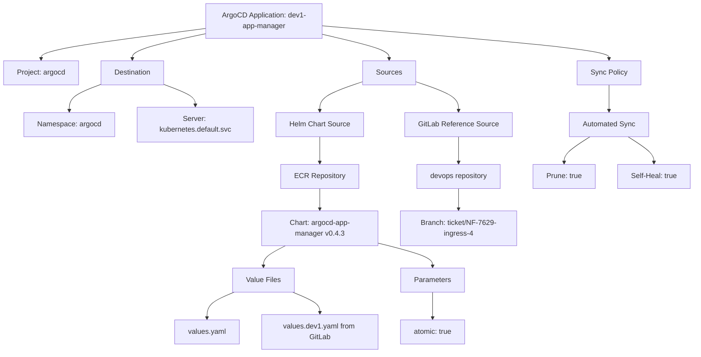
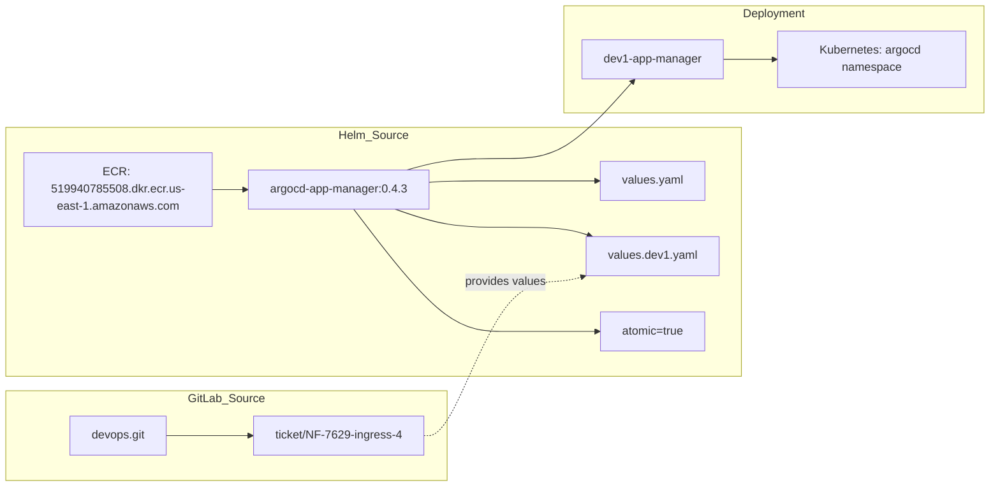
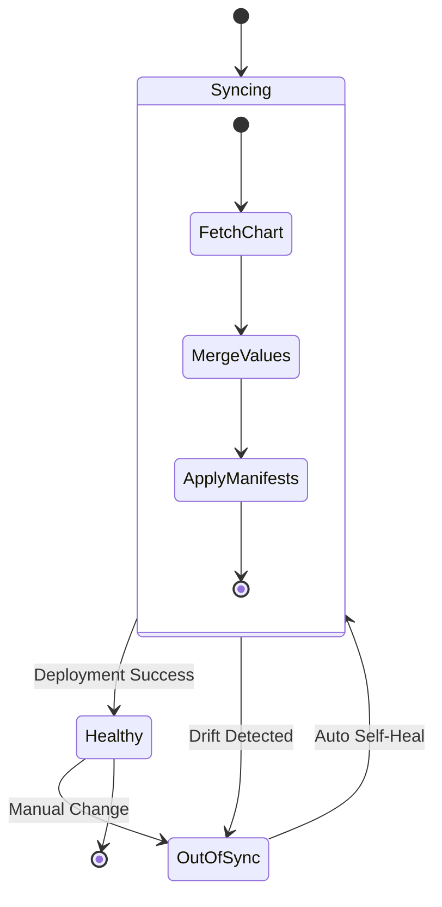

# Diagram: devops/k8s/argocd/app-manager/argocd/Application.dev1.yaml

> Auto-generated by Obscura crawlers

## Diagram 1

### SVG

<svg id="container" width="1554.04296875" xmlns="http://www.w3.org/2000/svg" class="flowchart" height="790" viewBox="0 0 1554.04296875 790" role="graphics-document document" aria-roledescription="flowchart-v2"><g><marker id="container_flowchart-v2-pointEnd" class="marker flowchart-v2" viewBox="0 0 10 10" refX="5" refY="5" markerUnits="userSpaceOnUse" markerWidth="8" markerHeight="8" orient="auto"><path d="M 0 0 L 10 5 L 0 10 z" class="arrowMarkerPath" style="stroke-width: 1; stroke-dasharray: 1, 0;"></path></marker><marker id="container_flowchart-v2-pointStart" class="marker flowchart-v2" viewBox="0 0 10 10" refX="4.5" refY="5" markerUnits="userSpaceOnUse" markerWidth="8" markerHeight="8" orient="auto"><path d="M 0 5 L 10 10 L 10 0 z" class="arrowMarkerPath" style="stroke-width: 1; stroke-dasharray: 1, 0;"></path></marker><marker id="container_flowchart-v2-circleEnd" class="marker flowchart-v2" viewBox="0 0 10 10" refX="11" refY="5" markerUnits="userSpaceOnUse" markerWidth="11" markerHeight="11" orient="auto"><circle cx="5" cy="5" r="5" class="arrowMarkerPath" style="stroke-width: 1; stroke-dasharray: 1, 0;"></circle></marker><marker id="container_flowchart-v2-circleStart" class="marker flowchart-v2" viewBox="0 0 10 10" refX="-1" refY="5" markerUnits="userSpaceOnUse" markerWidth="11" markerHeight="11" orient="auto"><circle cx="5" cy="5" r="5" class="arrowMarkerPath" style="stroke-width: 1; stroke-dasharray: 1, 0;"></circle></marker><marker id="container_flowchart-v2-crossEnd" class="marker cross flowchart-v2" viewBox="0 0 11 11" refX="12" refY="5.2" markerUnits="userSpaceOnUse" markerWidth="11" markerHeight="11" orient="auto"><path d="M 1,1 l 9,9 M 10,1 l -9,9" class="arrowMarkerPath" style="stroke-width: 2; stroke-dasharray: 1, 0;"></path></marker><marker id="container_flowchart-v2-crossStart" class="marker cross flowchart-v2" viewBox="0 0 11 11" refX="-1" refY="5.2" markerUnits="userSpaceOnUse" markerWidth="11" markerHeight="11" orient="auto"><path d="M 1,1 l 9,9 M 10,1 l -9,9" class="arrowMarkerPath" style="stroke-width: 2; stroke-dasharray: 1, 0;"></path></marker><g class="root"><g class="clusters"></g><g class="edgePaths"><path d="M461.281,63.66L399.712,71.55C338.143,79.44,215.005,95.22,153.436,106.61C91.867,118,91.867,125,91.867,128.5L91.867,132" id="L_A_B_0" class="edge-thickness-normal edge-pattern-solid edge-thickness-normal edge-pattern-solid flowchart-link" style=";" data-edge="true" data-et="edge" data-id="L_A_B_0" data-points="W3sieCI6NDYxLjI4MTI1LCJ5Ijo2My42NTk1MjI4NzgzNzMwOTZ9LHsieCI6OTEuODY3MTg3NSwieSI6MTExfSx7IngiOjkxLjg2NzE4NzUsInkiOjEzNn1d" marker-end="url(#container_flowchart-v2-pointEnd)"></path><path d="M461.281,75.337L434.013,81.281C406.745,87.225,352.208,99.112,324.94,108.556C297.672,118,297.672,125,297.672,128.5L297.672,132" id="L_A_C_0" class="edge-thickness-normal edge-pattern-solid edge-thickness-normal edge-pattern-solid flowchart-link" style=";" data-edge="true" data-et="edge" data-id="L_A_C_0" data-points="W3sieCI6NDYxLjI4MTI1LCJ5Ijo3NS4zMzY5Njk4MjU5ODA1Mn0seyJ4IjoyOTcuNjcxODc1LCJ5IjoxMTF9LHsieCI6Mjk3LjY3MTg3NSwieSI6MTM2fV0=" marker-end="url(#container_flowchart-v2-pointEnd)"></path><path d="M225.734,189.688L214.363,193.906C202.991,198.125,180.247,206.563,168.876,216.281C157.504,226,157.504,237,157.504,242.5L157.504,248" id="L_C_D_0" class="edge-thickness-normal edge-pattern-solid edge-thickness-normal edge-pattern-solid flowchart-link" style=";" data-edge="true" data-et="edge" data-id="L_C_D_0" data-points="W3sieCI6MjI1LjczNDM3NSwieSI6MTg5LjY4NzYyMzY2NTgwMjczfSx7IngiOjE1Ny41MDM5MDYyNSwieSI6MjE1fSx7IngiOjE1Ny41MDM5MDYyNSwieSI6MjUyfV0=" marker-end="url(#container_flowchart-v2-pointEnd)"></path><path d="M369.609,189.688L380.981,193.906C392.353,198.125,415.096,206.563,426.468,214.281C437.84,222,437.84,229,437.84,232.5L437.84,236" id="L_C_E_0" class="edge-thickness-normal edge-pattern-solid edge-thickness-normal edge-pattern-solid flowchart-link" style=";" data-edge="true" data-et="edge" data-id="L_C_E_0" data-points="W3sieCI6MzY5LjYwOTM3NSwieSI6MTg5LjY4NzYyMzY2NTgwMjczfSx7IngiOjQzNy44Mzk4NDM3NSwieSI6MjE1fSx7IngiOjQzNy44Mzk4NDM3NSwieSI6MjQwfV0=" marker-end="url(#container_flowchart-v2-pointEnd)"></path><path d="M721.281,76.845L746.077,82.537C770.874,88.23,820.466,99.615,845.262,108.807C870.059,118,870.059,125,870.059,128.5L870.059,132" id="L_A_F_0" class="edge-thickness-normal edge-pattern-solid edge-thickness-normal edge-pattern-solid flowchart-link" style=";" data-edge="true" data-et="edge" data-id="L_A_F_0" data-points="W3sieCI6NzIxLjI4MTI1LCJ5Ijo3Ni44NDQ2MDYwNTA0MTU0NX0seyJ4Ijo4NzAuMDU4NTkzNzUsInkiOjExMX0seyJ4Ijo4NzAuMDU4NTkzNzUsInkiOjEzNn1d" marker-end="url(#container_flowchart-v2-pointEnd)"></path><path d="M811.762,182.558L795.645,187.965C779.527,193.372,747.293,204.186,731.176,215.093C715.059,226,715.059,237,715.059,242.5L715.059,248" id="L_F_G_0" class="edge-thickness-normal edge-pattern-solid edge-thickness-normal edge-pattern-solid flowchart-link" style=";" data-edge="true" data-et="edge" data-id="L_F_G_0" data-points="W3sieCI6ODExLjc2MTcxODc1LCJ5IjoxODIuNTU3NjYxMjkwMzIyNTl9LHsieCI6NzE1LjA1ODU5Mzc1LCJ5IjoyMTV9LHsieCI6NzE1LjA1ODU5Mzc1LCJ5IjoyNTJ9XQ==" marker-end="url(#container_flowchart-v2-pointEnd)"></path><path d="M715.059,306L715.059,312.167C715.059,318.333,715.059,330.667,715.059,340.333C715.059,350,715.059,357,715.059,360.5L715.059,364" id="L_G_H_0" class="edge-thickness-normal edge-pattern-solid edge-thickness-normal edge-pattern-solid flowchart-link" style=";" data-edge="true" data-et="edge" data-id="L_G_H_0" data-points="W3sieCI6NzE1LjA1ODU5Mzc1LCJ5IjozMDZ9LHsieCI6NzE1LjA1ODU5Mzc1LCJ5IjozNDN9LHsieCI6NzE1LjA1ODU5Mzc1LCJ5IjozNjh9XQ==" marker-end="url(#container_flowchart-v2-pointEnd)"></path><path d="M715.059,422L715.059,426.167C715.059,430.333,715.059,438.667,715.059,446.333C715.059,454,715.059,461,715.059,464.5L715.059,468" id="L_H_I_0" class="edge-thickness-normal edge-pattern-solid edge-thickness-normal edge-pattern-solid flowchart-link" style=";" data-edge="true" data-et="edge" data-id="L_H_I_0" data-points="W3sieCI6NzE1LjA1ODU5Mzc1LCJ5Ijo0MjJ9LHsieCI6NzE1LjA1ODU5Mzc1LCJ5Ijo0NDd9LHsieCI6NzE1LjA1ODU5Mzc1LCJ5Ijo0NzJ9XQ==" marker-end="url(#container_flowchart-v2-pointEnd)"></path><path d="M637.73,550L629.468,554.167C621.207,558.333,604.683,566.667,596.422,574.333C588.16,582,588.16,589,588.16,592.5L588.16,596" id="L_I_J_0" class="edge-thickness-normal edge-pattern-solid edge-thickness-normal edge-pattern-solid flowchart-link" style=";" data-edge="true" data-et="edge" data-id="L_I_J_0" data-points="W3sieCI6NjM3LjcyOTg1ODM5ODQzNzUsInkiOjU1MH0seyJ4Ijo1ODguMTYwMTU2MjUsInkiOjU3NX0seyJ4Ijo1ODguMTYwMTU2MjUsInkiOjYwMH1d" marker-end="url(#container_flowchart-v2-pointEnd)"></path><path d="M522.701,654L512.599,658.167C502.497,662.333,482.293,670.667,472.192,680.333C462.09,690,462.09,701,462.09,706.5L462.09,712" id="L_J_K_0" class="edge-thickness-normal edge-pattern-solid edge-thickness-normal edge-pattern-solid flowchart-link" style=";" data-edge="true" data-et="edge" data-id="L_J_K_0" data-points="W3sieCI6NTIyLjcwMDU3MDkxMzQ2MTUsInkiOjY1NH0seyJ4Ijo0NjIuMDg5ODQzNzUsInkiOjY3OX0seyJ4Ijo0NjIuMDg5ODQzNzUsInkiOjcxNn1d" marker-end="url(#container_flowchart-v2-pointEnd)"></path><path d="M653.62,654L663.722,658.167C673.823,662.333,694.027,670.667,704.129,678.333C714.23,686,714.23,693,714.23,696.5L714.23,700" id="L_J_L_0" class="edge-thickness-normal edge-pattern-solid edge-thickness-normal edge-pattern-solid flowchart-link" style=";" data-edge="true" data-et="edge" data-id="L_J_L_0" data-points="W3sieCI6NjUzLjYxOTc0MTU4NjUzODUsInkiOjY1NH0seyJ4Ijo3MTQuMjMwNDY4NzUsInkiOjY3OX0seyJ4Ijo3MTQuMjMwNDY4NzUsInkiOjcwNH1d" marker-end="url(#container_flowchart-v2-pointEnd)"></path><path d="M845.059,543.889L865.553,549.075C886.048,554.26,927.038,564.63,947.533,573.315C968.027,582,968.027,589,968.027,592.5L968.027,596" id="L_I_M_0" class="edge-thickness-normal edge-pattern-solid edge-thickness-normal edge-pattern-solid flowchart-link" style=";" data-edge="true" data-et="edge" data-id="L_I_M_0" data-points="W3sieCI6ODQ1LjA1ODU5Mzc1LCJ5Ijo1NDMuODg5NDM3OTI0NjQ0OX0seyJ4Ijo5NjguMDI3MzQzNzUsInkiOjU3NX0seyJ4Ijo5NjguMDI3MzQzNzUsInkiOjYwMH1d" marker-end="url(#container_flowchart-v2-pointEnd)"></path><path d="M968.027,654L968.027,658.167C968.027,662.333,968.027,670.667,968.027,680.333C968.027,690,968.027,701,968.027,706.5L968.027,712" id="L_M_N_0" class="edge-thickness-normal edge-pattern-solid edge-thickness-normal edge-pattern-solid flowchart-link" style=";" data-edge="true" data-et="edge" data-id="L_M_N_0" data-points="W3sieCI6OTY4LjAyNzM0Mzc1LCJ5Ijo2NTR9LHsieCI6OTY4LjAyNzM0Mzc1LCJ5Ijo2Nzl9LHsieCI6OTY4LjAyNzM0Mzc1LCJ5Ijo3MTZ9XQ==" marker-end="url(#container_flowchart-v2-pointEnd)"></path><path d="M928.355,182.558L944.473,187.965C960.59,193.372,992.824,204.186,1008.941,215.093C1025.059,226,1025.059,237,1025.059,242.5L1025.059,248" id="L_F_O_0" class="edge-thickness-normal edge-pattern-solid edge-thickness-normal edge-pattern-solid flowchart-link" style=";" data-edge="true" data-et="edge" data-id="L_F_O_0" data-points="W3sieCI6OTI4LjM1NTQ2ODc1LCJ5IjoxODIuNTU3NjYxMjkwMzIyNTl9LHsieCI6MTAyNS4wNTg1OTM3NSwieSI6MjE1fSx7IngiOjEwMjUuMDU4NTkzNzUsInkiOjI1Mn1d" marker-end="url(#container_flowchart-v2-pointEnd)"></path><path d="M1025.059,306L1025.059,312.167C1025.059,318.333,1025.059,330.667,1025.059,340.333C1025.059,350,1025.059,357,1025.059,360.5L1025.059,364" id="L_O_P_0" class="edge-thickness-normal edge-pattern-solid edge-thickness-normal edge-pattern-solid flowchart-link" style=";" data-edge="true" data-et="edge" data-id="L_O_P_0" data-points="W3sieCI6MTAyNS4wNTg1OTM3NSwieSI6MzA2fSx7IngiOjEwMjUuMDU4NTkzNzUsInkiOjM0M30seyJ4IjoxMDI1LjA1ODU5Mzc1LCJ5IjozNjh9XQ==" marker-end="url(#container_flowchart-v2-pointEnd)"></path><path d="M1025.059,422L1025.059,426.167C1025.059,430.333,1025.059,438.667,1025.059,446.333C1025.059,454,1025.059,461,1025.059,464.5L1025.059,468" id="L_P_Q_0" class="edge-thickness-normal edge-pattern-solid edge-thickness-normal edge-pattern-solid flowchart-link" style=";" data-edge="true" data-et="edge" data-id="L_P_Q_0" data-points="W3sieCI6MTAyNS4wNTg1OTM3NSwieSI6NDIyfSx7IngiOjEwMjUuMDU4NTkzNzUsInkiOjQ0N30seyJ4IjoxMDI1LjA1ODU5Mzc1LCJ5Ijo0NzJ9XQ==" marker-end="url(#container_flowchart-v2-pointEnd)"></path><path d="M721.281,57.788L828.151,66.657C935.021,75.525,1148.76,93.263,1255.63,105.631C1362.5,118,1362.5,125,1362.5,128.5L1362.5,132" id="L_A_R_0" class="edge-thickness-normal edge-pattern-solid edge-thickness-normal edge-pattern-solid flowchart-link" style=";" data-edge="true" data-et="edge" data-id="L_A_R_0" data-points="W3sieCI6NzIxLjI4MTI1LCJ5Ijo1Ny43ODgxMTk0NTM3ODY2Mn0seyJ4IjoxMzYyLjUsInkiOjExMX0seyJ4IjoxMzYyLjUsInkiOjEzNn1d" marker-end="url(#container_flowchart-v2-pointEnd)"></path><path d="M1362.5,190L1362.5,194.167C1362.5,198.333,1362.5,206.667,1362.5,216.333C1362.5,226,1362.5,237,1362.5,242.5L1362.5,248" id="L_R_S_0" class="edge-thickness-normal edge-pattern-solid edge-thickness-normal edge-pattern-solid flowchart-link" style=";" data-edge="true" data-et="edge" data-id="L_R_S_0" data-points="W3sieCI6MTM2Mi41LCJ5IjoxOTB9LHsieCI6MTM2Mi41LCJ5IjoyMTV9LHsieCI6MTM2Mi41LCJ5IjoyNTJ9XQ==" marker-end="url(#container_flowchart-v2-pointEnd)"></path><path d="M1319.77,306L1310.011,312.167C1300.252,318.333,1280.733,330.667,1270.974,340.333C1261.215,350,1261.215,357,1261.215,360.5L1261.215,364" id="L_S_T_0" class="edge-thickness-normal edge-pattern-solid edge-thickness-normal edge-pattern-solid flowchart-link" style=";" data-edge="true" data-et="edge" data-id="L_S_T_0" data-points="W3sieCI6MTMxOS43NzAzMjQ3MDcwMzEyLCJ5IjozMDZ9LHsieCI6MTI2MS4yMTQ4NDM3NSwieSI6MzQzfSx7IngiOjEyNjEuMjE0ODQzNzUsInkiOjM2OH1d" marker-end="url(#container_flowchart-v2-pointEnd)"></path><path d="M1405.23,306L1414.989,312.167C1424.748,318.333,1444.267,330.667,1454.026,340.333C1463.785,350,1463.785,357,1463.785,360.5L1463.785,364" id="L_S_U_0" class="edge-thickness-normal edge-pattern-solid edge-thickness-normal edge-pattern-solid flowchart-link" style=";" data-edge="true" data-et="edge" data-id="L_S_U_0" data-points="W3sieCI6MTQwNS4yMjk2NzUyOTI5Njg4LCJ5IjozMDZ9LHsieCI6MTQ2My43ODUxNTYyNSwieSI6MzQzfSx7IngiOjE0NjMuNzg1MTU2MjUsInkiOjM2OH1d" marker-end="url(#container_flowchart-v2-pointEnd)"></path></g><g class="edgeLabels"><g class="edgeLabel"><g class="label" data-id="L_A_B_0" transform="translate(0, 0)"><foreignObject width="0" height="0">

</foreignObject></g></g><g class="edgeLabel"><g class="label" data-id="L_A_C_0" transform="translate(0, 0)"><foreignObject width="0" height="0">

</foreignObject></g></g><g class="edgeLabel"><g class="label" data-id="L_C_D_0" transform="translate(0, 0)"><foreignObject width="0" height="0">

</foreignObject></g></g><g class="edgeLabel"><g class="label" data-id="L_C_E_0" transform="translate(0, 0)"><foreignObject width="0" height="0">

</foreignObject></g></g><g class="edgeLabel"><g class="label" data-id="L_A_F_0" transform="translate(0, 0)"><foreignObject width="0" height="0">

</foreignObject></g></g><g class="edgeLabel"><g class="label" data-id="L_F_G_0" transform="translate(0, 0)"><foreignObject width="0" height="0">

</foreignObject></g></g><g class="edgeLabel"><g class="label" data-id="L_G_H_0" transform="translate(0, 0)"><foreignObject width="0" height="0">

</foreignObject></g></g><g class="edgeLabel"><g class="label" data-id="L_H_I_0" transform="translate(0, 0)"><foreignObject width="0" height="0">

</foreignObject></g></g><g class="edgeLabel"><g class="label" data-id="L_I_J_0" transform="translate(0, 0)"><foreignObject width="0" height="0">

</foreignObject></g></g><g class="edgeLabel"><g class="label" data-id="L_J_K_0" transform="translate(0, 0)"><foreignObject width="0" height="0">

</foreignObject></g></g><g class="edgeLabel"><g class="label" data-id="L_J_L_0" transform="translate(0, 0)"><foreignObject width="0" height="0">

</foreignObject></g></g><g class="edgeLabel"><g class="label" data-id="L_I_M_0" transform="translate(0, 0)"><foreignObject width="0" height="0">

</foreignObject></g></g><g class="edgeLabel"><g class="label" data-id="L_M_N_0" transform="translate(0, 0)"><foreignObject width="0" height="0">

</foreignObject></g></g><g class="edgeLabel"><g class="label" data-id="L_F_O_0" transform="translate(0, 0)"><foreignObject width="0" height="0">

</foreignObject></g></g><g class="edgeLabel"><g class="label" data-id="L_O_P_0" transform="translate(0, 0)"><foreignObject width="0" height="0">

</foreignObject></g></g><g class="edgeLabel"><g class="label" data-id="L_P_Q_0" transform="translate(0, 0)"><foreignObject width="0" height="0">

</foreignObject></g></g><g class="edgeLabel"><g class="label" data-id="L_A_R_0" transform="translate(0, 0)"><foreignObject width="0" height="0">

</foreignObject></g></g><g class="edgeLabel"><g class="label" data-id="L_R_S_0" transform="translate(0, 0)"><foreignObject width="0" height="0">

</foreignObject></g></g><g class="edgeLabel"><g class="label" data-id="L_S_T_0" transform="translate(0, 0)"><foreignObject width="0" height="0">

</foreignObject></g></g><g class="edgeLabel"><g class="label" data-id="L_S_U_0" transform="translate(0, 0)"><foreignObject width="0" height="0">

</foreignObject></g></g></g><g class="nodes"><g class="node default" id="flowchart-A-0" transform="translate(591.28125, 47)"><rect class="basic label-container" style="" x="-130" y="-39" width="260" height="78"></rect><g class="label" style="" transform="translate(-100, -24)"><rect></rect><foreignObject width="200" height="48">

ArgoCD Application: dev1-app-manager

</foreignObject></g></g><g class="node default" id="flowchart-B-1" transform="translate(91.8671875, 163)"><rect class="basic label-container" style="" x="-83.8671875" y="-27" width="167.734375" height="54"></rect><g class="label" style="" transform="translate(-53.8671875, -12)"><rect></rect><foreignObject width="107.734375" height="24">

Project: argocd

</foreignObject></g></g><g class="node default" id="flowchart-C-3" transform="translate(297.671875, 163)"><rect class="basic label-container" style="" x="-71.9375" y="-27" width="143.875" height="54"></rect><g class="label" style="" transform="translate(-41.9375, -12)"><rect></rect><foreignObject width="83.875" height="24">

Destination

</foreignObject></g></g><g class="node default" id="flowchart-D-5" transform="translate(157.50390625, 279)"><rect class="basic label-container" style="" x="-100.3359375" y="-27" width="200.671875" height="54"></rect><g class="label" style="" transform="translate(-70.3359375, -12)"><rect></rect><foreignObject width="140.671875" height="24">

Namespace: argocd

</foreignObject></g></g><g class="node default" id="flowchart-E-7" transform="translate(437.83984375, 279)"><rect class="basic label-container" style="" x="-130" y="-39" width="260" height="78"></rect><g class="label" style="" transform="translate(-100, -24)"><rect></rect><foreignObject width="200" height="48">

Server: kubernetes.default.svc

</foreignObject></g></g><g class="node default" id="flowchart-F-9" transform="translate(870.05859375, 163)"><rect class="basic label-container" style="" x="-58.296875" y="-27" width="116.59375" height="54"></rect><g class="label" style="" transform="translate(-28.296875, -12)"><rect></rect><foreignObject width="56.59375" height="24">

Sources

</foreignObject></g></g><g class="node default" id="flowchart-G-11" transform="translate(715.05859375, 279)"><rect class="basic label-container" style="" x="-97.21875" y="-27" width="194.4375" height="54"></rect><g class="label" style="" transform="translate(-67.21875, -12)"><rect></rect><foreignObject width="134.4375" height="24">

Helm Chart Source

</foreignObject></g></g><g class="node default" id="flowchart-H-13" transform="translate(715.05859375, 395)"><rect class="basic label-container" style="" x="-84.5859375" y="-27" width="169.171875" height="54"></rect><g class="label" style="" transform="translate(-54.5859375, -12)"><rect></rect><foreignObject width="109.171875" height="24">

ECR Repository

</foreignObject></g></g><g class="node default" id="flowchart-I-15" transform="translate(715.05859375, 511)"><rect class="basic label-container" style="" x="-130" y="-39" width="260" height="78"></rect><g class="label" style="" transform="translate(-100, -24)"><rect></rect><foreignObject width="200" height="48">

Chart: argocd-app-manager v0.4.3

</foreignObject></g></g><g class="node default" id="flowchart-J-17" transform="translate(588.16015625, 627)"><rect class="basic label-container" style="" x="-68.1875" y="-27" width="136.375" height="54"></rect><g class="label" style="" transform="translate(-38.1875, -12)"><rect></rect><foreignObject width="76.375" height="24">

Value Files

</foreignObject></g></g><g class="node default" id="flowchart-K-19" transform="translate(462.08984375, 743)"><rect class="basic label-container" style="" x="-72.140625" y="-27" width="144.28125" height="54"></rect><g class="label" style="" transform="translate(-42.140625, -12)"><rect></rect><foreignObject width="84.28125" height="24">

values.yaml

</foreignObject></g></g><g class="node default" id="flowchart-L-21" transform="translate(714.23046875, 743)"><rect class="basic label-container" style="" x="-130" y="-39" width="260" height="78"></rect><g class="label" style="" transform="translate(-100, -24)"><rect></rect><foreignObject width="200" height="48">

values.dev1.yaml from GitLab

</foreignObject></g></g><g class="node default" id="flowchart-M-23" transform="translate(968.02734375, 627)"><rect class="basic label-container" style="" x="-70.7734375" y="-27" width="141.546875" height="54"></rect><g class="label" style="" transform="translate(-40.7734375, -12)"><rect></rect><foreignObject width="81.546875" height="24">

Parameters

</foreignObject></g></g><g class="node default" id="flowchart-N-25" transform="translate(968.02734375, 743)"><rect class="basic label-container" style="" x="-73.796875" y="-27" width="147.59375" height="54"></rect><g class="label" style="" transform="translate(-43.796875, -12)"><rect></rect><foreignObject width="87.59375" height="24">

atomic: true

</foreignObject></g></g><g class="node default" id="flowchart-O-27" transform="translate(1025.05859375, 279)"><rect class="basic label-container" style="" x="-117.9609375" y="-27" width="235.921875" height="54"></rect><g class="label" style="" transform="translate(-87.9609375, -12)"><rect></rect><foreignObject width="175.921875" height="24">

GitLab Reference Source

</foreignObject></g></g><g class="node default" id="flowchart-P-29" transform="translate(1025.05859375, 395)"><rect class="basic label-container" style="" x="-95.390625" y="-27" width="190.78125" height="54"></rect><g class="label" style="" transform="translate(-65.390625, -12)"><rect></rect><foreignObject width="130.78125" height="24">

devops repository

</foreignObject></g></g><g class="node default" id="flowchart-Q-31" transform="translate(1025.05859375, 511)"><rect class="basic label-container" style="" x="-130" y="-39" width="260" height="78"></rect><g class="label" style="" transform="translate(-100, -24)"><rect></rect><foreignObject width="200" height="48">

Branch: ticket/NF-7629-ingress-4

</foreignObject></g></g><g class="node default" id="flowchart-R-33" transform="translate(1362.5, 163)"><rect class="basic label-container" style="" x="-70.2890625" y="-27" width="140.578125" height="54"></rect><g class="label" style="" transform="translate(-40.2890625, -12)"><rect></rect><foreignObject width="80.578125" height="24">

Sync Policy

</foreignObject></g></g><g class="node default" id="flowchart-S-35" transform="translate(1362.5, 279)"><rect class="basic label-container" style="" x="-88.6484375" y="-27" width="177.296875" height="54"></rect><g class="label" style="" transform="translate(-58.6484375, -12)"><rect></rect><foreignObject width="117.296875" height="24">

Automated Sync

</foreignObject></g></g><g class="node default" id="flowchart-T-37" transform="translate(1261.21484375, 395)"><rect class="basic label-container" style="" x="-70.3125" y="-27" width="140.625" height="54"></rect><g class="label" style="" transform="translate(-40.3125, -12)"><rect></rect><foreignObject width="80.625" height="24">

Prune: true

</foreignObject></g></g><g class="node default" id="flowchart-U-39" transform="translate(1463.78515625, 395)"><rect class="basic label-container" style="" x="-82.2578125" y="-27" width="164.515625" height="54"></rect><g class="label" style="" transform="translate(-52.2578125, -12)"><rect></rect><foreignObject width="104.515625" height="24">

Self-Heal: true

</foreignObject></g></g></g></g></g></svg>

## Diagram 2

### SVG

<svg id="container" width="1370.0625" xmlns="http://www.w3.org/2000/svg" class="flowchart" height="672" viewBox="0 0 1370.0625 672" role="graphics-document document" aria-roledescription="flowchart-v2"><g><marker id="container_flowchart-v2-pointEnd" class="marker flowchart-v2" viewBox="0 0 10 10" refX="5" refY="5" markerUnits="userSpaceOnUse" markerWidth="8" markerHeight="8" orient="auto"><path d="M 0 0 L 10 5 L 0 10 z" class="arrowMarkerPath" style="stroke-width: 1; stroke-dasharray: 1, 0;"></path></marker><marker id="container_flowchart-v2-pointStart" class="marker flowchart-v2" viewBox="0 0 10 10" refX="4.5" refY="5" markerUnits="userSpaceOnUse" markerWidth="8" markerHeight="8" orient="auto"><path d="M 0 5 L 10 10 L 10 0 z" class="arrowMarkerPath" style="stroke-width: 1; stroke-dasharray: 1, 0;"></path></marker><marker id="container_flowchart-v2-circleEnd" class="marker flowchart-v2" viewBox="0 0 10 10" refX="11" refY="5" markerUnits="userSpaceOnUse" markerWidth="11" markerHeight="11" orient="auto"><circle cx="5" cy="5" r="5" class="arrowMarkerPath" style="stroke-width: 1; stroke-dasharray: 1, 0;"></circle></marker><marker id="container_flowchart-v2-circleStart" class="marker flowchart-v2" viewBox="0 0 10 10" refX="-1" refY="5" markerUnits="userSpaceOnUse" markerWidth="11" markerHeight="11" orient="auto"><circle cx="5" cy="5" r="5" class="arrowMarkerPath" style="stroke-width: 1; stroke-dasharray: 1, 0;"></circle></marker><marker id="container_flowchart-v2-crossEnd" class="marker cross flowchart-v2" viewBox="0 0 11 11" refX="12" refY="5.2" markerUnits="userSpaceOnUse" markerWidth="11" markerHeight="11" orient="auto"><path d="M 1,1 l 9,9 M 10,1 l -9,9" class="arrowMarkerPath" style="stroke-width: 2; stroke-dasharray: 1, 0;"></path></marker><marker id="container_flowchart-v2-crossStart" class="marker cross flowchart-v2" viewBox="0 0 11 11" refX="-1" refY="5.2" markerUnits="userSpaceOnUse" markerWidth="11" markerHeight="11" orient="auto"><path d="M 1,1 l 9,9 M 10,1 l -9,9" class="arrowMarkerPath" style="stroke-width: 2; stroke-dasharray: 1, 0;"></path></marker><g class="root"><g class="clusters"><g class="cluster" id="Deployment" data-look="classic"><rect style="" x="780.359375" y="8" width="581.703125" height="148"></rect><g class="cluster-label" transform="translate(1027.2734375, 8)"><foreignObject width="87.875" height="24">

Deployment

</foreignObject></g></g><g class="cluster" id="GitLab_Source" data-look="classic"><rect style="" x="8" y="540" width="609.140625" height="124"></rect><g class="cluster-label" transform="translate(260.96875, 540)"><foreignObject width="103.203125" height="24">

GitLab_Source

</foreignObject></g></g><g class="cluster" id="Helm_Source" data-look="classic"><rect style="" x="8" y="176" width="1019.0625" height="344"></rect><g class="cluster-label" transform="translate(469.96875, 176)"><foreignObject width="95.125" height="24">

Helm_Source

</foreignObject></g></g></g><g class="edgePaths"><path d="M293,262L297.167,262C301.333,262,309.667,262,317.333,262C325,262,332,262,335.5,262L339,262" id="L_ECR_Chart_0" class="edge-thickness-normal edge-pattern-solid edge-thickness-normal edge-pattern-solid flowchart-link" style=";" data-edge="true" data-et="edge" data-id="L_ECR_Chart_0" data-points="W3sieCI6MjkzLCJ5IjoyNjJ9LHsieCI6MzE4LCJ5IjoyNjJ9LHsieCI6MzQzLCJ5IjoyNjJ9XQ==" marker-end="url(#container_flowchart-v2-pointEnd)"></path><path d="M592.141,252.006L596.307,251.671C600.474,251.337,608.807,250.669,626.576,250.334C644.344,250,671.547,250,698.75,250C725.953,250,753.156,250,774.626,250C796.096,250,811.833,250,819.702,250L827.57,250" id="L_Chart_Values1_0" class="edge-thickness-normal edge-pattern-solid edge-thickness-normal edge-pattern-solid flowchart-link" style=";" data-edge="true" data-et="edge" data-id="L_Chart_Values1_0" data-points="W3sieCI6NTkyLjE0MDYyNSwieSI6MjUyLjAwNTc0NTYyNTQ4OTY4fSx7IngiOjYxNy4xNDA2MjUsInkiOjI1MH0seyJ4Ijo2OTguNzUsInkiOjI1MH0seyJ4Ijo3ODAuMzU5Mzc1LCJ5IjoyNTB9LHsieCI6ODMxLjU3MDMxMjUsInkiOjI1MH1d" marker-end="url(#container_flowchart-v2-pointEnd)"></path><path d="M545.232,289L557.217,293.167C569.201,297.333,593.171,305.667,618.757,309.833C644.344,314,671.547,314,698.75,314C725.953,314,753.156,314,772.805,315.961C792.454,317.922,804.549,321.844,810.596,323.805L816.644,325.766" id="L_Chart_Values2_0" class="edge-thickness-normal edge-pattern-solid edge-thickness-normal edge-pattern-solid flowchart-link" style=";" data-edge="true" data-et="edge" data-id="L_Chart_Values2_0" data-points="W3sieCI6NTQ1LjIzMTgyMDkxMzQ2MTUsInkiOjI4OX0seyJ4Ijo2MTcuMTQwNjI1LCJ5IjozMTR9LHsieCI6Njk4Ljc1LCJ5IjozMTR9LHsieCI6NzgwLjM1OTM3NSwieSI6MzE0fSx7IngiOjgyMC40NDg2MzI4MTI1LCJ5IjozMjd9XQ==" marker-end="url(#container_flowchart-v2-pointEnd)"></path><path d="M488.174,289L509.669,317.167C531.163,345.333,574.152,401.667,609.248,429.833C644.344,458,671.547,458,698.75,458C725.953,458,753.156,458,774.389,458C795.622,458,810.885,458,818.517,458L826.148,458" id="L_Chart_Param_0" class="edge-thickness-normal edge-pattern-solid edge-thickness-normal edge-pattern-solid flowchart-link" style=";" data-edge="true" data-et="edge" data-id="L_Chart_Param_0" data-points="W3sieCI6NDg4LjE3NDM4NjE2MDcxNDMsInkiOjI4OX0seyJ4Ijo2MTcuMTQwNjI1LCJ5Ijo0NTh9LHsieCI6Njk4Ljc1LCJ5Ijo0NTh9LHsieCI6NzgwLjM1OTM3NSwieSI6NDU4fSx7IngiOjgzMC4xNDg0Mzc1LCJ5Ijo0NTh9XQ==" marker-end="url(#container_flowchart-v2-pointEnd)"></path><path d="M230.32,602L244.934,602C259.547,602,288.773,602,307.928,602C327.083,602,336.167,602,340.708,602L345.25,602" id="L_Repo_Branch_0" class="edge-thickness-normal edge-pattern-solid edge-thickness-normal edge-pattern-solid flowchart-link" style=";" data-edge="true" data-et="edge" data-id="L_Repo_Branch_0" data-points="W3sieCI6MjMwLjMyMDMxMjUsInkiOjYwMn0seyJ4IjozMTgsInkiOjYwMn0seyJ4IjozNDkuMjUsInkiOjYwMn1d" marker-end="url(#container_flowchart-v2-pointEnd)"></path><path d="M585.891,602L591.099,602C596.307,602,606.724,602,625.534,566.667C644.344,531.333,671.547,460.667,698.75,425.333C725.953,390,753.156,390,771.594,388.588C790.033,387.177,799.706,384.354,804.542,382.942L809.379,381.531" id="L_Branch_Values2_0" class="edge-thickness-normal edge-pattern-dotted edge-thickness-normal edge-pattern-solid flowchart-link" style=";" data-edge="true" data-et="edge" data-id="L_Branch_Values2_0" data-points="W3sieCI6NTg1Ljg5MDYyNSwieSI6NjAyfSx7IngiOjYxNy4xNDA2MjUsInkiOjYwMn0seyJ4Ijo2OTguNzUsInkiOjM5MH0seyJ4Ijo3ODAuMzU5Mzc1LCJ5IjozOTB9LHsieCI6ODEzLjIxODc1LCJ5IjozODAuNDEwMDMyMzAwOTY5fV0=" marker-end="url(#container_flowchart-v2-pointEnd)"></path><path d="M561.487,235L570.762,232.333C580.038,229.667,598.589,224.333,621.467,221.667C644.344,219,671.547,219,698.75,219C725.953,219,753.156,219,782.819,201.162C812.481,183.324,844.603,147.648,860.663,129.811L876.724,111.973" id="L_Chart_App_0" class="edge-thickness-normal edge-pattern-solid edge-thickness-normal edge-pattern-solid flowchart-link" style=";" data-edge="true" data-et="edge" data-id="L_Chart_App_0" data-points="W3sieCI6NTYxLjQ4NjU1NTIzMjU1ODIsInkiOjIzNX0seyJ4Ijo2MTcuMTQwNjI1LCJ5IjoyMTl9LHsieCI6Njk4Ljc1LCJ5IjoyMTl9LHsieCI6NzgwLjM1OTM3NSwieSI6MjE5fSx7IngiOjg3OS40MDA3NzU1NDc0NDUzLCJ5IjoxMDl9XQ==" marker-end="url(#container_flowchart-v2-pointEnd)"></path><path d="M1002.063,82L1006.229,82C1010.396,82,1018.729,82,1027.063,82C1035.396,82,1043.729,82,1051.396,82C1059.063,82,1066.063,82,1069.563,82L1073.063,82" id="L_App_K8s_0" class="edge-thickness-normal edge-pattern-solid edge-thickness-normal edge-pattern-solid flowchart-link" style=";" data-edge="true" data-et="edge" data-id="L_App_K8s_0" data-points="W3sieCI6MTAwMi4wNjI1LCJ5Ijo4Mn0seyJ4IjoxMDI3LjA2MjUsInkiOjgyfSx7IngiOjEwNTIuMDYyNSwieSI6ODJ9LHsieCI6MTA3Ny4wNjI1LCJ5Ijo4Mn1d" marker-end="url(#container_flowchart-v2-pointEnd)"></path></g><g class="edgeLabels"><g class="edgeLabel"><g class="label" data-id="L_ECR_Chart_0" transform="translate(0, 0)"><foreignObject width="0" height="0">

</foreignObject></g></g><g class="edgeLabel"><g class="label" data-id="L_Chart_Values1_0" transform="translate(0, 0)"><foreignObject width="0" height="0">

</foreignObject></g></g><g class="edgeLabel"><g class="label" data-id="L_Chart_Values2_0" transform="translate(0, 0)"><foreignObject width="0" height="0">

</foreignObject></g></g><g class="edgeLabel"><g class="label" data-id="L_Chart_Param_0" transform="translate(0, 0)"><foreignObject width="0" height="0">

</foreignObject></g></g><g class="edgeLabel"><g class="label" data-id="L_Repo_Branch_0" transform="translate(0, 0)"><foreignObject width="0" height="0">

</foreignObject></g></g><g class="edgeLabel" transform="translate(698.75, 390)"><g class="label" data-id="L_Branch_Values2_0" transform="translate(-56.609375, -12)"><foreignObject width="113.21875" height="24">

provides values

</foreignObject></g></g><g class="edgeLabel"><g class="label" data-id="L_Chart_App_0" transform="translate(0, 0)"><foreignObject width="0" height="0">

</foreignObject></g></g><g class="edgeLabel"><g class="label" data-id="L_App_K8s_0" transform="translate(0, 0)"><foreignObject width="0" height="0">

</foreignObject></g></g></g><g class="nodes"><g class="node default" id="flowchart-ECR-0" transform="translate(163, 262)"><rect class="basic label-container" style="" x="-130" y="-51" width="260" height="102"></rect><g class="label" style="" transform="translate(-100, -36)"><rect></rect><foreignObject width="200" height="72">

ECR: 519940785508.dkr.ecr.us-east-1.amazonaws.com

</foreignObject></g></g><g class="node default" id="flowchart-Chart-1" transform="translate(467.5703125, 262)"><rect class="basic label-container" style="" x="-124.5703125" y="-27" width="249.140625" height="54"></rect><g class="label" style="" transform="translate(-94.5703125, -12)"><rect></rect><foreignObject width="189.140625" height="24">

argocd-app-manager:0.4.3

</foreignObject></g></g><g class="node default" id="flowchart-Values1-2" transform="translate(903.7109375, 250)"><rect class="basic label-container" style="" x="-72.140625" y="-27" width="144.28125" height="54"></rect><g class="label" style="" transform="translate(-42.140625, -12)"><rect></rect><foreignObject width="84.28125" height="24">

values.yaml

</foreignObject></g></g><g class="node default" id="flowchart-Values2-3" transform="translate(903.7109375, 354)"><rect class="basic label-container" style="" x="-90.4921875" y="-27" width="180.984375" height="54"></rect><g class="label" style="" transform="translate(-60.4921875, -12)"><rect></rect><foreignObject width="120.984375" height="24">

values.dev1.yaml

</foreignObject></g></g><g class="node default" id="flowchart-Param-4" transform="translate(903.7109375, 458)"><rect class="basic label-container" style="" x="-73.5625" y="-27" width="147.125" height="54"></rect><g class="label" style="" transform="translate(-43.5625, -12)"><rect></rect><foreignObject width="87.125" height="24">

atomic=true

</foreignObject></g></g><g class="node default" id="flowchart-Repo-5" transform="translate(163, 602)"><rect class="basic label-container" style="" x="-67.3203125" y="-27" width="134.640625" height="54"></rect><g class="label" style="" transform="translate(-37.3203125, -12)"><rect></rect><foreignObject width="74.640625" height="24">

devops.git

</foreignObject></g></g><g class="node default" id="flowchart-Branch-6" transform="translate(467.5703125, 602)"><rect class="basic label-container" style="" x="-118.3203125" y="-27" width="236.640625" height="54"></rect><g class="label" style="" transform="translate(-88.3203125, -12)"><rect></rect><foreignObject width="176.640625" height="24">

ticket/NF-7629-ingress-4

</foreignObject></g></g><g class="node default" id="flowchart-K8s-7" transform="translate(1207.0625, 82)"><rect class="basic label-container" style="" x="-130" y="-39" width="260" height="78"></rect><g class="label" style="" transform="translate(-100, -24)"><rect></rect><foreignObject width="200" height="48">

Kubernetes: argocd namespace

</foreignObject></g></g><g class="node default" id="flowchart-App-8" transform="translate(903.7109375, 82)"><rect class="basic label-container" style="" x="-98.3515625" y="-27" width="196.703125" height="54"></rect><g class="label" style="" transform="translate(-68.3515625, -12)"><rect></rect><foreignObject width="136.703125" height="24">

dev1-app-manager

</foreignObject></g></g></g></g></g></svg>

## Diagram 3

### SVG

<svg id="container" width="407.325439453125" xmlns="http://www.w3.org/2000/svg" class="statediagram" height="831" viewBox="34.846435546875 0 407.325439453125 831" role="graphics-document document" aria-roledescription="stateDiagram"><g><defs><marker id="container_stateDiagram-barbEnd" refX="19" refY="7" markerWidth="20" markerHeight="14" markerUnits="userSpaceOnUse" orient="auto"><path d="M 19,7 L9,13 L14,7 L9,1 Z"></path></marker></defs><g class="root"><g class="clusters"></g><g class="edgePaths"><path d="M112.481,709.5L104.264,715.583C96.047,721.667,79.613,733.833,92.717,746.979C105.821,760.125,148.462,774.25,169.782,781.312L191.103,788.375" id="edge3" class="edge-thickness-normal edge-pattern-solid transition" style="fill:none;;;fill:none" data-edge="true" data-et="edge" data-id="edge3" data-points="W3sieCI6MTEyLjQ4MDUzNzI4MDcwMTc1LCJ5Ijo3MDkuNX0seyJ4Ijo2My4xNzk2ODc1LCJ5Ijo3NDZ9LHsieCI6MTkxLjEwMjg0MjA3OTkxNTksInkiOjc4OC4zNzQ2MTgxOTMxNDN9XQ==" marker-end="url(#container_stateDiagram-barbEnd)"></path><path d="M138.859,709.5L138.776,715.583C138.693,721.667,138.526,733.833,136.398,748.283C134.27,762.733,130.181,779.467,128.137,787.833L126.092,796.2" id="edge5" class="edge-thickness-normal edge-pattern-solid transition" style="fill:none;;;fill:none" data-edge="true" data-et="edge" data-id="edge5" data-points="W3sieCI6MTM4Ljg1OTM3NSwieSI6NzA5LjV9LHsieCI6MTM4LjM1OTM3NSwieSI6NzQ2fSx7IngiOjEyNi4wOTE5NjYwMjk0MTU3NiwieSI6Nzk2LjIwMDA5MDYwNzQ5NTd9XQ==" marker-end="url(#container_stateDiagram-barbEnd)"></path><path d="M259.719,22L259.719,26.167C259.719,30.333,259.719,38.667,259.719,47C259.719,55.333,259.719,63.667,259.719,67.833L259.719,72" id="edge0" class="edge-thickness-normal edge-pattern-solid transition" style="fill:none;;;fill:none" data-edge="true" data-et="edge" data-id="edge0" data-points="W3sieCI6MjU5LjcxODc1LCJ5IjoyMn0seyJ4IjoyNTkuNzE4NzUsInkiOjQ3fSx7IngiOjI1OS43MTg3NSwieSI6NzJ9XQ==" marker-end="url(#container_stateDiagram-barbEnd)"></path><path d="M161.586,574.871L157.715,584.393C153.844,593.914,146.102,612.957,142.23,628.645C138.359,644.333,138.359,656.667,138.359,662.833L138.359,669" id="edge1" class="edge-thickness-normal edge-pattern-solid transition" style="fill:none;;;fill:none" data-edge="true" data-et="edge" data-id="edge1" data-points="W3sieCI6MTYxLjU4NTkzNzUsInkiOjU3NC44NzEwODkyMjM2Mzg1fSx7IngiOjEzOC4zNTkzNzUsInkiOjYzMn0seyJ4IjoxMzguMzU5Mzc1LCJ5Ijo2Njl9XQ==" marker-end="url(#container_stateDiagram-barbEnd)"></path><path d="M259.719,595L259.719,601.167C259.719,607.333,259.719,619.667,259.719,635.333C259.719,651,259.719,670,259.719,689C259.719,708,259.719,727,257.221,742.667C254.723,758.333,249.727,770.667,247.229,776.833L244.731,783" id="edge2" class="edge-thickness-normal edge-pattern-solid transition" style="fill:none;;;fill:none" data-edge="true" data-et="edge" data-id="edge2" data-points="W3sieCI6MjU5LjcxODc1LCJ5Ijo1OTV9LHsieCI6MjU5LjcxODc1LCJ5Ijo2MzJ9LHsieCI6MjU5LjcxODc1LCJ5Ijo2ODl9LHsieCI6MjU5LjcxODc1LCJ5Ijo3NDZ9LHsieCI6MjQ0LjczMDYwNTgxMTQwMzUsInkiOjc4M31d" marker-end="url(#container_stateDiagram-barbEnd)"></path><path d="M282.66,784.979L299.255,778.483C315.849,771.986,349.038,758.993,365.632,742.997C382.227,727,382.227,708,382.227,689C382.227,670,382.227,651,378.164,631.601C374.102,612.203,365.977,592.406,361.914,582.507L357.852,572.608" id="edge4" class="edge-thickness-normal edge-pattern-solid transition" style="fill:none;;;fill:none" data-edge="true" data-et="edge" data-id="edge4" data-points="W3sieCI6MjgyLjY2MDE1NjI1LCJ5Ijo3ODQuOTc5MjM0Mjk4Mjg1Nn0seyJ4IjozODIuMjI2NTYyNSwieSI6NzQ2fSx7IngiOjM4Mi4yMjY1NjI1LCJ5Ijo2ODl9LHsieCI6MzgyLjIyNjU2MjUsInkiOjYzMn0seyJ4IjozNTcuODUxNTYyNSwieSI6NTcyLjYwODM3OTU2NzYyOTZ9XQ==" marker-end="url(#container_stateDiagram-barbEnd)"></path></g><g class="edgeLabels"><g class="edgeLabel" transform="translate(98.02612, 757.5429)"><g class="label" data-id="edge3" transform="translate(-55.1796875, -12)"><foreignObject width="110.359375" height="24">

Manual Change

</foreignObject></g></g><g class="edgeLabel"><g class="label" data-id="edge5" transform="translate(0, 0)"><foreignObject width="0" height="0">

</foreignObject></g></g><g class="edgeLabel"><g class="label" data-id="edge0" transform="translate(0, 0)"><foreignObject width="0" height="0">

</foreignObject></g></g><g class="edgeLabel" transform="translate(138.359375, 632)"><g class="label" data-id="edge1" transform="translate(-74.15625, -12)"><foreignObject width="148.3125" height="24">

Deployment Success

</foreignObject></g></g><g class="edgeLabel" transform="translate(259.71875, 689)"><g class="label" data-id="edge2" transform="translate(-50.5625, -12)"><foreignObject width="101.125" height="24">

Drift Detected

</foreignObject></g></g><g class="edgeLabel" transform="translate(382.2265625, 689)"><g class="label" data-id="edge4" transform="translate(-51.9453125, -12)"><foreignObject width="103.890625" height="24">

Auto Self-Heal

</foreignObject></g></g></g><g class="nodes"><g class="node default" id="state-root_start-0" transform="translate(259.71875, 15)"><circle class="state-start" r="7" width="14" height="14"></circle></g><g class="root" transform="translate(153.5859375, 64)"><g class="clusters"><g class="statediagram-state statediagram-cluster" id="Syncing" data-id="Syncing" data-look="classic"><g><rect class="outer" x="8" y="8" width="196.265625" height="523" data-look="classic"></rect></g><g class="cluster-label" transform="translate(77.796875, 9)"><foreignObject width="56.671875" height="19">
Syncing
</foreignObject></g><rect class="inner" x="8" y="29" width="196.265625" height="498"></rect></g></g><g class="edgePaths"><path d="M106.133,59.5L106.133,65.75C106.133,72,106.133,84.5,106.216,97.083C106.299,109.667,106.466,122.333,106.549,128.667L106.633,135" id="edge6" class="edge-thickness-normal edge-pattern-solid transition" style="fill:none;;;fill:none" data-edge="true" data-et="edge" data-id="edge6" data-points="W3sieCI6MTA2LjEzMjgxMjUsInkiOjU5LjV9LHsieCI6MTA2LjEzMjgxMjUsInkiOjk3fSx7IngiOjEwNi42MzI4MTI1LCJ5IjoxMzV9XQ==" marker-end="url(#container_stateDiagram-barbEnd)"></path><path d="M106.633,175L106.549,181.167C106.466,187.333,106.299,199.667,106.299,212.167C106.299,224.667,106.466,237.333,106.549,243.667L106.633,250" id="edge7" class="edge-thickness-normal edge-pattern-solid transition" style="fill:none;;;fill:none" data-edge="true" data-et="edge" data-id="edge7" data-points="W3sieCI6MTA2LjYzMjgxMjUsInkiOjE3NX0seyJ4IjoxMDYuMTMyODEyNSwieSI6MjEyfSx7IngiOjEwNi42MzI4MTI1LCJ5IjoyNTB9XQ==" marker-end="url(#container_stateDiagram-barbEnd)"></path><path d="M106.633,290L106.549,296.167C106.466,302.333,106.299,314.667,106.299,327.167C106.299,339.667,106.466,352.333,106.549,358.667L106.633,365" id="edge8" class="edge-thickness-normal edge-pattern-solid transition" style="fill:none;;;fill:none" data-edge="true" data-et="edge" data-id="edge8" data-points="W3sieCI6MTA2LjYzMjgxMjUsInkiOjI5MH0seyJ4IjoxMDYuMTMyODEyNSwieSI6MzI3fSx7IngiOjEwNi42MzI4MTI1LCJ5IjozNjV9XQ==" marker-end="url(#container_stateDiagram-barbEnd)"></path><path d="M106.633,405L106.549,411.167C106.466,417.333,106.299,429.667,106.216,442.083C106.133,454.5,106.133,467,106.133,473.25L106.133,479.5" id="edge9" class="edge-thickness-normal edge-pattern-solid transition" style="fill:none;;;fill:none" data-edge="true" data-et="edge" data-id="edge9" data-points="W3sieCI6MTA2LjYzMjgxMjUsInkiOjQwNX0seyJ4IjoxMDYuMTMyODEyNSwieSI6NDQyfSx7IngiOjEwNi4xMzI4MTI1LCJ5Ijo0NzkuNX1d" marker-end="url(#container_stateDiagram-barbEnd)"></path></g><g class="edgeLabels"><g class="edgeLabel"><g class="label" data-id="edge6" transform="translate(0, 0)"><foreignObject width="0" height="0">

</foreignObject></g></g><g class="edgeLabel"><g class="label" data-id="edge7" transform="translate(0, 0)"><foreignObject width="0" height="0">

</foreignObject></g></g><g class="edgeLabel"><g class="label" data-id="edge8" transform="translate(0, 0)"><foreignObject width="0" height="0">

</foreignObject></g></g><g class="edgeLabel"><g class="label" data-id="edge9" transform="translate(0, 0)"><foreignObject width="0" height="0">

</foreignObject></g></g></g><g class="nodes"><g class="node default" id="state-Syncing_start-6" transform="translate(106.1328125, 52.5)"><circle class="state-start" r="7" width="14" height="14"></circle></g><g class="node  statediagram-state" id="state-FetchChart-7" transform="translate(106.1328125, 154.5)"><g class="basic label-container outer-path"><path d="M-41.7109375 -20 C-22.996301053860982 -20, -4.281664607721964 -20, 41.7109375 -20 C41.7109375 -20, 41.7109375 -20, 41.7109375 -20 C41.80194334029933 -19.996235970602594, 41.892949180598656 -19.992471941205192, 42.12383422736166 -19.982922465033347 C42.279984947644856 -19.96345829804857, 42.43613566792805 -19.943994131063796, 42.53391045140367 -19.931806517013612 C42.68820459190193 -19.899454437868044, 42.84249873240018 -19.867102358722477, 42.938364935703994 -19.847001329696653 C43.092724908080356 -19.80104637483653, 43.24708488045672 -19.755091419976413, 43.33443484602342 -19.729086208503173 C43.43005086522899 -19.691776722033616, 43.525666884434564 -19.654467235564056, 43.719414623264846 -19.578866633275286 C43.83077187388979 -19.524427390669693, 43.94212912451472 -19.4699881480641, 44.090674465185366 -19.397368756032446 C44.175747900563096 -19.34667599171534, 44.260821335940825 -19.295983227398235, 44.445678290612136 -19.185832391312644 C44.531994454773 -19.124203834648526, 44.61831061893386 -19.062575277984408, 44.78200106344834 -18.94570254698197 C44.87225116766821 -18.869264607828327, 44.96250127188808 -18.79282666867468, 45.097345358128706 -18.678619553365657 C45.15704619714229 -18.61891871435207, 45.21674703615588 -18.559217875338483, 45.38955705336566 -18.386407858128706 C45.444620972370195 -18.321394011811822, 45.49968489137474 -18.256380165494942, 45.65664004698197 -18.07106356344834 C45.70493034929856 -18.003428786848698, 45.75322065161514 -17.93579401024905, 45.896769891312644 -17.734740790612136 C45.94920345593065 -17.646745915382002, 46.001637020548664 -17.558751040151872, 46.10830625603245 -17.37973696518537 C46.16058169747814 -17.27280584057785, 46.21285713892384 -17.165874715970332, 46.28980413327529 -17.008477123264846 C46.34020122058754 -16.879320457646184, 46.390598307899786 -16.750163792027518, 46.440023708503176 -16.623497346023417 C46.470627567110114 -16.52070079702111, 46.50123142571705 -16.417904248018804, 46.55793882969665 -16.227427435703994 C46.576664094698025 -16.13812255189764, 46.595389359699396 -16.048817668091292, 46.64274401701361 -15.82297295140367 C46.66191881561925 -15.66914368062636, 46.68109361422489 -15.51531440984905, 46.69385996503335 -15.412896727361662 C46.70064588056636 -15.248828416495627, 46.70743179609938 -15.084760105629591, 46.7109375 -15 C46.7109375 -15, 46.7109375 -15, 46.7109375 -15 C46.7109375 -5.932451320246322, 46.7109375 3.1350973595073555, 46.7109375 15 C46.7109375 15, 46.7109375 15, 46.7109375 15 C46.706917326492515 15.097198833901292, 46.702897152985024 15.194397667802583, 46.69385996503335 15.412896727361662 C46.68170626565927 15.510399431322833, 46.6695525662852 15.607902135284004, 46.64274401701361 15.822972951403669 C46.61131350864207 15.972871919342941, 46.57988300027053 16.12277088728221, 46.55793882969665 16.227427435703994 C46.522124615504474 16.347725260611295, 46.4863104013123 16.4680230855186, 46.440023708503176 16.623497346023417 C46.396195839209696 16.735818548716033, 46.352367969916216 16.84813975140865, 46.28980413327529 17.008477123264846 C46.23994746415476 17.110460570000185, 46.19009079503422 17.212444016735528, 46.10830625603245 17.379736965185366 C46.02823233227381 17.514118348210935, 45.94815840851516 17.64849973123651, 45.896769891312644 17.734740790612133 C45.808695734578684 17.858096322243536, 45.72062157784472 17.981451853874944, 45.65664004698197 18.07106356344834 C45.57728684438217 18.164755712714907, 45.497933641782375 18.258447861981477, 45.38955705336566 18.386407858128706 C45.28641971343977 18.489545198054593, 45.18328237351388 18.592682537980483, 45.097345358128706 18.678619553365657 C45.02263273047356 18.74189792114239, 44.94792010281841 18.805176288919117, 44.78200106344834 18.94570254698197 C44.71347090506266 18.994632139606153, 44.644940746676966 19.043561732230337, 44.445678290612136 19.185832391312644 C44.32495047279377 19.25777055612298, 44.20422265497542 19.329708720933315, 44.090674465185366 19.397368756032446 C43.98957413568267 19.446793695445145, 43.88847380617999 19.496218634857843, 43.719414623264846 19.578866633275286 C43.56805671056547 19.63792667408055, 43.4166987978661 19.696986714885814, 43.33443484602342 19.729086208503173 C43.212224999346 19.765469656239414, 43.09001515266858 19.801853103975656, 42.938364935703994 19.847001329696653 C42.83548460505724 19.868573066567915, 42.732604274410484 19.890144803439178, 42.53391045140367 19.931806517013612 C42.443976977556744 19.943016712837895, 42.35404350370982 19.95422690866218, 42.12383422736166 19.982922465033347 C42.01625485844559 19.987371980644898, 41.908675489529514 19.991821496256453, 41.7109375 20 C41.7109375 20, 41.7109375 20, 41.7109375 20 C14.686651548753883 20, -12.337634402492235 20, -41.7109375 20 C-41.7109375 20, -41.7109375 20, -41.7109375 20 C-41.840278635811245 19.994650411051797, -41.96961977162248 19.989300822103594, -42.12383422736166 19.982922465033347 C-42.224398073445215 19.970387194691643, -42.32496191952876 19.957851924349942, -42.53391045140367 19.931806517013612 C-42.66881433944163 19.903520146262558, -42.80371822747959 19.875233775511504, -42.938364935703994 19.847001329696653 C-43.091333095947085 19.801460735261543, -43.24430125619018 19.75592014082643, -43.33443484602342 19.729086208503173 C-43.43004346537044 19.691779609467382, -43.525652084717464 19.65447301043159, -43.719414623264846 19.578866633275286 C-43.804325660071235 19.537356156798417, -43.889236696877624 19.495845680321544, -44.090674465185366 19.397368756032446 C-44.230487242309636 19.314058423872805, -44.3703000194339 19.230748091713167, -44.445678290612136 19.185832391312644 C-44.57681897693311 19.092199740968717, -44.70795966325408 18.998567090624785, -44.78200106344834 18.94570254698197 C-44.846624528070734 18.890969264406806, -44.91124799269312 18.836235981831646, -45.097345358128706 18.67861955336566 C-45.187036897778015 18.58892801371635, -45.276728437427316 18.499236474067047, -45.38955705336566 18.386407858128706 C-45.44915440588506 18.31604139697526, -45.508751758404465 18.24567493582181, -45.65664004698197 18.07106356344834 C-45.71588283300843 17.988088878970878, -45.77512561903488 17.905114194493414, -45.896769891312644 17.734740790612133 C-45.95862465375289 17.630935105399388, -46.02047941619314 17.527129420186647, -46.10830625603244 17.37973696518537 C-46.17511133222993 17.24308499765088, -46.241916408427414 17.10643303011639, -46.28980413327528 17.00847712326485 C-46.32130574982313 16.927745399034244, -46.35280736637099 16.847013674803637, -46.440023708503176 16.623497346023417 C-46.4686530212701 16.5273331795846, -46.497282334037024 16.431169013145784, -46.55793882969665 16.227427435703994 C-46.58231033914227 16.111194377369884, -46.60668184858788 15.994961319035772, -46.64274401701361 15.82297295140367 C-46.65692660103877 15.709193578634363, -46.67110918506392 15.595414205865053, -46.69385996503335 15.412896727361664 C-46.69805099237567 15.311567028590225, -46.702242019718 15.210237329818789, -46.7109375 15 C-46.7109375 15, -46.7109375 15, -46.7109375 15 C-46.7109375 3.7196808913854635, -46.7109375 -7.560638217229073, -46.7109375 -15 C-46.7109375 -15, -46.7109375 -15, -46.7109375 -15 C-46.707008700262634 -15.094989619824203, -46.703079900525275 -15.189979239648407, -46.69385996503335 -15.41289672736166 C-46.67832821100917 -15.537499777676292, -46.662796456985 -15.662102827990925, -46.64274401701361 -15.822972951403669 C-46.62569602227521 -15.904278566524898, -46.6086480275368 -15.985584181646127, -46.55793882969665 -16.227427435703994 C-46.523141171355114 -16.3443107096994, -46.488343513013575 -16.461193983694805, -46.440023708503176 -16.623497346023417 C-46.38578620042808 -16.762496166551326, -46.33154869235299 -16.901494987079236, -46.28980413327529 -17.008477123264846 C-46.24945192037259 -17.09101889406118, -46.20909970746989 -17.173560664857515, -46.10830625603245 -17.379736965185366 C-46.05350794339095 -17.471700399654104, -45.998709630749445 -17.563663834122842, -45.896769891312644 -17.734740790612133 C-45.84387337957871 -17.80882696490383, -45.79097686784477 -17.88291313919553, -45.65664004698197 -18.07106356344834 C-45.58710521371332 -18.15316318595115, -45.51757038044467 -18.235262808453957, -45.38955705336566 -18.386407858128706 C-45.287658104887925 -18.488306806606438, -45.18575915641019 -18.59020575508417, -45.097345358128706 -18.678619553365657 C-44.9822973853705 -18.7760602158165, -44.867249412612296 -18.873500878267343, -44.78200106344834 -18.945702546981966 C-44.684572722266196 -19.015265045543007, -44.58714438108406 -19.084827544104048, -44.445678290612136 -19.185832391312644 C-44.3344873988408 -19.252087781679172, -44.22329650706946 -19.3183431720457, -44.090674465185366 -19.397368756032446 C-44.01317248027821 -19.435257167744282, -43.93567049537105 -19.47314557945612, -43.719414623264846 -19.578866633275286 C-43.582358689773706 -19.63234602447611, -43.445302756282565 -19.685825415676934, -43.33443484602342 -19.729086208503173 C-43.18316264636838 -19.774121893595087, -43.031890446713334 -19.819157578687, -42.938364935703994 -19.847001329696653 C-42.7964620435075 -19.876755237294834, -42.65455915131101 -19.906509144893015, -42.53391045140367 -19.931806517013612 C-42.42833453336431 -19.94496654147307, -42.32275861532494 -19.95812656593253, -42.12383422736166 -19.982922465033347 C-41.974740750833675 -19.98908901683669, -41.82564727430568 -19.995255568640033, -41.7109375 -20 C-41.7109375 -20, -41.7109375 -20, -41.7109375 -20" stroke="none" stroke-width="0" fill="#ECECFF" style=""></path><path d="M-41.7109375 -20 C-19.630986486777886 -20, 2.448964526444229 -20, 41.7109375 -20 M-41.7109375 -20 C-24.328403104380612 -20, -6.945868708761225 -20, 41.7109375 -20 M41.7109375 -20 C41.7109375 -20, 41.7109375 -20, 41.7109375 -20 M41.7109375 -20 C41.7109375 -20, 41.7109375 -20, 41.7109375 -20 M41.7109375 -20 C41.83368270326271 -19.994923220839986, 41.95642790652541 -19.989846441679973, 42.12383422736166 -19.982922465033347 M41.7109375 -20 C41.85954186217693 -19.99385367811586, 42.00814622435387 -19.987707356231716, 42.12383422736166 -19.982922465033347 M42.12383422736166 -19.982922465033347 C42.21847111139408 -19.97112598974085, 42.3131079954265 -19.95932951444836, 42.53391045140367 -19.931806517013612 M42.12383422736166 -19.982922465033347 C42.26272100499589 -19.965610246255572, 42.40160778263011 -19.948298027477794, 42.53391045140367 -19.931806517013612 M42.53391045140367 -19.931806517013612 C42.66478186930709 -19.904365666335604, 42.79565328721051 -19.876924815657596, 42.938364935703994 -19.847001329696653 M42.53391045140367 -19.931806517013612 C42.66320071601145 -19.904697199317976, 42.79249098061924 -19.87758788162234, 42.938364935703994 -19.847001329696653 M42.938364935703994 -19.847001329696653 C43.055653884760325 -19.81208289665669, 43.17294283381665 -19.777164463616728, 43.33443484602342 -19.729086208503173 M42.938364935703994 -19.847001329696653 C43.04395889588801 -19.815564645697215, 43.149552856072035 -19.784127961697774, 43.33443484602342 -19.729086208503173 M43.33443484602342 -19.729086208503173 C43.46110570639304 -19.67965908540901, 43.58777656676266 -19.63023196231485, 43.719414623264846 -19.578866633275286 M43.33443484602342 -19.729086208503173 C43.439169888077146 -19.688218468276602, 43.54390493013087 -19.647350728050032, 43.719414623264846 -19.578866633275286 M43.719414623264846 -19.578866633275286 C43.83793378070673 -19.520926147773178, 43.9564529381486 -19.46298566227107, 44.090674465185366 -19.397368756032446 M43.719414623264846 -19.578866633275286 C43.79579770647029 -19.541525219274416, 43.87218078967574 -19.504183805273545, 44.090674465185366 -19.397368756032446 M44.090674465185366 -19.397368756032446 C44.220533718723594 -19.319989436568264, 44.35039297226182 -19.242610117104086, 44.445678290612136 -19.185832391312644 M44.090674465185366 -19.397368756032446 C44.17749285578396 -19.345636224091493, 44.264311246382555 -19.293903692150543, 44.445678290612136 -19.185832391312644 M44.445678290612136 -19.185832391312644 C44.53669896407311 -19.120844879569866, 44.627719637534085 -19.055857367827088, 44.78200106344834 -18.94570254698197 M44.445678290612136 -19.185832391312644 C44.54906497691236 -19.112015716105738, 44.65245166321258 -19.038199040898828, 44.78200106344834 -18.94570254698197 M44.78200106344834 -18.94570254698197 C44.87773310432217 -18.864621644321286, 44.973465145195995 -18.783540741660598, 45.097345358128706 -18.678619553365657 M44.78200106344834 -18.94570254698197 C44.90332094070898 -18.842949852385804, 45.02464081796962 -18.740197157789634, 45.097345358128706 -18.678619553365657 M45.097345358128706 -18.678619553365657 C45.17961440243501 -18.596350509059356, 45.26188344674131 -18.51408146475306, 45.38955705336566 -18.386407858128706 M45.097345358128706 -18.678619553365657 C45.156846880807436 -18.619118030686927, 45.216348403486165 -18.559616508008194, 45.38955705336566 -18.386407858128706 M45.38955705336566 -18.386407858128706 C45.49400397715715 -18.263087608237097, 45.59845090094864 -18.13976735834549, 45.65664004698197 -18.07106356344834 M45.38955705336566 -18.386407858128706 C45.45200893030358 -18.312671066362977, 45.5144608072415 -18.23893427459725, 45.65664004698197 -18.07106356344834 M45.65664004698197 -18.07106356344834 C45.72028866674518 -17.98191812488102, 45.7839372865084 -17.892772686313695, 45.896769891312644 -17.734740790612136 M45.65664004698197 -18.07106356344834 C45.71693422993193 -17.98661630595668, 45.7772284128819 -17.90216904846502, 45.896769891312644 -17.734740790612136 M45.896769891312644 -17.734740790612136 C45.9455441303628 -17.652887056063854, 45.994318369412944 -17.571033321515575, 46.10830625603245 -17.37973696518537 M45.896769891312644 -17.734740790612136 C45.962656642669586 -17.62416855492284, 46.02854339402652 -17.513596319233542, 46.10830625603245 -17.37973696518537 M46.10830625603245 -17.37973696518537 C46.164988244585466 -17.26379210439904, 46.22167023313849 -17.147847243612716, 46.28980413327529 -17.008477123264846 M46.10830625603245 -17.37973696518537 C46.160144217474134 -17.273700720229332, 46.21198217891582 -17.1676644752733, 46.28980413327529 -17.008477123264846 M46.28980413327529 -17.008477123264846 C46.348453351921485 -16.858172057526613, 46.40710257056769 -16.70786699178838, 46.440023708503176 -16.623497346023417 M46.28980413327529 -17.008477123264846 C46.34172372550336 -16.875418611948295, 46.393643317731424 -16.742360100631743, 46.440023708503176 -16.623497346023417 M46.440023708503176 -16.623497346023417 C46.485799924259304 -16.469737747714184, 46.53157614001544 -16.315978149404955, 46.55793882969665 -16.227427435703994 M46.440023708503176 -16.623497346023417 C46.46946361903685 -16.52461042968168, 46.498903529570526 -16.425723513339943, 46.55793882969665 -16.227427435703994 M46.55793882969665 -16.227427435703994 C46.58785743182215 -16.0847390792898, 46.61777603394765 -15.94205072287561, 46.64274401701361 -15.82297295140367 M46.55793882969665 -16.227427435703994 C46.587184536473224 -16.08794826436384, 46.616430243249795 -15.948469093023686, 46.64274401701361 -15.82297295140367 M46.64274401701361 -15.82297295140367 C46.65480074622092 -15.72624818781868, 46.66685747542824 -15.629523424233687, 46.69385996503335 -15.412896727361662 M46.64274401701361 -15.82297295140367 C46.65442167272783 -15.729289294023385, 46.66609932844205 -15.6356056366431, 46.69385996503335 -15.412896727361662 M46.69385996503335 -15.412896727361662 C46.69838540234194 -15.303481741050803, 46.70291083965054 -15.194066754739941, 46.7109375 -15 M46.69385996503335 -15.412896727361662 C46.700318854954965 -15.256735166794977, 46.70677774487658 -15.100573606228291, 46.7109375 -15 M46.7109375 -15 C46.7109375 -15, 46.7109375 -15, 46.7109375 -15 M46.7109375 -15 C46.7109375 -15, 46.7109375 -15, 46.7109375 -15 M46.7109375 -15 C46.7109375 -4.248970176960871, 46.7109375 6.5020596460782585, 46.7109375 15 M46.7109375 -15 C46.7109375 -3.1203827956075934, 46.7109375 8.759234408784813, 46.7109375 15 M46.7109375 15 C46.7109375 15, 46.7109375 15, 46.7109375 15 M46.7109375 15 C46.7109375 15, 46.7109375 15, 46.7109375 15 M46.7109375 15 C46.70485524105026 15.147055463227943, 46.69877298210053 15.294110926455884, 46.69385996503335 15.412896727361662 M46.7109375 15 C46.705652624623006 15.127776505914653, 46.70036774924601 15.255553011829306, 46.69385996503335 15.412896727361662 M46.69385996503335 15.412896727361662 C46.68199505292904 15.508082643750164, 46.67013014082473 15.603268560138666, 46.64274401701361 15.822972951403669 M46.69385996503335 15.412896727361662 C46.67707778624884 15.547531274381928, 46.660295607464334 15.682165821402194, 46.64274401701361 15.822972951403669 M46.64274401701361 15.822972951403669 C46.61594056847961 15.95080445908931, 46.589137119945605 16.07863596677495, 46.55793882969665 16.227427435703994 M46.64274401701361 15.822972951403669 C46.61921703943131 15.935178252591554, 46.59569006184901 16.047383553779436, 46.55793882969665 16.227427435703994 M46.55793882969665 16.227427435703994 C46.51261968034179 16.379651775034315, 46.46730053098693 16.531876114364636, 46.440023708503176 16.623497346023417 M46.55793882969665 16.227427435703994 C46.5111249717612 16.384672412654655, 46.46431111382574 16.541917389605313, 46.440023708503176 16.623497346023417 M46.440023708503176 16.623497346023417 C46.39991775837136 16.726280087383063, 46.359811808239535 16.829062828742707, 46.28980413327529 17.008477123264846 M46.440023708503176 16.623497346023417 C46.39413775161858 16.741092975175906, 46.348251794733976 16.858688604328393, 46.28980413327529 17.008477123264846 M46.28980413327529 17.008477123264846 C46.23971443472432 17.110937239318968, 46.18962473617336 17.21339735537309, 46.10830625603245 17.379736965185366 M46.28980413327529 17.008477123264846 C46.2436142416561 17.102960056736976, 46.197424350036904 17.197442990209105, 46.10830625603245 17.379736965185366 M46.10830625603245 17.379736965185366 C46.058932803692976 17.462596309384917, 46.0095593513535 17.545455653584465, 45.896769891312644 17.734740790612133 M46.10830625603245 17.379736965185366 C46.0287575800096 17.51323686877477, 45.949208903986744 17.64673677236417, 45.896769891312644 17.734740790612133 M45.896769891312644 17.734740790612133 C45.80788610905052 17.859230273349656, 45.71900232678839 17.983719756087183, 45.65664004698197 18.07106356344834 M45.896769891312644 17.734740790612133 C45.82954599498997 17.828893715564522, 45.7623220986673 17.923046640516908, 45.65664004698197 18.07106356344834 M45.65664004698197 18.07106356344834 C45.58469196754435 18.156012500318717, 45.51274388810673 18.240961437189092, 45.38955705336566 18.386407858128706 M45.65664004698197 18.07106356344834 C45.554453124962116 18.19171543429041, 45.45226620294226 18.312367305132476, 45.38955705336566 18.386407858128706 M45.38955705336566 18.386407858128706 C45.30588284647573 18.47008206501863, 45.22220863958581 18.553756271908554, 45.097345358128706 18.678619553365657 M45.38955705336566 18.386407858128706 C45.30159281123295 18.474372100261416, 45.21362856910024 18.562336342394122, 45.097345358128706 18.678619553365657 M45.097345358128706 18.678619553365657 C45.01998559156244 18.744139933434433, 44.94262582499617 18.80966031350321, 44.78200106344834 18.94570254698197 M45.097345358128706 18.678619553365657 C45.020698579435084 18.74353606350988, 44.944051800741455 18.8084525736541, 44.78200106344834 18.94570254698197 M44.78200106344834 18.94570254698197 C44.65815240986322 19.0341287860236, 44.534303756278106 19.12255502506523, 44.445678290612136 19.185832391312644 M44.78200106344834 18.94570254698197 C44.70135404421409 19.00328341196813, 44.62070702497984 19.060864276954295, 44.445678290612136 19.185832391312644 M44.445678290612136 19.185832391312644 C44.3267537284739 19.256696048965836, 44.20782916633567 19.327559706619027, 44.090674465185366 19.397368756032446 M44.445678290612136 19.185832391312644 C44.368638006957106 19.231738436189136, 44.29159772330207 19.27764448106563, 44.090674465185366 19.397368756032446 M44.090674465185366 19.397368756032446 C43.973368465733245 19.454716164732165, 43.856062466281124 19.512063573431885, 43.719414623264846 19.578866633275286 M44.090674465185366 19.397368756032446 C44.00456868541808 19.43946330675266, 43.91846290565079 19.481557857472872, 43.719414623264846 19.578866633275286 M43.719414623264846 19.578866633275286 C43.61990657834178 19.617694792892426, 43.520398533418714 19.65652295250956, 43.33443484602342 19.729086208503173 M43.719414623264846 19.578866633275286 C43.569704778199245 19.637283596094306, 43.419994933133644 19.695700558913327, 43.33443484602342 19.729086208503173 M43.33443484602342 19.729086208503173 C43.2450049713804 19.755710635737103, 43.15557509673738 19.782335062971036, 42.938364935703994 19.847001329696653 M43.33443484602342 19.729086208503173 C43.17936218901795 19.77525333877027, 43.02428953201249 19.821420469037367, 42.938364935703994 19.847001329696653 M42.938364935703994 19.847001329696653 C42.79446450379932 19.87717407732678, 42.65056407189465 19.907346824956907, 42.53391045140367 19.931806517013612 M42.938364935703994 19.847001329696653 C42.85434055087071 19.864619390496017, 42.770316166037425 19.882237451295385, 42.53391045140367 19.931806517013612 M42.53391045140367 19.931806517013612 C42.433027282787265 19.944381590867525, 42.33214411417085 19.956956664721442, 42.12383422736166 19.982922465033347 M42.53391045140367 19.931806517013612 C42.44947939004922 19.942330837835986, 42.36504832869477 19.95285515865836, 42.12383422736166 19.982922465033347 M42.12383422736166 19.982922465033347 C42.03312045303912 19.986674414492597, 41.94240667871657 19.990426363951844, 41.7109375 20 M42.12383422736166 19.982922465033347 C41.98078723380164 19.988838932451255, 41.83774024024163 19.994755399869163, 41.7109375 20 M41.7109375 20 C41.7109375 20, 41.7109375 20, 41.7109375 20 M41.7109375 20 C41.7109375 20, 41.7109375 20, 41.7109375 20 M41.7109375 20 C13.913382434477395 20, -13.88417263104521 20, -41.7109375 20 M41.7109375 20 C18.865313650186938 20, -3.9803101996261248 20, -41.7109375 20 M-41.7109375 20 C-41.7109375 20, -41.7109375 20, -41.7109375 20 M-41.7109375 20 C-41.7109375 20, -41.7109375 20, -41.7109375 20 M-41.7109375 20 C-41.85386058682961 19.994088657402372, -41.99678367365923 19.98817731480474, -42.12383422736166 19.982922465033347 M-41.7109375 20 C-41.86140585892568 19.993776582640052, -42.01187421785136 19.987553165280104, -42.12383422736166 19.982922465033347 M-42.12383422736166 19.982922465033347 C-42.231250805619965 19.96953300251687, -42.33866738387827 19.95614354000039, -42.53391045140367 19.931806517013612 M-42.12383422736166 19.982922465033347 C-42.22098047344822 19.970813198087004, -42.31812671953478 19.95870393114066, -42.53391045140367 19.931806517013612 M-42.53391045140367 19.931806517013612 C-42.65573185471048 19.906263254847733, -42.777553258017285 19.880719992681854, -42.938364935703994 19.847001329696653 M-42.53391045140367 19.931806517013612 C-42.633667165483956 19.91088973366199, -42.733423879564235 19.889972950310362, -42.938364935703994 19.847001329696653 M-42.938364935703994 19.847001329696653 C-43.088593010090065 19.802276494165444, -43.23882108447614 19.757551658634235, -43.33443484602342 19.729086208503173 M-42.938364935703994 19.847001329696653 C-43.057931186796054 19.811404914465818, -43.17749743788811 19.775808499234984, -43.33443484602342 19.729086208503173 M-43.33443484602342 19.729086208503173 C-43.43448663364507 19.690045879826663, -43.534538421266724 19.65100555115015, -43.719414623264846 19.578866633275286 M-43.33443484602342 19.729086208503173 C-43.44138258849749 19.68735506989336, -43.54833033097157 19.64562393128355, -43.719414623264846 19.578866633275286 M-43.719414623264846 19.578866633275286 C-43.81424871140533 19.532505072599292, -43.909082799545814 19.4861435119233, -44.090674465185366 19.397368756032446 M-43.719414623264846 19.578866633275286 C-43.85984344834681 19.510215163931775, -44.00027227342878 19.441563694588268, -44.090674465185366 19.397368756032446 M-44.090674465185366 19.397368756032446 C-44.1741032842483 19.347655970328734, -44.257532103311235 19.29794318462502, -44.445678290612136 19.185832391312644 M-44.090674465185366 19.397368756032446 C-44.216396844361064 19.322454478636192, -44.34211922353676 19.24754020123994, -44.445678290612136 19.185832391312644 M-44.445678290612136 19.185832391312644 C-44.517830617035635 19.13431662041773, -44.58998294345914 19.08280084952282, -44.78200106344834 18.94570254698197 M-44.445678290612136 19.185832391312644 C-44.513979072526766 19.137066570340984, -44.582279854441396 19.08830074936932, -44.78200106344834 18.94570254698197 M-44.78200106344834 18.94570254698197 C-44.89026524931114 18.85400745894818, -44.99852943517394 18.76231237091439, -45.097345358128706 18.67861955336566 M-44.78200106344834 18.94570254698197 C-44.876324641391875 18.86581455157271, -44.97064821933541 18.785926556163457, -45.097345358128706 18.67861955336566 M-45.097345358128706 18.67861955336566 C-45.1945399785006 18.58142493299377, -45.29173459887249 18.484230312621875, -45.38955705336566 18.386407858128706 M-45.097345358128706 18.67861955336566 C-45.156967012626886 18.61899789886748, -45.216588667125066 18.559376244369297, -45.38955705336566 18.386407858128706 M-45.38955705336566 18.386407858128706 C-45.45217525902596 18.31247468241156, -45.51479346468625 18.238541506694414, -45.65664004698197 18.07106356344834 M-45.38955705336566 18.386407858128706 C-45.49596782545903 18.26076889692856, -45.60237859755241 18.13512993572841, -45.65664004698197 18.07106356344834 M-45.65664004698197 18.07106356344834 C-45.731142628767394 17.966716205212336, -45.80564521055281 17.862368846976327, -45.896769891312644 17.734740790612133 M-45.65664004698197 18.07106356344834 C-45.70767254703988 17.999588099946166, -45.758705047097784 17.928112636443995, -45.896769891312644 17.734740790612133 M-45.896769891312644 17.734740790612133 C-45.96521937243094 17.619867739457746, -46.03366885354922 17.50499468830336, -46.10830625603244 17.37973696518537 M-45.896769891312644 17.734740790612133 C-45.97148416578856 17.60935405964476, -46.04619844026448 17.483967328677394, -46.10830625603244 17.37973696518537 M-46.10830625603244 17.37973696518537 C-46.154605522976944 17.285030300909327, -46.200904789921445 17.190323636633284, -46.28980413327528 17.00847712326485 M-46.10830625603244 17.37973696518537 C-46.14551343529349 17.303628463529, -46.18272061455453 17.227519961872634, -46.28980413327528 17.00847712326485 M-46.28980413327528 17.00847712326485 C-46.345831375963634 16.86489160601858, -46.40185861865198 16.721306088772312, -46.440023708503176 16.623497346023417 M-46.28980413327528 17.00847712326485 C-46.3252780493987 16.917565267693735, -46.360751965522105 16.82665341212262, -46.440023708503176 16.623497346023417 M-46.440023708503176 16.623497346023417 C-46.48703042206332 16.46560457844843, -46.534037135623464 16.30771181087345, -46.55793882969665 16.227427435703994 M-46.440023708503176 16.623497346023417 C-46.48625805572277 16.46819891125443, -46.53249240294237 16.312900476485446, -46.55793882969665 16.227427435703994 M-46.55793882969665 16.227427435703994 C-46.58629054557694 16.092211902454444, -46.61464226145723 15.956996369204896, -46.64274401701361 15.82297295140367 M-46.55793882969665 16.227427435703994 C-46.577008224234746 16.136481322879565, -46.596077618772846 16.04553521005514, -46.64274401701361 15.82297295140367 M-46.64274401701361 15.82297295140367 C-46.65585203951402 15.717814217586382, -46.668960062014435 15.612655483769093, -46.69385996503335 15.412896727361664 M-46.64274401701361 15.82297295140367 C-46.65788740166045 15.701485583257913, -46.6730307863073 15.579998215112154, -46.69385996503335 15.412896727361664 M-46.69385996503335 15.412896727361664 C-46.69999915458948 15.264464808977143, -46.70613834414561 15.116032890592624, -46.7109375 15 M-46.69385996503335 15.412896727361664 C-46.699504665002806 15.276420464898699, -46.70514936497227 15.139944202435734, -46.7109375 15 M-46.7109375 15 C-46.7109375 15, -46.7109375 15, -46.7109375 15 M-46.7109375 15 C-46.7109375 15, -46.7109375 15, -46.7109375 15 M-46.7109375 15 C-46.7109375 3.860608080212307, -46.7109375 -7.278783839575386, -46.7109375 -15 M-46.7109375 15 C-46.7109375 7.453573332626891, -46.7109375 -0.09285333474621815, -46.7109375 -15 M-46.7109375 -15 C-46.7109375 -15, -46.7109375 -15, -46.7109375 -15 M-46.7109375 -15 C-46.7109375 -15, -46.7109375 -15, -46.7109375 -15 M-46.7109375 -15 C-46.706636652649436 -15.103984901766948, -46.70233580529888 -15.207969803533894, -46.69385996503335 -15.41289672736166 M-46.7109375 -15 C-46.705770778292056 -15.124919813577517, -46.70060405658412 -15.249839627155035, -46.69385996503335 -15.41289672736166 M-46.69385996503335 -15.41289672736166 C-46.67560123108823 -15.559376895725375, -46.65734249714311 -15.70585706408909, -46.64274401701361 -15.822972951403669 M-46.69385996503335 -15.41289672736166 C-46.681584891562814 -15.511373151523653, -46.66930981809229 -15.609849575685645, -46.64274401701361 -15.822972951403669 M-46.64274401701361 -15.822972951403669 C-46.61093527791265 -15.97467578440656, -46.579126538811686 -16.12637861740945, -46.55793882969665 -16.227427435703994 M-46.64274401701361 -15.822972951403669 C-46.612962479001546 -15.96500761908646, -46.58318094098948 -16.10704228676925, -46.55793882969665 -16.227427435703994 M-46.55793882969665 -16.227427435703994 C-46.51584647124998 -16.368813175432418, -46.473754112803306 -16.510198915160842, -46.440023708503176 -16.623497346023417 M-46.55793882969665 -16.227427435703994 C-46.513185198406 -16.377752233341035, -46.46843156711535 -16.52807703097808, -46.440023708503176 -16.623497346023417 M-46.440023708503176 -16.623497346023417 C-46.40683851862482 -16.708543698921854, -46.373653328746464 -16.793590051820296, -46.28980413327529 -17.008477123264846 M-46.440023708503176 -16.623497346023417 C-46.40439940758599 -16.71479460479061, -46.368775106668814 -16.806091863557807, -46.28980413327529 -17.008477123264846 M-46.28980413327529 -17.008477123264846 C-46.22537504174135 -17.140268936487914, -46.16094595020742 -17.272060749710985, -46.10830625603245 -17.379736965185366 M-46.28980413327529 -17.008477123264846 C-46.240893190505474 -17.108526055829547, -46.19198224773566 -17.208574988394247, -46.10830625603245 -17.379736965185366 M-46.10830625603245 -17.379736965185366 C-46.02789787403962 -17.51467964155045, -45.947489492046785 -17.64962231791554, -45.896769891312644 -17.734740790612133 M-46.10830625603245 -17.379736965185366 C-46.04321993829506 -17.488965899937654, -45.978133620557664 -17.598194834689945, -45.896769891312644 -17.734740790612133 M-45.896769891312644 -17.734740790612133 C-45.81801278804855 -17.84504697693462, -45.739255684784446 -17.955353163257104, -45.65664004698197 -18.07106356344834 M-45.896769891312644 -17.734740790612133 C-45.82539969261556 -17.83470097336484, -45.75402949391848 -17.934661156117546, -45.65664004698197 -18.07106356344834 M-45.65664004698197 -18.07106356344834 C-45.55819244751827 -18.187300424491063, -45.45974484805458 -18.30353728553379, -45.38955705336566 -18.386407858128706 M-45.65664004698197 -18.07106356344834 C-45.57259357863743 -18.170297041108697, -45.488547110292885 -18.269530518769052, -45.38955705336566 -18.386407858128706 M-45.38955705336566 -18.386407858128706 C-45.29024363684576 -18.4857212746486, -45.19093022032587 -18.5850346911685, -45.097345358128706 -18.678619553365657 M-45.38955705336566 -18.386407858128706 C-45.32357268958756 -18.452392221906802, -45.257588325809465 -18.5183765856849, -45.097345358128706 -18.678619553365657 M-45.097345358128706 -18.678619553365657 C-44.997314994123286 -18.76334095001619, -44.89728463011786 -18.84806234666672, -44.78200106344834 -18.945702546981966 M-45.097345358128706 -18.678619553365657 C-45.007074969113845 -18.755074672864282, -44.91680458009899 -18.83152979236291, -44.78200106344834 -18.945702546981966 M-44.78200106344834 -18.945702546981966 C-44.68908672921848 -19.012042106526366, -44.59617239498862 -19.078381666070765, -44.445678290612136 -19.185832391312644 M-44.78200106344834 -18.945702546981966 C-44.67041050581062 -19.025376673739267, -44.5588199481729 -19.105050800496567, -44.445678290612136 -19.185832391312644 M-44.445678290612136 -19.185832391312644 C-44.35930470958174 -19.237299874281415, -44.27293112855135 -19.288767357250183, -44.090674465185366 -19.397368756032446 M-44.445678290612136 -19.185832391312644 C-44.30900077440033 -19.26727451347462, -44.17232325818853 -19.348716635636602, -44.090674465185366 -19.397368756032446 M-44.090674465185366 -19.397368756032446 C-44.01122675674227 -19.436208374019778, -43.93177904829917 -19.47504799200711, -43.719414623264846 -19.578866633275286 M-44.090674465185366 -19.397368756032446 C-43.99332546377476 -19.444959782889367, -43.89597646236415 -19.492550809746287, -43.719414623264846 -19.578866633275286 M-43.719414623264846 -19.578866633275286 C-43.638069303711546 -19.61060767546102, -43.556723984158246 -19.642348717646748, -43.33443484602342 -19.729086208503173 M-43.719414623264846 -19.578866633275286 C-43.6104816268381 -19.621372420381253, -43.50154863041135 -19.663878207487222, -43.33443484602342 -19.729086208503173 M-43.33443484602342 -19.729086208503173 C-43.18439008956336 -19.773756467923196, -43.03434533310329 -19.818426727343223, -42.938364935703994 -19.847001329696653 M-43.33443484602342 -19.729086208503173 C-43.1836956595981 -19.77396320868128, -43.03295647317279 -19.81884020885939, -42.938364935703994 -19.847001329696653 M-42.938364935703994 -19.847001329696653 C-42.84393258221681 -19.866801712031677, -42.74950022872962 -19.886602094366705, -42.53391045140367 -19.931806517013612 M-42.938364935703994 -19.847001329696653 C-42.80806921996144 -19.8743214683255, -42.677773504218884 -19.90164160695435, -42.53391045140367 -19.931806517013612 M-42.53391045140367 -19.931806517013612 C-42.44143071897784 -19.943334103638758, -42.34895098655201 -19.954861690263908, -42.12383422736166 -19.982922465033347 M-42.53391045140367 -19.931806517013612 C-42.40957754036486 -19.947304598212174, -42.285244629326044 -19.962802679410736, -42.12383422736166 -19.982922465033347 M-42.12383422736166 -19.982922465033347 C-41.99180523291935 -19.988383224636863, -41.85977623847703 -19.993843984240378, -41.7109375 -20 M-42.12383422736166 -19.982922465033347 C-42.008218377963054 -19.987704371936363, -41.89260252856445 -19.992486278839383, -41.7109375 -20 M-41.7109375 -20 C-41.7109375 -20, -41.7109375 -20, -41.7109375 -20 M-41.7109375 -20 C-41.7109375 -20, -41.7109375 -20, -41.7109375 -20" stroke="#9370DB" stroke-width="1.3" fill="none" stroke-dasharray="0 0" style=""></path></g><g class="label" style="" transform="translate(-38.7109375, -12)"><rect></rect><foreignObject width="77.421875" height="24">

FetchChart

</foreignObject></g></g><g class="node  statediagram-state" id="state-MergeValues-8" transform="translate(106.1328125, 269.5)"><g class="basic label-container outer-path"><path d="M-48.4453125 -20 C-27.291277620815396 -20, -6.137242741630793 -20, 48.4453125 -20 C48.4453125 -20, 48.4453125 -20, 48.4453125 -20 C48.57079063734209 -19.99481018585034, 48.69626877468418 -19.989620371700678, 48.85820922736166 -19.982922465033347 C48.965078676800466 -19.969601202053095, 49.07194812623928 -19.956279939072846, 49.26828545140367 -19.931806517013612 C49.39215665029117 -19.90583345791154, 49.51602784917867 -19.879860398809466, 49.672739935703994 -19.847001329696653 C49.7669189430981 -19.818963024383834, 49.8610979504922 -19.790924719071015, 50.06880984602342 -19.729086208503173 C50.19421207721888 -19.680154106048874, 50.31961430841434 -19.631222003594573, 50.453789623264846 -19.578866633275286 C50.56628255384113 -19.52387219057229, 50.6787754844174 -19.4688777478693, 50.825049465185366 -19.397368756032446 C50.91768193485981 -19.34217178493955, 51.010314404534256 -19.28697481384665, 51.180053290612136 -19.185832391312644 C51.300294684788184 -19.099981685985416, 51.42053607896423 -19.014130980658184, 51.51637606344834 -18.94570254698197 C51.638146104168456 -18.842568583384264, 51.75991614488857 -18.739434619786557, 51.831720358128706 -18.678619553365657 C51.915638268942615 -18.594701642551744, 51.99955617975653 -18.510783731737835, 52.12393205336566 -18.386407858128706 C52.20203107685023 -18.294196515345313, 52.28013010033481 -18.20198517256192, 52.39101504698197 -18.07106356344834 C52.46739866318086 -17.9640816525956, 52.54378227937975 -17.857099741742854, 52.631144891312644 -17.734740790612136 C52.70173698945532 -17.61627196413521, 52.77232908759799 -17.49780313765828, 52.84268125603245 -17.37973696518537 C52.90002484140772 -17.26243878646841, 52.95736842678299 -17.145140607751454, 53.02417913327529 -17.008477123264846 C53.06784440688683 -16.896572617592707, 53.111509680498365 -16.784668111920567, 53.174398708503176 -16.623497346023417 C53.20380178469254 -16.52473415406326, 53.233204860881905 -16.425970962103104, 53.29231382969665 -16.227427435703994 C53.31887559546465 -16.100748565982876, 53.34543736123264 -15.974069696261758, 53.37711901701361 -15.82297295140367 C53.38755580507493 -15.739244119109264, 53.39799259313626 -15.655515286814857, 53.42823496503335 -15.412896727361662 C53.4324374262762 -15.31129058236308, 53.436639887519064 -15.209684437364498, 53.4453125 -15 C53.4453125 -15, 53.4453125 -15, 53.4453125 -15 C53.4453125 -7.730923766604585, 53.4453125 -0.4618475332091698, 53.4453125 15 C53.4453125 15, 53.4453125 15, 53.4453125 15 C53.44098042711592 15.104739865561617, 53.43664835423183 15.209479731123235, 53.42823496503335 15.412896727361662 C53.41760991383631 15.498135895252128, 53.40698486263927 15.583375063142594, 53.37711901701361 15.822972951403669 C53.348001962788224 15.96183855059231, 53.318884908562836 16.10070414978095, 53.29231382969665 16.227427435703994 C53.24831096127466 16.37523046531798, 53.20430809285266 16.52303349493197, 53.174398708503176 16.623497346023417 C53.133341273432706 16.72871853429768, 53.09228383836224 16.83393972257194, 53.02417913327529 17.008477123264846 C52.953197419308815 17.153672539909756, 52.88221570534234 17.298867956554666, 52.84268125603245 17.379736965185366 C52.76509194328784 17.509948632919443, 52.687502630543236 17.64016030065352, 52.631144891312644 17.734740790612133 C52.58185439051817 17.803776432341266, 52.53256388972368 17.872812074070396, 52.39101504698197 18.07106356344834 C52.3348108478504 18.137423735967154, 52.278606648718835 18.203783908485963, 52.12393205336566 18.386407858128706 C52.02461182248818 18.48572808900618, 51.92529159161071 18.585048319883654, 51.831720358128706 18.678619553365657 C51.72764764931178 18.766764641428082, 51.62357494049485 18.854909729490508, 51.51637606344834 18.94570254698197 C51.40857098759756 19.02267389169288, 51.30076591174678 19.09964523640379, 51.180053290612136 19.185832391312644 C51.07100907179186 19.25080864224521, 50.9619648529716 19.315784893177774, 50.825049465185366 19.397368756032446 C50.7348338321659 19.441472491579095, 50.64461819914642 19.48557622712574, 50.453789623264846 19.578866633275286 C50.30690623121967 19.63618071070336, 50.16002283917449 19.693494788131435, 50.06880984602342 19.729086208503173 C49.97142460838006 19.758079049918244, 49.87403937073671 19.787071891333312, 49.672739935703994 19.847001329696653 C49.54583784226321 19.873609900556676, 49.418935748822435 19.9002184714167, 49.26828545140367 19.931806517013612 C49.185572317311994 19.942116698426, 49.10285918322031 19.952426879838384, 48.85820922736166 19.982922465033347 C48.73255719644199 19.98811947147458, 48.60690516552231 19.99331647791581, 48.4453125 20 C48.4453125 20, 48.4453125 20, 48.4453125 20 C18.512420137343852 20, -11.420472225312295 20, -48.4453125 20 C-48.4453125 20, -48.4453125 20, -48.4453125 20 C-48.57357799783878 19.99469489976742, -48.70184349567757 19.989389799534845, -48.85820922736166 19.982922465033347 C-49.01793026960639 19.963013257880185, -49.177651311851115 19.94310405072702, -49.26828545140367 19.931806517013612 C-49.426801834457095 19.89856912670279, -49.585318217510526 19.865331736391965, -49.672739935703994 19.847001329696653 C-49.829309859347966 19.800388443838084, -49.98587978299194 19.753775557979516, -50.06880984602342 19.729086208503173 C-50.151734156733674 19.696729042056095, -50.23465846744393 19.664371875609017, -50.453789623264846 19.578866633275286 C-50.58323344100182 19.51558540678998, -50.71267725873881 19.452304180304676, -50.825049465185366 19.397368756032446 C-50.9422848703491 19.32751161746506, -51.05952027551284 19.257654478897678, -51.180053290612136 19.185832391312644 C-51.25246488167313 19.13413150902454, -51.32487647273412 19.082430626736443, -51.51637606344834 18.94570254698197 C-51.58301814266264 18.889259585058685, -51.64966022187693 18.8328166231354, -51.831720358128706 18.67861955336566 C-51.924283613679 18.586056297815365, -52.01684686922929 18.493493042265072, -52.12393205336566 18.386407858128706 C-52.214317868904594 18.279689527379492, -52.30470368444353 18.17297119663028, -52.39101504698197 18.07106356344834 C-52.456229907897665 17.979724467658603, -52.52144476881336 17.888385371868864, -52.631144891312644 17.734740790612133 C-52.69193268851458 17.63272570410662, -52.75272048571651 17.530710617601102, -52.84268125603244 17.37973696518537 C-52.887887194762186 17.287266739518667, -52.93309313349193 17.194796513851962, -53.02417913327528 17.00847712326485 C-53.06215945749816 16.911141894239616, -53.10013978172103 16.813806665214383, -53.174398708503176 16.623497346023417 C-53.20892190103393 16.507535986435283, -53.24344509356468 16.391574626847145, -53.29231382969665 16.227427435703994 C-53.321245464450094 16.089446142526334, -53.350177099203535 15.951464849348675, -53.37711901701361 15.82297295140367 C-53.393544172954385 15.691202609887306, -53.40996932889516 15.55943226837094, -53.42823496503335 15.412896727361664 C-53.43490875909257 15.251539263797907, -53.441582553151804 15.090181800234149, -53.4453125 15 C-53.4453125 15, -53.4453125 15, -53.4453125 15 C-53.4453125 6.311097238438112, -53.4453125 -2.377805523123776, -53.4453125 -15 C-53.4453125 -15, -53.4453125 -15, -53.4453125 -15 C-53.43931450429495 -15.145018165805565, -53.4333165085899 -15.29003633161113, -53.42823496503335 -15.41289672736166 C-53.41661571919617 -15.506111793181908, -53.404996473359 -15.599326859002154, -53.37711901701361 -15.822972951403669 C-53.351681844718975 -15.944288388913817, -53.32624467242433 -16.065603826423967, -53.29231382969665 -16.227427435703994 C-53.258305226764136 -16.34166031930058, -53.22429662383161 -16.45589320289717, -53.174398708503176 -16.623497346023417 C-53.13152108905004 -16.733383267087103, -53.0886434695969 -16.84326918815079, -53.02417913327529 -17.008477123264846 C-52.96551019214312 -17.12848636051466, -52.90684125101095 -17.248495597764474, -52.84268125603245 -17.379736965185366 C-52.77042526838311 -17.500998158547947, -52.698169280733765 -17.62225935191053, -52.631144891312644 -17.734740790612133 C-52.57657700170959 -17.811167875259923, -52.522009112106524 -17.887594959907712, -52.39101504698197 -18.07106356344834 C-52.313974564691755 -18.162025089005244, -52.23693408240153 -18.252986614562143, -52.12393205336566 -18.386407858128706 C-52.04641612850596 -18.463923782988406, -51.96890020364626 -18.541439707848102, -51.831720358128706 -18.678619553365657 C-51.74618025503503 -18.75106832505396, -51.66064015194135 -18.823517096742265, -51.51637606344834 -18.945702546981966 C-51.4432010444948 -18.997948506308564, -51.37002602554126 -19.05019446563516, -51.180053290612136 -19.185832391312644 C-51.07466991939712 -19.24862725055661, -50.96928654818209 -19.311422109800574, -50.825049465185366 -19.397368756032446 C-50.73073334899306 -19.44347709565286, -50.63641723280076 -19.489585435273273, -50.453789623264846 -19.578866633275286 C-50.30490589835651 -19.636961243008646, -50.15602217344818 -19.695055852742, -50.06880984602342 -19.729086208503173 C-49.9172264235773 -19.774214548634443, -49.76564300113117 -19.819342888765718, -49.672739935703994 -19.847001329696653 C-49.52992119570251 -19.876947270385507, -49.387102455701026 -19.906893211074358, -49.26828545140367 -19.931806517013612 C-49.12987030654747 -19.949059946826917, -48.991455161691256 -19.966313376640223, -48.85820922736166 -19.982922465033347 C-48.71774530759014 -19.988732095729087, -48.57728138781862 -19.994541726424828, -48.4453125 -20 C-48.4453125 -20, -48.4453125 -20, -48.4453125 -20" stroke="none" stroke-width="0" fill="#ECECFF" style=""></path><path d="M-48.4453125 -20 C-13.640433588115435 -20, 21.16444532376913 -20, 48.4453125 -20 M-48.4453125 -20 C-19.815330316605674 -20, 8.814651866788651 -20, 48.4453125 -20 M48.4453125 -20 C48.4453125 -20, 48.4453125 -20, 48.4453125 -20 M48.4453125 -20 C48.4453125 -20, 48.4453125 -20, 48.4453125 -20 M48.4453125 -20 C48.553480731478956 -19.99552612885269, 48.66164896295791 -19.991052257705377, 48.85820922736166 -19.982922465033347 M48.4453125 -20 C48.552191041446896 -19.995579470826986, 48.659069582893785 -19.99115894165397, 48.85820922736166 -19.982922465033347 M48.85820922736166 -19.982922465033347 C48.982112645340365 -19.967477920088896, 49.10601606331907 -19.95203337514445, 49.26828545140367 -19.931806517013612 M48.85820922736166 -19.982922465033347 C48.94933289397667 -19.97156391183524, 49.04045656059167 -19.960205358637133, 49.26828545140367 -19.931806517013612 M49.26828545140367 -19.931806517013612 C49.399474666873466 -19.90429903119323, 49.530663882343255 -19.87679154537285, 49.672739935703994 -19.847001329696653 M49.26828545140367 -19.931806517013612 C49.36856815308666 -19.910779445659493, 49.46885085476965 -19.88975237430537, 49.672739935703994 -19.847001329696653 M49.672739935703994 -19.847001329696653 C49.76692062828259 -19.81896252268267, 49.86110132086119 -19.79092371566869, 50.06880984602342 -19.729086208503173 M49.672739935703994 -19.847001329696653 C49.82138767249174 -19.802746981053183, 49.97003540927949 -19.758492632409713, 50.06880984602342 -19.729086208503173 M50.06880984602342 -19.729086208503173 C50.21872543259072 -19.670588965101068, 50.36864101915802 -19.612091721698967, 50.453789623264846 -19.578866633275286 M50.06880984602342 -19.729086208503173 C50.21460769693821 -19.672195710538592, 50.360405547853 -19.61530521257401, 50.453789623264846 -19.578866633275286 M50.453789623264846 -19.578866633275286 C50.574113028411816 -19.520044104816954, 50.69443643355879 -19.46122157635862, 50.825049465185366 -19.397368756032446 M50.453789623264846 -19.578866633275286 C50.53887126367523 -19.537272753778538, 50.62395290408562 -19.49567887428179, 50.825049465185366 -19.397368756032446 M50.825049465185366 -19.397368756032446 C50.94354497683726 -19.32676075697688, 51.06204048848915 -19.25615275792132, 51.180053290612136 -19.185832391312644 M50.825049465185366 -19.397368756032446 C50.92505475637395 -19.33777853689791, 51.02506004756254 -19.278188317763377, 51.180053290612136 -19.185832391312644 M51.180053290612136 -19.185832391312644 C51.272248102344214 -19.120006560957407, 51.36444291407629 -19.054180730602166, 51.51637606344834 -18.94570254698197 M51.180053290612136 -19.185832391312644 C51.29410029344575 -19.104404396396124, 51.408147296279374 -19.022976401479603, 51.51637606344834 -18.94570254698197 M51.51637606344834 -18.94570254698197 C51.61769182054919 -18.859892477913096, 51.71900757765003 -18.774082408844222, 51.831720358128706 -18.678619553365657 M51.51637606344834 -18.94570254698197 C51.5901894486698 -18.883185798696154, 51.66400283389125 -18.820669050410338, 51.831720358128706 -18.678619553365657 M51.831720358128706 -18.678619553365657 C51.92420949600781 -18.58613041548655, 52.01669863388692 -18.493641277607445, 52.12393205336566 -18.386407858128706 M51.831720358128706 -18.678619553365657 C51.91405062779965 -18.596289283694713, 51.996380897470594 -18.513959014023772, 52.12393205336566 -18.386407858128706 M52.12393205336566 -18.386407858128706 C52.1780461409304 -18.322515475673647, 52.23216022849514 -18.258623093218592, 52.39101504698197 -18.07106356344834 M52.12393205336566 -18.386407858128706 C52.20603875798568 -18.28946465517013, 52.288145462605705 -18.19252145221155, 52.39101504698197 -18.07106356344834 M52.39101504698197 -18.07106356344834 C52.44949376777933 -17.989159018907852, 52.50797248857669 -17.907254474367363, 52.631144891312644 -17.734740790612136 M52.39101504698197 -18.07106356344834 C52.47649415371773 -17.95134262548219, 52.5619732604535 -17.831621687516037, 52.631144891312644 -17.734740790612136 M52.631144891312644 -17.734740790612136 C52.69687928667165 -17.624424241278053, 52.76261368203067 -17.514107691943973, 52.84268125603245 -17.37973696518537 M52.631144891312644 -17.734740790612136 C52.68733847074211 -17.640435796346452, 52.74353205017159 -17.546130802080768, 52.84268125603245 -17.37973696518537 M52.84268125603245 -17.37973696518537 C52.90496310322176 -17.25233741047276, 52.96724495041107 -17.124937855760148, 53.02417913327529 -17.008477123264846 M52.84268125603245 -17.37973696518537 C52.88345817706496 -17.296326440023805, 52.92423509809746 -17.212915914862243, 53.02417913327529 -17.008477123264846 M53.02417913327529 -17.008477123264846 C53.07139887831433 -16.887463288024346, 53.11861862335336 -16.766449452783846, 53.174398708503176 -16.623497346023417 M53.02417913327529 -17.008477123264846 C53.08318556496454 -16.85725659895516, 53.14219199665379 -16.70603607464548, 53.174398708503176 -16.623497346023417 M53.174398708503176 -16.623497346023417 C53.20111580442304 -16.53375620275128, 53.227832900342904 -16.444015059479142, 53.29231382969665 -16.227427435703994 M53.174398708503176 -16.623497346023417 C53.20928149807666 -16.506328121260516, 53.24416428765016 -16.389158896497612, 53.29231382969665 -16.227427435703994 M53.29231382969665 -16.227427435703994 C53.31640743363636 -16.112519769502523, 53.34050103757607 -15.997612103301051, 53.37711901701361 -15.82297295140367 M53.29231382969665 -16.227427435703994 C53.325210056401495 -16.070538136496314, 53.35810628310634 -15.913648837288633, 53.37711901701361 -15.82297295140367 M53.37711901701361 -15.82297295140367 C53.38777414409756 -15.737492500574744, 53.39842927118152 -15.652012049745816, 53.42823496503335 -15.412896727361662 M53.37711901701361 -15.82297295140367 C53.38996498434788 -15.71991654762598, 53.402810951682135 -15.616860143848289, 53.42823496503335 -15.412896727361662 M53.42823496503335 -15.412896727361662 C53.43457451640727 -15.259620506856594, 53.44091406778118 -15.106344286351524, 53.4453125 -15 M53.42823496503335 -15.412896727361662 C53.432997012389414 -15.297761037538747, 53.437759059745474 -15.182625347715831, 53.4453125 -15 M53.4453125 -15 C53.4453125 -15, 53.4453125 -15, 53.4453125 -15 M53.4453125 -15 C53.4453125 -15, 53.4453125 -15, 53.4453125 -15 M53.4453125 -15 C53.4453125 -4.869180332383264, 53.4453125 5.261639335233472, 53.4453125 15 M53.4453125 -15 C53.4453125 -5.114168365174812, 53.4453125 4.771663269650375, 53.4453125 15 M53.4453125 15 C53.4453125 15, 53.4453125 15, 53.4453125 15 M53.4453125 15 C53.4453125 15, 53.4453125 15, 53.4453125 15 M53.4453125 15 C53.44189082227641 15.082728539974461, 53.43846914455283 15.165457079948922, 53.42823496503335 15.412896727361662 M53.4453125 15 C53.44069267012857 15.11169718806646, 53.43607284025714 15.223394376132918, 53.42823496503335 15.412896727361662 M53.42823496503335 15.412896727361662 C53.413415263622845 15.531787356045722, 53.39859556221235 15.650677984729782, 53.37711901701361 15.822972951403669 M53.42823496503335 15.412896727361662 C53.415766559057786 15.512924155989369, 53.40329815308222 15.612951584617074, 53.37711901701361 15.822972951403669 M53.37711901701361 15.822972951403669 C53.34598342649049 15.971465391628458, 53.31484783596737 16.11995783185325, 53.29231382969665 16.227427435703994 M53.37711901701361 15.822972951403669 C53.35209692656466 15.942308772817759, 53.32707483611572 16.061644594231847, 53.29231382969665 16.227427435703994 M53.29231382969665 16.227427435703994 C53.26744011007025 16.310976787152967, 53.242566390443834 16.39452613860194, 53.174398708503176 16.623497346023417 M53.29231382969665 16.227427435703994 C53.25300314311475 16.359469704341805, 53.21369245653285 16.491511972979612, 53.174398708503176 16.623497346023417 M53.174398708503176 16.623497346023417 C53.14147387490488 16.70787646296044, 53.10854904130658 16.79225557989746, 53.02417913327529 17.008477123264846 M53.174398708503176 16.623497346023417 C53.13842580230936 16.71568800354734, 53.10245289611554 16.807878661071264, 53.02417913327529 17.008477123264846 M53.02417913327529 17.008477123264846 C52.981994379285396 17.09476741676943, 52.9398096252955 17.18105771027401, 52.84268125603245 17.379736965185366 M53.02417913327529 17.008477123264846 C52.95719658448933 17.145492116781462, 52.89021403570338 17.28250711029808, 52.84268125603245 17.379736965185366 M52.84268125603245 17.379736965185366 C52.79290277980502 17.463276027171517, 52.74312430357759 17.546815089157665, 52.631144891312644 17.734740790612133 M52.84268125603245 17.379736965185366 C52.767014156168095 17.506722743476374, 52.69134705630374 17.633708521767385, 52.631144891312644 17.734740790612133 M52.631144891312644 17.734740790612133 C52.56869844942998 17.82220247429528, 52.50625200754732 17.909664157978426, 52.39101504698197 18.07106356344834 M52.631144891312644 17.734740790612133 C52.58036727639264 17.805859265266978, 52.52958966147265 17.876977739921823, 52.39101504698197 18.07106356344834 M52.39101504698197 18.07106356344834 C52.31344686839196 18.16264813884908, 52.23587868980194 18.25423271424982, 52.12393205336566 18.386407858128706 M52.39101504698197 18.07106356344834 C52.29827363726775 18.1805631389848, 52.205532227553526 18.290062714521266, 52.12393205336566 18.386407858128706 M52.12393205336566 18.386407858128706 C52.00974197275902 18.500597938735343, 51.89555189215238 18.61478801934198, 51.831720358128706 18.678619553365657 M52.12393205336566 18.386407858128706 C52.06281297998944 18.447526931504925, 52.00169390661322 18.508646004881143, 51.831720358128706 18.678619553365657 M51.831720358128706 18.678619553365657 C51.741164420720736 18.75531652001656, 51.650608483312766 18.832013486667464, 51.51637606344834 18.94570254698197 M51.831720358128706 18.678619553365657 C51.7470354393171 18.750344020914, 51.662350520505505 18.822068488462342, 51.51637606344834 18.94570254698197 M51.51637606344834 18.94570254698197 C51.42991456440012 19.007434870761177, 51.3434530653519 19.069167194540388, 51.180053290612136 19.185832391312644 M51.51637606344834 18.94570254698197 C51.430921513076996 19.006715923224597, 51.34546696270565 19.067729299467224, 51.180053290612136 19.185832391312644 M51.180053290612136 19.185832391312644 C51.108344507944395 19.22856155116263, 51.036635725276646 19.271290711012615, 50.825049465185366 19.397368756032446 M51.180053290612136 19.185832391312644 C51.05275835846134 19.261683706892306, 50.92546342631054 19.33753502247197, 50.825049465185366 19.397368756032446 M50.825049465185366 19.397368756032446 C50.712986923124994 19.452152794610875, 50.600924381064615 19.5069368331893, 50.453789623264846 19.578866633275286 M50.825049465185366 19.397368756032446 C50.70762564364096 19.454773764443278, 50.59020182209656 19.51217877285411, 50.453789623264846 19.578866633275286 M50.453789623264846 19.578866633275286 C50.32169046104912 19.630411886322594, 50.1895912988334 19.681957139369903, 50.06880984602342 19.729086208503173 M50.453789623264846 19.578866633275286 C50.37596033432292 19.609235716059114, 50.29813104538099 19.639604798842946, 50.06880984602342 19.729086208503173 M50.06880984602342 19.729086208503173 C49.922777818758 19.772561826681905, 49.77674579149258 19.816037444860633, 49.672739935703994 19.847001329696653 M50.06880984602342 19.729086208503173 C49.957431706593034 19.762244917274174, 49.84605356716265 19.795403626045175, 49.672739935703994 19.847001329696653 M49.672739935703994 19.847001329696653 C49.53196503442952 19.876518722470184, 49.391190133155035 19.906036115243715, 49.26828545140367 19.931806517013612 M49.672739935703994 19.847001329696653 C49.51500916836628 19.88007399371437, 49.35727840102856 19.91314665773208, 49.26828545140367 19.931806517013612 M49.26828545140367 19.931806517013612 C49.11874685727872 19.950446483332293, 48.96920826315377 19.969086449650977, 48.85820922736166 19.982922465033347 M49.26828545140367 19.931806517013612 C49.14965466324775 19.946593829336056, 49.03102387509183 19.961381141658503, 48.85820922736166 19.982922465033347 M48.85820922736166 19.982922465033347 C48.72599479363108 19.98839089446256, 48.5937803599005 19.993859323891773, 48.4453125 20 M48.85820922736166 19.982922465033347 C48.73876243856788 19.987862820761798, 48.6193156497741 19.992803176490252, 48.4453125 20 M48.4453125 20 C48.4453125 20, 48.4453125 20, 48.4453125 20 M48.4453125 20 C48.4453125 20, 48.4453125 20, 48.4453125 20 M48.4453125 20 C22.172226870835086 20, -4.100858758329828 20, -48.4453125 20 M48.4453125 20 C11.48547186712377 20, -25.47436876575246 20, -48.4453125 20 M-48.4453125 20 C-48.4453125 20, -48.4453125 20, -48.4453125 20 M-48.4453125 20 C-48.4453125 20, -48.4453125 20, -48.4453125 20 M-48.4453125 20 C-48.59647130233606 19.993748025689364, -48.74763010467213 19.987496051378724, -48.85820922736166 19.982922465033347 M-48.4453125 20 C-48.528414295462916 19.996562884315217, -48.611516090925825 19.99312576863044, -48.85820922736166 19.982922465033347 M-48.85820922736166 19.982922465033347 C-48.98959557667631 19.966545173670603, -49.120981925990954 19.95016788230786, -49.26828545140367 19.931806517013612 M-48.85820922736166 19.982922465033347 C-48.96865090477877 19.969155924299965, -49.079092582195884 19.955389383566587, -49.26828545140367 19.931806517013612 M-49.26828545140367 19.931806517013612 C-49.37295764161458 19.90985906670145, -49.477629831825496 19.887911616389285, -49.672739935703994 19.847001329696653 M-49.26828545140367 19.931806517013612 C-49.37395748602474 19.909649421374763, -49.479629520645815 19.88749232573591, -49.672739935703994 19.847001329696653 M-49.672739935703994 19.847001329696653 C-49.775821506828215 19.81631261632753, -49.87890307795244 19.785623902958406, -50.06880984602342 19.729086208503173 M-49.672739935703994 19.847001329696653 C-49.79622899045228 19.810237045217256, -49.91971804520056 19.77347276073786, -50.06880984602342 19.729086208503173 M-50.06880984602342 19.729086208503173 C-50.18222650501612 19.68483089083498, -50.295643164008816 19.64057557316679, -50.453789623264846 19.578866633275286 M-50.06880984602342 19.729086208503173 C-50.22033571103382 19.669960632502786, -50.37186157604421 19.6108350565024, -50.453789623264846 19.578866633275286 M-50.453789623264846 19.578866633275286 C-50.54384480901494 19.534841335619067, -50.63389999476504 19.490816037962848, -50.825049465185366 19.397368756032446 M-50.453789623264846 19.578866633275286 C-50.53243401191266 19.540419734405745, -50.61107840056048 19.501972835536204, -50.825049465185366 19.397368756032446 M-50.825049465185366 19.397368756032446 C-50.954243966889436 19.32038554268422, -51.083438468593506 19.243402329335993, -51.180053290612136 19.185832391312644 M-50.825049465185366 19.397368756032446 C-50.90591672979672 19.34918232547735, -50.98678399440808 19.300995894922252, -51.180053290612136 19.185832391312644 M-51.180053290612136 19.185832391312644 C-51.288429958565295 19.108452937684795, -51.39680662651845 19.031073484056947, -51.51637606344834 18.94570254698197 M-51.180053290612136 19.185832391312644 C-51.28359983590906 19.111901578975896, -51.38714638120597 19.037970766639148, -51.51637606344834 18.94570254698197 M-51.51637606344834 18.94570254698197 C-51.62069340120774 18.857350268774102, -51.72501073896714 18.76899799056623, -51.831720358128706 18.67861955336566 M-51.51637606344834 18.94570254698197 C-51.60640064097803 18.869455619191367, -51.69642521850771 18.793208691400764, -51.831720358128706 18.67861955336566 M-51.831720358128706 18.67861955336566 C-51.903034223432186 18.60730568806218, -51.97434808873567 18.5359918227587, -52.12393205336566 18.386407858128706 M-51.831720358128706 18.67861955336566 C-51.89185768327118 18.618482228223183, -51.95199500841366 18.5583449030807, -52.12393205336566 18.386407858128706 M-52.12393205336566 18.386407858128706 C-52.19475408636233 18.302788441778862, -52.265576119359004 18.219169025429014, -52.39101504698197 18.07106356344834 M-52.12393205336566 18.386407858128706 C-52.1933964300371 18.304391423573026, -52.262860806708545 18.222374989017343, -52.39101504698197 18.07106356344834 M-52.39101504698197 18.07106356344834 C-52.45274604446966 17.98460392198697, -52.51447704195735 17.898144280525596, -52.631144891312644 17.734740790612133 M-52.39101504698197 18.07106356344834 C-52.4609528027351 17.973109641867307, -52.530890558488224 17.87515572028627, -52.631144891312644 17.734740790612133 M-52.631144891312644 17.734740790612133 C-52.6964374652739 17.625165713254113, -52.76173003923516 17.51559063589609, -52.84268125603244 17.37973696518537 M-52.631144891312644 17.734740790612133 C-52.69841699707039 17.621843630257942, -52.765689102828134 17.50894646990375, -52.84268125603244 17.37973696518537 M-52.84268125603244 17.37973696518537 C-52.913706773518726 17.23445194700854, -52.98473229100502 17.089166928831716, -53.02417913327528 17.00847712326485 M-52.84268125603244 17.37973696518537 C-52.88417998548725 17.29484995729667, -52.925678714942066 17.20996294940797, -53.02417913327528 17.00847712326485 M-53.02417913327528 17.00847712326485 C-53.08303338819345 16.857646594595508, -53.14188764311162 16.706816065926166, -53.174398708503176 16.623497346023417 M-53.02417913327528 17.00847712326485 C-53.05896263695543 16.919334643144374, -53.093746140635574 16.8301921630239, -53.174398708503176 16.623497346023417 M-53.174398708503176 16.623497346023417 C-53.21946432505072 16.472124608381154, -53.26452994159827 16.320751870738892, -53.29231382969665 16.227427435703994 M-53.174398708503176 16.623497346023417 C-53.21255810439196 16.495322194655724, -53.25071750028074 16.367147043288032, -53.29231382969665 16.227427435703994 M-53.29231382969665 16.227427435703994 C-53.32308130864905 16.080690600062027, -53.35384878760146 15.933953764420062, -53.37711901701361 15.82297295140367 M-53.29231382969665 16.227427435703994 C-53.32215021228034 16.085131202265238, -53.35198659486402 15.94283496882648, -53.37711901701361 15.82297295140367 M-53.37711901701361 15.82297295140367 C-53.397205597216555 15.66182893896435, -53.4172921774195 15.500684926525029, -53.42823496503335 15.412896727361664 M-53.37711901701361 15.82297295140367 C-53.39318056172882 15.694119670495098, -53.40924210644403 15.565266389586526, -53.42823496503335 15.412896727361664 M-53.42823496503335 15.412896727361664 C-53.431908624931935 15.32407582009783, -53.43558228483053 15.235254912833994, -53.4453125 15 M-53.42823496503335 15.412896727361664 C-53.43376133509601 15.279281418271877, -53.43928770515866 15.14566610918209, -53.4453125 15 M-53.4453125 15 C-53.4453125 15, -53.4453125 15, -53.4453125 15 M-53.4453125 15 C-53.4453125 15, -53.4453125 15, -53.4453125 15 M-53.4453125 15 C-53.4453125 3.319706777519908, -53.4453125 -8.360586444960184, -53.4453125 -15 M-53.4453125 15 C-53.4453125 7.4960493613478, -53.4453125 -0.007901277304400267, -53.4453125 -15 M-53.4453125 -15 C-53.4453125 -15, -53.4453125 -15, -53.4453125 -15 M-53.4453125 -15 C-53.4453125 -15, -53.4453125 -15, -53.4453125 -15 M-53.4453125 -15 C-53.438885830307605 -15.155382547247413, -53.4324591606152 -15.310765094494828, -53.42823496503335 -15.41289672736166 M-53.4453125 -15 C-53.43927359944096 -15.146007153992608, -53.43323469888192 -15.292014307985214, -53.42823496503335 -15.41289672736166 M-53.42823496503335 -15.41289672736166 C-53.41602346030955 -15.510863173079768, -53.40381195558576 -15.608829618797875, -53.37711901701361 -15.822972951403669 M-53.42823496503335 -15.41289672736166 C-53.412933574532595 -15.535651692929704, -53.39763218403184 -15.658406658497748, -53.37711901701361 -15.822972951403669 M-53.37711901701361 -15.822972951403669 C-53.34465292059794 -15.977810865197432, -53.312186824182255 -16.132648778991193, -53.29231382969665 -16.227427435703994 M-53.37711901701361 -15.822972951403669 C-53.3521516380459 -15.94204784179892, -53.327184259078194 -16.06112273219417, -53.29231382969665 -16.227427435703994 M-53.29231382969665 -16.227427435703994 C-53.24748837129048 -16.377993496369182, -53.20266291288431 -16.52855955703437, -53.174398708503176 -16.623497346023417 M-53.29231382969665 -16.227427435703994 C-53.25291956966078 -16.359750422625293, -53.213525309624906 -16.49207340954659, -53.174398708503176 -16.623497346023417 M-53.174398708503176 -16.623497346023417 C-53.12593581489891 -16.747697097992784, -53.077472921294635 -16.87189684996215, -53.02417913327529 -17.008477123264846 M-53.174398708503176 -16.623497346023417 C-53.13695730721148 -16.719451433944496, -53.09951590591979 -16.815405521865575, -53.02417913327529 -17.008477123264846 M-53.02417913327529 -17.008477123264846 C-52.96726696168133 -17.124892830987175, -52.910354790087375 -17.241308538709507, -52.84268125603245 -17.379736965185366 M-53.02417913327529 -17.008477123264846 C-52.96213629662469 -17.135387774106142, -52.90009345997409 -17.26229842494744, -52.84268125603245 -17.379736965185366 M-52.84268125603245 -17.379736965185366 C-52.78268136109199 -17.48042978108622, -52.72268146615153 -17.581122596987072, -52.631144891312644 -17.734740790612133 M-52.84268125603245 -17.379736965185366 C-52.7813939774518 -17.48259028960051, -52.720106698871156 -17.585443614015652, -52.631144891312644 -17.734740790612133 M-52.631144891312644 -17.734740790612133 C-52.537465257378436 -17.865947281545626, -52.44378562344423 -17.99715377247912, -52.39101504698197 -18.07106356344834 M-52.631144891312644 -17.734740790612133 C-52.53895884515051 -17.863855381713776, -52.44677279898838 -17.992969972815416, -52.39101504698197 -18.07106356344834 M-52.39101504698197 -18.07106356344834 C-52.30133597566999 -18.176947442865583, -52.211656904358016 -18.28283132228282, -52.12393205336566 -18.386407858128706 M-52.39101504698197 -18.07106356344834 C-52.295419599886465 -18.18393289455331, -52.19982415279096 -18.29680222565828, -52.12393205336566 -18.386407858128706 M-52.12393205336566 -18.386407858128706 C-52.04612345592202 -18.464216455572345, -51.96831485847838 -18.54202505301598, -51.831720358128706 -18.678619553365657 M-52.12393205336566 -18.386407858128706 C-52.02931263666344 -18.481027274830925, -51.93469321996122 -18.575646691533144, -51.831720358128706 -18.678619553365657 M-51.831720358128706 -18.678619553365657 C-51.74252125722944 -18.754167338113774, -51.65332215633018 -18.82971512286189, -51.51637606344834 -18.945702546981966 M-51.831720358128706 -18.678619553365657 C-51.71448690286637 -18.777911225077005, -51.597253447604025 -18.877202896788354, -51.51637606344834 -18.945702546981966 M-51.51637606344834 -18.945702546981966 C-51.4240803833584 -19.011600395960468, -51.33178470326846 -19.077498244938973, -51.180053290612136 -19.185832391312644 M-51.51637606344834 -18.945702546981966 C-51.41060842886443 -19.021219186588848, -51.304840794280516 -19.09673582619573, -51.180053290612136 -19.185832391312644 M-51.180053290612136 -19.185832391312644 C-51.1008341094448 -19.233036777293762, -51.02161492827746 -19.28024116327488, -50.825049465185366 -19.397368756032446 M-51.180053290612136 -19.185832391312644 C-51.059836066684994 -19.25746630820265, -50.939618842757845 -19.329100225092652, -50.825049465185366 -19.397368756032446 M-50.825049465185366 -19.397368756032446 C-50.748759184164605 -19.434664801809713, -50.67246890314384 -19.471960847586978, -50.453789623264846 -19.578866633275286 M-50.825049465185366 -19.397368756032446 C-50.72570259469794 -19.44593648156643, -50.62635572421051 -19.49450420710042, -50.453789623264846 -19.578866633275286 M-50.453789623264846 -19.578866633275286 C-50.341969475679306 -19.622498990259288, -50.23014932809376 -19.66613134724329, -50.06880984602342 -19.729086208503173 M-50.453789623264846 -19.578866633275286 C-50.36663304383157 -19.61287523610268, -50.27947646439829 -19.646883838930076, -50.06880984602342 -19.729086208503173 M-50.06880984602342 -19.729086208503173 C-49.91081267054951 -19.776124005641584, -49.7528154950756 -19.823161802779993, -49.672739935703994 -19.847001329696653 M-50.06880984602342 -19.729086208503173 C-49.9890242053499 -19.75283942288376, -49.90923856467637 -19.77659263726435, -49.672739935703994 -19.847001329696653 M-49.672739935703994 -19.847001329696653 C-49.52709258875156 -19.8775403668936, -49.38144524179911 -19.908079404090547, -49.26828545140367 -19.931806517013612 M-49.672739935703994 -19.847001329696653 C-49.54479668673276 -19.8738282079144, -49.41685343776152 -19.900655086132147, -49.26828545140367 -19.931806517013612 M-49.26828545140367 -19.931806517013612 C-49.135370594792576 -19.948374336612165, -49.00245573818149 -19.964942156210714, -48.85820922736166 -19.982922465033347 M-49.26828545140367 -19.931806517013612 C-49.12925458525004 -19.9491366964066, -48.9902237190964 -19.966466875799593, -48.85820922736166 -19.982922465033347 M-48.85820922736166 -19.982922465033347 C-48.7178638195271 -19.988727194039118, -48.577518411692544 -19.99453192304489, -48.4453125 -20 M-48.85820922736166 -19.982922465033347 C-48.75028807300105 -19.987386116995452, -48.64236691864044 -19.991849768957557, -48.4453125 -20 M-48.4453125 -20 C-48.4453125 -20, -48.4453125 -20, -48.4453125 -20 M-48.4453125 -20 C-48.4453125 -20, -48.4453125 -20, -48.4453125 -20" stroke="#9370DB" stroke-width="1.3" fill="none" stroke-dasharray="0 0" style=""></path></g><g class="label" style="" transform="translate(-45.4453125, -12)"><rect></rect><foreignObject width="90.890625" height="24">

MergeValues

</foreignObject></g></g><g class="node  statediagram-state" id="state-ApplyManifests-9" transform="translate(106.1328125, 384.5)"><g class="basic label-container outer-path"><path d="M-58.1328125 -20 C-31.187742809313413 -20, -4.242673118626826 -20, 58.1328125 -20 C58.1328125 -20, 58.1328125 -20, 58.1328125 -20 C58.27473746770781 -19.994129939914618, 58.41666243541562 -19.988259879829233, 58.54570922736166 -19.982922465033347 C58.682690142105315 -19.96584781181713, 58.819671056848975 -19.948773158600915, 58.95578545140367 -19.931806517013612 C59.10890930470711 -19.899699821288486, 59.26203315801055 -19.867593125563364, 59.360239935703994 -19.847001329696653 C59.46153799036459 -19.816843592184266, 59.562836045025186 -19.78668585467188, 59.75630984602342 -19.729086208503173 C59.89274322762196 -19.675849737804647, 60.029176609220514 -19.62261326710612, 60.141289623264846 -19.578866633275286 C60.26226983846413 -19.519723009948116, 60.38325005366341 -19.46057938662095, 60.512549465185366 -19.397368756032446 C60.63910396779674 -19.321958640693122, 60.76565847040812 -19.2465485253538, 60.867553290612136 -19.185832391312644 C60.98972456142511 -19.098603780551016, 61.11189583223809 -19.011375169789385, 61.20387606344834 -18.94570254698197 C61.30493830224036 -18.860107196967792, 61.406000541032384 -18.774511846953615, 61.519220358128706 -18.678619553365657 C61.61091152953147 -18.586928381962892, 61.702602700934236 -18.49523721056013, 61.81143205336566 -18.386407858128706 C61.899441335557796 -18.282495494999825, 61.98745061774994 -18.178583131870948, 62.07851504698197 -18.07106356344834 C62.15041230575321 -17.97036518713171, 62.222309564524444 -17.86966681081508, 62.318644891312644 -17.734740790612136 C62.374559354424036 -17.640904213967165, 62.430473817535436 -17.547067637322193, 62.53018125603245 -17.37973696518537 C62.59786932398971 -17.241278809137093, 62.66555739194698 -17.102820653088816, 62.71167913327529 -17.008477123264846 C62.74243727507297 -16.929650761522918, 62.77319541687066 -16.85082439978099, 62.861898708503176 -16.623497346023417 C62.90568499306534 -16.47642180877063, 62.94947127762751 -16.32934627151785, 62.97981382969665 -16.227427435703994 C63.008951916518384 -16.088461527463792, 63.038090003340116 -15.949495619223587, 63.06461901701361 -15.82297295140367 C63.07617088871905 -15.730298392619147, 63.08772276042448 -15.637623833834624, 63.11573496503335 -15.412896727361662 C63.121473290111155 -15.274156818481902, 63.12721161518896 -15.135416909602142, 63.1328125 -15 C63.1328125 -15, 63.1328125 -15, 63.1328125 -15 C63.1328125 -6.264402083497602, 63.1328125 2.4711958330047956, 63.1328125 15 C63.1328125 15, 63.1328125 15, 63.1328125 15 C63.12883042587724 15.096277675707222, 63.12484835175449 15.192555351414443, 63.11573496503335 15.412896727361662 C63.09584060374277 15.572498669100401, 63.0759462424522 15.732100610839142, 63.06461901701361 15.822972951403669 C63.04179744488244 15.931814019730508, 63.01897587275127 16.04065508805735, 62.97981382969665 16.227427435703994 C62.95167092650618 16.321957781175875, 62.92352802331571 16.416488126647753, 62.861898708503176 16.623497346023417 C62.82626945397841 16.71480729979884, 62.79064019945365 16.80611725357426, 62.71167913327529 17.008477123264846 C62.64796089342942 17.138814866118885, 62.58424265358355 17.269152608972924, 62.53018125603245 17.379736965185366 C62.471575254111315 17.47809052677053, 62.41296925219018 17.576444088355696, 62.318644891312644 17.734740790612133 C62.24658775554869 17.835663088589378, 62.174530619784726 17.93658538656662, 62.07851504698197 18.07106356344834 C62.007263843499814 18.155189700432878, 61.936012640017665 18.23931583741742, 61.81143205336566 18.386407858128706 C61.73826381361699 18.459576097877378, 61.665095573868314 18.532744337626045, 61.519220358128706 18.678619553365657 C61.45583258522257 18.73230625844336, 61.39244481231644 18.785992963521064, 61.20387606344834 18.94570254698197 C61.108335089117375 19.013917491512263, 61.01279411478641 19.082132436042556, 60.867553290612136 19.185832391312644 C60.72961717558938 19.26802447558218, 60.591681060566636 19.350216559851717, 60.512549465185366 19.397368756032446 C60.410192810592875 19.447407875356834, 60.30783615600039 19.497446994681226, 60.141289623264846 19.578866633275286 C60.05508709384846 19.612502964630888, 59.968884564432074 19.646139295986494, 59.75630984602342 19.729086208503173 C59.64314226540378 19.76277765699815, 59.52997468478414 19.79646910549313, 59.360239935703994 19.847001329696653 C59.202911929301266 19.879989543627, 59.04558392289853 19.912977757557346, 58.95578545140367 19.931806517013612 C58.836456066635066 19.946680909313017, 58.71712668186645 19.96155530161242, 58.54570922736166 19.982922465033347 C58.45232403270396 19.98678490525496, 58.35893883804627 19.990647345476575, 58.1328125 20 C58.1328125 20, 58.1328125 20, 58.1328125 20 C24.405241930908062 20, -9.322328638183876 20, -58.1328125 20 C-58.1328125 20, -58.1328125 20, -58.1328125 20 C-58.28560955826031 19.99368026692312, -58.43840661652063 19.987360533846243, -58.54570922736166 19.982922465033347 C-58.69393670468139 19.964445929254, -58.84216418200112 19.945969393474652, -58.95578545140367 19.931806517013612 C-59.10723455399798 19.900050979584687, -59.2586836565923 19.86829544215576, -59.360239935703994 19.847001329696653 C-59.47431041986375 19.81304107517126, -59.58838090402351 19.77908082064587, -59.75630984602342 19.729086208503173 C-59.8792333889572 19.68112129320987, -60.00215693189099 19.633156377916563, -60.141289623264846 19.578866633275286 C-60.22145130026166 19.539677977330477, -60.30161297725847 19.500489321385665, -60.512549465185366 19.397368756032446 C-60.622643942247514 19.331766687025283, -60.732738419309655 19.26616461801812, -60.867553290612136 19.185832391312644 C-60.94686223083744 19.129206896375948, -61.02617117106274 19.072581401439248, -61.20387606344834 18.94570254698197 C-61.2725094208243 18.88757305848595, -61.34114277820025 18.829443569989927, -61.519220358128706 18.67861955336566 C-61.6098499582875 18.587989953206865, -61.7004795584463 18.49736035304807, -61.81143205336566 18.386407858128706 C-61.90958040451595 18.270524318901973, -62.00772875566624 18.154640779675237, -62.07851504698197 18.07106356344834 C-62.14581379081711 17.97680580803224, -62.21311253465225 17.882548052616137, -62.318644891312644 17.734740790612133 C-62.38272621535363 17.62719845290062, -62.44680753939462 17.519656115189104, -62.53018125603244 17.37973696518537 C-62.594498950921405 17.248173017441673, -62.65881664581037 17.116609069697972, -62.71167913327528 17.00847712326485 C-62.76403412662851 16.87430277449557, -62.81638911998173 16.740128425726283, -62.861898708503176 16.623497346023417 C-62.8993605375784 16.497665280279453, -62.93682236665362 16.371833214535485, -62.97981382969665 16.227427435703994 C-63.000675225437135 16.127934877253942, -63.02153662117761 16.02844231880389, -63.06461901701361 15.82297295140367 C-63.07828590345276 15.713330747698231, -63.091952789891906 15.603688543992792, -63.11573496503335 15.412896727361664 C-63.12206735406715 15.259793676274748, -63.12839974310095 15.10669062518783, -63.1328125 15 C-63.1328125 15, -63.1328125 15, -63.1328125 15 C-63.1328125 4.457229482468545, -63.1328125 -6.08554103506291, -63.1328125 -15 C-63.1328125 -15, -63.1328125 -15, -63.1328125 -15 C-63.12764875525827 -15.124847837170575, -63.12248501051654 -15.24969567434115, -63.11573496503335 -15.41289672736166 C-63.09606088118326 -15.570731499664323, -63.07638679733317 -15.728566271966985, -63.06461901701361 -15.822972951403669 C-63.03172463263541 -15.979853464152717, -62.9988302482572 -16.136733976901766, -62.97981382969665 -16.227427435703994 C-62.955610342615905 -16.30872551571665, -62.93140685553516 -16.390023595729307, -62.861898708503176 -16.623497346023417 C-62.81806232468859 -16.735840369563512, -62.774225940874004 -16.848183393103607, -62.71167913327529 -17.008477123264846 C-62.66782167663025 -17.09818898473906, -62.62396421998521 -17.187900846213275, -62.53018125603245 -17.379736965185366 C-62.48359107848337 -17.45792537160496, -62.43700090093429 -17.536113778024557, -62.318644891312644 -17.734740790612133 C-62.24517929973207 -17.83763575369888, -62.1717137081515 -17.940530716785624, -62.07851504698197 -18.07106356344834 C-61.985592352247934 -18.180777181803236, -61.8926696575139 -18.290490800158132, -61.81143205336566 -18.386407858128706 C-61.75244288052006 -18.445397030974306, -61.69345370767446 -18.50438620381991, -61.519220358128706 -18.678619553365657 C-61.45470827082811 -18.733258504161153, -61.3901961835275 -18.787897454956653, -61.20387606344834 -18.945702546981966 C-61.12523916284144 -19.001848214853762, -61.04660226223453 -19.057993882725558, -60.867553290612136 -19.185832391312644 C-60.75281523182725 -19.25420143443826, -60.638077173042355 -19.322570477563882, -60.512549465185366 -19.397368756032446 C-60.4134164255371 -19.44583194603898, -60.314283385888835 -19.494295136045515, -60.141289623264846 -19.578866633275286 C-60.02721819632879 -19.623377442187795, -59.91314676939273 -19.667888251100305, -59.75630984602342 -19.729086208503173 C-59.61065636476635 -19.77244912865237, -59.46500288350928 -19.81581204880156, -59.360239935703994 -19.847001329696653 C-59.24942124032621 -19.870237566614616, -59.13860254494841 -19.893473803532576, -58.95578545140367 -19.931806517013612 C-58.82892249600108 -19.94761996791323, -58.70205954059848 -19.963433418812848, -58.54570922736166 -19.982922465033347 C-58.402784176536905 -19.988833888862416, -58.25985912571215 -19.994745312691485, -58.1328125 -20 C-58.1328125 -20, -58.1328125 -20, -58.1328125 -20" stroke="none" stroke-width="0" fill="#ECECFF" style=""></path><path d="M-58.1328125 -20 C-19.109624399947357 -20, 19.913563700105286 -20, 58.1328125 -20 M-58.1328125 -20 C-20.479499592847787 -20, 17.173813314304425 -20, 58.1328125 -20 M58.1328125 -20 C58.1328125 -20, 58.1328125 -20, 58.1328125 -20 M58.1328125 -20 C58.1328125 -20, 58.1328125 -20, 58.1328125 -20 M58.1328125 -20 C58.22124257639064 -19.996342504985897, 58.309672652781266 -19.992685009971794, 58.54570922736166 -19.982922465033347 M58.1328125 -20 C58.26690748988745 -19.994453790192797, 58.401002479774895 -19.98890758038559, 58.54570922736166 -19.982922465033347 M58.54570922736166 -19.982922465033347 C58.64167417841596 -19.970960446359214, 58.73763912947026 -19.958998427685085, 58.95578545140367 -19.931806517013612 M58.54570922736166 -19.982922465033347 C58.66616655848994 -19.967907474366836, 58.78662388961821 -19.952892483700325, 58.95578545140367 -19.931806517013612 M58.95578545140367 -19.931806517013612 C59.07161670012923 -19.907519258183186, 59.18744794885479 -19.88323199935276, 59.360239935703994 -19.847001329696653 M58.95578545140367 -19.931806517013612 C59.093105961703706 -19.90301343385964, 59.23042647200374 -19.874220350705674, 59.360239935703994 -19.847001329696653 M59.360239935703994 -19.847001329696653 C59.44246534531868 -19.822521764631787, 59.52469075493337 -19.798042199566925, 59.75630984602342 -19.729086208503173 M59.360239935703994 -19.847001329696653 C59.49808871265723 -19.805961970691307, 59.63593748961046 -19.764922611685964, 59.75630984602342 -19.729086208503173 M59.75630984602342 -19.729086208503173 C59.87152460322213 -19.684129270737788, 59.986739360420835 -19.639172332972404, 60.141289623264846 -19.578866633275286 M59.75630984602342 -19.729086208503173 C59.84784260260078 -19.693370016055315, 59.93937535917814 -19.657653823607454, 60.141289623264846 -19.578866633275286 M60.141289623264846 -19.578866633275286 C60.22129165107334 -19.53975602506285, 60.30129367888183 -19.500645416850418, 60.512549465185366 -19.397368756032446 M60.141289623264846 -19.578866633275286 C60.21753819044087 -19.541590980154098, 60.29378675761689 -19.50431532703291, 60.512549465185366 -19.397368756032446 M60.512549465185366 -19.397368756032446 C60.65122119619864 -19.314738339775136, 60.78989292721192 -19.232107923517827, 60.867553290612136 -19.185832391312644 M60.512549465185366 -19.397368756032446 C60.644631000056016 -19.318665244318, 60.77671253492666 -19.239961732603557, 60.867553290612136 -19.185832391312644 M60.867553290612136 -19.185832391312644 C60.95540696784536 -19.12310607141469, 61.04326064507858 -19.06037975151673, 61.20387606344834 -18.94570254698197 M60.867553290612136 -19.185832391312644 C60.94203768451564 -19.13265155624078, 61.01652207841915 -19.07947072116892, 61.20387606344834 -18.94570254698197 M61.20387606344834 -18.94570254698197 C61.32257823676501 -18.845166934532365, 61.44128041008168 -18.74463132208276, 61.519220358128706 -18.678619553365657 M61.20387606344834 -18.94570254698197 C61.277851092496306 -18.88304889335868, 61.35182612154427 -18.82039523973539, 61.519220358128706 -18.678619553365657 M61.519220358128706 -18.678619553365657 C61.62463538120784 -18.573204530286525, 61.73005040428697 -18.467789507207392, 61.81143205336566 -18.386407858128706 M61.519220358128706 -18.678619553365657 C61.62336490011055 -18.574475011383814, 61.72750944209239 -18.470330469401972, 61.81143205336566 -18.386407858128706 M61.81143205336566 -18.386407858128706 C61.866325709577154 -18.321595040711703, 61.92121936578865 -18.2567822232947, 62.07851504698197 -18.07106356344834 M61.81143205336566 -18.386407858128706 C61.88868840165612 -18.29519146006693, 61.96594474994658 -18.203975062005156, 62.07851504698197 -18.07106356344834 M62.07851504698197 -18.07106356344834 C62.14516477095445 -17.97771481690801, 62.211814494926934 -17.884366070367676, 62.318644891312644 -17.734740790612136 M62.07851504698197 -18.07106356344834 C62.169391720312554 -17.94378286310114, 62.26026839364314 -17.816502162753945, 62.318644891312644 -17.734740790612136 M62.318644891312644 -17.734740790612136 C62.370379825122036 -17.647918369158205, 62.42211475893143 -17.561095947704278, 62.53018125603245 -17.37973696518537 M62.318644891312644 -17.734740790612136 C62.38628372653943 -17.62122817879844, 62.45392256176621 -17.507715566984746, 62.53018125603245 -17.37973696518537 M62.53018125603245 -17.37973696518537 C62.60211942575893 -17.23258508701232, 62.674057595485415 -17.085433208839273, 62.71167913327529 -17.008477123264846 M62.53018125603245 -17.37973696518537 C62.59199195743875 -17.253301154575876, 62.65380265884505 -17.126865343966386, 62.71167913327529 -17.008477123264846 M62.71167913327529 -17.008477123264846 C62.753460013071 -16.901401905056424, 62.79524089286671 -16.794326686848, 62.861898708503176 -16.623497346023417 M62.71167913327529 -17.008477123264846 C62.74762470855025 -16.916356508883034, 62.783570283825206 -16.824235894501218, 62.861898708503176 -16.623497346023417 M62.861898708503176 -16.623497346023417 C62.903479578330966 -16.483829666280517, 62.945060448158756 -16.344161986537614, 62.97981382969665 -16.227427435703994 M62.861898708503176 -16.623497346023417 C62.90187037265054 -16.48923489287977, 62.941842036797915 -16.354972439736127, 62.97981382969665 -16.227427435703994 M62.97981382969665 -16.227427435703994 C62.998256140195465 -16.13947202379947, 63.01669845069428 -16.05151661189495, 63.06461901701361 -15.82297295140367 M62.97981382969665 -16.227427435703994 C62.99897068694613 -16.136064194081825, 63.01812754419561 -16.044700952459657, 63.06461901701361 -15.82297295140367 M63.06461901701361 -15.82297295140367 C63.079008919410974 -15.70753037295114, 63.093398821808336 -15.592087794498608, 63.11573496503335 -15.412896727361662 M63.06461901701361 -15.82297295140367 C63.083342178982676 -15.672766922564398, 63.10206534095173 -15.522560893725124, 63.11573496503335 -15.412896727361662 M63.11573496503335 -15.412896727361662 C63.11966155572689 -15.317960517292653, 63.123588146420445 -15.223024307223644, 63.1328125 -15 M63.11573496503335 -15.412896727361662 C63.120992264415165 -15.285786947539675, 63.12624956379698 -15.158677167717686, 63.1328125 -15 M63.1328125 -15 C63.1328125 -15, 63.1328125 -15, 63.1328125 -15 M63.1328125 -15 C63.1328125 -15, 63.1328125 -15, 63.1328125 -15 M63.1328125 -15 C63.1328125 -4.370678054623854, 63.1328125 6.2586438907522925, 63.1328125 15 M63.1328125 -15 C63.1328125 -8.21578110562692, 63.1328125 -1.4315622112538406, 63.1328125 15 M63.1328125 15 C63.1328125 15, 63.1328125 15, 63.1328125 15 M63.1328125 15 C63.1328125 15, 63.1328125 15, 63.1328125 15 M63.1328125 15 C63.12846141149779 15.105199620819468, 63.124110322995584 15.210399241638937, 63.11573496503335 15.412896727361662 M63.1328125 15 C63.12741416459299 15.130519716522752, 63.12201582918598 15.261039433045505, 63.11573496503335 15.412896727361662 M63.11573496503335 15.412896727361662 C63.09678950684332 15.564886121245396, 63.07784404865329 15.716875515129129, 63.06461901701361 15.822972951403669 M63.11573496503335 15.412896727361662 C63.10478840057666 15.500715226138155, 63.09384183611998 15.588533724914647, 63.06461901701361 15.822972951403669 M63.06461901701361 15.822972951403669 C63.04594902294816 15.91201423602948, 63.027279028882695 16.001055520655292, 62.97981382969665 16.227427435703994 M63.06461901701361 15.822972951403669 C63.041814958763496 15.931730492201657, 63.01901090051338 16.040488032999644, 62.97981382969665 16.227427435703994 M62.97981382969665 16.227427435703994 C62.946541786202644 16.339186259758407, 62.913269742708636 16.45094508381282, 62.861898708503176 16.623497346023417 M62.97981382969665 16.227427435703994 C62.937128443263 16.37080512132742, 62.894443056829346 16.514182806950846, 62.861898708503176 16.623497346023417 M62.861898708503176 16.623497346023417 C62.819437203566665 16.732316856975935, 62.77697569863015 16.841136367928453, 62.71167913327529 17.008477123264846 M62.861898708503176 16.623497346023417 C62.82585617797447 16.71586643542544, 62.78981364744576 16.808235524827463, 62.71167913327529 17.008477123264846 M62.71167913327529 17.008477123264846 C62.63918852493261 17.15675903268916, 62.566697916589916 17.305040942113468, 62.53018125603245 17.379736965185366 M62.71167913327529 17.008477123264846 C62.66111325339458 17.111911283797568, 62.61054737351387 17.215345444330293, 62.53018125603245 17.379736965185366 M62.53018125603245 17.379736965185366 C62.450816753088056 17.512927786468847, 62.37145225014367 17.646118607752328, 62.318644891312644 17.734740790612133 M62.53018125603245 17.379736965185366 C62.458442054153174 17.500130880122594, 62.38670285227389 17.620524795059826, 62.318644891312644 17.734740790612133 M62.318644891312644 17.734740790612133 C62.22386785609497 17.867484287674948, 62.129090820877295 18.000227784737763, 62.07851504698197 18.07106356344834 M62.318644891312644 17.734740790612133 C62.25729054345704 17.820672901441046, 62.19593619560144 17.90660501226996, 62.07851504698197 18.07106356344834 M62.07851504698197 18.07106356344834 C61.98983233048615 18.17577104895709, 61.901149613990334 18.280478534465836, 61.81143205336566 18.386407858128706 M62.07851504698197 18.07106356344834 C61.98576141863994 18.180577565491397, 61.89300779029791 18.29009156753445, 61.81143205336566 18.386407858128706 M61.81143205336566 18.386407858128706 C61.73118314078699 18.466656770707374, 61.65093422820832 18.54690568328604, 61.519220358128706 18.678619553365657 M61.81143205336566 18.386407858128706 C61.7519943623164 18.445845549177964, 61.69255667126714 18.505283240227218, 61.519220358128706 18.678619553365657 M61.519220358128706 18.678619553365657 C61.40605480341993 18.77446588905569, 61.29288924871115 18.870312224745724, 61.20387606344834 18.94570254698197 M61.519220358128706 18.678619553365657 C61.42946880883034 18.754635238040105, 61.33971725953198 18.830650922714554, 61.20387606344834 18.94570254698197 M61.20387606344834 18.94570254698197 C61.11526933214868 19.008966537148943, 61.02666260084901 19.072230527315917, 60.867553290612136 19.185832391312644 M61.20387606344834 18.94570254698197 C61.11972105064305 19.005788071236438, 61.03556603783777 19.065873595490906, 60.867553290612136 19.185832391312644 M60.867553290612136 19.185832391312644 C60.78484156074072 19.235117884604588, 60.7021298308693 19.28440337789653, 60.512549465185366 19.397368756032446 M60.867553290612136 19.185832391312644 C60.77367177349168 19.241773633134947, 60.67979025637121 19.297714874957254, 60.512549465185366 19.397368756032446 M60.512549465185366 19.397368756032446 C60.39955068762429 19.452610492257612, 60.28655191006322 19.507852228482783, 60.141289623264846 19.578866633275286 M60.512549465185366 19.397368756032446 C60.39089870829712 19.45684018721656, 60.26924795140888 19.51631161840067, 60.141289623264846 19.578866633275286 M60.141289623264846 19.578866633275286 C60.02405024524206 19.624613580537712, 59.90681086721927 19.670360527800142, 59.75630984602342 19.729086208503173 M60.141289623264846 19.578866633275286 C60.03402012656698 19.620723320772818, 59.926750629869105 19.662580008270346, 59.75630984602342 19.729086208503173 M59.75630984602342 19.729086208503173 C59.64590938718189 19.761953849151805, 59.535508928340356 19.794821489800437, 59.360239935703994 19.847001329696653 M59.75630984602342 19.729086208503173 C59.64700799836316 19.761626778432195, 59.537706150702896 19.794167348361217, 59.360239935703994 19.847001329696653 M59.360239935703994 19.847001329696653 C59.25857652982803 19.86831790427613, 59.15691312395206 19.889634478855605, 58.95578545140367 19.931806517013612 M59.360239935703994 19.847001329696653 C59.21885199788013 19.87664726271741, 59.07746406005626 19.906293195738165, 58.95578545140367 19.931806517013612 M58.95578545140367 19.931806517013612 C58.79505064132638 19.95184209019532, 58.63431583124908 19.971877663377033, 58.54570922736166 19.982922465033347 M58.95578545140367 19.931806517013612 C58.849383573389794 19.945069497276528, 58.742981695375924 19.95833247753944, 58.54570922736166 19.982922465033347 M58.54570922736166 19.982922465033347 C58.41453391912286 19.988347915914307, 58.283358610884065 19.993773366795267, 58.1328125 20 M58.54570922736166 19.982922465033347 C58.420946286733596 19.988082698428105, 58.29618334610552 19.993242931822866, 58.1328125 20 M58.1328125 20 C58.1328125 20, 58.1328125 20, 58.1328125 20 M58.1328125 20 C58.1328125 20, 58.1328125 20, 58.1328125 20 M58.1328125 20 C29.570994708389676 20, 1.009176916779353 20, -58.1328125 20 M58.1328125 20 C19.13400745537332 20, -19.864797589253357 20, -58.1328125 20 M-58.1328125 20 C-58.1328125 20, -58.1328125 20, -58.1328125 20 M-58.1328125 20 C-58.1328125 20, -58.1328125 20, -58.1328125 20 M-58.1328125 20 C-58.22417280533967 19.99622130982008, -58.31553311067934 19.992442619640162, -58.54570922736166 19.982922465033347 M-58.1328125 20 C-58.24754721198329 19.99525453721006, -58.36228192396658 19.990509074420117, -58.54570922736166 19.982922465033347 M-58.54570922736166 19.982922465033347 C-58.66240358437665 19.968376528600896, -58.77909794139163 19.953830592168448, -58.95578545140367 19.931806517013612 M-58.54570922736166 19.982922465033347 C-58.704536082893526 19.963124718137703, -58.86336293842539 19.94332697124206, -58.95578545140367 19.931806517013612 M-58.95578545140367 19.931806517013612 C-59.11653368492951 19.89810115687003, -59.277281918455344 19.86439579672645, -59.360239935703994 19.847001329696653 M-58.95578545140367 19.931806517013612 C-59.04152655844792 19.913828497419566, -59.12726766549216 19.895850477825523, -59.360239935703994 19.847001329696653 M-59.360239935703994 19.847001329696653 C-59.49473869489036 19.806959314192262, -59.62923745407673 19.766917298687872, -59.75630984602342 19.729086208503173 M-59.360239935703994 19.847001329696653 C-59.47118330882774 19.813972056463175, -59.582126681951486 19.780942783229694, -59.75630984602342 19.729086208503173 M-59.75630984602342 19.729086208503173 C-59.89881895223606 19.673478982703507, -60.041328058448705 19.617871756903842, -60.141289623264846 19.578866633275286 M-59.75630984602342 19.729086208503173 C-59.87000716834293 19.68472137566502, -59.98370449066244 19.64035654282687, -60.141289623264846 19.578866633275286 M-60.141289623264846 19.578866633275286 C-60.23722012912257 19.531969066638556, -60.3331506349803 19.485071500001826, -60.512549465185366 19.397368756032446 M-60.141289623264846 19.578866633275286 C-60.27289418110831 19.51452908531828, -60.40449873895178 19.450191537361274, -60.512549465185366 19.397368756032446 M-60.512549465185366 19.397368756032446 C-60.63221096878083 19.326065976584758, -60.751872472376306 19.254763197137066, -60.867553290612136 19.185832391312644 M-60.512549465185366 19.397368756032446 C-60.591930364209205 19.350068007125003, -60.671311263233044 19.302767258217564, -60.867553290612136 19.185832391312644 M-60.867553290612136 19.185832391312644 C-60.936693488240856 19.136467239040716, -61.005833685869575 19.087102086768788, -61.20387606344834 18.94570254698197 M-60.867553290612136 19.185832391312644 C-60.969812676693195 19.112820592991884, -61.07207206277426 19.039808794671128, -61.20387606344834 18.94570254698197 M-61.20387606344834 18.94570254698197 C-61.30709019829668 18.858284633977544, -61.41030433314501 18.770866720973114, -61.519220358128706 18.67861955336566 M-61.20387606344834 18.94570254698197 C-61.2873049552428 18.875041880052382, -61.37073384703726 18.80438121312279, -61.519220358128706 18.67861955336566 M-61.519220358128706 18.67861955336566 C-61.58320972957693 18.614630181917434, -61.64719910102516 18.550640810469208, -61.81143205336566 18.386407858128706 M-61.519220358128706 18.67861955336566 C-61.588567891584 18.60927201991037, -61.657915425039285 18.539924486455078, -61.81143205336566 18.386407858128706 M-61.81143205336566 18.386407858128706 C-61.9093993139993 18.270738132070946, -62.007366574632954 18.155068406013186, -62.07851504698197 18.07106356344834 M-61.81143205336566 18.386407858128706 C-61.88540718535765 18.299065584829886, -61.95938231734965 18.211723311531067, -62.07851504698197 18.07106356344834 M-62.07851504698197 18.07106356344834 C-62.15803173582443 17.95969351133011, -62.23754842466689 17.848323459211876, -62.318644891312644 17.734740790612133 M-62.07851504698197 18.07106356344834 C-62.13472733424792 17.992333356574445, -62.19093962151388 17.913603149700545, -62.318644891312644 17.734740790612133 M-62.318644891312644 17.734740790612133 C-62.39012462105056 17.614782326113396, -62.46160435078848 17.49482386161466, -62.53018125603244 17.37973696518537 M-62.318644891312644 17.734740790612133 C-62.40242922918427 17.59413252926343, -62.4862135670559 17.453524267914723, -62.53018125603244 17.37973696518537 M-62.53018125603244 17.37973696518537 C-62.58627857091152 17.264988073514836, -62.64237588579059 17.1502391818443, -62.71167913327528 17.00847712326485 M-62.53018125603244 17.37973696518537 C-62.593185722532205 17.2508592690474, -62.656190189031975 17.12198157290943, -62.71167913327528 17.00847712326485 M-62.71167913327528 17.00847712326485 C-62.742370899777995 16.929820866825334, -62.77306266628071 16.851164610385815, -62.861898708503176 16.623497346023417 M-62.71167913327528 17.00847712326485 C-62.76506049770987 16.871672410845093, -62.818441862144454 16.73486769842534, -62.861898708503176 16.623497346023417 M-62.861898708503176 16.623497346023417 C-62.896151024368145 16.508445845117, -62.93040334023312 16.393394344210577, -62.97981382969665 16.227427435703994 M-62.861898708503176 16.623497346023417 C-62.90187802243731 16.48920919769897, -62.94185733637145 16.35492104937452, -62.97981382969665 16.227427435703994 M-62.97981382969665 16.227427435703994 C-63.00999842982661 16.083470476635625, -63.040183029956566 15.939513517567256, -63.06461901701361 15.82297295140367 M-62.97981382969665 16.227427435703994 C-63.0083113632223 16.091516466214973, -63.03680889674794 15.95560549672595, -63.06461901701361 15.82297295140367 M-63.06461901701361 15.82297295140367 C-63.076218449971456 15.72991683383849, -63.08781788292929 15.636860716273306, -63.11573496503335 15.412896727361664 M-63.06461901701361 15.82297295140367 C-63.07632403354626 15.729069792643838, -63.0880290500789 15.635166633884007, -63.11573496503335 15.412896727361664 M-63.11573496503335 15.412896727361664 C-63.1214279696946 15.275252565128948, -63.12712097435585 15.137608402896232, -63.1328125 15 M-63.11573496503335 15.412896727361664 C-63.12133711407008 15.27744925160024, -63.12693926310682 15.142001775838814, -63.1328125 15 M-63.1328125 15 C-63.1328125 15, -63.1328125 15, -63.1328125 15 M-63.1328125 15 C-63.1328125 15, -63.1328125 15, -63.1328125 15 M-63.1328125 15 C-63.1328125 8.940292178708415, -63.1328125 2.880584357416831, -63.1328125 -15 M-63.1328125 15 C-63.1328125 4.487905614412931, -63.1328125 -6.024188771174138, -63.1328125 -15 M-63.1328125 -15 C-63.1328125 -15, -63.1328125 -15, -63.1328125 -15 M-63.1328125 -15 C-63.1328125 -15, -63.1328125 -15, -63.1328125 -15 M-63.1328125 -15 C-63.1292967922177 -15.085001977188524, -63.1257810844354 -15.170003954377048, -63.11573496503335 -15.41289672736166 M-63.1328125 -15 C-63.12913553042141 -15.088900927948606, -63.12545856084281 -15.177801855897213, -63.11573496503335 -15.41289672736166 M-63.11573496503335 -15.41289672736166 C-63.10288575563753 -15.515979140485, -63.09003654624171 -15.61906155360834, -63.06461901701361 -15.822972951403669 M-63.11573496503335 -15.41289672736166 C-63.09585766371144 -15.572361805991989, -63.075980362389544 -15.731826884622315, -63.06461901701361 -15.822972951403669 M-63.06461901701361 -15.822972951403669 C-63.03749738358439 -15.952321952438261, -63.01037575015516 -16.081670953472855, -62.97981382969665 -16.227427435703994 M-63.06461901701361 -15.822972951403669 C-63.045418020645606 -15.914546702134837, -63.02621702427761 -16.006120452866003, -62.97981382969665 -16.227427435703994 M-62.97981382969665 -16.227427435703994 C-62.950473878749825 -16.32597859371213, -62.921133927803 -16.424529751720264, -62.861898708503176 -16.623497346023417 M-62.97981382969665 -16.227427435703994 C-62.94091649289956 -16.358081286889117, -62.90201915610247 -16.488735138074244, -62.861898708503176 -16.623497346023417 M-62.861898708503176 -16.623497346023417 C-62.82734557474242 -16.71204943863871, -62.79279244098166 -16.800601531254006, -62.71167913327529 -17.008477123264846 M-62.861898708503176 -16.623497346023417 C-62.83072103070281 -16.70339888639377, -62.799543352902454 -16.783300426764125, -62.71167913327529 -17.008477123264846 M-62.71167913327529 -17.008477123264846 C-62.67287910597798 -17.087843847657098, -62.63407907868067 -17.16721057204935, -62.53018125603245 -17.379736965185366 M-62.71167913327529 -17.008477123264846 C-62.644460781542755 -17.1459744594182, -62.57724242981022 -17.283471795571554, -62.53018125603245 -17.379736965185366 M-62.53018125603245 -17.379736965185366 C-62.45836171472435 -17.500265707080615, -62.38654217341624 -17.620794448975865, -62.318644891312644 -17.734740790612133 M-62.53018125603245 -17.379736965185366 C-62.45116888836744 -17.512336827219762, -62.37215652070243 -17.644936689254163, -62.318644891312644 -17.734740790612133 M-62.318644891312644 -17.734740790612133 C-62.247860601925396 -17.833880356318, -62.17707631253814 -17.93301992202387, -62.07851504698197 -18.07106356344834 M-62.318644891312644 -17.734740790612133 C-62.22461640866359 -17.866435874570804, -62.130587926014535 -17.998130958529476, -62.07851504698197 -18.07106356344834 M-62.07851504698197 -18.07106356344834 C-62.00226498286165 -18.16109184403553, -61.92601491874132 -18.25112012462272, -61.81143205336566 -18.386407858128706 M-62.07851504698197 -18.07106356344834 C-61.98273816338766 -18.184147116222654, -61.88696127979335 -18.297230668996967, -61.81143205336566 -18.386407858128706 M-61.81143205336566 -18.386407858128706 C-61.7523253540736 -18.445514557420765, -61.69321865478154 -18.504621256712824, -61.519220358128706 -18.678619553365657 M-61.81143205336566 -18.386407858128706 C-61.73395785535999 -18.463882056134377, -61.656483657354315 -18.541356254140045, -61.519220358128706 -18.678619553365657 M-61.519220358128706 -18.678619553365657 C-61.44591756796943 -18.7407038496933, -61.372614777810156 -18.80278814602094, -61.20387606344834 -18.945702546981966 M-61.519220358128706 -18.678619553365657 C-61.42286382522453 -18.760229373795802, -61.32650729232036 -18.841839194225948, -61.20387606344834 -18.945702546981966 M-61.20387606344834 -18.945702546981966 C-61.114078882686115 -19.009816501728256, -61.02428170192388 -19.07393045647455, -60.867553290612136 -19.185832391312644 M-61.20387606344834 -18.945702546981966 C-61.12544703075044 -19.001699800019374, -61.047017998052546 -19.057697053056785, -60.867553290612136 -19.185832391312644 M-60.867553290612136 -19.185832391312644 C-60.777317006515524 -19.239601545717314, -60.68708072241891 -19.293370700121983, -60.512549465185366 -19.397368756032446 M-60.867553290612136 -19.185832391312644 C-60.75869123066902 -19.25070009911436, -60.64982917072591 -19.31556780691608, -60.512549465185366 -19.397368756032446 M-60.512549465185366 -19.397368756032446 C-60.415708662699096 -19.444711339574013, -60.318867860212826 -19.49205392311558, -60.141289623264846 -19.578866633275286 M-60.512549465185366 -19.397368756032446 C-60.408299068469994 -19.448333669467964, -60.30404867175463 -19.49929858290348, -60.141289623264846 -19.578866633275286 M-60.141289623264846 -19.578866633275286 C-60.057464826506575 -19.611575170468644, -59.97364002974831 -19.644283707661998, -59.75630984602342 -19.729086208503173 M-60.141289623264846 -19.578866633275286 C-60.03972775380342 -19.618496197714144, -59.938165884341984 -19.658125762153002, -59.75630984602342 -19.729086208503173 M-59.75630984602342 -19.729086208503173 C-59.60445226010328 -19.774296170637083, -59.45259467418314 -19.819506132770993, -59.360239935703994 -19.847001329696653 M-59.75630984602342 -19.729086208503173 C-59.6124381625192 -19.771918664478, -59.468566479014974 -19.814751120452826, -59.360239935703994 -19.847001329696653 M-59.360239935703994 -19.847001329696653 C-59.25315226170853 -19.8694552536981, -59.146064587713056 -19.891909177699542, -58.95578545140367 -19.931806517013612 M-59.360239935703994 -19.847001329696653 C-59.24580365371313 -19.870996094761207, -59.13136737172228 -19.894990859825757, -58.95578545140367 -19.931806517013612 M-58.95578545140367 -19.931806517013612 C-58.87230595805068 -19.942212225008298, -58.7888264646977 -19.952617933002987, -58.54570922736166 -19.982922465033347 M-58.95578545140367 -19.931806517013612 C-58.84168452429976 -19.946029182744777, -58.727583597195846 -19.960251848475938, -58.54570922736166 -19.982922465033347 M-58.54570922736166 -19.982922465033347 C-58.45173411480343 -19.98680930443981, -58.3577590022452 -19.99069614384627, -58.1328125 -20 M-58.54570922736166 -19.982922465033347 C-58.42896576110272 -19.987751010514696, -58.31222229484377 -19.99257955599604, -58.1328125 -20 M-58.1328125 -20 C-58.1328125 -20, -58.1328125 -20, -58.1328125 -20 M-58.1328125 -20 C-58.1328125 -20, -58.1328125 -20, -58.1328125 -20" stroke="#9370DB" stroke-width="1.3" fill="none" stroke-dasharray="0 0" style=""></path></g><g class="label" style="" transform="translate(-55.1328125, -12)"><rect></rect><foreignObject width="110.265625" height="24">

ApplyManifests

</foreignObject></g></g><g class="node default" id="state-Syncing_end-9" transform="translate(106.1328125, 486.5)"><g><path d="M7 0 C7 0.40517908122283747, 6.964012880168563 0.816513743121899, 6.893654271085456 1.2155372436685123 C6.823295662002349 1.6145607442151257, 6.716427752933756 2.013397210557766, 6.5778483455013586 2.394141003279681 C6.439268938068961 2.7748847960015954, 6.26476736710249 3.149104622578984, 6.062177826491071 3.4999999999999996 C5.859588285879653 3.8508953774210153, 5.622755194947063 4.189128084166967, 5.362311101832846 4.499513267805774 C5.10186700871863 4.809898451444582, 4.809898451444583 5.10186700871863, 4.499513267805775 5.362311101832846 C4.189128084166968 5.622755194947063, 3.8508953774210166 5.859588285879652, 3.500000000000001 6.06217782649107 C3.149104622578985 6.264767367102489, 2.7748847960015963 6.439268938068961, 2.3941410032796817 6.5778483455013586 C2.013397210557767 6.716427752933756, 1.6145607442151264 6.823295662002349, 1.2155372436685128 6.893654271085456 C0.8165137431218992 6.964012880168563, 0.4051790812228379 7, 4.286263797015736e-16 7 C-0.405179081222837 7, -0.8165137431218985 6.964012880168563, -1.2155372436685121 6.893654271085456 C-1.6145607442151257 6.823295662002349, -2.0133972105577667 6.716427752933756, -2.394141003279681 6.5778483455013586 C-2.774884796001595 6.439268938068961, -3.149104622578983 6.26476736710249, -3.4999999999999982 6.062177826491071 C-3.8508953774210135 5.859588285879653, -4.189128084166966 5.6227551949470636, -4.499513267805773 5.362311101832848 C-4.809898451444581 5.101867008718632, -5.101867008718628 4.809898451444586, -5.3623111018328435 4.499513267805779 C-5.622755194947059 4.189128084166971, -5.859588285879649 3.8508953774210206, -6.062177826491068 3.5000000000000053 C-6.264767367102486 3.14910462257899, -6.439268938068958 2.774884796001602, -6.577848345501356 2.394141003279688 C-6.716427752933754 2.0133972105577738, -6.823295662002347 1.614560744215134, -6.893654271085454 1.215537243668521 C-6.9640128801685615 0.816513743121908, -6.999999999999999 0.4051790812228472, -7 1.0183126166254463e-14 C-7.000000000000001 -0.40517908122282686, -6.964012880168565 -0.8165137431218878, -6.893654271085459 -1.215537243668501 C-6.823295662002352 -1.6145607442151142, -6.716427752933759 -2.0133972105577542, -6.577848345501363 -2.394141003279669 C-6.439268938068967 -2.7748847960015834, -6.264767367102496 -3.149104622578972, -6.062177826491078 -3.4999999999999876 C-5.859588285879661 -3.8508953774210033, -5.6227551949470715 -4.1891280841669545, -5.362311101832856 -4.499513267805763 C-5.10186700871864 -4.809898451444571, -4.809898451444594 -5.10186700871862, -4.499513267805787 -5.362311101832836 C-4.189128084166979 -5.622755194947053, -3.850895377421028 -5.859588285879643, -3.5000000000000133 -6.062177826491062 C-3.1491046225789985 -6.264767367102482, -2.774884796001611 -6.439268938068954, -2.3941410032796973 -6.577848345501353 C-2.0133972105577835 -6.716427752933752, -1.6145607442151435 -6.823295662002345, -1.2155372436685306 -6.893654271085453 C-0.8165137431219176 -6.9640128801685615, -0.40517908122285695 -6.999999999999999, -1.9937625952807352e-14 -7 C0.4051790812228171 -7.000000000000001, 0.8165137431218781 -6.964012880168565, 1.2155372436684913 -6.89365427108546 C1.6145607442151044 -6.823295662002354, 2.013397210557745 -6.716427752933763, 2.3941410032796595 -6.5778483455013665 C2.774884796001574 -6.43926893806897, 3.149104622578963 -6.2647673671025, 3.499999999999979 -6.062177826491083 C3.8508953774209953 -5.859588285879665, 4.189128084166947 -5.622755194947077, 4.499513267805756 -5.362311101832862 C4.809898451444564 -5.1018670087186475, 5.101867008718613 -4.809898451444602, 5.362311101832829 -4.499513267805796 C5.622755194947046 -4.189128084166989, 5.859588285879637 -3.8508953774210393, 6.062177826491056 -3.500000000000025 C6.2647673671024755 -3.1491046225790105, 6.439268938068949 -2.774884796001623, 6.577848345501348 -2.3941410032797092 C6.716427752933747 -2.0133972105577955, 6.823295662002342 -1.6145607442151562, 6.893654271085451 -1.2155372436685434 C6.96401288016856 -0.8165137431219307, 6.982275711847575 -0.2025895406114567, 7 -3.2800750208310675e-14 C7.017724288152425 0.2025895406113911, 7.017724288152424 -0.2025895406114242, 7 0" stroke="none" stroke-width="0" fill="#ECECFF" style=""></path><path d="M7 0 C7 0.40517908122283747, 6.964012880168563 0.816513743121899, 6.893654271085456 1.2155372436685123 C6.823295662002349 1.6145607442151257, 6.716427752933756 2.013397210557766, 6.5778483455013586 2.394141003279681 C6.439268938068961 2.7748847960015954, 6.26476736710249 3.149104622578984, 6.062177826491071 3.4999999999999996 C5.859588285879653 3.8508953774210153, 5.622755194947063 4.189128084166967, 5.362311101832846 4.499513267805774 C5.10186700871863 4.809898451444582, 4.809898451444583 5.10186700871863, 4.499513267805775 5.362311101832846 C4.189128084166968 5.622755194947063, 3.8508953774210166 5.859588285879652, 3.500000000000001 6.06217782649107 C3.149104622578985 6.264767367102489, 2.7748847960015963 6.439268938068961, 2.3941410032796817 6.5778483455013586 C2.013397210557767 6.716427752933756, 1.6145607442151264 6.823295662002349, 1.2155372436685128 6.893654271085456 C0.8165137431218992 6.964012880168563, 0.4051790812228379 7, 4.286263797015736e-16 7 C-0.405179081222837 7, -0.8165137431218985 6.964012880168563, -1.2155372436685121 6.893654271085456 C-1.6145607442151257 6.823295662002349, -2.0133972105577667 6.716427752933756, -2.394141003279681 6.5778483455013586 C-2.774884796001595 6.439268938068961, -3.149104622578983 6.26476736710249, -3.4999999999999982 6.062177826491071 C-3.8508953774210135 5.859588285879653, -4.189128084166966 5.6227551949470636, -4.499513267805773 5.362311101832848 C-4.809898451444581 5.101867008718632, -5.101867008718628 4.809898451444586, -5.3623111018328435 4.499513267805779 C-5.622755194947059 4.189128084166971, -5.859588285879649 3.8508953774210206, -6.062177826491068 3.5000000000000053 C-6.264767367102486 3.14910462257899, -6.439268938068958 2.774884796001602, -6.577848345501356 2.394141003279688 C-6.716427752933754 2.0133972105577738, -6.823295662002347 1.614560744215134, -6.893654271085454 1.215537243668521 C-6.9640128801685615 0.816513743121908, -6.999999999999999 0.4051790812228472, -7 1.0183126166254463e-14 C-7.000000000000001 -0.40517908122282686, -6.964012880168565 -0.8165137431218878, -6.893654271085459 -1.215537243668501 C-6.823295662002352 -1.6145607442151142, -6.716427752933759 -2.0133972105577542, -6.577848345501363 -2.394141003279669 C-6.439268938068967 -2.7748847960015834, -6.264767367102496 -3.149104622578972, -6.062177826491078 -3.4999999999999876 C-5.859588285879661 -3.8508953774210033, -5.6227551949470715 -4.1891280841669545, -5.362311101832856 -4.499513267805763 C-5.10186700871864 -4.809898451444571, -4.809898451444594 -5.10186700871862, -4.499513267805787 -5.362311101832836 C-4.189128084166979 -5.622755194947053, -3.850895377421028 -5.859588285879643, -3.5000000000000133 -6.062177826491062 C-3.1491046225789985 -6.264767367102482, -2.774884796001611 -6.439268938068954, -2.3941410032796973 -6.577848345501353 C-2.0133972105577835 -6.716427752933752, -1.6145607442151435 -6.823295662002345, -1.2155372436685306 -6.893654271085453 C-0.8165137431219176 -6.9640128801685615, -0.40517908122285695 -6.999999999999999, -1.9937625952807352e-14 -7 C0.4051790812228171 -7.000000000000001, 0.8165137431218781 -6.964012880168565, 1.2155372436684913 -6.89365427108546 C1.6145607442151044 -6.823295662002354, 2.013397210557745 -6.716427752933763, 2.3941410032796595 -6.5778483455013665 C2.774884796001574 -6.43926893806897, 3.149104622578963 -6.2647673671025, 3.499999999999979 -6.062177826491083 C3.8508953774209953 -5.859588285879665, 4.189128084166947 -5.622755194947077, 4.499513267805756 -5.362311101832862 C4.809898451444564 -5.1018670087186475, 5.101867008718613 -4.809898451444602, 5.362311101832829 -4.499513267805796 C5.622755194947046 -4.189128084166989, 5.859588285879637 -3.8508953774210393, 6.062177826491056 -3.500000000000025 C6.2647673671024755 -3.1491046225790105, 6.439268938068949 -2.774884796001623, 6.577848345501348 -2.3941410032797092 C6.716427752933747 -2.0133972105577955, 6.823295662002342 -1.6145607442151562, 6.893654271085451 -1.2155372436685434 C6.96401288016856 -0.8165137431219307, 6.982275711847575 -0.2025895406114567, 7 -3.2800750208310675e-14 C7.017724288152425 0.2025895406113911, 7.017724288152424 -0.2025895406114242, 7 0" stroke="#333333" stroke-width="2" fill="none" stroke-dasharray="0 0" style=""></path><g><path d="M2.5 0 C2.5 0.14470681472244193, 2.487147457203058 0.29161205111496386, 2.46201938253052 0.4341204441673258 C2.436891307857982 0.5766288372196877, 2.3987241974763416 0.7190704323420595, 2.3492315519647713 0.8550503583141718 C2.299738906453201 0.991030284286284, 2.2374169168223177 1.124680222349637, 2.165063509461097 1.2499999999999998 C2.092710102099876 1.3753197776503625, 2.0081268553382365 1.496117172916774, 1.915111107797445 1.6069690242163481 C1.8220953602566536 1.7178208755159223, 1.7178208755159226 1.8220953602566536, 1.6069690242163484 1.915111107797445 C1.4961171729167742 2.0081268553382365, 1.375319777650363 2.0927101020998755, 1.2500000000000002 2.1650635094610964 C1.1246802223496375 2.2374169168223172, 0.9910302842862845 2.2997389064532, 0.8550503583141721 2.349231551964771 C0.7190704323420597 2.3987241974763416, 0.576628837219688 2.436891307857982, 0.43412044416732604 2.46201938253052 C0.291612051114964 2.487147457203058, 0.14470681472244212 2.5, 1.5308084989341916e-16 2.5 C-0.1447068147224418 2.5, -0.2916120511149638 2.487147457203058, -0.43412044416732576 2.46201938253052 C-0.5766288372196877 2.436891307857982, -0.7190704323420595 2.3987241974763416, -0.8550503583141718 2.3492315519647713 C-0.991030284286284 2.299738906453201, -1.124680222349637 2.2374169168223177, -1.2499999999999996 2.165063509461097 C-1.375319777650362 2.092710102099876, -1.4961171729167733 2.008126855338237, -1.6069690242163475 1.9151111077974459 C-1.7178208755159217 1.8220953602566548, -1.822095360256653 1.7178208755159234, -1.9151111077974443 1.6069690242163495 C-2.0081268553382357 1.4961171729167755, -2.0927101020998746 1.3753197776503645, -2.1650635094610955 1.250000000000002 C-2.2374169168223164 1.1246802223496395, -2.2997389064531992 0.9910302842862865, -2.34923155196477 0.8550503583141743 C-2.3987241974763407 0.7190704323420621, -2.436891307857981 0.5766288372196907, -2.4620193825305194 0.434120444167329 C-2.487147457203058 0.29161205111496724, -2.5 0.14470681472244545, -2.5 3.636830773662308e-15 C-2.5 -0.14470681472243818, -2.4871474572030587 -0.2916120511149599, -2.4620193825305208 -0.4341204441673218 C-2.436891307857983 -0.5766288372196837, -2.398724197476343 -0.7190704323420553, -2.3492315519647726 -0.8550503583141675 C-2.2997389064532023 -0.9910302842862798, -2.23741691682232 -1.1246802223496328, -2.165063509461099 -1.2499999999999956 C-2.092710102099878 -1.3753197776503583, -2.00812685533824 -1.4961171729167695, -1.9151111077974488 -1.606969024216344 C-1.8220953602566576 -1.7178208755159183, -1.7178208755159263 -1.82209536025665, -1.6069690242163523 -1.9151111077974416 C-1.4961171729167784 -2.0081268553382334, -1.3753197776503672 -2.0927101020998724, -1.2500000000000047 -2.1650635094610937 C-1.1246802223496422 -2.237416916822315, -0.9910302842862897 -2.299738906453198, -0.8550503583141776 -2.3492315519647686 C-0.7190704323420656 -2.3987241974763394, -0.5766288372196942 -2.4368913078579806, -0.43412044416733236 -2.462019382530519 C-0.29161205111497057 -2.4871474572030574, -0.1447068147224489 -2.4999999999999996, -7.120580697431198e-15 -2.5 C0.14470681472243463 -2.5000000000000004, 0.29161205111495647 -2.487147457203059, 0.4341204441673183 -2.4620193825305217 C0.5766288372196802 -2.436891307857984, 0.7190704323420518 -2.3987241974763442, 0.8550503583141642 -2.349231551964774 C0.9910302842862766 -2.2997389064532037, 1.1246802223496295 -2.2374169168223212, 1.2499999999999925 -2.165063509461101 C1.3753197776503554 -2.0927101020998804, 1.4961171729167668 -2.008126855338242, 1.6069690242163412 -1.915111107797451 C1.7178208755159157 -1.82209536025666, 1.8220953602566472 -1.7178208755159294, 1.915111107797439 -1.6069690242163557 C2.0081268553382308 -1.496117172916782, 2.09271010209987 -1.3753197776503712, 2.1650635094610915 -1.2500000000000089 C2.237416916822313 -1.1246802223496466, 2.299738906453196 -0.9910302842862939, 2.3492315519647673 -0.855050358314182 C2.3987241974763385 -0.71907043234207, 2.4368913078579792 -0.5766288372196986, 2.462019382530518 -0.4341204441673369 C2.487147457203057 -0.29161205111497523, 2.4936698970884197 -0.07235340736123454, 2.5 -1.1714553645825241e-14 C2.5063301029115803 0.07235340736121111, 2.50633010291158 -0.07235340736122292, 2.5 0" stroke="none" stroke-width="0" fill="#9370DB" style=""></path><path d="M2.5 0 C2.5 0.14470681472244193, 2.487147457203058 0.29161205111496386, 2.46201938253052 0.4341204441673258 C2.436891307857982 0.5766288372196877, 2.3987241974763416 0.7190704323420595, 2.3492315519647713 0.8550503583141718 C2.299738906453201 0.991030284286284, 2.2374169168223177 1.124680222349637, 2.165063509461097 1.2499999999999998 C2.092710102099876 1.3753197776503625, 2.0081268553382365 1.496117172916774, 1.915111107797445 1.6069690242163481 C1.8220953602566536 1.7178208755159223, 1.7178208755159226 1.8220953602566536, 1.6069690242163484 1.915111107797445 C1.4961171729167742 2.0081268553382365, 1.375319777650363 2.0927101020998755, 1.2500000000000002 2.1650635094610964 C1.1246802223496375 2.2374169168223172, 0.9910302842862845 2.2997389064532, 0.8550503583141721 2.349231551964771 C0.7190704323420597 2.3987241974763416, 0.576628837219688 2.436891307857982, 0.43412044416732604 2.46201938253052 C0.291612051114964 2.487147457203058, 0.14470681472244212 2.5, 1.5308084989341916e-16 2.5 C-0.1447068147224418 2.5, -0.2916120511149638 2.487147457203058, -0.43412044416732576 2.46201938253052 C-0.5766288372196877 2.436891307857982, -0.7190704323420595 2.3987241974763416, -0.8550503583141718 2.3492315519647713 C-0.991030284286284 2.299738906453201, -1.124680222349637 2.2374169168223177, -1.2499999999999996 2.165063509461097 C-1.375319777650362 2.092710102099876, -1.4961171729167733 2.008126855338237, -1.6069690242163475 1.9151111077974459 C-1.7178208755159217 1.8220953602566548, -1.822095360256653 1.7178208755159234, -1.9151111077974443 1.6069690242163495 C-2.0081268553382357 1.4961171729167755, -2.0927101020998746 1.3753197776503645, -2.1650635094610955 1.250000000000002 C-2.2374169168223164 1.1246802223496395, -2.2997389064531992 0.9910302842862865, -2.34923155196477 0.8550503583141743 C-2.3987241974763407 0.7190704323420621, -2.436891307857981 0.5766288372196907, -2.4620193825305194 0.434120444167329 C-2.487147457203058 0.29161205111496724, -2.5 0.14470681472244545, -2.5 3.636830773662308e-15 C-2.5 -0.14470681472243818, -2.4871474572030587 -0.2916120511149599, -2.4620193825305208 -0.4341204441673218 C-2.436891307857983 -0.5766288372196837, -2.398724197476343 -0.7190704323420553, -2.3492315519647726 -0.8550503583141675 C-2.2997389064532023 -0.9910302842862798, -2.23741691682232 -1.1246802223496328, -2.165063509461099 -1.2499999999999956 C-2.092710102099878 -1.3753197776503583, -2.00812685533824 -1.4961171729167695, -1.9151111077974488 -1.606969024216344 C-1.8220953602566576 -1.7178208755159183, -1.7178208755159263 -1.82209536025665, -1.6069690242163523 -1.9151111077974416 C-1.4961171729167784 -2.0081268553382334, -1.3753197776503672 -2.0927101020998724, -1.2500000000000047 -2.1650635094610937 C-1.1246802223496422 -2.237416916822315, -0.9910302842862897 -2.299738906453198, -0.8550503583141776 -2.3492315519647686 C-0.7190704323420656 -2.3987241974763394, -0.5766288372196942 -2.4368913078579806, -0.43412044416733236 -2.462019382530519 C-0.29161205111497057 -2.4871474572030574, -0.1447068147224489 -2.4999999999999996, -7.120580697431198e-15 -2.5 C0.14470681472243463 -2.5000000000000004, 0.29161205111495647 -2.487147457203059, 0.4341204441673183 -2.4620193825305217 C0.5766288372196802 -2.436891307857984, 0.7190704323420518 -2.3987241974763442, 0.8550503583141642 -2.349231551964774 C0.9910302842862766 -2.2997389064532037, 1.1246802223496295 -2.2374169168223212, 1.2499999999999925 -2.165063509461101 C1.3753197776503554 -2.0927101020998804, 1.4961171729167668 -2.008126855338242, 1.6069690242163412 -1.915111107797451 C1.7178208755159157 -1.82209536025666, 1.8220953602566472 -1.7178208755159294, 1.915111107797439 -1.6069690242163557 C2.0081268553382308 -1.496117172916782, 2.09271010209987 -1.3753197776503712, 2.1650635094610915 -1.2500000000000089 C2.237416916822313 -1.1246802223496466, 2.299738906453196 -0.9910302842862939, 2.3492315519647673 -0.855050358314182 C2.3987241974763385 -0.71907043234207, 2.4368913078579792 -0.5766288372196986, 2.462019382530518 -0.4341204441673369 C2.487147457203057 -0.29161205111497523, 2.4936698970884197 -0.07235340736123454, 2.5 -1.1714553645825241e-14 C2.5063301029115803 0.07235340736121111, 2.50633010291158 -0.07235340736122292, 2.5 0" stroke="#9370DB" stroke-width="2" fill="none" stroke-dasharray="0 0" style=""></path></g></g></g></g></g><g class="node  statediagram-state" id="state-Healthy-5" transform="translate(138.359375, 689)"><g class="basic label-container outer-path"><path d="M-30.796875 -20 C-10.188231668111548 -20, 10.420411663776903 -20, 30.796875 -20 C30.796875 -20, 30.796875 -20, 30.796875 -20 C30.907687879776017 -19.99541674539001, 31.018500759552033 -19.99083349078002, 31.209771727361662 -19.982922465033347 C31.36829203570598 -19.96316292920478, 31.5268123440503 -19.94340339337622, 31.61984795140367 -19.931806517013612 C31.74961734271709 -19.904596737012334, 31.87938673403051 -19.877386957011055, 32.024302435703994 -19.847001329696653 C32.14825576230036 -19.81009882549946, 32.272209088896716 -19.773196321302265, 32.42037234602342 -19.729086208503173 C32.51524704408626 -19.69206598644113, 32.61012174214909 -19.65504576437909, 32.805352123264846 -19.578866633275286 C32.921252241127945 -19.522206518204584, 33.037152358991044 -19.46554640313388, 33.176611965185366 -19.397368756032446 C33.26159632080043 -19.346729071732558, 33.346580676415485 -19.296089387432666, 33.531615790612136 -19.185832391312644 C33.64952956286091 -19.101643576098724, 33.76744333510969 -19.0174547608848, 33.86793856344834 -18.94570254698197 C33.9520822061966 -18.874436516874255, 34.03622584894486 -18.803170486766543, 34.183282858128706 -18.678619553365657 C34.2743930155044 -18.587509395989965, 34.36550317288009 -18.49639923861427, 34.47549455336566 -18.386407858128706 C34.58208055201157 -18.260562007328925, 34.68866655065748 -18.13471615652914, 34.74257754698197 -18.07106356344834 C34.79683726011404 -17.995068106803878, 34.85109697324611 -17.91907265015941, 34.982707391312644 -17.734740790612136 C35.026274575199245 -17.661625622147827, 35.069841759085854 -17.588510453683522, 35.19424375603245 -17.37973696518537 C35.25816440225497 -17.248985193470265, 35.3220850484775 -17.118233421755164, 35.37574163327529 -17.008477123264846 C35.4162419670587 -16.904683663228173, 35.456742300842116 -16.800890203191496, 35.525961208503176 -16.623497346023417 C35.56940457925036 -16.47757363597119, 35.612847949997544 -16.331649925918967, 35.64387632969665 -16.227427435703994 C35.67686193381916 -16.070111876045573, 35.70984753794168 -15.91279631638715, 35.72868151701361 -15.82297295140367 C35.739595745237985 -15.735413869121654, 35.75050997346236 -15.647854786839638, 35.77979746503335 -15.412896727361662 C35.783733060223355 -15.317742808640581, 35.787668655413356 -15.222588889919502, 35.796875 -15 C35.796875 -15, 35.796875 -15, 35.796875 -15 C35.796875 -8.500222231757027, 35.796875 -2.0004444635140537, 35.796875 15 C35.796875 15, 35.796875 15, 35.796875 15 C35.79065542617673 15.150375430776576, 35.78443585235346 15.300750861553151, 35.77979746503335 15.412896727361662 C35.765197502294946 15.530024508863532, 35.75059753955655 15.647152290365401, 35.72868151701361 15.822972951403669 C35.709101515276316 15.916354261625422, 35.68952151353901 16.009735571847177, 35.64387632969665 16.227427435703994 C35.5989846350411 16.378215980008992, 35.554092940385544 16.529004524313986, 35.525961208503176 16.623497346023417 C35.48798047263411 16.720833630007423, 35.449999736765044 16.81816991399143, 35.37574163327529 17.008477123264846 C35.32915051932921 17.10378077012447, 35.28255940538313 17.19908441698409, 35.19424375603245 17.379736965185366 C35.14530549394924 17.46186596590016, 35.096367231866026 17.543994966614953, 34.982707391312644 17.734740790612133 C34.922600121236464 17.818926260335747, 34.86249285116028 17.90311173005936, 34.74257754698197 18.07106356344834 C34.67370835455422 18.15237726529539, 34.60483916212648 18.233690967142437, 34.47549455336566 18.386407858128706 C34.35976923278544 18.502133178708927, 34.244043912205214 18.61785849928915, 34.183282858128706 18.678619553365657 C34.114459130126924 18.736910277557072, 34.04563540212515 18.79520100174849, 33.86793856344834 18.94570254698197 C33.74458502714835 19.033775279076686, 33.62123149084835 19.121848011171405, 33.531615790612136 19.185832391312644 C33.396612062481346 19.266277152261562, 33.261608334350555 19.346721913210477, 33.176611965185366 19.397368756032446 C33.04659845221142 19.460928489548433, 32.91658493923748 19.524488223064417, 32.805352123264846 19.578866633275286 C32.72334441721395 19.61086613947442, 32.64133671116306 19.642865645673556, 32.42037234602342 19.729086208503173 C32.294708621078435 19.766497920351117, 32.16904489613345 19.803909632199066, 32.024302435703994 19.847001329696653 C31.915477205605498 19.869819580900565, 31.806651975507002 19.89263783210448, 31.61984795140367 19.931806517013612 C31.510075472029346 19.94548964229795, 31.400302992655018 19.95917276758229, 31.209771727361662 19.982922465033347 C31.11096812214928 19.98700901237323, 31.0121645169369 19.991095559713113, 30.796875 20 C30.796875 20, 30.796875 20, 30.796875 20 C17.0914619998872 20, 3.3860489997744025 20, -30.796875 20 C-30.796875 20, -30.796875 20, -30.796875 20 C-30.93758698607389 19.9941801092061, -31.078298972147774 19.988360218412197, -31.209771727361662 19.982922465033347 C-31.362575672453662 19.963875473141098, -31.51537961754566 19.944828481248845, -31.61984795140367 19.931806517013612 C-31.75513536312568 19.90343972980254, -31.890422774847693 19.875072942591466, -32.024302435703994 19.847001329696653 C-32.12643210150968 19.81659601081945, -32.22856176731536 19.78619069194225, -32.42037234602342 19.729086208503173 C-32.49966673958979 19.698145440120882, -32.578961133156156 19.66720467173859, -32.805352123264846 19.578866633275286 C-32.88183790980429 19.541475010673857, -32.95832369634373 19.504083388072427, -33.176611965185366 19.397368756032446 C-33.27803245104912 19.336935263908963, -33.379452936912884 19.276501771785476, -33.531615790612136 19.185832391312644 C-33.617833084666934 19.124274426547426, -33.70405037872174 19.062716461782212, -33.86793856344834 18.94570254698197 C-33.97180747155191 18.85773006931886, -34.07567637965548 18.769757591655747, -34.183282858128706 18.67861955336566 C-34.28212904318568 18.57977336830869, -34.38097522824264 18.48092718325172, -34.47549455336566 18.386407858128706 C-34.5734708629117 18.27072744804027, -34.671447172457746 18.155047037951835, -34.74257754698197 18.07106356344834 C-34.810878240661474 17.97540248996139, -34.87917893434098 17.879741416474438, -34.982707391312644 17.734740790612133 C-35.0574061496179 17.609380099138964, -35.13210490792315 17.484019407665794, -35.19424375603244 17.37973696518537 C-35.23857645577591 17.289052978415384, -35.28290915551938 17.1983689916454, -35.37574163327528 17.00847712326485 C-35.417315191527535 16.901933224636426, -35.45888874977978 16.795389326008006, -35.525961208503176 16.623497346023417 C-35.55979396820287 16.50985510943419, -35.59362672790257 16.396212872844963, -35.64387632969665 16.227427435703994 C-35.66728498733688 16.11578642819517, -35.6906936449771 16.004145420686346, -35.72868151701361 15.82297295140367 C-35.74467408848453 15.694673006365331, -35.76066665995544 15.566373061326992, -35.77979746503335 15.412896727361664 C-35.78467173974966 15.295047630137843, -35.78954601446598 15.17719853291402, -35.796875 15 C-35.796875 15, -35.796875 15, -35.796875 15 C-35.796875 5.89928167236233, -35.796875 -3.201436655275341, -35.796875 -15 C-35.796875 -15, -35.796875 -15, -35.796875 -15 C-35.79005501012856 -15.16489215241281, -35.78323502025712 -15.32978430482562, -35.77979746503335 -15.41289672736166 C-35.76277500848489 -15.54945889583823, -35.745752551936434 -15.6860210643148, -35.72868151701361 -15.822972951403669 C-35.70440011335432 -15.938776275537625, -35.68011870969503 -16.05457959967158, -35.64387632969665 -16.227427435703994 C-35.60256044969109 -16.36620503032411, -35.561244569685535 -16.504982624944226, -35.525961208503176 -16.623497346023417 C-35.48610952709788 -16.725628452484287, -35.44625784569259 -16.82775955894516, -35.37574163327529 -17.008477123264846 C-35.32403254887914 -17.114249746010643, -35.27232346448299 -17.220022368756435, -35.19424375603245 -17.379736965185366 C-35.149916306781904 -17.454128023555867, -35.10558885753136 -17.528519081926373, -34.982707391312644 -17.734740790612133 C-34.92540758742091 -17.814994159290883, -34.86810778352917 -17.895247527969634, -34.74257754698197 -18.07106356344834 C-34.644359440363026 -18.187029462801288, -34.546141333744075 -18.30299536215423, -34.47549455336566 -18.386407858128706 C-34.39470937250941 -18.46719303898495, -34.31392419165317 -18.54797821984119, -34.183282858128706 -18.678619553365657 C-34.119248666565056 -18.732853747118728, -34.0552144750014 -18.7870879408718, -33.86793856344834 -18.945702546981966 C-33.76591167845851 -19.018548342714283, -33.663884793468675 -19.0913941384466, -33.531615790612136 -19.185832391312644 C-33.42854310706913 -19.24725037956218, -33.32547042352613 -19.308668367811716, -33.176611965185366 -19.397368756032446 C-33.05723732071701 -19.45572746365767, -32.93786267624864 -19.51408617128289, -32.805352123264846 -19.578866633275286 C-32.704059047593134 -19.61839131405193, -32.60276597192142 -19.657915994828574, -32.42037234602342 -19.729086208503173 C-32.299670896181624 -19.765020587044692, -32.178969446339835 -19.80095496558621, -32.024302435703994 -19.847001329696653 C-31.904157970000565 -19.87219297502283, -31.784013504297132 -19.897384620349005, -31.619847951403674 -19.931806517013612 C-31.463331666354158 -19.95131625159899, -31.306815381304638 -19.970825986184366, -31.209771727361662 -19.982922465033347 C-31.11837017634658 -19.98670286114702, -31.0269686253315 -19.990483257260692, -30.796875 -20 C-30.796875 -20, -30.796875 -20, -30.796875 -20" stroke="none" stroke-width="0" fill="#ECECFF" style=""></path><path d="M-30.796875 -20 C-17.789221369753044 -20, -4.781567739506091 -20, 30.796875 -20 M-30.796875 -20 C-13.865400849508692 -20, 3.066073300982616 -20, 30.796875 -20 M30.796875 -20 C30.796875 -20, 30.796875 -20, 30.796875 -20 M30.796875 -20 C30.796875 -20, 30.796875 -20, 30.796875 -20 M30.796875 -20 C30.8810267545713 -19.996519457685267, 30.965178509142604 -19.993038915370537, 31.209771727361662 -19.982922465033347 M30.796875 -20 C30.961433437434412 -19.993193812682165, 31.125991874868824 -19.986387625364333, 31.209771727361662 -19.982922465033347 M31.209771727361662 -19.982922465033347 C31.35408824754748 -19.964933429552346, 31.498404767733298 -19.94694439407134, 31.61984795140367 -19.931806517013612 M31.209771727361662 -19.982922465033347 C31.352766606507476 -19.965098171936177, 31.495761485653293 -19.947273878839006, 31.61984795140367 -19.931806517013612 M31.61984795140367 -19.931806517013612 C31.763278795016667 -19.901732231694037, 31.906709638629664 -19.871657946374462, 32.024302435703994 -19.847001329696653 M31.61984795140367 -19.931806517013612 C31.757147141934006 -19.90301790414526, 31.89444633246434 -19.874229291276905, 32.024302435703994 -19.847001329696653 M32.024302435703994 -19.847001329696653 C32.10479125962442 -19.823038768593126, 32.18528008354484 -19.799076207489602, 32.42037234602342 -19.729086208503173 M32.024302435703994 -19.847001329696653 C32.129060655548386 -19.815813456376503, 32.233818875392785 -19.784625583056354, 32.42037234602342 -19.729086208503173 M32.42037234602342 -19.729086208503173 C32.55511791210449 -19.67650832546324, 32.68986347818556 -19.623930442423305, 32.805352123264846 -19.578866633275286 M32.42037234602342 -19.729086208503173 C32.55502418826907 -19.6765448966173, 32.68967603051473 -19.62400358473143, 32.805352123264846 -19.578866633275286 M32.805352123264846 -19.578866633275286 C32.90202756498472 -19.531604889686474, 32.99870300670459 -19.48434314609766, 33.176611965185366 -19.397368756032446 M32.805352123264846 -19.578866633275286 C32.92777105863738 -19.519019662513497, 33.05018999400992 -19.459172691751707, 33.176611965185366 -19.397368756032446 M33.176611965185366 -19.397368756032446 C33.29649629313554 -19.32593320208885, 33.416380621085715 -19.254497648145254, 33.531615790612136 -19.185832391312644 M33.176611965185366 -19.397368756032446 C33.289211523755505 -19.330273982446982, 33.40181108232565 -19.263179208861523, 33.531615790612136 -19.185832391312644 M33.531615790612136 -19.185832391312644 C33.64530318997493 -19.104661148339325, 33.75899058933773 -19.023489905366006, 33.86793856344834 -18.94570254698197 M33.531615790612136 -19.185832391312644 C33.6160756732468 -19.125529194183837, 33.700535555881466 -19.06522599705503, 33.86793856344834 -18.94570254698197 M33.86793856344834 -18.94570254698197 C33.96721241580685 -18.861621883012422, 34.06648626816535 -18.777541219042877, 34.183282858128706 -18.678619553365657 M33.86793856344834 -18.94570254698197 C33.93385744625847 -18.889872101168393, 33.9997763290686 -18.834041655354813, 34.183282858128706 -18.678619553365657 M34.183282858128706 -18.678619553365657 C34.24336305597083 -18.618539355523534, 34.30344325381295 -18.558459157681412, 34.47549455336566 -18.386407858128706 M34.183282858128706 -18.678619553365657 C34.245847697804756 -18.616054713689607, 34.308412537480805 -18.553489874013557, 34.47549455336566 -18.386407858128706 M34.47549455336566 -18.386407858128706 C34.571496867730325 -18.273058139746784, 34.667499182095 -18.15970842136486, 34.74257754698197 -18.07106356344834 M34.47549455336566 -18.386407858128706 C34.580954060580915 -18.26189205324781, 34.68641356779617 -18.137376248366916, 34.74257754698197 -18.07106356344834 M34.74257754698197 -18.07106356344834 C34.822713617683235 -17.958826013061504, 34.9028496883845 -17.846588462674667, 34.982707391312644 -17.734740790612136 M34.74257754698197 -18.07106356344834 C34.796045376751145 -17.99617720846141, 34.84951320652032 -17.92129085347448, 34.982707391312644 -17.734740790612136 M34.982707391312644 -17.734740790612136 C35.055894341025784 -17.611917241318874, 35.12908129073892 -17.489093692025616, 35.19424375603245 -17.37973696518537 M34.982707391312644 -17.734740790612136 C35.04765956382881 -17.625736980588453, 35.11261173634498 -17.516733170564766, 35.19424375603245 -17.37973696518537 M35.19424375603245 -17.37973696518537 C35.23844626066319 -17.289319296775165, 35.28264876529393 -17.19890162836496, 35.37574163327529 -17.008477123264846 M35.19424375603245 -17.37973696518537 C35.257011393887694 -17.251343709782812, 35.31977903174293 -17.12295045438026, 35.37574163327529 -17.008477123264846 M35.37574163327529 -17.008477123264846 C35.40761207005639 -16.92680019378372, 35.43948250683748 -16.845123264302593, 35.525961208503176 -16.623497346023417 M35.37574163327529 -17.008477123264846 C35.431293270599866 -16.86611047810447, 35.486844907924436 -16.72374383294409, 35.525961208503176 -16.623497346023417 M35.525961208503176 -16.623497346023417 C35.573006514524565 -16.465474948656176, 35.62005182054596 -16.307452551288932, 35.64387632969665 -16.227427435703994 M35.525961208503176 -16.623497346023417 C35.56745414529421 -16.484125028144465, 35.60894708208524 -16.344752710265514, 35.64387632969665 -16.227427435703994 M35.64387632969665 -16.227427435703994 C35.66088881780775 -16.1462911594533, 35.67790130591885 -16.065154883202606, 35.72868151701361 -15.82297295140367 M35.64387632969665 -16.227427435703994 C35.66956049789733 -16.104934020702597, 35.695244666098006 -15.982440605701198, 35.72868151701361 -15.82297295140367 M35.72868151701361 -15.82297295140367 C35.74852835042014 -15.663752300748879, 35.76837518382666 -15.504531650094085, 35.77979746503335 -15.412896727361662 M35.72868151701361 -15.82297295140367 C35.74189986059455 -15.716929169888177, 35.755118204175496 -15.610885388372683, 35.77979746503335 -15.412896727361662 M35.77979746503335 -15.412896727361662 C35.784257680127816 -15.305058668799353, 35.78871789522228 -15.197220610237043, 35.796875 -15 M35.77979746503335 -15.412896727361662 C35.78391202526835 -15.313415832789778, 35.78802658550335 -15.213934938217893, 35.796875 -15 M35.796875 -15 C35.796875 -15, 35.796875 -15, 35.796875 -15 M35.796875 -15 C35.796875 -15, 35.796875 -15, 35.796875 -15 M35.796875 -15 C35.796875 -4.639772125768561, 35.796875 5.720455748462879, 35.796875 15 M35.796875 -15 C35.796875 -6.909571488819395, 35.796875 1.1808570223612094, 35.796875 15 M35.796875 15 C35.796875 15, 35.796875 15, 35.796875 15 M35.796875 15 C35.796875 15, 35.796875 15, 35.796875 15 M35.796875 15 C35.79034351786133 15.157916678557113, 35.78381203572267 15.315833357114226, 35.77979746503335 15.412896727361662 M35.796875 15 C35.79213843338081 15.114519622405181, 35.78740186676163 15.229039244810362, 35.77979746503335 15.412896727361662 M35.77979746503335 15.412896727361662 C35.762166699679206 15.55433903575051, 35.74453593432507 15.69578134413936, 35.72868151701361 15.822972951403669 M35.77979746503335 15.412896727361662 C35.76469497460171 15.534056022841122, 35.74959248417007 15.655215318320582, 35.72868151701361 15.822972951403669 M35.72868151701361 15.822972951403669 C35.696287777878844 15.977465777501019, 35.663894038744075 16.131958603598367, 35.64387632969665 16.227427435703994 M35.72868151701361 15.822972951403669 C35.6960898646806 15.978409668824934, 35.66349821234759 16.1338463862462, 35.64387632969665 16.227427435703994 M35.64387632969665 16.227427435703994 C35.60203614990496 16.367966122261866, 35.56019597011327 16.508504808819733, 35.525961208503176 16.623497346023417 M35.64387632969665 16.227427435703994 C35.60415204179036 16.360858966701045, 35.56442775388407 16.494290497698096, 35.525961208503176 16.623497346023417 M35.525961208503176 16.623497346023417 C35.49086995612408 16.71342851846571, 35.45577870374498 16.803359690908007, 35.37574163327529 17.008477123264846 M35.525961208503176 16.623497346023417 C35.48683085381538 16.72377985053879, 35.44770049912757 16.82406235505416, 35.37574163327529 17.008477123264846 M35.37574163327529 17.008477123264846 C35.33171070343884 17.098543829823754, 35.28767977360238 17.18861053638266, 35.19424375603245 17.379736965185366 M35.37574163327529 17.008477123264846 C35.33828866732107 17.085088389638024, 35.30083570136686 17.1616996560112, 35.19424375603245 17.379736965185366 M35.19424375603245 17.379736965185366 C35.11692046502283 17.50950219084461, 35.03959717401321 17.639267416503852, 34.982707391312644 17.734740790612133 M35.19424375603245 17.379736965185366 C35.1307754441593 17.486250535739504, 35.06730713228614 17.592764106293643, 34.982707391312644 17.734740790612133 M34.982707391312644 17.734740790612133 C34.88765252122226 17.8678734196258, 34.79259765113187 18.00100604863946, 34.74257754698197 18.07106356344834 M34.982707391312644 17.734740790612133 C34.92489421720529 17.81571317901493, 34.86708104309794 17.896685567417727, 34.74257754698197 18.07106356344834 M34.74257754698197 18.07106356344834 C34.673851544519145 18.152208201223274, 34.60512554205632 18.233352838998208, 34.47549455336566 18.386407858128706 M34.74257754698197 18.07106356344834 C34.66805870961201 18.159047788473874, 34.59353987224205 18.247032013499407, 34.47549455336566 18.386407858128706 M34.47549455336566 18.386407858128706 C34.402322695011996 18.45957971648237, 34.32915083665833 18.532751574836034, 34.183282858128706 18.678619553365657 M34.47549455336566 18.386407858128706 C34.38955541518632 18.47234699630804, 34.30361627700699 18.558286134487375, 34.183282858128706 18.678619553365657 M34.183282858128706 18.678619553365657 C34.07263875021073 18.772330332559214, 33.96199464229275 18.86604111175277, 33.86793856344834 18.94570254698197 M34.183282858128706 18.678619553365657 C34.07075838442723 18.77392292113945, 33.958233910725745 18.86922628891325, 33.86793856344834 18.94570254698197 M33.86793856344834 18.94570254698197 C33.73993124922697 19.037098012647135, 33.611923935005606 19.1284934783123, 33.531615790612136 19.185832391312644 M33.86793856344834 18.94570254698197 C33.77701193073211 19.010622914923555, 33.686085298015875 19.075543282865144, 33.531615790612136 19.185832391312644 M33.531615790612136 19.185832391312644 C33.43507793095561 19.243356469722286, 33.338540071299086 19.300880548131925, 33.176611965185366 19.397368756032446 M33.531615790612136 19.185832391312644 C33.4486789021591 19.235252049997833, 33.36574201370606 19.28467170868302, 33.176611965185366 19.397368756032446 M33.176611965185366 19.397368756032446 C33.082278144389406 19.443485750906184, 32.987944323593446 19.48960274577992, 32.805352123264846 19.578866633275286 M33.176611965185366 19.397368756032446 C33.098301914978606 19.435652206797773, 33.019991864771846 19.473935657563096, 32.805352123264846 19.578866633275286 M32.805352123264846 19.578866633275286 C32.675024002023264 19.629720823990038, 32.54469588078169 19.680575014704793, 32.42037234602342 19.729086208503173 M32.805352123264846 19.578866633275286 C32.72019581408357 19.612094728228346, 32.635039504902295 19.645322823181406, 32.42037234602342 19.729086208503173 M32.42037234602342 19.729086208503173 C32.27227477717139 19.773176765055585, 32.12417720831936 19.817267321607993, 32.024302435703994 19.847001329696653 M32.42037234602342 19.729086208503173 C32.275711927975905 19.772153480925397, 32.13105150992839 19.815220753347617, 32.024302435703994 19.847001329696653 M32.024302435703994 19.847001329696653 C31.918357939105583 19.869215554604487, 31.81241344250717 19.891429779512322, 31.61984795140367 19.931806517013612 M32.024302435703994 19.847001329696653 C31.88956665154951 19.875252452769956, 31.754830867395025 19.903503575843263, 31.61984795140367 19.931806517013612 M31.61984795140367 19.931806517013612 C31.491413398394236 19.947815867350627, 31.362978845384802 19.96382521768764, 31.209771727361662 19.982922465033347 M31.61984795140367 19.931806517013612 C31.47425999269959 19.94995403714064, 31.32867203399551 19.968101557267666, 31.209771727361662 19.982922465033347 M31.209771727361662 19.982922465033347 C31.101712060367152 19.987391845920367, 30.993652393372642 19.991861226807387, 30.796875 20 M31.209771727361662 19.982922465033347 C31.092571876870394 19.98776988670617, 30.975372026379127 19.992617308378996, 30.796875 20 M30.796875 20 C30.796875 20, 30.796875 20, 30.796875 20 M30.796875 20 C30.796875 20, 30.796875 20, 30.796875 20 M30.796875 20 C17.317322754206714 20, 3.8377705084134277 20, -30.796875 20 M30.796875 20 C17.69253712257725 20, 4.588199245154499 20, -30.796875 20 M-30.796875 20 C-30.796875 20, -30.796875 20, -30.796875 20 M-30.796875 20 C-30.796875 20, -30.796875 20, -30.796875 20 M-30.796875 20 C-30.938318814509895 19.994149840558087, -31.07976262901979 19.988299681116175, -31.209771727361662 19.982922465033347 M-30.796875 20 C-30.91054556306847 19.995298550734745, -31.024216126136942 19.99059710146949, -31.209771727361662 19.982922465033347 M-31.209771727361662 19.982922465033347 C-31.313058725763945 19.970047754109107, -31.416345724166227 19.957173043184863, -31.61984795140367 19.931806517013612 M-31.209771727361662 19.982922465033347 C-31.359876285810294 19.96421195133529, -31.509980844258926 19.945501437637233, -31.61984795140367 19.931806517013612 M-31.61984795140367 19.931806517013612 C-31.719630429630165 19.910884331488617, -31.819412907856655 19.88996214596362, -32.024302435703994 19.847001329696653 M-31.61984795140367 19.931806517013612 C-31.766892702078735 19.900974475068157, -31.9139374527538 19.870142433122705, -32.024302435703994 19.847001329696653 M-32.024302435703994 19.847001329696653 C-32.14282920223575 19.81171438242769, -32.261355968767504 19.776427435158734, -32.42037234602342 19.729086208503173 M-32.024302435703994 19.847001329696653 C-32.15029345022514 19.809492179520188, -32.27628446474629 19.771983029343723, -32.42037234602342 19.729086208503173 M-32.42037234602342 19.729086208503173 C-32.51667304618935 19.691509558693845, -32.61297374635528 19.653932908884517, -32.805352123264846 19.578866633275286 M-32.42037234602342 19.729086208503173 C-32.56627573031833 19.672154531285884, -32.71217911461324 19.615222854068595, -32.805352123264846 19.578866633275286 M-32.805352123264846 19.578866633275286 C-32.9391463018725 19.51345864495336, -33.07294048048015 19.44805065663143, -33.176611965185366 19.397368756032446 M-32.805352123264846 19.578866633275286 C-32.91799638480133 19.52379820937385, -33.03064064633781 19.468729785472416, -33.176611965185366 19.397368756032446 M-33.176611965185366 19.397368756032446 C-33.252240681992745 19.352303822428915, -33.32786939880013 19.30723888882538, -33.531615790612136 19.185832391312644 M-33.176611965185366 19.397368756032446 C-33.31086719402506 19.317370003852147, -33.44512242286475 19.237371251671853, -33.531615790612136 19.185832391312644 M-33.531615790612136 19.185832391312644 C-33.65291199745452 19.099228564217213, -33.7742082042969 19.012624737121783, -33.86793856344834 18.94570254698197 M-33.531615790612136 19.185832391312644 C-33.65244689640778 19.09956063998184, -33.773278002203426 19.013288888651033, -33.86793856344834 18.94570254698197 M-33.86793856344834 18.94570254698197 C-33.966438694964566 18.862277191138382, -34.0649388264808 18.778851835294795, -34.183282858128706 18.67861955336566 M-33.86793856344834 18.94570254698197 C-33.97260140167623 18.85705764480412, -34.077264239904125 18.768412742626264, -34.183282858128706 18.67861955336566 M-34.183282858128706 18.67861955336566 C-34.286739682738705 18.575162728755657, -34.390196507348705 18.471705904145658, -34.47549455336566 18.386407858128706 M-34.183282858128706 18.67861955336566 C-34.251368356715645 18.61053405477872, -34.319453855302584 18.542448556191786, -34.47549455336566 18.386407858128706 M-34.47549455336566 18.386407858128706 C-34.56145428343164 18.28491539662248, -34.64741401349762 18.18342293511626, -34.74257754698197 18.07106356344834 M-34.47549455336566 18.386407858128706 C-34.55179708635913 18.296317627660052, -34.6280996193526 18.2062273971914, -34.74257754698197 18.07106356344834 M-34.74257754698197 18.07106356344834 C-34.807781006667476 17.97974043607503, -34.87298446635298 17.88841730870172, -34.982707391312644 17.734740790612133 M-34.74257754698197 18.07106356344834 C-34.82379794059105 17.957307324336984, -34.90501833420013 17.843551085225624, -34.982707391312644 17.734740790612133 M-34.982707391312644 17.734740790612133 C-35.031137523942185 17.65346454114937, -35.079567656571726 17.572188291686604, -35.19424375603244 17.37973696518537 M-34.982707391312644 17.734740790612133 C-35.05491508660407 17.613560642283208, -35.1271227818955 17.492380493954283, -35.19424375603244 17.37973696518537 M-35.19424375603244 17.37973696518537 C-35.23410804715118 17.298193254350583, -35.27397233826993 17.2166495435158, -35.37574163327528 17.00847712326485 M-35.19424375603244 17.37973696518537 C-35.256012225529986 17.253387541326, -35.31778069502754 17.12703811746663, -35.37574163327528 17.00847712326485 M-35.37574163327528 17.00847712326485 C-35.43319950308565 16.86122522292626, -35.49065737289602 16.713973322587673, -35.525961208503176 16.623497346023417 M-35.37574163327528 17.00847712326485 C-35.43082792917627 16.86730304596604, -35.48591422507725 16.72612896866723, -35.525961208503176 16.623497346023417 M-35.525961208503176 16.623497346023417 C-35.55095176247212 16.539555554935653, -35.57594231644106 16.45561376384789, -35.64387632969665 16.227427435703994 M-35.525961208503176 16.623497346023417 C-35.553850563508206 16.529818653893805, -35.58173991851324 16.43613996176419, -35.64387632969665 16.227427435703994 M-35.64387632969665 16.227427435703994 C-35.667338961537205 16.115529013430233, -35.690801593377756 16.00363059115647, -35.72868151701361 15.82297295140367 M-35.64387632969665 16.227427435703994 C-35.67122981640664 16.096972675669647, -35.69858330311662 15.9665179156353, -35.72868151701361 15.82297295140367 M-35.72868151701361 15.82297295140367 C-35.74178688810083 15.717835488472517, -35.75489225918805 15.612698025541363, -35.77979746503335 15.412896727361664 M-35.72868151701361 15.82297295140367 C-35.748904433578474 15.660735184418813, -35.76912735014334 15.498497417433954, -35.77979746503335 15.412896727361664 M-35.77979746503335 15.412896727361664 C-35.78408514389138 15.309230210389682, -35.788372822749416 15.205563693417702, -35.796875 15 M-35.77979746503335 15.412896727361664 C-35.786252586628514 15.256826276528471, -35.79270770822367 15.100755825695279, -35.796875 15 M-35.796875 15 C-35.796875 15, -35.796875 15, -35.796875 15 M-35.796875 15 C-35.796875 15, -35.796875 15, -35.796875 15 M-35.796875 15 C-35.796875 5.007858195689941, -35.796875 -4.984283608620117, -35.796875 -15 M-35.796875 15 C-35.796875 8.28622557749036, -35.796875 1.572451154980719, -35.796875 -15 M-35.796875 -15 C-35.796875 -15, -35.796875 -15, -35.796875 -15 M-35.796875 -15 C-35.796875 -15, -35.796875 -15, -35.796875 -15 M-35.796875 -15 C-35.79328655012551 -15.08676071882583, -35.78969810025101 -15.173521437651662, -35.77979746503335 -15.41289672736166 M-35.796875 -15 C-35.791334442834014 -15.133958321623249, -35.78579388566803 -15.267916643246497, -35.77979746503335 -15.41289672736166 M-35.77979746503335 -15.41289672736166 C-35.768362120350815 -15.504636451453685, -35.756926775668276 -15.596376175545709, -35.72868151701361 -15.822972951403669 M-35.77979746503335 -15.41289672736166 C-35.76115506097126 -15.562454878213005, -35.74251265690918 -15.712013029064352, -35.72868151701361 -15.822972951403669 M-35.72868151701361 -15.822972951403669 C-35.71096624962462 -15.907460935720943, -35.69325098223562 -15.991948920038219, -35.64387632969665 -16.227427435703994 M-35.72868151701361 -15.822972951403669 C-35.70774729072427 -15.922812854668503, -35.68681306443493 -16.02265275793334, -35.64387632969665 -16.227427435703994 M-35.64387632969665 -16.227427435703994 C-35.61928570056216 -16.310025902952454, -35.594695071427665 -16.392624370200917, -35.525961208503176 -16.623497346023417 M-35.64387632969665 -16.227427435703994 C-35.61265550106746 -16.332296350480178, -35.58143467243827 -16.43716526525636, -35.525961208503176 -16.623497346023417 M-35.525961208503176 -16.623497346023417 C-35.48208093173004 -16.73595285757568, -35.438200654956894 -16.84840836912794, -35.37574163327529 -17.008477123264846 M-35.525961208503176 -16.623497346023417 C-35.47531259235559 -16.753298624801527, -35.424663976208 -16.883099903579634, -35.37574163327529 -17.008477123264846 M-35.37574163327529 -17.008477123264846 C-35.32663958853298 -17.108916961162308, -35.27753754379067 -17.209356799059773, -35.19424375603245 -17.379736965185366 M-35.37574163327529 -17.008477123264846 C-35.315748129501664 -17.131195796703945, -35.25575462572804 -17.253914470143044, -35.19424375603245 -17.379736965185366 M-35.19424375603245 -17.379736965185366 C-35.14592339345566 -17.460828996730346, -35.09760303087887 -17.541921028275322, -34.982707391312644 -17.734740790612133 M-35.19424375603245 -17.379736965185366 C-35.14513180636424 -17.46215745127755, -35.09601985669603 -17.54457793736974, -34.982707391312644 -17.734740790612133 M-34.982707391312644 -17.734740790612133 C-34.89928288357483 -17.851584083635895, -34.815858375837 -17.968427376659655, -34.74257754698197 -18.07106356344834 M-34.982707391312644 -17.734740790612133 C-34.92435263548665 -17.816471711407434, -34.865997879660654 -17.898202632202732, -34.74257754698197 -18.07106356344834 M-34.74257754698197 -18.07106356344834 C-34.63703270082926 -18.19568012782229, -34.53148785467655 -18.32029669219624, -34.47549455336566 -18.386407858128706 M-34.74257754698197 -18.07106356344834 C-34.64126786919591 -18.190679673980767, -34.539958191409845 -18.310295784513194, -34.47549455336566 -18.386407858128706 M-34.47549455336566 -18.386407858128706 C-34.37048623044455 -18.491416181049818, -34.26547790752343 -18.59642450397093, -34.183282858128706 -18.678619553365657 M-34.47549455336566 -18.386407858128706 C-34.37735833493645 -18.484544076557906, -34.279222116507256 -18.582680294987107, -34.183282858128706 -18.678619553365657 M-34.183282858128706 -18.678619553365657 C-34.118341682658006 -18.733621923303115, -34.053400507187305 -18.788624293240574, -33.86793856344834 -18.945702546981966 M-34.183282858128706 -18.678619553365657 C-34.10880667921791 -18.741697659271328, -34.03433050030713 -18.804775765177002, -33.86793856344834 -18.945702546981966 M-33.86793856344834 -18.945702546981966 C-33.7703993678491 -19.01534419407552, -33.67286017224986 -19.084985841169075, -33.531615790612136 -19.185832391312644 M-33.86793856344834 -18.945702546981966 C-33.737151161986475 -19.039082956784746, -33.6063637605246 -19.13246336658753, -33.531615790612136 -19.185832391312644 M-33.531615790612136 -19.185832391312644 C-33.40167342471418 -19.263261234993692, -33.27173105881622 -19.340690078674744, -33.176611965185366 -19.397368756032446 M-33.531615790612136 -19.185832391312644 C-33.44329383564124 -19.238460853152535, -33.354971880670355 -19.291089314992426, -33.176611965185366 -19.397368756032446 M-33.176611965185366 -19.397368756032446 C-33.08228681700892 -19.44348151112085, -32.987961668832476 -19.489594266209256, -32.805352123264846 -19.578866633275286 M-33.176611965185366 -19.397368756032446 C-33.07292811267035 -19.448056702885218, -32.96924426015533 -19.49874464973799, -32.805352123264846 -19.578866633275286 M-32.805352123264846 -19.578866633275286 C-32.652472305682785 -19.638520523208552, -32.49959248810073 -19.698174413141817, -32.42037234602342 -19.729086208503173 M-32.805352123264846 -19.578866633275286 C-32.69792559322123 -19.62078459537447, -32.59049906317761 -19.66270255747365, -32.42037234602342 -19.729086208503173 M-32.42037234602342 -19.729086208503173 C-32.30202814965521 -19.76431880227948, -32.183683953286994 -19.799551396055787, -32.024302435703994 -19.847001329696653 M-32.42037234602342 -19.729086208503173 C-32.31112187060114 -19.7616114842543, -32.201871395178856 -19.79413676000543, -32.024302435703994 -19.847001329696653 M-32.024302435703994 -19.847001329696653 C-31.908416455599898 -19.871300064490356, -31.792530475495802 -19.89559879928406, -31.619847951403674 -19.931806517013612 M-32.024302435703994 -19.847001329696653 C-31.919372617549094 -19.869002798908088, -31.814442799394193 -19.891004268119524, -31.619847951403674 -19.931806517013612 M-31.619847951403674 -19.931806517013612 C-31.509905565076373 -19.945510821177553, -31.399963178749072 -19.959215125341494, -31.209771727361662 -19.982922465033347 M-31.619847951403674 -19.931806517013612 C-31.497129302355535 -19.947103380664878, -31.374410653307393 -19.962400244316147, -31.209771727361662 -19.982922465033347 M-31.209771727361662 -19.982922465033347 C-31.07339483200119 -19.98856305514905, -30.937017936640714 -19.99420364526475, -30.796875 -20 M-31.209771727361662 -19.982922465033347 C-31.116586911372444 -19.986776617531927, -31.02340209538323 -19.99063077003051, -30.796875 -20 M-30.796875 -20 C-30.796875 -20, -30.796875 -20, -30.796875 -20 M-30.796875 -20 C-30.796875 -20, -30.796875 -20, -30.796875 -20" stroke="#9370DB" stroke-width="1.3" fill="none" stroke-dasharray="0 0" style=""></path></g><g class="label" style="" transform="translate(-27.796875, -12)"><rect></rect><foreignObject width="55.59375" height="24">

Healthy

</foreignObject></g></g><g class="node  statediagram-state" id="state-OutOfSync-4" transform="translate(236.62890625, 803)"><g class="basic label-container outer-path"><path d="M-41.03125 -20 C-11.487962462904282 -20, 18.055325074191437 -20, 41.03125 -20 C41.03125 -20, 41.03125 -20, 41.03125 -20 C41.186302976945846 -19.993586961436105, 41.34135595389169 -19.98717392287221, 41.44414672736166 -19.982922465033347 C41.536112675397725 -19.971458921565596, 41.62807862343379 -19.959995378097844, 41.85422295140367 -19.931806517013612 C42.01368484378891 -19.898370874243966, 42.17314673617415 -19.86493523147432, 42.258677435703994 -19.847001329696653 C42.41694607068165 -19.799882715562433, 42.57521470565929 -19.752764101428212, 42.65474734602342 -19.729086208503173 C42.808385576149156 -19.66913638507705, 42.96202380627489 -19.609186561650922, 43.039727123264846 -19.578866633275286 C43.18817807817966 -19.506293383627995, 43.336629033094475 -19.433720133980707, 43.410986965185366 -19.397368756032446 C43.5113254287677 -19.337580009242856, 43.61166389235004 -19.277791262453263, 43.765990790612136 -19.185832391312644 C43.860354651002375 -19.11845788998209, 43.954718511392606 -19.051083388651534, 44.10231356344834 -18.94570254698197 C44.18371276568799 -18.876760939415608, 44.26511196792764 -18.807819331849245, 44.417657858128706 -18.678619553365657 C44.50088962318973 -18.595387788304635, 44.58412138825075 -18.512156023243612, 44.70986955336566 -18.386407858128706 C44.805747082661334 -18.273205473199344, 44.901624611957004 -18.160003088269978, 44.97695254698197 -18.07106356344834 C45.03257990701018 -17.99315259814374, 45.08820726703839 -17.91524163283914, 45.217082391312644 -17.734740790612136 C45.280274543611995 -17.628690675621577, 45.343466695911346 -17.522640560631018, 45.42861875603245 -17.37973696518537 C45.494226555764854 -17.24553406580482, 45.55983435549725 -17.111331166424264, 45.61011663327529 -17.008477123264846 C45.65081896825932 -16.904165978518314, 45.691521303243356 -16.79985483377178, 45.760336208503176 -16.623497346023417 C45.787966177621634 -16.530689915728534, 45.81559614674009 -16.43788248543365, 45.87825132969665 -16.227427435703994 C45.8954058328324 -16.145613858743594, 45.912560335968145 -16.063800281783195, 45.96305651701361 -15.82297295140367 C45.97641164068698 -15.715831855527403, 45.98976676436035 -15.608690759651138, 46.01417246503335 -15.412896727361662 C46.01856093275313 -15.306793360384582, 46.02294940047291 -15.200689993407499, 46.03125 -15 C46.03125 -15, 46.03125 -15, 46.03125 -15 C46.03125 -4.35803490751049, 46.03125 6.28393018497902, 46.03125 15 C46.03125 15, 46.03125 15, 46.03125 15 C46.02607635210491 15.12508727334343, 46.02090270420981 15.250174546686859, 46.01417246503335 15.412896727361662 C45.99761929769069 15.545694036670922, 45.98106613034803 15.67849134598018, 45.96305651701361 15.822972951403669 C45.92959054598358 15.982579485895167, 45.89612457495354 16.142186020386667, 45.87825132969665 16.227427435703994 C45.83154285802024 16.38431842645045, 45.78483438634383 16.541209417196907, 45.760336208503176 16.623497346023417 C45.71347674014343 16.743587871265696, 45.66661727178367 16.863678396507975, 45.61011663327529 17.008477123264846 C45.54318985969866 17.145378026767236, 45.476263086122025 17.282278930269626, 45.42861875603245 17.379736965185366 C45.35297200164285 17.506688599364193, 45.277325247253245 17.63364023354302, 45.217082391312644 17.734740790612133 C45.13639403432428 17.847751866072432, 45.055705677335915 17.960762941532735, 44.97695254698197 18.07106356344834 C44.88532739038558 18.17924518141903, 44.79370223378918 18.28742679938972, 44.70986955336566 18.386407858128706 C44.60795714467655 18.488320266817816, 44.50604473598744 18.59023267550693, 44.417657858128706 18.678619553365657 C44.30474077392921 18.774255445269123, 44.19182368972972 18.869891337172586, 44.10231356344834 18.94570254698197 C44.010647370596054 19.01115095071146, 43.91898117774377 19.07659935444095, 43.765990790612136 19.185832391312644 C43.644738704219456 19.258082952385795, 43.52348661782678 19.330333513458942, 43.410986965185366 19.397368756032446 C43.26476414242814 19.468852738241797, 43.11854131967092 19.540336720451144, 43.039727123264846 19.578866633275286 C42.93254784855975 19.620688116041993, 42.82536857385465 19.6625095988087, 42.65474734602342 19.729086208503173 C42.556616146386496 19.758301132425863, 42.45848494674957 19.787516056348558, 42.258677435703994 19.847001329696653 C42.14237205424516 19.87138800370683, 42.02606667278632 19.89577467771701, 41.85422295140367 19.931806517013612 C41.7082549729995 19.950001406546853, 41.562286994595325 19.968196296080098, 41.44414672736166 19.982922465033347 C41.349785784357294 19.986825262505103, 41.25542484135293 19.99072805997686, 41.03125 20 C41.03125 20, 41.03125 20, 41.03125 20 C8.635558957653018 20, -23.760132084693964 20, -41.03125 20 C-41.03125 20, -41.03125 20, -41.03125 20 C-41.11808493757857 19.996408480415187, -41.20491987515714 19.99281696083037, -41.44414672736166 19.982922465033347 C-41.603695688312165 19.963034707791138, -41.76324464926267 19.943146950548932, -41.85422295140367 19.931806517013612 C-42.015254722143936 19.898041705368033, -42.1762864928842 19.864276893722455, -42.258677435703994 19.847001329696653 C-42.41328812738994 19.80097173246405, -42.56789881907589 19.754942135231445, -42.65474734602342 19.729086208503173 C-42.79703516150208 19.673565330615855, -42.93932297698075 19.618044452728533, -43.039727123264846 19.578866633275286 C-43.153132847786246 19.523425952803773, -43.26653857230764 19.46798527233226, -43.410986965185366 19.397368756032446 C-43.516558437114 19.334461813091607, -43.62212990904263 19.27155487015077, -43.765990790612136 19.185832391312644 C-43.86687856623902 19.113799904033076, -43.96776634186591 19.041767416753512, -44.10231356344834 18.94570254698197 C-44.22085783815848 18.845300667830326, -44.33940211286862 18.744898788678682, -44.417657858128706 18.67861955336566 C-44.49658495425235 18.599692457242018, -44.57551205037599 18.520765361118375, -44.70986955336566 18.386407858128706 C-44.81511251201022 18.2621477316621, -44.92035547065477 18.137887605195495, -44.97695254698197 18.07106356344834 C-45.05507205734584 17.96165038154496, -45.13319156770971 17.852237199641575, -45.217082391312644 17.734740790612133 C-45.27458492788503 17.638239082823123, -45.332087464457416 17.541737375034113, -45.42861875603244 17.37973696518537 C-45.48867325504449 17.256893523991856, -45.548727754056536 17.134050082798343, -45.61011663327528 17.00847712326485 C-45.647802053198994 16.911897669185915, -45.6854874731227 16.815318215106984, -45.760336208503176 16.623497346023417 C-45.80542307615786 16.47205322717056, -45.85050994381254 16.3206091083177, -45.87825132969665 16.227427435703994 C-45.905794568844996 16.09606770479429, -45.93333780799333 15.964707973884588, -45.96305651701361 15.82297295140367 C-45.98018055792322 15.685595825309067, -45.99730459883283 15.548218699214463, -46.01417246503335 15.412896727361664 C-46.01760498851701 15.32990596108515, -46.021037512000674 15.246915194808635, -46.03125 15 C-46.03125 15, -46.03125 15, -46.03125 15 C-46.03125 5.426520872141788, -46.03125 -4.146958255716424, -46.03125 -15 C-46.03125 -15, -46.03125 -15, -46.03125 -15 C-46.025050346101416 -15.149893811401906, -46.01885069220283 -15.299787622803812, -46.01417246503335 -15.41289672736166 C-45.9937475063496 -15.576755371439054, -45.97332254766586 -15.74061401551645, -45.96305651701361 -15.822972951403669 C-45.93002635905305 -15.980500998059203, -45.89699620109249 -16.138029044714735, -45.87825132969665 -16.227427435703994 C-45.83623605909981 -16.36855424190923, -45.79422078850296 -16.509681048114466, -45.760336208503176 -16.623497346023417 C-45.72975040389045 -16.701882045412255, -45.69916459927772 -16.780266744801096, -45.61011663327529 -17.008477123264846 C-45.568167189598014 -17.094286081831573, -45.52621774592073 -17.1800950403983, -45.42861875603245 -17.379736965185366 C-45.35380911619356 -17.50528373988191, -45.27899947635468 -17.63083051457846, -45.217082391312644 -17.734740790612133 C-45.134042353790235 -17.851045599594975, -45.05100231626783 -17.96735040857782, -44.97695254698197 -18.07106356344834 C-44.8794510250027 -18.18618339291597, -44.781949503023434 -18.301303222383602, -44.70986955336566 -18.386407858128706 C-44.643737462124335 -18.45253994937003, -44.577605370883006 -18.518672040611357, -44.417657858128706 -18.678619553365657 C-44.344826266056614 -18.740304765270864, -44.27199467398452 -18.801989977176067, -44.10231356344834 -18.945702546981966 C-43.995243484675235 -19.022149113866035, -43.88817340590213 -19.098595680750105, -43.765990790612136 -19.185832391312644 C-43.67941342821567 -19.237421301619065, -43.5928360658192 -19.289010211925486, -43.410986965185366 -19.397368756032446 C-43.298734806735894 -19.452245492415013, -43.18648264828642 -19.50712222879758, -43.039727123264846 -19.578866633275286 C-42.92926376757892 -19.621969568417203, -42.81880041189299 -19.665072503559124, -42.65474734602342 -19.729086208503173 C-42.50679931341475 -19.77313224618707, -42.35885128080608 -19.817178283870973, -42.258677435703994 -19.847001329696653 C-42.153711646958314 -19.86901034114784, -42.048745858212634 -19.891019352599027, -41.85422295140367 -19.931806517013612 C-41.74222426280822 -19.94576713898797, -41.63022557421278 -19.95972776096233, -41.44414672736166 -19.982922465033347 C-41.31616862855631 -19.988215678353974, -41.18819052975096 -19.9935088916746, -41.03125 -20 C-41.03125 -20, -41.03125 -20, -41.03125 -20" stroke="none" stroke-width="0" fill="#ECECFF" style=""></path><path d="M-41.03125 -20 C-9.166139951614557 -20, 22.698970096770886 -20, 41.03125 -20 M-41.03125 -20 C-13.301799704331355 -20, 14.42765059133729 -20, 41.03125 -20 M41.03125 -20 C41.03125 -20, 41.03125 -20, 41.03125 -20 M41.03125 -20 C41.03125 -20, 41.03125 -20, 41.03125 -20 M41.03125 -20 C41.14735220330165 -19.995197977350756, 41.26345440660331 -19.990395954701512, 41.44414672736166 -19.982922465033347 M41.03125 -20 C41.171274468253635 -19.994208545153487, 41.31129893650727 -19.98841709030697, 41.44414672736166 -19.982922465033347 M41.44414672736166 -19.982922465033347 C41.5265496139262 -19.97265095593489, 41.60895250049073 -19.96237944683643, 41.85422295140367 -19.931806517013612 M41.44414672736166 -19.982922465033347 C41.529113988871295 -19.972331306931334, 41.61408125038093 -19.96174014882932, 41.85422295140367 -19.931806517013612 M41.85422295140367 -19.931806517013612 C41.9398332394069 -19.913855927287965, 42.02544352741014 -19.89590533756232, 42.258677435703994 -19.847001329696653 M41.85422295140367 -19.931806517013612 C41.99417273509012 -19.902462133204818, 42.13412251877657 -19.87311774939602, 42.258677435703994 -19.847001329696653 M42.258677435703994 -19.847001329696653 C42.36541916869878 -19.815222938926368, 42.47216090169356 -19.783444548156083, 42.65474734602342 -19.729086208503173 M42.258677435703994 -19.847001329696653 C42.359827892670204 -19.81688753392174, 42.46097834963642 -19.786773738146827, 42.65474734602342 -19.729086208503173 M42.65474734602342 -19.729086208503173 C42.74736738507713 -19.692945757116515, 42.83998742413085 -19.65680530572986, 43.039727123264846 -19.578866633275286 M42.65474734602342 -19.729086208503173 C42.7785624279746 -19.680773413605774, 42.90237750992578 -19.63246061870837, 43.039727123264846 -19.578866633275286 M43.039727123264846 -19.578866633275286 C43.14552413500202 -19.527145625827774, 43.251321146739194 -19.475424618380263, 43.410986965185366 -19.397368756032446 M43.039727123264846 -19.578866633275286 C43.12366483945438 -19.537831984253717, 43.20760255564391 -19.496797335232145, 43.410986965185366 -19.397368756032446 M43.410986965185366 -19.397368756032446 C43.50588992611941 -19.34081886580803, 43.60079288705345 -19.284268975583608, 43.765990790612136 -19.185832391312644 M43.410986965185366 -19.397368756032446 C43.48912829022442 -19.350806632896788, 43.567269615263484 -19.30424450976113, 43.765990790612136 -19.185832391312644 M43.765990790612136 -19.185832391312644 C43.847404354477824 -19.127704223979194, 43.928817918343505 -19.069576056645747, 44.10231356344834 -18.94570254698197 M43.765990790612136 -19.185832391312644 C43.846822232684154 -19.12811985095121, 43.92765367475618 -19.07040731058978, 44.10231356344834 -18.94570254698197 M44.10231356344834 -18.94570254698197 C44.17876000640928 -18.880955712548126, 44.25520644937022 -18.816208878114285, 44.417657858128706 -18.678619553365657 M44.10231356344834 -18.94570254698197 C44.176488223633434 -18.882879814410295, 44.250662883818535 -18.820057081838616, 44.417657858128706 -18.678619553365657 M44.417657858128706 -18.678619553365657 C44.529838303203945 -18.566439108290414, 44.64201874827919 -18.454258663215175, 44.70986955336566 -18.386407858128706 M44.417657858128706 -18.678619553365657 C44.512526749273796 -18.58375066222057, 44.60739564041888 -18.488881771075484, 44.70986955336566 -18.386407858128706 M44.70986955336566 -18.386407858128706 C44.797041215823555 -18.283484470751254, 44.88421287828145 -18.180561083373806, 44.97695254698197 -18.07106356344834 M44.70986955336566 -18.386407858128706 C44.78694416352348 -18.295406037874667, 44.8640187736813 -18.204404217620624, 44.97695254698197 -18.07106356344834 M44.97695254698197 -18.07106356344834 C45.06383473742581 -17.949377484478852, 45.15071692786964 -17.827691405509363, 45.217082391312644 -17.734740790612136 M44.97695254698197 -18.07106356344834 C45.03868622556546 -17.984600166878653, 45.100419904148964 -17.898136770308966, 45.217082391312644 -17.734740790612136 M45.217082391312644 -17.734740790612136 C45.26907923019789 -17.64747883572882, 45.32107606908313 -17.560216880845505, 45.42861875603245 -17.37973696518537 M45.217082391312644 -17.734740790612136 C45.30128112929851 -17.593437076138834, 45.385479867284374 -17.45213336166553, 45.42861875603245 -17.37973696518537 M45.42861875603245 -17.37973696518537 C45.498005430771435 -17.237804253429633, 45.567392105510415 -17.095871541673898, 45.61011663327529 -17.008477123264846 M45.42861875603245 -17.37973696518537 C45.46796693275881 -17.299248983214405, 45.50731510948517 -17.218761001243443, 45.61011663327529 -17.008477123264846 M45.61011663327529 -17.008477123264846 C45.66763811183836 -16.861062207664048, 45.725159590401425 -16.713647292063246, 45.760336208503176 -16.623497346023417 M45.61011663327529 -17.008477123264846 C45.64663185702197 -16.91489662496698, 45.68314708076866 -16.82131612666911, 45.760336208503176 -16.623497346023417 M45.760336208503176 -16.623497346023417 C45.79005850180714 -16.5236619226762, 45.81978079511111 -16.423826499328985, 45.87825132969665 -16.227427435703994 M45.760336208503176 -16.623497346023417 C45.798115939850405 -16.496597465370826, 45.835895671197626 -16.369697584718235, 45.87825132969665 -16.227427435703994 M45.87825132969665 -16.227427435703994 C45.91006237723006 -16.075713593281954, 45.941873424763465 -15.92399975085991, 45.96305651701361 -15.82297295140367 M45.87825132969665 -16.227427435703994 C45.903285523196274 -16.108033892194424, 45.928319716695896 -15.988640348684855, 45.96305651701361 -15.82297295140367 M45.96305651701361 -15.82297295140367 C45.97380542719935 -15.736740128335748, 45.98455433738509 -15.650507305267825, 46.01417246503335 -15.412896727361662 M45.96305651701361 -15.82297295140367 C45.9773927597704 -15.707960855875601, 45.99172900252719 -15.592948760347534, 46.01417246503335 -15.412896727361662 M46.01417246503335 -15.412896727361662 C46.01987047954923 -15.275131438011496, 46.02556849406512 -15.137366148661329, 46.03125 -15 M46.01417246503335 -15.412896727361662 C46.01871094136058 -15.303166486645951, 46.02324941768781 -15.19343624593024, 46.03125 -15 M46.03125 -15 C46.03125 -15, 46.03125 -15, 46.03125 -15 M46.03125 -15 C46.03125 -15, 46.03125 -15, 46.03125 -15 M46.03125 -15 C46.03125 -6.182408087097722, 46.03125 2.635183825804557, 46.03125 15 M46.03125 -15 C46.03125 -7.530370677925794, 46.03125 -0.06074135585158835, 46.03125 15 M46.03125 15 C46.03125 15, 46.03125 15, 46.03125 15 M46.03125 15 C46.03125 15, 46.03125 15, 46.03125 15 M46.03125 15 C46.02670052286887 15.10999621563165, 46.02215104573774 15.2199924312633, 46.01417246503335 15.412896727361662 M46.03125 15 C46.02728933945853 15.095759943045499, 46.02332867891705 15.191519886090997, 46.01417246503335 15.412896727361662 M46.01417246503335 15.412896727361662 C45.99785742895425 15.5437836354523, 45.981542392875156 15.674670543542938, 45.96305651701361 15.822972951403669 M46.01417246503335 15.412896727361662 C45.9954039912944 15.563466268572709, 45.97663551755545 15.714035809783754, 45.96305651701361 15.822972951403669 M45.96305651701361 15.822972951403669 C45.93357478731366 15.963577767681103, 45.904093057613714 16.104182583958536, 45.87825132969665 16.227427435703994 M45.96305651701361 15.822972951403669 C45.94532049409015 15.907559923403852, 45.927584471166675 15.992146895404035, 45.87825132969665 16.227427435703994 M45.87825132969665 16.227427435703994 C45.834707670977274 16.373688007116755, 45.7911640122579 16.519948578529515, 45.760336208503176 16.623497346023417 M45.87825132969665 16.227427435703994 C45.84839551932197 16.327711334986205, 45.81853970894728 16.427995234268412, 45.760336208503176 16.623497346023417 M45.760336208503176 16.623497346023417 C45.713686098298325 16.743051332297885, 45.667035988093474 16.862605318572353, 45.61011663327529 17.008477123264846 M45.760336208503176 16.623497346023417 C45.70835578089593 16.756711765054987, 45.65637535328868 16.88992618408656, 45.61011663327529 17.008477123264846 M45.61011663327529 17.008477123264846 C45.538542208296576 17.154884949663806, 45.46696778331786 17.301292776062766, 45.42861875603245 17.379736965185366 M45.61011663327529 17.008477123264846 C45.56849802697222 17.093609343165998, 45.526879420669154 17.17874156306715, 45.42861875603245 17.379736965185366 M45.42861875603245 17.379736965185366 C45.363838921421184 17.48845155488711, 45.29905908680992 17.597166144588854, 45.217082391312644 17.734740790612133 M45.42861875603245 17.379736965185366 C45.381497705369796 17.458816291643153, 45.33437665470714 17.537895618100936, 45.217082391312644 17.734740790612133 M45.217082391312644 17.734740790612133 C45.140087687408304 17.84257858304893, 45.06309298350396 17.950416375485727, 44.97695254698197 18.07106356344834 M45.217082391312644 17.734740790612133 C45.133976827000346 17.851137375574474, 45.05087126268805 17.96753396053682, 44.97695254698197 18.07106356344834 M44.97695254698197 18.07106356344834 C44.883207114072164 18.181748586931775, 44.78946168116236 18.292433610415213, 44.70986955336566 18.386407858128706 M44.97695254698197 18.07106356344834 C44.88994682468291 18.173791025650473, 44.802941102383855 18.276518487852606, 44.70986955336566 18.386407858128706 M44.70986955336566 18.386407858128706 C44.59750457534195 18.498772836152412, 44.485139597318245 18.611137814176118, 44.417657858128706 18.678619553365657 M44.70986955336566 18.386407858128706 C44.62529829015279 18.470979121341568, 44.54072702693993 18.555550384554433, 44.417657858128706 18.678619553365657 M44.417657858128706 18.678619553365657 C44.3109149589574 18.769026177296666, 44.20417205978609 18.859432801227676, 44.10231356344834 18.94570254698197 M44.417657858128706 18.678619553365657 C44.321396319005686 18.76014891816723, 44.225134779882666 18.8416782829688, 44.10231356344834 18.94570254698197 M44.10231356344834 18.94570254698197 C44.00627018228281 19.014276203097438, 43.91022680111728 19.082849859212903, 43.765990790612136 19.185832391312644 M44.10231356344834 18.94570254698197 C43.9819616595599 19.031632154727287, 43.86160975567145 19.1175617624726, 43.765990790612136 19.185832391312644 M43.765990790612136 19.185832391312644 C43.64074311181042 19.260463808682463, 43.51549543300872 19.33509522605228, 43.410986965185366 19.397368756032446 M43.765990790612136 19.185832391312644 C43.67202343730796 19.241824780398623, 43.57805608400379 19.2978171694846, 43.410986965185366 19.397368756032446 M43.410986965185366 19.397368756032446 C43.29540141839061 19.453875086678604, 43.17981587159585 19.510381417324762, 43.039727123264846 19.578866633275286 M43.410986965185366 19.397368756032446 C43.325670217769456 19.439077572340583, 43.24035347035355 19.48078638864872, 43.039727123264846 19.578866633275286 M43.039727123264846 19.578866633275286 C42.926299413814085 19.623126262845595, 42.81287170436333 19.6673858924159, 42.65474734602342 19.729086208503173 M43.039727123264846 19.578866633275286 C42.93805705833564 19.618538415716678, 42.83638699340643 19.65821019815807, 42.65474734602342 19.729086208503173 M42.65474734602342 19.729086208503173 C42.57343164403833 19.753294941872422, 42.49211594205324 19.777503675241668, 42.258677435703994 19.847001329696653 M42.65474734602342 19.729086208503173 C42.5173970698861 19.769977157385476, 42.38004679374878 19.810868106267776, 42.258677435703994 19.847001329696653 M42.258677435703994 19.847001329696653 C42.156185220704174 19.868491687274528, 42.05369300570436 19.889982044852406, 41.85422295140367 19.931806517013612 M42.258677435703994 19.847001329696653 C42.1543846260817 19.868869232264554, 42.05009181645941 19.89073713483246, 41.85422295140367 19.931806517013612 M41.85422295140367 19.931806517013612 C41.766437630683484 19.942748945829894, 41.67865230996329 19.953691374646173, 41.44414672736166 19.982922465033347 M41.85422295140367 19.931806517013612 C41.69387310153284 19.951794104955628, 41.533523251662004 19.971781692897647, 41.44414672736166 19.982922465033347 M41.44414672736166 19.982922465033347 C41.33895550609975 19.987273206127288, 41.23376428483783 19.991623947221225, 41.03125 20 M41.44414672736166 19.982922465033347 C41.32427232286811 19.987880507077968, 41.20439791837456 19.992838549122588, 41.03125 20 M41.03125 20 C41.03125 20, 41.03125 20, 41.03125 20 M41.03125 20 C41.03125 20, 41.03125 20, 41.03125 20 M41.03125 20 C17.679518823498967 20, -5.672212353002067 20, -41.03125 20 M41.03125 20 C18.531209474568712 20, -3.968831050862576 20, -41.03125 20 M-41.03125 20 C-41.03125 20, -41.03125 20, -41.03125 20 M-41.03125 20 C-41.03125 20, -41.03125 20, -41.03125 20 M-41.03125 20 C-41.131005941107546 19.995874063756133, -41.23076188221509 19.991748127512267, -41.44414672736166 19.982922465033347 M-41.03125 20 C-41.16985746145192 19.99426715298833, -41.308464922903845 19.988534305976657, -41.44414672736166 19.982922465033347 M-41.44414672736166 19.982922465033347 C-41.549837221552785 19.969748158671464, -41.65552771574391 19.95657385230958, -41.85422295140367 19.931806517013612 M-41.44414672736166 19.982922465033347 C-41.5870126077824 19.965114251610487, -41.72987848820314 19.94730603818763, -41.85422295140367 19.931806517013612 M-41.85422295140367 19.931806517013612 C-42.00164950937319 19.90089441849719, -42.14907606734271 19.86998231998077, -42.258677435703994 19.847001329696653 M-41.85422295140367 19.931806517013612 C-41.980101318646774 19.905412598964535, -42.10597968588987 19.87901868091546, -42.258677435703994 19.847001329696653 M-42.258677435703994 19.847001329696653 C-42.35051750602495 19.819659356120372, -42.442357576345906 19.792317382544095, -42.65474734602342 19.729086208503173 M-42.258677435703994 19.847001329696653 C-42.40155275206999 19.80446550507098, -42.544428068435984 19.761929680445306, -42.65474734602342 19.729086208503173 M-42.65474734602342 19.729086208503173 C-42.79925055560128 19.672700881155862, -42.943753765179146 19.61631555380855, -43.039727123264846 19.578866633275286 M-42.65474734602342 19.729086208503173 C-42.73431820648469 19.698037562403737, -42.813889066945954 19.666988916304298, -43.039727123264846 19.578866633275286 M-43.039727123264846 19.578866633275286 C-43.188182377388856 19.506291281872688, -43.336637631512865 19.433715930470093, -43.410986965185366 19.397368756032446 M-43.039727123264846 19.578866633275286 C-43.15534520036472 19.522344399532003, -43.270963277464595 19.46582216578872, -43.410986965185366 19.397368756032446 M-43.410986965185366 19.397368756032446 C-43.48288486809444 19.35452690497893, -43.55478277100351 19.311685053925412, -43.765990790612136 19.185832391312644 M-43.410986965185366 19.397368756032446 C-43.5010302675757 19.343714593764982, -43.591073569966035 19.290060431497523, -43.765990790612136 19.185832391312644 M-43.765990790612136 19.185832391312644 C-43.89187408417663 19.095953447247812, -44.01775737774112 19.006074503182983, -44.10231356344834 18.94570254698197 M-43.765990790612136 19.185832391312644 C-43.84785989367807 19.127378975241744, -43.929728996744 19.06892555917084, -44.10231356344834 18.94570254698197 M-44.10231356344834 18.94570254698197 C-44.207394785841444 18.856703291491847, -44.31247600823454 18.76770403600172, -44.417657858128706 18.67861955336566 M-44.10231356344834 18.94570254698197 C-44.20475275966241 18.8589409735207, -44.30719195587648 18.77217940005943, -44.417657858128706 18.67861955336566 M-44.417657858128706 18.67861955336566 C-44.510430369654365 18.58584704184, -44.603202881180025 18.493074530314342, -44.70986955336566 18.386407858128706 M-44.417657858128706 18.67861955336566 C-44.51445195546169 18.581825456032682, -44.61124605279466 18.4850313586997, -44.70986955336566 18.386407858128706 M-44.70986955336566 18.386407858128706 C-44.80666874263056 18.272117271329968, -44.90346793189546 18.157826684531226, -44.97695254698197 18.07106356344834 M-44.70986955336566 18.386407858128706 C-44.78527385340653 18.297378169303165, -44.860678153447395 18.20834848047762, -44.97695254698197 18.07106356344834 M-44.97695254698197 18.07106356344834 C-45.029752329548536 17.997112866784907, -45.082552112115096 17.92316217012147, -45.217082391312644 17.734740790612133 M-44.97695254698197 18.07106356344834 C-45.02826510514346 17.999195854166743, -45.07957766330495 17.927328144885145, -45.217082391312644 17.734740790612133 M-45.217082391312644 17.734740790612133 C-45.27007526807778 17.6458072684874, -45.32306814484293 17.556873746362665, -45.42861875603244 17.37973696518537 M-45.217082391312644 17.734740790612133 C-45.26531333957355 17.6537988156507, -45.31354428783446 17.572856840689266, -45.42861875603244 17.37973696518537 M-45.42861875603244 17.37973696518537 C-45.49862996493666 17.23652674837568, -45.56864117384088 17.093316531565996, -45.61011663327528 17.00847712326485 M-45.42861875603244 17.37973696518537 C-45.47329459069138 17.28835108472709, -45.51797042535033 17.196965204268807, -45.61011663327528 17.00847712326485 M-45.61011663327528 17.00847712326485 C-45.64655039138075 16.915105403512403, -45.68298414948622 16.821733683759955, -45.760336208503176 16.623497346023417 M-45.61011663327528 17.00847712326485 C-45.669102026909314 16.85731051486992, -45.728087420543346 16.70614390647499, -45.760336208503176 16.623497346023417 M-45.760336208503176 16.623497346023417 C-45.803349320587884 16.479018849342776, -45.84636243267259 16.33454035266213, -45.87825132969665 16.227427435703994 M-45.760336208503176 16.623497346023417 C-45.80517403851997 16.472889729850664, -45.850011868536775 16.322282113677907, -45.87825132969665 16.227427435703994 M-45.87825132969665 16.227427435703994 C-45.90877086677964 16.08187308905951, -45.93929040386262 15.936318742415024, -45.96305651701361 15.82297295140367 M-45.87825132969665 16.227427435703994 C-45.89643533136606 16.14070395509628, -45.91461933303547 16.053980474488572, -45.96305651701361 15.82297295140367 M-45.96305651701361 15.82297295140367 C-45.978233786211895 15.701213745417752, -45.99341105541018 15.579454539431831, -46.01417246503335 15.412896727361664 M-45.96305651701361 15.82297295140367 C-45.97738782468145 15.708000447484872, -45.99171913234929 15.593027943566074, -46.01417246503335 15.412896727361664 M-46.01417246503335 15.412896727361664 C-46.01809314743384 15.318103366648483, -46.02201382983432 15.2233100059353, -46.03125 15 M-46.01417246503335 15.412896727361664 C-46.01975394939419 15.277948877398906, -46.02533543375504 15.143001027436146, -46.03125 15 M-46.03125 15 C-46.03125 15, -46.03125 15, -46.03125 15 M-46.03125 15 C-46.03125 15, -46.03125 15, -46.03125 15 M-46.03125 15 C-46.03125 3.2685443009489585, -46.03125 -8.462911398102083, -46.03125 -15 M-46.03125 15 C-46.03125 8.684433676046124, -46.03125 2.3688673520922485, -46.03125 -15 M-46.03125 -15 C-46.03125 -15, -46.03125 -15, -46.03125 -15 M-46.03125 -15 C-46.03125 -15, -46.03125 -15, -46.03125 -15 M-46.03125 -15 C-46.02639665241188 -15.117343125913388, -46.021543304823766 -15.234686251826774, -46.01417246503335 -15.41289672736166 M-46.03125 -15 C-46.02740337564553 -15.093002802245978, -46.02355675129105 -15.186005604491957, -46.01417246503335 -15.41289672736166 M-46.01417246503335 -15.41289672736166 C-46.00159454231896 -15.513802750879309, -45.989016619604584 -15.614708774396956, -45.96305651701361 -15.822972951403669 M-46.01417246503335 -15.41289672736166 C-45.99838365203571 -15.539562025903614, -45.98259483903808 -15.666227324445567, -45.96305651701361 -15.822972951403669 M-45.96305651701361 -15.822972951403669 C-45.93770179075583 -15.94389518573397, -45.91234706449805 -16.06481742006427, -45.87825132969665 -16.227427435703994 M-45.96305651701361 -15.822972951403669 C-45.93885498752962 -15.938395338127988, -45.914653458045635 -16.05381772485231, -45.87825132969665 -16.227427435703994 M-45.87825132969665 -16.227427435703994 C-45.84841657897387 -16.327640596862402, -45.818581828251084 -16.427853758020813, -45.760336208503176 -16.623497346023417 M-45.87825132969665 -16.227427435703994 C-45.850291090230684 -16.321344224540823, -45.82233085076471 -16.415261013377652, -45.760336208503176 -16.623497346023417 M-45.760336208503176 -16.623497346023417 C-45.72739277622824 -16.70792412728367, -45.69444934395331 -16.792350908543916, -45.61011663327529 -17.008477123264846 M-45.760336208503176 -16.623497346023417 C-45.72459627643294 -16.715090942038785, -45.688856344362705 -16.806684538054157, -45.61011663327529 -17.008477123264846 M-45.61011663327529 -17.008477123264846 C-45.540194486847675 -17.151505159866765, -45.47027234042006 -17.294533196468688, -45.42861875603245 -17.379736965185366 M-45.61011663327529 -17.008477123264846 C-45.55441846747953 -17.122409542435406, -45.49872030168376 -17.236341961605966, -45.42861875603245 -17.379736965185366 M-45.42861875603245 -17.379736965185366 C-45.36601883621239 -17.484793185835493, -45.30341891639233 -17.589849406485623, -45.217082391312644 -17.734740790612133 M-45.42861875603245 -17.379736965185366 C-45.3853768586889 -17.45230623239389, -45.34213496134535 -17.52487549960242, -45.217082391312644 -17.734740790612133 M-45.217082391312644 -17.734740790612133 C-45.141234953551475 -17.840971736838174, -45.0653875157903 -17.947202683064212, -44.97695254698197 -18.07106356344834 M-45.217082391312644 -17.734740790612133 C-45.16053817479305 -17.813935893331365, -45.10399395827345 -17.8931309960506, -44.97695254698197 -18.07106356344834 M-44.97695254698197 -18.07106356344834 C-44.89472932781705 -18.16814433487012, -44.81250610865213 -18.265225106291904, -44.70986955336566 -18.386407858128706 M-44.97695254698197 -18.07106356344834 C-44.87068320905011 -18.196535533649538, -44.76441387111824 -18.322007503850735, -44.70986955336566 -18.386407858128706 M-44.70986955336566 -18.386407858128706 C-44.64990235619459 -18.446375055299775, -44.58993515902352 -18.506342252470844, -44.417657858128706 -18.678619553365657 M-44.70986955336566 -18.386407858128706 C-44.61888050371325 -18.477396907781117, -44.527891454060835 -18.568385957433527, -44.417657858128706 -18.678619553365657 M-44.417657858128706 -18.678619553365657 C-44.3418189560444 -18.742851826924888, -44.265980053960085 -18.807084100484115, -44.10231356344834 -18.945702546981966 M-44.417657858128706 -18.678619553365657 C-44.32987416495046 -18.75296854892464, -44.24209047177222 -18.82731754448362, -44.10231356344834 -18.945702546981966 M-44.10231356344834 -18.945702546981966 C-44.03139820620214 -18.996335138859646, -43.96048284895594 -19.04696773073732, -43.765990790612136 -19.185832391312644 M-44.10231356344834 -18.945702546981966 C-43.97963576970062 -19.033292808167815, -43.856957975952895 -19.12088306935366, -43.765990790612136 -19.185832391312644 M-43.765990790612136 -19.185832391312644 C-43.68454838570414 -19.234361531097445, -43.603105980796144 -19.28289067088225, -43.410986965185366 -19.397368756032446 M-43.765990790612136 -19.185832391312644 C-43.68735085398509 -19.232691622465673, -43.60871091735803 -19.279550853618698, -43.410986965185366 -19.397368756032446 M-43.410986965185366 -19.397368756032446 C-43.264167444898085 -19.469144445889196, -43.117347924610804 -19.540920135745946, -43.039727123264846 -19.578866633275286 M-43.410986965185366 -19.397368756032446 C-43.320735783754444 -19.4414898701385, -43.23048460232352 -19.485610984244556, -43.039727123264846 -19.578866633275286 M-43.039727123264846 -19.578866633275286 C-42.92090894049647 -19.62522963206112, -42.80209075772809 -19.67159263084696, -42.65474734602342 -19.729086208503173 M-43.039727123264846 -19.578866633275286 C-42.95469556250607 -19.612046051242835, -42.86966400174729 -19.645225469210388, -42.65474734602342 -19.729086208503173 M-42.65474734602342 -19.729086208503173 C-42.53385483111343 -19.765077469580035, -42.41296231620345 -19.801068730656898, -42.258677435703994 -19.847001329696653 M-42.65474734602342 -19.729086208503173 C-42.507790834858035 -19.772837057463807, -42.36083432369265 -19.81658790642444, -42.258677435703994 -19.847001329696653 M-42.258677435703994 -19.847001329696653 C-42.123963657246996 -19.87524783866041, -41.98924987878999 -19.903494347624168, -41.85422295140367 -19.931806517013612 M-42.258677435703994 -19.847001329696653 C-42.16696178915231 -19.866232078489478, -42.07524614260063 -19.885462827282304, -41.85422295140367 -19.931806517013612 M-41.85422295140367 -19.931806517013612 C-41.693826996377005 -19.95179985195731, -41.53343104135034 -19.971793186901007, -41.44414672736166 -19.982922465033347 M-41.85422295140367 -19.931806517013612 C-41.713834488832745 -19.949305920623537, -41.57344602626183 -19.966805324233466, -41.44414672736166 -19.982922465033347 M-41.44414672736166 -19.982922465033347 C-41.344013549413845 -19.98706400390834, -41.24388037146603 -19.991205542783334, -41.03125 -20 M-41.44414672736166 -19.982922465033347 C-41.32981670799929 -19.987651189612674, -41.21548668863693 -19.992379914192004, -41.03125 -20 M-41.03125 -20 C-41.03125 -20, -41.03125 -20, -41.03125 -20 M-41.03125 -20 C-41.03125 -20, -41.03125 -20, -41.03125 -20" stroke="#9370DB" stroke-width="1.3" fill="none" stroke-dasharray="0 0" style=""></path></g><g class="label" style="" transform="translate(-38.03125, -12)"><rect></rect><foreignObject width="76.0625" height="24">

OutOfSync

</foreignObject></g></g><g class="node default" id="state-root_end-5" transform="translate(124.4302704334259, 803)"><g><path d="M7 0 C7 0.40517908122283747, 6.964012880168563 0.816513743121899, 6.893654271085456 1.2155372436685123 C6.823295662002349 1.6145607442151257, 6.716427752933756 2.013397210557766, 6.5778483455013586 2.394141003279681 C6.439268938068961 2.7748847960015954, 6.26476736710249 3.149104622578984, 6.062177826491071 3.4999999999999996 C5.859588285879653 3.8508953774210153, 5.622755194947063 4.189128084166967, 5.362311101832846 4.499513267805774 C5.10186700871863 4.809898451444582, 4.809898451444583 5.10186700871863, 4.499513267805775 5.362311101832846 C4.189128084166968 5.622755194947063, 3.8508953774210166 5.859588285879652, 3.500000000000001 6.06217782649107 C3.149104622578985 6.264767367102489, 2.7748847960015963 6.439268938068961, 2.3941410032796817 6.5778483455013586 C2.013397210557767 6.716427752933756, 1.6145607442151264 6.823295662002349, 1.2155372436685128 6.893654271085456 C0.8165137431218992 6.964012880168563, 0.4051790812228379 7, 4.286263797015736e-16 7 C-0.405179081222837 7, -0.8165137431218985 6.964012880168563, -1.2155372436685121 6.893654271085456 C-1.6145607442151257 6.823295662002349, -2.0133972105577667 6.716427752933756, -2.394141003279681 6.5778483455013586 C-2.774884796001595 6.439268938068961, -3.149104622578983 6.26476736710249, -3.4999999999999982 6.062177826491071 C-3.8508953774210135 5.859588285879653, -4.189128084166966 5.6227551949470636, -4.499513267805773 5.362311101832848 C-4.809898451444581 5.101867008718632, -5.101867008718628 4.809898451444586, -5.3623111018328435 4.499513267805779 C-5.622755194947059 4.189128084166971, -5.859588285879649 3.8508953774210206, -6.062177826491068 3.5000000000000053 C-6.264767367102486 3.14910462257899, -6.439268938068958 2.774884796001602, -6.577848345501356 2.394141003279688 C-6.716427752933754 2.0133972105577738, -6.823295662002347 1.614560744215134, -6.893654271085454 1.215537243668521 C-6.9640128801685615 0.816513743121908, -6.999999999999999 0.4051790812228472, -7 1.0183126166254463e-14 C-7.000000000000001 -0.40517908122282686, -6.964012880168565 -0.8165137431218878, -6.893654271085459 -1.215537243668501 C-6.823295662002352 -1.6145607442151142, -6.716427752933759 -2.0133972105577542, -6.577848345501363 -2.394141003279669 C-6.439268938068967 -2.7748847960015834, -6.264767367102496 -3.149104622578972, -6.062177826491078 -3.4999999999999876 C-5.859588285879661 -3.8508953774210033, -5.6227551949470715 -4.1891280841669545, -5.362311101832856 -4.499513267805763 C-5.10186700871864 -4.809898451444571, -4.809898451444594 -5.10186700871862, -4.499513267805787 -5.362311101832836 C-4.189128084166979 -5.622755194947053, -3.850895377421028 -5.859588285879643, -3.5000000000000133 -6.062177826491062 C-3.1491046225789985 -6.264767367102482, -2.774884796001611 -6.439268938068954, -2.3941410032796973 -6.577848345501353 C-2.0133972105577835 -6.716427752933752, -1.6145607442151435 -6.823295662002345, -1.2155372436685306 -6.893654271085453 C-0.8165137431219176 -6.9640128801685615, -0.40517908122285695 -6.999999999999999, -1.9937625952807352e-14 -7 C0.4051790812228171 -7.000000000000001, 0.8165137431218781 -6.964012880168565, 1.2155372436684913 -6.89365427108546 C1.6145607442151044 -6.823295662002354, 2.013397210557745 -6.716427752933763, 2.3941410032796595 -6.5778483455013665 C2.774884796001574 -6.43926893806897, 3.149104622578963 -6.2647673671025, 3.499999999999979 -6.062177826491083 C3.8508953774209953 -5.859588285879665, 4.189128084166947 -5.622755194947077, 4.499513267805756 -5.362311101832862 C4.809898451444564 -5.1018670087186475, 5.101867008718613 -4.809898451444602, 5.362311101832829 -4.499513267805796 C5.622755194947046 -4.189128084166989, 5.859588285879637 -3.8508953774210393, 6.062177826491056 -3.500000000000025 C6.2647673671024755 -3.1491046225790105, 6.439268938068949 -2.774884796001623, 6.577848345501348 -2.3941410032797092 C6.716427752933747 -2.0133972105577955, 6.823295662002342 -1.6145607442151562, 6.893654271085451 -1.2155372436685434 C6.96401288016856 -0.8165137431219307, 6.982275711847575 -0.2025895406114567, 7 -3.2800750208310675e-14 C7.017724288152425 0.2025895406113911, 7.017724288152424 -0.2025895406114242, 7 0" stroke="none" stroke-width="0" fill="#ECECFF" style=""></path><path d="M7 0 C7 0.40517908122283747, 6.964012880168563 0.816513743121899, 6.893654271085456 1.2155372436685123 C6.823295662002349 1.6145607442151257, 6.716427752933756 2.013397210557766, 6.5778483455013586 2.394141003279681 C6.439268938068961 2.7748847960015954, 6.26476736710249 3.149104622578984, 6.062177826491071 3.4999999999999996 C5.859588285879653 3.8508953774210153, 5.622755194947063 4.189128084166967, 5.362311101832846 4.499513267805774 C5.10186700871863 4.809898451444582, 4.809898451444583 5.10186700871863, 4.499513267805775 5.362311101832846 C4.189128084166968 5.622755194947063, 3.8508953774210166 5.859588285879652, 3.500000000000001 6.06217782649107 C3.149104622578985 6.264767367102489, 2.7748847960015963 6.439268938068961, 2.3941410032796817 6.5778483455013586 C2.013397210557767 6.716427752933756, 1.6145607442151264 6.823295662002349, 1.2155372436685128 6.893654271085456 C0.8165137431218992 6.964012880168563, 0.4051790812228379 7, 4.286263797015736e-16 7 C-0.405179081222837 7, -0.8165137431218985 6.964012880168563, -1.2155372436685121 6.893654271085456 C-1.6145607442151257 6.823295662002349, -2.0133972105577667 6.716427752933756, -2.394141003279681 6.5778483455013586 C-2.774884796001595 6.439268938068961, -3.149104622578983 6.26476736710249, -3.4999999999999982 6.062177826491071 C-3.8508953774210135 5.859588285879653, -4.189128084166966 5.6227551949470636, -4.499513267805773 5.362311101832848 C-4.809898451444581 5.101867008718632, -5.101867008718628 4.809898451444586, -5.3623111018328435 4.499513267805779 C-5.622755194947059 4.189128084166971, -5.859588285879649 3.8508953774210206, -6.062177826491068 3.5000000000000053 C-6.264767367102486 3.14910462257899, -6.439268938068958 2.774884796001602, -6.577848345501356 2.394141003279688 C-6.716427752933754 2.0133972105577738, -6.823295662002347 1.614560744215134, -6.893654271085454 1.215537243668521 C-6.9640128801685615 0.816513743121908, -6.999999999999999 0.4051790812228472, -7 1.0183126166254463e-14 C-7.000000000000001 -0.40517908122282686, -6.964012880168565 -0.8165137431218878, -6.893654271085459 -1.215537243668501 C-6.823295662002352 -1.6145607442151142, -6.716427752933759 -2.0133972105577542, -6.577848345501363 -2.394141003279669 C-6.439268938068967 -2.7748847960015834, -6.264767367102496 -3.149104622578972, -6.062177826491078 -3.4999999999999876 C-5.859588285879661 -3.8508953774210033, -5.6227551949470715 -4.1891280841669545, -5.362311101832856 -4.499513267805763 C-5.10186700871864 -4.809898451444571, -4.809898451444594 -5.10186700871862, -4.499513267805787 -5.362311101832836 C-4.189128084166979 -5.622755194947053, -3.850895377421028 -5.859588285879643, -3.5000000000000133 -6.062177826491062 C-3.1491046225789985 -6.264767367102482, -2.774884796001611 -6.439268938068954, -2.3941410032796973 -6.577848345501353 C-2.0133972105577835 -6.716427752933752, -1.6145607442151435 -6.823295662002345, -1.2155372436685306 -6.893654271085453 C-0.8165137431219176 -6.9640128801685615, -0.40517908122285695 -6.999999999999999, -1.9937625952807352e-14 -7 C0.4051790812228171 -7.000000000000001, 0.8165137431218781 -6.964012880168565, 1.2155372436684913 -6.89365427108546 C1.6145607442151044 -6.823295662002354, 2.013397210557745 -6.716427752933763, 2.3941410032796595 -6.5778483455013665 C2.774884796001574 -6.43926893806897, 3.149104622578963 -6.2647673671025, 3.499999999999979 -6.062177826491083 C3.8508953774209953 -5.859588285879665, 4.189128084166947 -5.622755194947077, 4.499513267805756 -5.362311101832862 C4.809898451444564 -5.1018670087186475, 5.101867008718613 -4.809898451444602, 5.362311101832829 -4.499513267805796 C5.622755194947046 -4.189128084166989, 5.859588285879637 -3.8508953774210393, 6.062177826491056 -3.500000000000025 C6.2647673671024755 -3.1491046225790105, 6.439268938068949 -2.774884796001623, 6.577848345501348 -2.3941410032797092 C6.716427752933747 -2.0133972105577955, 6.823295662002342 -1.6145607442151562, 6.893654271085451 -1.2155372436685434 C6.96401288016856 -0.8165137431219307, 6.982275711847575 -0.2025895406114567, 7 -3.2800750208310675e-14 C7.017724288152425 0.2025895406113911, 7.017724288152424 -0.2025895406114242, 7 0" stroke="#333333" stroke-width="2" fill="none" stroke-dasharray="0 0" style=""></path><g><path d="M2.5 0 C2.5 0.14470681472244193, 2.487147457203058 0.29161205111496386, 2.46201938253052 0.4341204441673258 C2.436891307857982 0.5766288372196877, 2.3987241974763416 0.7190704323420595, 2.3492315519647713 0.8550503583141718 C2.299738906453201 0.991030284286284, 2.2374169168223177 1.124680222349637, 2.165063509461097 1.2499999999999998 C2.092710102099876 1.3753197776503625, 2.0081268553382365 1.496117172916774, 1.915111107797445 1.6069690242163481 C1.8220953602566536 1.7178208755159223, 1.7178208755159226 1.8220953602566536, 1.6069690242163484 1.915111107797445 C1.4961171729167742 2.0081268553382365, 1.375319777650363 2.0927101020998755, 1.2500000000000002 2.1650635094610964 C1.1246802223496375 2.2374169168223172, 0.9910302842862845 2.2997389064532, 0.8550503583141721 2.349231551964771 C0.7190704323420597 2.3987241974763416, 0.576628837219688 2.436891307857982, 0.43412044416732604 2.46201938253052 C0.291612051114964 2.487147457203058, 0.14470681472244212 2.5, 1.5308084989341916e-16 2.5 C-0.1447068147224418 2.5, -0.2916120511149638 2.487147457203058, -0.43412044416732576 2.46201938253052 C-0.5766288372196877 2.436891307857982, -0.7190704323420595 2.3987241974763416, -0.8550503583141718 2.3492315519647713 C-0.991030284286284 2.299738906453201, -1.124680222349637 2.2374169168223177, -1.2499999999999996 2.165063509461097 C-1.375319777650362 2.092710102099876, -1.4961171729167733 2.008126855338237, -1.6069690242163475 1.9151111077974459 C-1.7178208755159217 1.8220953602566548, -1.822095360256653 1.7178208755159234, -1.9151111077974443 1.6069690242163495 C-2.0081268553382357 1.4961171729167755, -2.0927101020998746 1.3753197776503645, -2.1650635094610955 1.250000000000002 C-2.2374169168223164 1.1246802223496395, -2.2997389064531992 0.9910302842862865, -2.34923155196477 0.8550503583141743 C-2.3987241974763407 0.7190704323420621, -2.436891307857981 0.5766288372196907, -2.4620193825305194 0.434120444167329 C-2.487147457203058 0.29161205111496724, -2.5 0.14470681472244545, -2.5 3.636830773662308e-15 C-2.5 -0.14470681472243818, -2.4871474572030587 -0.2916120511149599, -2.4620193825305208 -0.4341204441673218 C-2.436891307857983 -0.5766288372196837, -2.398724197476343 -0.7190704323420553, -2.3492315519647726 -0.8550503583141675 C-2.2997389064532023 -0.9910302842862798, -2.23741691682232 -1.1246802223496328, -2.165063509461099 -1.2499999999999956 C-2.092710102099878 -1.3753197776503583, -2.00812685533824 -1.4961171729167695, -1.9151111077974488 -1.606969024216344 C-1.8220953602566576 -1.7178208755159183, -1.7178208755159263 -1.82209536025665, -1.6069690242163523 -1.9151111077974416 C-1.4961171729167784 -2.0081268553382334, -1.3753197776503672 -2.0927101020998724, -1.2500000000000047 -2.1650635094610937 C-1.1246802223496422 -2.237416916822315, -0.9910302842862897 -2.299738906453198, -0.8550503583141776 -2.3492315519647686 C-0.7190704323420656 -2.3987241974763394, -0.5766288372196942 -2.4368913078579806, -0.43412044416733236 -2.462019382530519 C-0.29161205111497057 -2.4871474572030574, -0.1447068147224489 -2.4999999999999996, -7.120580697431198e-15 -2.5 C0.14470681472243463 -2.5000000000000004, 0.29161205111495647 -2.487147457203059, 0.4341204441673183 -2.4620193825305217 C0.5766288372196802 -2.436891307857984, 0.7190704323420518 -2.3987241974763442, 0.8550503583141642 -2.349231551964774 C0.9910302842862766 -2.2997389064532037, 1.1246802223496295 -2.2374169168223212, 1.2499999999999925 -2.165063509461101 C1.3753197776503554 -2.0927101020998804, 1.4961171729167668 -2.008126855338242, 1.6069690242163412 -1.915111107797451 C1.7178208755159157 -1.82209536025666, 1.8220953602566472 -1.7178208755159294, 1.915111107797439 -1.6069690242163557 C2.0081268553382308 -1.496117172916782, 2.09271010209987 -1.3753197776503712, 2.1650635094610915 -1.2500000000000089 C2.237416916822313 -1.1246802223496466, 2.299738906453196 -0.9910302842862939, 2.3492315519647673 -0.855050358314182 C2.3987241974763385 -0.71907043234207, 2.4368913078579792 -0.5766288372196986, 2.462019382530518 -0.4341204441673369 C2.487147457203057 -0.29161205111497523, 2.4936698970884197 -0.07235340736123454, 2.5 -1.1714553645825241e-14 C2.5063301029115803 0.07235340736121111, 2.50633010291158 -0.07235340736122292, 2.5 0" stroke="none" stroke-width="0" fill="#9370DB" style=""></path><path d="M2.5 0 C2.5 0.14470681472244193, 2.487147457203058 0.29161205111496386, 2.46201938253052 0.4341204441673258 C2.436891307857982 0.5766288372196877, 2.3987241974763416 0.7190704323420595, 2.3492315519647713 0.8550503583141718 C2.299738906453201 0.991030284286284, 2.2374169168223177 1.124680222349637, 2.165063509461097 1.2499999999999998 C2.092710102099876 1.3753197776503625, 2.0081268553382365 1.496117172916774, 1.915111107797445 1.6069690242163481 C1.8220953602566536 1.7178208755159223, 1.7178208755159226 1.8220953602566536, 1.6069690242163484 1.915111107797445 C1.4961171729167742 2.0081268553382365, 1.375319777650363 2.0927101020998755, 1.2500000000000002 2.1650635094610964 C1.1246802223496375 2.2374169168223172, 0.9910302842862845 2.2997389064532, 0.8550503583141721 2.349231551964771 C0.7190704323420597 2.3987241974763416, 0.576628837219688 2.436891307857982, 0.43412044416732604 2.46201938253052 C0.291612051114964 2.487147457203058, 0.14470681472244212 2.5, 1.5308084989341916e-16 2.5 C-0.1447068147224418 2.5, -0.2916120511149638 2.487147457203058, -0.43412044416732576 2.46201938253052 C-0.5766288372196877 2.436891307857982, -0.7190704323420595 2.3987241974763416, -0.8550503583141718 2.3492315519647713 C-0.991030284286284 2.299738906453201, -1.124680222349637 2.2374169168223177, -1.2499999999999996 2.165063509461097 C-1.375319777650362 2.092710102099876, -1.4961171729167733 2.008126855338237, -1.6069690242163475 1.9151111077974459 C-1.7178208755159217 1.8220953602566548, -1.822095360256653 1.7178208755159234, -1.9151111077974443 1.6069690242163495 C-2.0081268553382357 1.4961171729167755, -2.0927101020998746 1.3753197776503645, -2.1650635094610955 1.250000000000002 C-2.2374169168223164 1.1246802223496395, -2.2997389064531992 0.9910302842862865, -2.34923155196477 0.8550503583141743 C-2.3987241974763407 0.7190704323420621, -2.436891307857981 0.5766288372196907, -2.4620193825305194 0.434120444167329 C-2.487147457203058 0.29161205111496724, -2.5 0.14470681472244545, -2.5 3.636830773662308e-15 C-2.5 -0.14470681472243818, -2.4871474572030587 -0.2916120511149599, -2.4620193825305208 -0.4341204441673218 C-2.436891307857983 -0.5766288372196837, -2.398724197476343 -0.7190704323420553, -2.3492315519647726 -0.8550503583141675 C-2.2997389064532023 -0.9910302842862798, -2.23741691682232 -1.1246802223496328, -2.165063509461099 -1.2499999999999956 C-2.092710102099878 -1.3753197776503583, -2.00812685533824 -1.4961171729167695, -1.9151111077974488 -1.606969024216344 C-1.8220953602566576 -1.7178208755159183, -1.7178208755159263 -1.82209536025665, -1.6069690242163523 -1.9151111077974416 C-1.4961171729167784 -2.0081268553382334, -1.3753197776503672 -2.0927101020998724, -1.2500000000000047 -2.1650635094610937 C-1.1246802223496422 -2.237416916822315, -0.9910302842862897 -2.299738906453198, -0.8550503583141776 -2.3492315519647686 C-0.7190704323420656 -2.3987241974763394, -0.5766288372196942 -2.4368913078579806, -0.43412044416733236 -2.462019382530519 C-0.29161205111497057 -2.4871474572030574, -0.1447068147224489 -2.4999999999999996, -7.120580697431198e-15 -2.5 C0.14470681472243463 -2.5000000000000004, 0.29161205111495647 -2.487147457203059, 0.4341204441673183 -2.4620193825305217 C0.5766288372196802 -2.436891307857984, 0.7190704323420518 -2.3987241974763442, 0.8550503583141642 -2.349231551964774 C0.9910302842862766 -2.2997389064532037, 1.1246802223496295 -2.2374169168223212, 1.2499999999999925 -2.165063509461101 C1.3753197776503554 -2.0927101020998804, 1.4961171729167668 -2.008126855338242, 1.6069690242163412 -1.915111107797451 C1.7178208755159157 -1.82209536025666, 1.8220953602566472 -1.7178208755159294, 1.915111107797439 -1.6069690242163557 C2.0081268553382308 -1.496117172916782, 2.09271010209987 -1.3753197776503712, 2.1650635094610915 -1.2500000000000089 C2.237416916822313 -1.1246802223496466, 2.299738906453196 -0.9910302842862939, 2.3492315519647673 -0.855050358314182 C2.3987241974763385 -0.71907043234207, 2.4368913078579792 -0.5766288372196986, 2.462019382530518 -0.4341204441673369 C2.487147457203057 -0.29161205111497523, 2.4936698970884197 -0.07235340736123454, 2.5 -1.1714553645825241e-14 C2.5063301029115803 0.07235340736121111, 2.50633010291158 -0.07235340736122292, 2.5 0" stroke="#9370DB" stroke-width="2" fill="none" stroke-dasharray="0 0" style=""></path></g></g></g></g></g></g></svg>
