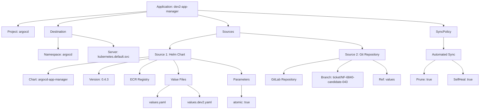
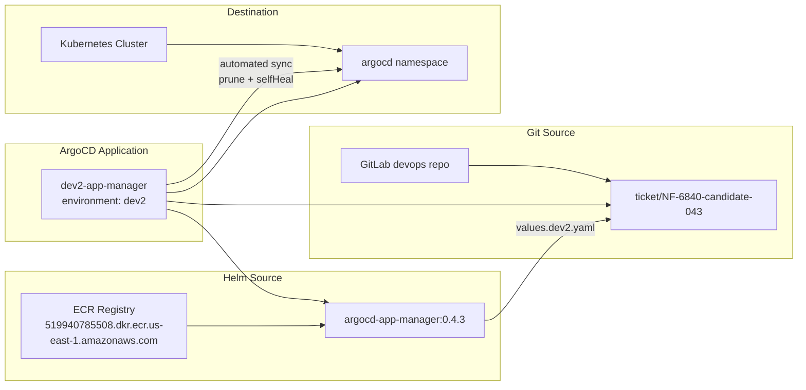
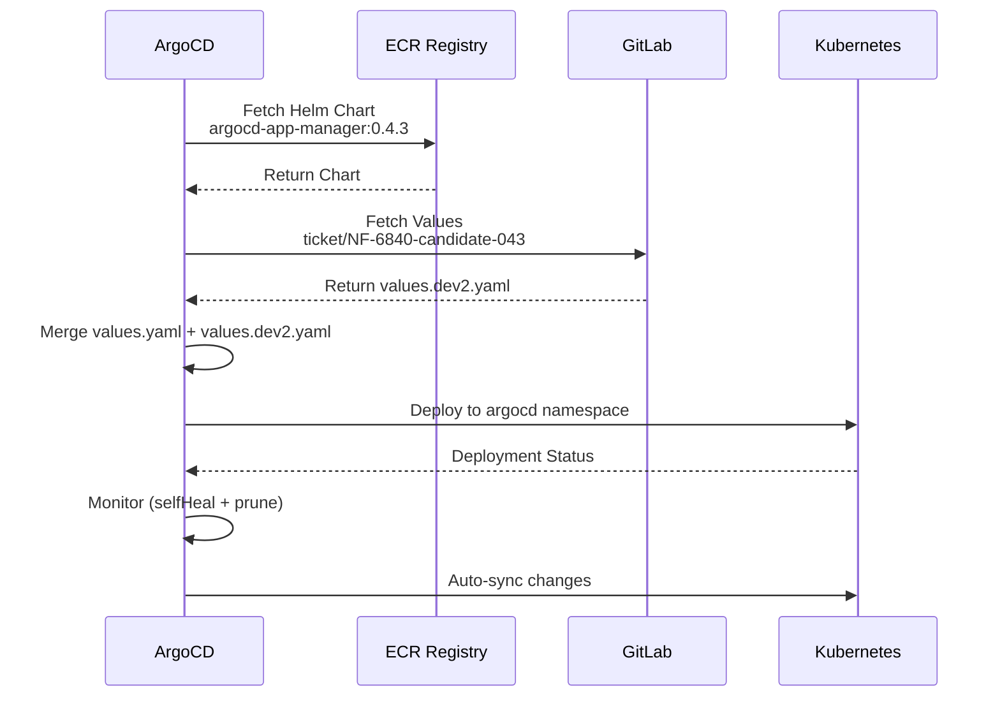

# Diagram: devops/k8s/argocd/app-manager/argocd/Application.dev2.yaml

> Auto-generated by Obscura crawlers

## Diagram 1

### SVG

<svg id="container" width="2435.421875" xmlns="http://www.w3.org/2000/svg" class="flowchart" height="558" viewBox="0 0 2435.421875 558" role="graphics-document document" aria-roledescription="flowchart-v2"><g><marker id="container_flowchart-v2-pointEnd" class="marker flowchart-v2" viewBox="0 0 10 10" refX="5" refY="5" markerUnits="userSpaceOnUse" markerWidth="8" markerHeight="8" orient="auto"><path d="M 0 0 L 10 5 L 0 10 z" class="arrowMarkerPath" style="stroke-width: 1; stroke-dasharray: 1, 0;"></path></marker><marker id="container_flowchart-v2-pointStart" class="marker flowchart-v2" viewBox="0 0 10 10" refX="4.5" refY="5" markerUnits="userSpaceOnUse" markerWidth="8" markerHeight="8" orient="auto"><path d="M 0 5 L 10 10 L 10 0 z" class="arrowMarkerPath" style="stroke-width: 1; stroke-dasharray: 1, 0;"></path></marker><marker id="container_flowchart-v2-circleEnd" class="marker flowchart-v2" viewBox="0 0 10 10" refX="11" refY="5" markerUnits="userSpaceOnUse" markerWidth="11" markerHeight="11" orient="auto"><circle cx="5" cy="5" r="5" class="arrowMarkerPath" style="stroke-width: 1; stroke-dasharray: 1, 0;"></circle></marker><marker id="container_flowchart-v2-circleStart" class="marker flowchart-v2" viewBox="0 0 10 10" refX="-1" refY="5" markerUnits="userSpaceOnUse" markerWidth="11" markerHeight="11" orient="auto"><circle cx="5" cy="5" r="5" class="arrowMarkerPath" style="stroke-width: 1; stroke-dasharray: 1, 0;"></circle></marker><marker id="container_flowchart-v2-crossEnd" class="marker cross flowchart-v2" viewBox="0 0 11 11" refX="12" refY="5.2" markerUnits="userSpaceOnUse" markerWidth="11" markerHeight="11" orient="auto"><path d="M 1,1 l 9,9 M 10,1 l -9,9" class="arrowMarkerPath" style="stroke-width: 2; stroke-dasharray: 1, 0;"></path></marker><marker id="container_flowchart-v2-crossStart" class="marker cross flowchart-v2" viewBox="0 0 11 11" refX="-1" refY="5.2" markerUnits="userSpaceOnUse" markerWidth="11" markerHeight="11" orient="auto"><path d="M 1,1 l 9,9 M 10,1 l -9,9" class="arrowMarkerPath" style="stroke-width: 2; stroke-dasharray: 1, 0;"></path></marker><g class="root"><g class="clusters"></g><g class="edgePaths"><path d="M742.789,57.654L634.302,66.545C525.815,75.436,308.841,93.218,200.354,105.609C91.867,118,91.867,125,91.867,128.5L91.867,132" id="L_A_B_0" class="edge-thickness-normal edge-pattern-solid edge-thickness-normal edge-pattern-solid flowchart-link" style=";" data-edge="true" data-et="edge" data-id="L_A_B_0" data-points="W3sieCI6NzQyLjc4OTA2MjUsInkiOjU3LjY1NDA3NDcxMTM3ODc4fSx7IngiOjkxLjg2NzE4NzUsInkiOjExMX0seyJ4Ijo5MS44NjcxODc1LCJ5IjoxMzZ9XQ==" marker-end="url(#container_flowchart-v2-pointEnd)"></path><path d="M742.789,61.467L668.603,69.722C594.417,77.978,446.044,94.489,371.858,106.244C297.672,118,297.672,125,297.672,128.5L297.672,132" id="L_A_C_0" class="edge-thickness-normal edge-pattern-solid edge-thickness-normal edge-pattern-solid flowchart-link" style=";" data-edge="true" data-et="edge" data-id="L_A_C_0" data-points="W3sieCI6NzQyLjc4OTA2MjUsInkiOjYxLjQ2NjYxNjg1Nzk3NzMxNH0seyJ4IjoyOTcuNjcxODc1LCJ5IjoxMTF9LHsieCI6Mjk3LjY3MTg3NSwieSI6MTM2fV0=" marker-end="url(#container_flowchart-v2-pointEnd)"></path><path d="M1002.789,76.448L1028.211,82.207C1053.633,87.965,1104.477,99.483,1129.898,108.741C1155.32,118,1155.32,125,1155.32,128.5L1155.32,132" id="L_A_D_0" class="edge-thickness-normal edge-pattern-solid edge-thickness-normal edge-pattern-solid flowchart-link" style=";" data-edge="true" data-et="edge" data-id="L_A_D_0" data-points="W3sieCI6MTAwMi43ODkwNjI1LCJ5Ijo3Ni40NDgwNjk5MDM3NzE3MX0seyJ4IjoxMTU1LjMyMDMxMjUsInkiOjExMX0seyJ4IjoxMTU1LjMyMDMxMjUsInkiOjEzNn1d" marker-end="url(#container_flowchart-v2-pointEnd)"></path><path d="M1002.789,53.048L1210.403,62.707C1418.017,72.365,1833.245,91.683,2040.859,104.841C2248.473,118,2248.473,125,2248.473,128.5L2248.473,132" id="L_A_E_0" class="edge-thickness-normal edge-pattern-solid edge-thickness-normal edge-pattern-solid flowchart-link" style=";" data-edge="true" data-et="edge" data-id="L_A_E_0" data-points="W3sieCI6MTAwMi43ODkwNjI1LCJ5Ijo1My4wNDc5MDIzMjEyODkxM30seyJ4IjoyMjQ4LjQ3MjY1NjI1LCJ5IjoxMTF9LHsieCI6MjI0OC40NzI2NTYyNSwieSI6MTM2fV0=" marker-end="url(#container_flowchart-v2-pointEnd)"></path><path d="M297.672,190L297.672,194.167C297.672,198.333,297.672,206.667,297.672,216.333C297.672,226,297.672,237,297.672,242.5L297.672,248" id="L_C_C1_0" class="edge-thickness-normal edge-pattern-solid edge-thickness-normal edge-pattern-solid flowchart-link" style=";" data-edge="true" data-et="edge" data-id="L_C_C1_0" data-points="W3sieCI6Mjk3LjY3MTg3NSwieSI6MTkwfSx7IngiOjI5Ny42NzE4NzUsInkiOjIxNX0seyJ4IjoyOTcuNjcxODc1LCJ5IjoyNTJ9XQ==" marker-end="url(#container_flowchart-v2-pointEnd)"></path><path d="M369.609,176.344L404.342,182.787C439.076,189.229,508.542,202.115,543.275,212.057C578.008,222,578.008,229,578.008,232.5L578.008,236" id="L_C_C2_0" class="edge-thickness-normal edge-pattern-solid edge-thickness-normal edge-pattern-solid flowchart-link" style=";" data-edge="true" data-et="edge" data-id="L_C_C2_0" data-points="W3sieCI6MzY5LjYwOTM3NSwieSI6MTc2LjM0MzgxMTgzMjkwMTM3fSx7IngiOjU3OC4wMDc4MTI1LCJ5IjoyMTV9LHsieCI6NTc4LjAwNzgxMjUsInkiOjI0MH1d" marker-end="url(#container_flowchart-v2-pointEnd)"></path><path d="M1097.023,173.361L1057.975,180.301C1018.927,187.241,940.831,201.12,901.783,213.56C862.734,226,862.734,237,862.734,242.5L862.734,248" id="L_D_D1_0" class="edge-thickness-normal edge-pattern-solid edge-thickness-normal edge-pattern-solid flowchart-link" style=";" data-edge="true" data-et="edge" data-id="L_D_D1_0" data-points="W3sieCI6MTA5Ny4wMjM0Mzc1LCJ5IjoxNzMuMzYwODQ0ODM3MjU0fSx7IngiOjg2Mi43MzQzNzUsInkiOjIxNX0seyJ4Ijo4NjIuNzM0Mzc1LCJ5IjoyNTJ9XQ==" marker-end="url(#container_flowchart-v2-pointEnd)"></path><path d="M1213.617,167.461L1317.158,175.384C1420.698,183.307,1627.779,199.154,1731.319,212.577C1834.859,226,1834.859,237,1834.859,242.5L1834.859,248" id="L_D_D2_0" class="edge-thickness-normal edge-pattern-solid edge-thickness-normal edge-pattern-solid flowchart-link" style=";" data-edge="true" data-et="edge" data-id="L_D_D2_0" data-points="W3sieCI6MTIxMy42MTcxODc1LCJ5IjoxNjcuNDYxMDIwMjIyODA3M30seyJ4IjoxODM0Ljg1OTM3NSwieSI6MjE1fSx7IngiOjE4MzQuODU5Mzc1LCJ5IjoyNTJ9XQ==" marker-end="url(#container_flowchart-v2-pointEnd)"></path><path d="M758.008,289.899L672.97,298.749C587.932,307.599,417.857,325.3,332.819,339.65C247.781,354,247.781,365,247.781,370.5L247.781,376" id="L_D1_D1A_0" class="edge-thickness-normal edge-pattern-solid edge-thickness-normal edge-pattern-solid flowchart-link" style=";" data-edge="true" data-et="edge" data-id="L_D1_D1A_0" data-points="W3sieCI6NzU4LjAwNzgxMjUsInkiOjI4OS44OTkyMDQ3MTU4MDY2fSx7IngiOjI0Ny43ODEyNSwieSI6MzQzfSx7IngiOjI0Ny43ODEyNSwieSI6MzgwfV0=" marker-end="url(#container_flowchart-v2-pointEnd)"></path><path d="M758.008,297.726L715.809,305.272C673.609,312.817,589.211,327.909,547.012,340.954C504.813,354,504.813,365,504.813,370.5L504.813,376" id="L_D1_D1B_0" class="edge-thickness-normal edge-pattern-solid edge-thickness-normal edge-pattern-solid flowchart-link" style=";" data-edge="true" data-et="edge" data-id="L_D1_D1B_0" data-points="W3sieCI6NzU4LjAwNzgxMjUsInkiOjI5Ny43MjYxNTM1Nzc1MDkxfSx7IngiOjUwNC44MTI1LCJ5IjozNDN9LHsieCI6NTA0LjgxMjUsInkiOjM4MH1d" marker-end="url(#container_flowchart-v2-pointEnd)"></path><path d="M796.958,306L781.935,312.167C766.912,318.333,736.866,330.667,721.843,342.333C706.82,354,706.82,365,706.82,370.5L706.82,376" id="L_D1_D1C_0" class="edge-thickness-normal edge-pattern-solid edge-thickness-normal edge-pattern-solid flowchart-link" style=";" data-edge="true" data-et="edge" data-id="L_D1_D1C_0" data-points="W3sieCI6Nzk2Ljk1ODEyOTg4MjgxMjUsInkiOjMwNn0seyJ4Ijo3MDYuODIwMzEyNSwieSI6MzQzfSx7IngiOjcwNi44MjAzMTI1LCJ5IjozODB9XQ==" marker-end="url(#container_flowchart-v2-pointEnd)"></path><path d="M878.364,306L881.933,312.167C885.503,318.333,892.642,330.667,896.212,342.333C899.781,354,899.781,365,899.781,370.5L899.781,376" id="L_D1_D1D_0" class="edge-thickness-normal edge-pattern-solid edge-thickness-normal edge-pattern-solid flowchart-link" style=";" data-edge="true" data-et="edge" data-id="L_D1_D1D_0" data-points="W3sieCI6ODc4LjM2MzUyNTM5MDYyNSwieSI6MzA2fSx7IngiOjg5OS43ODEyNSwieSI6MzQzfSx7IngiOjg5OS43ODEyNSwieSI6MzgwfV0=" marker-end="url(#container_flowchart-v2-pointEnd)"></path><path d="M854.842,434L844.578,440.167C834.314,446.333,813.786,458.667,803.522,468.333C793.258,478,793.258,485,793.258,488.5L793.258,492" id="L_D1D_D1D1_0" class="edge-thickness-normal edge-pattern-solid edge-thickness-normal edge-pattern-solid flowchart-link" style=";" data-edge="true" data-et="edge" data-id="L_D1D_D1D1_0" data-points="W3sieCI6ODU0Ljg0MTY3NDgwNDY4NzUsInkiOjQzNH0seyJ4Ijo3OTMuMjU3ODEyNSwieSI6NDcxfSx7IngiOjc5My4yNTc4MTI1LCJ5Ijo0OTZ9XQ==" marker-end="url(#container_flowchart-v2-pointEnd)"></path><path d="M944.721,434L954.985,440.167C965.249,446.333,985.777,458.667,996.041,468.333C1006.305,478,1006.305,485,1006.305,488.5L1006.305,492" id="L_D1D_D1D2_0" class="edge-thickness-normal edge-pattern-solid edge-thickness-normal edge-pattern-solid flowchart-link" style=";" data-edge="true" data-et="edge" data-id="L_D1D_D1D2_0" data-points="W3sieCI6OTQ0LjcyMDgyNTE5NTMxMjUsInkiOjQzNH0seyJ4IjoxMDA2LjMwNDY4NzUsInkiOjQ3MX0seyJ4IjoxMDA2LjMwNDY4NzUsInkiOjQ5Nn1d" marker-end="url(#container_flowchart-v2-pointEnd)"></path><path d="M967.461,297.708L1009.719,305.256C1051.977,312.805,1136.492,327.903,1178.75,340.951C1221.008,354,1221.008,365,1221.008,370.5L1221.008,376" id="L_D1_D1E_0" class="edge-thickness-normal edge-pattern-solid edge-thickness-normal edge-pattern-solid flowchart-link" style=";" data-edge="true" data-et="edge" data-id="L_D1_D1E_0" data-points="W3sieCI6OTY3LjQ2MDkzNzUsInkiOjI5Ny43MDc3NzgxODk2NjgzfSx7IngiOjEyMjEuMDA3ODEyNSwieSI6MzQzfSx7IngiOjEyMjEuMDA3ODEyNSwieSI6MzgwfV0=" marker-end="url(#container_flowchart-v2-pointEnd)"></path><path d="M1221.008,434L1221.008,440.167C1221.008,446.333,1221.008,458.667,1221.008,468.333C1221.008,478,1221.008,485,1221.008,488.5L1221.008,492" id="L_D1E_D1E1_0" class="edge-thickness-normal edge-pattern-solid edge-thickness-normal edge-pattern-solid flowchart-link" style=";" data-edge="true" data-et="edge" data-id="L_D1E_D1E1_0" data-points="W3sieCI6MTIyMS4wMDc4MTI1LCJ5Ijo0MzR9LHsieCI6MTIyMS4wMDc4MTI1LCJ5Ijo0NzF9LHsieCI6MTIyMS4wMDc4MTI1LCJ5Ijo0OTZ9XQ==" marker-end="url(#container_flowchart-v2-pointEnd)"></path><path d="M1718.906,297.608L1671.766,305.174C1624.625,312.739,1530.344,327.869,1483.203,340.935C1436.063,354,1436.063,365,1436.063,370.5L1436.063,376" id="L_D2_D2A_0" class="edge-thickness-normal edge-pattern-solid edge-thickness-normal edge-pattern-solid flowchart-link" style=";" data-edge="true" data-et="edge" data-id="L_D2_D2A_0" data-points="W3sieCI6MTcxOC45MDYyNSwieSI6Mjk3LjYwODQ3MDc5MTA1MTJ9LHsieCI6MTQzNi4wNjI1LCJ5IjozNDN9LHsieCI6MTQzNi4wNjI1LCJ5IjozODB9XQ==" marker-end="url(#container_flowchart-v2-pointEnd)"></path><path d="M1782.329,306L1770.332,312.167C1758.334,318.333,1734.339,330.667,1722.341,340.333C1710.344,350,1710.344,357,1710.344,360.5L1710.344,364" id="L_D2_D2B_0" class="edge-thickness-normal edge-pattern-solid edge-thickness-normal edge-pattern-solid flowchart-link" style=";" data-edge="true" data-et="edge" data-id="L_D2_D2B_0" data-points="W3sieCI6MTc4Mi4zMjkzNDU3MDMxMjUsInkiOjMwNn0seyJ4IjoxNzEwLjM0Mzc1LCJ5IjozNDN9LHsieCI6MTcxMC4zNDM3NSwieSI6MzY4fV0=" marker-end="url(#container_flowchart-v2-pointEnd)"></path><path d="M1887.389,306L1899.387,312.167C1911.385,318.333,1935.38,330.667,1947.377,342.333C1959.375,354,1959.375,365,1959.375,370.5L1959.375,376" id="L_D2_D2C_0" class="edge-thickness-normal edge-pattern-solid edge-thickness-normal edge-pattern-solid flowchart-link" style=";" data-edge="true" data-et="edge" data-id="L_D2_D2C_0" data-points="W3sieCI6MTg4Ny4zODk0MDQyOTY4NzUsInkiOjMwNn0seyJ4IjoxOTU5LjM3NSwieSI6MzQzfSx7IngiOjE5NTkuMzc1LCJ5IjozODB9XQ==" marker-end="url(#container_flowchart-v2-pointEnd)"></path><path d="M2248.473,190L2248.473,194.167C2248.473,198.333,2248.473,206.667,2248.473,216.333C2248.473,226,2248.473,237,2248.473,242.5L2248.473,248" id="L_E_E1_0" class="edge-thickness-normal edge-pattern-solid edge-thickness-normal edge-pattern-solid flowchart-link" style=";" data-edge="true" data-et="edge" data-id="L_E_E1_0" data-points="W3sieCI6MjI0OC40NzI2NTYyNSwieSI6MTkwfSx7IngiOjIyNDguNDcyNjU2MjUsInkiOjIxNX0seyJ4IjoyMjQ4LjQ3MjY1NjI1LCJ5IjoyNTJ9XQ==" marker-end="url(#container_flowchart-v2-pointEnd)"></path><path d="M2206.389,306L2196.777,312.167C2187.166,318.333,2167.942,330.667,2158.33,342.333C2148.719,354,2148.719,365,2148.719,370.5L2148.719,376" id="L_E1_E1A_0" class="edge-thickness-normal edge-pattern-solid edge-thickness-normal edge-pattern-solid flowchart-link" style=";" data-edge="true" data-et="edge" data-id="L_E1_E1A_0" data-points="W3sieCI6MjIwNi4zODg5NzcwNTA3ODEyLCJ5IjozMDZ9LHsieCI6MjE0OC43MTg3NSwieSI6MzQzfSx7IngiOjIxNDguNzE4NzUsInkiOjM4MH1d" marker-end="url(#container_flowchart-v2-pointEnd)"></path><path d="M2290.556,306L2300.168,312.167C2309.78,318.333,2329.003,330.667,2338.615,342.333C2348.227,354,2348.227,365,2348.227,370.5L2348.227,376" id="L_E1_E1B_0" class="edge-thickness-normal edge-pattern-solid edge-thickness-normal edge-pattern-solid flowchart-link" style=";" data-edge="true" data-et="edge" data-id="L_E1_E1B_0" data-points="W3sieCI6MjI5MC41NTYzMzU0NDkyMTg4LCJ5IjozMDZ9LHsieCI6MjM0OC4yMjY1NjI1LCJ5IjozNDN9LHsieCI6MjM0OC4yMjY1NjI1LCJ5IjozODB9XQ==" marker-end="url(#container_flowchart-v2-pointEnd)"></path></g><g class="edgeLabels"><g class="edgeLabel"><g class="label" data-id="L_A_B_0" transform="translate(0, 0)"><foreignObject width="0" height="0">

</foreignObject></g></g><g class="edgeLabel"><g class="label" data-id="L_A_C_0" transform="translate(0, 0)"><foreignObject width="0" height="0">

</foreignObject></g></g><g class="edgeLabel"><g class="label" data-id="L_A_D_0" transform="translate(0, 0)"><foreignObject width="0" height="0">

</foreignObject></g></g><g class="edgeLabel"><g class="label" data-id="L_A_E_0" transform="translate(0, 0)"><foreignObject width="0" height="0">

</foreignObject></g></g><g class="edgeLabel"><g class="label" data-id="L_C_C1_0" transform="translate(0, 0)"><foreignObject width="0" height="0">

</foreignObject></g></g><g class="edgeLabel"><g class="label" data-id="L_C_C2_0" transform="translate(0, 0)"><foreignObject width="0" height="0">

</foreignObject></g></g><g class="edgeLabel"><g class="label" data-id="L_D_D1_0" transform="translate(0, 0)"><foreignObject width="0" height="0">

</foreignObject></g></g><g class="edgeLabel"><g class="label" data-id="L_D_D2_0" transform="translate(0, 0)"><foreignObject width="0" height="0">

</foreignObject></g></g><g class="edgeLabel"><g class="label" data-id="L_D1_D1A_0" transform="translate(0, 0)"><foreignObject width="0" height="0">

</foreignObject></g></g><g class="edgeLabel"><g class="label" data-id="L_D1_D1B_0" transform="translate(0, 0)"><foreignObject width="0" height="0">

</foreignObject></g></g><g class="edgeLabel"><g class="label" data-id="L_D1_D1C_0" transform="translate(0, 0)"><foreignObject width="0" height="0">

</foreignObject></g></g><g class="edgeLabel"><g class="label" data-id="L_D1_D1D_0" transform="translate(0, 0)"><foreignObject width="0" height="0">

</foreignObject></g></g><g class="edgeLabel"><g class="label" data-id="L_D1D_D1D1_0" transform="translate(0, 0)"><foreignObject width="0" height="0">

</foreignObject></g></g><g class="edgeLabel"><g class="label" data-id="L_D1D_D1D2_0" transform="translate(0, 0)"><foreignObject width="0" height="0">

</foreignObject></g></g><g class="edgeLabel"><g class="label" data-id="L_D1_D1E_0" transform="translate(0, 0)"><foreignObject width="0" height="0">

</foreignObject></g></g><g class="edgeLabel"><g class="label" data-id="L_D1E_D1E1_0" transform="translate(0, 0)"><foreignObject width="0" height="0">

</foreignObject></g></g><g class="edgeLabel"><g class="label" data-id="L_D2_D2A_0" transform="translate(0, 0)"><foreignObject width="0" height="0">

</foreignObject></g></g><g class="edgeLabel"><g class="label" data-id="L_D2_D2B_0" transform="translate(0, 0)"><foreignObject width="0" height="0">

</foreignObject></g></g><g class="edgeLabel"><g class="label" data-id="L_D2_D2C_0" transform="translate(0, 0)"><foreignObject width="0" height="0">

</foreignObject></g></g><g class="edgeLabel"><g class="label" data-id="L_E_E1_0" transform="translate(0, 0)"><foreignObject width="0" height="0">

</foreignObject></g></g><g class="edgeLabel"><g class="label" data-id="L_E1_E1A_0" transform="translate(0, 0)"><foreignObject width="0" height="0">

</foreignObject></g></g><g class="edgeLabel"><g class="label" data-id="L_E1_E1B_0" transform="translate(0, 0)"><foreignObject width="0" height="0">

</foreignObject></g></g></g><g class="nodes"><g class="node default" id="flowchart-A-0" transform="translate(872.7890625, 47)"><rect class="basic label-container" style="" x="-130" y="-39" width="260" height="78"></rect><g class="label" style="" transform="translate(-100, -24)"><rect></rect><foreignObject width="200" height="48">

Application: dev2-app-manager

</foreignObject></g></g><g class="node default" id="flowchart-B-1" transform="translate(91.8671875, 163)"><rect class="basic label-container" style="" x="-83.8671875" y="-27" width="167.734375" height="54"></rect><g class="label" style="" transform="translate(-53.8671875, -12)"><rect></rect><foreignObject width="107.734375" height="24">

Project: argocd

</foreignObject></g></g><g class="node default" id="flowchart-C-3" transform="translate(297.671875, 163)"><rect class="basic label-container" style="" x="-71.9375" y="-27" width="143.875" height="54"></rect><g class="label" style="" transform="translate(-41.9375, -12)"><rect></rect><foreignObject width="83.875" height="24">

Destination

</foreignObject></g></g><g class="node default" id="flowchart-D-5" transform="translate(1155.3203125, 163)"><rect class="basic label-container" style="" x="-58.296875" y="-27" width="116.59375" height="54"></rect><g class="label" style="" transform="translate(-28.296875, -12)"><rect></rect><foreignObject width="56.59375" height="24">

Sources

</foreignObject></g></g><g class="node default" id="flowchart-E-7" transform="translate(2248.47265625, 163)"><rect class="basic label-container" style="" x="-68.171875" y="-27" width="136.34375" height="54"></rect><g class="label" style="" transform="translate(-38.171875, -12)"><rect></rect><foreignObject width="76.34375" height="24">

SyncPolicy

</foreignObject></g></g><g class="node default" id="flowchart-C1-9" transform="translate(297.671875, 279)"><rect class="basic label-container" style="" x="-100.3359375" y="-27" width="200.671875" height="54"></rect><g class="label" style="" transform="translate(-70.3359375, -12)"><rect></rect><foreignObject width="140.671875" height="24">

Namespace: argocd

</foreignObject></g></g><g class="node default" id="flowchart-C2-11" transform="translate(578.0078125, 279)"><rect class="basic label-container" style="" x="-130" y="-39" width="260" height="78"></rect><g class="label" style="" transform="translate(-100, -24)"><rect></rect><foreignObject width="200" height="48">

Server: kubernetes.default.svc

</foreignObject></g></g><g class="node default" id="flowchart-D1-13" transform="translate(862.734375, 279)"><rect class="basic label-container" style="" x="-104.7265625" y="-27" width="209.453125" height="54"></rect><g class="label" style="" transform="translate(-74.7265625, -12)"><rect></rect><foreignObject width="149.453125" height="24">

Source 1: Helm Chart

</foreignObject></g></g><g class="node default" id="flowchart-D2-15" transform="translate(1834.859375, 279)"><rect class="basic label-container" style="" x="-115.953125" y="-27" width="231.90625" height="54"></rect><g class="label" style="" transform="translate(-85.953125, -12)"><rect></rect><foreignObject width="171.90625" height="24">

Source 2: Git Repository

</foreignObject></g></g><g class="node default" id="flowchart-D1A-17" transform="translate(247.78125, 407)"><rect class="basic label-container" style="" x="-129.796875" y="-27" width="259.59375" height="54"></rect><g class="label" style="" transform="translate(-99.796875, -12)"><rect></rect><foreignObject width="199.59375" height="24">

Chart: argocd-app-manager

</foreignObject></g></g><g class="node default" id="flowchart-D1B-19" transform="translate(504.8125, 407)"><rect class="basic label-container" style="" x="-77.234375" y="-27" width="154.46875" height="54"></rect><g class="label" style="" transform="translate(-47.234375, -12)"><rect></rect><foreignObject width="94.46875" height="24">

Version: 0.4.3

</foreignObject></g></g><g class="node default" id="flowchart-D1C-21" transform="translate(706.8203125, 407)"><rect class="basic label-container" style="" x="-74.7734375" y="-27" width="149.546875" height="54"></rect><g class="label" style="" transform="translate(-44.7734375, -12)"><rect></rect><foreignObject width="89.546875" height="24">

ECR Registry

</foreignObject></g></g><g class="node default" id="flowchart-D1D-23" transform="translate(899.78125, 407)"><rect class="basic label-container" style="" x="-68.1875" y="-27" width="136.375" height="54"></rect><g class="label" style="" transform="translate(-38.1875, -12)"><rect></rect><foreignObject width="76.375" height="24">

Value Files

</foreignObject></g></g><g class="node default" id="flowchart-D1D1-25" transform="translate(793.2578125, 523)"><rect class="basic label-container" style="" x="-72.140625" y="-27" width="144.28125" height="54"></rect><g class="label" style="" transform="translate(-42.140625, -12)"><rect></rect><foreignObject width="84.28125" height="24">

values.yaml

</foreignObject></g></g><g class="node default" id="flowchart-D1D2-27" transform="translate(1006.3046875, 523)"><rect class="basic label-container" style="" x="-90.90625" y="-27" width="181.8125" height="54"></rect><g class="label" style="" transform="translate(-60.90625, -12)"><rect></rect><foreignObject width="121.8125" height="24">

values.dev2.yaml

</foreignObject></g></g><g class="node default" id="flowchart-D1E-29" transform="translate(1221.0078125, 407)"><rect class="basic label-container" style="" x="-70.7734375" y="-27" width="141.546875" height="54"></rect><g class="label" style="" transform="translate(-40.7734375, -12)"><rect></rect><foreignObject width="81.546875" height="24">

Parameters

</foreignObject></g></g><g class="node default" id="flowchart-D1E1-31" transform="translate(1221.0078125, 523)"><rect class="basic label-container" style="" x="-73.796875" y="-27" width="147.59375" height="54"></rect><g class="label" style="" transform="translate(-43.796875, -12)"><rect></rect><foreignObject width="87.59375" height="24">

atomic: true

</foreignObject></g></g><g class="node default" id="flowchart-D2A-33" transform="translate(1436.0625, 407)"><rect class="basic label-container" style="" x="-94.28125" y="-27" width="188.5625" height="54"></rect><g class="label" style="" transform="translate(-64.28125, -12)"><rect></rect><foreignObject width="128.5625" height="24">

GitLab Repository

</foreignObject></g></g><g class="node default" id="flowchart-D2B-35" transform="translate(1710.34375, 407)"><rect class="basic label-container" style="" x="-130" y="-39" width="260" height="78"></rect><g class="label" style="" transform="translate(-100, -24)"><rect></rect><foreignObject width="200" height="48">

Branch: ticket/NF-6840-candidate-043

</foreignObject></g></g><g class="node default" id="flowchart-D2C-37" transform="translate(1959.375, 407)"><rect class="basic label-container" style="" x="-69.03125" y="-27" width="138.0625" height="54"></rect><g class="label" style="" transform="translate(-39.03125, -12)"><rect></rect><foreignObject width="78.0625" height="24">

Ref: values

</foreignObject></g></g><g class="node default" id="flowchart-E1-39" transform="translate(2248.47265625, 279)"><rect class="basic label-container" style="" x="-88.6484375" y="-27" width="177.296875" height="54"></rect><g class="label" style="" transform="translate(-58.6484375, -12)"><rect></rect><foreignObject width="117.296875" height="24">

Automated Sync

</foreignObject></g></g><g class="node default" id="flowchart-E1A-41" transform="translate(2148.71875, 407)"><rect class="basic label-container" style="" x="-70.3125" y="-27" width="140.625" height="54"></rect><g class="label" style="" transform="translate(-40.3125, -12)"><rect></rect><foreignObject width="80.625" height="24">

Prune: true

</foreignObject></g></g><g class="node default" id="flowchart-E1B-43" transform="translate(2348.2265625, 407)"><rect class="basic label-container" style="" x="-79.1953125" y="-27" width="158.390625" height="54"></rect><g class="label" style="" transform="translate(-49.1953125, -12)"><rect></rect><foreignObject width="98.390625" height="24">

SelfHeal: true

</foreignObject></g></g></g></g></g></svg>

## Diagram 2

### SVG

<svg id="container" width="1250.421875" xmlns="http://www.w3.org/2000/svg" class="flowchart" height="606" viewBox="0 0 1250.421875 606" role="graphics-document document" aria-roledescription="flowchart-v2"><g><marker id="container_flowchart-v2-pointEnd" class="marker flowchart-v2" viewBox="0 0 10 10" refX="5" refY="5" markerUnits="userSpaceOnUse" markerWidth="8" markerHeight="8" orient="auto"><path d="M 0 0 L 10 5 L 0 10 z" class="arrowMarkerPath" style="stroke-width: 1; stroke-dasharray: 1, 0;"></path></marker><marker id="container_flowchart-v2-pointStart" class="marker flowchart-v2" viewBox="0 0 10 10" refX="4.5" refY="5" markerUnits="userSpaceOnUse" markerWidth="8" markerHeight="8" orient="auto"><path d="M 0 5 L 10 10 L 10 0 z" class="arrowMarkerPath" style="stroke-width: 1; stroke-dasharray: 1, 0;"></path></marker><marker id="container_flowchart-v2-circleEnd" class="marker flowchart-v2" viewBox="0 0 10 10" refX="11" refY="5" markerUnits="userSpaceOnUse" markerWidth="11" markerHeight="11" orient="auto"><circle cx="5" cy="5" r="5" class="arrowMarkerPath" style="stroke-width: 1; stroke-dasharray: 1, 0;"></circle></marker><marker id="container_flowchart-v2-circleStart" class="marker flowchart-v2" viewBox="0 0 10 10" refX="-1" refY="5" markerUnits="userSpaceOnUse" markerWidth="11" markerHeight="11" orient="auto"><circle cx="5" cy="5" r="5" class="arrowMarkerPath" style="stroke-width: 1; stroke-dasharray: 1, 0;"></circle></marker><marker id="container_flowchart-v2-crossEnd" class="marker cross flowchart-v2" viewBox="0 0 11 11" refX="12" refY="5.2" markerUnits="userSpaceOnUse" markerWidth="11" markerHeight="11" orient="auto"><path d="M 1,1 l 9,9 M 10,1 l -9,9" class="arrowMarkerPath" style="stroke-width: 2; stroke-dasharray: 1, 0;"></path></marker><marker id="container_flowchart-v2-crossStart" class="marker cross flowchart-v2" viewBox="0 0 11 11" refX="-1" refY="5.2" markerUnits="userSpaceOnUse" markerWidth="11" markerHeight="11" orient="auto"><path d="M 1,1 l 9,9 M 10,1 l -9,9" class="arrowMarkerPath" style="stroke-width: 2; stroke-dasharray: 1, 0;"></path></marker><g class="root"><g class="clusters"><g class="cluster" id="Destination" data-look="classic"><rect style="" x="8" y="8" width="777.609375" height="170"></rect><g class="cluster-label" transform="translate(354.8671875, 8)"><foreignObject width="83.875" height="24">

Destination

</foreignObject></g></g><g class="cluster" id="subGraph2" data-look="classic"><rect style="" x="486.46875" y="198" width="755.953125" height="208"></rect><g class="cluster-label" transform="translate(827.5703125, 198)"><foreignObject width="73.75" height="24">

Git Source

</foreignObject></g></g><g class="cluster" id="subGraph1" data-look="classic"><rect style="" x="8" y="426" width="777.609375" height="172"></rect><g class="cluster-label" transform="translate(351.1171875, 426)"><foreignObject width="91.375" height="24">

Helm Source

</foreignObject></g></g><g class="cluster" id="subGraph0" data-look="classic"><rect style="" x="8" y="226" width="310" height="153"></rect><g class="cluster-label" transform="translate(93.703125, 226)"><foreignObject width="138.59375" height="24">

ArgoCD Application

</foreignObject></g></g></g><g class="edgePaths"><path d="M293,512L297.167,512C301.333,512,309.667,512,327.872,512C346.078,512,374.156,512,402.234,512C430.313,512,458.391,512,475.931,511.789C493.471,511.579,500.474,511.157,503.975,510.947L507.476,510.736" id="L_ECR_Chart_0" class="edge-thickness-normal edge-pattern-solid edge-thickness-normal edge-pattern-solid flowchart-link" style=";" data-edge="true" data-et="edge" data-id="L_ECR_Chart_0" data-points="W3sieCI6MjkzLCJ5Ijo1MTJ9LHsieCI6MzE4LCJ5Ijo1MTJ9LHsieCI6NDAyLjIzNDM3NSwieSI6NTEyfSx7IngiOjQ4Ni40Njg3NSwieSI6NTEyfSx7IngiOjUxMS40Njg3NSwieSI6NTEwLjQ5NTY5MDc4MDg4Mjc0fV0=" marker-end="url(#container_flowchart-v2-pointEnd)"></path><path d="M736.289,260L744.509,260C752.729,260,769.169,260,791.707,260C814.245,260,842.88,260,870.875,263.927C898.87,267.855,926.223,275.71,939.9,279.637L953.577,283.565" id="L_Git_Branch_0" class="edge-thickness-normal edge-pattern-solid edge-thickness-normal edge-pattern-solid flowchart-link" style=";" data-edge="true" data-et="edge" data-id="L_Git_Branch_0" data-points="W3sieCI6NzM2LjI4OTA2MjUsInkiOjI2MH0seyJ4Ijo3ODUuNjA5Mzc1LCJ5IjoyNjB9LHsieCI6ODcxLjUxNTYyNSwieSI6MjYwfSx7IngiOjk1Ny40MjE4NzUsInkiOjI4NC42Njg5ODI0ODY2MTE2NH1d" marker-end="url(#container_flowchart-v2-pointEnd)"></path><path d="M261.883,70L271.236,70C280.589,70,299.294,70,322.686,70C346.078,70,374.156,70,402.234,70C430.313,70,458.391,70,480.431,71.551C502.472,73.103,518.476,76.206,526.478,77.757L534.479,79.309" id="L_K8s_NS_0" class="edge-thickness-normal edge-pattern-solid edge-thickness-normal edge-pattern-solid flowchart-link" style=";" data-edge="true" data-et="edge" data-id="L_K8s_NS_0" data-points="W3sieCI6MjYxLjg4MjgxMjUsInkiOjcwfSx7IngiOjMxOCwieSI6NzB9LHsieCI6NDAyLjIzNDM3NSwieSI6NzB9LHsieCI6NDg2LjQ2ODc1LCJ5Ijo3MH0seyJ4Ijo1MzguNDA2MjUsInkiOjgwLjA3MDA5NjYzMDk3NDE1fV0=" marker-end="url(#container_flowchart-v2-pointEnd)"></path><path d="M261.555,328.526L270.962,330.772C280.37,333.017,299.185,337.509,322.632,360.921C346.078,384.333,374.156,426.667,402.234,447.833C430.313,469,458.391,469,476.912,470.019C495.433,471.038,504.398,473.076,508.88,474.094L513.362,475.113" id="L_App_Chart_0" class="edge-thickness-normal edge-pattern-solid edge-thickness-normal edge-pattern-solid flowchart-link" style=";" data-edge="true" data-et="edge" data-id="L_App_Chart_0" data-points="W3sieCI6MjYxLjU1NDY4NzUsInkiOjMyOC41MjU5NTc2NjEyOTAzfSx7IngiOjMxOCwieSI6MzQyfSx7IngiOjQwMi4yMzQzNzUsInkiOjQ2OX0seyJ4Ijo0ODYuNDY4NzUsInkiOjQ2OX0seyJ4Ijo1MTcuMjYyNjM3ODY3NjQ3MSwieSI6NDc2fV0=" marker-end="url(#container_flowchart-v2-pointEnd)"></path><path d="M261.555,315.809L270.962,316.841C280.37,317.873,299.185,319.936,322.632,320.968C346.078,322,374.156,322,402.234,322C430.313,322,458.391,322,497.358,322C536.326,322,586.182,322,636.039,322C685.896,322,735.753,322,774.999,322C814.245,322,842.88,322,870.849,322C898.818,322,926.12,322,939.771,322L953.422,322" id="L_App_Branch_0" class="edge-thickness-normal edge-pattern-solid edge-thickness-normal edge-pattern-solid flowchart-link" style=";" data-edge="true" data-et="edge" data-id="L_App_Branch_0" data-points="W3sieCI6MjYxLjU1NDY4NzUsInkiOjMxNS44MDkyMjM3OTAzMjI1Nn0seyJ4IjozMTgsInkiOjMyMn0seyJ4Ijo0MDIuMjM0Mzc1LCJ5IjozMjJ9LHsieCI6NDg2LjQ2ODc1LCJ5IjozMjJ9LHsieCI6NjM2LjAzOTA2MjUsInkiOjMyMn0seyJ4Ijo3ODUuNjA5Mzc1LCJ5IjozMjJ9LHsieCI6ODcxLjUxNTYyNSwieSI6MzIyfSx7IngiOjk1Ny40MjE4NzUsInkiOjMyMn1d" marker-end="url(#container_flowchart-v2-pointEnd)"></path><path d="M261.555,302.457L270.962,302.214C280.37,301.971,299.185,301.486,322.632,277.409C346.078,253.333,374.156,205.667,402.234,181.833C430.313,158,458.391,158,485.33,152.911C512.269,147.823,538.07,137.645,550.97,132.556L563.871,127.468" id="L_App_NS_0" class="edge-thickness-normal edge-pattern-solid edge-thickness-normal edge-pattern-solid flowchart-link" style=";" data-edge="true" data-et="edge" data-id="L_App_NS_0" data-points="W3sieCI6MjYxLjU1NDY4NzUsInkiOjMwMi40NTY2NTMyMjU4MDY0Nn0seyJ4IjozMTgsInkiOjMwMX0seyJ4Ijo0MDIuMjM0Mzc1LCJ5IjoxNTh9LHsieCI6NDg2LjQ2ODc1LCJ5IjoxNTh9LHsieCI6NTY3LjU5MTYzMTM1NTkzMjIsInkiOjEyNn1d" marker-end="url(#container_flowchart-v2-pointEnd)"></path><path d="M760.609,503L764.776,503C768.943,503,777.276,503,795.76,479C814.245,455,842.88,407,870.859,380.659C898.837,354.318,926.158,349.636,939.819,347.295L953.479,344.954" id="L_Chart_Branch_0" class="edge-thickness-normal edge-pattern-solid edge-thickness-normal edge-pattern-solid flowchart-link" style=";" data-edge="true" data-et="edge" data-id="L_Chart_Branch_0" data-points="W3sieCI6NzYwLjYwOTM3NSwieSI6NTAzfSx7IngiOjc4NS42MDkzNzUsInkiOjUwM30seyJ4Ijo4NzEuNTE1NjI1LCJ5IjozNTl9LHsieCI6OTU3LjQyMTg3NSwieSI6MzQ0LjI3ODE4Nzg3MDg5M31d" marker-end="url(#container_flowchart-v2-pointEnd)"></path><path d="M261.555,289.74L270.962,288.283C280.37,286.827,299.185,283.913,322.632,254.623C346.078,225.333,374.156,169.667,402.234,141.833C430.313,114,458.391,114,480.423,113.198C502.455,112.397,518.44,110.794,526.433,109.992L534.426,109.19" id="L_App_NS_2" class="edge-thickness-normal edge-pattern-solid edge-thickness-normal edge-pattern-solid flowchart-link" style=";" data-edge="true" data-et="edge" data-id="L_App_NS_2" data-points="W3sieCI6MjYxLjU1NDY4NzUsInkiOjI4OS43Mzk5MTkzNTQ4Mzg3fSx7IngiOjMxOCwieSI6MjgxfSx7IngiOjQwMi4yMzQzNzUsInkiOjExNH0seyJ4Ijo0ODYuNDY4NzUsInkiOjExNH0seyJ4Ijo1MzguNDA2MjUsInkiOjEwOC43OTEzMjkzMjg4MDY0OH1d" marker-end="url(#container_flowchart-v2-pointEnd)"></path></g><g class="edgeLabels"><g class="edgeLabel"><g class="label" data-id="L_ECR_Chart_0" transform="translate(0, 0)"><foreignObject width="0" height="0">

</foreignObject></g></g><g class="edgeLabel"><g class="label" data-id="L_Git_Branch_0" transform="translate(0, 0)"><foreignObject width="0" height="0">

</foreignObject></g></g><g class="edgeLabel"><g class="label" data-id="L_K8s_NS_0" transform="translate(0, 0)"><foreignObject width="0" height="0">

</foreignObject></g></g><g class="edgeLabel"><g class="label" data-id="L_App_Chart_0" transform="translate(0, 0)"><foreignObject width="0" height="0">

</foreignObject></g></g><g class="edgeLabel"><g class="label" data-id="L_App_Branch_0" transform="translate(0, 0)"><foreignObject width="0" height="0">

</foreignObject></g></g><g class="edgeLabel"><g class="label" data-id="L_App_NS_0" transform="translate(0, 0)"><foreignObject width="0" height="0">

</foreignObject></g></g><g class="edgeLabel" transform="translate(844.48532, 404.30944)"><g class="label" data-id="L_Chart_Branch_0" transform="translate(-60.90625, -12)"><foreignObject width="121.8125" height="24">

values.dev2.yaml

</foreignObject></g></g><g class="edgeLabel" transform="translate(402.234375, 114)"><g class="label" data-id="L_App_NS_2" transform="translate(-59.234375, -24)"><foreignObject width="118.46875" height="48">

automated sync prune + selfHeal

</foreignObject></g></g></g><g class="nodes"><g class="node default" id="flowchart-App-0" transform="translate(163, 305)"><rect class="basic label-container" style="" x="-98.5546875" y="-39" width="197.109375" height="78"></rect><g class="label" style="" transform="translate(-68.5546875, -24)"><rect></rect><foreignObject width="137.109375" height="48">

dev2-app-manager environment: dev2

</foreignObject></g></g><g class="node default" id="flowchart-ECR-1" transform="translate(163, 512)"><rect class="basic label-container" style="" x="-130" y="-51" width="260" height="102"></rect><g class="label" style="" transform="translate(-100, -36)"><rect></rect><foreignObject width="200" height="72">

ECR Registry 519940785508.dkr.ecr.us-east-1.amazonaws.com

</foreignObject></g></g><g class="node default" id="flowchart-Chart-2" transform="translate(636.0390625, 503)"><rect class="basic label-container" style="" x="-124.5703125" y="-27" width="249.140625" height="54"></rect><g class="label" style="" transform="translate(-94.5703125, -12)"><rect></rect><foreignObject width="189.140625" height="24">

argocd-app-manager:0.4.3

</foreignObject></g></g><g class="node default" id="flowchart-Git-5" transform="translate(636.0390625, 260)"><rect class="basic label-container" style="" x="-100.25" y="-27" width="200.5" height="54"></rect><g class="label" style="" transform="translate(-70.25, -12)"><rect></rect><foreignObject width="140.5" height="24">

GitLab devops repo

</foreignObject></g></g><g class="node default" id="flowchart-Branch-6" transform="translate(1087.421875, 322)"><rect class="basic label-container" style="" x="-130" y="-39" width="260" height="78"></rect><g class="label" style="" transform="translate(-100, -24)"><rect></rect><foreignObject width="200" height="48">

ticket/NF-6840-candidate-043

</foreignObject></g></g><g class="node default" id="flowchart-K8s-9" transform="translate(163, 70)"><rect class="basic label-container" style="" x="-98.8828125" y="-27" width="197.765625" height="54"></rect><g class="label" style="" transform="translate(-68.8828125, -12)"><rect></rect><foreignObject width="137.765625" height="24">

Kubernetes Cluster

</foreignObject></g></g><g class="node default" id="flowchart-NS-10" transform="translate(636.0390625, 99)"><rect class="basic label-container" style="" x="-97.6328125" y="-27" width="195.265625" height="54"></rect><g class="label" style="" transform="translate(-67.6328125, -12)"><rect></rect><foreignObject width="135.265625" height="24">

argocd namespace

</foreignObject></g></g></g></g></g></svg>

## Diagram 3

### SVG

<svg id="container" width="968.5" xmlns="http://www.w3.org/2000/svg" height="701" viewBox="-109.5 -10 968.5 701" role="graphics-document document" aria-roledescription="sequence"><g><rect x="659" y="615" fill="#eaeaea" stroke="#666" width="150" height="65" name="Kubernetes" rx="3" ry="3" class="actor actor-bottom"></rect><text x="734" y="647.5" dominant-baseline="central" alignment-baseline="central" class="actor actor-box" style="text-anchor: middle; font-size: 16px; font-weight: 400;"><tspan x="734" dy="0">Kubernetes</tspan></text></g><g><rect x="459" y="615" fill="#eaeaea" stroke="#666" width="150" height="65" name="GitLab" rx="3" ry="3" class="actor actor-bottom"></rect><text x="534" y="647.5" dominant-baseline="central" alignment-baseline="central" class="actor actor-box" style="text-anchor: middle; font-size: 16px; font-weight: 400;"><tspan x="534" dy="0">GitLab</tspan></text></g><g><rect x="259" y="615" fill="#eaeaea" stroke="#666" width="150" height="65" name="ECR" rx="3" ry="3" class="actor actor-bottom"></rect><text x="334" y="647.5" dominant-baseline="central" alignment-baseline="central" class="actor actor-box" style="text-anchor: middle; font-size: 16px; font-weight: 400;"><tspan x="334" dy="0">ECR Registry</tspan></text></g><g><rect x="0" y="615" fill="#eaeaea" stroke="#666" width="150" height="65" name="ArgoCD" rx="3" ry="3" class="actor actor-bottom"></rect><text x="75" y="647.5" dominant-baseline="central" alignment-baseline="central" class="actor actor-box" style="text-anchor: middle; font-size: 16px; font-weight: 400;"><tspan x="75" dy="0">ArgoCD</tspan></text></g><g><line id="actor3" x1="734" y1="65" x2="734" y2="615" class="actor-line 200" stroke-width="0.5px" stroke="#999" name="Kubernetes"></line><g id="root-3"><rect x="659" y="0" fill="#eaeaea" stroke="#666" width="150" height="65" name="Kubernetes" rx="3" ry="3" class="actor actor-top"></rect><text x="734" y="32.5" dominant-baseline="central" alignment-baseline="central" class="actor actor-box" style="text-anchor: middle; font-size: 16px; font-weight: 400;"><tspan x="734" dy="0">Kubernetes</tspan></text></g></g><g><line id="actor2" x1="534" y1="65" x2="534" y2="615" class="actor-line 200" stroke-width="0.5px" stroke="#999" name="GitLab"></line><g id="root-2"><rect x="459" y="0" fill="#eaeaea" stroke="#666" width="150" height="65" name="GitLab" rx="3" ry="3" class="actor actor-top"></rect><text x="534" y="32.5" dominant-baseline="central" alignment-baseline="central" class="actor actor-box" style="text-anchor: middle; font-size: 16px; font-weight: 400;"><tspan x="534" dy="0">GitLab</tspan></text></g></g><g><line id="actor1" x1="334" y1="65" x2="334" y2="615" class="actor-line 200" stroke-width="0.5px" stroke="#999" name="ECR"></line><g id="root-1"><rect x="259" y="0" fill="#eaeaea" stroke="#666" width="150" height="65" name="ECR" rx="3" ry="3" class="actor actor-top"></rect><text x="334" y="32.5" dominant-baseline="central" alignment-baseline="central" class="actor actor-box" style="text-anchor: middle; font-size: 16px; font-weight: 400;"><tspan x="334" dy="0">ECR Registry</tspan></text></g></g><g><line id="actor0" x1="75" y1="65" x2="75" y2="615" class="actor-line 200" stroke-width="0.5px" stroke="#999" name="ArgoCD"></line><g id="root-0"><rect x="0" y="0" fill="#eaeaea" stroke="#666" width="150" height="65" name="ArgoCD" rx="3" ry="3" class="actor actor-top"></rect><text x="75" y="32.5" dominant-baseline="central" alignment-baseline="central" class="actor actor-box" style="text-anchor: middle; font-size: 16px; font-weight: 400;"><tspan x="75" dy="0">ArgoCD</tspan></text></g></g><g></g><defs><symbol id="computer" width="24" height="24"><path transform="scale(.5)" d="M2 2v13h20v-13h-20zm18 11h-16v-9h16v9zm-10.228 6l.466-1h3.524l.467 1h-4.457zm14.228 3h-24l2-6h2.104l-1.33 4h18.45l-1.297-4h2.073l2 6zm-5-10h-14v-7h14v7z"></path></symbol></defs><defs><symbol id="database" fill-rule="evenodd" clip-rule="evenodd"><path transform="scale(.5)" d="M12.258.001l.256.004.255.005.253.008.251.01.249.012.247.015.246.016.242.019.241.02.239.023.236.024.233.027.231.028.229.031.225.032.223.034.22.036.217.038.214.04.211.041.208.043.205.045.201.046.198.048.194.05.191.051.187.053.183.054.18.056.175.057.172.059.168.06.163.061.16.063.155.064.15.066.074.033.073.033.071.034.07.034.069.035.068.035.067.035.066.035.064.036.064.036.062.036.06.036.06.037.058.037.058.037.055.038.055.038.053.038.052.038.051.039.05.039.048.039.047.039.045.04.044.04.043.04.041.04.04.041.039.041.037.041.036.041.034.041.033.042.032.042.03.042.029.042.027.042.026.043.024.043.023.043.021.043.02.043.018.044.017.043.015.044.013.044.012.044.011.045.009.044.007.045.006.045.004.045.002.045.001.045v17l-.001.045-.002.045-.004.045-.006.045-.007.045-.009.044-.011.045-.012.044-.013.044-.015.044-.017.043-.018.044-.02.043-.021.043-.023.043-.024.043-.026.043-.027.042-.029.042-.03.042-.032.042-.033.042-.034.041-.036.041-.037.041-.039.041-.04.041-.041.04-.043.04-.044.04-.045.04-.047.039-.048.039-.05.039-.051.039-.052.038-.053.038-.055.038-.055.038-.058.037-.058.037-.06.037-.06.036-.062.036-.064.036-.064.036-.066.035-.067.035-.068.035-.069.035-.07.034-.071.034-.073.033-.074.033-.15.066-.155.064-.16.063-.163.061-.168.06-.172.059-.175.057-.18.056-.183.054-.187.053-.191.051-.194.05-.198.048-.201.046-.205.045-.208.043-.211.041-.214.04-.217.038-.22.036-.223.034-.225.032-.229.031-.231.028-.233.027-.236.024-.239.023-.241.02-.242.019-.246.016-.247.015-.249.012-.251.01-.253.008-.255.005-.256.004-.258.001-.258-.001-.256-.004-.255-.005-.253-.008-.251-.01-.249-.012-.247-.015-.245-.016-.243-.019-.241-.02-.238-.023-.236-.024-.234-.027-.231-.028-.228-.031-.226-.032-.223-.034-.22-.036-.217-.038-.214-.04-.211-.041-.208-.043-.204-.045-.201-.046-.198-.048-.195-.05-.19-.051-.187-.053-.184-.054-.179-.056-.176-.057-.172-.059-.167-.06-.164-.061-.159-.063-.155-.064-.151-.066-.074-.033-.072-.033-.072-.034-.07-.034-.069-.035-.068-.035-.067-.035-.066-.035-.064-.036-.063-.036-.062-.036-.061-.036-.06-.037-.058-.037-.057-.037-.056-.038-.055-.038-.053-.038-.052-.038-.051-.039-.049-.039-.049-.039-.046-.039-.046-.04-.044-.04-.043-.04-.041-.04-.04-.041-.039-.041-.037-.041-.036-.041-.034-.041-.033-.042-.032-.042-.03-.042-.029-.042-.027-.042-.026-.043-.024-.043-.023-.043-.021-.043-.02-.043-.018-.044-.017-.043-.015-.044-.013-.044-.012-.044-.011-.045-.009-.044-.007-.045-.006-.045-.004-.045-.002-.045-.001-.045v-17l.001-.045.002-.045.004-.045.006-.045.007-.045.009-.044.011-.045.012-.044.013-.044.015-.044.017-.043.018-.044.02-.043.021-.043.023-.043.024-.043.026-.043.027-.042.029-.042.03-.042.032-.042.033-.042.034-.041.036-.041.037-.041.039-.041.04-.041.041-.04.043-.04.044-.04.046-.04.046-.039.049-.039.049-.039.051-.039.052-.038.053-.038.055-.038.056-.038.057-.037.058-.037.06-.037.061-.036.062-.036.063-.036.064-.036.066-.035.067-.035.068-.035.069-.035.07-.034.072-.034.072-.033.074-.033.151-.066.155-.064.159-.063.164-.061.167-.06.172-.059.176-.057.179-.056.184-.054.187-.053.19-.051.195-.05.198-.048.201-.046.204-.045.208-.043.211-.041.214-.04.217-.038.22-.036.223-.034.226-.032.228-.031.231-.028.234-.027.236-.024.238-.023.241-.02.243-.019.245-.016.247-.015.249-.012.251-.01.253-.008.255-.005.256-.004.258-.001.258.001zm-9.258 20.499v.01l.001.021.003.021.004.022.005.021.006.022.007.022.009.023.01.022.011.023.012.023.013.023.015.023.016.024.017.023.018.024.019.024.021.024.022.025.023.024.024.025.052.049.056.05.061.051.066.051.07.051.075.051.079.052.084.052.088.052.092.052.097.052.102.051.105.052.11.052.114.051.119.051.123.051.127.05.131.05.135.05.139.048.144.049.147.047.152.047.155.047.16.045.163.045.167.043.171.043.176.041.178.041.183.039.187.039.19.037.194.035.197.035.202.033.204.031.209.03.212.029.216.027.219.025.222.024.226.021.23.02.233.018.236.016.24.015.243.012.246.01.249.008.253.005.256.004.259.001.26-.001.257-.004.254-.005.25-.008.247-.011.244-.012.241-.014.237-.016.233-.018.231-.021.226-.021.224-.024.22-.026.216-.027.212-.028.21-.031.205-.031.202-.034.198-.034.194-.036.191-.037.187-.039.183-.04.179-.04.175-.042.172-.043.168-.044.163-.045.16-.046.155-.046.152-.047.148-.048.143-.049.139-.049.136-.05.131-.05.126-.05.123-.051.118-.052.114-.051.11-.052.106-.052.101-.052.096-.052.092-.052.088-.053.083-.051.079-.052.074-.052.07-.051.065-.051.06-.051.056-.05.051-.05.023-.024.023-.025.021-.024.02-.024.019-.024.018-.024.017-.024.015-.023.014-.024.013-.023.012-.023.01-.023.01-.022.008-.022.006-.022.006-.022.004-.022.004-.021.001-.021.001-.021v-4.127l-.077.055-.08.053-.083.054-.085.053-.087.052-.09.052-.093.051-.095.05-.097.05-.1.049-.102.049-.105.048-.106.047-.109.047-.111.046-.114.045-.115.045-.118.044-.12.043-.122.042-.124.042-.126.041-.128.04-.13.04-.132.038-.134.038-.135.037-.138.037-.139.035-.142.035-.143.034-.144.033-.147.032-.148.031-.15.03-.151.03-.153.029-.154.027-.156.027-.158.026-.159.025-.161.024-.162.023-.163.022-.165.021-.166.02-.167.019-.169.018-.169.017-.171.016-.173.015-.173.014-.175.013-.175.012-.177.011-.178.01-.179.008-.179.008-.181.006-.182.005-.182.004-.184.003-.184.002h-.37l-.184-.002-.184-.003-.182-.004-.182-.005-.181-.006-.179-.008-.179-.008-.178-.01-.176-.011-.176-.012-.175-.013-.173-.014-.172-.015-.171-.016-.17-.017-.169-.018-.167-.019-.166-.02-.165-.021-.163-.022-.162-.023-.161-.024-.159-.025-.157-.026-.156-.027-.155-.027-.153-.029-.151-.03-.15-.03-.148-.031-.146-.032-.145-.033-.143-.034-.141-.035-.14-.035-.137-.037-.136-.037-.134-.038-.132-.038-.13-.04-.128-.04-.126-.041-.124-.042-.122-.042-.12-.044-.117-.043-.116-.045-.113-.045-.112-.046-.109-.047-.106-.047-.105-.048-.102-.049-.1-.049-.097-.05-.095-.05-.093-.052-.09-.051-.087-.052-.085-.053-.083-.054-.08-.054-.077-.054v4.127zm0-5.654v.011l.001.021.003.021.004.021.005.022.006.022.007.022.009.022.01.022.011.023.012.023.013.023.015.024.016.023.017.024.018.024.019.024.021.024.022.024.023.025.024.024.052.05.056.05.061.05.066.051.07.051.075.052.079.051.084.052.088.052.092.052.097.052.102.052.105.052.11.051.114.051.119.052.123.05.127.051.131.05.135.049.139.049.144.048.147.048.152.047.155.046.16.045.163.045.167.044.171.042.176.042.178.04.183.04.187.038.19.037.194.036.197.034.202.033.204.032.209.03.212.028.216.027.219.025.222.024.226.022.23.02.233.018.236.016.24.014.243.012.246.01.249.008.253.006.256.003.259.001.26-.001.257-.003.254-.006.25-.008.247-.01.244-.012.241-.015.237-.016.233-.018.231-.02.226-.022.224-.024.22-.025.216-.027.212-.029.21-.03.205-.032.202-.033.198-.035.194-.036.191-.037.187-.039.183-.039.179-.041.175-.042.172-.043.168-.044.163-.045.16-.045.155-.047.152-.047.148-.048.143-.048.139-.05.136-.049.131-.05.126-.051.123-.051.118-.051.114-.052.11-.052.106-.052.101-.052.096-.052.092-.052.088-.052.083-.052.079-.052.074-.051.07-.052.065-.051.06-.05.056-.051.051-.049.023-.025.023-.024.021-.025.02-.024.019-.024.018-.024.017-.024.015-.023.014-.023.013-.024.012-.022.01-.023.01-.023.008-.022.006-.022.006-.022.004-.021.004-.022.001-.021.001-.021v-4.139l-.077.054-.08.054-.083.054-.085.052-.087.053-.09.051-.093.051-.095.051-.097.05-.1.049-.102.049-.105.048-.106.047-.109.047-.111.046-.114.045-.115.044-.118.044-.12.044-.122.042-.124.042-.126.041-.128.04-.13.039-.132.039-.134.038-.135.037-.138.036-.139.036-.142.035-.143.033-.144.033-.147.033-.148.031-.15.03-.151.03-.153.028-.154.028-.156.027-.158.026-.159.025-.161.024-.162.023-.163.022-.165.021-.166.02-.167.019-.169.018-.169.017-.171.016-.173.015-.173.014-.175.013-.175.012-.177.011-.178.009-.179.009-.179.007-.181.007-.182.005-.182.004-.184.003-.184.002h-.37l-.184-.002-.184-.003-.182-.004-.182-.005-.181-.007-.179-.007-.179-.009-.178-.009-.176-.011-.176-.012-.175-.013-.173-.014-.172-.015-.171-.016-.17-.017-.169-.018-.167-.019-.166-.02-.165-.021-.163-.022-.162-.023-.161-.024-.159-.025-.157-.026-.156-.027-.155-.028-.153-.028-.151-.03-.15-.03-.148-.031-.146-.033-.145-.033-.143-.033-.141-.035-.14-.036-.137-.036-.136-.037-.134-.038-.132-.039-.13-.039-.128-.04-.126-.041-.124-.042-.122-.043-.12-.043-.117-.044-.116-.044-.113-.046-.112-.046-.109-.046-.106-.047-.105-.048-.102-.049-.1-.049-.097-.05-.095-.051-.093-.051-.09-.051-.087-.053-.085-.052-.083-.054-.08-.054-.077-.054v4.139zm0-5.666v.011l.001.02.003.022.004.021.005.022.006.021.007.022.009.023.01.022.011.023.012.023.013.023.015.023.016.024.017.024.018.023.019.024.021.025.022.024.023.024.024.025.052.05.056.05.061.05.066.051.07.051.075.052.079.051.084.052.088.052.092.052.097.052.102.052.105.051.11.052.114.051.119.051.123.051.127.05.131.05.135.05.139.049.144.048.147.048.152.047.155.046.16.045.163.045.167.043.171.043.176.042.178.04.183.04.187.038.19.037.194.036.197.034.202.033.204.032.209.03.212.028.216.027.219.025.222.024.226.021.23.02.233.018.236.017.24.014.243.012.246.01.249.008.253.006.256.003.259.001.26-.001.257-.003.254-.006.25-.008.247-.01.244-.013.241-.014.237-.016.233-.018.231-.02.226-.022.224-.024.22-.025.216-.027.212-.029.21-.03.205-.032.202-.033.198-.035.194-.036.191-.037.187-.039.183-.039.179-.041.175-.042.172-.043.168-.044.163-.045.16-.045.155-.047.152-.047.148-.048.143-.049.139-.049.136-.049.131-.051.126-.05.123-.051.118-.052.114-.051.11-.052.106-.052.101-.052.096-.052.092-.052.088-.052.083-.052.079-.052.074-.052.07-.051.065-.051.06-.051.056-.05.051-.049.023-.025.023-.025.021-.024.02-.024.019-.024.018-.024.017-.024.015-.023.014-.024.013-.023.012-.023.01-.022.01-.023.008-.022.006-.022.006-.022.004-.022.004-.021.001-.021.001-.021v-4.153l-.077.054-.08.054-.083.053-.085.053-.087.053-.09.051-.093.051-.095.051-.097.05-.1.049-.102.048-.105.048-.106.048-.109.046-.111.046-.114.046-.115.044-.118.044-.12.043-.122.043-.124.042-.126.041-.128.04-.13.039-.132.039-.134.038-.135.037-.138.036-.139.036-.142.034-.143.034-.144.033-.147.032-.148.032-.15.03-.151.03-.153.028-.154.028-.156.027-.158.026-.159.024-.161.024-.162.023-.163.023-.165.021-.166.02-.167.019-.169.018-.169.017-.171.016-.173.015-.173.014-.175.013-.175.012-.177.01-.178.01-.179.009-.179.007-.181.006-.182.006-.182.004-.184.003-.184.001-.185.001-.185-.001-.184-.001-.184-.003-.182-.004-.182-.006-.181-.006-.179-.007-.179-.009-.178-.01-.176-.01-.176-.012-.175-.013-.173-.014-.172-.015-.171-.016-.17-.017-.169-.018-.167-.019-.166-.02-.165-.021-.163-.023-.162-.023-.161-.024-.159-.024-.157-.026-.156-.027-.155-.028-.153-.028-.151-.03-.15-.03-.148-.032-.146-.032-.145-.033-.143-.034-.141-.034-.14-.036-.137-.036-.136-.037-.134-.038-.132-.039-.13-.039-.128-.041-.126-.041-.124-.041-.122-.043-.12-.043-.117-.044-.116-.044-.113-.046-.112-.046-.109-.046-.106-.048-.105-.048-.102-.048-.1-.05-.097-.049-.095-.051-.093-.051-.09-.052-.087-.052-.085-.053-.083-.053-.08-.054-.077-.054v4.153zm8.74-8.179l-.257.004-.254.005-.25.008-.247.011-.244.012-.241.014-.237.016-.233.018-.231.021-.226.022-.224.023-.22.026-.216.027-.212.028-.21.031-.205.032-.202.033-.198.034-.194.036-.191.038-.187.038-.183.04-.179.041-.175.042-.172.043-.168.043-.163.045-.16.046-.155.046-.152.048-.148.048-.143.048-.139.049-.136.05-.131.05-.126.051-.123.051-.118.051-.114.052-.11.052-.106.052-.101.052-.096.052-.092.052-.088.052-.083.052-.079.052-.074.051-.07.052-.065.051-.06.05-.056.05-.051.05-.023.025-.023.024-.021.024-.02.025-.019.024-.018.024-.017.023-.015.024-.014.023-.013.023-.012.023-.01.023-.01.022-.008.022-.006.023-.006.021-.004.022-.004.021-.001.021-.001.021.001.021.001.021.004.021.004.022.006.021.006.023.008.022.01.022.01.023.012.023.013.023.014.023.015.024.017.023.018.024.019.024.02.025.021.024.023.024.023.025.051.05.056.05.06.05.065.051.07.052.074.051.079.052.083.052.088.052.092.052.096.052.101.052.106.052.11.052.114.052.118.051.123.051.126.051.131.05.136.05.139.049.143.048.148.048.152.048.155.046.16.046.163.045.168.043.172.043.175.042.179.041.183.04.187.038.191.038.194.036.198.034.202.033.205.032.21.031.212.028.216.027.22.026.224.023.226.022.231.021.233.018.237.016.241.014.244.012.247.011.25.008.254.005.257.004.26.001.26-.001.257-.004.254-.005.25-.008.247-.011.244-.012.241-.014.237-.016.233-.018.231-.021.226-.022.224-.023.22-.026.216-.027.212-.028.21-.031.205-.032.202-.033.198-.034.194-.036.191-.038.187-.038.183-.04.179-.041.175-.042.172-.043.168-.043.163-.045.16-.046.155-.046.152-.048.148-.048.143-.048.139-.049.136-.05.131-.05.126-.051.123-.051.118-.051.114-.052.11-.052.106-.052.101-.052.096-.052.092-.052.088-.052.083-.052.079-.052.074-.051.07-.052.065-.051.06-.05.056-.05.051-.05.023-.025.023-.024.021-.024.02-.025.019-.024.018-.024.017-.023.015-.024.014-.023.013-.023.012-.023.01-.023.01-.022.008-.022.006-.023.006-.021.004-.022.004-.021.001-.021.001-.021-.001-.021-.001-.021-.004-.021-.004-.022-.006-.021-.006-.023-.008-.022-.01-.022-.01-.023-.012-.023-.013-.023-.014-.023-.015-.024-.017-.023-.018-.024-.019-.024-.02-.025-.021-.024-.023-.024-.023-.025-.051-.05-.056-.05-.06-.05-.065-.051-.07-.052-.074-.051-.079-.052-.083-.052-.088-.052-.092-.052-.096-.052-.101-.052-.106-.052-.11-.052-.114-.052-.118-.051-.123-.051-.126-.051-.131-.05-.136-.05-.139-.049-.143-.048-.148-.048-.152-.048-.155-.046-.16-.046-.163-.045-.168-.043-.172-.043-.175-.042-.179-.041-.183-.04-.187-.038-.191-.038-.194-.036-.198-.034-.202-.033-.205-.032-.21-.031-.212-.028-.216-.027-.22-.026-.224-.023-.226-.022-.231-.021-.233-.018-.237-.016-.241-.014-.244-.012-.247-.011-.25-.008-.254-.005-.257-.004-.26-.001-.26.001z"></path></symbol></defs><defs><symbol id="clock" width="24" height="24"><path transform="scale(.5)" d="M12 2c5.514 0 10 4.486 10 10s-4.486 10-10 10-10-4.486-10-10 4.486-10 10-10zm0-2c-6.627 0-12 5.373-12 12s5.373 12 12 12 12-5.373 12-12-5.373-12-12-12zm5.848 12.459c.202.038.202.333.001.372-1.907.361-6.045 1.111-6.547 1.111-.719 0-1.301-.582-1.301-1.301 0-.512.77-5.447 1.125-7.445.034-.192.312-.181.343.014l.985 6.238 5.394 1.011z"></path></symbol></defs><defs><marker id="arrowhead" refX="7.9" refY="5" markerUnits="userSpaceOnUse" markerWidth="12" markerHeight="12" orient="auto-start-reverse"><path d="M -1 0 L 10 5 L 0 10 z"></path></marker></defs><defs><marker id="crosshead" markerWidth="15" markerHeight="8" orient="auto" refX="4" refY="4.5"><path fill="none" stroke="#000000" stroke-width="1pt" d="M 1,2 L 6,7 M 6,2 L 1,7" style="stroke-dasharray: 0, 0;"></path></marker></defs><defs><marker id="filled-head" refX="15.5" refY="7" markerWidth="20" markerHeight="28" orient="auto"><path d="M 18,7 L9,13 L14,7 L9,1 Z"></path></marker></defs><defs><marker id="sequencenumber" refX="15" refY="15" markerWidth="60" markerHeight="40" orient="auto"><circle cx="15" cy="15" r="6"></circle></marker></defs><text x="203" y="80" text-anchor="middle" dominant-baseline="middle" alignment-baseline="middle" class="messageText" dy="1em" style="font-size: 16px; font-weight: 400;">Fetch Helm Chart</text><text x="203" y="99" text-anchor="middle" dominant-baseline="middle" alignment-baseline="middle" class="messageText" dy="1em" style="font-size: 16px; font-weight: 400;">argocd-app-manager:0.4.3</text><line x1="76" y1="132" x2="330" y2="132" class="messageLine0" stroke-width="2" stroke="none" marker-end="url(#arrowhead)" style="fill: none;"></line><text x="206" y="147" text-anchor="middle" dominant-baseline="middle" alignment-baseline="middle" class="messageText" dy="1em" style="font-size: 16px; font-weight: 400;">Return Chart</text><line x1="333" y1="180" x2="79" y2="180" class="messageLine1" stroke-width="2" stroke="none" marker-end="url(#arrowhead)" style="stroke-dasharray: 3, 3; fill: none;"></line><text x="303" y="195" text-anchor="middle" dominant-baseline="middle" alignment-baseline="middle" class="messageText" dy="1em" style="font-size: 16px; font-weight: 400;">Fetch Values</text><text x="303" y="214" text-anchor="middle" dominant-baseline="middle" alignment-baseline="middle" class="messageText" dy="1em" style="font-size: 16px; font-weight: 400;">ticket/NF-6840-candidate-043</text><line x1="76" y1="247" x2="530" y2="247" class="messageLine0" stroke-width="2" stroke="none" marker-end="url(#arrowhead)" style="fill: none;"></line><text x="306" y="262" text-anchor="middle" dominant-baseline="middle" alignment-baseline="middle" class="messageText" dy="1em" style="font-size: 16px; font-weight: 400;">Return values.dev2.yaml</text><line x1="533" y1="295" x2="79" y2="295" class="messageLine1" stroke-width="2" stroke="none" marker-end="url(#arrowhead)" style="stroke-dasharray: 3, 3; fill: none;"></line><text x="76" y="310" text-anchor="middle" dominant-baseline="middle" alignment-baseline="middle" class="messageText" dy="1em" style="font-size: 16px; font-weight: 400;">Merge values.yaml + values.dev2.yaml</text><path d="M 76,343 C 136,333 136,373 76,363" class="messageLine0" stroke-width="2" stroke="none" marker-end="url(#arrowhead)" style="fill: none;"></path><text x="403" y="388" text-anchor="middle" dominant-baseline="middle" alignment-baseline="middle" class="messageText" dy="1em" style="font-size: 16px; font-weight: 400;">Deploy to argocd namespace</text><line x1="76" y1="421" x2="730" y2="421" class="messageLine0" stroke-width="2" stroke="none" marker-end="url(#arrowhead)" style="fill: none;"></line><text x="406" y="436" text-anchor="middle" dominant-baseline="middle" alignment-baseline="middle" class="messageText" dy="1em" style="font-size: 16px; font-weight: 400;">Deployment Status</text><line x1="733" y1="469" x2="79" y2="469" class="messageLine1" stroke-width="2" stroke="none" marker-end="url(#arrowhead)" style="stroke-dasharray: 3, 3; fill: none;"></line><text x="76" y="484" text-anchor="middle" dominant-baseline="middle" alignment-baseline="middle" class="messageText" dy="1em" style="font-size: 16px; font-weight: 400;">Monitor (selfHeal + prune)</text><path d="M 76,517 C 136,507 136,547 76,537" class="messageLine0" stroke-width="2" stroke="none" marker-end="url(#arrowhead)" style="fill: none;"></path><text x="403" y="562" text-anchor="middle" dominant-baseline="middle" alignment-baseline="middle" class="messageText" dy="1em" style="font-size: 16px; font-weight: 400;">Auto-sync changes</text><line x1="76" y1="595" x2="730" y2="595" class="messageLine0" stroke-width="2" stroke="none" marker-end="url(#arrowhead)" style="fill: none;"></line></svg>
