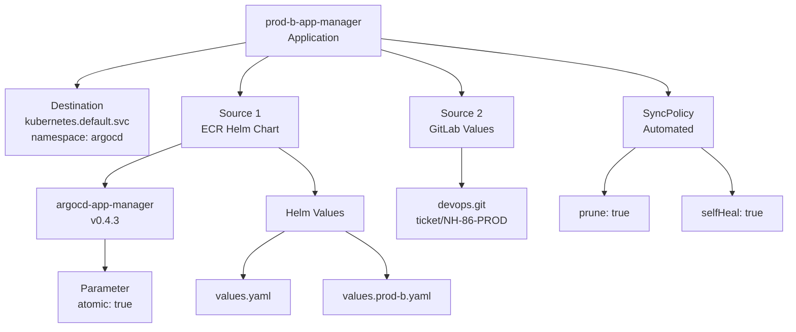
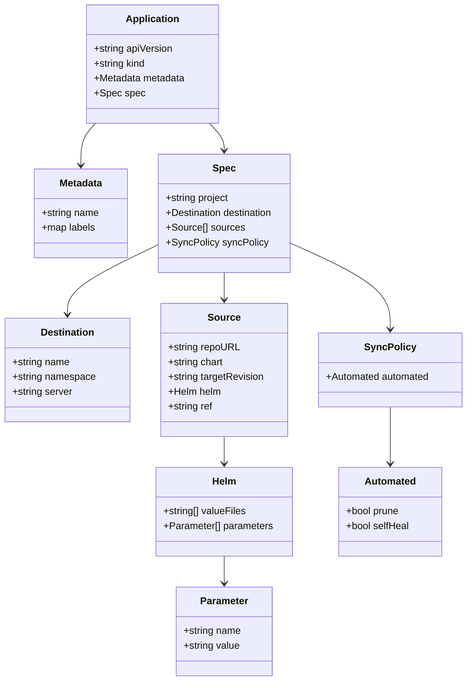
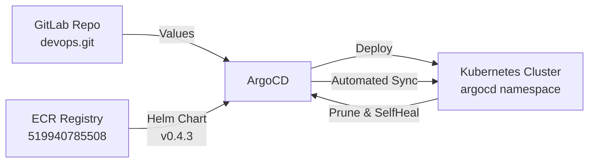

# Diagram: devops/k8s/argocd/app-manager/argocd/Application.prod-b.yaml

> Auto-generated by Obscura crawlers

## Diagram 1

### SVG

<svg id="container" width="1215.3046875" xmlns="http://www.w3.org/2000/svg" class="flowchart" height="502" viewBox="0 0 1215.3046875 502" role="graphics-document document" aria-roledescription="flowchart-v2"><g><marker id="container_flowchart-v2-pointEnd" class="marker flowchart-v2" viewBox="0 0 10 10" refX="5" refY="5" markerUnits="userSpaceOnUse" markerWidth="8" markerHeight="8" orient="auto"><path d="M 0 0 L 10 5 L 0 10 z" class="arrowMarkerPath" style="stroke-width: 1; stroke-dasharray: 1, 0;"></path></marker><marker id="container_flowchart-v2-pointStart" class="marker flowchart-v2" viewBox="0 0 10 10" refX="4.5" refY="5" markerUnits="userSpaceOnUse" markerWidth="8" markerHeight="8" orient="auto"><path d="M 0 5 L 10 10 L 10 0 z" class="arrowMarkerPath" style="stroke-width: 1; stroke-dasharray: 1, 0;"></path></marker><marker id="container_flowchart-v2-circleEnd" class="marker flowchart-v2" viewBox="0 0 10 10" refX="11" refY="5" markerUnits="userSpaceOnUse" markerWidth="11" markerHeight="11" orient="auto"><circle cx="5" cy="5" r="5" class="arrowMarkerPath" style="stroke-width: 1; stroke-dasharray: 1, 0;"></circle></marker><marker id="container_flowchart-v2-circleStart" class="marker flowchart-v2" viewBox="0 0 10 10" refX="-1" refY="5" markerUnits="userSpaceOnUse" markerWidth="11" markerHeight="11" orient="auto"><circle cx="5" cy="5" r="5" class="arrowMarkerPath" style="stroke-width: 1; stroke-dasharray: 1, 0;"></circle></marker><marker id="container_flowchart-v2-crossEnd" class="marker cross flowchart-v2" viewBox="0 0 11 11" refX="12" refY="5.2" markerUnits="userSpaceOnUse" markerWidth="11" markerHeight="11" orient="auto"><path d="M 1,1 l 9,9 M 10,1 l -9,9" class="arrowMarkerPath" style="stroke-width: 2; stroke-dasharray: 1, 0;"></path></marker><marker id="container_flowchart-v2-crossStart" class="marker cross flowchart-v2" viewBox="0 0 11 11" refX="-1" refY="5.2" markerUnits="userSpaceOnUse" markerWidth="11" markerHeight="11" orient="auto"><path d="M 1,1 l 9,9 M 10,1 l -9,9" class="arrowMarkerPath" style="stroke-width: 2; stroke-dasharray: 1, 0;"></path></marker><g class="root"><g class="clusters"></g><g class="edgePaths"><path d="M373.574,65.968L331.287,73.473C289,80.978,204.426,95.989,162.139,106.995C119.852,118,119.852,125,119.852,128.5L119.852,132" id="L_A_B_0" class="edge-thickness-normal edge-pattern-solid edge-thickness-normal edge-pattern-solid flowchart-link" style=";" data-edge="true" data-et="edge" data-id="L_A_B_0" data-points="W3sieCI6MzczLjU3NDIxODc1LCJ5Ijo2NS45Njc1MzM2NjMzNzcwNX0seyJ4IjoxMTkuODUxNTYyNSwieSI6MTExfSx7IngiOjExOS44NTE1NjI1LCJ5IjoxMzZ9XQ==" marker-end="url(#container_flowchart-v2-pointEnd)"></path><path d="M411.841,86L404.512,90.167C397.183,94.333,382.525,102.667,375.196,112.333C367.867,122,367.867,133,367.867,138.5L367.867,144" id="L_A_C_0" class="edge-thickness-normal edge-pattern-solid edge-thickness-normal edge-pattern-solid flowchart-link" style=";" data-edge="true" data-et="edge" data-id="L_A_C_0" data-points="W3sieCI6NDExLjg0MTQ5MTY5OTIxODc1LCJ5Ijo4Nn0seyJ4IjozNjcuODY3MTg3NSwieSI6MTExfSx7IngiOjM2Ny44NjcxODc1LCJ5IjoxNDh9XQ==" marker-end="url(#container_flowchart-v2-pointEnd)"></path><path d="M587.309,76.993L607.503,82.661C627.698,88.329,668.087,99.664,688.282,110.832C708.477,122,708.477,133,708.477,138.5L708.477,144" id="L_A_D_0" class="edge-thickness-normal edge-pattern-solid edge-thickness-normal edge-pattern-solid flowchart-link" style=";" data-edge="true" data-et="edge" data-id="L_A_D_0" data-points="W3sieCI6NTg3LjMwODU5Mzc1LCJ5Ijo3Ni45OTMxODIyNDY0MzI2N30seyJ4Ijo3MDguNDc2NTYyNSwieSI6MTExfSx7IngiOjcwOC40NzY1NjI1LCJ5IjoxNDh9XQ==" marker-end="url(#container_flowchart-v2-pointEnd)"></path><path d="M587.309,59.464L660.951,68.054C734.592,76.643,881.876,93.821,955.518,107.911C1029.16,122,1029.16,133,1029.16,138.5L1029.16,144" id="L_A_E_0" class="edge-thickness-normal edge-pattern-solid edge-thickness-normal edge-pattern-solid flowchart-link" style=";" data-edge="true" data-et="edge" data-id="L_A_E_0" data-points="W3sieCI6NTg3LjMwODU5Mzc1LCJ5Ijo1OS40NjQ0OTExNDQxNDI2MDZ9LHsieCI6MTAyOS4xNjAxNTYyNSwieSI6MTExfSx7IngiOjEwMjkuMTYwMTU2MjUsInkiOjE0OH1d" marker-end="url(#container_flowchart-v2-pointEnd)"></path><path d="M281.703,218.4L261.306,225.834C240.909,233.267,200.115,248.133,179.717,259.067C159.32,270,159.32,277,159.32,280.5L159.32,284" id="L_C_F_0" class="edge-thickness-normal edge-pattern-solid edge-thickness-normal edge-pattern-solid flowchart-link" style=";" data-edge="true" data-et="edge" data-id="L_C_F_0" data-points="W3sieCI6MjgxLjcwMzEyNSwieSI6MjE4LjQwMDQ2NDUyMzg2MzA0fSx7IngiOjE1OS4zMjAzMTI1LCJ5IjoyNjN9LHsieCI6MTU5LjMyMDMxMjUsInkiOjI4OH1d" marker-end="url(#container_flowchart-v2-pointEnd)"></path><path d="M427.117,226L436.485,232.167C445.854,238.333,464.591,250.667,473.96,262.333C483.328,274,483.328,285,483.328,290.5L483.328,296" id="L_C_G_0" class="edge-thickness-normal edge-pattern-solid edge-thickness-normal edge-pattern-solid flowchart-link" style=";" data-edge="true" data-et="edge" data-id="L_C_G_0" data-points="W3sieCI6NDI3LjExNjg3OTExMTg0MjEsInkiOjIyNn0seyJ4Ijo0ODMuMzI4MTI1LCJ5IjoyNjN9LHsieCI6NDgzLjMyODEyNSwieSI6MzAwfV0=" marker-end="url(#container_flowchart-v2-pointEnd)"></path><path d="M436.678,354L426.023,360.167C415.369,366.333,394.059,378.667,383.405,390.333C372.75,402,372.75,413,372.75,418.5L372.75,424" id="L_G_H_0" class="edge-thickness-normal edge-pattern-solid edge-thickness-normal edge-pattern-solid flowchart-link" style=";" data-edge="true" data-et="edge" data-id="L_G_H_0" data-points="W3sieCI6NDM2LjY3Nzk3ODUxNTYyNSwieSI6MzU0fSx7IngiOjM3Mi43NSwieSI6MzkxfSx7IngiOjM3Mi43NSwieSI6NDI4fV0=" marker-end="url(#container_flowchart-v2-pointEnd)"></path><path d="M529.978,354L540.633,360.167C551.288,366.333,572.597,378.667,583.252,390.333C593.906,402,593.906,413,593.906,418.5L593.906,424" id="L_G_I_0" class="edge-thickness-normal edge-pattern-solid edge-thickness-normal edge-pattern-solid flowchart-link" style=";" data-edge="true" data-et="edge" data-id="L_G_I_0" data-points="W3sieCI6NTI5Ljk3ODI3MTQ4NDM3NSwieSI6MzU0fSx7IngiOjU5My45MDYyNSwieSI6MzkxfSx7IngiOjU5My45MDYyNSwieSI6NDI4fV0=" marker-end="url(#container_flowchart-v2-pointEnd)"></path><path d="M708.477,226L708.477,232.167C708.477,238.333,708.477,250.667,708.477,260.333C708.477,270,708.477,277,708.477,280.5L708.477,284" id="L_D_J_0" class="edge-thickness-normal edge-pattern-solid edge-thickness-normal edge-pattern-solid flowchart-link" style=";" data-edge="true" data-et="edge" data-id="L_D_J_0" data-points="W3sieCI6NzA4LjQ3NjU2MjUsInkiOjIyNn0seyJ4Ijo3MDguNDc2NTYyNSwieSI6MjYzfSx7IngiOjcwOC40NzY1NjI1LCJ5IjoyODh9XQ==" marker-end="url(#container_flowchart-v2-pointEnd)"></path><path d="M978.063,226L969.983,232.167C961.904,238.333,945.745,250.667,937.665,262.333C929.586,274,929.586,285,929.586,290.5L929.586,296" id="L_E_K_0" class="edge-thickness-normal edge-pattern-solid edge-thickness-normal edge-pattern-solid flowchart-link" style=";" data-edge="true" data-et="edge" data-id="L_E_K_0" data-points="W3sieCI6OTc4LjA2Mjg1OTc4NjE4NDIsInkiOjIyNn0seyJ4Ijo5MjkuNTg1OTM3NSwieSI6MjYzfSx7IngiOjkyOS41ODU5Mzc1LCJ5IjozMDB9XQ==" marker-end="url(#container_flowchart-v2-pointEnd)"></path><path d="M1080.257,226L1088.337,232.167C1096.416,238.333,1112.575,250.667,1120.655,262.333C1128.734,274,1128.734,285,1128.734,290.5L1128.734,296" id="L_E_L_0" class="edge-thickness-normal edge-pattern-solid edge-thickness-normal edge-pattern-solid flowchart-link" style=";" data-edge="true" data-et="edge" data-id="L_E_L_0" data-points="W3sieCI6MTA4MC4yNTc0NTI3MTM4MTU4LCJ5IjoyMjZ9LHsieCI6MTEyOC43MzQzNzUsInkiOjI2M30seyJ4IjoxMTI4LjczNDM3NSwieSI6MzAwfV0=" marker-end="url(#container_flowchart-v2-pointEnd)"></path><path d="M159.32,366L159.32,370.167C159.32,374.333,159.32,382.667,159.32,390.333C159.32,398,159.32,405,159.32,408.5L159.32,412" id="L_F_M_0" class="edge-thickness-normal edge-pattern-solid edge-thickness-normal edge-pattern-solid flowchart-link" style=";" data-edge="true" data-et="edge" data-id="L_F_M_0" data-points="W3sieCI6MTU5LjMyMDMxMjUsInkiOjM2Nn0seyJ4IjoxNTkuMzIwMzEyNSwieSI6MzkxfSx7IngiOjE1OS4zMjAzMTI1LCJ5Ijo0MTZ9XQ==" marker-end="url(#container_flowchart-v2-pointEnd)"></path></g><g class="edgeLabels"><g class="edgeLabel"><g class="label" data-id="L_A_B_0" transform="translate(0, 0)"><foreignObject width="0" height="0">

</foreignObject></g></g><g class="edgeLabel"><g class="label" data-id="L_A_C_0" transform="translate(0, 0)"><foreignObject width="0" height="0">

</foreignObject></g></g><g class="edgeLabel"><g class="label" data-id="L_A_D_0" transform="translate(0, 0)"><foreignObject width="0" height="0">

</foreignObject></g></g><g class="edgeLabel"><g class="label" data-id="L_A_E_0" transform="translate(0, 0)"><foreignObject width="0" height="0">

</foreignObject></g></g><g class="edgeLabel"><g class="label" data-id="L_C_F_0" transform="translate(0, 0)"><foreignObject width="0" height="0">

</foreignObject></g></g><g class="edgeLabel"><g class="label" data-id="L_C_G_0" transform="translate(0, 0)"><foreignObject width="0" height="0">

</foreignObject></g></g><g class="edgeLabel"><g class="label" data-id="L_G_H_0" transform="translate(0, 0)"><foreignObject width="0" height="0">

</foreignObject></g></g><g class="edgeLabel"><g class="label" data-id="L_G_I_0" transform="translate(0, 0)"><foreignObject width="0" height="0">

</foreignObject></g></g><g class="edgeLabel"><g class="label" data-id="L_D_J_0" transform="translate(0, 0)"><foreignObject width="0" height="0">

</foreignObject></g></g><g class="edgeLabel"><g class="label" data-id="L_E_K_0" transform="translate(0, 0)"><foreignObject width="0" height="0">

</foreignObject></g></g><g class="edgeLabel"><g class="label" data-id="L_E_L_0" transform="translate(0, 0)"><foreignObject width="0" height="0">

</foreignObject></g></g><g class="edgeLabel"><g class="label" data-id="L_F_M_0" transform="translate(0, 0)"><foreignObject width="0" height="0">

</foreignObject></g></g></g><g class="nodes"><g class="node default" id="flowchart-A-0" transform="translate(480.44140625, 47)"><rect class="basic label-container" style="" x="-106.8671875" y="-39" width="213.734375" height="78"></rect><g class="label" style="" transform="translate(-76.8671875, -24)"><rect></rect><foreignObject width="153.734375" height="48">

prod-b-app-manager Application

</foreignObject></g></g><g class="node default" id="flowchart-B-1" transform="translate(119.8515625, 187)"><rect class="basic label-container" style="" x="-111.8515625" y="-51" width="223.703125" height="102"></rect><g class="label" style="" transform="translate(-81.8515625, -36)"><rect></rect><foreignObject width="163.703125" height="72">

Destination kubernetes.default.svc namespace: argocd

</foreignObject></g></g><g class="node default" id="flowchart-C-3" transform="translate(367.8671875, 187)"><rect class="basic label-container" style="" x="-86.1640625" y="-39" width="172.328125" height="78"></rect><g class="label" style="" transform="translate(-56.1640625, -24)"><rect></rect><foreignObject width="112.328125" height="48">

Source 1 ECR Helm Chart

</foreignObject></g></g><g class="node default" id="flowchart-D-5" transform="translate(708.4765625, 187)"><rect class="basic label-container" style="" x="-78.8203125" y="-39" width="157.640625" height="78"></rect><g class="label" style="" transform="translate(-48.8203125, -24)"><rect></rect><foreignObject width="97.640625" height="48">

Source 2 GitLab Values

</foreignObject></g></g><g class="node default" id="flowchart-E-7" transform="translate(1029.16015625, 187)"><rect class="basic label-container" style="" x="-69.8046875" y="-39" width="139.609375" height="78"></rect><g class="label" style="" transform="translate(-39.8046875, -24)"><rect></rect><foreignObject width="79.609375" height="48">

SyncPolicy Automated

</foreignObject></g></g><g class="node default" id="flowchart-F-9" transform="translate(159.3203125, 327)"><rect class="basic label-container" style="" x="-106.3046875" y="-39" width="212.609375" height="78"></rect><g class="label" style="" transform="translate(-76.3046875, -24)"><rect></rect><foreignObject width="152.609375" height="48">

argocd-app-manager v0.4.3

</foreignObject></g></g><g class="node default" id="flowchart-G-11" transform="translate(483.328125, 327)"><rect class="basic label-container" style="" x="-74.6171875" y="-27" width="149.234375" height="54"></rect><g class="label" style="" transform="translate(-44.6171875, -12)"><rect></rect><foreignObject width="89.234375" height="24">

Helm Values

</foreignObject></g></g><g class="node default" id="flowchart-H-13" transform="translate(372.75, 455)"><rect class="basic label-container" style="" x="-72.140625" y="-27" width="144.28125" height="54"></rect><g class="label" style="" transform="translate(-42.140625, -12)"><rect></rect><foreignObject width="84.28125" height="24">

values.yaml

</foreignObject></g></g><g class="node default" id="flowchart-I-15" transform="translate(593.90625, 455)"><rect class="basic label-container" style="" x="-99.015625" y="-27" width="198.03125" height="54"></rect><g class="label" style="" transform="translate(-69.015625, -12)"><rect></rect><foreignObject width="138.03125" height="24">

values.prod-b.yaml

</foreignObject></g></g><g class="node default" id="flowchart-J-17" transform="translate(708.4765625, 327)"><rect class="basic label-container" style="" x="-100.53125" y="-39" width="201.0625" height="78"></rect><g class="label" style="" transform="translate(-70.53125, -24)"><rect></rect><foreignObject width="141.0625" height="48">

devops.git ticket/NH-86-PROD

</foreignObject></g></g><g class="node default" id="flowchart-K-19" transform="translate(929.5859375, 327)"><rect class="basic label-container" style="" x="-70.578125" y="-27" width="141.15625" height="54"></rect><g class="label" style="" transform="translate(-40.578125, -12)"><rect></rect><foreignObject width="81.15625" height="24">

prune: true

</foreignObject></g></g><g class="node default" id="flowchart-L-21" transform="translate(1128.734375, 327)"><rect class="basic label-container" style="" x="-78.5703125" y="-27" width="157.140625" height="54"></rect><g class="label" style="" transform="translate(-48.5703125, -12)"><rect></rect><foreignObject width="97.140625" height="24">

selfHeal: true

</foreignObject></g></g><g class="node default" id="flowchart-M-23" transform="translate(159.3203125, 455)"><rect class="basic label-container" style="" x="-73.796875" y="-39" width="147.59375" height="78"></rect><g class="label" style="" transform="translate(-43.796875, -24)"><rect></rect><foreignObject width="87.59375" height="48">

Parameter atomic: true

</foreignObject></g></g></g></g></g></svg>

## Diagram 2

### SVG

<svg id="container" width="758.9375" xmlns="http://www.w3.org/2000/svg" class="classDiagram" height="1104" viewBox="0 0 758.9375 1104" role="graphics-document document" aria-roledescription="class"><g><defs><marker id="container_class-aggregationStart" class="marker aggregation class" refX="18" refY="7" markerWidth="190" markerHeight="240" orient="auto"><path d="M 18,7 L9,13 L1,7 L9,1 Z"></path></marker></defs><defs><marker id="container_class-aggregationEnd" class="marker aggregation class" refX="1" refY="7" markerWidth="20" markerHeight="28" orient="auto"><path d="M 18,7 L9,13 L1,7 L9,1 Z"></path></marker></defs><defs><marker id="container_class-extensionStart" class="marker extension class" refX="18" refY="7" markerWidth="190" markerHeight="240" orient="auto"><path d="M 1,7 L18,13 V 1 Z"></path></marker></defs><defs><marker id="container_class-extensionEnd" class="marker extension class" refX="1" refY="7" markerWidth="20" markerHeight="28" orient="auto"><path d="M 1,1 V 13 L18,7 Z"></path></marker></defs><defs><marker id="container_class-compositionStart" class="marker composition class" refX="18" refY="7" markerWidth="190" markerHeight="240" orient="auto"><path d="M 18,7 L9,13 L1,7 L9,1 Z"></path></marker></defs><defs><marker id="container_class-compositionEnd" class="marker composition class" refX="1" refY="7" markerWidth="20" markerHeight="28" orient="auto"><path d="M 18,7 L9,13 L1,7 L9,1 Z"></path></marker></defs><defs><marker id="container_class-dependencyStart" class="marker dependency class" refX="6" refY="7" markerWidth="190" markerHeight="240" orient="auto"><path d="M 5,7 L9,13 L1,7 L9,1 Z"></path></marker></defs><defs><marker id="container_class-dependencyEnd" class="marker dependency class" refX="13" refY="7" markerWidth="20" markerHeight="28" orient="auto"><path d="M 18,7 L9,13 L14,7 L9,1 Z"></path></marker></defs><defs><marker id="container_class-lollipopStart" class="marker lollipop class" refX="13" refY="7" markerWidth="190" markerHeight="240" orient="auto"><circle stroke="black" fill="transparent" cx="7" cy="7" r="6"></circle></marker></defs><defs><marker id="container_class-lollipopEnd" class="marker lollipop class" refX="1" refY="7" markerWidth="190" markerHeight="240" orient="auto"><circle stroke="black" fill="transparent" cx="7" cy="7" r="6"></circle></marker></defs><g class="root"><g class="clusters"></g><g class="edgePaths"><path d="M151.351,200L147.272,204.167C143.192,208.333,135.034,216.667,130.954,228C126.875,239.333,126.875,253.667,126.875,260.833L126.875,268" id="id_Application_Metadata_1" class="edge-thickness-normal edge-pattern-solid relation" style=";;;" data-edge="true" data-et="edge" data-id="id_Application_Metadata_1" data-points="W3sieCI6MTUxLjM1MDgwMzg0ODE0MDUyLCJ5IjoyMDB9LHsieCI6MTI2Ljg3NSwieSI6MjI1fSx7IngiOjEyNi44NzUsInkiOjI3NH1d" marker-end="url(#container_class-dependencyEnd)"></path><path d="M339.325,200L343.404,204.167C347.484,208.333,355.642,216.667,359.721,224C363.801,231.333,363.801,237.667,363.801,240.833L363.801,244" id="id_Application_Spec_2" class="edge-thickness-normal edge-pattern-solid relation" style=";;;" data-edge="true" data-et="edge" data-id="id_Application_Spec_2" data-points="W3sieCI6MzM5LjMyNDk3NzQwMTg1OTUsInkiOjIwMH0seyJ4IjozNjMuODAwNzgxMjUsInkiOjIyNX0seyJ4IjozNjMuODAwNzgxMjUsInkiOjI1MH1d" marker-end="url(#container_class-dependencyEnd)"></path><path d="M253.383,398.477L229.353,409.898C205.323,421.318,157.263,444.159,133.233,462.746C109.203,481.333,109.203,495.667,109.203,502.833L109.203,510" id="id_Spec_Destination_3" class="edge-thickness-normal edge-pattern-solid relation" style=";;;" data-edge="true" data-et="edge" data-id="id_Spec_Destination_3" data-points="W3sieCI6MjUzLjM4MjgxMjUsInkiOjM5OC40NzcyMDgyMTc2MjI4fSx7IngiOjEwOS4yMDMxMjUsInkiOjQ2N30seyJ4IjoxMDkuMjAzMTI1LCJ5Ijo1MTZ9XQ==" marker-end="url(#container_class-dependencyEnd)"></path><path d="M363.801,442L363.801,446.167C363.801,450.333,363.801,458.667,363.801,466C363.801,473.333,363.801,479.667,363.801,482.833L363.801,486" id="id_Spec_Source_4" class="edge-thickness-normal edge-pattern-solid relation" style=";;;" data-edge="true" data-et="edge" data-id="id_Spec_Source_4" data-points="W3sieCI6MzYzLjgwMDc4MTI1LCJ5Ijo0NDJ9LHsieCI6MzYzLjgwMDc4MTI1LCJ5Ijo0Njd9LHsieCI6MzYzLjgwMDc4MTI1LCJ5Ijo0OTJ9XQ==" marker-end="url(#container_class-dependencyEnd)"></path><path d="M474.219,395.435L500.86,407.362C527.501,419.29,580.784,443.145,607.425,466.239C634.066,489.333,634.066,511.667,634.066,522.833L634.066,534" id="id_Spec_SyncPolicy_5" class="edge-thickness-normal edge-pattern-solid relation" style=";;;" data-edge="true" data-et="edge" data-id="id_Spec_SyncPolicy_5" data-points="W3sieCI6NDc0LjIxODc1LCJ5IjozOTUuNDM0OTc0MjcyOTk1M30seyJ4Ijo2MzQuMDY2NDA2MjUsInkiOjQ2N30seyJ4Ijo2MzQuMDY2NDA2MjUsInkiOjU0MH1d" marker-end="url(#container_class-dependencyEnd)"></path><path d="M363.801,708L363.801,712.167C363.801,716.333,363.801,724.667,363.801,732C363.801,739.333,363.801,745.667,363.801,748.833L363.801,752" id="id_Source_Helm_6" class="edge-thickness-normal edge-pattern-solid relation" style=";;;" data-edge="true" data-et="edge" data-id="id_Source_Helm_6" data-points="W3sieCI6MzYzLjgwMDc4MTI1LCJ5Ijo3MDh9LHsieCI6MzYzLjgwMDc4MTI1LCJ5Ijo3MzN9LHsieCI6MzYzLjgwMDc4MTI1LCJ5Ijo3NTh9XQ==" marker-end="url(#container_class-dependencyEnd)"></path><path d="M363.801,902L363.801,906.167C363.801,910.333,363.801,918.667,363.801,926C363.801,933.333,363.801,939.667,363.801,942.833L363.801,946" id="id_Helm_Parameter_7" class="edge-thickness-normal edge-pattern-solid relation" style=";;;" data-edge="true" data-et="edge" data-id="id_Helm_Parameter_7" data-points="W3sieCI6MzYzLjgwMDc4MTI1LCJ5Ijo5MDJ9LHsieCI6MzYzLjgwMDc4MTI1LCJ5Ijo5Mjd9LHsieCI6MzYzLjgwMDc4MTI1LCJ5Ijo5NTJ9XQ==" marker-end="url(#container_class-dependencyEnd)"></path><path d="M634.066,660L634.066,672.167C634.066,684.333,634.066,708.667,634.066,724C634.066,739.333,634.066,745.667,634.066,748.833L634.066,752" id="id_SyncPolicy_Automated_8" class="edge-thickness-normal edge-pattern-solid relation" style=";;;" data-edge="true" data-et="edge" data-id="id_SyncPolicy_Automated_8" data-points="W3sieCI6NjM0LjA2NjQwNjI1LCJ5Ijo2NjB9LHsieCI6NjM0LjA2NjQwNjI1LCJ5Ijo3MzN9LHsieCI6NjM0LjA2NjQwNjI1LCJ5Ijo3NTh9XQ==" marker-end="url(#container_class-dependencyEnd)"></path></g><g class="edgeLabels"><g class="edgeLabel"><g class="label" data-id="id_Application_Metadata_1" transform="translate(0, 0)"><foreignObject width="0" height="0">

</foreignObject></g></g><g class="edgeLabel"><g class="label" data-id="id_Application_Spec_2" transform="translate(0, 0)"><foreignObject width="0" height="0">

</foreignObject></g></g><g class="edgeLabel"><g class="label" data-id="id_Spec_Destination_3" transform="translate(0, 0)"><foreignObject width="0" height="0">

</foreignObject></g></g><g class="edgeLabel"><g class="label" data-id="id_Spec_Source_4" transform="translate(0, 0)"><foreignObject width="0" height="0">

</foreignObject></g></g><g class="edgeLabel"><g class="label" data-id="id_Spec_SyncPolicy_5" transform="translate(0, 0)"><foreignObject width="0" height="0">

</foreignObject></g></g><g class="edgeLabel"><g class="label" data-id="id_Source_Helm_6" transform="translate(0, 0)"><foreignObject width="0" height="0">

</foreignObject></g></g><g class="edgeLabel"><g class="label" data-id="id_Helm_Parameter_7" transform="translate(0, 0)"><foreignObject width="0" height="0">

</foreignObject></g></g><g class="edgeLabel"><g class="label" data-id="id_SyncPolicy_Automated_8" transform="translate(0, 0)"><foreignObject width="0" height="0">

</foreignObject></g></g></g><g class="nodes"><g class="node default" id="classId-Application-0" transform="translate(245.337890625, 104)"><g class="basic label-container"><path d="M-107.76171875 -96 L107.76171875 -96 L107.76171875 96 L-107.76171875 96" stroke="none" stroke-width="0" fill="#ECECFF" style=""></path><path d="M-107.76171875 -96 C-36.117392956793495 -96, 35.52693283641301 -96, 107.76171875 -96 M-107.76171875 -96 C-39.40940397186128 -96, 28.94291080627744 -96, 107.76171875 -96 M107.76171875 -96 C107.76171875 -44.87540227438693, 107.76171875 6.249195451226143, 107.76171875 96 M107.76171875 -96 C107.76171875 -40.466971537879054, 107.76171875 15.066056924241892, 107.76171875 96 M107.76171875 96 C40.000785404615414 96, -27.760147940769173 96, -107.76171875 96 M107.76171875 96 C26.688507378073922 96, -54.384703993852156 96, -107.76171875 96 M-107.76171875 96 C-107.76171875 36.069793874068736, -107.76171875 -23.860412251862527, -107.76171875 -96 M-107.76171875 96 C-107.76171875 57.430324586706774, -107.76171875 18.86064917341355, -107.76171875 -96" stroke="#9370DB" stroke-width="1.3" fill="none" stroke-dasharray="0 0" style=""></path></g><g class="annotation-group text" transform="translate(0, -72)"></g><g class="label-group text" transform="translate(-41.6796875, -72)"><g class="label" style="font-weight: bolder" transform="translate(0,-12)"><foreignObject width="83.359375" height="24">

Application

</foreignObject></g></g><g class="members-group text" transform="translate(-95.76171875, -24)"><g class="label" style="" transform="translate(0,-12)"><foreignObject width="130.4375" height="24">

+string apiVersion

</foreignObject></g><g class="label" style="" transform="translate(0,12)"><foreignObject width="85.515625" height="24">

+string kind

</foreignObject></g><g class="label" style="" transform="translate(0,36)"><foreignObject width="149.84375" height="24">

+Metadata metadata

</foreignObject></g><g class="label" style="" transform="translate(0,60)"><foreignObject width="79.53125" height="24">

+Spec spec

</foreignObject></g></g><g class="methods-group text" transform="translate(-95.76171875, 96)"></g><g class="divider" style=""><path d="M-107.76171875 -48 C-53.82883097484978 -48, 0.10405680030044095 -48, 107.76171875 -48 M-107.76171875 -48 C-61.2665493140622 -48, -14.771379878124407 -48, 107.76171875 -48" stroke="#9370DB" stroke-width="1.3" fill="none" stroke-dasharray="0 0" style=""></path></g><g class="divider" style=""><path d="M-107.76171875 72 C-61.561021124508976 72, -15.360323499017952 72, 107.76171875 72 M-107.76171875 72 C-22.16454775762992 72, 63.43262323474016 72, 107.76171875 72" stroke="#9370DB" stroke-width="1.3" fill="none" stroke-dasharray="0 0" style=""></path></g></g><g class="node default" id="classId-Metadata-1" transform="translate(126.875, 346)"><g class="basic label-container"><path d="M-76.5078125 -72 L76.5078125 -72 L76.5078125 72 L-76.5078125 72" stroke="none" stroke-width="0" fill="#ECECFF" style=""></path><path d="M-76.5078125 -72 C-27.380833924756082 -72, 21.746144650487835 -72, 76.5078125 -72 M-76.5078125 -72 C-36.70238829650486 -72, 3.1030359069902858 -72, 76.5078125 -72 M76.5078125 -72 C76.5078125 -20.752430339503753, 76.5078125 30.495139320992493, 76.5078125 72 M76.5078125 -72 C76.5078125 -25.52140624203537, 76.5078125 20.957187515929263, 76.5078125 72 M76.5078125 72 C40.2720886870756 72, 4.036364874151204 72, -76.5078125 72 M76.5078125 72 C29.437057379376284 72, -17.63369774124743 72, -76.5078125 72 M-76.5078125 72 C-76.5078125 18.11587715946341, -76.5078125 -35.76824568107318, -76.5078125 -72 M-76.5078125 72 C-76.5078125 43.132406886745386, -76.5078125 14.264813773490772, -76.5078125 -72" stroke="#9370DB" stroke-width="1.3" fill="none" stroke-dasharray="0 0" style=""></path></g><g class="annotation-group text" transform="translate(0, -48)"></g><g class="label-group text" transform="translate(-34.640625, -48)"><g class="label" style="font-weight: bolder" transform="translate(0,-12)"><foreignObject width="69.28125" height="24">

Metadata

</foreignObject></g></g><g class="members-group text" transform="translate(-64.5078125, 0)"><g class="label" style="" transform="translate(0,-12)"><foreignObject width="94.375" height="24">

+string name

</foreignObject></g><g class="label" style="" transform="translate(0,12)"><foreignObject width="87.84375" height="24">

+map labels

</foreignObject></g></g><g class="methods-group text" transform="translate(-64.5078125, 72)"></g><g class="divider" style=""><path d="M-76.5078125 -24 C-37.55225397875861 -24, 1.4033045424827861 -24, 76.5078125 -24 M-76.5078125 -24 C-36.768943793106914 -24, 2.9699249137861727 -24, 76.5078125 -24" stroke="#9370DB" stroke-width="1.3" fill="none" stroke-dasharray="0 0" style=""></path></g><g class="divider" style=""><path d="M-76.5078125 48 C-33.75816305530826 48, 8.991486389383482 48, 76.5078125 48 M-76.5078125 48 C-27.419901613140517 48, 21.668009273718965 48, 76.5078125 48" stroke="#9370DB" stroke-width="1.3" fill="none" stroke-dasharray="0 0" style=""></path></g></g><g class="node default" id="classId-Spec-2" transform="translate(363.80078125, 346)"><g class="basic label-container"><path d="M-110.41796875 -96 L110.41796875 -96 L110.41796875 96 L-110.41796875 96" stroke="none" stroke-width="0" fill="#ECECFF" style=""></path><path d="M-110.41796875 -96 C-34.63147825926961 -96, 41.15501223146077 -96, 110.41796875 -96 M-110.41796875 -96 C-55.10399534312292 -96, 0.20997806375416417 -96, 110.41796875 -96 M110.41796875 -96 C110.41796875 -55.18648034882815, 110.41796875 -14.372960697656296, 110.41796875 96 M110.41796875 -96 C110.41796875 -39.60558512427177, 110.41796875 16.78882975145646, 110.41796875 96 M110.41796875 96 C44.58245050044658 96, -21.253067749106833 96, -110.41796875 96 M110.41796875 96 C22.383996521783445 96, -65.64997570643311 96, -110.41796875 96 M-110.41796875 96 C-110.41796875 52.81691043346699, -110.41796875 9.633820866933974, -110.41796875 -96 M-110.41796875 96 C-110.41796875 38.608331802122805, -110.41796875 -18.78333639575439, -110.41796875 -96" stroke="#9370DB" stroke-width="1.3" fill="none" stroke-dasharray="0 0" style=""></path></g><g class="annotation-group text" transform="translate(0, -72)"></g><g class="label-group text" transform="translate(-17.6015625, -72)"><g class="label" style="font-weight: bolder" transform="translate(0,-12)"><foreignObject width="35.203125" height="24">

Spec

</foreignObject></g></g><g class="members-group text" transform="translate(-98.41796875, -24)"><g class="label" style="" transform="translate(0,-12)"><foreignObject width="105.03125" height="24">

+string project

</foreignObject></g><g class="label" style="" transform="translate(0,12)"><foreignObject width="179.234375" height="24">

+Destination destination

</foreignObject></g><g class="label" style="" transform="translate(0,36)"><foreignObject width="126.359375" height="24">

+Source[] sources

</foreignObject></g><g class="label" style="" transform="translate(0,60)"><foreignObject width="162.90625" height="24">

+SyncPolicy syncPolicy

</foreignObject></g></g><g class="methods-group text" transform="translate(-98.41796875, 96)"></g><g class="divider" style=""><path d="M-110.41796875 -48 C-59.659752846710795 -48, -8.90153694342159 -48, 110.41796875 -48 M-110.41796875 -48 C-64.71562931010286 -48, -19.013289870205696 -48, 110.41796875 -48" stroke="#9370DB" stroke-width="1.3" fill="none" stroke-dasharray="0 0" style=""></path></g><g class="divider" style=""><path d="M-110.41796875 72 C-59.120648979920794 72, -7.823329209841589 72, 110.41796875 72 M-110.41796875 72 C-51.83368608442287 72, 6.750596581154255 72, 110.41796875 72" stroke="#9370DB" stroke-width="1.3" fill="none" stroke-dasharray="0 0" style=""></path></g></g><g class="node default" id="classId-Destination-3" transform="translate(109.203125, 600)"><g class="basic label-container"><path d="M-101.203125 -84 L101.203125 -84 L101.203125 84 L-101.203125 84" stroke="none" stroke-width="0" fill="#ECECFF" style=""></path><path d="M-101.203125 -84 C-54.935563248506 -84, -8.668001497012 -84, 101.203125 -84 M-101.203125 -84 C-59.77077663617249 -84, -18.338428272344984 -84, 101.203125 -84 M101.203125 -84 C101.203125 -47.519013089387066, 101.203125 -11.038026178774132, 101.203125 84 M101.203125 -84 C101.203125 -43.796126180573125, 101.203125 -3.592252361146251, 101.203125 84 M101.203125 84 C49.8464449023525 84, -1.510235195294996 84, -101.203125 84 M101.203125 84 C50.6302000836697 84, 0.05727516733939808 84, -101.203125 84 M-101.203125 84 C-101.203125 29.820539100335402, -101.203125 -24.358921799329195, -101.203125 -84 M-101.203125 84 C-101.203125 40.15374101304818, -101.203125 -3.692517973903634, -101.203125 -84" stroke="#9370DB" stroke-width="1.3" fill="none" stroke-dasharray="0 0" style=""></path></g><g class="annotation-group text" transform="translate(0, -60)"></g><g class="label-group text" transform="translate(-42.46875, -60)"><g class="label" style="font-weight: bolder" transform="translate(0,-12)"><foreignObject width="84.9375" height="24">

Destination

</foreignObject></g></g><g class="members-group text" transform="translate(-89.203125, -12)"><g class="label" style="" transform="translate(0,-12)"><foreignObject width="94.375" height="24">

+string name

</foreignObject></g><g class="label" style="" transform="translate(0,12)"><foreignObject width="135.9375" height="24">

+string namespace

</foreignObject></g><g class="label" style="" transform="translate(0,36)"><foreignObject width="98.9375" height="24">

+string server

</foreignObject></g></g><g class="methods-group text" transform="translate(-89.203125, 84)"></g><g class="divider" style=""><path d="M-101.203125 -36 C-51.802873568148456 -36, -2.4026221362969125 -36, 101.203125 -36 M-101.203125 -36 C-29.99926620319829 -36, 41.20459259360342 -36, 101.203125 -36" stroke="#9370DB" stroke-width="1.3" fill="none" stroke-dasharray="0 0" style=""></path></g><g class="divider" style=""><path d="M-101.203125 60 C-42.17885567321174 60, 16.845413653576514 60, 101.203125 60 M-101.203125 60 C-33.61397228256055 60, 33.975180434878894 60, 101.203125 60" stroke="#9370DB" stroke-width="1.3" fill="none" stroke-dasharray="0 0" style=""></path></g></g><g class="node default" id="classId-Source-4" transform="translate(363.80078125, 600)"><g class="basic label-container"><path d="M-103.39453125 -108 L103.39453125 -108 L103.39453125 108 L-103.39453125 108" stroke="none" stroke-width="0" fill="#ECECFF" style=""></path><path d="M-103.39453125 -108 C-28.326352351855917 -108, 46.741826546288166 -108, 103.39453125 -108 M-103.39453125 -108 C-59.740918158773496 -108, -16.087305067546993 -108, 103.39453125 -108 M103.39453125 -108 C103.39453125 -61.927041610361194, 103.39453125 -15.854083220722387, 103.39453125 108 M103.39453125 -108 C103.39453125 -63.625997120723156, 103.39453125 -19.25199424144631, 103.39453125 108 M103.39453125 108 C23.403735510621047 108, -56.587060228757906 108, -103.39453125 108 M103.39453125 108 C22.152021829348286 108, -59.09048759130343 108, -103.39453125 108 M-103.39453125 108 C-103.39453125 31.16925266138503, -103.39453125 -45.66149467722994, -103.39453125 -108 M-103.39453125 108 C-103.39453125 43.43437086955045, -103.39453125 -21.131258260899102, -103.39453125 -108" stroke="#9370DB" stroke-width="1.3" fill="none" stroke-dasharray="0 0" style=""></path></g><g class="annotation-group text" transform="translate(0, -84)"></g><g class="label-group text" transform="translate(-24.8828125, -84)"><g class="label" style="font-weight: bolder" transform="translate(0,-12)"><foreignObject width="49.765625" height="24">

Source

</foreignObject></g></g><g class="members-group text" transform="translate(-91.39453125, -36)"><g class="label" style="" transform="translate(0,-12)"><foreignObject width="115.375" height="24">

+string repoURL

</foreignObject></g><g class="label" style="" transform="translate(0,12)"><foreignObject width="91.546875" height="24">

+string chart

</foreignObject></g><g class="label" style="" transform="translate(0,36)"><foreignObject width="157.90625" height="24">

+string targetRevision

</foreignObject></g><g class="label" style="" transform="translate(0,60)"><foreignObject width="86.734375" height="24">

+Helm helm

</foreignObject></g><g class="label" style="" transform="translate(0,84)"><foreignObject width="73.640625" height="24">

+string ref

</foreignObject></g></g><g class="methods-group text" transform="translate(-91.39453125, 108)"></g><g class="divider" style=""><path d="M-103.39453125 -60 C-41.846769265671966 -60, 19.700992718656067 -60, 103.39453125 -60 M-103.39453125 -60 C-24.841086030826546 -60, 53.71235918834691 -60, 103.39453125 -60" stroke="#9370DB" stroke-width="1.3" fill="none" stroke-dasharray="0 0" style=""></path></g><g class="divider" style=""><path d="M-103.39453125 84 C-58.13813216582276 84, -12.881733081645521 84, 103.39453125 84 M-103.39453125 84 C-45.83506081772344 84, 11.724409614553124 84, 103.39453125 84" stroke="#9370DB" stroke-width="1.3" fill="none" stroke-dasharray="0 0" style=""></path></g></g><g class="node default" id="classId-Helm-5" transform="translate(363.80078125, 830)"><g class="basic label-container"><path d="M-111.08984375 -72 L111.08984375 -72 L111.08984375 72 L-111.08984375 72" stroke="none" stroke-width="0" fill="#ECECFF" style=""></path><path d="M-111.08984375 -72 C-23.15451911467251 -72, 64.78080552065498 -72, 111.08984375 -72 M-111.08984375 -72 C-38.955686472854794 -72, 33.17847080429041 -72, 111.08984375 -72 M111.08984375 -72 C111.08984375 -21.311029852720267, 111.08984375 29.377940294559465, 111.08984375 72 M111.08984375 -72 C111.08984375 -34.5393471993699, 111.08984375 2.921305601260201, 111.08984375 72 M111.08984375 72 C63.53087624399136 72, 15.971908737982716 72, -111.08984375 72 M111.08984375 72 C30.017956604794207 72, -51.053930540411585 72, -111.08984375 72 M-111.08984375 72 C-111.08984375 21.336402059018383, -111.08984375 -29.327195881963235, -111.08984375 -72 M-111.08984375 72 C-111.08984375 42.46080278314295, -111.08984375 12.921605566285898, -111.08984375 -72" stroke="#9370DB" stroke-width="1.3" fill="none" stroke-dasharray="0 0" style=""></path></g><g class="annotation-group text" transform="translate(0, -48)"></g><g class="label-group text" transform="translate(-18.8828125, -48)"><g class="label" style="font-weight: bolder" transform="translate(0,-12)"><foreignObject width="37.765625" height="24">

Helm

</foreignObject></g></g><g class="members-group text" transform="translate(-99.08984375, 0)"><g class="label" style="" transform="translate(0,-12)"><foreignObject width="135.65625" height="24">

+string[] valueFiles

</foreignObject></g><g class="label" style="" transform="translate(0,12)"><foreignObject width="179.296875" height="24">

+Parameter[] parameters

</foreignObject></g></g><g class="methods-group text" transform="translate(-99.08984375, 72)"></g><g class="divider" style=""><path d="M-111.08984375 -24 C-59.82646665629084 -24, -8.56308956258168 -24, 111.08984375 -24 M-111.08984375 -24 C-28.09328951099701 -24, 54.90326472800598 -24, 111.08984375 -24" stroke="#9370DB" stroke-width="1.3" fill="none" stroke-dasharray="0 0" style=""></path></g><g class="divider" style=""><path d="M-111.08984375 48 C-23.881288518560297 48, 63.32726671287941 48, 111.08984375 48 M-111.08984375 48 C-28.706565914456277 48, 53.676711921087445 48, 111.08984375 48" stroke="#9370DB" stroke-width="1.3" fill="none" stroke-dasharray="0 0" style=""></path></g></g><g class="node default" id="classId-Parameter-6" transform="translate(363.80078125, 1024)"><g class="basic label-container"><path d="M-78.1015625 -72 L78.1015625 -72 L78.1015625 72 L-78.1015625 72" stroke="none" stroke-width="0" fill="#ECECFF" style=""></path><path d="M-78.1015625 -72 C-34.3004467341871 -72, 9.500669031625804 -72, 78.1015625 -72 M-78.1015625 -72 C-44.46836309345458 -72, -10.835163686909155 -72, 78.1015625 -72 M78.1015625 -72 C78.1015625 -38.601329988851035, 78.1015625 -5.202659977702069, 78.1015625 72 M78.1015625 -72 C78.1015625 -36.376178352812204, 78.1015625 -0.7523567056244076, 78.1015625 72 M78.1015625 72 C36.27100783679922 72, -5.559546826401558 72, -78.1015625 72 M78.1015625 72 C20.88740619357899 72, -36.32675011284202 72, -78.1015625 72 M-78.1015625 72 C-78.1015625 23.272287069548184, -78.1015625 -25.45542586090363, -78.1015625 -72 M-78.1015625 72 C-78.1015625 25.090990668024837, -78.1015625 -21.818018663950326, -78.1015625 -72" stroke="#9370DB" stroke-width="1.3" fill="none" stroke-dasharray="0 0" style=""></path></g><g class="annotation-group text" transform="translate(0, -48)"></g><g class="label-group text" transform="translate(-37.828125, -48)"><g class="label" style="font-weight: bolder" transform="translate(0,-12)"><foreignObject width="75.65625" height="24">

Parameter

</foreignObject></g></g><g class="members-group text" transform="translate(-66.1015625, 0)"><g class="label" style="" transform="translate(0,-12)"><foreignObject width="94.375" height="24">

+string name

</foreignObject></g><g class="label" style="" transform="translate(0,12)"><foreignObject width="92.75" height="24">

+string value

</foreignObject></g></g><g class="methods-group text" transform="translate(-66.1015625, 72)"></g><g class="divider" style=""><path d="M-78.1015625 -24 C-38.558731991530564 -24, 0.9840985169388716 -24, 78.1015625 -24 M-78.1015625 -24 C-33.66797979681253 -24, 10.765602906374937 -24, 78.1015625 -24" stroke="#9370DB" stroke-width="1.3" fill="none" stroke-dasharray="0 0" style=""></path></g><g class="divider" style=""><path d="M-78.1015625 48 C-24.357549077736053 48, 29.386464344527894 48, 78.1015625 48 M-78.1015625 48 C-41.8700123776045 48, -5.6384622552090065 48, 78.1015625 48" stroke="#9370DB" stroke-width="1.3" fill="none" stroke-dasharray="0 0" style=""></path></g></g><g class="node default" id="classId-SyncPolicy-7" transform="translate(634.06640625, 600)"><g class="basic label-container"><path d="M-116.87109375 -60 L116.87109375 -60 L116.87109375 60 L-116.87109375 60" stroke="none" stroke-width="0" fill="#ECECFF" style=""></path><path d="M-116.87109375 -60 C-24.993722171677874 -60, 66.88364940664425 -60, 116.87109375 -60 M-116.87109375 -60 C-64.62683770378428 -60, -12.38258165756855 -60, 116.87109375 -60 M116.87109375 -60 C116.87109375 -21.64551413854275, 116.87109375 16.708971722914498, 116.87109375 60 M116.87109375 -60 C116.87109375 -19.192911731339642, 116.87109375 21.614176537320716, 116.87109375 60 M116.87109375 60 C46.499032513477616 60, -23.87302872304477 60, -116.87109375 60 M116.87109375 60 C27.29992388292959 60, -62.27124598414082 60, -116.87109375 60 M-116.87109375 60 C-116.87109375 28.116316774760616, -116.87109375 -3.767366450478768, -116.87109375 -60 M-116.87109375 60 C-116.87109375 23.328296106009624, -116.87109375 -13.343407787980752, -116.87109375 -60" stroke="#9370DB" stroke-width="1.3" fill="none" stroke-dasharray="0 0" style=""></path></g><g class="annotation-group text" transform="translate(0, -36)"></g><g class="label-group text" transform="translate(-38.9296875, -36)"><g class="label" style="font-weight: bolder" transform="translate(0,-12)"><foreignObject width="77.859375" height="24">

SyncPolicy

</foreignObject></g></g><g class="members-group text" transform="translate(-104.87109375, 12)"><g class="label" style="" transform="translate(0,-12)"><foreignObject width="170.8125" height="24">

+Automated automated

</foreignObject></g></g><g class="methods-group text" transform="translate(-104.87109375, 60)"></g><g class="divider" style=""><path d="M-116.87109375 -12 C-66.92233586880587 -12, -16.973577987611733 -12, 116.87109375 -12 M-116.87109375 -12 C-23.848817302017977 -12, 69.17345914596405 -12, 116.87109375 -12" stroke="#9370DB" stroke-width="1.3" fill="none" stroke-dasharray="0 0" style=""></path></g><g class="divider" style=""><path d="M-116.87109375 36 C-32.38043191996648 36, 52.110229910067034 36, 116.87109375 36 M-116.87109375 36 C-39.079050966329135 36, 38.71299181734173 36, 116.87109375 36" stroke="#9370DB" stroke-width="1.3" fill="none" stroke-dasharray="0 0" style=""></path></g></g><g class="node default" id="classId-Automated-8" transform="translate(634.06640625, 830)"><g class="basic label-container"><path d="M-84.125 -72 L84.125 -72 L84.125 72 L-84.125 72" stroke="none" stroke-width="0" fill="#ECECFF" style=""></path><path d="M-84.125 -72 C-35.681652554771695 -72, 12.76169489045661 -72, 84.125 -72 M-84.125 -72 C-24.212960601973364 -72, 35.69907879605327 -72, 84.125 -72 M84.125 -72 C84.125 -18.345874305529165, 84.125 35.30825138894167, 84.125 72 M84.125 -72 C84.125 -29.626989843478924, 84.125 12.746020313042152, 84.125 72 M84.125 72 C21.717305527000597 72, -40.690388945998805 72, -84.125 72 M84.125 72 C35.16994026034345 72, -13.785119479313096 72, -84.125 72 M-84.125 72 C-84.125 19.543421021058016, -84.125 -32.91315795788397, -84.125 -72 M-84.125 72 C-84.125 42.93148392548951, -84.125 13.862967850979018, -84.125 -72" stroke="#9370DB" stroke-width="1.3" fill="none" stroke-dasharray="0 0" style=""></path></g><g class="annotation-group text" transform="translate(0, -48)"></g><g class="label-group text" transform="translate(-40.21875, -48)"><g class="label" style="font-weight: bolder" transform="translate(0,-12)"><foreignObject width="80.4375" height="24">

Automated

</foreignObject></g></g><g class="members-group text" transform="translate(-72.125, 0)"><g class="label" style="" transform="translate(0,-12)"><foreignObject width="88.203125" height="24">

+bool prune

</foreignObject></g><g class="label" style="" transform="translate(0,12)"><foreignObject width="104.03125" height="24">

+bool selfHeal

</foreignObject></g></g><g class="methods-group text" transform="translate(-72.125, 72)"></g><g class="divider" style=""><path d="M-84.125 -24 C-22.54457121867126 -24, 39.03585756265748 -24, 84.125 -24 M-84.125 -24 C-24.278243344936534 -24, 35.56851331012693 -24, 84.125 -24" stroke="#9370DB" stroke-width="1.3" fill="none" stroke-dasharray="0 0" style=""></path></g><g class="divider" style=""><path d="M-84.125 48 C-30.50976496331831 48, 23.105470073363378 48, 84.125 48 M-84.125 48 C-46.34958348686308 48, -8.574166973726165 48, 84.125 48" stroke="#9370DB" stroke-width="1.3" fill="none" stroke-dasharray="0 0" style=""></path></g></g></g></g></g></svg>

## Diagram 3

### SVG

<svg id="container" width="786.6875" xmlns="http://www.w3.org/2000/svg" class="flowchart" height="222" viewBox="0 0 786.6875 222" role="graphics-document document" aria-roledescription="flowchart-v2"><g><marker id="container_flowchart-v2-pointEnd" class="marker flowchart-v2" viewBox="0 0 10 10" refX="5" refY="5" markerUnits="userSpaceOnUse" markerWidth="8" markerHeight="8" orient="auto"><path d="M 0 0 L 10 5 L 0 10 z" class="arrowMarkerPath" style="stroke-width: 1; stroke-dasharray: 1, 0;"></path></marker><marker id="container_flowchart-v2-pointStart" class="marker flowchart-v2" viewBox="0 0 10 10" refX="4.5" refY="5" markerUnits="userSpaceOnUse" markerWidth="8" markerHeight="8" orient="auto"><path d="M 0 5 L 10 10 L 10 0 z" class="arrowMarkerPath" style="stroke-width: 1; stroke-dasharray: 1, 0;"></path></marker><marker id="container_flowchart-v2-circleEnd" class="marker flowchart-v2" viewBox="0 0 10 10" refX="11" refY="5" markerUnits="userSpaceOnUse" markerWidth="11" markerHeight="11" orient="auto"><circle cx="5" cy="5" r="5" class="arrowMarkerPath" style="stroke-width: 1; stroke-dasharray: 1, 0;"></circle></marker><marker id="container_flowchart-v2-circleStart" class="marker flowchart-v2" viewBox="0 0 10 10" refX="-1" refY="5" markerUnits="userSpaceOnUse" markerWidth="11" markerHeight="11" orient="auto"><circle cx="5" cy="5" r="5" class="arrowMarkerPath" style="stroke-width: 1; stroke-dasharray: 1, 0;"></circle></marker><marker id="container_flowchart-v2-crossEnd" class="marker cross flowchart-v2" viewBox="0 0 11 11" refX="12" refY="5.2" markerUnits="userSpaceOnUse" markerWidth="11" markerHeight="11" orient="auto"><path d="M 1,1 l 9,9 M 10,1 l -9,9" class="arrowMarkerPath" style="stroke-width: 2; stroke-dasharray: 1, 0;"></path></marker><marker id="container_flowchart-v2-crossStart" class="marker cross flowchart-v2" viewBox="0 0 11 11" refX="-1" refY="5.2" markerUnits="userSpaceOnUse" markerWidth="11" markerHeight="11" orient="auto"><path d="M 1,1 l 9,9 M 10,1 l -9,9" class="arrowMarkerPath" style="stroke-width: 2; stroke-dasharray: 1, 0;"></path></marker><g class="root"><g class="clusters"></g><g class="edgePaths"><path d="M160.422,47L172.139,47C183.857,47,207.292,47,230.12,52.856C252.948,58.712,275.169,70.423,286.279,76.279L297.39,82.135" id="L_A_B_0" class="edge-thickness-normal edge-pattern-solid edge-thickness-normal edge-pattern-solid flowchart-link" style=";" data-edge="true" data-et="edge" data-id="L_A_B_0" data-points="W3sieCI6MTYwLjQyMTg3NSwieSI6NDd9LHsieCI6MjMwLjcyNjU2MjUsInkiOjQ3fSx7IngiOjMwMC45MjgxMDA1ODU5Mzc1LCJ5Ijo4NH1d" marker-end="url(#container_flowchart-v2-pointEnd)"></path><path d="M165.188,175L176.111,175C187.034,175,208.88,175,230.914,169.144C252.948,163.288,275.169,151.577,286.279,145.721L297.39,139.865" id="L_C_B_0" class="edge-thickness-normal edge-pattern-solid edge-thickness-normal edge-pattern-solid flowchart-link" style=";" data-edge="true" data-et="edge" data-id="L_C_B_0" data-points="W3sieCI6MTY1LjE4NzUsInkiOjE3NX0seyJ4IjoyMzAuNzI2NTYyNSwieSI6MTc1fSx7IngiOjMwMC45MjgxMDA1ODU5Mzc1LCJ5IjoxMzh9XQ==" marker-end="url(#container_flowchart-v2-pointEnd)"></path><path d="M408.047,93.722L422.453,89.268C436.859,84.814,465.672,75.907,493.836,74.72C522,73.533,549.515,80.066,563.272,83.332L577.03,86.599" id="L_B_D_0" class="edge-thickness-normal edge-pattern-solid edge-thickness-normal edge-pattern-solid flowchart-link" style=";" data-edge="true" data-et="edge" data-id="L_B_D_0" data-points="W3sieCI6NDA4LjA0Njg3NSwieSI6OTMuNzIxNzAzODA5NDE5MjV9LHsieCI6NDk0LjQ4NDM3NSwieSI6Njd9LHsieCI6NTgwLjkyMTg3NSwieSI6ODcuNTIyNTc0OTMzNjAzMTR9XQ==" marker-end="url(#container_flowchart-v2-pointEnd)"></path><path d="M408.047,111L422.453,111C436.859,111,465.672,111,493.818,111C521.964,111,549.443,111,563.182,111L576.922,111" id="L_B_D_2" class="edge-thickness-normal edge-pattern-solid edge-thickness-normal edge-pattern-solid flowchart-link" style=";" data-edge="true" data-et="edge" data-id="L_B_D_2" data-points="W3sieCI6NDA4LjA0Njg3NSwieSI6MTExfSx7IngiOjQ5NC40ODQzNzUsInkiOjExMX0seyJ4Ijo1ODAuOTIxODc1LCJ5IjoxMTF9XQ==" marker-end="url(#container_flowchart-v2-pointEnd)"></path><path d="M580.922,134.477L566.516,137.898C552.109,141.318,523.297,148.159,495.121,147.323C466.946,146.487,439.407,137.973,425.638,133.716L411.868,129.46" id="L_D_B_0" class="edge-thickness-normal edge-pattern-solid edge-thickness-normal edge-pattern-solid flowchart-link" style=";" data-edge="true" data-et="edge" data-id="L_D_B_0" data-points="W3sieCI6NTgwLjkyMTg3NSwieSI6MTM0LjQ3NzQyNTA2NjM5Njg4fSx7IngiOjQ5NC40ODQzNzUsInkiOjE1NX0seyJ4Ijo0MDguMDQ2ODc1LCJ5IjoxMjguMjc4Mjk2MTkwNTgwNzN9XQ==" marker-end="url(#container_flowchart-v2-pointEnd)"></path></g><g class="edgeLabels"><g class="edgeLabel" transform="translate(230.7265625, 47)"><g class="label" data-id="L_A_B_0" transform="translate(-23.5, -12)"><foreignObject width="47" height="24">

Values

</foreignObject></g></g><g class="edgeLabel" transform="translate(230.7265625, 175)"><g class="label" data-id="L_C_B_0" transform="translate(-40.5390625, -24)"><foreignObject width="81.078125" height="48">

Helm Chart v0.4.3

</foreignObject></g></g><g class="edgeLabel" transform="translate(494.484375, 67)"><g class="label" data-id="L_B_D_0" transform="translate(-25.1484375, -12)"><foreignObject width="50.296875" height="24">

Deploy

</foreignObject></g></g><g class="edgeLabel" transform="translate(494.484375, 111)"><g class="label" data-id="L_B_D_2" transform="translate(-58.6484375, -12)"><foreignObject width="117.296875" height="24">

Automated Sync

</foreignObject></g></g><g class="edgeLabel" transform="translate(493.70416, 154.7588)"><g class="label" data-id="L_D_B_0" transform="translate(-61.4375, -12)"><foreignObject width="122.875" height="24">

Prune &amp; SelfHeal

</foreignObject></g></g></g><g class="nodes"><g class="node default" id="flowchart-A-0" transform="translate(86.59375, 47)"><rect class="basic label-container" style="" x="-73.828125" y="-39" width="147.65625" height="78"></rect><g class="label" style="" transform="translate(-43.828125, -24)"><rect></rect><foreignObject width="87.65625" height="48">

GitLab Repo devops.git

</foreignObject></g></g><g class="node default" id="flowchart-B-1" transform="translate(352.15625, 111)"><rect class="basic label-container" style="" x="-55.890625" y="-27" width="111.78125" height="54"></rect><g class="label" style="" transform="translate(-25.890625, -12)"><rect></rect><foreignObject width="51.78125" height="24">

ArgoCD

</foreignObject></g></g><g class="node default" id="flowchart-C-2" transform="translate(86.59375, 175)"><rect class="basic label-container" style="" x="-78.59375" y="-39" width="157.1875" height="78"></rect><g class="label" style="" transform="translate(-48.59375, -24)"><rect></rect><foreignObject width="97.1875" height="48">

ECR Registry 519940785508

</foreignObject></g></g><g class="node default" id="flowchart-D-5" transform="translate(679.8046875, 111)"><rect class="basic label-container" style="" x="-98.8828125" y="-39" width="197.765625" height="78"></rect><g class="label" style="" transform="translate(-68.8828125, -24)"><rect></rect><foreignObject width="137.765625" height="48">

Kubernetes Cluster argocd namespace

</foreignObject></g></g></g></g></g></svg>
