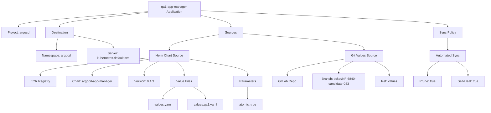
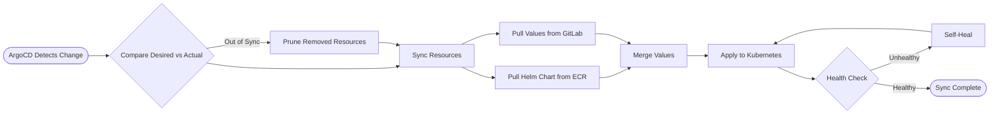
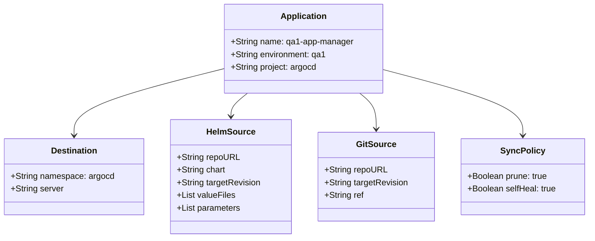

# Diagram: devops/k8s/argocd/app-manager/argocd/Application.qa1.yaml

> Auto-generated by Obscura crawlers

## Diagram 1

### SVG

<svg id="container" width="2404.25" xmlns="http://www.w3.org/2000/svg" class="flowchart" height="558" viewBox="0 0 2404.25 558" role="graphics-document document" aria-roledescription="flowchart-v2"><g><marker id="container_flowchart-v2-pointEnd" class="marker flowchart-v2" viewBox="0 0 10 10" refX="5" refY="5" markerUnits="userSpaceOnUse" markerWidth="8" markerHeight="8" orient="auto"><path d="M 0 0 L 10 5 L 0 10 z" class="arrowMarkerPath" style="stroke-width: 1; stroke-dasharray: 1, 0;"></path></marker><marker id="container_flowchart-v2-pointStart" class="marker flowchart-v2" viewBox="0 0 10 10" refX="4.5" refY="5" markerUnits="userSpaceOnUse" markerWidth="8" markerHeight="8" orient="auto"><path d="M 0 5 L 10 10 L 10 0 z" class="arrowMarkerPath" style="stroke-width: 1; stroke-dasharray: 1, 0;"></path></marker><marker id="container_flowchart-v2-circleEnd" class="marker flowchart-v2" viewBox="0 0 10 10" refX="11" refY="5" markerUnits="userSpaceOnUse" markerWidth="11" markerHeight="11" orient="auto"><circle cx="5" cy="5" r="5" class="arrowMarkerPath" style="stroke-width: 1; stroke-dasharray: 1, 0;"></circle></marker><marker id="container_flowchart-v2-circleStart" class="marker flowchart-v2" viewBox="0 0 10 10" refX="-1" refY="5" markerUnits="userSpaceOnUse" markerWidth="11" markerHeight="11" orient="auto"><circle cx="5" cy="5" r="5" class="arrowMarkerPath" style="stroke-width: 1; stroke-dasharray: 1, 0;"></circle></marker><marker id="container_flowchart-v2-crossEnd" class="marker cross flowchart-v2" viewBox="0 0 11 11" refX="12" refY="5.2" markerUnits="userSpaceOnUse" markerWidth="11" markerHeight="11" orient="auto"><path d="M 1,1 l 9,9 M 10,1 l -9,9" class="arrowMarkerPath" style="stroke-width: 2; stroke-dasharray: 1, 0;"></path></marker><marker id="container_flowchart-v2-crossStart" class="marker cross flowchart-v2" viewBox="0 0 11 11" refX="-1" refY="5.2" markerUnits="userSpaceOnUse" markerWidth="11" markerHeight="11" orient="auto"><path d="M 1,1 l 9,9 M 10,1 l -9,9" class="arrowMarkerPath" style="stroke-width: 2; stroke-dasharray: 1, 0;"></path></marker><g class="root"><g class="clusters"></g><g class="edgePaths"><path d="M733.195,57.787L626.307,66.655C519.419,75.524,305.643,93.262,198.755,105.631C91.867,118,91.867,125,91.867,128.5L91.867,132" id="L_A_B_0" class="edge-thickness-normal edge-pattern-solid edge-thickness-normal edge-pattern-solid flowchart-link" style=";" data-edge="true" data-et="edge" data-id="L_A_B_0" data-points="W3sieCI6NzMzLjE5NTMxMjUsInkiOjU3Ljc4NjU4OTY4OTA1MDk1fSx7IngiOjkxLjg2NzE4NzUsInkiOjExMX0seyJ4Ijo5MS44NjcxODc1LCJ5IjoxMzZ9XQ==" marker-end="url(#container_flowchart-v2-pointEnd)"></path><path d="M733.195,61.712L660.608,69.927C588.021,78.141,442.846,94.571,370.259,106.285C297.672,118,297.672,125,297.672,128.5L297.672,132" id="L_A_C_0" class="edge-thickness-normal edge-pattern-solid edge-thickness-normal edge-pattern-solid flowchart-link" style=";" data-edge="true" data-et="edge" data-id="L_A_C_0" data-points="W3sieCI6NzMzLjE5NTMxMjUsInkiOjYxLjcxMjAzMzkyODc0NDExfSx7IngiOjI5Ny42NzE4NzUsInkiOjExMX0seyJ4IjoyOTcuNjcxODc1LCJ5IjoxMzZ9XQ==" marker-end="url(#container_flowchart-v2-pointEnd)"></path><path d="M993.195,76.845L1017.992,82.537C1042.788,88.23,1092.38,99.615,1117.176,108.807C1141.973,118,1141.973,125,1141.973,128.5L1141.973,132" id="L_A_D_0" class="edge-thickness-normal edge-pattern-solid edge-thickness-normal edge-pattern-solid flowchart-link" style=";" data-edge="true" data-et="edge" data-id="L_A_D_0" data-points="W3sieCI6OTkzLjE5NTMxMjUsInkiOjc2Ljg0NDYwNjA1MDQxNTQ1fSx7IngiOjExNDEuOTcyNjU2MjUsInkiOjExMX0seyJ4IjoxMTQxLjk3MjY1NjI1LCJ5IjoxMzZ9XQ==" marker-end="url(#container_flowchart-v2-pointEnd)"></path><path d="M993.195,53.165L1196.447,62.804C1399.699,72.443,1806.203,91.722,2009.455,104.861C2212.707,118,2212.707,125,2212.707,128.5L2212.707,132" id="L_A_E_0" class="edge-thickness-normal edge-pattern-solid edge-thickness-normal edge-pattern-solid flowchart-link" style=";" data-edge="true" data-et="edge" data-id="L_A_E_0" data-points="W3sieCI6OTkzLjE5NTMxMjUsInkiOjUzLjE2NTE5Mjg1MDQyMzMzfSx7IngiOjIyMTIuNzA3MDMxMjUsInkiOjExMX0seyJ4IjoyMjEyLjcwNzAzMTI1LCJ5IjoxMzZ9XQ==" marker-end="url(#container_flowchart-v2-pointEnd)"></path><path d="M290.253,190L289.108,194.167C287.963,198.333,285.673,206.667,284.528,216.333C283.383,226,283.383,237,283.383,242.5L283.383,248" id="L_C_C1_0" class="edge-thickness-normal edge-pattern-solid edge-thickness-normal edge-pattern-solid flowchart-link" style=";" data-edge="true" data-et="edge" data-id="L_C_C1_0" data-points="W3sieCI6MjkwLjI1MjU1NDA4NjUzODQ1LCJ5IjoxOTB9LHsieCI6MjgzLjM4MjgxMjUsInkiOjIxNX0seyJ4IjoyODMuMzgyODEyNSwieSI6MjUyfV0=" marker-end="url(#container_flowchart-v2-pointEnd)"></path><path d="M369.609,177.06L401.961,183.384C434.313,189.707,499.016,202.353,531.367,212.177C563.719,222,563.719,229,563.719,232.5L563.719,236" id="L_C_C2_0" class="edge-thickness-normal edge-pattern-solid edge-thickness-normal edge-pattern-solid flowchart-link" style=";" data-edge="true" data-et="edge" data-id="L_C_C2_0" data-points="W3sieCI6MzY5LjYwOTM3NSwieSI6MTc3LjA2MDQ5MjE1OTUxMTM3fSx7IngiOjU2My43MTg3NSwieSI6MjE1fSx7IngiOjU2My43MTg3NSwieSI6MjQwfV0=" marker-end="url(#container_flowchart-v2-pointEnd)"></path><path d="M1083.676,173.07L1043.219,180.058C1002.763,187.047,921.85,201.023,881.394,213.512C840.938,226,840.938,237,840.938,242.5L840.938,248" id="L_D_D1_0" class="edge-thickness-normal edge-pattern-solid edge-thickness-normal edge-pattern-solid flowchart-link" style=";" data-edge="true" data-et="edge" data-id="L_D_D1_0" data-points="W3sieCI6MTA4My42NzU3ODEyNSwieSI6MTczLjA3MDA0NDc2NzQwNDE0fSx7IngiOjg0MC45Mzc1LCJ5IjoyMTV9LHsieCI6ODQwLjkzNzUsInkiOjI1Mn1d" marker-end="url(#container_flowchart-v2-pointEnd)"></path><path d="M1200.27,167.624L1299.818,175.52C1399.367,183.416,1598.465,199.208,1698.014,212.604C1797.563,226,1797.563,237,1797.563,242.5L1797.563,248" id="L_D_D2_0" class="edge-thickness-normal edge-pattern-solid edge-thickness-normal edge-pattern-solid flowchart-link" style=";" data-edge="true" data-et="edge" data-id="L_D_D2_0" data-points="W3sieCI6MTIwMC4yNjk1MzEyNSwieSI6MTY3LjYyMzk4NDg0MTg5NDUzfSx7IngiOjE3OTcuNTYyNSwieSI6MjE1fSx7IngiOjE3OTcuNTYyNSwieSI6MjUyfV0=" marker-end="url(#container_flowchart-v2-pointEnd)"></path><path d="M743.719,288.76L653.675,297.8C563.632,306.84,383.544,324.92,293.501,339.46C203.457,354,203.457,365,203.457,370.5L203.457,376" id="L_D1_D1A_0" class="edge-thickness-normal edge-pattern-solid edge-thickness-normal edge-pattern-solid flowchart-link" style=";" data-edge="true" data-et="edge" data-id="L_D1_D1A_0" data-points="W3sieCI6NzQzLjcxODc1LCJ5IjoyODguNzYwMjk5MDI4NzY5M30seyJ4IjoyMDMuNDU3MDMxMjUsInkiOjM0M30seyJ4IjoyMDMuNDU3MDMxMjUsInkiOjM4MH1d" marker-end="url(#container_flowchart-v2-pointEnd)"></path><path d="M743.719,295.249L696.104,303.208C648.488,311.166,553.258,327.083,505.643,340.542C458.027,354,458.027,365,458.027,370.5L458.027,376" id="L_D1_D1B_0" class="edge-thickness-normal edge-pattern-solid edge-thickness-normal edge-pattern-solid flowchart-link" style=";" data-edge="true" data-et="edge" data-id="L_D1_D1B_0" data-points="W3sieCI6NzQzLjcxODc1LCJ5IjoyOTUuMjQ5MjQyNTQwMTY4M30seyJ4Ijo0NTguMDI3MzQzNzUsInkiOjM0M30seyJ4Ijo0NTguMDI3MzQzNzUsInkiOjM4MH1d" marker-end="url(#container_flowchart-v2-pointEnd)"></path><path d="M787.832,306L775.703,312.167C763.574,318.333,739.317,330.667,727.188,342.333C715.059,354,715.059,365,715.059,370.5L715.059,376" id="L_D1_D1C_0" class="edge-thickness-normal edge-pattern-solid edge-thickness-normal edge-pattern-solid flowchart-link" style=";" data-edge="true" data-et="edge" data-id="L_D1_D1C_0" data-points="W3sieCI6Nzg3LjgzMjMzNjQyNTc4MTIsInkiOjMwNn0seyJ4Ijo3MTUuMDU4NTkzNzUsInkiOjM0M30seyJ4Ijo3MTUuMDU4NTkzNzUsInkiOjM4MH1d" marker-end="url(#container_flowchart-v2-pointEnd)"></path><path d="M870.276,306L876.977,312.167C883.677,318.333,897.079,330.667,903.78,342.333C910.48,354,910.48,365,910.48,370.5L910.48,376" id="L_D1_D1D_0" class="edge-thickness-normal edge-pattern-solid edge-thickness-normal edge-pattern-solid flowchart-link" style=";" data-edge="true" data-et="edge" data-id="L_D1_D1D_0" data-points="W3sieCI6ODcwLjI3NTkzOTk0MTQwNjIsInkiOjMwNn0seyJ4Ijo5MTAuNDgwNDY4NzUsInkiOjM0M30seyJ4Ijo5MTAuNDgwNDY4NzUsInkiOjM4MH1d" marker-end="url(#container_flowchart-v2-pointEnd)"></path><path d="M938.156,295.217L985.9,303.181C1033.643,311.144,1129.13,327.072,1176.874,340.536C1224.617,354,1224.617,365,1224.617,370.5L1224.617,376" id="L_D1_D1E_0" class="edge-thickness-normal edge-pattern-solid edge-thickness-normal edge-pattern-solid flowchart-link" style=";" data-edge="true" data-et="edge" data-id="L_D1_D1E_0" data-points="W3sieCI6OTM4LjE1NjI1LCJ5IjoyOTUuMjE2NjUyMDczODczNX0seyJ4IjoxMjI0LjYxNzE4NzUsInkiOjM0M30seyJ4IjoxMjI0LjYxNzE4NzUsInkiOjM4MH1d" marker-end="url(#container_flowchart-v2-pointEnd)"></path><path d="M866.538,434L856.502,440.167C846.465,446.333,826.393,458.667,816.357,468.333C806.32,478,806.32,485,806.32,488.5L806.32,492" id="L_D1D_D1D1_0" class="edge-thickness-normal edge-pattern-solid edge-thickness-normal edge-pattern-solid flowchart-link" style=";" data-edge="true" data-et="edge" data-id="L_D1D_D1D1_0" data-points="W3sieCI6ODY2LjUzNzkwMjgzMjAzMTIsInkiOjQzNH0seyJ4Ijo4MDYuMzIwMzEyNSwieSI6NDcxfSx7IngiOjgwNi4zMjAzMTI1LCJ5Ijo0OTZ9XQ==" marker-end="url(#container_flowchart-v2-pointEnd)"></path><path d="M954.423,434L964.459,440.167C974.496,446.333,994.568,458.667,1004.604,468.333C1014.641,478,1014.641,485,1014.641,488.5L1014.641,492" id="L_D1D_D1D2_0" class="edge-thickness-normal edge-pattern-solid edge-thickness-normal edge-pattern-solid flowchart-link" style=";" data-edge="true" data-et="edge" data-id="L_D1D_D1D2_0" data-points="W3sieCI6OTU0LjQyMzAzNDY2Nzk2ODgsInkiOjQzNH0seyJ4IjoxMDE0LjY0MDYyNSwieSI6NDcxfSx7IngiOjEwMTQuNjQwNjI1LCJ5Ijo0OTZ9XQ==" marker-end="url(#container_flowchart-v2-pointEnd)"></path><path d="M1224.617,434L1224.617,440.167C1224.617,446.333,1224.617,458.667,1224.617,468.333C1224.617,478,1224.617,485,1224.617,488.5L1224.617,492" id="L_D1E_D1E1_0" class="edge-thickness-normal edge-pattern-solid edge-thickness-normal edge-pattern-solid flowchart-link" style=";" data-edge="true" data-et="edge" data-id="L_D1E_D1E1_0" data-points="W3sieCI6MTIyNC42MTcxODc1LCJ5Ijo0MzR9LHsieCI6MTIyNC42MTcxODc1LCJ5Ijo0NzF9LHsieCI6MTIyNC42MTcxODc1LCJ5Ijo0OTZ9XQ==" marker-end="url(#container_flowchart-v2-pointEnd)"></path><path d="M1705.07,294.646L1657.428,302.705C1609.786,310.764,1514.503,326.882,1466.861,340.441C1419.219,354,1419.219,365,1419.219,370.5L1419.219,376" id="L_D2_D2A_0" class="edge-thickness-normal edge-pattern-solid edge-thickness-normal edge-pattern-solid flowchart-link" style=";" data-edge="true" data-et="edge" data-id="L_D2_D2A_0" data-points="W3sieCI6MTcwNS4wNzAzMTI1LCJ5IjoyOTQuNjQ1ODI0NzI5NDk1MzZ9LHsieCI6MTQxOS4yMTg3NSwieSI6MzQzfSx7IngiOjE0MTkuMjE4NzUsInkiOjM4MH1d" marker-end="url(#container_flowchart-v2-pointEnd)"></path><path d="M1745.032,306L1733.035,312.167C1721.037,318.333,1697.042,330.667,1685.044,340.333C1673.047,350,1673.047,357,1673.047,360.5L1673.047,364" id="L_D2_D2B_0" class="edge-thickness-normal edge-pattern-solid edge-thickness-normal edge-pattern-solid flowchart-link" style=";" data-edge="true" data-et="edge" data-id="L_D2_D2B_0" data-points="W3sieCI6MTc0NS4wMzI0NzA3MDMxMjUsInkiOjMwNn0seyJ4IjoxNjczLjA0Njg3NSwieSI6MzQzfSx7IngiOjE2NzMuMDQ2ODc1LCJ5IjozNjh9XQ==" marker-end="url(#container_flowchart-v2-pointEnd)"></path><path d="M1850.093,306L1862.09,312.167C1874.088,318.333,1898.083,330.667,1910.081,342.333C1922.078,354,1922.078,365,1922.078,370.5L1922.078,376" id="L_D2_D2C_0" class="edge-thickness-normal edge-pattern-solid edge-thickness-normal edge-pattern-solid flowchart-link" style=";" data-edge="true" data-et="edge" data-id="L_D2_D2C_0" data-points="W3sieCI6MTg1MC4wOTI1MjkyOTY4NzUsInkiOjMwNn0seyJ4IjoxOTIyLjA3ODEyNSwieSI6MzQzfSx7IngiOjE5MjIuMDc4MTI1LCJ5IjozODB9XQ==" marker-end="url(#container_flowchart-v2-pointEnd)"></path><path d="M2212.707,190L2212.707,194.167C2212.707,198.333,2212.707,206.667,2212.707,216.333C2212.707,226,2212.707,237,2212.707,242.5L2212.707,248" id="L_E_E1_0" class="edge-thickness-normal edge-pattern-solid edge-thickness-normal edge-pattern-solid flowchart-link" style=";" data-edge="true" data-et="edge" data-id="L_E_E1_0" data-points="W3sieCI6MjIxMi43MDcwMzEyNSwieSI6MTkwfSx7IngiOjIyMTIuNzA3MDMxMjUsInkiOjIxNX0seyJ4IjoyMjEyLjcwNzAzMTI1LCJ5IjoyNTJ9XQ==" marker-end="url(#container_flowchart-v2-pointEnd)"></path><path d="M2169.977,306L2160.218,312.167C2150.459,318.333,2130.94,330.667,2121.181,342.333C2111.422,354,2111.422,365,2111.422,370.5L2111.422,376" id="L_E1_E1A_0" class="edge-thickness-normal edge-pattern-solid edge-thickness-normal edge-pattern-solid flowchart-link" style=";" data-edge="true" data-et="edge" data-id="L_E1_E1A_0" data-points="W3sieCI6MjE2OS45NzczNTU5NTcwMzEyLCJ5IjozMDZ9LHsieCI6MjExMS40MjE4NzUsInkiOjM0M30seyJ4IjoyMTExLjQyMTg3NSwieSI6MzgwfV0=" marker-end="url(#container_flowchart-v2-pointEnd)"></path><path d="M2255.437,306L2265.196,312.167C2274.955,318.333,2294.474,330.667,2304.233,342.333C2313.992,354,2313.992,365,2313.992,370.5L2313.992,376" id="L_E1_E1B_0" class="edge-thickness-normal edge-pattern-solid edge-thickness-normal edge-pattern-solid flowchart-link" style=";" data-edge="true" data-et="edge" data-id="L_E1_E1B_0" data-points="W3sieCI6MjI1NS40MzY3MDY1NDI5Njg4LCJ5IjozMDZ9LHsieCI6MjMxMy45OTIxODc1LCJ5IjozNDN9LHsieCI6MjMxMy45OTIxODc1LCJ5IjozODB9XQ==" marker-end="url(#container_flowchart-v2-pointEnd)"></path></g><g class="edgeLabels"><g class="edgeLabel"><g class="label" data-id="L_A_B_0" transform="translate(0, 0)"><foreignObject width="0" height="0">

</foreignObject></g></g><g class="edgeLabel"><g class="label" data-id="L_A_C_0" transform="translate(0, 0)"><foreignObject width="0" height="0">

</foreignObject></g></g><g class="edgeLabel"><g class="label" data-id="L_A_D_0" transform="translate(0, 0)"><foreignObject width="0" height="0">

</foreignObject></g></g><g class="edgeLabel"><g class="label" data-id="L_A_E_0" transform="translate(0, 0)"><foreignObject width="0" height="0">

</foreignObject></g></g><g class="edgeLabel"><g class="label" data-id="L_C_C1_0" transform="translate(0, 0)"><foreignObject width="0" height="0">

</foreignObject></g></g><g class="edgeLabel"><g class="label" data-id="L_C_C2_0" transform="translate(0, 0)"><foreignObject width="0" height="0">

</foreignObject></g></g><g class="edgeLabel"><g class="label" data-id="L_D_D1_0" transform="translate(0, 0)"><foreignObject width="0" height="0">

</foreignObject></g></g><g class="edgeLabel"><g class="label" data-id="L_D_D2_0" transform="translate(0, 0)"><foreignObject width="0" height="0">

</foreignObject></g></g><g class="edgeLabel"><g class="label" data-id="L_D1_D1A_0" transform="translate(0, 0)"><foreignObject width="0" height="0">

</foreignObject></g></g><g class="edgeLabel"><g class="label" data-id="L_D1_D1B_0" transform="translate(0, 0)"><foreignObject width="0" height="0">

</foreignObject></g></g><g class="edgeLabel"><g class="label" data-id="L_D1_D1C_0" transform="translate(0, 0)"><foreignObject width="0" height="0">

</foreignObject></g></g><g class="edgeLabel"><g class="label" data-id="L_D1_D1D_0" transform="translate(0, 0)"><foreignObject width="0" height="0">

</foreignObject></g></g><g class="edgeLabel"><g class="label" data-id="L_D1_D1E_0" transform="translate(0, 0)"><foreignObject width="0" height="0">

</foreignObject></g></g><g class="edgeLabel"><g class="label" data-id="L_D1D_D1D1_0" transform="translate(0, 0)"><foreignObject width="0" height="0">

</foreignObject></g></g><g class="edgeLabel"><g class="label" data-id="L_D1D_D1D2_0" transform="translate(0, 0)"><foreignObject width="0" height="0">

</foreignObject></g></g><g class="edgeLabel"><g class="label" data-id="L_D1E_D1E1_0" transform="translate(0, 0)"><foreignObject width="0" height="0">

</foreignObject></g></g><g class="edgeLabel"><g class="label" data-id="L_D2_D2A_0" transform="translate(0, 0)"><foreignObject width="0" height="0">

</foreignObject></g></g><g class="edgeLabel"><g class="label" data-id="L_D2_D2B_0" transform="translate(0, 0)"><foreignObject width="0" height="0">

</foreignObject></g></g><g class="edgeLabel"><g class="label" data-id="L_D2_D2C_0" transform="translate(0, 0)"><foreignObject width="0" height="0">

</foreignObject></g></g><g class="edgeLabel"><g class="label" data-id="L_E_E1_0" transform="translate(0, 0)"><foreignObject width="0" height="0">

</foreignObject></g></g><g class="edgeLabel"><g class="label" data-id="L_E1_E1A_0" transform="translate(0, 0)"><foreignObject width="0" height="0">

</foreignObject></g></g><g class="edgeLabel"><g class="label" data-id="L_E1_E1B_0" transform="translate(0, 0)"><foreignObject width="0" height="0">

</foreignObject></g></g></g><g class="nodes"><g class="node default" id="flowchart-A-0" transform="translate(863.1953125, 47)"><rect class="basic label-container" style="" x="-130" y="-39" width="260" height="78"></rect><g class="label" style="" transform="translate(-100, -24)"><rect></rect><foreignObject width="200" height="48">

qa1-app-manager Application

</foreignObject></g></g><g class="node default" id="flowchart-B-1" transform="translate(91.8671875, 163)"><rect class="basic label-container" style="" x="-83.8671875" y="-27" width="167.734375" height="54"></rect><g class="label" style="" transform="translate(-53.8671875, -12)"><rect></rect><foreignObject width="107.734375" height="24">

Project: argocd

</foreignObject></g></g><g class="node default" id="flowchart-C-3" transform="translate(297.671875, 163)"><rect class="basic label-container" style="" x="-71.9375" y="-27" width="143.875" height="54"></rect><g class="label" style="" transform="translate(-41.9375, -12)"><rect></rect><foreignObject width="83.875" height="24">

Destination

</foreignObject></g></g><g class="node default" id="flowchart-D-5" transform="translate(1141.97265625, 163)"><rect class="basic label-container" style="" x="-58.296875" y="-27" width="116.59375" height="54"></rect><g class="label" style="" transform="translate(-28.296875, -12)"><rect></rect><foreignObject width="56.59375" height="24">

Sources

</foreignObject></g></g><g class="node default" id="flowchart-E-7" transform="translate(2212.70703125, 163)"><rect class="basic label-container" style="" x="-70.2890625" y="-27" width="140.578125" height="54"></rect><g class="label" style="" transform="translate(-40.2890625, -12)"><rect></rect><foreignObject width="80.578125" height="24">

Sync Policy

</foreignObject></g></g><g class="node default" id="flowchart-C1-9" transform="translate(283.3828125, 279)"><rect class="basic label-container" style="" x="-100.3359375" y="-27" width="200.671875" height="54"></rect><g class="label" style="" transform="translate(-70.3359375, -12)"><rect></rect><foreignObject width="140.671875" height="24">

Namespace: argocd

</foreignObject></g></g><g class="node default" id="flowchart-C2-11" transform="translate(563.71875, 279)"><rect class="basic label-container" style="" x="-130" y="-39" width="260" height="78"></rect><g class="label" style="" transform="translate(-100, -24)"><rect></rect><foreignObject width="200" height="48">

Server: kubernetes.default.svc

</foreignObject></g></g><g class="node default" id="flowchart-D1-13" transform="translate(840.9375, 279)"><rect class="basic label-container" style="" x="-97.21875" y="-27" width="194.4375" height="54"></rect><g class="label" style="" transform="translate(-67.21875, -12)"><rect></rect><foreignObject width="134.4375" height="24">

Helm Chart Source

</foreignObject></g></g><g class="node default" id="flowchart-D2-15" transform="translate(1797.5625, 279)"><rect class="basic label-container" style="" x="-92.4921875" y="-27" width="184.984375" height="54"></rect><g class="label" style="" transform="translate(-62.4921875, -12)"><rect></rect><foreignObject width="124.984375" height="24">

Git Values Source

</foreignObject></g></g><g class="node default" id="flowchart-D1A-17" transform="translate(203.45703125, 407)"><rect class="basic label-container" style="" x="-74.7734375" y="-27" width="149.546875" height="54"></rect><g class="label" style="" transform="translate(-44.7734375, -12)"><rect></rect><foreignObject width="89.546875" height="24">

ECR Registry

</foreignObject></g></g><g class="node default" id="flowchart-D1B-19" transform="translate(458.02734375, 407)"><rect class="basic label-container" style="" x="-129.796875" y="-27" width="259.59375" height="54"></rect><g class="label" style="" transform="translate(-99.796875, -12)"><rect></rect><foreignObject width="199.59375" height="24">

Chart: argocd-app-manager

</foreignObject></g></g><g class="node default" id="flowchart-D1C-21" transform="translate(715.05859375, 407)"><rect class="basic label-container" style="" x="-77.234375" y="-27" width="154.46875" height="54"></rect><g class="label" style="" transform="translate(-47.234375, -12)"><rect></rect><foreignObject width="94.46875" height="24">

Version: 0.4.3

</foreignObject></g></g><g class="node default" id="flowchart-D1D-23" transform="translate(910.48046875, 407)"><rect class="basic label-container" style="" x="-68.1875" y="-27" width="136.375" height="54"></rect><g class="label" style="" transform="translate(-38.1875, -12)"><rect></rect><foreignObject width="76.375" height="24">

Value Files

</foreignObject></g></g><g class="node default" id="flowchart-D1E-25" transform="translate(1224.6171875, 407)"><rect class="basic label-container" style="" x="-70.7734375" y="-27" width="141.546875" height="54"></rect><g class="label" style="" transform="translate(-40.7734375, -12)"><rect></rect><foreignObject width="81.546875" height="24">

Parameters

</foreignObject></g></g><g class="node default" id="flowchart-D1D1-27" transform="translate(806.3203125, 523)"><rect class="basic label-container" style="" x="-72.140625" y="-27" width="144.28125" height="54"></rect><g class="label" style="" transform="translate(-42.140625, -12)"><rect></rect><foreignObject width="84.28125" height="24">

values.yaml

</foreignObject></g></g><g class="node default" id="flowchart-D1D2-29" transform="translate(1014.640625, 523)"><rect class="basic label-container" style="" x="-86.1796875" y="-27" width="172.359375" height="54"></rect><g class="label" style="" transform="translate(-56.1796875, -12)"><rect></rect><foreignObject width="112.359375" height="24">

values.qa1.yaml

</foreignObject></g></g><g class="node default" id="flowchart-D1E1-31" transform="translate(1224.6171875, 523)"><rect class="basic label-container" style="" x="-73.796875" y="-27" width="147.59375" height="54"></rect><g class="label" style="" transform="translate(-43.796875, -12)"><rect></rect><foreignObject width="87.59375" height="24">

atomic: true

</foreignObject></g></g><g class="node default" id="flowchart-D2A-33" transform="translate(1419.21875, 407)"><rect class="basic label-container" style="" x="-73.828125" y="-27" width="147.65625" height="54"></rect><g class="label" style="" transform="translate(-43.828125, -12)"><rect></rect><foreignObject width="87.65625" height="24">

GitLab Repo

</foreignObject></g></g><g class="node default" id="flowchart-D2B-35" transform="translate(1673.046875, 407)"><rect class="basic label-container" style="" x="-130" y="-39" width="260" height="78"></rect><g class="label" style="" transform="translate(-100, -24)"><rect></rect><foreignObject width="200" height="48">

Branch: ticket/NF-6840-candidate-043

</foreignObject></g></g><g class="node default" id="flowchart-D2C-37" transform="translate(1922.078125, 407)"><rect class="basic label-container" style="" x="-69.03125" y="-27" width="138.0625" height="54"></rect><g class="label" style="" transform="translate(-39.03125, -12)"><rect></rect><foreignObject width="78.0625" height="24">

Ref: values

</foreignObject></g></g><g class="node default" id="flowchart-E1-39" transform="translate(2212.70703125, 279)"><rect class="basic label-container" style="" x="-88.6484375" y="-27" width="177.296875" height="54"></rect><g class="label" style="" transform="translate(-58.6484375, -12)"><rect></rect><foreignObject width="117.296875" height="24">

Automated Sync

</foreignObject></g></g><g class="node default" id="flowchart-E1A-41" transform="translate(2111.421875, 407)"><rect class="basic label-container" style="" x="-70.3125" y="-27" width="140.625" height="54"></rect><g class="label" style="" transform="translate(-40.3125, -12)"><rect></rect><foreignObject width="80.625" height="24">

Prune: true

</foreignObject></g></g><g class="node default" id="flowchart-E1B-43" transform="translate(2313.9921875, 407)"><rect class="basic label-container" style="" x="-82.2578125" y="-27" width="164.515625" height="54"></rect><g class="label" style="" transform="translate(-52.2578125, -12)"><rect></rect><foreignObject width="104.515625" height="24">

Self-Heal: true

</foreignObject></g></g></g></g></g></svg>

## Diagram 2

### SVG

<svg id="container" width="2318.7255859375" xmlns="http://www.w3.org/2000/svg" class="flowchart" height="268.234375" viewBox="0 0 2318.7255859375 268.234375" role="graphics-document document" aria-roledescription="flowchart-v2"><g><marker id="container_flowchart-v2-pointEnd" class="marker flowchart-v2" viewBox="0 0 10 10" refX="5" refY="5" markerUnits="userSpaceOnUse" markerWidth="8" markerHeight="8" orient="auto"><path d="M 0 0 L 10 5 L 0 10 z" class="arrowMarkerPath" style="stroke-width: 1; stroke-dasharray: 1, 0;"></path></marker><marker id="container_flowchart-v2-pointStart" class="marker flowchart-v2" viewBox="0 0 10 10" refX="4.5" refY="5" markerUnits="userSpaceOnUse" markerWidth="8" markerHeight="8" orient="auto"><path d="M 0 5 L 10 10 L 10 0 z" class="arrowMarkerPath" style="stroke-width: 1; stroke-dasharray: 1, 0;"></path></marker><marker id="container_flowchart-v2-circleEnd" class="marker flowchart-v2" viewBox="0 0 10 10" refX="11" refY="5" markerUnits="userSpaceOnUse" markerWidth="11" markerHeight="11" orient="auto"><circle cx="5" cy="5" r="5" class="arrowMarkerPath" style="stroke-width: 1; stroke-dasharray: 1, 0;"></circle></marker><marker id="container_flowchart-v2-circleStart" class="marker flowchart-v2" viewBox="0 0 10 10" refX="-1" refY="5" markerUnits="userSpaceOnUse" markerWidth="11" markerHeight="11" orient="auto"><circle cx="5" cy="5" r="5" class="arrowMarkerPath" style="stroke-width: 1; stroke-dasharray: 1, 0;"></circle></marker><marker id="container_flowchart-v2-crossEnd" class="marker cross flowchart-v2" viewBox="0 0 11 11" refX="12" refY="5.2" markerUnits="userSpaceOnUse" markerWidth="11" markerHeight="11" orient="auto"><path d="M 1,1 l 9,9 M 10,1 l -9,9" class="arrowMarkerPath" style="stroke-width: 2; stroke-dasharray: 1, 0;"></path></marker><marker id="container_flowchart-v2-crossStart" class="marker cross flowchart-v2" viewBox="0 0 11 11" refX="-1" refY="5.2" markerUnits="userSpaceOnUse" markerWidth="11" markerHeight="11" orient="auto"><path d="M 1,1 l 9,9 M 10,1 l -9,9" class="arrowMarkerPath" style="stroke-width: 2; stroke-dasharray: 1, 0;"></path></marker><g class="root"><g class="clusters"></g><g class="edgePaths"><path d="M200.714,131.625L204.798,131.542C208.881,131.458,217.048,131.292,224.631,131.208C232.214,131.125,239.214,131.125,242.714,131.125L246.214,131.125" id="L_Start_Compare_0" class="edge-thickness-normal edge-pattern-solid edge-thickness-normal edge-pattern-solid flowchart-link" style=";" data-edge="true" data-et="edge" data-id="L_Start_Compare_0" data-points="W3sieCI6MjAwLjcxNDMzNzQzMTgyNTEsInkiOjEzMS42MjV9LHsieCI6MjI1LjIxNDM0MDIwOTk2MDk0LCJ5IjoxMzEuMTI1fSx7IngiOjI1MC4yMTQzNDAyMDk5NjA5NCwieSI6MTMxLjEyNX1d" marker-end="url(#container_flowchart-v2-pointEnd)"></path><path d="M479.157,148.433L493.109,150.715C507.061,152.997,534.966,157.561,580.969,159.843C626.972,162.125,691.074,162.125,748.274,162.125C805.475,162.125,855.774,162.125,884.449,161.137C913.123,160.149,920.173,158.173,923.697,157.185L927.222,156.197" id="L_Compare_Sync_0" class="edge-thickness-normal edge-pattern-solid edge-thickness-normal edge-pattern-solid flowchart-link" style=";" data-edge="true" data-et="edge" data-id="L_Compare_Sync_0" data-points="W3sieCI6NDc5LjE1NjcwMjQwMzUyNzYsInkiOjE0OC40MzI2Mzc4MDY0MzMzMn0seyJ4Ijo1NjIuODcwNTkwMjA5OTYwOSwieSI6MTYyLjEyNX0seyJ4Ijo3NTUuMTc1Mjc3NzA5OTYwOSwieSI6MTYyLjEyNX0seyJ4Ijo5MDYuMDczNzE1MjA5OTYwOSwieSI6MTYyLjEyNX0seyJ4Ijo5MzEuMDczNzE1MjA5OTYwOSwieSI6MTU1LjExNzg2NTcyMDEzODQ0fV0=" marker-end="url(#container_flowchart-v2-pointEnd)"></path><path d="M1074.103,158.125L1082.965,162.292C1091.828,166.458,1109.552,174.792,1121.915,178.958C1134.277,183.125,1141.277,183.125,1144.777,183.125L1148.277,183.125" id="L_Sync_Pull1_0" class="edge-thickness-normal edge-pattern-solid edge-thickness-normal edge-pattern-solid flowchart-link" style=";" data-edge="true" data-et="edge" data-id="L_Sync_Pull1_0" data-points="W3sieCI6MTA3NC4xMDMwMTIwODQ5NjEsInkiOjE1OC4xMjV9LHsieCI6MTEyNy4yNzY4NDAyMDk5NjEsInkiOjE4My4xMjV9LHsieCI6MTE1Mi4yNzY4NDAyMDk5NjEsInkiOjE4My4xMjV9XQ==" marker-end="url(#container_flowchart-v2-pointEnd)"></path><path d="M1074.103,104.125L1082.965,99.958C1091.828,95.792,1109.552,87.458,1123.138,83.292C1136.725,79.125,1146.173,79.125,1150.897,79.125L1155.621,79.125" id="L_Sync_Pull2_0" class="edge-thickness-normal edge-pattern-solid edge-thickness-normal edge-pattern-solid flowchart-link" style=";" data-edge="true" data-et="edge" data-id="L_Sync_Pull2_0" data-points="W3sieCI6MTA3NC4xMDMwMTIwODQ5NjEsInkiOjEwNC4xMjV9LHsieCI6MTEyNy4yNzY4NDAyMDk5NjEsInkiOjc5LjEyNX0seyJ4IjoxMTU5LjYyMDU5MDIwOTk2MSwieSI6NzkuMTI1fV0=" marker-end="url(#container_flowchart-v2-pointEnd)"></path><path d="M1394.746,183.125L1398.912,183.125C1403.079,183.125,1411.412,183.125,1423.202,179.26C1434.993,175.395,1450.24,167.664,1457.863,163.799L1465.487,159.934" id="L_Pull1_Merge_0" class="edge-thickness-normal edge-pattern-solid edge-thickness-normal edge-pattern-solid flowchart-link" style=";" data-edge="true" data-et="edge" data-id="L_Pull1_Merge_0" data-points="W3sieCI6MTM5NC43NDU1OTAyMDk5NjEsInkiOjE4My4xMjV9LHsieCI6MTQxOS43NDU1OTAyMDk5NjEsInkiOjE4My4xMjV9LHsieCI6MTQ2OS4wNTQ0ODQ0NDA3MzAyLCJ5IjoxNTguMTI1fV0=" marker-end="url(#container_flowchart-v2-pointEnd)"></path><path d="M1387.402,79.125L1392.792,79.125C1398.183,79.125,1408.964,79.125,1421.979,82.99C1434.993,86.855,1450.24,94.586,1457.863,98.451L1465.487,102.316" id="L_Pull2_Merge_0" class="edge-thickness-normal edge-pattern-solid edge-thickness-normal edge-pattern-solid flowchart-link" style=";" data-edge="true" data-et="edge" data-id="L_Pull2_Merge_0" data-points="W3sieCI6MTM4Ny40MDE4NDAyMDk5NjEsInkiOjc5LjEyNX0seyJ4IjoxNDE5Ljc0NTU5MDIwOTk2MSwieSI6NzkuMTI1fSx7IngiOjE0NjkuMDU0NDg0NDQwNzMwMiwieSI6MTA0LjEyNX1d" marker-end="url(#container_flowchart-v2-pointEnd)"></path><path d="M1599.871,131.125L1604.037,131.125C1608.204,131.125,1616.537,131.125,1624.204,131.125C1631.871,131.125,1638.871,131.125,1642.371,131.125L1645.871,131.125" id="L_Merge_Apply_0" class="edge-thickness-normal edge-pattern-solid edge-thickness-normal edge-pattern-solid flowchart-link" style=";" data-edge="true" data-et="edge" data-id="L_Merge_Apply_0" data-points="W3sieCI6MTU5OS44NzA1OTAyMDk5NjEsInkiOjEzMS4xMjV9LHsieCI6MTYyNC44NzA1OTAyMDk5NjEsInkiOjEzMS4xMjV9LHsieCI6MTY0OS44NzA1OTAyMDk5NjEsInkiOjEzMS4xMjV9XQ==" marker-end="url(#container_flowchart-v2-pointEnd)"></path><path d="M1816.62,158.125L1827.456,162.742C1838.292,167.359,1859.964,176.594,1874.3,181.211C1888.636,185.828,1895.636,185.828,1899.136,185.828L1902.636,185.828" id="L_Apply_Monitor_0" class="edge-thickness-normal edge-pattern-solid edge-thickness-normal edge-pattern-solid flowchart-link" style=";" data-edge="true" data-et="edge" data-id="L_Apply_Monitor_0" data-points="W3sieCI6MTgxNi42MTk3MjY2MTc0MTU4LCJ5IjoxNTguMTI1fSx7IngiOjE4ODEuNjM2MjE1MjA5OTYxLCJ5IjoxODUuODI4MTI1fSx7IngiOjE5MDYuNjM2MjE1MjA5OTYxLCJ5IjoxODUuODI4MTI1fV0=" marker-end="url(#container_flowchart-v2-pointEnd)"></path><path d="M2036.01,166.389L2049.588,161.587C2063.167,156.786,2090.323,147.182,2114.062,138.025C2137.801,128.869,2158.122,120.16,2168.282,115.805L2178.443,111.451" id="L_Monitor_Heal_0" class="edge-thickness-normal edge-pattern-solid edge-thickness-normal edge-pattern-solid flowchart-link" style=";" data-edge="true" data-et="edge" data-id="L_Monitor_Heal_0" data-points="W3sieCI6MjAzNi4wMDk5MjUwMjM4MzU2LCJ5IjoxNjYuMzg5MzM0ODEzODc0OH0seyJ4IjoyMTE3LjQ3OTk2NTIwOTk2MSwieSI6MTM3LjU3ODEyNX0seyJ4IjoyMTgyLjExOTQ3MzU5MjE3NDUsInkiOjEwOS44NzV9XQ==" marker-end="url(#container_flowchart-v2-pointEnd)"></path><path d="M2045.117,196.16L2057.177,198.105C2069.238,200.049,2093.359,203.939,2115.175,205.961C2136.99,207.984,2156.501,208.14,2166.256,208.218L2176.011,208.296" id="L_Monitor_Success_0" class="edge-thickness-normal edge-pattern-solid edge-thickness-normal edge-pattern-solid flowchart-link" style=";" data-edge="true" data-et="edge" data-id="L_Monitor_Success_0" data-points="W3sieCI6MjA0NS4xMTY5NTk3ODU4OTc3LCJ5IjoxOTYuMTU5ODgwNDI0MDYzMTJ9LHsieCI6MjExNy40Nzk5NjUyMDk5NjEsInkiOjIwNy44MjgxMjV9LHsieCI6MjE4MC4wMTEyMTUyMDk5NTcsInkiOjIwOC4zMjgxMjQ5OTk5OTk5NH1d" marker-end="url(#container_flowchart-v2-pointEnd)"></path><path d="M2181.97,74.959L2171.222,73.612C2160.473,72.264,2138.977,69.57,2105.489,68.222C2072.001,66.875,2026.522,66.875,1987.214,66.875C1947.907,66.875,1914.772,66.875,1886.395,72.785C1858.018,78.695,1834.4,90.515,1822.59,96.425L1810.781,102.335" id="L_Heal_Apply_0" class="edge-thickness-normal edge-pattern-solid edge-thickness-normal edge-pattern-solid flowchart-link" style=";" data-edge="true" data-et="edge" data-id="L_Heal_Apply_0" data-points="W3sieCI6MjE4MS45Njk5NDc4MTQ5NDE0LCJ5Ijo3NC45NTkwODQwOTM0MTgwOH0seyJ4IjoyMTE3LjQ3OTk2NTIwOTk2MSwieSI6NjYuODc1fSx7IngiOjE5ODEuMDQyNDY1MjA5OTYxLCJ5Ijo2Ni44NzV9LHsieCI6MTg4MS42MzYyMTUyMDk5NjEsInkiOjY2Ljg3NX0seyJ4IjoxODA3LjIwNDE1NjYwMTAxMTYsInkiOjEwNC4xMjV9XQ==" marker-end="url(#container_flowchart-v2-pointEnd)"></path><path d="M479.157,113.817L493.109,111.535C507.061,109.253,534.966,104.689,559.319,102.407C583.673,100.125,604.475,100.125,614.876,100.125L625.277,100.125" id="L_Compare_Prune_0" class="edge-thickness-normal edge-pattern-solid edge-thickness-normal edge-pattern-solid flowchart-link" style=";" data-edge="true" data-et="edge" data-id="L_Compare_Prune_0" data-points="W3sieCI6NDc5LjE1NjcwMjQwMzUyNzYsInkiOjExMy44MTczNjIxOTM1NjY2N30seyJ4Ijo1NjIuODcwNTkwMjA5OTYwOSwieSI6MTAwLjEyNX0seyJ4Ijo2MjkuMjc2ODQwMjA5OTYwOSwieSI6MTAwLjEyNX1d" marker-end="url(#container_flowchart-v2-pointEnd)"></path><path d="M881.074,100.125L885.24,100.125C889.407,100.125,897.74,100.125,905.432,101.113C913.123,102.101,920.173,104.077,923.697,105.065L927.222,106.053" id="L_Prune_Sync_0" class="edge-thickness-normal edge-pattern-solid edge-thickness-normal edge-pattern-solid flowchart-link" style=";" data-edge="true" data-et="edge" data-id="L_Prune_Sync_0" data-points="W3sieCI6ODgxLjA3MzcxNTIwOTk2MDksInkiOjEwMC4xMjV9LHsieCI6OTA2LjA3MzcxNTIwOTk2MDksInkiOjEwMC4xMjV9LHsieCI6OTMxLjA3MzcxNTIwOTk2MDksInkiOjEwNy4xMzIxMzQyNzk4NjE1Nn1d" marker-end="url(#container_flowchart-v2-pointEnd)"></path></g><g class="edgeLabels"><g class="edgeLabel"><g class="label" data-id="L_Start_Compare_0" transform="translate(0, 0)"><foreignObject width="0" height="0">

</foreignObject></g></g><g class="edgeLabel"><g class="label" data-id="L_Compare_Sync_0" transform="translate(0, 0)"><foreignObject width="0" height="0">

</foreignObject></g></g><g class="edgeLabel"><g class="label" data-id="L_Sync_Pull1_0" transform="translate(0, 0)"><foreignObject width="0" height="0">

</foreignObject></g></g><g class="edgeLabel"><g class="label" data-id="L_Sync_Pull2_0" transform="translate(0, 0)"><foreignObject width="0" height="0">

</foreignObject></g></g><g class="edgeLabel"><g class="label" data-id="L_Pull1_Merge_0" transform="translate(0, 0)"><foreignObject width="0" height="0">

</foreignObject></g></g><g class="edgeLabel"><g class="label" data-id="L_Pull2_Merge_0" transform="translate(0, 0)"><foreignObject width="0" height="0">

</foreignObject></g></g><g class="edgeLabel"><g class="label" data-id="L_Merge_Apply_0" transform="translate(0, 0)"><foreignObject width="0" height="0">

</foreignObject></g></g><g class="edgeLabel"><g class="label" data-id="L_Apply_Monitor_0" transform="translate(0, 0)"><foreignObject width="0" height="0">

</foreignObject></g></g><g class="edgeLabel" transform="translate(2117.479965209961, 137.578125)"><g class="label" data-id="L_Monitor_Heal_0" transform="translate(-37.03125, -12)"><foreignObject width="74.0625" height="24">

Unhealthy

</foreignObject></g></g><g class="edgeLabel" transform="translate(2117.479965209961, 207.828125)"><g class="label" data-id="L_Monitor_Success_0" transform="translate(-27.796875, -12)"><foreignObject width="55.59375" height="24">

Healthy

</foreignObject></g></g><g class="edgeLabel"><g class="label" data-id="L_Heal_Apply_0" transform="translate(0, 0)"><foreignObject width="0" height="0">

</foreignObject></g></g><g class="edgeLabel" transform="translate(562.8705902099609, 100.125)"><g class="label" data-id="L_Compare_Prune_0" transform="translate(-41.40625, -12)"><foreignObject width="82.8125" height="24">

Out of Sync

</foreignObject></g></g><g class="edgeLabel"><g class="label" data-id="L_Prune_Sync_0" transform="translate(0, 0)"><foreignObject width="0" height="0">

</foreignObject></g></g></g><g class="nodes"><g class="node default" id="flowchart-Start-0" transform="translate(104.10717010498047, 131.125)"><g class="basic label-container outer-path"><path d="M-76.6171875 -19.5 C-24.758084013544227 -19.5, 27.101019472911545 -19.5, 76.6171875 -19.5 C76.6171875 -19.5, 76.6171875 -19.5, 76.6171875 -19.5 C76.98269849891715 -19.488278773688727, 77.34820949783429 -19.476557547377453, 77.8665567896239 -19.45993515863156 C78.12154944073588 -19.43533632425232, 78.37654209184785 -19.410737489873075, 79.11079215284786 -19.3399052695533 C79.38786096286529 -19.295110933050395, 79.66492977288273 -19.25031659654749, 80.34478075967675 -19.140403561325776 C80.76167387420927 -19.045250428415542, 81.17856698874178 -18.950097295505312, 81.56345188623538 -18.862249829261074 C81.8998152745692 -18.762418941211052, 82.23617866290301 -18.662588053161034, 82.7617977514606 -18.50658706670804 C83.19396803405526 -18.347544407774908, 83.6261383166499 -18.18850174884178, 83.9348940951478 -18.074876768247425 C84.39175841853361 -17.872636484683163, 84.84862274191941 -17.6703962011189, 85.07792041279238 -17.568892924097174 C85.4717568761142 -17.363428693446473, 85.86559333943603 -17.15796446279577, 86.18617976407678 -16.990714730406097 C86.55378317432195 -16.767871382838052, 86.9213865845671 -16.54502803527001, 87.2551180736057 -16.342718045390892 C87.55772139721188 -16.131635066329974, 87.86032472081806 -15.920552087269055, 88.28034284457871 -15.627565626425154 C88.66886747307497 -15.317727574273963, 89.05739210157122 -15.007889522122774, 89.25764120850187 -14.848196188198123 C89.60855756425785 -14.529503238638526, 89.95947392001383 -14.21081028907893, 90.18299723676799 -14.007812326905688 C90.38938155394331 -13.794703574954607, 90.59576587111862 -13.581594823003527, 91.05260844296865 -13.10986736009568 C91.3447799802165 -12.76666604741292, 91.63695151746435 -12.423464734730159, 91.86290140812658 -12.158051136245305 C92.02247705982454 -11.94423430061098, 92.18205271152249 -11.730417464976652, 92.61054646464063 -11.156274872382312 C92.87438024997387 -10.750955328819261, 93.13821403530712 -10.34563578525621, 93.29247137860425 -10.108655082055241 C93.4800227837972 -9.775638570496007, 93.66757418899014 -9.44262205893677, 93.9058739742735 -9.019496659696287 C94.0365924986349 -8.748056846931494, 94.16731102299629 -8.476617034166699, 94.44823364880834 -7.893275190886684 C94.54698748594441 -7.649351303885019, 94.6457413230805 -7.405427416883353, 94.91732172997033 -6.734618561215508 C95.02853759595523 -6.399654092710845, 95.13975346194012 -6.064689624206182, 95.31121063421489 -5.548287939305138 C95.40803996220544 -5.179035745580952, 95.50486929019598 -4.809783551856768, 95.62828178754556 -4.339158212148133 C95.68109542207219 -4.067971361019495, 95.73390905659882 -3.796784509890857, 95.86723227658177 -3.1121979531509023 C95.90593846016591 -2.812000436672838, 95.94464464375004 -2.511802920194774, 96.02708020250937 -1.872449005199798 C96.05220690050335 -1.4810804020379393, 96.07733359849733 -1.0897117988760807, 96.10716871591342 -0.6250057626472757 C96.10716871591342 -0.2931096456453693, 96.10716871591342 0.03878647135653712, 96.10716871591342 0.625005762647271 C96.08535883271009 0.9647122981601065, 96.06354894950674 1.3044188336729419, 96.02708020250937 1.8724490051997846 C95.97469215312508 2.2787603710338673, 95.92230410374079 2.6850717368679495, 95.86723227658177 3.1121979531508885 C95.80091169345917 3.452740130625232, 95.73459111033658 3.7932823080995757, 95.62828178754556 4.339158212148129 C95.51186729040612 4.783097144103072, 95.39545279326666 5.227036076058015, 95.31121063421489 5.548287939305125 C95.220704046643 5.820879360805248, 95.1301974590711 6.093470782305371, 94.91732172997033 6.734618561215495 C94.82188902066113 6.9703391982751235, 94.72645631135194 7.206059835334753, 94.44823364880834 7.893275190886679 C94.29301635174791 8.215587229350787, 94.13779905468748 8.537899267814893, 93.9058739742735 9.019496659696284 C93.73523479126541 9.32248380821812, 93.5645956082573 9.625470956739957, 93.29247137860425 10.108655082055236 C93.07371457971887 10.44472426956868, 92.85495778083349 10.780793457082124, 92.61054646464065 11.156274872382301 C92.33872757872257 11.52048741630259, 92.06690869280449 11.88469996022288, 91.86290140812659 12.158051136245302 C91.56644799403178 12.506282185118202, 91.26999457993696 12.854513233991103, 91.05260844296866 13.10986736009567 C90.77686633521945 13.394593725194799, 90.50112422747024 13.679320090293926, 90.18299723676799 14.007812326905684 C89.87952580047883 14.283417055929291, 89.57605436418967 14.559021784952899, 89.2576412085019 14.848196188198111 C88.99277412542624 15.059420638541852, 88.72790704235058 15.27064508888559, 88.28034284457871 15.627565626425152 C88.07379407984337 15.771645103352611, 87.86724531510802 15.915724580280068, 87.2551180736057 16.34271804539089 C86.91034563729492 16.55172112239021, 86.56557320098416 16.760724199389532, 86.18617976407678 16.990714730406093 C85.81153781626986 17.186165194607344, 85.43689586846294 17.381615658808595, 85.07792041279238 17.56889292409717 C84.64990637965455 17.758362039982106, 84.22189234651673 17.94783115586704, 83.9348940951478 18.07487676824742 C83.59020039035134 18.201727237926196, 83.24550668555489 18.32857770760497, 82.76179775146062 18.506587066708033 C82.35458629315708 18.62744529003596, 81.94737483485355 18.748303513363886, 81.56345188623541 18.86224982926107 C81.15051002561583 18.956501114250017, 80.73756816499623 19.050752399238963, 80.34478075967677 19.140403561325773 C79.92969210893193 19.207511875317635, 79.51460345818708 19.2746201893095, 79.11079215284788 19.3399052695533 C78.62411592745389 19.386854339703262, 78.1374397020599 19.433803409853226, 77.8665567896239 19.45993515863156 C77.50867701708674 19.471411666366105, 77.15079724454958 19.482888174100655, 76.6171875 19.5 C76.6171875 19.5, 76.6171875 19.5, 76.6171875 19.5 C32.46210972853226 19.5, -11.692968042935476 19.5, -76.6171875 19.5 C-76.99505202006814 19.487882620310085, -77.3729165401363 19.47576524062017, -77.8665567896239 19.45993515863156 C-78.31600596410964 19.416577337310635, -78.76545513859539 19.37321951598971, -79.11079215284786 19.3399052695533 C-79.46717494317394 19.282288063803193, -79.82355773350002 19.224670858053088, -80.34478075967675 19.140403561325773 C-80.67215973967333 19.06568144548905, -80.99953871966991 18.99095932965233, -81.56345188623538 18.862249829261074 C-82.0133874160235 18.728711325779752, -82.46332294581161 18.595172822298434, -82.76179775146059 18.506587066708043 C-83.01468858192007 18.413520903401746, -83.26757941237953 18.32045474009545, -83.9348940951478 18.074876768247425 C-84.32010194316706 17.904356680714113, -84.70530979118634 17.733836593180797, -85.07792041279238 17.568892924097174 C-85.43744502282945 17.381329165327337, -85.79696963286653 17.1937654065575, -86.18617976407678 16.990714730406097 C-86.51619574158607 16.790657105450816, -86.84621171909535 16.59059948049553, -87.25511807360569 16.3427180453909 C-87.51354838232814 16.16244824929388, -87.77197869105058 15.982178453196859, -88.28034284457871 15.627565626425156 C-88.65431711967571 15.329331093908714, -89.0282913947727 15.031096561392271, -89.25764120850187 14.848196188198125 C-89.49222399977324 14.635154303886, -89.72680679104462 14.422112419573878, -90.18299723676797 14.007812326905697 C-90.3880235574991 13.796105817776834, -90.59304987823022 13.584399308647969, -91.05260844296865 13.109867360095677 C-91.31276955480733 12.804267314543324, -91.57293066664603 12.498667268990971, -91.86290140812658 12.158051136245307 C-92.0810162241368 11.865797153460115, -92.29913104014705 11.573543170674922, -92.61054646464063 11.156274872382316 C-92.80921194388806 10.851071347107505, -93.0078774231355 10.545867821832694, -93.29247137860425 10.108655082055249 C-93.41751458108428 9.886628214054692, -93.5425577835643 9.664601346054134, -93.9058739742735 9.019496659696289 C-94.04068580461907 8.739557009472636, -94.17549763496464 8.45961735924898, -94.44823364880834 7.893275190886686 C-94.59143741252727 7.539559125844502, -94.7346411762462 7.185843060802317, -94.91732172997033 6.73461856121551 C-95.04802641831321 6.3409568648907175, -95.17873110665612 5.947295168565924, -95.31121063421489 5.5482879393051325 C-95.41438472895247 5.154840400135212, -95.51755882369005 4.761392860965291, -95.62828178754556 4.339158212148136 C-95.72267066713682 3.854491264543763, -95.81705954672809 3.3698243169393898, -95.86723227658177 3.112197953150904 C-95.92869573768303 2.6354994861827694, -95.9901591987843 2.1588010192146347, -96.02708020250937 1.872449005199809 C-96.05363412012527 1.4588503043957455, -96.08018803774115 1.0452516035916821, -96.10716871591342 0.6250057626472781 C-96.10716871591342 0.3542351469854697, -96.10716871591342 0.08346453132366127, -96.10716871591342 -0.6250057626472687 C-96.0797842327839 -1.0515411917466126, -96.05239974965436 -1.4780766208459568, -96.02708020250937 -1.8724490051997822 C-95.99443292625432 -2.1256548329000124, -95.96178564999927 -2.3788606606002425, -95.86723227658177 -3.112197953150895 C-95.81401804997256 -3.385441759958438, -95.76080382336335 -3.658685566765981, -95.62828178754556 -4.339158212148126 C-95.56024175539615 -4.598624343470283, -95.49220172324675 -4.85809047479244, -95.31121063421489 -5.548287939305123 C-95.18776381976006 -5.920090075864189, -95.06431700530526 -6.291892212423255, -94.91732172997033 -6.734618561215485 C-94.78612536219973 -7.058676126118078, -94.65492899442913 -7.382733691020671, -94.44823364880834 -7.893275190886676 C-94.32094437655772 -8.157594088269216, -94.1936551043071 -8.421912985651755, -93.9058739742735 -9.019496659696282 C-93.68306136497918 -9.415123009721597, -93.46024875568487 -9.810749359746914, -93.29247137860425 -10.108655082055243 C-93.12228313574748 -10.370109925025314, -92.95209489289071 -10.631564767995384, -92.61054646464063 -11.156274872382308 C-92.36105297228232 -11.49057342281771, -92.11155947992401 -11.824871973253108, -91.86290140812659 -12.158051136245302 C-91.63955107540632 -12.42041114605249, -91.41620074268606 -12.682771155859678, -91.05260844296866 -13.10986736009567 C-90.7955165429502 -13.37533585450228, -90.53842464293172 -13.640804348908889, -90.18299723676799 -14.007812326905677 C-89.89651677424008 -14.267986303115851, -89.61003631171218 -14.528160279326025, -89.2576412085019 -14.848196188198107 C-89.01405522918834 -15.042449524605523, -88.7704692498748 -15.23670286101294, -88.28034284457871 -15.627565626425149 C-87.91054090681496 -15.885523449741276, -87.54073896905119 -16.143481273057404, -87.25511807360571 -16.342718045390885 C-86.86522193569911 -16.579075375473902, -86.47532579779251 -16.81543270555692, -86.18617976407678 -16.99071473040609 C-85.8575563496312 -17.162157355229013, -85.52893293518561 -17.333599980051932, -85.0779204127924 -17.56889292409717 C-84.81927992588408 -17.683385395354033, -84.56063943897577 -17.7978778666109, -83.93489409514781 -18.07487676824742 C-83.5759790808593 -18.206960811279618, -83.21706406657077 -18.339044854311812, -82.76179775146062 -18.506587066708033 C-82.46864646207077 -18.593592830616423, -82.1754951726809 -18.680598594524813, -81.56345188623541 -18.862249829261067 C-81.29912571356864 -18.92258055328278, -81.03479954090186 -18.9829112773045, -80.34478075967677 -19.140403561325773 C-79.96035596214512 -19.20255438133186, -79.57593116461345 -19.26470520133795, -79.11079215284788 -19.3399052695533 C-78.83179381217782 -19.36681990393314, -78.55279547150776 -19.393734538312987, -77.8665567896239 -19.45993515863156 C-77.60974466667481 -19.468170623560063, -77.35293254372573 -19.476406088488567, -76.6171875 -19.5 C-76.6171875 -19.5, -76.6171875 -19.5, -76.6171875 -19.5" stroke="none" stroke-width="0" fill="#ECECFF" style=""></path><path d="M-76.6171875 -19.5 C-32.966150882990675 -19.5, 10.68488573401865 -19.5, 76.6171875 -19.5 M-76.6171875 -19.5 C-40.62342694827044 -19.5, -4.629666396540884 -19.5, 76.6171875 -19.5 M76.6171875 -19.5 C76.6171875 -19.5, 76.6171875 -19.5, 76.6171875 -19.5 M76.6171875 -19.5 C76.6171875 -19.5, 76.6171875 -19.5, 76.6171875 -19.5 M76.6171875 -19.5 C76.86970661412316 -19.491902203508708, 77.12222572824632 -19.483804407017416, 77.8665567896239 -19.45993515863156 M76.6171875 -19.5 C76.96853388501418 -19.488733005286846, 77.31988027002836 -19.477466010573693, 77.8665567896239 -19.45993515863156 M77.8665567896239 -19.45993515863156 C78.28860210867848 -19.41922095428612, 78.71064742773306 -19.378506749940684, 79.11079215284786 -19.3399052695533 M77.8665567896239 -19.45993515863156 C78.28164506837977 -19.419892091596672, 78.69673334713565 -19.379849024561786, 79.11079215284786 -19.3399052695533 M79.11079215284786 -19.3399052695533 C79.51380073103866 -19.274749968009612, 79.91680930922945 -19.20959466646593, 80.34478075967675 -19.140403561325776 M79.11079215284786 -19.3399052695533 C79.46814762017362 -19.28213080892911, 79.82550308749938 -19.22435634830492, 80.34478075967675 -19.140403561325776 M80.34478075967675 -19.140403561325776 C80.61814081566128 -19.078010912388383, 80.8915008716458 -19.015618263450985, 81.56345188623538 -18.862249829261074 M80.34478075967675 -19.140403561325776 C80.6068723061347 -19.080582876153926, 80.86896385259266 -19.020762190982072, 81.56345188623538 -18.862249829261074 M81.56345188623538 -18.862249829261074 C81.89824563342566 -18.762884802463244, 82.23303938061593 -18.66351977566541, 82.7617977514606 -18.50658706670804 M81.56345188623538 -18.862249829261074 C81.84683499118277 -18.778143211220964, 82.13021809613016 -18.69403659318085, 82.7617977514606 -18.50658706670804 M82.7617977514606 -18.50658706670804 C83.03729887178326 -18.40520010772486, 83.31279999210594 -18.303813148741682, 83.9348940951478 -18.074876768247425 M82.7617977514606 -18.50658706670804 C83.01974885758409 -18.41165867518071, 83.27769996370759 -18.316730283653378, 83.9348940951478 -18.074876768247425 M83.9348940951478 -18.074876768247425 C84.20655670086846 -17.954619791279764, 84.47821930658912 -17.834362814312104, 85.07792041279238 -17.568892924097174 M83.9348940951478 -18.074876768247425 C84.30833614760583 -17.909565049389144, 84.68177820006386 -17.744253330530867, 85.07792041279238 -17.568892924097174 M85.07792041279238 -17.568892924097174 C85.4404619458386 -17.379755238525895, 85.80300347888483 -17.190617552954617, 86.18617976407678 -16.990714730406097 M85.07792041279238 -17.568892924097174 C85.42929890124961 -17.3855789917377, 85.78067738970685 -17.202265059378224, 86.18617976407678 -16.990714730406097 M86.18617976407678 -16.990714730406097 C86.46246306801812 -16.82323016793594, 86.73874637195946 -16.655745605465786, 87.2551180736057 -16.342718045390892 M86.18617976407678 -16.990714730406097 C86.56579582777199 -16.76058924172245, 86.94541189146719 -16.530463753038806, 87.2551180736057 -16.342718045390892 M87.2551180736057 -16.342718045390892 C87.46806609840243 -16.194174721664115, 87.68101412319915 -16.045631397937342, 88.28034284457871 -15.627565626425154 M87.2551180736057 -16.342718045390892 C87.56147410317912 -16.129017341099242, 87.86783013275256 -15.915316636807596, 88.28034284457871 -15.627565626425154 M88.28034284457871 -15.627565626425154 C88.59339480290545 -15.37791502032206, 88.90644676123217 -15.128264414218966, 89.25764120850187 -14.848196188198123 M88.28034284457871 -15.627565626425154 C88.63584528680724 -15.344061889065197, 88.99134772903577 -15.060558151705237, 89.25764120850187 -14.848196188198123 M89.25764120850187 -14.848196188198123 C89.6011736911409 -14.536209076836768, 89.94470617377992 -14.224221965475412, 90.18299723676799 -14.007812326905688 M89.25764120850187 -14.848196188198123 C89.54079476104178 -14.59104362361383, 89.82394831358171 -14.333891059029536, 90.18299723676799 -14.007812326905688 M90.18299723676799 -14.007812326905688 C90.43783591470115 -13.744670469295132, 90.6926745926343 -13.481528611684576, 91.05260844296865 -13.10986736009568 M90.18299723676799 -14.007812326905688 C90.43528087216758 -13.747308760483927, 90.68756450756719 -13.486805194062166, 91.05260844296865 -13.10986736009568 M91.05260844296865 -13.10986736009568 C91.35876411244746 -12.750239489974772, 91.66491978192626 -12.390611619853864, 91.86290140812658 -12.158051136245305 M91.05260844296865 -13.10986736009568 C91.29385053743158 -12.82649066887547, 91.53509263189451 -12.54311397765526, 91.86290140812658 -12.158051136245305 M91.86290140812658 -12.158051136245305 C92.07102044367191 -11.879190588648731, 92.27913947921726 -11.600330041052159, 92.61054646464063 -11.156274872382312 M91.86290140812658 -12.158051136245305 C92.10698207784587 -11.8310052750279, 92.35106274756517 -11.503959413810495, 92.61054646464063 -11.156274872382312 M92.61054646464063 -11.156274872382312 C92.8032109964055 -10.860290413920739, 92.99587552817037 -10.564305955459167, 93.29247137860425 -10.108655082055241 M92.61054646464063 -11.156274872382312 C92.82140046244398 -10.832346509530108, 93.03225446024732 -10.508418146677904, 93.29247137860425 -10.108655082055241 M93.29247137860425 -10.108655082055241 C93.51412510873095 -9.715086439341269, 93.73577883885766 -9.321517796627296, 93.9058739742735 -9.019496659696287 M93.29247137860425 -10.108655082055241 C93.51596256879391 -9.711823842936488, 93.73945375898356 -9.314992603817732, 93.9058739742735 -9.019496659696287 M93.9058739742735 -9.019496659696287 C94.06241127033024 -8.694443615072885, 94.21894856638698 -8.369390570449482, 94.44823364880834 -7.893275190886684 M93.9058739742735 -9.019496659696287 C94.04246338212518 -8.735865831747141, 94.17905278997685 -8.452235003797995, 94.44823364880834 -7.893275190886684 M94.44823364880834 -7.893275190886684 C94.5453727948501 -7.653339622105931, 94.64251194089185 -7.413404053325179, 94.91732172997033 -6.734618561215508 M94.44823364880834 -7.893275190886684 C94.58892702047338 -7.545759842752756, 94.72962039213841 -7.198244494618828, 94.91732172997033 -6.734618561215508 M94.91732172997033 -6.734618561215508 C94.99667255614881 -6.495626515603133, 95.07602338232729 -6.2566344699907575, 95.31121063421489 -5.548287939305138 M94.91732172997033 -6.734618561215508 C95.02416333290788 -6.412828676065292, 95.13100493584543 -6.091038790915075, 95.31121063421489 -5.548287939305138 M95.31121063421489 -5.548287939305138 C95.40405727197627 -5.194223469533638, 95.49690390973765 -4.840158999762138, 95.62828178754556 -4.339158212148133 M95.31121063421489 -5.548287939305138 C95.3976315685612 -5.21872746157281, 95.48405250290749 -4.889166983840481, 95.62828178754556 -4.339158212148133 M95.62828178754556 -4.339158212148133 C95.68425291274055 -4.05175831377337, 95.74022403793553 -3.764358415398607, 95.86723227658177 -3.1121979531509023 M95.62828178754556 -4.339158212148133 C95.71566397430739 -3.890469151357838, 95.80304616106922 -3.4417800905675433, 95.86723227658177 -3.1121979531509023 M95.86723227658177 -3.1121979531509023 C95.91824860911362 -2.7165253523483175, 95.96926494164545 -2.3208527515457327, 96.02708020250937 -1.872449005199798 M95.86723227658177 -3.1121979531509023 C95.90891754172026 -2.788895268423465, 95.95060280685875 -2.4655925836960275, 96.02708020250937 -1.872449005199798 M96.02708020250937 -1.872449005199798 C96.05421187310118 -1.4498513354419256, 96.081343543693 -1.0272536656840532, 96.10716871591342 -0.6250057626472757 M96.02708020250937 -1.872449005199798 C96.04492341576996 -1.5945265558835602, 96.06276662903055 -1.3166041065673224, 96.10716871591342 -0.6250057626472757 M96.10716871591342 -0.6250057626472757 C96.10716871591342 -0.1676150720753563, 96.10716871591342 0.2897756184965631, 96.10716871591342 0.625005762647271 M96.10716871591342 -0.6250057626472757 C96.10716871591342 -0.13298229262556732, 96.10716871591342 0.35904117739614105, 96.10716871591342 0.625005762647271 M96.10716871591342 0.625005762647271 C96.07942044251152 1.0572075188849097, 96.05167216910964 1.4894092751225485, 96.02708020250937 1.8724490051997846 M96.10716871591342 0.625005762647271 C96.07769818090921 1.084033133525396, 96.04822764590502 1.5430605044035213, 96.02708020250937 1.8724490051997846 M96.02708020250937 1.8724490051997846 C95.97571615378779 2.2708184241056655, 95.9243521050662 2.6691878430115468, 95.86723227658177 3.1121979531508885 M96.02708020250937 1.8724490051997846 C95.99423183790357 2.1272144344390536, 95.96138347329777 2.3819798636783225, 95.86723227658177 3.1121979531508885 M95.86723227658177 3.1121979531508885 C95.78597753334056 3.529423886498461, 95.70472279009935 3.9466498198460336, 95.62828178754556 4.339158212148129 M95.86723227658177 3.1121979531508885 C95.78218681227244 3.5488884380140457, 95.69714134796313 3.9855789228772034, 95.62828178754556 4.339158212148129 M95.62828178754556 4.339158212148129 C95.53547461452021 4.69307218577703, 95.44266744149485 5.0469861594059315, 95.31121063421489 5.548287939305125 M95.62828178754556 4.339158212148129 C95.50498460423688 4.809343809441388, 95.38168742092822 5.279529406734647, 95.31121063421489 5.548287939305125 M95.31121063421489 5.548287939305125 C95.15604920467644 6.015609443458382, 95.000887775138 6.48293094761164, 94.91732172997033 6.734618561215495 M95.31121063421489 5.548287939305125 C95.19011244418691 5.913016393293058, 95.06901425415892 6.277744847280991, 94.91732172997033 6.734618561215495 M94.91732172997033 6.734618561215495 C94.74521392754596 7.159728160681658, 94.57310612512161 7.58483776014782, 94.44823364880834 7.893275190886679 M94.91732172997033 6.734618561215495 C94.81451338602224 6.988557158431391, 94.71170504207414 7.242495755647287, 94.44823364880834 7.893275190886679 M94.44823364880834 7.893275190886679 C94.26883689360903 8.265796391533685, 94.08944013840973 8.638317592180691, 93.9058739742735 9.019496659696284 M94.44823364880834 7.893275190886679 C94.26878604455862 8.265901980674865, 94.08933844030891 8.63852877046305, 93.9058739742735 9.019496659696284 M93.9058739742735 9.019496659696284 C93.77969059879037 9.243548020318897, 93.65350722330723 9.467599380941511, 93.29247137860425 10.108655082055236 M93.9058739742735 9.019496659696284 C93.75950059800725 9.279397411168597, 93.613127221741 9.53929816264091, 93.29247137860425 10.108655082055236 M93.29247137860425 10.108655082055236 C93.12404567751652 10.36740218755934, 92.95561997642879 10.626149293063444, 92.61054646464065 11.156274872382301 M93.29247137860425 10.108655082055236 C93.13120423814196 10.356404716095977, 92.96993709767968 10.604154350136717, 92.61054646464065 11.156274872382301 M92.61054646464065 11.156274872382301 C92.42350261371871 11.406896592572329, 92.23645876279677 11.657518312762358, 91.86290140812659 12.158051136245302 M92.61054646464065 11.156274872382301 C92.41077840782707 11.423945869268142, 92.21101035101347 11.691616866153982, 91.86290140812659 12.158051136245302 M91.86290140812659 12.158051136245302 C91.5676590127257 12.504859653651403, 91.27241661732481 12.851668171057504, 91.05260844296866 13.10986736009567 M91.86290140812659 12.158051136245302 C91.61425107345015 12.450129967961104, 91.36560073877371 12.742208799676906, 91.05260844296866 13.10986736009567 M91.05260844296866 13.10986736009567 C90.81528917061577 13.35491899307465, 90.57796989826288 13.599970626053627, 90.18299723676799 14.007812326905684 M91.05260844296866 13.10986736009567 C90.79706211929582 13.373739920031248, 90.54151579562297 13.637612479966824, 90.18299723676799 14.007812326905684 M90.18299723676799 14.007812326905684 C89.95659408769828 14.21342567659173, 89.73019093862857 14.419039026277773, 89.2576412085019 14.848196188198111 M90.18299723676799 14.007812326905684 C89.93007676486906 14.23750800757531, 89.67715629297014 14.467203688244934, 89.2576412085019 14.848196188198111 M89.2576412085019 14.848196188198111 C88.99314207444554 15.059127208990489, 88.7286429403892 15.270058229782867, 88.28034284457871 15.627565626425152 M89.2576412085019 14.848196188198111 C88.91560969990525 15.120957214463234, 88.57357819130861 15.393718240728356, 88.28034284457871 15.627565626425152 M88.28034284457871 15.627565626425152 C87.94177499746125 15.863735900208408, 87.6032071503438 16.099906173991663, 87.2551180736057 16.34271804539089 M88.28034284457871 15.627565626425152 C87.90742443421446 15.887697366117456, 87.53450602385021 16.14782910580976, 87.2551180736057 16.34271804539089 M87.2551180736057 16.34271804539089 C86.85684736767139 16.58415208782673, 86.45857666173707 16.82558613026257, 86.18617976407678 16.990714730406093 M87.2551180736057 16.34271804539089 C87.03961810683236 16.473355391667255, 86.82411814005904 16.603992737943624, 86.18617976407678 16.990714730406093 M86.18617976407678 16.990714730406093 C85.82519360352792 17.179040979141764, 85.46420744297906 17.367367227877434, 85.07792041279238 17.56889292409717 M86.18617976407678 16.990714730406093 C85.83141339834138 17.175796116171547, 85.47664703260598 17.360877501937, 85.07792041279238 17.56889292409717 M85.07792041279238 17.56889292409717 C84.73615056799481 17.72018429614682, 84.39438072319724 17.87147566819647, 83.9348940951478 18.07487676824742 M85.07792041279238 17.56889292409717 C84.75429110927135 17.712154016643733, 84.43066180575032 17.855415109190297, 83.9348940951478 18.07487676824742 M83.9348940951478 18.07487676824742 C83.60566145538618 18.196037423072855, 83.27642881562457 18.31719807789829, 82.76179775146062 18.506587066708033 M83.9348940951478 18.07487676824742 C83.49622032774727 18.23631276970667, 83.05754656034674 18.397748771165922, 82.76179775146062 18.506587066708033 M82.76179775146062 18.506587066708033 C82.31340085343184 18.639668912359625, 81.86500395540307 18.77275075801122, 81.56345188623541 18.86224982926107 M82.76179775146062 18.506587066708033 C82.31619292006619 18.638840241638412, 81.87058808867174 18.771093416568792, 81.56345188623541 18.86224982926107 M81.56345188623541 18.86224982926107 C81.19060797712599 18.947349018481408, 80.81776406801657 19.032448207701748, 80.34478075967677 19.140403561325773 M81.56345188623541 18.86224982926107 C81.12117232060706 18.963197253971853, 80.67889275497869 19.064144678682634, 80.34478075967677 19.140403561325773 M80.34478075967677 19.140403561325773 C79.86961587158177 19.21722453547423, 79.39445098348678 19.294045509622684, 79.11079215284788 19.3399052695533 M80.34478075967677 19.140403561325773 C79.9442059603996 19.205165388368943, 79.54363116112242 19.26992721541211, 79.11079215284788 19.3399052695533 M79.11079215284788 19.3399052695533 C78.65481082213525 19.383893240129364, 78.19882949142261 19.427881210705426, 77.8665567896239 19.45993515863156 M79.11079215284788 19.3399052695533 C78.68876827524049 19.38061740546811, 78.2667443976331 19.421329541382924, 77.8665567896239 19.45993515863156 M77.8665567896239 19.45993515863156 C77.4036791647739 19.47477874312386, 76.9408015399239 19.489622327616157, 76.6171875 19.5 M77.8665567896239 19.45993515863156 C77.61237526347996 19.468086265440668, 77.35819373733602 19.476237372249777, 76.6171875 19.5 M76.6171875 19.5 C76.6171875 19.5, 76.6171875 19.5, 76.6171875 19.5 M76.6171875 19.5 C76.6171875 19.5, 76.6171875 19.5, 76.6171875 19.5 M76.6171875 19.5 C32.210969500692315 19.5, -12.19524849861537 19.5, -76.6171875 19.5 M76.6171875 19.5 C26.55976343982328 19.5, -23.497660620353443 19.5, -76.6171875 19.5 M-76.6171875 19.5 C-76.90445486350436 19.490787894784418, -77.19172222700871 19.481575789568836, -77.8665567896239 19.45993515863156 M-76.6171875 19.5 C-77.02343044458027 19.48697257947123, -77.42967338916054 19.473945158942467, -77.8665567896239 19.45993515863156 M-77.8665567896239 19.45993515863156 C-78.1309247545651 19.434431899002675, -78.39529271950632 19.408928639373794, -79.11079215284786 19.3399052695533 M-77.8665567896239 19.45993515863156 C-78.16618672694794 19.43103021893563, -78.46581666427198 19.4021252792397, -79.11079215284786 19.3399052695533 M-79.11079215284786 19.3399052695533 C-79.48309169835613 19.279714766261616, -79.8553912438644 19.219524262969937, -80.34478075967675 19.140403561325773 M-79.11079215284786 19.3399052695533 C-79.51558438000174 19.274461601477665, -79.9203766071556 19.209017933402034, -80.34478075967675 19.140403561325773 M-80.34478075967675 19.140403561325773 C-80.68261368743552 19.063295400130716, -81.02044661519427 18.98618723893566, -81.56345188623538 18.862249829261074 M-80.34478075967675 19.140403561325773 C-80.74167467497769 19.04981511513318, -81.13856859027861 18.959226668940584, -81.56345188623538 18.862249829261074 M-81.56345188623538 18.862249829261074 C-81.94555608814522 18.74884330784012, -82.32766029005508 18.635436786419163, -82.76179775146059 18.506587066708043 M-81.56345188623538 18.862249829261074 C-81.98375111190362 18.7375072252784, -82.40405033757186 18.612764621295725, -82.76179775146059 18.506587066708043 M-82.76179775146059 18.506587066708043 C-83.0006254041195 18.418696282830947, -83.2394530567784 18.330805498953847, -83.9348940951478 18.074876768247425 M-82.76179775146059 18.506587066708043 C-83.13860956747996 18.36791683520267, -83.51542138349933 18.2292466036973, -83.9348940951478 18.074876768247425 M-83.9348940951478 18.074876768247425 C-84.2971919321534 17.91449826298853, -84.659489769159 17.754119757729637, -85.07792041279238 17.568892924097174 M-83.9348940951478 18.074876768247425 C-84.32545206507916 17.901988340449357, -84.71601003501051 17.72909991265129, -85.07792041279238 17.568892924097174 M-85.07792041279238 17.568892924097174 C-85.31284370994487 17.446333590448276, -85.54776700709735 17.32377425679938, -86.18617976407678 16.990714730406097 M-85.07792041279238 17.568892924097174 C-85.40909116643888 17.396121354044787, -85.74026192008537 17.223349783992404, -86.18617976407678 16.990714730406097 M-86.18617976407678 16.990714730406097 C-86.55475535920995 16.76728203864575, -86.92333095434313 16.543849346885402, -87.25511807360569 16.3427180453909 M-86.18617976407678 16.990714730406097 C-86.59180481897997 16.74482243840637, -86.99742987388316 16.498930146406646, -87.25511807360569 16.3427180453909 M-87.25511807360569 16.3427180453909 C-87.57478920297179 16.11972930388526, -87.8944603323379 15.896740562379621, -88.28034284457871 15.627565626425156 M-87.25511807360569 16.3427180453909 C-87.46887977794735 16.193607134037194, -87.68264148228901 16.044496222683485, -88.28034284457871 15.627565626425156 M-88.28034284457871 15.627565626425156 C-88.63005423708944 15.348680097108845, -88.97976562960015 15.069794567792535, -89.25764120850187 14.848196188198125 M-88.28034284457871 15.627565626425156 C-88.61046729054607 15.364300165746638, -88.94059173651343 15.10103470506812, -89.25764120850187 14.848196188198125 M-89.25764120850187 14.848196188198125 C-89.49207110287374 14.635293160804707, -89.7265009972456 14.42239013341129, -90.18299723676797 14.007812326905697 M-89.25764120850187 14.848196188198125 C-89.53674617575282 14.594720441653564, -89.8158511430038 14.341244695109005, -90.18299723676797 14.007812326905697 M-90.18299723676797 14.007812326905697 C-90.39275160387965 13.79122372170909, -90.6025059709913 13.574635116512484, -91.05260844296865 13.109867360095677 M-90.18299723676797 14.007812326905697 C-90.36171272767005 13.823273909734615, -90.54042821857215 13.638735492563534, -91.05260844296865 13.109867360095677 M-91.05260844296865 13.109867360095677 C-91.3626197717338 12.745710413183795, -91.67263110049896 12.381553466271912, -91.86290140812658 12.158051136245307 M-91.05260844296865 13.109867360095677 C-91.33430743181167 12.778967698674112, -91.6160064206547 12.448068037252547, -91.86290140812658 12.158051136245307 M-91.86290140812658 12.158051136245307 C-92.05876804930634 11.895607680882517, -92.2546346904861 11.633164225519728, -92.61054646464063 11.156274872382316 M-91.86290140812658 12.158051136245307 C-92.10321816247863 11.836048578720263, -92.34353491683069 11.51404602119522, -92.61054646464063 11.156274872382316 M-92.61054646464063 11.156274872382316 C-92.79650737723995 10.870588973132836, -92.98246828983926 10.584903073883355, -93.29247137860425 10.108655082055249 M-92.61054646464063 11.156274872382316 C-92.76806095984709 10.914290309180874, -92.92557545505356 10.672305745979433, -93.29247137860425 10.108655082055249 M-93.29247137860425 10.108655082055249 C-93.48468456924849 9.767361098370273, -93.67689775989273 9.4260671146853, -93.9058739742735 9.019496659696289 M-93.29247137860425 10.108655082055249 C-93.43494251080911 9.855683160058996, -93.57741364301397 9.602711238062744, -93.9058739742735 9.019496659696289 M-93.9058739742735 9.019496659696289 C-94.08849378524127 8.640282714783716, -94.27111359620905 8.261068769871143, -94.44823364880834 7.893275190886686 M-93.9058739742735 9.019496659696289 C-94.0584798235406 8.702607348451068, -94.2110856728077 8.385718037205848, -94.44823364880834 7.893275190886686 M-94.44823364880834 7.893275190886686 C-94.5703075382718 7.59175032377384, -94.69238142773527 7.290225456660994, -94.91732172997033 6.73461856121551 M-94.44823364880834 7.893275190886686 C-94.55588764064629 7.627367749698612, -94.66354163248424 7.361460308510538, -94.91732172997033 6.73461856121551 M-94.91732172997033 6.73461856121551 C-95.02057409280573 6.4236388953852, -95.12382645564114 6.1126592295548905, -95.31121063421489 5.5482879393051325 M-94.91732172997033 6.73461856121551 C-95.02320054216608 6.415728448379721, -95.12907935436182 6.09683833554393, -95.31121063421489 5.5482879393051325 M-95.31121063421489 5.5482879393051325 C-95.40690054370876 5.183380842135883, -95.50259045320263 4.818473744966634, -95.62828178754556 4.339158212148136 M-95.31121063421489 5.5482879393051325 C-95.39359177216042 5.234132956107771, -95.47597291010595 4.919977972910409, -95.62828178754556 4.339158212148136 M-95.62828178754556 4.339158212148136 C-95.67793040603702 4.0842230494337395, -95.72757902452847 3.8292878867193427, -95.86723227658177 3.112197953150904 M-95.62828178754556 4.339158212148136 C-95.6970697356481 3.985946636979593, -95.76585768375062 3.6327350618110503, -95.86723227658177 3.112197953150904 M-95.86723227658177 3.112197953150904 C-95.89949881905417 2.861945021484453, -95.93176536152659 2.611692089818001, -96.02708020250937 1.872449005199809 M-95.86723227658177 3.112197953150904 C-95.9210048322933 2.6951486296444593, -95.97477738800484 2.278099306138015, -96.02708020250937 1.872449005199809 M-96.02708020250937 1.872449005199809 C-96.04589895559707 1.5793317356348222, -96.06471770868477 1.2862144660698351, -96.10716871591342 0.6250057626472781 M-96.02708020250937 1.872449005199809 C-96.05620999858546 1.4187289181665204, -96.08533979466155 0.9650088311332314, -96.10716871591342 0.6250057626472781 M-96.10716871591342 0.6250057626472781 C-96.10716871591342 0.17469261163206085, -96.10716871591342 -0.27562053938315645, -96.10716871591342 -0.6250057626472687 M-96.10716871591342 0.6250057626472781 C-96.10716871591342 0.2242343737697402, -96.10716871591342 -0.17653701510779773, -96.10716871591342 -0.6250057626472687 M-96.10716871591342 -0.6250057626472687 C-96.08312446596888 -0.99951436370263, -96.05908021602434 -1.3740229647579913, -96.02708020250937 -1.8724490051997822 M-96.10716871591342 -0.6250057626472687 C-96.08348442334851 -0.9939077369626218, -96.0598001307836 -1.362809711277975, -96.02708020250937 -1.8724490051997822 M-96.02708020250937 -1.8724490051997822 C-95.98315740052008 -2.213105583890357, -95.9392345985308 -2.5537621625809317, -95.86723227658177 -3.112197953150895 M-96.02708020250937 -1.8724490051997822 C-95.97426969151728 -2.282036899839467, -95.92145918052519 -2.691624794479152, -95.86723227658177 -3.112197953150895 M-95.86723227658177 -3.112197953150895 C-95.81065305681724 -3.4027202886194137, -95.75407383705272 -3.6932426240879317, -95.62828178754556 -4.339158212148126 M-95.86723227658177 -3.112197953150895 C-95.77469921750226 -3.587335654655229, -95.68216615842275 -4.062473356159563, -95.62828178754556 -4.339158212148126 M-95.62828178754556 -4.339158212148126 C-95.55169340319578 -4.631222915289566, -95.47510501884601 -4.923287618431006, -95.31121063421489 -5.548287939305123 M-95.62828178754556 -4.339158212148126 C-95.53598258195377 -4.691135085798338, -95.443683376362 -5.04311195944855, -95.31121063421489 -5.548287939305123 M-95.31121063421489 -5.548287939305123 C-95.20923556166169 -5.855420610314019, -95.10726048910847 -6.162553281322915, -94.91732172997033 -6.734618561215485 M-95.31121063421489 -5.548287939305123 C-95.15818129298124 -6.009187933186458, -95.00515195174759 -6.470087927067794, -94.91732172997033 -6.734618561215485 M-94.91732172997033 -6.734618561215485 C-94.73661808953825 -7.180960046749925, -94.55591444910618 -7.627301532284364, -94.44823364880834 -7.893275190886676 M-94.91732172997033 -6.734618561215485 C-94.76444318101929 -7.112231532830233, -94.61156463206824 -7.4898445044449815, -94.44823364880834 -7.893275190886676 M-94.44823364880834 -7.893275190886676 C-94.23154700978837 -8.343229633163006, -94.01486037076839 -8.793184075439333, -93.9058739742735 -9.019496659696282 M-94.44823364880834 -7.893275190886676 C-94.29559570481926 -8.2102311475088, -94.1429577608302 -8.527187104130924, -93.9058739742735 -9.019496659696282 M-93.9058739742735 -9.019496659696282 C-93.78111762233634 -9.241014195511234, -93.65636127039916 -9.462531731326186, -93.29247137860425 -10.108655082055243 M-93.9058739742735 -9.019496659696282 C-93.73798869015069 -9.317593981884793, -93.57010340602788 -9.615691304073303, -93.29247137860425 -10.108655082055243 M-93.29247137860425 -10.108655082055243 C-93.13791874126017 -10.346089436209882, -92.98336610391607 -10.583523790364518, -92.61054646464063 -11.156274872382308 M-93.29247137860425 -10.108655082055243 C-93.05683936053447 -10.470649137866747, -92.8212073424647 -10.832643193678253, -92.61054646464063 -11.156274872382308 M-92.61054646464063 -11.156274872382308 C-92.32844448233567 -11.534265828651671, -92.04634250003072 -11.912256784921034, -91.86290140812659 -12.158051136245302 M-92.61054646464063 -11.156274872382308 C-92.40179789061744 -11.435978944187061, -92.19304931659427 -11.715683015991814, -91.86290140812659 -12.158051136245302 M-91.86290140812659 -12.158051136245302 C-91.63644298480727 -12.424062086125495, -91.40998456148796 -12.690073036005689, -91.05260844296866 -13.10986736009567 M-91.86290140812659 -12.158051136245302 C-91.68494212370138 -12.367092237901295, -91.50698283927618 -12.576133339557288, -91.05260844296866 -13.10986736009567 M-91.05260844296866 -13.10986736009567 C-90.85993024168779 -13.308823422092686, -90.66725204040692 -13.507779484089701, -90.18299723676799 -14.007812326905677 M-91.05260844296866 -13.10986736009567 C-90.73704240953674 -13.435715198067301, -90.42147637610482 -13.761563036038934, -90.18299723676799 -14.007812326905677 M-90.18299723676799 -14.007812326905677 C-89.88711233444948 -14.276527166505831, -89.59122743213098 -14.545242006105987, -89.2576412085019 -14.848196188198107 M-90.18299723676799 -14.007812326905677 C-89.83571408264089 -14.323205698875176, -89.4884309285138 -14.638599070844673, -89.2576412085019 -14.848196188198107 M-89.2576412085019 -14.848196188198107 C-89.00068266768345 -15.053113786546872, -88.74372412686499 -15.258031384895636, -88.28034284457871 -15.627565626425149 M-89.2576412085019 -14.848196188198107 C-88.91175997119822 -15.1240272706615, -88.56587873389455 -15.399858353124893, -88.28034284457871 -15.627565626425149 M-88.28034284457871 -15.627565626425149 C-88.00428296442551 -15.82013304838042, -87.72822308427232 -16.01270047033569, -87.25511807360571 -16.342718045390885 M-88.28034284457871 -15.627565626425149 C-88.04822658026039 -15.789479884262477, -87.81611031594207 -15.951394142099803, -87.25511807360571 -16.342718045390885 M-87.25511807360571 -16.342718045390885 C-86.8833304952727 -16.56809786024268, -86.5115429169397 -16.793477675094476, -86.18617976407678 -16.99071473040609 M-87.25511807360571 -16.342718045390885 C-86.97876586562244 -16.510244377896182, -86.70241365763917 -16.677770710401482, -86.18617976407678 -16.99071473040609 M-86.18617976407678 -16.99071473040609 C-85.89986224926858 -17.140086394486413, -85.61354473446038 -17.289458058566733, -85.0779204127924 -17.56889292409717 M-86.18617976407678 -16.99071473040609 C-85.90652385054058 -17.136611041369765, -85.62686793700439 -17.28250735233344, -85.0779204127924 -17.56889292409717 M-85.0779204127924 -17.56889292409717 C-84.69988210455053 -17.73623926904787, -84.32184379630864 -17.903585613998576, -83.93489409514781 -18.07487676824742 M-85.0779204127924 -17.56889292409717 C-84.7016248613337 -17.735467802317004, -84.325329309875 -17.902042680536834, -83.93489409514781 -18.07487676824742 M-83.93489409514781 -18.07487676824742 C-83.5541561023977 -18.214991869082883, -83.1734181096476 -18.355106969918346, -82.76179775146062 -18.506587066708033 M-83.93489409514781 -18.07487676824742 C-83.65285145952413 -18.178671065330477, -83.37080882390045 -18.282465362413536, -82.76179775146062 -18.506587066708033 M-82.76179775146062 -18.506587066708033 C-82.45880133965365 -18.59651481127172, -82.15580492784667 -18.686442555835413, -81.56345188623541 -18.862249829261067 M-82.76179775146062 -18.506587066708033 C-82.42383383812015 -18.6068929821787, -82.08586992477969 -18.70719889764937, -81.56345188623541 -18.862249829261067 M-81.56345188623541 -18.862249829261067 C-81.2020167697344 -18.94474503601787, -80.84058165323337 -19.02724024277467, -80.34478075967677 -19.140403561325773 M-81.56345188623541 -18.862249829261067 C-81.17862323477868 -18.95008445771443, -80.79379458332194 -19.03791908616779, -80.34478075967677 -19.140403561325773 M-80.34478075967677 -19.140403561325773 C-79.92322169551464 -19.208557961580137, -79.50166263135253 -19.276712361834498, -79.11079215284788 -19.3399052695533 M-80.34478075967677 -19.140403561325773 C-80.03373503575688 -19.190691021773524, -79.722689311837 -19.240978482221276, -79.11079215284788 -19.3399052695533 M-79.11079215284788 -19.3399052695533 C-78.75654601244023 -19.374078968675107, -78.40229987203259 -19.40825266779692, -77.8665567896239 -19.45993515863156 M-79.11079215284788 -19.3399052695533 C-78.66326286956385 -19.383077881279, -78.21573358627982 -19.4262504930047, -77.8665567896239 -19.45993515863156 M-77.8665567896239 -19.45993515863156 C-77.47526110992617 -19.472483249468628, -77.08396543022843 -19.4850313403057, -76.6171875 -19.5 M-77.8665567896239 -19.45993515863156 C-77.49492695229155 -19.471852604181212, -77.1232971149592 -19.483770049730865, -76.6171875 -19.5 M-76.6171875 -19.5 C-76.6171875 -19.5, -76.6171875 -19.5, -76.6171875 -19.5 M-76.6171875 -19.5 C-76.6171875 -19.5, -76.6171875 -19.5, -76.6171875 -19.5" stroke="#9370DB" stroke-width="1.3" fill="none" stroke-dasharray="0 0" style=""></path></g><g class="label" style="" transform="translate(-83.7421875, -12)"><rect></rect><foreignObject width="167.484375" height="24">

ArgoCD Detects Change

</foreignObject></g></g><g class="node default" id="flowchart-Compare-1" transform="translate(373.33934020996094, 131.125)"><polygon points="123.125,0 246.25,-123.125 123.125,-246.25 0,-123.125" class="label-container" transform="translate(-122.625, 123.125)"></polygon><g class="label" style="" transform="translate(-96.125, -12)"><rect></rect><foreignObject width="192.25" height="24">

Compare Desired vs Actual

</foreignObject></g></g><g class="node default" id="flowchart-Sync-3" transform="translate(1016.6752777099609, 131.125)"><rect class="basic label-container" style="" x="-85.6015625" y="-27" width="171.203125" height="54"></rect><g class="label" style="" transform="translate(-55.6015625, -12)"><rect></rect><foreignObject width="111.203125" height="24">

Sync Resources

</foreignObject></g></g><g class="node default" id="flowchart-Pull1-5" transform="translate(1273.511215209961, 183.125)"><rect class="basic label-container" style="" x="-121.234375" y="-27" width="242.46875" height="54"></rect><g class="label" style="" transform="translate(-91.234375, -12)"><rect></rect><foreignObject width="182.46875" height="24">

Pull Helm Chart from ECR

</foreignObject></g></g><g class="node default" id="flowchart-Pull2-7" transform="translate(1273.511215209961, 79.125)"><rect class="basic label-container" style="" x="-113.890625" y="-27" width="227.78125" height="54"></rect><g class="label" style="" transform="translate(-83.890625, -12)"><rect></rect><foreignObject width="167.78125" height="24">

Pull Values from GitLab

</foreignObject></g></g><g class="node default" id="flowchart-Merge-9" transform="translate(1522.308090209961, 131.125)"><rect class="basic label-container" style="" x="-77.5625" y="-27" width="155.125" height="54"></rect><g class="label" style="" transform="translate(-47.5625, -12)"><rect></rect><foreignObject width="95.125" height="24">

Merge Values

</foreignObject></g></g><g class="node default" id="flowchart-Apply-13" transform="translate(1753.253402709961, 131.125)"><rect class="basic label-container" style="" x="-103.3828125" y="-27" width="206.765625" height="54"></rect><g class="label" style="" transform="translate(-73.3828125, -12)"><rect></rect><foreignObject width="146.765625" height="24">

Apply to Kubernetes

</foreignObject></g></g><g class="node default" id="flowchart-Monitor-15" transform="translate(1981.042465209961, 185.828125)"><polygon points="74.40625,0 148.8125,-74.40625 74.40625,-148.8125 0,-74.40625" class="label-container" transform="translate(-73.90625, 74.40625)"></polygon><g class="label" style="" transform="translate(-47.40625, -12)"><rect></rect><foreignObject width="94.8125" height="24">

Health Check

</foreignObject></g></g><g class="node default" id="flowchart-Heal-17" transform="translate(2245.1183853149414, 82.875)"><rect class="basic label-container" style="" x="-63.1484375" y="-27" width="126.296875" height="54"></rect><g class="label" style="" transform="translate(-33.1484375, -12)"><rect></rect><foreignObject width="66.296875" height="24">

Self-Heal

</foreignObject></g></g><g class="node default" id="flowchart-Success-19" transform="translate(2245.1183853149414, 207.828125)"><g class="basic label-container outer-path"><path d="M-46.1171875 -19.5 C-25.274345638239843 -19.5, -4.431503776479687 -19.5, 46.1171875 -19.5 C46.1171875 -19.5, 46.1171875 -19.5, 46.1171875 -19.5 C46.577244056006556 -19.485246881694632, 47.037300612013105 -19.470493763389268, 47.3665567896239 -19.45993515863156 C47.810407427128894 -19.417117421439944, 48.254258064633895 -19.374299684248324, 48.610792152847864 -19.3399052695533 C48.93032050997967 -19.288246402751646, 49.249848867111474 -19.236587535949997, 49.84478075967676 -19.140403561325776 C50.13791894109463 -19.07349668432255, 50.431057122512506 -19.006589807319326, 51.06345188623539 -18.862249829261074 C51.344960220902536 -18.778699633199267, 51.62646855556968 -18.695149437137463, 52.261797751460605 -18.50658706670804 C52.590581717827746 -18.385591527839264, 52.919365684194894 -18.264595988970484, 53.4348940951478 -18.074876768247425 C53.78145151353288 -17.921466079388907, 54.12800893191796 -17.76805539053039, 54.57792041279238 -17.568892924097174 C54.85776617340074 -17.422897570037556, 55.13761193400911 -17.276902215977938, 55.68617976407678 -16.990714730406097 C56.08901440247858 -16.746514005287825, 56.491849040880375 -16.50231328016955, 56.7551180736057 -16.342718045390892 C57.15941652430476 -16.06069694798108, 57.563714975003826 -15.778675850571263, 57.78034284457871 -15.627565626425154 C58.13184231416584 -15.34725415322314, 58.48334178375296 -15.066942680021127, 58.757641208501866 -14.848196188198123 C59.001097969211834 -14.627095199634239, 59.2445547299218 -14.405994211070354, 59.68299723676799 -14.007812326905688 C59.890565901118954 -13.793480639259043, 60.09813456546991 -13.579148951612396, 60.55260844296865 -13.10986736009568 C60.75448502341194 -12.872731641604151, 60.95636160385523 -12.63559592311262, 61.36290140812658 -12.158051136245305 C61.65425935113496 -11.767658035868735, 61.94561729414333 -11.377264935492164, 62.110546464640635 -11.156274872382312 C62.25030358723709 -10.941570402032031, 62.390060709833556 -10.72686593168175, 62.79247137860425 -10.108655082055241 C62.991665410536946 -9.754965907775777, 63.19085944246965 -9.40127673349631, 63.405873974273504 -9.019496659696287 C63.56971452444708 -8.679278251634678, 63.73355507462065 -8.33905984357307, 63.94823364880834 -7.893275190886684 C64.05875912533557 -7.620275126999703, 64.1692846018628 -7.347275063112721, 64.41732172997033 -6.734618561215508 C64.50137946032136 -6.481450070178743, 64.5854371906724 -6.22828157914198, 64.81121063421489 -5.548287939305138 C64.93185814205428 -5.088206702952836, 65.05250564989369 -4.628125466600535, 65.12828178754556 -4.339158212148133 C65.21528941618078 -3.8923924281750812, 65.302297044816 -3.4456266442020294, 65.36723227658177 -3.1121979531509023 C65.42063129656064 -2.6980456990240174, 65.47403031653951 -2.2838934448971324, 65.52708020250937 -1.872449005199798 C65.55340621962971 -1.462400038571859, 65.57973223675006 -1.05235107194392, 65.60716871591342 -0.6250057626472757 C65.60716871591342 -0.18154601115411412, 65.60716871591342 0.26191374033904746, 65.60716871591342 0.625005762647271 C65.58924466232243 0.9041873653626384, 65.57132060873143 1.183368968078006, 65.52708020250937 1.8724490051997846 C65.4841837119133 2.2051457153926655, 65.44128722131724 2.5378424255855467, 65.36723227658177 3.1121979531508885 C65.2988386420378 3.463384811534435, 65.23044500749383 3.8145716699179815, 65.12828178754556 4.339158212148129 C65.063347066843 4.586782445073019, 64.99841234614041 4.834406677997908, 64.81121063421489 5.548287939305125 C64.69542501285883 5.897015782896065, 64.57963939150278 6.2457436264870045, 64.41732172997033 6.734618561215495 C64.29909858467795 7.026632015776685, 64.18087543938557 7.318645470337876, 63.94823364880834 7.893275190886679 C63.79901579366936 8.203129259833402, 63.649797938530384 8.512983328780125, 63.405873974273504 9.019496659696284 C63.24589156782966 9.303561622312648, 63.085909161385814 9.587626584929014, 62.79247137860425 10.108655082055236 C62.631954444155525 10.355252198200613, 62.47143750970681 10.60184931434599, 62.11054646464064 11.156274872382301 C61.85501456533245 11.49866433802034, 61.59948266602427 11.84105380365838, 61.36290140812658 12.158051136245302 C61.058428547055385 12.515702283856124, 60.75395568598418 12.873353431466947, 60.55260844296866 13.10986736009567 C60.239230255470105 13.433456067515616, 59.92585206797155 13.757044774935562, 59.68299723676799 14.007812326905684 C59.385692879136805 14.277816278264083, 59.088388521505614 14.547820229622483, 58.75764120850189 14.848196188198111 C58.51757756199265 15.039640557927296, 58.27751391548342 15.23108492765648, 57.78034284457871 15.627565626425152 C57.57516086669964 15.770691692008926, 57.36997888882057 15.9138177575927, 56.75511807360571 16.34271804539089 C56.50371959987507 16.49511727754782, 56.25232112614443 16.64751650970475, 55.68617976407678 16.990714730406093 C55.25181835489207 17.217320799355996, 54.81745694570737 17.443926868305898, 54.57792041279239 17.56889292409717 C54.22873085747523 17.723468781895953, 53.87954130215806 17.878044639694735, 53.434894095147804 18.07487676824742 C53.07023457057022 18.209074844167663, 52.705575045992646 18.343272920087905, 52.26179775146062 18.506587066708033 C51.86798017871378 18.623470055108672, 51.474162605966946 18.740353043509312, 51.06345188623541 18.86224982926107 C50.67894878708332 18.950010152525323, 50.29444568793122 19.03777047578958, 49.844780759676766 19.140403561325773 C49.351571834166144 19.22014175550999, 48.858362908655515 19.299879949694205, 48.61079215284788 19.3399052695533 C48.165164887972644 19.382894395850617, 47.719537623097416 19.42588352214793, 47.3665567896239 19.45993515863156 C47.1049776767469 19.46832349164867, 46.843398563869904 19.476711824665777, 46.11718750000001 19.5 C46.11718750000001 19.5, 46.1171875 19.5, 46.1171875 19.5 C21.78719047996021 19.5, -2.5428065400795816 19.5, -46.11718749999999 19.5 C-46.389783674319425 19.49125837126584, -46.662379848638864 19.482516742531683, -47.36655678962389 19.45993515863156 C-47.83953069508194 19.414307934806367, -48.31250460053999 19.368680710981174, -48.61079215284787 19.3399052695533 C-48.93701779576845 19.287163637523545, -49.263243438689024 19.23442200549379, -49.84478075967676 19.140403561325773 C-50.19269410881917 19.060994609730795, -50.54060745796158 18.98158565813582, -51.063451886235384 18.862249829261074 C-51.52765765364854 18.72447599415865, -51.991863421061694 18.58670215905622, -52.26179775146059 18.506587066708043 C-52.52524801703572 18.409634933668837, -52.78869828261085 18.31268280062963, -53.4348940951478 18.074876768247425 C-53.71354190682079 17.951527647813442, -53.99218971849377 17.82817852737946, -54.57792041279238 17.568892924097174 C-54.887785784661276 17.407236358071415, -55.19765115653016 17.24557979204566, -55.68617976407678 16.990714730406097 C-55.963110649212986 16.822837600410008, -56.24004153434919 16.65496047041392, -56.755118073605686 16.3427180453909 C-57.00858926516967 16.165907514746905, -57.26206045673364 15.98909698410291, -57.78034284457871 15.627565626425156 C-58.04336938056395 15.417808963407008, -58.306395916549185 15.208052300388859, -58.757641208501866 14.848196188198125 C-59.11947003316802 14.519592823102412, -59.48129885783418 14.190989458006701, -59.682997236767974 14.007812326905697 C-59.88396558249016 13.800296010139503, -60.084933928212344 13.592779693373311, -60.552608442968655 13.109867360095677 C-60.72721021905731 12.904770178779426, -60.90181199514598 12.699672997463175, -61.362901408126575 12.158051136245307 C-61.63894394999839 11.788179278129986, -61.9149864918702 11.418307420014665, -62.110546464640635 11.156274872382316 C-62.24895539254611 10.94364159111836, -62.387364320451574 10.731008309854408, -62.79247137860425 10.108655082055249 C-62.919169166079 9.883690330851651, -63.045866953553755 9.658725579648053, -63.405873974273504 9.019496659696289 C-63.58571683928619 8.646049102476564, -63.76555970429889 8.272601545256839, -63.94823364880834 7.893275190886686 C-64.050308183541 7.641149116620139, -64.15238271827366 7.389023042353592, -64.41732172997033 6.73461856121551 C-64.51158657193157 6.450707876291163, -64.60585141389282 6.1667971913668165, -64.81121063421489 5.5482879393051325 C-64.90646730140763 5.185032982798492, -65.00172396860037 4.8217780262918515, -65.12828178754556 4.339158212148136 C-65.20513370203587 3.9445398738982997, -65.28198561652617 3.5499215356484637, -65.36723227658177 3.112197953150904 C-65.43114897864562 2.6164726337241846, -65.49506568070946 2.1207473142974655, -65.52708020250937 1.872449005199809 C-65.54572617362292 1.5820229543491107, -65.5643721447365 1.2915969034984125, -65.60716871591342 0.6250057626472781 C-65.60716871591342 0.14811303001081488, -65.60716871591342 -0.3287797026256484, -65.60716871591342 -0.6250057626472687 C-65.58461458065065 -0.976304624735199, -65.56206044538789 -1.3276034868231292, -65.52708020250937 -1.8724490051997822 C-65.48332400480439 -2.211813433961014, -65.43956780709941 -2.551177862722246, -65.36723227658177 -3.112197953150895 C-65.31829027840833 -3.363504769876548, -65.2693482802349 -3.6148115866022015, -65.12828178754556 -4.339158212148126 C-65.05006088513703 -4.637448414185435, -64.97183998272848 -4.9357386162227455, -64.81121063421489 -5.548287939305123 C-64.68427473995068 -5.930598628340694, -64.55733884568647 -6.312909317376266, -64.41732172997033 -6.734618561215485 C-64.28922133233783 -7.051029020020457, -64.16112093470534 -7.367439478825428, -63.94823364880834 -7.893275190886676 C-63.802782461589004 -8.195307693304487, -63.65733127436966 -8.497340195722296, -63.405873974273504 -9.019496659696282 C-63.24184768988871 -9.310741937083856, -63.077821405503904 -9.60198721447143, -62.79247137860425 -10.108655082055243 C-62.61908330561078 -10.375025723389996, -62.44569523261731 -10.641396364724748, -62.11054646464064 -11.156274872382308 C-61.88737072201473 -11.455310035772614, -61.66419497938882 -11.75434519916292, -61.36290140812659 -12.158051136245302 C-61.081383471359544 -12.488738123596267, -60.7998655345925 -12.819425110947233, -60.55260844296866 -13.10986736009567 C-60.24941747670348 -13.422936925205738, -59.946226510438294 -13.736006490315804, -59.682997236767996 -14.007812326905677 C-59.38180659425199 -14.281345699371, -59.08061595173599 -14.554879071836323, -58.75764120850189 -14.848196188198107 C-58.44045481325153 -15.101143897725809, -58.12326841800116 -15.35409160725351, -57.78034284457872 -15.627565626425149 C-57.50239812838283 -15.821447828410562, -57.22445341218694 -16.015330030395976, -56.755118073605715 -16.342718045390885 C-56.41767903247734 -16.547275575134822, -56.08023999134897 -16.751833104878756, -55.68617976407679 -16.99071473040609 C-55.37470030617429 -17.15321336408171, -55.06322084827178 -17.315711997757333, -54.57792041279239 -17.56889292409717 C-54.174530350209785 -17.747461738661443, -53.771140287627176 -17.92603055322571, -53.434894095147804 -18.07487676824742 C-53.0705558571986 -18.20895660771848, -52.7062176192494 -18.34303644718954, -52.26179775146062 -18.506587066708033 C-51.791781550764014 -18.646085407909403, -51.32176535006741 -18.78558374911077, -51.06345188623541 -18.862249829261067 C-50.81239502929786 -18.919551918557964, -50.561338172360315 -18.97685400785486, -49.844780759676766 -19.140403561325773 C-49.409781263608636 -19.210730906378593, -48.9747817675405 -19.281058251431414, -48.61079215284788 -19.3399052695533 C-48.22247617029391 -19.377365645371984, -47.83416018773995 -19.41482602119067, -47.3665567896239 -19.45993515863156 C-47.07709520820274 -19.469217628144946, -46.787633626781584 -19.478500097658333, -46.11718750000001 -19.5 C-46.11718750000001 -19.5, -46.1171875 -19.5, -46.1171875 -19.5" stroke="none" stroke-width="0" fill="#ECECFF" style=""></path><path d="M-46.1171875 -19.5 C-25.339998669033715 -19.5, -4.56280983806743 -19.5, 46.1171875 -19.5 M-46.1171875 -19.5 C-15.939201911460472 -19.5, 14.238783677079056 -19.5, 46.1171875 -19.5 M46.1171875 -19.5 C46.1171875 -19.5, 46.1171875 -19.5, 46.1171875 -19.5 M46.1171875 -19.5 C46.1171875 -19.5, 46.1171875 -19.5, 46.1171875 -19.5 M46.1171875 -19.5 C46.607070578186736 -19.48429040318212, 47.096953656373465 -19.468580806364237, 47.3665567896239 -19.45993515863156 M46.1171875 -19.5 C46.41194243633752 -19.490547782897334, 46.70669737267504 -19.48109556579467, 47.3665567896239 -19.45993515863156 M47.3665567896239 -19.45993515863156 C47.810152628741626 -19.41714200153392, 48.25374846785936 -19.374348844436284, 48.610792152847864 -19.3399052695533 M47.3665567896239 -19.45993515863156 C47.73633595160399 -19.424263007599848, 48.10611511358409 -19.388590856568136, 48.610792152847864 -19.3399052695533 M48.610792152847864 -19.3399052695533 C49.02792617683522 -19.272466275477694, 49.44506020082258 -19.20502728140209, 49.84478075967676 -19.140403561325776 M48.610792152847864 -19.3399052695533 C48.92025501160867 -19.289873714469167, 49.22971787036946 -19.239842159385034, 49.84478075967676 -19.140403561325776 M49.84478075967676 -19.140403561325776 C50.14558714246751 -19.07174646739888, 50.446393525258266 -19.003089373471987, 51.06345188623539 -18.862249829261074 M49.84478075967676 -19.140403561325776 C50.296615339676926 -19.037275266936923, 50.7484499196771 -18.93414697254807, 51.06345188623539 -18.862249829261074 M51.06345188623539 -18.862249829261074 C51.34656603731781 -18.77822303531632, 51.62968018840022 -18.694196241371564, 52.261797751460605 -18.50658706670804 M51.06345188623539 -18.862249829261074 C51.30797553099733 -18.789676495026534, 51.55249917575927 -18.717103160791993, 52.261797751460605 -18.50658706670804 M52.261797751460605 -18.50658706670804 C52.643999583799626 -18.365933259372273, 53.02620141613864 -18.225279452036503, 53.4348940951478 -18.074876768247425 M52.261797751460605 -18.50658706670804 C52.64779660578701 -18.36453592018163, 53.0337954601134 -18.222484773655218, 53.4348940951478 -18.074876768247425 M53.4348940951478 -18.074876768247425 C53.718452208283864 -17.949354003014655, 54.00201032141993 -17.823831237781885, 54.57792041279238 -17.568892924097174 M53.4348940951478 -18.074876768247425 C53.843391566929064 -17.894047055136816, 54.25188903871033 -17.71321734202621, 54.57792041279238 -17.568892924097174 M54.57792041279238 -17.568892924097174 C54.97947925006467 -17.359399935902932, 55.381038087336954 -17.149906947708693, 55.68617976407678 -16.990714730406097 M54.57792041279238 -17.568892924097174 C54.877790327223735 -17.41245098181418, 55.1776602416551 -17.256009039531193, 55.68617976407678 -16.990714730406097 M55.68617976407678 -16.990714730406097 C55.98039009484966 -16.81236269891976, 56.274600425622545 -16.634010667433422, 56.7551180736057 -16.342718045390892 M55.68617976407678 -16.990714730406097 C56.093574721165055 -16.743749513300678, 56.50096967825332 -16.496784296195255, 56.7551180736057 -16.342718045390892 M56.7551180736057 -16.342718045390892 C57.14029998746127 -16.074031816541556, 57.52548190131684 -15.80534558769222, 57.78034284457871 -15.627565626425154 M56.7551180736057 -16.342718045390892 C57.16135505599226 -16.059344712193564, 57.56759203837882 -15.775971378996235, 57.78034284457871 -15.627565626425154 M57.78034284457871 -15.627565626425154 C58.03641842713256 -15.423352163795899, 58.292494009686415 -15.219138701166644, 58.757641208501866 -14.848196188198123 M57.78034284457871 -15.627565626425154 C58.12284009264025 -15.354433185330619, 58.465337340701794 -15.081300744236085, 58.757641208501866 -14.848196188198123 M58.757641208501866 -14.848196188198123 C59.10637499873133 -14.531485386902188, 59.45510878896081 -14.214774585606254, 59.68299723676799 -14.007812326905688 M58.757641208501866 -14.848196188198123 C59.04238514945685 -14.589599274934642, 59.32712909041183 -14.331002361671162, 59.68299723676799 -14.007812326905688 M59.68299723676799 -14.007812326905688 C59.95834398441338 -13.723494203573413, 60.233690732058776 -13.439176080241138, 60.55260844296865 -13.10986736009568 M59.68299723676799 -14.007812326905688 C59.881615184476466 -13.802722989059907, 60.08023313218495 -13.597633651214128, 60.55260844296865 -13.10986736009568 M60.55260844296865 -13.10986736009568 C60.74009462422922 -12.889635423321078, 60.9275808054898 -12.669403486546477, 61.36290140812658 -12.158051136245305 M60.55260844296865 -13.10986736009568 C60.87161873863699 -12.735139714603594, 61.19062903430533 -12.360412069111508, 61.36290140812658 -12.158051136245305 M61.36290140812658 -12.158051136245305 C61.62098729691013 -11.812239557383512, 61.87907318569367 -11.466427978521718, 62.110546464640635 -11.156274872382312 M61.36290140812658 -12.158051136245305 C61.56452211185381 -11.88789776127479, 61.76614281558105 -11.617744386304274, 62.110546464640635 -11.156274872382312 M62.110546464640635 -11.156274872382312 C62.28114894513249 -10.894183649166356, 62.45175142562435 -10.632092425950399, 62.79247137860425 -10.108655082055241 M62.110546464640635 -11.156274872382312 C62.324237479893156 -10.827988088882313, 62.537928495145685 -10.499701305382313, 62.79247137860425 -10.108655082055241 M62.79247137860425 -10.108655082055241 C62.94332680727947 -9.840795992673792, 63.09418223595468 -9.572936903292343, 63.405873974273504 -9.019496659696287 M62.79247137860425 -10.108655082055241 C62.98788852274604 -9.761672154499898, 63.18330566688783 -9.414689226944553, 63.405873974273504 -9.019496659696287 M63.405873974273504 -9.019496659696287 C63.60216750880065 -8.61188893524186, 63.79846104332779 -8.204281210787432, 63.94823364880834 -7.893275190886684 M63.405873974273504 -9.019496659696287 C63.51970580605959 -8.783122425381455, 63.63353763784568 -8.546748191066623, 63.94823364880834 -7.893275190886684 M63.94823364880834 -7.893275190886684 C64.06612655386674 -7.602077436088194, 64.18401945892512 -7.3108796812897054, 64.41732172997033 -6.734618561215508 M63.94823364880834 -7.893275190886684 C64.09538211243988 -7.5298156407947765, 64.24253057607142 -7.16635609070287, 64.41732172997033 -6.734618561215508 M64.41732172997033 -6.734618561215508 C64.57421877200986 -6.2620696687412725, 64.73111581404939 -5.789520776267037, 64.81121063421489 -5.548287939305138 M64.41732172997033 -6.734618561215508 C64.56893163721183 -6.2779936763624, 64.72054154445334 -5.821368791509292, 64.81121063421489 -5.548287939305138 M64.81121063421489 -5.548287939305138 C64.88089878461923 -5.282536818777913, 64.95058693502358 -5.01678569825069, 65.12828178754556 -4.339158212148133 M64.81121063421489 -5.548287939305138 C64.87918443728749 -5.289074368156671, 64.94715824036011 -5.029860797008203, 65.12828178754556 -4.339158212148133 M65.12828178754556 -4.339158212148133 C65.1898214706293 -4.0231649459297465, 65.25136115371305 -3.7071716797113594, 65.36723227658177 -3.1121979531509023 M65.12828178754556 -4.339158212148133 C65.19728188471585 -3.984857296354422, 65.26628198188612 -3.630556380560711, 65.36723227658177 -3.1121979531509023 M65.36723227658177 -3.1121979531509023 C65.40433827268177 -2.8244111748070533, 65.44144426878177 -2.5366243964632043, 65.52708020250937 -1.872449005199798 M65.36723227658177 -3.1121979531509023 C65.42992529877165 -2.6259632531837944, 65.49261832096151 -2.139728553216687, 65.52708020250937 -1.872449005199798 M65.52708020250937 -1.872449005199798 C65.54428447902144 -1.6044785114822504, 65.5614887555335 -1.3365080177647028, 65.60716871591342 -0.6250057626472757 M65.52708020250937 -1.872449005199798 C65.5475770219504 -1.553194497670887, 65.56807384139142 -1.2339399901419759, 65.60716871591342 -0.6250057626472757 M65.60716871591342 -0.6250057626472757 C65.60716871591342 -0.31183822876335887, 65.60716871591342 0.0013293051205579554, 65.60716871591342 0.625005762647271 M65.60716871591342 -0.6250057626472757 C65.60716871591342 -0.14498188851058547, 65.60716871591342 0.33504198562610477, 65.60716871591342 0.625005762647271 M65.60716871591342 0.625005762647271 C65.58380086781989 0.988978858891522, 65.56043301972635 1.3529519551357732, 65.52708020250937 1.8724490051997846 M65.60716871591342 0.625005762647271 C65.5839569568892 0.9865476456442016, 65.56074519786497 1.348089528641132, 65.52708020250937 1.8724490051997846 M65.52708020250937 1.8724490051997846 C65.47497606041378 2.276558442166459, 65.42287191831821 2.680667879133133, 65.36723227658177 3.1121979531508885 M65.52708020250937 1.8724490051997846 C65.46625151876356 2.344224264350069, 65.40542283501773 2.815999523500354, 65.36723227658177 3.1121979531508885 M65.36723227658177 3.1121979531508885 C65.27480421183543 3.5867965309449614, 65.18237614708909 4.061395108739035, 65.12828178754556 4.339158212148129 M65.36723227658177 3.1121979531508885 C65.28889855539754 3.5144250555941077, 65.2105648342133 3.916652158037327, 65.12828178754556 4.339158212148129 M65.12828178754556 4.339158212148129 C65.00627636183447 4.804417777870538, 64.88427093612337 5.269677343592946, 64.81121063421489 5.548287939305125 M65.12828178754556 4.339158212148129 C65.04249841906376 4.666287374916311, 64.95671505058196 4.993416537684493, 64.81121063421489 5.548287939305125 M64.81121063421489 5.548287939305125 C64.69926192557368 5.8854596131279715, 64.58731321693247 6.2226312869508185, 64.41732172997033 6.734618561215495 M64.81121063421489 5.548287939305125 C64.66068154173162 6.001657582310859, 64.51015244924835 6.4550272253165915, 64.41732172997033 6.734618561215495 M64.41732172997033 6.734618561215495 C64.31826459847453 6.979291591149459, 64.21920746697873 7.2239646210834225, 63.94823364880834 7.893275190886679 M64.41732172997033 6.734618561215495 C64.30414697284104 7.014162399409914, 64.19097221571175 7.293706237604333, 63.94823364880834 7.893275190886679 M63.94823364880834 7.893275190886679 C63.78663637749234 8.228835382402059, 63.625039106176345 8.564395573917437, 63.405873974273504 9.019496659696284 M63.94823364880834 7.893275190886679 C63.827440448488254 8.144104855911793, 63.70664724816817 8.394934520936907, 63.405873974273504 9.019496659696284 M63.405873974273504 9.019496659696284 C63.24652779773952 9.30243193168243, 63.08718162120553 9.585367203668577, 62.79247137860425 10.108655082055236 M63.405873974273504 9.019496659696284 C63.20078451161058 9.383653768214357, 62.99569504894765 9.74781087673243, 62.79247137860425 10.108655082055236 M62.79247137860425 10.108655082055236 C62.6318750164222 10.355374220528342, 62.47127865424015 10.602093359001445, 62.11054646464064 11.156274872382301 M62.79247137860425 10.108655082055236 C62.613481094847224 10.383632223527037, 62.4344908110902 10.658609364998838, 62.11054646464064 11.156274872382301 M62.11054646464064 11.156274872382301 C61.81966983122606 11.546023061751399, 61.52879319781147 11.935771251120496, 61.36290140812658 12.158051136245302 M62.11054646464064 11.156274872382301 C61.858634205817104 11.493814349526948, 61.60672194699356 11.831353826671595, 61.36290140812658 12.158051136245302 M61.36290140812658 12.158051136245302 C61.15633515567351 12.400695610329418, 60.949768903220445 12.643340084413534, 60.55260844296866 13.10986736009567 M61.36290140812658 12.158051136245302 C61.18638309335878 12.365399592948213, 61.00986477859098 12.572748049651125, 60.55260844296866 13.10986736009567 M60.55260844296866 13.10986736009567 C60.21002439736743 13.46361351385217, 59.8674403517662 13.81735966760867, 59.68299723676799 14.007812326905684 M60.55260844296866 13.10986736009567 C60.30404821559928 13.36652620202874, 60.055487988229906 13.623185043961811, 59.68299723676799 14.007812326905684 M59.68299723676799 14.007812326905684 C59.38465611665183 14.278757838521699, 59.08631499653568 14.549703350137712, 58.75764120850189 14.848196188198111 M59.68299723676799 14.007812326905684 C59.49612645465637 14.177523426889502, 59.30925567254475 14.347234526873322, 58.75764120850189 14.848196188198111 M58.75764120850189 14.848196188198111 C58.408063150269584 15.126975386975554, 58.05848509203729 15.405754585752996, 57.78034284457871 15.627565626425152 M58.75764120850189 14.848196188198111 C58.3963982416004 15.136277841222974, 58.035155274698916 15.424359494247836, 57.78034284457871 15.627565626425152 M57.78034284457871 15.627565626425152 C57.57511541554697 15.770723396765481, 57.36988798651523 15.91388116710581, 56.75511807360571 16.34271804539089 M57.78034284457871 15.627565626425152 C57.48067791629039 15.836598908113416, 57.181012988002074 16.04563218980168, 56.75511807360571 16.34271804539089 M56.75511807360571 16.34271804539089 C56.537496729184646 16.474641383263908, 56.319875384763584 16.60656472113693, 55.68617976407678 16.990714730406093 M56.75511807360571 16.34271804539089 C56.341463529186804 16.593477861121556, 55.9278089847679 16.844237676852224, 55.68617976407678 16.990714730406093 M55.68617976407678 16.990714730406093 C55.29242526650858 17.19613619957563, 54.898670768940384 17.40155766874517, 54.57792041279239 17.56889292409717 M55.68617976407678 16.990714730406093 C55.337213015866155 17.17277045942371, 54.988246267655526 17.354826188441322, 54.57792041279239 17.56889292409717 M54.57792041279239 17.56889292409717 C54.13606384993021 17.76448971726702, 53.69420728706803 17.960086510436867, 53.434894095147804 18.07487676824742 M54.57792041279239 17.56889292409717 C54.18900418867811 17.741054599722673, 53.80008796456384 17.913216275348177, 53.434894095147804 18.07487676824742 M53.434894095147804 18.07487676824742 C53.0385224976759 18.220745180135964, 52.64215090020399 18.36661359202451, 52.26179775146062 18.506587066708033 M53.434894095147804 18.07487676824742 C53.117507449348224 18.19167798779166, 52.80012080354864 18.3084792073359, 52.26179775146062 18.506587066708033 M52.26179775146062 18.506587066708033 C51.89024642609084 18.61686154976508, 51.518695100721054 18.727136032822127, 51.06345188623541 18.86224982926107 M52.26179775146062 18.506587066708033 C51.813108208443445 18.63975576785606, 51.36441866542627 18.772924469004085, 51.06345188623541 18.86224982926107 M51.06345188623541 18.86224982926107 C50.75082832224788 18.933604117681817, 50.43820475826035 19.004958406102563, 49.844780759676766 19.140403561325773 M51.06345188623541 18.86224982926107 C50.59356113881712 18.969499326035606, 50.12367039139883 19.07674882281014, 49.844780759676766 19.140403561325773 M49.844780759676766 19.140403561325773 C49.44786535006728 19.20457376662646, 49.0509499404578 19.26874397192715, 48.61079215284788 19.3399052695533 M49.844780759676766 19.140403561325773 C49.38368721918413 19.21494958911881, 48.92259367869149 19.28949561691185, 48.61079215284788 19.3399052695533 M48.61079215284788 19.3399052695533 C48.124167066750374 19.386849406356834, 47.63754198065287 19.43379354316037, 47.3665567896239 19.45993515863156 M48.61079215284788 19.3399052695533 C48.336237030451684 19.366391272010016, 48.06168190805549 19.39287727446673, 47.3665567896239 19.45993515863156 M47.3665567896239 19.45993515863156 C46.96725743028203 19.4727399118966, 46.567958070940165 19.48554466516164, 46.11718750000001 19.5 M47.3665567896239 19.45993515863156 C47.10120541430812 19.468444460762818, 46.83585403899234 19.476953762894073, 46.11718750000001 19.5 M46.11718750000001 19.5 C46.11718750000001 19.5, 46.1171875 19.5, 46.1171875 19.5 M46.11718750000001 19.5 C46.11718750000001 19.5, 46.11718750000001 19.5, 46.1171875 19.5 M46.1171875 19.5 C19.713019499965892 19.5, -6.691148500068216 19.5, -46.11718749999999 19.5 M46.1171875 19.5 C19.328959008849587 19.5, -7.459269482300826 19.5, -46.11718749999999 19.5 M-46.11718749999999 19.5 C-46.40593517422382 19.490740424100895, -46.69468284844764 19.48148084820179, -47.36655678962389 19.45993515863156 M-46.11718749999999 19.5 C-46.448609680359276 19.489371935750018, -46.78003186071856 19.478743871500036, -47.36655678962389 19.45993515863156 M-47.36655678962389 19.45993515863156 C-47.683199360659906 19.429389030622122, -47.99984193169592 19.398842902612685, -48.61079215284787 19.3399052695533 M-47.36655678962389 19.45993515863156 C-47.75296371549828 19.422658947214778, -48.139370641372665 19.385382735797993, -48.61079215284787 19.3399052695533 M-48.61079215284787 19.3399052695533 C-48.890644608359686 19.294660894834355, -49.170497063871494 19.24941652011541, -49.84478075967676 19.140403561325773 M-48.61079215284787 19.3399052695533 C-49.07500762064286 19.264854512764924, -49.53922308843784 19.18980375597655, -49.84478075967676 19.140403561325773 M-49.84478075967676 19.140403561325773 C-50.28098507745253 19.040842772292645, -50.717189395228296 18.941281983259522, -51.063451886235384 18.862249829261074 M-49.84478075967676 19.140403561325773 C-50.14758235047859 19.0712910741903, -50.45038394128042 19.002178587054825, -51.063451886235384 18.862249829261074 M-51.063451886235384 18.862249829261074 C-51.34048977075338 18.780026439337664, -51.617527655271374 18.697803049414258, -52.26179775146059 18.506587066708043 M-51.063451886235384 18.862249829261074 C-51.46556745551718 18.742904039045936, -51.86768302479897 18.623558248830793, -52.26179775146059 18.506587066708043 M-52.26179775146059 18.506587066708043 C-52.72361687628143 18.33663335976478, -53.18543600110228 18.166679652821518, -53.4348940951478 18.074876768247425 M-52.26179775146059 18.506587066708043 C-52.654396073984884 18.362107254879994, -53.04699439650917 18.217627443051946, -53.4348940951478 18.074876768247425 M-53.4348940951478 18.074876768247425 C-53.86220611099972 17.885718414590357, -54.28951812685164 17.69656006093329, -54.57792041279238 17.568892924097174 M-53.4348940951478 18.074876768247425 C-53.86321733696946 17.885270774850504, -54.29154057879113 17.695664781453587, -54.57792041279238 17.568892924097174 M-54.57792041279238 17.568892924097174 C-54.84315213186447 17.430521706146287, -55.10838385093656 17.292150488195404, -55.68617976407678 16.990714730406097 M-54.57792041279238 17.568892924097174 C-54.84250517900611 17.4308592210381, -55.10708994521984 17.292825517979033, -55.68617976407678 16.990714730406097 M-55.68617976407678 16.990714730406097 C-56.108830864613125 16.734501149487404, -56.531481965149474 16.47828756856871, -56.755118073605686 16.3427180453909 M-55.68617976407678 16.990714730406097 C-56.09034080178899 16.745709934231066, -56.49450183950119 16.500705138056038, -56.755118073605686 16.3427180453909 M-56.755118073605686 16.3427180453909 C-57.01934812500575 16.158402599868786, -57.28357817640582 15.974087154346675, -57.78034284457871 15.627565626425156 M-56.755118073605686 16.3427180453909 C-57.037941769197666 16.145432478586393, -57.32076546478964 15.948146911781887, -57.78034284457871 15.627565626425156 M-57.78034284457871 15.627565626425156 C-58.043622194358186 15.41760735113376, -58.306901544137666 15.207649075842365, -58.757641208501866 14.848196188198125 M-57.78034284457871 15.627565626425156 C-58.021462255798305 15.435279312434538, -58.26258166701789 15.24299299844392, -58.757641208501866 14.848196188198125 M-58.757641208501866 14.848196188198125 C-59.106451982353796 14.531415472413142, -59.455262756205734 14.214634756628158, -59.682997236767974 14.007812326905697 M-58.757641208501866 14.848196188198125 C-58.96588629242551 14.659073512841665, -59.174131376349145 14.469950837485205, -59.682997236767974 14.007812326905697 M-59.682997236767974 14.007812326905697 C-59.92183304790895 13.761194743117873, -60.16066885904993 13.514577159330047, -60.552608442968655 13.109867360095677 M-59.682997236767974 14.007812326905697 C-59.892434155819785 13.791551512893863, -60.101871074871596 13.575290698882029, -60.552608442968655 13.109867360095677 M-60.552608442968655 13.109867360095677 C-60.80895967109495 12.808742620740425, -61.06531089922124 12.507617881385173, -61.362901408126575 12.158051136245307 M-60.552608442968655 13.109867360095677 C-60.859085075774274 12.74986246818776, -61.165561708579894 12.389857576279844, -61.362901408126575 12.158051136245307 M-61.362901408126575 12.158051136245307 C-61.63998709025025 11.78678156522452, -61.917072772373935 11.415511994203733, -62.110546464640635 11.156274872382316 M-61.362901408126575 12.158051136245307 C-61.657928842609394 11.762741251590535, -61.95295627709222 11.367431366935762, -62.110546464640635 11.156274872382316 M-62.110546464640635 11.156274872382316 C-62.37608852866748 10.74833095400883, -62.64163059269432 10.340387035635343, -62.79247137860425 10.108655082055249 M-62.110546464640635 11.156274872382316 C-62.35295299662401 10.783873343987818, -62.59535952860739 10.41147181559332, -62.79247137860425 10.108655082055249 M-62.79247137860425 10.108655082055249 C-62.97010283582956 9.79325244261621, -63.14773429305487 9.47784980317717, -63.405873974273504 9.019496659696289 M-62.79247137860425 10.108655082055249 C-62.99517674421219 9.748731179274309, -63.19788210982012 9.38880727649337, -63.405873974273504 9.019496659696289 M-63.405873974273504 9.019496659696289 C-63.566432252415076 8.686093959738498, -63.72699053055665 8.352691259780707, -63.94823364880834 7.893275190886686 M-63.405873974273504 9.019496659696289 C-63.58091869483404 8.656012552095316, -63.75596341539457 8.29252844449434, -63.94823364880834 7.893275190886686 M-63.94823364880834 7.893275190886686 C-64.1247240947331 7.4573403772418985, -64.30121454065785 7.02140556359711, -64.41732172997033 6.73461856121551 M-63.94823364880834 7.893275190886686 C-64.13469579568944 7.432710083090016, -64.32115794257054 6.972144975293347, -64.41732172997033 6.73461856121551 M-64.41732172997033 6.73461856121551 C-64.54677651119316 6.344721385990668, -64.676231292416 5.9548242107658265, -64.81121063421489 5.5482879393051325 M-64.41732172997033 6.73461856121551 C-64.49764195624019 6.492706836980818, -64.57796218251006 6.250795112746126, -64.81121063421489 5.5482879393051325 M-64.81121063421489 5.5482879393051325 C-64.892694233349 5.237555660591472, -64.97417783248312 4.92682338187781, -65.12828178754556 4.339158212148136 M-64.81121063421489 5.5482879393051325 C-64.90974032319906 5.172551532171145, -65.00827001218323 4.796815125037156, -65.12828178754556 4.339158212148136 M-65.12828178754556 4.339158212148136 C-65.19615623045019 3.99063729310145, -65.26403067335482 3.642116374054764, -65.36723227658177 3.112197953150904 M-65.12828178754556 4.339158212148136 C-65.17864664571691 4.080545310054777, -65.22901150388827 3.8219324079614183, -65.36723227658177 3.112197953150904 M-65.36723227658177 3.112197953150904 C-65.41402794725502 2.7492599722595537, -65.46082361792828 2.386321991368203, -65.52708020250937 1.872449005199809 M-65.36723227658177 3.112197953150904 C-65.42340878041404 2.6765040827333237, -65.4795852842463 2.240810212315744, -65.52708020250937 1.872449005199809 M-65.52708020250937 1.872449005199809 C-65.55090683498021 1.5013299719549429, -65.57473346745104 1.1302109387100767, -65.60716871591342 0.6250057626472781 M-65.52708020250937 1.872449005199809 C-65.54794236040075 1.547504056410713, -65.56880451829214 1.2225591076216167, -65.60716871591342 0.6250057626472781 M-65.60716871591342 0.6250057626472781 C-65.60716871591342 0.28620427465764653, -65.60716871591342 -0.05259721333198508, -65.60716871591342 -0.6250057626472687 M-65.60716871591342 0.6250057626472781 C-65.60716871591342 0.3144203038610735, -65.60716871591342 0.0038348450748688645, -65.60716871591342 -0.6250057626472687 M-65.60716871591342 -0.6250057626472687 C-65.58580672389512 -0.9577360314218675, -65.56444473187682 -1.2904663001964662, -65.52708020250937 -1.8724490051997822 M-65.60716871591342 -0.6250057626472687 C-65.58853125434968 -0.9152992703908014, -65.56989379278592 -1.205592778134334, -65.52708020250937 -1.8724490051997822 M-65.52708020250937 -1.8724490051997822 C-65.4681462232303 -2.3295293106576356, -65.40921224395125 -2.7866096161154887, -65.36723227658177 -3.112197953150895 M-65.52708020250937 -1.8724490051997822 C-65.4684144504913 -2.3274489929889213, -65.40974869847321 -2.78244898077806, -65.36723227658177 -3.112197953150895 M-65.36723227658177 -3.112197953150895 C-65.29791555171302 -3.468124685256951, -65.22859882684428 -3.824051417363007, -65.12828178754556 -4.339158212148126 M-65.36723227658177 -3.112197953150895 C-65.31751372684043 -3.3674921980534966, -65.26779517709909 -3.6227864429560985, -65.12828178754556 -4.339158212148126 M-65.12828178754556 -4.339158212148126 C-65.03292632774459 -4.7027899076869515, -64.9375708679436 -5.066421603225778, -64.81121063421489 -5.548287939305123 M-65.12828178754556 -4.339158212148126 C-65.05802831021236 -4.607065169269267, -64.98777483287918 -4.874972126390407, -64.81121063421489 -5.548287939305123 M-64.81121063421489 -5.548287939305123 C-64.71515239099067 -5.837600063093861, -64.61909414776643 -6.126912186882598, -64.41732172997033 -6.734618561215485 M-64.81121063421489 -5.548287939305123 C-64.67026447745218 -5.972795306754, -64.52931832068947 -6.3973026742028765, -64.41732172997033 -6.734618561215485 M-64.41732172997033 -6.734618561215485 C-64.26098300371886 -7.120778237660244, -64.1046442774674 -7.506937914105002, -63.94823364880834 -7.893275190886676 M-64.41732172997033 -6.734618561215485 C-64.24692909811571 -7.1554916562137985, -64.0765364662611 -7.576364751212111, -63.94823364880834 -7.893275190886676 M-63.94823364880834 -7.893275190886676 C-63.828876263425066 -8.141123355473985, -63.709518878041784 -8.388971520061295, -63.405873974273504 -9.019496659696282 M-63.94823364880834 -7.893275190886676 C-63.81383984713 -8.17234679563845, -63.67944604545166 -8.451418400390226, -63.405873974273504 -9.019496659696282 M-63.405873974273504 -9.019496659696282 C-63.178271654288245 -9.423627626064166, -62.95066933430299 -9.827758592432048, -62.79247137860425 -10.108655082055243 M-63.405873974273504 -9.019496659696282 C-63.268585644423524 -9.263265991295798, -63.13129731457354 -9.507035322895314, -62.79247137860425 -10.108655082055243 M-62.79247137860425 -10.108655082055243 C-62.59837738033046 -10.406835584940016, -62.40428338205668 -10.705016087824786, -62.11054646464064 -11.156274872382308 M-62.79247137860425 -10.108655082055243 C-62.55709600775074 -10.470254858823143, -62.321720636897226 -10.831854635591043, -62.11054646464064 -11.156274872382308 M-62.11054646464064 -11.156274872382308 C-61.81737335636325 -11.549100128854402, -61.52420024808586 -11.941925385326494, -61.36290140812659 -12.158051136245302 M-62.11054646464064 -11.156274872382308 C-61.85250141315372 -11.502031732986984, -61.59445636166679 -11.847788593591657, -61.36290140812659 -12.158051136245302 M-61.36290140812659 -12.158051136245302 C-61.07844097109917 -12.492194551835114, -60.79398053407174 -12.826337967424928, -60.55260844296866 -13.10986736009567 M-61.36290140812659 -12.158051136245302 C-61.10969540193265 -12.455481318950609, -60.85648939573871 -12.752911501655918, -60.55260844296866 -13.10986736009567 M-60.55260844296866 -13.10986736009567 C-60.338646395492994 -13.330800740725087, -60.12468434801733 -13.551734121354501, -59.682997236767996 -14.007812326905677 M-60.55260844296866 -13.10986736009567 C-60.28907979166249 -13.381982328673946, -60.025551140356306 -13.654097297252223, -59.682997236767996 -14.007812326905677 M-59.682997236767996 -14.007812326905677 C-59.35298651358788 -14.3075193340926, -59.02297579040776 -14.607226341279521, -58.75764120850189 -14.848196188198107 M-59.682997236767996 -14.007812326905677 C-59.37219610222117 -14.290073693953715, -59.06139496767433 -14.572335061001754, -58.75764120850189 -14.848196188198107 M-58.75764120850189 -14.848196188198107 C-58.444194611774364 -15.098161507924061, -58.13074801504685 -15.348126827650015, -57.78034284457872 -15.627565626425149 M-58.75764120850189 -14.848196188198107 C-58.43205585679764 -15.107841841992165, -58.10647050509339 -15.367487495786222, -57.78034284457872 -15.627565626425149 M-57.78034284457872 -15.627565626425149 C-57.429567994509675 -15.87225097703479, -57.07879314444063 -16.11693632764443, -56.755118073605715 -16.342718045390885 M-57.78034284457872 -15.627565626425149 C-57.39527387352403 -15.896173071265803, -57.010204902469354 -16.164780516106457, -56.755118073605715 -16.342718045390885 M-56.755118073605715 -16.342718045390885 C-56.400669439261414 -16.55758689050178, -56.04622080491711 -16.772455735612677, -55.68617976407679 -16.99071473040609 M-56.755118073605715 -16.342718045390885 C-56.41547858755744 -16.548609497776514, -56.07583910150917 -16.754500950162143, -55.68617976407679 -16.99071473040609 M-55.68617976407679 -16.99071473040609 C-55.291233068570726 -17.196758168476173, -54.896286373064655 -17.40280160654626, -54.57792041279239 -17.56889292409717 M-55.68617976407679 -16.99071473040609 C-55.336237626812164 -17.17327931926841, -54.98629548954754 -17.355843908130726, -54.57792041279239 -17.56889292409717 M-54.57792041279239 -17.56889292409717 C-54.33670221952103 -17.67567306277493, -54.09548402624968 -17.78245320145269, -53.434894095147804 -18.07487676824742 M-54.57792041279239 -17.56889292409717 C-54.29463468364239 -17.69429511301929, -54.0113489544924 -17.81969730194141, -53.434894095147804 -18.07487676824742 M-53.434894095147804 -18.07487676824742 C-53.12559036442943 -18.188703400324126, -52.81628663371105 -18.30253003240083, -52.26179775146062 -18.506587066708033 M-53.434894095147804 -18.07487676824742 C-53.10576556864153 -18.195999108432474, -52.77663704213526 -18.31712144861753, -52.26179775146062 -18.506587066708033 M-52.26179775146062 -18.506587066708033 C-51.869347575281566 -18.623064218984965, -51.47689739910252 -18.739541371261893, -51.06345188623541 -18.862249829261067 M-52.26179775146062 -18.506587066708033 C-51.81640187896061 -18.638778223735393, -51.3710060064606 -18.770969380762754, -51.06345188623541 -18.862249829261067 M-51.06345188623541 -18.862249829261067 C-50.74939342656958 -18.933931623256814, -50.435334966903746 -19.005613417252565, -49.844780759676766 -19.140403561325773 M-51.06345188623541 -18.862249829261067 C-50.61623224443316 -18.964324794121534, -50.1690126026309 -19.066399758981998, -49.844780759676766 -19.140403561325773 M-49.844780759676766 -19.140403561325773 C-49.3910889378512 -19.213752936645903, -48.93739711602563 -19.287102311966038, -48.61079215284788 -19.3399052695533 M-49.844780759676766 -19.140403561325773 C-49.49923460213935 -19.196268784325948, -49.15368844460194 -19.252134007326124, -48.61079215284788 -19.3399052695533 M-48.61079215284788 -19.3399052695533 C-48.36119735868786 -19.363983379164257, -48.111602564527836 -19.388061488775218, -47.3665567896239 -19.45993515863156 M-48.61079215284788 -19.3399052695533 C-48.209525415814944 -19.378614989081008, -47.80825867878201 -19.417324708608717, -47.3665567896239 -19.45993515863156 M-47.3665567896239 -19.45993515863156 C-47.05258259531487 -19.470003699929354, -46.73860840100583 -19.480072241227152, -46.11718750000001 -19.5 M-47.3665567896239 -19.45993515863156 C-46.96902309387005 -19.472683290501987, -46.5714893981162 -19.485431422372415, -46.11718750000001 -19.5 M-46.11718750000001 -19.5 C-46.11718750000001 -19.5, -46.1171875 -19.5, -46.1171875 -19.5 M-46.11718750000001 -19.5 C-46.11718750000001 -19.5, -46.1171875 -19.5, -46.1171875 -19.5" stroke="#9370DB" stroke-width="1.3" fill="none" stroke-dasharray="0 0" style=""></path></g><g class="label" style="" transform="translate(-53.2421875, -12)"><rect></rect><foreignObject width="106.484375" height="24">

Sync Complete

</foreignObject></g></g><g class="node default" id="flowchart-Prune-23" transform="translate(755.1752777099609, 100.125)"><rect class="basic label-container" style="" x="-125.8984375" y="-27" width="251.796875" height="54"></rect><g class="label" style="" transform="translate(-95.8984375, -12)"><rect></rect><foreignObject width="191.796875" height="24">

Prune Removed Resources

</foreignObject></g></g></g></g></g></svg>

## Diagram 3

### SVG

<svg id="container" width="1102.1953125" xmlns="http://www.w3.org/2000/svg" class="classDiagram" height="450" viewBox="0 0 1102.1953125 450" role="graphics-document document" aria-roledescription="class"><g><defs><marker id="container_class-aggregationStart" class="marker aggregation class" refX="18" refY="7" markerWidth="190" markerHeight="240" orient="auto"><path d="M 18,7 L9,13 L1,7 L9,1 Z"></path></marker></defs><defs><marker id="container_class-aggregationEnd" class="marker aggregation class" refX="1" refY="7" markerWidth="20" markerHeight="28" orient="auto"><path d="M 18,7 L9,13 L1,7 L9,1 Z"></path></marker></defs><defs><marker id="container_class-extensionStart" class="marker extension class" refX="18" refY="7" markerWidth="190" markerHeight="240" orient="auto"><path d="M 1,7 L18,13 V 1 Z"></path></marker></defs><defs><marker id="container_class-extensionEnd" class="marker extension class" refX="1" refY="7" markerWidth="20" markerHeight="28" orient="auto"><path d="M 1,1 V 13 L18,7 Z"></path></marker></defs><defs><marker id="container_class-compositionStart" class="marker composition class" refX="18" refY="7" markerWidth="190" markerHeight="240" orient="auto"><path d="M 18,7 L9,13 L1,7 L9,1 Z"></path></marker></defs><defs><marker id="container_class-compositionEnd" class="marker composition class" refX="1" refY="7" markerWidth="20" markerHeight="28" orient="auto"><path d="M 18,7 L9,13 L1,7 L9,1 Z"></path></marker></defs><defs><marker id="container_class-dependencyStart" class="marker dependency class" refX="6" refY="7" markerWidth="190" markerHeight="240" orient="auto"><path d="M 5,7 L9,13 L1,7 L9,1 Z"></path></marker></defs><defs><marker id="container_class-dependencyEnd" class="marker dependency class" refX="13" refY="7" markerWidth="20" markerHeight="28" orient="auto"><path d="M 18,7 L9,13 L14,7 L9,1 Z"></path></marker></defs><defs><marker id="container_class-lollipopStart" class="marker lollipop class" refX="13" refY="7" markerWidth="190" markerHeight="240" orient="auto"><circle stroke="black" fill="transparent" cx="7" cy="7" r="6"></circle></marker></defs><defs><marker id="container_class-lollipopEnd" class="marker lollipop class" refX="1" refY="7" markerWidth="190" markerHeight="240" orient="auto"><circle stroke="black" fill="transparent" cx="7" cy="7" r="6"></circle></marker></defs><g class="root"><g class="clusters"></g><g class="edgePaths"><path d="M418.832,129.687L372.031,141.573C325.229,153.458,231.626,177.229,184.825,198.281C138.023,219.333,138.023,237.667,138.023,246.833L138.023,256" id="id_Application_Destination_1" class="edge-thickness-normal edge-pattern-solid relation" style=";;;" data-edge="true" data-et="edge" data-id="id_Application_Destination_1" data-points="W3sieCI6NDE4LjgzMjAzMTI1LCJ5IjoxMjkuNjg3NDI2MDU0MzUxMn0seyJ4IjoxMzguMDIzNDM3NSwieSI6MjAxfSx7IngiOjEzOC4wMjM0Mzc1LCJ5IjoyNjJ9XQ==" marker-end="url(#container_class-dependencyEnd)"></path><path d="M462.391,176L457.19,180.167C451.99,184.333,441.589,192.667,436.388,200C431.188,207.333,431.188,213.667,431.188,216.833L431.188,220" id="id_Application_HelmSource_2" class="edge-thickness-normal edge-pattern-solid relation" style=";;;" data-edge="true" data-et="edge" data-id="id_Application_HelmSource_2" data-points="W3sieCI6NDYyLjM5MDkxMTY5NzI0NzcsInkiOjE3Nn0seyJ4Ijo0MzEuMTg3NSwieSI6MjAxfSx7IngiOjQzMS4xODc1LCJ5IjoyMjZ9XQ==" marker-end="url(#container_class-dependencyEnd)"></path><path d="M672.078,176L677.278,180.167C682.479,184.333,692.88,192.667,698.081,204C703.281,215.333,703.281,229.667,703.281,236.833L703.281,244" id="id_Application_GitSource_3" class="edge-thickness-normal edge-pattern-solid relation" style=";;;" data-edge="true" data-et="edge" data-id="id_Application_GitSource_3" data-points="W3sieCI6NjcyLjA3NzgzODMwMjc1MjMsInkiOjE3Nn0seyJ4Ijo3MDMuMjgxMjUsInkiOjIwMX0seyJ4Ijo3MDMuMjgxMjUsInkiOjI1MH1d" marker-end="url(#container_class-dependencyEnd)"></path><path d="M715.637,131.359L759.4,142.966C803.163,154.573,890.689,177.786,934.452,198.56C978.215,219.333,978.215,237.667,978.215,246.833L978.215,256" id="id_Application_SyncPolicy_4" class="edge-thickness-normal edge-pattern-solid relation" style=";;;" data-edge="true" data-et="edge" data-id="id_Application_SyncPolicy_4" data-points="W3sieCI6NzE1LjYzNjcxODc1LCJ5IjoxMzEuMzU5MTgyOTc1MTY0Mn0seyJ4Ijo5NzguMjE0ODQzNzUsInkiOjIwMX0seyJ4Ijo5NzguMjE0ODQzNzUsInkiOjI2Mn1d" marker-end="url(#container_class-dependencyEnd)"></path></g><g class="edgeLabels"><g class="edgeLabel"><g class="label" data-id="id_Application_Destination_1" transform="translate(0, 0)"><foreignObject width="0" height="0">

</foreignObject></g></g><g class="edgeLabel"><g class="label" data-id="id_Application_HelmSource_2" transform="translate(0, 0)"><foreignObject width="0" height="0">

</foreignObject></g></g><g class="edgeLabel"><g class="label" data-id="id_Application_GitSource_3" transform="translate(0, 0)"><foreignObject width="0" height="0">

</foreignObject></g></g><g class="edgeLabel"><g class="label" data-id="id_Application_SyncPolicy_4" transform="translate(0, 0)"><foreignObject width="0" height="0">

</foreignObject></g></g></g><g class="nodes"><g class="node default" id="classId-Application-0" transform="translate(567.234375, 92)"><g class="basic label-container"><path d="M-148.40234375 -84 L148.40234375 -84 L148.40234375 84 L-148.40234375 84" stroke="none" stroke-width="0" fill="#ECECFF" style=""></path><path d="M-148.40234375 -84 C-41.39256838456521 -84, 65.61720698086958 -84, 148.40234375 -84 M-148.40234375 -84 C-58.83897748352325 -84, 30.724388782953497 -84, 148.40234375 -84 M148.40234375 -84 C148.40234375 -24.3054245596063, 148.40234375 35.3891508807874, 148.40234375 84 M148.40234375 -84 C148.40234375 -27.37118915556932, 148.40234375 29.257621688861363, 148.40234375 84 M148.40234375 84 C45.06498081329612 84, -58.272382123407766 84, -148.40234375 84 M148.40234375 84 C84.60754168376978 84, 20.812739617539563 84, -148.40234375 84 M-148.40234375 84 C-148.40234375 40.843381672142584, -148.40234375 -2.3132366557148316, -148.40234375 -84 M-148.40234375 84 C-148.40234375 41.930584329620544, -148.40234375 -0.13883134075891235, -148.40234375 -84" stroke="#9370DB" stroke-width="1.3" fill="none" stroke-dasharray="0 0" style=""></path></g><g class="annotation-group text" transform="translate(0, -60)"></g><g class="label-group text" transform="translate(-41.6796875, -60)"><g class="label" style="font-weight: bolder" transform="translate(0,-12)"><foreignObject width="83.359375" height="24">

Application

</foreignObject></g></g><g class="members-group text" transform="translate(-136.40234375, -12)"><g class="label" style="" transform="translate(0,-12)"><foreignObject width="231.125" height="24">

+String name: qa1-app-manager

</foreignObject></g><g class="label" style="" transform="translate(0,12)"><foreignObject width="179.390625" height="24">

+String environment: qa1

</foreignObject></g><g class="label" style="" transform="translate(0,36)"><foreignObject width="162.734375" height="24">

+String project: argocd

</foreignObject></g></g><g class="methods-group text" transform="translate(-136.40234375, 84)"></g><g class="divider" style=""><path d="M-148.40234375 -36 C-34.186699434476836 -36, 80.02894488104633 -36, 148.40234375 -36 M-148.40234375 -36 C-62.131069454090905 -36, 24.14020484181819 -36, 148.40234375 -36" stroke="#9370DB" stroke-width="1.3" fill="none" stroke-dasharray="0 0" style=""></path></g><g class="divider" style=""><path d="M-148.40234375 60 C-31.683623210304404 60, 85.03509732939119 60, 148.40234375 60 M-148.40234375 60 C-73.5312778032829 60, 1.3397881434341912 60, 148.40234375 60" stroke="#9370DB" stroke-width="1.3" fill="none" stroke-dasharray="0 0" style=""></path></g></g><g class="node default" id="classId-Destination-1" transform="translate(138.0234375, 334)"><g class="basic label-container"><path d="M-130.0234375 -72 L130.0234375 -72 L130.0234375 72 L-130.0234375 72" stroke="none" stroke-width="0" fill="#ECECFF" style=""></path><path d="M-130.0234375 -72 C-43.32460447945651 -72, 43.37422854108698 -72, 130.0234375 -72 M-130.0234375 -72 C-31.67689702647425 -72, 66.6696434470515 -72, 130.0234375 -72 M130.0234375 -72 C130.0234375 -30.095504051373297, 130.0234375 11.808991897253406, 130.0234375 72 M130.0234375 -72 C130.0234375 -20.538495454217838, 130.0234375 30.923009091564325, 130.0234375 72 M130.0234375 72 C55.970142009748926 72, -18.083153480502148 72, -130.0234375 72 M130.0234375 72 C31.100663649527974 72, -67.82211020094405 72, -130.0234375 72 M-130.0234375 72 C-130.0234375 37.546233684634785, -130.0234375 3.0924673692695706, -130.0234375 -72 M-130.0234375 72 C-130.0234375 37.7392566166226, -130.0234375 3.478513233245195, -130.0234375 -72" stroke="#9370DB" stroke-width="1.3" fill="none" stroke-dasharray="0 0" style=""></path></g><g class="annotation-group text" transform="translate(0, -48)"></g><g class="label-group text" transform="translate(-42.46875, -48)"><g class="label" style="font-weight: bolder" transform="translate(0,-12)"><foreignObject width="84.9375" height="24">

Destination

</foreignObject></g></g><g class="members-group text" transform="translate(-118.0234375, 0)"><g class="label" style="" transform="translate(0,-12)"><foreignObject width="193.578125" height="24">

+String namespace: argocd

</foreignObject></g><g class="label" style="" transform="translate(0,12)"><foreignObject width="99.546875" height="24">

+String server

</foreignObject></g></g><g class="methods-group text" transform="translate(-118.0234375, 72)"></g><g class="divider" style=""><path d="M-130.0234375 -24 C-48.83287911713492 -24, 32.357679265730155 -24, 130.0234375 -24 M-130.0234375 -24 C-70.33180449858179 -24, -10.640171497163593 -24, 130.0234375 -24" stroke="#9370DB" stroke-width="1.3" fill="none" stroke-dasharray="0 0" style=""></path></g><g class="divider" style=""><path d="M-130.0234375 48 C-35.90794467651166 48, 58.20754814697668 48, 130.0234375 48 M-130.0234375 48 C-66.83848113480451 48, -3.653524769609035 48, 130.0234375 48" stroke="#9370DB" stroke-width="1.3" fill="none" stroke-dasharray="0 0" style=""></path></g></g><g class="node default" id="classId-HelmSource-2" transform="translate(431.1875, 334)"><g class="basic label-container"><path d="M-113.140625 -108 L113.140625 -108 L113.140625 108 L-113.140625 108" stroke="none" stroke-width="0" fill="#ECECFF" style=""></path><path d="M-113.140625 -108 C-39.55425603591182 -108, 34.03211292817636 -108, 113.140625 -108 M-113.140625 -108 C-62.610191861422564 -108, -12.079758722845128 -108, 113.140625 -108 M113.140625 -108 C113.140625 -58.35706601243462, 113.140625 -8.714132024869244, 113.140625 108 M113.140625 -108 C113.140625 -23.95362058298194, 113.140625 60.09275883403612, 113.140625 108 M113.140625 108 C44.39441572819655 108, -24.351793543606902 108, -113.140625 108 M113.140625 108 C57.24712429585303 108, 1.3536235917060537 108, -113.140625 108 M-113.140625 108 C-113.140625 41.24813353069359, -113.140625 -25.503732938612814, -113.140625 -108 M-113.140625 108 C-113.140625 48.444886323436506, -113.140625 -11.110227353126987, -113.140625 -108" stroke="#9370DB" stroke-width="1.3" fill="none" stroke-dasharray="0 0" style=""></path></g><g class="annotation-group text" transform="translate(0, -84)"></g><g class="label-group text" transform="translate(-43.765625, -84)"><g class="label" style="font-weight: bolder" transform="translate(0,-12)"><foreignObject width="87.53125" height="24">

HelmSource

</foreignObject></g></g><g class="members-group text" transform="translate(-101.140625, -36)"><g class="label" style="" transform="translate(0,-12)"><foreignObject width="115.96875" height="24">

+String repoURL

</foreignObject></g><g class="label" style="" transform="translate(0,12)"><foreignObject width="92.15625" height="24">

+String chart

</foreignObject></g><g class="label" style="" transform="translate(0,36)"><foreignObject width="158.515625" height="24">

+String targetRevision

</foreignObject></g><g class="label" style="" transform="translate(0,60)"><foreignObject width="109.453125" height="24">

+List valueFiles

</foreignObject></g><g class="label" style="" transform="translate(0,84)"><foreignObject width="120.421875" height="24">

+List parameters

</foreignObject></g></g><g class="methods-group text" transform="translate(-101.140625, 108)"></g><g class="divider" style=""><path d="M-113.140625 -60 C-47.188795263700655 -60, 18.76303447259869 -60, 113.140625 -60 M-113.140625 -60 C-44.804057072105834 -60, 23.53251085578833 -60, 113.140625 -60" stroke="#9370DB" stroke-width="1.3" fill="none" stroke-dasharray="0 0" style=""></path></g><g class="divider" style=""><path d="M-113.140625 84 C-61.36191068619857 84, -9.58319637239714 84, 113.140625 84 M-113.140625 84 C-50.168560201452834 84, 12.803504597094332 84, 113.140625 84" stroke="#9370DB" stroke-width="1.3" fill="none" stroke-dasharray="0 0" style=""></path></g></g><g class="node default" id="classId-GitSource-3" transform="translate(703.28125, 334)"><g class="basic label-container"><path d="M-108.953125 -84 L108.953125 -84 L108.953125 84 L-108.953125 84" stroke="none" stroke-width="0" fill="#ECECFF" style=""></path><path d="M-108.953125 -84 C-37.40918746254013 -84, 34.13475007491974 -84, 108.953125 -84 M-108.953125 -84 C-60.68780311628898 -84, -12.422481232577965 -84, 108.953125 -84 M108.953125 -84 C108.953125 -23.781113852667175, 108.953125 36.43777229466565, 108.953125 84 M108.953125 -84 C108.953125 -23.74078935547751, 108.953125 36.51842128904498, 108.953125 84 M108.953125 84 C48.02428755390537 84, -12.904549892189266 84, -108.953125 84 M108.953125 84 C56.64025646145393 84, 4.32738792290786 84, -108.953125 84 M-108.953125 84 C-108.953125 30.091997381072602, -108.953125 -23.816005237854796, -108.953125 -84 M-108.953125 84 C-108.953125 43.1129790650587, -108.953125 2.225958130117405, -108.953125 -84" stroke="#9370DB" stroke-width="1.3" fill="none" stroke-dasharray="0 0" style=""></path></g><g class="annotation-group text" transform="translate(0, -60)"></g><g class="label-group text" transform="translate(-35.390625, -60)"><g class="label" style="font-weight: bolder" transform="translate(0,-12)"><foreignObject width="70.78125" height="24">

GitSource

</foreignObject></g></g><g class="members-group text" transform="translate(-96.953125, -12)"><g class="label" style="" transform="translate(0,-12)"><foreignObject width="115.96875" height="24">

+String repoURL

</foreignObject></g><g class="label" style="" transform="translate(0,12)"><foreignObject width="158.515625" height="24">

+String targetRevision

</foreignObject></g><g class="label" style="" transform="translate(0,36)"><foreignObject width="74.25" height="24">

+String ref

</foreignObject></g></g><g class="methods-group text" transform="translate(-96.953125, 84)"></g><g class="divider" style=""><path d="M-108.953125 -36 C-30.47001223434762 -36, 48.01310053130476 -36, 108.953125 -36 M-108.953125 -36 C-54.75071866257484 -36, -0.5483123251496806 -36, 108.953125 -36" stroke="#9370DB" stroke-width="1.3" fill="none" stroke-dasharray="0 0" style=""></path></g><g class="divider" style=""><path d="M-108.953125 60 C-52.530102006097806 60, 3.8929209878043878 60, 108.953125 60 M-108.953125 60 C-27.894600269818966 60, 53.16392446036207 60, 108.953125 60" stroke="#9370DB" stroke-width="1.3" fill="none" stroke-dasharray="0 0" style=""></path></g></g><g class="node default" id="classId-SyncPolicy-4" transform="translate(978.21484375, 334)"><g class="basic label-container"><path d="M-115.98046875 -72 L115.98046875 -72 L115.98046875 72 L-115.98046875 72" stroke="none" stroke-width="0" fill="#ECECFF" style=""></path><path d="M-115.98046875 -72 C-59.12378240365957 -72, -2.2670960573191365 -72, 115.98046875 -72 M-115.98046875 -72 C-27.52916127973613 -72, 60.92214619052774 -72, 115.98046875 -72 M115.98046875 -72 C115.98046875 -35.39046685660443, 115.98046875 1.219066286791147, 115.98046875 72 M115.98046875 -72 C115.98046875 -29.478127953422224, 115.98046875 13.043744093155553, 115.98046875 72 M115.98046875 72 C37.43741025423212 72, -41.10564824153576 72, -115.98046875 72 M115.98046875 72 C41.095953562220444 72, -33.78856162555911 72, -115.98046875 72 M-115.98046875 72 C-115.98046875 14.552850710065563, -115.98046875 -42.894298579868874, -115.98046875 -72 M-115.98046875 72 C-115.98046875 31.56495577385752, -115.98046875 -8.87008845228496, -115.98046875 -72" stroke="#9370DB" stroke-width="1.3" fill="none" stroke-dasharray="0 0" style=""></path></g><g class="annotation-group text" transform="translate(0, -48)"></g><g class="label-group text" transform="translate(-38.9296875, -48)"><g class="label" style="font-weight: bolder" transform="translate(0,-12)"><foreignObject width="77.859375" height="24">

SyncPolicy

</foreignObject></g></g><g class="members-group text" transform="translate(-103.98046875, 0)"><g class="label" style="" transform="translate(0,-12)"><foreignObject width="153.046875" height="24">

+Boolean prune: true

</foreignObject></g><g class="label" style="" transform="translate(0,12)"><foreignObject width="169.03125" height="24">

+Boolean selfHeal: true

</foreignObject></g></g><g class="methods-group text" transform="translate(-103.98046875, 72)"></g><g class="divider" style=""><path d="M-115.98046875 -24 C-33.12983728271061 -24, 49.72079418457878 -24, 115.98046875 -24 M-115.98046875 -24 C-28.500816394198708 -24, 58.978835961602584 -24, 115.98046875 -24" stroke="#9370DB" stroke-width="1.3" fill="none" stroke-dasharray="0 0" style=""></path></g><g class="divider" style=""><path d="M-115.98046875 48 C-23.65589737599251 48, 68.66867399801498 48, 115.98046875 48 M-115.98046875 48 C-52.95674485541476 48, 10.066979039170477 48, 115.98046875 48" stroke="#9370DB" stroke-width="1.3" fill="none" stroke-dasharray="0 0" style=""></path></g></g></g></g></g></svg>
