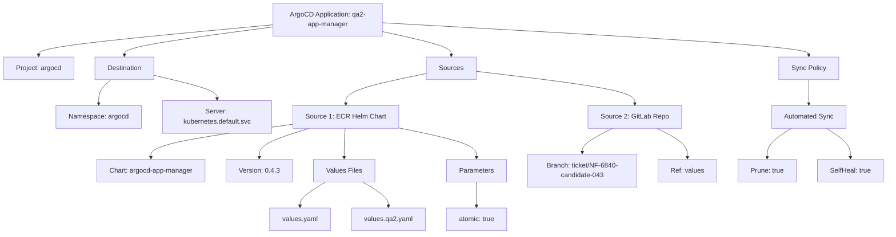
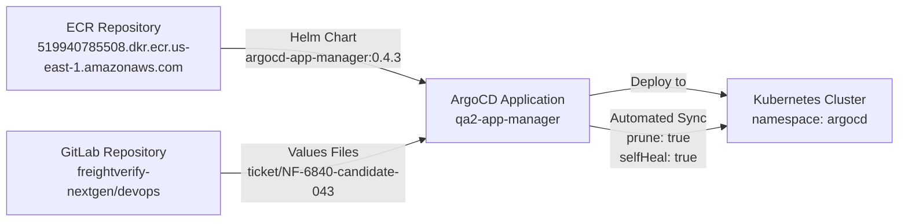
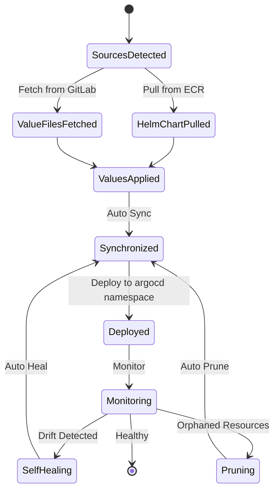

# Diagram: devops/k8s/argocd/app-manager/argocd/Application.qa2.yaml

> Auto-generated by Obscura crawlers

## Diagram 1

### SVG

<svg id="container" width="2104.12109375" xmlns="http://www.w3.org/2000/svg" class="flowchart" height="558" viewBox="0 0 2104.12109375 558" role="graphics-document document" aria-roledescription="flowchart-v2"><g><marker id="container_flowchart-v2-pointEnd" class="marker flowchart-v2" viewBox="0 0 10 10" refX="5" refY="5" markerUnits="userSpaceOnUse" markerWidth="8" markerHeight="8" orient="auto"><path d="M 0 0 L 10 5 L 0 10 z" class="arrowMarkerPath" style="stroke-width: 1; stroke-dasharray: 1, 0;"></path></marker><marker id="container_flowchart-v2-pointStart" class="marker flowchart-v2" viewBox="0 0 10 10" refX="4.5" refY="5" markerUnits="userSpaceOnUse" markerWidth="8" markerHeight="8" orient="auto"><path d="M 0 5 L 10 10 L 10 0 z" class="arrowMarkerPath" style="stroke-width: 1; stroke-dasharray: 1, 0;"></path></marker><marker id="container_flowchart-v2-circleEnd" class="marker flowchart-v2" viewBox="0 0 10 10" refX="11" refY="5" markerUnits="userSpaceOnUse" markerWidth="11" markerHeight="11" orient="auto"><circle cx="5" cy="5" r="5" class="arrowMarkerPath" style="stroke-width: 1; stroke-dasharray: 1, 0;"></circle></marker><marker id="container_flowchart-v2-circleStart" class="marker flowchart-v2" viewBox="0 0 10 10" refX="-1" refY="5" markerUnits="userSpaceOnUse" markerWidth="11" markerHeight="11" orient="auto"><circle cx="5" cy="5" r="5" class="arrowMarkerPath" style="stroke-width: 1; stroke-dasharray: 1, 0;"></circle></marker><marker id="container_flowchart-v2-crossEnd" class="marker cross flowchart-v2" viewBox="0 0 11 11" refX="12" refY="5.2" markerUnits="userSpaceOnUse" markerWidth="11" markerHeight="11" orient="auto"><path d="M 1,1 l 9,9 M 10,1 l -9,9" class="arrowMarkerPath" style="stroke-width: 2; stroke-dasharray: 1, 0;"></path></marker><marker id="container_flowchart-v2-crossStart" class="marker cross flowchart-v2" viewBox="0 0 11 11" refX="-1" refY="5.2" markerUnits="userSpaceOnUse" markerWidth="11" markerHeight="11" orient="auto"><path d="M 1,1 l 9,9 M 10,1 l -9,9" class="arrowMarkerPath" style="stroke-width: 2; stroke-dasharray: 1, 0;"></path></marker><g class="root"><g class="clusters"></g><g class="edgePaths"><path d="M648.203,59.122L555.48,67.769C462.758,76.415,277.313,93.707,184.59,105.854C91.867,118,91.867,125,91.867,128.5L91.867,132" id="L_A_B_0" class="edge-thickness-normal edge-pattern-solid edge-thickness-normal edge-pattern-solid flowchart-link" style=";" data-edge="true" data-et="edge" data-id="L_A_B_0" data-points="W3sieCI6NjQ4LjIwMzEyNSwieSI6NTkuMTIyMzQzNTEzNDQ4OTF9LHsieCI6OTEuODY3MTg3NSwieSI6MTExfSx7IngiOjkxLjg2NzE4NzUsInkiOjEzNn1d" marker-end="url(#container_flowchart-v2-pointEnd)"></path><path d="M648.203,64.314L589.781,72.095C531.359,79.876,414.516,95.438,356.094,106.719C297.672,118,297.672,125,297.672,128.5L297.672,132" id="L_A_C_0" class="edge-thickness-normal edge-pattern-solid edge-thickness-normal edge-pattern-solid flowchart-link" style=";" data-edge="true" data-et="edge" data-id="L_A_C_0" data-points="W3sieCI6NjQ4LjIwMzEyNSwieSI6NjQuMzE0MTcwNTE0NDA0NjJ9LHsieCI6Mjk3LjY3MTg3NSwieSI6MTExfSx7IngiOjI5Ny42NzE4NzUsInkiOjEzNn1d" marker-end="url(#container_flowchart-v2-pointEnd)"></path><path d="M908.203,75.656L934.927,81.546C961.651,87.437,1015.099,99.219,1041.823,108.609C1068.547,118,1068.547,125,1068.547,128.5L1068.547,132" id="L_A_D_0" class="edge-thickness-normal edge-pattern-solid edge-thickness-normal edge-pattern-solid flowchart-link" style=";" data-edge="true" data-et="edge" data-id="L_A_D_0" data-points="W3sieCI6OTA4LjIwMzEyNSwieSI6NzUuNjU1Njg4MzAwNTA1ODZ9LHsieCI6MTA2OC41NDY4NzUsInkiOjExMX0seyJ4IjoxMDY4LjU0Njg3NSwieSI6MTM2fV0=" marker-end="url(#container_flowchart-v2-pointEnd)"></path><path d="M908.203,54.305L1076.365,63.754C1244.526,73.203,1580.849,92.102,1749.01,105.051C1917.172,118,1917.172,125,1917.172,128.5L1917.172,132" id="L_A_E_0" class="edge-thickness-normal edge-pattern-solid edge-thickness-normal edge-pattern-solid flowchart-link" style=";" data-edge="true" data-et="edge" data-id="L_A_E_0" data-points="W3sieCI6OTA4LjIwMzEyNSwieSI6NTQuMzA0ODUzNjIzMDY5MTE0fSx7IngiOjE5MTcuMTcxODc1LCJ5IjoxMTF9LHsieCI6MTkxNy4xNzE4NzUsInkiOjEzNn1d" marker-end="url(#container_flowchart-v2-pointEnd)"></path><path d="M266.666,190L261.881,194.167C257.096,198.333,247.527,206.667,242.742,216.333C237.957,226,237.957,237,237.957,242.5L237.957,248" id="L_C_C1_0" class="edge-thickness-normal edge-pattern-solid edge-thickness-normal edge-pattern-solid flowchart-link" style=";" data-edge="true" data-et="edge" data-id="L_C_C1_0" data-points="W3sieCI6MjY2LjY2NjA5MDc0NTE5MjMsInkiOjE5MH0seyJ4IjoyMzcuOTU3MDMxMjUsInkiOjIxNX0seyJ4IjoyMzcuOTU3MDMxMjUsInkiOjI1Mn1d" marker-end="url(#container_flowchart-v2-pointEnd)"></path><path d="M369.609,179.956L394.39,185.796C419.171,191.637,468.732,203.319,493.512,212.659C518.293,222,518.293,229,518.293,232.5L518.293,236" id="L_C_C2_0" class="edge-thickness-normal edge-pattern-solid edge-thickness-normal edge-pattern-solid flowchart-link" style=";" data-edge="true" data-et="edge" data-id="L_C_C2_0" data-points="W3sieCI6MzY5LjYwOTM3NSwieSI6MTc5Ljk1NTU0MDk5NzUzODkyfSx7IngiOjUxOC4yOTI5Njg3NSwieSI6MjE1fSx7IngiOjUxOC4yOTI5Njg3NSwieSI6MjQwfV0=" marker-end="url(#container_flowchart-v2-pointEnd)"></path><path d="M1010.25,175.13L978.316,181.775C946.382,188.42,882.513,201.71,850.579,213.855C818.645,226,818.645,237,818.645,242.5L818.645,248" id="L_D_D1_0" class="edge-thickness-normal edge-pattern-solid edge-thickness-normal edge-pattern-solid flowchart-link" style=";" data-edge="true" data-et="edge" data-id="L_D_D1_0" data-points="W3sieCI6MTAxMC4yNSwieSI6MTc1LjEzMDQ4ODQ3MjA1OTR9LHsieCI6ODE4LjY0NDUzMTI1LCJ5IjoyMTV9LHsieCI6ODE4LjY0NDUzMTI1LCJ5IjoyNTJ9XQ==" marker-end="url(#container_flowchart-v2-pointEnd)"></path><path d="M1126.844,169.969L1189.63,177.474C1252.415,184.979,1377.987,199.99,1440.773,212.995C1503.559,226,1503.559,237,1503.559,242.5L1503.559,248" id="L_D_D2_0" class="edge-thickness-normal edge-pattern-solid edge-thickness-normal edge-pattern-solid flowchart-link" style=";" data-edge="true" data-et="edge" data-id="L_D_D2_0" data-points="W3sieCI6MTEyNi44NDM3NSwieSI6MTY5Ljk2ODYzNDEwNjQ4MDZ9LHsieCI6MTUwMy41NTg1OTM3NSwieSI6MjE1fSx7IngiOjE1MDMuNTU4NTkzNzUsInkiOjI1Mn1d" marker-end="url(#container_flowchart-v2-pointEnd)"></path><path d="M698.293,295.67L641.344,303.559C584.395,311.447,470.496,327.223,413.547,340.612C356.598,354,356.598,365,356.598,370.5L356.598,376" id="L_D1_D1A_0" class="edge-thickness-normal edge-pattern-solid edge-thickness-normal edge-pattern-solid flowchart-link" style=";" data-edge="true" data-et="edge" data-id="L_D1_D1A_0" data-points="W3sieCI6Njk4LjI5Mjk2ODc1LCJ5IjoyOTUuNjcwMzg2NTI3MzQwOTV9LHsieCI6MzU2LjU5NzY1NjI1LCJ5IjozNDN9LHsieCI6MzU2LjU5NzY1NjI1LCJ5IjozODB9XQ==" marker-end="url(#container_flowchart-v2-pointEnd)"></path><path d="M732.154,306L712.399,312.167C692.645,318.333,653.137,330.667,633.383,342.333C613.629,354,613.629,365,613.629,370.5L613.629,376" id="L_D1_D1B_0" class="edge-thickness-normal edge-pattern-solid edge-thickness-normal edge-pattern-solid flowchart-link" style=";" data-edge="true" data-et="edge" data-id="L_D1_D1B_0" data-points="W3sieCI6NzMyLjE1MzU2NDQ1MzEyNSwieSI6MzA2fSx7IngiOjYxMy42Mjg5MDYyNSwieSI6MzQzfSx7IngiOjYxMy42Mjg5MDYyNSwieSI6MzgwfV0=" marker-end="url(#container_flowchart-v2-pointEnd)"></path><path d="M816.173,306L815.608,312.167C815.043,318.333,813.914,330.667,813.35,342.333C812.785,354,812.785,365,812.785,370.5L812.785,376" id="L_D1_D1C_0" class="edge-thickness-normal edge-pattern-solid edge-thickness-normal edge-pattern-solid flowchart-link" style=";" data-edge="true" data-et="edge" data-id="L_D1_D1C_0" data-points="W3sieCI6ODE2LjE3MjYwNzQyMTg3NSwieSI6MzA2fSx7IngiOjgxMi43ODUxNTYyNSwieSI6MzQzfSx7IngiOjgxMi43ODUxNTYyNSwieSI6MzgwfV0=" marker-end="url(#container_flowchart-v2-pointEnd)"></path><path d="M938.996,303.877L970.542,310.397C1002.087,316.918,1065.178,329.959,1096.724,341.979C1128.27,354,1128.27,365,1128.27,370.5L1128.27,376" id="L_D1_D1D_0" class="edge-thickness-normal edge-pattern-solid edge-thickness-normal edge-pattern-solid flowchart-link" style=";" data-edge="true" data-et="edge" data-id="L_D1_D1D_0" data-points="W3sieCI6OTM4Ljk5NjA5Mzc1LCJ5IjozMDMuODc2ODY3MTc4MDM3OTd9LHsieCI6MTEyOC4yNjk1MzEyNSwieSI6MzQzfSx7IngiOjExMjguMjY5NTMxMjUsInkiOjM4MH1d" marker-end="url(#container_flowchart-v2-pointEnd)"></path><path d="M768.653,434L758.574,440.167C748.494,446.333,728.335,458.667,718.255,468.333C708.176,478,708.176,485,708.176,488.5L708.176,492" id="L_D1C_D1C1_0" class="edge-thickness-normal edge-pattern-solid edge-thickness-normal edge-pattern-solid flowchart-link" style=";" data-edge="true" data-et="edge" data-id="L_D1C_D1C1_0" data-points="W3sieCI6NzY4LjY1MzA3NjE3MTg3NSwieSI6NDM0fSx7IngiOjcwOC4xNzU3ODEyNSwieSI6NDcxfSx7IngiOjcwOC4xNzU3ODEyNSwieSI6NDk2fV0=" marker-end="url(#container_flowchart-v2-pointEnd)"></path><path d="M856.917,434L866.997,440.167C877.076,446.333,897.235,458.667,907.315,468.333C917.395,478,917.395,485,917.395,488.5L917.395,492" id="L_D1C_D1C2_0" class="edge-thickness-normal edge-pattern-solid edge-thickness-normal edge-pattern-solid flowchart-link" style=";" data-edge="true" data-et="edge" data-id="L_D1C_D1C2_0" data-points="W3sieCI6ODU2LjkxNzIzNjMyODEyNSwieSI6NDM0fSx7IngiOjkxNy4zOTQ1MzEyNSwieSI6NDcxfSx7IngiOjkxNy4zOTQ1MzEyNSwieSI6NDk2fV0=" marker-end="url(#container_flowchart-v2-pointEnd)"></path><path d="M1128.27,434L1128.27,440.167C1128.27,446.333,1128.27,458.667,1128.27,468.333C1128.27,478,1128.27,485,1128.27,488.5L1128.27,492" id="L_D1D_D1D1_0" class="edge-thickness-normal edge-pattern-solid edge-thickness-normal edge-pattern-solid flowchart-link" style=";" data-edge="true" data-et="edge" data-id="L_D1D_D1D1_0" data-points="W3sieCI6MTEyOC4yNjk1MzEyNSwieSI6NDM0fSx7IngiOjExMjguMjY5NTMxMjUsInkiOjQ3MX0seyJ4IjoxMTI4LjI2OTUzMTI1LCJ5Ijo0OTZ9XQ==" marker-end="url(#container_flowchart-v2-pointEnd)"></path><path d="M1451.029,306L1439.031,312.167C1427.033,318.333,1403.038,330.667,1391.041,340.333C1379.043,350,1379.043,357,1379.043,360.5L1379.043,364" id="L_D2_D2A_0" class="edge-thickness-normal edge-pattern-solid edge-thickness-normal edge-pattern-solid flowchart-link" style=";" data-edge="true" data-et="edge" data-id="L_D2_D2A_0" data-points="W3sieCI6MTQ1MS4wMjg1NjQ0NTMxMjUsInkiOjMwNn0seyJ4IjoxMzc5LjA0Mjk2ODc1LCJ5IjozNDN9LHsieCI6MTM3OS4wNDI5Njg3NSwieSI6MzY4fV0=" marker-end="url(#container_flowchart-v2-pointEnd)"></path><path d="M1556.089,306L1568.086,312.167C1580.084,318.333,1604.079,330.667,1616.077,342.333C1628.074,354,1628.074,365,1628.074,370.5L1628.074,376" id="L_D2_D2B_0" class="edge-thickness-normal edge-pattern-solid edge-thickness-normal edge-pattern-solid flowchart-link" style=";" data-edge="true" data-et="edge" data-id="L_D2_D2B_0" data-points="W3sieCI6MTU1Ni4wODg2MjMwNDY4NzUsInkiOjMwNn0seyJ4IjoxNjI4LjA3NDIxODc1LCJ5IjozNDN9LHsieCI6MTYyOC4wNzQyMTg3NSwieSI6MzgwfV0=" marker-end="url(#container_flowchart-v2-pointEnd)"></path><path d="M1917.172,190L1917.172,194.167C1917.172,198.333,1917.172,206.667,1917.172,216.333C1917.172,226,1917.172,237,1917.172,242.5L1917.172,248" id="L_E_E1_0" class="edge-thickness-normal edge-pattern-solid edge-thickness-normal edge-pattern-solid flowchart-link" style=";" data-edge="true" data-et="edge" data-id="L_E_E1_0" data-points="W3sieCI6MTkxNy4xNzE4NzUsInkiOjE5MH0seyJ4IjoxOTE3LjE3MTg3NSwieSI6MjE1fSx7IngiOjE5MTcuMTcxODc1LCJ5IjoyNTJ9XQ==" marker-end="url(#container_flowchart-v2-pointEnd)"></path><path d="M1875.088,306L1865.476,312.167C1855.865,318.333,1836.641,330.667,1827.03,342.333C1817.418,354,1817.418,365,1817.418,370.5L1817.418,376" id="L_E1_E1A_0" class="edge-thickness-normal edge-pattern-solid edge-thickness-normal edge-pattern-solid flowchart-link" style=";" data-edge="true" data-et="edge" data-id="L_E1_E1A_0" data-points="W3sieCI6MTg3NS4wODgxOTU4MDA3ODEyLCJ5IjozMDZ9LHsieCI6MTgxNy40MTc5Njg3NSwieSI6MzQzfSx7IngiOjE4MTcuNDE3OTY4NzUsInkiOjM4MH1d" marker-end="url(#container_flowchart-v2-pointEnd)"></path><path d="M1959.256,306L1968.867,312.167C1978.479,318.333,1997.702,330.667,2007.314,342.333C2016.926,354,2016.926,365,2016.926,370.5L2016.926,376" id="L_E1_E1B_0" class="edge-thickness-normal edge-pattern-solid edge-thickness-normal edge-pattern-solid flowchart-link" style=";" data-edge="true" data-et="edge" data-id="L_E1_E1B_0" data-points="W3sieCI6MTk1OS4yNTU1NTQxOTkyMTg4LCJ5IjozMDZ9LHsieCI6MjAxNi45MjU3ODEyNSwieSI6MzQzfSx7IngiOjIwMTYuOTI1NzgxMjUsInkiOjM4MH1d" marker-end="url(#container_flowchart-v2-pointEnd)"></path></g><g class="edgeLabels"><g class="edgeLabel"><g class="label" data-id="L_A_B_0" transform="translate(0, 0)"><foreignObject width="0" height="0">

</foreignObject></g></g><g class="edgeLabel"><g class="label" data-id="L_A_C_0" transform="translate(0, 0)"><foreignObject width="0" height="0">

</foreignObject></g></g><g class="edgeLabel"><g class="label" data-id="L_A_D_0" transform="translate(0, 0)"><foreignObject width="0" height="0">

</foreignObject></g></g><g class="edgeLabel"><g class="label" data-id="L_A_E_0" transform="translate(0, 0)"><foreignObject width="0" height="0">

</foreignObject></g></g><g class="edgeLabel"><g class="label" data-id="L_C_C1_0" transform="translate(0, 0)"><foreignObject width="0" height="0">

</foreignObject></g></g><g class="edgeLabel"><g class="label" data-id="L_C_C2_0" transform="translate(0, 0)"><foreignObject width="0" height="0">

</foreignObject></g></g><g class="edgeLabel"><g class="label" data-id="L_D_D1_0" transform="translate(0, 0)"><foreignObject width="0" height="0">

</foreignObject></g></g><g class="edgeLabel"><g class="label" data-id="L_D_D2_0" transform="translate(0, 0)"><foreignObject width="0" height="0">

</foreignObject></g></g><g class="edgeLabel"><g class="label" data-id="L_D1_D1A_0" transform="translate(0, 0)"><foreignObject width="0" height="0">

</foreignObject></g></g><g class="edgeLabel"><g class="label" data-id="L_D1_D1B_0" transform="translate(0, 0)"><foreignObject width="0" height="0">

</foreignObject></g></g><g class="edgeLabel"><g class="label" data-id="L_D1_D1C_0" transform="translate(0, 0)"><foreignObject width="0" height="0">

</foreignObject></g></g><g class="edgeLabel"><g class="label" data-id="L_D1_D1D_0" transform="translate(0, 0)"><foreignObject width="0" height="0">

</foreignObject></g></g><g class="edgeLabel"><g class="label" data-id="L_D1C_D1C1_0" transform="translate(0, 0)"><foreignObject width="0" height="0">

</foreignObject></g></g><g class="edgeLabel"><g class="label" data-id="L_D1C_D1C2_0" transform="translate(0, 0)"><foreignObject width="0" height="0">

</foreignObject></g></g><g class="edgeLabel"><g class="label" data-id="L_D1D_D1D1_0" transform="translate(0, 0)"><foreignObject width="0" height="0">

</foreignObject></g></g><g class="edgeLabel"><g class="label" data-id="L_D2_D2A_0" transform="translate(0, 0)"><foreignObject width="0" height="0">

</foreignObject></g></g><g class="edgeLabel"><g class="label" data-id="L_D2_D2B_0" transform="translate(0, 0)"><foreignObject width="0" height="0">

</foreignObject></g></g><g class="edgeLabel"><g class="label" data-id="L_E_E1_0" transform="translate(0, 0)"><foreignObject width="0" height="0">

</foreignObject></g></g><g class="edgeLabel"><g class="label" data-id="L_E1_E1A_0" transform="translate(0, 0)"><foreignObject width="0" height="0">

</foreignObject></g></g><g class="edgeLabel"><g class="label" data-id="L_E1_E1B_0" transform="translate(0, 0)"><foreignObject width="0" height="0">

</foreignObject></g></g></g><g class="nodes"><g class="node default" id="flowchart-A-0" transform="translate(778.203125, 47)"><rect class="basic label-container" style="" x="-130" y="-39" width="260" height="78"></rect><g class="label" style="" transform="translate(-100, -24)"><rect></rect><foreignObject width="200" height="48">

ArgoCD Application: qa2-app-manager

</foreignObject></g></g><g class="node default" id="flowchart-B-1" transform="translate(91.8671875, 163)"><rect class="basic label-container" style="" x="-83.8671875" y="-27" width="167.734375" height="54"></rect><g class="label" style="" transform="translate(-53.8671875, -12)"><rect></rect><foreignObject width="107.734375" height="24">

Project: argocd

</foreignObject></g></g><g class="node default" id="flowchart-C-3" transform="translate(297.671875, 163)"><rect class="basic label-container" style="" x="-71.9375" y="-27" width="143.875" height="54"></rect><g class="label" style="" transform="translate(-41.9375, -12)"><rect></rect><foreignObject width="83.875" height="24">

Destination

</foreignObject></g></g><g class="node default" id="flowchart-D-5" transform="translate(1068.546875, 163)"><rect class="basic label-container" style="" x="-58.296875" y="-27" width="116.59375" height="54"></rect><g class="label" style="" transform="translate(-28.296875, -12)"><rect></rect><foreignObject width="56.59375" height="24">

Sources

</foreignObject></g></g><g class="node default" id="flowchart-E-7" transform="translate(1917.171875, 163)"><rect class="basic label-container" style="" x="-70.2890625" y="-27" width="140.578125" height="54"></rect><g class="label" style="" transform="translate(-40.2890625, -12)"><rect></rect><foreignObject width="80.578125" height="24">

Sync Policy

</foreignObject></g></g><g class="node default" id="flowchart-C1-9" transform="translate(237.95703125, 279)"><rect class="basic label-container" style="" x="-100.3359375" y="-27" width="200.671875" height="54"></rect><g class="label" style="" transform="translate(-70.3359375, -12)"><rect></rect><foreignObject width="140.671875" height="24">

Namespace: argocd

</foreignObject></g></g><g class="node default" id="flowchart-C2-11" transform="translate(518.29296875, 279)"><rect class="basic label-container" style="" x="-130" y="-39" width="260" height="78"></rect><g class="label" style="" transform="translate(-100, -24)"><rect></rect><foreignObject width="200" height="48">

Server: kubernetes.default.svc

</foreignObject></g></g><g class="node default" id="flowchart-D1-13" transform="translate(818.64453125, 279)"><rect class="basic label-container" style="" x="-120.3515625" y="-27" width="240.703125" height="54"></rect><g class="label" style="" transform="translate(-90.3515625, -12)"><rect></rect><foreignObject width="180.703125" height="24">

Source 1: ECR Helm Chart

</foreignObject></g></g><g class="node default" id="flowchart-D2-15" transform="translate(1503.55859375, 279)"><rect class="basic label-container" style="" x="-108.5078125" y="-27" width="217.015625" height="54"></rect><g class="label" style="" transform="translate(-78.5078125, -12)"><rect></rect><foreignObject width="157.015625" height="24">

Source 2: GitLab Repo

</foreignObject></g></g><g class="node default" id="flowchart-D1A-17" transform="translate(356.59765625, 407)"><rect class="basic label-container" style="" x="-129.796875" y="-27" width="259.59375" height="54"></rect><g class="label" style="" transform="translate(-99.796875, -12)"><rect></rect><foreignObject width="199.59375" height="24">

Chart: argocd-app-manager

</foreignObject></g></g><g class="node default" id="flowchart-D1B-19" transform="translate(613.62890625, 407)"><rect class="basic label-container" style="" x="-77.234375" y="-27" width="154.46875" height="54"></rect><g class="label" style="" transform="translate(-47.234375, -12)"><rect></rect><foreignObject width="94.46875" height="24">

Version: 0.4.3

</foreignObject></g></g><g class="node default" id="flowchart-D1C-21" transform="translate(812.78515625, 407)"><rect class="basic label-container" style="" x="-71.921875" y="-27" width="143.84375" height="54"></rect><g class="label" style="" transform="translate(-41.921875, -12)"><rect></rect><foreignObject width="83.84375" height="24">

Values Files

</foreignObject></g></g><g class="node default" id="flowchart-D1D-23" transform="translate(1128.26953125, 407)"><rect class="basic label-container" style="" x="-70.7734375" y="-27" width="141.546875" height="54"></rect><g class="label" style="" transform="translate(-40.7734375, -12)"><rect></rect><foreignObject width="81.546875" height="24">

Parameters

</foreignObject></g></g><g class="node default" id="flowchart-D1C1-25" transform="translate(708.17578125, 523)"><rect class="basic label-container" style="" x="-72.140625" y="-27" width="144.28125" height="54"></rect><g class="label" style="" transform="translate(-42.140625, -12)"><rect></rect><foreignObject width="84.28125" height="24">

values.yaml

</foreignObject></g></g><g class="node default" id="flowchart-D1C2-27" transform="translate(917.39453125, 523)"><rect class="basic label-container" style="" x="-87.078125" y="-27" width="174.15625" height="54"></rect><g class="label" style="" transform="translate(-57.078125, -12)"><rect></rect><foreignObject width="114.15625" height="24">

values.qa2.yaml

</foreignObject></g></g><g class="node default" id="flowchart-D1D1-29" transform="translate(1128.26953125, 523)"><rect class="basic label-container" style="" x="-73.796875" y="-27" width="147.59375" height="54"></rect><g class="label" style="" transform="translate(-43.796875, -12)"><rect></rect><foreignObject width="87.59375" height="24">

atomic: true

</foreignObject></g></g><g class="node default" id="flowchart-D2A-31" transform="translate(1379.04296875, 407)"><rect class="basic label-container" style="" x="-130" y="-39" width="260" height="78"></rect><g class="label" style="" transform="translate(-100, -24)"><rect></rect><foreignObject width="200" height="48">

Branch: ticket/NF-6840-candidate-043

</foreignObject></g></g><g class="node default" id="flowchart-D2B-33" transform="translate(1628.07421875, 407)"><rect class="basic label-container" style="" x="-69.03125" y="-27" width="138.0625" height="54"></rect><g class="label" style="" transform="translate(-39.03125, -12)"><rect></rect><foreignObject width="78.0625" height="24">

Ref: values

</foreignObject></g></g><g class="node default" id="flowchart-E1-35" transform="translate(1917.171875, 279)"><rect class="basic label-container" style="" x="-88.6484375" y="-27" width="177.296875" height="54"></rect><g class="label" style="" transform="translate(-58.6484375, -12)"><rect></rect><foreignObject width="117.296875" height="24">

Automated Sync

</foreignObject></g></g><g class="node default" id="flowchart-E1A-37" transform="translate(1817.41796875, 407)"><rect class="basic label-container" style="" x="-70.3125" y="-27" width="140.625" height="54"></rect><g class="label" style="" transform="translate(-40.3125, -12)"><rect></rect><foreignObject width="80.625" height="24">

Prune: true

</foreignObject></g></g><g class="node default" id="flowchart-E1B-39" transform="translate(2016.92578125, 407)"><rect class="basic label-container" style="" x="-79.1953125" y="-27" width="158.390625" height="54"></rect><g class="label" style="" transform="translate(-49.1953125, -12)"><rect></rect><foreignObject width="98.390625" height="24">

SelfHeal: true

</foreignObject></g></g></g></g></g></svg>

## Diagram 2

### SVG

<svg id="container" width="1091" xmlns="http://www.w3.org/2000/svg" class="flowchart" height="270" viewBox="0 0 1091 270" role="graphics-document document" aria-roledescription="flowchart-v2"><g><marker id="container_flowchart-v2-pointEnd" class="marker flowchart-v2" viewBox="0 0 10 10" refX="5" refY="5" markerUnits="userSpaceOnUse" markerWidth="8" markerHeight="8" orient="auto"><path d="M 0 0 L 10 5 L 0 10 z" class="arrowMarkerPath" style="stroke-width: 1; stroke-dasharray: 1, 0;"></path></marker><marker id="container_flowchart-v2-pointStart" class="marker flowchart-v2" viewBox="0 0 10 10" refX="4.5" refY="5" markerUnits="userSpaceOnUse" markerWidth="8" markerHeight="8" orient="auto"><path d="M 0 5 L 10 10 L 10 0 z" class="arrowMarkerPath" style="stroke-width: 1; stroke-dasharray: 1, 0;"></path></marker><marker id="container_flowchart-v2-circleEnd" class="marker flowchart-v2" viewBox="0 0 10 10" refX="11" refY="5" markerUnits="userSpaceOnUse" markerWidth="11" markerHeight="11" orient="auto"><circle cx="5" cy="5" r="5" class="arrowMarkerPath" style="stroke-width: 1; stroke-dasharray: 1, 0;"></circle></marker><marker id="container_flowchart-v2-circleStart" class="marker flowchart-v2" viewBox="0 0 10 10" refX="-1" refY="5" markerUnits="userSpaceOnUse" markerWidth="11" markerHeight="11" orient="auto"><circle cx="5" cy="5" r="5" class="arrowMarkerPath" style="stroke-width: 1; stroke-dasharray: 1, 0;"></circle></marker><marker id="container_flowchart-v2-crossEnd" class="marker cross flowchart-v2" viewBox="0 0 11 11" refX="12" refY="5.2" markerUnits="userSpaceOnUse" markerWidth="11" markerHeight="11" orient="auto"><path d="M 1,1 l 9,9 M 10,1 l -9,9" class="arrowMarkerPath" style="stroke-width: 2; stroke-dasharray: 1, 0;"></path></marker><marker id="container_flowchart-v2-crossStart" class="marker cross flowchart-v2" viewBox="0 0 11 11" refX="-1" refY="5.2" markerUnits="userSpaceOnUse" markerWidth="11" markerHeight="11" orient="auto"><path d="M 1,1 l 9,9 M 10,1 l -9,9" class="arrowMarkerPath" style="stroke-width: 2; stroke-dasharray: 1, 0;"></path></marker><g class="root"><g class="clusters"></g><g class="edgePaths"><path d="M268,59L288.833,59C309.667,59,351.333,59,392.369,65.845C433.404,72.69,473.808,86.381,494.01,93.226L514.212,100.071" id="L_ECR_APP_0" class="edge-thickness-normal edge-pattern-solid edge-thickness-normal edge-pattern-solid flowchart-link" style=";" data-edge="true" data-et="edge" data-id="L_ECR_APP_0" data-points="W3sieCI6MjY4LCJ5Ijo1OX0seyJ4IjozOTMsInkiOjU5fSx7IngiOjUxOCwieSI6MTAxLjM1NDU4MDI4NTYxNDc2fV0=" marker-end="url(#container_flowchart-v2-pointEnd)"></path><path d="M268,211L288.833,211C309.667,211,351.333,211,392.369,204.155C433.404,197.31,473.808,183.619,494.01,176.774L514.212,169.929" id="L_GIT_APP_0" class="edge-thickness-normal edge-pattern-solid edge-thickness-normal edge-pattern-solid flowchart-link" style=";" data-edge="true" data-et="edge" data-id="L_GIT_APP_0" data-points="W3sieCI6MjY4LCJ5IjoyMTF9LHsieCI6MzkzLCJ5IjoyMTF9LHsieCI6NTE4LCJ5IjoxNjguNjQ1NDE5NzE0Mzg1MjR9XQ==" marker-end="url(#container_flowchart-v2-pointEnd)"></path><path d="M716.594,116.546L730.535,113.955C744.477,111.364,772.359,106.182,799.587,106.057C826.814,105.931,853.386,110.863,866.672,113.328L879.958,115.794" id="L_APP_K8S_0" class="edge-thickness-normal edge-pattern-solid edge-thickness-normal edge-pattern-solid flowchart-link" style=";" data-edge="true" data-et="edge" data-id="L_APP_K8S_0" data-points="W3sieCI6NzE2LjU5Mzc1LCJ5IjoxMTYuNTQ1ODg1NDY3ODIyNTN9LHsieCI6ODAwLjI0MjE4NzUsInkiOjEwMX0seyJ4Ijo4ODMuODkwNjI1LCJ5IjoxMTYuNTI0MDA4NTI4Nzg0NjV9XQ==" marker-end="url(#container_flowchart-v2-pointEnd)"></path><path d="M716.594,153.454L730.535,156.045C744.477,158.636,772.359,163.818,799.587,163.943C826.814,164.069,853.386,159.137,866.672,156.672L879.958,154.206" id="L_APP_K8S_2" class="edge-thickness-normal edge-pattern-solid edge-thickness-normal edge-pattern-solid flowchart-link" style=";" data-edge="true" data-et="edge" data-id="L_APP_K8S_2" data-points="W3sieCI6NzE2LjU5Mzc1LCJ5IjoxNTMuNDU0MTE0NTMyMTc3NDd9LHsieCI6ODAwLjI0MjE4NzUsInkiOjE2OX0seyJ4Ijo4ODMuODkwNjI1LCJ5IjoxNTMuNDc1OTkxNDcxMjE1Mzd9XQ==" marker-end="url(#container_flowchart-v2-pointEnd)"></path></g><g class="edgeLabels"><g class="edgeLabel" transform="translate(393, 59)"><g class="label" data-id="L_ECR_APP_0" transform="translate(-94.5703125, -24)"><foreignObject width="189.140625" height="48">

Helm Chart argocd-app-manager:0.4.3

</foreignObject></g></g><g class="edgeLabel" transform="translate(393, 211)"><g class="label" data-id="L_GIT_APP_0" transform="translate(-100, -36)"><foreignObject width="200" height="72">

Values Files ticket/NF-6840-candidate-043

</foreignObject></g></g><g class="edgeLabel" transform="translate(800.2421875, 101)"><g class="label" data-id="L_APP_K8S_0" transform="translate(-34.7109375, -12)"><foreignObject width="69.421875" height="24">

Deploy to

</foreignObject></g></g><g class="edgeLabel" transform="translate(800.2421875, 169)"><g class="label" data-id="L_APP_K8S_2" transform="translate(-58.6484375, -36)"><foreignObject width="117.296875" height="72">

Automated Sync prune: true selfHeal: true

</foreignObject></g></g></g><g class="nodes"><g class="node default" id="flowchart-ECR-0" transform="translate(138, 59)"><rect class="basic label-container" style="" x="-130" y="-51" width="260" height="102"></rect><g class="label" style="" transform="translate(-100, -36)"><rect></rect><foreignObject width="200" height="72">

ECR Repository 519940785508.dkr.ecr.us-east-1.amazonaws.com

</foreignObject></g></g><g class="node default" id="flowchart-APP-1" transform="translate(617.296875, 135)"><rect class="basic label-container" style="" x="-99.296875" y="-39" width="198.59375" height="78"></rect><g class="label" style="" transform="translate(-69.296875, -24)"><rect></rect><foreignObject width="138.59375" height="48">

ArgoCD Application qa2-app-manager

</foreignObject></g></g><g class="node default" id="flowchart-GIT-2" transform="translate(138, 211)"><rect class="basic label-container" style="" x="-130" y="-51" width="260" height="102"></rect><g class="label" style="" transform="translate(-100, -36)"><rect></rect><foreignObject width="200" height="72">

GitLab Repository freightverify-nextgen/devops

</foreignObject></g></g><g class="node default" id="flowchart-K8S-5" transform="translate(983.4453125, 135)"><rect class="basic label-container" style="" x="-99.5546875" y="-39" width="199.109375" height="78"></rect><g class="label" style="" transform="translate(-69.5546875, -24)"><rect></rect><foreignObject width="139.109375" height="48">

Kubernetes Cluster namespace: argocd

</foreignObject></g></g></g></g></g></svg>

## Diagram 3

### SVG

<svg id="container" width="454.60272216796875" xmlns="http://www.w3.org/2000/svg" class="statediagram" height="804" viewBox="0 0 454.60272216796875 804" role="graphics-document document" aria-roledescription="stateDiagram"><g><defs><marker id="container_stateDiagram-barbEnd" refX="19" refY="7" markerWidth="20" markerHeight="14" markerUnits="userSpaceOnUse" orient="auto"><path d="M 19,7 L9,13 L14,7 L9,1 Z"></path></marker></defs><g class="root"><g class="clusters"></g><g class="edgePaths"><path d="M215.98,22L215.98,26.167C215.98,30.333,215.98,38.667,216.063,47.083C216.147,55.5,216.313,64,216.397,68.25L216.48,72.5" id="edge0" class="edge-thickness-normal edge-pattern-solid transition" style="fill:none;;;fill:none" data-edge="true" data-et="edge" data-id="edge0" data-points="W3sieCI6MjE1Ljk3OTg4NTgxNjU3NDEsInkiOjIyfSx7IngiOjIxNS45Nzk4ODU4MTY1NzQxLCJ5Ijo0N30seyJ4IjoyMTYuNDc5ODg1ODE2NTc0MSwieSI6NzIuNX1d" marker-end="url(#container_stateDiagram-barbEnd)"></path><path d="M241.546,112.5L249.191,118.583C256.836,124.667,272.127,136.833,279.855,149.167C287.584,161.5,287.751,174,287.834,180.25L287.917,186.5" id="edge1" class="edge-thickness-normal edge-pattern-solid transition" style="fill:none;;;fill:none" data-edge="true" data-et="edge" data-id="edge1" data-points="W3sieCI6MjQxLjU0NTY3NTI5MDI1ODMyLCJ5IjoxMTIuNX0seyJ4IjoyODcuNDE3Mzg1ODE2NTc0MSwieSI6MTQ5fSx7IngiOjI4Ny45MTczODU4MTY1NzQxLCJ5IjoxODYuNX1d" marker-end="url(#container_stateDiagram-barbEnd)"></path><path d="M174.249,112.5L161.144,118.583C148.039,124.667,121.83,136.833,108.809,149.167C95.787,161.5,95.954,174,96.037,180.25L96.121,186.5" id="edge2" class="edge-thickness-normal edge-pattern-solid transition" style="fill:none;;;fill:none" data-edge="true" data-et="edge" data-id="edge2" data-points="W3sieCI6MTc0LjI0ODUyNjE2NzQ1MTMsInkiOjExMi41fSx7IngiOjk1LjYyMDUxMDgxNjU3NDEsInkiOjE0OX0seyJ4Ijo5Ni4xMjA1MTA4MTY1NzQxLCJ5IjoxODYuNX1d" marker-end="url(#container_stateDiagram-barbEnd)"></path><path d="M287.917,226.5L287.834,230.583C287.751,234.667,287.584,242.833,280.969,251.167C274.355,259.5,261.292,268,254.761,272.25L248.23,276.5" id="edge3" class="edge-thickness-normal edge-pattern-solid transition" style="fill:none;;;fill:none" data-edge="true" data-et="edge" data-id="edge3" data-points="W3sieCI6Mjg3LjkxNzM4NTgxNjU3NDEsInkiOjIyNi41fSx7IngiOjI4Ny40MTczODU4MTY1NzQxLCJ5IjoyNTF9LHsieCI6MjQ4LjIyOTg4NTgxNjU3NDEsInkiOjI3Ni41fV0=" marker-end="url(#container_stateDiagram-barbEnd)"></path><path d="M96.121,226.5L96.037,230.583C95.954,234.667,95.787,242.833,106.932,251.167C118.076,259.5,140.531,268,151.759,272.25L162.987,276.5" id="edge4" class="edge-thickness-normal edge-pattern-solid transition" style="fill:none;;;fill:none" data-edge="true" data-et="edge" data-id="edge4" data-points="W3sieCI6OTYuMTIwNTEwODE2NTc0MSwieSI6MjI2LjV9LHsieCI6OTUuNjIwNTEwODE2NTc0MSwieSI6MjUxfSx7IngiOjE2Mi45ODY4MzAyNjEwMTg1NSwieSI6Mjc2LjV9XQ==" marker-end="url(#container_stateDiagram-barbEnd)"></path><path d="M216.48,316.5L216.397,322.583C216.313,328.667,216.147,340.833,216.147,353.167C216.147,365.5,216.313,378,216.397,384.25L216.48,390.5" id="edge5" class="edge-thickness-normal edge-pattern-solid transition" style="fill:none;;;fill:none" data-edge="true" data-et="edge" data-id="edge5" data-points="W3sieCI6MjE2LjQ3OTg4NTgxNjU3NDEsInkiOjMxNi41fSx7IngiOjIxNS45Nzk4ODU4MTY1NzQxLCJ5IjozNTN9LHsieCI6MjE2LjQ3OTg4NTgxNjU3NDEsInkiOjM5MC41fV0=" marker-end="url(#container_stateDiagram-barbEnd)"></path><path d="M216.48,430.5L216.397,438.583C216.313,446.667,216.147,462.833,216.147,479.167C216.147,495.5,216.313,512,216.397,520.25L216.48,528.5" id="edge6" class="edge-thickness-normal edge-pattern-solid transition" style="fill:none;;;fill:none" data-edge="true" data-et="edge" data-id="edge6" data-points="W3sieCI6MjE2LjQ3OTg4NTgxNjU3NDEsInkiOjQzMC41fSx7IngiOjIxNS45Nzk4ODU4MTY1NzQxLCJ5Ijo0Nzl9LHsieCI6MjE2LjQ3OTg4NTgxNjU3NDEsInkiOjUyOC41fV0=" marker-end="url(#container_stateDiagram-barbEnd)"></path><path d="M216.48,568.5L216.397,574.583C216.313,580.667,216.147,592.833,216.147,605.167C216.147,617.5,216.313,630,216.397,636.25L216.48,642.5" id="edge7" class="edge-thickness-normal edge-pattern-solid transition" style="fill:none;;;fill:none" data-edge="true" data-et="edge" data-id="edge7" data-points="W3sieCI6MjE2LjQ3OTg4NTgxNjU3NDEsInkiOjU2OC41fSx7IngiOjIxNS45Nzk4ODU4MTY1NzQxLCJ5Ijo2MDV9LHsieCI6MjE2LjQ3OTg4NTgxNjU3NDEsInkiOjY0Mi41fV0=" marker-end="url(#container_stateDiagram-barbEnd)"></path><path d="M180.593,682.5L169.445,688.583C158.297,694.667,136,706.833,121.118,719.167C106.236,731.5,98.769,744,95.035,750.25L91.301,756.5" id="edge8" class="edge-thickness-normal edge-pattern-solid transition" style="fill:none;;;fill:none" data-edge="true" data-et="edge" data-id="edge8" data-points="W3sieCI6MTgwLjU5MzMwMzA3MzkxNjUzLCJ5Ijo2ODIuNX0seyJ4IjoxMTMuNzAzMTI1LCJ5Ijo3MTl9LHsieCI6OTEuMzAxMjYwOTY0OTEyMjcsInkiOjc1Ni41fV0=" marker-end="url(#container_stateDiagram-barbEnd)"></path><path d="M66.542,756.5L62.642,750.25C58.742,744,50.941,731.5,47.041,715.75C43.141,700,43.141,681,43.141,662C43.141,643,43.141,624,43.141,605C43.141,586,43.141,567,43.141,546C43.141,525,43.141,502,63.681,482.417C84.221,462.833,125.301,446.667,145.841,438.583L166.382,430.5" id="edge9" class="edge-thickness-normal edge-pattern-solid transition" style="fill:none;;;fill:none" data-edge="true" data-et="edge" data-id="edge9" data-points="W3sieCI6NjYuNTQyNDg5MDM1MDg3NzMsInkiOjc1Ni41fSx7IngiOjQzLjE0MDYyNSwieSI6NzE5fSx7IngiOjQzLjE0MDYyNSwieSI6NjYyfSx7IngiOjQzLjE0MDYyNSwieSI6NjA1fSx7IngiOjQzLjE0MDYyNSwieSI6NTQ4fSx7IngiOjQzLjE0MDYyNSwieSI6NDc5fSx7IngiOjE2Ni4zODE1NDkzNDgwMDE5LCJ5Ijo0MzAuNX1d" marker-end="url(#container_stateDiagram-barbEnd)"></path><path d="M263.956,674.855L292.467,682.212C320.978,689.57,378,704.285,402.241,717.892C426.482,731.5,417.941,744,413.671,750.25L409.4,756.5" id="edge10" class="edge-thickness-normal edge-pattern-solid transition" style="fill:none;;;fill:none" data-edge="true" data-et="edge" data-id="edge10" data-points="W3sieCI6MjYzLjk1NjQ0ODMxNjU3NDEsInkiOjY3NC44NTQ1MjI0MDE3MzM0fSx7IngiOjQzNS4wMjIyNzE2MzMxNDgyLCJ5Ijo3MTl9LHsieCI6NDA5LjQwMDE0OTkyMjYyMTksInkiOjc1Ni41fV0=" marker-end="url(#container_stateDiagram-barbEnd)"></path><path d="M376.023,756.5L370.002,750.25C363.981,744,351.939,731.5,345.918,715.75C339.897,700,339.897,681,339.897,662C339.897,643,339.897,624,339.897,605C339.897,586,339.897,567,339.897,546C339.897,525,339.897,502,325.314,482.417C310.731,462.833,281.564,446.667,266.981,438.583L252.398,430.5" id="edge11" class="edge-thickness-normal edge-pattern-solid transition" style="fill:none;;;fill:none" data-edge="true" data-et="edge" data-id="edge11" data-points="W3sieCI6Mzc2LjAyMjk1Njk0MDE2NTcsInkiOjc1Ni41fSx7IngiOjMzOS44OTcyNzE2MzMxNDgyLCJ5Ijo3MTl9LHsieCI6MzM5Ljg5NzI3MTYzMzE0ODIsInkiOjY2Mn0seyJ4IjozMzkuODk3MjcxNjMzMTQ4MiwieSI6NjA1fSx7IngiOjMzOS44OTcyNzE2MzMxNDgyLCJ5Ijo1NDh9LHsieCI6MzM5Ljg5NzI3MTYzMzE0ODIsInkiOjQ3OX0seyJ4IjoyNTIuMzk3OTY4NjYxOTU3OSwieSI6NDMwLjV9XQ==" marker-end="url(#container_stateDiagram-barbEnd)"></path><path d="M217.854,682.5L218.195,688.583C218.535,694.667,219.216,706.833,219.557,721.25C219.897,735.667,219.897,752.333,219.897,760.667L219.897,769" id="edge12" class="edge-thickness-normal edge-pattern-solid transition" style="fill:none;;;fill:none" data-edge="true" data-et="edge" data-id="edge12" data-points="W3sieCI6MjE3Ljg1NDQwNzE1NTcyMjksInkiOjY4Mi41fSx7IngiOjIxOS44OTcyNzE2MzMxNDgyLCJ5Ijo3MTl9LHsieCI6MjE5Ljg5NzI3MTYzMzE0ODIsInkiOjc2OX1d" marker-end="url(#container_stateDiagram-barbEnd)"></path></g><g class="edgeLabels"><g class="edgeLabel"><g class="label" data-id="edge0" transform="translate(0, 0)"><foreignObject width="0" height="0">

</foreignObject></g></g><g class="edgeLabel" transform="translate(287.4173858165741, 149)"><g class="label" data-id="edge1" transform="translate(-48.578125, -12)"><foreignObject width="97.15625" height="24">

Pull from ECR

</foreignObject></g></g><g class="edgeLabel" transform="translate(95.6205108165741, 149)"><g class="label" data-id="edge2" transform="translate(-63.7890625, -12)"><foreignObject width="127.578125" height="24">

Fetch from GitLab

</foreignObject></g></g><g class="edgeLabel"><g class="label" data-id="edge3" transform="translate(0, 0)"><foreignObject width="0" height="0">

</foreignObject></g></g><g class="edgeLabel"><g class="label" data-id="edge4" transform="translate(0, 0)"><foreignObject width="0" height="0">

</foreignObject></g></g><g class="edgeLabel" transform="translate(215.9798858165741, 353)"><g class="label" data-id="edge5" transform="translate(-35.53125, -12)"><foreignObject width="71.0625" height="24">

Auto Sync

</foreignObject></g></g><g class="edgeLabel" transform="translate(215.9798858165741, 479)"><g class="label" data-id="edge6" transform="translate(-100, -24)"><foreignObject width="200" height="48">

Deploy to argocd namespace

</foreignObject></g></g><g class="edgeLabel" transform="translate(215.9798858165741, 605)"><g class="label" data-id="edge7" transform="translate(-28.375, -12)"><foreignObject width="56.75" height="24">

Monitor

</foreignObject></g></g><g class="edgeLabel" transform="translate(113.703125, 719)"><g class="label" data-id="edge8" transform="translate(-50.5625, -12)"><foreignObject width="101.125" height="24">

Drift Detected

</foreignObject></g></g><g class="edgeLabel" transform="translate(43.140625, 605)"><g class="label" data-id="edge9" transform="translate(-35.140625, -12)"><foreignObject width="70.28125" height="24">

Auto Heal

</foreignObject></g></g><g class="edgeLabel" transform="translate(371.47771, 702.6016)"><g class="label" data-id="edge10" transform="translate(-75.125, -12)"><foreignObject width="150.25" height="24">

Orphaned Resources

</foreignObject></g></g><g class="edgeLabel" transform="translate(339.8972716331482, 605)"><g class="label" data-id="edge11" transform="translate(-40.0859375, -12)"><foreignObject width="80.171875" height="24">

Auto Prune

</foreignObject></g></g><g class="edgeLabel" transform="translate(219.8972716331482, 719)"><g class="label" data-id="edge12" transform="translate(-27.796875, -12)"><foreignObject width="55.59375" height="24">

Healthy

</foreignObject></g></g></g><g class="nodes"><g class="node default" id="state-root_start-0" transform="translate(215.9798858165741, 15)"><circle class="state-start" r="7" width="14" height="14"></circle></g><g class="node  statediagram-state" id="state-SourcesDetected-2" transform="translate(215.9798858165741, 92)"><g class="basic label-container outer-path"><path d="M-63.6796875 -20 C-27.63137044913256 -20, 8.416946601734878 -20, 63.6796875 -20 C63.6796875 -20, 63.6796875 -20, 63.6796875 -20 C63.76538966538966 -19.996455332219483, 63.85109183077932 -19.992910664438966, 64.09258422736166 -19.982922465033347 C64.2220255953908 -19.966787615335004, 64.35146696341995 -19.950652765636665, 64.50266045140367 -19.931806517013612 C64.58580656814308 -19.914372609668114, 64.6689526848825 -19.89693870232261, 64.907114935704 -19.847001329696653 C65.05364127227597 -19.803378549261286, 65.20016760884792 -19.75975576882592, 65.30318484602341 -19.729086208503173 C65.43693777612917 -19.67689565322273, 65.57069070623493 -19.624705097942286, 65.68816462326485 -19.578866633275286 C65.82558806071445 -19.511684408417647, 65.96301149816404 -19.44450218356001, 66.05942446518537 -19.397368756032446 C66.13059193036754 -19.35496215139132, 66.20175939554971 -19.312555546750197, 66.41442829061214 -19.185832391312644 C66.49695261613991 -19.126911155395835, 66.57947694166766 -19.06798991947903, 66.75075106344833 -18.94570254698197 C66.8509416808742 -18.86084542260783, 66.95113229830007 -18.775988298233692, 67.0660953581287 -18.678619553365657 C67.1605941026912 -18.584120808803164, 67.25509284725369 -18.489622064240667, 67.35830705336566 -18.386407858128706 C67.42183701362049 -18.311398175795993, 67.4853669738753 -18.23638849346328, 67.62539004698196 -18.07106356344834 C67.7204031975839 -17.937989366213856, 67.81541634818583 -17.80491516897937, 67.86551989131264 -17.734740790612136 C67.92482792136474 -17.63520907380824, 67.98413595141682 -17.535677357004346, 68.07705625603245 -17.37973696518537 C68.12115930502496 -17.28952273653483, 68.16526235401747 -17.199308507884297, 68.25855413327528 -17.008477123264846 C68.29910083302389 -16.904564837443154, 68.3396475327725 -16.80065255162146, 68.40877370850318 -16.623497346023417 C68.45435848139248 -16.470380792968523, 68.49994325428177 -16.31726423991363, 68.52668882969665 -16.227427435703994 C68.54424481771454 -16.14369908954019, 68.56180080573245 -16.059970743376383, 68.61149401701361 -15.82297295140367 C68.62505279363835 -15.714198055577603, 68.63861157026307 -15.605423159751535, 68.66260996503335 -15.412896727361662 C68.66717328521503 -15.302565817625679, 68.6717366053967 -15.192234907889693, 68.6796875 -15 C68.6796875 -15, 68.6796875 -15, 68.6796875 -15 C68.6796875 -5.7114617345169325, 68.6796875 3.577076530966135, 68.6796875 15 C68.6796875 15, 68.6796875 15, 68.6796875 15 C68.67458666287018 15.12332687134425, 68.66948582574035 15.246653742688501, 68.66260996503335 15.412896727361662 C68.65235587493028 15.495159870536291, 68.6421017848272 15.57742301371092, 68.61149401701361 15.822972951403669 C68.57790120509581 15.983184417827632, 68.54430839317803 16.143395884251596, 68.52668882969665 16.227427435703994 C68.49444641323556 16.335727803519163, 68.46220399677448 16.44402817133433, 68.40877370850318 16.623497346023417 C68.36509790009241 16.73542885007212, 68.32142209168164 16.847360354120823, 68.25855413327528 17.008477123264846 C68.18821932476591 17.152349273646884, 68.11788451625652 17.296221424028925, 68.07705625603245 17.379736965185366 C68.03421914627377 17.45162691117504, 67.99138203651508 17.52351685716472, 67.86551989131264 17.734740790612133 C67.78399346338973 17.848925657449026, 67.70246703546684 17.963110524285916, 67.62539004698196 18.07106356344834 C67.54515859479801 18.165792660039486, 67.46492714261406 18.26052175663063, 67.35830705336566 18.386407858128706 C67.24255512889192 18.502159782602437, 67.1268032044182 18.61791170707617, 67.0660953581287 18.678619553365657 C66.99882514380438 18.735594518589505, 66.93155492948004 18.792569483813352, 66.75075106344833 18.94570254698197 C66.65792673968755 19.011977840286693, 66.56510241592677 19.078253133591417, 66.41442829061214 19.185832391312644 C66.32525701462872 19.238966938627122, 66.2360857386453 19.292101485941597, 66.05942446518537 19.397368756032446 C65.9429457060674 19.45431175157549, 65.82646694694944 19.51125474711853, 65.68816462326485 19.578866633275286 C65.57664972940846 19.62237987988456, 65.46513483555208 19.66589312649383, 65.30318484602341 19.729086208503173 C65.18171849326279 19.76524830851008, 65.06025214050219 19.80141040851699, 64.907114935704 19.847001329696653 C64.75627106893923 19.878629962517305, 64.60542720217444 19.910258595337957, 64.50266045140367 19.931806517013612 C64.38643392191696 19.946294138805477, 64.27020739243025 19.960781760597342, 64.09258422736166 19.982922465033347 C63.98099175525519 19.987537963820635, 63.869399283148724 19.992153462607927, 63.6796875 20 C63.6796875 20, 63.6796875 20, 63.6796875 20 C13.39803537499074 20, -36.88361675001852 20, -63.6796875 20 C-63.6796875 20, -63.6796875 20, -63.6796875 20 C-63.78556777299814 19.99562075951544, -63.89144804599629 19.99124151903088, -64.09258422736166 19.982922465033347 C-64.22277227782904 19.966694541466143, -64.35296032829642 19.95046661789894, -64.50266045140367 19.931806517013612 C-64.63958540346381 19.903096373700667, -64.77651035552395 19.87438623038772, -64.907114935704 19.847001329696653 C-65.01043729752688 19.81624092983059, -65.11375965934974 19.785480529964527, -65.30318484602341 19.729086208503173 C-65.41600571947978 19.685063367072654, -65.52882659293617 19.641040525642136, -65.68816462326485 19.578866633275286 C-65.77786239803743 19.53501606319905, -65.86756017281 19.491165493122807, -66.05942446518537 19.397368756032446 C-66.15907677730753 19.337988866768146, -66.25872908942968 19.278608977503847, -66.41442829061214 19.185832391312644 C-66.50337668645673 19.122324457349368, -66.59232508230134 19.05881652338609, -66.75075106344833 18.94570254698197 C-66.81764057324995 18.889050022041094, -66.88453008305156 18.83239749710022, -67.0660953581287 18.67861955336566 C-67.135147916073 18.60956699542137, -67.20420047401728 18.540514437477082, -67.35830705336566 18.386407858128706 C-67.41746986746138 18.31655445552262, -67.47663268155709 18.246701052916535, -67.62539004698196 18.07106356344834 C-67.6830458996534 17.990311517426147, -67.74070175232484 17.909559471403952, -67.86551989131264 17.734740790612133 C-67.93072857433245 17.62530650041935, -67.99593725735227 17.51587221022656, -68.07705625603245 17.37973696518537 C-68.12685552036618 17.27787094181826, -68.1766547846999 17.176004918451152, -68.25855413327528 17.00847712326485 C-68.29651885462843 16.91118188096774, -68.33448357598158 16.813886638670628, -68.40877370850318 16.623497346023417 C-68.45053319957005 16.483229688114644, -68.4922926906369 16.34296203020587, -68.52668882969665 16.227427435703994 C-68.54405589450877 16.14460010562401, -68.5614229593209 16.061772775544032, -68.61149401701361 15.82297295140367 C-68.62620342163171 15.70496717556698, -68.64091282624982 15.58696139973029, -68.66260996503335 15.412896727361664 C-68.6694014271764 15.248694311829318, -68.67619288931944 15.084491896296974, -68.6796875 15 C-68.6796875 15, -68.6796875 15, -68.6796875 15 C-68.6796875 6.482010891405354, -68.6796875 -2.0359782171892924, -68.6796875 -15 C-68.6796875 -15, -68.6796875 -15, -68.6796875 -15 C-68.67539702131069 -15.103734210651261, -68.67110654262136 -15.207468421302522, -68.66260996503335 -15.41289672736166 C-68.64459005714916 -15.557460920514853, -68.62657014926496 -15.702025113668043, -68.61149401701361 -15.822972951403669 C-68.5860495699377 -15.9443230839366, -68.5606051228618 -16.065673216469534, -68.52668882969665 -16.227427435703994 C-68.50128074870868 -16.312771675326836, -68.47587266772072 -16.398115914949678, -68.40877370850318 -16.623497346023417 C-68.35903457045963 -16.75096783217769, -68.30929543241606 -16.878438318331963, -68.25855413327528 -17.008477123264846 C-68.20224661271446 -17.123655997530008, -68.14593909215364 -17.23883487179517, -68.07705625603245 -17.379736965185366 C-68.02758166381464 -17.462766044001267, -67.97810707159684 -17.54579512281717, -67.86551989131264 -17.734740790612133 C-67.80657368377489 -17.817300091071157, -67.74762747623714 -17.899859391530182, -67.62539004698196 -18.07106356344834 C-67.57137072897022 -18.13484405170361, -67.51735141095848 -18.198624539958878, -67.35830705336566 -18.386407858128706 C-67.2887155240369 -18.455999387457467, -67.21912399470814 -18.52559091678623, -67.0660953581287 -18.678619553365657 C-66.9449752936376 -18.781203015178633, -66.8238552291465 -18.88378647699161, -66.75075106344833 -18.945702546981966 C-66.65028033787279 -19.0174372662482, -66.54980961229724 -19.089171985514433, -66.41442829061214 -19.185832391312644 C-66.28224837592495 -19.264594524673566, -66.15006846123777 -19.343356658034487, -66.05942446518537 -19.397368756032446 C-65.97733679183082 -19.437498974222983, -65.89524911847627 -19.47762919241352, -65.68816462326485 -19.578866633275286 C-65.59873378675721 -19.61376265396685, -65.50930295024958 -19.64865867465842, -65.30318484602341 -19.729086208503173 C-65.19469511481854 -19.761385000887966, -65.08620538361367 -19.79368379327276, -64.907114935704 -19.847001329696653 C-64.8173287892458 -19.86582750486449, -64.72754264278761 -19.88465368003233, -64.50266045140367 -19.931806517013612 C-64.3857647848375 -19.946377546655448, -64.26886911827133 -19.960948576297287, -64.09258422736167 -19.982922465033347 C-63.946789159642954 -19.988952593639212, -63.80099409192424 -19.99498272224508, -63.6796875 -20 C-63.6796875 -20, -63.6796875 -20, -63.6796875 -20" stroke="none" stroke-width="0" fill="#ECECFF" style=""></path><path d="M-63.6796875 -20 C-24.477245223800203 -20, 14.725197052399594 -20, 63.6796875 -20 M-63.6796875 -20 C-22.777418613203864 -20, 18.124850273592273 -20, 63.6796875 -20 M63.6796875 -20 C63.6796875 -20, 63.6796875 -20, 63.6796875 -20 M63.6796875 -20 C63.6796875 -20, 63.6796875 -20, 63.6796875 -20 M63.6796875 -20 C63.82220555457305 -19.99410540966042, 63.964723609146105 -19.988210819320837, 64.09258422736166 -19.982922465033347 M63.6796875 -20 C63.781213364386296 -19.995800859187828, 63.882739228772586 -19.991601718375655, 64.09258422736166 -19.982922465033347 M64.09258422736166 -19.982922465033347 C64.22376261072975 -19.966571096598805, 64.35494099409784 -19.950219728164264, 64.50266045140367 -19.931806517013612 M64.09258422736166 -19.982922465033347 C64.24253835503173 -19.964230702512282, 64.39249248270178 -19.94553893999122, 64.50266045140367 -19.931806517013612 M64.50266045140367 -19.931806517013612 C64.6636485038257 -19.8980508721354, 64.82463655624773 -19.864295227257188, 64.907114935704 -19.847001329696653 M64.50266045140367 -19.931806517013612 C64.61252856486713 -19.90876959616318, 64.72239667833061 -19.88573267531274, 64.907114935704 -19.847001329696653 M64.907114935704 -19.847001329696653 C65.0527415925425 -19.803646395522872, 65.19836824938102 -19.760291461349087, 65.30318484602341 -19.729086208503173 M64.907114935704 -19.847001329696653 C65.02673862466065 -19.811387814472635, 65.1463623136173 -19.77577429924862, 65.30318484602341 -19.729086208503173 M65.30318484602341 -19.729086208503173 C65.44995451097769 -19.671816507523673, 65.59672417593198 -19.614546806544173, 65.68816462326485 -19.578866633275286 M65.30318484602341 -19.729086208503173 C65.38623980130197 -19.696678064387356, 65.46929475658051 -19.664269920271543, 65.68816462326485 -19.578866633275286 M65.68816462326485 -19.578866633275286 C65.7874776370771 -19.530315459261235, 65.88679065088935 -19.48176428524718, 66.05942446518537 -19.397368756032446 M65.68816462326485 -19.578866633275286 C65.82820387905956 -19.510405612751423, 65.96824313485428 -19.441944592227557, 66.05942446518537 -19.397368756032446 M66.05942446518537 -19.397368756032446 C66.14621037755273 -19.345655576916666, 66.23299628992008 -19.293942397800883, 66.41442829061214 -19.185832391312644 M66.05942446518537 -19.397368756032446 C66.1766121920973 -19.327540027536568, 66.2937999190092 -19.257711299040686, 66.41442829061214 -19.185832391312644 M66.41442829061214 -19.185832391312644 C66.54700998439158 -19.09117088141881, 66.67959167817102 -18.99650937152498, 66.75075106344833 -18.94570254698197 M66.41442829061214 -19.185832391312644 C66.52939259503742 -19.103749455648124, 66.6443568994627 -19.021666519983604, 66.75075106344833 -18.94570254698197 M66.75075106344833 -18.94570254698197 C66.8729519182539 -18.84220370246656, 66.99515277305949 -18.73870485795115, 67.0660953581287 -18.678619553365657 M66.75075106344833 -18.94570254698197 C66.82312191822002 -18.884407559664744, 66.8954927729917 -18.82311257234752, 67.0660953581287 -18.678619553365657 M67.0660953581287 -18.678619553365657 C67.14612047305529 -18.59859443843908, 67.22614558798186 -18.518569323512505, 67.35830705336566 -18.386407858128706 M67.0660953581287 -18.678619553365657 C67.14161168233697 -18.603103229157394, 67.21712800654524 -18.527586904949132, 67.35830705336566 -18.386407858128706 M67.35830705336566 -18.386407858128706 C67.41823902437002 -18.315646313676623, 67.4781709953744 -18.244884769224537, 67.62539004698196 -18.07106356344834 M67.35830705336566 -18.386407858128706 C67.4231235733338 -18.309879137612906, 67.48794009330192 -18.233350417097103, 67.62539004698196 -18.07106356344834 M67.62539004698196 -18.07106356344834 C67.69677033541831 -17.971089249136547, 67.76815062385464 -17.871114934824753, 67.86551989131264 -17.734740790612136 M67.62539004698196 -18.07106356344834 C67.71185884346953 -17.949956478739377, 67.79832763995708 -17.828849394030414, 67.86551989131264 -17.734740790612136 M67.86551989131264 -17.734740790612136 C67.94883290010411 -17.594923521520077, 68.03214590889559 -17.455106252428017, 68.07705625603245 -17.37973696518537 M67.86551989131264 -17.734740790612136 C67.91450787365025 -17.6525283485442, 67.96349585598786 -17.570315906476267, 68.07705625603245 -17.37973696518537 M68.07705625603245 -17.37973696518537 C68.14566994218274 -17.23938542686045, 68.21428362833302 -17.099033888535534, 68.25855413327528 -17.008477123264846 M68.07705625603245 -17.37973696518537 C68.1227957677359 -17.286175298555943, 68.16853527943934 -17.192613631926516, 68.25855413327528 -17.008477123264846 M68.25855413327528 -17.008477123264846 C68.29405565652633 -16.917494516689228, 68.32955717977735 -16.82651191011361, 68.40877370850318 -16.623497346023417 M68.25855413327528 -17.008477123264846 C68.31035520704857 -16.875722348716618, 68.36215628082188 -16.74296757416839, 68.40877370850318 -16.623497346023417 M68.40877370850318 -16.623497346023417 C68.43956869620358 -16.520058805712925, 68.470363683904 -16.41662026540243, 68.52668882969665 -16.227427435703994 M68.40877370850318 -16.623497346023417 C68.4404388624571 -16.517135968790043, 68.47210401641101 -16.410774591556667, 68.52668882969665 -16.227427435703994 M68.52668882969665 -16.227427435703994 C68.54446771563147 -16.14263604062903, 68.56224660156627 -16.05784464555406, 68.61149401701361 -15.82297295140367 M68.52668882969665 -16.227427435703994 C68.55628938905546 -16.08625589479666, 68.58588994841428 -15.945084353889332, 68.61149401701361 -15.82297295140367 M68.61149401701361 -15.82297295140367 C68.62452242612893 -15.718452913680355, 68.63755083524426 -15.61393287595704, 68.66260996503335 -15.412896727361662 M68.61149401701361 -15.82297295140367 C68.62173522343414 -15.74081316720201, 68.63197642985467 -15.658653383000349, 68.66260996503335 -15.412896727361662 M68.66260996503335 -15.412896727361662 C68.66735311760813 -15.29821787123118, 68.6720962701829 -15.183539015100699, 68.6796875 -15 M68.66260996503335 -15.412896727361662 C68.66739554084631 -15.297192171899058, 68.67218111665927 -15.181487616436451, 68.6796875 -15 M68.6796875 -15 C68.6796875 -15, 68.6796875 -15, 68.6796875 -15 M68.6796875 -15 C68.6796875 -15, 68.6796875 -15, 68.6796875 -15 M68.6796875 -15 C68.6796875 -6.449267706320393, 68.6796875 2.1014645873592137, 68.6796875 15 M68.6796875 -15 C68.6796875 -5.120785169427608, 68.6796875 4.758429661144785, 68.6796875 15 M68.6796875 15 C68.6796875 15, 68.6796875 15, 68.6796875 15 M68.6796875 15 C68.6796875 15, 68.6796875 15, 68.6796875 15 M68.6796875 15 C68.67602627095357 15.08852035696871, 68.67236504190714 15.17704071393742, 68.66260996503335 15.412896727361662 M68.6796875 15 C68.6753513479533 15.10483849062076, 68.67101519590659 15.209676981241518, 68.66260996503335 15.412896727361662 M68.66260996503335 15.412896727361662 C68.6466865463088 15.540641896479562, 68.63076312758425 15.668387065597463, 68.61149401701361 15.822972951403669 M68.66260996503335 15.412896727361662 C68.64907783195783 15.521457876079912, 68.6355456988823 15.630019024798163, 68.61149401701361 15.822972951403669 M68.61149401701361 15.822972951403669 C68.57822859239529 15.981623036200348, 68.54496316777697 16.14027312099703, 68.52668882969665 16.227427435703994 M68.61149401701361 15.822972951403669 C68.59375535444644 15.907572512441943, 68.57601669187926 15.992172073480218, 68.52668882969665 16.227427435703994 M68.52668882969665 16.227427435703994 C68.48510706936499 16.367098106596686, 68.44352530903332 16.506768777489377, 68.40877370850318 16.623497346023417 M68.52668882969665 16.227427435703994 C68.50202022927326 16.31028780389519, 68.47735162884986 16.393148172086384, 68.40877370850318 16.623497346023417 M68.40877370850318 16.623497346023417 C68.3646287740476 16.736631117086638, 68.32048383959201 16.849764888149856, 68.25855413327528 17.008477123264846 M68.40877370850318 16.623497346023417 C68.35260979923623 16.767433109693318, 68.29644588996929 16.911368873363216, 68.25855413327528 17.008477123264846 M68.25855413327528 17.008477123264846 C68.19223744336925 17.144130080672525, 68.12592075346322 17.279783038080208, 68.07705625603245 17.379736965185366 M68.25855413327528 17.008477123264846 C68.21012561106663 17.107539248799096, 68.16169708885798 17.206601374333346, 68.07705625603245 17.379736965185366 M68.07705625603245 17.379736965185366 C68.00615728073211 17.49872079798307, 67.93525830543179 17.61770463078077, 67.86551989131264 17.734740790612133 M68.07705625603245 17.379736965185366 C68.02107417501045 17.473687019326096, 67.96509209398846 17.567637073466827, 67.86551989131264 17.734740790612133 M67.86551989131264 17.734740790612133 C67.77494625791158 17.86159705712995, 67.68437262451053 17.988453323647764, 67.62539004698196 18.07106356344834 M67.86551989131264 17.734740790612133 C67.80287373447993 17.822482192486767, 67.7402275776472 17.910223594361398, 67.62539004698196 18.07106356344834 M67.62539004698196 18.07106356344834 C67.57150625875734 18.134684031986346, 67.5176224705327 18.198304500524348, 67.35830705336566 18.386407858128706 M67.62539004698196 18.07106356344834 C67.56014060550073 18.148103433428776, 67.4948911640195 18.225143303409215, 67.35830705336566 18.386407858128706 M67.35830705336566 18.386407858128706 C67.26566497200413 18.479049939490235, 67.1730228906426 18.571692020851767, 67.0660953581287 18.678619553365657 M67.35830705336566 18.386407858128706 C67.26304151617359 18.481673395320772, 67.16777597898152 18.576938932512842, 67.0660953581287 18.678619553365657 M67.0660953581287 18.678619553365657 C66.96497580980369 18.764263442078303, 66.86385626147869 18.84990733079095, 66.75075106344833 18.94570254698197 M67.0660953581287 18.678619553365657 C66.99554790393312 18.738370199172227, 66.92500044973751 18.798120844978797, 66.75075106344833 18.94570254698197 M66.75075106344833 18.94570254698197 C66.6346622933722 19.02858833568976, 66.51857352329608 19.111474124397553, 66.41442829061214 19.185832391312644 M66.75075106344833 18.94570254698197 C66.66042404191664 19.010194800766474, 66.57009702038494 19.074687054550974, 66.41442829061214 19.185832391312644 M66.41442829061214 19.185832391312644 C66.27552011501223 19.268603697962487, 66.1366119394123 19.35137500461233, 66.05942446518537 19.397368756032446 M66.41442829061214 19.185832391312644 C66.32716340738 19.23783097511504, 66.23989852414786 19.28982955891743, 66.05942446518537 19.397368756032446 M66.05942446518537 19.397368756032446 C65.94518646888591 19.45321630938368, 65.83094847258646 19.509063862734916, 65.68816462326485 19.578866633275286 M66.05942446518537 19.397368756032446 C65.94687116687497 19.45239271072236, 65.83431786856455 19.507416665412272, 65.68816462326485 19.578866633275286 M65.68816462326485 19.578866633275286 C65.55476786628306 19.630918209371494, 65.42137110930125 19.6829697854677, 65.30318484602341 19.729086208503173 M65.68816462326485 19.578866633275286 C65.59206345391463 19.61636542591872, 65.49596228456443 19.653864218562155, 65.30318484602341 19.729086208503173 M65.30318484602341 19.729086208503173 C65.16900886419141 19.76903212902568, 65.0348328823594 19.808978049548184, 64.907114935704 19.847001329696653 M65.30318484602341 19.729086208503173 C65.16230110172386 19.771029116435454, 65.02141735742428 19.812972024367735, 64.907114935704 19.847001329696653 M64.907114935704 19.847001329696653 C64.77514595195284 19.874672315732095, 64.64317696820169 19.902343301767534, 64.50266045140367 19.931806517013612 M64.907114935704 19.847001329696653 C64.75393728181953 19.87911930621734, 64.60075962793508 19.911237282738025, 64.50266045140367 19.931806517013612 M64.50266045140367 19.931806517013612 C64.37961162591131 19.94714453711573, 64.25656280041896 19.962482557217847, 64.09258422736166 19.982922465033347 M64.50266045140367 19.931806517013612 C64.36418242089267 19.94906778551561, 64.2257043903817 19.96632905401761, 64.09258422736166 19.982922465033347 M64.09258422736166 19.982922465033347 C63.999318163271035 19.98677997797826, 63.906052099180414 19.990637490923174, 63.6796875 20 M64.09258422736166 19.982922465033347 C63.980695269745254 19.987550226552035, 63.868806312128854 19.992177988070722, 63.6796875 20 M63.6796875 20 C63.6796875 20, 63.6796875 20, 63.6796875 20 M63.6796875 20 C63.6796875 20, 63.6796875 20, 63.6796875 20 M63.6796875 20 C13.115504678286015 20, -37.44867814342797 20, -63.6796875 20 M63.6796875 20 C34.13585508123026 20, 4.592022662460522 20, -63.6796875 20 M-63.6796875 20 C-63.6796875 20, -63.6796875 20, -63.6796875 20 M-63.6796875 20 C-63.6796875 20, -63.6796875 20, -63.6796875 20 M-63.6796875 20 C-63.837381367353515 19.99347773340088, -63.99507523470704 19.986955466801763, -64.09258422736166 19.982922465033347 M-63.6796875 20 C-63.80691685379847 19.994737755001932, -63.934146207596946 19.98947551000386, -64.09258422736166 19.982922465033347 M-64.09258422736166 19.982922465033347 C-64.20313185426798 19.969142717709907, -64.31367948117432 19.955362970386467, -64.50266045140367 19.931806517013612 M-64.09258422736166 19.982922465033347 C-64.1762712344302 19.97249089048099, -64.25995824149875 19.962059315928634, -64.50266045140367 19.931806517013612 M-64.50266045140367 19.931806517013612 C-64.65201179951852 19.900490832444483, -64.80136314763335 19.86917514787535, -64.907114935704 19.847001329696653 M-64.50266045140367 19.931806517013612 C-64.59708251526737 19.91200829218575, -64.69150457913108 19.892210067357887, -64.907114935704 19.847001329696653 M-64.907114935704 19.847001329696653 C-65.04328573177912 19.806461527242934, -65.17945652785424 19.765921724789216, -65.30318484602341 19.729086208503173 M-64.907114935704 19.847001329696653 C-65.05627755087836 19.802593695116087, -65.20544016605274 19.75818606053552, -65.30318484602341 19.729086208503173 M-65.30318484602341 19.729086208503173 C-65.42763611041659 19.68052517444659, -65.55208737480977 19.63196414039001, -65.68816462326485 19.578866633275286 M-65.30318484602341 19.729086208503173 C-65.45442475176172 19.67007221415701, -65.60566465750001 19.611058219810847, -65.68816462326485 19.578866633275286 M-65.68816462326485 19.578866633275286 C-65.78342744445149 19.53229547778457, -65.87869026563814 19.485724322293848, -66.05942446518537 19.397368756032446 M-65.68816462326485 19.578866633275286 C-65.78016991295455 19.53388798789471, -65.87217520264424 19.48890934251413, -66.05942446518537 19.397368756032446 M-66.05942446518537 19.397368756032446 C-66.14058234427279 19.349009156836903, -66.22174022336021 19.300649557641364, -66.41442829061214 19.185832391312644 M-66.05942446518537 19.397368756032446 C-66.14008448024049 19.34930581940777, -66.2207444952956 19.3012428827831, -66.41442829061214 19.185832391312644 M-66.41442829061214 19.185832391312644 C-66.49270519197309 19.12994375796206, -66.57098209333404 19.07405512461148, -66.75075106344833 18.94570254698197 M-66.41442829061214 19.185832391312644 C-66.51059123771803 19.117173366756603, -66.60675418482391 19.04851434220056, -66.75075106344833 18.94570254698197 M-66.75075106344833 18.94570254698197 C-66.86486768013539 18.849050702885553, -66.97898429682243 18.752398858789135, -67.0660953581287 18.67861955336566 M-66.75075106344833 18.94570254698197 C-66.85779240629005 18.855043154155947, -66.96483374913174 18.764383761329924, -67.0660953581287 18.67861955336566 M-67.0660953581287 18.67861955336566 C-67.15956288562573 18.585152025868638, -67.25303041312274 18.49168449837162, -67.35830705336566 18.386407858128706 M-67.0660953581287 18.67861955336566 C-67.17107866256676 18.57363624892761, -67.27606196700481 18.46865294448956, -67.35830705336566 18.386407858128706 M-67.35830705336566 18.386407858128706 C-67.41240089608623 18.322539378716, -67.46649473880679 18.2586708993033, -67.62539004698196 18.07106356344834 M-67.35830705336566 18.386407858128706 C-67.43843493904562 18.291801042277775, -67.51856282472556 18.19719422642684, -67.62539004698196 18.07106356344834 M-67.62539004698196 18.07106356344834 C-67.71009929375644 17.952420881446567, -67.79480854053092 17.833778199444794, -67.86551989131264 17.734740790612133 M-67.62539004698196 18.07106356344834 C-67.7157551373671 17.944499379597577, -67.80612022775223 17.817935195746813, -67.86551989131264 17.734740790612133 M-67.86551989131264 17.734740790612133 C-67.90863182697125 17.66238962725245, -67.95174376262985 17.590038463892768, -68.07705625603245 17.37973696518537 M-67.86551989131264 17.734740790612133 C-67.94301356007803 17.604689634185643, -68.02050722884341 17.47463847775915, -68.07705625603245 17.37973696518537 M-68.07705625603245 17.37973696518537 C-68.1465730127392 17.237538166511584, -68.21608976944594 17.095339367837795, -68.25855413327528 17.00847712326485 M-68.07705625603245 17.37973696518537 C-68.11805622065722 17.29587019706347, -68.159056185282 17.21200342894157, -68.25855413327528 17.00847712326485 M-68.25855413327528 17.00847712326485 C-68.31088326969126 16.874369040146558, -68.36321240610722 16.740260957028266, -68.40877370850318 16.623497346023417 M-68.25855413327528 17.00847712326485 C-68.29738369981348 16.908965472712133, -68.33621326635168 16.80945382215942, -68.40877370850318 16.623497346023417 M-68.40877370850318 16.623497346023417 C-68.43751921434824 16.52694289391493, -68.46626472019331 16.43038844180645, -68.52668882969665 16.227427435703994 M-68.40877370850318 16.623497346023417 C-68.45333163532656 16.473829908104243, -68.49788956214994 16.324162470185065, -68.52668882969665 16.227427435703994 M-68.52668882969665 16.227427435703994 C-68.55659813537723 16.08478341606869, -68.58650744105779 15.94213939643338, -68.61149401701361 15.82297295140367 M-68.52668882969665 16.227427435703994 C-68.55260391869538 16.103832708916777, -68.57851900769411 15.980237982129562, -68.61149401701361 15.82297295140367 M-68.61149401701361 15.82297295140367 C-68.6313218416928 15.663904797717736, -68.65114966637198 15.504836644031803, -68.66260996503335 15.412896727361664 M-68.61149401701361 15.82297295140367 C-68.62396339086943 15.722937757984363, -68.63643276472527 15.622902564565056, -68.66260996503335 15.412896727361664 M-68.66260996503335 15.412896727361664 C-68.66742320432314 15.296523330695015, -68.67223644361293 15.180149934028364, -68.6796875 15 M-68.66260996503335 15.412896727361664 C-68.66915838181228 15.254570606952718, -68.6757067985912 15.096244486543773, -68.6796875 15 M-68.6796875 15 C-68.6796875 15, -68.6796875 15, -68.6796875 15 M-68.6796875 15 C-68.6796875 15, -68.6796875 15, -68.6796875 15 M-68.6796875 15 C-68.6796875 8.783948727965601, -68.6796875 2.5678974559312007, -68.6796875 -15 M-68.6796875 15 C-68.6796875 4.967761523663054, -68.6796875 -5.064476952673893, -68.6796875 -15 M-68.6796875 -15 C-68.6796875 -15, -68.6796875 -15, -68.6796875 -15 M-68.6796875 -15 C-68.6796875 -15, -68.6796875 -15, -68.6796875 -15 M-68.6796875 -15 C-68.67498343790034 -15.113733735580011, -68.67027937580069 -15.227467471160024, -68.66260996503335 -15.41289672736166 M-68.6796875 -15 C-68.67344635653087 -15.150896936731847, -68.66720521306175 -15.301793873463692, -68.66260996503335 -15.41289672736166 M-68.66260996503335 -15.41289672736166 C-68.64651841961897 -15.541990688017247, -68.63042687420457 -15.671084648672833, -68.61149401701361 -15.822972951403669 M-68.66260996503335 -15.41289672736166 C-68.64734720783513 -15.53534175837041, -68.6320844506369 -15.657786789379161, -68.61149401701361 -15.822972951403669 M-68.61149401701361 -15.822972951403669 C-68.58570454992012 -15.945968559852593, -68.55991508282665 -16.068964168301516, -68.52668882969665 -16.227427435703994 M-68.61149401701361 -15.822972951403669 C-68.58592766648162 -15.944904468177608, -68.56036131594965 -16.06683598495155, -68.52668882969665 -16.227427435703994 M-68.52668882969665 -16.227427435703994 C-68.48218642405378 -16.376908381265253, -68.4376840184109 -16.52638932682651, -68.40877370850318 -16.623497346023417 M-68.52668882969665 -16.227427435703994 C-68.50237511349408 -16.309095768810167, -68.47806139729151 -16.39076410191634, -68.40877370850318 -16.623497346023417 M-68.40877370850318 -16.623497346023417 C-68.37112617826004 -16.719979697173095, -68.3334786480169 -16.816462048322776, -68.25855413327528 -17.008477123264846 M-68.40877370850318 -16.623497346023417 C-68.36695216456864 -16.730676777488224, -68.3251306206341 -16.83785620895303, -68.25855413327528 -17.008477123264846 M-68.25855413327528 -17.008477123264846 C-68.21592886262151 -17.095668508007957, -68.17330359196774 -17.18285989275107, -68.07705625603245 -17.379736965185366 M-68.25855413327528 -17.008477123264846 C-68.20797359618133 -17.11194126560646, -68.1573930590874 -17.215405407948076, -68.07705625603245 -17.379736965185366 M-68.07705625603245 -17.379736965185366 C-67.9942111939453 -17.51876891837985, -67.91136613185816 -17.657800871574334, -67.86551989131264 -17.734740790612133 M-68.07705625603245 -17.379736965185366 C-68.02345267520363 -17.469695380968915, -67.96984909437481 -17.55965379675246, -67.86551989131264 -17.734740790612133 M-67.86551989131264 -17.734740790612133 C-67.81078218999107 -17.81140571136976, -67.75604448866949 -17.88807063212738, -67.62539004698196 -18.07106356344834 M-67.86551989131264 -17.734740790612133 C-67.8016963337473 -17.824131244816098, -67.73787277618196 -17.91352169902006, -67.62539004698196 -18.07106356344834 M-67.62539004698196 -18.07106356344834 C-67.56413555626202 -18.14338660397797, -67.50288106554207 -18.215709644507598, -67.35830705336566 -18.386407858128706 M-67.62539004698196 -18.07106356344834 C-67.5352366442666 -18.17750748489529, -67.44508324155125 -18.283951406342243, -67.35830705336566 -18.386407858128706 M-67.35830705336566 -18.386407858128706 C-67.26011287304146 -18.484602038452906, -67.16191869271726 -18.582796218777105, -67.0660953581287 -18.678619553365657 M-67.35830705336566 -18.386407858128706 C-67.26430655119746 -18.480408360296906, -67.17030604902926 -18.574408862465102, -67.0660953581287 -18.678619553365657 M-67.0660953581287 -18.678619553365657 C-66.97197525782677 -18.758335212003423, -66.87785515752483 -18.83805087064119, -66.75075106344833 -18.945702546981966 M-67.0660953581287 -18.678619553365657 C-66.97757502595788 -18.75359245032598, -66.88905469378703 -18.8285653472863, -66.75075106344833 -18.945702546981966 M-66.75075106344833 -18.945702546981966 C-66.63570963967084 -19.027840544805635, -66.52066821589334 -19.109978542629303, -66.41442829061214 -19.185832391312644 M-66.75075106344833 -18.945702546981966 C-66.61684469798558 -19.04130985427875, -66.48293833252283 -19.13691716157554, -66.41442829061214 -19.185832391312644 M-66.41442829061214 -19.185832391312644 C-66.30619287904449 -19.250326697731587, -66.19795746747684 -19.314821004150534, -66.05942446518537 -19.397368756032446 M-66.41442829061214 -19.185832391312644 C-66.27625557613496 -19.26816545825589, -66.13808286165776 -19.35049852519914, -66.05942446518537 -19.397368756032446 M-66.05942446518537 -19.397368756032446 C-65.95356168686095 -19.44912191480534, -65.84769890853653 -19.500875073578232, -65.68816462326485 -19.578866633275286 M-66.05942446518537 -19.397368756032446 C-65.9212831540788 -19.464901927936218, -65.78314184297223 -19.53243509983999, -65.68816462326485 -19.578866633275286 M-65.68816462326485 -19.578866633275286 C-65.6008932720479 -19.612920020191645, -65.51362192083093 -19.646973407108, -65.30318484602341 -19.729086208503173 M-65.68816462326485 -19.578866633275286 C-65.56587656637267 -19.626583581145688, -65.44358850948048 -19.674300529016087, -65.30318484602341 -19.729086208503173 M-65.30318484602341 -19.729086208503173 C-65.16843859087484 -19.769201906747956, -65.03369233572627 -19.809317604992735, -64.907114935704 -19.847001329696653 M-65.30318484602341 -19.729086208503173 C-65.2224755048006 -19.753114420452068, -65.14176616357777 -19.777142632400963, -64.907114935704 -19.847001329696653 M-64.907114935704 -19.847001329696653 C-64.793763115379 -19.87076870706177, -64.68041129505399 -19.894536084426893, -64.50266045140367 -19.931806517013612 M-64.907114935704 -19.847001329696653 C-64.82481007281295 -19.864258844659425, -64.74250520992189 -19.881516359622193, -64.50266045140367 -19.931806517013612 M-64.50266045140367 -19.931806517013612 C-64.34116005013018 -19.951937521038406, -64.17965964885668 -19.9720685250632, -64.09258422736167 -19.982922465033347 M-64.50266045140367 -19.931806517013612 C-64.35538936110305 -19.95016383927535, -64.20811827080243 -19.96852116153709, -64.09258422736167 -19.982922465033347 M-64.09258422736167 -19.982922465033347 C-63.94618889144979 -19.98897742091533, -63.79979355553791 -19.99503237679731, -63.6796875 -20 M-64.09258422736167 -19.982922465033347 C-63.99451361294021 -19.986978695649864, -63.89644299851875 -19.99103492626638, -63.6796875 -20 M-63.6796875 -20 C-63.6796875 -20, -63.6796875 -20, -63.6796875 -20 M-63.6796875 -20 C-63.6796875 -20, -63.6796875 -20, -63.6796875 -20" stroke="#9370DB" stroke-width="1.3" fill="none" stroke-dasharray="0 0" style=""></path></g><g class="label" style="" transform="translate(-60.6796875, -12)"><rect></rect><foreignObject width="121.359375" height="24">

SourcesDetected

</foreignObject></g></g><g class="node  statediagram-state" id="state-HelmChartPulled-3" transform="translate(287.4173858165741, 206)"><g class="basic label-container outer-path"><path d="M-64.296875 -20 C-26.850260025673386 -20, 10.596354948653229 -20, 64.296875 -20 C64.296875 -20, 64.296875 -20, 64.296875 -20 C64.3815973796403 -19.996495856457834, 64.4663197592806 -19.99299171291567, 64.70977172736166 -19.982922465033347 C64.81146815147571 -19.97024601898737, 64.91316457558975 -19.957569572941395, 65.11984795140367 -19.931806517013612 C65.24580114228158 -19.905396910098144, 65.37175433315949 -19.878987303182676, 65.524302435704 -19.847001329696653 C65.63221095330032 -19.81487557210018, 65.74011947089663 -19.782749814503706, 65.92037234602341 -19.729086208503173 C66.06081518571534 -19.674285242401805, 66.20125802540728 -19.619484276300437, 66.30535212326485 -19.578866633275286 C66.3830337851675 -19.540890382832764, 66.46071544707013 -19.50291413239024, 66.67661196518537 -19.397368756032446 C66.75855252157942 -19.348542782391526, 66.84049307797345 -19.299716808750606, 67.03161579061214 -19.185832391312644 C67.13394115260068 -19.11277348709935, 67.23626651458923 -19.039714582886056, 67.36793856344833 -18.94570254698197 C67.43898821925019 -18.885526558111764, 67.51003787505205 -18.825350569241557, 67.6832828581287 -18.678619553365657 C67.75970964745923 -18.602192764035134, 67.83613643678976 -18.525765974704612, 67.97549455336566 -18.386407858128706 C68.06928740418843 -18.27566684842123, 68.16308025501118 -18.164925838713753, 68.24257754698196 -18.07106356344834 C68.29570397348448 -17.99665537348758, 68.348830399987 -17.922247183526824, 68.48270739131264 -17.734740790612136 C68.54191526729946 -17.635377154016812, 68.60112314328629 -17.536013517421488, 68.69424375603245 -17.37973696518537 C68.76108697357726 -17.2430069782779, 68.82793019112208 -17.106276991370432, 68.87574163327528 -17.008477123264846 C68.92439659413617 -16.88378514510224, 68.97305155499704 -16.75909316693964, 69.02596120850318 -16.623497346023417 C69.06862256046159 -16.480200390779217, 69.11128391242 -16.336903435535014, 69.14387632969665 -16.227427435703994 C69.16280863831938 -16.137135115589167, 69.18174094694211 -16.046842795474337, 69.22868151701361 -15.82297295140367 C69.24460752406732 -15.69520701748946, 69.26053353112104 -15.567441083575252, 69.27979746503335 -15.412896727361662 C69.28444776964542 -15.300462727998937, 69.28909807425748 -15.188028728636212, 69.296875 -15 C69.296875 -15, 69.296875 -15, 69.296875 -15 C69.296875 -3.7051486698931306, 69.296875 7.589702660213739, 69.296875 15 C69.296875 15, 69.296875 15, 69.296875 15 C69.29337512691916 15.084619129405088, 69.2898752538383 15.169238258810173, 69.27979746503335 15.412896727361662 C69.2610094709689 15.563622869823112, 69.24222147690445 15.714349012284561, 69.22868151701361 15.822972951403669 C69.19564541485231 15.980529347252496, 69.16260931269099 16.13808574310132, 69.14387632969665 16.227427435703994 C69.09835654592739 16.380325694152692, 69.05283676215814 16.53322395260139, 69.02596120850318 16.623497346023417 C68.96904973103355 16.76934896280173, 68.91213825356391 16.915200579580045, 68.87574163327528 17.008477123264846 C68.81798053136932 17.126629345695935, 68.76021942946335 17.244781568127024, 68.69424375603245 17.379736965185366 C68.61847499653081 17.506893350360816, 68.54270623702915 17.634049735536266, 68.48270739131264 17.734740790612133 C68.42915166242346 17.8097502559765, 68.37559593353429 17.884759721340867, 68.24257754698196 18.07106356344834 C68.18019813665309 18.144714794050454, 68.11781872632422 18.218366024652564, 67.97549455336566 18.386407858128706 C67.91430756808548 18.447594843408886, 67.8531205828053 18.508781828689067, 67.6832828581287 18.678619553365657 C67.57199589764984 18.772874800904802, 67.46070893717098 18.86713004844395, 67.36793856344833 18.94570254698197 C67.27468575355094 19.012283773507967, 67.18143294365355 19.078865000033964, 67.03161579061214 19.185832391312644 C66.89063419493166 19.269839188159953, 66.74965259925119 19.353845985007265, 66.67661196518537 19.397368756032446 C66.54855500539178 19.459971988982392, 66.42049804559817 19.52257522193234, 66.30535212326485 19.578866633275286 C66.16817701469809 19.63239252673492, 66.03100190613131 19.685918420194557, 65.92037234602341 19.729086208503173 C65.77941223310329 19.771051852358873, 65.63845212018315 19.813017496214574, 65.524302435704 19.847001329696653 C65.42765752883375 19.867265635690295, 65.33101262196348 19.887529941683937, 65.11984795140367 19.931806517013612 C65.03515420794062 19.942363581126674, 64.95046046447757 19.952920645239736, 64.70977172736166 19.982922465033347 C64.58912952683444 19.987912263356822, 64.46848732630723 19.992902061680297, 64.296875 20 C64.296875 20, 64.296875 20, 64.296875 20 C30.417161859853934 20, -3.462551280292132 20, -64.296875 20 C-64.296875 20, -64.296875 20, -64.296875 20 C-64.39740088529929 19.995842218628802, -64.4979267705986 19.991684437257607, -64.70977172736166 19.982922465033347 C-64.86098321073307 19.964073973287558, -65.01219469410448 19.94522548154177, -65.11984795140367 19.931806517013612 C-65.27867808850495 19.89850333939709, -65.43750822560624 19.86520016178057, -65.524302435704 19.847001329696653 C-65.60811820556005 19.822048293873937, -65.69193397541609 19.797095258051222, -65.92037234602341 19.729086208503173 C-66.06386359878097 19.673095747932464, -66.20735485153851 19.617105287361756, -66.30535212326485 19.578866633275286 C-66.43165516806198 19.517120837119684, -66.5579582128591 19.455375040964082, -66.67661196518537 19.397368756032446 C-66.76978401367786 19.341850265751653, -66.86295606217037 19.286331775470863, -67.03161579061214 19.185832391312644 C-67.12697994308745 19.117743695160698, -67.22234409556276 19.049654999008748, -67.36793856344833 18.94570254698197 C-67.43577729143416 18.888246075248617, -67.50361601941998 18.830789603515267, -67.6832828581287 18.67861955336566 C-67.78862313670906 18.57327927478531, -67.8939634152894 18.467938996204964, -67.97549455336566 18.386407858128706 C-68.06844547514429 18.276660912165244, -68.1613963969229 18.166913966201783, -68.24257754698196 18.07106356344834 C-68.33181077658584 17.9460846492565, -68.4210440061897 17.82110573506466, -68.48270739131264 17.734740790612133 C-68.5497351506514 17.62225369645903, -68.61676290999016 17.509766602305923, -68.69424375603245 17.37973696518537 C-68.74675840362967 17.272316536574138, -68.79927305122688 17.164896107962907, -68.87574163327528 17.00847712326485 C-68.9244085213224 16.883754578343567, -68.97307540936954 16.75903203342228, -69.02596120850318 16.623497346023417 C-69.05361279613682 16.53061730041606, -69.08126438377046 16.437737254808706, -69.14387632969665 16.227427435703994 C-69.17239233045885 16.09142839192526, -69.20090833122106 15.955429348146522, -69.22868151701361 15.82297295140367 C-69.24467472532116 15.694667897361747, -69.26066793362871 15.566362843319823, -69.27979746503335 15.412896727361664 C-69.28595415864581 15.264041599913943, -69.29211085225828 15.115186472466222, -69.296875 15 C-69.296875 15, -69.296875 15, -69.296875 15 C-69.296875 3.1605726811804065, -69.296875 -8.678854637639187, -69.296875 -15 C-69.296875 -15, -69.296875 -15, -69.296875 -15 C-69.29009233615126 -15.163989692388673, -69.28330967230254 -15.327979384777347, -69.27979746503335 -15.41289672736166 C-69.26914293410722 -15.498372395531629, -69.25848840318108 -15.583848063701597, -69.22868151701361 -15.822972951403669 C-69.20837770456541 -15.919806273195348, -69.18807389211722 -16.016639594987026, -69.14387632969665 -16.227427435703994 C-69.1086290264644 -16.345821040263775, -69.07338172323215 -16.46421464482356, -69.02596120850318 -16.623497346023417 C-68.98898752631425 -16.718252772613432, -68.95201384412532 -16.813008199203452, -68.87574163327528 -17.008477123264846 C-68.81127280014302 -17.14035022922663, -68.74680396701076 -17.272223335188418, -68.69424375603245 -17.379736965185366 C-68.62533164678044 -17.495386406524194, -68.55641953752843 -17.611035847863022, -68.48270739131264 -17.734740790612133 C-68.4153495116459 -17.829081370913734, -68.34799163197914 -17.923421951215335, -68.24257754698196 -18.07106356344834 C-68.17718939311182 -18.148267210836902, -68.11180123924166 -18.22547085822546, -67.97549455336566 -18.386407858128706 C-67.90387973475161 -18.45802267674276, -67.83226491613755 -18.52963749535682, -67.6832828581287 -18.678619553365657 C-67.56229586801724 -18.78109030692836, -67.44130887790578 -18.88356106049106, -67.36793856344833 -18.945702546981966 C-67.24755002176659 -19.031658313608915, -67.12716148008482 -19.117614080235867, -67.03161579061214 -19.185832391312644 C-66.92815639914178 -19.24748080747112, -66.82469700767143 -19.3091292236296, -66.67661196518537 -19.397368756032446 C-66.54903499543369 -19.45973733614934, -66.42145802568199 -19.522105916266238, -66.30535212326485 -19.578866633275286 C-66.21025479865983 -19.615973724483652, -66.11515747405481 -19.653080815692018, -65.92037234602341 -19.729086208503173 C-65.78162929568374 -19.77039180423086, -65.64288624534407 -19.811697399958547, -65.524302435704 -19.847001329696653 C-65.4390035714677 -19.86488662072513, -65.35370470723139 -19.882771911753608, -65.11984795140367 -19.931806517013612 C-64.97759052099015 -19.949538887222165, -64.83533309057663 -19.96727125743072, -64.70977172736167 -19.982922465033347 C-64.60086220783582 -19.98742699608107, -64.49195268830995 -19.991931527128795, -64.296875 -20 C-64.296875 -20, -64.296875 -20, -64.296875 -20" stroke="none" stroke-width="0" fill="#ECECFF" style=""></path><path d="M-64.296875 -20 C-21.731274028828956 -20, 20.834326942342088 -20, 64.296875 -20 M-64.296875 -20 C-16.36266094014381 -20, 31.571553119712377 -20, 64.296875 -20 M64.296875 -20 C64.296875 -20, 64.296875 -20, 64.296875 -20 M64.296875 -20 C64.296875 -20, 64.296875 -20, 64.296875 -20 M64.296875 -20 C64.39000137906466 -19.9961482644705, 64.4831277581293 -19.992296528940994, 64.70977172736166 -19.982922465033347 M64.296875 -20 C64.40696490808281 -19.995446647720428, 64.51705481616563 -19.990893295440856, 64.70977172736166 -19.982922465033347 M64.70977172736166 -19.982922465033347 C64.85129811518634 -19.965281219188462, 64.99282450301102 -19.947639973343577, 65.11984795140367 -19.931806517013612 M64.70977172736166 -19.982922465033347 C64.84920006978386 -19.96554274027515, 64.98862841220607 -19.94816301551695, 65.11984795140367 -19.931806517013612 M65.11984795140367 -19.931806517013612 C65.25965386631376 -19.90249229931498, 65.39945978122385 -19.87317808161634, 65.524302435704 -19.847001329696653 M65.11984795140367 -19.931806517013612 C65.25826719671193 -19.902783053355037, 65.39668644202017 -19.873759589696462, 65.524302435704 -19.847001329696653 M65.524302435704 -19.847001329696653 C65.63999890880471 -19.812556997289967, 65.75569538190543 -19.778112664883277, 65.92037234602341 -19.729086208503173 M65.524302435704 -19.847001329696653 C65.60586271467633 -19.82271978260351, 65.68742299364868 -19.798438235510368, 65.92037234602341 -19.729086208503173 M65.92037234602341 -19.729086208503173 C65.99977868115228 -19.698101760387654, 66.07918501628113 -19.66711731227214, 66.30535212326485 -19.578866633275286 M65.92037234602341 -19.729086208503173 C66.06266842438885 -19.67356210642743, 66.2049645027543 -19.61803800435169, 66.30535212326485 -19.578866633275286 M66.30535212326485 -19.578866633275286 C66.38694513992176 -19.538978238008884, 66.46853815657866 -19.49908984274248, 66.67661196518537 -19.397368756032446 M66.30535212326485 -19.578866633275286 C66.43144627798681 -19.517222957254805, 66.55754043270875 -19.45557928123432, 66.67661196518537 -19.397368756032446 M66.67661196518537 -19.397368756032446 C66.76664377730842 -19.343721440478173, 66.85667558943145 -19.2900741249239, 67.03161579061214 -19.185832391312644 M66.67661196518537 -19.397368756032446 C66.76557742615678 -19.344356847845575, 66.85454288712818 -19.291344939658703, 67.03161579061214 -19.185832391312644 M67.03161579061214 -19.185832391312644 C67.10446903060321 -19.133816177749363, 67.17732227059429 -19.081799964186086, 67.36793856344833 -18.94570254698197 M67.03161579061214 -19.185832391312644 C67.09919839665807 -19.137579338055456, 67.166781002704 -19.08932628479827, 67.36793856344833 -18.94570254698197 M67.36793856344833 -18.94570254698197 C67.46458005129875 -18.863851382023412, 67.56122153914916 -18.782000217064855, 67.6832828581287 -18.678619553365657 M67.36793856344833 -18.94570254698197 C67.46070707993808 -18.86713162143997, 67.55347559642783 -18.788560695897967, 67.6832828581287 -18.678619553365657 M67.6832828581287 -18.678619553365657 C67.74675156420705 -18.615150847287318, 67.81022027028538 -18.55168214120898, 67.97549455336566 -18.386407858128706 M67.6832828581287 -18.678619553365657 C67.7474314758339 -18.614470935660453, 67.81158009353912 -18.550322317955246, 67.97549455336566 -18.386407858128706 M67.97549455336566 -18.386407858128706 C68.08018975863844 -18.26279446284608, 68.18488496391122 -18.139181067563452, 68.24257754698196 -18.07106356344834 M67.97549455336566 -18.386407858128706 C68.071941139071 -18.272533589566056, 68.16838772477634 -18.15865932100341, 68.24257754698196 -18.07106356344834 M68.24257754698196 -18.07106356344834 C68.30737452710463 -17.980309746125016, 68.37217150722728 -17.88955592880169, 68.48270739131264 -17.734740790612136 M68.24257754698196 -18.07106356344834 C68.32724633254102 -17.952477550904717, 68.41191511810008 -17.83389153836109, 68.48270739131264 -17.734740790612136 M68.48270739131264 -17.734740790612136 C68.53845844213878 -17.641178455166628, 68.5942094929649 -17.547616119721123, 68.69424375603245 -17.37973696518537 M68.48270739131264 -17.734740790612136 C68.55168549124181 -17.61898060262762, 68.620663591171 -17.5032204146431, 68.69424375603245 -17.37973696518537 M68.69424375603245 -17.37973696518537 C68.7340089631839 -17.29839593384521, 68.77377417033533 -17.21705490250505, 68.87574163327528 -17.008477123264846 M68.69424375603245 -17.37973696518537 C68.76602015108739 -17.232916002392123, 68.83779654614234 -17.086095039598877, 68.87574163327528 -17.008477123264846 M68.87574163327528 -17.008477123264846 C68.93359652287255 -16.86020774841345, 68.99145141246981 -16.71193837356206, 69.02596120850318 -16.623497346023417 M68.87574163327528 -17.008477123264846 C68.93576426595136 -16.854652299023233, 68.99578689862744 -16.700827474781622, 69.02596120850318 -16.623497346023417 M69.02596120850318 -16.623497346023417 C69.07169614731133 -16.46987639453842, 69.11743108611948 -16.31625544305342, 69.14387632969665 -16.227427435703994 M69.02596120850318 -16.623497346023417 C69.05224952695055 -16.535196440893408, 69.07853784539792 -16.446895535763403, 69.14387632969665 -16.227427435703994 M69.14387632969665 -16.227427435703994 C69.16506652151715 -16.126366776844172, 69.18625671333764 -16.02530611798435, 69.22868151701361 -15.82297295140367 M69.14387632969665 -16.227427435703994 C69.16333053735526 -16.134646064953333, 69.18278474501388 -16.041864694202676, 69.22868151701361 -15.82297295140367 M69.22868151701361 -15.82297295140367 C69.24471252996486 -15.694364610694112, 69.2607435429161 -15.565756269984554, 69.27979746503335 -15.412896727361662 M69.22868151701361 -15.82297295140367 C69.24727210584699 -15.673830486735614, 69.26586269468037 -15.52468802206756, 69.27979746503335 -15.412896727361662 M69.27979746503335 -15.412896727361662 C69.28624787186817 -15.256940268923783, 69.29269827870299 -15.100983810485902, 69.296875 -15 M69.27979746503335 -15.412896727361662 C69.28598521214856 -15.26329079544005, 69.29217295926377 -15.113684863518435, 69.296875 -15 M69.296875 -15 C69.296875 -15, 69.296875 -15, 69.296875 -15 M69.296875 -15 C69.296875 -15, 69.296875 -15, 69.296875 -15 M69.296875 -15 C69.296875 -8.124293703416939, 69.296875 -1.2485874068338774, 69.296875 15 M69.296875 -15 C69.296875 -8.892250096803986, 69.296875 -2.784500193607972, 69.296875 15 M69.296875 15 C69.296875 15, 69.296875 15, 69.296875 15 M69.296875 15 C69.296875 15, 69.296875 15, 69.296875 15 M69.296875 15 C69.29186785212416 15.121061674029017, 69.28686070424831 15.242123348058033, 69.27979746503335 15.412896727361662 M69.296875 15 C69.29342578087845 15.083394429583732, 69.2899765617569 15.166788859167463, 69.27979746503335 15.412896727361662 M69.27979746503335 15.412896727361662 C69.25961629237929 15.574799605021742, 69.23943511972521 15.736702482681821, 69.22868151701361 15.822972951403669 M69.27979746503335 15.412896727361662 C69.25944658942008 15.576161042135139, 69.2390957138068 15.739425356908614, 69.22868151701361 15.822972951403669 M69.22868151701361 15.822972951403669 C69.19582423963907 15.979676492737381, 69.1629669622645 16.13638003407109, 69.14387632969665 16.227427435703994 M69.22868151701361 15.822972951403669 C69.20612869041625 15.930532313508, 69.18357586381889 16.038091675612332, 69.14387632969665 16.227427435703994 M69.14387632969665 16.227427435703994 C69.11244555385541 16.33300155073448, 69.08101477801415 16.438575665764965, 69.02596120850318 16.623497346023417 M69.14387632969665 16.227427435703994 C69.11292166076105 16.33140233582879, 69.08196699182542 16.435377235953588, 69.02596120850318 16.623497346023417 M69.02596120850318 16.623497346023417 C68.9775347908775 16.747603618071178, 68.92910837325184 16.87170989011894, 68.87574163327528 17.008477123264846 M69.02596120850318 16.623497346023417 C68.99230938529385 16.709739577658283, 68.95865756208453 16.795981809293153, 68.87574163327528 17.008477123264846 M68.87574163327528 17.008477123264846 C68.83583940072712 17.090098444533982, 68.79593716817897 17.17171976580312, 68.69424375603245 17.379736965185366 M68.87574163327528 17.008477123264846 C68.82760118705767 17.106949979940868, 68.77946074084005 17.205422836616894, 68.69424375603245 17.379736965185366 M68.69424375603245 17.379736965185366 C68.64643463379143 17.459971024744522, 68.59862551155042 17.54020508430368, 68.48270739131264 17.734740790612133 M68.69424375603245 17.379736965185366 C68.63428732722338 17.48035683550574, 68.57433089841429 17.580976705826114, 68.48270739131264 17.734740790612133 M68.48270739131264 17.734740790612133 C68.41638368158387 17.82763292579401, 68.35005997185507 17.920525060975883, 68.24257754698196 18.07106356344834 M68.48270739131264 17.734740790612133 C68.39491069719305 17.85770771167294, 68.30711400307345 17.98067463273375, 68.24257754698196 18.07106356344834 M68.24257754698196 18.07106356344834 C68.16735281147251 18.15988124083227, 68.09212807596306 18.248698918216196, 67.97549455336566 18.386407858128706 M68.24257754698196 18.07106356344834 C68.15919989135213 18.169507375428616, 68.0758222357223 18.26795118740889, 67.97549455336566 18.386407858128706 M67.97549455336566 18.386407858128706 C67.87221885073066 18.489683560763705, 67.76894314809566 18.592959263398708, 67.6832828581287 18.678619553365657 M67.97549455336566 18.386407858128706 C67.88007632708369 18.481826084410685, 67.7846581008017 18.57724431069266, 67.6832828581287 18.678619553365657 M67.6832828581287 18.678619553365657 C67.57400119037084 18.771176404605793, 67.46471952261295 18.863733255845926, 67.36793856344833 18.94570254698197 M67.6832828581287 18.678619553365657 C67.57600304247623 18.769480922359545, 67.46872322682374 18.860342291353433, 67.36793856344833 18.94570254698197 M67.36793856344833 18.94570254698197 C67.2738850097355 19.012855493603308, 67.17983145602267 19.080008440224645, 67.03161579061214 19.185832391312644 M67.36793856344833 18.94570254698197 C67.27118649839021 19.014782193671238, 67.17443443333208 19.083861840360505, 67.03161579061214 19.185832391312644 M67.03161579061214 19.185832391312644 C66.93242271024674 19.244938637845706, 66.83322962988134 19.30404488437877, 66.67661196518537 19.397368756032446 M67.03161579061214 19.185832391312644 C66.92078914938324 19.25187073546706, 66.80996250815433 19.317909079621483, 66.67661196518537 19.397368756032446 M66.67661196518537 19.397368756032446 C66.59814003301216 19.435731346068863, 66.51966810083896 19.47409393610528, 66.30535212326485 19.578866633275286 M66.67661196518537 19.397368756032446 C66.58000237378752 19.444598307360444, 66.48339278238966 19.49182785868844, 66.30535212326485 19.578866633275286 M66.30535212326485 19.578866633275286 C66.20157569539445 19.619360321086795, 66.09779926752405 19.659854008898304, 65.92037234602341 19.729086208503173 M66.30535212326485 19.578866633275286 C66.15567565967629 19.637270570601544, 66.00599919608774 19.695674507927798, 65.92037234602341 19.729086208503173 M65.92037234602341 19.729086208503173 C65.81781650275363 19.759618405908686, 65.71526065948385 19.7901506033142, 65.524302435704 19.847001329696653 M65.92037234602341 19.729086208503173 C65.80743192567171 19.762710028456254, 65.69449150532002 19.796333848409336, 65.524302435704 19.847001329696653 M65.524302435704 19.847001329696653 C65.37416899118756 19.878481002636324, 65.22403554667112 19.90996067557599, 65.11984795140367 19.931806517013612 M65.524302435704 19.847001329696653 C65.4123123820082 19.870483174625974, 65.3003223283124 19.893965019555292, 65.11984795140367 19.931806517013612 M65.11984795140367 19.931806517013612 C64.98693690386527 19.94837386181175, 64.85402585632686 19.964941206609883, 64.70977172736166 19.982922465033347 M65.11984795140367 19.931806517013612 C64.96707712368537 19.950849380829535, 64.81430629596709 19.96989224464546, 64.70977172736166 19.982922465033347 M64.70977172736166 19.982922465033347 C64.57042074244407 19.988686064403034, 64.43106975752647 19.994449663772723, 64.296875 20 M64.70977172736166 19.982922465033347 C64.59736088332785 19.987571811933925, 64.48495003929403 19.992221158834507, 64.296875 20 M64.296875 20 C64.296875 20, 64.296875 20, 64.296875 20 M64.296875 20 C64.296875 20, 64.296875 20, 64.296875 20 M64.296875 20 C30.731362593240434 20, -2.834149813519133 20, -64.296875 20 M64.296875 20 C17.68716679520962 20, -28.92254140958076 20, -64.296875 20 M-64.296875 20 C-64.296875 20, -64.296875 20, -64.296875 20 M-64.296875 20 C-64.296875 20, -64.296875 20, -64.296875 20 M-64.296875 20 C-64.45135164165711 19.993610798839974, -64.60582828331421 19.987221597679948, -64.70977172736166 19.982922465033347 M-64.296875 20 C-64.39274746253173 19.996034685618152, -64.48861992506346 19.992069371236305, -64.70977172736166 19.982922465033347 M-64.70977172736166 19.982922465033347 C-64.87226232642483 19.962668032982787, -65.03475292548801 19.94241360093223, -65.11984795140367 19.931806517013612 M-64.70977172736166 19.982922465033347 C-64.80092035343375 19.97156080064216, -64.89206897950585 19.960199136250967, -65.11984795140367 19.931806517013612 M-65.11984795140367 19.931806517013612 C-65.27152768515407 19.90000262131657, -65.42320741890445 19.86819872561953, -65.524302435704 19.847001329696653 M-65.11984795140367 19.931806517013612 C-65.22863161130688 19.908996982163046, -65.33741527121009 19.88618744731248, -65.524302435704 19.847001329696653 M-65.524302435704 19.847001329696653 C-65.61670670551021 19.819491386656022, -65.70911097531642 19.791981443615395, -65.92037234602341 19.729086208503173 M-65.524302435704 19.847001329696653 C-65.62203994092025 19.817903613681246, -65.71977744613649 19.78880589766584, -65.92037234602341 19.729086208503173 M-65.92037234602341 19.729086208503173 C-66.03470674564097 19.684472787331924, -66.14904114525855 19.63985936616067, -66.30535212326485 19.578866633275286 M-65.92037234602341 19.729086208503173 C-66.00219032127933 19.69716073548997, -66.08400829653526 19.665235262476767, -66.30535212326485 19.578866633275286 M-66.30535212326485 19.578866633275286 C-66.40409235673017 19.530595474510278, -66.50283259019548 19.48232431574527, -66.67661196518537 19.397368756032446 M-66.30535212326485 19.578866633275286 C-66.42662762884345 19.519578651278085, -66.54790313442204 19.460290669280887, -66.67661196518537 19.397368756032446 M-66.67661196518537 19.397368756032446 C-66.798088461621 19.324984475598278, -66.91956495805665 19.252600195164113, -67.03161579061214 19.185832391312644 M-66.67661196518537 19.397368756032446 C-66.81116327327486 19.317193578913365, -66.94571458136433 19.23701840179428, -67.03161579061214 19.185832391312644 M-67.03161579061214 19.185832391312644 C-67.10587104930381 19.132815155637527, -67.18012630799548 19.079797919962413, -67.36793856344833 18.94570254698197 M-67.03161579061214 19.185832391312644 C-67.14076678258903 19.107900080958164, -67.24991777456593 19.029967770603683, -67.36793856344833 18.94570254698197 M-67.36793856344833 18.94570254698197 C-67.43359322244244 18.890095887325174, -67.49924788143655 18.83448922766838, -67.6832828581287 18.67861955336566 M-67.36793856344833 18.94570254698197 C-67.43405772681277 18.88970247219172, -67.5001768901772 18.83370239740147, -67.6832828581287 18.67861955336566 M-67.6832828581287 18.67861955336566 C-67.77569252315462 18.58620988833975, -67.86810218818053 18.493800223313833, -67.97549455336566 18.386407858128706 M-67.6832828581287 18.67861955336566 C-67.76203945542674 18.59986295606762, -67.84079605272478 18.521106358769583, -67.97549455336566 18.386407858128706 M-67.97549455336566 18.386407858128706 C-68.05006733213439 18.29835994461399, -68.12464011090312 18.21031203109927, -68.24257754698196 18.07106356344834 M-67.97549455336566 18.386407858128706 C-68.04139574979128 18.30859846253955, -68.10729694621689 18.230789066950393, -68.24257754698196 18.07106356344834 M-68.24257754698196 18.07106356344834 C-68.30754656301558 17.98006879483984, -68.37251557904919 17.88907402623134, -68.48270739131264 17.734740790612133 M-68.24257754698196 18.07106356344834 C-68.33042235043595 17.94802926107229, -68.41826715388993 17.824994958696234, -68.48270739131264 17.734740790612133 M-68.48270739131264 17.734740790612133 C-68.54078127572636 17.63728023742748, -68.59885516014009 17.539819684242826, -68.69424375603245 17.37973696518537 M-68.48270739131264 17.734740790612133 C-68.54479448318047 17.630545206312014, -68.6068815750483 17.5263496220119, -68.69424375603245 17.37973696518537 M-68.69424375603245 17.37973696518537 C-68.7611558205285 17.242866149588203, -68.82806788502455 17.10599533399104, -68.87574163327528 17.00847712326485 M-68.69424375603245 17.37973696518537 C-68.76558580327655 17.233804475040067, -68.83692785052067 17.087871984894768, -68.87574163327528 17.00847712326485 M-68.87574163327528 17.00847712326485 C-68.91949847628885 16.896337945327527, -68.9632553193024 16.784198767390205, -69.02596120850318 16.623497346023417 M-68.87574163327528 17.00847712326485 C-68.91662142202273 16.903711203498464, -68.95750121077016 16.798945283732074, -69.02596120850318 16.623497346023417 M-69.02596120850318 16.623497346023417 C-69.04977823958473 16.543497348829952, -69.07359527066627 16.463497351636484, -69.14387632969665 16.227427435703994 M-69.02596120850318 16.623497346023417 C-69.06710344970678 16.4853029938579, -69.10824569091038 16.347108641692387, -69.14387632969665 16.227427435703994 M-69.14387632969665 16.227427435703994 C-69.16162516907175 16.14277933924312, -69.17937400844687 16.05813124278225, -69.22868151701361 15.82297295140367 M-69.14387632969665 16.227427435703994 C-69.17167914300634 16.09482973885272, -69.19948195631603 15.962232042001448, -69.22868151701361 15.82297295140367 M-69.22868151701361 15.82297295140367 C-69.2471335571795 15.674941989439091, -69.26558559734536 15.526911027474513, -69.27979746503335 15.412896727361664 M-69.22868151701361 15.82297295140367 C-69.24295919242762 15.708430710699952, -69.25723686784164 15.593888469996234, -69.27979746503335 15.412896727361664 M-69.27979746503335 15.412896727361664 C-69.28493563461548 15.288667240539755, -69.2900738041976 15.164437753717847, -69.296875 15 M-69.27979746503335 15.412896727361664 C-69.28531562390461 15.279479946575957, -69.29083378277588 15.146063165790252, -69.296875 15 M-69.296875 15 C-69.296875 15, -69.296875 15, -69.296875 15 M-69.296875 15 C-69.296875 15, -69.296875 15, -69.296875 15 M-69.296875 15 C-69.296875 8.139314681450237, -69.296875 1.2786293629004728, -69.296875 -15 M-69.296875 15 C-69.296875 3.9654959557686347, -69.296875 -7.069008088462731, -69.296875 -15 M-69.296875 -15 C-69.296875 -15, -69.296875 -15, -69.296875 -15 M-69.296875 -15 C-69.296875 -15, -69.296875 -15, -69.296875 -15 M-69.296875 -15 C-69.29084052123874 -15.145900244779119, -69.28480604247748 -15.291800489558238, -69.27979746503335 -15.41289672736166 M-69.296875 -15 C-69.29317661587088 -15.089418684044439, -69.28947823174175 -15.17883736808888, -69.27979746503335 -15.41289672736166 M-69.27979746503335 -15.41289672736166 C-69.26273372185317 -15.54979011665481, -69.24566997867298 -15.686683505947958, -69.22868151701361 -15.822972951403669 M-69.27979746503335 -15.41289672736166 C-69.2633245487992 -15.545050224459155, -69.24685163256504 -15.67720372155665, -69.22868151701361 -15.822972951403669 M-69.22868151701361 -15.822972951403669 C-69.1963421854232 -15.97720629602361, -69.1640028538328 -16.131439640643553, -69.14387632969665 -16.227427435703994 M-69.22868151701361 -15.822972951403669 C-69.19748033081949 -15.971778231728544, -69.16627914462536 -16.12058351205342, -69.14387632969665 -16.227427435703994 M-69.14387632969665 -16.227427435703994 C-69.10605714300931 -16.354459844507886, -69.06823795632197 -16.481492253311778, -69.02596120850318 -16.623497346023417 M-69.14387632969665 -16.227427435703994 C-69.10915974081247 -16.344038402192268, -69.07444315192829 -16.460649368680546, -69.02596120850318 -16.623497346023417 M-69.02596120850318 -16.623497346023417 C-68.99357371213345 -16.706499385663765, -68.96118621576373 -16.789501425304117, -68.87574163327528 -17.008477123264846 M-69.02596120850318 -16.623497346023417 C-68.967834270215 -16.772463921917144, -68.90970733192682 -16.92143049781087, -68.87574163327528 -17.008477123264846 M-68.87574163327528 -17.008477123264846 C-68.83842814925237 -17.084803074787235, -68.80111466522945 -17.161129026309627, -68.69424375603245 -17.379736965185366 M-68.87574163327528 -17.008477123264846 C-68.81409136182484 -17.13458476915443, -68.75244109037439 -17.26069241504401, -68.69424375603245 -17.379736965185366 M-68.69424375603245 -17.379736965185366 C-68.65167646249179 -17.451174101136015, -68.60910916895115 -17.522611237086668, -68.48270739131264 -17.734740790612133 M-68.69424375603245 -17.379736965185366 C-68.61506787165327 -17.512611243673543, -68.53589198727408 -17.64548552216172, -68.48270739131264 -17.734740790612133 M-68.48270739131264 -17.734740790612133 C-68.39894997204762 -17.85205035524095, -68.31519255278259 -17.969359919869767, -68.24257754698196 -18.07106356344834 M-68.48270739131264 -17.734740790612133 C-68.40097737518956 -17.849210800464856, -68.31924735906647 -17.96368081031758, -68.24257754698196 -18.07106356344834 M-68.24257754698196 -18.07106356344834 C-68.13655183239139 -18.196247888114023, -68.03052611780082 -18.321432212779705, -67.97549455336566 -18.386407858128706 M-68.24257754698196 -18.07106356344834 C-68.17175579092233 -18.154682652819243, -68.1009340348627 -18.238301742190146, -67.97549455336566 -18.386407858128706 M-67.97549455336566 -18.386407858128706 C-67.89951489588461 -18.462387515609755, -67.82353523840357 -18.538367173090805, -67.6832828581287 -18.678619553365657 M-67.97549455336566 -18.386407858128706 C-67.91209100488003 -18.449811406614348, -67.84868745639437 -18.513214955099986, -67.6832828581287 -18.678619553365657 M-67.6832828581287 -18.678619553365657 C-67.58995111148654 -18.757667510513233, -67.49661936484439 -18.83671546766081, -67.36793856344833 -18.945702546981966 M-67.6832828581287 -18.678619553365657 C-67.59241850547605 -18.755577734404184, -67.50155415282339 -18.832535915442715, -67.36793856344833 -18.945702546981966 M-67.36793856344833 -18.945702546981966 C-67.24216759707038 -19.035501290977123, -67.1163966306924 -19.12530003497228, -67.03161579061214 -19.185832391312644 M-67.36793856344833 -18.945702546981966 C-67.24816713966594 -19.031217699897702, -67.12839571588353 -19.116732852813435, -67.03161579061214 -19.185832391312644 M-67.03161579061214 -19.185832391312644 C-66.91189177330898 -19.257172420844764, -66.79216775600582 -19.328512450376884, -66.67661196518537 -19.397368756032446 M-67.03161579061214 -19.185832391312644 C-66.90761020386891 -19.25972368246443, -66.7836046171257 -19.333614973616214, -66.67661196518537 -19.397368756032446 M-66.67661196518537 -19.397368756032446 C-66.58603965268232 -19.441646861553483, -66.49546734017926 -19.48592496707452, -66.30535212326485 -19.578866633275286 M-66.67661196518537 -19.397368756032446 C-66.57867998140429 -19.44524478560381, -66.48074799762321 -19.49312081517517, -66.30535212326485 -19.578866633275286 M-66.30535212326485 -19.578866633275286 C-66.21303878339975 -19.614887410267183, -66.12072544353464 -19.65090818725908, -65.92037234602341 -19.729086208503173 M-66.30535212326485 -19.578866633275286 C-66.20976098467622 -19.616166411297986, -66.1141698460876 -19.65346618932068, -65.92037234602341 -19.729086208503173 M-65.92037234602341 -19.729086208503173 C-65.83573795403912 -19.754282958692844, -65.75110356205482 -19.77947970888252, -65.524302435704 -19.847001329696653 M-65.92037234602341 -19.729086208503173 C-65.7819638300074 -19.77029220904756, -65.6435553139914 -19.81149820959195, -65.524302435704 -19.847001329696653 M-65.524302435704 -19.847001329696653 C-65.37910152737862 -19.877446758557276, -65.23390061905324 -19.907892187417904, -65.11984795140367 -19.931806517013612 M-65.524302435704 -19.847001329696653 C-65.42125587936003 -19.86860792043142, -65.31820932301605 -19.890214511166185, -65.11984795140367 -19.931806517013612 M-65.11984795140367 -19.931806517013612 C-64.99349242078816 -19.947556717479483, -64.86713689017266 -19.963306917945353, -64.70977172736167 -19.982922465033347 M-65.11984795140367 -19.931806517013612 C-64.9711792760074 -19.950338048075846, -64.82251060061115 -19.96886957913808, -64.70977172736167 -19.982922465033347 M-64.70977172736167 -19.982922465033347 C-64.6190915677303 -19.986673024178685, -64.5284114080989 -19.990423583324024, -64.296875 -20 M-64.70977172736167 -19.982922465033347 C-64.55702879901717 -19.989239959280347, -64.40428587067267 -19.995557453527347, -64.296875 -20 M-64.296875 -20 C-64.296875 -20, -64.296875 -20, -64.296875 -20 M-64.296875 -20 C-64.296875 -20, -64.296875 -20, -64.296875 -20" stroke="#9370DB" stroke-width="1.3" fill="none" stroke-dasharray="0 0" style=""></path></g><g class="label" style="" transform="translate(-61.296875, -12)"><rect></rect><foreignObject width="122.59375" height="24">

HelmChartPulled

</foreignObject></g></g><g class="node  statediagram-state" id="state-ValueFilesFetched-4" transform="translate(95.6205108165741, 206)"><g class="basic label-container outer-path"><path d="M-67.5 -20 C-16.501231263930656 -20, 34.49753747213869 -20, 67.5 -20 C67.5 -20, 67.5 -20, 67.5 -20 C67.60036843755677 -19.995848730715604, 67.70073687511355 -19.991697461431208, 67.91289672736166 -19.982922465033347 C68.05636963478723 -19.965038585773243, 68.1998425422128 -19.947154706513142, 68.32297295140367 -19.931806517013612 C68.42398672836467 -19.910626155293578, 68.52500050532566 -19.889445793573543, 68.727427435704 -19.847001329696653 C68.86446029343878 -19.80620488036715, 69.00149315117356 -19.765408431037653, 69.12349734602341 -19.729086208503173 C69.27230177770123 -19.67102253908438, 69.42110620937903 -19.612958869665587, 69.50847712326485 -19.578866633275286 C69.63664579724238 -19.51620878658868, 69.76481447121989 -19.453550939902073, 69.87973696518537 -19.397368756032446 C69.96830902617579 -19.344591263352957, 70.05688108716619 -19.291813770673468, 70.23474079061214 -19.185832391312644 C70.32071706514243 -19.12444651118033, 70.40669333967273 -19.063060631048014, 70.57106356344833 -18.94570254698197 C70.673767757647 -18.858716531676592, 70.77647195184566 -18.771730516371214, 70.8864078581287 -18.678619553365657 C70.96379042162282 -18.601236989871552, 71.04117298511692 -18.523854426377447, 71.17861955336566 -18.386407858128706 C71.28424913318096 -18.26169124890838, 71.38987871299626 -18.136974639688056, 71.44570254698196 -18.07106356344834 C71.5213899635415 -17.965056740860064, 71.59707738010104 -17.85904991827179, 71.68583239131264 -17.734740790612136 C71.75997140389862 -17.610319473661516, 71.83411041648459 -17.485898156710896, 71.89736875603245 -17.37973696518537 C71.9479729681554 -17.276224394797897, 71.99857718027833 -17.17271182441042, 72.07886663327528 -17.008477123264846 C72.12422758739838 -16.892226960879057, 72.16958854152146 -16.775976798493268, 72.22908620850318 -16.623497346023417 C72.27116574425622 -16.48215467696367, 72.31324528000926 -16.34081200790392, 72.34700132969665 -16.227427435703994 C72.36421758563726 -16.145319346112515, 72.38143384157787 -16.063211256521033, 72.43180651701361 -15.82297295140367 C72.44415751069774 -15.723887459509868, 72.45650850438187 -15.624801967616065, 72.48292246503335 -15.412896727361662 C72.48799708042263 -15.290203839252051, 72.4930716958119 -15.16751095114244, 72.5 -15 C72.5 -15, 72.5 -15, 72.5 -15 C72.5 -7.055431101803186, 72.5 0.8891377963936282, 72.5 15 C72.5 15, 72.5 15, 72.5 15 C72.49638560013481 15.087388131754656, 72.49277120026963 15.174776263509314, 72.48292246503335 15.412896727361662 C72.47140810187845 15.50527037487746, 72.45989373872355 15.59764402239326, 72.43180651701361 15.822972951403669 C72.40734354335798 15.939642222557612, 72.38288056970234 16.056311493711558, 72.34700132969665 16.227427435703994 C72.31630146791322 16.330546453691763, 72.2856016061298 16.433665471679532, 72.22908620850318 16.623497346023417 C72.19429455080703 16.71266072309597, 72.15950289311088 16.80182410016852, 72.07886663327528 17.008477123264846 C72.02621085225047 17.116186244916555, 71.97355507122565 17.223895366568264, 71.89736875603245 17.379736965185366 C71.84717702807733 17.463969553054838, 71.7969853001222 17.54820214092431, 71.68583239131264 17.734740790612133 C71.60262571522469 17.851278991427556, 71.51941903913674 17.967817192242975, 71.44570254698196 18.07106356344834 C71.37592714918841 18.153447219948976, 71.30615175139488 18.23583087644961, 71.17861955336566 18.386407858128706 C71.10871363828699 18.45631377320738, 71.03880772320831 18.526219688286055, 70.8864078581287 18.678619553365657 C70.8083574843401 18.744724847915094, 70.73030711055152 18.81083014246453, 70.57106356344833 18.94570254698197 C70.45687673976002 19.027230372069933, 70.3426899160717 19.1087581971579, 70.23474079061214 19.185832391312644 C70.15019637443632 19.23620992860732, 70.06565195826052 19.286587465901995, 69.87973696518537 19.397368756032446 C69.78408957853695 19.444127914121594, 69.68844219188853 19.490887072210743, 69.50847712326485 19.578866633275286 C69.41622112175011 19.614865036773445, 69.32396512023537 19.6508634402716, 69.12349734602341 19.729086208503173 C68.9955555087794 19.767176143767827, 68.8676136715354 19.80526607903248, 68.727427435704 19.847001329696653 C68.56721398994708 19.880594556636925, 68.40700054419014 19.914187783577198, 68.32297295140367 19.931806517013612 C68.19632720830765 19.94759289242745, 68.06968146521162 19.963379267841294, 67.91289672736166 19.982922465033347 C67.81710908643312 19.986884271167735, 67.72132144550459 19.990846077302123, 67.5 20 C67.5 20, 67.5 20, 67.5 20 C20.154622526640743 20, -27.190754946718513 20, -67.5 20 C-67.5 20, -67.5 20, -67.5 20 C-67.63850054433915 19.994271575112823, -67.77700108867829 19.98854315022565, -67.91289672736166 19.982922465033347 C-68.00801209752206 19.9710663465072, -68.10312746768244 19.959210227981053, -68.32297295140367 19.931806517013612 C-68.41000552416628 19.913557705534668, -68.49703809692889 19.895308894055727, -68.727427435704 19.847001329696653 C-68.86926116908448 19.804775597761108, -69.01109490246496 19.762549865825562, -69.12349734602341 19.729086208503173 C-69.20615515251224 19.69683303232599, -69.28881295900106 19.66457985614881, -69.50847712326485 19.578866633275286 C-69.62194419026491 19.52339596429329, -69.73541125726497 19.467925295311293, -69.87973696518537 19.397368756032446 C-69.96660447932581 19.34560695281406, -70.05347199346626 19.29384514959567, -70.23474079061214 19.185832391312644 C-70.36241159287468 19.09467719056801, -70.49008239513721 19.003521989823376, -70.57106356344833 18.94570254698197 C-70.65302466899982 18.876285031586672, -70.7349857745513 18.806867516191375, -70.8864078581287 18.67861955336566 C-70.9945942817265 18.570433129767867, -71.10278070532429 18.462246706170074, -71.17861955336566 18.386407858128706 C-71.25419322728116 18.297178189947275, -71.32976690119665 18.207948521765847, -71.44570254698196 18.07106356344834 C-71.51741420162209 17.970625141891595, -71.58912585626221 17.870186720334853, -71.68583239131264 17.734740790612133 C-71.76640657624921 17.599519861005017, -71.84698076118576 17.464298931397902, -71.89736875603245 17.37973696518537 C-71.93839477373189 17.295816904647456, -71.97942079143132 17.211896844109546, -72.07886663327528 17.00847712326485 C-72.13462482537962 16.865581123571413, -72.19038301748395 16.72268512387798, -72.22908620850318 16.623497346023417 C-72.2674973488435 16.49447659994879, -72.30590848918384 16.365455853874163, -72.34700132969665 16.227427435703994 C-72.36645993998125 16.134625067867166, -72.38591855026586 16.04182270003034, -72.43180651701361 15.82297295140367 C-72.45114349209754 15.667842624489817, -72.47048046718147 15.512712297575964, -72.48292246503335 15.412896727361664 C-72.48911639247264 15.263141368980701, -72.49531031991191 15.113386010599738, -72.5 15 C-72.5 15, -72.5 15, -72.5 15 C-72.5 5.800001599155648, -72.5 -3.3999968016887046, -72.5 -15 C-72.5 -15, -72.5 -15, -72.5 -15 C-72.49320844547076 -15.16420464922467, -72.48641689094153 -15.328409298449339, -72.48292246503335 -15.41289672736166 C-72.46465775099077 -15.559424870885397, -72.4463930369482 -15.705953014409133, -72.43180651701361 -15.822972951403669 C-72.39870663504874 -15.980833527083679, -72.36560675308385 -16.13869410276369, -72.34700132969665 -16.227427435703994 C-72.3031276625535 -16.374796485872334, -72.25925399541038 -16.522165536040678, -72.22908620850318 -16.623497346023417 C-72.18289079937405 -16.741886033310873, -72.13669539024491 -16.86027472059833, -72.07886663327528 -17.008477123264846 C-72.01614168378866 -17.136783058213716, -71.95341673430204 -17.265088993162582, -71.89736875603245 -17.379736965185366 C-71.82766635069864 -17.496712694477715, -71.75796394536482 -17.61368842377006, -71.68583239131264 -17.734740790612133 C-71.60524511972747 -17.847610287156286, -71.5246578481423 -17.960479783700443, -71.44570254698196 -18.07106356344834 C-71.36773524185796 -18.16311938665729, -71.28976793673395 -18.255175209866238, -71.17861955336566 -18.386407858128706 C-71.08644279677655 -18.478584614717818, -70.99426604018744 -18.57076137130693, -70.8864078581287 -18.678619553365657 C-70.79431128241121 -18.756621374103744, -70.70221470669374 -18.834623194841832, -70.57106356344833 -18.945702546981966 C-70.46613616437543 -19.020619269964833, -70.36120876530254 -19.095535992947696, -70.23474079061214 -19.185832391312644 C-70.09297954211858 -19.270303760398363, -69.95121829362503 -19.354775129484082, -69.87973696518537 -19.397368756032446 C-69.742740072646 -19.46434245578984, -69.60574318010663 -19.53131615554723, -69.50847712326485 -19.578866633275286 C-69.3972558607162 -19.62226530459274, -69.28603459816753 -19.6656639759102, -69.12349734602341 -19.729086208503173 C-69.04144569275948 -19.75351404406114, -68.95939403949554 -19.777941879619114, -68.727427435704 -19.847001329696653 C-68.59434618939727 -19.874905532665103, -68.46126494309054 -19.902809735633557, -68.32297295140367 -19.931806517013612 C-68.19892053195079 -19.94726963497245, -68.0748681124979 -19.962732752931288, -67.91289672736167 -19.982922465033347 C-67.79593317660523 -19.987760113276845, -67.67896962584878 -19.992597761520344, -67.5 -20 C-67.5 -20, -67.5 -20, -67.5 -20" stroke="none" stroke-width="0" fill="#ECECFF" style=""></path><path d="M-67.5 -20 C-34.7559854791357 -20, -2.011970958271405 -20, 67.5 -20 M-67.5 -20 C-28.150414454162167 -20, 11.199171091675666 -20, 67.5 -20 M67.5 -20 C67.5 -20, 67.5 -20, 67.5 -20 M67.5 -20 C67.5 -20, 67.5 -20, 67.5 -20 M67.5 -20 C67.60525618336325 -19.995646572053676, 67.7105123667265 -19.99129314410735, 67.91289672736166 -19.982922465033347 M67.5 -20 C67.58312117820763 -19.996562082638967, 67.66624235641527 -19.993124165277933, 67.91289672736166 -19.982922465033347 M67.91289672736166 -19.982922465033347 C68.07538765186892 -19.962667992416225, 68.2378785763762 -19.9424135197991, 68.32297295140367 -19.931806517013612 M67.91289672736166 -19.982922465033347 C68.05728145655034 -19.964924927309006, 68.20166618573901 -19.946927389584662, 68.32297295140367 -19.931806517013612 M68.32297295140367 -19.931806517013612 C68.43869792377329 -19.90754154199168, 68.55442289614292 -19.883276566969748, 68.727427435704 -19.847001329696653 M68.32297295140367 -19.931806517013612 C68.4238154766045 -19.91066206301166, 68.52465800180534 -19.889517609009705, 68.727427435704 -19.847001329696653 M68.727427435704 -19.847001329696653 C68.82097852457875 -19.81914996382654, 68.91452961345351 -19.791298597956427, 69.12349734602341 -19.729086208503173 M68.727427435704 -19.847001329696653 C68.81263753318885 -19.82163318455346, 68.89784763067371 -19.796265039410265, 69.12349734602341 -19.729086208503173 M69.12349734602341 -19.729086208503173 C69.23078563228866 -19.687222189293703, 69.3380739185539 -19.645358170084236, 69.50847712326485 -19.578866633275286 M69.12349734602341 -19.729086208503173 C69.26771319627362 -19.67281300911346, 69.41192904652382 -19.61653980972375, 69.50847712326485 -19.578866633275286 M69.50847712326485 -19.578866633275286 C69.58890995704989 -19.53954541685421, 69.66934279083495 -19.50022420043313, 69.87973696518537 -19.397368756032446 M69.50847712326485 -19.578866633275286 C69.65491572921295 -19.507277161091896, 69.80135433516102 -19.43568768890851, 69.87973696518537 -19.397368756032446 M69.87973696518537 -19.397368756032446 C69.9517587296887 -19.35445309948867, 70.02378049419205 -19.311537442944893, 70.23474079061214 -19.185832391312644 M69.87973696518537 -19.397368756032446 C69.9866729937111 -19.3336487138478, 70.09360902223682 -19.269928671663152, 70.23474079061214 -19.185832391312644 M70.23474079061214 -19.185832391312644 C70.36753403098491 -19.0910198400543, 70.50032727135768 -18.99620728879596, 70.57106356344833 -18.94570254698197 M70.23474079061214 -19.185832391312644 C70.33371773450422 -19.11516421166872, 70.43269467839629 -19.0444960320248, 70.57106356344833 -18.94570254698197 M70.57106356344833 -18.94570254698197 C70.64879431754801 -18.87986795650036, 70.72652507164769 -18.814033366018748, 70.8864078581287 -18.678619553365657 M70.57106356344833 -18.94570254698197 C70.63953052191532 -18.887713991172834, 70.7079974803823 -18.8297254353637, 70.8864078581287 -18.678619553365657 M70.8864078581287 -18.678619553365657 C70.98835019124164 -18.576677220252733, 71.09029252435457 -18.474734887139807, 71.17861955336566 -18.386407858128706 M70.8864078581287 -18.678619553365657 C70.98381513749062 -18.58121227400374, 71.08122241685254 -18.483804994641822, 71.17861955336566 -18.386407858128706 M71.17861955336566 -18.386407858128706 C71.27084899516258 -18.277512761969966, 71.36307843695948 -18.16861766581123, 71.44570254698196 -18.07106356344834 M71.17861955336566 -18.386407858128706 C71.25637445264938 -18.2946028220215, 71.33412935193309 -18.20279778591429, 71.44570254698196 -18.07106356344834 M71.44570254698196 -18.07106356344834 C71.53357441656986 -17.947991352593096, 71.62144628615775 -17.824919141737855, 71.68583239131264 -17.734740790612136 M71.44570254698196 -18.07106356344834 C71.49576978430281 -18.00094003452619, 71.54583702162365 -17.93081650560404, 71.68583239131264 -17.734740790612136 M71.68583239131264 -17.734740790612136 C71.76591017794017 -17.600352924856132, 71.84598796456768 -17.465965059100128, 71.89736875603245 -17.37973696518537 M71.68583239131264 -17.734740790612136 C71.76177073813395 -17.607299801192397, 71.83770908495525 -17.479858811772658, 71.89736875603245 -17.37973696518537 M71.89736875603245 -17.37973696518537 C71.94105581937576 -17.290373648780808, 71.98474288271906 -17.201010332376246, 72.07886663327528 -17.008477123264846 M71.89736875603245 -17.37973696518537 C71.96748035823502 -17.236321390601557, 72.03759196043761 -17.09290581601774, 72.07886663327528 -17.008477123264846 M72.07886663327528 -17.008477123264846 C72.13061477322596 -16.875858006477674, 72.18236291317662 -16.743238889690502, 72.22908620850318 -16.623497346023417 M72.07886663327528 -17.008477123264846 C72.12258821416687 -16.89642831440122, 72.16630979505845 -16.784379505537597, 72.22908620850318 -16.623497346023417 M72.22908620850318 -16.623497346023417 C72.2692778890751 -16.488495870736884, 72.30946956964704 -16.35349439545035, 72.34700132969665 -16.227427435703994 M72.22908620850318 -16.623497346023417 C72.256554080896 -16.531234389032193, 72.28402195328881 -16.438971432040965, 72.34700132969665 -16.227427435703994 M72.34700132969665 -16.227427435703994 C72.37451581060803 -16.09620485911547, 72.40203029151941 -15.964982282526945, 72.43180651701361 -15.82297295140367 M72.34700132969665 -16.227427435703994 C72.36787707816424 -16.127866425959564, 72.38875282663183 -16.02830541621513, 72.43180651701361 -15.82297295140367 M72.43180651701361 -15.82297295140367 C72.44293548247909 -15.733691145776, 72.45406444794455 -15.644409340148329, 72.48292246503335 -15.412896727361662 M72.43180651701361 -15.82297295140367 C72.45167201121507 -15.663602595057865, 72.47153750541652 -15.50423223871206, 72.48292246503335 -15.412896727361662 M72.48292246503335 -15.412896727361662 C72.48668357854734 -15.321961386623368, 72.49044469206133 -15.231026045885072, 72.5 -15 M72.48292246503335 -15.412896727361662 C72.48865901079843 -15.274199838297468, 72.4943955565635 -15.135502949233272, 72.5 -15 M72.5 -15 C72.5 -15, 72.5 -15, 72.5 -15 M72.5 -15 C72.5 -15, 72.5 -15, 72.5 -15 M72.5 -15 C72.5 -3.288835490828678, 72.5 8.422329018342644, 72.5 15 M72.5 -15 C72.5 -3.989501187390502, 72.5 7.020997625218996, 72.5 15 M72.5 15 C72.5 15, 72.5 15, 72.5 15 M72.5 15 C72.5 15, 72.5 15, 72.5 15 M72.5 15 C72.49400459590397 15.1449555064765, 72.48800919180795 15.289911012953, 72.48292246503335 15.412896727361662 M72.5 15 C72.49579341454111 15.10170585934891, 72.49158682908221 15.203411718697817, 72.48292246503335 15.412896727361662 M72.48292246503335 15.412896727361662 C72.4674003065799 15.537422797485897, 72.45187814812645 15.661948867610134, 72.43180651701361 15.822972951403669 M72.48292246503335 15.412896727361662 C72.46524335260123 15.55472689879421, 72.44756424016911 15.696557070226756, 72.43180651701361 15.822972951403669 M72.43180651701361 15.822972951403669 C72.4120549586633 15.917172452630467, 72.392303400313 16.011371953857267, 72.34700132969665 16.227427435703994 M72.43180651701361 15.822972951403669 C72.40635477024519 15.944357897766581, 72.38090302347676 16.065742844129495, 72.34700132969665 16.227427435703994 M72.34700132969665 16.227427435703994 C72.31494111997549 16.33511578186825, 72.28288091025432 16.44280412803251, 72.22908620850318 16.623497346023417 M72.34700132969665 16.227427435703994 C72.30884407140472 16.355595407010423, 72.27068681311279 16.48376337831685, 72.22908620850318 16.623497346023417 M72.22908620850318 16.623497346023417 C72.19885294215304 16.70097856727636, 72.1686196758029 16.7784597885293, 72.07886663327528 17.008477123264846 M72.22908620850318 16.623497346023417 C72.19735563929865 16.704815825626152, 72.16562507009412 16.78613430522889, 72.07886663327528 17.008477123264846 M72.07886663327528 17.008477123264846 C72.03876257429845 17.09051128709251, 71.99865851532161 17.172545450920172, 71.89736875603245 17.379736965185366 M72.07886663327528 17.008477123264846 C72.02318654940294 17.12237255526988, 71.96750646553059 17.23626798727491, 71.89736875603245 17.379736965185366 M71.89736875603245 17.379736965185366 C71.81390341597623 17.51980987912503, 71.73043807591999 17.659882793064693, 71.68583239131264 17.734740790612133 M71.89736875603245 17.379736965185366 C71.82860877451087 17.495131103251254, 71.7598487929893 17.610525241317138, 71.68583239131264 17.734740790612133 M71.68583239131264 17.734740790612133 C71.61604027781557 17.832490727521733, 71.54624816431848 17.930240664431334, 71.44570254698196 18.07106356344834 M71.68583239131264 17.734740790612133 C71.6222987533594 17.82372518713462, 71.55876511540617 17.912709583657104, 71.44570254698196 18.07106356344834 M71.44570254698196 18.07106356344834 C71.39048558597045 18.136258106121407, 71.33526862495894 18.201452648794476, 71.17861955336566 18.386407858128706 M71.44570254698196 18.07106356344834 C71.36198502781919 18.1699086515437, 71.27826750865641 18.268753739639056, 71.17861955336566 18.386407858128706 M71.17861955336566 18.386407858128706 C71.09360542784721 18.471421983647165, 71.00859130232874 18.556436109165624, 70.8864078581287 18.678619553365657 M71.17861955336566 18.386407858128706 C71.10463867310933 18.460388738385035, 71.030657792853 18.534369618641364, 70.8864078581287 18.678619553365657 M70.8864078581287 18.678619553365657 C70.78157971945215 18.767404457881966, 70.6767515807756 18.856189362398275, 70.57106356344833 18.94570254698197 M70.8864078581287 18.678619553365657 C70.78155441755679 18.767425887494213, 70.67670097698486 18.85623222162277, 70.57106356344833 18.94570254698197 M70.57106356344833 18.94570254698197 C70.5028463549083 18.994408697711073, 70.43462914636828 19.04311484844018, 70.23474079061214 19.185832391312644 M70.57106356344833 18.94570254698197 C70.44752281578806 19.033908945418766, 70.32398206812778 19.122115343855558, 70.23474079061214 19.185832391312644 M70.23474079061214 19.185832391312644 C70.14870077123881 19.237101114675763, 70.0626607518655 19.288369838038886, 69.87973696518537 19.397368756032446 M70.23474079061214 19.185832391312644 C70.16344990854613 19.22831253645413, 70.09215902648012 19.270792681595616, 69.87973696518537 19.397368756032446 M69.87973696518537 19.397368756032446 C69.78548428938642 19.443446081534383, 69.69123161358745 19.489523407036316, 69.50847712326485 19.578866633275286 M69.87973696518537 19.397368756032446 C69.75903268720495 19.45637748187322, 69.63832840922453 19.51538620771399, 69.50847712326485 19.578866633275286 M69.50847712326485 19.578866633275286 C69.38409497646627 19.627400697562763, 69.2597128296677 19.67593476185024, 69.12349734602341 19.729086208503173 M69.50847712326485 19.578866633275286 C69.36799350423703 19.633683511522893, 69.22750988520923 19.688500389770496, 69.12349734602341 19.729086208503173 M69.12349734602341 19.729086208503173 C69.00200605223898 19.765255733774584, 68.88051475845457 19.801425259045995, 68.727427435704 19.847001329696653 M69.12349734602341 19.729086208503173 C69.00622218431715 19.76400053687118, 68.88894702261088 19.79891486523919, 68.727427435704 19.847001329696653 M68.727427435704 19.847001329696653 C68.58181017318799 19.877534058850628, 68.43619291067198 19.908066788004607, 68.32297295140367 19.931806517013612 M68.727427435704 19.847001329696653 C68.60377977978204 19.872927516767874, 68.48013212386007 19.898853703839098, 68.32297295140367 19.931806517013612 M68.32297295140367 19.931806517013612 C68.19413991485084 19.94786553827251, 68.06530687829799 19.96392455953141, 67.91289672736166 19.982922465033347 M68.32297295140367 19.931806517013612 C68.19779771091363 19.94740959446877, 68.0726224704236 19.96301267192393, 67.91289672736166 19.982922465033347 M67.91289672736166 19.982922465033347 C67.7511525375163 19.9896122542099, 67.58940834767094 19.996302043386446, 67.5 20 M67.91289672736166 19.982922465033347 C67.7983017250173 19.98766214938988, 67.68370672267292 19.992401833746413, 67.5 20 M67.5 20 C67.5 20, 67.5 20, 67.5 20 M67.5 20 C67.5 20, 67.5 20, 67.5 20 M67.5 20 C20.45064391905455 20, -26.5987121618909 20, -67.5 20 M67.5 20 C23.334749823612114 20, -20.830500352775772 20, -67.5 20 M-67.5 20 C-67.5 20, -67.5 20, -67.5 20 M-67.5 20 C-67.5 20, -67.5 20, -67.5 20 M-67.5 20 C-67.60136096288976 19.995807679564177, -67.70272192577951 19.99161535912835, -67.91289672736166 19.982922465033347 M-67.5 20 C-67.65191650794486 19.99371668675357, -67.80383301588972 19.987433373507134, -67.91289672736166 19.982922465033347 M-67.91289672736166 19.982922465033347 C-68.07456349267468 19.96277072375265, -68.23623025798771 19.942618982471956, -68.32297295140367 19.931806517013612 M-67.91289672736166 19.982922465033347 C-68.04368796801825 19.96661935388747, -68.17447920867485 19.95031624274159, -68.32297295140367 19.931806517013612 M-68.32297295140367 19.931806517013612 C-68.44153497319414 19.906946675283802, -68.5600969949846 19.882086833553995, -68.727427435704 19.847001329696653 M-68.32297295140367 19.931806517013612 C-68.43434214716058 19.908454852304438, -68.54571134291749 19.885103187595263, -68.727427435704 19.847001329696653 M-68.727427435704 19.847001329696653 C-68.81163487187781 19.821931689759047, -68.89584230805161 19.796862049821446, -69.12349734602341 19.729086208503173 M-68.727427435704 19.847001329696653 C-68.87933109861376 19.801777649848585, -69.0312347615235 19.75655397000052, -69.12349734602341 19.729086208503173 M-69.12349734602341 19.729086208503173 C-69.24065509716577 19.683371112148325, -69.35781284830813 19.63765601579348, -69.50847712326485 19.578866633275286 M-69.12349734602341 19.729086208503173 C-69.23114796001302 19.68708080857694, -69.33879857400261 19.64507540865071, -69.50847712326485 19.578866633275286 M-69.50847712326485 19.578866633275286 C-69.64921142241329 19.510065826760457, -69.78994572156172 19.441265020245627, -69.87973696518537 19.397368756032446 M-69.50847712326485 19.578866633275286 C-69.60680667568673 19.530796244238626, -69.7051362281086 19.482725855201963, -69.87973696518537 19.397368756032446 M-69.87973696518537 19.397368756032446 C-69.97564171684529 19.34022192810431, -70.07154646850519 19.283075100176177, -70.23474079061214 19.185832391312644 M-69.87973696518537 19.397368756032446 C-69.98750934299069 19.333150357848314, -70.09528172079601 19.268931959664183, -70.23474079061214 19.185832391312644 M-70.23474079061214 19.185832391312644 C-70.32604016349953 19.120645892004088, -70.41733953638693 19.055459392695532, -70.57106356344833 18.94570254698197 M-70.23474079061214 19.185832391312644 C-70.33359594166652 19.11525117008343, -70.4324510927209 19.044669948854217, -70.57106356344833 18.94570254698197 M-70.57106356344833 18.94570254698197 C-70.68181004931238 18.85190505809119, -70.7925565351764 18.758107569200412, -70.8864078581287 18.67861955336566 M-70.57106356344833 18.94570254698197 C-70.66530802404067 18.86588156055103, -70.759552484633 18.786060574120093, -70.8864078581287 18.67861955336566 M-70.8864078581287 18.67861955336566 C-70.98739816222863 18.577629249265737, -71.08838846632855 18.476638945165814, -71.17861955336566 18.386407858128706 M-70.8864078581287 18.67861955336566 C-70.97320867166474 18.591818739829634, -71.06000948520077 18.505017926293608, -71.17861955336566 18.386407858128706 M-71.17861955336566 18.386407858128706 C-71.26821894309177 18.280618058582128, -71.35781833281786 18.17482825903555, -71.44570254698196 18.07106356344834 M-71.17861955336566 18.386407858128706 C-71.26419979217658 18.285363461100644, -71.34978003098752 18.184319064072582, -71.44570254698196 18.07106356344834 M-71.44570254698196 18.07106356344834 C-71.50984927480356 17.981220481138184, -71.57399600262515 17.891377398828023, -71.68583239131264 17.734740790612133 M-71.44570254698196 18.07106356344834 C-71.54025347952467 17.938636742885304, -71.63480441206735 17.806209922322267, -71.68583239131264 17.734740790612133 M-71.68583239131264 17.734740790612133 C-71.73520574853609 17.651881606037875, -71.78457910575953 17.569022421463618, -71.89736875603245 17.37973696518537 M-71.68583239131264 17.734740790612133 C-71.74082222174249 17.64245594782388, -71.79581205217234 17.550171105035627, -71.89736875603245 17.37973696518537 M-71.89736875603245 17.37973696518537 C-71.94104945107725 17.290386675343616, -71.98473014612205 17.201036385501858, -72.07886663327528 17.00847712326485 M-71.89736875603245 17.37973696518537 C-71.943588564198 17.28519283643955, -71.98980837236356 17.19064870769373, -72.07886663327528 17.00847712326485 M-72.07886663327528 17.00847712326485 C-72.12802484012204 16.882495436172867, -72.17718304696879 16.756513749080884, -72.22908620850318 16.623497346023417 M-72.07886663327528 17.00847712326485 C-72.13295464235235 16.86986143583308, -72.18704265142942 16.731245748401314, -72.22908620850318 16.623497346023417 M-72.22908620850318 16.623497346023417 C-72.26101823376928 16.516239563853876, -72.2929502590354 16.408981781684336, -72.34700132969665 16.227427435703994 M-72.22908620850318 16.623497346023417 C-72.25673875966501 16.530614063981936, -72.28439131082683 16.43773078194046, -72.34700132969665 16.227427435703994 M-72.34700132969665 16.227427435703994 C-72.37484823834184 16.094619438554535, -72.40269514698704 15.961811441405073, -72.43180651701361 15.82297295140367 M-72.34700132969665 16.227427435703994 C-72.37211335924563 16.107662675053152, -72.39722538879461 15.987897914402307, -72.43180651701361 15.82297295140367 M-72.43180651701361 15.82297295140367 C-72.44309188531115 15.7324364085504, -72.45437725360867 15.641899865697132, -72.48292246503335 15.412896727361664 M-72.43180651701361 15.82297295140367 C-72.44579578077219 15.71074448491748, -72.45978504453076 15.598516018431292, -72.48292246503335 15.412896727361664 M-72.48292246503335 15.412896727361664 C-72.48817524804541 15.285896143293066, -72.49342803105745 15.158895559224467, -72.5 15 M-72.48292246503335 15.412896727361664 C-72.48696506052852 15.315155779779895, -72.49100765602368 15.217414832198124, -72.5 15 M-72.5 15 C-72.5 15, -72.5 15, -72.5 15 M-72.5 15 C-72.5 15, -72.5 15, -72.5 15 M-72.5 15 C-72.5 7.424958230804223, -72.5 -0.15008353839155397, -72.5 -15 M-72.5 15 C-72.5 6.6096555719584575, -72.5 -1.780688856083085, -72.5 -15 M-72.5 -15 C-72.5 -15, -72.5 -15, -72.5 -15 M-72.5 -15 C-72.5 -15, -72.5 -15, -72.5 -15 M-72.5 -15 C-72.49540032789008 -15.111209818327572, -72.49080065578016 -15.222419636655143, -72.48292246503335 -15.41289672736166 M-72.5 -15 C-72.49655395921145 -15.083317584576589, -72.49310791842292 -15.16663516915318, -72.48292246503335 -15.41289672736166 M-72.48292246503335 -15.41289672736166 C-72.47004532826585 -15.516203187021715, -72.45716819149837 -15.619509646681767, -72.43180651701361 -15.822972951403669 M-72.48292246503335 -15.41289672736166 C-72.46294139871337 -15.573194257707113, -72.44296033239338 -15.733491788052566, -72.43180651701361 -15.822972951403669 M-72.43180651701361 -15.822972951403669 C-72.40933731095599 -15.930133508867051, -72.38686810489837 -16.037294066330432, -72.34700132969665 -16.227427435703994 M-72.43180651701361 -15.822972951403669 C-72.41441815063453 -15.905901873314896, -72.39702978425545 -15.988830795226121, -72.34700132969665 -16.227427435703994 M-72.34700132969665 -16.227427435703994 C-72.30907898806183 -16.35480633586865, -72.271156646427 -16.4821852360333, -72.22908620850318 -16.623497346023417 M-72.34700132969665 -16.227427435703994 C-72.30063791067691 -16.383159415007295, -72.25427449165718 -16.5388913943106, -72.22908620850318 -16.623497346023417 M-72.22908620850318 -16.623497346023417 C-72.17490407590516 -16.762354251366176, -72.12072194330715 -16.901211156708936, -72.07886663327528 -17.008477123264846 M-72.22908620850318 -16.623497346023417 C-72.174308537693 -16.76388048500058, -72.11953086688281 -16.904263623977744, -72.07886663327528 -17.008477123264846 M-72.07886663327528 -17.008477123264846 C-72.04145775402411 -17.08499820884554, -72.00404887477295 -17.16151929442623, -71.89736875603245 -17.379736965185366 M-72.07886663327528 -17.008477123264846 C-72.00658645331436 -17.156328594554388, -71.93430627335343 -17.304180065843934, -71.89736875603245 -17.379736965185366 M-71.89736875603245 -17.379736965185366 C-71.81863697087407 -17.51186594901719, -71.73990518571567 -17.64399493284901, -71.68583239131264 -17.734740790612133 M-71.89736875603245 -17.379736965185366 C-71.82597049759809 -17.49955870319518, -71.75457223916374 -17.619380441205, -71.68583239131264 -17.734740790612133 M-71.68583239131264 -17.734740790612133 C-71.63026232693824 -17.81257150836062, -71.57469226256381 -17.890402226109103, -71.44570254698196 -18.07106356344834 M-71.68583239131264 -17.734740790612133 C-71.58998512443905 -17.86898324037321, -71.49413785756546 -18.003225690134293, -71.44570254698196 -18.07106356344834 M-71.44570254698196 -18.07106356344834 C-71.37923754428078 -18.14953864384917, -71.3127725415796 -18.228013724249994, -71.17861955336566 -18.386407858128706 M-71.44570254698196 -18.07106356344834 C-71.34932530954113 -18.18485595266982, -71.25294807210028 -18.298648341891298, -71.17861955336566 -18.386407858128706 M-71.17861955336566 -18.386407858128706 C-71.11177139606094 -18.45325601543343, -71.04492323875621 -18.520104172738154, -70.8864078581287 -18.678619553365657 M-71.17861955336566 -18.386407858128706 C-71.09191424275201 -18.47311316874236, -71.00520893213836 -18.559818479356007, -70.8864078581287 -18.678619553365657 M-70.8864078581287 -18.678619553365657 C-70.77074913464152 -18.77657749529738, -70.65509041115432 -18.874535437229106, -70.57106356344833 -18.945702546981966 M-70.8864078581287 -18.678619553365657 C-70.79628233961603 -18.754951973807852, -70.70615682110333 -18.831284394250048, -70.57106356344833 -18.945702546981966 M-70.57106356344833 -18.945702546981966 C-70.43861927979353 -19.04026594793254, -70.30617499613871 -19.134829348883116, -70.23474079061214 -19.185832391312644 M-70.57106356344833 -18.945702546981966 C-70.47118010480992 -19.017017965714363, -70.37129664617149 -19.088333384446756, -70.23474079061214 -19.185832391312644 M-70.23474079061214 -19.185832391312644 C-70.09337714801983 -19.270066838706498, -69.95201350542752 -19.35430128610035, -69.87973696518537 -19.397368756032446 M-70.23474079061214 -19.185832391312644 C-70.11204629064349 -19.258942444319203, -69.98935179067485 -19.332052497325762, -69.87973696518537 -19.397368756032446 M-69.87973696518537 -19.397368756032446 C-69.77149267896993 -19.45028616307044, -69.66324839275448 -19.503203570108433, -69.50847712326485 -19.578866633275286 M-69.87973696518537 -19.397368756032446 C-69.74580969355388 -19.462841809569017, -69.61188242192239 -19.528314863105585, -69.50847712326485 -19.578866633275286 M-69.50847712326485 -19.578866633275286 C-69.36659986391166 -19.634227311665327, -69.22472260455848 -19.689587990055365, -69.12349734602341 -19.729086208503173 M-69.50847712326485 -19.578866633275286 C-69.43136474714248 -19.608955975808858, -69.35425237102011 -19.63904531834243, -69.12349734602341 -19.729086208503173 M-69.12349734602341 -19.729086208503173 C-68.97169275506752 -19.774280393352647, -68.81988816411165 -19.81947457820212, -68.727427435704 -19.847001329696653 M-69.12349734602341 -19.729086208503173 C-68.99049486267934 -19.768682763388906, -68.85749237933527 -19.80827931827464, -68.727427435704 -19.847001329696653 M-68.727427435704 -19.847001329696653 C-68.61274397740121 -19.87104792218369, -68.49806051909842 -19.895094514670728, -68.32297295140367 -19.931806517013612 M-68.727427435704 -19.847001329696653 C-68.62488464680469 -19.868502291506122, -68.52234185790537 -19.89000325331559, -68.32297295140367 -19.931806517013612 M-68.32297295140367 -19.931806517013612 C-68.2069411210935 -19.946269869578433, -68.09090929078332 -19.96073322214325, -67.91289672736167 -19.982922465033347 M-68.32297295140367 -19.931806517013612 C-68.18599630479132 -19.948880638207815, -68.04901965817896 -19.96595475940202, -67.91289672736167 -19.982922465033347 M-67.91289672736167 -19.982922465033347 C-67.80235798739614 -19.987494381136905, -67.6918192474306 -19.992066297240463, -67.5 -20 M-67.91289672736167 -19.982922465033347 C-67.78486665017375 -19.98821782819578, -67.65683657298584 -19.99351319135821, -67.5 -20 M-67.5 -20 C-67.5 -20, -67.5 -20, -67.5 -20 M-67.5 -20 C-67.5 -20, -67.5 -20, -67.5 -20" stroke="#9370DB" stroke-width="1.3" fill="none" stroke-dasharray="0 0" style=""></path></g><g class="label" style="" transform="translate(-64.5, -12)"><rect></rect><foreignObject width="129" height="24">

ValueFilesFetched

</foreignObject></g></g><g class="node  statediagram-state" id="state-ValuesApplied-5" transform="translate(215.9798858165741, 296)"><g class="basic label-container outer-path"><path d="M-54.328125 -20 C-18.442919424549856 -20, 17.442286150900287 -20, 54.328125 -20 C54.328125 -20, 54.328125 -20, 54.328125 -20 C54.43383712509279 -19.99562771416425, 54.53954925018559 -19.991255428328497, 54.74102172736166 -19.982922465033347 C54.86357908788064 -19.967645705976274, 54.98613644839962 -19.9523689469192, 55.15109795140367 -19.931806517013612 C55.248628714499475 -19.91135646650221, 55.34615947759528 -19.890906415990802, 55.555552435703994 -19.847001329696653 C55.699425609285264 -19.804168430106667, 55.84329878286653 -19.761335530516686, 55.95162234602342 -19.729086208503173 C56.10361436934959 -19.669778736963526, 56.255606392675766 -19.610471265423882, 56.336602123264846 -19.578866633275286 C56.42546770865612 -19.53542289579745, 56.5143332940474 -19.49197915831961, 56.707861965185366 -19.397368756032446 C56.83392418309684 -19.322251978703495, 56.959986401008315 -19.247135201374544, 57.062865790612136 -19.185832391312644 C57.133239660845 -19.135586413731474, 57.20361353107786 -19.085340436150304, 57.39918856344834 -18.94570254698197 C57.46438081734499 -18.8904875244652, 57.529573071241636 -18.83527250194843, 57.714532858128706 -18.678619553365657 C57.786295966410776 -18.606856445083583, 57.858059074692854 -18.53509333680151, 58.00674455336566 -18.386407858128706 C58.10687417500968 -18.26818503725039, 58.2070037966537 -18.149962216372074, 58.27382754698197 -18.07106356344834 C58.342403409958926 -17.97501709138098, 58.41097927293588 -17.878970619313616, 58.513957391312644 -17.734740790612136 C58.58777713397642 -17.61085527772469, 58.66159687664019 -17.486969764837244, 58.72549375603245 -17.37973696518537 C58.79465560548958 -17.238264140894255, 58.86381745494671 -17.096791316603145, 58.90699163327529 -17.008477123264846 C58.94836521615277 -16.902445717599573, 58.989738799030256 -16.796414311934296, 59.057211208503176 -16.623497346023417 C59.098610562047824 -16.484439368727987, 59.14000991559247 -16.345381391432557, 59.17512632969665 -16.227427435703994 C59.201662218512034 -16.100871978828884, 59.22819810732742 -15.974316521953776, 59.25993151701361 -15.82297295140367 C59.27186711405519 -15.72721996713725, 59.28380271109677 -15.63146698287083, 59.31104746503335 -15.412896727361662 C59.31683067227287 -15.273071667860007, 59.322613879512396 -15.133246608358352, 59.328125 -15 C59.328125 -15, 59.328125 -15, 59.328125 -15 C59.328125 -7.264724679236545, 59.328125 0.4705506415269092, 59.328125 15 C59.328125 15, 59.328125 15, 59.328125 15 C59.32348048902599 15.112293922109306, 59.31883597805198 15.224587844218611, 59.31104746503335 15.412896727361662 C59.29485296256785 15.542816658001037, 59.278658460102356 15.67273658864041, 59.25993151701361 15.822972951403669 C59.232638938732144 15.9531372258224, 59.20534636045068 16.08330150024113, 59.17512632969665 16.227427435703994 C59.14710655989383 16.321544183417505, 59.11908679009101 16.415660931131015, 59.057211208503176 16.623497346023417 C59.005016342916456 16.757261322497456, 58.95282147732973 16.891025298971496, 58.90699163327529 17.008477123264846 C58.85327370001467 17.11835891204165, 58.79955576675405 17.22824070081845, 58.72549375603245 17.379736965185366 C58.67098612547035 17.47121257218147, 58.61647849490826 17.562688179177574, 58.513957391312644 17.734740790612133 C58.4512845157761 17.822519614359848, 58.38861164023956 17.910298438107567, 58.27382754698197 18.07106356344834 C58.185299295352436 18.175588672634085, 58.0967710437229 18.28011378181983, 58.00674455336566 18.386407858128706 C57.90277481191342 18.490377599580945, 57.79880507046118 18.59434734103318, 57.714532858128706 18.678619553365657 C57.642522980176714 18.739608808912067, 57.57051310222472 18.800598064458477, 57.39918856344834 18.94570254698197 C57.28407862964321 19.02788946002518, 57.16896869583808 19.110076373068388, 57.062865790612136 19.185832391312644 C56.95672924730158 19.249076043712304, 56.850592703991026 19.312319696111967, 56.707861965185366 19.397368756032446 C56.6187733065255 19.44092154738616, 56.529684647865636 19.484474338739876, 56.336602123264846 19.578866633275286 C56.183610479874126 19.638564157774496, 56.0306188364834 19.698261682273706, 55.95162234602342 19.729086208503173 C55.85494381102997 19.757868655423636, 55.75826527603652 19.7866511023441, 55.555552435703994 19.847001329696653 C55.39706980106395 19.880231643709326, 55.23858716642391 19.913461957722003, 55.15109795140367 19.931806517013612 C55.04426117795304 19.945123706936183, 54.93742440450241 19.958440896858757, 54.74102172736166 19.982922465033347 C54.62106065312671 19.98788409176499, 54.50109957889177 19.99284571849663, 54.328125 20 C54.328125 20, 54.328125 20, 54.328125 20 C24.152299796465027 20, -6.023525407069947 20, -54.328125 20 C-54.328125 20, -54.328125 20, -54.328125 20 C-54.41071201061905 19.996584175973855, -54.4932990212381 19.993168351947713, -54.74102172736166 19.982922465033347 C-54.867299887422455 19.967181908797066, -54.99357804748324 19.951441352560785, -55.15109795140367 19.931806517013612 C-55.27196610702555 19.906463129868577, -55.39283426264743 19.88111974272354, -55.555552435703994 19.847001329696653 C-55.66920108401759 19.81316666114391, -55.78284973233117 19.779331992591167, -55.95162234602342 19.729086208503173 C-56.08735726539721 19.676122278610475, -56.22309218477099 19.623158348717777, -56.336602123264846 19.578866633275286 C-56.46358036676576 19.516790752586918, -56.59055861026668 19.45471487189855, -56.707861965185366 19.397368756032446 C-56.77902795442495 19.354963030862212, -56.85019394366453 19.312557305691975, -57.062865790612136 19.185832391312644 C-57.19042124911677 19.094759544428257, -57.3179767076214 19.00368669754387, -57.39918856344834 18.94570254698197 C-57.51874312520729 18.844444998347928, -57.63829768696623 18.743187449713883, -57.714532858128706 18.67861955336566 C-57.78628980716621 18.60686260432815, -57.85804675620373 18.53510565529064, -58.00674455336566 18.386407858128706 C-58.08557221102629 18.293336218599283, -58.16439986868692 18.200264579069856, -58.27382754698197 18.07106356344834 C-58.32696538602973 17.996639389223432, -58.380103225077484 17.922215214998527, -58.513957391312644 17.734740790612133 C-58.557878692439076 17.661031336739942, -58.601799993565514 17.58732188286775, -58.72549375603244 17.37973696518537 C-58.772514039750774 17.28355543752503, -58.8195343234691 17.187373909864693, -58.90699163327528 17.00847712326485 C-58.96234530735229 16.86661781442757, -59.017698981429284 16.724758505590287, -59.057211208503176 16.623497346023417 C-59.09333649801864 16.50215463752402, -59.1294617875341 16.38081192902462, -59.17512632969665 16.227427435703994 C-59.197455931121965 16.120932683262126, -59.21978553254728 16.014437930820257, -59.25993151701361 15.82297295140367 C-59.27700174956961 15.686027501279582, -59.29407198212561 15.549082051155493, -59.31104746503335 15.412896727361664 C-59.316283156453515 15.286309379885301, -59.32151884787368 15.159722032408938, -59.328125 15 C-59.328125 15, -59.328125 15, -59.328125 15 C-59.328125 5.748246700703859, -59.328125 -3.5035065985922813, -59.328125 -15 C-59.328125 -15, -59.328125 -15, -59.328125 -15 C-59.323604261758895 -15.109301373333826, -59.31908352351779 -15.218602746667653, -59.31104746503335 -15.41289672736166 C-59.29891209589041 -15.51025237757029, -59.28677672674747 -15.607608027778918, -59.25993151701361 -15.822972951403669 C-59.24083913518771 -15.914028695630696, -59.22174675336182 -16.005084439857725, -59.17512632969665 -16.227427435703994 C-59.1289361463716 -16.382577526566152, -59.082745963046555 -16.53772761742831, -59.057211208503176 -16.623497346023417 C-59.02108783294757 -16.71607362347267, -58.98496445739196 -16.80864990092192, -58.90699163327529 -17.008477123264846 C-58.84417892257245 -17.1369625766508, -58.78136621186962 -17.26544803003675, -58.72549375603245 -17.379736965185366 C-58.68214203449578 -17.452490541170935, -58.63879031295911 -17.525244117156504, -58.513957391312644 -17.734740790612133 C-58.43508533737494 -17.84520797537025, -58.35621328343724 -17.955675160128372, -58.27382754698197 -18.07106356344834 C-58.206798557167716 -18.150204542175274, -58.139769567353454 -18.229345520902207, -58.00674455336566 -18.386407858128706 C-57.911739981342805 -18.481412430151554, -57.81673540931996 -18.576417002174406, -57.714532858128706 -18.678619553365657 C-57.60368224331327 -18.772505234979537, -57.49283162849784 -18.866390916593417, -57.39918856344834 -18.945702546981966 C-57.315385566963315 -19.00553673641461, -57.231582570478295 -19.06537092584725, -57.062865790612136 -19.185832391312644 C-56.98303335165698 -19.233402199618197, -56.90320091270183 -19.280972007923747, -56.707861965185366 -19.397368756032446 C-56.58265260317762 -19.458579883252074, -56.45744324116988 -19.5197910104717, -56.336602123264846 -19.578866633275286 C-56.18531506599814 -19.637899026204927, -56.03402800873144 -19.696931419134565, -55.95162234602342 -19.729086208503173 C-55.826871844100694 -19.76622604207776, -55.70212134217797 -19.80336587565235, -55.555552435703994 -19.847001329696653 C-55.44231640854284 -19.8707444277885, -55.32908038138168 -19.894487525880347, -55.15109795140367 -19.931806517013612 C-55.02127345888079 -19.947989123130295, -54.89144896635791 -19.964171729246974, -54.74102172736166 -19.982922465033347 C-54.64549734292948 -19.986873382798503, -54.54997295849731 -19.990824300563663, -54.328125 -20 C-54.328125 -20, -54.328125 -20, -54.328125 -20" stroke="none" stroke-width="0" fill="#ECECFF" style=""></path><path d="M-54.328125 -20 C-21.2198906700501 -20, 11.888343659899803 -20, 54.328125 -20 M-54.328125 -20 C-18.133432350728746 -20, 18.061260298542507 -20, 54.328125 -20 M54.328125 -20 C54.328125 -20, 54.328125 -20, 54.328125 -20 M54.328125 -20 C54.328125 -20, 54.328125 -20, 54.328125 -20 M54.328125 -20 C54.462678560169 -19.994434823585653, 54.597232120338 -19.98886964717131, 54.74102172736166 -19.982922465033347 M54.328125 -20 C54.432139234002676 -19.995697939459195, 54.53615346800536 -19.99139587891839, 54.74102172736166 -19.982922465033347 M54.74102172736166 -19.982922465033347 C54.82725806638855 -19.97217311658378, 54.91349440541545 -19.96142376813421, 55.15109795140367 -19.931806517013612 M54.74102172736166 -19.982922465033347 C54.90369479163783 -19.962645288717706, 55.06636785591401 -19.942368112402068, 55.15109795140367 -19.931806517013612 M55.15109795140367 -19.931806517013612 C55.23358172642851 -19.91451148812132, 55.31606550145336 -19.897216459229025, 55.555552435703994 -19.847001329696653 M55.15109795140367 -19.931806517013612 C55.279898442068436 -19.90479989411453, 55.4086989327332 -19.87779327121545, 55.555552435703994 -19.847001329696653 M55.555552435703994 -19.847001329696653 C55.65593344319839 -19.817116608954603, 55.756314450692784 -19.78723188821255, 55.95162234602342 -19.729086208503173 M55.555552435703994 -19.847001329696653 C55.64820548654523 -19.81941732133288, 55.74085853738646 -19.791833312969107, 55.95162234602342 -19.729086208503173 M55.95162234602342 -19.729086208503173 C56.08928689512319 -19.675369334754926, 56.226951444222955 -19.62165246100668, 56.336602123264846 -19.578866633275286 M55.95162234602342 -19.729086208503173 C56.100634301504016 -19.670941563045254, 56.24964625698461 -19.612796917587332, 56.336602123264846 -19.578866633275286 M56.336602123264846 -19.578866633275286 C56.453306563020625 -19.521813309191224, 56.570011002776404 -19.464759985107165, 56.707861965185366 -19.397368756032446 M56.336602123264846 -19.578866633275286 C56.44448878523419 -19.52612405807793, 56.55237544720354 -19.47338148288057, 56.707861965185366 -19.397368756032446 M56.707861965185366 -19.397368756032446 C56.80826668721104 -19.337540527780313, 56.90867140923671 -19.277712299528183, 57.062865790612136 -19.185832391312644 M56.707861965185366 -19.397368756032446 C56.83357335563211 -19.3224610264974, 56.95928474607885 -19.24755329696235, 57.062865790612136 -19.185832391312644 M57.062865790612136 -19.185832391312644 C57.147514076468205 -19.125394676869274, 57.232162362324274 -19.064956962425907, 57.39918856344834 -18.94570254698197 M57.062865790612136 -19.185832391312644 C57.143852617187676 -19.128008908548097, 57.22483944376321 -19.07018542578355, 57.39918856344834 -18.94570254698197 M57.39918856344834 -18.94570254698197 C57.470835760786514 -18.885020466246395, 57.54248295812468 -18.824338385510817, 57.714532858128706 -18.678619553365657 M57.39918856344834 -18.94570254698197 C57.48999825789688 -18.8687906590809, 57.58080795234542 -18.79187877117983, 57.714532858128706 -18.678619553365657 M57.714532858128706 -18.678619553365657 C57.794232466772 -18.598919944722365, 57.87393207541529 -18.51922033607907, 58.00674455336566 -18.386407858128706 M57.714532858128706 -18.678619553365657 C57.81605234608123 -18.577100065413134, 57.91757183403375 -18.475580577460615, 58.00674455336566 -18.386407858128706 M58.00674455336566 -18.386407858128706 C58.10244376654711 -18.273416010637565, 58.198142979728566 -18.160424163146423, 58.27382754698197 -18.07106356344834 M58.00674455336566 -18.386407858128706 C58.08045629960715 -18.29937656379787, 58.15416804584864 -18.212345269467036, 58.27382754698197 -18.07106356344834 M58.27382754698197 -18.07106356344834 C58.33069577482664 -17.991414654632734, 58.387564002671304 -17.911765745817128, 58.513957391312644 -17.734740790612136 M58.27382754698197 -18.07106356344834 C58.35066557282367 -17.963445212291813, 58.427503598665375 -17.855826861135284, 58.513957391312644 -17.734740790612136 M58.513957391312644 -17.734740790612136 C58.56968453412287 -17.64121857799428, 58.6254116769331 -17.547696365376424, 58.72549375603245 -17.37973696518537 M58.513957391312644 -17.734740790612136 C58.576093716314666 -17.630462582452058, 58.63823004131669 -17.526184374291976, 58.72549375603245 -17.37973696518537 M58.72549375603245 -17.37973696518537 C58.76424617204037 -17.3004676312422, 58.80299858804829 -17.22119829729903, 58.90699163327529 -17.008477123264846 M58.72549375603245 -17.37973696518537 C58.770151598759035 -17.28838788781296, 58.81480944148562 -17.19703881044055, 58.90699163327529 -17.008477123264846 M58.90699163327529 -17.008477123264846 C58.95314438884947 -16.890197747670335, 58.99929714442366 -16.771918372075827, 59.057211208503176 -16.623497346023417 M58.90699163327529 -17.008477123264846 C58.954120872412396 -16.88769523477237, 59.0012501115495 -16.766913346279892, 59.057211208503176 -16.623497346023417 M59.057211208503176 -16.623497346023417 C59.088965223723655 -16.516837489057135, 59.12071923894414 -16.410177632090857, 59.17512632969665 -16.227427435703994 M59.057211208503176 -16.623497346023417 C59.101485763489414 -16.474781737326737, 59.145760318475645 -16.326066128630057, 59.17512632969665 -16.227427435703994 M59.17512632969665 -16.227427435703994 C59.20100882302599 -16.103988164792447, 59.22689131635532 -15.980548893880899, 59.25993151701361 -15.82297295140367 M59.17512632969665 -16.227427435703994 C59.20185092267512 -16.09997200740755, 59.228575515653596 -15.972516579111112, 59.25993151701361 -15.82297295140367 M59.25993151701361 -15.82297295140367 C59.27867872356339 -15.672574025606567, 59.29742593011317 -15.522175099809461, 59.31104746503335 -15.412896727361662 M59.25993151701361 -15.82297295140367 C59.271734569921584 -15.728283298640095, 59.283537622829556 -15.633593645876521, 59.31104746503335 -15.412896727361662 M59.31104746503335 -15.412896727361662 C59.31586833787558 -15.296338768413204, 59.32068921071781 -15.179780809464745, 59.328125 -15 M59.31104746503335 -15.412896727361662 C59.3173533774997 -15.260433820655908, 59.323659289966045 -15.107970913950155, 59.328125 -15 M59.328125 -15 C59.328125 -15, 59.328125 -15, 59.328125 -15 M59.328125 -15 C59.328125 -15, 59.328125 -15, 59.328125 -15 M59.328125 -15 C59.328125 -4.551208968176594, 59.328125 5.897582063646812, 59.328125 15 M59.328125 -15 C59.328125 -3.042339260926962, 59.328125 8.915321478146076, 59.328125 15 M59.328125 15 C59.328125 15, 59.328125 15, 59.328125 15 M59.328125 15 C59.328125 15, 59.328125 15, 59.328125 15 M59.328125 15 C59.32413055487901 15.09657677886788, 59.32013610975802 15.19315355773576, 59.31104746503335 15.412896727361662 M59.328125 15 C59.32279766264107 15.128803141984308, 59.31747032528215 15.257606283968617, 59.31104746503335 15.412896727361662 M59.31104746503335 15.412896727361662 C59.29631435331953 15.531092692692468, 59.28158124160571 15.649288658023275, 59.25993151701361 15.822972951403669 M59.31104746503335 15.412896727361662 C59.299483180853926 15.505670864862049, 59.287918896674505 15.598445002362437, 59.25993151701361 15.822972951403669 M59.25993151701361 15.822972951403669 C59.22759753146562 15.977180799578209, 59.195263545917626 16.13138864775275, 59.17512632969665 16.227427435703994 M59.25993151701361 15.822972951403669 C59.22939347119893 15.968615570237287, 59.198855425384245 16.114258189070902, 59.17512632969665 16.227427435703994 M59.17512632969665 16.227427435703994 C59.144907852980104 16.32892950975499, 59.114689376263556 16.430431583805984, 59.057211208503176 16.623497346023417 M59.17512632969665 16.227427435703994 C59.132381193097395 16.371005818595876, 59.089636056498136 16.514584201487757, 59.057211208503176 16.623497346023417 M59.057211208503176 16.623497346023417 C59.00717425221934 16.751731074915053, 58.95713729593551 16.87996480380669, 58.90699163327529 17.008477123264846 M59.057211208503176 16.623497346023417 C59.02271705032007 16.711898297186533, 58.98822289213695 16.80029924834965, 58.90699163327529 17.008477123264846 M58.90699163327529 17.008477123264846 C58.86988732521748 17.08437519851165, 58.83278301715967 17.160273273758456, 58.72549375603245 17.379736965185366 M58.90699163327529 17.008477123264846 C58.8650440648393 17.09428224596421, 58.82309649640331 17.18008736866357, 58.72549375603245 17.379736965185366 M58.72549375603245 17.379736965185366 C58.64589561559228 17.513319880777892, 58.56629747515212 17.646902796370423, 58.513957391312644 17.734740790612133 M58.72549375603245 17.379736965185366 C58.645545033707094 17.51390823309515, 58.565596311381746 17.648079501004933, 58.513957391312644 17.734740790612133 M58.513957391312644 17.734740790612133 C58.4518152256527 17.821776308929543, 58.38967305999275 17.908811827246957, 58.27382754698197 18.07106356344834 M58.513957391312644 17.734740790612133 C58.45366328265397 17.819187944052366, 58.3933691739953 17.903635097492597, 58.27382754698197 18.07106356344834 M58.27382754698197 18.07106356344834 C58.183934948421886 18.177199554011025, 58.0940423498618 18.28333554457371, 58.00674455336566 18.386407858128706 M58.27382754698197 18.07106356344834 C58.17268323469364 18.190484427306533, 58.07153892240532 18.30990529116473, 58.00674455336566 18.386407858128706 M58.00674455336566 18.386407858128706 C57.92183275543244 18.47131965606192, 57.83692095749923 18.55623145399513, 57.714532858128706 18.678619553365657 M58.00674455336566 18.386407858128706 C57.89324238989905 18.499910021595316, 57.77974022643244 18.61341218506192, 57.714532858128706 18.678619553365657 M57.714532858128706 18.678619553365657 C57.61884423901119 18.75966367967472, 57.523155619893664 18.840707805983786, 57.39918856344834 18.94570254698197 M57.714532858128706 18.678619553365657 C57.646545704206865 18.736201735454298, 57.578558550285024 18.79378391754294, 57.39918856344834 18.94570254698197 M57.39918856344834 18.94570254698197 C57.3151064530213 19.005736019938833, 57.23102434259426 19.065769492895697, 57.062865790612136 19.185832391312644 M57.39918856344834 18.94570254698197 C57.30968948995967 19.009603657225966, 57.22019041647101 19.073504767469963, 57.062865790612136 19.185832391312644 M57.062865790612136 19.185832391312644 C56.93002512614421 19.2649882460833, 56.79718446167629 19.344144100853953, 56.707861965185366 19.397368756032446 M57.062865790612136 19.185832391312644 C56.969147099497945 19.24167660989469, 56.875428408383755 19.29752082847673, 56.707861965185366 19.397368756032446 M56.707861965185366 19.397368756032446 C56.5704108495062 19.464564511952013, 56.43295973382705 19.531760267871576, 56.336602123264846 19.578866633275286 M56.707861965185366 19.397368756032446 C56.56193649553688 19.468707371164797, 56.41601102588839 19.540045986297145, 56.336602123264846 19.578866633275286 M56.336602123264846 19.578866633275286 C56.183974860555054 19.63842197599159, 56.03134759784527 19.697977318707895, 55.95162234602342 19.729086208503173 M56.336602123264846 19.578866633275286 C56.21873817948075 19.624857286854024, 56.10087423569666 19.67084794043276, 55.95162234602342 19.729086208503173 M55.95162234602342 19.729086208503173 C55.807296326940936 19.77205392604011, 55.66297030785845 19.81502164357704, 55.555552435703994 19.847001329696653 M55.95162234602342 19.729086208503173 C55.836474025563874 19.763367348797985, 55.72132570510432 19.797648489092794, 55.555552435703994 19.847001329696653 M55.555552435703994 19.847001329696653 C55.40565279954321 19.87843197817951, 55.25575316338243 19.90986262666237, 55.15109795140367 19.931806517013612 M55.555552435703994 19.847001329696653 C55.406651658578156 19.87822253946428, 55.257750881452324 19.909443749231905, 55.15109795140367 19.931806517013612 M55.15109795140367 19.931806517013612 C55.068875157994064 19.94205557752372, 54.98665236458446 19.952304638033826, 54.74102172736166 19.982922465033347 M55.15109795140367 19.931806517013612 C54.997115668522014 19.951000388558167, 54.84313338564036 19.970194260102723, 54.74102172736166 19.982922465033347 M54.74102172736166 19.982922465033347 C54.6072921476536 19.988453561363738, 54.47356256794554 19.993984657694128, 54.328125 20 M54.74102172736166 19.982922465033347 C54.631353636234564 19.987458370834577, 54.52168554510747 19.99199427663581, 54.328125 20 M54.328125 20 C54.328125 20, 54.328125 20, 54.328125 20 M54.328125 20 C54.328125 20, 54.328125 20, 54.328125 20 M54.328125 20 C25.390334186100958 20, -3.547456627798084 20, -54.328125 20 M54.328125 20 C11.405075789399945 20, -31.51797342120011 20, -54.328125 20 M-54.328125 20 C-54.328125 20, -54.328125 20, -54.328125 20 M-54.328125 20 C-54.328125 20, -54.328125 20, -54.328125 20 M-54.328125 20 C-54.4191554086927 19.99623495444633, -54.510185817385405 19.99246990889266, -54.74102172736166 19.982922465033347 M-54.328125 20 C-54.421321297531335 19.996145372621324, -54.51451759506268 19.99229074524265, -54.74102172736166 19.982922465033347 M-54.74102172736166 19.982922465033347 C-54.87556200757988 19.96615203659346, -55.010102287798105 19.949381608153576, -55.15109795140367 19.931806517013612 M-54.74102172736166 19.982922465033347 C-54.901675640334275 19.96289697566522, -55.06232955330689 19.942871486297093, -55.15109795140367 19.931806517013612 M-55.15109795140367 19.931806517013612 C-55.25173275788572 19.910705617046883, -55.35236756436777 19.889604717080154, -55.555552435703994 19.847001329696653 M-55.15109795140367 19.931806517013612 C-55.27489178939267 19.905849678786183, -55.398685627381674 19.87989284055875, -55.555552435703994 19.847001329696653 M-55.555552435703994 19.847001329696653 C-55.63914963277793 19.822113365810534, -55.72274682985186 19.797225401924415, -55.95162234602342 19.729086208503173 M-55.555552435703994 19.847001329696653 C-55.704086486246 19.802780826914976, -55.852620536788 19.7585603241333, -55.95162234602342 19.729086208503173 M-55.95162234602342 19.729086208503173 C-56.06918006130862 19.683215045655498, -56.186737776593816 19.63734388280782, -56.336602123264846 19.578866633275286 M-55.95162234602342 19.729086208503173 C-56.03309198321499 19.69729665742446, -56.11456162040656 19.665507106345746, -56.336602123264846 19.578866633275286 M-56.336602123264846 19.578866633275286 C-56.47029521892283 19.51350806139629, -56.6039883145808 19.44814948951729, -56.707861965185366 19.397368756032446 M-56.336602123264846 19.578866633275286 C-56.45741992033578 19.519802411332787, -56.578237717406715 19.460738189390288, -56.707861965185366 19.397368756032446 M-56.707861965185366 19.397368756032446 C-56.80939224982183 19.3368698380415, -56.9109225344583 19.27637092005056, -57.062865790612136 19.185832391312644 M-56.707861965185366 19.397368756032446 C-56.83496972985164 19.32162896806582, -56.96207749451793 19.245889180099194, -57.062865790612136 19.185832391312644 M-57.062865790612136 19.185832391312644 C-57.18598630578474 19.09792603310505, -57.309106820957346 19.01001967489746, -57.39918856344834 18.94570254698197 M-57.062865790612136 19.185832391312644 C-57.14705268999081 19.125724100482373, -57.23123958936948 19.065615809652098, -57.39918856344834 18.94570254698197 M-57.39918856344834 18.94570254698197 C-57.514509410811435 18.84803077152992, -57.629830258174536 18.75035899607787, -57.714532858128706 18.67861955336566 M-57.39918856344834 18.94570254698197 C-57.483892972106716 18.873961572375443, -57.568597380765084 18.802220597768915, -57.714532858128706 18.67861955336566 M-57.714532858128706 18.67861955336566 C-57.830035401729695 18.56311700976467, -57.945537945330685 18.447614466163678, -58.00674455336566 18.386407858128706 M-57.714532858128706 18.67861955336566 C-57.82177668957604 18.571375721918326, -57.92902052102337 18.464131890470995, -58.00674455336566 18.386407858128706 M-58.00674455336566 18.386407858128706 C-58.095707124503555 18.28136994886843, -58.18466969564146 18.176332039608155, -58.27382754698197 18.07106356344834 M-58.00674455336566 18.386407858128706 C-58.07416830130258 18.306800789367077, -58.1415920492395 18.22719372060545, -58.27382754698197 18.07106356344834 M-58.27382754698197 18.07106356344834 C-58.33015311224668 17.9921747008657, -58.38647867751139 17.913285838283056, -58.513957391312644 17.734740790612133 M-58.27382754698197 18.07106356344834 C-58.359387968912195 17.951228736466227, -58.44494839084241 17.831393909484113, -58.513957391312644 17.734740790612133 M-58.513957391312644 17.734740790612133 C-58.58865818126937 17.60937668958786, -58.6633589712261 17.48401258856359, -58.72549375603244 17.37973696518537 M-58.513957391312644 17.734740790612133 C-58.56485988774095 17.649315379337065, -58.61576238416926 17.563889968061996, -58.72549375603244 17.37973696518537 M-58.72549375603244 17.37973696518537 C-58.76946520431446 17.289791930090804, -58.813436652596465 17.199846894996238, -58.90699163327528 17.00847712326485 M-58.72549375603244 17.37973696518537 C-58.77574285956531 17.27695078102907, -58.825991963098176 17.174164596872764, -58.90699163327528 17.00847712326485 M-58.90699163327528 17.00847712326485 C-58.94650370892902 16.907216351754574, -58.986015784582754 16.805955580244298, -59.057211208503176 16.623497346023417 M-58.90699163327528 17.00847712326485 C-58.9580204314399 16.877701521479874, -59.009049229604514 16.7469259196949, -59.057211208503176 16.623497346023417 M-59.057211208503176 16.623497346023417 C-59.09704492894799 16.48969823760901, -59.13687864939279 16.3558991291946, -59.17512632969665 16.227427435703994 M-59.057211208503176 16.623497346023417 C-59.09932893775119 16.4820263872755, -59.1414466669992 16.340555428527587, -59.17512632969665 16.227427435703994 M-59.17512632969665 16.227427435703994 C-59.20255386576887 16.09661951806734, -59.229981401841094 15.965811600430682, -59.25993151701361 15.82297295140367 M-59.17512632969665 16.227427435703994 C-59.206518318240704 16.077712177245907, -59.23791030678475 15.927996918787823, -59.25993151701361 15.82297295140367 M-59.25993151701361 15.82297295140367 C-59.279689800545135 15.66446268957637, -59.29944808407666 15.50595242774907, -59.31104746503335 15.412896727361664 M-59.25993151701361 15.82297295140367 C-59.27445852595218 15.706430439664468, -59.28898553489074 15.589887927925266, -59.31104746503335 15.412896727361664 M-59.31104746503335 15.412896727361664 C-59.31735596419115 15.260371280222602, -59.323664463348955 15.10784583308354, -59.328125 15 M-59.31104746503335 15.412896727361664 C-59.316026790813375 15.29250772959035, -59.321006116593395 15.172118731819035, -59.328125 15 M-59.328125 15 C-59.328125 15, -59.328125 15, -59.328125 15 M-59.328125 15 C-59.328125 15, -59.328125 15, -59.328125 15 M-59.328125 15 C-59.328125 5.420005797819034, -59.328125 -4.159988404361933, -59.328125 -15 M-59.328125 15 C-59.328125 7.6663593940715895, -59.328125 0.332718788143179, -59.328125 -15 M-59.328125 -15 C-59.328125 -15, -59.328125 -15, -59.328125 -15 M-59.328125 -15 C-59.328125 -15, -59.328125 -15, -59.328125 -15 M-59.328125 -15 C-59.32156040968441 -15.158717160472483, -59.314995819368825 -15.317434320944967, -59.31104746503335 -15.41289672736166 M-59.328125 -15 C-59.323873898401956 -15.10278216036107, -59.31962279680391 -15.205564320722138, -59.31104746503335 -15.41289672736166 M-59.31104746503335 -15.41289672736166 C-59.29914603714372 -15.50837559058851, -59.28724460925409 -15.603854453815362, -59.25993151701361 -15.822972951403669 M-59.31104746503335 -15.41289672736166 C-59.296399466217224 -15.530409876916643, -59.2817514674011 -15.647923026471624, -59.25993151701361 -15.822972951403669 M-59.25993151701361 -15.822972951403669 C-59.23851822074127 -15.925097644184925, -59.21710492446892 -16.027222336966183, -59.17512632969665 -16.227427435703994 M-59.25993151701361 -15.822972951403669 C-59.23020781078231 -15.964731806676799, -59.20048410455101 -16.10649066194993, -59.17512632969665 -16.227427435703994 M-59.17512632969665 -16.227427435703994 C-59.1408300880878 -16.342626480583252, -59.10653384647895 -16.457825525462507, -59.057211208503176 -16.623497346023417 M-59.17512632969665 -16.227427435703994 C-59.14264528638534 -16.33652933697995, -59.110164243074024 -16.44563123825591, -59.057211208503176 -16.623497346023417 M-59.057211208503176 -16.623497346023417 C-59.01182859656528 -16.73980301263166, -58.96644598462738 -16.856108679239902, -58.90699163327529 -17.008477123264846 M-59.057211208503176 -16.623497346023417 C-59.01686084770672 -16.726906458234442, -58.97651048691025 -16.83031557044547, -58.90699163327529 -17.008477123264846 M-58.90699163327529 -17.008477123264846 C-58.86955772829963 -17.085049399783177, -58.83212382332398 -17.16162167630151, -58.72549375603245 -17.379736965185366 M-58.90699163327529 -17.008477123264846 C-58.8555277164546 -17.113748247719354, -58.80406379963391 -17.219019372173864, -58.72549375603245 -17.379736965185366 M-58.72549375603245 -17.379736965185366 C-58.6453536399595 -17.514229433247415, -58.565213523886555 -17.648721901309468, -58.513957391312644 -17.734740790612133 M-58.72549375603245 -17.379736965185366 C-58.64947065288611 -17.50732019407139, -58.57344754973977 -17.634903422957418, -58.513957391312644 -17.734740790612133 M-58.513957391312644 -17.734740790612133 C-58.463110190915025 -17.80595672579234, -58.412262990517405 -17.877172660972544, -58.27382754698197 -18.07106356344834 M-58.513957391312644 -17.734740790612133 C-58.4199932759561 -17.866345722568425, -58.32602916059956 -17.99795065452472, -58.27382754698197 -18.07106356344834 M-58.27382754698197 -18.07106356344834 C-58.17984540259586 -18.182028071643728, -58.08586325820975 -18.292992579839115, -58.00674455336566 -18.386407858128706 M-58.27382754698197 -18.07106356344834 C-58.16921443073206 -18.19458003640481, -58.064601314482154 -18.318096509361276, -58.00674455336566 -18.386407858128706 M-58.00674455336566 -18.386407858128706 C-57.94485631743799 -18.44829609405637, -57.88296808151033 -18.510184329984035, -57.714532858128706 -18.678619553365657 M-58.00674455336566 -18.386407858128706 C-57.90642826854612 -18.486724142948244, -57.80611198372658 -18.58704042776778, -57.714532858128706 -18.678619553365657 M-57.714532858128706 -18.678619553365657 C-57.62908343043701 -18.750991526905977, -57.543634002745314 -18.8233635004463, -57.39918856344834 -18.945702546981966 M-57.714532858128706 -18.678619553365657 C-57.64886908105697 -18.734233935640273, -57.58320530398524 -18.78984831791489, -57.39918856344834 -18.945702546981966 M-57.39918856344834 -18.945702546981966 C-57.30206759909164 -19.01504558270788, -57.204946634734945 -19.084388618433792, -57.062865790612136 -19.185832391312644 M-57.39918856344834 -18.945702546981966 C-57.266283699767975 -19.040594795750085, -57.13337883608761 -19.135487044518204, -57.062865790612136 -19.185832391312644 M-57.062865790612136 -19.185832391312644 C-56.921130008119384 -19.27028858595559, -56.77939422562663 -19.354744780598537, -56.707861965185366 -19.397368756032446 M-57.062865790612136 -19.185832391312644 C-56.92450352895165 -19.268278403861622, -56.78614126729115 -19.3507244164106, -56.707861965185366 -19.397368756032446 M-56.707861965185366 -19.397368756032446 C-56.60784017284112 -19.44626643075696, -56.50781838049687 -19.49516410548148, -56.336602123264846 -19.578866633275286 M-56.707861965185366 -19.397368756032446 C-56.591945478578786 -19.45403687329423, -56.4760289919722 -19.51070499055601, -56.336602123264846 -19.578866633275286 M-56.336602123264846 -19.578866633275286 C-56.22001447616224 -19.62435927434352, -56.103426829059636 -19.66985191541175, -55.95162234602342 -19.729086208503173 M-56.336602123264846 -19.578866633275286 C-56.23869197944713 -19.617071289946317, -56.14078183562942 -19.655275946617344, -55.95162234602342 -19.729086208503173 M-55.95162234602342 -19.729086208503173 C-55.85484064057143 -19.757899370599933, -55.75805893511944 -19.786712532696694, -55.555552435703994 -19.847001329696653 M-55.95162234602342 -19.729086208503173 C-55.857271845045105 -19.757175569668103, -55.7629213440668 -19.78526493083303, -55.555552435703994 -19.847001329696653 M-55.555552435703994 -19.847001329696653 C-55.40906532591699 -19.877716446643614, -55.26257821612998 -19.90843156359057, -55.15109795140367 -19.931806517013612 M-55.555552435703994 -19.847001329696653 C-55.438460346948034 -19.871552958880493, -55.32136825819207 -19.896104588064336, -55.15109795140367 -19.931806517013612 M-55.15109795140367 -19.931806517013612 C-55.0023479154552 -19.9503481896581, -54.85359787950674 -19.968889862302593, -54.74102172736166 -19.982922465033347 M-55.15109795140367 -19.931806517013612 C-55.028527471660645 -19.94708491138026, -54.90595699191762 -19.9623633057469, -54.74102172736166 -19.982922465033347 M-54.74102172736166 -19.982922465033347 C-54.59740202053104 -19.988862620047342, -54.45378231370042 -19.99480277506134, -54.328125 -20 M-54.74102172736166 -19.982922465033347 C-54.63763812771421 -19.987198442344283, -54.53425452806676 -19.991474419655216, -54.328125 -20 M-54.328125 -20 C-54.328125 -20, -54.328125 -20, -54.328125 -20 M-54.328125 -20 C-54.328125 -20, -54.328125 -20, -54.328125 -20" stroke="#9370DB" stroke-width="1.3" fill="none" stroke-dasharray="0 0" style=""></path></g><g class="label" style="" transform="translate(-51.328125, -12)"><rect></rect><foreignObject width="102.65625" height="24">

ValuesApplied

</foreignObject></g></g><g class="node  statediagram-state" id="state-Synchronized-11" transform="translate(215.9798858165741, 410)"><g class="basic label-container outer-path"><path d="M-51.46875 -20 C-16.264014978283726 -20, 18.94072004343255 -20, 51.46875 -20 C51.46875 -20, 51.46875 -20, 51.46875 -20 C51.61615819184648 -19.993903152086684, 51.763566383692954 -19.987806304173372, 51.88164672736166 -19.982922465033347 C51.97772227962655 -19.970946659932693, 52.073797831891426 -19.95897085483204, 52.29172295140367 -19.931806517013612 C52.434867288704105 -19.901792305750444, 52.57801162600453 -19.87177809448728, 52.696177435703994 -19.847001329696653 C52.82236231735182 -19.80943446277589, 52.948547198999634 -19.77186759585513, 53.09224734602342 -19.729086208503173 C53.236823114336154 -19.672672568649656, 53.381398882648895 -19.616258928796142, 53.477227123264846 -19.578866633275286 C53.60212250323691 -19.51780900251968, 53.72701788320897 -19.456751371764074, 53.848486965185366 -19.397368756032446 C53.91953197683236 -19.35503511786048, 53.99057698847935 -19.312701479688513, 54.203490790612136 -19.185832391312644 C54.29806109610622 -19.118310491011062, 54.3926314016003 -19.05078859070948, 54.53981356344834 -18.94570254698197 C54.64413821910766 -18.857344070829026, 54.74846287476698 -18.76898559467608, 54.855157858128706 -18.678619553365657 C54.952693825206836 -18.58108358628753, 55.05022979228496 -18.4835476192094, 55.14736955336566 -18.386407858128706 C55.22293654003758 -18.297186085560845, 55.2985035267095 -18.207964312992985, 55.41445254698197 -18.07106356344834 C55.498816064644345 -17.95290510519625, 55.58317958230672 -17.83474664694416, 55.654582391312644 -17.734740790612136 C55.73288169469956 -17.6033376048411, 55.81118099808648 -17.471934419070063, 55.86611875603245 -17.37973696518537 C55.91862404626232 -17.272335677374972, 55.9711293364922 -17.164934389564575, 56.04761663327529 -17.008477123264846 C56.09533660160906 -16.886181325588446, 56.143056569942836 -16.76388552791204, 56.197836208503176 -16.623497346023417 C56.23954755589818 -16.48339139985784, 56.28125890329318 -16.343285453692264, 56.31575132969665 -16.227427435703994 C56.333319488693824 -16.14364104347835, 56.350887647691 -16.059854651252703, 56.40055651701361 -15.82297295140367 C56.41135417126546 -15.736349080466226, 56.4221518255173 -15.64972520952878, 56.45167246503335 -15.412896727361662 C56.45629676747722 -15.301091402463582, 56.46092106992109 -15.189286077565503, 56.46875 -15 C56.46875 -15, 56.46875 -15, 56.46875 -15 C56.46875 -5.6503324055539625, 56.46875 3.699335188892075, 56.46875 15 C56.46875 15, 56.46875 15, 56.46875 15 C56.464285961623254 15.107930497005182, 56.459821923246515 15.215860994010361, 56.45167246503335 15.412896727361662 C56.439202812949105 15.51293415286044, 56.42673316086486 15.61297157835922, 56.40055651701361 15.822972951403669 C56.37905767080953 15.925505650518236, 56.35755882460545 16.0280383496328, 56.31575132969665 16.227427435703994 C56.2831219093061 16.337027726803697, 56.25049248891554 16.4466280179034, 56.197836208503176 16.623497346023417 C56.156748245402305 16.728796770934455, 56.115660282301434 16.834096195845497, 56.04761663327529 17.008477123264846 C55.981729638199454 17.143251125848607, 55.91584264312362 17.278025128432365, 55.86611875603245 17.379736965185366 C55.81242998319511 17.469838351606416, 55.758741210357776 17.559939738027467, 55.654582391312644 17.734740790612133 C55.558700069960864 17.869032337224713, 55.462817748609076 18.00332388383729, 55.41445254698197 18.07106356344834 C55.314988535034594 18.188500500442856, 55.21552452308721 18.305937437437372, 55.14736955336566 18.386407858128706 C55.04394276567877 18.489834645815595, 54.94051597799188 18.593261433502484, 54.855157858128706 18.678619553365657 C54.74961288591171 18.768011584921002, 54.64406791369472 18.85740361647635, 54.53981356344834 18.94570254698197 C54.422171352842135 19.029697470909834, 54.30452914223592 19.1136923948377, 54.203490790612136 19.185832391312644 C54.13039662430149 19.22938706063203, 54.05730245799084 19.27294172995141, 53.848486965185366 19.397368756032446 C53.70051529572671 19.46970769729767, 53.552543626268054 19.542046638562898, 53.477227123264846 19.578866633275286 C53.38090590597439 19.616451288891447, 53.284584688683935 19.65403594450761, 53.09224734602342 19.729086208503173 C52.94589266847382 19.77265788383336, 52.799537990924215 19.816229559163546, 52.696177435703994 19.847001329696653 C52.58083849805105 19.87118536175039, 52.46549956039811 19.895369393804128, 52.29172295140367 19.931806517013612 C52.138625470838114 19.950890098064484, 51.985527990272566 19.969973679115355, 51.88164672736166 19.982922465033347 C51.780462640472635 19.987107469823666, 51.67927855358361 19.99129247461399, 51.46875 20 C51.46875 20, 51.46875 20, 51.46875 20 C12.42997670534237 20, -26.60879658931526 20, -51.46875 20 C-51.46875 20, -51.46875 20, -51.46875 20 C-51.62871053911556 19.99338398316333, -51.788671078231125 19.98676796632666, -51.88164672736166 19.982922465033347 C-51.974119964886555 19.971395687996758, -52.066593202411454 19.959868910960168, -52.29172295140367 19.931806517013612 C-52.404067422674935 19.908250358533465, -52.5164118939462 19.88469420005332, -52.696177435703994 19.847001329696653 C-52.79617726784525 19.817230089774, -52.8961770999865 19.787458849851344, -53.09224734602342 19.729086208503173 C-53.23023231658585 19.67524430591222, -53.368217287148276 19.621402403321262, -53.477227123264846 19.578866633275286 C-53.58836095718596 19.524536612440826, -53.69949479110707 19.470206591606363, -53.848486965185366 19.397368756032446 C-53.93166250634609 19.347806891200168, -54.01483804750682 19.298245026367894, -54.203490790612136 19.185832391312644 C-54.31223846575589 19.108188043642173, -54.420986140899636 19.030543695971698, -54.53981356344834 18.94570254698197 C-54.60748287172245 18.888389566424912, -54.675152179996566 18.831076585867855, -54.855157858128706 18.67861955336566 C-54.96957528784557 18.564202123648794, -55.08399271756243 18.449784693931928, -55.14736955336566 18.386407858128706 C-55.20951980362435 18.313027196310184, -55.27167005388305 18.239646534491662, -55.41445254698197 18.07106356344834 C-55.50804048416868 17.939985501800532, -55.601628421355386 17.808907440152723, -55.654582391312644 17.734740790612133 C-55.729416754285076 17.609152525144026, -55.80425111725751 17.48356425967592, -55.86611875603244 17.37973696518537 C-55.91378416661895 17.28223580942393, -55.961449577205464 17.18473465366249, -56.04761663327528 17.00847712326485 C-56.10010662254874 16.873956809602358, -56.152596611822204 16.739436495939863, -56.197836208503176 16.623497346023417 C-56.22959052137551 16.516836489262168, -56.26134483424786 16.41017563250092, -56.31575132969665 16.227427435703994 C-56.333030023939095 16.14502156419649, -56.350308718181545 16.062615692688986, -56.40055651701361 15.82297295140367 C-56.41912802730223 15.673983543812668, -56.437699537590845 15.524994136221665, -56.45167246503335 15.412896727361664 C-56.45613621335301 15.304973243290013, -56.46059996167268 15.19704975921836, -56.46875 15 C-56.46875 15, -56.46875 15, -56.46875 15 C-56.46875 5.26736275529414, -56.46875 -4.465274489411719, -56.46875 -15 C-56.46875 -15, -56.46875 -15, -56.46875 -15 C-56.46214883090116 -15.159601553912553, -56.45554766180231 -15.319203107825105, -56.45167246503335 -15.41289672736166 C-56.440713140110134 -15.500817596614167, -56.42975381518692 -15.588738465866674, -56.40055651701361 -15.822972951403669 C-56.36864888451805 -15.975147428632322, -56.33674125202249 -16.127321905860974, -56.31575132969665 -16.227427435703994 C-56.28079697180802 -16.344837054199875, -56.2458426139194 -16.462246672695752, -56.197836208503176 -16.623497346023417 C-56.15045698086979 -16.74491990012465, -56.103077753236406 -16.866342454225883, -56.04761663327529 -17.008477123264846 C-55.98662869013279 -17.133229954945882, -55.92564074699029 -17.257982786626922, -55.86611875603245 -17.379736965185366 C-55.80551016723821 -17.481451301177533, -55.74490157844397 -17.583165637169703, -55.654582391312644 -17.734740790612133 C-55.593213913570374 -17.820692691578653, -55.53184543582811 -17.906644592545177, -55.41445254698197 -18.07106356344834 C-55.33855251395149 -18.1606785631087, -55.262652480921005 -18.25029356276906, -55.14736955336566 -18.386407858128706 C-55.039913544434036 -18.49386386706033, -54.93245753550241 -18.601319875991955, -54.855157858128706 -18.678619553365657 C-54.74487675233636 -18.772022885441764, -54.634595646544014 -18.86542621751787, -54.53981356344834 -18.945702546981966 C-54.41694305925923 -19.033430400778332, -54.294072555070116 -19.1211582545747, -54.203490790612136 -19.185832391312644 C-54.08801217056662 -19.254642713167403, -53.972533550521106 -19.323453035022165, -53.848486965185366 -19.397368756032446 C-53.72687782915441 -19.456819840019275, -53.605268693123456 -19.516270924006104, -53.477227123264846 -19.578866633275286 C-53.38650512372925 -19.614266467343754, -53.29578312419365 -19.64966630141222, -53.09224734602342 -19.729086208503173 C-52.943992367530434 -19.77322362793612, -52.79573738903745 -19.81736104736906, -52.696177435703994 -19.847001329696653 C-52.53914161641227 -19.879928278432416, -52.382105797120545 -19.912855227168183, -52.29172295140367 -19.931806517013612 C-52.193864150622616 -19.944004603809997, -52.09600534984156 -19.956202690606382, -51.88164672736166 -19.982922465033347 C-51.720988498240395 -19.989567338542106, -51.560330269119135 -19.996212212050867, -51.46875 -20 C-51.46875 -20, -51.46875 -20, -51.46875 -20" stroke="none" stroke-width="0" fill="#ECECFF" style=""></path><path d="M-51.46875 -20 C-11.154745222318716 -20, 29.159259555362567 -20, 51.46875 -20 M-51.46875 -20 C-23.058210912621874 -20, 5.352328174756252 -20, 51.46875 -20 M51.46875 -20 C51.46875 -20, 51.46875 -20, 51.46875 -20 M51.46875 -20 C51.46875 -20, 51.46875 -20, 51.46875 -20 M51.46875 -20 C51.588368788433726 -19.995052530313817, 51.70798757686745 -19.990105060627634, 51.88164672736166 -19.982922465033347 M51.46875 -20 C51.59073755770591 -19.99495455729201, 51.712725115411814 -19.989909114584023, 51.88164672736166 -19.982922465033347 M51.88164672736166 -19.982922465033347 C51.96385995363703 -19.97267459706528, 52.04607317991239 -19.962426729097213, 52.29172295140367 -19.931806517013612 M51.88164672736166 -19.982922465033347 C52.015662580329426 -19.966217406382057, 52.14967843329719 -19.94951234773077, 52.29172295140367 -19.931806517013612 M52.29172295140367 -19.931806517013612 C52.41342036005662 -19.90628925379262, 52.53511776870956 -19.880771990571628, 52.696177435703994 -19.847001329696653 M52.29172295140367 -19.931806517013612 C52.42006936264517 -19.90489510455734, 52.548415773886674 -19.877983692101065, 52.696177435703994 -19.847001329696653 M52.696177435703994 -19.847001329696653 C52.816295999721866 -19.81124048378354, 52.93641456373974 -19.775479637870422, 53.09224734602342 -19.729086208503173 M52.696177435703994 -19.847001329696653 C52.78876768571605 -19.81943601794979, 52.88135793572812 -19.79187070620293, 53.09224734602342 -19.729086208503173 M53.09224734602342 -19.729086208503173 C53.233205277504474 -19.674084252961993, 53.374163208985536 -19.619082297420814, 53.477227123264846 -19.578866633275286 M53.09224734602342 -19.729086208503173 C53.232459329809615 -19.674375322655752, 53.3726713135958 -19.619664436808332, 53.477227123264846 -19.578866633275286 M53.477227123264846 -19.578866633275286 C53.578398687089994 -19.52940686952434, 53.679570250915134 -19.479947105773395, 53.848486965185366 -19.397368756032446 M53.477227123264846 -19.578866633275286 C53.557826208019684 -19.539464141707533, 53.63842529277452 -19.50006165013978, 53.848486965185366 -19.397368756032446 M53.848486965185366 -19.397368756032446 C53.93380764048376 -19.346528668699968, 54.019128315782154 -19.29568858136749, 54.203490790612136 -19.185832391312644 M53.848486965185366 -19.397368756032446 C53.99034569038184 -19.312839303439162, 54.13220441557831 -19.228309850845875, 54.203490790612136 -19.185832391312644 M54.203490790612136 -19.185832391312644 C54.32774023388174 -19.097119993936467, 54.451989677151346 -19.00840759656029, 54.53981356344834 -18.94570254698197 M54.203490790612136 -19.185832391312644 C54.27596910669034 -19.134083868277944, 54.348447422768544 -19.08233534524324, 54.53981356344834 -18.94570254698197 M54.53981356344834 -18.94570254698197 C54.61551668521457 -18.881585273485967, 54.691219806980804 -18.817467999989965, 54.855157858128706 -18.678619553365657 M54.53981356344834 -18.94570254698197 C54.62571075561592 -18.87295133627557, 54.7116079477835 -18.80020012556917, 54.855157858128706 -18.678619553365657 M54.855157858128706 -18.678619553365657 C54.9489468021632 -18.584830609331163, 55.04273574619769 -18.491041665296674, 55.14736955336566 -18.386407858128706 M54.855157858128706 -18.678619553365657 C54.92603746746681 -18.60773994402755, 54.99691707680492 -18.53686033468944, 55.14736955336566 -18.386407858128706 M55.14736955336566 -18.386407858128706 C55.23201753478273 -18.286464175325637, 55.3166655161998 -18.18652049252257, 55.41445254698197 -18.07106356344834 M55.14736955336566 -18.386407858128706 C55.21442946893046 -18.3072303654371, 55.281489384495266 -18.22805287274549, 55.41445254698197 -18.07106356344834 M55.41445254698197 -18.07106356344834 C55.46345392032203 -18.002432869914816, 55.51245529366209 -17.93380217638129, 55.654582391312644 -17.734740790612136 M55.41445254698197 -18.07106356344834 C55.500616549772566 -17.950383368872885, 55.58678055256316 -17.829703174297432, 55.654582391312644 -17.734740790612136 M55.654582391312644 -17.734740790612136 C55.7304774900353 -17.60737238086674, 55.80637258875795 -17.480003971121338, 55.86611875603245 -17.37973696518537 M55.654582391312644 -17.734740790612136 C55.729545939507716 -17.60893572436708, 55.80450948770279 -17.483130658122022, 55.86611875603245 -17.37973696518537 M55.86611875603245 -17.37973696518537 C55.925400741307804 -17.258473726097375, 55.98468272658315 -17.137210487009376, 56.04761663327529 -17.008477123264846 M55.86611875603245 -17.37973696518537 C55.936054263498065 -17.236681598143377, 56.00598977096369 -17.09362623110139, 56.04761663327529 -17.008477123264846 M56.04761663327529 -17.008477123264846 C56.082721385070485 -16.918511354784084, 56.11782613686569 -16.828545586303317, 56.197836208503176 -16.623497346023417 M56.04761663327529 -17.008477123264846 C56.09945842684837 -16.8756179928134, 56.15130022042146 -16.742758862361953, 56.197836208503176 -16.623497346023417 M56.197836208503176 -16.623497346023417 C56.22726092313388 -16.524661471819996, 56.2566856377646 -16.425825597616573, 56.31575132969665 -16.227427435703994 M56.197836208503176 -16.623497346023417 C56.229278268382615 -16.51788532857679, 56.26072032826205 -16.412273311130157, 56.31575132969665 -16.227427435703994 M56.31575132969665 -16.227427435703994 C56.34567076197226 -16.084735120122392, 56.37559019424786 -15.94204280454079, 56.40055651701361 -15.82297295140367 M56.31575132969665 -16.227427435703994 C56.343317964906866 -16.095956123858745, 56.37088460011709 -15.964484812013493, 56.40055651701361 -15.82297295140367 M56.40055651701361 -15.82297295140367 C56.41209485804491 -15.730406942063539, 56.423633199076214 -15.637840932723407, 56.45167246503335 -15.412896727361662 M56.40055651701361 -15.82297295140367 C56.41782212662808 -15.684460094442619, 56.43508773624256 -15.545947237481567, 56.45167246503335 -15.412896727361662 M56.45167246503335 -15.412896727361662 C56.457580341704734 -15.2700574389026, 56.46348821837612 -15.127218150443538, 56.46875 -15 M56.45167246503335 -15.412896727361662 C56.45598176919813 -15.308707358678216, 56.46029107336292 -15.204517989994772, 56.46875 -15 M56.46875 -15 C56.46875 -15, 56.46875 -15, 56.46875 -15 M56.46875 -15 C56.46875 -15, 56.46875 -15, 56.46875 -15 M56.46875 -15 C56.46875 -7.875057804641835, 56.46875 -0.7501156092836698, 56.46875 15 M56.46875 -15 C56.46875 -7.078478400388181, 56.46875 0.8430431992236382, 56.46875 15 M56.46875 15 C56.46875 15, 56.46875 15, 56.46875 15 M56.46875 15 C56.46875 15, 56.46875 15, 56.46875 15 M56.46875 15 C56.465139147506775 15.087302364208227, 56.46152829501355 15.174604728416453, 56.45167246503335 15.412896727361662 M56.46875 15 C56.462377858385246 15.154064179880468, 56.45600571677049 15.308128359760937, 56.45167246503335 15.412896727361662 M56.45167246503335 15.412896727361662 C56.43497752235104 15.546831425258961, 56.41828257966874 15.680766123156262, 56.40055651701361 15.822972951403669 M56.45167246503335 15.412896727361662 C56.43213935923924 15.569600507261605, 56.41260625344513 15.726304287161549, 56.40055651701361 15.822972951403669 M56.40055651701361 15.822972951403669 C56.37703315423745 15.935161012790562, 56.35350979146129 16.047349074177454, 56.31575132969665 16.227427435703994 M56.40055651701361 15.822972951403669 C56.372922518074624 15.954765535603155, 56.345288519135636 16.08655811980264, 56.31575132969665 16.227427435703994 M56.31575132969665 16.227427435703994 C56.28247316569079 16.33920681819532, 56.24919500168493 16.450986200686643, 56.197836208503176 16.623497346023417 M56.31575132969665 16.227427435703994 C56.28948347765015 16.31565959540531, 56.26321562560364 16.403891755106624, 56.197836208503176 16.623497346023417 M56.197836208503176 16.623497346023417 C56.15448043621017 16.734608667794696, 56.11112466391717 16.845719989565975, 56.04761663327529 17.008477123264846 M56.197836208503176 16.623497346023417 C56.158159094065525 16.72518107568792, 56.11848197962787 16.82686480535243, 56.04761663327529 17.008477123264846 M56.04761663327529 17.008477123264846 C55.99966229309827 17.106569293950145, 55.95170795292125 17.204661464635443, 55.86611875603245 17.379736965185366 M56.04761663327529 17.008477123264846 C55.98897750818591 17.128425370824306, 55.93033838309653 17.248373618383766, 55.86611875603245 17.379736965185366 M55.86611875603245 17.379736965185366 C55.81715834967263 17.461903128791363, 55.768197943312806 17.544069292397356, 55.654582391312644 17.734740790612133 M55.86611875603245 17.379736965185366 C55.78522363022328 17.51549650307227, 55.7043285044141 17.651256040959176, 55.654582391312644 17.734740790612133 M55.654582391312644 17.734740790612133 C55.59787423578318 17.814165504200975, 55.54116608025371 17.893590217789818, 55.41445254698197 18.07106356344834 M55.654582391312644 17.734740790612133 C55.5837346244952 17.83396926199066, 55.51288685767775 17.933197733369187, 55.41445254698197 18.07106356344834 M55.41445254698197 18.07106356344834 C55.317286629966425 18.185787144884067, 55.22012071295088 18.30051072631979, 55.14736955336566 18.386407858128706 M55.41445254698197 18.07106356344834 C55.32719677831086 18.174086254844088, 55.23994100963974 18.277108946239835, 55.14736955336566 18.386407858128706 M55.14736955336566 18.386407858128706 C55.03194837659498 18.50182903489938, 54.91652719982431 18.61725021167005, 54.855157858128706 18.678619553365657 M55.14736955336566 18.386407858128706 C55.072303733844606 18.461473677649757, 54.997237914323556 18.536539497170807, 54.855157858128706 18.678619553365657 M54.855157858128706 18.678619553365657 C54.75089067608295 18.766929351850973, 54.6466234940372 18.855239150336285, 54.53981356344834 18.94570254698197 M54.855157858128706 18.678619553365657 C54.74528674233253 18.77167564162801, 54.63541562653636 18.86473172989037, 54.53981356344834 18.94570254698197 M54.53981356344834 18.94570254698197 C54.46528256450393 18.99891665741346, 54.390751565559526 19.052130767844947, 54.203490790612136 19.185832391312644 M54.53981356344834 18.94570254698197 C54.460729694810304 19.002167343894094, 54.381645826172274 19.058632140806218, 54.203490790612136 19.185832391312644 M54.203490790612136 19.185832391312644 C54.09799958796352 19.248691504144404, 53.992508385314906 19.311550616976163, 53.848486965185366 19.397368756032446 M54.203490790612136 19.185832391312644 C54.12661682197398 19.23163933394981, 54.04974285333583 19.27744627658698, 53.848486965185366 19.397368756032446 M53.848486965185366 19.397368756032446 C53.70607115309417 19.466991604134343, 53.563655341002985 19.53661445223624, 53.477227123264846 19.578866633275286 M53.848486965185366 19.397368756032446 C53.72651802860871 19.45699573578796, 53.60454909203205 19.516622715543473, 53.477227123264846 19.578866633275286 M53.477227123264846 19.578866633275286 C53.38601355666602 19.61445827740703, 53.2947999900672 19.650049921538777, 53.09224734602342 19.729086208503173 M53.477227123264846 19.578866633275286 C53.372151444467875 19.619867290371527, 53.2670757656709 19.660867947467768, 53.09224734602342 19.729086208503173 M53.09224734602342 19.729086208503173 C52.998845345234194 19.75689318892714, 52.90544334444496 19.78470016935111, 52.696177435703994 19.847001329696653 M53.09224734602342 19.729086208503173 C53.002207208804855 19.755892318777597, 52.91216707158629 19.782698429052026, 52.696177435703994 19.847001329696653 M52.696177435703994 19.847001329696653 C52.585766962252784 19.87015197147772, 52.47535648880157 19.893302613258793, 52.29172295140367 19.931806517013612 M52.696177435703994 19.847001329696653 C52.55446838333207 19.876714593357704, 52.41275933096014 19.906427857018755, 52.29172295140367 19.931806517013612 M52.29172295140367 19.931806517013612 C52.13668972033772 19.951131389112724, 51.98165648927177 19.970456261211837, 51.88164672736166 19.982922465033347 M52.29172295140367 19.931806517013612 C52.133287987177525 19.951555414708942, 51.97485302295138 19.971304312404268, 51.88164672736166 19.982922465033347 M51.88164672736166 19.982922465033347 C51.75723859959226 19.988068023259718, 51.63283047182286 19.993213581486092, 51.46875 20 M51.88164672736166 19.982922465033347 C51.74600999438002 19.988532441806612, 51.610373261398365 19.99414241857988, 51.46875 20 M51.46875 20 C51.46875 20, 51.46875 20, 51.46875 20 M51.46875 20 C51.46875 20, 51.46875 20, 51.46875 20 M51.46875 20 C21.865114681243924 20, -7.738520637512153 20, -51.46875 20 M51.46875 20 C15.138018406503434 20, -21.19271318699313 20, -51.46875 20 M-51.46875 20 C-51.46875 20, -51.46875 20, -51.46875 20 M-51.46875 20 C-51.46875 20, -51.46875 20, -51.46875 20 M-51.46875 20 C-51.586292368455815 19.99513841167937, -51.70383473691163 19.99027682335874, -51.88164672736166 19.982922465033347 M-51.46875 20 C-51.598371563033616 19.994638812496085, -51.72799312606724 19.98927762499217, -51.88164672736166 19.982922465033347 M-51.88164672736166 19.982922465033347 C-52.02802158825468 19.964676857650762, -52.17439644914771 19.946431250268176, -52.29172295140367 19.931806517013612 M-51.88164672736166 19.982922465033347 C-52.042581541135014 19.962861961416923, -52.20351635490837 19.9428014578005, -52.29172295140367 19.931806517013612 M-52.29172295140367 19.931806517013612 C-52.429656225611225 19.902884950779406, -52.56758949981879 19.8739633845452, -52.696177435703994 19.847001329696653 M-52.29172295140367 19.931806517013612 C-52.4476607953634 19.899109789495103, -52.603598639323124 19.86641306197659, -52.696177435703994 19.847001329696653 M-52.696177435703994 19.847001329696653 C-52.81051372885956 19.81296194040455, -52.92485002201512 19.778922551112444, -53.09224734602342 19.729086208503173 M-52.696177435703994 19.847001329696653 C-52.800135327902176 19.81605172424018, -52.904093220100364 19.785102118783705, -53.09224734602342 19.729086208503173 M-53.09224734602342 19.729086208503173 C-53.17724089730597 19.69592162187927, -53.26223444858853 19.662757035255364, -53.477227123264846 19.578866633275286 M-53.09224734602342 19.729086208503173 C-53.20409439076936 19.685443356214613, -53.31594143551531 19.641800503926053, -53.477227123264846 19.578866633275286 M-53.477227123264846 19.578866633275286 C-53.57064680654251 19.533196533002968, -53.66406648982018 19.48752643273065, -53.848486965185366 19.397368756032446 M-53.477227123264846 19.578866633275286 C-53.609430820014026 19.514236184155045, -53.74163451676321 19.449605735034805, -53.848486965185366 19.397368756032446 M-53.848486965185366 19.397368756032446 C-53.96442508978838 19.328284628892494, -54.08036321439138 19.259200501752545, -54.203490790612136 19.185832391312644 M-53.848486965185366 19.397368756032446 C-53.93173231406479 19.34776529482857, -54.01497766294421 19.29816183362469, -54.203490790612136 19.185832391312644 M-54.203490790612136 19.185832391312644 C-54.29100838243702 19.123346031784028, -54.3785259742619 19.06085967225541, -54.53981356344834 18.94570254698197 M-54.203490790612136 19.185832391312644 C-54.27786533590876 19.13272998663861, -54.35223988120538 19.079627581964573, -54.53981356344834 18.94570254698197 M-54.53981356344834 18.94570254698197 C-54.6365492776081 18.863771576410308, -54.73328499176785 18.781840605838642, -54.855157858128706 18.67861955336566 M-54.53981356344834 18.94570254698197 C-54.62775392742345 18.871220858026774, -54.71569429139855 18.796739169071575, -54.855157858128706 18.67861955336566 M-54.855157858128706 18.67861955336566 C-54.9376536916587 18.596123719835663, -55.0201495251887 18.513627886305667, -55.14736955336566 18.386407858128706 M-54.855157858128706 18.67861955336566 C-54.91419539579021 18.619582015704154, -54.97323293345171 18.56054447804265, -55.14736955336566 18.386407858128706 M-55.14736955336566 18.386407858128706 C-55.21959326907781 18.301133478123955, -55.29181698478996 18.215859098119203, -55.41445254698197 18.07106356344834 M-55.14736955336566 18.386407858128706 C-55.20457042993986 18.31887091077704, -55.26177130651406 18.251333963425374, -55.41445254698197 18.07106356344834 M-55.41445254698197 18.07106356344834 C-55.46820398414218 17.995779991595615, -55.52195542130239 17.92049641974289, -55.654582391312644 17.734740790612133 M-55.41445254698197 18.07106356344834 C-55.48074559447706 17.978214373396778, -55.54703864197215 17.885365183345215, -55.654582391312644 17.734740790612133 M-55.654582391312644 17.734740790612133 C-55.69814700837773 17.66162992983014, -55.74171162544282 17.58851906904815, -55.86611875603244 17.37973696518537 M-55.654582391312644 17.734740790612133 C-55.72009160785047 17.624802140099522, -55.78560082438829 17.514863489586915, -55.86611875603244 17.37973696518537 M-55.86611875603244 17.37973696518537 C-55.92328965993763 17.262792012061233, -55.980460563842826 17.145847058937093, -56.04761663327528 17.00847712326485 M-55.86611875603244 17.37973696518537 C-55.915779420117204 17.27815445315902, -55.96544008420197 17.17657194113267, -56.04761663327528 17.00847712326485 M-56.04761663327528 17.00847712326485 C-56.09172262500362 16.895443153858213, -56.135828616731956 16.782409184451577, -56.197836208503176 16.623497346023417 M-56.04761663327528 17.00847712326485 C-56.086034651696615 16.91002018014367, -56.12445267011794 16.811563237022483, -56.197836208503176 16.623497346023417 M-56.197836208503176 16.623497346023417 C-56.235014642200895 16.498617188572602, -56.27219307589862 16.37373703112179, -56.31575132969665 16.227427435703994 M-56.197836208503176 16.623497346023417 C-56.22841746522465 16.52077671541612, -56.25899872194613 16.41805608480882, -56.31575132969665 16.227427435703994 M-56.31575132969665 16.227427435703994 C-56.33653605726924 16.128300524513122, -56.357320784841825 16.02917361332225, -56.40055651701361 15.82297295140367 M-56.31575132969665 16.227427435703994 C-56.339993923114946 16.111809206096734, -56.36423651653324 15.996190976489476, -56.40055651701361 15.82297295140367 M-56.40055651701361 15.82297295140367 C-56.41998146689359 15.667136849216723, -56.439406416773565 15.511300747029773, -56.45167246503335 15.412896727361664 M-56.40055651701361 15.82297295140367 C-56.41207697105582 15.7305504399195, -56.42359742509803 15.638127928435331, -56.45167246503335 15.412896727361664 M-56.45167246503335 15.412896727361664 C-56.45777483504032 15.265355023600096, -56.46387720504729 15.117813319838525, -56.46875 15 M-56.45167246503335 15.412896727361664 C-56.4578162209437 15.264354404711062, -56.46395997685405 15.11581208206046, -56.46875 15 M-56.46875 15 C-56.46875 15, -56.46875 15, -56.46875 15 M-56.46875 15 C-56.46875 15, -56.46875 15, -56.46875 15 M-56.46875 15 C-56.46875 7.853302803895002, -56.46875 0.7066056077900047, -56.46875 -15 M-56.46875 15 C-56.46875 7.276171692049516, -56.46875 -0.44765661590096784, -56.46875 -15 M-56.46875 -15 C-56.46875 -15, -56.46875 -15, -56.46875 -15 M-56.46875 -15 C-56.46875 -15, -56.46875 -15, -56.46875 -15 M-56.46875 -15 C-56.464800621040034 -15.095487179552931, -56.46085124208006 -15.19097435910586, -56.45167246503335 -15.41289672736166 M-56.46875 -15 C-56.46456133847568 -15.101272498565708, -56.460372676951366 -15.202544997131413, -56.45167246503335 -15.41289672736166 M-56.45167246503335 -15.41289672736166 C-56.43599584514219 -15.538661959931106, -56.42031922525102 -15.664427192500552, -56.40055651701361 -15.822972951403669 M-56.45167246503335 -15.41289672736166 C-56.435635152400835 -15.541555607083147, -56.41959783976833 -15.670214486804632, -56.40055651701361 -15.822972951403669 M-56.40055651701361 -15.822972951403669 C-56.36994785836387 -15.968952338289945, -56.33933919971413 -16.11493172517622, -56.31575132969665 -16.227427435703994 M-56.40055651701361 -15.822972951403669 C-56.370879009318855 -15.964511475752891, -56.3412015016241 -16.106050000102112, -56.31575132969665 -16.227427435703994 M-56.31575132969665 -16.227427435703994 C-56.27741776834191 -16.356187598559487, -56.239084206987165 -16.484947761414983, -56.197836208503176 -16.623497346023417 M-56.31575132969665 -16.227427435703994 C-56.276620703107795 -16.358864893486537, -56.23749007651894 -16.49030235126908, -56.197836208503176 -16.623497346023417 M-56.197836208503176 -16.623497346023417 C-56.15766674190876 -16.726442866125996, -56.117497275314356 -16.829388386228576, -56.04761663327529 -17.008477123264846 M-56.197836208503176 -16.623497346023417 C-56.16295005257163 -16.71290290131781, -56.12806389664008 -16.802308456612202, -56.04761663327529 -17.008477123264846 M-56.04761663327529 -17.008477123264846 C-55.98200298376858 -17.14269198855, -55.91638933426187 -17.276906853835154, -55.86611875603245 -17.379736965185366 M-56.04761663327529 -17.008477123264846 C-55.99778558474017 -17.11040816225507, -55.947954536205046 -17.212339201245292, -55.86611875603245 -17.379736965185366 M-55.86611875603245 -17.379736965185366 C-55.79481581815837 -17.49939873465462, -55.72351288028429 -17.61906050412387, -55.654582391312644 -17.734740790612133 M-55.86611875603245 -17.379736965185366 C-55.799787106035325 -17.491055837129867, -55.73345545603819 -17.60237470907437, -55.654582391312644 -17.734740790612133 M-55.654582391312644 -17.734740790612133 C-55.566915472372415 -17.85752595022512, -55.47924855343219 -17.98031110983811, -55.41445254698197 -18.07106356344834 M-55.654582391312644 -17.734740790612133 C-55.581924042467755 -17.83650513990127, -55.50926569362287 -17.938269489190407, -55.41445254698197 -18.07106356344834 M-55.41445254698197 -18.07106356344834 C-55.355086861104176 -18.141156496314906, -55.295721175226376 -18.21124942918147, -55.14736955336566 -18.386407858128706 M-55.41445254698197 -18.07106356344834 C-55.336993257022286 -18.16251957428619, -55.2595339670626 -18.253975585124035, -55.14736955336566 -18.386407858128706 M-55.14736955336566 -18.386407858128706 C-55.06035323838682 -18.47342417310755, -54.97333692340797 -18.560440488086392, -54.855157858128706 -18.678619553365657 M-55.14736955336566 -18.386407858128706 C-55.07127884648335 -18.462498565011014, -54.99518813960104 -18.53858927189332, -54.855157858128706 -18.678619553365657 M-54.855157858128706 -18.678619553365657 C-54.75380310908239 -18.76446264692775, -54.65244836003608 -18.850305740489844, -54.53981356344834 -18.945702546981966 M-54.855157858128706 -18.678619553365657 C-54.746307305125285 -18.77081126903444, -54.637456752121864 -18.86300298470322, -54.53981356344834 -18.945702546981966 M-54.53981356344834 -18.945702546981966 C-54.4213722171891 -19.03026804279928, -54.30293087092986 -19.114833538616587, -54.203490790612136 -19.185832391312644 M-54.53981356344834 -18.945702546981966 C-54.42286687332354 -19.029200878830974, -54.305920183198744 -19.112699210679985, -54.203490790612136 -19.185832391312644 M-54.203490790612136 -19.185832391312644 C-54.116720163192824 -19.237536462576305, -54.02994953577351 -19.289240533839962, -53.848486965185366 -19.397368756032446 M-54.203490790612136 -19.185832391312644 C-54.11475271229869 -19.238708808844432, -54.02601463398524 -19.291585226376217, -53.848486965185366 -19.397368756032446 M-53.848486965185366 -19.397368756032446 C-53.701486598743344 -19.46923285618702, -53.554486232301315 -19.54109695634159, -53.477227123264846 -19.578866633275286 M-53.848486965185366 -19.397368756032446 C-53.74169709869476 -19.449575140592728, -53.63490723220415 -19.50178152515301, -53.477227123264846 -19.578866633275286 M-53.477227123264846 -19.578866633275286 C-53.39672767971362 -19.610277613620788, -53.31622823616239 -19.641688593966293, -53.09224734602342 -19.729086208503173 M-53.477227123264846 -19.578866633275286 C-53.39968226453531 -19.609124731045842, -53.322137405805776 -19.639382828816395, -53.09224734602342 -19.729086208503173 M-53.09224734602342 -19.729086208503173 C-53.01153449633911 -19.753115464966307, -52.930821646654806 -19.777144721429444, -52.696177435703994 -19.847001329696653 M-53.09224734602342 -19.729086208503173 C-53.01129893392098 -19.753185594936696, -52.930350521818546 -19.77728498137022, -52.696177435703994 -19.847001329696653 M-52.696177435703994 -19.847001329696653 C-52.566119972443495 -19.874271512033378, -52.43606250918299 -19.9015416943701, -52.29172295140367 -19.931806517013612 M-52.696177435703994 -19.847001329696653 C-52.603792404447894 -19.86637243370236, -52.511407373191794 -19.88574353770807, -52.29172295140367 -19.931806517013612 M-52.29172295140367 -19.931806517013612 C-52.19341883349287 -19.94406011253233, -52.09511471558207 -19.956313708051052, -51.88164672736166 -19.982922465033347 M-52.29172295140367 -19.931806517013612 C-52.17233918060848 -19.94668768852416, -52.0529554098133 -19.961568860034706, -51.88164672736166 -19.982922465033347 M-51.88164672736166 -19.982922465033347 C-51.78841870056837 -19.986778404744005, -51.69519067377508 -19.990634344454662, -51.46875 -20 M-51.88164672736166 -19.982922465033347 C-51.79100093530211 -19.9866716027254, -51.700355143242554 -19.990420740417452, -51.46875 -20 M-51.46875 -20 C-51.46875 -20, -51.46875 -20, -51.46875 -20 M-51.46875 -20 C-51.46875 -20, -51.46875 -20, -51.46875 -20" stroke="#9370DB" stroke-width="1.3" fill="none" stroke-dasharray="0 0" style=""></path></g><g class="label" style="" transform="translate(-48.46875, -12)"><rect></rect><foreignObject width="96.9375" height="24">

Synchronized

</foreignObject></g></g><g class="node  statediagram-state" id="state-Deployed-7" transform="translate(215.9798858165741, 548)"><g class="basic label-container outer-path"><path d="M-37.2578125 -20 C-15.563930244048759 -20, 6.129952011902482 -20, 37.2578125 -20 C37.2578125 -20, 37.2578125 -20, 37.2578125 -20 C37.403814998533726 -19.993961291992164, 37.54981749706745 -19.98792258398433, 37.67070922736166 -19.982922465033347 C37.77492689930355 -19.969931745773373, 37.87914457124544 -19.9569410265134, 38.08078545140367 -19.931806517013612 C38.19398733087912 -19.908070578938517, 38.30718921035456 -19.884334640863422, 38.485239935703994 -19.847001329696653 C38.59576011057456 -19.814098048041963, 38.706280285445125 -19.781194766387276, 38.88130984602342 -19.729086208503173 C39.034387557927786 -19.669355099965724, 39.18746526983215 -19.609623991428276, 39.266289623264846 -19.578866633275286 C39.354750188315215 -19.53562089817695, 39.443210753365584 -19.49237516307862, 39.637549465185366 -19.397368756032446 C39.751566445544384 -19.329429382386312, 39.8655834259034 -19.26149000874018, 39.992553290612136 -19.185832391312644 C40.114599228156436 -19.09869326678486, 40.236645165700736 -19.011554142257072, 40.32887606344834 -18.94570254698197 C40.45019380806195 -18.8429516586457, 40.57151155267556 -18.74020077030943, 40.644220358128706 -18.678619553365657 C40.75555284456558 -18.567287066928788, 40.86688533100244 -18.45595458049192, 40.93643205336566 -18.386407858128706 C41.018919716850576 -18.289014857888297, 41.101407380335495 -18.191621857647885, 41.20351504698197 -18.07106356344834 C41.275919993519835 -17.969654126172657, 41.348324940057694 -17.868244688896976, 41.443644891312644 -17.734740790612136 C41.525602404025754 -17.597198337454472, 41.60755991673886 -17.45965588429681, 41.65518125603245 -17.37973696518537 C41.69805943639164 -17.292028245371018, 41.74093761675083 -17.204319525556667, 41.83667913327529 -17.008477123264846 C41.8954005885574 -16.85798693089474, 41.95412204383952 -16.707496738524632, 41.986898708503176 -16.623497346023417 C42.022898420053096 -16.502576446474787, 42.05889813160301 -16.38165554692616, 42.10481382969665 -16.227427435703994 C42.128978876208464 -16.11217904425243, 42.153143922720275 -15.996930652800865, 42.18961901701361 -15.82297295140367 C42.20473542369243 -15.7017020132311, 42.21985183037125 -15.58043107505853, 42.24073496503335 -15.412896727361662 C42.24561390993516 -15.294934715463015, 42.25049285483697 -15.176972703564367, 42.2578125 -15 C42.2578125 -15, 42.2578125 -15, 42.2578125 -15 C42.2578125 -3.0966396562296445, 42.2578125 8.806720687540711, 42.2578125 15 C42.2578125 15, 42.2578125 15, 42.2578125 15 C42.25126637349595 15.158270746667782, 42.2447202469919 15.316541493335565, 42.24073496503335 15.412896727361662 C42.229475378119396 15.50322643980609, 42.21821579120544 15.593556152250517, 42.18961901701361 15.822972951403669 C42.161548833228466 15.956845796523455, 42.13347864944331 16.090718641643242, 42.10481382969665 16.227427435703994 C42.06702125720014 16.354370449016706, 42.02922868470363 16.481313462329418, 41.986898708503176 16.623497346023417 C41.938119814734726 16.748506937007637, 41.889340920966276 16.87351652799186, 41.83667913327529 17.008477123264846 C41.76647697621495 17.152077930770872, 41.69627481915461 17.295678738276898, 41.65518125603245 17.379736965185366 C41.5985822248074 17.474722395359297, 41.541983193582354 17.56970782553323, 41.443644891312644 17.734740790612133 C41.36875009419928 17.8396374805941, 41.29385529708591 17.94453417057607, 41.20351504698197 18.07106356344834 C41.14155230989127 18.144222828887766, 41.079589572800565 18.217382094327192, 40.93643205336566 18.386407858128706 C40.85607919943459 18.466760712059774, 40.77572634550352 18.547113565990838, 40.644220358128706 18.678619553365657 C40.58095626076519 18.73220151060198, 40.51769216340168 18.7857834678383, 40.32887606344834 18.94570254698197 C40.20150681653399 19.036642441346345, 40.074137569619644 19.127582335710716, 39.992553290612136 19.185832391312644 C39.86076170711236 19.264363129511576, 39.72897012361258 19.34289386771051, 39.637549465185366 19.397368756032446 C39.50770775835852 19.460844498641055, 39.377866051531676 19.524320241249665, 39.266289623264846 19.578866633275286 C39.14871280910958 19.624745248525187, 39.03113599495431 19.670623863775088, 38.88130984602342 19.729086208503173 C38.797008632646595 19.75418376712374, 38.71270741926977 19.779281325744314, 38.485239935703994 19.847001329696653 C38.3935442885253 19.86622788506194, 38.30184864134661 19.885454440427228, 38.08078545140367 19.931806517013612 C37.99479921389862 19.942524690340996, 37.90881297639356 19.95324286366838, 37.67070922736166 19.982922465033347 C37.53071299413639 19.988712752070448, 37.39071676091111 19.994503039107553, 37.2578125 20 C37.2578125 20, 37.2578125 20, 37.2578125 20 C21.961092467812726 20, 6.664372435625452 20, -37.2578125 20 C-37.2578125 20, -37.2578125 20, -37.2578125 20 C-37.39758784548628 19.994218848947362, -37.53736319097256 19.988437697894724, -37.67070922736166 19.982922465033347 C-37.79130901283018 19.967889717451843, -37.911908798298704 19.952856969870336, -38.08078545140367 19.931806517013612 C-38.190342311934465 19.90883485904017, -38.29989917246526 19.88586320106673, -38.485239935703994 19.847001329696653 C-38.569119578979816 19.82202927793297, -38.65299922225564 19.797057226169287, -38.88130984602342 19.729086208503173 C-39.00266690980049 19.68173253527357, -39.124023973577565 19.63437886204397, -39.266289623264846 19.578866633275286 C-39.39028970316977 19.518246688052383, -39.514289783074695 19.457626742829476, -39.637549465185366 19.397368756032446 C-39.73136993580184 19.34146389003093, -39.8251904064183 19.285559024029418, -39.992553290612136 19.185832391312644 C-40.07912915017611 19.124018415694596, -40.16570500974009 19.06220444007655, -40.32887606344834 18.94570254698197 C-40.437615317864335 18.853605096408252, -40.54635457228032 18.761507645834534, -40.644220358128706 18.67861955336566 C-40.76058145197111 18.562258459523253, -40.87694254581352 18.445897365680842, -40.93643205336566 18.386407858128706 C-41.00874626696316 18.30102662747263, -41.08106048056066 18.215645396816555, -41.20351504698197 18.07106356344834 C-41.29170481103935 17.947546113686013, -41.379894575096735 17.824028663923684, -41.443644891312644 17.734740790612133 C-41.51963771785709 17.60720837242009, -41.59563054440153 17.479675954228046, -41.65518125603244 17.37973696518537 C-41.70702066820833 17.273697752705097, -41.75886008038422 17.167658540224824, -41.83667913327528 17.00847712326485 C-41.88390725277361 16.887441826124554, -41.93113537227193 16.76640652898426, -41.986898708503176 16.623497346023417 C-42.02448437919742 16.497249303613838, -42.062070049891666 16.37100126120426, -42.10481382969665 16.227427435703994 C-42.122741060543774 16.141928551300797, -42.14066829139089 16.056429666897596, -42.18961901701361 15.82297295140367 C-42.20300790579726 15.71556097590052, -42.2163967945809 15.608149000397368, -42.24073496503335 15.412896727361664 C-42.24556525566311 15.296111067304192, -42.25039554629287 15.179325407246719, -42.2578125 15 C-42.2578125 15, -42.2578125 15, -42.2578125 15 C-42.2578125 3.8318081246079956, -42.2578125 -7.336383750784009, -42.2578125 -15 C-42.2578125 -15, -42.2578125 -15, -42.2578125 -15 C-42.25339716254298 -15.106753017327204, -42.24898182508596 -15.21350603465441, -42.24073496503335 -15.41289672736166 C-42.22792079982219 -15.515697999520619, -42.21510663461104 -15.618499271679577, -42.18961901701361 -15.822972951403669 C-42.168220618816434 -15.925026592006391, -42.14682222061926 -16.027080232609116, -42.10481382969665 -16.227427435703994 C-42.07699970871315 -16.320853421209886, -42.04918558772966 -16.414279406715774, -41.986898708503176 -16.623497346023417 C-41.94606096967153 -16.728155501091425, -41.90522323083989 -16.832813656159434, -41.83667913327529 -17.008477123264846 C-41.78160123117308 -17.12114077277091, -41.72652332907086 -17.23380442227698, -41.65518125603245 -17.379736965185366 C-41.570657960623656 -17.521585357292995, -41.48613466521487 -17.663433749400628, -41.443644891312644 -17.734740790612133 C-41.39025301457568 -17.80952076675861, -41.33686113783871 -17.88430074290509, -41.20351504698197 -18.07106356344834 C-41.13271892648531 -18.15465238496723, -41.06192280598866 -18.23824120648612, -40.93643205336566 -18.386407858128706 C-40.83029512773961 -18.492544783754752, -40.724158202113564 -18.598681709380802, -40.644220358128706 -18.678619553365657 C-40.56891256243631 -18.74240200275659, -40.493604766743914 -18.806184452147527, -40.32887606344834 -18.945702546981966 C-40.20390519014361 -19.03493003550279, -40.078934316838875 -19.124157524023616, -39.992553290612136 -19.185832391312644 C-39.85080816411104 -19.270294153776035, -39.709063037609944 -19.354755916239423, -39.637549465185366 -19.397368756032446 C-39.50882306110189 -19.46029926035361, -39.38009665701842 -19.523229764674777, -39.266289623264846 -19.578866633275286 C-39.17911862490232 -19.61288086238633, -39.0919476265398 -19.646895091497374, -38.88130984602342 -19.729086208503173 C-38.74466977359875 -19.76976572057933, -38.608029701174075 -19.810445232655486, -38.485239935703994 -19.847001329696653 C-38.3801637912393 -19.869033480308822, -38.2750876467746 -19.891065630920995, -38.08078545140367 -19.931806517013612 C-37.99602422652985 -19.942371992675756, -37.91126300165602 -19.9529374683379, -37.67070922736166 -19.982922465033347 C-37.558918189016886 -19.987546176581002, -37.4471271506721 -19.992169888128657, -37.2578125 -20 C-37.2578125 -20, -37.2578125 -20, -37.2578125 -20" stroke="none" stroke-width="0" fill="#ECECFF" style=""></path><path d="M-37.2578125 -20 C-15.15435506571933 -20, 6.949102368561341 -20, 37.2578125 -20 M-37.2578125 -20 C-12.831286322767852 -20, 11.595239854464296 -20, 37.2578125 -20 M37.2578125 -20 C37.2578125 -20, 37.2578125 -20, 37.2578125 -20 M37.2578125 -20 C37.2578125 -20, 37.2578125 -20, 37.2578125 -20 M37.2578125 -20 C37.39891240754089 -19.994164064655543, 37.54001231508179 -19.988328129311082, 37.67070922736166 -19.982922465033347 M37.2578125 -20 C37.39660958935372 -19.994259309920295, 37.535406678707446 -19.98851861984059, 37.67070922736166 -19.982922465033347 M37.67070922736166 -19.982922465033347 C37.78726628679868 -19.96839364272614, 37.9038233462357 -19.95386482041894, 38.08078545140367 -19.931806517013612 M37.67070922736166 -19.982922465033347 C37.75699864512817 -19.972166500325784, 37.84328806289468 -19.961410535618224, 38.08078545140367 -19.931806517013612 M38.08078545140367 -19.931806517013612 C38.17716423707051 -19.911598010768476, 38.27354302273734 -19.891389504523335, 38.485239935703994 -19.847001329696653 M38.08078545140367 -19.931806517013612 C38.21165117654564 -19.90436685998216, 38.342516901687596 -19.876927202950707, 38.485239935703994 -19.847001329696653 M38.485239935703994 -19.847001329696653 C38.59791805202087 -19.81345560103819, 38.71059616833775 -19.779909872379722, 38.88130984602342 -19.729086208503173 M38.485239935703994 -19.847001329696653 C38.61409982360474 -19.80863807890959, 38.74295971150548 -19.770274828122524, 38.88130984602342 -19.729086208503173 M38.88130984602342 -19.729086208503173 C38.96037339368254 -19.69823551647341, 39.039436941341656 -19.667384824443644, 39.266289623264846 -19.578866633275286 M38.88130984602342 -19.729086208503173 C39.0126366958463 -19.6778423126867, 39.14396354566917 -19.626598416870227, 39.266289623264846 -19.578866633275286 M39.266289623264846 -19.578866633275286 C39.35860641991373 -19.533735701421854, 39.45092321656261 -19.488604769568422, 39.637549465185366 -19.397368756032446 M39.266289623264846 -19.578866633275286 C39.38115605167167 -19.522711858187147, 39.496022480078494 -19.466557083099005, 39.637549465185366 -19.397368756032446 M39.637549465185366 -19.397368756032446 C39.71596125093889 -19.35064547329162, 39.79437303669242 -19.3039221905508, 39.992553290612136 -19.185832391312644 M39.637549465185366 -19.397368756032446 C39.73675684645648 -19.338253988009214, 39.8359642277276 -19.279139219985982, 39.992553290612136 -19.185832391312644 M39.992553290612136 -19.185832391312644 C40.071399652080046 -19.129537171260598, 40.15024601354795 -19.073241951208548, 40.32887606344834 -18.94570254698197 M39.992553290612136 -19.185832391312644 C40.06123969452171 -19.136791241528613, 40.12992609843129 -19.087750091744585, 40.32887606344834 -18.94570254698197 M40.32887606344834 -18.94570254698197 C40.39845442753951 -18.886772678625757, 40.46803279163069 -18.827842810269548, 40.644220358128706 -18.678619553365657 M40.32887606344834 -18.94570254698197 C40.39508528311719 -18.88962619839263, 40.46129450278603 -18.83354984980329, 40.644220358128706 -18.678619553365657 M40.644220358128706 -18.678619553365657 C40.72539410449153 -18.59744580700283, 40.80656785085436 -18.516272060640006, 40.93643205336566 -18.386407858128706 M40.644220358128706 -18.678619553365657 C40.73672106999917 -18.586118841495193, 40.829221781869634 -18.493618129624732, 40.93643205336566 -18.386407858128706 M40.93643205336566 -18.386407858128706 C41.02312711637953 -18.28404719065149, 41.1098221793934 -18.181686523174275, 41.20351504698197 -18.07106356344834 M40.93643205336566 -18.386407858128706 C41.04293290218057 -18.260662543544413, 41.14943375099548 -18.13491722896012, 41.20351504698197 -18.07106356344834 M41.20351504698197 -18.07106356344834 C41.277879567265416 -17.96690957237707, 41.35224408754886 -17.8627555813058, 41.443644891312644 -17.734740790612136 M41.20351504698197 -18.07106356344834 C41.27542751002212 -17.97034389222814, 41.34733997306226 -17.86962422100794, 41.443644891312644 -17.734740790612136 M41.443644891312644 -17.734740790612136 C41.50350532281964 -17.63428202455161, 41.56336575432664 -17.533823258491083, 41.65518125603245 -17.37973696518537 M41.443644891312644 -17.734740790612136 C41.51523705579461 -17.614593636266626, 41.58682922027657 -17.494446481921113, 41.65518125603245 -17.37973696518537 M41.65518125603245 -17.37973696518537 C41.69305837155925 -17.302258086994023, 41.73093548708605 -17.224779208802676, 41.83667913327529 -17.008477123264846 M41.65518125603245 -17.37973696518537 C41.711726194555034 -17.26407244471711, 41.76827113307762 -17.148407924248854, 41.83667913327529 -17.008477123264846 M41.83667913327529 -17.008477123264846 C41.86714993133594 -16.930387160409065, 41.897620729396586 -16.852297197553288, 41.986898708503176 -16.623497346023417 M41.83667913327529 -17.008477123264846 C41.885588397591235 -16.883133421201837, 41.93449766190719 -16.757789719138827, 41.986898708503176 -16.623497346023417 M41.986898708503176 -16.623497346023417 C42.031958906514255 -16.472142808924307, 42.077019104525334 -16.3207882718252, 42.10481382969665 -16.227427435703994 M41.986898708503176 -16.623497346023417 C42.02587840126956 -16.492566866013743, 42.06485809403595 -16.36163638600407, 42.10481382969665 -16.227427435703994 M42.10481382969665 -16.227427435703994 C42.1239896856547 -16.13597358508586, 42.14316554161274 -16.04451973446773, 42.18961901701361 -15.82297295140367 M42.10481382969665 -16.227427435703994 C42.12487753285115 -16.131739247643317, 42.14494123600564 -16.036051059582643, 42.18961901701361 -15.82297295140367 M42.18961901701361 -15.82297295140367 C42.20325751373253 -15.713558503412905, 42.21689601045145 -15.604144055422141, 42.24073496503335 -15.412896727361662 M42.18961901701361 -15.82297295140367 C42.2024284653949 -15.72020951987675, 42.215237913776186 -15.61744608834983, 42.24073496503335 -15.412896727361662 M42.24073496503335 -15.412896727361662 C42.24504011793708 -15.308807726916731, 42.24934527084081 -15.2047187264718, 42.2578125 -15 M42.24073496503335 -15.412896727361662 C42.245150950561 -15.306128041131243, 42.24956693608865 -15.199359354900825, 42.2578125 -15 M42.2578125 -15 C42.2578125 -15, 42.2578125 -15, 42.2578125 -15 M42.2578125 -15 C42.2578125 -15, 42.2578125 -15, 42.2578125 -15 M42.2578125 -15 C42.2578125 -6.2725195752969665, 42.2578125 2.454960849406067, 42.2578125 15 M42.2578125 -15 C42.2578125 -7.402420564638716, 42.2578125 0.19515887072256888, 42.2578125 15 M42.2578125 15 C42.2578125 15, 42.2578125 15, 42.2578125 15 M42.2578125 15 C42.2578125 15, 42.2578125 15, 42.2578125 15 M42.2578125 15 C42.252304104335934 15.133180728199255, 42.24679570867186 15.26636145639851, 42.24073496503335 15.412896727361662 M42.2578125 15 C42.25337172757385 15.107367978182872, 42.24893095514769 15.214735956365743, 42.24073496503335 15.412896727361662 M42.24073496503335 15.412896727361662 C42.22579998769395 15.532712153872561, 42.21086501035455 15.652527580383461, 42.18961901701361 15.822972951403669 M42.24073496503335 15.412896727361662 C42.224645782518934 15.541971731720087, 42.20855660000453 15.671046736078512, 42.18961901701361 15.822972951403669 M42.18961901701361 15.822972951403669 C42.16087482598398 15.960060284470561, 42.13213063495434 16.097147617537455, 42.10481382969665 16.227427435703994 M42.18961901701361 15.822972951403669 C42.16138464216837 15.957628859595848, 42.13315026732313 16.09228476778803, 42.10481382969665 16.227427435703994 M42.10481382969665 16.227427435703994 C42.06010190688354 16.377612137034546, 42.01538998407043 16.527796838365102, 41.986898708503176 16.623497346023417 M42.10481382969665 16.227427435703994 C42.05980164465205 16.37862070009156, 42.01478945960745 16.529813964479125, 41.986898708503176 16.623497346023417 M41.986898708503176 16.623497346023417 C41.94540507436505 16.729836416701794, 41.90391144022692 16.836175487380174, 41.83667913327529 17.008477123264846 M41.986898708503176 16.623497346023417 C41.92741032176101 16.775953015277636, 41.86792193501884 16.928408684531856, 41.83667913327529 17.008477123264846 M41.83667913327529 17.008477123264846 C41.77719195016571 17.130160101231635, 41.717704767056134 17.25184307919842, 41.65518125603245 17.379736965185366 M41.83667913327529 17.008477123264846 C41.77244690652518 17.13986624313615, 41.70821467977508 17.27125536300745, 41.65518125603245 17.379736965185366 M41.65518125603245 17.379736965185366 C41.57250134067561 17.518491766406033, 41.48982142531877 17.6572465676267, 41.443644891312644 17.734740790612133 M41.65518125603245 17.379736965185366 C41.59062023314081 17.488084341440764, 41.52605921024917 17.596431717696163, 41.443644891312644 17.734740790612133 M41.443644891312644 17.734740790612133 C41.3787467198397 17.825636335239746, 41.31384854836675 17.916531879867364, 41.20351504698197 18.07106356344834 M41.443644891312644 17.734740790612133 C41.389123054901226 17.81110337375177, 41.334601218489816 17.887465956891404, 41.20351504698197 18.07106356344834 M41.20351504698197 18.07106356344834 C41.12770830126614 18.160568418984422, 41.05190155555031 18.250073274520506, 40.93643205336566 18.386407858128706 M41.20351504698197 18.07106356344834 C41.13297691788927 18.15434777509217, 41.062438788796584 18.237631986735995, 40.93643205336566 18.386407858128706 M40.93643205336566 18.386407858128706 C40.82818757072714 18.494652340767225, 40.71994308808862 18.60289682340574, 40.644220358128706 18.678619553365657 M40.93643205336566 18.386407858128706 C40.840113976485576 18.482725935008787, 40.743795899605495 18.579044011888865, 40.644220358128706 18.678619553365657 M40.644220358128706 18.678619553365657 C40.535231225543164 18.770928639953375, 40.426242092957615 18.86323772654109, 40.32887606344834 18.94570254698197 M40.644220358128706 18.678619553365657 C40.5469892051506 18.76097013921177, 40.4497580521725 18.843320725057882, 40.32887606344834 18.94570254698197 M40.32887606344834 18.94570254698197 C40.22100836655527 19.022718602257708, 40.11314066966219 19.099734657533446, 39.992553290612136 19.185832391312644 M40.32887606344834 18.94570254698197 C40.238361029072216 19.010329039357227, 40.14784599469609 19.07495553173249, 39.992553290612136 19.185832391312644 M39.992553290612136 19.185832391312644 C39.920502738969674 19.228765201268086, 39.84845218732722 19.271698011223528, 39.637549465185366 19.397368756032446 M39.992553290612136 19.185832391312644 C39.88164378935238 19.25192010932856, 39.770734288092626 19.31800782734447, 39.637549465185366 19.397368756032446 M39.637549465185366 19.397368756032446 C39.55293071216573 19.438736343672822, 39.46831195914611 19.4801039313132, 39.266289623264846 19.578866633275286 M39.637549465185366 19.397368756032446 C39.49950469723443 19.464854730863355, 39.3614599292835 19.53234070569426, 39.266289623264846 19.578866633275286 M39.266289623264846 19.578866633275286 C39.185582261114604 19.61035874370988, 39.10487489896436 19.641850854144476, 38.88130984602342 19.729086208503173 M39.266289623264846 19.578866633275286 C39.169346935204956 19.616693787538182, 39.072404247145066 19.654520941801074, 38.88130984602342 19.729086208503173 M38.88130984602342 19.729086208503173 C38.737153896176814 19.772003294234867, 38.59299794633021 19.814920379966566, 38.485239935703994 19.847001329696653 M38.88130984602342 19.729086208503173 C38.760001397929436 19.76520129825402, 38.638692949835445 19.801316388004864, 38.485239935703994 19.847001329696653 M38.485239935703994 19.847001329696653 C38.38824254546894 19.86733954367979, 38.29124515523389 19.887677757662928, 38.08078545140367 19.931806517013612 M38.485239935703994 19.847001329696653 C38.3841080218439 19.868206462119563, 38.28297610798381 19.889411594542473, 38.08078545140367 19.931806517013612 M38.08078545140367 19.931806517013612 C37.9169021044722 19.95223455490491, 37.75301875754072 19.9726625927962, 37.67070922736166 19.982922465033347 M38.08078545140367 19.931806517013612 C37.99463006086256 19.94254577524495, 37.90847467032145 19.953285033476288, 37.67070922736166 19.982922465033347 M37.67070922736166 19.982922465033347 C37.516998834578544 19.989279973905518, 37.363288441795426 19.99563748277769, 37.2578125 20 M37.67070922736166 19.982922465033347 C37.566725384781044 19.987223268575637, 37.462741542200426 19.99152407211793, 37.2578125 20 M37.2578125 20 C37.2578125 20, 37.2578125 20, 37.2578125 20 M37.2578125 20 C37.2578125 20, 37.2578125 20, 37.2578125 20 M37.2578125 20 C17.02118224469051 20, -3.215448010618978 20, -37.2578125 20 M37.2578125 20 C21.85791919145084 20, 6.45802588290168 20, -37.2578125 20 M-37.2578125 20 C-37.2578125 20, -37.2578125 20, -37.2578125 20 M-37.2578125 20 C-37.2578125 20, -37.2578125 20, -37.2578125 20 M-37.2578125 20 C-37.3747920482139 19.99516169009677, -37.4917715964278 19.990323380193537, -37.67070922736166 19.982922465033347 M-37.2578125 20 C-37.34085254348254 19.99656543839602, -37.42389258696508 19.99313087679204, -37.67070922736166 19.982922465033347 M-37.67070922736166 19.982922465033347 C-37.80038765382848 19.966758066031566, -37.9300660802953 19.950593667029786, -38.08078545140367 19.931806517013612 M-37.67070922736166 19.982922465033347 C-37.81976790285954 19.964342320509143, -37.96882657835741 19.945762175984942, -38.08078545140367 19.931806517013612 M-38.08078545140367 19.931806517013612 C-38.23807905789708 19.898825515985745, -38.39537266439049 19.86584451495788, -38.485239935703994 19.847001329696653 M-38.08078545140367 19.931806517013612 C-38.16869135955843 19.91337458635959, -38.25659726771319 19.89494265570557, -38.485239935703994 19.847001329696653 M-38.485239935703994 19.847001329696653 C-38.61907781758909 19.807156065889483, -38.75291569947419 19.767310802082314, -38.88130984602342 19.729086208503173 M-38.485239935703994 19.847001329696653 C-38.58082137844118 19.818545501292235, -38.67640282117837 19.790089672887817, -38.88130984602342 19.729086208503173 M-38.88130984602342 19.729086208503173 C-39.00555821864321 19.680604343062235, -39.12980659126299 19.632122477621298, -39.266289623264846 19.578866633275286 M-38.88130984602342 19.729086208503173 C-39.013218872705764 19.677615146571213, -39.14512789938811 19.626144084639254, -39.266289623264846 19.578866633275286 M-39.266289623264846 19.578866633275286 C-39.40284538338245 19.512108590017988, -39.53940114350005 19.44535054676069, -39.637549465185366 19.397368756032446 M-39.266289623264846 19.578866633275286 C-39.38073741107706 19.522916519102957, -39.49518519888926 19.466966404930623, -39.637549465185366 19.397368756032446 M-39.637549465185366 19.397368756032446 C-39.73867313634562 19.33711212708304, -39.83979680750588 19.27685549813363, -39.992553290612136 19.185832391312644 M-39.637549465185366 19.397368756032446 C-39.73746896037627 19.33782966021591, -39.83738845556717 19.27829056439937, -39.992553290612136 19.185832391312644 M-39.992553290612136 19.185832391312644 C-40.08739194877191 19.118118890890454, -40.18223060693168 19.050405390468264, -40.32887606344834 18.94570254698197 M-39.992553290612136 19.185832391312644 C-40.07740425907335 19.12524996427069, -40.16225522753455 19.064667537228736, -40.32887606344834 18.94570254698197 M-40.32887606344834 18.94570254698197 C-40.44693073747357 18.84571533845798, -40.5649854114988 18.74572812993399, -40.644220358128706 18.67861955336566 M-40.32887606344834 18.94570254698197 C-40.39971061860018 18.885708739069226, -40.47054517375202 18.825714931156483, -40.644220358128706 18.67861955336566 M-40.644220358128706 18.67861955336566 C-40.74978144564373 18.573058465850636, -40.85534253315875 18.467497378335615, -40.93643205336566 18.386407858128706 M-40.644220358128706 18.67861955336566 C-40.74226383950158 18.580576071992784, -40.84030732087446 18.482532590619904, -40.93643205336566 18.386407858128706 M-40.93643205336566 18.386407858128706 C-41.00463245946573 18.30588379080663, -41.0728328655658 18.22535972348455, -41.20351504698197 18.07106356344834 M-40.93643205336566 18.386407858128706 C-41.00282698527765 18.308015510152345, -41.069221917189644 18.229623162175983, -41.20351504698197 18.07106356344834 M-41.20351504698197 18.07106356344834 C-41.28160378629983 17.961693479076402, -41.35969252561769 17.85232339470446, -41.443644891312644 17.734740790612133 M-41.20351504698197 18.07106356344834 C-41.283564444972384 17.95894740574605, -41.36361384296279 17.846831248043756, -41.443644891312644 17.734740790612133 M-41.443644891312644 17.734740790612133 C-41.50709476087754 17.628258170244685, -41.57054463044244 17.52177554987724, -41.65518125603244 17.37973696518537 M-41.443644891312644 17.734740790612133 C-41.48816216597449 17.66003116409727, -41.53267944063633 17.585321537582402, -41.65518125603244 17.37973696518537 M-41.65518125603244 17.37973696518537 C-41.693742424878764 17.300858833564018, -41.73230359372509 17.221980701942666, -41.83667913327528 17.00847712326485 M-41.65518125603244 17.37973696518537 C-41.72228089244558 17.242482465099204, -41.78938052885872 17.10522796501304, -41.83667913327528 17.00847712326485 M-41.83667913327528 17.00847712326485 C-41.8908301205869 16.869700036450404, -41.94498110789852 16.730922949635957, -41.986898708503176 16.623497346023417 M-41.83667913327528 17.00847712326485 C-41.876989072096535 16.905171603698058, -41.91729901091778 16.801866084131262, -41.986898708503176 16.623497346023417 M-41.986898708503176 16.623497346023417 C-42.02548062599646 16.49390296960376, -42.06406254348975 16.364308593184102, -42.10481382969665 16.227427435703994 M-41.986898708503176 16.623497346023417 C-42.02068052527647 16.510026223707648, -42.05446234204975 16.39655510139188, -42.10481382969665 16.227427435703994 M-42.10481382969665 16.227427435703994 C-42.12851524418977 16.114390206740918, -42.152216658682896 16.001352977777845, -42.18961901701361 15.82297295140367 M-42.10481382969665 16.227427435703994 C-42.13235819806913 16.09606231927746, -42.159902566441595 15.96469720285093, -42.18961901701361 15.82297295140367 M-42.18961901701361 15.82297295140367 C-42.20232806331017 15.721014992716196, -42.215037109606726 15.619057034028721, -42.24073496503335 15.412896727361664 M-42.18961901701361 15.82297295140367 C-42.20022990934705 15.737847372589568, -42.21084080168048 15.652721793775466, -42.24073496503335 15.412896727361664 M-42.24073496503335 15.412896727361664 C-42.24506789139586 15.30813622659412, -42.24940081775838 15.203375725826577, -42.2578125 15 M-42.24073496503335 15.412896727361664 C-42.24573774376796 15.29194068942812, -42.25074052250258 15.170984651494576, -42.2578125 15 M-42.2578125 15 C-42.2578125 15, -42.2578125 15, -42.2578125 15 M-42.2578125 15 C-42.2578125 15, -42.2578125 15, -42.2578125 15 M-42.2578125 15 C-42.2578125 6.205972090493395, -42.2578125 -2.58805581901321, -42.2578125 -15 M-42.2578125 15 C-42.2578125 5.601939195134658, -42.2578125 -3.796121609730683, -42.2578125 -15 M-42.2578125 -15 C-42.2578125 -15, -42.2578125 -15, -42.2578125 -15 M-42.2578125 -15 C-42.2578125 -15, -42.2578125 -15, -42.2578125 -15 M-42.2578125 -15 C-42.25178717684964 -15.145678882516679, -42.24576185369927 -15.291357765033359, -42.24073496503335 -15.41289672736166 M-42.2578125 -15 C-42.25414577321605 -15.088653280006621, -42.250479046432105 -15.177306560013244, -42.24073496503335 -15.41289672736166 M-42.24073496503335 -15.41289672736166 C-42.22612845034532 -15.530077071691155, -42.21152193565729 -15.647257416020649, -42.18961901701361 -15.822972951403669 M-42.24073496503335 -15.41289672736166 C-42.22534127997746 -15.536392123345987, -42.209947594921566 -15.659887519330313, -42.18961901701361 -15.822972951403669 M-42.18961901701361 -15.822972951403669 C-42.16700317930385 -15.930832827282918, -42.144387341594076 -16.03869270316217, -42.10481382969665 -16.227427435703994 M-42.18961901701361 -15.822972951403669 C-42.17210126279861 -15.906518952200145, -42.15458350858361 -15.990064952996619, -42.10481382969665 -16.227427435703994 M-42.10481382969665 -16.227427435703994 C-42.063569897208474 -16.36596336287325, -42.022325964720295 -16.504499290042506, -41.986898708503176 -16.623497346023417 M-42.10481382969665 -16.227427435703994 C-42.060755729051934 -16.37541598708382, -42.01669762840721 -16.523404538463645, -41.986898708503176 -16.623497346023417 M-41.986898708503176 -16.623497346023417 C-41.93998154569678 -16.74373572946049, -41.89306438289039 -16.863974112897566, -41.83667913327529 -17.008477123264846 M-41.986898708503176 -16.623497346023417 C-41.94776238837358 -16.72379513865586, -41.90862606824399 -16.8240929312883, -41.83667913327529 -17.008477123264846 M-41.83667913327529 -17.008477123264846 C-41.78811477169359 -17.10781711267788, -41.739550410111896 -17.207157102090907, -41.65518125603245 -17.379736965185366 M-41.83667913327529 -17.008477123264846 C-41.76767917613136 -17.14961879153628, -41.69867921898743 -17.290760459807714, -41.65518125603245 -17.379736965185366 M-41.65518125603245 -17.379736965185366 C-41.6091324763432 -17.457016788763553, -41.563083696653955 -17.53429661234174, -41.443644891312644 -17.734740790612133 M-41.65518125603245 -17.379736965185366 C-41.57566702381738 -17.513179064606952, -41.49615279160231 -17.646621164028538, -41.443644891312644 -17.734740790612133 M-41.443644891312644 -17.734740790612133 C-41.36412313704964 -17.84611793729326, -41.28460138278663 -17.95749508397439, -41.20351504698197 -18.07106356344834 M-41.443644891312644 -17.734740790612133 C-41.37752683216841 -17.827344894229157, -41.31140877302417 -17.919948997846184, -41.20351504698197 -18.07106356344834 M-41.20351504698197 -18.07106356344834 C-41.098511605863266 -18.195040892106558, -40.993508164744554 -18.31901822076477, -40.93643205336566 -18.386407858128706 M-41.20351504698197 -18.07106356344834 C-41.12961737768941 -18.158314376710763, -41.05571970839684 -18.24556518997319, -40.93643205336566 -18.386407858128706 M-40.93643205336566 -18.386407858128706 C-40.8380119026836 -18.484828008810766, -40.73959175200154 -18.583248159492825, -40.644220358128706 -18.678619553365657 M-40.93643205336566 -18.386407858128706 C-40.848530179069584 -18.474309732424782, -40.760628304773505 -18.562211606720858, -40.644220358128706 -18.678619553365657 M-40.644220358128706 -18.678619553365657 C-40.53464379726077 -18.771426166329597, -40.425067236392835 -18.86423277929354, -40.32887606344834 -18.945702546981966 M-40.644220358128706 -18.678619553365657 C-40.53671713533201 -18.769670138558723, -40.42921391253532 -18.860720723751793, -40.32887606344834 -18.945702546981966 M-40.32887606344834 -18.945702546981966 C-40.23352778344509 -19.01377991040668, -40.13817950344185 -19.081857273831396, -39.992553290612136 -19.185832391312644 M-40.32887606344834 -18.945702546981966 C-40.21836268034941 -19.024607585901016, -40.107849297250475 -19.103512624820066, -39.992553290612136 -19.185832391312644 M-39.992553290612136 -19.185832391312644 C-39.878105310053016 -19.254028585333636, -39.763657329493896 -19.322224779354627, -39.637549465185366 -19.397368756032446 M-39.992553290612136 -19.185832391312644 C-39.888391225449226 -19.247899510109974, -39.78422916028631 -19.309966628907304, -39.637549465185366 -19.397368756032446 M-39.637549465185366 -19.397368756032446 C-39.496558035533894 -19.46629526599054, -39.35556660588242 -19.535221775948635, -39.266289623264846 -19.578866633275286 M-39.637549465185366 -19.397368756032446 C-39.53159017517742 -19.449169096492422, -39.425630885169475 -19.500969436952403, -39.266289623264846 -19.578866633275286 M-39.266289623264846 -19.578866633275286 C-39.14275672795466 -19.627069318603688, -39.01922383264448 -19.67527200393209, -38.88130984602342 -19.729086208503173 M-39.266289623264846 -19.578866633275286 C-39.15669702101791 -19.621629799370968, -39.04710441877097 -19.66439296546665, -38.88130984602342 -19.729086208503173 M-38.88130984602342 -19.729086208503173 C-38.74468424142396 -19.76976141332114, -38.6080586368245 -19.810436618139114, -38.485239935703994 -19.847001329696653 M-38.88130984602342 -19.729086208503173 C-38.76792585181751 -19.762842086114297, -38.6545418576116 -19.796597963725418, -38.485239935703994 -19.847001329696653 M-38.485239935703994 -19.847001329696653 C-38.324473033768754 -19.880710604194057, -38.163706131833514 -19.914419878691458, -38.08078545140367 -19.931806517013612 M-38.485239935703994 -19.847001329696653 C-38.35383980729484 -19.874553039309884, -38.22243967888568 -19.90210474892311, -38.08078545140367 -19.931806517013612 M-38.08078545140367 -19.931806517013612 C-37.93733440130084 -19.949687671761275, -37.793883351198 -19.96756882650894, -37.67070922736166 -19.982922465033347 M-38.08078545140367 -19.931806517013612 C-37.9828855558076 -19.944009726273347, -37.88498566021153 -19.95621293553308, -37.67070922736166 -19.982922465033347 M-37.67070922736166 -19.982922465033347 C-37.55417947388075 -19.98774217128881, -37.43764972039984 -19.992561877544276, -37.2578125 -20 M-37.67070922736166 -19.982922465033347 C-37.55898583409901 -19.98754337875971, -37.44726244083637 -19.992164292486073, -37.2578125 -20 M-37.2578125 -20 C-37.2578125 -20, -37.2578125 -20, -37.2578125 -20 M-37.2578125 -20 C-37.2578125 -20, -37.2578125 -20, -37.2578125 -20" stroke="#9370DB" stroke-width="1.3" fill="none" stroke-dasharray="0 0" style=""></path></g><g class="label" style="" transform="translate(-34.2578125, -12)"><rect></rect><foreignObject width="68.515625" height="24">

Deployed

</foreignObject></g></g><g class="node  statediagram-state" id="state-Monitoring-12" transform="translate(215.9798858165741, 662)"><g class="basic label-container outer-path"><path d="M-42.4765625 -20 C-23.168159210767065 -20, -3.8597559215341306 -20, 42.4765625 -20 C42.4765625 -20, 42.4765625 -20, 42.4765625 -20 C42.61351506682705 -19.994335599936317, 42.75046763365409 -19.988671199872634, 42.88945922736166 -19.982922465033347 C42.997877342041924 -19.969408161132066, 43.106295456722194 -19.955893857230784, 43.29953545140367 -19.931806517013612 C43.437257691679704 -19.902929199941642, 43.57497993195573 -19.874051882869676, 43.703989935703994 -19.847001329696653 C43.80027540712219 -19.818335902872654, 43.8965608785404 -19.78967047604866, 44.10005984602342 -19.729086208503173 C44.24218261504739 -19.67362973194232, 44.384305384071354 -19.618173255381468, 44.485039623264846 -19.578866633275286 C44.58620069228572 -19.529412000121518, 44.6873617613066 -19.47995736696775, 44.856299465185366 -19.397368756032446 C44.98164796213639 -19.322677264085183, 45.10699645908741 -19.247985772137923, 45.211303290612136 -19.185832391312644 C45.311922513364514 -19.11399164710003, 45.4125417361169 -19.042150902887418, 45.54762606344834 -18.94570254698197 C45.62820969805586 -18.877451689964644, 45.708793332663376 -18.80920083294732, 45.862970358128706 -18.678619553365657 C45.96228689773959 -18.579303013754775, 46.06160343735047 -18.479986474143896, 46.15518205336566 -18.386407858128706 C46.236043211990506 -18.290935268547727, 46.316904370615354 -18.195462678966745, 46.42226504698197 -18.07106356344834 C46.51694682015484 -17.938453489180777, 46.611628593327715 -17.805843414913213, 46.662394891312644 -17.734740790612136 C46.74338106158124 -17.598828460407837, 46.824367231849834 -17.46291613020354, 46.87393125603245 -17.37973696518537 C46.94333353972628 -17.237772324802155, 47.01273582342012 -17.095807684418936, 47.05542913327529 -17.008477123264846 C47.1098090302505 -16.869113391260072, 47.164188927225716 -16.7297496592553, 47.205648708503176 -16.623497346023417 C47.23090066880804 -16.53867750653118, 47.25615262911291 -16.453857667038946, 47.32356382969665 -16.227427435703994 C47.350084726194474 -16.100943480469994, 47.3766056226923 -15.974459525235991, 47.40836901701361 -15.82297295140367 C47.427571732193954 -15.668919720708082, 47.446774447374295 -15.514866490012492, 47.45948496503335 -15.412896727361662 C47.46595149859543 -15.256550360607179, 47.47241803215751 -15.100203993852697, 47.4765625 -15 C47.4765625 -15, 47.4765625 -15, 47.4765625 -15 C47.4765625 -8.158082178067843, 47.4765625 -1.316164356135685, 47.4765625 15 C47.4765625 15, 47.4765625 15, 47.4765625 15 C47.47138793673274 15.1251094050019, 47.46621337346548 15.250218810003801, 47.45948496503335 15.412896727361662 C47.44699765097461 15.513075845543256, 47.43451033691588 15.613254963724849, 47.40836901701361 15.822972951403669 C47.379426879757474 15.961004333313465, 47.350484742501344 16.099035715223263, 47.32356382969665 16.227427435703994 C47.29503086291328 16.323267981688726, 47.2664978961299 16.419108527673462, 47.205648708503176 16.623497346023417 C47.165292842170935 16.726920567713417, 47.12493697583869 16.830343789403415, 47.05542913327529 17.008477123264846 C47.00810356542449 17.10528311959932, 46.96077799757369 17.2020891159338, 46.87393125603245 17.379736965185366 C46.795440897637135 17.51146078263095, 46.71695053924182 17.64318460007654, 46.662394891312644 17.734740790612133 C46.60650015759655 17.813026236066595, 46.550605423880455 17.89131168152106, 46.42226504698197 18.07106356344834 C46.346164401490526 18.160915425793778, 46.27006375599908 18.250767288139215, 46.15518205336566 18.386407858128706 C46.05070418625888 18.490885725235476, 45.94622631915212 18.595363592342245, 45.862970358128706 18.678619553365657 C45.74738025349469 18.776519378093322, 45.63179014886067 18.874419202820988, 45.54762606344834 18.94570254698197 C45.45926936659757 19.008788015983743, 45.370912669746794 19.071873484985517, 45.211303290612136 19.185832391312644 C45.13137168358631 19.233461290962186, 45.05144007656048 19.28109019061173, 44.856299465185366 19.397368756032446 C44.73161721195312 19.45832219547379, 44.60693495872088 19.51927563491514, 44.485039623264846 19.578866633275286 C44.38133433349737 19.6193325629129, 44.27762904372989 19.65979849255051, 44.10005984602342 19.729086208503173 C43.99570628068346 19.76015361095773, 43.891352715343494 19.791221013412283, 43.703989935703994 19.847001329696653 C43.55843951113663 19.877520044406545, 43.41288908656927 19.908038759116437, 43.29953545140367 19.931806517013612 C43.137135464073225 19.952049654323467, 42.97473547674277 19.972292791633322, 42.88945922736166 19.982922465033347 C42.78052348217541 19.987428080782408, 42.67158773698915 19.99193369653147, 42.4765625 20 C42.4765625 20, 42.4765625 20, 42.4765625 20 C18.886330945152764 20, -4.703900609694472 20, -42.4765625 20 C-42.4765625 20, -42.4765625 20, -42.4765625 20 C-42.6082347687704 19.99455399467941, -42.7399070375408 19.989107989358825, -42.88945922736166 19.982922465033347 C-43.05002714118389 19.962907695448134, -43.210595055006124 19.942892925862925, -43.29953545140367 19.931806517013612 C-43.39619509334798 19.911539121399844, -43.49285473529229 19.891271725786076, -43.703989935703994 19.847001329696653 C-43.82939268714614 19.80966731302679, -43.954795438588285 19.772333296356926, -44.10005984602342 19.729086208503173 C-44.23936412636826 19.67472950963765, -44.378668406713096 19.62037281077213, -44.485039623264846 19.578866633275286 C-44.60315033797278 19.52112582325869, -44.72126105268071 19.463385013242096, -44.856299465185366 19.397368756032446 C-44.961636664128044 19.334601409491, -45.06697386307072 19.27183406294956, -45.211303290612136 19.185832391312644 C-45.33448617533509 19.097881502102023, -45.45766906005804 19.009930612891402, -45.54762606344834 18.94570254698197 C-45.665768066664334 18.84564137440633, -45.78391006988033 18.74558020183069, -45.862970358128706 18.67861955336566 C-45.96538553095421 18.576204380540158, -46.06780070377971 18.473789207714653, -46.15518205336566 18.386407858128706 C-46.246921026633295 18.278091857068212, -46.33865999990093 18.169775856007718, -46.42226504698197 18.07106356344834 C-46.487918809726985 17.97910974739903, -46.55357257247199 17.887155931349714, -46.662394891312644 17.734740790612133 C-46.746784994761406 17.593115923454402, -46.83117509821017 17.45149105629667, -46.87393125603244 17.37973696518537 C-46.9151549757116 17.29541249878413, -46.956378695390754 17.211088032382897, -47.05542913327528 17.00847712326485 C-47.101348185143365 16.890796678938653, -47.14726723701144 16.773116234612456, -47.205648708503176 16.623497346023417 C-47.229340732516235 16.543917240171346, -47.25303275652929 16.464337134319276, -47.32356382969665 16.227427435703994 C-47.345204525269196 16.124218225930296, -47.36684522084174 16.021009016156597, -47.40836901701361 15.82297295140367 C-47.42773291800612 15.667626612162064, -47.447096818998624 15.512280272920455, -47.45948496503335 15.412896727361664 C-47.463326049254476 15.320027873190211, -47.46716713347561 15.227159019018757, -47.4765625 15 C-47.4765625 15, -47.4765625 15, -47.4765625 15 C-47.4765625 7.851204929397691, -47.4765625 0.7024098587953826, -47.4765625 -15 C-47.4765625 -15, -47.4765625 -15, -47.4765625 -15 C-47.4702334800005 -15.153021595347461, -47.463904460001004 -15.306043190694922, -47.45948496503335 -15.41289672736166 C-47.44886868950627 -15.498065492692037, -47.4382524139792 -15.583234258022413, -47.40836901701361 -15.822972951403669 C-47.37840075671788 -15.965898138491418, -47.34843249642215 -16.10882332557917, -47.32356382969665 -16.227427435703994 C-47.281689693585776 -16.368080179527457, -47.2398155574749 -16.50873292335092, -47.205648708503176 -16.623497346023417 C-47.15510037449756 -16.753041623697523, -47.10455204049194 -16.88258590137163, -47.05542913327529 -17.008477123264846 C-47.009255302922966 -17.10292720289048, -46.963081472570636 -17.197377282516115, -46.87393125603245 -17.379736965185366 C-46.81425946871431 -17.479879145448553, -46.75458768139618 -17.580021325711744, -46.662394891312644 -17.734740790612133 C-46.56895483819953 -17.865611727727675, -46.47551478508642 -17.996482664843217, -46.42226504698197 -18.07106356344834 C-46.35532133114828 -18.150103859376667, -46.2883776153146 -18.22914415530499, -46.15518205336566 -18.386407858128706 C-46.08924990267446 -18.452340008819903, -46.023317751983264 -18.518272159511096, -45.862970358128706 -18.678619553365657 C-45.756402232480106 -18.76887815167376, -45.649834106831506 -18.859136749981865, -45.54762606344834 -18.945702546981966 C-45.42383180769112 -19.034089946721, -45.3000375519339 -19.122477346460034, -45.211303290612136 -19.185832391312644 C-45.09249152551977 -19.256628836515365, -44.97367976042741 -19.32742528171808, -44.856299465185366 -19.397368756032446 C-44.72064329317663 -19.46368701746118, -44.58498712116789 -19.530005278889913, -44.485039623264846 -19.578866633275286 C-44.399289967602165 -19.612326252743838, -44.313540311939484 -19.64578587221239, -44.10005984602342 -19.729086208503173 C-44.01197245738199 -19.755310960337752, -43.92388506874056 -19.781535712172335, -43.703989935703994 -19.847001329696653 C-43.62272609030151 -19.86404056624604, -43.54146224489903 -19.88107980279543, -43.29953545140367 -19.931806517013612 C-43.17254795007884 -19.947635492546247, -43.04556044875401 -19.963464468078882, -42.88945922736166 -19.982922465033347 C-42.79538166131568 -19.986813541947406, -42.701304095269705 -19.990704618861468, -42.4765625 -20 C-42.4765625 -20, -42.4765625 -20, -42.4765625 -20" stroke="none" stroke-width="0" fill="#ECECFF" style=""></path><path d="M-42.4765625 -20 C-24.43974081136325 -20, -6.402919122726502 -20, 42.4765625 -20 M-42.4765625 -20 C-17.44123606497156 -20, 7.5940903700568825 -20, 42.4765625 -20 M42.4765625 -20 C42.4765625 -20, 42.4765625 -20, 42.4765625 -20 M42.4765625 -20 C42.4765625 -20, 42.4765625 -20, 42.4765625 -20 M42.4765625 -20 C42.56221888648306 -19.996457225649067, 42.64787527296612 -19.99291445129813, 42.88945922736166 -19.982922465033347 M42.4765625 -20 C42.611178338957295 -19.994432247715917, 42.74579417791459 -19.988864495431834, 42.88945922736166 -19.982922465033347 M42.88945922736166 -19.982922465033347 C43.02923161650615 -19.96549985489594, 43.16900400565064 -19.948077244758533, 43.29953545140367 -19.931806517013612 M42.88945922736166 -19.982922465033347 C43.04992521887543 -19.962920400050635, 43.2103912103892 -19.942918335067926, 43.29953545140367 -19.931806517013612 M43.29953545140367 -19.931806517013612 C43.4011332403967 -19.910503700847663, 43.502731029389736 -19.889200884681717, 43.703989935703994 -19.847001329696653 M43.29953545140367 -19.931806517013612 C43.419010697462625 -19.906755192290888, 43.53848594352158 -19.881703867568163, 43.703989935703994 -19.847001329696653 M43.703989935703994 -19.847001329696653 C43.8395699780687 -19.80663740224264, 43.975150020433404 -19.766273474788623, 44.10005984602342 -19.729086208503173 M43.703989935703994 -19.847001329696653 C43.80423937069554 -19.81715577978585, 43.904488805687095 -19.787310229875043, 44.10005984602342 -19.729086208503173 M44.10005984602342 -19.729086208503173 C44.19047121041807 -19.693807584642833, 44.28088257481271 -19.658528960782498, 44.485039623264846 -19.578866633275286 M44.10005984602342 -19.729086208503173 C44.2502273489529 -19.670490667031515, 44.40039485188238 -19.61189512555986, 44.485039623264846 -19.578866633275286 M44.485039623264846 -19.578866633275286 C44.61763451627993 -19.514044939954008, 44.750229409295 -19.44922324663273, 44.856299465185366 -19.397368756032446 M44.485039623264846 -19.578866633275286 C44.5596840651573 -19.542375189219893, 44.63432850704975 -19.5058837451645, 44.856299465185366 -19.397368756032446 M44.856299465185366 -19.397368756032446 C44.96981229602791 -19.329729790292795, 45.08332512687046 -19.262090824553145, 45.211303290612136 -19.185832391312644 M44.856299465185366 -19.397368756032446 C44.990396313705 -19.317464378038423, 45.124493162224624 -19.2375600000444, 45.211303290612136 -19.185832391312644 M45.211303290612136 -19.185832391312644 C45.325982754858 -19.103952827627264, 45.44066221910388 -19.022073263941884, 45.54762606344834 -18.94570254698197 M45.211303290612136 -19.185832391312644 C45.31079574894115 -19.114796141435335, 45.41028820727017 -19.04375989155802, 45.54762606344834 -18.94570254698197 M45.54762606344834 -18.94570254698197 C45.663080394272185 -18.84791771680562, 45.77853472509604 -18.750132886629263, 45.862970358128706 -18.678619553365657 M45.54762606344834 -18.94570254698197 C45.63666465859316 -18.870290703673454, 45.72570325373799 -18.794878860364935, 45.862970358128706 -18.678619553365657 M45.862970358128706 -18.678619553365657 C45.936899435774635 -18.60469047571973, 46.01082851342056 -18.530761398073803, 46.15518205336566 -18.386407858128706 M45.862970358128706 -18.678619553365657 C45.95835016237304 -18.583239749121322, 46.053729966617375 -18.48785994487699, 46.15518205336566 -18.386407858128706 M46.15518205336566 -18.386407858128706 C46.22093227414734 -18.308776719145502, 46.286682494929025 -18.2311455801623, 46.42226504698197 -18.07106356344834 M46.15518205336566 -18.386407858128706 C46.24515094507949 -18.280181788409607, 46.33511983679332 -18.17395571869051, 46.42226504698197 -18.07106356344834 M46.42226504698197 -18.07106356344834 C46.47377908437531 -17.998913664944862, 46.52529312176864 -17.92676376644138, 46.662394891312644 -17.734740790612136 M46.42226504698197 -18.07106356344834 C46.498443211794 -17.96436940516673, 46.57462137660603 -17.85767524688512, 46.662394891312644 -17.734740790612136 M46.662394891312644 -17.734740790612136 C46.74616558588803 -17.594155425668802, 46.82993628046342 -17.453570060725472, 46.87393125603245 -17.37973696518537 M46.662394891312644 -17.734740790612136 C46.715493348591025 -17.645630081524114, 46.7685918058694 -17.556519372436096, 46.87393125603245 -17.37973696518537 M46.87393125603245 -17.37973696518537 C46.93879355393706 -17.247059014167522, 47.00365585184168 -17.11438106314968, 47.05542913327529 -17.008477123264846 M46.87393125603245 -17.37973696518537 C46.9265360673264 -17.272132103784593, 46.97914087862035 -17.164527242383816, 47.05542913327529 -17.008477123264846 M47.05542913327529 -17.008477123264846 C47.08667281744973 -16.928406423055296, 47.11791650162417 -16.848335722845746, 47.205648708503176 -16.623497346023417 M47.05542913327529 -17.008477123264846 C47.09723623117312 -16.901334713819193, 47.13904332907096 -16.79419230437354, 47.205648708503176 -16.623497346023417 M47.205648708503176 -16.623497346023417 C47.24106272915591 -16.5045437475196, 47.27647674980864 -16.385590149015787, 47.32356382969665 -16.227427435703994 M47.205648708503176 -16.623497346023417 C47.23588051964855 -16.521950482415516, 47.26611233079393 -16.420403618807615, 47.32356382969665 -16.227427435703994 M47.32356382969665 -16.227427435703994 C47.346773218140804 -16.116736786569266, 47.36998260658496 -16.00604613743454, 47.40836901701361 -15.82297295140367 M47.32356382969665 -16.227427435703994 C47.35422889306622 -16.081179042373744, 47.384893956435796 -15.934930649043494, 47.40836901701361 -15.82297295140367 M47.40836901701361 -15.82297295140367 C47.42477527216814 -15.691354240901775, 47.44118152732267 -15.55973553039988, 47.45948496503335 -15.412896727361662 M47.40836901701361 -15.82297295140367 C47.426933352976334 -15.674041099635964, 47.44549768893906 -15.525109247868256, 47.45948496503335 -15.412896727361662 M47.45948496503335 -15.412896727361662 C47.46565668053156 -15.263678404202357, 47.47182839602977 -15.114460081043052, 47.4765625 -15 M47.45948496503335 -15.412896727361662 C47.46390790948922 -15.305959789759193, 47.4683308539451 -15.199022852156725, 47.4765625 -15 M47.4765625 -15 C47.4765625 -15, 47.4765625 -15, 47.4765625 -15 M47.4765625 -15 C47.4765625 -15, 47.4765625 -15, 47.4765625 -15 M47.4765625 -15 C47.4765625 -7.6048361557675666, 47.4765625 -0.2096723115351331, 47.4765625 15 M47.4765625 -15 C47.4765625 -3.695955872772908, 47.4765625 7.608088254454184, 47.4765625 15 M47.4765625 15 C47.4765625 15, 47.4765625 15, 47.4765625 15 M47.4765625 15 C47.4765625 15, 47.4765625 15, 47.4765625 15 M47.4765625 15 C47.470187692076244 15.154128645288491, 47.463812884152496 15.308257290576982, 47.45948496503335 15.412896727361662 M47.4765625 15 C47.47051544056895 15.146204417330503, 47.464468381137905 15.292408834661007, 47.45948496503335 15.412896727361662 M47.45948496503335 15.412896727361662 C47.448077864162684 15.504409866284576, 47.43667076329203 15.595923005207489, 47.40836901701361 15.822972951403669 M47.45948496503335 15.412896727361662 C47.44209242375029 15.552427889986257, 47.42469988246723 15.691959052610851, 47.40836901701361 15.822972951403669 M47.40836901701361 15.822972951403669 C47.39131972399388 15.904284758312475, 47.37427043097414 15.985596565221282, 47.32356382969665 16.227427435703994 M47.40836901701361 15.822972951403669 C47.391287683040225 15.904437568627474, 47.37420634906683 15.985902185851277, 47.32356382969665 16.227427435703994 M47.32356382969665 16.227427435703994 C47.28987784991246 16.340576647247914, 47.25619187012826 16.45372585879183, 47.205648708503176 16.623497346023417 M47.32356382969665 16.227427435703994 C47.28588175868485 16.353999281072362, 47.24819968767306 16.480571126440733, 47.205648708503176 16.623497346023417 M47.205648708503176 16.623497346023417 C47.147735875847 16.771915216208274, 47.08982304319081 16.92033308639313, 47.05542913327529 17.008477123264846 M47.205648708503176 16.623497346023417 C47.15040148973776 16.76508383327884, 47.095154270972344 16.906670320534268, 47.05542913327529 17.008477123264846 M47.05542913327529 17.008477123264846 C47.00853040298392 17.104410009416178, 46.961631672692555 17.200342895567513, 46.87393125603245 17.379736965185366 M47.05542913327529 17.008477123264846 C47.015600536562275 17.089947820025692, 46.97577193984927 17.17141851678654, 46.87393125603245 17.379736965185366 M46.87393125603245 17.379736965185366 C46.79766844626918 17.507722473679934, 46.7214056365059 17.635707982174498, 46.662394891312644 17.734740790612133 M46.87393125603245 17.379736965185366 C46.80790411340272 17.490544807830293, 46.74187697077299 17.60135265047522, 46.662394891312644 17.734740790612133 M46.662394891312644 17.734740790612133 C46.581451185628104 17.84810950417351, 46.500507479943565 17.96147821773489, 46.42226504698197 18.07106356344834 M46.662394891312644 17.734740790612133 C46.56912643530027 17.86537139103445, 46.475857979287895 17.99600199145677, 46.42226504698197 18.07106356344834 M46.42226504698197 18.07106356344834 C46.365420325513966 18.13817999926073, 46.30857560404596 18.205296435073112, 46.15518205336566 18.386407858128706 M46.42226504698197 18.07106356344834 C46.31575310981654 18.19682197002335, 46.20924117265111 18.322580376598363, 46.15518205336566 18.386407858128706 M46.15518205336566 18.386407858128706 C46.08517446630009 18.456415445194278, 46.01516687923451 18.526423032259846, 45.862970358128706 18.678619553365657 M46.15518205336566 18.386407858128706 C46.04530714633651 18.49628276515785, 45.93543223930737 18.606157672186995, 45.862970358128706 18.678619553365657 M45.862970358128706 18.678619553365657 C45.772616240535704 18.7551455873526, 45.6822621229427 18.83167162133955, 45.54762606344834 18.94570254698197 M45.862970358128706 18.678619553365657 C45.77621039660726 18.752101492440122, 45.68945043508582 18.82558343151459, 45.54762606344834 18.94570254698197 M45.54762606344834 18.94570254698197 C45.41586584876477 19.03977753207479, 45.2841056340812 19.13385251716761, 45.211303290612136 19.185832391312644 M45.54762606344834 18.94570254698197 C45.46820380076044 19.0024089526018, 45.388781538072536 19.059115358221632, 45.211303290612136 19.185832391312644 M45.211303290612136 19.185832391312644 C45.11341625056631 19.244160406734963, 45.01552921052049 19.302488422157282, 44.856299465185366 19.397368756032446 M45.211303290612136 19.185832391312644 C45.09109748381951 19.257459505067136, 44.970891677026884 19.329086618821623, 44.856299465185366 19.397368756032446 M44.856299465185366 19.397368756032446 C44.76448436774968 19.442254422085682, 44.67266927031399 19.48714008813892, 44.485039623264846 19.578866633275286 M44.856299465185366 19.397368756032446 C44.730701121814405 19.45877004465317, 44.605102778443445 19.520171333273897, 44.485039623264846 19.578866633275286 M44.485039623264846 19.578866633275286 C44.39840928164264 19.61266989747161, 44.311778940020446 19.646473161667934, 44.10005984602342 19.729086208503173 M44.485039623264846 19.578866633275286 C44.33869133561757 19.635971912319377, 44.19234304797028 19.693077191363464, 44.10005984602342 19.729086208503173 M44.10005984602342 19.729086208503173 C43.99389903270597 19.760691651992254, 43.88773821938852 19.792297095481334, 43.703989935703994 19.847001329696653 M44.10005984602342 19.729086208503173 C43.98960314468684 19.76197059326805, 43.87914644335026 19.79485497803293, 43.703989935703994 19.847001329696653 M43.703989935703994 19.847001329696653 C43.57545215767959 19.873952867547747, 43.4469143796552 19.90090440539884, 43.29953545140367 19.931806517013612 M43.703989935703994 19.847001329696653 C43.58141102054914 19.87270342539427, 43.458832105394286 19.898405521091885, 43.29953545140367 19.931806517013612 M43.29953545140367 19.931806517013612 C43.13744438877162 19.95201114689997, 42.97535332613957 19.972215776786324, 42.88945922736166 19.982922465033347 M43.29953545140367 19.931806517013612 C43.14191421708493 19.95145398338176, 42.984292982766185 19.971101449749913, 42.88945922736166 19.982922465033347 M42.88945922736166 19.982922465033347 C42.73196582590249 19.989436440301745, 42.57447242444333 19.995950415570142, 42.4765625 20 M42.88945922736166 19.982922465033347 C42.747674023181425 19.98878674445647, 42.60588881900119 19.994651023879594, 42.4765625 20 M42.4765625 20 C42.4765625 20, 42.4765625 20, 42.4765625 20 M42.4765625 20 C42.4765625 20, 42.4765625 20, 42.4765625 20 M42.4765625 20 C17.07425036712485 20, -8.328061765750299 20, -42.4765625 20 M42.4765625 20 C18.39088496348363 20, -5.694792573032743 20, -42.4765625 20 M-42.4765625 20 C-42.4765625 20, -42.4765625 20, -42.4765625 20 M-42.4765625 20 C-42.4765625 20, -42.4765625 20, -42.4765625 20 M-42.4765625 20 C-42.63795732773434 19.993324660547245, -42.79935215546868 19.986649321094493, -42.88945922736166 19.982922465033347 M-42.4765625 20 C-42.602120608304595 19.994806878226864, -42.7276787166092 19.98961375645373, -42.88945922736166 19.982922465033347 M-42.88945922736166 19.982922465033347 C-42.97941142898179 19.971709934794568, -43.06936363060193 19.960497404555788, -43.29953545140367 19.931806517013612 M-42.88945922736166 19.982922465033347 C-42.988226769810346 19.970611103706222, -43.08699431225903 19.958299742379097, -43.29953545140367 19.931806517013612 M-43.29953545140367 19.931806517013612 C-43.41516993779621 19.9075605149059, -43.53080442418875 19.883314512798187, -43.703989935703994 19.847001329696653 M-43.29953545140367 19.931806517013612 C-43.43315266186603 19.903789934179496, -43.56676987232839 19.875773351345376, -43.703989935703994 19.847001329696653 M-43.703989935703994 19.847001329696653 C-43.83257467185671 19.808719995134147, -43.96115940800943 19.770438660571642, -44.10005984602342 19.729086208503173 M-43.703989935703994 19.847001329696653 C-43.80295704044124 19.817537546043283, -43.90192414517849 19.788073762389917, -44.10005984602342 19.729086208503173 M-44.10005984602342 19.729086208503173 C-44.23589017430526 19.676085049939026, -44.371720502587095 19.623083891374883, -44.485039623264846 19.578866633275286 M-44.10005984602342 19.729086208503173 C-44.23293102832859 19.67723971228217, -44.365802210633774 19.625393216061163, -44.485039623264846 19.578866633275286 M-44.485039623264846 19.578866633275286 C-44.565833305741016 19.539369008678452, -44.646626988217186 19.499871384081615, -44.856299465185366 19.397368756032446 M-44.485039623264846 19.578866633275286 C-44.56215047699095 19.541169433946447, -44.63926133071705 19.50347223461761, -44.856299465185366 19.397368756032446 M-44.856299465185366 19.397368756032446 C-44.951580196119366 19.3405937637478, -45.046860927053366 19.28381877146316, -45.211303290612136 19.185832391312644 M-44.856299465185366 19.397368756032446 C-44.98124683510582 19.322916283914715, -45.10619420502628 19.248463811796988, -45.211303290612136 19.185832391312644 M-45.211303290612136 19.185832391312644 C-45.307578503424544 19.117093210582812, -45.403853716236945 19.048354029852984, -45.54762606344834 18.94570254698197 M-45.211303290612136 19.185832391312644 C-45.33097845194623 19.10038596846396, -45.45065361328032 19.014939545615277, -45.54762606344834 18.94570254698197 M-45.54762606344834 18.94570254698197 C-45.66506370600279 18.84623793745581, -45.78250134855724 18.746773327929652, -45.862970358128706 18.67861955336566 M-45.54762606344834 18.94570254698197 C-45.61321149201996 18.890154522502023, -45.67879692059157 18.83460649802208, -45.862970358128706 18.67861955336566 M-45.862970358128706 18.67861955336566 C-45.97585237349783 18.565737537996533, -46.08873438886696 18.452855522627406, -46.15518205336566 18.386407858128706 M-45.862970358128706 18.67861955336566 C-45.939689796835886 18.60190011465848, -46.01640923554306 18.525180675951304, -46.15518205336566 18.386407858128706 M-46.15518205336566 18.386407858128706 C-46.22159324699659 18.307996309977074, -46.28800444062752 18.229584761825443, -46.42226504698197 18.07106356344834 M-46.15518205336566 18.386407858128706 C-46.21899629674735 18.31106252334236, -46.28281054012904 18.235717188556013, -46.42226504698197 18.07106356344834 M-46.42226504698197 18.07106356344834 C-46.47180909327777 18.001672809149667, -46.52135313957357 17.932282054850994, -46.662394891312644 17.734740790612133 M-46.42226504698197 18.07106356344834 C-46.4755424537784 17.996443912428933, -46.52881986057484 17.921824261409526, -46.662394891312644 17.734740790612133 M-46.662394891312644 17.734740790612133 C-46.72311841094785 17.632833575782048, -46.78384193058306 17.530926360951963, -46.87393125603244 17.37973696518537 M-46.662394891312644 17.734740790612133 C-46.73970021625234 17.605005715908536, -46.81700554119203 17.475270641204943, -46.87393125603244 17.37973696518537 M-46.87393125603244 17.37973696518537 C-46.94082961254192 17.24289418972293, -47.0077279690514 17.106051414260488, -47.05542913327528 17.00847712326485 M-46.87393125603244 17.37973696518537 C-46.93953270471871 17.245547057077342, -47.00513415340497 17.11135714896931, -47.05542913327528 17.00847712326485 M-47.05542913327528 17.00847712326485 C-47.09487148252083 16.907395045224128, -47.13431383176638 16.806312967183406, -47.205648708503176 16.623497346023417 M-47.05542913327528 17.00847712326485 C-47.115321493664474 16.854986158281662, -47.17521385405366 16.701495193298474, -47.205648708503176 16.623497346023417 M-47.205648708503176 16.623497346023417 C-47.23188802480535 16.535361036197692, -47.25812734110753 16.447224726371967, -47.32356382969665 16.227427435703994 M-47.205648708503176 16.623497346023417 C-47.24450039870054 16.49299681906404, -47.2833520888979 16.362496292104662, -47.32356382969665 16.227427435703994 M-47.32356382969665 16.227427435703994 C-47.35053891511263 16.09877735419307, -47.377514000528606 15.970127272682149, -47.40836901701361 15.82297295140367 M-47.32356382969665 16.227427435703994 C-47.34518208121386 16.124325266538452, -47.366800332731074 16.02122309737291, -47.40836901701361 15.82297295140367 M-47.40836901701361 15.82297295140367 C-47.426033535640734 15.681259858352291, -47.443698054267855 15.539546765300912, -47.45948496503335 15.412896727361664 M-47.40836901701361 15.82297295140367 C-47.41998700924857 15.729767942571153, -47.43160500148353 15.636562933738634, -47.45948496503335 15.412896727361664 M-47.45948496503335 15.412896727361664 C-47.46293983279546 15.329365726240649, -47.46639470055757 15.245834725119632, -47.4765625 15 M-47.45948496503335 15.412896727361664 C-47.46381737614406 15.3081486842342, -47.46814978725477 15.203400641106736, -47.4765625 15 M-47.4765625 15 C-47.4765625 15, -47.4765625 15, -47.4765625 15 M-47.4765625 15 C-47.4765625 15, -47.4765625 15, -47.4765625 15 M-47.4765625 15 C-47.4765625 3.4383208845204116, -47.4765625 -8.123358230959177, -47.4765625 -15 M-47.4765625 15 C-47.4765625 5.8437814357993325, -47.4765625 -3.312437128401335, -47.4765625 -15 M-47.4765625 -15 C-47.4765625 -15, -47.4765625 -15, -47.4765625 -15 M-47.4765625 -15 C-47.4765625 -15, -47.4765625 -15, -47.4765625 -15 M-47.4765625 -15 C-47.47261903658974 -15.095344154747542, -47.46867557317948 -15.190688309495085, -47.45948496503335 -15.41289672736166 M-47.4765625 -15 C-47.4725198007428 -15.097743456316401, -47.468477101485604 -15.195486912632804, -47.45948496503335 -15.41289672736166 M-47.45948496503335 -15.41289672736166 C-47.44465639003084 -15.531858544182588, -47.42982781502833 -15.650820361003516, -47.40836901701361 -15.822972951403669 M-47.45948496503335 -15.41289672736166 C-47.43912908005128 -15.576201229652366, -47.41877319506921 -15.739505731943071, -47.40836901701361 -15.822972951403669 M-47.40836901701361 -15.822972951403669 C-47.375481345979686 -15.979821446745701, -47.34259367494577 -16.13666994208773, -47.32356382969665 -16.227427435703994 M-47.40836901701361 -15.822972951403669 C-47.390608506411766 -15.907676710497233, -47.37284799580992 -15.992380469590795, -47.32356382969665 -16.227427435703994 M-47.32356382969665 -16.227427435703994 C-47.28325097194964 -16.36283593794671, -47.24293811420264 -16.498244440189428, -47.205648708503176 -16.623497346023417 M-47.32356382969665 -16.227427435703994 C-47.27861667837626 -16.378402255662596, -47.233669527055866 -16.5293770756212, -47.205648708503176 -16.623497346023417 M-47.205648708503176 -16.623497346023417 C-47.17307534577027 -16.70697572032913, -47.14050198303736 -16.79045409463484, -47.05542913327529 -17.008477123264846 M-47.205648708503176 -16.623497346023417 C-47.15848093657067 -16.74437798560719, -47.11131316463817 -16.865258625190965, -47.05542913327529 -17.008477123264846 M-47.05542913327529 -17.008477123264846 C-47.01114672498221 -17.099058237228792, -46.96686431668913 -17.189639351192742, -46.87393125603245 -17.379736965185366 M-47.05542913327529 -17.008477123264846 C-46.99284399544162 -17.136497068906493, -46.930258857607946 -17.264517014548144, -46.87393125603245 -17.379736965185366 M-46.87393125603245 -17.379736965185366 C-46.831401042612434 -17.451111872664374, -46.78887082919242 -17.52248678014338, -46.662394891312644 -17.734740790612133 M-46.87393125603245 -17.379736965185366 C-46.80737458073852 -17.491433478304188, -46.74081790544458 -17.60312999142301, -46.662394891312644 -17.734740790612133 M-46.662394891312644 -17.734740790612133 C-46.59350946673482 -17.83122083067791, -46.524624042157 -17.927700870743692, -46.42226504698197 -18.07106356344834 M-46.662394891312644 -17.734740790612133 C-46.59661810969228 -17.826866905316717, -46.53084132807192 -17.9189930200213, -46.42226504698197 -18.07106356344834 M-46.42226504698197 -18.07106356344834 C-46.337141867165386 -18.171568311941506, -46.25201868734881 -18.272073060434675, -46.15518205336566 -18.386407858128706 M-46.42226504698197 -18.07106356344834 C-46.33352890005608 -18.175834134146665, -46.24479275313019 -18.280604704844993, -46.15518205336566 -18.386407858128706 M-46.15518205336566 -18.386407858128706 C-46.08685649790236 -18.454733413592002, -46.018530942439064 -18.5230589690553, -45.862970358128706 -18.678619553365657 M-46.15518205336566 -18.386407858128706 C-46.055353195060114 -18.486236716434245, -45.95552433675458 -18.586065574739788, -45.862970358128706 -18.678619553365657 M-45.862970358128706 -18.678619553365657 C-45.78343089669566 -18.745986040816142, -45.70389143526262 -18.813352528266623, -45.54762606344834 -18.945702546981966 M-45.862970358128706 -18.678619553365657 C-45.79527039176237 -18.735958500002287, -45.727570425396046 -18.793297446638917, -45.54762606344834 -18.945702546981966 M-45.54762606344834 -18.945702546981966 C-45.47928877701412 -18.994494431679655, -45.4109514905799 -19.04328631637734, -45.211303290612136 -19.185832391312644 M-45.54762606344834 -18.945702546981966 C-45.47000084915236 -19.001125884711485, -45.392375634856386 -19.056549222441, -45.211303290612136 -19.185832391312644 M-45.211303290612136 -19.185832391312644 C-45.081070393878754 -19.263434353795137, -44.95083749714537 -19.341036316277627, -44.856299465185366 -19.397368756032446 M-45.211303290612136 -19.185832391312644 C-45.10709969752049 -19.24792425538439, -45.002896104428835 -19.310016119456137, -44.856299465185366 -19.397368756032446 M-44.856299465185366 -19.397368756032446 C-44.73411230700665 -19.457102417828597, -44.61192514882792 -19.51683607962475, -44.485039623264846 -19.578866633275286 M-44.856299465185366 -19.397368756032446 C-44.74486119338146 -19.451847607478893, -44.63342292157755 -19.506326458925344, -44.485039623264846 -19.578866633275286 M-44.485039623264846 -19.578866633275286 C-44.363636475054236 -19.626238288706656, -44.242233326843625 -19.673609944138025, -44.10005984602342 -19.729086208503173 M-44.485039623264846 -19.578866633275286 C-44.391070875804346 -19.61553335231534, -44.297102128343845 -19.652200071355388, -44.10005984602342 -19.729086208503173 M-44.10005984602342 -19.729086208503173 C-43.99221391861222 -19.761193332194186, -43.884367991201024 -19.793300455885202, -43.703989935703994 -19.847001329696653 M-44.10005984602342 -19.729086208503173 C-44.017063037012264 -19.753795429118618, -43.9340662280011 -19.778504649734067, -43.703989935703994 -19.847001329696653 M-43.703989935703994 -19.847001329696653 C-43.58943309737389 -19.87102137276733, -43.474876259043796 -19.89504141583801, -43.29953545140367 -19.931806517013612 M-43.703989935703994 -19.847001329696653 C-43.605172889820075 -19.867721085346762, -43.50635584393616 -19.888440840996875, -43.29953545140367 -19.931806517013612 M-43.29953545140367 -19.931806517013612 C-43.190092669488735 -19.945448545552498, -43.0806498875738 -19.95909057409138, -42.88945922736166 -19.982922465033347 M-43.29953545140367 -19.931806517013612 C-43.1832366560848 -19.946303146732063, -43.066937860765925 -19.960799776450514, -42.88945922736166 -19.982922465033347 M-42.88945922736166 -19.982922465033347 C-42.7577989465026 -19.988367974530256, -42.62613866564352 -19.993813484027164, -42.4765625 -20 M-42.88945922736166 -19.982922465033347 C-42.77372310547071 -19.987709346443445, -42.657986983579754 -19.992496227853543, -42.4765625 -20 M-42.4765625 -20 C-42.4765625 -20, -42.4765625 -20, -42.4765625 -20 M-42.4765625 -20 C-42.4765625 -20, -42.4765625 -20, -42.4765625 -20" stroke="#9370DB" stroke-width="1.3" fill="none" stroke-dasharray="0 0" style=""></path></g><g class="label" style="" transform="translate(-39.4765625, -12)"><rect></rect><foreignObject width="78.953125" height="24">

Monitoring

</foreignObject></g></g><g class="node  statediagram-state" id="state-SelfHealing-9" transform="translate(78.421875, 776)"><g class="basic label-container outer-path"><path d="M-44.1875 -20 C-14.444684682441459 -20, 15.298130635117083 -20, 44.1875 -20 C44.1875 -20, 44.1875 -20, 44.1875 -20 C44.27778525307152 -19.996265774310796, 44.36807050614305 -19.992531548621592, 44.60039672736166 -19.982922465033347 C44.72184487896191 -19.967783968723804, 44.84329303056216 -19.95264547241426, 45.01047295140367 -19.931806517013612 C45.1295038062859 -19.90684837132202, 45.248534661168144 -19.881890225630425, 45.414927435703994 -19.847001329696653 C45.49957168900065 -19.82180164366709, 45.584215942297305 -19.796601957637524, 45.81099734602342 -19.729086208503173 C45.88846658326528 -19.698857618328674, 45.965935820507134 -19.66862902815418, 46.195977123264846 -19.578866633275286 C46.27701605058035 -19.53924911578211, 46.358054977895854 -19.49963159828893, 46.567236965185366 -19.397368756032446 C46.65846868110972 -19.343006453004904, 46.74970039703406 -19.28864414997736, 46.922240790612136 -19.185832391312644 C47.010851004282976 -19.12256591478044, 47.099461217953824 -19.05929943824824, 47.25856356344834 -18.94570254698197 C47.33055487510566 -18.884729016285014, 47.40254618676299 -18.82375548558806, 47.573907858128706 -18.678619553365657 C47.6661964803992 -18.586330931095166, 47.75848510266969 -18.494042308824675, 47.86611955336566 -18.386407858128706 C47.937303282295474 -18.30236138819757, 48.008487011225284 -18.21831491826644, 48.13320254698197 -18.07106356344834 C48.19979403835513 -17.977796376737974, 48.266385529728296 -17.88452919002761, 48.373332391312644 -17.734740790612136 C48.43195524689352 -17.636358944936486, 48.4905781024744 -17.537977099260832, 48.58486875603245 -17.37973696518537 C48.64569732316722 -17.255310142338885, 48.706525890302 -17.130883319492405, 48.76636663327529 -17.008477123264846 C48.81940186869824 -16.872559463478485, 48.8724371041212 -16.736641803692123, 48.916586208503176 -16.623497346023417 C48.96367708709188 -16.465321873100912, 49.01076796568059 -16.30714640017841, 49.03450132969665 -16.227427435703994 C49.06823340936809 -16.066551770906518, 49.101965489039536 -15.905676106109043, 49.11930651701361 -15.82297295140367 C49.1394084989407 -15.66170537907498, 49.159510480867795 -15.500437806746291, 49.17042246503335 -15.412896727361662 C49.17690950383592 -15.256054589601035, 49.1833965426385 -15.099212451840408, 49.1875 -15 C49.1875 -15, 49.1875 -15, 49.1875 -15 C49.1875 -3.092464782190154, 49.1875 8.815070435619692, 49.1875 15 C49.1875 15, 49.1875 15, 49.1875 15 C49.182329473587124 15.125011802861602, 49.17715894717425 15.250023605723202, 49.17042246503335 15.412896727361662 C49.15442789461751 15.54121270887816, 49.138433324201685 15.669528690394657, 49.11930651701361 15.822972951403669 C49.0991655223472 15.919029759587513, 49.07902452768079 16.01508656777136, 49.03450132969665 16.227427435703994 C49.0012544016176 16.33910189856664, 48.968007473538556 16.450776361429288, 48.916586208503176 16.623497346023417 C48.87809113712607 16.722151758946435, 48.83959606574896 16.820806171869453, 48.76636663327529 17.008477123264846 C48.71915045034292 17.10505936917237, 48.671934267410556 17.20164161507989, 48.58486875603245 17.379736965185366 C48.52752099509571 17.475978925943117, 48.47017323415898 17.57222088670087, 48.373332391312644 17.734740790612133 C48.27765836354209 17.868740603912684, 48.18198433577154 18.002740417213236, 48.13320254698197 18.07106356344834 C48.05428284687106 18.164243877293455, 47.97536314676015 18.257424191138572, 47.86611955336566 18.386407858128706 C47.79244447043827 18.460082941056093, 47.71876938751088 18.53375802398348, 47.573907858128706 18.678619553365657 C47.48260865579921 18.755946033293444, 47.39130945346972 18.833272513221228, 47.25856356344834 18.94570254698197 C47.18080685281196 19.00121977129396, 47.10305014217559 19.056736995605952, 46.922240790612136 19.185832391312644 C46.81544533420301 19.249468670697016, 46.70864987779388 19.31310495008139, 46.567236965185366 19.397368756032446 C46.4301570111089 19.464383062100996, 46.29307705703245 19.531397368169547, 46.195977123264846 19.578866633275286 C46.099698982838255 19.61643448024701, 46.003420842411664 19.654002327218727, 45.81099734602342 19.729086208503173 C45.69116226042657 19.76476265923377, 45.57132717482973 19.800439109964366, 45.414927435703994 19.847001329696653 C45.30798422660633 19.869424962594415, 45.201041017508665 19.891848595492178, 45.01047295140367 19.931806517013612 C44.892887792184176 19.946463491825057, 44.77530263296469 19.9611204666365, 44.60039672736166 19.982922465033347 C44.44799994648075 19.98922564251535, 44.295603165599836 19.995528819997354, 44.1875 20 C44.1875 20, 44.1875 20, 44.1875 20 C21.894457662655892 20, -0.398584674688216 20, -44.1875 20 C-44.1875 20, -44.1875 20, -44.1875 20 C-44.2956297052887 19.995527722307703, -44.40375941057739 19.99105544461541, -44.60039672736166 19.982922465033347 C-44.74741946239455 19.964596100223446, -44.89444219742743 19.946269735413548, -45.01047295140367 19.931806517013612 C-45.172144971693655 19.897907459154673, -45.33381699198364 19.864008401295738, -45.414927435703994 19.847001329696653 C-45.55816896351133 19.804356479201147, -45.70141049131866 19.761711628705637, -45.81099734602342 19.729086208503173 C-45.962822623142294 19.669843801535517, -46.11464790026117 19.610601394567865, -46.195977123264846 19.578866633275286 C-46.31187635593242 19.522206950950306, -46.42777558859999 19.46554726862533, -46.567236965185366 19.397368756032446 C-46.65541085989898 19.34482851895618, -46.743584754612584 19.292288281879916, -46.922240790612136 19.185832391312644 C-47.00238247059542 19.128612331616722, -47.08252415057871 19.0713922719208, -47.25856356344834 18.94570254698197 C-47.33017069213526 18.885054402662895, -47.40177782082219 18.82440625834382, -47.573907858128706 18.67861955336566 C-47.639091177978095 18.613436233516268, -47.70427449782749 18.548252913666875, -47.86611955336566 18.386407858128706 C-47.92331051363844 18.318882618932, -47.980501473911225 18.251357379735296, -48.13320254698197 18.07106356344834 C-48.22159213760884 17.94726623916178, -48.309981728235705 17.823468914875217, -48.373332391312644 17.734740790612133 C-48.455503601794646 17.596839706324815, -48.53767481227665 17.458938622037493, -48.58486875603244 17.37973696518537 C-48.639733452168606 17.267509435453565, -48.69459814830477 17.155281905721765, -48.76636663327528 17.00847712326485 C-48.82417753980718 16.8603204673496, -48.88198844633907 16.712163811434348, -48.916586208503176 16.623497346023417 C-48.94543594327714 16.526592795114183, -48.974285678051096 16.42968824420495, -49.03450132969665 16.227427435703994 C-49.05532758631032 16.128102463434246, -49.07615384292399 16.028777491164494, -49.11930651701361 15.82297295140367 C-49.13745760738898 15.67735635048488, -49.15560869776434 15.531739749566091, -49.17042246503335 15.412896727361664 C-49.17519100040928 15.297604171681046, -49.17995953578521 15.182311616000428, -49.1875 15 C-49.1875 15, -49.1875 15, -49.1875 15 C-49.1875 8.14238031074743, -49.1875 1.2847606214948595, -49.1875 -15 C-49.1875 -15, -49.1875 -15, -49.1875 -15 C-49.18322039553242 -15.103471296209639, -49.178940791064846 -15.20694259241928, -49.17042246503335 -15.41289672736166 C-49.15667110634382 -15.52321660726822, -49.1429197476543 -15.633536487174778, -49.11930651701361 -15.822972951403669 C-49.09541250289488 -15.936928730100743, -49.07151848877616 -16.050884508797814, -49.03450132969665 -16.227427435703994 C-49.00420616426889 -16.32918710259521, -48.97391099884113 -16.430946769486425, -48.916586208503176 -16.623497346023417 C-48.8581207663513 -16.773331432971176, -48.79965532419943 -16.923165519918935, -48.76636663327529 -17.008477123264846 C-48.71488277716319 -17.113789034191843, -48.66339892105109 -17.219100945118843, -48.58486875603245 -17.379736965185366 C-48.534931644013284 -17.463542252380552, -48.48499453199412 -17.54734753957574, -48.373332391312644 -17.734740790612133 C-48.282809472005496 -17.861526027622002, -48.192286552698356 -17.98831126463187, -48.13320254698197 -18.07106356344834 C-48.06312698486194 -18.153801623299568, -47.99305142274191 -18.236539683150795, -47.86611955336566 -18.386407858128706 C-47.79412800062717 -18.458399410867194, -47.72213644788868 -18.530390963605683, -47.573907858128706 -18.678619553365657 C-47.452184570748976 -18.78171391890396, -47.330461283369246 -18.884808284442265, -47.25856356344834 -18.945702546981966 C-47.18298988439359 -18.99966111670318, -47.107416205338836 -19.05361968642439, -46.922240790612136 -19.185832391312644 C-46.80571912611494 -19.25526423275606, -46.689197461617745 -19.324696074199473, -46.567236965185366 -19.397368756032446 C-46.42741905790249 -19.465721565862633, -46.28760115061961 -19.53407437569282, -46.195977123264846 -19.578866633275286 C-46.06979018270016 -19.628104930275615, -45.94360324213548 -19.67734322727594, -45.81099734602342 -19.729086208503173 C-45.67700052569015 -19.768978790336504, -45.54300370535688 -19.80887137216984, -45.414927435703994 -19.847001329696653 C-45.31569966420417 -19.867807205452102, -45.21647189270434 -19.888613081207552, -45.01047295140367 -19.931806517013612 C-44.869344465978386 -19.949398164376138, -44.728215980553095 -19.966989811738664, -44.60039672736166 -19.982922465033347 C-44.445624125034676 -19.989323907217226, -44.2908515227077 -19.995725349401106, -44.1875 -20 C-44.1875 -20, -44.1875 -20, -44.1875 -20" stroke="none" stroke-width="0" fill="#ECECFF" style=""></path><path d="M-44.1875 -20 C-12.84920656362544 -20, 18.48908687274912 -20, 44.1875 -20 M-44.1875 -20 C-19.85246785245596 -20, 4.482564295088082 -20, 44.1875 -20 M44.1875 -20 C44.1875 -20, 44.1875 -20, 44.1875 -20 M44.1875 -20 C44.1875 -20, 44.1875 -20, 44.1875 -20 M44.1875 -20 C44.323873327559426 -19.99435955744964, 44.46024665511885 -19.988719114899283, 44.60039672736166 -19.982922465033347 M44.1875 -20 C44.27105756412481 -19.996544033583923, 44.35461512824963 -19.993088067167847, 44.60039672736166 -19.982922465033347 M44.60039672736166 -19.982922465033347 C44.73123728817239 -19.966613206136667, 44.86207784898311 -19.950303947239988, 45.01047295140367 -19.931806517013612 M44.60039672736166 -19.982922465033347 C44.76101018344938 -19.962902018610663, 44.92162363953709 -19.94288157218798, 45.01047295140367 -19.931806517013612 M45.01047295140367 -19.931806517013612 C45.1270235784424 -19.907368420412887, 45.24357420548112 -19.88293032381216, 45.414927435703994 -19.847001329696653 M45.01047295140367 -19.931806517013612 C45.14569769361909 -19.903452870216235, 45.28092243583451 -19.87509922341886, 45.414927435703994 -19.847001329696653 M45.414927435703994 -19.847001329696653 C45.564901417556484 -19.802352140790223, 45.714875399408974 -19.75770295188379, 45.81099734602342 -19.729086208503173 M45.414927435703994 -19.847001329696653 C45.55162775753324 -19.8063038805956, 45.688328079362485 -19.76560643149455, 45.81099734602342 -19.729086208503173 M45.81099734602342 -19.729086208503173 C45.89952817060212 -19.69454137355605, 45.98805899518081 -19.659996538608922, 46.195977123264846 -19.578866633275286 M45.81099734602342 -19.729086208503173 C45.93423141022366 -19.681000127435706, 46.0574654744239 -19.632914046368242, 46.195977123264846 -19.578866633275286 M46.195977123264846 -19.578866633275286 C46.28340468925474 -19.536125900645576, 46.37083225524462 -19.493385168015866, 46.567236965185366 -19.397368756032446 M46.195977123264846 -19.578866633275286 C46.30010286649534 -19.52796265921522, 46.40422860972583 -19.477058685155153, 46.567236965185366 -19.397368756032446 M46.567236965185366 -19.397368756032446 C46.68048515191486 -19.329887483955822, 46.793733338644344 -19.2624062118792, 46.922240790612136 -19.185832391312644 M46.567236965185366 -19.397368756032446 C46.65507315930771 -19.34502974483129, 46.742909353430065 -19.292690733630135, 46.922240790612136 -19.185832391312644 M46.922240790612136 -19.185832391312644 C47.01826700230714 -19.117270993963512, 47.11429321400214 -19.04870959661438, 47.25856356344834 -18.94570254698197 M46.922240790612136 -19.185832391312644 C47.026854697808716 -19.11113949722732, 47.13146860500529 -19.036446603141993, 47.25856356344834 -18.94570254698197 M47.25856356344834 -18.94570254698197 C47.35968007826272 -18.86006122752177, 47.4607965930771 -18.774419908061567, 47.573907858128706 -18.678619553365657 M47.25856356344834 -18.94570254698197 C47.32282391168361 -18.8912768082988, 47.38708425991887 -18.836851069615633, 47.573907858128706 -18.678619553365657 M47.573907858128706 -18.678619553365657 C47.64624560908552 -18.60628180240884, 47.71858336004234 -18.53394405145203, 47.86611955336566 -18.386407858128706 M47.573907858128706 -18.678619553365657 C47.67732943520773 -18.575197976286628, 47.780751012286764 -18.4717763992076, 47.86611955336566 -18.386407858128706 M47.86611955336566 -18.386407858128706 C47.923977132948046 -18.318095543000425, 47.981834712530436 -18.249783227872143, 48.13320254698197 -18.07106356344834 M47.86611955336566 -18.386407858128706 C47.96244221406596 -18.272679907543026, 48.058764874766254 -18.158951956957345, 48.13320254698197 -18.07106356344834 M48.13320254698197 -18.07106356344834 C48.204187134886425 -17.971643462214335, 48.27517172279088 -17.87222336098033, 48.373332391312644 -17.734740790612136 M48.13320254698197 -18.07106356344834 C48.21547778765642 -17.955829919098445, 48.29775302833087 -17.84059627474855, 48.373332391312644 -17.734740790612136 M48.373332391312644 -17.734740790612136 C48.456996117473125 -17.594334941831626, 48.540659843633605 -17.453929093051116, 48.58486875603245 -17.37973696518537 M48.373332391312644 -17.734740790612136 C48.44136504734432 -17.620567262211104, 48.509397703375996 -17.50639373381007, 48.58486875603245 -17.37973696518537 M48.58486875603245 -17.37973696518537 C48.63888887581588 -17.269237043996263, 48.69290899559931 -17.158737122807157, 48.76636663327529 -17.008477123264846 M48.58486875603245 -17.37973696518537 C48.624248747107025 -17.299183905924973, 48.6636287381816 -17.218630846664578, 48.76636663327529 -17.008477123264846 M48.76636663327529 -17.008477123264846 C48.813058031415515 -16.888817325080442, 48.85974942955575 -16.769157526896038, 48.916586208503176 -16.623497346023417 M48.76636663327529 -17.008477123264846 C48.81264844634817 -16.889867001647225, 48.85893025942105 -16.771256880029604, 48.916586208503176 -16.623497346023417 M48.916586208503176 -16.623497346023417 C48.947454181781225 -16.519813651479122, 48.97832215505927 -16.416129956934824, 49.03450132969665 -16.227427435703994 M48.916586208503176 -16.623497346023417 C48.95951215549315 -16.47931163173493, 49.00243810248312 -16.335125917446444, 49.03450132969665 -16.227427435703994 M49.03450132969665 -16.227427435703994 C49.05607668667377 -16.12452983998076, 49.07765204365088 -16.021632244257525, 49.11930651701361 -15.82297295140367 M49.03450132969665 -16.227427435703994 C49.067459667766094 -16.07024191381545, 49.100418005835536 -15.913056391926908, 49.11930651701361 -15.82297295140367 M49.11930651701361 -15.82297295140367 C49.13309904001379 -15.712322831997852, 49.146891563013966 -15.601672712592032, 49.17042246503335 -15.412896727361662 M49.11930651701361 -15.82297295140367 C49.135605132003484 -15.692217781029411, 49.15190374699336 -15.56146261065515, 49.17042246503335 -15.412896727361662 M49.17042246503335 -15.412896727361662 C49.17574025409997 -15.284324441800717, 49.1810580431666 -15.155752156239771, 49.1875 -15 M49.17042246503335 -15.412896727361662 C49.17410273339085 -15.323916042292339, 49.17778300174837 -15.234935357223018, 49.1875 -15 M49.1875 -15 C49.1875 -15, 49.1875 -15, 49.1875 -15 M49.1875 -15 C49.1875 -15, 49.1875 -15, 49.1875 -15 M49.1875 -15 C49.1875 -3.359856667479244, 49.1875 8.280286665041512, 49.1875 15 M49.1875 -15 C49.1875 -8.805872255867325, 49.1875 -2.611744511734649, 49.1875 15 M49.1875 15 C49.1875 15, 49.1875 15, 49.1875 15 M49.1875 15 C49.1875 15, 49.1875 15, 49.1875 15 M49.1875 15 C49.18196781183239 15.133755977898142, 49.17643562366479 15.267511955796284, 49.17042246503335 15.412896727361662 M49.1875 15 C49.18285622840154 15.112276045656726, 49.178212456803074 15.224552091313452, 49.17042246503335 15.412896727361662 M49.17042246503335 15.412896727361662 C49.15264531948785 15.555513366629063, 49.13486817394236 15.698130005896461, 49.11930651701361 15.822972951403669 M49.17042246503335 15.412896727361662 C49.15016644364725 15.575400076823515, 49.129910422261155 15.737903426285367, 49.11930651701361 15.822972951403669 M49.11930651701361 15.822972951403669 C49.09446316841799 15.94145631383032, 49.06961981982237 16.059939676256974, 49.03450132969665 16.227427435703994 M49.11930651701361 15.822972951403669 C49.08857604262045 15.969533304210099, 49.0578455682273 16.116093657016528, 49.03450132969665 16.227427435703994 M49.03450132969665 16.227427435703994 C48.994761690146845 16.36091053196263, 48.955022050597044 16.494393628221268, 48.916586208503176 16.623497346023417 M49.03450132969665 16.227427435703994 C48.9983670165905 16.348800453910247, 48.96223270348435 16.4701734721165, 48.916586208503176 16.623497346023417 M48.916586208503176 16.623497346023417 C48.86559444210248 16.754178043531095, 48.814602675701785 16.884858741038773, 48.76636663327529 17.008477123264846 M48.916586208503176 16.623497346023417 C48.8605666940385 16.767063057529835, 48.80454717957383 16.91062876903625, 48.76636663327529 17.008477123264846 M48.76636663327529 17.008477123264846 C48.70457098963863 17.13488213271422, 48.64277534600197 17.261287142163596, 48.58486875603245 17.379736965185366 M48.76636663327529 17.008477123264846 C48.725023901462954 17.09304503287557, 48.68368116965062 17.17761294248629, 48.58486875603245 17.379736965185366 M48.58486875603245 17.379736965185366 C48.52869824500821 17.47400324567192, 48.47252773398396 17.56826952615847, 48.373332391312644 17.734740790612133 M48.58486875603245 17.379736965185366 C48.52959837697225 17.47249262932447, 48.474327997912056 17.565248293463576, 48.373332391312644 17.734740790612133 M48.373332391312644 17.734740790612133 C48.32103092676741 17.80799354946132, 48.268729462222176 17.881246308310505, 48.13320254698197 18.07106356344834 M48.373332391312644 17.734740790612133 C48.29648706307687 17.842369369407923, 48.21964173484109 17.949997948203713, 48.13320254698197 18.07106356344834 M48.13320254698197 18.07106356344834 C48.03286946038175 18.189526614946498, 47.932536373781524 18.30798966644466, 47.86611955336566 18.386407858128706 M48.13320254698197 18.07106356344834 C48.06143585835021 18.155798332598938, 47.98966916971845 18.240533101749534, 47.86611955336566 18.386407858128706 M47.86611955336566 18.386407858128706 C47.76103695150751 18.491490459986846, 47.65595434964938 18.59657306184499, 47.573907858128706 18.678619553365657 M47.86611955336566 18.386407858128706 C47.79190826556253 18.46061914593183, 47.71769697775941 18.534830433734957, 47.573907858128706 18.678619553365657 M47.573907858128706 18.678619553365657 C47.477375720565774 18.760378103355034, 47.38084358300284 18.84213665334441, 47.25856356344834 18.94570254698197 M47.573907858128706 18.678619553365657 C47.46858938939728 18.76781974625447, 47.36327092066585 18.85701993914329, 47.25856356344834 18.94570254698197 M47.25856356344834 18.94570254698197 C47.14644353735712 19.025754706948987, 47.0343235112659 19.10580686691601, 46.922240790612136 19.185832391312644 M47.25856356344834 18.94570254698197 C47.159059515295134 19.016747071834704, 47.05955546714192 19.08779159668744, 46.922240790612136 19.185832391312644 M46.922240790612136 19.185832391312644 C46.804385702516804 19.256058780759147, 46.686530614421464 19.32628517020565, 46.567236965185366 19.397368756032446 M46.922240790612136 19.185832391312644 C46.814688114721754 19.249919875571123, 46.70713543883137 19.314007359829603, 46.567236965185366 19.397368756032446 M46.567236965185366 19.397368756032446 C46.44405096321786 19.45759072280234, 46.32086496125036 19.517812689572235, 46.195977123264846 19.578866633275286 M46.567236965185366 19.397368756032446 C46.44978568959865 19.454787185906735, 46.33233441401193 19.512205615781024, 46.195977123264846 19.578866633275286 M46.195977123264846 19.578866633275286 C46.057436871789754 19.63292520715072, 45.918896620314655 19.68698378102615, 45.81099734602342 19.729086208503173 M46.195977123264846 19.578866633275286 C46.068547779983014 19.628589717320192, 45.94111843670118 19.678312801365102, 45.81099734602342 19.729086208503173 M45.81099734602342 19.729086208503173 C45.70917027355745 19.75940144144, 45.60734320109147 19.789716674376834, 45.414927435703994 19.847001329696653 M45.81099734602342 19.729086208503173 C45.69061350471768 19.764926030886688, 45.57022966341194 19.800765853270203, 45.414927435703994 19.847001329696653 M45.414927435703994 19.847001329696653 C45.2565542179977 19.880208701390913, 45.09818100029141 19.913416073085177, 45.01047295140367 19.931806517013612 M45.414927435703994 19.847001329696653 C45.27115931854368 19.87714633384237, 45.12739120138337 19.907291337988084, 45.01047295140367 19.931806517013612 M45.01047295140367 19.931806517013612 C44.88148729623118 19.947884562163612, 44.75250164105868 19.96396260731361, 44.60039672736166 19.982922465033347 M45.01047295140367 19.931806517013612 C44.85322897129397 19.951406958693646, 44.695984991184275 19.97100740037368, 44.60039672736166 19.982922465033347 M44.60039672736166 19.982922465033347 C44.51069483870859 19.986632562591726, 44.42099295005552 19.99034266015011, 44.1875 20 M44.60039672736166 19.982922465033347 C44.43605505572785 19.98971968685135, 44.27171338409404 19.996516908669353, 44.1875 20 M44.1875 20 C44.1875 20, 44.1875 20, 44.1875 20 M44.1875 20 C44.1875 20, 44.1875 20, 44.1875 20 M44.1875 20 C12.353826709854417 20, -19.479846580291166 20, -44.1875 20 M44.1875 20 C22.710868242035747 20, 1.234236484071495 20, -44.1875 20 M-44.1875 20 C-44.1875 20, -44.1875 20, -44.1875 20 M-44.1875 20 C-44.1875 20, -44.1875 20, -44.1875 20 M-44.1875 20 C-44.3013853210884 19.995289668277337, -44.415270642176786 19.990579336554674, -44.60039672736166 19.982922465033347 M-44.1875 20 C-44.28640282811822 19.995909348770375, -44.38530565623644 19.99181869754075, -44.60039672736166 19.982922465033347 M-44.60039672736166 19.982922465033347 C-44.722128060244955 19.967748670213684, -44.84385939312825 19.95257487539402, -45.01047295140367 19.931806517013612 M-44.60039672736166 19.982922465033347 C-44.738451215070164 19.96571399108662, -44.876505702778665 19.948505517139893, -45.01047295140367 19.931806517013612 M-45.01047295140367 19.931806517013612 C-45.112599661211085 19.910392797815355, -45.21472637101849 19.8889790786171, -45.414927435703994 19.847001329696653 M-45.01047295140367 19.931806517013612 C-45.12531809154428 19.907726023410195, -45.24016323168489 19.88364552980678, -45.414927435703994 19.847001329696653 M-45.414927435703994 19.847001329696653 C-45.500363128653476 19.821566021873693, -45.58579882160296 19.796130714050733, -45.81099734602342 19.729086208503173 M-45.414927435703994 19.847001329696653 C-45.53013668489901 19.812702050131374, -45.64534593409403 19.7784027705661, -45.81099734602342 19.729086208503173 M-45.81099734602342 19.729086208503173 C-45.94127621765528 19.678251235045767, -46.07155508928714 19.62741626158836, -46.195977123264846 19.578866633275286 M-45.81099734602342 19.729086208503173 C-45.93123792802906 19.68216818781266, -46.051478510034705 19.63525016712215, -46.195977123264846 19.578866633275286 M-46.195977123264846 19.578866633275286 C-46.305462878622045 19.525342308956056, -46.41494863397924 19.471817984636825, -46.567236965185366 19.397368756032446 M-46.195977123264846 19.578866633275286 C-46.3416032183637 19.50767437344217, -46.48722931346256 19.43648211360906, -46.567236965185366 19.397368756032446 M-46.567236965185366 19.397368756032446 C-46.64922976935118 19.348511649477132, -46.731222573517 19.299654542921818, -46.922240790612136 19.185832391312644 M-46.567236965185366 19.397368756032446 C-46.64164874003203 19.353028962441517, -46.716060514878706 19.30868916885059, -46.922240790612136 19.185832391312644 M-46.922240790612136 19.185832391312644 C-46.99573361334657 19.13335952444782, -47.06922643608102 19.080886657582994, -47.25856356344834 18.94570254698197 M-46.922240790612136 19.185832391312644 C-47.0398085620039 19.10189061596234, -47.15737633339566 19.017948840612032, -47.25856356344834 18.94570254698197 M-47.25856356344834 18.94570254698197 C-47.347879904431174 18.870055464948255, -47.43719624541401 18.79440838291454, -47.573907858128706 18.67861955336566 M-47.25856356344834 18.94570254698197 C-47.37524370756967 18.846879505902077, -47.491923851691006 18.74805646482218, -47.573907858128706 18.67861955336566 M-47.573907858128706 18.67861955336566 C-47.67661154095251 18.57591587054186, -47.77931522377631 18.473212187718055, -47.86611955336566 18.386407858128706 M-47.573907858128706 18.67861955336566 C-47.66921729365662 18.583310117837744, -47.76452672918453 18.48800068230983, -47.86611955336566 18.386407858128706 M-47.86611955336566 18.386407858128706 C-47.93719621401845 18.302487803473372, -48.00827287467125 18.21856774881804, -48.13320254698197 18.07106356344834 M-47.86611955336566 18.386407858128706 C-47.9658438882439 18.268663558430514, -48.06556822312215 18.150919258732326, -48.13320254698197 18.07106356344834 M-48.13320254698197 18.07106356344834 C-48.18881882435859 17.99316812036308, -48.24443510173521 17.91527267727782, -48.373332391312644 17.734740790612133 M-48.13320254698197 18.07106356344834 C-48.215988590262306 17.95511449553557, -48.298774633542635 17.839165427622802, -48.373332391312644 17.734740790612133 M-48.373332391312644 17.734740790612133 C-48.44204751951169 17.619421926133846, -48.510762647710735 17.50410306165556, -48.58486875603244 17.37973696518537 M-48.373332391312644 17.734740790612133 C-48.45011826998693 17.605877459221166, -48.52690414866122 17.477014127830202, -48.58486875603244 17.37973696518537 M-48.58486875603244 17.37973696518537 C-48.63573327353804 17.275691931627073, -48.68659779104363 17.171646898068776, -48.76636663327528 17.00847712326485 M-48.58486875603244 17.37973696518537 C-48.64929161782227 17.247957895107554, -48.7137144796121 17.11617882502974, -48.76636663327528 17.00847712326485 M-48.76636663327528 17.00847712326485 C-48.817054903964795 16.878574218605465, -48.86774317465431 16.74867131394608, -48.916586208503176 16.623497346023417 M-48.76636663327528 17.00847712326485 C-48.8196600041768 16.87189791894355, -48.87295337507831 16.73531871462225, -48.916586208503176 16.623497346023417 M-48.916586208503176 16.623497346023417 C-48.949867358218725 16.511707934710028, -48.98314850793428 16.39991852339664, -49.03450132969665 16.227427435703994 M-48.916586208503176 16.623497346023417 C-48.94496584351122 16.528171832393227, -48.97334547851926 16.43284631876304, -49.03450132969665 16.227427435703994 M-49.03450132969665 16.227427435703994 C-49.068013286682216 16.067601584133946, -49.10152524366778 15.907775732563897, -49.11930651701361 15.82297295140367 M-49.03450132969665 16.227427435703994 C-49.0624385044007 16.094188939979624, -49.09037567910475 15.960950444255255, -49.11930651701361 15.82297295140367 M-49.11930651701361 15.82297295140367 C-49.134881216485475 15.698025372469122, -49.15045591595734 15.573077793534571, -49.17042246503335 15.412896727361664 M-49.11930651701361 15.82297295140367 C-49.134146869405996 15.70391665081091, -49.14898722179838 15.584860350218152, -49.17042246503335 15.412896727361664 M-49.17042246503335 15.412896727361664 C-49.176580543456645 15.264008118274914, -49.18273862187994 15.115119509188165, -49.1875 15 M-49.17042246503335 15.412896727361664 C-49.17483979683037 15.30609549133889, -49.17925712862739 15.199294255316115, -49.1875 15 M-49.1875 15 C-49.1875 15, -49.1875 15, -49.1875 15 M-49.1875 15 C-49.1875 15, -49.1875 15, -49.1875 15 M-49.1875 15 C-49.1875 7.1830425961472075, -49.1875 -0.633914807705585, -49.1875 -15 M-49.1875 15 C-49.1875 4.32461328179766, -49.1875 -6.35077343640468, -49.1875 -15 M-49.1875 -15 C-49.1875 -15, -49.1875 -15, -49.1875 -15 M-49.1875 -15 C-49.1875 -15, -49.1875 -15, -49.1875 -15 M-49.1875 -15 C-49.183536062290926 -15.095839177652875, -49.17957212458185 -15.191678355305752, -49.17042246503335 -15.41289672736166 M-49.1875 -15 C-49.18195573831319 -15.134047888678905, -49.176411476626384 -15.268095777357813, -49.17042246503335 -15.41289672736166 M-49.17042246503335 -15.41289672736166 C-49.15607118034179 -15.528029496379121, -49.14171989565024 -15.643162265396581, -49.11930651701361 -15.822972951403669 M-49.17042246503335 -15.41289672736166 C-49.1518352718084 -15.562011950858652, -49.13324807858346 -15.711127174355644, -49.11930651701361 -15.822972951403669 M-49.11930651701361 -15.822972951403669 C-49.089429282116214 -15.965464018460473, -49.05955204721882 -16.10795508551728, -49.03450132969665 -16.227427435703994 M-49.11930651701361 -15.822972951403669 C-49.10190176697876 -15.905980010552202, -49.084497016943914 -15.988987069700736, -49.03450132969665 -16.227427435703994 M-49.03450132969665 -16.227427435703994 C-49.00586185810694 -16.323625725027046, -48.977222386517234 -16.419824014350095, -48.916586208503176 -16.623497346023417 M-49.03450132969665 -16.227427435703994 C-48.99333737949105 -16.365694707121826, -48.95217342928545 -16.503961978539653, -48.916586208503176 -16.623497346023417 M-48.916586208503176 -16.623497346023417 C-48.85709154923472 -16.77596909038482, -48.797596889966265 -16.928440834746226, -48.76636663327529 -17.008477123264846 M-48.916586208503176 -16.623497346023417 C-48.85831240005465 -16.772840317879705, -48.80003859160613 -16.922183289735994, -48.76636663327529 -17.008477123264846 M-48.76636663327529 -17.008477123264846 C-48.71893342766438 -17.10550329615682, -48.67150022205347 -17.20252946904879, -48.58486875603245 -17.379736965185366 M-48.76636663327529 -17.008477123264846 C-48.72724973980968 -17.088492007764206, -48.68813284634407 -17.168506892263565, -48.58486875603245 -17.379736965185366 M-48.58486875603245 -17.379736965185366 C-48.52102163987187 -17.486886251358907, -48.45717452371129 -17.59403553753245, -48.373332391312644 -17.734740790612133 M-48.58486875603245 -17.379736965185366 C-48.50705974570735 -17.51031733303213, -48.42925073538226 -17.640897700878895, -48.373332391312644 -17.734740790612133 M-48.373332391312644 -17.734740790612133 C-48.3099083198801 -17.823571729674338, -48.24648424844755 -17.912402668736547, -48.13320254698197 -18.07106356344834 M-48.373332391312644 -17.734740790612133 C-48.32506384116882 -17.802345101398263, -48.27679529102499 -17.86994941218439, -48.13320254698197 -18.07106356344834 M-48.13320254698197 -18.07106356344834 C-48.06877383874296 -18.147134395520798, -48.004345130503964 -18.223205227593255, -47.86611955336566 -18.386407858128706 M-48.13320254698197 -18.07106356344834 C-48.040456661528616 -18.18056842348001, -47.94771077607526 -18.290073283511685, -47.86611955336566 -18.386407858128706 M-47.86611955336566 -18.386407858128706 C-47.79714529099956 -18.455382120494804, -47.72817102863346 -18.5243563828609, -47.573907858128706 -18.678619553365657 M-47.86611955336566 -18.386407858128706 C-47.75749856666344 -18.495028844830923, -47.64887757996122 -18.603649831533136, -47.573907858128706 -18.678619553365657 M-47.573907858128706 -18.678619553365657 C-47.48152142091881 -18.756866874264787, -47.389134983708914 -18.835114195163914, -47.25856356344834 -18.945702546981966 M-47.573907858128706 -18.678619553365657 C-47.510033542028296 -18.73271833950854, -47.44615922592789 -18.786817125651424, -47.25856356344834 -18.945702546981966 M-47.25856356344834 -18.945702546981966 C-47.178097193434176 -19.0031544309041, -47.09763082342001 -19.060606314826234, -46.922240790612136 -19.185832391312644 M-47.25856356344834 -18.945702546981966 C-47.16294730124135 -19.013971246022535, -47.067331039034364 -19.082239945063108, -46.922240790612136 -19.185832391312644 M-46.922240790612136 -19.185832391312644 C-46.80951880474879 -19.25300011573044, -46.696796818885446 -19.320167840148237, -46.567236965185366 -19.397368756032446 M-46.922240790612136 -19.185832391312644 C-46.78705532529671 -19.266385444118207, -46.65186985998129 -19.34693849692377, -46.567236965185366 -19.397368756032446 M-46.567236965185366 -19.397368756032446 C-46.45747462951535 -19.45102829222755, -46.34771229384533 -19.50468782842266, -46.195977123264846 -19.578866633275286 M-46.567236965185366 -19.397368756032446 C-46.444645771937275 -19.4572999385382, -46.32205457868918 -19.51723112104395, -46.195977123264846 -19.578866633275286 M-46.195977123264846 -19.578866633275286 C-46.07018232734366 -19.627951914960896, -45.94438753142248 -19.67703719664651, -45.81099734602342 -19.729086208503173 M-46.195977123264846 -19.578866633275286 C-46.107839419575996 -19.61325807197519, -46.01970171588715 -19.647649510675087, -45.81099734602342 -19.729086208503173 M-45.81099734602342 -19.729086208503173 C-45.656705676303794 -19.77502082878135, -45.50241400658417 -19.820955449059525, -45.414927435703994 -19.847001329696653 M-45.81099734602342 -19.729086208503173 C-45.67419693214559 -19.769813456298174, -45.537396518267755 -19.81054070409317, -45.414927435703994 -19.847001329696653 M-45.414927435703994 -19.847001329696653 C-45.29374423165016 -19.87241077555119, -45.17256102759632 -19.89782022140573, -45.01047295140367 -19.931806517013612 M-45.414927435703994 -19.847001329696653 C-45.33112798942634 -19.864572225840696, -45.2473285431487 -19.88214312198474, -45.01047295140367 -19.931806517013612 M-45.01047295140367 -19.931806517013612 C-44.85037223461909 -19.951763050548813, -44.6902715178345 -19.971719584084013, -44.60039672736166 -19.982922465033347 M-45.01047295140367 -19.931806517013612 C-44.873449742209004 -19.948886442227646, -44.736426533014345 -19.965966367441684, -44.60039672736166 -19.982922465033347 M-44.60039672736166 -19.982922465033347 C-44.491881429049336 -19.98741069097107, -44.383366130737016 -19.99189891690879, -44.1875 -20 M-44.60039672736166 -19.982922465033347 C-44.513717826004395 -19.98650753091231, -44.42703892464712 -19.990092596791275, -44.1875 -20 M-44.1875 -20 C-44.1875 -20, -44.1875 -20, -44.1875 -20 M-44.1875 -20 C-44.1875 -20, -44.1875 -20, -44.1875 -20" stroke="#9370DB" stroke-width="1.3" fill="none" stroke-dasharray="0 0" style=""></path></g><g class="label" style="" transform="translate(-41.1875, -12)"><rect></rect><foreignObject width="82.375" height="24">

SelfHealing

</foreignObject></g></g><g class="node  statediagram-state" id="state-Pruning-11" transform="translate(394.7800841331482, 776)"><g class="basic label-container outer-path"><path d="M-31.03125 -20 C-13.252870662093084 -20, 4.525508675813832 -20, 31.03125 -20 C31.03125 -20, 31.03125 -20, 31.03125 -20 C31.131817332418873 -19.995840504363258, 31.232384664837745 -19.991681008726513, 31.444146727361662 -19.982922465033347 C31.547361341966955 -19.97005677673999, 31.650575956572247 -19.957191088446635, 31.85422295140367 -19.931806517013612 C32.008722926545154 -19.89941127888192, 32.16322290168664 -19.867016040750233, 32.258677435703994 -19.847001329696653 C32.39212142983356 -19.80727333135505, 32.52556542396312 -19.767545333013445, 32.65474734602342 -19.729086208503173 C32.76117625174724 -19.68755752062154, 32.867605157471054 -19.646028832739905, 33.039727123264846 -19.578866633275286 C33.151243479214855 -19.52434960881586, 33.262759835164864 -19.469832584356435, 33.410986965185366 -19.397368756032446 C33.526581533510495 -19.328489343999472, 33.64217610183562 -19.2596099319665, 33.765990790612136 -19.185832391312644 C33.89789292940626 -19.091656074352564, 34.02979506820038 -18.997479757392483, 34.10231356344834 -18.94570254698197 C34.17945478355791 -18.880367266320043, 34.25659600366748 -18.815031985658116, 34.417657858128706 -18.678619553365657 C34.479939262460626 -18.616338149033737, 34.542220666792545 -18.554056744701818, 34.70986955336566 -18.386407858128706 C34.8001058035891 -18.279866118813807, 34.89034205381254 -18.173324379498908, 34.97695254698197 -18.07106356344834 C35.02629300456632 -18.00195795288157, 35.07563346215067 -17.932852342314792, 35.217082391312644 -17.734740790612136 C35.284482181220184 -17.621629348606266, 35.351881971127725 -17.508517906600396, 35.42861875603245 -17.37973696518537 C35.4933951479987 -17.247234737573116, 35.558171539964945 -17.114732509960863, 35.61011663327529 -17.008477123264846 C35.66806778591419 -16.85996104738085, 35.72601893855308 -16.71144497149685, 35.760336208503176 -16.623497346023417 C35.79645282659586 -16.502183764319696, 35.83256944468854 -16.380870182615972, 35.87825132969665 -16.227427435703994 C35.90243251394229 -16.11210207987067, 35.92661369818793 -15.996776724037348, 35.96305651701361 -15.82297295140367 C35.97548770926223 -15.723244068830917, 35.98791890151086 -15.623515186258164, 36.01417246503335 -15.412896727361662 C36.01961204270136 -15.281379864902322, 36.02505162036938 -15.14986300244298, 36.03125 -15 C36.03125 -15, 36.03125 -15, 36.03125 -15 C36.03125 -6.596935490894891, 36.03125 1.8061290182102177, 36.03125 15 C36.03125 15, 36.03125 15, 36.03125 15 C36.02662284117459 15.111874385836392, 36.021995682349186 15.223748771672785, 36.01417246503335 15.412896727361662 C36.00058568819986 15.521896254057808, 35.986998911366385 15.630895780753953, 35.96305651701361 15.822972951403669 C35.94459872070803 15.911002218507273, 35.92614092440244 15.999031485610876, 35.87825132969665 16.227427435703994 C35.846805122308474 16.333053384386922, 35.81535891492029 16.438679333069846, 35.760336208503176 16.623497346023417 C35.717009302982525 16.73453468859742, 35.673682397461874 16.845572031171425, 35.61011663327529 17.008477123264846 C35.56848125694139 17.093643646812357, 35.52684588060749 17.17881017035987, 35.42861875603245 17.379736965185366 C35.34914390288593 17.513112978002916, 35.2696690497394 17.646488990820465, 35.217082391312644 17.734740790612133 C35.15000015157554 17.828695313171927, 35.082917911838436 17.922649835731722, 34.97695254698197 18.07106356344834 C34.90700254893616 18.153653370077276, 34.83705255089035 18.236243176706214, 34.70986955336566 18.386407858128706 C34.62298745517649 18.47328995631787, 34.53610535698733 18.560172054507035, 34.417657858128706 18.678619553365657 C34.32597496785088 18.756271000409015, 34.23429207757306 18.833922447452373, 34.10231356344834 18.94570254698197 C33.992301722255476 19.024249491862918, 33.88228988106261 19.10279643674387, 33.765990790612136 19.185832391312644 C33.673643030752906 19.24085971217927, 33.581295270893676 19.295887033045897, 33.410986965185366 19.397368756032446 C33.28741422639413 19.45777978691495, 33.16384148760289 19.518190817797453, 33.039727123264846 19.578866633275286 C32.94545910870068 19.615650126701553, 32.85119109413652 19.652433620127816, 32.65474734602342 19.729086208503173 C32.57497240752301 19.752836236708777, 32.4951974690226 19.776586264914386, 32.258677435703994 19.847001329696653 C32.15286747616222 19.86918734515019, 32.04705751662045 19.89137336060373, 31.85422295140367 19.931806517013612 C31.690687746901663 19.95219115899633, 31.52715254239966 19.972575800979048, 31.444146727361662 19.982922465033347 C31.35650147710578 19.986547499398405, 31.268856226849895 19.990172533763463, 31.03125 20 C31.03125 20, 31.03125 20, 31.03125 20 C10.767749153949755 20, -9.495751692100491 20, -31.03125 20 C-31.03125 20, -31.03125 20, -31.03125 20 C-31.161714152731477 19.994603962728398, -31.292178305462954 19.989207925456792, -31.444146727361662 19.982922465033347 C-31.535588845695695 19.97152421686986, -31.627030964029725 19.96012596870637, -31.85422295140367 19.931806517013612 C-31.95070265210245 19.911576851111406, -32.04718235280123 19.891347185209202, -32.258677435703994 19.847001329696653 C-32.41556865430891 19.80029279018384, -32.57245987291383 19.75358425067102, -32.65474734602342 19.729086208503173 C-32.73832727050249 19.69647322076966, -32.82190719498156 19.66386023303615, -33.039727123264846 19.578866633275286 C-33.18222233353744 19.509204969767698, -33.32471754381003 19.43954330626011, -33.410986965185366 19.397368756032446 C-33.514539302388705 19.335664956238457, -33.61809163959205 19.273961156444464, -33.765990790612136 19.185832391312644 C-33.8450724024669 19.129369205712806, -33.92415401432166 19.072906020112967, -34.10231356344834 18.94570254698197 C-34.18965363892863 18.871729276447315, -34.276993714408924 18.797756005912657, -34.417657858128706 18.67861955336566 C-34.527723066315986 18.56855434517838, -34.63778827450326 18.458489136991105, -34.70986955336566 18.386407858128706 C-34.79986687542282 18.280148220766666, -34.88986419747999 18.173888583404622, -34.97695254698197 18.07106356344834 C-35.04937952890762 17.969623263691805, -35.121806510833274 17.868182963935272, -35.217082391312644 17.734740790612133 C-35.280019547221066 17.629118614781678, -35.34295670312948 17.523496438951224, -35.42861875603244 17.37973696518537 C-35.477230162253846 17.280300744423705, -35.52584156847525 17.18086452366204, -35.61011663327528 17.00847712326485 C-35.670152093029294 16.854619426039818, -35.730187552783306 16.700761728814786, -35.760336208503176 16.623497346023417 C-35.80280531915865 16.48084611793318, -35.84527442981412 16.338194889842942, -35.87825132969665 16.227427435703994 C-35.895409302501676 16.145597311132043, -35.9125672753067 16.063767186560096, -35.96305651701361 15.82297295140367 C-35.978729084216226 15.697240231411648, -35.99440165141884 15.571507511419627, -36.01417246503335 15.412896727361664 C-36.01892114620468 15.298084202090562, -36.02366982737601 15.18327167681946, -36.03125 15 C-36.03125 15, -36.03125 15, -36.03125 15 C-36.03125 3.6488916670636264, -36.03125 -7.702216665872747, -36.03125 -15 C-36.03125 -15, -36.03125 -15, -36.03125 -15 C-36.025756858556235 -15.132811915155978, -36.02026371711248 -15.265623830311958, -36.01417246503335 -15.41289672736166 C-36.000786788719935 -15.520282930914673, -35.98740111240652 -15.627669134467684, -35.96305651701361 -15.822972951403669 C-35.9296076917869 -15.98249771380952, -35.896158866560185 -16.14202247621537, -35.87825132969665 -16.227427435703994 C-35.84216085712461 -16.348653196151965, -35.80607038455257 -16.469878956599935, -35.760336208503176 -16.623497346023417 C-35.70969898507405 -16.7532694277664, -35.65906176164492 -16.883041509509386, -35.61011663327529 -17.008477123264846 C-35.55798134987008 -17.115121550018124, -35.50584606646487 -17.221765976771398, -35.42861875603245 -17.379736965185366 C-35.36688320036483 -17.483342595620964, -35.30514764469722 -17.586948226056563, -35.217082391312644 -17.734740790612133 C-35.153836306514634 -17.82332244388222, -35.09059022171663 -17.911904097152306, -34.97695254698197 -18.07106356344834 C-34.90370404874866 -18.15754790188946, -34.830455550515346 -18.244032240330572, -34.70986955336566 -18.386407858128706 C-34.61325518353278 -18.483022227961584, -34.5166408136999 -18.57963659779446, -34.417657858128706 -18.678619553365657 C-34.305701428427724 -18.77344181241252, -34.19374499872674 -18.868264071459382, -34.10231356344834 -18.945702546981966 C-34.01088407487592 -19.010981947104007, -33.9194545863035 -19.076261347226048, -33.765990790612136 -19.185832391312644 C-33.62747932883725 -19.26836730783266, -33.488967867062364 -19.350902224352676, -33.410986965185366 -19.397368756032446 C-33.33404260627291 -19.434984561006612, -33.25709824736045 -19.472600365980778, -33.039727123264846 -19.578866633275286 C-32.92458244079768 -19.623796227795573, -32.80943775833051 -19.66872582231586, -32.65474734602342 -19.729086208503173 C-32.56816850314176 -19.754861846806392, -32.481589660260106 -19.78063748510961, -32.258677435703994 -19.847001329696653 C-32.129250533678615 -19.874139297245964, -31.99982363165323 -19.90127726479528, -31.854222951403674 -19.931806517013612 C-31.73235237302226 -19.946997668766514, -31.610481794640844 -19.96218882051942, -31.444146727361662 -19.982922465033347 C-31.330228562905003 -19.987634155167772, -31.216310398448343 -19.992345845302193, -31.03125 -20 C-31.03125 -20, -31.03125 -20, -31.03125 -20" stroke="none" stroke-width="0" fill="#ECECFF" style=""></path><path d="M-31.03125 -20 C-11.835216281887867 -20, 7.360817436224266 -20, 31.03125 -20 M-31.03125 -20 C-10.14889718833751 -20, 10.733455623324978 -20, 31.03125 -20 M31.03125 -20 C31.03125 -20, 31.03125 -20, 31.03125 -20 M31.03125 -20 C31.03125 -20, 31.03125 -20, 31.03125 -20 M31.03125 -20 C31.18554631265568 -19.993618257302643, 31.339842625311366 -19.987236514605286, 31.444146727361662 -19.982922465033347 M31.03125 -20 C31.176311515586264 -19.994000211334757, 31.32137303117253 -19.988000422669515, 31.444146727361662 -19.982922465033347 M31.444146727361662 -19.982922465033347 C31.542777380648435 -19.97062816692246, 31.641408033935207 -19.958333868811575, 31.85422295140367 -19.931806517013612 M31.444146727361662 -19.982922465033347 C31.52953036225057 -19.972279406043732, 31.614913997139478 -19.961636347054117, 31.85422295140367 -19.931806517013612 M31.85422295140367 -19.931806517013612 C31.996223534860114 -19.902032125712267, 32.13822411831656 -19.872257734410923, 32.258677435703994 -19.847001329696653 M31.85422295140367 -19.931806517013612 C31.961924340698225 -19.909223910446098, 32.06962572999278 -19.88664130387858, 32.258677435703994 -19.847001329696653 M32.258677435703994 -19.847001329696653 C32.368995387162855 -19.8141582525601, 32.47931333862172 -19.781315175423547, 32.65474734602342 -19.729086208503173 M32.258677435703994 -19.847001329696653 C32.34786979320955 -19.82044761437827, 32.4370621507151 -19.79389389905989, 32.65474734602342 -19.729086208503173 M32.65474734602342 -19.729086208503173 C32.770397460053964 -19.68395939397486, 32.88604757408451 -19.638832579446547, 33.039727123264846 -19.578866633275286 M32.65474734602342 -19.729086208503173 C32.760274635723086 -19.687909332285873, 32.865801925422744 -19.646732456068573, 33.039727123264846 -19.578866633275286 M33.039727123264846 -19.578866633275286 C33.16502927457446 -19.517610144130078, 33.29033142588407 -19.45635365498487, 33.410986965185366 -19.397368756032446 M33.039727123264846 -19.578866633275286 C33.13784165263679 -19.530901362602407, 33.235956182008735 -19.482936091929528, 33.410986965185366 -19.397368756032446 M33.410986965185366 -19.397368756032446 C33.526011701420465 -19.32882889022459, 33.641036437655565 -19.260289024416732, 33.765990790612136 -19.185832391312644 M33.410986965185366 -19.397368756032446 C33.49219195046563 -19.34898108763856, 33.5733969357459 -19.30059341924467, 33.765990790612136 -19.185832391312644 M33.765990790612136 -19.185832391312644 C33.88727805178386 -19.099234951303302, 34.00856531295558 -19.012637511293956, 34.10231356344834 -18.94570254698197 M33.765990790612136 -19.185832391312644 C33.88845289901475 -19.09839612650328, 34.01091500741737 -19.010959861693912, 34.10231356344834 -18.94570254698197 M34.10231356344834 -18.94570254698197 C34.16890430025132 -18.889303069862898, 34.23549503705429 -18.83290359274383, 34.417657858128706 -18.678619553365657 M34.10231356344834 -18.94570254698197 C34.16691280938212 -18.89098977658973, 34.23151205531589 -18.836277006197495, 34.417657858128706 -18.678619553365657 M34.417657858128706 -18.678619553365657 C34.52149881158499 -18.574778599909376, 34.62533976504127 -18.470937646453095, 34.70986955336566 -18.386407858128706 M34.417657858128706 -18.678619553365657 C34.492218170397734 -18.60405924109663, 34.56677848266676 -18.529498928827596, 34.70986955336566 -18.386407858128706 M34.70986955336566 -18.386407858128706 C34.779831418534634 -18.303804040013922, 34.84979328370361 -18.221200221899135, 34.97695254698197 -18.07106356344834 M34.70986955336566 -18.386407858128706 C34.77313582076825 -18.311709517358302, 34.83640208817085 -18.2370111765879, 34.97695254698197 -18.07106356344834 M34.97695254698197 -18.07106356344834 C35.067175383302796 -17.944698618811216, 35.157398219623616 -17.818333674174095, 35.217082391312644 -17.734740790612136 M34.97695254698197 -18.07106356344834 C35.05184938022819 -17.966164021684875, 35.12674621347441 -17.86126447992141, 35.217082391312644 -17.734740790612136 M35.217082391312644 -17.734740790612136 C35.263462610171324 -17.656904740338838, 35.30984282903 -17.57906869006554, 35.42861875603245 -17.37973696518537 M35.217082391312644 -17.734740790612136 C35.26680795336894 -17.651290530063015, 35.31653351542524 -17.567840269513894, 35.42861875603245 -17.37973696518537 M35.42861875603245 -17.37973696518537 C35.47980315031488 -17.275037613221777, 35.53098754459731 -17.170338261258188, 35.61011663327529 -17.008477123264846 M35.42861875603245 -17.37973696518537 C35.48862947727732 -17.256983072845905, 35.5486401985222 -17.134229180506445, 35.61011663327529 -17.008477123264846 M35.61011663327529 -17.008477123264846 C35.6612544194618 -16.87742220911777, 35.7123922056483 -16.746367294970696, 35.760336208503176 -16.623497346023417 M35.61011663327529 -17.008477123264846 C35.657692306056795 -16.886551123395986, 35.7052679788383 -16.764625123527125, 35.760336208503176 -16.623497346023417 M35.760336208503176 -16.623497346023417 C35.80682919148528 -16.46733016904202, 35.85332217446739 -16.311162992060627, 35.87825132969665 -16.227427435703994 M35.760336208503176 -16.623497346023417 C35.80085602128161 -16.48739369408397, 35.841375834060045 -16.35129004214452, 35.87825132969665 -16.227427435703994 M35.87825132969665 -16.227427435703994 C35.898799175219615 -16.129430266811358, 35.91934702074258 -16.031433097918722, 35.96305651701361 -15.82297295140367 M35.87825132969665 -16.227427435703994 C35.89640249084677 -16.14086057871465, 35.91455365199688 -16.054293721725305, 35.96305651701361 -15.82297295140367 M35.96305651701361 -15.82297295140367 C35.978490196607666 -15.699156700386267, 35.99392387620172 -15.575340449368865, 36.01417246503335 -15.412896727361662 M35.96305651701361 -15.82297295140367 C35.97885652356969 -15.696217852860793, 35.99465653012576 -15.569462754317914, 36.01417246503335 -15.412896727361662 M36.01417246503335 -15.412896727361662 C36.017589293627815 -15.330285428519813, 36.02100612222229 -15.247674129677964, 36.03125 -15 M36.01417246503335 -15.412896727361662 C36.018446954934916 -15.309549089957024, 36.022721444836485 -15.206201452552385, 36.03125 -15 M36.03125 -15 C36.03125 -15, 36.03125 -15, 36.03125 -15 M36.03125 -15 C36.03125 -15, 36.03125 -15, 36.03125 -15 M36.03125 -15 C36.03125 -6.318749224181403, 36.03125 2.3625015516371946, 36.03125 15 M36.03125 -15 C36.03125 -5.681038392532518, 36.03125 3.6379232149349647, 36.03125 15 M36.03125 15 C36.03125 15, 36.03125 15, 36.03125 15 M36.03125 15 C36.03125 15, 36.03125 15, 36.03125 15 M36.03125 15 C36.024883626328794 15.153924723862913, 36.018517252657595 15.307849447725827, 36.01417246503335 15.412896727361662 M36.03125 15 C36.025745067091385 15.133097006491338, 36.02024013418277 15.266194012982675, 36.01417246503335 15.412896727361662 M36.01417246503335 15.412896727361662 C36.003572333253544 15.497935979943453, 35.99297220147375 15.582975232525245, 35.96305651701361 15.822972951403669 M36.01417246503335 15.412896727361662 C36.00143554928442 15.515078267929852, 35.9886986335355 15.61725980849804, 35.96305651701361 15.822972951403669 M35.96305651701361 15.822972951403669 C35.939087911558694 15.93728447249536, 35.915119306103776 16.05159599358705, 35.87825132969665 16.227427435703994 M35.96305651701361 15.822972951403669 C35.943011081572074 15.918574016746291, 35.92296564613054 16.01417508208891, 35.87825132969665 16.227427435703994 M35.87825132969665 16.227427435703994 C35.85242595799303 16.314173330132892, 35.82660058628941 16.40091922456179, 35.760336208503176 16.623497346023417 M35.87825132969665 16.227427435703994 C35.84788144655012 16.329438074988513, 35.81751156340359 16.431448714273035, 35.760336208503176 16.623497346023417 M35.760336208503176 16.623497346023417 C35.722831045316916 16.71961484167567, 35.685325882130655 16.815732337327926, 35.61011663327529 17.008477123264846 M35.760336208503176 16.623497346023417 C35.71870085808824 16.73019960439283, 35.67706550767331 16.836901862762247, 35.61011663327529 17.008477123264846 M35.61011663327529 17.008477123264846 C35.5556166017168 17.11995871968042, 35.5011165701583 17.23144031609599, 35.42861875603245 17.379736965185366 M35.61011663327529 17.008477123264846 C35.553312054457614 17.124672746445576, 35.49650747563994 17.240868369626305, 35.42861875603245 17.379736965185366 M35.42861875603245 17.379736965185366 C35.38619735376812 17.450929263983507, 35.34377595150379 17.52212156278165, 35.217082391312644 17.734740790612133 M35.42861875603245 17.379736965185366 C35.34567601077696 17.518932851888337, 35.26273326552147 17.65812873859131, 35.217082391312644 17.734740790612133 M35.217082391312644 17.734740790612133 C35.15855178235176 17.81671800904738, 35.10002117339087 17.898695227482627, 34.97695254698197 18.07106356344834 M35.217082391312644 17.734740790612133 C35.15503896143084 17.821638020868043, 35.09299553154903 17.90853525112395, 34.97695254698197 18.07106356344834 M34.97695254698197 18.07106356344834 C34.90881556386308 18.15151274739804, 34.84067858074419 18.231961931347737, 34.70986955336566 18.386407858128706 M34.97695254698197 18.07106356344834 C34.91076613544462 18.149209711883586, 34.844579723907266 18.227355860318834, 34.70986955336566 18.386407858128706 M34.70986955336566 18.386407858128706 C34.60909748909385 18.48717992240051, 34.50832542482205 18.587951986672316, 34.417657858128706 18.678619553365657 M34.70986955336566 18.386407858128706 C34.60033101124827 18.49594640024609, 34.49079246913089 18.60548494236347, 34.417657858128706 18.678619553365657 M34.417657858128706 18.678619553365657 C34.31994168127288 18.761380933481473, 34.22222550441705 18.844142313597292, 34.10231356344834 18.94570254698197 M34.417657858128706 18.678619553365657 C34.330862687316255 18.752131313188443, 34.244067516503804 18.82564307301123, 34.10231356344834 18.94570254698197 M34.10231356344834 18.94570254698197 C34.0109574540746 19.01092955536316, 33.91960134470086 19.07615656374435, 33.765990790612136 19.185832391312644 M34.10231356344834 18.94570254698197 C33.979630177980845 19.033296800579, 33.85694679251335 19.120891054176024, 33.765990790612136 19.185832391312644 M33.765990790612136 19.185832391312644 C33.66102584185952 19.248377924886643, 33.5560608931069 19.310923458460646, 33.410986965185366 19.397368756032446 M33.765990790612136 19.185832391312644 C33.67136919549625 19.242214623900537, 33.57674760038035 19.298596856488434, 33.410986965185366 19.397368756032446 M33.410986965185366 19.397368756032446 C33.33116990152529 19.43638894078262, 33.25135283786523 19.475409125532796, 33.039727123264846 19.578866633275286 M33.410986965185366 19.397368756032446 C33.31740367325738 19.44311883970016, 33.2238203813294 19.48886892336787, 33.039727123264846 19.578866633275286 M33.039727123264846 19.578866633275286 C32.95311331080607 19.61266344777203, 32.866499498347295 19.646460262268768, 32.65474734602342 19.729086208503173 M33.039727123264846 19.578866633275286 C32.8889481861139 19.637700757120506, 32.73816924896296 19.696534880965725, 32.65474734602342 19.729086208503173 M32.65474734602342 19.729086208503173 C32.529088733290585 19.76649639837962, 32.40343012055774 19.803906588256066, 32.258677435703994 19.847001329696653 M32.65474734602342 19.729086208503173 C32.5186616444632 19.769600677222172, 32.38257594290298 19.810115145941168, 32.258677435703994 19.847001329696653 M32.258677435703994 19.847001329696653 C32.10852658972235 19.878484651339882, 31.958375743740714 19.909967972983107, 31.85422295140367 19.931806517013612 M32.258677435703994 19.847001329696653 C32.1147985942067 19.87716955029441, 31.9709197527094 19.907337770892173, 31.85422295140367 19.931806517013612 M31.85422295140367 19.931806517013612 C31.759626633700346 19.943597935718458, 31.665030315997022 19.955389354423303, 31.444146727361662 19.982922465033347 M31.85422295140367 19.931806517013612 C31.736135513527305 19.946526100794344, 31.61804807565094 19.961245684575072, 31.444146727361662 19.982922465033347 M31.444146727361662 19.982922465033347 C31.313775014029705 19.988314678983105, 31.183403300697748 19.993706892932863, 31.03125 20 M31.444146727361662 19.982922465033347 C31.341320851527538 19.98717537471673, 31.238494975693417 19.991428284400115, 31.03125 20 M31.03125 20 C31.03125 20, 31.03125 20, 31.03125 20 M31.03125 20 C31.03125 20, 31.03125 20, 31.03125 20 M31.03125 20 C15.778927560463748 20, 0.5266051209274956 20, -31.03125 20 M31.03125 20 C13.368404255593415 20, -4.29444148881317 20, -31.03125 20 M-31.03125 20 C-31.03125 20, -31.03125 20, -31.03125 20 M-31.03125 20 C-31.03125 20, -31.03125 20, -31.03125 20 M-31.03125 20 C-31.13052673296125 19.995893883951673, -31.2298034659225 19.99178776790335, -31.444146727361662 19.982922465033347 M-31.03125 20 C-31.147023274500658 19.9952115819466, -31.26279654900131 19.990423163893198, -31.444146727361662 19.982922465033347 M-31.444146727361662 19.982922465033347 C-31.53994685666697 19.9709809913688, -31.635746985972272 19.959039517704255, -31.85422295140367 19.931806517013612 M-31.444146727361662 19.982922465033347 C-31.5411642344875 19.970829245381722, -31.63818174161334 19.958736025730097, -31.85422295140367 19.931806517013612 M-31.85422295140367 19.931806517013612 C-31.980374582266244 19.905355301608875, -32.10652621312882 19.878904086204134, -32.258677435703994 19.847001329696653 M-31.85422295140367 19.931806517013612 C-31.954977801084496 19.910680446635, -32.05573265076532 19.889554376256385, -32.258677435703994 19.847001329696653 M-32.258677435703994 19.847001329696653 C-32.34602778368443 19.820996004373914, -32.43337813166485 19.794990679051175, -32.65474734602342 19.729086208503173 M-32.258677435703994 19.847001329696653 C-32.40577920315953 19.803207236064786, -32.552880970615064 19.759413142432916, -32.65474734602342 19.729086208503173 M-32.65474734602342 19.729086208503173 C-32.767225770113974 19.685196991229848, -32.87970419420453 19.641307773956523, -33.039727123264846 19.578866633275286 M-32.65474734602342 19.729086208503173 C-32.743837517303426 19.694323115795918, -32.83292768858343 19.659560023088662, -33.039727123264846 19.578866633275286 M-33.039727123264846 19.578866633275286 C-33.18607649580058 19.50732078464902, -33.33242586833631 19.435774936022753, -33.410986965185366 19.397368756032446 M-33.039727123264846 19.578866633275286 C-33.17559714982632 19.512443824726244, -33.31146717638778 19.446021016177202, -33.410986965185366 19.397368756032446 M-33.410986965185366 19.397368756032446 C-33.54765277621516 19.31593360864503, -33.68431858724495 19.234498461257612, -33.765990790612136 19.185832391312644 M-33.410986965185366 19.397368756032446 C-33.53550891328406 19.32316978029758, -33.66003086138275 19.248970804562717, -33.765990790612136 19.185832391312644 M-33.765990790612136 19.185832391312644 C-33.8635438289059 19.116180860725173, -33.96109686719966 19.046529330137698, -34.10231356344834 18.94570254698197 M-33.765990790612136 19.185832391312644 C-33.86856653847935 19.112594715018112, -33.97114228634657 19.039357038723583, -34.10231356344834 18.94570254698197 M-34.10231356344834 18.94570254698197 C-34.19640350151634 18.866012434453225, -34.29049343958435 18.78632232192448, -34.417657858128706 18.67861955336566 M-34.10231356344834 18.94570254698197 C-34.198222103966295 18.864472156748114, -34.29413064448425 18.78324176651426, -34.417657858128706 18.67861955336566 M-34.417657858128706 18.67861955336566 C-34.51064355303531 18.585633858459058, -34.6036292479419 18.492648163552456, -34.70986955336566 18.386407858128706 M-34.417657858128706 18.67861955336566 C-34.47640087418989 18.619876537304474, -34.53514389025108 18.56113352124329, -34.70986955336566 18.386407858128706 M-34.70986955336566 18.386407858128706 C-34.78222009770708 18.300983731844333, -34.854570642048515 18.21555960555996, -34.97695254698197 18.07106356344834 M-34.70986955336566 18.386407858128706 C-34.81181543589691 18.26604058207305, -34.913761318428165 18.145673306017393, -34.97695254698197 18.07106356344834 M-34.97695254698197 18.07106356344834 C-35.07127669722354 17.938954371260724, -35.16560084746511 17.80684517907311, -35.217082391312644 17.734740790612133 M-34.97695254698197 18.07106356344834 C-35.026319214628536 18.00192124340538, -35.07568588227511 17.93277892336242, -35.217082391312644 17.734740790612133 M-35.217082391312644 17.734740790612133 C-35.28333660064124 17.623551880878185, -35.34959080996983 17.51236297114424, -35.42861875603244 17.37973696518537 M-35.217082391312644 17.734740790612133 C-35.29556746914562 17.603025835093593, -35.37405254697858 17.471310879575054, -35.42861875603244 17.37973696518537 M-35.42861875603244 17.37973696518537 C-35.496138230156355 17.24162367333535, -35.56365770428026 17.10351038148533, -35.61011663327528 17.00847712326485 M-35.42861875603244 17.37973696518537 C-35.483525742391485 17.267422929419997, -35.538432728750536 17.15510889365462, -35.61011663327528 17.00847712326485 M-35.61011663327528 17.00847712326485 C-35.66609116361333 16.865026696194715, -35.72206569395138 16.721576269124576, -35.760336208503176 16.623497346023417 M-35.61011663327528 17.00847712326485 C-35.642420781963715 16.925688685425243, -35.67472493065215 16.842900247585632, -35.760336208503176 16.623497346023417 M-35.760336208503176 16.623497346023417 C-35.79179589925505 16.517826107520197, -35.82325559000692 16.41215486901698, -35.87825132969665 16.227427435703994 M-35.760336208503176 16.623497346023417 C-35.80334433771705 16.479035586510875, -35.84635246693092 16.334573826998337, -35.87825132969665 16.227427435703994 M-35.87825132969665 16.227427435703994 C-35.9028033030559 16.110333705500267, -35.92735527641514 15.993239975296538, -35.96305651701361 15.82297295140367 M-35.87825132969665 16.227427435703994 C-35.91169074008813 16.06794757470629, -35.94513015047961 15.908467713708589, -35.96305651701361 15.82297295140367 M-35.96305651701361 15.82297295140367 C-35.98200627131831 15.670949092063452, -36.000956025623005 15.518925232723236, -36.01417246503335 15.412896727361664 M-35.96305651701361 15.82297295140367 C-35.98240430876735 15.667755848067117, -36.001752100521095 15.512538744730561, -36.01417246503335 15.412896727361664 M-36.01417246503335 15.412896727361664 C-36.02087726591317 15.250789587994344, -36.02758206679299 15.088682448627024, -36.03125 15 M-36.01417246503335 15.412896727361664 C-36.018820506064614 15.300517456336944, -36.023468547095874 15.188138185312226, -36.03125 15 M-36.03125 15 C-36.03125 15, -36.03125 15, -36.03125 15 M-36.03125 15 C-36.03125 15, -36.03125 15, -36.03125 15 M-36.03125 15 C-36.03125 7.609875280646521, -36.03125 0.2197505612930417, -36.03125 -15 M-36.03125 15 C-36.03125 7.862945187407589, -36.03125 0.7258903748151777, -36.03125 -15 M-36.03125 -15 C-36.03125 -15, -36.03125 -15, -36.03125 -15 M-36.03125 -15 C-36.03125 -15, -36.03125 -15, -36.03125 -15 M-36.03125 -15 C-36.02710656902704 -15.100178924658955, -36.022963138054074 -15.20035784931791, -36.01417246503335 -15.41289672736166 M-36.03125 -15 C-36.02499998560778 -15.151111415877784, -36.01874997121555 -15.302222831755568, -36.01417246503335 -15.41289672736166 M-36.01417246503335 -15.41289672736166 C-36.00321181725744 -15.50082820916191, -35.99225116948153 -15.588759690962158, -35.96305651701361 -15.822972951403669 M-36.01417246503335 -15.41289672736166 C-36.00243115165666 -15.507091076509743, -35.99068983827997 -15.601285425657826, -35.96305651701361 -15.822972951403669 M-35.96305651701361 -15.822972951403669 C-35.94357884303194 -15.915866238180833, -35.924101169050275 -16.008759524958, -35.87825132969665 -16.227427435703994 M-35.96305651701361 -15.822972951403669 C-35.93207430328067 -15.970733904174224, -35.90109208954773 -16.11849485694478, -35.87825132969665 -16.227427435703994 M-35.87825132969665 -16.227427435703994 C-35.84965090095393 -16.323494582415734, -35.82105047221121 -16.419561729127473, -35.760336208503176 -16.623497346023417 M-35.87825132969665 -16.227427435703994 C-35.85437917992759 -16.307612573305214, -35.83050703015853 -16.387797710906437, -35.760336208503176 -16.623497346023417 M-35.760336208503176 -16.623497346023417 C-35.72031738061089 -16.726056812218587, -35.6802985527186 -16.828616278413758, -35.61011663327529 -17.008477123264846 M-35.760336208503176 -16.623497346023417 C-35.72847831276801 -16.70514213555832, -35.696620417032854 -16.78678692509322, -35.61011663327529 -17.008477123264846 M-35.61011663327529 -17.008477123264846 C-35.544553629853674 -17.142588390327088, -35.47899062643206 -17.276699657389326, -35.42861875603245 -17.379736965185366 M-35.61011663327529 -17.008477123264846 C-35.55379243164093 -17.123690119211318, -35.49746823000657 -17.23890311515779, -35.42861875603245 -17.379736965185366 M-35.42861875603245 -17.379736965185366 C-35.34846983469577 -17.51424421038662, -35.2683209133591 -17.648751455587878, -35.217082391312644 -17.734740790612133 M-35.42861875603245 -17.379736965185366 C-35.357406644050045 -17.499246309141228, -35.28619453206765 -17.618755653097093, -35.217082391312644 -17.734740790612133 M-35.217082391312644 -17.734740790612133 C-35.147500693111596 -17.83219602256324, -35.07791899491055 -17.929651254514347, -34.97695254698197 -18.07106356344834 M-35.217082391312644 -17.734740790612133 C-35.13102952491877 -17.855265328979115, -35.0449766585249 -17.975789867346098, -34.97695254698197 -18.07106356344834 M-34.97695254698197 -18.07106356344834 C-34.88720142707109 -18.177032510485557, -34.79745030716022 -18.283001457522772, -34.70986955336566 -18.386407858128706 M-34.97695254698197 -18.07106356344834 C-34.87269838312511 -18.194156222115186, -34.768444219268254 -18.31724888078203, -34.70986955336566 -18.386407858128706 M-34.70986955336566 -18.386407858128706 C-34.612113252862066 -18.484164158632296, -34.514356952358476 -18.581920459135883, -34.417657858128706 -18.678619553365657 M-34.70986955336566 -18.386407858128706 C-34.62752229531924 -18.468755116175124, -34.54517503727282 -18.551102374221546, -34.417657858128706 -18.678619553365657 M-34.417657858128706 -18.678619553365657 C-34.337424151516935 -18.746574036488703, -34.257190444905156 -18.814528519611745, -34.10231356344834 -18.945702546981966 M-34.417657858128706 -18.678619553365657 C-34.33527482142381 -18.748394426218987, -34.25289178471892 -18.818169299072316, -34.10231356344834 -18.945702546981966 M-34.10231356344834 -18.945702546981966 C-33.98925784262141 -19.026422780149417, -33.876202121794485 -19.107143013316872, -33.765990790612136 -19.185832391312644 M-34.10231356344834 -18.945702546981966 C-34.007690708924194 -19.013261966569868, -33.91306785440005 -19.08082138615777, -33.765990790612136 -19.185832391312644 M-33.765990790612136 -19.185832391312644 C-33.63502666207821 -19.263870073372715, -33.504062533544285 -19.341907755432786, -33.410986965185366 -19.397368756032446 M-33.765990790612136 -19.185832391312644 C-33.6261650124115 -19.269150470432276, -33.48633923421087 -19.352468549551908, -33.410986965185366 -19.397368756032446 M-33.410986965185366 -19.397368756032446 C-33.2920705541731 -19.455503446971317, -33.17315414316083 -19.51363813791019, -33.039727123264846 -19.578866633275286 M-33.410986965185366 -19.397368756032446 C-33.30429484346708 -19.44952735608526, -33.1976027217488 -19.501685956138072, -33.039727123264846 -19.578866633275286 M-33.039727123264846 -19.578866633275286 C-32.896489361169124 -19.634758181482812, -32.75325159907341 -19.69064972969034, -32.65474734602342 -19.729086208503173 M-33.039727123264846 -19.578866633275286 C-32.92875585078303 -19.622167758165965, -32.81778457830121 -19.665468883056647, -32.65474734602342 -19.729086208503173 M-32.65474734602342 -19.729086208503173 C-32.527550144169794 -19.766954456207085, -32.40035294231617 -19.804822703910993, -32.258677435703994 -19.847001329696653 M-32.65474734602342 -19.729086208503173 C-32.537333802786655 -19.764041734837786, -32.41992025954989 -19.798997261172403, -32.258677435703994 -19.847001329696653 M-32.258677435703994 -19.847001329696653 C-32.174996760140246 -19.86454732224083, -32.0913160845765 -19.882093314785013, -31.854222951403674 -19.931806517013612 M-32.258677435703994 -19.847001329696653 C-32.110067546937344 -19.878161546589318, -31.96145765817069 -19.90932176348198, -31.854222951403674 -19.931806517013612 M-31.854222951403674 -19.931806517013612 C-31.716192907802025 -19.949011944005598, -31.578162864200372 -19.966217370997583, -31.444146727361662 -19.982922465033347 M-31.854222951403674 -19.931806517013612 C-31.72245571304635 -19.948231286146015, -31.59068847468903 -19.964656055278414, -31.444146727361662 -19.982922465033347 M-31.444146727361662 -19.982922465033347 C-31.319461191342317 -19.98807949694981, -31.194775655322974 -19.99323652886627, -31.03125 -20 M-31.444146727361662 -19.982922465033347 C-31.279245527675712 -19.98974282910277, -31.114344327989762 -19.996563193172193, -31.03125 -20 M-31.03125 -20 C-31.03125 -20, -31.03125 -20, -31.03125 -20 M-31.03125 -20 C-31.03125 -20, -31.03125 -20, -31.03125 -20" stroke="#9370DB" stroke-width="1.3" fill="none" stroke-dasharray="0 0" style=""></path></g><g class="label" style="" transform="translate(-28.03125, -12)"><rect></rect><foreignObject width="56.0625" height="24">

Pruning

</foreignObject></g></g><g class="node default" id="state-root_end-12" transform="translate(219.8972716331482, 776)"><g><path d="M7 0 C7 0.40517908122283747, 6.964012880168563 0.816513743121899, 6.893654271085456 1.2155372436685123 C6.823295662002349 1.6145607442151257, 6.716427752933756 2.013397210557766, 6.5778483455013586 2.394141003279681 C6.439268938068961 2.7748847960015954, 6.26476736710249 3.149104622578984, 6.062177826491071 3.4999999999999996 C5.859588285879653 3.8508953774210153, 5.622755194947063 4.189128084166967, 5.362311101832846 4.499513267805774 C5.10186700871863 4.809898451444582, 4.809898451444583 5.10186700871863, 4.499513267805775 5.362311101832846 C4.189128084166968 5.622755194947063, 3.8508953774210166 5.859588285879652, 3.500000000000001 6.06217782649107 C3.149104622578985 6.264767367102489, 2.7748847960015963 6.439268938068961, 2.3941410032796817 6.5778483455013586 C2.013397210557767 6.716427752933756, 1.6145607442151264 6.823295662002349, 1.2155372436685128 6.893654271085456 C0.8165137431218992 6.964012880168563, 0.4051790812228379 7, 4.286263797015736e-16 7 C-0.405179081222837 7, -0.8165137431218985 6.964012880168563, -1.2155372436685121 6.893654271085456 C-1.6145607442151257 6.823295662002349, -2.0133972105577667 6.716427752933756, -2.394141003279681 6.5778483455013586 C-2.774884796001595 6.439268938068961, -3.149104622578983 6.26476736710249, -3.4999999999999982 6.062177826491071 C-3.8508953774210135 5.859588285879653, -4.189128084166966 5.6227551949470636, -4.499513267805773 5.362311101832848 C-4.809898451444581 5.101867008718632, -5.101867008718628 4.809898451444586, -5.3623111018328435 4.499513267805779 C-5.622755194947059 4.189128084166971, -5.859588285879649 3.8508953774210206, -6.062177826491068 3.5000000000000053 C-6.264767367102486 3.14910462257899, -6.439268938068958 2.774884796001602, -6.577848345501356 2.394141003279688 C-6.716427752933754 2.0133972105577738, -6.823295662002347 1.614560744215134, -6.893654271085454 1.215537243668521 C-6.9640128801685615 0.816513743121908, -6.999999999999999 0.4051790812228472, -7 1.0183126166254463e-14 C-7.000000000000001 -0.40517908122282686, -6.964012880168565 -0.8165137431218878, -6.893654271085459 -1.215537243668501 C-6.823295662002352 -1.6145607442151142, -6.716427752933759 -2.0133972105577542, -6.577848345501363 -2.394141003279669 C-6.439268938068967 -2.7748847960015834, -6.264767367102496 -3.149104622578972, -6.062177826491078 -3.4999999999999876 C-5.859588285879661 -3.8508953774210033, -5.6227551949470715 -4.1891280841669545, -5.362311101832856 -4.499513267805763 C-5.10186700871864 -4.809898451444571, -4.809898451444594 -5.10186700871862, -4.499513267805787 -5.362311101832836 C-4.189128084166979 -5.622755194947053, -3.850895377421028 -5.859588285879643, -3.5000000000000133 -6.062177826491062 C-3.1491046225789985 -6.264767367102482, -2.774884796001611 -6.439268938068954, -2.3941410032796973 -6.577848345501353 C-2.0133972105577835 -6.716427752933752, -1.6145607442151435 -6.823295662002345, -1.2155372436685306 -6.893654271085453 C-0.8165137431219176 -6.9640128801685615, -0.40517908122285695 -6.999999999999999, -1.9937625952807352e-14 -7 C0.4051790812228171 -7.000000000000001, 0.8165137431218781 -6.964012880168565, 1.2155372436684913 -6.89365427108546 C1.6145607442151044 -6.823295662002354, 2.013397210557745 -6.716427752933763, 2.3941410032796595 -6.5778483455013665 C2.774884796001574 -6.43926893806897, 3.149104622578963 -6.2647673671025, 3.499999999999979 -6.062177826491083 C3.8508953774209953 -5.859588285879665, 4.189128084166947 -5.622755194947077, 4.499513267805756 -5.362311101832862 C4.809898451444564 -5.1018670087186475, 5.101867008718613 -4.809898451444602, 5.362311101832829 -4.499513267805796 C5.622755194947046 -4.189128084166989, 5.859588285879637 -3.8508953774210393, 6.062177826491056 -3.500000000000025 C6.2647673671024755 -3.1491046225790105, 6.439268938068949 -2.774884796001623, 6.577848345501348 -2.3941410032797092 C6.716427752933747 -2.0133972105577955, 6.823295662002342 -1.6145607442151562, 6.893654271085451 -1.2155372436685434 C6.96401288016856 -0.8165137431219307, 6.982275711847575 -0.2025895406114567, 7 -3.2800750208310675e-14 C7.017724288152425 0.2025895406113911, 7.017724288152424 -0.2025895406114242, 7 0" stroke="none" stroke-width="0" fill="#ECECFF" style=""></path><path d="M7 0 C7 0.40517908122283747, 6.964012880168563 0.816513743121899, 6.893654271085456 1.2155372436685123 C6.823295662002349 1.6145607442151257, 6.716427752933756 2.013397210557766, 6.5778483455013586 2.394141003279681 C6.439268938068961 2.7748847960015954, 6.26476736710249 3.149104622578984, 6.062177826491071 3.4999999999999996 C5.859588285879653 3.8508953774210153, 5.622755194947063 4.189128084166967, 5.362311101832846 4.499513267805774 C5.10186700871863 4.809898451444582, 4.809898451444583 5.10186700871863, 4.499513267805775 5.362311101832846 C4.189128084166968 5.622755194947063, 3.8508953774210166 5.859588285879652, 3.500000000000001 6.06217782649107 C3.149104622578985 6.264767367102489, 2.7748847960015963 6.439268938068961, 2.3941410032796817 6.5778483455013586 C2.013397210557767 6.716427752933756, 1.6145607442151264 6.823295662002349, 1.2155372436685128 6.893654271085456 C0.8165137431218992 6.964012880168563, 0.4051790812228379 7, 4.286263797015736e-16 7 C-0.405179081222837 7, -0.8165137431218985 6.964012880168563, -1.2155372436685121 6.893654271085456 C-1.6145607442151257 6.823295662002349, -2.0133972105577667 6.716427752933756, -2.394141003279681 6.5778483455013586 C-2.774884796001595 6.439268938068961, -3.149104622578983 6.26476736710249, -3.4999999999999982 6.062177826491071 C-3.8508953774210135 5.859588285879653, -4.189128084166966 5.6227551949470636, -4.499513267805773 5.362311101832848 C-4.809898451444581 5.101867008718632, -5.101867008718628 4.809898451444586, -5.3623111018328435 4.499513267805779 C-5.622755194947059 4.189128084166971, -5.859588285879649 3.8508953774210206, -6.062177826491068 3.5000000000000053 C-6.264767367102486 3.14910462257899, -6.439268938068958 2.774884796001602, -6.577848345501356 2.394141003279688 C-6.716427752933754 2.0133972105577738, -6.823295662002347 1.614560744215134, -6.893654271085454 1.215537243668521 C-6.9640128801685615 0.816513743121908, -6.999999999999999 0.4051790812228472, -7 1.0183126166254463e-14 C-7.000000000000001 -0.40517908122282686, -6.964012880168565 -0.8165137431218878, -6.893654271085459 -1.215537243668501 C-6.823295662002352 -1.6145607442151142, -6.716427752933759 -2.0133972105577542, -6.577848345501363 -2.394141003279669 C-6.439268938068967 -2.7748847960015834, -6.264767367102496 -3.149104622578972, -6.062177826491078 -3.4999999999999876 C-5.859588285879661 -3.8508953774210033, -5.6227551949470715 -4.1891280841669545, -5.362311101832856 -4.499513267805763 C-5.10186700871864 -4.809898451444571, -4.809898451444594 -5.10186700871862, -4.499513267805787 -5.362311101832836 C-4.189128084166979 -5.622755194947053, -3.850895377421028 -5.859588285879643, -3.5000000000000133 -6.062177826491062 C-3.1491046225789985 -6.264767367102482, -2.774884796001611 -6.439268938068954, -2.3941410032796973 -6.577848345501353 C-2.0133972105577835 -6.716427752933752, -1.6145607442151435 -6.823295662002345, -1.2155372436685306 -6.893654271085453 C-0.8165137431219176 -6.9640128801685615, -0.40517908122285695 -6.999999999999999, -1.9937625952807352e-14 -7 C0.4051790812228171 -7.000000000000001, 0.8165137431218781 -6.964012880168565, 1.2155372436684913 -6.89365427108546 C1.6145607442151044 -6.823295662002354, 2.013397210557745 -6.716427752933763, 2.3941410032796595 -6.5778483455013665 C2.774884796001574 -6.43926893806897, 3.149104622578963 -6.2647673671025, 3.499999999999979 -6.062177826491083 C3.8508953774209953 -5.859588285879665, 4.189128084166947 -5.622755194947077, 4.499513267805756 -5.362311101832862 C4.809898451444564 -5.1018670087186475, 5.101867008718613 -4.809898451444602, 5.362311101832829 -4.499513267805796 C5.622755194947046 -4.189128084166989, 5.859588285879637 -3.8508953774210393, 6.062177826491056 -3.500000000000025 C6.2647673671024755 -3.1491046225790105, 6.439268938068949 -2.774884796001623, 6.577848345501348 -2.3941410032797092 C6.716427752933747 -2.0133972105577955, 6.823295662002342 -1.6145607442151562, 6.893654271085451 -1.2155372436685434 C6.96401288016856 -0.8165137431219307, 6.982275711847575 -0.2025895406114567, 7 -3.2800750208310675e-14 C7.017724288152425 0.2025895406113911, 7.017724288152424 -0.2025895406114242, 7 0" stroke="#333333" stroke-width="2" fill="none" stroke-dasharray="0 0" style=""></path><g><path d="M2.5 0 C2.5 0.14470681472244193, 2.487147457203058 0.29161205111496386, 2.46201938253052 0.4341204441673258 C2.436891307857982 0.5766288372196877, 2.3987241974763416 0.7190704323420595, 2.3492315519647713 0.8550503583141718 C2.299738906453201 0.991030284286284, 2.2374169168223177 1.124680222349637, 2.165063509461097 1.2499999999999998 C2.092710102099876 1.3753197776503625, 2.0081268553382365 1.496117172916774, 1.915111107797445 1.6069690242163481 C1.8220953602566536 1.7178208755159223, 1.7178208755159226 1.8220953602566536, 1.6069690242163484 1.915111107797445 C1.4961171729167742 2.0081268553382365, 1.375319777650363 2.0927101020998755, 1.2500000000000002 2.1650635094610964 C1.1246802223496375 2.2374169168223172, 0.9910302842862845 2.2997389064532, 0.8550503583141721 2.349231551964771 C0.7190704323420597 2.3987241974763416, 0.576628837219688 2.436891307857982, 0.43412044416732604 2.46201938253052 C0.291612051114964 2.487147457203058, 0.14470681472244212 2.5, 1.5308084989341916e-16 2.5 C-0.1447068147224418 2.5, -0.2916120511149638 2.487147457203058, -0.43412044416732576 2.46201938253052 C-0.5766288372196877 2.436891307857982, -0.7190704323420595 2.3987241974763416, -0.8550503583141718 2.3492315519647713 C-0.991030284286284 2.299738906453201, -1.124680222349637 2.2374169168223177, -1.2499999999999996 2.165063509461097 C-1.375319777650362 2.092710102099876, -1.4961171729167733 2.008126855338237, -1.6069690242163475 1.9151111077974459 C-1.7178208755159217 1.8220953602566548, -1.822095360256653 1.7178208755159234, -1.9151111077974443 1.6069690242163495 C-2.0081268553382357 1.4961171729167755, -2.0927101020998746 1.3753197776503645, -2.1650635094610955 1.250000000000002 C-2.2374169168223164 1.1246802223496395, -2.2997389064531992 0.9910302842862865, -2.34923155196477 0.8550503583141743 C-2.3987241974763407 0.7190704323420621, -2.436891307857981 0.5766288372196907, -2.4620193825305194 0.434120444167329 C-2.487147457203058 0.29161205111496724, -2.5 0.14470681472244545, -2.5 3.636830773662308e-15 C-2.5 -0.14470681472243818, -2.4871474572030587 -0.2916120511149599, -2.4620193825305208 -0.4341204441673218 C-2.436891307857983 -0.5766288372196837, -2.398724197476343 -0.7190704323420553, -2.3492315519647726 -0.8550503583141675 C-2.2997389064532023 -0.9910302842862798, -2.23741691682232 -1.1246802223496328, -2.165063509461099 -1.2499999999999956 C-2.092710102099878 -1.3753197776503583, -2.00812685533824 -1.4961171729167695, -1.9151111077974488 -1.606969024216344 C-1.8220953602566576 -1.7178208755159183, -1.7178208755159263 -1.82209536025665, -1.6069690242163523 -1.9151111077974416 C-1.4961171729167784 -2.0081268553382334, -1.3753197776503672 -2.0927101020998724, -1.2500000000000047 -2.1650635094610937 C-1.1246802223496422 -2.237416916822315, -0.9910302842862897 -2.299738906453198, -0.8550503583141776 -2.3492315519647686 C-0.7190704323420656 -2.3987241974763394, -0.5766288372196942 -2.4368913078579806, -0.43412044416733236 -2.462019382530519 C-0.29161205111497057 -2.4871474572030574, -0.1447068147224489 -2.4999999999999996, -7.120580697431198e-15 -2.5 C0.14470681472243463 -2.5000000000000004, 0.29161205111495647 -2.487147457203059, 0.4341204441673183 -2.4620193825305217 C0.5766288372196802 -2.436891307857984, 0.7190704323420518 -2.3987241974763442, 0.8550503583141642 -2.349231551964774 C0.9910302842862766 -2.2997389064532037, 1.1246802223496295 -2.2374169168223212, 1.2499999999999925 -2.165063509461101 C1.3753197776503554 -2.0927101020998804, 1.4961171729167668 -2.008126855338242, 1.6069690242163412 -1.915111107797451 C1.7178208755159157 -1.82209536025666, 1.8220953602566472 -1.7178208755159294, 1.915111107797439 -1.6069690242163557 C2.0081268553382308 -1.496117172916782, 2.09271010209987 -1.3753197776503712, 2.1650635094610915 -1.2500000000000089 C2.237416916822313 -1.1246802223496466, 2.299738906453196 -0.9910302842862939, 2.3492315519647673 -0.855050358314182 C2.3987241974763385 -0.71907043234207, 2.4368913078579792 -0.5766288372196986, 2.462019382530518 -0.4341204441673369 C2.487147457203057 -0.29161205111497523, 2.4936698970884197 -0.07235340736123454, 2.5 -1.1714553645825241e-14 C2.5063301029115803 0.07235340736121111, 2.50633010291158 -0.07235340736122292, 2.5 0" stroke="none" stroke-width="0" fill="#9370DB" style=""></path><path d="M2.5 0 C2.5 0.14470681472244193, 2.487147457203058 0.29161205111496386, 2.46201938253052 0.4341204441673258 C2.436891307857982 0.5766288372196877, 2.3987241974763416 0.7190704323420595, 2.3492315519647713 0.8550503583141718 C2.299738906453201 0.991030284286284, 2.2374169168223177 1.124680222349637, 2.165063509461097 1.2499999999999998 C2.092710102099876 1.3753197776503625, 2.0081268553382365 1.496117172916774, 1.915111107797445 1.6069690242163481 C1.8220953602566536 1.7178208755159223, 1.7178208755159226 1.8220953602566536, 1.6069690242163484 1.915111107797445 C1.4961171729167742 2.0081268553382365, 1.375319777650363 2.0927101020998755, 1.2500000000000002 2.1650635094610964 C1.1246802223496375 2.2374169168223172, 0.9910302842862845 2.2997389064532, 0.8550503583141721 2.349231551964771 C0.7190704323420597 2.3987241974763416, 0.576628837219688 2.436891307857982, 0.43412044416732604 2.46201938253052 C0.291612051114964 2.487147457203058, 0.14470681472244212 2.5, 1.5308084989341916e-16 2.5 C-0.1447068147224418 2.5, -0.2916120511149638 2.487147457203058, -0.43412044416732576 2.46201938253052 C-0.5766288372196877 2.436891307857982, -0.7190704323420595 2.3987241974763416, -0.8550503583141718 2.3492315519647713 C-0.991030284286284 2.299738906453201, -1.124680222349637 2.2374169168223177, -1.2499999999999996 2.165063509461097 C-1.375319777650362 2.092710102099876, -1.4961171729167733 2.008126855338237, -1.6069690242163475 1.9151111077974459 C-1.7178208755159217 1.8220953602566548, -1.822095360256653 1.7178208755159234, -1.9151111077974443 1.6069690242163495 C-2.0081268553382357 1.4961171729167755, -2.0927101020998746 1.3753197776503645, -2.1650635094610955 1.250000000000002 C-2.2374169168223164 1.1246802223496395, -2.2997389064531992 0.9910302842862865, -2.34923155196477 0.8550503583141743 C-2.3987241974763407 0.7190704323420621, -2.436891307857981 0.5766288372196907, -2.4620193825305194 0.434120444167329 C-2.487147457203058 0.29161205111496724, -2.5 0.14470681472244545, -2.5 3.636830773662308e-15 C-2.5 -0.14470681472243818, -2.4871474572030587 -0.2916120511149599, -2.4620193825305208 -0.4341204441673218 C-2.436891307857983 -0.5766288372196837, -2.398724197476343 -0.7190704323420553, -2.3492315519647726 -0.8550503583141675 C-2.2997389064532023 -0.9910302842862798, -2.23741691682232 -1.1246802223496328, -2.165063509461099 -1.2499999999999956 C-2.092710102099878 -1.3753197776503583, -2.00812685533824 -1.4961171729167695, -1.9151111077974488 -1.606969024216344 C-1.8220953602566576 -1.7178208755159183, -1.7178208755159263 -1.82209536025665, -1.6069690242163523 -1.9151111077974416 C-1.4961171729167784 -2.0081268553382334, -1.3753197776503672 -2.0927101020998724, -1.2500000000000047 -2.1650635094610937 C-1.1246802223496422 -2.237416916822315, -0.9910302842862897 -2.299738906453198, -0.8550503583141776 -2.3492315519647686 C-0.7190704323420656 -2.3987241974763394, -0.5766288372196942 -2.4368913078579806, -0.43412044416733236 -2.462019382530519 C-0.29161205111497057 -2.4871474572030574, -0.1447068147224489 -2.4999999999999996, -7.120580697431198e-15 -2.5 C0.14470681472243463 -2.5000000000000004, 0.29161205111495647 -2.487147457203059, 0.4341204441673183 -2.4620193825305217 C0.5766288372196802 -2.436891307857984, 0.7190704323420518 -2.3987241974763442, 0.8550503583141642 -2.349231551964774 C0.9910302842862766 -2.2997389064532037, 1.1246802223496295 -2.2374169168223212, 1.2499999999999925 -2.165063509461101 C1.3753197776503554 -2.0927101020998804, 1.4961171729167668 -2.008126855338242, 1.6069690242163412 -1.915111107797451 C1.7178208755159157 -1.82209536025666, 1.8220953602566472 -1.7178208755159294, 1.915111107797439 -1.6069690242163557 C2.0081268553382308 -1.496117172916782, 2.09271010209987 -1.3753197776503712, 2.1650635094610915 -1.2500000000000089 C2.237416916822313 -1.1246802223496466, 2.299738906453196 -0.9910302842862939, 2.3492315519647673 -0.855050358314182 C2.3987241974763385 -0.71907043234207, 2.4368913078579792 -0.5766288372196986, 2.462019382530518 -0.4341204441673369 C2.487147457203057 -0.29161205111497523, 2.4936698970884197 -0.07235340736123454, 2.5 -1.1714553645825241e-14 C2.5063301029115803 0.07235340736121111, 2.50633010291158 -0.07235340736122292, 2.5 0" stroke="#9370DB" stroke-width="2" fill="none" stroke-dasharray="0 0" style=""></path></g></g></g></g></g></g></svg>
