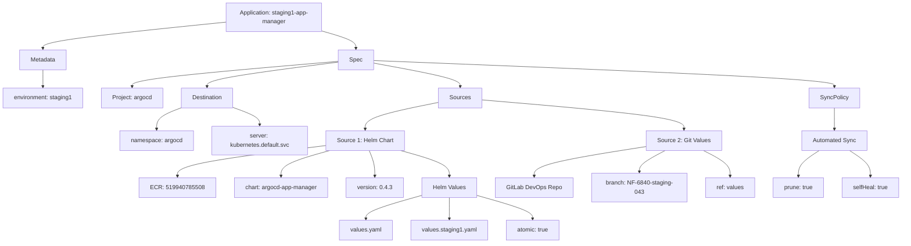
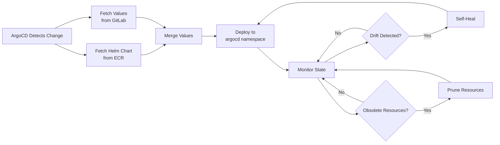
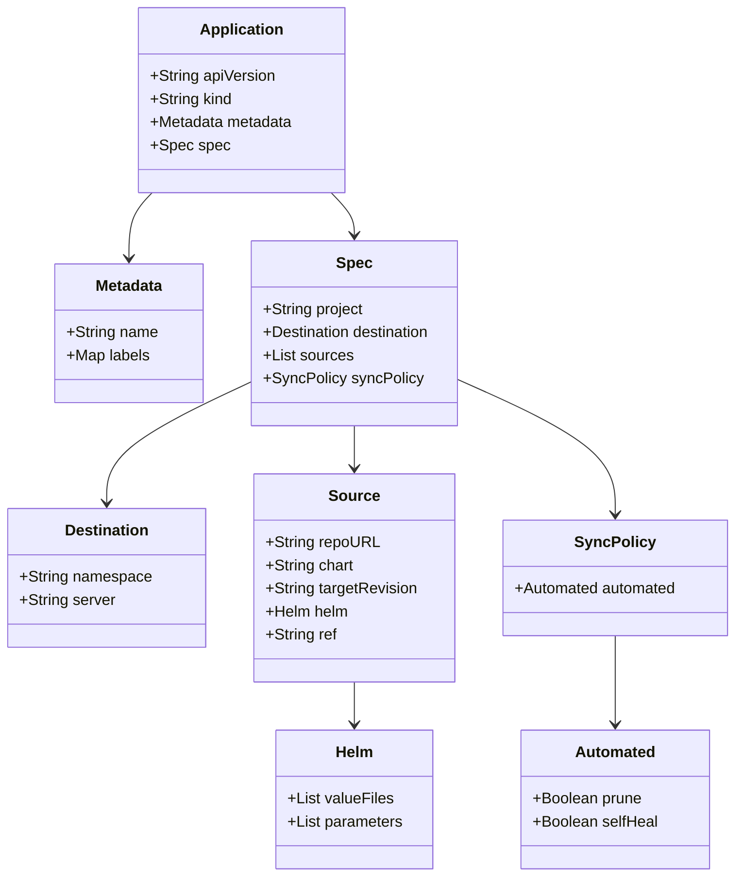

# Diagram: devops/k8s/argocd/app-manager/argocd/Application.staging1.yaml

> Auto-generated by Obscura crawlers

## Diagram 1

### SVG

<svg id="container" width="2452.6484375" xmlns="http://www.w3.org/2000/svg" class="flowchart" height="662" viewBox="0 0 2452.6484375 662" role="graphics-document document" aria-roledescription="flowchart-v2"><g><marker id="container_flowchart-v2-pointEnd" class="marker flowchart-v2" viewBox="0 0 10 10" refX="5" refY="5" markerUnits="userSpaceOnUse" markerWidth="8" markerHeight="8" orient="auto"><path d="M 0 0 L 10 5 L 0 10 z" class="arrowMarkerPath" style="stroke-width: 1; stroke-dasharray: 1, 0;"></path></marker><marker id="container_flowchart-v2-pointStart" class="marker flowchart-v2" viewBox="0 0 10 10" refX="4.5" refY="5" markerUnits="userSpaceOnUse" markerWidth="8" markerHeight="8" orient="auto"><path d="M 0 5 L 10 10 L 10 0 z" class="arrowMarkerPath" style="stroke-width: 1; stroke-dasharray: 1, 0;"></path></marker><marker id="container_flowchart-v2-circleEnd" class="marker flowchart-v2" viewBox="0 0 10 10" refX="11" refY="5" markerUnits="userSpaceOnUse" markerWidth="11" markerHeight="11" orient="auto"><circle cx="5" cy="5" r="5" class="arrowMarkerPath" style="stroke-width: 1; stroke-dasharray: 1, 0;"></circle></marker><marker id="container_flowchart-v2-circleStart" class="marker flowchart-v2" viewBox="0 0 10 10" refX="-1" refY="5" markerUnits="userSpaceOnUse" markerWidth="11" markerHeight="11" orient="auto"><circle cx="5" cy="5" r="5" class="arrowMarkerPath" style="stroke-width: 1; stroke-dasharray: 1, 0;"></circle></marker><marker id="container_flowchart-v2-crossEnd" class="marker cross flowchart-v2" viewBox="0 0 11 11" refX="12" refY="5.2" markerUnits="userSpaceOnUse" markerWidth="11" markerHeight="11" orient="auto"><path d="M 1,1 l 9,9 M 10,1 l -9,9" class="arrowMarkerPath" style="stroke-width: 2; stroke-dasharray: 1, 0;"></path></marker><marker id="container_flowchart-v2-crossStart" class="marker cross flowchart-v2" viewBox="0 0 11 11" refX="-1" refY="5.2" markerUnits="userSpaceOnUse" markerWidth="11" markerHeight="11" orient="auto"><path d="M 1,1 l 9,9 M 10,1 l -9,9" class="arrowMarkerPath" style="stroke-width: 2; stroke-dasharray: 1, 0;"></path></marker><g class="root"><g class="clusters"></g><g class="edgePaths"><path d="M610.641,60.359L528.505,68.799C446.37,77.239,282.099,94.12,199.964,106.06C117.828,118,117.828,125,117.828,128.5L117.828,132" id="L_A_B_0" class="edge-thickness-normal edge-pattern-solid edge-thickness-normal edge-pattern-solid flowchart-link" style=";" data-edge="true" data-et="edge" data-id="L_A_B_0" data-points="W3sieCI6NjEwLjY0MDYyNSwieSI6NjAuMzU4NzU1NjQ0NzU2NjV9LHsieCI6MTE3LjgyODEyNSwieSI6MTExfSx7IngiOjExNy44MjgxMjUsInkiOjEzNn1d" marker-end="url(#container_flowchart-v2-pointEnd)"></path><path d="M870.641,84.019L886.432,88.516C902.224,93.013,933.807,102.006,949.599,110.003C965.391,118,965.391,125,965.391,128.5L965.391,132" id="L_A_C_0" class="edge-thickness-normal edge-pattern-solid edge-thickness-normal edge-pattern-solid flowchart-link" style=";" data-edge="true" data-et="edge" data-id="L_A_C_0" data-points="W3sieCI6ODcwLjY0MDYyNSwieSI6ODQuMDE4OTA5ODk5ODg4Nzd9LHsieCI6OTY1LjM5MDYyNSwieSI6MTExfSx7IngiOjk2NS4zOTA2MjUsInkiOjEzNn1d" marker-end="url(#container_flowchart-v2-pointEnd)"></path><path d="M117.828,190L117.828,194.167C117.828,198.333,117.828,206.667,117.828,214.333C117.828,222,117.828,229,117.828,232.5L117.828,236" id="L_B_B1_0" class="edge-thickness-normal edge-pattern-solid edge-thickness-normal edge-pattern-solid flowchart-link" style=";" data-edge="true" data-et="edge" data-id="L_B_B1_0" data-points="W3sieCI6MTE3LjgyODEyNSwieSI6MTkwfSx7IngiOjExNy44MjgxMjUsInkiOjIxNX0seyJ4IjoxMTcuODI4MTI1LCJ5IjoyNDB9XQ==" marker-end="url(#container_flowchart-v2-pointEnd)"></path><path d="M918.094,167.073L825.332,175.061C732.57,183.049,547.047,199.024,454.285,210.512C361.523,222,361.523,229,361.523,232.5L361.523,236" id="L_C_D_0" class="edge-thickness-normal edge-pattern-solid edge-thickness-normal edge-pattern-solid flowchart-link" style=";" data-edge="true" data-et="edge" data-id="L_C_D_0" data-points="W3sieCI6OTE4LjA5Mzc1LCJ5IjoxNjcuMDcyODExOTU0MjAxNDN9LHsieCI6MzYxLjUyMzQzNzUsInkiOjIxNX0seyJ4IjozNjEuNTIzNDM3NSwieSI6MjQwfV0=" marker-end="url(#container_flowchart-v2-pointEnd)"></path><path d="M918.094,169.179L859.633,176.815C801.172,184.452,684.25,199.726,625.789,210.863C567.328,222,567.328,229,567.328,232.5L567.328,236" id="L_C_E_0" class="edge-thickness-normal edge-pattern-solid edge-thickness-normal edge-pattern-solid flowchart-link" style=";" data-edge="true" data-et="edge" data-id="L_C_E_0" data-points="W3sieCI6OTE4LjA5Mzc1LCJ5IjoxNjkuMTc4NTIwOTYwOTA0NH0seyJ4Ijo1NjcuMzI4MTI1LCJ5IjoyMTV9LHsieCI6NTY3LjMyODEyNSwieSI6MjQwfV0=" marker-end="url(#container_flowchart-v2-pointEnd)"></path><path d="M1012.688,171.717L1051.828,178.931C1090.969,186.145,1169.25,200.572,1208.391,211.286C1247.531,222,1247.531,229,1247.531,232.5L1247.531,236" id="L_C_F_0" class="edge-thickness-normal edge-pattern-solid edge-thickness-normal edge-pattern-solid flowchart-link" style=";" data-edge="true" data-et="edge" data-id="L_C_F_0" data-points="W3sieCI6MTAxMi42ODc1LCJ5IjoxNzEuNzE3MDYyNjM0OTg5Mn0seyJ4IjoxMjQ3LjUzMTI1LCJ5IjoyMTV9LHsieCI6MTI0Ny41MzEyNSwieSI6MjQwfV0=" marker-end="url(#container_flowchart-v2-pointEnd)"></path><path d="M1012.688,164.89L1221.657,173.242C1430.626,181.594,1848.565,198.297,2057.535,210.148C2266.504,222,2266.504,229,2266.504,232.5L2266.504,236" id="L_C_G_0" class="edge-thickness-normal edge-pattern-solid edge-thickness-normal edge-pattern-solid flowchart-link" style=";" data-edge="true" data-et="edge" data-id="L_C_G_0" data-points="W3sieCI6MTAxMi42ODc1LCJ5IjoxNjQuODkwMjU2MjQwODk5NDh9LHsieCI6MjI2Ni41MDM5MDYyNSwieSI6MjE1fSx7IngiOjIyNjYuNTAzOTA2MjUsInkiOjI0MH1d" marker-end="url(#container_flowchart-v2-pointEnd)"></path><path d="M495.391,293.762L484.084,297.969C472.777,302.175,450.164,310.587,438.857,320.294C427.551,330,427.551,341,427.551,346.5L427.551,352" id="L_E_E1_0" class="edge-thickness-normal edge-pattern-solid edge-thickness-normal edge-pattern-solid flowchart-link" style=";" data-edge="true" data-et="edge" data-id="L_E_E1_0" data-points="W3sieCI6NDk1LjM5MDYyNSwieSI6MjkzLjc2MjIwNTUxNjU4NjF9LHsieCI6NDI3LjU1MDc4MTI1LCJ5IjozMTl9LHsieCI6NDI3LjU1MDc4MTI1LCJ5IjozNTZ9XQ==" marker-end="url(#container_flowchart-v2-pointEnd)"></path><path d="M639.266,293.762L650.572,297.969C661.879,302.175,684.492,310.587,695.799,318.294C707.105,326,707.105,333,707.105,336.5L707.105,340" id="L_E_E2_0" class="edge-thickness-normal edge-pattern-solid edge-thickness-normal edge-pattern-solid flowchart-link" style=";" data-edge="true" data-et="edge" data-id="L_E_E2_0" data-points="W3sieCI6NjM5LjI2NTYyNSwieSI6MjkzLjc2MjIwNTUxNjU4NjF9LHsieCI6NzA3LjEwNTQ2ODc1LCJ5IjozMTl9LHsieCI6NzA3LjEwNTQ2ODc1LCJ5IjozNDR9XQ==" marker-end="url(#container_flowchart-v2-pointEnd)"></path><path d="M1189.234,278.855L1156.334,285.546C1123.434,292.237,1057.633,305.618,1024.732,317.809C991.832,330,991.832,341,991.832,346.5L991.832,352" id="L_F_F1_0" class="edge-thickness-normal edge-pattern-solid edge-thickness-normal edge-pattern-solid flowchart-link" style=";" data-edge="true" data-et="edge" data-id="L_F_F1_0" data-points="W3sieCI6MTE4OS4yMzQzNzUsInkiOjI3OC44NTU0ODIwNTc0NzExfSx7IngiOjk5MS44MzIwMzEyNSwieSI6MzE5fSx7IngiOjk5MS44MzIwMzEyNSwieSI6MzU2fV0=" marker-end="url(#container_flowchart-v2-pointEnd)"></path><path d="M1305.828,272.018L1396.79,279.849C1487.753,287.679,1669.677,303.339,1760.639,316.67C1851.602,330,1851.602,341,1851.602,346.5L1851.602,352" id="L_F_F2_0" class="edge-thickness-normal edge-pattern-solid edge-thickness-normal edge-pattern-solid flowchart-link" style=";" data-edge="true" data-et="edge" data-id="L_F_F2_0" data-points="W3sieCI6MTMwNS44MjgxMjUsInkiOjI3Mi4wMTgzNTIwNjQ3Njl9LHsieCI6MTg1MS42MDE1NjI1LCJ5IjozMTl9LHsieCI6MTg1MS42MDE1NjI1LCJ5IjozNTZ9XQ==" marker-end="url(#container_flowchart-v2-pointEnd)"></path><path d="M887.105,396.294L820.532,404.745C753.958,413.196,620.811,430.098,554.238,444.049C487.664,458,487.664,469,487.664,474.5L487.664,480" id="L_F1_F1A_0" class="edge-thickness-normal edge-pattern-solid edge-thickness-normal edge-pattern-solid flowchart-link" style=";" data-edge="true" data-et="edge" data-id="L_F1_F1A_0" data-points="W3sieCI6ODg3LjEwNTQ2ODc1LCJ5IjozOTYuMjk0MTgwNTQxODg5MX0seyJ4Ijo0ODcuNjY0MDYyNSwieSI6NDQ3fSx7IngiOjQ4Ny42NjQwNjI1LCJ5Ijo0ODR9XQ==" marker-end="url(#container_flowchart-v2-pointEnd)"></path><path d="M895.303,410L873.257,416.167C851.21,422.333,807.117,434.667,785.07,446.333C763.023,458,763.023,469,763.023,474.5L763.023,480" id="L_F1_F1B_0" class="edge-thickness-normal edge-pattern-solid edge-thickness-normal edge-pattern-solid flowchart-link" style=";" data-edge="true" data-et="edge" data-id="L_F1_F1B_0" data-points="W3sieCI6ODk1LjMwMzQwNTc2MTcxODgsInkiOjQxMH0seyJ4Ijo3NjMuMDIzNDM3NSwieSI6NDQ3fSx7IngiOjc2My4wMjM0Mzc1LCJ5Ijo0ODR9XQ==" marker-end="url(#container_flowchart-v2-pointEnd)"></path><path d="M1003.35,410L1005.98,416.167C1008.611,422.333,1013.872,434.667,1016.502,446.333C1019.133,458,1019.133,469,1019.133,474.5L1019.133,480" id="L_F1_F1C_0" class="edge-thickness-normal edge-pattern-solid edge-thickness-normal edge-pattern-solid flowchart-link" style=";" data-edge="true" data-et="edge" data-id="L_F1_F1C_0" data-points="W3sieCI6MTAwMy4zNDk1NDgzMzk4NDM4LCJ5Ijo0MTB9LHsieCI6MTAxOS4xMzI4MTI1LCJ5Ijo0NDd9LHsieCI6MTAxOS4xMzI4MTI1LCJ5Ijo0ODR9XQ==" marker-end="url(#container_flowchart-v2-pointEnd)"></path><path d="M1088.361,410L1110.407,416.167C1132.454,422.333,1176.547,434.667,1198.594,446.333C1220.641,458,1220.641,469,1220.641,474.5L1220.641,480" id="L_F1_F1D_0" class="edge-thickness-normal edge-pattern-solid edge-thickness-normal edge-pattern-solid flowchart-link" style=";" data-edge="true" data-et="edge" data-id="L_F1_F1D_0" data-points="W3sieCI6MTA4OC4zNjA2NTY3MzgyODEyLCJ5Ijo0MTB9LHsieCI6MTIyMC42NDA2MjUsInkiOjQ0N30seyJ4IjoxMjIwLjY0MDYyNSwieSI6NDg0fV0=" marker-end="url(#container_flowchart-v2-pointEnd)"></path><path d="M1146.023,532.15L1120.827,539.291C1095.63,546.433,1045.237,560.717,1020.04,571.358C994.844,582,994.844,589,994.844,592.5L994.844,596" id="L_F1D_F1D1_0" class="edge-thickness-normal edge-pattern-solid edge-thickness-normal edge-pattern-solid flowchart-link" style=";" data-edge="true" data-et="edge" data-id="L_F1D_F1D1_0" data-points="W3sieCI6MTE0Ni4wMjM0Mzc1LCJ5Ijo1MzIuMTQ5NTM5ODI0MjMzN30seyJ4Ijo5OTQuODQzNzUsInkiOjU3NX0seyJ4Ijo5OTQuODQzNzUsInkiOjYwMH1d" marker-end="url(#container_flowchart-v2-pointEnd)"></path><path d="M1220.641,538L1220.641,544.167C1220.641,550.333,1220.641,562.667,1220.641,572.333C1220.641,582,1220.641,589,1220.641,592.5L1220.641,596" id="L_F1D_F1D2_0" class="edge-thickness-normal edge-pattern-solid edge-thickness-normal edge-pattern-solid flowchart-link" style=";" data-edge="true" data-et="edge" data-id="L_F1D_F1D2_0" data-points="W3sieCI6MTIyMC42NDA2MjUsInkiOjUzOH0seyJ4IjoxMjIwLjY0MDYyNSwieSI6NTc1fSx7IngiOjEyMjAuNjQwNjI1LCJ5Ijo2MDB9XQ==" marker-end="url(#container_flowchart-v2-pointEnd)"></path><path d="M1295.258,531.996L1320.73,539.163C1346.203,546.33,1397.148,560.665,1422.621,571.333C1448.094,582,1448.094,589,1448.094,592.5L1448.094,596" id="L_F1D_F1D3_0" class="edge-thickness-normal edge-pattern-solid edge-thickness-normal edge-pattern-solid flowchart-link" style=";" data-edge="true" data-et="edge" data-id="L_F1D_F1D3_0" data-points="W3sieCI6MTI5NS4yNTc4MTI1LCJ5Ijo1MzEuOTk1NTM0Nzk0MjU3MX0seyJ4IjoxNDQ4LjA5Mzc1LCJ5Ijo1NzV9LHsieCI6MTQ0OC4wOTM3NSwieSI6NjAwfV0=" marker-end="url(#container_flowchart-v2-pointEnd)"></path><path d="M1751.109,398.961L1700.699,406.967C1650.289,414.974,1549.469,430.987,1499.059,444.493C1448.648,458,1448.648,469,1448.648,474.5L1448.648,480" id="L_F2_F2A_0" class="edge-thickness-normal edge-pattern-solid edge-thickness-normal edge-pattern-solid flowchart-link" style=";" data-edge="true" data-et="edge" data-id="L_F2_F2A_0" data-points="W3sieCI6MTc1MS4xMDkzNzUsInkiOjM5OC45NjA5MTM1Njc4MDAyfSx7IngiOjE0NDguNjQ4NDM3NSwieSI6NDQ3fSx7IngiOjE0NDguNjQ4NDM3NSwieSI6NDg0fV0=" marker-end="url(#container_flowchart-v2-pointEnd)"></path><path d="M1801.161,410L1789.641,416.167C1778.12,422.333,1755.08,434.667,1743.559,444.333C1732.039,454,1732.039,461,1732.039,464.5L1732.039,468" id="L_F2_F2B_0" class="edge-thickness-normal edge-pattern-solid edge-thickness-normal edge-pattern-solid flowchart-link" style=";" data-edge="true" data-et="edge" data-id="L_F2_F2B_0" data-points="W3sieCI6MTgwMS4xNjExMzI4MTI1LCJ5Ijo0MTB9LHsieCI6MTczMi4wMzkwNjI1LCJ5Ijo0NDd9LHsieCI6MTczMi4wMzkwNjI1LCJ5Ijo0NzJ9XQ==" marker-end="url(#container_flowchart-v2-pointEnd)"></path><path d="M1905.43,410L1917.724,416.167C1930.019,422.333,1954.607,434.667,1966.901,446.333C1979.195,458,1979.195,469,1979.195,474.5L1979.195,480" id="L_F2_F2C_0" class="edge-thickness-normal edge-pattern-solid edge-thickness-normal edge-pattern-solid flowchart-link" style=";" data-edge="true" data-et="edge" data-id="L_F2_F2C_0" data-points="W3sieCI6MTkwNS40MzAxNzU3ODEyNSwieSI6NDEwfSx7IngiOjE5NzkuMTk1MzEyNSwieSI6NDQ3fSx7IngiOjE5NzkuMTk1MzEyNSwieSI6NDg0fV0=" marker-end="url(#container_flowchart-v2-pointEnd)"></path><path d="M2266.504,294L2266.504,298.167C2266.504,302.333,2266.504,310.667,2266.504,320.333C2266.504,330,2266.504,341,2266.504,346.5L2266.504,352" id="L_G_G1_0" class="edge-thickness-normal edge-pattern-solid edge-thickness-normal edge-pattern-solid flowchart-link" style=";" data-edge="true" data-et="edge" data-id="L_G_G1_0" data-points="W3sieCI6MjI2Ni41MDM5MDYyNSwieSI6Mjk0fSx7IngiOjIyNjYuNTAzOTA2MjUsInkiOjMxOX0seyJ4IjoyMjY2LjUwMzkwNjI1LCJ5IjozNTZ9XQ==" marker-end="url(#container_flowchart-v2-pointEnd)"></path><path d="M2224.496,410L2214.902,416.167C2205.307,422.333,2186.118,434.667,2176.524,446.333C2166.93,458,2166.93,469,2166.93,474.5L2166.93,480" id="L_G1_G1A_0" class="edge-thickness-normal edge-pattern-solid edge-thickness-normal edge-pattern-solid flowchart-link" style=";" data-edge="true" data-et="edge" data-id="L_G1_G1A_0" data-points="W3sieCI6MjIyNC40OTYwMzI3MTQ4NDM4LCJ5Ijo0MTB9LHsieCI6MjE2Ni45Mjk2ODc1LCJ5Ijo0NDd9LHsieCI6MjE2Ni45Mjk2ODc1LCJ5Ijo0ODR9XQ==" marker-end="url(#container_flowchart-v2-pointEnd)"></path><path d="M2308.512,410L2318.106,416.167C2327.701,422.333,2346.889,434.667,2356.484,446.333C2366.078,458,2366.078,469,2366.078,474.5L2366.078,480" id="L_G1_G1B_0" class="edge-thickness-normal edge-pattern-solid edge-thickness-normal edge-pattern-solid flowchart-link" style=";" data-edge="true" data-et="edge" data-id="L_G1_G1B_0" data-points="W3sieCI6MjMwOC41MTE3Nzk3ODUxNTYyLCJ5Ijo0MTB9LHsieCI6MjM2Ni4wNzgxMjUsInkiOjQ0N30seyJ4IjoyMzY2LjA3ODEyNSwieSI6NDg0fV0=" marker-end="url(#container_flowchart-v2-pointEnd)"></path></g><g class="edgeLabels"><g class="edgeLabel"><g class="label" data-id="L_A_B_0" transform="translate(0, 0)"><foreignObject width="0" height="0">

</foreignObject></g></g><g class="edgeLabel"><g class="label" data-id="L_A_C_0" transform="translate(0, 0)"><foreignObject width="0" height="0">

</foreignObject></g></g><g class="edgeLabel"><g class="label" data-id="L_B_B1_0" transform="translate(0, 0)"><foreignObject width="0" height="0">

</foreignObject></g></g><g class="edgeLabel"><g class="label" data-id="L_C_D_0" transform="translate(0, 0)"><foreignObject width="0" height="0">

</foreignObject></g></g><g class="edgeLabel"><g class="label" data-id="L_C_E_0" transform="translate(0, 0)"><foreignObject width="0" height="0">

</foreignObject></g></g><g class="edgeLabel"><g class="label" data-id="L_C_F_0" transform="translate(0, 0)"><foreignObject width="0" height="0">

</foreignObject></g></g><g class="edgeLabel"><g class="label" data-id="L_C_G_0" transform="translate(0, 0)"><foreignObject width="0" height="0">

</foreignObject></g></g><g class="edgeLabel"><g class="label" data-id="L_E_E1_0" transform="translate(0, 0)"><foreignObject width="0" height="0">

</foreignObject></g></g><g class="edgeLabel"><g class="label" data-id="L_E_E2_0" transform="translate(0, 0)"><foreignObject width="0" height="0">

</foreignObject></g></g><g class="edgeLabel"><g class="label" data-id="L_F_F1_0" transform="translate(0, 0)"><foreignObject width="0" height="0">

</foreignObject></g></g><g class="edgeLabel"><g class="label" data-id="L_F_F2_0" transform="translate(0, 0)"><foreignObject width="0" height="0">

</foreignObject></g></g><g class="edgeLabel"><g class="label" data-id="L_F1_F1A_0" transform="translate(0, 0)"><foreignObject width="0" height="0">

</foreignObject></g></g><g class="edgeLabel"><g class="label" data-id="L_F1_F1B_0" transform="translate(0, 0)"><foreignObject width="0" height="0">

</foreignObject></g></g><g class="edgeLabel"><g class="label" data-id="L_F1_F1C_0" transform="translate(0, 0)"><foreignObject width="0" height="0">

</foreignObject></g></g><g class="edgeLabel"><g class="label" data-id="L_F1_F1D_0" transform="translate(0, 0)"><foreignObject width="0" height="0">

</foreignObject></g></g><g class="edgeLabel"><g class="label" data-id="L_F1D_F1D1_0" transform="translate(0, 0)"><foreignObject width="0" height="0">

</foreignObject></g></g><g class="edgeLabel"><g class="label" data-id="L_F1D_F1D2_0" transform="translate(0, 0)"><foreignObject width="0" height="0">

</foreignObject></g></g><g class="edgeLabel"><g class="label" data-id="L_F1D_F1D3_0" transform="translate(0, 0)"><foreignObject width="0" height="0">

</foreignObject></g></g><g class="edgeLabel"><g class="label" data-id="L_F2_F2A_0" transform="translate(0, 0)"><foreignObject width="0" height="0">

</foreignObject></g></g><g class="edgeLabel"><g class="label" data-id="L_F2_F2B_0" transform="translate(0, 0)"><foreignObject width="0" height="0">

</foreignObject></g></g><g class="edgeLabel"><g class="label" data-id="L_F2_F2C_0" transform="translate(0, 0)"><foreignObject width="0" height="0">

</foreignObject></g></g><g class="edgeLabel"><g class="label" data-id="L_G_G1_0" transform="translate(0, 0)"><foreignObject width="0" height="0">

</foreignObject></g></g><g class="edgeLabel"><g class="label" data-id="L_G1_G1A_0" transform="translate(0, 0)"><foreignObject width="0" height="0">

</foreignObject></g></g><g class="edgeLabel"><g class="label" data-id="L_G1_G1B_0" transform="translate(0, 0)"><foreignObject width="0" height="0">

</foreignObject></g></g></g><g class="nodes"><g class="node default" id="flowchart-A-0" transform="translate(740.640625, 47)"><rect class="basic label-container" style="" x="-130" y="-39" width="260" height="78"></rect><g class="label" style="" transform="translate(-100, -24)"><rect></rect><foreignObject width="200" height="48">

Application: staging1-app-manager

</foreignObject></g></g><g class="node default" id="flowchart-B-1" transform="translate(117.828125, 163)"><rect class="basic label-container" style="" x="-64.09375" y="-27" width="128.1875" height="54"></rect><g class="label" style="" transform="translate(-34.09375, -12)"><rect></rect><foreignObject width="68.1875" height="24">

Metadata

</foreignObject></g></g><g class="node default" id="flowchart-C-3" transform="translate(965.390625, 163)"><rect class="basic label-container" style="" x="-47.296875" y="-27" width="94.59375" height="54"></rect><g class="label" style="" transform="translate(-17.296875, -12)"><rect></rect><foreignObject width="34.59375" height="24">

Spec

</foreignObject></g></g><g class="node default" id="flowchart-B1-5" transform="translate(117.828125, 267)"><rect class="basic label-container" style="" x="-109.828125" y="-27" width="219.65625" height="54"></rect><g class="label" style="" transform="translate(-79.828125, -12)"><rect></rect><foreignObject width="159.65625" height="24">

environment: staging1

</foreignObject></g></g><g class="node default" id="flowchart-D-7" transform="translate(361.5234375, 267)"><rect class="basic label-container" style="" x="-83.8671875" y="-27" width="167.734375" height="54"></rect><g class="label" style="" transform="translate(-53.8671875, -12)"><rect></rect><foreignObject width="107.734375" height="24">

Project: argocd

</foreignObject></g></g><g class="node default" id="flowchart-E-9" transform="translate(567.328125, 267)"><rect class="basic label-container" style="" x="-71.9375" y="-27" width="143.875" height="54"></rect><g class="label" style="" transform="translate(-41.9375, -12)"><rect></rect><foreignObject width="83.875" height="24">

Destination

</foreignObject></g></g><g class="node default" id="flowchart-F-11" transform="translate(1247.53125, 267)"><rect class="basic label-container" style="" x="-58.296875" y="-27" width="116.59375" height="54"></rect><g class="label" style="" transform="translate(-28.296875, -12)"><rect></rect><foreignObject width="56.59375" height="24">

Sources

</foreignObject></g></g><g class="node default" id="flowchart-G-13" transform="translate(2266.50390625, 267)"><rect class="basic label-container" style="" x="-68.171875" y="-27" width="136.34375" height="54"></rect><g class="label" style="" transform="translate(-38.171875, -12)"><rect></rect><foreignObject width="76.34375" height="24">

SyncPolicy

</foreignObject></g></g><g class="node default" id="flowchart-E1-15" transform="translate(427.55078125, 383)"><rect class="basic label-container" style="" x="-99.5546875" y="-27" width="199.109375" height="54"></rect><g class="label" style="" transform="translate(-69.5546875, -12)"><rect></rect><foreignObject width="139.109375" height="24">

namespace: argocd

</foreignObject></g></g><g class="node default" id="flowchart-E2-17" transform="translate(707.10546875, 383)"><rect class="basic label-container" style="" x="-130" y="-39" width="260" height="78"></rect><g class="label" style="" transform="translate(-100, -24)"><rect></rect><foreignObject width="200" height="48">

server: kubernetes.default.svc

</foreignObject></g></g><g class="node default" id="flowchart-F1-19" transform="translate(991.83203125, 383)"><rect class="basic label-container" style="" x="-104.7265625" y="-27" width="209.453125" height="54"></rect><g class="label" style="" transform="translate(-74.7265625, -12)"><rect></rect><foreignObject width="149.453125" height="24">

Source 1: Helm Chart

</foreignObject></g></g><g class="node default" id="flowchart-F2-21" transform="translate(1851.6015625, 383)"><rect class="basic label-container" style="" x="-100.4921875" y="-27" width="200.984375" height="54"></rect><g class="label" style="" transform="translate(-70.4921875, -12)"><rect></rect><foreignObject width="140.984375" height="24">

Source 2: Git Values

</foreignObject></g></g><g class="node default" id="flowchart-F1A-23" transform="translate(487.6640625, 511)"><rect class="basic label-container" style="" x="-96.140625" y="-27" width="192.28125" height="54"></rect><g class="label" style="" transform="translate(-66.140625, -12)"><rect></rect><foreignObject width="132.28125" height="24">

ECR: 519940785508

</foreignObject></g></g><g class="node default" id="flowchart-F1B-25" transform="translate(763.0234375, 511)"><rect class="basic label-container" style="" x="-129.21875" y="-27" width="258.4375" height="54"></rect><g class="label" style="" transform="translate(-99.21875, -12)"><rect></rect><foreignObject width="198.4375" height="24">

chart: argocd-app-manager

</foreignObject></g></g><g class="node default" id="flowchart-F1C-27" transform="translate(1019.1328125, 511)"><rect class="basic label-container" style="" x="-76.890625" y="-27" width="153.78125" height="54"></rect><g class="label" style="" transform="translate(-46.890625, -12)"><rect></rect><foreignObject width="93.78125" height="24">

version: 0.4.3

</foreignObject></g></g><g class="node default" id="flowchart-F1D-29" transform="translate(1220.640625, 511)"><rect class="basic label-container" style="" x="-74.6171875" y="-27" width="149.234375" height="54"></rect><g class="label" style="" transform="translate(-44.6171875, -12)"><rect></rect><foreignObject width="89.234375" height="24">

Helm Values

</foreignObject></g></g><g class="node default" id="flowchart-F1D1-31" transform="translate(994.84375, 627)"><rect class="basic label-container" style="" x="-72.140625" y="-27" width="144.28125" height="54"></rect><g class="label" style="" transform="translate(-42.140625, -12)"><rect></rect><foreignObject width="84.28125" height="24">

values.yaml

</foreignObject></g></g><g class="node default" id="flowchart-F1D2-33" transform="translate(1220.640625, 627)"><rect class="basic label-container" style="" x="-103.65625" y="-27" width="207.3125" height="54"></rect><g class="label" style="" transform="translate(-73.65625, -12)"><rect></rect><foreignObject width="147.3125" height="24">

values.staging1.yaml

</foreignObject></g></g><g class="node default" id="flowchart-F1D3-35" transform="translate(1448.09375, 627)"><rect class="basic label-container" style="" x="-73.796875" y="-27" width="147.59375" height="54"></rect><g class="label" style="" transform="translate(-43.796875, -12)"><rect></rect><foreignObject width="87.59375" height="24">

atomic: true

</foreignObject></g></g><g class="node default" id="flowchart-F2A-37" transform="translate(1448.6484375, 511)"><rect class="basic label-container" style="" x="-103.390625" y="-27" width="206.78125" height="54"></rect><g class="label" style="" transform="translate(-73.390625, -12)"><rect></rect><foreignObject width="146.78125" height="24">

GitLab DevOps Repo

</foreignObject></g></g><g class="node default" id="flowchart-F2B-39" transform="translate(1732.0390625, 511)"><rect class="basic label-container" style="" x="-130" y="-39" width="260" height="78"></rect><g class="label" style="" transform="translate(-100, -24)"><rect></rect><foreignObject width="200" height="48">

branch: NF-6840-staging-043

</foreignObject></g></g><g class="node default" id="flowchart-F2C-41" transform="translate(1979.1953125, 511)"><rect class="basic label-container" style="" x="-67.15625" y="-27" width="134.3125" height="54"></rect><g class="label" style="" transform="translate(-37.15625, -12)"><rect></rect><foreignObject width="74.3125" height="24">

ref: values

</foreignObject></g></g><g class="node default" id="flowchart-G1-43" transform="translate(2266.50390625, 383)"><rect class="basic label-container" style="" x="-88.6484375" y="-27" width="177.296875" height="54"></rect><g class="label" style="" transform="translate(-58.6484375, -12)"><rect></rect><foreignObject width="117.296875" height="24">

Automated Sync

</foreignObject></g></g><g class="node default" id="flowchart-G1A-45" transform="translate(2166.9296875, 511)"><rect class="basic label-container" style="" x="-70.578125" y="-27" width="141.15625" height="54"></rect><g class="label" style="" transform="translate(-40.578125, -12)"><rect></rect><foreignObject width="81.15625" height="24">

prune: true

</foreignObject></g></g><g class="node default" id="flowchart-G1B-47" transform="translate(2366.078125, 511)"><rect class="basic label-container" style="" x="-78.5703125" y="-27" width="157.140625" height="54"></rect><g class="label" style="" transform="translate(-48.5703125, -12)"><rect></rect><foreignObject width="97.140625" height="24">

selfHeal: true

</foreignObject></g></g></g></g></g></svg>

## Diagram 2

### SVG

<svg id="container" width="1664.34375" xmlns="http://www.w3.org/2000/svg" class="flowchart" height="487.0621337890625" viewBox="0 -13.234000205993652 1664.34375 487.0621337890625" role="graphics-document document" aria-roledescription="flowchart-v2"><g><marker id="container_flowchart-v2-pointEnd" class="marker flowchart-v2" viewBox="0 0 10 10" refX="5" refY="5" markerUnits="userSpaceOnUse" markerWidth="8" markerHeight="8" orient="auto"><path d="M 0 0 L 10 5 L 0 10 z" class="arrowMarkerPath" style="stroke-width: 1; stroke-dasharray: 1, 0;"></path></marker><marker id="container_flowchart-v2-pointStart" class="marker flowchart-v2" viewBox="0 0 10 10" refX="4.5" refY="5" markerUnits="userSpaceOnUse" markerWidth="8" markerHeight="8" orient="auto"><path d="M 0 5 L 10 10 L 10 0 z" class="arrowMarkerPath" style="stroke-width: 1; stroke-dasharray: 1, 0;"></path></marker><marker id="container_flowchart-v2-circleEnd" class="marker flowchart-v2" viewBox="0 0 10 10" refX="11" refY="5" markerUnits="userSpaceOnUse" markerWidth="11" markerHeight="11" orient="auto"><circle cx="5" cy="5" r="5" class="arrowMarkerPath" style="stroke-width: 1; stroke-dasharray: 1, 0;"></circle></marker><marker id="container_flowchart-v2-circleStart" class="marker flowchart-v2" viewBox="0 0 10 10" refX="-1" refY="5" markerUnits="userSpaceOnUse" markerWidth="11" markerHeight="11" orient="auto"><circle cx="5" cy="5" r="5" class="arrowMarkerPath" style="stroke-width: 1; stroke-dasharray: 1, 0;"></circle></marker><marker id="container_flowchart-v2-crossEnd" class="marker cross flowchart-v2" viewBox="0 0 11 11" refX="12" refY="5.2" markerUnits="userSpaceOnUse" markerWidth="11" markerHeight="11" orient="auto"><path d="M 1,1 l 9,9 M 10,1 l -9,9" class="arrowMarkerPath" style="stroke-width: 2; stroke-dasharray: 1, 0;"></path></marker><marker id="container_flowchart-v2-crossStart" class="marker cross flowchart-v2" viewBox="0 0 11 11" refX="-1" refY="5.2" markerUnits="userSpaceOnUse" markerWidth="11" markerHeight="11" orient="auto"><path d="M 1,1 l 9,9 M 10,1 l -9,9" class="arrowMarkerPath" style="stroke-width: 2; stroke-dasharray: 1, 0;"></path></marker><g class="root"><g class="clusters"></g><g class="edgePaths"><path d="M180.274,138L193.642,144.167C207.011,150.333,233.748,162.667,250.616,168.833C267.484,175,274.484,175,277.984,175L281.484,175" id="L_Start_Fetch1_0" class="edge-thickness-normal edge-pattern-solid edge-thickness-normal edge-pattern-solid flowchart-link" style=";" data-edge="true" data-et="edge" data-id="L_Start_Fetch1_0" data-points="W3sieCI6MTgwLjI3NDA0Nzg1MTU2MjUsInkiOjEzOH0seyJ4IjoyNjAuNDg0Mzc1LCJ5IjoxNzV9LHsieCI6Mjg1LjQ4NDM3NSwieSI6MTc1fV0=" marker-end="url(#container_flowchart-v2-pointEnd)"></path><path d="M180.274,84L193.642,77.833C207.011,71.667,233.748,59.333,253.456,53.167C273.164,47,285.844,47,292.184,47L298.523,47" id="L_Start_Fetch2_0" class="edge-thickness-normal edge-pattern-solid edge-thickness-normal edge-pattern-solid flowchart-link" style=";" data-edge="true" data-et="edge" data-id="L_Start_Fetch2_0" data-points="W3sieCI6MTgwLjI3NDA0Nzg1MTU2MjUsInkiOjg0fSx7IngiOjI2MC40ODQzNzUsInkiOjQ3fSx7IngiOjMwMi41MjM0Mzc1LCJ5Ijo0N31d" marker-end="url(#container_flowchart-v2-pointEnd)"></path><path d="M469.375,175L473.542,175C477.708,175,486.042,175,499.525,169.186C513.008,163.373,531.642,151.745,540.959,145.931L550.275,140.118" id="L_Fetch1_Merge_0" class="edge-thickness-normal edge-pattern-solid edge-thickness-normal edge-pattern-solid flowchart-link" style=";" data-edge="true" data-et="edge" data-id="L_Fetch1_Merge_0" data-points="W3sieCI6NDY5LjM3NSwieSI6MTc1fSx7IngiOjQ5NC4zNzUsInkiOjE3NX0seyJ4Ijo1NTMuNjY4OTQ1MzEyNSwieSI6MTM4fV0=" marker-end="url(#container_flowchart-v2-pointEnd)"></path><path d="M452.336,47L459.342,47C466.349,47,480.362,47,496.685,52.814C513.008,58.627,531.642,70.255,540.959,76.069L550.275,81.882" id="L_Fetch2_Merge_0" class="edge-thickness-normal edge-pattern-solid edge-thickness-normal edge-pattern-solid flowchart-link" style=";" data-edge="true" data-et="edge" data-id="L_Fetch2_Merge_0" data-points="W3sieCI6NDUyLjMzNTkzNzUsInkiOjQ3fSx7IngiOjQ5NC4zNzUsInkiOjQ3fSx7IngiOjU1My42Njg5NDUzMTI1LCJ5Ijo4NH1d" marker-end="url(#container_flowchart-v2-pointEnd)"></path><path d="M674.5,111L678.667,111C682.833,111,691.167,111,698.833,111C706.5,111,713.5,111,717,111L720.5,111" id="L_Merge_Deploy_0" class="edge-thickness-normal edge-pattern-solid edge-thickness-normal edge-pattern-solid flowchart-link" style=";" data-edge="true" data-et="edge" data-id="L_Merge_Deploy_0" data-points="W3sieCI6Njc0LjUsInkiOjExMX0seyJ4Ijo2OTkuNSwieSI6MTExfSx7IngiOjcyNC41LCJ5IjoxMTF9XQ==" marker-end="url(#container_flowchart-v2-pointEnd)"></path><path d="M863.28,150L876.861,162.872C890.442,175.745,917.604,201.49,934.685,214.362C951.766,227.234,958.766,227.234,962.266,227.234L965.766,227.234" id="L_Deploy_Monitor_0" class="edge-thickness-normal edge-pattern-solid edge-thickness-normal edge-pattern-solid flowchart-link" style=";" data-edge="true" data-et="edge" data-id="L_Deploy_Monitor_0" data-points="W3sieCI6ODYzLjI3OTY3MzYzNzI0OTYsInkiOjE1MH0seyJ4Ijo5NDQuNzY1NjI1LCJ5IjoyMjcuMjM0Mzc1fSx7IngiOjk2OS43NjU2MjUsInkiOjIyNy4yMzQzNzV9XQ==" marker-end="url(#container_flowchart-v2-pointEnd)"></path><path d="M1094.237,200.234L1105.737,193.382C1117.236,186.529,1140.235,172.823,1163.91,161.692C1187.585,150.561,1211.935,142.005,1224.111,137.726L1236.286,133.448" id="L_Monitor_Drift_0" class="edge-thickness-normal edge-pattern-solid edge-thickness-normal edge-pattern-solid flowchart-link" style=";" data-edge="true" data-et="edge" data-id="L_Monitor_Drift_0" data-points="W3sieCI6MTA5NC4yMzcyOTE1ODMwMzcsInkiOjIwMC4yMzQzNzV9LHsieCI6MTE2My4yMzQzNzUsInkiOjE1OS4xMTcxODc1fSx7IngiOjEyNDAuMDU5NzQwNzA2OTI3OSwieSI6MTMyLjEyMjI0MDcwNjkyNzg0fV0=" marker-end="url(#container_flowchart-v2-pointEnd)"></path><path d="M1381.406,111L1391.005,111C1400.604,111,1419.802,111,1440.144,106.091C1460.487,101.182,1481.974,91.363,1492.717,86.454L1503.461,81.545" id="L_Drift_SelfHeal_0" class="edge-thickness-normal edge-pattern-solid edge-thickness-normal edge-pattern-solid flowchart-link" style=";" data-edge="true" data-et="edge" data-id="L_Drift_SelfHeal_0" data-points="W3sieCI6MTM4MS40MDYyNSwieSI6MTExfSx7IngiOjE0MzksInkiOjExMX0seyJ4IjoxNTA3LjA5ODkxMjgyNDMwNDMsInkiOjc5Ljg4MjgxMjV9XQ==" marker-end="url(#container_flowchart-v2-pointEnd)"></path><path d="M1507.099,25.883L1495.749,20.697C1484.399,15.51,1461.7,5.138,1427.212,-0.048C1392.724,-5.234,1346.448,-5.234,1300.487,-5.234C1254.526,-5.234,1208.88,-5.234,1167.007,-5.234C1125.133,-5.234,1087.031,-5.234,1050.62,-5.234C1014.208,-5.234,979.487,-5.234,949.029,7.179C918.571,19.593,892.377,44.421,879.28,56.835L866.183,69.248" id="L_SelfHeal_Deploy_0" class="edge-thickness-normal edge-pattern-solid edge-thickness-normal edge-pattern-solid flowchart-link" style=";" data-edge="true" data-et="edge" data-id="L_SelfHeal_Deploy_0" data-points="W3sieCI6MTUwNy4wOTg5MTI4MjQzMDQzLCJ5IjoyNS44ODI4MTI1fSx7IngiOjE0MzksInkiOi01LjIzNDM3NX0seyJ4IjoxMzAwLjE3MTg3NSwieSI6LTUuMjM0Mzc1fSx7IngiOjExNjMuMjM0Mzc1LCJ5IjotNS4yMzQzNzV9LHsieCI6MTA0OC45Mjk2ODc1LCJ5IjotNS4yMzQzNzV9LHsieCI6OTQ0Ljc2NTYyNSwieSI6LTUuMjM0Mzc1fSx7IngiOjg2My4yNzk2NzM2MzcyNDk2LCJ5Ijo3Mn1d" marker-end="url(#container_flowchart-v2-pointEnd)"></path><path d="M1238.045,91.892L1225.577,88.057C1213.108,84.222,1188.171,76.553,1160.291,94.069C1132.41,111.586,1101.585,154.288,1086.173,175.64L1070.761,196.991" id="L_Drift_Monitor_0" class="edge-thickness-normal edge-pattern-solid edge-thickness-normal edge-pattern-solid flowchart-link" style=";" data-edge="true" data-et="edge" data-id="L_Drift_Monitor_0" data-points="W3sieCI6MTIzOC4wNDU0MjQyMzg2MjMsInkiOjkxLjg5MjA3NTc2MTM3NzAzfSx7IngiOjExNjMuMjM0Mzc1LCJ5Ijo2OC44ODI4MTI1fSx7IngiOjEwNjguNDE5NDAwODU1MzcwMiwieSI6MjAwLjIzNDM3NX1d" marker-end="url(#container_flowchart-v2-pointEnd)"></path><path d="M1069.128,254.234L1084.812,275.201C1100.497,296.167,1131.866,338.099,1154.52,358.251C1177.174,378.403,1191.113,376.774,1198.082,375.96L1205.052,375.145" id="L_Monitor_Obsolete_0" class="edge-thickness-normal edge-pattern-solid edge-thickness-normal edge-pattern-solid flowchart-link" style=";" data-edge="true" data-et="edge" data-id="L_Monitor_Obsolete_0" data-points="W3sieCI6MTA2OS4xMjc5MTg0MDI5NTU0LCJ5IjoyNTQuMjM0Mzc1fSx7IngiOjExNjMuMjM0Mzc1LCJ5IjozODAuMDMxMjV9LHsieCI6MTIwOS4wMjQ3NzUyMzQ5ODE3LCJ5IjozNzQuNjgxMDI1MjM0OTgxNjN9XQ==" marker-end="url(#container_flowchart-v2-pointEnd)"></path><path d="M1401.969,364.031L1408.141,364.031C1414.313,364.031,1426.656,364.031,1445.071,357.447C1463.486,350.863,1487.972,337.695,1500.215,331.111L1512.458,324.527" id="L_Obsolete_Prune_0" class="edge-thickness-normal edge-pattern-solid edge-thickness-normal edge-pattern-solid flowchart-link" style=";" data-edge="true" data-et="edge" data-id="L_Obsolete_Prune_0" data-points="W3sieCI6MTQwMS45Njg3NSwieSI6MzY0LjAzMTI1fSx7IngiOjE0MzksInkiOjM2NC4wMzEyNX0seyJ4IjoxNTE1Ljk4MDc2MDk5MzcxOCwieSI6MzIyLjYzMjgxMjV9XQ==" marker-end="url(#container_flowchart-v2-pointEnd)"></path><path d="M1515.981,268.633L1503.151,261.733C1490.321,254.833,1464.66,241.034,1428.692,234.134C1392.724,227.234,1346.448,227.234,1300.487,227.234C1254.526,227.234,1208.88,227.234,1180.867,227.234C1152.854,227.234,1142.474,227.234,1137.284,227.234L1132.094,227.234" id="L_Prune_Monitor_0" class="edge-thickness-normal edge-pattern-solid edge-thickness-normal edge-pattern-solid flowchart-link" style=";" data-edge="true" data-et="edge" data-id="L_Prune_Monitor_0" data-points="W3sieCI6MTUxNS45ODA3NjA5OTM3MTgsInkiOjI2OC42MzI4MTI1fSx7IngiOjE0MzksInkiOjIyNy4yMzQzNzV9LHsieCI6MTMwMC4xNzE4NzUsInkiOjIyNy4yMzQzNzV9LHsieCI6MTE2My4yMzQzNzUsInkiOjIyNy4yMzQzNzV9LHsieCI6MTEyOC4wOTM3NSwieSI6MjI3LjIzNDM3NX1d" marker-end="url(#container_flowchart-v2-pointEnd)"></path><path d="M1226.547,335.859L1215.995,331.821C1205.443,327.784,1184.339,319.708,1161.367,306.5C1138.395,293.292,1113.555,274.951,1101.135,265.781L1088.715,256.61" id="L_Obsolete_Monitor_0" class="edge-thickness-normal edge-pattern-solid edge-thickness-normal edge-pattern-solid flowchart-link" style=";" data-edge="true" data-et="edge" data-id="L_Obsolete_Monitor_0" data-points="W3sieCI6MTIyNi41NDcxMzI4OTE0Nzk0LCJ5IjozMzUuODU5MTE3MTA4NTIwN30seyJ4IjoxMTYzLjIzNDM3NSwieSI6MzExLjYzMjgxMjV9LHsieCI6MTA4NS40OTcwMjk5MDQ4ODc1LCJ5IjoyNTQuMjM0Mzc1fV0=" marker-end="url(#container_flowchart-v2-pointEnd)"></path></g><g class="edgeLabels"><g class="edgeLabel"><g class="label" data-id="L_Start_Fetch1_0" transform="translate(0, 0)"><foreignObject width="0" height="0">

</foreignObject></g></g><g class="edgeLabel"><g class="label" data-id="L_Start_Fetch2_0" transform="translate(0, 0)"><foreignObject width="0" height="0">

</foreignObject></g></g><g class="edgeLabel"><g class="label" data-id="L_Fetch1_Merge_0" transform="translate(0, 0)"><foreignObject width="0" height="0">

</foreignObject></g></g><g class="edgeLabel"><g class="label" data-id="L_Fetch2_Merge_0" transform="translate(0, 0)"><foreignObject width="0" height="0">

</foreignObject></g></g><g class="edgeLabel"><g class="label" data-id="L_Merge_Deploy_0" transform="translate(0, 0)"><foreignObject width="0" height="0">

</foreignObject></g></g><g class="edgeLabel"><g class="label" data-id="L_Deploy_Monitor_0" transform="translate(0, 0)"><foreignObject width="0" height="0">

</foreignObject></g></g><g class="edgeLabel"><g class="label" data-id="L_Monitor_Drift_0" transform="translate(0, 0)"><foreignObject width="0" height="0">

</foreignObject></g></g><g class="edgeLabel" transform="translate(1439, 111)"><g class="label" data-id="L_Drift_SelfHeal_0" transform="translate(-12.03125, -12)"><foreignObject width="24.0625" height="24">

Yes

</foreignObject></g></g><g class="edgeLabel"><g class="label" data-id="L_SelfHeal_Deploy_0" transform="translate(0, 0)"><foreignObject width="0" height="0">

</foreignObject></g></g><g class="edgeLabel" transform="translate(1138.73198, 102.82712)"><g class="label" data-id="L_Drift_Monitor_0" transform="translate(-10.140625, -12)"><foreignObject width="20.28125" height="24">

No

</foreignObject></g></g><g class="edgeLabel"><g class="label" data-id="L_Monitor_Obsolete_0" transform="translate(0, 0)"><foreignObject width="0" height="0">

</foreignObject></g></g><g class="edgeLabel" transform="translate(1439, 364.03125)"><g class="label" data-id="L_Obsolete_Prune_0" transform="translate(-12.03125, -12)"><foreignObject width="24.0625" height="24">

Yes

</foreignObject></g></g><g class="edgeLabel"><g class="label" data-id="L_Prune_Monitor_0" transform="translate(0, 0)"><foreignObject width="0" height="0">

</foreignObject></g></g><g class="edgeLabel" transform="translate(1151.63305, 303.06681)"><g class="label" data-id="L_Obsolete_Monitor_0" transform="translate(-10.140625, -12)"><foreignObject width="20.28125" height="24">

No

</foreignObject></g></g></g><g class="nodes"><g class="node default" id="flowchart-Start-0" transform="translate(121.7421875, 111)"><rect class="basic label-container" style="" x="-113.7421875" y="-27" width="227.484375" height="54"></rect><g class="label" style="" transform="translate(-83.7421875, -12)"><rect></rect><foreignObject width="167.484375" height="24">

ArgoCD Detects Change

</foreignObject></g></g><g class="node default" id="flowchart-Fetch1-1" transform="translate(377.4296875, 175)"><rect class="basic label-container" style="" x="-91.9453125" y="-39" width="183.890625" height="78"></rect><g class="label" style="" transform="translate(-61.9453125, -24)"><rect></rect><foreignObject width="123.890625" height="48">

Fetch Helm Chart from ECR

</foreignObject></g></g><g class="node default" id="flowchart-Fetch2-3" transform="translate(377.4296875, 47)"><rect class="basic label-container" style="" x="-74.90625" y="-39" width="149.8125" height="78"></rect><g class="label" style="" transform="translate(-44.90625, -24)"><rect></rect><foreignObject width="89.8125" height="48">

Fetch Values from GitLab

</foreignObject></g></g><g class="node default" id="flowchart-Merge-5" transform="translate(596.9375, 111)"><rect class="basic label-container" style="" x="-77.5625" y="-27" width="155.125" height="54"></rect><g class="label" style="" transform="translate(-47.5625, -12)"><rect></rect><foreignObject width="95.125" height="24">

Merge Values

</foreignObject></g></g><g class="node default" id="flowchart-Deploy-9" transform="translate(822.1328125, 111)"><rect class="basic label-container" style="" x="-97.6328125" y="-39" width="195.265625" height="78"></rect><g class="label" style="" transform="translate(-67.6328125, -24)"><rect></rect><foreignObject width="135.265625" height="48">

Deploy to argocd namespace

</foreignObject></g></g><g class="node default" id="flowchart-Monitor-11" transform="translate(1048.9296875, 227.234375)"><rect class="basic label-container" style="" x="-79.1640625" y="-27" width="158.328125" height="54"></rect><g class="label" style="" transform="translate(-49.1640625, -12)"><rect></rect><foreignObject width="98.328125" height="24">

Monitor State

</foreignObject></g></g><g class="node default" id="flowchart-Drift-13" transform="translate(1300.171875, 111)"><polygon points="81.234375,0 162.46875,-81.234375 81.234375,-162.46875 0,-81.234375" class="label-container" transform="translate(-80.734375, 81.234375)"></polygon><g class="label" style="" transform="translate(-54.234375, -12)"><rect></rect><foreignObject width="108.46875" height="24">

Drift Detected?

</foreignObject></g></g><g class="node default" id="flowchart-SelfHeal-15" transform="translate(1566.1875, 52.8828125)"><rect class="basic label-container" style="" x="-63.1484375" y="-27" width="126.296875" height="54"></rect><g class="label" style="" transform="translate(-33.1484375, -12)"><rect></rect><foreignObject width="66.296875" height="24">

Self-Heal

</foreignObject></g></g><g class="node default" id="flowchart-Obsolete-21" transform="translate(1300.171875, 364.03125)"><polygon points="101.796875,0 203.59375,-101.796875 101.796875,-203.59375 0,-101.796875" class="label-container" transform="translate(-101.296875, 101.796875)"></polygon><g class="label" style="" transform="translate(-74.796875, -12)"><rect></rect><foreignObject width="149.59375" height="24">

Obsolete Resources?

</foreignObject></g></g><g class="node default" id="flowchart-Prune-23" transform="translate(1566.1875, 295.6328125)"><rect class="basic label-container" style="" x="-90.15625" y="-27" width="180.3125" height="54"></rect><g class="label" style="" transform="translate(-60.15625, -12)"><rect></rect><foreignObject width="120.3125" height="24">

Prune Resources

</foreignObject></g></g></g></g></g></svg>

## Diagram 3

### SVG

<svg id="container" width="760.15625" xmlns="http://www.w3.org/2000/svg" class="classDiagram" height="910" viewBox="0 0 760.15625 910" role="graphics-document document" aria-roledescription="class"><g><defs><marker id="container_class-aggregationStart" class="marker aggregation class" refX="18" refY="7" markerWidth="190" markerHeight="240" orient="auto"><path d="M 18,7 L9,13 L1,7 L9,1 Z"></path></marker></defs><defs><marker id="container_class-aggregationEnd" class="marker aggregation class" refX="1" refY="7" markerWidth="20" markerHeight="28" orient="auto"><path d="M 18,7 L9,13 L1,7 L9,1 Z"></path></marker></defs><defs><marker id="container_class-extensionStart" class="marker extension class" refX="18" refY="7" markerWidth="190" markerHeight="240" orient="auto"><path d="M 1,7 L18,13 V 1 Z"></path></marker></defs><defs><marker id="container_class-extensionEnd" class="marker extension class" refX="1" refY="7" markerWidth="20" markerHeight="28" orient="auto"><path d="M 1,1 V 13 L18,7 Z"></path></marker></defs><defs><marker id="container_class-compositionStart" class="marker composition class" refX="18" refY="7" markerWidth="190" markerHeight="240" orient="auto"><path d="M 18,7 L9,13 L1,7 L9,1 Z"></path></marker></defs><defs><marker id="container_class-compositionEnd" class="marker composition class" refX="1" refY="7" markerWidth="20" markerHeight="28" orient="auto"><path d="M 18,7 L9,13 L1,7 L9,1 Z"></path></marker></defs><defs><marker id="container_class-dependencyStart" class="marker dependency class" refX="6" refY="7" markerWidth="190" markerHeight="240" orient="auto"><path d="M 5,7 L9,13 L1,7 L9,1 Z"></path></marker></defs><defs><marker id="container_class-dependencyEnd" class="marker dependency class" refX="13" refY="7" markerWidth="20" markerHeight="28" orient="auto"><path d="M 18,7 L9,13 L14,7 L9,1 Z"></path></marker></defs><defs><marker id="container_class-lollipopStart" class="marker lollipop class" refX="13" refY="7" markerWidth="190" markerHeight="240" orient="auto"><circle stroke="black" fill="transparent" cx="7" cy="7" r="6"></circle></marker></defs><defs><marker id="container_class-lollipopEnd" class="marker lollipop class" refX="1" refY="7" markerWidth="190" markerHeight="240" orient="auto"><circle stroke="black" fill="transparent" cx="7" cy="7" r="6"></circle></marker></defs><g class="root"><g class="clusters"></g><g class="edgePaths"><path d="M151.992,200L147.907,204.167C143.823,208.333,135.653,216.667,131.569,228C127.484,239.333,127.484,253.667,127.484,260.833L127.484,268" id="id_Application_Metadata_1" class="edge-thickness-normal edge-pattern-solid relation" style=";;;" data-edge="true" data-et="edge" data-id="id_Application_Metadata_1" data-points="W3sieCI6MTUxLjk5MTY1NDgyOTU0NTQ0LCJ5IjoyMDB9LHsieCI6MTI3LjQ4NDM3NSwieSI6MjI1fSx7IngiOjEyNy40ODQzNzUsInkiOjI3NH1d" marker-end="url(#container_class-dependencyEnd)"></path><path d="M340.208,200L344.292,204.167C348.377,208.333,356.546,216.667,360.63,224C364.715,231.333,364.715,237.667,364.715,240.833L364.715,244" id="id_Application_Spec_2" class="edge-thickness-normal edge-pattern-solid relation" style=";;;" data-edge="true" data-et="edge" data-id="id_Application_Spec_2" data-points="W3sieCI6MzQwLjIwNzU2MzkyMDQ1NDU2LCJ5IjoyMDB9LHsieCI6MzY0LjcxNDg0Mzc1LCJ5IjoyMjV9LHsieCI6MzY0LjcxNDg0Mzc1LCJ5IjoyNTB9XQ==" marker-end="url(#container_class-dependencyEnd)"></path><path d="M254.297,398.352L230.165,409.793C206.034,421.235,157.771,444.117,133.639,464.725C109.508,485.333,109.508,503.667,109.508,512.833L109.508,522" id="id_Spec_Destination_3" class="edge-thickness-normal edge-pattern-solid relation" style=";;;" data-edge="true" data-et="edge" data-id="id_Spec_Destination_3" data-points="W3sieCI6MjU0LjI5Njg3NSwieSI6Mzk4LjM1MTkwNDg1NjY1NzR9LHsieCI6MTA5LjUwNzgxMjUsInkiOjQ2N30seyJ4IjoxMDkuNTA3ODEyNSwieSI6NTI4fV0=" marker-end="url(#container_class-dependencyEnd)"></path><path d="M364.715,442L364.715,446.167C364.715,450.333,364.715,458.667,364.715,466C364.715,473.333,364.715,479.667,364.715,482.833L364.715,486" id="id_Spec_Source_4" class="edge-thickness-normal edge-pattern-solid relation" style=";;;" data-edge="true" data-et="edge" data-id="id_Spec_Source_4" data-points="W3sieCI6MzY0LjcxNDg0Mzc1LCJ5Ijo0NDJ9LHsieCI6MzY0LjcxNDg0Mzc1LCJ5Ijo0Njd9LHsieCI6MzY0LjcxNDg0Mzc1LCJ5Ijo0OTJ9XQ==" marker-end="url(#container_class-dependencyEnd)"></path><path d="M475.133,395.379L501.825,407.316C528.517,419.253,581.901,443.126,608.593,466.23C635.285,489.333,635.285,511.667,635.285,522.833L635.285,534" id="id_Spec_SyncPolicy_5" class="edge-thickness-normal edge-pattern-solid relation" style=";;;" data-edge="true" data-et="edge" data-id="id_Spec_SyncPolicy_5" data-points="W3sieCI6NDc1LjEzMjgxMjUsInkiOjM5NS4zNzkzMDU4NjQzNDl9LHsieCI6NjM1LjI4NTE1NjI1LCJ5Ijo0Njd9LHsieCI6NjM1LjI4NTE1NjI1LCJ5Ijo1NDB9XQ==" marker-end="url(#container_class-dependencyEnd)"></path><path d="M364.715,708L364.715,712.167C364.715,716.333,364.715,724.667,364.715,732C364.715,739.333,364.715,745.667,364.715,748.833L364.715,752" id="id_Source_Helm_6" class="edge-thickness-normal edge-pattern-solid relation" style=";;;" data-edge="true" data-et="edge" data-id="id_Source_Helm_6" data-points="W3sieCI6MzY0LjcxNDg0Mzc1LCJ5Ijo3MDh9LHsieCI6MzY0LjcxNDg0Mzc1LCJ5Ijo3MzN9LHsieCI6MzY0LjcxNDg0Mzc1LCJ5Ijo3NTh9XQ==" marker-end="url(#container_class-dependencyEnd)"></path><path d="M635.285,660L635.285,672.167C635.285,684.333,635.285,708.667,635.285,724C635.285,739.333,635.285,745.667,635.285,748.833L635.285,752" id="id_SyncPolicy_Automated_7" class="edge-thickness-normal edge-pattern-solid relation" style=";;;" data-edge="true" data-et="edge" data-id="id_SyncPolicy_Automated_7" data-points="W3sieCI6NjM1LjI4NTE1NjI1LCJ5Ijo2NjB9LHsieCI6NjM1LjI4NTE1NjI1LCJ5Ijo3MzN9LHsieCI6NjM1LjI4NTE1NjI1LCJ5Ijo3NTh9XQ==" marker-end="url(#container_class-dependencyEnd)"></path></g><g class="edgeLabels"><g class="edgeLabel"><g class="label" data-id="id_Application_Metadata_1" transform="translate(0, 0)"><foreignObject width="0" height="0">

</foreignObject></g></g><g class="edgeLabel"><g class="label" data-id="id_Application_Spec_2" transform="translate(0, 0)"><foreignObject width="0" height="0">

</foreignObject></g></g><g class="edgeLabel"><g class="label" data-id="id_Spec_Destination_3" transform="translate(0, 0)"><foreignObject width="0" height="0">

</foreignObject></g></g><g class="edgeLabel"><g class="label" data-id="id_Spec_Source_4" transform="translate(0, 0)"><foreignObject width="0" height="0">

</foreignObject></g></g><g class="edgeLabel"><g class="label" data-id="id_Spec_SyncPolicy_5" transform="translate(0, 0)"><foreignObject width="0" height="0">

</foreignObject></g></g><g class="edgeLabel"><g class="label" data-id="id_Source_Helm_6" transform="translate(0, 0)"><foreignObject width="0" height="0">

</foreignObject></g></g><g class="edgeLabel"><g class="label" data-id="id_SyncPolicy_Automated_7" transform="translate(0, 0)"><foreignObject width="0" height="0">

</foreignObject></g></g></g><g class="nodes"><g class="node default" id="classId-Application-0" transform="translate(246.099609375, 104)"><g class="basic label-container"><path d="M-107.76171875 -96 L107.76171875 -96 L107.76171875 96 L-107.76171875 96" stroke="none" stroke-width="0" fill="#ECECFF" style=""></path><path d="M-107.76171875 -96 C-54.06467570050369 -96, -0.3676326510073835 -96, 107.76171875 -96 M-107.76171875 -96 C-60.08924105831662 -96, -12.416763366633234 -96, 107.76171875 -96 M107.76171875 -96 C107.76171875 -42.63472132276319, 107.76171875 10.730557354473618, 107.76171875 96 M107.76171875 -96 C107.76171875 -25.798374155587084, 107.76171875 44.40325168882583, 107.76171875 96 M107.76171875 96 C53.22954741724026 96, -1.3026239155194759 96, -107.76171875 96 M107.76171875 96 C43.60433004651067 96, -20.553058656978664 96, -107.76171875 96 M-107.76171875 96 C-107.76171875 45.618579607761504, -107.76171875 -4.762840784476992, -107.76171875 -96 M-107.76171875 96 C-107.76171875 46.61865962281168, -107.76171875 -2.762680754376646, -107.76171875 -96" stroke="#9370DB" stroke-width="1.3" fill="none" stroke-dasharray="0 0" style=""></path></g><g class="annotation-group text" transform="translate(0, -72)"></g><g class="label-group text" transform="translate(-41.6796875, -72)"><g class="label" style="font-weight: bolder" transform="translate(0,-12)"><foreignObject width="83.359375" height="24">

Application

</foreignObject></g></g><g class="members-group text" transform="translate(-95.76171875, -24)"><g class="label" style="" transform="translate(0,-12)"><foreignObject width="131.046875" height="24">

+String apiVersion

</foreignObject></g><g class="label" style="" transform="translate(0,12)"><foreignObject width="86.125" height="24">

+String kind

</foreignObject></g><g class="label" style="" transform="translate(0,36)"><foreignObject width="149.84375" height="24">

+Metadata metadata

</foreignObject></g><g class="label" style="" transform="translate(0,60)"><foreignObject width="79.53125" height="24">

+Spec spec

</foreignObject></g></g><g class="methods-group text" transform="translate(-95.76171875, 96)"></g><g class="divider" style=""><path d="M-107.76171875 -48 C-29.4502209287039 -48, 48.8612768925922 -48, 107.76171875 -48 M-107.76171875 -48 C-44.626586533627936 -48, 18.508545682744128 -48, 107.76171875 -48" stroke="#9370DB" stroke-width="1.3" fill="none" stroke-dasharray="0 0" style=""></path></g><g class="divider" style=""><path d="M-107.76171875 72 C-39.966128116308056 72, 27.829462517383888 72, 107.76171875 72 M-107.76171875 72 C-21.86291221334902 72, 64.03589432330196 72, 107.76171875 72" stroke="#9370DB" stroke-width="1.3" fill="none" stroke-dasharray="0 0" style=""></path></g></g><g class="node default" id="classId-Metadata-1" transform="translate(127.484375, 346)"><g class="basic label-container"><path d="M-76.8125 -72 L76.8125 -72 L76.8125 72 L-76.8125 72" stroke="none" stroke-width="0" fill="#ECECFF" style=""></path><path d="M-76.8125 -72 C-25.218811011537078 -72, 26.374877976925845 -72, 76.8125 -72 M-76.8125 -72 C-44.93360249739243 -72, -13.054704994784856 -72, 76.8125 -72 M76.8125 -72 C76.8125 -21.260347063822707, 76.8125 29.479305872354587, 76.8125 72 M76.8125 -72 C76.8125 -22.75632303610815, 76.8125 26.4873539277837, 76.8125 72 M76.8125 72 C16.33088075906771 72, -44.15073848186458 72, -76.8125 72 M76.8125 72 C16.798870823659854 72, -43.21475835268029 72, -76.8125 72 M-76.8125 72 C-76.8125 40.94395006574439, -76.8125 9.88790013148877, -76.8125 -72 M-76.8125 72 C-76.8125 17.264344013215805, -76.8125 -37.47131197356839, -76.8125 -72" stroke="#9370DB" stroke-width="1.3" fill="none" stroke-dasharray="0 0" style=""></path></g><g class="annotation-group text" transform="translate(0, -48)"></g><g class="label-group text" transform="translate(-34.640625, -48)"><g class="label" style="font-weight: bolder" transform="translate(0,-12)"><foreignObject width="69.28125" height="24">

Metadata

</foreignObject></g></g><g class="members-group text" transform="translate(-64.8125, 0)"><g class="label" style="" transform="translate(0,-12)"><foreignObject width="94.984375" height="24">

+String name

</foreignObject></g><g class="label" style="" transform="translate(0,12)"><foreignObject width="86.578125" height="24">

+Map labels

</foreignObject></g></g><g class="methods-group text" transform="translate(-64.8125, 72)"></g><g class="divider" style=""><path d="M-76.8125 -24 C-39.513786633475014 -24, -2.2150732669500286 -24, 76.8125 -24 M-76.8125 -24 C-34.37586605260472 -24, 8.060767894790558 -24, 76.8125 -24" stroke="#9370DB" stroke-width="1.3" fill="none" stroke-dasharray="0 0" style=""></path></g><g class="divider" style=""><path d="M-76.8125 48 C-16.823376063456898 48, 43.165747873086204 48, 76.8125 48 M-76.8125 48 C-33.68926335549705 48, 9.433973289005905 48, 76.8125 48" stroke="#9370DB" stroke-width="1.3" fill="none" stroke-dasharray="0 0" style=""></path></g></g><g class="node default" id="classId-Spec-2" transform="translate(364.71484375, 346)"><g class="basic label-container"><path d="M-110.41796875 -96 L110.41796875 -96 L110.41796875 96 L-110.41796875 96" stroke="none" stroke-width="0" fill="#ECECFF" style=""></path><path d="M-110.41796875 -96 C-42.534224575536015 -96, 25.34951959892797 -96, 110.41796875 -96 M-110.41796875 -96 C-25.44672644041087 -96, 59.52451586917826 -96, 110.41796875 -96 M110.41796875 -96 C110.41796875 -49.99796311572205, 110.41796875 -3.995926231444102, 110.41796875 96 M110.41796875 -96 C110.41796875 -31.49306814545197, 110.41796875 33.01386370909606, 110.41796875 96 M110.41796875 96 C44.638365906514125 96, -21.14123693697175 96, -110.41796875 96 M110.41796875 96 C50.77363604924177 96, -8.870696651516454 96, -110.41796875 96 M-110.41796875 96 C-110.41796875 41.44666941190358, -110.41796875 -13.106661176192844, -110.41796875 -96 M-110.41796875 96 C-110.41796875 55.62892664191513, -110.41796875 15.257853283830258, -110.41796875 -96" stroke="#9370DB" stroke-width="1.3" fill="none" stroke-dasharray="0 0" style=""></path></g><g class="annotation-group text" transform="translate(0, -72)"></g><g class="label-group text" transform="translate(-17.6015625, -72)"><g class="label" style="font-weight: bolder" transform="translate(0,-12)"><foreignObject width="35.203125" height="24">

Spec

</foreignObject></g></g><g class="members-group text" transform="translate(-98.41796875, -24)"><g class="label" style="" transform="translate(0,-12)"><foreignObject width="105.640625" height="24">

+String project

</foreignObject></g><g class="label" style="" transform="translate(0,12)"><foreignObject width="179.234375" height="24">

+Destination destination

</foreignObject></g><g class="label" style="" transform="translate(0,36)"><foreignObject width="93.296875" height="24">

+List sources

</foreignObject></g><g class="label" style="" transform="translate(0,60)"><foreignObject width="162.90625" height="24">

+SyncPolicy syncPolicy

</foreignObject></g></g><g class="methods-group text" transform="translate(-98.41796875, 96)"></g><g class="divider" style=""><path d="M-110.41796875 -48 C-32.631305522136714 -48, 45.15535770572657 -48, 110.41796875 -48 M-110.41796875 -48 C-39.3991217741401 -48, 31.619725201719802 -48, 110.41796875 -48" stroke="#9370DB" stroke-width="1.3" fill="none" stroke-dasharray="0 0" style=""></path></g><g class="divider" style=""><path d="M-110.41796875 72 C-52.617878099814675 72, 5.18221255037065 72, 110.41796875 72 M-110.41796875 72 C-29.782531143342197 72, 50.852906463315605 72, 110.41796875 72" stroke="#9370DB" stroke-width="1.3" fill="none" stroke-dasharray="0 0" style=""></path></g></g><g class="node default" id="classId-Destination-3" transform="translate(109.5078125, 600)"><g class="basic label-container"><path d="M-101.5078125 -72 L101.5078125 -72 L101.5078125 72 L-101.5078125 72" stroke="none" stroke-width="0" fill="#ECECFF" style=""></path><path d="M-101.5078125 -72 C-39.38954313084064 -72, 22.728726238318714 -72, 101.5078125 -72 M-101.5078125 -72 C-38.335655370881994 -72, 24.83650175823601 -72, 101.5078125 -72 M101.5078125 -72 C101.5078125 -26.163650187208297, 101.5078125 19.672699625583405, 101.5078125 72 M101.5078125 -72 C101.5078125 -24.559344020698468, 101.5078125 22.881311958603064, 101.5078125 72 M101.5078125 72 C51.62291051572716 72, 1.7380085314543265 72, -101.5078125 72 M101.5078125 72 C49.490387777104395 72, -2.5270369457912096 72, -101.5078125 72 M-101.5078125 72 C-101.5078125 25.24672240423557, -101.5078125 -21.50655519152886, -101.5078125 -72 M-101.5078125 72 C-101.5078125 35.94341392375637, -101.5078125 -0.11317215248726598, -101.5078125 -72" stroke="#9370DB" stroke-width="1.3" fill="none" stroke-dasharray="0 0" style=""></path></g><g class="annotation-group text" transform="translate(0, -48)"></g><g class="label-group text" transform="translate(-42.46875, -48)"><g class="label" style="font-weight: bolder" transform="translate(0,-12)"><foreignObject width="84.9375" height="24">

Destination

</foreignObject></g></g><g class="members-group text" transform="translate(-89.5078125, 0)"><g class="label" style="" transform="translate(0,-12)"><foreignObject width="136.546875" height="24">

+String namespace

</foreignObject></g><g class="label" style="" transform="translate(0,12)"><foreignObject width="99.546875" height="24">

+String server

</foreignObject></g></g><g class="methods-group text" transform="translate(-89.5078125, 72)"></g><g class="divider" style=""><path d="M-101.5078125 -24 C-53.90465076890041 -24, -6.30148903780082 -24, 101.5078125 -24 M-101.5078125 -24 C-35.774804143420695 -24, 29.95820421315861 -24, 101.5078125 -24" stroke="#9370DB" stroke-width="1.3" fill="none" stroke-dasharray="0 0" style=""></path></g><g class="divider" style=""><path d="M-101.5078125 48 C-37.92629394663455 48, 25.655224606730897 48, 101.5078125 48 M-101.5078125 48 C-40.852888661374074 48, 19.802035177251852 48, 101.5078125 48" stroke="#9370DB" stroke-width="1.3" fill="none" stroke-dasharray="0 0" style=""></path></g></g><g class="node default" id="classId-Source-4" transform="translate(364.71484375, 600)"><g class="basic label-container"><path d="M-103.69921875 -108 L103.69921875 -108 L103.69921875 108 L-103.69921875 108" stroke="none" stroke-width="0" fill="#ECECFF" style=""></path><path d="M-103.69921875 -108 C-20.86342603917717 -108, 61.97236667164566 -108, 103.69921875 -108 M-103.69921875 -108 C-55.26725888654644 -108, -6.835299023092887 -108, 103.69921875 -108 M103.69921875 -108 C103.69921875 -50.733741034394, 103.69921875 6.5325179312119985, 103.69921875 108 M103.69921875 -108 C103.69921875 -28.152188366671652, 103.69921875 51.695623266656696, 103.69921875 108 M103.69921875 108 C52.975718033114454 108, 2.252217316228908 108, -103.69921875 108 M103.69921875 108 C56.299012730247746 108, 8.898806710495492 108, -103.69921875 108 M-103.69921875 108 C-103.69921875 59.96508636038548, -103.69921875 11.930172720770955, -103.69921875 -108 M-103.69921875 108 C-103.69921875 37.28930118635441, -103.69921875 -33.421397627291185, -103.69921875 -108" stroke="#9370DB" stroke-width="1.3" fill="none" stroke-dasharray="0 0" style=""></path></g><g class="annotation-group text" transform="translate(0, -84)"></g><g class="label-group text" transform="translate(-24.8828125, -84)"><g class="label" style="font-weight: bolder" transform="translate(0,-12)"><foreignObject width="49.765625" height="24">

Source

</foreignObject></g></g><g class="members-group text" transform="translate(-91.69921875, -36)"><g class="label" style="" transform="translate(0,-12)"><foreignObject width="115.96875" height="24">

+String repoURL

</foreignObject></g><g class="label" style="" transform="translate(0,12)"><foreignObject width="92.15625" height="24">

+String chart

</foreignObject></g><g class="label" style="" transform="translate(0,36)"><foreignObject width="158.515625" height="24">

+String targetRevision

</foreignObject></g><g class="label" style="" transform="translate(0,60)"><foreignObject width="86.734375" height="24">

+Helm helm

</foreignObject></g><g class="label" style="" transform="translate(0,84)"><foreignObject width="74.25" height="24">

+String ref

</foreignObject></g></g><g class="methods-group text" transform="translate(-91.69921875, 108)"></g><g class="divider" style=""><path d="M-103.69921875 -60 C-46.3100313597489 -60, 11.079156030502205 -60, 103.69921875 -60 M-103.69921875 -60 C-37.952228302094085 -60, 27.79476214581183 -60, 103.69921875 -60" stroke="#9370DB" stroke-width="1.3" fill="none" stroke-dasharray="0 0" style=""></path></g><g class="divider" style=""><path d="M-103.69921875 84 C-48.67922008968462 84, 6.340778570630761 84, 103.69921875 84 M-103.69921875 84 C-45.36350677629924 84, 12.972205197401522 84, 103.69921875 84" stroke="#9370DB" stroke-width="1.3" fill="none" stroke-dasharray="0 0" style=""></path></g></g><g class="node default" id="classId-Helm-5" transform="translate(364.71484375, 830)"><g class="basic label-container"><path d="M-81.65234375 -72 L81.65234375 -72 L81.65234375 72 L-81.65234375 72" stroke="none" stroke-width="0" fill="#ECECFF" style=""></path><path d="M-81.65234375 -72 C-36.23083973926981 -72, 9.190664271460378 -72, 81.65234375 -72 M-81.65234375 -72 C-21.902587521912487 -72, 37.847168706175026 -72, 81.65234375 -72 M81.65234375 -72 C81.65234375 -18.83644881390923, 81.65234375 34.32710237218154, 81.65234375 72 M81.65234375 -72 C81.65234375 -36.78037348733619, 81.65234375 -1.5607469746723837, 81.65234375 72 M81.65234375 72 C27.350892963834248 72, -26.950557822331504 72, -81.65234375 72 M81.65234375 72 C26.643500777498367 72, -28.365342195003265 72, -81.65234375 72 M-81.65234375 72 C-81.65234375 32.609822798633154, -81.65234375 -6.780354402733693, -81.65234375 -72 M-81.65234375 72 C-81.65234375 21.104133682364882, -81.65234375 -29.791732635270236, -81.65234375 -72" stroke="#9370DB" stroke-width="1.3" fill="none" stroke-dasharray="0 0" style=""></path></g><g class="annotation-group text" transform="translate(0, -48)"></g><g class="label-group text" transform="translate(-18.8828125, -48)"><g class="label" style="font-weight: bolder" transform="translate(0,-12)"><foreignObject width="37.765625" height="24">

Helm

</foreignObject></g></g><g class="members-group text" transform="translate(-69.65234375, 0)"><g class="label" style="" transform="translate(0,-12)"><foreignObject width="109.453125" height="24">

+List valueFiles

</foreignObject></g><g class="label" style="" transform="translate(0,12)"><foreignObject width="120.421875" height="24">

+List parameters

</foreignObject></g></g><g class="methods-group text" transform="translate(-69.65234375, 72)"></g><g class="divider" style=""><path d="M-81.65234375 -24 C-21.744718938926567 -24, 38.162905872146865 -24, 81.65234375 -24 M-81.65234375 -24 C-48.348701801413455 -24, -15.04505985282691 -24, 81.65234375 -24" stroke="#9370DB" stroke-width="1.3" fill="none" stroke-dasharray="0 0" style=""></path></g><g class="divider" style=""><path d="M-81.65234375 48 C-29.17228658642258 48, 23.30777057715484 48, 81.65234375 48 M-81.65234375 48 C-46.78330898931841 48, -11.914274228636813 48, 81.65234375 48" stroke="#9370DB" stroke-width="1.3" fill="none" stroke-dasharray="0 0" style=""></path></g></g><g class="node default" id="classId-SyncPolicy-6" transform="translate(635.28515625, 600)"><g class="basic label-container"><path d="M-116.87109375 -60 L116.87109375 -60 L116.87109375 60 L-116.87109375 60" stroke="none" stroke-width="0" fill="#ECECFF" style=""></path><path d="M-116.87109375 -60 C-26.2037432075456 -60, 64.4636073349088 -60, 116.87109375 -60 M-116.87109375 -60 C-30.094386771140663 -60, 56.682320207718675 -60, 116.87109375 -60 M116.87109375 -60 C116.87109375 -25.573105497221277, 116.87109375 8.853789005557445, 116.87109375 60 M116.87109375 -60 C116.87109375 -19.11972348745784, 116.87109375 21.76055302508432, 116.87109375 60 M116.87109375 60 C66.28610310895797 60, 15.701112467915934 60, -116.87109375 60 M116.87109375 60 C48.32363865798827 60, -20.223816434023462 60, -116.87109375 60 M-116.87109375 60 C-116.87109375 12.93793007479259, -116.87109375 -34.12413985041482, -116.87109375 -60 M-116.87109375 60 C-116.87109375 21.788774544818473, -116.87109375 -16.422450910363054, -116.87109375 -60" stroke="#9370DB" stroke-width="1.3" fill="none" stroke-dasharray="0 0" style=""></path></g><g class="annotation-group text" transform="translate(0, -36)"></g><g class="label-group text" transform="translate(-38.9296875, -36)"><g class="label" style="font-weight: bolder" transform="translate(0,-12)"><foreignObject width="77.859375" height="24">

SyncPolicy

</foreignObject></g></g><g class="members-group text" transform="translate(-104.87109375, 12)"><g class="label" style="" transform="translate(0,-12)"><foreignObject width="170.8125" height="24">

+Automated automated

</foreignObject></g></g><g class="methods-group text" transform="translate(-104.87109375, 60)"></g><g class="divider" style=""><path d="M-116.87109375 -12 C-40.70525845205623 -12, 35.460576845887545 -12, 116.87109375 -12 M-116.87109375 -12 C-61.08893272343231 -12, -5.306771696864615 -12, 116.87109375 -12" stroke="#9370DB" stroke-width="1.3" fill="none" stroke-dasharray="0 0" style=""></path></g><g class="divider" style=""><path d="M-116.87109375 36 C-43.893708350489135 36, 29.08367704902173 36, 116.87109375 36 M-116.87109375 36 C-26.270491520652953 36, 64.3301107086941 36, 116.87109375 36" stroke="#9370DB" stroke-width="1.3" fill="none" stroke-dasharray="0 0" style=""></path></g></g><g class="node default" id="classId-Automated-7" transform="translate(635.28515625, 830)"><g class="basic label-container"><path d="M-97.515625 -72 L97.515625 -72 L97.515625 72 L-97.515625 72" stroke="none" stroke-width="0" fill="#ECECFF" style=""></path><path d="M-97.515625 -72 C-42.18367504007383 -72, 13.14827491985234 -72, 97.515625 -72 M-97.515625 -72 C-47.67856323398109 -72, 2.158498532037825 -72, 97.515625 -72 M97.515625 -72 C97.515625 -17.87146210832669, 97.515625 36.25707578334662, 97.515625 72 M97.515625 -72 C97.515625 -25.8288276899655, 97.515625 20.342344620069, 97.515625 72 M97.515625 72 C28.587564385097068 72, -40.340496229805865 72, -97.515625 72 M97.515625 72 C40.81849022496522 72, -15.878644550069566 72, -97.515625 72 M-97.515625 72 C-97.515625 39.11892557834965, -97.515625 6.237851156699307, -97.515625 -72 M-97.515625 72 C-97.515625 17.484342998577603, -97.515625 -37.031314002844795, -97.515625 -72" stroke="#9370DB" stroke-width="1.3" fill="none" stroke-dasharray="0 0" style=""></path></g><g class="annotation-group text" transform="translate(0, -48)"></g><g class="label-group text" transform="translate(-40.21875, -48)"><g class="label" style="font-weight: bolder" transform="translate(0,-12)"><foreignObject width="80.4375" height="24">

Automated

</foreignObject></g></g><g class="members-group text" transform="translate(-85.515625, 0)"><g class="label" style="" transform="translate(0,-12)"><foreignObject width="114.984375" height="24">

+Boolean prune

</foreignObject></g><g class="label" style="" transform="translate(0,12)"><foreignObject width="130.8125" height="24">

+Boolean selfHeal

</foreignObject></g></g><g class="methods-group text" transform="translate(-85.515625, 72)"></g><g class="divider" style=""><path d="M-97.515625 -24 C-34.401817154777234 -24, 28.711990690445532 -24, 97.515625 -24 M-97.515625 -24 C-42.63200118848537 -24, 12.251622623029263 -24, 97.515625 -24" stroke="#9370DB" stroke-width="1.3" fill="none" stroke-dasharray="0 0" style=""></path></g><g class="divider" style=""><path d="M-97.515625 48 C-45.750800915940594 48, 6.014023168118811 48, 97.515625 48 M-97.515625 48 C-48.45556930734825 48, 0.6044863853035025 48, 97.515625 48" stroke="#9370DB" stroke-width="1.3" fill="none" stroke-dasharray="0 0" style=""></path></g></g></g></g></g></svg>
