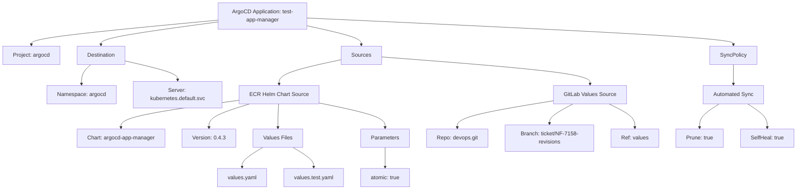
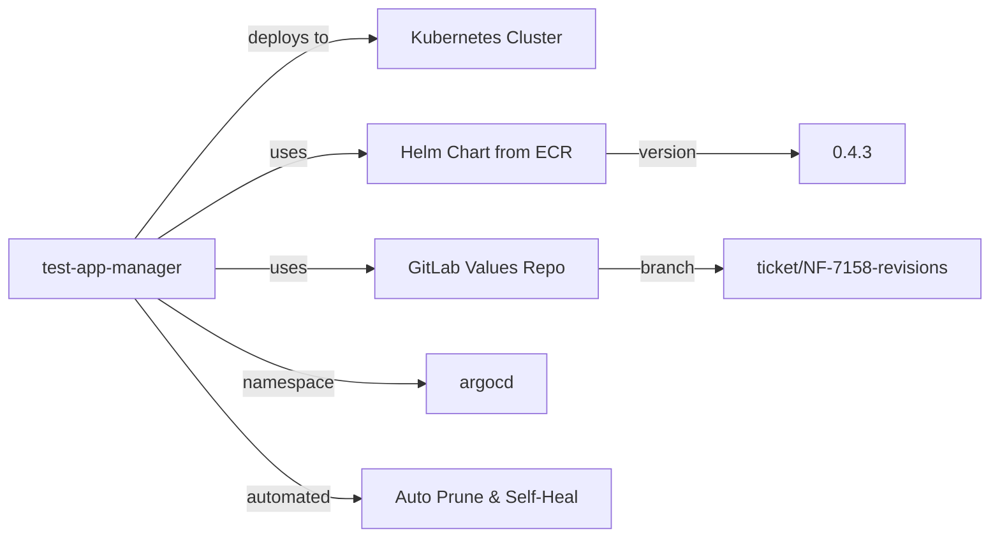
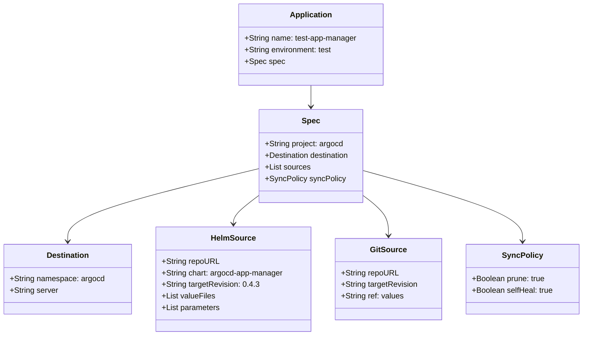

# Diagram: devops/k8s/argocd/app-manager/argocd/Application.test.yaml

> Auto-generated by Obscura crawlers

## Diagram 1

### SVG

<svg id="container" width="2330.88671875" xmlns="http://www.w3.org/2000/svg" class="flowchart" height="558" viewBox="0 0 2330.88671875 558" role="graphics-document document" aria-roledescription="flowchart-v2"><g><marker id="container_flowchart-v2-pointEnd" class="marker flowchart-v2" viewBox="0 0 10 10" refX="5" refY="5" markerUnits="userSpaceOnUse" markerWidth="8" markerHeight="8" orient="auto"><path d="M 0 0 L 10 5 L 0 10 z" class="arrowMarkerPath" style="stroke-width: 1; stroke-dasharray: 1, 0;"></path></marker><marker id="container_flowchart-v2-pointStart" class="marker flowchart-v2" viewBox="0 0 10 10" refX="4.5" refY="5" markerUnits="userSpaceOnUse" markerWidth="8" markerHeight="8" orient="auto"><path d="M 0 5 L 10 10 L 10 0 z" class="arrowMarkerPath" style="stroke-width: 1; stroke-dasharray: 1, 0;"></path></marker><marker id="container_flowchart-v2-circleEnd" class="marker flowchart-v2" viewBox="0 0 10 10" refX="11" refY="5" markerUnits="userSpaceOnUse" markerWidth="11" markerHeight="11" orient="auto"><circle cx="5" cy="5" r="5" class="arrowMarkerPath" style="stroke-width: 1; stroke-dasharray: 1, 0;"></circle></marker><marker id="container_flowchart-v2-circleStart" class="marker flowchart-v2" viewBox="0 0 10 10" refX="-1" refY="5" markerUnits="userSpaceOnUse" markerWidth="11" markerHeight="11" orient="auto"><circle cx="5" cy="5" r="5" class="arrowMarkerPath" style="stroke-width: 1; stroke-dasharray: 1, 0;"></circle></marker><marker id="container_flowchart-v2-crossEnd" class="marker cross flowchart-v2" viewBox="0 0 11 11" refX="12" refY="5.2" markerUnits="userSpaceOnUse" markerWidth="11" markerHeight="11" orient="auto"><path d="M 1,1 l 9,9 M 10,1 l -9,9" class="arrowMarkerPath" style="stroke-width: 2; stroke-dasharray: 1, 0;"></path></marker><marker id="container_flowchart-v2-crossStart" class="marker cross flowchart-v2" viewBox="0 0 11 11" refX="-1" refY="5.2" markerUnits="userSpaceOnUse" markerWidth="11" markerHeight="11" orient="auto"><path d="M 1,1 l 9,9 M 10,1 l -9,9" class="arrowMarkerPath" style="stroke-width: 2; stroke-dasharray: 1, 0;"></path></marker><g class="root"><g class="clusters"></g><g class="edgePaths"><path d="M638.816,59.29L547.658,67.909C456.5,76.527,274.184,93.763,183.025,105.882C91.867,118,91.867,125,91.867,128.5L91.867,132" id="L_A_B_0" class="edge-thickness-normal edge-pattern-solid edge-thickness-normal edge-pattern-solid flowchart-link" style=";" data-edge="true" data-et="edge" data-id="L_A_B_0" data-points="W3sieCI6NjM4LjgxNjQwNjI1LCJ5Ijo1OS4yOTA0MzQ0NTE0Mzk0MjR9LHsieCI6OTEuODY3MTg3NSwieSI6MTExfSx7IngiOjkxLjg2NzE4NzUsInkiOjEzNn1d" marker-end="url(#container_flowchart-v2-pointEnd)"></path><path d="M638.816,64.659L581.959,72.383C525.102,80.106,411.387,95.553,354.529,106.777C297.672,118,297.672,125,297.672,128.5L297.672,132" id="L_A_C_0" class="edge-thickness-normal edge-pattern-solid edge-thickness-normal edge-pattern-solid flowchart-link" style=";" data-edge="true" data-et="edge" data-id="L_A_C_0" data-points="W3sieCI6NjM4LjgxNjQwNjI1LCJ5Ijo2NC42NTkxMjQ2MzgzMDU5OH0seyJ4IjoyOTcuNjcxODc1LCJ5IjoxMTF9LHsieCI6Mjk3LjY3MTg3NSwieSI6MTM2fV0=" marker-end="url(#container_flowchart-v2-pointEnd)"></path><path d="M898.816,76.031L924.915,81.859C951.013,87.687,1003.21,99.344,1029.308,108.672C1055.406,118,1055.406,125,1055.406,128.5L1055.406,132" id="L_A_D_0" class="edge-thickness-normal edge-pattern-solid edge-thickness-normal edge-pattern-solid flowchart-link" style=";" data-edge="true" data-et="edge" data-id="L_A_D_0" data-points="W3sieCI6ODk4LjgxNjQwNjI1LCJ5Ijo3Ni4wMzEwMzU3NTE3Njg1MX0seyJ4IjoxMDU1LjQwNjI1LCJ5IjoxMTF9LHsieCI6MTA1NS40MDYyNSwieSI6MTM2fV0=" marker-end="url(#container_flowchart-v2-pointEnd)"></path><path d="M898.816,53.05L1106.337,62.709C1313.857,72.367,1728.897,91.683,1936.417,104.842C2143.938,118,2143.938,125,2143.938,128.5L2143.938,132" id="L_A_E_0" class="edge-thickness-normal edge-pattern-solid edge-thickness-normal edge-pattern-solid flowchart-link" style=";" data-edge="true" data-et="edge" data-id="L_A_E_0" data-points="W3sieCI6ODk4LjgxNjQwNjI1LCJ5Ijo1My4wNTAzNzYyNDUyNzM4NX0seyJ4IjoyMTQzLjkzNzUsInkiOjExMX0seyJ4IjoyMTQzLjkzNzUsInkiOjEzNn1d" marker-end="url(#container_flowchart-v2-pointEnd)"></path><path d="M268.751,190L264.288,194.167C259.825,198.333,250.899,206.667,246.436,216.333C241.973,226,241.973,237,241.973,242.5L241.973,248" id="L_C_C1_0" class="edge-thickness-normal edge-pattern-solid edge-thickness-normal edge-pattern-solid flowchart-link" style=";" data-edge="true" data-et="edge" data-id="L_C_C1_0" data-points="W3sieCI6MjY4Ljc1MTEyNjgwMjg4NDY0LCJ5IjoxOTB9LHsieCI6MjQxLjk3MjY1NjI1LCJ5IjoyMTV9LHsieCI6MjQxLjk3MjY1NjI1LCJ5IjoyNTJ9XQ==" marker-end="url(#container_flowchart-v2-pointEnd)"></path><path d="M369.609,179.652L395.059,185.544C420.509,191.435,471.409,203.217,496.859,212.609C522.309,222,522.309,229,522.309,232.5L522.309,236" id="L_C_C2_0" class="edge-thickness-normal edge-pattern-solid edge-thickness-normal edge-pattern-solid flowchart-link" style=";" data-edge="true" data-et="edge" data-id="L_C_C2_0" data-points="W3sieCI6MzY5LjYwOTM3NSwieSI6MTc5LjY1MjQ0MjMxMTM3MDh9LHsieCI6NTIyLjMwODU5Mzc1LCJ5IjoyMTV9LHsieCI6NTIyLjMwODU5Mzc1LCJ5IjoyNDB9XQ==" marker-end="url(#container_flowchart-v2-pointEnd)"></path><path d="M997.109,175.618L966.783,182.181C936.457,188.745,875.805,201.873,845.479,213.936C815.152,226,815.152,237,815.152,242.5L815.152,248" id="L_D_D1_0" class="edge-thickness-normal edge-pattern-solid edge-thickness-normal edge-pattern-solid flowchart-link" style=";" data-edge="true" data-et="edge" data-id="L_D_D1_0" data-points="W3sieCI6OTk3LjEwOTM3NSwieSI6MTc1LjYxNzY0MDg0MjIwNzk1fSx7IngiOjgxNS4xNTIzNDM3NSwieSI6MjE1fSx7IngiOjgxNS4xNTIzNDM3NSwieSI6MjUyfV0=" marker-end="url(#container_flowchart-v2-pointEnd)"></path><path d="M1113.703,167.535L1215.404,175.446C1317.104,183.356,1520.505,199.178,1622.206,212.589C1723.906,226,1723.906,237,1723.906,242.5L1723.906,248" id="L_D_D2_0" class="edge-thickness-normal edge-pattern-solid edge-thickness-normal edge-pattern-solid flowchart-link" style=";" data-edge="true" data-et="edge" data-id="L_D_D2_0" data-points="W3sieCI6MTExMy43MDMxMjUsInkiOjE2Ny41MzQ2ODU4NjM4NzQzNn0seyJ4IjoxNzIzLjkwNjI1LCJ5IjoyMTV9LHsieCI6MTcyMy45MDYyNSwieSI6MjUyfV0=" marker-end="url(#container_flowchart-v2-pointEnd)"></path><path d="M702.309,294.622L644.064,302.685C585.82,310.748,469.332,326.874,411.088,340.437C352.844,354,352.844,365,352.844,370.5L352.844,376" id="L_D1_D1A_0" class="edge-thickness-normal edge-pattern-solid edge-thickness-normal edge-pattern-solid flowchart-link" style=";" data-edge="true" data-et="edge" data-id="L_D1_D1A_0" data-points="W3sieCI6NzAyLjMwODU5Mzc1LCJ5IjoyOTQuNjIxNjAwMTU1NDY5NzZ9LHsieCI6MzUyLjg0Mzc1LCJ5IjozNDN9LHsieCI6MzUyLjg0Mzc1LCJ5IjozODB9XQ==" marker-end="url(#container_flowchart-v2-pointEnd)"></path><path d="M728.551,306L708.772,312.167C688.992,318.333,649.434,330.667,629.654,342.333C609.875,354,609.875,365,609.875,370.5L609.875,376" id="L_D1_D1B_0" class="edge-thickness-normal edge-pattern-solid edge-thickness-normal edge-pattern-solid flowchart-link" style=";" data-edge="true" data-et="edge" data-id="L_D1_D1B_0" data-points="W3sieCI6NzI4LjU1MDk2NDM1NTQ2ODgsInkiOjMwNn0seyJ4Ijo2MDkuODc1LCJ5IjozNDN9LHsieCI6NjA5Ljg3NSwieSI6MzgwfV0=" marker-end="url(#container_flowchart-v2-pointEnd)"></path><path d="M812.57,306L811.98,312.167C811.39,318.333,810.211,330.667,809.621,342.333C809.031,354,809.031,365,809.031,370.5L809.031,376" id="L_D1_D1C_0" class="edge-thickness-normal edge-pattern-solid edge-thickness-normal edge-pattern-solid flowchart-link" style=";" data-edge="true" data-et="edge" data-id="L_D1_D1C_0" data-points="W3sieCI6ODEyLjU3MDAwNzMyNDIxODgsInkiOjMwNn0seyJ4Ijo4MDkuMDMxMjUsInkiOjM0M30seyJ4Ijo4MDkuMDMxMjUsInkiOjM4MH1d" marker-end="url(#container_flowchart-v2-pointEnd)"></path><path d="M927.996,302.286L960.88,309.071C993.764,315.857,1059.533,329.429,1092.417,341.714C1125.301,354,1125.301,365,1125.301,370.5L1125.301,376" id="L_D1_D1D_0" class="edge-thickness-normal edge-pattern-solid edge-thickness-normal edge-pattern-solid flowchart-link" style=";" data-edge="true" data-et="edge" data-id="L_D1_D1D_0" data-points="W3sieCI6OTI3Ljk5NjA5Mzc1LCJ5IjozMDIuMjg1NjI0MzIzMDMwOH0seyJ4IjoxMTI1LjMwMDc4MTI1LCJ5IjozNDN9LHsieCI6MTEyNS4zMDA3ODEyNSwieSI6MzgwfV0=" marker-end="url(#container_flowchart-v2-pointEnd)"></path><path d="M764.789,434L754.684,440.167C744.579,446.333,724.37,458.667,714.265,468.333C704.16,478,704.16,485,704.16,488.5L704.16,492" id="L_D1C_D1C1_0" class="edge-thickness-normal edge-pattern-solid edge-thickness-normal edge-pattern-solid flowchart-link" style=";" data-edge="true" data-et="edge" data-id="L_D1C_D1C1_0" data-points="W3sieCI6NzY0Ljc4ODc1NzMyNDIxODgsInkiOjQzNH0seyJ4Ijo3MDQuMTYwMTU2MjUsInkiOjQ3MX0seyJ4Ijo3MDQuMTYwMTU2MjUsInkiOjQ5Nn1d" marker-end="url(#container_flowchart-v2-pointEnd)"></path><path d="M853.274,434L863.379,440.167C873.483,446.333,893.693,458.667,903.798,468.333C913.902,478,913.902,485,913.902,488.5L913.902,492" id="L_D1C_D1C2_0" class="edge-thickness-normal edge-pattern-solid edge-thickness-normal edge-pattern-solid flowchart-link" style=";" data-edge="true" data-et="edge" data-id="L_D1C_D1C2_0" data-points="W3sieCI6ODUzLjI3Mzc0MjY3NTc4MTIsInkiOjQzNH0seyJ4Ijo5MTMuOTAyMzQzNzUsInkiOjQ3MX0seyJ4Ijo5MTMuOTAyMzQzNzUsInkiOjQ5Nn1d" marker-end="url(#container_flowchart-v2-pointEnd)"></path><path d="M1125.301,434L1125.301,440.167C1125.301,446.333,1125.301,458.667,1125.301,468.333C1125.301,478,1125.301,485,1125.301,488.5L1125.301,492" id="L_D1D_D1D1_0" class="edge-thickness-normal edge-pattern-solid edge-thickness-normal edge-pattern-solid flowchart-link" style=";" data-edge="true" data-et="edge" data-id="L_D1D_D1D1_0" data-points="W3sieCI6MTEyNS4zMDA3ODEyNSwieSI6NDM0fSx7IngiOjExMjUuMzAwNzgxMjUsInkiOjQ3MX0seyJ4IjoxMTI1LjMwMDc4MTI1LCJ5Ijo0OTZ9XQ==" marker-end="url(#container_flowchart-v2-pointEnd)"></path><path d="M1618.406,296.404L1571.329,304.17C1524.251,311.936,1430.096,327.468,1383.019,340.734C1335.941,354,1335.941,365,1335.941,370.5L1335.941,376" id="L_D2_D2A_0" class="edge-thickness-normal edge-pattern-solid edge-thickness-normal edge-pattern-solid flowchart-link" style=";" data-edge="true" data-et="edge" data-id="L_D2_D2A_0" data-points="W3sieCI6MTYxOC40MDYyNSwieSI6Mjk2LjQwMzYzODc4MDA5MjR9LHsieCI6MTMzNS45NDE0MDYyNSwieSI6MzQzfSx7IngiOjEzMzUuOTQxNDA2MjUsInkiOjM4MH1d" marker-end="url(#container_flowchart-v2-pointEnd)"></path><path d="M1674.084,306L1662.705,312.167C1651.325,318.333,1628.567,330.667,1617.188,340.333C1605.809,350,1605.809,357,1605.809,360.5L1605.809,364" id="L_D2_D2B_0" class="edge-thickness-normal edge-pattern-solid edge-thickness-normal edge-pattern-solid flowchart-link" style=";" data-edge="true" data-et="edge" data-id="L_D2_D2B_0" data-points="W3sieCI6MTY3NC4wODM4MDEyNjk1MzEyLCJ5IjozMDZ9LHsieCI6MTYwNS44MDg1OTM3NSwieSI6MzQzfSx7IngiOjE2MDUuODA4NTkzNzUsInkiOjM2OH1d" marker-end="url(#container_flowchart-v2-pointEnd)"></path><path d="M1779.144,306L1791.76,312.167C1804.376,318.333,1829.608,330.667,1842.224,342.333C1854.84,354,1854.84,365,1854.84,370.5L1854.84,376" id="L_D2_D2C_0" class="edge-thickness-normal edge-pattern-solid edge-thickness-normal edge-pattern-solid flowchart-link" style=";" data-edge="true" data-et="edge" data-id="L_D2_D2C_0" data-points="W3sieCI6MTc3OS4xNDM4NTk4NjMyODEyLCJ5IjozMDZ9LHsieCI6MTg1NC44Mzk4NDM3NSwieSI6MzQzfSx7IngiOjE4NTQuODM5ODQzNzUsInkiOjM4MH1d" marker-end="url(#container_flowchart-v2-pointEnd)"></path><path d="M2143.938,190L2143.938,194.167C2143.938,198.333,2143.938,206.667,2143.938,216.333C2143.938,226,2143.938,237,2143.938,242.5L2143.938,248" id="L_E_E1_0" class="edge-thickness-normal edge-pattern-solid edge-thickness-normal edge-pattern-solid flowchart-link" style=";" data-edge="true" data-et="edge" data-id="L_E_E1_0" data-points="W3sieCI6MjE0My45Mzc1LCJ5IjoxOTB9LHsieCI6MjE0My45Mzc1LCJ5IjoyMTV9LHsieCI6MjE0My45Mzc1LCJ5IjoyNTJ9XQ==" marker-end="url(#container_flowchart-v2-pointEnd)"></path><path d="M2101.854,306L2092.242,312.167C2082.63,318.333,2063.407,330.667,2053.795,342.333C2044.184,354,2044.184,365,2044.184,370.5L2044.184,376" id="L_E1_E1A_0" class="edge-thickness-normal edge-pattern-solid edge-thickness-normal edge-pattern-solid flowchart-link" style=";" data-edge="true" data-et="edge" data-id="L_E1_E1A_0" data-points="W3sieCI6MjEwMS44NTM4MjA4MDA3ODEyLCJ5IjozMDZ9LHsieCI6MjA0NC4xODM1OTM3NSwieSI6MzQzfSx7IngiOjIwNDQuMTgzNTkzNzUsInkiOjM4MH1d" marker-end="url(#container_flowchart-v2-pointEnd)"></path><path d="M2186.021,306L2195.633,312.167C2205.245,318.333,2224.468,330.667,2234.08,342.333C2243.691,354,2243.691,365,2243.691,370.5L2243.691,376" id="L_E1_E1B_0" class="edge-thickness-normal edge-pattern-solid edge-thickness-normal edge-pattern-solid flowchart-link" style=";" data-edge="true" data-et="edge" data-id="L_E1_E1B_0" data-points="W3sieCI6MjE4Ni4wMjExNzkxOTkyMTg4LCJ5IjozMDZ9LHsieCI6MjI0My42OTE0MDYyNSwieSI6MzQzfSx7IngiOjIyNDMuNjkxNDA2MjUsInkiOjM4MH1d" marker-end="url(#container_flowchart-v2-pointEnd)"></path></g><g class="edgeLabels"><g class="edgeLabel"><g class="label" data-id="L_A_B_0" transform="translate(0, 0)"><foreignObject width="0" height="0">

</foreignObject></g></g><g class="edgeLabel"><g class="label" data-id="L_A_C_0" transform="translate(0, 0)"><foreignObject width="0" height="0">

</foreignObject></g></g><g class="edgeLabel"><g class="label" data-id="L_A_D_0" transform="translate(0, 0)"><foreignObject width="0" height="0">

</foreignObject></g></g><g class="edgeLabel"><g class="label" data-id="L_A_E_0" transform="translate(0, 0)"><foreignObject width="0" height="0">

</foreignObject></g></g><g class="edgeLabel"><g class="label" data-id="L_C_C1_0" transform="translate(0, 0)"><foreignObject width="0" height="0">

</foreignObject></g></g><g class="edgeLabel"><g class="label" data-id="L_C_C2_0" transform="translate(0, 0)"><foreignObject width="0" height="0">

</foreignObject></g></g><g class="edgeLabel"><g class="label" data-id="L_D_D1_0" transform="translate(0, 0)"><foreignObject width="0" height="0">

</foreignObject></g></g><g class="edgeLabel"><g class="label" data-id="L_D_D2_0" transform="translate(0, 0)"><foreignObject width="0" height="0">

</foreignObject></g></g><g class="edgeLabel"><g class="label" data-id="L_D1_D1A_0" transform="translate(0, 0)"><foreignObject width="0" height="0">

</foreignObject></g></g><g class="edgeLabel"><g class="label" data-id="L_D1_D1B_0" transform="translate(0, 0)"><foreignObject width="0" height="0">

</foreignObject></g></g><g class="edgeLabel"><g class="label" data-id="L_D1_D1C_0" transform="translate(0, 0)"><foreignObject width="0" height="0">

</foreignObject></g></g><g class="edgeLabel"><g class="label" data-id="L_D1_D1D_0" transform="translate(0, 0)"><foreignObject width="0" height="0">

</foreignObject></g></g><g class="edgeLabel"><g class="label" data-id="L_D1C_D1C1_0" transform="translate(0, 0)"><foreignObject width="0" height="0">

</foreignObject></g></g><g class="edgeLabel"><g class="label" data-id="L_D1C_D1C2_0" transform="translate(0, 0)"><foreignObject width="0" height="0">

</foreignObject></g></g><g class="edgeLabel"><g class="label" data-id="L_D1D_D1D1_0" transform="translate(0, 0)"><foreignObject width="0" height="0">

</foreignObject></g></g><g class="edgeLabel"><g class="label" data-id="L_D2_D2A_0" transform="translate(0, 0)"><foreignObject width="0" height="0">

</foreignObject></g></g><g class="edgeLabel"><g class="label" data-id="L_D2_D2B_0" transform="translate(0, 0)"><foreignObject width="0" height="0">

</foreignObject></g></g><g class="edgeLabel"><g class="label" data-id="L_D2_D2C_0" transform="translate(0, 0)"><foreignObject width="0" height="0">

</foreignObject></g></g><g class="edgeLabel"><g class="label" data-id="L_E_E1_0" transform="translate(0, 0)"><foreignObject width="0" height="0">

</foreignObject></g></g><g class="edgeLabel"><g class="label" data-id="L_E1_E1A_0" transform="translate(0, 0)"><foreignObject width="0" height="0">

</foreignObject></g></g><g class="edgeLabel"><g class="label" data-id="L_E1_E1B_0" transform="translate(0, 0)"><foreignObject width="0" height="0">

</foreignObject></g></g></g><g class="nodes"><g class="node default" id="flowchart-A-0" transform="translate(768.81640625, 47)"><rect class="basic label-container" style="" x="-130" y="-39" width="260" height="78"></rect><g class="label" style="" transform="translate(-100, -24)"><rect></rect><foreignObject width="200" height="48">

ArgoCD Application: test-app-manager

</foreignObject></g></g><g class="node default" id="flowchart-B-1" transform="translate(91.8671875, 163)"><rect class="basic label-container" style="" x="-83.8671875" y="-27" width="167.734375" height="54"></rect><g class="label" style="" transform="translate(-53.8671875, -12)"><rect></rect><foreignObject width="107.734375" height="24">

Project: argocd

</foreignObject></g></g><g class="node default" id="flowchart-C-3" transform="translate(297.671875, 163)"><rect class="basic label-container" style="" x="-71.9375" y="-27" width="143.875" height="54"></rect><g class="label" style="" transform="translate(-41.9375, -12)"><rect></rect><foreignObject width="83.875" height="24">

Destination

</foreignObject></g></g><g class="node default" id="flowchart-D-5" transform="translate(1055.40625, 163)"><rect class="basic label-container" style="" x="-58.296875" y="-27" width="116.59375" height="54"></rect><g class="label" style="" transform="translate(-28.296875, -12)"><rect></rect><foreignObject width="56.59375" height="24">

Sources

</foreignObject></g></g><g class="node default" id="flowchart-E-7" transform="translate(2143.9375, 163)"><rect class="basic label-container" style="" x="-68.171875" y="-27" width="136.34375" height="54"></rect><g class="label" style="" transform="translate(-38.171875, -12)"><rect></rect><foreignObject width="76.34375" height="24">

SyncPolicy

</foreignObject></g></g><g class="node default" id="flowchart-C1-9" transform="translate(241.97265625, 279)"><rect class="basic label-container" style="" x="-100.3359375" y="-27" width="200.671875" height="54"></rect><g class="label" style="" transform="translate(-70.3359375, -12)"><rect></rect><foreignObject width="140.671875" height="24">

Namespace: argocd

</foreignObject></g></g><g class="node default" id="flowchart-C2-11" transform="translate(522.30859375, 279)"><rect class="basic label-container" style="" x="-130" y="-39" width="260" height="78"></rect><g class="label" style="" transform="translate(-100, -24)"><rect></rect><foreignObject width="200" height="48">

Server: kubernetes.default.svc

</foreignObject></g></g><g class="node default" id="flowchart-D1-13" transform="translate(815.15234375, 279)"><rect class="basic label-container" style="" x="-112.84375" y="-27" width="225.6875" height="54"></rect><g class="label" style="" transform="translate(-82.84375, -12)"><rect></rect><foreignObject width="165.6875" height="24">

ECR Helm Chart Source

</foreignObject></g></g><g class="node default" id="flowchart-D2-15" transform="translate(1723.90625, 279)"><rect class="basic label-container" style="" x="-105.5" y="-27" width="211" height="54"></rect><g class="label" style="" transform="translate(-75.5, -12)"><rect></rect><foreignObject width="151" height="24">

GitLab Values Source

</foreignObject></g></g><g class="node default" id="flowchart-D1A-17" transform="translate(352.84375, 407)"><rect class="basic label-container" style="" x="-129.796875" y="-27" width="259.59375" height="54"></rect><g class="label" style="" transform="translate(-99.796875, -12)"><rect></rect><foreignObject width="199.59375" height="24">

Chart: argocd-app-manager

</foreignObject></g></g><g class="node default" id="flowchart-D1B-19" transform="translate(609.875, 407)"><rect class="basic label-container" style="" x="-77.234375" y="-27" width="154.46875" height="54"></rect><g class="label" style="" transform="translate(-47.234375, -12)"><rect></rect><foreignObject width="94.46875" height="24">

Version: 0.4.3

</foreignObject></g></g><g class="node default" id="flowchart-D1C-21" transform="translate(809.03125, 407)"><rect class="basic label-container" style="" x="-71.921875" y="-27" width="143.84375" height="54"></rect><g class="label" style="" transform="translate(-41.921875, -12)"><rect></rect><foreignObject width="83.84375" height="24">

Values Files

</foreignObject></g></g><g class="node default" id="flowchart-D1D-23" transform="translate(1125.30078125, 407)"><rect class="basic label-container" style="" x="-70.7734375" y="-27" width="141.546875" height="54"></rect><g class="label" style="" transform="translate(-40.7734375, -12)"><rect></rect><foreignObject width="81.546875" height="24">

Parameters

</foreignObject></g></g><g class="node default" id="flowchart-D1C1-25" transform="translate(704.16015625, 523)"><rect class="basic label-container" style="" x="-72.140625" y="-27" width="144.28125" height="54"></rect><g class="label" style="" transform="translate(-42.140625, -12)"><rect></rect><foreignObject width="84.28125" height="24">

values.yaml

</foreignObject></g></g><g class="node default" id="flowchart-D1C2-27" transform="translate(913.90234375, 523)"><rect class="basic label-container" style="" x="-87.6015625" y="-27" width="175.203125" height="54"></rect><g class="label" style="" transform="translate(-57.6015625, -12)"><rect></rect><foreignObject width="115.203125" height="24">

values.test.yaml

</foreignObject></g></g><g class="node default" id="flowchart-D1D1-29" transform="translate(1125.30078125, 523)"><rect class="basic label-container" style="" x="-73.796875" y="-27" width="147.59375" height="54"></rect><g class="label" style="" transform="translate(-43.796875, -12)"><rect></rect><foreignObject width="87.59375" height="24">

atomic: true

</foreignObject></g></g><g class="node default" id="flowchart-D2A-31" transform="translate(1335.94140625, 407)"><rect class="basic label-container" style="" x="-89.8671875" y="-27" width="179.734375" height="54"></rect><g class="label" style="" transform="translate(-59.8671875, -12)"><rect></rect><foreignObject width="119.734375" height="24">

Repo: devops.git

</foreignObject></g></g><g class="node default" id="flowchart-D2B-33" transform="translate(1605.80859375, 407)"><rect class="basic label-container" style="" x="-130" y="-39" width="260" height="78"></rect><g class="label" style="" transform="translate(-100, -24)"><rect></rect><foreignObject width="200" height="48">

Branch: ticket/NF-7158-revisions

</foreignObject></g></g><g class="node default" id="flowchart-D2C-35" transform="translate(1854.83984375, 407)"><rect class="basic label-container" style="" x="-69.03125" y="-27" width="138.0625" height="54"></rect><g class="label" style="" transform="translate(-39.03125, -12)"><rect></rect><foreignObject width="78.0625" height="24">

Ref: values

</foreignObject></g></g><g class="node default" id="flowchart-E1-37" transform="translate(2143.9375, 279)"><rect class="basic label-container" style="" x="-88.6484375" y="-27" width="177.296875" height="54"></rect><g class="label" style="" transform="translate(-58.6484375, -12)"><rect></rect><foreignObject width="117.296875" height="24">

Automated Sync

</foreignObject></g></g><g class="node default" id="flowchart-E1A-39" transform="translate(2044.18359375, 407)"><rect class="basic label-container" style="" x="-70.3125" y="-27" width="140.625" height="54"></rect><g class="label" style="" transform="translate(-40.3125, -12)"><rect></rect><foreignObject width="80.625" height="24">

Prune: true

</foreignObject></g></g><g class="node default" id="flowchart-E1B-41" transform="translate(2243.69140625, 407)"><rect class="basic label-container" style="" x="-79.1953125" y="-27" width="158.390625" height="54"></rect><g class="label" style="" transform="translate(-49.1953125, -12)"><rect></rect><foreignObject width="98.390625" height="24">

SelfHeal: true

</foreignObject></g></g></g></g></g></svg>

## Diagram 2

### SVG

<svg id="container" width="903.25" xmlns="http://www.w3.org/2000/svg" class="flowchart" height="486" viewBox="0 0 903.25 486" role="graphics-document document" aria-roledescription="flowchart-v2"><g><marker id="container_flowchart-v2-pointEnd" class="marker flowchart-v2" viewBox="0 0 10 10" refX="5" refY="5" markerUnits="userSpaceOnUse" markerWidth="8" markerHeight="8" orient="auto"><path d="M 0 0 L 10 5 L 0 10 z" class="arrowMarkerPath" style="stroke-width: 1; stroke-dasharray: 1, 0;"></path></marker><marker id="container_flowchart-v2-pointStart" class="marker flowchart-v2" viewBox="0 0 10 10" refX="4.5" refY="5" markerUnits="userSpaceOnUse" markerWidth="8" markerHeight="8" orient="auto"><path d="M 0 5 L 10 10 L 10 0 z" class="arrowMarkerPath" style="stroke-width: 1; stroke-dasharray: 1, 0;"></path></marker><marker id="container_flowchart-v2-circleEnd" class="marker flowchart-v2" viewBox="0 0 10 10" refX="11" refY="5" markerUnits="userSpaceOnUse" markerWidth="11" markerHeight="11" orient="auto"><circle cx="5" cy="5" r="5" class="arrowMarkerPath" style="stroke-width: 1; stroke-dasharray: 1, 0;"></circle></marker><marker id="container_flowchart-v2-circleStart" class="marker flowchart-v2" viewBox="0 0 10 10" refX="-1" refY="5" markerUnits="userSpaceOnUse" markerWidth="11" markerHeight="11" orient="auto"><circle cx="5" cy="5" r="5" class="arrowMarkerPath" style="stroke-width: 1; stroke-dasharray: 1, 0;"></circle></marker><marker id="container_flowchart-v2-crossEnd" class="marker cross flowchart-v2" viewBox="0 0 11 11" refX="12" refY="5.2" markerUnits="userSpaceOnUse" markerWidth="11" markerHeight="11" orient="auto"><path d="M 1,1 l 9,9 M 10,1 l -9,9" class="arrowMarkerPath" style="stroke-width: 2; stroke-dasharray: 1, 0;"></path></marker><marker id="container_flowchart-v2-crossStart" class="marker cross flowchart-v2" viewBox="0 0 11 11" refX="-1" refY="5.2" markerUnits="userSpaceOnUse" markerWidth="11" markerHeight="11" orient="auto"><path d="M 1,1 l 9,9 M 10,1 l -9,9" class="arrowMarkerPath" style="stroke-width: 2; stroke-dasharray: 1, 0;"></path></marker><g class="root"><g class="clusters"></g><g class="edgePaths"><path d="M124.205,216L147.601,185.833C170.996,155.667,217.787,95.333,253.926,65.167C290.065,35,315.552,35,328.296,35L341.039,35" id="L_App_K8s_0" class="edge-thickness-normal edge-pattern-solid edge-thickness-normal edge-pattern-solid flowchart-link" style=";" data-edge="true" data-et="edge" data-id="L_App_K8s_0" data-points="W3sieCI6MTI0LjIwNTIyODM2NTM4NDYxLCJ5IjoyMTZ9LHsieCI6MjY0LjU3ODEyNSwieSI6MzV9LHsieCI6MzQ1LjAzOTA2MjUsInkiOjM1fV0=" marker-end="url(#container_flowchart-v2-pointEnd)"></path><path d="M145.145,216L165.05,203.167C184.956,190.333,224.767,164.667,256.339,151.833C287.911,139,311.245,139,322.911,139L334.578,139" id="L_App_Helm_0" class="edge-thickness-normal edge-pattern-solid edge-thickness-normal edge-pattern-solid flowchart-link" style=";" data-edge="true" data-et="edge" data-id="L_App_Helm_0" data-points="W3sieCI6MTQ1LjE0NDgzMTczMDc2OTIzLCJ5IjoyMTZ9LHsieCI6MjY0LjU3ODEyNSwieSI6MTM5fSx7IngiOjMzOC41NzgxMjUsInkiOjEzOX1d" marker-end="url(#container_flowchart-v2-pointEnd)"></path><path d="M198.531,243L209.539,243C220.547,243,242.563,243,266.22,243C289.878,243,315.177,243,327.827,243L340.477,243" id="L_App_Git_0" class="edge-thickness-normal edge-pattern-solid edge-thickness-normal edge-pattern-solid flowchart-link" style=";" data-edge="true" data-et="edge" data-id="L_App_Git_0" data-points="W3sieCI6MTk4LjUzMTI1LCJ5IjoyNDN9LHsieCI6MjY0LjU3ODEyNSwieSI6MjQzfSx7IngiOjM0NC40NzY1NjI1LCJ5IjoyNDN9XQ==" marker-end="url(#container_flowchart-v2-pointEnd)"></path><path d="M549.266,139L559.189,139C569.112,139,588.958,139,618.673,139C648.388,139,687.971,139,707.763,139L727.555,139" id="L_Helm_V_0" class="edge-thickness-normal edge-pattern-solid edge-thickness-normal edge-pattern-solid flowchart-link" style=";" data-edge="true" data-et="edge" data-id="L_Helm_V_0" data-points="W3sieCI6NTQ5LjI2NTYyNSwieSI6MTM5fSx7IngiOjYwOC44MDQ2ODc1LCJ5IjoxMzl9LHsieCI6NzMxLjU1NDY4NzUsInkiOjEzOX1d" marker-end="url(#container_flowchart-v2-pointEnd)"></path><path d="M543.367,243L554.273,243C565.18,243,586.992,243,605.829,243C624.667,243,640.529,243,648.46,243L656.391,243" id="L_Git_B_0" class="edge-thickness-normal edge-pattern-solid edge-thickness-normal edge-pattern-solid flowchart-link" style=";" data-edge="true" data-et="edge" data-id="L_Git_B_0" data-points="W3sieCI6NTQzLjM2NzE4NzUsInkiOjI0M30seyJ4Ijo2MDguODA0Njg3NSwieSI6MjQzfSx7IngiOjY2MC4zOTA2MjUsInkiOjI0M31d" marker-end="url(#container_flowchart-v2-pointEnd)"></path><path d="M145.145,270L165.05,282.833C184.956,295.667,224.767,321.333,264.817,334.167C304.867,347,345.156,347,365.301,347L385.445,347" id="L_App_NS_0" class="edge-thickness-normal edge-pattern-solid edge-thickness-normal edge-pattern-solid flowchart-link" style=";" data-edge="true" data-et="edge" data-id="L_App_NS_0" data-points="W3sieCI6MTQ1LjE0NDgzMTczMDc2OTIzLCJ5IjoyNzB9LHsieCI6MjY0LjU3ODEyNSwieSI6MzQ3fSx7IngiOjM4OS40NDUzMTI1LCJ5IjozNDd9XQ==" marker-end="url(#container_flowchart-v2-pointEnd)"></path><path d="M124.205,270L147.601,300.167C170.996,330.333,217.787,390.667,251.524,420.833C285.26,451,305.943,451,316.284,451L326.625,451" id="L_App_Sync_0" class="edge-thickness-normal edge-pattern-solid edge-thickness-normal edge-pattern-solid flowchart-link" style=";" data-edge="true" data-et="edge" data-id="L_App_Sync_0" data-points="W3sieCI6MTI0LjIwNTIyODM2NTM4NDYxLCJ5IjoyNzB9LHsieCI6MjY0LjU3ODEyNSwieSI6NDUxfSx7IngiOjMzMC42MjUsInkiOjQ1MX1d" marker-end="url(#container_flowchart-v2-pointEnd)"></path></g><g class="edgeLabels"><g class="edgeLabel" transform="translate(264.578125, 35)"><g class="label" data-id="L_App_K8s_0" transform="translate(-38.0234375, -12)"><foreignObject width="76.046875" height="24">

deploys to

</foreignObject></g></g><g class="edgeLabel" transform="translate(264.578125, 139)"><g class="label" data-id="L_App_Helm_0" transform="translate(-16.4921875, -12)"><foreignObject width="32.984375" height="24">

uses

</foreignObject></g></g><g class="edgeLabel" transform="translate(264.578125, 243)"><g class="label" data-id="L_App_Git_0" transform="translate(-16.4921875, -12)"><foreignObject width="32.984375" height="24">

uses

</foreignObject></g></g><g class="edgeLabel" transform="translate(608.8046875, 139)"><g class="label" data-id="L_Helm_V_0" transform="translate(-26.5859375, -12)"><foreignObject width="53.171875" height="24">

version

</foreignObject></g></g><g class="edgeLabel" transform="translate(608.8046875, 243)"><g class="label" data-id="L_Git_B_0" transform="translate(-25.1171875, -12)"><foreignObject width="50.234375" height="24">

branch

</foreignObject></g></g><g class="edgeLabel" transform="translate(264.578125, 347)"><g class="label" data-id="L_App_NS_0" transform="translate(-41.046875, -12)"><foreignObject width="82.09375" height="24">

namespace

</foreignObject></g></g><g class="edgeLabel" transform="translate(264.578125, 451)"><g class="label" data-id="L_App_Sync_0" transform="translate(-39.5703125, -12)"><foreignObject width="79.140625" height="24">

automated

</foreignObject></g></g></g><g class="nodes"><g class="node default" id="flowchart-App-0" transform="translate(103.265625, 243)"><rect class="basic label-container" style="" x="-95.265625" y="-27" width="190.53125" height="54"></rect><g class="label" style="" transform="translate(-65.265625, -12)"><rect></rect><foreignObject width="130.53125" height="24">

test-app-manager

</foreignObject></g></g><g class="node default" id="flowchart-K8s-1" transform="translate(443.921875, 35)"><rect class="basic label-container" style="" x="-98.8828125" y="-27" width="197.765625" height="54"></rect><g class="label" style="" transform="translate(-68.8828125, -12)"><rect></rect><foreignObject width="137.765625" height="24">

Kubernetes Cluster

</foreignObject></g></g><g class="node default" id="flowchart-Helm-3" transform="translate(443.921875, 139)"><rect class="basic label-container" style="" x="-105.34375" y="-27" width="210.6875" height="54"></rect><g class="label" style="" transform="translate(-75.34375, -12)"><rect></rect><foreignObject width="150.6875" height="24">

Helm Chart from ECR

</foreignObject></g></g><g class="node default" id="flowchart-Git-5" transform="translate(443.921875, 243)"><rect class="basic label-container" style="" x="-99.4453125" y="-27" width="198.890625" height="54"></rect><g class="label" style="" transform="translate(-69.4453125, -12)"><rect></rect><foreignObject width="138.890625" height="24">

GitLab Values Repo

</foreignObject></g></g><g class="node default" id="flowchart-V-7" transform="translate(777.8203125, 139)"><rect class="basic label-container" style="" x="-46.265625" y="-27" width="92.53125" height="54"></rect><g class="label" style="" transform="translate(-16.265625, -12)"><rect></rect><foreignObject width="32.53125" height="24">

0.4.3

</foreignObject></g></g><g class="node default" id="flowchart-B-9" transform="translate(777.8203125, 243)"><rect class="basic label-container" style="" x="-117.4296875" y="-27" width="234.859375" height="54"></rect><g class="label" style="" transform="translate(-87.4296875, -12)"><rect></rect><foreignObject width="174.859375" height="24">

ticket/NF-7158-revisions

</foreignObject></g></g><g class="node default" id="flowchart-NS-11" transform="translate(443.921875, 347)"><rect class="basic label-container" style="" x="-54.4765625" y="-27" width="108.953125" height="54"></rect><g class="label" style="" transform="translate(-24.4765625, -12)"><rect></rect><foreignObject width="48.953125" height="24">

argocd

</foreignObject></g></g><g class="node default" id="flowchart-Sync-13" transform="translate(443.921875, 451)"><rect class="basic label-container" style="" x="-113.296875" y="-27" width="226.59375" height="54"></rect><g class="label" style="" transform="translate(-83.296875, -12)"><rect></rect><foreignObject width="166.59375" height="24">

Auto Prune &amp; Self-Heal

</foreignObject></g></g></g></g></g></svg>

## Diagram 3

### SVG

<svg id="container" width="1196.5859375" xmlns="http://www.w3.org/2000/svg" class="classDiagram" height="692" viewBox="0 0 1196.5859375 692" role="graphics-document document" aria-roledescription="class"><g><defs><marker id="container_class-aggregationStart" class="marker aggregation class" refX="18" refY="7" markerWidth="190" markerHeight="240" orient="auto"><path d="M 18,7 L9,13 L1,7 L9,1 Z"></path></marker></defs><defs><marker id="container_class-aggregationEnd" class="marker aggregation class" refX="1" refY="7" markerWidth="20" markerHeight="28" orient="auto"><path d="M 18,7 L9,13 L1,7 L9,1 Z"></path></marker></defs><defs><marker id="container_class-extensionStart" class="marker extension class" refX="18" refY="7" markerWidth="190" markerHeight="240" orient="auto"><path d="M 1,7 L18,13 V 1 Z"></path></marker></defs><defs><marker id="container_class-extensionEnd" class="marker extension class" refX="1" refY="7" markerWidth="20" markerHeight="28" orient="auto"><path d="M 1,1 V 13 L18,7 Z"></path></marker></defs><defs><marker id="container_class-compositionStart" class="marker composition class" refX="18" refY="7" markerWidth="190" markerHeight="240" orient="auto"><path d="M 18,7 L9,13 L1,7 L9,1 Z"></path></marker></defs><defs><marker id="container_class-compositionEnd" class="marker composition class" refX="1" refY="7" markerWidth="20" markerHeight="28" orient="auto"><path d="M 18,7 L9,13 L1,7 L9,1 Z"></path></marker></defs><defs><marker id="container_class-dependencyStart" class="marker dependency class" refX="6" refY="7" markerWidth="190" markerHeight="240" orient="auto"><path d="M 5,7 L9,13 L1,7 L9,1 Z"></path></marker></defs><defs><marker id="container_class-dependencyEnd" class="marker dependency class" refX="13" refY="7" markerWidth="20" markerHeight="28" orient="auto"><path d="M 18,7 L9,13 L14,7 L9,1 Z"></path></marker></defs><defs><marker id="container_class-lollipopStart" class="marker lollipop class" refX="13" refY="7" markerWidth="190" markerHeight="240" orient="auto"><circle stroke="black" fill="transparent" cx="7" cy="7" r="6"></circle></marker></defs><defs><marker id="container_class-lollipopEnd" class="marker lollipop class" refX="1" refY="7" markerWidth="190" markerHeight="240" orient="auto"><circle stroke="black" fill="transparent" cx="7" cy="7" r="6"></circle></marker></defs><g class="root"><g class="clusters"></g><g class="edgePaths"><path d="M638.027,176L638.027,180.167C638.027,184.333,638.027,192.667,638.027,200C638.027,207.333,638.027,213.667,638.027,216.833L638.027,220" id="id_Application_Spec_1" class="edge-thickness-normal edge-pattern-solid relation" style=";;;" data-edge="true" data-et="edge" data-id="id_Application_Spec_1" data-points="W3sieCI6NjM4LjAyNzM0Mzc1LCJ5IjoxNzZ9LHsieCI6NjM4LjAyNzM0Mzc1LCJ5IjoyMDF9LHsieCI6NjM4LjAyNzM0Mzc1LCJ5IjoyMjZ9XQ==" marker-end="url(#container_class-dependencyEnd)"></path><path d="M527.609,348.721L462.678,364.434C397.747,380.147,267.885,411.574,202.954,436.453C138.023,461.333,138.023,479.667,138.023,488.833L138.023,498" id="id_Spec_Destination_2" class="edge-thickness-normal edge-pattern-solid relation" style=";;;" data-edge="true" data-et="edge" data-id="id_Spec_Destination_2" data-points="W3sieCI6NTI3LjYwOTM3NSwieSI6MzQ4LjcyMDkzOTY4MDE1ODd9LHsieCI6MTM4LjAyMzQzNzUsInkiOjQ0M30seyJ4IjoxMzguMDIzNDM3NSwieSI6NTA0fV0=" marker-end="url(#container_class-dependencyEnd)"></path><path d="M527.609,405.69L519.405,411.908C511.201,418.126,494.792,430.563,486.587,439.948C478.383,449.333,478.383,455.667,478.383,458.833L478.383,462" id="id_Spec_HelmSource_3" class="edge-thickness-normal edge-pattern-solid relation" style=";;;" data-edge="true" data-et="edge" data-id="id_Spec_HelmSource_3" data-points="W3sieCI6NTI3LjYwOTM3NSwieSI6NDA1LjY4OTUyMDE3NDIxNTJ9LHsieCI6NDc4LjM4MjgxMjUsInkiOjQ0M30seyJ4Ijo0NzguMzgyODEyNSwieSI6NDY4fV0=" marker-end="url(#container_class-dependencyEnd)"></path><path d="M748.445,405.69L756.65,411.908C764.854,418.126,781.263,430.563,789.467,443.948C797.672,457.333,797.672,471.667,797.672,478.833L797.672,486" id="id_Spec_GitSource_4" class="edge-thickness-normal edge-pattern-solid relation" style=";;;" data-edge="true" data-et="edge" data-id="id_Spec_GitSource_4" data-points="W3sieCI6NzQ4LjQ0NTMxMjUsInkiOjQwNS42ODk1MjAxNzQyMTUyfSx7IngiOjc5Ny42NzE4NzUsInkiOjQ0M30seyJ4Ijo3OTcuNjcxODc1LCJ5Ijo0OTJ9XQ==" marker-end="url(#container_class-dependencyEnd)"></path><path d="M748.445,352.744L802.472,367.786C856.499,382.829,964.552,412.915,1018.579,437.124C1072.605,461.333,1072.605,479.667,1072.605,488.833L1072.605,498" id="id_Spec_SyncPolicy_5" class="edge-thickness-normal edge-pattern-solid relation" style=";;;" data-edge="true" data-et="edge" data-id="id_Spec_SyncPolicy_5" data-points="W3sieCI6NzQ4LjQ0NTMxMjUsInkiOjM1Mi43NDM3Nzk4ODcxMDMxM30seyJ4IjoxMDcyLjYwNTQ2ODc1LCJ5Ijo0NDN9LHsieCI6MTA3Mi42MDU0Njg3NSwieSI6NTA0fV0=" marker-end="url(#container_class-dependencyEnd)"></path></g><g class="edgeLabels"><g class="edgeLabel"><g class="label" data-id="id_Application_Spec_1" transform="translate(0, 0)"><foreignObject width="0" height="0">

</foreignObject></g></g><g class="edgeLabel"><g class="label" data-id="id_Spec_Destination_2" transform="translate(0, 0)"><foreignObject width="0" height="0">

</foreignObject></g></g><g class="edgeLabel"><g class="label" data-id="id_Spec_HelmSource_3" transform="translate(0, 0)"><foreignObject width="0" height="0">

</foreignObject></g></g><g class="edgeLabel"><g class="label" data-id="id_Spec_GitSource_4" transform="translate(0, 0)"><foreignObject width="0" height="0">

</foreignObject></g></g><g class="edgeLabel"><g class="label" data-id="id_Spec_SyncPolicy_5" transform="translate(0, 0)"><foreignObject width="0" height="0">

</foreignObject></g></g></g><g class="nodes"><g class="node default" id="classId-Application-0" transform="translate(638.02734375, 92)"><g class="basic label-container"><path d="M-149.63671875 -84 L149.63671875 -84 L149.63671875 84 L-149.63671875 84" stroke="none" stroke-width="0" fill="#ECECFF" style=""></path><path d="M-149.63671875 -84 C-87.5419330726863 -84, -25.44714739537261 -84, 149.63671875 -84 M-149.63671875 -84 C-52.77803821749201 -84, 44.08064231501598 -84, 149.63671875 -84 M149.63671875 -84 C149.63671875 -17.37129658559398, 149.63671875 49.25740682881204, 149.63671875 84 M149.63671875 -84 C149.63671875 -43.45037930859578, 149.63671875 -2.9007586171915563, 149.63671875 84 M149.63671875 84 C38.876770610525895 84, -71.88317752894821 84, -149.63671875 84 M149.63671875 84 C35.46735413251824 84, -78.70201048496352 84, -149.63671875 84 M-149.63671875 84 C-149.63671875 17.675064035415517, -149.63671875 -48.64987192916897, -149.63671875 -84 M-149.63671875 84 C-149.63671875 50.15092281202824, -149.63671875 16.301845624056483, -149.63671875 -84" stroke="#9370DB" stroke-width="1.3" fill="none" stroke-dasharray="0 0" style=""></path></g><g class="annotation-group text" transform="translate(0, -60)"></g><g class="label-group text" transform="translate(-41.6796875, -60)"><g class="label" style="font-weight: bolder" transform="translate(0,-12)"><foreignObject width="83.359375" height="24">

Application

</foreignObject></g></g><g class="members-group text" transform="translate(-137.63671875, -12)"><g class="label" style="" transform="translate(0,-12)"><foreignObject width="233.59375" height="24">

+String name: test-app-manager

</foreignObject></g><g class="label" style="" transform="translate(0,12)"><foreignObject width="182.484375" height="24">

+String environment: test

</foreignObject></g><g class="label" style="" transform="translate(0,36)"><foreignObject width="79.53125" height="24">

+Spec spec

</foreignObject></g></g><g class="methods-group text" transform="translate(-137.63671875, 84)"></g><g class="divider" style=""><path d="M-149.63671875 -36 C-36.12536099270349 -36, 77.38599676459302 -36, 149.63671875 -36 M-149.63671875 -36 C-35.36008862248764 -36, 78.91654150502472 -36, 149.63671875 -36" stroke="#9370DB" stroke-width="1.3" fill="none" stroke-dasharray="0 0" style=""></path></g><g class="divider" style=""><path d="M-149.63671875 60 C-61.569557270678686 60, 26.497604208642628 60, 149.63671875 60 M-149.63671875 60 C-81.94451935455885 60, -14.252319959117699 60, 149.63671875 60" stroke="#9370DB" stroke-width="1.3" fill="none" stroke-dasharray="0 0" style=""></path></g></g><g class="node default" id="classId-Spec-1" transform="translate(638.02734375, 322)"><g class="basic label-container"><path d="M-110.41796875 -96 L110.41796875 -96 L110.41796875 96 L-110.41796875 96" stroke="none" stroke-width="0" fill="#ECECFF" style=""></path><path d="M-110.41796875 -96 C-35.04568023332976 -96, 40.32660828334048 -96, 110.41796875 -96 M-110.41796875 -96 C-32.01145231766475 -96, 46.395064114670504 -96, 110.41796875 -96 M110.41796875 -96 C110.41796875 -43.30848945381286, 110.41796875 9.383021092374278, 110.41796875 96 M110.41796875 -96 C110.41796875 -24.078077103373232, 110.41796875 47.843845793253536, 110.41796875 96 M110.41796875 96 C26.10111514664544 96, -58.21573845670912 96, -110.41796875 96 M110.41796875 96 C54.624144609197614 96, -1.1696795316047712 96, -110.41796875 96 M-110.41796875 96 C-110.41796875 36.384965996748335, -110.41796875 -23.23006800650333, -110.41796875 -96 M-110.41796875 96 C-110.41796875 39.41680375989454, -110.41796875 -17.166392480210916, -110.41796875 -96" stroke="#9370DB" stroke-width="1.3" fill="none" stroke-dasharray="0 0" style=""></path></g><g class="annotation-group text" transform="translate(0, -72)"></g><g class="label-group text" transform="translate(-17.6015625, -72)"><g class="label" style="font-weight: bolder" transform="translate(0,-12)"><foreignObject width="35.203125" height="24">

Spec

</foreignObject></g></g><g class="members-group text" transform="translate(-98.41796875, -24)"><g class="label" style="" transform="translate(0,-12)"><foreignObject width="162.734375" height="24">

+String project: argocd

</foreignObject></g><g class="label" style="" transform="translate(0,12)"><foreignObject width="179.234375" height="24">

+Destination destination

</foreignObject></g><g class="label" style="" transform="translate(0,36)"><foreignObject width="93.296875" height="24">

+List sources

</foreignObject></g><g class="label" style="" transform="translate(0,60)"><foreignObject width="162.90625" height="24">

+SyncPolicy syncPolicy

</foreignObject></g></g><g class="methods-group text" transform="translate(-98.41796875, 96)"></g><g class="divider" style=""><path d="M-110.41796875 -48 C-48.8936680187276 -48, 12.630632712544795 -48, 110.41796875 -48 M-110.41796875 -48 C-46.586934422102125 -48, 17.24409990579575 -48, 110.41796875 -48" stroke="#9370DB" stroke-width="1.3" fill="none" stroke-dasharray="0 0" style=""></path></g><g class="divider" style=""><path d="M-110.41796875 72 C-61.94914130785203 72, -13.480313865704062 72, 110.41796875 72 M-110.41796875 72 C-42.57353624650531 72, 25.270896256989374 72, 110.41796875 72" stroke="#9370DB" stroke-width="1.3" fill="none" stroke-dasharray="0 0" style=""></path></g></g><g class="node default" id="classId-Destination-2" transform="translate(138.0234375, 576)"><g class="basic label-container"><path d="M-130.0234375 -72 L130.0234375 -72 L130.0234375 72 L-130.0234375 72" stroke="none" stroke-width="0" fill="#ECECFF" style=""></path><path d="M-130.0234375 -72 C-43.10217442222056 -72, 43.819088655558886 -72, 130.0234375 -72 M-130.0234375 -72 C-27.145933380942893 -72, 75.73157073811421 -72, 130.0234375 -72 M130.0234375 -72 C130.0234375 -38.62145280985987, 130.0234375 -5.2429056197197355, 130.0234375 72 M130.0234375 -72 C130.0234375 -33.09209353720045, 130.0234375 5.815812925599104, 130.0234375 72 M130.0234375 72 C61.774571910481214 72, -6.474293679037572 72, -130.0234375 72 M130.0234375 72 C63.42218679506908 72, -3.1790639098618385 72, -130.0234375 72 M-130.0234375 72 C-130.0234375 29.319661336691595, -130.0234375 -13.360677326616809, -130.0234375 -72 M-130.0234375 72 C-130.0234375 24.940684013569268, -130.0234375 -22.118631972861465, -130.0234375 -72" stroke="#9370DB" stroke-width="1.3" fill="none" stroke-dasharray="0 0" style=""></path></g><g class="annotation-group text" transform="translate(0, -48)"></g><g class="label-group text" transform="translate(-42.46875, -48)"><g class="label" style="font-weight: bolder" transform="translate(0,-12)"><foreignObject width="84.9375" height="24">

Destination

</foreignObject></g></g><g class="members-group text" transform="translate(-118.0234375, 0)"><g class="label" style="" transform="translate(0,-12)"><foreignObject width="193.578125" height="24">

+String namespace: argocd

</foreignObject></g><g class="label" style="" transform="translate(0,12)"><foreignObject width="99.546875" height="24">

+String server

</foreignObject></g></g><g class="methods-group text" transform="translate(-118.0234375, 72)"></g><g class="divider" style=""><path d="M-130.0234375 -24 C-42.60726056437011 -24, 44.808916371259784 -24, 130.0234375 -24 M-130.0234375 -24 C-77.37188620833228 -24, -24.720334916664555 -24, 130.0234375 -24" stroke="#9370DB" stroke-width="1.3" fill="none" stroke-dasharray="0 0" style=""></path></g><g class="divider" style=""><path d="M-130.0234375 48 C-58.08358208853889 48, 13.85627332292222 48, 130.0234375 48 M-130.0234375 48 C-30.64405906475571 48, 68.73531937048858 48, 130.0234375 48" stroke="#9370DB" stroke-width="1.3" fill="none" stroke-dasharray="0 0" style=""></path></g></g><g class="node default" id="classId-HelmSource-3" transform="translate(478.3828125, 576)"><g class="basic label-container"><path d="M-160.3359375 -108 L160.3359375 -108 L160.3359375 108 L-160.3359375 108" stroke="none" stroke-width="0" fill="#ECECFF" style=""></path><path d="M-160.3359375 -108 C-86.61877481542496 -108, -12.901612130849912 -108, 160.3359375 -108 M-160.3359375 -108 C-83.97751246757478 -108, -7.6190874351495665 -108, 160.3359375 -108 M160.3359375 -108 C160.3359375 -31.226013186757328, 160.3359375 45.547973626485344, 160.3359375 108 M160.3359375 -108 C160.3359375 -59.37482536143508, 160.3359375 -10.749650722870157, 160.3359375 108 M160.3359375 108 C63.05777532359225 108, -34.220386852815494 108, -160.3359375 108 M160.3359375 108 C54.1644922662299 108, -52.0069529675402 108, -160.3359375 108 M-160.3359375 108 C-160.3359375 62.92763457315533, -160.3359375 17.85526914631066, -160.3359375 -108 M-160.3359375 108 C-160.3359375 24.177202750886536, -160.3359375 -59.64559449822693, -160.3359375 -108" stroke="#9370DB" stroke-width="1.3" fill="none" stroke-dasharray="0 0" style=""></path></g><g class="annotation-group text" transform="translate(0, -84)"></g><g class="label-group text" transform="translate(-43.765625, -84)"><g class="label" style="font-weight: bolder" transform="translate(0,-12)"><foreignObject width="87.53125" height="24">

HelmSource

</foreignObject></g></g><g class="members-group text" transform="translate(-148.3359375, -36)"><g class="label" style="" transform="translate(0,-12)"><foreignObject width="115.96875" height="24">

+String repoURL

</foreignObject></g><g class="label" style="" transform="translate(0,12)"><foreignObject width="252.90625" height="24">

+String chart: argocd-app-manager

</foreignObject></g><g class="label" style="" transform="translate(0,36)"><foreignObject width="199.125" height="24">

+String targetRevision: 0.4.3

</foreignObject></g><g class="label" style="" transform="translate(0,60)"><foreignObject width="109.453125" height="24">

+List valueFiles

</foreignObject></g><g class="label" style="" transform="translate(0,84)"><foreignObject width="120.421875" height="24">

+List parameters

</foreignObject></g></g><g class="methods-group text" transform="translate(-148.3359375, 108)"></g><g class="divider" style=""><path d="M-160.3359375 -60 C-45.91474492668476 -60, 68.50644764663048 -60, 160.3359375 -60 M-160.3359375 -60 C-40.344726474880375 -60, 79.64648455023925 -60, 160.3359375 -60" stroke="#9370DB" stroke-width="1.3" fill="none" stroke-dasharray="0 0" style=""></path></g><g class="divider" style=""><path d="M-160.3359375 84 C-75.6241836726108 84, 9.087570154778405 84, 160.3359375 84 M-160.3359375 84 C-45.756694980184136 84, 68.82254753963173 84, 160.3359375 84" stroke="#9370DB" stroke-width="1.3" fill="none" stroke-dasharray="0 0" style=""></path></g></g><g class="node default" id="classId-GitSource-4" transform="translate(797.671875, 576)"><g class="basic label-container"><path d="M-108.953125 -84 L108.953125 -84 L108.953125 84 L-108.953125 84" stroke="none" stroke-width="0" fill="#ECECFF" style=""></path><path d="M-108.953125 -84 C-48.43584317224087 -84, 12.081438655518255 -84, 108.953125 -84 M-108.953125 -84 C-42.216563213174894 -84, 24.519998573650213 -84, 108.953125 -84 M108.953125 -84 C108.953125 -36.1075952641727, 108.953125 11.784809471654597, 108.953125 84 M108.953125 -84 C108.953125 -40.00439101991109, 108.953125 3.9912179601778206, 108.953125 84 M108.953125 84 C64.2951875408427 84, 19.637250081685394 84, -108.953125 84 M108.953125 84 C30.102521165187625 84, -48.74808266962475 84, -108.953125 84 M-108.953125 84 C-108.953125 36.76106494646529, -108.953125 -10.477870107069421, -108.953125 -84 M-108.953125 84 C-108.953125 23.19998600292272, -108.953125 -37.60002799415456, -108.953125 -84" stroke="#9370DB" stroke-width="1.3" fill="none" stroke-dasharray="0 0" style=""></path></g><g class="annotation-group text" transform="translate(0, -60)"></g><g class="label-group text" transform="translate(-35.390625, -60)"><g class="label" style="font-weight: bolder" transform="translate(0,-12)"><foreignObject width="70.78125" height="24">

GitSource

</foreignObject></g></g><g class="members-group text" transform="translate(-96.953125, -12)"><g class="label" style="" transform="translate(0,-12)"><foreignObject width="115.96875" height="24">

+String repoURL

</foreignObject></g><g class="label" style="" transform="translate(0,12)"><foreignObject width="158.515625" height="24">

+String targetRevision

</foreignObject></g><g class="label" style="" transform="translate(0,36)"><foreignObject width="128.78125" height="24">

+String ref: values

</foreignObject></g></g><g class="methods-group text" transform="translate(-96.953125, 84)"></g><g class="divider" style=""><path d="M-108.953125 -36 C-38.78477615202394 -36, 31.383572695952125 -36, 108.953125 -36 M-108.953125 -36 C-27.849191959374465 -36, 53.25474108125107 -36, 108.953125 -36" stroke="#9370DB" stroke-width="1.3" fill="none" stroke-dasharray="0 0" style=""></path></g><g class="divider" style=""><path d="M-108.953125 60 C-64.99945875782782 60, -21.04579251565565 60, 108.953125 60 M-108.953125 60 C-27.95914919783587 60, 53.03482660432826 60, 108.953125 60" stroke="#9370DB" stroke-width="1.3" fill="none" stroke-dasharray="0 0" style=""></path></g></g><g class="node default" id="classId-SyncPolicy-5" transform="translate(1072.60546875, 576)"><g class="basic label-container"><path d="M-115.98046875 -72 L115.98046875 -72 L115.98046875 72 L-115.98046875 72" stroke="none" stroke-width="0" fill="#ECECFF" style=""></path><path d="M-115.98046875 -72 C-31.286739635751488 -72, 53.406989478497024 -72, 115.98046875 -72 M-115.98046875 -72 C-60.85809311312816 -72, -5.735717476256326 -72, 115.98046875 -72 M115.98046875 -72 C115.98046875 -40.43866235398053, 115.98046875 -8.877324707961073, 115.98046875 72 M115.98046875 -72 C115.98046875 -20.679100848975658, 115.98046875 30.641798302048684, 115.98046875 72 M115.98046875 72 C54.220915879436234 72, -7.538636991127532 72, -115.98046875 72 M115.98046875 72 C40.478498247415075 72, -35.02347225516985 72, -115.98046875 72 M-115.98046875 72 C-115.98046875 24.930101855901455, -115.98046875 -22.13979628819709, -115.98046875 -72 M-115.98046875 72 C-115.98046875 16.908141742488, -115.98046875 -38.183716515024, -115.98046875 -72" stroke="#9370DB" stroke-width="1.3" fill="none" stroke-dasharray="0 0" style=""></path></g><g class="annotation-group text" transform="translate(0, -48)"></g><g class="label-group text" transform="translate(-38.9296875, -48)"><g class="label" style="font-weight: bolder" transform="translate(0,-12)"><foreignObject width="77.859375" height="24">

SyncPolicy

</foreignObject></g></g><g class="members-group text" transform="translate(-103.98046875, 0)"><g class="label" style="" transform="translate(0,-12)"><foreignObject width="153.046875" height="24">

+Boolean prune: true

</foreignObject></g><g class="label" style="" transform="translate(0,12)"><foreignObject width="169.03125" height="24">

+Boolean selfHeal: true

</foreignObject></g></g><g class="methods-group text" transform="translate(-103.98046875, 72)"></g><g class="divider" style=""><path d="M-115.98046875 -24 C-60.445792701726475 -24, -4.91111665345295 -24, 115.98046875 -24 M-115.98046875 -24 C-44.73696654626379 -24, 26.506535657472426 -24, 115.98046875 -24" stroke="#9370DB" stroke-width="1.3" fill="none" stroke-dasharray="0 0" style=""></path></g><g class="divider" style=""><path d="M-115.98046875 48 C-54.32578497500357 48, 7.3288987999928565 48, 115.98046875 48 M-115.98046875 48 C-62.598971667206264 48, -9.217474584412528 48, 115.98046875 48" stroke="#9370DB" stroke-width="1.3" fill="none" stroke-dasharray="0 0" style=""></path></g></g></g></g></g></svg>
