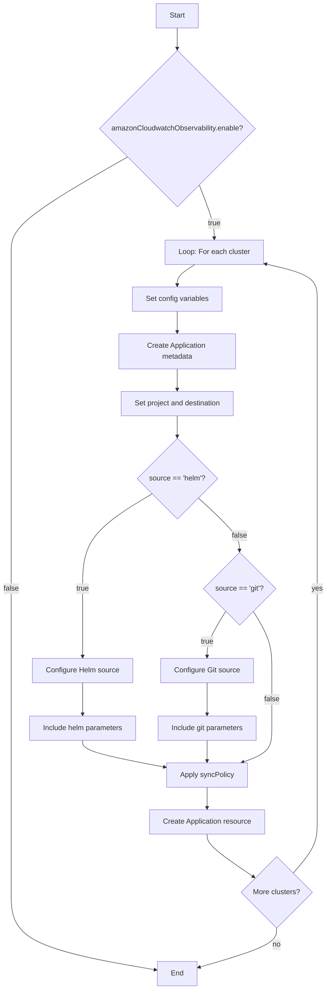
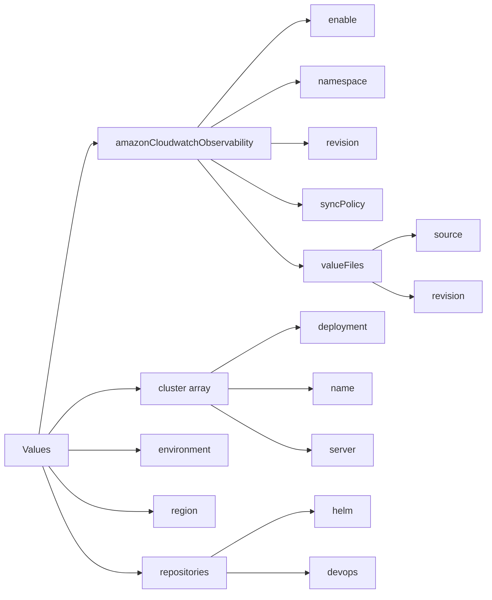
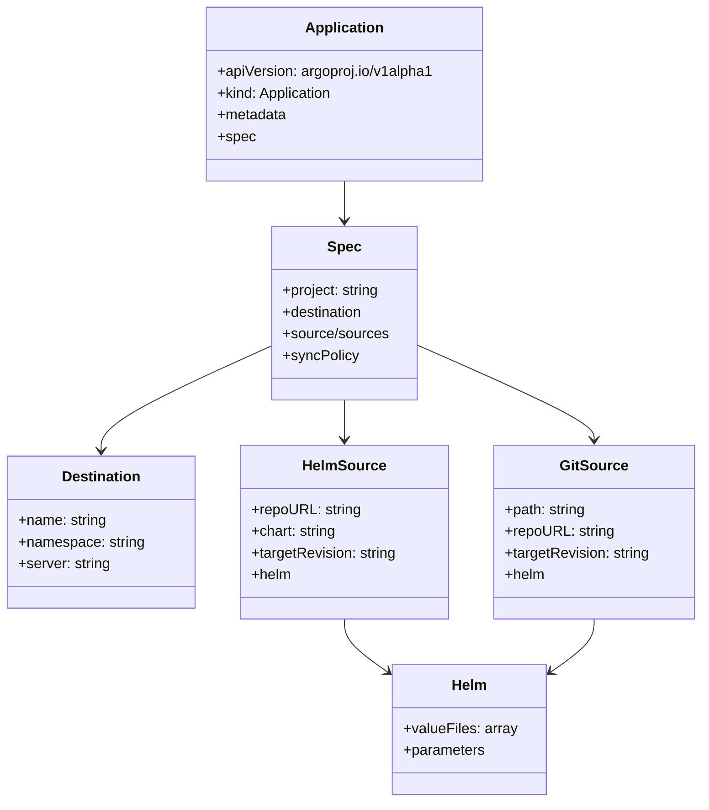
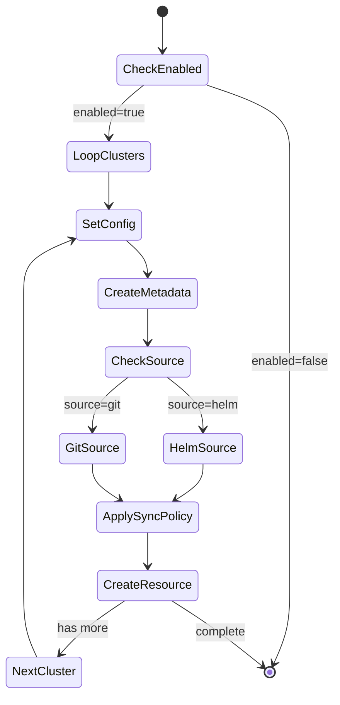

# Diagram: devops/k8s/argocd/app-manager/helm/templates/amazon-cloudwatch-observability.yaml

> Auto-generated by Obscura crawlers

## Diagram 1

### SVG

<svg id="container" width="736.04296875" xmlns="http://www.w3.org/2000/svg" class="flowchart" height="2194.5625" viewBox="0 0 736.04296875 2194.5625" role="graphics-document document" aria-roledescription="flowchart-v2"><g><marker id="container_flowchart-v2-pointEnd" class="marker flowchart-v2" viewBox="0 0 10 10" refX="5" refY="5" markerUnits="userSpaceOnUse" markerWidth="8" markerHeight="8" orient="auto"><path d="M 0 0 L 10 5 L 0 10 z" class="arrowMarkerPath" style="stroke-width: 1; stroke-dasharray: 1, 0;"></path></marker><marker id="container_flowchart-v2-pointStart" class="marker flowchart-v2" viewBox="0 0 10 10" refX="4.5" refY="5" markerUnits="userSpaceOnUse" markerWidth="8" markerHeight="8" orient="auto"><path d="M 0 5 L 10 10 L 10 0 z" class="arrowMarkerPath" style="stroke-width: 1; stroke-dasharray: 1, 0;"></path></marker><marker id="container_flowchart-v2-circleEnd" class="marker flowchart-v2" viewBox="0 0 10 10" refX="11" refY="5" markerUnits="userSpaceOnUse" markerWidth="11" markerHeight="11" orient="auto"><circle cx="5" cy="5" r="5" class="arrowMarkerPath" style="stroke-width: 1; stroke-dasharray: 1, 0;"></circle></marker><marker id="container_flowchart-v2-circleStart" class="marker flowchart-v2" viewBox="0 0 10 10" refX="-1" refY="5" markerUnits="userSpaceOnUse" markerWidth="11" markerHeight="11" orient="auto"><circle cx="5" cy="5" r="5" class="arrowMarkerPath" style="stroke-width: 1; stroke-dasharray: 1, 0;"></circle></marker><marker id="container_flowchart-v2-crossEnd" class="marker cross flowchart-v2" viewBox="0 0 11 11" refX="12" refY="5.2" markerUnits="userSpaceOnUse" markerWidth="11" markerHeight="11" orient="auto"><path d="M 1,1 l 9,9 M 10,1 l -9,9" class="arrowMarkerPath" style="stroke-width: 2; stroke-dasharray: 1, 0;"></path></marker><marker id="container_flowchart-v2-crossStart" class="marker cross flowchart-v2" viewBox="0 0 11 11" refX="-1" refY="5.2" markerUnits="userSpaceOnUse" markerWidth="11" markerHeight="11" orient="auto"><path d="M 1,1 l 9,9 M 10,1 l -9,9" class="arrowMarkerPath" style="stroke-width: 2; stroke-dasharray: 1, 0;"></path></marker><g class="root"><g class="clusters"></g><g class="edgePaths"><path d="M400.258,62L400.258,66.167C400.258,70.333,400.258,78.667,400.258,86.333C400.258,94,400.258,101,400.258,104.5L400.258,108" id="L_A_B_0" class="edge-thickness-normal edge-pattern-solid edge-thickness-normal edge-pattern-solid flowchart-link" style=";" data-edge="true" data-et="edge" data-id="L_A_B_0" data-points="W3sieCI6NDAwLjI1NzgxMjUsInkiOjYyfSx7IngiOjQwMC4yNTc4MTI1LCJ5Ijo4N30seyJ4Ijo0MDAuMjU3ODEyNSwieSI6MTEyfV0=" marker-end="url(#container_flowchart-v2-pointEnd)"></path><path d="M288.383,350.453L244.522,375.266C200.661,400.078,112.94,449.703,69.079,485.182C25.219,520.661,25.219,541.995,25.219,561.328C25.219,580.661,25.219,597.995,25.219,615.328C25.219,632.661,25.219,649.995,25.219,667.328C25.219,684.661,25.219,701.995,25.219,721.328C25.219,740.661,25.219,761.995,25.219,783.328C25.219,804.661,25.219,825.995,25.219,845.328C25.219,864.661,25.219,881.995,25.219,899.328C25.219,916.661,25.219,933.995,25.219,961.582C25.219,989.169,25.219,1027.01,25.219,1066.852C25.219,1106.693,25.219,1148.534,25.219,1188.878C25.219,1229.221,25.219,1268.068,25.219,1306.914C25.219,1345.76,25.219,1384.607,25.219,1414.697C25.219,1444.786,25.219,1466.12,25.219,1487.453C25.219,1508.786,25.219,1530.12,25.219,1551.453C25.219,1572.786,25.219,1594.12,25.219,1613.453C25.219,1632.786,25.219,1650.12,25.219,1667.453C25.219,1684.786,25.219,1702.12,25.219,1719.453C25.219,1736.786,25.219,1754.12,25.219,1771.453C25.219,1788.786,25.219,1806.12,25.219,1823.453C25.219,1840.786,25.219,1858.12,25.219,1884.129C25.219,1910.138,25.219,1944.823,25.219,1981.508C25.219,2018.193,25.219,2056.878,79.788,2085.532C134.358,2114.187,243.496,2132.811,298.066,2142.124L352.635,2151.436" id="L_B_Z_0" class="edge-thickness-normal edge-pattern-solid edge-thickness-normal edge-pattern-solid flowchart-link" style=";" data-edge="true" data-et="edge" data-id="L_B_Z_0" data-points="W3sieCI6Mjg4LjM4Mjc4NDk1NTMyOTg0LCJ5IjozNTAuNDUzMDk3NDU1MzI5ODR9LHsieCI6MjUuMjE4NzUsInkiOjQ5OS4zMjgxMjV9LHsieCI6MjUuMjE4NzUsInkiOjU2My4zMjgxMjV9LHsieCI6MjUuMjE4NzUsInkiOjYxNS4zMjgxMjV9LHsieCI6MjUuMjE4NzUsInkiOjY2Ny4zMjgxMjV9LHsieCI6MjUuMjE4NzUsInkiOjcxOS4zMjgxMjV9LHsieCI6MjUuMjE4NzUsInkiOjc4My4zMjgxMjV9LHsieCI6MjUuMjE4NzUsInkiOjg0Ny4zMjgxMjV9LHsieCI6MjUuMjE4NzUsInkiOjg5OS4zMjgxMjV9LHsieCI6MjUuMjE4NzUsInkiOjk1MS4zMjgxMjV9LHsieCI6MjUuMjE4NzUsInkiOjEwNjQuODUxNTYyNX0seyJ4IjoyNS4yMTg3NSwieSI6MTE5MC4zNzV9LHsieCI6MjUuMjE4NzUsInkiOjEzMDYuOTE0MDYyNX0seyJ4IjoyNS4yMTg3NSwieSI6MTQyMy40NTMxMjV9LHsieCI6MjUuMjE4NzUsInkiOjE0ODcuNDUzMTI1fSx7IngiOjI1LjIxODc1LCJ5IjoxNTUxLjQ1MzEyNX0seyJ4IjoyNS4yMTg3NSwieSI6MTYxNS40NTMxMjV9LHsieCI6MjUuMjE4NzUsInkiOjE2NjcuNDUzMTI1fSx7IngiOjI1LjIxODc1LCJ5IjoxNzE5LjQ1MzEyNX0seyJ4IjoyNS4yMTg3NSwieSI6MTc3MS40NTMxMjV9LHsieCI6MjUuMjE4NzUsInkiOjE4MjMuNDUzMTI1fSx7IngiOjI1LjIxODc1LCJ5IjoxODc1LjQ1MzEyNX0seyJ4IjoyNS4yMTg3NSwieSI6MTk3OS41MDc4MTI1fSx7IngiOjI1LjIxODc1LCJ5IjoyMDk1LjU2MjV9LHsieCI6MzU2LjU3ODEyNSwieSI6MjE1Mi4xMDg2MDk3ODAyMzEzfV0=" marker-end="url(#container_flowchart-v2-pointEnd)"></path><path d="M449.3,413.286L454.876,427.626C460.453,441.967,471.605,470.647,477.182,490.488C482.758,510.328,482.758,521.328,482.758,526.828L482.758,532.328" id="L_B_C_0" class="edge-thickness-normal edge-pattern-solid edge-thickness-normal edge-pattern-solid flowchart-link" style=";" data-edge="true" data-et="edge" data-id="L_B_C_0" data-points="W3sieCI6NDQ5LjMwMDIyMDQzMjc2MjQsInkiOjQxMy4yODU3MTcwNjcyMzc2fSx7IngiOjQ4Mi43NTc4MTI1LCJ5Ijo0OTkuMzI4MTI1fSx7IngiOjQ4Mi43NTc4MTI1LCJ5Ijo1MzYuMzI4MTI1fV0=" marker-end="url(#container_flowchart-v2-pointEnd)"></path><path d="M439.921,590.328L433.311,594.495C426.7,598.661,413.479,606.995,406.868,614.661C400.258,622.328,400.258,629.328,400.258,632.828L400.258,636.328" id="L_C_D_0" class="edge-thickness-normal edge-pattern-solid edge-thickness-normal edge-pattern-solid flowchart-link" style=";" data-edge="true" data-et="edge" data-id="L_C_D_0" data-points="W3sieCI6NDM5LjkyMTI3NDAzODQ2MTU1LCJ5Ijo1OTAuMzI4MTI1fSx7IngiOjQwMC4yNTc4MTI1LCJ5Ijo2MTUuMzI4MTI1fSx7IngiOjQwMC4yNTc4MTI1LCJ5Ijo2NDAuMzI4MTI1fV0=" marker-end="url(#container_flowchart-v2-pointEnd)"></path><path d="M400.258,694.328L400.258,698.495C400.258,702.661,400.258,710.995,400.258,718.661C400.258,726.328,400.258,733.328,400.258,736.828L400.258,740.328" id="L_D_E_0" class="edge-thickness-normal edge-pattern-solid edge-thickness-normal edge-pattern-solid flowchart-link" style=";" data-edge="true" data-et="edge" data-id="L_D_E_0" data-points="W3sieCI6NDAwLjI1NzgxMjUsInkiOjY5NC4zMjgxMjV9LHsieCI6NDAwLjI1NzgxMjUsInkiOjcxOS4zMjgxMjV9LHsieCI6NDAwLjI1NzgxMjUsInkiOjc0NC4zMjgxMjV9XQ==" marker-end="url(#container_flowchart-v2-pointEnd)"></path><path d="M400.258,822.328L400.258,826.495C400.258,830.661,400.258,838.995,400.258,846.661C400.258,854.328,400.258,861.328,400.258,864.828L400.258,868.328" id="L_E_F_0" class="edge-thickness-normal edge-pattern-solid edge-thickness-normal edge-pattern-solid flowchart-link" style=";" data-edge="true" data-et="edge" data-id="L_E_F_0" data-points="W3sieCI6NDAwLjI1NzgxMjUsInkiOjgyMi4zMjgxMjV9LHsieCI6NDAwLjI1NzgxMjUsInkiOjg0Ny4zMjgxMjV9LHsieCI6NDAwLjI1NzgxMjUsInkiOjg3Mi4zMjgxMjV9XQ==" marker-end="url(#container_flowchart-v2-pointEnd)"></path><path d="M400.258,926.328L400.258,930.495C400.258,934.661,400.258,942.995,400.258,950.661C400.258,958.328,400.258,965.328,400.258,968.828L400.258,972.328" id="L_F_G_0" class="edge-thickness-normal edge-pattern-solid edge-thickness-normal edge-pattern-solid flowchart-link" style=";" data-edge="true" data-et="edge" data-id="L_F_G_0" data-points="W3sieCI6NDAwLjI1NzgxMjUsInkiOjkyNi4zMjgxMjV9LHsieCI6NDAwLjI1NzgxMjUsInkiOjk1MS4zMjgxMjV9LHsieCI6NDAwLjI1NzgxMjUsInkiOjk3Ni4zMjgxMjV9XQ==" marker-end="url(#container_flowchart-v2-pointEnd)"></path><path d="M344.398,1097.515L317.93,1112.992C291.462,1128.468,238.526,1159.422,212.058,1194.321C185.59,1229.221,185.59,1268.068,185.59,1306.914C185.59,1345.76,185.59,1384.607,185.59,1409.53C185.59,1434.453,185.59,1445.453,185.59,1450.953L185.59,1456.453" id="L_G_H_0" class="edge-thickness-normal edge-pattern-solid edge-thickness-normal edge-pattern-solid flowchart-link" style=";" data-edge="true" data-et="edge" data-id="L_G_H_0" data-points="W3sieCI6MzQ0LjM5NzY1MjExNDUwMzU2LCJ5IjoxMDk3LjUxNDgzOTYxNDUwMzR9LHsieCI6MTg1LjU4OTg0Mzc1LCJ5IjoxMTkwLjM3NX0seyJ4IjoxODUuNTg5ODQzNzUsInkiOjEzMDYuOTE0MDYyNX0seyJ4IjoxODUuNTg5ODQzNzUsInkiOjE0MjMuNDUzMTI1fSx7IngiOjE4NS41ODk4NDM3NSwieSI6MTQ2MC40NTMxMjV9XQ==" marker-end="url(#container_flowchart-v2-pointEnd)"></path><path d="M185.59,1514.453L185.59,1520.62C185.59,1526.786,185.59,1539.12,185.59,1550.786C185.59,1562.453,185.59,1573.453,185.59,1578.953L185.59,1584.453" id="L_H_I_0" class="edge-thickness-normal edge-pattern-solid edge-thickness-normal edge-pattern-solid flowchart-link" style=";" data-edge="true" data-et="edge" data-id="L_H_I_0" data-points="W3sieCI6MTg1LjU4OTg0Mzc1LCJ5IjoxNTE0LjQ1MzEyNX0seyJ4IjoxODUuNTg5ODQzNzUsInkiOjE1NTEuNDUzMTI1fSx7IngiOjE4NS41ODk4NDM3NSwieSI6MTU4OC40NTMxMjV9XQ==" marker-end="url(#container_flowchart-v2-pointEnd)"></path><path d="M185.59,1642.453L185.59,1646.62C185.59,1650.786,185.59,1659.12,217.041,1669.075C248.492,1679.03,311.394,1690.607,342.845,1696.395L374.297,1702.184" id="L_I_K_0" class="edge-thickness-normal edge-pattern-solid edge-thickness-normal edge-pattern-solid flowchart-link" style=";" data-edge="true" data-et="edge" data-id="L_I_K_0" data-points="W3sieCI6MTg1LjU4OTg0Mzc1LCJ5IjoxNjQyLjQ1MzEyNX0seyJ4IjoxODUuNTg5ODQzNzUsInkiOjE2NjcuNDUzMTI1fSx7IngiOjM3OC4yMzA0Njg3NSwieSI6MTcwMi45MDc3MzU4MTE1NTh9XQ==" marker-end="url(#container_flowchart-v2-pointEnd)"></path><path d="M447.132,1106.501L462.864,1120.48C478.597,1134.459,510.062,1162.417,525.795,1181.896C541.527,1201.375,541.527,1212.375,541.527,1217.875L541.527,1223.375" id="L_G_J_0" class="edge-thickness-normal edge-pattern-solid edge-thickness-normal edge-pattern-solid flowchart-link" style=";" data-edge="true" data-et="edge" data-id="L_G_J_0" data-points="W3sieCI6NDQ3LjEzMTg1MzM2NzE3OTYsInkiOjExMDYuNTAwOTU5MTMyODIwM30seyJ4Ijo1NDEuNTI3MzQzNzUsInkiOjExOTAuMzc1fSx7IngiOjU0MS41MjczNDM3NSwieSI6MTIyNy4zNzV9XQ==" marker-end="url(#container_flowchart-v2-pointEnd)"></path><path d="M510.791,1355.716L503.68,1367.006C496.57,1378.295,482.35,1400.874,475.239,1417.664C468.129,1434.453,468.129,1445.453,468.129,1450.953L468.129,1456.453" id="L_J_L_0" class="edge-thickness-normal edge-pattern-solid edge-thickness-normal edge-pattern-solid flowchart-link" style=";" data-edge="true" data-et="edge" data-id="L_J_L_0" data-points="W3sieCI6NTEwLjc5MDY5MTM4OTU0MDE0LCJ5IjoxMzU1LjcxNjQ3MjYzOTU0MDF9LHsieCI6NDY4LjEyODkwNjI1LCJ5IjoxNDIzLjQ1MzEyNX0seyJ4Ijo0NjguMTI4OTA2MjUsInkiOjE0NjAuNDUzMTI1fV0=" marker-end="url(#container_flowchart-v2-pointEnd)"></path><path d="M468.129,1514.453L468.129,1520.62C468.129,1526.786,468.129,1539.12,468.129,1550.786C468.129,1562.453,468.129,1573.453,468.129,1578.953L468.129,1584.453" id="L_L_M_0" class="edge-thickness-normal edge-pattern-solid edge-thickness-normal edge-pattern-solid flowchart-link" style=";" data-edge="true" data-et="edge" data-id="L_L_M_0" data-points="W3sieCI6NDY4LjEyODkwNjI1LCJ5IjoxNTE0LjQ1MzEyNX0seyJ4Ijo0NjguMTI4OTA2MjUsInkiOjE1NTEuNDUzMTI1fSx7IngiOjQ2OC4xMjg5MDYyNSwieSI6MTU4OC40NTMxMjV9XQ==" marker-end="url(#container_flowchart-v2-pointEnd)"></path><path d="M468.129,1642.453L468.129,1646.62C468.129,1650.786,468.129,1659.12,468.129,1666.786C468.129,1674.453,468.129,1681.453,468.129,1684.953L468.129,1688.453" id="L_M_K_0" class="edge-thickness-normal edge-pattern-solid edge-thickness-normal edge-pattern-solid flowchart-link" style=";" data-edge="true" data-et="edge" data-id="L_M_K_0" data-points="W3sieCI6NDY4LjEyODkwNjI1LCJ5IjoxNjQyLjQ1MzEyNX0seyJ4Ijo0NjguMTI4OTA2MjUsInkiOjE2NjcuNDUzMTI1fSx7IngiOjQ2OC4xMjg5MDYyNSwieSI6MTY5Mi40NTMxMjV9XQ==" marker-end="url(#container_flowchart-v2-pointEnd)"></path><path d="M572.264,1355.716L579.374,1367.006C586.485,1378.295,600.705,1400.874,607.815,1422.83C614.926,1444.786,614.926,1466.12,614.926,1487.453C614.926,1508.786,614.926,1530.12,614.926,1551.453C614.926,1572.786,614.926,1594.12,614.926,1613.453C614.926,1632.786,614.926,1650.12,603.792,1662.731C592.657,1675.341,570.389,1683.229,559.255,1687.173L548.121,1691.118" id="L_J_K_0" class="edge-thickness-normal edge-pattern-solid edge-thickness-normal edge-pattern-solid flowchart-link" style=";" data-edge="true" data-et="edge" data-id="L_J_K_0" data-points="W3sieCI6NTcyLjI2Mzk5NjExMDQ1OTksInkiOjEzNTUuNzE2NDcyNjM5NTQwMX0seyJ4Ijo2MTQuOTI1NzgxMjUsInkiOjE0MjMuNDUzMTI1fSx7IngiOjYxNC45MjU3ODEyNSwieSI6MTQ4Ny40NTMxMjV9LHsieCI6NjE0LjkyNTc4MTI1LCJ5IjoxNTUxLjQ1MzEyNX0seyJ4Ijo2MTQuOTI1NzgxMjUsInkiOjE2MTUuNDUzMTI1fSx7IngiOjYxNC45MjU3ODEyNSwieSI6MTY2Ny40NTMxMjV9LHsieCI6NTQ0LjM1MDM2MDU3NjkyMzEsInkiOjE2OTIuNDUzMTI1fV0=" marker-end="url(#container_flowchart-v2-pointEnd)"></path><path d="M468.129,1746.453L468.129,1750.62C468.129,1754.786,468.129,1763.12,468.129,1770.786C468.129,1778.453,468.129,1785.453,468.129,1788.953L468.129,1792.453" id="L_K_N_0" class="edge-thickness-normal edge-pattern-solid edge-thickness-normal edge-pattern-solid flowchart-link" style=";" data-edge="true" data-et="edge" data-id="L_K_N_0" data-points="W3sieCI6NDY4LjEyODkwNjI1LCJ5IjoxNzQ2LjQ1MzEyNX0seyJ4Ijo0NjguMTI4OTA2MjUsInkiOjE3NzEuNDUzMTI1fSx7IngiOjQ2OC4xMjg5MDYyNSwieSI6MTc5Ni40NTMxMjV9XQ==" marker-end="url(#container_flowchart-v2-pointEnd)"></path><path d="M468.129,1850.453L468.129,1854.62C468.129,1858.786,468.129,1867.12,485.656,1882.985C503.183,1898.85,538.236,1922.246,555.763,1933.945L573.29,1945.643" id="L_N_O_0" class="edge-thickness-normal edge-pattern-solid edge-thickness-normal edge-pattern-solid flowchart-link" style=";" data-edge="true" data-et="edge" data-id="L_N_O_0" data-points="W3sieCI6NDY4LjEyODkwNjI1LCJ5IjoxODUwLjQ1MzEyNX0seyJ4Ijo0NjguMTI4OTA2MjUsInkiOjE4NzUuNDUzMTI1fSx7IngiOjU3Ni42MTY4NjQ0MjQ5MjYzLCJ5IjoxOTQ3Ljg2MzYwNDMyNTA3MzV9XQ==" marker-end="url(#container_flowchart-v2-pointEnd)"></path><path d="M661.126,1937.552L670.277,1927.202C679.429,1916.852,697.732,1896.153,706.884,1877.136C716.035,1858.12,716.035,1840.786,716.035,1823.453C716.035,1806.12,716.035,1788.786,716.035,1771.453C716.035,1754.12,716.035,1736.786,716.035,1719.453C716.035,1702.12,716.035,1684.786,716.035,1667.453C716.035,1650.12,716.035,1632.786,716.035,1613.453C716.035,1594.12,716.035,1572.786,716.035,1551.453C716.035,1530.12,716.035,1508.786,716.035,1487.453C716.035,1466.12,716.035,1444.786,716.035,1414.697C716.035,1384.607,716.035,1345.76,716.035,1306.914C716.035,1268.068,716.035,1229.221,716.035,1188.878C716.035,1148.534,716.035,1106.693,716.035,1066.852C716.035,1027.01,716.035,989.169,716.035,961.582C716.035,933.995,716.035,916.661,716.035,899.328C716.035,881.995,716.035,864.661,716.035,845.328C716.035,825.995,716.035,804.661,716.035,783.328C716.035,761.995,716.035,740.661,716.035,721.328C716.035,701.995,716.035,684.661,716.035,667.328C716.035,649.995,716.035,632.661,696.055,619.541C676.075,606.421,636.115,597.513,616.134,593.059L596.154,588.605" id="L_O_C_0" class="edge-thickness-normal edge-pattern-solid edge-thickness-normal edge-pattern-solid flowchart-link" style=";" data-edge="true" data-et="edge" data-id="L_O_C_0" data-points="W3sieCI6NjYxLjEyNTk2NzIyMzM2MjMsInkiOjE5MzcuNTUxNzQ4NDczMzYyM30seyJ4Ijo3MTYuMDM1MTU2MjUsInkiOjE4NzUuNDUzMTI1fSx7IngiOjcxNi4wMzUxNTYyNSwieSI6MTgyMy40NTMxMjV9LHsieCI6NzE2LjAzNTE1NjI1LCJ5IjoxNzcxLjQ1MzEyNX0seyJ4Ijo3MTYuMDM1MTU2MjUsInkiOjE3MTkuNDUzMTI1fSx7IngiOjcxNi4wMzUxNTYyNSwieSI6MTY2Ny40NTMxMjV9LHsieCI6NzE2LjAzNTE1NjI1LCJ5IjoxNjE1LjQ1MzEyNX0seyJ4Ijo3MTYuMDM1MTU2MjUsInkiOjE1NTEuNDUzMTI1fSx7IngiOjcxNi4wMzUxNTYyNSwieSI6MTQ4Ny40NTMxMjV9LHsieCI6NzE2LjAzNTE1NjI1LCJ5IjoxNDIzLjQ1MzEyNX0seyJ4Ijo3MTYuMDM1MTU2MjUsInkiOjEzMDYuOTE0MDYyNX0seyJ4Ijo3MTYuMDM1MTU2MjUsInkiOjExOTAuMzc1fSx7IngiOjcxNi4wMzUxNTYyNSwieSI6MTA2NC44NTE1NjI1fSx7IngiOjcxNi4wMzUxNTYyNSwieSI6OTUxLjMyODEyNX0seyJ4Ijo3MTYuMDM1MTU2MjUsInkiOjg5OS4zMjgxMjV9LHsieCI6NzE2LjAzNTE1NjI1LCJ5Ijo4NDcuMzI4MTI1fSx7IngiOjcxNi4wMzUxNTYyNSwieSI6NzgzLjMyODEyNX0seyJ4Ijo3MTYuMDM1MTU2MjUsInkiOjcxOS4zMjgxMjV9LHsieCI6NzE2LjAzNTE1NjI1LCJ5Ijo2NjcuMzI4MTI1fSx7IngiOjcxNi4wMzUxNTYyNSwieSI6NjE1LjMyODEyNX0seyJ4Ijo1OTIuMjUsInkiOjU4Ny43MzUwOTc2NTUyNjg5fV0=" marker-end="url(#container_flowchart-v2-pointEnd)"></path><path d="M624.027,2058.563L624.027,2064.729C624.027,2070.896,624.027,2083.229,594.653,2097.797C565.279,2112.365,506.531,2129.167,477.157,2137.569L447.783,2145.97" id="L_O_Z_0" class="edge-thickness-normal edge-pattern-solid edge-thickness-normal edge-pattern-solid flowchart-link" style=";" data-edge="true" data-et="edge" data-id="L_O_Z_0" data-points="W3sieCI6NjI0LjAyNzM0Mzc1LCJ5IjoyMDU4LjU2MjV9LHsieCI6NjI0LjAyNzM0Mzc1LCJ5IjoyMDk1LjU2MjV9LHsieCI6NDQzLjkzNzUsInkiOjIxNDcuMDY5NzM1NzUxMDY5NH1d" marker-end="url(#container_flowchart-v2-pointEnd)"></path></g><g class="edgeLabels"><g class="edgeLabel"><g class="label" data-id="L_A_B_0" transform="translate(0, 0)"><foreignObject width="0" height="0">

</foreignObject></g></g><g class="edgeLabel" transform="translate(25.21875, 1306.9140625)"><g class="label" data-id="L_B_Z_0" transform="translate(-17.21875, -12)"><foreignObject width="34.4375" height="24">

false

</foreignObject></g></g><g class="edgeLabel" transform="translate(482.7578125, 499.328125)"><g class="label" data-id="L_B_C_0" transform="translate(-14.9921875, -12)"><foreignObject width="29.984375" height="24">

true

</foreignObject></g></g><g class="edgeLabel"><g class="label" data-id="L_C_D_0" transform="translate(0, 0)"><foreignObject width="0" height="0">

</foreignObject></g></g><g class="edgeLabel"><g class="label" data-id="L_D_E_0" transform="translate(0, 0)"><foreignObject width="0" height="0">

</foreignObject></g></g><g class="edgeLabel"><g class="label" data-id="L_E_F_0" transform="translate(0, 0)"><foreignObject width="0" height="0">

</foreignObject></g></g><g class="edgeLabel"><g class="label" data-id="L_F_G_0" transform="translate(0, 0)"><foreignObject width="0" height="0">

</foreignObject></g></g><g class="edgeLabel" transform="translate(185.58984375, 1306.9140625)"><g class="label" data-id="L_G_H_0" transform="translate(-14.9921875, -12)"><foreignObject width="29.984375" height="24">

true

</foreignObject></g></g><g class="edgeLabel"><g class="label" data-id="L_H_I_0" transform="translate(0, 0)"><foreignObject width="0" height="0">

</foreignObject></g></g><g class="edgeLabel"><g class="label" data-id="L_I_K_0" transform="translate(0, 0)"><foreignObject width="0" height="0">

</foreignObject></g></g><g class="edgeLabel" transform="translate(541.52734375, 1190.375)"><g class="label" data-id="L_G_J_0" transform="translate(-17.21875, -12)"><foreignObject width="34.4375" height="24">

false

</foreignObject></g></g><g class="edgeLabel" transform="translate(468.12890625, 1423.453125)"><g class="label" data-id="L_J_L_0" transform="translate(-14.9921875, -12)"><foreignObject width="29.984375" height="24">

true

</foreignObject></g></g><g class="edgeLabel"><g class="label" data-id="L_L_M_0" transform="translate(0, 0)"><foreignObject width="0" height="0">

</foreignObject></g></g><g class="edgeLabel"><g class="label" data-id="L_M_K_0" transform="translate(0, 0)"><foreignObject width="0" height="0">

</foreignObject></g></g><g class="edgeLabel" transform="translate(614.92578125, 1551.453125)"><g class="label" data-id="L_J_K_0" transform="translate(-17.21875, -12)"><foreignObject width="34.4375" height="24">

false

</foreignObject></g></g><g class="edgeLabel"><g class="label" data-id="L_K_N_0" transform="translate(0, 0)"><foreignObject width="0" height="0">

</foreignObject></g></g><g class="edgeLabel"><g class="label" data-id="L_N_O_0" transform="translate(0, 0)"><foreignObject width="0" height="0">

</foreignObject></g></g><g class="edgeLabel" transform="translate(716.03515625, 1306.9140625)"><g class="label" data-id="L_O_C_0" transform="translate(-12.0078125, -12)"><foreignObject width="24.015625" height="24">

yes

</foreignObject></g></g><g class="edgeLabel" transform="translate(624.02734375, 2095.5625)"><g class="label" data-id="L_O_Z_0" transform="translate(-9.3671875, -12)"><foreignObject width="18.734375" height="24">

no

</foreignObject></g></g></g><g class="nodes"><g class="node default" id="flowchart-A-0" transform="translate(400.2578125, 35)"><rect class="basic label-container" style="" x="-47.5234375" y="-27" width="95.046875" height="54"></rect><g class="label" style="" transform="translate(-17.5234375, -12)"><rect></rect><foreignObject width="35.046875" height="24">

Start

</foreignObject></g></g><g class="node default" id="flowchart-B-1" transform="translate(400.2578125, 287.1640625)"><polygon points="175.1640625,0 350.328125,-175.1640625 175.1640625,-350.328125 0,-175.1640625" class="label-container" transform="translate(-174.6640625, 175.1640625)"></polygon><g class="label" style="" transform="translate(-148.1640625, -12)"><rect></rect><foreignObject width="296.328125" height="24">

amazonCloudwatchObservability.enable?

</foreignObject></g></g><g class="node default" id="flowchart-Z-3" transform="translate(400.2578125, 2159.5625)"><rect class="basic label-container" style="" x="-43.6796875" y="-27" width="87.359375" height="54"></rect><g class="label" style="" transform="translate(-13.6796875, -12)"><rect></rect><foreignObject width="27.359375" height="24">

End

</foreignObject></g></g><g class="node default" id="flowchart-C-5" transform="translate(482.7578125, 563.328125)"><rect class="basic label-container" style="" x="-109.4921875" y="-27" width="218.984375" height="54"></rect><g class="label" style="" transform="translate(-79.4921875, -12)"><rect></rect><foreignObject width="158.984375" height="24">

Loop: For each cluster

</foreignObject></g></g><g class="node default" id="flowchart-D-7" transform="translate(400.2578125, 667.328125)"><rect class="basic label-container" style="" x="-100.640625" y="-27" width="201.28125" height="54"></rect><g class="label" style="" transform="translate(-70.640625, -12)"><rect></rect><foreignObject width="141.28125" height="24">

Set config variables

</foreignObject></g></g><g class="node default" id="flowchart-E-9" transform="translate(400.2578125, 783.328125)"><rect class="basic label-container" style="" x="-130" y="-39" width="260" height="78"></rect><g class="label" style="" transform="translate(-100, -24)"><rect></rect><foreignObject width="200" height="48">

Create Application metadata

</foreignObject></g></g><g class="node default" id="flowchart-F-11" transform="translate(400.2578125, 899.328125)"><rect class="basic label-container" style="" x="-128.9453125" y="-27" width="257.890625" height="54"></rect><g class="label" style="" transform="translate(-98.9453125, -12)"><rect></rect><foreignObject width="197.890625" height="24">

Set project and destination

</foreignObject></g></g><g class="node default" id="flowchart-G-13" transform="translate(400.2578125, 1064.8515625)"><polygon points="88.5234375,0 177.046875,-88.5234375 88.5234375,-177.046875 0,-88.5234375" class="label-container" transform="translate(-88.0234375, 88.5234375)"></polygon><g class="label" style="" transform="translate(-61.5234375, -12)"><rect></rect><foreignObject width="123.046875" height="24">

source == 'helm'?

</foreignObject></g></g><g class="node default" id="flowchart-H-15" transform="translate(185.58984375, 1487.453125)"><rect class="basic label-container" style="" x="-111.40625" y="-27" width="222.8125" height="54"></rect><g class="label" style="" transform="translate(-81.40625, -12)"><rect></rect><foreignObject width="162.8125" height="24">

Configure Helm source

</foreignObject></g></g><g class="node default" id="flowchart-I-17" transform="translate(185.58984375, 1615.453125)"><rect class="basic label-container" style="" x="-120.7421875" y="-27" width="241.484375" height="54"></rect><g class="label" style="" transform="translate(-90.7421875, -12)"><rect></rect><foreignObject width="181.484375" height="24">

Include helm parameters

</foreignObject></g></g><g class="node default" id="flowchart-K-19" transform="translate(468.12890625, 1719.453125)"><rect class="basic label-container" style="" x="-89.8984375" y="-27" width="179.796875" height="54"></rect><g class="label" style="" transform="translate(-59.8984375, -12)"><rect></rect><foreignObject width="119.796875" height="24">

Apply syncPolicy

</foreignObject></g></g><g class="node default" id="flowchart-J-21" transform="translate(541.52734375, 1306.9140625)"><polygon points="79.5390625,0 159.078125,-79.5390625 79.5390625,-159.078125 0,-79.5390625" class="label-container" transform="translate(-79.0390625, 79.5390625)"></polygon><g class="label" style="" transform="translate(-52.5390625, -12)"><rect></rect><foreignObject width="105.078125" height="24">

source == 'git'?

</foreignObject></g></g><g class="node default" id="flowchart-L-23" transform="translate(468.12890625, 1487.453125)"><rect class="basic label-container" style="" x="-102.59375" y="-27" width="205.1875" height="54"></rect><g class="label" style="" transform="translate(-72.59375, -12)"><rect></rect><foreignObject width="145.1875" height="24">

Configure Git source

</foreignObject></g></g><g class="node default" id="flowchart-M-25" transform="translate(468.12890625, 1615.453125)"><rect class="basic label-container" style="" x="-111.796875" y="-27" width="223.59375" height="54"></rect><g class="label" style="" transform="translate(-81.796875, -12)"><rect></rect><foreignObject width="163.59375" height="24">

Include git parameters

</foreignObject></g></g><g class="node default" id="flowchart-N-31" transform="translate(468.12890625, 1823.453125)"><rect class="basic label-container" style="" x="-129.640625" y="-27" width="259.28125" height="54"></rect><g class="label" style="" transform="translate(-99.640625, -12)"><rect></rect><foreignObject width="199.28125" height="24">

Create Application resource

</foreignObject></g></g><g class="node default" id="flowchart-O-33" transform="translate(624.02734375, 1979.5078125)"><polygon points="79.0546875,0 158.109375,-79.0546875 79.0546875,-158.109375 0,-79.0546875" class="label-container" transform="translate(-78.5546875, 79.0546875)"></polygon><g class="label" style="" transform="translate(-52.0546875, -12)"><rect></rect><foreignObject width="104.109375" height="24">

More clusters?

</foreignObject></g></g></g></g></g></svg>

## Diagram 2

### SVG

<svg id="container" width="834.546875" xmlns="http://www.w3.org/2000/svg" class="flowchart" height="1006" viewBox="0 0 834.546875 1006" role="graphics-document document" aria-roledescription="flowchart-v2"><g><marker id="container_flowchart-v2-pointEnd" class="marker flowchart-v2" viewBox="0 0 10 10" refX="5" refY="5" markerUnits="userSpaceOnUse" markerWidth="8" markerHeight="8" orient="auto"><path d="M 0 0 L 10 5 L 0 10 z" class="arrowMarkerPath" style="stroke-width: 1; stroke-dasharray: 1, 0;"></path></marker><marker id="container_flowchart-v2-pointStart" class="marker flowchart-v2" viewBox="0 0 10 10" refX="4.5" refY="5" markerUnits="userSpaceOnUse" markerWidth="8" markerHeight="8" orient="auto"><path d="M 0 5 L 10 10 L 10 0 z" class="arrowMarkerPath" style="stroke-width: 1; stroke-dasharray: 1, 0;"></path></marker><marker id="container_flowchart-v2-circleEnd" class="marker flowchart-v2" viewBox="0 0 10 10" refX="11" refY="5" markerUnits="userSpaceOnUse" markerWidth="11" markerHeight="11" orient="auto"><circle cx="5" cy="5" r="5" class="arrowMarkerPath" style="stroke-width: 1; stroke-dasharray: 1, 0;"></circle></marker><marker id="container_flowchart-v2-circleStart" class="marker flowchart-v2" viewBox="0 0 10 10" refX="-1" refY="5" markerUnits="userSpaceOnUse" markerWidth="11" markerHeight="11" orient="auto"><circle cx="5" cy="5" r="5" class="arrowMarkerPath" style="stroke-width: 1; stroke-dasharray: 1, 0;"></circle></marker><marker id="container_flowchart-v2-crossEnd" class="marker cross flowchart-v2" viewBox="0 0 11 11" refX="12" refY="5.2" markerUnits="userSpaceOnUse" markerWidth="11" markerHeight="11" orient="auto"><path d="M 1,1 l 9,9 M 10,1 l -9,9" class="arrowMarkerPath" style="stroke-width: 2; stroke-dasharray: 1, 0;"></path></marker><marker id="container_flowchart-v2-crossStart" class="marker cross flowchart-v2" viewBox="0 0 11 11" refX="-1" refY="5.2" markerUnits="userSpaceOnUse" markerWidth="11" markerHeight="11" orient="auto"><path d="M 1,1 l 9,9 M 10,1 l -9,9" class="arrowMarkerPath" style="stroke-width: 2; stroke-dasharray: 1, 0;"></path></marker><g class="root"><g class="clusters"></g><g class="edgePaths"><path d="M65.576,736L77.98,653.833C90.384,571.667,115.192,407.333,131.096,325.167C147,243,154,243,157.5,243L161,243" id="L_A_B_0" class="edge-thickness-normal edge-pattern-solid edge-thickness-normal edge-pattern-solid flowchart-link" style=";" data-edge="true" data-et="edge" data-id="L_A_B_0" data-points="W3sieCI6NjUuNTc1OTYxNTM4NDYxNTQsInkiOjczNn0seyJ4IjoxNDAsInkiOjI0M30seyJ4IjoxNjUsInkiOjI0M31d" marker-end="url(#container_flowchart-v2-pointEnd)"></path><path d="M335.995,216L361.155,185.833C386.314,155.667,436.634,95.333,468.418,65.167C500.203,35,513.453,35,520.078,35L526.703,35" id="L_B_C_0" class="edge-thickness-normal edge-pattern-solid edge-thickness-normal edge-pattern-solid flowchart-link" style=";" data-edge="true" data-et="edge" data-id="L_B_C_0" data-points="W3sieCI6MzM1Ljk5NTE1NDc0NzU5NjEzLCJ5IjoyMTZ9LHsieCI6NDg2Ljk1MzEyNSwieSI6MzV9LHsieCI6NTMwLjcwMzEyNSwieSI6MzV9XQ==" marker-end="url(#container_flowchart-v2-pointEnd)"></path><path d="M358.514,216L379.92,203.167C401.327,190.333,444.14,164.667,469.467,151.833C494.794,139,502.635,139,506.556,139L510.477,139" id="L_B_D_0" class="edge-thickness-normal edge-pattern-solid edge-thickness-normal edge-pattern-solid flowchart-link" style=";" data-edge="true" data-et="edge" data-id="L_B_D_0" data-points="W3sieCI6MzU4LjUxMzc0Njk5NTE5MjMsInkiOjIxNn0seyJ4Ijo0ODYuOTUzMTI1LCJ5IjoxMzl9LHsieCI6NTE0LjQ3NjU2MjUsInkiOjEzOX1d" marker-end="url(#container_flowchart-v2-pointEnd)"></path><path d="M461.953,243L466.12,243C470.286,243,478.62,243,488.76,243C498.901,243,510.849,243,516.823,243L522.797,243" id="L_B_E_0" class="edge-thickness-normal edge-pattern-solid edge-thickness-normal edge-pattern-solid flowchart-link" style=";" data-edge="true" data-et="edge" data-id="L_B_E_0" data-points="W3sieCI6NDYxLjk1MzEyNSwieSI6MjQzfSx7IngiOjQ4Ni45NTMxMjUsInkiOjI0M30seyJ4Ijo1MjYuNzk2ODc1LCJ5IjoyNDN9XQ==" marker-end="url(#container_flowchart-v2-pointEnd)"></path><path d="M358.514,270L379.92,282.833C401.327,295.667,444.14,321.333,470.06,334.167C495.979,347,505.005,347,509.518,347L514.031,347" id="L_B_F_0" class="edge-thickness-normal edge-pattern-solid edge-thickness-normal edge-pattern-solid flowchart-link" style=";" data-edge="true" data-et="edge" data-id="L_B_F_0" data-points="W3sieCI6MzU4LjUxMzc0Njk5NTE5MjMsInkiOjI3MH0seyJ4Ijo0ODYuOTUzMTI1LCJ5IjozNDd9LHsieCI6NTE4LjAzMTI1LCJ5IjozNDd9XQ==" marker-end="url(#container_flowchart-v2-pointEnd)"></path><path d="M335.995,270L361.155,300.167C386.314,330.333,436.634,390.667,466.597,420.833C496.56,451,506.167,451,510.97,451L515.773,451" id="L_B_G_0" class="edge-thickness-normal edge-pattern-solid edge-thickness-normal edge-pattern-solid flowchart-link" style=";" data-edge="true" data-et="edge" data-id="L_B_G_0" data-points="W3sieCI6MzM1Ljk5NTE1NDc0NzU5NjEzLCJ5IjoyNzB9LHsieCI6NDg2Ljk1MzEyNSwieSI6NDUxfSx7IngiOjUxOS43NzM0Mzc1LCJ5Ijo0NTF9XQ==" marker-end="url(#container_flowchart-v2-pointEnd)"></path><path d="M636.704,424L644.602,419.833C652.501,415.667,668.297,407.333,680.494,403.167C692.69,399,701.286,399,705.585,399L709.883,399" id="L_G_H_0" class="edge-thickness-normal edge-pattern-solid edge-thickness-normal edge-pattern-solid flowchart-link" style=";" data-edge="true" data-et="edge" data-id="L_G_H_0" data-points="W3sieCI6NjM2LjcwNDE3NjY4MjY5MjMsInkiOjQyNH0seyJ4Ijo2ODQuMDkzNzUsInkiOjM5OX0seyJ4Ijo3MTMuODgyODEyNSwieSI6Mzk5fV0=" marker-end="url(#container_flowchart-v2-pointEnd)"></path><path d="M636.704,478L644.602,482.167C652.501,486.333,668.297,494.667,679.695,498.833C691.094,503,698.094,503,701.594,503L705.094,503" id="L_G_I_0" class="edge-thickness-normal edge-pattern-solid edge-thickness-normal edge-pattern-solid flowchart-link" style=";" data-edge="true" data-et="edge" data-id="L_G_I_0" data-points="W3sieCI6NjM2LjcwNDE3NjY4MjY5MjMsInkiOjQ3OH0seyJ4Ijo2ODQuMDkzNzUsInkiOjUwM30seyJ4Ijo3MDkuMDkzNzUsInkiOjUwM31d" marker-end="url(#container_flowchart-v2-pointEnd)"></path><path d="M81.88,736L91.567,723.167C101.253,710.333,120.627,684.667,146.007,671.833C171.388,659,202.776,659,218.47,659L234.164,659" id="L_A_J_0" class="edge-thickness-normal edge-pattern-solid edge-thickness-normal edge-pattern-solid flowchart-link" style=";" data-edge="true" data-et="edge" data-id="L_A_J_0" data-points="W3sieCI6ODEuODc5ODA3NjkyMzA3NywieSI6NzM2fSx7IngiOjE0MCwieSI6NjU5fSx7IngiOjIzOC4xNjQwNjI1LCJ5Ijo2NTl9XQ==" marker-end="url(#container_flowchart-v2-pointEnd)"></path><path d="M358.514,632L379.92,619.167C401.327,606.333,444.14,580.667,469.047,567.833C493.953,555,500.953,555,504.453,555L507.953,555" id="L_J_K_0" class="edge-thickness-normal edge-pattern-solid edge-thickness-normal edge-pattern-solid flowchart-link" style=";" data-edge="true" data-et="edge" data-id="L_J_K_0" data-points="W3sieCI6MzU4LjUxMzc0Njk5NTE5MjMsInkiOjYzMn0seyJ4Ijo0ODYuOTUzMTI1LCJ5Ijo1NTV9LHsieCI6NTExLjk1MzEyNSwieSI6NTU1fV0=" marker-end="url(#container_flowchart-v2-pointEnd)"></path><path d="M388.789,659L405.15,659C421.51,659,454.232,659,477.978,659C501.724,659,516.495,659,523.88,659L531.266,659" id="L_J_L_0" class="edge-thickness-normal edge-pattern-solid edge-thickness-normal edge-pattern-solid flowchart-link" style=";" data-edge="true" data-et="edge" data-id="L_J_L_0" data-points="W3sieCI6Mzg4Ljc4OTA2MjUsInkiOjY1OX0seyJ4Ijo0ODYuOTUzMTI1LCJ5Ijo2NTl9LHsieCI6NTM1LjI2NTYyNSwieSI6NjU5fV0=" marker-end="url(#container_flowchart-v2-pointEnd)"></path><path d="M358.514,686L379.92,698.833C401.327,711.667,444.14,737.333,472.552,750.167C500.964,763,514.974,763,521.979,763L528.984,763" id="L_J_M_0" class="edge-thickness-normal edge-pattern-solid edge-thickness-normal edge-pattern-solid flowchart-link" style=";" data-edge="true" data-et="edge" data-id="L_J_M_0" data-points="W3sieCI6MzU4LjUxMzc0Njk5NTE5MjMsInkiOjY4Nn0seyJ4Ijo0ODYuOTUzMTI1LCJ5Ijo3NjN9LHsieCI6NTMyLjk4NDM3NSwieSI6NzYzfV0=" marker-end="url(#container_flowchart-v2-pointEnd)"></path><path d="M115,763L119.167,763C123.333,763,131.667,763,151.382,763C171.096,763,202.193,763,217.741,763L233.289,763" id="L_A_N_0" class="edge-thickness-normal edge-pattern-solid edge-thickness-normal edge-pattern-solid flowchart-link" style=";" data-edge="true" data-et="edge" data-id="L_A_N_0" data-points="W3sieCI6MTE1LCJ5Ijo3NjN9LHsieCI6MTQwLCJ5Ijo3NjN9LHsieCI6MjM3LjI4OTA2MjUsInkiOjc2M31d" marker-end="url(#container_flowchart-v2-pointEnd)"></path><path d="M81.88,790L91.567,802.833C101.253,815.667,120.627,841.333,149.729,854.167C178.831,867,217.661,867,237.077,867L256.492,867" id="L_A_O_0" class="edge-thickness-normal edge-pattern-solid edge-thickness-normal edge-pattern-solid flowchart-link" style=";" data-edge="true" data-et="edge" data-id="L_A_O_0" data-points="W3sieCI6ODEuODc5ODA3NjkyMzA3NywieSI6NzkwfSx7IngiOjE0MCwieSI6ODY3fSx7IngiOjI2MC40OTIxODc1LCJ5Ijo4Njd9XQ==" marker-end="url(#container_flowchart-v2-pointEnd)"></path><path d="M71.69,790L83.075,820.167C94.46,850.333,117.23,910.667,144.61,940.833C171.99,971,203.979,971,219.974,971L235.969,971" id="L_A_P_0" class="edge-thickness-normal edge-pattern-solid edge-thickness-normal edge-pattern-solid flowchart-link" style=";" data-edge="true" data-et="edge" data-id="L_A_P_0" data-points="W3sieCI6NzEuNjg5OTAzODQ2MTUzODQsInkiOjc5MH0seyJ4IjoxNDAsInkiOjk3MX0seyJ4IjoyMzkuOTY4NzUsInkiOjk3MX1d" marker-end="url(#container_flowchart-v2-pointEnd)"></path><path d="M358.514,944L379.92,931.167C401.327,918.333,444.14,892.667,473.267,879.833C502.393,867,517.833,867,525.553,867L533.273,867" id="L_P_Q_0" class="edge-thickness-normal edge-pattern-solid edge-thickness-normal edge-pattern-solid flowchart-link" style=";" data-edge="true" data-et="edge" data-id="L_P_Q_0" data-points="W3sieCI6MzU4LjUxMzc0Njk5NTE5MjMsInkiOjk0NH0seyJ4Ijo0ODYuOTUzMTI1LCJ5Ijo4Njd9LHsieCI6NTM3LjI3MzQzNzUsInkiOjg2N31d" marker-end="url(#container_flowchart-v2-pointEnd)"></path><path d="M386.984,971L403.646,971C420.307,971,453.63,971,476.69,971C499.75,971,512.547,971,518.945,971L525.344,971" id="L_P_R_0" class="edge-thickness-normal edge-pattern-solid edge-thickness-normal edge-pattern-solid flowchart-link" style=";" data-edge="true" data-et="edge" data-id="L_P_R_0" data-points="W3sieCI6Mzg2Ljk4NDM3NSwieSI6OTcxfSx7IngiOjQ4Ni45NTMxMjUsInkiOjk3MX0seyJ4Ijo1MjkuMzQzNzUsInkiOjk3MX1d" marker-end="url(#container_flowchart-v2-pointEnd)"></path></g><g class="edgeLabels"><g class="edgeLabel"><g class="label" data-id="L_A_B_0" transform="translate(0, 0)"><foreignObject width="0" height="0">

</foreignObject></g></g><g class="edgeLabel"><g class="label" data-id="L_B_C_0" transform="translate(0, 0)"><foreignObject width="0" height="0">

</foreignObject></g></g><g class="edgeLabel"><g class="label" data-id="L_B_D_0" transform="translate(0, 0)"><foreignObject width="0" height="0">

</foreignObject></g></g><g class="edgeLabel"><g class="label" data-id="L_B_E_0" transform="translate(0, 0)"><foreignObject width="0" height="0">

</foreignObject></g></g><g class="edgeLabel"><g class="label" data-id="L_B_F_0" transform="translate(0, 0)"><foreignObject width="0" height="0">

</foreignObject></g></g><g class="edgeLabel"><g class="label" data-id="L_B_G_0" transform="translate(0, 0)"><foreignObject width="0" height="0">

</foreignObject></g></g><g class="edgeLabel"><g class="label" data-id="L_G_H_0" transform="translate(0, 0)"><foreignObject width="0" height="0">

</foreignObject></g></g><g class="edgeLabel"><g class="label" data-id="L_G_I_0" transform="translate(0, 0)"><foreignObject width="0" height="0">

</foreignObject></g></g><g class="edgeLabel"><g class="label" data-id="L_A_J_0" transform="translate(0, 0)"><foreignObject width="0" height="0">

</foreignObject></g></g><g class="edgeLabel"><g class="label" data-id="L_J_K_0" transform="translate(0, 0)"><foreignObject width="0" height="0">

</foreignObject></g></g><g class="edgeLabel"><g class="label" data-id="L_J_L_0" transform="translate(0, 0)"><foreignObject width="0" height="0">

</foreignObject></g></g><g class="edgeLabel"><g class="label" data-id="L_J_M_0" transform="translate(0, 0)"><foreignObject width="0" height="0">

</foreignObject></g></g><g class="edgeLabel"><g class="label" data-id="L_A_N_0" transform="translate(0, 0)"><foreignObject width="0" height="0">

</foreignObject></g></g><g class="edgeLabel"><g class="label" data-id="L_A_O_0" transform="translate(0, 0)"><foreignObject width="0" height="0">

</foreignObject></g></g><g class="edgeLabel"><g class="label" data-id="L_A_P_0" transform="translate(0, 0)"><foreignObject width="0" height="0">

</foreignObject></g></g><g class="edgeLabel"><g class="label" data-id="L_P_Q_0" transform="translate(0, 0)"><foreignObject width="0" height="0">

</foreignObject></g></g><g class="edgeLabel"><g class="label" data-id="L_P_R_0" transform="translate(0, 0)"><foreignObject width="0" height="0">

</foreignObject></g></g></g><g class="nodes"><g class="node default" id="flowchart-A-0" transform="translate(61.5, 763)"><rect class="basic label-container" style="" x="-53.5" y="-27" width="107" height="54"></rect><g class="label" style="" transform="translate(-23.5, -12)"><rect></rect><foreignObject width="47" height="24">

Values

</foreignObject></g></g><g class="node default" id="flowchart-B-1" transform="translate(313.4765625, 243)"><rect class="basic label-container" style="" x="-148.4765625" y="-27" width="296.953125" height="54"></rect><g class="label" style="" transform="translate(-118.4765625, -12)"><rect></rect><foreignObject width="236.953125" height="24">

amazonCloudwatchObservability

</foreignObject></g></g><g class="node default" id="flowchart-C-3" transform="translate(585.5234375, 35)"><rect class="basic label-container" style="" x="-54.8203125" y="-27" width="109.640625" height="54"></rect><g class="label" style="" transform="translate(-24.8203125, -12)"><rect></rect><foreignObject width="49.640625" height="24">

enable

</foreignObject></g></g><g class="node default" id="flowchart-D-5" transform="translate(585.5234375, 139)"><rect class="basic label-container" style="" x="-71.046875" y="-27" width="142.09375" height="54"></rect><g class="label" style="" transform="translate(-41.046875, -12)"><rect></rect><foreignObject width="82.09375" height="24">

namespace

</foreignObject></g></g><g class="node default" id="flowchart-E-7" transform="translate(585.5234375, 243)"><rect class="basic label-container" style="" x="-58.7265625" y="-27" width="117.453125" height="54"></rect><g class="label" style="" transform="translate(-28.7265625, -12)"><rect></rect><foreignObject width="57.453125" height="24">

revision

</foreignObject></g></g><g class="node default" id="flowchart-F-9" transform="translate(585.5234375, 347)"><rect class="basic label-container" style="" x="-67.4921875" y="-27" width="134.984375" height="54"></rect><g class="label" style="" transform="translate(-37.4921875, -12)"><rect></rect><foreignObject width="74.984375" height="24">

syncPolicy

</foreignObject></g></g><g class="node default" id="flowchart-G-11" transform="translate(585.5234375, 451)"><rect class="basic label-container" style="" x="-65.75" y="-27" width="131.5" height="54"></rect><g class="label" style="" transform="translate(-35.75, -12)"><rect></rect><foreignObject width="71.5" height="24">

valueFiles

</foreignObject></g></g><g class="node default" id="flowchart-H-13" transform="translate(767.8203125, 399)"><rect class="basic label-container" style="" x="-53.9375" y="-27" width="107.875" height="54"></rect><g class="label" style="" transform="translate(-23.9375, -12)"><rect></rect><foreignObject width="47.875" height="24">

source

</foreignObject></g></g><g class="node default" id="flowchart-I-15" transform="translate(767.8203125, 503)"><rect class="basic label-container" style="" x="-58.7265625" y="-27" width="117.453125" height="54"></rect><g class="label" style="" transform="translate(-28.7265625, -12)"><rect></rect><foreignObject width="57.453125" height="24">

revision

</foreignObject></g></g><g class="node default" id="flowchart-J-17" transform="translate(313.4765625, 659)"><rect class="basic label-container" style="" x="-75.3125" y="-27" width="150.625" height="54"></rect><g class="label" style="" transform="translate(-45.3125, -12)"><rect></rect><foreignObject width="90.625" height="24">

cluster array

</foreignObject></g></g><g class="node default" id="flowchart-K-19" transform="translate(585.5234375, 555)"><rect class="basic label-container" style="" x="-73.5703125" y="-27" width="147.140625" height="54"></rect><g class="label" style="" transform="translate(-43.5703125, -12)"><rect></rect><foreignObject width="87.140625" height="24">

deployment

</foreignObject></g></g><g class="node default" id="flowchart-L-21" transform="translate(585.5234375, 659)"><rect class="basic label-container" style="" x="-50.2578125" y="-27" width="100.515625" height="54"></rect><g class="label" style="" transform="translate(-20.2578125, -12)"><rect></rect><foreignObject width="40.515625" height="24">

name

</foreignObject></g></g><g class="node default" id="flowchart-M-23" transform="translate(585.5234375, 763)"><rect class="basic label-container" style="" x="-52.5390625" y="-27" width="105.078125" height="54"></rect><g class="label" style="" transform="translate(-22.5390625, -12)"><rect></rect><foreignObject width="45.078125" height="24">

server

</foreignObject></g></g><g class="node default" id="flowchart-N-25" transform="translate(313.4765625, 763)"><rect class="basic label-container" style="" x="-76.1875" y="-27" width="152.375" height="54"></rect><g class="label" style="" transform="translate(-46.1875, -12)"><rect></rect><foreignObject width="92.375" height="24">

environment

</foreignObject></g></g><g class="node default" id="flowchart-O-27" transform="translate(313.4765625, 867)"><rect class="basic label-container" style="" x="-52.984375" y="-27" width="105.96875" height="54"></rect><g class="label" style="" transform="translate(-22.984375, -12)"><rect></rect><foreignObject width="45.96875" height="24">

region

</foreignObject></g></g><g class="node default" id="flowchart-P-29" transform="translate(313.4765625, 971)"><rect class="basic label-container" style="" x="-73.5078125" y="-27" width="147.015625" height="54"></rect><g class="label" style="" transform="translate(-43.5078125, -12)"><rect></rect><foreignObject width="87.015625" height="24">

repositories

</foreignObject></g></g><g class="node default" id="flowchart-Q-31" transform="translate(585.5234375, 867)"><rect class="basic label-container" style="" x="-48.25" y="-27" width="96.5" height="54"></rect><g class="label" style="" transform="translate(-18.25, -12)"><rect></rect><foreignObject width="36.5" height="24">

helm

</foreignObject></g></g><g class="node default" id="flowchart-R-33" transform="translate(585.5234375, 971)"><rect class="basic label-container" style="" x="-56.1796875" y="-27" width="112.359375" height="54"></rect><g class="label" style="" transform="translate(-26.1796875, -12)"><rect></rect><foreignObject width="52.359375" height="24">

devops

</foreignObject></g></g></g></g></g></svg>

## Diagram 3

### SVG

<svg id="container" width="772.75" xmlns="http://www.w3.org/2000/svg" class="classDiagram" height="886" viewBox="0 0 772.75 886" role="graphics-document document" aria-roledescription="class"><g><defs><marker id="container_class-aggregationStart" class="marker aggregation class" refX="18" refY="7" markerWidth="190" markerHeight="240" orient="auto"><path d="M 18,7 L9,13 L1,7 L9,1 Z"></path></marker></defs><defs><marker id="container_class-aggregationEnd" class="marker aggregation class" refX="1" refY="7" markerWidth="20" markerHeight="28" orient="auto"><path d="M 18,7 L9,13 L1,7 L9,1 Z"></path></marker></defs><defs><marker id="container_class-extensionStart" class="marker extension class" refX="18" refY="7" markerWidth="190" markerHeight="240" orient="auto"><path d="M 1,7 L18,13 V 1 Z"></path></marker></defs><defs><marker id="container_class-extensionEnd" class="marker extension class" refX="1" refY="7" markerWidth="20" markerHeight="28" orient="auto"><path d="M 1,1 V 13 L18,7 Z"></path></marker></defs><defs><marker id="container_class-compositionStart" class="marker composition class" refX="18" refY="7" markerWidth="190" markerHeight="240" orient="auto"><path d="M 18,7 L9,13 L1,7 L9,1 Z"></path></marker></defs><defs><marker id="container_class-compositionEnd" class="marker composition class" refX="1" refY="7" markerWidth="20" markerHeight="28" orient="auto"><path d="M 18,7 L9,13 L1,7 L9,1 Z"></path></marker></defs><defs><marker id="container_class-dependencyStart" class="marker dependency class" refX="6" refY="7" markerWidth="190" markerHeight="240" orient="auto"><path d="M 5,7 L9,13 L1,7 L9,1 Z"></path></marker></defs><defs><marker id="container_class-dependencyEnd" class="marker dependency class" refX="13" refY="7" markerWidth="20" markerHeight="28" orient="auto"><path d="M 18,7 L9,13 L14,7 L9,1 Z"></path></marker></defs><defs><marker id="container_class-lollipopStart" class="marker lollipop class" refX="13" refY="7" markerWidth="190" markerHeight="240" orient="auto"><circle stroke="black" fill="transparent" cx="7" cy="7" r="6"></circle></marker></defs><defs><marker id="container_class-lollipopEnd" class="marker lollipop class" refX="1" refY="7" markerWidth="190" markerHeight="240" orient="auto"><circle stroke="black" fill="transparent" cx="7" cy="7" r="6"></circle></marker></defs><g class="root"><g class="clusters"></g><g class="edgePaths"><path d="M378.969,200L378.969,204.167C378.969,208.333,378.969,216.667,378.969,224C378.969,231.333,378.969,237.667,378.969,240.833L378.969,244" id="id_Application_Spec_1" class="edge-thickness-normal edge-pattern-solid relation" style=";;;" data-edge="true" data-et="edge" data-id="id_Application_Spec_1" data-points="W3sieCI6Mzc4Ljk2ODc1LCJ5IjoyMDB9LHsieCI6Mzc4Ljk2ODc1LCJ5IjoyMjV9LHsieCI6Mzc4Ljk2ODc1LCJ5IjoyNTB9XQ==" marker-end="url(#container_class-dependencyEnd)"></path><path d="M298.645,382.287L267.391,396.406C236.138,410.525,173.632,438.762,142.378,458.048C111.125,477.333,111.125,487.667,111.125,492.833L111.125,498" id="id_Spec_Destination_2" class="edge-thickness-normal edge-pattern-solid relation" style=";;;" data-edge="true" data-et="edge" data-id="id_Spec_Destination_2" data-points="W3sieCI6Mjk4LjY0NDUzMTI1LCJ5IjozODIuMjg2OTQxNDMwNDA0ODV9LHsieCI6MTExLjEyNSwieSI6NDY3fSx7IngiOjExMS4xMjUsInkiOjUwNH1d" marker-end="url(#container_class-dependencyEnd)"></path><path d="M378.969,442L378.969,446.167C378.969,450.333,378.969,458.667,378.969,466C378.969,473.333,378.969,479.667,378.969,482.833L378.969,486" id="id_Spec_HelmSource_3" class="edge-thickness-normal edge-pattern-solid relation" style=";;;" data-edge="true" data-et="edge" data-id="id_Spec_HelmSource_3" data-points="W3sieCI6Mzc4Ljk2ODc1LCJ5Ijo0NDJ9LHsieCI6Mzc4Ljk2ODc1LCJ5Ijo0Njd9LHsieCI6Mzc4Ljk2ODc1LCJ5Ijo0OTJ9XQ==" marker-end="url(#container_class-dependencyEnd)"></path><path d="M459.293,381.311L491.781,395.592C524.268,409.874,589.243,438.437,621.731,455.885C654.219,473.333,654.219,479.667,654.219,482.833L654.219,486" id="id_Spec_GitSource_4" class="edge-thickness-normal edge-pattern-solid relation" style=";;;" data-edge="true" data-et="edge" data-id="id_Spec_GitSource_4" data-points="W3sieCI6NDU5LjI5Mjk2ODc1LCJ5IjozODEuMzEwNTU1NzQ0Nzc3NX0seyJ4Ijo2NTQuMjE4NzUsInkiOjQ2N30seyJ4Ijo2NTQuMjE4NzUsInkiOjQ5Mn1d" marker-end="url(#container_class-dependencyEnd)"></path><path d="M378.969,684L378.969,688.167C378.969,692.333,378.969,700.667,387.162,710.608C395.356,720.55,411.744,732.1,419.937,737.875L428.131,743.65" id="id_HelmSource_Helm_5" class="edge-thickness-normal edge-pattern-solid relation" style=";;;" data-edge="true" data-et="edge" data-id="id_HelmSource_Helm_5" data-points="W3sieCI6Mzc4Ljk2ODc1LCJ5Ijo2ODR9LHsieCI6Mzc4Ljk2ODc1LCJ5Ijo3MDl9LHsieCI6NDMzLjAzNTE1NjI1LCJ5Ijo3NDcuMTA2NzQ5NTQ1ODY3NH1d" marker-end="url(#container_class-dependencyEnd)"></path><path d="M654.219,684L654.219,688.167C654.219,692.333,654.219,700.667,646.025,710.608C637.831,720.55,621.444,732.1,613.25,737.875L605.057,743.65" id="id_GitSource_Helm_6" class="edge-thickness-normal edge-pattern-solid relation" style=";;;" data-edge="true" data-et="edge" data-id="id_GitSource_Helm_6" data-points="W3sieCI6NjU0LjIxODc1LCJ5Ijo2ODR9LHsieCI6NjU0LjIxODc1LCJ5Ijo3MDl9LHsieCI6NjAwLjE1MjM0Mzc1LCJ5Ijo3NDcuMTA2NzQ5NTQ1ODY3NH1d" marker-end="url(#container_class-dependencyEnd)"></path></g><g class="edgeLabels"><g class="edgeLabel"><g class="label" data-id="id_Application_Spec_1" transform="translate(0, 0)"><foreignObject width="0" height="0">

</foreignObject></g></g><g class="edgeLabel"><g class="label" data-id="id_Spec_Destination_2" transform="translate(0, 0)"><foreignObject width="0" height="0">

</foreignObject></g></g><g class="edgeLabel"><g class="label" data-id="id_Spec_HelmSource_3" transform="translate(0, 0)"><foreignObject width="0" height="0">

</foreignObject></g></g><g class="edgeLabel"><g class="label" data-id="id_Spec_GitSource_4" transform="translate(0, 0)"><foreignObject width="0" height="0">

</foreignObject></g></g><g class="edgeLabel"><g class="label" data-id="id_HelmSource_Helm_5" transform="translate(0, 0)"><foreignObject width="0" height="0">

</foreignObject></g></g><g class="edgeLabel"><g class="label" data-id="id_GitSource_Helm_6" transform="translate(0, 0)"><foreignObject width="0" height="0">

</foreignObject></g></g></g><g class="nodes"><g class="node default" id="classId-Application-0" transform="translate(378.96875, 104)"><g class="basic label-container"><path d="M-153.30078125 -96 L153.30078125 -96 L153.30078125 96 L-153.30078125 96" stroke="none" stroke-width="0" fill="#ECECFF" style=""></path><path d="M-153.30078125 -96 C-49.256258656568605 -96, 54.78826393686279 -96, 153.30078125 -96 M-153.30078125 -96 C-61.17532310439245 -96, 30.950135041215106 -96, 153.30078125 -96 M153.30078125 -96 C153.30078125 -30.785921591954022, 153.30078125 34.428156816091956, 153.30078125 96 M153.30078125 -96 C153.30078125 -42.03677079173325, 153.30078125 11.926458416533507, 153.30078125 96 M153.30078125 96 C71.17844128158238 96, -10.94389868683524 96, -153.30078125 96 M153.30078125 96 C79.90111654758064 96, 6.501451845161284 96, -153.30078125 96 M-153.30078125 96 C-153.30078125 42.01157168445437, -153.30078125 -11.976856631091266, -153.30078125 -96 M-153.30078125 96 C-153.30078125 54.175376701865986, -153.30078125 12.350753403731972, -153.30078125 -96" stroke="#9370DB" stroke-width="1.3" fill="none" stroke-dasharray="0 0" style=""></path></g><g class="annotation-group text" transform="translate(0, -72)"></g><g class="label-group text" transform="translate(-41.6796875, -72)"><g class="label" style="font-weight: bolder" transform="translate(0,-12)"><foreignObject width="83.359375" height="24">

Application

</foreignObject></g></g><g class="members-group text" transform="translate(-141.30078125, -24)"><g class="label" style="" transform="translate(0,-12)"><foreignObject width="240.921875" height="24">

+apiVersion: argoproj.io/v1alpha1

</foreignObject></g><g class="label" style="" transform="translate(0,12)"><foreignObject width="130.296875" height="24">

+kind: Application

</foreignObject></g><g class="label" style="" transform="translate(0,36)"><foreignObject width="77.4375" height="24">

+metadata

</foreignObject></g><g class="label" style="" transform="translate(0,60)"><foreignObject width="41.328125" height="24">

+spec

</foreignObject></g></g><g class="methods-group text" transform="translate(-141.30078125, 96)"></g><g class="divider" style=""><path d="M-153.30078125 -48 C-78.48863455579608 -48, -3.6764878615921646 -48, 153.30078125 -48 M-153.30078125 -48 C-63.92007207916407 -48, 25.460637091671856 -48, 153.30078125 -48" stroke="#9370DB" stroke-width="1.3" fill="none" stroke-dasharray="0 0" style=""></path></g><g class="divider" style=""><path d="M-153.30078125 72 C-67.4849921802045 72, 18.330796889591 72, 153.30078125 72 M-153.30078125 72 C-33.945311701250986 72, 85.41015784749803 72, 153.30078125 72" stroke="#9370DB" stroke-width="1.3" fill="none" stroke-dasharray="0 0" style=""></path></g></g><g class="node default" id="classId-Spec-1" transform="translate(378.96875, 346)"><g class="basic label-container"><path d="M-80.32421875 -96 L80.32421875 -96 L80.32421875 96 L-80.32421875 96" stroke="none" stroke-width="0" fill="#ECECFF" style=""></path><path d="M-80.32421875 -96 C-24.032322858774336 -96, 32.25957303245133 -96, 80.32421875 -96 M-80.32421875 -96 C-21.864715181973764 -96, 36.59478838605247 -96, 80.32421875 -96 M80.32421875 -96 C80.32421875 -44.79572469835236, 80.32421875 6.408550603295282, 80.32421875 96 M80.32421875 -96 C80.32421875 -22.572158410877563, 80.32421875 50.855683178244874, 80.32421875 96 M80.32421875 96 C47.55420422824527 96, 14.784189706490537 96, -80.32421875 96 M80.32421875 96 C47.39991691077157 96, 14.475615071543146 96, -80.32421875 96 M-80.32421875 96 C-80.32421875 33.609428931175344, -80.32421875 -28.78114213764931, -80.32421875 -96 M-80.32421875 96 C-80.32421875 30.803608925378697, -80.32421875 -34.392782149242606, -80.32421875 -96" stroke="#9370DB" stroke-width="1.3" fill="none" stroke-dasharray="0 0" style=""></path></g><g class="annotation-group text" transform="translate(0, -72)"></g><g class="label-group text" transform="translate(-17.6015625, -72)"><g class="label" style="font-weight: bolder" transform="translate(0,-12)"><foreignObject width="35.203125" height="24">

Spec

</foreignObject></g></g><g class="members-group text" transform="translate(-68.32421875, -24)"><g class="label" style="" transform="translate(0,-12)"><foreignObject width="108.9375" height="24">

+project: string

</foreignObject></g><g class="label" style="" transform="translate(0,12)"><foreignObject width="91.125" height="24">

+destination

</foreignObject></g><g class="label" style="" transform="translate(0,36)"><foreignObject width="119.046875" height="24">

+source/sources

</foreignObject></g><g class="label" style="" transform="translate(0,60)"><foreignObject width="82.96875" height="24">

+syncPolicy

</foreignObject></g></g><g class="methods-group text" transform="translate(-68.32421875, 96)"></g><g class="divider" style=""><path d="M-80.32421875 -48 C-16.999499736671595 -48, 46.32521927665681 -48, 80.32421875 -48 M-80.32421875 -48 C-36.35530628978914 -48, 7.613606170421718 -48, 80.32421875 -48" stroke="#9370DB" stroke-width="1.3" fill="none" stroke-dasharray="0 0" style=""></path></g><g class="divider" style=""><path d="M-80.32421875 72 C-39.96356350713965 72, 0.3970917357206929 72, 80.32421875 72 M-80.32421875 72 C-38.983119043948676 72, 2.357980662102648 72, 80.32421875 72" stroke="#9370DB" stroke-width="1.3" fill="none" stroke-dasharray="0 0" style=""></path></g></g><g class="node default" id="classId-Destination-2" transform="translate(111.125, 588)"><g class="basic label-container"><path d="M-103.125 -84 L103.125 -84 L103.125 84 L-103.125 84" stroke="none" stroke-width="0" fill="#ECECFF" style=""></path><path d="M-103.125 -84 C-33.652814472168515 -84, 35.81937105566297 -84, 103.125 -84 M-103.125 -84 C-33.86686522436827 -84, 35.39126955126346 -84, 103.125 -84 M103.125 -84 C103.125 -35.89753913495095, 103.125 12.204921730098107, 103.125 84 M103.125 -84 C103.125 -17.525560637756158, 103.125 48.948878724487685, 103.125 84 M103.125 84 C28.394139485445734 84, -46.33672102910853 84, -103.125 84 M103.125 84 C49.677733074478084 84, -3.769533851043832 84, -103.125 84 M-103.125 84 C-103.125 27.260618437877092, -103.125 -29.478763124245816, -103.125 -84 M-103.125 84 C-103.125 37.4665964878739, -103.125 -9.0668070242522, -103.125 -84" stroke="#9370DB" stroke-width="1.3" fill="none" stroke-dasharray="0 0" style=""></path></g><g class="annotation-group text" transform="translate(0, -60)"></g><g class="label-group text" transform="translate(-42.46875, -60)"><g class="label" style="font-weight: bolder" transform="translate(0,-12)"><foreignObject width="84.9375" height="24">

Destination

</foreignObject></g></g><g class="members-group text" transform="translate(-91.125, -12)"><g class="label" style="" transform="translate(0,-12)"><foreignObject width="98.21875" height="24">

+name: string

</foreignObject></g><g class="label" style="" transform="translate(0,12)"><foreignObject width="139.78125" height="24">

+namespace: string

</foreignObject></g><g class="label" style="" transform="translate(0,36)"><foreignObject width="102.9375" height="24">

+server: string

</foreignObject></g></g><g class="methods-group text" transform="translate(-91.125, 84)"></g><g class="divider" style=""><path d="M-103.125 -36 C-34.55024853670608 -36, 34.02450292658784 -36, 103.125 -36 M-103.125 -36 C-24.684776504233028 -36, 53.755446991533944 -36, 103.125 -36" stroke="#9370DB" stroke-width="1.3" fill="none" stroke-dasharray="0 0" style=""></path></g><g class="divider" style=""><path d="M-103.125 60 C-40.812423294637 60, 21.500153410726 60, 103.125 60 M-103.125 60 C-44.512389802232114 60, 14.100220395535771 60, 103.125 60" stroke="#9370DB" stroke-width="1.3" fill="none" stroke-dasharray="0 0" style=""></path></g></g><g class="node default" id="classId-HelmSource-3" transform="translate(378.96875, 588)"><g class="basic label-container"><path d="M-114.71875 -96 L114.71875 -96 L114.71875 96 L-114.71875 96" stroke="none" stroke-width="0" fill="#ECECFF" style=""></path><path d="M-114.71875 -96 C-37.11947799120411 -96, 40.479794017591786 -96, 114.71875 -96 M-114.71875 -96 C-66.06335940294171 -96, -17.407968805883428 -96, 114.71875 -96 M114.71875 -96 C114.71875 -53.09972804829898, 114.71875 -10.199456096597956, 114.71875 96 M114.71875 -96 C114.71875 -32.64252927655277, 114.71875 30.714941446894457, 114.71875 96 M114.71875 96 C45.66440523687275 96, -23.389939526254494 96, -114.71875 96 M114.71875 96 C25.71669090948403 96, -63.28536818103194 96, -114.71875 96 M-114.71875 96 C-114.71875 45.464428341707695, -114.71875 -5.07114331658461, -114.71875 -96 M-114.71875 96 C-114.71875 24.41249428986798, -114.71875 -47.17501142026404, -114.71875 -96" stroke="#9370DB" stroke-width="1.3" fill="none" stroke-dasharray="0 0" style=""></path></g><g class="annotation-group text" transform="translate(0, -72)"></g><g class="label-group text" transform="translate(-43.765625, -72)"><g class="label" style="font-weight: bolder" transform="translate(0,-12)"><foreignObject width="87.53125" height="24">

HelmSource

</foreignObject></g></g><g class="members-group text" transform="translate(-102.71875, -24)"><g class="label" style="" transform="translate(0,-12)"><foreignObject width="119.203125" height="24">

+repoURL: string

</foreignObject></g><g class="label" style="" transform="translate(0,12)"><foreignObject width="95.453125" height="24">

+chart: string

</foreignObject></g><g class="label" style="" transform="translate(0,36)"><foreignObject width="161.671875" height="24">

+targetRevision: string

</foreignObject></g><g class="label" style="" transform="translate(0,60)"><foreignObject width="44.484375" height="24">

+helm

</foreignObject></g></g><g class="methods-group text" transform="translate(-102.71875, 96)"></g><g class="divider" style=""><path d="M-114.71875 -48 C-50.13612208473283 -48, 14.446505830534335 -48, 114.71875 -48 M-114.71875 -48 C-46.196076205107545 -48, 22.32659758978491 -48, 114.71875 -48" stroke="#9370DB" stroke-width="1.3" fill="none" stroke-dasharray="0 0" style=""></path></g><g class="divider" style=""><path d="M-114.71875 72 C-42.333559073764135 72, 30.05163185247173 72, 114.71875 72 M-114.71875 72 C-66.35910808939684 72, -17.999466178793668 72, 114.71875 72" stroke="#9370DB" stroke-width="1.3" fill="none" stroke-dasharray="0 0" style=""></path></g></g><g class="node default" id="classId-GitSource-4" transform="translate(654.21875, 588)"><g class="basic label-container"><path d="M-110.53125 -96 L110.53125 -96 L110.53125 96 L-110.53125 96" stroke="none" stroke-width="0" fill="#ECECFF" style=""></path><path d="M-110.53125 -96 C-53.562755719893715 -96, 3.405738560212569 -96, 110.53125 -96 M-110.53125 -96 C-65.19238490469029 -96, -19.853519809380572 -96, 110.53125 -96 M110.53125 -96 C110.53125 -25.43650134424786, 110.53125 45.12699731150428, 110.53125 96 M110.53125 -96 C110.53125 -34.200842307507145, 110.53125 27.59831538498571, 110.53125 96 M110.53125 96 C28.934639487390456 96, -52.66197102521909 96, -110.53125 96 M110.53125 96 C27.11196957502824 96, -56.30731084994352 96, -110.53125 96 M-110.53125 96 C-110.53125 30.386893782258497, -110.53125 -35.226212435483006, -110.53125 -96 M-110.53125 96 C-110.53125 43.893544755495554, -110.53125 -8.212910489008891, -110.53125 -96" stroke="#9370DB" stroke-width="1.3" fill="none" stroke-dasharray="0 0" style=""></path></g><g class="annotation-group text" transform="translate(0, -72)"></g><g class="label-group text" transform="translate(-35.390625, -72)"><g class="label" style="font-weight: bolder" transform="translate(0,-12)"><foreignObject width="70.78125" height="24">

GitSource

</foreignObject></g></g><g class="members-group text" transform="translate(-98.53125, -24)"><g class="label" style="" transform="translate(0,-12)"><foreignObject width="90.90625" height="24">

+path: string

</foreignObject></g><g class="label" style="" transform="translate(0,12)"><foreignObject width="119.203125" height="24">

+repoURL: string

</foreignObject></g><g class="label" style="" transform="translate(0,36)"><foreignObject width="161.671875" height="24">

+targetRevision: string

</foreignObject></g><g class="label" style="" transform="translate(0,60)"><foreignObject width="44.484375" height="24">

+helm

</foreignObject></g></g><g class="methods-group text" transform="translate(-98.53125, 96)"></g><g class="divider" style=""><path d="M-110.53125 -48 C-65.02591870399485 -48, -19.520587407989694 -48, 110.53125 -48 M-110.53125 -48 C-47.90370819822777 -48, 14.723833603544463 -48, 110.53125 -48" stroke="#9370DB" stroke-width="1.3" fill="none" stroke-dasharray="0 0" style=""></path></g><g class="divider" style=""><path d="M-110.53125 72 C-37.23389685536563 72, 36.06345628926874 72, 110.53125 72 M-110.53125 72 C-39.549446831071535 72, 31.43235633785693 72, 110.53125 72" stroke="#9370DB" stroke-width="1.3" fill="none" stroke-dasharray="0 0" style=""></path></g></g><g class="node default" id="classId-Helm-5" transform="translate(516.59375, 806)"><g class="basic label-container"><path d="M-83.55859375 -72 L83.55859375 -72 L83.55859375 72 L-83.55859375 72" stroke="none" stroke-width="0" fill="#ECECFF" style=""></path><path d="M-83.55859375 -72 C-35.66799865306155 -72, 12.222596443876895 -72, 83.55859375 -72 M-83.55859375 -72 C-38.58733117393474 -72, 6.383931402130514 -72, 83.55859375 -72 M83.55859375 -72 C83.55859375 -29.6074213824542, 83.55859375 12.785157235091603, 83.55859375 72 M83.55859375 -72 C83.55859375 -15.290967127477423, 83.55859375 41.418065745045155, 83.55859375 72 M83.55859375 72 C45.449520345016445 72, 7.340446940032891 72, -83.55859375 72 M83.55859375 72 C28.33143757081907 72, -26.89571860836186 72, -83.55859375 72 M-83.55859375 72 C-83.55859375 25.515108076312124, -83.55859375 -20.96978384737575, -83.55859375 -72 M-83.55859375 72 C-83.55859375 28.297548553663475, -83.55859375 -15.40490289267305, -83.55859375 -72" stroke="#9370DB" stroke-width="1.3" fill="none" stroke-dasharray="0 0" style=""></path></g><g class="annotation-group text" transform="translate(0, -48)"></g><g class="label-group text" transform="translate(-18.8828125, -48)"><g class="label" style="font-weight: bolder" transform="translate(0,-12)"><foreignObject width="37.765625" height="24">

Helm

</foreignObject></g></g><g class="members-group text" transform="translate(-71.55859375, 0)"><g class="label" style="" transform="translate(0,-12)"><foreignObject width="124.234375" height="24">

+valueFiles: array

</foreignObject></g><g class="label" style="" transform="translate(0,12)"><foreignObject width="90.453125" height="24">

+parameters

</foreignObject></g></g><g class="methods-group text" transform="translate(-71.55859375, 72)"></g><g class="divider" style=""><path d="M-83.55859375 -24 C-21.67161493578695 -24, 40.2153638784261 -24, 83.55859375 -24 M-83.55859375 -24 C-47.675469750063 -24, -11.792345750126003 -24, 83.55859375 -24" stroke="#9370DB" stroke-width="1.3" fill="none" stroke-dasharray="0 0" style=""></path></g><g class="divider" style=""><path d="M-83.55859375 48 C-19.525737403250304 48, 44.50711894349939 48, 83.55859375 48 M-83.55859375 48 C-25.991703710574832 48, 31.575186328850336 48, 83.55859375 48" stroke="#9370DB" stroke-width="1.3" fill="none" stroke-dasharray="0 0" style=""></path></g></g></g></g></g></svg>

## Diagram 4

### SVG

<svg id="container" width="437.00390625" xmlns="http://www.w3.org/2000/svg" class="statediagram" height="912" viewBox="0 0 437.00390625 912" role="graphics-document document" aria-roledescription="stateDiagram"><g><defs><marker id="container_stateDiagram-barbEnd" refX="19" refY="7" markerWidth="20" markerHeight="14" markerUnits="userSpaceOnUse" orient="auto"><path d="M 19,7 L9,13 L14,7 L9,1 Z"></path></marker></defs><g class="root"><g class="clusters"></g><g class="edgePaths"><path d="M212.012,22L212.012,26.167C212.012,30.333,212.012,38.667,212.095,47.083C212.178,55.5,212.345,64,212.428,68.25L212.512,72.5" id="edge0" class="edge-thickness-normal edge-pattern-solid transition" style="fill:none;;;fill:none" data-edge="true" data-et="edge" data-id="edge0" data-points="W3sieCI6MjEyLjAxMTcxODc1LCJ5IjoyMn0seyJ4IjoyMTIuMDExNzE4NzUsInkiOjQ3fSx7IngiOjIxMi41MTE3MTg3NSwieSI6NzIuNX1d" marker-end="url(#container_stateDiagram-barbEnd)"></path><path d="M187.994,112.5L180.351,118.583C172.708,124.667,157.423,136.833,149.863,149.167C142.303,161.5,142.47,174,142.553,180.25L142.637,186.5" id="edge1" class="edge-thickness-normal edge-pattern-solid transition" style="fill:none;;;fill:none" data-edge="true" data-et="edge" data-id="edge1" data-points="W3sieCI6MTg3Ljk5NDE3NDg5MDM1MDg4LCJ5IjoxMTIuNX0seyJ4IjoxNDIuMTM2NzE4NzUsInkiOjE0OX0seyJ4IjoxNDIuNjM2NzE4NzUsInkiOjE4Ni41fV0=" marker-end="url(#container_stateDiagram-barbEnd)"></path><path d="M268.834,111.82L287.059,118.016C305.284,124.213,341.734,136.607,359.959,152.303C378.184,168,378.184,187,378.184,204C378.184,221,378.184,236,378.184,251C378.184,266,378.184,281,378.184,296C378.184,311,378.184,326,378.184,341C378.184,356,378.184,371,378.184,386C378.184,401,378.184,416,378.184,431C378.184,446,378.184,461,378.184,478C378.184,495,378.184,514,378.184,533C378.184,552,378.184,571,378.184,588C378.184,605,378.184,620,378.184,635C378.184,650,378.184,665,378.184,680C378.184,695,378.184,710,378.184,725C378.184,740,378.184,755,378.184,772C378.184,789,378.184,808,374.203,825.945C370.222,843.889,362.259,860.779,358.278,869.224L354.297,877.668" id="edge2" class="edge-thickness-normal edge-pattern-solid transition" style="fill:none;;;fill:none" data-edge="true" data-et="edge" data-id="edge2" data-points="W3sieCI6MjY4LjgzNDMyMzc5Mjg2MDA2LCJ5IjoxMTEuODE5Njg2MjQzMTkyNjJ9LHsieCI6Mzc4LjE4MzU5Mzc1LCJ5IjoxNDl9LHsieCI6Mzc4LjE4MzU5Mzc1LCJ5IjoyMDZ9LHsieCI6Mzc4LjE4MzU5Mzc1LCJ5IjoyNTF9LHsieCI6Mzc4LjE4MzU5Mzc1LCJ5IjoyOTZ9LHsieCI6Mzc4LjE4MzU5Mzc1LCJ5IjozNDF9LHsieCI6Mzc4LjE4MzU5Mzc1LCJ5IjozODZ9LHsieCI6Mzc4LjE4MzU5Mzc1LCJ5Ijo0MzF9LHsieCI6Mzc4LjE4MzU5Mzc1LCJ5Ijo0NzZ9LHsieCI6Mzc4LjE4MzU5Mzc1LCJ5Ijo1MzN9LHsieCI6Mzc4LjE4MzU5Mzc1LCJ5Ijo1OTB9LHsieCI6Mzc4LjE4MzU5Mzc1LCJ5Ijo2MzV9LHsieCI6Mzc4LjE4MzU5Mzc1LCJ5Ijo2ODB9LHsieCI6Mzc4LjE4MzU5Mzc1LCJ5Ijo3MjV9LHsieCI6Mzc4LjE4MzU5Mzc1LCJ5Ijo3NzB9LHsieCI6Mzc4LjE4MzU5Mzc1LCJ5Ijo4Mjd9LHsieCI6MzU0LjI5NzQwNDE5MTk4NTY2LCJ5Ijo4NzcuNjY4MzA2MTUzNTg5OX1d" marker-end="url(#container_stateDiagram-barbEnd)"></path><path d="M142.637,226.5L142.553,230.583C142.47,234.667,142.303,242.833,142.303,251.167C142.303,259.5,142.47,268,142.553,272.25L142.637,276.5" id="edge3" class="edge-thickness-normal edge-pattern-solid transition" style="fill:none;;;fill:none" data-edge="true" data-et="edge" data-id="edge3" data-points="W3sieCI6MTQyLjYzNjcxODc1LCJ5IjoyMjYuNX0seyJ4IjoxNDIuMTM2NzE4NzUsInkiOjI1MX0seyJ4IjoxNDIuNjM2NzE4NzUsInkiOjI3Ni41fV0=" marker-end="url(#container_stateDiagram-barbEnd)"></path><path d="M165.184,316.5L169.798,320.583C174.411,324.667,183.639,332.833,188.337,341.167C193.034,349.5,193.201,358,193.284,362.25L193.367,366.5" id="edge4" class="edge-thickness-normal edge-pattern-solid transition" style="fill:none;;;fill:none" data-edge="true" data-et="edge" data-id="edge4" data-points="W3sieCI6MTY1LjE4MzU5Mzc1LCJ5IjozMTYuNX0seyJ4IjoxOTIuODY3MTg3NSwieSI6MzQxfSx7IngiOjE5My4zNjcxODc1LCJ5IjozNjYuNX1d" marker-end="url(#container_stateDiagram-barbEnd)"></path><path d="M193.367,406.5L193.284,410.583C193.201,414.667,193.034,422.833,193.034,431.167C193.034,439.5,193.201,448,193.284,452.25L193.367,456.5" id="edge5" class="edge-thickness-normal edge-pattern-solid transition" style="fill:none;;;fill:none" data-edge="true" data-et="edge" data-id="edge5" data-points="W3sieCI6MTkzLjM2NzE4NzUsInkiOjQwNi41fSx7IngiOjE5Mi44NjcxODc1LCJ5Ijo0MzF9LHsieCI6MTkzLjM2NzE4NzUsInkiOjQ1Ni41fV0=" marker-end="url(#container_stateDiagram-barbEnd)"></path><path d="M218.687,496.5L226.41,502.583C234.133,508.667,249.58,520.833,257.387,533.167C265.194,545.5,265.361,558,265.444,564.25L265.527,570.5" id="edge6" class="edge-thickness-normal edge-pattern-solid transition" style="fill:none;;;fill:none" data-edge="true" data-et="edge" data-id="edge6" data-points="W3sieCI6MjE4LjY4NjU0MDU3MDE3NTQ1LCJ5Ijo0OTYuNX0seyJ4IjoyNjUuMDI3MzQzNzUsInkiOjUzM30seyJ4IjoyNjUuNTI3MzQzNzUsInkiOjU3MC41fV0=" marker-end="url(#container_stateDiagram-barbEnd)"></path><path d="M168.048,496.5L160.158,502.583C152.268,508.667,136.487,520.833,128.68,533.167C120.874,545.5,121.04,558,121.124,564.25L121.207,570.5" id="edge7" class="edge-thickness-normal edge-pattern-solid transition" style="fill:none;;;fill:none" data-edge="true" data-et="edge" data-id="edge7" data-points="W3sieCI6MTY4LjA0NzgzNDQyOTgyNDU1LCJ5Ijo0OTYuNX0seyJ4IjoxMjAuNzA3MDMxMjUsInkiOjUzM30seyJ4IjoxMjEuMjA3MDMxMjUsInkiOjU3MC41fV0=" marker-end="url(#container_stateDiagram-barbEnd)"></path><path d="M265.527,610.5L265.444,614.583C265.361,618.667,265.194,626.833,258.513,635.167C251.831,643.5,238.635,652,232.037,656.25L225.438,660.5" id="edge8" class="edge-thickness-normal edge-pattern-solid transition" style="fill:none;;;fill:none" data-edge="true" data-et="edge" data-id="edge8" data-points="W3sieCI6MjY1LjUyNzM0Mzc1LCJ5Ijo2MTAuNX0seyJ4IjoyNjUuMDI3MzQzNzUsInkiOjYzNX0seyJ4IjoyMjUuNDM4MzY4MDU1NTU1NTQsInkiOjY2MC41fV0=" marker-end="url(#container_stateDiagram-barbEnd)"></path><path d="M121.207,610.5L121.124,614.583C121.04,618.667,120.874,626.833,127.555,635.167C134.237,643.5,147.766,652,154.531,656.25L161.296,660.5" id="edge9" class="edge-thickness-normal edge-pattern-solid transition" style="fill:none;;;fill:none" data-edge="true" data-et="edge" data-id="edge9" data-points="W3sieCI6MTIxLjIwNzAzMTI1LCJ5Ijo2MTAuNX0seyJ4IjoxMjAuNzA3MDMxMjUsInkiOjYzNX0seyJ4IjoxNjEuMjk2MDA2OTQ0NDQ0NDYsInkiOjY2MC41fV0=" marker-end="url(#container_stateDiagram-barbEnd)"></path><path d="M193.367,700.5L193.284,704.583C193.201,708.667,193.034,716.833,193.034,725.167C193.034,733.5,193.201,742,193.284,746.25L193.367,750.5" id="edge10" class="edge-thickness-normal edge-pattern-solid transition" style="fill:none;;;fill:none" data-edge="true" data-et="edge" data-id="edge10" data-points="W3sieCI6MTkzLjM2NzE4NzUsInkiOjcwMC41fSx7IngiOjE5Mi44NjcxODc1LCJ5Ijo3MjV9LHsieCI6MTkzLjM2NzE4NzUsInkiOjc1MC41fV0=" marker-end="url(#container_stateDiagram-barbEnd)"></path><path d="M163.802,790.5L154.602,796.583C145.403,802.667,127.004,814.833,112.4,827.167C97.795,839.5,86.985,852,81.58,858.25L76.175,864.5" id="edge11" class="edge-thickness-normal edge-pattern-solid transition" style="fill:none;;;fill:none" data-edge="true" data-et="edge" data-id="edge11" data-points="W3sieCI6MTYzLjgwMTY3MjE0OTEyMjgsInkiOjc5MC41fSx7IngiOjEwOC42MDU0Njg3NSwieSI6ODI3fSx7IngiOjc2LjE3NTE2NDQ3MzY4NDIsInkiOjg2NC41fV0=" marker-end="url(#container_stateDiagram-barbEnd)"></path><path d="M224.444,790.5L233.943,796.583C243.442,802.667,262.44,814.833,282.68,829.679C302.921,844.525,324.405,862.05,335.147,870.813L345.888,879.575" id="edge12" class="edge-thickness-normal edge-pattern-solid transition" style="fill:none;;;fill:none" data-edge="true" data-et="edge" data-id="edge12" data-points="W3sieCI6MjI0LjQ0NDQ5MDEzMTU3ODk2LCJ5Ijo3OTAuNX0seyJ4IjoyODEuNDM3NSwieSI6ODI3fSx7IngiOjM0NS44ODgzMTk3ODIyMjMzLCJ5Ijo4NzkuNTc1MjY2MjI2NjQzN31d" marker-end="url(#container_stateDiagram-barbEnd)"></path><path d="M48.979,864.5L45.999,858.25C43.019,852,37.058,839.5,34.078,823.75C31.098,808,31.098,789,31.098,772C31.098,755,31.098,740,31.098,725C31.098,710,31.098,695,31.098,680C31.098,665,31.098,650,31.098,635C31.098,620,31.098,605,31.098,588C31.098,571,31.098,552,31.098,533C31.098,514,31.098,495,31.098,478C31.098,461,31.098,446,31.098,431C31.098,416,31.098,401,31.098,386C31.098,371,31.098,356,42.741,343.899C54.384,331.797,77.671,322.594,89.314,317.993L100.957,313.391" id="edge13" class="edge-thickness-normal edge-pattern-solid transition" style="fill:none;;;fill:none" data-edge="true" data-et="edge" data-id="edge13" data-points="W3sieCI6NDguOTc5NDQwNzg5NDczNjg1LCJ5Ijo4NjQuNX0seyJ4IjozMS4wOTc2NTYyNSwieSI6ODI3fSx7IngiOjMxLjA5NzY1NjI1LCJ5Ijo3NzB9LHsieCI6MzEuMDk3NjU2MjUsInkiOjcyNX0seyJ4IjozMS4wOTc2NTYyNSwieSI6NjgwfSx7IngiOjMxLjA5NzY1NjI1LCJ5Ijo2MzV9LHsieCI6MzEuMDk3NjU2MjUsInkiOjU5MH0seyJ4IjozMS4wOTc2NTYyNSwieSI6NTMzfSx7IngiOjMxLjA5NzY1NjI1LCJ5Ijo0NzZ9LHsieCI6MzEuMDk3NjU2MjUsInkiOjQzMX0seyJ4IjozMS4wOTc2NTYyNSwieSI6Mzg2fSx7IngiOjMxLjA5NzY1NjI1LCJ5IjozNDF9LHsieCI6MTAwLjk1NzM2MTA2NDk2NzA1LCJ5IjozMTMuMzkxMDkyNjgwMzQ4Mjd9XQ==" marker-end="url(#container_stateDiagram-barbEnd)"></path></g><g class="edgeLabels"><g class="edgeLabel"><g class="label" data-id="edge0" transform="translate(0, 0)"><foreignObject width="0" height="0">

</foreignObject></g></g><g class="edgeLabel" transform="translate(142.13671875, 149)"><g class="label" data-id="edge1" transform="translate(-48.59375, -12)"><foreignObject width="97.1875" height="24">

enabled=true

</foreignObject></g></g><g class="edgeLabel" transform="translate(378.18359375, 476)"><g class="label" data-id="edge2" transform="translate(-50.8203125, -12)"><foreignObject width="101.640625" height="24">

enabled=false

</foreignObject></g></g><g class="edgeLabel"><g class="label" data-id="edge3" transform="translate(0, 0)"><foreignObject width="0" height="0">

</foreignObject></g></g><g class="edgeLabel"><g class="label" data-id="edge4" transform="translate(0, 0)"><foreignObject width="0" height="0">

</foreignObject></g></g><g class="edgeLabel"><g class="label" data-id="edge5" transform="translate(0, 0)"><foreignObject width="0" height="0">

</foreignObject></g></g><g class="edgeLabel" transform="translate(265.02734375, 533)"><g class="label" data-id="edge6" transform="translate(-46.1875, -12)"><foreignObject width="92.375" height="24">

source=helm

</foreignObject></g></g><g class="edgeLabel" transform="translate(120.70703125, 533)"><g class="label" data-id="edge7" transform="translate(-37.2421875, -12)"><foreignObject width="74.484375" height="24">

source=git

</foreignObject></g></g><g class="edgeLabel"><g class="label" data-id="edge8" transform="translate(0, 0)"><foreignObject width="0" height="0">

</foreignObject></g></g><g class="edgeLabel"><g class="label" data-id="edge9" transform="translate(0, 0)"><foreignObject width="0" height="0">

</foreignObject></g></g><g class="edgeLabel"><g class="label" data-id="edge10" transform="translate(0, 0)"><foreignObject width="0" height="0">

</foreignObject></g></g><g class="edgeLabel" transform="translate(108.60546875, 827)"><g class="label" data-id="edge11" transform="translate(-33.5546875, -12)"><foreignObject width="67.109375" height="24">

has more

</foreignObject></g></g><g class="edgeLabel" transform="translate(287.44124, 831.89751)"><g class="label" data-id="edge12" transform="translate(-33.7421875, -12)"><foreignObject width="67.484375" height="24">

complete

</foreignObject></g></g><g class="edgeLabel"><g class="label" data-id="edge13" transform="translate(0, 0)"><foreignObject width="0" height="0">

</foreignObject></g></g></g><g class="nodes"><g class="node default" id="state-root_start-0" transform="translate(212.01171875, 15)"><circle class="state-start" r="7" width="14" height="14"></circle></g><g class="node  statediagram-state" id="state-CheckEnabled-2" transform="translate(212.01171875, 92)"><g class="basic label-container outer-path"><path d="M-53.8125 -20 C-16.609456117871446 -20, 20.59358776425711 -20, 53.8125 -20 C53.8125 -20, 53.8125 -20, 53.8125 -20 C53.94138272413366 -19.99466937109903, 54.07026544826732 -19.98933874219806, 54.22539672736166 -19.982922465033347 C54.33244673078457 -19.96957869602245, 54.43949673420747 -19.956234927011554, 54.63547295140367 -19.931806517013612 C54.77670928251894 -19.90219237257679, 54.9179456136342 -19.872578228139968, 55.039927435703994 -19.847001329696653 C55.176477917032884 -19.806348490045345, 55.31302839836177 -19.765695650394036, 55.43599734602342 -19.729086208503173 C55.556741706643436 -19.68197161278734, 55.677486067263445 -19.634857017071507, 55.820977123264846 -19.578866633275286 C55.93618059703367 -19.52254708674992, 56.051384070802484 -19.46622754022456, 56.192236965185366 -19.397368756032446 C56.274530033083686 -19.34833273112786, 56.356823100982 -19.299296706223277, 56.547240790612136 -19.185832391312644 C56.64829525781995 -19.11368088853186, 56.74934972502777 -19.04152938575108, 56.88356356344834 -18.94570254698197 C56.97716269514628 -18.866428126244113, 57.070761826844226 -18.787153705506256, 57.198907858128706 -18.678619553365657 C57.29020780652802 -18.587319604966346, 57.38150775492733 -18.49601965656704, 57.49111955336566 -18.386407858128706 C57.59283176873418 -18.26631647237076, 57.694543984102694 -18.146225086612816, 57.75820254698197 -18.07106356344834 C57.809820684348246 -17.998767863861083, 57.861438821714515 -17.926472164273825, 57.998332391312644 -17.734740790612136 C58.080752541675615 -17.59642193129988, 58.16317269203859 -17.458103071987622, 58.20986875603245 -17.37973696518537 C58.27708559701328 -17.242242719324015, 58.344302437994116 -17.104748473462656, 58.39136663327529 -17.008477123264846 C58.442006312752504 -16.878698747210056, 58.49264599222972 -16.74892037115527, 58.541586208503176 -16.623497346023417 C58.56719153365784 -16.537490574923496, 58.5927968588125 -16.45148380382357, 58.65950132969665 -16.227427435703994 C58.679518660885314 -16.131960405689433, 58.699535992073976 -16.036493375674873, 58.74430651701361 -15.82297295140367 C58.76303543048976 -15.672720781264077, 58.781764343965904 -15.522468611124484, 58.79542246503335 -15.412896727361662 C58.79952164343738 -15.313787731174424, 58.80362082184141 -15.214678734987185, 58.8125 -15 C58.8125 -15, 58.8125 -15, 58.8125 -15 C58.8125 -6.417523355098039, 58.8125 2.164953289803922, 58.8125 15 C58.8125 15, 58.8125 15, 58.8125 15 C58.80575299821992 15.163127463064, 58.799005996439845 15.326254926128001, 58.79542246503335 15.412896727361662 C58.7825091527942 15.516493403703459, 58.769595840555056 15.620090080045255, 58.74430651701361 15.822972951403669 C58.71050238020371 15.98419227245261, 58.6766982433938 16.14541159350155, 58.65950132969665 16.227427435703994 C58.615841743500354 16.374077400647657, 58.572182157304056 16.52072736559132, 58.541586208503176 16.623497346023417 C58.50433043287176 16.718975716147813, 58.46707465724035 16.814454086272207, 58.39136663327529 17.008477123264846 C58.34254991117425 17.10833332437105, 58.29373318907321 17.20818952547725, 58.20986875603245 17.379736965185366 C58.15639763933453 17.46947307747389, 58.10292652263661 17.559209189762417, 57.998332391312644 17.734740790612133 C57.93574226871611 17.822403711655948, 57.87315214611958 17.910066632699767, 57.75820254698197 18.07106356344834 C57.67680148406779 18.167173616819166, 57.59540042115361 18.263283670189995, 57.49111955336566 18.386407858128706 C57.37537585401277 18.50215155748159, 57.25963215465989 18.61789525683447, 57.198907858128706 18.678619553365657 C57.082289675885036 18.77739011541214, 56.96567149364137 18.876160677458625, 56.88356356344834 18.94570254698197 C56.81587388959489 18.9940320451844, 56.74818421574144 19.04236154338683, 56.547240790612136 19.185832391312644 C56.406619289999455 19.269624618073273, 56.26599778938677 19.3534168448339, 56.192236965185366 19.397368756032446 C56.08030392470105 19.452089485148065, 55.96837088421674 19.506810214263684, 55.820977123264846 19.578866633275286 C55.70595773378206 19.62374733832136, 55.590938344299275 19.66862804336743, 55.43599734602342 19.729086208503173 C55.337235173985654 19.758488981048487, 55.23847300194789 19.787891753593797, 55.039927435703994 19.847001329696653 C54.904563819406015 19.87538409532703, 54.769200203108035 19.903766860957408, 54.63547295140367 19.931806517013612 C54.54484063791312 19.94310382310863, 54.45420832442257 19.954401129203646, 54.22539672736166 19.982922465033347 C54.14185836726046 19.98637763716513, 54.05832000715925 19.989832809296917, 53.8125 20 C53.8125 20, 53.8125 20, 53.8125 20 C29.86893686068802 20, 5.92537372137604 20, -53.8125 20 C-53.8125 20, -53.8125 20, -53.8125 20 C-53.899438349746035 19.9964042032563, -53.98637669949207 19.9928084065126, -54.22539672736166 19.982922465033347 C-54.330195533418326 19.96985930748151, -54.43499433947499 19.956796149929676, -54.63547295140367 19.931806517013612 C-54.77032456291371 19.90353110749779, -54.905176174423744 19.875255697981967, -55.039927435703994 19.847001329696653 C-55.144288071206184 19.815931822363602, -55.24864870670838 19.784862315030555, -55.43599734602342 19.729086208503173 C-55.54807913089206 19.685351760334505, -55.6601609157607 19.641617312165838, -55.820977123264846 19.578866633275286 C-55.92779971064496 19.526644252446847, -56.034622298025084 19.47442187161841, -56.192236965185366 19.397368756032446 C-56.28840192525044 19.340066877549486, -56.384566885315515 19.282764999066522, -56.547240790612136 19.185832391312644 C-56.635204133239824 19.12302777182802, -56.723167475867506 19.060223152343394, -56.88356356344834 18.94570254698197 C-56.991856929746554 18.853982744380087, -57.10015029604476 18.762262941778204, -57.198907858128706 18.67861955336566 C-57.274596551573055 18.602930859921308, -57.3502852450174 18.52724216647696, -57.49111955336566 18.386407858128706 C-57.557736897448535 18.307752908598403, -57.62435424153141 18.229097959068095, -57.75820254698197 18.07106356344834 C-57.84303433835211 17.952249247061324, -57.92786612972226 17.833434930674308, -57.998332391312644 17.734740790612133 C-58.054197729708065 17.64098665587787, -58.110063068103486 17.547232521143613, -58.20986875603244 17.37973696518537 C-58.26085028944305 17.275452571767573, -58.311831822853655 17.171168178349774, -58.39136663327528 17.00847712326485 C-58.43078267052257 16.90746247709653, -58.47019870776986 16.80644783092821, -58.541586208503176 16.623497346023417 C-58.584761294692655 16.478474787915363, -58.627936380882126 16.333452229807307, -58.65950132969665 16.227427435703994 C-58.67985219356732 16.13036971538891, -58.70020305743799 16.033311995073824, -58.74430651701361 15.82297295140367 C-58.75840097300691 15.709900583237403, -58.772495429000195 15.596828215071133, -58.79542246503335 15.412896727361664 C-58.8003514872926 15.293723956589266, -58.80528050955186 15.174551185816867, -58.8125 15 C-58.8125 15, -58.8125 15, -58.8125 15 C-58.8125 4.318889780202987, -58.8125 -6.362220439594026, -58.8125 -15 C-58.8125 -15, -58.8125 -15, -58.8125 -15 C-58.80690788059015 -15.135204981740678, -58.801315761180305 -15.270409963481358, -58.79542246503335 -15.41289672736166 C-58.77685610139215 -15.561844846121653, -58.75828973775095 -15.710792964881646, -58.74430651701361 -15.822972951403669 C-58.726608861425866 -15.907376941189282, -58.70891120583811 -15.991780930974894, -58.65950132969665 -16.227427435703994 C-58.62771813473983 -16.334185305676918, -58.595934939783 -16.44094317564984, -58.541586208503176 -16.623497346023417 C-58.50109353990743 -16.727271161867673, -58.460600871311684 -16.831044977711926, -58.39136663327529 -17.008477123264846 C-58.34964752114845 -17.09381493111453, -58.30792840902161 -17.179152738964213, -58.20986875603245 -17.379736965185366 C-58.1527646194248 -17.475570071565254, -58.09566048281715 -17.571403177945143, -57.998332391312644 -17.734740790612133 C-57.916538627730986 -17.84930008433578, -57.834744864149336 -17.96385937805943, -57.75820254698197 -18.07106356344834 C-57.689747259051906 -18.15188856917843, -57.62129197112184 -18.23271357490852, -57.49111955336566 -18.386407858128706 C-57.38953938073751 -18.487988030756856, -57.287959208109356 -18.589568203385006, -57.198907858128706 -18.678619553365657 C-57.110127766224664 -18.753812455597476, -57.02134767432062 -18.829005357829292, -56.88356356344834 -18.945702546981966 C-56.812914830402015 -18.99614477283991, -56.742266097355696 -19.04658699869785, -56.547240790612136 -19.185832391312644 C-56.474209226128416 -19.229349758039927, -56.4011776616447 -19.272867124767213, -56.192236965185366 -19.397368756032446 C-56.11393327959041 -19.435649095328653, -56.035629593995466 -19.473929434624864, -55.820977123264846 -19.578866633275286 C-55.68234741775278 -19.632960112224257, -55.54371771224072 -19.687053591173232, -55.43599734602342 -19.729086208503173 C-55.335362324775126 -19.759046552416272, -55.23472730352684 -19.789006896329372, -55.039927435703994 -19.847001329696653 C-54.92677446511737 -19.870727012656182, -54.81362149453074 -19.89445269561571, -54.63547295140367 -19.931806517013612 C-54.48093839520595 -19.951069229355223, -54.326403839008236 -19.970331941696834, -54.22539672736166 -19.982922465033347 C-54.1182230056667 -19.98735520295173, -54.01104928397173 -19.99178794087011, -53.8125 -20 C-53.8125 -20, -53.8125 -20, -53.8125 -20" stroke="none" stroke-width="0" fill="#ECECFF" style=""></path><path d="M-53.8125 -20 C-22.439883522572384 -20, 8.932732954855233 -20, 53.8125 -20 M-53.8125 -20 C-32.02014387433126 -20, -10.227787748662521 -20, 53.8125 -20 M53.8125 -20 C53.8125 -20, 53.8125 -20, 53.8125 -20 M53.8125 -20 C53.8125 -20, 53.8125 -20, 53.8125 -20 M53.8125 -20 C53.91587814385728 -19.995724248342217, 54.019256287714555 -19.99144849668443, 54.22539672736166 -19.982922465033347 M53.8125 -20 C53.937818514943125 -19.994816787881597, 54.06313702988624 -19.989633575763193, 54.22539672736166 -19.982922465033347 M54.22539672736166 -19.982922465033347 C54.32531685540395 -19.97046743406181, 54.42523698344623 -19.95801240309027, 54.63547295140367 -19.931806517013612 M54.22539672736166 -19.982922465033347 C54.3638053730535 -19.965669845340035, 54.50221401874534 -19.948417225646725, 54.63547295140367 -19.931806517013612 M54.63547295140367 -19.931806517013612 C54.761674155403604 -19.905344907215035, 54.88787535940353 -19.878883297416458, 55.039927435703994 -19.847001329696653 M54.63547295140367 -19.931806517013612 C54.74941644722877 -19.907915078342306, 54.863359943053865 -19.884023639670996, 55.039927435703994 -19.847001329696653 M55.039927435703994 -19.847001329696653 C55.14718670637595 -19.815068861284175, 55.254445977047894 -19.7831363928717, 55.43599734602342 -19.729086208503173 M55.039927435703994 -19.847001329696653 C55.13414770492641 -19.81895074020531, 55.22836797414883 -19.790900150713966, 55.43599734602342 -19.729086208503173 M55.43599734602342 -19.729086208503173 C55.54750468094045 -19.68557591140119, 55.65901201585748 -19.642065614299206, 55.820977123264846 -19.578866633275286 M55.43599734602342 -19.729086208503173 C55.58328560437207 -19.671614151753253, 55.73057386272073 -19.614142095003338, 55.820977123264846 -19.578866633275286 M55.820977123264846 -19.578866633275286 C55.93830876087929 -19.521506690841743, 56.055640398493736 -19.464146748408197, 56.192236965185366 -19.397368756032446 M55.820977123264846 -19.578866633275286 C55.89538102974535 -19.542492779817476, 55.969784936225864 -19.506118926359665, 56.192236965185366 -19.397368756032446 M56.192236965185366 -19.397368756032446 C56.324672196467446 -19.318454487002924, 56.45710742774952 -19.239540217973406, 56.547240790612136 -19.185832391312644 M56.192236965185366 -19.397368756032446 C56.27957860666794 -19.345324434240496, 56.36692024815051 -19.29328011244855, 56.547240790612136 -19.185832391312644 M56.547240790612136 -19.185832391312644 C56.673730212449655 -19.095520679978982, 56.800219634287174 -19.005208968645317, 56.88356356344834 -18.94570254698197 M56.547240790612136 -19.185832391312644 C56.64787262308674 -19.11398264393141, 56.74850445556134 -19.042132896550182, 56.88356356344834 -18.94570254698197 M56.88356356344834 -18.94570254698197 C56.96897948751882 -18.87335894956134, 57.054395411589304 -18.801015352140713, 57.198907858128706 -18.678619553365657 M56.88356356344834 -18.94570254698197 C56.96094704461782 -18.880162081668825, 57.0383305257873 -18.814621616355684, 57.198907858128706 -18.678619553365657 M57.198907858128706 -18.678619553365657 C57.27549440155769 -18.602033009936672, 57.352080944986675 -18.52544646650769, 57.49111955336566 -18.386407858128706 M57.198907858128706 -18.678619553365657 C57.305218423415404 -18.572308988078955, 57.41152898870211 -18.465998422792254, 57.49111955336566 -18.386407858128706 M57.49111955336566 -18.386407858128706 C57.56322588644391 -18.301272071537916, 57.635332219522155 -18.216136284947122, 57.75820254698197 -18.07106356344834 M57.49111955336566 -18.386407858128706 C57.59251574625415 -18.266689599407858, 57.693911939142644 -18.14697134068701, 57.75820254698197 -18.07106356344834 M57.75820254698197 -18.07106356344834 C57.81344410719221 -17.99369294440891, 57.86868566740245 -17.916322325369478, 57.998332391312644 -17.734740790612136 M57.75820254698197 -18.07106356344834 C57.81028573857539 -17.998116514889333, 57.8623689301688 -17.925169466330324, 57.998332391312644 -17.734740790612136 M57.998332391312644 -17.734740790612136 C58.07754601648652 -17.601803174898183, 58.15675964166039 -17.46886555918423, 58.20986875603245 -17.37973696518537 M57.998332391312644 -17.734740790612136 C58.076062149426576 -17.60429342513673, 58.15379190754051 -17.47384605966133, 58.20986875603245 -17.37973696518537 M58.20986875603245 -17.37973696518537 C58.26141899317007 -17.27428926970036, 58.31296923030769 -17.168841574215357, 58.39136663327529 -17.008477123264846 M58.20986875603245 -17.37973696518537 C58.26097059574048 -17.275206481302803, 58.31207243544852 -17.170675997420236, 58.39136663327529 -17.008477123264846 M58.39136663327529 -17.008477123264846 C58.43643657390024 -16.8929727645569, 58.481506514525186 -16.777468405848957, 58.541586208503176 -16.623497346023417 M58.39136663327529 -17.008477123264846 C58.42985305859742 -16.909844868281713, 58.468339483919564 -16.811212613298583, 58.541586208503176 -16.623497346023417 M58.541586208503176 -16.623497346023417 C58.58261887276349 -16.485671056322353, 58.6236515370238 -16.34784476662129, 58.65950132969665 -16.227427435703994 M58.541586208503176 -16.623497346023417 C58.5727907532026 -16.518683128003154, 58.603995297902024 -16.41386890998289, 58.65950132969665 -16.227427435703994 M58.65950132969665 -16.227427435703994 C58.692586175704946 -16.069638569789138, 58.72567102171324 -15.911849703874282, 58.74430651701361 -15.82297295140367 M58.65950132969665 -16.227427435703994 C58.67869399311396 -16.13589342663704, 58.69788665653126 -16.044359417570085, 58.74430651701361 -15.82297295140367 M58.74430651701361 -15.82297295140367 C58.75971345136639 -15.699371263315841, 58.77512038571916 -15.575769575228014, 58.79542246503335 -15.412896727361662 M58.74430651701361 -15.82297295140367 C58.75730295604488 -15.718709392760942, 58.770299395076144 -15.614445834118213, 58.79542246503335 -15.412896727361662 M58.79542246503335 -15.412896727361662 C58.80039028513234 -15.292785911310125, 58.80535810523132 -15.172675095258587, 58.8125 -15 M58.79542246503335 -15.412896727361662 C58.79984103839351 -15.306065473109674, 58.80425961175368 -15.199234218857685, 58.8125 -15 M58.8125 -15 C58.8125 -15, 58.8125 -15, 58.8125 -15 M58.8125 -15 C58.8125 -15, 58.8125 -15, 58.8125 -15 M58.8125 -15 C58.8125 -6.171366981442954, 58.8125 2.6572660371140913, 58.8125 15 M58.8125 -15 C58.8125 -8.34440566155446, 58.8125 -1.6888113231089186, 58.8125 15 M58.8125 15 C58.8125 15, 58.8125 15, 58.8125 15 M58.8125 15 C58.8125 15, 58.8125 15, 58.8125 15 M58.8125 15 C58.80596857555379 15.157915283682101, 58.79943715110758 15.315830567364202, 58.79542246503335 15.412896727361662 M58.8125 15 C58.80583035111926 15.16125724238808, 58.799160702238524 15.322514484776162, 58.79542246503335 15.412896727361662 M58.79542246503335 15.412896727361662 C58.77920332217219 15.543014334867127, 58.76298417931103 15.67313194237259, 58.74430651701361 15.822972951403669 M58.79542246503335 15.412896727361662 C58.78163441443681 15.52351096703782, 58.76784636384027 15.634125206713978, 58.74430651701361 15.822972951403669 M58.74430651701361 15.822972951403669 C58.7175599306536 15.950533270946414, 58.69081334429358 16.078093590489157, 58.65950132969665 16.227427435703994 M58.74430651701361 15.822972951403669 C58.72251746410737 15.926889709745929, 58.700728411201126 16.03080646808819, 58.65950132969665 16.227427435703994 M58.65950132969665 16.227427435703994 C58.6150764863457 16.376647854119174, 58.57065164299475 16.52586827253435, 58.541586208503176 16.623497346023417 M58.65950132969665 16.227427435703994 C58.63269925064086 16.31745403229786, 58.60589717158507 16.407480628891726, 58.541586208503176 16.623497346023417 M58.541586208503176 16.623497346023417 C58.49398898993226 16.745478563018228, 58.446391771361355 16.86745978001304, 58.39136663327529 17.008477123264846 M58.541586208503176 16.623497346023417 C58.483741429271404 16.77174081022869, 58.42589665003963 16.919984274433965, 58.39136663327529 17.008477123264846 M58.39136663327529 17.008477123264846 C58.336508345687925 17.120691544100556, 58.28165005810056 17.232905964936265, 58.20986875603245 17.379736965185366 M58.39136663327529 17.008477123264846 C58.329261414136234 17.135515379525852, 58.267156194997185 17.262553635786855, 58.20986875603245 17.379736965185366 M58.20986875603245 17.379736965185366 C58.14942785488328 17.481169884998547, 58.08898695373411 17.58260280481173, 57.998332391312644 17.734740790612133 M58.20986875603245 17.379736965185366 C58.13863174300137 17.499288098492908, 58.06739472997028 17.618839231800454, 57.998332391312644 17.734740790612133 M57.998332391312644 17.734740790612133 C57.940908292573674 17.815168245055965, 57.88348419383471 17.895595699499797, 57.75820254698197 18.07106356344834 M57.998332391312644 17.734740790612133 C57.931372807071845 17.828523523460674, 57.86441322283105 17.922306256309216, 57.75820254698197 18.07106356344834 M57.75820254698197 18.07106356344834 C57.670261460463024 18.174895408098028, 57.58232037394408 18.278727252747714, 57.49111955336566 18.386407858128706 M57.75820254698197 18.07106356344834 C57.70292987161085 18.13632388794149, 57.647657196239734 18.20158421243464, 57.49111955336566 18.386407858128706 M57.49111955336566 18.386407858128706 C57.388424617992406 18.489102793501957, 57.285729682619156 18.591797728875207, 57.198907858128706 18.678619553365657 M57.49111955336566 18.386407858128706 C57.41299185516667 18.464535556327686, 57.3348641569677 18.542663254526666, 57.198907858128706 18.678619553365657 M57.198907858128706 18.678619553365657 C57.10623851851091 18.757106480381907, 57.01356917889311 18.835593407398157, 56.88356356344834 18.94570254698197 M57.198907858128706 18.678619553365657 C57.09033851318196 18.77057309795961, 56.98176916823521 18.86252664255356, 56.88356356344834 18.94570254698197 M56.88356356344834 18.94570254698197 C56.7956171772042 19.00849505984144, 56.70767079096006 19.071287572700914, 56.547240790612136 19.185832391312644 M56.88356356344834 18.94570254698197 C56.764257647781506 19.03088533349152, 56.64495173211466 19.11606812000107, 56.547240790612136 19.185832391312644 M56.547240790612136 19.185832391312644 C56.44607548683928 19.246113827914513, 56.34491018306642 19.306395264516382, 56.192236965185366 19.397368756032446 M56.547240790612136 19.185832391312644 C56.41059346747945 19.26725652230456, 56.273946144346766 19.348680653296476, 56.192236965185366 19.397368756032446 M56.192236965185366 19.397368756032446 C56.09752753061423 19.443669377291695, 56.00281809604309 19.489969998550947, 55.820977123264846 19.578866633275286 M56.192236965185366 19.397368756032446 C56.089666063027074 19.44751261460953, 55.987095160868776 19.497656473186616, 55.820977123264846 19.578866633275286 M55.820977123264846 19.578866633275286 C55.72062038134182 19.618025955489443, 55.620263639418795 19.6571852777036, 55.43599734602342 19.729086208503173 M55.820977123264846 19.578866633275286 C55.739100315408635 19.61081506284036, 55.65722350755243 19.642763492405432, 55.43599734602342 19.729086208503173 M55.43599734602342 19.729086208503173 C55.29184989458354 19.772000764149563, 55.14770244314367 19.814915319795954, 55.039927435703994 19.847001329696653 M55.43599734602342 19.729086208503173 C55.279463396274025 19.775688384469298, 55.12292944652463 19.822290560435427, 55.039927435703994 19.847001329696653 M55.039927435703994 19.847001329696653 C54.933627089785084 19.869290168360678, 54.827326743866166 19.891579007024703, 54.63547295140367 19.931806517013612 M55.039927435703994 19.847001329696653 C54.88206916032402 19.880100729339333, 54.72421088494405 19.913200128982012, 54.63547295140367 19.931806517013612 M54.63547295140367 19.931806517013612 C54.50150230012864 19.948505941279777, 54.367531648853614 19.96520536554594, 54.22539672736166 19.982922465033347 M54.63547295140367 19.931806517013612 C54.47753919378274 19.951492939370755, 54.3196054361618 19.9711793617279, 54.22539672736166 19.982922465033347 M54.22539672736166 19.982922465033347 C54.11600794246118 19.987446818643594, 54.00661915756069 19.99197117225384, 53.8125 20 M54.22539672736166 19.982922465033347 C54.08128866835296 19.98888281844284, 53.93718060934426 19.994843171852327, 53.8125 20 M53.8125 20 C53.8125 20, 53.8125 20, 53.8125 20 M53.8125 20 C53.8125 20, 53.8125 20, 53.8125 20 M53.8125 20 C23.13172086038325 20, -7.549058279233499 20, -53.8125 20 M53.8125 20 C23.493631037875495 20, -6.825237924249009 20, -53.8125 20 M-53.8125 20 C-53.8125 20, -53.8125 20, -53.8125 20 M-53.8125 20 C-53.8125 20, -53.8125 20, -53.8125 20 M-53.8125 20 C-53.976304873942 19.99322498029876, -54.140109747884004 19.986449960597522, -54.22539672736166 19.982922465033347 M-53.8125 20 C-53.95992665142339 19.993902388592936, -54.10735330284677 19.987804777185875, -54.22539672736166 19.982922465033347 M-54.22539672736166 19.982922465033347 C-54.326383326509834 19.970334498577095, -54.42736992565801 19.95774653212084, -54.63547295140367 19.931806517013612 M-54.22539672736166 19.982922465033347 C-54.33727788864183 19.96897649282356, -54.44915904992199 19.95503052061377, -54.63547295140367 19.931806517013612 M-54.63547295140367 19.931806517013612 C-54.784271108762475 19.90060682434841, -54.93306926612128 19.869407131683214, -55.039927435703994 19.847001329696653 M-54.63547295140367 19.931806517013612 C-54.76341744114974 19.904979378632742, -54.89136193089581 19.87815224025187, -55.039927435703994 19.847001329696653 M-55.039927435703994 19.847001329696653 C-55.189670649355264 19.802420843460396, -55.339413863006534 19.75784035722414, -55.43599734602342 19.729086208503173 M-55.039927435703994 19.847001329696653 C-55.163533744249655 19.810202137249323, -55.287140052795316 19.773402944801997, -55.43599734602342 19.729086208503173 M-55.43599734602342 19.729086208503173 C-55.53567541631361 19.69019170478191, -55.6353534866038 19.651297201060647, -55.820977123264846 19.578866633275286 M-55.43599734602342 19.729086208503173 C-55.52061698623522 19.696067522431825, -55.60523662644701 19.663048836360474, -55.820977123264846 19.578866633275286 M-55.820977123264846 19.578866633275286 C-55.89577072540582 19.542302269217732, -55.97056432754679 19.505737905160178, -56.192236965185366 19.397368756032446 M-55.820977123264846 19.578866633275286 C-55.9369193335047 19.52218594049548, -56.052861543744555 19.465505247715672, -56.192236965185366 19.397368756032446 M-56.192236965185366 19.397368756032446 C-56.27426250442826 19.348492143605064, -56.35628804367114 19.299615531177682, -56.547240790612136 19.185832391312644 M-56.192236965185366 19.397368756032446 C-56.32372617267468 19.319018194827255, -56.45521538016399 19.240667633622063, -56.547240790612136 19.185832391312644 M-56.547240790612136 19.185832391312644 C-56.616755825385034 19.13619961046379, -56.68627086015793 19.08656682961494, -56.88356356344834 18.94570254698197 M-56.547240790612136 19.185832391312644 C-56.638086699885456 19.1209696588015, -56.72893260915878 19.056106926290354, -56.88356356344834 18.94570254698197 M-56.88356356344834 18.94570254698197 C-56.94718784006683 18.89181553347769, -57.01081211668532 18.83792851997341, -57.198907858128706 18.67861955336566 M-56.88356356344834 18.94570254698197 C-56.968934444862455 18.873397098745286, -57.05430532627657 18.8010916505086, -57.198907858128706 18.67861955336566 M-57.198907858128706 18.67861955336566 C-57.25999511938167 18.617532292112696, -57.321082380634635 18.55644503085973, -57.49111955336566 18.386407858128706 M-57.198907858128706 18.67861955336566 C-57.309465569211625 18.568061842282738, -57.42002328029455 18.457504131199816, -57.49111955336566 18.386407858128706 M-57.49111955336566 18.386407858128706 C-57.54597547865726 18.321639589524636, -57.60083140394887 18.256871320920567, -57.75820254698197 18.07106356344834 M-57.49111955336566 18.386407858128706 C-57.58173238612752 18.279421488650883, -57.672345218889376 18.172435119173056, -57.75820254698197 18.07106356344834 M-57.75820254698197 18.07106356344834 C-57.8146036119089 17.992068957009423, -57.87100467683583 17.913074350570504, -57.998332391312644 17.734740790612133 M-57.75820254698197 18.07106356344834 C-57.81974857381308 17.98486298951057, -57.881294600644196 17.898662415572804, -57.998332391312644 17.734740790612133 M-57.998332391312644 17.734740790612133 C-58.07875376404179 17.599776312978527, -58.15917513677094 17.464811835344925, -58.20986875603244 17.37973696518537 M-57.998332391312644 17.734740790612133 C-58.055580146158306 17.638666661730213, -58.11282790100396 17.542592532848296, -58.20986875603244 17.37973696518537 M-58.20986875603244 17.37973696518537 C-58.27839497752084 17.23956433868597, -58.346921199009245 17.099391712186573, -58.39136663327528 17.00847712326485 M-58.20986875603244 17.37973696518537 C-58.26045566220851 17.276259794678047, -58.31104256838457 17.172782624170722, -58.39136663327528 17.00847712326485 M-58.39136663327528 17.00847712326485 C-58.43975790061502 16.88446093367957, -58.48814916795476 16.760444744094286, -58.541586208503176 16.623497346023417 M-58.39136663327528 17.00847712326485 C-58.44285525755011 16.87652308815512, -58.49434388182493 16.744569053045396, -58.541586208503176 16.623497346023417 M-58.541586208503176 16.623497346023417 C-58.56992733010904 16.528301196630775, -58.5982684517149 16.433105047238133, -58.65950132969665 16.227427435703994 M-58.541586208503176 16.623497346023417 C-58.57353082348778 16.5161972757349, -58.605475438472375 16.408897205446387, -58.65950132969665 16.227427435703994 M-58.65950132969665 16.227427435703994 C-58.68328638321384 16.11399131394418, -58.707071436731034 16.000555192184365, -58.74430651701361 15.82297295140367 M-58.65950132969665 16.227427435703994 C-58.68543082820451 16.103763986816553, -58.71136032671237 15.98010053792911, -58.74430651701361 15.82297295140367 M-58.74430651701361 15.82297295140367 C-58.75493718767919 15.737688701488363, -58.76556785834476 15.652404451573053, -58.79542246503335 15.412896727361664 M-58.74430651701361 15.82297295140367 C-58.75759719329883 15.716348882846788, -58.770887869584044 15.609724814289905, -58.79542246503335 15.412896727361664 M-58.79542246503335 15.412896727361664 C-58.79941895797598 15.316270436731376, -58.803415450918614 15.219644146101086, -58.8125 15 M-58.79542246503335 15.412896727361664 C-58.80010257452261 15.299742112507468, -58.80478268401187 15.186587497653273, -58.8125 15 M-58.8125 15 C-58.8125 15, -58.8125 15, -58.8125 15 M-58.8125 15 C-58.8125 15, -58.8125 15, -58.8125 15 M-58.8125 15 C-58.8125 6.765118697280895, -58.8125 -1.4697626054382091, -58.8125 -15 M-58.8125 15 C-58.8125 3.8740375302569294, -58.8125 -7.251924939486141, -58.8125 -15 M-58.8125 -15 C-58.8125 -15, -58.8125 -15, -58.8125 -15 M-58.8125 -15 C-58.8125 -15, -58.8125 -15, -58.8125 -15 M-58.8125 -15 C-58.8070457814582 -15.131870846150889, -58.8015915629164 -15.263741692301778, -58.79542246503335 -15.41289672736166 M-58.8125 -15 C-58.80902250659 -15.084078038851288, -58.80554501318 -15.168156077702578, -58.79542246503335 -15.41289672736166 M-58.79542246503335 -15.41289672736166 C-58.78164597767088 -15.523418201324825, -58.7678694903084 -15.633939675287989, -58.74430651701361 -15.822972951403669 M-58.79542246503335 -15.41289672736166 C-58.785124952215746 -15.495508228015748, -58.774827439398145 -15.578119728669835, -58.74430651701361 -15.822972951403669 M-58.74430651701361 -15.822972951403669 C-58.71527776845918 -15.961417401536016, -58.68624901990474 -16.09986185166836, -58.65950132969665 -16.227427435703994 M-58.74430651701361 -15.822972951403669 C-58.71322199304271 -15.971221844073204, -58.68213746907181 -16.11947073674274, -58.65950132969665 -16.227427435703994 M-58.65950132969665 -16.227427435703994 C-58.6350880367702 -16.309430241129743, -58.610674743843745 -16.39143304655549, -58.541586208503176 -16.623497346023417 M-58.65950132969665 -16.227427435703994 C-58.61333574124649 -16.38249491383767, -58.56717015279633 -16.53756239197135, -58.541586208503176 -16.623497346023417 M-58.541586208503176 -16.623497346023417 C-58.488764752617584 -16.75886713580983, -58.43594329673199 -16.894236925596243, -58.39136663327529 -17.008477123264846 M-58.541586208503176 -16.623497346023417 C-58.483327805532916 -16.77280083702257, -58.42506940256265 -16.922104328021724, -58.39136663327529 -17.008477123264846 M-58.39136663327529 -17.008477123264846 C-58.3205059685714 -17.153424929685468, -58.24964530386751 -17.29837273610609, -58.20986875603245 -17.379736965185366 M-58.39136663327529 -17.008477123264846 C-58.3222313332158 -17.149895639895067, -58.2530960331563 -17.291314156525285, -58.20986875603245 -17.379736965185366 M-58.20986875603245 -17.379736965185366 C-58.14564849696249 -17.48751246596006, -58.081428237892524 -17.59528796673475, -57.998332391312644 -17.734740790612133 M-58.20986875603245 -17.379736965185366 C-58.1450289601923 -17.488552182813, -58.08018916435215 -17.597367400440632, -57.998332391312644 -17.734740790612133 M-57.998332391312644 -17.734740790612133 C-57.920145423885764 -17.84424845201074, -57.84195845645888 -17.95375611340934, -57.75820254698197 -18.07106356344834 M-57.998332391312644 -17.734740790612133 C-57.90483496041289 -17.865692090317985, -57.811337529513146 -17.996643390023834, -57.75820254698197 -18.07106356344834 M-57.75820254698197 -18.07106356344834 C-57.70070126400491 -18.138955199969626, -57.643199981027855 -18.20684683649091, -57.49111955336566 -18.386407858128706 M-57.75820254698197 -18.07106356344834 C-57.65352506711238 -18.194656030386966, -57.54884758724279 -18.318248497325595, -57.49111955336566 -18.386407858128706 M-57.49111955336566 -18.386407858128706 C-57.41918948870551 -18.45833792278885, -57.34725942404537 -18.53026798744899, -57.198907858128706 -18.678619553365657 M-57.49111955336566 -18.386407858128706 C-57.38441943271953 -18.493107978774834, -57.2777193120734 -18.599808099420958, -57.198907858128706 -18.678619553365657 M-57.198907858128706 -18.678619553365657 C-57.08220038872149 -18.777465737782148, -56.96549291931427 -18.87631192219864, -56.88356356344834 -18.945702546981966 M-57.198907858128706 -18.678619553365657 C-57.10888157543391 -18.754867925357434, -57.01885529273912 -18.83111629734921, -56.88356356344834 -18.945702546981966 M-56.88356356344834 -18.945702546981966 C-56.79446929780267 -19.009314629981382, -56.70537503215701 -19.072926712980795, -56.547240790612136 -19.185832391312644 M-56.88356356344834 -18.945702546981966 C-56.78468539106293 -19.016300205125603, -56.685807218677525 -19.08689786326924, -56.547240790612136 -19.185832391312644 M-56.547240790612136 -19.185832391312644 C-56.45774367631672 -19.239161096118025, -56.368246562021305 -19.292489800923406, -56.192236965185366 -19.397368756032446 M-56.547240790612136 -19.185832391312644 C-56.45034247765273 -19.243571253270744, -56.35344416469333 -19.301310115228844, -56.192236965185366 -19.397368756032446 M-56.192236965185366 -19.397368756032446 C-56.07109570803987 -19.456591107969835, -55.949954450894374 -19.515813459907225, -55.820977123264846 -19.578866633275286 M-56.192236965185366 -19.397368756032446 C-56.06065151750607 -19.46169696159946, -55.929066069826774 -19.52602516716648, -55.820977123264846 -19.578866633275286 M-55.820977123264846 -19.578866633275286 C-55.70237911847069 -19.62514371834898, -55.58378111367653 -19.671420803422674, -55.43599734602342 -19.729086208503173 M-55.820977123264846 -19.578866633275286 C-55.72133773119759 -19.61774604470713, -55.62169833913033 -19.65662545613897, -55.43599734602342 -19.729086208503173 M-55.43599734602342 -19.729086208503173 C-55.29956042139836 -19.769705240858986, -55.1631234967733 -19.810324273214803, -55.039927435703994 -19.847001329696653 M-55.43599734602342 -19.729086208503173 C-55.29414218446372 -19.77131831988407, -55.152287022904034 -19.813550431264968, -55.039927435703994 -19.847001329696653 M-55.039927435703994 -19.847001329696653 C-54.923655375940086 -19.871381016882133, -54.807383316176185 -19.895760704067612, -54.63547295140367 -19.931806517013612 M-55.039927435703994 -19.847001329696653 C-54.92300255551058 -19.871517898931803, -54.80607767531716 -19.896034468166953, -54.63547295140367 -19.931806517013612 M-54.63547295140367 -19.931806517013612 C-54.49991876793546 -19.94870332836181, -54.36436458446725 -19.965600139710006, -54.22539672736166 -19.982922465033347 M-54.63547295140367 -19.931806517013612 C-54.48006378980005 -19.951178248805377, -54.32465462819643 -19.97054998059714, -54.22539672736166 -19.982922465033347 M-54.22539672736166 -19.982922465033347 C-54.12855798770394 -19.98692774493275, -54.03171924804623 -19.990933024832156, -53.8125 -20 M-54.22539672736166 -19.982922465033347 C-54.061555829277324 -19.989698974704137, -53.89771493119299 -19.996475484374923, -53.8125 -20 M-53.8125 -20 C-53.8125 -20, -53.8125 -20, -53.8125 -20 M-53.8125 -20 C-53.8125 -20, -53.8125 -20, -53.8125 -20" stroke="#9370DB" stroke-width="1.3" fill="none" stroke-dasharray="0 0" style=""></path></g><g class="label" style="" transform="translate(-50.8125, -12)"><rect></rect><foreignObject width="101.625" height="24">

CheckEnabled

</foreignObject></g></g><g class="node  statediagram-state" id="state-LoopClusters-3" transform="translate(142.13671875, 206)"><g class="basic label-container outer-path"><path d="M-49.8515625 -20 C-29.14217273521789 -20, -8.432782970435781 -20, 49.8515625 -20 C49.8515625 -20, 49.8515625 -20, 49.8515625 -20 C49.96912954257683 -19.995137391150177, 50.08669658515365 -19.990274782300354, 50.26445922736166 -19.982922465033347 C50.36955602204514 -19.969822163237914, 50.474652816728614 -19.956721861442485, 50.67453545140367 -19.931806517013612 C50.80175990475137 -19.905130354388998, 50.92898435809908 -19.878454191764384, 51.078989935703994 -19.847001329696653 C51.23575084908881 -19.800331583728664, 51.39251176247363 -19.753661837760674, 51.47505984602342 -19.729086208503173 C51.55235705683128 -19.698924743251517, 51.62965426763914 -19.66876327799986, 51.860039623264846 -19.578866633275286 C51.962762891640935 -19.528648287393164, 52.06548616001702 -19.478429941511045, 52.231299465185366 -19.397368756032446 C52.37174874674813 -19.313679149551223, 52.51219802831089 -19.22998954307, 52.586303290612136 -19.185832391312644 C52.673898252072505 -19.12329079092606, 52.76149321353287 -19.060749190539475, 52.92262606344834 -18.94570254698197 C53.046401031463716 -18.84087049658506, 53.17017599947909 -18.736038446188154, 53.237970358128706 -18.678619553365657 C53.35003509089486 -18.566554820599503, 53.46209982366101 -18.454490087833346, 53.53018205336566 -18.386407858128706 C53.618685312456876 -18.281912257577186, 53.707188571548095 -18.177416657025667, 53.79726504698197 -18.07106356344834 C53.889081007506825 -17.942467309532418, 53.98089696803168 -17.813871055616495, 54.037394891312644 -17.734740790612136 C54.09400263269588 -17.639740742906692, 54.150610374079115 -17.54474069520125, 54.24893125603245 -17.37973696518537 C54.31910855646767 -17.236187002718708, 54.38928585690289 -17.09263704025205, 54.43042913327529 -17.008477123264846 C54.47436940327346 -16.895867862253695, 54.51830967327162 -16.783258601242544, 54.580648708503176 -16.623497346023417 C54.62521856610639 -16.473789833321216, 54.6697884237096 -16.32408232061902, 54.69856382969665 -16.227427435703994 C54.726446798821144 -16.094447458242726, 54.754329767945634 -15.96146748078146, 54.78336901701361 -15.82297295140367 C54.79866435238294 -15.700266562953464, 54.813959687752266 -15.57756017450326, 54.83448496503335 -15.412896727361662 C54.83871047423961 -15.310733333984837, 54.842935983445884 -15.208569940608013, 54.8515625 -15 C54.8515625 -15, 54.8515625 -15, 54.8515625 -15 C54.8515625 -6.510534576561074, 54.8515625 1.9789308468778515, 54.8515625 15 C54.8515625 15, 54.8515625 15, 54.8515625 15 C54.84698578505256 15.110654765313308, 54.84240907010512 15.221309530626618, 54.83448496503335 15.412896727361662 C54.81749918678928 15.549164645195336, 54.80051340854521 15.685432563029009, 54.78336901701361 15.822972951403669 C54.76515353194851 15.909846583210516, 54.746938046883415 15.996720215017364, 54.69856382969665 16.227427435703994 C54.662607047506114 16.34820413807633, 54.62665026531557 16.468980840448666, 54.580648708503176 16.623497346023417 C54.53748324434304 16.73412094984923, 54.494317780182904 16.84474455367505, 54.43042913327529 17.008477123264846 C54.38280381301201 17.105896272959367, 54.33517849274874 17.20331542265389, 54.24893125603245 17.379736965185366 C54.17945514669014 17.496332920802537, 54.10997903734783 17.61292887641971, 54.037394891312644 17.734740790612133 C53.96799412529995 17.831942611266307, 53.89859335928726 17.92914443192048, 53.79726504698197 18.07106356344834 C53.73717484209566 18.1420119342918, 53.67708463720935 18.212960305135265, 53.53018205336566 18.386407858128706 C53.46603706157848 18.45055284991588, 53.40189206979131 18.514697841703054, 53.237970358128706 18.678619553365657 C53.12687647076254 18.772711276319782, 53.01578258339637 18.86680299927391, 52.92262606344834 18.94570254698197 C52.83164159006377 19.010664212366983, 52.7406571166792 19.075625877751996, 52.586303290612136 19.185832391312644 C52.49701326206213 19.23903769979767, 52.40772323351213 19.292243008282693, 52.231299465185366 19.397368756032446 C52.10794717259458 19.457672017334428, 51.98459488000379 19.51797527863641, 51.860039623264846 19.578866633275286 C51.75876427038082 19.618384398598714, 51.657488917496806 19.65790216392214, 51.47505984602342 19.729086208503173 C51.394732627943846 19.753000657463332, 51.31440540986427 19.776915106423488, 51.078989935703994 19.847001329696653 C50.97816914593735 19.868141226257315, 50.8773483561707 19.889281122817973, 50.67453545140367 19.931806517013612 C50.571287556767594 19.94467635365848, 50.46803966213151 19.957546190303347, 50.26445922736166 19.982922465033347 C50.157414096420155 19.987349884398824, 50.05036896547865 19.9917773037643, 49.8515625 20 C49.8515625 20, 49.8515625 20, 49.8515625 20 C22.620155620173392 20, -4.611251259653216 20, -49.8515625 20 C-49.8515625 20, -49.8515625 20, -49.8515625 20 C-49.94725879898651 19.99604197179628, -50.04295509797302 19.992083943592558, -50.26445922736166 19.982922465033347 C-50.38316822606284 19.968125403776604, -50.50187722476402 19.953328342519857, -50.67453545140367 19.931806517013612 C-50.77008513934401 19.911771854280484, -50.86563482728436 19.891737191547357, -51.078989935703994 19.847001329696653 C-51.18201344882275 19.816329900944645, -51.285036961941515 19.785658472192637, -51.47505984602342 19.729086208503173 C-51.57435306375845 19.690341874714928, -51.67364628149348 19.65159754092668, -51.860039623264846 19.578866633275286 C-51.98518003848461 19.517689212086445, -52.11032045370437 19.456511790897604, -52.231299465185366 19.397368756032446 C-52.31794694557262 19.34573806447239, -52.40459442595988 19.29410737291233, -52.586303290612136 19.185832391312644 C-52.720322403509186 19.090144583895047, -52.85434151640624 18.99445677647745, -52.92262606344834 18.94570254698197 C-52.99739922764674 18.8823729073685, -53.072172391845136 18.819043267755028, -53.237970358128706 18.67861955336566 C-53.34015916807323 18.576430743421138, -53.44234797801775 18.474241933476616, -53.53018205336566 18.386407858128706 C-53.61225844510383 18.289500445522098, -53.69433483684201 18.19259303291549, -53.79726504698197 18.07106356344834 C-53.87358932990212 17.964164754023006, -53.94991361282227 17.85726594459767, -54.037394891312644 17.734740790612133 C-54.09300239121398 17.641419364702497, -54.14860989111531 17.548097938792864, -54.24893125603244 17.37973696518537 C-54.296852668373035 17.28171214946605, -54.344774080713634 17.18368733374673, -54.43042913327528 17.00847712326485 C-54.46634587150594 16.91643041189384, -54.502262609736604 16.824383700522827, -54.580648708503176 16.623497346023417 C-54.62385960387628 16.47835450698783, -54.66707049924938 16.33321166795225, -54.69856382969665 16.227427435703994 C-54.71919995476137 16.129009242370923, -54.73983607982609 16.030591049037852, -54.78336901701361 15.82297295140367 C-54.800403961992885 15.686310594849791, -54.81743890697215 15.54964823829591, -54.83448496503335 15.412896727361664 C-54.840169275932006 15.275462760928882, -54.845853586830664 15.138028794496101, -54.8515625 15 C-54.8515625 15, -54.8515625 15, -54.8515625 15 C-54.8515625 3.7759516296777704, -54.8515625 -7.448096740644459, -54.8515625 -15 C-54.8515625 -15, -54.8515625 -15, -54.8515625 -15 C-54.846717391587966 -15.117143921001857, -54.84187228317594 -15.234287842003713, -54.83448496503335 -15.41289672736166 C-54.816723511734395 -15.55538747603214, -54.79896205843544 -15.697878224702619, -54.78336901701361 -15.822972951403669 C-54.76130399545925 -15.92820586458021, -54.73923897390488 -16.03343877775675, -54.69856382969665 -16.227427435703994 C-54.659411252920144 -16.3589386228672, -54.62025867614363 -16.490449810030402, -54.580648708503176 -16.623497346023417 C-54.548879178939025 -16.704915672470673, -54.51710964937487 -16.78633399891793, -54.43042913327529 -17.008477123264846 C-54.38466003374028 -17.1020993127711, -54.338890934205274 -17.195721502277355, -54.24893125603245 -17.379736965185366 C-54.19954555747402 -17.462616861192085, -54.150159858915586 -17.5454967571988, -54.037394891312644 -17.734740790612133 C-53.963481298352505 -17.838263218671546, -53.889567705392366 -17.941785646730963, -53.79726504698197 -18.07106356344834 C-53.73231157734369 -18.147753980134148, -53.6673581077054 -18.224444396819955, -53.53018205336566 -18.386407858128706 C-53.41447046604013 -18.502119445454234, -53.2987588787146 -18.617831032779765, -53.237970358128706 -18.678619553365657 C-53.13825509016005 -18.7630740772863, -53.03853982219139 -18.847528601206946, -52.92262606344834 -18.945702546981966 C-52.83857620040266 -19.00571299575108, -52.75452633735699 -19.06572344452019, -52.586303290612136 -19.185832391312644 C-52.50528679480375 -19.23410774436001, -52.42427029899537 -19.282383097407376, -52.231299465185366 -19.397368756032446 C-52.11762535340066 -19.45294064304199, -52.00395124161596 -19.50851253005154, -51.860039623264846 -19.578866633275286 C-51.73065503022192 -19.629352658144466, -51.60127043717898 -19.679838683013646, -51.47505984602342 -19.729086208503173 C-51.3600943909499 -19.76331290741379, -51.24512893587637 -19.797539606324406, -51.078989935703994 -19.847001329696653 C-50.91805700396139 -19.88074541698378, -50.75712407221879 -19.9144895042709, -50.67453545140367 -19.931806517013612 C-50.558107555433104 -19.946319239111514, -50.44167965946254 -19.960831961209415, -50.26445922736166 -19.982922465033347 C-50.16770632148857 -19.98692419482116, -50.07095341561548 -19.99092592460897, -49.8515625 -20 C-49.8515625 -20, -49.8515625 -20, -49.8515625 -20" stroke="none" stroke-width="0" fill="#ECECFF" style=""></path><path d="M-49.8515625 -20 C-10.634433008923423 -20, 28.582696482153153 -20, 49.8515625 -20 M-49.8515625 -20 C-17.63679849620587 -20, 14.57796550758826 -20, 49.8515625 -20 M49.8515625 -20 C49.8515625 -20, 49.8515625 -20, 49.8515625 -20 M49.8515625 -20 C49.8515625 -20, 49.8515625 -20, 49.8515625 -20 M49.8515625 -20 C49.935817382310695 -19.996515192290417, 50.02007226462139 -19.99303038458083, 50.26445922736166 -19.982922465033347 M49.8515625 -20 C49.960525760672425 -19.995493246202013, 50.06948902134485 -19.990986492404026, 50.26445922736166 -19.982922465033347 M50.26445922736166 -19.982922465033347 C50.420178571934684 -19.96351206897477, 50.57589791650771 -19.94410167291619, 50.67453545140367 -19.931806517013612 M50.26445922736166 -19.982922465033347 C50.395783834764934 -19.96655286979183, 50.527108442168206 -19.950183274550312, 50.67453545140367 -19.931806517013612 M50.67453545140367 -19.931806517013612 C50.78052802812399 -19.90958221076436, 50.886520604844314 -19.887357904515106, 51.078989935703994 -19.847001329696653 M50.67453545140367 -19.931806517013612 C50.76659900464775 -19.912502819858577, 50.85866255789184 -19.893199122703543, 51.078989935703994 -19.847001329696653 M51.078989935703994 -19.847001329696653 C51.209388178634484 -19.808180090774048, 51.33978642156497 -19.76935885185144, 51.47505984602342 -19.729086208503173 M51.078989935703994 -19.847001329696653 C51.19664472662774 -19.81197398081378, 51.31429951755148 -19.776946631930905, 51.47505984602342 -19.729086208503173 M51.47505984602342 -19.729086208503173 C51.62033702029263 -19.67239887919615, 51.76561419456184 -19.61571154988913, 51.860039623264846 -19.578866633275286 M51.47505984602342 -19.729086208503173 C51.604658905791744 -19.67851649845806, 51.734257965560076 -19.627946788412945, 51.860039623264846 -19.578866633275286 M51.860039623264846 -19.578866633275286 C51.959353611625765 -19.53031498283342, 52.058667599986684 -19.48176333239156, 52.231299465185366 -19.397368756032446 M51.860039623264846 -19.578866633275286 C51.94986364570335 -19.53495434447597, 52.03968766814186 -19.491042055676655, 52.231299465185366 -19.397368756032446 M52.231299465185366 -19.397368756032446 C52.34937480786845 -19.327011123338778, 52.46745015055153 -19.256653490645107, 52.586303290612136 -19.185832391312644 M52.231299465185366 -19.397368756032446 C52.36473052475296 -19.317861102142498, 52.49816158432054 -19.23835344825255, 52.586303290612136 -19.185832391312644 M52.586303290612136 -19.185832391312644 C52.66902975214285 -19.126766833063716, 52.751756213673566 -19.067701274814787, 52.92262606344834 -18.94570254698197 M52.586303290612136 -19.185832391312644 C52.700333459182254 -19.10441641582924, 52.814363627752364 -19.02300044034584, 52.92262606344834 -18.94570254698197 M52.92262606344834 -18.94570254698197 C53.03492810227799 -18.85058757193465, 53.147230141107634 -18.75547259688733, 53.237970358128706 -18.678619553365657 M52.92262606344834 -18.94570254698197 C52.98714035033362 -18.89106173323328, 53.0516546372189 -18.83642091948459, 53.237970358128706 -18.678619553365657 M53.237970358128706 -18.678619553365657 C53.34100327611689 -18.575586635377473, 53.444036194105074 -18.472553717389285, 53.53018205336566 -18.386407858128706 M53.237970358128706 -18.678619553365657 C53.29780876386016 -18.618781147634202, 53.357647169591615 -18.558942741902744, 53.53018205336566 -18.386407858128706 M53.53018205336566 -18.386407858128706 C53.635110094506835 -18.262519554055732, 53.740038135648014 -18.13863124998276, 53.79726504698197 -18.07106356344834 M53.53018205336566 -18.386407858128706 C53.6048998297991 -18.298188746194764, 53.67961760623255 -18.209969634260823, 53.79726504698197 -18.07106356344834 M53.79726504698197 -18.07106356344834 C53.89153508337556 -17.939030162420515, 53.98580511976914 -17.806996761392693, 54.037394891312644 -17.734740790612136 M53.79726504698197 -18.07106356344834 C53.86280007526633 -17.97927604535816, 53.92833510355069 -17.887488527267976, 54.037394891312644 -17.734740790612136 M54.037394891312644 -17.734740790612136 C54.079757550730754 -17.663647075029946, 54.122120210148864 -17.592553359447756, 54.24893125603245 -17.37973696518537 M54.037394891312644 -17.734740790612136 C54.09588701565829 -17.636578340257337, 54.15437914000394 -17.538415889902538, 54.24893125603245 -17.37973696518537 M54.24893125603245 -17.37973696518537 C54.31808912011 -17.238272293118484, 54.38724698418756 -17.0968076210516, 54.43042913327529 -17.008477123264846 M54.24893125603245 -17.37973696518537 C54.28672051282606 -17.30243780490529, 54.32450976961967 -17.225138644625208, 54.43042913327529 -17.008477123264846 M54.43042913327529 -17.008477123264846 C54.470673952983134 -16.90533848968301, 54.51091877269098 -16.80219985610118, 54.580648708503176 -16.623497346023417 M54.43042913327529 -17.008477123264846 C54.47805700478478 -16.88641734952103, 54.52568487629428 -16.764357575777215, 54.580648708503176 -16.623497346023417 M54.580648708503176 -16.623497346023417 C54.621977485060775 -16.4846764326486, 54.663306261618374 -16.34585551927379, 54.69856382969665 -16.227427435703994 M54.580648708503176 -16.623497346023417 C54.625040069866245 -16.47438939162308, 54.669431431229306 -16.325281437222745, 54.69856382969665 -16.227427435703994 M54.69856382969665 -16.227427435703994 C54.730618177358615 -16.07455324176175, 54.76267252502057 -15.921679047819506, 54.78336901701361 -15.82297295140367 M54.69856382969665 -16.227427435703994 C54.728809473111106 -16.083179347862334, 54.759055116525566 -15.938931260020672, 54.78336901701361 -15.82297295140367 M54.78336901701361 -15.82297295140367 C54.79851682582566 -15.701450090519703, 54.8136646346377 -15.579927229635738, 54.83448496503335 -15.412896727361662 M54.78336901701361 -15.82297295140367 C54.795221903976035 -15.727883506370405, 54.80707479093845 -15.63279406133714, 54.83448496503335 -15.412896727361662 M54.83448496503335 -15.412896727361662 C54.840096568877236 -15.27722065543928, 54.84570817272113 -15.141544583516898, 54.8515625 -15 M54.83448496503335 -15.412896727361662 C54.84123042668988 -15.249806501051786, 54.84797588834641 -15.08671627474191, 54.8515625 -15 M54.8515625 -15 C54.8515625 -15, 54.8515625 -15, 54.8515625 -15 M54.8515625 -15 C54.8515625 -15, 54.8515625 -15, 54.8515625 -15 M54.8515625 -15 C54.8515625 -3.2759762053227792, 54.8515625 8.448047589354442, 54.8515625 15 M54.8515625 -15 C54.8515625 -3.1465857015652805, 54.8515625 8.706828596869439, 54.8515625 15 M54.8515625 15 C54.8515625 15, 54.8515625 15, 54.8515625 15 M54.8515625 15 C54.8515625 15, 54.8515625 15, 54.8515625 15 M54.8515625 15 C54.8467824619834 15.115570663891027, 54.842002423966804 15.231141327782055, 54.83448496503335 15.412896727361662 M54.8515625 15 C54.84655749159722 15.121009946339486, 54.84155248319444 15.242019892678972, 54.83448496503335 15.412896727361662 M54.83448496503335 15.412896727361662 C54.824240595507405 15.495081887485595, 54.81399622598147 15.577267047609528, 54.78336901701361 15.822972951403669 M54.83448496503335 15.412896727361662 C54.82183317190971 15.514395374114697, 54.80918137878607 15.61589402086773, 54.78336901701361 15.822972951403669 M54.78336901701361 15.822972951403669 C54.76508428708739 15.91017682709633, 54.74679955716117 15.997380702788991, 54.69856382969665 16.227427435703994 M54.78336901701361 15.822972951403669 C54.75310495895468 15.967308862711915, 54.722840900895754 16.111644774020164, 54.69856382969665 16.227427435703994 M54.69856382969665 16.227427435703994 C54.66822657409021 16.32932848101322, 54.63788931848378 16.431229526322443, 54.580648708503176 16.623497346023417 M54.69856382969665 16.227427435703994 C54.672787797811765 16.314007600603187, 54.64701176592687 16.40058776550238, 54.580648708503176 16.623497346023417 M54.580648708503176 16.623497346023417 C54.54268092118219 16.72080044572271, 54.504713133861195 16.818103545422, 54.43042913327529 17.008477123264846 M54.580648708503176 16.623497346023417 C54.541133230965706 16.72476683581451, 54.50161775342824 16.826036325605603, 54.43042913327529 17.008477123264846 M54.43042913327529 17.008477123264846 C54.38696515200952 17.09738411798619, 54.34350117074376 17.186291112707533, 54.24893125603245 17.379736965185366 M54.43042913327529 17.008477123264846 C54.37417237579397 17.123552159991206, 54.31791561831265 17.238627196717566, 54.24893125603245 17.379736965185366 M54.24893125603245 17.379736965185366 C54.18623695106365 17.484951584552952, 54.12354264609484 17.59016620392054, 54.037394891312644 17.734740790612133 M54.24893125603245 17.379736965185366 C54.18557854374378 17.486056534605165, 54.12222583145511 17.59237610402496, 54.037394891312644 17.734740790612133 M54.037394891312644 17.734740790612133 C53.95678632908218 17.847640106560377, 53.87617776685171 17.960539422508617, 53.79726504698197 18.07106356344834 M54.037394891312644 17.734740790612133 C53.96615311882182 17.834521101271417, 53.894911346331 17.934301411930697, 53.79726504698197 18.07106356344834 M53.79726504698197 18.07106356344834 C53.73550993251345 18.143977689320973, 53.673754818044934 18.21689181519361, 53.53018205336566 18.386407858128706 M53.79726504698197 18.07106356344834 C53.72984358601397 18.15066793199086, 53.66242212504598 18.23027230053338, 53.53018205336566 18.386407858128706 M53.53018205336566 18.386407858128706 C53.46821347137754 18.44837644011682, 53.40624488938943 18.510345022104936, 53.237970358128706 18.678619553365657 M53.53018205336566 18.386407858128706 C53.421263863384695 18.495326048109664, 53.31234567340374 18.604244238090622, 53.237970358128706 18.678619553365657 M53.237970358128706 18.678619553365657 C53.164832094748846 18.74056450261927, 53.09169383136898 18.802509451872886, 52.92262606344834 18.94570254698197 M53.237970358128706 18.678619553365657 C53.17000811906315 18.736180633647436, 53.10204587999758 18.793741713929215, 52.92262606344834 18.94570254698197 M52.92262606344834 18.94570254698197 C52.83035805190366 19.011580640998865, 52.73809004035897 19.07745873501576, 52.586303290612136 19.185832391312644 M52.92262606344834 18.94570254698197 C52.84581373290071 19.000545496870654, 52.769001402353084 19.055388446759334, 52.586303290612136 19.185832391312644 M52.586303290612136 19.185832391312644 C52.469464900966045 19.255452959980428, 52.352626511319954 19.325073528648208, 52.231299465185366 19.397368756032446 M52.586303290612136 19.185832391312644 C52.49850119483243 19.23815108431177, 52.41069909905272 19.2904697773109, 52.231299465185366 19.397368756032446 M52.231299465185366 19.397368756032446 C52.150386866809534 19.43692451507024, 52.069474268433694 19.476480274108027, 51.860039623264846 19.578866633275286 M52.231299465185366 19.397368756032446 C52.114971309477895 19.45423812605443, 51.998643153770416 19.511107496076413, 51.860039623264846 19.578866633275286 M51.860039623264846 19.578866633275286 C51.77656688934886 19.611437795121294, 51.69309415543287 19.6440089569673, 51.47505984602342 19.729086208503173 M51.860039623264846 19.578866633275286 C51.71946397063174 19.633719423147117, 51.57888831799863 19.688572213018947, 51.47505984602342 19.729086208503173 M51.47505984602342 19.729086208503173 C51.31828182956447 19.775761046276944, 51.16150381310551 19.822435884050712, 51.078989935703994 19.847001329696653 M51.47505984602342 19.729086208503173 C51.35762034112938 19.764049463958035, 51.240180836235346 19.7990127194129, 51.078989935703994 19.847001329696653 M51.078989935703994 19.847001329696653 C50.92523816268892 19.879239686339957, 50.771486389673846 19.911478042983262, 50.67453545140367 19.931806517013612 M51.078989935703994 19.847001329696653 C50.924166301805826 19.879464431933087, 50.769342667907665 19.911927534169525, 50.67453545140367 19.931806517013612 M50.67453545140367 19.931806517013612 C50.59236546284764 19.942048995405585, 50.51019547429161 19.95229147379756, 50.26445922736166 19.982922465033347 M50.67453545140367 19.931806517013612 C50.58995518399848 19.942349436350813, 50.50537491659328 19.952892355688014, 50.26445922736166 19.982922465033347 M50.26445922736166 19.982922465033347 C50.124445902960105 19.98871345896673, 49.98443257855855 19.994504452900113, 49.8515625 20 M50.26445922736166 19.982922465033347 C50.15137067427514 19.987599842187688, 50.03828212118862 19.99227721934203, 49.8515625 20 M49.8515625 20 C49.8515625 20, 49.8515625 20, 49.8515625 20 M49.8515625 20 C49.8515625 20, 49.8515625 20, 49.8515625 20 M49.8515625 20 C17.261862743630132 20, -15.327837012739735 20, -49.8515625 20 M49.8515625 20 C18.34609807422494 20, -13.15936635155012 20, -49.8515625 20 M-49.8515625 20 C-49.8515625 20, -49.8515625 20, -49.8515625 20 M-49.8515625 20 C-49.8515625 20, -49.8515625 20, -49.8515625 20 M-49.8515625 20 C-49.95330693541535 19.995791819023196, -50.0550513708307 19.991583638046393, -50.26445922736166 19.982922465033347 M-49.8515625 20 C-49.96536172138181 19.995293229387542, -50.07916094276362 19.990586458775084, -50.26445922736166 19.982922465033347 M-50.26445922736166 19.982922465033347 C-50.42016568444882 19.963513675398207, -50.575872141535974 19.944104885763068, -50.67453545140367 19.931806517013612 M-50.26445922736166 19.982922465033347 C-50.38098996461523 19.968396923782887, -50.4975207018688 19.953871382532427, -50.67453545140367 19.931806517013612 M-50.67453545140367 19.931806517013612 C-50.78797919225359 19.908019865941224, -50.90142293310351 19.88423321486884, -51.078989935703994 19.847001329696653 M-50.67453545140367 19.931806517013612 C-50.79083827167662 19.90742038002764, -50.90714109194956 19.88303424304167, -51.078989935703994 19.847001329696653 M-51.078989935703994 19.847001329696653 C-51.17787324143398 19.817562494088666, -51.27675654716397 19.788123658480682, -51.47505984602342 19.729086208503173 M-51.078989935703994 19.847001329696653 C-51.221657581612725 19.80452733124484, -51.36432522752145 19.76205333279303, -51.47505984602342 19.729086208503173 M-51.47505984602342 19.729086208503173 C-51.568527046953676 19.692615193526514, -51.66199424788394 19.656144178549855, -51.860039623264846 19.578866633275286 M-51.47505984602342 19.729086208503173 C-51.597330768261 19.681375946595747, -51.71960169049858 19.63366568468832, -51.860039623264846 19.578866633275286 M-51.860039623264846 19.578866633275286 C-51.976913628803295 19.52173041353128, -52.093787634341744 19.46459419378727, -52.231299465185366 19.397368756032446 M-51.860039623264846 19.578866633275286 C-51.94539617847772 19.537138356121048, -52.03075273369059 19.49541007896681, -52.231299465185366 19.397368756032446 M-52.231299465185366 19.397368756032446 C-52.333104528007155 19.33670610578212, -52.43490959082894 19.276043455531795, -52.586303290612136 19.185832391312644 M-52.231299465185366 19.397368756032446 C-52.35169270819326 19.325629954536144, -52.472085951201166 19.25389115303984, -52.586303290612136 19.185832391312644 M-52.586303290612136 19.185832391312644 C-52.699244580984995 19.105193859919027, -52.812185871357855 19.024555328525413, -52.92262606344834 18.94570254698197 M-52.586303290612136 19.185832391312644 C-52.65820437182751 19.134496006048412, -52.73010545304288 19.083159620784176, -52.92262606344834 18.94570254698197 M-52.92262606344834 18.94570254698197 C-53.031176283882694 18.85376520002377, -53.139726504317046 18.76182785306557, -53.237970358128706 18.67861955336566 M-52.92262606344834 18.94570254698197 C-53.025963853622166 18.858179903259195, -53.12930164379599 18.77065725953642, -53.237970358128706 18.67861955336566 M-53.237970358128706 18.67861955336566 C-53.306611071031405 18.60997884046296, -53.375251783934104 18.541338127560262, -53.53018205336566 18.386407858128706 M-53.237970358128706 18.67861955336566 C-53.33986027937508 18.576729632119285, -53.441750200621456 18.47483971087291, -53.53018205336566 18.386407858128706 M-53.53018205336566 18.386407858128706 C-53.629938844940774 18.268625236880933, -53.72969563651589 18.15084261563316, -53.79726504698197 18.07106356344834 M-53.53018205336566 18.386407858128706 C-53.58965492971698 18.3161883657092, -53.6491278060683 18.245968873289694, -53.79726504698197 18.07106356344834 M-53.79726504698197 18.07106356344834 C-53.87548001752405 17.961516681246604, -53.953694988066125 17.851969799044866, -54.037394891312644 17.734740790612133 M-53.79726504698197 18.07106356344834 C-53.84989165570813 17.99735541183944, -53.902518264434285 17.92364726023054, -54.037394891312644 17.734740790612133 M-54.037394891312644 17.734740790612133 C-54.11273705953712 17.608300317972528, -54.18807922776159 17.481859845332927, -54.24893125603244 17.37973696518537 M-54.037394891312644 17.734740790612133 C-54.09496239252431 17.638130058091175, -54.152529893735974 17.541519325570217, -54.24893125603244 17.37973696518537 M-54.24893125603244 17.37973696518537 C-54.300369264078334 17.274518837976785, -54.35180727212423 17.1693007107682, -54.43042913327528 17.00847712326485 M-54.24893125603244 17.37973696518537 C-54.28856562376822 17.298663570147713, -54.328199991504 17.217590175110058, -54.43042913327528 17.00847712326485 M-54.43042913327528 17.00847712326485 C-54.4836650470319 16.872045168986098, -54.536900960788515 16.735613214707342, -54.580648708503176 16.623497346023417 M-54.43042913327528 17.00847712326485 C-54.478293452945024 16.885811384819547, -54.52615777261476 16.763145646374245, -54.580648708503176 16.623497346023417 M-54.580648708503176 16.623497346023417 C-54.60599800620082 16.53835055599221, -54.63134730389846 16.453203765961003, -54.69856382969665 16.227427435703994 M-54.580648708503176 16.623497346023417 C-54.62329120105429 16.480263738411672, -54.66593369360541 16.337030130799928, -54.69856382969665 16.227427435703994 M-54.69856382969665 16.227427435703994 C-54.72095743724414 16.12062742406802, -54.74335104479162 16.013827412432043, -54.78336901701361 15.82297295140367 M-54.69856382969665 16.227427435703994 C-54.728975213147415 16.08238889738361, -54.75938659659818 15.93735035906322, -54.78336901701361 15.82297295140367 M-54.78336901701361 15.82297295140367 C-54.798309687328896 15.703111853157319, -54.813250357644186 15.583250754910969, -54.83448496503335 15.412896727361664 M-54.78336901701361 15.82297295140367 C-54.79918575582115 15.696083618854255, -54.81500249462869 15.569194286304839, -54.83448496503335 15.412896727361664 M-54.83448496503335 15.412896727361664 C-54.83858955236937 15.313656955256242, -54.84269413970539 15.214417183150822, -54.8515625 15 M-54.83448496503335 15.412896727361664 C-54.83983590361468 15.283522960429842, -54.845186842196014 15.154149193498018, -54.8515625 15 M-54.8515625 15 C-54.8515625 15, -54.8515625 15, -54.8515625 15 M-54.8515625 15 C-54.8515625 15, -54.8515625 15, -54.8515625 15 M-54.8515625 15 C-54.8515625 7.528617255994677, -54.8515625 0.057234511989353365, -54.8515625 -15 M-54.8515625 15 C-54.8515625 5.524084217514298, -54.8515625 -3.9518315649714033, -54.8515625 -15 M-54.8515625 -15 C-54.8515625 -15, -54.8515625 -15, -54.8515625 -15 M-54.8515625 -15 C-54.8515625 -15, -54.8515625 -15, -54.8515625 -15 M-54.8515625 -15 C-54.847313279023716 -15.102736691119066, -54.84306405804743 -15.205473382238132, -54.83448496503335 -15.41289672736166 M-54.8515625 -15 C-54.84559391785632 -15.144307011458483, -54.83962533571264 -15.288614022916965, -54.83448496503335 -15.41289672736166 M-54.83448496503335 -15.41289672736166 C-54.81633963426886 -15.558467121967722, -54.79819430350437 -15.70403751657378, -54.78336901701361 -15.822972951403669 M-54.83448496503335 -15.41289672736166 C-54.81911964181822 -15.53616459129351, -54.80375431860309 -15.65943245522536, -54.78336901701361 -15.822972951403669 M-54.78336901701361 -15.822972951403669 C-54.7538179292057 -15.963908551665838, -54.72426684139779 -16.10484415192801, -54.69856382969665 -16.227427435703994 M-54.78336901701361 -15.822972951403669 C-54.763895836102584 -15.915844809744348, -54.74442265519156 -16.008716668085025, -54.69856382969665 -16.227427435703994 M-54.69856382969665 -16.227427435703994 C-54.67217792753916 -16.316056118738363, -54.64579202538167 -16.40468480177273, -54.580648708503176 -16.623497346023417 M-54.69856382969665 -16.227427435703994 C-54.65166528595518 -16.384956867262794, -54.60476674221371 -16.542486298821593, -54.580648708503176 -16.623497346023417 M-54.580648708503176 -16.623497346023417 C-54.53516067196803 -16.74007319271907, -54.489672635432875 -16.85664903941472, -54.43042913327529 -17.008477123264846 M-54.580648708503176 -16.623497346023417 C-54.541993430191276 -16.722562334132622, -54.503338151879376 -16.821627322241824, -54.43042913327529 -17.008477123264846 M-54.43042913327529 -17.008477123264846 C-54.37407831644281 -17.123744561469245, -54.31772749961033 -17.239011999673643, -54.24893125603245 -17.379736965185366 M-54.43042913327529 -17.008477123264846 C-54.363805859759964 -17.144757207468984, -54.29718258624464 -17.281037291673126, -54.24893125603245 -17.379736965185366 M-54.24893125603245 -17.379736965185366 C-54.20603858506365 -17.451720154916668, -54.16314591409485 -17.52370334464797, -54.037394891312644 -17.734740790612133 M-54.24893125603245 -17.379736965185366 C-54.193849010138656 -17.47217690113347, -54.13876676424487 -17.56461683708157, -54.037394891312644 -17.734740790612133 M-54.037394891312644 -17.734740790612133 C-53.98518003375405 -17.807872248829266, -53.932965176195445 -17.8810037070464, -53.79726504698197 -18.07106356344834 M-54.037394891312644 -17.734740790612133 C-53.95479521790329 -17.850428831279604, -53.87219554449393 -17.966116871947072, -53.79726504698197 -18.07106356344834 M-53.79726504698197 -18.07106356344834 C-53.73996328579675 -18.138719625035154, -53.682661524611525 -18.20637568662197, -53.53018205336566 -18.386407858128706 M-53.79726504698197 -18.07106356344834 C-53.72836921282262 -18.15240872112845, -53.65947337866328 -18.233753878808557, -53.53018205336566 -18.386407858128706 M-53.53018205336566 -18.386407858128706 C-53.44576971719176 -18.470820194302604, -53.36135738101786 -18.5552325304765, -53.237970358128706 -18.678619553365657 M-53.53018205336566 -18.386407858128706 C-53.4467483574294 -18.469841554064963, -53.36331466149314 -18.553275250001217, -53.237970358128706 -18.678619553365657 M-53.237970358128706 -18.678619553365657 C-53.161438669947536 -18.743438586818144, -53.084906981766366 -18.808257620270627, -52.92262606344834 -18.945702546981966 M-53.237970358128706 -18.678619553365657 C-53.13942254796917 -18.762085290960243, -53.04087473780963 -18.84555102855483, -52.92262606344834 -18.945702546981966 M-52.92262606344834 -18.945702546981966 C-52.82994147061967 -19.011878074318737, -52.737256877791 -19.07805360165551, -52.586303290612136 -19.185832391312644 M-52.92262606344834 -18.945702546981966 C-52.83830555602885 -19.005906232119834, -52.753985048609366 -19.0661099172577, -52.586303290612136 -19.185832391312644 M-52.586303290612136 -19.185832391312644 C-52.49632680662319 -19.23944673845499, -52.40635032263424 -19.293061085597337, -52.231299465185366 -19.397368756032446 M-52.586303290612136 -19.185832391312644 C-52.472348520376016 -19.25373469577162, -52.35839375013989 -19.321637000230595, -52.231299465185366 -19.397368756032446 M-52.231299465185366 -19.397368756032446 C-52.09053354737857 -19.466185019967458, -51.949767629571774 -19.53500128390247, -51.860039623264846 -19.578866633275286 M-52.231299465185366 -19.397368756032446 C-52.09415837825148 -19.4644129481339, -51.9570172913176 -19.53145714023536, -51.860039623264846 -19.578866633275286 M-51.860039623264846 -19.578866633275286 C-51.7668321031006 -19.615236320502618, -51.67362458293635 -19.65160600772995, -51.47505984602342 -19.729086208503173 M-51.860039623264846 -19.578866633275286 C-51.70622926732131 -19.63888362040393, -51.55241891137778 -19.69890060753258, -51.47505984602342 -19.729086208503173 M-51.47505984602342 -19.729086208503173 C-51.33496385193313 -19.770794593036992, -51.19486785784284 -19.81250297757081, -51.078989935703994 -19.847001329696653 M-51.47505984602342 -19.729086208503173 C-51.35429772428937 -19.765038649849622, -51.233535602555314 -19.80099109119607, -51.078989935703994 -19.847001329696653 M-51.078989935703994 -19.847001329696653 C-50.93626909048354 -19.876926744008458, -50.793548245263096 -19.906852158320266, -50.67453545140367 -19.931806517013612 M-51.078989935703994 -19.847001329696653 C-50.98748167469824 -19.866188594313257, -50.89597341369248 -19.885375858929862, -50.67453545140367 -19.931806517013612 M-50.67453545140367 -19.931806517013612 C-50.52799715254238 -19.950072496917695, -50.381458853681096 -19.96833847682178, -50.26445922736166 -19.982922465033347 M-50.67453545140367 -19.931806517013612 C-50.55507177069462 -19.946697649284534, -50.435608089985564 -19.96158878155546, -50.26445922736166 -19.982922465033347 M-50.26445922736166 -19.982922465033347 C-50.15151995943543 -19.987593667707785, -50.038580691509196 -19.992264870382222, -49.8515625 -20 M-50.26445922736166 -19.982922465033347 C-50.168829221630254 -19.986877751327754, -50.07319921589885 -19.990833037622163, -49.8515625 -20 M-49.8515625 -20 C-49.8515625 -20, -49.8515625 -20, -49.8515625 -20 M-49.8515625 -20 C-49.8515625 -20, -49.8515625 -20, -49.8515625 -20" stroke="#9370DB" stroke-width="1.3" fill="none" stroke-dasharray="0 0" style=""></path></g><g class="label" style="" transform="translate(-46.8515625, -12)"><rect></rect><foreignObject width="93.703125" height="24">

LoopClusters

</foreignObject></g></g><g class="node default" id="state-root_end-12" transform="translate(351.3125, 884)"><g><path d="M7 0 C7 0.40517908122283747, 6.964012880168563 0.816513743121899, 6.893654271085456 1.2155372436685123 C6.823295662002349 1.6145607442151257, 6.716427752933756 2.013397210557766, 6.5778483455013586 2.394141003279681 C6.439268938068961 2.7748847960015954, 6.26476736710249 3.149104622578984, 6.062177826491071 3.4999999999999996 C5.859588285879653 3.8508953774210153, 5.622755194947063 4.189128084166967, 5.362311101832846 4.499513267805774 C5.10186700871863 4.809898451444582, 4.809898451444583 5.10186700871863, 4.499513267805775 5.362311101832846 C4.189128084166968 5.622755194947063, 3.8508953774210166 5.859588285879652, 3.500000000000001 6.06217782649107 C3.149104622578985 6.264767367102489, 2.7748847960015963 6.439268938068961, 2.3941410032796817 6.5778483455013586 C2.013397210557767 6.716427752933756, 1.6145607442151264 6.823295662002349, 1.2155372436685128 6.893654271085456 C0.8165137431218992 6.964012880168563, 0.4051790812228379 7, 4.286263797015736e-16 7 C-0.405179081222837 7, -0.8165137431218985 6.964012880168563, -1.2155372436685121 6.893654271085456 C-1.6145607442151257 6.823295662002349, -2.0133972105577667 6.716427752933756, -2.394141003279681 6.5778483455013586 C-2.774884796001595 6.439268938068961, -3.149104622578983 6.26476736710249, -3.4999999999999982 6.062177826491071 C-3.8508953774210135 5.859588285879653, -4.189128084166966 5.6227551949470636, -4.499513267805773 5.362311101832848 C-4.809898451444581 5.101867008718632, -5.101867008718628 4.809898451444586, -5.3623111018328435 4.499513267805779 C-5.622755194947059 4.189128084166971, -5.859588285879649 3.8508953774210206, -6.062177826491068 3.5000000000000053 C-6.264767367102486 3.14910462257899, -6.439268938068958 2.774884796001602, -6.577848345501356 2.394141003279688 C-6.716427752933754 2.0133972105577738, -6.823295662002347 1.614560744215134, -6.893654271085454 1.215537243668521 C-6.9640128801685615 0.816513743121908, -6.999999999999999 0.4051790812228472, -7 1.0183126166254463e-14 C-7.000000000000001 -0.40517908122282686, -6.964012880168565 -0.8165137431218878, -6.893654271085459 -1.215537243668501 C-6.823295662002352 -1.6145607442151142, -6.716427752933759 -2.0133972105577542, -6.577848345501363 -2.394141003279669 C-6.439268938068967 -2.7748847960015834, -6.264767367102496 -3.149104622578972, -6.062177826491078 -3.4999999999999876 C-5.859588285879661 -3.8508953774210033, -5.6227551949470715 -4.1891280841669545, -5.362311101832856 -4.499513267805763 C-5.10186700871864 -4.809898451444571, -4.809898451444594 -5.10186700871862, -4.499513267805787 -5.362311101832836 C-4.189128084166979 -5.622755194947053, -3.850895377421028 -5.859588285879643, -3.5000000000000133 -6.062177826491062 C-3.1491046225789985 -6.264767367102482, -2.774884796001611 -6.439268938068954, -2.3941410032796973 -6.577848345501353 C-2.0133972105577835 -6.716427752933752, -1.6145607442151435 -6.823295662002345, -1.2155372436685306 -6.893654271085453 C-0.8165137431219176 -6.9640128801685615, -0.40517908122285695 -6.999999999999999, -1.9937625952807352e-14 -7 C0.4051790812228171 -7.000000000000001, 0.8165137431218781 -6.964012880168565, 1.2155372436684913 -6.89365427108546 C1.6145607442151044 -6.823295662002354, 2.013397210557745 -6.716427752933763, 2.3941410032796595 -6.5778483455013665 C2.774884796001574 -6.43926893806897, 3.149104622578963 -6.2647673671025, 3.499999999999979 -6.062177826491083 C3.8508953774209953 -5.859588285879665, 4.189128084166947 -5.622755194947077, 4.499513267805756 -5.362311101832862 C4.809898451444564 -5.1018670087186475, 5.101867008718613 -4.809898451444602, 5.362311101832829 -4.499513267805796 C5.622755194947046 -4.189128084166989, 5.859588285879637 -3.8508953774210393, 6.062177826491056 -3.500000000000025 C6.2647673671024755 -3.1491046225790105, 6.439268938068949 -2.774884796001623, 6.577848345501348 -2.3941410032797092 C6.716427752933747 -2.0133972105577955, 6.823295662002342 -1.6145607442151562, 6.893654271085451 -1.2155372436685434 C6.96401288016856 -0.8165137431219307, 6.982275711847575 -0.2025895406114567, 7 -3.2800750208310675e-14 C7.017724288152425 0.2025895406113911, 7.017724288152424 -0.2025895406114242, 7 0" stroke="none" stroke-width="0" fill="#ECECFF" style=""></path><path d="M7 0 C7 0.40517908122283747, 6.964012880168563 0.816513743121899, 6.893654271085456 1.2155372436685123 C6.823295662002349 1.6145607442151257, 6.716427752933756 2.013397210557766, 6.5778483455013586 2.394141003279681 C6.439268938068961 2.7748847960015954, 6.26476736710249 3.149104622578984, 6.062177826491071 3.4999999999999996 C5.859588285879653 3.8508953774210153, 5.622755194947063 4.189128084166967, 5.362311101832846 4.499513267805774 C5.10186700871863 4.809898451444582, 4.809898451444583 5.10186700871863, 4.499513267805775 5.362311101832846 C4.189128084166968 5.622755194947063, 3.8508953774210166 5.859588285879652, 3.500000000000001 6.06217782649107 C3.149104622578985 6.264767367102489, 2.7748847960015963 6.439268938068961, 2.3941410032796817 6.5778483455013586 C2.013397210557767 6.716427752933756, 1.6145607442151264 6.823295662002349, 1.2155372436685128 6.893654271085456 C0.8165137431218992 6.964012880168563, 0.4051790812228379 7, 4.286263797015736e-16 7 C-0.405179081222837 7, -0.8165137431218985 6.964012880168563, -1.2155372436685121 6.893654271085456 C-1.6145607442151257 6.823295662002349, -2.0133972105577667 6.716427752933756, -2.394141003279681 6.5778483455013586 C-2.774884796001595 6.439268938068961, -3.149104622578983 6.26476736710249, -3.4999999999999982 6.062177826491071 C-3.8508953774210135 5.859588285879653, -4.189128084166966 5.6227551949470636, -4.499513267805773 5.362311101832848 C-4.809898451444581 5.101867008718632, -5.101867008718628 4.809898451444586, -5.3623111018328435 4.499513267805779 C-5.622755194947059 4.189128084166971, -5.859588285879649 3.8508953774210206, -6.062177826491068 3.5000000000000053 C-6.264767367102486 3.14910462257899, -6.439268938068958 2.774884796001602, -6.577848345501356 2.394141003279688 C-6.716427752933754 2.0133972105577738, -6.823295662002347 1.614560744215134, -6.893654271085454 1.215537243668521 C-6.9640128801685615 0.816513743121908, -6.999999999999999 0.4051790812228472, -7 1.0183126166254463e-14 C-7.000000000000001 -0.40517908122282686, -6.964012880168565 -0.8165137431218878, -6.893654271085459 -1.215537243668501 C-6.823295662002352 -1.6145607442151142, -6.716427752933759 -2.0133972105577542, -6.577848345501363 -2.394141003279669 C-6.439268938068967 -2.7748847960015834, -6.264767367102496 -3.149104622578972, -6.062177826491078 -3.4999999999999876 C-5.859588285879661 -3.8508953774210033, -5.6227551949470715 -4.1891280841669545, -5.362311101832856 -4.499513267805763 C-5.10186700871864 -4.809898451444571, -4.809898451444594 -5.10186700871862, -4.499513267805787 -5.362311101832836 C-4.189128084166979 -5.622755194947053, -3.850895377421028 -5.859588285879643, -3.5000000000000133 -6.062177826491062 C-3.1491046225789985 -6.264767367102482, -2.774884796001611 -6.439268938068954, -2.3941410032796973 -6.577848345501353 C-2.0133972105577835 -6.716427752933752, -1.6145607442151435 -6.823295662002345, -1.2155372436685306 -6.893654271085453 C-0.8165137431219176 -6.9640128801685615, -0.40517908122285695 -6.999999999999999, -1.9937625952807352e-14 -7 C0.4051790812228171 -7.000000000000001, 0.8165137431218781 -6.964012880168565, 1.2155372436684913 -6.89365427108546 C1.6145607442151044 -6.823295662002354, 2.013397210557745 -6.716427752933763, 2.3941410032796595 -6.5778483455013665 C2.774884796001574 -6.43926893806897, 3.149104622578963 -6.2647673671025, 3.499999999999979 -6.062177826491083 C3.8508953774209953 -5.859588285879665, 4.189128084166947 -5.622755194947077, 4.499513267805756 -5.362311101832862 C4.809898451444564 -5.1018670087186475, 5.101867008718613 -4.809898451444602, 5.362311101832829 -4.499513267805796 C5.622755194947046 -4.189128084166989, 5.859588285879637 -3.8508953774210393, 6.062177826491056 -3.500000000000025 C6.2647673671024755 -3.1491046225790105, 6.439268938068949 -2.774884796001623, 6.577848345501348 -2.3941410032797092 C6.716427752933747 -2.0133972105577955, 6.823295662002342 -1.6145607442151562, 6.893654271085451 -1.2155372436685434 C6.96401288016856 -0.8165137431219307, 6.982275711847575 -0.2025895406114567, 7 -3.2800750208310675e-14 C7.017724288152425 0.2025895406113911, 7.017724288152424 -0.2025895406114242, 7 0" stroke="#333333" stroke-width="2" fill="none" stroke-dasharray="0 0" style=""></path><g><path d="M2.5 0 C2.5 0.14470681472244193, 2.487147457203058 0.29161205111496386, 2.46201938253052 0.4341204441673258 C2.436891307857982 0.5766288372196877, 2.3987241974763416 0.7190704323420595, 2.3492315519647713 0.8550503583141718 C2.299738906453201 0.991030284286284, 2.2374169168223177 1.124680222349637, 2.165063509461097 1.2499999999999998 C2.092710102099876 1.3753197776503625, 2.0081268553382365 1.496117172916774, 1.915111107797445 1.6069690242163481 C1.8220953602566536 1.7178208755159223, 1.7178208755159226 1.8220953602566536, 1.6069690242163484 1.915111107797445 C1.4961171729167742 2.0081268553382365, 1.375319777650363 2.0927101020998755, 1.2500000000000002 2.1650635094610964 C1.1246802223496375 2.2374169168223172, 0.9910302842862845 2.2997389064532, 0.8550503583141721 2.349231551964771 C0.7190704323420597 2.3987241974763416, 0.576628837219688 2.436891307857982, 0.43412044416732604 2.46201938253052 C0.291612051114964 2.487147457203058, 0.14470681472244212 2.5, 1.5308084989341916e-16 2.5 C-0.1447068147224418 2.5, -0.2916120511149638 2.487147457203058, -0.43412044416732576 2.46201938253052 C-0.5766288372196877 2.436891307857982, -0.7190704323420595 2.3987241974763416, -0.8550503583141718 2.3492315519647713 C-0.991030284286284 2.299738906453201, -1.124680222349637 2.2374169168223177, -1.2499999999999996 2.165063509461097 C-1.375319777650362 2.092710102099876, -1.4961171729167733 2.008126855338237, -1.6069690242163475 1.9151111077974459 C-1.7178208755159217 1.8220953602566548, -1.822095360256653 1.7178208755159234, -1.9151111077974443 1.6069690242163495 C-2.0081268553382357 1.4961171729167755, -2.0927101020998746 1.3753197776503645, -2.1650635094610955 1.250000000000002 C-2.2374169168223164 1.1246802223496395, -2.2997389064531992 0.9910302842862865, -2.34923155196477 0.8550503583141743 C-2.3987241974763407 0.7190704323420621, -2.436891307857981 0.5766288372196907, -2.4620193825305194 0.434120444167329 C-2.487147457203058 0.29161205111496724, -2.5 0.14470681472244545, -2.5 3.636830773662308e-15 C-2.5 -0.14470681472243818, -2.4871474572030587 -0.2916120511149599, -2.4620193825305208 -0.4341204441673218 C-2.436891307857983 -0.5766288372196837, -2.398724197476343 -0.7190704323420553, -2.3492315519647726 -0.8550503583141675 C-2.2997389064532023 -0.9910302842862798, -2.23741691682232 -1.1246802223496328, -2.165063509461099 -1.2499999999999956 C-2.092710102099878 -1.3753197776503583, -2.00812685533824 -1.4961171729167695, -1.9151111077974488 -1.606969024216344 C-1.8220953602566576 -1.7178208755159183, -1.7178208755159263 -1.82209536025665, -1.6069690242163523 -1.9151111077974416 C-1.4961171729167784 -2.0081268553382334, -1.3753197776503672 -2.0927101020998724, -1.2500000000000047 -2.1650635094610937 C-1.1246802223496422 -2.237416916822315, -0.9910302842862897 -2.299738906453198, -0.8550503583141776 -2.3492315519647686 C-0.7190704323420656 -2.3987241974763394, -0.5766288372196942 -2.4368913078579806, -0.43412044416733236 -2.462019382530519 C-0.29161205111497057 -2.4871474572030574, -0.1447068147224489 -2.4999999999999996, -7.120580697431198e-15 -2.5 C0.14470681472243463 -2.5000000000000004, 0.29161205111495647 -2.487147457203059, 0.4341204441673183 -2.4620193825305217 C0.5766288372196802 -2.436891307857984, 0.7190704323420518 -2.3987241974763442, 0.8550503583141642 -2.349231551964774 C0.9910302842862766 -2.2997389064532037, 1.1246802223496295 -2.2374169168223212, 1.2499999999999925 -2.165063509461101 C1.3753197776503554 -2.0927101020998804, 1.4961171729167668 -2.008126855338242, 1.6069690242163412 -1.915111107797451 C1.7178208755159157 -1.82209536025666, 1.8220953602566472 -1.7178208755159294, 1.915111107797439 -1.6069690242163557 C2.0081268553382308 -1.496117172916782, 2.09271010209987 -1.3753197776503712, 2.1650635094610915 -1.2500000000000089 C2.237416916822313 -1.1246802223496466, 2.299738906453196 -0.9910302842862939, 2.3492315519647673 -0.855050358314182 C2.3987241974763385 -0.71907043234207, 2.4368913078579792 -0.5766288372196986, 2.462019382530518 -0.4341204441673369 C2.487147457203057 -0.29161205111497523, 2.4936698970884197 -0.07235340736123454, 2.5 -1.1714553645825241e-14 C2.5063301029115803 0.07235340736121111, 2.50633010291158 -0.07235340736122292, 2.5 0" stroke="none" stroke-width="0" fill="#9370DB" style=""></path><path d="M2.5 0 C2.5 0.14470681472244193, 2.487147457203058 0.29161205111496386, 2.46201938253052 0.4341204441673258 C2.436891307857982 0.5766288372196877, 2.3987241974763416 0.7190704323420595, 2.3492315519647713 0.8550503583141718 C2.299738906453201 0.991030284286284, 2.2374169168223177 1.124680222349637, 2.165063509461097 1.2499999999999998 C2.092710102099876 1.3753197776503625, 2.0081268553382365 1.496117172916774, 1.915111107797445 1.6069690242163481 C1.8220953602566536 1.7178208755159223, 1.7178208755159226 1.8220953602566536, 1.6069690242163484 1.915111107797445 C1.4961171729167742 2.0081268553382365, 1.375319777650363 2.0927101020998755, 1.2500000000000002 2.1650635094610964 C1.1246802223496375 2.2374169168223172, 0.9910302842862845 2.2997389064532, 0.8550503583141721 2.349231551964771 C0.7190704323420597 2.3987241974763416, 0.576628837219688 2.436891307857982, 0.43412044416732604 2.46201938253052 C0.291612051114964 2.487147457203058, 0.14470681472244212 2.5, 1.5308084989341916e-16 2.5 C-0.1447068147224418 2.5, -0.2916120511149638 2.487147457203058, -0.43412044416732576 2.46201938253052 C-0.5766288372196877 2.436891307857982, -0.7190704323420595 2.3987241974763416, -0.8550503583141718 2.3492315519647713 C-0.991030284286284 2.299738906453201, -1.124680222349637 2.2374169168223177, -1.2499999999999996 2.165063509461097 C-1.375319777650362 2.092710102099876, -1.4961171729167733 2.008126855338237, -1.6069690242163475 1.9151111077974459 C-1.7178208755159217 1.8220953602566548, -1.822095360256653 1.7178208755159234, -1.9151111077974443 1.6069690242163495 C-2.0081268553382357 1.4961171729167755, -2.0927101020998746 1.3753197776503645, -2.1650635094610955 1.250000000000002 C-2.2374169168223164 1.1246802223496395, -2.2997389064531992 0.9910302842862865, -2.34923155196477 0.8550503583141743 C-2.3987241974763407 0.7190704323420621, -2.436891307857981 0.5766288372196907, -2.4620193825305194 0.434120444167329 C-2.487147457203058 0.29161205111496724, -2.5 0.14470681472244545, -2.5 3.636830773662308e-15 C-2.5 -0.14470681472243818, -2.4871474572030587 -0.2916120511149599, -2.4620193825305208 -0.4341204441673218 C-2.436891307857983 -0.5766288372196837, -2.398724197476343 -0.7190704323420553, -2.3492315519647726 -0.8550503583141675 C-2.2997389064532023 -0.9910302842862798, -2.23741691682232 -1.1246802223496328, -2.165063509461099 -1.2499999999999956 C-2.092710102099878 -1.3753197776503583, -2.00812685533824 -1.4961171729167695, -1.9151111077974488 -1.606969024216344 C-1.8220953602566576 -1.7178208755159183, -1.7178208755159263 -1.82209536025665, -1.6069690242163523 -1.9151111077974416 C-1.4961171729167784 -2.0081268553382334, -1.3753197776503672 -2.0927101020998724, -1.2500000000000047 -2.1650635094610937 C-1.1246802223496422 -2.237416916822315, -0.9910302842862897 -2.299738906453198, -0.8550503583141776 -2.3492315519647686 C-0.7190704323420656 -2.3987241974763394, -0.5766288372196942 -2.4368913078579806, -0.43412044416733236 -2.462019382530519 C-0.29161205111497057 -2.4871474572030574, -0.1447068147224489 -2.4999999999999996, -7.120580697431198e-15 -2.5 C0.14470681472243463 -2.5000000000000004, 0.29161205111495647 -2.487147457203059, 0.4341204441673183 -2.4620193825305217 C0.5766288372196802 -2.436891307857984, 0.7190704323420518 -2.3987241974763442, 0.8550503583141642 -2.349231551964774 C0.9910302842862766 -2.2997389064532037, 1.1246802223496295 -2.2374169168223212, 1.2499999999999925 -2.165063509461101 C1.3753197776503554 -2.0927101020998804, 1.4961171729167668 -2.008126855338242, 1.6069690242163412 -1.915111107797451 C1.7178208755159157 -1.82209536025666, 1.8220953602566472 -1.7178208755159294, 1.915111107797439 -1.6069690242163557 C2.0081268553382308 -1.496117172916782, 2.09271010209987 -1.3753197776503712, 2.1650635094610915 -1.2500000000000089 C2.237416916822313 -1.1246802223496466, 2.299738906453196 -0.9910302842862939, 2.3492315519647673 -0.855050358314182 C2.3987241974763385 -0.71907043234207, 2.4368913078579792 -0.5766288372196986, 2.462019382530518 -0.4341204441673369 C2.487147457203057 -0.29161205111497523, 2.4936698970884197 -0.07235340736123454, 2.5 -1.1714553645825241e-14 C2.5063301029115803 0.07235340736121111, 2.50633010291158 -0.07235340736122292, 2.5 0" stroke="#9370DB" stroke-width="2" fill="none" stroke-dasharray="0 0" style=""></path></g></g></g><g class="node  statediagram-state" id="state-SetConfig-13" transform="translate(142.13671875, 296)"><g class="basic label-container outer-path"><path d="M-37.0546875 -20 C-21.181681591096883 -20, -5.3086756821937655 -20, 37.0546875 -20 C37.0546875 -20, 37.0546875 -20, 37.0546875 -20 C37.17258677342823 -19.99512364998052, 37.29048604685645 -19.990247299961037, 37.46758422736166 -19.982922465033347 C37.57439988425109 -19.969607907287383, 37.68121554114053 -19.95629334954142, 37.87766045140367 -19.931806517013612 C37.991909247987344 -19.907851063504978, 38.10615804457102 -19.88389560999634, 38.282114935703994 -19.847001329696653 C38.42916364812836 -19.80322303123192, 38.57621236055273 -19.759444732767182, 38.67818484602342 -19.729086208503173 C38.78928954425388 -19.685733020723816, 38.900394242484346 -19.642379832944457, 39.063164623264846 -19.578866633275286 C39.19490435375328 -19.514463003438816, 39.326644084241714 -19.45005937360235, 39.434424465185366 -19.397368756032446 C39.55284881007544 -19.32680316316241, 39.67127315496552 -19.256237570292374, 39.789428290612136 -19.185832391312644 C39.85819191100644 -19.136736110018184, 39.92695553140076 -19.087639828723724, 40.12575106344834 -18.94570254698197 C40.244844950377924 -18.844835170025625, 40.363938837307515 -18.743967793069285, 40.441095358128706 -18.678619553365657 C40.55177323165591 -18.567941679838455, 40.66245110518311 -18.457263806311254, 40.73330705336566 -18.386407858128706 C40.818269234429096 -18.286093200504176, 40.90323141549253 -18.18577854287965, 41.00039004698197 -18.07106356344834 C41.08520767035793 -17.95226909057184, 41.170025293733886 -17.833474617695334, 41.240519891312644 -17.734740790612136 C41.31707706424473 -17.606261276979826, 41.393634237176805 -17.47778176334752, 41.45205625603245 -17.37973696518537 C41.50606257449821 -17.26926527504279, 41.56006889296397 -17.15879358490021, 41.63355413327529 -17.008477123264846 C41.67480290755759 -16.902765574616197, 41.71605168183989 -16.797054025967547, 41.783773708503176 -16.623497346023417 C41.80910309869014 -16.53841742414186, 41.8344324888771 -16.4533375022603, 41.90168882969665 -16.227427435703994 C41.93328648798519 -16.07673129325666, 41.96488414627373 -15.926035150809328, 41.98649401701361 -15.82297295140367 C42.00528793592497 -15.67219927702818, 42.02408185483633 -15.521425602652693, 42.03760996503335 -15.412896727361662 C42.043471894279186 -15.271168345229373, 42.04933382352502 -15.129439963097084, 42.0546875 -15 C42.0546875 -15, 42.0546875 -15, 42.0546875 -15 C42.0546875 -8.410583589974246, 42.0546875 -1.8211671799484925, 42.0546875 15 C42.0546875 15, 42.0546875 15, 42.0546875 15 C42.049446026423546 15.126727147126148, 42.04420455284709 15.253454294252295, 42.03760996503335 15.412896727361662 C42.020839014080146 15.547441199427944, 42.004068063126944 15.681985671494227, 41.98649401701361 15.822972951403669 C41.969074134553175 15.906052180399138, 41.95165425209273 15.98913140939461, 41.90168882969665 16.227427435703994 C41.85567180985836 16.38199588066717, 41.80965479002007 16.536564325630344, 41.783773708503176 16.623497346023417 C41.73489063494549 16.74877392692552, 41.6860075613878 16.874050507827622, 41.63355413327529 17.008477123264846 C41.587587848029585 17.102502662589256, 41.54162156278388 17.196528201913665, 41.45205625603245 17.379736965185366 C41.37868996395105 17.50286148980681, 41.305323671869644 17.62598601442826, 41.240519891312644 17.734740790612133 C41.19179711214011 17.802981288736255, 41.14307433296757 17.871221786860378, 41.00039004698197 18.07106356344834 C40.94069511388515 18.141545237771833, 40.881000180788334 18.212026912095325, 40.73330705336566 18.386407858128706 C40.661628098169075 18.458086813325284, 40.5899491429725 18.529765768521866, 40.441095358128706 18.678619553365657 C40.365485497743755 18.742657838500932, 40.289875637358804 18.80669612363621, 40.12575106344834 18.94570254698197 C40.021330343664175 19.02025750790601, 39.91690962388002 19.09481246883005, 39.789428290612136 19.185832391312644 C39.71521575625651 19.230053463340134, 39.641003221900895 19.274274535367624, 39.434424465185366 19.397368756032446 C39.35683435225389 19.435300250910124, 39.27924423932241 19.4732317457878, 39.063164623264846 19.578866633275286 C38.95600951705018 19.620678685467762, 38.84885441083551 19.66249073766024, 38.67818484602342 19.729086208503173 C38.56786250240338 19.761930593242763, 38.45754015878334 19.794774977982353, 38.282114935703994 19.847001329696653 C38.197887866144285 19.86466188901404, 38.11366079658457 19.882322448331433, 37.87766045140367 19.931806517013612 C37.78283147380783 19.943626936743815, 37.688002496211986 19.95544735647402, 37.46758422736166 19.982922465033347 C37.38112507757087 19.98649844192029, 37.29466592778007 19.990074418807232, 37.0546875 20 C37.0546875 20, 37.0546875 20, 37.0546875 20 C19.60179932423675 20, 2.148911148473502 20, -37.0546875 20 C-37.0546875 20, -37.0546875 20, -37.0546875 20 C-37.150879733621686 19.99602145978804, -37.24707196724337 19.992042919576082, -37.46758422736166 19.982922465033347 C-37.62286297218434 19.963566989676373, -37.778141717007024 19.9442115143194, -37.87766045140367 19.931806517013612 C-38.00556984988723 19.904986736496745, -38.13347924837079 19.878166955979875, -38.282114935703994 19.847001329696653 C-38.429445205753 19.803139207895263, -38.576775475802 19.759277086093874, -38.67818484602342 19.729086208503173 C-38.815284882313044 19.675589608336978, -38.952384918602675 19.622093008170783, -39.063164623264846 19.578866633275286 C-39.19823467600341 19.512834908097812, -39.33330472874197 19.44680318292034, -39.434424465185366 19.397368756032446 C-39.559509836009674 19.322834053224685, -39.68459520683398 19.248299350416925, -39.789428290612136 19.185832391312644 C-39.913580033614146 19.097189750586754, -40.037731776616155 19.008547109860864, -40.12575106344834 18.94570254698197 C-40.24411228387518 18.845455706899696, -40.362473504302024 18.745208866817418, -40.441095358128706 18.67861955336566 C-40.527133831976855 18.592581079517508, -40.61317230582501 18.506542605669356, -40.73330705336566 18.386407858128706 C-40.81631085153307 18.28840545882021, -40.899314649700486 18.190403059511713, -41.00039004698197 18.07106356344834 C-41.091627422229436 17.943277668633577, -41.1828647974769 17.81549177381881, -41.240519891312644 17.734740790612133 C-41.288011034947296 17.655040368008553, -41.33550217858195 17.575339945404973, -41.45205625603244 17.37973696518537 C-41.50647602733873 17.268419543739768, -41.56089579864502 17.157102122294166, -41.63355413327528 17.00847712326485 C-41.66949471402258 16.916369308760437, -41.70543529476988 16.824261494256024, -41.783773708503176 16.623497346023417 C-41.81793050944783 16.508766674078917, -41.85208731039247 16.394036002134417, -41.90168882969665 16.227427435703994 C-41.93386823280107 16.07395682500839, -41.96604763590548 15.920486214312787, -41.98649401701361 15.82297295140367 C-42.005631880341056 15.669439992834278, -42.02476974366849 15.515907034264886, -42.03760996503335 15.412896727361664 C-42.0443670284304 15.249525996827911, -42.05112409182745 15.086155266294158, -42.0546875 15 C-42.0546875 15, -42.0546875 15, -42.0546875 15 C-42.0546875 7.7031678714338, -42.0546875 0.40633574286760066, -42.0546875 -15 C-42.0546875 -15, -42.0546875 -15, -42.0546875 -15 C-42.05031370585406 -15.105748592671006, -42.04593991170812 -15.21149718534201, -42.03760996503335 -15.41289672736166 C-42.01995046558407 -15.55456955420302, -42.002290966134794 -15.696242381044382, -41.98649401701361 -15.822972951403669 C-41.96248955386485 -15.937455485679006, -41.93848509071608 -16.051938019954342, -41.90168882969665 -16.227427435703994 C-41.86304430669929 -16.35723210030497, -41.82439978370193 -16.487036764905945, -41.783773708503176 -16.623497346023417 C-41.729895880868774 -16.76157438458166, -41.67601805323437 -16.899651423139908, -41.63355413327529 -17.008477123264846 C-41.59714897853308 -17.082945057545977, -41.56074382379087 -17.15741299182711, -41.45205625603245 -17.379736965185366 C-41.383844111059915 -17.494211714895133, -41.31563196608739 -17.6086864646049, -41.240519891312644 -17.734740790612133 C-41.15112224245999 -17.85994998829003, -41.06172459360734 -17.985159185967927, -41.00039004698197 -18.07106356344834 C-40.936919674854984 -18.14600289021146, -40.873449302728 -18.220942216974578, -40.73330705336566 -18.386407858128706 C-40.658359759962146 -18.46135515153222, -40.58341246655863 -18.536302444935732, -40.441095358128706 -18.678619553365657 C-40.32104768468168 -18.780294746295354, -40.20100001123465 -18.88196993922505, -40.12575106344834 -18.945702546981966 C-40.02113979160692 -19.02039355945988, -39.91652851976549 -19.095084571937793, -39.789428290612136 -19.185832391312644 C-39.671293246259246 -19.256225598479865, -39.553158201906356 -19.326618805647087, -39.434424465185366 -19.397368756032446 C-39.350422066357375 -19.438435026469126, -39.266419667529384 -19.479501296905806, -39.063164623264846 -19.578866633275286 C-38.91705307034123 -19.635879538143552, -38.770941517417626 -19.692892443011818, -38.67818484602342 -19.729086208503173 C-38.591344032433824 -19.754939838865294, -38.504503218844235 -19.780793469227415, -38.282114935703994 -19.847001329696653 C-38.1898965492509 -19.866337491961612, -38.097678162797806 -19.885673654226576, -37.87766045140367 -19.931806517013612 C-37.75951748892117 -19.94653302192928, -37.64137452643866 -19.961259526844948, -37.46758422736166 -19.982922465033347 C-37.31149044037977 -19.98937855181876, -37.15539665339789 -19.995834638604176, -37.0546875 -20 C-37.0546875 -20, -37.0546875 -20, -37.0546875 -20" stroke="none" stroke-width="0" fill="#ECECFF" style=""></path><path d="M-37.0546875 -20 C-21.096365145244256 -20, -5.138042790488512 -20, 37.0546875 -20 M-37.0546875 -20 C-19.391003211385527 -20, -1.7273189227710546 -20, 37.0546875 -20 M37.0546875 -20 C37.0546875 -20, 37.0546875 -20, 37.0546875 -20 M37.0546875 -20 C37.0546875 -20, 37.0546875 -20, 37.0546875 -20 M37.0546875 -20 C37.17299540995112 -19.99510674864891, 37.291303319902234 -19.990213497297827, 37.46758422736166 -19.982922465033347 M37.0546875 -20 C37.158817371243394 -19.99569315666754, 37.26294724248679 -19.99138631333508, 37.46758422736166 -19.982922465033347 M37.46758422736166 -19.982922465033347 C37.6280276407267 -19.96292321441394, 37.78847105409173 -19.942923963794534, 37.87766045140367 -19.931806517013612 M37.46758422736166 -19.982922465033347 C37.58111650572526 -19.968770681293744, 37.69464878408886 -19.954618897554138, 37.87766045140367 -19.931806517013612 M37.87766045140367 -19.931806517013612 C37.976621444657916 -19.91105657877392, 38.07558243791215 -19.890306640534227, 38.282114935703994 -19.847001329696653 M37.87766045140367 -19.931806517013612 C38.01140343081963 -19.903763563203075, 38.145146410235576 -19.87572060939254, 38.282114935703994 -19.847001329696653 M38.282114935703994 -19.847001329696653 C38.391282382127805 -19.81450077274936, 38.500449828551616 -19.782000215802064, 38.67818484602342 -19.729086208503173 M38.282114935703994 -19.847001329696653 C38.38805177299103 -19.815462566760885, 38.49398861027806 -19.78392380382512, 38.67818484602342 -19.729086208503173 M38.67818484602342 -19.729086208503173 C38.76224128532547 -19.696287284108752, 38.84629772462752 -19.663488359714332, 39.063164623264846 -19.578866633275286 M38.67818484602342 -19.729086208503173 C38.78608015968731 -19.686985326467738, 38.8939754733512 -19.644884444432307, 39.063164623264846 -19.578866633275286 M39.063164623264846 -19.578866633275286 C39.175322130873326 -19.524036168869323, 39.28747963848181 -19.469205704463356, 39.434424465185366 -19.397368756032446 M39.063164623264846 -19.578866633275286 C39.163118973113164 -19.530001929177985, 39.263073322961475 -19.48113722508068, 39.434424465185366 -19.397368756032446 M39.434424465185366 -19.397368756032446 C39.55455024632765 -19.325789327215254, 39.674676027469935 -19.254209898398067, 39.789428290612136 -19.185832391312644 M39.434424465185366 -19.397368756032446 C39.52341484848409 -19.34434199736188, 39.6124052317828 -19.291315238691315, 39.789428290612136 -19.185832391312644 M39.789428290612136 -19.185832391312644 C39.88576034599945 -19.117052625764398, 39.982092401386765 -19.048272860216155, 40.12575106344834 -18.94570254698197 M39.789428290612136 -19.185832391312644 C39.856806556618814 -19.13772523403925, 39.92418482262549 -19.08961807676586, 40.12575106344834 -18.94570254698197 M40.12575106344834 -18.94570254698197 C40.204436261716715 -18.8790595835248, 40.28312145998509 -18.81241662006763, 40.441095358128706 -18.678619553365657 M40.12575106344834 -18.94570254698197 C40.2428552034972 -18.846520399669572, 40.35995934354605 -18.74733825235717, 40.441095358128706 -18.678619553365657 M40.441095358128706 -18.678619553365657 C40.55193238725318 -18.567782524241178, 40.662769416377664 -18.456945495116702, 40.73330705336566 -18.386407858128706 M40.441095358128706 -18.678619553365657 C40.543281997603366 -18.576432913890997, 40.645468637078025 -18.474246274416338, 40.73330705336566 -18.386407858128706 M40.73330705336566 -18.386407858128706 C40.8317283186934 -18.27020208974155, 40.93014958402114 -18.15399632135439, 41.00039004698197 -18.07106356344834 M40.73330705336566 -18.386407858128706 C40.82727816553014 -18.275456375652777, 40.92124927769463 -18.16450489317685, 41.00039004698197 -18.07106356344834 M41.00039004698197 -18.07106356344834 C41.051428946210585 -17.999579137349947, 41.10246784543919 -17.928094711251553, 41.240519891312644 -17.734740790612136 M41.00039004698197 -18.07106356344834 C41.05825191100432 -17.990022980576555, 41.116113775026676 -17.908982397704772, 41.240519891312644 -17.734740790612136 M41.240519891312644 -17.734740790612136 C41.311754065146374 -17.615194422092543, 41.3829882389801 -17.495648053572953, 41.45205625603245 -17.37973696518537 M41.240519891312644 -17.734740790612136 C41.28895757194445 -17.65345187396715, 41.33739525257626 -17.572162957322167, 41.45205625603245 -17.37973696518537 M41.45205625603245 -17.37973696518537 C41.52120315284516 -17.238294727017287, 41.59035004965788 -17.09685248884921, 41.63355413327529 -17.008477123264846 M41.45205625603245 -17.37973696518537 C41.521173111411336 -17.23835617775238, 41.59028996679022 -17.09697539031939, 41.63355413327529 -17.008477123264846 M41.63355413327529 -17.008477123264846 C41.69078556768655 -16.86180552712014, 41.748017002097804 -16.715133930975433, 41.783773708503176 -16.623497346023417 M41.63355413327529 -17.008477123264846 C41.67879073499021 -16.89254564878857, 41.72402733670513 -16.77661417431229, 41.783773708503176 -16.623497346023417 M41.783773708503176 -16.623497346023417 C41.81947486129442 -16.503579287667474, 41.855176014085664 -16.38366122931153, 41.90168882969665 -16.227427435703994 M41.783773708503176 -16.623497346023417 C41.81563514775614 -16.516476658092618, 41.847496587009104 -16.409455970161822, 41.90168882969665 -16.227427435703994 M41.90168882969665 -16.227427435703994 C41.92054320458869 -16.1375067985941, 41.93939757948073 -16.047586161484205, 41.98649401701361 -15.82297295140367 M41.90168882969665 -16.227427435703994 C41.925851519131896 -16.11219028566604, 41.95001420856715 -15.996953135628083, 41.98649401701361 -15.82297295140367 M41.98649401701361 -15.82297295140367 C42.00625518973243 -15.664439511154336, 42.02601636245125 -15.505906070905, 42.03760996503335 -15.412896727361662 M41.98649401701361 -15.82297295140367 C41.997801235422116 -15.732261116663006, 42.00910845383063 -15.641549281922343, 42.03760996503335 -15.412896727361662 M42.03760996503335 -15.412896727361662 C42.04348804979765 -15.270777740805658, 42.04936613456196 -15.128658754249654, 42.0546875 -15 M42.03760996503335 -15.412896727361662 C42.041086008505516 -15.32885374477507, 42.04456205197768 -15.244810762188477, 42.0546875 -15 M42.0546875 -15 C42.0546875 -15, 42.0546875 -15, 42.0546875 -15 M42.0546875 -15 C42.0546875 -15, 42.0546875 -15, 42.0546875 -15 M42.0546875 -15 C42.0546875 -7.955092263008127, 42.0546875 -0.9101845260162538, 42.0546875 15 M42.0546875 -15 C42.0546875 -3.518355916625417, 42.0546875 7.963288166749166, 42.0546875 15 M42.0546875 15 C42.0546875 15, 42.0546875 15, 42.0546875 15 M42.0546875 15 C42.0546875 15, 42.0546875 15, 42.0546875 15 M42.0546875 15 C42.05117983582798 15.0848075006223, 42.047672171655954 15.169615001244603, 42.03760996503335 15.412896727361662 M42.0546875 15 C42.049873896261204 15.116382208231297, 42.0450602925224 15.232764416462594, 42.03760996503335 15.412896727361662 M42.03760996503335 15.412896727361662 C42.02422069331734 15.52031177492866, 42.01083142160134 15.627726822495656, 41.98649401701361 15.822972951403669 M42.03760996503335 15.412896727361662 C42.02387335183912 15.523098311955971, 42.01013673864489 15.633299896550282, 41.98649401701361 15.822972951403669 M41.98649401701361 15.822972951403669 C41.95528147764041 15.97183237752238, 41.924068938267204 16.120691803641094, 41.90168882969665 16.227427435703994 M41.98649401701361 15.822972951403669 C41.96610553343802 15.920210088318553, 41.94571704986243 16.017447225233436, 41.90168882969665 16.227427435703994 M41.90168882969665 16.227427435703994 C41.877622841257995 16.308263665919178, 41.85355685281934 16.38909989613436, 41.783773708503176 16.623497346023417 M41.90168882969665 16.227427435703994 C41.86281317492353 16.3580084582544, 41.82393752015041 16.488589480804805, 41.783773708503176 16.623497346023417 M41.783773708503176 16.623497346023417 C41.73795418044983 16.740922732671756, 41.69213465239649 16.858348119320098, 41.63355413327529 17.008477123264846 M41.783773708503176 16.623497346023417 C41.7436867689669 16.726231367402146, 41.70359982943063 16.828965388780876, 41.63355413327529 17.008477123264846 M41.63355413327529 17.008477123264846 C41.569066915676025 17.14038783525496, 41.50457969807676 17.27229854724507, 41.45205625603245 17.379736965185366 M41.63355413327529 17.008477123264846 C41.59423643432981 17.088902761938552, 41.554918735384334 17.169328400612258, 41.45205625603245 17.379736965185366 M41.45205625603245 17.379736965185366 C41.36752362045164 17.521601032124128, 41.282990984870835 17.663465099062893, 41.240519891312644 17.734740790612133 M41.45205625603245 17.379736965185366 C41.4037891576716 17.46073960784232, 41.35552205931076 17.541742250499276, 41.240519891312644 17.734740790612133 M41.240519891312644 17.734740790612133 C41.145655389836946 17.867606791791456, 41.050790888361256 18.000472792970783, 41.00039004698197 18.07106356344834 M41.240519891312644 17.734740790612133 C41.16669254615434 17.838142421109115, 41.09286520099602 17.941544051606098, 41.00039004698197 18.07106356344834 M41.00039004698197 18.07106356344834 C40.92060933359614 18.165260473746166, 40.84082862021032 18.259457384043987, 40.73330705336566 18.386407858128706 M41.00039004698197 18.07106356344834 C40.92537022892141 18.159639295257538, 40.850350410860855 18.248215027066735, 40.73330705336566 18.386407858128706 M40.73330705336566 18.386407858128706 C40.66626168546304 18.45345322603132, 40.599216317560426 18.520498593933937, 40.441095358128706 18.678619553365657 M40.73330705336566 18.386407858128706 C40.62941348818613 18.49030142330823, 40.525519923006605 18.594194988487757, 40.441095358128706 18.678619553365657 M40.441095358128706 18.678619553365657 C40.346549168928256 18.758696090891934, 40.25200297972781 18.838772628418212, 40.12575106344834 18.94570254698197 M40.441095358128706 18.678619553365657 C40.33915110120867 18.764961934627987, 40.23720684428864 18.851304315890317, 40.12575106344834 18.94570254698197 M40.12575106344834 18.94570254698197 C40.03533489286285 19.01025845196746, 39.94491872227736 19.07481435695295, 39.789428290612136 19.185832391312644 M40.12575106344834 18.94570254698197 C40.05727787885554 18.994591461099905, 39.98880469426273 19.04348037521784, 39.789428290612136 19.185832391312644 M39.789428290612136 19.185832391312644 C39.65589561656237 19.265400594291428, 39.5223629425126 19.344968797270212, 39.434424465185366 19.397368756032446 M39.789428290612136 19.185832391312644 C39.669030229051714 19.25757406404303, 39.54863216749129 19.329315736773417, 39.434424465185366 19.397368756032446 M39.434424465185366 19.397368756032446 C39.35469424775954 19.436346484245764, 39.27496403033371 19.475324212459082, 39.063164623264846 19.578866633275286 M39.434424465185366 19.397368756032446 C39.30104834708376 19.46257236702659, 39.167672228982156 19.527775978020728, 39.063164623264846 19.578866633275286 M39.063164623264846 19.578866633275286 C38.91347193481241 19.637276901563077, 38.763779246359974 19.695687169850867, 38.67818484602342 19.729086208503173 M39.063164623264846 19.578866633275286 C38.947501024504135 19.62399870956164, 38.831837425743416 19.669130785847994, 38.67818484602342 19.729086208503173 M38.67818484602342 19.729086208503173 C38.59834551086287 19.752855408425155, 38.51850617570231 19.776624608347134, 38.282114935703994 19.847001329696653 M38.67818484602342 19.729086208503173 C38.568439303932294 19.761758871987464, 38.45869376184116 19.79443153547175, 38.282114935703994 19.847001329696653 M38.282114935703994 19.847001329696653 C38.18906033352561 19.866512827961024, 38.09600573134722 19.886024326225396, 37.87766045140367 19.931806517013612 M38.282114935703994 19.847001329696653 C38.14824704205199 19.875070475268185, 38.01437914839998 19.90313962083972, 37.87766045140367 19.931806517013612 M37.87766045140367 19.931806517013612 C37.72795543977222 19.950467227252847, 37.57825042814076 19.96912793749208, 37.46758422736166 19.982922465033347 M37.87766045140367 19.931806517013612 C37.7291416370969 19.950319367910524, 37.58062282279013 19.96883221880743, 37.46758422736166 19.982922465033347 M37.46758422736166 19.982922465033347 C37.31711854355387 19.9891457717496, 37.16665285974607 19.995369078465853, 37.0546875 20 M37.46758422736166 19.982922465033347 C37.33529159655158 19.988394128717694, 37.202998965741486 19.993865792402037, 37.0546875 20 M37.0546875 20 C37.0546875 20, 37.0546875 20, 37.0546875 20 M37.0546875 20 C37.0546875 20, 37.0546875 20, 37.0546875 20 M37.0546875 20 C14.295421011885072 20, -8.463845476229857 20, -37.0546875 20 M37.0546875 20 C17.46080749584627 20, -2.133072508307457 20, -37.0546875 20 M-37.0546875 20 C-37.0546875 20, -37.0546875 20, -37.0546875 20 M-37.0546875 20 C-37.0546875 20, -37.0546875 20, -37.0546875 20 M-37.0546875 20 C-37.147357607914564 19.99616713598486, -37.24002771582913 19.992334271969717, -37.46758422736166 19.982922465033347 M-37.0546875 20 C-37.143953007594675 19.9963079512957, -37.23321851518935 19.992615902591407, -37.46758422736166 19.982922465033347 M-37.46758422736166 19.982922465033347 C-37.62759189939197 19.96297752951467, -37.787599571422284 19.943032593995994, -37.87766045140367 19.931806517013612 M-37.46758422736166 19.982922465033347 C-37.59877667259694 19.96656934378889, -37.72996911783221 19.950216222544434, -37.87766045140367 19.931806517013612 M-37.87766045140367 19.931806517013612 C-38.016010839985434 19.902797491092322, -38.1543612285672 19.873788465171028, -38.282114935703994 19.847001329696653 M-37.87766045140367 19.931806517013612 C-37.97801757985805 19.91076384000661, -38.078374708312424 19.889721162999606, -38.282114935703994 19.847001329696653 M-38.282114935703994 19.847001329696653 C-38.418303598514036 19.80645620808549, -38.55449226132408 19.765911086474322, -38.67818484602342 19.729086208503173 M-38.282114935703994 19.847001329696653 C-38.36162070467517 19.82333143673191, -38.44112647364634 19.799661543767165, -38.67818484602342 19.729086208503173 M-38.67818484602342 19.729086208503173 C-38.787869413904566 19.686287157305667, -38.89755398178571 19.643488106108162, -39.063164623264846 19.578866633275286 M-38.67818484602342 19.729086208503173 C-38.76917147956806 19.69358311392395, -38.86015811311269 19.658080019344727, -39.063164623264846 19.578866633275286 M-39.063164623264846 19.578866633275286 C-39.166081008113466 19.5285538785025, -39.26899739296208 19.47824112372971, -39.434424465185366 19.397368756032446 M-39.063164623264846 19.578866633275286 C-39.20480148702115 19.509624589810198, -39.34643835077746 19.440382546345106, -39.434424465185366 19.397368756032446 M-39.434424465185366 19.397368756032446 C-39.522229654543246 19.345048219660843, -39.610034843901126 19.29272768328924, -39.789428290612136 19.185832391312644 M-39.434424465185366 19.397368756032446 C-39.565932671149135 19.31900687419369, -39.69744087711291 19.240644992354934, -39.789428290612136 19.185832391312644 M-39.789428290612136 19.185832391312644 C-39.85851942607725 19.136502268752235, -39.92761056154236 19.087172146191822, -40.12575106344834 18.94570254698197 M-39.789428290612136 19.185832391312644 C-39.908952914645425 19.100493450030857, -40.028477538678715 19.015154508749074, -40.12575106344834 18.94570254698197 M-40.12575106344834 18.94570254698197 C-40.25160452900166 18.839110098968792, -40.37745799455499 18.732517650955618, -40.441095358128706 18.67861955336566 M-40.12575106344834 18.94570254698197 C-40.229756793153555 18.857614187333432, -40.33376252285878 18.769525827684898, -40.441095358128706 18.67861955336566 M-40.441095358128706 18.67861955336566 C-40.51212158529637 18.607593326197993, -40.58314781246404 18.536567099030325, -40.73330705336566 18.386407858128706 M-40.441095358128706 18.67861955336566 C-40.503678093959444 18.616036817534923, -40.56626082979018 18.553454081704185, -40.73330705336566 18.386407858128706 M-40.73330705336566 18.386407858128706 C-40.79997022167626 18.30769880403496, -40.866633389986866 18.228989749941213, -41.00039004698197 18.07106356344834 M-40.73330705336566 18.386407858128706 C-40.82058093547568 18.283363780236048, -40.90785481758571 18.180319702343393, -41.00039004698197 18.07106356344834 M-41.00039004698197 18.07106356344834 C-41.055718727541816 17.993570924767276, -41.11104740810167 17.91607828608621, -41.240519891312644 17.734740790612133 M-41.00039004698197 18.07106356344834 C-41.06632058802643 17.97872209527111, -41.132251129070895 17.886380627093875, -41.240519891312644 17.734740790612133 M-41.240519891312644 17.734740790612133 C-41.31745010685817 17.60563523069698, -41.39438032240369 17.476529670781822, -41.45205625603244 17.37973696518537 M-41.240519891312644 17.734740790612133 C-41.29501109337286 17.64329275419957, -41.34950229543306 17.55184471778701, -41.45205625603244 17.37973696518537 M-41.45205625603244 17.37973696518537 C-41.50749265024614 17.266340008344468, -41.56292904445984 17.15294305150357, -41.63355413327528 17.00847712326485 M-41.45205625603244 17.37973696518537 C-41.498899460711456 17.283917658489504, -41.54574266539046 17.188098351793638, -41.63355413327528 17.00847712326485 M-41.63355413327528 17.00847712326485 C-41.68240474934417 16.88328372377762, -41.73125536541306 16.758090324290386, -41.783773708503176 16.623497346023417 M-41.63355413327528 17.00847712326485 C-41.677398323130085 16.8961140945582, -41.72124251298489 16.78375106585155, -41.783773708503176 16.623497346023417 M-41.783773708503176 16.623497346023417 C-41.8195049553755 16.503478203430987, -41.85523620224783 16.383459060838554, -41.90168882969665 16.227427435703994 M-41.783773708503176 16.623497346023417 C-41.81004534110455 16.53525248766214, -41.83631697370593 16.447007629300867, -41.90168882969665 16.227427435703994 M-41.90168882969665 16.227427435703994 C-41.926387523917185 16.109633961626493, -41.951086218137725 15.991840487548995, -41.98649401701361 15.82297295140367 M-41.90168882969665 16.227427435703994 C-41.92284340719241 16.126536629347296, -41.943997984688174 16.0256458229906, -41.98649401701361 15.82297295140367 M-41.98649401701361 15.82297295140367 C-42.00200440263068 15.698541328520964, -42.01751478824775 15.574109705638255, -42.03760996503335 15.412896727361664 M-41.98649401701361 15.82297295140367 C-42.004265448954264 15.680402149366905, -42.02203688089492 15.53783134733014, -42.03760996503335 15.412896727361664 M-42.03760996503335 15.412896727361664 C-42.04353031754233 15.269755800959983, -42.0494506700513 15.126614874558301, -42.0546875 15 M-42.03760996503335 15.412896727361664 C-42.043421595873276 15.272384448562176, -42.04923322671321 15.131872169762687, -42.0546875 15 M-42.0546875 15 C-42.0546875 15, -42.0546875 15, -42.0546875 15 M-42.0546875 15 C-42.0546875 15, -42.0546875 15, -42.0546875 15 M-42.0546875 15 C-42.0546875 7.024952605757788, -42.0546875 -0.9500947884844244, -42.0546875 -15 M-42.0546875 15 C-42.0546875 8.311654760460813, -42.0546875 1.6233095209216266, -42.0546875 -15 M-42.0546875 -15 C-42.0546875 -15, -42.0546875 -15, -42.0546875 -15 M-42.0546875 -15 C-42.0546875 -15, -42.0546875 -15, -42.0546875 -15 M-42.0546875 -15 C-42.04789219200137 -15.16429539974755, -42.04109688400274 -15.328590799495101, -42.03760996503335 -15.41289672736166 M-42.0546875 -15 C-42.04787289959577 -15.164761847109695, -42.04105829919153 -15.32952369421939, -42.03760996503335 -15.41289672736166 M-42.03760996503335 -15.41289672736166 C-42.02064618086679 -15.548988198340515, -42.003682396700235 -15.68507966931937, -41.98649401701361 -15.822972951403669 M-42.03760996503335 -15.41289672736166 C-42.017741799024755 -15.572288518203468, -41.99787363301617 -15.731680309045274, -41.98649401701361 -15.822972951403669 M-41.98649401701361 -15.822972951403669 C-41.962992028031984 -15.935059076490226, -41.93949003905035 -16.047145201576782, -41.90168882969665 -16.227427435703994 M-41.98649401701361 -15.822972951403669 C-41.96429794109242 -15.9288308915158, -41.942101865171225 -16.034688831627932, -41.90168882969665 -16.227427435703994 M-41.90168882969665 -16.227427435703994 C-41.85876403289058 -16.37160928659286, -41.81583923608451 -16.51579113748173, -41.783773708503176 -16.623497346023417 M-41.90168882969665 -16.227427435703994 C-41.876598701933354 -16.31170368927123, -41.851508574170055 -16.395979942838462, -41.783773708503176 -16.623497346023417 M-41.783773708503176 -16.623497346023417 C-41.75027762397261 -16.70934045363091, -41.71678153944203 -16.795183561238403, -41.63355413327529 -17.008477123264846 M-41.783773708503176 -16.623497346023417 C-41.734513216648764 -16.749741167124263, -41.68525272479435 -16.875984988225113, -41.63355413327529 -17.008477123264846 M-41.63355413327529 -17.008477123264846 C-41.58896984110428 -17.09967575057111, -41.54438554893327 -17.19087437787737, -41.45205625603245 -17.379736965185366 M-41.63355413327529 -17.008477123264846 C-41.56515472897431 -17.148390341061113, -41.49675532467334 -17.28830355885738, -41.45205625603245 -17.379736965185366 M-41.45205625603245 -17.379736965185366 C-41.37358922986028 -17.511421626108223, -41.295122203688116 -17.643106287031085, -41.240519891312644 -17.734740790612133 M-41.45205625603245 -17.379736965185366 C-41.394138563307415 -17.476935394895136, -41.33622087058239 -17.574133824604903, -41.240519891312644 -17.734740790612133 M-41.240519891312644 -17.734740790612133 C-41.16747341421941 -17.837048747336087, -41.09442693712618 -17.939356704060046, -41.00039004698197 -18.07106356344834 M-41.240519891312644 -17.734740790612133 C-41.179715097223905 -17.8199032035003, -41.118910303135166 -17.905065616388466, -41.00039004698197 -18.07106356344834 M-41.00039004698197 -18.07106356344834 C-40.9287581000792 -18.155639243340133, -40.85712615317643 -18.240214923231925, -40.73330705336566 -18.386407858128706 M-41.00039004698197 -18.07106356344834 C-40.94076439899257 -18.141463433000084, -40.881138751003164 -18.21186330255183, -40.73330705336566 -18.386407858128706 M-40.73330705336566 -18.386407858128706 C-40.64762085338532 -18.47209405810904, -40.56193465340499 -18.557780258089377, -40.441095358128706 -18.678619553365657 M-40.73330705336566 -18.386407858128706 C-40.61709513508195 -18.50261977641242, -40.50088321679823 -18.61883169469613, -40.441095358128706 -18.678619553365657 M-40.441095358128706 -18.678619553365657 C-40.357181506854964 -18.74969096002225, -40.27326765558122 -18.820762366678846, -40.12575106344834 -18.945702546981966 M-40.441095358128706 -18.678619553365657 C-40.34802428368741 -18.75744673242106, -40.25495320924611 -18.836273911476457, -40.12575106344834 -18.945702546981966 M-40.12575106344834 -18.945702546981966 C-40.03422707622658 -19.011049417842802, -39.94270308900481 -19.076396288703634, -39.789428290612136 -19.185832391312644 M-40.12575106344834 -18.945702546981966 C-39.99382940573745 -19.03989280018076, -39.86190774802655 -19.13408305337955, -39.789428290612136 -19.185832391312644 M-39.789428290612136 -19.185832391312644 C-39.66676679229266 -19.25892277960464, -39.54410529397318 -19.332013167896633, -39.434424465185366 -19.397368756032446 M-39.789428290612136 -19.185832391312644 C-39.717988044600894 -19.22840153804716, -39.64654779858965 -19.270970684781673, -39.434424465185366 -19.397368756032446 M-39.434424465185366 -19.397368756032446 C-39.306714478731415 -19.45980236405264, -39.17900449227746 -19.52223597207283, -39.063164623264846 -19.578866633275286 M-39.434424465185366 -19.397368756032446 C-39.33405853622717 -19.446434668896025, -39.23369260726897 -19.495500581759607, -39.063164623264846 -19.578866633275286 M-39.063164623264846 -19.578866633275286 C-38.917393627955065 -19.635746652150274, -38.77162263264528 -19.692626671025266, -38.67818484602342 -19.729086208503173 M-39.063164623264846 -19.578866633275286 C-38.94589993541525 -19.624623456462782, -38.82863524756564 -19.670380279650278, -38.67818484602342 -19.729086208503173 M-38.67818484602342 -19.729086208503173 C-38.56498195279962 -19.762788170015906, -38.45177905957583 -19.79649013152864, -38.282114935703994 -19.847001329696653 M-38.67818484602342 -19.729086208503173 C-38.52846736749564 -19.77365903306121, -38.37874988896786 -19.81823185761925, -38.282114935703994 -19.847001329696653 M-38.282114935703994 -19.847001329696653 C-38.128138094223516 -19.879286878234492, -37.974161252743045 -19.911572426772334, -37.87766045140367 -19.931806517013612 M-38.282114935703994 -19.847001329696653 C-38.17037401417195 -19.870430937104487, -38.0586330926399 -19.89386054451232, -37.87766045140367 -19.931806517013612 M-37.87766045140367 -19.931806517013612 C-37.73208004083087 -19.949953096267055, -37.58649963025807 -19.9680996755205, -37.46758422736166 -19.982922465033347 M-37.87766045140367 -19.931806517013612 C-37.77250296290415 -19.944914384285326, -37.66734547440463 -19.958022251557036, -37.46758422736166 -19.982922465033347 M-37.46758422736166 -19.982922465033347 C-37.30999406084329 -19.9894404425342, -37.15240389432491 -19.99595842003505, -37.0546875 -20 M-37.46758422736166 -19.982922465033347 C-37.373224639215934 -19.986825206467735, -37.278865051070206 -19.990727947902123, -37.0546875 -20 M-37.0546875 -20 C-37.0546875 -20, -37.0546875 -20, -37.0546875 -20 M-37.0546875 -20 C-37.0546875 -20, -37.0546875 -20, -37.0546875 -20" stroke="#9370DB" stroke-width="1.3" fill="none" stroke-dasharray="0 0" style=""></path></g><g class="label" style="" transform="translate(-34.0546875, -12)"><rect></rect><foreignObject width="68.109375" height="24">

SetConfig

</foreignObject></g></g><g class="node  statediagram-state" id="state-CreateMetadata-5" transform="translate(192.8671875, 386)"><g class="basic label-container outer-path"><path d="M-60.0625 -20 C-25.18232055217039 -20, 9.697858895659223 -20, 60.0625 -20 C60.0625 -20, 60.0625 -20, 60.0625 -20 C60.14582903056217 -19.996553485801993, 60.22915806112434 -19.993106971603986, 60.47539672736166 -19.982922465033347 C60.56714709776133 -19.97148579328995, 60.65889746816099 -19.96004912154655, 60.88547295140367 -19.931806517013612 C61.01562900808008 -19.904515661811512, 61.14578506475649 -19.877224806609416, 61.289927435703994 -19.847001329696653 C61.44812460109496 -19.799903992980273, 61.60632176648592 -19.752806656263893, 61.68599734602342 -19.729086208503173 C61.82510129826797 -19.67480767790495, 61.96420525051251 -19.620529147306726, 62.070977123264846 -19.578866633275286 C62.21315987742711 -19.50935772025227, 62.35534263158938 -19.439848807229254, 62.442236965185366 -19.397368756032446 C62.54331854326418 -19.337137209115372, 62.64440012134299 -19.2769056621983, 62.797240790612136 -19.185832391312644 C62.896444755963884 -19.11500212146201, 62.99564872131564 -19.044171851611377, 63.13356356344834 -18.94570254698197 C63.20607287814515 -18.884290290090114, 63.27858219284197 -18.822878033198258, 63.448907858128706 -18.678619553365657 C63.559456226224775 -18.568071185269584, 63.67000459432085 -18.457522817173512, 63.74111955336566 -18.386407858128706 C63.84151218098277 -18.267874506684745, 63.94190480859988 -18.149341155240784, 64.00820254698196 -18.07106356344834 C64.08539950414907 -17.96294249769192, 64.16259646131616 -17.854821431935502, 64.24833239131264 -17.734740790612136 C64.30666092028976 -17.636852888710173, 64.36498944926686 -17.538964986808214, 64.45986875603245 -17.37973696518537 C64.5010851546778 -17.295427474198142, 64.54230155332314 -17.21111798321092, 64.64136663327528 -17.008477123264846 C64.68757834878512 -16.890046646305137, 64.73379006429498 -16.771616169345428, 64.79158620850318 -16.623497346023417 C64.81854775183437 -16.532935118370347, 64.84550929516558 -16.442372890717273, 64.90950132969665 -16.227427435703994 C64.93981773329375 -16.082841877076824, 64.97013413689085 -15.938256318449653, 64.99430651701361 -15.82297295140367 C65.01048583643974 -15.693174826261348, 65.02666515586586 -15.563376701119026, 65.04542246503335 -15.412896727361662 C65.04960652148777 -15.31173556912073, 65.0537905779422 -15.210574410879795, 65.0625 -15 C65.0625 -15, 65.0625 -15, 65.0625 -15 C65.0625 -3.620869322772446, 65.0625 7.758261354455108, 65.0625 15 C65.0625 15, 65.0625 15, 65.0625 15 C65.05885297349057 15.088176971283426, 65.05520594698113 15.176353942566852, 65.04542246503335 15.412896727361662 C65.02820738447173 15.55100421644827, 65.01099230391011 15.689111705534875, 64.99430651701361 15.822972951403669 C64.96474312197329 15.963967247548693, 64.93517972693296 16.104961543693715, 64.90950132969665 16.227427435703994 C64.86274699217401 16.384472487112212, 64.81599265465138 16.541517538520427, 64.79158620850318 16.623497346023417 C64.74924040449721 16.732020340903357, 64.70689460049125 16.840543335783302, 64.64136663327528 17.008477123264846 C64.5988083830416 17.09553141554745, 64.55625013280793 17.182585707830047, 64.45986875603245 17.379736965185366 C64.38557881206755 17.504411577672027, 64.31128886810265 17.629086190158688, 64.24833239131264 17.734740790612133 C64.19043270108548 17.81583435238007, 64.13253301085832 17.896927914148, 64.00820254698196 18.07106356344834 C63.923601628806225 18.170951678787375, 63.839000710630486 18.270839794126406, 63.74111955336566 18.386407858128706 C63.638600932217024 18.48892647927734, 63.53608231106839 18.591445100425975, 63.448907858128706 18.678619553365657 C63.35732949595754 18.756182469618654, 63.26575113378638 18.833745385871648, 63.13356356344834 18.94570254698197 C63.046402952148604 19.0079340273146, 62.95924234084887 19.070165507647232, 62.797240790612136 19.185832391312644 C62.69716432404536 19.24546502176695, 62.59708785747858 19.305097652221253, 62.442236965185366 19.397368756032446 C62.35116766850562 19.44188982231279, 62.260098371825876 19.486410888593127, 62.070977123264846 19.578866633275286 C61.96982006899357 19.61833823833678, 61.8686630147223 19.657809843398272, 61.68599734602342 19.729086208503173 C61.54228565009094 19.77187103411422, 61.39857395415845 19.814655859725267, 61.289927435703994 19.847001329696653 C61.16894660573291 19.872368342168297, 61.04796577576183 19.89773535463994, 60.88547295140367 19.931806517013612 C60.79938016015036 19.942537972251863, 60.71328736889705 19.953269427490117, 60.47539672736166 19.982922465033347 C60.37433483137999 19.987102415970355, 60.27327293539831 19.991282366907367, 60.0625 20 C60.0625 20, 60.0625 20, 60.0625 20 C30.973613638373482 20, 1.8847272767469647 20, -60.0625 20 C-60.0625 20, -60.0625 20, -60.0625 20 C-60.22623430969467 19.99322789885762, -60.389968619389336 19.986455797715237, -60.47539672736166 19.982922465033347 C-60.59628840752859 19.96785333281563, -60.71718008769551 19.952784200597915, -60.88547295140367 19.931806517013612 C-61.01542520260915 19.904558395324948, -61.14537745381464 19.877310273636283, -61.289927435703994 19.847001329696653 C-61.42019145131403 19.80822005197874, -61.55045546692406 19.769438774260827, -61.68599734602342 19.729086208503173 C-61.79822595832254 19.685294468093346, -61.91045457062166 19.64150272768352, -62.070977123264846 19.578866633275286 C-62.20293274753367 19.514357459400852, -62.3348883718025 19.449848285526418, -62.442236965185366 19.397368756032446 C-62.57065107521301 19.320850555189622, -62.69906518524065 19.2443323543468, -62.797240790612136 19.185832391312644 C-62.87628678741487 19.129394634371195, -62.9553327842176 19.072956877429746, -63.13356356344834 18.94570254698197 C-63.19936838650644 18.88996870485058, -63.265173209564544 18.834234862719196, -63.448907858128706 18.67861955336566 C-63.531680673919794 18.595846737574572, -63.61445348971088 18.513073921783484, -63.74111955336566 18.386407858128706 C-63.82992294290361 18.281557894228342, -63.91872633244156 18.176707930327982, -64.00820254698196 18.07106356344834 C-64.06546376577442 17.990864236563592, -64.12272498456687 17.910664909678843, -64.24833239131264 17.734740790612133 C-64.32981346148969 17.59799791119737, -64.41129453166674 17.461255031782606, -64.45986875603245 17.37973696518537 C-64.50567441161209 17.286039999094616, -64.55148006719175 17.19234303300386, -64.64136663327528 17.00847712326485 C-64.68398235441053 16.899262390066852, -64.72659807554578 16.790047656868854, -64.79158620850318 16.623497346023417 C-64.8269491330547 16.50471537629814, -64.86231205760623 16.385933406572864, -64.90950132969665 16.227427435703994 C-64.93134575337366 16.12324660204696, -64.95319017705067 16.01906576838993, -64.99430651701361 15.82297295140367 C-65.0100612814179 15.696580806723336, -65.0258160458222 15.570188662043003, -65.04542246503335 15.412896727361664 C-65.04905668895167 15.325029294192909, -65.05269091286998 15.237161861024154, -65.0625 15 C-65.0625 15, -65.0625 15, -65.0625 15 C-65.0625 6.330107128432253, -65.0625 -2.3397857431354936, -65.0625 -15 C-65.0625 -15, -65.0625 -15, -65.0625 -15 C-65.05888025268827 -15.087517421092075, -65.05526050537654 -15.17503484218415, -65.04542246503335 -15.41289672736166 C-65.03086722920736 -15.529665688494136, -65.01631199338135 -15.64643464962661, -64.99430651701361 -15.822972951403669 C-64.97167489226756 -15.93090811911145, -64.94904326752149 -16.03884328681923, -64.90950132969665 -16.227427435703994 C-64.86771128964789 -16.36779770583417, -64.82592124959912 -16.508167975964348, -64.79158620850318 -16.623497346023417 C-64.73290465431923 -16.77388528064274, -64.6742231001353 -16.924273215262065, -64.64136663327528 -17.008477123264846 C-64.58779078789371 -17.118068266639526, -64.53421494251215 -17.2276594100142, -64.45986875603245 -17.379736965185366 C-64.37784728928285 -17.51738674706466, -64.29582582253326 -17.655036528943956, -64.24833239131264 -17.734740790612133 C-64.16907369428206 -17.84574950271542, -64.08981499725147 -17.95675821481871, -64.00820254698196 -18.07106356344834 C-63.92834998769048 -18.165345302046678, -63.848497428399 -18.259627040645018, -63.74111955336566 -18.386407858128706 C-63.653984213591464 -18.4735431979029, -63.56684887381727 -18.56067853767709, -63.448907858128706 -18.678619553365657 C-63.35351691065339 -18.759411564654233, -63.25812596317807 -18.840203575942812, -63.13356356344834 -18.945702546981966 C-63.06472550944015 -18.99485197285526, -62.99588745543196 -19.04400139872855, -62.797240790612136 -19.185832391312644 C-62.66857095737743 -19.262502970112326, -62.53990112414273 -19.33917354891201, -62.442236965185366 -19.397368756032446 C-62.30047373713711 -19.4666725752356, -62.15871050908886 -19.535976394438748, -62.070977123264846 -19.578866633275286 C-61.985421777256036 -19.61225043288162, -61.899866431247226 -19.645634232487954, -61.68599734602342 -19.729086208503173 C-61.595284463949575 -19.756092603598727, -61.50457158187572 -19.783098998694282, -61.289927435703994 -19.847001329696653 C-61.175167054679456 -19.87106405118233, -61.06040667365492 -19.895126772668007, -60.88547295140367 -19.931806517013612 C-60.79796020466175 -19.942714969518935, -60.71044745791983 -19.953623422024258, -60.47539672736166 -19.982922465033347 C-60.33868351331261 -19.988576965392905, -60.20197029926355 -19.99423146575246, -60.0625 -20 C-60.0625 -20, -60.0625 -20, -60.0625 -20" stroke="none" stroke-width="0" fill="#ECECFF" style=""></path><path d="M-60.0625 -20 C-23.899615360051186 -20, 12.263269279897628 -20, 60.0625 -20 M-60.0625 -20 C-24.982639871323897 -20, 10.097220257352205 -20, 60.0625 -20 M60.0625 -20 C60.0625 -20, 60.0625 -20, 60.0625 -20 M60.0625 -20 C60.0625 -20, 60.0625 -20, 60.0625 -20 M60.0625 -20 C60.214451617301705 -19.993715234619827, 60.36640323460341 -19.987430469239655, 60.47539672736166 -19.982922465033347 M60.0625 -20 C60.20471019990564 -19.99411814262365, 60.34692039981128 -19.9882362852473, 60.47539672736166 -19.982922465033347 M60.47539672736166 -19.982922465033347 C60.57705185961487 -19.970251166012456, 60.67870699186807 -19.957579866991566, 60.88547295140367 -19.931806517013612 M60.47539672736166 -19.982922465033347 C60.61301234559553 -19.965768696109585, 60.750627963829395 -19.94861492718582, 60.88547295140367 -19.931806517013612 M60.88547295140367 -19.931806517013612 C61.04268538944258 -19.898842535220925, 61.19989782748149 -19.865878553428242, 61.289927435703994 -19.847001329696653 M60.88547295140367 -19.931806517013612 C60.98931562927087 -19.91003299714955, 61.093158307138076 -19.888259477285484, 61.289927435703994 -19.847001329696653 M61.289927435703994 -19.847001329696653 C61.40782903726772 -19.811900502102656, 61.52573063883145 -19.77679967450866, 61.68599734602342 -19.729086208503173 M61.289927435703994 -19.847001329696653 C61.41188567814597 -19.810692787786735, 61.533843920587955 -19.77438424587682, 61.68599734602342 -19.729086208503173 M61.68599734602342 -19.729086208503173 C61.81150905499282 -19.68011138768892, 61.937020763962224 -19.63113656687467, 62.070977123264846 -19.578866633275286 M61.68599734602342 -19.729086208503173 C61.77587454560057 -19.694016016401406, 61.865751745177725 -19.658945824299643, 62.070977123264846 -19.578866633275286 M62.070977123264846 -19.578866633275286 C62.199842317220536 -19.51586827872001, 62.328707511176226 -19.452869924164734, 62.442236965185366 -19.397368756032446 M62.070977123264846 -19.578866633275286 C62.20512896694625 -19.5132837931533, 62.33928081062764 -19.447700953031312, 62.442236965185366 -19.397368756032446 M62.442236965185366 -19.397368756032446 C62.545362433767906 -19.33591931472642, 62.64848790235044 -19.274469873420397, 62.797240790612136 -19.185832391312644 M62.442236965185366 -19.397368756032446 C62.54097676495718 -19.338532606107073, 62.63971656472899 -19.2796964561817, 62.797240790612136 -19.185832391312644 M62.797240790612136 -19.185832391312644 C62.89369892234963 -19.11696260898056, 62.99015705408712 -19.04809282664848, 63.13356356344834 -18.94570254698197 M62.797240790612136 -19.185832391312644 C62.906461288963854 -19.1078504543604, 63.01568178731558 -19.029868517408154, 63.13356356344834 -18.94570254698197 M63.13356356344834 -18.94570254698197 C63.22598140196633 -18.86742863053153, 63.31839924048432 -18.789154714081093, 63.448907858128706 -18.678619553365657 M63.13356356344834 -18.94570254698197 C63.206816887103756 -18.883660146645965, 63.28007021075918 -18.821617746309965, 63.448907858128706 -18.678619553365657 M63.448907858128706 -18.678619553365657 C63.52222974024707 -18.605297671247296, 63.59555162236543 -18.531975789128936, 63.74111955336566 -18.386407858128706 M63.448907858128706 -18.678619553365657 C63.509847012154005 -18.617680399340358, 63.5707861661793 -18.556741245315056, 63.74111955336566 -18.386407858128706 M63.74111955336566 -18.386407858128706 C63.80351738020478 -18.312734883194036, 63.865915207043905 -18.239061908259366, 64.00820254698196 -18.07106356344834 M63.74111955336566 -18.386407858128706 C63.82280909454031 -18.289957199119353, 63.904498635714965 -18.193506540109997, 64.00820254698196 -18.07106356344834 M64.00820254698196 -18.07106356344834 C64.08121414581814 -17.968804456762832, 64.15422574465431 -17.866545350077324, 64.24833239131264 -17.734740790612136 M64.00820254698196 -18.07106356344834 C64.08702323240522 -17.96066832477117, 64.16584391782845 -17.850273086094003, 64.24833239131264 -17.734740790612136 M64.24833239131264 -17.734740790612136 C64.32333349854011 -17.608872692177805, 64.39833460576757 -17.483004593743477, 64.45986875603245 -17.37973696518537 M64.24833239131264 -17.734740790612136 C64.30696797328356 -17.636337587298268, 64.36560355525448 -17.537934383984396, 64.45986875603245 -17.37973696518537 M64.45986875603245 -17.37973696518537 C64.51575190516482 -17.26542615655179, 64.5716350542972 -17.15111534791821, 64.64136663327528 -17.008477123264846 M64.45986875603245 -17.37973696518537 C64.51180141307034 -17.273507017291234, 64.56373407010824 -17.1672770693971, 64.64136663327528 -17.008477123264846 M64.64136663327528 -17.008477123264846 C64.6949619176911 -16.871124180918354, 64.74855720210691 -16.733771238571858, 64.79158620850318 -16.623497346023417 M64.64136663327528 -17.008477123264846 C64.68570579371082 -16.894845593674578, 64.73004495414636 -16.78121406408431, 64.79158620850318 -16.623497346023417 M64.79158620850318 -16.623497346023417 C64.82270108063805 -16.518984332837917, 64.85381595277295 -16.414471319652414, 64.90950132969665 -16.227427435703994 M64.79158620850318 -16.623497346023417 C64.81797791685803 -16.534849160315925, 64.84436962521288 -16.44620097460843, 64.90950132969665 -16.227427435703994 M64.90950132969665 -16.227427435703994 C64.93732700461065 -16.094720706862184, 64.96515267952465 -15.96201397802037, 64.99430651701361 -15.82297295140367 M64.90950132969665 -16.227427435703994 C64.93723991879997 -16.09513603813803, 64.9649785079033 -15.962844640572069, 64.99430651701361 -15.82297295140367 M64.99430651701361 -15.82297295140367 C65.010512542498 -15.69296057767637, 65.0267185679824 -15.56294820394907, 65.04542246503335 -15.412896727361662 M64.99430651701361 -15.82297295140367 C65.0118901949511 -15.681908400461632, 65.02947387288862 -15.540843849519595, 65.04542246503335 -15.412896727361662 M65.04542246503335 -15.412896727361662 C65.05040892861494 -15.292335153459591, 65.05539539219653 -15.171773579557518, 65.0625 -15 M65.04542246503335 -15.412896727361662 C65.05154258076554 -15.264925971521896, 65.05766269649773 -15.116955215682127, 65.0625 -15 M65.0625 -15 C65.0625 -15, 65.0625 -15, 65.0625 -15 M65.0625 -15 C65.0625 -15, 65.0625 -15, 65.0625 -15 M65.0625 -15 C65.0625 -8.41999406285085, 65.0625 -1.8399881257016997, 65.0625 15 M65.0625 -15 C65.0625 -8.748740406928633, 65.0625 -2.4974808138572673, 65.0625 15 M65.0625 15 C65.0625 15, 65.0625 15, 65.0625 15 M65.0625 15 C65.0625 15, 65.0625 15, 65.0625 15 M65.0625 15 C65.05641983337765 15.147004875416021, 65.05033966675529 15.294009750832045, 65.04542246503335 15.412896727361662 M65.0625 15 C65.05607949263533 15.155233555899546, 65.04965898527067 15.310467111799092, 65.04542246503335 15.412896727361662 M65.04542246503335 15.412896727361662 C65.02875944547243 15.546575322935004, 65.01209642591152 15.680253918508345, 64.99430651701361 15.822972951403669 M65.04542246503335 15.412896727361662 C65.0350083938643 15.496443314040649, 65.02459432269525 15.579989900719633, 64.99430651701361 15.822972951403669 M64.99430651701361 15.822972951403669 C64.97666955140546 15.907087497404312, 64.95903258579732 15.991202043404956, 64.90950132969665 16.227427435703994 M64.99430651701361 15.822972951403669 C64.96979364431512 15.939880202005389, 64.94528077161662 16.056787452607107, 64.90950132969665 16.227427435703994 M64.90950132969665 16.227427435703994 C64.87146870232239 16.355176779137384, 64.83343607494814 16.48292612257077, 64.79158620850318 16.623497346023417 M64.90950132969665 16.227427435703994 C64.88430194354376 16.31207068173265, 64.85910255739088 16.396713927761304, 64.79158620850318 16.623497346023417 M64.79158620850318 16.623497346023417 C64.74440098436429 16.744422711778952, 64.6972157602254 16.86534807753449, 64.64136663327528 17.008477123264846 M64.79158620850318 16.623497346023417 C64.74152557516341 16.751791754009002, 64.69146494182364 16.880086161994583, 64.64136663327528 17.008477123264846 M64.64136663327528 17.008477123264846 C64.5704969511997 17.153443375014085, 64.49962726912412 17.298409626763327, 64.45986875603245 17.379736965185366 M64.64136663327528 17.008477123264846 C64.57832046336445 17.137440125093658, 64.5152742934536 17.26640312692247, 64.45986875603245 17.379736965185366 M64.45986875603245 17.379736965185366 C64.3771861645555 17.518496257515057, 64.29450357307856 17.657255549844745, 64.24833239131264 17.734740790612133 M64.45986875603245 17.379736965185366 C64.40252744288797 17.475968105151516, 64.3451861297435 17.57219924511767, 64.24833239131264 17.734740790612133 M64.24833239131264 17.734740790612133 C64.19968709270317 17.80287277045573, 64.1510417940937 17.871004750299328, 64.00820254698196 18.07106356344834 M64.24833239131264 17.734740790612133 C64.18333812889212 17.825770918985572, 64.11834386647159 17.91680104735901, 64.00820254698196 18.07106356344834 M64.00820254698196 18.07106356344834 C63.94314357698187 18.147878544175956, 63.87808460698178 18.224693524903568, 63.74111955336566 18.386407858128706 M64.00820254698196 18.07106356344834 C63.92307258642022 18.171576317952198, 63.837942625858474 18.272089072456055, 63.74111955336566 18.386407858128706 M63.74111955336566 18.386407858128706 C63.64599075787248 18.481536653621884, 63.5508619623793 18.576665449115062, 63.448907858128706 18.678619553365657 M63.74111955336566 18.386407858128706 C63.67126625656924 18.456261154925123, 63.60141295977282 18.52611445172154, 63.448907858128706 18.678619553365657 M63.448907858128706 18.678619553365657 C63.34863304631458 18.76354798674916, 63.24835823450046 18.848476420132663, 63.13356356344834 18.94570254698197 M63.448907858128706 18.678619553365657 C63.36107548818762 18.753009776039757, 63.27324311824654 18.827399998713858, 63.13356356344834 18.94570254698197 M63.13356356344834 18.94570254698197 C63.05896388528112 18.998965693436034, 62.98436420711391 19.0522288398901, 62.797240790612136 19.185832391312644 M63.13356356344834 18.94570254698197 C63.01884086500266 19.027612979292698, 62.90411816655698 19.10952341160343, 62.797240790612136 19.185832391312644 M62.797240790612136 19.185832391312644 C62.71144121057422 19.236957843929634, 62.62564163053631 19.28808329654662, 62.442236965185366 19.397368756032446 M62.797240790612136 19.185832391312644 C62.67271477598193 19.260033790174337, 62.548188761351724 19.33423518903603, 62.442236965185366 19.397368756032446 M62.442236965185366 19.397368756032446 C62.316774369898226 19.458703681458797, 62.19131177461108 19.520038606885148, 62.070977123264846 19.578866633275286 M62.442236965185366 19.397368756032446 C62.352414786329106 19.44128014355932, 62.26259260747284 19.485191531086194, 62.070977123264846 19.578866633275286 M62.070977123264846 19.578866633275286 C61.92116689379631 19.63732276620988, 61.771356664327776 19.695778899144475, 61.68599734602342 19.729086208503173 M62.070977123264846 19.578866633275286 C61.972661925996896 19.617229342293054, 61.87434672872894 19.655592051310823, 61.68599734602342 19.729086208503173 M61.68599734602342 19.729086208503173 C61.55190038949266 19.76900860217415, 61.417803432961904 19.80893099584513, 61.289927435703994 19.847001329696653 M61.68599734602342 19.729086208503173 C61.604031363477006 19.753488538783472, 61.52206538093059 19.77789086906377, 61.289927435703994 19.847001329696653 M61.289927435703994 19.847001329696653 C61.16015870797338 19.874210970559247, 61.030389980242774 19.901420611421845, 60.88547295140367 19.931806517013612 M61.289927435703994 19.847001329696653 C61.1975207006989 19.86637698449997, 61.10511396569381 19.88575263930328, 60.88547295140367 19.931806517013612 M60.88547295140367 19.931806517013612 C60.78947781372015 19.943772298447154, 60.69348267603662 19.955738079880692, 60.47539672736166 19.982922465033347 M60.88547295140367 19.931806517013612 C60.772570435077604 19.9458798009971, 60.659667918751545 19.95995308498059, 60.47539672736166 19.982922465033347 M60.47539672736166 19.982922465033347 C60.37378518677035 19.98712514943957, 60.272173646179034 19.991327833845794, 60.0625 20 M60.47539672736166 19.982922465033347 C60.35312720757753 19.987979569779156, 60.23085768779339 19.993036674524966, 60.0625 20 M60.0625 20 C60.0625 20, 60.0625 20, 60.0625 20 M60.0625 20 C60.0625 20, 60.0625 20, 60.0625 20 M60.0625 20 C20.550101444880603 20, -18.962297110238794 20, -60.0625 20 M60.0625 20 C26.3524147438427 20, -7.3576705123145985 20, -60.0625 20 M-60.0625 20 C-60.0625 20, -60.0625 20, -60.0625 20 M-60.0625 20 C-60.0625 20, -60.0625 20, -60.0625 20 M-60.0625 20 C-60.15563018687682 19.99614810697822, -60.24876037375363 19.992296213956443, -60.47539672736166 19.982922465033347 M-60.0625 20 C-60.19988659349071 19.994317648460722, -60.33727318698142 19.98863529692144, -60.47539672736166 19.982922465033347 M-60.47539672736166 19.982922465033347 C-60.625860073051825 19.964167228552274, -60.77632341874198 19.9454119920712, -60.88547295140367 19.931806517013612 M-60.47539672736166 19.982922465033347 C-60.575052373527534 19.970500401693325, -60.6747080196934 19.9580783383533, -60.88547295140367 19.931806517013612 M-60.88547295140367 19.931806517013612 C-61.01784182574238 19.90405168273937, -61.15021070008109 19.876296848465127, -61.289927435703994 19.847001329696653 M-60.88547295140367 19.931806517013612 C-61.041486466451545 19.89909392293643, -61.197499981499426 19.866381328859248, -61.289927435703994 19.847001329696653 M-61.289927435703994 19.847001329696653 C-61.43876622768456 19.802690101457866, -61.587605019665126 19.75837887321908, -61.68599734602342 19.729086208503173 M-61.289927435703994 19.847001329696653 C-61.436754064803765 19.803289148302294, -61.583580693903535 19.75957696690794, -61.68599734602342 19.729086208503173 M-61.68599734602342 19.729086208503173 C-61.76374953781506 19.69874720912074, -61.8415017296067 19.668408209738306, -62.070977123264846 19.578866633275286 M-61.68599734602342 19.729086208503173 C-61.768077738529236 19.697058339961316, -61.85015813103505 19.665030471419456, -62.070977123264846 19.578866633275286 M-62.070977123264846 19.578866633275286 C-62.180885658346035 19.525135624543193, -62.29079419342723 19.4714046158111, -62.442236965185366 19.397368756032446 M-62.070977123264846 19.578866633275286 C-62.17404289689089 19.528480846779363, -62.27710867051693 19.478095060283437, -62.442236965185366 19.397368756032446 M-62.442236965185366 19.397368756032446 C-62.5494145674216 19.333504767160825, -62.656592169657834 19.269640778289205, -62.797240790612136 19.185832391312644 M-62.442236965185366 19.397368756032446 C-62.57296648213823 19.319470872130662, -62.70369599909109 19.241572988228878, -62.797240790612136 19.185832391312644 M-62.797240790612136 19.185832391312644 C-62.89190821903754 19.11824114657095, -62.98657564746294 19.050649901829253, -63.13356356344834 18.94570254698197 M-62.797240790612136 19.185832391312644 C-62.92556184211167 19.094212921536393, -63.0538828936112 19.00259345176014, -63.13356356344834 18.94570254698197 M-63.13356356344834 18.94570254698197 C-63.2014760219124 18.88818362871897, -63.269388480376456 18.83066471045597, -63.448907858128706 18.67861955336566 M-63.13356356344834 18.94570254698197 C-63.25526386565356 18.842627648893433, -63.37696416785879 18.739552750804894, -63.448907858128706 18.67861955336566 M-63.448907858128706 18.67861955336566 C-63.562626606455986 18.56490080503838, -63.67634535478326 18.451182056711104, -63.74111955336566 18.386407858128706 M-63.448907858128706 18.67861955336566 C-63.517195232769545 18.610332178724818, -63.58548260741039 18.542044804083975, -63.74111955336566 18.386407858128706 M-63.74111955336566 18.386407858128706 C-63.802875063771054 18.313493264774277, -63.86463057417646 18.240578671419847, -64.00820254698196 18.07106356344834 M-63.74111955336566 18.386407858128706 C-63.8242041108097 18.288310106522466, -63.907288668253756 18.190212354916223, -64.00820254698196 18.07106356344834 M-64.00820254698196 18.07106356344834 C-64.06696402072399 17.988762998768657, -64.12572549446601 17.906462434088972, -64.24833239131264 17.734740790612133 M-64.00820254698196 18.07106356344834 C-64.09604841036214 17.948027776553275, -64.18389427374234 17.824991989658205, -64.24833239131264 17.734740790612133 M-64.24833239131264 17.734740790612133 C-64.32406360291453 17.60764741894298, -64.39979481451643 17.480554047273827, -64.45986875603245 17.37973696518537 M-64.24833239131264 17.734740790612133 C-64.31115838650649 17.629305166531136, -64.37398438170032 17.52386954245014, -64.45986875603245 17.37973696518537 M-64.45986875603245 17.37973696518537 C-64.50997595756594 17.27724104620822, -64.56008315909945 17.174745127231077, -64.64136663327528 17.00847712326485 M-64.45986875603245 17.37973696518537 C-64.49973009106506 17.298199301121407, -64.53959142609767 17.21666163705744, -64.64136663327528 17.00847712326485 M-64.64136663327528 17.00847712326485 C-64.6965415574365 16.86707591120129, -64.75171648159771 16.725674699137727, -64.79158620850318 16.623497346023417 M-64.64136663327528 17.00847712326485 C-64.67181306538154 16.930449604998465, -64.7022594974878 16.85242208673208, -64.79158620850318 16.623497346023417 M-64.79158620850318 16.623497346023417 C-64.83303402588184 16.48427658157907, -64.87448184326051 16.34505581713472, -64.90950132969665 16.227427435703994 M-64.79158620850318 16.623497346023417 C-64.82161197847005 16.522642562534397, -64.85163774843691 16.421787779045374, -64.90950132969665 16.227427435703994 M-64.90950132969665 16.227427435703994 C-64.93442209282736 16.108574866429812, -64.95934285595806 15.989722297155634, -64.99430651701361 15.82297295140367 M-64.90950132969665 16.227427435703994 C-64.92729025413101 16.142588164829377, -64.94507917856536 16.05774889395476, -64.99430651701361 15.82297295140367 M-64.99430651701361 15.82297295140367 C-65.01263301595218 15.675949140327434, -65.03095951489074 15.528925329251196, -65.04542246503335 15.412896727361664 M-64.99430651701361 15.82297295140367 C-65.00748513357469 15.717247878763443, -65.02066375013575 15.611522806123215, -65.04542246503335 15.412896727361664 M-65.04542246503335 15.412896727361664 C-65.04932295593655 15.318591552043603, -65.05322344683972 15.224286376725543, -65.0625 15 M-65.04542246503335 15.412896727361664 C-65.05221895243356 15.248572812312897, -65.05901543983377 15.084248897264132, -65.0625 15 M-65.0625 15 C-65.0625 15, -65.0625 15, -65.0625 15 M-65.0625 15 C-65.0625 15, -65.0625 15, -65.0625 15 M-65.0625 15 C-65.0625 4.273332974409158, -65.0625 -6.453334051181685, -65.0625 -15 M-65.0625 15 C-65.0625 7.46816151030602, -65.0625 -0.06367697938796013, -65.0625 -15 M-65.0625 -15 C-65.0625 -15, -65.0625 -15, -65.0625 -15 M-65.0625 -15 C-65.0625 -15, -65.0625 -15, -65.0625 -15 M-65.0625 -15 C-65.05631427417711 -15.149557061579161, -65.05012854835422 -15.299114123158322, -65.04542246503335 -15.41289672736166 M-65.0625 -15 C-65.05731667241741 -15.125321306609631, -65.05213334483483 -15.250642613219265, -65.04542246503335 -15.41289672736166 M-65.04542246503335 -15.41289672736166 C-65.02828993312312 -15.550341972264727, -65.0111574012129 -15.687787217167795, -64.99430651701361 -15.822972951403669 M-65.04542246503335 -15.41289672736166 C-65.03039688491674 -15.533439012049106, -65.01537130480011 -15.653981296736552, -64.99430651701361 -15.822972951403669 M-64.99430651701361 -15.822972951403669 C-64.96281189260404 -15.973177702749812, -64.93131726819446 -16.123382454095953, -64.90950132969665 -16.227427435703994 M-64.99430651701361 -15.822972951403669 C-64.96223794839987 -15.975914968174946, -64.93016937978612 -16.128856984946225, -64.90950132969665 -16.227427435703994 M-64.90950132969665 -16.227427435703994 C-64.87721253865936 -16.335883572974787, -64.84492374762208 -16.444339710245576, -64.79158620850318 -16.623497346023417 M-64.90950132969665 -16.227427435703994 C-64.87009027932943 -16.359806820354127, -64.83067922896221 -16.49218620500426, -64.79158620850318 -16.623497346023417 M-64.79158620850318 -16.623497346023417 C-64.73675446498036 -16.764019061486568, -64.68192272145757 -16.904540776949716, -64.64136663327528 -17.008477123264846 M-64.79158620850318 -16.623497346023417 C-64.73550352119938 -16.767224955641286, -64.67942083389558 -16.910952565259155, -64.64136663327528 -17.008477123264846 M-64.64136663327528 -17.008477123264846 C-64.58255367712651 -17.128780947939656, -64.52374072097774 -17.249084772614463, -64.45986875603245 -17.379736965185366 M-64.64136663327528 -17.008477123264846 C-64.60086366766073 -17.0913272636621, -64.56036070204617 -17.174177404059353, -64.45986875603245 -17.379736965185366 M-64.45986875603245 -17.379736965185366 C-64.41208553699383 -17.4599275535619, -64.36430231795521 -17.54011814193844, -64.24833239131264 -17.734740790612133 M-64.45986875603245 -17.379736965185366 C-64.38926178438753 -17.49823075261973, -64.31865481274261 -17.616724540054097, -64.24833239131264 -17.734740790612133 M-64.24833239131264 -17.734740790612133 C-64.1932199338823 -17.811930589957793, -64.13810747645196 -17.889120389303457, -64.00820254698196 -18.07106356344834 M-64.24833239131264 -17.734740790612133 C-64.17422587311296 -17.838533427281785, -64.10011935491328 -17.942326063951434, -64.00820254698196 -18.07106356344834 M-64.00820254698196 -18.07106356344834 C-63.950504245345314 -18.139187819461444, -63.89280594370867 -18.207312075474547, -63.74111955336566 -18.386407858128706 M-64.00820254698196 -18.07106356344834 C-63.93617230675875 -18.15610950737496, -63.86414206653554 -18.241155451301577, -63.74111955336566 -18.386407858128706 M-63.74111955336566 -18.386407858128706 C-63.64056710410308 -18.486960307391286, -63.5400146548405 -18.58751275665386, -63.448907858128706 -18.678619553365657 M-63.74111955336566 -18.386407858128706 C-63.641354708260266 -18.486172703234097, -63.541589863154876 -18.58593754833949, -63.448907858128706 -18.678619553365657 M-63.448907858128706 -18.678619553365657 C-63.35433656270226 -18.75871735478068, -63.25976526727581 -18.838815156195704, -63.13356356344834 -18.945702546981966 M-63.448907858128706 -18.678619553365657 C-63.3778117386878 -18.73883489493075, -63.30671561924688 -18.79905023649584, -63.13356356344834 -18.945702546981966 M-63.13356356344834 -18.945702546981966 C-63.04477704651799 -19.00909490162199, -62.95599052958764 -19.072487256262008, -62.797240790612136 -19.185832391312644 M-63.13356356344834 -18.945702546981966 C-63.036144144340454 -19.015258675304427, -62.938724725232575 -19.08481480362689, -62.797240790612136 -19.185832391312644 M-62.797240790612136 -19.185832391312644 C-62.71248845431664 -19.236333822106825, -62.62773611802114 -19.286835252901007, -62.442236965185366 -19.397368756032446 M-62.797240790612136 -19.185832391312644 C-62.663592666213354 -19.265469387767403, -62.52994454181457 -19.345106384222166, -62.442236965185366 -19.397368756032446 M-62.442236965185366 -19.397368756032446 C-62.3664983208265 -19.434395123078435, -62.29075967646764 -19.47142149012442, -62.070977123264846 -19.578866633275286 M-62.442236965185366 -19.397368756032446 C-62.354961692952756 -19.440035036780905, -62.267686420720146 -19.482701317529365, -62.070977123264846 -19.578866633275286 M-62.070977123264846 -19.578866633275286 C-61.99173204364464 -19.609788159296073, -61.91248696402443 -19.64070968531686, -61.68599734602342 -19.729086208503173 M-62.070977123264846 -19.578866633275286 C-61.988305411601445 -19.611125235268425, -61.90563369993804 -19.643383837261563, -61.68599734602342 -19.729086208503173 M-61.68599734602342 -19.729086208503173 C-61.57653300729688 -19.761675154118592, -61.46706866857035 -19.79426409973401, -61.289927435703994 -19.847001329696653 M-61.68599734602342 -19.729086208503173 C-61.56147288590155 -19.76615874651794, -61.43694842577968 -19.80323128453271, -61.289927435703994 -19.847001329696653 M-61.289927435703994 -19.847001329696653 C-61.13312739011494 -19.879878841885674, -60.976327344525885 -19.91275635407469, -60.88547295140367 -19.931806517013612 M-61.289927435703994 -19.847001329696653 C-61.14341493728117 -19.877721770080736, -60.996902438858356 -19.90844221046482, -60.88547295140367 -19.931806517013612 M-60.88547295140367 -19.931806517013612 C-60.790974658289606 -19.94358571696615, -60.69647636517554 -19.955364916918686, -60.47539672736166 -19.982922465033347 M-60.88547295140367 -19.931806517013612 C-60.800880692707565 -19.942350931063668, -60.71628843401147 -19.95289534511372, -60.47539672736166 -19.982922465033347 M-60.47539672736166 -19.982922465033347 C-60.3604017374459 -19.987678692998205, -60.24540674753013 -19.992434920963067, -60.0625 -20 M-60.47539672736166 -19.982922465033347 C-60.388391619628145 -19.986521022907834, -60.30138651189463 -19.990119580782316, -60.0625 -20 M-60.0625 -20 C-60.0625 -20, -60.0625 -20, -60.0625 -20 M-60.0625 -20 C-60.0625 -20, -60.0625 -20, -60.0625 -20" stroke="#9370DB" stroke-width="1.3" fill="none" stroke-dasharray="0 0" style=""></path></g><g class="label" style="" transform="translate(-57.0625, -12)"><rect></rect><foreignObject width="114.125" height="24">

CreateMetadata

</foreignObject></g></g><g class="node  statediagram-state" id="state-CheckSource-7" transform="translate(192.8671875, 476)"><g class="basic label-container outer-path"><path d="M-48.9296875 -20 C-18.32423221020813 -20, 12.28122307958374 -20, 48.9296875 -20 C48.9296875 -20, 48.9296875 -20, 48.9296875 -20 C49.0846685915289 -19.993589934638944, 49.23964968305781 -19.987179869277885, 49.34258422736166 -19.982922465033347 C49.43611812596094 -19.971263476731714, 49.52965202456021 -19.95960448843008, 49.75266045140367 -19.931806517013612 C49.8444886509573 -19.91255216833802, 49.936316850510934 -19.89329781966243, 50.157114935703994 -19.847001329696653 C50.240122798594626 -19.822288818198704, 50.32313066148526 -19.797576306700755, 50.55318484602342 -19.729086208503173 C50.67233269902151 -19.682594571994528, 50.7914805520196 -19.63610293548588, 50.938164623264846 -19.578866633275286 C51.01686036693692 -19.540394628464202, 51.09555611060899 -19.501922623653122, 51.309424465185366 -19.397368756032446 C51.44745130031176 -19.315122614314628, 51.58547813543816 -19.23287647259681, 51.664428290612136 -19.185832391312644 C51.75049604983192 -19.124381192367508, 51.836563809051704 -19.062929993422376, 52.00075106344834 -18.94570254698197 C52.09344667972632 -18.867193364769793, 52.18614229600429 -18.788684182557617, 52.316095358128706 -18.678619553365657 C52.39233229834819 -18.602382613146172, 52.468569238567675 -18.52614567292669, 52.60830705336566 -18.386407858128706 C52.67128282173147 -18.312052508922907, 52.734258590097284 -18.237697159717108, 52.87539004698197 -18.07106356344834 C52.927073373179724 -17.998676561221785, 52.97875669937748 -17.92628955899523, 53.115519891312644 -17.734740790612136 C53.192571493970405 -17.605431516837854, 53.26962309662817 -17.476122243063575, 53.32705625603245 -17.37973696518537 C53.36989381491567 -17.29211133792821, 53.4127313737989 -17.20448571067105, 53.50855413327529 -17.008477123264846 C53.55063253302503 -16.9006394267612, 53.59271093277477 -16.79280173025755, 53.658773708503176 -16.623497346023417 C53.69285361155359 -16.50902496955252, 53.726933514604 -16.394552593081624, 53.77668882969665 -16.227427435703994 C53.804917596565154 -16.092798273179277, 53.833146363433656 -15.958169110654563, 53.86149401701361 -15.82297295140367 C53.87932526892279 -15.67992224538848, 53.89715652083198 -15.536871539373292, 53.91260996503335 -15.412896727361662 C53.91785690800005 -15.286037342571323, 53.923103850966754 -15.159177957780981, 53.9296875 -15 C53.9296875 -15, 53.9296875 -15, 53.9296875 -15 C53.9296875 -3.025528847896478, 53.9296875 8.948942304207044, 53.9296875 15 C53.9296875 15, 53.9296875 15, 53.9296875 15 C53.92413130942297 15.134336302653384, 53.918575118845936 15.26867260530677, 53.91260996503335 15.412896727361662 C53.89896947073615 15.52232720086676, 53.88532897643895 15.631757674371856, 53.86149401701361 15.822972951403669 C53.84078572233758 15.921735337395821, 53.820077427661545 16.020497723387972, 53.77668882969665 16.227427435703994 C53.73364388133074 16.372012868568156, 53.69059893296484 16.51659830143232, 53.658773708503176 16.623497346023417 C53.60675364529487 16.75681334239497, 53.55473358208657 16.890129338766528, 53.50855413327529 17.008477123264846 C53.445571986774816 17.13730916311452, 53.38258984027434 17.266141202964192, 53.32705625603245 17.379736965185366 C53.28469006807905 17.450836602413833, 53.242323880125646 17.5219362396423, 53.115519891312644 17.734740790612133 C53.03095735267279 17.853177995086643, 52.946394814032935 17.971615199561157, 52.87539004698197 18.07106356344834 C52.771448670219975 18.193786915090133, 52.66750729345798 18.316510266731925, 52.60830705336566 18.386407858128706 C52.546292852255824 18.44842205923854, 52.48427865114599 18.510436260348367, 52.316095358128706 18.678619553365657 C52.22711461499106 18.753982398523505, 52.13813387185341 18.829345243681352, 52.00075106344834 18.94570254698197 C51.86952518486771 19.03939602343017, 51.73829930628708 19.13308949987837, 51.664428290612136 19.185832391312644 C51.56829915660641 19.243112922097882, 51.47217002260067 19.300393452883117, 51.309424465185366 19.397368756032446 C51.2116526573271 19.44516648036663, 51.113880849468835 19.492964204700815, 50.938164623264846 19.578866633275286 C50.80566155657276 19.630569490338335, 50.67315848988066 19.682272347401387, 50.55318484602342 19.729086208503173 C50.42093112084908 19.76845984842357, 50.288677395674746 19.807833488343967, 50.157114935703994 19.847001329696653 C50.01006272172386 19.877834936532615, 49.86301050774374 19.90866854336858, 49.75266045140367 19.931806517013612 C49.62816914482807 19.947324342195245, 49.50367783825247 19.962842167376873, 49.34258422736166 19.982922465033347 C49.183829009459025 19.98948862941589, 49.02507379155638 19.996054793798436, 48.9296875 20 C48.9296875 20, 48.9296875 20, 48.9296875 20 C24.039513021563025 20, -0.8506614568739508 20, -48.9296875 20 C-48.9296875 20, -48.9296875 20, -48.9296875 20 C-49.0808859914468 19.9937463841356, -49.23208448289359 19.9874927682712, -49.34258422736166 19.982922465033347 C-49.47045549699017 19.966983327896543, -49.598326766618676 19.95104419075974, -49.75266045140367 19.931806517013612 C-49.878295147105995 19.905463691513788, -50.00392984280831 19.879120866013967, -50.157114935703994 19.847001329696653 C-50.2956452502273 19.805759068165568, -50.4341755647506 19.764516806634486, -50.55318484602342 19.729086208503173 C-50.667939186828036 19.684308925772253, -50.78269352763265 19.639531643041334, -50.938164623264846 19.578866633275286 C-51.05375149378138 19.522359655500985, -51.1693383642979 19.465852677726687, -51.309424465185366 19.397368756032446 C-51.40274624367665 19.341761046038048, -51.49606802216794 19.28615333604365, -51.664428290612136 19.185832391312644 C-51.76027453943625 19.11739948498363, -51.85612078826038 19.04896657865461, -52.00075106344834 18.94570254698197 C-52.09721490424016 18.864001841407067, -52.193678745031974 18.782301135832167, -52.316095358128706 18.67861955336566 C-52.422877112925185 18.571837798569177, -52.529658867721665 18.465056043772694, -52.60830705336566 18.386407858128706 C-52.683011148949696 18.298204899143133, -52.757715244533735 18.210001940157564, -52.87539004698197 18.07106356344834 C-52.95171149065685 17.964168730633432, -53.028032934331726 17.857273897818523, -53.115519891312644 17.734740790612133 C-53.1979552276874 17.596396445883773, -53.28039056406215 17.458052101155413, -53.32705625603244 17.37973696518537 C-53.388396258678696 17.254263984278918, -53.44973626132495 17.128791003372466, -53.50855413327528 17.00847712326485 C-53.545816269690874 16.912982451847686, -53.58307840610646 16.817487780430525, -53.658773708503176 16.623497346023417 C-53.69880509898467 16.48903427565985, -53.73883648946616 16.35457120529629, -53.77668882969665 16.227427435703994 C-53.80841281873099 16.076128794302743, -53.84013680776534 15.924830152901494, -53.86149401701361 15.82297295140367 C-53.8747082001503 15.716962546932649, -53.887922383286984 15.610952142461628, -53.91260996503335 15.412896727361664 C-53.91741582693019 15.296701699611242, -53.92222168882704 15.18050667186082, -53.9296875 15 C-53.9296875 15, -53.9296875 15, -53.9296875 15 C-53.9296875 8.746671096814676, -53.9296875 2.493342193629351, -53.9296875 -15 C-53.9296875 -15, -53.9296875 -15, -53.9296875 -15 C-53.92302993871829 -15.160964991188614, -53.916372377436566 -15.321929982377226, -53.91260996503335 -15.41289672736166 C-53.90039826994755 -15.510864700253434, -53.88818657486176 -15.608832673145207, -53.86149401701361 -15.822972951403669 C-53.83382388594318 -15.95493785763971, -53.80615375487275 -16.086902763875752, -53.77668882969665 -16.227427435703994 C-53.73191411915756 -16.37782303728844, -53.68713940861847 -16.52821863887289, -53.658773708503176 -16.623497346023417 C-53.62332439624548 -16.714346147290684, -53.587875083987775 -16.805194948557947, -53.50855413327529 -17.008477123264846 C-53.465481677568526 -17.096583239654432, -53.42240922186177 -17.18468935604402, -53.32705625603245 -17.379736965185366 C-53.27967398238241 -17.45925468038039, -53.232291708732376 -17.538772395575414, -53.115519891312644 -17.734740790612133 C-53.04575756556514 -17.83244900718264, -52.975995239817635 -17.930157223753145, -52.87539004698197 -18.07106356344834 C-52.78312293897371 -18.180003132018772, -52.69085583096546 -18.288942700589203, -52.60830705336566 -18.386407858128706 C-52.5162988566317 -18.47841605486266, -52.42429065989775 -18.570424251596616, -52.316095358128706 -18.678619553365657 C-52.221720887851525 -18.758550652382787, -52.127346417574344 -18.838481751399915, -52.00075106344834 -18.945702546981966 C-51.878741406355616 -19.032815767765218, -51.75673174926289 -19.11992898854847, -51.664428290612136 -19.185832391312644 C-51.583174653923294 -19.234249049653602, -51.50192101723445 -19.28266570799456, -51.309424465185366 -19.397368756032446 C-51.19497651845268 -19.453318947896264, -51.08052857171999 -19.509269139760086, -50.938164623264846 -19.578866633275286 C-50.80050065106804 -19.632583281915295, -50.662836678871244 -19.686299930555307, -50.55318484602342 -19.729086208503173 C-50.461873113700655 -19.75627088904238, -50.37056138137789 -19.783455569581584, -50.157114935703994 -19.847001329696653 C-50.04269477544958 -19.87099271438855, -49.92827461519517 -19.894984099080446, -49.75266045140367 -19.931806517013612 C-49.6306428191807 -19.947015999008748, -49.50862518695773 -19.962225481003884, -49.34258422736166 -19.982922465033347 C-49.23337454186967 -19.987439411037265, -49.124164856377675 -19.991956357041182, -48.9296875 -20 C-48.9296875 -20, -48.9296875 -20, -48.9296875 -20" stroke="none" stroke-width="0" fill="#ECECFF" style=""></path><path d="M-48.9296875 -20 C-19.73612076816148 -20, 9.457445963677038 -20, 48.9296875 -20 M-48.9296875 -20 C-20.29184479848931 -20, 8.345997903021377 -20, 48.9296875 -20 M48.9296875 -20 C48.9296875 -20, 48.9296875 -20, 48.9296875 -20 M48.9296875 -20 C48.9296875 -20, 48.9296875 -20, 48.9296875 -20 M48.9296875 -20 C49.025127738569644 -19.99605256253346, 49.12056797713929 -19.99210512506692, 49.34258422736166 -19.982922465033347 M48.9296875 -20 C49.094130357021186 -19.99319859312342, 49.25857321404237 -19.986397186246837, 49.34258422736166 -19.982922465033347 M49.34258422736166 -19.982922465033347 C49.47522091807917 -19.96638931877727, 49.60785760879667 -19.949856172521198, 49.75266045140367 -19.931806517013612 M49.34258422736166 -19.982922465033347 C49.49962913749408 -19.963346837400106, 49.656674047626495 -19.94377120976686, 49.75266045140367 -19.931806517013612 M49.75266045140367 -19.931806517013612 C49.86659414964842 -19.90791713267887, 49.98052784789317 -19.884027748344128, 50.157114935703994 -19.847001329696653 M49.75266045140367 -19.931806517013612 C49.844505765339484 -19.91254857982944, 49.936351079275305 -19.893290642645272, 50.157114935703994 -19.847001329696653 M50.157114935703994 -19.847001329696653 C50.29311657049721 -19.806511888738566, 50.42911820529042 -19.76602244778048, 50.55318484602342 -19.729086208503173 M50.157114935703994 -19.847001329696653 C50.244389967040874 -19.821018427110204, 50.331664998377754 -19.795035524523758, 50.55318484602342 -19.729086208503173 M50.55318484602342 -19.729086208503173 C50.67305576318708 -19.68231243148161, 50.79292668035074 -19.635538654460046, 50.938164623264846 -19.578866633275286 M50.55318484602342 -19.729086208503173 C50.6619613198704 -19.686641496697355, 50.77073779371738 -19.644196784891534, 50.938164623264846 -19.578866633275286 M50.938164623264846 -19.578866633275286 C51.04430776406642 -19.52697641363904, 51.150450904867995 -19.475086194002795, 51.309424465185366 -19.397368756032446 M50.938164623264846 -19.578866633275286 C51.034516033636805 -19.531763298959888, 51.130867444008764 -19.48465996464449, 51.309424465185366 -19.397368756032446 M51.309424465185366 -19.397368756032446 C51.44886983962813 -19.31427734835211, 51.588315214070896 -19.231185940671775, 51.664428290612136 -19.185832391312644 M51.309424465185366 -19.397368756032446 C51.42832487346089 -19.326519490957438, 51.5472252817364 -19.255670225882426, 51.664428290612136 -19.185832391312644 M51.664428290612136 -19.185832391312644 C51.75193422686728 -19.123354353700872, 51.83944016312241 -19.060876316089097, 52.00075106344834 -18.94570254698197 M51.664428290612136 -19.185832391312644 C51.74457464057255 -19.12860899731714, 51.82472099053297 -19.071385603321637, 52.00075106344834 -18.94570254698197 M52.00075106344834 -18.94570254698197 C52.09234890683171 -18.868123130983896, 52.18394675021507 -18.790543714985823, 52.316095358128706 -18.678619553365657 M52.00075106344834 -18.94570254698197 C52.07476479008802 -18.88301611817037, 52.148778516727695 -18.820329689358772, 52.316095358128706 -18.678619553365657 M52.316095358128706 -18.678619553365657 C52.40414238880189 -18.590572522692476, 52.49218941947507 -18.5025254920193, 52.60830705336566 -18.386407858128706 M52.316095358128706 -18.678619553365657 C52.40064159837413 -18.59407331312023, 52.48518783861956 -18.509527072874803, 52.60830705336566 -18.386407858128706 M52.60830705336566 -18.386407858128706 C52.69913732905073 -18.279164754276575, 52.7899676047358 -18.171921650424444, 52.87539004698197 -18.07106356344834 M52.60830705336566 -18.386407858128706 C52.669384916097805 -18.314293361870206, 52.730462778829946 -18.24217886561171, 52.87539004698197 -18.07106356344834 M52.87539004698197 -18.07106356344834 C52.93166742517841 -17.99224219105402, 52.987944803374845 -17.913420818659702, 53.115519891312644 -17.734740790612136 M52.87539004698197 -18.07106356344834 C52.95556560029218 -17.958770714227008, 53.03574115360239 -17.84647786500567, 53.115519891312644 -17.734740790612136 M53.115519891312644 -17.734740790612136 C53.18126378012321 -17.62440830921067, 53.24700766893377 -17.514075827809204, 53.32705625603245 -17.37973696518537 M53.115519891312644 -17.734740790612136 C53.180923777254684 -17.624978907647215, 53.24632766319672 -17.515217024682293, 53.32705625603245 -17.37973696518537 M53.32705625603245 -17.37973696518537 C53.39736120486453 -17.2359258937495, 53.46766615369661 -17.092114822313626, 53.50855413327529 -17.008477123264846 M53.32705625603245 -17.37973696518537 C53.37813614086009 -17.275251390728453, 53.42921602568773 -17.17076581627154, 53.50855413327529 -17.008477123264846 M53.50855413327529 -17.008477123264846 C53.54998640710313 -16.902295305584623, 53.59141868093097 -16.7961134879044, 53.658773708503176 -16.623497346023417 M53.50855413327529 -17.008477123264846 C53.563386404480234 -16.867954055468267, 53.61821867568518 -16.72743098767169, 53.658773708503176 -16.623497346023417 M53.658773708503176 -16.623497346023417 C53.68789246563417 -16.525689164945742, 53.71701122276517 -16.427880983868068, 53.77668882969665 -16.227427435703994 M53.658773708503176 -16.623497346023417 C53.683132315323796 -16.54167822798919, 53.707490922144416 -16.45985910995497, 53.77668882969665 -16.227427435703994 M53.77668882969665 -16.227427435703994 C53.801025891555064 -16.11135866544657, 53.82536295341348 -15.995289895189146, 53.86149401701361 -15.82297295140367 M53.77668882969665 -16.227427435703994 C53.795116535927704 -16.13954167474621, 53.81354424215876 -16.051655913788423, 53.86149401701361 -15.82297295140367 M53.86149401701361 -15.82297295140367 C53.88139283577412 -15.663335249740484, 53.90129165453463 -15.503697548077296, 53.91260996503335 -15.412896727361662 M53.86149401701361 -15.82297295140367 C53.88135375630982 -15.66364876361975, 53.90121349560604 -15.504324575835831, 53.91260996503335 -15.412896727361662 M53.91260996503335 -15.412896727361662 C53.91717008060689 -15.30264329790704, 53.92173019618042 -15.192389868452418, 53.9296875 -15 M53.91260996503335 -15.412896727361662 C53.91715840708353 -15.302925537679926, 53.92170684913371 -15.192954347998187, 53.9296875 -15 M53.9296875 -15 C53.9296875 -15, 53.9296875 -15, 53.9296875 -15 M53.9296875 -15 C53.9296875 -15, 53.9296875 -15, 53.9296875 -15 M53.9296875 -15 C53.9296875 -8.21698578121871, 53.9296875 -1.4339715624374225, 53.9296875 15 M53.9296875 -15 C53.9296875 -8.643324991320233, 53.9296875 -2.2866499826404656, 53.9296875 15 M53.9296875 15 C53.9296875 15, 53.9296875 15, 53.9296875 15 M53.9296875 15 C53.9296875 15, 53.9296875 15, 53.9296875 15 M53.9296875 15 C53.92434456754848 15.129180196559618, 53.91900163509697 15.258360393119238, 53.91260996503335 15.412896727361662 M53.9296875 15 C53.92443551502601 15.126981289287224, 53.91918353005202 15.253962578574448, 53.91260996503335 15.412896727361662 M53.91260996503335 15.412896727361662 C53.897992725500245 15.530163111452547, 53.88337548596714 15.64742949554343, 53.86149401701361 15.822972951403669 M53.91260996503335 15.412896727361662 C53.89475594408801 15.556130097315055, 53.87690192314268 15.699363467268448, 53.86149401701361 15.822972951403669 M53.86149401701361 15.822972951403669 C53.83862729257865 15.932029360941621, 53.81576056814368 16.041085770479576, 53.77668882969665 16.227427435703994 M53.86149401701361 15.822972951403669 C53.83181258031012 15.96453021405477, 53.80213114360663 16.10608747670587, 53.77668882969665 16.227427435703994 M53.77668882969665 16.227427435703994 C53.7369308978381 16.36097197474462, 53.69717296597955 16.494516513785243, 53.658773708503176 16.623497346023417 M53.77668882969665 16.227427435703994 C53.749652593768815 16.318240551366607, 53.72261635784097 16.409053667029223, 53.658773708503176 16.623497346023417 M53.658773708503176 16.623497346023417 C53.61396059533351 16.738343512372783, 53.56914748216384 16.85318967872215, 53.50855413327529 17.008477123264846 M53.658773708503176 16.623497346023417 C53.61317256190917 16.740363068956547, 53.56757141531516 16.857228791889682, 53.50855413327529 17.008477123264846 M53.50855413327529 17.008477123264846 C53.4675832514509 17.0922844015677, 53.426612369626504 17.176091679870556, 53.32705625603245 17.379736965185366 M53.50855413327529 17.008477123264846 C53.439020046914116 17.15071137031335, 53.36948596055294 17.292945617361855, 53.32705625603245 17.379736965185366 M53.32705625603245 17.379736965185366 C53.26786690911079 17.479069505997117, 53.20867756218914 17.57840204680887, 53.115519891312644 17.734740790612133 M53.32705625603245 17.379736965185366 C53.26707664836519 17.480395734648848, 53.20709704069793 17.58105450411233, 53.115519891312644 17.734740790612133 M53.115519891312644 17.734740790612133 C53.03486946839909 17.847698736094944, 52.95421904548553 17.960656681577753, 52.87539004698197 18.07106356344834 M53.115519891312644 17.734740790612133 C53.03358490132508 17.849497884224277, 52.95164991133751 17.964254977836422, 52.87539004698197 18.07106356344834 M52.87539004698197 18.07106356344834 C52.808101440569274 18.150511070913822, 52.740812834156586 18.229958578379303, 52.60830705336566 18.386407858128706 M52.87539004698197 18.07106356344834 C52.80391112312297 18.155458569373756, 52.732432199263975 18.239853575299176, 52.60830705336566 18.386407858128706 M52.60830705336566 18.386407858128706 C52.52211461021124 18.472600301283123, 52.43592216705682 18.558792744437536, 52.316095358128706 18.678619553365657 M52.60830705336566 18.386407858128706 C52.51599253951142 18.478722371982943, 52.42367802565718 18.57103688583718, 52.316095358128706 18.678619553365657 M52.316095358128706 18.678619553365657 C52.24605039601786 18.73794461008586, 52.176005433907015 18.79726966680607, 52.00075106344834 18.94570254698197 M52.316095358128706 18.678619553365657 C52.226222538668665 18.75473794862775, 52.13634971920863 18.83085634388984, 52.00075106344834 18.94570254698197 M52.00075106344834 18.94570254698197 C51.86936570771251 19.039509887930425, 51.73798035197668 19.13331722887888, 51.664428290612136 19.185832391312644 M52.00075106344834 18.94570254698197 C51.914879624889586 19.00701357566931, 51.829008186330825 19.068324604356643, 51.664428290612136 19.185832391312644 M51.664428290612136 19.185832391312644 C51.572696569744394 19.24049263261716, 51.48096484887666 19.295152873921673, 51.309424465185366 19.397368756032446 M51.664428290612136 19.185832391312644 C51.539928925094365 19.26001791075005, 51.415429559576594 19.334203430187458, 51.309424465185366 19.397368756032446 M51.309424465185366 19.397368756032446 C51.19934707561706 19.451182312693277, 51.08926968604875 19.504995869354108, 50.938164623264846 19.578866633275286 M51.309424465185366 19.397368756032446 C51.21109437007582 19.445439410372945, 51.112764274966274 19.49351006471344, 50.938164623264846 19.578866633275286 M50.938164623264846 19.578866633275286 C50.79108384745876 19.63625773008587, 50.64400307165266 19.69364882689645, 50.55318484602342 19.729086208503173 M50.938164623264846 19.578866633275286 C50.852259113639015 19.612387067148973, 50.76635360401318 19.645907501022656, 50.55318484602342 19.729086208503173 M50.55318484602342 19.729086208503173 C50.41129342241875 19.7713291155626, 50.26940199881408 19.813572022622033, 50.157114935703994 19.847001329696653 M50.55318484602342 19.729086208503173 C50.409427841489844 19.771884523069197, 50.26567083695627 19.81468283763522, 50.157114935703994 19.847001329696653 M50.157114935703994 19.847001329696653 C50.017906371870986 19.87619029604575, 49.87869780803798 19.905379262394845, 49.75266045140367 19.931806517013612 M50.157114935703994 19.847001329696653 C50.04150192565938 19.87124282868775, 49.92588891561477 19.895484327678847, 49.75266045140367 19.931806517013612 M49.75266045140367 19.931806517013612 C49.59056603210539 19.952011565307977, 49.42847161280711 19.972216613602345, 49.34258422736166 19.982922465033347 M49.75266045140367 19.931806517013612 C49.6536360032993 19.94414990159732, 49.554611555194924 19.956493286181033, 49.34258422736166 19.982922465033347 M49.34258422736166 19.982922465033347 C49.19297891178253 19.98911018665644, 49.04337359620341 19.995297908279532, 48.9296875 20 M49.34258422736166 19.982922465033347 C49.18125816804834 19.989594960203167, 49.01993210873501 19.99626745537299, 48.9296875 20 M48.9296875 20 C48.9296875 20, 48.9296875 20, 48.9296875 20 M48.9296875 20 C48.9296875 20, 48.9296875 20, 48.9296875 20 M48.9296875 20 C17.848011992222872 20, -13.233663515554255 20, -48.9296875 20 M48.9296875 20 C25.001376944366154 20, 1.0730663887323075 20, -48.9296875 20 M-48.9296875 20 C-48.9296875 20, -48.9296875 20, -48.9296875 20 M-48.9296875 20 C-48.9296875 20, -48.9296875 20, -48.9296875 20 M-48.9296875 20 C-49.03232011510916 19.995755083639327, -49.13495273021832 19.991510167278655, -49.34258422736166 19.982922465033347 M-48.9296875 20 C-49.027470551378386 19.995955663078924, -49.12525360275677 19.991911326157847, -49.34258422736166 19.982922465033347 M-49.34258422736166 19.982922465033347 C-49.46635660121061 19.967494254722638, -49.59012897505957 19.952066044411925, -49.75266045140367 19.931806517013612 M-49.34258422736166 19.982922465033347 C-49.49870206363517 19.963462397036103, -49.65481989990869 19.94400232903886, -49.75266045140367 19.931806517013612 M-49.75266045140367 19.931806517013612 C-49.84393922849756 19.912667370113308, -49.93521800559146 19.893528223213004, -50.157114935703994 19.847001329696653 M-49.75266045140367 19.931806517013612 C-49.90208833203739 19.90047478526278, -50.0515162126711 19.86914305351195, -50.157114935703994 19.847001329696653 M-50.157114935703994 19.847001329696653 C-50.24133826990359 19.821926956711703, -50.3255616041032 19.796852583726753, -50.55318484602342 19.729086208503173 M-50.157114935703994 19.847001329696653 C-50.290265699372554 19.807360629845657, -50.423416463041114 19.767719929994662, -50.55318484602342 19.729086208503173 M-50.55318484602342 19.729086208503173 C-50.64302661493386 19.694029841490458, -50.7328683838443 19.658973474477747, -50.938164623264846 19.578866633275286 M-50.55318484602342 19.729086208503173 C-50.63161749176025 19.698481695167402, -50.71005013749709 19.667877181831635, -50.938164623264846 19.578866633275286 M-50.938164623264846 19.578866633275286 C-51.071170348868456 19.51384409613978, -51.20417607447206 19.448821559004276, -51.309424465185366 19.397368756032446 M-50.938164623264846 19.578866633275286 C-51.05023673174505 19.52407791795918, -51.16230884022526 19.46928920264307, -51.309424465185366 19.397368756032446 M-51.309424465185366 19.397368756032446 C-51.417230657305005 19.333130208890434, -51.52503684942464 19.26889166174842, -51.664428290612136 19.185832391312644 M-51.309424465185366 19.397368756032446 C-51.39476325312336 19.346517875909406, -51.48010204106135 19.295666995786366, -51.664428290612136 19.185832391312644 M-51.664428290612136 19.185832391312644 C-51.78876664836233 19.09705651021753, -51.91310500611253 19.008280629122414, -52.00075106344834 18.94570254698197 M-51.664428290612136 19.185832391312644 C-51.79442089386199 19.093019456525948, -51.92441349711185 19.000206521739255, -52.00075106344834 18.94570254698197 M-52.00075106344834 18.94570254698197 C-52.08953798546302 18.870503859941525, -52.1783249074777 18.79530517290108, -52.316095358128706 18.67861955336566 M-52.00075106344834 18.94570254698197 C-52.11369473919346 18.850044133188206, -52.226638414938584 18.754385719394442, -52.316095358128706 18.67861955336566 M-52.316095358128706 18.67861955336566 C-52.4139209587473 18.580793952747065, -52.51174655936589 18.482968352128474, -52.60830705336566 18.386407858128706 M-52.316095358128706 18.67861955336566 C-52.43032987647939 18.564385035014976, -52.54456439483007 18.450150516664294, -52.60830705336566 18.386407858128706 M-52.60830705336566 18.386407858128706 C-52.67037846261386 18.313120283715374, -52.732449871862066 18.239832709302043, -52.87539004698197 18.07106356344834 M-52.60830705336566 18.386407858128706 C-52.67528842206798 18.30732310554239, -52.7422697907703 18.228238352956073, -52.87539004698197 18.07106356344834 M-52.87539004698197 18.07106356344834 C-52.9536293169674 17.961482647758636, -53.03186858695283 17.85190173206893, -53.115519891312644 17.734740790612133 M-52.87539004698197 18.07106356344834 C-52.96159557891896 17.950325203684347, -53.04780111085595 17.82958684392035, -53.115519891312644 17.734740790612133 M-53.115519891312644 17.734740790612133 C-53.16081428499087 17.658726990112836, -53.2061086786691 17.58271318961354, -53.32705625603244 17.37973696518537 M-53.115519891312644 17.734740790612133 C-53.194871595502235 17.601571448410603, -53.27422329969183 17.46840210620907, -53.32705625603244 17.37973696518537 M-53.32705625603244 17.37973696518537 C-53.37576288509446 17.280105962989946, -53.42446951415648 17.180474960794527, -53.50855413327528 17.00847712326485 M-53.32705625603244 17.37973696518537 C-53.39351442722599 17.243794603178404, -53.459972598419526 17.107852241171443, -53.50855413327528 17.00847712326485 M-53.50855413327528 17.00847712326485 C-53.559933213480775 16.87680382554468, -53.61131229368626 16.745130527824514, -53.658773708503176 16.623497346023417 M-53.50855413327528 17.00847712326485 C-53.55657842675123 16.88540140709071, -53.60460272022718 16.762325690916573, -53.658773708503176 16.623497346023417 M-53.658773708503176 16.623497346023417 C-53.701977525305985 16.47837828348632, -53.74518134210879 16.333259220949223, -53.77668882969665 16.227427435703994 M-53.658773708503176 16.623497346023417 C-53.689445482227875 16.52047267416181, -53.72011725595257 16.417448002300205, -53.77668882969665 16.227427435703994 M-53.77668882969665 16.227427435703994 C-53.796651577018096 16.132220728089088, -53.81661432433955 16.037014020474178, -53.86149401701361 15.82297295140367 M-53.77668882969665 16.227427435703994 C-53.79732138714687 16.129026257104652, -53.8179539445971 16.030625078505306, -53.86149401701361 15.82297295140367 M-53.86149401701361 15.82297295140367 C-53.87311841732817 15.729716533936706, -53.88474281764274 15.636460116469742, -53.91260996503335 15.412896727361664 M-53.86149401701361 15.82297295140367 C-53.88053344539598 15.67022968435234, -53.899572873778354 15.517486417301006, -53.91260996503335 15.412896727361664 M-53.91260996503335 15.412896727361664 C-53.91930891994117 15.250930930565639, -53.926007874849006 15.088965133769616, -53.9296875 15 M-53.91260996503335 15.412896727361664 C-53.91609010152194 15.328754784761808, -53.91957023801053 15.244612842161953, -53.9296875 15 M-53.9296875 15 C-53.9296875 15, -53.9296875 15, -53.9296875 15 M-53.9296875 15 C-53.9296875 15, -53.9296875 15, -53.9296875 15 M-53.9296875 15 C-53.9296875 8.924566981175808, -53.9296875 2.8491339623516136, -53.9296875 -15 M-53.9296875 15 C-53.9296875 6.45816367247618, -53.9296875 -2.083672655047639, -53.9296875 -15 M-53.9296875 -15 C-53.9296875 -15, -53.9296875 -15, -53.9296875 -15 M-53.9296875 -15 C-53.9296875 -15, -53.9296875 -15, -53.9296875 -15 M-53.9296875 -15 C-53.923970973851794 -15.13821285935477, -53.91825444770358 -15.276425718709541, -53.91260996503335 -15.41289672736166 M-53.9296875 -15 C-53.923368938985575 -15.152768720402856, -53.91705037797115 -15.305537440805711, -53.91260996503335 -15.41289672736166 M-53.91260996503335 -15.41289672736166 C-53.900856647326336 -15.507187380904808, -53.88910332961932 -15.601478034447958, -53.86149401701361 -15.822972951403669 M-53.91260996503335 -15.41289672736166 C-53.895502486886954 -15.550140979164368, -53.87839500874056 -15.687385230967076, -53.86149401701361 -15.822972951403669 M-53.86149401701361 -15.822972951403669 C-53.83279487516951 -15.959845435052971, -53.80409573332542 -16.096717918702275, -53.77668882969665 -16.227427435703994 M-53.86149401701361 -15.822972951403669 C-53.83190181320382 -15.964104642870442, -53.80230960939403 -16.105236334337217, -53.77668882969665 -16.227427435703994 M-53.77668882969665 -16.227427435703994 C-53.75215500842296 -16.309835088711623, -53.72762118714927 -16.39224274171925, -53.658773708503176 -16.623497346023417 M-53.77668882969665 -16.227427435703994 C-53.742033131595136 -16.343833873658646, -53.707377433493626 -16.4602403116133, -53.658773708503176 -16.623497346023417 M-53.658773708503176 -16.623497346023417 C-53.61114525749216 -16.74555860490235, -53.56351680648115 -16.867619863781282, -53.50855413327529 -17.008477123264846 M-53.658773708503176 -16.623497346023417 C-53.62449267408354 -16.711352107791026, -53.5902116396639 -16.79920686955864, -53.50855413327529 -17.008477123264846 M-53.50855413327529 -17.008477123264846 C-53.45578074267899 -17.11642681914023, -53.40300735208269 -17.224376515015617, -53.32705625603245 -17.379736965185366 M-53.50855413327529 -17.008477123264846 C-53.45213883440876 -17.123876461578124, -53.395723535542224 -17.239275799891402, -53.32705625603245 -17.379736965185366 M-53.32705625603245 -17.379736965185366 C-53.272739138016505 -17.470892850876027, -53.21842202000057 -17.56204873656669, -53.115519891312644 -17.734740790612133 M-53.32705625603245 -17.379736965185366 C-53.24855590657359 -17.511477549799004, -53.17005555711474 -17.643218134412646, -53.115519891312644 -17.734740790612133 M-53.115519891312644 -17.734740790612133 C-53.05658385422053 -17.817285846475755, -52.99764781712841 -17.89983090233938, -52.87539004698197 -18.07106356344834 M-53.115519891312644 -17.734740790612133 C-53.02834509520524 -17.85683668931225, -52.94117029909784 -17.978932588012363, -52.87539004698197 -18.07106356344834 M-52.87539004698197 -18.07106356344834 C-52.77237925203893 -18.19268817921269, -52.66936845709589 -18.314312794977045, -52.60830705336566 -18.386407858128706 M-52.87539004698197 -18.07106356344834 C-52.80630793859275 -18.152628654696066, -52.737225830203535 -18.23419374594379, -52.60830705336566 -18.386407858128706 M-52.60830705336566 -18.386407858128706 C-52.54464695639157 -18.450067955102792, -52.480986859417484 -18.51372805207688, -52.316095358128706 -18.678619553365657 M-52.60830705336566 -18.386407858128706 C-52.53082308066896 -18.4638918308254, -52.45333910797227 -18.541375803522097, -52.316095358128706 -18.678619553365657 M-52.316095358128706 -18.678619553365657 C-52.22749968861264 -18.753656257802557, -52.138904019096564 -18.828692962239458, -52.00075106344834 -18.945702546981966 M-52.316095358128706 -18.678619553365657 C-52.216086188439995 -18.7633229993456, -52.116077018751284 -18.848026445325548, -52.00075106344834 -18.945702546981966 M-52.00075106344834 -18.945702546981966 C-51.87167410922823 -19.037861720927197, -51.74259715500811 -19.130020894872427, -51.664428290612136 -19.185832391312644 M-52.00075106344834 -18.945702546981966 C-51.92710277834121 -18.99828641184743, -51.85345449323407 -19.050870276712896, -51.664428290612136 -19.185832391312644 M-51.664428290612136 -19.185832391312644 C-51.575930560779454 -19.238565592235915, -51.48743283094678 -19.29129879315919, -51.309424465185366 -19.397368756032446 M-51.664428290612136 -19.185832391312644 C-51.58823449434525 -19.23123403918819, -51.512040698078366 -19.276635687063738, -51.309424465185366 -19.397368756032446 M-51.309424465185366 -19.397368756032446 C-51.20262912737133 -19.449577815359763, -51.0958337895573 -19.501786874687085, -50.938164623264846 -19.578866633275286 M-51.309424465185366 -19.397368756032446 C-51.2065962467492 -19.447638408872578, -51.103768028313034 -19.49790806171271, -50.938164623264846 -19.578866633275286 M-50.938164623264846 -19.578866633275286 C-50.81211209083945 -19.62805248405692, -50.686059558414044 -19.677238334838552, -50.55318484602342 -19.729086208503173 M-50.938164623264846 -19.578866633275286 C-50.804483264415715 -19.631029261364734, -50.670801905566584 -19.683191889454182, -50.55318484602342 -19.729086208503173 M-50.55318484602342 -19.729086208503173 C-50.46540775173884 -19.755218581705243, -50.37763065745426 -19.781350954907314, -50.157114935703994 -19.847001329696653 M-50.55318484602342 -19.729086208503173 C-50.43540617291128 -19.764150438711482, -50.31762749979914 -19.799214668919795, -50.157114935703994 -19.847001329696653 M-50.157114935703994 -19.847001329696653 C-50.01925367460603 -19.875907796369635, -49.88139241350807 -19.904814263042617, -49.75266045140367 -19.931806517013612 M-50.157114935703994 -19.847001329696653 C-50.069696632190244 -19.86533102040892, -49.9822783286765 -19.883660711121188, -49.75266045140367 -19.931806517013612 M-49.75266045140367 -19.931806517013612 C-49.59915661357395 -19.950940750444637, -49.44565277574424 -19.970074983875666, -49.34258422736166 -19.982922465033347 M-49.75266045140367 -19.931806517013612 C-49.59644349890287 -19.951278939835703, -49.44022654640207 -19.970751362657793, -49.34258422736166 -19.982922465033347 M-49.34258422736166 -19.982922465033347 C-49.2344940657362 -19.987393107187632, -49.12640390411074 -19.99186374934192, -48.9296875 -20 M-49.34258422736166 -19.982922465033347 C-49.24532545625204 -19.986945117562108, -49.14806668514241 -19.99096777009087, -48.9296875 -20 M-48.9296875 -20 C-48.9296875 -20, -48.9296875 -20, -48.9296875 -20 M-48.9296875 -20 C-48.9296875 -20, -48.9296875 -20, -48.9296875 -20" stroke="#9370DB" stroke-width="1.3" fill="none" stroke-dasharray="0 0" style=""></path></g><g class="label" style="" transform="translate(-45.9296875, -12)"><rect></rect><foreignObject width="91.859375" height="24">

CheckSource

</foreignObject></g></g><g class="node  statediagram-state" id="state-HelmSource-8" transform="translate(265.02734375, 590)"><g class="basic label-container outer-path"><path d="M-46.5625 -20 C-27.313566299595877 -20, -8.064632599191754 -20, 46.5625 -20 C46.5625 -20, 46.5625 -20, 46.5625 -20 C46.65859546466641 -19.99602546218164, 46.754690929332824 -19.992050924363273, 46.97539672736166 -19.982922465033347 C47.12844925766694 -19.963844487026577, 47.28150178797221 -19.944766509019804, 47.38547295140367 -19.931806517013612 C47.47188896561582 -19.91368698426786, 47.55830497982796 -19.89556745152211, 47.789927435703994 -19.847001329696653 C47.91793048377683 -19.808893171178703, 48.04593353184966 -19.770785012660752, 48.18599734602342 -19.729086208503173 C48.26978360128255 -19.69639271024945, 48.35356985654167 -19.663699211995727, 48.570977123264846 -19.578866633275286 C48.682827740093295 -19.5241861986297, 48.79467835692175 -19.46950576398411, 48.942236965185366 -19.397368756032446 C49.05067775504904 -19.332752070712143, 49.159118544912715 -19.26813538539184, 49.297240790612136 -19.185832391312644 C49.3695836003493 -19.134180617945844, 49.441926410086474 -19.08252884457904, 49.63356356344834 -18.94570254698197 C49.70977915517193 -18.88115123357258, 49.78599474689552 -18.816599920163195, 49.948907858128706 -18.678619553365657 C50.01277124196088 -18.614756169533482, 50.076634625793055 -18.550892785701308, 50.24111955336566 -18.386407858128706 C50.33746796935804 -18.272649498327127, 50.43381638535041 -18.15889113852555, 50.50820254698197 -18.07106356344834 C50.590552683158975 -17.955725021420424, 50.67290281933599 -17.84038647939251, 50.748332391312644 -17.734740790612136 C50.82177498862172 -17.61148820929576, 50.89521758593079 -17.488235627979382, 50.95986875603245 -17.37973696518537 C50.998289705076324 -17.30114565775438, 51.03671065412019 -17.222554350323385, 51.14136663327529 -17.008477123264846 C51.17448866651537 -16.92359262695864, 51.20761069975546 -16.838708130652435, 51.291586208503176 -16.623497346023417 C51.3222850063921 -16.520381901594277, 51.35298380428103 -16.41726645716514, 51.40950132969665 -16.227427435703994 C51.43048427832891 -16.127355164930712, 51.45146722696118 -16.02728289415743, 51.49430651701361 -15.82297295140367 C51.50848443048274 -15.709231048035878, 51.522662343951865 -15.595489144668088, 51.54542246503335 -15.412896727361662 C51.55119123436865 -15.273420744200006, 51.556960003703956 -15.13394476103835, 51.5625 -15 C51.5625 -15, 51.5625 -15, 51.5625 -15 C51.5625 -7.9811684909694165, 51.5625 -0.962336981938833, 51.5625 15 C51.5625 15, 51.5625 15, 51.5625 15 C51.55766406016546 15.116922245236216, 51.552828120330915 15.233844490472434, 51.54542246503335 15.412896727361662 C51.5332231599133 15.510765302109277, 51.521023854793256 15.608633876856894, 51.49430651701361 15.822972951403669 C51.472558441385935 15.926694280143177, 51.45081036575825 16.030415608882684, 51.40950132969665 16.227427435703994 C51.37417774410942 16.34607726817748, 51.33885415852218 16.46472710065097, 51.291586208503176 16.623497346023417 C51.254151001195794 16.71943556012314, 51.21671579388841 16.815373774222866, 51.14136663327529 17.008477123264846 C51.086676886845034 17.12034678765328, 51.03198714041478 17.232216452041715, 50.95986875603245 17.379736965185366 C50.89169110045471 17.49415383422245, 50.82351344487697 17.608570703259527, 50.748332391312644 17.734740790612133 C50.6667118095382 17.849057528123048, 50.58509122776375 17.96337426563396, 50.50820254698197 18.07106356344834 C50.42252050151913 18.172228163363176, 50.33683845605629 18.273392763278007, 50.24111955336566 18.386407858128706 C50.16185852102654 18.465668890467825, 50.08259748868742 18.544929922806944, 49.948907858128706 18.678619553365657 C49.87486651765999 18.741329369897436, 49.80082517719127 18.80403918642922, 49.63356356344834 18.94570254698197 C49.563475409271106 18.9957445272204, 49.49338725509388 19.04578650745883, 49.297240790612136 19.185832391312644 C49.189032615823564 19.25031046813399, 49.08082444103499 19.314788544955338, 48.942236965185366 19.397368756032446 C48.82010572512854 19.457075081124547, 48.697974485071725 19.516781406216648, 48.570977123264846 19.578866633275286 C48.489374668035616 19.610708010113115, 48.407772212806385 19.642549386950943, 48.18599734602342 19.729086208503173 C48.02785742706797 19.776166502217283, 47.869717508112515 19.82324679593139, 47.789927435703994 19.847001329696653 C47.704289383729666 19.864957740914853, 47.61865133175534 19.882914152133058, 47.38547295140367 19.931806517013612 C47.26556271241894 19.94675331271555, 47.14565247343421 19.961700108417485, 46.97539672736166 19.982922465033347 C46.88037891558637 19.986852430798432, 46.78536110381107 19.99078239656352, 46.5625 20 C46.5625 20, 46.5625 20, 46.5625 20 C17.330286891306418 20, -11.901926217387164 20, -46.5625 20 C-46.5625 20, -46.5625 20, -46.5625 20 C-46.671515405898845 19.995491089459495, -46.78053081179769 19.990982178918987, -46.97539672736166 19.982922465033347 C-47.12046758057494 19.964839402038532, -47.265538433788215 19.946756339043713, -47.38547295140367 19.931806517013612 C-47.5321864885234 19.901043923247602, -47.67890002564313 19.87028132948159, -47.789927435703994 19.847001329696653 C-47.944566556609765 19.8009632687186, -48.09920567751554 19.75492520774055, -48.18599734602342 19.729086208503173 C-48.31207146158906 19.679891935954082, -48.43814557715471 19.630697663404995, -48.570977123264846 19.578866633275286 C-48.696280854785776 19.51760937161184, -48.8215845863067 19.45635210994839, -48.942236965185366 19.397368756032446 C-49.07932228574965 19.315683635220704, -49.21640760631392 19.233998514408963, -49.297240790612136 19.185832391312644 C-49.398523783066814 19.113517724641735, -49.499806775521485 19.041203057970826, -49.63356356344834 18.94570254698197 C-49.755785846530706 18.842185553641894, -49.87800812961308 18.738668560301814, -49.948907858128706 18.67861955336566 C-50.0321049347346 18.59542247675977, -50.11530201134049 18.512225400153877, -50.24111955336566 18.386407858128706 C-50.31098198511515 18.303921440830464, -50.38084441686464 18.221435023532226, -50.50820254698197 18.07106356344834 C-50.56054001877104 17.997760373316343, -50.612877490560116 17.924457183184344, -50.748332391312644 17.734740790612133 C-50.82011974872655 17.614266060260352, -50.891907106140444 17.493791329908575, -50.95986875603244 17.37973696518537 C-51.0001851582066 17.297268446405095, -51.040501560380754 17.214799927624817, -51.14136663327528 17.00847712326485 C-51.197581301971994 16.864411274325192, -51.253795970668705 16.72034542538553, -51.291586208503176 16.623497346023417 C-51.33588214497984 16.47470991816639, -51.3801780814565 16.325922490309367, -51.40950132969665 16.227427435703994 C-51.434186745964666 16.109697287085822, -51.45887216223267 15.991967138467654, -51.49430651701361 15.82297295140367 C-51.50657764859225 15.72452815095615, -51.51884878017088 15.626083350508631, -51.54542246503335 15.412896727361664 C-51.54996372801998 15.303099111433308, -51.554504991006624 15.193301495504953, -51.5625 15 C-51.5625 15, -51.5625 15, -51.5625 15 C-51.5625 5.885814017314772, -51.5625 -3.2283719653704566, -51.5625 -15 C-51.5625 -15, -51.5625 -15, -51.5625 -15 C-51.55749921626751 -15.120907803229326, -51.55249843253501 -15.241815606458653, -51.54542246503335 -15.41289672736166 C-51.52813415157064 -15.551591725292726, -51.51084583810793 -15.69028672322379, -51.49430651701361 -15.822972951403669 C-51.46802531740358 -15.94831373976064, -51.441744117793554 -16.07365452811761, -51.40950132969665 -16.227427435703994 C-51.370230231916224 -16.35933672790171, -51.330959134135796 -16.491246020099425, -51.291586208503176 -16.623497346023417 C-51.24293939682697 -16.748168439615583, -51.19429258515076 -16.87283953320775, -51.14136663327529 -17.008477123264846 C-51.079799654810174 -17.134414390629686, -51.01823267634506 -17.260351657994526, -50.95986875603245 -17.379736965185366 C-50.89323347996483 -17.491565387422398, -50.82659820389721 -17.603393809659433, -50.748332391312644 -17.734740790612133 C-50.662796667815634 -17.854541025286213, -50.577260944318624 -17.974341259960294, -50.50820254698197 -18.07106356344834 C-50.41701881859767 -18.178723988113866, -50.325835090213374 -18.286384412779395, -50.24111955336566 -18.386407858128706 C-50.16610479648046 -18.461422615013902, -50.091090039595265 -18.536437371899098, -49.948907858128706 -18.678619553365657 C-49.82800344769913 -18.781020365505533, -49.70709903726956 -18.883421177645406, -49.63356356344834 -18.945702546981966 C-49.541840320178665 -19.01119168392655, -49.45011707690899 -19.076680820871132, -49.297240790612136 -19.185832391312644 C-49.19191970218247 -19.24859013807203, -49.08659861375279 -19.31134788483141, -48.942236965185366 -19.397368756032446 C-48.81600968729619 -19.459077512003777, -48.68978240940701 -19.520786267975108, -48.570977123264846 -19.578866633275286 C-48.44379077837942 -19.62849489905168, -48.31660443349401 -19.67812316482808, -48.18599734602342 -19.729086208503173 C-48.074889830731266 -19.76216434897745, -47.96378231543911 -19.795242489451727, -47.789927435703994 -19.847001329696653 C-47.67722657234368 -19.870632215739587, -47.56452570898335 -19.894263101782524, -47.38547295140367 -19.931806517013612 C-47.30146133968805 -19.94227855349303, -47.21744972797244 -19.952750589972446, -46.97539672736166 -19.982922465033347 C-46.86160097171515 -19.987629092301933, -46.74780521606864 -19.992335719570516, -46.5625 -20 C-46.5625 -20, -46.5625 -20, -46.5625 -20" stroke="none" stroke-width="0" fill="#ECECFF" style=""></path><path d="M-46.5625 -20 C-25.46204875062617 -20, -4.361597501252341 -20, 46.5625 -20 M-46.5625 -20 C-26.830831393099118 -20, -7.099162786198235 -20, 46.5625 -20 M46.5625 -20 C46.5625 -20, 46.5625 -20, 46.5625 -20 M46.5625 -20 C46.5625 -20, 46.5625 -20, 46.5625 -20 M46.5625 -20 C46.66974631746543 -19.99556425949834, 46.77699263493086 -19.991128518996682, 46.97539672736166 -19.982922465033347 M46.5625 -20 C46.682949426850115 -19.99501817485479, 46.80339885370023 -19.990036349709577, 46.97539672736166 -19.982922465033347 M46.97539672736166 -19.982922465033347 C47.13045049029514 -19.963595033639617, 47.28550425322862 -19.944267602245887, 47.38547295140367 -19.931806517013612 M46.97539672736166 -19.982922465033347 C47.12793578395246 -19.963908491458337, 47.28047484054325 -19.944894517883327, 47.38547295140367 -19.931806517013612 M47.38547295140367 -19.931806517013612 C47.54407825555503 -19.898550481909222, 47.70268355970639 -19.865294446804832, 47.789927435703994 -19.847001329696653 M47.38547295140367 -19.931806517013612 C47.51100070028046 -19.90548611590497, 47.63652844915726 -19.879165714796333, 47.789927435703994 -19.847001329696653 M47.789927435703994 -19.847001329696653 C47.94545215994529 -19.80069961318225, 48.10097688418659 -19.754397896667847, 48.18599734602342 -19.729086208503173 M47.789927435703994 -19.847001329696653 C47.8948662144482 -19.81575970166301, 47.999804993192406 -19.784518073629364, 48.18599734602342 -19.729086208503173 M48.18599734602342 -19.729086208503173 C48.30772352653157 -19.681588505478164, 48.42944970703971 -19.63409080245316, 48.570977123264846 -19.578866633275286 M48.18599734602342 -19.729086208503173 C48.30343652149334 -19.683261300034953, 48.42087569696325 -19.637436391566734, 48.570977123264846 -19.578866633275286 M48.570977123264846 -19.578866633275286 C48.65645883641838 -19.537077170132193, 48.741940549571915 -19.495287706989103, 48.942236965185366 -19.397368756032446 M48.570977123264846 -19.578866633275286 C48.665398840871276 -19.53270666826927, 48.7598205584777 -19.486546703263258, 48.942236965185366 -19.397368756032446 M48.942236965185366 -19.397368756032446 C49.07236704169654 -19.3198280611039, 49.20249711820772 -19.242287366175358, 49.297240790612136 -19.185832391312644 M48.942236965185366 -19.397368756032446 C49.0254647796348 -19.347775743080987, 49.10869259408424 -19.298182730129525, 49.297240790612136 -19.185832391312644 M49.297240790612136 -19.185832391312644 C49.37432514543909 -19.13079521982161, 49.45140950026603 -19.07575804833058, 49.63356356344834 -18.94570254698197 M49.297240790612136 -19.185832391312644 C49.425707752248556 -19.09410874370103, 49.55417471388498 -19.00238509608942, 49.63356356344834 -18.94570254698197 M49.63356356344834 -18.94570254698197 C49.701010333563744 -18.888578046630908, 49.76845710367915 -18.83145354627985, 49.948907858128706 -18.678619553365657 M49.63356356344834 -18.94570254698197 C49.75251974240596 -18.844951802728417, 49.871475921363576 -18.744201058474868, 49.948907858128706 -18.678619553365657 M49.948907858128706 -18.678619553365657 C50.02149133301153 -18.606036078482834, 50.09407480789435 -18.53345260360001, 50.24111955336566 -18.386407858128706 M49.948907858128706 -18.678619553365657 C50.063952304288954 -18.56357510720541, 50.1789967504492 -18.448530661045165, 50.24111955336566 -18.386407858128706 M50.24111955336566 -18.386407858128706 C50.30816625979872 -18.307245961429473, 50.375212966231786 -18.228084064730243, 50.50820254698197 -18.07106356344834 M50.24111955336566 -18.386407858128706 C50.31130385729351 -18.30354140706759, 50.38148816122137 -18.220674956006476, 50.50820254698197 -18.07106356344834 M50.50820254698197 -18.07106356344834 C50.58142283768314 -17.968512165619668, 50.65464312838432 -17.865960767790998, 50.748332391312644 -17.734740790612136 M50.50820254698197 -18.07106356344834 C50.57820099238022 -17.973024640730582, 50.648199437778466 -17.874985718012827, 50.748332391312644 -17.734740790612136 M50.748332391312644 -17.734740790612136 C50.79937860894791 -17.64907418403085, 50.85042482658318 -17.563407577449567, 50.95986875603245 -17.37973696518537 M50.748332391312644 -17.734740790612136 C50.806412868064186 -17.637269174057135, 50.86449334481573 -17.53979755750213, 50.95986875603245 -17.37973696518537 M50.95986875603245 -17.37973696518537 C51.01141695654819 -17.27429343567701, 51.06296515706392 -17.168849906168653, 51.14136663327529 -17.008477123264846 M50.95986875603245 -17.37973696518537 C50.99677290234329 -17.30424832733622, 51.03367704865413 -17.228759689487074, 51.14136663327529 -17.008477123264846 M51.14136663327529 -17.008477123264846 C51.20098555605253 -16.85568691882354, 51.26060447882976 -16.702896714382234, 51.291586208503176 -16.623497346023417 M51.14136663327529 -17.008477123264846 C51.17671681404187 -16.91788237423619, 51.212066994808445 -16.827287625207532, 51.291586208503176 -16.623497346023417 M51.291586208503176 -16.623497346023417 C51.32840086869802 -16.499839082229695, 51.36521552889286 -16.376180818435973, 51.40950132969665 -16.227427435703994 M51.291586208503176 -16.623497346023417 C51.32254025525844 -16.519524535765566, 51.35349430201371 -16.415551725507715, 51.40950132969665 -16.227427435703994 M51.40950132969665 -16.227427435703994 C51.44288457396042 -16.068215443252296, 51.47626781822418 -15.909003450800595, 51.49430651701361 -15.82297295140367 M51.40950132969665 -16.227427435703994 C51.436990698523246 -16.09632462413957, 51.46448006734984 -15.965221812575141, 51.49430651701361 -15.82297295140367 M51.49430651701361 -15.82297295140367 C51.51000129899813 -15.697062013962247, 51.52569608098264 -15.571151076520824, 51.54542246503335 -15.412896727361662 M51.49430651701361 -15.82297295140367 C51.51462265908071 -15.659987285506258, 51.534938801147796 -15.497001619608845, 51.54542246503335 -15.412896727361662 M51.54542246503335 -15.412896727361662 C51.55001368189516 -15.301891338085493, 51.55460489875698 -15.190885948809322, 51.5625 -15 M51.54542246503335 -15.412896727361662 C51.55060368977546 -15.287626262747136, 51.555784914517574 -15.16235579813261, 51.5625 -15 M51.5625 -15 C51.5625 -15, 51.5625 -15, 51.5625 -15 M51.5625 -15 C51.5625 -15, 51.5625 -15, 51.5625 -15 M51.5625 -15 C51.5625 -6.394491001287401, 51.5625 2.2110179974251984, 51.5625 15 M51.5625 -15 C51.5625 -7.549110556087317, 51.5625 -0.09822111217463458, 51.5625 15 M51.5625 15 C51.5625 15, 51.5625 15, 51.5625 15 M51.5625 15 C51.5625 15, 51.5625 15, 51.5625 15 M51.5625 15 C51.556020720945824 15.156654524341894, 51.54954144189164 15.31330904868379, 51.54542246503335 15.412896727361662 M51.5625 15 C51.55663039732923 15.141913908442195, 51.55076079465845 15.28382781688439, 51.54542246503335 15.412896727361662 M51.54542246503335 15.412896727361662 C51.53461535103412 15.499596488850651, 51.52380823703489 15.586296250339641, 51.49430651701361 15.822972951403669 M51.54542246503335 15.412896727361662 C51.53137294474913 15.525608600093214, 51.51732342446491 15.638320472824764, 51.49430651701361 15.822972951403669 M51.49430651701361 15.822972951403669 C51.4632094819461 15.971281512228975, 51.43211244687859 16.119590073054283, 51.40950132969665 16.227427435703994 M51.49430651701361 15.822972951403669 C51.47128671435058 15.932759424487841, 51.44826691168755 16.042545897572015, 51.40950132969665 16.227427435703994 M51.40950132969665 16.227427435703994 C51.3819558761647 16.319950983147983, 51.354410422632746 16.41247453059197, 51.291586208503176 16.623497346023417 M51.40950132969665 16.227427435703994 C51.38322295925654 16.315694926066634, 51.35694458881643 16.403962416429277, 51.291586208503176 16.623497346023417 M51.291586208503176 16.623497346023417 C51.233828240171185 16.771518332959616, 51.17607027183919 16.91953931989582, 51.14136663327529 17.008477123264846 M51.291586208503176 16.623497346023417 C51.26086263403928 16.702235119281195, 51.23013905957538 16.78097289253897, 51.14136663327529 17.008477123264846 M51.14136663327529 17.008477123264846 C51.08700269935061 17.11968032752078, 51.03263876542593 17.230883531776712, 50.95986875603245 17.379736965185366 M51.14136663327529 17.008477123264846 C51.07013600828762 17.154181695541684, 50.99890538329995 17.299886267818522, 50.95986875603245 17.379736965185366 M50.95986875603245 17.379736965185366 C50.88743029026835 17.50130439633776, 50.81499182450425 17.62287182749015, 50.748332391312644 17.734740790612133 M50.95986875603245 17.379736965185366 C50.898983259544174 17.481916012248863, 50.8380977630559 17.58409505931236, 50.748332391312644 17.734740790612133 M50.748332391312644 17.734740790612133 C50.67187302168155 17.841828800748132, 50.595413652050446 17.948916810884132, 50.50820254698197 18.07106356344834 M50.748332391312644 17.734740790612133 C50.67509939087429 17.837309989535303, 50.60186639043594 17.93987918845847, 50.50820254698197 18.07106356344834 M50.50820254698197 18.07106356344834 C50.42222980845614 18.172571384014088, 50.33625706993031 18.274079204579834, 50.24111955336566 18.386407858128706 M50.50820254698197 18.07106356344834 C50.41216754928177 18.184451870971607, 50.31613255158156 18.297840178494873, 50.24111955336566 18.386407858128706 M50.24111955336566 18.386407858128706 C50.146076395977836 18.481451015516527, 50.051033238590016 18.576494172904347, 49.948907858128706 18.678619553365657 M50.24111955336566 18.386407858128706 C50.17243708000592 18.455090331488446, 50.10375460664618 18.523772804848186, 49.948907858128706 18.678619553365657 M49.948907858128706 18.678619553365657 C49.83808506968673 18.772481667243415, 49.727262281244755 18.866343781121177, 49.63356356344834 18.94570254698197 M49.948907858128706 18.678619553365657 C49.82828614364278 18.78078093425472, 49.70766442915685 18.882942315143787, 49.63356356344834 18.94570254698197 M49.63356356344834 18.94570254698197 C49.512984491309965 19.031794349740228, 49.392405419171595 19.117886152498485, 49.297240790612136 19.185832391312644 M49.63356356344834 18.94570254698197 C49.50951819906122 19.0342692348367, 49.385472834674104 19.122835922691426, 49.297240790612136 19.185832391312644 M49.297240790612136 19.185832391312644 C49.1649264190748 19.264674643565968, 49.03261204753748 19.343516895819292, 48.942236965185366 19.397368756032446 M49.297240790612136 19.185832391312644 C49.1810909340886 19.255042683292395, 49.064941077565074 19.32425297527214, 48.942236965185366 19.397368756032446 M48.942236965185366 19.397368756032446 C48.812413177323 19.460835738593108, 48.68258938946063 19.524302721153774, 48.570977123264846 19.578866633275286 M48.942236965185366 19.397368756032446 C48.86368825547525 19.435768880319525, 48.78513954576514 19.474169004606605, 48.570977123264846 19.578866633275286 M48.570977123264846 19.578866633275286 C48.47782436640957 19.615214951793146, 48.38467160955429 19.65156327031101, 48.18599734602342 19.729086208503173 M48.570977123264846 19.578866633275286 C48.41879389901397 19.638248711647265, 48.266610674763086 19.697630790019243, 48.18599734602342 19.729086208503173 M48.18599734602342 19.729086208503173 C48.07263638916767 19.762835227597996, 47.95927543231191 19.796584246692817, 47.789927435703994 19.847001329696653 M48.18599734602342 19.729086208503173 C48.08269585871969 19.759840393755628, 47.97939437141595 19.79059457900808, 47.789927435703994 19.847001329696653 M47.789927435703994 19.847001329696653 C47.630049505032794 19.880524206521407, 47.4701715743616 19.91404708334616, 47.38547295140367 19.931806517013612 M47.789927435703994 19.847001329696653 C47.70854354855478 19.864065736353464, 47.627159661405564 19.881130143010274, 47.38547295140367 19.931806517013612 M47.38547295140367 19.931806517013612 C47.25811629988045 19.947681507070488, 47.130759648357234 19.963556497127364, 46.97539672736166 19.982922465033347 M47.38547295140367 19.931806517013612 C47.295075919543024 19.943074495284048, 47.204678887682384 19.95434247355448, 46.97539672736166 19.982922465033347 M46.97539672736166 19.982922465033347 C46.86738669021645 19.987389793214618, 46.759376653071236 19.99185712139589, 46.5625 20 M46.97539672736166 19.982922465033347 C46.865047318195415 19.987486550357122, 46.75469790902916 19.992050635680897, 46.5625 20 M46.5625 20 C46.5625 20, 46.5625 20, 46.5625 20 M46.5625 20 C46.5625 20, 46.5625 20, 46.5625 20 M46.5625 20 C13.935343169579689 20, -18.691813660840623 20, -46.5625 20 M46.5625 20 C23.19920689307126 20, -0.16408621385748035 20, -46.5625 20 M-46.5625 20 C-46.5625 20, -46.5625 20, -46.5625 20 M-46.5625 20 C-46.5625 20, -46.5625 20, -46.5625 20 M-46.5625 20 C-46.718845880801204 19.993533486537093, -46.8751917616024 19.987066973074185, -46.97539672736166 19.982922465033347 M-46.5625 20 C-46.7208091588517 19.993452284756273, -46.8791183177034 19.986904569512543, -46.97539672736166 19.982922465033347 M-46.97539672736166 19.982922465033347 C-47.136128782765674 19.962887235221306, -47.29686083816968 19.94285200540926, -47.38547295140367 19.931806517013612 M-46.97539672736166 19.982922465033347 C-47.09609322267583 19.967877662582154, -47.216789717990004 19.95283286013096, -47.38547295140367 19.931806517013612 M-47.38547295140367 19.931806517013612 C-47.51386820661604 19.904884863053635, -47.642263461828406 19.87796320909366, -47.789927435703994 19.847001329696653 M-47.38547295140367 19.931806517013612 C-47.46678349422185 19.91475748904581, -47.54809403704003 19.897708461078008, -47.789927435703994 19.847001329696653 M-47.789927435703994 19.847001329696653 C-47.890536193548314 19.817048804737684, -47.991144951392634 19.78709627977872, -48.18599734602342 19.729086208503173 M-47.789927435703994 19.847001329696653 C-47.886203497338464 19.81833870428665, -47.98247955897294 19.789676078876646, -48.18599734602342 19.729086208503173 M-48.18599734602342 19.729086208503173 C-48.31427053739689 19.679033853911147, -48.44254372877035 19.628981499319117, -48.570977123264846 19.578866633275286 M-48.18599734602342 19.729086208503173 C-48.27217101213241 19.69546113964506, -48.35834467824141 19.661836070786954, -48.570977123264846 19.578866633275286 M-48.570977123264846 19.578866633275286 C-48.717586647299235 19.50719360433099, -48.864196171333624 19.435520575386693, -48.942236965185366 19.397368756032446 M-48.570977123264846 19.578866633275286 C-48.70163623612855 19.514991285204992, -48.832295348992254 19.451115937134702, -48.942236965185366 19.397368756032446 M-48.942236965185366 19.397368756032446 C-49.05762985525481 19.328609518155343, -49.173022745324246 19.259850280278236, -49.297240790612136 19.185832391312644 M-48.942236965185366 19.397368756032446 C-49.06523481186 19.324077947623163, -49.18823265853464 19.250787139213877, -49.297240790612136 19.185832391312644 M-49.297240790612136 19.185832391312644 C-49.374109722219316 19.1309490290442, -49.450978653826496 19.076065666775754, -49.63356356344834 18.94570254698197 M-49.297240790612136 19.185832391312644 C-49.40905046795422 19.106001816093478, -49.52086014529632 19.026171240874312, -49.63356356344834 18.94570254698197 M-49.63356356344834 18.94570254698197 C-49.71036796397657 18.88065253795365, -49.787172364504805 18.815602528925336, -49.948907858128706 18.67861955336566 M-49.63356356344834 18.94570254698197 C-49.74650093370733 18.85004947366254, -49.859438303966314 18.754396400343115, -49.948907858128706 18.67861955336566 M-49.948907858128706 18.67861955336566 C-50.01080936078565 18.616718050708712, -50.072710863442595 18.554816548051768, -50.24111955336566 18.386407858128706 M-49.948907858128706 18.67861955336566 C-50.04296909583899 18.584558315655375, -50.137030333549276 18.490497077945086, -50.24111955336566 18.386407858128706 M-50.24111955336566 18.386407858128706 C-50.33405516852336 18.276678984658407, -50.42699078368107 18.166950111188108, -50.50820254698197 18.07106356344834 M-50.24111955336566 18.386407858128706 C-50.33007294872931 18.281380782684614, -50.419026344092956 18.176353707240523, -50.50820254698197 18.07106356344834 M-50.50820254698197 18.07106356344834 C-50.60100747562003 17.94108217350733, -50.6938124042581 17.81110078356632, -50.748332391312644 17.734740790612133 M-50.50820254698197 18.07106356344834 C-50.55691963904184 18.002831030621106, -50.605636731101704 17.934598497793868, -50.748332391312644 17.734740790612133 M-50.748332391312644 17.734740790612133 C-50.79588067645958 17.654944472177696, -50.84342896160651 17.575148153743257, -50.95986875603244 17.37973696518537 M-50.748332391312644 17.734740790612133 C-50.804751480702805 17.640057341801185, -50.86117057009296 17.54537389299024, -50.95986875603244 17.37973696518537 M-50.95986875603244 17.37973696518537 C-50.999735962160194 17.298187291604343, -51.039603168287954 17.216637618023313, -51.14136663327528 17.00847712326485 M-50.95986875603244 17.37973696518537 C-51.00182571713912 17.29391262947103, -51.04378267824579 17.208088293756692, -51.14136663327528 17.00847712326485 M-51.14136663327528 17.00847712326485 C-51.19929002566621 16.86003219079917, -51.25721341805714 16.71158725833349, -51.291586208503176 16.623497346023417 M-51.14136663327528 17.00847712326485 C-51.18897696307378 16.886462305073483, -51.23658729287227 16.764447486882116, -51.291586208503176 16.623497346023417 M-51.291586208503176 16.623497346023417 C-51.32031378533304 16.52700311641542, -51.3490413621629 16.430508886807417, -51.40950132969665 16.227427435703994 M-51.291586208503176 16.623497346023417 C-51.32635790398131 16.506701279748924, -51.36112959945944 16.38990521347443, -51.40950132969665 16.227427435703994 M-51.40950132969665 16.227427435703994 C-51.43929614828895 16.08532943002974, -51.46909096688126 15.943231424355485, -51.49430651701361 15.82297295140367 M-51.40950132969665 16.227427435703994 C-51.43313007581583 16.114736778108053, -51.45675882193501 16.00204612051211, -51.49430651701361 15.82297295140367 M-51.49430651701361 15.82297295140367 C-51.51418718292561 15.663480880446013, -51.5340678488376 15.503988809488353, -51.54542246503335 15.412896727361664 M-51.49430651701361 15.82297295140367 C-51.513087534378705 15.672302779312366, -51.53186855174379 15.521632607221061, -51.54542246503335 15.412896727361664 M-51.54542246503335 15.412896727361664 C-51.55102068340031 15.277544286433356, -51.55661890176727 15.142191845505048, -51.5625 15 M-51.54542246503335 15.412896727361664 C-51.550339920300836 15.294003620665773, -51.555257375568324 15.175110513969882, -51.5625 15 M-51.5625 15 C-51.5625 15, -51.5625 15, -51.5625 15 M-51.5625 15 C-51.5625 15, -51.5625 15, -51.5625 15 M-51.5625 15 C-51.5625 6.183723102256618, -51.5625 -2.632553795486764, -51.5625 -15 M-51.5625 15 C-51.5625 4.843542596523655, -51.5625 -5.312914806952691, -51.5625 -15 M-51.5625 -15 C-51.5625 -15, -51.5625 -15, -51.5625 -15 M-51.5625 -15 C-51.5625 -15, -51.5625 -15, -51.5625 -15 M-51.5625 -15 C-51.5572762590305 -15.126298412218379, -51.552052518061 -15.252596824436758, -51.54542246503335 -15.41289672736166 M-51.5625 -15 C-51.558080058146736 -15.106864341364517, -51.55366011629348 -15.213728682729034, -51.54542246503335 -15.41289672736166 M-51.54542246503335 -15.41289672736166 C-51.528106881342495 -15.551810499914351, -51.51079129765164 -15.690724272467042, -51.49430651701361 -15.822972951403669 M-51.54542246503335 -15.41289672736166 C-51.534995623985196 -15.49654576002874, -51.524568782937045 -15.580194792695817, -51.49430651701361 -15.822972951403669 M-51.49430651701361 -15.822972951403669 C-51.4665634846208 -15.955285539988893, -51.438820452227986 -16.08759812857412, -51.40950132969665 -16.227427435703994 M-51.49430651701361 -15.822972951403669 C-51.47634994672111 -15.908611762038143, -51.4583933764286 -15.994250572672616, -51.40950132969665 -16.227427435703994 M-51.40950132969665 -16.227427435703994 C-51.37103684144438 -16.356627374256085, -51.33257235319211 -16.48582731280818, -51.291586208503176 -16.623497346023417 M-51.40950132969665 -16.227427435703994 C-51.37237832212854 -16.352121420067235, -51.33525531456043 -16.47681540443048, -51.291586208503176 -16.623497346023417 M-51.291586208503176 -16.623497346023417 C-51.24335658709459 -16.747099272590912, -51.19512696568599 -16.870701199158404, -51.14136663327529 -17.008477123264846 M-51.291586208503176 -16.623497346023417 C-51.24494947129878 -16.743017060234948, -51.19831273409439 -16.862536774446475, -51.14136663327529 -17.008477123264846 M-51.14136663327529 -17.008477123264846 C-51.09921486741187 -17.094699938478204, -51.05706310154844 -17.18092275369156, -50.95986875603245 -17.379736965185366 M-51.14136663327529 -17.008477123264846 C-51.10272592089303 -17.08751796378961, -51.06408520851076 -17.16655880431438, -50.95986875603245 -17.379736965185366 M-50.95986875603245 -17.379736965185366 C-50.89576763377689 -17.487312528587967, -50.831666511521334 -17.59488809199057, -50.748332391312644 -17.734740790612133 M-50.95986875603245 -17.379736965185366 C-50.889233068562135 -17.49827894399277, -50.81859738109182 -17.616820922800176, -50.748332391312644 -17.734740790612133 M-50.748332391312644 -17.734740790612133 C-50.67697687190687 -17.834680413738155, -50.605621352501096 -17.934620036864178, -50.50820254698197 -18.07106356344834 M-50.748332391312644 -17.734740790612133 C-50.68788265020792 -17.819405920855484, -50.62743290910319 -17.904071051098835, -50.50820254698197 -18.07106356344834 M-50.50820254698197 -18.07106356344834 C-50.4157411953086 -18.180232475080803, -50.32327984363523 -18.289401386713266, -50.24111955336566 -18.386407858128706 M-50.50820254698197 -18.07106356344834 C-50.40689774367207 -18.190673918697637, -50.305592940362175 -18.310284273946937, -50.24111955336566 -18.386407858128706 M-50.24111955336566 -18.386407858128706 C-50.14436679662207 -18.48316061487229, -50.04761403987849 -18.579913371615877, -49.948907858128706 -18.678619553365657 M-50.24111955336566 -18.386407858128706 C-50.170094089917065 -18.457433321577298, -50.09906862646847 -18.52845878502589, -49.948907858128706 -18.678619553365657 M-49.948907858128706 -18.678619553365657 C-49.85823604622299 -18.755414660709967, -49.76756423431727 -18.832209768054273, -49.63356356344834 -18.945702546981966 M-49.948907858128706 -18.678619553365657 C-49.84082680168814 -18.77015953869065, -49.73274574524757 -18.86169952401564, -49.63356356344834 -18.945702546981966 M-49.63356356344834 -18.945702546981966 C-49.50255341348929 -19.03924199615488, -49.371543263530235 -19.132781445327797, -49.297240790612136 -19.185832391312644 M-49.63356356344834 -18.945702546981966 C-49.5306873650617 -19.019154740824177, -49.42781116667506 -19.092606934666392, -49.297240790612136 -19.185832391312644 M-49.297240790612136 -19.185832391312644 C-49.221275979925814 -19.231097593398548, -49.14531116923949 -19.276362795484456, -48.942236965185366 -19.397368756032446 M-49.297240790612136 -19.185832391312644 C-49.20091595265928 -19.243229536338546, -49.10459111470642 -19.300626681364452, -48.942236965185366 -19.397368756032446 M-48.942236965185366 -19.397368756032446 C-48.81615098139272 -19.459008437528997, -48.69006499760007 -19.520648119025548, -48.570977123264846 -19.578866633275286 M-48.942236965185366 -19.397368756032446 C-48.80515486187382 -19.464384112798008, -48.66807275856226 -19.531399469563574, -48.570977123264846 -19.578866633275286 M-48.570977123264846 -19.578866633275286 C-48.41907770178135 -19.638137971463795, -48.26717828029785 -19.6974093096523, -48.18599734602342 -19.729086208503173 M-48.570977123264846 -19.578866633275286 C-48.4778106816176 -19.615220291615543, -48.384644239970356 -19.6515739499558, -48.18599734602342 -19.729086208503173 M-48.18599734602342 -19.729086208503173 C-48.10070167932712 -19.754479828704365, -48.015406012630834 -19.77987344890556, -47.789927435703994 -19.847001329696653 M-48.18599734602342 -19.729086208503173 C-48.077374886125064 -19.761424515932077, -47.96875242622671 -19.793762823360982, -47.789927435703994 -19.847001329696653 M-47.789927435703994 -19.847001329696653 C-47.677052391007216 -19.87066873772522, -47.56417734631043 -19.894336145753794, -47.38547295140367 -19.931806517013612 M-47.789927435703994 -19.847001329696653 C-47.67338312819284 -19.871438101231792, -47.556838820681676 -19.895874872766928, -47.38547295140367 -19.931806517013612 M-47.38547295140367 -19.931806517013612 C-47.2910660251367 -19.943574328100535, -47.19665909886973 -19.955342139187458, -46.97539672736166 -19.982922465033347 M-47.38547295140367 -19.931806517013612 C-47.24812071856276 -19.948927454982382, -47.11076848572185 -19.96604839295115, -46.97539672736166 -19.982922465033347 M-46.97539672736166 -19.982922465033347 C-46.83370328526697 -19.98878294914854, -46.69200984317228 -19.99464343326373, -46.5625 -20 M-46.97539672736166 -19.982922465033347 C-46.81604664616432 -19.989513233143754, -46.656696564966964 -19.99610400125416, -46.5625 -20 M-46.5625 -20 C-46.5625 -20, -46.5625 -20, -46.5625 -20 M-46.5625 -20 C-46.5625 -20, -46.5625 -20, -46.5625 -20" stroke="#9370DB" stroke-width="1.3" fill="none" stroke-dasharray="0 0" style=""></path></g><g class="label" style="" transform="translate(-43.5625, -12)"><rect></rect><foreignObject width="87.125" height="24">

HelmSource

</foreignObject></g></g><g class="node  statediagram-state" id="state-GitSource-9" transform="translate(120.70703125, 590)"><g class="basic label-container outer-path"><path d="M-37.7578125 -20 C-22.164760110392976 -20, -6.571707720785955 -20, 37.7578125 -20 C37.7578125 -20, 37.7578125 -20, 37.7578125 -20 C37.872700452258954 -19.995248199145372, 37.987588404517915 -19.990496398290748, 38.17070922736166 -19.982922465033347 C38.2873921761024 -19.9683779506408, 38.40407512484313 -19.95383343624825, 38.58078545140367 -19.931806517013612 C38.68170956252669 -19.91064495624271, 38.782633673649705 -19.889483395471807, 38.985239935703994 -19.847001329696653 C39.07897690710046 -19.819094624202137, 39.17271387849692 -19.79118791870762, 39.38130984602342 -19.729086208503173 C39.51831036941818 -19.675628438389047, 39.65531089281294 -19.622170668274922, 39.766289623264846 -19.578866633275286 C39.90655168604565 -19.510296689053124, 40.04681374882646 -19.441726744830962, 40.137549465185366 -19.397368756032446 C40.237735568928244 -19.337670796001362, 40.337921672671115 -19.27797283597028, 40.492553290612136 -19.185832391312644 C40.616862026619735 -19.097077659735238, 40.74117076262733 -19.008322928157828, 40.82887606344834 -18.94570254698197 C40.94395604378337 -18.84823477549639, 41.059036024118406 -18.750767004010815, 41.144220358128706 -18.678619553365657 C41.24558551650233 -18.577254394992035, 41.34695067487595 -18.475889236618414, 41.43643205336566 -18.386407858128706 C41.52787284171144 -18.278443923340173, 41.61931363005722 -18.17047998855164, 41.70351504698197 -18.07106356344834 C41.765130360464106 -17.984765947517904, 41.82674567394625 -17.898468331587463, 41.943644891312644 -17.734740790612136 C42.01064183347251 -17.62230541435825, 42.07763877563239 -17.50987003810437, 42.15518125603245 -17.37973696518537 C42.20303371544317 -17.28185319493851, 42.25088617485388 -17.183969424691647, 42.33667913327529 -17.008477123264846 C42.369778174340226 -16.923651550853574, 42.40287721540516 -16.838825978442298, 42.486898708503176 -16.623497346023417 C42.51151378472226 -16.540816762465333, 42.536128860941346 -16.458136178907253, 42.60481382969665 -16.227427435703994 C42.633135849362795 -16.092353530193932, 42.66145786902894 -15.957279624683874, 42.68961901701361 -15.82297295140367 C42.70147165304434 -15.727885519462736, 42.713324289075054 -15.632798087521804, 42.74073496503335 -15.412896727361662 C42.74715131854588 -15.257763602347234, 42.75356767205841 -15.102630477332806, 42.7578125 -15 C42.7578125 -15, 42.7578125 -15, 42.7578125 -15 C42.7578125 -5.166260572636611, 42.7578125 4.667478854726777, 42.7578125 15 C42.7578125 15, 42.7578125 15, 42.7578125 15 C42.75218201049716 15.136132685057053, 42.74655152099432 15.272265370114106, 42.74073496503335 15.412896727361662 C42.72756119400681 15.518582926840345, 42.71438742298027 15.624269126319026, 42.68961901701361 15.822972951403669 C42.66294877566596 15.950169164886637, 42.6362785343183 16.077365378369606, 42.60481382969665 16.227427435703994 C42.57793385873579 16.31771566659501, 42.55105388777492 16.408003897486026, 42.486898708503176 16.623497346023417 C42.443242314959186 16.735379094032837, 42.3995859214152 16.847260842042253, 42.33667913327529 17.008477123264846 C42.276338073785226 17.131906733285152, 42.21599701429516 17.255336343305462, 42.15518125603245 17.379736965185366 C42.09338577207331 17.48344316827083, 42.03159028811417 17.587149371356297, 41.943644891312644 17.734740790612133 C41.876390580156055 17.828936314189885, 41.809136268999474 17.923131837767638, 41.70351504698197 18.07106356344834 C41.638027392720616 18.148384690726797, 41.57253973845926 18.225705818005252, 41.43643205336566 18.386407858128706 C41.347215905712645 18.475624005781718, 41.25799975805963 18.564840153434734, 41.144220358128706 18.678619553365657 C41.04090831141091 18.76612039349338, 40.93759626469312 18.85362123362111, 40.82887606344834 18.94570254698197 C40.749454948976194 19.00240813279151, 40.67003383450405 19.059113718601044, 40.492553290612136 19.185832391312644 C40.39240122464173 19.24551006923369, 40.29224915867132 19.305187747154736, 40.137549465185366 19.397368756032446 C40.030861370980446 19.44952538715395, 39.92417327677553 19.50168201827546, 39.766289623264846 19.578866633275286 C39.68409116536841 19.610940571075524, 39.60189270747196 19.643014508875762, 39.38130984602342 19.729086208503173 C39.22941169537911 19.77430824727871, 39.07751354473481 19.819530286054245, 38.985239935703994 19.847001329696653 C38.89861288370284 19.86516511241347, 38.81198583170168 19.88332889513029, 38.58078545140367 19.931806517013612 C38.44192284988462 19.949115722241775, 38.303060248365576 19.966424927469937, 38.17070922736166 19.982922465033347 C38.060270121735286 19.987490260230157, 37.94983101610891 19.992058055426963, 37.7578125 20 C37.7578125 20, 37.7578125 20, 37.7578125 20 C11.665619632032566 20, -14.426573235934868 20, -37.7578125 20 C-37.7578125 20, -37.7578125 20, -37.7578125 20 C-37.90331757087245 19.993981865752417, -38.048822641744906 19.987963731504838, -38.17070922736166 19.982922465033347 C-38.321860232515185 19.964081511889557, -38.473011237668715 19.945240558745766, -38.58078545140367 19.931806517013612 C-38.73486211746884 19.899500037461447, -38.88893878353401 19.867193557909285, -38.985239935703994 19.847001329696653 C-39.11948980016267 19.80703341336318, -39.25373966462135 19.767065497029705, -39.38130984602342 19.729086208503173 C-39.533582278420006 19.669669321004722, -39.685854710816585 19.610252433506275, -39.766289623264846 19.578866633275286 C-39.88955448670502 19.518606113480608, -40.01281935014519 19.45834559368593, -40.137549465185366 19.397368756032446 C-40.248060415725654 19.331518522697863, -40.35857136626594 19.26566828936328, -40.492553290612136 19.185832391312644 C-40.602367614358144 19.10742647117815, -40.712181938104145 19.029020551043658, -40.82887606344834 18.94570254698197 C-40.93944468127774 18.852055704632004, -41.050013299107135 18.75840886228204, -41.144220358128706 18.67861955336566 C-41.21253940554332 18.61030050595105, -41.28085845295793 18.541981458536437, -41.43643205336566 18.386407858128706 C-41.51759000977008 18.290584840071553, -41.598747966174514 18.1947618220144, -41.70351504698197 18.07106356344834 C-41.752659872792115 18.002231952229454, -41.80180469860226 17.933400341010568, -41.943644891312644 17.734740790612133 C-42.0198522521333 17.606848337450018, -42.09605961295396 17.478955884287906, -42.15518125603244 17.37973696518537 C-42.2159666918222 17.25539836891527, -42.27675212761197 17.13105977264517, -42.33667913327528 17.00847712326485 C-42.38323562413127 16.88916306281908, -42.429792114987244 16.769849002373313, -42.486898708503176 16.623497346023417 C-42.5331622782869 16.46810075439178, -42.579425848070635 16.312704162760145, -42.60481382969665 16.227427435703994 C-42.63408782961141 16.087813328200408, -42.663361829526174 15.948199220696821, -42.68961901701361 15.82297295140367 C-42.70271852405731 15.717882532593157, -42.715818031101 15.612792113782643, -42.74073496503335 15.412896727361664 C-42.744912010503604 15.311905079089339, -42.74908905597386 15.210913430817012, -42.7578125 15 C-42.7578125 15, -42.7578125 15, -42.7578125 15 C-42.7578125 8.812637935295484, -42.7578125 2.6252758705909685, -42.7578125 -15 C-42.7578125 -15, -42.7578125 -15, -42.7578125 -15 C-42.753631224052945 -15.101093931770974, -42.74944994810589 -15.202187863541948, -42.74073496503335 -15.41289672736166 C-42.727300086545256 -15.520677653947091, -42.713865208057165 -15.628458580532522, -42.68961901701361 -15.822972951403669 C-42.66475261040264 -15.941566282548099, -42.639886203791654 -16.06015961369253, -42.60481382969665 -16.227427435703994 C-42.58077578792892 -16.308169794706274, -42.55673774616118 -16.388912153708553, -42.486898708503176 -16.623497346023417 C-42.45465272611818 -16.706136716402924, -42.42240674373317 -16.78877608678243, -42.33667913327529 -17.008477123264846 C-42.26981707278744 -17.145245654028354, -42.20295501229959 -17.282014184791862, -42.15518125603245 -17.379736965185366 C-42.078048206649996 -17.50918292419989, -42.00091515726755 -17.638628883214416, -41.943644891312644 -17.734740790612133 C-41.864546514127554 -17.84552496080091, -41.78544813694246 -17.956309130989688, -41.70351504698197 -18.07106356344834 C-41.62026211289023 -18.169360116986844, -41.53700917879849 -18.26765667052535, -41.43643205336566 -18.386407858128706 C-41.33048019063659 -18.49235972085777, -41.22452832790753 -18.598311583586835, -41.144220358128706 -18.678619553365657 C-41.04507513920118 -18.76259127037658, -40.94592992027365 -18.846562987387504, -40.82887606344834 -18.945702546981966 C-40.75918707937278 -18.99545952524575, -40.689498095297225 -19.045216503509536, -40.492553290612136 -19.185832391312644 C-40.36251396359675 -19.263319011278995, -40.232474636581365 -19.340805631245342, -40.137549465185366 -19.397368756032446 C-40.05563383635919 -19.4374148667781, -39.973718207533025 -19.47746097752375, -39.766289623264846 -19.578866633275286 C-39.61828889572357 -19.636616696366847, -39.47028816818231 -19.69436675945841, -39.38130984602342 -19.729086208503173 C-39.299104926085796 -19.75355967352688, -39.21690000614817 -19.778033138550587, -38.985239935703994 -19.847001329696653 C-38.837405842875924 -19.87799887928695, -38.689571750047854 -19.90899642887725, -38.58078545140367 -19.931806517013612 C-38.48435956673383 -19.943825991003003, -38.38793368206398 -19.955845464992393, -38.17070922736166 -19.982922465033347 C-38.011083386601065 -19.98952463864366, -37.85145754584046 -19.996126812253966, -37.7578125 -20 C-37.7578125 -20, -37.7578125 -20, -37.7578125 -20" stroke="none" stroke-width="0" fill="#ECECFF" style=""></path><path d="M-37.7578125 -20 C-9.720815597769235 -20, 18.31618130446153 -20, 37.7578125 -20 M-37.7578125 -20 C-17.65413824401626 -20, 2.4495360119674814 -20, 37.7578125 -20 M37.7578125 -20 C37.7578125 -20, 37.7578125 -20, 37.7578125 -20 M37.7578125 -20 C37.7578125 -20, 37.7578125 -20, 37.7578125 -20 M37.7578125 -20 C37.85118254247909 -19.99613818647713, 37.944552584958174 -19.992276372954258, 38.17070922736166 -19.982922465033347 M37.7578125 -20 C37.90841260274562 -19.993771133675352, 38.059012705491234 -19.987542267350708, 38.17070922736166 -19.982922465033347 M38.17070922736166 -19.982922465033347 C38.31398850472438 -19.96506272173541, 38.45726778208709 -19.947202978437474, 38.58078545140367 -19.931806517013612 M38.17070922736166 -19.982922465033347 C38.314106094689954 -19.965048064161486, 38.45750296201824 -19.947173663289625, 38.58078545140367 -19.931806517013612 M38.58078545140367 -19.931806517013612 C38.6824842978615 -19.91048251132557, 38.78418314431933 -19.889158505637525, 38.985239935703994 -19.847001329696653 M38.58078545140367 -19.931806517013612 C38.677368363559125 -19.91155520994471, 38.77395127571458 -19.891303902875805, 38.985239935703994 -19.847001329696653 M38.985239935703994 -19.847001329696653 C39.13416947028393 -19.80266308621555, 39.283099004863864 -19.758324842734446, 39.38130984602342 -19.729086208503173 M38.985239935703994 -19.847001329696653 C39.08175283062557 -19.818268195962176, 39.178265725547135 -19.7895350622277, 39.38130984602342 -19.729086208503173 M39.38130984602342 -19.729086208503173 C39.499062371965344 -19.68313903030136, 39.616814897907275 -19.637191852099544, 39.766289623264846 -19.578866633275286 M39.38130984602342 -19.729086208503173 C39.49662809481136 -19.684088888194356, 39.611946343599314 -19.63909156788554, 39.766289623264846 -19.578866633275286 M39.766289623264846 -19.578866633275286 C39.85769124852148 -19.53418310145345, 39.94909287377812 -19.489499569631615, 40.137549465185366 -19.397368756032446 M39.766289623264846 -19.578866633275286 C39.90477508857062 -19.511165214635547, 40.04326055387639 -19.443463795995807, 40.137549465185366 -19.397368756032446 M40.137549465185366 -19.397368756032446 C40.26747780035675 -19.319948272849736, 40.397406135528136 -19.242527789667026, 40.492553290612136 -19.185832391312644 M40.137549465185366 -19.397368756032446 C40.22517008178078 -19.34515820115513, 40.3127906983762 -19.292947646277813, 40.492553290612136 -19.185832391312644 M40.492553290612136 -19.185832391312644 C40.62545891953837 -19.090939596169484, 40.75836454846459 -18.996046801026324, 40.82887606344834 -18.94570254698197 M40.492553290612136 -19.185832391312644 C40.62669467135128 -19.090057286333714, 40.760836052090426 -18.994282181354784, 40.82887606344834 -18.94570254698197 M40.82887606344834 -18.94570254698197 C40.924855102144605 -18.864412447836852, 41.020834140840876 -18.78312234869173, 41.144220358128706 -18.678619553365657 M40.82887606344834 -18.94570254698197 C40.9007543613643 -18.884824734041363, 40.97263265928025 -18.82394692110076, 41.144220358128706 -18.678619553365657 M41.144220358128706 -18.678619553365657 C41.25864134922055 -18.564198562273816, 41.37306234031239 -18.44977757118198, 41.43643205336566 -18.386407858128706 M41.144220358128706 -18.678619553365657 C41.25071014782367 -18.57212976367069, 41.35719993751864 -18.46563997397573, 41.43643205336566 -18.386407858128706 M41.43643205336566 -18.386407858128706 C41.53794255391007 -18.266554636613538, 41.63945305445449 -18.14670141509837, 41.70351504698197 -18.07106356344834 M41.43643205336566 -18.386407858128706 C41.49609983429468 -18.315958242309147, 41.55576761522371 -18.245508626489592, 41.70351504698197 -18.07106356344834 M41.70351504698197 -18.07106356344834 C41.78318927167144 -17.959472868648085, 41.86286349636091 -17.84788217384783, 41.943644891312644 -17.734740790612136 M41.70351504698197 -18.07106356344834 C41.7616378764845 -17.98965747568002, 41.81976070598703 -17.908251387911697, 41.943644891312644 -17.734740790612136 M41.943644891312644 -17.734740790612136 C42.01948213607459 -17.60746947234032, 42.095319380836536 -17.480198154068507, 42.15518125603245 -17.37973696518537 M41.943644891312644 -17.734740790612136 C42.00750053220519 -17.627577198092432, 42.07135617309774 -17.520413605572728, 42.15518125603245 -17.37973696518537 M42.15518125603245 -17.37973696518537 C42.216536539956344 -17.254232725925885, 42.27789182388024 -17.1287284866664, 42.33667913327529 -17.008477123264846 M42.15518125603245 -17.37973696518537 C42.20202239408035 -17.283921885851008, 42.248863532128254 -17.188106806516643, 42.33667913327529 -17.008477123264846 M42.33667913327529 -17.008477123264846 C42.39595852601112 -16.856557059745647, 42.45523791874695 -16.704636996226444, 42.486898708503176 -16.623497346023417 M42.33667913327529 -17.008477123264846 C42.385350026184106 -16.883744314762666, 42.43402091909293 -16.75901150626048, 42.486898708503176 -16.623497346023417 M42.486898708503176 -16.623497346023417 C42.51845739483843 -16.517493587217174, 42.55001608117368 -16.411489828410936, 42.60481382969665 -16.227427435703994 M42.486898708503176 -16.623497346023417 C42.527327339454146 -16.48769996844354, 42.567755970405116 -16.35190259086366, 42.60481382969665 -16.227427435703994 M42.60481382969665 -16.227427435703994 C42.62745849249321 -16.11943008668209, 42.65010315528978 -16.011432737660183, 42.68961901701361 -15.82297295140367 M42.60481382969665 -16.227427435703994 C42.626643770969245 -16.123315671800754, 42.64847371224184 -16.019203907897513, 42.68961901701361 -15.82297295140367 M42.68961901701361 -15.82297295140367 C42.70879798548953 -15.669110227961877, 42.72797695396545 -15.515247504520085, 42.74073496503335 -15.412896727361662 M42.68961901701361 -15.82297295140367 C42.70144094895189 -15.728131842162018, 42.71326288089017 -15.633290732920363, 42.74073496503335 -15.412896727361662 M42.74073496503335 -15.412896727361662 C42.74582003303706 -15.289951118335184, 42.75090510104078 -15.167005509308703, 42.7578125 -15 M42.74073496503335 -15.412896727361662 C42.745232142316446 -15.304165005471946, 42.74972931959954 -15.19543328358223, 42.7578125 -15 M42.7578125 -15 C42.7578125 -15, 42.7578125 -15, 42.7578125 -15 M42.7578125 -15 C42.7578125 -15, 42.7578125 -15, 42.7578125 -15 M42.7578125 -15 C42.7578125 -4.356047593364506, 42.7578125 6.287904813270988, 42.7578125 15 M42.7578125 -15 C42.7578125 -4.370246507835027, 42.7578125 6.259506984329946, 42.7578125 15 M42.7578125 15 C42.7578125 15, 42.7578125 15, 42.7578125 15 M42.7578125 15 C42.7578125 15, 42.7578125 15, 42.7578125 15 M42.7578125 15 C42.7523362384932 15.132403795907875, 42.7468599769864 15.264807591815751, 42.74073496503335 15.412896727361662 M42.7578125 15 C42.75168790935522 15.148078949251023, 42.74556331871044 15.296157898502047, 42.74073496503335 15.412896727361662 M42.74073496503335 15.412896727361662 C42.72867384138229 15.509656745245344, 42.71661271773122 15.606416763129024, 42.68961901701361 15.822972951403669 M42.74073496503335 15.412896727361662 C42.7293860946218 15.503942714099752, 42.71803722421025 15.594988700837842, 42.68961901701361 15.822972951403669 M42.68961901701361 15.822972951403669 C42.65869291709997 15.970466285098487, 42.627766817186334 16.117959618793304, 42.60481382969665 16.227427435703994 M42.68961901701361 15.822972951403669 C42.663417788971365 15.94793233786497, 42.63721656092911 16.072891724326272, 42.60481382969665 16.227427435703994 M42.60481382969665 16.227427435703994 C42.564254653177464 16.363663308117903, 42.523695476658276 16.499899180531813, 42.486898708503176 16.623497346023417 M42.60481382969665 16.227427435703994 C42.55921523086751 16.380590429272193, 42.51361663203837 16.533753422840388, 42.486898708503176 16.623497346023417 M42.486898708503176 16.623497346023417 C42.44790731777632 16.723423716428783, 42.40891592704946 16.823350086834147, 42.33667913327529 17.008477123264846 M42.486898708503176 16.623497346023417 C42.443113049818315 16.735710372197236, 42.399327391133454 16.84792339837106, 42.33667913327529 17.008477123264846 M42.33667913327529 17.008477123264846 C42.29203023680905 17.099807900769225, 42.247381340342805 17.191138678273603, 42.15518125603245 17.379736965185366 M42.33667913327529 17.008477123264846 C42.279886950035134 17.124647390886494, 42.22309476679498 17.240817658508142, 42.15518125603245 17.379736965185366 M42.15518125603245 17.379736965185366 C42.08628926672576 17.49535264089923, 42.01739727741907 17.610968316613096, 41.943644891312644 17.734740790612133 M42.15518125603245 17.379736965185366 C42.08582577893735 17.496130473770393, 42.01647030184224 17.61252398235542, 41.943644891312644 17.734740790612133 M41.943644891312644 17.734740790612133 C41.8881591335238 17.812453429640726, 41.832673375734956 17.890166068669323, 41.70351504698197 18.07106356344834 M41.943644891312644 17.734740790612133 C41.87785641421989 17.82688328584499, 41.81206793712714 17.919025781077845, 41.70351504698197 18.07106356344834 M41.70351504698197 18.07106356344834 C41.62824113240522 18.159939306447292, 41.55296721782848 18.24881504944624, 41.43643205336566 18.386407858128706 M41.70351504698197 18.07106356344834 C41.60905705543115 18.18258990332945, 41.514599063880326 18.294116243210564, 41.43643205336566 18.386407858128706 M41.43643205336566 18.386407858128706 C41.323320396015625 18.49951951547874, 41.210208738665585 18.612631172828774, 41.144220358128706 18.678619553365657 M41.43643205336566 18.386407858128706 C41.372852968256765 18.449986943237594, 41.30927388314788 18.513566028346485, 41.144220358128706 18.678619553365657 M41.144220358128706 18.678619553365657 C41.068519723798296 18.742734720110985, 40.992819089467886 18.806849886856313, 40.82887606344834 18.94570254698197 M41.144220358128706 18.678619553365657 C41.05466634098193 18.75446793684179, 40.96511232383516 18.830316320317927, 40.82887606344834 18.94570254698197 M40.82887606344834 18.94570254698197 C40.755451797509124 18.998126465235835, 40.68202753156991 19.0505503834897, 40.492553290612136 19.185832391312644 M40.82887606344834 18.94570254698197 C40.70268953741247 19.035797994870002, 40.576503011376595 19.12589344275803, 40.492553290612136 19.185832391312644 M40.492553290612136 19.185832391312644 C40.36051644009871 19.264509276929534, 40.2284795895853 19.343186162546427, 40.137549465185366 19.397368756032446 M40.492553290612136 19.185832391312644 C40.3822589481033 19.25155355427598, 40.271964605594455 19.317274717239318, 40.137549465185366 19.397368756032446 M40.137549465185366 19.397368756032446 C39.99691722890436 19.466119667051746, 39.856284992623344 19.534870578071047, 39.766289623264846 19.578866633275286 M40.137549465185366 19.397368756032446 C39.991578679928914 19.468729524615622, 39.84560789467247 19.540090293198794, 39.766289623264846 19.578866633275286 M39.766289623264846 19.578866633275286 C39.67124181004412 19.615954405081553, 39.57619399682339 19.65304217688782, 39.38130984602342 19.729086208503173 M39.766289623264846 19.578866633275286 C39.68176810251291 19.61184703301459, 39.597246581760984 19.644827432753893, 39.38130984602342 19.729086208503173 M39.38130984602342 19.729086208503173 C39.29566099584839 19.754584975981686, 39.21001214567335 19.780083743460203, 38.985239935703994 19.847001329696653 M39.38130984602342 19.729086208503173 C39.22611597563726 19.77528942555723, 39.07092210525111 19.821492642611283, 38.985239935703994 19.847001329696653 M38.985239935703994 19.847001329696653 C38.86194323456924 19.872853929287395, 38.73864653343448 19.898706528878137, 38.58078545140367 19.931806517013612 M38.985239935703994 19.847001329696653 C38.86139266039748 19.8729693725513, 38.737545385090954 19.898937415405943, 38.58078545140367 19.931806517013612 M38.58078545140367 19.931806517013612 C38.47924073206896 19.944464053078566, 38.37769601273425 19.95712158914352, 38.17070922736166 19.982922465033347 M38.58078545140367 19.931806517013612 C38.453725698699024 19.947644498671348, 38.32666594599438 19.963482480329084, 38.17070922736166 19.982922465033347 M38.17070922736166 19.982922465033347 C38.05372441378855 19.987760992713447, 37.93673960021544 19.992599520393547, 37.7578125 20 M38.17070922736166 19.982922465033347 C38.05041570288724 19.987897842008604, 37.93012217841283 19.99287321898386, 37.7578125 20 M37.7578125 20 C37.7578125 20, 37.7578125 20, 37.7578125 20 M37.7578125 20 C37.7578125 20, 37.7578125 20, 37.7578125 20 M37.7578125 20 C19.0881879493164 20, 0.41856339863279857 20, -37.7578125 20 M37.7578125 20 C11.588107924949966 20, -14.581596650100067 20, -37.7578125 20 M-37.7578125 20 C-37.7578125 20, -37.7578125 20, -37.7578125 20 M-37.7578125 20 C-37.7578125 20, -37.7578125 20, -37.7578125 20 M-37.7578125 20 C-37.881881367286965 19.994868473690975, -38.00595023457393 19.989736947381953, -38.17070922736166 19.982922465033347 M-37.7578125 20 C-37.907655196035286 19.993802460248617, -38.05749789207057 19.987604920497233, -38.17070922736166 19.982922465033347 M-38.17070922736166 19.982922465033347 C-38.25889211271317 19.971930479837454, -38.347074998064684 19.96093849464156, -38.58078545140367 19.931806517013612 M-38.17070922736166 19.982922465033347 C-38.25553821095285 19.972348543255894, -38.340367194544044 19.961774621478437, -38.58078545140367 19.931806517013612 M-38.58078545140367 19.931806517013612 C-38.733582210376 19.899768405757438, -38.88637896934832 19.867730294501264, -38.985239935703994 19.847001329696653 M-38.58078545140367 19.931806517013612 C-38.70538130718606 19.905681513339044, -38.82997716296845 19.87955650966447, -38.985239935703994 19.847001329696653 M-38.985239935703994 19.847001329696653 C-39.13986340977666 19.800967926982644, -39.29448688384933 19.754934524268634, -39.38130984602342 19.729086208503173 M-38.985239935703994 19.847001329696653 C-39.079420015438416 19.81896270513429, -39.17360009517284 19.790924080571923, -39.38130984602342 19.729086208503173 M-39.38130984602342 19.729086208503173 C-39.50980549431533 19.67894705095221, -39.63830114260724 19.628807893401245, -39.766289623264846 19.578866633275286 M-39.38130984602342 19.729086208503173 C-39.497297190417406 19.683827806278714, -39.61328453481139 19.638569404054255, -39.766289623264846 19.578866633275286 M-39.766289623264846 19.578866633275286 C-39.845260696843944 19.54026002787447, -39.92423177042304 19.50165342247366, -40.137549465185366 19.397368756032446 M-39.766289623264846 19.578866633275286 C-39.878149910228096 19.52418147118886, -39.99001019719134 19.469496309102436, -40.137549465185366 19.397368756032446 M-40.137549465185366 19.397368756032446 C-40.26435972022547 19.32180624532393, -40.391169975265576 19.246243734615415, -40.492553290612136 19.185832391312644 M-40.137549465185366 19.397368756032446 C-40.21996843729415 19.348257708502533, -40.302387409402925 19.299146660972625, -40.492553290612136 19.185832391312644 M-40.492553290612136 19.185832391312644 C-40.61337592217035 19.099566690471075, -40.734198553728554 19.013300989629506, -40.82887606344834 18.94570254698197 M-40.492553290612136 19.185832391312644 C-40.583494168000456 19.12090185287067, -40.67443504538878 19.055971314428696, -40.82887606344834 18.94570254698197 M-40.82887606344834 18.94570254698197 C-40.950968464119875 18.842295558432497, -41.0730608647914 18.738888569883024, -41.144220358128706 18.67861955336566 M-40.82887606344834 18.94570254698197 C-40.9486482129139 18.844260710960974, -41.06842036237947 18.742818874939974, -41.144220358128706 18.67861955336566 M-41.144220358128706 18.67861955336566 C-41.243188925325576 18.57965098616879, -41.34215749252244 18.480682418971924, -41.43643205336566 18.386407858128706 M-41.144220358128706 18.67861955336566 C-41.23957655234503 18.583263359149335, -41.33493274656136 18.48790716493301, -41.43643205336566 18.386407858128706 M-41.43643205336566 18.386407858128706 C-41.50477916298852 18.305710578284582, -41.573126272611375 18.225013298440455, -41.70351504698197 18.07106356344834 M-41.43643205336566 18.386407858128706 C-41.52694740257007 18.27953658726966, -41.61746275177449 18.17266531641062, -41.70351504698197 18.07106356344834 M-41.70351504698197 18.07106356344834 C-41.76485630643999 17.985149784060816, -41.826197565898006 17.899236004673295, -41.943644891312644 17.734740790612133 M-41.70351504698197 18.07106356344834 C-41.79726296021946 17.939761441400474, -41.891010873456956 17.808459319352604, -41.943644891312644 17.734740790612133 M-41.943644891312644 17.734740790612133 C-42.0110364853109 17.621643103116746, -42.07842807930917 17.50854541562136, -42.15518125603244 17.37973696518537 M-41.943644891312644 17.734740790612133 C-42.02768628710255 17.593701130414033, -42.11172768289246 17.452661470215936, -42.15518125603244 17.37973696518537 M-42.15518125603244 17.37973696518537 C-42.224773090605744 17.237384592280897, -42.294364925179046 17.095032219376424, -42.33667913327528 17.00847712326485 M-42.15518125603244 17.37973696518537 C-42.21628012500612 17.25475723108996, -42.2773789939798 17.129777496994553, -42.33667913327528 17.00847712326485 M-42.33667913327528 17.00847712326485 C-42.377035587440865 16.90505239508711, -42.41739204160645 16.801627666909372, -42.486898708503176 16.623497346023417 M-42.33667913327528 17.00847712326485 C-42.39597822939318 16.856506564305057, -42.45527732551107 16.704536005345265, -42.486898708503176 16.623497346023417 M-42.486898708503176 16.623497346023417 C-42.512688492467426 16.53687098870391, -42.53847827643168 16.450244631384404, -42.60481382969665 16.227427435703994 M-42.486898708503176 16.623497346023417 C-42.516632316774576 16.523623916370557, -42.54636592504597 16.4237504867177, -42.60481382969665 16.227427435703994 M-42.60481382969665 16.227427435703994 C-42.63764904752631 16.07082910116405, -42.670484265355974 15.914230766624106, -42.68961901701361 15.82297295140367 M-42.60481382969665 16.227427435703994 C-42.632991158800614 16.09304359112725, -42.66116848790458 15.958659746550502, -42.68961901701361 15.82297295140367 M-42.68961901701361 15.82297295140367 C-42.70515162932532 15.698363015501966, -42.72068424163703 15.573753079600262, -42.74073496503335 15.412896727361664 M-42.68961901701361 15.82297295140367 C-42.709850422581496 15.660667081636038, -42.73008182814938 15.498361211868406, -42.74073496503335 15.412896727361664 M-42.74073496503335 15.412896727361664 C-42.74437068520947 15.324993118014447, -42.74800640538558 15.23708950866723, -42.7578125 15 M-42.74073496503335 15.412896727361664 C-42.74561083358222 15.295009094819532, -42.750486702131084 15.1771214622774, -42.7578125 15 M-42.7578125 15 C-42.7578125 15, -42.7578125 15, -42.7578125 15 M-42.7578125 15 C-42.7578125 15, -42.7578125 15, -42.7578125 15 M-42.7578125 15 C-42.7578125 3.744372441520948, -42.7578125 -7.511255116958104, -42.7578125 -15 M-42.7578125 15 C-42.7578125 5.85543184367485, -42.7578125 -3.2891363126502995, -42.7578125 -15 M-42.7578125 -15 C-42.7578125 -15, -42.7578125 -15, -42.7578125 -15 M-42.7578125 -15 C-42.7578125 -15, -42.7578125 -15, -42.7578125 -15 M-42.7578125 -15 C-42.75288102489703 -15.119232075065739, -42.74794954979406 -15.238464150131476, -42.74073496503335 -15.41289672736166 M-42.7578125 -15 C-42.753901653550365 -15.094555549347268, -42.74999080710073 -15.189111098694536, -42.74073496503335 -15.41289672736166 M-42.74073496503335 -15.41289672736166 C-42.725264845309844 -15.53700531827039, -42.709794725586335 -15.661113909179122, -42.68961901701361 -15.822972951403669 M-42.74073496503335 -15.41289672736166 C-42.72423955434259 -15.545230685590829, -42.70774414365183 -15.677564643819995, -42.68961901701361 -15.822972951403669 M-42.68961901701361 -15.822972951403669 C-42.66995379498795 -15.916760695817397, -42.65028857296228 -16.010548440231123, -42.60481382969665 -16.227427435703994 M-42.68961901701361 -15.822972951403669 C-42.66823902541481 -15.92493880691341, -42.646859033816014 -16.026904662423153, -42.60481382969665 -16.227427435703994 M-42.60481382969665 -16.227427435703994 C-42.57407713726458 -16.330670165659825, -42.54334044483251 -16.433912895615652, -42.486898708503176 -16.623497346023417 M-42.60481382969665 -16.227427435703994 C-42.57430652840897 -16.329899654388093, -42.54379922712129 -16.432371873072192, -42.486898708503176 -16.623497346023417 M-42.486898708503176 -16.623497346023417 C-42.445644948753085 -16.72922167133101, -42.40439118900299 -16.834945996638606, -42.33667913327529 -17.008477123264846 M-42.486898708503176 -16.623497346023417 C-42.443200910579655 -16.73548520436357, -42.399503112656134 -16.847473062703724, -42.33667913327529 -17.008477123264846 M-42.33667913327529 -17.008477123264846 C-42.2664741936952 -17.152083622505987, -42.196269254115116 -17.29569012174713, -42.15518125603245 -17.379736965185366 M-42.33667913327529 -17.008477123264846 C-42.28500749851871 -17.1141731415485, -42.23333586376213 -17.21986915983215, -42.15518125603245 -17.379736965185366 M-42.15518125603245 -17.379736965185366 C-42.07428444772779 -17.515499326664017, -41.99338763942313 -17.651261688142664, -41.943644891312644 -17.734740790612133 M-42.15518125603245 -17.379736965185366 C-42.099116634498635 -17.473825540177998, -42.043052012964814 -17.567914115170634, -41.943644891312644 -17.734740790612133 M-41.943644891312644 -17.734740790612133 C-41.87123933875044 -17.836151076677712, -41.79883378618825 -17.937561362743292, -41.70351504698197 -18.07106356344834 M-41.943644891312644 -17.734740790612133 C-41.884316276254054 -17.81783568612858, -41.82498766119546 -17.900930581645024, -41.70351504698197 -18.07106356344834 M-41.70351504698197 -18.07106356344834 C-41.60851728393113 -18.183227210335254, -41.513519520880294 -18.295390857222163, -41.43643205336566 -18.386407858128706 M-41.70351504698197 -18.07106356344834 C-41.5985111505605 -18.195041429681513, -41.493507254139026 -18.31901929591469, -41.43643205336566 -18.386407858128706 M-41.43643205336566 -18.386407858128706 C-41.33763661452487 -18.485203296969495, -41.23884117568408 -18.583998735810283, -41.144220358128706 -18.678619553365657 M-41.43643205336566 -18.386407858128706 C-41.36406313801149 -18.458776773482878, -41.29169422265731 -18.531145688837046, -41.144220358128706 -18.678619553365657 M-41.144220358128706 -18.678619553365657 C-41.01816797218769 -18.785380478353154, -40.89211558624667 -18.89214140334065, -40.82887606344834 -18.945702546981966 M-41.144220358128706 -18.678619553365657 C-41.05698161354223 -18.7525070010111, -40.96974286895575 -18.826394448656547, -40.82887606344834 -18.945702546981966 M-40.82887606344834 -18.945702546981966 C-40.69645598518338 -19.040248665616364, -40.56403590691842 -19.13479478425076, -40.492553290612136 -19.185832391312644 M-40.82887606344834 -18.945702546981966 C-40.755259579442026 -18.998263706297863, -40.68164309543572 -19.05082486561376, -40.492553290612136 -19.185832391312644 M-40.492553290612136 -19.185832391312644 C-40.365771179821664 -19.26137813168848, -40.23898906903119 -19.336923872064315, -40.137549465185366 -19.397368756032446 M-40.492553290612136 -19.185832391312644 C-40.38313182753445 -19.25103343103088, -40.27371036445676 -19.316234470749112, -40.137549465185366 -19.397368756032446 M-40.137549465185366 -19.397368756032446 C-40.022272390524904 -19.453724283841233, -39.90699531586444 -19.510079811650023, -39.766289623264846 -19.578866633275286 M-40.137549465185366 -19.397368756032446 C-40.02097164038638 -19.454360181835867, -39.9043938155874 -19.51135160763929, -39.766289623264846 -19.578866633275286 M-39.766289623264846 -19.578866633275286 C-39.68208114710544 -19.61172488263554, -39.59787267094603 -19.644583131995795, -39.38130984602342 -19.729086208503173 M-39.766289623264846 -19.578866633275286 C-39.66612343518366 -19.617951601149628, -39.56595724710247 -19.657036569023973, -39.38130984602342 -19.729086208503173 M-39.38130984602342 -19.729086208503173 C-39.2893099235059 -19.7564757721403, -39.19731000098837 -19.783865335777424, -38.985239935703994 -19.847001329696653 M-39.38130984602342 -19.729086208503173 C-39.2625004143723 -19.764457308824255, -39.14369098272118 -19.799828409145334, -38.985239935703994 -19.847001329696653 M-38.985239935703994 -19.847001329696653 C-38.83143796870537 -19.879250210911554, -38.67763600170675 -19.91149909212645, -38.58078545140367 -19.931806517013612 M-38.985239935703994 -19.847001329696653 C-38.83547662220612 -19.87840339432295, -38.68571330870825 -19.909805458949254, -38.58078545140367 -19.931806517013612 M-38.58078545140367 -19.931806517013612 C-38.442661737879355 -19.94902361994928, -38.30453802435504 -19.96624072288495, -38.17070922736166 -19.982922465033347 M-38.58078545140367 -19.931806517013612 C-38.434649614874075 -19.95002233004037, -38.28851377834449 -19.968238143067122, -38.17070922736166 -19.982922465033347 M-38.17070922736166 -19.982922465033347 C-38.02111674262147 -19.989109655969017, -37.87152425788129 -19.995296846904683, -37.7578125 -20 M-38.17070922736166 -19.982922465033347 C-38.03046506143448 -19.988723006642854, -37.89022089550729 -19.99452354825236, -37.7578125 -20 M-37.7578125 -20 C-37.7578125 -20, -37.7578125 -20, -37.7578125 -20 M-37.7578125 -20 C-37.7578125 -20, -37.7578125 -20, -37.7578125 -20" stroke="#9370DB" stroke-width="1.3" fill="none" stroke-dasharray="0 0" style=""></path></g><g class="label" style="" transform="translate(-34.7578125, -12)"><rect></rect><foreignObject width="69.515625" height="24">

GitSource

</foreignObject></g></g><g class="node  statediagram-state" id="state-ApplySyncPolicy-10" transform="translate(192.8671875, 680)"><g class="basic label-container outer-path"><path d="M-61.4609375 -20 C-22.019699628028064 -20, 17.42153824394387 -20, 61.4609375 -20 C61.4609375 -20, 61.4609375 -20, 61.4609375 -20 C61.58308548261466 -19.994947922068704, 61.70523346522933 -19.989895844137408, 61.87383422736166 -19.982922465033347 C61.98006049760654 -19.969681374256012, 62.08628676785142 -19.956440283478674, 62.28391045140367 -19.931806517013612 C62.426580801266674 -19.90189169046486, 62.56925115112968 -19.871976863916114, 62.688364935703994 -19.847001329696653 C62.82928952334313 -19.805046262175345, 62.970214110982255 -19.763091194654038, 63.08443484602342 -19.729086208503173 C63.2272625626581 -19.673354660531043, 63.370090279292775 -19.617623112558913, 63.469414623264846 -19.578866633275286 C63.61037610606434 -19.509954763441037, 63.751337588863834 -19.441042893606785, 63.840674465185366 -19.397368756032446 C63.94100554777684 -19.337584407358772, 64.04133663036832 -19.277800058685095, 64.19567829061214 -19.185832391312644 C64.29110443313532 -19.117699435117235, 64.38653057565848 -19.04956647892183, 64.53200106344833 -18.94570254698197 C64.62407580256814 -18.8677192208987, 64.71615054168794 -18.789735894815426, 64.8473453581287 -18.678619553365657 C64.92254377580049 -18.60342113569388, 64.99774219347226 -18.528222718022104, 65.13955705336566 -18.386407858128706 C65.22860297708039 -18.28127153466694, 65.3176489007951 -18.176135211205175, 65.40664004698196 -18.07106356344834 C65.47685645518965 -17.97271936482183, 65.54707286339735 -17.87437516619532, 65.64676989131264 -17.734740790612136 C65.721213917157 -17.60980759536734, 65.79565794300134 -17.484874400122546, 65.85830625603245 -17.37973696518537 C65.8952819511364 -17.30410197194064, 65.93225764624036 -17.22846697869591, 66.03980413327528 -17.008477123264846 C66.09957186302263 -16.855305559242957, 66.15933959276998 -16.702133995221068, 66.19002370850318 -16.623497346023417 C66.234084188925 -16.475500801113206, 66.27814466934683 -16.327504256202996, 66.30793882969665 -16.227427435703994 C66.33636735328768 -16.091845589684855, 66.36479587687873 -15.956263743665714, 66.39274401701361 -15.82297295140367 C66.40771269703878 -15.702887146064786, 66.42268137706394 -15.582801340725903, 66.44385996503335 -15.412896727361662 C66.4486375161535 -15.297386191083206, 66.45341506727365 -15.181875654804749, 66.4609375 -15 C66.4609375 -15, 66.4609375 -15, 66.4609375 -15 C66.4609375 -4.401101723178922, 66.4609375 6.197796553642156, 66.4609375 15 C66.4609375 15, 66.4609375 15, 66.4609375 15 C66.45571509131895 15.126266200453646, 66.45049268263789 15.252532400907292, 66.44385996503335 15.412896727361662 C66.42362454564532 15.575234797886054, 66.4033891262573 15.737572868410446, 66.39274401701361 15.822972951403669 C66.37334965290627 15.915468915171196, 66.35395528879893 16.007964878938722, 66.30793882969665 16.227427435703994 C66.28279408206926 16.311887154160683, 66.25764933444187 16.39634687261737, 66.19002370850318 16.623497346023417 C66.14201409269077 16.74653544656968, 66.09400447687837 16.869573547115944, 66.03980413327528 17.008477123264846 C65.99835364388639 17.093265454521518, 65.9569031544975 17.17805378577819, 65.85830625603245 17.379736965185366 C65.81194323011115 17.45754416198684, 65.76558020418985 17.53535135878831, 65.64676989131264 17.734740790612133 C65.57009716699774 17.84212762257535, 65.49342444268285 17.949514454538566, 65.40664004698196 18.07106356344834 C65.34726532847178 18.14116716112382, 65.2878906099616 18.211270758799298, 65.13955705336566 18.386407858128706 C65.03121185725655 18.49475305423782, 64.92286666114744 18.603098250346928, 64.8473453581287 18.678619553365657 C64.72122495340415 18.785438087324156, 64.5951045486796 18.89225662128266, 64.53200106344833 18.94570254698197 C64.46115937057584 18.996282543507746, 64.39031767770334 19.046862540033523, 64.19567829061214 19.185832391312644 C64.11327702838096 19.23493288604605, 64.03087576614978 19.28403338077946, 63.840674465185366 19.397368756032446 C63.72635846266492 19.453254444301393, 63.61204246014447 19.509140132570337, 63.469414623264846 19.578866633275286 C63.38727568345383 19.610917347046524, 63.305136743642805 19.642968060817765, 63.08443484602342 19.729086208503173 C62.93725735101261 19.772902847205053, 62.7900798560018 19.816719485906933, 62.688364935703994 19.847001329696653 C62.58489800671768 19.86869606330549, 62.48143107773137 19.890390796914325, 62.28391045140367 19.931806517013612 C62.13402412339096 19.9504898283162, 61.984137795378246 19.96917313961879, 61.87383422736166 19.982922465033347 C61.76520707262865 19.98741531738685, 61.65657991789564 19.991908169740356, 61.4609375 20 C61.4609375 20, 61.4609375 20, 61.4609375 20 C19.376975219360638 20, -22.706987061278724 20, -61.4609375 20 C-61.4609375 20, -61.4609375 20, -61.4609375 20 C-61.599918639858416 19.994251697535113, -61.73889977971684 19.98850339507022, -61.87383422736166 19.982922465033347 C-61.96344265548302 19.9717527861165, -62.05305108360439 19.960583107199657, -62.28391045140367 19.931806517013612 C-62.41513856830311 19.904290874421193, -62.54636668520255 19.876775231828773, -62.688364935703994 19.847001329696653 C-62.78939929177387 19.81692209865616, -62.89043364784375 19.78684286761567, -63.08443484602342 19.729086208503173 C-63.23287265978605 19.671165593838797, -63.38131047354868 19.613244979174418, -63.469414623264846 19.578866633275286 C-63.55836828834319 19.535379836262248, -63.64732195342154 19.49189303924921, -63.840674465185366 19.397368756032446 C-63.961856621695695 19.325159864124636, -64.08303877820603 19.252950972216823, -64.19567829061214 19.185832391312644 C-64.29154137537496 19.117387464354433, -64.3874044601378 19.048942537396222, -64.53200106344833 18.94570254698197 C-64.61732145557693 18.87343986098881, -64.70264184770552 18.80117717499565, -64.8473453581287 18.67861955336566 C-64.90724043402368 18.618724477470693, -64.96713550991865 18.558829401575725, -65.13955705336566 18.386407858128706 C-65.22862326378515 18.28124758219988, -65.31768947420464 18.176087306271057, -65.40664004698196 18.07106356344834 C-65.47341686185857 17.977536815021583, -65.54019367673519 17.884010066594826, -65.64676989131264 17.734740790612133 C-65.71157957948694 17.62597610016724, -65.77638926766122 17.517211409722346, -65.85830625603245 17.37973696518537 C-65.91935833193305 17.25485294785081, -65.98041040783367 17.12996893051625, -66.03980413327528 17.00847712326485 C-66.09805336271155 16.85919714201847, -66.15630259214781 16.70991716077209, -66.19002370850318 16.623497346023417 C-66.23456633071469 16.473881315389324, -66.27910895292621 16.324265284755228, -66.30793882969665 16.227427435703994 C-66.33502967917279 16.09822525007377, -66.36212052864894 15.969023064443551, -66.39274401701361 15.82297295140367 C-66.40695472226479 15.708967976906754, -66.42116542751596 15.594963002409838, -66.44385996503335 15.412896727361664 C-66.45055818907547 15.250948601269409, -66.45725641311758 15.089000475177155, -66.4609375 15 C-66.4609375 15, -66.4609375 15, -66.4609375 15 C-66.4609375 4.843301492317096, -66.4609375 -5.313397015365808, -66.4609375 -15 C-66.4609375 -15, -66.4609375 -15, -66.4609375 -15 C-66.45457900475735 -15.153734241022768, -66.44822050951468 -15.307468482045536, -66.44385996503335 -15.41289672736166 C-66.42748680414655 -15.544249940051776, -66.41111364325974 -15.675603152741893, -66.39274401701361 -15.822972951403669 C-66.36168905900057 -15.971080837554409, -66.33063410098754 -16.11918872370515, -66.30793882969665 -16.227427435703994 C-66.2786254052721 -16.32588949269444, -66.24931198084755 -16.424351549684886, -66.19002370850318 -16.623497346023417 C-66.15329367549138 -16.71762835328729, -66.11656364247958 -16.81175936055116, -66.03980413327528 -17.008477123264846 C-65.97467747890484 -17.141695824076624, -65.90955082453438 -17.274914524888402, -65.85830625603245 -17.379736965185366 C-65.7800535654671 -17.511061924548407, -65.70180087490176 -17.64238688391145, -65.64676989131264 -17.734740790612133 C-65.57495742588544 -17.835320406461214, -65.50314496045824 -17.935900022310296, -65.40664004698196 -18.07106356344834 C-65.34450891426246 -18.144421653230992, -65.28237778154296 -18.217779743013644, -65.13955705336566 -18.386407858128706 C-65.07359690231165 -18.452368009182724, -65.00763675125762 -18.51832816023674, -64.8473453581287 -18.678619553365657 C-64.74561360042877 -18.764781956969276, -64.64388184272883 -18.850944360572893, -64.53200106344833 -18.945702546981966 C-64.4202713455266 -19.025476032272316, -64.30854162760485 -19.105249517562665, -64.19567829061214 -19.185832391312644 C-64.06023258079527 -19.26654051618175, -63.9247868709784 -19.347248641050854, -63.840674465185366 -19.397368756032446 C-63.75922967070705 -19.437184689891133, -63.677784876228735 -19.477000623749817, -63.469414623264846 -19.578866633275286 C-63.32594980651591 -19.634846778483425, -63.18248498976698 -19.690826923691564, -63.08443484602342 -19.729086208503173 C-62.96210554686644 -19.765505218783392, -62.83977624770946 -19.801924229063612, -62.688364935703994 -19.847001329696653 C-62.55838813561366 -19.87425459874518, -62.42841133552333 -19.901507867793704, -62.28391045140367 -19.931806517013612 C-62.13774810212987 -19.950025634850487, -61.99158575285607 -19.96824475268736, -61.87383422736166 -19.982922465033347 C-61.76514240984706 -19.98741799185928, -61.656450592332455 -19.991913518685216, -61.4609375 -20 C-61.4609375 -20, -61.4609375 -20, -61.4609375 -20" stroke="none" stroke-width="0" fill="#ECECFF" style=""></path><path d="M-61.4609375 -20 C-25.986831082803818 -20, 9.487275334392365 -20, 61.4609375 -20 M-61.4609375 -20 C-32.47826623676822 -20, -3.4955949735364342 -20, 61.4609375 -20 M61.4609375 -20 C61.4609375 -20, 61.4609375 -20, 61.4609375 -20 M61.4609375 -20 C61.4609375 -20, 61.4609375 -20, 61.4609375 -20 M61.4609375 -20 C61.55559395513904 -19.996084980055944, 61.650250410278076 -19.992169960111887, 61.87383422736166 -19.982922465033347 M61.4609375 -20 C61.55630719692283 -19.996055480157555, 61.65167689384567 -19.99211096031511, 61.87383422736166 -19.982922465033347 M61.87383422736166 -19.982922465033347 C61.99492129254804 -19.967828978098353, 62.11600835773442 -19.952735491163363, 62.28391045140367 -19.931806517013612 M61.87383422736166 -19.982922465033347 C62.006802890163144 -19.96634793850016, 62.13977155296462 -19.94977341196697, 62.28391045140367 -19.931806517013612 M62.28391045140367 -19.931806517013612 C62.41056879691464 -19.90524905471994, 62.53722714242561 -19.87869159242626, 62.688364935703994 -19.847001329696653 M62.28391045140367 -19.931806517013612 C62.3649036880076 -19.914824021162477, 62.445896924611525 -19.897841525311343, 62.688364935703994 -19.847001329696653 M62.688364935703994 -19.847001329696653 C62.80639651528429 -19.81186180597054, 62.92442809486459 -19.776722282244428, 63.08443484602342 -19.729086208503173 M62.688364935703994 -19.847001329696653 C62.84153304103836 -19.801401209028786, 62.99470114637272 -19.75580108836092, 63.08443484602342 -19.729086208503173 M63.08443484602342 -19.729086208503173 C63.16446488888988 -19.697858388873232, 63.24449493175634 -19.666630569243296, 63.469414623264846 -19.578866633275286 M63.08443484602342 -19.729086208503173 C63.173265489202635 -19.694424383975093, 63.262096132381856 -19.65976255944701, 63.469414623264846 -19.578866633275286 M63.469414623264846 -19.578866633275286 C63.603609238035574 -19.513262883641836, 63.7378038528063 -19.447659134008386, 63.840674465185366 -19.397368756032446 M63.469414623264846 -19.578866633275286 C63.599188752944784 -19.515423927120743, 63.72896288262472 -19.4519812209662, 63.840674465185366 -19.397368756032446 M63.840674465185366 -19.397368756032446 C63.964120907386274 -19.32381064270964, 64.08756734958718 -19.25025252938683, 64.19567829061214 -19.185832391312644 M63.840674465185366 -19.397368756032446 C63.9215517058225 -19.349176381056257, 64.00242894645963 -19.30098400608007, 64.19567829061214 -19.185832391312644 M64.19567829061214 -19.185832391312644 C64.26321431325213 -19.137612597968005, 64.33075033589215 -19.08939280462337, 64.53200106344833 -18.94570254698197 M64.19567829061214 -19.185832391312644 C64.30531608075059 -19.10755251375132, 64.41495387088902 -19.02927263618999, 64.53200106344833 -18.94570254698197 M64.53200106344833 -18.94570254698197 C64.64802381122789 -18.847436292201742, 64.76404655900743 -18.749170037421514, 64.8473453581287 -18.678619553365657 M64.53200106344833 -18.94570254698197 C64.6359211942924 -18.857686685870664, 64.73984132513645 -18.76967082475936, 64.8473453581287 -18.678619553365657 M64.8473453581287 -18.678619553365657 C64.94147845781524 -18.58448645367913, 65.03561155750177 -18.490353353992607, 65.13955705336566 -18.386407858128706 M64.8473453581287 -18.678619553365657 C64.93106427382686 -18.594900637667497, 65.01478318952503 -18.51118172196934, 65.13955705336566 -18.386407858128706 M65.13955705336566 -18.386407858128706 C65.2118003015001 -18.30111041623654, 65.28404354963453 -18.215812974344374, 65.40664004698196 -18.07106356344834 M65.13955705336566 -18.386407858128706 C65.24510069276356 -18.261792718567467, 65.35064433216147 -18.137177579006224, 65.40664004698196 -18.07106356344834 M65.40664004698196 -18.07106356344834 C65.46641662933725 -17.987341250695255, 65.52619321169254 -17.903618937942174, 65.64676989131264 -17.734740790612136 M65.40664004698196 -18.07106356344834 C65.45963509541342 -17.9968393799249, 65.51263014384487 -17.92261519640146, 65.64676989131264 -17.734740790612136 M65.64676989131264 -17.734740790612136 C65.70328434056132 -17.639897307309667, 65.75979878981 -17.545053824007198, 65.85830625603245 -17.37973696518537 M65.64676989131264 -17.734740790612136 C65.6990014684496 -17.647084894112954, 65.75123304558656 -17.559428997613775, 65.85830625603245 -17.37973696518537 M65.85830625603245 -17.37973696518537 C65.92623982867464 -17.240776621277373, 65.99417340131683 -17.101816277369377, 66.03980413327528 -17.008477123264846 M65.85830625603245 -17.37973696518537 C65.92646805772368 -17.24030977129566, 65.99462985941493 -17.10088257740595, 66.03980413327528 -17.008477123264846 M66.03980413327528 -17.008477123264846 C66.07524829187712 -16.917641529685643, 66.11069245047894 -16.826805936106442, 66.19002370850318 -16.623497346023417 M66.03980413327528 -17.008477123264846 C66.09646507770678 -16.863267567636463, 66.15312602213828 -16.71805801200808, 66.19002370850318 -16.623497346023417 M66.19002370850318 -16.623497346023417 C66.22925225484963 -16.491730981572942, 66.26848080119609 -16.35996461712247, 66.30793882969665 -16.227427435703994 M66.19002370850318 -16.623497346023417 C66.22494498797526 -16.506198835970107, 66.25986626744735 -16.3889003259168, 66.30793882969665 -16.227427435703994 M66.30793882969665 -16.227427435703994 C66.33528069186917 -16.097028115630977, 66.36262255404169 -15.966628795557957, 66.39274401701361 -15.82297295140367 M66.30793882969665 -16.227427435703994 C66.33129276141266 -16.116047428095776, 66.35464669312866 -16.004667420487554, 66.39274401701361 -15.82297295140367 M66.39274401701361 -15.82297295140367 C66.410380625966 -15.681483762915851, 66.42801723491839 -15.539994574428032, 66.44385996503335 -15.412896727361662 M66.39274401701361 -15.82297295140367 C66.40787542176378 -15.701581691634745, 66.42300682651394 -15.580190431865821, 66.44385996503335 -15.412896727361662 M66.44385996503335 -15.412896727361662 C66.45001630164592 -15.264050231375624, 66.45617263825848 -15.115203735389585, 66.4609375 -15 M66.44385996503335 -15.412896727361662 C66.44868678328328 -15.296195021708094, 66.45351360153322 -15.179493316054524, 66.4609375 -15 M66.4609375 -15 C66.4609375 -15, 66.4609375 -15, 66.4609375 -15 M66.4609375 -15 C66.4609375 -15, 66.4609375 -15, 66.4609375 -15 M66.4609375 -15 C66.4609375 -7.259523383198212, 66.4609375 0.4809532336035751, 66.4609375 15 M66.4609375 -15 C66.4609375 -3.5706964132958383, 66.4609375 7.858607173408323, 66.4609375 15 M66.4609375 15 C66.4609375 15, 66.4609375 15, 66.4609375 15 M66.4609375 15 C66.4609375 15, 66.4609375 15, 66.4609375 15 M66.4609375 15 C66.45671156559405 15.102173673757548, 66.45248563118808 15.204347347515096, 66.44385996503335 15.412896727361662 M66.4609375 15 C66.45439857542587 15.158096620056522, 66.44785965085174 15.316193240113044, 66.44385996503335 15.412896727361662 M66.44385996503335 15.412896727361662 C66.43287460643288 15.50102645104182, 66.42188924783241 15.58915617472198, 66.39274401701361 15.822972951403669 M66.44385996503335 15.412896727361662 C66.43261678154657 15.50309484378298, 66.42137359805979 15.593292960204296, 66.39274401701361 15.822972951403669 M66.39274401701361 15.822972951403669 C66.37129716064845 15.925257699606787, 66.3498503042833 16.027542447809903, 66.30793882969665 16.227427435703994 M66.39274401701361 15.822972951403669 C66.36204363820583 15.96938977178187, 66.33134325939804 16.11580659216007, 66.30793882969665 16.227427435703994 M66.30793882969665 16.227427435703994 C66.28329867376219 16.310192260541058, 66.25865851782773 16.392957085378125, 66.19002370850318 16.623497346023417 M66.30793882969665 16.227427435703994 C66.26848166832691 16.35996170448137, 66.22902450695716 16.492495973258748, 66.19002370850318 16.623497346023417 M66.19002370850318 16.623497346023417 C66.14531003278678 16.738088676020364, 66.1005963570704 16.852680006017316, 66.03980413327528 17.008477123264846 M66.19002370850318 16.623497346023417 C66.14870674861663 16.729383639399522, 66.10738978873009 16.83526993277563, 66.03980413327528 17.008477123264846 M66.03980413327528 17.008477123264846 C65.9943939533263 17.101365131023123, 65.94898377337731 17.1942531387814, 65.85830625603245 17.379736965185366 M66.03980413327528 17.008477123264846 C65.98457962866961 17.12144065298487, 65.92935512406393 17.234404182704893, 65.85830625603245 17.379736965185366 M65.85830625603245 17.379736965185366 C65.80364036462134 17.47147816815541, 65.74897447321025 17.563219371125456, 65.64676989131264 17.734740790612133 M65.85830625603245 17.379736965185366 C65.79333779434927 17.488768111958514, 65.72836933266608 17.597799258731662, 65.64676989131264 17.734740790612133 M65.64676989131264 17.734740790612133 C65.58808449282304 17.8169348052713, 65.52939909433346 17.899128819930464, 65.40664004698196 18.07106356344834 M65.64676989131264 17.734740790612133 C65.56692568939233 17.84656955333666, 65.48708148747203 17.95839831606119, 65.40664004698196 18.07106356344834 M65.40664004698196 18.07106356344834 C65.34406861007292 18.14494151940523, 65.28149717316387 18.218819475362118, 65.13955705336566 18.386407858128706 M65.40664004698196 18.07106356344834 C65.33496859188024 18.1556858905825, 65.2632971367785 18.24030821771666, 65.13955705336566 18.386407858128706 M65.13955705336566 18.386407858128706 C65.05320158629266 18.472763325201715, 64.96684611921964 18.559118792274727, 64.8473453581287 18.678619553365657 M65.13955705336566 18.386407858128706 C65.06102033000143 18.46494458149294, 64.98248360663719 18.54348130485717, 64.8473453581287 18.678619553365657 M64.8473453581287 18.678619553365657 C64.72916472810061 18.77871344118233, 64.61098409807252 18.878807328999, 64.53200106344833 18.94570254698197 M64.8473453581287 18.678619553365657 C64.76570641784205 18.747764208700303, 64.6840674775554 18.816908864034954, 64.53200106344833 18.94570254698197 M64.53200106344833 18.94570254698197 C64.41319298031596 19.030529887893845, 64.29438489718358 19.11535722880572, 64.19567829061214 19.185832391312644 M64.53200106344833 18.94570254698197 C64.4551651980284 19.000562300446504, 64.37832933260846 19.05542205391104, 64.19567829061214 19.185832391312644 M64.19567829061214 19.185832391312644 C64.0742998529793 19.258158241383004, 63.95292141534645 19.33048409145336, 63.840674465185366 19.397368756032446 M64.19567829061214 19.185832391312644 C64.08384806047974 19.25246874465207, 63.97201783034735 19.319105097991493, 63.840674465185366 19.397368756032446 M63.840674465185366 19.397368756032446 C63.726201498178185 19.453331179563133, 63.61172853117101 19.509293603093823, 63.469414623264846 19.578866633275286 M63.840674465185366 19.397368756032446 C63.73799684996996 19.447564783444275, 63.635319234754554 19.4977608108561, 63.469414623264846 19.578866633275286 M63.469414623264846 19.578866633275286 C63.32531374056408 19.635094972188003, 63.18121285786331 19.691323311100717, 63.08443484602342 19.729086208503173 M63.469414623264846 19.578866633275286 C63.37524379347996 19.615612205083004, 63.28107296369507 19.652357776890717, 63.08443484602342 19.729086208503173 M63.08443484602342 19.729086208503173 C62.996736070162854 19.755195265300188, 62.90903729430229 19.781304322097203, 62.688364935703994 19.847001329696653 M63.08443484602342 19.729086208503173 C62.946542205679286 19.77013862620578, 62.80864956533516 19.811191043908387, 62.688364935703994 19.847001329696653 M62.688364935703994 19.847001329696653 C62.55008226906792 19.87599615581917, 62.41179960243185 19.90499098194169, 62.28391045140367 19.931806517013612 M62.688364935703994 19.847001329696653 C62.59050271163544 19.867520880265477, 62.49264048756689 19.888040430834298, 62.28391045140367 19.931806517013612 M62.28391045140367 19.931806517013612 C62.1781169374382 19.944993664776977, 62.07232342347272 19.95818081254034, 61.87383422736166 19.982922465033347 M62.28391045140367 19.931806517013612 C62.173513171399385 19.945567523615257, 62.0631158913951 19.9593285302169, 61.87383422736166 19.982922465033347 M61.87383422736166 19.982922465033347 C61.75750372984305 19.987733930001248, 61.64117323232445 19.992545394969152, 61.4609375 20 M61.87383422736166 19.982922465033347 C61.7661019919496 19.987378303249944, 61.658369756537525 19.991834141466537, 61.4609375 20 M61.4609375 20 C61.4609375 20, 61.4609375 20, 61.4609375 20 M61.4609375 20 C61.4609375 20, 61.4609375 20, 61.4609375 20 M61.4609375 20 C23.959304825552415 20, -13.54232784889517 20, -61.4609375 20 M61.4609375 20 C34.916236900299225 20, 8.371536300598457 20, -61.4609375 20 M-61.4609375 20 C-61.4609375 20, -61.4609375 20, -61.4609375 20 M-61.4609375 20 C-61.4609375 20, -61.4609375 20, -61.4609375 20 M-61.4609375 20 C-61.553862996785554 19.99615657302302, -61.64678849357111 19.99231314604604, -61.87383422736166 19.982922465033347 M-61.4609375 20 C-61.57158195130603 19.995423711643056, -61.682226402612066 19.990847423286116, -61.87383422736166 19.982922465033347 M-61.87383422736166 19.982922465033347 C-62.035861780267645 19.96272575162609, -62.19788933317363 19.94252903821883, -62.28391045140367 19.931806517013612 M-61.87383422736166 19.982922465033347 C-62.02861531305375 19.96362902282231, -62.18339639874583 19.944335580611273, -62.28391045140367 19.931806517013612 M-62.28391045140367 19.931806517013612 C-62.4066709403078 19.906066349304393, -62.529431429211925 19.880326181595176, -62.688364935703994 19.847001329696653 M-62.28391045140367 19.931806517013612 C-62.36511948319683 19.914778773669486, -62.44632851498998 19.897751030325356, -62.688364935703994 19.847001329696653 M-62.688364935703994 19.847001329696653 C-62.76811034948007 19.82326009138232, -62.847855763256135 19.79951885306799, -63.08443484602342 19.729086208503173 M-62.688364935703994 19.847001329696653 C-62.77614555633344 19.82086790665623, -62.863926176962885 19.794734483615805, -63.08443484602342 19.729086208503173 M-63.08443484602342 19.729086208503173 C-63.18287857217454 19.690673347359567, -63.28132229832566 19.65226048621596, -63.469414623264846 19.578866633275286 M-63.08443484602342 19.729086208503173 C-63.19431237727501 19.68621186276487, -63.3041899085266 19.643337517026573, -63.469414623264846 19.578866633275286 M-63.469414623264846 19.578866633275286 C-63.58536035032082 19.52218422122884, -63.70130607737679 19.465501809182395, -63.840674465185366 19.397368756032446 M-63.469414623264846 19.578866633275286 C-63.57878507192762 19.525398678964084, -63.68815552059039 19.471930724652882, -63.840674465185366 19.397368756032446 M-63.840674465185366 19.397368756032446 C-63.930291202149895 19.343968771587946, -64.01990793911443 19.290568787143446, -64.19567829061214 19.185832391312644 M-63.840674465185366 19.397368756032446 C-63.93807825839049 19.339328693225344, -64.03548205159561 19.281288630418246, -64.19567829061214 19.185832391312644 M-64.19567829061214 19.185832391312644 C-64.3025370461483 19.109536706319684, -64.40939580168447 19.033241021326724, -64.53200106344833 18.94570254698197 M-64.19567829061214 19.185832391312644 C-64.30755644199681 19.10595292656677, -64.41943459338148 19.026073461820893, -64.53200106344833 18.94570254698197 M-64.53200106344833 18.94570254698197 C-64.62814610379648 18.864271851609566, -64.72429114414462 18.78284115623716, -64.8473453581287 18.67861955336566 M-64.53200106344833 18.94570254698197 C-64.61981147347056 18.87133092341039, -64.7076218834928 18.79695929983881, -64.8473453581287 18.67861955336566 M-64.8473453581287 18.67861955336566 C-64.9328426065911 18.59312230490328, -65.01833985505347 18.507625056440897, -65.13955705336566 18.386407858128706 M-64.8473453581287 18.67861955336566 C-64.92870645731024 18.597258454184132, -65.01006755649176 18.515897355002604, -65.13955705336566 18.386407858128706 M-65.13955705336566 18.386407858128706 C-65.21485140925812 18.2975079801139, -65.29014576515057 18.20860810209909, -65.40664004698196 18.07106356344834 M-65.13955705336566 18.386407858128706 C-65.21900887921218 18.292599264614765, -65.2984607050587 18.19879067110082, -65.40664004698196 18.07106356344834 M-65.40664004698196 18.07106356344834 C-65.47356308823883 17.977332012233298, -65.5404861294957 17.883600461018254, -65.64676989131264 17.734740790612133 M-65.40664004698196 18.07106356344834 C-65.456815015803 18.00078914717203, -65.50698998462403 17.93051473089572, -65.64676989131264 17.734740790612133 M-65.64676989131264 17.734740790612133 C-65.71548082557753 17.619428964463523, -65.7841917598424 17.504117138314914, -65.85830625603245 17.37973696518537 M-65.64676989131264 17.734740790612133 C-65.69017833912994 17.661892015644337, -65.73358678694724 17.589043240676542, -65.85830625603245 17.37973696518537 M-65.85830625603245 17.37973696518537 C-65.89704553349597 17.300494506564334, -65.93578481095949 17.221252047943302, -66.03980413327528 17.00847712326485 M-65.85830625603245 17.37973696518537 C-65.90932247509608 17.27538162113028, -65.9603386941597 17.17102627707519, -66.03980413327528 17.00847712326485 M-66.03980413327528 17.00847712326485 C-66.09558154100003 16.8655318781568, -66.15135894872478 16.722586633048753, -66.19002370850318 16.623497346023417 M-66.03980413327528 17.00847712326485 C-66.08195526676334 16.900453026165035, -66.12410640025142 16.792428929065224, -66.19002370850318 16.623497346023417 M-66.19002370850318 16.623497346023417 C-66.21641268986066 16.53485832013858, -66.24280167121816 16.44621929425374, -66.30793882969665 16.227427435703994 M-66.19002370850318 16.623497346023417 C-66.21889296255159 16.526527231027032, -66.24776221660001 16.429557116030644, -66.30793882969665 16.227427435703994 M-66.30793882969665 16.227427435703994 C-66.33308394760418 16.107504869435136, -66.35822906551171 15.98758230316628, -66.39274401701361 15.82297295140367 M-66.30793882969665 16.227427435703994 C-66.3295844417493 16.124194778161474, -66.35123005380196 16.020962120618954, -66.39274401701361 15.82297295140367 M-66.39274401701361 15.82297295140367 C-66.40919200109725 15.691019471767174, -66.4256399851809 15.559065992130678, -66.44385996503335 15.412896727361664 M-66.39274401701361 15.82297295140367 C-66.41221695884917 15.666751835132201, -66.43168990068474 15.510530718860732, -66.44385996503335 15.412896727361664 M-66.44385996503335 15.412896727361664 C-66.4484315218743 15.302366673565299, -66.45300307871524 15.191836619768932, -66.4609375 15 M-66.44385996503335 15.412896727361664 C-66.44829683514709 15.305623098394115, -66.45273370526084 15.198349469426566, -66.4609375 15 M-66.4609375 15 C-66.4609375 15, -66.4609375 15, -66.4609375 15 M-66.4609375 15 C-66.4609375 15, -66.4609375 15, -66.4609375 15 M-66.4609375 15 C-66.4609375 7.359678769185274, -66.4609375 -0.2806424616294514, -66.4609375 -15 M-66.4609375 15 C-66.4609375 6.057549880364961, -66.4609375 -2.8849002392700775, -66.4609375 -15 M-66.4609375 -15 C-66.4609375 -15, -66.4609375 -15, -66.4609375 -15 M-66.4609375 -15 C-66.4609375 -15, -66.4609375 -15, -66.4609375 -15 M-66.4609375 -15 C-66.45529801372152 -15.136350207037237, -66.44965852744303 -15.272700414074473, -66.44385996503335 -15.41289672736166 M-66.4609375 -15 C-66.45577136054278 -15.124905736052987, -66.45060522108557 -15.249811472105975, -66.44385996503335 -15.41289672736166 M-66.44385996503335 -15.41289672736166 C-66.42622034570911 -15.55441006647121, -66.40858072638487 -15.695923405580759, -66.39274401701361 -15.822972951403669 M-66.44385996503335 -15.41289672736166 C-66.43175490680566 -15.510009209123751, -66.41964984857798 -15.607121690885842, -66.39274401701361 -15.822972951403669 M-66.39274401701361 -15.822972951403669 C-66.37109842860421 -15.926205496186306, -66.34945284019483 -16.029438040968945, -66.30793882969665 -16.227427435703994 M-66.39274401701361 -15.822972951403669 C-66.37364476564012 -15.914061458005476, -66.35454551426663 -16.00514996460728, -66.30793882969665 -16.227427435703994 M-66.30793882969665 -16.227427435703994 C-66.27404271198573 -16.341282488101523, -66.24014659427479 -16.45513754049905, -66.19002370850318 -16.623497346023417 M-66.30793882969665 -16.227427435703994 C-66.27457222833614 -16.339503874033227, -66.24120562697561 -16.451580312362463, -66.19002370850318 -16.623497346023417 M-66.19002370850318 -16.623497346023417 C-66.1577299944086 -16.706259042290835, -66.125436280314 -16.789020738558257, -66.03980413327528 -17.008477123264846 M-66.19002370850318 -16.623497346023417 C-66.14406240815687 -16.741286063919905, -66.09810110781055 -16.859074781816396, -66.03980413327528 -17.008477123264846 M-66.03980413327528 -17.008477123264846 C-65.99704187715957 -17.09594871624906, -65.95427962104385 -17.183420309233277, -65.85830625603245 -17.379736965185366 M-66.03980413327528 -17.008477123264846 C-65.97335119439292 -17.144408782408227, -65.90689825551055 -17.280340441551612, -65.85830625603245 -17.379736965185366 M-65.85830625603245 -17.379736965185366 C-65.7782982866093 -17.51400766255443, -65.69829031718616 -17.64827835992349, -65.64676989131264 -17.734740790612133 M-65.85830625603245 -17.379736965185366 C-65.78216247063575 -17.507522725019644, -65.70601868523906 -17.635308484853923, -65.64676989131264 -17.734740790612133 M-65.64676989131264 -17.734740790612133 C-65.555178336872 -17.8630227442515, -65.46358678243135 -17.99130469789086, -65.40664004698196 -18.07106356344834 M-65.64676989131264 -17.734740790612133 C-65.59140306240029 -17.812286859385267, -65.53603623348795 -17.889832928158405, -65.40664004698196 -18.07106356344834 M-65.40664004698196 -18.07106356344834 C-65.35286309644046 -18.13455788897225, -65.29908614589894 -18.198052214496162, -65.13955705336566 -18.386407858128706 M-65.40664004698196 -18.07106356344834 C-65.33146337437076 -18.159824493075543, -65.25628670175954 -18.24858542270275, -65.13955705336566 -18.386407858128706 M-65.13955705336566 -18.386407858128706 C-65.07723589683584 -18.448729014658518, -65.01491474030604 -18.511050171188334, -64.8473453581287 -18.678619553365657 M-65.13955705336566 -18.386407858128706 C-65.0810618580009 -18.444903053493476, -65.02256666263612 -18.503398248858243, -64.8473453581287 -18.678619553365657 M-64.8473453581287 -18.678619553365657 C-64.77393665572247 -18.7407935527907, -64.70052795331623 -18.80296755221574, -64.53200106344833 -18.945702546981966 M-64.8473453581287 -18.678619553365657 C-64.75985823815235 -18.752717364235647, -64.67237111817597 -18.82681517510564, -64.53200106344833 -18.945702546981966 M-64.53200106344833 -18.945702546981966 C-64.41463351705386 -19.029501364431965, -64.2972659706594 -19.113300181881964, -64.19567829061214 -19.185832391312644 M-64.53200106344833 -18.945702546981966 C-64.44612002379633 -19.007020430718132, -64.3602389841443 -19.068338314454294, -64.19567829061214 -19.185832391312644 M-64.19567829061214 -19.185832391312644 C-64.06902702690945 -19.26130016374757, -63.94237576320676 -19.336767936182493, -63.840674465185366 -19.397368756032446 M-64.19567829061214 -19.185832391312644 C-64.10005057373465 -19.242814142341384, -64.00442285685716 -19.299795893370124, -63.840674465185366 -19.397368756032446 M-63.840674465185366 -19.397368756032446 C-63.69516172510503 -19.468505599973742, -63.54964898502469 -19.53964244391504, -63.469414623264846 -19.578866633275286 M-63.840674465185366 -19.397368756032446 C-63.739723926187274 -19.446720467329563, -63.63877338718918 -19.496072178626676, -63.469414623264846 -19.578866633275286 M-63.469414623264846 -19.578866633275286 C-63.317260059898835 -19.638237528135285, -63.165105496532824 -19.697608422995284, -63.08443484602342 -19.729086208503173 M-63.469414623264846 -19.578866633275286 C-63.34442998362619 -19.627635790998482, -63.219445343987545 -19.676404948721682, -63.08443484602342 -19.729086208503173 M-63.08443484602342 -19.729086208503173 C-62.972295610087706 -19.762471505521166, -62.860156374152 -19.79585680253916, -62.688364935703994 -19.847001329696653 M-63.08443484602342 -19.729086208503173 C-62.98048166397054 -19.760034411688636, -62.87652848191765 -19.7909826148741, -62.688364935703994 -19.847001329696653 M-62.688364935703994 -19.847001329696653 C-62.56223215311384 -19.87344859303426, -62.436099370523685 -19.89989585637187, -62.28391045140367 -19.931806517013612 M-62.688364935703994 -19.847001329696653 C-62.56156855506279 -19.873587734913524, -62.43477217442159 -19.900174140130396, -62.28391045140367 -19.931806517013612 M-62.28391045140367 -19.931806517013612 C-62.15652059065802 -19.947685646595747, -62.02913072991237 -19.963564776177883, -61.87383422736166 -19.982922465033347 M-62.28391045140367 -19.931806517013612 C-62.18161622791713 -19.944557478673662, -62.079322004430594 -19.95730844033371, -61.87383422736166 -19.982922465033347 M-61.87383422736166 -19.982922465033347 C-61.72417292476142 -19.989112502296763, -61.574511622161175 -19.995302539560175, -61.4609375 -20 M-61.87383422736166 -19.982922465033347 C-61.78572407724903 -19.986566727798714, -61.6976139271364 -19.99021099056408, -61.4609375 -20 M-61.4609375 -20 C-61.4609375 -20, -61.4609375 -20, -61.4609375 -20 M-61.4609375 -20 C-61.4609375 -20, -61.4609375 -20, -61.4609375 -20" stroke="#9370DB" stroke-width="1.3" fill="none" stroke-dasharray="0 0" style=""></path></g><g class="label" style="" transform="translate(-58.4609375, -12)"><rect></rect><foreignObject width="116.921875" height="24">

ApplySyncPolicy

</foreignObject></g></g><g class="node  statediagram-state" id="state-CreateResource-12" transform="translate(192.8671875, 770)"><g class="basic label-container outer-path"><path d="M-58.984375 -20 C-27.075412644950248 -20, 4.833549710099504 -20, 58.984375 -20 C58.984375 -20, 58.984375 -20, 58.984375 -20 C59.122279394010924 -19.994296232072788, 59.26018378802185 -19.988592464145576, 59.39727172736166 -19.982922465033347 C59.511690694725 -19.96866015562519, 59.62610966208834 -19.95439784621703, 59.80734795140367 -19.931806517013612 C59.948346078025956 -19.902242318806664, 60.08934420464824 -19.87267812059972, 60.211802435703994 -19.847001329696653 C60.34651343071321 -19.80689612885018, 60.48122442572242 -19.766790928003704, 60.60787234602342 -19.729086208503173 C60.73364955941521 -19.680007787541822, 60.859426772807 -19.63092936658047, 60.992852123264846 -19.578866633275286 C61.11587145047937 -19.518726148827046, 61.23889077769388 -19.458585664378802, 61.364111965185366 -19.397368756032446 C61.49851850969611 -19.31727983928296, 61.63292505420686 -19.237190922533475, 61.719115790612136 -19.185832391312644 C61.837794048464254 -19.10109774386924, 61.956472306316364 -19.016363096425835, 62.05543856344834 -18.94570254698197 C62.16310490340137 -18.854513808604718, 62.2707712433544 -18.763325070227467, 62.370782858128706 -18.678619553365657 C62.48429586668248 -18.565106544811883, 62.597808875236254 -18.451593536258105, 62.66299455336566 -18.386407858128706 C62.73636939305333 -18.299774348614303, 62.809744232741004 -18.2131408390999, 62.93007754698197 -18.07106356344834 C62.97866555100515 -18.003011829665724, 63.02725355502833 -17.934960095883103, 63.170207391312644 -17.734740790612136 C63.22512270429876 -17.642581004230237, 63.28003801728488 -17.55042121784834, 63.38174375603245 -17.37973696518537 C63.43548724340818 -17.26980290463062, 63.489230730783916 -17.159868844075874, 63.56324163327529 -17.008477123264846 C63.6001364397335 -16.913923837848497, 63.6370312461917 -16.819370552432144, 63.713461208503176 -16.623497346023417 C63.75939358930024 -16.46921319858824, 63.80532597009731 -16.314929051153065, 63.83137632969665 -16.227427435703994 C63.85807122413236 -16.10011364625273, 63.88476611856807 -15.972799856801462, 63.91618151701361 -15.82297295140367 C63.93080904971305 -15.705623990681659, 63.94543658241249 -15.588275029959645, 63.96729746503335 -15.412896727361662 C63.974127448886854 -15.247762942740385, 63.98095743274036 -15.08262915811911, 63.984375 -15 C63.984375 -15, 63.984375 -15, 63.984375 -15 C63.984375 -3.8510491286040995, 63.984375 7.297901742791801, 63.984375 15 C63.984375 15, 63.984375 15, 63.984375 15 C63.98073736790856 15.087949835197753, 63.97709973581712 15.175899670395507, 63.96729746503335 15.412896727361662 C63.94763136209831 15.570667473002667, 63.92796525916328 15.728438218643669, 63.91618151701361 15.822972951403669 C63.894296752961175 15.927346177133147, 63.87241198890873 16.031719402862624, 63.83137632969665 16.227427435703994 C63.7935861532743 16.35436240074549, 63.75579597685194 16.481297365786986, 63.713461208503176 16.623497346023417 C63.67359204281682 16.725673260856418, 63.63372287713047 16.827849175689423, 63.56324163327529 17.008477123264846 C63.49389166152328 17.15033475786073, 63.424541689771274 17.29219239245661, 63.38174375603245 17.379736965185366 C63.31580992591777 17.490388209224445, 63.24987609580308 17.601039453263528, 63.170207391312644 17.734740790612133 C63.1024953422963 17.82957741595154, 63.03478329327995 17.924414041290948, 62.93007754698197 18.07106356344834 C62.87260908869546 18.138916443930736, 62.81514063040895 18.20676932441313, 62.66299455336566 18.386407858128706 C62.573771165598586 18.475631245895773, 62.48454777783152 18.56485463366284, 62.370782858128706 18.678619553365657 C62.250520225452306 18.78047680747564, 62.130257592775905 18.882334061585624, 62.05543856344834 18.94570254698197 C61.96515212128988 19.010165827650866, 61.87486567913142 19.074629108319762, 61.719115790612136 19.185832391312644 C61.6097221284015 19.251016865309804, 61.500328466190865 19.316201339306964, 61.364111965185366 19.397368756032446 C61.2337101094739 19.461118338744452, 61.10330825376243 19.524867921456458, 60.992852123264846 19.578866633275286 C60.84350142722772 19.637143455708525, 60.6941507311906 19.69542027814176, 60.60787234602342 19.729086208503173 C60.52843898037203 19.75273454606569, 60.44900561472063 19.77638288362821, 60.211802435703994 19.847001329696653 C60.06511381944689 19.877758698107264, 59.918425203189784 19.908516066517876, 59.80734795140367 19.931806517013612 C59.65420353984226 19.950895948007016, 59.50105912828085 19.969985379000423, 59.39727172736166 19.982922465033347 C59.25351081762002 19.988868460242944, 59.10974990787838 19.99481445545254, 58.984375 20 C58.984375 20, 58.984375 20, 58.984375 20 C13.794651795864205 20, -31.39507140827159 20, -58.984375 20 C-58.984375 20, -58.984375 20, -58.984375 20 C-59.109398201656234 19.994829002129492, -59.23442140331247 19.98965800425898, -59.39727172736166 19.982922465033347 C-59.48371756601026 19.972147002483165, -59.57016340465886 19.961371539932987, -59.80734795140367 19.931806517013612 C-59.92370310149962 19.907409407617607, -60.04005825159557 19.8830122982216, -60.211802435703994 19.847001329696653 C-60.31569477763619 19.816071239399893, -60.41958711956838 19.785141149103136, -60.60787234602342 19.729086208503173 C-60.696518845446576 19.694496237091673, -60.78516534486973 19.659906265680178, -60.992852123264846 19.578866633275286 C-61.12573571063868 19.513903805881938, -61.25861929801251 19.44894097848859, -61.364111965185366 19.397368756032446 C-61.459204405551446 19.340705960573292, -61.55429684591752 19.284043165114134, -61.719115790612136 19.185832391312644 C-61.78966302804422 19.135462631930412, -61.8602102654763 19.08509287254818, -62.05543856344834 18.94570254698197 C-62.17981389655352 18.84036201329187, -62.304189229658704 18.735021479601773, -62.370782858128706 18.67861955336566 C-62.459314256022644 18.590088155471722, -62.54784565391658 18.50155675757778, -62.66299455336566 18.386407858128706 C-62.74390072119012 18.29088212628616, -62.82480688901458 18.19535639444361, -62.93007754698197 18.07106356344834 C-63.007054214362945 17.963251032734295, -63.08403088174392 17.855438502020245, -63.170207391312644 17.734740790612133 C-63.221012062083446 17.64947955197323, -63.27181673285424 17.564218313334322, -63.38174375603244 17.37973696518537 C-63.4472089311254 17.245825809167865, -63.51267410621836 17.111914653150357, -63.56324163327528 17.00847712326485 C-63.622014149140234 16.857856073835826, -63.680786665005186 16.707235024406806, -63.713461208503176 16.623497346023417 C-63.74169287336319 16.528668855359125, -63.76992453822321 16.43384036469483, -63.83137632969665 16.227427435703994 C-63.85761268479706 16.10230052062042, -63.88384903989747 15.977173605536848, -63.91618151701361 15.82297295140367 C-63.92944738134458 15.716547936036688, -63.942713245675556 15.610122920669708, -63.96729746503335 15.412896727361664 C-63.97291731188242 15.27702135794883, -63.978537158731484 15.141145988535994, -63.984375 15 C-63.984375 15, -63.984375 15, -63.984375 15 C-63.984375 6.047172178289959, -63.984375 -2.905655643420083, -63.984375 -15 C-63.984375 -15, -63.984375 -15, -63.984375 -15 C-63.98026101155369 -15.099467069995919, -63.97614702310737 -15.198934139991836, -63.96729746503335 -15.41289672736166 C-63.95630360919368 -15.501094619899037, -63.945309753354024 -15.589292512436414, -63.91618151701361 -15.822972951403669 C-63.89192154150016 -15.938674080024022, -63.8676615659867 -16.054375208644377, -63.83137632969665 -16.227427435703994 C-63.7972268669264 -16.34213345915519, -63.76307740415615 -16.456839482606387, -63.713461208503176 -16.623497346023417 C-63.679371795154324 -16.710861025074053, -63.64528238180547 -16.79822470412469, -63.56324163327529 -17.008477123264846 C-63.511008689100564 -17.115321318315164, -63.45877574492583 -17.222165513365482, -63.38174375603245 -17.379736965185366 C-63.30082588963329 -17.515534666706444, -63.219908023234126 -17.651332368227525, -63.170207391312644 -17.734740790612133 C-63.082233154277226 -17.857956375998338, -62.9942589172418 -17.981171961384547, -62.93007754698197 -18.07106356344834 C-62.861458368125355 -18.152082074829753, -62.79283918926874 -18.233100586211165, -62.66299455336566 -18.386407858128706 C-62.59575467590348 -18.45364773559088, -62.52851479844131 -18.52088761305306, -62.370782858128706 -18.678619553365657 C-62.25495685536462 -18.77671917361786, -62.13913085260054 -18.874818793870066, -62.05543856344834 -18.945702546981966 C-61.94576588837194 -19.02400733191026, -61.836093213295534 -19.10231211683855, -61.719115790612136 -19.185832391312644 C-61.62746390548915 -19.240445060839026, -61.535812020366166 -19.295057730365404, -61.364111965185366 -19.397368756032446 C-61.27410995767781 -19.441368056430015, -61.18410795017026 -19.485367356827584, -60.992852123264846 -19.578866633275286 C-60.88174960777255 -19.622218969347568, -60.77064709228025 -19.665571305419853, -60.60787234602342 -19.729086208503173 C-60.4523742493444 -19.775379997648816, -60.296876152665384 -19.821673786794463, -60.211802435703994 -19.847001329696653 C-60.12733013965016 -19.864713307602724, -60.04285784359633 -19.882425285508795, -59.80734795140367 -19.931806517013612 C-59.65265706789558 -19.95108871553414, -59.497966184387494 -19.970370914054666, -59.39727172736166 -19.982922465033347 C-59.23667341287608 -19.989564860454443, -59.0760750983905 -19.99620725587554, -58.984375 -20 C-58.984375 -20, -58.984375 -20, -58.984375 -20" stroke="none" stroke-width="0" fill="#ECECFF" style=""></path><path d="M-58.984375 -20 C-12.631012202260493 -20, 33.722350595479014 -20, 58.984375 -20 M-58.984375 -20 C-18.572665914751482 -20, 21.839043170497035 -20, 58.984375 -20 M58.984375 -20 C58.984375 -20, 58.984375 -20, 58.984375 -20 M58.984375 -20 C58.984375 -20, 58.984375 -20, 58.984375 -20 M58.984375 -20 C59.13789705771275 -19.993650280723962, 59.2914191154255 -19.98730056144792, 59.39727172736166 -19.982922465033347 M58.984375 -20 C59.12268011814511 -19.994279658, 59.260985236290225 -19.988559315999996, 59.39727172736166 -19.982922465033347 M59.39727172736166 -19.982922465033347 C59.527599003404084 -19.966677187016312, 59.6579262794465 -19.950431908999278, 59.80734795140367 -19.931806517013612 M59.39727172736166 -19.982922465033347 C59.4840349406561 -19.97210744177482, 59.57079815395054 -19.96129241851629, 59.80734795140367 -19.931806517013612 M59.80734795140367 -19.931806517013612 C59.950274430057945 -19.90183798590486, 60.09320090871222 -19.871869454796105, 60.211802435703994 -19.847001329696653 M59.80734795140367 -19.931806517013612 C59.96093224124276 -19.89960327789938, 60.11451653108185 -19.867400038785153, 60.211802435703994 -19.847001329696653 M60.211802435703994 -19.847001329696653 C60.33034749751913 -19.811708935685843, 60.44889255933426 -19.77641654167503, 60.60787234602342 -19.729086208503173 M60.211802435703994 -19.847001329696653 C60.31048747822261 -19.81762151960408, 60.40917252074124 -19.788241709511507, 60.60787234602342 -19.729086208503173 M60.60787234602342 -19.729086208503173 C60.714871725180394 -19.68733492119717, 60.82187110433737 -19.645583633891164, 60.992852123264846 -19.578866633275286 M60.60787234602342 -19.729086208503173 C60.75755939946712 -19.670678139002614, 60.907246452910826 -19.612270069502056, 60.992852123264846 -19.578866633275286 M60.992852123264846 -19.578866633275286 C61.081748648050144 -19.535407770449364, 61.17064517283544 -19.491948907623446, 61.364111965185366 -19.397368756032446 M60.992852123264846 -19.578866633275286 C61.07451650039168 -19.538943352000892, 61.156180877518516 -19.499020070726502, 61.364111965185366 -19.397368756032446 M61.364111965185366 -19.397368756032446 C61.45380540742941 -19.343923065162212, 61.54349884967345 -19.290477374291978, 61.719115790612136 -19.185832391312644 M61.364111965185366 -19.397368756032446 C61.442114663072395 -19.350889236749737, 61.520117360959425 -19.304409717467028, 61.719115790612136 -19.185832391312644 M61.719115790612136 -19.185832391312644 C61.82544701162352 -19.109913358730843, 61.93177823263489 -19.033994326149045, 62.05543856344834 -18.94570254698197 M61.719115790612136 -19.185832391312644 C61.801728044470295 -19.12684837577461, 61.884340298328446 -19.06786436023658, 62.05543856344834 -18.94570254698197 M62.05543856344834 -18.94570254698197 C62.158854258445174 -18.858113921239866, 62.26226995344201 -18.770525295497762, 62.370782858128706 -18.678619553365657 M62.05543856344834 -18.94570254698197 C62.13283891605687 -18.880147792288856, 62.2102392686654 -18.814593037595742, 62.370782858128706 -18.678619553365657 M62.370782858128706 -18.678619553365657 C62.485855764801904 -18.563546646692462, 62.600928671475096 -18.448473740019264, 62.66299455336566 -18.386407858128706 M62.370782858128706 -18.678619553365657 C62.44453116807896 -18.604871243415403, 62.518279478029214 -18.531122933465145, 62.66299455336566 -18.386407858128706 M62.66299455336566 -18.386407858128706 C62.73435842816776 -18.302148690368085, 62.805722302969855 -18.217889522607464, 62.93007754698197 -18.07106356344834 M62.66299455336566 -18.386407858128706 C62.73819045219929 -18.297624228143587, 62.813386351032925 -18.208840598158467, 62.93007754698197 -18.07106356344834 M62.93007754698197 -18.07106356344834 C62.99488780791981 -17.980291145186015, 63.05969806885764 -17.889518726923686, 63.170207391312644 -17.734740790612136 M62.93007754698197 -18.07106356344834 C63.001769215252835 -17.970653134543436, 63.0734608835237 -17.870242705638535, 63.170207391312644 -17.734740790612136 M63.170207391312644 -17.734740790612136 C63.24062784243494 -17.616560025003313, 63.311048293557235 -17.49837925939449, 63.38174375603245 -17.37973696518537 M63.170207391312644 -17.734740790612136 C63.224603102374616 -17.643453008771942, 63.27899881343659 -17.552165226931745, 63.38174375603245 -17.37973696518537 M63.38174375603245 -17.37973696518537 C63.449229350881176 -17.24169297450041, 63.5167149457299 -17.103648983815447, 63.56324163327529 -17.008477123264846 M63.38174375603245 -17.37973696518537 C63.42124683138435 -17.2989321330115, 63.46074990673625 -17.218127300837633, 63.56324163327529 -17.008477123264846 M63.56324163327529 -17.008477123264846 C63.6220316111679 -16.85781132249428, 63.6808215890605 -16.707145521723714, 63.713461208503176 -16.623497346023417 M63.56324163327529 -17.008477123264846 C63.59622344820782 -16.923951975683504, 63.62920526314035 -16.839426828102166, 63.713461208503176 -16.623497346023417 M63.713461208503176 -16.623497346023417 C63.74965168499884 -16.501935678317253, 63.78584216149449 -16.380374010611092, 63.83137632969665 -16.227427435703994 M63.713461208503176 -16.623497346023417 C63.75806733840973 -16.473667996801982, 63.802673468316286 -16.323838647580548, 63.83137632969665 -16.227427435703994 M63.83137632969665 -16.227427435703994 C63.86403280130664 -16.071681580975532, 63.89668927291663 -15.91593572624707, 63.91618151701361 -15.82297295140367 M63.83137632969665 -16.227427435703994 C63.85379285017515 -16.120518147289225, 63.87620937065364 -16.013608858874456, 63.91618151701361 -15.82297295140367 M63.91618151701361 -15.82297295140367 C63.93293430317777 -15.688574205835515, 63.94968708934192 -15.554175460267361, 63.96729746503335 -15.412896727361662 M63.91618151701361 -15.82297295140367 C63.93365514741637 -15.682791253646647, 63.951128777819115 -15.542609555889623, 63.96729746503335 -15.412896727361662 M63.96729746503335 -15.412896727361662 C63.973175489485 -15.270779199031045, 63.979053513936655 -15.128661670700428, 63.984375 -15 M63.96729746503335 -15.412896727361662 C63.97239068199508 -15.289754094695532, 63.977483898956805 -15.166611462029401, 63.984375 -15 M63.984375 -15 C63.984375 -15, 63.984375 -15, 63.984375 -15 M63.984375 -15 C63.984375 -15, 63.984375 -15, 63.984375 -15 M63.984375 -15 C63.984375 -5.088097993013342, 63.984375 4.823804013973316, 63.984375 15 M63.984375 -15 C63.984375 -7.401246563687789, 63.984375 0.19750687262442135, 63.984375 15 M63.984375 15 C63.984375 15, 63.984375 15, 63.984375 15 M63.984375 15 C63.984375 15, 63.984375 15, 63.984375 15 M63.984375 15 C63.97980223336937 15.110559303814144, 63.975229466738746 15.22111860762829, 63.96729746503335 15.412896727361662 M63.984375 15 C63.9801841008447 15.10132659949491, 63.9759932016894 15.20265319898982, 63.96729746503335 15.412896727361662 M63.96729746503335 15.412896727361662 C63.95097663161868 15.543830144410313, 63.93465579820401 15.674763561458965, 63.91618151701361 15.822972951403669 M63.96729746503335 15.412896727361662 C63.94713417149245 15.574656170350169, 63.926970877951554 15.736415613338675, 63.91618151701361 15.822972951403669 M63.91618151701361 15.822972951403669 C63.88368575774158 15.977952333846325, 63.85118999846955 16.13293171628898, 63.83137632969665 16.227427435703994 M63.91618151701361 15.822972951403669 C63.88998161374986 15.947926019706616, 63.8637817104861 16.072879088009564, 63.83137632969665 16.227427435703994 M63.83137632969665 16.227427435703994 C63.79250430911303 16.357996251227057, 63.7536322885294 16.48856506675012, 63.713461208503176 16.623497346023417 M63.83137632969665 16.227427435703994 C63.80702050099984 16.309237222184844, 63.78266467230303 16.391047008665694, 63.713461208503176 16.623497346023417 M63.713461208503176 16.623497346023417 C63.65473949382752 16.773988203162197, 63.596017779151865 16.92447906030098, 63.56324163327529 17.008477123264846 M63.713461208503176 16.623497346023417 C63.6763447601606 16.718618650908223, 63.63922831181802 16.81373995579303, 63.56324163327529 17.008477123264846 M63.56324163327529 17.008477123264846 C63.504011539544074 17.129634216502733, 63.44478144581285 17.250791309740624, 63.38174375603245 17.379736965185366 M63.56324163327529 17.008477123264846 C63.50575800097104 17.126061772553822, 63.448274368666794 17.243646421842797, 63.38174375603245 17.379736965185366 M63.38174375603245 17.379736965185366 C63.32192170951092 17.480131312928513, 63.262099662989385 17.580525660671665, 63.170207391312644 17.734740790612133 M63.38174375603245 17.379736965185366 C63.3363787953221 17.45586919244493, 63.291013834611746 17.532001419704493, 63.170207391312644 17.734740790612133 M63.170207391312644 17.734740790612133 C63.07547029560911 17.86742834890491, 62.98073319990557 18.00011590719769, 62.93007754698197 18.07106356344834 M63.170207391312644 17.734740790612133 C63.10164990632768 17.830761522700175, 63.033092421342715 17.926782254788222, 62.93007754698197 18.07106356344834 M62.93007754698197 18.07106356344834 C62.83939325472611 18.178134304991303, 62.748708962470246 18.285205046534262, 62.66299455336566 18.386407858128706 M62.93007754698197 18.07106356344834 C62.858519977011255 18.1555514266624, 62.78696240704054 18.240039289876453, 62.66299455336566 18.386407858128706 M62.66299455336566 18.386407858128706 C62.60295379565964 18.446448615834726, 62.54291303795362 18.50648937354074, 62.370782858128706 18.678619553365657 M62.66299455336566 18.386407858128706 C62.58578677308607 18.46361563840829, 62.50857899280649 18.54082341868787, 62.370782858128706 18.678619553365657 M62.370782858128706 18.678619553365657 C62.29195410048675 18.745384105409986, 62.21312534284478 18.812148657454316, 62.05543856344834 18.94570254698197 M62.370782858128706 18.678619553365657 C62.25993109983082 18.77250620345977, 62.149079341532946 18.86639285355388, 62.05543856344834 18.94570254698197 M62.05543856344834 18.94570254698197 C61.92640920933485 19.0378277351043, 61.797379855221365 19.129952923226632, 61.719115790612136 19.185832391312644 M62.05543856344834 18.94570254698197 C61.95602924214443 19.016679438164275, 61.856619920840515 19.08765632934658, 61.719115790612136 19.185832391312644 M61.719115790612136 19.185832391312644 C61.62177379977846 19.243835627899713, 61.52443180894478 19.301838864486786, 61.364111965185366 19.397368756032446 M61.719115790612136 19.185832391312644 C61.58077708456158 19.268264367764715, 61.442438378511035 19.35069634421679, 61.364111965185366 19.397368756032446 M61.364111965185366 19.397368756032446 C61.23676290415863 19.45962591836289, 61.109413843131904 19.521883080693332, 60.992852123264846 19.578866633275286 M61.364111965185366 19.397368756032446 C61.26574311844473 19.44545835489101, 61.16737427170409 19.493547953749577, 60.992852123264846 19.578866633275286 M60.992852123264846 19.578866633275286 C60.892095831864474 19.618181860179295, 60.7913395404641 19.6574970870833, 60.60787234602342 19.729086208503173 M60.992852123264846 19.578866633275286 C60.900381009574375 19.614948973804882, 60.8079098958839 19.651031314334475, 60.60787234602342 19.729086208503173 M60.60787234602342 19.729086208503173 C60.51980378193892 19.755305356024337, 60.43173521785442 19.781524503545505, 60.211802435703994 19.847001329696653 M60.60787234602342 19.729086208503173 C60.52068743740028 19.75504228039525, 60.43350252877713 19.78099835228733, 60.211802435703994 19.847001329696653 M60.211802435703994 19.847001329696653 C60.10350808067802 19.869708268103416, 59.99521372565204 19.892415206510183, 59.80734795140367 19.931806517013612 M60.211802435703994 19.847001329696653 C60.066659095975346 19.877434687691906, 59.9215157562467 19.90786804568716, 59.80734795140367 19.931806517013612 M59.80734795140367 19.931806517013612 C59.69463641366882 19.945855995540533, 59.581924875933964 19.959905474067455, 59.39727172736166 19.982922465033347 M59.80734795140367 19.931806517013612 C59.71865028684602 19.942862669370633, 59.629952622288364 19.953918821727658, 59.39727172736166 19.982922465033347 M59.39727172736166 19.982922465033347 C59.2899534767889 19.987361180710334, 59.182635226216135 19.99179989638732, 58.984375 20 M59.39727172736166 19.982922465033347 C59.290356553043104 19.98734450935314, 59.183441378724545 19.991766553672935, 58.984375 20 M58.984375 20 C58.984375 20, 58.984375 20, 58.984375 20 M58.984375 20 C58.984375 20, 58.984375 20, 58.984375 20 M58.984375 20 C21.165073559817465 20, -16.65422788036507 20, -58.984375 20 M58.984375 20 C33.11156437013054 20, 7.2387537402610675 20, -58.984375 20 M-58.984375 20 C-58.984375 20, -58.984375 20, -58.984375 20 M-58.984375 20 C-58.984375 20, -58.984375 20, -58.984375 20 M-58.984375 20 C-59.119687463154314 19.994403435126, -59.25499992630863 19.988806870252, -59.39727172736166 19.982922465033347 M-58.984375 20 C-59.14604124573659 19.993313434615636, -59.30770749147318 19.98662686923127, -59.39727172736166 19.982922465033347 M-59.39727172736166 19.982922465033347 C-59.53914382289229 19.965238126767854, -59.681015918422915 19.947553788502365, -59.80734795140367 19.931806517013612 M-59.39727172736166 19.982922465033347 C-59.51403954975305 19.968367371151277, -59.630807372144446 19.953812277269208, -59.80734795140367 19.931806517013612 M-59.80734795140367 19.931806517013612 C-59.95999276688142 19.899800264957964, -60.11263758235917 19.867794012902316, -60.211802435703994 19.847001329696653 M-59.80734795140367 19.931806517013612 C-59.903870960160276 19.911567770366606, -60.00039396891688 19.891329023719596, -60.211802435703994 19.847001329696653 M-60.211802435703994 19.847001329696653 C-60.35308427016441 19.804939905188537, -60.494366104624824 19.76287848068042, -60.60787234602342 19.729086208503173 M-60.211802435703994 19.847001329696653 C-60.351839021989974 19.805310631632477, -60.491875608275954 19.7636199335683, -60.60787234602342 19.729086208503173 M-60.60787234602342 19.729086208503173 C-60.74852839745924 19.674202046921174, -60.889184448895065 19.61931788533917, -60.992852123264846 19.578866633275286 M-60.60787234602342 19.729086208503173 C-60.72035886390515 19.685193833022733, -60.83284538178687 19.641301457542294, -60.992852123264846 19.578866633275286 M-60.992852123264846 19.578866633275286 C-61.14015574847422 19.50685427894314, -61.28745937368359 19.434841924611, -61.364111965185366 19.397368756032446 M-60.992852123264846 19.578866633275286 C-61.11343671676814 19.519916417610098, -61.23402131027143 19.46096620194491, -61.364111965185366 19.397368756032446 M-61.364111965185366 19.397368756032446 C-61.473500565189056 19.332187298455892, -61.58288916519275 19.267005840879335, -61.719115790612136 19.185832391312644 M-61.364111965185366 19.397368756032446 C-61.48218349773845 19.32701339368347, -61.60025503029152 19.25665803133449, -61.719115790612136 19.185832391312644 M-61.719115790612136 19.185832391312644 C-61.81347049549215 19.118464426890746, -61.90782520037216 19.05109646246885, -62.05543856344834 18.94570254698197 M-61.719115790612136 19.185832391312644 C-61.824672015034224 19.110466695660048, -61.93022823945632 19.035101000007455, -62.05543856344834 18.94570254698197 M-62.05543856344834 18.94570254698197 C-62.17954344435588 18.840591074618793, -62.30364832526342 18.735479602255616, -62.370782858128706 18.67861955336566 M-62.05543856344834 18.94570254698197 C-62.17165679001824 18.847270730111685, -62.28787501658813 18.748838913241404, -62.370782858128706 18.67861955336566 M-62.370782858128706 18.67861955336566 C-62.434705282609656 18.61469712888471, -62.498627707090606 18.55077470440376, -62.66299455336566 18.386407858128706 M-62.370782858128706 18.67861955336566 C-62.4824080441943 18.566994367300065, -62.594033230259896 18.45536918123447, -62.66299455336566 18.386407858128706 M-62.66299455336566 18.386407858128706 C-62.76311381786407 18.268197265909105, -62.86323308236248 18.149986673689504, -62.93007754698197 18.07106356344834 M-62.66299455336566 18.386407858128706 C-62.730888712058984 18.30624537643651, -62.79878287075231 18.226082894744316, -62.93007754698197 18.07106356344834 M-62.93007754698197 18.07106356344834 C-62.99276817229777 17.98325987958799, -63.05545879761357 17.895456195727643, -63.170207391312644 17.734740790612133 M-62.93007754698197 18.07106356344834 C-63.01406676695437 17.953429341728825, -63.09805598692677 17.83579512000931, -63.170207391312644 17.734740790612133 M-63.170207391312644 17.734740790612133 C-63.215600207669326 17.658561815546257, -63.260993024026 17.582382840480378, -63.38174375603244 17.37973696518537 M-63.170207391312644 17.734740790612133 C-63.21254533483047 17.66368855366251, -63.25488327834831 17.592636316712888, -63.38174375603244 17.37973696518537 M-63.38174375603244 17.37973696518537 C-63.440553182158794 17.25944036128684, -63.499362608285146 17.139143757388307, -63.56324163327528 17.00847712326485 M-63.38174375603244 17.37973696518537 C-63.45398186404074 17.231971553450464, -63.52621997204905 17.084206141715555, -63.56324163327528 17.00847712326485 M-63.56324163327528 17.00847712326485 C-63.60124216650933 16.911090102982676, -63.63924269974338 16.8137030827005, -63.713461208503176 16.623497346023417 M-63.56324163327528 17.00847712326485 C-63.594566971865355 16.928197160722537, -63.62589231045542 16.84791719818022, -63.713461208503176 16.623497346023417 M-63.713461208503176 16.623497346023417 C-63.75132673037267 16.496309300086207, -63.78919225224216 16.369121254148993, -63.83137632969665 16.227427435703994 M-63.713461208503176 16.623497346023417 C-63.75613627863 16.4801543122638, -63.79881134875682 16.336811278504186, -63.83137632969665 16.227427435703994 M-63.83137632969665 16.227427435703994 C-63.85997092752372 16.09105354533459, -63.88856552535078 15.954679654965181, -63.91618151701361 15.82297295140367 M-63.83137632969665 16.227427435703994 C-63.85156792089869 16.131129321576843, -63.871759512100724 16.034831207449695, -63.91618151701361 15.82297295140367 M-63.91618151701361 15.82297295140367 C-63.92822928806613 15.726320054358125, -63.940277059118635 15.62966715731258, -63.96729746503335 15.412896727361664 M-63.91618151701361 15.82297295140367 C-63.926930932242605 15.736736076640764, -63.9376803474716 15.650499201877858, -63.96729746503335 15.412896727361664 M-63.96729746503335 15.412896727361664 C-63.97105106019507 15.322143163621684, -63.9748046553568 15.231389599881702, -63.984375 15 M-63.96729746503335 15.412896727361664 C-63.97105309871364 15.322093876786862, -63.97480873239394 15.23129102621206, -63.984375 15 M-63.984375 15 C-63.984375 15, -63.984375 15, -63.984375 15 M-63.984375 15 C-63.984375 15, -63.984375 15, -63.984375 15 M-63.984375 15 C-63.984375 5.074020073141337, -63.984375 -4.851959853717325, -63.984375 -15 M-63.984375 15 C-63.984375 4.0020214088694654, -63.984375 -6.995957182261069, -63.984375 -15 M-63.984375 -15 C-63.984375 -15, -63.984375 -15, -63.984375 -15 M-63.984375 -15 C-63.984375 -15, -63.984375 -15, -63.984375 -15 M-63.984375 -15 C-63.979139308457505 -15.126587350434015, -63.973903616915 -15.253174700868028, -63.96729746503335 -15.41289672736166 M-63.984375 -15 C-63.97962289403411 -15.114895329169274, -63.97487078806821 -15.22979065833855, -63.96729746503335 -15.41289672736166 M-63.96729746503335 -15.41289672736166 C-63.953019961284085 -15.527437590889859, -63.93874245753482 -15.641978454418057, -63.91618151701361 -15.822972951403669 M-63.96729746503335 -15.41289672736166 C-63.951284831314105 -15.541357621210661, -63.93527219759486 -15.669818515059664, -63.91618151701361 -15.822972951403669 M-63.91618151701361 -15.822972951403669 C-63.895576986455936 -15.921240463623274, -63.87497245589826 -16.019507975842878, -63.83137632969665 -16.227427435703994 M-63.91618151701361 -15.822972951403669 C-63.8973924539925 -15.91258210191809, -63.87860339097139 -16.002191252432514, -63.83137632969665 -16.227427435703994 M-63.83137632969665 -16.227427435703994 C-63.79278305399675 -16.357059963667155, -63.75418977829685 -16.486692491630315, -63.713461208503176 -16.623497346023417 M-63.83137632969665 -16.227427435703994 C-63.78512873957029 -16.38277035261269, -63.738881149443934 -16.53811326952139, -63.713461208503176 -16.623497346023417 M-63.713461208503176 -16.623497346023417 C-63.669299647205 -16.736673728032315, -63.62513808590682 -16.849850110041217, -63.56324163327529 -17.008477123264846 M-63.713461208503176 -16.623497346023417 C-63.66737352529091 -16.74160995544675, -63.62128584207865 -16.859722564870086, -63.56324163327529 -17.008477123264846 M-63.56324163327529 -17.008477123264846 C-63.497063916204084 -17.143845807195206, -63.43088619913288 -17.279214491125565, -63.38174375603245 -17.379736965185366 M-63.56324163327529 -17.008477123264846 C-63.51069995440576 -17.115952845227373, -63.45815827553623 -17.2234285671899, -63.38174375603245 -17.379736965185366 M-63.38174375603245 -17.379736965185366 C-63.31583456244138 -17.490346863803108, -63.249925368850306 -17.600956762420854, -63.170207391312644 -17.734740790612133 M-63.38174375603245 -17.379736965185366 C-63.31974891857397 -17.483777726610107, -63.25775408111549 -17.587818488034852, -63.170207391312644 -17.734740790612133 M-63.170207391312644 -17.734740790612133 C-63.10244664116166 -17.829645626134607, -63.03468589101068 -17.924550461657077, -62.93007754698197 -18.07106356344834 M-63.170207391312644 -17.734740790612133 C-63.104820092982706 -17.826321400027382, -63.039432794652775 -17.91790200944263, -62.93007754698197 -18.07106356344834 M-62.93007754698197 -18.07106356344834 C-62.843684376803644 -18.173067786728176, -62.75729120662532 -18.27507201000801, -62.66299455336566 -18.386407858128706 M-62.93007754698197 -18.07106356344834 C-62.86334829309767 -18.149850644631503, -62.79661903921338 -18.228637725814664, -62.66299455336566 -18.386407858128706 M-62.66299455336566 -18.386407858128706 C-62.56746490346928 -18.481937508025084, -62.4719352535729 -18.57746715792146, -62.370782858128706 -18.678619553365657 M-62.66299455336566 -18.386407858128706 C-62.54988849095781 -18.499513920536547, -62.436782428549975 -18.61261998294439, -62.370782858128706 -18.678619553365657 M-62.370782858128706 -18.678619553365657 C-62.25474440485123 -18.776899110024093, -62.13870595157376 -18.87517866668253, -62.05543856344834 -18.945702546981966 M-62.370782858128706 -18.678619553365657 C-62.27856331669729 -18.7567255207509, -62.18634377526586 -18.834831488136146, -62.05543856344834 -18.945702546981966 M-62.05543856344834 -18.945702546981966 C-61.94381391628288 -19.025401013194255, -61.832189269117414 -19.105099479406547, -61.719115790612136 -19.185832391312644 M-62.05543856344834 -18.945702546981966 C-61.92877340858295 -19.036139729285885, -61.802108253717556 -19.126576911589808, -61.719115790612136 -19.185832391312644 M-61.719115790612136 -19.185832391312644 C-61.580277611496804 -19.268561989110832, -61.441439432381465 -19.35129158690902, -61.364111965185366 -19.397368756032446 M-61.719115790612136 -19.185832391312644 C-61.63425854321531 -19.2363963355543, -61.549401295818484 -19.286960279795952, -61.364111965185366 -19.397368756032446 M-61.364111965185366 -19.397368756032446 C-61.25631905316365 -19.450065499673126, -61.14852614114194 -19.502762243313807, -60.992852123264846 -19.578866633275286 M-61.364111965185366 -19.397368756032446 C-61.24211058036818 -19.457011598766154, -61.12010919555099 -19.51665444149986, -60.992852123264846 -19.578866633275286 M-60.992852123264846 -19.578866633275286 C-60.857698248412376 -19.631603838892218, -60.7225443735599 -19.68434104450915, -60.60787234602342 -19.729086208503173 M-60.992852123264846 -19.578866633275286 C-60.91444600696691 -19.609460794791875, -60.83603989066897 -19.64005495630846, -60.60787234602342 -19.729086208503173 M-60.60787234602342 -19.729086208503173 C-60.47489353989601 -19.768675714376094, -60.341914733768604 -19.808265220249012, -60.211802435703994 -19.847001329696653 M-60.60787234602342 -19.729086208503173 C-60.528335163205945 -19.75276545377517, -60.44879798038847 -19.77644469904716, -60.211802435703994 -19.847001329696653 M-60.211802435703994 -19.847001329696653 C-60.10969180218393 -19.868411678051928, -60.00758116866386 -19.8898220264072, -59.80734795140367 -19.931806517013612 M-60.211802435703994 -19.847001329696653 C-60.13010269470357 -19.864131963941627, -60.04840295370313 -19.881262598186602, -59.80734795140367 -19.931806517013612 M-59.80734795140367 -19.931806517013612 C-59.684565292674264 -19.947111359463328, -59.561782633944865 -19.962416201913044, -59.39727172736166 -19.982922465033347 M-59.80734795140367 -19.931806517013612 C-59.688467936875156 -19.946624895371002, -59.56958792234664 -19.961443273728396, -59.39727172736166 -19.982922465033347 M-59.39727172736166 -19.982922465033347 C-59.24607449680181 -19.989176028747078, -59.09487726624196 -19.99542959246081, -58.984375 -20 M-59.39727172736166 -19.982922465033347 C-59.29547270824425 -19.987132903608767, -59.19367368912684 -19.991343342184187, -58.984375 -20 M-58.984375 -20 C-58.984375 -20, -58.984375 -20, -58.984375 -20 M-58.984375 -20 C-58.984375 -20, -58.984375 -20, -58.984375 -20" stroke="#9370DB" stroke-width="1.3" fill="none" stroke-dasharray="0 0" style=""></path></g><g class="label" style="" transform="translate(-55.984375, -12)"><rect></rect><foreignObject width="111.96875" height="24">

CreateResource

</foreignObject></g></g><g class="node  statediagram-state" id="state-NextCluster-13" transform="translate(57.875, 884)"><g class="basic label-container outer-path"><path d="M-44.875 -20 C-21.723557658615544 -20, 1.4278846827689122 -20, 44.875 -20 C44.875 -20, 44.875 -20, 44.875 -20 C45.0069562943015 -19.99454224729655, 45.138912588603006 -19.9890844945931, 45.28789672736166 -19.982922465033347 C45.45090950470795 -19.962602943527678, 45.61392228205424 -19.942283422022008, 45.69797295140367 -19.931806517013612 C45.794934967596284 -19.91147572018719, 45.891896983788904 -19.89114492336077, 46.102427435703994 -19.847001329696653 C46.213968562054816 -19.813794097617077, 46.32550968840563 -19.7805868655375, 46.49849734602342 -19.729086208503173 C46.6187743751945 -19.682153966084577, 46.739051404365576 -19.635221723665982, 46.883477123264846 -19.578866633275286 C47.01752126785686 -19.51333644402985, 47.15156541244887 -19.447806254784414, 47.254736965185366 -19.397368756032446 C47.33032877052156 -19.352325816891714, 47.405920575857756 -19.30728287775098, 47.609740790612136 -19.185832391312644 C47.70013149442978 -19.121294669249906, 47.79052219824744 -19.056756947187168, 47.94606356344834 -18.94570254698197 C48.02847969699376 -18.875899642534613, 48.11089583053918 -18.806096738087255, 48.261407858128706 -18.678619553365657 C48.33980633739507 -18.600221074099295, 48.41820481666143 -18.52182259483293, 48.55361955336566 -18.386407858128706 C48.649929165965425 -18.272695313406206, 48.7462387785652 -18.158982768683707, 48.82070254698197 -18.07106356344834 C48.87026749576491 -18.00164353339491, 48.91983244454784 -17.93222350334148, 49.060832391312644 -17.734740790612136 C49.13406822854223 -17.61183519748032, 49.207304065771815 -17.488929604348506, 49.27236875603245 -17.37973696518537 C49.31765938509744 -17.287093502668984, 49.362950014162436 -17.1944500401526, 49.45386663327529 -17.008477123264846 C49.4921493964933 -16.91036680952245, 49.53043215971132 -16.81225649578006, 49.604086208503176 -16.623497346023417 C49.635407320859336 -16.518291584146155, 49.666728433215496 -16.41308582226889, 49.72200132969665 -16.227427435703994 C49.751569622346246 -16.086409781789325, 49.78113791499584 -15.945392127874653, 49.80680651701361 -15.82297295140367 C49.82445750845797 -15.681368379787283, 49.84210849990233 -15.539763808170894, 49.85792246503335 -15.412896727361662 C49.864048020307166 -15.264794455530845, 49.87017357558098 -15.116692183700026, 49.875 -15 C49.875 -15, 49.875 -15, 49.875 -15 C49.875 -5.794397866807648, 49.875 3.411204266384704, 49.875 15 C49.875 15, 49.875 15, 49.875 15 C49.871189026075704 15.092140854313843, 49.86737805215141 15.184281708627688, 49.85792246503335 15.412896727361662 C49.8377554575931 15.574685965000974, 49.817588450152854 15.736475202640285, 49.80680651701361 15.822972951403669 C49.774492338752864 15.977086334293697, 49.74217816049212 16.131199717183723, 49.72200132969665 16.227427435703994 C49.67680030159328 16.379255012744537, 49.63159927348991 16.531082589785075, 49.604086208503176 16.623497346023417 C49.57010123612165 16.710593365814095, 49.536116263740126 16.797689385604777, 49.45386663327529 17.008477123264846 C49.408019047768015 17.102259858393445, 49.36217146226074 17.196042593522048, 49.27236875603245 17.379736965185366 C49.218224986575045 17.47060193445844, 49.16408121711765 17.56146690373151, 49.060832391312644 17.734740790612133 C48.991925421240715 17.83125100701997, 48.92301845116879 17.927761223427805, 48.82070254698197 18.07106356344834 C48.75251237085934 18.151575552258873, 48.684322194736716 18.2320875410694, 48.55361955336566 18.386407858128706 C48.47683057059121 18.46319684090315, 48.400041587816766 18.539985823677593, 48.261407858128706 18.678619553365657 C48.16208234825071 18.762743969022427, 48.062756838372714 18.846868384679194, 47.94606356344834 18.94570254698197 C47.87472841353638 18.996634865062035, 47.80339326362443 19.047567183142103, 47.609740790612136 19.185832391312644 C47.469719747719154 19.269266822933908, 47.32969870482617 19.35270125455517, 47.254736965185366 19.397368756032446 C47.113240071861895 19.466542372122507, 46.97174317853842 19.53571598821257, 46.883477123264846 19.578866633275286 C46.76122740785864 19.626568620251433, 46.638977692452436 19.67427060722758, 46.49849734602342 19.729086208503173 C46.36990148536094 19.767370854975727, 46.24130562469846 19.805655501448285, 46.102427435703994 19.847001329696653 C46.0038571730018 19.867669340355015, 45.9052869102996 19.888337351013377, 45.69797295140367 19.931806517013612 C45.587975410644795 19.945517696170278, 45.47797786988591 19.959228875326946, 45.28789672736166 19.982922465033347 C45.151567305314224 19.9885610916383, 45.015237883266785 19.994199718243248, 44.875 20 C44.875 20, 44.875 20, 44.875 20 C10.275432657888722 20, -24.324134684222557 20, -44.875 20 C-44.875 20, -44.875 20, -44.875 20 C-44.99741073713083 19.994937054461527, -45.119821474261656 19.989874108923054, -45.28789672736166 19.982922465033347 C-45.38371247817557 19.970979044149786, -45.47952822898947 19.959035623266224, -45.69797295140367 19.931806517013612 C-45.79517880565035 19.911424592723773, -45.89238465989703 19.891042668433936, -46.102427435703994 19.847001329696653 C-46.21519213413236 19.81342982442678, -46.32795683256072 19.779858319156904, -46.49849734602342 19.729086208503173 C-46.5840673961761 19.695696671322096, -46.66963744632878 19.662307134141024, -46.883477123264846 19.578866633275286 C-46.98806179411286 19.527738303174022, -47.09264646496087 19.476609973072758, -47.254736965185366 19.397368756032446 C-47.359506375297116 19.334939738197964, -47.464275785408866 19.272510720363478, -47.609740790612136 19.185832391312644 C-47.72190617495425 19.105747846176953, -47.83407155929636 19.025663301041263, -47.94606356344834 18.94570254698197 C-48.0158433181641 18.886602109467514, -48.08562307287986 18.827501671953055, -48.261407858128706 18.67861955336566 C-48.37764320077709 18.562384210717276, -48.49387854342547 18.446148868068892, -48.55361955336566 18.386407858128706 C-48.62344815201251 18.30396138749927, -48.69327675065935 18.221514916869836, -48.82070254698197 18.07106356344834 C-48.87676346502107 17.99254536236755, -48.93282438306018 17.91402716128676, -49.060832391312644 17.734740790612133 C-49.11061815386805 17.651189500589876, -49.160403916423455 17.56763821056762, -49.27236875603244 17.37973696518537 C-49.31223813770699 17.29818284145225, -49.35210751938153 17.21662871771913, -49.45386663327528 17.00847712326485 C-49.50790365920081 16.869992094452606, -49.56194068512633 16.73150706564036, -49.604086208503176 16.623497346023417 C-49.62854129430963 16.541354160788313, -49.65299638011608 16.45921097555321, -49.72200132969665 16.227427435703994 C-49.74440293180034 16.12058929628117, -49.76680453390403 16.01375115685835, -49.80680651701361 15.82297295140367 C-49.82188620891193 15.70199655650263, -49.836965900810235 15.581020161601591, -49.85792246503335 15.412896727361664 C-49.863712689300755 15.272902011767687, -49.86950291356816 15.13290729617371, -49.875 15 C-49.875 15, -49.875 15, -49.875 15 C-49.875 7.942881103074733, -49.875 0.8857622061494652, -49.875 -15 C-49.875 -15, -49.875 -15, -49.875 -15 C-49.87058908345981 -15.10664612941293, -49.86617816691963 -15.213292258825861, -49.85792246503335 -15.41289672736166 C-49.84632933536049 -15.505902277004237, -49.83473620568762 -15.598907826646812, -49.80680651701361 -15.822972951403669 C-49.78305094974164 -15.936268446811706, -49.75929538246967 -16.04956394221974, -49.72200132969665 -16.227427435703994 C-49.68131801293567 -16.364080287839723, -49.640634696174686 -16.500733139975452, -49.604086208503176 -16.623497346023417 C-49.545519173789856 -16.77359179239247, -49.48695213907654 -16.923686238761523, -49.45386663327529 -17.008477123264846 C-49.39165566911752 -17.13573168441894, -49.32944470495975 -17.262986245573032, -49.27236875603245 -17.379736965185366 C-49.1990661907316 -17.50275454246985, -49.12576362543075 -17.625772119754334, -49.060832391312644 -17.734740790612133 C-48.97422036361381 -17.85604848311421, -48.88760833591498 -17.97735617561629, -48.82070254698197 -18.07106356344834 C-48.74346736135477 -18.162254974800824, -48.666232175727565 -18.253446386153307, -48.55361955336566 -18.386407858128706 C-48.441251639672295 -18.49877577182207, -48.328883725978926 -18.611143685515433, -48.261407858128706 -18.678619553365657 C-48.175714415453335 -18.75119819705485, -48.09002097277796 -18.823776840744046, -47.94606356344834 -18.945702546981966 C-47.831459095705384 -19.02752856419347, -47.71685462796243 -19.109354581404975, -47.609740790612136 -19.185832391312644 C-47.4918592150264 -19.256074563877608, -47.37397763944067 -19.326316736442568, -47.254736965185366 -19.397368756032446 C-47.14677829310112 -19.450146534829866, -47.038819621016884 -19.502924313627283, -46.883477123264846 -19.578866633275286 C-46.7659598093309 -19.62472203146678, -46.648442495396964 -19.670577429658277, -46.49849734602342 -19.729086208503173 C-46.38274218784183 -19.763548012215413, -46.266987029660235 -19.798009815927653, -46.102427435703994 -19.847001329696653 C-45.9777045216825 -19.873152974682387, -45.852981607661 -19.899304619668122, -45.69797295140367 -19.931806517013612 C-45.55750878593231 -19.949315356980236, -45.417044620460956 -19.966824196946863, -45.28789672736166 -19.982922465033347 C-45.18651791670116 -19.98711552365843, -45.085139106040664 -19.991308582283512, -44.875 -20 C-44.875 -20, -44.875 -20, -44.875 -20" stroke="none" stroke-width="0" fill="#ECECFF" style=""></path><path d="M-44.875 -20 C-23.69803555827331 -20, -2.521071116546622 -20, 44.875 -20 M-44.875 -20 C-25.780885880195033 -20, -6.686771760390066 -20, 44.875 -20 M44.875 -20 C44.875 -20, 44.875 -20, 44.875 -20 M44.875 -20 C44.875 -20, 44.875 -20, 44.875 -20 M44.875 -20 C45.01893618044675 -19.994046755540417, 45.1628723608935 -19.988093511080834, 45.28789672736166 -19.982922465033347 M44.875 -20 C44.987265903602136 -19.99535664788002, 45.09953180720427 -19.990713295760035, 45.28789672736166 -19.982922465033347 M45.28789672736166 -19.982922465033347 C45.42708642676568 -19.965572487096345, 45.56627612616971 -19.94822250915934, 45.69797295140367 -19.931806517013612 M45.28789672736166 -19.982922465033347 C45.370010201452224 -19.97268703116215, 45.45212367554278 -19.96245159729095, 45.69797295140367 -19.931806517013612 M45.69797295140367 -19.931806517013612 C45.81806431006842 -19.90662600706246, 45.938155668733174 -19.881445497111308, 46.102427435703994 -19.847001329696653 M45.69797295140367 -19.931806517013612 C45.8425755339128 -19.901486543883838, 45.98717811642192 -19.871166570754063, 46.102427435703994 -19.847001329696653 M46.102427435703994 -19.847001329696653 C46.239082452234335 -19.806317368567477, 46.37573746876467 -19.7656334074383, 46.49849734602342 -19.729086208503173 M46.102427435703994 -19.847001329696653 C46.18917626321037 -19.82117508477803, 46.27592509071674 -19.795348839859408, 46.49849734602342 -19.729086208503173 M46.49849734602342 -19.729086208503173 C46.63252703592441 -19.676787661215517, 46.7665567258254 -19.62448911392786, 46.883477123264846 -19.578866633275286 M46.49849734602342 -19.729086208503173 C46.58984307133383 -19.69344299588214, 46.68118879664424 -19.65779978326111, 46.883477123264846 -19.578866633275286 M46.883477123264846 -19.578866633275286 C46.983261964429765 -19.530084796923795, 47.083046805594684 -19.481302960572307, 47.254736965185366 -19.397368756032446 M46.883477123264846 -19.578866633275286 C47.03108843461733 -19.506703860353447, 47.178699745969816 -19.43454108743161, 47.254736965185366 -19.397368756032446 M47.254736965185366 -19.397368756032446 C47.37882130156884 -19.323430540280334, 47.50290563795232 -19.249492324528223, 47.609740790612136 -19.185832391312644 M47.254736965185366 -19.397368756032446 C47.342676225886464 -19.344968330480707, 47.43061548658757 -19.29256790492897, 47.609740790612136 -19.185832391312644 M47.609740790612136 -19.185832391312644 C47.70583407815661 -19.117223102727493, 47.80192736570109 -19.048613814142342, 47.94606356344834 -18.94570254698197 M47.609740790612136 -19.185832391312644 C47.72220725306483 -19.105532880537798, 47.834673715517525 -19.025233369762955, 47.94606356344834 -18.94570254698197 M47.94606356344834 -18.94570254698197 C48.03336156464337 -18.87176491154917, 48.12065956583841 -18.797827276116372, 48.261407858128706 -18.678619553365657 M47.94606356344834 -18.94570254698197 C48.062053551325135 -18.84746403842403, 48.17804353920194 -18.749225529866088, 48.261407858128706 -18.678619553365657 M48.261407858128706 -18.678619553365657 C48.36060313329956 -18.5794242781948, 48.45979840847042 -18.480229003023943, 48.55361955336566 -18.386407858128706 M48.261407858128706 -18.678619553365657 C48.334955473514995 -18.605071937979368, 48.408503088901284 -18.53152432259308, 48.55361955336566 -18.386407858128706 M48.55361955336566 -18.386407858128706 C48.61093093225307 -18.318740440942374, 48.66824231114048 -18.25107302375604, 48.82070254698197 -18.07106356344834 M48.55361955336566 -18.386407858128706 C48.632577962171275 -18.293181841014114, 48.71153637097689 -18.199955823899522, 48.82070254698197 -18.07106356344834 M48.82070254698197 -18.07106356344834 C48.89610293305342 -17.965458752071584, 48.97150331912487 -17.85985394069483, 49.060832391312644 -17.734740790612136 M48.82070254698197 -18.07106356344834 C48.882975968312486 -17.98384421012616, 48.945249389643 -17.896624856803985, 49.060832391312644 -17.734740790612136 M49.060832391312644 -17.734740790612136 C49.1454369934599 -17.592755948191453, 49.23004159560716 -17.45077110577077, 49.27236875603245 -17.37973696518537 M49.060832391312644 -17.734740790612136 C49.131276257679474 -17.61652072915272, 49.201720124046304 -17.498300667693307, 49.27236875603245 -17.37973696518537 M49.27236875603245 -17.37973696518537 C49.316470324298336 -17.28952576540955, 49.360571892564224 -17.199314565633735, 49.45386663327529 -17.008477123264846 M49.27236875603245 -17.37973696518537 C49.33261087374058 -17.256509743814874, 49.39285299144871 -17.13328252244438, 49.45386663327529 -17.008477123264846 M49.45386663327529 -17.008477123264846 C49.5124036173597 -16.858459690057394, 49.57094060144411 -16.70844225684994, 49.604086208503176 -16.623497346023417 M49.45386663327529 -17.008477123264846 C49.5080337086367 -16.869658806312327, 49.56220078399812 -16.730840489359807, 49.604086208503176 -16.623497346023417 M49.604086208503176 -16.623497346023417 C49.64866036224153 -16.473775402857648, 49.69323451597989 -16.324053459691875, 49.72200132969665 -16.227427435703994 M49.604086208503176 -16.623497346023417 C49.64122044835292 -16.49876563309124, 49.67835468820266 -16.374033920159064, 49.72200132969665 -16.227427435703994 M49.72200132969665 -16.227427435703994 C49.73937270589741 -16.144579543668755, 49.756744082098166 -16.061731651633515, 49.80680651701361 -15.82297295140367 M49.72200132969665 -16.227427435703994 C49.75534858494158 -16.068387082753564, 49.7886958401865 -15.909346729803133, 49.80680651701361 -15.82297295140367 M49.80680651701361 -15.82297295140367 C49.822776662245545 -15.694852920223104, 49.83874680747748 -15.566732889042536, 49.85792246503335 -15.412896727361662 M49.80680651701361 -15.82297295140367 C49.82070148551128 -15.71150096593827, 49.834596454008945 -15.60002898047287, 49.85792246503335 -15.412896727361662 M49.85792246503335 -15.412896727361662 C49.864179102105204 -15.261625189853175, 49.87043573917707 -15.11035365234469, 49.875 -15 M49.85792246503335 -15.412896727361662 C49.8640669205626 -15.264337489485634, 49.87021137609185 -15.115778251609607, 49.875 -15 M49.875 -15 C49.875 -15, 49.875 -15, 49.875 -15 M49.875 -15 C49.875 -15, 49.875 -15, 49.875 -15 M49.875 -15 C49.875 -7.480143853607261, 49.875 0.03971229278547739, 49.875 15 M49.875 -15 C49.875 -7.874287700345096, 49.875 -0.7485754006901928, 49.875 15 M49.875 15 C49.875 15, 49.875 15, 49.875 15 M49.875 15 C49.875 15, 49.875 15, 49.875 15 M49.875 15 C49.87001525125528 15.120520112969018, 49.86503050251057 15.241040225938034, 49.85792246503335 15.412896727361662 M49.875 15 C49.86902723211333 15.144408213393268, 49.863054464226664 15.288816426786537, 49.85792246503335 15.412896727361662 M49.85792246503335 15.412896727361662 C49.8419689940445 15.54088298990625, 49.82601552305566 15.668869252450838, 49.80680651701361 15.822972951403669 M49.85792246503335 15.412896727361662 C49.83982021650191 15.558121495991125, 49.82171796797047 15.703346264620588, 49.80680651701361 15.822972951403669 M49.80680651701361 15.822972951403669 C49.78064175527375 15.94775842209409, 49.75447699353389 16.072543892784513, 49.72200132969665 16.227427435703994 M49.80680651701361 15.822972951403669 C49.78587092550413 15.922819365701926, 49.76493533399464 16.022665780000185, 49.72200132969665 16.227427435703994 M49.72200132969665 16.227427435703994 C49.69117237280431 16.330980076518888, 49.66034341591196 16.43453271733378, 49.604086208503176 16.623497346023417 M49.72200132969665 16.227427435703994 C49.693978180923374 16.3215555331792, 49.665955032150094 16.415683630654406, 49.604086208503176 16.623497346023417 M49.604086208503176 16.623497346023417 C49.568067843888244 16.71580450349621, 49.53204947927332 16.808111660969, 49.45386663327529 17.008477123264846 M49.604086208503176 16.623497346023417 C49.56011986561837 16.73617342611642, 49.51615352273356 16.848849506209422, 49.45386663327529 17.008477123264846 M49.45386663327529 17.008477123264846 C49.4140287731083 17.089966768723677, 49.3741909129413 17.17145641418251, 49.27236875603245 17.379736965185366 M49.45386663327529 17.008477123264846 C49.3960208024556 17.12680266145912, 49.33817497163592 17.24512819965339, 49.27236875603245 17.379736965185366 M49.27236875603245 17.379736965185366 C49.20755031156256 17.488516350590345, 49.14273186709267 17.59729573599532, 49.060832391312644 17.734740790612133 M49.27236875603245 17.379736965185366 C49.210103843523626 17.484230971025795, 49.14783893101481 17.588724976866224, 49.060832391312644 17.734740790612133 M49.060832391312644 17.734740790612133 C48.97367975532248 17.85680565213694, 48.88652711933231 17.97887051366175, 48.82070254698197 18.07106356344834 M49.060832391312644 17.734740790612133 C48.98097802031882 17.846583796010286, 48.901123649325 17.95842680140844, 48.82070254698197 18.07106356344834 M48.82070254698197 18.07106356344834 C48.72136371965904 18.18835269523607, 48.62202489233611 18.3056418270238, 48.55361955336566 18.386407858128706 M48.82070254698197 18.07106356344834 C48.731753822189106 18.176085124359926, 48.64280509739624 18.28110668527151, 48.55361955336566 18.386407858128706 M48.55361955336566 18.386407858128706 C48.478844473916745 18.461182937577615, 48.40406939446784 18.535958017026523, 48.261407858128706 18.678619553365657 M48.55361955336566 18.386407858128706 C48.46880951208537 18.47121789940899, 48.38399947080509 18.55602794068928, 48.261407858128706 18.678619553365657 M48.261407858128706 18.678619553365657 C48.195553747686404 18.734395139782077, 48.1296996372441 18.790170726198497, 47.94606356344834 18.94570254698197 M48.261407858128706 18.678619553365657 C48.18044154723296 18.747194520666156, 48.09947523633722 18.81576948796665, 47.94606356344834 18.94570254698197 M47.94606356344834 18.94570254698197 C47.8263611179765 19.03116845033058, 47.706658672504645 19.116634353679192, 47.609740790612136 19.185832391312644 M47.94606356344834 18.94570254698197 C47.82387367589071 19.0329444498438, 47.70168378833308 19.120186352705627, 47.609740790612136 19.185832391312644 M47.609740790612136 19.185832391312644 C47.48334138324158 19.261150089948035, 47.356941975871024 19.336467788583427, 47.254736965185366 19.397368756032446 M47.609740790612136 19.185832391312644 C47.49467506361593 19.25439668231249, 47.37960933661972 19.32296097331233, 47.254736965185366 19.397368756032446 M47.254736965185366 19.397368756032446 C47.1344885074868 19.456154644915863, 47.014240049788235 19.51494053379928, 46.883477123264846 19.578866633275286 M47.254736965185366 19.397368756032446 C47.177777457083444 19.434991966994062, 47.10081794898152 19.472615177955678, 46.883477123264846 19.578866633275286 M46.883477123264846 19.578866633275286 C46.75387432824837 19.629437800818753, 46.62427153323189 19.680008968362216, 46.49849734602342 19.729086208503173 M46.883477123264846 19.578866633275286 C46.79166883336319 19.61469033915991, 46.69986054346153 19.650514045044538, 46.49849734602342 19.729086208503173 M46.49849734602342 19.729086208503173 C46.40690950952629 19.756353088816546, 46.315321673029146 19.78361996912992, 46.102427435703994 19.847001329696653 M46.49849734602342 19.729086208503173 C46.34611563860242 19.774452208368512, 46.19373393118143 19.81981820823385, 46.102427435703994 19.847001329696653 M46.102427435703994 19.847001329696653 C45.980908350137696 19.872481202498317, 45.8593892645714 19.897961075299985, 45.69797295140367 19.931806517013612 M46.102427435703994 19.847001329696653 C45.97169030577481 19.87441402314745, 45.84095317584563 19.901826716598254, 45.69797295140367 19.931806517013612 M45.69797295140367 19.931806517013612 C45.53461788917261 19.952168704285675, 45.371262826941546 19.97253089155774, 45.28789672736166 19.982922465033347 M45.69797295140367 19.931806517013612 C45.55046781558606 19.95019301301862, 45.40296267976845 19.968579509023627, 45.28789672736166 19.982922465033347 M45.28789672736166 19.982922465033347 C45.1302581522304 19.98944244472924, 44.97261957709914 19.995962424425127, 44.875 20 M45.28789672736166 19.982922465033347 C45.196852319560406 19.98668808959443, 45.10580791175914 19.990453714155514, 44.875 20 M44.875 20 C44.875 20, 44.875 20, 44.875 20 M44.875 20 C44.875 20, 44.875 20, 44.875 20 M44.875 20 C21.223576293638846 20, -2.4278474127223078 20, -44.875 20 M44.875 20 C17.63398005923749 20, -9.607039881525019 20, -44.875 20 M-44.875 20 C-44.875 20, -44.875 20, -44.875 20 M-44.875 20 C-44.875 20, -44.875 20, -44.875 20 M-44.875 20 C-44.99265068011747 19.99513393187591, -45.11030136023495 19.990267863751814, -45.28789672736166 19.982922465033347 M-44.875 20 C-44.98854797754016 19.9953036209097, -45.10209595508031 19.9906072418194, -45.28789672736166 19.982922465033347 M-45.28789672736166 19.982922465033347 C-45.3997321114124 19.968982198949256, -45.51156749546313 19.955041932865168, -45.69797295140367 19.931806517013612 M-45.28789672736166 19.982922465033347 C-45.38817032637904 19.970423373950712, -45.48844392539641 19.957924282868078, -45.69797295140367 19.931806517013612 M-45.69797295140367 19.931806517013612 C-45.81894764324564 19.906440791572297, -45.93992233508762 19.881075066130986, -46.102427435703994 19.847001329696653 M-45.69797295140367 19.931806517013612 C-45.78624489421606 19.913297836962784, -45.87451683702846 19.89478915691196, -46.102427435703994 19.847001329696653 M-46.102427435703994 19.847001329696653 C-46.20309776993288 19.81703047265373, -46.30376810416177 19.787059615610804, -46.49849734602342 19.729086208503173 M-46.102427435703994 19.847001329696653 C-46.25275860438313 19.80224580166459, -46.40308977306226 19.757490273632527, -46.49849734602342 19.729086208503173 M-46.49849734602342 19.729086208503173 C-46.58522481385476 19.69524504554244, -46.6719522816861 19.661403882581705, -46.883477123264846 19.578866633275286 M-46.49849734602342 19.729086208503173 C-46.624438953573 19.679943640742398, -46.750380561122576 19.630801072981622, -46.883477123264846 19.578866633275286 M-46.883477123264846 19.578866633275286 C-46.999107033537285 19.522338614646436, -47.11473694380972 19.465810596017587, -47.254736965185366 19.397368756032446 M-46.883477123264846 19.578866633275286 C-47.0144273534807 19.514848966603633, -47.14537758369656 19.450831299931977, -47.254736965185366 19.397368756032446 M-47.254736965185366 19.397368756032446 C-47.386470966863996 19.318872329151443, -47.51820496854262 19.240375902270436, -47.609740790612136 19.185832391312644 M-47.254736965185366 19.397368756032446 C-47.36766386594061 19.330078928842216, -47.48059076669585 19.262789101651986, -47.609740790612136 19.185832391312644 M-47.609740790612136 19.185832391312644 C-47.73192036216056 19.098597853939822, -47.85409993370898 19.011363316567003, -47.94606356344834 18.94570254698197 M-47.609740790612136 19.185832391312644 C-47.70011436569251 19.121306898933263, -47.79048794077287 19.056781406553878, -47.94606356344834 18.94570254698197 M-47.94606356344834 18.94570254698197 C-48.06808389047778 18.842356601693513, -48.19010421750722 18.73901065640506, -48.261407858128706 18.67861955336566 M-47.94606356344834 18.94570254698197 C-48.06164147985552 18.847813045155867, -48.1772193962627 18.749923543329764, -48.261407858128706 18.67861955336566 M-48.261407858128706 18.67861955336566 C-48.34745645316066 18.592570958333706, -48.433505048192615 18.50652236330175, -48.55361955336566 18.386407858128706 M-48.261407858128706 18.67861955336566 C-48.33102956287456 18.608997848619804, -48.40065126762042 18.539376143873948, -48.55361955336566 18.386407858128706 M-48.55361955336566 18.386407858128706 C-48.629798195103994 18.296463905788578, -48.70597683684233 18.20651995344845, -48.82070254698197 18.07106356344834 M-48.55361955336566 18.386407858128706 C-48.60930232038205 18.320663339344925, -48.66498508739845 18.254918820561144, -48.82070254698197 18.07106356344834 M-48.82070254698197 18.07106356344834 C-48.8729297467242 17.997914818927477, -48.925156946466444 17.924766074406616, -49.060832391312644 17.734740790612133 M-48.82070254698197 18.07106356344834 C-48.886670602566184 17.97866955288902, -48.9526386581504 17.8862755423297, -49.060832391312644 17.734740790612133 M-49.060832391312644 17.734740790612133 C-49.14362987907298 17.595788677439625, -49.22642736683333 17.456836564267114, -49.27236875603244 17.37973696518537 M-49.060832391312644 17.734740790612133 C-49.105171263328046 17.66033056236875, -49.14951013534345 17.585920334125365, -49.27236875603244 17.37973696518537 M-49.27236875603244 17.37973696518537 C-49.34109607486009 17.239152987503722, -49.40982339368774 17.09856900982208, -49.45386663327528 17.00847712326485 M-49.27236875603244 17.37973696518537 C-49.31759113167117 17.28723311728393, -49.36281350730991 17.194729269382485, -49.45386663327528 17.00847712326485 M-49.45386663327528 17.00847712326485 C-49.506396831042295 16.87385376406474, -49.55892702880931 16.73923040486463, -49.604086208503176 16.623497346023417 M-49.45386663327528 17.00847712326485 C-49.50334284882008 16.881680449726858, -49.55281906436489 16.754883776188862, -49.604086208503176 16.623497346023417 M-49.604086208503176 16.623497346023417 C-49.63051282472715 16.53473190685043, -49.65693944095112 16.445966467677444, -49.72200132969665 16.227427435703994 M-49.604086208503176 16.623497346023417 C-49.644402451051384 16.488077474433894, -49.684718693599585 16.352657602844367, -49.72200132969665 16.227427435703994 M-49.72200132969665 16.227427435703994 C-49.75259222488128 16.081532766667507, -49.783183120065914 15.93563809763102, -49.80680651701361 15.82297295140367 M-49.72200132969665 16.227427435703994 C-49.752323276266054 16.08281544142972, -49.782645222835455 15.938203447155445, -49.80680651701361 15.82297295140367 M-49.80680651701361 15.82297295140367 C-49.821463791477335 15.705385388232372, -49.836121065941065 15.587797825061074, -49.85792246503335 15.412896727361664 M-49.80680651701361 15.82297295140367 C-49.817664234992556 15.73586722094165, -49.8285219529715 15.648761490479629, -49.85792246503335 15.412896727361664 M-49.85792246503335 15.412896727361664 C-49.861860840317476 15.317675592161882, -49.865799215601605 15.222454456962097, -49.875 15 M-49.85792246503335 15.412896727361664 C-49.86321627500315 15.28490420290931, -49.86851008497295 15.156911678456956, -49.875 15 M-49.875 15 C-49.875 15, -49.875 15, -49.875 15 M-49.875 15 C-49.875 15, -49.875 15, -49.875 15 M-49.875 15 C-49.875 3.489566037824538, -49.875 -8.020867924350924, -49.875 -15 M-49.875 15 C-49.875 7.878500381236441, -49.875 0.7570007624728827, -49.875 -15 M-49.875 -15 C-49.875 -15, -49.875 -15, -49.875 -15 M-49.875 -15 C-49.875 -15, -49.875 -15, -49.875 -15 M-49.875 -15 C-49.87058573992101 -15.10672696872804, -49.86617147984202 -15.21345393745608, -49.85792246503335 -15.41289672736166 M-49.875 -15 C-49.869985623766766 -15.12123643959773, -49.86497124753353 -15.242472879195459, -49.85792246503335 -15.41289672736166 M-49.85792246503335 -15.41289672736166 C-49.847271791919546 -15.498341446343053, -49.836621118805745 -15.583786165324447, -49.80680651701361 -15.822972951403669 M-49.85792246503335 -15.41289672736166 C-49.84472154133233 -15.518800758391032, -49.83152061763132 -15.624704789420406, -49.80680651701361 -15.822972951403669 M-49.80680651701361 -15.822972951403669 C-49.77427539547739 -15.978120984217611, -49.741744273941165 -16.133269017031555, -49.72200132969665 -16.227427435703994 M-49.80680651701361 -15.822972951403669 C-49.77674479430497 -15.966343881177846, -49.746683071596316 -16.10971481095202, -49.72200132969665 -16.227427435703994 M-49.72200132969665 -16.227427435703994 C-49.69427218656353 -16.32056798564203, -49.66654304343041 -16.413708535580067, -49.604086208503176 -16.623497346023417 M-49.72200132969665 -16.227427435703994 C-49.677801133837505 -16.375893276495606, -49.63360093797835 -16.52435911728722, -49.604086208503176 -16.623497346023417 M-49.604086208503176 -16.623497346023417 C-49.548198448547474 -16.766725399661762, -49.492310688591765 -16.909953453300112, -49.45386663327529 -17.008477123264846 M-49.604086208503176 -16.623497346023417 C-49.54486247409603 -16.775274769470933, -49.48563873968888 -16.92705219291845, -49.45386663327529 -17.008477123264846 M-49.45386663327529 -17.008477123264846 C-49.392317953283985 -17.134376960503246, -49.330769273292674 -17.26027679774165, -49.27236875603245 -17.379736965185366 M-49.45386663327529 -17.008477123264846 C-49.386749412378805 -17.145767592986616, -49.31963219148232 -17.28305806270838, -49.27236875603245 -17.379736965185366 M-49.27236875603245 -17.379736965185366 C-49.22924680831105 -17.4521049309544, -49.18612486058966 -17.52447289672343, -49.060832391312644 -17.734740790612133 M-49.27236875603245 -17.379736965185366 C-49.20999782344691 -17.484408895671788, -49.14762689086137 -17.58908082615821, -49.060832391312644 -17.734740790612133 M-49.060832391312644 -17.734740790612133 C-48.98640703576897 -17.83897998676678, -48.91198168022529 -17.94321918292143, -48.82070254698197 -18.07106356344834 M-49.060832391312644 -17.734740790612133 C-48.98818781698988 -17.836485847482678, -48.915543242667106 -17.938230904353222, -48.82070254698197 -18.07106356344834 M-48.82070254698197 -18.07106356344834 C-48.7622254484994 -18.140107343159872, -48.703748350016824 -18.2091511228714, -48.55361955336566 -18.386407858128706 M-48.82070254698197 -18.07106356344834 C-48.7560970260113 -18.147343157918602, -48.69149150504062 -18.22362275238886, -48.55361955336566 -18.386407858128706 M-48.55361955336566 -18.386407858128706 C-48.48649032841072 -18.453537083083646, -48.41936110345578 -18.52066630803858, -48.261407858128706 -18.678619553365657 M-48.55361955336566 -18.386407858128706 C-48.44935729716043 -18.490670114333934, -48.3450950409552 -18.59493237053916, -48.261407858128706 -18.678619553365657 M-48.261407858128706 -18.678619553365657 C-48.148203736125105 -18.77449855388816, -48.0349996141215 -18.87037755441067, -47.94606356344834 -18.945702546981966 M-48.261407858128706 -18.678619553365657 C-48.18204159119581 -18.745839352557123, -48.10267532426292 -18.81305915174859, -47.94606356344834 -18.945702546981966 M-47.94606356344834 -18.945702546981966 C-47.862703253670205 -19.005220664181035, -47.77934294389207 -19.064738781380104, -47.609740790612136 -19.185832391312644 M-47.94606356344834 -18.945702546981966 C-47.850852396262546 -19.013682013736666, -47.75564122907675 -19.081661480491363, -47.609740790612136 -19.185832391312644 M-47.609740790612136 -19.185832391312644 C-47.51962661780673 -19.239528783181303, -47.429512445001315 -19.293225175049958, -47.254736965185366 -19.397368756032446 M-47.609740790612136 -19.185832391312644 C-47.502127666158565 -19.24995589509653, -47.394514541705 -19.314079398880416, -47.254736965185366 -19.397368756032446 M-47.254736965185366 -19.397368756032446 C-47.171842327988635 -19.437893474806753, -47.0889476907919 -19.47841819358106, -46.883477123264846 -19.578866633275286 M-47.254736965185366 -19.397368756032446 C-47.11109832823296 -19.467589406782217, -46.96745969128057 -19.53781005753199, -46.883477123264846 -19.578866633275286 M-46.883477123264846 -19.578866633275286 C-46.766507178623925 -19.62450844730587, -46.649537233983004 -19.670150261336453, -46.49849734602342 -19.729086208503173 M-46.883477123264846 -19.578866633275286 C-46.76237140645722 -19.62612223061307, -46.64126568964959 -19.67337782795085, -46.49849734602342 -19.729086208503173 M-46.49849734602342 -19.729086208503173 C-46.4169386257055 -19.75336729156479, -46.335379905387576 -19.777648374626406, -46.102427435703994 -19.847001329696653 M-46.49849734602342 -19.729086208503173 C-46.381536557522935 -19.76390694391273, -46.26457576902245 -19.798727679322287, -46.102427435703994 -19.847001329696653 M-46.102427435703994 -19.847001329696653 C-45.974733518240896 -19.87377592859479, -45.847039600777805 -19.90055052749293, -45.69797295140367 -19.931806517013612 M-46.102427435703994 -19.847001329696653 C-45.97234554590788 -19.874276633739303, -45.842263656111754 -19.90155193778195, -45.69797295140367 -19.931806517013612 M-45.69797295140367 -19.931806517013612 C-45.541816265509944 -19.951271427610966, -45.385659579616224 -19.97073633820832, -45.28789672736166 -19.982922465033347 M-45.69797295140367 -19.931806517013612 C-45.552284838663766 -19.949966521328182, -45.40659672592387 -19.968126525642756, -45.28789672736166 -19.982922465033347 M-45.28789672736166 -19.982922465033347 C-45.18074141264705 -19.98735444163339, -45.07358609793244 -19.991786418233435, -44.875 -20 M-45.28789672736166 -19.982922465033347 C-45.12541750972608 -19.989642655184177, -44.962938292090485 -19.99636284533501, -44.875 -20 M-44.875 -20 C-44.875 -20, -44.875 -20, -44.875 -20 M-44.875 -20 C-44.875 -20, -44.875 -20, -44.875 -20" stroke="#9370DB" stroke-width="1.3" fill="none" stroke-dasharray="0 0" style=""></path></g><g class="label" style="" transform="translate(-41.875, -12)"><rect></rect><foreignObject width="83.75" height="24">

NextCluster

</foreignObject></g></g></g></g></g></svg>
