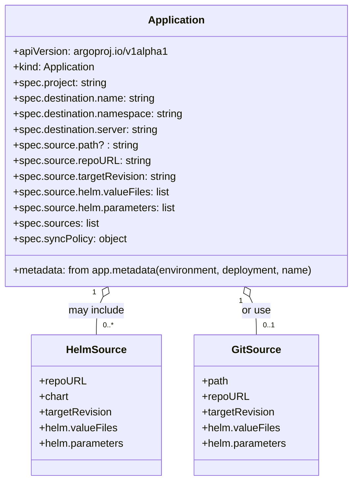

# Diagram: devops/k8s/argocd/app-manager/helm/templates/aws-load-balancer-controller.yaml


> Auto-generated by Obscura crawlers

## Diagram 1

```mermaid
flowchart TD
  A[loadBalancerController.enable?] -->|false| Z[No Action]
  A -->|true| B[For each cluster]
  B --> C[Create Argo Application: aws-lb-controller]
  C --> D{valueFiles.source == "helm"?}
  D -->|helm| E[Sources: Helm chart aws-load-balancer-controller\n- repoURL: repositories.helm\n- chart: aws-load-balancer-controller\n- targetRevision: config.revision\n- helm.valueFiles: values.yaml, $values/devops/k8s/aws-load-balancer-controller/helm/values.<env>.yaml\n- parameters: clusterName -> cluster.name]
  D -->|helm| F[Plus repoURL: repositories.devops (values ref)]
  D -->|git| G[Source: devops/k8s/aws-load-balancer-controller/helm\n- repoURL: repositories.devops\n- targetRevision: config.valueFiles.revision\n- helm.valueFiles: values.yaml, values.<env>.yaml\n- parameters: clusterName -> cluster.name]
  C --> H[Destination: namespace=config.namespace, server=cluster.server]
  C --> I[Project: <environment>-services]
  C --> J[Apply syncPolicy from loadBalancerController.syncPolicy]
  E --> K[Application Ready]
  F --> K
  G --> K
  H --> K
  I --> K
  J --> K
```

> SVG rendering failed for this diagram.

## Diagram 2



### SVG

<svg id="container" width="553.0546875" xmlns="http://www.w3.org/2000/svg" class="classDiagram" height="738" viewBox="0 0 553.0546875 738" role="graphics-document document" aria-roledescription="class"><style>#container{font-family:"trebuchet ms",verdana,arial,sans-serif;font-size:16px;fill:#333;}@keyframes edge-animation-frame{from{stroke-dashoffset:0;}}@keyframes dash{to{stroke-dashoffset:0;}}#container .edge-animation-slow{stroke-dasharray:9,5!important;stroke-dashoffset:900;animation:dash 50s linear infinite;stroke-linecap:round;}#container .edge-animation-fast{stroke-dasharray:9,5!important;stroke-dashoffset:900;animation:dash 20s linear infinite;stroke-linecap:round;}#container .error-icon{fill:#552222;}#container .error-text{fill:#552222;stroke:#552222;}#container .edge-thickness-normal{stroke-width:1px;}#container .edge-thickness-thick{stroke-width:3.5px;}#container .edge-pattern-solid{stroke-dasharray:0;}#container .edge-thickness-invisible{stroke-width:0;fill:none;}#container .edge-pattern-dashed{stroke-dasharray:3;}#container .edge-pattern-dotted{stroke-dasharray:2;}#container .marker{fill:#333333;stroke:#333333;}#container .marker.cross{stroke:#333333;}#container svg{font-family:"trebuchet ms",verdana,arial,sans-serif;font-size:16px;}#container p{margin:0;}#container g.classGroup text{fill:#9370DB;stroke:none;font-family:"trebuchet ms",verdana,arial,sans-serif;font-size:10px;}#container g.classGroup text .title{font-weight:bolder;}#container .nodeLabel,#container .edgeLabel{color:#131300;}#container .edgeLabel .label rect{fill:#ECECFF;}#container .label text{fill:#131300;}#container .labelBkg{background:#ECECFF;}#container .edgeLabel .label span{background:#ECECFF;}#container .classTitle{font-weight:bolder;}#container .node rect,#container .node circle,#container .node ellipse,#container .node polygon,#container .node path{fill:#ECECFF;stroke:#9370DB;stroke-width:1px;}#container .divider{stroke:#9370DB;stroke-width:1;}#container g.clickable{cursor:pointer;}#container g.classGroup rect{fill:#ECECFF;stroke:#9370DB;}#container g.classGroup line{stroke:#9370DB;stroke-width:1;}#container .classLabel .box{stroke:none;stroke-width:0;fill:#ECECFF;opacity:0.5;}#container .classLabel .label{fill:#9370DB;font-size:10px;}#container .relation{stroke:#333333;stroke-width:1;fill:none;}#container .dashed-line{stroke-dasharray:3;}#container .dotted-line{stroke-dasharray:1 2;}#container #compositionStart,#container .composition{fill:#333333!important;stroke:#333333!important;stroke-width:1;}#container #compositionEnd,#container .composition{fill:#333333!important;stroke:#333333!important;stroke-width:1;}#container #dependencyStart,#container .dependency{fill:#333333!important;stroke:#333333!important;stroke-width:1;}#container #dependencyStart,#container .dependency{fill:#333333!important;stroke:#333333!important;stroke-width:1;}#container #extensionStart,#container .extension{fill:transparent!important;stroke:#333333!important;stroke-width:1;}#container #extensionEnd,#container .extension{fill:transparent!important;stroke:#333333!important;stroke-width:1;}#container #aggregationStart,#container .aggregation{fill:transparent!important;stroke:#333333!important;stroke-width:1;}#container #aggregationEnd,#container .aggregation{fill:transparent!important;stroke:#333333!important;stroke-width:1;}#container #lollipopStart,#container .lollipop{fill:#ECECFF!important;stroke:#333333!important;stroke-width:1;}#container #lollipopEnd,#container .lollipop{fill:#ECECFF!important;stroke:#333333!important;stroke-width:1;}#container .edgeTerminals{font-size:11px;line-height:initial;}#container .classTitleText{text-anchor:middle;font-size:18px;fill:#333;}#container .label-icon{display:inline-block;height:1em;overflow:visible;vertical-align:-0.125em;}#container .node .label-icon path{fill:currentColor;stroke:revert;stroke-width:revert;}#container :root{--mermaid-font-family:"trebuchet ms",verdana,arial,sans-serif;}</style><g><defs><marker id="container_class-aggregationStart" class="marker aggregation class" refX="18" refY="7" markerWidth="190" markerHeight="240" orient="auto"><path d="M 18,7 L9,13 L1,7 L9,1 Z"></path></marker></defs><defs><marker id="container_class-aggregationEnd" class="marker aggregation class" refX="1" refY="7" markerWidth="20" markerHeight="28" orient="auto"><path d="M 18,7 L9,13 L1,7 L9,1 Z"></path></marker></defs><defs><marker id="container_class-extensionStart" class="marker extension class" refX="18" refY="7" markerWidth="190" markerHeight="240" orient="auto"><path d="M 1,7 L18,13 V 1 Z"></path></marker></defs><defs><marker id="container_class-extensionEnd" class="marker extension class" refX="1" refY="7" markerWidth="20" markerHeight="28" orient="auto"><path d="M 1,1 V 13 L18,7 Z"></path></marker></defs><defs><marker id="container_class-compositionStart" class="marker composition class" refX="18" refY="7" markerWidth="190" markerHeight="240" orient="auto"><path d="M 18,7 L9,13 L1,7 L9,1 Z"></path></marker></defs><defs><marker id="container_class-compositionEnd" class="marker composition class" refX="1" refY="7" markerWidth="20" markerHeight="28" orient="auto"><path d="M 18,7 L9,13 L1,7 L9,1 Z"></path></marker></defs><defs><marker id="container_class-dependencyStart" class="marker dependency class" refX="6" refY="7" markerWidth="190" markerHeight="240" orient="auto"><path d="M 5,7 L9,13 L1,7 L9,1 Z"></path></marker></defs><defs><marker id="container_class-dependencyEnd" class="marker dependency class" refX="13" refY="7" markerWidth="20" markerHeight="28" orient="auto"><path d="M 18,7 L9,13 L14,7 L9,1 Z"></path></marker></defs><defs><marker id="container_class-lollipopStart" class="marker lollipop class" refX="13" refY="7" markerWidth="190" markerHeight="240" orient="auto"><circle stroke="black" fill="transparent" cx="7" cy="7" r="6"></circle></marker></defs><defs><marker id="container_class-lollipopEnd" class="marker lollipop class" refX="1" refY="7" markerWidth="190" markerHeight="240" orient="auto"><circle stroke="black" fill="transparent" cx="7" cy="7" r="6"></circle></marker></defs><g class="root"><g class="clusters"></g><g class="edgePaths"><path d="M164.707,455.533L162.979,459.111C161.251,462.689,157.796,469.844,156.068,479.589C154.34,489.333,154.34,501.667,154.34,507.833L154.34,514" id="id_Application_HelmSource_1" class="edge-thickness-normal edge-pattern-solid relation" style=";;;" data-edge="true" data-et="edge" data-id="id_Application_HelmSource_1" data-points="W3sieCI6MTcyLjIwOTE2MTkzMTgxODIsInkiOjQ0MH0seyJ4IjoxNTQuMzM5ODQzNzUsInkiOjQ3N30seyJ4IjoxNTQuMzM5ODQzNzUsInkiOjUxNH1d" marker-start="url(#container_class-aggregationStart)"></path><path d="M388.347,455.533L390.075,459.111C391.803,462.689,395.259,469.844,396.987,479.589C398.715,489.333,398.715,501.667,398.715,507.833L398.715,514" id="id_Application_GitSource_2" class="edge-thickness-normal edge-pattern-solid relation" style=";;;" data-edge="true" data-et="edge" data-id="id_Application_GitSource_2" data-points="W3sieCI6MzgwLjg0NTUyNTU2ODE4MTgsInkiOjQ0MH0seyJ4IjozOTguNzE0ODQzNzUsInkiOjQ3N30seyJ4IjozOTguNzE0ODQzNzUsInkiOjUxNH1d" marker-start="url(#container_class-aggregationStart)"></path></g><g class="edgeLabels"><g class="edgeLabel" transform="translate(154.33984375, 477)"><g class="label" data-id="id_Application_HelmSource_1" transform="translate(-44.0625, -12)"><foreignObject width="88.125" height="24"><div xmlns="http://www.w3.org/1999/xhtml" class="labelBkg" style="display: table-cell; white-space: nowrap; line-height: 1.5; max-width: 200px; text-align: center;"><span class="edgeLabel"><p>may include</p></span></div></foreignObject></g></g><g class="edgeLabel" transform="translate(398.71484375, 477)"><g class="label" data-id="id_Application_GitSource_2" transform="translate(-22.6328125, -12)"><foreignObject width="45.265625" height="24"><div xmlns="http://www.w3.org/1999/xhtml" class="labelBkg" style="display: table-cell; white-space: nowrap; line-height: 1.5; max-width: 200px; text-align: center;"><span class="edgeLabel"><p>or use</p></span></div></foreignObject></g></g><g class="edgeTerminals" transform="translate(151.0913121318875, 449.23506404525745)"><g class="inner" transform="translate(0, 0)"><foreignObject style="width: 9px; height: 12px;"><div xmlns="http://www.w3.org/1999/xhtml" style="display: inline-block; padding-right: 1px; white-space: nowrap;"><span class="edgeLabel">1</span></div></foreignObject></g></g><g class="edgeTerminals" transform="translate(374.9488993696544, 462.28182682353065)"><g class="inner" transform="translate(0, 0)"><foreignObject style="width: 9px; height: 12px;"><div xmlns="http://www.w3.org/1999/xhtml" style="display: inline-block; padding-right: 1px; white-space: nowrap;"><span class="edgeLabel">1</span></div></foreignObject></g></g><g class="edgeTerminals" transform="translate(164.3398418749999, 491.49999839285715)"><g class="inner" transform="translate(0, 0)"></g><foreignObject style="width: 36px; height: 12px;"><div xmlns="http://www.w3.org/1999/xhtml" style="display: inline-block; padding-right: 1px; white-space: nowrap;"><span class="edgeLabel">0..*</span></div></foreignObject></g><g class="edgeTerminals" transform="translate(408.7148418749999, 491.49999839285715)"><g class="inner" transform="translate(0, 0)"></g><foreignObject style="width: 36px; height: 12px;"><div xmlns="http://www.w3.org/1999/xhtml" style="display: inline-block; padding-right: 1px; white-space: nowrap;"><span class="edgeLabel">0..1</span></div></foreignObject></g></g><g class="nodes"><g class="node default" id="classId-Application-0" transform="translate(276.52734375, 224)"><g class="basic label-container"><path d="M-268.52734375 -216 L268.52734375 -216 L268.52734375 216 L-268.52734375 216" stroke="none" stroke-width="0" fill="#ECECFF" style=""></path><path d="M-268.52734375 -216 C-101.4044592572142 -216, 65.7184252355716 -216, 268.52734375 -216 M-268.52734375 -216 C-86.76205145526137 -216, 95.00324083947726 -216, 268.52734375 -216 M268.52734375 -216 C268.52734375 -50.81964138992848, 268.52734375 114.36071722014304, 268.52734375 216 M268.52734375 -216 C268.52734375 -122.51390404829701, 268.52734375 -29.027808096594015, 268.52734375 216 M268.52734375 216 C79.88230819982411 216, -108.76272735035178 216, -268.52734375 216 M268.52734375 216 C145.3986443288606 216, 22.269944907721225 216, -268.52734375 216 M-268.52734375 216 C-268.52734375 125.70849451922463, -268.52734375 35.41698903844926, -268.52734375 -216 M-268.52734375 216 C-268.52734375 114.28850055922153, -268.52734375 12.577001118443064, -268.52734375 -216" stroke="#9370DB" stroke-width="1.3" fill="none" stroke-dasharray="0 0" style=""></path></g><g class="annotation-group text" transform="translate(0, -192)"></g><g class="label-group text" transform="translate(-41.6796875, -192)"><g class="label" style="font-weight: bolder" transform="translate(0,-12)"><foreignObject width="83.359375" height="24"><div xmlns="http://www.w3.org/1999/xhtml" style="display: table-cell; white-space: nowrap; line-height: 1.5; max-width: 133px; text-align: center;"><span class="nodeLabel markdown-node-label" style=""><p>Application</p></span></div></foreignObject></g></g><g class="members-group text" transform="translate(-256.52734375, -144)"><g class="label" style="" transform="translate(0,-12)"><foreignObject width="240.921875" height="24"><div xmlns="http://www.w3.org/1999/xhtml" style="display: table-cell; white-space: nowrap; line-height: 1.5; max-width: 298px; text-align: center;"><span class="nodeLabel markdown-node-label" style=""><p>+apiVersion: argoproj.io/v1alpha1</p></span></div></foreignObject></g><g class="label" style="" transform="translate(0,12)"><foreignObject width="130.296875" height="24"><div xmlns="http://www.w3.org/1999/xhtml" style="display: table-cell; white-space: nowrap; line-height: 1.5; max-width: 188px; text-align: center;"><span class="nodeLabel markdown-node-label" style=""><p>+kind: Application</p></span></div></foreignObject></g><g class="label" style="" transform="translate(0,36)"><foreignObject width="146.28125" height="24"><div xmlns="http://www.w3.org/1999/xhtml" style="display: table-cell; white-space: nowrap; line-height: 1.5; max-width: 204px; text-align: center;"><span class="nodeLabel markdown-node-label" style=""><p>+spec.project: string</p></span></div></foreignObject></g><g class="label" style="" transform="translate(0,60)"><foreignObject width="222.375" height="24"><div xmlns="http://www.w3.org/1999/xhtml" style="display: table-cell; white-space: nowrap; line-height: 1.5; max-width: 280px; text-align: center;"><span class="nodeLabel markdown-node-label" style=""><p>+spec.destination.name: string</p></span></div></foreignObject></g><g class="label" style="" transform="translate(0,84)"><foreignObject width="263.9375" height="24"><div xmlns="http://www.w3.org/1999/xhtml" style="display: table-cell; white-space: nowrap; line-height: 1.5; max-width: 322px; text-align: center;"><span class="nodeLabel markdown-node-label" style=""><p>+spec.destination.namespace: string</p></span></div></foreignObject></g><g class="label" style="" transform="translate(0,108)"><foreignObject width="227.15625" height="24"><div xmlns="http://www.w3.org/1999/xhtml" style="display: table-cell; white-space: nowrap; line-height: 1.5; max-width: 285px; text-align: center;"><span class="nodeLabel markdown-node-label" style=""><p>+spec.destination.server: string</p></span></div></foreignObject></g><g class="label" style="" transform="translate(0,132)"><foreignObject width="190.96875" height="24"><div xmlns="http://www.w3.org/1999/xhtml" style="display: table-cell; white-space: nowrap; line-height: 1.5; max-width: 249px; text-align: center;"><span class="nodeLabel markdown-node-label" style=""><p>+spec.source.path? : string</p></span></div></foreignObject></g><g class="label" style="" transform="translate(0,156)"><foreignObject width="208.171875" height="24"><div xmlns="http://www.w3.org/1999/xhtml" style="display: table-cell; white-space: nowrap; line-height: 1.5; max-width: 266px; text-align: center;"><span class="nodeLabel markdown-node-label" style=""><p>+spec.source.repoURL: string</p></span></div></foreignObject></g><g class="label" style="" transform="translate(0,180)"><foreignObject width="250.234375" height="24"><div xmlns="http://www.w3.org/1999/xhtml" style="display: table-cell; white-space: nowrap; line-height: 1.5; max-width: 308px; text-align: center;"><span class="nodeLabel markdown-node-label" style=""><p>+spec.source.targetRevision: string</p></span></div></foreignObject></g><g class="label" style="" transform="translate(0,204)"><foreignObject width="238.671875" height="24"><div xmlns="http://www.w3.org/1999/xhtml" style="display: table-cell; white-space: nowrap; line-height: 1.5; max-width: 296px; text-align: center;"><span class="nodeLabel markdown-node-label" style=""><p>+spec.source.helm.valueFiles: list</p></span></div></foreignObject></g><g class="label" style="" transform="translate(0,228)"><foreignObject width="250.28125" height="24"><div xmlns="http://www.w3.org/1999/xhtml" style="display: table-cell; white-space: nowrap; line-height: 1.5; max-width: 308px; text-align: center;"><span class="nodeLabel markdown-node-label" style=""><p>+spec.source.helm.parameters: list</p></span></div></foreignObject></g><g class="label" style="" transform="translate(0,252)"><foreignObject width="131.265625" height="24"><div xmlns="http://www.w3.org/1999/xhtml" style="display: table-cell; white-space: nowrap; line-height: 1.5; max-width: 189px; text-align: center;"><span class="nodeLabel markdown-node-label" style=""><p>+spec.sources: list</p></span></div></foreignObject></g><g class="label" style="" transform="translate(0,276)"><foreignObject width="173.984375" height="24"><div xmlns="http://www.w3.org/1999/xhtml" style="display: table-cell; white-space: nowrap; line-height: 1.5; max-width: 232px; text-align: center;"><span class="nodeLabel markdown-node-label" style=""><p>+spec.syncPolicy: object</p></span></div></foreignObject></g></g><g class="methods-group text" transform="translate(-256.52734375, 192)"><g class="label" style="" transform="translate(0,-12)"><foreignObject width="471.375" height="24"><div xmlns="http://www.w3.org/1999/xhtml" style="display: table-cell; white-space: nowrap; line-height: 1.5; max-width: 529px; text-align: center;"><span class="nodeLabel markdown-node-label" style=""><p>+metadata: from app.metadata(environment, deployment, name)</p></span></div></foreignObject></g></g><g class="divider" style=""><path d="M-268.52734375 -168 C-68.19474317966029 -168, 132.13785739067941 -168, 268.52734375 -168 M-268.52734375 -168 C-112.01008731632527 -168, 44.50716911734946 -168, 268.52734375 -168" stroke="#9370DB" stroke-width="1.3" fill="none" stroke-dasharray="0 0" style=""></path></g><g class="divider" style=""><path d="M-268.52734375 168 C-86.80050625868773 168, 94.92633123262453 168, 268.52734375 168 M-268.52734375 168 C-76.73764775481484 168, 115.05204824037031 168, 268.52734375 168" stroke="#9370DB" stroke-width="1.3" fill="none" stroke-dasharray="0 0" style=""></path></g></g><g class="node default" id="classId-HelmSource-1" transform="translate(154.33984375, 622)"><g class="basic label-container"><path d="M-99.28125 -108 L99.28125 -108 L99.28125 108 L-99.28125 108" stroke="none" stroke-width="0" fill="#ECECFF" style=""></path><path d="M-99.28125 -108 C-58.12992660581155 -108, -16.978603211623096 -108, 99.28125 -108 M-99.28125 -108 C-20.8485063766623 -108, 57.5842372466754 -108, 99.28125 -108 M99.28125 -108 C99.28125 -41.640936927512215, 99.28125 24.71812614497557, 99.28125 108 M99.28125 -108 C99.28125 -60.971624572171045, 99.28125 -13.94324914434209, 99.28125 108 M99.28125 108 C51.80355564849212 108, 4.325861296984243 108, -99.28125 108 M99.28125 108 C35.09474498832162 108, -29.091760023356755 108, -99.28125 108 M-99.28125 108 C-99.28125 64.40620392579802, -99.28125 20.812407851596035, -99.28125 -108 M-99.28125 108 C-99.28125 24.560986565603983, -99.28125 -58.878026868792034, -99.28125 -108" stroke="#9370DB" stroke-width="1.3" fill="none" stroke-dasharray="0 0" style=""></path></g><g class="annotation-group text" transform="translate(0, -84)"></g><g class="label-group text" transform="translate(-43.765625, -84)"><g class="label" style="font-weight: bolder" transform="translate(0,-12)"><foreignObject width="87.53125" height="24"><div xmlns="http://www.w3.org/1999/xhtml" style="display: table-cell; white-space: nowrap; line-height: 1.5; max-width: 137px; text-align: center;"><span class="nodeLabel markdown-node-label" style=""><p>HelmSource</p></span></div></foreignObject></g></g><g class="members-group text" transform="translate(-87.28125, -36)"><g class="label" style="" transform="translate(0,-12)"><foreignObject width="69.5" height="24"><div xmlns="http://www.w3.org/1999/xhtml" style="display: table-cell; white-space: nowrap; line-height: 1.5; max-width: 127px; text-align: center;"><span class="nodeLabel markdown-node-label" style=""><p>+repoURL</p></span></div></foreignObject></g><g class="label" style="" transform="translate(0,12)"><foreignObject width="45.671875" height="24"><div xmlns="http://www.w3.org/1999/xhtml" style="display: table-cell; white-space: nowrap; line-height: 1.5; max-width: 103px; text-align: center;"><span class="nodeLabel markdown-node-label" style=""><p>+chart</p></span></div></foreignObject></g><g class="label" style="" transform="translate(0,36)"><foreignObject width="111.953125" height="24"><div xmlns="http://www.w3.org/1999/xhtml" style="display: table-cell; white-space: nowrap; line-height: 1.5; max-width: 169px; text-align: center;"><span class="nodeLabel markdown-node-label" style=""><p>+targetRevision</p></span></div></foreignObject></g><g class="label" style="" transform="translate(0,60)"><foreignObject width="119.171875" height="24"><div xmlns="http://www.w3.org/1999/xhtml" style="display: table-cell; white-space: nowrap; line-height: 1.5; max-width: 177px; text-align: center;"><span class="nodeLabel markdown-node-label" style=""><p>+helm.valueFiles</p></span></div></foreignObject></g><g class="label" style="" transform="translate(0,84)"><foreignObject width="130.796875" height="24"><div xmlns="http://www.w3.org/1999/xhtml" style="display: table-cell; white-space: nowrap; line-height: 1.5; max-width: 188px; text-align: center;"><span class="nodeLabel markdown-node-label" style=""><p>+helm.parameters</p></span></div></foreignObject></g></g><g class="methods-group text" transform="translate(-87.28125, 108)"></g><g class="divider" style=""><path d="M-99.28125 -60 C-35.11189582127325 -60, 29.0574583574535 -60, 99.28125 -60 M-99.28125 -60 C-23.035882742038652 -60, 53.209484515922696 -60, 99.28125 -60" stroke="#9370DB" stroke-width="1.3" fill="none" stroke-dasharray="0 0" style=""></path></g><g class="divider" style=""><path d="M-99.28125 84 C-55.21966304641274 84, -11.158076092825482 84, 99.28125 84 M-99.28125 84 C-21.31205415323592 84, 56.65714169352816 84, 99.28125 84" stroke="#9370DB" stroke-width="1.3" fill="none" stroke-dasharray="0 0" style=""></path></g></g><g class="node default" id="classId-GitSource-2" transform="translate(398.71484375, 622)"><g class="basic label-container"><path d="M-95.09375 -108 L95.09375 -108 L95.09375 108 L-95.09375 108" stroke="none" stroke-width="0" fill="#ECECFF" style=""></path><path d="M-95.09375 -108 C-36.55250588510967 -108, 21.988738229780665 -108, 95.09375 -108 M-95.09375 -108 C-34.86531936796643 -108, 25.363111264067143 -108, 95.09375 -108 M95.09375 -108 C95.09375 -43.42685057367636, 95.09375 21.146298852647277, 95.09375 108 M95.09375 -108 C95.09375 -30.968486302591245, 95.09375 46.06302739481751, 95.09375 108 M95.09375 108 C55.528146524983654 108, 15.962543049967309 108, -95.09375 108 M95.09375 108 C34.04733035672946 108, -26.99908928654108 108, -95.09375 108 M-95.09375 108 C-95.09375 62.704716155600494, -95.09375 17.409432311200987, -95.09375 -108 M-95.09375 108 C-95.09375 34.49756468853438, -95.09375 -39.004870622931236, -95.09375 -108" stroke="#9370DB" stroke-width="1.3" fill="none" stroke-dasharray="0 0" style=""></path></g><g class="annotation-group text" transform="translate(0, -84)"></g><g class="label-group text" transform="translate(-35.390625, -84)"><g class="label" style="font-weight: bolder" transform="translate(0,-12)"><foreignObject width="70.78125" height="24"><div xmlns="http://www.w3.org/1999/xhtml" style="display: table-cell; white-space: nowrap; line-height: 1.5; max-width: 120px; text-align: center;"><span class="nodeLabel markdown-node-label" style=""><p>GitSource</p></span></div></foreignObject></g></g><g class="members-group text" transform="translate(-83.09375, -36)"><g class="label" style="" transform="translate(0,-12)"><foreignObject width="41.1875" height="24"><div xmlns="http://www.w3.org/1999/xhtml" style="display: table-cell; white-space: nowrap; line-height: 1.5; max-width: 99px; text-align: center;"><span class="nodeLabel markdown-node-label" style=""><p>+path</p></span></div></foreignObject></g><g class="label" style="" transform="translate(0,12)"><foreignObject width="69.5" height="24"><div xmlns="http://www.w3.org/1999/xhtml" style="display: table-cell; white-space: nowrap; line-height: 1.5; max-width: 127px; text-align: center;"><span class="nodeLabel markdown-node-label" style=""><p>+repoURL</p></span></div></foreignObject></g><g class="label" style="" transform="translate(0,36)"><foreignObject width="111.953125" height="24"><div xmlns="http://www.w3.org/1999/xhtml" style="display: table-cell; white-space: nowrap; line-height: 1.5; max-width: 169px; text-align: center;"><span class="nodeLabel markdown-node-label" style=""><p>+targetRevision</p></span></div></foreignObject></g><g class="label" style="" transform="translate(0,60)"><foreignObject width="119.171875" height="24"><div xmlns="http://www.w3.org/1999/xhtml" style="display: table-cell; white-space: nowrap; line-height: 1.5; max-width: 177px; text-align: center;"><span class="nodeLabel markdown-node-label" style=""><p>+helm.valueFiles</p></span></div></foreignObject></g><g class="label" style="" transform="translate(0,84)"><foreignObject width="130.796875" height="24"><div xmlns="http://www.w3.org/1999/xhtml" style="display: table-cell; white-space: nowrap; line-height: 1.5; max-width: 188px; text-align: center;"><span class="nodeLabel markdown-node-label" style=""><p>+helm.parameters</p></span></div></foreignObject></g></g><g class="methods-group text" transform="translate(-83.09375, 108)"></g><g class="divider" style=""><path d="M-95.09375 -60 C-23.98450999943084 -60, 47.12473000113832 -60, 95.09375 -60 M-95.09375 -60 C-46.14699658874147 -60, 2.799756822517054 -60, 95.09375 -60" stroke="#9370DB" stroke-width="1.3" fill="none" stroke-dasharray="0 0" style=""></path></g><g class="divider" style=""><path d="M-95.09375 84 C-36.896403650305906 84, 21.300942699388187 84, 95.09375 84 M-95.09375 84 C-31.321270540585473 84, 32.45120891882905 84, 95.09375 84" stroke="#9370DB" stroke-width="1.3" fill="none" stroke-dasharray="0 0" style=""></path></g></g></g></g></g></svg>
