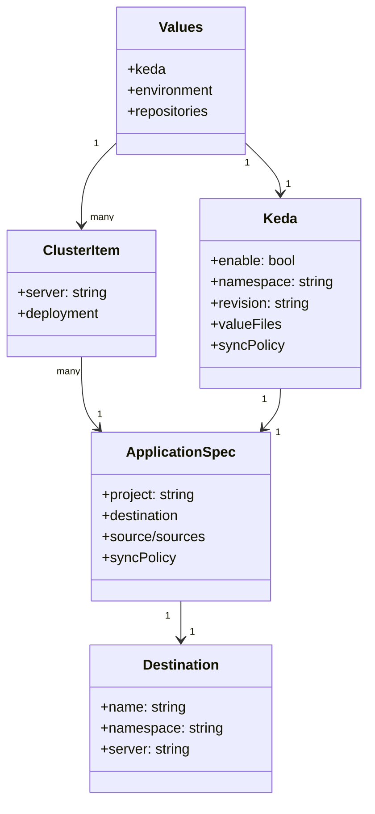

# Diagram: devops/k8s/argocd/app-manager/helm/templates/keda.yaml


> Auto-generated by Obscura crawlers

## Diagram 1

```mermaid
flowchart LR
  A[Start: Template Render] --> B{.Values.keda.enable?}
  B -- false --> Z[No keda block rendered]
  B -- true --> C[Range .Values.cluster]
  C --> D[Set $config = .Values.keda]
  D --> E[Set $source = $config.valueFiles.source]
  D --> F[Set $chart = "keda"]
  C --> G[Create Application manifest]
  G --> H[metadata via include "app.metadata"]
  G --> I[spec.project = "{{ $.Values.environment }}-services"]
  I --> J[destination.namespace = $config.namespace]
  J --> K[destination.server = .server]
  E --> L{source == "helm"?}
  L -- true --> M[sources: repoURL, chart, targetRevision]
  M --> N[helm.valueFiles: values.yaml]
  N --> O[include "keda.parameters" (indent 8)]
  L -- false --> P{source == "git"?}
  P -- true --> Q[source: path devops/k8s/keda/helm]
  Q --> R[repoURL: {{ $.Values.repositories.devops }}]
  R --> S[targetRevision = $config.valueFiles.revision]
  S --> T[helm.valueFiles: values.yaml]
  T --> U[include "keda.parameters" (indent 6)]
  G --> V[include "app.syncPolicy"]
  V --> Y[Emit Application YAML]
  Y --> End[End]
```

> SVG rendering failed for this diagram.

## Diagram 2



### SVG

<svg id="container" width="417.6171875" xmlns="http://www.w3.org/2000/svg" class="classDiagram" height="910" viewBox="0 0 417.6171875 910" role="graphics-document document" aria-roledescription="class"><style>#container{font-family:"trebuchet ms",verdana,arial,sans-serif;font-size:16px;fill:#333;}@keyframes edge-animation-frame{from{stroke-dashoffset:0;}}@keyframes dash{to{stroke-dashoffset:0;}}#container .edge-animation-slow{stroke-dasharray:9,5!important;stroke-dashoffset:900;animation:dash 50s linear infinite;stroke-linecap:round;}#container .edge-animation-fast{stroke-dasharray:9,5!important;stroke-dashoffset:900;animation:dash 20s linear infinite;stroke-linecap:round;}#container .error-icon{fill:#552222;}#container .error-text{fill:#552222;stroke:#552222;}#container .edge-thickness-normal{stroke-width:1px;}#container .edge-thickness-thick{stroke-width:3.5px;}#container .edge-pattern-solid{stroke-dasharray:0;}#container .edge-thickness-invisible{stroke-width:0;fill:none;}#container .edge-pattern-dashed{stroke-dasharray:3;}#container .edge-pattern-dotted{stroke-dasharray:2;}#container .marker{fill:#333333;stroke:#333333;}#container .marker.cross{stroke:#333333;}#container svg{font-family:"trebuchet ms",verdana,arial,sans-serif;font-size:16px;}#container p{margin:0;}#container g.classGroup text{fill:#9370DB;stroke:none;font-family:"trebuchet ms",verdana,arial,sans-serif;font-size:10px;}#container g.classGroup text .title{font-weight:bolder;}#container .nodeLabel,#container .edgeLabel{color:#131300;}#container .edgeLabel .label rect{fill:#ECECFF;}#container .label text{fill:#131300;}#container .labelBkg{background:#ECECFF;}#container .edgeLabel .label span{background:#ECECFF;}#container .classTitle{font-weight:bolder;}#container .node rect,#container .node circle,#container .node ellipse,#container .node polygon,#container .node path{fill:#ECECFF;stroke:#9370DB;stroke-width:1px;}#container .divider{stroke:#9370DB;stroke-width:1;}#container g.clickable{cursor:pointer;}#container g.classGroup rect{fill:#ECECFF;stroke:#9370DB;}#container g.classGroup line{stroke:#9370DB;stroke-width:1;}#container .classLabel .box{stroke:none;stroke-width:0;fill:#ECECFF;opacity:0.5;}#container .classLabel .label{fill:#9370DB;font-size:10px;}#container .relation{stroke:#333333;stroke-width:1;fill:none;}#container .dashed-line{stroke-dasharray:3;}#container .dotted-line{stroke-dasharray:1 2;}#container #compositionStart,#container .composition{fill:#333333!important;stroke:#333333!important;stroke-width:1;}#container #compositionEnd,#container .composition{fill:#333333!important;stroke:#333333!important;stroke-width:1;}#container #dependencyStart,#container .dependency{fill:#333333!important;stroke:#333333!important;stroke-width:1;}#container #dependencyStart,#container .dependency{fill:#333333!important;stroke:#333333!important;stroke-width:1;}#container #extensionStart,#container .extension{fill:transparent!important;stroke:#333333!important;stroke-width:1;}#container #extensionEnd,#container .extension{fill:transparent!important;stroke:#333333!important;stroke-width:1;}#container #aggregationStart,#container .aggregation{fill:transparent!important;stroke:#333333!important;stroke-width:1;}#container #aggregationEnd,#container .aggregation{fill:transparent!important;stroke:#333333!important;stroke-width:1;}#container #lollipopStart,#container .lollipop{fill:#ECECFF!important;stroke:#333333!important;stroke-width:1;}#container #lollipopEnd,#container .lollipop{fill:#ECECFF!important;stroke:#333333!important;stroke-width:1;}#container .edgeTerminals{font-size:11px;line-height:initial;}#container .classTitleText{text-anchor:middle;font-size:18px;fill:#333;}#container .label-icon{display:inline-block;height:1em;overflow:visible;vertical-align:-0.125em;}#container .node .label-icon path{fill:currentColor;stroke:revert;stroke-width:revert;}#container :root{--mermaid-font-family:"trebuchet ms",verdana,arial,sans-serif;}</style><g><defs><marker id="container_class-aggregationStart" class="marker aggregation class" refX="18" refY="7" markerWidth="190" markerHeight="240" orient="auto"><path d="M 18,7 L9,13 L1,7 L9,1 Z"></path></marker></defs><defs><marker id="container_class-aggregationEnd" class="marker aggregation class" refX="1" refY="7" markerWidth="20" markerHeight="28" orient="auto"><path d="M 18,7 L9,13 L1,7 L9,1 Z"></path></marker></defs><defs><marker id="container_class-extensionStart" class="marker extension class" refX="18" refY="7" markerWidth="190" markerHeight="240" orient="auto"><path d="M 1,7 L18,13 V 1 Z"></path></marker></defs><defs><marker id="container_class-extensionEnd" class="marker extension class" refX="1" refY="7" markerWidth="20" markerHeight="28" orient="auto"><path d="M 1,1 V 13 L18,7 Z"></path></marker></defs><defs><marker id="container_class-compositionStart" class="marker composition class" refX="18" refY="7" markerWidth="190" markerHeight="240" orient="auto"><path d="M 18,7 L9,13 L1,7 L9,1 Z"></path></marker></defs><defs><marker id="container_class-compositionEnd" class="marker composition class" refX="1" refY="7" markerWidth="20" markerHeight="28" orient="auto"><path d="M 18,7 L9,13 L1,7 L9,1 Z"></path></marker></defs><defs><marker id="container_class-dependencyStart" class="marker dependency class" refX="6" refY="7" markerWidth="190" markerHeight="240" orient="auto"><path d="M 5,7 L9,13 L1,7 L9,1 Z"></path></marker></defs><defs><marker id="container_class-dependencyEnd" class="marker dependency class" refX="13" refY="7" markerWidth="20" markerHeight="28" orient="auto"><path d="M 18,7 L9,13 L14,7 L9,1 Z"></path></marker></defs><defs><marker id="container_class-lollipopStart" class="marker lollipop class" refX="13" refY="7" markerWidth="190" markerHeight="240" orient="auto"><circle stroke="black" fill="transparent" cx="7" cy="7" r="6"></circle></marker></defs><defs><marker id="container_class-lollipopEnd" class="marker lollipop class" refX="1" refY="7" markerWidth="190" markerHeight="240" orient="auto"><circle stroke="black" fill="transparent" cx="7" cy="7" r="6"></circle></marker></defs><g class="root"><g class="clusters"></g><g class="edgePaths"><path d="M279.631,163.509L286.103,169.757C292.576,176.006,305.52,188.503,311.993,197.918C318.465,207.333,318.465,213.667,318.465,216.833L318.465,220" id="id_Values_Keda_1" class="edge-thickness-normal edge-pattern-solid relation" style=";;;" data-edge="true" data-et="edge" data-id="id_Values_Keda_1" data-points="W3sieCI6Mjc5LjYzMDg1OTM3NSwieSI6MTYzLjUwODkxNzYwNTEzNDM0fSx7IngiOjMxOC40NjQ4NDM3NSwieSI6MjAxfSx7IngiOjMxOC40NjQ4NDM3NSwieSI6MjI2fV0=" marker-end="url(#container_class-dependencyEnd)"></path><path d="M131.49,163.509L125.018,169.757C118.546,176.006,105.601,188.503,99.129,203.918C92.656,219.333,92.656,237.667,92.656,246.833L92.656,256" id="id_Values_ClusterItem_2" class="edge-thickness-normal edge-pattern-solid relation" style=";;;" data-edge="true" data-et="edge" data-id="id_Values_ClusterItem_2" data-points="W3sieCI6MTMxLjQ5MDIzNDM3NSwieSI6MTYzLjUwODkxNzYwNTEzNDM0fSx7IngiOjkyLjY1NjI1LCJ5IjoyMDF9LHsieCI6OTIuNjU2MjUsInkiOjI2Mn1d" marker-end="url(#container_class-dependencyEnd)"></path><path d="M92.656,406L92.656,416.167C92.656,426.333,92.656,446.667,95.862,460.269C99.068,473.871,105.479,480.742,108.685,484.178L111.89,487.613" id="id_ClusterItem_ApplicationSpec_3" class="edge-thickness-normal edge-pattern-solid relation" style=";;;" data-edge="true" data-et="edge" data-id="id_ClusterItem_ApplicationSpec_3" data-points="W3sieCI6OTIuNjU2MjUsInkiOjQwNn0seyJ4Ijo5Mi42NTYyNSwieSI6NDY3fSx7IngiOjExNS45ODM1ODQwNjUwODI2NCwieSI6NDkyfV0=" marker-end="url(#container_class-dependencyEnd)"></path><path d="M205.561,684L205.561,688.167C205.561,692.333,205.561,700.667,205.561,708C205.561,715.333,205.561,721.667,205.561,724.833L205.561,728" id="id_ApplicationSpec_Destination_4" class="edge-thickness-normal edge-pattern-solid relation" style=";;;" data-edge="true" data-et="edge" data-id="id_ApplicationSpec_Destination_4" data-points="W3sieCI6MjA1LjU2MDU0Njg3NSwieSI6Njg0fSx7IngiOjIwNS41NjA1NDY4NzUsInkiOjcwOX0seyJ4IjoyMDUuNTYwNTQ2ODc1LCJ5Ijo3MzR9XQ==" marker-end="url(#container_class-dependencyEnd)"></path><path d="M318.465,442L318.465,446.167C318.465,450.333,318.465,458.667,315.259,466.269C312.054,473.871,305.642,480.742,302.437,484.178L299.231,487.613" id="id_Keda_ApplicationSpec_5" class="edge-thickness-normal edge-pattern-solid relation" style=";;;" data-edge="true" data-et="edge" data-id="id_Keda_ApplicationSpec_5" data-points="W3sieCI6MzE4LjQ2NDg0Mzc1LCJ5Ijo0NDJ9LHsieCI6MzE4LjQ2NDg0Mzc1LCJ5Ijo0Njd9LHsieCI6Mjk1LjEzNzUwOTY4NDkxNzM1LCJ5Ijo0OTJ9XQ==" marker-end="url(#container_class-dependencyEnd)"></path></g><g class="edgeLabels"><g class="edgeLabel"><g class="label" data-id="id_Values_Keda_1" transform="translate(0, 0)"><foreignObject width="0" height="0"><div xmlns="http://www.w3.org/1999/xhtml" class="labelBkg" style="display: table-cell; white-space: nowrap; line-height: 1.5; max-width: 200px; text-align: center;"><span class="edgeLabel"></span></div></foreignObject></g></g><g class="edgeLabel"><g class="label" data-id="id_Values_ClusterItem_2" transform="translate(0, 0)"><foreignObject width="0" height="0"><div xmlns="http://www.w3.org/1999/xhtml" class="labelBkg" style="display: table-cell; white-space: nowrap; line-height: 1.5; max-width: 200px; text-align: center;"><span class="edgeLabel"></span></div></foreignObject></g></g><g class="edgeLabel"><g class="label" data-id="id_ClusterItem_ApplicationSpec_3" transform="translate(0, 0)"><foreignObject width="0" height="0"><div xmlns="http://www.w3.org/1999/xhtml" class="labelBkg" style="display: table-cell; white-space: nowrap; line-height: 1.5; max-width: 200px; text-align: center;"><span class="edgeLabel"></span></div></foreignObject></g></g><g class="edgeLabel"><g class="label" data-id="id_ApplicationSpec_Destination_4" transform="translate(0, 0)"><foreignObject width="0" height="0"><div xmlns="http://www.w3.org/1999/xhtml" class="labelBkg" style="display: table-cell; white-space: nowrap; line-height: 1.5; max-width: 200px; text-align: center;"><span class="edgeLabel"></span></div></foreignObject></g></g><g class="edgeLabel"><g class="label" data-id="id_Keda_ApplicationSpec_5" transform="translate(0, 0)"><foreignObject width="0" height="0"><div xmlns="http://www.w3.org/1999/xhtml" class="labelBkg" style="display: table-cell; white-space: nowrap; line-height: 1.5; max-width: 200px; text-align: center;"><span class="edgeLabel"></span></div></foreignObject></g></g><g class="edgeTerminals" transform="translate(281.8026282257294, 186.45523309284815)"><g class="inner" transform="translate(0, 0)"><foreignObject style="width: 9px; height: 12px;"><div xmlns="http://www.w3.org/1999/xhtml" style="display: inline-block; padding-right: 1px; white-space: nowrap;"><span class="edgeLabel">1</span></div></foreignObject></g></g><g class="edgeTerminals" transform="translate(108.48172152880348, 164.87213373698293)"><g class="inner" transform="translate(0, 0)"><foreignObject style="width: 9px; height: 12px;"><div xmlns="http://www.w3.org/1999/xhtml" style="display: inline-block; padding-right: 1px; white-space: nowrap;"><span class="edgeLabel">1</span></div></foreignObject></g></g><g class="edgeTerminals" transform="translate(77.65625, 423.5)"><g class="inner" transform="translate(0, 0)"><foreignObject style="width: 36px; height: 12px;"><div xmlns="http://www.w3.org/1999/xhtml" style="display: inline-block; padding-right: 1px; white-space: nowrap;"><span class="edgeLabel">many</span></div></foreignObject></g></g><g class="edgeTerminals" transform="translate(190.56054843750007, 701.5000013392857)"><g class="inner" transform="translate(0, 0)"><foreignObject style="width: 9px; height: 12px;"><div xmlns="http://www.w3.org/1999/xhtml" style="display: inline-block; padding-right: 1px; white-space: nowrap;"><span class="edgeLabel">1</span></div></foreignObject></g></g><g class="edgeTerminals" transform="translate(300.3772940796985, 455.0569302108767)"><g class="inner" transform="translate(0, 0)"><foreignObject style="width: 9px; height: 12px;"><div xmlns="http://www.w3.org/1999/xhtml" style="display: inline-block; padding-right: 1px; white-space: nowrap;"><span class="edgeLabel">1</span></div></foreignObject></g></g><g class="edgeTerminals" transform="translate(324.50115965880684, 201.73164591909975)"><g class="inner" transform="translate(0, 0)"></g><foreignObject style="width: 9px; height: 12px;"><div xmlns="http://www.w3.org/1999/xhtml" style="display: inline-block; padding-right: 1px; white-space: nowrap;"><span class="edgeLabel">1</span></div></foreignObject></g><g class="edgeTerminals" transform="translate(102.65625, 239.5)"><g class="inner" transform="translate(0, 0)"></g><foreignObject style="width: 36px; height: 12px;"><div xmlns="http://www.w3.org/1999/xhtml" style="display: inline-block; padding-right: 1px; white-space: nowrap;"><span class="edgeLabel">many</span></div></foreignObject></g><g class="edgeTerminals" transform="translate(110.44763145037062, 464.0379976805942)"><g class="inner" transform="translate(0, 0)"></g><foreignObject style="width: 9px; height: 12px;"><div xmlns="http://www.w3.org/1999/xhtml" style="display: inline-block; padding-right: 1px; white-space: nowrap;"><span class="edgeLabel">1</span></div></foreignObject></g><g class="edgeTerminals" transform="translate(215.56054843749996, 711.5000013392857)"><g class="inner" transform="translate(0, 0)"></g><foreignObject style="width: 9px; height: 12px;"><div xmlns="http://www.w3.org/1999/xhtml" style="display: inline-block; padding-right: 1px; white-space: nowrap;"><span class="edgeLabel">1</span></div></foreignObject></g><g class="edgeTerminals" transform="translate(312.92889006466265, 484.1550514295288)"><g class="inner" transform="translate(0, 0)"></g><foreignObject style="width: 9px; height: 12px;"><div xmlns="http://www.w3.org/1999/xhtml" style="display: inline-block; padding-right: 1px; white-space: nowrap;"><span class="edgeLabel">1</span></div></foreignObject></g></g><g class="nodes"><g class="node default" id="classId-Values-0" transform="translate(205.560546875, 92)"><g class="basic label-container"><path d="M-74.0703125 -84 L74.0703125 -84 L74.0703125 84 L-74.0703125 84" stroke="none" stroke-width="0" fill="#ECECFF" style=""></path><path d="M-74.0703125 -84 C-42.279423724877354 -84, -10.488534949754708 -84, 74.0703125 -84 M-74.0703125 -84 C-38.7252991651691 -84, -3.3802858303381953 -84, 74.0703125 -84 M74.0703125 -84 C74.0703125 -21.709850631780377, 74.0703125 40.58029873643925, 74.0703125 84 M74.0703125 -84 C74.0703125 -28.53966748061007, 74.0703125 26.92066503877986, 74.0703125 84 M74.0703125 84 C27.776611472950805 84, -18.51708955409839 84, -74.0703125 84 M74.0703125 84 C32.48061904698607 84, -9.109074406027858 84, -74.0703125 84 M-74.0703125 84 C-74.0703125 19.08821891857616, -74.0703125 -45.82356216284768, -74.0703125 -84 M-74.0703125 84 C-74.0703125 21.895594564023035, -74.0703125 -40.20881087195393, -74.0703125 -84" stroke="#9370DB" stroke-width="1.3" fill="none" stroke-dasharray="0 0" style=""></path></g><g class="annotation-group text" transform="translate(0, -60)"></g><g class="label-group text" transform="translate(-23.78125, -60)"><g class="label" style="font-weight: bolder" transform="translate(0,-12)"><foreignObject width="47.5625" height="24"><div xmlns="http://www.w3.org/1999/xhtml" style="display: table-cell; white-space: nowrap; line-height: 1.5; max-width: 97px; text-align: center;"><span class="nodeLabel markdown-node-label" style=""><p>Values</p></span></div></foreignObject></g></g><g class="members-group text" transform="translate(-62.0703125, -12)"><g class="label" style="" transform="translate(0,-12)"><foreignObject width="43.03125" height="24"><div xmlns="http://www.w3.org/1999/xhtml" style="display: table-cell; white-space: nowrap; line-height: 1.5; max-width: 100px; text-align: center;"><span class="nodeLabel markdown-node-label" style=""><p>+keda</p></span></div></foreignObject></g><g class="label" style="" transform="translate(0,12)"><foreignObject width="100.359375" height="24"><div xmlns="http://www.w3.org/1999/xhtml" style="display: table-cell; white-space: nowrap; line-height: 1.5; max-width: 158px; text-align: center;"><span class="nodeLabel markdown-node-label" style=""><p>+environment</p></span></div></foreignObject></g><g class="label" style="" transform="translate(0,36)"><foreignObject width="95" height="24"><div xmlns="http://www.w3.org/1999/xhtml" style="display: table-cell; white-space: nowrap; line-height: 1.5; max-width: 152px; text-align: center;"><span class="nodeLabel markdown-node-label" style=""><p>+repositories</p></span></div></foreignObject></g></g><g class="methods-group text" transform="translate(-62.0703125, 84)"></g><g class="divider" style=""><path d="M-74.0703125 -36 C-35.14833603310906 -36, 3.7736404337818783 -36, 74.0703125 -36 M-74.0703125 -36 C-35.13721317509629 -36, 3.7958861498074157 -36, 74.0703125 -36" stroke="#9370DB" stroke-width="1.3" fill="none" stroke-dasharray="0 0" style=""></path></g><g class="divider" style=""><path d="M-74.0703125 60 C-20.9821295010504 60, 32.1060534978992 60, 74.0703125 60 M-74.0703125 60 C-28.59068716567794 60, 16.888938168644117 60, 74.0703125 60" stroke="#9370DB" stroke-width="1.3" fill="none" stroke-dasharray="0 0" style=""></path></g></g><g class="node default" id="classId-Keda-1" transform="translate(318.46484375, 334)"><g class="basic label-container"><path d="M-91.15234375 -108 L91.15234375 -108 L91.15234375 108 L-91.15234375 108" stroke="none" stroke-width="0" fill="#ECECFF" style=""></path><path d="M-91.15234375 -108 C-20.32298370112538 -108, 50.50637634774924 -108, 91.15234375 -108 M-91.15234375 -108 C-34.831193577851764 -108, 21.489956594296473 -108, 91.15234375 -108 M91.15234375 -108 C91.15234375 -29.063069616442903, 91.15234375 49.873860767114195, 91.15234375 108 M91.15234375 -108 C91.15234375 -36.27567604201444, 91.15234375 35.44864791597112, 91.15234375 108 M91.15234375 108 C50.59306201072476 108, 10.033780271449515 108, -91.15234375 108 M91.15234375 108 C21.90641976646873 108, -47.33950421706254 108, -91.15234375 108 M-91.15234375 108 C-91.15234375 21.84213248604283, -91.15234375 -64.31573502791434, -91.15234375 -108 M-91.15234375 108 C-91.15234375 54.089082845126626, -91.15234375 0.1781656902532518, -91.15234375 -108" stroke="#9370DB" stroke-width="1.3" fill="none" stroke-dasharray="0 0" style=""></path></g><g class="annotation-group text" transform="translate(0, -84)"></g><g class="label-group text" transform="translate(-18.5234375, -84)"><g class="label" style="font-weight: bolder" transform="translate(0,-12)"><foreignObject width="37.046875" height="24"><div xmlns="http://www.w3.org/1999/xhtml" style="display: table-cell; white-space: nowrap; line-height: 1.5; max-width: 86px; text-align: center;"><span class="nodeLabel markdown-node-label" style=""><p>Keda</p></span></div></foreignObject></g></g><g class="members-group text" transform="translate(-79.15234375, -36)"><g class="label" style="" transform="translate(0,-12)"><foreignObject width="98.578125" height="24"><div xmlns="http://www.w3.org/1999/xhtml" style="display: table-cell; white-space: nowrap; line-height: 1.5; max-width: 156px; text-align: center;"><span class="nodeLabel markdown-node-label" style=""><p>+enable: bool</p></span></div></foreignObject></g><g class="label" style="" transform="translate(0,12)"><foreignObject width="139.78125" height="24"><div xmlns="http://www.w3.org/1999/xhtml" style="display: table-cell; white-space: nowrap; line-height: 1.5; max-width: 198px; text-align: center;"><span class="nodeLabel markdown-node-label" style=""><p>+namespace: string</p></span></div></foreignObject></g><g class="label" style="" transform="translate(0,36)"><foreignObject width="115.140625" height="24"><div xmlns="http://www.w3.org/1999/xhtml" style="display: table-cell; white-space: nowrap; line-height: 1.5; max-width: 173px; text-align: center;"><span class="nodeLabel markdown-node-label" style=""><p>+revision: string</p></span></div></foreignObject></g><g class="label" style="" transform="translate(0,60)"><foreignObject width="79.3125" height="24"><div xmlns="http://www.w3.org/1999/xhtml" style="display: table-cell; white-space: nowrap; line-height: 1.5; max-width: 137px; text-align: center;"><span class="nodeLabel markdown-node-label" style=""><p>+valueFiles</p></span></div></foreignObject></g><g class="label" style="" transform="translate(0,84)"><foreignObject width="82.96875" height="24"><div xmlns="http://www.w3.org/1999/xhtml" style="display: table-cell; white-space: nowrap; line-height: 1.5; max-width: 140px; text-align: center;"><span class="nodeLabel markdown-node-label" style=""><p>+syncPolicy</p></span></div></foreignObject></g></g><g class="methods-group text" transform="translate(-79.15234375, 108)"></g><g class="divider" style=""><path d="M-91.15234375 -60 C-46.22372966851813 -60, -1.295115587036264 -60, 91.15234375 -60 M-91.15234375 -60 C-33.71218428915886 -60, 23.727975171682274 -60, 91.15234375 -60" stroke="#9370DB" stroke-width="1.3" fill="none" stroke-dasharray="0 0" style=""></path></g><g class="divider" style=""><path d="M-91.15234375 84 C-43.39011612155441 84, 4.372111506891187 84, 91.15234375 84 M-91.15234375 84 C-51.75813172796999 84, -12.363919705939978 84, 91.15234375 84" stroke="#9370DB" stroke-width="1.3" fill="none" stroke-dasharray="0 0" style=""></path></g></g><g class="node default" id="classId-ClusterItem-2" transform="translate(92.65625, 334)"><g class="basic label-container"><path d="M-84.65625 -72 L84.65625 -72 L84.65625 72 L-84.65625 72" stroke="none" stroke-width="0" fill="#ECECFF" style=""></path><path d="M-84.65625 -72 C-21.870890054081386 -72, 40.91446989183723 -72, 84.65625 -72 M-84.65625 -72 C-42.630011645649816 -72, -0.6037732912996319 -72, 84.65625 -72 M84.65625 -72 C84.65625 -24.778354448335506, 84.65625 22.44329110332899, 84.65625 72 M84.65625 -72 C84.65625 -22.11052380125767, 84.65625 27.77895239748466, 84.65625 72 M84.65625 72 C45.133325155445334 72, 5.610400310890668 72, -84.65625 72 M84.65625 72 C50.6459903928206 72, 16.6357307856412 72, -84.65625 72 M-84.65625 72 C-84.65625 22.52190874240263, -84.65625 -26.95618251519474, -84.65625 -72 M-84.65625 72 C-84.65625 17.24931035570733, -84.65625 -37.50137928858534, -84.65625 -72" stroke="#9370DB" stroke-width="1.3" fill="none" stroke-dasharray="0 0" style=""></path></g><g class="annotation-group text" transform="translate(0, -48)"></g><g class="label-group text" transform="translate(-42.375, -48)"><g class="label" style="font-weight: bolder" transform="translate(0,-12)"><foreignObject width="84.75" height="24"><div xmlns="http://www.w3.org/1999/xhtml" style="display: table-cell; white-space: nowrap; line-height: 1.5; max-width: 133px; text-align: center;"><span class="nodeLabel markdown-node-label" style=""><p>ClusterItem</p></span></div></foreignObject></g></g><g class="members-group text" transform="translate(-72.65625, 0)"><g class="label" style="" transform="translate(0,-12)"><foreignObject width="102.9375" height="24"><div xmlns="http://www.w3.org/1999/xhtml" style="display: table-cell; white-space: nowrap; line-height: 1.5; max-width: 161px; text-align: center;"><span class="nodeLabel markdown-node-label" style=""><p>+server: string</p></span></div></foreignObject></g><g class="label" style="" transform="translate(0,12)"><foreignObject width="95.125" height="24"><div xmlns="http://www.w3.org/1999/xhtml" style="display: table-cell; white-space: nowrap; line-height: 1.5; max-width: 153px; text-align: center;"><span class="nodeLabel markdown-node-label" style=""><p>+deployment</p></span></div></foreignObject></g></g><g class="methods-group text" transform="translate(-72.65625, 72)"></g><g class="divider" style=""><path d="M-84.65625 -24 C-49.82388806273369 -24, -14.991526125467374 -24, 84.65625 -24 M-84.65625 -24 C-40.6335877099359 -24, 3.389074580128195 -24, 84.65625 -24" stroke="#9370DB" stroke-width="1.3" fill="none" stroke-dasharray="0 0" style=""></path></g><g class="divider" style=""><path d="M-84.65625 48 C-46.22654975302117 48, -7.796849506042335 48, 84.65625 48 M-84.65625 48 C-22.334406032715172 48, 39.987437934569655 48, 84.65625 48" stroke="#9370DB" stroke-width="1.3" fill="none" stroke-dasharray="0 0" style=""></path></g></g><g class="node default" id="classId-ApplicationSpec-3" transform="translate(205.560546875, 588)"><g class="basic label-container"><path d="M-101.16015625 -96 L101.16015625 -96 L101.16015625 96 L-101.16015625 96" stroke="none" stroke-width="0" fill="#ECECFF" style=""></path><path d="M-101.16015625 -96 C-23.38866430790999 -96, 54.38282763418002 -96, 101.16015625 -96 M-101.16015625 -96 C-38.84353113953214 -96, 23.47309397093572 -96, 101.16015625 -96 M101.16015625 -96 C101.16015625 -25.274958325132076, 101.16015625 45.45008334973585, 101.16015625 96 M101.16015625 -96 C101.16015625 -22.614473573112022, 101.16015625 50.771052853775956, 101.16015625 96 M101.16015625 96 C35.71170477290701 96, -29.736746704185975 96, -101.16015625 96 M101.16015625 96 C45.104433721026794 96, -10.951288807946412 96, -101.16015625 96 M-101.16015625 96 C-101.16015625 52.13575535510766, -101.16015625 8.271510710215324, -101.16015625 -96 M-101.16015625 96 C-101.16015625 38.626390425886825, -101.16015625 -18.74721914822635, -101.16015625 -96" stroke="#9370DB" stroke-width="1.3" fill="none" stroke-dasharray="0 0" style=""></path></g><g class="annotation-group text" transform="translate(0, -72)"></g><g class="label-group text" transform="translate(-59.2734375, -72)"><g class="label" style="font-weight: bolder" transform="translate(0,-12)"><foreignObject width="118.546875" height="24"><div xmlns="http://www.w3.org/1999/xhtml" style="display: table-cell; white-space: nowrap; line-height: 1.5; max-width: 168px; text-align: center;"><span class="nodeLabel markdown-node-label" style=""><p>ApplicationSpec</p></span></div></foreignObject></g></g><g class="members-group text" transform="translate(-89.16015625, -24)"><g class="label" style="" transform="translate(0,-12)"><foreignObject width="108.9375" height="24"><div xmlns="http://www.w3.org/1999/xhtml" style="display: table-cell; white-space: nowrap; line-height: 1.5; max-width: 167px; text-align: center;"><span class="nodeLabel markdown-node-label" style=""><p>+project: string</p></span></div></foreignObject></g><g class="label" style="" transform="translate(0,12)"><foreignObject width="91.125" height="24"><div xmlns="http://www.w3.org/1999/xhtml" style="display: table-cell; white-space: nowrap; line-height: 1.5; max-width: 148px; text-align: center;"><span class="nodeLabel markdown-node-label" style=""><p>+destination</p></span></div></foreignObject></g><g class="label" style="" transform="translate(0,36)"><foreignObject width="119.046875" height="24"><div xmlns="http://www.w3.org/1999/xhtml" style="display: table-cell; white-space: nowrap; line-height: 1.5; max-width: 176px; text-align: center;"><span class="nodeLabel markdown-node-label" style=""><p>+source/sources</p></span></div></foreignObject></g><g class="label" style="" transform="translate(0,60)"><foreignObject width="82.96875" height="24"><div xmlns="http://www.w3.org/1999/xhtml" style="display: table-cell; white-space: nowrap; line-height: 1.5; max-width: 140px; text-align: center;"><span class="nodeLabel markdown-node-label" style=""><p>+syncPolicy</p></span></div></foreignObject></g></g><g class="methods-group text" transform="translate(-89.16015625, 96)"></g><g class="divider" style=""><path d="M-101.16015625 -48 C-21.09072803735077 -48, 58.97870017529846 -48, 101.16015625 -48 M-101.16015625 -48 C-54.71578007056384 -48, -8.271403891127676 -48, 101.16015625 -48" stroke="#9370DB" stroke-width="1.3" fill="none" stroke-dasharray="0 0" style=""></path></g><g class="divider" style=""><path d="M-101.16015625 72 C-49.99723062798485 72, 1.1656949940303036 72, 101.16015625 72 M-101.16015625 72 C-36.696942044996035 72, 27.76627216000793 72, 101.16015625 72" stroke="#9370DB" stroke-width="1.3" fill="none" stroke-dasharray="0 0" style=""></path></g></g><g class="node default" id="classId-Destination-4" transform="translate(205.560546875, 818)"><g class="basic label-container"><path d="M-103.125 -84 L103.125 -84 L103.125 84 L-103.125 84" stroke="none" stroke-width="0" fill="#ECECFF" style=""></path><path d="M-103.125 -84 C-29.806391744852846 -84, 43.51221651029431 -84, 103.125 -84 M-103.125 -84 C-61.555544163709214 -84, -19.98608832741843 -84, 103.125 -84 M103.125 -84 C103.125 -39.05103129413198, 103.125 5.897937411736038, 103.125 84 M103.125 -84 C103.125 -45.748617858080806, 103.125 -7.497235716161612, 103.125 84 M103.125 84 C44.99477597863294 84, -13.135448042734126 84, -103.125 84 M103.125 84 C35.08959881672007 84, -32.94580236655986 84, -103.125 84 M-103.125 84 C-103.125 19.361783840257218, -103.125 -45.276432319485565, -103.125 -84 M-103.125 84 C-103.125 28.353715516253025, -103.125 -27.29256896749395, -103.125 -84" stroke="#9370DB" stroke-width="1.3" fill="none" stroke-dasharray="0 0" style=""></path></g><g class="annotation-group text" transform="translate(0, -60)"></g><g class="label-group text" transform="translate(-42.46875, -60)"><g class="label" style="font-weight: bolder" transform="translate(0,-12)"><foreignObject width="84.9375" height="24"><div xmlns="http://www.w3.org/1999/xhtml" style="display: table-cell; white-space: nowrap; line-height: 1.5; max-width: 134px; text-align: center;"><span class="nodeLabel markdown-node-label" style=""><p>Destination</p></span></div></foreignObject></g></g><g class="members-group text" transform="translate(-91.125, -12)"><g class="label" style="" transform="translate(0,-12)"><foreignObject width="98.21875" height="24"><div xmlns="http://www.w3.org/1999/xhtml" style="display: table-cell; white-space: nowrap; line-height: 1.5; max-width: 156px; text-align: center;"><span class="nodeLabel markdown-node-label" style=""><p>+name: string</p></span></div></foreignObject></g><g class="label" style="" transform="translate(0,12)"><foreignObject width="139.78125" height="24"><div xmlns="http://www.w3.org/1999/xhtml" style="display: table-cell; white-space: nowrap; line-height: 1.5; max-width: 198px; text-align: center;"><span class="nodeLabel markdown-node-label" style=""><p>+namespace: string</p></span></div></foreignObject></g><g class="label" style="" transform="translate(0,36)"><foreignObject width="102.9375" height="24"><div xmlns="http://www.w3.org/1999/xhtml" style="display: table-cell; white-space: nowrap; line-height: 1.5; max-width: 161px; text-align: center;"><span class="nodeLabel markdown-node-label" style=""><p>+server: string</p></span></div></foreignObject></g></g><g class="methods-group text" transform="translate(-91.125, 84)"></g><g class="divider" style=""><path d="M-103.125 -36 C-41.71082451397743 -36, 19.703350972045143 -36, 103.125 -36 M-103.125 -36 C-26.762150309996116 -36, 49.60069938000777 -36, 103.125 -36" stroke="#9370DB" stroke-width="1.3" fill="none" stroke-dasharray="0 0" style=""></path></g><g class="divider" style=""><path d="M-103.125 60 C-32.15916252357299 60, 38.806674952854024 60, 103.125 60 M-103.125 60 C-22.154746279543133 60, 58.815507440913734 60, 103.125 60" stroke="#9370DB" stroke-width="1.3" fill="none" stroke-dasharray="0 0" style=""></path></g></g></g></g></g></svg>
