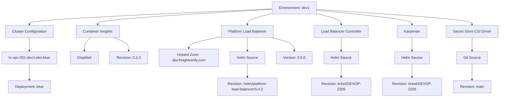
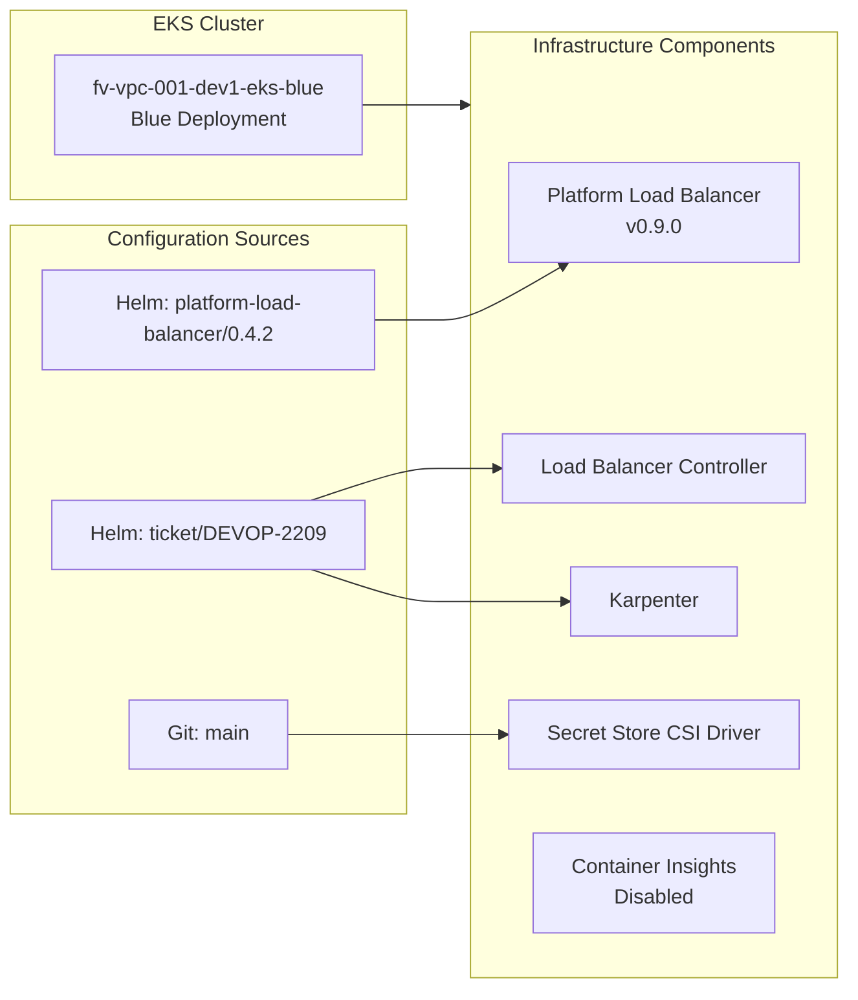

# Diagram: devops/k8s/argocd/app-manager/helm/values.dev1.yaml

> Auto-generated by Obscura crawlers

## Diagram 1

### SVG

<svg id="container" width="2179.2890625" xmlns="http://www.w3.org/2000/svg" class="flowchart" height="430" viewBox="0 0 2179.2890625 430" role="graphics-document document" aria-roledescription="flowchart-v2"><g><marker id="container_flowchart-v2-pointEnd" class="marker flowchart-v2" viewBox="0 0 10 10" refX="5" refY="5" markerUnits="userSpaceOnUse" markerWidth="8" markerHeight="8" orient="auto"><path d="M 0 0 L 10 5 L 0 10 z" class="arrowMarkerPath" style="stroke-width: 1; stroke-dasharray: 1, 0;"></path></marker><marker id="container_flowchart-v2-pointStart" class="marker flowchart-v2" viewBox="0 0 10 10" refX="4.5" refY="5" markerUnits="userSpaceOnUse" markerWidth="8" markerHeight="8" orient="auto"><path d="M 0 5 L 10 10 L 10 0 z" class="arrowMarkerPath" style="stroke-width: 1; stroke-dasharray: 1, 0;"></path></marker><marker id="container_flowchart-v2-circleEnd" class="marker flowchart-v2" viewBox="0 0 10 10" refX="11" refY="5" markerUnits="userSpaceOnUse" markerWidth="11" markerHeight="11" orient="auto"><circle cx="5" cy="5" r="5" class="arrowMarkerPath" style="stroke-width: 1; stroke-dasharray: 1, 0;"></circle></marker><marker id="container_flowchart-v2-circleStart" class="marker flowchart-v2" viewBox="0 0 10 10" refX="-1" refY="5" markerUnits="userSpaceOnUse" markerWidth="11" markerHeight="11" orient="auto"><circle cx="5" cy="5" r="5" class="arrowMarkerPath" style="stroke-width: 1; stroke-dasharray: 1, 0;"></circle></marker><marker id="container_flowchart-v2-crossEnd" class="marker cross flowchart-v2" viewBox="0 0 11 11" refX="12" refY="5.2" markerUnits="userSpaceOnUse" markerWidth="11" markerHeight="11" orient="auto"><path d="M 1,1 l 9,9 M 10,1 l -9,9" class="arrowMarkerPath" style="stroke-width: 2; stroke-dasharray: 1, 0;"></path></marker><marker id="container_flowchart-v2-crossStart" class="marker cross flowchart-v2" viewBox="0 0 11 11" refX="-1" refY="5.2" markerUnits="userSpaceOnUse" markerWidth="11" markerHeight="11" orient="auto"><path d="M 1,1 l 9,9 M 10,1 l -9,9" class="arrowMarkerPath" style="stroke-width: 2; stroke-dasharray: 1, 0;"></path></marker><g class="root"><g class="clusters"></g><g class="edgePaths"><path d="M1188.117,39.349L1011.703,47.291C835.289,55.233,482.461,71.116,306.047,82.558C129.633,94,129.633,101,129.633,104.5L129.633,108" id="L_A_B_0" class="edge-thickness-normal edge-pattern-solid edge-thickness-normal edge-pattern-solid flowchart-link" style=";" data-edge="true" data-et="edge" data-id="L_A_B_0" data-points="W3sieCI6MTE4OC4xMTcxODc1LCJ5IjozOS4zNDkxNTk5NzA3ODE1OX0seyJ4IjoxMjkuNjMyODEyNSwieSI6ODd9LHsieCI6MTI5LjYzMjgxMjUsInkiOjExMn1d" marker-end="url(#container_flowchart-v2-pointEnd)"></path><path d="M129.633,166L129.633,170.167C129.633,174.333,129.633,182.667,129.633,192.333C129.633,202,129.633,213,129.633,218.5L129.633,224" id="L_B_C_0" class="edge-thickness-normal edge-pattern-solid edge-thickness-normal edge-pattern-solid flowchart-link" style=";" data-edge="true" data-et="edge" data-id="L_B_C_0" data-points="W3sieCI6MTI5LjYzMjgxMjUsInkiOjE2Nn0seyJ4IjoxMjkuNjMyODEyNSwieSI6MTkxfSx7IngiOjEyOS42MzI4MTI1LCJ5IjoyMjh9XQ==" marker-end="url(#container_flowchart-v2-pointEnd)"></path><path d="M129.633,282L129.633,288.167C129.633,294.333,129.633,306.667,129.633,318.333C129.633,330,129.633,341,129.633,346.5L129.633,352" id="L_C_D_0" class="edge-thickness-normal edge-pattern-solid edge-thickness-normal edge-pattern-solid flowchart-link" style=";" data-edge="true" data-et="edge" data-id="L_C_D_0" data-points="W3sieCI6MTI5LjYzMjgxMjUsInkiOjI4Mn0seyJ4IjoxMjkuNjMyODEyNSwieSI6MzE5fSx7IngiOjEyOS42MzI4MTI1LCJ5IjozNTZ9XQ==" marker-end="url(#container_flowchart-v2-pointEnd)"></path><path d="M1188.117,40.864L1061.426,48.553C934.734,56.242,681.352,71.621,554.66,82.811C427.969,94,427.969,101,427.969,104.5L427.969,108" id="L_A_E_0" class="edge-thickness-normal edge-pattern-solid edge-thickness-normal edge-pattern-solid flowchart-link" style=";" data-edge="true" data-et="edge" data-id="L_A_E_0" data-points="W3sieCI6MTE4OC4xMTcxODc1LCJ5Ijo0MC44NjM2MDI3OTAzMTU5NjZ9LHsieCI6NDI3Ljk2ODc1LCJ5Ijo4N30seyJ4Ijo0MjcuOTY4NzUsInkiOjExMn1d" marker-end="url(#container_flowchart-v2-pointEnd)"></path><path d="M399.054,166L394.592,170.167C390.13,174.333,381.206,182.667,376.743,192.333C372.281,202,372.281,213,372.281,218.5L372.281,224" id="L_E_F_0" class="edge-thickness-normal edge-pattern-solid edge-thickness-normal edge-pattern-solid flowchart-link" style=";" data-edge="true" data-et="edge" data-id="L_E_F_0" data-points="W3sieCI6Mzk5LjA1NDA4NjUzODQ2MTU1LCJ5IjoxNjZ9LHsieCI6MzcyLjI4MTI1LCJ5IjoxOTF9LHsieCI6MzcyLjI4MTI1LCJ5IjoyMjh9XQ==" marker-end="url(#container_flowchart-v2-pointEnd)"></path><path d="M499.156,166L510.142,170.167C521.128,174.333,543.099,182.667,554.085,192.333C565.07,202,565.07,213,565.07,218.5L565.07,224" id="L_E_G_0" class="edge-thickness-normal edge-pattern-solid edge-thickness-normal edge-pattern-solid flowchart-link" style=";" data-edge="true" data-et="edge" data-id="L_E_G_0" data-points="W3sieCI6NDk5LjE1NjA5OTc1OTYxNTM2LCJ5IjoxNjZ9LHsieCI6NTY1LjA3MDMxMjUsInkiOjE5MX0seyJ4Ijo1NjUuMDcwMzEyNSwieSI6MjI4fV0=" marker-end="url(#container_flowchart-v2-pointEnd)"></path><path d="M1188.117,59.772L1170.419,64.31C1152.721,68.848,1117.326,77.924,1099.628,85.962C1081.93,94,1081.93,101,1081.93,104.5L1081.93,108" id="L_A_H_0" class="edge-thickness-normal edge-pattern-solid edge-thickness-normal edge-pattern-solid flowchart-link" style=";" data-edge="true" data-et="edge" data-id="L_A_H_0" data-points="W3sieCI6MTE4OC4xMTcxODc1LCJ5Ijo1OS43NzIwMTYzMzQwNzgxM30seyJ4IjoxMDgxLjkyOTY4NzUsInkiOjg3fSx7IngiOjEwODEuOTI5Njg3NSwieSI6MTEyfV0=" marker-end="url(#container_flowchart-v2-pointEnd)"></path><path d="M967.25,162.323L943.749,167.102C920.247,171.882,873.245,181.441,849.743,189.72C826.242,198,826.242,205,826.242,208.5L826.242,212" id="L_H_I_0" class="edge-thickness-normal edge-pattern-solid edge-thickness-normal edge-pattern-solid flowchart-link" style=";" data-edge="true" data-et="edge" data-id="L_H_I_0" data-points="W3sieCI6OTY3LjI1LCJ5IjoxNjIuMzIyNzgxNzE1OTYxODd9LHsieCI6ODI2LjI0MjE4NzUsInkiOjE5MX0seyJ4Ijo4MjYuMjQyMTg3NSwieSI6MjE2fV0=" marker-end="url(#container_flowchart-v2-pointEnd)"></path><path d="M1081.93,166L1081.93,170.167C1081.93,174.333,1081.93,182.667,1081.93,192.333C1081.93,202,1081.93,213,1081.93,218.5L1081.93,224" id="L_H_J_0" class="edge-thickness-normal edge-pattern-solid edge-thickness-normal edge-pattern-solid flowchart-link" style=";" data-edge="true" data-et="edge" data-id="L_H_J_0" data-points="W3sieCI6MTA4MS45Mjk2ODc1LCJ5IjoxNjZ9LHsieCI6MTA4MS45Mjk2ODc1LCJ5IjoxOTF9LHsieCI6MTA4MS45Mjk2ODc1LCJ5IjoyMjh9XQ==" marker-end="url(#container_flowchart-v2-pointEnd)"></path><path d="M1081.93,282L1081.93,288.167C1081.93,294.333,1081.93,306.667,1081.93,316.333C1081.93,326,1081.93,333,1081.93,336.5L1081.93,340" id="L_J_K_0" class="edge-thickness-normal edge-pattern-solid edge-thickness-normal edge-pattern-solid flowchart-link" style=";" data-edge="true" data-et="edge" data-id="L_J_K_0" data-points="W3sieCI6MTA4MS45Mjk2ODc1LCJ5IjoyODJ9LHsieCI6MTA4MS45Mjk2ODc1LCJ5IjozMTl9LHsieCI6MTA4MS45Mjk2ODc1LCJ5IjozNDR9XQ==" marker-end="url(#container_flowchart-v2-pointEnd)"></path><path d="M1187.228,166L1203.478,170.167C1219.728,174.333,1252.227,182.667,1268.477,192.333C1284.727,202,1284.727,213,1284.727,218.5L1284.727,224" id="L_H_L_0" class="edge-thickness-normal edge-pattern-solid edge-thickness-normal edge-pattern-solid flowchart-link" style=";" data-edge="true" data-et="edge" data-id="L_H_L_0" data-points="W3sieCI6MTE4Ny4yMjgwNjQ5MDM4NDYyLCJ5IjoxNjZ9LHsieCI6MTI4NC43MjY1NjI1LCJ5IjoxOTF9LHsieCI6MTI4NC43MjY1NjI1LCJ5IjoyMjh9XQ==" marker-end="url(#container_flowchart-v2-pointEnd)"></path><path d="M1381.336,59.772L1399.034,64.31C1416.732,68.848,1452.128,77.924,1469.826,85.962C1487.523,94,1487.523,101,1487.523,104.5L1487.523,108" id="L_A_M_0" class="edge-thickness-normal edge-pattern-solid edge-thickness-normal edge-pattern-solid flowchart-link" style=";" data-edge="true" data-et="edge" data-id="L_A_M_0" data-points="W3sieCI6MTM4MS4zMzU5Mzc1LCJ5Ijo1OS43NzIwMTYzMzQwNzgxM30seyJ4IjoxNDg3LjUyMzQzNzUsInkiOjg3fSx7IngiOjE0ODcuNTIzNDM3NSwieSI6MTEyfV0=" marker-end="url(#container_flowchart-v2-pointEnd)"></path><path d="M1487.523,166L1487.523,170.167C1487.523,174.333,1487.523,182.667,1487.523,192.333C1487.523,202,1487.523,213,1487.523,218.5L1487.523,224" id="L_M_N_0" class="edge-thickness-normal edge-pattern-solid edge-thickness-normal edge-pattern-solid flowchart-link" style=";" data-edge="true" data-et="edge" data-id="L_M_N_0" data-points="W3sieCI6MTQ4Ny41MjM0Mzc1LCJ5IjoxNjZ9LHsieCI6MTQ4Ny41MjM0Mzc1LCJ5IjoxOTF9LHsieCI6MTQ4Ny41MjM0Mzc1LCJ5IjoyMjh9XQ==" marker-end="url(#container_flowchart-v2-pointEnd)"></path><path d="M1487.523,282L1487.523,288.167C1487.523,294.333,1487.523,306.667,1487.523,316.333C1487.523,326,1487.523,333,1487.523,336.5L1487.523,340" id="L_N_O_0" class="edge-thickness-normal edge-pattern-solid edge-thickness-normal edge-pattern-solid flowchart-link" style=";" data-edge="true" data-et="edge" data-id="L_N_O_0" data-points="W3sieCI6MTQ4Ny41MjM0Mzc1LCJ5IjoyODJ9LHsieCI6MTQ4Ny41MjM0Mzc1LCJ5IjozMTl9LHsieCI6MTQ4Ny41MjM0Mzc1LCJ5IjozNDR9XQ==" marker-end="url(#container_flowchart-v2-pointEnd)"></path><path d="M1381.336,44.797L1450.701,51.831C1520.065,58.864,1658.794,72.932,1728.159,83.466C1797.523,94,1797.523,101,1797.523,104.5L1797.523,108" id="L_A_P_0" class="edge-thickness-normal edge-pattern-solid edge-thickness-normal edge-pattern-solid flowchart-link" style=";" data-edge="true" data-et="edge" data-id="L_A_P_0" data-points="W3sieCI6MTM4MS4zMzU5Mzc1LCJ5Ijo0NC43OTY2NDIxODg5NzU4OTV9LHsieCI6MTc5Ny41MjM0Mzc1LCJ5Ijo4N30seyJ4IjoxNzk3LjUyMzQzNzUsInkiOjExMn1d" marker-end="url(#container_flowchart-v2-pointEnd)"></path><path d="M1797.523,166L1797.523,170.167C1797.523,174.333,1797.523,182.667,1797.523,192.333C1797.523,202,1797.523,213,1797.523,218.5L1797.523,224" id="L_P_Q_0" class="edge-thickness-normal edge-pattern-solid edge-thickness-normal edge-pattern-solid flowchart-link" style=";" data-edge="true" data-et="edge" data-id="L_P_Q_0" data-points="W3sieCI6MTc5Ny41MjM0Mzc1LCJ5IjoxNjZ9LHsieCI6MTc5Ny41MjM0Mzc1LCJ5IjoxOTF9LHsieCI6MTc5Ny41MjM0Mzc1LCJ5IjoyMjh9XQ==" marker-end="url(#container_flowchart-v2-pointEnd)"></path><path d="M1797.523,282L1797.523,288.167C1797.523,294.333,1797.523,306.667,1797.523,316.333C1797.523,326,1797.523,333,1797.523,336.5L1797.523,340" id="L_Q_R_0" class="edge-thickness-normal edge-pattern-solid edge-thickness-normal edge-pattern-solid flowchart-link" style=";" data-edge="true" data-et="edge" data-id="L_Q_R_0" data-points="W3sieCI6MTc5Ny41MjM0Mzc1LCJ5IjoyODJ9LHsieCI6MTc5Ny41MjM0Mzc1LCJ5IjozMTl9LHsieCI6MTc5Ny41MjM0Mzc1LCJ5IjozNDR9XQ==" marker-end="url(#container_flowchart-v2-pointEnd)"></path><path d="M1381.336,41.477L1494.499,49.064C1607.661,56.652,1833.987,71.826,1947.15,82.913C2060.313,94,2060.313,101,2060.313,104.5L2060.313,108" id="L_A_S_0" class="edge-thickness-normal edge-pattern-solid edge-thickness-normal edge-pattern-solid flowchart-link" style=";" data-edge="true" data-et="edge" data-id="L_A_S_0" data-points="W3sieCI6MTM4MS4zMzU5Mzc1LCJ5Ijo0MS40NzcyODAyODIwNDQ4Mn0seyJ4IjoyMDYwLjMxMjUsInkiOjg3fSx7IngiOjIwNjAuMzEyNSwieSI6MTEyfV0=" marker-end="url(#container_flowchart-v2-pointEnd)"></path><path d="M2060.313,166L2060.313,170.167C2060.313,174.333,2060.313,182.667,2060.313,192.333C2060.313,202,2060.313,213,2060.313,218.5L2060.313,224" id="L_S_T_0" class="edge-thickness-normal edge-pattern-solid edge-thickness-normal edge-pattern-solid flowchart-link" style=";" data-edge="true" data-et="edge" data-id="L_S_T_0" data-points="W3sieCI6MjA2MC4zMTI1LCJ5IjoxNjZ9LHsieCI6MjA2MC4zMTI1LCJ5IjoxOTF9LHsieCI6MjA2MC4zMTI1LCJ5IjoyMjh9XQ==" marker-end="url(#container_flowchart-v2-pointEnd)"></path><path d="M2060.313,282L2060.313,288.167C2060.313,294.333,2060.313,306.667,2060.313,318.333C2060.313,330,2060.313,341,2060.313,346.5L2060.313,352" id="L_T_U_0" class="edge-thickness-normal edge-pattern-solid edge-thickness-normal edge-pattern-solid flowchart-link" style=";" data-edge="true" data-et="edge" data-id="L_T_U_0" data-points="W3sieCI6MjA2MC4zMTI1LCJ5IjoyODJ9LHsieCI6MjA2MC4zMTI1LCJ5IjozMTl9LHsieCI6MjA2MC4zMTI1LCJ5IjozNTZ9XQ==" marker-end="url(#container_flowchart-v2-pointEnd)"></path></g><g class="edgeLabels"><g class="edgeLabel"><g class="label" data-id="L_A_B_0" transform="translate(0, 0)"><foreignObject width="0" height="0">

</foreignObject></g></g><g class="edgeLabel"><g class="label" data-id="L_B_C_0" transform="translate(0, 0)"><foreignObject width="0" height="0">

</foreignObject></g></g><g class="edgeLabel"><g class="label" data-id="L_C_D_0" transform="translate(0, 0)"><foreignObject width="0" height="0">

</foreignObject></g></g><g class="edgeLabel"><g class="label" data-id="L_A_E_0" transform="translate(0, 0)"><foreignObject width="0" height="0">

</foreignObject></g></g><g class="edgeLabel"><g class="label" data-id="L_E_F_0" transform="translate(0, 0)"><foreignObject width="0" height="0">

</foreignObject></g></g><g class="edgeLabel"><g class="label" data-id="L_E_G_0" transform="translate(0, 0)"><foreignObject width="0" height="0">

</foreignObject></g></g><g class="edgeLabel"><g class="label" data-id="L_A_H_0" transform="translate(0, 0)"><foreignObject width="0" height="0">

</foreignObject></g></g><g class="edgeLabel"><g class="label" data-id="L_H_I_0" transform="translate(0, 0)"><foreignObject width="0" height="0">

</foreignObject></g></g><g class="edgeLabel"><g class="label" data-id="L_H_J_0" transform="translate(0, 0)"><foreignObject width="0" height="0">

</foreignObject></g></g><g class="edgeLabel"><g class="label" data-id="L_J_K_0" transform="translate(0, 0)"><foreignObject width="0" height="0">

</foreignObject></g></g><g class="edgeLabel"><g class="label" data-id="L_H_L_0" transform="translate(0, 0)"><foreignObject width="0" height="0">

</foreignObject></g></g><g class="edgeLabel"><g class="label" data-id="L_A_M_0" transform="translate(0, 0)"><foreignObject width="0" height="0">

</foreignObject></g></g><g class="edgeLabel"><g class="label" data-id="L_M_N_0" transform="translate(0, 0)"><foreignObject width="0" height="0">

</foreignObject></g></g><g class="edgeLabel"><g class="label" data-id="L_N_O_0" transform="translate(0, 0)"><foreignObject width="0" height="0">

</foreignObject></g></g><g class="edgeLabel"><g class="label" data-id="L_A_P_0" transform="translate(0, 0)"><foreignObject width="0" height="0">

</foreignObject></g></g><g class="edgeLabel"><g class="label" data-id="L_P_Q_0" transform="translate(0, 0)"><foreignObject width="0" height="0">

</foreignObject></g></g><g class="edgeLabel"><g class="label" data-id="L_Q_R_0" transform="translate(0, 0)"><foreignObject width="0" height="0">

</foreignObject></g></g><g class="edgeLabel"><g class="label" data-id="L_A_S_0" transform="translate(0, 0)"><foreignObject width="0" height="0">

</foreignObject></g></g><g class="edgeLabel"><g class="label" data-id="L_S_T_0" transform="translate(0, 0)"><foreignObject width="0" height="0">

</foreignObject></g></g><g class="edgeLabel"><g class="label" data-id="L_T_U_0" transform="translate(0, 0)"><foreignObject width="0" height="0">

</foreignObject></g></g></g><g class="nodes"><g class="node default" id="flowchart-A-0" transform="translate(1284.7265625, 35)"><rect class="basic label-container" style="" x="-96.609375" y="-27" width="193.21875" height="54"></rect><g class="label" style="" transform="translate(-66.609375, -12)"><rect></rect><foreignObject width="133.21875" height="24">

Environment: dev1

</foreignObject></g></g><g class="node default" id="flowchart-B-1" transform="translate(129.6328125, 139)"><rect class="basic label-container" style="" x="-106.15625" y="-27" width="212.3125" height="54"></rect><g class="label" style="" transform="translate(-76.15625, -12)"><rect></rect><foreignObject width="152.3125" height="24">

Cluster Configuration

</foreignObject></g></g><g class="node default" id="flowchart-C-3" transform="translate(129.6328125, 255)"><rect class="basic label-container" style="" x="-121.6328125" y="-27" width="243.265625" height="54"></rect><g class="label" style="" transform="translate(-91.6328125, -12)"><rect></rect><foreignObject width="183.265625" height="24">

fv-vpc-001-dev1-eks-blue

</foreignObject></g></g><g class="node default" id="flowchart-D-5" transform="translate(129.6328125, 383)"><rect class="basic label-container" style="" x="-94.125" y="-27" width="188.25" height="54"></rect><g class="label" style="" transform="translate(-64.125, -12)"><rect></rect><foreignObject width="128.25" height="24">

Deployment: blue

</foreignObject></g></g><g class="node default" id="flowchart-E-7" transform="translate(427.96875, 139)"><rect class="basic label-container" style="" x="-95.890625" y="-27" width="191.78125" height="54"></rect><g class="label" style="" transform="translate(-65.890625, -12)"><rect></rect><foreignObject width="131.78125" height="24">

Container Insights

</foreignObject></g></g><g class="node default" id="flowchart-F-9" transform="translate(372.28125, 255)"><rect class="basic label-container" style="" x="-61.6171875" y="-27" width="123.234375" height="54"></rect><g class="label" style="" transform="translate(-31.6171875, -12)"><rect></rect><foreignObject width="63.234375" height="24">

Disabled

</foreignObject></g></g><g class="node default" id="flowchart-G-11" transform="translate(565.0703125, 255)"><rect class="basic label-container" style="" x="-81.171875" y="-27" width="162.34375" height="54"></rect><g class="label" style="" transform="translate(-51.171875, -12)"><rect></rect><foreignObject width="102.34375" height="24">

Revision: 0.2.0

</foreignObject></g></g><g class="node default" id="flowchart-H-13" transform="translate(1081.9296875, 139)"><rect class="basic label-container" style="" x="-114.6796875" y="-27" width="229.359375" height="54"></rect><g class="label" style="" transform="translate(-84.6796875, -12)"><rect></rect><foreignObject width="169.359375" height="24">

Platform Load Balancer

</foreignObject></g></g><g class="node default" id="flowchart-I-15" transform="translate(826.2421875, 255)"><rect class="basic label-container" style="" x="-130" y="-39" width="260" height="78"></rect><g class="label" style="" transform="translate(-100, -24)"><rect></rect><foreignObject width="200" height="48">

Hosted Zone: dev.freightverify.com

</foreignObject></g></g><g class="node default" id="flowchart-J-17" transform="translate(1081.9296875, 255)"><rect class="basic label-container" style="" x="-75.6875" y="-27" width="151.375" height="54"></rect><g class="label" style="" transform="translate(-45.6875, -12)"><rect></rect><foreignObject width="91.375" height="24">

Helm Source

</foreignObject></g></g><g class="node default" id="flowchart-K-19" transform="translate(1081.9296875, 383)"><rect class="basic label-container" style="" x="-130" y="-39" width="260" height="78"></rect><g class="label" style="" transform="translate(-100, -24)"><rect></rect><foreignObject width="200" height="48">

Revision: helm/platform-load-balancer/0.4.2

</foreignObject></g></g><g class="node default" id="flowchart-L-21" transform="translate(1284.7265625, 255)"><rect class="basic label-container" style="" x="-77.109375" y="-27" width="154.21875" height="54"></rect><g class="label" style="" transform="translate(-47.109375, -12)"><rect></rect><foreignObject width="94.21875" height="24">

Version: 0.9.0

</foreignObject></g></g><g class="node default" id="flowchart-M-23" transform="translate(1487.5234375, 139)"><rect class="basic label-container" style="" x="-119.53125" y="-27" width="239.0625" height="54"></rect><g class="label" style="" transform="translate(-89.53125, -12)"><rect></rect><foreignObject width="179.0625" height="24">

Load Balancer Controller

</foreignObject></g></g><g class="node default" id="flowchart-N-25" transform="translate(1487.5234375, 255)"><rect class="basic label-container" style="" x="-75.6875" y="-27" width="151.375" height="54"></rect><g class="label" style="" transform="translate(-45.6875, -12)"><rect></rect><foreignObject width="91.375" height="24">

Helm Source

</foreignObject></g></g><g class="node default" id="flowchart-O-27" transform="translate(1487.5234375, 383)"><rect class="basic label-container" style="" x="-130" y="-39" width="260" height="78"></rect><g class="label" style="" transform="translate(-100, -24)"><rect></rect><foreignObject width="200" height="48">

Revision: ticket/DEVOP-2209

</foreignObject></g></g><g class="node default" id="flowchart-P-29" transform="translate(1797.5234375, 139)"><rect class="basic label-container" style="" x="-66.1171875" y="-27" width="132.234375" height="54"></rect><g class="label" style="" transform="translate(-36.1171875, -12)"><rect></rect><foreignObject width="72.234375" height="24">

Karpenter

</foreignObject></g></g><g class="node default" id="flowchart-Q-31" transform="translate(1797.5234375, 255)"><rect class="basic label-container" style="" x="-75.6875" y="-27" width="151.375" height="54"></rect><g class="label" style="" transform="translate(-45.6875, -12)"><rect></rect><foreignObject width="91.375" height="24">

Helm Source

</foreignObject></g></g><g class="node default" id="flowchart-R-33" transform="translate(1797.5234375, 383)"><rect class="basic label-container" style="" x="-130" y="-39" width="260" height="78"></rect><g class="label" style="" transform="translate(-100, -24)"><rect></rect><foreignObject width="200" height="48">

Revision: ticket/DEVOP-2209

</foreignObject></g></g><g class="node default" id="flowchart-S-35" transform="translate(2060.3125, 139)"><rect class="basic label-container" style="" x="-110.9765625" y="-27" width="221.953125" height="54"></rect><g class="label" style="" transform="translate(-80.9765625, -12)"><rect></rect><foreignObject width="161.953125" height="24">

Secret Store CSI Driver

</foreignObject></g></g><g class="node default" id="flowchart-T-37" transform="translate(2060.3125, 255)"><rect class="basic label-container" style="" x="-66.875" y="-27" width="133.75" height="54"></rect><g class="label" style="" transform="translate(-36.875, -12)"><rect></rect><foreignObject width="73.75" height="24">

Git Source

</foreignObject></g></g><g class="node default" id="flowchart-U-39" transform="translate(2060.3125, 383)"><rect class="basic label-container" style="" x="-82.7890625" y="-27" width="165.578125" height="54"></rect><g class="label" style="" transform="translate(-52.7890625, -12)"><rect></rect><foreignObject width="105.578125" height="24">

Revision: main

</foreignObject></g></g></g></g></g></svg>

## Diagram 2

### SVG

<svg id="container" width="665.0625" xmlns="http://www.w3.org/2000/svg" class="flowchart" height="772" viewBox="0 0 665.0625 772" role="graphics-document document" aria-roledescription="flowchart-v2"><g><marker id="container_flowchart-v2-pointEnd" class="marker flowchart-v2" viewBox="0 0 10 10" refX="5" refY="5" markerUnits="userSpaceOnUse" markerWidth="8" markerHeight="8" orient="auto"><path d="M 0 0 L 10 5 L 0 10 z" class="arrowMarkerPath" style="stroke-width: 1; stroke-dasharray: 1, 0;"></path></marker><marker id="container_flowchart-v2-pointStart" class="marker flowchart-v2" viewBox="0 0 10 10" refX="4.5" refY="5" markerUnits="userSpaceOnUse" markerWidth="8" markerHeight="8" orient="auto"><path d="M 0 5 L 10 10 L 10 0 z" class="arrowMarkerPath" style="stroke-width: 1; stroke-dasharray: 1, 0;"></path></marker><marker id="container_flowchart-v2-circleEnd" class="marker flowchart-v2" viewBox="0 0 10 10" refX="11" refY="5" markerUnits="userSpaceOnUse" markerWidth="11" markerHeight="11" orient="auto"><circle cx="5" cy="5" r="5" class="arrowMarkerPath" style="stroke-width: 1; stroke-dasharray: 1, 0;"></circle></marker><marker id="container_flowchart-v2-circleStart" class="marker flowchart-v2" viewBox="0 0 10 10" refX="-1" refY="5" markerUnits="userSpaceOnUse" markerWidth="11" markerHeight="11" orient="auto"><circle cx="5" cy="5" r="5" class="arrowMarkerPath" style="stroke-width: 1; stroke-dasharray: 1, 0;"></circle></marker><marker id="container_flowchart-v2-crossEnd" class="marker cross flowchart-v2" viewBox="0 0 11 11" refX="12" refY="5.2" markerUnits="userSpaceOnUse" markerWidth="11" markerHeight="11" orient="auto"><path d="M 1,1 l 9,9 M 10,1 l -9,9" class="arrowMarkerPath" style="stroke-width: 2; stroke-dasharray: 1, 0;"></path></marker><marker id="container_flowchart-v2-crossStart" class="marker cross flowchart-v2" viewBox="0 0 11 11" refX="-1" refY="5.2" markerUnits="userSpaceOnUse" markerWidth="11" markerHeight="11" orient="auto"><path d="M 1,1 l 9,9 M 10,1 l -9,9" class="arrowMarkerPath" style="stroke-width: 2; stroke-dasharray: 1, 0;"></path></marker><g class="root"><g class="clusters"><g class="cluster" id="Sources" data-look="classic"><rect style="" x="8" y="176" width="310" height="460"></rect><g class="cluster-label" transform="translate(83.8984375, 176)"><foreignObject width="158.203125" height="24">

Configuration Sources

</foreignObject></g></g><g class="cluster" id="Components" data-look="classic"><rect style="" x="368" y="25" width="289.0625" height="739"></rect><g class="cluster-label" transform="translate(415.0234375, 25)"><foreignObject width="195.015625" height="24">

Infrastructure Components

</foreignObject></g></g><g class="cluster" id="EKS" data-look="classic"><rect style="" x="8" y="8" width="310" height="148"></rect><g class="cluster-label" transform="translate(122.25, 8)"><foreignObject width="81.5" height="24">

EKS Cluster

</foreignObject></g></g></g><g class="edgePaths"><path d="M293,250L297.167,250C301.333,250,309.667,250,318,250C326.333,250,334.667,250,343,250C351.333,250,359.667,250,376.162,242.835C392.656,235.67,417.313,221.34,429.641,214.175L441.969,207.01" id="L_HELM1_PLB_0" class="edge-thickness-normal edge-pattern-solid edge-thickness-normal edge-pattern-solid flowchart-link" style=";" data-edge="true" data-et="edge" data-id="L_HELM1_PLB_0" data-points="W3sieCI6MjkzLCJ5IjoyNTB9LHsieCI6MzE4LCJ5IjoyNTB9LHsieCI6MzQzLCJ5IjoyNTB9LHsieCI6MzY4LCJ5IjoyNTB9LHsieCI6NDQ1LjQyNzQ1NTM1NzE0MjksInkiOjIwNX1d" marker-end="url(#container_flowchart-v2-pointEnd)"></path><path d="M243.481,391L255.901,386.833C268.321,382.667,293.16,374.333,309.747,370.167C326.333,366,334.667,366,343,366C351.333,366,359.667,366,367.333,366C375,366,382,366,385.5,366L389,366" id="L_HELM2_LBC_0" class="edge-thickness-normal edge-pattern-solid edge-thickness-normal edge-pattern-solid flowchart-link" style=";" data-edge="true" data-et="edge" data-id="L_HELM2_LBC_0" data-points="W3sieCI6MjQzLjQ4MDc2OTIzMDc2OTIzLCJ5IjozOTF9LHsieCI6MzE4LCJ5IjozNjZ9LHsieCI6MzQzLCJ5IjozNjZ9LHsieCI6MzY4LCJ5IjozNjZ9LHsieCI6MzkzLCJ5IjozNjZ9XQ==" marker-end="url(#container_flowchart-v2-pointEnd)"></path><path d="M243.481,445L255.901,449.167C268.321,453.333,293.16,461.667,309.747,465.833C326.333,470,334.667,470,343,470C351.333,470,359.667,470,376.236,470C392.805,470,417.609,470,430.012,470L442.414,470" id="L_HELM2_KAR_0" class="edge-thickness-normal edge-pattern-solid edge-thickness-normal edge-pattern-solid flowchart-link" style=";" data-edge="true" data-et="edge" data-id="L_HELM2_KAR_0" data-points="W3sieCI6MjQzLjQ4MDc2OTIzMDc2OTIzLCJ5Ijo0NDV9LHsieCI6MzE4LCJ5Ijo0NzB9LHsieCI6MzQzLCJ5Ijo0NzB9LHsieCI6MzY4LCJ5Ijo0NzB9LHsieCI6NDQ2LjQxNDA2MjUsInkiOjQ3MH1d" marker-end="url(#container_flowchart-v2-pointEnd)"></path><path d="M225.422,574L240.852,574C256.281,574,287.141,574,306.737,574C326.333,574,334.667,574,343,574C351.333,574,359.667,574,368.759,574C377.852,574,387.703,574,392.629,574L397.555,574" id="L_GIT_CSI_0" class="edge-thickness-normal edge-pattern-solid edge-thickness-normal edge-pattern-solid flowchart-link" style=";" data-edge="true" data-et="edge" data-id="L_GIT_CSI_0" data-points="W3sieCI6MjI1LjQyMTg3NSwieSI6NTc0fSx7IngiOjMxOCwieSI6NTc0fSx7IngiOjM0MywieSI6NTc0fSx7IngiOjM2OCwieSI6NTc0fSx7IngiOjQwMS41NTQ2ODc1LCJ5Ijo1NzR9XQ==" marker-end="url(#container_flowchart-v2-pointEnd)"></path><path d="M284.633,82L290.194,82C295.755,82,306.878,82,316.605,82C326.333,82,334.667,82,342.333,82C350,82,357,82,360.5,82L364,82" id="L_CLU_Components_0" class="edge-thickness-normal edge-pattern-solid edge-thickness-normal edge-pattern-solid flowchart-link" style=";" data-edge="true" data-et="edge" data-id="L_CLU_Components_0" data-points="W3sieCI6Mjg0LjYzMjgxMjUsInkiOjgyfSx7IngiOjMxOCwieSI6ODJ9LHsieCI6MzQzLCJ5Ijo4Mn0seyJ4IjozNjgsInkiOjgyfSx7IngiOjQ0NS40Mjc0NTUzNTcxNDI5LCJ5IjoxMjd9XQ==" marker-end="url(#container_flowchart-v2-pointEnd)"></path></g><g class="edgeLabels"><g class="edgeLabel"><g class="label" data-id="L_HELM1_PLB_0" transform="translate(0, 0)"><foreignObject width="0" height="0">

</foreignObject></g></g><g class="edgeLabel"><g class="label" data-id="L_HELM2_LBC_0" transform="translate(0, 0)"><foreignObject width="0" height="0">

</foreignObject></g></g><g class="edgeLabel"><g class="label" data-id="L_HELM2_KAR_0" transform="translate(0, 0)"><foreignObject width="0" height="0">

</foreignObject></g></g><g class="edgeLabel"><g class="label" data-id="L_GIT_CSI_0" transform="translate(0, 0)"><foreignObject width="0" height="0">

</foreignObject></g></g><g class="edgeLabel"><g class="label" data-id="L_CLU_Components_0" transform="translate(0, 0)"><foreignObject width="0" height="0">

</foreignObject></g></g></g><g class="nodes"><g class="node default" id="flowchart-CLU-0" transform="translate(163, 82)"><rect class="basic label-container" style="" x="-121.6328125" y="-39" width="243.265625" height="78"></rect><g class="label" style="" transform="translate(-91.6328125, -24)"><rect></rect><foreignObject width="183.265625" height="48">

fv-vpc-001-dev1-eks-blue Blue Deployment

</foreignObject></g></g><g class="node default" id="flowchart-PLB-1" transform="translate(512.53125, 166)"><rect class="basic label-container" style="" x="-114.6796875" y="-39" width="229.359375" height="78"></rect><g class="label" style="" transform="translate(-84.6796875, -24)"><rect></rect><foreignObject width="169.359375" height="48">

Platform Load Balancer v0.9.0

</foreignObject></g></g><g class="node default" id="flowchart-LBC-2" transform="translate(512.53125, 366)"><rect class="basic label-container" style="" x="-119.53125" y="-27" width="239.0625" height="54"></rect><g class="label" style="" transform="translate(-89.53125, -12)"><rect></rect><foreignObject width="179.0625" height="24">

Load Balancer Controller

</foreignObject></g></g><g class="node default" id="flowchart-KAR-3" transform="translate(512.53125, 470)"><rect class="basic label-container" style="" x="-66.1171875" y="-27" width="132.234375" height="54"></rect><g class="label" style="" transform="translate(-36.1171875, -12)"><rect></rect><foreignObject width="72.234375" height="24">

Karpenter

</foreignObject></g></g><g class="node default" id="flowchart-CSI-4" transform="translate(512.53125, 574)"><rect class="basic label-container" style="" x="-110.9765625" y="-27" width="221.953125" height="54"></rect><g class="label" style="" transform="translate(-80.9765625, -12)"><rect></rect><foreignObject width="161.953125" height="24">

Secret Store CSI Driver

</foreignObject></g></g><g class="node default" id="flowchart-CI-5" transform="translate(512.53125, 690)"><rect class="basic label-container" style="" x="-95.890625" y="-39" width="191.78125" height="78"></rect><g class="label" style="" transform="translate(-65.890625, -24)"><rect></rect><foreignObject width="131.78125" height="48">

Container Insights Disabled

</foreignObject></g></g><g class="node default" id="flowchart-HELM1-6" transform="translate(163, 250)"><rect class="basic label-container" style="" x="-130" y="-39" width="260" height="78"></rect><g class="label" style="" transform="translate(-100, -24)"><rect></rect><foreignObject width="200" height="48">

Helm: platform-load-balancer/0.4.2

</foreignObject></g></g><g class="node default" id="flowchart-HELM2-7" transform="translate(163, 418)"><rect class="basic label-container" style="" x="-120.5859375" y="-27" width="241.171875" height="54"></rect><g class="label" style="" transform="translate(-90.5859375, -12)"><rect></rect><foreignObject width="181.171875" height="24">

Helm: ticket/DEVOP-2209

</foreignObject></g></g><g class="node default" id="flowchart-GIT-8" transform="translate(163, 574)"><rect class="basic label-container" style="" x="-62.421875" y="-27" width="124.84375" height="54"></rect><g class="label" style="" transform="translate(-32.421875, -12)"><rect></rect><foreignObject width="64.84375" height="24">

Git: main

</foreignObject></g></g></g></g></g></svg>
