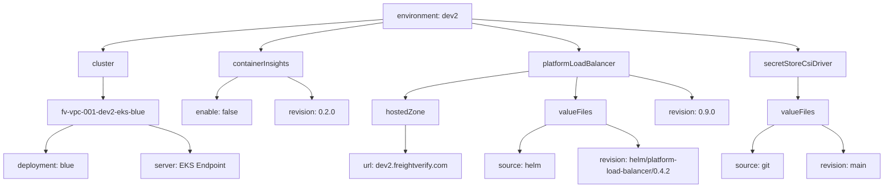
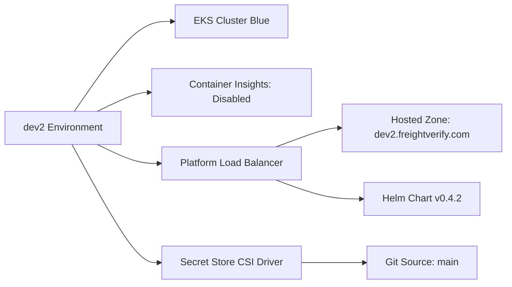

# Diagram: devops/k8s/argocd/app-manager/helm/values.dev2.yaml

> Auto-generated by Obscura crawlers

## Diagram 1

### SVG

<svg id="container" width="1922.0234375" xmlns="http://www.w3.org/2000/svg" class="flowchart" height="406" viewBox="0 0 1922.0234375 406" role="graphics-document document" aria-roledescription="flowchart-v2"><g><marker id="container_flowchart-v2-pointEnd" class="marker flowchart-v2" viewBox="0 0 10 10" refX="5" refY="5" markerUnits="userSpaceOnUse" markerWidth="8" markerHeight="8" orient="auto"><path d="M 0 0 L 10 5 L 0 10 z" class="arrowMarkerPath" style="stroke-width: 1; stroke-dasharray: 1, 0;"></path></marker><marker id="container_flowchart-v2-pointStart" class="marker flowchart-v2" viewBox="0 0 10 10" refX="4.5" refY="5" markerUnits="userSpaceOnUse" markerWidth="8" markerHeight="8" orient="auto"><path d="M 0 5 L 10 10 L 10 0 z" class="arrowMarkerPath" style="stroke-width: 1; stroke-dasharray: 1, 0;"></path></marker><marker id="container_flowchart-v2-circleEnd" class="marker flowchart-v2" viewBox="0 0 10 10" refX="11" refY="5" markerUnits="userSpaceOnUse" markerWidth="11" markerHeight="11" orient="auto"><circle cx="5" cy="5" r="5" class="arrowMarkerPath" style="stroke-width: 1; stroke-dasharray: 1, 0;"></circle></marker><marker id="container_flowchart-v2-circleStart" class="marker flowchart-v2" viewBox="0 0 10 10" refX="-1" refY="5" markerUnits="userSpaceOnUse" markerWidth="11" markerHeight="11" orient="auto"><circle cx="5" cy="5" r="5" class="arrowMarkerPath" style="stroke-width: 1; stroke-dasharray: 1, 0;"></circle></marker><marker id="container_flowchart-v2-crossEnd" class="marker cross flowchart-v2" viewBox="0 0 11 11" refX="12" refY="5.2" markerUnits="userSpaceOnUse" markerWidth="11" markerHeight="11" orient="auto"><path d="M 1,1 l 9,9 M 10,1 l -9,9" class="arrowMarkerPath" style="stroke-width: 2; stroke-dasharray: 1, 0;"></path></marker><marker id="container_flowchart-v2-crossStart" class="marker cross flowchart-v2" viewBox="0 0 11 11" refX="-1" refY="5.2" markerUnits="userSpaceOnUse" markerWidth="11" markerHeight="11" orient="auto"><path d="M 1,1 l 9,9 M 10,1 l -9,9" class="arrowMarkerPath" style="stroke-width: 2; stroke-dasharray: 1, 0;"></path></marker><g class="root"><g class="clusters"></g><g class="edgePaths"><path d="M833.652,42.171L732.398,49.643C631.143,57.114,428.634,72.057,327.38,83.029C226.125,94,226.125,101,226.125,104.5L226.125,108" id="L_A_B_0" class="edge-thickness-normal edge-pattern-solid edge-thickness-normal edge-pattern-solid flowchart-link" style=";" data-edge="true" data-et="edge" data-id="L_A_B_0" data-points="W3sieCI6ODMzLjY1MjM0Mzc1LCJ5Ijo0Mi4xNzEzNDAzNTgxOTAwOX0seyJ4IjoyMjYuMTI1LCJ5Ijo4N30seyJ4IjoyMjYuMTI1LCJ5IjoxMTJ9XQ==" marker-end="url(#container_flowchart-v2-pointEnd)"></path><path d="M226.125,166L226.125,170.167C226.125,174.333,226.125,182.667,226.125,190.333C226.125,198,226.125,205,226.125,208.5L226.125,212" id="L_B_C_0" class="edge-thickness-normal edge-pattern-solid edge-thickness-normal edge-pattern-solid flowchart-link" style=";" data-edge="true" data-et="edge" data-id="L_B_C_0" data-points="W3sieCI6MjI2LjEyNSwieSI6MTY2fSx7IngiOjIyNi4xMjUsInkiOjE5MX0seyJ4IjoyMjYuMTI1LCJ5IjoyMTZ9XQ==" marker-end="url(#container_flowchart-v2-pointEnd)"></path><path d="M161.55,270L151.584,274.167C141.619,278.333,121.688,286.667,111.723,296.333C101.758,306,101.758,317,101.758,322.5L101.758,328" id="L_C_D_0" class="edge-thickness-normal edge-pattern-solid edge-thickness-normal edge-pattern-solid flowchart-link" style=";" data-edge="true" data-et="edge" data-id="L_C_D_0" data-points="W3sieCI6MTYxLjU0OTcyOTU2NzMwNzY4LCJ5IjoyNzB9LHsieCI6MTAxLjc1NzgxMjUsInkiOjI5NX0seyJ4IjoxMDEuNzU3ODEyNSwieSI6MzMyfV0=" marker-end="url(#container_flowchart-v2-pointEnd)"></path><path d="M323.903,270L338.992,274.167C354.081,278.333,384.259,286.667,399.348,296.333C414.438,306,414.438,317,414.438,322.5L414.438,328" id="L_C_E_0" class="edge-thickness-normal edge-pattern-solid edge-thickness-normal edge-pattern-solid flowchart-link" style=";" data-edge="true" data-et="edge" data-id="L_C_E_0" data-points="W3sieCI6MzIzLjkwMjY0NDIzMDc2OTIsInkiOjI3MH0seyJ4Ijo0MTQuNDM3NSwieSI6Mjk1fSx7IngiOjQxNC40Mzc1LCJ5IjozMzJ9XQ==" marker-end="url(#container_flowchart-v2-pointEnd)"></path><path d="M833.652,49.014L789.747,55.345C745.841,61.676,658.03,74.338,614.124,84.169C570.219,94,570.219,101,570.219,104.5L570.219,108" id="L_A_F_0" class="edge-thickness-normal edge-pattern-solid edge-thickness-normal edge-pattern-solid flowchart-link" style=";" data-edge="true" data-et="edge" data-id="L_A_F_0" data-points="W3sieCI6ODMzLjY1MjM0Mzc1LCJ5Ijo0OS4wMTQwMTY2MTYyOTc4NH0seyJ4Ijo1NzAuMjE4NzUsInkiOjg3fSx7IngiOjU3MC4yMTg3NSwieSI6MTEyfV0=" marker-end="url(#container_flowchart-v2-pointEnd)"></path><path d="M520.283,166L512.577,170.167C504.871,174.333,489.459,182.667,481.753,190.333C474.047,198,474.047,205,474.047,208.5L474.047,212" id="L_F_G_0" class="edge-thickness-normal edge-pattern-solid edge-thickness-normal edge-pattern-solid flowchart-link" style=";" data-edge="true" data-et="edge" data-id="L_F_G_0" data-points="W3sieCI6NTIwLjI4MzM1MzM2NTM4NDYsInkiOjE2Nn0seyJ4Ijo0NzQuMDQ2ODc1LCJ5IjoxOTF9LHsieCI6NDc0LjA0Njg3NSwieSI6MjE2fV0=" marker-end="url(#container_flowchart-v2-pointEnd)"></path><path d="M626.92,166L635.671,170.167C644.421,174.333,661.921,182.667,670.672,190.333C679.422,198,679.422,205,679.422,208.5L679.422,212" id="L_F_H_0" class="edge-thickness-normal edge-pattern-solid edge-thickness-normal edge-pattern-solid flowchart-link" style=";" data-edge="true" data-et="edge" data-id="L_F_H_0" data-points="W3sieCI6NjI2LjkyMDM3MjU5NjE1MzgsInkiOjE2Nn0seyJ4Ijo2NzkuNDIxODc1LCJ5IjoxOTF9LHsieCI6Njc5LjQyMTg3NSwieSI6MjE2fV0=" marker-end="url(#container_flowchart-v2-pointEnd)"></path><path d="M1028.027,50.376L1066.609,56.48C1105.191,62.584,1182.355,74.792,1220.938,84.396C1259.52,94,1259.52,101,1259.52,104.5L1259.52,108" id="L_A_I_0" class="edge-thickness-normal edge-pattern-solid edge-thickness-normal edge-pattern-solid flowchart-link" style=";" data-edge="true" data-et="edge" data-id="L_A_I_0" data-points="W3sieCI6MTAyOC4wMjczNDM3NSwieSI6NTAuMzc1OTEyMTQ4NTEwODV9LHsieCI6MTI1OS41MTk1MzEyNSwieSI6ODd9LHsieCI6MTI1OS41MTk1MzEyNSwieSI6MTEyfV0=" marker-end="url(#container_flowchart-v2-pointEnd)"></path><path d="M1148.902,154.215L1104.327,160.345C1059.753,166.476,970.603,178.738,926.028,188.369C881.453,198,881.453,205,881.453,208.5L881.453,212" id="L_I_J_0" class="edge-thickness-normal edge-pattern-solid edge-thickness-normal edge-pattern-solid flowchart-link" style=";" data-edge="true" data-et="edge" data-id="L_I_J_0" data-points="W3sieCI6MTE0OC45MDIzNDM3NSwieSI6MTU0LjIxNDUwNjM4MDEyMDl9LHsieCI6ODgxLjQ1MzEyNSwieSI6MTkxfSx7IngiOjg4MS40NTMxMjUsInkiOjIxNn1d" marker-end="url(#container_flowchart-v2-pointEnd)"></path><path d="M881.453,270L881.453,274.167C881.453,278.333,881.453,286.667,881.453,296.333C881.453,306,881.453,317,881.453,322.5L881.453,328" id="L_J_K_0" class="edge-thickness-normal edge-pattern-solid edge-thickness-normal edge-pattern-solid flowchart-link" style=";" data-edge="true" data-et="edge" data-id="L_J_K_0" data-points="W3sieCI6ODgxLjQ1MzEyNSwieSI6MjcwfSx7IngiOjg4MS40NTMxMjUsInkiOjI5NX0seyJ4Ijo4ODEuNDUzMTI1LCJ5IjozMzJ9XQ==" marker-end="url(#container_flowchart-v2-pointEnd)"></path><path d="M1256.136,166L1255.614,170.167C1255.092,174.333,1254.048,182.667,1253.526,190.333C1253.004,198,1253.004,205,1253.004,208.5L1253.004,212" id="L_I_L_0" class="edge-thickness-normal edge-pattern-solid edge-thickness-normal edge-pattern-solid flowchart-link" style=";" data-edge="true" data-et="edge" data-id="L_I_L_0" data-points="W3sieCI6MTI1Ni4xMzY0MTgyNjkyMzA3LCJ5IjoxNjZ9LHsieCI6MTI1My4wMDM5MDYyNSwieSI6MTkxfSx7IngiOjEyNTMuMDAzOTA2MjUsInkiOjIxNn1d" marker-end="url(#container_flowchart-v2-pointEnd)"></path><path d="M1189.867,270L1180.123,274.167C1170.38,278.333,1150.893,286.667,1141.15,296.333C1131.406,306,1131.406,317,1131.406,322.5L1131.406,328" id="L_L_M_0" class="edge-thickness-normal edge-pattern-solid edge-thickness-normal edge-pattern-solid flowchart-link" style=";" data-edge="true" data-et="edge" data-id="L_L_M_0" data-points="W3sieCI6MTE4OS44NjY2NjE2NTg2NTM4LCJ5IjoyNzB9LHsieCI6MTEzMS40MDYyNSwieSI6Mjk1fSx7IngiOjExMzEuNDA2MjUsInkiOjMzMn1d" marker-end="url(#container_flowchart-v2-pointEnd)"></path><path d="M1318.754,268.396L1330.234,272.83C1341.714,277.264,1364.673,286.132,1376.153,294.066C1387.633,302,1387.633,309,1387.633,312.5L1387.633,316" id="L_L_N_0" class="edge-thickness-normal edge-pattern-solid edge-thickness-normal edge-pattern-solid flowchart-link" style=";" data-edge="true" data-et="edge" data-id="L_L_N_0" data-points="W3sieCI6MTMxOC43NTM5MDYyNSwieSI6MjY4LjM5NTczNDgwMzQyMzc1fSx7IngiOjEzODcuNjMyODEyNSwieSI6Mjk1fSx7IngiOjEzODcuNjMyODEyNSwieSI6MzIwfV0=" marker-end="url(#container_flowchart-v2-pointEnd)"></path><path d="M1370.137,162.455L1392.574,167.213C1415.01,171.97,1459.884,181.485,1482.321,189.743C1504.758,198,1504.758,205,1504.758,208.5L1504.758,212" id="L_I_O_0" class="edge-thickness-normal edge-pattern-solid edge-thickness-normal edge-pattern-solid flowchart-link" style=";" data-edge="true" data-et="edge" data-id="L_I_O_0" data-points="W3sieCI6MTM3MC4xMzY3MTg3NSwieSI6MTYyLjQ1NTEyMTc3MjUxMDc4fSx7IngiOjE1MDQuNzU3ODEyNSwieSI6MTkxfSx7IngiOjE1MDQuNzU3ODEyNSwieSI6MjE2fV0=" marker-end="url(#container_flowchart-v2-pointEnd)"></path><path d="M1028.027,41.292L1145.691,48.91C1263.355,56.528,1498.684,71.764,1616.348,82.882C1734.012,94,1734.012,101,1734.012,104.5L1734.012,108" id="L_A_P_0" class="edge-thickness-normal edge-pattern-solid edge-thickness-normal edge-pattern-solid flowchart-link" style=";" data-edge="true" data-et="edge" data-id="L_A_P_0" data-points="W3sieCI6MTAyOC4wMjczNDM3NSwieSI6NDEuMjkyMjM5NzUyNTQzNjJ9LHsieCI6MTczNC4wMTE3MTg3NSwieSI6ODd9LHsieCI6MTczNC4wMTE3MTg3NSwieSI6MTEyfV0=" marker-end="url(#container_flowchart-v2-pointEnd)"></path><path d="M1734.012,166L1734.012,170.167C1734.012,174.333,1734.012,182.667,1734.012,190.333C1734.012,198,1734.012,205,1734.012,208.5L1734.012,212" id="L_P_Q_0" class="edge-thickness-normal edge-pattern-solid edge-thickness-normal edge-pattern-solid flowchart-link" style=";" data-edge="true" data-et="edge" data-id="L_P_Q_0" data-points="W3sieCI6MTczNC4wMTE3MTg3NSwieSI6MTY2fSx7IngiOjE3MzQuMDExNzE4NzUsInkiOjE5MX0seyJ4IjoxNzM0LjAxMTcxODc1LCJ5IjoyMTZ9XQ==" marker-end="url(#container_flowchart-v2-pointEnd)"></path><path d="M1682.557,270L1674.617,274.167C1666.676,278.333,1650.795,286.667,1642.855,296.333C1634.914,306,1634.914,317,1634.914,322.5L1634.914,328" id="L_Q_R_0" class="edge-thickness-normal edge-pattern-solid edge-thickness-normal edge-pattern-solid flowchart-link" style=";" data-edge="true" data-et="edge" data-id="L_Q_R_0" data-points="W3sieCI6MTY4Mi41NTcxNjY0NjYzNDYyLCJ5IjoyNzB9LHsieCI6MTYzNC45MTQwNjI1LCJ5IjoyOTV9LHsieCI6MTYzNC45MTQwNjI1LCJ5IjozMzJ9XQ==" marker-end="url(#container_flowchart-v2-pointEnd)"></path><path d="M1785.466,270L1793.407,274.167C1801.347,278.333,1817.228,286.667,1825.169,296.333C1833.109,306,1833.109,317,1833.109,322.5L1833.109,328" id="L_Q_S_0" class="edge-thickness-normal edge-pattern-solid edge-thickness-normal edge-pattern-solid flowchart-link" style=";" data-edge="true" data-et="edge" data-id="L_Q_S_0" data-points="W3sieCI6MTc4NS40NjYyNzEwMzM2NTM4LCJ5IjoyNzB9LHsieCI6MTgzMy4xMDkzNzUsInkiOjI5NX0seyJ4IjoxODMzLjEwOTM3NSwieSI6MzMyfV0=" marker-end="url(#container_flowchart-v2-pointEnd)"></path></g><g class="edgeLabels"><g class="edgeLabel"><g class="label" data-id="L_A_B_0" transform="translate(0, 0)"><foreignObject width="0" height="0">

</foreignObject></g></g><g class="edgeLabel"><g class="label" data-id="L_B_C_0" transform="translate(0, 0)"><foreignObject width="0" height="0">

</foreignObject></g></g><g class="edgeLabel"><g class="label" data-id="L_C_D_0" transform="translate(0, 0)"><foreignObject width="0" height="0">

</foreignObject></g></g><g class="edgeLabel"><g class="label" data-id="L_C_E_0" transform="translate(0, 0)"><foreignObject width="0" height="0">

</foreignObject></g></g><g class="edgeLabel"><g class="label" data-id="L_A_F_0" transform="translate(0, 0)"><foreignObject width="0" height="0">

</foreignObject></g></g><g class="edgeLabel"><g class="label" data-id="L_F_G_0" transform="translate(0, 0)"><foreignObject width="0" height="0">

</foreignObject></g></g><g class="edgeLabel"><g class="label" data-id="L_F_H_0" transform="translate(0, 0)"><foreignObject width="0" height="0">

</foreignObject></g></g><g class="edgeLabel"><g class="label" data-id="L_A_I_0" transform="translate(0, 0)"><foreignObject width="0" height="0">

</foreignObject></g></g><g class="edgeLabel"><g class="label" data-id="L_I_J_0" transform="translate(0, 0)"><foreignObject width="0" height="0">

</foreignObject></g></g><g class="edgeLabel"><g class="label" data-id="L_J_K_0" transform="translate(0, 0)"><foreignObject width="0" height="0">

</foreignObject></g></g><g class="edgeLabel"><g class="label" data-id="L_I_L_0" transform="translate(0, 0)"><foreignObject width="0" height="0">

</foreignObject></g></g><g class="edgeLabel"><g class="label" data-id="L_L_M_0" transform="translate(0, 0)"><foreignObject width="0" height="0">

</foreignObject></g></g><g class="edgeLabel"><g class="label" data-id="L_L_N_0" transform="translate(0, 0)"><foreignObject width="0" height="0">

</foreignObject></g></g><g class="edgeLabel"><g class="label" data-id="L_I_O_0" transform="translate(0, 0)"><foreignObject width="0" height="0">

</foreignObject></g></g><g class="edgeLabel"><g class="label" data-id="L_A_P_0" transform="translate(0, 0)"><foreignObject width="0" height="0">

</foreignObject></g></g><g class="edgeLabel"><g class="label" data-id="L_P_Q_0" transform="translate(0, 0)"><foreignObject width="0" height="0">

</foreignObject></g></g><g class="edgeLabel"><g class="label" data-id="L_Q_R_0" transform="translate(0, 0)"><foreignObject width="0" height="0">

</foreignObject></g></g><g class="edgeLabel"><g class="label" data-id="L_Q_S_0" transform="translate(0, 0)"><foreignObject width="0" height="0">

</foreignObject></g></g></g><g class="nodes"><g class="node default" id="flowchart-A-0" transform="translate(930.83984375, 35)"><rect class="basic label-container" style="" x="-97.1875" y="-27" width="194.375" height="54"></rect><g class="label" style="" transform="translate(-67.1875, -12)"><rect></rect><foreignObject width="134.375" height="24">

environment: dev2

</foreignObject></g></g><g class="node default" id="flowchart-B-1" transform="translate(226.125, 139)"><rect class="basic label-container" style="" x="-54.78125" y="-27" width="109.5625" height="54"></rect><g class="label" style="" transform="translate(-24.78125, -12)"><rect></rect><foreignObject width="49.5625" height="24">

cluster

</foreignObject></g></g><g class="node default" id="flowchart-C-3" transform="translate(226.125, 243)"><rect class="basic label-container" style="" x="-121.84375" y="-27" width="243.6875" height="54"></rect><g class="label" style="" transform="translate(-91.84375, -12)"><rect></rect><foreignObject width="183.6875" height="24">

fv-vpc-001-dev2-eks-blue

</foreignObject></g></g><g class="node default" id="flowchart-D-5" transform="translate(101.7578125, 359)"><rect class="basic label-container" style="" x="-93.7578125" y="-27" width="187.515625" height="54"></rect><g class="label" style="" transform="translate(-63.7578125, -12)"><rect></rect><foreignObject width="127.515625" height="24">

deployment: blue

</foreignObject></g></g><g class="node default" id="flowchart-E-7" transform="translate(414.4375, 359)"><rect class="basic label-container" style="" x="-104.9765625" y="-27" width="209.953125" height="54"></rect><g class="label" style="" transform="translate(-74.9765625, -12)"><rect></rect><foreignObject width="149.953125" height="24">

server: EKS Endpoint

</foreignObject></g></g><g class="node default" id="flowchart-F-9" transform="translate(570.21875, 139)"><rect class="basic label-container" style="" x="-93.1171875" y="-27" width="186.234375" height="54"></rect><g class="label" style="" transform="translate(-63.1171875, -12)"><rect></rect><foreignObject width="126.234375" height="24">

containerInsights

</foreignObject></g></g><g class="node default" id="flowchart-G-11" transform="translate(474.046875, 243)"><rect class="basic label-container" style="" x="-76.078125" y="-27" width="152.15625" height="54"></rect><g class="label" style="" transform="translate(-46.078125, -12)"><rect></rect><foreignObject width="92.15625" height="24">

enable: false

</foreignObject></g></g><g class="node default" id="flowchart-H-13" transform="translate(679.421875, 243)"><rect class="basic label-container" style="" x="-79.296875" y="-27" width="158.59375" height="54"></rect><g class="label" style="" transform="translate(-49.296875, -12)"><rect></rect><foreignObject width="98.59375" height="24">

revision: 0.2.0

</foreignObject></g></g><g class="node default" id="flowchart-I-15" transform="translate(1259.51953125, 139)"><rect class="basic label-container" style="" x="-110.6171875" y="-27" width="221.234375" height="54"></rect><g class="label" style="" transform="translate(-80.6171875, -12)"><rect></rect><foreignObject width="161.234375" height="24">

platformLoadBalancer

</foreignObject></g></g><g class="node default" id="flowchart-J-17" transform="translate(881.453125, 243)"><rect class="basic label-container" style="" x="-72.734375" y="-27" width="145.46875" height="54"></rect><g class="label" style="" transform="translate(-42.734375, -12)"><rect></rect><foreignObject width="85.46875" height="24">

hostedZone

</foreignObject></g></g><g class="node default" id="flowchart-K-19" transform="translate(881.453125, 359)"><rect class="basic label-container" style="" x="-123.7265625" y="-27" width="247.453125" height="54"></rect><g class="label" style="" transform="translate(-93.7265625, -12)"><rect></rect><foreignObject width="187.453125" height="24">

url: dev2.freightverify.com

</foreignObject></g></g><g class="node default" id="flowchart-L-21" transform="translate(1253.00390625, 243)"><rect class="basic label-container" style="" x="-65.75" y="-27" width="131.5" height="54"></rect><g class="label" style="" transform="translate(-35.75, -12)"><rect></rect><foreignObject width="71.5" height="24">

valueFiles

</foreignObject></g></g><g class="node default" id="flowchart-M-23" transform="translate(1131.40625, 359)"><rect class="basic label-container" style="" x="-76.2265625" y="-27" width="152.453125" height="54"></rect><g class="label" style="" transform="translate(-46.2265625, -12)"><rect></rect><foreignObject width="92.453125" height="24">

source: helm

</foreignObject></g></g><g class="node default" id="flowchart-N-25" transform="translate(1387.6328125, 359)"><rect class="basic label-container" style="" x="-130" y="-39" width="260" height="78"></rect><g class="label" style="" transform="translate(-100, -24)"><rect></rect><foreignObject width="200" height="48">

revision: helm/platform-load-balancer/0.4.2

</foreignObject></g></g><g class="node default" id="flowchart-O-27" transform="translate(1504.7578125, 243)"><rect class="basic label-container" style="" x="-78.8984375" y="-27" width="157.796875" height="54"></rect><g class="label" style="" transform="translate(-48.8984375, -12)"><rect></rect><foreignObject width="97.796875" height="24">

revision: 0.9.0

</foreignObject></g></g><g class="node default" id="flowchart-P-29" transform="translate(1734.01171875, 139)"><rect class="basic label-container" style="" x="-103.2421875" y="-27" width="206.484375" height="54"></rect><g class="label" style="" transform="translate(-73.2421875, -12)"><rect></rect><foreignObject width="146.484375" height="24">

secretStoreCsiDriver

</foreignObject></g></g><g class="node default" id="flowchart-Q-31" transform="translate(1734.01171875, 243)"><rect class="basic label-container" style="" x="-65.75" y="-27" width="131.5" height="54"></rect><g class="label" style="" transform="translate(-35.75, -12)"><rect></rect><foreignObject width="71.5" height="24">

valueFiles

</foreignObject></g></g><g class="node default" id="flowchart-R-33" transform="translate(1634.9140625, 359)"><rect class="basic label-container" style="" x="-67.28125" y="-27" width="134.5625" height="54"></rect><g class="label" style="" transform="translate(-37.28125, -12)"><rect></rect><foreignObject width="74.5625" height="24">

source: git

</foreignObject></g></g><g class="node default" id="flowchart-S-35" transform="translate(1833.109375, 359)"><rect class="basic label-container" style="" x="-80.9140625" y="-27" width="161.828125" height="54"></rect><g class="label" style="" transform="translate(-50.9140625, -12)"><rect></rect><foreignObject width="101.828125" height="24">

revision: main

</foreignObject></g></g></g></g></g></svg>

## Diagram 2

### SVG

<svg id="container" width="826.15625" xmlns="http://www.w3.org/2000/svg" class="flowchart" height="464" viewBox="0 0 826.15625 464" role="graphics-document document" aria-roledescription="flowchart-v2"><g><marker id="container_flowchart-v2-pointEnd" class="marker flowchart-v2" viewBox="0 0 10 10" refX="5" refY="5" markerUnits="userSpaceOnUse" markerWidth="8" markerHeight="8" orient="auto"><path d="M 0 0 L 10 5 L 0 10 z" class="arrowMarkerPath" style="stroke-width: 1; stroke-dasharray: 1, 0;"></path></marker><marker id="container_flowchart-v2-pointStart" class="marker flowchart-v2" viewBox="0 0 10 10" refX="4.5" refY="5" markerUnits="userSpaceOnUse" markerWidth="8" markerHeight="8" orient="auto"><path d="M 0 5 L 10 10 L 10 0 z" class="arrowMarkerPath" style="stroke-width: 1; stroke-dasharray: 1, 0;"></path></marker><marker id="container_flowchart-v2-circleEnd" class="marker flowchart-v2" viewBox="0 0 10 10" refX="11" refY="5" markerUnits="userSpaceOnUse" markerWidth="11" markerHeight="11" orient="auto"><circle cx="5" cy="5" r="5" class="arrowMarkerPath" style="stroke-width: 1; stroke-dasharray: 1, 0;"></circle></marker><marker id="container_flowchart-v2-circleStart" class="marker flowchart-v2" viewBox="0 0 10 10" refX="-1" refY="5" markerUnits="userSpaceOnUse" markerWidth="11" markerHeight="11" orient="auto"><circle cx="5" cy="5" r="5" class="arrowMarkerPath" style="stroke-width: 1; stroke-dasharray: 1, 0;"></circle></marker><marker id="container_flowchart-v2-crossEnd" class="marker cross flowchart-v2" viewBox="0 0 11 11" refX="12" refY="5.2" markerUnits="userSpaceOnUse" markerWidth="11" markerHeight="11" orient="auto"><path d="M 1,1 l 9,9 M 10,1 l -9,9" class="arrowMarkerPath" style="stroke-width: 2; stroke-dasharray: 1, 0;"></path></marker><marker id="container_flowchart-v2-crossStart" class="marker cross flowchart-v2" viewBox="0 0 11 11" refX="-1" refY="5.2" markerUnits="userSpaceOnUse" markerWidth="11" markerHeight="11" orient="auto"><path d="M 1,1 l 9,9 M 10,1 l -9,9" class="arrowMarkerPath" style="stroke-width: 2; stroke-dasharray: 1, 0;"></path></marker><g class="root"><g class="clusters"></g><g class="edgePaths"><path d="M121.711,182L138.618,157.5C155.526,133,189.341,84,216.566,59.5C243.792,35,264.427,35,274.745,35L285.063,35" id="L_Dev2_EKS_0" class="edge-thickness-normal edge-pattern-solid edge-thickness-normal edge-pattern-solid flowchart-link" style=";" data-edge="true" data-et="edge" data-id="L_Dev2_EKS_0" data-points="W3sieCI6MTIxLjcxMDkzNzUsInkiOjE4Mn0seyJ4IjoyMjMuMTU2MjUsInkiOjM1fSx7IngiOjI4OS4wNjI1LCJ5IjozNX1d" marker-end="url(#container_flowchart-v2-pointEnd)"></path><path d="M158.977,182L169.673,176.833C180.37,171.667,201.763,161.333,215.96,156.167C230.156,151,237.156,151,240.656,151L244.156,151" id="L_Dev2_CI_0" class="edge-thickness-normal edge-pattern-solid edge-thickness-normal edge-pattern-solid flowchart-link" style=";" data-edge="true" data-et="edge" data-id="L_Dev2_CI_0" data-points="W3sieCI6MTU4Ljk3NjU2MjUsInkiOjE4Mn0seyJ4IjoyMjMuMTU2MjUsInkiOjE1MX0seyJ4IjoyNDguMTU2MjUsInkiOjE1MX1d" marker-end="url(#container_flowchart-v2-pointEnd)"></path><path d="M158.977,236L169.673,241.167C180.37,246.333,201.763,256.667,218.513,261.833C235.263,267,247.37,267,253.423,267L259.477,267" id="L_Dev2_PLB_0" class="edge-thickness-normal edge-pattern-solid edge-thickness-normal edge-pattern-solid flowchart-link" style=";" data-edge="true" data-et="edge" data-id="L_Dev2_PLB_0" data-points="W3sieCI6MTU4Ljk3NjU2MjUsInkiOjIzNn0seyJ4IjoyMjMuMTU2MjUsInkiOjI2N30seyJ4IjoyNjMuNDc2NTYyNSwieSI6MjY3fV0=" marker-end="url(#container_flowchart-v2-pointEnd)"></path><path d="M450.311,240L464.119,234.833C477.926,229.667,505.541,219.333,522.849,214.167C540.156,209,547.156,209,550.656,209L554.156,209" id="L_PLB_HZ_0" class="edge-thickness-normal edge-pattern-solid edge-thickness-normal edge-pattern-solid flowchart-link" style=";" data-edge="true" data-et="edge" data-id="L_PLB_HZ_0" data-points="W3sieCI6NDUwLjMxMTQyMjQxMzc5MzE0LCJ5IjoyNDB9LHsieCI6NTMzLjE1NjI1LCJ5IjoyMDl9LHsieCI6NTU4LjE1NjI1LCJ5IjoyMDl9XQ==" marker-end="url(#container_flowchart-v2-pointEnd)"></path><path d="M450.311,294L464.119,299.167C477.926,304.333,505.541,314.667,529.056,319.833C552.57,325,571.984,325,581.691,325L591.398,325" id="L_PLB_Helm_0" class="edge-thickness-normal edge-pattern-solid edge-thickness-normal edge-pattern-solid flowchart-link" style=";" data-edge="true" data-et="edge" data-id="L_PLB_Helm_0" data-points="W3sieCI6NDUwLjMxMTQyMjQxMzc5MzE0LCJ5IjoyOTR9LHsieCI6NTMzLjE1NjI1LCJ5IjozMjV9LHsieCI6NTk1LjM5ODQzNzUsInkiOjMyNX1d" marker-end="url(#container_flowchart-v2-pointEnd)"></path><path d="M117.815,236L135.372,268.167C152.929,300.333,188.042,364.667,212.27,396.833C236.497,429,249.839,429,256.509,429L263.18,429" id="L_Dev2_CSI_0" class="edge-thickness-normal edge-pattern-solid edge-thickness-normal edge-pattern-solid flowchart-link" style=";" data-edge="true" data-et="edge" data-id="L_Dev2_CSI_0" data-points="W3sieCI6MTE3LjgxNDk4NTc5NTQ1NDU1LCJ5IjoyMzZ9LHsieCI6MjIzLjE1NjI1LCJ5Ijo0Mjl9LHsieCI6MjY3LjE3OTY4NzUsInkiOjQyOX1d" marker-end="url(#container_flowchart-v2-pointEnd)"></path><path d="M489.133,429L496.47,429C503.807,429,518.482,429,536.141,429C553.799,429,574.443,429,584.764,429L595.086,429" id="L_CSI_Git_0" class="edge-thickness-normal edge-pattern-solid edge-thickness-normal edge-pattern-solid flowchart-link" style=";" data-edge="true" data-et="edge" data-id="L_CSI_Git_0" data-points="W3sieCI6NDg5LjEzMjgxMjUsInkiOjQyOX0seyJ4Ijo1MzMuMTU2MjUsInkiOjQyOX0seyJ4Ijo1OTkuMDg1OTM3NSwieSI6NDI5fV0=" marker-end="url(#container_flowchart-v2-pointEnd)"></path></g><g class="edgeLabels"><g class="edgeLabel"><g class="label" data-id="L_Dev2_EKS_0" transform="translate(0, 0)"><foreignObject width="0" height="0">

</foreignObject></g></g><g class="edgeLabel"><g class="label" data-id="L_Dev2_CI_0" transform="translate(0, 0)"><foreignObject width="0" height="0">

</foreignObject></g></g><g class="edgeLabel"><g class="label" data-id="L_Dev2_PLB_0" transform="translate(0, 0)"><foreignObject width="0" height="0">

</foreignObject></g></g><g class="edgeLabel"><g class="label" data-id="L_PLB_HZ_0" transform="translate(0, 0)"><foreignObject width="0" height="0">

</foreignObject></g></g><g class="edgeLabel"><g class="label" data-id="L_PLB_Helm_0" transform="translate(0, 0)"><foreignObject width="0" height="0">

</foreignObject></g></g><g class="edgeLabel"><g class="label" data-id="L_Dev2_CSI_0" transform="translate(0, 0)"><foreignObject width="0" height="0">

</foreignObject></g></g><g class="edgeLabel"><g class="label" data-id="L_CSI_Git_0" transform="translate(0, 0)"><foreignObject width="0" height="0">

</foreignObject></g></g></g><g class="nodes"><g class="node default" id="flowchart-Dev2-0" transform="translate(103.078125, 209)"><rect class="basic label-container" style="" x="-95.078125" y="-27" width="190.15625" height="54"></rect><g class="label" style="" transform="translate(-65.078125, -12)"><rect></rect><foreignObject width="130.15625" height="24">

dev2 Environment

</foreignObject></g></g><g class="node default" id="flowchart-EKS-1" transform="translate(378.15625, 35)"><rect class="basic label-container" style="" x="-89.09375" y="-27" width="178.1875" height="54"></rect><g class="label" style="" transform="translate(-59.09375, -12)"><rect></rect><foreignObject width="118.1875" height="24">

EKS Cluster Blue

</foreignObject></g></g><g class="node default" id="flowchart-CI-3" transform="translate(378.15625, 151)"><rect class="basic label-container" style="" x="-130" y="-39" width="260" height="78"></rect><g class="label" style="" transform="translate(-100, -24)"><rect></rect><foreignObject width="200" height="48">

Container Insights: Disabled

</foreignObject></g></g><g class="node default" id="flowchart-PLB-5" transform="translate(378.15625, 267)"><rect class="basic label-container" style="" x="-114.6796875" y="-27" width="229.359375" height="54"></rect><g class="label" style="" transform="translate(-84.6796875, -12)"><rect></rect><foreignObject width="169.359375" height="24">

Platform Load Balancer

</foreignObject></g></g><g class="node default" id="flowchart-HZ-7" transform="translate(688.15625, 209)"><rect class="basic label-container" style="" x="-130" y="-39" width="260" height="78"></rect><g class="label" style="" transform="translate(-100, -24)"><rect></rect><foreignObject width="200" height="48">

Hosted Zone: dev2.freightverify.com

</foreignObject></g></g><g class="node default" id="flowchart-Helm-9" transform="translate(688.15625, 325)"><rect class="basic label-container" style="" x="-92.7578125" y="-27" width="185.515625" height="54"></rect><g class="label" style="" transform="translate(-62.7578125, -12)"><rect></rect><foreignObject width="125.515625" height="24">

Helm Chart v0.4.2

</foreignObject></g></g><g class="node default" id="flowchart-CSI-11" transform="translate(378.15625, 429)"><rect class="basic label-container" style="" x="-110.9765625" y="-27" width="221.953125" height="54"></rect><g class="label" style="" transform="translate(-80.9765625, -12)"><rect></rect><foreignObject width="161.953125" height="24">

Secret Store CSI Driver

</foreignObject></g></g><g class="node default" id="flowchart-Git-13" transform="translate(688.15625, 429)"><rect class="basic label-container" style="" x="-89.0703125" y="-27" width="178.140625" height="54"></rect><g class="label" style="" transform="translate(-59.0703125, -12)"><rect></rect><foreignObject width="118.140625" height="24">

Git Source: main

</foreignObject></g></g></g></g></g></svg>
