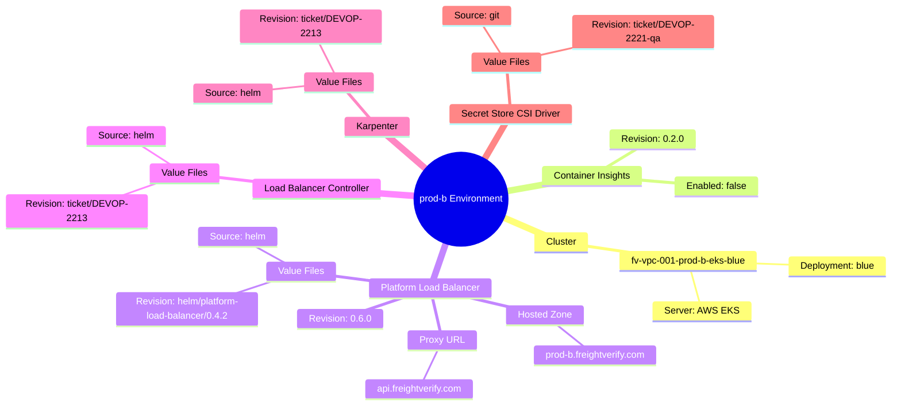
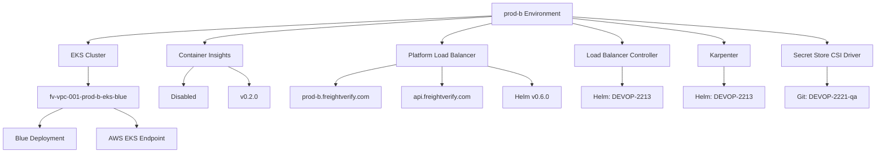
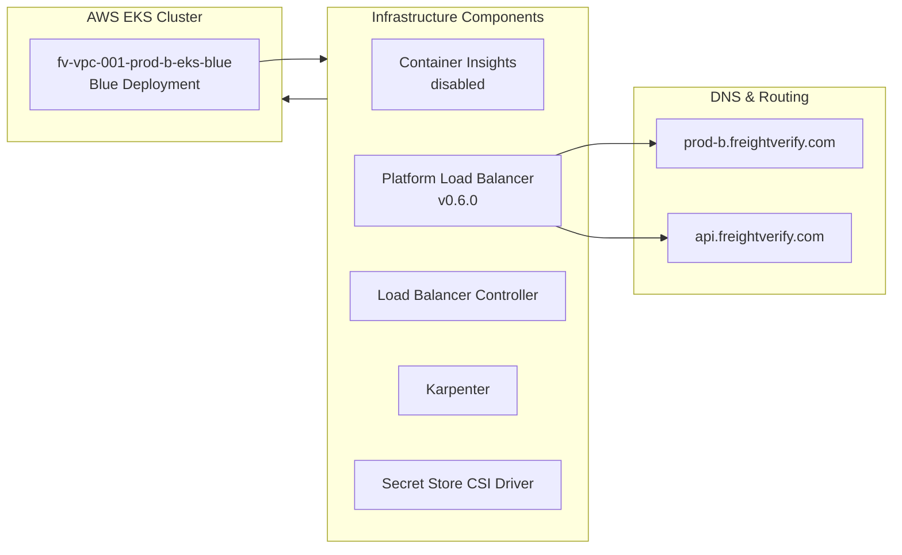

# Diagram: devops/k8s/argocd/app-manager/helm/values.prod-b.yaml

> Auto-generated by Obscura crawlers

## Diagram 1

### SVG

<svg id="container" width="100%" xmlns="http://www.w3.org/2000/svg" class="mindmapDiagram" style="max-width: 1320.392333984375px;" viewBox="5 5 1320.392333984375 714.8117065429688" role="graphics-document document" aria-roledescription="mindmap"><g><marker id="container_mindmap-pointEnd" class="marker mindmap" viewBox="0 0 10 10" refX="5" refY="5" markerUnits="userSpaceOnUse" markerWidth="8" markerHeight="8" orient="auto"><path d="M 0 0 L 10 5 L 0 10 z" class="arrowMarkerPath" style="stroke-width: 1; stroke-dasharray: 1, 0;"></path></marker><marker id="container_mindmap-pointStart" class="marker mindmap" viewBox="0 0 10 10" refX="4.5" refY="5" markerUnits="userSpaceOnUse" markerWidth="8" markerHeight="8" orient="auto"><path d="M 0 5 L 10 10 L 10 0 z" class="arrowMarkerPath" style="stroke-width: 1; stroke-dasharray: 1, 0;"></path></marker><g class="subgraphs"></g><g class="edgePaths"><path d="M681.199,359.764L693.98,363.423C706.76,367.083,732.32,374.401,757.88,381.719C783.441,389.038,809.001,396.356,821.781,400.015L834.561,403.675" id="edge_0_1" class="edge-thickness-normal edge-pattern-solid edge section-edge-0 edge-depth-1" style="undefined;;;undefined" data-edge="true" data-et="edge" data-id="edge_0_1" data-points="W3sieCI6NjgxLjE5OTM2OTg1MjM2NzEsInkiOjM1OS43NjQyNDIxNDIxMzV9LHsieCI6NzU3Ljg4MDQwMTk0NTA5NzMsInkiOjM4MS43MTk0NTY2MjA2NjY5fSx7IngiOjgzNC41NjE0MzQwMzc4Mjc2LCJ5Ijo0MDMuNjc0NjcxMDk5MTk4OH1d"></path><path d="M863.914,409.228L879.859,410.749C895.804,412.269,927.693,415.311,959.582,418.352C991.472,421.394,1023.361,424.436,1039.306,425.956L1055.251,427.477" id="edge_1_2" class="edge-thickness-normal edge-pattern-solid edge section-edge-0 edge-depth-3" style="undefined;;;undefined" data-edge="true" data-et="edge" data-id="edge_1_2" data-points="W3sieCI6ODYzLjkxNDIyMjYxNjY0NCwieSI6NDA5LjIyNzc2MDQ3OTA0NzR9LHsieCI6OTU5LjU4MjM3MTgyNzQxNiwieSI6NDE4LjM1MjQ0OTI4NjMzNTV9LHsieCI6MTA1NS4yNTA1MjEwMzgxODc4LCJ5Ijo0MjcuNDc3MTM4MDkzNjIzNjR9XQ=="></path><path d="M1083.96,422.97L1094.73,418.333C1105.5,413.697,1127.04,404.423,1148.58,395.15C1170.12,385.877,1191.66,376.603,1202.43,371.967L1213.2,367.33" id="edge_2_3" class="edge-thickness-normal edge-pattern-solid edge section-edge-0 edge-depth-5" style="undefined;;;undefined" data-edge="true" data-et="edge" data-id="edge_2_3" data-points="W3sieCI6MTA4My45NjAyMDM4MTQ1OTA0LCJ5Ijo0MjIuOTY5OTE5MTY5NjE0OX0seyJ4IjoxMTQ4LjU4MDA5NzA0NzY4ODcsInkiOjM5NS4xNDk5MjAyMjgzMTQxNn0seyJ4IjoxMjEzLjE5OTk5MDI4MDc4NywieSI6MzY3LjMyOTkyMTI4NzAxMzR9XQ=="></path><path d="M1084.125,434.435L1095.723,439.039C1107.321,443.643,1130.517,452.85,1153.713,462.058C1176.91,471.265,1200.106,480.473,1211.704,485.077L1223.302,489.68" id="edge_2_4" class="edge-thickness-normal edge-pattern-solid edge section-edge-0 edge-depth-5" style="undefined;;;undefined" data-edge="true" data-et="edge" data-id="edge_2_4" data-points="W3sieCI6MTA4NC4xMjQ1NzE5NTI4NTA4LCJ5Ijo0MzQuNDM1NDA1NzEzMDkxNH0seyJ4IjoxMTUzLjcxMzMyNzQ4NzE5MjEsInkiOjQ2Mi4wNTc5MDY4MDE0NDc2NH0seyJ4IjoxMjIzLjMwMjA4MzAyMTUzMzUsInkiOjQ4OS42ODA0MDc4ODk4MDM4Nn1d"></path><path d="M680.892,350.554L693.841,345.891C706.789,341.228,732.687,331.903,758.585,322.578C784.482,313.252,810.38,303.927,823.329,299.264L836.278,294.602" id="edge_0_5" class="edge-thickness-normal edge-pattern-solid edge section-edge-1 edge-depth-1" style="undefined;;;undefined" data-edge="true" data-et="edge" data-id="edge_0_5" data-points="W3sieCI6NjgwLjg5MTc1MTI2MTE2MDYsInkiOjM1MC41NTM1MzMzOTMwNTAyfSx7IngiOjc1OC41ODQ2NTEwNTk5Njk3LCJ5IjozMjIuNTc3NjA5MTEyNzc0Mjd9LHsieCI6ODM2LjI3NzU1MDg1ODc3ODgsInkiOjI5NC42MDE2ODQ4MzI0OTgzNH1d"></path><path d="M865.384,289.09L880.522,288.656C895.66,288.221,925.936,287.353,956.212,286.485C986.488,285.616,1016.764,284.748,1031.902,284.314L1047.04,283.88" id="edge_5_6" class="edge-thickness-normal edge-pattern-solid edge section-edge-1 edge-depth-3" style="undefined;;;undefined" data-edge="true" data-et="edge" data-id="edge_5_6" data-points="W3sieCI6ODY1LjM4NDMyMTA1OTQ0MTQsInkiOjI4OS4wODk4MDk0OTY4NDIzNX0seyJ4Ijo5NTYuMjExOTkwMjEzNzkxMSwieSI6Mjg2LjQ4NDc2MjU1MjQ3MjI2fSx7IngiOjEwNDcuMDM5NjU5MzY4MTQwNywieSI6MjgzLjg3OTcxNTYwODEwMjJ9XQ=="></path><path d="M861.417,279.351L865.963,275.159C870.509,270.967,879.6,262.583,888.692,254.199C897.783,245.815,906.875,237.43,911.421,233.238L915.966,229.046" id="edge_5_7" class="edge-thickness-normal edge-pattern-solid edge section-edge-1 edge-depth-3" style="undefined;;;undefined" data-edge="true" data-et="edge" data-id="edge_5_7" data-points="W3sieCI6ODYxLjQxNzM5MzU1MDYzMiwieSI6Mjc5LjM1MDkxMTMyNTAyODMzfSx7IngiOjg4OC42OTE4MjI2MDc2NjgsInkiOjI1NC4xOTg2MTU4MTE5Mzc1NH0seyJ4Ijo5MTUuOTY2MjUxNjY0NzAzOSwieSI6MjI5LjA0NjMyMDI5ODg0Njc1fV0="></path><path d="M664.204,370.413L662.363,380.982C660.521,391.552,656.838,412.691,653.155,433.83C649.472,454.969,645.789,476.108,643.947,486.677L642.106,497.247" id="edge_0_8" class="edge-thickness-normal edge-pattern-solid edge section-edge-2 edge-depth-1" style="undefined;;;undefined" data-edge="true" data-et="edge" data-id="edge_0_8" data-points="W3sieCI6NjY0LjIwNDE1NDk3MzA0NTgsInkiOjM3MC40MTI3NTMwNzU3MjI1NX0seyJ4Ijo2NTMuMTU1MDA1NTg3NjMwMywieSI6NDMzLjgyOTg3Mjc1NDU4OTl9LHsieCI6NjQyLjEwNTg1NjIwMjIxNDgsInkiOjQ5Ny4yNDY5OTI0MzM0NTc0fV0="></path><path d="M654.427,513.789L670.628,515.708C686.83,517.627,719.232,521.464,751.634,525.302C784.037,529.14,816.439,532.978,832.64,534.897L848.842,536.816" id="edge_8_9" class="edge-thickness-normal edge-pattern-solid edge section-edge-2 edge-depth-3" style="undefined;;;undefined" data-edge="true" data-et="edge" data-id="edge_8_9" data-points="W3sieCI6NjU0LjQyNzA3MjU3OTEyODUsInkiOjUxMy43ODg3MDczMDMzMDc5fSx7IngiOjc1MS42MzQzNTY0NjU3Nzc2LCJ5Ijo1MjUuMzAyMzQwNDE3MDk2Mn0seyJ4Ijo4NDguODQxNjQwMzUyNDI2NywieSI6NTM2LjgxNTk3MzUzMDg4NDR9XQ=="></path><path d="M878.186,542.611L890.203,545.964C902.22,549.316,926.255,556.021,950.289,562.727C974.324,569.432,998.358,576.137,1010.375,579.49L1022.393,582.842" id="edge_9_10" class="edge-thickness-normal edge-pattern-solid edge section-edge-2 edge-depth-5" style="undefined;;;undefined" data-edge="true" data-et="edge" data-id="edge_9_10" data-points="W3sieCI6ODc4LjE4NTc5MjUxMjg3OSwieSI6NTQyLjYxMTEwMTIyNDQzNDN9LHsieCI6OTUwLjI4OTE3NjQ1MzYwODIsInkiOjU2Mi43MjY1OTU2MDgwMTN9LHsieCI6MTAyMi4zOTI1NjAzOTQzMzc2LCJ5Ijo1ODIuODQyMDg5OTkxNTkxN31d"></path><path d="M625.227,516.54L614.224,520.012C603.222,523.485,581.217,530.431,559.212,537.377C537.207,544.323,515.202,551.269,504.199,554.742L493.197,558.215" id="edge_8_11" class="edge-thickness-normal edge-pattern-solid edge section-edge-2 edge-depth-3" style="undefined;;;undefined" data-edge="true" data-et="edge" data-id="edge_8_11" data-points="W3sieCI6NjI1LjIyNjg4MjI0NDc3MjYsInkiOjUxNi41Mzk1MzE0ODI5ODU0fSx7IngiOjU1OS4yMTE3MDEzNzUzNDExLCJ5Ijo1MzcuMzc3MjA4ODk4NTg1M30seyJ4Ijo0OTMuMTk2NTIwNTA1OTA5NiwieSI6NTU4LjIxNDg4NjMxNDE4NTN9XQ=="></path><path d="M464.352,566.416L452.159,569.507C439.965,572.599,415.579,578.781,391.192,584.963C366.805,591.146,342.418,597.328,330.225,600.419L318.032,603.51" id="edge_11_12" class="edge-thickness-normal edge-pattern-solid edge section-edge-2 edge-depth-5" style="undefined;;;undefined" data-edge="true" data-et="edge" data-id="edge_11_12" data-points="W3sieCI6NDY0LjM1MjE3MTU4NTQ3MjIsInkiOjU2Ni40MTYxNDUzODAzNjAzfSx7IngiOjM5MS4xOTE5MDc2MTYzMjIzLCJ5Ijo1ODQuOTYzMzEyMDcxMjk1M30seyJ4IjozMTguMDMxNjQzNjQ3MTcyMzYsInkiOjYwMy41MTA0Nzg3NjIyMzAzfV0="></path><path d="M643.615,526.458L645.011,531.391C646.407,536.325,649.198,546.192,651.99,556.058C654.782,565.925,657.574,575.792,658.969,580.726L660.365,585.659" id="edge_8_13" class="edge-thickness-normal edge-pattern-solid edge section-edge-2 edge-depth-3" style="undefined;;;undefined" data-edge="true" data-et="edge" data-id="edge_8_13" data-points="W3sieCI6NjQzLjYxNDk2NjEzODE5ODYsInkiOjUyNi40NTc3NzA1NTg0NTA2fSx7IngiOjY1MS45OTAxNDYwMjA3OTkzLCJ5Ijo1NTYuMDU4NDIxODczMzg5OH0seyJ4Ijo2NjAuMzY1MzI1OTAzNCwieSI6NTg1LjY1OTA3MzE4ODMyODl9XQ=="></path><path d="M678.428,605.532L687.684,609.133C696.939,612.735,715.45,619.937,733.961,627.14C752.472,634.343,770.983,641.546,780.238,645.147L789.494,648.749" id="edge_13_14" class="edge-thickness-normal edge-pattern-solid edge section-edge-2 edge-depth-5" style="undefined;;;undefined" data-edge="true" data-et="edge" data-id="edge_13_14" data-points="W3sieCI6Njc4LjQyODExODMyODg5NDQsInkiOjYwNS41MzE4NTM0NjIyMjE0fSx7IngiOjczMy45NjA5NzUxMDcyMzgsInkiOjYyNy4xNDAyODQ2Njg5Nzg3fSx7IngiOjc4OS40OTM4MzE4ODU1ODE3LCJ5Ijo2NDguNzQ4NzE1ODc1NzM1OX1d"></path><path d="M652.722,609.446L646.243,614.613C639.764,619.781,626.806,630.117,613.847,640.452C600.889,650.788,587.93,661.123,581.451,666.291L574.972,671.459" id="edge_13_15" class="edge-thickness-normal edge-pattern-solid edge section-edge-2 edge-depth-5" style="undefined;;;undefined" data-edge="true" data-et="edge" data-id="edge_13_15" data-points="W3sieCI6NjUyLjcyMjI4ODMwNDgxMjcsInkiOjYwOS40NDU2NDU4Mzc0NjkyfSx7IngiOjYxMy44NDcxMTQxMjQ5NTM2LCJ5Ijo2NDAuNDUyMDgwODYyNzE4fSx7IngiOjU3NC45NzE5Mzk5NDUwOTQ0LCJ5Ijo2NzEuNDU4NTE1ODg3OTY2OX1d"></path><path d="M624.775,509.332L609.179,506.486C593.583,503.64,562.39,497.949,531.198,492.257C500.006,486.566,468.814,480.874,453.218,478.028L437.622,475.182" id="edge_8_16" class="edge-thickness-normal edge-pattern-solid edge section-edge-2 edge-depth-3" style="undefined;;;undefined" data-edge="true" data-et="edge" data-id="edge_8_16" data-points="W3sieCI6NjI0Ljc3NDgzNjcxNTU0NDMsInkiOjUwOS4zMzE4MjA5MTA1NDU0fSx7IngiOjUzMS4xOTgyOTEyNjI4Njk2LCJ5Ijo0OTIuMjU3MTM1NDY5NTA3Nn0seyJ4Ijo0MzcuNjIxNzQ1ODEwMTk0ODUsInkiOjQ3NS4xODI0NTAwMjg0Njk4fV0="></path><path d="M651.786,356.093L633.578,356.648C615.37,357.203,578.955,358.314,542.539,359.424C506.123,360.535,469.708,361.645,451.5,362.201L433.292,362.756" id="edge_0_17" class="edge-thickness-normal edge-pattern-solid edge section-edge-3 edge-depth-1" style="undefined;;;undefined" data-edge="true" data-et="edge" data-id="edge_0_17" data-points="W3sieCI6NjUxLjc4NTc4NTYyMzcxNSwieSI6MzU2LjA5MjYwMDI0ODUxMDV9LHsieCI6NTQyLjUzODkyOTY3ODA3NywieSI6MzU5LjQyNDIzMTA2OTIwMzN9LHsieCI6NDMzLjI5MjA3MzczMjQzODksInkiOjM2Mi43NTU4NjE4ODk4OTYyfV0="></path><path d="M403.623,366.315L389.982,369.199C376.34,372.083,349.056,377.85,321.773,383.618C294.489,389.385,267.206,395.153,253.564,398.037L239.922,400.92" id="edge_17_18" class="edge-thickness-normal edge-pattern-solid edge section-edge-3 edge-depth-3" style="undefined;;;undefined" data-edge="true" data-et="edge" data-id="edge_17_18" data-points="W3sieCI6NDAzLjYyMzM2MjU5MDg5MDcsInkiOjM2Ni4zMTU0MTE5NzUyNzkyM30seyJ4IjozMjEuNzcyODgwMzAzNTg2NzYsInkiOjM4My42MTc5MjUwMzY4OTczfSx7IngiOjIzOS45MjIzOTgwMTYyODI4NCwieSI6NDAwLjkyMDQzODA5ODUxNTR9XQ=="></path><path d="M211.59,397.819L203.507,394.148C195.424,390.476,179.258,383.133,163.093,375.79C146.927,368.447,130.761,361.103,122.679,357.432L114.596,353.76" id="edge_18_19" class="edge-thickness-normal edge-pattern-solid edge section-edge-3 edge-depth-5" style="undefined;;;undefined" data-edge="true" data-et="edge" data-id="edge_18_19" data-points="W3sieCI6MjExLjU4OTY2MjI5MjE4OTY3LCJ5IjozOTcuODE5MTM3OTgxODM0MX0seyJ4IjoxNjMuMDkyNzE3NTA0MzAzMjcsInkiOjM3NS43ODk3NTM4ODkxNzk1Nn0seyJ4IjoxMTQuNTk1NzcyNzE2NDE2ODYsInkiOjM1My43NjAzNjk3OTY1MjV9XQ=="></path><path d="M214.215,414.187L208.533,419.422C202.851,424.658,191.487,435.128,180.123,445.599C168.759,456.07,157.395,466.541,151.713,471.776L146.031,477.011" id="edge_18_20" class="edge-thickness-normal edge-pattern-solid edge section-edge-3 edge-depth-5" style="undefined;;;undefined" data-edge="true" data-et="edge" data-id="edge_18_20" data-points="W3sieCI6MjE0LjIxNTQyMjczNTAwMjksInkiOjQxNC4xODY5MzU1NDYxMzQ5fSx7IngiOjE4MC4xMjMzNTgyNjQ1NzI0NiwieSI6NDQ1LjU5OTE5Njg3NTUzODR9LHsieCI6MTQ2LjAzMTI5Mzc5NDE0MjAyLCJ5Ijo0NzcuMDExNDU4MjA0OTQxODV9XQ=="></path><path d="M653.895,347.954L642.714,341.289C631.533,334.623,609.172,321.291,586.81,307.96C564.449,294.629,542.087,281.297,530.906,274.632L519.726,267.966" id="edge_0_21" class="edge-thickness-normal edge-pattern-solid edge section-edge-4 edge-depth-1" style="undefined;;;undefined" data-edge="true" data-et="edge" data-id="edge_0_21" data-points="W3sieCI6NjUzLjg5NDcyOTI5MzcxMTEsInkiOjM0Ny45NTQyMDAzODMzODR9LHsieCI6NTg2LjgxMDE4Mzk0MjE0MzgsInkiOjMwNy45NjAwODYzNDc3NDM3fSx7IngiOjUxOS43MjU2Mzg1OTA1NzY1LCJ5IjoyNjcuOTY1OTcyMzEyMTAzNH1d"></path><path d="M493.531,253.368L486.182,249.549C478.833,245.73,464.135,238.092,449.436,230.454C434.738,222.817,420.04,215.179,412.691,211.36L405.342,207.541" id="edge_21_22" class="edge-thickness-normal edge-pattern-solid edge section-edge-4 edge-depth-3" style="undefined;;;undefined" data-edge="true" data-et="edge" data-id="edge_21_22" data-points="W3sieCI6NDkzLjUzMTM3MjgzMDE5MiwieSI6MjUzLjM2ODIyMjYyOTE1MTcyfSx7IngiOjQ0OS40MzY0NDA1NTExNDk4LCJ5IjoyMzAuNDU0NDY0NTI5MDE1MTN9LHsieCI6NDA1LjM0MTUwODI3MjEwNzYsInkiOjIwNy41NDA3MDY0Mjg4Nzg1NH1d"></path><path d="M378.014,205.964L368.698,209.513C359.381,213.062,340.748,220.16,322.115,227.258C303.483,234.356,284.85,241.455,275.533,245.004L266.217,248.553" id="edge_22_23" class="edge-thickness-normal edge-pattern-solid edge section-edge-4 edge-depth-5" style="undefined;;;undefined" data-edge="true" data-et="edge" data-id="edge_22_23" data-points="W3sieCI6Mzc4LjAxMzk4NjE1MzQ1OSwieSI6MjA1Ljk2Mzk4NDY5Mzk0OTU4fSx7IngiOjMyMi4xMTUzOTQyODU3NTg4LCJ5IjoyMjcuMjU4MzcwODY4MDg4MDR9LHsieCI6MjY2LjIxNjgwMjQxODA1ODYsInkiOjI0OC41NTI3NTcwNDIyMjY1fV0="></path><path d="M379.771,191.982L372.609,186.933C365.447,181.884,351.123,171.786,336.799,161.688C322.475,151.591,308.151,141.493,300.989,136.444L293.827,131.395" id="edge_22_24" class="edge-thickness-normal edge-pattern-solid edge section-edge-4 edge-depth-5" style="undefined;;;undefined" data-edge="true" data-et="edge" data-id="edge_22_24" data-points="W3sieCI6Mzc5Ljc3MTQxOTY2MDk4MTczLCJ5IjoxOTEuOTgxNTE4MDQ3NjQ0MjJ9LHsieCI6MzM2Ljc5OTE5NDE0MTA2OTg1LCJ5IjoxNjEuNjg4MzA2OTUxNjI5MzN9LHsieCI6MjkzLjgyNjk2ODYyMTE1Nzk2LCJ5IjoxMzEuMzk1MDk1ODU1NjE0NDR9XQ=="></path><path d="M668.148,340.698L669.101,330.313C670.053,319.929,671.957,299.159,673.862,278.389C675.766,257.62,677.67,236.85,678.622,226.466L679.575,216.081" id="edge_0_25" class="edge-thickness-normal edge-pattern-solid edge section-edge-5 edge-depth-1" style="undefined;;;undefined" data-edge="true" data-et="edge" data-id="edge_0_25" data-points="W3sieCI6NjY4LjE0ODQyMzE1MjY4NjEsInkiOjM0MC42OTgwMjU4OTgyMTg5M30seyJ4Ijo2NzMuODYxNTA3MzU5NzExNywieSI6Mjc4LjM4OTQ2ODgxOTc2Njc2fSx7IngiOjY3OS41NzQ1OTE1NjY3Mzc0LCJ5IjoyMTYuMDgwOTExNzQxMzE0NTd9XQ=="></path><path d="M680.758,186.145L680.698,181.343C680.638,176.542,680.519,166.939,680.399,157.336C680.28,147.733,680.16,138.13,680.1,133.328L680.041,128.527" id="edge_25_26" class="edge-thickness-normal edge-pattern-solid edge section-edge-5 edge-depth-3" style="undefined;;;undefined" data-edge="true" data-et="edge" data-id="edge_25_26" data-points="W3sieCI6NjgwLjc1NzU3OTA3MDEwMzgsInkiOjE4Ni4xNDQ3MzEwODUxNTA2NX0seyJ4Ijo2ODAuMzk5MTI4NDkyNjI0MSwieSI6MTU3LjMzNTc1MTIwNTUwMDE3fSx7IngiOjY4MC4wNDA2Nzc5MTUxNDQzLCJ5IjoxMjguNTI2NzcxMzI1ODQ5N31d"></path><path d="M665.937,107.932L657.06,104.362C648.183,100.792,630.429,93.653,612.675,86.513C594.921,79.374,577.167,72.235,568.29,68.665L559.413,65.095" id="edge_26_27" class="edge-thickness-normal edge-pattern-solid edge section-edge-5 edge-depth-5" style="undefined;;;undefined" data-edge="true" data-et="edge" data-id="edge_26_27" data-points="W3sieCI6NjY1LjkzNzE0MTE3NDQ2NTYsInkiOjEwNy45MzE1NTQ5ODY4NTU5Nn0seyJ4Ijo2MTIuNjc1MTQwMTUwNTUwOCwieSI6ODYuNTEzNDMwMDk0NjcyOH0seyJ4Ijo1NTkuNDEzMTM5MTI2NjM1OCwieSI6NjUuMDk1MzA1MjAyNDg5NjR9XQ=="></path><path d="M693.344,106.969L703.012,102.268C712.68,97.567,732.016,88.166,751.352,78.764C770.688,69.362,790.024,59.961,799.691,55.26L809.359,50.559" id="edge_26_28" class="edge-thickness-normal edge-pattern-solid edge section-edge-5 edge-depth-5" style="undefined;;;undefined" data-edge="true" data-et="edge" data-id="edge_26_28" data-points="W3sieCI6NjkzLjM0Mzk2OTM4Mzk4NzEsInkiOjEwNi45Njg3OTUyNDg1MTcwMX0seyJ4Ijo3NTEuMzUxNzAwNjY4ODMyNywieSI6NzguNzYzOTY2MTM4MTA0MDJ9LHsieCI6ODA5LjM1OTQzMTk1MzY3ODMsInkiOjUwLjU1OTEzNzAyNzY5MTA0fV0="></path></g><g class="edgeLabels"><g class="edgeLabel"><g class="label" data-id="edge_0_1" transform="translate(0, 0)"><foreignObject width="0" height="0">

</foreignObject></g></g><g class="edgeLabel"><g class="label" data-id="edge_1_2" transform="translate(0, 0)"><foreignObject width="0" height="0">

</foreignObject></g></g><g class="edgeLabel"><g class="label" data-id="edge_2_3" transform="translate(0, 0)"><foreignObject width="0" height="0">

</foreignObject></g></g><g class="edgeLabel"><g class="label" data-id="edge_2_4" transform="translate(0, 0)"><foreignObject width="0" height="0">

</foreignObject></g></g><g class="edgeLabel"><g class="label" data-id="edge_0_5" transform="translate(0, 0)"><foreignObject width="0" height="0">

</foreignObject></g></g><g class="edgeLabel"><g class="label" data-id="edge_5_6" transform="translate(0, 0)"><foreignObject width="0" height="0">

</foreignObject></g></g><g class="edgeLabel"><g class="label" data-id="edge_5_7" transform="translate(0, 0)"><foreignObject width="0" height="0">

</foreignObject></g></g><g class="edgeLabel"><g class="label" data-id="edge_0_8" transform="translate(0, 0)"><foreignObject width="0" height="0">

</foreignObject></g></g><g class="edgeLabel"><g class="label" data-id="edge_8_9" transform="translate(0, 0)"><foreignObject width="0" height="0">

</foreignObject></g></g><g class="edgeLabel"><g class="label" data-id="edge_9_10" transform="translate(0, 0)"><foreignObject width="0" height="0">

</foreignObject></g></g><g class="edgeLabel"><g class="label" data-id="edge_8_11" transform="translate(0, 0)"><foreignObject width="0" height="0">

</foreignObject></g></g><g class="edgeLabel"><g class="label" data-id="edge_11_12" transform="translate(0, 0)"><foreignObject width="0" height="0">

</foreignObject></g></g><g class="edgeLabel"><g class="label" data-id="edge_8_13" transform="translate(0, 0)"><foreignObject width="0" height="0">

</foreignObject></g></g><g class="edgeLabel"><g class="label" data-id="edge_13_14" transform="translate(0, 0)"><foreignObject width="0" height="0">

</foreignObject></g></g><g class="edgeLabel"><g class="label" data-id="edge_13_15" transform="translate(0, 0)"><foreignObject width="0" height="0">

</foreignObject></g></g><g class="edgeLabel"><g class="label" data-id="edge_8_16" transform="translate(0, 0)"><foreignObject width="0" height="0">

</foreignObject></g></g><g class="edgeLabel"><g class="label" data-id="edge_0_17" transform="translate(0, 0)"><foreignObject width="0" height="0">

</foreignObject></g></g><g class="edgeLabel"><g class="label" data-id="edge_17_18" transform="translate(0, 0)"><foreignObject width="0" height="0">

</foreignObject></g></g><g class="edgeLabel"><g class="label" data-id="edge_18_19" transform="translate(0, 0)"><foreignObject width="0" height="0">

</foreignObject></g></g><g class="edgeLabel"><g class="label" data-id="edge_18_20" transform="translate(0, 0)"><foreignObject width="0" height="0">

</foreignObject></g></g><g class="edgeLabel"><g class="label" data-id="edge_0_21" transform="translate(0, 0)"><foreignObject width="0" height="0">

</foreignObject></g></g><g class="edgeLabel"><g class="label" data-id="edge_21_22" transform="translate(0, 0)"><foreignObject width="0" height="0">

</foreignObject></g></g><g class="edgeLabel"><g class="label" data-id="edge_22_23" transform="translate(0, 0)"><foreignObject width="0" height="0">

</foreignObject></g></g><g class="edgeLabel"><g class="label" data-id="edge_22_24" transform="translate(0, 0)"><foreignObject width="0" height="0">

</foreignObject></g></g><g class="edgeLabel"><g class="label" data-id="edge_0_25" transform="translate(0, 0)"><foreignObject width="0" height="0">

</foreignObject></g></g><g class="edgeLabel"><g class="label" data-id="edge_25_26" transform="translate(0, 0)"><foreignObject width="0" height="0">

</foreignObject></g></g><g class="edgeLabel"><g class="label" data-id="edge_26_27" transform="translate(0, 0)"><foreignObject width="0" height="0">

</foreignObject></g></g><g class="edgeLabel"><g class="label" data-id="edge_26_28" transform="translate(0, 0)"><foreignObject width="0" height="0">

</foreignObject></g></g></g><g class="nodes"><g class="node mindmap-node section-root section--1" id="node_0" transform="translate(666.7788152781253, 355.6353675047412)"><circle class="basic label-container" style="" r="83.1796875" cx="0" cy="0"></circle><g class="label" style="" transform="translate(-73.1796875, -12)"><rect></rect><foreignObject width="146.359375" height="24">

prod-b Environment

</foreignObject></g></g><g class="node mindmap-node section-0" id="node_1" transform="translate(848.9819886120694, 407.8035457365926)"><path id="node-1" class="node-bkg node-0" style="" d="M-45.359375 12
    v-24
    q0,-5 5,-5
    h80.71875
    q5,0 5,5
    v24
    q0,5 -5,5
    h-80.71875
    q-5,0 -5,-5
    Z"></path><line class="node-line-" x1="-45.359375" y1="17" x2="45.359375" y2="17"></line><g class="label" style="" transform="translate(-25.359375, -12)"><rect></rect><foreignObject width="50.71875" height="24">

Cluster

</foreignObject></g></g><g class="node mindmap-node section-0" id="node_2" transform="translate(1070.1827550427624, 428.90135283607844)"><path id="node-2" class="node-bkg node-0" style="" d="M-120 24
    v-48
    q0,-5 5,-5
    h230
    q5,0 5,5
    v48
    q0,5 -5,5
    h-230
    q-5,0 -5,-5
    Z"></path><line class="node-line-" x1="-120" y1="29" x2="120" y2="29"></line><g class="label" style="" transform="translate(-100, -24)"><rect></rect><foreignObject width="200" height="48">

fv-vpc-001-prod-b-eks-blue

</foreignObject></g></g><g class="node mindmap-node section-0" id="node_3" transform="translate(1226.977439052615, 361.3984876205499)"><path id="node-3" class="node-bkg node-0" style="" d="M-84.125 12
    v-24
    q0,-5 5,-5
    h158.25
    q5,0 5,5
    v24
    q0,5 -5,5
    h-158.25
    q-5,0 -5,-5
    Z"></path><line class="node-line-" x1="-84.125" y1="17" x2="84.125" y2="17"></line><g class="label" style="" transform="translate(-64.125, -12)"><rect></rect><foreignObject width="128.25" height="24">

Deployment: blue

</foreignObject></g></g><g class="node mindmap-node section-0" id="node_4" transform="translate(1237.2438999316219, 495.21446076681684)"><path id="node-4" class="node-bkg node-0" style="" d="M-78.1484375 12
    v-24
    q0,-5 5,-5
    h146.296875
    q5,0 5,5
    v24
    q0,5 -5,5
    h-146.296875
    q-5,0 -5,-5
    Z"></path><line class="node-line-" x1="-78.1484375" y1="17" x2="78.1484375" y2="17"></line><g class="label" style="" transform="translate(-58.1484375, -12)"><rect></rect><foreignObject width="116.296875" height="24">

Server: AWS EKS

</foreignObject></g></g><g class="node mindmap-node section-1" id="node_5" transform="translate(850.3904868418141, 289.5198507208073)"><path id="node-5" class="node-bkg node-0" style="" d="M-85.890625 12
    v-24
    q0,-5 5,-5
    h161.78125
    q5,0 5,5
    v24
    q0,5 -5,5
    h-161.78125
    q-5,0 -5,-5
    Z"></path><line class="node-line-" x1="-85.890625" y1="17" x2="85.890625" y2="17"></line><g class="label" style="" transform="translate(-65.890625, -12)"><rect></rect><foreignObject width="131.78125" height="24">

Container Insights

</foreignObject></g></g><g class="node mindmap-node section-1" id="node_6" transform="translate(1062.0334935857682, 283.4496743841372)"><path id="node-6" class="node-bkg node-0" style="" d="M-70.703125 12
    v-24
    q0,-5 5,-5
    h131.40625
    q5,0 5,5
    v24
    q0,5 -5,5
    h-131.40625
    q-5,0 -5,-5
    Z"></path><line class="node-line-" x1="-70.703125" y1="17" x2="70.703125" y2="17"></line><g class="label" style="" transform="translate(-50.703125, -12)"><rect></rect><foreignObject width="101.40625" height="24">

Enabled: false

</foreignObject></g></g><g class="node mindmap-node section-1" id="node_7" transform="translate(926.9931583735219, 218.87738090306777)"><path id="node-7" class="node-bkg node-0" style="" d="M-71.171875 12
    v-24
    q0,-5 5,-5
    h132.34375
    q5,0 5,5
    v24
    q0,5 -5,5
    h-132.34375
    q-5,0 -5,-5
    Z"></path><line class="node-line-" x1="-71.171875" y1="17" x2="71.171875" y2="17"></line><g class="label" style="" transform="translate(-51.171875, -12)"><rect></rect><foreignObject width="102.34375" height="24">

Revision: 0.2.0

</foreignObject></g></g><g class="node mindmap-node section-2" id="node_8" transform="translate(639.5311958971353, 512.0243780044387)"><path id="node-8" class="node-bkg node-0" style="" d="M-104.6796875 12
    v-24
    q0,-5 5,-5
    h199.359375
    q5,0 5,5
    v24
    q0,5 -5,5
    h-199.359375
    q-5,0 -5,-5
    Z"></path><line class="node-line-" x1="-104.6796875" y1="17" x2="104.6796875" y2="17"></line><g class="label" style="" transform="translate(-84.6796875, -12)"><rect></rect><foreignObject width="169.359375" height="24">

Platform Load Balancer

</foreignObject></g></g><g class="node mindmap-node section-2" id="node_9" transform="translate(863.73751703442, 538.5803028297536)"><path id="node-9" class="node-bkg node-0" style="" d="M-65.6015625 12
    v-24
    q0,-5 5,-5
    h121.203125
    q5,0 5,5
    v24
    q0,5 -5,5
    h-121.203125
    q-5,0 -5,-5
    Z"></path><line class="node-line-" x1="-65.6015625" y1="17" x2="65.6015625" y2="17"></line><g class="label" style="" transform="translate(-45.6015625, -12)"><rect></rect><foreignObject width="91.203125" height="24">

Hosted Zone

</foreignObject></g></g><g class="node mindmap-node section-2" id="node_10" transform="translate(1036.8408358727966, 586.8728883862724)"><path id="node-10" class="node-bkg node-0" style="" d="M-107.5390625 12
    v-24
    q0,-5 5,-5
    h205.078125
    q5,0 5,5
    v24
    q0,5 -5,5
    h-205.078125
    q-5,0 -5,-5
    Z"></path><line class="node-line-" x1="-107.5390625" y1="17" x2="107.5390625" y2="17"></line><g class="label" style="" transform="translate(-87.5390625, -12)"><rect></rect><foreignObject width="175.078125" height="24">

prod-b.freightverify.com

</foreignObject></g></g><g class="node mindmap-node section-2" id="node_11" transform="translate(478.8922068535469, 562.7300397927319)"><path id="node-11" class="node-bkg node-0" style="" d="M-55.9921875 12
    v-24
    q0,-5 5,-5
    h101.984375
    q5,0 5,5
    v24
    q0,5 -5,5
    h-101.984375
    q-5,0 -5,-5
    Z"></path><line class="node-line-" x1="-55.9921875" y1="17" x2="55.9921875" y2="17"></line><g class="label" style="" transform="translate(-35.9921875, -12)"><rect></rect><foreignObject width="71.984375" height="24">

Proxy URL

</foreignObject></g></g><g class="node mindmap-node section-2" id="node_12" transform="translate(303.49160837909767, 607.1965843498587)"><path id="node-12" class="node-bkg node-0" style="" d="M-93.9453125 12
    v-24
    q0,-5 5,-5
    h177.890625
    q5,0 5,5
    v24
    q0,5 -5,5
    h-177.890625
    q-5,0 -5,-5
    Z"></path><line class="node-line-" x1="-93.9453125" y1="17" x2="93.9453125" y2="17"></line><g class="label" style="" transform="translate(-73.9453125, -12)"><rect></rect><foreignObject width="147.890625" height="24">

api.freightverify.com

</foreignObject></g></g><g class="node mindmap-node section-2" id="node_13" transform="translate(664.4490961444634, 600.0924657423408)"><path id="node-13" class="node-bkg node-0" style="" d="M-58.1875 12
    v-24
    q0,-5 5,-5
    h106.375
    q5,0 5,5
    v24
    q0,5 -5,5
    h-106.375
    q-5,0 -5,-5
    Z"></path><line class="node-line-" x1="-58.1875" y1="17" x2="58.1875" y2="17"></line><g class="label" style="" transform="translate(-38.1875, -12)"><rect></rect><foreignObject width="76.375" height="24">

Value Files

</foreignObject></g></g><g class="node mindmap-node section-2" id="node_14" transform="translate(803.4728540700127, 654.1881035956166)"><path id="node-14" class="node-bkg node-0" style="" d="M-66.8515625 12
    v-24
    q0,-5 5,-5
    h123.703125
    q5,0 5,5
    v24
    q0,5 -5,5
    h-123.703125
    q-5,0 -5,-5
    Z"></path><line class="node-line-" x1="-66.8515625" y1="17" x2="66.8515625" y2="17"></line><g class="label" style="" transform="translate(-46.8515625, -12)"><rect></rect><foreignObject width="93.703125" height="24">

Source: helm

</foreignObject></g></g><g class="node mindmap-node section-2" id="node_15" transform="translate(563.2451321054436, 680.8116959830953)"><path id="node-15" class="node-bkg node-0" style="" d="M-120 24
    v-48
    q0,-5 5,-5
    h230
    q5,0 5,5
    v48
    q0,5 -5,5
    h-230
    q-5,0 -5,-5
    Z"></path><line class="node-line-" x1="-120" y1="29" x2="120" y2="29"></line><g class="label" style="" transform="translate(-100, -24)"><rect></rect><foreignObject width="200" height="48">

Revision: helm/platform-load-balancer/0.4.2

</foreignObject></g></g><g class="node mindmap-node section-2" id="node_16" transform="translate(422.8653866286039, 472.48989293457646)"><path id="node-16" class="node-bkg node-0" style="" d="M-71.359375 12
    v-24
    q0,-5 5,-5
    h132.71875
    q5,0 5,5
    v24
    q0,5 -5,5
    h-132.71875
    q-5,0 -5,-5
    Z"></path><line class="node-line-" x1="-71.359375" y1="17" x2="71.359375" y2="17"></line><g class="label" style="" transform="translate(-51.359375, -12)"><rect></rect><foreignObject width="102.71875" height="24">

Revision: 0.6.0

</foreignObject></g></g><g class="node mindmap-node section-3" id="node_17" transform="translate(418.2990440780286, 363.2130946336655)"><path id="node-17" class="node-bkg node-0" style="" d="M-109.53125 12
    v-24
    q0,-5 5,-5
    h209.0625
    q5,0 5,5
    v24
    q0,5 -5,5
    h-209.0625
    q-5,0 -5,-5
    Z"></path><line class="node-line-" x1="-109.53125" y1="17" x2="109.53125" y2="17"></line><g class="label" style="" transform="translate(-89.53125, -12)"><rect></rect><foreignObject width="179.0625" height="24">

Load Balancer Controller

</foreignObject></g></g><g class="node mindmap-node section-3" id="node_18" transform="translate(225.24671652914492, 404.0227554401291)"><path id="node-18" class="node-bkg node-0" style="" d="M-58.1875 12
    v-24
    q0,-5 5,-5
    h106.375
    q5,0 5,5
    v24
    q0,5 -5,5
    h-106.375
    q-5,0 -5,-5
    Z"></path><line class="node-line-" x1="-58.1875" y1="17" x2="58.1875" y2="17"></line><g class="label" style="" transform="translate(-38.1875, -12)"><rect></rect><foreignObject width="76.375" height="24">

Value Files

</foreignObject></g></g><g class="node mindmap-node section-3" id="node_19" transform="translate(100.93871847946161, 347.55675233823)"><path id="node-19" class="node-bkg node-0" style="" d="M-66.8515625 12
    v-24
    q0,-5 5,-5
    h123.703125
    q5,0 5,5
    v24
    q0,5 -5,5
    h-123.703125
    q-5,0 -5,-5
    Z"></path><line class="node-line-" x1="-66.8515625" y1="17" x2="66.8515625" y2="17"></line><g class="label" style="" transform="translate(-46.8515625, -12)"><rect></rect><foreignObject width="93.703125" height="24">

Source: helm

</foreignObject></g></g><g class="node mindmap-node section-3" id="node_20" transform="translate(135, 487.17563831094765)"><path id="node-20" class="node-bkg node-0" style="" d="M-120 24
    v-48
    q0,-5 5,-5
    h230
    q5,0 5,5
    v48
    q0,5 -5,5
    h-230
    q-5,0 -5,-5
    Z"></path><line class="node-line-" x1="-120" y1="29" x2="120" y2="29"></line><g class="label" style="" transform="translate(-100, -24)"><rect></rect><foreignObject width="200" height="48">

Revision: ticket/DEVOP-2213

</foreignObject></g></g><g class="node mindmap-node section-4" id="node_21" transform="translate(506.8415526061623, 260.28480519074617)"><path id="node-21" class="node-bkg node-0" style="" d="M-56.1171875 12
    v-24
    q0,-5 5,-5
    h102.234375
    q5,0 5,5
    v24
    q0,5 -5,5
    h-102.234375
    q-5,0 -5,-5
    Z"></path><line class="node-line-" x1="-56.1171875" y1="17" x2="56.1171875" y2="17"></line><g class="label" style="" transform="translate(-36.1171875, -12)"><rect></rect><foreignObject width="72.234375" height="24">

Karpenter

</foreignObject></g></g><g class="node mindmap-node section-4" id="node_22" transform="translate(392.03132849613735, 200.62412386728408)"><path id="node-22" class="node-bkg node-0" style="" d="M-58.1875 12
    v-24
    q0,-5 5,-5
    h106.375
    q5,0 5,5
    v24
    q0,5 -5,5
    h-106.375
    q-5,0 -5,-5
    Z"></path><line class="node-line-" x1="-58.1875" y1="17" x2="58.1875" y2="17"></line><g class="label" style="" transform="translate(-38.1875, -12)"><rect></rect><foreignObject width="76.375" height="24">

Value Files

</foreignObject></g></g><g class="node mindmap-node section-4" id="node_23" transform="translate(252.19946007538022, 253.892617868892)"><path id="node-23" class="node-bkg node-0" style="" d="M-66.8515625 12
    v-24
    q0,-5 5,-5
    h123.703125
    q5,0 5,5
    v24
    q0,5 -5,5
    h-123.703125
    q-5,0 -5,-5
    Z"></path><line class="node-line-" x1="-66.8515625" y1="17" x2="66.8515625" y2="17"></line><g class="label" style="" transform="translate(-46.8515625, -12)"><rect></rect><foreignObject width="93.703125" height="24">

Source: helm

</foreignObject></g></g><g class="node mindmap-node section-4" id="node_24" transform="translate(281.56705978600235, 122.75249003597457)"><path id="node-24" class="node-bkg node-0" style="" d="M-120 24
    v-48
    q0,-5 5,-5
    h230
    q5,0 5,5
    v48
    q0,5 -5,5
    h-230
    q-5,0 -5,-5
    Z"></path><line class="node-line-" x1="-120" y1="29" x2="120" y2="29"></line><g class="label" style="" transform="translate(-100, -24)"><rect></rect><foreignObject width="200" height="48">

Revision: ticket/DEVOP-2213

</foreignObject></g></g><g class="node mindmap-node section-5" id="node_25" transform="translate(680.9441994412981, 201.1435701347923)"><path id="node-25" class="node-bkg node-0" style="" d="M-100.9765625 12
    v-24
    q0,-5 5,-5
    h191.953125
    q5,0 5,5
    v24
    q0,5 -5,5
    h-191.953125
    q-5,0 -5,-5
    Z"></path><line class="node-line-" x1="-100.9765625" y1="17" x2="100.9765625" y2="17"></line><g class="label" style="" transform="translate(-80.9765625, -12)"><rect></rect><foreignObject width="161.953125" height="24">

Secret Store CSI Driver

</foreignObject></g></g><g class="node mindmap-node section-5" id="node_26" transform="translate(679.85405754395, 113.52793227620805)"><path id="node-26" class="node-bkg node-0" style="" d="M-58.1875 12
    v-24
    q0,-5 5,-5
    h106.375
    q5,0 5,5
    v24
    q0,5 -5,5
    h-106.375
    q-5,0 -5,-5
    Z"></path><line class="node-line-" x1="-58.1875" y1="17" x2="58.1875" y2="17"></line><g class="label" style="" transform="translate(-38.1875, -12)"><rect></rect><foreignObject width="76.375" height="24">

Value Files

</foreignObject></g></g><g class="node mindmap-node section-5" id="node_27" transform="translate(545.4962227571514, 59.49892791313755)"><path id="node-27" class="node-bkg node-0" style="" d="M-57.90625 12
    v-24
    q0,-5 5,-5
    h105.8125
    q5,0 5,5
    v24
    q0,5 -5,5
    h-105.8125
    q-5,0 -5,-5
    Z"></path><line class="node-line-" x1="-57.90625" y1="17" x2="57.90625" y2="17"></line><g class="label" style="" transform="translate(-37.90625, -12)"><rect></rect><foreignObject width="75.8125" height="24">

Source: git

</foreignObject></g></g><g class="node mindmap-node section-5" id="node_28" transform="translate(822.8493437937153, 44)"><path id="node-28" class="node-bkg node-0" style="" d="M-120 24
    v-48
    q0,-5 5,-5
    h230
    q5,0 5,5
    v48
    q0,5 -5,5
    h-230
    q-5,0 -5,-5
    Z"></path><line class="node-line-" x1="-120" y1="29" x2="120" y2="29"></line><g class="label" style="" transform="translate(-100, -24)"><rect></rect><foreignObject width="200" height="48">

Revision: ticket/DEVOP-2221-qa

</foreignObject></g></g></g></g></svg>

## Diagram 2

### SVG

<svg id="container" width="2156.92578125" xmlns="http://www.w3.org/2000/svg" class="flowchart" height="406" viewBox="0 0 2156.92578125 406" role="graphics-document document" aria-roledescription="flowchart-v2"><g><marker id="container_flowchart-v2-pointEnd" class="marker flowchart-v2" viewBox="0 0 10 10" refX="5" refY="5" markerUnits="userSpaceOnUse" markerWidth="8" markerHeight="8" orient="auto"><path d="M 0 0 L 10 5 L 0 10 z" class="arrowMarkerPath" style="stroke-width: 1; stroke-dasharray: 1, 0;"></path></marker><marker id="container_flowchart-v2-pointStart" class="marker flowchart-v2" viewBox="0 0 10 10" refX="4.5" refY="5" markerUnits="userSpaceOnUse" markerWidth="8" markerHeight="8" orient="auto"><path d="M 0 5 L 10 10 L 10 0 z" class="arrowMarkerPath" style="stroke-width: 1; stroke-dasharray: 1, 0;"></path></marker><marker id="container_flowchart-v2-circleEnd" class="marker flowchart-v2" viewBox="0 0 10 10" refX="11" refY="5" markerUnits="userSpaceOnUse" markerWidth="11" markerHeight="11" orient="auto"><circle cx="5" cy="5" r="5" class="arrowMarkerPath" style="stroke-width: 1; stroke-dasharray: 1, 0;"></circle></marker><marker id="container_flowchart-v2-circleStart" class="marker flowchart-v2" viewBox="0 0 10 10" refX="-1" refY="5" markerUnits="userSpaceOnUse" markerWidth="11" markerHeight="11" orient="auto"><circle cx="5" cy="5" r="5" class="arrowMarkerPath" style="stroke-width: 1; stroke-dasharray: 1, 0;"></circle></marker><marker id="container_flowchart-v2-crossEnd" class="marker cross flowchart-v2" viewBox="0 0 11 11" refX="12" refY="5.2" markerUnits="userSpaceOnUse" markerWidth="11" markerHeight="11" orient="auto"><path d="M 1,1 l 9,9 M 10,1 l -9,9" class="arrowMarkerPath" style="stroke-width: 2; stroke-dasharray: 1, 0;"></path></marker><marker id="container_flowchart-v2-crossStart" class="marker cross flowchart-v2" viewBox="0 0 11 11" refX="-1" refY="5.2" markerUnits="userSpaceOnUse" markerWidth="11" markerHeight="11" orient="auto"><path d="M 1,1 l 9,9 M 10,1 l -9,9" class="arrowMarkerPath" style="stroke-width: 2; stroke-dasharray: 1, 0;"></path></marker><g class="root"><g class="clusters"></g><g class="edgePaths"><path d="M1230.594,39.815L1062.058,47.679C893.522,55.543,556.451,71.272,387.915,82.636C219.379,94,219.379,101,219.379,104.5L219.379,108" id="L_A_B_0" class="edge-thickness-normal edge-pattern-solid edge-thickness-normal edge-pattern-solid flowchart-link" style=";" data-edge="true" data-et="edge" data-id="L_A_B_0" data-points="W3sieCI6MTIzMC41OTM3NSwieSI6MzkuODE0NTgxOTA5MzE4NzU0fSx7IngiOjIxOS4zNzg5MDYyNSwieSI6ODd9LHsieCI6MjE5LjM3ODkwNjI1LCJ5IjoxMTJ9XQ==" marker-end="url(#container_flowchart-v2-pointEnd)"></path><path d="M1230.594,41.499L1110.204,49.083C989.815,56.666,749.036,71.833,628.647,82.917C508.258,94,508.258,101,508.258,104.5L508.258,108" id="L_A_C_0" class="edge-thickness-normal edge-pattern-solid edge-thickness-normal edge-pattern-solid flowchart-link" style=";" data-edge="true" data-et="edge" data-id="L_A_C_0" data-points="W3sieCI6MTIzMC41OTM3NSwieSI6NDEuNDk5Mzg0ODU0MTYzMTJ9LHsieCI6NTA4LjI1NzgxMjUsInkiOjg3fSx7IngiOjUwOC4yNTc4MTI1LCJ5IjoxMTJ9XQ==" marker-end="url(#container_flowchart-v2-pointEnd)"></path><path d="M1230.594,59.257L1210.926,63.881C1191.259,68.505,1151.924,77.752,1132.257,85.876C1112.59,94,1112.59,101,1112.59,104.5L1112.59,108" id="L_A_D_0" class="edge-thickness-normal edge-pattern-solid edge-thickness-normal edge-pattern-solid flowchart-link" style=";" data-edge="true" data-et="edge" data-id="L_A_D_0" data-points="W3sieCI6MTIzMC41OTM3NSwieSI6NTkuMjU3NDIxODk1Njk2MX0seyJ4IjoxMTEyLjU4OTg0Mzc1LCJ5Ijo4N30seyJ4IjoxMTEyLjU4OTg0Mzc1LCJ5IjoxMTJ9XQ==" marker-end="url(#container_flowchart-v2-pointEnd)"></path><path d="M1436.953,59.257L1456.62,63.881C1476.288,68.505,1515.622,77.752,1535.29,85.876C1554.957,94,1554.957,101,1554.957,104.5L1554.957,108" id="L_A_E_0" class="edge-thickness-normal edge-pattern-solid edge-thickness-normal edge-pattern-solid flowchart-link" style=";" data-edge="true" data-et="edge" data-id="L_A_E_0" data-points="W3sieCI6MTQzNi45NTMxMjUsInkiOjU5LjI1NzQyMTg5NTY5NjF9LHsieCI6MTU1NC45NTcwMzEyNSwieSI6ODd9LHsieCI6MTU1NC45NTcwMzEyNSwieSI6MTEyfV0=" marker-end="url(#container_flowchart-v2-pointEnd)"></path><path d="M1436.953,46.641L1496.574,53.367C1556.194,60.094,1675.435,73.547,1735.055,83.773C1794.676,94,1794.676,101,1794.676,104.5L1794.676,108" id="L_A_F_0" class="edge-thickness-normal edge-pattern-solid edge-thickness-normal edge-pattern-solid flowchart-link" style=";" data-edge="true" data-et="edge" data-id="L_A_F_0" data-points="W3sieCI6MTQzNi45NTMxMjUsInkiOjQ2LjY0MDk1NTY2NjExMDEzfSx7IngiOjE3OTQuNjc1NzgxMjUsInkiOjg3fSx7IngiOjE3OTQuNjc1NzgxMjUsInkiOjExMn1d" marker-end="url(#container_flowchart-v2-pointEnd)"></path><path d="M1436.953,42.619L1537.119,50.016C1637.285,57.413,1837.617,72.206,1937.783,83.103C2037.949,94,2037.949,101,2037.949,104.5L2037.949,108" id="L_A_G_0" class="edge-thickness-normal edge-pattern-solid edge-thickness-normal edge-pattern-solid flowchart-link" style=";" data-edge="true" data-et="edge" data-id="L_A_G_0" data-points="W3sieCI6MTQzNi45NTMxMjUsInkiOjQyLjYxOTMyNDQ1NDAxMDM5Nn0seyJ4IjoyMDM3Ljk0OTIxODc1LCJ5Ijo4N30seyJ4IjoyMDM3Ljk0OTIxODc1LCJ5IjoxMTJ9XQ==" marker-end="url(#container_flowchart-v2-pointEnd)"></path><path d="M219.379,166L219.379,170.167C219.379,174.333,219.379,182.667,219.379,190.333C219.379,198,219.379,205,219.379,208.5L219.379,212" id="L_B_B1_0" class="edge-thickness-normal edge-pattern-solid edge-thickness-normal edge-pattern-solid flowchart-link" style=";" data-edge="true" data-et="edge" data-id="L_B_B1_0" data-points="W3sieCI6MjE5LjM3ODkwNjI1LCJ5IjoxNjZ9LHsieCI6MjE5LjM3ODkwNjI1LCJ5IjoxOTF9LHsieCI6MjE5LjM3ODkwNjI1LCJ5IjoyMTZ9XQ==" marker-end="url(#container_flowchart-v2-pointEnd)"></path><path d="M146.804,294L139.05,298.167C131.296,302.333,115.789,310.667,108.035,318.333C100.281,326,100.281,333,100.281,336.5L100.281,340" id="L_B1_B2_0" class="edge-thickness-normal edge-pattern-solid edge-thickness-normal edge-pattern-solid flowchart-link" style=";" data-edge="true" data-et="edge" data-id="L_B1_B2_0" data-points="W3sieCI6MTQ2LjgwMzc3MTk3MjY1NjI1LCJ5IjoyOTR9LHsieCI6MTAwLjI4MTI1LCJ5IjozMTl9LHsieCI6MTAwLjI4MTI1LCJ5IjozNDR9XQ==" marker-end="url(#container_flowchart-v2-pointEnd)"></path><path d="M291.954,294L299.708,298.167C307.462,302.333,322.969,310.667,330.723,318.333C338.477,326,338.477,333,338.477,336.5L338.477,340" id="L_B1_B3_0" class="edge-thickness-normal edge-pattern-solid edge-thickness-normal edge-pattern-solid flowchart-link" style=";" data-edge="true" data-et="edge" data-id="L_B1_B3_0" data-points="W3sieCI6MjkxLjk1NDA0MDUyNzM0Mzc1LCJ5IjoyOTR9LHsieCI6MzM4LjQ3NjU2MjUsInkiOjMxOX0seyJ4IjozMzguNDc2NTYyNSwieSI6MzQ0fV0=" marker-end="url(#container_flowchart-v2-pointEnd)"></path><path d="M483.718,166L479.931,170.167C476.144,174.333,468.57,182.667,464.783,192.333C460.996,202,460.996,213,460.996,218.5L460.996,224" id="L_C_C1_0" class="edge-thickness-normal edge-pattern-solid edge-thickness-normal edge-pattern-solid flowchart-link" style=";" data-edge="true" data-et="edge" data-id="L_C_C1_0" data-points="W3sieCI6NDgzLjcxODA3MzkxODI2OTIsInkiOjE2Nn0seyJ4Ijo0NjAuOTk2MDkzNzUsInkiOjE5MX0seyJ4Ijo0NjAuOTk2MDkzNzUsInkiOjIyOH1d" marker-end="url(#container_flowchart-v2-pointEnd)"></path><path d="M567.882,166L577.083,170.167C586.285,174.333,604.687,182.667,613.889,192.333C623.09,202,623.09,213,623.09,218.5L623.09,224" id="L_C_C2_0" class="edge-thickness-normal edge-pattern-solid edge-thickness-normal edge-pattern-solid flowchart-link" style=";" data-edge="true" data-et="edge" data-id="L_C_C2_0" data-points="W3sieCI6NTY3Ljg4MjEzNjQxODI2OTMsInkiOjE2Nn0seyJ4Ijo2MjMuMDg5ODQzNzUsInkiOjE5MX0seyJ4Ijo2MjMuMDg5ODQzNzUsInkiOjIyOH1d" marker-end="url(#container_flowchart-v2-pointEnd)"></path><path d="M997.91,160.966L971.776,165.971C945.642,170.977,893.374,180.989,867.24,191.494C841.105,202,841.105,213,841.105,218.5L841.105,224" id="L_D_D1_0" class="edge-thickness-normal edge-pattern-solid edge-thickness-normal edge-pattern-solid flowchart-link" style=";" data-edge="true" data-et="edge" data-id="L_D_D1_0" data-points="W3sieCI6OTk3LjkxMDE1NjI1LCJ5IjoxNjAuOTY1Njk3ODQxNzI2Nn0seyJ4Ijo4NDEuMTA1NDY4NzUsInkiOjE5MX0seyJ4Ijo4NDEuMTA1NDY4NzUsInkiOjIyOH1d" marker-end="url(#container_flowchart-v2-pointEnd)"></path><path d="M1112.59,166L1112.59,170.167C1112.59,174.333,1112.59,182.667,1112.59,192.333C1112.59,202,1112.59,213,1112.59,218.5L1112.59,224" id="L_D_D2_0" class="edge-thickness-normal edge-pattern-solid edge-thickness-normal edge-pattern-solid flowchart-link" style=";" data-edge="true" data-et="edge" data-id="L_D_D2_0" data-points="W3sieCI6MTExMi41ODk4NDM3NSwieSI6MTY2fSx7IngiOjExMTIuNTg5ODQzNzUsInkiOjE5MX0seyJ4IjoxMTEyLjU4OTg0Mzc1LCJ5IjoyMjh9XQ==" marker-end="url(#container_flowchart-v2-pointEnd)"></path><path d="M1227.27,165.418L1245.777,169.682C1264.285,173.946,1301.301,182.473,1319.809,192.236C1338.316,202,1338.316,213,1338.316,218.5L1338.316,224" id="L_D_D3_0" class="edge-thickness-normal edge-pattern-solid edge-thickness-normal edge-pattern-solid flowchart-link" style=";" data-edge="true" data-et="edge" data-id="L_D_D3_0" data-points="W3sieCI6MTIyNy4yNjk1MzEyNSwieSI6MTY1LjQxODQ0MDQ1MjcwNDh9LHsieCI6MTMzOC4zMTY0MDYyNSwieSI6MTkxfSx7IngiOjEzMzguMzE2NDA2MjUsInkiOjIyOH1d" marker-end="url(#container_flowchart-v2-pointEnd)"></path><path d="M1554.957,166L1554.957,170.167C1554.957,174.333,1554.957,182.667,1554.957,192.333C1554.957,202,1554.957,213,1554.957,218.5L1554.957,224" id="L_E_E1_0" class="edge-thickness-normal edge-pattern-solid edge-thickness-normal edge-pattern-solid flowchart-link" style=";" data-edge="true" data-et="edge" data-id="L_E_E1_0" data-points="W3sieCI6MTU1NC45NTcwMzEyNSwieSI6MTY2fSx7IngiOjE1NTQuOTU3MDMxMjUsInkiOjE5MX0seyJ4IjoxNTU0Ljk1NzAzMTI1LCJ5IjoyMjh9XQ==" marker-end="url(#container_flowchart-v2-pointEnd)"></path><path d="M1794.676,166L1794.676,170.167C1794.676,174.333,1794.676,182.667,1794.676,192.333C1794.676,202,1794.676,213,1794.676,218.5L1794.676,224" id="L_F_F1_0" class="edge-thickness-normal edge-pattern-solid edge-thickness-normal edge-pattern-solid flowchart-link" style=";" data-edge="true" data-et="edge" data-id="L_F_F1_0" data-points="W3sieCI6MTc5NC42NzU3ODEyNSwieSI6MTY2fSx7IngiOjE3OTQuNjc1NzgxMjUsInkiOjE5MX0seyJ4IjoxNzk0LjY3NTc4MTI1LCJ5IjoyMjh9XQ==" marker-end="url(#container_flowchart-v2-pointEnd)"></path><path d="M2037.949,166L2037.949,170.167C2037.949,174.333,2037.949,182.667,2037.949,192.333C2037.949,202,2037.949,213,2037.949,218.5L2037.949,224" id="L_G_G1_0" class="edge-thickness-normal edge-pattern-solid edge-thickness-normal edge-pattern-solid flowchart-link" style=";" data-edge="true" data-et="edge" data-id="L_G_G1_0" data-points="W3sieCI6MjAzNy45NDkyMTg3NSwieSI6MTY2fSx7IngiOjIwMzcuOTQ5MjE4NzUsInkiOjE5MX0seyJ4IjoyMDM3Ljk0OTIxODc1LCJ5IjoyMjh9XQ==" marker-end="url(#container_flowchart-v2-pointEnd)"></path></g><g class="edgeLabels"><g class="edgeLabel"><g class="label" data-id="L_A_B_0" transform="translate(0, 0)"><foreignObject width="0" height="0">

</foreignObject></g></g><g class="edgeLabel"><g class="label" data-id="L_A_C_0" transform="translate(0, 0)"><foreignObject width="0" height="0">

</foreignObject></g></g><g class="edgeLabel"><g class="label" data-id="L_A_D_0" transform="translate(0, 0)"><foreignObject width="0" height="0">

</foreignObject></g></g><g class="edgeLabel"><g class="label" data-id="L_A_E_0" transform="translate(0, 0)"><foreignObject width="0" height="0">

</foreignObject></g></g><g class="edgeLabel"><g class="label" data-id="L_A_F_0" transform="translate(0, 0)"><foreignObject width="0" height="0">

</foreignObject></g></g><g class="edgeLabel"><g class="label" data-id="L_A_G_0" transform="translate(0, 0)"><foreignObject width="0" height="0">

</foreignObject></g></g><g class="edgeLabel"><g class="label" data-id="L_B_B1_0" transform="translate(0, 0)"><foreignObject width="0" height="0">

</foreignObject></g></g><g class="edgeLabel"><g class="label" data-id="L_B1_B2_0" transform="translate(0, 0)"><foreignObject width="0" height="0">

</foreignObject></g></g><g class="edgeLabel"><g class="label" data-id="L_B1_B3_0" transform="translate(0, 0)"><foreignObject width="0" height="0">

</foreignObject></g></g><g class="edgeLabel"><g class="label" data-id="L_C_C1_0" transform="translate(0, 0)"><foreignObject width="0" height="0">

</foreignObject></g></g><g class="edgeLabel"><g class="label" data-id="L_C_C2_0" transform="translate(0, 0)"><foreignObject width="0" height="0">

</foreignObject></g></g><g class="edgeLabel"><g class="label" data-id="L_D_D1_0" transform="translate(0, 0)"><foreignObject width="0" height="0">

</foreignObject></g></g><g class="edgeLabel"><g class="label" data-id="L_D_D2_0" transform="translate(0, 0)"><foreignObject width="0" height="0">

</foreignObject></g></g><g class="edgeLabel"><g class="label" data-id="L_D_D3_0" transform="translate(0, 0)"><foreignObject width="0" height="0">

</foreignObject></g></g><g class="edgeLabel"><g class="label" data-id="L_E_E1_0" transform="translate(0, 0)"><foreignObject width="0" height="0">

</foreignObject></g></g><g class="edgeLabel"><g class="label" data-id="L_F_F1_0" transform="translate(0, 0)"><foreignObject width="0" height="0">

</foreignObject></g></g><g class="edgeLabel"><g class="label" data-id="L_G_G1_0" transform="translate(0, 0)"><foreignObject width="0" height="0">

</foreignObject></g></g></g><g class="nodes"><g class="node default" id="flowchart-A-0" transform="translate(1333.7734375, 35)"><rect class="basic label-container" style="" x="-103.1796875" y="-27" width="206.359375" height="54"></rect><g class="label" style="" transform="translate(-73.1796875, -12)"><rect></rect><foreignObject width="146.359375" height="24">

prod-b Environment

</foreignObject></g></g><g class="node default" id="flowchart-B-1" transform="translate(219.37890625, 139)"><rect class="basic label-container" style="" x="-70.75" y="-27" width="141.5" height="54"></rect><g class="label" style="" transform="translate(-40.75, -12)"><rect></rect><foreignObject width="81.5" height="24">

EKS Cluster

</foreignObject></g></g><g class="node default" id="flowchart-C-3" transform="translate(508.2578125, 139)"><rect class="basic label-container" style="" x="-95.890625" y="-27" width="191.78125" height="54"></rect><g class="label" style="" transform="translate(-65.890625, -12)"><rect></rect><foreignObject width="131.78125" height="24">

Container Insights

</foreignObject></g></g><g class="node default" id="flowchart-D-5" transform="translate(1112.58984375, 139)"><rect class="basic label-container" style="" x="-114.6796875" y="-27" width="229.359375" height="54"></rect><g class="label" style="" transform="translate(-84.6796875, -12)"><rect></rect><foreignObject width="169.359375" height="24">

Platform Load Balancer

</foreignObject></g></g><g class="node default" id="flowchart-E-7" transform="translate(1554.95703125, 139)"><rect class="basic label-container" style="" x="-119.53125" y="-27" width="239.0625" height="54"></rect><g class="label" style="" transform="translate(-89.53125, -12)"><rect></rect><foreignObject width="179.0625" height="24">

Load Balancer Controller

</foreignObject></g></g><g class="node default" id="flowchart-F-9" transform="translate(1794.67578125, 139)"><rect class="basic label-container" style="" x="-66.1171875" y="-27" width="132.234375" height="54"></rect><g class="label" style="" transform="translate(-36.1171875, -12)"><rect></rect><foreignObject width="72.234375" height="24">

Karpenter

</foreignObject></g></g><g class="node default" id="flowchart-G-11" transform="translate(2037.94921875, 139)"><rect class="basic label-container" style="" x="-110.9765625" y="-27" width="221.953125" height="54"></rect><g class="label" style="" transform="translate(-80.9765625, -12)"><rect></rect><foreignObject width="161.953125" height="24">

Secret Store CSI Driver

</foreignObject></g></g><g class="node default" id="flowchart-B1-13" transform="translate(219.37890625, 255)"><rect class="basic label-container" style="" x="-130" y="-39" width="260" height="78"></rect><g class="label" style="" transform="translate(-100, -24)"><rect></rect><foreignObject width="200" height="48">

fv-vpc-001-prod-b-eks-blue

</foreignObject></g></g><g class="node default" id="flowchart-B2-15" transform="translate(100.28125, 371)"><rect class="basic label-container" style="" x="-92.28125" y="-27" width="184.5625" height="54"></rect><g class="label" style="" transform="translate(-62.28125, -12)"><rect></rect><foreignObject width="124.5625" height="24">

Blue Deployment

</foreignObject></g></g><g class="node default" id="flowchart-B3-17" transform="translate(338.4765625, 371)"><rect class="basic label-container" style="" x="-95.9140625" y="-27" width="191.828125" height="54"></rect><g class="label" style="" transform="translate(-65.9140625, -12)"><rect></rect><foreignObject width="131.828125" height="24">

AWS EKS Endpoint

</foreignObject></g></g><g class="node default" id="flowchart-C1-19" transform="translate(460.99609375, 255)"><rect class="basic label-container" style="" x="-61.6171875" y="-27" width="123.234375" height="54"></rect><g class="label" style="" transform="translate(-31.6171875, -12)"><rect></rect><foreignObject width="63.234375" height="24">

Disabled

</foreignObject></g></g><g class="node default" id="flowchart-C2-21" transform="translate(623.08984375, 255)"><rect class="basic label-container" style="" x="-50.4765625" y="-27" width="100.953125" height="54"></rect><g class="label" style="" transform="translate(-20.4765625, -12)"><rect></rect><foreignObject width="40.953125" height="24">

v0.2.0

</foreignObject></g></g><g class="node default" id="flowchart-D1-23" transform="translate(841.10546875, 255)"><rect class="basic label-container" style="" x="-117.5390625" y="-27" width="235.078125" height="54"></rect><g class="label" style="" transform="translate(-87.5390625, -12)"><rect></rect><foreignObject width="175.078125" height="24">

prod-b.freightverify.com

</foreignObject></g></g><g class="node default" id="flowchart-D2-25" transform="translate(1112.58984375, 255)"><rect class="basic label-container" style="" x="-103.9453125" y="-27" width="207.890625" height="54"></rect><g class="label" style="" transform="translate(-73.9453125, -12)"><rect></rect><foreignObject width="147.890625" height="24">

api.freightverify.com

</foreignObject></g></g><g class="node default" id="flowchart-D3-27" transform="translate(1338.31640625, 255)"><rect class="basic label-container" style="" x="-71.78125" y="-27" width="143.5625" height="54"></rect><g class="label" style="" transform="translate(-41.78125, -12)"><rect></rect><foreignObject width="83.5625" height="24">

Helm v0.6.0

</foreignObject></g></g><g class="node default" id="flowchart-E1-29" transform="translate(1554.95703125, 255)"><rect class="basic label-container" style="" x="-94.859375" y="-27" width="189.71875" height="54"></rect><g class="label" style="" transform="translate(-64.859375, -12)"><rect></rect><foreignObject width="129.71875" height="24">

Helm: DEVOP-2213

</foreignObject></g></g><g class="node default" id="flowchart-F1-31" transform="translate(1794.67578125, 255)"><rect class="basic label-container" style="" x="-94.859375" y="-27" width="189.71875" height="54"></rect><g class="label" style="" transform="translate(-64.859375, -12)"><rect></rect><foreignObject width="129.71875" height="24">

Helm: DEVOP-2213

</foreignObject></g></g><g class="node default" id="flowchart-G1-33" transform="translate(2037.94921875, 255)"><rect class="basic label-container" style="" x="-98.4140625" y="-27" width="196.828125" height="54"></rect><g class="label" style="" transform="translate(-68.4140625, -12)"><rect></rect><foreignObject width="136.828125" height="24">

Git: DEVOP-2221-qa

</foreignObject></g></g></g></g></g></svg>

## Diagram 3

### SVG

<svg id="container" width="1000.140625" xmlns="http://www.w3.org/2000/svg" class="flowchart" height="616" viewBox="0 0 1000.140625 616" role="graphics-document document" aria-roledescription="flowchart-v2"><g><marker id="container_flowchart-v2-pointEnd" class="marker flowchart-v2" viewBox="0 0 10 10" refX="5" refY="5" markerUnits="userSpaceOnUse" markerWidth="8" markerHeight="8" orient="auto"><path d="M 0 0 L 10 5 L 0 10 z" class="arrowMarkerPath" style="stroke-width: 1; stroke-dasharray: 1, 0;"></path></marker><marker id="container_flowchart-v2-pointStart" class="marker flowchart-v2" viewBox="0 0 10 10" refX="4.5" refY="5" markerUnits="userSpaceOnUse" markerWidth="8" markerHeight="8" orient="auto"><path d="M 0 5 L 10 10 L 10 0 z" class="arrowMarkerPath" style="stroke-width: 1; stroke-dasharray: 1, 0;"></path></marker><marker id="container_flowchart-v2-circleEnd" class="marker flowchart-v2" viewBox="0 0 10 10" refX="11" refY="5" markerUnits="userSpaceOnUse" markerWidth="11" markerHeight="11" orient="auto"><circle cx="5" cy="5" r="5" class="arrowMarkerPath" style="stroke-width: 1; stroke-dasharray: 1, 0;"></circle></marker><marker id="container_flowchart-v2-circleStart" class="marker flowchart-v2" viewBox="0 0 10 10" refX="-1" refY="5" markerUnits="userSpaceOnUse" markerWidth="11" markerHeight="11" orient="auto"><circle cx="5" cy="5" r="5" class="arrowMarkerPath" style="stroke-width: 1; stroke-dasharray: 1, 0;"></circle></marker><marker id="container_flowchart-v2-crossEnd" class="marker cross flowchart-v2" viewBox="0 0 11 11" refX="12" refY="5.2" markerUnits="userSpaceOnUse" markerWidth="11" markerHeight="11" orient="auto"><path d="M 1,1 l 9,9 M 10,1 l -9,9" class="arrowMarkerPath" style="stroke-width: 2; stroke-dasharray: 1, 0;"></path></marker><marker id="container_flowchart-v2-crossStart" class="marker cross flowchart-v2" viewBox="0 0 11 11" refX="-1" refY="5.2" markerUnits="userSpaceOnUse" markerWidth="11" markerHeight="11" orient="auto"><path d="M 1,1 l 9,9 M 10,1 l -9,9" class="arrowMarkerPath" style="stroke-width: 2; stroke-dasharray: 1, 0;"></path></marker><g class="root"><g class="clusters"><g class="cluster" id="DNS" data-look="classic"><rect style="" x="707.0625" y="108" width="285.078125" height="228"></rect><g class="cluster-label" transform="translate(796.5078125, 108)"><foreignObject width="106.1875" height="24">

DNS &amp; Routing

</foreignObject></g></g><g class="cluster" id="Components" data-look="classic"><rect style="" x="368" y="20" width="289.0625" height="588"></rect><g class="cluster-label" transform="translate(415.0234375, 20)"><foreignObject width="195.015625" height="24">

Infrastructure Components

</foreignObject></g></g><g class="cluster" id="AWS" data-look="classic"><rect style="" x="8" y="8" width="310" height="172"></rect><g class="cluster-label" transform="translate(104.65625, 8)"><foreignObject width="116.6875" height="24">

AWS EKS Cluster

</foreignObject></g></g></g><g class="edgePaths"><path d="M620.93,183L626.952,180.833C632.974,178.667,645.018,174.333,655.207,172.167C665.396,170,673.729,170,682.063,170C690.396,170,698.729,170,706.396,170C714.063,170,721.063,170,724.563,170L728.063,170" id="L_PLB_HZ_0" class="edge-thickness-normal edge-pattern-solid edge-thickness-normal edge-pattern-solid flowchart-link" style=";" data-edge="true" data-et="edge" data-id="L_PLB_HZ_0" data-points="W3sieCI6NjIwLjkyOTY4NzUsInkiOjE4M30seyJ4Ijo2NTcuMDYyNSwieSI6MTcwfSx7IngiOjY4Mi4wNjI1LCJ5IjoxNzB9LHsieCI6NzA3LjA2MjUsInkiOjE3MH0seyJ4Ijo3MzIuMDYyNSwieSI6MTcwfV0=" marker-end="url(#container_flowchart-v2-pointEnd)"></path><path d="M620.93,261L626.952,263.167C632.974,265.333,645.018,269.667,655.207,271.833C665.396,274,673.729,274,682.063,274C690.396,274,698.729,274,708.661,274C718.594,274,730.125,274,735.891,274L741.656,274" id="L_PLB_API_0" class="edge-thickness-normal edge-pattern-solid edge-thickness-normal edge-pattern-solid flowchart-link" style=";" data-edge="true" data-et="edge" data-id="L_PLB_API_0" data-points="W3sieCI6NjIwLjkyOTY4NzUsInkiOjI2MX0seyJ4Ijo2NTcuMDYyNSwieSI6Mjc0fSx7IngiOjY4Mi4wNjI1LCJ5IjoyNzR9LHsieCI6NzA3LjA2MjUsInkiOjI3NH0seyJ4Ijo3NDUuNjU2MjUsInkiOjI3NH1d" marker-end="url(#container_flowchart-v2-pointEnd)"></path><path d="M293,79.742L297.167,79.285C301.333,78.828,309.667,77.914,318,77.457C326.333,77,334.667,77,342.333,77C350,77,357,77,360.5,77L364,77" id="L_EKS_Components_0" class="edge-thickness-normal edge-pattern-solid edge-thickness-normal edge-pattern-solid flowchart-link" style=";" data-edge="true" data-et="edge" data-id="L_EKS_Components_0" data-points="W3sieCI6MjkzLCJ5Ijo3OS43NDE5MzU0ODM4NzA5OH0seyJ4IjozMTgsInkiOjc3fSx7IngiOjM0MywieSI6Nzd9LHsieCI6MzY4LCJ5Ijo3N30seyJ4Ijo0MTYuNjQwNjI1LCJ5Ijo4Mi43MjExODkxODkxODkxOX1d" marker-end="url(#container_flowchart-v2-pointEnd)"></path><path d="M368,127L363.833,127C359.667,127,351.333,127,343.667,127C336,127,329,127,325.5,127L322,127" id="L_Components_AWS_0" class="edge-thickness-normal edge-pattern-solid edge-thickness-normal edge-pattern-solid flowchart-link" style=";" data-edge="true" data-et="edge" data-id="L_Components_AWS_0" data-points="W3sieCI6NDE2LjY0MDYyNSwieSI6MTE1Ljg5NDE2MjE2MjE2MjE2fSx7IngiOjM2OCwieSI6MTI3fSx7IngiOjM0MywieSI6MTI3fSx7IngiOjMxOCwieSI6MTI3fSx7IngiOjI5MywieSI6MTIxLjY3NzQxOTM1NDgzODd9XQ==" marker-end="url(#container_flowchart-v2-pointEnd)"></path></g><g class="edgeLabels"><g class="edgeLabel"><g class="label" data-id="L_PLB_HZ_0" transform="translate(0, 0)"><foreignObject width="0" height="0">

</foreignObject></g></g><g class="edgeLabel"><g class="label" data-id="L_PLB_API_0" transform="translate(0, 0)"><foreignObject width="0" height="0">

</foreignObject></g></g><g class="edgeLabel"><g class="label" data-id="L_EKS_Components_0" transform="translate(0, 0)"><foreignObject width="0" height="0">

</foreignObject></g></g><g class="edgeLabel"><g class="label" data-id="L_Components_AWS_0" transform="translate(0, 0)"><foreignObject width="0" height="0">

</foreignObject></g></g></g><g class="nodes"><g class="node default" id="flowchart-EKS-0" transform="translate(163, 94)"><rect class="basic label-container" style="" x="-130" y="-51" width="260" height="102"></rect><g class="label" style="" transform="translate(-100, -36)"><rect></rect><foreignObject width="200" height="72">

fv-vpc-001-prod-b-eks-blue Blue Deployment

</foreignObject></g></g><g class="node default" id="flowchart-CI-1" transform="translate(512.53125, 94)"><rect class="basic label-container" style="" x="-95.890625" y="-39" width="191.78125" height="78"></rect><g class="label" style="" transform="translate(-65.890625, -24)"><rect></rect><foreignObject width="131.78125" height="48">

Container Insights disabled

</foreignObject></g></g><g class="node default" id="flowchart-PLB-2" transform="translate(512.53125, 222)"><rect class="basic label-container" style="" x="-114.6796875" y="-39" width="229.359375" height="78"></rect><g class="label" style="" transform="translate(-84.6796875, -24)"><rect></rect><foreignObject width="169.359375" height="48">

Platform Load Balancer v0.6.0

</foreignObject></g></g><g class="node default" id="flowchart-LBC-3" transform="translate(512.53125, 338)"><rect class="basic label-container" style="" x="-119.53125" y="-27" width="239.0625" height="54"></rect><g class="label" style="" transform="translate(-89.53125, -12)"><rect></rect><foreignObject width="179.0625" height="24">

Load Balancer Controller

</foreignObject></g></g><g class="node default" id="flowchart-KAR-4" transform="translate(512.53125, 442)"><rect class="basic label-container" style="" x="-66.1171875" y="-27" width="132.234375" height="54"></rect><g class="label" style="" transform="translate(-36.1171875, -12)"><rect></rect><foreignObject width="72.234375" height="24">

Karpenter

</foreignObject></g></g><g class="node default" id="flowchart-SSC-5" transform="translate(512.53125, 546)"><rect class="basic label-container" style="" x="-110.9765625" y="-27" width="221.953125" height="54"></rect><g class="label" style="" transform="translate(-80.9765625, -12)"><rect></rect><foreignObject width="161.953125" height="24">

Secret Store CSI Driver

</foreignObject></g></g><g class="node default" id="flowchart-HZ-6" transform="translate(849.6015625, 170)"><rect class="basic label-container" style="" x="-117.5390625" y="-27" width="235.078125" height="54"></rect><g class="label" style="" transform="translate(-87.5390625, -12)"><rect></rect><foreignObject width="175.078125" height="24">

prod-b.freightverify.com

</foreignObject></g></g><g class="node default" id="flowchart-API-7" transform="translate(849.6015625, 274)"><rect class="basic label-container" style="" x="-103.9453125" y="-27" width="207.890625" height="54"></rect><g class="label" style="" transform="translate(-73.9453125, -12)"><rect></rect><foreignObject width="147.890625" height="24">

api.freightverify.com

</foreignObject></g></g></g></g></g></svg>
